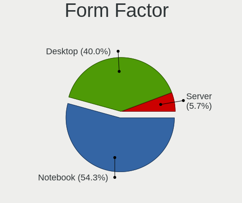
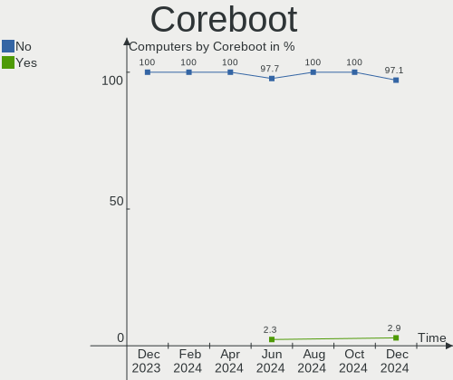
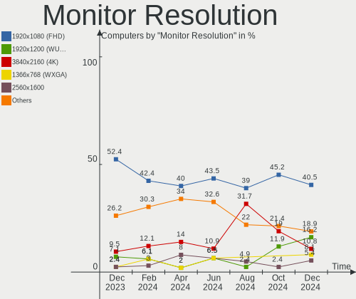
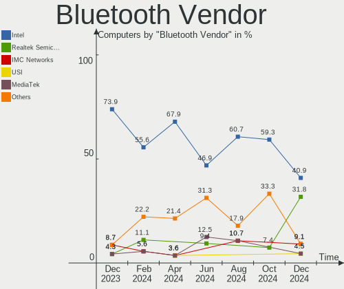
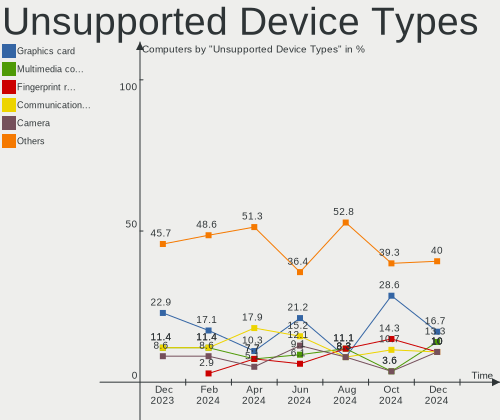

Gentoo Hardware Trends
----------------------

A project to identify most popular hardware characteristics and track their change
over time based on data collected by Gentoo users at https://Linux-Hardware.org.

Anyone can contribute to the study by uploading probes of their computers by
the [hw-probe](https://github.com/linuxhw/hw-probe) tool:

    sudo -E hw-probe -all -upload

This is a report for all computer types. See also reports for [desktops](/Dist/Gentoo/Desktop/README.md) and [notebooks](/Dist/Gentoo/Notebook/README.md).

Full-feature report is available here: https://linux-hardware.org/?view=trends

Period: Jan, 2021.

Contents
--------

- [ OS                       ](#os)
- [ OS Family                ](#os-family)
- [ Kernel                   ](#kernel)
- [ Kernel Family            ](#kernel-family)
- [ Kernel Major Ver.        ](#kernel-major-ver)
- [ Arch                     ](#arch)
- [ DE                       ](#de)
- [ Display Server           ](#display-server)
- [ Display Manager          ](#display-manager)
- [ OS Lang                  ](#os-lang)
- [ Boot Mode                ](#boot-mode)
- [ Filesystem               ](#filesystem)
- [ Part. scheme             ](#part-scheme)
- [ Dual Boot with Linux/BSD ](#dual-boot-with-linux/bsd)
- [ Dual Boot (Win)          ](#dual-boot-win)
- [ Country                  ](#country)
- [ City                     ](#city)
- [ Vendor                   ](#vendor)
- [ Model                    ](#model)
- [ Model Family             ](#model-family)
- [ MFG Year                 ](#mfg-year)
- [ Form Factor              ](#form-factor)
- [ Secure Boot              ](#secure-boot)
- [ Coreboot                 ](#coreboot)
- [ RAM Size                 ](#ram-size)
- [ RAM Used                 ](#ram-used)
- [ Has CD-ROM               ](#has-cd-rom)
- [ Total Drives             ](#total-drives)
- [ Has Ethernet             ](#has-ethernet)
- [ Drive Vendor             ](#drive-vendor)
- [ Drive Model              ](#drive-model)
- [ HDD Vendor               ](#hdd-vendor)
- [ SSD Vendor               ](#ssd-vendor)
- [ Drive Kind               ](#drive-kind)
- [ Drive Connector          ](#drive-connector)
- [ Drive Size               ](#drive-size)
- [ Space Total              ](#space-total)
- [ Space Used               ](#space-used)
- [ Malfunc. Drives          ](#malfunc-drives)
- [ Malfunc. Drive Vendor    ](#malfunc-drive-vendor)
- [ Malfunc. HDD Vendor      ](#malfunc-hdd-vendor)
- [ Malfunc. Drive Kind      ](#malfunc-drive-kind)
- [ Failed Drives            ](#failed-drives)
- [ Failed Drive Vendor      ](#failed-drive-vendor)
- [ Drive Status             ](#drive-status)
- [ Storage Vendor           ](#storage-vendor)
- [ Storage Model            ](#storage-model)
- [ Storage Kind             ](#storage-kind)
- [ CPU Vendor               ](#cpu-vendor)
- [ CPU Model                ](#cpu-model)
- [ CPU Model Family         ](#cpu-model-family)
- [ CPU Cores                ](#cpu-cores)
- [ CPU Sockets              ](#cpu-sockets)
- [ CPU Threads              ](#cpu-threads)
- [ CPU Op-Modes             ](#cpu-op-modes)
- [ CPU Microcode            ](#cpu-microcode)
- [ CPU Microarch            ](#cpu-microarch)
- [ GPU Vendor               ](#gpu-vendor)
- [ GPU Model                ](#gpu-model)
- [ GPU Combo                ](#gpu-combo)
- [ GPU Driver               ](#gpu-driver)
- [ GPU Memory               ](#gpu-memory)
- [ Monitor Vendor           ](#monitor-vendor)
- [ Monitor Model            ](#monitor-model)
- [ Monitor Resolution       ](#monitor-resolution)
- [ Monitor Diagonal         ](#monitor-diagonal)
- [ Monitor Width            ](#monitor-width)
- [ Aspect Ratio             ](#aspect-ratio)
- [ Monitor Area             ](#monitor-area)
- [ Pixel Density            ](#pixel-density)
- [ Multiple Monitors        ](#multiple-monitors)
- [ Net Controller Vendor    ](#net-controller-vendor)
- [ Net Controller Model     ](#net-controller-model)
- [ Wireless Vendor          ](#wireless-vendor)
- [ Wireless Model           ](#wireless-model)
- [ Ethernet Vendor          ](#ethernet-vendor)
- [ Ethernet Model           ](#ethernet-model)
- [ Net Controller Kind      ](#net-controller-kind)
- [ Used Controller          ](#used-controller)
- [ NICs                     ](#nics)
- [ Memory Vendor            ](#memory-vendor)
- [ Memory Model             ](#memory-model)
- [ Memory Kind              ](#memory-kind)
- [ Memory Form Factor       ](#memory-form-factor)
- [ Memory Size              ](#memory-size)
- [ Memory Speed             ](#memory-speed)
- [ Sound Vendor             ](#sound-vendor)
- [ Sound Model              ](#sound-model)
- [ Camera Vendor            ](#camera-vendor)
- [ Camera Model             ](#camera-model)
- [ Fingerprint Vendor       ](#fingerprint-vendor)
- [ Fingerprint Model        ](#fingerprint-model)
- [ Chipcard Vendor          ](#chipcard-vendor)
- [ Chipcard Model           ](#chipcard-model)
- [ Printer Vendor           ](#printer-vendor)
- [ Printer Model            ](#printer-model)
- [ Scanner Vendor           ](#scanner-vendor)
- [ Scanner Model            ](#scanner-model)
- [ Bluetooth Vendor         ](#bluetooth-vendor)
- [ Bluetooth Model          ](#bluetooth-model)
- [ Unsupported Devices      ](#unsupported-devices)
- [ Unsupported Device Types ](#unsupported-device-types)

OS
--

Installed operating systems

| Name       | Computers | Percent |
|------------|-----------|---------|
| Gentoo     | 28        | 56%     |
| Gentoo 2.7 | 21        | 42%     |
| Gentoo 2.1 | 1         | 2%      |

OS Family
---------

OS without a version

| Name   | Computers | Percent |
|--------|-----------|---------|
| Gentoo | 50        | 100%    |

Kernel
------

Version of the Linux kernel

| Version                       | Computers | Percent |
|-------------------------------|-----------|---------|
| 5.4.80-gentoo-r1              | 5         | 10%     |
| 5.10.7-gentoo                 | 4         | 8%      |
| 5.4.80-gentoo-r1-x86_64       | 3         | 6%      |
| 5.10.4-gentoo                 | 3         | 6%      |
| 5.10.2-gentoo                 | 3         | 6%      |
| 5.10.6-gentoo                 | 2         | 4%      |
| 5.10.5-gentoo-mgreene         | 2         | 4%      |
| 5.10.4-gentoo-x86_64          | 2         | 4%      |
| 5.9.8-gentoo-x86_64           | 1         | 2%      |
| 5.9.16-gentoomultilib-nvidia  | 1         | 2%      |
| 5.9.16-gentoo-x86_64          | 1         | 2%      |
| 5.9.16-gentoo                 | 1         | 2%      |
| 5.9.14-gentoo                 | 1         | 2%      |
| 5.9.11-gentoo                 | 1         | 2%      |
| 5.8.2-gentoo                  | 1         | 2%      |
| 5.5.0-gentoo-x86_64           | 1         | 2%      |
| 5.4.80-gentoo-r1fomys         | 1         | 2%      |
| 5.4.80-gentoo-r1-x86          | 1         | 2%      |
| 5.4.66-gentoo-x86_64          | 1         | 2%      |
| 5.4.66-gentoo                 | 1         | 2%      |
| 5.4.48-gentoo-x86_64          | 1         | 2%      |
| 5.2.20-gentoo                 | 1         | 2%      |
| 5.10.9-169.current            | 1         | 2%      |
| 5.10.8-gentoo-x86_64          | 1         | 2%      |
| 5.10.8                        | 1         | 2%      |
| 5.10.6-gentoo-x86_64          | 1         | 2%      |
| 5.10.6-gentoo-mgreene         | 1         | 2%      |
| 5.10.5-gentoo                 | 1         | 2%      |
| 5.10.5                        | 1         | 2%      |
| 5.10.3-gentoo                 | 1         | 2%      |
| 5.10.11-gentoo-x86_64         | 1         | 2%      |
| 5.10.10-gentoo.98-no_firmware | 1         | 2%      |
| 5.10.10-gentoo                | 1         | 2%      |
| 4.19.66-gentoo                | 1         | 2%      |

Kernel Family
-------------

Linux kernel without a distro release

| Version | Computers | Percent |
|---------|-----------|---------|
| 5.4.80  | 10        | 20%     |
| 5.10.4  | 5         | 10%     |
| 5.10.7  | 4         | 8%      |
| 5.10.6  | 4         | 8%      |
| 5.10.5  | 4         | 8%      |
| 5.9.16  | 3         | 6%      |
| 5.10.2  | 3         | 6%      |
| 5.4.66  | 2         | 4%      |
| 5.10.8  | 2         | 4%      |
| 5.10.10 | 2         | 4%      |
| 5.9.8   | 1         | 2%      |
| 5.9.14  | 1         | 2%      |
| 5.9.11  | 1         | 2%      |
| 5.8.2   | 1         | 2%      |
| 5.5.0   | 1         | 2%      |
| 5.4.48  | 1         | 2%      |
| 5.2.20  | 1         | 2%      |
| 5.10.9  | 1         | 2%      |
| 5.10.3  | 1         | 2%      |
| 5.10.11 | 1         | 2%      |
| 4.19.66 | 1         | 2%      |

Kernel Major Ver.
-----------------

Linux kernel major version

| Version | Computers | Percent |
|---------|-----------|---------|
| 5.10    | 27        | 54%     |
| 5.4     | 13        | 26%     |
| 5.9     | 6         | 12%     |
| 5.8     | 1         | 2%      |
| 5.5     | 1         | 2%      |
| 5.2     | 1         | 2%      |
| 4.19    | 1         | 2%      |

Arch
----

OS architecture (x86_64, i586, etc.)

| Name   | Computers | Percent |
|--------|-----------|---------|
| x86_64 | 49        | 98%     |
| i686   | 1         | 2%      |

DE
--

Desktop Environment

| Name           | Computers | Percent |
|----------------|-----------|---------|
| Unknown        | 17        | 34%     |
| GNOME          | 11        | 22%     |
| KDE5           | 8         | 16%     |
| XFCE           | 7         | 14%     |
| KDE            | 3         | 6%      |
| XSession       | 1         | 2%      |
| X-Cinnamon     | 1         | 2%      |
| i3-with-shmlog | 1         | 2%      |
| DWM            | 1         | 2%      |

Display Server
--------------

X11 or Wayland

| Name    | Computers | Percent |
|---------|-----------|---------|
| X11     | 28        | 56%     |
| Unknown | 12        | 24%     |
| Tty     | 8         | 16%     |
| Wayland | 2         | 4%      |

Display Manager
---------------

SDDM, LightDM, etc.

| Name    | Computers | Percent |
|---------|-----------|---------|
| Unknown | 23        | 46%     |
| SDDM    | 10        | 20%     |
| LightDM | 7         | 14%     |
| GDM     | 5         | 10%     |
| SLiM    | 2         | 4%      |
| XDM     | 1         | 2%      |
| LXDM    | 1         | 2%      |
| KDM     | 1         | 2%      |

OS Lang
-------

Language

| Lang    | Computers | Percent |
|---------|-----------|---------|
| en_US   | 27        | 54%     |
| en_CA   | 4         | 8%      |
| de_DE   | 4         | 8%      |
| pl_PL   | 2         | 4%      |
| en_GB   | 2         | 4%      |
| C.UTF8  | 2         | 4%      |
| POSIX   | 1         | 2%      |
| ja_JP   | 1         | 2%      |
| fr_FR   | 1         | 2%      |
| fr_BE   | 1         | 2%      |
| en_FR   | 1         | 2%      |
| en_AU   | 1         | 2%      |
| de_CH   | 1         | 2%      |
| C       | 1         | 2%      |
| Unknown | 1         | 2%      |

Boot Mode
---------

EFI or BIOS

| Mode | Computers | Percent |
|------|-----------|---------|
| EFI  | 38        | 76%     |
| BIOS | 12        | 24%     |

Filesystem
----------

Type of filesystem

| Type  | Computers | Percent |
|-------|-----------|---------|
| Ext4  | 33        | 66%     |
| Btrfs | 11        | 22%     |
| Xfs   | 4         | 8%      |
| Zfs   | 1         | 2%      |
| Jfs   | 1         | 2%      |

Part. scheme
------------

Scheme of partitioning

| Type    | Computers | Percent |
|---------|-----------|---------|
| GPT     | 41        | 82%     |
| Unknown | 5         | 10%     |
| MBR     | 4         | 8%      |

Dual Boot with Linux/BSD
------------------------

Hosting more than one Linux/BSD

| Dual boot | Computers | Percent |
|-----------|-----------|---------|
| No        | 42        | 84%     |
| Yes       | 8         | 16%     |

Dual Boot (Win)
---------------

Hosting Linux and Windows

| Dual boot | Computers | Percent |
|-----------|-----------|---------|
| No        | 35        | 70%     |
| Yes       | 15        | 30%     |

Country
-------

Geographic location (country)

| Country        | Computers | Percent |
|----------------|-----------|---------|
| USA            | 10        | 20%     |
| Germany        | 5         | 10%     |
| Belgium        | 5         | 10%     |
| Canada         | 4         | 8%      |
| Slovakia       | 3         | 6%      |
| Poland         | 3         | 6%      |
| Ukraine        | 2         | 4%      |
| Netherlands    | 2         | 4%      |
| Greece         | 2         | 4%      |
| France         | 2         | 4%      |
| UK             | 1         | 2%      |
| Turkey         | 1         | 2%      |
| Switzerland    | 1         | 2%      |
| Spain          | 1         | 2%      |
| Japan          | 1         | 2%      |
| Italy          | 1         | 2%      |
| Czech Republic | 1         | 2%      |
| China          | 1         | 2%      |
| Bulgaria       | 1         | 2%      |
| Belarus        | 1         | 2%      |
| Austria        | 1         | 2%      |
| Australia      | 1         | 2%      |

City
----

Geographic location (city)

| City              | Computers | Percent |
|-------------------|-----------|---------|
| Suffolk           | 3         | 6%      |
| Bratislava        | 3         | 6%      |
| Antwerp           | 3         | 6%      |
| Toronto           | 2         | 4%      |
| Geldermalsen      | 2         | 4%      |
| Bainbridge Island | 2         | 4%      |
| Wrocław          | 1         | 2%      |
| Wrentham          | 1         | 2%      |
| Windischgarsten   | 1         | 2%      |
| Waldems           | 1         | 2%      |
| Virginia Beach    | 1         | 2%      |
| Verona            | 1         | 2%      |
| Toulouse          | 1         | 2%      |
| Thessaloniki      | 1         | 2%      |
| Sofia             | 1         | 2%      |
| Sevastopol        | 1         | 2%      |
| Seattle           | 1         | 2%      |
| Sanford           | 1         | 2%      |
| Prague            | 1         | 2%      |
| Oberried          | 1         | 2%      |
| Neuenstein        | 1         | 2%      |
| Munich            | 1         | 2%      |
| Minsk             | 1         | 2%      |
| Meguro-ku         | 1         | 2%      |
| Madrid            | 1         | 2%      |
| Leuven            | 1         | 2%      |
| Kyiv              | 1         | 2%      |
| Kloten            | 1         | 2%      |
| Istanbul          | 1         | 2%      |
| Irvine            | 1         | 2%      |
| Hamilton          | 1         | 2%      |
| Ghent             | 1         | 2%      |
| Falkenstein       | 1         | 2%      |
| Colomiers         | 1         | 2%      |
| Cieszyn           | 1         | 2%      |
| Calgary           | 1         | 2%      |
| Brisbane          | 1         | 2%      |
| Bialystok         | 1         | 2%      |
| Belfast           | 1         | 2%      |
| Beijing           | 1         | 2%      |
| Athens            | 1         | 2%      |

Vendor
------

Motherboard manufacturer

| Name                | Computers | Percent |
|---------------------|-----------|---------|
| ASUSTek Computer    | 12        | 24%     |
| Lenovo              | 9         | 18%     |
| ASRock              | 8         | 16%     |
| Hewlett-Packard     | 7         | 14%     |
| MSI                 | 4         | 8%      |
| Gigabyte Technology | 4         | 8%      |
| IT Channel Pty      | 1         | 2%      |
| Intel               | 1         | 2%      |
| Google              | 1         | 2%      |
| Dell                | 1         | 2%      |
| Chuwi               | 1         | 2%      |
| Unknown             | 1         | 2%      |

Model
-----

Motherboard model

| Name                                 | Computers | Percent |
|--------------------------------------|-----------|---------|
| Unknown                              | 2         | 4%      |
| MSI MS-7C91                          | 1         | 2%      |
| MSI MS-7C34                          | 1         | 2%      |
| MSI MS-7971                          | 1         | 2%      |
| MSI MS-7640                          | 1         | 2%      |
| Lenovo Yoga C930-13IKB 81C4          | 1         | 2%      |
| Lenovo XiaoXin-15ARE 2020 81YR       | 1         | 2%      |
| Lenovo ThinkPad T480 20L5CTO1WW      | 1         | 2%      |
| Lenovo ThinkPad T480 20L5000WUS      | 1         | 2%      |
| Lenovo ThinkPad T14 Gen 1 20UD0010RT | 1         | 2%      |
| Lenovo ThinkPad P73 20QRCTO1WW       | 1         | 2%      |
| Lenovo ThinkPad A485 20MUCTO1WW      | 1         | 2%      |
| Lenovo Legion Y530-15ICH-1060 81LB   | 1         | 2%      |
| Lenovo IdeaPad Gaming 3 15ARH05 82EY | 1         | 2%      |
| IT Channel Pty PA70ES                | 1         | 2%      |
| Intel NUC7PJYH                       | 1         | 2%      |
| HP ZBook 15 G4                       | 1         | 2%      |
| HP Z820 Workstation                  | 1         | 2%      |
| HP Pavilion Notebook                 | 1         | 2%      |
| HP Pavilion Gaming Laptop 15-ec1xxx  | 1         | 2%      |
| HP Pavilion dm1                      | 1         | 2%      |
| HP Compaq 8200 Elite SFF PC          | 1         | 2%      |
| Google Peppy                         | 1         | 2%      |
| Gigabyte Z170X-Gaming 3              | 1         | 2%      |
| Gigabyte X570 I AORUS PRO WIFI       | 1         | 2%      |
| Gigabyte GB-BACE-3000                | 1         | 2%      |
| Gigabyte B450M DS3H                  | 1         | 2%      |
| Dell G3 3500                         | 1         | 2%      |
| Chuwi UBook Pro                      | 1         | 2%      |
| ASUS X555LJ                          | 1         | 2%      |
| ASUS TUF GAMING X570-PLUS            | 1         | 2%      |
| ASUS ROG ZENITH II EXTREME           | 1         | 2%      |
| ASUS ROG STRIX X570-I GAMING         | 1         | 2%      |
| ASUS ROG STRIX B550-F GAMING         | 1         | 2%      |
| ASUS ROG Maximus XII HERO            | 1         | 2%      |
| ASUS ROG Maximus XI HERO             | 1         | 2%      |
| ASUS PRIME X570-P                    | 1         | 2%      |
| ASUS PRIME B460-PLUS                 | 1         | 2%      |
| ASUS P8H67-M PRO                     | 1         | 2%      |
| ASUS P5Q-E                           | 1         | 2%      |
| ASUS A7V                             | 1         | 2%      |
| ASRock X570 Steel Legend             | 1         | 2%      |
| ASRock X370 Gaming X                 | 1         | 2%      |
| ASRock Q1900-ITX                     | 1         | 2%      |
| ASRock J3455-ITX                     | 1         | 2%      |
| ASRock B550M Steel Legend            | 1         | 2%      |
| ASRock B450 Pro4                     | 1         | 2%      |
| ASRock AB350M Pro4                   | 1         | 2%      |
| ASRock 970 Pro3 R2.0                 | 1         | 2%      |

Model Family
------------

Motherboard model prefix

| Name                  | Computers | Percent |
|-----------------------|-----------|---------|
| Lenovo ThinkPad       | 5         | 10%     |
| ASUS ROG              | 5         | 10%     |
| HP Pavilion           | 3         | 6%      |
| ASUS PRIME            | 2         | 4%      |
| Unknown               | 2         | 4%      |
| MSI MS-7C91           | 1         | 2%      |
| MSI MS-7C34           | 1         | 2%      |
| MSI MS-7971           | 1         | 2%      |
| MSI MS-7640           | 1         | 2%      |
| Lenovo Yoga           | 1         | 2%      |
| Lenovo XiaoXin-15ARE  | 1         | 2%      |
| Lenovo Legion         | 1         | 2%      |
| Lenovo IdeaPad        | 1         | 2%      |
| IT Channel Pty PA70ES | 1         | 2%      |
| Intel NUC7PJYH        | 1         | 2%      |
| HP ZBook              | 1         | 2%      |
| HP Z820               | 1         | 2%      |
| HP Compaq             | 1         | 2%      |
| Google Peppy          | 1         | 2%      |
| Gigabyte Z170X-Gaming | 1         | 2%      |
| Gigabyte X570         | 1         | 2%      |
| Gigabyte GB-BACE-3000 | 1         | 2%      |
| Gigabyte B450M        | 1         | 2%      |
| Dell G3               | 1         | 2%      |
| Chuwi UBook           | 1         | 2%      |
| ASUS X555LJ           | 1         | 2%      |
| ASUS TUF              | 1         | 2%      |
| ASUS P8H67-M          | 1         | 2%      |
| ASUS P5Q-E            | 1         | 2%      |
| ASUS A7V              | 1         | 2%      |
| ASRock X570           | 1         | 2%      |
| ASRock X370           | 1         | 2%      |
| ASRock Q1900-ITX      | 1         | 2%      |
| ASRock J3455-ITX      | 1         | 2%      |
| ASRock B550M          | 1         | 2%      |
| ASRock B450           | 1         | 2%      |
| ASRock AB350M         | 1         | 2%      |
| ASRock 970            | 1         | 2%      |

MFG Year
--------

Motherboard manufacture year

| Year | Computers | Percent |
|------|-----------|---------|
| 2020 | 24        | 48%     |
| 2019 | 9         | 18%     |
| 2018 | 9         | 18%     |
| 2011 | 3         | 6%      |
| 2015 | 2         | 4%      |
| 2016 | 1         | 2%      |
| 2009 | 1         | 2%      |
| 2005 | 1         | 2%      |

Form Factor
-----------

Physical design of the computer

| Name        | Computers | Percent |
|-------------|-----------|---------|
| Desktop     | 28        | 56%     |
| Notebook    | 20        | 40%     |
| Convertible | 1         | 2%      |
| Mini pc     | 1         | 2%      |

Secure Boot
-----------

Enabled or disabled

| State    | Computers | Percent |
|----------|-----------|---------|
| Disabled | 50        | 100%    |

Coreboot
--------

Have coreboot on board

| Used | Computers | Percent |
|------|-----------|---------|
| No   | 49        | 98%     |
| Yes  | 1         | 2%      |

RAM Size
--------

Total RAM memory

| Size in GB  | Computers | Percent |
|-------------|-----------|---------|
| 32.01-64.0  | 16        | 32%     |
| 16.01-24.0  | 9         | 18%     |
| 64.01-256.0 | 7         | 14%     |
| 4.01-8.0    | 6         | 12%     |
| 8.01-16.0   | 6         | 12%     |
| 3.01-4.0    | 2         | 4%      |
| 24.01-32.0  | 2         | 4%      |
| 1.01-2.0    | 1         | 2%      |
| 0.01-0.5    | 1         | 2%      |

RAM Used
--------

Used RAM memory

| Used GB    | Computers | Percent |
|------------|-----------|---------|
| 1.01-2.0   | 11        | 22%     |
| 4.01-8.0   | 10        | 20%     |
| 3.01-4.0   | 8         | 16%     |
| 8.01-16.0  | 7         | 14%     |
| 0.01-0.5   | 7         | 14%     |
| 2.01-3.0   | 6         | 12%     |
| 32.01-64.0 | 1         | 2%      |

Has CD-ROM
----------

Has CD-ROM on board

| Presented | Computers | Percent |
|-----------|-----------|---------|
| No        | 39        | 78%     |
| Yes       | 11        | 22%     |

Total Drives
------------

Number of drives on board

| Drives | Computers | Percent |
|--------|-----------|---------|
| 1      | 21        | 42%     |
| 2      | 17        | 34%     |
| 3      | 6         | 12%     |
| 4      | 3         | 6%      |
| 6      | 2         | 4%      |
| 5      | 1         | 2%      |

Has Ethernet
------------

Has Ethernet on board

| Presented | Computers | Percent |
|-----------|-----------|---------|
| Yes       | 45        | 90%     |
| No        | 5         | 10%     |

Drive Vendor
------------

Hard drive vendors

| Vendor              | Computers | Drives | Percent |
|---------------------|-----------|--------|---------|
| Samsung Electronics | 21        | 24     | 25.93%  |
| WDC                 | 16        | 19     | 19.75%  |
| Seagate             | 14        | 20     | 17.28%  |
| Toshiba             | 4         | 5      | 4.94%   |
| Kingston            | 4         | 5      | 4.94%   |
| HGST                | 3         | 5      | 3.7%    |
| SanDisk             | 2         | 2      | 2.47%   |
| Intel               | 2         | 2      | 2.47%   |
| Corsair             | 2         | 3      | 2.47%   |
| A-DATA Technology   | 2         | 3      | 2.47%   |
| Unknown             | 1         | 1      | 1.23%   |
| Team                | 1         | 1      | 1.23%   |
| SK Hynix            | 1         | 1      | 1.23%   |
| ShanDianZhe         | 1         | 1      | 1.23%   |
| Netac               | 1         | 1      | 1.23%   |
| MyDigitalSSD        | 1         | 1      | 1.23%   |
| KIOXIA              | 1         | 1      | 1.23%   |
| Kingchuxing         | 1         | 1      | 1.23%   |
| Hitachi             | 1         | 1      | 1.23%   |
| GOODRAM             | 1         | 1      | 1.23%   |
| Crucial             | 1         | 2      | 1.23%   |

Drive Model
-----------

Hard drive models

| Model                                       | Computers | Percent |
|---------------------------------------------|-----------|---------|
| WDC WD20EFRX-68EUZN0 2TB                    | 2         | 2.27%   |
| Seagate ST2000DM006-2DM164 2TB              | 2         | 2.27%   |
| Samsung SSD 970 EVO 1TB                     | 2         | 2.27%   |
| Samsung SSD 850 EVO 250GB                   | 2         | 2.27%   |
| Samsung NVMe SSD Drive 500GB                | 2         | 2.27%   |
| WDC WDS512G1X0C-00ENX0 512GB                | 1         | 1.14%   |
| WDC WDS500G3X0C-00SJG0 500GB                | 1         | 1.14%   |
| WDC WDS500G2B0C-00PXH0 500GB                | 1         | 1.14%   |
| WDC WDS500G2B0A-00SM50 500GB SSD            | 1         | 1.14%   |
| WDC WDS480G2G0B-00EPW0 480GB SSD            | 1         | 1.14%   |
| WDC WDS240G2G0A-00JH30 240GB SSD            | 1         | 1.14%   |
| WDC WDS100T3X0C-00SJG0 1TB                  | 1         | 1.14%   |
| WDC WD5002ABYS-02B1B0 500GB                 | 1         | 1.14%   |
| WDC WD5000LPLX-08ZNTT0 500GB                | 1         | 1.14%   |
| WDC WD5000BPVT-22HXZT3 500GB                | 1         | 1.14%   |
| WDC WD5000BEVT-80A0RT0 500GB                | 1         | 1.14%   |
| WDC WD3200BPVT-22JJ5T0 320GB                | 1         | 1.14%   |
| WDC WD20EZRZ-00Z5HB0 2TB                    | 1         | 1.14%   |
| WDC WD20EZRX-00D8PB0 2TB                    | 1         | 1.14%   |
| WDC WD10EADS-00L5B1 1TB                     | 1         | 1.14%   |
| WDC WD1003FZEX-00MK2A0 1TB                  | 1         | 1.14%   |
| Unknown ED4QT  128GB                        | 1         | 1.14%   |
| Toshiba THNSNX032GMCT 32GB SSD              | 1         | 1.14%   |
| Toshiba RC100 240GB                         | 1         | 1.14%   |
| Toshiba MQ01ACF050 500GB                    | 1         | 1.14%   |
| Toshiba HDWR180 8TB                         | 1         | 1.14%   |
| Team TM8FP2240G 240GB                       | 1         | 1.14%   |
| SK Hynix HFS512GD9TNG-62A0A 512GB           | 1         | 1.14%   |
| ShanDianZhe SSD 512GB                       | 1         | 1.14%   |
| Seagate ST8000NM0055-1RM112 8TB             | 1         | 1.14%   |
| Seagate ST500LM030-2E717D 500GB             | 1         | 1.14%   |
| Seagate ST500DM002-1BD142 500GB             | 1         | 1.14%   |
| Seagate ST4000VN008-2DR166 4TB              | 1         | 1.14%   |
| Seagate ST4000NM0245-1Z2107 4TB             | 1         | 1.14%   |
| Seagate ST2000LX001-1RG174 2TB              | 1         | 1.14%   |
| Seagate ST2000LM007-1R8174 2TB              | 1         | 1.14%   |
| Seagate ST2000DM001-1ER164 2TB              | 1         | 1.14%   |
| Seagate ST1000LM024 HN-M101MBB 1TB          | 1         | 1.14%   |
| Seagate ST1000LM014-1EJ164 1TB              | 1         | 1.14%   |
| Seagate ST1000DM003-1ER162 1TB              | 1         | 1.14%   |
| Seagate ST1000DM003-1CH162 1TB              | 1         | 1.14%   |
| Seagate FireCuda 520 SSD ZP500GM30002 500GB | 1         | 1.14%   |
| SanDisk SSD G5 BICS4 1TB                    | 1         | 1.14%   |
| SanDisk SDSSDH3 1T00 1TB                    | 1         | 1.14%   |
| Samsung SSD 970 EVO 500GB                   | 1         | 1.14%   |
| Samsung SSD 970 EVO 250GB                   | 1         | 1.14%   |
| Samsung SSD 960 EVO 500GB                   | 1         | 1.14%   |
| Samsung SSD 860 QVO 4TB                     | 1         | 1.14%   |
| Samsung SSD 860 EVO 500GB                   | 1         | 1.14%   |
| Samsung SSD 860 EVO 2TB                     | 1         | 1.14%   |
| Samsung SSD 860 EVO 1TB                     | 1         | 1.14%   |
| Samsung SSD 850 EVO 500GB                   | 1         | 1.14%   |
| Samsung SSD 850 EVO 1TB                     | 1         | 1.14%   |
| Samsung Portable SSD T5 500GB               | 1         | 1.14%   |
| Samsung PM991 NVMe 512GB                    | 1         | 1.14%   |
| Samsung NVMe SSD Drive 512GB                | 1         | 1.14%   |
| Samsung MZVLW512HMJP-000H7 512GB            | 1         | 1.14%   |
| Samsung MZVLB512HBJQ-000L2 512GB            | 1         | 1.14%   |
| Samsung MZVLB2T0HALB-000L7 2TB              | 1         | 1.14%   |
| Samsung MZVLB256HBHQ-000L7 256GB            | 1         | 1.14%   |

HDD Vendor
----------

Hard disk drive vendors

| Vendor  | Computers | Drives | Percent |
|---------|-----------|--------|---------|
| Seagate | 13        | 19     | 44.83%  |
| WDC     | 10        | 12     | 34.48%  |
| HGST    | 3         | 5      | 10.34%  |
| Toshiba | 2         | 3      | 6.9%    |
| Hitachi | 1         | 1      | 3.45%   |

SSD Vendor
----------

Solid state drive vendors

| Vendor              | Computers | Drives | Percent |
|---------------------|-----------|--------|---------|
| Samsung Electronics | 8         | 9      | 36.36%  |
| WDC                 | 3         | 3      | 13.64%  |
| SanDisk             | 2         | 2      | 9.09%   |
| Kingston            | 2         | 2      | 9.09%   |
| Toshiba             | 1         | 1      | 4.55%   |
| ShanDianZhe         | 1         | 1      | 4.55%   |
| Netac               | 1         | 1      | 4.55%   |
| MyDigitalSSD        | 1         | 1      | 4.55%   |
| GOODRAM             | 1         | 1      | 4.55%   |
| Crucial             | 1         | 2      | 4.55%   |
| A-DATA Technology   | 1         | 1      | 4.55%   |

Drive Kind
----------

HDD or SSD

| Kind | Computers | Drives | Percent |
|------|-----------|--------|---------|
| NVMe | 28        | 35     | 38.36%  |
| HDD  | 25        | 40     | 34.25%  |
| SSD  | 19        | 24     | 26.03%  |
| MMC  | 1         | 1      | 1.37%   |

Drive Connector
---------------

SATA, SAS, NVMe, etc.

| Type | Computers | Drives | Percent |
|------|-----------|--------|---------|
| SATA | 38        | 63     | 55.88%  |
| NVMe | 28        | 35     | 41.18%  |
| SAS  | 1         | 1      | 1.47%   |
| MMC  | 1         | 1      | 1.47%   |

Drive Size
----------

Size of hard drive

| Size in TB | Computers | Drives | Percent |
|------------|-----------|--------|---------|
| 0.01-0.5   | 20        | 24     | 44.44%  |
| 1.01-2.0   | 10        | 12     | 22.22%  |
| 0.51-1.0   | 9         | 16     | 20%     |
| 3.01-4.0   | 4         | 7      | 8.89%   |
| 10.01-20.0 | 1         | 1      | 2.22%   |
| 4.01-10.0  | 1         | 4      | 2.22%   |

Space Total
-----------

Amount of disk space available on the file system

| Size in GB     | Computers | Percent |
|----------------|-----------|---------|
| 101-250        | 10        | 20%     |
| More than 3000 | 9         | 18%     |
| 251-500        | 9         | 18%     |
| 1001-2000      | 6         | 12%     |
| 21-50          | 5         | 10%     |
| 501-1000       | 5         | 10%     |
| 2001-3000      | 3         | 6%      |
| Unknown        | 2         | 4%      |
| 51-100         | 1         | 2%      |

Space Used
----------

Amount of used disk space

| Used GB        | Computers | Percent |
|----------------|-----------|---------|
| 101-250        | 9         | 18%     |
| 1-20           | 8         | 16%     |
| 1001-2000      | 7         | 14%     |
| 251-500        | 6         | 12%     |
| 51-100         | 6         | 12%     |
| 501-1000       | 4         | 8%      |
| More than 3000 | 3         | 6%      |
| 21-50          | 3         | 6%      |
| 2001-3000      | 2         | 4%      |
| Unknown        | 2         | 4%      |

Malfunc. Drives
---------------

Drive models with a malfunction

| Model                               | Computers | Drives | Percent |
|-------------------------------------|-----------|--------|---------|
| WDC WD1003FZEX-00MK2A0 1TB          | 1         | 1      | 25%     |
| Seagate ST500DM002-1BD142 500GB     | 1         | 1      | 25%     |
| Seagate ST1000LM024 HN-M101MBB 1TB  | 1         | 1      | 25%     |
| Samsung Electronics SSD 850 EVO 1TB | 1         | 1      | 25%     |

Malfunc. Drive Vendor
---------------------

Vendors of faulty drives

| Vendor              | Computers | Drives | Percent |
|---------------------|-----------|--------|---------|
| Seagate             | 2         | 2      | 50%     |
| WDC                 | 1         | 1      | 25%     |
| Samsung Electronics | 1         | 1      | 25%     |

Malfunc. HDD Vendor
-------------------

Vendors of faulty HDD drives

| Vendor  | Computers | Drives | Percent |
|---------|-----------|--------|---------|
| Seagate | 2         | 2      | 66.67%  |
| WDC     | 1         | 1      | 33.33%  |

Malfunc. Drive Kind
-------------------

Kinds of faulty drives

| Kind | Computers | Drives | Percent |
|------|-----------|--------|---------|
| HDD  | 3         | 3      | 75%     |
| SSD  | 1         | 1      | 25%     |

Failed Drives
-------------

Failed drive models

Zero info for selected period =(

Failed Drive Vendor
-------------------

Failed drive vendors

Zero info for selected period =(

Drive Status
------------

Number of failed and malfunc. drives

| Status   | Computers | Drives | Percent |
|----------|-----------|--------|---------|
| Works    | 44        | 83     | 78.57%  |
| Detected | 8         | 13     | 14.29%  |
| Malfunc  | 4         | 4      | 7.14%   |

Storage Vendor
--------------

Storage controller vendors

| Vendor                       | Computers | Percent |
|------------------------------|-----------|---------|
| Intel                        | 28        | 32.56%  |
| AMD                          | 21        | 24.42%  |
| Samsung Electronics          | 13        | 15.12%  |
| ASMedia Technology           | 5         | 5.81%   |
| Sandisk                      | 4         | 4.65%   |
| Phison Electronics           | 3         | 3.49%   |
| Kingston Technology Company  | 2         | 2.33%   |
| ADATA Technology             | 2         | 2.33%   |
| Toshiba America Info Systems | 1         | 1.16%   |
| SK Hynix                     | 1         | 1.16%   |
| Silicon Motion               | 1         | 1.16%   |
| Seagate Technology           | 1         | 1.16%   |
| LSI Logic / Symbios Logic    | 1         | 1.16%   |
| KIOXIA                       | 1         | 1.16%   |
| JMicron Technology           | 1         | 1.16%   |
| Broadcom / LSI               | 1         | 1.16%   |

Storage Model
-------------

Storage controller models

| Model                                                                            | Computers | Percent |
|----------------------------------------------------------------------------------|-----------|---------|
| AMD FCH SATA Controller [AHCI mode]                                              | 14        | 15.05%  |
| Samsung NVMe SSD Controller SM981/PM981/PM983                                    | 8         | 8.6%    |
| ASMedia ASM1062 Serial ATA Controller                                            | 5         | 5.38%   |
| Samsung Electronics Non-Volatile memory controller                               | 3         | 3.23%   |
| Intel Sunrise Point-LP SATA Controller [AHCI mode]                               | 3         | 3.23%   |
| Intel Q170/Q150/B150/H170/H110/Z170/CM236 Chipset SATA Controller [AHCI Mode]    | 3         | 3.23%   |
| Intel 400 Series Chipset Family SATA AHCI Controller                             | 3         | 3.23%   |
| AMD SATA controller                                                              | 3         | 3.23%   |
| Samsung NVMe SSD Controller SM961/PM961/SM963                                    | 2         | 2.15%   |
| Kingston Company A2000 NVMe SSD                                                  | 2         | 2.15%   |
| Intel Wildcat Point-LP SATA Controller [AHCI Mode]                               | 2         | 2.15%   |
| Intel Celeron/Pentium Silver Processor SATA Controller                           | 2         | 2.15%   |
| Intel Cannon Lake Mobile PCH SATA AHCI Controller                                | 2         | 2.15%   |
| Intel 6 Series/C200 Series Chipset Family 6 port Desktop SATA AHCI Controller    | 2         | 2.15%   |
| AMD SB7x0/SB8x0/SB9x0 SATA Controller [AHCI mode]                                | 2         | 2.15%   |
| AMD 400 Series Chipset SATA Controller                                           | 2         | 2.15%   |
| ADATA XPG SX8200 Pro PCIe Gen3x4 M.2 2280 Solid State Drive                      | 2         | 2.15%   |
| Toshiba America Info Systems BG3 NVMe SSD Controller                             | 1         | 1.08%   |
| SK Hynix PC401 NVMe Solid State Drive 256GB                                      | 1         | 1.08%   |
| Silicon Motion SM2263EN/SM2263XT SSD Controller                                  | 1         | 1.08%   |
| Seagate Non-Volatile memory controller                                           | 1         | 1.08%   |
| Sandisk WD Blue SN550 NVMe SSD                                                   | 1         | 1.08%   |
| Sandisk WD Black SN750 / PC SN730 NVMe SSD                                       | 1         | 1.08%   |
| Sandisk WD Black NVMe SSD                                                        | 1         | 1.08%   |
| Sandisk WD Black 2018 / PC SN720 NVMe SSD                                        | 1         | 1.08%   |
| Phison E7 NVMe Controller                                                        | 1         | 1.08%   |
| Phison E16 PCIe4 NVMe Controller                                                 | 1         | 1.08%   |
| Phison E12 NVMe Controller                                                       | 1         | 1.08%   |
| LSI Logic / Symbios Logic MegaRAID SAS 2108 [Liberator]                          | 1         | 1.08%   |
| KIOXIA Non-Volatile memory controller                                            | 1         | 1.08%   |
| JMicron JMB362 SATA Controller                                                   | 1         | 1.08%   |
| Intel SSD Pro 7600p/760p/E 6100p Series                                          | 1         | 1.08%   |
| Intel SSD 660P Series                                                            | 1         | 1.08%   |
| Intel Celeron N3350/Pentium N4200/Atom E3900 Series SATA AHCI Controller         | 1         | 1.08%   |
| Intel Cannon Lake PCH SATA AHCI Controller                                       | 1         | 1.08%   |
| Intel C602 chipset 4-Port SATA Storage Control Unit                              | 1         | 1.08%   |
| Intel C600/X79 series chipset SATA RAID Controller                               | 1         | 1.08%   |
| Intel C600/X79 series chipset IDE-r Controller                                   | 1         | 1.08%   |
| Intel Atom/Celeron/Pentium Processor x5-E8000/J3xxx/N3xxx Series SATA Controller | 1         | 1.08%   |
| Intel Atom Processor E3800 Series SATA AHCI Controller                           | 1         | 1.08%   |
| Intel 82801JI (ICH10 Family) SATA AHCI Controller                                | 1         | 1.08%   |
| Intel 82801HM/HEM (ICH8M/ICH8M-E) SATA Controller [AHCI mode]                    | 1         | 1.08%   |
| Intel 82801HM/HEM (ICH8M/ICH8M-E) IDE Controller                                 | 1         | 1.08%   |
| Intel 82801FB/FBM/FR/FW/FRW (ICH6 Family) IDE Controller                         | 1         | 1.08%   |
| Intel 8 Series SATA Controller 1 [AHCI mode]                                     | 1         | 1.08%   |
| Broadcom / LSI SAS2308 PCI-Express Fusion-MPT SAS-2                              | 1         | 1.08%   |
| AMD X370 Series Chipset SATA Controller                                          | 1         | 1.08%   |
| AMD SB7x0/SB8x0/SB9x0 SATA Controller [IDE mode]                                 | 1         | 1.08%   |
| AMD SB7x0/SB8x0/SB9x0 IDE Controller                                             | 1         | 1.08%   |
| AMD 300 Series Chipset SATA Controller                                           | 1         | 1.08%   |

Storage Kind
------------

Kind of storage controller (IDE, SATA, NVMe, SAS, ...)

| Kind | Computers | Percent |
|------|-----------|---------|
| SATA | 45        | 56.25%  |
| NVMe | 28        | 35%     |
| IDE  | 4         | 5%      |
| RAID | 2         | 2.5%    |
| SAS  | 1         | 1.25%   |

CPU Vendor
----------

Processor vendors

| Vendor | Computers | Percent |
|--------|-----------|---------|
| Intel  | 28        | 56%     |
| AMD    | 22        | 44%     |

CPU Model
---------

Processor models

| Model                                           | Computers | Percent |
|-------------------------------------------------|-----------|---------|
| AMD Ryzen 9 3900X 12-Core Processor             | 3         | 6%      |
| AMD Ryzen 5 5600X 6-Core Processor              | 3         | 6%      |
| Intel Core i7-8750H CPU @ 2.20GHz               | 2         | 4%      |
| Intel Core i7-8550U CPU @ 1.80GHz               | 2         | 4%      |
| Intel Core i7-2600 CPU @ 3.40GHz                | 2         | 4%      |
| Intel Core i5-6500 CPU @ 3.20GHz                | 2         | 4%      |
| AMD Ryzen 7 3800X 8-Core Processor              | 2         | 4%      |
| AMD Ryzen 7 3700X 8-Core Processor              | 2         | 4%      |
| Intel Xeon CPU X5470 @ 3.33GHz                  | 1         | 2%      |
| Intel Xeon CPU E5-2690 0 @ 2.90GHz              | 1         | 2%      |
| Intel Pentium Silver J5005 CPU @ 1.50GHz        | 1         | 2%      |
| Intel Pentium M processor 1.73GHz               | 1         | 2%      |
| Intel Core m3-8100Y CPU @ 1.10GHz               | 1         | 2%      |
| Intel Core i9-9880H CPU @ 2.30GHz               | 1         | 2%      |
| Intel Core i7-8700K CPU @ 3.70GHz               | 1         | 2%      |
| Intel Core i7-7820HQ CPU @ 2.90GHz              | 1         | 2%      |
| Intel Core i7-5500U CPU @ 2.40GHz               | 1         | 2%      |
| Intel Core i7-10700K CPU @ 3.80GHz              | 1         | 2%      |
| Intel Core i5-8250U CPU @ 1.60GHz               | 1         | 2%      |
| Intel Core i5-5200U CPU @ 2.20GHz               | 1         | 2%      |
| Intel Core i5-10600KF CPU @ 4.10GHz             | 1         | 2%      |
| Intel Core i5-10300H CPU @ 2.50GHz              | 1         | 2%      |
| Intel Core 2 Duo CPU T7500 @ 2.20GHz            | 1         | 2%      |
| Intel Celeron J4115 CPU @ 1.80GHz               | 1         | 2%      |
| Intel Celeron CPU N3000 @ 1.04GHz               | 1         | 2%      |
| Intel Celeron CPU J3455 @ 1.50GHz               | 1         | 2%      |
| Intel Celeron CPU J1900 @ 1.99GHz               | 1         | 2%      |
| Intel Celeron 2955U @ 1.40GHz                   | 1         | 2%      |
| AMD Ryzen Threadripper 3960X 24-Core Processor  | 1         | 2%      |
| AMD Ryzen 9 3950X 16-Core Processor             | 1         | 2%      |
| AMD Ryzen 7 PRO 2700U w/ Radeon Vega Mobile Gfx | 1         | 2%      |
| AMD Ryzen 7 4800U with Radeon Graphics          | 1         | 2%      |
| AMD Ryzen 7 4800H with Radeon Graphics          | 1         | 2%      |
| AMD Ryzen 5 PRO 4650U with Radeon Graphics      | 1         | 2%      |
| AMD Ryzen 5 4600H with Radeon Graphics          | 1         | 2%      |
| AMD Ryzen 5 3600 6-Core Processor               | 1         | 2%      |
| AMD Ryzen 5 1600 Six-Core Processor             | 1         | 2%      |
| AMD FX-8150 Eight-Core Processor                | 1         | 2%      |
| AMD FX-6300 Six-Core Processor                  | 1         | 2%      |
| AMD E-350 Processor                             | 1         | 2%      |

CPU Model Family
----------------

Processor model prefix

| Model                  | Computers | Percent |
|------------------------|-----------|---------|
| Intel Core i7          | 10        | 20%     |
| Intel Core i5          | 6         | 12%     |
| AMD Ryzen 7            | 6         | 12%     |
| AMD Ryzen 5            | 6         | 12%     |
| Intel Celeron          | 5         | 10%     |
| AMD Ryzen 9            | 4         | 8%      |
| Intel Xeon             | 2         | 4%      |
| AMD FX                 | 2         | 4%      |
| Intel Pentium Silver   | 1         | 2%      |
| Intel Pentium M        | 1         | 2%      |
| Intel Core m3          | 1         | 2%      |
| Intel Core i9          | 1         | 2%      |
| Intel Core 2 Duo       | 1         | 2%      |
| AMD Ryzen Threadripper | 1         | 2%      |
| AMD Ryzen 7 PRO        | 1         | 2%      |
| AMD Ryzen 5 PRO        | 1         | 2%      |
| AMD E                  | 1         | 2%      |

CPU Cores
---------

Number of processor cores

| Number | Computers | Percent |
|--------|-----------|---------|
| 4      | 16        | 32%     |
| 6      | 11        | 22%     |
| 8      | 8         | 16%     |
| 2      | 7         | 14%     |
| 12     | 3         | 6%      |
| 16     | 2         | 4%      |
| 24     | 1         | 2%      |
| 3      | 1         | 2%      |
| 1      | 1         | 2%      |

CPU Sockets
-----------

Number of sockets

| Number | Computers | Percent |
|--------|-----------|---------|
| 1      | 49        | 98%     |
| 2      | 1         | 2%      |

CPU Threads
-----------

Threads per core (Hyper-Threading)

| Number | Computers | Percent |
|--------|-----------|---------|
| 2      | 38        | 76%     |
| 1      | 12        | 24%     |

CPU Op-Modes
------------

CPU Operation Modes (32-bit, 64-bit)

| Op mode        | Computers | Percent |
|----------------|-----------|---------|
| 32-bit, 64-bit | 49        | 98%     |
| 32-bit         | 1         | 2%      |

CPU Microcode
-------------

Microcode number

| Number     | Computers | Percent |
|------------|-----------|---------|
| 0x08701021 | 5         | 10%     |
| Unknown    | 5         | 10%     |
| 0x906ea    | 3         | 6%      |
| 0x806ea    | 3         | 6%      |
| 0x0a201009 | 3         | 6%      |
| 0xa0655    | 2         | 4%      |
| 0x706a1    | 2         | 4%      |
| 0x506e3    | 2         | 4%      |
| 0x306d4    | 2         | 4%      |
| 0x08600106 | 2         | 4%      |
| 0xa0652    | 1         | 2%      |
| 0x906ed    | 1         | 2%      |
| 0x906e9    | 1         | 2%      |
| 0x806e9    | 1         | 2%      |
| 0x6fb      | 1         | 2%      |
| 0x6d8      | 1         | 2%      |
| 0x506c9    | 1         | 2%      |
| 0x406c3    | 1         | 2%      |
| 0x40651    | 1         | 2%      |
| 0x30673    | 1         | 2%      |
| 0x206d7    | 1         | 2%      |
| 0x206a7    | 1         | 2%      |
| 0x1067a    | 1         | 2%      |
| 0x08701013 | 1         | 2%      |
| 0x08600104 | 1         | 2%      |
| 0x08600103 | 1         | 2%      |
| 0x08301039 | 1         | 2%      |
| 0x0810100b | 1         | 2%      |
| 0x08001138 | 1         | 2%      |
| 0x06000817 | 1         | 2%      |
| 0x05000028 | 1         | 2%      |

CPU Microarch
-------------

Microarchitecture

| Name          | Computers | Percent |
|---------------|-----------|---------|
| Zen 2         | 14        | 28%     |
| KabyLake      | 9         | 18%     |
| SandyBridge   | 3         | 6%      |
| CometLake     | 3         | 6%      |
| Unknown       | 3         | 6%      |
| Zen           | 2         | 4%      |
| Skylake       | 2         | 4%      |
| Silvermont    | 2         | 4%      |
| Goldmont plus | 2         | 4%      |
| Broadwell     | 2         | 4%      |
| Piledriver    | 1         | 2%      |
| Penryn        | 1         | 2%      |
| P6            | 1         | 2%      |
| Haswell       | 1         | 2%      |
| Goldmont      | 1         | 2%      |
| Core          | 1         | 2%      |
| Bulldozer     | 1         | 2%      |
| Bobcat        | 1         | 2%      |

GPU Vendor
----------

Vendors of graphics cards

| Vendor | Computers | Percent |
|--------|-----------|---------|
| AMD    | 21        | 36.21%  |
| Nvidia | 19        | 32.76%  |
| Intel  | 18        | 31.03%  |

GPU Model
---------

Graphics card models

| Model                                                                                    | Computers | Percent |
|------------------------------------------------------------------------------------------|-----------|---------|
| AMD Ellesmere [Radeon RX 470/480/570/570X/580/580X/590]                                  | 5         | 8.33%   |
| AMD Renoir                                                                               | 4         | 6.67%   |
| AMD Navi 10 [Radeon RX 5600 OEM/5600 XT / 5700/5700 XT]                                  | 4         | 6.67%   |
| Intel UHD Graphics 620                                                                   | 3         | 5%      |
| Nvidia TU117M                                                                            | 2         | 3.33%   |
| Nvidia GP107 [GeForce GTX 1050 Ti]                                                       | 2         | 3.33%   |
| Intel UHD Graphics 630 (Mobile)                                                          | 2         | 3.33%   |
| Intel UHD Graphics 605                                                                   | 2         | 3.33%   |
| Intel HD Graphics 5500                                                                   | 2         | 3.33%   |
| Intel 2nd Generation Core Processor Family Integrated Graphics Controller                | 2         | 3.33%   |
| Nvidia TU117M [GeForce GTX 1650 Ti Mobile]                                               | 1         | 1.67%   |
| Nvidia TU117 [GeForce GTX 1650]                                                          | 1         | 1.67%   |
| Nvidia TU116 [GeForce GTX 1660]                                                          | 1         | 1.67%   |
| Nvidia TU116 [GeForce GTX 1660 Ti]                                                       | 1         | 1.67%   |
| Nvidia TU104GLM [Quadro RTX 4000 Mobile / Max-Q]                                         | 1         | 1.67%   |
| Nvidia TU104 [GeForce RTX 2070 SUPER]                                                    | 1         | 1.67%   |
| Nvidia GP108M [GeForce MX150]                                                            | 1         | 1.67%   |
| Nvidia GP106M [GeForce GTX 1060 Mobile]                                                  | 1         | 1.67%   |
| Nvidia GP104BM [GeForce GTX 1070 Mobile]                                                 | 1         | 1.67%   |
| Nvidia GP104 [GeForce GTX 1070]                                                          | 1         | 1.67%   |
| Nvidia GM206GLM [Quadro M2200 Mobile]                                                    | 1         | 1.67%   |
| Nvidia GM206 [GeForce GTX 960]                                                           | 1         | 1.67%   |
| Nvidia GM108M [GeForce 940M]                                                             | 1         | 1.67%   |
| Nvidia GM107 [GeForce GTX 750 Ti]                                                        | 1         | 1.67%   |
| Nvidia GK208BM [GeForce 920M]                                                            | 1         | 1.67%   |
| Intel UHD Graphics 615                                                                   | 1         | 1.67%   |
| Intel Mobile GM965/GL960 Integrated Graphics Controller (secondary)                      | 1         | 1.67%   |
| Intel Mobile GM965/GL960 Integrated Graphics Controller (primary)                        | 1         | 1.67%   |
| Intel HD Graphics 500                                                                    | 1         | 1.67%   |
| Intel Haswell-ULT Integrated Graphics Controller                                         | 1         | 1.67%   |
| Intel CometLake-H GT2 [UHD Graphics]                                                     | 1         | 1.67%   |
| Intel Atom/Celeron/Pentium Processor x5-E8000/J3xxx/N3xxx Integrated Graphics Controller | 1         | 1.67%   |
| Intel Atom Processor Z36xxx/Z37xxx Series Graphics & Display                             | 1         | 1.67%   |
| AMD Wrestler [Radeon HD 6310]                                                            | 1         | 1.67%   |
| AMD Vega 10 XL/XT [Radeon RX Vega 56/64]                                                 | 1         | 1.67%   |
| AMD Tobago PRO [Radeon R7 360 / R9 360 OEM]                                              | 1         | 1.67%   |
| AMD Tahiti XT [Radeon HD 7970/8970 OEM / R9 280X]                                        | 1         | 1.67%   |
| AMD RV410/M26 [Mobility Radeon X700]                                                     | 1         | 1.67%   |
| AMD Raven Ridge [Radeon Vega Series / Radeon Vega Mobile Series]                         | 1         | 1.67%   |
| AMD Oland PRO [Radeon R7 240/340]                                                        | 1         | 1.67%   |
| AMD Lexa PRO [Radeon 540/540X/550/550X / RX 540X/550/550X]                               | 1         | 1.67%   |
| AMD Baffin [Radeon RX 550 640SP / RX 560/560X]                                           | 1         | 1.67%   |

GPU Combo
---------

Combinations of graphics cards

| Name           | Computers | Percent |
|----------------|-----------|---------|
| 1 x AMD        | 18        | 36%     |
| 1 x Intel      | 12        | 24%     |
| 1 x Nvidia     | 11        | 22%     |
| Intel + Nvidia | 6         | 12%     |
| AMD + Nvidia   | 2         | 4%      |
| 2 x AMD        | 1         | 2%      |

GPU Driver
----------

Free vs proprietary

| Driver      | Computers | Percent |
|-------------|-----------|---------|
| Free        | 32        | 64%     |
| Proprietary | 14        | 28%     |
| Unknown     | 4         | 8%      |

GPU Memory
----------

Total video memory

| Size in GB | Computers | Percent |
|------------|-----------|---------|
| Unknown    | 23        | 46%     |
| 7.01-8.0   | 10        | 20%     |
| 3.01-4.0   | 8         | 16%     |
| 1.01-2.0   | 3         | 6%      |
| 5.01-6.0   | 2         | 4%      |
| 0.51-1.0   | 2         | 4%      |
| 0.01-0.5   | 2         | 4%      |

Monitor Vendor
--------------

Monitor vendors

| Vendor                  | Computers | Percent |
|-------------------------|-----------|---------|
| LG Display              | 7         | 12.96%  |
| Goldstar                | 5         | 9.26%   |
| Dell                    | 5         | 9.26%   |
| AU Optronics            | 5         | 9.26%   |
| Samsung Electronics     | 4         | 7.41%   |
| BOE                     | 4         | 7.41%   |
| ViewSonic               | 3         | 5.56%   |
| Chimei Innolux          | 3         | 5.56%   |
| MSI                     | 2         | 3.7%    |
| Idek Iiyama             | 2         | 3.7%    |
| Chi Mei Optoelectronics | 2         | 3.7%    |
| BenQ                    | 2         | 3.7%    |
| AOC                     | 2         | 3.7%    |
| Ancor Communications    | 2         | 3.7%    |
| Iiyama                  | 1         | 1.85%   |
| Hewlett-Packard         | 1         | 1.85%   |
| Eizo                    | 1         | 1.85%   |
| ASUSTek Computer        | 1         | 1.85%   |
| Apple                   | 1         | 1.85%   |
| Acer                    | 1         | 1.85%   |

Monitor Model
-------------

Monitor models

| Model                                                                    | Computers | Percent |
|--------------------------------------------------------------------------|-----------|---------|
| ViewSonic VG3448 VSC0D38 3440x1440 800x330mm 34.1-inch                   | 2         | 3.7%    |
| ViewSonic VP2770 SERIES VSC832B 2560x1440 597x336mm 27.0-inch            | 1         | 1.85%   |
| Samsung Electronics S32F351 SAM0D24 1920x1080 698x393mm 31.5-inch        | 1         | 1.85%   |
| Samsung Electronics S27F350 SAM0D22 1920x1080 598x336mm 27.0-inch        | 1         | 1.85%   |
| Samsung Electronics LCD Monitor SDC4E51 1366x768 340x190mm 15.3-inch     | 1         | 1.85%   |
| Samsung Electronics C49HG9x SAM0E5D 3840x1080 1200x340mm 49.1-inch       | 1         | 1.85%   |
| MSI Optix MAG27CQ MSI1462 2560x1440 597x336mm 27.0-inch                  | 1         | 1.85%   |
| MSI MAG241C MSI3EA2 1920x1080 521x293mm 23.5-inch                        | 1         | 1.85%   |
| LG Display LCD Monitor LGD40BA 1920x1080 344x194mm 15.5-inch             | 1         | 1.85%   |
| LG Display LCD Monitor LGD0608 1920x1080 309x174mm 14.0-inch             | 1         | 1.85%   |
| LG Display LCD Monitor LGD05CF 1920x1080 344x194mm 15.5-inch             | 1         | 1.85%   |
| LG Display LCD Monitor LGD05BC 3840x2160 309x174mm 14.0-inch             | 1         | 1.85%   |
| LG Display LCD Monitor LGD057E 1920x1080 344x194mm 15.5-inch             | 1         | 1.85%   |
| LG Display LCD Monitor LGD056D 1920x1080 380x210mm 17.1-inch             | 1         | 1.85%   |
| LG Display LCD Monitor LGD0521 1920x1080 309x174mm 14.0-inch             | 1         | 1.85%   |
| Iiyama PL2480H IVM610B 1920x1080 520x290mm 23.4-inch                     | 1         | 1.85%   |
| Idek Iiyama LCD Monitor PLE2607WS                                        | 1         | 1.85%   |
| Idek Iiyama LCD Monitor PL2792UH 3840x2160                               | 1         | 1.85%   |
| Hewlett-Packard E243i HPN3462 1920x1200 518x324mm 24.1-inch              | 1         | 1.85%   |
| Goldstar ULTRAWIDE GSM76F6 3440x1440 800x335mm 34.1-inch                 | 1         | 1.85%   |
| Goldstar ULTRAWIDE GSM76E4 3440x1440 800x335mm 34.1-inch                 | 1         | 1.85%   |
| Goldstar HDR 4K GSM7707 3840x2160 600x340mm 27.2-inch                    | 1         | 1.85%   |
| Goldstar E2370 GSM580F 1680x1050 510x290mm 23.1-inch                     | 1         | 1.85%   |
| Goldstar E1942 GSM4C09 1366x768 410x230mm 18.5-inch                      | 1         | 1.85%   |
| Eizo EV2450 ENC2530 1920x1080 528x297mm 23.9-inch                        | 1         | 1.85%   |
| Dell U2515H DELD06F 2560x1440 553x311mm 25.0-inch                        | 1         | 1.85%   |
| Dell S2721QS DELA198 3840x2160 597x336mm 27.0-inch                       | 1         | 1.85%   |
| Dell LCD Monitor U2412M 3840x1200                                        | 1         | 1.85%   |
| Dell LCD Monitor 2209WA 1680x1050                                        | 1         | 1.85%   |
| Dell E207WFP DELD011 1680x1050 430x270mm 20.0-inch                       | 1         | 1.85%   |
| Chimei Innolux LCD Monitor CMN15F5 1920x1080 344x193mm 15.5-inch         | 1         | 1.85%   |
| Chimei Innolux LCD Monitor CMN15AB 1366x768 350x190mm 15.7-inch          | 1         | 1.85%   |
| Chimei Innolux LCD Monitor CMN1132 1366x768 260x140mm 11.6-inch          | 1         | 1.85%   |
| Chi Mei Optoelectronics LCD Monitor CMO1107 1366x768 256x144mm 11.6-inch | 1         | 1.85%   |
| Chi Mei Optoelectronics CMC 19AW CMO2198 1440x900 408x255mm 18.9-inch    | 1         | 1.85%   |
| BOE LCD Monitor BOE08E8 1920x1080 344x194mm 15.5-inch                    | 1         | 1.85%   |
| BOE LCD Monitor BOE0819 1920x1080 344x194mm 15.5-inch                    | 1         | 1.85%   |
| BOE LCD Monitor BOE07EC 1920x1080 309x174mm 14.0-inch                    | 1         | 1.85%   |
| BOE LCD Monitor BOE06DC 1920x1280 259x173mm 12.3-inch                    | 1         | 1.85%   |
| BenQ GW2780 BNQ78E6 1920x1080 598x336mm 27.0-inch                        | 1         | 1.85%   |
| BenQ E2200HD BNQ790C 1920x1080 477x268mm 21.5-inch                       | 1         | 1.85%   |
| AU Optronics LCD Monitor AUO2E3C 1366x768 309x173mm 13.9-inch            | 1         | 1.85%   |
| AU Optronics LCD Monitor AUO243D 1920x1080 309x173mm 13.9-inch           | 1         | 1.85%   |
| AU Optronics LCD Monitor AUO2074 1280x800 331x207mm 15.4-inch            | 1         | 1.85%   |
| AU Optronics LCD Monitor AUO1101 1440x900 367x230mm 17.1-inch            | 1         | 1.85%   |
| AU Optronics LCD Monitor AUO109B 3840x2160 382x214mm 17.2-inch           | 1         | 1.85%   |
| ASUSTek Computer VP249 AUS24AF 1920x1080 527x296mm 23.8-inch             | 1         | 1.85%   |
| Apple Cinema HD APP921C 1920x1200 490x310mm 22.8-inch                    | 1         | 1.85%   |
| AOC U2777B AOC2777 3840x2160 597x336mm 27.0-inch                         | 1         | 1.85%   |
| AOC 2481W AOC2481 1920x1080 527x296mm 23.8-inch                          | 1         | 1.85%   |
| Ancor Communications ASUS PB287Q ACI28A3 1920x1080 620x340mm 27.8-inch   | 1         | 1.85%   |
| Ancor Communications ASUS PA238 ACI23B1 1920x1080 509x286mm 23.0-inch    | 1         | 1.85%   |
| Acer XB273K GP ACR071C 3840x2160 597x336mm 27.0-inch                     | 1         | 1.85%   |

Monitor Resolution
------------------

Monitor screen resolution

| Resolution         | Computers | Percent |
|--------------------|-----------|---------|
| 1920x1080 (FHD)    | 21        | 42%     |
| 3840x2160 (4K)     | 7         | 14%     |
| 3440x1440          | 5         | 10%     |
| 1366x768 (WXGA)    | 5         | 10%     |
| 2560x1440 (QHD)    | 2         | 4%      |
| 1680x1050 (WSXGA+) | 2         | 4%      |
| 1440x900 (WXGA+)   | 2         | 4%      |
| 3840x1200          | 1         | 2%      |
| 3840x1080          | 1         | 2%      |
| 1920x1280          | 1         | 2%      |
| 1920x1200 (WUXGA)  | 1         | 2%      |
| 1280x800 (WXGA)    | 1         | 2%      |
| Unknown            | 1         | 2%      |

Monitor Diagonal
----------------

Diagonal size in inches

| Inches  | Computers | Percent |
|---------|-----------|---------|
| 15      | 9         | 17.65%  |
| 27      | 7         | 13.73%  |
| 23      | 6         | 11.76%  |
| 34      | 5         | 9.8%    |
| 14      | 5         | 9.8%    |
| 17      | 3         | 5.88%   |
| Unknown | 3         | 5.88%   |
| 24      | 2         | 3.92%   |
| 11      | 2         | 3.92%   |
| 49      | 1         | 1.96%   |
| 31      | 1         | 1.96%   |
| 25      | 1         | 1.96%   |
| 21      | 1         | 1.96%   |
| 20      | 1         | 1.96%   |
| 19      | 1         | 1.96%   |
| 18      | 1         | 1.96%   |
| 13      | 1         | 1.96%   |
| 12      | 1         | 1.96%   |

Monitor Width
-------------

Physical width

| Width in mm | Computers | Percent |
|-------------|-----------|---------|
| 301-350     | 15        | 30%     |
| 501-600     | 14        | 28%     |
| 701-800     | 5         | 10%     |
| 401-500     | 4         | 8%      |
| 351-400     | 3         | 6%      |
| 201-300     | 3         | 6%      |
| Unknown     | 3         | 6%      |
| 601-700     | 2         | 4%      |
| 1001-1500   | 1         | 2%      |

Aspect Ratio
------------

Proportional relationship between the width and the height

| Ratio   | Computers | Percent |
|---------|-----------|---------|
| 16/9    | 33        | 67.35%  |
| 16/10   | 6         | 12.24%  |
| 21/9    | 5         | 10.2%   |
| Unknown | 3         | 6.12%   |
| 32/9    | 1         | 2.04%   |
| 3/2     | 1         | 2.04%   |

Monitor Area
------------

Area in inch²

| Area in inch² | Computers | Percent |
|----------------|-----------|---------|
| 101-110        | 9         | 18%     |
| 301-350        | 7         | 14%     |
| 201-250        | 7         | 14%     |
| 81-90          | 6         | 12%     |
| 351-500        | 6         | 12%     |
| Unknown        | 3         | 6%      |
| 51-60          | 2         | 4%      |
| 251-300        | 2         | 4%      |
| 151-200        | 2         | 4%      |
| 121-130        | 2         | 4%      |
| 61-70          | 1         | 2%      |
| 141-150        | 1         | 2%      |
| 131-140        | 1         | 2%      |
| 501-1000       | 1         | 2%      |

Pixel Density
-------------

Pixels per inch

| Density       | Computers | Percent |
|---------------|-----------|---------|
| 51-100        | 16        | 32.65%  |
| 121-160       | 14        | 28.57%  |
| 101-120       | 10        | 20.41%  |
| 161-240       | 4         | 8.16%   |
| Unknown       | 3         | 6.12%   |
| More than 240 | 2         | 4.08%   |

Multiple Monitors
-----------------

Total monitors connected

| Total | Computers | Percent |
|-------|-----------|---------|
| 1     | 37        | 74%     |
| 2     | 9         | 18%     |
| 0     | 4         | 8%      |

Net Controller Vendor
---------------------

Controller vendors

| Vendor                         | Computers | Percent |
|--------------------------------|-----------|---------|
| Realtek Semiconductor          | 31        | 45.59%  |
| Intel                          | 26        | 38.24%  |
| Qualcomm Atheros               | 4         | 5.88%   |
| Aquantia                       | 3         | 4.41%   |
| TP-Link                        | 1         | 1.47%   |
| Ralink                         | 1         | 1.47%   |
| Marvell Technology Group       | 1         | 1.47%   |
| Broadcom Inc. and subsidiaries | 1         | 1.47%   |

Net Controller Model
--------------------

Controller models

| Model                                                                         | Computers | Percent |
|-------------------------------------------------------------------------------|-----------|---------|
| Realtek RTL8111/8168/8411 PCI Express Gigabit Ethernet Controller             | 24        | 27.91%  |
| Intel Wi-Fi 6 AX200                                                           | 8         | 9.3%    |
| Intel I211 Gigabit Network Connection                                         | 5         | 5.81%   |
| Intel Wireless-AC 9560 [Jefferson Peak]                                       | 3         | 3.49%   |
| Intel Wireless 8265 / 8275                                                    | 3         | 3.49%   |
| Realtek RTL8822CE 802.11ac PCIe Wireless Network Adapter                      | 2         | 2.33%   |
| Realtek RTL8153 Gigabit Ethernet Adapter                                      | 2         | 2.33%   |
| Realtek RTL8125 2.5GbE Controller                                             | 2         | 2.33%   |
| Intel Ethernet Connection (4) I219-V                                          | 2         | 2.33%   |
| Intel Comet Lake PCH CNVi WiFi                                                | 2         | 2.33%   |
| Intel 82579LM Gigabit Network Connection (Lewisville)                         | 2         | 2.33%   |
| Aquantia AQC107 NBase-T/IEEE 802.3bz Ethernet Controller [AQtion]             | 2         | 2.33%   |
| TP-Link AC600 wireless Realtek RTL8811AU [Archer T2U Nano]                    | 1         | 1.16%   |
| Realtek RTL8822BE 802.11a/b/g/n/ac WiFi adapter                               | 1         | 1.16%   |
| Realtek RTL8821CE 802.11ac PCIe Wireless Network Adapter                      | 1         | 1.16%   |
| Realtek RTL8723BE PCIe Wireless Network Adapter                               | 1         | 1.16%   |
| Realtek RTL810xE PCI Express Fast Ethernet controller                         | 1         | 1.16%   |
| Realtek RTL-8100/8101L/8139 PCI Fast Ethernet Adapter                         | 1         | 1.16%   |
| Realtek Killer E3000 2.5GbE Controller                                        | 1         | 1.16%   |
| Realtek Killer E2600 Gigabit Ethernet Controller                              | 1         | 1.16%   |
| Ralink RT5390 [802.11 b/g/n 1T1R G-band PCI Express Single Chip]              | 1         | 1.16%   |
| Qualcomm Atheros QCA6174 802.11ac Wireless Network Adapter                    | 1         | 1.16%   |
| Qualcomm Atheros Killer E220x Gigabit Ethernet Controller                     | 1         | 1.16%   |
| Qualcomm Atheros AR9485 Wireless Network Adapter                              | 1         | 1.16%   |
| Qualcomm Atheros AR9462 Wireless Network Adapter                              | 1         | 1.16%   |
| Marvell Group 88E8056 PCI-E Gigabit Ethernet Controller                       | 1         | 1.16%   |
| Intel Wireless-AC 9260                                                        | 1         | 1.16%   |
| Intel Wireless 3165                                                           | 1         | 1.16%   |
| Intel Wireless 3160                                                           | 1         | 1.16%   |
| Intel PRO/Wireless 3945ABG [Golan] Network Connection                         | 1         | 1.16%   |
| Intel PRO/Wireless 2200BG [Calexico2] Network Connection                      | 1         | 1.16%   |
| Intel Ethernet Controller I225-V                                              | 1         | 1.16%   |
| Intel Ethernet Connection (7) I219-V                                          | 1         | 1.16%   |
| Intel Ethernet Connection (7) I219-LM                                         | 1         | 1.16%   |
| Intel Ethernet Connection (2) I219-LM                                         | 1         | 1.16%   |
| Intel Ethernet Connection (11) I219-V                                         | 1         | 1.16%   |
| Intel AC 1550i Wireless                                                       | 1         | 1.16%   |
| Intel 82574L Gigabit Network Connection                                       | 1         | 1.16%   |
| Intel 82571EB/82571GB Gigabit Ethernet Controller D0/D1 (copper applications) | 1         | 1.16%   |
| Broadcom Inc. and subsidiaries NetXtreme II BCM5709 Gigabit Ethernet          | 1         | 1.16%   |
| Aquantia AQC111 NBase-T/IEEE 802.3bz Ethernet Controller [AQtion]             | 1         | 1.16%   |

Wireless Vendor
---------------

Wireless vendors

| Vendor                | Computers | Percent |
|-----------------------|-----------|---------|
| Intel                 | 22        | 68.75%  |
| Realtek Semiconductor | 5         | 15.63%  |
| Qualcomm Atheros      | 3         | 9.38%   |
| TP-Link               | 1         | 3.13%   |
| Ralink                | 1         | 3.13%   |

Wireless Model
--------------

Wireless models

| Model                                                            | Computers | Percent |
|------------------------------------------------------------------|-----------|---------|
| Intel Wi-Fi 6 AX200                                              | 8         | 25%     |
| Intel Wireless-AC 9560 [Jefferson Peak]                          | 3         | 9.38%   |
| Intel Wireless 8265 / 8275                                       | 3         | 9.38%   |
| Realtek RTL8822CE 802.11ac PCIe Wireless Network Adapter         | 2         | 6.25%   |
| Intel Comet Lake PCH CNVi WiFi                                   | 2         | 6.25%   |
| TP-Link AC600 wireless Realtek RTL8811AU [Archer T2U Nano]       | 1         | 3.13%   |
| Realtek RTL8822BE 802.11a/b/g/n/ac WiFi adapter                  | 1         | 3.13%   |
| Realtek RTL8821CE 802.11ac PCIe Wireless Network Adapter         | 1         | 3.13%   |
| Realtek RTL8723BE PCIe Wireless Network Adapter                  | 1         | 3.13%   |
| Ralink RT5390 [802.11 b/g/n 1T1R G-band PCI Express Single Chip] | 1         | 3.13%   |
| Qualcomm Atheros QCA6174 802.11ac Wireless Network Adapter       | 1         | 3.13%   |
| Qualcomm Atheros AR9485 Wireless Network Adapter                 | 1         | 3.13%   |
| Qualcomm Atheros AR9462 Wireless Network Adapter                 | 1         | 3.13%   |
| Intel Wireless-AC 9260                                           | 1         | 3.13%   |
| Intel Wireless 3165                                              | 1         | 3.13%   |
| Intel Wireless 3160                                              | 1         | 3.13%   |
| Intel PRO/Wireless 3945ABG [Golan] Network Connection            | 1         | 3.13%   |
| Intel PRO/Wireless 2200BG [Calexico2] Network Connection         | 1         | 3.13%   |
| Intel AC 1550i Wireless                                          | 1         | 3.13%   |

Ethernet Vendor
---------------

Ethernet vendors

| Vendor                         | Computers | Percent |
|--------------------------------|-----------|---------|
| Realtek Semiconductor          | 29        | 59.18%  |
| Intel                          | 14        | 28.57%  |
| Aquantia                       | 3         | 6.12%   |
| Qualcomm Atheros               | 1         | 2.04%   |
| Marvell Technology Group       | 1         | 2.04%   |
| Broadcom Inc. and subsidiaries | 1         | 2.04%   |

Ethernet Model
--------------

Ethernet models

| Model                                                                         | Computers | Percent |
|-------------------------------------------------------------------------------|-----------|---------|
| Realtek RTL8111/8168/8411 PCI Express Gigabit Ethernet Controller             | 24        | 44.44%  |
| Intel I211 Gigabit Network Connection                                         | 5         | 9.26%   |
| Realtek RTL8153 Gigabit Ethernet Adapter                                      | 2         | 3.7%    |
| Realtek RTL8125 2.5GbE Controller                                             | 2         | 3.7%    |
| Intel Ethernet Connection (4) I219-V                                          | 2         | 3.7%    |
| Intel 82579LM Gigabit Network Connection (Lewisville)                         | 2         | 3.7%    |
| Aquantia AQC107 NBase-T/IEEE 802.3bz Ethernet Controller [AQtion]             | 2         | 3.7%    |
| Realtek RTL810xE PCI Express Fast Ethernet controller                         | 1         | 1.85%   |
| Realtek RTL-8100/8101L/8139 PCI Fast Ethernet Adapter                         | 1         | 1.85%   |
| Realtek Killer E3000 2.5GbE Controller                                        | 1         | 1.85%   |
| Realtek Killer E2600 Gigabit Ethernet Controller                              | 1         | 1.85%   |
| Qualcomm Atheros Killer E220x Gigabit Ethernet Controller                     | 1         | 1.85%   |
| Marvell Group 88E8056 PCI-E Gigabit Ethernet Controller                       | 1         | 1.85%   |
| Intel Ethernet Controller I225-V                                              | 1         | 1.85%   |
| Intel Ethernet Connection (7) I219-V                                          | 1         | 1.85%   |
| Intel Ethernet Connection (7) I219-LM                                         | 1         | 1.85%   |
| Intel Ethernet Connection (2) I219-LM                                         | 1         | 1.85%   |
| Intel Ethernet Connection (11) I219-V                                         | 1         | 1.85%   |
| Intel 82574L Gigabit Network Connection                                       | 1         | 1.85%   |
| Intel 82571EB/82571GB Gigabit Ethernet Controller D0/D1 (copper applications) | 1         | 1.85%   |
| Broadcom Inc. and subsidiaries NetXtreme II BCM5709 Gigabit Ethernet          | 1         | 1.85%   |
| Aquantia AQC111 NBase-T/IEEE 802.3bz Ethernet Controller [AQtion]             | 1         | 1.85%   |

Net Controller Kind
-------------------

Ethernet, WiFi or modem

| Kind     | Computers | Percent |
|----------|-----------|---------|
| Ethernet | 45        | 58.44%  |
| WiFi     | 32        | 41.56%  |

Used Controller
---------------

Currently used network controller

| Kind     | Computers | Percent |
|----------|-----------|---------|
| Ethernet | 30        | 55.56%  |
| WiFi     | 24        | 44.44%  |

NICs
----

Total network controllers on board

| Total | Computers | Percent |
|-------|-----------|---------|
| 2     | 22        | 44%     |
| 1     | 21        | 42%     |
| 3     | 6         | 12%     |
| 4     | 1         | 2%      |

Memory Vendor
-------------

Memory module vendors

| Vendor              | Computers | Percent |
|---------------------|-----------|---------|
| Samsung Electronics | 8         | 15.69%  |
| G.Skill             | 8         | 15.69%  |
| Unknown             | 6         | 11.76%  |
| SK Hynix            | 5         | 9.8%    |
| Crucial             | 5         | 9.8%    |
| Kingston            | 4         | 7.84%   |
| Corsair             | 4         | 7.84%   |
| Team                | 2         | 3.92%   |
| Micron Technology   | 2         | 3.92%   |
| Unknown (ABCD)      | 1         | 1.96%   |
| Ramaxel Technology  | 1         | 1.96%   |
| Patriot             | 1         | 1.96%   |
| Nanya Technology    | 1         | 1.96%   |
| Klevv               | 1         | 1.96%   |
| Elpida              | 1         | 1.96%   |
| A-DATA Technology   | 1         | 1.96%   |

Memory Model
------------

Memory module models

| Model                                                               | Computers | Percent |
|---------------------------------------------------------------------|-----------|---------|
| SK Hynix RAM HMA81GS6AFR8N-UH 8GB SODIMM DDR4 2667MT/s              | 2         | 3.85%   |
| Samsung RAM M471B5173DB0-YK0 4GB SODIMM DDR3 1600MT/s               | 2         | 3.85%   |
| Unknown RAM ZEUS-1600 4096MB DIMM DDR3 1600MT/s                     | 1         | 1.92%   |
| Unknown RAM Module 8192MB SODIMM DDR3 1333MT/s                      | 1         | 1.92%   |
| Unknown RAM Module 512MB SODIMM SDRAM                               | 1         | 1.92%   |
| Unknown RAM Module 4GB DIMM DDR2 667MT/s                            | 1         | 1.92%   |
| Unknown RAM Module 4096MB DIMM DDR3 1333MT/s                        | 1         | 1.92%   |
| Unknown RAM CL14-16-16 D4-2400 8192MB DIMM DDR4 2133MT/s            | 1         | 1.92%   |
| Unknown (ABCD) RAM 123456789012345678 1024MB SODIMM LPDDR4 2400MT/s | 1         | 1.92%   |
| Team RAM TEAMGROUP-UD4-3600 8GB DIMM DDR4 3600MT/s                  | 1         | 1.92%   |
| Team RAM TEAMGROUP-SD4-2400 16384MB SODIMM DDR4 2400MT/s            | 1         | 1.92%   |
| SK Hynix RAM Module 8192MB SODIMM DDR4 2400MT/s                     | 1         | 1.92%   |
| SK Hynix RAM Module 8192MB Row Of Chips LPDDR3 1867MT/s             | 1         | 1.92%   |
| SK Hynix RAM HYMP125S64CP8-Y5 2GB SODIMM DDR2 667MT/s               | 1         | 1.92%   |
| Samsung RAM M471B1G73QH0-YK0 8GB SODIMM DDR3 1600MT/s               | 1         | 1.92%   |
| Samsung RAM M471A5244CB0-CWE 4GB SODIMM DDR4 3200MT/s               | 1         | 1.92%   |
| Samsung RAM M471A4G43MB1-CTD 32GB SODIMM DDR4 2667MT/s              | 1         | 1.92%   |
| Samsung RAM M471A2K43CB1-CTD 16384MB SODIMM DDR4 2667MT/s           | 1         | 1.92%   |
| Samsung RAM M471A2G44AM0-CWE 16GB SODIMM DDR4 3200MT/s              | 1         | 1.92%   |
| Samsung RAM M471A1G44AB0-CWE 8192MB Row Of Chips DDR4 3200MT/s      | 1         | 1.92%   |
| Samsung RAM M393B5270DH0-YK0 4096MB DIMM DDR3 1600MT/s              | 1         | 1.92%   |
| Ramaxel RAM RMSA3300ME78HBF-2666 16384MB SODIMM DDR4 2667MT/s       | 1         | 1.92%   |
| Patriot RAM 3200 C16 Series 8GB DIMM DDR4 3200MT/s                  | 1         | 1.92%   |
| Nanya RAM NT2GT64U8HD0BN-3C 2GB SODIMM DDR2 667MT/s                 | 1         | 1.92%   |
| Micron RAM Module 4096MB DIMM DDR3 1333MT/s                         | 1         | 1.92%   |
| Micron RAM 4ATF51264HZ-3G2J1 4GB SODIMM DDR4 3200MT/s               | 1         | 1.92%   |
| Klevv RAM KD4AGU880-36A180U 16384MB DIMM DDR4 3600MT/s              | 1         | 1.92%   |
| Kingston RAM Module 8192MB DIMM DDR3 1333MT/s                       | 1         | 1.92%   |
| Kingston RAM KHX3200C16D4/16GX 16GB DIMM DDR4 3400MT/s              | 1         | 1.92%   |
| Kingston RAM KHX2666C16D4/32GX 32GB DIMM DDR4 2666MT/s              | 1         | 1.92%   |
| Kingston RAM 9905744-066.A00G 32GB SODIMM DDR4 3200MT/s             | 1         | 1.92%   |
| G.Skill RAM F4-3600C17-16GTZR 16384MB DIMM DDR4 3666MT/s            | 1         | 1.92%   |
| G.Skill RAM F4-3600C16-16GVKC 16384MB DIMM DDR4 3600MT/s            | 1         | 1.92%   |
| G.Skill RAM F4-3600C16-16GTZNC 16GB DIMM DDR4 3600MT/s              | 1         | 1.92%   |
| G.Skill RAM F4-3200C16-8GTZR 8192MB DIMM DDR4 3200MT/s              | 1         | 1.92%   |
| G.Skill RAM F4-3200C16-16GVK 16384MB DIMM DDR4 3600MT/s             | 1         | 1.92%   |
| G.Skill RAM F4-3000C16-16GRS 16GB SODIMM DDR4 2400MT/s              | 1         | 1.92%   |
| G.Skill RAM F3-2133C9-8GBXH 8192MB DIMM DDR3 667MT/s                | 1         | 1.92%   |
| G.Skill RAM F3-12800CL9-4GBSQ 4096MB SODIMM DDR3 1066MT/s           | 1         | 1.92%   |
| Elpida RAM EDJ4216EFBG-GN-F 2048MB SODIMM DDR3 1600MT/s             | 1         | 1.92%   |
| Crucial RAM CT4G4SFS824A.C8FE 4096MB SODIMM DDR4 2400MT/s           | 1         | 1.92%   |
| Crucial RAM CT25664BF160B.C8FP 2048MB DIMM DDR3 1600MT/s            | 1         | 1.92%   |
| Crucial RAM CT16G4DFD832A.M16FJ 16GB DIMM DDR4 3200MT/s             | 1         | 1.92%   |
| Crucial RAM CT102464BA160B.C16 8192MB DIMM DDR3 1600MT/s            | 1         | 1.92%   |
| Crucial RAM BL16G36C16U4RL.M8FB1 16384MB DIMM DDR4 3600MT/s         | 1         | 1.92%   |
| Corsair RAM CMW32GX4M2C3200C16 16GB DIMM DDR4 3200MT/s              | 1         | 1.92%   |
| Corsair RAM CMSO8GX3M2C1600C11 4096MB DIMM DDR3 1333MT/s            | 1         | 1.92%   |
| Corsair RAM CMSO16GX4M1A2133C15 16GB SODIMM DDR4 2133MT/s           | 1         | 1.92%   |
| Corsair RAM CMK64GX4M2D3600C18 32GB DIMM DDR4 3600MT/s              | 1         | 1.92%   |
| A-DATA RAM DDR4 3000 2OZ 16GB DIMM DDR4 3000MT/s                    | 1         | 1.92%   |

Memory Kind
-----------

Memory module kinds

| Kind   | Computers | Percent |
|--------|-----------|---------|
| DDR4   | 29        | 63.04%  |
| DDR3   | 12        | 26.09%  |
| DDR2   | 2         | 4.35%   |
| SDRAM  | 1         | 2.17%   |
| LPDDR4 | 1         | 2.17%   |
| LPDDR3 | 1         | 2.17%   |

Memory Form Factor
------------------

Physical design of the memory module

| Name         | Computers | Percent |
|--------------|-----------|---------|
| DIMM         | 23        | 50%     |
| SODIMM       | 21        | 45.65%  |
| Row Of Chips | 2         | 4.35%   |

Memory Size
-----------

Memory module size

| Size  | Computers | Percent |
|-------|-----------|---------|
| 16384 | 16        | 32.65%  |
| 8192  | 12        | 24.49%  |
| 4096  | 12        | 24.49%  |
| 32768 | 5         | 10.2%   |
| 2048  | 3         | 6.12%   |
| 512   | 1         | 2.04%   |

Memory Speed
------------

Memory module speed

| Speed   | Computers | Percent |
|---------|-----------|---------|
| 3600    | 8         | 16.67%  |
| 3200    | 8         | 16.67%  |
| 1600    | 7         | 14.58%  |
| 2667    | 5         | 10.42%  |
| 2400    | 5         | 10.42%  |
| 1333    | 3         | 6.25%   |
| 667     | 3         | 6.25%   |
| 2133    | 2         | 4.17%   |
| 3666    | 1         | 2.08%   |
| 3400    | 1         | 2.08%   |
| 3000    | 1         | 2.08%   |
| 2666    | 1         | 2.08%   |
| 1867    | 1         | 2.08%   |
| 1066    | 1         | 2.08%   |
| Unknown | 1         | 2.08%   |

Sound Vendor
------------

Sound card vendors

| Vendor                    | Computers | Percent |
|---------------------------|-----------|---------|
| Intel                     | 27        | 30.68%  |
| AMD                       | 26        | 29.55%  |
| Nvidia                    | 17        | 19.32%  |
| Logitech                  | 4         | 4.55%   |
| C-Media Electronics       | 3         | 3.41%   |
| ASUSTek Computer          | 2         | 2.27%   |
| Texas Instruments         | 1         | 1.14%   |
| SteelSeries ApS           | 1         | 1.14%   |
| Sennheiser Communications | 1         | 1.14%   |
| SAVITECH                  | 1         | 1.14%   |
| Realtek Semiconductor     | 1         | 1.14%   |
| JMTek                     | 1         | 1.14%   |
| GYROCOM C&C               | 1         | 1.14%   |
| Creative Technology       | 1         | 1.14%   |
| Antlion Audio             | 1         | 1.14%   |

Sound Model
-----------

Sound card models

| Model                                                                                             | Computers | Percent |
|---------------------------------------------------------------------------------------------------|-----------|---------|
| AMD Starship/Matisse HD Audio Controller                                                          | 13        | 12.26%  |
| AMD Family 17h (Models 10h-1fh) HD Audio Controller                                               | 5         | 4.72%   |
| AMD Ellesmere HDMI Audio [Radeon RX 470/480 / 570/580/590]                                        | 5         | 4.72%   |
| Nvidia TU107 GeForce GTX 1650 High Definition Audio Controller                                    | 4         | 3.77%   |
| Intel Sunrise Point-LP HD Audio                                                                   | 4         | 3.77%   |
| Intel Cannon Lake PCH cAVS                                                                        | 4         | 3.77%   |
| AMD Navi 10 HDMI Audio                                                                            | 4         | 3.77%   |
| AMD SBx00 Azalia (Intel HDA)                                                                      | 3         | 2.83%   |
| Nvidia TU116 High Definition Audio Controller                                                     | 2         | 1.89%   |
| Nvidia TU104 HD Audio Controller                                                                  | 2         | 1.89%   |
| Nvidia GP107GL High Definition Audio Controller                                                   | 2         | 1.89%   |
| Nvidia GP104 High Definition Audio Controller                                                     | 2         | 1.89%   |
| Nvidia GM206 High Definition Audio Controller                                                     | 2         | 1.89%   |
| Intel Wildcat Point-LP High Definition Audio Controller                                           | 2         | 1.89%   |
| Intel Comet Lake PCH cAVS                                                                         | 2         | 1.89%   |
| Intel Celeron/Pentium Silver Processor High Definition Audio                                      | 2         | 1.89%   |
| Intel Broadwell-U Audio Controller                                                                | 2         | 1.89%   |
| Intel 6 Series/C200 Series Chipset Family High Definition Audio Controller                        | 2         | 1.89%   |
| AMD Renoir Radeon High Definition Audio Controller                                                | 2         | 1.89%   |
| AMD Baffin HDMI/DP Audio [Radeon RX 550 640SP / RX 560/560X]                                      | 2         | 1.89%   |
| Texas Instruments PCM2704 16-bit stereo audio DAC                                                 | 1         | 0.94%   |
| SteelSeries ApS SteelSeries Arctis 7                                                              | 1         | 0.94%   |
| Sennheiser Communications Sennheiser USB headset                                                  | 1         | 0.94%   |
| SAVITECH SA9023 audio controller                                                                  | 1         | 0.94%   |
| Realtek Semiconductor USB Condenser Microphone                                                    | 1         | 0.94%   |
| Nvidia GP106 High Definition Audio Controller                                                     | 1         | 0.94%   |
| Nvidia GM107 High Definition Audio Controller [GeForce 940MX]                                     | 1         | 0.94%   |
| Nvidia GK208 HDMI/DP Audio Controller                                                             | 1         | 0.94%   |
| Logitech Z-5 Speakers                                                                             | 1         | 0.94%   |
| Logitech USB Headset                                                                              | 1         | 0.94%   |
| Logitech G430 Surround Sound Gaming Headset                                                       | 1         | 0.94%   |
| Logitech 960 Headset                                                                              | 1         | 0.94%   |
| JMTek LCS USB Audio                                                                               | 1         | 0.94%   |
| Intel Haswell-ULT HD Audio Controller                                                             | 1         | 0.94%   |
| Intel CM238 HD Audio Controller                                                                   | 1         | 0.94%   |
| Intel Celeron N3350/Pentium N4200/Atom E3900 Series Audio Cluster                                 | 1         | 0.94%   |
| Intel C600/X79 series chipset High Definition Audio Controller                                    | 1         | 0.94%   |
| Intel Audio device                                                                                | 1         | 0.94%   |
| Intel Atom/Celeron/Pentium Processor x5-E8000/J3xxx/N3xxx Series High Definition Audio Controller | 1         | 0.94%   |
| Intel Atom Processor Z36xxx/Z37xxx Series High Definition Audio Controller                        | 1         | 0.94%   |
| Intel 82801JI (ICH10 Family) HD Audio Controller                                                  | 1         | 0.94%   |
| Intel 82801H (ICH8 Family) HD Audio Controller                                                    | 1         | 0.94%   |
| Intel 82801FB/FBM/FR/FW/FRW (ICH6 Family) High Definition Audio Controller                        | 1         | 0.94%   |
| Intel 8 Series HD Audio Controller                                                                | 1         | 0.94%   |
| Intel 100 Series/C230 Series Chipset Family HD Audio Controller                                   | 1         | 0.94%   |
| GYROCOM C&C DigiHug USB Audio                                                                     | 1         | 0.94%   |
| Creative Technology Sound Blaster Premium HD [SBX]                                                | 1         | 0.94%   |
| C-Media Electronics CMI8788 [Oxygen HD Audio]                                                     | 1         | 0.94%   |
| C-Media Electronics CM108 Audio Controller                                                        | 1         | 0.94%   |
| C-Media Electronics Audio Adapter                                                                 | 1         | 0.94%   |
| ASUSTek Computer Xonar U1 Audio Station                                                           | 1         | 0.94%   |
| ASUSTek Computer USB Audio                                                                        | 1         | 0.94%   |
| Antlion Audio Antlion Wireless Microphone                                                         | 1         | 0.94%   |
| AMD Wrestler HDMI Audio                                                                           | 1         | 0.94%   |
| AMD Vega 10 HDMI Audio [Radeon Vega 56/64]                                                        | 1         | 0.94%   |
| AMD Tobago HDMI Audio [Radeon R7 360 / R9 360 OEM]                                                | 1         | 0.94%   |
| AMD Tahiti HDMI Audio [Radeon HD 7870 XT / 7950/7970]                                             | 1         | 0.94%   |
| AMD Raven/Raven2/Fenghuang HDMI/DP Audio Controller                                               | 1         | 0.94%   |
| AMD Oland/Hainan/Cape Verde/Pitcairn HDMI Audio [Radeon HD 7000 Series]                           | 1         | 0.94%   |
| AMD Family 17h (Models 00h-0fh) HD Audio Controller                                               | 1         | 0.94%   |

Camera Vendor
-------------

Camera device vendors

| Vendor                                 | Computers | Percent |
|----------------------------------------|-----------|---------|
| Realtek Semiconductor                  | 4         | 15.38%  |
| Logitech                               | 4         | 15.38%  |
| IMC Networks                           | 4         | 15.38%  |
| Chicony Electronics                    | 4         | 15.38%  |
| Acer                                   | 3         | 11.54%  |
| Syntek                                 | 1         | 3.85%   |
| Sunplus Innovation Technology          | 1         | 3.85%   |
| Quanta                                 | 1         | 3.85%   |
| MACROSILICON                           | 1         | 3.85%   |
| Creative Technology                    | 1         | 3.85%   |
| Cheng Uei Precision Industry (Foxlink) | 1         | 3.85%   |
| A4Tech                                 | 1         | 3.85%   |

Camera Model
------------

Camera device models

| Model                                               | Computers | Percent |
|-----------------------------------------------------|-----------|---------|
| IMC Networks Integrated Camera                      | 4         | 14.81%  |
| Chicony Integrated Camera                           | 2         | 7.41%   |
| Acer Integrated Camera                              | 2         | 7.41%   |
| Syntek HP Webcam-101                                | 1         | 3.7%    |
| Sunplus HD WebCam                                   | 1         | 3.7%    |
| Realtek USB Camera                                  | 1         | 3.7%    |
| Realtek USB 2.0 Camera                              | 1         | 3.7%    |
| Realtek Integrated_Webcam_HD                        | 1         | 3.7%    |
| Realtek FULL HD 1080P Webcam                        | 1         | 3.7%    |
| Quanta HP TrueVision HD Camera                      | 1         | 3.7%    |
| MACROSILICON USB Video                              | 1         | 3.7%    |
| Logitech Webcam C925e                               | 1         | 3.7%    |
| Logitech Webcam C270                                | 1         | 3.7%    |
| Logitech Webcam C170                                | 1         | 3.7%    |
| Logitech HD Webcam C615                             | 1         | 3.7%    |
| Creative VF0610 Live! Cam Socialize HD              | 1         | 3.7%    |
| Chicony Integrated Camera (1280x720@30)             | 1         | 3.7%    |
| Chicony HP Truevision HD                            | 1         | 3.7%    |
| Cheng Uei Precision Industry (Foxlink) HP HD Camera | 1         | 3.7%    |
| Acer Integrated IR Camera                           | 1         | 3.7%    |
| Acer BisonCam, NB Pro                               | 1         | 3.7%    |
| A4Tech USB Live camera                              | 1         | 3.7%    |

Fingerprint Vendor
------------------

Fingerprint sensor vendors

| Vendor                     | Computers | Percent |
|----------------------------|-----------|---------|
| Synaptics                  | 6         | 75%     |
| Validity Sensors           | 1         | 12.5%   |
| Shenzhen Goodix Technology | 1         | 12.5%   |

Fingerprint Model
-----------------

Fingerprint sensor models

| Model                                             | Computers | Percent |
|---------------------------------------------------|-----------|---------|
| Synaptics Metallica MIS Touch Fingerprint Reader  | 3         | 37.5%   |
| Validity Sensors VFS495 Fingerprint Reader        | 1         | 12.5%   |
| Synaptics WBDI Device                             | 1         | 12.5%   |
| Synaptics  WBDI                                   | 1         | 12.5%   |
| Synaptics Prometheus MIS Touch Fingerprint Reader | 1         | 12.5%   |
| Shenzhen Goodix  FingerPrint Device               | 1         | 12.5%   |

Chipcard Vendor
---------------

Chipcard module vendors

| Vendor                            | Computers | Percent |
|-----------------------------------|-----------|---------|
| Alcor Micro                       | 4         | 80%     |
| VASCO Data Security International | 1         | 20%     |

Chipcard Model
--------------

Chipcard module models

| Model                                          | Computers | Percent |
|------------------------------------------------|-----------|---------|
| Alcor Micro AU9540 Smartcard Reader            | 4         | 80%     |
| VASCO Data Security International DIGIPASS 870 | 1         | 20%     |

Printer Vendor
--------------

Printer device vendors

| Vendor          | Computers | Percent |
|-----------------|-----------|---------|
| Konica Minolta  | 1         | 50%     |
| Hewlett-Packard | 1         | 50%     |

Printer Model
-------------

Printer device models

| Model                                | Computers | Percent |
|--------------------------------------|-----------|---------|
| Konica Minolta magicolor 1680MF scan | 1         | 50%     |
| HP LaserJet 1020                     | 1         | 50%     |

Scanner Vendor
--------------

Scanner device vendors

Zero info for selected period =(

Scanner Model
-------------

Scanner device models

Zero info for selected period =(

Bluetooth Vendor
----------------

Controller vendors

| Vendor                          | Computers | Percent |
|---------------------------------|-----------|---------|
| Intel                           | 19        | 61.29%  |
| Realtek Semiconductor           | 5         | 16.13%  |
| Cambridge Silicon Radio         | 4         | 12.9%   |
| Ralink Technology               | 1         | 3.23%   |
| Qualcomm Atheros Communications | 1         | 3.23%   |
| Foxconn / Hon Hai               | 1         | 3.23%   |

Bluetooth Model
---------------

Controller models

| Model                                               | Computers | Percent |
|-----------------------------------------------------|-----------|---------|
| Intel AX200 Bluetooth                               | 8         | 25.81%  |
| Intel Bluetooth 9460/9560 Jefferson Peak (JfP)      | 5         | 16.13%  |
| Realtek Bluetooth Radio                             | 4         | 12.9%   |
| Intel Bluetooth wireless interface                  | 4         | 12.9%   |
| Cambridge Silicon Radio Bluetooth Dongle (HCI mode) | 4         | 12.9%   |
| Realtek RTL8822BE Bluetooth 4.2 Adapter             | 1         | 3.23%   |
| Ralink CSR BS8510                                   | 1         | 3.23%   |
| Qualcomm Atheros QCA61x4 Bluetooth 4.0              | 1         | 3.23%   |
| Intel Wireless-AC 9260 Bluetooth Adapter            | 1         | 3.23%   |
| Intel Bluetooth Device                              | 1         | 3.23%   |
| Foxconn / Hon Hai Bluetooth Device                  | 1         | 3.23%   |

Unsupported Devices
-------------------

Total unsupported devices on board

| Total | Computers | Percent |
|-------|-----------|---------|
| 0     | 25        | 50%     |
| 2     | 12        | 24%     |
| 1     | 8         | 16%     |
| 5     | 2         | 4%      |
| 6     | 1         | 2%      |
| 4     | 1         | 2%      |
| 3     | 1         | 2%      |

Unsupported Device Types
------------------------

Types of unsupported devices

| Type                     | Computers | Percent |
|--------------------------|-----------|---------|
| Fingerprint reader       | 8         | 15.38%  |
| Bluetooth                | 7         | 13.46%  |
| Communication controller | 6         | 11.54%  |
| Camera                   | 6         | 11.54%  |
| Graphics card            | 5         | 9.62%   |
| Sound                    | 4         | 7.69%   |
| Multimedia controller    | 4         | 7.69%   |
| Chipcard                 | 4         | 7.69%   |
| Net/wireless             | 3         | 5.77%   |
| Storage/ide              | 2         | 3.85%   |
| Tv card                  | 1         | 1.92%   |
| Firewire controller      | 1         | 1.92%   |
| Card reader              | 1         | 1.92%   |

