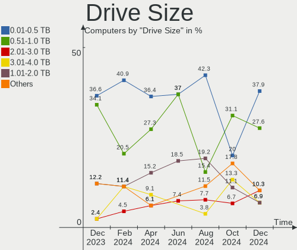
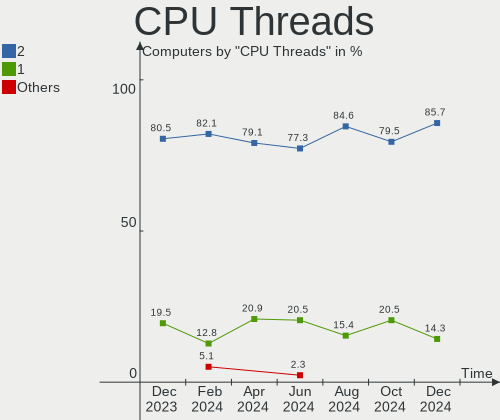
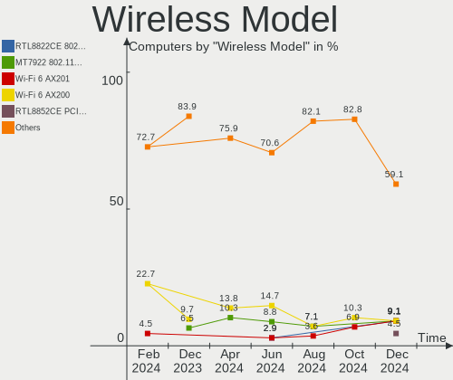
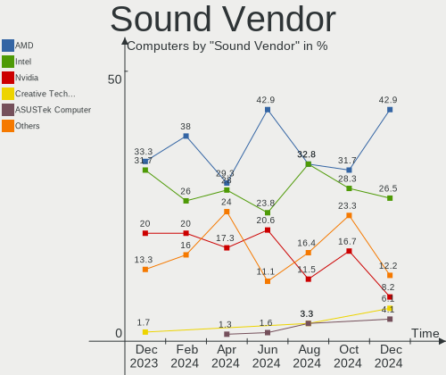

Gentoo Hardware Trends
----------------------

A project to identify most popular hardware characteristics and track their change
over time based on data collected by Gentoo users at https://Linux-Hardware.org.

Anyone can contribute to the study by uploading probes of their computers by
the [hw-probe](https://github.com/linuxhw/hw-probe) tool:

    sudo -E hw-probe -all -upload

This is a report for all computer types. See also reports for [desktops](/Dist/Gentoo/Desktop/README.md) and [notebooks](/Dist/Gentoo/Notebook/README.md).

Full-feature report is available here: https://linux-hardware.org/?view=trends

Period: Oct, 2020.

Contents
--------

- [ OS                       ](#os)
- [ OS Family                ](#os-family)
- [ Kernel                   ](#kernel)
- [ Kernel Family            ](#kernel-family)
- [ Kernel Major Ver.        ](#kernel-major-ver)
- [ Arch                     ](#arch)
- [ DE                       ](#de)
- [ Display Server           ](#display-server)
- [ Display Manager          ](#display-manager)
- [ OS Lang                  ](#os-lang)
- [ Boot Mode                ](#boot-mode)
- [ Filesystem               ](#filesystem)
- [ Part. scheme             ](#part-scheme)
- [ Dual Boot with Linux/BSD ](#dual-boot-with-linux/bsd)
- [ Dual Boot (Win)          ](#dual-boot-win)
- [ Country                  ](#country)
- [ City                     ](#city)
- [ Vendor                   ](#vendor)
- [ Model                    ](#model)
- [ Model Family             ](#model-family)
- [ MFG Year                 ](#mfg-year)
- [ Form Factor              ](#form-factor)
- [ Secure Boot              ](#secure-boot)
- [ Coreboot                 ](#coreboot)
- [ RAM Size                 ](#ram-size)
- [ RAM Used                 ](#ram-used)
- [ Has CD-ROM               ](#has-cd-rom)
- [ Total Drives             ](#total-drives)
- [ Has Ethernet             ](#has-ethernet)
- [ Drive Vendor             ](#drive-vendor)
- [ HDD Vendor               ](#hdd-vendor)
- [ SSD Vendor               ](#ssd-vendor)
- [ Drive Model              ](#drive-model)
- [ Drive Kind               ](#drive-kind)
- [ Drive Connector          ](#drive-connector)
- [ Drive Size               ](#drive-size)
- [ Space Total              ](#space-total)
- [ Space Used               ](#space-used)
- [ Malfunc. Drives          ](#malfunc-drives)
- [ Malfunc. Drive Vendor    ](#malfunc-drive-vendor)
- [ Malfunc. HDD Vendor      ](#malfunc-hdd-vendor)
- [ Malfunc. Drive Kind      ](#malfunc-drive-kind)
- [ Failed Drives            ](#failed-drives)
- [ Failed Drive Vendor      ](#failed-drive-vendor)
- [ Drive Status             ](#drive-status)
- [ Storage Vendor           ](#storage-vendor)
- [ Storage Model            ](#storage-model)
- [ Storage Kind             ](#storage-kind)
- [ CPU Vendor               ](#cpu-vendor)
- [ CPU Model                ](#cpu-model)
- [ CPU Model Family         ](#cpu-model-family)
- [ CPU Cores                ](#cpu-cores)
- [ CPU Sockets              ](#cpu-sockets)
- [ CPU Threads              ](#cpu-threads)
- [ CPU Op-Modes             ](#cpu-op-modes)
- [ CPU Microcode            ](#cpu-microcode)
- [ CPU Microarch            ](#cpu-microarch)
- [ GPU Vendor               ](#gpu-vendor)
- [ GPU Model                ](#gpu-model)
- [ GPU Combo                ](#gpu-combo)
- [ GPU Driver               ](#gpu-driver)
- [ GPU Memory               ](#gpu-memory)
- [ Monitor Vendor           ](#monitor-vendor)
- [ Monitor Model            ](#monitor-model)
- [ Monitor Resolution       ](#monitor-resolution)
- [ Monitor Diagonal         ](#monitor-diagonal)
- [ Monitor Width            ](#monitor-width)
- [ Aspect Ratio             ](#aspect-ratio)
- [ Monitor Area             ](#monitor-area)
- [ Pixel Density            ](#pixel-density)
- [ Multiple Monitors        ](#multiple-monitors)
- [ Net Controller Vendor    ](#net-controller-vendor)
- [ Net Controller Model     ](#net-controller-model)
- [ Wireless Vendor          ](#wireless-vendor)
- [ Wireless Model           ](#wireless-model)
- [ Ethernet Vendor          ](#ethernet-vendor)
- [ Ethernet Model           ](#ethernet-model)
- [ Net Controller Kind      ](#net-controller-kind)
- [ Used Controller          ](#used-controller)
- [ NICs                     ](#nics)
- [ Memory Vendor            ](#memory-vendor)
- [ Memory Model             ](#memory-model)
- [ Memory Kind              ](#memory-kind)
- [ Memory Form Factor       ](#memory-form-factor)
- [ Memory Size              ](#memory-size)
- [ Memory Speed             ](#memory-speed)
- [ Sound Vendor             ](#sound-vendor)
- [ Sound Model              ](#sound-model)
- [ Camera Vendor            ](#camera-vendor)
- [ Camera Model             ](#camera-model)
- [ Fingerprint Vendor       ](#fingerprint-vendor)
- [ Fingerprint Model        ](#fingerprint-model)
- [ Chipcard Vendor          ](#chipcard-vendor)
- [ Chipcard Model           ](#chipcard-model)
- [ Printer Vendor           ](#printer-vendor)
- [ Printer Model            ](#printer-model)
- [ Scanner Vendor           ](#scanner-vendor)
- [ Scanner Model            ](#scanner-model)
- [ Bluetooth Vendor         ](#bluetooth-vendor)
- [ Bluetooth Model          ](#bluetooth-model)
- [ Unsupported Devices      ](#unsupported-devices)
- [ Unsupported Device Types ](#unsupported-device-types)

OS
--

Installed operating systems

| Name       | Computers | Percent |
|------------|-----------|---------|
| Gentoo     | 30        | 58.82%  |
| Gentoo 2.7 | 21        | 41.18%  |

OS Family
---------

OS without a version

| Name   | Computers | Percent |
|--------|-----------|---------|
| Gentoo | 51        | 100%    |

Kernel
------

Version of the Linux kernel

| Version                 | Computers | Percent |
|-------------------------|-----------|---------|
| 5.4.66-gentoo           | 4         | 7.84%   |
| 5.9.1-gentoo            | 3         | 5.88%   |
| 5.4.66-gentoo-x86_64    | 3         | 5.88%   |
| 5.9.0-gentoo            | 2         | 3.92%   |
| 5.8.16-gentoo           | 2         | 3.92%   |
| 5.8.14-gentoo           | 2         | 3.92%   |
| 5.4.72-gentoo           | 2         | 3.92%   |
| 5.4.60-gentoo           | 2         | 3.92%   |
| 5.9.1-gentoo-x86_64     | 1         | 1.96%   |
| 5.9.1-gentoo-r1         | 1         | 1.96%   |
| 5.9.1                   | 1         | 1.96%   |
| 5.9.0-rc8+              | 1         | 1.96%   |
| 5.9.0-gentoo.w0rm       | 1         | 1.96%   |
| 5.9.0-gentoo.92-5.9.x   | 1         | 1.96%   |
| 5.9.0-gentoo-gentoo-amd | 1         | 1.96%   |
| 5.9.0-gentoo-alf        | 1         | 1.96%   |
| 5.8.9                   | 1         | 1.96%   |
| 5.8.15-gentoo           | 1         | 1.96%   |
| 5.8.14-gentoo-x86_64    | 1         | 1.96%   |
| 5.8.13                  | 1         | 1.96%   |
| 5.8.12-gentoo           | 1         | 1.96%   |
| 5.8.12                  | 1         | 1.96%   |
| 5.8.10-gentoo           | 1         | 1.96%   |
| 5.8.0-mainline-t14      | 1         | 1.96%   |
| 5.7.17-gentoo-lz0       | 1         | 1.96%   |
| 5.6.15-gentoo           | 1         | 1.96%   |
| 5.5.0-gentoo-x86_64     | 1         | 1.96%   |
| 5.4.72-gentoo-x86_64    | 1         | 1.96%   |
| 5.4.72                  | 1         | 1.96%   |
| 5.4.70-gentoo           | 1         | 1.96%   |
| 5.4.66-gentoo-nder-12   | 1         | 1.96%   |
| 5.4.66-gentoo-bala-025  | 1         | 1.96%   |
| 5.4.65-gentoo           | 1         | 1.96%   |
| 5.4.60-gentoo-x86_64    | 1         | 1.96%   |
| 5.4.48-gentoo           | 1         | 1.96%   |
| 5.4.28-gentoo           | 1         | 1.96%   |
| 5.0.0-23-generic        | 1         | 1.96%   |
| 4.19.6-gentoo           | 1         | 1.96%   |
| 4.19.44-gentoo          | 1         | 1.96%   |

Kernel Family
-------------

Linux kernel without a distro release

| Version | Computers | Percent |
|---------|-----------|---------|
| 5.4.66  | 9         | 17.65%  |
| 5.9.0   | 7         | 13.73%  |
| 5.9.1   | 6         | 11.76%  |
| 5.4.72  | 4         | 7.84%   |
| 5.8.14  | 3         | 5.88%   |
| 5.4.60  | 3         | 5.88%   |
| 5.8.16  | 2         | 3.92%   |
| 5.8.12  | 2         | 3.92%   |
| 5.8.9   | 1         | 1.96%   |
| 5.8.15  | 1         | 1.96%   |
| 5.8.13  | 1         | 1.96%   |
| 5.8.10  | 1         | 1.96%   |
| 5.8.0   | 1         | 1.96%   |
| 5.7.17  | 1         | 1.96%   |
| 5.6.15  | 1         | 1.96%   |
| 5.5.0   | 1         | 1.96%   |
| 5.4.70  | 1         | 1.96%   |
| 5.4.65  | 1         | 1.96%   |
| 5.4.48  | 1         | 1.96%   |
| 5.4.28  | 1         | 1.96%   |
| 5.0.0   | 1         | 1.96%   |
| 4.19.6  | 1         | 1.96%   |
| 4.19.44 | 1         | 1.96%   |

Kernel Major Ver.
-----------------

Linux kernel major version

| Version | Computers | Percent |
|---------|-----------|---------|
| 5.4     | 20        | 39.22%  |
| 5.9     | 13        | 25.49%  |
| 5.8     | 12        | 23.53%  |
| 4.19    | 2         | 3.92%   |
| 5.7     | 1         | 1.96%   |
| 5.6     | 1         | 1.96%   |
| 5.5     | 1         | 1.96%   |
| 5.0     | 1         | 1.96%   |

Arch
----

OS architecture (x86_64, i586, etc.)

| Name   | Computers | Percent |
|--------|-----------|---------|
| x86_64 | 51        | 100%    |

DE
--

Desktop Environment

| Name     | Computers | Percent |
|----------|-----------|---------|
| Unknown  | 20        | 39.22%  |
| KDE5     | 11        | 21.57%  |
| KDE      | 7         | 13.73%  |
| XFCE     | 5         | 9.8%    |
| GNOME    | 5         | 9.8%    |
| Xsession | 1         | 1.96%   |
| i3       | 1         | 1.96%   |
| fluxbox  | 1         | 1.96%   |

Display Server
--------------

X11 or Wayland

| Name    | Computers | Percent |
|---------|-----------|---------|
| X11     | 37        | 72.55%  |
| Unknown | 7         | 13.73%  |
| Tty     | 5         | 9.8%    |
| Wayland | 2         | 3.92%   |

Display Manager
---------------

SDDM, LightDM, etc.

| Name    | Computers | Percent |
|---------|-----------|---------|
| Unknown | 30        | 58.82%  |
| SDDM    | 13        | 25.49%  |
| LightDM | 5         | 9.8%    |
| LXDM    | 2         | 3.92%   |
| GDM     | 1         | 1.96%   |

OS Lang
-------

Language

| Lang       | Computers | Percent |
|------------|-----------|---------|
| en_US.utf8 | 14        | 27.45%  |
| en_US      | 6         | 11.76%  |
| ru_RU.utf8 | 5         | 9.8%    |
| en_GB.utf8 | 5         | 9.8%    |
| ru_RU      | 3         | 5.88%   |
| en_GB      | 2         | 3.92%   |
| de_DE.utf8 | 2         | 3.92%   |
| C.UTF8     | 2         | 3.92%   |
| uk_UA.utf8 | 1         | 1.96%   |
| sv_SE      | 1         | 1.96%   |
| pt_PT.utf8 | 1         | 1.96%   |
| pt_BR.utf8 | 1         | 1.96%   |
| pl_PL      | 1         | 1.96%   |
| fr_FR.utf8 | 1         | 1.96%   |
| es_CL      | 1         | 1.96%   |
| en_IE.utf8 | 1         | 1.96%   |
| el_GR.utf8 | 1         | 1.96%   |
| cs_CZ      | 1         | 1.96%   |
| C          | 1         | 1.96%   |
| C          | 1         | 1.96%   |

Boot Mode
---------

EFI or BIOS

| Mode | Computers | Percent |
|------|-----------|---------|
| EFI  | 33        | 64.71%  |
| BIOS | 18        | 35.29%  |

Filesystem
----------

Type of filesystem

| Type     | Computers | Percent |
|----------|-----------|---------|
| Ext4     | 37        | 72.55%  |
| Btrfs    | 9         | 17.65%  |
| Zfs      | 2         | 3.92%   |
| Reiserfs | 2         | 3.92%   |
| Xfs      | 1         | 1.96%   |

Part. scheme
------------

Scheme of partitioning

| Type    | Computers | Percent |
|---------|-----------|---------|
| GPT     | 40        | 78.43%  |
| MBR     | 10        | 19.61%  |
| Unknown | 1         | 1.96%   |

Dual Boot with Linux/BSD
------------------------

Hosting more than one Linux/BSD

| Dual boot | Computers | Percent |
|-----------|-----------|---------|
| No        | 39        | 76.47%  |
| Yes       | 12        | 23.53%  |

Dual Boot (Win)
---------------

Hosting Linux and Windows

| Dual boot | Computers | Percent |
|-----------|-----------|---------|
| No        | 35        | 68.63%  |
| Yes       | 16        | 31.37%  |

Country
-------

Geographic location (country)

| Country        | Computers | Percent |
|----------------|-----------|---------|
| Russia         | 10        | 19.61%  |
| USA            | 7         | 13.73%  |
| Ukraine        | 4         | 7.84%   |
| Poland         | 4         | 7.84%   |
| Germany        | 3         | 5.88%   |
| UK             | 2         | 3.92%   |
| Sweden         | 2         | 3.92%   |
| Spain          | 2         | 3.92%   |
| Netherlands    | 2         | 3.92%   |
| Czech Republic | 2         | 3.92%   |
| Switzerland    | 1         | 1.96%   |
| Romania        | 1         | 1.96%   |
| Hong Kong      | 1         | 1.96%   |
| Greece         | 1         | 1.96%   |
| France         | 1         | 1.96%   |
| Denmark        | 1         | 1.96%   |
| China          | 1         | 1.96%   |
| Chile          | 1         | 1.96%   |
| Brazil         | 1         | 1.96%   |
| Belgium        | 1         | 1.96%   |
| Belarus        | 1         | 1.96%   |
| Austria        | 1         | 1.96%   |
| Australia      | 1         | 1.96%   |

City
----

Geographic location (city)

| City              | Computers | Percent |
|-------------------|-----------|---------|
| St Petersburg     | 4         | 7.84%   |
| Cieszyn           | 3         | 5.88%   |
| Nottingham        | 2         | 3.92%   |
| Moscow            | 2         | 3.92%   |
| Kyiv              | 2         | 3.92%   |
| Zurich            | 1         | 1.96%   |
| Vladimir          | 1         | 1.96%   |
| Visby             | 1         | 1.96%   |
| Vienna            | 1         | 1.96%   |
| Utica             | 1         | 1.96%   |
| Ufa               | 1         | 1.96%   |
| Tomsk             | 1         | 1.96%   |
| Thessaloniki      | 1         | 1.96%   |
| Sydney            | 1         | 1.96%   |
| San Francisco     | 1         | 1.96%   |
| Rochester         | 1         | 1.96%   |
| Quillota          | 1         | 1.96%   |
| Offenbach         | 1         | 1.96%   |
| Manitowoc         | 1         | 1.96%   |
| Maersta           | 1         | 1.96%   |
| Madrid            | 1         | 1.96%   |
| Lyubertsy         | 1         | 1.96%   |
| Livingston        | 1         | 1.96%   |
| Lafayette         | 1         | 1.96%   |
| Kjellerup         | 1         | 1.96%   |
| Kharkiv           | 1         | 1.96%   |
| Kalisz            | 1         | 1.96%   |
| Ilmenau           | 1         | 1.96%   |
| Hrodna            | 1         | 1.96%   |
| Hoensbroek        | 1         | 1.96%   |
| Hengelo           | 1         | 1.96%   |
| Goiânia          | 1         | 1.96%   |
| Glen Ellyn        | 1         | 1.96%   |
| Ghent             | 1         | 1.96%   |
| Fuenlabrada       | 1         | 1.96%   |
| Frankfurt am Main | 1         | 1.96%   |
| Discovery Bay     | 1         | 1.96%   |
| Chomutov          | 1         | 1.96%   |
| Chernihiv         | 1         | 1.96%   |
| Chengdu           | 1         | 1.96%   |
| Bucharest         | 1         | 1.96%   |
| Brno              | 1         | 1.96%   |
| Allonnes          | 1         | 1.96%   |

Vendor
------

Motherboard manufacturer

| Name                | Computers | Percent |
|---------------------|-----------|---------|
| ASUSTek Computer    | 11        | 21.57%  |
| Hewlett-Packard     | 10        | 19.61%  |
| Lenovo              | 8         | 15.69%  |
| MSI                 | 6         | 11.76%  |
| ASRock              | 6         | 11.76%  |
| Dell                | 4         | 7.84%   |
| Gigabyte Technology | 2         | 3.92%   |
| Sony                | 1         | 1.96%   |
| Fujitsu             | 1         | 1.96%   |
| Entroware           | 1         | 1.96%   |
| Acer                | 1         | 1.96%   |

Model
-----

Motherboard model

| Name                                     | Computers | Percent |
|------------------------------------------|-----------|---------|
| Sony VPCSC41FM                           | 1         | 1.96%   |
| MSI MS-7C13                              | 1         | 1.96%   |
| MSI MS-7C02                              | 1         | 1.96%   |
| MSI MS-7B49                              | 1         | 1.96%   |
| MSI MS-7A31                              | 1         | 1.96%   |
| MSI MS-7A15                              | 1         | 1.96%   |
| MSI MS-7971                              | 1         | 1.96%   |
| Lenovo ThinkPad X13 Gen 1 20UFCTO1WW     | 1         | 1.96%   |
| Lenovo ThinkPad X1 Carbon 7th 20QES2P41V | 1         | 1.96%   |
| Lenovo ThinkPad T470s 20HGS0W100         | 1         | 1.96%   |
| Lenovo ThinkPad T14 Gen 1 20UES06X00     | 1         | 1.96%   |
| Lenovo ThinkPad P53 20QN001JUS           | 1         | 1.96%   |
| Lenovo ThinkPad P1 Gen 3 20THCTO1WW      | 1         | 1.96%   |
| Lenovo Legion R7000P2020H 82GR           | 1         | 1.96%   |
| Lenovo B51-80 80LM                       | 1         | 1.96%   |
| HP ProBook 455 G7                        | 1         | 1.96%   |
| HP ProBook 430 G5                        | 1         | 1.96%   |
| HP Pavilion x360 Convertible             | 1         | 1.96%   |
| HP Pavilion Notebook                     | 1         | 1.96%   |
| HP Pavilion Gaming Desktop TG01-0xxx     | 1         | 1.96%   |
| HP Pavilion g7                           | 1         | 1.96%   |
| HP Pavilion dv7                          | 1         | 1.96%   |
| HP Laptop 14-cf0xxx                      | 1         | 1.96%   |
| HP ENVY x360 Convertible 15-ee0xxx       | 1         | 1.96%   |
| HP EliteBook 820 G4                      | 1         | 1.96%   |
| Gigabyte H110M-S2V                       | 1         | 1.96%   |
| Gigabyte B450M DS3H                      | 1         | 1.96%   |
| Fujitsu LIFEBOOK P770                    | 1         | 1.96%   |
| Entroware Nyx                            | 1         | 1.96%   |
| Dell XPS 15 7590                         | 1         | 1.96%   |
| Dell OptiPlex 9020                       | 1         | 1.96%   |
| Dell Latitude E7270                      | 1         | 1.96%   |
| Dell G5 5587                             | 1         | 1.96%   |
| ASUS Z170 PRO GAMING                     | 1         | 1.96%   |
| ASUS X555LJ                              | 1         | 1.96%   |
| ASUS TUF GAMING X570-PLUS                | 1         | 1.96%   |
| ASUS TUF GAMING B460-PLUS                | 1         | 1.96%   |
| ASUS ROG Zephyrus G14 GA401II_GA401II    | 1         | 1.96%   |
| ASUS PRIME X570-PRO                      | 1         | 1.96%   |
| ASUS P6X58D PREMIUM                      | 1         | 1.96%   |
| ASUS H61M-K                              | 1         | 1.96%   |
| ASUS EB1012                              | 1         | 1.96%   |
| ASUS All Series                          | 1         | 1.96%   |
| ASUS A88XM-A                             | 1         | 1.96%   |
| ASRock X570M Pro4                        | 1         | 1.96%   |
| ASRock X570 Phantom Gaming-ITX/TB3       | 1         | 1.96%   |
| ASRock X370 Professional Gaming          | 1         | 1.96%   |
| ASRock X370 Gaming X                     | 1         | 1.96%   |
| ASRock N3150-ITX                         | 1         | 1.96%   |
| ASRock AM1H-ITX                          | 1         | 1.96%   |
| Acer Aspire E5-571G                      | 1         | 1.96%   |

Model Family
------------

Motherboard model prefix

| Name               | Computers | Percent |
|--------------------|-----------|---------|
| Lenovo ThinkPad    | 6         | 11.76%  |
| HP Pavilion        | 5         | 9.8%    |
| HP ProBook         | 2         | 3.92%   |
| ASUS TUF           | 2         | 3.92%   |
| ASRock X370        | 2         | 3.92%   |
| Sony VPCSC41FM     | 1         | 1.96%   |
| MSI MS-7C13        | 1         | 1.96%   |
| MSI MS-7C02        | 1         | 1.96%   |
| MSI MS-7B49        | 1         | 1.96%   |
| MSI MS-7A31        | 1         | 1.96%   |
| MSI MS-7A15        | 1         | 1.96%   |
| MSI MS-7971        | 1         | 1.96%   |
| Lenovo Legion      | 1         | 1.96%   |
| Lenovo B51-80      | 1         | 1.96%   |
| HP Laptop          | 1         | 1.96%   |
| HP ENVY            | 1         | 1.96%   |
| HP EliteBook       | 1         | 1.96%   |
| Gigabyte H110M-S2V | 1         | 1.96%   |
| Gigabyte B450M     | 1         | 1.96%   |
| Fujitsu LIFEBOOK   | 1         | 1.96%   |
| Entroware Nyx      | 1         | 1.96%   |
| Dell XPS           | 1         | 1.96%   |
| Dell OptiPlex      | 1         | 1.96%   |
| Dell Latitude      | 1         | 1.96%   |
| Dell G5            | 1         | 1.96%   |
| ASUS Z170          | 1         | 1.96%   |
| ASUS X555LJ        | 1         | 1.96%   |
| ASUS ROG           | 1         | 1.96%   |
| ASUS PRIME         | 1         | 1.96%   |
| ASUS P6X58D        | 1         | 1.96%   |
| ASUS H61M-K        | 1         | 1.96%   |
| ASUS EB1012        | 1         | 1.96%   |
| ASUS All           | 1         | 1.96%   |
| ASUS A88XM-A       | 1         | 1.96%   |
| ASRock X570M       | 1         | 1.96%   |
| ASRock X570        | 1         | 1.96%   |
| ASRock N3150-ITX   | 1         | 1.96%   |
| ASRock AM1H-ITX    | 1         | 1.96%   |
| Acer Aspire        | 1         | 1.96%   |

MFG Year
--------

Motherboard manufacture year

| Year | Computers | Percent |
|------|-----------|---------|
| 2020 | 20        | 39.22%  |
| 2019 | 8         | 15.69%  |
| 2018 | 6         | 11.76%  |
| 2015 | 4         | 7.84%   |
| 2017 | 3         | 5.88%   |
| 2016 | 3         | 5.88%   |
| 2010 | 3         | 5.88%   |
| 2014 | 1         | 1.96%   |
| 2013 | 1         | 1.96%   |
| 2012 | 1         | 1.96%   |
| 2011 | 1         | 1.96%   |

Form Factor
-----------

Physical design of the computer

| Name        | Computers | Percent |
|-------------|-----------|---------|
| Desktop     | 26        | 50.98%  |
| Notebook    | 23        | 45.1%   |
| Convertible | 2         | 3.92%   |

Secure Boot
-----------

Enabled or disabled

| State    | Computers | Percent |
|----------|-----------|---------|
| Disabled | 50        | 98.04%  |
| Enabled  | 1         | 1.96%   |

Coreboot
--------

Have coreboot on board

| Used | Computers | Percent |
|------|-----------|---------|
| No   | 51        | 100%    |

RAM Size
--------

Total RAM memory

| Size in GB  | Computers | Percent |
|-------------|-----------|---------|
| 32.01-64.0  | 13        | 25.49%  |
| 16.01-24.0  | 12        | 23.53%  |
| 8.01-16.0   | 11        | 21.57%  |
| 4.01-8.0    | 8         | 15.69%  |
| 3.01-4.0    | 5         | 9.8%    |
| 64.01-256.0 | 2         | 3.92%   |

RAM Used
--------

Used RAM memory

| Used GB    | Computers | Percent |
|------------|-----------|---------|
| 1.01-2.0   | 12        | 23.53%  |
| 4.01-8.0   | 9         | 17.65%  |
| 3.01-4.0   | 9         | 17.65%  |
| 8.01-16.0  | 7         | 13.73%  |
| 0.01-1.0   | 7         | 13.73%  |
| 2.01-3.0   | 5         | 9.8%    |
| 24.01-32.0 | 1         | 1.96%   |
| 16.01-24.0 | 1         | 1.96%   |

Has CD-ROM
----------

Has CD-ROM on board

| Presented | Computers | Percent |
|-----------|-----------|---------|
| No        | 39        | 76.47%  |
| Yes       | 12        | 23.53%  |

Total Drives
------------

Number of drives on board

| Drives | Computers | Percent |
|--------|-----------|---------|
| 1      | 24        | 47.06%  |
| 2      | 16        | 31.37%  |
| 3      | 8         | 15.69%  |
| 4      | 2         | 3.92%   |
| 5      | 1         | 1.96%   |

Has Ethernet
------------

Has Ethernet on board

| Presented | Computers | Percent |
|-----------|-----------|---------|
| Yes       | 46        | 90.2%   |
| No        | 5         | 9.8%    |

Drive Vendor
------------

Hard drive vendors

| Vendor              | Computers | Drives | Percent |
|---------------------|-----------|--------|---------|
| Samsung Electronics | 24        | 30     | 30.38%  |
| WDC                 | 20        | 26     | 25.32%  |
| Toshiba             | 8         | 9      | 10.13%  |
| Seagate             | 5         | 6      | 6.33%   |
| Kingston            | 4         | 4      | 5.06%   |
| SK Hynix            | 3         | 3      | 3.8%    |
| Intel               | 3         | 3      | 3.8%    |
| Hitachi             | 3         | 3      | 3.8%    |
| SanDisk             | 2         | 2      | 2.53%   |
| Unknown             | 1         | 1      | 1.27%   |
| Team                | 1         | 1      | 1.27%   |
| OCZ                 | 1         | 1      | 1.27%   |
| HGST                | 1         | 1      | 1.27%   |
| Crucial             | 1         | 1      | 1.27%   |
| Corsair             | 1         | 1      | 1.27%   |
| A-DATA Technology   | 1         | 1      | 1.27%   |

HDD Vendor
----------

Hard disk drive vendors

| Vendor              | Computers | Drives | Percent |
|---------------------|-----------|--------|---------|
| WDC                 | 14        | 19     | 51.85%  |
| Toshiba             | 4         | 5      | 14.81%  |
| Seagate             | 4         | 5      | 14.81%  |
| Hitachi             | 3         | 3      | 11.11%  |
| Samsung Electronics | 1         | 1      | 3.7%    |
| HGST                | 1         | 1      | 3.7%    |

SSD Vendor
----------

Solid state drive vendors

| Vendor              | Computers | Drives | Percent |
|---------------------|-----------|--------|---------|
| Samsung Electronics | 14        | 15     | 46.67%  |
| Kingston            | 4         | 4      | 13.33%  |
| WDC                 | 2         | 2      | 6.67%   |
| Toshiba             | 2         | 2      | 6.67%   |
| SanDisk             | 2         | 2      | 6.67%   |
| SK Hynix            | 1         | 1      | 3.33%   |
| OCZ                 | 1         | 1      | 3.33%   |
| Intel               | 1         | 1      | 3.33%   |
| Crucial             | 1         | 1      | 3.33%   |
| Corsair             | 1         | 1      | 3.33%   |
| A-DATA Technology   | 1         | 1      | 3.33%   |

Drive Model
-----------

Hard drive models

| Model                            | Computers | Percent |
|----------------------------------|-----------|---------|
| SSD 850 EVO 250GB                | 5         | 5.68%   |
| SSD 970 EVO 1TB                  | 4         | 4.55%   |
| WD40EFRX-68WT0N0 4TB             | 3         | 3.41%   |
| SSD 970 EVO 250GB                | 2         | 2.27%   |
| SSD 860 EVO 500GB                | 2         | 2.27%   |
| SSD 860 EVO 250GB                | 2         | 2.27%   |
| SSD 860 EVO 1TB                  | 2         | 2.27%   |
| PC SN730 SDBQNTY-1T00-1001 1TB   | 2         | 2.27%   |
| PC SN520 SDAPNUW-512G-1006 512GB | 2         | 2.27%   |
| WDS500G3X0C-00SJG0 500GB         | 1         | 1.14%   |
| WDS250G2B0B 250GB SSD            | 1         | 1.14%   |
| WDS240G2G0A-00JH30 240GB SSD     | 1         | 1.14%   |
| WD7500BPVT-80HXZT3 752GB         | 1         | 1.14%   |
| WD6401AALS-00L3B2 640GB          | 1         | 1.14%   |
| WD5000LPVX-22V0TT0 500GB         | 1         | 1.14%   |
| WD5000AAKX-003CA0 500GB          | 1         | 1.14%   |
| WD40EFRX-68N32N0 4TB             | 1         | 1.14%   |
| WD30EZRX-00SPEB0 3TB             | 1         | 1.14%   |
| WD30EFRX-68EUZN0 3TB             | 1         | 1.14%   |
| WD20EZRX-00DC0B0 2TB             | 1         | 1.14%   |
| WD20EFRX-68EUZN0 2TB             | 1         | 1.14%   |
| WD2000F9YZ-09N20L1 2TB           | 1         | 1.14%   |
| WD10EZEX-08WN4A0 1TB             | 1         | 1.14%   |
| WD10EZEX-00WN4A0 1TB             | 1         | 1.14%   |
| WD1002FAEX-00Y9A0 1TB            | 1         | 1.14%   |
| VECTOR150 240GB SSD              | 1         | 1.14%   |
| TM8FP2240G 240GB                 | 1         | 1.14%   |
| THNS128GG4BBAA 128GB SSD         | 1         | 1.14%   |
| THNS064GG2BNAA 64GB SSD          | 1         | 1.14%   |
| SX930 120GB SSD                  | 1         | 1.14%   |
| SUV400S37120G 120GB SSD          | 1         | 1.14%   |
| ST8000DM004-2CX188 8TB           | 1         | 1.14%   |
| ST4000DM004-2CV104 4TB           | 1         | 1.14%   |
| ST1000NC001-1DY162 1TB           | 1         | 1.14%   |
| ST1000LM014-SSHD-8GB             | 1         | 1.14%   |
| ST1000DM003-9YN162 1TB           | 1         | 1.14%   |
| SSDSC2BW120A4 120GB              | 1         | 1.14%   |
| SSDPEKNW512G8 512GB              | 1         | 1.14%   |
| SSDPEKNW010T8 1TB                | 1         | 1.14%   |
| SSD PLUS 120 GB                  | 1         | 1.14%   |
| SSD i100 32GB                    | 1         | 1.14%   |
| SSD 970 EVO Plus 500GB           | 1         | 1.14%   |
| SSD 960 EVO 250GB                | 1         | 1.14%   |
| SSD 840 PRO Series 256GB         | 1         | 1.14%   |
| SSD 840 EVO 1TB                  | 1         | 1.14%   |
| SSD 830 Series 128GB             | 1         | 1.14%   |
| SHSS37A240G 240GB SSD            | 1         | 1.14%   |
| SHFS37A120G 120GB SSD            | 1         | 1.14%   |
| SC311 SATA 256GB SSD             | 1         | 1.14%   |
| SA400S37120G 120GB SSD           | 1         | 1.14%   |
| PM981a NVMe 2048GB               | 1         | 1.14%   |
| PC401 HFS256GD9TNG-62A0A 256GB   | 1         | 1.14%   |
| N/A  2GB                         | 1         | 1.14%   |
| MZVLW512HMJP-000L7 512GB         | 1         | 1.14%   |
| MZVLB512HBJQ-000L7 512GB         | 1         | 1.14%   |
| MZVLB512HBJQ-000L2 512GB         | 1         | 1.14%   |
| MZVLB2T0HALB-000L7 2TB           | 1         | 1.14%   |
| MZNTY256HDHP-000H1 256GB SSD     | 1         | 1.14%   |
| MQ01ACF050 500GB                 | 1         | 1.14%   |
| KXG6AZNV256G 256GB               | 1         | 1.14%   |

Drive Kind
----------

HDD or SSD

| Kind | Computers | Drives | Percent |
|------|-----------|--------|---------|
| SSD  | 27        | 31     | 36.49%  |
| NVMe | 24        | 27     | 32.43%  |
| HDD  | 22        | 34     | 29.73%  |
| MMC  | 1         | 1      | 1.35%   |

Drive Connector
---------------

SATA, SAS, NVMe, etc.

| Type | Computers | Drives | Percent |
|------|-----------|--------|---------|
| SATA | 36        | 65     | 59.02%  |
| NVMe | 24        | 27     | 39.34%  |
| MMC  | 1         | 1      | 1.64%   |

Drive Size
----------

Size of hard drive

| Size in TB | Computers | Drives | Percent |
|------------|-----------|--------|---------|
| 0.01-0.5   | 28        | 36     | 54.9%   |
| 0.51-1.0   | 12        | 14     | 23.53%  |
| 3.01-4.0   | 5         | 8      | 9.8%    |
| 1.01-2.0   | 3         | 3      | 5.88%   |
| 2.01-3.0   | 2         | 3      | 3.92%   |
| 4.01-10.0  | 1         | 1      | 1.96%   |

Space Total
-----------

Amount of disk space available on the file system

| Size in GB     | Computers | Percent |
|----------------|-----------|---------|
| 101-250        | 14        | 27.45%  |
| 251-500        | 12        | 23.53%  |
| More than 3000 | 8         | 15.69%  |
| 1001-2000      | 8         | 15.69%  |
| 501-1000       | 5         | 9.8%    |
| 1-20           | 2         | 3.92%   |
| 21-50          | 1         | 1.96%   |
| 2001-3000      | 1         | 1.96%   |

Space Used
----------

Amount of used disk space

| Used GB        | Computers | Percent |
|----------------|-----------|---------|
| 101-250        | 12        | 23.53%  |
| 21-50          | 9         | 17.65%  |
| 1-20           | 8         | 15.69%  |
| 501-1000       | 6         | 11.76%  |
| More than 3000 | 4         | 7.84%   |
| 2001-3000      | 4         | 7.84%   |
| 51-100         | 4         | 7.84%   |
| 251-500        | 2         | 3.92%   |
| 1001-2000      | 2         | 3.92%   |

Malfunc. Drives
---------------

Drive models with a malfunction

| Model                   | Computers | Drives | Percent |
|-------------------------|-----------|--------|---------|
| WD5000AAKX-003CA0 500GB | 1         | 1      | 12.5%   |
| WD40EFRX-68WT0N0 4TB    | 1         | 1      | 12.5%   |
| WD1002FAEX-00Y9A0 1TB   | 1         | 1      | 12.5%   |
| ST1000NC001-1DY162 1TB  | 1         | 1      | 12.5%   |
| HTS547550A9E384 500GB   | 1         | 1      | 12.5%   |
| HTS542516K9SA00 160GB   | 1         | 1      | 12.5%   |
| HTS541010B7E610 1TB     | 1         | 1      | 12.5%   |
| HDWD105 500GB           | 1         | 2      | 12.5%   |

Malfunc. Drive Vendor
---------------------

Vendors of faulty drives

| Vendor  | Computers | Drives | Percent |
|---------|-----------|--------|---------|
| WDC     | 3         | 3      | 37.5%   |
| Hitachi | 2         | 2      | 25%     |
| Toshiba | 1         | 2      | 12.5%   |
| Seagate | 1         | 1      | 12.5%   |
| HGST    | 1         | 1      | 12.5%   |

Malfunc. HDD Vendor
-------------------

Vendors of faulty HDD drives

| Vendor  | Computers | Drives | Percent |
|---------|-----------|--------|---------|
| WDC     | 3         | 3      | 37.5%   |
| Hitachi | 2         | 2      | 25%     |
| Toshiba | 1         | 2      | 12.5%   |
| Seagate | 1         | 1      | 12.5%   |
| HGST    | 1         | 1      | 12.5%   |

Malfunc. Drive Kind
-------------------

Kinds of faulty drives

| Kind | Computers | Drives | Percent |
|------|-----------|--------|---------|
| HDD  | 7         | 9      | 100%    |

Failed Drives
-------------

Failed drive models

Zero info for selected period =(

Failed Drive Vendor
-------------------

Failed drive vendors

Zero info for selected period =(

Drive Status
------------

Number of failed and malfunc. drives

| Status   | Computers | Drives | Percent |
|----------|-----------|--------|---------|
| Works    | 46        | 82     | 83.64%  |
| Malfunc  | 7         | 9      | 12.73%  |
| Detected | 2         | 2      | 3.64%   |

Storage Vendor
--------------

Storage controller vendors

| Vendor                       | Computers | Percent |
|------------------------------|-----------|---------|
| Intel                        | 29        | 38.67%  |
| AMD                          | 17        | 22.67%  |
| Samsung Electronics          | 13        | 17.33%  |
| Sandisk                      | 5         | 6.67%   |
| ASMedia Technology           | 3         | 4%      |
| Toshiba America Info Systems | 2         | 2.67%   |
| SK Hynix                     | 2         | 2.67%   |
| Seagate Technology           | 1         | 1.33%   |
| Phison Electronics           | 1         | 1.33%   |
| Nvidia                       | 1         | 1.33%   |
| Marvell Technology Group     | 1         | 1.33%   |

Storage Model
-------------

Storage controller models

| Model                                                                      | Computers | Percent |
|----------------------------------------------------------------------------|-----------|---------|
| FCH SATA Controller [AHCI mode]                                            | 17        | 20.48%  |
| NVMe SSD Controller SM981/PM981/PM983                                      | 11        | 13.25%  |
| Sunrise Point-LP SATA Controller [AHCI mode]                               | 5         | 6.02%   |
| Q170/Q150/B150/H170/H110/Z170/CM236 Chipset SATA Controller [AHCI Mode]    | 4         | 4.82%   |
| X370 Series Chipset SATA Controller                                        | 3         | 3.61%   |
| WD Black 2019/PC SN750 NVMe SSD                                            | 3         | 3.61%   |
| ASM1062 Serial ATA Controller                                              | 3         | 3.61%   |
| 400 Series Chipset SATA Controller                                         | 3         | 3.61%   |
| Wildcat Point-LP SATA Controller [AHCI Mode]                               | 2         | 2.41%   |
| WD Black 2018 / PC SN520 NVMe SSD                                          | 2         | 2.41%   |
| Toshiba America Info Non-Volatile memory controller                        | 2         | 2.41%   |
| SSD 660P Series                                                            | 2         | 2.41%   |
| NVMe SSD Controller SM961/PM961                                            | 2         | 2.41%   |
| Non-Volatile memory controller                                             | 2         | 2.41%   |
| Cannon Lake Mobile PCH SATA AHCI Controller                                | 2         | 2.41%   |
| 6 Series/C200 Series Chipset Family 6 port Mobile SATA AHCI Controller     | 2         | 2.41%   |
| 200 Series PCH SATA controller [AHCI mode]                                 | 2         | 2.41%   |
| MCP79 AHCI Controller                                                      | 1         | 1.2%    |
| FCH IDE Controller                                                         | 1         | 1.2%    |
| E7 NVMe Controller                                                         | 1         | 1.2%    |
| Cannon Lake PCH SATA AHCI Controller                                       | 1         | 1.2%    |
| BC501 NVMe Solid State Drive 512GB                                         | 1         | 1.2%    |
| Atom/Celeron/Pentium Processor x5-E8000/J3xxx/N3xxx Series SATA Controller | 1         | 1.2%    |
| 9 Series Chipset Family SATA Controller [AHCI Mode]                        | 1         | 1.2%    |
| 88SE9123 PCIe SATA 6.0 Gb/s controller                                     | 1         | 1.2%    |
| 82801JI (ICH10 Family) SATA AHCI Controller                                | 1         | 1.2%    |
| 82801 Mobile SATA Controller [RAID mode]                                   | 1         | 1.2%    |
| 8 Series/C220 Series Chipset Family 6-port SATA Controller 1 [AHCI mode]   | 1         | 1.2%    |
| 8 Series SATA Controller 1 [AHCI mode]                                     | 1         | 1.2%    |
| 6 Series/C200 Series Chipset Family 6 port Desktop SATA AHCI Controller    | 1         | 1.2%    |
| 5 Series/3400 Series Chipset PT IDER Controller                            | 1         | 1.2%    |
| 5 Series/3400 Series Chipset 6 port SATA AHCI Controller                   | 1         | 1.2%    |
| 400 Series Chipset Family SATA AHCI Controller                             | 1         | 1.2%    |

Storage Kind
------------

Kind of storage controller (IDE, SATA, NVMe, SAS, ...)

| Kind | Computers | Percent |
|------|-----------|---------|
| SATA | 44        | 61.97%  |
| NVMe | 24        | 33.8%   |
| IDE  | 2         | 2.82%   |
| RAID | 1         | 1.41%   |

CPU Vendor
----------

Processor vendors

| Vendor | Computers | Percent |
|--------|-----------|---------|
| Intel  | 32        | 62.75%  |
| AMD    | 19        | 37.25%  |

CPU Model
---------

Processor models

| Model                                       | Computers | Percent |
|---------------------------------------------|-----------|---------|
| Intel Core i7-9750H CPU @ 2.60GHz           | 2         | 3.92%   |
| Intel Core i5-8250U CPU @ 1.60GHz           | 2         | 3.92%   |
| Intel Core i5-2450M CPU @ 2.50GHz           | 2         | 3.92%   |
| AMD Ryzen 7 3800X 8-Core Processor          | 2         | 3.92%   |
| AMD Ryzen 5 3600 6-Core Processor           | 2         | 3.92%   |
| Intel Xeon W-10855M CPU @ 2.80GHz           | 1         | 1.96%   |
| Intel Pentium CPU G4560 @ 3.50GHz           | 1         | 1.96%   |
| Intel Pentium CPU G4500 @ 3.50GHz           | 1         | 1.96%   |
| Intel Core i7-9700 CPU @ 3.00GHz            | 1         | 1.96%   |
| Intel Core i7-8750H CPU @ 2.20GHz           | 1         | 1.96%   |
| Intel Core i7-8700K CPU @ 3.70GHz           | 1         | 1.96%   |
| Intel Core i7-8665U CPU @ 1.90GHz           | 1         | 1.96%   |
| Intel Core i7-7600U CPU @ 2.80GHz           | 1         | 1.96%   |
| Intel Core i7-6600U CPU @ 2.60GHz           | 1         | 1.96%   |
| Intel Core i7-6500U CPU @ 2.50GHz           | 1         | 1.96%   |
| Intel Core i7-5500U CPU @ 2.40GHz           | 1         | 1.96%   |
| Intel Core i7-4790K CPU @ 4.00GHz           | 1         | 1.96%   |
| Intel Core i7-4770 CPU @ 3.40GHz            | 1         | 1.96%   |
| Intel Core i7 CPU U 620 @ 1.07GHz           | 1         | 1.96%   |
| Intel Core i7 CPU 930 @ 2.80GHz             | 1         | 1.96%   |
| Intel Core i5-7300U CPU @ 2.60GHz           | 1         | 1.96%   |
| Intel Core i5-7200U CPU @ 2.50GHz           | 1         | 1.96%   |
| Intel Core i5-6600K CPU @ 3.50GHz           | 1         | 1.96%   |
| Intel Core i5-6500 CPU @ 3.20GHz            | 1         | 1.96%   |
| Intel Core i5-5200U CPU @ 2.20GHz           | 1         | 1.96%   |
| Intel Core i5-4210U CPU @ 1.70GHz           | 1         | 1.96%   |
| Intel Core i5-3330 CPU @ 3.00GHz            | 1         | 1.96%   |
| Intel Core i5-10600K CPU @ 4.10GHz          | 1         | 1.96%   |
| Intel Core i3-9100F CPU @ 3.60GHz           | 1         | 1.96%   |
| Intel Celeron CPU N3150 @ 1.60GHz           | 1         | 1.96%   |
| Intel Atom CPU 330 @ 1.60GHz                | 1         | 1.96%   |
| AMD Sempron 3850 APU with Radeon R3         | 1         | 1.96%   |
| AMD Ryzen 7 PRO 4750U with Radeon Graphics  | 1         | 1.96%   |
| AMD Ryzen 7 4800HS with Radeon Graphics     | 1         | 1.96%   |
| AMD Ryzen 7 4800H with Radeon Graphics      | 1         | 1.96%   |
| AMD Ryzen 7 4700U with Radeon Graphics      | 1         | 1.96%   |
| AMD Ryzen 7 3700X 8-Core Processor          | 1         | 1.96%   |
| AMD Ryzen 7 2700X Eight-Core Processor      | 1         | 1.96%   |
| AMD Ryzen 7 2700 Eight-Core Processor       | 1         | 1.96%   |
| AMD Ryzen 7 1700X Eight-Core Processor      | 1         | 1.96%   |
| AMD Ryzen 5 PRO 4650U with Radeon Graphics  | 1         | 1.96%   |
| AMD Ryzen 5 4500U with Radeon Graphics      | 1         | 1.96%   |
| AMD Ryzen 5 1600 Six-Core Processor         | 1         | 1.96%   |
| AMD Ryzen 3 3200G with Radeon Vega Graphics | 1         | 1.96%   |
| AMD A6-3410MX APU with Radeon HD Graphics   | 1         | 1.96%   |
| AMD A10-6800K APU with Radeon HD Graphics   | 1         | 1.96%   |

CPU Model Family
----------------

Processor model prefix

| Model           | Computers | Percent |
|-----------------|-----------|---------|
| Intel Core i7   | 14        | 27.45%  |
| Intel Core i5   | 12        | 23.53%  |
| AMD Ryzen 7     | 9         | 17.65%  |
| AMD Ryzen 5     | 4         | 7.84%   |
| Intel Pentium   | 2         | 3.92%   |
| Intel Xeon      | 1         | 1.96%   |
| Intel Core i3   | 1         | 1.96%   |
| Intel Celeron   | 1         | 1.96%   |
| Intel Atom      | 1         | 1.96%   |
| AMD Sempron     | 1         | 1.96%   |
| AMD Ryzen 7 PRO | 1         | 1.96%   |
| AMD Ryzen 5 PRO | 1         | 1.96%   |
| AMD Ryzen 3     | 1         | 1.96%   |
| AMD A6          | 1         | 1.96%   |
| AMD A10         | 1         | 1.96%   |

CPU Cores
---------

Number of processor cores

| Number | Computers | Percent |
|--------|-----------|---------|
| 2      | 15        | 29.41%  |
| 4      | 14        | 27.45%  |
| 8      | 11        | 21.57%  |
| 6      | 11        | 21.57%  |

CPU Sockets
-----------

Number of sockets

| Number | Computers | Percent |
|--------|-----------|---------|
| 1      | 51        | 100%    |

CPU Threads
-----------

Threads per core (Hyper-Threading)

| Number | Computers | Percent |
|--------|-----------|---------|
| 2      | 38        | 74.51%  |
| 1      | 13        | 25.49%  |

CPU Op-Modes
------------

CPU Operation Modes (32-bit, 64-bit)

| Op mode        | Computers | Percent |
|----------------|-----------|---------|
| 32-bit, 64-bit | 51        | 100%    |

CPU Microcode
-------------

Microcode number

| Number     | Computers | Percent |
|------------|-----------|---------|
| Unknown    | 9         | 17.65%  |
| 0x08701021 | 5         | 9.8%    |
| 0x906ea    | 4         | 7.84%   |
| 0x506e3    | 3         | 5.88%   |
| 0x08600104 | 3         | 5.88%   |
| 0x806ea    | 2         | 3.92%   |
| 0x806e9    | 2         | 3.92%   |
| 0x406e3    | 2         | 3.92%   |
| 0x206a7    | 2         | 3.92%   |
| 0x0800820d | 2         | 3.92%   |
| 0x08001138 | 2         | 3.92%   |
| 0xa0655    | 1         | 1.96%   |
| 0xa0652    | 1         | 1.96%   |
| 0x906ed    | 1         | 1.96%   |
| 0x906e9    | 1         | 1.96%   |
| 0x406c3    | 1         | 1.96%   |
| 0x40651    | 1         | 1.96%   |
| 0x306d4    | 1         | 1.96%   |
| 0x306c3    | 1         | 1.96%   |
| 0x306a9    | 1         | 1.96%   |
| 0x106c2    | 1         | 1.96%   |
| 0x08600106 | 1         | 1.96%   |
| 0x08600102 | 1         | 1.96%   |
| 0x08108109 | 1         | 1.96%   |
| 0x0700010f | 1         | 1.96%   |
| 0x0300000f | 1         | 1.96%   |

CPU Microarch
-------------

Microarchitecture

| Name        | Computers | Percent |
|-------------|-----------|---------|
| KabyLake    | 13        | 25.49%  |
| Zen 2       | 11        | 21.57%  |
| Skylake     | 5         | 9.8%    |
| Zen+        | 3         | 5.88%   |
| Haswell     | 3         | 5.88%   |
| Zen         | 2         | 3.92%   |
| SandyBridge | 2         | 3.92%   |
| CometLake   | 2         | 3.92%   |
| Broadwell   | 2         | 3.92%   |
| Westmere    | 1         | 1.96%   |
| Silvermont  | 1         | 1.96%   |
| Piledriver  | 1         | 1.96%   |
| Nehalem     | 1         | 1.96%   |
| K10 Llano   | 1         | 1.96%   |
| Jaguar      | 1         | 1.96%   |
| IvyBridge   | 1         | 1.96%   |
| Bonnell     | 1         | 1.96%   |

GPU Vendor
----------

Vendors of graphics cards

| Vendor | Computers | Percent |
|--------|-----------|---------|
| Intel  | 23        | 35.94%  |
| AMD    | 21        | 32.81%  |
| Nvidia | 20        | 31.25%  |

GPU Model
---------

Graphics card models

| Model                                                                              | Computers | Percent |
|------------------------------------------------------------------------------------|-----------|---------|
| Renoir                                                                             | 5         | 7.58%   |
| Ellesmere [Radeon RX 470/480/570/570X/580/580X/590]                                | 4         | 6.06%   |
| UHD Graphics 630 (Mobile)                                                          | 3         | 4.55%   |
| HD Graphics 620                                                                    | 3         | 4.55%   |
| UHD Graphics 620                                                                   | 2         | 3.03%   |
| Skylake GT2 [HD Graphics 520]                                                      | 2         | 3.03%   |
| Seymour [Radeon HD 6400M/7400M Series]                                             | 2         | 3.03%   |
| HD Graphics 5500                                                                   | 2         | 3.03%   |
| GP107 [GeForce GTX 1050 Ti]                                                        | 2         | 3.03%   |
| Baffin [Radeon RX 460/560D / Pro 450/455/460/555/555X/560/560X]                    | 2         | 3.03%   |
| 2nd Generation Core Processor Family Integrated Graphics Controller                | 2         | 3.03%   |
| Xeon E3-1200 v3/4th Gen Core Processor Integrated Graphics Controller              | 1         | 1.52%   |
| Whistler [Radeon HD 6630M/6650M/6750M/7670M/7690M]                                 | 1         | 1.52%   |
| Vega 10 XL/XT [Radeon RX Vega 56/64]                                               | 1         | 1.52%   |
| UHD Graphics 630 (Desktop 9 Series)                                                | 1         | 1.52%   |
| UHD Graphics 620 (Whiskey Lake)                                                    | 1         | 1.52%   |
| TU117M [GeForce GTX 1650 Mobile / Max-Q]                                           | 1         | 1.52%   |
| TU117GLM [Quadro T2000 Mobile / Max-Q]                                             | 1         | 1.52%   |
| TU117GLM [Quadro T1000 Mobile]                                                     | 1         | 1.52%   |
| TU116M [GeForce GTX 1650 Ti Mobile]                                                | 1         | 1.52%   |
| TU106M [GeForce RTX 2060 Mobile]                                                   | 1         | 1.52%   |
| TU106 [GeForce RTX 2060 SUPER]                                                     | 1         | 1.52%   |
| TU104 [GeForce RTX 2080 SUPER]                                                     | 1         | 1.52%   |
| Topaz XT [Radeon R7 M260/M265 / M340/M360 / M440/M445 / 530/535 / 620/625 Mobile]  | 1         | 1.52%   |
| Tonga PRO [Radeon R9 285/380]                                                      | 1         | 1.52%   |
| Sumo [Radeon HD 6520G]                                                             | 1         | 1.52%   |
| Picasso                                                                            | 1         | 1.52%   |
| Oland PRO [Radeon R7 240/340]                                                      | 1         | 1.52%   |
| Navi 10 [Radeon RX 5600 OEM/5600 XT / 5700/5700 XT]                                | 1         | 1.52%   |
| Kabini [Radeon HD 8280 / R3 Series]                                                | 1         | 1.52%   |
| HD Graphics 610                                                                    | 1         | 1.52%   |
| HD Graphics 530                                                                    | 1         | 1.52%   |
| Hawaii XT / Grenada XT [Radeon R9 290X/390X]                                       | 1         | 1.52%   |
| Haswell-ULT Integrated Graphics Controller                                         | 1         | 1.52%   |
| GP106M [GeForce GTX 1060 Mobile]                                                   | 1         | 1.52%   |
| GP106 [GeForce GTX 1060 6GB]                                                       | 1         | 1.52%   |
| GP104 [GeForce GTX 1070]                                                           | 1         | 1.52%   |
| GM108M [GeForce 940M]                                                              | 1         | 1.52%   |
| GM108M [GeForce 840M]                                                              | 1         | 1.52%   |
| GM107 [GeForce GTX 750 Ti]                                                         | 1         | 1.52%   |
| GK208BM [GeForce 920M]                                                             | 1         | 1.52%   |
| GK208B [GeForce GT 710]                                                            | 1         | 1.52%   |
| GK106 [GeForce GTX 650 Ti]                                                         | 1         | 1.52%   |
| G96C [GeForce 9500 GT]                                                             | 1         | 1.52%   |
| Core Processor Integrated Graphics Controller                                      | 1         | 1.52%   |
| Comet Lake-H WS GT2 Integrated UHD Graphics Controller                             | 1         | 1.52%   |
| C79 [ION]                                                                          | 1         | 1.52%   |
| Atom/Celeron/Pentium Processor x5-E8000/J3xxx/N3xxx Integrated Graphics Controller | 1         | 1.52%   |

GPU Combo
---------

Combinations of graphics cards

| Name           | Computers | Percent |
|----------------|-----------|---------|
| 1 x AMD        | 13        | 25.49%  |
| 1 x Intel      | 12        | 23.53%  |
| 1 x Nvidia     | 11        | 21.57%  |
| Intel + Nvidia | 7         | 13.73%  |
| Intel + AMD    | 4         | 7.84%   |
| 2 x AMD        | 2         | 3.92%   |
| AMD + Nvidia   | 2         | 3.92%   |

GPU Driver
----------

Free vs proprietary

| Driver      | Computers | Percent |
|-------------|-----------|---------|
| Free        | 35        | 68.63%  |
| Proprietary | 14        | 27.45%  |
| Unknown     | 2         | 3.92%   |

GPU Memory
----------

Total video memory

| Size in GB | Computers | Percent |
|------------|-----------|---------|
| Unknown    | 25        | 49.02%  |
| 7.01-8.0   | 7         | 13.73%  |
| 0.01-0.5   | 7         | 13.73%  |
| 3.01-4.0   | 4         | 7.84%   |
| 1.01-2.0   | 4         | 7.84%   |
| 5.01-6.0   | 3         | 5.88%   |
| 0.51-1.0   | 1         | 1.96%   |

Monitor Vendor
--------------

Monitor vendors

| Vendor                  | Computers | Percent |
|-------------------------|-----------|---------|
| Samsung Electronics     | 7         | 11.86%  |
| BenQ                    | 7         | 11.86%  |
| Ancor Communications    | 5         | 8.47%   |
| LG Display              | 4         | 6.78%   |
| Goldstar                | 4         | 6.78%   |
| Chimei Innolux          | 4         | 6.78%   |
| BOE                     | 4         | 6.78%   |
| AU Optronics            | 4         | 6.78%   |
| Dell                    | 3         | 5.08%   |
| Philips                 | 2         | 3.39%   |
| Iiyama                  | 2         | 3.39%   |
| Chi Mei Optoelectronics | 2         | 3.39%   |
| Acer                    | 2         | 3.39%   |
| Yamaha                  | 1         | 1.69%   |
| Sony                    | 1         | 1.69%   |
| Sharp                   | 1         | 1.69%   |
| PANDA                   | 1         | 1.69%   |
| InfoVision              | 1         | 1.69%   |
| Idek Iiyama             | 1         | 1.69%   |
| Fujitsu Siemens         | 1         | 1.69%   |
| ASUSTek Computer        | 1         | 1.69%   |
| AOC                     | 1         | 1.69%   |

Monitor Model
-------------

Monitor models

| Model                                              | Computers | Percent |
|----------------------------------------------------|-----------|---------|
| S24F350 SAM0D20 1920x1080 521x293mm 23.5-inch      | 2         | 3.28%   |
| LCD Monitor CMN15C4 1920x1080 344x193mm 15.5-inch  | 2         | 3.28%   |
| GL2450 BNQ78A5 1920x1080 531x298mm 24.0-inch       | 2         | 3.28%   |
| E2200HD BNQ790C 1920x1080 477x268mm 21.5-inch      | 2         | 3.28%   |
| W2246 GSM5783 1920x1080 477x268mm 21.5-inch        | 1         | 1.64%   |
| VZ2770H BNQ7B3C 1920x1080 598x336mm 27.0-inch      | 1         | 1.64%   |
| VP247 AUS24DA 1920x1080 521x293mm 23.5-inch        | 1         | 1.64%   |
| VG248 ACI24E1 1680x1050 530x300mm 24.0-inch        | 1         | 1.64%   |
| V226HQL ACR0335 1920x1080 477x268mm 21.5-inch      | 1         | 1.64%   |
| ULTRAWIDE GSM76FA 2560x1080 798x334mm 34.1-inch    | 1         | 1.64%   |
| U28E590 SAM0C4D 3840x2160 607x345mm 27.5-inch      | 1         | 1.64%   |
| U2715H DELD066 1920x1080 600x340mm 27.2-inch       | 1         | 1.64%   |
| U2412M DELA07A 1920x1200 518x324mm 24.1-inch       | 1         | 1.64%   |
| U2410 DELF015 1920x1200 520x320mm 24.0-inch        | 1         | 1.64%   |
| SyncMaster SAM0216 1280x1024 338x270mm 17.0-inch   | 1         | 1.64%   |
| PLX2783H IVM6648 1920x1080 598x336mm 27.0-inch     | 1         | 1.64%   |
| PL2776HD IVM6605 1920x1080 598x336mm 27.0-inch     | 1         | 1.64%   |
| PD3200U BNQ8025 3840x2160 708x399mm 32.0-inch      | 1         | 1.64%   |
| PB248 ACI24A3 1920x1200 518x324mm 24.1-inch        | 1         | 1.64%   |
| P17-2 FUS0550 1280x1024 338x270mm 17.0-inch        | 1         | 1.64%   |
| M2280A GSM57EC 1920x1080 476x268mm 21.5-inch       | 1         | 1.64%   |
| LG ULTRAWIDE GSM59F1 1920x1080 580x240mm 24.7-inch | 1         | 1.64%   |
| LCD Monitor X34 P 3440x1440                        | 1         | 1.64%   |
| LCD Monitor TV  *00 3840x2160                      | 1         | 1.64%   |
| LCD Monitor SHP14B9 3840x2160 344x194mm 15.5-inch  | 1         | 1.64%   |
| LCD Monitor SDC4E51 1366x768 340x190mm 15.3-inch   | 1         | 1.64%   |
| LCD Monitor SDC4141 1366x768 340x190mm 15.3-inch   | 1         | 1.64%   |
| LCD Monitor SAM0902 1920x1080 1020x570mm 46.0-inch | 1         | 1.64%   |
| LCD Monitor PL2792UH 3840x2160                     | 1         | 1.64%   |
| LCD Monitor PHL 275E1 3926x1440                    | 1         | 1.64%   |
| LCD Monitor PHL 193V5                              | 1         | 1.64%   |
| LCD Monitor NCP0050 1920x1080 309x174mm 14.0-inch  | 1         | 1.64%   |
| LCD Monitor LGD053F 1920x1080 344x194mm 15.5-inch  | 1         | 1.64%   |
| LCD Monitor LGD052D 1920x1080 294x165mm 13.3-inch  | 1         | 1.64%   |
| LCD Monitor LGD0450 1366x768 277x156mm 12.5-inch   | 1         | 1.64%   |
| LCD Monitor LGD027A 1600x900 380x210mm 17.1-inch   | 1         | 1.64%   |
| LCD Monitor IVO057D 1920x1080 309x174mm 14.0-inch  | 1         | 1.64%   |
| LCD Monitor CMO1719 1600x900 382x215mm 17.3-inch   | 1         | 1.64%   |
| LCD Monitor CMN15E8 1920x1080 344x193mm 15.5-inch  | 1         | 1.64%   |
| LCD Monitor CMN15AB 1366x768 350x190mm 15.7-inch   | 1         | 1.64%   |
| LCD Monitor BOE08DF 1920x1080 340x190mm 15.3-inch  | 1         | 1.64%   |
| LCD Monitor BOE08A8 1920x1080 344x194mm 15.5-inch  | 1         | 1.64%   |
| LCD Monitor BOE07DB 1920x1080 309x174mm 14.0-inch  | 1         | 1.64%   |
| LCD Monitor BOE06F8 1366x768 293x165mm 13.2-inch   | 1         | 1.64%   |
| LCD Monitor AUO733C 1366x768 309x173mm 13.9-inch   | 1         | 1.64%   |
| LCD Monitor AUO5A2D 1920x1080 293x165mm 13.2-inch  | 1         | 1.64%   |
| LCD Monitor AUO323D 1920x1080 309x174mm 14.0-inch  | 1         | 1.64%   |
| LCD Monitor AUO226D 1920x1080 276x155mm 12.5-inch  | 1         | 1.64%   |
| L1730S GSM438D 1280x1024 338x270mm 17.0-inch       | 1         | 1.64%   |
| HTR-6064 YMH3169 1920x540                          | 1         | 1.64%   |
| GW2765 BNQ78D6 1920x1080 600x340mm 27.2-inch       | 1         | 1.64%   |
| CMC 19AW CMO2198 1440x900 408x255mm 18.9-inch      | 1         | 1.64%   |
| ASUS VS229 ACI22D3 1920x1080 480x270mm 21.7-inch   | 1         | 1.64%   |
| ASUS VP278 ACI27C8 1920x1080 598x336mm 27.0-inch   | 1         | 1.64%   |
| ASUS PB277 ACI27B5 2560x1440 600x340mm 27.2-inch   | 1         | 1.64%   |
| 2369M AOC2369 1920x1080 509x286mm 23.0-inch        | 1         | 1.64%   |
| 200V4 PHLC0BF 1600x900 432x240mm 19.5-inch         | 1         | 1.64%   |

Monitor Resolution
------------------

Monitor screen resolution

| Resolution        | Computers | Percent |
|-------------------|-----------|---------|
| 1920x1080 (FHD)   | 28        | 49.12%  |
| 3840x2160 (4K)    | 6         | 10.53%  |
| 1366x768 (WXGA)   | 5         | 8.77%   |
| 2560x1440 (QHD)   | 3         | 5.26%   |
| 1920x1200 (WUXGA) | 3         | 5.26%   |
| 1600x900 (HD+)    | 3         | 5.26%   |
| 1280x1024 (SXGA)  | 3         | 5.26%   |
| 3926x1440         | 1         | 1.75%   |
| 3440x1440         | 1         | 1.75%   |
| 2560x1080         | 1         | 1.75%   |
| 1920x540          | 1         | 1.75%   |
| 1440x900 (WXGA+)  | 1         | 1.75%   |
| Unknown           | 1         | 1.75%   |

Monitor Diagonal
----------------

Diagonal size in inches

| Inches  | Computers | Percent |
|---------|-----------|---------|
| 15      | 10        | 16.95%  |
| 27      | 8         | 13.56%  |
| 24      | 6         | 10.17%  |
| 21      | 6         | 10.17%  |
| 17      | 5         | 8.47%   |
| Unknown | 5         | 8.47%   |
| 23      | 4         | 6.78%   |
| 14      | 4         | 6.78%   |
| 13      | 4         | 6.78%   |
| 12      | 2         | 3.39%   |
| 46      | 1         | 1.69%   |
| 34      | 1         | 1.69%   |
| 32      | 1         | 1.69%   |
| 19      | 1         | 1.69%   |
| 18      | 1         | 1.69%   |

Monitor Width
-------------

Physical width

| Width in mm | Computers | Percent |
|-------------|-----------|---------|
| 301-350     | 18        | 32.14%  |
| 501-600     | 15        | 26.79%  |
| 401-500     | 7         | 12.5%   |
| 201-300     | 5         | 8.93%   |
| Unknown     | 5         | 8.93%   |
| 701-800     | 2         | 3.57%   |
| 351-400     | 2         | 3.57%   |
| 601-700     | 1         | 1.79%   |
| 1001-1500   | 1         | 1.79%   |

Aspect Ratio
------------

Proportional relationship between the width and the height

| Ratio   | Computers | Percent |
|---------|-----------|---------|
| 16/9    | 39        | 75%     |
| 16/10   | 4         | 7.69%   |
| Unknown | 4         | 7.69%   |
| 5/4     | 3         | 5.77%   |
| 32/9    | 1         | 1.92%   |
| 21/9    | 1         | 1.92%   |

Monitor Area
------------

Area in inch²

| Area in inch² | Computers | Percent |
|----------------|-----------|---------|
| 201-250        | 9         | 15.79%  |
| 101-110        | 9         | 15.79%  |
| 301-350        | 8         | 14.04%  |
| 81-90          | 5         | 8.77%   |
| Unknown        | 5         | 8.77%   |
| 151-200        | 4         | 7.02%   |
| 71-80          | 3         | 5.26%   |
| 251-300        | 3         | 5.26%   |
| 141-150        | 3         | 5.26%   |
| 61-70          | 2         | 3.51%   |
| 351-500        | 2         | 3.51%   |
| 131-140        | 1         | 1.75%   |
| 121-130        | 1         | 1.75%   |
| 501-1000       | 1         | 1.75%   |
| 91-100         | 1         | 1.75%   |

Pixel Density
-------------

Pixels per inch

| Density       | Computers | Percent |
|---------------|-----------|---------|
| 51-100        | 17        | 31.48%  |
| 121-160       | 13        | 24.07%  |
| 101-120       | 13        | 24.07%  |
| Unknown       | 5         | 9.26%   |
| 161-240       | 3         | 5.56%   |
| More than 240 | 2         | 3.7%    |
| 1-50          | 1         | 1.85%   |

Multiple Monitors
-----------------

Total monitors connected

| Total | Computers | Percent |
|-------|-----------|---------|
| 1     | 36        | 70.59%  |
| 2     | 10        | 19.61%  |
| 0     | 3         | 5.88%   |
| 3     | 2         | 3.92%   |

Net Controller Vendor
---------------------

Controller vendors

| Vendor                         | Computers | Percent |
|--------------------------------|-----------|---------|
| Intel                          | 30        | 38.46%  |
| Realtek Semiconductor          | 28        | 35.9%   |
| Qualcomm Atheros               | 9         | 11.54%  |
| Broadcom Inc. and subsidiaries | 3         | 3.85%   |
| Lenovo                         | 2         | 2.56%   |
| Ralink                         | 1         | 1.28%   |
| Marvell Technology Group       | 1         | 1.28%   |
| Dell                           | 1         | 1.28%   |
| D-Link                         | 1         | 1.28%   |
| ASIX Electronics               | 1         | 1.28%   |
| Aquantia                       | 1         | 1.28%   |

Net Controller Model
--------------------

Controller models

| Model                                                     | Computers | Percent |
|-----------------------------------------------------------|-----------|---------|
| RTL8111/8168/8411 PCI Express Gigabit Ethernet Controller | 24        | 26.37%  |
| Wi-Fi 6 AX200                                             | 8         | 8.79%   |
| I211 Gigabit Network Connection                           | 7         | 7.69%   |
| Wireless 8265 / 8275                                      | 3         | 3.3%    |
| AR9485 Wireless Network Adapter                           | 3         | 3.3%    |
| Wireless-AC 9560 [Jefferson Peak]                         | 2         | 2.2%    |
| Wireless-AC 9260                                          | 2         | 2.2%    |
| ThinkPad TBT 3 Dock                                       | 2         | 2.2%    |
| RTL8822CE 802.11ac PCIe Wireless Network Adapter          | 2         | 2.2%    |
| RTL810xE PCI Express Fast Ethernet controller             | 2         | 2.2%    |
| Ethernet Connection (7) I219-V                            | 2         | 2.2%    |
| Ethernet Connection (4) I219-LM                           | 2         | 2.2%    |
| Ethernet Connection (2) I219-V                            | 2         | 2.2%    |
| Dual Band Wireless-AC 3168NGW [Stone Peak]                | 2         | 2.2%    |
| AR9285 Wireless Network Adapter (PCI-Express)             | 2         | 2.2%    |
| Wireless 8260                                             | 1         | 1.1%    |
| RTL8723DE Wireless Network Adapter                        | 1         | 1.1%    |
| RTL8723BE PCIe Wireless Network Adapter                   | 1         | 1.1%    |
| RTL8153 Gigabit Ethernet Adapter                          | 1         | 1.1%    |
| RT5390 Wireless 802.11n 1T/1R PCIe                        | 1         | 1.1%    |
| QCA9565 / AR9565 Wireless Network Adapter                 | 1         | 1.1%    |
| NetXtreme BCM5715 Gigabit Ethernet                        | 1         | 1.1%    |
| Killer E2400 Gigabit Ethernet Controller                  | 1         | 1.1%    |
| Ethernet Connection I219-LM                               | 1         | 1.1%    |
| Ethernet Connection I217-LM                               | 1         | 1.1%    |
| Ethernet Connection (6) I219-LM                           | 1         | 1.1%    |
| Ethernet Connection (2) I218-V                            | 1         | 1.1%    |
| Ethernet Connection (12) I219-V                           | 1         | 1.1%    |
| DWA-125 Wireless N 150 Adapter(rev.A3) [Ralink RT5370]    | 1         | 1.1%    |
| DW5811e Snapdragon™ X7 LTE                           | 1         | 1.1%    |
| Dual Band Wireless-AC 3165 Plus Bluetooth                 | 1         | 1.1%    |
| Comet Lake PCH CNVi WiFi                                  | 1         | 1.1%    |
| Cannon Point-LP CNVi [Wireless-AC]                        | 1         | 1.1%    |
| BCM4360 802.11ac Wireless Network Adapter                 | 1         | 1.1%    |
| BCM4313 802.11bgn Wireless Network Adapter                | 1         | 1.1%    |
| AX88178A                                                  | 1         | 1.1%    |
| AR9287 Wireless Network Adapter (PCI-Express)             | 1         | 1.1%    |
| AR9227 Wireless Network Adapter                           | 1         | 1.1%    |
| AQC108 NBase-T/IEEE 802.3bz Ethernet Controller [AQtion]  | 1         | 1.1%    |
| 88E8056 PCI-E Gigabit Ethernet Controller                 | 1         | 1.1%    |
| 82577LM Gigabit Network Connection                        | 1         | 1.1%    |

Wireless Vendor
---------------

Wireless vendors

| Vendor                         | Computers | Percent |
|--------------------------------|-----------|---------|
| Intel                          | 21        | 55.26%  |
| Qualcomm Atheros               | 8         | 21.05%  |
| Realtek Semiconductor          | 4         | 10.53%  |
| Broadcom Inc. and subsidiaries | 2         | 5.26%   |
| Ralink                         | 1         | 2.63%   |
| Dell                           | 1         | 2.63%   |
| D-Link                         | 1         | 2.63%   |

Wireless Model
--------------

Wireless models

| Model                                                  | Computers | Percent |
|--------------------------------------------------------|-----------|---------|
| Wi-Fi 6 AX200                                          | 8         | 21.05%  |
| Wireless 8265 / 8275                                   | 3         | 7.89%   |
| AR9485 Wireless Network Adapter                        | 3         | 7.89%   |
| Wireless-AC 9560 [Jefferson Peak]                      | 2         | 5.26%   |
| Wireless-AC 9260                                       | 2         | 5.26%   |
| RTL8822CE 802.11ac PCIe Wireless Network Adapter       | 2         | 5.26%   |
| Dual Band Wireless-AC 3168NGW [Stone Peak]             | 2         | 5.26%   |
| AR9285 Wireless Network Adapter (PCI-Express)          | 2         | 5.26%   |
| Wireless 8260                                          | 1         | 2.63%   |
| RTL8723DE Wireless Network Adapter                     | 1         | 2.63%   |
| RTL8723BE PCIe Wireless Network Adapter                | 1         | 2.63%   |
| RT5390 Wireless 802.11n 1T/1R PCIe                     | 1         | 2.63%   |
| QCA9565 / AR9565 Wireless Network Adapter              | 1         | 2.63%   |
| DWA-125 Wireless N 150 Adapter(rev.A3) [Ralink RT5370] | 1         | 2.63%   |
| DW5811e Snapdragon™ X7 LTE                        | 1         | 2.63%   |
| Dual Band Wireless-AC 3165 Plus Bluetooth              | 1         | 2.63%   |
| Comet Lake PCH CNVi WiFi                               | 1         | 2.63%   |
| Cannon Point-LP CNVi [Wireless-AC]                     | 1         | 2.63%   |
| BCM4360 802.11ac Wireless Network Adapter              | 1         | 2.63%   |
| BCM4313 802.11bgn Wireless Network Adapter             | 1         | 2.63%   |
| AR9287 Wireless Network Adapter (PCI-Express)          | 1         | 2.63%   |
| AR9227 Wireless Network Adapter                        | 1         | 2.63%   |

Ethernet Vendor
---------------

Ethernet vendors

| Vendor                         | Computers | Percent |
|--------------------------------|-----------|---------|
| Realtek Semiconductor          | 27        | 51.92%  |
| Intel                          | 18        | 34.62%  |
| Lenovo                         | 2         | 3.85%   |
| Qualcomm Atheros               | 1         | 1.92%   |
| Marvell Technology Group       | 1         | 1.92%   |
| Broadcom Inc. and subsidiaries | 1         | 1.92%   |
| ASIX Electronics               | 1         | 1.92%   |
| Aquantia                       | 1         | 1.92%   |

Ethernet Model
--------------

Ethernet models

| Model                                                     | Computers | Percent |
|-----------------------------------------------------------|-----------|---------|
| RTL8111/8168/8411 PCI Express Gigabit Ethernet Controller | 24        | 45.28%  |
| I211 Gigabit Network Connection                           | 7         | 13.21%  |
| ThinkPad TBT 3 Dock                                       | 2         | 3.77%   |
| RTL810xE PCI Express Fast Ethernet controller             | 2         | 3.77%   |
| Ethernet Connection (7) I219-V                            | 2         | 3.77%   |
| Ethernet Connection (4) I219-LM                           | 2         | 3.77%   |
| Ethernet Connection (2) I219-V                            | 2         | 3.77%   |
| RTL8153 Gigabit Ethernet Adapter                          | 1         | 1.89%   |
| NetXtreme BCM5715 Gigabit Ethernet                        | 1         | 1.89%   |
| Killer E2400 Gigabit Ethernet Controller                  | 1         | 1.89%   |
| Ethernet Connection I219-LM                               | 1         | 1.89%   |
| Ethernet Connection I217-LM                               | 1         | 1.89%   |
| Ethernet Connection (6) I219-LM                           | 1         | 1.89%   |
| Ethernet Connection (2) I218-V                            | 1         | 1.89%   |
| Ethernet Connection (12) I219-V                           | 1         | 1.89%   |
| AX88178A                                                  | 1         | 1.89%   |
| AQC108 NBase-T/IEEE 802.3bz Ethernet Controller [AQtion]  | 1         | 1.89%   |
| 88E8056 PCI-E Gigabit Ethernet Controller                 | 1         | 1.89%   |
| 82577LM Gigabit Network Connection                        | 1         | 1.89%   |

Net Controller Kind
-------------------

Ethernet, WiFi or modem

| Kind     | Computers | Percent |
|----------|-----------|---------|
| Ethernet | 46        | 55.42%  |
| WiFi     | 37        | 44.58%  |

Used Controller
---------------

Currently used network controller

| Kind     | Computers | Percent |
|----------|-----------|---------|
| Ethernet | 35        | 57.38%  |
| WiFi     | 26        | 42.62%  |

NICs
----

Total network controllers on board

| Total | Computers | Percent |
|-------|-----------|---------|
| 2     | 26        | 50.98%  |
| 1     | 20        | 39.22%  |
| 3     | 4         | 7.84%   |
| 4     | 1         | 1.96%   |

Memory Vendor
-------------

Memory module vendors

| Vendor              | Computers | Percent |
|---------------------|-----------|---------|
| Samsung Electronics | 12        | 21.43%  |
| Kingston            | 9         | 16.07%  |
| SK Hynix            | 8         | 14.29%  |
| Unknown             | 5         | 8.93%   |
| Crucial             | 5         | 8.93%   |
| Micron Technology   | 4         | 7.14%   |
| Corsair             | 3         | 5.36%   |
| GOODRAM             | 2         | 3.57%   |
| G.Skill             | 2         | 3.57%   |
| A-DATA Technology   | 2         | 3.57%   |
| Transcend           | 1         | 1.79%   |
| Team                | 1         | 1.79%   |
| Nanya Technology    | 1         | 1.79%   |
| Kllisre             | 1         | 1.79%   |

Memory Model
------------

Memory module models

| Model                                               | Computers | Percent |
|-----------------------------------------------------|-----------|---------|
| RAM M471B5173DB0-YK0 4096MB SODIMM DDR3 1600MT/s    | 3         | 5.08%   |
| RAM TEAMGROUP-UD4-3600 8GB DIMM DDR4 3600MT/s       | 1         | 1.69%   |
| RAM Module 8192MB SODIMM DDR4 2400MT/s              | 1         | 1.69%   |
| RAM Module 8192MB SODIMM DDR4 2133MT/s              | 1         | 1.69%   |
| RAM Module 8192MB Row Of Chips LPDDR3 2133MT/s      | 1         | 1.69%   |
| RAM Module 8192MB DIMM DDR3 1600MT/s                | 1         | 1.69%   |
| RAM Module 4096MB DIMM DDR3 1600MT/s                | 1         | 1.69%   |
| RAM Module 4096MB DIMM 1066MT/s                     | 1         | 1.69%   |
| RAM Module 2048MB DIMM DDR2 667MT/s                 | 1         | 1.69%   |
| RAM Module 2048MB DIMM 1066MT/s                     | 1         | 1.69%   |
| RAM Module 16GB SODIMM DDR4 3200MT/s                | 1         | 1.69%   |
| RAM M471B5773DH0-CH9 2048MB SODIMM DDR3 1600MT/s    | 1         | 1.69%   |
| RAM M471B5673FH0-CH9 2GB SODIMM 1333MT/s            | 1         | 1.69%   |
| RAM M471B1G73QH0-YK0 8GB SODIMM DDR3 1600MT/s       | 1         | 1.69%   |
| RAM M471A5244CB0-CRC 4GB SODIMM DDR4 2667MT/s       | 1         | 1.69%   |
| RAM M471A4G43MB1-CTD 32GB SODIMM DDR4 2667MT/s      | 1         | 1.69%   |
| RAM M471A2G44AM0-CWE 16GB SODIMM DDR4 3200MT/s      | 1         | 1.69%   |
| RAM M471A1K43DB1-CWE 8GB SODIMM DDR4 3200MT/s       | 1         | 1.69%   |
| RAM M378A2K43CB1-CTD 16384MB DIMM DDR4 2667MT/s     | 1         | 1.69%   |
| RAM M2F4G64CB88B7N-DI 4GB DIMM DDR3 1600MT/s        | 1         | 1.69%   |
| RAM LV32D4S2S8HD-8 8GB SODIMM DDR4 3200MT/s         | 1         | 1.69%   |
| RAM KHX3333C16D4/8GX 8192MB DIMM DDR4 3333MT/s      | 1         | 1.69%   |
| RAM KHX2666C16/16G 16384MB DIMM DDR4 2667MT/s       | 1         | 1.69%   |
| RAM KHX2666C15D4/8G 8192MB DIMM DDR4 2667MT/s       | 1         | 1.69%   |
| RAM KHX2133C14D4/4G 4GB DIMM DDR4 2933MT/s          | 1         | 1.69%   |
| RAM KHX1866C10D3/8GX 8192MB DIMM DDR3 1600MT/s      | 1         | 1.69%   |
| RAM KHX1866C10D3/8G 8192MB DIMM DDR3 1600MT/s       | 1         | 1.69%   |
| RAM KHX1600C9S3L/4G 4096MB DIMM DDR3 1600MT/s       | 1         | 1.69%   |
| RAM JM2666HSE-32G 32GB SODIMM DDR4 2667MT/s         | 1         | 1.69%   |
| RAM HMT41GS6BFR8A-PB 8GB SODIMM DDR3 1600MT/s       | 1         | 1.69%   |
| RAM HMAA4GS7AJR8N-WM 32GB SODIMM DDR4 2933MT/s      | 1         | 1.69%   |
| RAM HMAA1GS6CMR6N-XN 8GB SODIMM DDR4 3200MT/s       | 1         | 1.69%   |
| RAM HMA82GS6AFR8N-UH 16GB SODIMM DDR4 2400MT/s      | 1         | 1.69%   |
| RAM HMA81GS6AFR8N-VK 8192MB SODIMM DDR4 2667MT/s    | 1         | 1.69%   |
| RAM HMA81GS6AFR8N-UH 8GB SODIMM DDR4 2667MT/s       | 1         | 1.69%   |
| RAM HMA41GS6AFR8N-TF 8192MB SODIMM DDR4 2133MT/s    | 1         | 1.69%   |
| RAM GY2400D464L15S/8G 8GB DIMM DDR4 2400MT/s        | 1         | 1.69%   |
| RAM GR1600D364L11/2G 2GB DIMM DDR3 1333MT/s         | 1         | 1.69%   |
| RAM F4-3600C16-8GVKC 8GB DIMM DDR4 3600MT/s         | 1         | 1.69%   |
| RAM F3-2133C9-4GXL 4096MB DIMM DDR3 1867MT/s        | 1         | 1.69%   |
| RAM DDR4 3000 8192MB DIMM DDR4 3066MT/s             | 1         | 1.69%   |
| RAM CT8G4DFD8213.C16FDD2 8192MB DIMM DDR4 2133MT/s  | 1         | 1.69%   |
| RAM CT16G4DFD8266.C16FD1 16GB DIMM DDR4 2667MT/s    | 1         | 1.69%   |
| RAM CMW32GX4M4C3000C15 8192MB DIMM DDR4 3000MT/s    | 1         | 1.69%   |
| RAM CMK32GX4M2B3200C16 16GB DIMM DDR4 3400MT/s      | 1         | 1.69%   |
| RAM CMK16GX4M1A2400C14 16384MB DIMM DDR4 2400MT/s   | 1         | 1.69%   |
| RAM BLS8G4D26BFSBK.8FD 8192MB DIMM DDR4 2667MT/s    | 1         | 1.69%   |
| RAM BL8G36C16U4W.M8FE1 8192MB DIMM DDR4 2667MT/s    | 1         | 1.69%   |
| RAM BL16G36C16U4W.M16FE1 16384MB DIMM DDR4 3733MT/s | 1         | 1.69%   |
| RAM AD73I1C1674EV 4096MB SODIMM DDR3 1334MT/s       | 1         | 1.69%   |
| RAM 99U5471-054.A00LF 8192MB DIMM DDR3 1600MT/s     | 1         | 1.69%   |
| RAM 9905701-131.A00G 16GB DIMM DDR4 2400MT/s        | 1         | 1.69%   |
| RAM 9905625-066.A00G 16GB DIMM DDR4 2667MT/s        | 1         | 1.69%   |
| RAM 8ATF1G64HZ-3G2J1 8192MB SODIMM DDR4 3200MT/s    | 1         | 1.69%   |
| RAM 4ATF51264HZ-2G3B2 4096MB SODIMM DDR4 2400MT/s   | 1         | 1.69%   |
| RAM 2400 C15 Series 16384MB DIMM DDR4 2133MT/s      | 1         | 1.69%   |
| RAM 16ATF4G64HZ-2G6B2 32GB SODIMM DDR4 2667MT/s     | 1         | 1.69%   |

Memory Kind
-----------

Memory module kinds

| Kind    | Computers | Percent |
|---------|-----------|---------|
| DDR4    | 34        | 68%     |
| DDR3    | 13        | 26%     |
| LPDDR3  | 1         | 2%      |
| DDR2    | 1         | 2%      |
| Unknown | 1         | 2%      |

Memory Form Factor
------------------

Physical design of the memory module

| Name         | Computers | Percent |
|--------------|-----------|---------|
| DIMM         | 26        | 52%     |
| SODIMM       | 23        | 46%     |
| Row Of Chips | 1         | 2%      |

Memory Size
-----------

Memory module size

| Size  | Computers | Percent |
|-------|-----------|---------|
| 8192  | 23        | 41.82%  |
| 16384 | 13        | 23.64%  |
| 4096  | 11        | 20%     |
| 2048  | 5         | 9.09%   |
| 32768 | 3         | 5.45%   |

Memory Speed
------------

Memory module speed

| Speed | Computers | Percent |
|-------|-----------|---------|
| 2667  | 12        | 22.22%  |
| 1600  | 11        | 20.37%  |
| 3200  | 6         | 11.11%  |
| 2400  | 5         | 9.26%   |
| 2133  | 5         | 9.26%   |
| 3600  | 2         | 3.7%    |
| 2933  | 2         | 3.7%    |
| 1334  | 2         | 3.7%    |
| 3733  | 1         | 1.85%   |
| 3400  | 1         | 1.85%   |
| 3333  | 1         | 1.85%   |
| 3066  | 1         | 1.85%   |
| 3000  | 1         | 1.85%   |
| 1867  | 1         | 1.85%   |
| 1333  | 1         | 1.85%   |
| 1066  | 1         | 1.85%   |
| 667   | 1         | 1.85%   |

Sound Vendor
------------

Sound card vendors

| Vendor              | Computers | Percent |
|---------------------|-----------|---------|
| Intel               | 31        | 37.35%  |
| AMD                 | 22        | 26.51%  |
| Nvidia              | 16        | 19.28%  |
| Logitech            | 3         | 3.61%   |
| C-Media Electronics | 3         | 3.61%   |
| Lenovo              | 2         | 2.41%   |
| SteelSeries ApS     | 1         | 1.2%    |
| SAVITECH            | 1         | 1.2%    |
| JMTek               | 1         | 1.2%    |
| GYROCOM C&C         | 1         | 1.2%    |
| Creative Labs       | 1         | 1.2%    |
| ASUSTek Computer    | 1         | 1.2%    |

Sound Model
-----------

Sound card models

| Model                                                                                       | Computers | Percent |
|---------------------------------------------------------------------------------------------|-----------|---------|
| Sunrise Point-LP HD Audio                                                                   | 7         | 6.86%   |
| Family 17h (Models 10h-1fh) HD Audio Controller                                             | 7         | 6.86%   |
| Starship/Matisse HD Audio Controller                                                        | 5         | 4.9%    |
| Renoir Radeon High Definition Audio Controller                                              | 5         | 4.9%    |
| Family 17h (Models 00h-0fh) HD Audio Controller                                             | 4         | 3.92%   |
| Ellesmere HDMI Audio [Radeon RX 470/480 / 570/580/590]                                      | 4         | 3.92%   |
| Cannon Lake PCH cAVS                                                                        | 4         | 3.92%   |
| 100 Series/C230 Series Chipset Family HD Audio Controller                                   | 4         | 3.92%   |
| FCH Azalia Controller                                                                       | 3         | 2.94%   |
| 6 Series/C200 Series Chipset Family High Definition Audio Controller                        | 3         | 2.94%   |
| Wildcat Point-LP High Definition Audio Controller                                           | 2         | 1.96%   |
| TU107 GeForce GTX 1650 High Definition Audio Controller                                     | 2         | 1.96%   |
| TU106 High Definition Audio Controller                                                      | 2         | 1.96%   |
| ThinkPad Thunderbolt 3 Dock USB Audio                                                       | 2         | 1.96%   |
| GP107GL High Definition Audio Controller                                                    | 2         | 1.96%   |
| GP106 High Definition Audio Controller                                                      | 2         | 1.96%   |
| GK208 HDMI/DP Audio Controller                                                              | 2         | 1.96%   |
| Broadwell-U Audio Controller                                                                | 2         | 1.96%   |
| Baffin HDMI/DP Audio [Radeon RX 550 640SP / RX 560/560X]                                    | 2         | 1.96%   |
| 200 Series PCH HD Audio                                                                     | 2         | 1.96%   |
| Xonar U1 Audio Station                                                                      | 1         | 0.98%   |
| Xeon E3-1200 v3/4th Gen Core Processor HD Audio Controller                                  | 1         | 0.98%   |
| Vega 10 HDMI Audio [Radeon Vega 56/64]                                                      | 1         | 0.98%   |
| USB PnP Audio Device                                                                        | 1         | 0.98%   |
| USB Audio Device                                                                            | 1         | 0.98%   |
| TU116 High Definition Audio Controller                                                      | 1         | 0.98%   |
| TU104 HD Audio Controller                                                                   | 1         | 0.98%   |
| Tonga HDMI Audio [Radeon R9 285/380]                                                        | 1         | 0.98%   |
| SteelSeries Arctis 7                                                                        | 1         | 0.98%   |
| SA9023 audio controller                                                                     | 1         | 0.98%   |
| Raven/Raven2/Fenghuang HDMI/DP Audio Controller                                             | 1         | 0.98%   |
| Oland/Hainan/Cape Verde/Pitcairn HDMI Audio [Radeon HD 7000 Series]                         | 1         | 0.98%   |
| Navi 10 HDMI Audio                                                                          | 1         | 0.98%   |
| MCP79 High Definition Audio                                                                 | 1         | 0.98%   |
| Headset H340                                                                                | 1         | 0.98%   |
| Hawaii HDMI Audio [Radeon R9 290/290X / 390/390X]                                           | 1         | 0.98%   |
| Haswell-ULT HD Audio Controller                                                             | 1         | 0.98%   |
| GP104 High Definition Audio Controller                                                      | 1         | 0.98%   |
| GM107 High Definition Audio Controller [GeForce 940MX]                                      | 1         | 0.98%   |
| GK106 HDMI Audio Controller                                                                 | 1         | 0.98%   |
| G430 Surround Sound Gaming Headset                                                          | 1         | 0.98%   |
| Fiio E10                                                                                    | 1         | 0.98%   |
| EMU10k2/CA0100/CA0102/CA10200 [Sound Blaster Audigy Series]                                 | 1         | 0.98%   |
| Comet Lake PCH cAVS                                                                         | 1         | 0.98%   |
| CMI8788 [Oxygen HD Audio]                                                                   | 1         | 0.98%   |
| Cannon Point-LP High Definition Audio Controller                                            | 1         | 0.98%   |
| BeaverCreek HDMI Audio [Radeon HD 6500D and 6400G-6600G series]                             | 1         | 0.98%   |
| Audio device                                                                                | 1         | 0.98%   |
| Audio Adapter                                                                               | 1         | 0.98%   |
| Atom/Celeron/Pentium Processor x5-E8000/J3xxx/N3xxx Series High Definition Audio Controller | 1         | 0.98%   |
| 960 Headset                                                                                 | 1         | 0.98%   |
| 9 Series Chipset Family HD Audio Controller                                                 | 1         | 0.98%   |
| 82801JI (ICH10 Family) HD Audio Controller                                                  | 1         | 0.98%   |
| 8 Series/C220 Series Chipset High Definition Audio Controller                               | 1         | 0.98%   |
| 8 Series HD Audio Controller                                                                | 1         | 0.98%   |
| 5 Series/3400 Series Chipset High Definition Audio                                          | 1         | 0.98%   |

Camera Vendor
-------------

Camera device vendors

| Vendor                                 | Computers | Percent |
|----------------------------------------|-----------|---------|
| Chicony Electronics                    | 7         | 24.14%  |
| Logitech                               | 6         | 20.69%  |
| Lite-On Technology                     | 3         | 10.34%  |
| Realtek Semiconductor                  | 2         | 6.9%    |
| Microdia                               | 2         | 6.9%    |
| Cheng Uei Precision Industry (Foxlink) | 2         | 6.9%    |
| Acer                                   | 2         | 6.9%    |
| Z-Star Microelectronics                | 1         | 3.45%   |
| Suyin                                  | 1         | 3.45%   |
| Sunplus Innovation Technology          | 1         | 3.45%   |
| IMC Networks                           | 1         | 3.45%   |
| Creative Technology                    | 1         | 3.45%   |

Camera Model
------------

Camera device models

| Model                         | Computers | Percent |
|-------------------------------|-----------|---------|
| Integrated Camera             | 6         | 20.69%  |
| HP HD Camera                  | 3         | 10.34%  |
| Webcam C310                   | 2         | 6.9%    |
| Integrated_Webcam_HD          | 2         | 6.9%    |
| HP TrueVision HD              | 2         | 6.9%    |
| Webcam C270                   | 1         | 3.45%   |
| Vimicro USB Camera (Altair)   | 1         | 3.45%   |
| VF0610 Live! Cam Socialize HD | 1         | 3.45%   |
| USB Camera                    | 1         | 3.45%   |
| USB 2.0 Camera                | 1         | 3.45%   |
| Lenovo EasyCamera             | 1         | 3.45%   |
| HP Wide Vision HD Camera      | 1         | 3.45%   |
| HP Wide Vision HD             | 1         | 3.45%   |
| HP Webcam-101                 | 1         | 3.45%   |
| HP TrueVision HD Camera       | 1         | 3.45%   |
| HD Webcam C525                | 1         | 3.45%   |
| HD Pro Webcam C920            | 1         | 3.45%   |
| CNF8248                       | 1         | 3.45%   |
| B525 HD Webcam                | 1         | 3.45%   |

Fingerprint Vendor
------------------

Fingerprint sensor vendors

| Vendor           | Computers | Percent |
|------------------|-----------|---------|
| Synaptics        | 5         | 50%     |
| Validity Sensors | 4         | 40%     |
| AuthenTec        | 1         | 10%     |

Fingerprint Model
-----------------

Fingerprint sensor models

| Model                                   | Computers | Percent |
|-----------------------------------------|-----------|---------|
| Prometheus MIS Touch Fingerprint Reader | 4         | 40%     |
| VFS5011 Fingerprint Reader              | 1         | 10%     |
| VFS495 Fingerprint Reader               | 1         | 10%     |
| Synaptics WBDI                          | 1         | 10%     |
| Fingerprint scanner                     | 1         | 10%     |
| AES2550 Fingerprint Sensor              | 1         | 10%     |
| Unknown                                 | 1         | 10%     |

Chipcard Vendor
---------------

Chipcard module vendors

| Vendor   | Computers | Percent |
|----------|-----------|---------|
| Broadcom | 1         | 100%    |

Chipcard Model
--------------

Chipcard module models

| Model | Computers | Percent |
|-------|-----------|---------|
| 5880  | 1         | 100%    |

Printer Vendor
--------------

Printer device vendors

Zero info for selected period =(

Printer Model
-------------

Printer device models

Zero info for selected period =(

Scanner Vendor
--------------

Scanner device vendors

Zero info for selected period =(

Scanner Model
-------------

Scanner device models

Zero info for selected period =(

Bluetooth Vendor
----------------

Controller vendors

| Vendor                  | Computers | Percent |
|-------------------------|-----------|---------|
| Intel                   | 21        | 63.64%  |
| Realtek Semiconductor   | 4         | 12.12%  |
| Cambridge Silicon Radio | 4         | 12.12%  |
| Lite-On Technology      | 1         | 3.03%   |
| Foxconn / Hon Hai       | 1         | 3.03%   |
| Broadcom                | 1         | 3.03%   |
| Askey Computer          | 1         | 3.03%   |

Bluetooth Model
---------------

Controller models

| Model                                                             | Computers | Percent |
|-------------------------------------------------------------------|-----------|---------|
| AX200 Bluetooth                                                   | 8         | 24.24%  |
| Bluetooth wireless interface                                      | 5         | 15.15%  |
| Bluetooth Dongle (HCI mode)                                       | 4         | 12.12%  |
| Bluetooth Device                                                  | 4         | 12.12%  |
| Bluetooth Radio                                                   | 3         | 9.09%   |
| Bluetooth 9460/9560 Jefferson Peak (JfP)                          | 3         | 9.09%   |
| Wireless-AC 3168 Bluetooth                                        | 2         | 6.06%   |
| Realtek Bluetooth 4.2 Adapter                                     | 1         | 3.03%   |
| Foxconn T77H114 BCM2070 [Single-Chip Bluetooth 2.1 + EDR Adapter] | 1         | 3.03%   |
| BCM2070 Bluetooth 2.1 + EDR                                       | 1         | 3.03%   |
| Atheros AR3012 Bluetooth                                          | 1         | 3.03%   |

Unsupported Devices
-------------------

Total unsupported devices on board

| Total | Computers | Percent |
|-------|-----------|---------|
| 0     | 22        | 43.14%  |
| 1     | 15        | 29.41%  |
| 2     | 7         | 13.73%  |
| 3     | 4         | 7.84%   |
| 4     | 2         | 3.92%   |
| 5     | 1         | 1.96%   |

Unsupported Device Types
------------------------

Types of unsupported devices

| Type                     | Computers | Percent |
|--------------------------|-----------|---------|
| Communication controller | 11        | 20.37%  |
| Fingerprint reader       | 10        | 18.52%  |
| Graphics card            | 7         | 12.96%  |
| Multimedia controller    | 5         | 9.26%   |
| Bluetooth                | 5         | 9.26%   |
| Card reader              | 4         | 7.41%   |
| Camera                   | 4         | 7.41%   |
| Storage/ide              | 2         | 3.7%    |
| Net/wireless             | 2         | 3.7%    |
| Network                  | 1         | 1.85%   |
| Modem                    | 1         | 1.85%   |
| Firewire controller      | 1         | 1.85%   |
| Chipcard                 | 1         | 1.85%   |

