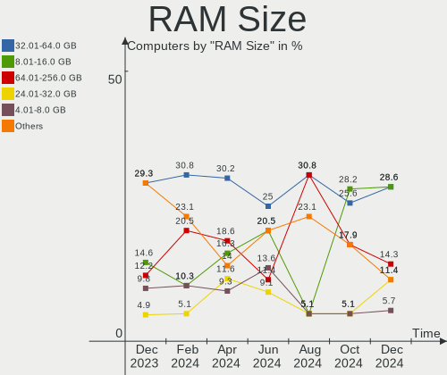
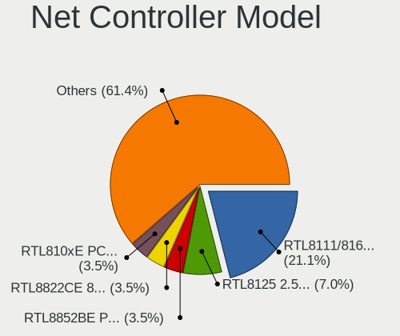
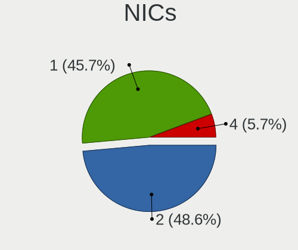

Gentoo - Hardware Trends
------------------------

A project to identify most popular hardware characteristics and track their change
over time based on data collected by Linux users at https://Linux-Hardware.org.

Anyone can contribute to this report by the [hw-probe](https://github.com/linuxhw/hw-probe) tool:

    sudo -E hw-probe -all -upload

This is a report for all computer types. See also reports for [desktops](/Dist/Gentoo/Desktop/README.md) and [notebooks](/Dist/Gentoo/Notebook/README.md).

This report is for one last month. Overall report since the beginning of time: [TestCoverage](https://github.com/linuxhw/TestCoverage)

Period: Sep, 2022.

Contents
--------

* [ System ](#system)
  - [ OS                       ](#os)
  - [ OS Family                ](#os-family)
  - [ Kernel                   ](#kernel)
  - [ Kernel Family            ](#kernel-family)
  - [ Kernel Major Ver.        ](#kernel-major-ver)
  - [ Arch                     ](#arch)
  - [ DE                       ](#de)
  - [ Display Server           ](#display-server)
  - [ Display Manager          ](#display-manager)
  - [ OS Lang                  ](#os-lang)
  - [ Boot Mode                ](#boot-mode)
  - [ Filesystem               ](#filesystem)
  - [ Part. scheme             ](#part-scheme)
  - [ Dual Boot with Linux/BSD ](#dual-boot-with-linuxbsd)
  - [ Dual Boot (Win)          ](#dual-boot-win)

* [ Board ](#board)
  - [ Vendor                   ](#vendor)
  - [ Model                    ](#model)
  - [ Model Family             ](#model-family)
  - [ MFG Year                 ](#mfg-year)
  - [ Form Factor              ](#form-factor)
  - [ Secure Boot              ](#secure-boot)
  - [ Coreboot                 ](#coreboot)
  - [ RAM Size                 ](#ram-size)
  - [ RAM Used                 ](#ram-used)
  - [ Total Drives             ](#total-drives)
  - [ Has CD-ROM               ](#has-cd-rom)
  - [ Has Ethernet             ](#has-ethernet)
  - [ Has WiFi                 ](#has-wifi)
  - [ Has Bluetooth            ](#has-bluetooth)

* [ Location ](#location)
  - [ Country                  ](#country)
  - [ City                     ](#city)

* [ Drives ](#drives)
  - [ Drive Vendor             ](#drive-vendor)
  - [ Drive Model              ](#drive-model)
  - [ HDD Vendor               ](#hdd-vendor)
  - [ SSD Vendor               ](#ssd-vendor)
  - [ Drive Kind               ](#drive-kind)
  - [ Drive Connector          ](#drive-connector)
  - [ Drive Size               ](#drive-size)
  - [ Space Total              ](#space-total)
  - [ Space Used               ](#space-used)
  - [ Malfunc. Drives          ](#malfunc-drives)
  - [ Malfunc. Drive Vendor    ](#malfunc-drive-vendor)
  - [ Malfunc. HDD Vendor      ](#malfunc-hdd-vendor)
  - [ Malfunc. Drive Kind      ](#malfunc-drive-kind)
  - [ Failed Drives            ](#failed-drives)
  - [ Failed Drive Vendor      ](#failed-drive-vendor)
  - [ Drive Status             ](#drive-status)

* [ Storage controller ](#storage-controller)
  - [ Storage Vendor           ](#storage-vendor)
  - [ Storage Model            ](#storage-model)
  - [ Storage Kind             ](#storage-kind)

* [ Processor ](#processor)
  - [ CPU Vendor               ](#cpu-vendor)
  - [ CPU Model                ](#cpu-model)
  - [ CPU Model Family         ](#cpu-model-family)
  - [ CPU Cores                ](#cpu-cores)
  - [ CPU Sockets              ](#cpu-sockets)
  - [ CPU Threads              ](#cpu-threads)
  - [ CPU Op-Modes             ](#cpu-op-modes)
  - [ CPU Microcode            ](#cpu-microcode)
  - [ CPU Microarch            ](#cpu-microarch)

* [ Graphics ](#graphics)
  - [ GPU Vendor               ](#gpu-vendor)
  - [ GPU Model                ](#gpu-model)
  - [ GPU Combo                ](#gpu-combo)
  - [ GPU Driver               ](#gpu-driver)
  - [ GPU Memory               ](#gpu-memory)

* [ Monitor ](#monitor)
  - [ Monitor Vendor           ](#monitor-vendor)
  - [ Monitor Model            ](#monitor-model)
  - [ Monitor Resolution       ](#monitor-resolution)
  - [ Monitor Diagonal         ](#monitor-diagonal)
  - [ Monitor Width            ](#monitor-width)
  - [ Aspect Ratio             ](#aspect-ratio)
  - [ Monitor Area             ](#monitor-area)
  - [ Pixel Density            ](#pixel-density)
  - [ Multiple Monitors        ](#multiple-monitors)

* [ Network ](#network)
  - [ Net Controller Vendor    ](#net-controller-vendor)
  - [ Net Controller Model     ](#net-controller-model)
  - [ Wireless Vendor          ](#wireless-vendor)
  - [ Wireless Model           ](#wireless-model)
  - [ Ethernet Vendor          ](#ethernet-vendor)
  - [ Ethernet Model           ](#ethernet-model)
  - [ Net Controller Kind      ](#net-controller-kind)
  - [ Used Controller          ](#used-controller)
  - [ NICs                     ](#nics)
  - [ IPv6                     ](#ipv6)

* [ Bluetooth ](#bluetooth)
  - [ Bluetooth Vendor         ](#bluetooth-vendor)
  - [ Bluetooth Model          ](#bluetooth-model)

* [ Sound ](#sound)
  - [ Sound Vendor             ](#sound-vendor)
  - [ Sound Model              ](#sound-model)

* [ Memory ](#memory)
  - [ Memory Vendor            ](#memory-vendor)
  - [ Memory Model             ](#memory-model)
  - [ Memory Kind              ](#memory-kind)
  - [ Memory Form Factor       ](#memory-form-factor)
  - [ Memory Size              ](#memory-size)
  - [ Memory Speed             ](#memory-speed)

* [ Printers & scanners ](#printers--scanners)
  - [ Printer Vendor           ](#printer-vendor)
  - [ Printer Model            ](#printer-model)
  - [ Scanner Vendor           ](#scanner-vendor)
  - [ Scanner Model            ](#scanner-model)

* [ Camera ](#camera)
  - [ Camera Vendor            ](#camera-vendor)
  - [ Camera Model             ](#camera-model)

* [ Security ](#security)
  - [ Fingerprint Vendor       ](#fingerprint-vendor)
  - [ Fingerprint Model        ](#fingerprint-model)
  - [ Chipcard Vendor          ](#chipcard-vendor)
  - [ Chipcard Model           ](#chipcard-model)

* [ Unsupported ](#unsupported)
  - [ Unsupported Devices      ](#unsupported-devices)
  - [ Unsupported Device Types ](#unsupported-device-types)

System
------

OS
--

Installed operating systems

| Name       | Computers | Percent |
|------------|-----------|---------|
| Gentoo 2.8 | 34        | 94.44%  |
| Gentoo 22  | 1         | 2.78%   |
| Gentoo 2.9 | 1         | 2.78%   |

OS Family
---------

OS without a version

| Name   | Computers | Percent |
|--------|-----------|---------|
| Gentoo | 36        | 100%    |

Kernel
------

Version of the Linux kernel

| Version                      | Computers | Percent |
|------------------------------|-----------|---------|
| 5.15.59-gentoo-x86_64        | 6         | 16.67%  |
| 5.15.59-gentoo               | 6         | 16.67%  |
| 5.15.68-gentoo-x86_64        | 3         | 8.33%   |
| 5.19.9-gentoo-x86_64         | 1         | 2.78%   |
| 5.19.9-gentoo                | 1         | 2.78%   |
| 5.19.8-xanmod1               | 1         | 2.78%   |
| 5.19.8-gentoo-x86_64         | 1         | 2.78%   |
| 5.19.8-gentoo-clang-lto-prjc | 1         | 2.78%   |
| 5.19.7-gentoo-x86_64         | 1         | 2.78%   |
| 5.19.6-gentoo-x86_64         | 1         | 2.78%   |
| 5.19.6-gentoo-dell-gentoid   | 1         | 2.78%   |
| 5.19.4-gentoo-dist           | 1         | 2.78%   |
| 5.19.11-renacuajo            | 1         | 2.78%   |
| 5.19.10-gentoo               | 1         | 2.78%   |
| 5.18.19-gentoo-r1            | 1         | 2.78%   |
| 5.18.16-arch1-1              | 1         | 2.78%   |
| 5.15.69-gentoo-x86_64        | 1         | 2.78%   |
| 5.15.69-gentoo-dist          | 1         | 2.78%   |
| 5.15.69-gentoo               | 1         | 2.78%   |
| 5.15.68-gentoo               | 1         | 2.78%   |
| 5.15.65                      | 1         | 2.78%   |
| 5.15.63-gentoo-dist          | 1         | 2.78%   |
| 5.15.59-gentoo-x86           | 1         | 2.78%   |
| 5.15.52-gentoo-x86           | 1         | 2.78%   |

Kernel Family
-------------

Linux kernel without a distro release

| Version | Computers | Percent |
|---------|-----------|---------|
| 5.15.59 | 13        | 36.11%  |
| 5.15.68 | 4         | 11.11%  |
| 5.19.8  | 3         | 8.33%   |
| 5.15.69 | 3         | 8.33%   |
| 5.19.9  | 2         | 5.56%   |
| 5.19.6  | 2         | 5.56%   |
| 5.19.7  | 1         | 2.78%   |
| 5.19.4  | 1         | 2.78%   |
| 5.19.11 | 1         | 2.78%   |
| 5.19.10 | 1         | 2.78%   |
| 5.18.19 | 1         | 2.78%   |
| 5.18.16 | 1         | 2.78%   |
| 5.15.65 | 1         | 2.78%   |
| 5.15.63 | 1         | 2.78%   |
| 5.15.52 | 1         | 2.78%   |

Kernel Major Ver.
-----------------

Linux kernel major version

| Version | Computers | Percent |
|---------|-----------|---------|
| 5.15    | 23        | 63.89%  |
| 5.19    | 11        | 30.56%  |
| 5.18    | 2         | 5.56%   |

Arch
----

OS architecture (x86_64, i586, etc.)

| Name   | Computers | Percent |
|--------|-----------|---------|
| x86_64 | 33        | 91.67%  |
| i686   | 3         | 8.33%   |

DE
--

Desktop Environment

| Name    | Computers | Percent |
|---------|-----------|---------|
| KDE5    | 12        | 33.33%  |
| Unknown | 10        | 27.78%  |
| GNOME   | 6         | 16.67%  |
| XFCE    | 5         | 13.89%  |
| LXQt    | 2         | 5.56%   |
| MATE    | 1         | 2.78%   |

Display Server
--------------

X11 or Wayland

| Name    | Computers | Percent |
|---------|-----------|---------|
| X11     | 13        | 36.11%  |
| Tty     | 12        | 33.33%  |
| Wayland | 7         | 19.44%  |
| Unknown | 4         | 11.11%  |

Display Manager
---------------

SDDM, LightDM, etc.

| Name    | Computers | Percent |
|---------|-----------|---------|
| SDDM    | 12        | 33.33%  |
| Unknown | 11        | 30.56%  |
| GDM     | 4         | 11.11%  |
| XDM     | 3         | 8.33%   |
| LightDM | 3         | 8.33%   |
| LXDM    | 2         | 5.56%   |
| SLiM    | 1         | 2.78%   |

OS Lang
-------

Language

| Lang       | Computers | Percent |
|------------|-----------|---------|
| en_US      | 12        | 33.33%  |
| de_DE      | 4         | 11.11%  |
| pt_BR      | 3         | 8.33%   |
| en_GB      | 3         | 8.33%   |
| C.UTF8     | 3         | 8.33%   |
| pl_PL      | 2         | 5.56%   |
| C          | 2         | 5.56%   |
| Unknown    | 2         | 5.56%   |
| ru_RU      | 1         | 2.78%   |
| es_ES      | 1         | 2.78%   |
| en_US.UTF8 | 1         | 2.78%   |
| en_AU      | 1         | 2.78%   |
| cs_CZ      | 1         | 2.78%   |

Boot Mode
---------

EFI or BIOS

| Mode | Computers | Percent |
|------|-----------|---------|
| EFI  | 28        | 77.78%  |
| BIOS | 8         | 22.22%  |

Filesystem
----------

Type of filesystem

| Type    | Computers | Percent |
|---------|-----------|---------|
| Ext4    | 24        | 66.67%  |
| Btrfs   | 7         | 19.44%  |
| Zfs     | 2         | 5.56%   |
| F2fs    | 2         | 5.56%   |
| XXXXXXX | 1         | 2.78%   |

Part. scheme
------------

Scheme of partitioning

| Type | Computers | Percent |
|------|-----------|---------|
| GPT  | 32        | 88.89%  |
| MBR  | 4         | 11.11%  |

Dual Boot with Linux/BSD
------------------------

Hosting more than one Linux/BSD

| Dual boot | Computers | Percent |
|-----------|-----------|---------|
| No        | 24        | 66.67%  |
| Yes       | 12        | 33.33%  |

Dual Boot (Win)
---------------

Hosting Linux and Windows

| Dual boot | Computers | Percent |
|-----------|-----------|---------|
| No        | 27        | 75%     |
| Yes       | 9         | 25%     |

Board
-----

Vendor
------

Motherboard manufacturer

| Name                           | Computers | Percent |
|--------------------------------|-----------|---------|
| ASUSTek Computer               | 7         | 19.44%  |
| Lenovo                         | 5         | 13.89%  |
| Hewlett-Packard                | 5         | 13.89%  |
| Gigabyte Technology            | 3         | 8.33%   |
| MSI                            | 2         | 5.56%   |
| Dell                           | 2         | 5.56%   |
| ASRock                         | 2         | 5.56%   |
| Acer                           | 2         | 5.56%   |
| win element                    | 1         | 2.78%   |
| Timi                           | 1         | 2.78%   |
| System76                       | 1         | 2.78%   |
| Supermicro                     | 1         | 2.78%   |
| Sony                           | 1         | 2.78%   |
| Matsushita Electric Industrial | 1         | 2.78%   |
| Intel                          | 1         | 2.78%   |
| HUAWEI                         | 1         | 2.78%   |

Model
-----

Motherboard model

| Name                                        | Computers | Percent |
|---------------------------------------------|-----------|---------|
| Lenovo ThinkPad E15 Gen 2 20T8000MPB        | 2         | 5.56%   |
| HP Laptop 14-dk1xxx                         | 2         | 5.56%   |
| win element MoreFine S500+                  | 1         | 2.78%   |
| Timi TM1604                                 | 1         | 2.78%   |
| System76 Gazelle Professional               | 1         | 2.78%   |
| Supermicro Super Server                     | 1         | 2.78%   |
| Sony PCG-GRT230(UC)                         | 1         | 2.78%   |
| MSI MS-7C02                                 | 1         | 2.78%   |
| MSI MS-7B89                                 | 1         | 2.78%   |
| Matsushita Electric Industrial CF-29LTQGZBM | 1         | 2.78%   |
| Lenovo ThinkPad T14 Gen 3 21AH0093CK        | 1         | 2.78%   |
| Lenovo ThinkPad P73 20QRS0G700              | 1         | 2.78%   |
| Lenovo ThinkPad L580 20LWCTO1WW             | 1         | 2.78%   |
| Intel X79                                   | 1         | 2.78%   |
| HUAWEI KLVL-WXX9                            | 1         | 2.78%   |
| HP Laptop 15s-eq2xxx                        | 1         | 2.78%   |
| HP EliteBook 8770w                          | 1         | 2.78%   |
| HP EliteBook 830 G6                         | 1         | 2.78%   |
| Gigabyte Z590 UD                            | 1         | 2.78%   |
| Gigabyte B660 GAMING X AX DDR4              | 1         | 2.78%   |
| Gigabyte AB350-Gaming                       | 1         | 2.78%   |
| Dell Latitude D410                          | 1         | 2.78%   |
| Dell G7 7588                                | 1         | 2.78%   |
| ASUS ROG STRIX Z590-E GAMING WIFI           | 1         | 2.78%   |
| ASUS ROG STRIX X570-I GAMING                | 1         | 2.78%   |
| ASUS ROG STRIX B550-F GAMING                | 1         | 2.78%   |
| ASUS ROG STRIX B450-F GAMING                | 1         | 2.78%   |
| ASUS ROG CROSSHAIR VIII HERO                | 1         | 2.78%   |
| ASUS M3A78-CM                               | 1         | 2.78%   |
| ASUS All Series                             | 1         | 2.78%   |
| ASRock Z390 Phantom Gaming 4S               | 1         | 2.78%   |
| ASRock J3160M                               | 1         | 2.78%   |
| Acer Swift SF314-42                         | 1         | 2.78%   |
| Acer Predator PH315-51                      | 1         | 2.78%   |

Model Family
------------

Motherboard model prefix

| Name                                        | Computers | Percent |
|---------------------------------------------|-----------|---------|
| Lenovo ThinkPad                             | 5         | 13.89%  |
| ASUS ROG                                    | 5         | 13.89%  |
| HP Laptop                                   | 3         | 8.33%   |
| HP EliteBook                                | 2         | 5.56%   |
| win element MoreFine                        | 1         | 2.78%   |
| Timi TM1604                                 | 1         | 2.78%   |
| System76 Gazelle                            | 1         | 2.78%   |
| Supermicro Super                            | 1         | 2.78%   |
| Sony PCG-GRT230(UC)                         | 1         | 2.78%   |
| MSI MS-7C02                                 | 1         | 2.78%   |
| MSI MS-7B89                                 | 1         | 2.78%   |
| Matsushita Electric Industrial CF-29LTQGZBM | 1         | 2.78%   |
| Intel X79                                   | 1         | 2.78%   |
| HUAWEI KLVL-WXX9                            | 1         | 2.78%   |
| Gigabyte Z590                               | 1         | 2.78%   |
| Gigabyte B660                               | 1         | 2.78%   |
| Gigabyte AB350-Gaming                       | 1         | 2.78%   |
| Dell Latitude                               | 1         | 2.78%   |
| Dell G7                                     | 1         | 2.78%   |
| ASUS M3A78-CM                               | 1         | 2.78%   |
| ASUS All                                    | 1         | 2.78%   |
| ASRock Z390                                 | 1         | 2.78%   |
| ASRock J3160M                               | 1         | 2.78%   |
| Acer Swift                                  | 1         | 2.78%   |
| Acer Predator                               | 1         | 2.78%   |

MFG Year
--------

Motherboard manufacture year

| Year | Computers | Percent |
|------|-----------|---------|
| 2020 | 8         | 22.22%  |
| 2019 | 7         | 19.44%  |
| 2018 | 5         | 13.89%  |
| 2021 | 4         | 11.11%  |
| 2022 | 2         | 5.56%   |
| 2017 | 2         | 5.56%   |
| 2012 | 2         | 5.56%   |
| 2016 | 1         | 2.78%   |
| 2014 | 1         | 2.78%   |
| 2008 | 1         | 2.78%   |
| 2006 | 1         | 2.78%   |
| 2005 | 1         | 2.78%   |
| 2003 | 1         | 2.78%   |

Form Factor
-----------

Physical design of the computer

| Name     | Computers | Percent |
|----------|-----------|---------|
| Notebook | 20        | 55.56%  |
| Desktop  | 15        | 41.67%  |
| Server   | 1         | 2.78%   |

Secure Boot
-----------

Enabled or disabled

| State    | Computers | Percent |
|----------|-----------|---------|
| Disabled | 36        | 100%    |

Coreboot
--------

Have coreboot on board

| Used | Computers | Percent |
|------|-----------|---------|
| No   | 36        | 100%    |

RAM Size
--------

Total RAM memory

| Size in GB  | Computers | Percent |
|-------------|-----------|---------|
| 32.01-64.0  | 12        | 33.33%  |
| 4.01-8.0    | 8         | 22.22%  |
| 64.01-256.0 | 4         | 11.11%  |
| 16.01-24.0  | 4         | 11.11%  |
| 8.01-16.0   | 3         | 8.33%   |
| 24.01-32.0  | 2         | 5.56%   |
| 1.01-2.0    | 1         | 2.78%   |
| 0.51-1.0    | 1         | 2.78%   |
| 0.01-0.5    | 1         | 2.78%   |

RAM Used
--------

Used RAM memory

| Used GB    | Computers | Percent |
|------------|-----------|---------|
| 2.01-3.0   | 9         | 25%     |
| 1.01-2.0   | 7         | 19.44%  |
| 0.01-0.5   | 6         | 16.67%  |
| 8.01-16.0  | 4         | 11.11%  |
| 4.01-8.0   | 3         | 8.33%   |
| 3.01-4.0   | 2         | 5.56%   |
| 16.01-24.0 | 2         | 5.56%   |
| 0.51-1.0   | 2         | 5.56%   |
| 32.01-64.0 | 1         | 2.78%   |

Total Drives
------------

Number of drives on board

| Drives | Computers | Percent |
|--------|-----------|---------|
| 1      | 15        | 41.67%  |
| 2      | 10        | 27.78%  |
| 3      | 5         | 13.89%  |
| 6      | 2         | 5.56%   |
| 4      | 2         | 5.56%   |
| 7      | 1         | 2.78%   |
| 5      | 1         | 2.78%   |

Has CD-ROM
----------

Has CD-ROM on board

| Presented | Computers | Percent |
|-----------|-----------|---------|
| No        | 30        | 83.33%  |
| Yes       | 6         | 16.67%  |

Has Ethernet
------------

Has Ethernet on board

| Presented | Computers | Percent |
|-----------|-----------|---------|
| Yes       | 33        | 91.67%  |
| No        | 3         | 8.33%   |

Has WiFi
--------

Has WiFi module

| Presented | Computers | Percent |
|-----------|-----------|---------|
| Yes       | 27        | 75%     |
| No        | 9         | 25%     |

Has Bluetooth
-------------

Has Bluetooth module

| Presented | Computers | Percent |
|-----------|-----------|---------|
| Yes       | 21        | 58.33%  |
| No        | 15        | 41.67%  |

Location
--------

Country
-------

Geographic location (country)

| Country   | Computers | Percent |
|-----------|-----------|---------|
| USA       | 8         | 22.22%  |
| Germany   | 6         | 16.67%  |
| Poland    | 5         | 13.89%  |
| China     | 3         | 8.33%   |
| Brazil    | 3         | 8.33%   |
| Czechia   | 2         | 5.56%   |
| UK        | 1         | 2.78%   |
| Spain     | 1         | 2.78%   |
| Russia    | 1         | 2.78%   |
| Portugal  | 1         | 2.78%   |
| Norway    | 1         | 2.78%   |
| Mexico    | 1         | 2.78%   |
| Canada    | 1         | 2.78%   |
| Australia | 1         | 2.78%   |
| Argentina | 1         | 2.78%   |

City
----

Geographic location (city)

| City                    | Computers | Percent |
|-------------------------|-----------|---------|
| Berlin                  | 3         | 8.33%   |
| Weatherford             | 2         | 5.56%   |
| Cieszyn                 | 2         | 5.56%   |
| Chengdu                 | 2         | 5.56%   |
| Wroclaw                 | 1         | 2.78%   |
| Warsaw                  | 1         | 2.78%   |
| Villanueva del Pardillo | 1         | 2.78%   |
| Tonbridge               | 1         | 2.78%   |
| Sydney                  | 1         | 2.78%   |
| Stuttgart               | 1         | 2.78%   |
| Sao Paulo               | 1         | 2.78%   |
| Santa Teresinha         | 1         | 2.78%   |
| Røyken Municipality    | 1         | 2.78%   |
| Rosario                 | 1         | 2.78%   |
| Prague                  | 1         | 2.78%   |
| Ponetovice              | 1         | 2.78%   |
| Orange                  | 1         | 2.78%   |
| Moscow                  | 1         | 2.78%   |
| Mondim de Basto         | 1         | 2.78%   |
| Milton                  | 1         | 2.78%   |
| Mexico City             | 1         | 2.78%   |
| Los Angeles             | 1         | 2.78%   |
| Lincoln                 | 1         | 2.78%   |
| Hangzhou                | 1         | 2.78%   |
| Görlitz                | 1         | 2.78%   |
| Goiânia                | 1         | 2.78%   |
| Fort Worth              | 1         | 2.78%   |
| Flemington              | 1         | 2.78%   |
| Fayetteville            | 1         | 2.78%   |
| Cottbus                 | 1         | 2.78%   |
| Boska Wola              | 1         | 2.78%   |

Drives
------

Drive Vendor
------------

Hard drive vendors

| Vendor              | Computers | Drives | Percent |
|---------------------|-----------|--------|---------|
| Samsung Electronics | 13        | 23     | 20.63%  |
| WDC                 | 11        | 14     | 17.46%  |
| Seagate             | 7         | 10     | 11.11%  |
| Toshiba             | 5         | 5      | 7.94%   |
| Kingston            | 5         | 5      | 7.94%   |
| A-DATA Technology   | 3         | 3      | 4.76%   |
| Hitachi             | 2         | 4      | 3.17%   |
| GOODRAM             | 2         | 2      | 3.17%   |
| Crucial             | 2         | 3      | 3.17%   |
| Zheino              | 1         | 1      | 1.59%   |
| Unknown             | 1         | 1      | 1.59%   |
| UMIS                | 1         | 1      | 1.59%   |
| SanDisk             | 1         | 1      | 1.59%   |
| Phison Electronics  | 1         | 1      | 1.59%   |
| Patriot             | 1         | 1      | 1.59%   |
| Micron Technology   | 1         | 1      | 1.59%   |
| KIOXIA              | 1         | 1      | 1.59%   |
| Intel               | 1         | 1      | 1.59%   |
| IBM/Hitachi         | 1         | 1      | 1.59%   |
| HGST                | 1         | 1      | 1.59%   |
| Apacer              | 1         | 1      | 1.59%   |
| ADATA Technology    | 1         | 1      | 1.59%   |

Drive Model
-----------

Hard drive models

| Model                                   | Computers | Percent |
|-----------------------------------------|-----------|---------|
| WDC PC SN530 SDBPNPZ-512G-1114 512GB    | 2         | 2.6%    |
| Samsung SSD 980 PRO 1TB                 | 2         | 2.6%    |
| Samsung SSD 860 EVO 1TB                 | 2         | 2.6%    |
| Kingston RBU-SNS8350DES3128GP 128GB SSD | 2         | 2.6%    |
| GOODRAM SSDPR-CL100-480-G2 480GB        | 2         | 2.6%    |
| Zheino CHN-mSATAQ3-120 120GB SSD        | 1         | 1.3%    |
| WDC WDS500G2B0A-00SM50 500GB SSD        | 1         | 1.3%    |
| WDC WDS240G2G0A-00JH30 240GB SSD        | 1         | 1.3%    |
| WDC WDS200T2B0B-00YS70 2TB SSD          | 1         | 1.3%    |
| WDC WDS100T3X0C-00SJG0 1TB              | 1         | 1.3%    |
| WDC WD80EFAX-68KNBN0 8TB                | 1         | 1.3%    |
| WDC WD8003FFBX-68B9AN0 8TB              | 1         | 1.3%    |
| WDC WD60EZRZ-22GZ5B1 6TB                | 1         | 1.3%    |
| WDC WD60EZRX-00MVLB1 6TB                | 1         | 1.3%    |
| WDC WD40EZRZ-00GXCB0 4TB                | 1         | 1.3%    |
| WDC WD1600AAJS-75B4A0 160GB             | 1         | 1.3%    |
| WDC WD10SPZX-75Z10T2 1TB                | 1         | 1.3%    |
| WDC WD1003FZEX-00K3CA0 1TB              | 1         | 1.3%    |
| Unknown MMC Card  64GB                  | 1         | 1.3%    |
| UMIS RPJTJ512MEE1OWX 512GB              | 1         | 1.3%    |
| Toshiba THNSF51T02DU7 1TB               | 1         | 1.3%    |
| Toshiba MK5061GSY 500GB                 | 1         | 1.3%    |
| Toshiba HDWE150 5TB                     | 1         | 1.3%    |
| Toshiba HDWE140 4TB                     | 1         | 1.3%    |
| Toshiba DT01ACA100 1TB                  | 1         | 1.3%    |
| Seagate ST8000DM004-2CX188 8TB          | 1         | 1.3%    |
| Seagate ST4000DM004-2CV104 4TB          | 1         | 1.3%    |
| Seagate ST3000DM001-9YN166 3TB          | 1         | 1.3%    |
| Seagate ST2000VN004-2E4164 2TB          | 1         | 1.3%    |
| Seagate ST2000LM015-2E8174 2TB          | 1         | 1.3%    |
| Seagate ST12000NM0008-2H3101 12TB       | 1         | 1.3%    |
| Seagate ST1000LM024 HN-M101MBB 1TB      | 1         | 1.3%    |
| Seagate ST1000DM003-9YN162 1TB          | 1         | 1.3%    |
| Seagate ST1000DM003-1CH162 1TB          | 1         | 1.3%    |
| SanDisk NVMe SSD Drive 500GB            | 1         | 1.3%    |
| Samsung SSD 970 PRO 1TB                 | 1         | 1.3%    |
| Samsung SSD 970 EVO Plus 500GB          | 1         | 1.3%    |
| Samsung SSD 870 QVO 2TB                 | 1         | 1.3%    |
| Samsung SSD 870 EVO 500GB               | 1         | 1.3%    |
| Samsung SSD 860 EVO 500GB               | 1         | 1.3%    |

HDD Vendor
----------

Hard disk drive vendors

| Vendor              | Computers | Drives | Percent |
|---------------------|-----------|--------|---------|
| Seagate             | 7         | 10     | 30.43%  |
| WDC                 | 6         | 8      | 26.09%  |
| Toshiba             | 4         | 4      | 17.39%  |
| Samsung Electronics | 2         | 2      | 8.7%    |
| Hitachi             | 2         | 4      | 8.7%    |
| IBM/Hitachi         | 1         | 1      | 4.35%   |
| HGST                | 1         | 1      | 4.35%   |

SSD Vendor
----------

Solid state drive vendors

| Vendor              | Computers | Drives | Percent |
|---------------------|-----------|--------|---------|
| Samsung Electronics | 8         | 10     | 33.33%  |
| WDC                 | 3         | 3      | 12.5%   |
| Kingston            | 3         | 3      | 12.5%   |
| A-DATA Technology   | 3         | 3      | 12.5%   |
| GOODRAM             | 2         | 2      | 8.33%   |
| Crucial             | 2         | 2      | 8.33%   |
| Zheino              | 1         | 1      | 4.17%   |
| Patriot             | 1         | 1      | 4.17%   |
| Micron Technology   | 1         | 1      | 4.17%   |

Drive Kind
----------

HDD or SSD

| Kind | Computers | Drives | Percent |
|------|-----------|--------|---------|
| SSD  | 22        | 26     | 37.93%  |
| NVMe | 19        | 25     | 32.76%  |
| HDD  | 16        | 30     | 27.59%  |
| MMC  | 1         | 1      | 1.72%   |

Drive Connector
---------------

SATA, SAS, NVMe, etc.

| Type | Computers | Drives | Percent |
|------|-----------|--------|---------|
| SATA | 26        | 56     | 56.52%  |
| NVMe | 19        | 25     | 41.3%   |
| MMC  | 1         | 1      | 2.17%   |

Drive Size
----------

Size of hard drive

| Size in TB | Computers | Drives | Percent |
|------------|-----------|--------|---------|
| 0.01-0.5   | 20        | 24     | 45.45%  |
| 0.51-1.0   | 10        | 12     | 22.73%  |
| 1.01-2.0   | 4         | 6      | 9.09%   |
| 4.01-10.0  | 4         | 6      | 9.09%   |
| 3.01-4.0   | 3         | 3      | 6.82%   |
| 2.01-3.0   | 2         | 4      | 4.55%   |
| 10.01-20.0 | 1         | 1      | 2.27%   |

Space Total
-----------

Amount of disk space available on the file system

| Size in GB     | Computers | Percent |
|----------------|-----------|---------|
| 251-500        | 7         | 19.44%  |
| More than 3000 | 6         | 16.67%  |
| 101-250        | 6         | 16.67%  |
| 1001-2000      | 6         | 16.67%  |
| 2001-3000      | 3         | 8.33%   |
| 21-50          | 2         | 5.56%   |
| 501-1000       | 2         | 5.56%   |
| Unknown        | 2         | 5.56%   |
| 1-20           | 1         | 2.78%   |
| 51-100         | 1         | 2.78%   |

Space Used
----------

Amount of used disk space

| Used GB        | Computers | Percent |
|----------------|-----------|---------|
| 1-20           | 8         | 22.22%  |
| More than 3000 | 5         | 13.89%  |
| 251-500        | 4         | 11.11%  |
| 21-50          | 4         | 11.11%  |
| 51-100         | 4         | 11.11%  |
| 101-250        | 3         | 8.33%   |
| 1001-2000      | 3         | 8.33%   |
| 501-1000       | 2         | 5.56%   |
| Unknown        | 2         | 5.56%   |
| 2001-3000      | 1         | 2.78%   |

Malfunc. Drives
---------------

Drive models with a malfunction

| Model                                        | Computers | Drives | Percent |
|----------------------------------------------|-----------|--------|---------|
| Kingston RBU-SNS8350DES3128GP 128GB SSD      | 2         | 2      | 25%     |
| WDC WD1600AAJS-75B4A0 160GB                  | 1         | 1      | 12.5%   |
| Seagate ST3000DM001-9YN166 3TB               | 1         | 1      | 12.5%   |
| Seagate ST1000LM024 HN-M101MBB 1TB           | 1         | 1      | 12.5%   |
| Samsung Electronics SSD 870 EVO 500GB        | 1         | 1      | 12.5%   |
| Samsung Electronics HD103SJ 1TB              | 1         | 1      | 12.5%   |
| A-DATA Technology AXNS381E-256GM-B 256GB SSD | 1         | 1      | 12.5%   |

Malfunc. Drive Vendor
---------------------

Vendors of faulty drives

| Vendor              | Computers | Drives | Percent |
|---------------------|-----------|--------|---------|
| Seagate             | 2         | 2      | 28.57%  |
| Kingston            | 2         | 2      | 28.57%  |
| WDC                 | 1         | 1      | 14.29%  |
| Samsung Electronics | 1         | 2      | 14.29%  |
| A-DATA Technology   | 1         | 1      | 14.29%  |

Malfunc. HDD Vendor
-------------------

Vendors of faulty HDD drives

| Vendor              | Computers | Drives | Percent |
|---------------------|-----------|--------|---------|
| Seagate             | 2         | 2      | 50%     |
| WDC                 | 1         | 1      | 25%     |
| Samsung Electronics | 1         | 1      | 25%     |

Malfunc. Drive Kind
-------------------

Kinds of faulty drives

| Kind | Computers | Drives | Percent |
|------|-----------|--------|---------|
| SSD  | 4         | 4      | 50%     |
| HDD  | 4         | 4      | 50%     |

Failed Drives
-------------

Failed drive models

Zero info for selected period =(

Failed Drive Vendor
-------------------

Failed drive vendors

Zero info for selected period =(

Drive Status
------------

Number of failed and malfunc. drives

| Status   | Computers | Drives | Percent |
|----------|-----------|--------|---------|
| Works    | 31        | 72     | 77.5%   |
| Malfunc  | 7         | 8      | 17.5%   |
| Detected | 2         | 2      | 5%      |

Storage controller
------------------

Storage Vendor
--------------

Storage controller vendors

| Vendor                           | Computers | Percent |
|----------------------------------|-----------|---------|
| Intel                            | 15        | 27.78%  |
| AMD                              | 14        | 25.93%  |
| Samsung Electronics              | 9         | 16.67%  |
| SanDisk                          | 4         | 7.41%   |
| Phison Electronics               | 2         | 3.7%    |
| Kingston Technology Company      | 2         | 3.7%    |
| Union Memory (Shenzhen)          | 1         | 1.85%   |
| Toshiba America Info Systems     | 1         | 1.85%   |
| Silicon Integrated Systems [SiS] | 1         | 1.85%   |
| Micron/Crucial Technology        | 1         | 1.85%   |
| KIOXIA                           | 1         | 1.85%   |
| JMicron Technology               | 1         | 1.85%   |
| ASMedia Technology               | 1         | 1.85%   |
| ADATA Technology                 | 1         | 1.85%   |

Storage Model
-------------

Storage controller models

| Model                                                                            | Computers | Percent |
|----------------------------------------------------------------------------------|-----------|---------|
| AMD FCH SATA Controller [AHCI mode]                                              | 11        | 18.97%  |
| Samsung NVMe SSD Controller SM981/PM981/PM983                                    | 4         | 6.9%    |
| Samsung NVMe SSD Controller PM9A1/PM9A3/980PRO                                   | 4         | 6.9%    |
| Intel Cannon Lake Mobile PCH SATA AHCI Controller                                | 3         | 5.17%   |
| AMD 400 Series Chipset SATA Controller                                           | 3         | 5.17%   |
| SanDisk WD Blue SN550 NVMe SSD                                                   | 2         | 3.45%   |
| Intel 7 Series Chipset Family 6-port SATA Controller [AHCI mode]                 | 2         | 3.45%   |
| Union Memory (Shenzhen) Non-Volatile memory controller                           | 1         | 1.72%   |
| Toshiba America Info Systems NVMe Controller                                     | 1         | 1.72%   |
| Silicon Integrated Systems [SiS] 5513 IDE Controller                             | 1         | 1.72%   |
| SanDisk WD Blue SN570 NVMe SSD                                                   | 1         | 1.72%   |
| SanDisk WD Black SN750 / PC SN730 NVMe SSD                                       | 1         | 1.72%   |
| Samsung NVMe SSD Controller SM961/PM961/SM963                                    | 1         | 1.72%   |
| Phison PS5013 E13 NVMe Controller                                                | 1         | 1.72%   |
| Phison E7 NVMe Controller                                                        | 1         | 1.72%   |
| Micron/Crucial P2 NVMe PCIe SSD                                                  | 1         | 1.72%   |
| KIOXIA NVMe SSD Controller BG4                                                   | 1         | 1.72%   |
| Kingston Company U-SNS8154P3 NVMe SSD                                            | 1         | 1.72%   |
| Kingston Company Company Non-Volatile memory controller                          | 1         | 1.72%   |
| JMicron JMB360 AHCI Controller                                                   | 1         | 1.72%   |
| Intel Sunrise Point-LP SATA Controller [AHCI mode]                               | 1         | 1.72%   |
| Intel SSD 660P Series                                                            | 1         | 1.72%   |
| Intel Cannon Lake PCH SATA AHCI Controller                                       | 1         | 1.72%   |
| Intel C600/X79 series chipset 6-Port SATA AHCI Controller                        | 1         | 1.72%   |
| Intel Atom/Celeron/Pentium Processor x5-E8000/J3xxx/N3xxx Series SATA Controller | 1         | 1.72%   |
| Intel Alder Lake-S PCH SATA Controller [AHCI Mode]                               | 1         | 1.72%   |
| Intel 82801FBM (ICH6M) SATA Controller                                           | 1         | 1.72%   |
| Intel 82801FB/FBM/FR/FW/FRW (ICH6 Family) IDE Controller                         | 1         | 1.72%   |
| Intel 500 Series Chipset Family SATA RAID Controller                             | 1         | 1.72%   |
| Intel 500 Series Chipset Family SATA AHCI Controller                             | 1         | 1.72%   |
| ASMedia 106x SATA/RAID Controller                                                | 1         | 1.72%   |
| AMD SB7x0/SB8x0/SB9x0 SATA Controller [IDE mode]                                 | 1         | 1.72%   |
| AMD SB7x0/SB8x0/SB9x0 IDE Controller                                             | 1         | 1.72%   |
| AMD 500 Series Chipset SATA Controller                                           | 1         | 1.72%   |
| AMD 300 Series Chipset SATA Controller                                           | 1         | 1.72%   |
| ADATA XPG SX8200 Pro PCIe Gen3x4 M.2 2280 Solid State Drive                      | 1         | 1.72%   |

Storage Kind
------------

Kind of storage controller (IDE, SATA, NVMe, SAS, ...)

| Kind | Computers | Percent |
|------|-----------|---------|
| SATA | 25        | 51.02%  |
| NVMe | 19        | 38.78%  |
| IDE  | 4         | 8.16%   |
| RAID | 1         | 2.04%   |

Processor
---------

CPU Vendor
----------

Processor vendors

| Vendor | Computers | Percent |
|--------|-----------|---------|
| Intel  | 18        | 50%     |
| AMD    | 18        | 50%     |

CPU Model
---------

Processor models

| Model                                    | Computers | Percent |
|------------------------------------------|-----------|---------|
| Intel Core i7-8750H CPU @ 2.20GHz        | 2         | 5.56%   |
| AMD Ryzen 5 4500U with Radeon Graphics   | 2         | 5.56%   |
| AMD Ryzen 3 3250U with Radeon Graphics   | 2         | 5.56%   |
| Intel Xeon E-2276M CPU @ 2.80GHz         | 1         | 2.78%   |
| Intel Xeon CPU E5-2650 v2 @ 2.60GHz      | 1         | 2.78%   |
| Intel Pentium M processor 2.00GHz        | 1         | 2.78%   |
| Intel Pentium M processor 1.60GHz        | 1         | 2.78%   |
| Intel Pentium 4 CPU 2.40GHz              | 1         | 2.78%   |
| Intel Core i7-9700F CPU @ 3.00GHz        | 1         | 2.78%   |
| Intel Core i7-8565U CPU @ 1.80GHz        | 1         | 2.78%   |
| Intel Core i7-3740QM CPU @ 2.70GHz       | 1         | 2.78%   |
| Intel Core i7-3610QM CPU @ 2.30GHz       | 1         | 2.78%   |
| Intel Core i5-8350U CPU @ 1.70GHz        | 1         | 2.78%   |
| Intel Core i5-7200U CPU @ 2.50GHz        | 1         | 2.78%   |
| Intel Celeron CPU J3160 @ 1.60GHz        | 1         | 2.78%   |
| Intel 12th Gen Core i7-1260P             | 1         | 2.78%   |
| Intel 12th Gen Core i5-12600KF           | 1         | 2.78%   |
| Intel 11th Gen Core i9-11900KF @ 3.50GHz | 1         | 2.78%   |
| Intel 11th Gen Core i7-11700K @ 3.60GHz  | 1         | 2.78%   |
| AMD Ryzen 9 5900X 12-Core Processor      | 1         | 2.78%   |
| AMD Ryzen 9 3900X 12-Core Processor      | 1         | 2.78%   |
| AMD Ryzen 7 5800H with Radeon Graphics   | 1         | 2.78%   |
| AMD Ryzen 7 4800H with Radeon Graphics   | 1         | 2.78%   |
| AMD Ryzen 7 4700U with Radeon Graphics   | 1         | 2.78%   |
| AMD Ryzen 7 3800X 8-Core Processor       | 1         | 2.78%   |
| AMD Ryzen 7 3700X 8-Core Processor       | 1         | 2.78%   |
| AMD Ryzen 5 5600X 6-Core Processor       | 1         | 2.78%   |
| AMD Ryzen 5 5500U with Radeon Graphics   | 1         | 2.78%   |
| AMD Ryzen 5 3600 6-Core Processor        | 1         | 2.78%   |
| AMD Ryzen 5 2600 Six-Core Processor      | 1         | 2.78%   |
| AMD Phenom II X4 955 Processor           | 1         | 2.78%   |
| AMD EPYC 7281 16-Core Processor          | 1         | 2.78%   |
| AMD Athlon 5370 APU with Radeon R3       | 1         | 2.78%   |

CPU Model Family
----------------

Processor model prefix

| Model            | Computers | Percent |
|------------------|-----------|---------|
| Intel Core i7    | 6         | 16.67%  |
| AMD Ryzen 5      | 6         | 16.67%  |
| AMD Ryzen 7      | 5         | 13.89%  |
| Other            | 4         | 11.11%  |
| Intel Xeon       | 2         | 5.56%   |
| Intel Pentium M  | 2         | 5.56%   |
| Intel Core i5    | 2         | 5.56%   |
| AMD Ryzen 9      | 2         | 5.56%   |
| AMD Ryzen 3      | 2         | 5.56%   |
| Intel Pentium 4  | 1         | 2.78%   |
| Intel Celeron    | 1         | 2.78%   |
| AMD Phenom II X4 | 1         | 2.78%   |
| AMD EPYC         | 1         | 2.78%   |
| AMD Athlon       | 1         | 2.78%   |

CPU Cores
---------

Number of processor cores

| Number | Computers | Percent |
|--------|-----------|---------|
| 8      | 9         | 25%     |
| 6      | 9         | 25%     |
| 4      | 7         | 19.44%  |
| 12     | 3         | 8.33%   |
| 2      | 3         | 8.33%   |
| 1      | 3         | 8.33%   |
| 16     | 1         | 2.78%   |
| 10     | 1         | 2.78%   |

CPU Sockets
-----------

Number of sockets

| Number | Computers | Percent |
|--------|-----------|---------|
| 1      | 36        | 100%    |

CPU Threads
-----------

Threads per core (Hyper-Threading)

| Number | Computers | Percent |
|--------|-----------|---------|
| 2      | 25        | 69.44%  |
| 1      | 11        | 30.56%  |

CPU Op-Modes
------------

CPU Operation Modes (32-bit, 64-bit)

| Op mode        | Computers | Percent |
|----------------|-----------|---------|
| 32-bit, 64-bit | 33        | 91.67%  |
| 32-bit         | 3         | 8.33%   |

CPU Microcode
-------------

Microcode number

| Number     | Computers | Percent |
|------------|-----------|---------|
| 0x08701021 | 3         | 8.33%   |
| Unknown    | 3         | 8.33%   |
| 0xa0671    | 2         | 5.56%   |
| 0x906ed    | 2         | 5.56%   |
| 0x906ea    | 2         | 5.56%   |
| 0x306a9    | 2         | 5.56%   |
| 0x08600103 | 2         | 5.56%   |
| 0x08108109 | 2         | 5.56%   |
| 0xf29      | 1         | 2.78%   |
| 0x906a3    | 1         | 2.78%   |
| 0x90672    | 1         | 2.78%   |
| 0x806ec    | 1         | 2.78%   |
| 0x806e9    | 1         | 2.78%   |
| 0x6d8      | 1         | 2.78%   |
| 0x306e4    | 1         | 2.78%   |
| 0x0a50000c | 1         | 2.78%   |
| 0x0a201016 | 1         | 2.78%   |
| 0x08701013 | 1         | 2.78%   |
| 0x08608103 | 1         | 2.78%   |
| 0x08600106 | 1         | 2.78%   |
| 0x08600102 | 1         | 2.78%   |
| 0x0800820d | 1         | 2.78%   |
| 0x0800126e | 1         | 2.78%   |
| 0x0700010b | 1         | 2.78%   |
| 0x010000db | 1         | 2.78%   |
| 0x00000000 | 1         | 2.78%   |

CPU Microarch
-------------

Microarchitecture

| Name             | Computers | Percent |
|------------------|-----------|---------|
| Zen 2            | 8         | 22.22%  |
| KabyLake         | 7         | 19.44%  |
| Zen+             | 3         | 8.33%   |
| Zen 3            | 3         | 8.33%   |
| IvyBridge        | 3         | 8.33%   |
| P6               | 2         | 5.56%   |
| Icelake          | 2         | 5.56%   |
| Alderlake Hybrid | 2         | 5.56%   |
| Zen              | 1         | 2.78%   |
| Silvermont       | 1         | 2.78%   |
| NetBurst         | 1         | 2.78%   |
| K10              | 1         | 2.78%   |
| Jaguar           | 1         | 2.78%   |
| Unknown          | 1         | 2.78%   |

Graphics
--------

GPU Vendor
----------

Vendors of graphics cards

| Vendor            | Computers | Percent |
|-------------------|-----------|---------|
| AMD               | 16        | 40%     |
| Nvidia            | 12        | 30%     |
| Intel             | 11        | 27.5%   |
| ASPEED Technology | 1         | 2.5%    |

GPU Model
---------

Graphics card models

| Model                                                                                    | Computers | Percent |
|------------------------------------------------------------------------------------------|-----------|---------|
| AMD Renoir                                                                               | 4         | 10%     |
| Intel CoffeeLake-H GT2 [UHD Graphics 630]                                                | 3         | 7.5%    |
| Intel Mobile 915GM/GMS/910GML Express Graphics Controller                                | 2         | 5%      |
| AMD Picasso/Raven 2 [Radeon Vega Series / Radeon Vega Mobile Series]                     | 2         | 5%      |
| AMD Cedar [Radeon HD 5000/6000/7350/8350 Series]                                         | 2         | 5%      |
| Nvidia TU104GLM [Quadro RTX 5000 Mobile / Max-Q]                                         | 1         | 2.5%    |
| Nvidia TU102 [GeForce RTX 2080 Ti Rev. A]                                                | 1         | 2.5%    |
| Nvidia NV17M [GeForce4 420 Go]                                                           | 1         | 2.5%    |
| Nvidia GP108M [GeForce MX150]                                                            | 1         | 2.5%    |
| Nvidia GP107M [GeForce GTX 1050 Ti Mobile]                                               | 1         | 2.5%    |
| Nvidia GP106M [GeForce GTX 1060 Mobile]                                                  | 1         | 2.5%    |
| Nvidia GP102 [GeForce GTX 1080 Ti]                                                       | 1         | 2.5%    |
| Nvidia GK208B [GeForce GT 710]                                                           | 1         | 2.5%    |
| Nvidia GK104GLM [Quadro K3000M]                                                          | 1         | 2.5%    |
| Nvidia GA106 [GeForce RTX 3060 Lite Hash Rate]                                           | 1         | 2.5%    |
| Nvidia GA106 [Geforce RTX 3050]                                                          | 1         | 2.5%    |
| Nvidia GA104 [GeForce RTX 3060]                                                          | 1         | 2.5%    |
| Intel WhiskeyLake-U GT2 [UHD Graphics 620]                                               | 1         | 2.5%    |
| Intel UHD Graphics 620                                                                   | 1         | 2.5%    |
| Intel HD Graphics 620                                                                    | 1         | 2.5%    |
| Intel Atom/Celeron/Pentium Processor x5-E8000/J3xxx/N3xxx Integrated Graphics Controller | 1         | 2.5%    |
| Intel Alder Lake-P Integrated Graphics Controller                                        | 1         | 2.5%    |
| Intel 3rd Gen Core processor Graphics Controller                                         | 1         | 2.5%    |
| ASPEED Technology ASPEED Graphics Family                                                 | 1         | 2.5%    |
| AMD Vega 10 XL/XT [Radeon RX Vega 56/64]                                                 | 1         | 2.5%    |
| AMD Tobago PRO [Radeon R7 360 / R9 360 OEM]                                              | 1         | 2.5%    |
| AMD RS780C [Radeon 3100]                                                                 | 1         | 2.5%    |
| AMD Navi 22 [Radeon RX 6700/6700 XT/6750 XT / 6800M]                                     | 1         | 2.5%    |
| AMD Navi 14 [Radeon RX 5500/5500M / Pro 5500M]                                           | 1         | 2.5%    |
| AMD Lucienne                                                                             | 1         | 2.5%    |
| AMD Kabini [Radeon HD 8400 / R3 Series]                                                  | 1         | 2.5%    |
| AMD Cezanne                                                                              | 1         | 2.5%    |

GPU Combo
---------

Combinations of graphics cards

| Name           | Computers | Percent |
|----------------|-----------|---------|
| 1 x AMD        | 16        | 44.44%  |
| 1 x Nvidia     | 8         | 22.22%  |
| 1 x Intel      | 5         | 13.89%  |
| Intel + Nvidia | 4         | 11.11%  |
| 2 x Intel      | 2         | 5.56%   |
| 1 x ASPEED     | 1         | 2.78%   |

GPU Driver
----------

Free vs proprietary

| Driver      | Computers | Percent |
|-------------|-----------|---------|
| Free        | 26        | 72.22%  |
| Proprietary | 7         | 19.44%  |
| Unknown     | 3         | 8.33%   |

GPU Memory
----------

Total video memory

| Size in GB | Computers | Percent |
|------------|-----------|---------|
| Unknown    | 14        | 38.89%  |
| 1.01-2.0   | 6         | 16.67%  |
| 0.01-0.5   | 6         | 16.67%  |
| 8.01-16.0  | 4         | 11.11%  |
| 7.01-8.0   | 2         | 5.56%   |
| 3.01-4.0   | 2         | 5.56%   |
| 0.51-1.0   | 2         | 5.56%   |

Monitor
-------

Monitor Vendor
--------------

Monitor vendors

| Vendor              | Computers | Percent |
|---------------------|-----------|---------|
| Samsung Electronics | 5         | 13.51%  |
| AU Optronics        | 5         | 13.51%  |
| Lenovo              | 3         | 8.11%   |
| Chimei Innolux      | 3         | 8.11%   |
| BOE                 | 3         | 8.11%   |
| Philips             | 2         | 5.41%   |
| LG Display          | 2         | 5.41%   |
| Dell                | 2         | 5.41%   |
| AOC                 | 2         | 5.41%   |
| ViewSonic           | 1         | 2.7%    |
| Sharp               | 1         | 2.7%    |
| MSI                 | 1         | 2.7%    |
| Iiyama              | 1         | 2.7%    |
| Hewlett-Packard     | 1         | 2.7%    |
| BenQ                | 1         | 2.7%    |
| AUS                 | 1         | 2.7%    |
| ASUSTek Computer    | 1         | 2.7%    |
| Acer                | 1         | 2.7%    |
| Unknown             | 1         | 2.7%    |

Monitor Model
-------------

Monitor models

| Model                                                                | Computers | Percent |
|----------------------------------------------------------------------|-----------|---------|
| Lenovo LCD Monitor LEN40BA 1920x1080 344x194mm 15.5-inch             | 2         | 5.41%   |
| BOE LCD Monitor BOE082B 1920x1080 309x174mm 14.0-inch                | 2         | 5.41%   |
| ViewSonic LCD Monitor VX3276-UHD 5760x2160                           | 1         | 2.7%    |
| Sharp LCD Monitor SHP1447 1920x1080 294x165mm 13.3-inch              | 1         | 2.7%    |
| Samsung Electronics U28E590 SAM0C4D 3840x2160 607x345mm 27.5-inch    | 1         | 2.7%    |
| Samsung Electronics SyncMaster SAM027F 1680x1050 474x296mm 22.0-inch | 1         | 2.7%    |
| Samsung Electronics SMS27A850 SAM083D 2560x1440 518x324mm 24.1-inch  | 1         | 2.7%    |
| Samsung Electronics S22B300 SAM08C8 1920x1080 477x268mm 21.5-inch    | 1         | 2.7%    |
| Samsung Electronics LCD Monitor SEC4A58 1024x768 246x184mm 12.1-inch | 1         | 2.7%    |
| Philips PHL 349X7 PHLC149 3440x1440 800x330mm 34.1-inch              | 1         | 2.7%    |
| Philips PHL 242M8 PHLC214 1920x1080 527x296mm 23.8-inch              | 1         | 2.7%    |
| MSI MAG272QR MSI3CA8 2560x1440 597x336mm 27.0-inch                   | 1         | 2.7%    |
| LG Display LCD Monitor LGD053F 1920x1080 344x194mm 15.5-inch         | 1         | 2.7%    |
| LG Display LCD Monitor LGD01E9 1920x1080 345x194mm 15.6-inch         | 1         | 2.7%    |
| Lenovo T22i-20 LEN61FE 1920x1080 476x268mm 21.5-inch                 | 1         | 2.7%    |
| Iiyama PL2792UH IVM664C 1920x1080 600x340mm 27.2-inch                | 1         | 2.7%    |
| Hewlett-Packard VH240a HPN3499 1920x1080 527x296mm 23.8-inch         | 1         | 2.7%    |
| Dell UP2516D DEL40E1 2560x1440 553x311mm 25.0-inch                   | 1         | 2.7%    |
| Dell LCD Monitor U2719D                                              | 1         | 2.7%    |
| Chimei Innolux LCD Monitor CMN15D3 1920x1080 344x193mm 15.5-inch     | 1         | 2.7%    |
| Chimei Innolux LCD Monitor CMN153B 1920x1080 344x193mm 15.5-inch     | 1         | 2.7%    |
| Chimei Innolux LCD Monitor CMN14D4 1920x1080 309x173mm 13.9-inch     | 1         | 2.7%    |
| BOE LCD Monitor BOE0893 2160x1440 296x197mm 14.0-inch                | 1         | 2.7%    |
| BenQ XL2410T BNQ7F02 1920x1080 521x293mm 23.5-inch                   | 1         | 2.7%    |
| AUS LCD Monitor ROG PG278QR 4000x2560                                | 1         | 2.7%    |
| AU Optronics LCD Monitor AUOE3A0 3840x2400 301x188mm 14.0-inch       | 1         | 2.7%    |
| AU Optronics LCD Monitor AUO61ED 1920x1080 344x194mm 15.5-inch       | 1         | 2.7%    |
| AU Optronics LCD Monitor AUO5D2D 1920x1080 293x165mm 13.2-inch       | 1         | 2.7%    |
| AU Optronics LCD Monitor AUO219D 1920x1080 380x210mm 17.1-inch       | 1         | 2.7%    |
| AU Optronics LCD Monitor AUO109B 3840x2160 382x214mm 17.2-inch       | 1         | 2.7%    |
| ASUSTek Computer VG245 AUS24A1 1920x1080 531x299mm 24.0-inch         | 1         | 2.7%    |
| AOC F19 AOC1900 1366x768 410x230mm 18.5-inch                         | 1         | 2.7%    |
| AOC 2270W AOC2270 1920x1080 477x268mm 21.5-inch                      | 1         | 2.7%    |
| Acer T232HL ACR041F 1920x1080 509x286mm 23.0-inch                    | 1         | 2.7%    |
| Unknown                                                              | 1         | 2.7%    |

Monitor Resolution
------------------

Monitor screen resolution

| Resolution         | Computers | Percent |
|--------------------|-----------|---------|
| 1920x1080 (FHD)    | 18        | 52.94%  |
| 3840x2160 (4K)     | 3         | 8.82%   |
| 2560x1440 (QHD)    | 3         | 8.82%   |
| Unknown            | 2         | 5.88%   |
| 5760x2160          | 1         | 2.94%   |
| 4000x2560          | 1         | 2.94%   |
| 3840x2400          | 1         | 2.94%   |
| 3440x1440          | 1         | 2.94%   |
| 2160x1440          | 1         | 2.94%   |
| 1680x1050 (WSXGA+) | 1         | 2.94%   |
| 1366x768 (WXGA)    | 1         | 2.94%   |
| 1024x768 (XGA)     | 1         | 2.94%   |

Monitor Diagonal
----------------

Diagonal size in inches

| Inches  | Computers | Percent |
|---------|-----------|---------|
| 15      | 6         | 17.14%  |
| 21      | 4         | 11.43%  |
| 14      | 4         | 11.43%  |
| 27      | 3         | 8.57%   |
| 24      | 3         | 8.57%   |
| 23      | 3         | 8.57%   |
| 13      | 3         | 8.57%   |
| 17      | 2         | 5.71%   |
| Unknown | 2         | 5.71%   |
| 34      | 1         | 2.86%   |
| 25      | 1         | 2.86%   |
| 22      | 1         | 2.86%   |
| 18      | 1         | 2.86%   |
| 12      | 1         | 2.86%   |

Monitor Width
-------------

Physical width

| Width in mm | Computers | Percent |
|-------------|-----------|---------|
| 301-350     | 10        | 28.57%  |
| 501-600     | 9         | 25.71%  |
| 401-500     | 6         | 17.14%  |
| 201-300     | 4         | 11.43%  |
| 351-400     | 2         | 5.71%   |
| Unknown     | 2         | 5.71%   |
| 701-800     | 1         | 2.86%   |
| 601-700     | 1         | 2.86%   |

Aspect Ratio
------------

Proportional relationship between the width and the height

| Ratio   | Computers | Percent |
|---------|-----------|---------|
| 16/9    | 23        | 74.19%  |
| 16/10   | 3         | 9.68%   |
| Unknown | 2         | 6.45%   |
| 4/3     | 1         | 3.23%   |
| 3/2     | 1         | 3.23%   |
| 21/9    | 1         | 3.23%   |

Monitor Area
------------

Area in inch²

| Area in inch² | Computers | Percent |
|----------------|-----------|---------|
| 201-250        | 6         | 18.18%  |
| 101-110        | 6         | 18.18%  |
| 81-90          | 5         | 15.15%  |
| 301-350        | 3         | 9.09%   |
| 71-80          | 2         | 6.06%   |
| 251-300        | 2         | 6.06%   |
| 151-200        | 2         | 6.06%   |
| 121-130        | 2         | 6.06%   |
| Unknown        | 2         | 6.06%   |
| 61-70          | 1         | 3.03%   |
| 351-500        | 1         | 3.03%   |
| 141-150        | 1         | 3.03%   |

Pixel Density
-------------

Pixels per inch

| Density       | Computers | Percent |
|---------------|-----------|---------|
| 121-160       | 11        | 32.35%  |
| 101-120       | 8         | 23.53%  |
| 51-100        | 8         | 23.53%  |
| 161-240       | 3         | 8.82%   |
| More than 240 | 2         | 5.88%   |
| Unknown       | 2         | 5.88%   |

Multiple Monitors
-----------------

Total monitors connected

| Total | Computers | Percent |
|-------|-----------|---------|
| 1     | 23        | 63.89%  |
| 2     | 9         | 25%     |
| 0     | 4         | 11.11%  |

Network
-------

Net Controller Vendor
---------------------

Controller vendors

| Vendor                           | Computers | Percent |
|----------------------------------|-----------|---------|
| Realtek Semiconductor            | 23        | 46%     |
| Intel                            | 22        | 44%     |
| Silicon Integrated Systems [SiS] | 1         | 2%      |
| Qualcomm Atheros                 | 1         | 2%      |
| MediaTek                         | 1         | 2%      |
| Marvell Technology Group         | 1         | 2%      |
| Broadcom                         | 1         | 2%      |

Net Controller Model
--------------------

Controller models

| Model                                                             | Computers | Percent |
|-------------------------------------------------------------------|-----------|---------|
| Realtek RTL8111/8168/8411 PCI Express Gigabit Ethernet Controller | 14        | 20.9%   |
| Intel Wi-Fi 6 AX200                                               | 10        | 14.93%  |
| Realtek RTL8125 2.5GbE Controller                                 | 4         | 5.97%   |
| Intel I211 Gigabit Network Connection                             | 3         | 4.48%   |
| Realtek RTL8822CE 802.11ac PCIe Wireless Network Adapter          | 2         | 2.99%   |
| Realtek RTL8821CE 802.11ac PCIe Wireless Network Adapter          | 2         | 2.99%   |
| Intel Wireless 8265 / 8275                                        | 2         | 2.99%   |
| Intel PRO/Wireless 2915ABG [Calexico2] Network Connection         | 2         | 2.99%   |
| Intel Ethernet Controller I225-V                                  | 2         | 2.99%   |
| Intel 82801FB/FBM/FR/FW/FRW (ICH6 Family) AC'97 Modem Controller  | 2         | 2.99%   |
| Silicon Integrated Systems [SiS] SiS900 PCI Fast Ethernet         | 1         | 1.49%   |
| Silicon Integrated Systems [SiS] AC'97 Modem Controller           | 1         | 1.49%   |
| Realtek RTL8192CE PCIe Wireless Network Adapter                   | 1         | 1.49%   |
| Realtek RTL8153 Gigabit Ethernet Adapter                          | 1         | 1.49%   |
| Realtek RTL8152 Fast Ethernet Adapter                             | 1         | 1.49%   |
| Realtek RTL-8185 IEEE 802.11a/b/g Wireless LAN Controller         | 1         | 1.49%   |
| Realtek 802.11ax WLAN Adapter                                     | 1         | 1.49%   |
| Qualcomm Atheros QCA6174 802.11ac Wireless Network Adapter        | 1         | 1.49%   |
| Qualcomm Atheros Killer E2400 Gigabit Ethernet Controller         | 1         | 1.49%   |
| MediaTek MT7921K (RZ608) Wi-Fi 6E 80MHz                           | 1         | 1.49%   |
| Marvell Group 88E8053 PCI-E Gigabit Ethernet Controller           | 1         | 1.49%   |
| Intel Wi-Fi 6 AX210/AX211/AX411 160MHz                            | 1         | 1.49%   |
| Intel I210 Gigabit Network Connection                             | 1         | 1.49%   |
| Intel Ethernet Connection (7) I219-V                              | 1         | 1.49%   |
| Intel Ethernet Connection (7) I219-LM                             | 1         | 1.49%   |
| Intel Ethernet Connection (6) I219-V                              | 1         | 1.49%   |
| Intel Ethernet Connection (4) I219-LM                             | 1         | 1.49%   |
| Intel Ethernet Connection (16) I219-V                             | 1         | 1.49%   |
| Intel Centrino Wireless-N 1030 [Rainbow Peak]                     | 1         | 1.49%   |
| Intel Centrino Ultimate-N 6300                                    | 1         | 1.49%   |
| Intel Cannon Lake PCH CNVi WiFi                                   | 1         | 1.49%   |
| Intel Alder Lake-P PCH CNVi WiFi                                  | 1         | 1.49%   |
| Intel 82579LM Gigabit Network Connection (Lewisville)             | 1         | 1.49%   |
| Broadcom NetXtreme BCM5751 Gigabit Ethernet PCI Express           | 1         | 1.49%   |

Wireless Vendor
---------------

Wireless vendors

| Vendor                | Computers | Percent |
|-----------------------|-----------|---------|
| Intel                 | 19        | 67.86%  |
| Realtek Semiconductor | 7         | 25%     |
| Qualcomm Atheros      | 1         | 3.57%   |
| MediaTek              | 1         | 3.57%   |

Wireless Model
--------------

Wireless models

| Model                                                      | Computers | Percent |
|------------------------------------------------------------|-----------|---------|
| Intel Wi-Fi 6 AX200                                        | 10        | 35.71%  |
| Realtek RTL8822CE 802.11ac PCIe Wireless Network Adapter   | 2         | 7.14%   |
| Realtek RTL8821CE 802.11ac PCIe Wireless Network Adapter   | 2         | 7.14%   |
| Intel Wireless 8265 / 8275                                 | 2         | 7.14%   |
| Intel PRO/Wireless 2915ABG [Calexico2] Network Connection  | 2         | 7.14%   |
| Realtek RTL8192CE PCIe Wireless Network Adapter            | 1         | 3.57%   |
| Realtek RTL-8185 IEEE 802.11a/b/g Wireless LAN Controller  | 1         | 3.57%   |
| Realtek 802.11ax WLAN Adapter                              | 1         | 3.57%   |
| Qualcomm Atheros QCA6174 802.11ac Wireless Network Adapter | 1         | 3.57%   |
| MediaTek MT7921K (RZ608) Wi-Fi 6E 80MHz                    | 1         | 3.57%   |
| Intel Wi-Fi 6 AX210/AX211/AX411 160MHz                     | 1         | 3.57%   |
| Intel Centrino Wireless-N 1030 [Rainbow Peak]              | 1         | 3.57%   |
| Intel Centrino Ultimate-N 6300                             | 1         | 3.57%   |
| Intel Cannon Lake PCH CNVi WiFi                            | 1         | 3.57%   |
| Intel Alder Lake-P PCH CNVi WiFi                           | 1         | 3.57%   |

Ethernet Vendor
---------------

Ethernet vendors

| Vendor                           | Computers | Percent |
|----------------------------------|-----------|---------|
| Realtek Semiconductor            | 19        | 54.29%  |
| Intel                            | 12        | 34.29%  |
| Silicon Integrated Systems [SiS] | 1         | 2.86%   |
| Qualcomm Atheros                 | 1         | 2.86%   |
| Marvell Technology Group         | 1         | 2.86%   |
| Broadcom                         | 1         | 2.86%   |

Ethernet Model
--------------

Ethernet models

| Model                                                             | Computers | Percent |
|-------------------------------------------------------------------|-----------|---------|
| Realtek RTL8111/8168/8411 PCI Express Gigabit Ethernet Controller | 14        | 38.89%  |
| Realtek RTL8125 2.5GbE Controller                                 | 4         | 11.11%  |
| Intel I211 Gigabit Network Connection                             | 3         | 8.33%   |
| Intel Ethernet Controller I225-V                                  | 2         | 5.56%   |
| Silicon Integrated Systems [SiS] SiS900 PCI Fast Ethernet         | 1         | 2.78%   |
| Realtek RTL8153 Gigabit Ethernet Adapter                          | 1         | 2.78%   |
| Realtek RTL8152 Fast Ethernet Adapter                             | 1         | 2.78%   |
| Qualcomm Atheros Killer E2400 Gigabit Ethernet Controller         | 1         | 2.78%   |
| Marvell Group 88E8053 PCI-E Gigabit Ethernet Controller           | 1         | 2.78%   |
| Intel I210 Gigabit Network Connection                             | 1         | 2.78%   |
| Intel Ethernet Connection (7) I219-V                              | 1         | 2.78%   |
| Intel Ethernet Connection (7) I219-LM                             | 1         | 2.78%   |
| Intel Ethernet Connection (6) I219-V                              | 1         | 2.78%   |
| Intel Ethernet Connection (4) I219-LM                             | 1         | 2.78%   |
| Intel Ethernet Connection (16) I219-V                             | 1         | 2.78%   |
| Intel 82579LM Gigabit Network Connection (Lewisville)             | 1         | 2.78%   |
| Broadcom NetXtreme BCM5751 Gigabit Ethernet PCI Express           | 1         | 2.78%   |

Net Controller Kind
-------------------

Ethernet, WiFi or modem

| Kind     | Computers | Percent |
|----------|-----------|---------|
| Ethernet | 33        | 52.38%  |
| WiFi     | 27        | 42.86%  |
| Modem    | 3         | 4.76%   |

Used Controller
---------------

Currently used network controller

| Kind     | Computers | Percent |
|----------|-----------|---------|
| Ethernet | 23        | 62.16%  |
| WiFi     | 14        | 37.84%  |

NICs
----

Total network controllers on board

| Total | Computers | Percent |
|-------|-----------|---------|
| 2     | 26        | 72.22%  |
| 1     | 10        | 27.78%  |

IPv6
----

IPv6 vs IPv4

| Used | Computers | Percent |
|------|-----------|---------|
| No   | 24        | 66.67%  |
| Yes  | 12        | 33.33%  |

Bluetooth
---------

Bluetooth Vendor
----------------

Controller vendors

| Vendor                  | Computers | Percent |
|-------------------------|-----------|---------|
| Intel                   | 13        | 61.9%   |
| Realtek Semiconductor   | 4         | 19.05%  |
| Realtek                 | 1         | 4.76%   |
| MediaTek                | 1         | 4.76%   |
| Cambridge Silicon Radio | 1         | 4.76%   |
| Broadcom                | 1         | 4.76%   |

Bluetooth Model
---------------

Controller models

| Model                                               | Computers | Percent |
|-----------------------------------------------------|-----------|---------|
| Intel AX200 Bluetooth                               | 8         | 38.1%   |
| Realtek  Bluetooth 4.2 Adapter                      | 2         | 9.52%   |
| Realtek Bluetooth Radio                             | 2         | 9.52%   |
| Intel Bluetooth wireless interface                  | 2         | 9.52%   |
| Realtek Bluetooth Radio                             | 1         | 4.76%   |
| MediaTek Wireless_Device                            | 1         | 4.76%   |
| Intel Bluetooth Device                              | 1         | 4.76%   |
| Intel Bluetooth 9460/9560 Jefferson Peak (JfP)      | 1         | 4.76%   |
| Intel AX210 Bluetooth                               | 1         | 4.76%   |
| Cambridge Silicon Radio Bluetooth Dongle (HCI mode) | 1         | 4.76%   |
| Broadcom HP Portable SoftSailing                    | 1         | 4.76%   |

Sound
-----

Sound Vendor
------------

Sound card vendors

| Vendor                           | Computers | Percent |
|----------------------------------|-----------|---------|
| AMD                              | 19        | 32.2%   |
| Intel                            | 17        | 28.81%  |
| Nvidia                           | 9         | 15.25%  |
| Logitech                         | 2         | 3.39%   |
| C-Media Electronics              | 2         | 3.39%   |
| Silicon Integrated Systems [SiS] | 1         | 1.69%   |
| Samson Technologies              | 1         | 1.69%   |
| Nektar                           | 1         | 1.69%   |
| Hewlett-Packard                  | 1         | 1.69%   |
| Focusrite-Novation               | 1         | 1.69%   |
| DSEA A/S                         | 1         | 1.69%   |
| Creative Technology              | 1         | 1.69%   |
| Corsair                          | 1         | 1.69%   |
| ASUSTek Computer                 | 1         | 1.69%   |
| Actions Semiconductor            | 1         | 1.69%   |

Sound Model
-----------

Sound card models

| Model                                                                                             | Computers | Percent |
|---------------------------------------------------------------------------------------------------|-----------|---------|
| AMD Family 17h/19h HD Audio Controller                                                            | 7         | 9.86%   |
| AMD Starship/Matisse HD Audio Controller                                                          | 6         | 8.45%   |
| AMD Renoir Radeon High Definition Audio Controller                                                | 6         | 8.45%   |
| Intel Cannon Lake PCH cAVS                                                                        | 4         | 5.63%   |
| Intel Tiger Lake-H HD Audio Controller                                                            | 2         | 2.82%   |
| Intel Sunrise Point-LP HD Audio                                                                   | 2         | 2.82%   |
| Intel 82801FB/FBM/FR/FW/FRW (ICH6 Family) AC'97 Audio Controller                                  | 2         | 2.82%   |
| Intel 7 Series/C216 Chipset Family High Definition Audio Controller                               | 2         | 2.82%   |
| AMD Raven/Raven2/Fenghuang HDMI/DP Audio Controller                                               | 2         | 2.82%   |
| AMD Cedar HDMI Audio [Radeon HD 5400/6300/7300 Series]                                            | 2         | 2.82%   |
| Silicon Integrated Systems [SiS] SiS7012 AC'97 Sound Controller                                   | 1         | 1.41%   |
| Samson Technologies GoMic compact condenser mic                                                   | 1         | 1.41%   |
| Nvidia TU104 HD Audio Controller                                                                  | 1         | 1.41%   |
| Nvidia TU102 High Definition Audio Controller                                                     | 1         | 1.41%   |
| Nvidia GP107GL High Definition Audio Controller                                                   | 1         | 1.41%   |
| Nvidia GP106 High Definition Audio Controller                                                     | 1         | 1.41%   |
| Nvidia GP102 HDMI Audio Controller                                                                | 1         | 1.41%   |
| Nvidia GK208 HDMI/DP Audio Controller                                                             | 1         | 1.41%   |
| Nvidia GK104 HDMI Audio Controller                                                                | 1         | 1.41%   |
| Nvidia GA106 High Definition Audio Controller                                                     | 1         | 1.41%   |
| Nvidia GA104 High Definition Audio Controller                                                     | 1         | 1.41%   |
| Nektar Impact GXP88                                                                               | 1         | 1.41%   |
| Logitech H390 headset with microphone                                                             | 1         | 1.41%   |
| Logitech Blue Microphones                                                                         | 1         | 1.41%   |
| Intel Cannon Point-LP High Definition Audio Controller                                            | 1         | 1.41%   |
| Intel C600/X79 series chipset High Definition Audio Controller                                    | 1         | 1.41%   |
| Intel Atom/Celeron/Pentium Processor x5-E8000/J3xxx/N3xxx Series High Definition Audio Controller | 1         | 1.41%   |
| Intel Alder Lake-S HD Audio Controller                                                            | 1         | 1.41%   |
| Intel Alder Lake PCH-P High Definition Audio Controller                                           | 1         | 1.41%   |
| Hewlett-Packard USB Audio                                                                         | 1         | 1.41%   |
| Focusrite-Novation Scarlett 2i2 Camera                                                            | 1         | 1.41%   |
| DSEA A/S Headset [PC 8]                                                                           | 1         | 1.41%   |
| Creative Technology Sound BlasterX Katana                                                         | 1         | 1.41%   |
| Corsair VOID ELITE Wireless Gaming Dongle                                                         | 1         | 1.41%   |
| C-Media Electronics USB Modi Device                                                               | 1         | 1.41%   |
| C-Media Electronics Audio Adapter (Unitek Y-247A)                                                 | 1         | 1.41%   |
| ASUSTek Computer USB Audio                                                                        | 1         | 1.41%   |
| AMD Vega 10 HDMI Audio [Radeon Vega 56/64]                                                        | 1         | 1.41%   |
| AMD Tobago HDMI Audio [Radeon R7 360 / R9 360 OEM]                                                | 1         | 1.41%   |
| AMD SBx00 Azalia (Intel HDA)                                                                      | 1         | 1.41%   |

Memory
------

Memory Vendor
-------------

Memory module vendors

| Vendor              | Computers | Percent |
|---------------------|-----------|---------|
| Samsung Electronics | 11        | 27.5%   |
| Unknown             | 4         | 10%     |
| Kingston            | 4         | 10%     |
| G.Skill             | 4         | 10%     |
| SK hynix            | 3         | 7.5%    |
| Micron Technology   | 3         | 7.5%    |
| Corsair             | 3         | 7.5%    |
| Unknown             | 3         | 7.5%    |
| Team                | 1         | 2.5%    |
| Patriot             | 1         | 2.5%    |
| Crucial             | 1         | 2.5%    |
| Avant               | 1         | 2.5%    |
| A-DATA Technology   | 1         | 2.5%    |

Memory Model
------------

Memory module models

| Model                                                       | Computers | Percent |
|-------------------------------------------------------------|-----------|---------|
| Unknown                                                     | 3         | 7.32%   |
| Samsung RAM M471A1K43EB1-CWE 8GB SODIMM DDR4 3200MT/s       | 2         | 4.88%   |
| Samsung RAM M471A1G44AB0-CWE 8GB SODIMM DDR4 3200MT/s       | 2         | 4.88%   |
| Unknown RAM Module 512MB SODIMM DDR2                        | 1         | 2.44%   |
| Unknown RAM Module 2GB DIMM DDR2 667MT/s                    | 1         | 2.44%   |
| Unknown RAM Module 256MB SODIMM DDR 133MT/s                 | 1         | 2.44%   |
| Unknown RAM Module 1GB SODIMM DDR                           | 1         | 2.44%   |
| Team RAM TEAMGROUP-UD4-3200 8GB DIMM DDR4 3733MT/s          | 1         | 2.44%   |
| SK hynix RAM Module 1GB SODIMM DDR 667MT/s                  | 1         | 2.44%   |
| SK hynix RAM HMA82GS6CJR8N-VK 16GB SODIMM DDR4 2667MT/s     | 1         | 2.44%   |
| SK hynix RAM HMA451S6AFR8N-TF 4GB SODIMM DDR4 2133MT/s      | 1         | 2.44%   |
| Samsung RAM Module 16GB SODIMM DDR4 2667MT/s                | 1         | 2.44%   |
| Samsung RAM M471A2K43DB1-CWE 16GB SODIMM DDR4 3200MT/s      | 1         | 2.44%   |
| Samsung RAM M471A2G43BB2-CWE 16GB SODIMM DDR4 3200MT/s      | 1         | 2.44%   |
| Samsung RAM M471A1K43CB1-CRC 8GB SODIMM DDR4 2667MT/s       | 1         | 2.44%   |
| Samsung RAM M471A1K43BB0-CPB 8GB SODIMM DDR4 2133MT/s       | 1         | 2.44%   |
| Samsung RAM M471A1G44AB0-CWE 8GB Row Of Chips DDR4 3200MT/s | 1         | 2.44%   |
| Samsung RAM M393B5170FH0 4GB DIMM DDR3 1333MT/s             | 1         | 2.44%   |
| Samsung RAM K4F6E3S4HM-MGCJ 4GB SODIMM LPDDR4 3733MT/s      | 1         | 2.44%   |
| Patriot RAM PSD38G16002S 8GB SODIMM DDR3 1600MT/s           | 1         | 2.44%   |
| Micron RAM 4ATS2G64HZ-3G2B1 16GB SODIMM DDR4 3200MT/s       | 1         | 2.44%   |
| Micron RAM 4ATF51264HZ-3G2J1 4GB SODIMM DDR4 3200MT/s       | 1         | 2.44%   |
| Micron RAM 16ATF4G64HZ-3G2E1 32GB SODIMM DDR4 3200MT/s      | 1         | 2.44%   |
| Kingston RAM KHX1866C10D3/8G 8GB DIMM DDR3 2133MT/s         | 1         | 2.44%   |
| Kingston RAM KF3200C20S4/16GX 16384MB SODIMM DDR4 3200MT/s  | 1         | 2.44%   |
| Kingston RAM 9965698-001.A00G 16GB DIMM DDR4 2667MT/s       | 1         | 2.44%   |
| Kingston RAM 9905743-043.A00G 16GB DIMM DDR4 3200MT/s       | 1         | 2.44%   |
| G.Skill RAM F4-3600C16-16GTZNC 16GB DIMM DDR4 3600MT/s      | 1         | 2.44%   |
| G.Skill RAM F4-3200C14-8GTZ 8GB DIMM DDR4 3733MT/s          | 1         | 2.44%   |
| G.Skill RAM F4-3000C16-8GISB 8GB DIMM DDR4 3200MT/s         | 1         | 2.44%   |
| G.Skill RAM F3-10666CL9-4GBNT 4GB DIMM DDR3 1400MT/s        | 1         | 2.44%   |
| Crucial RAM BL32G32C16U4B.M16FB1 32GB DIMM DDR4 3200MT/s    | 1         | 2.44%   |
| Corsair RAM CMW32GX4M2D3600C18 16GB DIMM DDR4 3600MT/s      | 1         | 2.44%   |
| Corsair RAM CMT16GX4M2Z3200C16 8GB DIMM DDR4 2667MT/s       | 1         | 2.44%   |
| Corsair RAM CMK32GX4M2E3200C16 16GB DIMM DDR4 3200MT/s      | 1         | 2.44%   |
| Avant RAM H641GU67F1600G 8GB SODIMM DDR3 1600MT/s           | 1         | 2.44%   |
| A-DATA RAM DDR4 3200 16GB DIMM DDR4 3400MT/s                | 1         | 2.44%   |

Memory Kind
-----------

Memory module kinds

| Kind   | Computers | Percent |
|--------|-----------|---------|
| DDR4   | 26        | 72.22%  |
| DDR3   | 5         | 13.89%  |
| DDR2   | 2         | 5.56%   |
| DDR    | 2         | 5.56%   |
| LPDDR4 | 1         | 2.78%   |

Memory Form Factor
------------------

Physical design of the memory module

| Name         | Computers | Percent |
|--------------|-----------|---------|
| SODIMM       | 19        | 52.78%  |
| DIMM         | 16        | 44.44%  |
| Row Of Chips | 1         | 2.78%   |

Memory Size
-----------

Memory module size

| Size  | Computers | Percent |
|-------|-----------|---------|
| 8192  | 13        | 35.14%  |
| 16384 | 11        | 29.73%  |
| 32768 | 5         | 13.51%  |
| 4096  | 4         | 10.81%  |
| 2048  | 1         | 2.7%    |
| 1024  | 1         | 2.7%    |
| 512   | 1         | 2.7%    |
| 256   | 1         | 2.7%    |

Memory Speed
------------

Memory module speed

| Speed   | Computers | Percent |
|---------|-----------|---------|
| 3200    | 14        | 36.84%  |
| 2667    | 5         | 13.16%  |
| 3733    | 3         | 7.89%   |
| 2133    | 3         | 7.89%   |
| 3600    | 2         | 5.26%   |
| 1600    | 2         | 5.26%   |
| 667     | 2         | 5.26%   |
| Unknown | 2         | 5.26%   |
| 3400    | 1         | 2.63%   |
| 3000    | 1         | 2.63%   |
| 1400    | 1         | 2.63%   |
| 1333    | 1         | 2.63%   |
| 133     | 1         | 2.63%   |

Printers & scanners
-------------------

Printer Vendor
--------------

Printer device vendors

| Vendor          | Computers | Percent |
|-----------------|-----------|---------|
| Hewlett-Packard | 1         | 100%    |

Printer Model
-------------

Printer device models

| Model               | Computers | Percent |
|---------------------|-----------|---------|
| HP LaserJet M14-M17 | 1         | 100%    |

Scanner Vendor
--------------

Scanner device vendors

Zero info for selected period =(

Scanner Model
-------------

Scanner device models

Zero info for selected period =(

Camera
------

Camera Vendor
-------------

Camera device vendors

| Vendor                                 | Computers | Percent |
|----------------------------------------|-----------|---------|
| Chicony Electronics                    | 7         | 41.18%  |
| Quanta                                 | 2         | 11.76%  |
| Logitech                               | 2         | 11.76%  |
| Cheng Uei Precision Industry (Foxlink) | 2         | 11.76%  |
| Samsung Electronics                    | 1         | 5.88%   |
| Microdia                               | 1         | 5.88%   |
| Lite-On Technology                     | 1         | 5.88%   |
| Cubeternet                             | 1         | 5.88%   |

Camera Model
------------

Camera device models

| Model                                                          | Computers | Percent |
|----------------------------------------------------------------|-----------|---------|
| Cheng Uei Precision Industry (Foxlink) HP TrueVision HD Camera | 2         | 11.76%  |
| Samsung Galaxy A5 (MTP)                                        | 1         | 5.88%   |
| Quanta HP TrueVision HD Camera                                 | 1         | 5.88%   |
| Quanta HD Webcam                                               | 1         | 5.88%   |
| Microdia Integrated_Webcam_HD                                  | 1         | 5.88%   |
| Logitech Webcam C920-C                                         | 1         | 5.88%   |
| Logitech HD Pro Webcam C920                                    | 1         | 5.88%   |
| Lite-On Integrated Camera                                      | 1         | 5.88%   |
| Cubeternet HDMI to U3 capture                                  | 1         | 5.88%   |
| Chicony XiaoMi USB 2.0 Webcam                                  | 1         | 5.88%   |
| Chicony ThinkPad T490 Webcam                                   | 1         | 5.88%   |
| Chicony Integrated HP HD Webcam                                | 1         | 5.88%   |
| Chicony Integrated Camera                                      | 1         | 5.88%   |
| Chicony HP HD Camera                                           | 1         | 5.88%   |
| Chicony HD User Facing                                         | 1         | 5.88%   |
| Chicony Camera                                                 | 1         | 5.88%   |

Security
--------

Fingerprint Vendor
------------------

Fingerprint sensor vendors

| Vendor                | Computers | Percent |
|-----------------------|-----------|---------|
| Synaptics             | 3         | 60%     |
| Validity Sensors      | 1         | 20%     |
| Elan Microelectronics | 1         | 20%     |

Fingerprint Model
-----------------

Fingerprint sensor models

| Model                                                      | Computers | Percent |
|------------------------------------------------------------|-----------|---------|
| Synaptics Metallica MIS Touch Fingerprint Reader           | 2         | 40%     |
| Validity Sensors VFS491                                    | 1         | 20%     |
| Synaptics  VFS7552 Touch Fingerprint Sensor with PurePrint | 1         | 20%     |
| Elan ELAN:Fingerprint                                      | 1         | 20%     |

Chipcard Vendor
---------------

Chipcard module vendors

| Vendor                    | Computers | Percent |
|---------------------------|-----------|---------|
| Clay Logic                | 1         | 33.33%  |
| Alcor Micro               | 1         | 33.33%  |
| Aladdin Knowledge Systems | 1         | 33.33%  |

Chipcard Model
--------------

Chipcard module models

| Model                               | Computers | Percent |
|-------------------------------------|-----------|---------|
| Clay Logic Nitrokey Pro             | 1         | 33.33%  |
| Alcor Micro AU9540 Smartcard Reader | 1         | 33.33%  |
| Aladdin Knowledge Systems Token JC  | 1         | 33.33%  |

Unsupported
-----------

Unsupported Devices
-------------------

Total unsupported devices on board

| Total | Computers | Percent |
|-------|-----------|---------|
| 0     | 18        | 50%     |
| 2     | 6         | 16.67%  |
| 1     | 6         | 16.67%  |
| 3     | 3         | 8.33%   |
| 5     | 2         | 5.56%   |
| 4     | 1         | 2.78%   |

Unsupported Device Types
------------------------

Types of unsupported devices

| Type                     | Computers | Percent |
|--------------------------|-----------|---------|
| Graphics card            | 10        | 24.39%  |
| Fingerprint reader       | 5         | 12.2%   |
| Communication controller | 5         | 12.2%   |
| Net/wireless             | 4         | 9.76%   |
| Multimedia controller    | 4         | 9.76%   |
| Camera                   | 4         | 9.76%   |
| Sound                    | 3         | 7.32%   |
| Bluetooth                | 2         | 4.88%   |
| Unclassified device      | 1         | 2.44%   |
| Network                  | 1         | 2.44%   |
| Chipcard                 | 1         | 2.44%   |
| Card reader              | 1         | 2.44%   |

