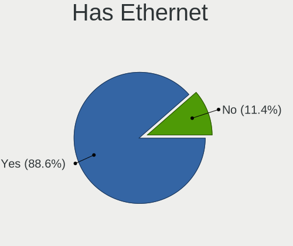
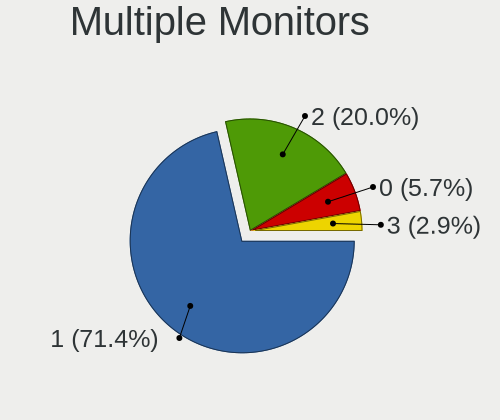

Gentoo Hardware Trends
----------------------

A project to identify most popular hardware characteristics and track their change
over time based on data collected by Gentoo users at https://Linux-Hardware.org.

Anyone can contribute to this report by the [hw-probe](https://github.com/linuxhw/hw-probe) tool:

    sudo -E hw-probe -all -upload

This is a report for all computer types. See also reports for [desktops](/Dist/Gentoo/Desktop/README.md) and [notebooks](/Dist/Gentoo/Notebook/README.md).

Full-feature report is available here: https://linux-hardware.org/?view=trends

Period: Oct, 2021.

Contents
--------

* [ System ](#system)
  - [ OS                       ](#os)
  - [ OS Family                ](#os-family)
  - [ Kernel                   ](#kernel)
  - [ Kernel Family            ](#kernel-family)
  - [ Kernel Major Ver.        ](#kernel-major-ver)
  - [ Arch                     ](#arch)
  - [ DE                       ](#de)
  - [ Display Server           ](#display-server)
  - [ Display Manager          ](#display-manager)
  - [ OS Lang                  ](#os-lang)
  - [ Boot Mode                ](#boot-mode)
  - [ Filesystem               ](#filesystem)
  - [ Part. scheme             ](#part-scheme)
  - [ Dual Boot with Linux/BSD ](#dual-boot-with-linuxbsd)
  - [ Dual Boot (Win)          ](#dual-boot-win)

* [ Board ](#board)
  - [ Vendor                   ](#vendor)
  - [ Model                    ](#model)
  - [ Model Family             ](#model-family)
  - [ MFG Year                 ](#mfg-year)
  - [ Form Factor              ](#form-factor)
  - [ Secure Boot              ](#secure-boot)
  - [ Coreboot                 ](#coreboot)
  - [ RAM Size                 ](#ram-size)
  - [ RAM Used                 ](#ram-used)
  - [ Total Drives             ](#total-drives)
  - [ Has CD-ROM               ](#has-cd-rom)
  - [ Has Ethernet             ](#has-ethernet)
  - [ Has WiFi                 ](#has-wifi)
  - [ Has Bluetooth            ](#has-bluetooth)

* [ Location ](#location)
  - [ Country                  ](#country)
  - [ City                     ](#city)

* [ Drives ](#drives)
  - [ Drive Vendor             ](#drive-vendor)
  - [ Drive Model              ](#drive-model)
  - [ HDD Vendor               ](#hdd-vendor)
  - [ SSD Vendor               ](#ssd-vendor)
  - [ Drive Kind               ](#drive-kind)
  - [ Drive Connector          ](#drive-connector)
  - [ Drive Size               ](#drive-size)
  - [ Space Total              ](#space-total)
  - [ Space Used               ](#space-used)
  - [ Malfunc. Drives          ](#malfunc-drives)
  - [ Malfunc. Drive Vendor    ](#malfunc-drive-vendor)
  - [ Malfunc. HDD Vendor      ](#malfunc-hdd-vendor)
  - [ Malfunc. Drive Kind      ](#malfunc-drive-kind)
  - [ Failed Drives            ](#failed-drives)
  - [ Failed Drive Vendor      ](#failed-drive-vendor)
  - [ Drive Status             ](#drive-status)

* [ Storage controller ](#storage-controller)
  - [ Storage Vendor           ](#storage-vendor)
  - [ Storage Model            ](#storage-model)
  - [ Storage Kind             ](#storage-kind)

* [ Processor ](#processor)
  - [ CPU Vendor               ](#cpu-vendor)
  - [ CPU Model                ](#cpu-model)
  - [ CPU Model Family         ](#cpu-model-family)
  - [ CPU Cores                ](#cpu-cores)
  - [ CPU Sockets              ](#cpu-sockets)
  - [ CPU Threads              ](#cpu-threads)
  - [ CPU Op-Modes             ](#cpu-op-modes)
  - [ CPU Microcode            ](#cpu-microcode)
  - [ CPU Microarch            ](#cpu-microarch)

* [ Graphics ](#graphics)
  - [ GPU Vendor               ](#gpu-vendor)
  - [ GPU Model                ](#gpu-model)
  - [ GPU Combo                ](#gpu-combo)
  - [ GPU Driver               ](#gpu-driver)
  - [ GPU Memory               ](#gpu-memory)

* [ Monitor ](#monitor)
  - [ Monitor Vendor           ](#monitor-vendor)
  - [ Monitor Model            ](#monitor-model)
  - [ Monitor Resolution       ](#monitor-resolution)
  - [ Monitor Diagonal         ](#monitor-diagonal)
  - [ Monitor Width            ](#monitor-width)
  - [ Aspect Ratio             ](#aspect-ratio)
  - [ Monitor Area             ](#monitor-area)
  - [ Pixel Density            ](#pixel-density)
  - [ Multiple Monitors        ](#multiple-monitors)

* [ Network ](#network)
  - [ Net Controller Vendor    ](#net-controller-vendor)
  - [ Net Controller Model     ](#net-controller-model)
  - [ Wireless Vendor          ](#wireless-vendor)
  - [ Wireless Model           ](#wireless-model)
  - [ Ethernet Vendor          ](#ethernet-vendor)
  - [ Ethernet Model           ](#ethernet-model)
  - [ Net Controller Kind      ](#net-controller-kind)
  - [ Used Controller          ](#used-controller)
  - [ NICs                     ](#nics)
  - [ IPv6                     ](#ipv6)

* [ Bluetooth ](#bluetooth)
  - [ Bluetooth Vendor         ](#bluetooth-vendor)
  - [ Bluetooth Model          ](#bluetooth-model)

* [ Sound ](#sound)
  - [ Sound Vendor             ](#sound-vendor)
  - [ Sound Model              ](#sound-model)

* [ Memory ](#memory)
  - [ Memory Vendor            ](#memory-vendor)
  - [ Memory Model             ](#memory-model)
  - [ Memory Kind              ](#memory-kind)
  - [ Memory Form Factor       ](#memory-form-factor)
  - [ Memory Size              ](#memory-size)
  - [ Memory Speed             ](#memory-speed)

* [ Printers & scanners ](#printers--scanners)
  - [ Printer Vendor           ](#printer-vendor)
  - [ Printer Model            ](#printer-model)
  - [ Scanner Vendor           ](#scanner-vendor)
  - [ Scanner Model            ](#scanner-model)

* [ Camera ](#camera)
  - [ Camera Vendor            ](#camera-vendor)
  - [ Camera Model             ](#camera-model)

* [ Security ](#security)
  - [ Fingerprint Vendor       ](#fingerprint-vendor)
  - [ Fingerprint Model        ](#fingerprint-model)
  - [ Chipcard Vendor          ](#chipcard-vendor)
  - [ Chipcard Model           ](#chipcard-model)

* [ Unsupported ](#unsupported)
  - [ Unsupported Devices      ](#unsupported-devices)
  - [ Unsupported Device Types ](#unsupported-device-types)

System
------

OS
--

Installed operating systems

| Name       | Computers | Percent |
|------------|-----------|---------|
| Gentoo 2.7 | 46        | 71.88%  |
| Gentoo 2.8 | 15        | 23.44%  |
| Gentoo 2.6 | 2         | 3.13%   |
| Gentoo 1   | 1         | 1.56%   |

OS Family
---------

OS without a version

| Name   | Computers | Percent |
|--------|-----------|---------|
| Gentoo | 64        | 100%    |

Kernel
------

Version of the Linux kernel

| Version                       | Computers | Percent |
|-------------------------------|-----------|---------|
| 5.10.61-gentoo                | 12        | 18.75%  |
| 5.10.61-gentoo-x86_64         | 6         | 9.38%   |
| 5.14.14-gentoo-x86_64         | 4         | 6.25%   |
| 5.14.9-gentoo-x86_64          | 3         | 4.69%   |
| 5.14.8-gentoo                 | 2         | 3.13%   |
| 5.14.14-gentoo-dist           | 2         | 3.13%   |
| 5.14.12-gentoo                | 2         | 3.13%   |
| 5.9.11-gentoo-compact-0.1     | 1         | 1.56%   |
| 5.4.80-gentoo-r1              | 1         | 1.56%   |
| 5.15.0-rc5test                | 1         | 1.56%   |
| 5.14.9-gentoo-dist            | 1         | 1.56%   |
| 5.14.9-gentoo                 | 1         | 1.56%   |
| 5.14.8-x86_64                 | 1         | 1.56%   |
| 5.14.8-arch1-1                | 1         | 1.56%   |
| 5.14.6-gentoo                 | 1         | 1.56%   |
| 5.14.6                        | 1         | 1.56%   |
| 5.14.4-gentoo                 | 1         | 1.56%   |
| 5.14.15-gentoo20210917        | 1         | 1.56%   |
| 5.14.15-gentoo-x86_64         | 1         | 1.56%   |
| 5.14.14-gentoo-yoshi          | 1         | 1.56%   |
| 5.14.14-gentoo                | 1         | 1.56%   |
| 5.14.13-gentoo-yoshi-hp       | 1         | 1.56%   |
| 5.14.13-gentoo-gentoo-amd     | 1         | 1.56%   |
| 5.14.13-gentoo                | 1         | 1.56%   |
| 5.14.13                       | 1         | 1.56%   |
| 5.14.11-zen1                  | 1         | 1.56%   |
| 5.14.11-gentoo-x86_64         | 1         | 1.56%   |
| 5.14.11-gentoo-limelight      | 1         | 1.56%   |
| 5.14.10-gentoo                | 1         | 1.56%   |
| 5.14.1-gentoo                 | 1         | 1.56%   |
| 5.14.0-pf6-x86_64             | 1         | 1.56%   |
| 5.13.5-gentoo                 | 1         | 1.56%   |
| 5.13.19-gentoo                | 1         | 1.56%   |
| 5.12.9-zen1                   | 1         | 1.56%   |
| 5.12.19-1-MANJARO             | 1         | 1.56%   |
| 5.10.76-gentoo-r1-x86_64-usir | 1         | 1.56%   |
| 5.10.74-gentoo-20211029       | 1         | 1.56%   |
| 5.10.61-gentooaeon            | 1         | 1.56%   |
| 5.10.61-gentoo-flopt          | 1         | 1.56%   |
| 5.10.11-v8                    | 1         | 1.56%   |

Kernel Family
-------------

Linux kernel without a distro release

| Version | Computers | Percent |
|---------|-----------|---------|
| 5.10.61 | 20        | 31.25%  |
| 5.14.14 | 8         | 12.5%   |
| 5.14.9  | 5         | 7.81%   |
| 5.14.8  | 4         | 6.25%   |
| 5.14.13 | 4         | 6.25%   |
| 5.14.11 | 3         | 4.69%   |
| 5.14.6  | 2         | 3.13%   |
| 5.14.15 | 2         | 3.13%   |
| 5.14.12 | 2         | 3.13%   |
| 5.9.11  | 1         | 1.56%   |
| 5.4.80  | 1         | 1.56%   |
| 5.15.0  | 1         | 1.56%   |
| 5.14.4  | 1         | 1.56%   |
| 5.14.10 | 1         | 1.56%   |
| 5.14.1  | 1         | 1.56%   |
| 5.14.0  | 1         | 1.56%   |
| 5.13.5  | 1         | 1.56%   |
| 5.13.19 | 1         | 1.56%   |
| 5.12.9  | 1         | 1.56%   |
| 5.12.19 | 1         | 1.56%   |
| 5.10.76 | 1         | 1.56%   |
| 5.10.74 | 1         | 1.56%   |
| 5.10.11 | 1         | 1.56%   |

Kernel Major Ver.
-----------------

Linux kernel major version

| Version | Computers | Percent |
|---------|-----------|---------|
| 5.14    | 34        | 53.13%  |
| 5.10    | 23        | 35.94%  |
| 5.13    | 2         | 3.13%   |
| 5.12    | 2         | 3.13%   |
| 5.9     | 1         | 1.56%   |
| 5.4     | 1         | 1.56%   |
| 5.15    | 1         | 1.56%   |

Arch
----

OS architecture (x86_64, i586, etc.)

| Name    | Computers | Percent |
|---------|-----------|---------|
| x86_64  | 62        | 96.88%  |
| i686    | 1         | 1.56%   |
| aarch64 | 1         | 1.56%   |

DE
--

Desktop Environment

| Name       | Computers | Percent |
|------------|-----------|---------|
| Unknown    | 22        | 34.38%  |
| KDE5       | 16        | 25%     |
| GNOME      | 8         | 12.5%   |
| XFCE       | 6         | 9.38%   |
| MATE       | 4         | 6.25%   |
| X-Cinnamon | 2         | 3.13%   |
| KDE        | 2         | 3.13%   |
| Cinnamon   | 2         | 3.13%   |
| sway       | 1         | 1.56%   |
| LXQt       | 1         | 1.56%   |

Display Server
--------------

X11 or Wayland

| Name    | Computers | Percent |
|---------|-----------|---------|
| X11     | 34        | 53.13%  |
| Tty     | 13        | 20.31%  |
| Unknown | 9         | 14.06%  |
| Wayland | 8         | 12.5%   |

Display Manager
---------------

SDDM, LightDM, etc.

| Name    | Computers | Percent |
|---------|-----------|---------|
| Unknown | 25        | 39.06%  |
| SDDM    | 19        | 29.69%  |
| LightDM | 14        | 21.88%  |
| GDM     | 5         | 7.81%   |
| XDM     | 1         | 1.56%   |

OS Lang
-------

Language

| Lang       | Computers | Percent |
|------------|-----------|---------|
| en_US      | 25        | 39.06%  |
| en_GB      | 8         | 12.5%   |
| de_DE      | 5         | 7.81%   |
| Unknown    | 4         | 6.25%   |
| C.UTF8     | 3         | 4.69%   |
| C          | 3         | 4.69%   |
| pl_PL      | 2         | 3.13%   |
| zh_TW      | 1         | 1.56%   |
| sv_SE      | 1         | 1.56%   |
| ru_UA      | 1         | 1.56%   |
| ru_RU      | 1         | 1.56%   |
| pt_BR      | 1         | 1.56%   |
| POSIX      | 1         | 1.56%   |
| nl_NL      | 1         | 1.56%   |
| nl_BE      | 1         | 1.56%   |
| ko_KR      | 1         | 1.56%   |
| it_IT      | 1         | 1.56%   |
| es_ES      | 1         | 1.56%   |
| en_US.UTF8 | 1         | 1.56%   |
| en_GB.UTF8 | 1         | 1.56%   |
| cy_GB      | 1         | 1.56%   |

Boot Mode
---------

EFI or BIOS

| Mode | Computers | Percent |
|------|-----------|---------|
| EFI  | 47        | 73.44%  |
| BIOS | 17        | 26.56%  |

Filesystem
----------

Type of filesystem

| Type    | Computers | Percent |
|---------|-----------|---------|
| Ext4    | 32        | 50%     |
| Btrfs   | 19        | 29.69%  |
| Zfs     | 5         | 7.81%   |
| F2fs    | 5         | 7.81%   |
| Xfs     | 2         | 3.13%   |
| Overlay | 1         | 1.56%   |

Part. scheme
------------

Scheme of partitioning

| Type    | Computers | Percent |
|---------|-----------|---------|
| GPT     | 54        | 84.38%  |
| Unknown | 6         | 9.38%   |
| MBR     | 4         | 6.25%   |

Dual Boot with Linux/BSD
------------------------

Hosting more than one Linux/BSD

| Dual boot | Computers | Percent |
|-----------|-----------|---------|
| No        | 36        | 56.25%  |
| Yes       | 28        | 43.75%  |

Dual Boot (Win)
---------------

Hosting Linux and Windows

| Dual boot | Computers | Percent |
|-----------|-----------|---------|
| No        | 50        | 78.13%  |
| Yes       | 14        | 21.88%  |

Board
-----

Vendor
------

Motherboard manufacturer

| Name                    | Computers | Percent |
|-------------------------|-----------|---------|
| ASUSTek Computer        | 14        | 21.88%  |
| Lenovo                  | 11        | 17.19%  |
| Hewlett-Packard         | 6         | 9.38%   |
| ASRock                  | 6         | 9.38%   |
| Gigabyte Technology     | 5         | 7.81%   |
| Timi                    | 3         | 4.69%   |
| MSI                     | 3         | 4.69%   |
| Fujitsu                 | 3         | 4.69%   |
| Acer                    | 3         | 4.69%   |
| Dell                    | 2         | 3.13%   |
| Supermicro              | 1         | 1.56%   |
| Samsung Electronics     | 1         | 1.56%   |
| Red Hat                 | 1         | 1.56%   |
| Raspberry Pi Foundation | 1         | 1.56%   |
| Purism                  | 1         | 1.56%   |
| Intel                   | 1         | 1.56%   |
| IBM                     | 1         | 1.56%   |
| Apple                   | 1         | 1.56%   |

Model
-----

Motherboard model

| Name                                 | Computers | Percent |
|--------------------------------------|-----------|---------|
| Timi RedmiBook 13 R                  | 2         | 3.13%   |
| Timi Mi Laptop Pro 15                | 1         | 1.56%   |
| Supermicro X10SRA                    | 1         | 1.56%   |
| Samsung RC530/RC730                  | 1         | 1.56%   |
| Red Hat RHEL                         | 1         | 1.56%   |
| RPi Raspberry Pi                     | 1         | 1.56%   |
| Purism librem_15v4                   | 1         | 1.56%   |
| MSI MS-7C35                          | 1         | 1.56%   |
| MSI MS-7B79                          | 1         | 1.56%   |
| MSI MS-7B48                          | 1         | 1.56%   |
| Lenovo Yoga C740-14IML 81TC          | 1         | 1.56%   |
| Lenovo Yoga 7 14ACN6 82N7            | 1         | 1.56%   |
| Lenovo Yoga 2 13 20344               | 1         | 1.56%   |
| Lenovo ThinkPad P1 Gen 3 20TJS2F437  | 1         | 1.56%   |
| Lenovo ThinkPad E15 Gen 2 20T8001STX | 1         | 1.56%   |
| Lenovo ThinkBook 14p Gen 2 20YN      | 1         | 1.56%   |
| Lenovo ThinkBook 14 G3 ACL 21A2      | 1         | 1.56%   |
| Lenovo Legion 5P 15IMH05 82AW        | 1         | 1.56%   |
| Lenovo IdeaPadFlex 5 14ITL05 82LT    | 1         | 1.56%   |
| Lenovo IdeaPad 5 14ITL05 82FE        | 1         | 1.56%   |
| Lenovo IdeaPad 5 14ARE05 81YM        | 1         | 1.56%   |
| Intel NUC11PHi7                      | 1         | 1.56%   |
| IBM ThinkPad T43 2668Z3S             | 1         | 1.56%   |
| HP Z400 Workstation                  | 1         | 1.56%   |
| HP ProLiant DL380 G7                 | 1         | 1.56%   |
| HP ProBook 455 G7                    | 1         | 1.56%   |
| HP Pavilion ZV6100 (EE984EA#ABZ)     | 1         | 1.56%   |
| HP Pavilion Notebook                 | 1         | 1.56%   |
| HP Pavilion Gaming Laptop 15-ec1xxx  | 1         | 1.56%   |
| Gigabyte Z87X-UD3H                   | 1         | 1.56%   |
| Gigabyte X570 AORUS MASTER           | 1         | 1.56%   |
| Gigabyte B460HD3                     | 1         | 1.56%   |
| Gigabyte B450M DS3H V2               | 1         | 1.56%   |
| Gigabyte AB350-Gaming                | 1         | 1.56%   |
| Fujitsu ESPRIMO P7935                | 1         | 1.56%   |
| Fujitsu D3417-B2 S26361-D3417-B2     | 1         | 1.56%   |
| Fujitsu D3401-H1                     | 1         | 1.56%   |
| Dell Latitude E6530                  | 1         | 1.56%   |
| Dell Inspiron 5415                   | 1         | 1.56%   |
| ASUS Z170-A                          | 1         | 1.56%   |
| ASUS X556URK                         | 1         | 1.56%   |
| ASUS X555LJ                          | 1         | 1.56%   |
| ASUS ROG Strix G513QM_G513QM         | 1         | 1.56%   |
| ASUS ROG STRIX B550-F GAMING         | 1         | 1.56%   |
| ASUS ROG Maximus XIII APEX           | 1         | 1.56%   |
| ASUS ROG CROSSHAIR VIII HERO         | 1         | 1.56%   |
| ASUS PRIME X570-PRO                  | 1         | 1.56%   |
| ASUS PRIME X570-P                    | 1         | 1.56%   |
| ASUS PRIME B450-PLUS                 | 1         | 1.56%   |
| ASUS PRIME A520M-K                   | 1         | 1.56%   |
| ASUS Maximus VIII HERO               | 1         | 1.56%   |
| ASUS M3A78-CM                        | 1         | 1.56%   |
| ASRock Z390 Extreme4                 | 1         | 1.56%   |
| ASRock X570 Pro4                     | 1         | 1.56%   |
| ASRock X370 Killer SLI/ac            | 1         | 1.56%   |
| ASRock X370 Gaming X                 | 1         | 1.56%   |
| ASRock B550M Steel Legend            | 1         | 1.56%   |
| ASRock B550 Phantom Gaming 4         | 1         | 1.56%   |
| Apple iMac13,1                       | 1         | 1.56%   |
| Acer TravelMate P648-M               | 1         | 1.56%   |

Model Family
------------

Motherboard model prefix

| Name                  | Computers | Percent |
|-----------------------|-----------|---------|
| ASUS ROG              | 4         | 6.25%   |
| ASUS PRIME            | 4         | 6.25%   |
| Lenovo Yoga           | 3         | 4.69%   |
| HP Pavilion           | 3         | 4.69%   |
| Timi RedmiBook        | 2         | 3.13%   |
| Lenovo ThinkPad       | 2         | 3.13%   |
| Lenovo ThinkBook      | 2         | 3.13%   |
| Lenovo IdeaPad        | 2         | 3.13%   |
| ASRock X370           | 2         | 3.13%   |
| Acer Aspire           | 2         | 3.13%   |
| Timi Mi               | 1         | 1.56%   |
| Supermicro X10SRA     | 1         | 1.56%   |
| Samsung RC530         | 1         | 1.56%   |
| Red Hat RHEL          | 1         | 1.56%   |
| RPi Raspberry         | 1         | 1.56%   |
| Purism librem         | 1         | 1.56%   |
| MSI MS-7C35           | 1         | 1.56%   |
| MSI MS-7B79           | 1         | 1.56%   |
| MSI MS-7B48           | 1         | 1.56%   |
| Lenovo Legion         | 1         | 1.56%   |
| Lenovo IdeaPadFlex    | 1         | 1.56%   |
| Intel NUC11PHi7       | 1         | 1.56%   |
| IBM ThinkPad          | 1         | 1.56%   |
| HP Z400               | 1         | 1.56%   |
| HP ProLiant           | 1         | 1.56%   |
| HP ProBook            | 1         | 1.56%   |
| Gigabyte Z87X-UD3H    | 1         | 1.56%   |
| Gigabyte X570         | 1         | 1.56%   |
| Gigabyte B460HD3      | 1         | 1.56%   |
| Gigabyte B450M        | 1         | 1.56%   |
| Gigabyte AB350-Gaming | 1         | 1.56%   |
| Fujitsu ESPRIMO       | 1         | 1.56%   |
| Fujitsu D3417-B2      | 1         | 1.56%   |
| Fujitsu D3401-H1      | 1         | 1.56%   |
| Dell Latitude         | 1         | 1.56%   |
| Dell Inspiron         | 1         | 1.56%   |
| ASUS Z170-A           | 1         | 1.56%   |
| ASUS X556URK          | 1         | 1.56%   |
| ASUS X555LJ           | 1         | 1.56%   |
| ASUS Maximus          | 1         | 1.56%   |
| ASUS M3A78-CM         | 1         | 1.56%   |
| ASRock Z390           | 1         | 1.56%   |
| ASRock X570           | 1         | 1.56%   |
| ASRock B550M          | 1         | 1.56%   |
| ASRock B550           | 1         | 1.56%   |
| Apple iMac13          | 1         | 1.56%   |
| Acer TravelMate       | 1         | 1.56%   |
| Unknown               | 1         | 1.56%   |

MFG Year
--------

Motherboard manufacture year

| Year    | Computers | Percent |
|---------|-----------|---------|
| 2021    | 19        | 29.69%  |
| 2020    | 16        | 25%     |
| 2019    | 8         | 12.5%   |
| 2018    | 6         | 9.38%   |
| 2014    | 3         | 4.69%   |
| 2016    | 2         | 3.13%   |
| 2015    | 2         | 3.13%   |
| 2010    | 2         | 3.13%   |
| 2006    | 2         | 3.13%   |
| 2011    | 1         | 1.56%   |
| 2009    | 1         | 1.56%   |
| 1970    | 1         | 1.56%   |
| Unknown | 1         | 1.56%   |

Form Factor
-----------

Physical design of the computer

| Name           | Computers | Percent |
|----------------|-----------|---------|
| Desktop        | 30        | 46.88%  |
| Notebook       | 26        | 40.63%  |
| Convertible    | 3         | 4.69%   |
| Server         | 2         | 3.13%   |
| System on chip | 1         | 1.56%   |
| Mini pc        | 1         | 1.56%   |
| All in one     | 1         | 1.56%   |

Secure Boot
-----------

Enabled or disabled

| State    | Computers | Percent |
|----------|-----------|---------|
| Disabled | 62        | 96.88%  |
| Enabled  | 2         | 3.13%   |

Coreboot
--------

Have coreboot on board

| Used | Computers | Percent |
|------|-----------|---------|
| No   | 63        | 98.44%  |
| Yes  | 1         | 1.56%   |

RAM Size
--------

Total RAM memory

| Size in GB  | Computers | Percent |
|-------------|-----------|---------|
| 32.01-64.0  | 18        | 28.13%  |
| 8.01-16.0   | 16        | 25%     |
| 4.01-8.0    | 10        | 15.63%  |
| 64.01-256.0 | 8         | 12.5%   |
| 16.01-24.0  | 7         | 10.94%  |
| 3.01-4.0    | 2         | 3.13%   |
| 24.01-32.0  | 1         | 1.56%   |
| 2.01-3.0    | 1         | 1.56%   |
| 1.01-2.0    | 1         | 1.56%   |

RAM Used
--------

Used RAM memory

| Used GB    | Computers | Percent |
|------------|-----------|---------|
| 4.01-8.0   | 20        | 31.25%  |
| 1.01-2.0   | 10        | 15.63%  |
| 8.01-16.0  | 9         | 14.06%  |
| 2.01-3.0   | 8         | 12.5%   |
| 3.01-4.0   | 6         | 9.38%   |
| 0.51-1.0   | 5         | 7.81%   |
| 24.01-32.0 | 2         | 3.13%   |
| 0.01-0.5   | 2         | 3.13%   |
| 32.01-64.0 | 1         | 1.56%   |
| 16.01-24.0 | 1         | 1.56%   |

Total Drives
------------

Number of drives on board

| Drives | Computers | Percent |
|--------|-----------|---------|
| 1      | 27        | 42.19%  |
| 2      | 16        | 25%     |
| 3      | 10        | 15.63%  |
| 5      | 4         | 6.25%   |
| 6      | 3         | 4.69%   |
| 4      | 3         | 4.69%   |
| 7      | 1         | 1.56%   |

Has CD-ROM
----------

Has CD-ROM on board

| Presented | Computers | Percent |
|-----------|-----------|---------|
| No        | 53        | 82.81%  |
| Yes       | 11        | 17.19%  |

Has Ethernet
------------

Has Ethernet on board

| Presented | Computers | Percent |
|-----------|-----------|---------|
| Yes       | 51        | 79.69%  |
| No        | 13        | 20.31%  |

Has WiFi
--------

Has WiFi module

| Presented | Computers | Percent |
|-----------|-----------|---------|
| Yes       | 38        | 59.38%  |
| No        | 26        | 40.63%  |

Has Bluetooth
-------------

Has Bluetooth module

| Presented | Computers | Percent |
|-----------|-----------|---------|
| Yes       | 40        | 62.5%   |
| No        | 24        | 37.5%   |

Location
--------

Country
-------

Geographic location (country)

| Country     | Computers | Percent |
|-------------|-----------|---------|
| Poland      | 8         | 12.5%   |
| Germany     | 8         | 12.5%   |
| USA         | 7         | 10.94%  |
| UK          | 4         | 6.25%   |
| Spain       | 4         | 6.25%   |
| Russia      | 3         | 4.69%   |
| France      | 3         | 4.69%   |
| Finland     | 3         | 4.69%   |
| China       | 3         | 4.69%   |
| Ukraine     | 2         | 3.13%   |
| Netherlands | 2         | 3.13%   |
| Jamaica     | 2         | 3.13%   |
| Czechia     | 2         | 3.13%   |
| Belgium     | 2         | 3.13%   |
| Turkey      | 1         | 1.56%   |
| Taiwan      | 1         | 1.56%   |
| Sweden      | 1         | 1.56%   |
| South Korea | 1         | 1.56%   |
| Slovakia    | 1         | 1.56%   |
| Mexico      | 1         | 1.56%   |
| Japan       | 1         | 1.56%   |
| Italy       | 1         | 1.56%   |
| Bulgaria    | 1         | 1.56%   |
| Brazil      | 1         | 1.56%   |
| Australia   | 1         | 1.56%   |

City
----

Geographic location (city)

| City                   | Computers | Percent |
|------------------------|-----------|---------|
| Warsaw                 | 3         | 4.69%   |
| Swansea                | 2         | 3.13%   |
| Moscow                 | 2         | 3.13%   |
| Monroe                 | 2         | 3.13%   |
| Clermont-Ferrand       | 2         | 3.13%   |
| Beijing                | 2         | 3.13%   |
| Amsterdam              | 2         | 3.13%   |
| Zebulon                | 1         | 1.56%   |
| Turenki                | 1         | 1.56%   |
| Trier                  | 1         | 1.56%   |
| Tampere                | 1         | 1.56%   |
| Sulejowek              | 1         | 1.56%   |
| St Petersburg          | 1         | 1.56%   |
| Somo                   | 1         | 1.56%   |
| Sofia                  | 1         | 1.56%   |
| Schonecken             | 1         | 1.56%   |
| S??o Paulo             | 1         | 1.56%   |
| Saint-Maur-des-Foss?©s | 1         | 1.56%   |
| Rho                    | 1         | 1.56%   |
| Ratingen               | 1         | 1.56%   |
| Poznan                 | 1         | 1.56%   |
| Portmore               | 1         | 1.56%   |
| Osaka                  | 1         | 1.56%   |
| New Taipei             | 1         | 1.56%   |
| Nacka                  | 1         | 1.56%   |
| Melilla                | 1         | 1.56%   |
| Mari??nsk?© L??zn?›    | 1         | 1.56%   |
| London                 | 1         | 1.56%   |
| Lokeren                | 1         | 1.56%   |
| Laziska Gorne          | 1         | 1.56%   |
| Landshut               | 1         | 1.56%   |
| Kyiv                   | 1         | 1.56%   |
| Krakow                 | 1         | 1.56%   |
| Kingston               | 1         | 1.56%   |
| Johnson City           | 1         | 1.56%   |
| Hobart                 | 1         | 1.56%   |
| High Wycombe           | 1         | 1.56%   |
| Helsinki               | 1         | 1.56%   |
| Haiger                 | 1         | 1.56%   |
| Gwangju                | 1         | 1.56%   |
| Guangzhou              | 1         | 1.56%   |
| Glencoe                | 1         | 1.56%   |
| Fuenlabrada            | 1         | 1.56%   |
| Frankenthal            | 1         | 1.56%   |
| Falkenstein            | 1         | 1.56%   |
| El Dorado Hills        | 1         | 1.56%   |
| Eisden                 | 1         | 1.56%   |
| Dnipro                 | 1         | 1.56%   |
| College Station        | 1         | 1.56%   |
| Ciudad Ju??rez         | 1         | 1.56%   |
| Cieszyn                | 1         | 1.56%   |
| Brno                   | 1         | 1.56%   |
| Bratislava             | 1         | 1.56%   |
| Berlin                 | 1         | 1.56%   |
| Ankara                 | 1         | 1.56%   |
| Alcasser               | 1         | 1.56%   |

Drives
------

Drive Vendor
------------

Hard drive vendors

| Vendor                         | Computers | Drives | Percent |
|--------------------------------|-----------|--------|---------|
| Samsung Electronics            | 30        | 44     | 26.79%  |
| WDC                            | 21        | 25     | 18.75%  |
| Seagate                        | 14        | 24     | 12.5%   |
| Kingston                       | 5         | 6      | 4.46%   |
| Intel                          | 5         | 5      | 4.46%   |
| Hitachi                        | 5         | 10     | 4.46%   |
| Toshiba                        | 4         | 4      | 3.57%   |
| SK Hynix                       | 3         | 3      | 2.68%   |
| Unknown                        | 2         | 2      | 1.79%   |
| SanDisk                        | 2         | 2      | 1.79%   |
| Phison                         | 2         | 2      | 1.79%   |
| GOODRAM                        | 2         | 2      | 1.79%   |
| Crucial                        | 2         | 2      | 1.79%   |
| Team                           | 1         | 1      | 0.89%   |
| Solid State Storage Technology | 1         | 1      | 0.89%   |
| RevuAhn                        | 1         | 1      | 0.89%   |
| QEMU                           | 1         | 1      | 0.89%   |
| PNY                            | 1         | 1      | 0.89%   |
| OCZ                            | 1         | 1      | 0.89%   |
| MDT                            | 1         | 1      | 0.89%   |
| LaCie                          | 1         | 1      | 0.89%   |
| KIOXIA-EXCERIA                 | 1         | 1      | 0.89%   |
| Kingchuxing                    | 1         | 1      | 0.89%   |
| HGST                           | 1         | 1      | 0.89%   |
| Corsair                        | 1         | 1      | 0.89%   |
| ASMedia                        | 1         | 1      | 0.89%   |
| Apple                          | 1         | 1      | 0.89%   |
| A-DATA Technology              | 1         | 1      | 0.89%   |

Drive Model
-----------

Hard drive models

| Model                                    | Computers | Percent |
|------------------------------------------|-----------|---------|
| WDC WDS500G2B0B-00YS70 500GB SSD         | 3         | 2.31%   |
| Intel SSDPEKNW010T8 1TB                  | 3         | 2.31%   |
| Seagate ST4000DM004-2CV104 4TB           | 2         | 1.54%   |
| Samsung SSD 970 EVO Plus 500GB           | 2         | 1.54%   |
| Samsung SSD 970 EVO Plus 2TB             | 2         | 1.54%   |
| Samsung SSD 970 EVO 500GB                | 2         | 1.54%   |
| Samsung SSD 860 EVO 250GB                | 2         | 1.54%   |
| Samsung SSD 850 EVO 250GB                | 2         | 1.54%   |
| Samsung NVMe SSD Drive 500GB             | 2         | 1.54%   |
| Samsung MZVLB512HBJQ-000L2 512GB         | 2         | 1.54%   |
| Hitachi HUA721010KLA330 1TB              | 2         | 1.54%   |
| GOODRAM SSDPR-CL100-480-G2 480GB         | 2         | 1.54%   |
| WDC WDS500G2X0C-00L350 500GB             | 1         | 0.77%   |
| WDC WDS100T2B0C-00PXH0 1TB               | 1         | 0.77%   |
| WDC WDS100T2B0C 1TB                      | 1         | 0.77%   |
| WDC WD7500BPVT-24HXZT1 752GB             | 1         | 0.77%   |
| WDC WD6400AAKS-65A7B2 640GB              | 1         | 0.77%   |
| WDC WD60EFRX-68L0BN1 6TB                 | 1         | 0.77%   |
| WDC WD5000BPVT-22HXZT3 500GB             | 1         | 0.77%   |
| WDC WD40EFZX-68AWUN0 4TB                 | 1         | 0.77%   |
| WDC WD20EZAZ-00GGJB0 2TB                 | 1         | 0.77%   |
| WDC WD20EFRX-68EUZN0 2TB                 | 1         | 0.77%   |
| WDC WD10JPLX-00MBPT0 1TB                 | 1         | 0.77%   |
| WDC WD10EZEX-21WN4A0 1TB                 | 1         | 0.77%   |
| WDC WD10EALX-009BA0 1TB                  | 1         | 0.77%   |
| WDC WD1002FBYS-18W8B0 1TB                | 1         | 0.77%   |
| WDC WD1002FAEX-00Z3A0 1TB                | 1         | 0.77%   |
| WDC PC SN730 SDBPNTY-512G-1101 512GB     | 1         | 0.77%   |
| WDC PC SN530 SDBPMPZ-512G-1101 512GB     | 1         | 0.77%   |
| WDC PC SN530 SDBPMPZ-256G-1001 256GB     | 1         | 0.77%   |
| WDC PC SN520 SDAPNUW-512G-1014 512GB     | 1         | 0.77%   |
| WDC PC SN520 SDAPNUW-256G-1006 256GB     | 1         | 0.77%   |
| Unknown SD/MMC/MS PRO 128GB              | 1         | 0.77%   |
| Unknown MMC Card  32GB                   | 1         | 0.77%   |
| Toshiba THNSN5512GPUK NVMe 512GB         | 1         | 0.77%   |
| Toshiba KXG6AZNV512G 512GB               | 1         | 0.77%   |
| Toshiba HDWE150 5TB                      | 1         | 0.77%   |
| Toshiba HDWD120 2TB                      | 1         | 0.77%   |
| Team TM8FP2240G 240GB                    | 1         | 0.77%   |
| Solid State Storage NVMe SSD Drive 256GB | 1         | 0.77%   |
| SK Hynix SKHynix_HFS512GDE9X084N 512GB   | 1         | 0.77%   |
| SK Hynix HFS256G39TND-N210A 256GB SSD    | 1         | 0.77%   |
| SK Hynix BC711 NVMe 512GB                | 1         | 0.77%   |
| Seagate ST4000VN008-2DR166 4TB           | 1         | 0.77%   |
| Seagate ST4000VN000-1H4168 4TB           | 1         | 0.77%   |
| Seagate ST4000NM0245-1Z2107 4TB          | 1         | 0.77%   |
| Seagate ST4000DM005-2DP166 4TB           | 1         | 0.77%   |
| Seagate ST3500630AS 500GB                | 1         | 0.77%   |
| Seagate ST3500413AS 500GB                | 1         | 0.77%   |
| Seagate ST3250318AS 250GB                | 1         | 0.77%   |
| Seagate ST3160023AS 160GB                | 1         | 0.77%   |
| Seagate ST31000524AS 1TB                 | 1         | 0.77%   |
| Seagate ST3000DM008-2DM166 3TB           | 1         | 0.77%   |
| Seagate ST2000DM001-1ER164 2TB           | 1         | 0.77%   |
| Seagate ST12000NM0008-2H3101 12TB        | 1         | 0.77%   |
| Seagate ST1000LX015-1U7172 1TB           | 1         | 0.77%   |
| Seagate ST1000DM010-2EP102 1TB           | 1         | 0.77%   |
| Seagate ST1000DM003-1SB102 1TB           | 1         | 0.77%   |
| Seagate Expansion 1TB                    | 1         | 0.77%   |
| SanDisk SD9SN8W-128G-1006 128GB SSD      | 1         | 0.77%   |

HDD Vendor
----------

Hard disk drive vendors

| Vendor              | Computers | Drives | Percent |
|---------------------|-----------|--------|---------|
| Seagate             | 14        | 24     | 34.15%  |
| WDC                 | 12        | 14     | 29.27%  |
| Hitachi             | 5         | 10     | 12.2%   |
| Toshiba             | 2         | 2      | 4.88%   |
| Samsung Electronics | 2         | 3      | 4.88%   |
| Unknown             | 1         | 1      | 2.44%   |
| QEMU                | 1         | 1      | 2.44%   |
| MDT                 | 1         | 1      | 2.44%   |
| LaCie               | 1         | 1      | 2.44%   |
| HGST                | 1         | 1      | 2.44%   |
| Apple               | 1         | 1      | 2.44%   |

SSD Vendor
----------

Solid state drive vendors

| Vendor              | Computers | Drives | Percent |
|---------------------|-----------|--------|---------|
| Samsung Electronics | 12        | 13     | 41.38%  |
| WDC                 | 3         | 3      | 10.34%  |
| Kingston            | 3         | 3      | 10.34%  |
| SanDisk             | 2         | 2      | 6.9%    |
| GOODRAM             | 2         | 2      | 6.9%    |
| SK Hynix            | 1         | 1      | 3.45%   |
| RevuAhn             | 1         | 1      | 3.45%   |
| PNY                 | 1         | 1      | 3.45%   |
| OCZ                 | 1         | 1      | 3.45%   |
| Crucial             | 1         | 1      | 3.45%   |
| Corsair             | 1         | 1      | 3.45%   |
| ASMedia             | 1         | 1      | 3.45%   |

Drive Kind
----------

HDD or SSD

| Kind | Computers | Drives | Percent |
|------|-----------|--------|---------|
| NVMe | 42        | 56     | 43.75%  |
| HDD  | 28        | 59     | 29.17%  |
| SSD  | 25        | 30     | 26.04%  |
| MMC  | 1         | 1      | 1.04%   |

Drive Connector
---------------

SATA, SAS, NVMe, etc.

| Type | Computers | Drives | Percent |
|------|-----------|--------|---------|
| NVMe | 42        | 56     | 50%     |
| SATA | 38        | 85     | 45.24%  |
| SAS  | 3         | 4      | 3.57%   |
| MMC  | 1         | 1      | 1.19%   |

Drive Size
----------

Size of hard drive

| Size in TB | Computers | Drives | Percent |
|------------|-----------|--------|---------|
| 0.01-0.5   | 26        | 35     | 43.33%  |
| 0.51-1.0   | 16        | 24     | 26.67%  |
| 3.01-4.0   | 6         | 11     | 10%     |
| 1.01-2.0   | 6         | 9      | 10%     |
| 2.01-3.0   | 3         | 5      | 5%      |
| 4.01-10.0  | 2         | 4      | 3.33%   |
| 10.01-20.0 | 1         | 1      | 1.67%   |

Space Total
-----------

Amount of disk space available on the file system

| Size in GB     | Computers | Percent |
|----------------|-----------|---------|
| 501-1000       | 15        | 23.44%  |
| 251-500        | 11        | 17.19%  |
| 101-250        | 9         | 14.06%  |
| More than 3000 | 7         | 10.94%  |
| 1-20           | 6         | 9.38%   |
| 1001-2000      | 5         | 7.81%   |
| Unknown        | 5         | 7.81%   |
| 2001-3000      | 3         | 4.69%   |
| 51-100         | 2         | 3.13%   |
| 21-50          | 1         | 1.56%   |

Space Used
----------

Amount of used disk space

| Used GB        | Computers | Percent |
|----------------|-----------|---------|
| 101-250        | 11        | 17.19%  |
| 1-20           | 10        | 15.63%  |
| 251-500        | 8         | 12.5%   |
| 501-1000       | 8         | 12.5%   |
| 1001-2000      | 7         | 10.94%  |
| 21-50          | 6         | 9.38%   |
| 51-100         | 6         | 9.38%   |
| Unknown        | 5         | 7.81%   |
| More than 3000 | 3         | 4.69%   |

Malfunc. Drives
---------------

Drive models with a malfunction

| Model                                 | Computers | Drives | Percent |
|---------------------------------------|-----------|--------|---------|
| WDC WD6400AAKS-65A7B2 640GB           | 1         | 1      | 6.25%   |
| WDC WD60EFRX-68L0BN1 6TB              | 1         | 3      | 6.25%   |
| WDC WD1002FBYS-18W8B0 1TB             | 1         | 1      | 6.25%   |
| SK Hynix HFS256G39TND-N210A 256GB SSD | 1         | 1      | 6.25%   |
| Seagate ST3500413AS 500GB             | 1         | 1      | 6.25%   |
| Seagate ST3160023AS 160GB             | 1         | 1      | 6.25%   |
| SanDisk SD9SN8W-128G-1006 128GB SSD   | 1         | 1      | 6.25%   |
| Samsung Electronics SSD 970 EVO 500GB | 1         | 1      | 6.25%   |
| Samsung Electronics SSD 850 EVO 1TB   | 1         | 1      | 6.25%   |
| Samsung Electronics HD154UI 1TB       | 1         | 1      | 6.25%   |
| Samsung Electronics HD103UJ 1TB       | 1         | 1      | 6.25%   |
| MDT MD2000KS-00MJB0 200GB             | 1         | 1      | 6.25%   |
| Hitachi HUA721010KLA330 1TB           | 1         | 1      | 6.25%   |
| Hitachi HDS722020ALA330 2TB           | 1         | 2      | 6.25%   |
| Corsair Neutron GTX SSD 240GB         | 1         | 1      | 6.25%   |
| Apple HDD HTS541010A9E662 1TB         | 1         | 1      | 6.25%   |

Malfunc. Drive Vendor
---------------------

Vendors of faulty drives

| Vendor              | Computers | Drives | Percent |
|---------------------|-----------|--------|---------|
| WDC                 | 3         | 5      | 20%     |
| Samsung Electronics | 3         | 4      | 20%     |
| Seagate             | 2         | 2      | 13.33%  |
| Hitachi             | 2         | 3      | 13.33%  |
| SK Hynix            | 1         | 1      | 6.67%   |
| SanDisk             | 1         | 1      | 6.67%   |
| MDT                 | 1         | 1      | 6.67%   |
| Corsair             | 1         | 1      | 6.67%   |
| Apple               | 1         | 1      | 6.67%   |

Malfunc. HDD Vendor
-------------------

Vendors of faulty HDD drives

| Vendor              | Computers | Drives | Percent |
|---------------------|-----------|--------|---------|
| WDC                 | 3         | 5      | 30%     |
| Seagate             | 2         | 2      | 20%     |
| Hitachi             | 2         | 3      | 20%     |
| Samsung Electronics | 1         | 2      | 10%     |
| MDT                 | 1         | 1      | 10%     |
| Apple               | 1         | 1      | 10%     |

Malfunc. Drive Kind
-------------------

Kinds of faulty drives

| Kind | Computers | Drives | Percent |
|------|-----------|--------|---------|
| HDD  | 7         | 14     | 58.33%  |
| SSD  | 4         | 4      | 33.33%  |
| NVMe | 1         | 1      | 8.33%   |

Failed Drives
-------------

Failed drive models

| Model                            | Computers | Drives | Percent |
|----------------------------------|-----------|--------|---------|
| Toshiba THNSN5512GPUK NVMe 512GB | 1         | 1      | 100%    |

Failed Drive Vendor
-------------------

Failed drive vendors

| Vendor  | Computers | Drives | Percent |
|---------|-----------|--------|---------|
| Toshiba | 1         | 1      | 100%    |

Drive Status
------------

Number of failed and malfunc. drives

| Status   | Computers | Drives | Percent |
|----------|-----------|--------|---------|
| Works    | 56        | 113    | 70.89%  |
| Malfunc  | 12        | 19     | 15.19%  |
| Detected | 10        | 13     | 12.66%  |
| Failed   | 1         | 1      | 1.27%   |

Storage controller
------------------

Storage Vendor
--------------

Storage controller vendors

| Vendor                         | Computers | Percent |
|--------------------------------|-----------|---------|
| Intel                          | 32        | 29.91%  |
| AMD                            | 25        | 23.36%  |
| Samsung Electronics            | 20        | 18.69%  |
| Sandisk                        | 8         | 7.48%   |
| Phison Electronics             | 3         | 2.8%    |
| Kingston Technology Company    | 3         | 2.8%    |
| ASMedia Technology             | 3         | 2.8%    |
| Toshiba America Info Systems   | 2         | 1.87%   |
| SK Hynix                       | 2         | 1.87%   |
| Marvell Technology Group       | 2         | 1.87%   |
| Solid State Storage Technology | 1         | 0.93%   |
| Silicon Motion                 | 1         | 0.93%   |
| Red Hat                        | 1         | 0.93%   |
| Realtek Semiconductor          | 1         | 0.93%   |
| Micron/Crucial Technology      | 1         | 0.93%   |
| KIOXIA                         | 1         | 0.93%   |
| Hewlett-Packard                | 1         | 0.93%   |

Storage Model
-------------

Storage controller models

| Model                                                                          | Computers | Percent |
|--------------------------------------------------------------------------------|-----------|---------|
| AMD FCH SATA Controller [AHCI mode]                                            | 19        | 15.7%   |
| Samsung NVMe SSD Controller SM981/PM981/PM983                                  | 12        | 9.92%   |
| Intel Q170/Q150/B150/H170/H110/Z170/CM236 Chipset SATA Controller [AHCI Mode]  | 5         | 4.13%   |
| Samsung NVMe SSD Controller 980                                                | 4         | 3.31%   |
| Intel Sunrise Point-LP SATA Controller [AHCI mode]                             | 4         | 3.31%   |
| Intel SSD 660P Series                                                          | 4         | 3.31%   |
| AMD Starship/Matisse Chipset SATA Controller [AHCI mode]                       | 4         | 3.31%   |
| Samsung NVMe SSD Controller SM961/PM961/SM963                                  | 3         | 2.48%   |
| Samsung NVMe SSD Controller PM9A1/PM9A3/980PRO                                 | 3         | 2.48%   |
| ASMedia ASM1062 Serial ATA Controller                                          | 3         | 2.48%   |
| AMD 400 Series Chipset SATA Controller                                         | 3         | 2.48%   |
| SK Hynix Gold P31 SSD                                                          | 2         | 1.65%   |
| Sandisk WD Blue SN550 NVMe SSD                                                 | 2         | 1.65%   |
| Sandisk WD Blue SN500 / PC SN520 NVMe SSD                                      | 2         | 1.65%   |
| Sandisk Non-Volatile memory controller                                         | 2         | 1.65%   |
| Intel SATA Controller [RAID mode]                                              | 2         | 1.65%   |
| Intel 500 Series Chipset Family SATA AHCI Controller                           | 2         | 1.65%   |
| Intel 400 Series Chipset Family SATA AHCI Controller                           | 2         | 1.65%   |
| AMD X370 Series Chipset SATA Controller                                        | 2         | 1.65%   |
| Toshiba America Info Systems XG6 NVMe SSD Controller                           | 1         | 0.83%   |
| Toshiba America Info Systems XG4 NVMe SSD Controller                           | 1         | 0.83%   |
| Solid State Storage Non-Volatile memory controller                             | 1         | 0.83%   |
| Silicon Motion SM2263EN/SM2263XT SSD Controller                                | 1         | 0.83%   |
| Sandisk WD Black SN750 / PC SN730 NVMe SSD                                     | 1         | 0.83%   |
| Sandisk WD Black 2018/SN750 / PC SN720 NVMe SSD                                | 1         | 0.83%   |
| Red Hat Virtio SCSI                                                            | 1         | 0.83%   |
| Realtek Realtek Non-Volatile memory controller                                 | 1         | 0.83%   |
| Phison E7 NVMe Controller                                                      | 1         | 0.83%   |
| Phison E16 PCIe4 NVMe Controller                                               | 1         | 0.83%   |
| Phison E12 NVMe Controller                                                     | 1         | 0.83%   |
| Micron/Crucial P2 NVMe PCIe SSD                                                | 1         | 0.83%   |
| Marvell Group 88SE9172 SATA 6Gb/s Controller                                   | 1         | 0.83%   |
| Marvell Group 88SE912x IDE Controller                                          | 1         | 0.83%   |
| Marvell Group 88SE9123 PCIe SATA 6.0 Gb/s controller                           | 1         | 0.83%   |
| KIOXIA NVMe SSD                                                                | 1         | 0.83%   |
| Kingston Company Company Non-Volatile memory controller                        | 1         | 0.83%   |
| Kingston Company KC2000 NVMe SSD                                               | 1         | 0.83%   |
| Kingston Company HyperX Predator PCIe AHCI SSD                                 | 1         | 0.83%   |
| Kingston Company A2000 NVMe SSD                                                | 1         | 0.83%   |
| Intel Wildcat Point-LP SATA Controller [AHCI Mode]                             | 1         | 0.83%   |
| Intel Non-Volatile memory controller                                           | 1         | 0.83%   |
| Intel Ice Lake-LP SATA Controller [AHCI mode]                                  | 1         | 0.83%   |
| Intel Comet Lake SATA AHCI Controller                                          | 1         | 0.83%   |
| Intel Cannon Lake PCH SATA AHCI Controller                                     | 1         | 0.83%   |
| Intel C610/X99 series chipset sSATA Controller [AHCI mode]                     | 1         | 0.83%   |
| Intel C610/X99 series chipset 6-Port SATA Controller [AHCI mode]               | 1         | 0.83%   |
| Intel 82801IR/IO/IH (ICH9R/DO/DH) 6 port SATA Controller [AHCI mode]           | 1         | 0.83%   |
| Intel 82801FBM (ICH6M) SATA Controller                                         | 1         | 0.83%   |
| Intel 8 Series/C220 Series Chipset Family 6-port SATA Controller 1 [AHCI mode] | 1         | 0.83%   |
| Intel 8 Series SATA Controller 1 [AHCI mode]                                   | 1         | 0.83%   |
| Intel 7 Series/C210 Series Chipset Family 6-port SATA Controller [AHCI mode]   | 1         | 0.83%   |
| Intel 7 Series Chipset Family 6-port SATA Controller [AHCI mode]               | 1         | 0.83%   |
| Intel 6 Series/C200 Series Chipset Family 6 port Mobile SATA AHCI Controller   | 1         | 0.83%   |
| Intel 4 Series Chipset PT IDER Controller                                      | 1         | 0.83%   |
| Intel 200 Series PCH SATA controller [AHCI mode]                               | 1         | 0.83%   |
| HP Smart Array G6 controllers                                                  | 1         | 0.83%   |
| AMD SB7x0/SB8x0/SB9x0 SATA Controller [IDE mode]                               | 1         | 0.83%   |
| AMD SB7x0/SB8x0/SB9x0 IDE Controller                                           | 1         | 0.83%   |
| AMD IXP SB4x0 IDE Controller                                                   | 1         | 0.83%   |
| AMD 300 Series Chipset SATA Controller                                         | 1         | 0.83%   |

Storage Kind
------------

Kind of storage controller (IDE, SATA, NVMe, SAS, ...)

| Kind | Computers | Percent |
|------|-----------|---------|
| SATA | 50        | 50%     |
| NVMe | 42        | 42%     |
| IDE  | 4         | 4%      |
| RAID | 3         | 3%      |
| SCSI | 1         | 1%      |

Processor
---------

CPU Vendor
----------

Processor vendors

| Vendor | Computers | Percent |
|--------|-----------|---------|
| Intel  | 33        | 51.56%  |
| AMD    | 30        | 46.88%  |
| ARM    | 1         | 1.56%   |

CPU Model
---------

Processor models

| Model                                          | Computers | Percent |
|------------------------------------------------|-----------|---------|
| AMD Ryzen 7 4700U with Radeon Graphics         | 5         | 7.81%   |
| Intel Core i7-7500U CPU @ 2.70GHz              | 3         | 4.69%   |
| Intel Core i7-6700K CPU @ 4.00GHz              | 2         | 3.13%   |
| Intel 11th Gen Core i7-1165G7 @ 2.80GHz        | 2         | 3.13%   |
| AMD Ryzen 5 3600 6-Core Processor              | 2         | 3.13%   |
| AMD Ryzen 5 1600 Six-Core Processor            | 2         | 3.13%   |
| Intel Xeon CPU X5660 @ 2.80GHz                 | 1         | 1.56%   |
| Intel Xeon CPU W3565 @ 3.20GHz                 | 1         | 1.56%   |
| Intel Xeon CPU E5-2630 v3 @ 2.40GHz            | 1         | 1.56%   |
| Intel Xeon CPU E3-1275 v6 @ 3.80GHz            | 1         | 1.56%   |
| Intel Pentium M processor 1.86GHz              | 1         | 1.56%   |
| Intel Core i7-9700K CPU @ 3.60GHz              | 1         | 1.56%   |
| Intel Core i7-6700 CPU @ 3.40GHz               | 1         | 1.56%   |
| Intel Core i7-5500U CPU @ 2.40GHz              | 1         | 1.56%   |
| Intel Core i7-3520M CPU @ 2.90GHz              | 1         | 1.56%   |
| Intel Core i7-2670QM CPU @ 2.20GHz             | 1         | 1.56%   |
| Intel Core i7-10875H CPU @ 2.30GHz             | 1         | 1.56%   |
| Intel Core i7-10850H CPU @ 2.70GHz             | 1         | 1.56%   |
| Intel Core i7-10700K CPU @ 3.80GHz             | 1         | 1.56%   |
| Intel Core i7-10510U CPU @ 1.80GHz             | 1         | 1.56%   |
| Intel Core i5-9600KF CPU @ 3.70GHz             | 1         | 1.56%   |
| Intel Core i5-6400 CPU @ 2.70GHz               | 1         | 1.56%   |
| Intel Core i5-6200U CPU @ 2.30GHz              | 1         | 1.56%   |
| Intel Core i5-4670K CPU @ 3.40GHz              | 1         | 1.56%   |
| Intel Core i5-4200U CPU @ 1.60GHz              | 1         | 1.56%   |
| Intel Core i5-3470S CPU @ 2.90GHz              | 1         | 1.56%   |
| Intel Core i5-1035G1 CPU @ 1.00GHz             | 1         | 1.56%   |
| Intel Core i5-10210U CPU @ 1.60GHz             | 1         | 1.56%   |
| Intel Core 2 Duo CPU E7600 @ 3.06GHz           | 1         | 1.56%   |
| Intel 11th Gen Core i9-11900K @ 3.50GHz        | 1         | 1.56%   |
| Intel 11th Gen Core i9-11900 @ 2.50GHz         | 1         | 1.56%   |
| Intel 11th Gen Core i5-1135G7 @ 2.40GHz        | 1         | 1.56%   |
| ARM Processor                                  | 1         | 1.56%   |
| AMD Ryzen Threadripper 1950X 16-Core Processor | 1         | 1.56%   |
| AMD Ryzen 9 5950X 16-Core Processor            | 1         | 1.56%   |
| AMD Ryzen 9 5900HX with Radeon Graphics        | 1         | 1.56%   |
| AMD Ryzen 9 3950X 16-Core Processor            | 1         | 1.56%   |
| AMD Ryzen 9 3900X 12-Core Processor            | 1         | 1.56%   |
| AMD Ryzen 7 5800X 8-Core Processor             | 1         | 1.56%   |
| AMD Ryzen 7 5800U with Radeon Graphics         | 1         | 1.56%   |
| AMD Ryzen 7 5800H with Radeon Graphics         | 1         | 1.56%   |
| AMD Ryzen 7 5700U with Radeon Graphics         | 1         | 1.56%   |
| AMD Ryzen 7 3700X 8-Core Processor             | 1         | 1.56%   |
| AMD Ryzen 7 2700 Eight-Core Processor          | 1         | 1.56%   |
| AMD Ryzen 7 1700X Eight-Core Processor         | 1         | 1.56%   |
| AMD Ryzen 5 PRO 4650G with Radeon Graphics     | 1         | 1.56%   |
| AMD Ryzen 5 5600X 6-Core Processor             | 1         | 1.56%   |
| AMD Ryzen 5 5500U with Radeon Graphics         | 1         | 1.56%   |
| AMD Ryzen 5 4600H with Radeon Graphics         | 1         | 1.56%   |
| AMD Ryzen 5 3600XT 6-Core Processor            | 1         | 1.56%   |
| AMD Ryzen 5 3600X 6-Core Processor             | 1         | 1.56%   |
| AMD Ryzen 5 2600 Six-Core Processor            | 1         | 1.56%   |
| AMD Phenom II X4 955 Processor                 | 1         | 1.56%   |
| AMD Athlon 64 Processor 3200+                  | 1         | 1.56%   |

CPU Model Family
----------------

Processor model prefix

| Model                  | Computers | Percent |
|------------------------|-----------|---------|
| Intel Core i7          | 14        | 21.88%  |
| AMD Ryzen 7            | 12        | 18.75%  |
| AMD Ryzen 5            | 10        | 15.63%  |
| Intel Core i5          | 8         | 12.5%   |
| Other                  | 6         | 9.38%   |
| Intel Xeon             | 4         | 6.25%   |
| AMD Ryzen 9            | 4         | 6.25%   |
| Intel Pentium M        | 1         | 1.56%   |
| Intel Core 2 Duo       | 1         | 1.56%   |
| AMD Ryzen Threadripper | 1         | 1.56%   |
| AMD Ryzen 5 PRO        | 1         | 1.56%   |
| AMD Phenom II X4       | 1         | 1.56%   |
| AMD Athlon 64          | 1         | 1.56%   |

CPU Cores
---------

Number of processor cores

| Number  | Computers | Percent |
|---------|-----------|---------|
| 8       | 19        | 29.69%  |
| 4       | 16        | 25%     |
| 6       | 13        | 20.31%  |
| 2       | 8         | 12.5%   |
| 16      | 3         | 4.69%   |
| 12      | 2         | 3.13%   |
| 1       | 2         | 3.13%   |
| Unknown | 1         | 1.56%   |

CPU Sockets
-----------

Number of sockets

| Number  | Computers | Percent |
|---------|-----------|---------|
| 1       | 61        | 95.31%  |
| 2       | 2         | 3.13%   |
| Unknown | 1         | 1.56%   |

CPU Threads
-----------

Threads per core (Hyper-Threading)

| Number  | Computers | Percent |
|---------|-----------|---------|
| 2       | 48        | 75%     |
| 1       | 15        | 23.44%  |
| Unknown | 1         | 1.56%   |

CPU Op-Modes
------------

CPU Operation Modes (32-bit, 64-bit)

| Op mode        | Computers | Percent |
|----------------|-----------|---------|
| 32-bit, 64-bit | 63        | 98.44%  |
| 32-bit         | 1         | 1.56%   |

CPU Microcode
-------------

Microcode number

| Number     | Computers | Percent |
|------------|-----------|---------|
| Unknown    | 9         | 14.06%  |
| 0x08701021 | 5         | 7.81%   |
| 0x08600106 | 4         | 6.25%   |
| 0x806e9    | 3         | 4.69%   |
| 0x806c1    | 3         | 4.69%   |
| 0x506e3    | 3         | 4.69%   |
| 0x08600103 | 3         | 4.69%   |
| 0xa0671    | 2         | 3.13%   |
| 0xa0652    | 2         | 3.13%   |
| 0x906ec    | 2         | 3.13%   |
| 0x806ec    | 2         | 3.13%   |
| 0x306a9    | 2         | 3.13%   |
| 0x0a50000c | 2         | 3.13%   |
| 0x0a201009 | 2         | 3.13%   |
| 0x08608103 | 2         | 3.13%   |
| 0x08001138 | 2         | 3.13%   |
| 0xa0655    | 1         | 1.56%   |
| 0x906e9    | 1         | 1.56%   |
| 0x706e5    | 1         | 1.56%   |
| 0x6d8      | 1         | 1.56%   |
| 0x406e3    | 1         | 1.56%   |
| 0x40651    | 1         | 1.56%   |
| 0x306f2    | 1         | 1.56%   |
| 0x306d4    | 1         | 1.56%   |
| 0x206a7    | 1         | 1.56%   |
| 0x1067a    | 1         | 1.56%   |
| 0x0a50000b | 1         | 1.56%   |
| 0x0a201016 | 1         | 1.56%   |
| 0x08701013 | 1         | 1.56%   |
| 0x0800820d | 1         | 1.56%   |
| 0x08008206 | 1         | 1.56%   |
| 0x010000db | 1         | 1.56%   |

CPU Microarch
-------------

Microarchitecture

| Name        | Computers | Percent |
|-------------|-----------|---------|
| Zen 2       | 14        | 21.88%  |
| KabyLake    | 8         | 12.5%   |
| Zen 3       | 6         | 9.38%   |
| Skylake     | 5         | 7.81%   |
| Unknown     | 4         | 6.25%   |
| Zen+        | 3         | 4.69%   |
| Zen         | 3         | 4.69%   |
| TigerLake   | 3         | 4.69%   |
| Haswell     | 3         | 4.69%   |
| CometLake   | 3         | 4.69%   |
| IvyBridge   | 2         | 3.13%   |
| IceLake     | 2         | 3.13%   |
| Westmere    | 1         | 1.56%   |
| SandyBridge | 1         | 1.56%   |
| Penryn      | 1         | 1.56%   |
| P6          | 1         | 1.56%   |
| Nehalem     | 1         | 1.56%   |
| K8 Hammer   | 1         | 1.56%   |
| K10         | 1         | 1.56%   |
| Broadwell   | 1         | 1.56%   |

Graphics
--------

GPU Vendor
----------

Vendors of graphics cards

| Vendor | Computers | Percent |
|--------|-----------|---------|
| AMD    | 29        | 40.28%  |
| Nvidia | 22        | 30.56%  |
| Intel  | 21        | 29.17%  |

GPU Model
---------

Graphics card models

| Model                                                                     | Computers | Percent |
|---------------------------------------------------------------------------|-----------|---------|
| AMD Renoir                                                                | 7         | 9.59%   |
| AMD Ellesmere [Radeon RX 470/480/570/570X/580/580X/590]                   | 5         | 6.85%   |
| Intel HD Graphics 530                                                     | 4         | 5.48%   |
| Intel TigerLake-LP GT2 [Iris Xe Graphics]                                 | 3         | 4.11%   |
| Intel HD Graphics 620                                                     | 3         | 4.11%   |
| AMD Cezanne                                                               | 3         | 4.11%   |
| Intel CometLake-U GT2 [UHD Graphics]                                      | 2         | 2.74%   |
| AMD Lucienne                                                              | 2         | 2.74%   |
| Nvidia TU117M                                                             | 1         | 1.37%   |
| Nvidia TU116M [GeForce GTX 1660 Ti Mobile]                                | 1         | 1.37%   |
| Nvidia TU106M [GeForce RTX 2060 Mobile]                                   | 1         | 1.37%   |
| Nvidia TU106 [GeForce RTX 2060 Rev. A]                                    | 1         | 1.37%   |
| Nvidia TU104 [GeForce RTX 2070 SUPER]                                     | 1         | 1.37%   |
| Nvidia GP108M [GeForce MX250]                                             | 1         | 1.37%   |
| Nvidia GP108 [GeForce GT 1030]                                            | 1         | 1.37%   |
| Nvidia GP107 [GeForce GTX 1050 Ti]                                        | 1         | 1.37%   |
| Nvidia GP106 [GeForce GTX 1060 3GB]                                       | 1         | 1.37%   |
| Nvidia GP104 [GeForce GTX 1080]                                           | 1         | 1.37%   |
| Nvidia GM206 [GeForce GTX 960]                                            | 1         | 1.37%   |
| Nvidia GM204 [GeForce GTX 970]                                            | 1         | 1.37%   |
| Nvidia GM108M [GeForce 940MX]                                             | 1         | 1.37%   |
| Nvidia GM108M [GeForce 930MX]                                             | 1         | 1.37%   |
| Nvidia GK208BM [GeForce 920M]                                             | 1         | 1.37%   |
| Nvidia GK107M [GeForce GT 650M Mac Edition]                               | 1         | 1.37%   |
| Nvidia GF108M [GeForce GT 540M]                                           | 1         | 1.37%   |
| Nvidia GF108GLM [NVS 5200M]                                               | 1         | 1.37%   |
| Nvidia GA106M [GeForce RTX 3060 Mobile / Max-Q]                           | 1         | 1.37%   |
| Nvidia GA104 [GeForce RTX 3070 Lite Hash Rate]                            | 1         | 1.37%   |
| Nvidia GA102 [GeForce RTX 3080 Ti]                                        | 1         | 1.37%   |
| Nvidia G73 [GeForce 7300 GT]                                              | 1         | 1.37%   |
| Intel Skylake GT2 [HD Graphics 520]                                       | 1         | 1.37%   |
| Intel Iris Plus Graphics G1 (Ice Lake)                                    | 1         | 1.37%   |
| Intel HD Graphics P630                                                    | 1         | 1.37%   |
| Intel HD Graphics 5500                                                    | 1         | 1.37%   |
| Intel Haswell-ULT Integrated Graphics Controller                          | 1         | 1.37%   |
| Intel CometLake-H GT2 [UHD Graphics]                                      | 1         | 1.37%   |
| Intel 4 Series Chipset Integrated Graphics Controller                     | 1         | 1.37%   |
| Intel 3rd Gen Core processor Graphics Controller                          | 1         | 1.37%   |
| Intel 2nd Generation Core Processor Family Integrated Graphics Controller | 1         | 1.37%   |
| AMD Vega 10 XL/XT [Radeon RX Vega 56/64]                                  | 1         | 1.37%   |
| AMD Tahiti PRO [Radeon HD 7950/8950 OEM / R9 280]                         | 1         | 1.37%   |
| AMD RV370/M22 [Mobility Radeon X300]                                      | 1         | 1.37%   |
| AMD RS780C [Radeon 3100]                                                  | 1         | 1.37%   |
| AMD RS480M [Mobility Radeon Xpress 200]                                   | 1         | 1.37%   |
| AMD Oland [Radeon HD 8570 / R5 430 OEM / R7 240/340 / Radeon 520 OEM]     | 1         | 1.37%   |
| AMD Oland PRO [Radeon R7 240/340]                                         | 1         | 1.37%   |
| AMD Navi 22 [Radeon RX 6700/6700 XT / 6800M]                              | 1         | 1.37%   |
| AMD Navi 21 [Radeon RX 6800/6800 XT / 6900 XT]                            | 1         | 1.37%   |
| AMD Navi 10 [Radeon RX 5600 OEM/5600 XT / 5700/5700 XT]                   | 1         | 1.37%   |
| AMD ES1000                                                                | 1         | 1.37%   |
| AMD Caicos XT [Radeon HD 7470/8470 / R5 235/310 OEM]                      | 1         | 1.37%   |
| AMD Baffin [Radeon RX 550 640SP / RX 560/560X]                            | 1         | 1.37%   |

GPU Combo
---------

Combinations of graphics cards

| Name           | Computers | Percent |
|----------------|-----------|---------|
| 1 x AMD        | 25        | 39.06%  |
| 1 x Intel      | 14        | 21.88%  |
| 1 x Nvidia     | 12        | 18.75%  |
| Intel + Nvidia | 7         | 10.94%  |
| AMD + Nvidia   | 3         | 4.69%   |
| Other          | 2         | 3.13%   |
| 2 x AMD        | 1         | 1.56%   |

GPU Driver
----------

Free vs proprietary

| Driver      | Computers | Percent |
|-------------|-----------|---------|
| Free        | 43        | 67.19%  |
| Proprietary | 16        | 25%     |
| Unknown     | 5         | 7.81%   |

GPU Memory
----------

Total video memory

| Size in GB | Computers | Percent |
|------------|-----------|---------|
| Unknown    | 23        | 35.94%  |
| 0.01-0.5   | 11        | 17.19%  |
| 7.01-8.0   | 8         | 12.5%   |
| 3.01-4.0   | 5         | 7.81%   |
| 1.01-2.0   | 5         | 7.81%   |
| 0.51-1.0   | 4         | 6.25%   |
| 5.01-6.0   | 3         | 4.69%   |
| 8.01-16.0  | 3         | 4.69%   |
| 2.01-3.0   | 2         | 3.13%   |

Monitor
-------

Monitor Vendor
--------------

Monitor vendors

| Vendor                  | Computers | Percent |
|-------------------------|-----------|---------|
| Samsung Electronics     | 11        | 16.42%  |
| AU Optronics            | 9         | 13.43%  |
| BOE                     | 6         | 8.96%   |
| Goldstar                | 5         | 7.46%   |
| Chimei Innolux          | 5         | 7.46%   |
| Dell                    | 4         | 5.97%   |
| BenQ                    | 4         | 5.97%   |
| ViewSonic               | 2         | 2.99%   |
| Sharp                   | 2         | 2.99%   |
| LG Display              | 2         | 2.99%   |
| Hewlett-Packard         | 2         | 2.99%   |
| ASUSTek Computer        | 2         | 2.99%   |
| Philips                 | 1         | 1.49%   |
| MStar                   | 1         | 1.49%   |
| MSI                     | 1         | 1.49%   |
| InfoVision              | 1         | 1.49%   |
| Iiyama                  | 1         | 1.49%   |
| Gigabyte Technology     | 1         | 1.49%   |
| Gateway                 | 1         | 1.49%   |
| Fujitsu Siemens         | 1         | 1.49%   |
| Chi Mei Optoelectronics | 1         | 1.49%   |
| Apple                   | 1         | 1.49%   |
| Ancor Communications    | 1         | 1.49%   |
| Acer                    | 1         | 1.49%   |
| Unknown                 | 1         | 1.49%   |

Monitor Model
-------------

Monitor models

| Model                                                                   | Computers | Percent |
|-------------------------------------------------------------------------|-----------|---------|
| Goldstar HDR 4K GSM7707 3840x2160 600x340mm 27.2-inch                   | 3         | 4.35%   |
| AU Optronics LCD Monitor AUO38ED 1920x1080 340x190mm 15.3-inch          | 3         | 4.35%   |
| Samsung Electronics LCD Monitor SAM0B7C 1920x1080 886x498mm 40.0-inch   | 2         | 2.9%    |
| BOE LCD Monitor BOE0898 1920x1080 294x165mm 13.3-inch                   | 2         | 2.9%    |
| AU Optronics LCD Monitor AUO408D 1920x1080 309x174mm 14.0-inch          | 2         | 2.9%    |
| ViewSonic VX3276-QHD VSCE635 2560x1440 698x393mm 31.5-inch              | 1         | 1.45%   |
| ViewSonic VX2458-mhd VSC0437 1920x1080 520x290mm 23.4-inch              | 1         | 1.45%   |
| Sharp LQ156M1JW25 SHP152C 1920x1080 344x194mm 15.5-inch                 | 1         | 1.45%   |
| Sharp LQ156M1JW01 SHP14C3 1920x1080 344x194mm 15.5-inch                 | 1         | 1.45%   |
| Samsung Electronics SyncMaster SAM0274 1440x900 410x257mm 19.1-inch     | 1         | 1.45%   |
| Samsung Electronics SMB1930NW SAM0633 1440x900 408x255mm 18.9-inch      | 1         | 1.45%   |
| Samsung Electronics S24B300 SAM08CC 1920x1080 521x293mm 23.5-inch       | 1         | 1.45%   |
| Samsung Electronics S22B300 SAM08C8 1920x1080 480x270mm 21.7-inch       | 1         | 1.45%   |
| Samsung Electronics LCD Monitor SEC3245 1366x768 344x194mm 15.5-inch    | 1         | 1.45%   |
| Samsung Electronics LCD Monitor SDC434B 3840x2160 340x190mm 15.3-inch   | 1         | 1.45%   |
| Samsung Electronics LCD Monitor SAM0BB4 3840x2160 1872x1053mm 84.6-inch | 1         | 1.45%   |
| Samsung Electronics LC27RG50 SAM100A 1920x1080 532x304mm 24.1-inch      | 1         | 1.45%   |
| Samsung Electronics C49RG9x SAM0F9C 3840x1080 1190x340mm 48.7-inch      | 1         | 1.45%   |
| Samsung Electronics C24F390 SAM0D2C 1920x1080 520x290mm 23.4-inch       | 1         | 1.45%   |
| Philips PHL 223V5 PHLC0CF 1920x1080 480x270mm 21.7-inch                 | 1         | 1.45%   |
| MStar DP MST2380 2560x1440 597x336mm 27.0-inch                          | 1         | 1.45%   |
| MSI MAG271CQR MSI3FA7 2560x1440 597x336mm 27.0-inch                     | 1         | 1.45%   |
| LG Display LCD Monitor LGD0657 1920x1080 344x194mm 15.5-inch            | 1         | 1.45%   |
| LG Display LCD Monitor LGD062E 1920x1080 344x194mm 15.5-inch            | 1         | 1.45%   |
| InfoVision LCD Monitor IVO8C45 2240x1400 302x188mm 14.0-inch            | 1         | 1.45%   |
| Iiyama PL2792Q IVM6630 2560x1440 597x336mm 27.0-inch                    | 1         | 1.45%   |
| Hewlett-Packard W2082a HWP325C 1600x900 443x249mm 20.0-inch             | 1         | 1.45%   |
| Hewlett-Packard LP2475w HWP26F9 1920x1200 546x352mm 25.6-inch           | 1         | 1.45%   |
| Goldstar LG ULTRAWIDE GSM59F1 1920x1080 580x240mm 24.7-inch             | 1         | 1.45%   |
| Goldstar E1942 GSM4C09 1366x768 410x230mm 18.5-inch                     | 1         | 1.45%   |
| Goldstar 24GM77 GSM5A92 1920x1080 530x300mm 24.0-inch                   | 1         | 1.45%   |
| Gigabyte Technology AORUS AD27QD GBT2701 2560x1440 609x355mm 27.8-inch  | 1         | 1.45%   |
| Gateway FPD1765 GWY06E9 1280x1024 338x270mm 17.0-inch                   | 1         | 1.45%   |
| Fujitsu Siemens P24W-5 ECO FUS06A7 1920x1200 518x324mm 24.1-inch        | 1         | 1.45%   |
| Dell U2713HM DEL4080 2560x1440 597x336mm 27.0-inch                      | 1         | 1.45%   |
| Dell U2713HM DEL407E 2560x1440 597x336mm 27.0-inch                      | 1         | 1.45%   |
| Dell LCD Monitor SE2417HG                                               | 1         | 1.45%   |
| Dell 1905FP DEL400C 1280x1024 376x301mm 19.0-inch                       | 1         | 1.45%   |
| Chimei Innolux LCD Monitor CMN15AB 1366x768 350x190mm 15.7-inch         | 1         | 1.45%   |
| Chimei Innolux LCD Monitor CMN15A9 1366x768 344x193mm 15.5-inch         | 1         | 1.45%   |
| Chimei Innolux LCD Monitor CMN14E7 1920x1080 309x173mm 13.9-inch        | 1         | 1.45%   |
| Chimei Innolux LCD Monitor CMN140A 1920x1080 309x173mm 13.9-inch        | 1         | 1.45%   |
| Chimei Innolux LCD Monitor CMN1402 1920x1080 309x173mm 13.9-inch        | 1         | 1.45%   |
| Chi Mei Optoelectronics CMC 19AW CMO2198 1440x900 408x255mm 18.9-inch   | 1         | 1.45%   |
| BOE LCD Monitor BOE08D6 1920x1080 309x174mm 14.0-inch                   | 1         | 1.45%   |
| BOE LCD Monitor BOE086E 1920x1080 344x194mm 15.5-inch                   | 1         | 1.45%   |
| BOE LCD Monitor BOE0855 1920x1080 309x174mm 14.0-inch                   | 1         | 1.45%   |
| BOE LCD Monitor BOE0852 1920x1080 344x194mm 15.5-inch                   | 1         | 1.45%   |
| BenQ VZ2770H BNQ7B3C 1920x1080 598x336mm 27.0-inch                      | 1         | 1.45%   |
| BenQ VZ2350 BNQ7B36 1920x1080 509x286mm 23.0-inch                       | 1         | 1.45%   |
| BenQ G2420HD BNQ7840 1920x1080 530x300mm 24.0-inch                      | 1         | 1.45%   |
| BenQ E2200HD BNQ790C 1920x1080 477x268mm 21.5-inch                      | 1         | 1.45%   |
| AU Optronics LCD Monitor AUO61ED 1920x1080 340x190mm 15.3-inch          | 1         | 1.45%   |
| AU Optronics LCD Monitor AUO2E8D 1920x1080 344x194mm 15.5-inch          | 1         | 1.45%   |
| AU Optronics LCD Monitor AUO2E3C 1366x768 309x173mm 13.9-inch           | 1         | 1.45%   |
| AU Optronics LCD Monitor AUO202D 1920x1080 293x165mm 13.2-inch          | 1         | 1.45%   |
| ASUSTek Computer VP249 AUS24AF 1920x1080 527x296mm 23.8-inch            | 1         | 1.45%   |
| ASUSTek Computer PG329 AUS32F3 2560x1440 708x399mm 32.0-inch            | 1         | 1.45%   |
| Apple LCD Monitor iMac 1920x1080                                        | 1         | 1.45%   |
| Ancor Communications ROG PG279Q ACI27EC 2560x1440 598x336mm 27.0-inch   | 1         | 1.45%   |

Monitor Resolution
------------------

Monitor screen resolution

| Resolution        | Computers | Percent |
|-------------------|-----------|---------|
| 1920x1080 (FHD)   | 34        | 52.31%  |
| 2560x1440 (QHD)   | 9         | 13.85%  |
| 3840x2160 (4K)    | 5         | 7.69%   |
| 1440x900 (WXGA+)  | 3         | 4.62%   |
| 1366x768 (WXGA)   | 3         | 4.62%   |
| 3840x1080         | 2         | 3.08%   |
| 1600x900 (HD+)    | 2         | 3.08%   |
| 1280x1024 (SXGA)  | 2         | 3.08%   |
| 4382x1080         | 1         | 1.54%   |
| 2560x1080         | 1         | 1.54%   |
| 2240x1400         | 1         | 1.54%   |
| 1920x1200 (WUXGA) | 1         | 1.54%   |
| Unknown           | 1         | 1.54%   |

Monitor Diagonal
----------------

Diagonal size in inches

| Inches  | Computers | Percent |
|---------|-----------|---------|
| 15      | 14        | 20.9%   |
| 27      | 11        | 16.42%  |
| 13      | 7         | 10.45%  |
| 24      | 5         | 7.46%   |
| 14      | 5         | 7.46%   |
| 23      | 4         | 5.97%   |
| 19      | 4         | 5.97%   |
| 21      | 3         | 4.48%   |
| Unknown | 3         | 4.48%   |
| 40      | 2         | 2.99%   |
| 84      | 1         | 1.49%   |
| 48      | 1         | 1.49%   |
| 34      | 1         | 1.49%   |
| 32      | 1         | 1.49%   |
| 31      | 1         | 1.49%   |
| 25      | 1         | 1.49%   |
| 20      | 1         | 1.49%   |
| 18      | 1         | 1.49%   |
| 17      | 1         | 1.49%   |

Monitor Width
-------------

Physical width

| Width in mm | Computers | Percent |
|-------------|-----------|---------|
| 301-350     | 24        | 37.5%   |
| 501-600     | 18        | 28.13%  |
| 401-500     | 7         | 10.94%  |
| 201-300     | 3         | 4.69%   |
| Unknown     | 3         | 4.69%   |
| 801-900     | 2         | 3.13%   |
| 701-800     | 2         | 3.13%   |
| 601-700     | 2         | 3.13%   |
| 351-400     | 1         | 1.56%   |
| 1501-2000   | 1         | 1.56%   |
| 1001-1500   | 1         | 1.56%   |

Aspect Ratio
------------

Proportional relationship between the width and the height

| Ratio   | Computers | Percent |
|---------|-----------|---------|
| 16/9    | 48        | 78.69%  |
| 16/10   | 6         | 9.84%   |
| Unknown | 3         | 4.92%   |
| 5/4     | 2         | 3.28%   |
| 32/9    | 1         | 1.64%   |
| 21/9    | 1         | 1.64%   |

Monitor Area
------------

Area in inch²

| Area in inch² | Computers | Percent |
|----------------|-----------|---------|
| 101-110        | 14        | 21.54%  |
| 301-350        | 11        | 16.92%  |
| 81-90          | 9         | 13.85%  |
| 201-250        | 9         | 13.85%  |
| 151-200        | 4         | 6.15%   |
| 71-80          | 3         | 4.62%   |
| 351-500        | 3         | 4.62%   |
| 251-300        | 3         | 4.62%   |
| 501-1000       | 3         | 4.62%   |
| Unknown        | 3         | 4.62%   |
| 141-150        | 2         | 3.08%   |
| More than 1000 | 1         | 1.54%   |

Pixel Density
-------------

Pixels per inch

| Density       | Computers | Percent |
|---------------|-----------|---------|
| 51-100        | 22        | 34.92%  |
| 121-160       | 17        | 26.98%  |
| 101-120       | 13        | 20.63%  |
| 161-240       | 7         | 11.11%  |
| Unknown       | 3         | 4.76%   |
| More than 240 | 1         | 1.59%   |

Multiple Monitors
-----------------

Total monitors connected

| Total | Computers | Percent |
|-------|-----------|---------|
| 1     | 45        | 70.31%  |
| 2     | 14        | 21.88%  |
| 0     | 5         | 7.81%   |

Network
-------

Net Controller Vendor
---------------------

Controller vendors

| Vendor                | Computers | Percent |
|-----------------------|-----------|---------|
| Intel                 | 38        | 44.19%  |
| Realtek Semiconductor | 30        | 34.88%  |
| Broadcom              | 6         | 6.98%   |
| Qualcomm Atheros      | 5         | 5.81%   |
| ASIX Electronics      | 2         | 2.33%   |
| Raspberry Pi          | 1         | 1.16%   |
| MEDIATEK              | 1         | 1.16%   |
| Broadcom Limited      | 1         | 1.16%   |
| Aquantia              | 1         | 1.16%   |
| AMD                   | 1         | 1.16%   |

Net Controller Model
--------------------

Controller models

| Model                                                               | Computers | Percent |
|---------------------------------------------------------------------|-----------|---------|
| Realtek RTL8111/8168/8411 PCI Express Gigabit Ethernet Controller   | 21        | 21.43%  |
| Intel Wi-Fi 6 AX200                                                 | 9         | 9.18%   |
| Intel I211 Gigabit Network Connection                               | 6         | 6.12%   |
| Realtek RTL8125 2.5GbE Controller                                   | 4         | 4.08%   |
| Intel Wi-Fi 6 AX201                                                 | 3         | 3.06%   |
| Realtek RTL8723BE PCIe Wireless Network Adapter                     | 2         | 2.04%   |
| Realtek RTL8153 Gigabit Ethernet Adapter                            | 2         | 2.04%   |
| Qualcomm Atheros QCA6174 802.11ac Wireless Network Adapter          | 2         | 2.04%   |
| Intel Ethernet Controller I225-V                                    | 2         | 2.04%   |
| Intel Ethernet Connection (2) I219-V                                | 2         | 2.04%   |
| Intel Ethernet Connection (2) I219-LM                               | 2         | 2.04%   |
| Intel Comet Lake PCH-LP CNVi WiFi                                   | 2         | 2.04%   |
| Intel Comet Lake PCH CNVi WiFi                                      | 2         | 2.04%   |
| Broadcom NetXtreme II BCM5709 Gigabit Ethernet                      | 2         | 2.04%   |
| ASIX AX88772B Fast Ethernet Controller                              | 2         | 2.04%   |
| Realtek RTL8852AE 802.11ax PCIe Wireless Network Adapter            | 1         | 1.02%   |
| Realtek RTL8822CE 802.11ac PCIe Wireless Network Adapter            | 1         | 1.02%   |
| Realtek RTL8812AE 802.11ac PCIe Wireless Network Adapter            | 1         | 1.02%   |
| Realtek RTL810xE PCI Express Fast Ethernet controller               | 1         | 1.02%   |
| Realtek RTL-8100/8101L/8139 PCI Fast Ethernet Adapter               | 1         | 1.02%   |
| Raspberry Pi Pico                                                   | 1         | 1.02%   |
| Qualcomm Atheros QCA9565 / AR9565 Wireless Network Adapter          | 1         | 1.02%   |
| Qualcomm Atheros AR9485 Wireless Network Adapter                    | 1         | 1.02%   |
| Qualcomm Atheros AR9462 Wireless Network Adapter                    | 1         | 1.02%   |
| MEDIATEK Network controller                                         | 1         | 1.02%   |
| Intel Wireless 8260                                                 | 1         | 1.02%   |
| Intel Wireless 7265                                                 | 1         | 1.02%   |
| Intel Wireless 3165                                                 | 1         | 1.02%   |
| Intel PRO/Wireless 2915ABG [Calexico2] Network Connection           | 1         | 1.02%   |
| Intel Ice Lake-LP PCH CNVi WiFi                                     | 1         | 1.02%   |
| Intel I210 Gigabit Network Connection                               | 1         | 1.02%   |
| Intel Ethernet Controller I225-LM                                   | 1         | 1.02%   |
| Intel Ethernet Connection I219-V                                    | 1         | 1.02%   |
| Intel Ethernet Connection I217-V                                    | 1         | 1.02%   |
| Intel Ethernet Connection (14) I219-V                               | 1         | 1.02%   |
| Intel Dual Band Wireless-AC 3168NGW [Stone Peak]                    | 1         | 1.02%   |
| Intel Centrino Wireless-N 130                                       | 1         | 1.02%   |
| Intel Centrino Advanced-N 6205 [Taylor Peak]                        | 1         | 1.02%   |
| Intel Cannon Lake PCH CNVi WiFi                                     | 1         | 1.02%   |
| Intel 82801FB/FBM/FR/FW/FRW (ICH6 Family) AC'97 Modem Controller    | 1         | 1.02%   |
| Intel 82579LM Gigabit Network Connection (Lewisville)               | 1         | 1.02%   |
| Intel 82574L Gigabit Network Connection                             | 1         | 1.02%   |
| Intel 82567LM-3 Gigabit Network Connection                          | 1         | 1.02%   |
| Broadcom NetXtreme BCM57766 Gigabit Ethernet PCIe                   | 1         | 1.02%   |
| Broadcom NetXtreme BCM5764M Gigabit Ethernet PCIe                   | 1         | 1.02%   |
| Broadcom NetXtreme BCM5751M Gigabit Ethernet PCI Express            | 1         | 1.02%   |
| Broadcom Limited BCM4331 802.11a/b/g/n                              | 1         | 1.02%   |
| Broadcom BCM4318 [AirForce One 54g] 802.11g Wireless LAN Controller | 1         | 1.02%   |
| Aquantia AQC107 NBase-T/IEEE 802.3bz Ethernet Controller [AQtion]   | 1         | 1.02%   |
| AMD IXP SB400 AC'97 Modem Controller                                | 1         | 1.02%   |

Wireless Vendor
---------------

Wireless vendors

| Vendor                | Computers | Percent |
|-----------------------|-----------|---------|
| Intel                 | 25        | 65.79%  |
| Realtek Semiconductor | 5         | 13.16%  |
| Qualcomm Atheros      | 5         | 13.16%  |
| MEDIATEK              | 1         | 2.63%   |
| Broadcom Limited      | 1         | 2.63%   |
| Broadcom              | 1         | 2.63%   |

Wireless Model
--------------

Wireless models

| Model                                                               | Computers | Percent |
|---------------------------------------------------------------------|-----------|---------|
| Intel Wi-Fi 6 AX200                                                 | 9         | 23.68%  |
| Intel Wi-Fi 6 AX201                                                 | 3         | 7.89%   |
| Realtek RTL8723BE PCIe Wireless Network Adapter                     | 2         | 5.26%   |
| Qualcomm Atheros QCA6174 802.11ac Wireless Network Adapter          | 2         | 5.26%   |
| Intel Comet Lake PCH-LP CNVi WiFi                                   | 2         | 5.26%   |
| Intel Comet Lake PCH CNVi WiFi                                      | 2         | 5.26%   |
| Realtek RTL8852AE 802.11ax PCIe Wireless Network Adapter            | 1         | 2.63%   |
| Realtek RTL8822CE 802.11ac PCIe Wireless Network Adapter            | 1         | 2.63%   |
| Realtek RTL8812AE 802.11ac PCIe Wireless Network Adapter            | 1         | 2.63%   |
| Qualcomm Atheros QCA9565 / AR9565 Wireless Network Adapter          | 1         | 2.63%   |
| Qualcomm Atheros AR9485 Wireless Network Adapter                    | 1         | 2.63%   |
| Qualcomm Atheros AR9462 Wireless Network Adapter                    | 1         | 2.63%   |
| MEDIATEK Network controller                                         | 1         | 2.63%   |
| Intel Wireless 8260                                                 | 1         | 2.63%   |
| Intel Wireless 7265                                                 | 1         | 2.63%   |
| Intel Wireless 3165                                                 | 1         | 2.63%   |
| Intel PRO/Wireless 2915ABG [Calexico2] Network Connection           | 1         | 2.63%   |
| Intel Ice Lake-LP PCH CNVi WiFi                                     | 1         | 2.63%   |
| Intel Dual Band Wireless-AC 3168NGW [Stone Peak]                    | 1         | 2.63%   |
| Intel Centrino Wireless-N 130                                       | 1         | 2.63%   |
| Intel Centrino Advanced-N 6205 [Taylor Peak]                        | 1         | 2.63%   |
| Intel Cannon Lake PCH CNVi WiFi                                     | 1         | 2.63%   |
| Broadcom Limited BCM4331 802.11a/b/g/n                              | 1         | 2.63%   |
| Broadcom BCM4318 [AirForce One 54g] 802.11g Wireless LAN Controller | 1         | 2.63%   |

Ethernet Vendor
---------------

Ethernet vendors

| Vendor                | Computers | Percent |
|-----------------------|-----------|---------|
| Realtek Semiconductor | 29        | 50.88%  |
| Intel                 | 20        | 35.09%  |
| Broadcom              | 5         | 8.77%   |
| ASIX Electronics      | 2         | 3.51%   |
| Aquantia              | 1         | 1.75%   |

Ethernet Model
--------------

Ethernet models

| Model                                                             | Computers | Percent |
|-------------------------------------------------------------------|-----------|---------|
| Realtek RTL8111/8168/8411 PCI Express Gigabit Ethernet Controller | 21        | 36.84%  |
| Intel I211 Gigabit Network Connection                             | 6         | 10.53%  |
| Realtek RTL8125 2.5GbE Controller                                 | 4         | 7.02%   |
| Realtek RTL8153 Gigabit Ethernet Adapter                          | 2         | 3.51%   |
| Intel Ethernet Controller I225-V                                  | 2         | 3.51%   |
| Intel Ethernet Connection (2) I219-V                              | 2         | 3.51%   |
| Intel Ethernet Connection (2) I219-LM                             | 2         | 3.51%   |
| Broadcom NetXtreme II BCM5709 Gigabit Ethernet                    | 2         | 3.51%   |
| ASIX AX88772B Fast Ethernet Controller                            | 2         | 3.51%   |
| Realtek RTL810xE PCI Express Fast Ethernet controller             | 1         | 1.75%   |
| Realtek RTL-8100/8101L/8139 PCI Fast Ethernet Adapter             | 1         | 1.75%   |
| Intel I210 Gigabit Network Connection                             | 1         | 1.75%   |
| Intel Ethernet Controller I225-LM                                 | 1         | 1.75%   |
| Intel Ethernet Connection I219-V                                  | 1         | 1.75%   |
| Intel Ethernet Connection I217-V                                  | 1         | 1.75%   |
| Intel Ethernet Connection (14) I219-V                             | 1         | 1.75%   |
| Intel 82579LM Gigabit Network Connection (Lewisville)             | 1         | 1.75%   |
| Intel 82574L Gigabit Network Connection                           | 1         | 1.75%   |
| Intel 82567LM-3 Gigabit Network Connection                        | 1         | 1.75%   |
| Broadcom NetXtreme BCM57766 Gigabit Ethernet PCIe                 | 1         | 1.75%   |
| Broadcom NetXtreme BCM5764M Gigabit Ethernet PCIe                 | 1         | 1.75%   |
| Broadcom NetXtreme BCM5751M Gigabit Ethernet PCI Express          | 1         | 1.75%   |
| Aquantia AQC107 NBase-T/IEEE 802.3bz Ethernet Controller [AQtion] | 1         | 1.75%   |

Net Controller Kind
-------------------

Ethernet, WiFi or modem

| Kind     | Computers | Percent |
|----------|-----------|---------|
| Ethernet | 51        | 55.43%  |
| WiFi     | 38        | 41.3%   |
| Modem    | 3         | 3.26%   |

Used Controller
---------------

Currently used network controller

| Kind     | Computers | Percent |
|----------|-----------|---------|
| Ethernet | 35        | 51.47%  |
| WiFi     | 33        | 48.53%  |

NICs
----

Total network controllers on board

| Total | Computers | Percent |
|-------|-----------|---------|
| 1     | 32        | 50%     |
| 2     | 27        | 42.19%  |
| 3     | 2         | 3.13%   |
| 0     | 2         | 3.13%   |
| 4     | 1         | 1.56%   |

IPv6
----

IPv6 vs IPv4

| Used | Computers | Percent |
|------|-----------|---------|
| No   | 43        | 67.19%  |
| Yes  | 21        | 32.81%  |

Bluetooth
---------

Bluetooth Vendor
----------------

Controller vendors

| Vendor                  | Computers | Percent |
|-------------------------|-----------|---------|
| Intel                   | 25        | 62.5%   |
| Realtek Semiconductor   | 6         | 15%     |
| Lite-On Technology      | 4         | 10%     |
| IMC Networks            | 1         | 2.5%    |
| Dell                    | 1         | 2.5%    |
| Cambridge Silicon Radio | 1         | 2.5%    |
| Broadcom                | 1         | 2.5%    |
| Apple                   | 1         | 2.5%    |

Bluetooth Model
---------------

Controller models

| Model                                               | Computers | Percent |
|-----------------------------------------------------|-----------|---------|
| Intel AX200 Bluetooth                               | 10        | 25%     |
| Intel AX201 Bluetooth                               | 6         | 15%     |
| Realtek Bluetooth Radio                             | 5         | 12.5%   |
| Lite-On Bluetooth Device                            | 3         | 7.5%    |
| Intel Bluetooth 9460/9560 Jefferson Peak (JfP)      | 3         | 7.5%    |
| Intel Bluetooth wireless interface                  | 2         | 5%      |
| Intel Bluetooth Device                              | 2         | 5%      |
| Realtek RTL8723B Bluetooth                          | 1         | 2.5%    |
| Lite-On Atheros AR3012 Bluetooth                    | 1         | 2.5%    |
| Intel Wireless-AC 3168 Bluetooth                    | 1         | 2.5%    |
| Intel AX210 Bluetooth                               | 1         | 2.5%    |
| IMC Networks Wireless_Device                        | 1         | 2.5%    |
| Dell BCM20702A0 Bluetooth Module                    | 1         | 2.5%    |
| Cambridge Silicon Radio Bluetooth Dongle (HCI mode) | 1         | 2.5%    |
| Broadcom BCM20702A0 Bluetooth 4.0                   | 1         | 2.5%    |
| Apple Bluetooth USB Host Controller                 | 1         | 2.5%    |

Sound
-----

Sound Vendor
------------

Sound card vendors

| Vendor                               | Computers | Percent |
|--------------------------------------|-----------|---------|
| AMD                                  | 31        | 32.98%  |
| Intel                                | 30        | 31.91%  |
| Nvidia                               | 18        | 19.15%  |
| Logitech                             | 3         | 3.19%   |
| C-Media Electronics                  | 2         | 2.13%   |
| ASUSTek Computer                     | 2         | 2.13%   |
| Thesycon Systemsoftware & Consulting | 1         | 1.06%   |
| SAVITECH                             | 1         | 1.06%   |
| Samson Technologies                  | 1         | 1.06%   |
| RODE Microphones                     | 1         | 1.06%   |
| Razer USA                            | 1         | 1.06%   |
| FiiO Electronics Technology          | 1         | 1.06%   |
| Creative Technology                  | 1         | 1.06%   |
| ACTIONS                              | 1         | 1.06%   |

Sound Model
-----------

Sound card models

| Model                                                                      | Computers | Percent |
|----------------------------------------------------------------------------|-----------|---------|
| AMD Family 17h (Models 10h-1fh) HD Audio Controller                        | 12        | 10.08%  |
| AMD Renoir Radeon High Definition Audio Controller                         | 11        | 9.24%   |
| AMD Starship/Matisse HD Audio Controller                                   | 10        | 8.4%    |
| AMD Family 17h (Models 00h-0fh) HD Audio Controller                        | 5         | 4.2%    |
| AMD Ellesmere HDMI Audio [Radeon RX 470/480 / 570/580/590]                 | 5         | 4.2%    |
| Intel Sunrise Point-LP HD Audio                                            | 4         | 3.36%   |
| Intel Tiger Lake-LP Smart Sound Technology Audio Controller                | 3         | 2.52%   |
| Intel 100 Series/C230 Series Chipset Family HD Audio Controller            | 3         | 2.52%   |
| Nvidia TU106 High Definition Audio Controller                              | 2         | 1.68%   |
| Nvidia GF108 High Definition Audio Controller                              | 2         | 1.68%   |
| Intel Comet Lake PCH-LP cAVS                                               | 2         | 1.68%   |
| Intel Comet Lake PCH cAVS                                                  | 2         | 1.68%   |
| Intel 7 Series/C216 Chipset Family High Definition Audio Controller        | 2         | 1.68%   |
| AMD Oland/Hainan/Cape Verde/Pitcairn HDMI Audio [Radeon HD 7000 Series]    | 2         | 1.68%   |
| AMD Navi 21 HDMI Audio [Radeon RX 6800/6800 XT / 6900 XT]                  | 2         | 1.68%   |
| Thesycon Systemsoftware & Consulting DX7 Pro                               | 1         | 0.84%   |
| SAVITECH SA9023 audio controller                                           | 1         | 0.84%   |
| Samson Technologies Q1U dynamic microphone                                 | 1         | 0.84%   |
| RODE Microphones RODE VideoMic NTG                                         | 1         | 0.84%   |
| Razer USA Razer Kraken X USB                                               | 1         | 0.84%   |
| Nvidia TU116 High Definition Audio Controller                              | 1         | 0.84%   |
| Nvidia TU107 GeForce GTX 1650 High Definition Audio Controller             | 1         | 0.84%   |
| Nvidia TU104 HD Audio Controller                                           | 1         | 0.84%   |
| Nvidia GP108 High Definition Audio Controller                              | 1         | 0.84%   |
| Nvidia GP107GL High Definition Audio Controller                            | 1         | 0.84%   |
| Nvidia GP106 High Definition Audio Controller                              | 1         | 0.84%   |
| Nvidia GP104 High Definition Audio Controller                              | 1         | 0.84%   |
| Nvidia GM206 High Definition Audio Controller                              | 1         | 0.84%   |
| Nvidia GM204 High Definition Audio Controller                              | 1         | 0.84%   |
| Nvidia GK208 HDMI/DP Audio Controller                                      | 1         | 0.84%   |
| Nvidia GK107 HDMI Audio Controller                                         | 1         | 0.84%   |
| Nvidia GA104 High Definition Audio Controller                              | 1         | 0.84%   |
| Nvidia GA102 High Definition Audio Controller                              | 1         | 0.84%   |
| Nvidia Audio device                                                        | 1         | 0.84%   |
| Logitech Yeti X                                                            | 1         | 0.84%   |
| Logitech H600 [Wireless Headset]                                           | 1         | 0.84%   |
| Logitech Blue Microphones                                                  | 1         | 0.84%   |
| Intel Wildcat Point-LP High Definition Audio Controller                    | 1         | 0.84%   |
| Intel Tiger Lake-H HD Audio Controller                                     | 1         | 0.84%   |
| Intel Ice Lake-LP Smart Sound Technology Audio Controller                  | 1         | 0.84%   |
| Intel Haswell-ULT HD Audio Controller                                      | 1         | 0.84%   |
| Intel Comet Lake PCH-V Smart Sound Technology Audio Controller             | 1         | 0.84%   |
| Intel Cannon Lake PCH cAVS                                                 | 1         | 0.84%   |
| Intel C610/X99 series chipset HD Audio Controller                          | 1         | 0.84%   |
| Intel Broadwell-U Audio Controller                                         | 1         | 0.84%   |
| Intel 82801JI (ICH10 Family) HD Audio Controller                           | 1         | 0.84%   |
| Intel 82801JD/DO (ICH10 Family) HD Audio Controller                        | 1         | 0.84%   |
| Intel 82801I (ICH9 Family) HD Audio Controller                             | 1         | 0.84%   |
| Intel 82801FB/FBM/FR/FW/FRW (ICH6 Family) AC'97 Audio Controller           | 1         | 0.84%   |
| Intel 8 Series/C220 Series Chipset High Definition Audio Controller        | 1         | 0.84%   |
| Intel 8 Series HD Audio Controller                                         | 1         | 0.84%   |
| Intel 6 Series/C200 Series Chipset Family High Definition Audio Controller | 1         | 0.84%   |
| Intel 200 Series PCH HD Audio                                              | 1         | 0.84%   |
| FiiO Electronics Technology K5 Pro                                         | 1         | 0.84%   |
| Creative Technology Sound Blaster Play! 3                                  | 1         | 0.84%   |
| C-Media Electronics USB Advanced Audio Device                              | 1         | 0.84%   |
| C-Media Electronics CM108 Audio Controller                                 | 1         | 0.84%   |
| ASUSTek Computer Xonar U1 Audio Station                                    | 1         | 0.84%   |
| ASUSTek Computer USB Audio                                                 | 1         | 0.84%   |
| AMD Vega 10 HDMI Audio [Radeon Vega 56/64]                                 | 1         | 0.84%   |

Memory
------

Memory Vendor
-------------

Memory module vendors

| Vendor              | Computers | Percent |
|---------------------|-----------|---------|
| Samsung Electronics | 18        | 27.69%  |
| SK Hynix            | 8         | 12.31%  |
| G.Skill             | 8         | 12.31%  |
| Micron Technology   | 7         | 10.77%  |
| Unknown             | 6         | 9.23%   |
| Kingston            | 4         | 6.15%   |
| Crucial             | 3         | 4.62%   |
| Corsair             | 3         | 4.62%   |
| A-DATA Technology   | 3         | 4.62%   |
| Team                | 2         | 3.08%   |
| Red Hat             | 1         | 1.54%   |
| Ramaxel Technology  | 1         | 1.54%   |
| Unknown             | 1         | 1.54%   |

Memory Model
------------

Memory module models

| Model                                                                  | Computers | Percent |
|------------------------------------------------------------------------|-----------|---------|
| Samsung RAM M471A1G44AB0-CWE 8GB SODIMM DDR4 3200MT/s                  | 3         | 4.41%   |
| Samsung RAM M471A1G44AB0-CTD 8GB SODIMM DDR4 2667MT/s                  | 3         | 4.41%   |
| SK Hynix RAM HMAA1GS6CJR6N-XN 8GB SODIMM DDR4 3200MT/s                 | 2         | 2.94%   |
| Kingston RAM KHX2666C16/8G 8GB DIMM DDR4 3200MT/s                      | 2         | 2.94%   |
| A-DATA RAM DDR4 3200 8GB DIMM DDR4 3200MT/s                            | 2         | 2.94%   |
| Unknown RAM Module 2GB DIMM DDR2 667MT/s                               | 1         | 1.47%   |
| Unknown RAM Module 256MB SODIMM DRAM                                   | 1         | 1.47%   |
| Unknown RAM Module 1GB SODIMM DRAM                                     | 1         | 1.47%   |
| Unknown RAM Module 1GB SODIMM DDR                                      | 1         | 1.47%   |
| Unknown RAM Module 16GB DIMM DDR3 1067MT/s                             | 1         | 1.47%   |
| Unknown RAM D4U0830160B 8GB DIMM DDR4 2666MT/s                         | 1         | 1.47%   |
| Unknown RAM 3000 C16 Series 8192MB DIMM DDR4 2133MT/s                  | 1         | 1.47%   |
| Team RAM TEAMGROUP-UD4-3600 8GB DIMM DDR4 3600MT/s                     | 1         | 1.47%   |
| Team RAM TEAMGROUP-UD4-3200 8192MB DIMM DDR4 3200MT/s                  | 1         | 1.47%   |
| SK Hynix RAM Module 4GB SODIMM DDR3 1600MT/s                           | 1         | 1.47%   |
| SK Hynix RAM HMT325U7CFR8C-H9 2GB DIMM DDR3 1333MT/s                   | 1         | 1.47%   |
| SK Hynix RAM HMT125U7TFR8C-H9 2048MB DIMM DDR3 1333MT/s                | 1         | 1.47%   |
| SK Hynix RAM HMAA4GS6AJR8N-XN 32GB SODIMM DDR4 3200MT/s                | 1         | 1.47%   |
| SK Hynix RAM HMA851S6CJR6N-VK 4GB SODIMM DDR4 2667MT/s                 | 1         | 1.47%   |
| SK Hynix RAM HMA81GS6AFR8N-UH 8GB SODIMM DDR4 2667MT/s                 | 1         | 1.47%   |
| SK Hynix RAM HMA41GU6AFR8N-TF 8GB DIMM DDR4 2465MT/s                   | 1         | 1.47%   |
| Samsung RAM Module 8192MB SODIMM DDR4 3200MT/s                         | 1         | 1.47%   |
| Samsung RAM Module 2048MB SODIMM DDR3 1600MT/s                         | 1         | 1.47%   |
| Samsung RAM M471B5273CH0-CK0 4GB SODIMM DDR3 1600MT/s                  | 1         | 1.47%   |
| Samsung RAM M471B5173DB0-YK0 4GB SODIMM DDR3 1600MT/s                  | 1         | 1.47%   |
| Samsung RAM M471A5244CB0-CWE 4GB SODIMM DDR4 3200MT/s                  | 1         | 1.47%   |
| Samsung RAM M471A5244CB0-CTD 4GB Row Of Chips DDR4 2667MT/s            | 1         | 1.47%   |
| Samsung RAM M471A5244BB0-CPB 4096MB SODIMM DDR4 2400MT/s               | 1         | 1.47%   |
| Samsung RAM M471A1K43CB1-CTD 8GB SODIMM DDR4 2667MT/s                  | 1         | 1.47%   |
| Samsung RAM M471A1K43CB1-CRC 8GB SODIMM DDR4 2667MT/s                  | 1         | 1.47%   |
| Samsung RAM M471A1G44AB0-CWE 8192MB Row Of Chips DDR4 3200MT/s         | 1         | 1.47%   |
| Samsung RAM M378A2K43BB1-CPB 16384MB DIMM DDR4 2400MT/s                | 1         | 1.47%   |
| Samsung RAM 4D332037385435363633515A332D43463720 2GB DIMM DDR2 800MT/s | 1         | 1.47%   |
| Red Hat RAM Module 16GB DIMM RAM                                       | 1         | 1.47%   |
| Ramaxel RAM RMSA3320MJ78HAF-3200 8192MB SODIMM DDR4 3200MT/s           | 1         | 1.47%   |
| Micron RAM MT53E1G32D2NP-046 8GB Row Of Chips LPDDR4 4266MT/s          | 1         | 1.47%   |
| Micron RAM 8ATF1G64HZ-3G2J1 8GB SODIMM DDR4 3200MT/s                   | 1         | 1.47%   |
| Micron RAM 8ATF1G64HZ-2G3B1 8GB SODIMM DDR4 2400MT/s                   | 1         | 1.47%   |
| Micron RAM 4ATF1G64HZ-3G2E2 8GB SODIMM DDR4 3200MT/s                   | 1         | 1.47%   |
| Micron RAM 4ATF1G64HZ-3G2E1 8192MB Row Of Chips DDR4 3200MT/s          | 1         | 1.47%   |
| Micron RAM 18ASF2G72AZ-2G3B1 16GB DIMM DDR4 2400MT/s                   | 1         | 1.47%   |
| Micron RAM 16ATF4G64HZ-3G2E1 32GB SODIMM DDR4 3200MT/s                 | 1         | 1.47%   |
| Kingston RAM KHX2666C15D4/8G 8GB DIMM DDR4 2667MT/s                    | 1         | 1.47%   |
| Kingston RAM KHX1866C10D3/8G 8GB DIMM 1867MT/s                         | 1         | 1.47%   |
| Kingston RAM 9905700-053.A00G 8GB SODIMM DDR4 3200MT/s                 | 1         | 1.47%   |
| G.Skill RAM F4-4400C19-32GTRS 32GB DIMM DDR4 2667MT/s                  | 1         | 1.47%   |
| G.Skill RAM F4-3600C17-16GTZKW 16GB DIMM DDR4 3600MT/s                 | 1         | 1.47%   |
| G.Skill RAM F4-3600C16-16GVKC 16GB DIMM DDR4 3866MT/s                  | 1         | 1.47%   |
| G.Skill RAM F4-3200C16-8GVKB 8GB DIMM DDR4 3200MT/s                    | 1         | 1.47%   |
| G.Skill RAM F4-3000C16-8GISB 8GB DIMM DDR4 3200MT/s                    | 1         | 1.47%   |
| G.Skill RAM F4-3000C16-16GISB 16GB DIMM DDR4 3000MT/s                  | 1         | 1.47%   |
| G.Skill RAM F4-3000C15-8GVRB 8GB DIMM DDR4 2133MT/s                    | 1         | 1.47%   |
| G.Skill RAM F3-14900CL9-4GBSR 4096MB DIMM DDR3 1600MT/s                | 1         | 1.47%   |
| Crucial RAM CT16G4DFD8213.C16FAD 16GB DIMM DDR4 2133MT/s               | 1         | 1.47%   |
| Crucial RAM BL16G36C16U4W.M16FE1 16GB DIMM DDR4 3733MT/s               | 1         | 1.47%   |
| Crucial RAM BL16G32C16U4W.16FE 16GB DIMM DDR4 3200MT/s                 | 1         | 1.47%   |
| Corsair RAM CMK32GX4M2Z2400C16 16GB DIMM DDR4 2400MT/s                 | 1         | 1.47%   |
| Corsair RAM CMK32GX4M2B3200C16 16GB DIMM DDR4 3400MT/s                 | 1         | 1.47%   |
| Corsair RAM CMK16GX4M2A2400C16 8GB DIMM DDR4 2933MT/s                  | 1         | 1.47%   |
| A-DATA RAM Module 8192MB SODIMM DDR4 3200MT/s                          | 1         | 1.47%   |

Memory Kind
-----------

Memory module kinds

| Kind    | Computers | Percent |
|---------|-----------|---------|
| DDR4    | 44        | 75.86%  |
| DDR3    | 7         | 12.07%  |
| DDR2    | 2         | 3.45%   |
| RAM     | 1         | 1.72%   |
| LPDDR4  | 1         | 1.72%   |
| DRAM    | 1         | 1.72%   |
| DDR     | 1         | 1.72%   |
| Unknown | 1         | 1.72%   |

Memory Form Factor
------------------

Physical design of the memory module

| Name         | Computers | Percent |
|--------------|-----------|---------|
| DIMM         | 31        | 53.45%  |
| SODIMM       | 23        | 39.66%  |
| Row Of Chips | 4         | 6.9%    |

Memory Size
-----------

Memory module size

| Size  | Computers | Percent |
|-------|-----------|---------|
| 8192  | 25        | 41.67%  |
| 16384 | 13        | 21.67%  |
| 4096  | 8         | 13.33%  |
| 32768 | 7         | 11.67%  |
| 2048  | 4         | 6.67%   |
| 1024  | 2         | 3.33%   |
| 256   | 1         | 1.67%   |

Memory Speed
------------

Memory module speed

| Speed   | Computers | Percent |
|---------|-----------|---------|
| 3200    | 21        | 35%     |
| 2667    | 9         | 15%     |
| 1600    | 5         | 8.33%   |
| 2400    | 4         | 6.67%   |
| 2133    | 4         | 6.67%   |
| Unknown | 3         | 5%      |
| 3600    | 2         | 3.33%   |
| 4266    | 1         | 1.67%   |
| 3866    | 1         | 1.67%   |
| 3733    | 1         | 1.67%   |
| 3400    | 1         | 1.67%   |
| 3000    | 1         | 1.67%   |
| 2933    | 1         | 1.67%   |
| 2666    | 1         | 1.67%   |
| 2465    | 1         | 1.67%   |
| 1333    | 1         | 1.67%   |
| 1067    | 1         | 1.67%   |
| 800     | 1         | 1.67%   |
| 667     | 1         | 1.67%   |

Printers & scanners
-------------------

Printer Vendor
--------------

Printer device vendors

| Vendor          | Computers | Percent |
|-----------------|-----------|---------|
| Seiko Epson     | 1         | 50%     |
| Hewlett-Packard | 1         | 50%     |

Printer Model
-------------

Printer device models

| Model                 | Computers | Percent |
|-----------------------|-----------|---------|
| Seiko Epson AL-M310DN | 1         | 50%     |
| HP LaserJet M14-M17   | 1         | 50%     |

Scanner Vendor
--------------

Scanner device vendors

| Vendor | Computers | Percent |
|--------|-----------|---------|
| Canon  | 1         | 100%    |

Scanner Model
-------------

Scanner device models

| Model                         | Computers | Percent |
|-------------------------------|-----------|---------|
| Canon CanoScan N1240U/LiDE 30 | 1         | 100%    |

Camera
------

Camera Vendor
-------------

Camera device vendors

| Vendor                                 | Computers | Percent |
|----------------------------------------|-----------|---------|
| Chicony Electronics                    | 4         | 16.67%  |
| Logitech                               | 3         | 12.5%   |
| IMC Networks                           | 3         | 12.5%   |
| Syntek                                 | 2         | 8.33%   |
| Sunplus Innovation Technology          | 2         | 8.33%   |
| Luxvisions Innotech Limited            | 2         | 8.33%   |
| Acer                                   | 2         | 8.33%   |
| webcam vendor                          | 1         | 4.17%   |
| Realtek Semiconductor                  | 1         | 4.17%   |
| Quanta                                 | 1         | 4.17%   |
| DigiTech                               | 1         | 4.17%   |
| Cheng Uei Precision Industry (Foxlink) | 1         | 4.17%   |
| Apple                                  | 1         | 4.17%   |

Camera Model
------------

Camera device models

| Model                                                                      | Computers | Percent |
|----------------------------------------------------------------------------|-----------|---------|
| IMC Networks Integrated Camera                                             | 3         | 12.5%   |
| Syntek Integrated Camera                                                   | 2         | 8.33%   |
| Acer Integrated Camera                                                     | 2         | 8.33%   |
| webcam vendor webcam product                                               | 1         | 4.17%   |
| Sunplus Integrated_Webcam_HD                                               | 1         | 4.17%   |
| Sunplus Full HD webcam                                                     | 1         | 4.17%   |
| Realtek USB Camera                                                         | 1         | 4.17%   |
| Quanta HD Webcam                                                           | 1         | 4.17%   |
| Luxvisions Innotech Limited Integrated Camera                              | 1         | 4.17%   |
| Luxvisions Innotech Limited HP TrueVision HD Camera                        | 1         | 4.17%   |
| Logitech Webcam C270                                                       | 1         | 4.17%   |
| Logitech Webcam C120                                                       | 1         | 4.17%   |
| Logitech BRIO                                                              | 1         | 4.17%   |
| DigiTech WebCam SCB-1110M                                                  | 1         | 4.17%   |
| Chicony XiaoMi USB 2.0 Webcam                                              | 1         | 4.17%   |
| Chicony Lenovo EasyCamera                                                  | 1         | 4.17%   |
| Chicony HP HD Camera                                                       | 1         | 4.17%   |
| Chicony HD WebCam                                                          | 1         | 4.17%   |
| Cheng Uei Precision Industry (Foxlink) HP Wide Vision HD integrated webcam | 1         | 4.17%   |
| Apple FaceTime HD Camera (Built-in)                                        | 1         | 4.17%   |

Security
--------

Fingerprint Vendor
------------------

Fingerprint sensor vendors

| Vendor                | Computers | Percent |
|-----------------------|-----------|---------|
| Synaptics             | 4         | 50%     |
| STMicroelectronics    | 1         | 12.5%   |
| LighTuning Technology | 1         | 12.5%   |
| Elan Microelectronics | 1         | 12.5%   |
| DigitalPersona        | 1         | 12.5%   |

Fingerprint Model
-----------------

Fingerprint sensor models

| Model                                                     | Computers | Percent |
|-----------------------------------------------------------|-----------|---------|
| Unknown                                                   | 2         | 25%     |
| Synaptics  FS7604 Touch Fingerprint Sensor with PurePrint | 1         | 12.5%   |
| Synaptics Prometheus MIS Touch Fingerprint Reader         | 1         | 12.5%   |
| STMicroelectronics Fingerprint Reader                     | 1         | 12.5%   |
| LighTuning ES603 Swipe Fingerprint Sensor                 | 1         | 12.5%   |
| Elan ELAN:Fingerprint                                     | 1         | 12.5%   |
| DigitalPersona Fingerprint Reader                         | 1         | 12.5%   |

Chipcard Vendor
---------------

Chipcard module vendors

| Vendor      | Computers | Percent |
|-------------|-----------|---------|
| Purism, SPC | 1         | 100%    |

Chipcard Model
--------------

Chipcard module models

| Model                  | Computers | Percent |
|------------------------|-----------|---------|
| Purism, SPC Librem Key | 1         | 100%    |

Unsupported
-----------

Unsupported Devices
-------------------

Total unsupported devices on board

| Total | Computers | Percent |
|-------|-----------|---------|
| 0     | 32        | 50%     |
| 1     | 22        | 34.38%  |
| 3     | 6         | 9.38%   |
| 2     | 3         | 4.69%   |
| 4     | 1         | 1.56%   |

Unsupported Device Types
------------------------

Types of unsupported devices

| Type                     | Computers | Percent |
|--------------------------|-----------|---------|
| Bluetooth                | 9         | 18.37%  |
| Fingerprint reader       | 8         | 16.33%  |
| Graphics card            | 6         | 12.24%  |
| Communication controller | 6         | 12.24%  |
| Multimedia controller    | 4         | 8.16%   |
| Storage/ata              | 2         | 4.08%   |
| Sound                    | 2         | 4.08%   |
| Net/ethernet             | 2         | 4.08%   |
| Modem                    | 2         | 4.08%   |
| Card reader              | 2         | 4.08%   |
| Camera                   | 2         | 4.08%   |
| Unassigned class         | 1         | 2.04%   |
| Tv card                  | 1         | 2.04%   |
| Storage/ide              | 1         | 2.04%   |
| Firewire controller      | 1         | 2.04%   |

