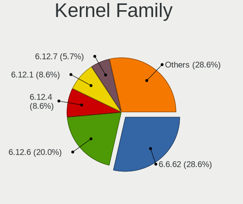
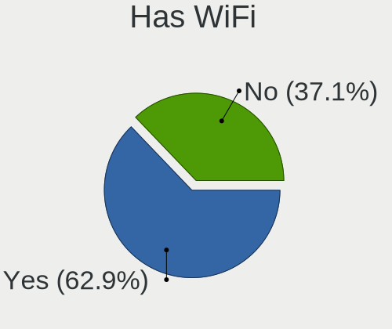
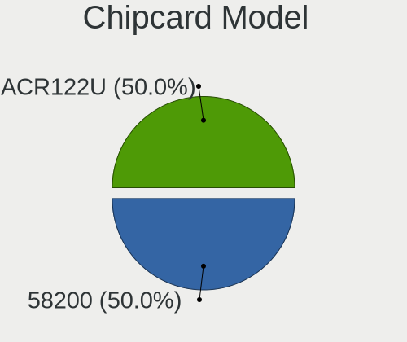

Gentoo - Hardware Trends
------------------------

A project to identify most popular hardware characteristics and track their change
over time based on data collected by Linux users at https://Linux-Hardware.org.

Anyone can contribute to this report by the [hw-probe](https://github.com/linuxhw/hw-probe) tool:

    sudo -E hw-probe -all -upload

This is a report for all computer types. See also reports for [desktops](/Dist/Gentoo/Desktop/README.md) and [notebooks](/Dist/Gentoo/Notebook/README.md).

This report is for one last month. Overall report since the beginning of time: [TestDays](https://github.com/linuxhw/TestDays)

Period: Aug, 2023.

Contents
--------

* [ System ](#system)
  - [ OS                       ](#os)
  - [ OS Family                ](#os-family)
  - [ Kernel                   ](#kernel)
  - [ Kernel Family            ](#kernel-family)
  - [ Kernel Major Ver.        ](#kernel-major-ver)
  - [ Arch                     ](#arch)
  - [ DE                       ](#de)
  - [ Display Server           ](#display-server)
  - [ Display Manager          ](#display-manager)
  - [ OS Lang                  ](#os-lang)
  - [ Boot Mode                ](#boot-mode)
  - [ Filesystem               ](#filesystem)
  - [ Part. scheme             ](#part-scheme)
  - [ Dual Boot with Linux/BSD ](#dual-boot-with-linuxbsd)
  - [ Dual Boot (Win)          ](#dual-boot-win)

* [ Board ](#board)
  - [ Vendor                   ](#vendor)
  - [ Model                    ](#model)
  - [ Model Family             ](#model-family)
  - [ MFG Year                 ](#mfg-year)
  - [ Form Factor              ](#form-factor)
  - [ Secure Boot              ](#secure-boot)
  - [ Coreboot                 ](#coreboot)
  - [ RAM Size                 ](#ram-size)
  - [ RAM Used                 ](#ram-used)
  - [ Total Drives             ](#total-drives)
  - [ Has CD-ROM               ](#has-cd-rom)
  - [ Has Ethernet             ](#has-ethernet)
  - [ Has WiFi                 ](#has-wifi)
  - [ Has Bluetooth            ](#has-bluetooth)

* [ Location ](#location)
  - [ Country                  ](#country)
  - [ City                     ](#city)

* [ Drives ](#drives)
  - [ Drive Vendor             ](#drive-vendor)
  - [ Drive Model              ](#drive-model)
  - [ HDD Vendor               ](#hdd-vendor)
  - [ SSD Vendor               ](#ssd-vendor)
  - [ Drive Kind               ](#drive-kind)
  - [ Drive Connector          ](#drive-connector)
  - [ Drive Size               ](#drive-size)
  - [ Space Total              ](#space-total)
  - [ Space Used               ](#space-used)
  - [ Malfunc. Drives          ](#malfunc-drives)
  - [ Malfunc. Drive Vendor    ](#malfunc-drive-vendor)
  - [ Malfunc. HDD Vendor      ](#malfunc-hdd-vendor)
  - [ Malfunc. Drive Kind      ](#malfunc-drive-kind)
  - [ Failed Drives            ](#failed-drives)
  - [ Failed Drive Vendor      ](#failed-drive-vendor)
  - [ Drive Status             ](#drive-status)

* [ Storage controller ](#storage-controller)
  - [ Storage Vendor           ](#storage-vendor)
  - [ Storage Model            ](#storage-model)
  - [ Storage Kind             ](#storage-kind)

* [ Processor ](#processor)
  - [ CPU Vendor               ](#cpu-vendor)
  - [ CPU Model                ](#cpu-model)
  - [ CPU Model Family         ](#cpu-model-family)
  - [ CPU Cores                ](#cpu-cores)
  - [ CPU Sockets              ](#cpu-sockets)
  - [ CPU Threads              ](#cpu-threads)
  - [ CPU Op-Modes             ](#cpu-op-modes)
  - [ CPU Microcode            ](#cpu-microcode)
  - [ CPU Microarch            ](#cpu-microarch)

* [ Graphics ](#graphics)
  - [ GPU Vendor               ](#gpu-vendor)
  - [ GPU Model                ](#gpu-model)
  - [ GPU Combo                ](#gpu-combo)
  - [ GPU Driver               ](#gpu-driver)
  - [ GPU Memory               ](#gpu-memory)

* [ Monitor ](#monitor)
  - [ Monitor Vendor           ](#monitor-vendor)
  - [ Monitor Model            ](#monitor-model)
  - [ Monitor Resolution       ](#monitor-resolution)
  - [ Monitor Diagonal         ](#monitor-diagonal)
  - [ Monitor Width            ](#monitor-width)
  - [ Aspect Ratio             ](#aspect-ratio)
  - [ Monitor Area             ](#monitor-area)
  - [ Pixel Density            ](#pixel-density)
  - [ Multiple Monitors        ](#multiple-monitors)

* [ Network ](#network)
  - [ Net Controller Vendor    ](#net-controller-vendor)
  - [ Net Controller Model     ](#net-controller-model)
  - [ Wireless Vendor          ](#wireless-vendor)
  - [ Wireless Model           ](#wireless-model)
  - [ Ethernet Vendor          ](#ethernet-vendor)
  - [ Ethernet Model           ](#ethernet-model)
  - [ Net Controller Kind      ](#net-controller-kind)
  - [ Used Controller          ](#used-controller)
  - [ NICs                     ](#nics)
  - [ IPv6                     ](#ipv6)

* [ Bluetooth ](#bluetooth)
  - [ Bluetooth Vendor         ](#bluetooth-vendor)
  - [ Bluetooth Model          ](#bluetooth-model)

* [ Sound ](#sound)
  - [ Sound Vendor             ](#sound-vendor)
  - [ Sound Model              ](#sound-model)

* [ Memory ](#memory)
  - [ Memory Vendor            ](#memory-vendor)
  - [ Memory Model             ](#memory-model)
  - [ Memory Kind              ](#memory-kind)
  - [ Memory Form Factor       ](#memory-form-factor)
  - [ Memory Size              ](#memory-size)
  - [ Memory Speed             ](#memory-speed)

* [ Printers & scanners ](#printers--scanners)
  - [ Printer Vendor           ](#printer-vendor)
  - [ Printer Model            ](#printer-model)
  - [ Scanner Vendor           ](#scanner-vendor)
  - [ Scanner Model            ](#scanner-model)

* [ Camera ](#camera)
  - [ Camera Vendor            ](#camera-vendor)
  - [ Camera Model             ](#camera-model)

* [ Security ](#security)
  - [ Fingerprint Vendor       ](#fingerprint-vendor)
  - [ Fingerprint Model        ](#fingerprint-model)
  - [ Chipcard Vendor          ](#chipcard-vendor)
  - [ Chipcard Model           ](#chipcard-model)

* [ Unsupported ](#unsupported)
  - [ Unsupported Devices      ](#unsupported-devices)
  - [ Unsupported Device Types ](#unsupported-device-types)

System
------

OS
--

Installed operating systems

| Name        | Computers | Percent |
|-------------|-----------|---------|
| Gentoo 2.14 | 29        | 53.7%   |
| Gentoo 2.13 | 23        | 42.59%  |
| Gentoo 23   | 1         | 1.85%   |
| Gentoo 2.6  | 1         | 1.85%   |

OS Family
---------

OS without a version

| Name   | Computers | Percent |
|--------|-----------|---------|
| Gentoo | 54        | 100%    |

Kernel
------

Version of the Linux kernel

| Version                               | Computers | Percent |
|---------------------------------------|-----------|---------|
| 6.1.41-gentoo-dist                    | 8         | 14.81%  |
| 6.1.41-gentoo                         | 6         | 11.11%  |
| 6.4.9-gentoo                          | 4         | 7.41%   |
| 6.4.10-gentoo-x86_64                  | 3         | 5.56%   |
| 6.1.46-gentoo-x86_64                  | 3         | 5.56%   |
| 6.4.10-gentoo                         | 2         | 3.7%    |
| 6.5.0-rc6-next-20230818-g0310018905e1 | 1         | 1.85%   |
| 6.5.0-rc4-shallot                     | 1         | 1.85%   |
| 6.5.0-gentoo                          | 1         | 1.85%   |
| 6.4.9-calculate                       | 1         | 1.85%   |
| 6.4.8-gentoo-dist                     | 1         | 1.85%   |
| 6.4.8-gentoo                          | 1         | 1.85%   |
| 6.4.7-gentoo                          | 1         | 1.85%   |
| 6.4.4-gentoo                          | 1         | 1.85%   |
| 6.4.3-gentoo-dist                     | 1         | 1.85%   |
| 6.4.12-gentoo-dark                    | 1         | 1.85%   |
| 6.4.11-gentoo-dist                    | 1         | 1.85%   |
| 6.4.11-gentoo-ali                     | 1         | 1.85%   |
| 6.4.10-x86_64                         | 1         | 1.85%   |
| 6.4.10-gentoo-dist                    | 1         | 1.85%   |
| 6.3.9-zen1-flat                       | 1         | 1.85%   |
| 6.3.8-gentoo                          | 1         | 1.85%   |
| 6.1.41-gentoo-x86_64                  | 1         | 1.85%   |
| 6.1.38-gentoo-x86_64                  | 1         | 1.85%   |
| 6.1.38-gentoo-dist-hardened           | 1         | 1.85%   |
| 6.1.38-gentoo-dist                    | 1         | 1.85%   |
| 6.1.38-gentoo                         | 1         | 1.85%   |
| 6.1.31-gentoo-dist                    | 1         | 1.85%   |
| 6.1.28-gentoo                         | 1         | 1.85%   |
| 6.1.2-gentoo                          | 1         | 1.85%   |
| 5.19.10-xanmod1                       | 1         | 1.85%   |
| 5.15.75-gentoo-dist                   | 1         | 1.85%   |
| 5.15.36-gentoo-x86_64                 | 1         | 1.85%   |
| 5.14.6-gentoo                         | 1         | 1.85%   |

Kernel Family
-------------

Linux kernel without a distro release

| Version | Computers | Percent |
|---------|-----------|---------|
| 6.1.41  | 15        | 27.78%  |
| 6.4.10  | 7         | 12.96%  |
| 6.4.9   | 5         | 9.26%   |
| 6.1.38  | 4         | 7.41%   |
| 6.5.0   | 3         | 5.56%   |
| 6.1.46  | 3         | 5.56%   |
| 6.4.8   | 2         | 3.7%    |
| 6.4.11  | 2         | 3.7%    |
| 6.4.7   | 1         | 1.85%   |
| 6.4.4   | 1         | 1.85%   |
| 6.4.3   | 1         | 1.85%   |
| 6.4.12  | 1         | 1.85%   |
| 6.3.9   | 1         | 1.85%   |
| 6.3.8   | 1         | 1.85%   |
| 6.1.31  | 1         | 1.85%   |
| 6.1.28  | 1         | 1.85%   |
| 6.1.2   | 1         | 1.85%   |
| 5.19.10 | 1         | 1.85%   |
| 5.15.75 | 1         | 1.85%   |
| 5.15.36 | 1         | 1.85%   |
| 5.14.6  | 1         | 1.85%   |

Kernel Major Ver.
-----------------

Linux kernel major version

| Version | Computers | Percent |
|---------|-----------|---------|
| 6.1     | 25        | 46.3%   |
| 6.4     | 20        | 37.04%  |
| 6.5     | 3         | 5.56%   |
| 6.3     | 2         | 3.7%    |
| 5.15    | 2         | 3.7%    |
| 5.19    | 1         | 1.85%   |
| 5.14    | 1         | 1.85%   |

Arch
----

OS architecture (x86_64, i586, etc.)

| Name        | Computers | Percent |
|-------------|-----------|---------|
| x86_64      | 52        | 96.3%   |
| loongarch64 | 2         | 3.7%    |

DE
--

Desktop Environment

| Name     | Computers | Percent |
|----------|-----------|---------|
| Unknown  | 18        | 33.33%  |
| XFCE     | 11        | 20.37%  |
| GNOME    | 9         | 16.67%  |
| KDE5     | 8         | 14.81%  |
| MATE     | 2         | 3.7%    |
| Hyprland | 2         | 3.7%    |
| sway     | 1         | 1.85%   |
| i3       | 1         | 1.85%   |
| DWM      | 1         | 1.85%   |
| bspwm    | 1         | 1.85%   |

Display Server
--------------

X11 or Wayland

| Name    | Computers | Percent |
|---------|-----------|---------|
| X11     | 20        | 37.04%  |
| Unknown | 13        | 24.07%  |
| Wayland | 11        | 20.37%  |
| Tty     | 10        | 18.52%  |

Display Manager
---------------

SDDM, LightDM, etc.

| Name    | Computers | Percent |
|---------|-----------|---------|
| Unknown | 24        | 44.44%  |
| SDDM    | 12        | 22.22%  |
| LightDM | 9         | 16.67%  |
| GDM     | 7         | 12.96%  |
| SLiM    | 1         | 1.85%   |
| GREETD  | 1         | 1.85%   |

OS Lang
-------

Language

| Lang            | Computers | Percent |
|-----------------|-----------|---------|
| en_US           | 24        | 44.44%  |
| Unknown         | 5         | 9.26%   |
| C.UTF8          | 4         | 7.41%   |
| ru_RU           | 2         | 3.7%    |
| fr_FR           | 2         | 3.7%    |
| en_GB           | 2         | 3.7%    |
| cs_CZ           | 2         | 3.7%    |
| C               | 2         | 3.7%    |
| pt_BR           | 1         | 1.85%   |
| pl_PL.UTF8      | 1         | 1.85%   |
| pl_PL           | 1         | 1.85%   |
| nl_NL           | 1         | 1.85%   |
| ja_JP           | 1         | 1.85%   |
| it_IT           | 1         | 1.85%   |
| fr_BE           | 1         | 1.85%   |
| fi_FI@euro.UTF- | 1         | 1.85%   |
| es_CL           | 1         | 1.85%   |
| en_IE           | 1         | 1.85%   |
| de_DE           | 1         | 1.85%   |

Boot Mode
---------

EFI or BIOS

| Mode | Computers | Percent |
|------|-----------|---------|
| EFI  | 42        | 77.78%  |
| BIOS | 12        | 22.22%  |

Filesystem
----------

Type of filesystem

| Type  | Computers | Percent |
|-------|-----------|---------|
| Ext4  | 34        | 62.96%  |
| Btrfs | 13        | 24.07%  |
| F2fs  | 4         | 7.41%   |
| Xfs   | 3         | 5.56%   |

Part. scheme
------------

Scheme of partitioning

| Type    | Computers | Percent |
|---------|-----------|---------|
| GPT     | 47        | 87.04%  |
| MBR     | 6         | 11.11%  |
| Unknown | 1         | 1.85%   |

Dual Boot with Linux/BSD
------------------------

Hosting more than one Linux/BSD

| Dual boot | Computers | Percent |
|-----------|-----------|---------|
| No        | 42        | 77.78%  |
| Yes       | 12        | 22.22%  |

Dual Boot (Win)
---------------

Hosting Linux and Windows

| Dual boot | Computers | Percent |
|-----------|-----------|---------|
| No        | 39        | 72.22%  |
| Yes       | 15        | 27.78%  |

Board
-----

Vendor
------

Motherboard manufacturer

| Name                | Computers | Percent |
|---------------------|-----------|---------|
| ASUSTek Computer    | 13        | 24.07%  |
| Hewlett-Packard     | 6         | 11.11%  |
| Dell                | 6         | 11.11%  |
| Lenovo              | 5         | 9.26%   |
| Gigabyte Technology | 5         | 9.26%   |
| MSI                 | 3         | 5.56%   |
| Loongson            | 2         | 3.7%    |
| Apple               | 2         | 3.7%    |
| Timi                | 1         | 1.85%   |
| Supermicro          | 1         | 1.85%   |
| NEC Computers       | 1         | 1.85%   |
| Medion              | 1         | 1.85%   |
| Huanan              | 1         | 1.85%   |
| Fujitsu             | 1         | 1.85%   |
| Framework           | 1         | 1.85%   |
| Foxconn             | 1         | 1.85%   |
| ASRock              | 1         | 1.85%   |
| AMD                 | 1         | 1.85%   |
| Alienware           | 1         | 1.85%   |
| A-DATA Technology   | 1         | 1.85%   |

Model
-----

Motherboard model

| Name                                    | Computers | Percent |
|-----------------------------------------|-----------|---------|
| Loongson 3A6000-7A2000-1w-V0.1-EVB      | 2         | 3.7%    |
| Lenovo Yoga 7 16ARP8 83BS               | 2         | 3.7%    |
| ASUS M3A78-CM                           | 2         | 3.7%    |
| Timi RedmiBook Pro 15S                  | 1         | 1.85%   |
| Supermicro Super Server                 | 1         | 1.85%   |
| NEC Computers PC-MKM30BZG4              | 1         | 1.85%   |
| MSI MS-7C02                             | 1         | 1.85%   |
| MSI MS-7974                             | 1         | 1.85%   |
| MSI Modern 14 C12M                      | 1         | 1.85%   |
| Medion MD34100/2543                     | 1         | 1.85%   |
| Lenovo Yoga 2 13 20344                  | 1         | 1.85%   |
| Lenovo ThinkPad Yoga 370 20JJS0HD00     | 1         | 1.85%   |
| Lenovo IdeaPad 5 15ABA7 82SG            | 1         | 1.85%   |
| Huanan X99-F8D V2.4                     | 1         | 1.85%   |
| HP ProBook 445 G8 Notebook PC           | 1         | 1.85%   |
| HP ProBook 430 G7                       | 1         | 1.85%   |
| HP Laptop 15-ra0xx                      | 1         | 1.85%   |
| HP Laptop 14-df0xxx                     | 1         | 1.85%   |
| HP EliteBook 8540w                      | 1         | 1.85%   |
| HP 750-100ny                            | 1         | 1.85%   |
| Gigabyte Z77X-UD5H                      | 1         | 1.85%   |
| Gigabyte Z390 AORUS ELITE               | 1         | 1.85%   |
| Gigabyte Z370P D3                       | 1         | 1.85%   |
| Gigabyte B650 AORUS PRO AX              | 1         | 1.85%   |
| Gigabyte AB350-Gaming                   | 1         | 1.85%   |
| Fujitsu ESPRIMO E700                    | 1         | 1.85%   |
| Framework Laptop (13th Gen Intel Core)  | 1         | 1.85%   |
| Foxconn TPS01                           | 1         | 1.85%   |
| Dell OptiPlex 7010                      | 1         | 1.85%   |
| Dell Latitude E7450                     | 1         | 1.85%   |
| Dell Latitude E6510                     | 1         | 1.85%   |
| Dell Inspiron 531                       | 1         | 1.85%   |
| Dell Inspiron 15 3511                   | 1         | 1.85%   |
| Dell G5 5505                            | 1         | 1.85%   |
| ASUS VivoBook_ASUSLaptop X415EA_F1400EA | 1         | 1.85%   |
| ASUS TUF Gaming X670E-PLUS              | 1         | 1.85%   |
| ASUS TUF Gaming X570-PRO                | 1         | 1.85%   |
| ASUS SABERTOOTH 990FX R2.0              | 1         | 1.85%   |
| ASUS ROG Zephyrus G14 GA401II_GA401II   | 1         | 1.85%   |
| ASUS ROG STRIX X670E-F GAMING WIFI      | 1         | 1.85%   |

Model Family
------------

Motherboard model prefix

| Name                               | Computers | Percent |
|------------------------------------|-----------|---------|
| ASUS ROG                           | 6         | 11.11%  |
| Lenovo Yoga                        | 3         | 5.56%   |
| Loongson 3A6000-7A2000-1w-V0.1-EVB | 2         | 3.7%    |
| HP ProBook                         | 2         | 3.7%    |
| HP Laptop                          | 2         | 3.7%    |
| Dell Latitude                      | 2         | 3.7%    |
| Dell Inspiron                      | 2         | 3.7%    |
| ASUS TUF                           | 2         | 3.7%    |
| ASUS M3A78-CM                      | 2         | 3.7%    |
| Timi RedmiBook                     | 1         | 1.85%   |
| Supermicro Super                   | 1         | 1.85%   |
| NEC Computers PC-MKM30BZG4         | 1         | 1.85%   |
| MSI MS-7C02                        | 1         | 1.85%   |
| MSI MS-7974                        | 1         | 1.85%   |
| MSI Modern                         | 1         | 1.85%   |
| Medion MD34100                     | 1         | 1.85%   |
| Lenovo ThinkPad                    | 1         | 1.85%   |
| Lenovo IdeaPad                     | 1         | 1.85%   |
| Huanan X99-F8D                     | 1         | 1.85%   |
| HP EliteBook                       | 1         | 1.85%   |
| HP 750-100ny                       | 1         | 1.85%   |
| Gigabyte Z77X-UD5H                 | 1         | 1.85%   |
| Gigabyte Z390                      | 1         | 1.85%   |
| Gigabyte Z370P                     | 1         | 1.85%   |
| Gigabyte B650                      | 1         | 1.85%   |
| Gigabyte AB350-Gaming              | 1         | 1.85%   |
| Fujitsu ESPRIMO                    | 1         | 1.85%   |
| Framework Laptop                   | 1         | 1.85%   |
| Foxconn TPS01                      | 1         | 1.85%   |
| Dell OptiPlex                      | 1         | 1.85%   |
| Dell G5                            | 1         | 1.85%   |
| ASUS VivoBook                      | 1         | 1.85%   |
| ASUS SABERTOOTH                    | 1         | 1.85%   |
| ASUS PRIME                         | 1         | 1.85%   |
| ASRock AB350M                      | 1         | 1.85%   |
| Apple MacBookPro11                 | 1         | 1.85%   |
| Apple MacBookPro10                 | 1         | 1.85%   |
| AMD A690G                          | 1         | 1.85%   |
| Alienware x17                      | 1         | 1.85%   |
| A-DATA XENIA                       | 1         | 1.85%   |

MFG Year
--------

Motherboard manufacture year

| Year    | Computers | Percent |
|---------|-----------|---------|
| 2021    | 7         | 12.96%  |
| 2023    | 6         | 11.11%  |
| 2022    | 6         | 11.11%  |
| 2019    | 5         | 9.26%   |
| 2018    | 4         | 7.41%   |
| 2017    | 4         | 7.41%   |
| 2020    | 3         | 5.56%   |
| 2014    | 3         | 5.56%   |
| 2012    | 3         | 5.56%   |
| 2008    | 3         | 5.56%   |
| 2015    | 2         | 3.7%    |
| 2010    | 2         | 3.7%    |
| Unknown | 2         | 3.7%    |
| 2013    | 1         | 1.85%   |
| 2011    | 1         | 1.85%   |
| 2009    | 1         | 1.85%   |
| 2007    | 1         | 1.85%   |

Form Factor
-----------

Physical design of the computer

| Name        | Computers | Percent |
|-------------|-----------|---------|
| Desktop     | 27        | 50%     |
| Notebook    | 23        | 42.59%  |
| Convertible | 3         | 5.56%   |
| Server      | 1         | 1.85%   |

Secure Boot
-----------

Enabled or disabled

| State    | Computers | Percent |
|----------|-----------|---------|
| Disabled | 52        | 96.3%   |
| Enabled  | 2         | 3.7%    |

Coreboot
--------

Have coreboot on board

| Used | Computers | Percent |
|------|-----------|---------|
| No   | 54        | 100%    |

RAM Size
--------

Total RAM memory

| Size in GB  | Computers | Percent |
|-------------|-----------|---------|
| 32.01-64.0  | 12        | 22.22%  |
| 8.01-16.0   | 12        | 22.22%  |
| 4.01-8.0    | 9         | 16.67%  |
| 16.01-24.0  | 8         | 14.81%  |
| 64.01-256.0 | 5         | 9.26%   |
| 3.01-4.0    | 4         | 7.41%   |
| 24.01-32.0  | 4         | 7.41%   |

RAM Used
--------

Used RAM memory

| Used GB    | Computers | Percent |
|------------|-----------|---------|
| 1.01-2.0   | 15        | 27.78%  |
| 4.01-8.0   | 13        | 24.07%  |
| 3.01-4.0   | 6         | 11.11%  |
| 2.01-3.0   | 6         | 11.11%  |
| 0.01-0.5   | 6         | 11.11%  |
| 0.51-1.0   | 3         | 5.56%   |
| 16.01-24.0 | 2         | 3.7%    |
| 8.01-16.0  | 2         | 3.7%    |
| 24.01-32.0 | 1         | 1.85%   |

Total Drives
------------

Number of drives on board

| Drives | Computers | Percent |
|--------|-----------|---------|
| 1      | 29        | 53.7%   |
| 2      | 13        | 24.07%  |
| 4      | 5         | 9.26%   |
| 7      | 2         | 3.7%    |
| 6      | 2         | 3.7%    |
| 3      | 2         | 3.7%    |
| 5      | 1         | 1.85%   |

Has CD-ROM
----------

Has CD-ROM on board

| Presented | Computers | Percent |
|-----------|-----------|---------|
| No        | 44        | 81.48%  |
| Yes       | 10        | 18.52%  |

Has Ethernet
------------

Has Ethernet on board

| Presented | Computers | Percent |
|-----------|-----------|---------|
| Yes       | 49        | 90.74%  |
| No        | 5         | 9.26%   |

Has WiFi
--------

Has WiFi module

| Presented | Computers | Percent |
|-----------|-----------|---------|
| Yes       | 38        | 70.37%  |
| No        | 16        | 29.63%  |

Has Bluetooth
-------------

Has Bluetooth module

| Presented | Computers | Percent |
|-----------|-----------|---------|
| Yes       | 36        | 66.67%  |
| No        | 18        | 33.33%  |

Location
--------

Country
-------

Geographic location (country)

| Country     | Computers | Percent |
|-------------|-----------|---------|
| USA         | 8         | 14.81%  |
| Poland      | 5         | 9.26%   |
| Germany     | 5         | 9.26%   |
| Russia      | 4         | 7.41%   |
| UK          | 3         | 5.56%   |
| Japan       | 3         | 5.56%   |
| France      | 3         | 5.56%   |
| Czechia     | 3         | 5.56%   |
| Turkey      | 2         | 3.7%    |
| Spain       | 2         | 3.7%    |
| Finland     | 2         | 3.7%    |
| China       | 2         | 3.7%    |
| Slovakia    | 1         | 1.85%   |
| Netherlands | 1         | 1.85%   |
| Malaysia    | 1         | 1.85%   |
| Italy       | 1         | 1.85%   |
| Ireland     | 1         | 1.85%   |
| Iran        | 1         | 1.85%   |
| Croatia     | 1         | 1.85%   |
| Chile       | 1         | 1.85%   |
| Canada      | 1         | 1.85%   |
| Brazil      | 1         | 1.85%   |
| Belgium     | 1         | 1.85%   |
| Argentina   | 1         | 1.85%   |

City
----

Geographic location (city)

| City                | Computers | Percent |
|---------------------|-----------|---------|
| Warsaw              | 3         | 5.56%   |
| Beijing             | 2         | 3.7%    |
| Yeovil              | 1         | 1.85%   |
| Vitkov              | 1         | 1.85%   |
| Vista               | 1         | 1.85%   |
| Toulouse            | 1         | 1.85%   |
| Tokyo               | 1         | 1.85%   |
| The Hague           | 1         | 1.85%   |
| Tampere             | 1         | 1.85%   |
| St Petersburg       | 1         | 1.85%   |
| Spy                 | 1         | 1.85%   |
| Slough              | 1         | 1.85%   |
| Šlapanice          | 1         | 1.85%   |
| Sao Paulo           | 1         | 1.85%   |
| Ryazan              | 1         | 1.85%   |
| Roubaix             | 1         | 1.85%   |
| Quillota            | 1         | 1.85%   |
| Pula                | 1         | 1.85%   |
| Prague              | 1         | 1.85%   |
| Port Glasgow        | 1         | 1.85%   |
| Pickering           | 1         | 1.85%   |
| Pforzheim           | 1         | 1.85%   |
| Omaha               | 1         | 1.85%   |
| Nakano              | 1         | 1.85%   |
| Moscow              | 1         | 1.85%   |
| Mönchengladbach    | 1         | 1.85%   |
| Mataró             | 1         | 1.85%   |
| Marki               | 1         | 1.85%   |
| Magnesia ad Sipylum | 1         | 1.85%   |
| Konstancin-Jeziorna | 1         | 1.85%   |
| Khabarovsk          | 1         | 1.85%   |
| Kawanishi           | 1         | 1.85%   |
| Istanbul            | 1         | 1.85%   |
| Isfahan             | 1         | 1.85%   |
| Ipoh                | 1         | 1.85%   |
| Helsinki            | 1         | 1.85%   |
| Goshen              | 1         | 1.85%   |
| Fayetteville        | 1         | 1.85%   |
| Dublin              | 1         | 1.85%   |
| Detmold             | 1         | 1.85%   |

Drives
------

Drive Vendor
------------

Hard drive vendors

| Vendor                      | Computers | Drives | Percent |
|-----------------------------|-----------|--------|---------|
| Samsung Electronics         | 11        | 13     | 11.96%  |
| Sandisk                     | 9         | 10     | 9.78%   |
| WDC                         | 8         | 10     | 8.7%    |
| Seagate                     | 8         | 13     | 8.7%    |
| Toshiba                     | 7         | 7      | 7.61%   |
| Intel                       | 6         | 7      | 6.52%   |
| Hitachi                     | 4         | 9      | 4.35%   |
| SK hynix                    | 3         | 3      | 3.26%   |
| Micron Technology           | 3         | 3      | 3.26%   |
| GOODRAM                     | 3         | 3      | 3.26%   |
| Crucial                     | 3         | 4      | 3.26%   |
| Yangtze Memory Technologies | 2         | 2      | 2.17%   |
| KIOXIA                      | 2         | 2      | 2.17%   |
| Kingston Technology Company | 2         | 2      | 2.17%   |
| Kingston                    | 2         | 2      | 2.17%   |
| Apple                       | 2         | 2      | 2.17%   |
| XPG                         | 1         | 1      | 1.09%   |
| Verbatim                    | 1         | 1      | 1.09%   |
| Unknown                     | 1         | 1      | 1.09%   |
| Teleplan                    | 1         | 1      | 1.09%   |
| SPCC                        | 1         | 1      | 1.09%   |
| Solid State Storage         | 1         | 1      | 1.09%   |
| Realtek Semiconductor       | 1         | 1      | 1.09%   |
| Phison Electronics          | 1         | 1      | 1.09%   |
| OCZ                         | 1         | 1      | 1.09%   |
| Micron/Crucial Technology   | 1         | 1      | 1.09%   |
| MAXIO Technology (Hangzhou) | 1         | 1      | 1.09%   |
| LITEON                      | 1         | 1      | 1.09%   |
| Lexar                       | 1         | 1      | 1.09%   |
| HGST                        | 1         | 4      | 1.09%   |
| Fujitsu                     | 1         | 1      | 1.09%   |
| Corsair                     | 1         | 1      | 1.09%   |
| A-DATA Technology           | 1         | 1      | 1.09%   |

Drive Model
-----------

Hard drive models

| Model                                        | Computers | Percent |
|----------------------------------------------|-----------|---------|
| SK hynix SKHynix_HFS001TEJ4X112N 1024GB      | 2         | 2.06%   |
| Sandisk WD_BLACK SN770 1TB                   | 2         | 2.06%   |
| Micron 2400_MTFDKBA1T0QFM 1TB                | 2         | 2.06%   |
| Intel SSD 660P Series 512GB                  | 2         | 2.06%   |
| GOODRAM SSDPR-CL100-480-G2 480GB             | 2         | 2.06%   |
| Yangtze Memory ZHITAI TiPlus7100 1TB         | 1         | 1.03%   |
| Yangtze Memory ZHITAI TiPlus5000 1TB         | 1         | 1.03%   |
| XPG GAMMIX S70 1TB                           | 1         | 1.03%   |
| WDC WDS200T1R0A-68A4W0 2TB                   | 1         | 1.03%   |
| WDC WD5000AZLX-08K2TA0 500GB                 | 1         | 1.03%   |
| WDC WD3200AAJS-00L7A0 320GB                  | 1         | 1.03%   |
| WDC WD30EFRX-68EUZN0 3TB                     | 1         | 1.03%   |
| WDC WD10EZEX-08WN4A0 1TB                     | 1         | 1.03%   |
| WDC WD10EZEX-08M2NA0 1TB                     | 1         | 1.03%   |
| WDC WD102KRYZ-01A5AB0 10TB                   | 1         | 1.03%   |
| WDC WD Blue SA510 2.5 1TB SSD                | 1         | 1.03%   |
| Verbatim Vi550 S3 512GB                      | 1         | 1.03%   |
| Unknown SD/MMC/MS PRO 1GB                    | 1         | 1.03%   |
| Toshiba XG4 NVMe SSD Controller 256GB        | 1         | 1.03%   |
| Toshiba MQ01ABF050 500GB                     | 1         | 1.03%   |
| Toshiba MG08ACA16TE 16TB                     | 1         | 1.03%   |
| Toshiba HDWQ140 4TB                          | 1         | 1.03%   |
| Toshiba HDWE150 5TB                          | 1         | 1.03%   |
| Toshiba DT01ACA200 2TB                       | 1         | 1.03%   |
| Toshiba DT01ACA100 1TB                       | 1         | 1.03%   |
| Teleplan TP1000G 1TB                         | 1         | 1.03%   |
| SPCC Solid State Disk 1TB                    | 1         | 1.03%   |
| Solid State Storage SSSTC CL1-8D256-HP 256GB | 1         | 1.03%   |
| SK hynix PC711 NVMe 1TB                      | 1         | 1.03%   |
| Seagate ST8000DM004-2CX188 8TB               | 1         | 1.03%   |
| Seagate ST6000DM003-2CY186 6TB               | 1         | 1.03%   |
| Seagate ST4000DM004-2CV104 4TB               | 1         | 1.03%   |
| Seagate ST32000641AS 2TB                     | 1         | 1.03%   |
| Seagate ST2000DM006-2DM164 2TB               | 1         | 1.03%   |
| Seagate ST2000DM001-1ER164 2TB               | 1         | 1.03%   |
| Seagate ST18000NM003D-3DL103 18TB            | 1         | 1.03%   |
| Seagate ST12000NM0008-2H3101 12TB            | 1         | 1.03%   |
| Seagate ST1000DM003-9YN162 1TB               | 1         | 1.03%   |
| Seagate ST1000DM003-1SB10C 1TB               | 1         | 1.03%   |
| Seagate ST1000DM003-1SB102 1TB               | 1         | 1.03%   |

HDD Vendor
----------

Hard disk drive vendors

| Vendor   | Computers | Drives | Percent |
|----------|-----------|--------|---------|
| Seagate  | 8         | 13     | 28.57%  |
| WDC      | 6         | 7      | 21.43%  |
| Toshiba  | 6         | 6      | 21.43%  |
| Hitachi  | 4         | 9      | 14.29%  |
| Unknown  | 1         | 1      | 3.57%   |
| Teleplan | 1         | 1      | 3.57%   |
| HGST     | 1         | 4      | 3.57%   |
| Fujitsu  | 1         | 1      | 3.57%   |

SSD Vendor
----------

Solid state drive vendors

| Vendor              | Computers | Drives | Percent |
|---------------------|-----------|--------|---------|
| Samsung Electronics | 6         | 7      | 19.35%  |
| SanDisk             | 4         | 4      | 12.9%   |
| GOODRAM             | 3         | 3      | 9.68%   |
| Crucial             | 3         | 4      | 9.68%   |
| WDC                 | 2         | 3      | 6.45%   |
| Kingston            | 2         | 2      | 6.45%   |
| Intel               | 2         | 2      | 6.45%   |
| Apple               | 2         | 2      | 6.45%   |
| Verbatim            | 1         | 1      | 3.23%   |
| SPCC                | 1         | 1      | 3.23%   |
| OCZ                 | 1         | 1      | 3.23%   |
| LITEON              | 1         | 1      | 3.23%   |
| Lexar               | 1         | 1      | 3.23%   |
| Corsair             | 1         | 1      | 3.23%   |
| A-DATA Technology   | 1         | 1      | 3.23%   |

Drive Kind
----------

HDD or SSD

| Kind | Computers | Drives | Percent |
|------|-----------|--------|---------|
| NVMe | 27        | 36     | 38.57%  |
| SSD  | 24        | 34     | 34.29%  |
| HDD  | 19        | 42     | 27.14%  |

Drive Connector
---------------

SATA, SAS, NVMe, etc.

| Type | Computers | Drives | Percent |
|------|-----------|--------|---------|
| SATA | 33        | 72     | 52.38%  |
| NVMe | 27        | 36     | 42.86%  |
| SAS  | 3         | 4      | 4.76%   |

Drive Size
----------

Size of hard drive

| Size in TB | Computers | Drives | Percent |
|------------|-----------|--------|---------|
| 0.01-0.5   | 21        | 28     | 40.38%  |
| 0.51-1.0   | 15        | 19     | 28.85%  |
| 1.01-2.0   | 6         | 15     | 11.54%  |
| 10.01-20.0 | 3         | 3      | 5.77%   |
| 4.01-10.0  | 3         | 4      | 5.77%   |
| 3.01-4.0   | 2         | 2      | 3.85%   |
| 2.01-3.0   | 2         | 5      | 3.85%   |

Space Total
-----------

Amount of disk space available on the file system

| Size in GB     | Computers | Percent |
|----------------|-----------|---------|
| 501-1000       | 16        | 29.63%  |
| More than 3000 | 12        | 22.22%  |
| 251-500        | 11        | 20.37%  |
| 101-250        | 6         | 11.11%  |
| 1001-2000      | 3         | 5.56%   |
| Unknown        | 2         | 3.7%    |
| 21-50          | 1         | 1.85%   |
| 2001-3000      | 1         | 1.85%   |
| 1-20           | 1         | 1.85%   |
| 51-100         | 1         | 1.85%   |

Space Used
----------

Amount of used disk space

| Used GB        | Computers | Percent |
|----------------|-----------|---------|
| 21-50          | 9         | 16.67%  |
| 251-500        | 8         | 14.81%  |
| 101-250        | 8         | 14.81%  |
| 1-20           | 8         | 14.81%  |
| More than 3000 | 6         | 11.11%  |
| 501-1000       | 4         | 7.41%   |
| 51-100         | 4         | 7.41%   |
| 1001-2000      | 3         | 5.56%   |
| 2001-3000      | 2         | 3.7%    |
| Unknown        | 2         | 3.7%    |

Malfunc. Drives
---------------

Drive models with a malfunction

| Model                                                     | Computers | Drives | Percent |
|-----------------------------------------------------------|-----------|--------|---------|
| WDC WD30EFRX-68EUZN0 3TB                                  | 1         | 2      | 16.67%  |
| Samsung Electronics SSD 980 1TB                           | 1         | 1      | 16.67%  |
| Realtek Semiconductor RTS5763DL NVMe SSD Controller 512GB | 1         | 1      | 16.67%  |
| LITEON CV8-8E128-HP 128GB SSD                             | 1         | 1      | 16.67%  |
| Intel SSDSCKKF180G8L 180GB                                | 1         | 1      | 16.67%  |
| HGST HUS726020ALA610 2TB                                  | 1         | 4      | 16.67%  |

Malfunc. Drive Vendor
---------------------

Vendors of faulty drives

| Vendor                | Computers | Drives | Percent |
|-----------------------|-----------|--------|---------|
| WDC                   | 1         | 2      | 16.67%  |
| Samsung Electronics   | 1         | 1      | 16.67%  |
| Realtek Semiconductor | 1         | 1      | 16.67%  |
| LITEON                | 1         | 1      | 16.67%  |
| Intel                 | 1         | 1      | 16.67%  |
| HGST                  | 1         | 4      | 16.67%  |

Malfunc. HDD Vendor
-------------------

Vendors of faulty HDD drives

| Vendor | Computers | Drives | Percent |
|--------|-----------|--------|---------|
| WDC    | 1         | 2      | 50%     |
| HGST   | 1         | 4      | 50%     |

Malfunc. Drive Kind
-------------------

Kinds of faulty drives

| Kind | Computers | Drives | Percent |
|------|-----------|--------|---------|
| NVMe | 2         | 2      | 33.33%  |
| SSD  | 2         | 2      | 33.33%  |
| HDD  | 2         | 6      | 33.33%  |

Failed Drives
-------------

Failed drive models

Zero info for selected period =(

Failed Drive Vendor
-------------------

Failed drive vendors

Zero info for selected period =(

Drive Status
------------

Number of failed and malfunc. drives

| Status   | Computers | Drives | Percent |
|----------|-----------|--------|---------|
| Works    | 49        | 95     | 81.67%  |
| Malfunc  | 6         | 10     | 10%     |
| Detected | 5         | 7      | 8.33%   |

Storage controller
------------------

Storage Vendor
--------------

Storage controller vendors

| Vendor                         | Computers | Percent |
|--------------------------------|-----------|---------|
| Intel                          | 24        | 31.17%  |
| AMD                            | 16        | 20.78%  |
| SanDisk                        | 6         | 7.79%   |
| Samsung Electronics            | 6         | 7.79%   |
| SK hynix                       | 3         | 3.9%    |
| Micron Technology              | 3         | 3.9%    |
| Yangtze Memory Technologies    | 2         | 2.6%    |
| Loongson Technology            | 2         | 2.6%    |
| KIOXIA                         | 2         | 2.6%    |
| Kingston Technology Company    | 2         | 2.6%    |
| ASMedia Technology             | 2         | 2.6%    |
| Toshiba America Info Systems   | 1         | 1.3%    |
| Solid State Storage Technology | 1         | 1.3%    |
| Realtek Semiconductor          | 1         | 1.3%    |
| Phison Electronics             | 1         | 1.3%    |
| Nvidia                         | 1         | 1.3%    |
| Micron/Crucial Technology      | 1         | 1.3%    |
| MAXIO Technology (Hangzhou)    | 1         | 1.3%    |
| Marvell Technology Group       | 1         | 1.3%    |
| INNOGRIT                       | 1         | 1.3%    |

Storage Model
-------------

Storage controller models

| Model                                                                        | Computers | Percent |
|------------------------------------------------------------------------------|-----------|---------|
| AMD FCH SATA Controller [AHCI mode]                                          | 10        | 11.24%  |
| Intel 82801 Mobile SATA Controller [RAID mode]                               | 3         | 3.37%   |
| SK hynix BC901 NVMe Solid State Drive (DRAM-less)                            | 2         | 2.25%   |
| SanDisk WD Black SN770 / PC SN740 256GB / PC SN560 (DRAM-less) NVMe SSD      | 2         | 2.25%   |
| Samsung NVMe SSD Controller 980                                              | 2         | 2.25%   |
| Micron 2400 NVMe SSD (DRAM-less)                                             | 2         | 2.25%   |
| Loongson SATA controller                                                     | 2         | 2.25%   |
| KIOXIA NVMe SSD Controller BG4 (DRAM-less)                                   | 2         | 2.25%   |
| Intel Volume Management Device NVMe RAID Controller                          | 2         | 2.25%   |
| Intel Tiger Lake-LP SATA Controller                                          | 2         | 2.25%   |
| Intel SSD 660P Series                                                        | 2         | 2.25%   |
| Intel Cannon Lake PCH SATA AHCI Controller                                   | 2         | 2.25%   |
| Intel 7 Series/C210 Series Chipset Family 6-port SATA Controller [AHCI mode] | 2         | 2.25%   |
| ASMedia ASM1062 Serial ATA Controller                                        | 2         | 2.25%   |
| AMD SB7x0/SB8x0/SB9x0 SATA Controller [IDE mode]                             | 2         | 2.25%   |
| AMD SB7x0/SB8x0/SB9x0 SATA Controller [AHCI mode]                            | 2         | 2.25%   |
| AMD SB7x0/SB8x0/SB9x0 IDE Controller                                         | 2         | 2.25%   |
| AMD 300 Series Chipset SATA Controller                                       | 2         | 2.25%   |
| Yangtze Memory ZHITAI TiPro5000 NVMe SSD                                     | 1         | 1.12%   |
| Yangtze Memory ZHITAI TiPlus7100                                             | 1         | 1.12%   |
| Toshiba America Info Systems XG4 NVMe SSD Controller                         | 1         | 1.12%   |
| Solid State Storage CL1-3D256-Q11 NVMe SSD M.2                               | 1         | 1.12%   |
| SK hynix Gold P31/BC711/PC711 NVMe Solid State Drive                         | 1         | 1.12%   |
| Sandisk Western Digital WD Black SN850X NVMe SSD                             | 1         | 1.12%   |
| SanDisk WD Blue SN570 NVMe SSD 1TB                                           | 1         | 1.12%   |
| SanDisk WD Blue SN550 NVMe SSD                                               | 1         | 1.12%   |
| SanDisk PC SN735 NVMe SSD (DRAM-less)                                        | 1         | 1.12%   |
| Samsung S4LN053X01 AHCI SSD Controller(Apple slot)                           | 1         | 1.12%   |
| Samsung NVMe SSD Controller SM981/PM981/PM983                                | 1         | 1.12%   |
| Samsung NVMe SSD Controller SM961/PM961/SM963                                | 1         | 1.12%   |
| Samsung NVMe SSD Controller PM9A1/PM9A3/980PRO                               | 1         | 1.12%   |
| Realtek RTS5763DL NVMe SSD Controller                                        | 1         | 1.12%   |
| Phison E18 PCIe4 NVMe Controller                                             | 1         | 1.12%   |
| Nvidia MCP61 SATA Controller                                                 | 1         | 1.12%   |
| Nvidia MCP61 IDE                                                             | 1         | 1.12%   |
| Micron/Crucial P5 Plus NVMe PCIe SSD                                         | 1         | 1.12%   |
| Micron 3400 NVMe SSD [Hendrix]                                               | 1         | 1.12%   |
| MAXIO (Hangzhou) NVMe SSD Controller MAP1202                                 | 1         | 1.12%   |
| Marvell Group 88SE9172 SATA 6Gb/s Controller                                 | 1         | 1.12%   |
| Kingston Company Company Non-Volatile memory controller                      | 1         | 1.12%   |

Storage Kind
------------

Kind of storage controller (IDE, SATA, NVMe, SAS, ...)

| Kind | Computers | Percent |
|------|-----------|---------|
| SATA | 37        | 49.33%  |
| NVMe | 27        | 36%     |
| RAID | 7         | 9.33%   |
| IDE  | 4         | 5.33%   |

Processor
---------

CPU Vendor
----------

Processor vendors

| Vendor   | Computers | Percent |
|----------|-----------|---------|
| Intel    | 29        | 53.7%   |
| AMD      | 23        | 42.59%  |
| Loongson | 2         | 3.7%    |

CPU Model
---------

Processor models

| Model                                   | Computers | Percent |
|-----------------------------------------|-----------|---------|
| Loongson 3A6000                         | 2         | 3.7%    |
| Intel Core i7-3770 CPU @ 3.40GHz        | 2         | 3.7%    |
| Intel 11th Gen Core i7-11800H @ 2.30GHz | 2         | 3.7%    |
| Intel 11th Gen Core i5-1135G7 @ 2.40GHz | 2         | 3.7%    |
| AMD Ryzen 7 7735U with Radeon Graphics  | 2         | 3.7%    |
| AMD Phenom II X4 955 Processor          | 2         | 3.7%    |
| Intel Xeon CPU E5-2680 v4 @ 2.40GHz     | 1         | 1.85%   |
| Intel Xeon CPU D-1521 @ 2.40GHz         | 1         | 1.85%   |
| Intel N100                              | 1         | 1.85%   |
| Intel Core i7-3615QM CPU @ 2.30GHz      | 1         | 1.85%   |
| Intel Core i7 CPU M 620 @ 2.67GHz       | 1         | 1.85%   |
| Intel Core i5-9600K CPU @ 3.70GHz       | 1         | 1.85%   |
| Intel Core i5-8600K CPU @ 3.60GHz       | 1         | 1.85%   |
| Intel Core i5-8500 CPU @ 3.00GHz        | 1         | 1.85%   |
| Intel Core i5-8400 CPU @ 2.80GHz        | 1         | 1.85%   |
| Intel Core i5-7300U CPU @ 2.60GHz       | 1         | 1.85%   |
| Intel Core i5-6400 CPU @ 2.70GHz        | 1         | 1.85%   |
| Intel Core i5-5300U CPU @ 2.30GHz       | 1         | 1.85%   |
| Intel Core i5-4288U CPU @ 2.60GHz       | 1         | 1.85%   |
| Intel Core i5-4200U CPU @ 1.60GHz       | 1         | 1.85%   |
| Intel Core i5-2400 CPU @ 3.10GHz        | 1         | 1.85%   |
| Intel Core i5-10210U CPU @ 1.60GHz      | 1         | 1.85%   |
| Intel Core i5 CPU M 540 @ 2.53GHz       | 1         | 1.85%   |
| Intel Core i3-8130U CPU @ 2.20GHz       | 1         | 1.85%   |
| Intel Celeron CPU N3060 @ 1.60GHz       | 1         | 1.85%   |
| Intel Atom CPU D510 @ 1.66GHz           | 1         | 1.85%   |
| Intel 13th Gen Core i9-13980HX          | 1         | 1.85%   |
| Intel 13th Gen Core i7-1370P            | 1         | 1.85%   |
| Intel 12th Gen Core i5-1235U            | 1         | 1.85%   |
| AMD Ryzen 9 7945HX with Radeon Graphics | 1         | 1.85%   |
| AMD Ryzen 9 7900X 12-Core Processor     | 1         | 1.85%   |
| AMD Ryzen 9 7900 12-Core Processor      | 1         | 1.85%   |
| AMD Ryzen 9 5980HX with Radeon Graphics | 1         | 1.85%   |
| AMD Ryzen 9 5900X 12-Core Processor     | 1         | 1.85%   |
| AMD Ryzen 9 3950X 16-Core Processor     | 1         | 1.85%   |
| AMD Ryzen 9 3900X 12-Core Processor     | 1         | 1.85%   |
| AMD Ryzen 7 7700X 8-Core Processor      | 1         | 1.85%   |
| AMD Ryzen 7 5825U with Radeon Graphics  | 1         | 1.85%   |
| AMD Ryzen 7 5800H with Radeon Graphics  | 1         | 1.85%   |
| AMD Ryzen 7 4800HS with Radeon Graphics | 1         | 1.85%   |

CPU Model Family
----------------

Processor model prefix

| Model                | Computers | Percent |
|----------------------|-----------|---------|
| Intel Core i5        | 12        | 22.22%  |
| Other                | 10        | 18.52%  |
| AMD Ryzen 9          | 7         | 12.96%  |
| AMD Ryzen 7          | 7         | 12.96%  |
| Intel Core i7        | 4         | 7.41%   |
| AMD Ryzen 5          | 3         | 5.56%   |
| Intel Xeon           | 2         | 3.7%    |
| AMD Phenom II X4     | 2         | 3.7%    |
| AMD FX               | 2         | 3.7%    |
| Intel Core i3        | 1         | 1.85%   |
| Intel Celeron        | 1         | 1.85%   |
| Intel Atom           | 1         | 1.85%   |
| AMD Athlon Dual Core | 1         | 1.85%   |
| AMD Athlon 64 X2     | 1         | 1.85%   |

CPU Cores
---------

Number of processor cores

| Number | Computers | Percent |
|--------|-----------|---------|
| 4      | 16        | 29.63%  |
| 2      | 11        | 20.37%  |
| 8      | 10        | 18.52%  |
| 6      | 7         | 12.96%  |
| 12     | 4         | 7.41%   |
| 16     | 2         | 3.7%    |
| 28     | 1         | 1.85%   |
| 24     | 1         | 1.85%   |
| 14     | 1         | 1.85%   |
| 10     | 1         | 1.85%   |

CPU Sockets
-----------

Number of sockets

| Number | Computers | Percent |
|--------|-----------|---------|
| 1      | 53        | 98.15%  |
| 2      | 1         | 1.85%   |

CPU Threads
-----------

Threads per core (Hyper-Threading)

| Number | Computers | Percent |
|--------|-----------|---------|
| 2      | 41        | 75.93%  |
| 1      | 13        | 24.07%  |

CPU Op-Modes
------------

CPU Operation Modes (32-bit, 64-bit)

| Op mode        | Computers | Percent |
|----------------|-----------|---------|
| 32-bit, 64-bit | 54        | 100%    |

CPU Microcode
-------------

Microcode number

| Number     | Computers | Percent |
|------------|-----------|---------|
| Unknown    | 19        | 35.19%  |
| 0x0a50000c | 4         | 7.41%   |
| 0x0a601203 | 3         | 5.56%   |
| 0x40651    | 2         | 3.7%    |
| 0x306a9    | 2         | 3.7%    |
| 0x0a404102 | 2         | 3.7%    |
| 0xb06e0    | 1         | 1.85%   |
| 0xb06a2    | 1         | 1.85%   |
| 0xb0671    | 1         | 1.85%   |
| 0x906ea    | 1         | 1.85%   |
| 0x806ec    | 1         | 1.85%   |
| 0x806e9    | 1         | 1.85%   |
| 0x806d1    | 1         | 1.85%   |
| 0x806c1    | 1         | 1.85%   |
| 0x506e3    | 1         | 1.85%   |
| 0x50663    | 1         | 1.85%   |
| 0x406f1    | 1         | 1.85%   |
| 0x406c4    | 1         | 1.85%   |
| 0x306d4    | 1         | 1.85%   |
| 0x20655    | 1         | 1.85%   |
| 0x20652    | 1         | 1.85%   |
| 0x0a20120a | 1         | 1.85%   |
| 0x08701021 | 1         | 1.85%   |
| 0x08600106 | 1         | 1.85%   |
| 0x08600104 | 1         | 1.85%   |
| 0x0800820d | 1         | 1.85%   |
| 0x06000852 | 1         | 1.85%   |
| 0x010000db | 1         | 1.85%   |

CPU Microarch
-------------

Microarchitecture

| Name             | Computers | Percent |
|------------------|-----------|---------|
| Unknown          | 8         | 14.81%  |
| KabyLake         | 7         | 12.96%  |
| Zen 3            | 5         | 9.26%   |
| Zen 2            | 5         | 9.26%   |
| IvyBridge        | 3         | 5.56%   |
| Broadwell        | 3         | 5.56%   |
| Alderlake Hybrid | 3         | 5.56%   |
| Westmere         | 2         | 3.7%    |
| TigerLake        | 2         | 3.7%    |
| Piledriver       | 2         | 3.7%    |
| K8 Hammer        | 2         | 3.7%    |
| K10              | 2         | 3.7%    |
| Icelake          | 2         | 3.7%    |
| Haswell          | 2         | 3.7%    |
| Zen+             | 1         | 1.85%   |
| Skylake          | 1         | 1.85%   |
| Silvermont       | 1         | 1.85%   |
| SandyBridge      | 1         | 1.85%   |
| Gracemont        | 1         | 1.85%   |
| Bonnell          | 1         | 1.85%   |

Graphics
--------

GPU Vendor
----------

Vendors of graphics cards

| Vendor              | Computers | Percent |
|---------------------|-----------|---------|
| AMD                 | 22        | 34.92%  |
| Intel               | 21        | 33.33%  |
| Nvidia              | 17        | 26.98%  |
| Loongson Technology | 2         | 3.17%   |
| ASPEED Technology   | 1         | 1.59%   |

GPU Model
---------

Graphics card models

| Model                                                                                    | Computers | Percent |
|------------------------------------------------------------------------------------------|-----------|---------|
| AMD Raphael                                                                              | 4         | 5.97%   |
| AMD Navi 22 [Radeon RX 6700/6700 XT/6750 XT / 6800M/6850M XT]                            | 3         | 4.48%   |
| AMD Ellesmere [Radeon RX 470/480/570/570X/580/580X/590]                                  | 3         | 4.48%   |
| AMD Cezanne [Radeon Vega Series / Radeon Vega Mobile Series]                             | 3         | 4.48%   |
| Nvidia GA104M [GeForce RTX 3070 Mobile / Max-Q]                                          | 2         | 2.99%   |
| Loongson Technology VGA compatible controller                                            | 2         | 2.99%   |
| Intel TigerLake-LP GT2 [Iris Xe Graphics]                                                | 2         | 2.99%   |
| Intel TigerLake-H GT1 [UHD Graphics]                                                     | 2         | 2.99%   |
| Intel Haswell-ULT Integrated Graphics Controller                                         | 2         | 2.99%   |
| Intel CoffeeLake-S GT2 [UHD Graphics 630]                                                | 2         | 2.99%   |
| AMD RS780C [Radeon 3100]                                                                 | 2         | 2.99%   |
| AMD Renoir                                                                               | 2         | 2.99%   |
| AMD Rembrandt [Radeon 680M]                                                              | 2         | 2.99%   |
| Nvidia TU116M [GeForce GTX 1650 Ti Mobile]                                               | 1         | 1.49%   |
| Nvidia GT216GLM [Quadro FX 880M]                                                         | 1         | 1.49%   |
| Nvidia GP108 [GeForce GT 1030]                                                           | 1         | 1.49%   |
| Nvidia GP107 [GeForce GTX 1050 Ti]                                                       | 1         | 1.49%   |
| Nvidia GP106 [GeForce GTX 1060 3GB]                                                      | 1         | 1.49%   |
| Nvidia GM206 [GeForce GTX 960]                                                           | 1         | 1.49%   |
| Nvidia GM107 [GeForce GTX 750 Ti]                                                        | 1         | 1.49%   |
| Nvidia GK107M [GeForce GT 650M Mac Edition]                                              | 1         | 1.49%   |
| Nvidia GF108 [GeForce GT 430]                                                            | 1         | 1.49%   |
| Nvidia GA106 [GeForce RTX 3060 Lite Hash Rate]                                           | 1         | 1.49%   |
| Nvidia GA104 [GeForce RTX 3070 Ti]                                                       | 1         | 1.49%   |
| Nvidia GA102 [GeForce RTX 3080 Ti]                                                       | 1         | 1.49%   |
| Nvidia C61 [GeForce 6150SE nForce 430]                                                   | 1         | 1.49%   |
| Nvidia AD107M [GeForce RTX 4060 Max-Q / Mobile]                                          | 1         | 1.49%   |
| Nvidia AD106M [GeForce RTX 4070 Max-Q / Mobile]                                          | 1         | 1.49%   |
| Nvidia AD104 [GeForce RTX 4070 Ti]                                                       | 1         | 1.49%   |
| Intel UHD Graphics 620                                                                   | 1         | 1.49%   |
| Intel Raptor Lake-S UHD Graphics                                                         | 1         | 1.49%   |
| Intel Raptor Lake-P [Iris Xe Graphics]                                                   | 1         | 1.49%   |
| Intel IvyBridge GT2 [HD Graphics 4000]                                                   | 1         | 1.49%   |
| Intel HD Graphics 620                                                                    | 1         | 1.49%   |
| Intel HD Graphics 5500                                                                   | 1         | 1.49%   |
| Intel Core Processor Integrated Graphics Controller                                      | 1         | 1.49%   |
| Intel CometLake-U GT2 [UHD Graphics]                                                     | 1         | 1.49%   |
| Intel Atom/Celeron/Pentium Processor x5-E8000/J3xxx/N3xxx Integrated Graphics Controller | 1         | 1.49%   |
| Intel Atom Processor D4xx/D5xx/N4xx/N5xx Integrated Graphics Controller                  | 1         | 1.49%   |
| Intel Alder Lake-UP3 GT2 [Iris Xe Graphics]                                              | 1         | 1.49%   |

GPU Combo
---------

Combinations of graphics cards

| Name                      | Computers | Percent |
|---------------------------|-----------|---------|
| 1 x Intel                 | 17        | 31.48%  |
| 1 x AMD                   | 14        | 25.93%  |
| 1 x Nvidia                | 9         | 16.67%  |
| Intel + Nvidia            | 4         | 7.41%   |
| 2 x AMD                   | 3         | 5.56%   |
| AMD + Nvidia              | 3         | 5.56%   |
| AMD + Loongson Technology | 2         | 3.7%    |
| 2 x Nvidia                | 1         | 1.85%   |
| 1 x ASPEED                | 1         | 1.85%   |

GPU Driver
----------

Free vs proprietary

| Driver      | Computers | Percent |
|-------------|-----------|---------|
| Free        | 41        | 75.93%  |
| Proprietary | 10        | 18.52%  |
| Unknown     | 3         | 5.56%   |

GPU Memory
----------

Total video memory

| Size in GB | Computers | Percent |
|------------|-----------|---------|
| Unknown    | 25        | 46.3%   |
| 0.01-0.5   | 7         | 12.96%  |
| 8.01-16.0  | 6         | 11.11%  |
| 1.01-2.0   | 5         | 9.26%   |
| 7.01-8.0   | 3         | 5.56%   |
| 3.01-4.0   | 3         | 5.56%   |
| 0.51-1.0   | 3         | 5.56%   |
| 5.01-6.0   | 1         | 1.85%   |
| 2.01-3.0   | 1         | 1.85%   |

Monitor
-------

Monitor Vendor
--------------

Monitor vendors

| Vendor               | Computers | Percent |
|----------------------|-----------|---------|
| Samsung Electronics  | 9         | 16.36%  |
| LG Display           | 6         | 10.91%  |
| Dell                 | 6         | 10.91%  |
| BOE                  | 6         | 10.91%  |
| Chimei Innolux       | 4         | 7.27%   |
| AU Optronics         | 4         | 7.27%   |
| Iiyama               | 2         | 3.64%   |
| Goldstar             | 2         | 3.64%   |
| BenQ                 | 2         | 3.64%   |
| ASUSTek Computer     | 2         | 3.64%   |
| Apple                | 2         | 3.64%   |
| Acer                 | 2         | 3.64%   |
| ViewSonic            | 1         | 1.82%   |
| TMX                  | 1         | 1.82%   |
| Philips              | 1         | 1.82%   |
| PANDA                | 1         | 1.82%   |
| Mitsubishi           | 1         | 1.82%   |
| Mi                   | 1         | 1.82%   |
| Hewlett-Packard      | 1         | 1.82%   |
| Ancor Communications | 1         | 1.82%   |

Monitor Model
-------------

Monitor models

| Model                                                                   | Computers | Percent |
|-------------------------------------------------------------------------|-----------|---------|
| Chimei Innolux LCD Monitor CMN1614 1920x1200 344x215mm 16.0-inch        | 2         | 3.57%   |
| ViewSonic VX2458 Series VSC36AF 1920x1080 521x293mm 23.5-inch           | 1         | 1.79%   |
| TMX TL156MDMP01-1 TMX1560 3200x2000 336x210mm 15.6-inch                 | 1         | 1.79%   |
| Samsung Electronics U32H85x SAM0E3C 3840x2160 697x392mm 31.5-inch       | 1         | 1.79%   |
| Samsung Electronics SyncMaster SAM059A 1920x1080 477x268mm 21.5-inch    | 1         | 1.79%   |
| Samsung Electronics SyncMaster SAM0373 1680x1050 459x296mm 21.5-inch    | 1         | 1.79%   |
| Samsung Electronics SMB2430L SAM0645 1920x1080 520x290mm 23.4-inch      | 1         | 1.79%   |
| Samsung Electronics S34J55x SAM0F70 3440x1440 797x333mm 34.0-inch       | 1         | 1.79%   |
| Samsung Electronics S22B300 SAM08C8 1920x1080 477x268mm 21.5-inch       | 1         | 1.79%   |
| Samsung Electronics LCD Monitor SEC544B 1600x900 382x214mm 17.2-inch    | 1         | 1.79%   |
| Samsung Electronics LCD Monitor SAM0FEF 3840x2160 1872x1053mm 84.6-inch | 1         | 1.79%   |
| Samsung Electronics LCD Monitor SAM0A7C 1366x768 698x393mm 31.5-inch    | 1         | 1.79%   |
| Samsung Electronics C24F390 SAM0D2C 1920x1080 521x293mm 23.5-inch       | 1         | 1.79%   |
| Philips PHL 246V5 PHLC0C5 1920x1080 531x299mm 24.0-inch                 | 1         | 1.79%   |
| PANDA LCD Monitor NCP0050 1920x1080 309x174mm 14.0-inch                 | 1         | 1.79%   |
| Mitsubishi RDT193WM MEL4798 1440x900 408x255mm 18.9-inch                | 1         | 1.79%   |
| Mi Monitor XMI3444 3440x1440 797x334mm 34.0-inch                        | 1         | 1.79%   |
| LG Display LCD Monitor LGD06FF 1920x1080 344x194mm 15.5-inch            | 1         | 1.79%   |
| LG Display LCD Monitor LGD06CA 1920x1080 309x174mm 14.0-inch            | 1         | 1.79%   |
| LG Display LCD Monitor LGD05E4 1920x1080 344x194mm 15.5-inch            | 1         | 1.79%   |
| LG Display LCD Monitor LGD0561 1920x1080 294x165mm 13.3-inch            | 1         | 1.79%   |
| LG Display LCD Monitor LGD0486 1920x1080 309x174mm 14.0-inch            | 1         | 1.79%   |
| LG Display LCD Monitor LGD0259 1920x1080 345x194mm 15.6-inch            | 1         | 1.79%   |
| Iiyama PL2792Q IVM6637 2560x1440 597x336mm 27.0-inch                    | 1         | 1.79%   |
| Iiyama PL2483H IVM6138 1920x1080 531x299mm 24.0-inch                    | 1         | 1.79%   |
| Hewlett-Packard 27fw HPN354B 1920x1080 598x336mm 27.0-inch              | 1         | 1.79%   |
| Goldstar ULTRAWIDE GSM76E4 3440x1440 800x335mm 34.1-inch                | 1         | 1.79%   |
| Goldstar 34GK950F GSM7727 3440x1440 800x335mm 34.1-inch                 | 1         | 1.79%   |
| Dell UZ2715H DELA0AD 1920x1080 590x330mm 26.6-inch                      | 1         | 1.79%   |
| Dell U2415 DELA0BC 1920x1200 518x324mm 24.1-inch                        | 1         | 1.79%   |
| Dell P2721Q DELF125 3840x2160 597x336mm 27.0-inch                       | 1         | 1.79%   |
| Dell P2418D DELD0C2 2560x1440 526x296mm 23.8-inch                       | 1         | 1.79%   |
| Dell E2220H DELF118 1920x1080 480x270mm 21.7-inch                       | 1         | 1.79%   |
| Dell E1914H DELD03A 1366x768 410x230mm 18.5-inch                        | 1         | 1.79%   |
| Chimei Innolux LCD Monitor CMN1540 2560x1440 344x193mm 15.5-inch        | 1         | 1.79%   |
| Chimei Innolux LCD Monitor CMN142B 1920x1080 309x173mm 13.9-inch        | 1         | 1.79%   |
| BOE NE173QHM-NZ2 BOE0B69 2560x1440 381x214mm 17.2-inch                  | 1         | 1.79%   |
| BOE LCD Monitor BOE0BCA 2256x1504 285x190mm 13.5-inch                   | 1         | 1.79%   |
| BOE LCD Monitor BOE0974 2560x1440 344x194mm 15.5-inch                   | 1         | 1.79%   |
| BOE LCD Monitor BOE07F6 1920x1080 309x174mm 14.0-inch                   | 1         | 1.79%   |

Monitor Resolution
------------------

Monitor screen resolution

| Resolution         | Computers | Percent |
|--------------------|-----------|---------|
| 1920x1080 (FHD)    | 20        | 39.22%  |
| 3840x2160 (4K)     | 7         | 13.73%  |
| 2560x1440 (QHD)    | 6         | 11.76%  |
| 3440x1440          | 4         | 7.84%   |
| 1366x768 (WXGA)    | 4         | 7.84%   |
| 1920x1200 (WUXGA)  | 2         | 3.92%   |
| 3200x2000          | 1         | 1.96%   |
| 2880x1800          | 1         | 1.96%   |
| 2560x1600          | 1         | 1.96%   |
| 2256x1504          | 1         | 1.96%   |
| 1680x1050 (WSXGA+) | 1         | 1.96%   |
| 1600x900 (HD+)     | 1         | 1.96%   |
| 1440x900 (WXGA+)   | 1         | 1.96%   |
| 1280x1024 (SXGA)   | 1         | 1.96%   |

Monitor Diagonal
----------------

Diagonal size in inches

| Inches | Computers | Percent |
|--------|-----------|---------|
| 15     | 9         | 16.07%  |
| 27     | 8         | 14.29%  |
| 13     | 7         | 12.5%   |
| 34     | 4         | 7.14%   |
| 21     | 4         | 7.14%   |
| 17     | 4         | 7.14%   |
| 14     | 4         | 7.14%   |
| 24     | 3         | 5.36%   |
| 23     | 3         | 5.36%   |
| 32     | 2         | 3.57%   |
| 31     | 2         | 3.57%   |
| 18     | 2         | 3.57%   |
| 16     | 2         | 3.57%   |
| 84     | 1         | 1.79%   |
| 40     | 1         | 1.79%   |

Monitor Width
-------------

Physical width

| Width in mm | Computers | Percent |
|-------------|-----------|---------|
| 301-350     | 18        | 32.73%  |
| 501-600     | 12        | 21.82%  |
| 701-800     | 6         | 10.91%  |
| 401-500     | 6         | 10.91%  |
| 201-300     | 5         | 9.09%   |
| 601-700     | 3         | 5.45%   |
| 351-400     | 3         | 5.45%   |
| 801-900     | 1         | 1.82%   |
| 1501-2000   | 1         | 1.82%   |

Aspect Ratio
------------

Proportional relationship between the width and the height

| Ratio | Computers | Percent |
|-------|-----------|---------|
| 16/9  | 37        | 74%     |
| 16/10 | 7         | 14%     |
| 21/9  | 4         | 8%      |
| 5/4   | 1         | 2%      |
| 3/2   | 1         | 2%      |

Monitor Area
------------

Area in inch²

| Area in inch² | Computers | Percent |
|----------------|-----------|---------|
| 201-250        | 9         | 16.36%  |
| 101-110        | 9         | 16.36%  |
| 351-500        | 8         | 14.55%  |
| 301-350        | 8         | 14.55%  |
| 81-90          | 7         | 12.73%  |
| 71-80          | 4         | 7.27%   |
| 121-130        | 3         | 5.45%   |
| 141-150        | 2         | 3.64%   |
| 111-120        | 2         | 3.64%   |
| More than 1000 | 1         | 1.82%   |
| 151-200        | 1         | 1.82%   |
| 501-1000       | 1         | 1.82%   |

Pixel Density
-------------

Pixels per inch

| Density       | Computers | Percent |
|---------------|-----------|---------|
| 121-160       | 18        | 34.62%  |
| 101-120       | 12        | 23.08%  |
| 161-240       | 10        | 19.23%  |
| 51-100        | 10        | 19.23%  |
| More than 240 | 1         | 1.92%   |
| 1-50          | 1         | 1.92%   |

Multiple Monitors
-----------------

Total monitors connected

| Total | Computers | Percent |
|-------|-----------|---------|
| 1     | 41        | 75.93%  |
| 2     | 7         | 12.96%  |
| 0     | 5         | 9.26%   |
| 3     | 1         | 1.85%   |

Network
-------

Net Controller Vendor
---------------------

Controller vendors

| Vendor                | Computers | Percent |
|-----------------------|-----------|---------|
| Realtek Semiconductor | 31        | 38.27%  |
| Intel                 | 31        | 38.27%  |
| MediaTek              | 5         | 6.17%   |
| Broadcom              | 3         | 3.7%    |
| Loongson Technology   | 2         | 2.47%   |
| Broadcom Limited      | 2         | 2.47%   |
| TP-Link               | 1         | 1.23%   |
| Sierra Wireless       | 1         | 1.23%   |
| Samsung Electronics   | 1         | 1.23%   |
| Qualcomm Atheros      | 1         | 1.23%   |
| Prusa                 | 1         | 1.23%   |
| Nvidia                | 1         | 1.23%   |
| ASIX Electronics      | 1         | 1.23%   |

Net Controller Model
--------------------

Controller models

| Model                                                             | Computers | Percent |
|-------------------------------------------------------------------|-----------|---------|
| Realtek RTL8111/8168/8411 PCI Express Gigabit Ethernet Controller | 22        | 22.92%  |
| Intel Wi-Fi 6 AX200                                               | 7         | 7.29%   |
| Realtek RTL8153 Gigabit Ethernet Adapter                          | 5         | 5.21%   |
| MediaTek MT7922 802.11ax PCI Express Wireless Network Adapter     | 4         | 4.17%   |
| Intel Ethernet Controller I225-V                                  | 4         | 4.17%   |
| Intel Wi-Fi 6 AX210/AX211/AX411 160MHz                            | 3         | 3.13%   |
| Realtek RTL8125 2.5GbE Controller                                 | 2         | 2.08%   |
| Loongson Ethernet controller                                      | 2         | 2.08%   |
| Intel Wireless 7265                                               | 2         | 2.08%   |
| Intel Ethernet Connection (7) I219-V                              | 2         | 2.08%   |
| Intel 82579V Gigabit Network Connection                           | 2         | 2.08%   |
| Intel 82577LM Gigabit Network Connection                          | 2         | 2.08%   |
| TP-Link Archer T2U PLUS [RTL8821AU]                               | 1         | 1.04%   |
| Sierra Wireless EM7455                                            | 1         | 1.04%   |
| Samsung Galaxy series, misc. (tethering mode)                     | 1         | 1.04%   |
| Realtek USB 10/100/1G/2.5G LAN                                    | 1         | 1.04%   |
| Realtek RTL88x2bu [AC1200 Techkey]                                | 1         | 1.04%   |
| Realtek RTL8852BE PCIe 802.11ax Wireless Network Controller       | 1         | 1.04%   |
| Realtek RTL8822CE 802.11ac PCIe Wireless Network Adapter          | 1         | 1.04%   |
| Realtek RTL8822BE 802.11a/b/g/n/ac WiFi adapter                   | 1         | 1.04%   |
| Realtek RTL8821CE 802.11ac PCIe Wireless Network Adapter          | 1         | 1.04%   |
| Realtek RTL8723DE Wireless Network Adapter                        | 1         | 1.04%   |
| Realtek RTL8723BE PCIe Wireless Network Adapter                   | 1         | 1.04%   |
| Realtek RTL810xE PCI Express Fast Ethernet controller             | 1         | 1.04%   |
| Realtek Killer E3000 2.5GbE Controller                            | 1         | 1.04%   |
| Qualcomm Atheros AR8151 v2.0 Gigabit Ethernet                     | 1         | 1.04%   |
| Prusa Original i3 MK3                                             | 1         | 1.04%   |
| Nvidia MCP61 Ethernet                                             | 1         | 1.04%   |
| MediaTek MT7921 802.11ax PCI Express Wireless Network Adapter     | 1         | 1.04%   |
| Intel Wireless 8265 / 8275                                        | 1         | 1.04%   |
| Intel Wireless 3165                                               | 1         | 1.04%   |
| Intel Wi-Fi 6 AX201                                               | 1         | 1.04%   |
| Intel Tiger Lake PCH CNVi WiFi                                    | 1         | 1.04%   |
| Intel I211 Gigabit Network Connection                             | 1         | 1.04%   |
| Intel Ethernet Connection X552/X557-AT 10GBASE-T                  | 1         | 1.04%   |
| Intel Ethernet Connection (4) I219-LM                             | 1         | 1.04%   |
| Intel Ethernet Connection (3) I218-LM                             | 1         | 1.04%   |
| Intel Ethernet 10G 2P X520 Adapter                                | 1         | 1.04%   |
| Intel Comet Lake PCH-LP CNVi WiFi                                 | 1         | 1.04%   |
| Intel Centrino Ultimate-N 6300                                    | 1         | 1.04%   |

Wireless Vendor
---------------

Wireless vendors

| Vendor                | Computers | Percent |
|-----------------------|-----------|---------|
| Intel                 | 22        | 56.41%  |
| Realtek Semiconductor | 7         | 17.95%  |
| MediaTek              | 5         | 12.82%  |
| Broadcom Limited      | 2         | 5.13%   |
| TP-Link               | 1         | 2.56%   |
| Sierra Wireless       | 1         | 2.56%   |
| Broadcom              | 1         | 2.56%   |

Wireless Model
--------------

Wireless models

| Model                                                         | Computers | Percent |
|---------------------------------------------------------------|-----------|---------|
| Intel Wi-Fi 6 AX200                                           | 7         | 17.95%  |
| MediaTek MT7922 802.11ax PCI Express Wireless Network Adapter | 4         | 10.26%  |
| Intel Wi-Fi 6 AX210/AX211/AX411 160MHz                        | 3         | 7.69%   |
| Intel Wireless 7265                                           | 2         | 5.13%   |
| TP-Link Archer T2U PLUS [RTL8821AU]                           | 1         | 2.56%   |
| Sierra Wireless EM7455                                        | 1         | 2.56%   |
| Realtek RTL88x2bu [AC1200 Techkey]                            | 1         | 2.56%   |
| Realtek RTL8852BE PCIe 802.11ax Wireless Network Controller   | 1         | 2.56%   |
| Realtek RTL8822CE 802.11ac PCIe Wireless Network Adapter      | 1         | 2.56%   |
| Realtek RTL8822BE 802.11a/b/g/n/ac WiFi adapter               | 1         | 2.56%   |
| Realtek RTL8821CE 802.11ac PCIe Wireless Network Adapter      | 1         | 2.56%   |
| Realtek RTL8723DE Wireless Network Adapter                    | 1         | 2.56%   |
| Realtek RTL8723BE PCIe Wireless Network Adapter               | 1         | 2.56%   |
| MediaTek MT7921 802.11ax PCI Express Wireless Network Adapter | 1         | 2.56%   |
| Intel Wireless 8265 / 8275                                    | 1         | 2.56%   |
| Intel Wireless 3165                                           | 1         | 2.56%   |
| Intel Wi-Fi 6 AX201                                           | 1         | 2.56%   |
| Intel Tiger Lake PCH CNVi WiFi                                | 1         | 2.56%   |
| Intel Comet Lake PCH-LP CNVi WiFi                             | 1         | 2.56%   |
| Intel Centrino Ultimate-N 6300                                | 1         | 2.56%   |
| Intel Centrino Advanced-N 6200                                | 1         | 2.56%   |
| Intel Cannon Lake PCH CNVi WiFi                               | 1         | 2.56%   |
| Intel Alder Lake-P PCH CNVi WiFi                              | 1         | 2.56%   |
| Intel 700 Series Chipset Family Wi-Fi                         | 1         | 2.56%   |
| Broadcom Network controller                                   | 1         | 2.56%   |
| Broadcom Limited BCM4360 802.11ac Wireless Network Adapter    | 1         | 2.56%   |
| Broadcom Limited BCM4331 802.11a/b/g/n                        | 1         | 2.56%   |

Ethernet Vendor
---------------

Ethernet vendors

| Vendor                | Computers | Percent |
|-----------------------|-----------|---------|
| Realtek Semiconductor | 30        | 55.56%  |
| Intel                 | 16        | 29.63%  |
| Loongson Technology   | 2         | 3.7%    |
| Broadcom              | 2         | 3.7%    |
| Samsung Electronics   | 1         | 1.85%   |
| Qualcomm Atheros      | 1         | 1.85%   |
| Nvidia                | 1         | 1.85%   |
| ASIX Electronics      | 1         | 1.85%   |

Ethernet Model
--------------

Ethernet models

| Model                                                             | Computers | Percent |
|-------------------------------------------------------------------|-----------|---------|
| Realtek RTL8111/8168/8411 PCI Express Gigabit Ethernet Controller | 22        | 39.29%  |
| Realtek RTL8153 Gigabit Ethernet Adapter                          | 5         | 8.93%   |
| Intel Ethernet Controller I225-V                                  | 4         | 7.14%   |
| Realtek RTL8125 2.5GbE Controller                                 | 2         | 3.57%   |
| Loongson Ethernet controller                                      | 2         | 3.57%   |
| Intel Ethernet Connection (7) I219-V                              | 2         | 3.57%   |
| Intel 82579V Gigabit Network Connection                           | 2         | 3.57%   |
| Intel 82577LM Gigabit Network Connection                          | 2         | 3.57%   |
| Samsung Galaxy series, misc. (tethering mode)                     | 1         | 1.79%   |
| Realtek USB 10/100/1G/2.5G LAN                                    | 1         | 1.79%   |
| Realtek RTL810xE PCI Express Fast Ethernet controller             | 1         | 1.79%   |
| Realtek Killer E3000 2.5GbE Controller                            | 1         | 1.79%   |
| Qualcomm Atheros AR8151 v2.0 Gigabit Ethernet                     | 1         | 1.79%   |
| Nvidia MCP61 Ethernet                                             | 1         | 1.79%   |
| Intel I211 Gigabit Network Connection                             | 1         | 1.79%   |
| Intel Ethernet Connection X552/X557-AT 10GBASE-T                  | 1         | 1.79%   |
| Intel Ethernet Connection (4) I219-LM                             | 1         | 1.79%   |
| Intel Ethernet Connection (3) I218-LM                             | 1         | 1.79%   |
| Intel Ethernet 10G 2P X520 Adapter                                | 1         | 1.79%   |
| Intel 82579LM Gigabit Network Connection (Lewisville)             | 1         | 1.79%   |
| Broadcom NetXtreme BCM57786 Gigabit Ethernet PCIe                 | 1         | 1.79%   |
| Broadcom NetXtreme BCM57762 Gigabit Ethernet PCIe                 | 1         | 1.79%   |
| ASIX AX88179 Gigabit Ethernet                                     | 1         | 1.79%   |

Net Controller Kind
-------------------

Ethernet, WiFi or modem

| Kind     | Computers | Percent |
|----------|-----------|---------|
| Ethernet | 49        | 56.32%  |
| WiFi     | 37        | 42.53%  |
| Modem    | 1         | 1.15%   |

Used Controller
---------------

Currently used network controller

| Kind     | Computers | Percent |
|----------|-----------|---------|
| Ethernet | 28        | 52.83%  |
| WiFi     | 25        | 47.17%  |

NICs
----

Total network controllers on board

| Total | Computers | Percent |
|-------|-----------|---------|
| 2     | 29        | 53.7%   |
| 1     | 23        | 42.59%  |
| 3     | 2         | 3.7%    |

IPv6
----

IPv6 vs IPv4

| Used | Computers | Percent |
|------|-----------|---------|
| No   | 37        | 68.52%  |
| Yes  | 17        | 31.48%  |

Bluetooth
---------

Bluetooth Vendor
----------------

Controller vendors

| Vendor                  | Computers | Percent |
|-------------------------|-----------|---------|
| Intel                   | 19        | 52.78%  |
| Realtek Semiconductor   | 6         | 16.67%  |
| Foxconn / Hon Hai       | 3         | 8.33%   |
| Cambridge Silicon Radio | 3         | 8.33%   |
| Apple                   | 2         | 5.56%   |
| MediaTek                | 1         | 2.78%   |
| IMC Networks            | 1         | 2.78%   |
| Dell                    | 1         | 2.78%   |

Bluetooth Model
---------------

Controller models

| Model                                               | Computers | Percent |
|-----------------------------------------------------|-----------|---------|
| Intel AX200 Bluetooth                               | 6         | 16.67%  |
| Realtek Bluetooth Radio                             | 4         | 11.11%  |
| Intel Bluetooth wireless interface                  | 4         | 11.11%  |
| Intel Bluetooth 9460/9560 Jefferson Peak (JfP)      | 3         | 8.33%   |
| Intel AX210 Bluetooth                               | 3         | 8.33%   |
| Foxconn / Hon Hai Wireless_Device                   | 3         | 8.33%   |
| Cambridge Silicon Radio Bluetooth Dongle (HCI mode) | 3         | 8.33%   |
| Realtek  Bluetooth 4.2 Adapter                      | 2         | 5.56%   |
| Intel AX201 Bluetooth                               | 2         | 5.56%   |
| Apple Bluetooth Host Controller                     | 2         | 5.56%   |
| MediaTek Wireless_Device                            | 1         | 2.78%   |
| Intel Bluetooth Device                              | 1         | 2.78%   |
| IMC Networks Wireless_Device                        | 1         | 2.78%   |
| Dell DW375 Bluetooth Module                         | 1         | 2.78%   |

Sound
-----

Sound Vendor
------------

Sound card vendors

| Vendor                 | Computers | Percent |
|------------------------|-----------|---------|
| Intel                  | 27        | 32.14%  |
| AMD                    | 26        | 30.95%  |
| Nvidia                 | 17        | 20.24%  |
| Logitech               | 4         | 4.76%   |
| Loongson Technology    | 2         | 2.38%   |
| Texas Instruments      | 1         | 1.19%   |
| SteelSeries ApS        | 1         | 1.19%   |
| Razer USA              | 1         | 1.19%   |
| Kingston Technology    | 1         | 1.19%   |
| Hewlett-Packard        | 1         | 1.19%   |
| Conexant Systems       | 1         | 1.19%   |
| C-Media Electronics    | 1         | 1.19%   |
| AKG C44-USB Microphone | 1         | 1.19%   |

Sound Model
-----------

Sound card models

| Model                                                               | Computers | Percent |
|---------------------------------------------------------------------|-----------|---------|
| AMD Family 17h/19h HD Audio Controller                              | 11        | 10.38%  |
| AMD Renoir Radeon High Definition Audio Controller                  | 6         | 5.66%   |
| AMD SBx00 Azalia (Intel HDA)                                        | 5         | 4.72%   |
| AMD Starship/Matisse HD Audio Controller                            | 4         | 3.77%   |
| AMD Rembrandt Radeon High Definition Audio Controller               | 4         | 3.77%   |
| AMD Navi 21/23 HDMI/DP Audio Controller                             | 4         | 3.77%   |
| Nvidia GA104 High Definition Audio Controller                       | 3         | 2.83%   |
| Nvidia Audio device                                                 | 3         | 2.83%   |
| Intel Cannon Lake PCH cAVS                                          | 3         | 2.83%   |
| Intel 7 Series/C216 Chipset Family High Definition Audio Controller | 3         | 2.83%   |
| AMD Ellesmere HDMI Audio [Radeon RX 470/480 / 570/580/590]          | 3         | 2.83%   |
| Loongson Technology HDA (High Definition Audio) Controller          | 2         | 1.89%   |
| Loongson Technology Audio device                                    | 2         | 1.89%   |
| Logitech Blue Microphones                                           | 2         | 1.89%   |
| Intel Tiger Lake-LP Smart Sound Technology Audio Controller         | 2         | 1.89%   |
| Intel Tiger Lake-H HD Audio Controller                              | 2         | 1.89%   |
| Intel Sunrise Point-LP HD Audio                                     | 2         | 1.89%   |
| Intel Haswell-ULT HD Audio Controller                               | 2         | 1.89%   |
| Intel 8 Series HD Audio Controller                                  | 2         | 1.89%   |
| Intel 5 Series/3400 Series Chipset High Definition Audio            | 2         | 1.89%   |
| Texas Instruments PCM2906C Audio CODEC                              | 1         | 0.94%   |
| SteelSeries ApS SteelSeries Arctis 7                                | 1         | 0.94%   |
| Razer USA RZ19-0229 Gaming Microphone                               | 1         | 0.94%   |
| Nvidia TU116 High Definition Audio Controller                       | 1         | 0.94%   |
| Nvidia MCP61 High Definition Audio                                  | 1         | 0.94%   |
| Nvidia GT216 HDMI Audio Controller                                  | 1         | 0.94%   |
| Nvidia GP108 High Definition Audio Controller                       | 1         | 0.94%   |
| Nvidia GP107GL High Definition Audio Controller                     | 1         | 0.94%   |
| Nvidia GP106 High Definition Audio Controller                       | 1         | 0.94%   |
| Nvidia GM206 High Definition Audio Controller                       | 1         | 0.94%   |
| Nvidia GM107 High Definition Audio Controller [GeForce 940MX]       | 1         | 0.94%   |
| Nvidia GK107 HDMI Audio Controller                                  | 1         | 0.94%   |
| Nvidia GF108 High Definition Audio Controller                       | 1         | 0.94%   |
| Nvidia GA106 High Definition Audio Controller                       | 1         | 0.94%   |
| Nvidia GA102 High Definition Audio Controller                       | 1         | 0.94%   |
| Logitech V10 Notebook Speakers                                      | 1         | 0.94%   |
| Logitech G432 Gaming Headset                                        | 1         | 0.94%   |
| Kingston Technology HyperX 7.1 Audio                                | 1         | 0.94%   |
| Intel Wildcat Point-LP High Definition Audio Controller             | 1         | 0.94%   |
| Intel Raptor Lake-P/U/H cAVS                                        | 1         | 0.94%   |

Memory
------

Memory Vendor
-------------

Memory module vendors

| Vendor              | Computers | Percent |
|---------------------|-----------|---------|
| Samsung Electronics | 14        | 22.58%  |
| SK hynix            | 9         | 14.52%  |
| Kingston            | 8         | 12.9%   |
| Micron Technology   | 7         | 11.29%  |
| Unknown             | 4         | 6.45%   |
| Crucial             | 4         | 6.45%   |
| A-DATA Technology   | 4         | 6.45%   |
| G.Skill             | 3         | 4.84%   |
| Corsair             | 3         | 4.84%   |
| Apacer              | 2         | 3.23%   |
| Patriot             | 1         | 1.61%   |
| Elpida              | 1         | 1.61%   |
| CSX                 | 1         | 1.61%   |
| Chun Well           | 1         | 1.61%   |

Memory Model
------------

Memory module models

| Model                                                            | Computers | Percent |
|------------------------------------------------------------------|-----------|---------|
| Unknown RAM Module 2GB DIMM DDR2 667MT/s                         | 2         | 3.13%   |
| SK hynix RAM Module 4GB SODIMM DDR3 1600MT/s                     | 2         | 3.13%   |
| Micron RAM MT62F1G32D4DR-031 WT 4GB Row Of Chips LPDDR5 6400MT/s | 2         | 3.13%   |
| Kingston RAM KHX1866C10D3/8G 8GB DIMM DDR3 2133MT/s              | 2         | 3.13%   |
| Unknown RAM Module 2GB SODIMM DDR2 800MT/s                       | 1         | 1.56%   |
| Unknown RAM Module 2GB DIMM                                      | 1         | 1.56%   |
| SK hynix RAM Module 8GB SODIMM DDR4 2667MT/s                     | 1         | 1.56%   |
| SK hynix RAM HYMP125U64CP8-S6 2GB DIMM DDR2 49926MT/s            | 1         | 1.56%   |
| SK hynix RAM HMT351U6EFR8A-PB 8GB DIMM DDR3 1333MT/s             | 1         | 1.56%   |
| SK hynix RAM HMT351S6EFR8A-PB 4096MB SODIMM DDR3 1600MT/s        | 1         | 1.56%   |
| SK hynix RAM HMAA51S6AMR6N-UH 8GB SODIMM DDR4 2400MT/s           | 1         | 1.56%   |
| SK hynix RAM HMAA1GS6CJR6N-XN 8GB SODIMM DDR4 3200MT/s           | 1         | 1.56%   |
| SK hynix RAM HMA851U6JJR6N-VK 4GB DIMM DDR4 2667MT/s             | 1         | 1.56%   |
| Samsung RAM Module 8GB SODIMM DDR4 3200MT/s                      | 1         | 1.56%   |
| Samsung RAM Module 2048MB SODIMM DDR3 1600MT/s                   | 1         | 1.56%   |
| Samsung RAM M471B5673FH0-CH9 2GB SODIMM DDR3 1334MT/s            | 1         | 1.56%   |
| Samsung RAM M471B5273DH0-CH9 4GB SODIMM DDR3 1334MT/s            | 1         | 1.56%   |
| Samsung RAM M471A2K43DB1-CTD 16GB SODIMM DDR4 2667MT/s           | 1         | 1.56%   |
| Samsung RAM M471A2G44AM0-CWE 16GB Row Of Chips DDR4 3200MT/s     | 1         | 1.56%   |
| Samsung RAM M471A1G44BB0-CWE 8GB SODIMM DDR4 3200MT/s            | 1         | 1.56%   |
| Samsung RAM M471A1G44BB0-CWE 8GB Row Of Chips DDR4 3200MT/s      | 1         | 1.56%   |
| Samsung RAM M471A1G44AB0-CWE 8GB SODIMM DDR4 3200MT/s            | 1         | 1.56%   |
| Samsung RAM M425R1GB4BB0-CQKOL 8GB SODIMM DDR5 4800MT/s          | 1         | 1.56%   |
| Samsung RAM M393A2G40EB1-CPB 16GB DIMM DDR4 2133MT/s             | 1         | 1.56%   |
| Samsung RAM M393A2G40DB0-CPB 16GB DIMM DDR4 2133MT/s             | 1         | 1.56%   |
| Samsung RAM M378B5173DB0-CK0 4GB DIMM DDR3 1600MT/s              | 1         | 1.56%   |
| Samsung RAM M378B1G73EB0-YK0 8GB DIMM DDR3 1600MT/s              | 1         | 1.56%   |
| Samsung RAM M378A5244CB0-CRC 4096MB DIMM DDR4 3066MT/s           | 1         | 1.56%   |
| Samsung RAM M378A1K43CB2-CRC 8GB DIMM DDR4 3500MT/s              | 1         | 1.56%   |
| Patriot RAM 3200 C16 Series 16GB DIMM DDR4 3266MT/s              | 1         | 1.56%   |
| Micron RAM MTC8C1084S1SC48BA1 16GB SODIMM DDR5 4800MT/s          | 1         | 1.56%   |
| Micron RAM 8ATF1G64HZ-3G2J1 8GB SODIMM DDR4 3200MT/s             | 1         | 1.56%   |
| Micron RAM 4ATF1G64HZ-3G2E2 8GB SODIMM DDR4 3200MT/s             | 1         | 1.56%   |
| Micron RAM 16KTF1G64HZ-1G6P1 8GB SODIMM DDR3 1600MT/s            | 1         | 1.56%   |
| Micron RAM 16JTF51264AZ-1G4M1 4GB DIMM DDR3 1333MT/s             | 1         | 1.56%   |
| Kingston RAM KPN424-ELG 1GB DIMM DDR2 667MT/s                    | 1         | 1.56%   |
| Kingston RAM KKRVFX-MIE 8GB SODIMM DDR4 3200MT/s                 | 1         | 1.56%   |
| Kingston RAM KHX3200C16D4/16GX 16GB DIMM DDR4 3600MT/s           | 1         | 1.56%   |
| Kingston RAM KF556C40-32 32GB DIMM DDR5 5808MT/s                 | 1         | 1.56%   |
| Kingston RAM HP698650-154-MCN 4GB DIMM DDR3 1600MT/s             | 1         | 1.56%   |

Memory Kind
-----------

Memory module kinds

| Kind    | Computers | Percent |
|---------|-----------|---------|
| DDR4    | 25        | 49.02%  |
| DDR3    | 13        | 25.49%  |
| DDR5    | 5         | 9.8%    |
| DDR2    | 4         | 7.84%   |
| LPDDR5  | 2         | 3.92%   |
| DRAM    | 1         | 1.96%   |
| Unknown | 1         | 1.96%   |

Memory Form Factor
------------------

Physical design of the memory module

| Name         | Computers | Percent |
|--------------|-----------|---------|
| DIMM         | 24        | 47.06%  |
| SODIMM       | 23        | 45.1%   |
| Row Of Chips | 4         | 7.84%   |

Memory Size
-----------

Memory module size

| Size  | Computers | Percent |
|-------|-----------|---------|
| 8192  | 24        | 39.34%  |
| 16384 | 13        | 21.31%  |
| 4096  | 11        | 18.03%  |
| 2048  | 7         | 11.48%  |
| 32768 | 5         | 8.2%    |
| 1024  | 1         | 1.64%   |

Memory Speed
------------

Memory module speed

| Speed   | Computers | Percent |
|---------|-----------|---------|
| 3200    | 13        | 22.41%  |
| 1600    | 8         | 13.79%  |
| 2667    | 4         | 6.9%    |
| 2133    | 4         | 6.9%    |
| 6400    | 3         | 5.17%   |
| 4800    | 3         | 5.17%   |
| 3600    | 3         | 5.17%   |
| 1333    | 3         | 5.17%   |
| 667     | 3         | 5.17%   |
| 3000    | 2         | 3.45%   |
| 1334    | 2         | 3.45%   |
| 49926   | 1         | 1.72%   |
| 5808    | 1         | 1.72%   |
| 3500    | 1         | 1.72%   |
| 3467    | 1         | 1.72%   |
| 3400    | 1         | 1.72%   |
| 3266    | 1         | 1.72%   |
| 3066    | 1         | 1.72%   |
| 2400    | 1         | 1.72%   |
| 800     | 1         | 1.72%   |
| Unknown | 1         | 1.72%   |

Printers & scanners
-------------------

Printer Vendor
--------------

Printer device vendors

| Vendor             | Computers | Percent |
|--------------------|-----------|---------|
| Hewlett-Packard    | 2         | 66.67%  |
| Brother Industries | 1         | 33.33%  |

Printer Model
-------------

Printer device models

| Model               | Computers | Percent |
|---------------------|-----------|---------|
| HP LaserJet M14-M17 | 1         | 33.33%  |
| HP Deskjet 9800     | 1         | 33.33%  |
| Brother MFC-9340CDW | 1         | 33.33%  |

Scanner Vendor
--------------

Scanner device vendors

| Vendor         | Computers | Percent |
|----------------|-----------|---------|
| Mustek Systems | 1         | 100%    |

Scanner Model
-------------

Scanner device models

| Model                              | Computers | Percent |
|------------------------------------|-----------|---------|
| Mustek Systems BearPaw 2448 TA Pro | 1         | 100%    |

Camera
------

Camera Vendor
-------------

Camera device vendors

| Vendor                        | Computers | Percent |
|-------------------------------|-----------|---------|
| Logitech                      | 5         | 17.86%  |
| Chicony Electronics           | 5         | 17.86%  |
| Sunplus Innovation Technology | 3         | 10.71%  |
| Realtek Semiconductor         | 3         | 10.71%  |
| Sonix Technology              | 2         | 7.14%   |
| Silicon Motion                | 1         | 3.57%   |
| Ricoh                         | 1         | 3.57%   |
| Quanta                        | 1         | 3.57%   |
| Microdia                      | 1         | 3.57%   |
| Luxvisions Innotech Limited   | 1         | 3.57%   |
| Lite-On Technology            | 1         | 3.57%   |
| IMC Networks                  | 1         | 3.57%   |
| Bison Electronics             | 1         | 3.57%   |
| Apple                         | 1         | 3.57%   |
| Acer                          | 1         | 3.57%   |

Camera Model
------------

Camera device models

| Model                                    | Computers | Percent |
|------------------------------------------|-----------|---------|
| Sonix USB2.0 HD UVC WebCam               | 2         | 7.14%   |
| Logitech C922 Pro Stream Webcam          | 2         | 7.14%   |
| Chicony Integrated Camera                | 2         | 7.14%   |
| Sunplus XiaoMi USB 2.0 Webcam            | 1         | 3.57%   |
| Sunplus USB 2.0 Camera                   | 1         | 3.57%   |
| Sunplus Integrated_Webcam_HD             | 1         | 3.57%   |
| Silicon Motion 300k Pixel Camera         | 1         | 3.57%   |
| Ricoh HD Webcam                          | 1         | 3.57%   |
| Realtek Laptop Camera                    | 1         | 3.57%   |
| Realtek Integrated_Webcam_FHD            | 1         | 3.57%   |
| Realtek HP Webcam                        | 1         | 3.57%   |
| Quanta HP TrueVision HD Camera           | 1         | 3.57%   |
| Microdia Integrated_Webcam_HD            | 1         | 3.57%   |
| Luxvisions Innotech Limited HP HD Camera | 1         | 3.57%   |
| Logitech Webcam C310                     | 1         | 3.57%   |
| Logitech Webcam C270                     | 1         | 3.57%   |
| Logitech HD Webcam C525                  | 1         | 3.57%   |
| Lite-On Integrated Camera                | 1         | 3.57%   |
| IMC Networks USB2.0 HD UVC WebCam        | 1         | 3.57%   |
| Chicony Lenovo EasyCamera                | 1         | 3.57%   |
| Chicony Integrated IR Camera             | 1         | 3.57%   |
| Chicony HP HD Camera                     | 1         | 3.57%   |
| Bison HD Webcam                          | 1         | 3.57%   |
| Apple FaceTime HD Camera (Built-in)      | 1         | 3.57%   |
| Acer Integrated Camera                   | 1         | 3.57%   |

Security
--------

Fingerprint Vendor
------------------

Fingerprint sensor vendors

| Vendor                     | Computers | Percent |
|----------------------------|-----------|---------|
| Shenzhen Goodix Technology | 3         | 75%     |
| Validity Sensors           | 1         | 25%     |

Fingerprint Model
-----------------

Fingerprint sensor models

| Model                               | Computers | Percent |
|-------------------------------------|-----------|---------|
| Shenzhen Goodix Fingerprint Reader  | 2         | 50%     |
| Validity Sensors Synaptics WBDI     | 1         | 25%     |
| Shenzhen Goodix  FingerPrint Device | 1         | 25%     |

Chipcard Vendor
---------------

Chipcard module vendors

| Vendor           | Computers | Percent |
|------------------|-----------|---------|
| Broadcom         | 2         | 66.67%  |
| SCM Microsystems | 1         | 33.33%  |

Chipcard Model
--------------

Chipcard module models

| Model                                                                        | Computers | Percent |
|------------------------------------------------------------------------------|-----------|---------|
| SCM Microsystems SCR331-LC1 / SCR3310 SmartCard Reader                       | 1         | 33.33%  |
| Broadcom BCM5880 Secure Applications Processor with fingerprint swipe sensor | 1         | 33.33%  |
| Broadcom BCM5880 Secure Applications Processor                               | 1         | 33.33%  |

Unsupported
-----------

Unsupported Devices
-------------------

Total unsupported devices on board

| Total | Computers | Percent |
|-------|-----------|---------|
| 0     | 31        | 57.41%  |
| 1     | 10        | 18.52%  |
| 2     | 7         | 12.96%  |
| 3     | 3         | 5.56%   |
| 4     | 2         | 3.7%    |
| 5     | 1         | 1.85%   |

Unsupported Device Types
------------------------

Types of unsupported devices

| Type                     | Computers | Percent |
|--------------------------|-----------|---------|
| Graphics card            | 10        | 23.26%  |
| Communication controller | 6         | 13.95%  |
| Net/wireless             | 5         | 11.63%  |
| Net/ethernet             | 4         | 9.3%    |
| Camera                   | 4         | 9.3%    |
| Fingerprint reader       | 3         | 6.98%   |
| Bluetooth                | 3         | 6.98%   |
| Multimedia controller    | 2         | 4.65%   |
| Chipcard                 | 2         | 4.65%   |
| Unassigned class         | 1         | 2.33%   |
| Storage/ata              | 1         | 2.33%   |
| Sound                    | 1         | 2.33%   |
| Network                  | 1         | 2.33%   |

