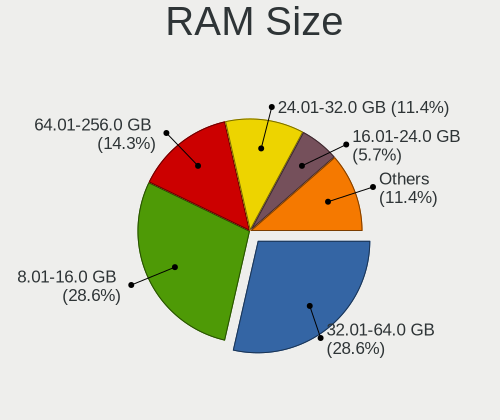
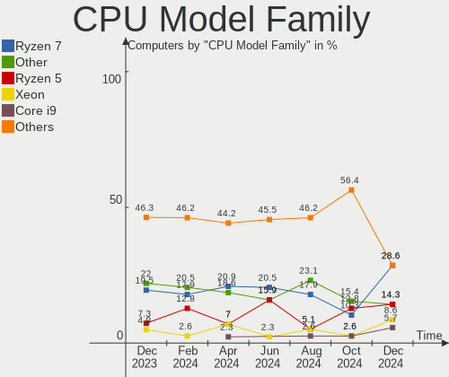
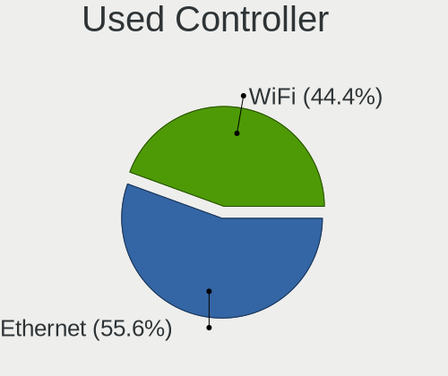
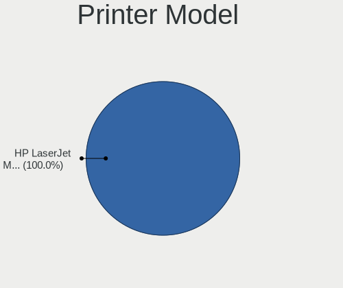

Gentoo - Hardware Trends
------------------------

A project to identify most popular hardware characteristics and track their change
over time based on data collected by Linux users at https://Linux-Hardware.org.

Anyone can contribute to this report by the [hw-probe](https://github.com/linuxhw/hw-probe) tool:

    sudo -E hw-probe -all -upload

This is a report for all computer types. See also reports for [desktops](/Dist/Gentoo/Desktop/README.md) and [notebooks](/Dist/Gentoo/Notebook/README.md).

This report is for one last month. Overall report since the beginning of time: [TestDays](https://github.com/linuxhw/TestDays)

Period: Mar, 2023.

Contents
--------

* [ System ](#system)
  - [ OS                       ](#os)
  - [ OS Family                ](#os-family)
  - [ Kernel                   ](#kernel)
  - [ Kernel Family            ](#kernel-family)
  - [ Kernel Major Ver.        ](#kernel-major-ver)
  - [ Arch                     ](#arch)
  - [ DE                       ](#de)
  - [ Display Server           ](#display-server)
  - [ Display Manager          ](#display-manager)
  - [ OS Lang                  ](#os-lang)
  - [ Boot Mode                ](#boot-mode)
  - [ Filesystem               ](#filesystem)
  - [ Part. scheme             ](#part-scheme)
  - [ Dual Boot with Linux/BSD ](#dual-boot-with-linuxbsd)
  - [ Dual Boot (Win)          ](#dual-boot-win)

* [ Board ](#board)
  - [ Vendor                   ](#vendor)
  - [ Model                    ](#model)
  - [ Model Family             ](#model-family)
  - [ MFG Year                 ](#mfg-year)
  - [ Form Factor              ](#form-factor)
  - [ Secure Boot              ](#secure-boot)
  - [ Coreboot                 ](#coreboot)
  - [ RAM Size                 ](#ram-size)
  - [ RAM Used                 ](#ram-used)
  - [ Total Drives             ](#total-drives)
  - [ Has CD-ROM               ](#has-cd-rom)
  - [ Has Ethernet             ](#has-ethernet)
  - [ Has WiFi                 ](#has-wifi)
  - [ Has Bluetooth            ](#has-bluetooth)

* [ Location ](#location)
  - [ Country                  ](#country)
  - [ City                     ](#city)

* [ Drives ](#drives)
  - [ Drive Vendor             ](#drive-vendor)
  - [ Drive Model              ](#drive-model)
  - [ HDD Vendor               ](#hdd-vendor)
  - [ SSD Vendor               ](#ssd-vendor)
  - [ Drive Kind               ](#drive-kind)
  - [ Drive Connector          ](#drive-connector)
  - [ Drive Size               ](#drive-size)
  - [ Space Total              ](#space-total)
  - [ Space Used               ](#space-used)
  - [ Malfunc. Drives          ](#malfunc-drives)
  - [ Malfunc. Drive Vendor    ](#malfunc-drive-vendor)
  - [ Malfunc. HDD Vendor      ](#malfunc-hdd-vendor)
  - [ Malfunc. Drive Kind      ](#malfunc-drive-kind)
  - [ Failed Drives            ](#failed-drives)
  - [ Failed Drive Vendor      ](#failed-drive-vendor)
  - [ Drive Status             ](#drive-status)

* [ Storage controller ](#storage-controller)
  - [ Storage Vendor           ](#storage-vendor)
  - [ Storage Model            ](#storage-model)
  - [ Storage Kind             ](#storage-kind)

* [ Processor ](#processor)
  - [ CPU Vendor               ](#cpu-vendor)
  - [ CPU Model                ](#cpu-model)
  - [ CPU Model Family         ](#cpu-model-family)
  - [ CPU Cores                ](#cpu-cores)
  - [ CPU Sockets              ](#cpu-sockets)
  - [ CPU Threads              ](#cpu-threads)
  - [ CPU Op-Modes             ](#cpu-op-modes)
  - [ CPU Microcode            ](#cpu-microcode)
  - [ CPU Microarch            ](#cpu-microarch)

* [ Graphics ](#graphics)
  - [ GPU Vendor               ](#gpu-vendor)
  - [ GPU Model                ](#gpu-model)
  - [ GPU Combo                ](#gpu-combo)
  - [ GPU Driver               ](#gpu-driver)
  - [ GPU Memory               ](#gpu-memory)

* [ Monitor ](#monitor)
  - [ Monitor Vendor           ](#monitor-vendor)
  - [ Monitor Model            ](#monitor-model)
  - [ Monitor Resolution       ](#monitor-resolution)
  - [ Monitor Diagonal         ](#monitor-diagonal)
  - [ Monitor Width            ](#monitor-width)
  - [ Aspect Ratio             ](#aspect-ratio)
  - [ Monitor Area             ](#monitor-area)
  - [ Pixel Density            ](#pixel-density)
  - [ Multiple Monitors        ](#multiple-monitors)

* [ Network ](#network)
  - [ Net Controller Vendor    ](#net-controller-vendor)
  - [ Net Controller Model     ](#net-controller-model)
  - [ Wireless Vendor          ](#wireless-vendor)
  - [ Wireless Model           ](#wireless-model)
  - [ Ethernet Vendor          ](#ethernet-vendor)
  - [ Ethernet Model           ](#ethernet-model)
  - [ Net Controller Kind      ](#net-controller-kind)
  - [ Used Controller          ](#used-controller)
  - [ NICs                     ](#nics)
  - [ IPv6                     ](#ipv6)

* [ Bluetooth ](#bluetooth)
  - [ Bluetooth Vendor         ](#bluetooth-vendor)
  - [ Bluetooth Model          ](#bluetooth-model)

* [ Sound ](#sound)
  - [ Sound Vendor             ](#sound-vendor)
  - [ Sound Model              ](#sound-model)

* [ Memory ](#memory)
  - [ Memory Vendor            ](#memory-vendor)
  - [ Memory Model             ](#memory-model)
  - [ Memory Kind              ](#memory-kind)
  - [ Memory Form Factor       ](#memory-form-factor)
  - [ Memory Size              ](#memory-size)
  - [ Memory Speed             ](#memory-speed)

* [ Printers & scanners ](#printers--scanners)
  - [ Printer Vendor           ](#printer-vendor)
  - [ Printer Model            ](#printer-model)
  - [ Scanner Vendor           ](#scanner-vendor)
  - [ Scanner Model            ](#scanner-model)

* [ Camera ](#camera)
  - [ Camera Vendor            ](#camera-vendor)
  - [ Camera Model             ](#camera-model)

* [ Security ](#security)
  - [ Fingerprint Vendor       ](#fingerprint-vendor)
  - [ Fingerprint Model        ](#fingerprint-model)
  - [ Chipcard Vendor          ](#chipcard-vendor)
  - [ Chipcard Model           ](#chipcard-model)

* [ Unsupported ](#unsupported)
  - [ Unsupported Devices      ](#unsupported-devices)
  - [ Unsupported Device Types ](#unsupported-device-types)

System
------

OS
--

Installed operating systems

| Name        | Computers | Percent |
|-------------|-----------|---------|
| Gentoo 2.13 | 49        | 81.67%  |
| Gentoo 2.9  | 11        | 18.33%  |

OS Family
---------

OS without a version

| Name   | Computers | Percent |
|--------|-----------|---------|
| Gentoo | 60        | 100%    |

Kernel
------

Version of the Linux kernel

| Version                     | Computers | Percent |
|-----------------------------|-----------|---------|
| 6.1.12-gentoo               | 8         | 13.33%  |
| 6.1.12-gentoo-x86_64        | 7         | 11.67%  |
| 6.2.2-gentoo                | 4         | 6.67%   |
| 6.1.12-gentoo-dist          | 3         | 5%      |
| 6.2.7-gentoo-dist           | 2         | 3.33%   |
| 6.2.3-gentoo                | 2         | 3.33%   |
| 6.2.1-gentoo-x86_64         | 2         | 3.33%   |
| 6.1.19-gentoo-x86_64        | 2         | 3.33%   |
| 6.1.19-gentoo-dist          | 2         | 3.33%   |
| 5.15.88-gentoo              | 2         | 3.33%   |
| 6.2.8-gentoo-x86_64         | 1         | 1.67%   |
| 6.2.6-x86_64                | 1         | 1.67%   |
| 6.2.6-gentoo-dist           | 1         | 1.67%   |
| 6.2.5-gentoo-dist           | 1         | 1.67%   |
| 6.2.3-gentoo-x86_64         | 1         | 1.67%   |
| 6.2.2-gentoo-x86_64         | 1         | 1.67%   |
| 6.2.2-dist                  | 1         | 1.67%   |
| 6.2.1-gentoo                | 1         | 1.67%   |
| 6.2.0-pf2-llvm              | 1         | 1.67%   |
| 6.2.0                       | 1         | 1.67%   |
| 6.1.9-gentoo-x86_64         | 1         | 1.67%   |
| 6.1.3-gentoo                | 1         | 1.67%   |
| 6.1.19-rt-rt8               | 1         | 1.67%   |
| 6.1.19-renacuajo            | 1         | 1.67%   |
| 6.1.19-gentoo               | 1         | 1.67%   |
| 6.1.15-gentoo               | 1         | 1.67%   |
| 6.1.13-pentoo               | 1         | 1.67%   |
| 6.1.13-gentoo-x86_64        | 1         | 1.67%   |
| 6.1.12-gentoo-dist-hardened | 1         | 1.67%   |
| 6.1.11-gentoo-tir_na_nog    | 1         | 1.67%   |
| 5.15.91-gentoo              | 1         | 1.67%   |
| 5.15.80-gentoo-x86_64       | 1         | 1.67%   |
| 5.15.80-gentoo              | 1         | 1.67%   |
| 5.15.75-gentoo-dist         | 1         | 1.67%   |
| 5.15.59-gentoo-x86_64       | 1         | 1.67%   |
| 5.10.174-gentoo             | 1         | 1.67%   |

Kernel Family
-------------

Linux kernel without a distro release

| Version  | Computers | Percent |
|----------|-----------|---------|
| 6.1.12   | 19        | 31.67%  |
| 6.1.19   | 7         | 11.67%  |
| 6.2.2    | 6         | 10%     |
| 6.2.3    | 3         | 5%      |
| 6.2.1    | 3         | 5%      |
| 6.2.7    | 2         | 3.33%   |
| 6.2.6    | 2         | 3.33%   |
| 6.2.0    | 2         | 3.33%   |
| 6.1.13   | 2         | 3.33%   |
| 5.15.88  | 2         | 3.33%   |
| 5.15.80  | 2         | 3.33%   |
| 6.2.8    | 1         | 1.67%   |
| 6.2.5    | 1         | 1.67%   |
| 6.1.9    | 1         | 1.67%   |
| 6.1.3    | 1         | 1.67%   |
| 6.1.15   | 1         | 1.67%   |
| 6.1.11   | 1         | 1.67%   |
| 5.15.91  | 1         | 1.67%   |
| 5.15.75  | 1         | 1.67%   |
| 5.15.59  | 1         | 1.67%   |
| 5.10.174 | 1         | 1.67%   |

Kernel Major Ver.
-----------------

Linux kernel major version

| Version | Computers | Percent |
|---------|-----------|---------|
| 6.1     | 32        | 53.33%  |
| 6.2     | 20        | 33.33%  |
| 5.15    | 7         | 11.67%  |
| 5.10    | 1         | 1.67%   |

Arch
----

OS architecture (x86_64, i586, etc.)

| Name    | Computers | Percent |
|---------|-----------|---------|
| x86_64  | 57        | 95%     |
| i686    | 2         | 3.33%   |
| riscv64 | 1         | 1.67%   |

DE
--

Desktop Environment

| Name      | Computers | Percent |
|-----------|-----------|---------|
| Unknown   | 18        | 30%     |
| KDE5      | 16        | 26.67%  |
| XFCE      | 7         | 11.67%  |
| GNOME     | 5         | 8.33%   |
| LXQt      | 4         | 6.67%   |
| MATE      | 2         | 3.33%   |
| DWM       | 2         | 3.33%   |
| Trinity   | 1         | 1.67%   |
| ratpoison | 1         | 1.67%   |
| openbox   | 1         | 1.67%   |
| KDE       | 1         | 1.67%   |
| i3        | 1         | 1.67%   |
| Hyprland  | 1         | 1.67%   |

Display Server
--------------

X11 or Wayland

| Name    | Computers | Percent |
|---------|-----------|---------|
| X11     | 24        | 40%     |
| Wayland | 14        | 23.33%  |
| Tty     | 11        | 18.33%  |
| Unknown | 11        | 18.33%  |

Display Manager
---------------

SDDM, LightDM, etc.

| Name    | Computers | Percent |
|---------|-----------|---------|
| Unknown | 26        | 43.33%  |
| SDDM    | 18        | 30%     |
| LightDM | 7         | 11.67%  |
| GDM     | 5         | 8.33%   |
| LXDM    | 2         | 3.33%   |
| TDM     | 1         | 1.67%   |
| SLiM    | 1         | 1.67%   |

OS Lang
-------

Language

| Lang    | Computers | Percent |
|---------|-----------|---------|
| en_US   | 25        | 41.67%  |
| C.UTF8  | 8         | 13.33%  |
| en_GB   | 6         | 10%     |
| fr_FR   | 4         | 6.67%   |
| de_DE   | 4         | 6.67%   |
| en_AU   | 3         | 5%      |
| cs_CZ   | 2         | 3.33%   |
| Unknown | 2         | 3.33%   |
| ru_RU   | 1         | 1.67%   |
| pl_PL   | 1         | 1.67%   |
| mi_NZ   | 1         | 1.67%   |
| it_IT   | 1         | 1.67%   |
| es_ES   | 1         | 1.67%   |
| C       | 1         | 1.67%   |

Boot Mode
---------

EFI or BIOS

| Mode | Computers | Percent |
|------|-----------|---------|
| EFI  | 43        | 71.67%  |
| BIOS | 17        | 28.33%  |

Filesystem
----------

Type of filesystem

| Type    | Computers | Percent |
|---------|-----------|---------|
| Ext4    | 26        | 43.33%  |
| Btrfs   | 24        | 40%     |
| F2fs    | 5         | 8.33%   |
| Zfs     | 2         | 3.33%   |
| XXXXXXX | 2         | 3.33%   |
| Xfs     | 1         | 1.67%   |

Part. scheme
------------

Scheme of partitioning

| Type    | Computers | Percent |
|---------|-----------|---------|
| GPT     | 46        | 76.67%  |
| MBR     | 10        | 16.67%  |
| Unknown | 4         | 6.67%   |

Dual Boot with Linux/BSD
------------------------

Hosting more than one Linux/BSD

| Dual boot | Computers | Percent |
|-----------|-----------|---------|
| No        | 34        | 56.67%  |
| Yes       | 26        | 43.33%  |

Dual Boot (Win)
---------------

Hosting Linux and Windows

| Dual boot | Computers | Percent |
|-----------|-----------|---------|
| No        | 39        | 65%     |
| Yes       | 21        | 35%     |

Board
-----

Vendor
------

Motherboard manufacturer

| Name                | Computers | Percent |
|---------------------|-----------|---------|
| ASUSTek Computer    | 15        | 25%     |
| Lenovo              | 7         | 11.67%  |
| Hewlett-Packard     | 5         | 8.33%   |
| Dell                | 5         | 8.33%   |
| ASRock              | 5         | 8.33%   |
| MSI                 | 4         | 6.67%   |
| Gigabyte Technology | 4         | 6.67%   |
| Unknown             | 3         | 5%      |
| Supermicro          | 2         | 3.33%   |
| Acer                | 2         | 3.33%   |
| Star Labs           | 1         | 1.67%   |
| Microsoft           | 1         | 1.67%   |
| IBM                 | 1         | 1.67%   |
| Huanan              | 1         | 1.67%   |
| HPE                 | 1         | 1.67%   |
| Fujitsu Siemens     | 1         | 1.67%   |
| Foxconn             | 1         | 1.67%   |
| Apple               | 1         | 1.67%   |

Model
-----

Motherboard model

| Name                                        | Computers | Percent |
|---------------------------------------------|-----------|---------|
| Unknown                                     | 3         | 5%      |
| MSI GS65 Stealth Thin 8RF                   | 2         | 3.33%   |
| ASUS M3A78-CM                               | 2         | 3.33%   |
| Supermicro Super Server                     | 1         | 1.67%   |
| Supermicro SSG-6028R-ER12-HDP-AI050         | 1         | 1.67%   |
| Star Labs StarBook                          | 1         | 1.67%   |
| MSI MS-7640                                 | 1         | 1.67%   |
| MSI GS66 Stealth 10UE                       | 1         | 1.67%   |
| Microsoft Surface Laptop 3                  | 1         | 1.67%   |
| Lenovo ThinkPad X200 7459L61                | 1         | 1.67%   |
| Lenovo ThinkPad X1 Extreme Gen 3 20TK001JUS | 1         | 1.67%   |
| Lenovo ThinkPad X1 Extreme 2nd 20QVCTO1WW   | 1         | 1.67%   |
| Lenovo ThinkPad T14 Gen 1 20S1SFAD00        | 1         | 1.67%   |
| Lenovo ThinkPad P51 20HHCTO1WW              | 1         | 1.67%   |
| Lenovo ThinkPad Edge E330 3354AMG           | 1         | 1.67%   |
| Lenovo Legion 5 Pro 16IAH7H 82RF            | 1         | 1.67%   |
| IBM ThinkPad T41 23737JU                    | 1         | 1.67%   |
| Huanan X99-F8D V2.4                         | 1         | 1.67%   |
| HPE ProLiant MicroServer Gen10 Plus         | 1         | 1.67%   |
| HP ZBook 17 G3                              | 1         | 1.67%   |
| HP Victus by Gaming Laptop 15-fb0xxx        | 1         | 1.67%   |
| HP Pavilion Laptop 15-cs0xxx                | 1         | 1.67%   |
| HP EliteBook 8570p                          | 1         | 1.67%   |
| HP EliteBook 745 G6                         | 1         | 1.67%   |
| Gigabyte Z77X-UD5H                          | 1         | 1.67%   |
| Gigabyte X470 AORUS ULTRA GAMING            | 1         | 1.67%   |
| Gigabyte B150M-D2V DDR3                     | 1         | 1.67%   |
| Gigabyte AB350-Gaming                       | 1         | 1.67%   |
| Fujitsu Siemens D1547                       | 1         | 1.67%   |
| Foxconn TPS01                               | 1         | 1.67%   |
| Dell XPS 15 9570                            | 1         | 1.67%   |
| Dell XPS 13 9305                            | 1         | 1.67%   |
| Dell Precision 7770                         | 1         | 1.67%   |
| Dell Latitude E6540                         | 1         | 1.67%   |
| Dell Latitude 7480                          | 1         | 1.67%   |
| ASUS VivoBook_ASUSLaptop X571GT_X571GT      | 1         | 1.67%   |
| ASUS TUF Gaming X670E-PLUS WIFI             | 1         | 1.67%   |
| ASUS TUF Gaming B650M-PLUS WIFI             | 1         | 1.67%   |
| ASUS ROG STRIX Z590-F GAMING WIFI           | 1         | 1.67%   |
| ASUS ROG STRIX Z590-E GAMING WIFI           | 1         | 1.67%   |

Model Family
------------

Motherboard model prefix

| Name                                | Computers | Percent |
|-------------------------------------|-----------|---------|
| Lenovo ThinkPad                     | 6         | 10%     |
| ASUS ROG                            | 6         | 10%     |
| Unknown                             | 3         | 5%      |
| MSI GS65                            | 2         | 3.33%   |
| HP EliteBook                        | 2         | 3.33%   |
| Dell XPS                            | 2         | 3.33%   |
| Dell Latitude                       | 2         | 3.33%   |
| ASUS TUF                            | 2         | 3.33%   |
| ASUS M3A78-CM                       | 2         | 3.33%   |
| Acer Aspire                         | 2         | 3.33%   |
| Supermicro Super                    | 1         | 1.67%   |
| Supermicro SSG-6028R-ER12-HDP-AI050 | 1         | 1.67%   |
| Star Labs StarBook                  | 1         | 1.67%   |
| MSI MS-7640                         | 1         | 1.67%   |
| MSI GS66                            | 1         | 1.67%   |
| Microsoft Surface                   | 1         | 1.67%   |
| Lenovo Legion                       | 1         | 1.67%   |
| IBM ThinkPad                        | 1         | 1.67%   |
| Huanan X99-F8D                      | 1         | 1.67%   |
| HPE ProLiant                        | 1         | 1.67%   |
| HP ZBook                            | 1         | 1.67%   |
| HP Victus                           | 1         | 1.67%   |
| HP Pavilion                         | 1         | 1.67%   |
| Gigabyte Z77X-UD5H                  | 1         | 1.67%   |
| Gigabyte X470                       | 1         | 1.67%   |
| Gigabyte B150M-D2V                  | 1         | 1.67%   |
| Gigabyte AB350-Gaming               | 1         | 1.67%   |
| Fujitsu Siemens D1547               | 1         | 1.67%   |
| Foxconn TPS01                       | 1         | 1.67%   |
| Dell Precision                      | 1         | 1.67%   |
| ASUS VivoBook                       | 1         | 1.67%   |
| ASUS ProArt                         | 1         | 1.67%   |
| ASUS PRIME                          | 1         | 1.67%   |
| ASUS Maximus                        | 1         | 1.67%   |
| ASUS 1016P                          | 1         | 1.67%   |
| ASRock X570                         | 1         | 1.67%   |
| ASRock X370                         | 1         | 1.67%   |
| ASRock H81M-HDS                     | 1         | 1.67%   |
| ASRock H170                         | 1         | 1.67%   |
| ASRock AM1H-ITX                     | 1         | 1.67%   |

MFG Year
--------

Motherboard manufacture year

| Year    | Computers | Percent |
|---------|-----------|---------|
| 2018    | 9         | 15%     |
| 2022    | 8         | 13.33%  |
| 2019    | 7         | 11.67%  |
| 2021    | 6         | 10%     |
| 2012    | 5         | 8.33%   |
| 2020    | 4         | 6.67%   |
| 2017    | 4         | 6.67%   |
| 2008    | 3         | 5%      |
| 2023    | 2         | 3.33%   |
| 2016    | 2         | 3.33%   |
| 2013    | 2         | 3.33%   |
| 2015    | 1         | 1.67%   |
| 2014    | 1         | 1.67%   |
| 2011    | 1         | 1.67%   |
| 2010    | 1         | 1.67%   |
| 2009    | 1         | 1.67%   |
| 2004    | 1         | 1.67%   |
| 2003    | 1         | 1.67%   |
| Unknown | 1         | 1.67%   |

Form Factor
-----------

Physical design of the computer

| Name           | Computers | Percent |
|----------------|-----------|---------|
| Desktop        | 29        | 48.33%  |
| Notebook       | 28        | 46.67%  |
| System on chip | 1         | 1.67%   |
| Tablet         | 1         | 1.67%   |
| Server         | 1         | 1.67%   |

Secure Boot
-----------

Enabled or disabled

| State    | Computers | Percent |
|----------|-----------|---------|
| Disabled | 60        | 100%    |

Coreboot
--------

Have coreboot on board

| Used | Computers | Percent |
|------|-----------|---------|
| No   | 59        | 98.33%  |
| Yes  | 1         | 1.67%   |

RAM Size
--------

Total RAM memory

| Size in GB      | Computers | Percent |
|-----------------|-----------|---------|
| 32.01-64.0      | 16        | 26.67%  |
| 16.01-24.0      | 13        | 21.67%  |
| 64.01-256.0     | 10        | 16.67%  |
| 4.01-8.0        | 5         | 8.33%   |
| 3.01-4.0        | 5         | 8.33%   |
| 8.01-16.0       | 5         | 8.33%   |
| 2.01-3.0        | 2         | 3.33%   |
| More than 256.0 | 1         | 1.67%   |
| 24.01-32.0      | 1         | 1.67%   |
| 1.01-2.0        | 1         | 1.67%   |
| 0.01-0.5        | 1         | 1.67%   |

RAM Used
--------

Used RAM memory

| Used GB     | Computers | Percent |
|-------------|-----------|---------|
| 1.01-2.0    | 13        | 21.67%  |
| 2.01-3.0    | 11        | 18.33%  |
| 4.01-8.0    | 8         | 13.33%  |
| 3.01-4.0    | 8         | 13.33%  |
| 8.01-16.0   | 6         | 10%     |
| 0.51-1.0    | 6         | 10%     |
| 0.01-0.5    | 6         | 10%     |
| 64.01-256.0 | 1         | 1.67%   |
| 0           | 1         | 1.67%   |

Total Drives
------------

Number of drives on board

| Drives | Computers | Percent |
|--------|-----------|---------|
| 1      | 30        | 50%     |
| 2      | 11        | 18.33%  |
| 3      | 8         | 13.33%  |
| 4      | 6         | 10%     |
| 8      | 2         | 3.33%   |
| 6      | 2         | 3.33%   |
| 5      | 1         | 1.67%   |

Has CD-ROM
----------

Has CD-ROM on board

| Presented | Computers | Percent |
|-----------|-----------|---------|
| No        | 49        | 81.67%  |
| Yes       | 11        | 18.33%  |

Has Ethernet
------------

Has Ethernet on board

| Presented | Computers | Percent |
|-----------|-----------|---------|
| Yes       | 53        | 88.33%  |
| No        | 7         | 11.67%  |

Has WiFi
--------

Has WiFi module

| Presented | Computers | Percent |
|-----------|-----------|---------|
| Yes       | 40        | 66.67%  |
| No        | 20        | 33.33%  |

Has Bluetooth
-------------

Has Bluetooth module

| Presented | Computers | Percent |
|-----------|-----------|---------|
| Yes       | 38        | 63.33%  |
| No        | 22        | 36.67%  |

Location
--------

Country
-------

Geographic location (country)

| Country     | Computers | Percent |
|-------------|-----------|---------|
| USA         | 14        | 23.33%  |
| Germany     | 10        | 16.67%  |
| UK          | 5         | 8.33%   |
| France      | 5         | 8.33%   |
| Czechia     | 4         | 6.67%   |
| Poland      | 3         | 5%      |
| Canada      | 3         | 5%      |
| Australia   | 3         | 5%      |
| Spain       | 2         | 3.33%   |
| Russia      | 2         | 3.33%   |
| New Zealand | 2         | 3.33%   |
| Lithuania   | 2         | 3.33%   |
| Vietnam     | 1         | 1.67%   |
| Italy       | 1         | 1.67%   |
| Hungary     | 1         | 1.67%   |
| Brazil      | 1         | 1.67%   |
| Algeria     | 1         | 1.67%   |

City
----

Geographic location (city)

| City                  | Computers | Percent |
|-----------------------|-----------|---------|
| Warsaw                | 3         | 5%      |
| Vancouver             | 3         | 5%      |
| Perth                 | 3         | 5%      |
| Vilnius               | 2         | 3.33%   |
| Royal Tunbridge Wells | 2         | 3.33%   |
| Ponetovice            | 2         | 3.33%   |
| Hamilton              | 2         | 3.33%   |
| Cologne               | 2         | 3.33%   |
| Český Těšín      | 2         | 3.33%   |
| Beaverton             | 2         | 3.33%   |
| Wesseling             | 1         | 1.67%   |
| Urbana                | 1         | 1.67%   |
| Taganrog              | 1         | 1.67%   |
| Sun Prairie           | 1         | 1.67%   |
| Stade                 | 1         | 1.67%   |
| San Francisco         | 1         | 1.67%   |
| Roubaix               | 1         | 1.67%   |
| Reims                 | 1         | 1.67%   |
| Quakertown            | 1         | 1.67%   |
| Paris                 | 1         | 1.67%   |
| Oviedo                | 1         | 1.67%   |
| Moscow                | 1         | 1.67%   |
| Milan                 | 1         | 1.67%   |
| Miami                 | 1         | 1.67%   |
| Maule                 | 1         | 1.67%   |
| Marysville            | 1         | 1.67%   |
| Majadahonda           | 1         | 1.67%   |
| Mainhausen            | 1         | 1.67%   |
| Lohne                 | 1         | 1.67%   |
| Logroño              | 1         | 1.67%   |
| Leeds                 | 1         | 1.67%   |
| Kobrasol              | 1         | 1.67%   |
| Kiel                  | 1         | 1.67%   |
| Hanoi                 | 1         | 1.67%   |
| Gunzenhausen          | 1         | 1.67%   |
| Croydon               | 1         | 1.67%   |
| Concord               | 1         | 1.67%   |
| Clitheroe             | 1         | 1.67%   |
| Chicago               | 1         | 1.67%   |
| Cherry Hill           | 1         | 1.67%   |

Drives
------

Drive Vendor
------------

Hard drive vendors

| Vendor                      | Computers | Drives | Percent |
|-----------------------------|-----------|--------|---------|
| Samsung Electronics         | 20        | 29     | 20.41%  |
| Seagate                     | 13        | 25     | 13.27%  |
| WDC                         | 9         | 12     | 9.18%   |
| Sandisk                     | 7         | 7      | 7.14%   |
| Phison Electronics          | 5         | 6      | 5.1%    |
| Crucial                     | 5         | 7      | 5.1%    |
| Toshiba                     | 4         | 4      | 4.08%   |
| SK hynix                    | 4         | 4      | 4.08%   |
| Unknown                     | 3         | 3      | 3.06%   |
| Micron/Crucial Technology   | 3         | 3      | 3.06%   |
| Intel                       | 3         | 4      | 3.06%   |
| HGST                        | 3         | 6      | 3.06%   |
| GOODRAM                     | 3         | 3      | 3.06%   |
| OCZ                         | 2         | 2      | 2.04%   |
| Intenso                     | 2         | 2      | 2.04%   |
| Hitachi                     | 2         | 4      | 2.04%   |
| China                       | 2         | 5      | 2.04%   |
| Silicon Motion              | 1         | 1      | 1.02%   |
| MAXIO Technology (Hangzhou) | 1         | 1      | 1.02%   |
| Kingston Technology Company | 1         | 1      | 1.02%   |
| Kingston                    | 1         | 2      | 1.02%   |
| KingSpec                    | 1         | 1      | 1.02%   |
| Apple                       | 1         | 1      | 1.02%   |
| A-DATA Technology           | 1         | 1      | 1.02%   |
| Unknown                     | 1         | 1      | 1.02%   |

Drive Model
-----------

Hard drive models

| Model                                                  | Computers | Percent |
|--------------------------------------------------------|-----------|---------|
| Samsung NVMe SSD Controller SM981/PM981/PM983 250GB    | 10        | 8.7%    |
| Samsung NVMe SSD Controller PM9A1/PM9A3/980PRO 1TB     | 6         | 5.22%   |
| SK hynix BC501 NVMe Solid State Drive 512GB            | 2         | 1.74%   |
| Sandisk WD Black SN750 / PC SN730 NVMe SSD 1TB         | 2         | 1.74%   |
| Samsung SSD 980 1TB                                    | 2         | 1.74%   |
| Phison E7 NVMe Controller 240GB                        | 2         | 1.74%   |
| Micron/Crucial P2 NVMe PCIe SSD 1TB                    | 2         | 1.74%   |
| HGST HTS725050A7E630 500GB                             | 2         | 1.74%   |
| GOODRAM SSDPR-CL100-480-G2 480GB                       | 2         | 1.74%   |
| Crucial CT1000MX500SSD1 1TB                            | 2         | 1.74%   |
| WDC WDS500G1B0B-00AS40 500GB SSD                       | 1         | 0.87%   |
| WDC WD80EFAX-68KNBN0 8TB                               | 1         | 0.87%   |
| WDC WD60EFRX-68MYMN1 6TB                               | 1         | 0.87%   |
| WDC WD5000LPLX-66ZNTT1 500GB                           | 1         | 0.87%   |
| WDC WD5000AADS-00S9B0 500GB                            | 1         | 0.87%   |
| WDC WD30EFRX-68EUZN0 3TB                               | 1         | 0.87%   |
| WDC WD20EFRX-68EUZN0 2TB                               | 1         | 0.87%   |
| WDC WD2003FZEX-00SRLA0 2TB                             | 1         | 0.87%   |
| WDC WD20 SPZX-22CRAT0 2TB                              | 1         | 0.87%   |
| WDC WD1502FYPS-02W3B0 1TB                              | 1         | 0.87%   |
| WDC WD1200JS-00SGB0 120GB                              | 1         | 0.87%   |
| Unknown NVMe SSD Drive 1TB                             | 1         | 0.87%   |
| Unknown MMC Card  32GB                                 | 1         | 0.87%   |
| Unknown MMC Card  1TB                                  | 1         | 0.87%   |
| Toshiba XG6 NVMe SSD Controller 512GB                  | 1         | 0.87%   |
| Toshiba MK1633GSG 160GB                                | 1         | 0.87%   |
| Toshiba KXG50ZNV512G NVMe 512GB                        | 1         | 0.87%   |
| Toshiba HDWE150 5TB                                    | 1         | 0.87%   |
| SK hynix SHPP41-2000GM 2TB                             | 1         | 0.87%   |
| SK hynix SC311 SATA 128GB SSD                          | 1         | 0.87%   |
| Silicon Motion SM2263EN/SM2263XT SSD Controller 1024GB | 1         | 0.87%   |
| Seagate ST9250315AS 250GB                              | 1         | 0.87%   |
| Seagate ST500LT012-1DG142 500GB                        | 1         | 0.87%   |
| Seagate ST4000NM0031 4TB                               | 1         | 0.87%   |
| Seagate ST4000DM004-2CV104 4TB                         | 1         | 0.87%   |
| Seagate ST4000DM000-1F2168 4TB                         | 1         | 0.87%   |
| Seagate ST3000DM001-9YN166 3TB                         | 1         | 0.87%   |
| Seagate ST2000VN004-2E4164 2TB                         | 1         | 0.87%   |
| Seagate ST2000LM015-2E8174 2TB                         | 1         | 0.87%   |
| Seagate ST2000DX002-2DV164 2TB                         | 1         | 0.87%   |

HDD Vendor
----------

Hard disk drive vendors

| Vendor  | Computers | Drives | Percent |
|---------|-----------|--------|---------|
| Seagate | 13        | 25     | 44.83%  |
| WDC     | 8         | 11     | 27.59%  |
| HGST    | 3         | 6      | 10.34%  |
| Toshiba | 2         | 2      | 6.9%    |
| Hitachi | 2         | 4      | 6.9%    |
| Apple   | 1         | 1      | 3.45%   |

SSD Vendor
----------

Solid state drive vendors

| Vendor              | Computers | Drives | Percent |
|---------------------|-----------|--------|---------|
| Samsung Electronics | 6         | 10     | 20.69%  |
| Crucial             | 5         | 7      | 17.24%  |
| GOODRAM             | 3         | 3      | 10.34%  |
| SanDisk             | 2         | 2      | 6.9%    |
| OCZ                 | 2         | 2      | 6.9%    |
| Intenso             | 2         | 2      | 6.9%    |
| China               | 2         | 5      | 6.9%    |
| WDC                 | 1         | 1      | 3.45%   |
| SK hynix            | 1         | 1      | 3.45%   |
| Kingston            | 1         | 2      | 3.45%   |
| KingSpec            | 1         | 1      | 3.45%   |
| Intel               | 1         | 2      | 3.45%   |
| A-DATA Technology   | 1         | 1      | 3.45%   |
| Unknown             | 1         | 1      | 3.45%   |

Drive Kind
----------

HDD or SSD

| Kind | Computers | Drives | Percent |
|------|-----------|--------|---------|
| NVMe | 32        | 44     | 39.51%  |
| SSD  | 24        | 40     | 29.63%  |
| HDD  | 23        | 49     | 28.4%   |
| MMC  | 2         | 2      | 2.47%   |

Drive Connector
---------------

SATA, SAS, NVMe, etc.

| Type | Computers | Drives | Percent |
|------|-----------|--------|---------|
| SATA | 38        | 82     | 51.35%  |
| NVMe | 32        | 44     | 43.24%  |
| SAS  | 2         | 7      | 2.7%    |
| MMC  | 2         | 2      | 2.7%    |

Drive Size
----------

Size of hard drive

| Size in TB | Computers | Drives | Percent |
|------------|-----------|--------|---------|
| 0.01-0.5   | 26        | 34     | 44.83%  |
| 0.51-1.0   | 11        | 19     | 18.97%  |
| 1.01-2.0   | 9         | 16     | 15.52%  |
| 3.01-4.0   | 5         | 10     | 8.62%   |
| 2.01-3.0   | 3         | 6      | 5.17%   |
| 4.01-10.0  | 3         | 3      | 5.17%   |
| 10.01-20.0 | 1         | 1      | 1.72%   |

Space Total
-----------

Amount of disk space available on the file system

| Size in GB     | Computers | Percent |
|----------------|-----------|---------|
| 1001-2000      | 14        | 23.33%  |
| 101-250        | 11        | 18.33%  |
| More than 3000 | 9         | 15%     |
| 501-1000       | 9         | 15%     |
| 251-500        | 8         | 13.33%  |
| 51-100         | 3         | 5%      |
| 2001-3000      | 2         | 3.33%   |
| Unknown        | 2         | 3.33%   |
| 21-50          | 1         | 1.67%   |
| 1-20           | 1         | 1.67%   |

Space Used
----------

Amount of used disk space

| Used GB        | Computers | Percent |
|----------------|-----------|---------|
| 1-20           | 14        | 23.33%  |
| 21-50          | 12        | 20%     |
| 101-250        | 8         | 13.33%  |
| 501-1000       | 8         | 13.33%  |
| 251-500        | 5         | 8.33%   |
| 51-100         | 5         | 8.33%   |
| More than 3000 | 4         | 6.67%   |
| Unknown        | 2         | 3.33%   |
| 2001-3000      | 1         | 1.67%   |
| 1001-2000      | 1         | 1.67%   |

Malfunc. Drives
---------------

Drive models with a malfunction

| Model                                       | Computers | Drives | Percent |
|---------------------------------------------|-----------|--------|---------|
| HGST HTS725050A7E630 500GB                  | 2         | 2      | 18.18%  |
| WDC WD30EFRX-68EUZN0 3TB                    | 1         | 2      | 9.09%   |
| Toshiba MK1633GSG 160GB                     | 1         | 1      | 9.09%   |
| SK hynix BC501 NVMe Solid State Drive 512GB | 1         | 1      | 9.09%   |
| Seagate ST3000DM001-9YN166 3TB              | 1         | 1      | 9.09%   |
| Seagate ST2000DX002-2DV164 2TB              | 1         | 1      | 9.09%   |
| SanDisk SSD PLUS 480GB                      | 1         | 1      | 9.09%   |
| OCZ VERTEX4 256GB SSD                       | 1         | 1      | 9.09%   |
| Intel SSDSC2BB160G4T 160GB                  | 1         | 2      | 9.09%   |
| China SSD 240GB                             | 1         | 1      | 9.09%   |

Malfunc. Drive Vendor
---------------------

Vendors of faulty drives

| Vendor   | Computers | Drives | Percent |
|----------|-----------|--------|---------|
| Seagate  | 2         | 2      | 18.18%  |
| HGST     | 2         | 2      | 18.18%  |
| WDC      | 1         | 2      | 9.09%   |
| Toshiba  | 1         | 1      | 9.09%   |
| SK hynix | 1         | 1      | 9.09%   |
| SanDisk  | 1         | 1      | 9.09%   |
| OCZ      | 1         | 1      | 9.09%   |
| Intel    | 1         | 2      | 9.09%   |
| China    | 1         | 1      | 9.09%   |

Malfunc. HDD Vendor
-------------------

Vendors of faulty HDD drives

| Vendor  | Computers | Drives | Percent |
|---------|-----------|--------|---------|
| Seagate | 2         | 2      | 33.33%  |
| HGST    | 2         | 2      | 33.33%  |
| WDC     | 1         | 2      | 16.67%  |
| Toshiba | 1         | 1      | 16.67%  |

Malfunc. Drive Kind
-------------------

Kinds of faulty drives

| Kind | Computers | Drives | Percent |
|------|-----------|--------|---------|
| HDD  | 6         | 7      | 54.55%  |
| SSD  | 4         | 5      | 36.36%  |
| NVMe | 1         | 1      | 9.09%   |

Failed Drives
-------------

Failed drive models

Zero info for selected period =(

Failed Drive Vendor
-------------------

Failed drive vendors

Zero info for selected period =(

Drive Status
------------

Number of failed and malfunc. drives

| Status   | Computers | Drives | Percent |
|----------|-----------|--------|---------|
| Works    | 49        | 103    | 71.01%  |
| Malfunc  | 11        | 13     | 15.94%  |
| Detected | 9         | 19     | 13.04%  |

Storage controller
------------------

Storage Vendor
--------------

Storage controller vendors

| Vendor                       | Computers | Percent |
|------------------------------|-----------|---------|
| Intel                        | 29        | 32.58%  |
| AMD                          | 17        | 19.1%   |
| Samsung Electronics          | 14        | 15.73%  |
| SanDisk                      | 5         | 5.62%   |
| Phison Electronics           | 5         | 5.62%   |
| SK hynix                     | 3         | 3.37%   |
| Micron/Crucial Technology    | 3         | 3.37%   |
| Toshiba America Info Systems | 2         | 2.25%   |
| Broadcom / LSI               | 2         | 2.25%   |
| ASMedia Technology           | 2         | 2.25%   |
| Silicon Motion               | 1         | 1.12%   |
| MAXIO Technology (Hangzhou)  | 1         | 1.12%   |
| Marvell Technology Group     | 1         | 1.12%   |
| LSI Logic / Symbios Logic    | 1         | 1.12%   |
| Kingston Technology Company  | 1         | 1.12%   |
| JMicron Technology           | 1         | 1.12%   |
| INNOGRIT                     | 1         | 1.12%   |

Storage Model
-------------

Storage controller models

| Model                                                                          | Computers | Percent |
|--------------------------------------------------------------------------------|-----------|---------|
| AMD FCH SATA Controller [AHCI mode]                                            | 14        | 13.21%  |
| Samsung NVMe SSD Controller SM981/PM981/PM983                                  | 9         | 8.49%   |
| Samsung NVMe SSD Controller PM9A1/PM9A3/980PRO                                 | 6         | 5.66%   |
| Intel Q170/Q150/B150/H170/H110/Z170/CM236 Chipset SATA Controller [AHCI Mode]  | 4         | 3.77%   |
| Intel 7 Series Chipset Family 6-port SATA Controller [AHCI mode]               | 4         | 3.77%   |
| AMD SB7x0/SB8x0/SB9x0 SATA Controller [IDE mode]                               | 3         | 2.83%   |
| AMD SB7x0/SB8x0/SB9x0 IDE Controller                                           | 3         | 2.83%   |
| AMD 400 Series Chipset SATA Controller                                         | 3         | 2.83%   |
| SK hynix BC501 NVMe Solid State Drive                                          | 2         | 1.89%   |
| Sandisk Western Digital WD Black SN850X NVMe SSD                               | 2         | 1.89%   |
| SanDisk WD Black SN750 / PC SN730 NVMe SSD                                     | 2         | 1.89%   |
| Samsung NVMe SSD Controller 980                                                | 2         | 1.89%   |
| Phison E7 NVMe Controller                                                      | 2         | 1.89%   |
| Phison E18 PCIe4 NVMe Controller                                               | 2         | 1.89%   |
| Micron/Crucial P2 NVMe PCIe SSD                                                | 2         | 1.89%   |
| Intel Volume Management Device NVMe RAID Controller                            | 2         | 1.89%   |
| Intel Tiger Lake-LP SATA Controller                                            | 2         | 1.89%   |
| Intel Sunrise Point-LP SATA Controller [AHCI mode]                             | 2         | 1.89%   |
| Intel NM10/ICH7 Family SATA Controller [AHCI mode]                             | 2         | 1.89%   |
| Intel 82801 Mobile SATA Controller [RAID mode]                                 | 2         | 1.89%   |
| Intel 8 Series/C220 Series Chipset Family 6-port SATA Controller 1 [AHCI mode] | 2         | 1.89%   |
| Intel 500 Series Chipset Family SATA AHCI Controller                           | 2         | 1.89%   |
| ASMedia ASM1062 Serial ATA Controller                                          | 2         | 1.89%   |
| Toshiba America Info Systems XG6 NVMe SSD Controller                           | 1         | 0.94%   |
| Toshiba America Info Systems XG5 NVMe SSD Controller                           | 1         | 0.94%   |
| SK hynix Platinum P41 NVMe Solid State Drive 2TB                               | 1         | 0.94%   |
| Silicon Motion SM2263EN/SM2263XT SSD Controller                                | 1         | 0.94%   |
| SanDisk WD Blue SN550 NVMe SSD                                                 | 1         | 0.94%   |
| Samsung NVMe SSD Controller SM961/PM961/SM963                                  | 1         | 0.94%   |
| Phison E16 PCIe4 NVMe Controller                                               | 1         | 0.94%   |
| Phison E12 NVMe Controller                                                     | 1         | 0.94%   |
| Micron/Crucial P1 NVMe PCIe SSD                                                | 1         | 0.94%   |
| MAXIO (Hangzhou) NVMe SSD Controller MAP1202                                   | 1         | 0.94%   |
| Marvell Group 88SE9172 SATA 6Gb/s Controller                                   | 1         | 0.94%   |
| LSI Logic / Symbios Logic MegaRAID SAS 2108 [Liberator]                        | 1         | 0.94%   |
| Kingston Company Company Non-Volatile memory controller                        | 1         | 0.94%   |
| JMicron JMB362 SATA Controller                                                 | 1         | 0.94%   |
| Intel SSD 660P Series                                                          | 1         | 0.94%   |
| Intel Non-Volatile memory controller                                           | 1         | 0.94%   |
| Intel Cannon Lake PCH SATA AHCI Controller                                     | 1         | 0.94%   |

Storage Kind
------------

Kind of storage controller (IDE, SATA, NVMe, SAS, ...)

| Kind | Computers | Percent |
|------|-----------|---------|
| SATA | 41        | 48.24%  |
| NVMe | 31        | 36.47%  |
| RAID | 6         | 7.06%   |
| IDE  | 5         | 5.88%   |
| SAS  | 2         | 2.35%   |

Processor
---------

CPU Vendor
----------

Processor vendors

| Vendor     | Computers | Percent |
|------------|-----------|---------|
| Intel      | 41        | 68.33%  |
| AMD        | 18        | 30%     |
| thead,c906 | 1         | 1.67%   |

CPU Model
---------

Processor models

| Model                                    | Computers | Percent |
|------------------------------------------|-----------|---------|
| Intel Core i7-8750H CPU @ 2.20GHz        | 3         | 5%      |
| Intel 11th Gen Core i7-1165G7 @ 2.80GHz  | 3         | 5%      |
| AMD Ryzen 9 7950X 16-Core Processor      | 3         | 5%      |
| Intel Core i7-2670QM CPU @ 2.20GHz       | 2         | 3.33%   |
| AMD Ryzen 7 5800X3D 8-Core Processor     | 2         | 3.33%   |
| AMD Phenom II X4 955 Processor           | 2         | 3.33%   |
| thead,c906 rv64imafdc                    | 1         | 1.67%   |
| Intel Xeon E-2224 CPU @ 3.40GHz          | 1         | 1.67%   |
| Intel Xeon CPU E5-2696 v4 @ 2.20GHz      | 1         | 1.67%   |
| Intel Xeon CPU E5-2680 v4 @ 2.40GHz      | 1         | 1.67%   |
| Intel Xeon CPU E3-1505M v6 @ 3.00GHz     | 1         | 1.67%   |
| Intel Xeon CPU D-1521 @ 2.40GHz          | 1         | 1.67%   |
| Intel Pentium M processor 1600MHz        | 1         | 1.67%   |
| Intel Pentium CPU G3220 @ 3.00GHz        | 1         | 1.67%   |
| Intel Pentium CPU B980 @ 2.40GHz         | 1         | 1.67%   |
| Intel Pentium 4 CPU 2.66GHz              | 1         | 1.67%   |
| Intel Core i9-10885H CPU @ 2.40GHz       | 1         | 1.67%   |
| Intel Core i9-10850K CPU @ 3.60GHz       | 1         | 1.67%   |
| Intel Core i7-9750H CPU @ 2.60GHz        | 1         | 1.67%   |
| Intel Core i7-8550U CPU @ 1.80GHz        | 1         | 1.67%   |
| Intel Core i7-7700 CPU @ 3.60GHz         | 1         | 1.67%   |
| Intel Core i7-6820HQ CPU @ 2.70GHz       | 1         | 1.67%   |
| Intel Core i7-6700K CPU @ 4.00GHz        | 1         | 1.67%   |
| Intel Core i7-4800MQ CPU @ 2.70GHz       | 1         | 1.67%   |
| Intel Core i7-3820QM CPU @ 2.70GHz       | 1         | 1.67%   |
| Intel Core i7-3770 CPU @ 3.40GHz         | 1         | 1.67%   |
| Intel Core i7-10750H CPU @ 2.60GHz       | 1         | 1.67%   |
| Intel Core i7-10610U CPU @ 1.80GHz       | 1         | 1.67%   |
| Intel Core i5-9300H CPU @ 2.40GHz        | 1         | 1.67%   |
| Intel Core i5-7300U CPU @ 2.60GHz        | 1         | 1.67%   |
| Intel Core i5-3360M CPU @ 2.80GHz        | 1         | 1.67%   |
| Intel Core i5-1035G7 CPU @ 1.20GHz       | 1         | 1.67%   |
| Intel Core i3-6100 CPU @ 3.70GHz         | 1         | 1.67%   |
| Intel Core 2 Duo CPU P8400 @ 2.26GHz     | 1         | 1.67%   |
| Intel Atom CPU N455 @ 1.66GHz            | 1         | 1.67%   |
| Intel Atom CPU D510 @ 1.66GHz            | 1         | 1.67%   |
| Intel 12th Gen Core i7-12850HX           | 1         | 1.67%   |
| Intel 12th Gen Core i7-12700H            | 1         | 1.67%   |
| Intel 12th Gen Core i7-1260P             | 1         | 1.67%   |
| Intel 11th Gen Core i9-11900KF @ 3.50GHz | 1         | 1.67%   |

CPU Model Family
----------------

Processor model prefix

| Model            | Computers | Percent |
|------------------|-----------|---------|
| Intel Core i7    | 15        | 25%     |
| Other            | 8         | 13.33%  |
| AMD Ryzen 9      | 6         | 10%     |
| Intel Xeon       | 5         | 8.33%   |
| Intel Core i5    | 4         | 6.67%   |
| AMD Ryzen 7      | 4         | 6.67%   |
| AMD Ryzen 5      | 3         | 5%      |
| Intel Pentium    | 2         | 3.33%   |
| Intel Core i9    | 2         | 3.33%   |
| Intel Atom       | 2         | 3.33%   |
| AMD Phenom II X4 | 2         | 3.33%   |
| Intel Pentium M  | 1         | 1.67%   |
| Intel Pentium 4  | 1         | 1.67%   |
| Intel Core i3    | 1         | 1.67%   |
| Intel Core 2 Duo | 1         | 1.67%   |
| AMD Ryzen 7 PRO  | 1         | 1.67%   |
| AMD FX           | 1         | 1.67%   |
| AMD Athlon       | 1         | 1.67%   |

CPU Cores
---------

Number of processor cores

| Number  | Computers | Percent |
|---------|-----------|---------|
| 4       | 23        | 38.33%  |
| 6       | 8         | 13.33%  |
| 2       | 7         | 11.67%  |
| 16      | 6         | 10%     |
| 8       | 6         | 10%     |
| 1       | 3         | 5%      |
| 12      | 2         | 3.33%   |
| 44      | 1         | 1.67%   |
| 28      | 1         | 1.67%   |
| 14      | 1         | 1.67%   |
| 10      | 1         | 1.67%   |
| Unknown | 1         | 1.67%   |

CPU Sockets
-----------

Number of sockets

| Number  | Computers | Percent |
|---------|-----------|---------|
| 1       | 57        | 95%     |
| 2       | 2         | 3.33%   |
| Unknown | 1         | 1.67%   |

CPU Threads
-----------

Threads per core (Hyper-Threading)

| Number  | Computers | Percent |
|---------|-----------|---------|
| 2       | 50        | 83.33%  |
| 1       | 9         | 15%     |
| Unknown | 1         | 1.67%   |

CPU Op-Modes
------------

CPU Operation Modes (32-bit, 64-bit)

| Op mode        | Computers | Percent |
|----------------|-----------|---------|
| 32-bit, 64-bit | 57        | 95%     |
| 32-bit         | 2         | 3.33%   |
| Unknown        | 1         | 1.67%   |

CPU Microcode
-------------

Microcode number

| Number     | Computers | Percent |
|------------|-----------|---------|
| Unknown    | 17        | 28.33%  |
| 0x906ea    | 5         | 8.33%   |
| 0x0a601203 | 5         | 8.33%   |
| 0x806c1    | 3         | 5%      |
| 0x506e3    | 3         | 5%      |
| 0x906e9    | 2         | 3.33%   |
| 0x406f1    | 2         | 3.33%   |
| 0x306a9    | 2         | 3.33%   |
| 0x206a7    | 2         | 3.33%   |
| 0x0a20120a | 2         | 3.33%   |
| 0x0800820d | 2         | 3.33%   |
| 0xf29      | 1         | 1.67%   |
| 0xa0671    | 1         | 1.67%   |
| 0xa0652    | 1         | 1.67%   |
| 0x806ea    | 1         | 1.67%   |
| 0x806e9    | 1         | 1.67%   |
| 0x695      | 1         | 1.67%   |
| 0x50663    | 1         | 1.67%   |
| 0x306c3    | 1         | 1.67%   |
| 0x0a50000d | 1         | 1.67%   |
| 0x0a50000c | 1         | 1.67%   |
| 0x08108109 | 1         | 1.67%   |
| 0x08001138 | 1         | 1.67%   |
| 0x0700010f | 1         | 1.67%   |
| 0x0600063e | 1         | 1.67%   |
| 0x010000db | 1         | 1.67%   |

CPU Microarch
-------------

Microarchitecture

| Name             | Computers | Percent |
|------------------|-----------|---------|
| KabyLake         | 11        | 18.33%  |
| Unknown          | 6         | 10%     |
| Zen 3            | 4         | 6.67%   |
| Zen+             | 3         | 5%      |
| TigerLake        | 3         | 5%      |
| Skylake          | 3         | 5%      |
| SandyBridge      | 3         | 5%      |
| IvyBridge        | 3         | 5%      |
| CometLake        | 3         | 5%      |
| Broadwell        | 3         | 5%      |
| Alderlake Hybrid | 3         | 5%      |
| K10              | 2         | 3.33%   |
| Icelake          | 2         | 3.33%   |
| Haswell          | 2         | 3.33%   |
| Bonnell          | 2         | 3.33%   |
| Zen 2            | 1         | 1.67%   |
| Zen              | 1         | 1.67%   |
| Penryn           | 1         | 1.67%   |
| P6               | 1         | 1.67%   |
| NetBurst         | 1         | 1.67%   |
| Jaguar           | 1         | 1.67%   |
| Bulldozer        | 1         | 1.67%   |

Graphics
--------

GPU Vendor
----------

Vendors of graphics cards

| Vendor                     | Computers | Percent |
|----------------------------|-----------|---------|
| Intel                      | 28        | 37.33%  |
| Nvidia                     | 22        | 29.33%  |
| AMD                        | 22        | 29.33%  |
| ASPEED Technology          | 2         | 2.67%   |
| Matrox Electronics Systems | 1         | 1.33%   |

GPU Model
---------

Graphics card models

| Model                                                                       | Computers | Percent |
|-----------------------------------------------------------------------------|-----------|---------|
| Intel CoffeeLake-H GT2 [UHD Graphics 630]                                   | 4         | 5.06%   |
| Intel TigerLake-LP GT2 [Iris Xe Graphics]                                   | 3         | 3.8%    |
| Intel 2nd Generation Core Processor Family Integrated Graphics Controller   | 3         | 3.8%    |
| AMD Raphael                                                                 | 3         | 3.8%    |
| Nvidia TU117M [GeForce GTX 1650 Mobile / Max-Q]                             | 2         | 2.53%   |
| Nvidia GP104M [GeForce GTX 1070 Mobile]                                     | 2         | 2.53%   |
| Nvidia GA102 [GeForce RTX 3080 Ti]                                          | 2         | 2.53%   |
| Intel HD Graphics 530                                                       | 2         | 2.53%   |
| Intel Atom Processor D4xx/D5xx/N4xx/N5xx Integrated Graphics Controller     | 2         | 2.53%   |
| Intel Alder Lake-P Integrated Graphics Controller                           | 2         | 2.53%   |
| ASPEED Technology ASPEED Graphics Family                                    | 2         | 2.53%   |
| AMD RS780C [Radeon 3100]                                                    | 2         | 2.53%   |
| AMD Navi 31 [Radeon RX 7900 XT/7900 XTX]                                    | 2         | 2.53%   |
| AMD Navi 14 [Radeon RX 5500/5500M / Pro 5500M]                              | 2         | 2.53%   |
| Nvidia TU117M [GeForce MX450]                                               | 1         | 1.27%   |
| Nvidia TU117M [GeForce GTX 1650 Ti Mobile]                                  | 1         | 1.27%   |
| Nvidia GP108M [GeForce MX330]                                               | 1         | 1.27%   |
| Nvidia GP108M [GeForce MX150]                                               | 1         | 1.27%   |
| Nvidia GP107M [GeForce GTX 1050 Ti Mobile]                                  | 1         | 1.27%   |
| Nvidia GP104 [GeForce GTX 1080]                                             | 1         | 1.27%   |
| Nvidia GM206GLM [Quadro M2200 Mobile]                                       | 1         | 1.27%   |
| Nvidia GM204GLM [Quadro M3000M]                                             | 1         | 1.27%   |
| Nvidia GF119 [GeForce GT 610]                                               | 1         | 1.27%   |
| Nvidia GF108 [GeForce GT 430]                                               | 1         | 1.27%   |
| Nvidia GA106M [GeForce RTX 3060 Mobile / Max-Q]                             | 1         | 1.27%   |
| Nvidia GA106 [GeForce RTX 3060 Lite Hash Rate]                              | 1         | 1.27%   |
| Nvidia GA104M [Geforce RTX 3070 Ti Laptop GPU]                              | 1         | 1.27%   |
| Nvidia GA104GLM [RTX A3000 12GB Laptop GPU]                                 | 1         | 1.27%   |
| Nvidia GA104 [GeForce RTX 3070]                                             | 1         | 1.27%   |
| Nvidia GA104 [GeForce RTX 3070 Lite Hash Rate]                              | 1         | 1.27%   |
| Nvidia GA104 [GeForce RTX 3060]                                             | 1         | 1.27%   |
| Matrox Electronics Systems MGA G200eH3                                      | 1         | 1.27%   |
| Intel Xeon E3-1200 v3/4th Gen Core Processor Integrated Graphics Controller | 1         | 1.27%   |
| Intel UHD Graphics 620                                                      | 1         | 1.27%   |
| Intel Mobile 4 Series Chipset Integrated Graphics Controller                | 1         | 1.27%   |
| Intel IvyBridge GT2 [HD Graphics 4000]                                      | 1         | 1.27%   |
| Intel Iris Plus Graphics G7                                                 | 1         | 1.27%   |
| Intel HD Graphics P630                                                      | 1         | 1.27%   |
| Intel HD Graphics 630                                                       | 1         | 1.27%   |
| Intel HD Graphics 620                                                       | 1         | 1.27%   |

GPU Combo
---------

Combinations of graphics cards

| Name           | Computers | Percent |
|----------------|-----------|---------|
| 1 x AMD        | 15        | 25%     |
| Intel + Nvidia | 12        | 20%     |
| 1 x Intel      | 11        | 18.33%  |
| 1 x Nvidia     | 8         | 13.33%  |
| 2 x AMD        | 3         | 5%      |
| Intel + AMD    | 3         | 5%      |
| 2 x Intel      | 2         | 3.33%   |
| 1 x ASPEED     | 2         | 3.33%   |
| Other          | 1         | 1.67%   |
| 2 x Nvidia     | 1         | 1.67%   |
| 1 x Matrox     | 1         | 1.67%   |
| AMD + Nvidia   | 1         | 1.67%   |

GPU Driver
----------

Free vs proprietary

| Driver      | Computers | Percent |
|-------------|-----------|---------|
| Free        | 45        | 75%     |
| Proprietary | 11        | 18.33%  |
| Unknown     | 4         | 6.67%   |

GPU Memory
----------

Total video memory

| Size in GB | Computers | Percent |
|------------|-----------|---------|
| Unknown    | 29        | 48.33%  |
| 3.01-4.0   | 6         | 10%     |
| 7.01-8.0   | 5         | 8.33%   |
| 0.51-1.0   | 5         | 8.33%   |
| 8.01-16.0  | 4         | 6.67%   |
| 0.01-0.5   | 4         | 6.67%   |
| 1.01-2.0   | 3         | 5%      |
| 16.01-24.0 | 2         | 3.33%   |
| 5.01-6.0   | 1         | 1.67%   |
| 2.01-3.0   | 1         | 1.67%   |

Monitor
-------

Monitor Vendor
--------------

Monitor vendors

| Vendor                  | Computers | Percent |
|-------------------------|-----------|---------|
| Samsung Electronics     | 9         | 14.75%  |
| AU Optronics            | 7         | 11.48%  |
| Sharp                   | 4         | 6.56%   |
| Dell                    | 4         | 6.56%   |
| Chimei Innolux          | 4         | 6.56%   |
| BOE                     | 4         | 6.56%   |
| ASUSTek Computer        | 3         | 4.92%   |
| LG Display              | 2         | 3.28%   |
| Lenovo                  | 2         | 3.28%   |
| Iiyama                  | 2         | 3.28%   |
| Goldstar                | 2         | 3.28%   |
| Eizo                    | 2         | 3.28%   |
| Chi Mei Optoelectronics | 2         | 3.28%   |
| Unknown                 | 1         | 1.64%   |
| Sceptre Tech            | 1         | 1.64%   |
| PANDA                   | 1         | 1.64%   |
| InfoVision              | 1         | 1.64%   |
| IBM                     | 1         | 1.64%   |
| HJW                     | 1         | 1.64%   |
| HannStar                | 1         | 1.64%   |
| Gateway                 | 1         | 1.64%   |
| ELSA                    | 1         | 1.64%   |
| BenQ                    | 1         | 1.64%   |
| Apple                   | 1         | 1.64%   |
| AOC                     | 1         | 1.64%   |
| ADV                     | 1         | 1.64%   |
| Unknown                 | 1         | 1.64%   |

Monitor Model
-------------

Monitor models

| Model                                                                   | Computers | Percent |
|-------------------------------------------------------------------------|-----------|---------|
| Samsung Electronics SyncMaster SAM059A 1920x1080 477x268mm 21.5-inch    | 2         | 3.08%   |
| Eizo CS2731 ENC3069 2560x1440 597x336mm 27.0-inch                       | 2         | 3.08%   |
| AU Optronics LCD Monitor AUO80ED 1920x1080 344x193mm 15.5-inch          | 2         | 3.08%   |
| Unknown LCD Monitor FFFF 2288x1287 2550x2550mm 142.0-inch               | 1         | 1.54%   |
| Sharp LQ156M1JW03 SHP14C5 1920x1080 344x194mm 15.5-inch                 | 1         | 1.54%   |
| Sharp LQ135P1JX51 SHP14B3 2256x1504 285x190mm 13.5-inch                 | 1         | 1.54%   |
| Sharp LCD Monitor SHP14AE 1920x1080 294x165mm 13.3-inch                 | 1         | 1.54%   |
| Sharp LCD Monitor SHP148D 3840x2160 344x194mm 15.5-inch                 | 1         | 1.54%   |
| Sceptre Tech C305W-2560UN SPT0C0D 2560x1080 690x291mm 29.5-inch         | 1         | 1.54%   |
| Samsung Electronics SyncMaster SAM03E4 1680x1050 474x296mm 22.0-inch    | 1         | 1.54%   |
| Samsung Electronics S27B350 SAM08DC 1920x1080 598x336mm 27.0-inch       | 1         | 1.54%   |
| Samsung Electronics S22B300 SAM08C8 1920x1080 477x268mm 21.5-inch       | 1         | 1.54%   |
| Samsung Electronics Odyssey G40B SAM727A 1920x1080 597x336mm 27.0-inch  | 1         | 1.54%   |
| Samsung Electronics LCD Monitor SAM7003 3840x2160 1872x1053mm 84.6-inch | 1         | 1.54%   |
| Samsung Electronics LCD Monitor SAM07D0 1360x768 700x390mm 31.5-inch    | 1         | 1.54%   |
| Samsung Electronics C49HG9x SAM0E5E 3840x1080 1196x336mm 48.9-inch      | 1         | 1.54%   |
| Samsung Electronics C27HG7x SAM0E16 2560x1440 598x336mm 27.0-inch       | 1         | 1.54%   |
| PANDA LCD Monitor NCP004D 1920x1080 344x194mm 15.5-inch                 | 1         | 1.54%   |
| LG Display LCD Monitor LGD0609 1920x1080 309x174mm 14.0-inch            | 1         | 1.54%   |
| LG Display LCD Monitor LGD0354 1366x768 293x165mm 13.2-inch             | 1         | 1.54%   |
| Lenovo LEN G34w-10 LEN66A1 3440x1440 797x334mm 34.0-inch                | 1         | 1.54%   |
| Lenovo LCD Monitor LEN4010 1280x800 261x163mm 12.1-inch                 | 1         | 1.54%   |
| InfoVision LCD Monitor IVO8C69 1920x1080 309x174mm 14.0-inch            | 1         | 1.54%   |
| Iiyama PL2792UH IVM664C 3840x2160 596x335mm 26.9-inch                   | 1         | 1.54%   |
| Iiyama PL2792Q IVM6637 2560x1440 597x336mm 27.0-inch                    | 1         | 1.54%   |
| IBM L170 IBM1A4E 1280x1024 338x270mm 17.0-inch                          | 1         | 1.54%   |
| HJW HDMI TO USB HJW0001 1920x1080 708x398mm 32.0-inch                   | 1         | 1.54%   |
| HannStar LCD Monitor HSD03E9 1024x600 220x129mm 10.0-inch               | 1         | 1.54%   |
| Goldstar ULTRAWIDE GSM76F6 3440x1440 800x335mm 34.1-inch                | 1         | 1.54%   |
| Goldstar L227W GSM566E 1680x1050 474x296mm 22.0-inch                    | 1         | 1.54%   |
| Gateway FHD2400 GWY096C 1920x1200 518x291mm 23.4-inch                   | 1         | 1.54%   |
| ELSA EL271Q ELS0270 1920x1080 597x336mm 27.0-inch                       | 1         | 1.54%   |
| Dell U3417W DELA0E0 3440x1440 800x335mm 34.1-inch                       | 1         | 1.54%   |
| Dell U2719D DEL415A 2560x1440 597x336mm 27.0-inch                       | 1         | 1.54%   |
| Dell S3422DWG DELD12D 3440x1440 797x334mm 34.0-inch                     | 1         | 1.54%   |
| Dell S3422DWG DELD125 3440x1440 797x334mm 34.0-inch                     | 1         | 1.54%   |
| Dell S2721QS DELA198 3840x2160 597x336mm 27.0-inch                      | 1         | 1.54%   |
| Dell LCD Monitor S3422DWG 3440x1440                                     | 1         | 1.54%   |
| Dell LCD Monitor S3422DWG                                               | 1         | 1.54%   |
| Chimei Innolux LCD Monitor CMN15BA 1920x1080 344x194mm 15.5-inch        | 1         | 1.54%   |

Monitor Resolution
------------------

Monitor screen resolution

| Resolution         | Computers | Percent |
|--------------------|-----------|---------|
| 1920x1080 (FHD)    | 23        | 38.33%  |
| 3840x2160 (4K)     | 6         | 10%     |
| 2560x1440 (QHD)    | 6         | 10%     |
| 3440x1440          | 4         | 6.67%   |
| 1680x1050 (WSXGA+) | 3         | 5%      |
| 1600x900 (HD+)     | 2         | 3.33%   |
| 1366x768 (WXGA)    | 2         | 3.33%   |
| 3840x1080          | 1         | 1.67%   |
| 2560x1600          | 1         | 1.67%   |
| 2560x1080          | 1         | 1.67%   |
| 2288x1287          | 1         | 1.67%   |
| 2256x1504          | 1         | 1.67%   |
| 1920x540           | 1         | 1.67%   |
| 1920x1200 (WUXGA)  | 1         | 1.67%   |
| 1600x1200          | 1         | 1.67%   |
| 1440x900 (WXGA+)   | 1         | 1.67%   |
| 1360x768           | 1         | 1.67%   |
| 1280x800 (WXGA)    | 1         | 1.67%   |
| 1280x1024 (SXGA)   | 1         | 1.67%   |
| 1024x600           | 1         | 1.67%   |
| Unknown            | 1         | 1.67%   |

Monitor Diagonal
----------------

Diagonal size in inches

| Inches  | Computers | Percent |
|---------|-----------|---------|
| 15      | 13        | 20.97%  |
| 27      | 11        | 17.74%  |
| 17      | 5         | 8.06%   |
| 13      | 5         | 8.06%   |
| 21      | 4         | 6.45%   |
| 34      | 3         | 4.84%   |
| Unknown | 3         | 4.84%   |
| 22      | 2         | 3.23%   |
| 14      | 2         | 3.23%   |
| 142     | 1         | 1.61%   |
| 84      | 1         | 1.61%   |
| 48      | 1         | 1.61%   |
| 41      | 1         | 1.61%   |
| 40      | 1         | 1.61%   |
| 32      | 1         | 1.61%   |
| 31      | 1         | 1.61%   |
| 29      | 1         | 1.61%   |
| 24      | 1         | 1.61%   |
| 23      | 1         | 1.61%   |
| 19      | 1         | 1.61%   |
| 16      | 1         | 1.61%   |
| 12      | 1         | 1.61%   |
| 10      | 1         | 1.61%   |

Monitor Width
-------------

Physical width

| Width in mm    | Computers | Percent |
|----------------|-----------|---------|
| 301-350        | 19        | 31.15%  |
| 501-600        | 13        | 21.31%  |
| 401-500        | 6         | 9.84%   |
| 201-300        | 5         | 8.2%    |
| 701-800        | 4         | 6.56%   |
| 351-400        | 4         | 6.56%   |
| Unknown        | 3         | 4.92%   |
| 601-700        | 2         | 3.28%   |
| More than 2000 | 1         | 1.64%   |
| 801-900        | 1         | 1.64%   |
| 1501-2000      | 1         | 1.64%   |
| 1001-1500      | 1         | 1.64%   |
| 901-1000       | 1         | 1.64%   |

Aspect Ratio
------------

Proportional relationship between the width and the height

| Ratio   | Computers | Percent |
|---------|-----------|---------|
| 16/9    | 41        | 70.69%  |
| 16/10   | 7         | 12.07%  |
| 21/9    | 3         | 5.17%   |
| 32/9    | 2         | 3.45%   |
| 5/4     | 1         | 1.72%   |
| 4/3     | 1         | 1.72%   |
| 3/2     | 1         | 1.72%   |
| 1.00    | 1         | 1.72%   |
| Unknown | 1         | 1.72%   |

Monitor Area
------------

Area in inch²

| Area in inch² | Computers | Percent |
|----------------|-----------|---------|
| 101-110        | 13        | 21.31%  |
| 301-350        | 12        | 19.67%  |
| 201-250        | 6         | 9.84%   |
| 81-90          | 5         | 8.2%    |
| 351-500        | 5         | 8.2%    |
| 121-130        | 4         | 6.56%   |
| 501-1000       | 3         | 4.92%   |
| Unknown        | 3         | 4.92%   |
| More than 1000 | 2         | 3.28%   |
| 71-80          | 2         | 3.28%   |
| 61-70          | 1         | 1.64%   |
| 41-50          | 1         | 1.64%   |
| 251-300        | 1         | 1.64%   |
| 151-200        | 1         | 1.64%   |
| 141-150        | 1         | 1.64%   |
| 111-120        | 1         | 1.64%   |

Pixel Density
-------------

Pixels per inch

| Density       | Computers | Percent |
|---------------|-----------|---------|
| 101-120       | 19        | 31.15%  |
| 121-160       | 17        | 27.87%  |
| 51-100        | 14        | 22.95%  |
| 161-240       | 4         | 6.56%   |
| Unknown       | 3         | 4.92%   |
| More than 240 | 2         | 3.28%   |
| 1-50          | 2         | 3.28%   |

Multiple Monitors
-----------------

Total monitors connected

| Total | Computers | Percent |
|-------|-----------|---------|
| 1     | 44        | 73.33%  |
| 2     | 8         | 13.33%  |
| 0     | 6         | 10%     |
| 3     | 2         | 3.33%   |

Network
-------

Net Controller Vendor
---------------------

Controller vendors

| Vendor                                | Computers | Percent |
|---------------------------------------|-----------|---------|
| Intel                                 | 42        | 50%     |
| Realtek Semiconductor                 | 21        | 25%     |
| Qualcomm Atheros                      | 7         | 8.33%   |
| MediaTek                              | 5         | 5.95%   |
| Broadcom                              | 3         | 3.57%   |
| Xiaomi                                | 1         | 1.19%   |
| ICS Advent                            | 1         | 1.19%   |
| Hewlett-Packard                       | 1         | 1.19%   |
| Dell                                  | 1         | 1.19%   |
| Cisco Aironet Wireless Communications | 1         | 1.19%   |
| Aquantia                              | 1         | 1.19%   |

Net Controller Model
--------------------

Controller models

| Model                                                                   | Computers | Percent |
|-------------------------------------------------------------------------|-----------|---------|
| Realtek RTL8111/8168/8411 PCI Express Gigabit Ethernet Controller       | 18        | 17.31%  |
| Intel Wi-Fi 6 AX200                                                     | 7         | 6.73%   |
| Intel Wi-Fi 6 AX210/AX211/AX411 160MHz                                  | 5         | 4.81%   |
| Intel I211 Gigabit Network Connection                                   | 5         | 4.81%   |
| Intel Ethernet Controller I225-V                                        | 5         | 4.81%   |
| Realtek RTL8125 2.5GbE Controller                                       | 3         | 2.88%   |
| MediaTek MT7921 802.11ax PCI Express Wireless Network Adapter           | 3         | 2.88%   |
| Qualcomm Atheros Killer E2500 Gigabit Ethernet Controller               | 2         | 1.92%   |
| Qualcomm Atheros AR9287 Wireless Network Adapter (PCI-Express)          | 2         | 1.92%   |
| Qualcomm Atheros AR8151 v2.0 Gigabit Ethernet                           | 2         | 1.92%   |
| Intel Wireless 8265 / 8275                                              | 2         | 1.92%   |
| Intel I350 Gigabit Network Connection                                   | 2         | 1.92%   |
| Intel Ethernet Connection (2) I219-V                                    | 2         | 1.92%   |
| Intel Centrino Advanced-N 6235                                          | 2         | 1.92%   |
| Intel Cannon Lake PCH CNVi WiFi                                         | 2         | 1.92%   |
| Xiaomi Mi/Redmi series (RNDIS)                                          | 1         | 0.96%   |
| Realtek RTL88x2bu [AC1200 Techkey]                                      | 1         | 0.96%   |
| Realtek RTL8153 Gigabit Ethernet Adapter                                | 1         | 0.96%   |
| Qualcomm Atheros AR8131 Gigabit Ethernet                                | 1         | 0.96%   |
| Qualcomm Atheros AR242x / AR542x Wireless Network Adapter (PCI-Express) | 1         | 0.96%   |
| MediaTek MT7922 802.11ax PCI Express Wireless Network Adapter           | 1         | 0.96%   |
| MediaTek MT7921K (RZ608) Wi-Fi 6E 80MHz                                 | 1         | 0.96%   |
| Intel Wireless-AC 9260                                                  | 1         | 0.96%   |
| Intel Wireless 8260                                                     | 1         | 0.96%   |
| Intel Wireless 7265                                                     | 1         | 0.96%   |
| Intel Killer E3100X 2.5 Gigabit Ethernet Controller                     | 1         | 0.96%   |
| Intel Ice Lake-LP PCH CNVi WiFi                                         | 1         | 0.96%   |
| Intel I210 Gigabit Network Connection                                   | 1         | 0.96%   |
| Intel Ethernet Connection X552/X557-AT 10GBASE-T                        | 1         | 0.96%   |
| Intel Ethernet Connection I217-LM                                       | 1         | 0.96%   |
| Intel Ethernet Connection (5) I219-LM                                   | 1         | 0.96%   |
| Intel Ethernet Connection (4) I219-LM                                   | 1         | 0.96%   |
| Intel Ethernet Connection (2) I219-LM                                   | 1         | 0.96%   |
| Intel Ethernet Connection (17) I219-LM                                  | 1         | 0.96%   |
| Intel Ethernet Connection (10) I219-LM                                  | 1         | 0.96%   |
| Intel Comet Lake PCH-LP CNVi WiFi                                       | 1         | 0.96%   |
| Intel Comet Lake PCH CNVi WiFi                                          | 1         | 0.96%   |
| Intel Centrino Wireless-N 2230                                          | 1         | 0.96%   |
| Intel Centrino Advanced-N 6205 [Taylor Peak]                            | 1         | 0.96%   |
| Intel Alder Lake-S PCH CNVi WiFi                                        | 1         | 0.96%   |

Wireless Vendor
---------------

Wireless vendors

| Vendor                                | Computers | Percent |
|---------------------------------------|-----------|---------|
| Intel                                 | 28        | 66.67%  |
| MediaTek                              | 5         | 11.9%   |
| Qualcomm Atheros                      | 3         | 7.14%   |
| Broadcom                              | 3         | 7.14%   |
| Realtek Semiconductor                 | 1         | 2.38%   |
| Dell                                  | 1         | 2.38%   |
| Cisco Aironet Wireless Communications | 1         | 2.38%   |

Wireless Model
--------------

Wireless models

| Model                                                                   | Computers | Percent |
|-------------------------------------------------------------------------|-----------|---------|
| Intel Wi-Fi 6 AX200                                                     | 7         | 16.67%  |
| Intel Wi-Fi 6 AX210/AX211/AX411 160MHz                                  | 5         | 11.9%   |
| MediaTek MT7921 802.11ax PCI Express Wireless Network Adapter           | 3         | 7.14%   |
| Qualcomm Atheros AR9287 Wireless Network Adapter (PCI-Express)          | 2         | 4.76%   |
| Intel Wireless 8265 / 8275                                              | 2         | 4.76%   |
| Intel Centrino Advanced-N 6235                                          | 2         | 4.76%   |
| Intel Cannon Lake PCH CNVi WiFi                                         | 2         | 4.76%   |
| Realtek RTL88x2bu [AC1200 Techkey]                                      | 1         | 2.38%   |
| Qualcomm Atheros AR242x / AR542x Wireless Network Adapter (PCI-Express) | 1         | 2.38%   |
| MediaTek MT7922 802.11ax PCI Express Wireless Network Adapter           | 1         | 2.38%   |
| MediaTek MT7921K (RZ608) Wi-Fi 6E 80MHz                                 | 1         | 2.38%   |
| Intel Wireless-AC 9260                                                  | 1         | 2.38%   |
| Intel Wireless 8260                                                     | 1         | 2.38%   |
| Intel Wireless 7265                                                     | 1         | 2.38%   |
| Intel Ice Lake-LP PCH CNVi WiFi                                         | 1         | 2.38%   |
| Intel Comet Lake PCH-LP CNVi WiFi                                       | 1         | 2.38%   |
| Intel Comet Lake PCH CNVi WiFi                                          | 1         | 2.38%   |
| Intel Centrino Wireless-N 2230                                          | 1         | 2.38%   |
| Intel Centrino Advanced-N 6205 [Taylor Peak]                            | 1         | 2.38%   |
| Intel Alder Lake-S PCH CNVi WiFi                                        | 1         | 2.38%   |
| Intel Alder Lake-P PCH CNVi WiFi                                        | 1         | 2.38%   |
| Dell Hub of E-Port Replicator                                           | 1         | 2.38%   |
| Cisco Aironet Wireless Cisco Aironet Wireless 802.11b                   | 1         | 2.38%   |
| Broadcom BCM4331 802.11a/b/g/n                                          | 1         | 2.38%   |
| Broadcom BCM4313 802.11bgn Wireless Network Adapter                     | 1         | 2.38%   |
| Broadcom BCM4306 802.11bg Wireless Network Controller                   | 1         | 2.38%   |

Ethernet Vendor
---------------

Ethernet vendors

| Vendor                | Computers | Percent |
|-----------------------|-----------|---------|
| Intel                 | 28        | 47.46%  |
| Realtek Semiconductor | 21        | 35.59%  |
| Qualcomm Atheros      | 5         | 8.47%   |
| Xiaomi                | 1         | 1.69%   |
| ICS Advent            | 1         | 1.69%   |
| Hewlett-Packard       | 1         | 1.69%   |
| Broadcom              | 1         | 1.69%   |
| Aquantia              | 1         | 1.69%   |

Ethernet Model
--------------

Ethernet models

| Model                                                               | Computers | Percent |
|---------------------------------------------------------------------|-----------|---------|
| Realtek RTL8111/8168/8411 PCI Express Gigabit Ethernet Controller   | 18        | 29.51%  |
| Intel I211 Gigabit Network Connection                               | 5         | 8.2%    |
| Intel Ethernet Controller I225-V                                    | 5         | 8.2%    |
| Realtek RTL8125 2.5GbE Controller                                   | 3         | 4.92%   |
| Qualcomm Atheros Killer E2500 Gigabit Ethernet Controller           | 2         | 3.28%   |
| Qualcomm Atheros AR8151 v2.0 Gigabit Ethernet                       | 2         | 3.28%   |
| Intel I350 Gigabit Network Connection                               | 2         | 3.28%   |
| Intel Ethernet Connection (2) I219-V                                | 2         | 3.28%   |
| Xiaomi Mi/Redmi series (RNDIS)                                      | 1         | 1.64%   |
| Realtek RTL8153 Gigabit Ethernet Adapter                            | 1         | 1.64%   |
| Qualcomm Atheros AR8131 Gigabit Ethernet                            | 1         | 1.64%   |
| Intel Killer E3100X 2.5 Gigabit Ethernet Controller                 | 1         | 1.64%   |
| Intel I210 Gigabit Network Connection                               | 1         | 1.64%   |
| Intel Ethernet Connection X552/X557-AT 10GBASE-T                    | 1         | 1.64%   |
| Intel Ethernet Connection I217-LM                                   | 1         | 1.64%   |
| Intel Ethernet Connection (5) I219-LM                               | 1         | 1.64%   |
| Intel Ethernet Connection (4) I219-LM                               | 1         | 1.64%   |
| Intel Ethernet Connection (2) I219-LM                               | 1         | 1.64%   |
| Intel Ethernet Connection (17) I219-LM                              | 1         | 1.64%   |
| Intel Ethernet Connection (10) I219-LM                              | 1         | 1.64%   |
| Intel 82801DB PRO/100 VE (LOM) Ethernet Controller                  | 1         | 1.64%   |
| Intel 82599ES 10-Gigabit SFI/SFP+ Network Connection                | 1         | 1.64%   |
| Intel 82579V Gigabit Network Connection                             | 1         | 1.64%   |
| Intel 82579LM Gigabit Network Connection (Lewisville)               | 1         | 1.64%   |
| Intel 82567LM Gigabit Network Connection                            | 1         | 1.64%   |
| Intel 82540EP Gigabit Ethernet Controller (Mobile)                  | 1         | 1.64%   |
| ICS Advent USB 10/100 LAN                                           | 1         | 1.64%   |
| HP Virtual NIC                                                      | 1         | 1.64%   |
| Broadcom NetXtreme BCM57765 Gigabit Ethernet PCIe                   | 1         | 1.64%   |
| Aquantia AQC113CS NBase-T/IEEE 802.3bz Ethernet Controller [AQtion] | 1         | 1.64%   |

Net Controller Kind
-------------------

Ethernet, WiFi or modem

| Kind     | Computers | Percent |
|----------|-----------|---------|
| Ethernet | 53        | 56.38%  |
| WiFi     | 40        | 42.55%  |
| Modem    | 1         | 1.06%   |

Used Controller
---------------

Currently used network controller

| Kind     | Computers | Percent |
|----------|-----------|---------|
| Ethernet | 33        | 54.1%   |
| WiFi     | 28        | 45.9%   |

NICs
----

Total network controllers on board

| Total | Computers | Percent |
|-------|-----------|---------|
| 2     | 33        | 55%     |
| 1     | 20        | 33.33%  |
| 3     | 3         | 5%      |
| 6     | 2         | 3.33%   |
| 4     | 1         | 1.67%   |
| 0     | 1         | 1.67%   |

IPv6
----

IPv6 vs IPv4

| Used | Computers | Percent |
|------|-----------|---------|
| No   | 45        | 75%     |
| Yes  | 15        | 25%     |

Bluetooth
---------

Bluetooth Vendor
----------------

Controller vendors

| Vendor                  | Computers | Percent |
|-------------------------|-----------|---------|
| Intel                   | 25        | 65.79%  |
| IMC Networks            | 3         | 7.89%   |
| MediaTek                | 2         | 5.26%   |
| Foxconn / Hon Hai       | 2         | 5.26%   |
| Cambridge Silicon Radio | 2         | 5.26%   |
| Realtek Semiconductor   | 1         | 2.63%   |
| Lite-On Technology      | 1         | 2.63%   |
| Broadcom                | 1         | 2.63%   |
| Apple                   | 1         | 2.63%   |

Bluetooth Model
---------------

Controller models

| Model                                               | Computers | Percent |
|-----------------------------------------------------|-----------|---------|
| Intel AX200 Bluetooth                               | 7         | 18.42%  |
| Intel AX210 Bluetooth                               | 5         | 13.16%  |
| Intel Bluetooth wireless interface                  | 4         | 10.53%  |
| Intel Centrino Bluetooth Wireless Transceiver       | 3         | 7.89%   |
| MediaTek Wireless_Device                            | 2         | 5.26%   |
| Intel Bluetooth Device                              | 2         | 5.26%   |
| Intel Bluetooth 9460/9560 Jefferson Peak (JfP)      | 2         | 5.26%   |
| IMC Networks Wireless_Device                        | 2         | 5.26%   |
| Cambridge Silicon Radio Bluetooth Dongle (HCI mode) | 2         | 5.26%   |
| Realtek Bluetooth Radio                             | 1         | 2.63%   |
| Lite-On Wireless_Device                             | 1         | 2.63%   |
| Intel Wireless-AC 9260 Bluetooth Adapter            | 1         | 2.63%   |
| Intel AX201 Bluetooth                               | 1         | 2.63%   |
| IMC Networks Bluetooth module                       | 1         | 2.63%   |
| Foxconn / Hon Hai Wireless_Device                   | 1         | 2.63%   |
| Foxconn / Hon Hai Bluetooth USB Host Controller     | 1         | 2.63%   |
| Broadcom HP Portable SoftSailing                    | 1         | 2.63%   |
| Apple Bluetooth USB Host Controller                 | 1         | 2.63%   |

Sound
-----

Sound Vendor
------------

Sound card vendors

| Vendor                 | Computers | Percent |
|------------------------|-----------|---------|
| Intel                  | 34        | 38.64%  |
| AMD                    | 20        | 22.73%  |
| Nvidia                 | 17        | 19.32%  |
| C-Media Electronics    | 3         | 3.41%   |
| Logitech               | 2         | 2.27%   |
| ASUSTek Computer       | 2         | 2.27%   |
| TEAC                   | 1         | 1.14%   |
| SteelSeries ApS        | 1         | 1.14%   |
| RODE Microphones       | 1         | 1.14%   |
| No brand               | 1         | 1.14%   |
| MAG Technology         | 1         | 1.14%   |
| M-Audio                | 1         | 1.14%   |
| Corsair                | 1         | 1.14%   |
| Audio-Technica         | 1         | 1.14%   |
| Audient                | 1         | 1.14%   |
| AKAI Professional M.I. | 1         | 1.14%   |

Sound Model
-----------

Sound card models

| Model                                                               | Computers | Percent |
|---------------------------------------------------------------------|-----------|---------|
| Nvidia GA104 High Definition Audio Controller                       | 5         | 4.85%   |
| Intel Cannon Lake PCH cAVS                                          | 5         | 4.85%   |
| Intel 7 Series/C216 Chipset Family High Definition Audio Controller | 5         | 4.85%   |
| AMD Family 17h/19h HD Audio Controller                              | 5         | 4.85%   |
| Intel 100 Series/C230 Series Chipset Family HD Audio Controller     | 4         | 3.88%   |
| Nvidia GP104 High Definition Audio Controller                       | 3         | 2.91%   |
| Intel Tiger Lake-LP Smart Sound Technology Audio Controller         | 3         | 2.91%   |
| AMD Starship/Matisse HD Audio Controller                            | 3         | 2.91%   |
| AMD SBx00 Azalia (Intel HDA)                                        | 3         | 2.91%   |
| AMD Rembrandt Radeon High Definition Audio Controller               | 3         | 2.91%   |
| AMD Family 17h (Models 00h-0fh) HD Audio Controller                 | 3         | 2.91%   |
| Nvidia TU107 GeForce GTX 1650 High Definition Audio Controller      | 2         | 1.94%   |
| Nvidia GA106 High Definition Audio Controller                       | 2         | 1.94%   |
| Nvidia GA102 High Definition Audio Controller                       | 2         | 1.94%   |
| Intel Sunrise Point-LP HD Audio                                     | 2         | 1.94%   |
| Intel Comet Lake PCH cAVS                                           | 2         | 1.94%   |
| Intel Alder Lake PCH-P High Definition Audio Controller             | 2         | 1.94%   |
| Intel 82801DB/DBL/DBM (ICH4/ICH4-L/ICH4-M) AC'97 Audio Controller   | 2         | 1.94%   |
| ASUSTek Computer USB Audio                                          | 2         | 1.94%   |
| AMD Renoir Radeon High Definition Audio Controller                  | 2         | 1.94%   |
| AMD Navi 31 [Radeon RX 7000 HDMI Audio]                             | 2         | 1.94%   |
| AMD Navi 21/23 HDMI/DP Audio Controller                             | 2         | 1.94%   |
| AMD Navi 10 HDMI Audio                                              | 2         | 1.94%   |
| TEAC AI-301DA                                                       | 1         | 0.97%   |
| SteelSeries ApS SteelSeries Arctis 5                                | 1         | 0.97%   |
| RODE Microphones RODE NT-USB                                        | 1         | 0.97%   |
| Nvidia GM206 High Definition Audio Controller                       | 1         | 0.97%   |
| Nvidia GM204 High Definition Audio Controller                       | 1         | 0.97%   |
| Nvidia GF119 HDMI Audio Controller                                  | 1         | 0.97%   |
| Nvidia GF108 High Definition Audio Controller                       | 1         | 0.97%   |
| No brand Thunderbolt 3 Audio                                        | 1         | 0.97%   |
| MAG Technology ARC AMP DAC                                          | 1         | 0.97%   |
| M-Audio M-Track                                                     | 1         | 0.97%   |
| Logitech G933 Wireless Headset Dongle                               | 1         | 0.97%   |
| Logitech Blue Microphones                                           | 1         | 0.97%   |
| Intel Xeon E3-1200 v3/4th Gen Core Processor HD Audio Controller    | 1         | 0.97%   |
| Intel NM10/ICH7 Family High Definition Audio Controller             | 1         | 0.97%   |
| Intel Ice Lake-LP Smart Sound Technology Audio Controller           | 1         | 0.97%   |
| Intel Comet Lake PCH-LP cAVS                                        | 1         | 0.97%   |
| Intel CM238 HD Audio Controller                                     | 1         | 0.97%   |

Memory
------

Memory Vendor
-------------

Memory module vendors

| Vendor              | Computers | Percent |
|---------------------|-----------|---------|
| Samsung Electronics | 9         | 15.52%  |
| Unknown             | 8         | 13.79%  |
| SK hynix            | 8         | 13.79%  |
| G.Skill             | 8         | 13.79%  |
| Crucial             | 5         | 8.62%   |
| Corsair             | 5         | 8.62%   |
| Micron Technology   | 4         | 6.9%    |
| Kingston            | 3         | 5.17%   |
| Team                | 2         | 3.45%   |
| A-DATA Technology   | 2         | 3.45%   |
| Nanya Technology    | 1         | 1.72%   |
| HPE                 | 1         | 1.72%   |
| GSkill              | 1         | 1.72%   |
| Elpida              | 1         | 1.72%   |

Memory Model
------------

Memory module models

| Model                                                     | Computers | Percent |
|-----------------------------------------------------------|-----------|---------|
| G.Skill RAM F5-6000J3040G32G 32GB DIMM 4800MT/s           | 4         | 6.78%   |
| Unknown RAM Module 2GB DIMM DDR2 667MT/s                  | 2         | 3.39%   |
| Samsung RAM M471A2K43CB1-CTD 16GB SODIMM DDR4 8400MT/s    | 2         | 3.39%   |
| Crucial RAM BL16G32C16U4B.M16FE1 16GB DIMM DDR4 3400MT/s  | 2         | 3.39%   |
| Unknown RAM Module 8GB SODIMM DDR4 2400MT/s               | 1         | 1.69%   |
| Unknown RAM Module 2GB SODIMM DDR2 800MT/s                | 1         | 1.69%   |
| Unknown RAM Module 2GB SODIMM 667MT/s                     | 1         | 1.69%   |
| Unknown RAM Module 2GB Row Of Chips LPDDR4 4267MT/s       | 1         | 1.69%   |
| Unknown RAM Module 1GB SODIMM DDR                         | 1         | 1.69%   |
| Unknown RAM Module 1GB DIMM DDR 333MT/s                   | 1         | 1.69%   |
| Team RAM TEAMGROUP-UD4-3600 16GB DIMM DDR4 3600MT/s       | 1         | 1.69%   |
| Team RAM TEAMGROUP-UD4-3200 8GB DIMM DDR4 3733MT/s        | 1         | 1.69%   |
| SK hynix RAM Module 8GB SODIMM DDR4 2133MT/s              | 1         | 1.69%   |
| SK hynix RAM HMT41GS6BFR8A-PB 8GB SODIMM DDR3 1600MT/s    | 1         | 1.69%   |
| SK hynix RAM HMT351S6EFR8C-PB 4096MB SODIMM DDR3 1600MT/s | 1         | 1.69%   |
| SK hynix RAM HMT125S6BFR8C-G7 2GB SODIMM DDR3 1067MT/s    | 1         | 1.69%   |
| SK hynix RAM HMCG78MEBSA092N 16GB SODIMM DDR5 4800MT/s    | 1         | 1.69%   |
| SK hynix RAM HMAA4GS6AJR8N-XN 32GB SODIMM DDR4 3200MT/s   | 1         | 1.69%   |
| SK hynix RAM HMA82GS7AFR8N-UH 16GB SODIMM DDR4 2400MT/s   | 1         | 1.69%   |
| SK hynix RAM HMA81GS6CJR8N-VK 8GB SODIMM DDR4 2667MT/s    | 1         | 1.69%   |
| Samsung RAM M471B5173DB0-YK0 4GB SODIMM DDR3 1600MT/s     | 1         | 1.69%   |
| Samsung RAM M471B1G73EB0-YK0 8GB SODIMM DDR3 1600MT/s     | 1         | 1.69%   |
| Samsung RAM M471A1K43BB1-CRC 8GB SODIMM DDR4 2667MT/s     | 1         | 1.69%   |
| Samsung RAM M471A1G44BB0-CWE 8GB SODIMM DDR4 3200MT/s     | 1         | 1.69%   |
| Samsung RAM M425R2GA3BB0-CQKOL 16GB SODIMM DDR5 4800MT/s  | 1         | 1.69%   |
| Samsung RAM M393A2G40EB1-CPB 16GB DIMM DDR4 2133MT/s      | 1         | 1.69%   |
| Samsung RAM M393A2G40DB0-CPB 16GB DIMM DDR4 2133MT/s      | 1         | 1.69%   |
| Nanya RAM M2F4G64CB88B7N-DI 4GB DIMM DDR3 1600MT/s        | 1         | 1.69%   |
| Micron RAM 8ATF1G64HZ-3G2R1 8GB SODIMM DDR4 3200MT/s      | 1         | 1.69%   |
| Micron RAM 8ATF1G64HZ-2G6D1 8GB SODIMM DDR4 2667MT/s      | 1         | 1.69%   |
| Micron RAM 4ATS2G64HZ-3G2B1 16GB SODIMM DDR4 3200MT/s     | 1         | 1.69%   |
| Micron RAM 36ASF4G72PZ-2G3B1 32GB DIMM DDR4 2400MT/s      | 1         | 1.69%   |
| Kingston RAM ACR512X64D3S13C9G 4GB SODIMM DDR3 1333MT/s   | 1         | 1.69%   |
| Kingston RAM 99U5471-012.A00LF 4GB DIMM DDR3 1600MT/s     | 1         | 1.69%   |
| Kingston RAM 9905625-066.A00G 16GB DIMM DDR4 2667MT/s     | 1         | 1.69%   |
| HPE RAM 879527-091 16GB DIMM DDR4 2666MT/s                | 1         | 1.69%   |
| GSkill RAM F4-3200C22-32GRS 32GB SODIMM DDR4 3200MT/s     | 1         | 1.69%   |
| G.Skill RAM F5-6000J3636F16G 16GB DIMM DDR5 6400MT/s      | 1         | 1.69%   |
| G.Skill RAM F4-3200C22-32GRS 32GB SODIMM DDR4 3200MT/s    | 1         | 1.69%   |
| G.Skill RAM F3-2133C9-8GBXH 8GB DIMM DDR3 667MT/s         | 1         | 1.69%   |

Memory Kind
-----------

Memory module kinds

| Kind    | Computers | Percent |
|---------|-----------|---------|
| DDR4    | 28        | 52.83%  |
| DDR3    | 10        | 18.87%  |
| DDR5    | 8         | 15.09%  |
| DDR2    | 3         | 5.66%   |
| DDR     | 2         | 3.77%   |
| LPDDR4  | 1         | 1.89%   |
| Unknown | 1         | 1.89%   |

Memory Form Factor
------------------

Physical design of the memory module

| Name         | Computers | Percent |
|--------------|-----------|---------|
| SODIMM       | 27        | 50%     |
| DIMM         | 26        | 48.15%  |
| Row Of Chips | 1         | 1.85%   |

Memory Size
-----------

Memory module size

| Size  | Computers | Percent |
|-------|-----------|---------|
| 16384 | 17        | 31.48%  |
| 32768 | 12        | 22.22%  |
| 8192  | 12        | 22.22%  |
| 2048  | 6         | 11.11%  |
| 4096  | 5         | 9.26%   |
| 1024  | 2         | 3.7%    |

Memory Speed
------------

Memory module speed

| Speed   | Computers | Percent |
|---------|-----------|---------|
| 1600    | 7         | 12.96%  |
| 4800    | 6         | 11.11%  |
| 2667    | 6         | 11.11%  |
| 3200    | 5         | 9.26%   |
| 2400    | 5         | 9.26%   |
| 667     | 4         | 7.41%   |
| 3400    | 3         | 5.56%   |
| 2133    | 3         | 5.56%   |
| 8400    | 2         | 3.7%    |
| 6400    | 1         | 1.85%   |
| 5200    | 1         | 1.85%   |
| 4267    | 1         | 1.85%   |
| 3733    | 1         | 1.85%   |
| 3600    | 1         | 1.85%   |
| 3466    | 1         | 1.85%   |
| 3100    | 1         | 1.85%   |
| 2666    | 1         | 1.85%   |
| 1333    | 1         | 1.85%   |
| 1067    | 1         | 1.85%   |
| 800     | 1         | 1.85%   |
| 333     | 1         | 1.85%   |
| Unknown | 1         | 1.85%   |

Printers & scanners
-------------------

Printer Vendor
--------------

Printer device vendors

| Vendor             | Computers | Percent |
|--------------------|-----------|---------|
| Hewlett-Packard    | 1         | 50%     |
| Brother Industries | 1         | 50%     |

Printer Model
-------------

Printer device models

| Model               | Computers | Percent |
|---------------------|-----------|---------|
| HP LaserJet M14-M17 | 1         | 50%     |
| Brother MFC-9340CDW | 1         | 50%     |

Scanner Vendor
--------------

Scanner device vendors

Zero info for selected period =(

Scanner Model
-------------

Scanner device models

Zero info for selected period =(

Camera
------

Camera Vendor
-------------

Camera device vendors

| Vendor                      | Computers | Percent |
|-----------------------------|-----------|---------|
| Chicony Electronics         | 6         | 24%     |
| Microdia                    | 5         | 20%     |
| Logitech                    | 2         | 8%      |
| IMC Networks                | 2         | 8%      |
| Apple                       | 2         | 8%      |
| Sunplus Technology          | 1         | 4%      |
| Quanta                      | 1         | 4%      |
| Microsoft                   | 1         | 4%      |
| MacroSilicon                | 1         | 4%      |
| Luxvisions Innotech Limited | 1         | 4%      |
| Elgato Systems              | 1         | 4%      |
| Acer                        | 1         | 4%      |
| A4Tech                      | 1         | 4%      |

Camera Model
------------

Camera device models

| Model                                                | Computers | Percent |
|------------------------------------------------------|-----------|---------|
| Microdia Integrated_Webcam_HD                        | 3         | 12%     |
| Chicony Integrated Camera                            | 2         | 8%      |
| Chicony HP HD Camera                                 | 2         | 8%      |
| Sunplus 1.3M HD WebCam                               | 1         | 4%      |
| Quanta HD User Facing                                | 1         | 4%      |
| Microsoft Surface Camera Front                       | 1         | 4%      |
| Microdia Laptop_Integrated_Webcam_HD                 | 1         | 4%      |
| Microdia Integrated_Webcam_FHD                       | 1         | 4%      |
| MacroSilicon USB Video                               | 1         | 4%      |
| Luxvisions Innotech Limited HP Wide Vision HD Camera | 1         | 4%      |
| Logitech HD Pro Webcam C920                          | 1         | 4%      |
| Logitech BRIO 4K Stream Edition                      | 1         | 4%      |
| IMC Networks UVC VGA Webcam                          | 1         | 4%      |
| IMC Networks USB2.0 HD UVC WebCam                    | 1         | 4%      |
| Elgato Systems Game Capture HD60 X                   | 1         | 4%      |
| Chicony HP Wide Vision HD Camera                     | 1         | 4%      |
| Chicony HP HD Webcam [Fixed]                         | 1         | 4%      |
| Apple iPhone 5/5C/5S/6/SE/7/8/X                      | 1         | 4%      |
| Apple FaceTime HD Camera                             | 1         | 4%      |
| Acer Lenovo Integrated Webcam                        | 1         | 4%      |
| A4Tech USB Live camera                               | 1         | 4%      |

Security
--------

Fingerprint Vendor
------------------

Fingerprint sensor vendors

| Vendor                     | Computers | Percent |
|----------------------------|-----------|---------|
| Validity Sensors           | 3         | 50%     |
| Synaptics                  | 2         | 33.33%  |
| Shenzhen Goodix Technology | 1         | 16.67%  |

Fingerprint Model
-----------------

Fingerprint sensor models

| Model                                                      | Computers | Percent |
|------------------------------------------------------------|-----------|---------|
| Validity Sensors VFS495 Fingerprint Reader                 | 1         | 16.67%  |
| Validity Sensors VFS491                                    | 1         | 16.67%  |
| Validity Sensors Synaptics WBDI                            | 1         | 16.67%  |
| Synaptics  VFS7552 Touch Fingerprint Sensor with PurePrint | 1         | 16.67%  |
| Synaptics Prometheus MIS Touch Fingerprint Reader          | 1         | 16.67%  |
| Shenzhen Goodix  Fingerprint Device                        | 1         | 16.67%  |

Chipcard Vendor
---------------

Chipcard module vendors

| Vendor     | Computers | Percent |
|------------|-----------|---------|
| Broadcom   | 3         | 60%     |
| Yubico.com | 1         | 20%     |
| Bit4id     | 1         | 20%     |

Chipcard Model
--------------

Chipcard module models

| Model                                                                        | Computers | Percent |
|------------------------------------------------------------------------------|-----------|---------|
| Yubico.com Yubikey 4/5 CCID                                                  | 1         | 20%     |
| Broadcom BCM5880 Secure Applications Processor with fingerprint touch sensor | 1         | 20%     |
| Broadcom 5880                                                                | 1         | 20%     |
| Broadcom 58200                                                               | 1         | 20%     |
| Bit4id miniLector-s                                                          | 1         | 20%     |

Unsupported
-----------

Unsupported Devices
-------------------

Total unsupported devices on board

| Total | Computers | Percent |
|-------|-----------|---------|
| 0     | 27        | 45%     |
| 1     | 17        | 28.33%  |
| 2     | 9         | 15%     |
| 3     | 4         | 6.67%   |
| 7     | 1         | 1.67%   |
| 5     | 1         | 1.67%   |
| 4     | 1         | 1.67%   |

Unsupported Device Types
------------------------

Types of unsupported devices

| Type                     | Computers | Percent |
|--------------------------|-----------|---------|
| Graphics card            | 11        | 19.64%  |
| Bluetooth                | 10        | 17.86%  |
| Communication controller | 8         | 14.29%  |
| Net/wireless             | 5         | 8.93%   |
| Fingerprint reader       | 5         | 8.93%   |
| Camera                   | 5         | 8.93%   |
| Sound                    | 3         | 5.36%   |
| Chipcard                 | 3         | 5.36%   |
| Unassigned class         | 2         | 3.57%   |
| Network                  | 1         | 1.79%   |
| Net/ethernet             | 1         | 1.79%   |
| Multimedia controller    | 1         | 1.79%   |
| Modem                    | 1         | 1.79%   |

