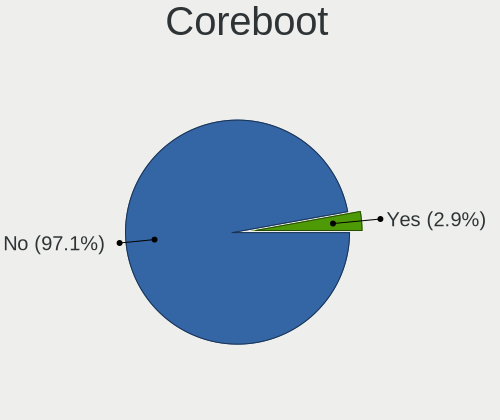
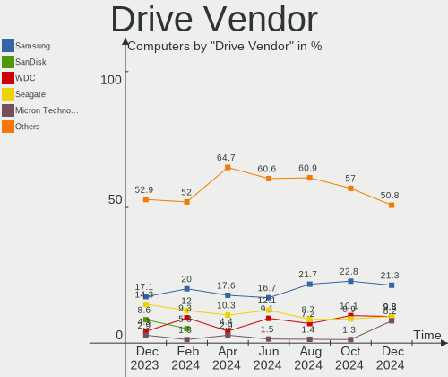
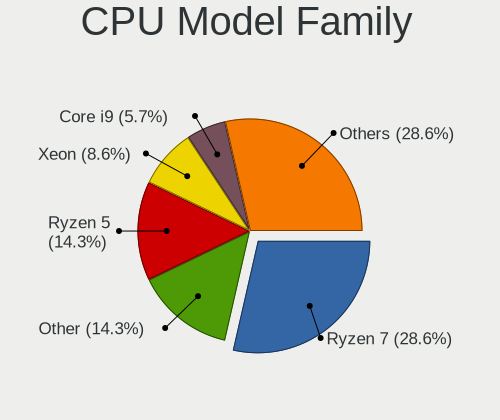
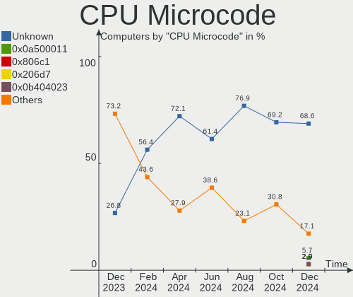
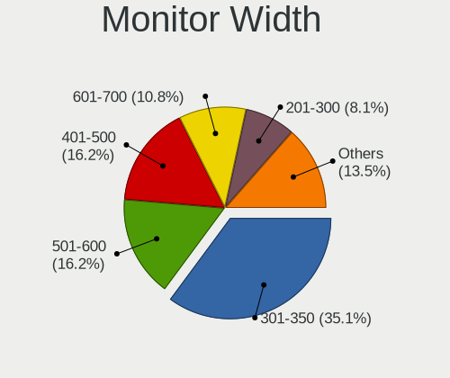
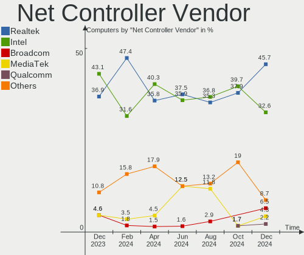
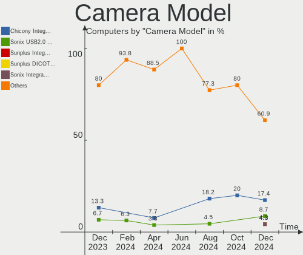

Gentoo - Hardware Trends
------------------------

A project to identify most popular hardware characteristics and track their change
over time based on data collected by Linux users at https://Linux-Hardware.org.

Anyone can contribute to this report by the [hw-probe](https://github.com/linuxhw/hw-probe) tool:

    sudo -E hw-probe -all -upload

This is a report for all computer types. See also reports for [desktops](/Dist/Gentoo/Desktop/README.md) and [notebooks](/Dist/Gentoo/Notebook/README.md).

This report is for one last month. Overall report since the beginning of time: [TestCoverage](https://github.com/linuxhw/TestCoverage)

Period: May, 2022.

Contents
--------

* [ System ](#system)
  - [ OS                       ](#os)
  - [ OS Family                ](#os-family)
  - [ Kernel                   ](#kernel)
  - [ Kernel Family            ](#kernel-family)
  - [ Kernel Major Ver.        ](#kernel-major-ver)
  - [ Arch                     ](#arch)
  - [ DE                       ](#de)
  - [ Display Server           ](#display-server)
  - [ Display Manager          ](#display-manager)
  - [ OS Lang                  ](#os-lang)
  - [ Boot Mode                ](#boot-mode)
  - [ Filesystem               ](#filesystem)
  - [ Part. scheme             ](#part-scheme)
  - [ Dual Boot with Linux/BSD ](#dual-boot-with-linuxbsd)
  - [ Dual Boot (Win)          ](#dual-boot-win)

* [ Board ](#board)
  - [ Vendor                   ](#vendor)
  - [ Model                    ](#model)
  - [ Model Family             ](#model-family)
  - [ MFG Year                 ](#mfg-year)
  - [ Form Factor              ](#form-factor)
  - [ Secure Boot              ](#secure-boot)
  - [ Coreboot                 ](#coreboot)
  - [ RAM Size                 ](#ram-size)
  - [ RAM Used                 ](#ram-used)
  - [ Total Drives             ](#total-drives)
  - [ Has CD-ROM               ](#has-cd-rom)
  - [ Has Ethernet             ](#has-ethernet)
  - [ Has WiFi                 ](#has-wifi)
  - [ Has Bluetooth            ](#has-bluetooth)

* [ Location ](#location)
  - [ Country                  ](#country)
  - [ City                     ](#city)

* [ Drives ](#drives)
  - [ Drive Vendor             ](#drive-vendor)
  - [ Drive Model              ](#drive-model)
  - [ HDD Vendor               ](#hdd-vendor)
  - [ SSD Vendor               ](#ssd-vendor)
  - [ Drive Kind               ](#drive-kind)
  - [ Drive Connector          ](#drive-connector)
  - [ Drive Size               ](#drive-size)
  - [ Space Total              ](#space-total)
  - [ Space Used               ](#space-used)
  - [ Malfunc. Drives          ](#malfunc-drives)
  - [ Malfunc. Drive Vendor    ](#malfunc-drive-vendor)
  - [ Malfunc. HDD Vendor      ](#malfunc-hdd-vendor)
  - [ Malfunc. Drive Kind      ](#malfunc-drive-kind)
  - [ Failed Drives            ](#failed-drives)
  - [ Failed Drive Vendor      ](#failed-drive-vendor)
  - [ Drive Status             ](#drive-status)

* [ Storage controller ](#storage-controller)
  - [ Storage Vendor           ](#storage-vendor)
  - [ Storage Model            ](#storage-model)
  - [ Storage Kind             ](#storage-kind)

* [ Processor ](#processor)
  - [ CPU Vendor               ](#cpu-vendor)
  - [ CPU Model                ](#cpu-model)
  - [ CPU Model Family         ](#cpu-model-family)
  - [ CPU Cores                ](#cpu-cores)
  - [ CPU Sockets              ](#cpu-sockets)
  - [ CPU Threads              ](#cpu-threads)
  - [ CPU Op-Modes             ](#cpu-op-modes)
  - [ CPU Microcode            ](#cpu-microcode)
  - [ CPU Microarch            ](#cpu-microarch)

* [ Graphics ](#graphics)
  - [ GPU Vendor               ](#gpu-vendor)
  - [ GPU Model                ](#gpu-model)
  - [ GPU Combo                ](#gpu-combo)
  - [ GPU Driver               ](#gpu-driver)
  - [ GPU Memory               ](#gpu-memory)

* [ Monitor ](#monitor)
  - [ Monitor Vendor           ](#monitor-vendor)
  - [ Monitor Model            ](#monitor-model)
  - [ Monitor Resolution       ](#monitor-resolution)
  - [ Monitor Diagonal         ](#monitor-diagonal)
  - [ Monitor Width            ](#monitor-width)
  - [ Aspect Ratio             ](#aspect-ratio)
  - [ Monitor Area             ](#monitor-area)
  - [ Pixel Density            ](#pixel-density)
  - [ Multiple Monitors        ](#multiple-monitors)

* [ Network ](#network)
  - [ Net Controller Vendor    ](#net-controller-vendor)
  - [ Net Controller Model     ](#net-controller-model)
  - [ Wireless Vendor          ](#wireless-vendor)
  - [ Wireless Model           ](#wireless-model)
  - [ Ethernet Vendor          ](#ethernet-vendor)
  - [ Ethernet Model           ](#ethernet-model)
  - [ Net Controller Kind      ](#net-controller-kind)
  - [ Used Controller          ](#used-controller)
  - [ NICs                     ](#nics)
  - [ IPv6                     ](#ipv6)

* [ Bluetooth ](#bluetooth)
  - [ Bluetooth Vendor         ](#bluetooth-vendor)
  - [ Bluetooth Model          ](#bluetooth-model)

* [ Sound ](#sound)
  - [ Sound Vendor             ](#sound-vendor)
  - [ Sound Model              ](#sound-model)

* [ Memory ](#memory)
  - [ Memory Vendor            ](#memory-vendor)
  - [ Memory Model             ](#memory-model)
  - [ Memory Kind              ](#memory-kind)
  - [ Memory Form Factor       ](#memory-form-factor)
  - [ Memory Size              ](#memory-size)
  - [ Memory Speed             ](#memory-speed)

* [ Printers & scanners ](#printers--scanners)
  - [ Printer Vendor           ](#printer-vendor)
  - [ Printer Model            ](#printer-model)
  - [ Scanner Vendor           ](#scanner-vendor)
  - [ Scanner Model            ](#scanner-model)

* [ Camera ](#camera)
  - [ Camera Vendor            ](#camera-vendor)
  - [ Camera Model             ](#camera-model)

* [ Security ](#security)
  - [ Fingerprint Vendor       ](#fingerprint-vendor)
  - [ Fingerprint Model        ](#fingerprint-model)
  - [ Chipcard Vendor          ](#chipcard-vendor)
  - [ Chipcard Model           ](#chipcard-model)

* [ Unsupported ](#unsupported)
  - [ Unsupported Devices      ](#unsupported-devices)
  - [ Unsupported Device Types ](#unsupported-device-types)

System
------

OS
--

Installed operating systems

| Name       | Computers | Percent |
|------------|-----------|---------|
| Gentoo 2.6 | 22        | 37.29%  |
| Gentoo 2.8 | 18        | 30.51%  |
| Gentoo 2.7 | 17        | 28.81%  |
| Gentoo 2.3 | 1         | 1.69%   |
| Gentoo 1   | 1         | 1.69%   |

OS Family
---------

OS without a version

| Name   | Computers | Percent |
|--------|-----------|---------|
| Gentoo | 59        | 100%    |

Kernel
------

Version of the Linux kernel

| Version                                         | Computers | Percent |
|-------------------------------------------------|-----------|---------|
| 5.15.32-gentoo-r1                               | 11        | 18.64%  |
| 5.15.32-gentoo-r1-x86_64                        | 7         | 11.86%  |
| 5.17.5-gentoo                                   | 3         | 5.08%   |
| 5.17.9-gentoo-x86_64                            | 2         | 3.39%   |
| 5.17.8-gentoo-x86_64                            | 2         | 3.39%   |
| 5.17.1-gentoo-r1                                | 2         | 3.39%   |
| 5.18.0-rc7-x86_64-git-00119-gb015dcd62b86-dirty | 1         | 1.69%   |
| 5.18.0-gentoo                                   | 1         | 1.69%   |
| 5.17.9-gentoo-x86                               | 1         | 1.69%   |
| 5.17.9-gentoo-dist                              | 1         | 1.69%   |
| 5.17.9-gentoo                                   | 1         | 1.69%   |
| 5.17.7-gentoo-limelight                         | 1         | 1.69%   |
| 5.17.7-gentoo-groovin                           | 1         | 1.69%   |
| 5.17.7-gentoo-dist                              | 1         | 1.69%   |
| 5.17.7-gentoo                                   | 1         | 1.69%   |
| 5.17.6-gentoo-x86_64                            | 1         | 1.69%   |
| 5.17.6-gentoo                                   | 1         | 1.69%   |
| 5.17.5-gentoo-dist                              | 1         | 1.69%   |
| 5.17.1-zen1-x86_64                              | 1         | 1.69%   |
| 5.17.1-zen1-gungnir                             | 1         | 1.69%   |
| 5.17.1-zen1                                     | 1         | 1.69%   |
| 5.17.1-xanmod1-8-may-2022                       | 1         | 1.69%   |
| 5.17.0-mainline-t14                             | 1         | 1.69%   |
| 5.15.41-gentoo-hardened1                        | 1         | 1.69%   |
| 5.15.41-gentoo-dist                             | 1         | 1.69%   |
| 5.15.41-gentoo                                  | 1         | 1.69%   |
| 5.15.37-gentoo-dist-hardened                    | 1         | 1.69%   |
| 5.15.36-gentoo-compact-0.1                      | 1         | 1.69%   |
| 5.15.32-x86_64                                  | 1         | 1.69%   |
| 5.15.32-v8                                      | 1         | 1.69%   |
| 5.15.32-gentoo-r1-meguias-6.4                   | 1         | 1.69%   |
| 5.15.32-1-lts                                   | 1         | 1.69%   |
| 5.15.26-gentoo                                  | 1         | 1.69%   |
| 5.15.11-gentoo-x86_64                           | 1         | 1.69%   |
| 5.15.10-gentoo                                  | 1         | 1.69%   |
| 5.13.19-gentoo-reflesia                         | 1         | 1.69%   |
| 5.10.76-gentoo-r1-x86_64                        | 1         | 1.69%   |
| 4.9.16-gentoo                                   | 1         | 1.69%   |

Kernel Family
-------------

Linux kernel without a distro release

| Version | Computers | Percent |
|---------|-----------|---------|
| 5.15.32 | 22        | 37.29%  |
| 5.17.1  | 6         | 10.17%  |
| 5.17.9  | 5         | 8.47%   |
| 5.17.7  | 4         | 6.78%   |
| 5.17.5  | 4         | 6.78%   |
| 5.15.41 | 3         | 5.08%   |
| 5.18.0  | 2         | 3.39%   |
| 5.17.8  | 2         | 3.39%   |
| 5.17.6  | 2         | 3.39%   |
| 5.17.0  | 1         | 1.69%   |
| 5.15.37 | 1         | 1.69%   |
| 5.15.36 | 1         | 1.69%   |
| 5.15.26 | 1         | 1.69%   |
| 5.15.11 | 1         | 1.69%   |
| 5.15.10 | 1         | 1.69%   |
| 5.13.19 | 1         | 1.69%   |
| 5.10.76 | 1         | 1.69%   |
| 4.9.16  | 1         | 1.69%   |

Kernel Major Ver.
-----------------

Linux kernel major version

| Version | Computers | Percent |
|---------|-----------|---------|
| 5.15    | 30        | 50.85%  |
| 5.17    | 24        | 40.68%  |
| 5.18    | 2         | 3.39%   |
| 5.13    | 1         | 1.69%   |
| 5.10    | 1         | 1.69%   |
| 4.9     | 1         | 1.69%   |

Arch
----

OS architecture (x86_64, i586, etc.)

| Name    | Computers | Percent |
|---------|-----------|---------|
| x86_64  | 56        | 94.92%  |
| ppc     | 1         | 1.69%   |
| i686    | 1         | 1.69%   |
| aarch64 | 1         | 1.69%   |

DE
--

Desktop Environment

| Name          | Computers | Percent |
|---------------|-----------|---------|
| Unknown       | 19        | 32.2%   |
| KDE5          | 15        | 25.42%  |
| GNOME         | 9         | 15.25%  |
| XFCE          | 8         | 13.56%  |
| MATE          | 2         | 3.39%   |
| LXQt          | 2         | 3.39%   |
| X-Cinnamon    | 1         | 1.69%   |
| LeftWM        | 1         | 1.69%   |
| Enlightenment | 1         | 1.69%   |
| Cinnamon      | 1         | 1.69%   |

Display Server
--------------

X11 or Wayland

| Name    | Computers | Percent |
|---------|-----------|---------|
| X11     | 34        | 57.63%  |
| Unknown | 13        | 22.03%  |
| Wayland | 7         | 11.86%  |
| Tty     | 5         | 8.47%   |

Display Manager
---------------

SDDM, LightDM, etc.

| Name    | Computers | Percent |
|---------|-----------|---------|
| Unknown | 23        | 38.98%  |
| SDDM    | 20        | 33.9%   |
| LightDM | 12        | 20.34%  |
| GDM     | 3         | 5.08%   |
| GREETD  | 1         | 1.69%   |

OS Lang
-------

Language

| Lang    | Computers | Percent |
|---------|-----------|---------|
| en_US   | 21        | 35.59%  |
| en_GB   | 9         | 15.25%  |
| C.UTF8  | 6         | 10.17%  |
| Unknown | 5         | 8.47%   |
| es_ES   | 4         | 6.78%   |
| it_IT   | 2         | 3.39%   |
| fr_FR   | 2         | 3.39%   |
| de_DE   | 2         | 3.39%   |
| cs_CZ   | 2         | 3.39%   |
| ru_RU   | 1         | 1.69%   |
| pl_PL   | 1         | 1.69%   |
| ja_JP   | 1         | 1.69%   |
| fr_CA   | 1         | 1.69%   |
| ca_ES   | 1         | 1.69%   |
| C       | 1         | 1.69%   |

Boot Mode
---------

EFI or BIOS

| Mode | Computers | Percent |
|------|-----------|---------|
| EFI  | 46        | 77.97%  |
| BIOS | 13        | 22.03%  |

Filesystem
----------

Type of filesystem

| Type    | Computers | Percent |
|---------|-----------|---------|
| Ext4    | 34        | 57.63%  |
| Btrfs   | 13        | 22.03%  |
| F2fs    | 5         | 8.47%   |
| Zfs     | 3         | 5.08%   |
| Xfs     | 3         | 5.08%   |
| XXXXXXX | 1         | 1.69%   |

Part. scheme
------------

Scheme of partitioning

| Type    | Computers | Percent |
|---------|-----------|---------|
| GPT     | 52        | 88.14%  |
| MBR     | 4         | 6.78%   |
| Unknown | 3         | 5.08%   |

Dual Boot with Linux/BSD
------------------------

Hosting more than one Linux/BSD

| Dual boot | Computers | Percent |
|-----------|-----------|---------|
| No        | 37        | 62.71%  |
| Yes       | 22        | 37.29%  |

Dual Boot (Win)
---------------

Hosting Linux and Windows

| Dual boot | Computers | Percent |
|-----------|-----------|---------|
| No        | 50        | 84.75%  |
| Yes       | 9         | 15.25%  |

Board
-----

Vendor
------

Motherboard manufacturer

| Name                    | Computers | Percent |
|-------------------------|-----------|---------|
| ASUSTek Computer        | 14        | 23.73%  |
| Hewlett-Packard         | 9         | 15.25%  |
| Lenovo                  | 8         | 13.56%  |
| MSI                     | 5         | 8.47%   |
| Dell                    | 5         | 8.47%   |
| Gigabyte Technology     | 3         | 5.08%   |
| ASRock                  | 3         | 5.08%   |
| TUXEDO                  | 2         | 3.39%   |
| HUAWEI                  | 2         | 3.39%   |
| Supermicro              | 1         | 1.69%   |
| Raspberry Pi Foundation | 1         | 1.69%   |
| Intel                   | 1         | 1.69%   |
| Fanless Mini PC         | 1         | 1.69%   |
| ASRockRack              | 1         | 1.69%   |
| Apple                   | 1         | 1.69%   |
| Acer                    | 1         | 1.69%   |
| Unknown                 | 1         | 1.69%   |

Model
-----

Motherboard model

| Name                                     | Computers | Percent |
|------------------------------------------|-----------|---------|
| TUXEDO Polaris AMD Gen3 (CZN)            | 1         | 1.69%   |
| TUXEDO InfinityBook Pro 14 Gen6          | 1         | 1.69%   |
| Supermicro Super Server                  | 1         | 1.69%   |
| RPi Raspberry Pi                         | 1         | 1.69%   |
| MSI MS-7D54                              | 1         | 1.69%   |
| MSI MS-7D25                              | 1         | 1.69%   |
| MSI MS-7C37                              | 1         | 1.69%   |
| MSI MS-7A34                              | 1         | 1.69%   |
| MSI GE66 Raider 11UE                     | 1         | 1.69%   |
| Lenovo Yoga 2 13 20344                   | 1         | 1.69%   |
| Lenovo ThinkPad Yoga 11e 20DAS05100      | 1         | 1.69%   |
| Lenovo ThinkPad X1 Carbon 7th 20QDCTO1WW | 1         | 1.69%   |
| Lenovo ThinkPad T460 20FMS421US          | 1         | 1.69%   |
| Lenovo ThinkPad T14 Gen 1 20UES06X00     | 1         | 1.69%   |
| Lenovo ThinkPad T14 Gen 1 20S1S35Y00     | 1         | 1.69%   |
| Lenovo ThinkPad P73 20QSS09S00           | 1         | 1.69%   |
| Lenovo Legion 5 Pro 16ACH6H 82JQ         | 1         | 1.69%   |
| Intel D54250WYK H13922-303               | 1         | 1.69%   |
| HUAWEI NBLK-WAX9X                        | 1         | 1.69%   |
| HUAWEI HVY-WXX9                          | 1         | 1.69%   |
| HP ZBook 15 G3                           | 1         | 1.69%   |
| HP ProBook 430 G7                        | 1         | 1.69%   |
| HP Pavilion ZV6100 (EE984EA#ABZ)         | 1         | 1.69%   |
| HP Pavilion Notebook                     | 1         | 1.69%   |
| HP Pavilion Gaming Laptop 15-cx0xxx      | 1         | 1.69%   |
| HP OMEN 25L Desktop GT12-0xxx            | 1         | 1.69%   |
| HP Laptop 15s-eq0xxx                     | 1         | 1.69%   |
| HP Laptop 14-dk1xxx                      | 1         | 1.69%   |
| HP 255 G8 Notebook PC                    | 1         | 1.69%   |
| Gigabyte Z590 UD                         | 1         | 1.69%   |
| Gigabyte GA-970A-D3                      | 1         | 1.69%   |
| Gigabyte AB350-Gaming                    | 1         | 1.69%   |
| Fanless Mini PC PCG02 GLE                | 1         | 1.69%   |
| Dell Vostro 5568                         | 1         | 1.69%   |
| Dell Precision 3520                      | 1         | 1.69%   |
| Dell OptiPlex 790                        | 1         | 1.69%   |
| Dell Inspiron 1525                       | 1         | 1.69%   |
| Dell Inspiron 15 5510                    | 1         | 1.69%   |
| ASUS ZenBook UX333FN_UX333FN             | 1         | 1.69%   |
| ASUS Z8NR-D12                            | 1         | 1.69%   |
| ASUS Z170-A                              | 1         | 1.69%   |
| ASUS TUF Gaming Z690-PLUS WIFI D4        | 1         | 1.69%   |
| ASUS TUF Gaming B550M-PLUS               | 1         | 1.69%   |
| ASUS TUF Gaming B550-PLUS                | 1         | 1.69%   |
| ASUS SABERTOOTH 990FX                    | 1         | 1.69%   |
| ASUS ROG Maximus XIII APEX               | 1         | 1.69%   |
| ASUS PRIME Z690M-PLUS D4                 | 1         | 1.69%   |
| ASUS PRIME X570-PRO                      | 1         | 1.69%   |
| ASUS PRIME H370-PLUS                     | 1         | 1.69%   |
| ASUS M3A78-CM                            | 1         | 1.69%   |
| ASUS All Series                          | 1         | 1.69%   |
| ASUS 1005HA                              | 1         | 1.69%   |
| ASRockRack E3C232D2I                     | 1         | 1.69%   |
| ASRock X370 Gaming X                     | 1         | 1.69%   |
| ASRock B450 Gaming K4                    | 1         | 1.69%   |
| ASRock A320M Pro4                        | 1         | 1.69%   |
| Apple MacPro5,1                          | 1         | 1.69%   |
| Acer Aspire E5-571G                      | 1         | 1.69%   |
| Unknown                                  | 1         | 1.69%   |

Model Family
------------

Motherboard model prefix

| Name                  | Computers | Percent |
|-----------------------|-----------|---------|
| Lenovo ThinkPad       | 6         | 10.17%  |
| HP Pavilion           | 3         | 5.08%   |
| ASUS TUF              | 3         | 5.08%   |
| ASUS PRIME            | 3         | 5.08%   |
| HP Laptop             | 2         | 3.39%   |
| Dell Inspiron         | 2         | 3.39%   |
| TUXEDO Polaris        | 1         | 1.69%   |
| TUXEDO InfinityBook   | 1         | 1.69%   |
| Supermicro Super      | 1         | 1.69%   |
| RPi Raspberry         | 1         | 1.69%   |
| MSI MS-7D54           | 1         | 1.69%   |
| MSI MS-7D25           | 1         | 1.69%   |
| MSI MS-7C37           | 1         | 1.69%   |
| MSI MS-7A34           | 1         | 1.69%   |
| MSI GE66              | 1         | 1.69%   |
| Lenovo Yoga           | 1         | 1.69%   |
| Lenovo Legion         | 1         | 1.69%   |
| Intel D54250WYK       | 1         | 1.69%   |
| HUAWEI NBLK-WAX9X     | 1         | 1.69%   |
| HUAWEI HVY-WXX9       | 1         | 1.69%   |
| HP ZBook              | 1         | 1.69%   |
| HP ProBook            | 1         | 1.69%   |
| HP OMEN               | 1         | 1.69%   |
| HP 255                | 1         | 1.69%   |
| Gigabyte Z590         | 1         | 1.69%   |
| Gigabyte GA-970A-D3   | 1         | 1.69%   |
| Gigabyte AB350-Gaming | 1         | 1.69%   |
| Fanless Mini PC PCG02 | 1         | 1.69%   |
| Dell Vostro           | 1         | 1.69%   |
| Dell Precision        | 1         | 1.69%   |
| Dell OptiPlex         | 1         | 1.69%   |
| ASUS ZenBook          | 1         | 1.69%   |
| ASUS Z8NR-D12         | 1         | 1.69%   |
| ASUS Z170-A           | 1         | 1.69%   |
| ASUS SABERTOOTH       | 1         | 1.69%   |
| ASUS ROG              | 1         | 1.69%   |
| ASUS M3A78-CM         | 1         | 1.69%   |
| ASUS All              | 1         | 1.69%   |
| ASUS 1005HA           | 1         | 1.69%   |
| ASRockRack E3C232D2I  | 1         | 1.69%   |
| ASRock X370           | 1         | 1.69%   |
| ASRock B450           | 1         | 1.69%   |
| ASRock A320M          | 1         | 1.69%   |
| Apple MacPro5         | 1         | 1.69%   |
| Acer Aspire           | 1         | 1.69%   |
| Unknown               | 1         | 1.69%   |

MFG Year
--------

Motherboard manufacture year

| Year    | Computers | Percent |
|---------|-----------|---------|
| 2021    | 12        | 20.34%  |
| 2020    | 8         | 13.56%  |
| 2019    | 8         | 13.56%  |
| 2018    | 5         | 8.47%   |
| 2017    | 5         | 8.47%   |
| 2016    | 3         | 5.08%   |
| 2014    | 3         | 5.08%   |
| 2011    | 3         | 5.08%   |
| 2015    | 2         | 3.39%   |
| 2009    | 2         | 3.39%   |
| 2008    | 2         | 3.39%   |
| Unknown | 2         | 3.39%   |
| 2022    | 1         | 1.69%   |
| 2013    | 1         | 1.69%   |
| 2010    | 1         | 1.69%   |
| 2006    | 1         | 1.69%   |

Form Factor
-----------

Physical design of the computer

| Name           | Computers | Percent |
|----------------|-----------|---------|
| Notebook       | 29        | 49.15%  |
| Desktop        | 27        | 45.76%  |
| Stick pc       | 1         | 1.69%   |
| System on chip | 1         | 1.69%   |
| Server         | 1         | 1.69%   |

Secure Boot
-----------

Enabled or disabled

| State    | Computers | Percent |
|----------|-----------|---------|
| Disabled | 57        | 96.61%  |
| Enabled  | 2         | 3.39%   |

Coreboot
--------

Have coreboot on board

| Used | Computers | Percent |
|------|-----------|---------|
| No   | 59        | 100%    |

RAM Size
--------

Total RAM memory

| Size in GB  | Computers | Percent |
|-------------|-----------|---------|
| 32.01-64.0  | 14        | 23.73%  |
| 16.01-24.0  | 14        | 23.73%  |
| 8.01-16.0   | 10        | 16.95%  |
| 4.01-8.0    | 8         | 13.56%  |
| 64.01-256.0 | 6         | 10.17%  |
| 3.01-4.0    | 2         | 3.39%   |
| 1.01-2.0    | 2         | 3.39%   |
| 0.51-1.0    | 2         | 3.39%   |
| 24.01-32.0  | 1         | 1.69%   |

RAM Used
--------

Used RAM memory

| Used GB    | Computers | Percent |
|------------|-----------|---------|
| 4.01-8.0   | 14        | 23.73%  |
| 1.01-2.0   | 14        | 23.73%  |
| 3.01-4.0   | 9         | 15.25%  |
| 2.01-3.0   | 7         | 11.86%  |
| 8.01-16.0  | 7         | 11.86%  |
| 0.01-0.5   | 6         | 10.17%  |
| 16.01-24.0 | 1         | 1.69%   |
| 0.51-1.0   | 1         | 1.69%   |

Total Drives
------------

Number of drives on board

| Drives | Computers | Percent |
|--------|-----------|---------|
| 1      | 28        | 47.46%  |
| 2      | 14        | 23.73%  |
| 5      | 5         | 8.47%   |
| 4      | 5         | 8.47%   |
| 6      | 3         | 5.08%   |
| 3      | 3         | 5.08%   |
| 26     | 1         | 1.69%   |

Has CD-ROM
----------

Has CD-ROM on board

| Presented | Computers | Percent |
|-----------|-----------|---------|
| No        | 52        | 88.14%  |
| Yes       | 7         | 11.86%  |

Has Ethernet
------------

Has Ethernet on board

| Presented | Computers | Percent |
|-----------|-----------|---------|
| Yes       | 51        | 86.44%  |
| No        | 8         | 13.56%  |

Has WiFi
--------

Has WiFi module

| Presented | Computers | Percent |
|-----------|-----------|---------|
| Yes       | 41        | 69.49%  |
| No        | 18        | 30.51%  |

Has Bluetooth
-------------

Has Bluetooth module

| Presented | Computers | Percent |
|-----------|-----------|---------|
| Yes       | 39        | 66.1%   |
| No        | 20        | 33.9%   |

Location
--------

Country
-------

Geographic location (country)

| Country     | Computers | Percent |
|-------------|-----------|---------|
| USA         | 15        | 25.42%  |
| Poland      | 7         | 11.86%  |
| Spain       | 4         | 6.78%   |
| Russia      | 4         | 6.78%   |
| Germany     | 4         | 6.78%   |
| France      | 4         | 6.78%   |
| UK          | 2         | 3.39%   |
| Italy       | 2         | 3.39%   |
| Czechia     | 2         | 3.39%   |
| Canada      | 2         | 3.39%   |
| Belarus     | 2         | 3.39%   |
| Turkey      | 1         | 1.69%   |
| Sweden      | 1         | 1.69%   |
| Singapore   | 1         | 1.69%   |
| Netherlands | 1         | 1.69%   |
| Japan       | 1         | 1.69%   |
| Israel      | 1         | 1.69%   |
| Ireland     | 1         | 1.69%   |
| India       | 1         | 1.69%   |
| Finland     | 1         | 1.69%   |
| China       | 1         | 1.69%   |
| Austria     | 1         | 1.69%   |

City
----

Geographic location (city)

| City                | Computers | Percent |
|---------------------|-----------|---------|
| Warsaw              | 4         | 6.78%   |
| Sterling            | 3         | 5.08%   |
| Ocala               | 3         | 5.08%   |
| Cieszyn             | 3         | 5.08%   |
| St Petersburg       | 2         | 3.39%   |
| Prague              | 2         | 3.39%   |
| Combrit             | 2         | 3.39%   |
| Yekaterinburg       | 1         | 1.69%   |
| Weatherford         | 1         | 1.69%   |
| Turku               | 1         | 1.69%   |
| Takarazuka          | 1         | 1.69%   |
| Stockholm           | 1         | 1.69%   |
| Singapore           | 1         | 1.69%   |
| Schwieberdingen     | 1         | 1.69%   |
| Sacramento          | 1         | 1.69%   |
| Québec             | 1         | 1.69%   |
| Paris               | 1         | 1.69%   |
| Pardes Hanna Karkur | 1         | 1.69%   |
| Ostuni              | 1         | 1.69%   |
| Orange              | 1         | 1.69%   |
| New York            | 1         | 1.69%   |
| Murmansk            | 1         | 1.69%   |
| Minsk               | 1         | 1.69%   |
| Milan               | 1         | 1.69%   |
| Marburg             | 1         | 1.69%   |
| Langenhagen         | 1         | 1.69%   |
| Isparta             | 1         | 1.69%   |
| Innsbruck           | 1         | 1.69%   |
| Igualada            | 1         | 1.69%   |
| Hyderabad           | 1         | 1.69%   |
| Hengelo             | 1         | 1.69%   |
| Hamburg             | 1         | 1.69%   |
| Guadalajara         | 1         | 1.69%   |
| Gomel               | 1         | 1.69%   |
| Foshan              | 1         | 1.69%   |
| Dublin              | 1         | 1.69%   |
| Denver              | 1         | 1.69%   |
| Cessy               | 1         | 1.69%   |
| Calgary             | 1         | 1.69%   |
| Bournemouth         | 1         | 1.69%   |
| Boise               | 1         | 1.69%   |
| Bilbao              | 1         | 1.69%   |
| Baton Rouge         | 1         | 1.69%   |
| Barcelona           | 1         | 1.69%   |
| Augusta             | 1         | 1.69%   |
| Alton               | 1         | 1.69%   |
| Abingdon            | 1         | 1.69%   |

Drives
------

Drive Vendor
------------

Hard drive vendors

| Vendor              | Computers | Drives | Percent |
|---------------------|-----------|--------|---------|
| Samsung Electronics | 21        | 36     | 21.21%  |
| WDC                 | 20        | 52     | 20.2%   |
| Seagate             | 9         | 11     | 9.09%   |
| Crucial             | 7         | 7      | 7.07%   |
| SanDisk             | 6         | 6      | 6.06%   |
| Toshiba             | 5         | 6      | 5.05%   |
| Kingston            | 3         | 4      | 3.03%   |
| Intel               | 3         | 3      | 3.03%   |
| Hitachi             | 3         | 5      | 3.03%   |
| HGST                | 3         | 4      | 3.03%   |
| Unknown             | 2         | 2      | 2.02%   |
| GOODRAM             | 2         | 2      | 2.02%   |
| Transcend           | 1         | 1      | 1.01%   |
| TO Exter            | 1         | 1      | 1.01%   |
| Team                | 1         | 1      | 1.01%   |
| T-FORCE             | 1         | 1      | 1.01%   |
| Silicon Motion      | 1         | 2      | 1.01%   |
| OCZ                 | 1         | 1      | 1.01%   |
| Micron Technology   | 1         | 1      | 1.01%   |
| LITEON              | 1         | 1      | 1.01%   |
| LaCie               | 1         | 1      | 1.01%   |
| KIOXIA              | 1         | 1      | 1.01%   |
| Kingchuxing         | 1         | 1      | 1.01%   |
| Fujitsu             | 1         | 1      | 1.01%   |
| China               | 1         | 2      | 1.01%   |
| Apacer              | 1         | 1      | 1.01%   |
| A-DATA Technology   | 1         | 1      | 1.01%   |

Drive Model
-----------

Hard drive models

| Model                                   | Computers | Percent |
|-----------------------------------------|-----------|---------|
| Samsung SSD 970 EVO Plus 1TB            | 3         | 2.52%   |
| Samsung SSD 850 EVO 500GB               | 3         | 2.52%   |
| Crucial CT500MX500SSD1 500GB            | 3         | 2.52%   |
| Seagate ST2000DM008-2FR102 2TB          | 2         | 1.68%   |
| Samsung SSD 980 PRO 1TB                 | 2         | 1.68%   |
| Samsung SSD 970 EVO Plus 500GB          | 2         | 1.68%   |
| GOODRAM SSDPR-CL100-480-G2 480GB        | 2         | 1.68%   |
| WDC WDS500G3XHC-00SJG0 500GB            | 1         | 0.84%   |
| WDC WDS500G2B0C-00PXH0 500GB            | 1         | 0.84%   |
| WDC WDS100T3XHC-00SJG0 1TB              | 1         | 0.84%   |
| WDC WD8003FFBX-68B9AN0 8TB              | 1         | 0.84%   |
| WDC WD60EZRX-00MVLB1 6TB                | 1         | 0.84%   |
| WDC WD5000AVDS-63U7B1 500GB             | 1         | 0.84%   |
| WDC WD5000AADS-00S9B0 500GB             | 1         | 0.84%   |
| WDC WD40EZRZ-00WN9B0 4TB                | 1         | 0.84%   |
| WDC WD40EZRX-00SPEB0 4TB                | 1         | 0.84%   |
| WDC WD40EZRX-00MVLB1 4TB                | 1         | 0.84%   |
| WDC WD40EFRX-68WT0N0 4TB                | 1         | 0.84%   |
| WDC WD3200AAJS-22RYA0 320GB             | 1         | 0.84%   |
| WDC WD30EFRX-68N32N0 3TB                | 1         | 0.84%   |
| WDC WD20NPVX-00EA4T0 2TB                | 1         | 0.84%   |
| WDC WD20EFRX-68EUZN0 2TB                | 1         | 0.84%   |
| WDC WD10EZEX-60WN4A0 1TB                | 1         | 0.84%   |
| WDC WD10EZEX-60M2NA0 1TB                | 1         | 0.84%   |
| WDC WD10EZEX-08WN4A0 1TB                | 1         | 0.84%   |
| WDC WD10EZEX-08M2NA0 1TB                | 1         | 0.84%   |
| WDC WD10EACS-00D6B1 1TB                 | 1         | 0.84%   |
| WDC WD1002FAEX-00Y9A0 1TB               | 1         | 0.84%   |
| WDC WD1001FALS-41K1B0 1TB               | 1         | 0.84%   |
| WDC WD BLACK SDBPNTY-512G-1106 512GB    | 1         | 0.84%   |
| WDC PC SN730 SDBQNTY-512G-1001 512GB    | 1         | 0.84%   |
| WDC PC SN730 SDBQNTY-256G-1001 256GB    | 1         | 0.84%   |
| WDC PC SN730 SDBPNTY-512G-1101 512GB    | 1         | 0.84%   |
| WDC PC SN730 SDBPNTY-512G-1027 512GB    | 1         | 0.84%   |
| WDC PC SN530 NVMe 512GB                 | 1         | 0.84%   |
| Unknown MMC Card  32GB                  | 1         | 0.84%   |
| Unknown MMC Card  128GB                 | 1         | 0.84%   |
| Transcend TS512GSSD720 512GB            | 1         | 0.84%   |
| Toshiba KXG6AZNV512G 512GB              | 1         | 0.84%   |
| Toshiba KSG60ZMV256G M.2 2280 256GB SSD | 1         | 0.84%   |
| Toshiba HDWE150 5TB                     | 1         | 0.84%   |
| Toshiba HDWD110 1TB                     | 1         | 0.84%   |
| Toshiba DT01ACA100 1TB                  | 1         | 0.84%   |
| TO Exter nal USB 3.0 320GB              | 1         | 0.84%   |
| Team TM8FP2240G 240GB                   | 1         | 0.84%   |
| T-FORCE TM8FP5001T 1TB                  | 1         | 0.84%   |
| Silicon Motion NVME SSD 128GB           | 1         | 0.84%   |
| Silicon Motion 256GB                    | 1         | 0.84%   |
| Seagate ST8000DM004-2CX188 8TB          | 1         | 0.84%   |
| Seagate ST6000DX000-1H217Z 6TB          | 1         | 0.84%   |
| Seagate ST4000DM004-2CV104 4TB          | 1         | 0.84%   |
| Seagate ST3750640AS 752GB               | 1         | 0.84%   |
| Seagate ST2000LM015-2E8174 2TB          | 1         | 0.84%   |
| Seagate ST2000DX001-1CM164 2TB          | 1         | 0.84%   |
| Seagate ST12000NM0008-2H3101 12TB       | 1         | 0.84%   |
| SanDisk SSD PLUS 240GB                  | 1         | 0.84%   |
| SanDisk SSD PLUS 120GB                  | 1         | 0.84%   |
| SanDisk SDSSDH3500G 500GB               | 1         | 0.84%   |
| SanDisk SD9SN8W-128G-1006 128GB SSD     | 1         | 0.84%   |
| SanDisk SD8TB8U256G1001 256GB SSD       | 1         | 0.84%   |

HDD Vendor
----------

Hard disk drive vendors

| Vendor              | Computers | Drives | Percent |
|---------------------|-----------|--------|---------|
| WDC                 | 13        | 43     | 38.24%  |
| Seagate             | 9         | 11     | 26.47%  |
| Toshiba             | 3         | 4      | 8.82%   |
| Hitachi             | 3         | 5      | 8.82%   |
| HGST                | 3         | 4      | 8.82%   |
| Samsung Electronics | 1         | 1      | 2.94%   |
| LaCie               | 1         | 1      | 2.94%   |
| Fujitsu             | 1         | 1      | 2.94%   |

SSD Vendor
----------

Solid state drive vendors

| Vendor              | Computers | Drives | Percent |
|---------------------|-----------|--------|---------|
| Samsung Electronics | 12        | 17     | 31.58%  |
| Crucial             | 6         | 6      | 15.79%  |
| SanDisk             | 5         | 5      | 13.16%  |
| Kingston            | 2         | 3      | 5.26%   |
| Intel               | 2         | 2      | 5.26%   |
| GOODRAM             | 2         | 2      | 5.26%   |
| Transcend           | 1         | 1      | 2.63%   |
| Toshiba             | 1         | 1      | 2.63%   |
| TO Exter            | 1         | 1      | 2.63%   |
| OCZ                 | 1         | 1      | 2.63%   |
| Micron Technology   | 1         | 1      | 2.63%   |
| LITEON              | 1         | 1      | 2.63%   |
| China               | 1         | 2      | 2.63%   |
| Apacer              | 1         | 1      | 2.63%   |
| A-DATA Technology   | 1         | 1      | 2.63%   |

Drive Kind
----------

HDD or SSD

| Kind | Computers | Drives | Percent |
|------|-----------|--------|---------|
| SSD  | 32        | 45     | 35.96%  |
| NVMe | 30        | 38     | 33.71%  |
| HDD  | 25        | 70     | 28.09%  |
| MMC  | 2         | 2      | 2.25%   |

Drive Connector
---------------

SATA, SAS, NVMe, etc.

| Type | Computers | Drives | Percent |
|------|-----------|--------|---------|
| SATA | 40        | 112    | 53.33%  |
| NVMe | 30        | 38     | 40%     |
| SAS  | 3         | 3      | 4%      |
| MMC  | 2         | 2      | 2.67%   |

Drive Size
----------

Size of hard drive

| Size in TB | Computers | Drives | Percent |
|------------|-----------|--------|---------|
| 0.01-0.5   | 32        | 41     | 48.48%  |
| 0.51-1.0   | 17        | 24     | 25.76%  |
| 1.01-2.0   | 8         | 34     | 12.12%  |
| 3.01-4.0   | 3         | 5      | 4.55%   |
| 4.01-10.0  | 3         | 6      | 4.55%   |
| 2.01-3.0   | 2         | 4      | 3.03%   |
| 10.01-20.0 | 1         | 1      | 1.52%   |

Space Total
-----------

Amount of disk space available on the file system

| Size in GB     | Computers | Percent |
|----------------|-----------|---------|
| 251-500        | 18        | 30.51%  |
| 101-250        | 11        | 18.64%  |
| More than 3000 | 9         | 15.25%  |
| 1001-2000      | 5         | 8.47%   |
| 501-1000       | 5         | 8.47%   |
| 21-50          | 3         | 5.08%   |
| 51-100         | 3         | 5.08%   |
| Unknown        | 3         | 5.08%   |
| 2001-3000      | 2         | 3.39%   |

Space Used
----------

Amount of used disk space

| Used GB        | Computers | Percent |
|----------------|-----------|---------|
| 1-20           | 14        | 23.73%  |
| 251-500        | 8         | 13.56%  |
| 101-250        | 8         | 13.56%  |
| 21-50          | 7         | 11.86%  |
| More than 3000 | 6         | 10.17%  |
| 51-100         | 5         | 8.47%   |
| 501-1000       | 4         | 6.78%   |
| 1001-2000      | 3         | 5.08%   |
| Unknown        | 3         | 5.08%   |
| 2001-3000      | 1         | 1.69%   |

Malfunc. Drives
---------------

Drive models with a malfunction

| Model                                   | Computers | Drives | Percent |
|-----------------------------------------|-----------|--------|---------|
| WDC WD40EFRX-68WT0N0 4TB                | 1         | 1      | 12.5%   |
| WDC WD10EZEX-08M2NA0 1TB                | 1         | 1      | 12.5%   |
| Transcend TS512GSSD720 512GB            | 1         | 1      | 12.5%   |
| Seagate ST2000DX001-1CM164 2TB          | 1         | 1      | 12.5%   |
| LITEON CV8-8E128-HP 128GB SSD           | 1         | 1      | 12.5%   |
| Kingston RBU-SNS8350DES3128GP 128GB SSD | 1         | 1      | 12.5%   |
| HGST HTS721010A9E630 1TB                | 1         | 1      | 12.5%   |
| HGST HTS545050A7E380 500GB              | 1         | 2      | 12.5%   |

Malfunc. Drive Vendor
---------------------

Vendors of faulty drives

| Vendor    | Computers | Drives | Percent |
|-----------|-----------|--------|---------|
| WDC       | 2         | 2      | 25%     |
| HGST      | 2         | 3      | 25%     |
| Transcend | 1         | 1      | 12.5%   |
| Seagate   | 1         | 1      | 12.5%   |
| LITEON    | 1         | 1      | 12.5%   |
| Kingston  | 1         | 1      | 12.5%   |

Malfunc. HDD Vendor
-------------------

Vendors of faulty HDD drives

| Vendor  | Computers | Drives | Percent |
|---------|-----------|--------|---------|
| WDC     | 2         | 2      | 40%     |
| HGST    | 2         | 3      | 40%     |
| Seagate | 1         | 1      | 20%     |

Malfunc. Drive Kind
-------------------

Kinds of faulty drives

| Kind | Computers | Drives | Percent |
|------|-----------|--------|---------|
| HDD  | 5         | 6      | 62.5%   |
| SSD  | 3         | 3      | 37.5%   |

Failed Drives
-------------

Failed drive models

Zero info for selected period =(

Failed Drive Vendor
-------------------

Failed drive vendors

Zero info for selected period =(

Drive Status
------------

Number of failed and malfunc. drives

| Status   | Computers | Drives | Percent |
|----------|-----------|--------|---------|
| Works    | 50        | 135    | 78.13%  |
| Detected | 7         | 11     | 10.94%  |
| Malfunc  | 7         | 9      | 10.94%  |

Storage controller
------------------

Storage Vendor
--------------

Storage controller vendors

| Vendor                       | Computers | Percent |
|------------------------------|-----------|---------|
| Intel                        | 28        | 32.56%  |
| AMD                          | 18        | 20.93%  |
| Samsung Electronics          | 15        | 17.44%  |
| Sandisk                      | 10        | 11.63%  |
| ASMedia Technology           | 6         | 6.98%   |
| Toshiba America Info Systems | 2         | 2.33%   |
| Silicon Motion               | 2         | 2.33%   |
| Phison Electronics           | 2         | 2.33%   |
| Micron/Crucial Technology    | 1         | 1.16%   |
| LSI Logic / Symbios Logic    | 1         | 1.16%   |
| Kingston Technology Company  | 1         | 1.16%   |

Storage Model
-------------

Storage controller models

| Model                                                                         | Computers | Percent |
|-------------------------------------------------------------------------------|-----------|---------|
| AMD FCH SATA Controller [AHCI mode]                                           | 11        | 11.58%  |
| Samsung NVMe SSD Controller SM981/PM981/PM983                                 | 8         | 8.42%   |
| Samsung NVMe SSD Controller PM9A1/PM9A3/980PRO                                | 6         | 6.32%   |
| ASMedia ASM1062 Serial ATA Controller                                         | 6         | 6.32%   |
| Sandisk WD Black SN750 / PC SN730 NVMe SSD                                    | 5         | 5.26%   |
| Intel Q170/Q150/B150/H170/H110/Z170/CM236 Chipset SATA Controller [AHCI Mode] | 4         | 4.21%   |
| Intel Sunrise Point-LP SATA Controller [AHCI mode]                            | 3         | 3.16%   |
| Intel Alder Lake-S PCH SATA Controller [AHCI Mode]                            | 3         | 3.16%   |
| Intel 8 Series SATA Controller 1 [AHCI mode]                                  | 3         | 3.16%   |
| Silicon Motion SM2263EN/SM2263XT SSD Controller                               | 2         | 2.11%   |
| Sandisk WD Black 2018/SN750 / PC SN720 NVMe SSD                               | 2         | 2.11%   |
| Intel Volume Management Device NVMe RAID Controller                           | 2         | 2.11%   |
| Intel 82801JI (ICH10 Family) SATA AHCI Controller                             | 2         | 2.11%   |
| Intel 500 Series Chipset Family SATA AHCI Controller                          | 2         | 2.11%   |
| AMD SB7x0/SB8x0/SB9x0 SATA Controller [AHCI mode]                             | 2         | 2.11%   |
| AMD 500 Series Chipset SATA Controller                                        | 2         | 2.11%   |
| AMD 300 Series Chipset SATA Controller                                        | 2         | 2.11%   |
| Toshiba America Info Systems XG6 NVMe SSD Controller                          | 1         | 1.05%   |
| Toshiba America Info Systems BG3 NVMe SSD Controller                          | 1         | 1.05%   |
| Sandisk WD Blue SN570 NVMe SSD                                                | 1         | 1.05%   |
| Sandisk WD Blue SN550 NVMe SSD                                                | 1         | 1.05%   |
| Sandisk Non-Volatile memory controller                                        | 1         | 1.05%   |
| Samsung NVMe SSD Controller 980                                               | 1         | 1.05%   |
| Phison E7 NVMe Controller                                                     | 1         | 1.05%   |
| Phison E12 NVMe Controller                                                    | 1         | 1.05%   |
| Micron/Crucial P2 NVMe PCIe SSD                                               | 1         | 1.05%   |
| LSI Logic / Symbios Logic SAS2008 PCI-Express Fusion-MPT SAS-2 [Falcon]       | 1         | 1.05%   |
| Kingston Company Company Non-Volatile memory controller                       | 1         | 1.05%   |
| Intel SSD 660P Series                                                         | 1         | 1.05%   |
| Intel SATA Controller [RAID mode]                                             | 1         | 1.05%   |
| Intel Comet Lake SATA AHCI Controller                                         | 1         | 1.05%   |
| Intel Celeron/Pentium Silver Processor SATA Controller                        | 1         | 1.05%   |
| Intel Cannon Lake PCH SATA AHCI Controller                                    | 1         | 1.05%   |
| Intel Cannon Lake Mobile PCH SATA AHCI Controller                             | 1         | 1.05%   |
| Intel C610/X99 series chipset 6-Port SATA Controller [AHCI mode]              | 1         | 1.05%   |
| Intel Atom Processor E3800 Series SATA AHCI Controller                        | 1         | 1.05%   |
| Intel 82801HM/HEM (ICH8M/ICH8M-E) SATA Controller [AHCI mode]                 | 1         | 1.05%   |
| Intel 82801HM/HEM (ICH8M/ICH8M-E) IDE Controller                              | 1         | 1.05%   |
| Intel 82801GBM/GHM (ICH7-M Family) SATA Controller [AHCI mode]                | 1         | 1.05%   |
| Intel 6 Series/C200 Series Chipset Family 6 port Desktop SATA AHCI Controller | 1         | 1.05%   |
| AMD X370 Series Chipset SATA Controller                                       | 1         | 1.05%   |
| AMD SB7x0/SB8x0/SB9x0 SATA Controller [IDE mode]                              | 1         | 1.05%   |
| AMD SB7x0/SB8x0/SB9x0 IDE Controller                                          | 1         | 1.05%   |
| AMD IXP SB4x0 IDE Controller                                                  | 1         | 1.05%   |
| AMD FCH SATA Controller [IDE mode]                                            | 1         | 1.05%   |
| AMD FCH SATA Controller D                                                     | 1         | 1.05%   |
| AMD 400 Series Chipset SATA Controller                                        | 1         | 1.05%   |

Storage Kind
------------

Kind of storage controller (IDE, SATA, NVMe, SAS, ...)

| Kind | Computers | Percent |
|------|-----------|---------|
| SATA | 43        | 53.75%  |
| NVMe | 30        | 37.5%   |
| RAID | 3         | 3.75%   |
| IDE  | 3         | 3.75%   |
| SAS  | 1         | 1.25%   |

Processor
---------

CPU Vendor
----------

Processor vendors

| Vendor       | Computers | Percent |
|--------------|-----------|---------|
| Intel        | 34        | 57.63%  |
| AMD          | 23        | 38.98%  |
| PowerBook6,7 | 1         | 1.69%   |
| ARM          | 1         | 1.69%   |

CPU Model
---------

Processor models

| Model                                          | Computers | Percent |
|------------------------------------------------|-----------|---------|
| Intel 12th Gen Core i7-12700K                  | 2         | 3.39%   |
| AMD Ryzen 7 5800H with Radeon Graphics         | 2         | 3.39%   |
| AMD FX-8120 Eight-Core Processor               | 2         | 3.39%   |
| PowerBook6,7 7447A, altivec supported          | 1         | 1.69%   |
| Intel Xeon CPU X5680 @ 3.33GHz                 | 1         | 1.69%   |
| Intel Xeon CPU E5520 @ 2.27GHz                 | 1         | 1.69%   |
| Intel Xeon CPU E3-1220 v6 @ 3.00GHz            | 1         | 1.69%   |
| Intel Core i9-9880H CPU @ 2.30GHz              | 1         | 1.69%   |
| Intel Core i7-8700K CPU @ 3.70GHz              | 1         | 1.69%   |
| Intel Core i7-8565U CPU @ 1.80GHz              | 1         | 1.69%   |
| Intel Core i7-6700K CPU @ 4.00GHz              | 1         | 1.69%   |
| Intel Core i7-6700HQ CPU @ 2.60GHz             | 1         | 1.69%   |
| Intel Core i7-6500U CPU @ 2.50GHz              | 1         | 1.69%   |
| Intel Core i7-5930K CPU @ 3.50GHz              | 1         | 1.69%   |
| Intel Core i7-10700 CPU @ 2.90GHz              | 1         | 1.69%   |
| Intel Core i7-10610U CPU @ 1.80GHz             | 1         | 1.69%   |
| Intel Core i5-8300H CPU @ 2.30GHz              | 1         | 1.69%   |
| Intel Core i5-8265U CPU @ 1.60GHz              | 1         | 1.69%   |
| Intel Core i5-7200U CPU @ 2.50GHz              | 1         | 1.69%   |
| Intel Core i5-6440HQ CPU @ 2.60GHz             | 1         | 1.69%   |
| Intel Core i5-6300U CPU @ 2.40GHz              | 1         | 1.69%   |
| Intel Core i5-4250U CPU @ 1.30GHz              | 1         | 1.69%   |
| Intel Core i5-4210U CPU @ 1.70GHz              | 1         | 1.69%   |
| Intel Core i5-4200U CPU @ 1.60GHz              | 1         | 1.69%   |
| Intel Core i5-2400 CPU @ 3.10GHz               | 1         | 1.69%   |
| Intel Core i5-10210U CPU @ 1.60GHz             | 1         | 1.69%   |
| Intel Core 2 Duo CPU T5550 @ 1.83GHz           | 1         | 1.69%   |
| Intel Celeron J4125 CPU @ 2.00GHz              | 1         | 1.69%   |
| Intel Celeron CPU N2940 @ 1.83GHz              | 1         | 1.69%   |
| Intel Atom CPU N280 @ 1.66GHz                  | 1         | 1.69%   |
| Intel 12th Gen Core i7-12700KF                 | 1         | 1.69%   |
| Intel 11th Gen Core i9-11900K @ 3.50GHz        | 1         | 1.69%   |
| Intel 11th Gen Core i7-11800H @ 2.30GHz        | 1         | 1.69%   |
| Intel 11th Gen Core i7-11700K @ 3.60GHz        | 1         | 1.69%   |
| Intel 11th Gen Core i7-11370H @ 3.30GHz        | 1         | 1.69%   |
| Intel 11th Gen Core i5-11320H @ 3.20GHz        | 1         | 1.69%   |
| ARM Processor                                  | 1         | 1.69%   |
| AMD Ryzen 9 5900X 12-Core Processor            | 1         | 1.69%   |
| AMD Ryzen 7 5700X 8-Core Processor             | 1         | 1.69%   |
| AMD Ryzen 7 3700X 8-Core Processor             | 1         | 1.69%   |
| AMD Ryzen 5 PRO 4650U with Radeon Graphics     | 1         | 1.69%   |
| AMD Ryzen 5 5600X 6-Core Processor             | 1         | 1.69%   |
| AMD Ryzen 5 5600G with Radeon Graphics         | 1         | 1.69%   |
| AMD Ryzen 5 5500U with Radeon Graphics         | 1         | 1.69%   |
| AMD Ryzen 5 4600H with Radeon Graphics         | 1         | 1.69%   |
| AMD Ryzen 5 3500U with Radeon Vega Mobile Gfx  | 1         | 1.69%   |
| AMD Ryzen 5 2600 Six-Core Processor            | 1         | 1.69%   |
| AMD Ryzen 5 1600 Six-Core Processor            | 1         | 1.69%   |
| AMD Ryzen 5 1500X Quad-Core Processor          | 1         | 1.69%   |
| AMD Ryzen 3 4300GE with Radeon Graphics        | 1         | 1.69%   |
| AMD Ryzen 3 3250U with Radeon Graphics         | 1         | 1.69%   |
| AMD Ryzen 3 3200U with Radeon Vega Mobile Gfx  | 1         | 1.69%   |
| AMD Phenom II X4 955 Processor                 | 1         | 1.69%   |
| AMD EPYC 7262 8-Core Processor                 | 1         | 1.69%   |
| AMD Athlon 64 Processor 3200+                  | 1         | 1.69%   |
| AMD A10-9700 RADEON R7, 10 COMPUTE CORES 4C+6G | 1         | 1.69%   |

CPU Model Family
----------------

Processor model prefix

| Model            | Computers | Percent |
|------------------|-----------|---------|
| Other            | 10        | 16.95%  |
| Intel Core i5    | 10        | 16.95%  |
| Intel Core i7    | 8         | 13.56%  |
| AMD Ryzen 5      | 8         | 13.56%  |
| AMD Ryzen 7      | 4         | 6.78%   |
| Intel Xeon       | 3         | 5.08%   |
| AMD Ryzen 3      | 3         | 5.08%   |
| Intel Celeron    | 2         | 3.39%   |
| AMD FX           | 2         | 3.39%   |
| Intel Core i9    | 1         | 1.69%   |
| Intel Core 2 Duo | 1         | 1.69%   |
| Intel Atom       | 1         | 1.69%   |
| AMD Ryzen 9      | 1         | 1.69%   |
| AMD Ryzen 5 PRO  | 1         | 1.69%   |
| AMD Phenom II X4 | 1         | 1.69%   |
| AMD EPYC         | 1         | 1.69%   |
| AMD Athlon 64    | 1         | 1.69%   |
| AMD A10          | 1         | 1.69%   |

CPU Cores
---------

Number of processor cores

| Number  | Computers | Percent |
|---------|-----------|---------|
| 4       | 20        | 33.9%   |
| 8       | 11        | 18.64%  |
| 2       | 10        | 16.95%  |
| 6       | 9         | 15.25%  |
| 12      | 5         | 8.47%   |
| 1       | 3         | 5.08%   |
| Unknown | 1         | 1.69%   |

CPU Sockets
-----------

Number of sockets

| Number  | Computers | Percent |
|---------|-----------|---------|
| 1       | 56        | 94.92%  |
| 2       | 2         | 3.39%   |
| Unknown | 1         | 1.69%   |

CPU Threads
-----------

Threads per core (Hyper-Threading)

| Number  | Computers | Percent |
|---------|-----------|---------|
| 2       | 49        | 83.05%  |
| 1       | 9         | 15.25%  |
| Unknown | 1         | 1.69%   |

CPU Op-Modes
------------

CPU Operation Modes (32-bit, 64-bit)

| Op mode        | Computers | Percent |
|----------------|-----------|---------|
| 32-bit, 64-bit | 57        | 96.61%  |
| 32-bit         | 2         | 3.39%   |

CPU Microcode
-------------

Microcode number

| Number     | Computers | Percent |
|------------|-----------|---------|
| Unknown    | 11        | 18.64%  |
| 0x806ec    | 3         | 5.08%   |
| 0x506e3    | 3         | 5.08%   |
| 0x40651    | 3         | 5.08%   |
| 0x0a50000c | 3         | 5.08%   |
| 0x08600106 | 3         | 5.08%   |
| 0xa0671    | 2         | 3.39%   |
| 0x906ea    | 2         | 3.39%   |
| 0x90672    | 2         | 3.39%   |
| 0x406e3    | 2         | 3.39%   |
| 0xa0655    | 1         | 1.69%   |
| 0x906ed    | 1         | 1.69%   |
| 0x906e9    | 1         | 1.69%   |
| 0x806eb    | 1         | 1.69%   |
| 0x806e9    | 1         | 1.69%   |
| 0x806d1    | 1         | 1.69%   |
| 0x806c2    | 1         | 1.69%   |
| 0x806c1    | 1         | 1.69%   |
| 0x706a8    | 1         | 1.69%   |
| 0x6fd      | 1         | 1.69%   |
| 0x306f2    | 1         | 1.69%   |
| 0x30678    | 1         | 1.69%   |
| 0x206c2    | 1         | 1.69%   |
| 0x206a7    | 1         | 1.69%   |
| 0x0a201204 | 1         | 1.69%   |
| 0x0a201016 | 1         | 1.69%   |
| 0x08701021 | 1         | 1.69%   |
| 0x08608103 | 1         | 1.69%   |
| 0x0830104d | 1         | 1.69%   |
| 0x08108109 | 1         | 1.69%   |
| 0x0800820d | 1         | 1.69%   |
| 0x08001138 | 1         | 1.69%   |
| 0x08001105 | 1         | 1.69%   |
| 0x0600063e | 1         | 1.69%   |
| 0x010000db | 1         | 1.69%   |

CPU Microarch
-------------

Microarchitecture

| Name             | Computers | Percent |
|------------------|-----------|---------|
| KabyLake         | 9         | 15.25%  |
| Zen 3            | 6         | 10.17%  |
| Zen 2            | 5         | 8.47%   |
| Skylake          | 5         | 8.47%   |
| Zen+             | 4         | 6.78%   |
| Haswell          | 4         | 6.78%   |
| Unknown          | 4         | 6.78%   |
| Icelake          | 3         | 5.08%   |
| Zen              | 2         | 3.39%   |
| TigerLake        | 2         | 3.39%   |
| Bulldozer        | 2         | 3.39%   |
| Alderlake Hybrid | 2         | 3.39%   |
| Westmere         | 1         | 1.69%   |
| Silvermont       | 1         | 1.69%   |
| SandyBridge      | 1         | 1.69%   |
| Nehalem          | 1         | 1.69%   |
| K8 Hammer        | 1         | 1.69%   |
| K10              | 1         | 1.69%   |
| Goldmont plus    | 1         | 1.69%   |
| Excavator        | 1         | 1.69%   |
| Core             | 1         | 1.69%   |
| CometLake        | 1         | 1.69%   |
| Bonnell          | 1         | 1.69%   |

Graphics
--------

GPU Vendor
----------

Vendors of graphics cards

| Vendor            | Computers | Percent |
|-------------------|-----------|---------|
| Nvidia            | 24        | 35.29%  |
| Intel             | 22        | 32.35%  |
| AMD               | 19        | 27.94%  |
| ASPEED Technology | 3         | 4.41%   |

GPU Model
---------

Graphics card models

| Model                                                                         | Computers | Percent |
|-------------------------------------------------------------------------------|-----------|---------|
| Nvidia GA106M [GeForce RTX 3060 Mobile / Max-Q]                               | 3         | 4.23%   |
| Intel Haswell-ULT Integrated Graphics Controller                              | 3         | 4.23%   |
| ASPEED Technology ASPEED Graphics Family                                      | 3         | 4.23%   |
| AMD Renoir                                                                    | 3         | 4.23%   |
| AMD Picasso/Raven 2 [Radeon Vega Series / Radeon Vega Mobile Series]          | 3         | 4.23%   |
| AMD Ellesmere [Radeon RX 470/480/570/570X/580/580X/590]                       | 3         | 4.23%   |
| Intel WhiskeyLake-U GT2 [UHD Graphics 620]                                    | 2         | 2.82%   |
| Intel TigerLake-LP GT2 [Iris Xe Graphics]                                     | 2         | 2.82%   |
| Intel Skylake GT2 [HD Graphics 520]                                           | 2         | 2.82%   |
| Intel HD Graphics 530                                                         | 2         | 2.82%   |
| Intel CometLake-U GT2 [UHD Graphics]                                          | 2         | 2.82%   |
| Intel CoffeeLake-H GT2 [UHD Graphics 630]                                     | 2         | 2.82%   |
| AMD Navi 23 [Radeon RX 6600/6600 XT/6600M]                                    | 2         | 2.82%   |
| Nvidia TU104GLM [Quadro RTX 4000 Mobile / Max-Q]                              | 1         | 1.41%   |
| Nvidia TU104 [GeForce RTX 2080 SUPER]                                         | 1         | 1.41%   |
| Nvidia GP108M [GeForce MX330]                                                 | 1         | 1.41%   |
| Nvidia GP108M [GeForce MX150]                                                 | 1         | 1.41%   |
| Nvidia GP107M [GeForce GTX 1050 Ti Mobile]                                    | 1         | 1.41%   |
| Nvidia GP106 [GeForce GTX 1060 6GB]                                           | 1         | 1.41%   |
| Nvidia GP106 [GeForce GTX 1060 3GB]                                           | 1         | 1.41%   |
| Nvidia GP104 [GeForce GTX 1080]                                               | 1         | 1.41%   |
| Nvidia GM206 [GeForce GTX 960]                                                | 1         | 1.41%   |
| Nvidia GM204 [GeForce GTX 980]                                                | 1         | 1.41%   |
| Nvidia GM108M [GeForce 940MX]                                                 | 1         | 1.41%   |
| Nvidia GM108M [GeForce 840M]                                                  | 1         | 1.41%   |
| Nvidia GM107GLM [Quadro M620 Mobile]                                          | 1         | 1.41%   |
| Nvidia GM107GLM [Quadro M2000M]                                               | 1         | 1.41%   |
| Nvidia GK208B [GeForce GT 730]                                                | 1         | 1.41%   |
| Nvidia GK107 [GeForce GT 640 OEM]                                             | 1         | 1.41%   |
| Nvidia GK106 [GeForce GTX 660]                                                | 1         | 1.41%   |
| Nvidia GK104 [GeForce GTX 770]                                                | 1         | 1.41%   |
| Nvidia GA106 [Geforce RTX 3050]                                               | 1         | 1.41%   |
| Nvidia GA104 [GeForce RTX 3060 Ti]                                            | 1         | 1.41%   |
| Nvidia GA102 [GeForce RTX 3080 Ti]                                            | 1         | 1.41%   |
| Intel TigerLake-H GT1 [UHD Graphics]                                          | 1         | 1.41%   |
| Intel Mobile GM965/GL960 Integrated Graphics Controller (secondary)           | 1         | 1.41%   |
| Intel Mobile GM965/GL960 Integrated Graphics Controller (primary)             | 1         | 1.41%   |
| Intel Mobile 945GSE Express Integrated Graphics Controller                    | 1         | 1.41%   |
| Intel Mobile 945GM/GMS/GME, 943/940GML Express Integrated Graphics Controller | 1         | 1.41%   |
| Intel HD Graphics 620                                                         | 1         | 1.41%   |
| Intel GeminiLake [UHD Graphics 600]                                           | 1         | 1.41%   |
| Intel Atom Processor Z36xxx/Z37xxx Series Graphics & Display                  | 1         | 1.41%   |
| Intel AlderLake-S GT1                                                         | 1         | 1.41%   |
| AMD RV360/M12 [Mobility Radeon 9550]                                          | 1         | 1.41%   |
| AMD RS780C [Radeon 3100]                                                      | 1         | 1.41%   |
| AMD RS480M [Mobility Radeon Xpress 200]                                       | 1         | 1.41%   |
| AMD Oland PRO [Radeon R7 240/340 / Radeon 520]                                | 1         | 1.41%   |
| AMD Navi 22 [Radeon RX 6700/6700 XT/6750 XT / 6800M]                          | 1         | 1.41%   |
| AMD Navi 10 [Radeon RX 5600 OEM/5600 XT / 5700/5700 XT]                       | 1         | 1.41%   |
| AMD Lucienne                                                                  | 1         | 1.41%   |
| AMD Cezanne                                                                   | 1         | 1.41%   |
| AMD Cedar [Radeon HD 5000/6000/7350/8350 Series]                              | 1         | 1.41%   |

GPU Combo
---------

Combinations of graphics cards

| Name           | Computers | Percent |
|----------------|-----------|---------|
| 1 x AMD        | 17        | 28.81%  |
| 1 x Nvidia     | 15        | 25.42%  |
| 1 x Intel      | 11        | 18.64%  |
| Intel + Nvidia | 9         | 15.25%  |
| 1 x ASPEED     | 3         | 5.08%   |
| Other          | 1         | 1.69%   |
| 2 x Intel      | 1         | 1.69%   |
| 2 x AMD        | 1         | 1.69%   |
| Intel + AMD    | 1         | 1.69%   |

GPU Driver
----------

Free vs proprietary

| Driver      | Computers | Percent |
|-------------|-----------|---------|
| Free        | 37        | 62.71%  |
| Proprietary | 17        | 28.81%  |
| Unknown     | 5         | 8.47%   |

GPU Memory
----------

Total video memory

| Size in GB | Computers | Percent |
|------------|-----------|---------|
| Unknown    | 26        | 44.07%  |
| 1.01-2.0   | 8         | 13.56%  |
| 7.01-8.0   | 7         | 11.86%  |
| 0.01-0.5   | 5         | 8.47%   |
| 0.51-1.0   | 4         | 6.78%   |
| 5.01-6.0   | 3         | 5.08%   |
| 3.01-4.0   | 3         | 5.08%   |
| 8.01-16.0  | 2         | 3.39%   |
| 2.01-3.0   | 1         | 1.69%   |

Monitor
-------

Monitor Vendor
--------------

Monitor vendors

| Vendor                  | Computers | Percent |
|-------------------------|-----------|---------|
| Samsung Electronics     | 7         | 10.94%  |
| AU Optronics            | 7         | 10.94%  |
| BOE                     | 6         | 9.38%   |
| Goldstar                | 5         | 7.81%   |
| Chimei Innolux          | 5         | 7.81%   |
| ViewSonic               | 4         | 6.25%   |
| Dell                    | 4         | 6.25%   |
| LG Display              | 3         | 4.69%   |
| Philips                 | 2         | 3.13%   |
| Hewlett-Packard         | 2         | 3.13%   |
| Eizo                    | 2         | 3.13%   |
| CSO                     | 2         | 3.13%   |
| Ancor Communications    | 2         | 3.13%   |
| Sony                    | 1         | 1.56%   |
| LG Philips              | 1         | 1.56%   |
| Lenovo                  | 1         | 1.56%   |
| Iiyama                  | 1         | 1.56%   |
| Idek Iiyama             | 1         | 1.56%   |
| HannStar                | 1         | 1.56%   |
| Chi Mei Optoelectronics | 1         | 1.56%   |
| BenQ                    | 1         | 1.56%   |
| ASUSTek Computer        | 1         | 1.56%   |
| Apple                   | 1         | 1.56%   |
| AOC                     | 1         | 1.56%   |
| Acer                    | 1         | 1.56%   |
| Unknown                 | 1         | 1.56%   |

Monitor Model
-------------

Monitor models

| Model                                                                 | Computers | Percent |
|-----------------------------------------------------------------------|-----------|---------|
| Goldstar LG HDR 4K GSM7707 3840x2160 600x340mm 27.2-inch              | 2         | 2.99%   |
| ViewSonic VX2776-4K-mhd VSC7137 3840x2160 608x355mm 27.7-inch         | 1         | 1.49%   |
| ViewSonic VX2458 Series VSC36AF 1920x1080 521x293mm 23.5-inch         | 1         | 1.49%   |
| ViewSonic LCD Monitor VSCCB25 1920x1080 480x270mm 21.7-inch           | 1         | 1.49%   |
| ViewSonic LCD Monitor VSC1B35 1920x1080 530x300mm 24.0-inch           | 1         | 1.49%   |
| Sony TV *30 SNYB105 3840x2160 1660x934mm 75.0-inch                    | 1         | 1.49%   |
| Samsung Electronics U28E570 SAM0D70 3840x2160 608x345mm 27.5-inch     | 1         | 1.49%   |
| Samsung Electronics SMS27A850 SAM083D 2560x1440 518x324mm 24.1-inch   | 1         | 1.49%   |
| Samsung Electronics SMB2430L SAM0645 1920x1080 520x290mm 23.4-inch    | 1         | 1.49%   |
| Samsung Electronics S22B300 SAM08C8 1920x1080 477x268mm 21.5-inch     | 1         | 1.49%   |
| Samsung Electronics LCD Monitor SDC415F 3840x2160 344x194mm 15.5-inch | 1         | 1.49%   |
| Samsung Electronics LC27G5xT SAM707A 2560x1440 597x336mm 27.0-inch    | 1         | 1.49%   |
| Samsung Electronics C24F390 SAM0D2C 1920x1080 521x293mm 23.5-inch     | 1         | 1.49%   |
| Philips PHL 223V5 PHLC0CF 1920x1080 480x270mm 21.7-inch               | 1         | 1.49%   |
| Philips LCD Monitor PHL 288P6L                                        | 1         | 1.49%   |
| LG Philips LCD Monitor LPL0301 1280x800 331x207mm 15.4-inch           | 1         | 1.49%   |
| LG Display LCD Monitor LGD06E0 1920x1080 344x194mm 15.5-inch          | 1         | 1.49%   |
| LG Display LCD Monitor LGD05BE 1920x1080 382x215mm 17.3-inch          | 1         | 1.49%   |
| LG Display LCD Monitor LGD0521 1920x1080 309x174mm 14.0-inch          | 1         | 1.49%   |
| Lenovo LEN T34w-20 LEN61F3 3440x1440 800x330mm 34.1-inch              | 1         | 1.49%   |
| Iiyama PLG2488H IVM6127 1920x1080 530x300mm 24.0-inch                 | 1         | 1.49%   |
| Iiyama PL2760Q IVM663D 2560x1440 600x340mm 27.2-inch                  | 1         | 1.49%   |
| Idek Iiyama LCD Monitor PL2560H 3840x1080                             | 1         | 1.49%   |
| Hewlett-Packard E232 HWP327A 1920x1080 509x286mm 23.0-inch            | 1         | 1.49%   |
| Hewlett-Packard 22er HWP331B 1920x1080 476x268mm 21.5-inch            | 1         | 1.49%   |
| HannStar LCD Monitor HSD03E9 1024x600 220x129mm 10.0-inch             | 1         | 1.49%   |
| Goldstar L1750U GSM440C 1280x1024 338x270mm 17.0-inch                 | 1         | 1.49%   |
| Goldstar HDR WFHD GSM7714 2560x1080 798x334mm 34.1-inch               | 1         | 1.49%   |
| Goldstar 27EA33 GSM59BD 1920x1080 598x337mm 27.0-inch                 | 1         | 1.49%   |
| Eizo LCD Monitor S1901 6720x2160                                      | 1         | 1.49%   |
| Eizo LCD Monitor EV2416W                                              | 1         | 1.49%   |
| Eizo EV2450 ENC2531 1920x1080 528x297mm 23.9-inch                     | 1         | 1.49%   |
| Dell P2317H DEL40F3 1920x1080 509x286mm 23.0-inch                     | 1         | 1.49%   |
| Dell LCD Monitor U3014 2560x1600                                      | 1         | 1.49%   |
| Dell G2410 DEL404B 1920x1080 531x298mm 24.0-inch                      | 1         | 1.49%   |
| Dell E2015HV DELF05E 1600x900 430x240mm 19.4-inch                     | 1         | 1.49%   |
| CSO LCD Monitor CSO1600 2560x1600 340x220mm 15.9-inch                 | 1         | 1.49%   |
| CSO LCD Monitor CSO1402 2880x1800 302x188mm 14.0-inch                 | 1         | 1.49%   |
| Chimei Innolux LCD Monitor CMN1604 1920x1080 355x199mm 16.0-inch      | 1         | 1.49%   |
| Chimei Innolux LCD Monitor CMN15CC 1366x768 344x193mm 15.5-inch       | 1         | 1.49%   |
| Chimei Innolux LCD Monitor CMN15C4 1920x1080 344x193mm 15.5-inch      | 1         | 1.49%   |
| Chimei Innolux LCD Monitor CMN15C3 1920x1080 344x193mm 15.5-inch      | 1         | 1.49%   |
| Chimei Innolux LCD Monitor CMN14F5 1920x1080 309x173mm 13.9-inch      | 1         | 1.49%   |
| Chi Mei Optoelectronics CMC 19AW CMO2198 1440x900 408x255mm 18.9-inch | 1         | 1.49%   |
| BOE LCD Monitor BOE0977 2560x1440 381x214mm 17.2-inch                 | 1         | 1.49%   |
| BOE LCD Monitor BOE0877 1920x1080 309x173mm 13.9-inch                 | 1         | 1.49%   |
| BOE LCD Monitor BOE082B 1920x1080 309x174mm 14.0-inch                 | 1         | 1.49%   |
| BOE LCD Monitor BOE07AD 1366x768 294x165mm 13.3-inch                  | 1         | 1.49%   |
| BOE LCD Monitor BOE0702 1366x768 344x194mm 15.5-inch                  | 1         | 1.49%   |
| BOE LCD Monitor BOE05E9 1366x768 256x144mm 11.6-inch                  | 1         | 1.49%   |
| BenQ E2200HD BNQ790C 1920x1080 477x268mm 21.5-inch                    | 1         | 1.49%   |
| AU Optronics LCD Monitor AUO61ED 1920x1080 344x194mm 15.5-inch        | 1         | 1.49%   |
| AU Optronics LCD Monitor AUO5C2D 1920x1080 293x165mm 13.2-inch        | 1         | 1.49%   |
| AU Optronics LCD Monitor AUO499F 1920x1080 344x194mm 15.5-inch        | 1         | 1.49%   |
| AU Optronics LCD Monitor AUO38ED 1920x1080 344x193mm 15.5-inch        | 1         | 1.49%   |
| AU Optronics LCD Monitor AUO323D 1920x1080 309x173mm 13.9-inch        | 1         | 1.49%   |
| AU Optronics LCD Monitor AUO23ED 1920x1080 344x193mm 15.5-inch        | 1         | 1.49%   |
| AU Optronics LCD Monitor AUO202D 1920x1080 293x165mm 13.2-inch        | 1         | 1.49%   |
| ASUSTek Computer VG248 AUS24AC 1920x1080 531x299mm 24.0-inch          | 1         | 1.49%   |
| Apple Color LCD APP9C3F 1024x768 285x214mm 14.0-inch                  | 1         | 1.49%   |

Monitor Resolution
------------------

Monitor screen resolution

| Resolution       | Computers | Percent |
|------------------|-----------|---------|
| 1920x1080 (FHD)  | 32        | 50.79%  |
| 3840x2160 (4K)   | 6         | 9.52%   |
| 2560x1440 (QHD)  | 5         | 7.94%   |
| 1366x768 (WXGA)  | 4         | 6.35%   |
| 3840x1080        | 2         | 3.17%   |
| 2560x1600        | 2         | 3.17%   |
| Unknown          | 2         | 3.17%   |
| 6720x2160        | 1         | 1.59%   |
| 3440x1440        | 1         | 1.59%   |
| 2880x1800        | 1         | 1.59%   |
| 2560x1080        | 1         | 1.59%   |
| 1600x900 (HD+)   | 1         | 1.59%   |
| 1440x900 (WXGA+) | 1         | 1.59%   |
| 1280x800 (WXGA)  | 1         | 1.59%   |
| 1280x1024 (SXGA) | 1         | 1.59%   |
| 1024x768 (XGA)   | 1         | 1.59%   |
| 1024x600         | 1         | 1.59%   |

Monitor Diagonal
----------------

Diagonal size in inches

| Inches  | Computers | Percent |
|---------|-----------|---------|
| 15      | 12        | 19.05%  |
| 27      | 7         | 11.11%  |
| 24      | 6         | 9.52%   |
| 23      | 6         | 9.52%   |
| 21      | 6         | 9.52%   |
| 14      | 5         | 7.94%   |
| 13      | 5         | 7.94%   |
| Unknown | 4         | 6.35%   |
| 17      | 3         | 4.76%   |
| 34      | 2         | 3.17%   |
| 19      | 2         | 3.17%   |
| 75      | 1         | 1.59%   |
| 31      | 1         | 1.59%   |
| 16      | 1         | 1.59%   |
| 11      | 1         | 1.59%   |
| 10      | 1         | 1.59%   |

Monitor Width
-------------

Physical width

| Width in mm | Computers | Percent |
|-------------|-----------|---------|
| 301-350     | 19        | 31.67%  |
| 501-600     | 15        | 25%     |
| 401-500     | 7         | 11.67%  |
| 201-300     | 6         | 10%     |
| Unknown     | 4         | 6.67%   |
| 601-700     | 3         | 5%      |
| 351-400     | 3         | 5%      |
| 701-800     | 2         | 3.33%   |
| 1501-2000   | 1         | 1.67%   |

Aspect Ratio
------------

Proportional relationship between the width and the height

| Ratio   | Computers | Percent |
|---------|-----------|---------|
| 16/9    | 42        | 76.36%  |
| 16/10   | 4         | 7.27%   |
| Unknown | 4         | 7.27%   |
| 21/9    | 2         | 3.64%   |
| 5/4     | 1         | 1.82%   |
| 4/3     | 1         | 1.82%   |
| 3/2     | 1         | 1.82%   |

Monitor Area
------------

Area in inch²

| Area in inch² | Computers | Percent |
|----------------|-----------|---------|
| 201-250        | 15        | 24.19%  |
| 101-110        | 12        | 19.35%  |
| 301-350        | 7         | 11.29%  |
| 81-90          | 6         | 9.68%   |
| Unknown        | 4         | 6.45%   |
| 71-80          | 3         | 4.84%   |
| 351-500        | 3         | 4.84%   |
| 251-300        | 2         | 3.23%   |
| 151-200        | 2         | 3.23%   |
| 121-130        | 2         | 3.23%   |
| More than 1000 | 1         | 1.61%   |
| 51-60          | 1         | 1.61%   |
| 41-50          | 1         | 1.61%   |
| 141-150        | 1         | 1.61%   |
| 111-120        | 1         | 1.61%   |
| 91-100         | 1         | 1.61%   |

Pixel Density
-------------

Pixels per inch

| Density       | Computers | Percent |
|---------------|-----------|---------|
| 51-100        | 21        | 33.87%  |
| 121-160       | 16        | 25.81%  |
| 101-120       | 12        | 19.35%  |
| 161-240       | 7         | 11.29%  |
| Unknown       | 4         | 6.45%   |
| More than 240 | 2         | 3.23%   |

Multiple Monitors
-----------------

Total monitors connected

| Total | Computers | Percent |
|-------|-----------|---------|
| 1     | 40        | 67.8%   |
| 2     | 11        | 18.64%  |
| 0     | 5         | 8.47%   |
| 3     | 3         | 5.08%   |

Network
-------

Net Controller Vendor
---------------------

Controller vendors

| Vendor                     | Computers | Percent |
|----------------------------|-----------|---------|
| Intel                      | 37        | 41.57%  |
| Realtek Semiconductor      | 31        | 34.83%  |
| Broadcom                   | 6         | 6.74%   |
| Qualcomm Atheros           | 3         | 3.37%   |
| TP-Link                    | 2         | 2.25%   |
| Lenovo                     | 2         | 2.25%   |
| Shenzhen Goodix Technology | 1         | 1.12%   |
| NetGear                    | 1         | 1.12%   |
| Metrologic Instruments     | 1         | 1.12%   |
| Marvell Technology Group   | 1         | 1.12%   |
| DisplayLink                | 1         | 1.12%   |
| D-Link                     | 1         | 1.12%   |
| Apple                      | 1         | 1.12%   |
| AMD                        | 1         | 1.12%   |

Net Controller Model
--------------------

Controller models

| Model                                                                 | Computers | Percent |
|-----------------------------------------------------------------------|-----------|---------|
| Realtek RTL8111/8168/8411 PCI Express Gigabit Ethernet Controller     | 20        | 19.61%  |
| Intel Wi-Fi 6 AX200                                                   | 7         | 6.86%   |
| Realtek RTL8125 2.5GbE Controller                                     | 5         | 4.9%    |
| Realtek RTL8821CE 802.11ac PCIe Wireless Network Adapter              | 3         | 2.94%   |
| Intel Wireless 3165                                                   | 3         | 2.94%   |
| Intel Ethernet Controller I225-V                                      | 3         | 2.94%   |
| Intel Wireless 8260                                                   | 2         | 1.96%   |
| Intel Wi-Fi 6 AX210/AX211/AX411 160MHz                                | 2         | 1.96%   |
| Intel Wi-Fi 6 AX201                                                   | 2         | 1.96%   |
| Intel I211 Gigabit Network Connection                                 | 2         | 1.96%   |
| Intel Ethernet Connection (2) I219-LM                                 | 2         | 1.96%   |
| Intel Comet Lake PCH-LP CNVi WiFi                                     | 2         | 1.96%   |
| Intel Cannon Point-LP CNVi [Wireless-AC]                              | 2         | 1.96%   |
| Intel 82574L Gigabit Network Connection                               | 2         | 1.96%   |
| Broadcom BCM4360 802.11ac Wireless Network Adapter                    | 2         | 1.96%   |
| Broadcom BCM4318 [AirForce One 54g] 802.11g Wireless LAN Controller   | 2         | 1.96%   |
| TP-Link TL-WN8200ND [Realtek RTL8192CU]                               | 1         | 0.98%   |
| TP-Link Archer T2U PLUS [RTL8821AU]                                   | 1         | 0.98%   |
| Shenzhen Goodix Unknow device                                         | 1         | 0.98%   |
| Realtek RTL88x2bu [AC1200 Techkey]                                    | 1         | 0.98%   |
| Realtek RTL8822CE 802.11ac PCIe Wireless Network Adapter              | 1         | 0.98%   |
| Realtek RTL8723BE PCIe Wireless Network Adapter                       | 1         | 0.98%   |
| Realtek RTL810xE PCI Express Fast Ethernet controller                 | 1         | 0.98%   |
| Realtek RTL-8100/8101L/8139 PCI Fast Ethernet Adapter                 | 1         | 0.98%   |
| Realtek Killer E3000 2.5GbE Controller                                | 1         | 0.98%   |
| Qualcomm Atheros QCA9565 / AR9565 Wireless Network Adapter            | 1         | 0.98%   |
| Qualcomm Atheros AR9485 Wireless Network Adapter                      | 1         | 0.98%   |
| Qualcomm Atheros AR9285 Wireless Network Adapter (PCI-Express)        | 1         | 0.98%   |
| Qualcomm Atheros AR8132 Fast Ethernet                                 | 1         | 0.98%   |
| NetGear A6210                                                         | 1         | 0.98%   |
| Metrologic Instruments Voyager-1202                                   | 1         | 0.98%   |
| Marvell Group 88E8040 PCI-E Fast Ethernet Controller                  | 1         | 0.98%   |
| Lenovo ThinkPad TBT 3 Dock                                            | 1         | 0.98%   |
| Lenovo Thinkpad LAN                                                   | 1         | 0.98%   |
| Intel Wireless 8265 / 8275                                            | 1         | 0.98%   |
| Intel Wireless 7260                                                   | 1         | 0.98%   |
| Intel PRO/Wireless 3945ABG [Golan] Network Connection                 | 1         | 0.98%   |
| Intel I210 Gigabit Network Connection                                 | 1         | 0.98%   |
| Intel Ethernet Connection I219-LM                                     | 1         | 0.98%   |
| Intel Ethernet Connection I218-V                                      | 1         | 0.98%   |
| Intel Ethernet Connection (7) I219-LM                                 | 1         | 0.98%   |
| Intel Ethernet Connection (6) I219-V                                  | 1         | 0.98%   |
| Intel Ethernet Connection (5) I219-LM                                 | 1         | 0.98%   |
| Intel Ethernet Connection (2) I219-V                                  | 1         | 0.98%   |
| Intel Ethernet Connection (2) I218-V                                  | 1         | 0.98%   |
| Intel Ethernet Connection (17) I219-V                                 | 1         | 0.98%   |
| Intel Ethernet Connection (10) I219-LM                                | 1         | 0.98%   |
| Intel Comet Lake PCH CNVi WiFi                                        | 1         | 0.98%   |
| Intel Cannon Lake PCH CNVi WiFi                                       | 1         | 0.98%   |
| Intel Alder Lake-S PCH CNVi WiFi                                      | 1         | 0.98%   |
| Intel 82579LM Gigabit Network Connection (Lewisville)                 | 1         | 0.98%   |
| DisplayLink Dell D3100 Docking Station                                | 1         | 0.98%   |
| D-Link 802.11 n WLAN                                                  | 1         | 0.98%   |
| Broadcom BCM57416 NetXtreme-E Dual-Media 10G RDMA Ethernet Controller | 1         | 0.98%   |
| Broadcom BCM4322 802.11a/b/g/n Wireless LAN Controller                | 1         | 0.98%   |
| Apple UniNorth 2 GMAC (Sun GEM)                                       | 1         | 0.98%   |
| AMD IXP SB400 AC'97 Modem Controller                                  | 1         | 0.98%   |

Wireless Vendor
---------------

Wireless vendors

| Vendor                | Computers | Percent |
|-----------------------|-----------|---------|
| Intel                 | 26        | 59.09%  |
| Realtek Semiconductor | 6         | 13.64%  |
| Broadcom              | 5         | 11.36%  |
| Qualcomm Atheros      | 3         | 6.82%   |
| TP-Link               | 2         | 4.55%   |
| NetGear               | 1         | 2.27%   |
| D-Link                | 1         | 2.27%   |

Wireless Model
--------------

Wireless models

| Model                                                               | Computers | Percent |
|---------------------------------------------------------------------|-----------|---------|
| Intel Wi-Fi 6 AX200                                                 | 7         | 15.91%  |
| Realtek RTL8821CE 802.11ac PCIe Wireless Network Adapter            | 3         | 6.82%   |
| Intel Wireless 3165                                                 | 3         | 6.82%   |
| Intel Wireless 8260                                                 | 2         | 4.55%   |
| Intel Wi-Fi 6 AX210/AX211/AX411 160MHz                              | 2         | 4.55%   |
| Intel Wi-Fi 6 AX201                                                 | 2         | 4.55%   |
| Intel Comet Lake PCH-LP CNVi WiFi                                   | 2         | 4.55%   |
| Intel Cannon Point-LP CNVi [Wireless-AC]                            | 2         | 4.55%   |
| Broadcom BCM4360 802.11ac Wireless Network Adapter                  | 2         | 4.55%   |
| Broadcom BCM4318 [AirForce One 54g] 802.11g Wireless LAN Controller | 2         | 4.55%   |
| TP-Link TL-WN8200ND [Realtek RTL8192CU]                             | 1         | 2.27%   |
| TP-Link Archer T2U PLUS [RTL8821AU]                                 | 1         | 2.27%   |
| Realtek RTL88x2bu [AC1200 Techkey]                                  | 1         | 2.27%   |
| Realtek RTL8822CE 802.11ac PCIe Wireless Network Adapter            | 1         | 2.27%   |
| Realtek RTL8723BE PCIe Wireless Network Adapter                     | 1         | 2.27%   |
| Qualcomm Atheros QCA9565 / AR9565 Wireless Network Adapter          | 1         | 2.27%   |
| Qualcomm Atheros AR9485 Wireless Network Adapter                    | 1         | 2.27%   |
| Qualcomm Atheros AR9285 Wireless Network Adapter (PCI-Express)      | 1         | 2.27%   |
| NetGear A6210                                                       | 1         | 2.27%   |
| Intel Wireless 8265 / 8275                                          | 1         | 2.27%   |
| Intel Wireless 7260                                                 | 1         | 2.27%   |
| Intel PRO/Wireless 3945ABG [Golan] Network Connection               | 1         | 2.27%   |
| Intel Comet Lake PCH CNVi WiFi                                      | 1         | 2.27%   |
| Intel Cannon Lake PCH CNVi WiFi                                     | 1         | 2.27%   |
| Intel Alder Lake-S PCH CNVi WiFi                                    | 1         | 2.27%   |
| D-Link 802.11 n WLAN                                                | 1         | 2.27%   |
| Broadcom BCM4322 802.11a/b/g/n Wireless LAN Controller              | 1         | 2.27%   |

Ethernet Vendor
---------------

Ethernet vendors

| Vendor                   | Computers | Percent |
|--------------------------|-----------|---------|
| Realtek Semiconductor    | 28        | 51.85%  |
| Intel                    | 19        | 35.19%  |
| Lenovo                   | 2         | 3.7%    |
| Qualcomm Atheros         | 1         | 1.85%   |
| Marvell Technology Group | 1         | 1.85%   |
| DisplayLink              | 1         | 1.85%   |
| Broadcom                 | 1         | 1.85%   |
| Apple                    | 1         | 1.85%   |

Ethernet Model
--------------

Ethernet models

| Model                                                                 | Computers | Percent |
|-----------------------------------------------------------------------|-----------|---------|
| Realtek RTL8111/8168/8411 PCI Express Gigabit Ethernet Controller     | 20        | 36.36%  |
| Realtek RTL8125 2.5GbE Controller                                     | 5         | 9.09%   |
| Intel Ethernet Controller I225-V                                      | 3         | 5.45%   |
| Intel I211 Gigabit Network Connection                                 | 2         | 3.64%   |
| Intel Ethernet Connection (2) I219-LM                                 | 2         | 3.64%   |
| Intel 82574L Gigabit Network Connection                               | 2         | 3.64%   |
| Realtek RTL810xE PCI Express Fast Ethernet controller                 | 1         | 1.82%   |
| Realtek RTL-8100/8101L/8139 PCI Fast Ethernet Adapter                 | 1         | 1.82%   |
| Realtek Killer E3000 2.5GbE Controller                                | 1         | 1.82%   |
| Qualcomm Atheros AR8132 Fast Ethernet                                 | 1         | 1.82%   |
| Marvell Group 88E8040 PCI-E Fast Ethernet Controller                  | 1         | 1.82%   |
| Lenovo ThinkPad TBT 3 Dock                                            | 1         | 1.82%   |
| Lenovo Thinkpad LAN                                                   | 1         | 1.82%   |
| Intel I210 Gigabit Network Connection                                 | 1         | 1.82%   |
| Intel Ethernet Connection I219-LM                                     | 1         | 1.82%   |
| Intel Ethernet Connection I218-V                                      | 1         | 1.82%   |
| Intel Ethernet Connection (7) I219-LM                                 | 1         | 1.82%   |
| Intel Ethernet Connection (6) I219-V                                  | 1         | 1.82%   |
| Intel Ethernet Connection (5) I219-LM                                 | 1         | 1.82%   |
| Intel Ethernet Connection (2) I219-V                                  | 1         | 1.82%   |
| Intel Ethernet Connection (2) I218-V                                  | 1         | 1.82%   |
| Intel Ethernet Connection (17) I219-V                                 | 1         | 1.82%   |
| Intel Ethernet Connection (10) I219-LM                                | 1         | 1.82%   |
| Intel 82579LM Gigabit Network Connection (Lewisville)                 | 1         | 1.82%   |
| DisplayLink Dell D3100 Docking Station                                | 1         | 1.82%   |
| Broadcom BCM57416 NetXtreme-E Dual-Media 10G RDMA Ethernet Controller | 1         | 1.82%   |
| Apple UniNorth 2 GMAC (Sun GEM)                                       | 1         | 1.82%   |

Net Controller Kind
-------------------

Ethernet, WiFi or modem

| Kind     | Computers | Percent |
|----------|-----------|---------|
| Ethernet | 51        | 53.68%  |
| WiFi     | 41        | 43.16%  |
| Modem    | 2         | 2.11%   |
| Unknown  | 1         | 1.05%   |

Used Controller
---------------

Currently used network controller

| Kind     | Computers | Percent |
|----------|-----------|---------|
| Ethernet | 31        | 50.82%  |
| WiFi     | 30        | 49.18%  |

NICs
----

Total network controllers on board

| Total | Computers | Percent |
|-------|-----------|---------|
| 2     | 33        | 55.93%  |
| 1     | 23        | 38.98%  |
| 3     | 2         | 3.39%   |
| 0     | 1         | 1.69%   |

IPv6
----

IPv6 vs IPv4

| Used | Computers | Percent |
|------|-----------|---------|
| No   | 47        | 79.66%  |
| Yes  | 12        | 20.34%  |

Bluetooth
---------

Bluetooth Vendor
----------------

Controller vendors

| Vendor                  | Computers | Percent |
|-------------------------|-----------|---------|
| Intel                   | 26        | 66.67%  |
| Realtek Semiconductor   | 4         | 10.26%  |
| Apple                   | 3         | 7.69%   |
| ASUSTek Computer        | 2         | 5.13%   |
| Realtek                 | 1         | 2.56%   |
| Lite-On Technology      | 1         | 2.56%   |
| Foxconn / Hon Hai       | 1         | 2.56%   |
| Cambridge Silicon Radio | 1         | 2.56%   |

Bluetooth Model
---------------

Controller models

| Model                                                 | Computers | Percent |
|-------------------------------------------------------|-----------|---------|
| Intel Bluetooth wireless interface                    | 7         | 17.95%  |
| Intel AX200 Bluetooth                                 | 7         | 17.95%  |
| Intel AX201 Bluetooth                                 | 5         | 12.82%  |
| Intel Bluetooth 9460/9560 Jefferson Peak (JfP)        | 4         | 10.26%  |
| Intel AX210 Bluetooth                                 | 3         | 7.69%   |
| Realtek  Bluetooth 4.2 Adapter                        | 2         | 5.13%   |
| Realtek RTL8723B Bluetooth                            | 1         | 2.56%   |
| Realtek Bluetooth Radio                               | 1         | 2.56%   |
| Realtek Bluetooth Radio                               | 1         | 2.56%   |
| Lite-On Atheros AR3012 Bluetooth                      | 1         | 2.56%   |
| Foxconn / Hon Hai Bluetooth USB Host Controller       | 1         | 2.56%   |
| Cambridge Silicon Radio Bluetooth Dongle (HCI mode)   | 1         | 2.56%   |
| ASUS Broadcom Bluetooth 2.1                           | 1         | 2.56%   |
| ASUS Broadcom BCM20702 Single-Chip Bluetooth 4.0 + LE | 1         | 2.56%   |
| Apple Built-in Bluetooth 2.0+EDR HCI                  | 1         | 2.56%   |
| Apple Bluetooth USB Host Controller                   | 1         | 2.56%   |
| Apple Bluetooth HCI MacBookPro (HID mode)             | 1         | 2.56%   |

Sound
-----

Sound Vendor
------------

Sound card vendors

| Vendor                   | Computers | Percent |
|--------------------------|-----------|---------|
| Intel                    | 31        | 36.05%  |
| AMD                      | 23        | 26.74%  |
| Nvidia                   | 18        | 20.93%  |
| Kingston Technology      | 2         | 2.33%   |
| ASUSTek Computer         | 2         | 2.33%   |
| Texas Instruments        | 1         | 1.16%   |
| SteelSeries ApS          | 1         | 1.16%   |
| SAVITECH                 | 1         | 1.16%   |
| Realtek Semiconductor    | 1         | 1.16%   |
| Micro Star International | 1         | 1.16%   |
| Lenovo                   | 1         | 1.16%   |
| JOUNIVO                  | 1         | 1.16%   |
| JMTek                    | 1         | 1.16%   |
| Creative Technology      | 1         | 1.16%   |
| C-Media Electronics      | 1         | 1.16%   |

Sound Model
-----------

Sound card models

| Model                                                                      | Computers | Percent |
|----------------------------------------------------------------------------|-----------|---------|
| AMD Family 17h/19h HD Audio Controller                                     | 10        | 9.62%   |
| AMD Renoir Radeon High Definition Audio Controller                         | 5         | 4.81%   |
| AMD Starship/Matisse HD Audio Controller                                   | 4         | 3.85%   |
| Nvidia Audio device                                                        | 3         | 2.88%   |
| Intel Sunrise Point-LP HD Audio                                            | 3         | 2.88%   |
| Intel Haswell-ULT HD Audio Controller                                      | 3         | 2.88%   |
| Intel Cannon Lake PCH cAVS                                                 | 3         | 2.88%   |
| Intel Alder Lake-S HD Audio Controller                                     | 3         | 2.88%   |
| Intel 8 Series HD Audio Controller                                         | 3         | 2.88%   |
| AMD Raven/Raven2/Fenghuang HDMI/DP Audio Controller                        | 3         | 2.88%   |
| AMD Navi 21/23 HDMI/DP Audio Controller                                    | 3         | 2.88%   |
| AMD Family 17h (Models 00h-0fh) HD Audio Controller                        | 3         | 2.88%   |
| AMD Ellesmere HDMI Audio [Radeon RX 470/480 / 570/580/590]                 | 3         | 2.88%   |
| Nvidia TU104 HD Audio Controller                                           | 2         | 1.92%   |
| Nvidia GP106 High Definition Audio Controller                              | 2         | 1.92%   |
| Kingston Technology HyperX 7.1 Audio                                       | 2         | 1.92%   |
| Intel Tiger Lake-LP Smart Sound Technology Audio Controller                | 2         | 1.92%   |
| Intel Tiger Lake-H HD Audio Controller                                     | 2         | 1.92%   |
| Intel Comet Lake PCH-LP cAVS                                               | 2         | 1.92%   |
| Intel Cannon Point-LP High Definition Audio Controller                     | 2         | 1.92%   |
| Intel 100 Series/C230 Series Chipset Family HD Audio Controller            | 2         | 1.92%   |
| AMD SBx00 Azalia (Intel HDA)                                               | 2         | 1.92%   |
| Texas Instruments PCM2902 Audio Codec                                      | 1         | 0.96%   |
| SteelSeries ApS Arctis 7 wireless adapter                                  | 1         | 0.96%   |
| SAVITECH SA9023 audio controller                                           | 1         | 0.96%   |
| Realtek Semiconductor USB Audio                                            | 1         | 0.96%   |
| Nvidia GP107GL High Definition Audio Controller                            | 1         | 0.96%   |
| Nvidia GP104 High Definition Audio Controller                              | 1         | 0.96%   |
| Nvidia GM206 High Definition Audio Controller                              | 1         | 0.96%   |
| Nvidia GM204 High Definition Audio Controller                              | 1         | 0.96%   |
| Nvidia GM107 High Definition Audio Controller [GeForce 940MX]              | 1         | 0.96%   |
| Nvidia GK208 HDMI/DP Audio Controller                                      | 1         | 0.96%   |
| Nvidia GK107 HDMI Audio Controller                                         | 1         | 0.96%   |
| Nvidia GK106 HDMI Audio Controller                                         | 1         | 0.96%   |
| Nvidia GK104 HDMI Audio Controller                                         | 1         | 0.96%   |
| Nvidia GA104 High Definition Audio Controller                              | 1         | 0.96%   |
| Nvidia GA102 High Definition Audio Controller                              | 1         | 0.96%   |
| Micro Star International USB Audio                                         | 1         | 0.96%   |
| Lenovo ThinkPad Thunderbolt 3 Dock USB Audio                               | 1         | 0.96%   |
| JOUNIVO JV601                                                              | 1         | 0.96%   |
| JMTek USB PnP Audio Device                                                 | 1         | 0.96%   |
| Intel NM10/ICH7 Family High Definition Audio Controller                    | 1         | 0.96%   |
| Intel Comet Lake PCH cAVS                                                  | 1         | 0.96%   |
| Intel CM238 HD Audio Controller                                            | 1         | 0.96%   |
| Intel Celeron/Pentium Silver Processor High Definition Audio               | 1         | 0.96%   |
| Intel C610/X99 series chipset HD Audio Controller                          | 1         | 0.96%   |
| Intel Atom Processor Z36xxx/Z37xxx Series High Definition Audio Controller | 1         | 0.96%   |
| Intel 82801JI (ICH10 Family) HD Audio Controller                           | 1         | 0.96%   |
| Intel 82801H (ICH8 Family) HD Audio Controller                             | 1         | 0.96%   |
| Intel 6 Series/C200 Series Chipset Family High Definition Audio Controller | 1         | 0.96%   |
| Creative Technology Sound Blaster Play! 3                                  | 1         | 0.96%   |
| C-Media Electronics Blue Snowball                                          | 1         | 0.96%   |
| ASUSTek Computer Xonar U1 Audio Station                                    | 1         | 0.96%   |
| ASUSTek Computer USB Audio                                                 | 1         | 0.96%   |
| AMD Oland/Hainan/Cape Verde/Pitcairn HDMI Audio [Radeon HD 7000 Series]    | 1         | 0.96%   |
| AMD Navi 10 HDMI Audio                                                     | 1         | 0.96%   |
| AMD IXP SB400 AC'97 Audio Controller                                       | 1         | 0.96%   |
| AMD Family 15h (Models 60h-6fh) Audio Controller                           | 1         | 0.96%   |
| AMD Cedar HDMI Audio [Radeon HD 5400/6300/7300 Series]                     | 1         | 0.96%   |

Memory
------

Memory Vendor
-------------

Memory module vendors

| Vendor              | Computers | Percent |
|---------------------|-----------|---------|
| Samsung Electronics | 14        | 21.54%  |
| Unknown             | 10        | 15.38%  |
| SK Hynix            | 8         | 12.31%  |
| G.Skill             | 8         | 12.31%  |
| Kingston            | 6         | 9.23%   |
| Crucial             | 6         | 9.23%   |
| Micron Technology   | 5         | 7.69%   |
| Corsair             | 2         | 3.08%   |
| Unknown (ABCD)      | 1         | 1.54%   |
| Team                | 1         | 1.54%   |
| Patriot             | 1         | 1.54%   |
| GOODRAM             | 1         | 1.54%   |
| A-DATA Technology   | 1         | 1.54%   |
| Unknown             | 1         | 1.54%   |

Memory Model
------------

Memory module models

| Model                                                          | Computers | Percent |
|----------------------------------------------------------------|-----------|---------|
| SK Hynix RAM HMA451S6AFR8N-TF 4GB SODIMM DDR4 2133MT/s         | 2         | 2.99%   |
| Kingston RAM KF3200C16D4/16GX 16GB DIMM DDR4 3200MT/s          | 2         | 2.99%   |
| Unknown RAM Module 8GB SODIMM DDR3 1333MT/s                    | 1         | 1.49%   |
| Unknown RAM Module 8GB DIMM 1333MT/s                           | 1         | 1.49%   |
| Unknown RAM Module 4GB DIMM DDR3 1600MT/s                      | 1         | 1.49%   |
| Unknown RAM Module 4GB DIMM 1066MT/s                           | 1         | 1.49%   |
| Unknown RAM Module 2GB DIMM DDR2 667MT/s                       | 1         | 1.49%   |
| Unknown RAM Module 256MB SODIMM DRAM                           | 1         | 1.49%   |
| Unknown RAM Module 1GB SODIMM SDRAM                            | 1         | 1.49%   |
| Unknown RAM Module 1GB SODIMM DRAM                             | 1         | 1.49%   |
| Unknown RAM Module 1GB SODIMM DDR                              | 1         | 1.49%   |
| Unknown RAM Module 16GB DIMM DDR4 3200MT/s                     | 1         | 1.49%   |
| Unknown RAM Module 16GB DIMM DDR4 2133MT/s                     | 1         | 1.49%   |
| Unknown (ABCD) RAM 123456789012345678 2GB SODIMM DDR4 2400MT/s | 1         | 1.49%   |
| Team RAM TEAMGROUP-UD4-3600 16GB DIMM DDR4 3600MT/s            | 1         | 1.49%   |
| SK Hynix RAM Module 8GB SODIMM DDR4 2667MT/s                   | 1         | 1.49%   |
| SK Hynix RAM Module 8GB Row Of Chips LPDDR3 2133MT/s           | 1         | 1.49%   |
| SK Hynix RAM HMAA1GS6CMR6N-XN 8GB SODIMM DDR4 3200MT/s         | 1         | 1.49%   |
| SK Hynix RAM HMA851S6CJR6N-VK 4GB Row Of Chips DDR4 2667MT/s   | 1         | 1.49%   |
| SK Hynix RAM HMA81GS6DJR8N-XN 8GB SODIMM DDR4 3200MT/s         | 1         | 1.49%   |
| SK Hynix RAM HMA81GS6CJR8N-VK 8192MB SODIMM DDR4 2667MT/s      | 1         | 1.49%   |
| Samsung RAM Module 8GB SODIMM DDR4 2133MT/s                    | 1         | 1.49%   |
| Samsung RAM Module 8GB DIMM DDR3 1333MT/s                      | 1         | 1.49%   |
| Samsung RAM Module 2048MB SODIMM DDR3 1600MT/s                 | 1         | 1.49%   |
| Samsung RAM Module 16GB SODIMM DDR4 2133MT/s                   | 1         | 1.49%   |
| Samsung RAM M471B5173DB0-YK0 4GB SODIMM DDR3 1600MT/s          | 1         | 1.49%   |
| Samsung RAM M471B1G73EB0-YK0 8192MB SODIMM DDR3 1600MT/s       | 1         | 1.49%   |
| Samsung RAM M471A5244CB0-CWE 4GB SODIMM DDR4 3200MT/s          | 1         | 1.49%   |
| Samsung RAM M471A4G43AB1-CWE 32GB SODIMM DDR4 3200MT/s         | 1         | 1.49%   |
| Samsung RAM M471A2G44AM0-CWE 16GB SODIMM DDR4 3200MT/s         | 1         | 1.49%   |
| Samsung RAM M471A1K43DB1-CWE 8GB SODIMM DDR4 3200MT/s          | 1         | 1.49%   |
| Samsung RAM M471A1K43CB1-CTD 8GB SODIMM DDR4 2667MT/s          | 1         | 1.49%   |
| Samsung RAM M471A1K43BB1-CRC 8GB SODIMM DDR4 2667MT/s          | 1         | 1.49%   |
| Samsung RAM M471A1G44AB0-CWE 8GB SODIMM DDR4 3200MT/s          | 1         | 1.49%   |
| Samsung RAM M4 70T2864QZ3-CE6 1GB SODIMM DDR 1639MT/s          | 1         | 1.49%   |
| Samsung RAM M378B1G73DB0-CK0 8GB DIMM DDR3 2133MT/s            | 1         | 1.49%   |
| Patriot RAM 3200 C16 Series 8GB DIMM DDR4 3200MT/s             | 1         | 1.49%   |
| Micron RAM 8ATF1G64HZ-2G3H1R 8GB SODIMM DDR4 2400MT/s          | 1         | 1.49%   |
| Micron RAM 8ATF1G64HZ-2G3B1 8192MB SODIMM DDR4 2400MT/s        | 1         | 1.49%   |
| Micron RAM 4ATF51264HZ-3G2J1 4GB SODIMM DDR4 3200MT/s          | 1         | 1.49%   |
| Micron RAM 4ATF1G64HZ-3G2E1 8192MB Row Of Chips DDR4 3200MT/s  | 1         | 1.49%   |
| Micron RAM 16ATF2G64HZ-3G2J1 16GB SODIMM DDR4 3200MT/s         | 1         | 1.49%   |
| Kingston RAM Module 8GB DIMM DDR4 2933MT/s                     | 1         | 1.49%   |
| Kingston RAM KHX3200C16D4/8GX 8192MB DIMM DDR4 3533MT/s        | 1         | 1.49%   |
| Kingston RAM KHX2666C16D4/16GX 16GB DIMM DDR4 2667MT/s         | 1         | 1.49%   |
| Kingston RAM 99U5624-013.A00G 8GB SODIMM DDR4 2400MT/s         | 1         | 1.49%   |
| GOODRAM RAM GR1600S3V64L11S/4G 4GB SODIMM DDR3 1600MT/s        | 1         | 1.49%   |
| G.Skill RAM F4-4400C19-32GTRS 32GB DIMM DDR4 2667MT/s          | 1         | 1.49%   |
| G.Skill RAM F4-3600C19-8GTZRB 8GB DIMM DDR4 3600MT/s           | 1         | 1.49%   |
| G.Skill RAM F4-3600C18-32GTZR 32GB DIMM DDR4 3600MT/s          | 1         | 1.49%   |
| G.Skill RAM F4-3400C16-8GTZ 8GB DIMM DDR4 2197MT/s             | 1         | 1.49%   |
| G.Skill RAM F4-3200C16-8GTZB 8GB DIMM DDR4 3200MT/s            | 1         | 1.49%   |
| G.Skill RAM F4-3200C16-16GTZN 16384MB DIMM DDR4 3200MT/s       | 1         | 1.49%   |
| G.Skill RAM F4-3200C 8GB SODIMM DDR4 1067MT/s                  | 1         | 1.49%   |
| G.Skill RAM F4-2400C15-8GIS 8192MB DIMM DDR4 2400MT/s          | 1         | 1.49%   |
| Crucial RAM CT8G4SFS824A.C8FDD1 8GB SODIMM DDR4 2400MT/s       | 1         | 1.49%   |
| Crucial RAM CT8G4S24AM.M8FJ 8GB SODIMM DDR4 2400MT/s           | 1         | 1.49%   |
| Crucial RAM CT16G4SFD832A.M16FJ 16GB SODIMM DDR4 3200MT/s      | 1         | 1.49%   |
| Crucial RAM CT16G4SFD8266.C16FD1 16GB SODIMM DDR4 2667MT/s     | 1         | 1.49%   |
| Crucial RAM CT102464BD160B.M16 8GB DIMM DDR3 1600MT/s          | 1         | 1.49%   |

Memory Kind
-----------

Memory module kinds

| Kind    | Computers | Percent |
|---------|-----------|---------|
| DDR4    | 39        | 70.91%  |
| DDR3    | 7         | 12.73%  |
| SDRAM   | 2         | 3.64%   |
| Unknown | 2         | 3.64%   |
| LPDDR4  | 1         | 1.82%   |
| LPDDR3  | 1         | 1.82%   |
| DRAM    | 1         | 1.82%   |
| DDR2    | 1         | 1.82%   |
| DDR     | 1         | 1.82%   |

Memory Form Factor
------------------

Physical design of the memory module

| Name         | Computers | Percent |
|--------------|-----------|---------|
| SODIMM       | 26        | 48.15%  |
| DIMM         | 25        | 46.3%   |
| Row Of Chips | 3         | 5.56%   |

Memory Size
-----------

Memory module size

| Size  | Computers | Percent |
|-------|-----------|---------|
| 8192  | 26        | 44.07%  |
| 16384 | 12        | 20.34%  |
| 4096  | 8         | 13.56%  |
| 32768 | 7         | 11.86%  |
| 1024  | 3         | 5.08%   |
| 2048  | 2         | 3.39%   |
| 256   | 1         | 1.69%   |

Memory Speed
------------

Memory module speed

| Speed   | Computers | Percent |
|---------|-----------|---------|
| 3200    | 18        | 30%     |
| 2667    | 8         | 13.33%  |
| 2400    | 6         | 10%     |
| 2133    | 6         | 10%     |
| 1600    | 5         | 8.33%   |
| 3600    | 3         | 5%      |
| 1333    | 3         | 5%      |
| Unknown | 3         | 5%      |
| 2933    | 2         | 3.33%   |
| 3533    | 1         | 1.67%   |
| 2197    | 1         | 1.67%   |
| 1639    | 1         | 1.67%   |
| 1067    | 1         | 1.67%   |
| 1066    | 1         | 1.67%   |
| 667     | 1         | 1.67%   |

Printers & scanners
-------------------

Printer Vendor
--------------

Printer device vendors

| Vendor          | Computers | Percent |
|-----------------|-----------|---------|
| Seiko Epson     | 1         | 33.33%  |
| Hewlett-Packard | 1         | 33.33%  |
| Canon           | 1         | 33.33%  |

Printer Model
-------------

Printer device models

| Model                 | Computers | Percent |
|-----------------------|-----------|---------|
| Seiko Epson AL-M310DN | 1         | 33.33%  |
| HP LaserJet M14-M17   | 1         | 33.33%  |
| Canon LiDE 400        | 1         | 33.33%  |

Scanner Vendor
--------------

Scanner device vendors

Zero info for selected period =(

Scanner Model
-------------

Scanner device models

Zero info for selected period =(

Camera
------

Camera Vendor
-------------

Camera device vendors

| Vendor                                 | Computers | Percent |
|----------------------------------------|-----------|---------|
| Chicony Electronics                    | 8         | 25%     |
| Logitech                               | 4         | 12.5%   |
| IMC Networks                           | 4         | 12.5%   |
| Acer                                   | 3         | 9.38%   |
| Sunplus Innovation Technology          | 2         | 6.25%   |
| Samsung Electronics                    | 2         | 6.25%   |
| Cheng Uei Precision Industry (Foxlink) | 2         | 6.25%   |
| Ruision                                | 1         | 3.13%   |
| Realtek Semiconductor                  | 1         | 3.13%   |
| Microdia                               | 1         | 3.13%   |
| MacroSilicon                           | 1         | 3.13%   |
| Luxvisions Innotech Limited            | 1         | 3.13%   |
| Lite-On Technology                     | 1         | 3.13%   |
| AVerMedia Technologies                 | 1         | 3.13%   |

Camera Model
------------

Camera device models

| Model                                                          | Computers | Percent |
|----------------------------------------------------------------|-----------|---------|
| Chicony Integrated Camera                                      | 4         | 12.5%   |
| Samsung Galaxy A5 (MTP)                                        | 2         | 6.25%   |
| Logitech HD Pro Webcam C920                                    | 2         | 6.25%   |
| Chicony HP HD Camera                                           | 2         | 6.25%   |
| Acer Integrated Camera                                         | 2         | 6.25%   |
| Sunplus Integrated_Webcam_HD                                   | 1         | 3.13%   |
| Sunplus HP Wide Vision HD                                      | 1         | 3.13%   |
| Ruision UVC Camera                                             | 1         | 3.13%   |
| Realtek Integrated Webcam                                      | 1         | 3.13%   |
| Microdia Integrated_Webcam_HD                                  | 1         | 3.13%   |
| MacroSilicon USB Video                                         | 1         | 3.13%   |
| Luxvisions Innotech Limited HP TrueVision HD Camera            | 1         | 3.13%   |
| Logitech Webcam C310                                           | 1         | 3.13%   |
| Logitech Webcam C270                                           | 1         | 3.13%   |
| Lite-On HP Wide Vision HD Camera                               | 1         | 3.13%   |
| IMC Networks USB2.0 UVC 1.3M WebCam                            | 1         | 3.13%   |
| IMC Networks USB2.0 HD IR UVC WebCam                           | 1         | 3.13%   |
| IMC Networks ov9734_azurewave_camera                           | 1         | 3.13%   |
| IMC Networks Integrated Camera                                 | 1         | 3.13%   |
| Chicony Lenovo EasyCamera                                      | 1         | 3.13%   |
| Chicony HP TrueVision HD Camera                                | 1         | 3.13%   |
| Cheng Uei Precision Industry (Foxlink) HP TrueVision HD Camera | 1         | 3.13%   |
| Cheng Uei Precision Industry (Foxlink) HD Camera               | 1         | 3.13%   |
| AVerMedia USB Device                                           | 1         | 3.13%   |
| Acer HD Webcam                                                 | 1         | 3.13%   |

Security
--------

Fingerprint Vendor
------------------

Fingerprint sensor vendors

| Vendor                     | Computers | Percent |
|----------------------------|-----------|---------|
| Validity Sensors           | 2         | 28.57%  |
| Synaptics                  | 2         | 28.57%  |
| Shenzhen Goodix Technology | 1         | 14.29%  |
| Elan Microelectronics      | 1         | 14.29%  |
| DigitalPersona             | 1         | 14.29%  |

Fingerprint Model
-----------------

Fingerprint sensor models

| Model                                             | Computers | Percent |
|---------------------------------------------------|-----------|---------|
| Validity Sensors VFS5011 Fingerprint Reader       | 1         | 14.29%  |
| Validity Sensors VFS 5011 fingerprint sensor      | 1         | 14.29%  |
| Synaptics Prometheus MIS Touch Fingerprint Reader | 1         | 14.29%  |
| Synaptics Metallica MIS Touch Fingerprint Reader  | 1         | 14.29%  |
| Shenzhen Goodix  Fingerprint Device               | 1         | 14.29%  |
| Elan ELAN:ARM-M4                                  | 1         | 14.29%  |
| DigitalPersona Fingerprint Reader                 | 1         | 14.29%  |

Chipcard Vendor
---------------

Chipcard module vendors

| Vendor           | Computers | Percent |
|------------------|-----------|---------|
| SCM Microsystems | 1         | 33.33%  |
| Hewlett-Packard  | 1         | 33.33%  |
| Alcor Micro      | 1         | 33.33%  |

Chipcard Model
--------------

Chipcard module models

| Model                                                  | Computers | Percent |
|--------------------------------------------------------|-----------|---------|
| SCM Microsystems SCR331-LC1 / SCR3310 SmartCard Reader | 1         | 33.33%  |
| Hewlett-Packard SC Keyboard - Apollo (Liteon)          | 1         | 33.33%  |
| Alcor Micro AU9540 Smartcard Reader                    | 1         | 33.33%  |

Unsupported
-----------

Unsupported Devices
-------------------

Total unsupported devices on board

| Total | Computers | Percent |
|-------|-----------|---------|
| 0     | 35        | 59.32%  |
| 1     | 14        | 23.73%  |
| 2     | 6         | 10.17%  |
| 5     | 2         | 3.39%   |
| 4     | 1         | 1.69%   |
| 3     | 1         | 1.69%   |

Unsupported Device Types
------------------------

Types of unsupported devices

| Type                     | Computers | Percent |
|--------------------------|-----------|---------|
| Graphics card            | 7         | 16.67%  |
| Fingerprint reader       | 7         | 16.67%  |
| Bluetooth                | 7         | 16.67%  |
| Communication controller | 5         | 11.9%   |
| Camera                   | 5         | 11.9%   |
| Network                  | 3         | 7.14%   |
| Storage/raid             | 2         | 4.76%   |
| Unassigned class         | 1         | 2.38%   |
| Net/wireless             | 1         | 2.38%   |
| Modem                    | 1         | 2.38%   |
| Firewire controller      | 1         | 2.38%   |
| Chipcard                 | 1         | 2.38%   |
| Card reader              | 1         | 2.38%   |

