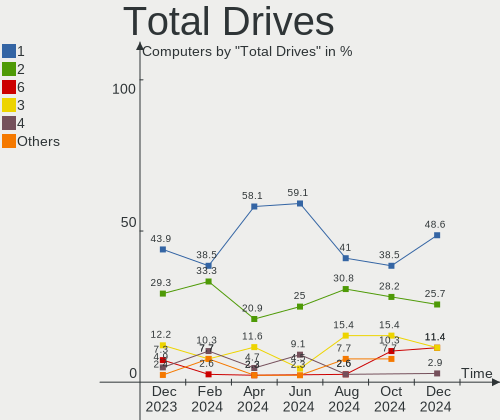
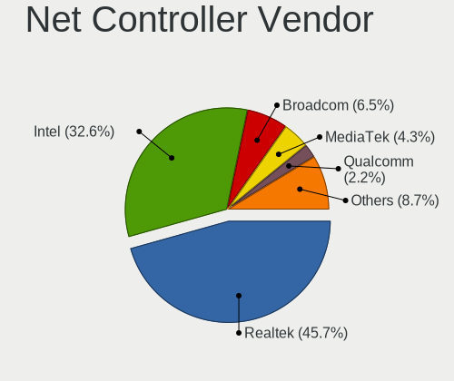
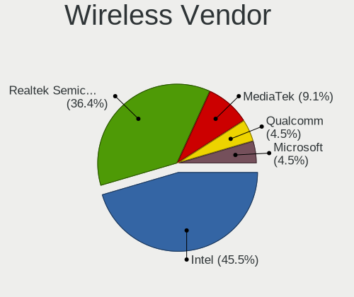

Gentoo Hardware Trends
----------------------

A project to identify most popular hardware characteristics and track their change
over time based on data collected by Gentoo users at https://Linux-Hardware.org.

Anyone can contribute to the study by uploading probes of their computers by
the [hw-probe](https://github.com/linuxhw/hw-probe) tool:

    sudo -E hw-probe -all -upload

This is a report for all computer types. See also reports for [desktops](/Dist/Gentoo/Desktop/README.md) and [notebooks](/Dist/Gentoo/Notebook/README.md).

Full-feature report is available here: https://linux-hardware.org/?view=trends

Period: Mar, 2021.

Contents
--------

- [ OS                       ](#os)
- [ OS Family                ](#os-family)
- [ Kernel                   ](#kernel)
- [ Kernel Family            ](#kernel-family)
- [ Kernel Major Ver.        ](#kernel-major-ver)
- [ Arch                     ](#arch)
- [ DE                       ](#de)
- [ Display Server           ](#display-server)
- [ Display Manager          ](#display-manager)
- [ OS Lang                  ](#os-lang)
- [ Boot Mode                ](#boot-mode)
- [ Filesystem               ](#filesystem)
- [ Part. scheme             ](#part-scheme)
- [ Dual Boot with Linux/BSD ](#dual-boot-with-linux/bsd)
- [ Dual Boot (Win)          ](#dual-boot-win)
- [ Country                  ](#country)
- [ City                     ](#city)
- [ Vendor                   ](#vendor)
- [ Model                    ](#model)
- [ Model Family             ](#model-family)
- [ MFG Year                 ](#mfg-year)
- [ Form Factor              ](#form-factor)
- [ Secure Boot              ](#secure-boot)
- [ Coreboot                 ](#coreboot)
- [ RAM Size                 ](#ram-size)
- [ RAM Used                 ](#ram-used)
- [ Has CD-ROM               ](#has-cd-rom)
- [ Total Drives             ](#total-drives)
- [ Has Ethernet             ](#has-ethernet)
- [ Has WiFi                 ](#has-wifi)
- [ Has Bluetooth            ](#has-bluetooth)
- [ Drive Vendor             ](#drive-vendor)
- [ Drive Model              ](#drive-model)
- [ HDD Vendor               ](#hdd-vendor)
- [ SSD Vendor               ](#ssd-vendor)
- [ Drive Kind               ](#drive-kind)
- [ Drive Connector          ](#drive-connector)
- [ Drive Size               ](#drive-size)
- [ Space Total              ](#space-total)
- [ Space Used               ](#space-used)
- [ Malfunc. Drives          ](#malfunc-drives)
- [ Malfunc. Drive Vendor    ](#malfunc-drive-vendor)
- [ Malfunc. HDD Vendor      ](#malfunc-hdd-vendor)
- [ Malfunc. Drive Kind      ](#malfunc-drive-kind)
- [ Failed Drives            ](#failed-drives)
- [ Failed Drive Vendor      ](#failed-drive-vendor)
- [ Drive Status             ](#drive-status)
- [ Storage Vendor           ](#storage-vendor)
- [ Storage Model            ](#storage-model)
- [ Storage Kind             ](#storage-kind)
- [ CPU Vendor               ](#cpu-vendor)
- [ CPU Model                ](#cpu-model)
- [ CPU Model Family         ](#cpu-model-family)
- [ CPU Cores                ](#cpu-cores)
- [ CPU Sockets              ](#cpu-sockets)
- [ CPU Threads              ](#cpu-threads)
- [ CPU Op-Modes             ](#cpu-op-modes)
- [ CPU Microcode            ](#cpu-microcode)
- [ CPU Microarch            ](#cpu-microarch)
- [ GPU Vendor               ](#gpu-vendor)
- [ GPU Model                ](#gpu-model)
- [ GPU Combo                ](#gpu-combo)
- [ GPU Driver               ](#gpu-driver)
- [ GPU Memory               ](#gpu-memory)
- [ Monitor Vendor           ](#monitor-vendor)
- [ Monitor Model            ](#monitor-model)
- [ Monitor Resolution       ](#monitor-resolution)
- [ Monitor Diagonal         ](#monitor-diagonal)
- [ Monitor Width            ](#monitor-width)
- [ Aspect Ratio             ](#aspect-ratio)
- [ Monitor Area             ](#monitor-area)
- [ Pixel Density            ](#pixel-density)
- [ Multiple Monitors        ](#multiple-monitors)
- [ Net Controller Vendor    ](#net-controller-vendor)
- [ Net Controller Model     ](#net-controller-model)
- [ Wireless Vendor          ](#wireless-vendor)
- [ Wireless Model           ](#wireless-model)
- [ Ethernet Vendor          ](#ethernet-vendor)
- [ Ethernet Model           ](#ethernet-model)
- [ Net Controller Kind      ](#net-controller-kind)
- [ Used Controller          ](#used-controller)
- [ NICs                     ](#nics)
- [ IPv6                     ](#ipv6)
- [ Memory Vendor            ](#memory-vendor)
- [ Memory Model             ](#memory-model)
- [ Memory Kind              ](#memory-kind)
- [ Memory Form Factor       ](#memory-form-factor)
- [ Memory Size              ](#memory-size)
- [ Memory Speed             ](#memory-speed)
- [ Sound Vendor             ](#sound-vendor)
- [ Sound Model              ](#sound-model)
- [ Camera Vendor            ](#camera-vendor)
- [ Camera Model             ](#camera-model)
- [ Fingerprint Vendor       ](#fingerprint-vendor)
- [ Fingerprint Model        ](#fingerprint-model)
- [ Chipcard Vendor          ](#chipcard-vendor)
- [ Chipcard Model           ](#chipcard-model)
- [ Printer Vendor           ](#printer-vendor)
- [ Printer Model            ](#printer-model)
- [ Scanner Vendor           ](#scanner-vendor)
- [ Scanner Model            ](#scanner-model)
- [ Bluetooth Vendor         ](#bluetooth-vendor)
- [ Bluetooth Model          ](#bluetooth-model)
- [ Unsupported Devices      ](#unsupported-devices)
- [ Unsupported Device Types ](#unsupported-device-types)

OS
--

Installed operating systems

| Name        | Computers | Percent |
|-------------|-----------|---------|
| Gentoo      | 32        | 58.18%  |
| Gentoo 2.7  | 21        | 38.18%  |
| Gentoo 2.6  | 1         | 1.82%   |
| Gentoo 13.0 | 1         | 1.82%   |

OS Family
---------

OS without a version

| Name   | Computers | Percent |
|--------|-----------|---------|
| Gentoo | 55        | 100%    |

Kernel
------

Version of the Linux kernel

| Version                             | Computers | Percent |
|-------------------------------------|-----------|---------|
| 5.4.97-gentoo                       | 11        | 20%     |
| 5.11.6-gentoo                       | 4         | 7.27%   |
| 5.11.4-gentoo                       | 2         | 3.64%   |
| 5.11.2-gentoo-rt9-x86_64            | 2         | 3.64%   |
| 5.11.10-gentoo                      | 2         | 3.64%   |
| 5.9.12                              | 1         | 1.82%   |
| 5.8.18-gentoo-compact-0.3           | 1         | 1.82%   |
| 5.4.97                              | 1         | 1.82%   |
| 5.4.96                              | 1         | 1.82%   |
| 5.4.87-gentoo-x86_64                | 1         | 1.82%   |
| 5.4.80-gentoo-r1                    | 1         | 1.82%   |
| 5.4.77-gentoo-61-DH__keyutils       | 1         | 1.82%   |
| 5.12.0-rc2-x86_64                   | 1         | 1.82%   |
| 5.11.8-gentoo-r1                    | 1         | 1.82%   |
| 5.11.7-zen1                         | 1         | 1.82%   |
| 5.11.6-xanmod1                      | 1         | 1.82%   |
| 5.11.6-gentoo-x86_64                | 1         | 1.82%   |
| 5.11.6+                             | 1         | 1.82%   |
| 5.11.5-gentoo                       | 1         | 1.82%   |
| 5.11.3-gentoo                       | 1         | 1.82%   |
| 5.11.2-gentoo-x86_64                | 1         | 1.82%   |
| 5.11.2-gentoo                       | 1         | 1.82%   |
| 5.11.0-v7l+                         | 1         | 1.82%   |
| 5.11.0-pf4                          | 1         | 1.82%   |
| 5.11.0-gentoo                       | 1         | 1.82%   |
| 5.10.6                              | 1         | 1.82%   |
| 5.10.25-gentoo-x86_64               | 1         | 1.82%   |
| 5.10.23-gentoo                      | 1         | 1.82%   |
| 5.10.22-gentoo                      | 1         | 1.82%   |
| 5.10.21-gentoo                      | 1         | 1.82%   |
| 5.10.20-gentoo-x86_64               | 1         | 1.82%   |
| 5.10.2-gentoo                       | 1         | 1.82%   |
| 5.10.19-gentoo-x86_64               | 1         | 1.82%   |
| 5.10.18-hardened1                   | 1         | 1.82%   |
| 5.10.18-gentoo-x86_64-20210225-1019 | 1         | 1.82%   |
| 5.10.15-gentoo-x86_64               | 1         | 1.82%   |
| 5.10.14-hardened1                   | 1         | 1.82%   |
| 5.10.11-v8                          | 1         | 1.82%   |
| 5.10.11-gentoo-yoshi                | 1         | 1.82%   |

Kernel Family
-------------

Linux kernel without a distro release

| Version | Computers | Percent |
|---------|-----------|---------|
| 5.4.97  | 12        | 21.82%  |
| 5.11.6  | 7         | 12.73%  |
| 5.11.2  | 4         | 7.27%   |
| 5.11.0  | 3         | 5.45%   |
| 5.11.4  | 2         | 3.64%   |
| 5.11.10 | 2         | 3.64%   |
| 5.10.18 | 2         | 3.64%   |
| 5.10.11 | 2         | 3.64%   |
| 5.9.12  | 1         | 1.82%   |
| 5.8.18  | 1         | 1.82%   |
| 5.4.96  | 1         | 1.82%   |
| 5.4.87  | 1         | 1.82%   |
| 5.4.80  | 1         | 1.82%   |
| 5.4.77  | 1         | 1.82%   |
| 5.12.0  | 1         | 1.82%   |
| 5.11.8  | 1         | 1.82%   |
| 5.11.7  | 1         | 1.82%   |
| 5.11.5  | 1         | 1.82%   |
| 5.11.3  | 1         | 1.82%   |
| 5.10.6  | 1         | 1.82%   |
| 5.10.25 | 1         | 1.82%   |
| 5.10.23 | 1         | 1.82%   |
| 5.10.22 | 1         | 1.82%   |
| 5.10.21 | 1         | 1.82%   |
| 5.10.20 | 1         | 1.82%   |
| 5.10.2  | 1         | 1.82%   |
| 5.10.19 | 1         | 1.82%   |
| 5.10.15 | 1         | 1.82%   |
| 5.10.14 | 1         | 1.82%   |

Kernel Major Ver.
-----------------

Linux kernel major version

| Version | Computers | Percent |
|---------|-----------|---------|
| 5.11    | 22        | 40%     |
| 5.4     | 16        | 29.09%  |
| 5.10    | 14        | 25.45%  |
| 5.9     | 1         | 1.82%   |
| 5.8     | 1         | 1.82%   |
| 5.12    | 1         | 1.82%   |

Arch
----

OS architecture (x86_64, i586, etc.)

| Name    | Computers | Percent |
|---------|-----------|---------|
| x86_64  | 51        | 92.73%  |
| i686    | 2         | 3.64%   |
| armv7l  | 1         | 1.82%   |
| aarch64 | 1         | 1.82%   |

DE
--

Desktop Environment

| Name       | Computers | Percent |
|------------|-----------|---------|
| Unknown    | 21        | 38.18%  |
| KDE5       | 11        | 20%     |
| GNOME      | 6         | 10.91%  |
| XFCE       | 5         | 9.09%   |
| MATE       | 5         | 9.09%   |
| X-Cinnamon | 2         | 3.64%   |
| KDE        | 2         | 3.64%   |
| openbox    | 1         | 1.82%   |
| LXQt       | 1         | 1.82%   |
| LXDE       | 1         | 1.82%   |

Display Server
--------------

X11 or Wayland

| Name    | Computers | Percent |
|---------|-----------|---------|
| X11     | 32        | 58.18%  |
| Unknown | 12        | 21.82%  |
| Tty     | 8         | 14.55%  |
| Wayland | 3         | 5.45%   |

Display Manager
---------------

SDDM, LightDM, etc.

| Name    | Computers | Percent |
|---------|-----------|---------|
| Unknown | 22        | 40%     |
| SDDM    | 17        | 30.91%  |
| LightDM | 12        | 21.82%  |
| XDM     | 2         | 3.64%   |
| GDM     | 2         | 3.64%   |

OS Lang
-------

Language

| Lang       | Computers | Percent |
|------------|-----------|---------|
| en_US      | 21        | 38.18%  |
| ru_RU      | 6         | 10.91%  |
| en_GB      | 6         | 10.91%  |
| C.UTF8     | 6         | 10.91%  |
| es_ES      | 4         | 7.27%   |
| Unknown    | 3         | 5.45%   |
| de_DE      | 2         | 3.64%   |
| C          | 2         | 3.64%   |
| sv_SE      | 1         | 1.82%   |
| pl_PL      | 1         | 1.82%   |
| ja_JP      | 1         | 1.82%   |
| it_IT      | 1         | 1.82%   |
| de_DE.UTF8 | 1         | 1.82%   |

Boot Mode
---------

EFI or BIOS

| Mode | Computers | Percent |
|------|-----------|---------|
| EFI  | 41        | 74.55%  |
| BIOS | 14        | 25.45%  |

Filesystem
----------

Type of filesystem

| Type    | Computers | Percent |
|---------|-----------|---------|
| Ext4    | 28        | 50.91%  |
| Btrfs   | 11        | 20%     |
| Xfs     | 7         | 12.73%  |
| Zfs     | 5         | 9.09%   |
| F2fs    | 3         | 5.45%   |
| Unknown | 1         | 1.82%   |

Part. scheme
------------

Scheme of partitioning

| Type    | Computers | Percent |
|---------|-----------|---------|
| GPT     | 45        | 81.82%  |
| MBR     | 5         | 9.09%   |
| Unknown | 5         | 9.09%   |

Dual Boot with Linux/BSD
------------------------

Hosting more than one Linux/BSD

| Dual boot | Computers | Percent |
|-----------|-----------|---------|
| No        | 40        | 72.73%  |
| Yes       | 15        | 27.27%  |

Dual Boot (Win)
---------------

Hosting Linux and Windows

| Dual boot | Computers | Percent |
|-----------|-----------|---------|
| No        | 41        | 74.55%  |
| Yes       | 14        | 25.45%  |

Country
-------

Geographic location (country)

| Country     | Computers | Percent |
|-------------|-----------|---------|
| Russia      | 9         | 16.36%  |
| USA         | 5         | 9.09%   |
| Spain       | 5         | 9.09%   |
| Poland      | 5         | 9.09%   |
| Germany     | 5         | 9.09%   |
| UK          | 3         | 5.45%   |
| Ukraine     | 2         | 3.64%   |
| Switzerland | 2         | 3.64%   |
| Sweden      | 2         | 3.64%   |
| Portugal    | 2         | 3.64%   |
| Finland     | 2         | 3.64%   |
| Vietnam     | 1         | 1.82%   |
| Slovakia    | 1         | 1.82%   |
| Norway      | 1         | 1.82%   |
| Kazakhstan  | 1         | 1.82%   |
| Japan       | 1         | 1.82%   |
| Italy       | 1         | 1.82%   |
| Indonesia   | 1         | 1.82%   |
| Greece      | 1         | 1.82%   |
| France      | 1         | 1.82%   |
| China       | 1         | 1.82%   |
| Bulgaria    | 1         | 1.82%   |
| Belarus     | 1         | 1.82%   |
| Australia   | 1         | 1.82%   |

City
----

Geographic location (city)

| City                | Computers | Percent |
|---------------------|-----------|---------|
| Warsaw              | 4         | 7.27%   |
| St Petersburg       | 2         | 3.64%   |
| Novosibirsk         | 2         | 3.64%   |
| Madrid              | 2         | 3.64%   |
| Lisbon              | 2         | 3.64%   |
| Zurich              | 1         | 1.82%   |
| Yekaterinburg       | 1         | 1.82%   |
| West Hollywood      | 1         | 1.82%   |
| Vladivostok         | 1         | 1.82%   |
| Tuncurry            | 1         | 1.82%   |
| Troitsk             | 1         | 1.82%   |
| Torremolinos        | 1         | 1.82%   |
| Sundsvall           | 1         | 1.82%   |
| Sumy                | 1         | 1.82%   |
| St Louis            | 1         | 1.82%   |
| Spremberg           | 1         | 1.82%   |
| Sofia               | 1         | 1.82%   |
| Rivas-Vaciamadrid   | 1         | 1.82%   |
| Porza               | 1         | 1.82%   |
| Oulu                | 1         | 1.82%   |
| Odintsovo           | 1         | 1.82%   |
| Nagoya              | 1         | 1.82%   |
| Minsk               | 1         | 1.82%   |
| Manacor             | 1         | 1.82%   |
| London              | 1         | 1.82%   |
| Liptovska Teplicka  | 1         | 1.82%   |
| Las Vegas           | 1         | 1.82%   |
| Langhus             | 1         | 1.82%   |
| Kronach             | 1         | 1.82%   |
| Kostanay            | 1         | 1.82%   |
| Kista               | 1         | 1.82%   |
| Jakarta             | 1         | 1.82%   |
| Ho Chi Minh City    | 1         | 1.82%   |
| Helsinki            | 1         | 1.82%   |
| Gaimersheim         | 1         | 1.82%   |
| Fuquay-Varina       | 1         | 1.82%   |
| Falkenstein         | 1         | 1.82%   |
| Essex Junction      | 1         | 1.82%   |
| Dalian              | 1         | 1.82%   |
| Cieszyn             | 1         | 1.82%   |
| Ceyrat              | 1         | 1.82%   |
| Cadelbosco di Sopra | 1         | 1.82%   |
| Bristol             | 1         | 1.82%   |
| Bremerhaven         | 1         | 1.82%   |
| Blackburn           | 1         | 1.82%   |
| Balashikha          | 1         | 1.82%   |
| Athens              | 1         | 1.82%   |
| Alchevs'k           | 1         | 1.82%   |

Vendor
------

Motherboard manufacturer

| Name                    | Computers | Percent |
|-------------------------|-----------|---------|
| ASUSTek Computer        | 19        | 34.55%  |
| Hewlett-Packard         | 10        | 18.18%  |
| ASRock                  | 6         | 10.91%  |
| MSI                     | 4         | 7.27%   |
| Gigabyte Technology     | 4         | 7.27%   |
| Dell                    | 4         | 7.27%   |
| Lenovo                  | 3         | 5.45%   |
| Raspberry Pi Foundation | 2         | 3.64%   |
| Toshiba                 | 1         | 1.82%   |
| BESSTAR Tech            | 1         | 1.82%   |
| Acer                    | 1         | 1.82%   |

Model
-----

Motherboard model

| Name                                 | Computers | Percent |
|--------------------------------------|-----------|---------|
| ASRock B550M Steel Legend            | 2         | 3.64%   |
| Toshiba NB100                        | 1         | 1.82%   |
| RPi Raspberry Pi 4 Model B Rev 1.2   | 1         | 1.82%   |
| RPi Raspberry Pi 4 Model B Rev 1.1   | 1         | 1.82%   |
| MSI MS-7C37                          | 1         | 1.82%   |
| MSI MS-7C02                          | 1         | 1.82%   |
| MSI MS-7B98                          | 1         | 1.82%   |
| MSI MS-7A40                          | 1         | 1.82%   |
| Lenovo ThinkPad T470s 20HFCTO1WW     | 1         | 1.82%   |
| Lenovo ThinkPad T14 Gen 1 20S1SANU00 | 1         | 1.82%   |
| Lenovo IdeaPad 330-15IKB 81DE        | 1         | 1.82%   |
| HP ZBook Power G7 Mobile Workstation | 1         | 1.82%   |
| HP ProBook 450 G5                    | 1         | 1.82%   |
| HP ProBook 430 G7                    | 1         | 1.82%   |
| HP Pavilion ZV6100 (EE984EA#ABZ)     | 1         | 1.82%   |
| HP Pavilion Notebook                 | 1         | 1.82%   |
| HP Pavilion Gaming Laptop 15-ec1xxx  | 1         | 1.82%   |
| HP OMEN by HP Laptop 15-dc1xxx       | 1         | 1.82%   |
| HP Laptop 15s-eq0xxx                 | 1         | 1.82%   |
| HP Laptop 15-bs1xx                   | 1         | 1.82%   |
| HP ENVY x360 Convertible 15-ee0xxx   | 1         | 1.82%   |
| Gigabyte Z490 AORUS MASTER           | 1         | 1.82%   |
| Gigabyte Z390 GAMING X               | 1         | 1.82%   |
| Gigabyte B550M AORUS ELITE           | 1         | 1.82%   |
| Gigabyte AB350-Gaming                | 1         | 1.82%   |
| Dell XPS 13 9380                     | 1         | 1.82%   |
| Dell XPS 13 9310                     | 1         | 1.82%   |
| Dell Latitude 5410                   | 1         | 1.82%   |
| Dell Inspiron 3537                   | 1         | 1.82%   |
| BESSTAR Tech DMAF5                   | 1         | 1.82%   |
| ASUS ZenBook UX333FN_UX333FN         | 1         | 1.82%   |
| ASUS Z170 PRO GAMING                 | 1         | 1.82%   |
| ASUS WS-C621E-SAGE Series            | 1         | 1.82%   |
| ASUS TUF Z270 MARK 1                 | 1         | 1.82%   |
| ASUS RS720Q-E9-RS24-S                | 1         | 1.82%   |
| ASUS RS400-E8-PS2-F                  | 1         | 1.82%   |
| ASUS ROG STRIX B550-I GAMING         | 1         | 1.82%   |
| ASUS PRIME X570-P                    | 1         | 1.82%   |
| ASUS PRIME X470-PRO                  | 1         | 1.82%   |
| ASUS PRIME TRX40-PRO                 | 1         | 1.82%   |
| ASUS PRIME B350-PLUS                 | 1         | 1.82%   |
| ASUS P8H67-M PRO                     | 1         | 1.82%   |
| ASUS P5Q-E                           | 1         | 1.82%   |
| ASUS N501VW                          | 1         | 1.82%   |
| ASUS M5A99FX PRO R2.0                | 1         | 1.82%   |
| ASUS M4N78-VM                        | 1         | 1.82%   |
| ASUS M3A78-CM                        | 1         | 1.82%   |
| ASUS All Series                      | 1         | 1.82%   |
| ASUS 1000H                           | 1         | 1.82%   |
| ASRock Z68 Pro3                      | 1         | 1.82%   |
| ASRock X370 Professional Gaming      | 1         | 1.82%   |
| ASRock B450M Pro4                    | 1         | 1.82%   |
| ASRock 970 Pro3 R2.0                 | 1         | 1.82%   |
| Acer Aspire E5-571G                  | 1         | 1.82%   |

Model Family
------------

Motherboard model prefix

| Name                  | Computers | Percent |
|-----------------------|-----------|---------|
| ASUS PRIME            | 4         | 7.27%   |
| HP Pavilion           | 3         | 5.45%   |
| RPi Raspberry         | 2         | 3.64%   |
| Lenovo ThinkPad       | 2         | 3.64%   |
| HP ProBook            | 2         | 3.64%   |
| HP Laptop             | 2         | 3.64%   |
| Dell XPS              | 2         | 3.64%   |
| ASRock B550M          | 2         | 3.64%   |
| Toshiba NB100         | 1         | 1.82%   |
| MSI MS-7C37           | 1         | 1.82%   |
| MSI MS-7C02           | 1         | 1.82%   |
| MSI MS-7B98           | 1         | 1.82%   |
| MSI MS-7A40           | 1         | 1.82%   |
| Lenovo IdeaPad        | 1         | 1.82%   |
| HP ZBook              | 1         | 1.82%   |
| HP OMEN               | 1         | 1.82%   |
| HP ENVY               | 1         | 1.82%   |
| Gigabyte Z490         | 1         | 1.82%   |
| Gigabyte Z390         | 1         | 1.82%   |
| Gigabyte B550M        | 1         | 1.82%   |
| Gigabyte AB350-Gaming | 1         | 1.82%   |
| Dell Latitude         | 1         | 1.82%   |
| Dell Inspiron         | 1         | 1.82%   |
| BESSTAR Tech DMAF5    | 1         | 1.82%   |
| ASUS ZenBook          | 1         | 1.82%   |
| ASUS Z170             | 1         | 1.82%   |
| ASUS WS-C621E-SAGE    | 1         | 1.82%   |
| ASUS TUF              | 1         | 1.82%   |
| ASUS RS720Q-E9-RS24-S | 1         | 1.82%   |
| ASUS RS400-E8-PS2-F   | 1         | 1.82%   |
| ASUS ROG              | 1         | 1.82%   |
| ASUS P8H67-M          | 1         | 1.82%   |
| ASUS P5Q-E            | 1         | 1.82%   |
| ASUS N501VW           | 1         | 1.82%   |
| ASUS M5A99FX          | 1         | 1.82%   |
| ASUS M4N78-VM         | 1         | 1.82%   |
| ASUS M3A78-CM         | 1         | 1.82%   |
| ASUS All              | 1         | 1.82%   |
| ASUS 1000H            | 1         | 1.82%   |
| ASRock Z68            | 1         | 1.82%   |
| ASRock X370           | 1         | 1.82%   |
| ASRock B450M          | 1         | 1.82%   |
| ASRock 970            | 1         | 1.82%   |
| Acer Aspire           | 1         | 1.82%   |

MFG Year
--------

Motherboard manufacture year

| Year    | Computers | Percent |
|---------|-----------|---------|
| 2020    | 20        | 36.36%  |
| 2019    | 10        | 18.18%  |
| 2021    | 4         | 7.27%   |
| 2018    | 4         | 7.27%   |
| 2017    | 4         | 7.27%   |
| 2009    | 3         | 5.45%   |
| 2013    | 2         | 3.64%   |
| Unknown | 2         | 3.64%   |
| 2016    | 1         | 1.82%   |
| 2015    | 1         | 1.82%   |
| 2012    | 1         | 1.82%   |
| 2010    | 1         | 1.82%   |
| 2008    | 1         | 1.82%   |
| 2006    | 1         | 1.82%   |

Form Factor
-----------

Physical design of the computer

| Name           | Computers | Percent |
|----------------|-----------|---------|
| Desktop        | 29        | 52.73%  |
| Notebook       | 20        | 36.36%  |
| Server         | 3         | 5.45%   |
| System on chip | 2         | 3.64%   |
| Convertible    | 1         | 1.82%   |

Secure Boot
-----------

Enabled or disabled

| State    | Computers | Percent |
|----------|-----------|---------|
| Disabled | 54        | 98.18%  |
| Enabled  | 1         | 1.82%   |

Coreboot
--------

Have coreboot on board

| Used | Computers | Percent |
|------|-----------|---------|
| No   | 55        | 100%    |

RAM Size
--------

Total RAM memory

| Size in GB      | Computers | Percent |
|-----------------|-----------|---------|
| 16.01-24.0      | 15        | 27.27%  |
| 32.01-64.0      | 14        | 25.45%  |
| 4.01-8.0        | 7         | 12.73%  |
| 8.01-16.0       | 6         | 10.91%  |
| 64.01-256.0     | 5         | 9.09%   |
| 3.01-4.0        | 2         | 3.64%   |
| 24.01-32.0      | 2         | 3.64%   |
| 2.01-3.0        | 2         | 3.64%   |
| More than 256.0 | 1         | 1.82%   |
| 1.01-2.0        | 1         | 1.82%   |

RAM Used
--------

Used RAM memory

| Used GB    | Computers | Percent |
|------------|-----------|---------|
| 4.01-8.0   | 12        | 21.82%  |
| 2.01-3.0   | 11        | 20%     |
| 1.01-2.0   | 11        | 20%     |
| 8.01-16.0  | 7         | 12.73%  |
| 16.01-24.0 | 4         | 7.27%   |
| 0.01-0.5   | 4         | 7.27%   |
| 0.51-1.0   | 3         | 5.45%   |
| 3.01-4.0   | 2         | 3.64%   |
| 32.01-64.0 | 1         | 1.82%   |

Has CD-ROM
----------

Has CD-ROM on board

| Presented | Computers | Percent |
|-----------|-----------|---------|
| No        | 50        | 90.91%  |
| Yes       | 5         | 9.09%   |

Total Drives
------------

Number of drives on board

| Drives | Computers | Percent |
|--------|-----------|---------|
| 2      | 18        | 32.73%  |
| 1      | 18        | 32.73%  |
| 5      | 6         | 10.91%  |
| 3      | 6         | 10.91%  |
| 6      | 3         | 5.45%   |
| 7      | 2         | 3.64%   |
| 4      | 1         | 1.82%   |
| 0      | 1         | 1.82%   |

Has Ethernet
------------

Has Ethernet on board

| Presented | Computers | Percent |
|-----------|-----------|---------|
| Yes       | 47        | 85.45%  |
| No        | 8         | 14.55%  |

Has WiFi
--------

Has WiFi module

| Presented | Computers | Percent |
|-----------|-----------|---------|
| Yes       | 30        | 54.55%  |
| No        | 25        | 45.45%  |

Has Bluetooth
-------------

Has Bluetooth module

| Presented | Computers | Percent |
|-----------|-----------|---------|
| Yes       | 32        | 58.18%  |
| No        | 23        | 41.82%  |

Drive Vendor
------------

Hard drive vendors

| Vendor              | Computers | Drives | Percent |
|---------------------|-----------|--------|---------|
| Samsung Electronics | 19        | 21     | 19%     |
| WDC                 | 18        | 25     | 18%     |
| Seagate             | 14        | 28     | 14%     |
| Intel               | 8         | 13     | 8%      |
| Toshiba             | 5         | 6      | 5%      |
| Kingston            | 5         | 8      | 5%      |
| Hitachi             | 5         | 8      | 5%      |
| A-DATA Technology   | 5         | 5      | 5%      |
| SanDisk             | 4         | 4      | 4%      |
| HGST                | 4         | 7      | 4%      |
| Unknown             | 2         | 3      | 2%      |
| GOODRAM             | 2         | 2      | 2%      |
| SPCC                | 1         | 1      | 1%      |
| SK Hynix            | 1         | 1      | 1%      |
| Silicon Motion      | 1         | 2      | 1%      |
| Patriot             | 1         | 1      | 1%      |
| LITEON              | 1         | 1      | 1%      |
| KIOXIA              | 1         | 1      | 1%      |
| Kingmax             | 1         | 1      | 1%      |
| Corsair             | 1         | 1      | 1%      |
| Apacer              | 1         | 1      | 1%      |

Drive Model
-----------

Hard drive models

| Model                                  | Computers | Percent |
|----------------------------------------|-----------|---------|
| WDC WD30EFRX-68EUZN0 3TB               | 2         | 1.67%   |
| WDC WD1500HLFS-01G6U1 150GB            | 2         | 1.67%   |
| WDC WD10EZEX-00MFCA0 1TB               | 2         | 1.67%   |
| Seagate ST8000DM004-2CX188 8TB         | 2         | 1.67%   |
| Seagate ST500LT012-1DG142 500GB        | 2         | 1.67%   |
| Seagate ST1000DM010-2EP102 1TB         | 2         | 1.67%   |
| Samsung SSD 970 EVO Plus 500GB         | 2         | 1.67%   |
| Samsung SSD 970 EVO 1TB                | 2         | 1.67%   |
| Samsung SSD 860 EVO 500GB              | 2         | 1.67%   |
| Kingston SA400S37240G 240GB SSD        | 2         | 1.67%   |
| Kingston SA400S37120G 120GB SSD        | 2         | 1.67%   |
| Hitachi HUS724030ALE641 3TB            | 2         | 1.67%   |
| GOODRAM SSDPR-CL100-480-G2 480GB       | 2         | 1.67%   |
| A-DATA SX6000PNP 256GB                 | 2         | 1.67%   |
| WDC WDS500G2B0A-00SM50 500GB SSD       | 1         | 0.83%   |
| WDC WDS120G2G0B-00EPW0 120GB SSD       | 1         | 0.83%   |
| WDC WDS100T2B0A-00SM50 1TB SSD         | 1         | 0.83%   |
| WDC WD5000LPVX-22V0TT0 500GB           | 1         | 0.83%   |
| WDC WD5000LPVX-08V0TT5 500GB           | 1         | 0.83%   |
| WDC WD5000BPVT-22HXZT3 500GB           | 1         | 0.83%   |
| WDC WD5000BEVT-80A0RT0 500GB           | 1         | 0.83%   |
| WDC WD40EZRZ-00GXCB0 4TB               | 1         | 0.83%   |
| WDC WD40EFRX-68N32N0 4TB               | 1         | 0.83%   |
| WDC WD4005FZBX-00K5WB0 4TB             | 1         | 0.83%   |
| WDC WD3200BPVT-22ZEST0 320GB           | 1         | 0.83%   |
| WDC WD30EZRX-00SPEB0 3TB               | 1         | 0.83%   |
| WDC WD20EZRX-00DC0B0 2TB               | 1         | 0.83%   |
| WDC WD1600BEVS-22RST0 160GB            | 1         | 0.83%   |
| WDC WD10JPVX-75JC3T0 1TB               | 1         | 0.83%   |
| WDC WD10EZEX-08WN4A0 1TB               | 1         | 0.83%   |
| WDC WD1003FZEX-00K3CA0 1TB             | 1         | 0.83%   |
| WDC PC SN520 SDAPNUW-512G-1006 512GB   | 1         | 0.83%   |
| WDC PC SN520 SDAPNUW-256G-1006 256GB   | 1         | 0.83%   |
| Unknown Y032V  32GB                    | 1         | 0.83%   |
| Unknown SC32G  32GB                    | 1         | 0.83%   |
| Unknown MMC Card  32GB                 | 1         | 0.83%   |
| Toshiba NVMe SSD Drive 512GB           | 1         | 0.83%   |
| Toshiba KXG60ZNV512G NVMe KIOXIA 512GB | 1         | 0.83%   |
| Toshiba KXG60ZNV512G 512GB             | 1         | 0.83%   |
| Toshiba KBG30ZMV256G KIOXIA 256GB      | 1         | 0.83%   |
| Toshiba HDWE150 5TB                    | 1         | 0.83%   |
| Toshiba HDWD120 2TB                    | 1         | 0.83%   |
| SPCC M.2 PCIe SSD 512GB                | 1         | 0.83%   |
| SK Hynix HFS256G39MND-2300A 256GB SSD  | 1         | 0.83%   |
| Silicon Motion NVME SSD 128GB          | 1         | 0.83%   |
| Silicon Motion 256GB                   | 1         | 0.83%   |
| Seagate XA1920LE10063 2TB SSD          | 1         | 0.83%   |
| Seagate ST8000VN004-2M2101 8TB         | 1         | 0.83%   |
| Seagate ST6000VN0033-2EE110 6TB        | 1         | 0.83%   |
| Seagate ST500DM002-1BD142 500GB        | 1         | 0.83%   |
| Seagate ST4000NM0245-1Z2107 4TB        | 1         | 0.83%   |
| Seagate ST4000NE001-2MA101 4TB         | 1         | 0.83%   |
| Seagate ST4000DM004-2CV104 4TB         | 1         | 0.83%   |
| Seagate ST3500418AS 500GB              | 1         | 0.83%   |
| Seagate ST2000LM015-2E8174 2TB         | 1         | 0.83%   |
| Seagate ST2000DM006-2DM164 2TB         | 1         | 0.83%   |
| Seagate ST2000DM001-1CH164 2TB         | 1         | 0.83%   |
| Seagate ST12000NM0008-2H3101 12TB      | 1         | 0.83%   |
| SanDisk SDSSDH3500G 500GB              | 1         | 0.83%   |
| SanDisk SDSSDA240G 240GB               | 1         | 0.83%   |

HDD Vendor
----------

Hard disk drive vendors

| Vendor              | Computers | Drives | Percent |
|---------------------|-----------|--------|---------|
| WDC                 | 14        | 20     | 35.9%   |
| Seagate             | 13        | 24     | 33.33%  |
| Hitachi             | 5         | 8      | 12.82%  |
| HGST                | 4         | 7      | 10.26%  |
| Toshiba             | 2         | 2      | 5.13%   |
| Samsung Electronics | 1         | 1      | 2.56%   |

SSD Vendor
----------

Solid state drive vendors

| Vendor              | Computers | Drives | Percent |
|---------------------|-----------|--------|---------|
| Samsung Electronics | 6         | 7      | 20%     |
| SanDisk             | 4         | 4      | 13.33%  |
| Kingston            | 4         | 7      | 13.33%  |
| Intel               | 4         | 5      | 13.33%  |
| WDC                 | 2         | 3      | 6.67%   |
| GOODRAM             | 2         | 2      | 6.67%   |
| A-DATA Technology   | 2         | 2      | 6.67%   |
| SK Hynix            | 1         | 1      | 3.33%   |
| Seagate             | 1         | 4      | 3.33%   |
| Patriot             | 1         | 1      | 3.33%   |
| LITEON              | 1         | 1      | 3.33%   |
| Kingmax             | 1         | 1      | 3.33%   |
| Apacer              | 1         | 1      | 3.33%   |

Drive Kind
----------

HDD or SSD

| Kind | Computers | Drives | Percent |
|------|-----------|--------|---------|
| NVMe | 28        | 36     | 33.33%  |
| SSD  | 27        | 39     | 32.14%  |
| HDD  | 27        | 62     | 32.14%  |
| MMC  | 2         | 3      | 2.38%   |

Drive Connector
---------------

SATA, SAS, NVMe, etc.

| Type | Computers | Drives | Percent |
|------|-----------|--------|---------|
| SATA | 40        | 101    | 57.14%  |
| NVMe | 28        | 36     | 40%     |
| MMC  | 2         | 3      | 2.86%   |

Drive Size
----------

Size of hard drive

| Size in TB | Computers | Drives | Percent |
|------------|-----------|--------|---------|
| 0.01-0.5   | 31        | 49     | 50%     |
| 0.51-1.0   | 9         | 18     | 14.52%  |
| 1.01-2.0   | 6         | 9      | 9.68%   |
| 3.01-4.0   | 5         | 9      | 8.06%   |
| 2.01-3.0   | 5         | 9      | 8.06%   |
| 4.01-10.0  | 4         | 5      | 6.45%   |
| 10.01-20.0 | 2         | 2      | 3.23%   |

Space Total
-----------

Amount of disk space available on the file system

| Size in GB     | Computers | Percent |
|----------------|-----------|---------|
| 101-250        | 11        | 20%     |
| 251-500        | 9         | 16.36%  |
| More than 3000 | 8         | 14.55%  |
| Unknown        | 7         | 12.73%  |
| 501-1000       | 6         | 10.91%  |
| 1001-2000      | 5         | 9.09%   |
| 51-100         | 5         | 9.09%   |
| 1-20           | 3         | 5.45%   |
| 21-50          | 1         | 1.82%   |

Space Used
----------

Amount of used disk space

| Used GB        | Computers | Percent |
|----------------|-----------|---------|
| 1-20           | 11        | 20%     |
| 101-250        | 8         | 14.55%  |
| 21-50          | 7         | 12.73%  |
| Unknown        | 7         | 12.73%  |
| More than 3000 | 6         | 10.91%  |
| 251-500        | 6         | 10.91%  |
| 51-100         | 5         | 9.09%   |
| 2001-3000      | 2         | 3.64%   |
| 501-1000       | 2         | 3.64%   |
| 1001-2000      | 1         | 1.82%   |

Malfunc. Drives
---------------

Drive models with a malfunction

| Model                                 | Computers | Drives | Percent |
|---------------------------------------|-----------|--------|---------|
| WDC WD30EFRX-68EUZN0 3TB              | 1         | 1      | 11.11%  |
| WDC WD10JPVX-75JC3T0 1TB              | 1         | 1      | 11.11%  |
| SK Hynix HFS256G39MND-2300A 256GB SSD | 1         | 1      | 11.11%  |
| Seagate ST500LT012-1DG142 500GB       | 1         | 1      | 11.11%  |
| SanDisk SD9SN8W-128G-1006 128GB SSD   | 1         | 1      | 11.11%  |
| Samsung Electronics SSD 960 EVO 250GB | 1         | 1      | 11.11%  |
| LITEON CV8-8E128-HP 128GB SSD         | 1         | 1      | 11.11%  |
| Intel SSDSCKKF256G8H 256GB            | 1         | 1      | 11.11%  |
| Hitachi HTS545050B9A300 500GB         | 1         | 1      | 11.11%  |

Malfunc. Drive Vendor
---------------------

Vendors of faulty drives

| Vendor              | Computers | Drives | Percent |
|---------------------|-----------|--------|---------|
| WDC                 | 2         | 2      | 22.22%  |
| SK Hynix            | 1         | 1      | 11.11%  |
| Seagate             | 1         | 1      | 11.11%  |
| SanDisk             | 1         | 1      | 11.11%  |
| Samsung Electronics | 1         | 1      | 11.11%  |
| LITEON              | 1         | 1      | 11.11%  |
| Intel               | 1         | 1      | 11.11%  |
| Hitachi             | 1         | 1      | 11.11%  |

Malfunc. HDD Vendor
-------------------

Vendors of faulty HDD drives

| Vendor  | Computers | Drives | Percent |
|---------|-----------|--------|---------|
| WDC     | 2         | 2      | 50%     |
| Seagate | 1         | 1      | 25%     |
| Hitachi | 1         | 1      | 25%     |

Malfunc. Drive Kind
-------------------

Kinds of faulty drives

| Kind | Computers | Drives | Percent |
|------|-----------|--------|---------|
| SSD  | 4         | 4      | 44.44%  |
| HDD  | 4         | 4      | 44.44%  |
| NVMe | 1         | 1      | 11.11%  |

Failed Drives
-------------

Failed drive models

Zero info for selected period =(

Failed Drive Vendor
-------------------

Failed drive vendors

Zero info for selected period =(

Drive Status
------------

Number of failed and malfunc. drives

| Status   | Computers | Drives | Percent |
|----------|-----------|--------|---------|
| Works    | 47        | 116    | 75.81%  |
| Malfunc  | 8         | 9      | 12.9%   |
| Detected | 7         | 15     | 11.29%  |

Storage Vendor
--------------

Storage controller vendors

| Vendor                       | Computers | Percent |
|------------------------------|-----------|---------|
| Intel                        | 25        | 32.47%  |
| AMD                          | 20        | 25.97%  |
| Samsung Electronics          | 13        | 16.88%  |
| ASMedia Technology           | 4         | 5.19%   |
| Toshiba America Info Systems | 3         | 3.9%    |
| Sandisk                      | 2         | 2.6%    |
| Realtek Semiconductor        | 2         | 2.6%    |
| Phison Electronics           | 2         | 2.6%    |
| Silicon Motion               | 1         | 1.3%    |
| Nvidia                       | 1         | 1.3%    |
| KIOXIA                       | 1         | 1.3%    |
| Kingston Technology Company  | 1         | 1.3%    |
| Broadcom / LSI               | 1         | 1.3%    |
| ADATA Technology             | 1         | 1.3%    |

Storage Model
-------------

Storage controller models

| Model                                                                          | Computers | Percent |
|--------------------------------------------------------------------------------|-----------|---------|
| AMD FCH SATA Controller [AHCI mode]                                            | 13        | 13.98%  |
| Samsung NVMe SSD Controller SM981/PM981/PM983                                  | 9         | 9.68%   |
| Intel Sunrise Point-LP SATA Controller [AHCI mode]                             | 4         | 4.3%    |
| AMD 400 Series Chipset SATA Controller                                         | 4         | 4.3%    |
| Intel Comet Lake SATA AHCI Controller                                          | 3         | 3.23%   |
| ASMedia ASM1062 Serial ATA Controller                                          | 3         | 3.23%   |
| AMD Starship/Matisse Chipset SATA Controller [AHCI mode]                       | 3         | 3.23%   |
| Toshiba America Info Systems XG6 NVMe SSD Controller                           | 2         | 2.15%   |
| Sandisk WD Blue SN500 / PC SN520 NVMe SSD                                      | 2         | 2.15%   |
| Samsung NVMe SSD Controller SM961/PM961/SM963                                  | 2         | 2.15%   |
| Realtek Realtek Non-Volatile memory controller                                 | 2         | 2.15%   |
| Intel SSD 660P Series                                                          | 2         | 2.15%   |
| Intel Cannon Lake PCH SATA AHCI Controller                                     | 2         | 2.15%   |
| Intel 82801GBM/GHM (ICH7-M Family) SATA Controller [AHCI mode]                 | 2         | 2.15%   |
| Intel 82801G (ICH7 Family) IDE Controller                                      | 2         | 2.15%   |
| Intel 8 Series SATA Controller 1 [AHCI mode]                                   | 2         | 2.15%   |
| Intel 6 Series/C200 Series Chipset Family 6 port Desktop SATA AHCI Controller  | 2         | 2.15%   |
| AMD SB7x0/SB8x0/SB9x0 SATA Controller [AHCI mode]                              | 2         | 2.15%   |
| AMD 300 Series Chipset SATA Controller                                         | 2         | 2.15%   |
| Toshiba America Info Systems BG3 NVMe SSD Controller                           | 1         | 1.08%   |
| Silicon Motion SM2263EN/SM2263XT SSD Controller                                | 1         | 1.08%   |
| Samsung NVMe SSD Controller PM9A1/980PRO                                       | 1         | 1.08%   |
| Samsung NVMe Controller                                                        | 1         | 1.08%   |
| Phison E16 PCIe4 NVMe Controller                                               | 1         | 1.08%   |
| Phison E12 NVMe Controller                                                     | 1         | 1.08%   |
| Nvidia MCP78S [GeForce 8200] IDE                                               | 1         | 1.08%   |
| Nvidia MCP78S [GeForce 8200] AHCI Controller                                   | 1         | 1.08%   |
| KIOXIA Non-Volatile memory controller                                          | 1         | 1.08%   |
| Kingston Company A2000 NVMe SSD                                                | 1         | 1.08%   |
| Intel Volume Management Device NVMe RAID Controller                            | 1         | 1.08%   |
| Intel SSD 600P Series                                                          | 1         | 1.08%   |
| Intel Q170/Q150/B150/H170/H110/Z170/CM236 Chipset SATA Controller [AHCI Mode]  | 1         | 1.08%   |
| Intel NVMe Datacenter SSD [3DNAND, Beta Rock Controller]                       | 1         | 1.08%   |
| Intel Non-Volatile memory controller                                           | 1         | 1.08%   |
| Intel HM170/QM170 Chipset SATA Controller [AHCI Mode]                          | 1         | 1.08%   |
| Intel C620 Series Chipset Family SATA Controller [AHCI mode]                   | 1         | 1.08%   |
| Intel C610/X99 series chipset sSATA Controller [AHCI mode]                     | 1         | 1.08%   |
| Intel C610/X99 series chipset SATA Controller [RAID mode]                      | 1         | 1.08%   |
| Intel 82801JI (ICH10 Family) SATA AHCI Controller                              | 1         | 1.08%   |
| Intel 82801 Mobile SATA Controller [RAID mode]                                 | 1         | 1.08%   |
| Intel 8 Series/C220 Series Chipset Family 6-port SATA Controller 1 [AHCI mode] | 1         | 1.08%   |
| Intel 200 Series PCH SATA controller [AHCI mode]                               | 1         | 1.08%   |
| Broadcom / LSI SAS3008 PCI-Express Fusion-MPT SAS-3                            | 1         | 1.08%   |
| ASMedia 106x SATA/RAID Controller                                              | 1         | 1.08%   |
| AMD X370 Series Chipset SATA Controller                                        | 1         | 1.08%   |
| AMD SB7x0/SB8x0/SB9x0 SATA Controller [IDE mode]                               | 1         | 1.08%   |
| AMD SB7x0/SB8x0/SB9x0 IDE Controller                                           | 1         | 1.08%   |
| AMD IXP SB4x0 IDE Controller                                                   | 1         | 1.08%   |
| ADATA XPG SX8200 Pro PCIe Gen3x4 M.2 2280 Solid State Drive                    | 1         | 1.08%   |

Storage Kind
------------

Kind of storage controller (IDE, SATA, NVMe, SAS, ...)

| Kind | Computers | Percent |
|------|-----------|---------|
| SATA | 42        | 53.16%  |
| NVMe | 28        | 35.44%  |
| IDE  | 5         | 6.33%   |
| RAID | 3         | 3.8%    |
| SAS  | 1         | 1.27%   |

CPU Vendor
----------

Processor vendors

| Vendor | Computers | Percent |
|--------|-----------|---------|
| Intel  | 30        | 54.55%  |
| AMD    | 23        | 41.82%  |
| ARM    | 2         | 3.64%   |

CPU Model
---------

Processor models

| Model                                          | Computers | Percent |
|------------------------------------------------|-----------|---------|
| AMD Ryzen 5 5600X 6-Core Processor             | 4         | 7.27%   |
| Intel Core i5-9600K CPU @ 3.70GHz              | 2         | 3.64%   |
| Intel Core i5-8250U CPU @ 1.60GHz              | 2         | 3.64%   |
| Intel Core i5-10210U CPU @ 1.60GHz             | 2         | 3.64%   |
| Intel Atom CPU N270 @ 1.60GHz                  | 2         | 3.64%   |
| AMD Ryzen 7 3700X 8-Core Processor             | 2         | 3.64%   |
| AMD Ryzen 7 2700 Eight-Core Processor          | 2         | 3.64%   |
| AMD Ryzen 5 2600 Six-Core Processor            | 2         | 3.64%   |
| Intel Xeon Silver 4216 CPU @ 2.10GHz           | 1         | 1.82%   |
| Intel Xeon Gold 6130 CPU @ 2.10GHz             | 1         | 1.82%   |
| Intel Xeon CPU X5470 @ 3.33GHz                 | 1         | 1.82%   |
| Intel Xeon CPU E5-2620 v4 @ 2.10GHz            | 1         | 1.82%   |
| Intel Core i9-10850K CPU @ 3.60GHz             | 1         | 1.82%   |
| Intel Core i7-9750H CPU @ 2.60GHz              | 1         | 1.82%   |
| Intel Core i7-8565U CPU @ 1.80GHz              | 1         | 1.82%   |
| Intel Core i7-8550U CPU @ 1.80GHz              | 1         | 1.82%   |
| Intel Core i7-7700 CPU @ 3.60GHz               | 1         | 1.82%   |
| Intel Core i7-7500U CPU @ 2.70GHz              | 1         | 1.82%   |
| Intel Core i7-6700K CPU @ 4.00GHz              | 1         | 1.82%   |
| Intel Core i7-6700HQ CPU @ 2.60GHz             | 1         | 1.82%   |
| Intel Core i7-4500U CPU @ 1.80GHz              | 1         | 1.82%   |
| Intel Core i7-3770K CPU @ 3.50GHz              | 1         | 1.82%   |
| Intel Core i7-2600 CPU @ 3.40GHz               | 1         | 1.82%   |
| Intel Core i7-10750H CPU @ 2.60GHz             | 1         | 1.82%   |
| Intel Core i7-10510U CPU @ 1.80GHz             | 1         | 1.82%   |
| Intel Core i5-8265U CPU @ 1.60GHz              | 1         | 1.82%   |
| Intel Core i5-7200U CPU @ 2.50GHz              | 1         | 1.82%   |
| Intel Core i5-4670 CPU @ 3.40GHz               | 1         | 1.82%   |
| Intel Core i5-4210U CPU @ 1.70GHz              | 1         | 1.82%   |
| Intel 11th Gen Core i7-1165G7 @ 2.80GHz        | 1         | 1.82%   |
| ARM Processor                                  | 1         | 1.82%   |
| ARM BCM2711 Processor                          | 1         | 1.82%   |
| AMD Ryzen Threadripper 3990X 64-Core Processor | 1         | 1.82%   |
| AMD Ryzen 7 PRO 4750G with Radeon Graphics     | 1         | 1.82%   |
| AMD Ryzen 7 2700X Eight-Core Processor         | 1         | 1.82%   |
| AMD Ryzen 5 4600H with Radeon Graphics         | 1         | 1.82%   |
| AMD Ryzen 5 4500U with Radeon Graphics         | 1         | 1.82%   |
| AMD Ryzen 5 3600 6-Core Processor              | 1         | 1.82%   |
| AMD Ryzen 5 3550H with Radeon Vega Mobile Gfx  | 1         | 1.82%   |
| AMD Ryzen 3 3200U with Radeon Vega Mobile Gfx  | 1         | 1.82%   |
| AMD Phenom II X4 965 Processor                 | 1         | 1.82%   |
| AMD Phenom II X4 955 Processor                 | 1         | 1.82%   |
| AMD FX-8150 Eight-Core Processor               | 1         | 1.82%   |
| AMD FX-6300 Six-Core Processor                 | 1         | 1.82%   |
| AMD Athlon 64 Processor 3200+                  | 1         | 1.82%   |

CPU Model Family
----------------

Processor model prefix

| Model                  | Computers | Percent |
|------------------------|-----------|---------|
| Intel Core i7          | 12        | 21.82%  |
| Intel Core i5          | 10        | 18.18%  |
| AMD Ryzen 5            | 10        | 18.18%  |
| AMD Ryzen 7            | 5         | 9.09%   |
| Other                  | 2         | 3.64%   |
| Intel Xeon             | 2         | 3.64%   |
| Intel Atom             | 2         | 3.64%   |
| AMD Phenom II X4       | 2         | 3.64%   |
| AMD FX                 | 2         | 3.64%   |
| Intel Xeon Silver      | 1         | 1.82%   |
| Intel Xeon Gold        | 1         | 1.82%   |
| Intel Core i9          | 1         | 1.82%   |
| ARM BCM                | 1         | 1.82%   |
| AMD Ryzen Threadripper | 1         | 1.82%   |
| AMD Ryzen 7 PRO        | 1         | 1.82%   |
| AMD Ryzen 3            | 1         | 1.82%   |
| AMD Athlon 64          | 1         | 1.82%   |

CPU Cores
---------

Number of processor cores

| Number | Computers | Percent |
|--------|-----------|---------|
| 4      | 22        | 40%     |
| 6      | 13        | 23.64%  |
| 8      | 6         | 10.91%  |
| 2      | 5         | 9.09%   |
| 1      | 3         | 5.45%   |
| 32     | 2         | 3.64%   |
| 64     | 1         | 1.82%   |
| 16     | 1         | 1.82%   |
| 10     | 1         | 1.82%   |
| 3      | 1         | 1.82%   |

CPU Sockets
-----------

Number of sockets

| Number | Computers | Percent |
|--------|-----------|---------|
| 1      | 52        | 94.55%  |
| 2      | 3         | 5.45%   |

CPU Threads
-----------

Threads per core (Hyper-Threading)

| Number | Computers | Percent |
|--------|-----------|---------|
| 2      | 45        | 81.82%  |
| 1      | 10        | 18.18%  |

CPU Op-Modes
------------

CPU Operation Modes (32-bit, 64-bit)

| Op mode        | Computers | Percent |
|----------------|-----------|---------|
| 32-bit, 64-bit | 52        | 94.55%  |
| 32-bit         | 2         | 3.64%   |
| Unknown        | 1         | 1.82%   |

CPU Microcode
-------------

Microcode number

| Number     | Computers | Percent |
|------------|-----------|---------|
| 0x0800820d | 5         | 9.09%   |
| Unknown    | 5         | 9.09%   |
| 0x806ec    | 4         | 7.27%   |
| 0x0a201009 | 4         | 7.27%   |
| 0x806ea    | 3         | 5.45%   |
| 0x806e9    | 2         | 3.64%   |
| 0x506e3    | 2         | 3.64%   |
| 0x40651    | 2         | 3.64%   |
| 0x08701021 | 2         | 3.64%   |
| 0x08600106 | 2         | 3.64%   |
| 0xa0655    | 1         | 1.82%   |
| 0xa0652    | 1         | 1.82%   |
| 0x906ed    | 1         | 1.82%   |
| 0x906ec    | 1         | 1.82%   |
| 0x906ea    | 1         | 1.82%   |
| 0x906e9    | 1         | 1.82%   |
| 0x806eb    | 1         | 1.82%   |
| 0x806c1    | 1         | 1.82%   |
| 0x50657    | 1         | 1.82%   |
| 0x50654    | 1         | 1.82%   |
| 0x406f1    | 1         | 1.82%   |
| 0x306c3    | 1         | 1.82%   |
| 0x306a9    | 1         | 1.82%   |
| 0x206a7    | 1         | 1.82%   |
| 0x106c2    | 1         | 1.82%   |
| 0x1067a    | 1         | 1.82%   |
| 0x08701013 | 1         | 1.82%   |
| 0x08301039 | 1         | 1.82%   |
| 0x08108109 | 1         | 1.82%   |
| 0x08108102 | 1         | 1.82%   |
| 0x06000817 | 1         | 1.82%   |
| 0x06000626 | 1         | 1.82%   |
| 0x010000db | 1         | 1.82%   |
| 0x00000000 | 1         | 1.82%   |

CPU Microarch
-------------

Microarchitecture

| Name        | Computers | Percent |
|-------------|-----------|---------|
| KabyLake    | 14        | 25.45%  |
| Zen+        | 7         | 12.73%  |
| Zen 2       | 7         | 12.73%  |
| Zen 3       | 4         | 7.27%   |
| Skylake     | 4         | 7.27%   |
| Haswell     | 3         | 5.45%   |
| K10         | 2         | 3.64%   |
| CometLake   | 2         | 3.64%   |
| Bonnell     | 2         | 3.64%   |
| Unknown     | 2         | 3.64%   |
| TigerLake   | 1         | 1.82%   |
| SandyBridge | 1         | 1.82%   |
| Piledriver  | 1         | 1.82%   |
| Penryn      | 1         | 1.82%   |
| K8 Hammer   | 1         | 1.82%   |
| IvyBridge   | 1         | 1.82%   |
| Bulldozer   | 1         | 1.82%   |
| Broadwell   | 1         | 1.82%   |

GPU Vendor
----------

Vendors of graphics cards

| Vendor            | Computers | Percent |
|-------------------|-----------|---------|
| AMD               | 23        | 36.51%  |
| Intel             | 21        | 33.33%  |
| Nvidia            | 17        | 26.98%  |
| ASPEED Technology | 2         | 3.17%   |

GPU Model
---------

Graphics card models

| Model                                                                                 | Computers | Percent |
|---------------------------------------------------------------------------------------|-----------|---------|
| AMD Ellesmere [Radeon RX 470/480/570/570X/580/580X/590]                               | 5         | 7.69%   |
| Intel UHD Graphics 620                                                                | 3         | 4.62%   |
| Intel CometLake-U GT2 [UHD Graphics]                                                  | 3         | 4.62%   |
| AMD Renoir                                                                            | 3         | 4.62%   |
| AMD Navi 10 [Radeon RX 5600 OEM/5600 XT / 5700/5700 XT]                               | 3         | 4.62%   |
| Nvidia GM204 [GeForce GTX 970]                                                        | 2         | 3.08%   |
| Intel WhiskeyLake-U GT2 [UHD Graphics 620]                                            | 2         | 3.08%   |
| Intel Mobile 945GSE Express Integrated Graphics Controller                            | 2         | 3.08%   |
| Intel Mobile 945GM/GMS/GME, 943/940GML Express Integrated Graphics Controller         | 2         | 3.08%   |
| Intel HD Graphics 620                                                                 | 2         | 3.08%   |
| Intel Haswell-ULT Integrated Graphics Controller                                      | 2         | 3.08%   |
| ASPEED Technology ASPEED Graphics Family                                              | 2         | 3.08%   |
| AMD Vega 10 XL/XT [Radeon RX Vega 56/64]                                              | 2         | 3.08%   |
| AMD Picasso                                                                           | 2         | 3.08%   |
| Nvidia TU117M [GeForce GTX 1650 Mobile / Max-Q]                                       | 1         | 1.54%   |
| Nvidia TU117M                                                                         | 1         | 1.54%   |
| Nvidia TU117GLM [Quadro T1000 Mobile]                                                 | 1         | 1.54%   |
| Nvidia TU117 [GeForce GTX 1650]                                                       | 1         | 1.54%   |
| Nvidia TU116 [GeForce GTX 1660 Ti]                                                    | 1         | 1.54%   |
| Nvidia TU106 [GeForce RTX 2060 Rev. A]                                                | 1         | 1.54%   |
| Nvidia TU104 [GeForce RTX 2060]                                                       | 1         | 1.54%   |
| Nvidia GP108M [GeForce MX150]                                                         | 1         | 1.54%   |
| Nvidia GM206 [GeForce GTX 950]                                                        | 1         | 1.54%   |
| Nvidia GM108M [GeForce 940MX]                                                         | 1         | 1.54%   |
| Nvidia GM108M [GeForce 930MX]                                                         | 1         | 1.54%   |
| Nvidia GM108M [GeForce 840M]                                                          | 1         | 1.54%   |
| Nvidia GM107M [GeForce GTX 960M]                                                      | 1         | 1.54%   |
| Nvidia GK208B [GeForce GT 710]                                                        | 1         | 1.54%   |
| Nvidia G73 [GeForce 7300 GT]                                                          | 1         | 1.54%   |
| Intel Xeon E3-1200 v2/3rd Gen Core processor Graphics Controller                      | 1         | 1.54%   |
| Intel TigerLake GT2 [Iris Xe Graphics]                                                | 1         | 1.54%   |
| Intel HD Graphics 530                                                                 | 1         | 1.54%   |
| Intel CometLake-H GT2 [UHD Graphics]                                                  | 1         | 1.54%   |
| Intel CoffeeLake-S GT2 [UHD Graphics 630]                                             | 1         | 1.54%   |
| Intel CoffeeLake-H GT2 [UHD Graphics 630]                                             | 1         | 1.54%   |
| Intel 2nd Generation Core Processor Family Integrated Graphics Controller             | 1         | 1.54%   |
| AMD Vega 10 XT [Radeon PRO WX 9100]                                                   | 1         | 1.54%   |
| AMD Topaz XT [Radeon R7 M260/M265 / M340/M360 / M440/M445 / 530/535 / 620/625 Mobile] | 1         | 1.54%   |
| AMD Tobago PRO [Radeon R7 360 / R9 360 OEM]                                           | 1         | 1.54%   |
| AMD RS780C [Radeon 3100]                                                              | 1         | 1.54%   |
| AMD RS480M [Mobility Radeon Xpress 200]                                               | 1         | 1.54%   |
| AMD Pitcairn PRO [Radeon HD 7850 / R7 265 / R9 270 1024SP]                            | 1         | 1.54%   |
| AMD Lexa PRO [Radeon 540/540X/550/550X / RX 540X/550/550X]                            | 1         | 1.54%   |
| AMD Baffin [Radeon RX 550 640SP / RX 560/560X]                                        | 1         | 1.54%   |

GPU Combo
---------

Combinations of graphics cards

| Name           | Computers | Percent |
|----------------|-----------|---------|
| 1 x AMD        | 21        | 38.18%  |
| 1 x Intel      | 12        | 21.82%  |
| 1 x Nvidia     | 9         | 16.36%  |
| Intel + Nvidia | 7         | 12.73%  |
| Other          | 2         | 3.64%   |
| 1 x ASPEED     | 2         | 3.64%   |
| Intel + AMD    | 1         | 1.82%   |
| AMD + Nvidia   | 1         | 1.82%   |

GPU Driver
----------

Free vs proprietary

| Driver      | Computers | Percent |
|-------------|-----------|---------|
| Free        | 43        | 78.18%  |
| Proprietary | 9         | 16.36%  |
| Unknown     | 3         | 5.45%   |

GPU Memory
----------

Total video memory

| Size in GB | Computers | Percent |
|------------|-----------|---------|
| Unknown    | 20        | 36.36%  |
| 1.01-2.0   | 9         | 16.36%  |
| 3.01-4.0   | 8         | 14.55%  |
| 7.01-8.0   | 7         | 12.73%  |
| 0.01-0.5   | 6         | 10.91%  |
| 5.01-6.0   | 4         | 7.27%   |
| 8.01-16.0  | 1         | 1.82%   |

Monitor Vendor
--------------

Monitor vendors

| Vendor               | Computers | Percent |
|----------------------|-----------|---------|
| Samsung Electronics  | 10        | 16.95%  |
| AU Optronics         | 7         | 11.86%  |
| Dell                 | 4         | 6.78%   |
| BOE                  | 4         | 6.78%   |
| AOC                  | 4         | 6.78%   |
| ViewSonic            | 3         | 5.08%   |
| Hewlett-Packard      | 3         | 5.08%   |
| Goldstar             | 3         | 5.08%   |
| Chimei Innolux       | 3         | 5.08%   |
| BenQ                 | 3         | 5.08%   |
| LG Display           | 2         | 3.39%   |
| Eizo                 | 2         | 3.39%   |
| ASUSTek Computer     | 2         | 3.39%   |
| Ancor Communications | 2         | 3.39%   |
| Yamaha               | 1         | 1.69%   |
| Unknown              | 1         | 1.69%   |
| Sharp                | 1         | 1.69%   |
| Philips              | 1         | 1.69%   |
| Panasonic            | 1         | 1.69%   |
| HannStar             | 1         | 1.69%   |
| Acer                 | 1         | 1.69%   |

Monitor Model
-------------

Monitor models

| Model                                                                   | Computers | Percent |
|-------------------------------------------------------------------------|-----------|---------|
| AU Optronics LCD Monitor AUO38ED 1920x1080 340x190mm 15.3-inch          | 2         | 3.17%   |
| AOC 2473W1M AOC2473 1920x1080 527x296mm 23.8-inch                       | 2         | 3.17%   |
| Yamaha HTR-6064 YMH3169 1920x540                                        | 1         | 1.59%   |
| ViewSonic VX2757 VSCF931 1920x1080 598x336mm 27.0-inch                  | 1         | 1.59%   |
| ViewSonic VX2458 Series VSC36AF 1920x1080 521x293mm 23.5-inch           | 1         | 1.59%   |
| ViewSonic VA2248 SERIES VSC0E28 1920x1080 477x268mm 21.5-inch           | 1         | 1.59%   |
| Unknown LCD Monitor XMI Mi Monitor 3440x1440                            | 1         | 1.59%   |
| Sharp LCD Monitor SHP14F9 1920x1200 288x180mm 13.4-inch                 | 1         | 1.59%   |
| Samsung Electronics U28E590 SAM0C4D 3840x2160 607x345mm 27.5-inch       | 1         | 1.59%   |
| Samsung Electronics SMS27A350H SAM07CE 1920x1080 598x336mm 27.0-inch    | 1         | 1.59%   |
| Samsung Electronics S24F350 SAM0D20 1920x1080 521x293mm 23.5-inch       | 1         | 1.59%   |
| Samsung Electronics S23B550 SAM0919 1920x1080 510x287mm 23.0-inch       | 1         | 1.59%   |
| Samsung Electronics S22B300 SAM08C8 1920x1080 480x270mm 21.7-inch       | 1         | 1.59%   |
| Samsung Electronics LCD Monitor SDC5441 1366x768 340x190mm 15.3-inch    | 1         | 1.59%   |
| Samsung Electronics LCD Monitor SDC324C 1920x1080 344x194mm 15.5-inch   | 1         | 1.59%   |
| Samsung Electronics LCD Monitor SAM7003 3840x2160 1872x1053mm 84.6-inch | 1         | 1.59%   |
| Samsung Electronics LCD Monitor SAM0A7D 1920x1080 1060x626mm 48.5-inch  | 1         | 1.59%   |
| Samsung Electronics LC49G95T SAM7053 3840x1080 1193x336mm 48.8-inch     | 1         | 1.59%   |
| Samsung Electronics C27F390 SAM0D32 1920x1080 600x340mm 27.2-inch       | 1         | 1.59%   |
| Philips PHL 223V5 PHLC0CF 1920x1080 480x270mm 21.7-inch                 | 1         | 1.59%   |
| Panasonic TV MEIA296 1920x1080 1280x720mm 57.8-inch                     | 1         | 1.59%   |
| LG Display LCD Monitor LGD0650 1920x1080 344x194mm 15.5-inch            | 1         | 1.59%   |
| LG Display LCD Monitor LGD0521 1920x1080 309x174mm 14.0-inch            | 1         | 1.59%   |
| Hewlett-Packard LA1951 HWP285B 1280x960 380x300mm 19.1-inch             | 1         | 1.59%   |
| Hewlett-Packard 22er HWP331B 1920x1080 476x268mm 21.5-inch              | 1         | 1.59%   |
| Hewlett-Packard 2011 HWP2934 1600x900 443x249mm 20.0-inch               | 1         | 1.59%   |
| HannStar LCD Monitor HSD03E9 1024x600 220x129mm 10.0-inch               | 1         | 1.59%   |
| Goldstar ULTRAWIDE GSM76FA 2560x1080 798x334mm 34.1-inch                | 1         | 1.59%   |
| Goldstar Ultra HD GSM5B09 3840x2160 600x340mm 27.2-inch                 | 1         | 1.59%   |
| Goldstar LG ULTRAWIDE GSM59F1 1920x1080 580x240mm 24.7-inch             | 1         | 1.59%   |
| Goldstar FULL HD GSM5B55 1920x1080 480x270mm 21.7-inch                  | 1         | 1.59%   |
| Eizo EV2795 ENC3147 2560x1440 597x336mm 27.0-inch                       | 1         | 1.59%   |
| Eizo EV2450 ENC2530 1920x1080 528x297mm 23.9-inch                       | 1         | 1.59%   |
| Dell U2715H DELD066 1920x1080 600x340mm 27.2-inch                       | 1         | 1.59%   |
| Dell P2418D DELD0C1 2560x1440 526x296mm 23.8-inch                       | 1         | 1.59%   |
| Dell P2414H DELA09B 1920x1080 530x300mm 24.0-inch                       | 1         | 1.59%   |
| Dell P2414H DELA09A 1920x1080 527x297mm 23.8-inch                       | 1         | 1.59%   |
| Dell LCD Monitor 2407WFP 1920x1200                                      | 1         | 1.59%   |
| Chimei Innolux LCD Monitor CMN15E8 1920x1080 344x193mm 15.5-inch        | 1         | 1.59%   |
| Chimei Innolux LCD Monitor CMN15C4 1920x1080 344x193mm 15.5-inch        | 1         | 1.59%   |
| Chimei Innolux LCD Monitor CMN15C2 1920x1080 344x194mm 15.5-inch        | 1         | 1.59%   |
| BOE LCD Monitor BOE08A8 1920x1080 344x194mm 15.5-inch                   | 1         | 1.59%   |
| BOE LCD Monitor BOE0852 1920x1080 344x194mm 15.5-inch                   | 1         | 1.59%   |
| BOE LCD Monitor BOE07BB 1920x1080 309x173mm 13.9-inch                   | 1         | 1.59%   |
| BOE LCD Monitor BOE07AD 1366x768 294x165mm 13.3-inch                    | 1         | 1.59%   |
| BenQ XL2420T BNQ7F05 1920x1080 531x298mm 24.0-inch                      | 1         | 1.59%   |
| BenQ XL2420G BNQ7F39 1920x1080 530x300mm 24.0-inch                      | 1         | 1.59%   |
| BenQ LCD BNQ801E 1920x1080 600x340mm 27.2-inch                          | 1         | 1.59%   |
| BenQ GW2280 BNQ78E8 1920x1080 480x270mm 21.7-inch                       | 1         | 1.59%   |
| AU Optronics LCD Monitor AUO61ED 1920x1080 340x190mm 15.3-inch          | 1         | 1.59%   |
| AU Optronics LCD Monitor AUO5C2D 1920x1080 293x165mm 13.2-inch          | 1         | 1.59%   |
| AU Optronics LCD Monitor AUO5B2D 1920x1080 293x162mm 13.2-inch          | 1         | 1.59%   |
| AU Optronics LCD Monitor AUO41ED 1920x1080 344x193mm 15.5-inch          | 1         | 1.59%   |
| AU Optronics LCD Monitor AUO403D 1920x1080 309x173mm 13.9-inch          | 1         | 1.59%   |
| ASUSTek Computer VP249 AUS24AF 1920x1080 527x296mm 23.8-inch            | 1         | 1.59%   |
| ASUSTek Computer ROG PG278QR AUS27B2 2560x1440 600x340mm 27.2-inch      | 1         | 1.59%   |
| AOC U2777B AOC2777 3840x2160 597x336mm 27.0-inch                        | 1         | 1.59%   |
| AOC 2481W AOC2481 1920x1080 527x296mm 23.8-inch                         | 1         | 1.59%   |
| Ancor Communications ASUS VH242 ACI24FA 1920x1080 521x293mm 23.5-inch   | 1         | 1.59%   |
| Ancor Communications ASUS PB287 ACI28A2 3840x2160 621x341mm 27.9-inch   | 1         | 1.59%   |

Monitor Resolution
------------------

Monitor screen resolution

| Resolution        | Computers | Percent |
|-------------------|-----------|---------|
| 1920x1080 (FHD)   | 32        | 59.26%  |
| 3840x2160 (4K)    | 7         | 12.96%  |
| 2560x1440 (QHD)   | 4         | 7.41%   |
| 1920x1200 (WUXGA) | 2         | 3.7%    |
| 1366x768 (WXGA)   | 2         | 3.7%    |
| 3840x1080         | 1         | 1.85%   |
| 3440x1440         | 1         | 1.85%   |
| 2560x1080         | 1         | 1.85%   |
| 1920x540          | 1         | 1.85%   |
| 1600x900 (HD+)    | 1         | 1.85%   |
| 1280x960          | 1         | 1.85%   |
| 1024x600          | 1         | 1.85%   |

Monitor Diagonal
----------------

Diagonal size in inches

| Inches  | Computers | Percent |
|---------|-----------|---------|
| 15      | 12        | 20%     |
| 27      | 11        | 18.33%  |
| 23      | 7         | 11.67%  |
| 21      | 7         | 11.67%  |
| 24      | 5         | 8.33%   |
| 13      | 5         | 8.33%   |
| Unknown | 3         | 5%      |
| 84      | 2         | 3.33%   |
| 48      | 2         | 3.33%   |
| 14      | 2         | 3.33%   |
| 34      | 1         | 1.67%   |
| 20      | 1         | 1.67%   |
| 19      | 1         | 1.67%   |
| 10      | 1         | 1.67%   |

Monitor Width
-------------

Physical width

| Width in mm | Computers | Percent |
|-------------|-----------|---------|
| 501-600     | 21        | 35%     |
| 301-350     | 15        | 25%     |
| 401-500     | 8         | 13.33%  |
| 201-300     | 5         | 8.33%   |
| Unknown     | 3         | 5%      |
| 601-700     | 2         | 3.33%   |
| 1501-2000   | 2         | 3.33%   |
| 1001-1500   | 2         | 3.33%   |
| 701-800     | 1         | 1.67%   |
| 351-400     | 1         | 1.67%   |

Aspect Ratio
------------

Proportional relationship between the width and the height

| Ratio   | Computers | Percent |
|---------|-----------|---------|
| 16/9    | 41        | 85.42%  |
| 32/9    | 2         | 4.17%   |
| Unknown | 2         | 4.17%   |
| 5/4     | 1         | 2.08%   |
| 21/9    | 1         | 2.08%   |
| 16/10   | 1         | 2.08%   |

Monitor Area
------------

Area in inch

| Area in inch | Computers | Percent |
|----------------|-----------|---------|
| 201-250        | 17        | 28.33%  |
| 101-110        | 12        | 20%     |
| 301-350        | 11        | 18.33%  |
| 71-80          | 4         | 6.67%   |
| 151-200        | 4         | 6.67%   |
| More than 1000 | 3         | 5%      |
| 81-90          | 3         | 5%      |
| Unknown        | 3         | 5%      |
| 351-500        | 1         | 1.67%   |
| 41-50          | 1         | 1.67%   |
| 501-1000       | 1         | 1.67%   |

Pixel Density
-------------

Pixels per inch

| Density | Computers | Percent |
|---------|-----------|---------|
| 51-100  | 19        | 33.33%  |
| 121-160 | 17        | 29.82%  |
| 101-120 | 11        | 19.3%   |
| 161-240 | 6         | 10.53%  |
| Unknown | 3         | 5.26%   |
| 1-50    | 1         | 1.75%   |

Multiple Monitors
-----------------

Total monitors connected

| Total | Computers | Percent |
|-------|-----------|---------|
| 1     | 33        | 60%     |
| 2     | 15        | 27.27%  |
| 0     | 6         | 10.91%  |
| 3     | 1         | 1.82%   |

Net Controller Vendor
---------------------

Controller vendors

| Vendor                          | Computers | Percent |
|---------------------------------|-----------|---------|
| Realtek Semiconductor           | 31        | 39.74%  |
| Intel                           | 28        | 35.9%   |
| Qualcomm Atheros                | 5         | 6.41%   |
| Broadcom Inc. and subsidiaries  | 2         | 2.56%   |
| ASIX Electronics                | 2         | 2.56%   |
| TP-Link                         | 1         | 1.28%   |
| Qualcomm Atheros Communications | 1         | 1.28%   |
| QLogic                          | 1         | 1.28%   |
| Prusa                           | 1         | 1.28%   |
| Nvidia                          | 1         | 1.28%   |
| Marvell Technology Group        | 1         | 1.28%   |
| Lenovo                          | 1         | 1.28%   |
| Davicom Semiconductor           | 1         | 1.28%   |
| Aquantia                        | 1         | 1.28%   |
| AMD                             | 1         | 1.28%   |

Net Controller Model
--------------------

Controller models

| Model                                                                                     | Computers | Percent |
|-------------------------------------------------------------------------------------------|-----------|---------|
| Realtek RTL8111/8168/8411 PCI Express Gigabit Ethernet Controller                         | 22        | 23.4%   |
| Intel I211 Gigabit Network Connection                                                     | 4         | 4.26%   |
| Realtek RTL810xE PCI Express Fast Ethernet controller                                     | 3         | 3.19%   |
| Intel Comet Lake PCH-LP CNVi WiFi                                                         | 3         | 3.19%   |
| Realtek RTL8822CE 802.11ac PCIe Wireless Network Adapter                                  | 2         | 2.13%   |
| Realtek RTL8812AU 802.11a/b/g/n/ac 2T2R DB WLAN Adapter                                   | 2         | 2.13%   |
| Realtek RTL8125 2.5GbE Controller                                                         | 2         | 2.13%   |
| Qualcomm Atheros AR242x / AR542x Wireless Network Adapter (PCI-Express)                   | 2         | 2.13%   |
| Intel Wireless 8265 / 8275                                                                | 2         | 2.13%   |
| Intel Wi-Fi 6 AX200                                                                       | 2         | 2.13%   |
| Intel I210 Gigabit Network Connection                                                     | 2         | 2.13%   |
| Intel Ethernet Controller I225-V                                                          | 2         | 2.13%   |
| Intel Ethernet Connection (7) I219-V                                                      | 2         | 2.13%   |
| Intel Ethernet Connection (2) I219-V                                                      | 2         | 2.13%   |
| Intel Ethernet Connection (10) I219-V                                                     | 2         | 2.13%   |
| Intel Dual Band Wireless-AC 3168NGW [Stone Peak]                                          | 2         | 2.13%   |
| Intel Comet Lake PCH CNVi WiFi                                                            | 2         | 2.13%   |
| TP-Link Archer T2U PLUS [RTL8821AU]                                                       | 1         | 1.06%   |
| Realtek RTL8821CE 802.11ac PCIe Wireless Network Adapter                                  | 1         | 1.06%   |
| Realtek RTL8723DE Wireless Network Adapter                                                | 1         | 1.06%   |
| Realtek RTL8723BE PCIe Wireless Network Adapter                                           | 1         | 1.06%   |
| Realtek RTL8153 Gigabit Ethernet Adapter                                                  | 1         | 1.06%   |
| Realtek RTL-8100/8101L/8139 PCI Fast Ethernet Adapter                                     | 1         | 1.06%   |
| Qualcomm Atheros QCA9565 / AR9565 Wireless Network Adapter                                | 1         | 1.06%   |
| Qualcomm Atheros QCA9377 802.11ac Wireless Network Adapter                                | 1         | 1.06%   |
| Qualcomm Atheros QCA6174 802.11ac Wireless Network Adapter                                | 1         | 1.06%   |
| Qualcomm Atheros AR9271 802.11n                                                           | 1         | 1.06%   |
| Qualcomm Atheros AR8121/AR8113/AR8114 Gigabit or Fast Ethernet                            | 1         | 1.06%   |
| QLogic FastLinQ QL41000 Series 10/25/40/50GbE Controller                                  | 1         | 1.06%   |
| Prusa Original Prusa i3 MK3                                                               | 1         | 1.06%   |
| Nvidia MCP77 Ethernet                                                                     | 1         | 1.06%   |
| Marvell Group 88E8056 PCI-E Gigabit Ethernet Controller                                   | 1         | 1.06%   |
| Lenovo ThinkPad Dock Ethernet [Realtek RTL8153B]                                          | 1         | 1.06%   |
| Intel Wireless-AC 9560 [Jefferson Peak]                                                   | 1         | 1.06%   |
| Intel Wireless-AC 9260                                                                    | 1         | 1.06%   |
| Intel Wireless 7265                                                                       | 1         | 1.06%   |
| Intel Wi-Fi 6 AX201                                                                       | 1         | 1.06%   |
| Intel I350 Gigabit Network Connection                                                     | 1         | 1.06%   |
| Intel Ethernet Controller XXV710 for 25GbE SFP28                                          | 1         | 1.06%   |
| Intel Ethernet Controller X710 for 10GbE SFP+                                             | 1         | 1.06%   |
| Intel Ethernet Connection (4) I219-V                                                      | 1         | 1.06%   |
| Intel Ethernet Connection (10) I219-LM                                                    | 1         | 1.06%   |
| Intel Centrino Advanced-N 6200                                                            | 1         | 1.06%   |
| Intel Cannon Point-LP CNVi [Wireless-AC]                                                  | 1         | 1.06%   |
| Intel 82574L Gigabit Network Connection                                                   | 1         | 1.06%   |
| Intel 82540EM Gigabit Ethernet Controller                                                 | 1         | 1.06%   |
| Davicom DM9621A USB To FastEther                                                          | 1         | 1.06%   |
| Broadcom Inc. and subsidiaries BCM4360 802.11ac Wireless Network Adapter                  | 1         | 1.06%   |
| Broadcom Inc. and subsidiaries BCM4318 [AirForce One 54g] 802.11g Wireless LAN Controller | 1         | 1.06%   |
| ASIX AX88772B Fast Ethernet Controller                                                    | 1         | 1.06%   |
| ASIX AX88179 Gigabit Ethernet                                                             | 1         | 1.06%   |
| Aquantia AQC108 NBase-T/IEEE 802.3bz Ethernet Controller [AQtion]                         | 1         | 1.06%   |
| AMD IXP SB400 AC'97 Modem Controller                                                      | 1         | 1.06%   |

Wireless Vendor
---------------

Wireless vendors

| Vendor                          | Computers | Percent |
|---------------------------------|-----------|---------|
| Intel                           | 17        | 51.52%  |
| Realtek Semiconductor           | 7         | 21.21%  |
| Qualcomm Atheros                | 5         | 15.15%  |
| Broadcom Inc. and subsidiaries  | 2         | 6.06%   |
| TP-Link                         | 1         | 3.03%   |
| Qualcomm Atheros Communications | 1         | 3.03%   |

Wireless Model
--------------

Wireless models

| Model                                                                                     | Computers | Percent |
|-------------------------------------------------------------------------------------------|-----------|---------|
| Intel Comet Lake PCH-LP CNVi WiFi                                                         | 3         | 9.09%   |
| Realtek RTL8822CE 802.11ac PCIe Wireless Network Adapter                                  | 2         | 6.06%   |
| Realtek RTL8812AU 802.11a/b/g/n/ac 2T2R DB WLAN Adapter                                   | 2         | 6.06%   |
| Qualcomm Atheros AR242x / AR542x Wireless Network Adapter (PCI-Express)                   | 2         | 6.06%   |
| Intel Wireless 8265 / 8275                                                                | 2         | 6.06%   |
| Intel Wi-Fi 6 AX200                                                                       | 2         | 6.06%   |
| Intel Dual Band Wireless-AC 3168NGW [Stone Peak]                                          | 2         | 6.06%   |
| Intel Comet Lake PCH CNVi WiFi                                                            | 2         | 6.06%   |
| TP-Link Archer T2U PLUS [RTL8821AU]                                                       | 1         | 3.03%   |
| Realtek RTL8821CE 802.11ac PCIe Wireless Network Adapter                                  | 1         | 3.03%   |
| Realtek RTL8723DE Wireless Network Adapter                                                | 1         | 3.03%   |
| Realtek RTL8723BE PCIe Wireless Network Adapter                                           | 1         | 3.03%   |
| Qualcomm Atheros QCA9565 / AR9565 Wireless Network Adapter                                | 1         | 3.03%   |
| Qualcomm Atheros QCA9377 802.11ac Wireless Network Adapter                                | 1         | 3.03%   |
| Qualcomm Atheros QCA6174 802.11ac Wireless Network Adapter                                | 1         | 3.03%   |
| Qualcomm Atheros AR9271 802.11n                                                           | 1         | 3.03%   |
| Intel Wireless-AC 9560 [Jefferson Peak]                                                   | 1         | 3.03%   |
| Intel Wireless-AC 9260                                                                    | 1         | 3.03%   |
| Intel Wireless 7265                                                                       | 1         | 3.03%   |
| Intel Wi-Fi 6 AX201                                                                       | 1         | 3.03%   |
| Intel Centrino Advanced-N 6200                                                            | 1         | 3.03%   |
| Intel Cannon Point-LP CNVi [Wireless-AC]                                                  | 1         | 3.03%   |
| Broadcom Inc. and subsidiaries BCM4360 802.11ac Wireless Network Adapter                  | 1         | 3.03%   |
| Broadcom Inc. and subsidiaries BCM4318 [AirForce One 54g] 802.11g Wireless LAN Controller | 1         | 3.03%   |

Ethernet Vendor
---------------

Ethernet vendors

| Vendor                   | Computers | Percent |
|--------------------------|-----------|---------|
| Realtek Semiconductor    | 29        | 52.73%  |
| Intel                    | 17        | 30.91%  |
| ASIX Electronics         | 2         | 3.64%   |
| Qualcomm Atheros         | 1         | 1.82%   |
| QLogic                   | 1         | 1.82%   |
| Nvidia                   | 1         | 1.82%   |
| Marvell Technology Group | 1         | 1.82%   |
| Lenovo                   | 1         | 1.82%   |
| Davicom Semiconductor    | 1         | 1.82%   |
| Aquantia                 | 1         | 1.82%   |

Ethernet Model
--------------

Ethernet models

| Model                                                             | Computers | Percent |
|-------------------------------------------------------------------|-----------|---------|
| Realtek RTL8111/8168/8411 PCI Express Gigabit Ethernet Controller | 22        | 37.29%  |
| Intel I211 Gigabit Network Connection                             | 4         | 6.78%   |
| Realtek RTL810xE PCI Express Fast Ethernet controller             | 3         | 5.08%   |
| Realtek RTL8125 2.5GbE Controller                                 | 2         | 3.39%   |
| Intel I210 Gigabit Network Connection                             | 2         | 3.39%   |
| Intel Ethernet Controller I225-V                                  | 2         | 3.39%   |
| Intel Ethernet Connection (7) I219-V                              | 2         | 3.39%   |
| Intel Ethernet Connection (2) I219-V                              | 2         | 3.39%   |
| Intel Ethernet Connection (10) I219-V                             | 2         | 3.39%   |
| Realtek RTL8153 Gigabit Ethernet Adapter                          | 1         | 1.69%   |
| Realtek RTL-8100/8101L/8139 PCI Fast Ethernet Adapter             | 1         | 1.69%   |
| Qualcomm Atheros AR8121/AR8113/AR8114 Gigabit or Fast Ethernet    | 1         | 1.69%   |
| QLogic FastLinQ QL41000 Series 10/25/40/50GbE Controller          | 1         | 1.69%   |
| Nvidia MCP77 Ethernet                                             | 1         | 1.69%   |
| Marvell Group 88E8056 PCI-E Gigabit Ethernet Controller           | 1         | 1.69%   |
| Lenovo ThinkPad Dock Ethernet [Realtek RTL8153B]                  | 1         | 1.69%   |
| Intel I350 Gigabit Network Connection                             | 1         | 1.69%   |
| Intel Ethernet Controller XXV710 for 25GbE SFP28                  | 1         | 1.69%   |
| Intel Ethernet Controller X710 for 10GbE SFP+                     | 1         | 1.69%   |
| Intel Ethernet Connection (4) I219-V                              | 1         | 1.69%   |
| Intel Ethernet Connection (10) I219-LM                            | 1         | 1.69%   |
| Intel 82574L Gigabit Network Connection                           | 1         | 1.69%   |
| Intel 82540EM Gigabit Ethernet Controller                         | 1         | 1.69%   |
| Davicom DM9621A USB To FastEther                                  | 1         | 1.69%   |
| ASIX AX88772B Fast Ethernet Controller                            | 1         | 1.69%   |
| ASIX AX88179 Gigabit Ethernet                                     | 1         | 1.69%   |
| Aquantia AQC108 NBase-T/IEEE 802.3bz Ethernet Controller [AQtion] | 1         | 1.69%   |

Net Controller Kind
-------------------

Ethernet, WiFi or modem

| Kind     | Computers | Percent |
|----------|-----------|---------|
| Ethernet | 47        | 59.49%  |
| WiFi     | 30        | 37.97%  |
| Modem    | 2         | 2.53%   |

Used Controller
---------------

Currently used network controller

| Kind     | Computers | Percent |
|----------|-----------|---------|
| Ethernet | 37        | 62.71%  |
| WiFi     | 22        | 37.29%  |

NICs
----

Total network controllers on board

| Total | Computers | Percent |
|-------|-----------|---------|
| 1     | 25        | 45.45%  |
| 2     | 23        | 41.82%  |
| 3     | 3         | 5.45%   |
| 0     | 2         | 3.64%   |
| 8     | 1         | 1.82%   |
| 4     | 1         | 1.82%   |

IPv6
----

IPv6 vs IPv4

| Used | Computers | Percent |
|------|-----------|---------|
| No   | 43        | 78.18%  |
| Yes  | 12        | 21.82%  |

Memory Vendor
-------------

Memory module vendors

| Vendor              | Computers | Percent |
|---------------------|-----------|---------|
| Samsung Electronics | 10        | 16.67%  |
| Kingston            | 10        | 16.67%  |
| Unknown             | 9         | 15%     |
| SK Hynix            | 9         | 15%     |
| Crucial             | 8         | 13.33%  |
| G.Skill             | 5         | 8.33%   |
| Micron Technology   | 3         | 5%      |
| Corsair             | 2         | 3.33%   |
| A-DATA Technology   | 2         | 3.33%   |
| Transcend           | 1         | 1.67%   |
| Patriot             | 1         | 1.67%   |

Memory Model
------------

Memory module models

| Model                                                               | Computers | Percent |
|---------------------------------------------------------------------|-----------|---------|
| Kingston RAM KHX2666C16/8G 8192MB DIMM DDR4 3200MT/s                | 3         | 4.69%   |
| G.Skill RAM F4-3200C16-16GVK 16384MB DIMM DDR4 3600MT/s             | 2         | 3.13%   |
| Crucial RAM CT102464BA160B.C16 8GB DIMM DDR3 1600MT/s               | 2         | 3.13%   |
| Unknown RAM ZEUS-1600 4096MB DIMM DDR3 1600MT/s                     | 1         | 1.56%   |
| Unknown RAM Module 8192MB DIMM DDR4 2400MT/s                        | 1         | 1.56%   |
| Unknown RAM Module 8192MB DIMM DDR3 2133MT/s                        | 1         | 1.56%   |
| Unknown RAM Module 4GB DIMM DDR2 800MT/s                            | 1         | 1.56%   |
| Unknown RAM Module 4GB DIMM DDR2 667MT/s                            | 1         | 1.56%   |
| Unknown RAM Module 256MB SODIMM DRAM                                | 1         | 1.56%   |
| Unknown RAM Module 2048MB SODIMM SDRAM                              | 1         | 1.56%   |
| Unknown RAM Module 2048MB Row Of Chips LPDDR4 4267MT/s              | 1         | 1.56%   |
| Unknown RAM Module 2048MB DIMM DDR2 667MT/s                         | 1         | 1.56%   |
| Unknown RAM Module 1024MB SODIMM DRAM                               | 1         | 1.56%   |
| Transcend RAM Module 2048MB SODIMM DDR2 533MT/s                     | 1         | 1.56%   |
| SK Hynix RAM Module 8192MB SODIMM DDR4 2667MT/s                     | 1         | 1.56%   |
| SK Hynix RAM Module 8192MB SODIMM DDR4 2400MT/s                     | 1         | 1.56%   |
| SK Hynix RAM Module 16GB SODIMM DDR4 3200MT/s                       | 1         | 1.56%   |
| SK Hynix RAM HMT451S6AFR8A-PB 4096MB SODIMM DDR3 1600MT/s           | 1         | 1.56%   |
| SK Hynix RAM HMA82GS6AFR8N-UH 16384MB SODIMM DDR4 2400MT/s          | 1         | 1.56%   |
| SK Hynix RAM HMA81GS6DJR8N-XN 8GB SODIMM DDR4 3200MT/s              | 1         | 1.56%   |
| SK Hynix RAM HMA81GS6AFR8N-UH 8GB SODIMM DDR4 2667MT/s              | 1         | 1.56%   |
| SK Hynix RAM HMA41GS6AFR8N-TF 8192MB SODIMM DDR4 2133MT/s           | 1         | 1.56%   |
| SK Hynix RAM H9CCNNNBJTALAR-NVD 4096MB Row Of Chips LPDDR3 2133MT/s | 1         | 1.56%   |
| Samsung RAM M471B5173DB0-YK0 4GB SODIMM DDR3 1600MT/s               | 1         | 1.56%   |
| Samsung RAM M471A5244CB0-CWE 4096MB SODIMM DDR4 3200MT/s            | 1         | 1.56%   |
| Samsung RAM M471A5244CB0-CRC 4GB SODIMM DDR4 2667MT/s               | 1         | 1.56%   |
| Samsung RAM M471A2K43DB1-CWE 16384MB SODIMM DDR4 3200MT/s           | 1         | 1.56%   |
| Samsung RAM M471A1K43DB1-CWE 8GB SODIMM DDR4 3200MT/s               | 1         | 1.56%   |
| Samsung RAM M471A1K43CB1-CTD 8192MB SODIMM DDR4 2667MT/s            | 1         | 1.56%   |
| Samsung RAM M471A1K43CB1-CRC 8GB SODIMM DDR4 2667MT/s               | 1         | 1.56%   |
| Samsung RAM M471A1K43BB0-CPB 8192MB SODIMM DDR4 2133MT/s            | 1         | 1.56%   |
| Samsung RAM M393A4K40CB2-CTD 32GB DIMM DDR4 2667MT/s                | 1         | 1.56%   |
| Samsung RAM M378B5273DH0-CH9 4096MB DIMM 2133MT/s                   | 1         | 1.56%   |
| Patriot RAM 3200 C16 Series 8GB DIMM DDR4 3200MT/s                  | 1         | 1.56%   |
| Micron RAM 8ATF1G64HZ-2G6E1 8192MB SODIMM DDR4 2667MT/s             | 1         | 1.56%   |
| Micron RAM 4ATS2G64HZ-3G2B1 16384MB SODIMM DDR4 3200MT/s            | 1         | 1.56%   |
| Micron RAM 4ATF51264HZ-2G3B2 4GB SODIMM DDR4 2400MT/s               | 1         | 1.56%   |
| Kingston RAM Module 8192MB DIMM DDR3 1333MT/s                       | 1         | 1.56%   |
| Kingston RAM KHX2666C16D4/16GX 16384MB DIMM DDR4 2667MT/s           | 1         | 1.56%   |
| Kingston RAM KHX2400C15/16G 16384MB DIMM DDR4 3334MT/s              | 1         | 1.56%   |
| Kingston RAM KHX2400C14S4/4G 4096MB SODIMM DDR4 2400MT/s            | 1         | 1.56%   |
| Kingston RAM 99U5624-013.A00G 8GB SODIMM DDR4 2400MT/s              | 1         | 1.56%   |
| Kingston RAM 99U5471-052.A00LF 8192MB DIMM DDR3 1600MT/s            | 1         | 1.56%   |
| Kingston RAM 9965690-002.A00G 8GB DIMM DDR4 2666MT/s                | 1         | 1.56%   |
| Kingston RAM 9905700-048.A00G 16GB SODIMM DDR4 2933MT/s             | 1         | 1.56%   |
| G.Skill RAM F4-3200C16-16GTZ 16384MB DIMM DDR4 3200MT/s             | 1         | 1.56%   |
| G.Skill RAM F4-3200C14-8GFX 8GB DIMM DDR4 3733MT/s                  | 1         | 1.56%   |
| G.Skill RAM F4-2400C16-8GRS 8192MB SODIMM DDR4 2400MT/s             | 1         | 1.56%   |
| Crucial RAM ST51264BA1339.M16F 4096MB DIMM DDR3 1333MT/s            | 1         | 1.56%   |
| Crucial RAM CT8G4SFS824A.C8FBD1 8GB SODIMM DDR4 2400MT/s            | 1         | 1.56%   |
| Crucial RAM CT8G4DFS824A.C8FE 8192MB DIMM DDR4 2667MT/s             | 1         | 1.56%   |
| Crucial RAM CT4G4DFS8213.C8FAD11 4GB DIMM DDR4 2133MT/s             | 1         | 1.56%   |
| Crucial RAM CT16G4SFD8266.C16FD1 16384MB SODIMM DDR4 2667MT/s       | 1         | 1.56%   |
| Crucial RAM BLS16G4D32AESB.M16FE 16GB DIMM DDR4 3200MT/s            | 1         | 1.56%   |
| Crucial RAM BL8G32C16U4B.M8FE1 8GB DIMM DDR4 3200MT/s               | 1         | 1.56%   |
| Crucial RAM BL16G36C16U4RL.M8FB1 16384MB DIMM DDR4 3800MT/s         | 1         | 1.56%   |
| Corsair RAM CMW32GX4M4C3000C15 8GB DIMM DDR4 3000MT/s               | 1         | 1.56%   |
| Corsair RAM CMK16GX4M2B3200C16 8GB DIMM DDR4 3266MT/s               | 1         | 1.56%   |
| A-DATA RAM Module 8192MB SODIMM DDR4 2667MT/s                       | 1         | 1.56%   |
| A-DATA RAM DDR4 3200 8192MB DIMM DDR4 3200MT/s                      | 1         | 1.56%   |

Memory Kind
-----------

Memory module kinds

| Kind   | Computers | Percent |
|--------|-----------|---------|
| DDR4   | 35        | 70%     |
| DDR3   | 7         | 14%     |
| DDR2   | 4         | 8%      |
| SDRAM  | 1         | 2%      |
| LPDDR4 | 1         | 2%      |
| LPDDR3 | 1         | 2%      |
| DRAM   | 1         | 2%      |

Memory Form Factor
------------------

Physical design of the memory module

| Name         | Computers | Percent |
|--------------|-----------|---------|
| DIMM         | 28        | 56%     |
| SODIMM       | 20        | 40%     |
| Row Of Chips | 2         | 4%      |

Memory Size
-----------

Memory module size

| Size  | Computers | Percent |
|-------|-----------|---------|
| 8192  | 24        | 43.64%  |
| 16384 | 12        | 21.82%  |
| 4096  | 11        | 20%     |
| 2048  | 4         | 7.27%   |
| 32768 | 2         | 3.64%   |
| 1024  | 1         | 1.82%   |
| 256   | 1         | 1.82%   |

Memory Speed
------------

Memory module speed

| Speed   | Computers | Percent |
|---------|-----------|---------|
| 3200    | 13        | 22.41%  |
| 2667    | 9         | 15.52%  |
| 2400    | 7         | 12.07%  |
| 1600    | 6         | 10.34%  |
| 2133    | 5         | 8.62%   |
| 3600    | 2         | 3.45%   |
| 1333    | 2         | 3.45%   |
| 667     | 2         | 3.45%   |
| Unknown | 2         | 3.45%   |
| 4267    | 1         | 1.72%   |
| 3800    | 1         | 1.72%   |
| 3733    | 1         | 1.72%   |
| 3334    | 1         | 1.72%   |
| 3266    | 1         | 1.72%   |
| 3000    | 1         | 1.72%   |
| 2933    | 1         | 1.72%   |
| 2666    | 1         | 1.72%   |
| 800     | 1         | 1.72%   |
| 533     | 1         | 1.72%   |

Sound Vendor
------------

Sound card vendors

| Vendor                  | Computers | Percent |
|-------------------------|-----------|---------|
| Intel                   | 28        | 35%     |
| AMD                     | 25        | 31.25%  |
| Nvidia                  | 10        | 12.5%   |
| Razer USA               | 2         | 2.5%    |
| Logitech                | 2         | 2.5%    |
| Kingston Technology     | 2         | 2.5%    |
| Creative Technology     | 2         | 2.5%    |
| C-Media Electronics     | 2         | 2.5%    |
| RODE Microphones        | 1         | 1.25%   |
| Micronas                | 1         | 1.25%   |
| Lenovo                  | 1         | 1.25%   |
| GN Netcom               | 1         | 1.25%   |
| Creative Labs           | 1         | 1.25%   |
| BEHRINGER International | 1         | 1.25%   |
| ASUSTek Computer        | 1         | 1.25%   |

Sound Model
-----------

Sound card models

| Model                                                                      | Computers | Percent |
|----------------------------------------------------------------------------|-----------|---------|
| AMD Starship/Matisse HD Audio Controller                                   | 7         | 7.22%   |
| Intel Sunrise Point-LP HD Audio                                            | 5         | 5.15%   |
| AMD Family 17h (Models 10h-1fh) HD Audio Controller                        | 5         | 5.15%   |
| AMD Ellesmere HDMI Audio [Radeon RX 470/480 / 570/580/590]                 | 5         | 5.15%   |
| AMD Family 17h (Models 00h-0fh) HD Audio Controller                        | 4         | 4.12%   |
| Nvidia TU107 GeForce GTX 1650 High Definition Audio Controller             | 3         | 3.09%   |
| Intel Comet Lake PCH-LP cAVS                                               | 3         | 3.09%   |
| Intel Cannon Lake PCH cAVS                                                 | 3         | 3.09%   |
| AMD Vega 10 HDMI Audio [Radeon Vega 56/64]                                 | 3         | 3.09%   |
| AMD SBx00 Azalia (Intel HDA)                                               | 3         | 3.09%   |
| AMD Navi 10 HDMI Audio                                                     | 3         | 3.09%   |
| Nvidia GM204 High Definition Audio Controller                              | 2         | 2.06%   |
| Kingston Technology HyperX 7.1 Audio                                       | 2         | 2.06%   |
| Intel NM10/ICH7 Family High Definition Audio Controller                    | 2         | 2.06%   |
| Intel Haswell-ULT HD Audio Controller                                      | 2         | 2.06%   |
| Intel Comet Lake PCH cAVS                                                  | 2         | 2.06%   |
| Intel Cannon Point-LP High Definition Audio Controller                     | 2         | 2.06%   |
| Intel 8 Series HD Audio Controller                                         | 2         | 2.06%   |
| Intel 6 Series/C200 Series Chipset Family High Definition Audio Controller | 2         | 2.06%   |
| Intel 100 Series/C230 Series Chipset Family HD Audio Controller            | 2         | 2.06%   |
| AMD Renoir Radeon High Definition Audio Controller                         | 2         | 2.06%   |
| AMD Raven/Raven2/Fenghuang HDMI/DP Audio Controller                        | 2         | 2.06%   |
| AMD Baffin HDMI/DP Audio [Radeon RX 550 640SP / RX 560/560X]               | 2         | 2.06%   |
| RODE Microphones RODE NT-USB Mini                                          | 1         | 1.03%   |
| Razer USA Razer Kraken X USB                                               | 1         | 1.03%   |
| Razer USA Kraken Tournament Edition                                        | 1         | 1.03%   |
| Nvidia TU116 High Definition Audio Controller                              | 1         | 1.03%   |
| Nvidia TU106 High Definition Audio Controller                              | 1         | 1.03%   |
| Nvidia TU104 HD Audio Controller                                           | 1         | 1.03%   |
| Nvidia MCP72XE/MCP72P/MCP78U/MCP78S High Definition Audio                  | 1         | 1.03%   |
| Nvidia GM206 High Definition Audio Controller                              | 1         | 1.03%   |
| Nvidia GK208 HDMI/DP Audio Controller                                      | 1         | 1.03%   |
| Micronas Composite USB-Device                                              | 1         | 1.03%   |
| Logitech Wireless Headset                                                  | 1         | 1.03%   |
| Logitech G35 Headset                                                       | 1         | 1.03%   |
| Lenovo ThinkPad Dock Audio                                                 | 1         | 1.03%   |
| Intel Tiger Lake-LP Smart Sound Technology Audio Controller                | 1         | 1.03%   |
| Intel Lewisburg MROM 0                                                     | 1         | 1.03%   |
| Intel 82801JI (ICH10 Family) HD Audio Controller                           | 1         | 1.03%   |
| Intel 8 Series/C220 Series Chipset High Definition Audio Controller        | 1         | 1.03%   |
| Intel 200 Series PCH HD Audio                                              | 1         | 1.03%   |
| GN Netcom Jabra Speak 710                                                  | 1         | 1.03%   |
| Creative Technology Sound Blaster Play! 3                                  | 1         | 1.03%   |
| Creative Technology SB Tactic3D Rage Wireless                              | 1         | 1.03%   |
| Creative Labs EMU20k1 [Sound Blaster X-Fi Series]                          | 1         | 1.03%   |
| C-Media Electronics CM108 Audio Controller                                 | 1         | 1.03%   |
| C-Media Electronics Audio Adapter (Unitek Y-247A)                          | 1         | 1.03%   |
| BEHRINGER International UMC202HD 192k                                      | 1         | 1.03%   |
| ASUSTek Computer USB Audio                                                 | 1         | 1.03%   |
| AMD Tobago HDMI Audio [Radeon R7 360 / R9 360 OEM]                         | 1         | 1.03%   |
| AMD Oland/Hainan/Cape Verde/Pitcairn HDMI Audio [Radeon HD 7000 Series]    | 1         | 1.03%   |
| AMD IXP SB400 AC'97 Audio Controller                                       | 1         | 1.03%   |

Camera Vendor
-------------

Camera device vendors

| Vendor                                 | Computers | Percent |
|----------------------------------------|-----------|---------|
| Logitech                               | 6         | 20%     |
| Chicony Electronics                    | 6         | 20%     |
| Microdia                               | 3         | 10%     |
| Samsung Electronics                    | 2         | 6.67%   |
| Realtek Semiconductor                  | 2         | 6.67%   |
| Quanta                                 | 2         | 6.67%   |
| Luxvisions Innotech Limited            | 2         | 6.67%   |
| Cheng Uei Precision Industry (Foxlink) | 2         | 6.67%   |
| Z-Star Microelectronics                | 1         | 3.33%   |
| Razer USA                              | 1         | 3.33%   |
| Lite-On Technology                     | 1         | 3.33%   |
| IMC Networks                           | 1         | 3.33%   |
| ARC International                      | 1         | 3.33%   |

Camera Model
------------

Camera device models

| Model                                                                      | Computers | Percent |
|----------------------------------------------------------------------------|-----------|---------|
| Samsung Galaxy A5 (MTP)                                                    | 2         | 6.67%   |
| Microdia Integrated_Webcam_HD                                              | 2         | 6.67%   |
| Luxvisions Innotech Limited HP TrueVision HD Camera                        | 2         | 6.67%   |
| Logitech HD Pro Webcam C920                                                | 2         | 6.67%   |
| Z-Star Venus USB2.0 Camera                                                 | 1         | 3.33%   |
| Realtek USB2.0 HD UVC WebCam                                               | 1         | 3.33%   |
| Realtek Integrated_Webcam_HD                                               | 1         | 3.33%   |
| Razer USA Gaming Webcam [Kiyo]                                             | 1         | 3.33%   |
| Quanta HP Wide Vision HD Camera                                            | 1         | 3.33%   |
| Quanta HP HD Camera                                                        | 1         | 3.33%   |
| Microdia Defender G-Lens 2577 HD720p Camera                                | 1         | 3.33%   |
| Logitech Webcam C925e                                                      | 1         | 3.33%   |
| Logitech Webcam C310                                                       | 1         | 3.33%   |
| Logitech Webcam C270                                                       | 1         | 3.33%   |
| Logitech B525 HD Webcam                                                    | 1         | 3.33%   |
| Lite-On Integrated Camera                                                  | 1         | 3.33%   |
| IMC Networks USB2.0 HD IR UVC WebCam                                       | 1         | 3.33%   |
| Chicony Integrated Camera                                                  | 1         | 3.33%   |
| Chicony HP Wide Vision HD Camera                                           | 1         | 3.33%   |
| Chicony HP HD Camera                                                       | 1         | 3.33%   |
| Chicony EasyCamera                                                         | 1         | 3.33%   |
| Chicony CNF8029                                                            | 1         | 3.33%   |
| Chicony 2.0M UVC Webcam / CNF7129                                          | 1         | 3.33%   |
| Cheng Uei Precision Industry (Foxlink) HP Wide Vision HD integrated webcam | 1         | 3.33%   |
| Cheng Uei Precision Industry (Foxlink) HP Webcam                           | 1         | 3.33%   |
| ARC International Camera                                                   | 1         | 3.33%   |

Fingerprint Vendor
------------------

Fingerprint sensor vendors

| Vendor                     | Computers | Percent |
|----------------------------|-----------|---------|
| Validity Sensors           | 2         | 50%     |
| Synaptics                  | 1         | 25%     |
| Shenzhen Goodix Technology | 1         | 25%     |

Fingerprint Model
-----------------

Fingerprint sensor models

| Model                                             | Computers | Percent |
|---------------------------------------------------|-----------|---------|
| Validity Sensors VFS495 Fingerprint Reader        | 1         | 25%     |
| Validity Sensors Synaptics WBDI                   | 1         | 25%     |
| Synaptics Prometheus MIS Touch Fingerprint Reader | 1         | 25%     |
| Shenzhen Goodix FingerPrint                       | 1         | 25%     |

Chipcard Vendor
---------------

Chipcard module vendors

| Vendor      | Computers | Percent |
|-------------|-----------|---------|
| Alcor Micro | 1         | 100%    |

Chipcard Model
--------------

Chipcard module models

| Model                               | Computers | Percent |
|-------------------------------------|-----------|---------|
| Alcor Micro AU9540 Smartcard Reader | 1         | 100%    |

Printer Vendor
--------------

Printer device vendors

| Vendor          | Computers | Percent |
|-----------------|-----------|---------|
| Hewlett-Packard | 2         | 50%     |
| Seiko Epson     | 1         | 25%     |
| Canon           | 1         | 25%     |

Printer Model
-------------

Printer device models

| Model                 | Computers | Percent |
|-----------------------|-----------|---------|
| Seiko Epson AL-M310DN | 1         | 25%     |
| HP LaserJet M14-M17   | 1         | 25%     |
| HP DeskJet 5440       | 1         | 25%     |
| Canon LiDE 300        | 1         | 25%     |

Scanner Vendor
--------------

Scanner device vendors

Zero info for selected period =(

Scanner Model
-------------

Scanner device models

Zero info for selected period =(

Bluetooth Vendor
----------------

Controller vendors

| Vendor                          | Computers | Percent |
|---------------------------------|-----------|---------|
| Intel                           | 17        | 51.52%  |
| Realtek Semiconductor           | 5         | 15.15%  |
| Cambridge Silicon Radio         | 4         | 12.12%  |
| ASUSTek Computer                | 2         | 6.06%   |
| Toshiba                         | 1         | 3.03%   |
| Qualcomm Atheros Communications | 1         | 3.03%   |
| Lite-On Technology              | 1         | 3.03%   |
| Foxconn / Hon Hai               | 1         | 3.03%   |
| Apple                           | 1         | 3.03%   |

Bluetooth Model
---------------

Controller models

| Model                                               | Computers | Percent |
|-----------------------------------------------------|-----------|---------|
| Intel Bluetooth Device                              | 7         | 21.21%  |
| Cambridge Silicon Radio Bluetooth Dongle (HCI mode) | 4         | 12.12%  |
| Realtek Bluetooth Radio                             | 3         | 9.09%   |
| Intel Bluetooth wireless interface                  | 3         | 9.09%   |
| Intel Bluetooth 9460/9560 Jefferson Peak (JfP)      | 3         | 9.09%   |
| Intel AX200 Bluetooth                               | 3         | 9.09%   |
| Toshiba Integrated Bluetooth (Taiyo Yuden)          | 1         | 3.03%   |
| Realtek  Bluetooth 4.2 Adapter                      | 1         | 3.03%   |
| Realtek 802.11n WLAN Adapter                        | 1         | 3.03%   |
| Qualcomm Atheros  Bluetooth Device                  | 1         | 3.03%   |
| Lite-On Atheros AR3012 Bluetooth                    | 1         | 3.03%   |
| Intel Wireless-AC 9260 Bluetooth Adapter            | 1         | 3.03%   |
| Foxconn / Hon Hai Bluetooth Device                  | 1         | 3.03%   |
| ASUS Broadcom Bluetooth 2.1                         | 1         | 3.03%   |
| ASUS Broadcom BCM20702A0 Bluetooth                  | 1         | 3.03%   |
| Apple Bluetooth USB Host Controller                 | 1         | 3.03%   |

Unsupported Devices
-------------------

Total unsupported devices on board

| Total | Computers | Percent |
|-------|-----------|---------|
| 0     | 32        | 58.18%  |
| 1     | 12        | 21.82%  |
| 2     | 6         | 10.91%  |
| 4     | 2         | 3.64%   |
| 3     | 2         | 3.64%   |
| 7     | 1         | 1.82%   |

Unsupported Device Types
------------------------

Types of unsupported devices

| Type                     | Computers | Percent |
|--------------------------|-----------|---------|
| Communication controller | 8         | 21.05%  |
| Bluetooth                | 5         | 13.16%  |
| Graphics card            | 4         | 10.53%  |
| Fingerprint reader       | 4         | 10.53%  |
| Unassigned class         | 3         | 7.89%   |
| Sound                    | 2         | 5.26%   |
| Net/wireless             | 2         | 5.26%   |
| Multimedia controller    | 2         | 5.26%   |
| Modem                    | 2         | 5.26%   |
| Card reader              | 2         | 5.26%   |
| Camera                   | 2         | 5.26%   |
| Net/ethernet             | 1         | 2.63%   |
| Chipcard                 | 1         | 2.63%   |

