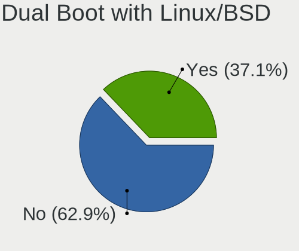
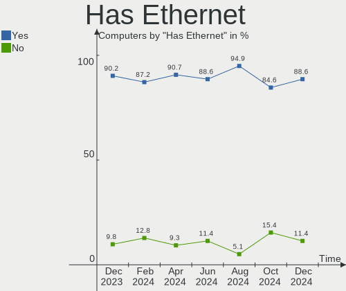
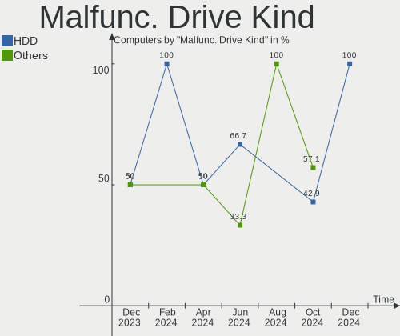
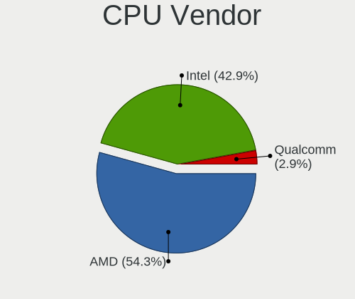
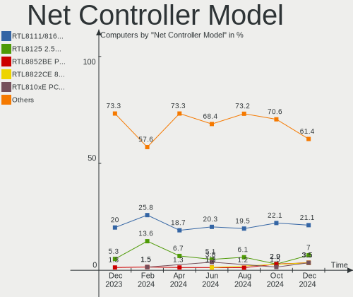
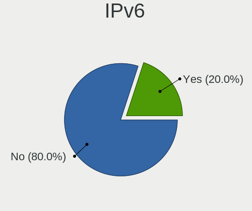

Gentoo - Hardware Trends
------------------------

A project to identify most popular hardware characteristics and track their change
over time based on data collected by Linux users at https://Linux-Hardware.org.

Anyone can contribute to this report by the [hw-probe](https://github.com/linuxhw/hw-probe) tool:

    sudo -E hw-probe -all -upload

This is a report for all computer types. See also reports for [desktops](/Dist/Gentoo/Desktop/README.md) and [notebooks](/Dist/Gentoo/Notebook/README.md).

This report is for one last month. Overall report since the beginning of time: [TestCoverage](https://github.com/linuxhw/TestCoverage)

Period: Nov, 2022.

Contents
--------

* [ System ](#system)
  - [ OS                       ](#os)
  - [ OS Family                ](#os-family)
  - [ Kernel                   ](#kernel)
  - [ Kernel Family            ](#kernel-family)
  - [ Kernel Major Ver.        ](#kernel-major-ver)
  - [ Arch                     ](#arch)
  - [ DE                       ](#de)
  - [ Display Server           ](#display-server)
  - [ Display Manager          ](#display-manager)
  - [ OS Lang                  ](#os-lang)
  - [ Boot Mode                ](#boot-mode)
  - [ Filesystem               ](#filesystem)
  - [ Part. scheme             ](#part-scheme)
  - [ Dual Boot with Linux/BSD ](#dual-boot-with-linuxbsd)
  - [ Dual Boot (Win)          ](#dual-boot-win)

* [ Board ](#board)
  - [ Vendor                   ](#vendor)
  - [ Model                    ](#model)
  - [ Model Family             ](#model-family)
  - [ MFG Year                 ](#mfg-year)
  - [ Form Factor              ](#form-factor)
  - [ Secure Boot              ](#secure-boot)
  - [ Coreboot                 ](#coreboot)
  - [ RAM Size                 ](#ram-size)
  - [ RAM Used                 ](#ram-used)
  - [ Total Drives             ](#total-drives)
  - [ Has CD-ROM               ](#has-cd-rom)
  - [ Has Ethernet             ](#has-ethernet)
  - [ Has WiFi                 ](#has-wifi)
  - [ Has Bluetooth            ](#has-bluetooth)

* [ Location ](#location)
  - [ Country                  ](#country)
  - [ City                     ](#city)

* [ Drives ](#drives)
  - [ Drive Vendor             ](#drive-vendor)
  - [ Drive Model              ](#drive-model)
  - [ HDD Vendor               ](#hdd-vendor)
  - [ SSD Vendor               ](#ssd-vendor)
  - [ Drive Kind               ](#drive-kind)
  - [ Drive Connector          ](#drive-connector)
  - [ Drive Size               ](#drive-size)
  - [ Space Total              ](#space-total)
  - [ Space Used               ](#space-used)
  - [ Malfunc. Drives          ](#malfunc-drives)
  - [ Malfunc. Drive Vendor    ](#malfunc-drive-vendor)
  - [ Malfunc. HDD Vendor      ](#malfunc-hdd-vendor)
  - [ Malfunc. Drive Kind      ](#malfunc-drive-kind)
  - [ Failed Drives            ](#failed-drives)
  - [ Failed Drive Vendor      ](#failed-drive-vendor)
  - [ Drive Status             ](#drive-status)

* [ Storage controller ](#storage-controller)
  - [ Storage Vendor           ](#storage-vendor)
  - [ Storage Model            ](#storage-model)
  - [ Storage Kind             ](#storage-kind)

* [ Processor ](#processor)
  - [ CPU Vendor               ](#cpu-vendor)
  - [ CPU Model                ](#cpu-model)
  - [ CPU Model Family         ](#cpu-model-family)
  - [ CPU Cores                ](#cpu-cores)
  - [ CPU Sockets              ](#cpu-sockets)
  - [ CPU Threads              ](#cpu-threads)
  - [ CPU Op-Modes             ](#cpu-op-modes)
  - [ CPU Microcode            ](#cpu-microcode)
  - [ CPU Microarch            ](#cpu-microarch)

* [ Graphics ](#graphics)
  - [ GPU Vendor               ](#gpu-vendor)
  - [ GPU Model                ](#gpu-model)
  - [ GPU Combo                ](#gpu-combo)
  - [ GPU Driver               ](#gpu-driver)
  - [ GPU Memory               ](#gpu-memory)

* [ Monitor ](#monitor)
  - [ Monitor Vendor           ](#monitor-vendor)
  - [ Monitor Model            ](#monitor-model)
  - [ Monitor Resolution       ](#monitor-resolution)
  - [ Monitor Diagonal         ](#monitor-diagonal)
  - [ Monitor Width            ](#monitor-width)
  - [ Aspect Ratio             ](#aspect-ratio)
  - [ Monitor Area             ](#monitor-area)
  - [ Pixel Density            ](#pixel-density)
  - [ Multiple Monitors        ](#multiple-monitors)

* [ Network ](#network)
  - [ Net Controller Vendor    ](#net-controller-vendor)
  - [ Net Controller Model     ](#net-controller-model)
  - [ Wireless Vendor          ](#wireless-vendor)
  - [ Wireless Model           ](#wireless-model)
  - [ Ethernet Vendor          ](#ethernet-vendor)
  - [ Ethernet Model           ](#ethernet-model)
  - [ Net Controller Kind      ](#net-controller-kind)
  - [ Used Controller          ](#used-controller)
  - [ NICs                     ](#nics)
  - [ IPv6                     ](#ipv6)

* [ Bluetooth ](#bluetooth)
  - [ Bluetooth Vendor         ](#bluetooth-vendor)
  - [ Bluetooth Model          ](#bluetooth-model)

* [ Sound ](#sound)
  - [ Sound Vendor             ](#sound-vendor)
  - [ Sound Model              ](#sound-model)

* [ Memory ](#memory)
  - [ Memory Vendor            ](#memory-vendor)
  - [ Memory Model             ](#memory-model)
  - [ Memory Kind              ](#memory-kind)
  - [ Memory Form Factor       ](#memory-form-factor)
  - [ Memory Size              ](#memory-size)
  - [ Memory Speed             ](#memory-speed)

* [ Printers & scanners ](#printers--scanners)
  - [ Printer Vendor           ](#printer-vendor)
  - [ Printer Model            ](#printer-model)
  - [ Scanner Vendor           ](#scanner-vendor)
  - [ Scanner Model            ](#scanner-model)

* [ Camera ](#camera)
  - [ Camera Vendor            ](#camera-vendor)
  - [ Camera Model             ](#camera-model)

* [ Security ](#security)
  - [ Fingerprint Vendor       ](#fingerprint-vendor)
  - [ Fingerprint Model        ](#fingerprint-model)
  - [ Chipcard Vendor          ](#chipcard-vendor)
  - [ Chipcard Model           ](#chipcard-model)

* [ Unsupported ](#unsupported)
  - [ Unsupported Devices      ](#unsupported-devices)
  - [ Unsupported Device Types ](#unsupported-device-types)

System
------

OS
--

Installed operating systems

| Name          | Computers | Percent |
|---------------|-----------|---------|
| Gentoo 2.9    | 24        | 48%     |
| Gentoo 2.8    | 23        | 46%     |
| Gentoo 22.0.1 | 1         | 2%      |
| Gentoo 2022   | 1         | 2%      |
| Gentoo        | 1         | 2%      |

OS Family
---------

OS without a version

| Name   | Computers | Percent |
|--------|-----------|---------|
| Gentoo | 50        | 100%    |

Kernel
------

Version of the Linux kernel

| Version                      | Computers | Percent |
|------------------------------|-----------|---------|
| 5.15.75-gentoo-x86_64        | 8         | 16%     |
| 5.15.75-gentoo               | 4         | 8%      |
| 6.0.9-gentoo-x86_64          | 2         | 4%      |
| 6.0.6-gentoo-x86_64          | 2         | 4%      |
| 6.0.6-gentoo                 | 2         | 4%      |
| 5.15.75-gentoo-dist          | 2         | 4%      |
| 5.15.75-gentoo-221027        | 2         | 4%      |
| 6.0.9-gentoo-wayland-x86_64  | 1         | 2%      |
| 6.0.9-gentoo-dist            | 1         | 2%      |
| 6.0.9-gentoo                 | 1         | 2%      |
| 6.0.9-calculate              | 1         | 2%      |
| 6.0.8-gentoo-harambe-edition | 1         | 2%      |
| 6.0.8-DZRK-xanmod1           | 1         | 2%      |
| 6.0.7-x86_64-rog0-xanmod1    | 1         | 2%      |
| 6.0.7-gentoo-x86_64          | 1         | 2%      |
| 6.0.7-gentoo-strix           | 1         | 2%      |
| 6.0.7-gentoo-dist            | 1         | 2%      |
| 6.0.7-gentoo                 | 1         | 2%      |
| 6.0.6-gentoo_ap              | 1         | 2%      |
| 6.0.2                        | 1         | 2%      |
| 6.0.10-gentoo-thinkbook      | 1         | 2%      |
| 6.0.10-gentoo-dist           | 1         | 2%      |
| 6.0.0-pf3-pf-ycnz            | 1         | 2%      |
| 5.19.16-gentoo               | 1         | 2%      |
| 5.18.0-zourssiflette         | 1         | 2%      |
| 5.15.79-gentoo-hardened1     | 1         | 2%      |
| 5.15.75-gentoo-ts221         | 1         | 2%      |
| 5.15.75-gentoo-mp-server     | 1         | 2%      |
| 5.15.74-gentoo-dist          | 1         | 2%      |
| 5.15.72-gentoo-x86_64        | 1         | 2%      |
| 5.15.69-gentoo-x86_64        | 1         | 2%      |
| 5.15.52-gentoo               | 1         | 2%      |
| 5.15.41-gentoo-x86_64        | 1         | 2%      |
| 5.15.12-gentoo               | 1         | 2%      |
| 5.14.2-gentoo-x86_64         | 1         | 2%      |

Kernel Family
-------------

Linux kernel without a distro release

| Version | Computers | Percent |
|---------|-----------|---------|
| 5.15.75 | 18        | 36%     |
| 6.0.9   | 6         | 12%     |
| 6.0.7   | 5         | 10%     |
| 6.0.6   | 5         | 10%     |
| 6.0.8   | 2         | 4%      |
| 6.0.10  | 2         | 4%      |
| 6.0.2   | 1         | 2%      |
| 6.0.0   | 1         | 2%      |
| 5.19.16 | 1         | 2%      |
| 5.18.0  | 1         | 2%      |
| 5.15.79 | 1         | 2%      |
| 5.15.74 | 1         | 2%      |
| 5.15.72 | 1         | 2%      |
| 5.15.69 | 1         | 2%      |
| 5.15.52 | 1         | 2%      |
| 5.15.41 | 1         | 2%      |
| 5.15.12 | 1         | 2%      |
| 5.14.2  | 1         | 2%      |

Kernel Major Ver.
-----------------

Linux kernel major version

| Version | Computers | Percent |
|---------|-----------|---------|
| 5.15    | 25        | 50%     |
| 6.0     | 22        | 44%     |
| 5.19    | 1         | 2%      |
| 5.18    | 1         | 2%      |
| 5.14    | 1         | 2%      |

Arch
----

OS architecture (x86_64, i586, etc.)

| Name     | Computers | Percent |
|----------|-----------|---------|
| x86_64   | 49        | 98%     |
| armv5tel | 1         | 2%      |

DE
--

Desktop Environment

| Name          | Computers | Percent |
|---------------|-----------|---------|
| KDE5          | 13        | 26%     |
| GNOME         | 9         | 18%     |
| XFCE          | 8         | 16%     |
| Unknown       | 8         | 16%     |
| Trinity       | 2         | 4%      |
| sway          | 2         | 4%      |
| MATE          | 2         | 4%      |
| X-Cinnamon    | 1         | 2%      |
| Unity         | 1         | 2%      |
| LXQt          | 1         | 2%      |
| i3            | 1         | 2%      |
| Enlightenment | 1         | 2%      |
| awesome       | 1         | 2%      |

Display Server
--------------

X11 or Wayland

| Name    | Computers | Percent |
|---------|-----------|---------|
| X11     | 29        | 58%     |
| Unknown | 9         | 18%     |
| Tty     | 8         | 16%     |
| Wayland | 4         | 8%      |

Display Manager
---------------

SDDM, LightDM, etc.

| Name    | Computers | Percent |
|---------|-----------|---------|
| SDDM    | 19        | 38%     |
| LightDM | 13        | 26%     |
| Unknown | 11        | 22%     |
| TDM     | 2         | 4%      |
| GREETD  | 2         | 4%      |
| GDM     | 2         | 4%      |
| XDM     | 1         | 2%      |

OS Lang
-------

Language

| Lang    | Computers | Percent |
|---------|-----------|---------|
| en_US   | 19        | 38%     |
| C.UTF8  | 6         | 12%     |
| ru_RU   | 5         | 10%     |
| it_IT   | 4         | 8%      |
| de_DE   | 3         | 6%      |
| Unknown | 3         | 6%      |
| pl_PL   | 2         | 4%      |
| en_GB   | 2         | 4%      |
| C       | 2         | 4%      |
| zh_CN   | 1         | 2%      |
| ru_UA   | 1         | 2%      |
| ko_KR   | 1         | 2%      |
| en_CA   | 1         | 2%      |

Boot Mode
---------

EFI or BIOS

| Mode | Computers | Percent |
|------|-----------|---------|
| EFI  | 39        | 78%     |
| BIOS | 11        | 22%     |

Filesystem
----------

Type of filesystem

| Type     | Computers | Percent |
|----------|-----------|---------|
| Ext4     | 26        | 52%     |
| Btrfs    | 11        | 22%     |
| F2fs     | 4         | 8%      |
| Zfs      | 3         | 6%      |
| Xfs      | 3         | 6%      |
| XXXXXXX  | 1         | 2%      |
| Reiserfs | 1         | 2%      |
| Jfs      | 1         | 2%      |

Part. scheme
------------

Scheme of partitioning

| Type    | Computers | Percent |
|---------|-----------|---------|
| GPT     | 46        | 92%     |
| MBR     | 2         | 4%      |
| Unknown | 2         | 4%      |

Dual Boot with Linux/BSD
------------------------

Hosting more than one Linux/BSD

| Dual boot | Computers | Percent |
|-----------|-----------|---------|
| No        | 31        | 62%     |
| Yes       | 19        | 38%     |

Dual Boot (Win)
---------------

Hosting Linux and Windows

| Dual boot | Computers | Percent |
|-----------|-----------|---------|
| No        | 34        | 68%     |
| Yes       | 16        | 32%     |

Board
-----

Vendor
------

Motherboard manufacturer

| Name                | Computers | Percent |
|---------------------|-----------|---------|
| ASUSTek Computer    | 12        | 24%     |
| Lenovo              | 8         | 16%     |
| MSI                 | 5         | 10%     |
| Gigabyte Technology | 4         | 8%      |
| Hewlett-Packard     | 3         | 6%      |
| Dell                | 3         | 6%      |
| Acer                | 3         | 6%      |
| Unknown             | 3         | 6%      |
| HUAWEI              | 2         | 4%      |
| ASRock              | 2         | 4%      |
| Apple               | 2         | 4%      |
| Toshiba             | 1         | 2%      |
| Supermicro          | 1         | 2%      |
| Razer               | 1         | 2%      |

Model
-----

Motherboard model

| Name                                     | Computers | Percent |
|------------------------------------------|-----------|---------|
| Unknown                                  | 3         | 6%      |
| Apple MacPro5,1                          | 2         | 4%      |
| Toshiba Satellite L50-B                  | 1         | 2%      |
| Supermicro Rackform_R4422.v6             | 1         | 2%      |
| Razer Blade Pro                          | 1         | 2%      |
| MSI MS-7C60                              | 1         | 2%      |
| MSI MS-7C35                              | 1         | 2%      |
| MSI MS-7C34                              | 1         | 2%      |
| MSI MS-7C09                              | 1         | 2%      |
| MSI GT72 2QD                             | 1         | 2%      |
| Lenovo Yoga Slim 7 Pro 14IAH7 82UT       | 1         | 2%      |
| Lenovo Yoga 6 13ARE05 82FN               | 1         | 2%      |
| Lenovo V15 G2 ALC 82KD                   | 1         | 2%      |
| Lenovo ThinkPad X1 Carbon 7th 20R1CTO1WW | 1         | 2%      |
| Lenovo ThinkPad S2 3rd Gen 20L1A00HCD    | 1         | 2%      |
| Lenovo ThinkPad L14 Gen 1 20U5003NRT     | 1         | 2%      |
| Lenovo ThinkPad E15 Gen 2 20T8000MPB     | 1         | 2%      |
| Lenovo ThinkBook 14s-IWL 20RM            | 1         | 2%      |
| HUAWEI KLVL-WXX9                         | 1         | 2%      |
| HUAWEI BOHB-WAX9                         | 1         | 2%      |
| HP Pavilion Gaming Laptop 15-ec1xxx      | 1         | 2%      |
| HP Pavilion All-in-One 24-k0xxx          | 1         | 2%      |
| HP Pavilion Aero Laptop 13-be0xxx        | 1         | 2%      |
| Gigabyte Z370P D3                        | 1         | 2%      |
| Gigabyte Z370 AORUS Ultra Gaming         | 1         | 2%      |
| Gigabyte X570 AORUS MASTER               | 1         | 2%      |
| Gigabyte AB350-Gaming                    | 1         | 2%      |
| Dell Precision 5540                      | 1         | 2%      |
| Dell Inspiron N5010                      | 1         | 2%      |
| Dell G3 3500                             | 1         | 2%      |
| ASUS X510UNR                             | 1         | 2%      |
| ASUS TUF Gaming X570-PRO                 | 1         | 2%      |
| ASUS TUF Gaming X570-PLUS                | 1         | 2%      |
| ASUS ROG Zephyrus M16 GU603ZM_GU603ZM    | 1         | 2%      |
| ASUS ROG STRIX X470-F GAMING             | 1         | 2%      |
| ASUS ROG Strix G513QY_G513QY             | 1         | 2%      |
| ASUS ROG Maximus XI HERO                 | 1         | 2%      |
| ASUS ROG CROSSHAIR VIII FORMULA          | 1         | 2%      |
| ASUS PRIME Z370-P II                     | 1         | 2%      |
| ASUS PRIME X570-PRO                      | 1         | 2%      |

Model Family
------------

Motherboard model prefix

| Name                  | Computers | Percent |
|-----------------------|-----------|---------|
| ASUS ROG              | 5         | 10%     |
| Lenovo ThinkPad       | 4         | 8%      |
| HP Pavilion           | 3         | 6%      |
| Unknown               | 3         | 6%      |
| Lenovo Yoga           | 2         | 4%      |
| ASUS TUF              | 2         | 4%      |
| ASUS PRIME            | 2         | 4%      |
| Apple MacPro5         | 2         | 4%      |
| Acer Nitro            | 2         | 4%      |
| Toshiba Satellite     | 1         | 2%      |
| Supermicro Rackform   | 1         | 2%      |
| Razer Blade           | 1         | 2%      |
| MSI MS-7C60           | 1         | 2%      |
| MSI MS-7C35           | 1         | 2%      |
| MSI MS-7C34           | 1         | 2%      |
| MSI MS-7C09           | 1         | 2%      |
| MSI GT72              | 1         | 2%      |
| Lenovo V15            | 1         | 2%      |
| Lenovo ThinkBook      | 1         | 2%      |
| HUAWEI KLVL-WXX9      | 1         | 2%      |
| HUAWEI BOHB-WAX9      | 1         | 2%      |
| Gigabyte Z370P        | 1         | 2%      |
| Gigabyte Z370         | 1         | 2%      |
| Gigabyte X570         | 1         | 2%      |
| Gigabyte AB350-Gaming | 1         | 2%      |
| Dell Precision        | 1         | 2%      |
| Dell Inspiron         | 1         | 2%      |
| Dell G3               | 1         | 2%      |
| ASUS X510UNR          | 1         | 2%      |
| ASUS N55SF            | 1         | 2%      |
| ASUS M3A78-CM         | 1         | 2%      |
| ASRock N68C-GS        | 1         | 2%      |
| ASRock B550           | 1         | 2%      |
| Acer Swift            | 1         | 2%      |

MFG Year
--------

Motherboard manufacture year

| Year    | Computers | Percent |
|---------|-----------|---------|
| 2019    | 13        | 26%     |
| 2020    | 9         | 18%     |
| 2021    | 6         | 12%     |
| 2018    | 5         | 10%     |
| 2022    | 4         | 8%      |
| 2010    | 4         | 8%      |
| 2017    | 3         | 6%      |
| 2014    | 2         | 4%      |
| 2016    | 1         | 2%      |
| 2011    | 1         | 2%      |
| 2008    | 1         | 2%      |
| Unknown | 1         | 2%      |

Form Factor
-----------

Physical design of the computer

| Name        | Computers | Percent |
|-------------|-----------|---------|
| Notebook    | 25        | 50%     |
| Desktop     | 22        | 44%     |
| Convertible | 1         | 2%      |
| All in one  | 1         | 2%      |
| Server      | 1         | 2%      |

Secure Boot
-----------

Enabled or disabled

| State    | Computers | Percent |
|----------|-----------|---------|
| Disabled | 49        | 98%     |
| Enabled  | 1         | 2%      |

Coreboot
--------

Have coreboot on board

| Used | Computers | Percent |
|------|-----------|---------|
| No   | 50        | 100%    |

RAM Size
--------

Total RAM memory

| Size in GB      | Computers | Percent |
|-----------------|-----------|---------|
| 32.01-64.0      | 17        | 34%     |
| 8.01-16.0       | 10        | 20%     |
| 4.01-8.0        | 8         | 16%     |
| 64.01-256.0     | 7         | 14%     |
| 16.01-24.0      | 5         | 10%     |
| More than 256.0 | 1         | 2%      |
| 3.01-4.0        | 1         | 2%      |
| 0.51-1.0        | 1         | 2%      |

RAM Used
--------

Used RAM memory

| Used GB    | Computers | Percent |
|------------|-----------|---------|
| 4.01-8.0   | 9         | 18%     |
| 2.01-3.0   | 9         | 18%     |
| 8.01-16.0  | 9         | 18%     |
| 1.01-2.0   | 8         | 16%     |
| 3.01-4.0   | 6         | 12%     |
| 16.01-24.0 | 4         | 8%      |
| 0.01-0.5   | 3         | 6%      |
| 24.01-32.0 | 1         | 2%      |
| 0.51-1.0   | 1         | 2%      |

Total Drives
------------

Number of drives on board

| Drives | Computers | Percent |
|--------|-----------|---------|
| 1      | 19        | 38%     |
| 2      | 15        | 30%     |
| 6      | 4         | 8%      |
| 7      | 3         | 6%      |
| 3      | 3         | 6%      |
| 8      | 2         | 4%      |
| 4      | 2         | 4%      |
| 12     | 1         | 2%      |
| 5      | 1         | 2%      |

Has CD-ROM
----------

Has CD-ROM on board

| Presented | Computers | Percent |
|-----------|-----------|---------|
| No        | 41        | 82%     |
| Yes       | 9         | 18%     |

Has Ethernet
------------

Has Ethernet on board

| Presented | Computers | Percent |
|-----------|-----------|---------|
| Yes       | 43        | 86%     |
| No        | 7         | 14%     |

Has WiFi
--------

Has WiFi module

| Presented | Computers | Percent |
|-----------|-----------|---------|
| Yes       | 37        | 74%     |
| No        | 13        | 26%     |

Has Bluetooth
-------------

Has Bluetooth module

| Presented | Computers | Percent |
|-----------|-----------|---------|
| Yes       | 35        | 70%     |
| No        | 15        | 30%     |

Location
--------

Country
-------

Geographic location (country)

| Country     | Computers | Percent |
|-------------|-----------|---------|
| USA         | 8         | 16%     |
| Russia      | 8         | 16%     |
| Germany     | 5         | 10%     |
| Poland      | 4         | 8%      |
| Italy       | 3         | 6%      |
| France      | 3         | 6%      |
| China       | 3         | 6%      |
| Sweden      | 2         | 4%      |
| Denmark     | 2         | 4%      |
| Canada      | 2         | 4%      |
| UK          | 1         | 2%      |
| Tunisia     | 1         | 2%      |
| South Korea | 1         | 2%      |
| Slovakia    | 1         | 2%      |
| Netherlands | 1         | 2%      |
| Japan       | 1         | 2%      |
| Ireland     | 1         | 2%      |
| India       | 1         | 2%      |
| Hungary     | 1         | 2%      |
| Australia   | 1         | 2%      |

City
----

Geographic location (city)

| City               | Computers | Percent |
|--------------------|-----------|---------|
| Los Angeles        | 4         | 8%      |
| Moscow             | 3         | 6%      |
| Warsaw             | 2         | 4%      |
| Taganrog           | 2         | 4%      |
| Hørsholm          | 2         | 4%      |
| Berlin             | 2         | 4%      |
| Wroclaw            | 1         | 2%      |
| Welling            | 1         | 2%      |
| Villejuif          | 1         | 2%      |
| Vendays-Montalivet | 1         | 2%      |
| Vaxjo              | 1         | 2%      |
| Vaellingby         | 1         | 2%      |
| Szeged             | 1         | 2%      |
| Sydney             | 1         | 2%      |
| Suffolk            | 1         | 2%      |
| St Petersburg      | 1         | 2%      |
| Seattle            | 1         | 2%      |
| Schwieberdingen    | 1         | 2%      |
| Schmitten          | 1         | 2%      |
| Ravenna            | 1         | 2%      |
| Québec            | 1         | 2%      |
| Perm               | 1         | 2%      |
| Onna               | 1         | 2%      |
| Milan              | 1         | 2%      |
| Lyon               | 1         | 2%      |
| Laval              | 1         | 2%      |
| Kunming            | 1         | 2%      |
| Jinrongjie         | 1         | 2%      |
| Ivanovo            | 1         | 2%      |
| Houston            | 1         | 2%      |
| Guanzate           | 1         | 2%      |
| Guangzhou          | 1         | 2%      |
| Essen              | 1         | 2%      |
| Dublin             | 1         | 2%      |
| Cieszyn            | 1         | 2%      |
| Cheongju-si        | 1         | 2%      |
| Bratislava         | 1         | 2%      |
| Bengaluru          | 1         | 2%      |
| Augusta            | 1         | 2%      |
| Aryanah            | 1         | 2%      |

Drives
------

Drive Vendor
------------

Hard drive vendors

| Vendor                      | Computers | Drives | Percent |
|-----------------------------|-----------|--------|---------|
| Samsung Electronics         | 23        | 37     | 25%     |
| WDC                         | 11        | 19     | 11.96%  |
| Seagate                     | 7         | 10     | 7.61%   |
| Sandisk                     | 7         | 9      | 7.61%   |
| Toshiba                     | 6         | 8      | 6.52%   |
| Phison Electronics          | 4         | 5      | 4.35%   |
| Micron Technology           | 4         | 7      | 4.35%   |
| Kingston                    | 3         | 11     | 3.26%   |
| Kingston Technology Company | 2         | 2      | 2.17%   |
| Intel                       | 2         | 3      | 2.17%   |
| Hitachi                     | 2         | 4      | 2.17%   |
| HGST                        | 2         | 3      | 2.17%   |
| GOODRAM                     | 2         | 2      | 2.17%   |
| Corsair                     | 2         | 2      | 2.17%   |
| China                       | 2         | 2      | 2.17%   |
| Yangtze Memory Technologies | 1         | 1      | 1.09%   |
| Union Memory                | 1         | 1      | 1.09%   |
| T-FORCE                     | 1         | 6      | 1.09%   |
| SK hynix                    | 1         | 1      | 1.09%   |
| Realtek Semiconductor       | 1         | 2      | 1.09%   |
| PNY                         | 1         | 2      | 1.09%   |
| OCZ                         | 1         | 1      | 1.09%   |
| Maxtor                      | 1         | 1      | 1.09%   |
| KIOXIA                      | 1         | 1      | 1.09%   |
| FNK TECH                    | 1         | 1      | 1.09%   |
| Dyconn H                    | 1         | 1      | 1.09%   |
| Crucial                     | 1         | 1      | 1.09%   |
| Unknown                     | 1         | 1      | 1.09%   |

Drive Model
-----------

Hard drive models

| Model                                                | Computers | Percent |
|------------------------------------------------------|-----------|---------|
| Samsung NVMe SSD Controller SM981/PM981/PM983 1TB    | 8         | 7.41%   |
| Samsung NVMe SSD Controller PM9A1/PM9A3/980PRO 250GB | 4         | 3.7%    |
| Phison E16 PCIe4 NVMe Controller 1TB                 | 3         | 2.78%   |
| WDC WD10EZEX-08WN4A0 1TB                             | 2         | 1.85%   |
| Seagate ST12000NM0008-2H3101 12TB                    | 2         | 1.85%   |
| Samsung SSD 860 EVO 1TB                              | 2         | 1.85%   |
| Samsung SSD 850 EVO 500GB                            | 2         | 1.85%   |
| Micron 3400_MTFDKBA512TFH 512GB                      | 2         | 1.85%   |
| Kingston SA400S37240G 240GB SSD                      | 2         | 1.85%   |
| HGST HTS721010A9E630 1TB                             | 2         | 1.85%   |
| GOODRAM SSDPR-CL100-480-G2 480GB                     | 2         | 1.85%   |
| China SSD 1TB                                        | 2         | 1.85%   |
| Yangtze Memory ZHITAI TiPlus5000 1TB                 | 1         | 0.93%   |
| WDC WDS120G2G0B-00EPW0 120GB SSD                     | 1         | 0.93%   |
| WDC WD7500BPVT-24HXZT1 752GB                         | 1         | 0.93%   |
| WDC WD60EZAZ-00SF3B0 6TB                             | 1         | 0.93%   |
| WDC WD60EFZX-68B3FN0 6TB                             | 1         | 0.93%   |
| WDC WD60EFAX-68SHWN0 6TB                             | 1         | 0.93%   |
| WDC WD6003FZBX-00K5WB0 6TB                           | 1         | 0.93%   |
| WDC WD40PURZ-85TTDY0 4TB                             | 1         | 0.93%   |
| WDC WD40EZRZ-19GXCB0 4TB                             | 1         | 0.93%   |
| WDC WD40EZRZ-00GXCB0 4TB                             | 1         | 0.93%   |
| WDC WD30EFRX-68N32N0 3TB                             | 1         | 0.93%   |
| WDC WD30EFRX-68EUZN0 3TB                             | 1         | 0.93%   |
| WDC WD30EFRX-68AX9N0 3TB                             | 1         | 0.93%   |
| WDC WD20PURZ-85GU6Y0 2TB                             | 1         | 0.93%   |
| WDC WD2002FAEX-007BA0 2TB                            | 1         | 0.93%   |
| WDC WD10EZEX-75M2NA0 1TB                             | 1         | 0.93%   |
| WDC WD10EZEX-08M2NA0 1TB                             | 1         | 0.93%   |
| Union Memory UMIS RPJTJ512MEE1OWX 512GB              | 1         | 0.93%   |
| Toshiba MQ01ABF050 500GB                             | 1         | 0.93%   |
| Toshiba MG09ACA18TE 18TB                             | 1         | 0.93%   |
| Toshiba HDWQ140 4TB                                  | 1         | 0.93%   |
| Toshiba HDWE150 5TB                                  | 1         | 0.93%   |
| Toshiba HDWE140 4TB                                  | 1         | 0.93%   |
| Toshiba HDWD110 1TB                                  | 1         | 0.93%   |
| T-FORCE SSD 1TB                                      | 1         | 0.93%   |
| SK hynix BC501 NVMe Solid State Drive 512GB          | 1         | 0.93%   |
| Seagate ST500DM002-1BD142 500GB                      | 1         | 0.93%   |
| Seagate ST4000DM004-2CV104 4TB                       | 1         | 0.93%   |

HDD Vendor
----------

Hard disk drive vendors

| Vendor              | Computers | Drives | Percent |
|---------------------|-----------|--------|---------|
| WDC                 | 10        | 18     | 33.33%  |
| Toshiba             | 6         | 8      | 20%     |
| Seagate             | 6         | 9      | 20%     |
| Hitachi             | 2         | 4      | 6.67%   |
| HGST                | 2         | 3      | 6.67%   |
| Samsung Electronics | 1         | 1      | 3.33%   |
| Maxtor              | 1         | 1      | 3.33%   |
| FNK TECH            | 1         | 1      | 3.33%   |
| Dyconn H            | 1         | 1      | 3.33%   |

SSD Vendor
----------

Solid state drive vendors

| Vendor              | Computers | Drives | Percent |
|---------------------|-----------|--------|---------|
| Samsung Electronics | 11        | 16     | 36.67%  |
| Kingston            | 3         | 11     | 10%     |
| SanDisk             | 2         | 3      | 6.67%   |
| GOODRAM             | 2         | 2      | 6.67%   |
| Corsair             | 2         | 2      | 6.67%   |
| China               | 2         | 2      | 6.67%   |
| WDC                 | 1         | 1      | 3.33%   |
| T-FORCE             | 1         | 6      | 3.33%   |
| Seagate             | 1         | 1      | 3.33%   |
| PNY                 | 1         | 2      | 3.33%   |
| OCZ                 | 1         | 1      | 3.33%   |
| Micron Technology   | 1         | 3      | 3.33%   |
| Crucial             | 1         | 1      | 3.33%   |
| Unknown             | 1         | 1      | 3.33%   |

Drive Kind
----------

HDD or SSD

| Kind | Computers | Drives | Percent |
|------|-----------|--------|---------|
| NVMe | 34        | 46     | 44.16%  |
| SSD  | 23        | 52     | 29.87%  |
| HDD  | 20        | 46     | 25.97%  |

Drive Connector
---------------

SATA, SAS, NVMe, etc.

| Type | Computers | Drives | Percent |
|------|-----------|--------|---------|
| NVMe | 34        | 46     | 51.52%  |
| SATA | 30        | 96     | 45.45%  |
| SAS  | 2         | 2      | 3.03%   |

Drive Size
----------

Size of hard drive

| Size in TB | Computers | Drives | Percent |
|------------|-----------|--------|---------|
| 0.01-0.5   | 20        | 37     | 35.09%  |
| 0.51-1.0   | 15        | 28     | 26.32%  |
| 3.01-4.0   | 6         | 9      | 10.53%  |
| 1.01-2.0   | 6         | 8      | 10.53%  |
| 4.01-10.0  | 4         | 5      | 7.02%   |
| 2.01-3.0   | 3         | 7      | 5.26%   |
| 10.01-20.0 | 3         | 4      | 5.26%   |

Space Total
-----------

Amount of disk space available on the file system

| Size in GB     | Computers | Percent |
|----------------|-----------|---------|
| More than 3000 | 12        | 24%     |
| 251-500        | 10        | 20%     |
| 501-1000       | 9         | 18%     |
| 101-250        | 5         | 10%     |
| 1001-2000      | 5         | 10%     |
| Unknown        | 4         | 8%      |
| 2001-3000      | 2         | 4%      |
| 51-100         | 2         | 4%      |
| 1-20           | 1         | 2%      |

Space Used
----------

Amount of used disk space

| Used GB        | Computers | Percent |
|----------------|-----------|---------|
| 251-500        | 9         | 18%     |
| 101-250        | 7         | 14%     |
| 1-20           | 6         | 12%     |
| More than 3000 | 5         | 10%     |
| 501-1000       | 5         | 10%     |
| 21-50          | 4         | 8%      |
| 1001-2000      | 4         | 8%      |
| Unknown        | 4         | 8%      |
| 2001-3000      | 3         | 6%      |
| 51-100         | 3         | 6%      |

Malfunc. Drives
---------------

Drive models with a malfunction

| Model                                                      | Computers | Drives | Percent |
|------------------------------------------------------------|-----------|--------|---------|
| WDC WDS120G2G0B-00EPW0 120GB SSD                           | 1         | 1      | 9.09%   |
| WDC WD60EFAX-68SHWN0 6TB                                   | 1         | 1      | 9.09%   |
| WDC WD30EFRX-68AX9N0 3TB                                   | 1         | 1      | 9.09%   |
| Seagate ST500DM002-1BD142 500GB                            | 1         | 1      | 9.09%   |
| Samsung Electronics SP2504C 250GB                          | 1         | 1      | 9.09%   |
| Realtek Semiconductor RTS5763DL NVMe SSD Controller 1024GB | 1         | 2      | 9.09%   |
| PNY SSD2SC240GE2DH16B-T 240GB                              | 1         | 1      | 9.09%   |
| Maxtor STM3160215A 160GB                                   | 1         | 1      | 9.09%   |
| Kingston Technology Company KC2000 NVMe SSD 2TB            | 1         | 1      | 9.09%   |
| HGST HTS541010A9E680 1TB                                   | 1         | 1      | 9.09%   |
| Corsair Neutron GTX SSD 240GB                              | 1         | 1      | 9.09%   |

Malfunc. Drive Vendor
---------------------

Vendors of faulty drives

| Vendor                      | Computers | Drives | Percent |
|-----------------------------|-----------|--------|---------|
| WDC                         | 2         | 3      | 20%     |
| Seagate                     | 1         | 1      | 10%     |
| Samsung Electronics         | 1         | 1      | 10%     |
| Realtek Semiconductor       | 1         | 2      | 10%     |
| PNY                         | 1         | 1      | 10%     |
| Maxtor                      | 1         | 1      | 10%     |
| Kingston Technology Company | 1         | 1      | 10%     |
| HGST                        | 1         | 1      | 10%     |
| Corsair                     | 1         | 1      | 10%     |

Malfunc. HDD Vendor
-------------------

Vendors of faulty HDD drives

| Vendor              | Computers | Drives | Percent |
|---------------------|-----------|--------|---------|
| WDC                 | 1         | 2      | 20%     |
| Seagate             | 1         | 1      | 20%     |
| Samsung Electronics | 1         | 1      | 20%     |
| Maxtor              | 1         | 1      | 20%     |
| HGST                | 1         | 1      | 20%     |

Malfunc. Drive Kind
-------------------

Kinds of faulty drives

| Kind | Computers | Drives | Percent |
|------|-----------|--------|---------|
| HDD  | 4         | 6      | 44.44%  |
| SSD  | 3         | 3      | 33.33%  |
| NVMe | 2         | 3      | 22.22%  |

Failed Drives
-------------

Failed drive models

Zero info for selected period =(

Failed Drive Vendor
-------------------

Failed drive vendors

Zero info for selected period =(

Drive Status
------------

Number of failed and malfunc. drives

| Status   | Computers | Drives | Percent |
|----------|-----------|--------|---------|
| Works    | 47        | 127    | 79.66%  |
| Malfunc  | 9         | 12     | 15.25%  |
| Detected | 3         | 5      | 5.08%   |

Storage controller
------------------

Storage Vendor
--------------

Storage controller vendors

| Vendor                      | Computers | Percent |
|-----------------------------|-----------|---------|
| Intel                       | 21        | 27.27%  |
| Samsung Electronics         | 15        | 19.48%  |
| AMD                         | 15        | 19.48%  |
| SanDisk                     | 6         | 7.79%   |
| Phison Electronics          | 4         | 5.19%   |
| Micron Technology           | 3         | 3.9%    |
| Marvell Technology Group    | 2         | 2.6%    |
| Kingston Technology Company | 2         | 2.6%    |
| Yangtze Memory Technologies | 1         | 1.3%    |
| Union Memory (Shenzhen)     | 1         | 1.3%    |
| SK hynix                    | 1         | 1.3%    |
| Realtek Semiconductor       | 1         | 1.3%    |
| Nvidia                      | 1         | 1.3%    |
| LSI Logic / Symbios Logic   | 1         | 1.3%    |
| KIOXIA                      | 1         | 1.3%    |
| JMicron Technology          | 1         | 1.3%    |
| ASMedia Technology          | 1         | 1.3%    |

Storage Model
-------------

Storage controller models

| Model                                                                          | Computers | Percent |
|--------------------------------------------------------------------------------|-----------|---------|
| AMD FCH SATA Controller [AHCI mode]                                            | 13        | 15.48%  |
| Samsung NVMe SSD Controller SM981/PM981/PM983                                  | 8         | 9.52%   |
| Samsung NVMe SSD Controller PM9A1/PM9A3/980PRO                                 | 4         | 4.76%   |
| Intel 200 Series PCH SATA controller [AHCI mode]                               | 4         | 4.76%   |
| SanDisk Non-Volatile memory controller                                         | 3         | 3.57%   |
| Samsung NVMe SSD Controller 980                                                | 3         | 3.57%   |
| Phison E16 PCIe4 NVMe Controller                                               | 3         | 3.57%   |
| Micron Non-Volatile memory controller                                          | 2         | 2.38%   |
| Intel Volume Management Device NVMe RAID Controller                            | 2         | 2.38%   |
| Intel Non-Volatile memory controller                                           | 2         | 2.38%   |
| Intel 82801JI (ICH10 Family) SATA AHCI Controller                              | 2         | 2.38%   |
| Yangtze Memory ZHITAI TiPro5000 NVMe SSD                                       | 1         | 1.19%   |
| Union Memory (Shenzhen) Non-Volatile memory controller                         | 1         | 1.19%   |
| SK hynix BC501 NVMe Solid State Drive                                          | 1         | 1.19%   |
| SanDisk WD Blue SN550 NVMe SSD                                                 | 1         | 1.19%   |
| SanDisk WD Blue SN500 / PC SN520 NVMe SSD                                      | 1         | 1.19%   |
| SanDisk WD Black SN750 / PC SN730 NVMe SSD                                     | 1         | 1.19%   |
| Realtek RTS5763DL NVMe SSD Controller                                          | 1         | 1.19%   |
| Phison PS5013 E13 NVMe Controller                                              | 1         | 1.19%   |
| Nvidia MCP61 SATA Controller                                                   | 1         | 1.19%   |
| Nvidia MCP61 IDE                                                               | 1         | 1.19%   |
| Micron 7400 PRO NVMe SSD                                                       | 1         | 1.19%   |
| Marvell Group 88SE9230 PCIe 2.0 x2 4-port SATA 6 Gb/s RAID Controller          | 1         | 1.19%   |
| Marvell Group 88SE9123 PCIe SATA 6.0 Gb/s controller                           | 1         | 1.19%   |
| LSI Logic / Symbios Logic MegaRAID SAS-3 3108 [Invader]                        | 1         | 1.19%   |
| KIOXIA NVMe SSD Controller BG4                                                 | 1         | 1.19%   |
| Kingston Company KC2000 NVMe SSD                                               | 1         | 1.19%   |
| Kingston Company A2000 NVMe SSD                                                | 1         | 1.19%   |
| JMicron JMB363 SATA/IDE Controller                                             | 1         | 1.19%   |
| Intel Wildcat Point-LP SATA Controller [AHCI Mode]                             | 1         | 1.19%   |
| Intel Sunrise Point-LP SATA Controller [AHCI mode]                             | 1         | 1.19%   |
| Intel Comet Lake SATA AHCI Controller                                          | 1         | 1.19%   |
| Intel Cannon Lake PCH SATA AHCI Controller                                     | 1         | 1.19%   |
| Intel Cannon Lake Mobile PCH SATA AHCI Controller                              | 1         | 1.19%   |
| Intel C610/X99 series chipset sSATA Controller [AHCI mode]                     | 1         | 1.19%   |
| Intel C610/X99 series chipset 6-Port SATA Controller [AHCI mode]               | 1         | 1.19%   |
| Intel C600/X79 series chipset 6-Port SATA AHCI Controller                      | 1         | 1.19%   |
| Intel Alder Lake-P SATA AHCI Controller                                        | 1         | 1.19%   |
| Intel 8 Series/C220 Series Chipset Family 6-port SATA Controller 1 [AHCI mode] | 1         | 1.19%   |
| Intel 7 Series Chipset Family 6-port SATA Controller [AHCI mode]               | 1         | 1.19%   |

Storage Kind
------------

Kind of storage controller (IDE, SATA, NVMe, SAS, ...)

| Kind | Computers | Percent |
|------|-----------|---------|
| NVMe | 34        | 45.33%  |
| SATA | 34        | 45.33%  |
| IDE  | 4         | 5.33%   |
| RAID | 3         | 4%      |

Processor
---------

CPU Vendor
----------

Processor vendors

| Vendor                | Computers | Percent |
|-----------------------|-----------|---------|
| Intel                 | 26        | 52%     |
| AMD                   | 23        | 46%     |
| Marvell Semiconductor | 1         | 2%      |

CPU Model
---------

Processor models

| Model                                                                    | Computers | Percent |
|--------------------------------------------------------------------------|-----------|---------|
| AMD Ryzen 9 5900X 12-Core Processor                                      | 3         | 6%      |
| Intel Core i5-8250U CPU @ 1.60GHz                                        | 2         | 4%      |
| Intel 12th Gen Core i7-12700H                                            | 2         | 4%      |
| AMD Ryzen 9 5950X 16-Core Processor                                      | 2         | 4%      |
| AMD Ryzen 7 4800H with Radeon Graphics                                   | 2         | 4%      |
| Marvell Semiconductor Marvell Kirkwood (Flattened Device Tree) Processor | 1         | 2%      |
| Intel Xeon CPU X5690 @ 3.47GHz                                           | 1         | 2%      |
| Intel Xeon CPU X5570 @ 2.93GHz                                           | 1         | 2%      |
| Intel Xeon CPU E5-2689 v4 @ 3.10GHz                                      | 1         | 2%      |
| Intel Xeon CPU E5-1650 0 @ 3.20GHz                                       | 1         | 2%      |
| Intel Core i9-9900K CPU @ 3.60GHz                                        | 1         | 2%      |
| Intel Core i7-9850H CPU @ 2.60GHz                                        | 1         | 2%      |
| Intel Core i7-8700K CPU @ 3.70GHz                                        | 1         | 2%      |
| Intel Core i7-8565U CPU @ 1.80GHz                                        | 1         | 2%      |
| Intel Core i7-6700HQ CPU @ 2.60GHz                                       | 1         | 2%      |
| Intel Core i7-5700HQ CPU @ 2.70GHz                                       | 1         | 2%      |
| Intel Core i7-2670QM CPU @ 2.20GHz                                       | 1         | 2%      |
| Intel Core i7-2630QM CPU @ 2.00GHz                                       | 1         | 2%      |
| Intel Core i7-1065G7 CPU @ 1.30GHz                                       | 1         | 2%      |
| Intel Core i7-10510U CPU @ 1.80GHz                                       | 1         | 2%      |
| Intel Core i5-9400F CPU @ 2.90GHz                                        | 1         | 2%      |
| Intel Core i5-8600K CPU @ 3.60GHz                                        | 1         | 2%      |
| Intel Core i5-8400 CPU @ 2.80GHz                                         | 1         | 2%      |
| Intel Core i5-5200U CPU @ 2.20GHz                                        | 1         | 2%      |
| Intel Core i5-10300H CPU @ 2.50GHz                                       | 1         | 2%      |
| Intel Core i5-10210U CPU @ 1.60GHz                                       | 1         | 2%      |
| Intel Core i3 CPU M 380 @ 2.53GHz                                        | 1         | 2%      |
| Intel 12th Gen Core i5-12500H                                            | 1         | 2%      |
| AMD Ryzen Threadripper 3960X 24-Core Processor                           | 1         | 2%      |
| AMD Ryzen 9 5900HX with Radeon Graphics                                  | 1         | 2%      |
| AMD Ryzen 9 3950X 16-Core Processor                                      | 1         | 2%      |
| AMD Ryzen 9 3900XT 12-Core Processor                                     | 1         | 2%      |
| AMD Ryzen 7 5800X 8-Core Processor                                       | 1         | 2%      |
| AMD Ryzen 7 4700U with Radeon Graphics                                   | 1         | 2%      |
| AMD Ryzen 5 PRO 4650U with Radeon Graphics                               | 1         | 2%      |
| AMD Ryzen 5 5600U with Radeon Graphics                                   | 1         | 2%      |
| AMD Ryzen 5 5500U with Radeon Graphics                                   | 1         | 2%      |
| AMD Ryzen 5 4600H with Radeon Graphics                                   | 1         | 2%      |
| AMD Ryzen 5 4500U with Radeon Graphics                                   | 1         | 2%      |
| AMD Ryzen 5 3600XT 6-Core Processor                                      | 1         | 2%      |

CPU Model Family
----------------

Processor model prefix

| Model                  | Computers | Percent |
|------------------------|-----------|---------|
| Intel Core i7          | 9         | 18%     |
| Intel Core i5          | 8         | 16%     |
| AMD Ryzen 9            | 8         | 16%     |
| AMD Ryzen 5            | 7         | 14%     |
| Other                  | 4         | 8%      |
| Intel Xeon             | 4         | 8%      |
| AMD Ryzen 7            | 4         | 8%      |
| Intel Core i9          | 1         | 2%      |
| Intel Core i3          | 1         | 2%      |
| AMD Ryzen Threadripper | 1         | 2%      |
| AMD Ryzen 5 PRO        | 1         | 2%      |
| AMD Phenom II X6       | 1         | 2%      |
| AMD Phenom II X4       | 1         | 2%      |

CPU Cores
---------

Number of processor cores

| Number | Computers | Percent |
|--------|-----------|---------|
| 6      | 14        | 28%     |
| 4      | 13        | 26%     |
| 8      | 7         | 14%     |
| 12     | 6         | 12%     |
| 16     | 3         | 6%      |
| 14     | 2         | 4%      |
| 2      | 2         | 4%      |
| 24     | 1         | 2%      |
| 20     | 1         | 2%      |
| 1      | 1         | 2%      |

CPU Sockets
-----------

Number of sockets

| Number | Computers | Percent |
|--------|-----------|---------|
| 1      | 47        | 94%     |
| 2      | 3         | 6%      |

CPU Threads
-----------

Threads per core (Hyper-Threading)

| Number | Computers | Percent |
|--------|-----------|---------|
| 2      | 41        | 82%     |
| 1      | 9         | 18%     |

CPU Op-Modes
------------

CPU Operation Modes (32-bit, 64-bit)

| Op mode        | Computers | Percent |
|----------------|-----------|---------|
| 32-bit, 64-bit | 49        | 98%     |
| Unknown        | 1         | 2%      |

CPU Microcode
-------------

Microcode number

| Number     | Computers | Percent |
|------------|-----------|---------|
| 0x0a201016 | 5         | 10%     |
| 0x906ea    | 4         | 8%      |
| 0x08600106 | 4         | 8%      |
| Unknown    | 4         | 8%      |
| 0x906a3    | 3         | 6%      |
| 0x806ec    | 3         | 6%      |
| 0x08701021 | 3         | 6%      |
| 0x806ea    | 2         | 4%      |
| 0x206a7    | 2         | 4%      |
| 0xa0652    | 1         | 2%      |
| 0x906ed    | 1         | 2%      |
| 0x906ec    | 1         | 2%      |
| 0x706e5    | 1         | 2%      |
| 0x506e3    | 1         | 2%      |
| 0x406f1    | 1         | 2%      |
| 0x40671    | 1         | 2%      |
| 0x206d7    | 1         | 2%      |
| 0x206c2    | 1         | 2%      |
| 0x20655    | 1         | 2%      |
| 0x106a5    | 1         | 2%      |
| 0x0a50000c | 1         | 2%      |
| 0x0a20120a | 1         | 2%      |
| 0x08608103 | 1         | 2%      |
| 0x08600103 | 1         | 2%      |
| 0x08301055 | 1         | 2%      |
| 0x08108109 | 1         | 2%      |
| 0x0800820d | 1         | 2%      |
| 0x010000db | 1         | 2%      |
| 0x010000bf | 1         | 2%      |

CPU Microarch
-------------

Microarchitecture

| Name             | Computers | Percent |
|------------------|-----------|---------|
| KabyLake         | 11        | 22%     |
| Zen 2            | 10        | 20%     |
| Zen 3            | 8         | 16%     |
| SandyBridge      | 3         | 6%      |
| Broadwell        | 3         | 6%      |
| Alderlake Hybrid | 3         | 6%      |
| Zen+             | 2         | 4%      |
| Westmere         | 2         | 4%      |
| K10              | 2         | 4%      |
| Unknown          | 2         | 4%      |
| Skylake          | 1         | 2%      |
| Nehalem          | 1         | 2%      |
| IceLake          | 1         | 2%      |
| CometLake        | 1         | 2%      |

Graphics
--------

GPU Vendor
----------

Vendors of graphics cards

| Vendor            | Computers | Percent |
|-------------------|-----------|---------|
| AMD               | 22        | 36.67%  |
| Nvidia            | 21        | 35%     |
| Intel             | 16        | 26.67%  |
| ASPEED Technology | 1         | 1.67%   |

GPU Model
---------

Graphics card models

| Model                                                                     | Computers | Percent |
|---------------------------------------------------------------------------|-----------|---------|
| AMD Renoir                                                                | 6         | 9.68%   |
| Intel Alder Lake-P Integrated Graphics Controller                         | 3         | 4.84%   |
| Nvidia TU117M                                                             | 2         | 3.23%   |
| Intel UHD Graphics 620                                                    | 2         | 3.23%   |
| Intel CometLake-U GT2 [UHD Graphics]                                      | 2         | 3.23%   |
| Intel 2nd Generation Core Processor Family Integrated Graphics Controller | 2         | 3.23%   |
| AMD Navi 22 [Radeon RX 6700/6700 XT/6750 XT / 6800M]                      | 2         | 3.23%   |
| AMD Navi 10 [Radeon RX 5600 OEM/5600 XT / 5700/5700 XT]                   | 2         | 3.23%   |
| AMD Cezanne [Radeon Vega Series / Radeon Vega Mobile Series]              | 2         | 3.23%   |
| Nvidia TU117GLM [Quadro T2000 Mobile / Max-Q]                             | 1         | 1.61%   |
| Nvidia TU116 [GeForce GTX 1660]                                           | 1         | 1.61%   |
| Nvidia TU116 [GeForce GTX 1650 SUPER]                                     | 1         | 1.61%   |
| Nvidia TU106 [GeForce RTX 2060 SUPER]                                     | 1         | 1.61%   |
| Nvidia TU106 [GeForce RTX 2060 Rev. A]                                    | 1         | 1.61%   |
| Nvidia TU104 [GeForce RTX 2080]                                           | 1         | 1.61%   |
| Nvidia TU104 [GeForce RTX 2080 SUPER]                                     | 1         | 1.61%   |
| Nvidia TU104 [GeForce RTX 2080 Rev. A]                                    | 1         | 1.61%   |
| Nvidia TU102 [GeForce RTX 2080 Ti Rev. A]                                 | 1         | 1.61%   |
| Nvidia GT218 [GeForce 210]                                                | 1         | 1.61%   |
| Nvidia GP108M [GeForce MX150]                                             | 1         | 1.61%   |
| Nvidia GP107M [GeForce GTX 1050 Ti Mobile]                                | 1         | 1.61%   |
| Nvidia GP107 [GeForce GTX 1050]                                           | 1         | 1.61%   |
| Nvidia GP106 [GeForce GTX 1060 6GB]                                       | 1         | 1.61%   |
| Nvidia GP106 [GeForce GTX 1060 3GB]                                       | 1         | 1.61%   |
| Nvidia GP104BM [GeForce GTX 1080 Mobile]                                  | 1         | 1.61%   |
| Nvidia GF116M [GeForce GT 555M/635M]                                      | 1         | 1.61%   |
| Nvidia GA106M [GeForce RTX 3060 Mobile / Max-Q]                           | 1         | 1.61%   |
| Nvidia GA102 [GeForce RTX 3090]                                           | 1         | 1.61%   |
| Nvidia GA102 [GeForce RTX 3080 Ti]                                        | 1         | 1.61%   |
| Intel WhiskeyLake-U GT2 [UHD Graphics 620]                                | 1         | 1.61%   |
| Intel Iris Plus Graphics G7                                               | 1         | 1.61%   |
| Intel HD Graphics 5600                                                    | 1         | 1.61%   |
| Intel HD Graphics 5500                                                    | 1         | 1.61%   |
| Intel CometLake-H GT2 [UHD Graphics]                                      | 1         | 1.61%   |
| Intel CoffeeLake-S GT2 [UHD Graphics 630]                                 | 1         | 1.61%   |
| Intel CoffeeLake-H GT2 [UHD Graphics 630]                                 | 1         | 1.61%   |
| ASPEED Technology ASPEED Graphics Family                                  | 1         | 1.61%   |
| AMD RS780C [Radeon 3100]                                                  | 1         | 1.61%   |
| AMD Picasso/Raven 2 [Radeon Vega Series / Radeon Vega Mobile Series]      | 1         | 1.61%   |
| AMD Park [Mobility Radeon HD 5430/5450/5470]                              | 1         | 1.61%   |

GPU Combo
---------

Combinations of graphics cards

| Name               | Computers | Percent |
|--------------------|-----------|---------|
| 1 x AMD            | 16        | 32%     |
| 1 x Nvidia         | 12        | 24%     |
| 1 x Intel          | 8         | 16%     |
| Intel + Nvidia     | 5         | 10%     |
| AMD + Nvidia       | 3         | 6%      |
| Intel + AMD        | 2         | 4%      |
| Other              | 1         | 2%      |
| 2 x AMD            | 1         | 2%      |
| Intel + 2 x Nvidia | 1         | 2%      |
| 1 x ASPEED         | 1         | 2%      |

GPU Driver
----------

Free vs proprietary

| Driver      | Computers | Percent |
|-------------|-----------|---------|
| Free        | 32        | 64%     |
| Proprietary | 16        | 32%     |
| Unknown     | 2         | 4%      |

GPU Memory
----------

Total video memory

| Size in GB | Computers | Percent |
|------------|-----------|---------|
| Unknown    | 19        | 38%     |
| 0.01-0.5   | 8         | 16%     |
| 7.01-8.0   | 7         | 14%     |
| 0.51-1.0   | 5         | 10%     |
| 5.01-6.0   | 4         | 8%      |
| 1.01-2.0   | 3         | 6%      |
| 8.01-16.0  | 3         | 6%      |
| 2.01-3.0   | 1         | 2%      |

Monitor
-------

Monitor Vendor
--------------

Monitor vendors

| Vendor               | Computers | Percent |
|----------------------|-----------|---------|
| Samsung Electronics  | 7         | 12.28%  |
| BOE                  | 7         | 12.28%  |
| Dell                 | 6         | 10.53%  |
| LG Display           | 5         | 8.77%   |
| AU Optronics         | 5         | 8.77%   |
| Goldstar             | 3         | 5.26%   |
| Sharp                | 2         | 3.51%   |
| LG Electronics       | 2         | 3.51%   |
| Hewlett-Packard      | 2         | 3.51%   |
| Apple                | 2         | 3.51%   |
| AOC                  | 2         | 3.51%   |
| Ancor Communications | 2         | 3.51%   |
| Acer                 | 2         | 3.51%   |
| ViewSonic            | 1         | 1.75%   |
| TMX                  | 1         | 1.75%   |
| Philips              | 1         | 1.75%   |
| Lenovo               | 1         | 1.75%   |
| Iiyama               | 1         | 1.75%   |
| GDH                  | 1         | 1.75%   |
| CSO                  | 1         | 1.75%   |
| Chimei Innolux       | 1         | 1.75%   |
| BenQ                 | 1         | 1.75%   |
| ASUSTek Computer     | 1         | 1.75%   |

Monitor Model
-------------

Monitor models

| Model                                                                 | Computers | Percent |
|-----------------------------------------------------------------------|-----------|---------|
| Apple Cinema HD APP9223 1920x1200 495x310mm 23.0-inch                 | 2         | 3.45%   |
| ViewSonic VX4380 SERIES VSC5B34 3840x2160 941x529mm 42.5-inch         | 1         | 1.72%   |
| TMX TL156VDXP01 TMX1560 1920x1080 344x194mm 15.5-inch                 | 1         | 1.72%   |
| Sharp LCD Monitor SHP14BA 1920x1080 344x194mm 15.5-inch               | 1         | 1.72%   |
| Sharp LCD Monitor SHP145A 3840x2160 380x210mm 17.1-inch               | 1         | 1.72%   |
| Samsung Electronics S22B300 SAM08C8 1920x1080 477x268mm 21.5-inch     | 1         | 1.72%   |
| Samsung Electronics LCD Monitor SyncMaster                            | 1         | 1.72%   |
| Samsung Electronics LCD Monitor SEC314C 1920x1080 344x194mm 15.5-inch | 1         | 1.72%   |
| Samsung Electronics LC49G95T SAM7053 3840x1080 1193x336mm 48.8-inch   | 1         | 1.72%   |
| Samsung Electronics C49RG9x SAM0F9C 2560x1440 1193x336mm 48.8-inch    | 1         | 1.72%   |
| Samsung Electronics C32JG5x SAM0F73 1920x1080 698x393mm 31.5-inch     | 1         | 1.72%   |
| Samsung Electronics C24F390 SAM0D2C 1920x1080 520x290mm 23.4-inch     | 1         | 1.72%   |
| Philips PHL19PFL3405 PHLD071 1360x768 477x268mm 21.5-inch             | 1         | 1.72%   |
| LG Electronics LCD Monitor LG TV 3840x1080                            | 1         | 1.72%   |
| LG Electronics LCD Monitor LG IPS FULLHD 3840x1200                    | 1         | 1.72%   |
| LG Display LCD Monitor LGD069A 1920x1080 344x194mm 15.5-inch          | 1         | 1.72%   |
| LG Display LCD Monitor LGD062C 1920x1080 309x174mm 14.0-inch          | 1         | 1.72%   |
| LG Display LCD Monitor LGD05EC 1920x1080 309x174mm 14.0-inch          | 1         | 1.72%   |
| LG Display LCD Monitor LGD0469 1920x1080 382x215mm 17.3-inch          | 1         | 1.72%   |
| LG Display LCD Monitor LGD045C 1366x768 344x194mm 15.5-inch           | 1         | 1.72%   |
| Lenovo LCD Monitor LEN40BA 1920x1080 344x194mm 15.5-inch              | 1         | 1.72%   |
| Iiyama PLG2488H IVM6127 1920x1080 530x300mm 24.0-inch                 | 1         | 1.72%   |
| Iiyama PL2760Q IVM663D 2560x1440 600x340mm 27.2-inch                  | 1         | 1.72%   |
| Hewlett-Packard ALL-in-One HPN4032 1920x1080 527x296mm 23.8-inch      | 1         | 1.72%   |
| Hewlett-Packard 27fh HPN354A 1920x1080 598x336mm 27.0-inch            | 1         | 1.72%   |
| Goldstar ULTRAWIDE GSM76F9 2560x1080 531x298mm 24.0-inch              | 1         | 1.72%   |
| Goldstar L1750S GSM43CC 1280x1024 338x270mm 17.0-inch                 | 1         | 1.72%   |
| Goldstar IPS FULLHD GSM5AB8 1920x1080 480x270mm 21.7-inch             | 1         | 1.72%   |
| GDH PHILCO GDH0030 1920x540 708x398mm 32.0-inch                       | 1         | 1.72%   |
| Dell ST2220T DELD043 1920x1080 475x267mm 21.5-inch                    | 1         | 1.72%   |
| Dell SE2717H/HX DELD0A1 1920x1080 598x336mm 27.0-inch                 | 1         | 1.72%   |
| Dell S2721Q DELA193 3840x2160 600x340mm 27.2-inch                     | 1         | 1.72%   |
| Dell P2715Q DEL40BF 3840x2160 597x336mm 27.0-inch                     | 1         | 1.72%   |
| Dell LCD Monitor 2707WFP                                              | 1         | 1.72%   |
| Dell 2407WFP DELA017 1920x1200 520x330mm 24.2-inch                    | 1         | 1.72%   |
| CSO LCD Monitor CSO140C 2880x1800 302x188mm 14.0-inch                 | 1         | 1.72%   |
| Chimei Innolux LCD Monitor CMN1540 2560x1440 344x193mm 15.5-inch      | 1         | 1.72%   |
| BOE LCD Monitor BOE0A0B 2560x1600 344x215mm 16.0-inch                 | 1         | 1.72%   |
| BOE LCD Monitor BOE0893 2160x1440 296x197mm 14.0-inch                 | 1         | 1.72%   |
| BOE LCD Monitor BOE0872 1920x1080 344x194mm 15.5-inch                 | 1         | 1.72%   |

Monitor Resolution
------------------

Monitor screen resolution

| Resolution        | Computers | Percent |
|-------------------|-----------|---------|
| 1920x1080 (FHD)   | 25        | 47.17%  |
| 3840x2160 (4K)    | 6         | 11.32%  |
| 1920x1200 (WUXGA) | 4         | 7.55%   |
| 3840x1080         | 3         | 5.66%   |
| 2560x1440 (QHD)   | 3         | 5.66%   |
| Unknown           | 2         | 3.77%   |
| 3840x1200         | 1         | 1.89%   |
| 3200x2000         | 1         | 1.89%   |
| 2880x1800         | 1         | 1.89%   |
| 2560x1600         | 1         | 1.89%   |
| 2560x1080         | 1         | 1.89%   |
| 2160x1440         | 1         | 1.89%   |
| 1600x900 (HD+)    | 1         | 1.89%   |
| 1366x768 (WXGA)   | 1         | 1.89%   |
| 1360x768          | 1         | 1.89%   |
| 1280x1024 (SXGA)  | 1         | 1.89%   |

Monitor Diagonal
----------------

Diagonal size in inches

| Inches  | Computers | Percent |
|---------|-----------|---------|
| 15      | 12        | 21.43%  |
| 27      | 9         | 16.07%  |
| 14      | 6         | 10.71%  |
| 23      | 5         | 8.93%   |
| 24      | 4         | 7.14%   |
| 21      | 4         | 7.14%   |
| 17      | 3         | 5.36%   |
| 13      | 3         | 5.36%   |
| 48      | 2         | 3.57%   |
| Unknown | 2         | 3.57%   |
| 52      | 1         | 1.79%   |
| 42      | 1         | 1.79%   |
| 34      | 1         | 1.79%   |
| 31      | 1         | 1.79%   |
| 19      | 1         | 1.79%   |
| 16      | 1         | 1.79%   |

Monitor Width
-------------

Physical width

| Width in mm | Computers | Percent |
|-------------|-----------|---------|
| 301-350     | 18        | 33.96%  |
| 501-600     | 11        | 20.75%  |
| 401-500     | 7         | 13.21%  |
| 201-300     | 4         | 7.55%   |
| 601-700     | 3         | 5.66%   |
| 351-400     | 3         | 5.66%   |
| 1001-1500   | 3         | 5.66%   |
| Unknown     | 2         | 3.77%   |
| 701-800     | 1         | 1.89%   |
| 901-1000    | 1         | 1.89%   |

Aspect Ratio
------------

Proportional relationship between the width and the height

| Ratio   | Computers | Percent |
|---------|-----------|---------|
| 16/9    | 31        | 67.39%  |
| 16/10   | 8         | 17.39%  |
| 32/9    | 2         | 4.35%   |
| Unknown | 2         | 4.35%   |
| 5/4     | 1         | 2.17%   |
| 3/2     | 1         | 2.17%   |
| 21/9    | 1         | 2.17%   |

Monitor Area
------------

Area in inch²

| Area in inch² | Computers | Percent |
|----------------|-----------|---------|
| 101-110        | 12        | 21.82%  |
| 201-250        | 10        | 18.18%  |
| 301-350        | 9         | 16.36%  |
| 81-90          | 6         | 10.91%  |
| 71-80          | 3         | 5.45%   |
| 501-1000       | 3         | 5.45%   |
| 251-300        | 2         | 3.64%   |
| 151-200        | 2         | 3.64%   |
| 121-130        | 2         | 3.64%   |
| Unknown        | 2         | 3.64%   |
| More than 1000 | 1         | 1.82%   |
| 351-500        | 1         | 1.82%   |
| 141-150        | 1         | 1.82%   |
| 111-120        | 1         | 1.82%   |

Pixel Density
-------------

Pixels per inch

| Density       | Computers | Percent |
|---------------|-----------|---------|
| 51-100        | 18        | 34.62%  |
| 121-160       | 13        | 25%     |
| 161-240       | 8         | 15.38%  |
| 101-120       | 6         | 11.54%  |
| More than 240 | 4         | 7.69%   |
| Unknown       | 2         | 3.85%   |
| 1-50          | 1         | 1.92%   |

Multiple Monitors
-----------------

Total monitors connected

| Total | Computers | Percent |
|-------|-----------|---------|
| 1     | 35        | 70%     |
| 2     | 8         | 16%     |
| 0     | 4         | 8%      |
| 3     | 3         | 6%      |

Network
-------

Net Controller Vendor
---------------------

Controller vendors

| Vendor                | Computers | Percent |
|-----------------------|-----------|---------|
| Intel                 | 32        | 43.84%  |
| Realtek Semiconductor | 29        | 39.73%  |
| Qualcomm Atheros      | 5         | 6.85%   |
| Broadcom              | 2         | 2.74%   |
| STMicroelectronics    | 1         | 1.37%   |
| Nvidia                | 1         | 1.37%   |
| MediaTek              | 1         | 1.37%   |
| ASIX Electronics      | 1         | 1.37%   |
| Aquantia              | 1         | 1.37%   |

Net Controller Model
--------------------

Controller models

| Model                                                             | Computers | Percent |
|-------------------------------------------------------------------|-----------|---------|
| Realtek RTL8111/8168/8411 PCI Express Gigabit Ethernet Controller | 17        | 19.54%  |
| Intel Wi-Fi 6 AX200                                               | 8         | 9.2%    |
| Intel I211 Gigabit Network Connection                             | 5         | 5.75%   |
| Realtek RTL8822CE 802.11ac PCIe Wireless Network Adapter          | 4         | 4.6%    |
| Realtek RTL8153 Gigabit Ethernet Adapter                          | 4         | 4.6%    |
| Realtek RTL8125 2.5GbE Controller                                 | 4         | 4.6%    |
| Qualcomm Atheros QCA6174 802.11ac Wireless Network Adapter        | 3         | 3.45%   |
| Intel Alder Lake-P PCH CNVi WiFi                                  | 3         | 3.45%   |
| Realtek Killer E2600 Gigabit Ethernet Controller                  | 2         | 2.3%    |
| Intel Wireless-AC 9260                                            | 2         | 2.3%    |
| Intel Wi-Fi 6 AX210/AX211/AX411 160MHz                            | 2         | 2.3%    |
| Intel Comet Lake PCH-LP CNVi WiFi                                 | 2         | 2.3%    |
| Intel Centrino Advanced-N 6235                                    | 2         | 2.3%    |
| Intel 82574L Gigabit Network Connection                           | 2         | 2.3%    |
| STMicroelectronics Virtual COM Port                               | 1         | 1.15%   |
| Realtek RTL8852AE 802.11ax PCIe Wireless Network Adapter          | 1         | 1.15%   |
| Realtek RTL810xE PCI Express Fast Ethernet controller             | 1         | 1.15%   |
| Realtek Killer E3000 2.5GbE Controller                            | 1         | 1.15%   |
| Realtek 802.11ac NIC                                              | 1         | 1.15%   |
| Qualcomm Atheros QCA986x/988x 802.11ac Wireless Network Adapter   | 1         | 1.15%   |
| Qualcomm Atheros Killer E2400 Gigabit Ethernet Controller         | 1         | 1.15%   |
| Qualcomm Atheros Killer E220x Gigabit Ethernet Controller         | 1         | 1.15%   |
| Qualcomm Atheros AR8151 v2.0 Gigabit Ethernet                     | 1         | 1.15%   |
| Nvidia MCP61 Ethernet                                             | 1         | 1.15%   |
| MediaTek MT7921 802.11ax PCI Express Wireless Network Adapter     | 1         | 1.15%   |
| Intel Wireless 8265 / 8275                                        | 1         | 1.15%   |
| Intel Wireless 7260                                               | 1         | 1.15%   |
| Intel Wireless 3160                                               | 1         | 1.15%   |
| Intel Ice Lake-LP PCH CNVi WiFi                                   | 1         | 1.15%   |
| Intel I350 Gigabit Network Connection                             | 1         | 1.15%   |
| Intel Ethernet Controller I225-V                                  | 1         | 1.15%   |
| Intel Ethernet Connection (7) I219-V                              | 1         | 1.15%   |
| Intel Ethernet Connection (4) I219-V                              | 1         | 1.15%   |
| Intel Ethernet Connection (2) I219-V                              | 1         | 1.15%   |
| Intel Ethernet Connection (10) I219-V                             | 1         | 1.15%   |
| Intel Comet Lake PCH CNVi WiFi                                    | 1         | 1.15%   |
| Intel Cannon Point-LP CNVi [Wireless-AC]                          | 1         | 1.15%   |
| Broadcom BCM4360 802.11ac Wireless Network Adapter                | 1         | 1.15%   |
| Broadcom BCM4322 802.11a/b/g/n Wireless LAN Controller            | 1         | 1.15%   |
| ASIX AX88179 Gigabit Ethernet                                     | 1         | 1.15%   |

Wireless Vendor
---------------

Wireless vendors

| Vendor                | Computers | Percent |
|-----------------------|-----------|---------|
| Intel                 | 25        | 65.79%  |
| Realtek Semiconductor | 6         | 15.79%  |
| Qualcomm Atheros      | 4         | 10.53%  |
| Broadcom              | 2         | 5.26%   |
| MediaTek              | 1         | 2.63%   |

Wireless Model
--------------

Wireless models

| Model                                                           | Computers | Percent |
|-----------------------------------------------------------------|-----------|---------|
| Intel Wi-Fi 6 AX200                                             | 8         | 21.05%  |
| Realtek RTL8822CE 802.11ac PCIe Wireless Network Adapter        | 4         | 10.53%  |
| Qualcomm Atheros QCA6174 802.11ac Wireless Network Adapter      | 3         | 7.89%   |
| Intel Alder Lake-P PCH CNVi WiFi                                | 3         | 7.89%   |
| Intel Wireless-AC 9260                                          | 2         | 5.26%   |
| Intel Wi-Fi 6 AX210/AX211/AX411 160MHz                          | 2         | 5.26%   |
| Intel Comet Lake PCH-LP CNVi WiFi                               | 2         | 5.26%   |
| Intel Centrino Advanced-N 6235                                  | 2         | 5.26%   |
| Realtek RTL8852AE 802.11ax PCIe Wireless Network Adapter        | 1         | 2.63%   |
| Realtek 802.11ac NIC                                            | 1         | 2.63%   |
| Qualcomm Atheros QCA986x/988x 802.11ac Wireless Network Adapter | 1         | 2.63%   |
| MediaTek MT7921 802.11ax PCI Express Wireless Network Adapter   | 1         | 2.63%   |
| Intel Wireless 8265 / 8275                                      | 1         | 2.63%   |
| Intel Wireless 7260                                             | 1         | 2.63%   |
| Intel Wireless 3160                                             | 1         | 2.63%   |
| Intel Ice Lake-LP PCH CNVi WiFi                                 | 1         | 2.63%   |
| Intel Comet Lake PCH CNVi WiFi                                  | 1         | 2.63%   |
| Intel Cannon Point-LP CNVi [Wireless-AC]                        | 1         | 2.63%   |
| Broadcom BCM4360 802.11ac Wireless Network Adapter              | 1         | 2.63%   |
| Broadcom BCM4322 802.11a/b/g/n Wireless LAN Controller          | 1         | 2.63%   |

Ethernet Vendor
---------------

Ethernet vendors

| Vendor                | Computers | Percent |
|-----------------------|-----------|---------|
| Realtek Semiconductor | 28        | 59.57%  |
| Intel                 | 13        | 27.66%  |
| Qualcomm Atheros      | 3         | 6.38%   |
| Nvidia                | 1         | 2.13%   |
| ASIX Electronics      | 1         | 2.13%   |
| Aquantia              | 1         | 2.13%   |

Ethernet Model
--------------

Ethernet models

| Model                                                             | Computers | Percent |
|-------------------------------------------------------------------|-----------|---------|
| Realtek RTL8111/8168/8411 PCI Express Gigabit Ethernet Controller | 17        | 35.42%  |
| Intel I211 Gigabit Network Connection                             | 5         | 10.42%  |
| Realtek RTL8153 Gigabit Ethernet Adapter                          | 4         | 8.33%   |
| Realtek RTL8125 2.5GbE Controller                                 | 4         | 8.33%   |
| Realtek Killer E2600 Gigabit Ethernet Controller                  | 2         | 4.17%   |
| Intel 82574L Gigabit Network Connection                           | 2         | 4.17%   |
| Realtek RTL810xE PCI Express Fast Ethernet controller             | 1         | 2.08%   |
| Realtek Killer E3000 2.5GbE Controller                            | 1         | 2.08%   |
| Qualcomm Atheros Killer E2400 Gigabit Ethernet Controller         | 1         | 2.08%   |
| Qualcomm Atheros Killer E220x Gigabit Ethernet Controller         | 1         | 2.08%   |
| Qualcomm Atheros AR8151 v2.0 Gigabit Ethernet                     | 1         | 2.08%   |
| Nvidia MCP61 Ethernet                                             | 1         | 2.08%   |
| Intel I350 Gigabit Network Connection                             | 1         | 2.08%   |
| Intel Ethernet Controller I225-V                                  | 1         | 2.08%   |
| Intel Ethernet Connection (7) I219-V                              | 1         | 2.08%   |
| Intel Ethernet Connection (4) I219-V                              | 1         | 2.08%   |
| Intel Ethernet Connection (2) I219-V                              | 1         | 2.08%   |
| Intel Ethernet Connection (10) I219-V                             | 1         | 2.08%   |
| ASIX AX88179 Gigabit Ethernet                                     | 1         | 2.08%   |
| Aquantia AQC111 NBase-T/IEEE 802.3bz Ethernet Controller [AQtion] | 1         | 2.08%   |

Net Controller Kind
-------------------

Ethernet, WiFi or modem

| Kind     | Computers | Percent |
|----------|-----------|---------|
| Ethernet | 43        | 53.09%  |
| WiFi     | 37        | 45.68%  |
| Modem    | 1         | 1.23%   |

Used Controller
---------------

Currently used network controller

| Kind     | Computers | Percent |
|----------|-----------|---------|
| Ethernet | 28        | 53.85%  |
| WiFi     | 24        | 46.15%  |

NICs
----

Total network controllers on board

| Total | Computers | Percent |
|-------|-----------|---------|
| 2     | 23        | 46%     |
| 1     | 20        | 40%     |
| 3     | 6         | 12%     |
| 0     | 1         | 2%      |

IPv6
----

IPv6 vs IPv4

| Used | Computers | Percent |
|------|-----------|---------|
| No   | 35        | 70%     |
| Yes  | 15        | 30%     |

Bluetooth
---------

Bluetooth Vendor
----------------

Controller vendors

| Vendor                          | Computers | Percent |
|---------------------------------|-----------|---------|
| Intel                           | 23        | 62.16%  |
| Realtek Semiconductor           | 4         | 10.81%  |
| Qualcomm Atheros Communications | 2         | 5.41%   |
| Apple                           | 2         | 5.41%   |
| Realtek                         | 1         | 2.7%    |
| Lite-On Technology              | 1         | 2.7%    |
| Foxconn / Hon Hai               | 1         | 2.7%    |
| Dell                            | 1         | 2.7%    |
| Cambridge Silicon Radio         | 1         | 2.7%    |
| Broadcom                        | 1         | 2.7%    |

Bluetooth Model
---------------

Controller models

| Model                                               | Computers | Percent |
|-----------------------------------------------------|-----------|---------|
| Intel AX200 Bluetooth                               | 7         | 18.92%  |
| Realtek Bluetooth Radio                             | 4         | 10.81%  |
| Intel Bluetooth wireless interface                  | 3         | 8.11%   |
| Intel Bluetooth 9460/9560 Jefferson Peak (JfP)      | 3         | 8.11%   |
| Intel Wireless-AC 9260 Bluetooth Adapter            | 2         | 5.41%   |
| Intel Centrino Bluetooth Wireless Transceiver       | 2         | 5.41%   |
| Intel Bluetooth Device                              | 2         | 5.41%   |
| Intel AX210 Bluetooth                               | 2         | 5.41%   |
| Intel AX201 Bluetooth                               | 2         | 5.41%   |
| Apple Built-in Bluetooth 2.0+EDR HCI                | 2         | 5.41%   |
| Realtek Bluetooth Radio                             | 1         | 2.7%    |
| Qualcomm Atheros QCA61x4 Bluetooth 4.0              | 1         | 2.7%    |
| Qualcomm Atheros AR3012 Bluetooth 4.0               | 1         | 2.7%    |
| Lite-On Bluetooth Device                            | 1         | 2.7%    |
| Foxconn / Hon Hai Wireless_Device                   | 1         | 2.7%    |
| Dell Wireless 365 Bluetooth                         | 1         | 2.7%    |
| Cambridge Silicon Radio Bluetooth Dongle (HCI mode) | 1         | 2.7%    |
| Broadcom BCM20702A0 Bluetooth 4.0                   | 1         | 2.7%    |

Sound
-----

Sound Vendor
------------

Sound card vendors

| Vendor                   | Computers | Percent |
|--------------------------|-----------|---------|
| AMD                      | 25        | 31.25%  |
| Intel                    | 24        | 30%     |
| Nvidia                   | 18        | 22.5%   |
| SteelSeries ApS          | 2         | 2.5%    |
| Logitech                 | 2         | 2.5%    |
| Synaptics                | 1         | 1.25%   |
| Sony                     | 1         | 1.25%   |
| Realtek Semiconductor    | 1         | 1.25%   |
| Razer USA                | 1         | 1.25%   |
| Micro Star International | 1         | 1.25%   |
| GN Netcom                | 1         | 1.25%   |
| Focusrite-Novation       | 1         | 1.25%   |
| Clavia DMI AB            | 1         | 1.25%   |
| C-Media Electronics      | 1         | 1.25%   |

Sound Model
-----------

Sound card models

| Model                                                          | Computers | Percent |
|----------------------------------------------------------------|-----------|---------|
| AMD Starship/Matisse HD Audio Controller                       | 10        | 10.1%   |
| AMD Family 17h/19h HD Audio Controller                         | 9         | 9.09%   |
| AMD Renoir Radeon High Definition Audio Controller             | 8         | 8.08%   |
| Intel 200 Series PCH HD Audio                                  | 4         | 4.04%   |
| Nvidia TU104 HD Audio Controller                               | 3         | 3.03%   |
| Intel Alder Lake PCH-P High Definition Audio Controller        | 3         | 3.03%   |
| AMD Navi 10 HDMI Audio                                         | 3         | 3.03%   |
| Nvidia TU116 High Definition Audio Controller                  | 2         | 2.02%   |
| Nvidia TU107 GeForce GTX 1650 High Definition Audio Controller | 2         | 2.02%   |
| Nvidia TU106 High Definition Audio Controller                  | 2         | 2.02%   |
| Nvidia GP106 High Definition Audio Controller                  | 2         | 2.02%   |
| Nvidia GA102 High Definition Audio Controller                  | 2         | 2.02%   |
| Intel Sunrise Point-LP HD Audio                                | 2         | 2.02%   |
| Intel Comet Lake PCH-LP cAVS                                   | 2         | 2.02%   |
| Intel Broadwell-U Audio Controller                             | 2         | 2.02%   |
| Intel 82801JI (ICH10 Family) HD Audio Controller               | 2         | 2.02%   |
| AMD Navi 21/23 HDMI/DP Audio Controller                        | 2         | 2.02%   |
| AMD Cedar HDMI Audio [Radeon HD 5400/6300/7300 Series]         | 2         | 2.02%   |
| Synaptics KM-HIFI-384KHZ                                       | 1         | 1.01%   |
| SteelSeries ApS SteelSeries Arctis 7                           | 1         | 1.01%   |
| SteelSeries ApS Arctis 7+                                      | 1         | 1.01%   |
| Sony DualShock 4 [CUH-ZCT2x]                                   | 1         | 1.01%   |
| Realtek Semiconductor USB Audio                                | 1         | 1.01%   |
| Razer USA Razer BlackShark V2 Pro                              | 1         | 1.01%   |
| Nvidia TU102 High Definition Audio Controller                  | 1         | 1.01%   |
| Nvidia MCP61 High Definition Audio                             | 1         | 1.01%   |
| Nvidia High Definition Audio Controller                        | 1         | 1.01%   |
| Nvidia GP107GL High Definition Audio Controller                | 1         | 1.01%   |
| Nvidia GP104 High Definition Audio Controller                  | 1         | 1.01%   |
| Nvidia GF116 High Definition Audio Controller                  | 1         | 1.01%   |
| Nvidia GA106 High Definition Audio Controller                  | 1         | 1.01%   |
| Micro Star International USB Audio                             | 1         | 1.01%   |
| Logitech V10 Notebook Speakers                                 | 1         | 1.01%   |
| Logitech H390 headset with microphone                          | 1         | 1.01%   |
| Intel Wildcat Point-LP High Definition Audio Controller        | 1         | 1.01%   |
| Intel Ice Lake-LP Smart Sound Technology Audio Controller      | 1         | 1.01%   |
| Intel Comet Lake PCH cAVS                                      | 1         | 1.01%   |
| Intel Cannon Point-LP High Definition Audio Controller         | 1         | 1.01%   |
| Intel Cannon Lake PCH cAVS                                     | 1         | 1.01%   |
| Intel C600/X79 series chipset High Definition Audio Controller | 1         | 1.01%   |

Memory
------

Memory Vendor
-------------

Memory module vendors

| Vendor              | Computers | Percent |
|---------------------|-----------|---------|
| Samsung Electronics | 10        | 19.23%  |
| Kingston            | 8         | 15.38%  |
| SK hynix            | 7         | 13.46%  |
| Micron Technology   | 6         | 11.54%  |
| Corsair             | 6         | 11.54%  |
| G.Skill             | 4         | 7.69%   |
| Crucial             | 4         | 7.69%   |
| Unknown             | 2         | 3.85%   |
| Team                | 1         | 1.92%   |
| PNY                 | 1         | 1.92%   |
| Nanya Technology    | 1         | 1.92%   |
| KLEVV               | 1         | 1.92%   |
| A-DATA Technology   | 1         | 1.92%   |

Memory Model
------------

Memory module models

| Model                                                        | Computers | Percent |
|--------------------------------------------------------------|-----------|---------|
| Micron RAM 4ATF1G64HZ-3G2E1 8GB SODIMM DDR4 3200MT/s         | 2         | 3.64%   |
| Unknown RAM Module 8GB DIMM 400MT/s                          | 1         | 1.82%   |
| Unknown RAM Module 2GB DIMM DDR2 667MT/s                     | 1         | 1.82%   |
| Team RAM TEAMGROUP-SD4-3200 8GB SODIMM DDR4 3200MT/s         | 1         | 1.82%   |
| SK hynix RAM Module 8GB Row Of Chips LPDDR3 2133MT/s         | 1         | 1.82%   |
| SK hynix RAM Module 4GB Row Of Chips LPDDR4 3733MT/s         | 1         | 1.82%   |
| SK hynix RAM Module 16GB DIMM DDR3 800MT/s                   | 1         | 1.82%   |
| SK hynix RAM HMT351S6BFR8C-H9 4GB SODIMM DDR3 1333MT/s       | 1         | 1.82%   |
| SK hynix RAM HMA851S6CJR6N-VK 4GB Row Of Chips DDR4 2667MT/s | 1         | 1.82%   |
| SK hynix RAM HMA851S6AFR6N-UH 4GB SODIMM DDR4 2667MT/s       | 1         | 1.82%   |
| SK hynix RAM HMA82GS6CJR8N-VK 16GB SODIMM DDR4 2667MT/s      | 1         | 1.82%   |
| SK hynix RAM HMA81GS6AFR8N-UH 8GB SODIMM DDR4 2667MT/s       | 1         | 1.82%   |
| Samsung RAM Module 4GB DIMM DDR3 1066MT/s                    | 1         | 1.82%   |
| Samsung RAM M471A5244CB0-CWE 4096MB SODIMM DDR4 3200MT/s     | 1         | 1.82%   |
| Samsung RAM M471A2K43DB1-CWE 16GB SODIMM DDR4 3200MT/s       | 1         | 1.82%   |
| Samsung RAM M471A2K43BB1-CPB 16GB SODIMM DDR4 2133MT/s       | 1         | 1.82%   |
| Samsung RAM M471A1K43EB1-CWE 8GB SODIMM DDR4 3200MT/s        | 1         | 1.82%   |
| Samsung RAM M471A1G44AB0-CWE 8GB SODIMM DDR4 3200MT/s        | 1         | 1.82%   |
| Samsung RAM M393B1K70DH0 8GB DIMM DDR3 1866MT/s              | 1         | 1.82%   |
| Samsung RAM M393A2G40DB1-CRC 16GB DIMM DDR4 2400MT/s         | 1         | 1.82%   |
| Samsung RAM M391A4G43MB1-CTD 32GB DIMM DDR4 2667MT/s         | 1         | 1.82%   |
| Samsung RAM K4A8G165WC-BCTD 4GB SODIMM DDR4 2667MT/s         | 1         | 1.82%   |
| Samsung RAM K3LKBKB0BM-MGCP 2GB Row Of Chips LPDDR5 6400MT/s | 1         | 1.82%   |
| PNY RAM 8GBF1X08LIII43-12-K 8GB DIMM DDR4 2667MT/s           | 1         | 1.82%   |
| Nanya RAM NT2GC64B88B0NS-CG 2GB SODIMM DDR3 1334MT/s         | 1         | 1.82%   |
| Micron RAM MTC4C10163S1SC48BA1 8GB SODIMM 4800MT/s           | 1         | 1.82%   |
| Micron RAM Module 4GB DIMM DDR3 1066MT/s                     | 1         | 1.82%   |
| Micron RAM 4ATF1G64HZ-3G2E1 8GB Row Of Chips DDR4 3200MT/s   | 1         | 1.82%   |
| Micron RAM 16ATF2G64HZ-2G6E1 16GB SODIMM DDR4 2667MT/s       | 1         | 1.82%   |
| KLEVV RAM KD4AGS880-26N1900 16GB SODIMM DDR4 2667MT/s        | 1         | 1.82%   |
| Kingston RAM TSB16D3LS1KFG/4G 4GB SODIMM DDR3 1600MT/s       | 1         | 1.82%   |
| Kingston RAM MSI16D3LS1MNG/8G 8GB SODIMM DDR3 1600MT/s       | 1         | 1.82%   |
| Kingston RAM KHX3000C15/16GX 16GB DIMM DDR4 3333MT/s         | 1         | 1.82%   |
| Kingston RAM KF3200C20S4/8G 8GB SODIMM DDR4 3200MT/s         | 1         | 1.82%   |
| Kingston RAM KF3200C20S4/32GX 32GB SODIMM DDR4 3200MT/s      | 1         | 1.82%   |
| Kingston RAM KF3200C16D4/32GX 32GB DIMM DDR4 3200MT/s        | 1         | 1.82%   |
| Kingston RAM CBD26D4S9S1ME-8 8GB SODIMM DDR4 2667MT/s        | 1         | 1.82%   |
| Kingston RAM ACR32D4S2S1MF-8 8GB SODIMM DDR4 3200MT/s        | 1         | 1.82%   |
| Kingston RAM ACR26D4S9S8ME-8 8GB SODIMM DDR4 2667MT/s        | 1         | 1.82%   |
| G.Skill RAM F4-3600C17-16GTZKW 16GB DIMM DDR4 3600MT/s       | 1         | 1.82%   |

Memory Kind
-----------

Memory module kinds

| Kind    | Computers | Percent |
|---------|-----------|---------|
| DDR4    | 34        | 70.83%  |
| DDR3    | 7         | 14.58%  |
| LPDDR4  | 2         | 4.17%   |
| LPDDR5  | 1         | 2.08%   |
| LPDDR3  | 1         | 2.08%   |
| DDR5    | 1         | 2.08%   |
| DDR2    | 1         | 2.08%   |
| Unknown | 1         | 2.08%   |

Memory Form Factor
------------------

Physical design of the memory module

| Name         | Computers | Percent |
|--------------|-----------|---------|
| SODIMM       | 22        | 45.83%  |
| DIMM         | 21        | 43.75%  |
| Row Of Chips | 5         | 10.42%  |

Memory Size
-----------

Memory module size

| Size  | Computers | Percent |
|-------|-----------|---------|
| 16384 | 16        | 32.65%  |
| 8192  | 15        | 30.61%  |
| 4096  | 8         | 16.33%  |
| 32768 | 7         | 14.29%  |
| 2048  | 3         | 6.12%   |

Memory Speed
------------

Memory module speed

| Speed | Computers | Percent |
|-------|-----------|---------|
| 3200  | 14        | 29.17%  |
| 2667  | 9         | 18.75%  |
| 3600  | 4         | 8.33%   |
| 3400  | 3         | 6.25%   |
| 2400  | 2         | 4.17%   |
| 2133  | 2         | 4.17%   |
| 1600  | 2         | 4.17%   |
| 6400  | 1         | 2.08%   |
| 4800  | 1         | 2.08%   |
| 3733  | 1         | 2.08%   |
| 3333  | 1         | 2.08%   |
| 3000  | 1         | 2.08%   |
| 1866  | 1         | 2.08%   |
| 1334  | 1         | 2.08%   |
| 1333  | 1         | 2.08%   |
| 1066  | 1         | 2.08%   |
| 800   | 1         | 2.08%   |
| 667   | 1         | 2.08%   |
| 400   | 1         | 2.08%   |

Printers & scanners
-------------------

Printer Vendor
--------------

Printer device vendors

| Vendor          | Computers | Percent |
|-----------------|-----------|---------|
| Hewlett-Packard | 1         | 100%    |

Printer Model
-------------

Printer device models

| Model               | Computers | Percent |
|---------------------|-----------|---------|
| HP LaserJet M14-M17 | 1         | 100%    |

Scanner Vendor
--------------

Scanner device vendors

Zero info for selected period =(

Scanner Model
-------------

Scanner device models

Zero info for selected period =(

Camera
------

Camera Vendor
-------------

Camera device vendors

| Vendor                                 | Computers | Percent |
|----------------------------------------|-----------|---------|
| IMC Networks                           | 8         | 33.33%  |
| Quanta                                 | 3         | 12.5%   |
| Acer                                   | 3         | 12.5%   |
| Sunplus Innovation Technology          | 2         | 8.33%   |
| Realtek Semiconductor                  | 2         | 8.33%   |
| Luxvisions Innotech Limited            | 2         | 8.33%   |
| Microdia                               | 1         | 4.17%   |
| Chicony Electronics                    | 1         | 4.17%   |
| Cheng Uei Precision Industry (Foxlink) | 1         | 4.17%   |
| AVerMedia Technologies                 | 1         | 4.17%   |

Camera Model
------------

Camera device models

| Model                                                           | Computers | Percent |
|-----------------------------------------------------------------|-----------|---------|
| IMC Networks Integrated Camera                                  | 3         | 12.5%   |
| Acer Integrated Camera                                          | 2         | 8.33%   |
| Sunplus FHD Camera Microphone                                   | 1         | 4.17%   |
| Sunplus Asus Webcam                                             | 1         | 4.17%   |
| Realtek USB Camera                                              | 1         | 4.17%   |
| Realtek Integrated_Webcam_HD                                    | 1         | 4.17%   |
| Quanta HD User Facing                                           | 1         | 4.17%   |
| Quanta HD Camera                                                | 1         | 4.17%   |
| Quanta ACER HD User Facing                                      | 1         | 4.17%   |
| Microdia Sonix 1.3 MP Laptop Integrated Webcam                  | 1         | 4.17%   |
| Luxvisions Innotech Limited HP TrueVision HD Camera             | 1         | 4.17%   |
| Luxvisions Innotech Limited HP 5M Camera                        | 1         | 4.17%   |
| IMC Networks VGA UVC WebCam                                     | 1         | 4.17%   |
| IMC Networks USB2.0 HD UVC WebCam                               | 1         | 4.17%   |
| IMC Networks TOSHIBA Web Camera - HD                            | 1         | 4.17%   |
| IMC Networks Integrated RGB Camera                              | 1         | 4.17%   |
| IMC Networks HD Camera                                          | 1         | 4.17%   |
| Chicony HD WebCam                                               | 1         | 4.17%   |
| Cheng Uei Precision Industry (Foxlink) HP Wide Vision HD Camera | 1         | 4.17%   |
| AVerMedia Live Streamer CAM 313                                 | 1         | 4.17%   |
| Acer SunplusIT Integrated Camera                                | 1         | 4.17%   |

Security
--------

Fingerprint Vendor
------------------

Fingerprint sensor vendors

| Vendor                     | Computers | Percent |
|----------------------------|-----------|---------|
| Synaptics                  | 2         | 33.33%  |
| Shenzhen Goodix Technology | 2         | 33.33%  |
| LighTuning Technology      | 1         | 16.67%  |
| Elan Microelectronics      | 1         | 16.67%  |

Fingerprint Model
-----------------

Fingerprint sensor models

| Model                                             | Computers | Percent |
|---------------------------------------------------|-----------|---------|
| Synaptics Prometheus MIS Touch Fingerprint Reader | 1         | 16.67%  |
| Shenzhen Goodix  Fingerprint Device               | 1         | 16.67%  |
| Shenzhen Goodix Fingerprint Reader                | 1         | 16.67%  |
| LighTuning EgisTec Touch Fingerprint Sensor       | 1         | 16.67%  |
| Elan ELAN:ARM-M4                                  | 1         | 16.67%  |
| Unknown                                           | 1         | 16.67%  |

Chipcard Vendor
---------------

Chipcard module vendors

| Vendor           | Computers | Percent |
|------------------|-----------|---------|
| SCM Microsystems | 1         | 33.33%  |
| Alcor Micro      | 1         | 33.33%  |
| Aktiv            | 1         | 33.33%  |

Chipcard Model
--------------

Chipcard module models

| Model                                                  | Computers | Percent |
|--------------------------------------------------------|-----------|---------|
| SCM Microsystems SCR331-LC1 / SCR3310 SmartCard Reader | 1         | 33.33%  |
| Alcor Micro AU9540 Smartcard Reader                    | 1         | 33.33%  |
| Aktiv Rutoken lite                                     | 1         | 33.33%  |

Unsupported
-----------

Unsupported Devices
-------------------

Total unsupported devices on board

| Total | Computers | Percent |
|-------|-----------|---------|
| 0     | 21        | 42%     |
| 1     | 16        | 32%     |
| 2     | 7         | 14%     |
| 4     | 2         | 4%      |
| 3     | 2         | 4%      |
| 6     | 1         | 2%      |
| 5     | 1         | 2%      |

Unsupported Device Types
------------------------

Types of unsupported devices

| Type                     | Computers | Percent |
|--------------------------|-----------|---------|
| Communication controller | 10        | 17.86%  |
| Bluetooth                | 8         | 14.29%  |
| Camera                   | 7         | 12.5%   |
| Graphics card            | 6         | 10.71%  |
| Fingerprint reader       | 6         | 10.71%  |
| Net/wireless             | 5         | 8.93%   |
| Sound                    | 2         | 3.57%   |
| Multimedia controller    | 2         | 3.57%   |
| Modem                    | 2         | 3.57%   |
| Unassigned class         | 1         | 1.79%   |
| Tv card                  | 1         | 1.79%   |
| Storage/ide              | 1         | 1.79%   |
| Storage/ata              | 1         | 1.79%   |
| Network                  | 1         | 1.79%   |
| Net/ethernet             | 1         | 1.79%   |
| Chipcard                 | 1         | 1.79%   |
| Card reader              | 1         | 1.79%   |

