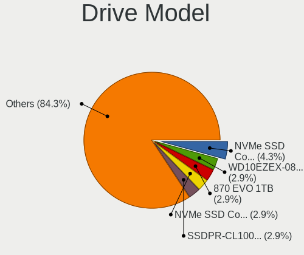
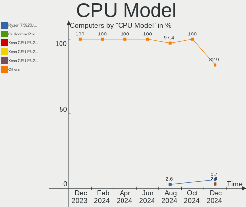
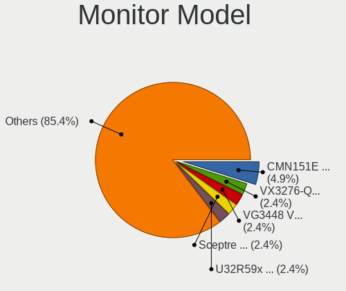
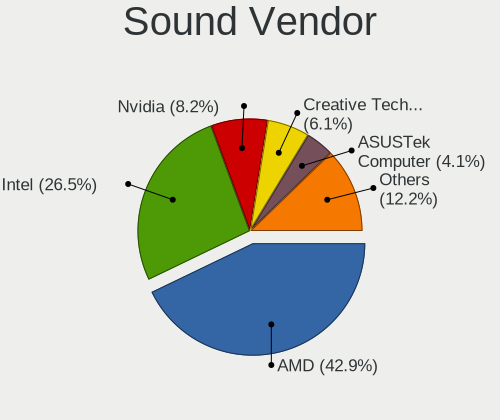
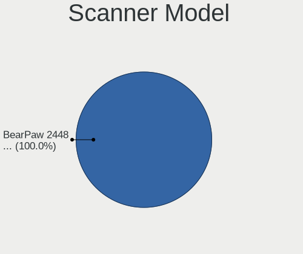
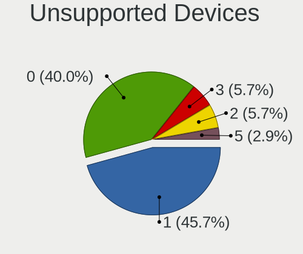

Gentoo Hardware Trends
----------------------

A project to identify most popular hardware characteristics and track their change
over time based on data collected by Gentoo users at https://Linux-Hardware.org.

Anyone can contribute to this report by the [hw-probe](https://github.com/linuxhw/hw-probe) tool:

    sudo -E hw-probe -all -upload

This is a report for all computer types. See also reports for [desktops](/Dist/Gentoo/Desktop/README.md) and [notebooks](/Dist/Gentoo/Notebook/README.md).

This report is for one last month. Overall report since the beginning of time: [TestCoverage](https://github.com/linuxhw/TestCoverage)

Period: Apr, 2022.

Contents
--------

* [ System ](#system)
  - [ OS                       ](#os)
  - [ OS Family                ](#os-family)
  - [ Kernel                   ](#kernel)
  - [ Kernel Family            ](#kernel-family)
  - [ Kernel Major Ver.        ](#kernel-major-ver)
  - [ Arch                     ](#arch)
  - [ DE                       ](#de)
  - [ Display Server           ](#display-server)
  - [ Display Manager          ](#display-manager)
  - [ OS Lang                  ](#os-lang)
  - [ Boot Mode                ](#boot-mode)
  - [ Filesystem               ](#filesystem)
  - [ Part. scheme             ](#part-scheme)
  - [ Dual Boot with Linux/BSD ](#dual-boot-with-linuxbsd)
  - [ Dual Boot (Win)          ](#dual-boot-win)

* [ Board ](#board)
  - [ Vendor                   ](#vendor)
  - [ Model                    ](#model)
  - [ Model Family             ](#model-family)
  - [ MFG Year                 ](#mfg-year)
  - [ Form Factor              ](#form-factor)
  - [ Secure Boot              ](#secure-boot)
  - [ Coreboot                 ](#coreboot)
  - [ RAM Size                 ](#ram-size)
  - [ RAM Used                 ](#ram-used)
  - [ Total Drives             ](#total-drives)
  - [ Has CD-ROM               ](#has-cd-rom)
  - [ Has Ethernet             ](#has-ethernet)
  - [ Has WiFi                 ](#has-wifi)
  - [ Has Bluetooth            ](#has-bluetooth)

* [ Location ](#location)
  - [ Country                  ](#country)
  - [ City                     ](#city)

* [ Drives ](#drives)
  - [ Drive Vendor             ](#drive-vendor)
  - [ Drive Model              ](#drive-model)
  - [ HDD Vendor               ](#hdd-vendor)
  - [ SSD Vendor               ](#ssd-vendor)
  - [ Drive Kind               ](#drive-kind)
  - [ Drive Connector          ](#drive-connector)
  - [ Drive Size               ](#drive-size)
  - [ Space Total              ](#space-total)
  - [ Space Used               ](#space-used)
  - [ Malfunc. Drives          ](#malfunc-drives)
  - [ Malfunc. Drive Vendor    ](#malfunc-drive-vendor)
  - [ Malfunc. HDD Vendor      ](#malfunc-hdd-vendor)
  - [ Malfunc. Drive Kind      ](#malfunc-drive-kind)
  - [ Failed Drives            ](#failed-drives)
  - [ Failed Drive Vendor      ](#failed-drive-vendor)
  - [ Drive Status             ](#drive-status)

* [ Storage controller ](#storage-controller)
  - [ Storage Vendor           ](#storage-vendor)
  - [ Storage Model            ](#storage-model)
  - [ Storage Kind             ](#storage-kind)

* [ Processor ](#processor)
  - [ CPU Vendor               ](#cpu-vendor)
  - [ CPU Model                ](#cpu-model)
  - [ CPU Model Family         ](#cpu-model-family)
  - [ CPU Cores                ](#cpu-cores)
  - [ CPU Sockets              ](#cpu-sockets)
  - [ CPU Threads              ](#cpu-threads)
  - [ CPU Op-Modes             ](#cpu-op-modes)
  - [ CPU Microcode            ](#cpu-microcode)
  - [ CPU Microarch            ](#cpu-microarch)

* [ Graphics ](#graphics)
  - [ GPU Vendor               ](#gpu-vendor)
  - [ GPU Model                ](#gpu-model)
  - [ GPU Combo                ](#gpu-combo)
  - [ GPU Driver               ](#gpu-driver)
  - [ GPU Memory               ](#gpu-memory)

* [ Monitor ](#monitor)
  - [ Monitor Vendor           ](#monitor-vendor)
  - [ Monitor Model            ](#monitor-model)
  - [ Monitor Resolution       ](#monitor-resolution)
  - [ Monitor Diagonal         ](#monitor-diagonal)
  - [ Monitor Width            ](#monitor-width)
  - [ Aspect Ratio             ](#aspect-ratio)
  - [ Monitor Area             ](#monitor-area)
  - [ Pixel Density            ](#pixel-density)
  - [ Multiple Monitors        ](#multiple-monitors)

* [ Network ](#network)
  - [ Net Controller Vendor    ](#net-controller-vendor)
  - [ Net Controller Model     ](#net-controller-model)
  - [ Wireless Vendor          ](#wireless-vendor)
  - [ Wireless Model           ](#wireless-model)
  - [ Ethernet Vendor          ](#ethernet-vendor)
  - [ Ethernet Model           ](#ethernet-model)
  - [ Net Controller Kind      ](#net-controller-kind)
  - [ Used Controller          ](#used-controller)
  - [ NICs                     ](#nics)
  - [ IPv6                     ](#ipv6)

* [ Bluetooth ](#bluetooth)
  - [ Bluetooth Vendor         ](#bluetooth-vendor)
  - [ Bluetooth Model          ](#bluetooth-model)

* [ Sound ](#sound)
  - [ Sound Vendor             ](#sound-vendor)
  - [ Sound Model              ](#sound-model)

* [ Memory ](#memory)
  - [ Memory Vendor            ](#memory-vendor)
  - [ Memory Model             ](#memory-model)
  - [ Memory Kind              ](#memory-kind)
  - [ Memory Form Factor       ](#memory-form-factor)
  - [ Memory Size              ](#memory-size)
  - [ Memory Speed             ](#memory-speed)

* [ Printers & scanners ](#printers--scanners)
  - [ Printer Vendor           ](#printer-vendor)
  - [ Printer Model            ](#printer-model)
  - [ Scanner Vendor           ](#scanner-vendor)
  - [ Scanner Model            ](#scanner-model)

* [ Camera ](#camera)
  - [ Camera Vendor            ](#camera-vendor)
  - [ Camera Model             ](#camera-model)

* [ Security ](#security)
  - [ Fingerprint Vendor       ](#fingerprint-vendor)
  - [ Fingerprint Model        ](#fingerprint-model)
  - [ Chipcard Vendor          ](#chipcard-vendor)
  - [ Chipcard Model           ](#chipcard-model)

* [ Unsupported ](#unsupported)
  - [ Unsupported Devices      ](#unsupported-devices)
  - [ Unsupported Device Types ](#unsupported-device-types)

System
------

OS
--

Installed operating systems

| Name       | Computers | Percent |
|------------|-----------|---------|
| Gentoo 2.6 | 24        | 41.38%  |
| Gentoo 2.8 | 19        | 32.76%  |
| Gentoo 2.7 | 15        | 25.86%  |

OS Family
---------

OS without a version

| Name   | Computers | Percent |
|--------|-----------|---------|
| Gentoo | 58        | 100%    |

Kernel
------

Version of the Linux kernel

| Version                          | Computers | Percent |
|----------------------------------|-----------|---------|
| 5.15.32-gentoo-r1                | 7         | 12.07%  |
| 5.15.26-gentoo                   | 6         | 10.34%  |
| 5.15.32-gentoo-r1-x86_64         | 5         | 8.62%   |
| 5.17.3-gentoo                    | 3         | 5.17%   |
| 5.17.1-gentoo-r1                 | 3         | 5.17%   |
| 5.15.32-gentoo-dist              | 3         | 5.17%   |
| 5.17.1-gentoo-r1-x86_64          | 2         | 3.45%   |
| 5.15.26-gentoo-x86_64            | 2         | 3.45%   |
| 5.17.5-gentoo-x86_64             | 1         | 1.72%   |
| 5.17.3-gentoo-11-02-22           | 1         | 1.72%   |
| 5.17.2-gentoo-yoshi-hp           | 1         | 1.72%   |
| 5.17.2-gentoo-limelight          | 1         | 1.72%   |
| 5.17.2-gentoo-groovin            | 1         | 1.72%   |
| 5.17.2-gentoo                    | 1         | 1.72%   |
| 5.17.1-gentoo-r1-gentoo          | 1         | 1.72%   |
| 5.17.0-gentoo                    | 1         | 1.72%   |
| 5.17.0-genix_5.17+               | 1         | 1.72%   |
| 5.16.9-gentoo                    | 1         | 1.72%   |
| 5.16.13-gentoo                   | 1         | 1.72%   |
| 5.16.11-gentoo-x86_64            | 1         | 1.72%   |
| 5.16.0-pf5                       | 1         | 1.72%   |
| 5.15.35-adry                     | 1         | 1.72%   |
| 5.15.34                          | 1         | 1.72%   |
| 5.15.33-gentoo-x86_64            | 1         | 1.72%   |
| 5.15.33-gentoo-113-eee_drivers   | 1         | 1.72%   |
| 5.15.32-gentoo-r1harambe-edition | 1         | 1.72%   |
| 5.15.32-gentoo-r1-genbook        | 1         | 1.72%   |
| 5.15.32-gentoo-r1-cp003          | 1         | 1.72%   |
| 5.15.30-v8                       | 1         | 1.72%   |
| 5.15.30                          | 1         | 1.72%   |
| 5.15.16-gentoo-x86_64            | 1         | 1.72%   |
| 5.14.13-gentoo                   | 1         | 1.72%   |
| 5.12.19-gentoo-dist              | 1         | 1.72%   |
| 5.10.52-gentoo-x86_64            | 1         | 1.72%   |
| 5.10.52-gentoo-amd64-fomys       | 1         | 1.72%   |

Kernel Family
-------------

Linux kernel without a distro release

| Version | Computers | Percent |
|---------|-----------|---------|
| 5.15.32 | 18        | 31.03%  |
| 5.15.26 | 8         | 13.79%  |
| 5.17.1  | 6         | 10.34%  |
| 5.17.3  | 4         | 6.9%    |
| 5.17.2  | 4         | 6.9%    |
| 5.17.0  | 2         | 3.45%   |
| 5.15.33 | 2         | 3.45%   |
| 5.15.30 | 2         | 3.45%   |
| 5.10.52 | 2         | 3.45%   |
| 5.17.5  | 1         | 1.72%   |
| 5.16.9  | 1         | 1.72%   |
| 5.16.13 | 1         | 1.72%   |
| 5.16.11 | 1         | 1.72%   |
| 5.16.0  | 1         | 1.72%   |
| 5.15.35 | 1         | 1.72%   |
| 5.15.34 | 1         | 1.72%   |
| 5.15.16 | 1         | 1.72%   |
| 5.14.13 | 1         | 1.72%   |
| 5.12.19 | 1         | 1.72%   |

Kernel Major Ver.
-----------------

Linux kernel major version

| Version | Computers | Percent |
|---------|-----------|---------|
| 5.15    | 33        | 56.9%   |
| 5.17    | 17        | 29.31%  |
| 5.16    | 4         | 6.9%    |
| 5.10    | 2         | 3.45%   |
| 5.14    | 1         | 1.72%   |
| 5.12    | 1         | 1.72%   |

Arch
----

OS architecture (x86_64, i586, etc.)

| Name    | Computers | Percent |
|---------|-----------|---------|
| x86_64  | 56        | 96.55%  |
| aarch64 | 2         | 3.45%   |

DE
--

Desktop Environment

| Name    | Computers | Percent |
|---------|-----------|---------|
| Unknown | 17        | 29.31%  |
| KDE5    | 16        | 27.59%  |
| GNOME   | 11        | 18.97%  |
| XFCE    | 8         | 13.79%  |
| MATE    | 4         | 6.9%    |
| LXQt    | 1         | 1.72%   |
| DWM     | 1         | 1.72%   |

Display Server
--------------

X11 or Wayland

| Name    | Computers | Percent |
|---------|-----------|---------|
| X11     | 28        | 48.28%  |
| Unknown | 14        | 24.14%  |
| Wayland | 8         | 13.79%  |
| Tty     | 8         | 13.79%  |

Display Manager
---------------

SDDM, LightDM, etc.

| Name    | Computers | Percent |
|---------|-----------|---------|
| Unknown | 20        | 34.48%  |
| SDDM    | 17        | 29.31%  |
| LightDM | 11        | 18.97%  |
| GDM     | 7         | 12.07%  |
| XDM     | 1         | 1.72%   |
| SLiM    | 1         | 1.72%   |
| GREETD  | 1         | 1.72%   |

OS Lang
-------

Language

| Lang       | Computers | Percent |
|------------|-----------|---------|
| en_US      | 23        | 39.66%  |
| Unknown    | 9         | 15.52%  |
| en_GB      | 8         | 13.79%  |
| C.UTF8     | 6         | 10.34%  |
| es_ES      | 3         | 5.17%   |
| pl_PL      | 2         | 3.45%   |
| de_DE      | 2         | 3.45%   |
| fr_FR.UTF8 | 1         | 1.72%   |
| fr_FR      | 1         | 1.72%   |
| el_GR      | 1         | 1.72%   |
| de_CH      | 1         | 1.72%   |
| C          | 1         | 1.72%   |

Boot Mode
---------

EFI or BIOS

| Mode | Computers | Percent |
|------|-----------|---------|
| EFI  | 44        | 75.86%  |
| BIOS | 14        | 24.14%  |

Filesystem
----------

Type of filesystem

| Type    | Computers | Percent |
|---------|-----------|---------|
| Ext4    | 32        | 55.17%  |
| Btrfs   | 14        | 24.14%  |
| Zfs     | 5         | 8.62%   |
| F2fs    | 3         | 5.17%   |
| Xfs     | 2         | 3.45%   |
| XXXXXXX | 1         | 1.72%   |
| XXX     | 1         | 1.72%   |

Part. scheme
------------

Scheme of partitioning

| Type    | Computers | Percent |
|---------|-----------|---------|
| GPT     | 51        | 87.93%  |
| Unknown | 4         | 6.9%    |
| MBR     | 3         | 5.17%   |

Dual Boot with Linux/BSD
------------------------

Hosting more than one Linux/BSD

| Dual boot | Computers | Percent |
|-----------|-----------|---------|
| No        | 35        | 60.34%  |
| Yes       | 23        | 39.66%  |

Dual Boot (Win)
---------------

Hosting Linux and Windows

| Dual boot | Computers | Percent |
|-----------|-----------|---------|
| No        | 46        | 79.31%  |
| Yes       | 12        | 20.69%  |

Board
-----

Vendor
------

Motherboard manufacturer

| Name                    | Computers | Percent |
|-------------------------|-----------|---------|
| ASUSTek Computer        | 13        | 22.41%  |
| MSI                     | 6         | 10.34%  |
| Hewlett-Packard         | 6         | 10.34%  |
| Gigabyte Technology     | 6         | 10.34%  |
| Dell                    | 6         | 10.34%  |
| Lenovo                  | 4         | 6.9%    |
| ASRock                  | 4         | 6.9%    |
| Apple                   | 3         | 5.17%   |
| Raspberry Pi Foundation | 2         | 3.45%   |
| Acer                    | 2         | 3.45%   |
| TUXEDO                  | 1         | 1.72%   |
| Timi                    | 1         | 1.72%   |
| System76                | 1         | 1.72%   |
| HUAWEI                  | 1         | 1.72%   |
| Fanless Mini PC         | 1         | 1.72%   |
| ASRockRack              | 1         | 1.72%   |

Model
-----

Motherboard model

| Name                                    | Computers | Percent |
|-----------------------------------------|-----------|---------|
| HP Pavilion Notebook                    | 2         | 3.45%   |
| ASRock Z390 Extreme4                    | 2         | 3.45%   |
| TUXEDO Pulse 15 Gen1                    | 1         | 1.72%   |
| Timi A35                                | 1         | 1.72%   |
| System76 Gazelle                        | 1         | 1.72%   |
| RPi Raspberry Pi 3 Model B Plus Rev 1.3 | 1         | 1.72%   |
| RPi Raspberry Pi                        | 1         | 1.72%   |
| MSI MS-7C91                             | 1         | 1.72%   |
| MSI MS-7C84                             | 1         | 1.72%   |
| MSI MS-7B98                             | 1         | 1.72%   |
| MSI MS-7B86                             | 1         | 1.72%   |
| MSI MS-7B17                             | 1         | 1.72%   |
| MSI GE66 Raider 11UE                    | 1         | 1.72%   |
| Lenovo ThinkPad Yoga 11e 20DAS05100     | 1         | 1.72%   |
| Lenovo ThinkPad X390 Yoga 20NN0027MH    | 1         | 1.72%   |
| Lenovo ThinkPad X220 4291QT1            | 1         | 1.72%   |
| Lenovo ThinkCentre M900 10FMCTO1WW      | 1         | 1.72%   |
| HUAWEI CREM-WXX9                        | 1         | 1.72%   |
| HP ZBook 15 G3                          | 1         | 1.72%   |
| HP ProBook 6570b                        | 1         | 1.72%   |
| HP Pavilion ZV6100 (EE984EA#ABZ)        | 1         | 1.72%   |
| HP EliteBook 840 G1                     | 1         | 1.72%   |
| Gigabyte Z590 UD                        | 1         | 1.72%   |
| Gigabyte X570 GAMING X                  | 1         | 1.72%   |
| Gigabyte X570 AORUS ELITE WIFI          | 1         | 1.72%   |
| Gigabyte H470 HD3                       | 1         | 1.72%   |
| Gigabyte B460HD3                        | 1         | 1.72%   |
| Gigabyte AB350-Gaming                   | 1         | 1.72%   |
| Fanless Mini PC PCG02 GLE               | 1         | 1.72%   |
| Dell XPS 15 9510                        | 1         | 1.72%   |
| Dell Precision 7560                     | 1         | 1.72%   |
| Dell PowerEdge R510                     | 1         | 1.72%   |
| Dell OptiPlex 7080                      | 1         | 1.72%   |
| Dell G5 5505                            | 1         | 1.72%   |
| Dell G3 3500                            | 1         | 1.72%   |
| ASUS ZenBook UX333FN_UX333FN            | 1         | 1.72%   |
| ASUS VivoBook_ASUS Laptop E210MA_E210MA | 1         | 1.72%   |
| ASUS TUF Gaming Z690-PLUS D4            | 1         | 1.72%   |
| ASUS TUF Gaming B550-PLUS               | 1         | 1.72%   |
| ASUS ROG STRIX X570-E GAMING            | 1         | 1.72%   |
| ASUS ROG STRIX X470-F GAMING            | 1         | 1.72%   |
| ASUS ROG STRIX B550-F GAMING            | 1         | 1.72%   |
| ASUS ROG Maximus XIII APEX              | 1         | 1.72%   |
| ASUS PRIME X570-PRO                     | 1         | 1.72%   |
| ASUS PRIME H570M-PLUS                   | 1         | 1.72%   |
| ASUS P6X58D-E                           | 1         | 1.72%   |
| ASUS M3A78-CM                           | 1         | 1.72%   |
| ASUS All Series                         | 1         | 1.72%   |
| ASRockRack X470D4U                      | 1         | 1.72%   |
| ASRock A520M Pro4                       | 1         | 1.72%   |
| ASRock A320M-ITX                        | 1         | 1.72%   |
| Apple Macmini3,1                        | 1         | 1.72%   |
| Apple MacBookPro11,3                    | 1         | 1.72%   |
| Apple MacBookAir3,1                     | 1         | 1.72%   |
| Acer Aspire VX5-591G                    | 1         | 1.72%   |
| Acer Aspire E5-571G                     | 1         | 1.72%   |

Model Family
------------

Motherboard model prefix

| Name                  | Computers | Percent |
|-----------------------|-----------|---------|
| ASUS ROG              | 4         | 6.9%    |
| Lenovo ThinkPad       | 3         | 5.17%   |
| HP Pavilion           | 3         | 5.17%   |
| RPi Raspberry         | 2         | 3.45%   |
| Gigabyte X570         | 2         | 3.45%   |
| ASUS TUF              | 2         | 3.45%   |
| ASUS PRIME            | 2         | 3.45%   |
| ASRock Z390           | 2         | 3.45%   |
| Acer Aspire           | 2         | 3.45%   |
| TUXEDO Pulse          | 1         | 1.72%   |
| Timi A35              | 1         | 1.72%   |
| System76 Gazelle      | 1         | 1.72%   |
| MSI MS-7C91           | 1         | 1.72%   |
| MSI MS-7C84           | 1         | 1.72%   |
| MSI MS-7B98           | 1         | 1.72%   |
| MSI MS-7B86           | 1         | 1.72%   |
| MSI MS-7B17           | 1         | 1.72%   |
| MSI GE66              | 1         | 1.72%   |
| Lenovo ThinkCentre    | 1         | 1.72%   |
| HUAWEI CREM-WXX9      | 1         | 1.72%   |
| HP ZBook              | 1         | 1.72%   |
| HP ProBook            | 1         | 1.72%   |
| HP EliteBook          | 1         | 1.72%   |
| Gigabyte Z590         | 1         | 1.72%   |
| Gigabyte H470         | 1         | 1.72%   |
| Gigabyte B460HD3      | 1         | 1.72%   |
| Gigabyte AB350-Gaming | 1         | 1.72%   |
| Fanless Mini PC PCG02 | 1         | 1.72%   |
| Dell XPS              | 1         | 1.72%   |
| Dell Precision        | 1         | 1.72%   |
| Dell PowerEdge        | 1         | 1.72%   |
| Dell OptiPlex         | 1         | 1.72%   |
| Dell G5               | 1         | 1.72%   |
| Dell G3               | 1         | 1.72%   |
| ASUS ZenBook          | 1         | 1.72%   |
| ASUS VivoBook         | 1         | 1.72%   |
| ASUS P6X58D-E         | 1         | 1.72%   |
| ASUS M3A78-CM         | 1         | 1.72%   |
| ASUS All              | 1         | 1.72%   |
| ASRockRack X470D4U    | 1         | 1.72%   |
| ASRock A520M          | 1         | 1.72%   |
| ASRock A320M-ITX      | 1         | 1.72%   |
| Apple Macmini3        | 1         | 1.72%   |
| Apple MacBookPro11    | 1         | 1.72%   |
| Apple MacBookAir3     | 1         | 1.72%   |

MFG Year
--------

Motherboard manufacture year

| Year    | Computers | Percent |
|---------|-----------|---------|
| 2021    | 12        | 20.69%  |
| 2020    | 10        | 17.24%  |
| 2019    | 9         | 15.52%  |
| 2018    | 8         | 13.79%  |
| 2014    | 3         | 5.17%   |
| 2022    | 2         | 3.45%   |
| 2017    | 2         | 3.45%   |
| 2010    | 2         | 3.45%   |
| 2008    | 2         | 3.45%   |
| Unknown | 2         | 3.45%   |
| 2016    | 1         | 1.72%   |
| 2015    | 1         | 1.72%   |
| 2013    | 1         | 1.72%   |
| 2012    | 1         | 1.72%   |
| 2011    | 1         | 1.72%   |
| 2006    | 1         | 1.72%   |

Form Factor
-----------

Physical design of the computer

| Name           | Computers | Percent |
|----------------|-----------|---------|
| Desktop        | 29        | 50%     |
| Notebook       | 23        | 39.66%  |
| System on chip | 2         | 3.45%   |
| Stick pc       | 1         | 1.72%   |
| Convertible    | 1         | 1.72%   |
| Mini pc        | 1         | 1.72%   |
| Server         | 1         | 1.72%   |

Secure Boot
-----------

Enabled or disabled

| State    | Computers | Percent |
|----------|-----------|---------|
| Disabled | 55        | 94.83%  |
| Enabled  | 3         | 5.17%   |

Coreboot
--------

Have coreboot on board

| Used | Computers | Percent |
|------|-----------|---------|
| No   | 57        | 98.28%  |
| Yes  | 1         | 1.72%   |

RAM Size
--------

Total RAM memory

| Size in GB  | Computers | Percent |
|-------------|-----------|---------|
| 64.01-256.0 | 14        | 24.14%  |
| 16.01-24.0  | 13        | 22.41%  |
| 32.01-64.0  | 12        | 20.69%  |
| 8.01-16.0   | 6         | 10.34%  |
| 4.01-8.0    | 5         | 8.62%   |
| 3.01-4.0    | 3         | 5.17%   |
| 1.01-2.0    | 2         | 3.45%   |
| 0.51-1.0    | 2         | 3.45%   |
| 24.01-32.0  | 1         | 1.72%   |

RAM Used
--------

Used RAM memory

| Used GB    | Computers | Percent |
|------------|-----------|---------|
| 2.01-3.0   | 14        | 24.14%  |
| 4.01-8.0   | 13        | 22.41%  |
| 1.01-2.0   | 10        | 17.24%  |
| 8.01-16.0  | 6         | 10.34%  |
| 0.01-0.5   | 5         | 8.62%   |
| 16.01-24.0 | 3         | 5.17%   |
| 0.51-1.0   | 3         | 5.17%   |
| 3.01-4.0   | 2         | 3.45%   |
| 32.01-64.0 | 1         | 1.72%   |
| 24.01-32.0 | 1         | 1.72%   |

Total Drives
------------

Number of drives on board

| Drives | Computers | Percent |
|--------|-----------|---------|
| 1      | 24        | 41.38%  |
| 2      | 14        | 24.14%  |
| 3      | 9         | 15.52%  |
| 4      | 5         | 8.62%   |
| 5      | 4         | 6.9%    |
| 7      | 1         | 1.72%   |
| 6      | 1         | 1.72%   |

Has CD-ROM
----------

Has CD-ROM on board

| Presented | Computers | Percent |
|-----------|-----------|---------|
| No        | 48        | 82.76%  |
| Yes       | 10        | 17.24%  |

Has Ethernet
------------

Has Ethernet on board

| Presented | Computers | Percent |
|-----------|-----------|---------|
| Yes       | 52        | 89.66%  |
| No        | 6         | 10.34%  |

Has WiFi
--------

Has WiFi module

| Presented | Computers | Percent |
|-----------|-----------|---------|
| Yes       | 36        | 62.07%  |
| No        | 22        | 37.93%  |

Has Bluetooth
-------------

Has Bluetooth module

| Presented | Computers | Percent |
|-----------|-----------|---------|
| Yes       | 34        | 58.62%  |
| No        | 24        | 41.38%  |

Location
--------

Country
-------

Geographic location (country)

| Country     | Computers | Percent |
|-------------|-----------|---------|
| USA         | 18        | 31.03%  |
| UK          | 6         | 10.34%  |
| Poland      | 6         | 10.34%  |
| France      | 6         | 10.34%  |
| Spain       | 4         | 6.9%    |
| Germany     | 3         | 5.17%   |
| Switzerland | 2         | 3.45%   |
| Russia      | 2         | 3.45%   |
| Australia   | 2         | 3.45%   |
| Ukraine     | 1         | 1.72%   |
| Taiwan      | 1         | 1.72%   |
| Netherlands | 1         | 1.72%   |
| Malaysia    | 1         | 1.72%   |
| Iran        | 1         | 1.72%   |
| Indonesia   | 1         | 1.72%   |
| Greece      | 1         | 1.72%   |
| Czechia     | 1         | 1.72%   |
| Canada      | 1         | 1.72%   |

City
----

Geographic location (city)

| City           | Computers | Percent |
|----------------|-----------|---------|
| San Jose       | 5         | 8.62%   |
| Warsaw         | 3         | 5.17%   |
| Poplar         | 2         | 3.45%   |
| Paris          | 2         | 3.45%   |
| Ocala          | 2         | 3.45%   |
| New York       | 2         | 3.45%   |
| Houston        | 2         | 3.45%   |
| Zurich         | 1         | 1.72%   |
| Utrecht        | 1         | 1.72%   |
| Toulouse       | 1         | 1.72%   |
| Ternopil       | 1         | 1.72%   |
| Tehran         | 1         | 1.72%   |
| Taipei         | 1         | 1.72%   |
| Sydney         | 1         | 1.72%   |
| St Petersburg  | 1         | 1.72%   |
| St Louis       | 1         | 1.72%   |
| Sanford        | 1         | 1.72%   |
| Roubaix        | 1         | 1.72%   |
| Pujaut         | 1         | 1.72%   |
| Pruszków      | 1         | 1.72%   |
| Oxnard         | 1         | 1.72%   |
| Ourense        | 1         | 1.72%   |
| Orange         | 1         | 1.72%   |
| Nuremberg      | 1         | 1.72%   |
| New Richmond   | 1         | 1.72%   |
| Neath          | 1         | 1.72%   |
| Milton Keynes  | 1         | 1.72%   |
| Melbourne      | 1         | 1.72%   |
| Marburg        | 1         | 1.72%   |
| Los Angeles    | 1         | 1.72%   |
| Laziska Gorne  | 1         | 1.72%   |
| La Chevroliere | 1         | 1.72%   |
| Kuala Lumpur   | 1         | 1.72%   |
| Jakarta        | 1         | 1.72%   |
| Izhevsk        | 1         | 1.72%   |
| Guadalajara    | 1         | 1.72%   |
| Granada        | 1         | 1.72%   |
| Erskine        | 1         | 1.72%   |
| Cieszyn        | 1         | 1.72%   |
| Boucherville   | 1         | 1.72%   |
| Boise          | 1         | 1.72%   |
| Bilovec        | 1         | 1.72%   |
| Berlin         | 1         | 1.72%   |
| Bellaterra     | 1         | 1.72%   |
| Athens         | 1         | 1.72%   |
| Altendorf      | 1         | 1.72%   |
| Abingdon       | 1         | 1.72%   |

Drives
------

Drive Vendor
------------

Hard drive vendors

| Vendor              | Computers | Drives | Percent |
|---------------------|-----------|--------|---------|
| Samsung Electronics | 16        | 23     | 15.69%  |
| Seagate             | 14        | 20     | 13.73%  |
| WDC                 | 11        | 14     | 10.78%  |
| Crucial             | 7         | 10     | 6.86%   |
| Kingston            | 6         | 8      | 5.88%   |
| Unknown             | 5         | 5      | 4.9%    |
| Toshiba             | 4         | 4      | 3.92%   |
| SanDisk             | 4         | 4      | 3.92%   |
| Phison              | 4         | 4      | 3.92%   |
| Intel               | 4         | 4      | 3.92%   |
| SK Hynix            | 3         | 3      | 2.94%   |
| Micron Technology   | 3         | 3      | 2.94%   |
| Hitachi             | 3         | 6      | 2.94%   |
| Corsair             | 3         | 4      | 2.94%   |
| A-DATA Technology   | 3         | 4      | 2.94%   |
| GOODRAM             | 2         | 2      | 1.96%   |
| China               | 2         | 3      | 1.96%   |
| Apple               | 2         | 2      | 1.96%   |
| XPG                 | 1         | 2      | 0.98%   |
| PLEXTOR             | 1         | 1      | 0.98%   |
| LaCie               | 1         | 1      | 0.98%   |
| IBM                 | 1         | 1      | 0.98%   |
| Hewlett-Packard     | 1         | 3      | 0.98%   |
| Fujitsu             | 1         | 1      | 0.98%   |

Drive Model
-----------

Hard drive models

| Model                               | Computers | Percent |
|-------------------------------------|-----------|---------|
| Samsung SSD 980 PRO 1TB             | 4         | 3.42%   |
| Crucial CT1000MX500SSD1 1TB         | 3         | 2.56%   |
| Unknown MMC Card  64GB              | 2         | 1.71%   |
| SK Hynix PC711 NVMe 1TB             | 2         | 1.71%   |
| Seagate ST4000DM004-2CV104 4TB      | 2         | 1.71%   |
| SanDisk SDSSDH31000G 1TB            | 2         | 1.71%   |
| Samsung SSD 970 EVO Plus 250GB      | 2         | 1.71%   |
| Samsung SSD 860 EVO 500GB           | 2         | 1.71%   |
| Samsung SSD 860 EVO 250GB           | 2         | 1.71%   |
| Phison Viper M.2 VPN100 1TB         | 2         | 1.71%   |
| GOODRAM SSDPR-CL100-480-G2 480GB    | 2         | 1.71%   |
| Crucial CT500MX500SSD1 500GB        | 2         | 1.71%   |
| Crucial CT2000MX500SSD1 2TB         | 2         | 1.71%   |
| A-DATA SX8200PNP 512GB              | 2         | 1.71%   |
| XPG GAMMIX S11 Pro 512GB            | 1         | 0.85%   |
| WDC WDS500G2B0C-00PXH0 500GB        | 1         | 0.85%   |
| WDC WDS500G2B0B 500GB SSD           | 1         | 0.85%   |
| WDC WDS240G2G0A-00JH30 240GB SSD    | 1         | 0.85%   |
| WDC WDS240G1G0B-00RC30 240GB SSD    | 1         | 0.85%   |
| WDC WDS100T2B0C 1TB                 | 1         | 0.85%   |
| WDC WDS100T2B0A-00SM50 1TB SSD      | 1         | 0.85%   |
| WDC WD8003FFBX-68B9AN0 8TB          | 1         | 0.85%   |
| WDC WD60EZRX-00MVLB1 6TB            | 1         | 0.85%   |
| WDC WD40EZRZ-00GXCB0 4TB            | 1         | 0.85%   |
| WDC WD20EZAZ-00GGJB0 2TB            | 1         | 0.85%   |
| WDC WD20EARS-00MVWB0 2TB            | 1         | 0.85%   |
| WDC WD2003FYYS-18W0B0 2TB           | 1         | 0.85%   |
| WDC WD10EFRX-68FYTN0 1TB            | 1         | 0.85%   |
| WDC PC SN730 SDBPNTY-512G           | 1         | 0.85%   |
| Unknown MMC Card  32GB              | 1         | 0.85%   |
| Unknown MMC Card  256GB             | 1         | 0.85%   |
| Unknown MMC Card  128GB             | 1         | 0.85%   |
| Toshiba TR200 480GB SSD             | 1         | 0.85%   |
| Toshiba MQ01ABD100 1TB              | 1         | 0.85%   |
| Toshiba HDWE150 5TB                 | 1         | 0.85%   |
| Toshiba HDWE140 4TB                 | 1         | 0.85%   |
| SK Hynix PC611 NVMe 512GB           | 1         | 0.85%   |
| Seagate ST8000DM004-2CX188 8TB      | 1         | 0.85%   |
| Seagate ST6000VN0033-2EE110 6TB     | 1         | 0.85%   |
| Seagate ST500DM002-1BD142 500GB     | 1         | 0.85%   |
| Seagate ST4000DM005-2DP166 4TB      | 1         | 0.85%   |
| Seagate ST3500418AS 500GB           | 1         | 0.85%   |
| Seagate ST2000LM015-2E8174 2TB      | 1         | 0.85%   |
| Seagate ST2000DM006-2DM164 2TB      | 1         | 0.85%   |
| Seagate ST2000DM001-1CH164 2TB      | 1         | 0.85%   |
| Seagate ST18000NM000J-2TV103 18TB   | 1         | 0.85%   |
| Seagate ST12000NM0117-2GY101 12TB   | 1         | 0.85%   |
| Seagate ST12000NM0008-2H3101 12TB   | 1         | 0.85%   |
| Seagate ST1000LM048-2E7172 1TB      | 1         | 0.85%   |
| Seagate ST1000DM010-2EP102 1TB      | 1         | 0.85%   |
| SanDisk SD9SN8W-128G-1006 128GB SSD | 1         | 0.85%   |
| SanDisk SD7SB7S512G1001 512GB SSD   | 1         | 0.85%   |
| Samsung SSD 980 PRO 2TB             | 1         | 0.85%   |
| Samsung SSD 980 1TB                 | 1         | 0.85%   |
| Samsung SSD 970 EVO Plus 2TB        | 1         | 0.85%   |
| Samsung SSD 970 EVO 250GB           | 1         | 0.85%   |
| Samsung SSD 870 QVO 2TB             | 1         | 0.85%   |
| Samsung SSD 860 QVO 1TB             | 1         | 0.85%   |
| Samsung SSD 850 PRO 256GB           | 1         | 0.85%   |
| Samsung PSSD T7 500GB               | 1         | 0.85%   |

HDD Vendor
----------

Hard disk drive vendors

| Vendor          | Computers | Drives | Percent |
|-----------------|-----------|--------|---------|
| Seagate         | 14        | 20     | 48.28%  |
| WDC             | 5         | 7      | 17.24%  |
| Toshiba         | 3         | 3      | 10.34%  |
| Hitachi         | 3         | 6      | 10.34%  |
| LaCie           | 1         | 1      | 3.45%   |
| IBM             | 1         | 1      | 3.45%   |
| Hewlett-Packard | 1         | 2      | 3.45%   |
| Fujitsu         | 1         | 1      | 3.45%   |

SSD Vendor
----------

Solid state drive vendors

| Vendor              | Computers | Drives | Percent |
|---------------------|-----------|--------|---------|
| Samsung Electronics | 8         | 8      | 21.62%  |
| Crucial             | 6         | 8      | 16.22%  |
| WDC                 | 4         | 4      | 10.81%  |
| SanDisk             | 4         | 4      | 10.81%  |
| Kingston            | 3         | 5      | 8.11%   |
| GOODRAM             | 2         | 2      | 5.41%   |
| Corsair             | 2         | 3      | 5.41%   |
| China               | 2         | 3      | 5.41%   |
| Apple               | 2         | 2      | 5.41%   |
| Toshiba             | 1         | 1      | 2.7%    |
| PLEXTOR             | 1         | 1      | 2.7%    |
| Micron Technology   | 1         | 1      | 2.7%    |
| A-DATA Technology   | 1         | 1      | 2.7%    |

Drive Kind
----------

HDD or SSD

| Kind | Computers | Drives | Percent |
|------|-----------|--------|---------|
| NVMe | 35        | 43     | 36.46%  |
| SSD  | 32        | 43     | 33.33%  |
| HDD  | 24        | 41     | 25%     |
| MMC  | 5         | 5      | 5.21%   |

Drive Connector
---------------

SATA, SAS, NVMe, etc.

| Type | Computers | Drives | Percent |
|------|-----------|--------|---------|
| SATA | 39        | 82     | 48.15%  |
| NVMe | 35        | 43     | 43.21%  |
| MMC  | 5         | 5      | 6.17%   |
| SAS  | 2         | 2      | 2.47%   |

Drive Size
----------

Size of hard drive

| Size in TB | Computers | Drives | Percent |
|------------|-----------|--------|---------|
| 0.01-0.5   | 27        | 34     | 45.76%  |
| 0.51-1.0   | 12        | 15     | 20.34%  |
| 1.01-2.0   | 9         | 14     | 15.25%  |
| 3.01-4.0   | 4         | 8      | 6.78%   |
| 10.01-20.0 | 3         | 5      | 5.08%   |
| 4.01-10.0  | 3         | 5      | 5.08%   |
| 2.01-3.0   | 1         | 3      | 1.69%   |

Space Total
-----------

Amount of disk space available on the file system

| Size in GB     | Computers | Percent |
|----------------|-----------|---------|
| 501-1000       | 12        | 20.69%  |
| 251-500        | 9         | 15.52%  |
| 2001-3000      | 9         | 15.52%  |
| 101-250        | 8         | 13.79%  |
| More than 3000 | 6         | 10.34%  |
| 1-20           | 4         | 6.9%    |
| 51-100         | 4         | 6.9%    |
| 1001-2000      | 3         | 5.17%   |
| Unknown        | 3         | 5.17%   |

Space Used
----------

Amount of used disk space

| Used GB        | Computers | Percent |
|----------------|-----------|---------|
| 101-250        | 11        | 18.97%  |
| 251-500        | 10        | 17.24%  |
| 1-20           | 8         | 13.79%  |
| 21-50          | 7         | 12.07%  |
| 1001-2000      | 5         | 8.62%   |
| 501-1000       | 5         | 8.62%   |
| 51-100         | 5         | 8.62%   |
| More than 3000 | 4         | 6.9%    |
| Unknown        | 3         | 5.17%   |

Malfunc. Drives
---------------

Drive models with a malfunction

| Model                             | Computers | Drives | Percent |
|-----------------------------------|-----------|--------|---------|
| Seagate ST3500418AS 500GB         | 1         | 1      | 20%     |
| Samsung Electronics SSD 980 1TB   | 1         | 1      | 20%     |
| IBM DTLA-307045 48GB              | 1         | 1      | 20%     |
| Fujitsu MHZ2120BH G1 120GB        | 1         | 1      | 20%     |
| A-DATA Technology SP550 240GB SSD | 1         | 1      | 20%     |

Malfunc. Drive Vendor
---------------------

Vendors of faulty drives

| Vendor              | Computers | Drives | Percent |
|---------------------|-----------|--------|---------|
| Seagate             | 1         | 1      | 20%     |
| Samsung Electronics | 1         | 1      | 20%     |
| IBM                 | 1         | 1      | 20%     |
| Fujitsu             | 1         | 1      | 20%     |
| A-DATA Technology   | 1         | 1      | 20%     |

Malfunc. HDD Vendor
-------------------

Vendors of faulty HDD drives

| Vendor  | Computers | Drives | Percent |
|---------|-----------|--------|---------|
| Seagate | 1         | 1      | 33.33%  |
| IBM     | 1         | 1      | 33.33%  |
| Fujitsu | 1         | 1      | 33.33%  |

Malfunc. Drive Kind
-------------------

Kinds of faulty drives

| Kind | Computers | Drives | Percent |
|------|-----------|--------|---------|
| HDD  | 3         | 3      | 60%     |
| NVMe | 1         | 1      | 20%     |
| SSD  | 1         | 1      | 20%     |

Failed Drives
-------------

Failed drive models

Zero info for selected period =(

Failed Drive Vendor
-------------------

Failed drive vendors

Zero info for selected period =(

Drive Status
------------

Number of failed and malfunc. drives

| Status   | Computers | Drives | Percent |
|----------|-----------|--------|---------|
| Works    | 50        | 118    | 78.13%  |
| Detected | 9         | 9      | 14.06%  |
| Malfunc  | 5         | 5      | 7.81%   |

Storage controller
------------------

Storage Vendor
--------------

Storage controller vendors

| Vendor                      | Computers | Percent |
|-----------------------------|-----------|---------|
| Intel                       | 31        | 33.7%   |
| AMD                         | 18        | 19.57%  |
| Samsung Electronics         | 13        | 14.13%  |
| ASMedia Technology          | 5         | 5.43%   |
| Phison Electronics          | 4         | 4.35%   |
| SK Hynix                    | 3         | 3.26%   |
| Sandisk                     | 3         | 3.26%   |
| Micron/Crucial Technology   | 3         | 3.26%   |
| Kingston Technology Company | 3         | 3.26%   |
| ADATA Technology            | 3         | 3.26%   |
| Nvidia                      | 2         | 2.17%   |
| Micron Technology           | 2         | 2.17%   |
| Silicon Motion              | 1         | 1.09%   |
| LSI Logic / Symbios Logic   | 1         | 1.09%   |

Storage Model
-------------

Storage controller models

| Model                                                                         | Computers | Percent |
|-------------------------------------------------------------------------------|-----------|---------|
| AMD FCH SATA Controller [AHCI mode]                                           | 14        | 13.86%  |
| Samsung NVMe SSD Controller PM9A1/PM9A3/980PRO                                | 6         | 5.94%   |
| Samsung NVMe SSD Controller SM981/PM981/PM983                                 | 5         | 4.95%   |
| Intel Cannon Lake PCH SATA AHCI Controller                                    | 4         | 3.96%   |
| Intel 500 Series Chipset Family SATA AHCI Controller                          | 4         | 3.96%   |
| ASMedia ASM1062 Serial ATA Controller                                         | 4         | 3.96%   |
| Phison E12 NVMe Controller                                                    | 3         | 2.97%   |
| AMD 500 Series Chipset SATA Controller                                        | 3         | 2.97%   |
| AMD 400 Series Chipset SATA Controller                                        | 3         | 2.97%   |
| ADATA XPG SX8200 Pro PCIe Gen3x4 M.2 2280 Solid State Drive                   | 3         | 2.97%   |
| SK Hynix Gold P31 SSD                                                         | 2         | 1.98%   |
| Sandisk WD Blue SN550 NVMe SSD                                                | 2         | 1.98%   |
| Samsung NVMe SSD Controller 980                                               | 2         | 1.98%   |
| Micron/Crucial P2 NVMe PCIe SSD                                               | 2         | 1.98%   |
| Micron Non-Volatile memory controller                                         | 2         | 1.98%   |
| Kingston Company A2000 NVMe SSD                                               | 2         | 1.98%   |
| Intel SSD 660P Series                                                         | 2         | 1.98%   |
| Intel Q170/Q150/B150/H170/H110/Z170/CM236 Chipset SATA Controller [AHCI Mode] | 2         | 1.98%   |
| Intel Comet Lake SATA AHCI Controller                                         | 2         | 1.98%   |
| Intel Celeron/Pentium Silver Processor SATA Controller                        | 2         | 1.98%   |
| Intel 8 Series SATA Controller 1 [AHCI mode]                                  | 2         | 1.98%   |
| Intel 400 Series Chipset Family SATA AHCI Controller                          | 2         | 1.98%   |
| SK Hynix Non-Volatile memory controller                                       | 1         | 0.99%   |
| Silicon Motion SM2262/SM2262EN SSD Controller                                 | 1         | 0.99%   |
| Sandisk WD Black SN750 / PC SN730 NVMe SSD                                    | 1         | 0.99%   |
| Samsung Apple PCIe SSD                                                        | 1         | 0.99%   |
| Phison E16 PCIe4 NVMe Controller                                              | 1         | 0.99%   |
| Nvidia MCP89 SATA Controller (AHCI mode)                                      | 1         | 0.99%   |
| Nvidia MCP79 AHCI Controller                                                  | 1         | 0.99%   |
| Micron/Crucial P1 NVMe PCIe SSD                                               | 1         | 0.99%   |
| LSI Logic / Symbios Logic SAS2008 PCI-Express Fusion-MPT SAS-2 [Falcon]       | 1         | 0.99%   |
| Kingston Company KC2000 NVMe SSD                                              | 1         | 0.99%   |
| Intel Wildcat Point-LP SATA Controller [AHCI Mode]                            | 1         | 0.99%   |
| Intel Volume Management Device NVMe RAID Controller                           | 1         | 0.99%   |
| Intel Sunrise Point-LP SATA Controller [AHCI mode]                            | 1         | 0.99%   |
| Intel SSD Pro 7600p/760p/E 6100p Series                                       | 1         | 0.99%   |
| Intel Optane SSD 900P Series                                                  | 1         | 0.99%   |
| Intel HM170/QM170 Chipset SATA Controller [AHCI Mode]                         | 1         | 0.99%   |
| Intel Atom Processor E3800 Series SATA AHCI Controller                        | 1         | 0.99%   |
| Intel Alder Lake-S PCH SATA Controller [AHCI Mode]                            | 1         | 0.99%   |
| Intel 9 Series Chipset Family SATA Controller [AHCI Mode]                     | 1         | 0.99%   |
| Intel 82801JI (ICH10 Family) SATA AHCI Controller                             | 1         | 0.99%   |
| Intel 7 Series Chipset Family 6-port SATA Controller [AHCI mode]              | 1         | 0.99%   |
| Intel 6 Series/C200 Series Chipset Family 6 port Mobile SATA AHCI Controller  | 1         | 0.99%   |
| ASMedia ASM1061 SATA IDE Controller                                           | 1         | 0.99%   |
| AMD SB7x0/SB8x0/SB9x0 SATA Controller [IDE mode]                              | 1         | 0.99%   |
| AMD SB7x0/SB8x0/SB9x0 IDE Controller                                          | 1         | 0.99%   |
| AMD IXP SB4x0 IDE Controller                                                  | 1         | 0.99%   |
| AMD FCH SATA Controller D                                                     | 1         | 0.99%   |
| AMD 300 Series Chipset SATA Controller                                        | 1         | 0.99%   |

Storage Kind
------------

Kind of storage controller (IDE, SATA, NVMe, SAS, ...)

| Kind | Computers | Percent |
|------|-----------|---------|
| SATA | 47        | 54.02%  |
| NVMe | 35        | 40.23%  |
| IDE  | 3         | 3.45%   |
| RAID | 1         | 1.15%   |
| SAS  | 1         | 1.15%   |

Processor
---------

CPU Vendor
----------

Processor vendors

| Vendor | Computers | Percent |
|--------|-----------|---------|
| Intel  | 37        | 63.79%  |
| AMD    | 19        | 32.76%  |
| ARM    | 2         | 3.45%   |

CPU Model
---------

Processor models

| Model                                      | Computers | Percent |
|--------------------------------------------|-----------|---------|
| Intel 11th Gen Core i7-11800H @ 2.30GHz    | 3         | 5.17%   |
| AMD Ryzen 9 5950X 16-Core Processor        | 3         | 5.17%   |
| AMD Ryzen 5 2600 Six-Core Processor        | 3         | 5.17%   |
| Intel Core i9-9900K CPU @ 3.60GHz          | 2         | 3.45%   |
| Intel Core i5-9600K CPU @ 3.70GHz          | 2         | 3.45%   |
| ARM Processor                              | 2         | 3.45%   |
| AMD Ryzen 7 4800H with Radeon Graphics     | 2         | 3.45%   |
| AMD Ryzen 7 2700 Eight-Core Processor      | 2         | 3.45%   |
| Intel Xeon CPU X5690 @ 3.47GHz             | 1         | 1.72%   |
| Intel Xeon CPU X5675 @ 3.07GHz             | 1         | 1.72%   |
| Intel Core i7-8565U CPU @ 1.80GHz          | 1         | 1.72%   |
| Intel Core i7-7700HQ CPU @ 2.80GHz         | 1         | 1.72%   |
| Intel Core i7-7500U CPU @ 2.70GHz          | 1         | 1.72%   |
| Intel Core i7-6700T CPU @ 2.80GHz          | 1         | 1.72%   |
| Intel Core i7-6700HQ CPU @ 2.60GHz         | 1         | 1.72%   |
| Intel Core i7-4870HQ CPU @ 2.50GHz         | 1         | 1.72%   |
| Intel Core i7-10700K CPU @ 3.80GHz         | 1         | 1.72%   |
| Intel Core i7-10700 CPU @ 2.90GHz          | 1         | 1.72%   |
| Intel Core i5-8265U CPU @ 1.60GHz          | 1         | 1.72%   |
| Intel Core i5-5200U CPU @ 2.20GHz          | 1         | 1.72%   |
| Intel Core i5-4690K CPU @ 3.50GHz          | 1         | 1.72%   |
| Intel Core i5-4210U CPU @ 1.70GHz          | 1         | 1.72%   |
| Intel Core i5-4200U CPU @ 1.60GHz          | 1         | 1.72%   |
| Intel Core i5-3210M CPU @ 2.50GHz          | 1         | 1.72%   |
| Intel Core i5-2520M CPU @ 2.50GHz          | 1         | 1.72%   |
| Intel Core i5-10400F CPU @ 2.90GHz         | 1         | 1.72%   |
| Intel Core i5-10400 CPU @ 2.90GHz          | 1         | 1.72%   |
| Intel Core i5-10300H CPU @ 2.50GHz         | 1         | 1.72%   |
| Intel Core 2 Duo CPU U9400 @ 1.40GHz       | 1         | 1.72%   |
| Intel Core 2 Duo CPU P7350 @ 2.00GHz       | 1         | 1.72%   |
| Intel Celeron N4020 CPU @ 1.10GHz          | 1         | 1.72%   |
| Intel Celeron J4125 CPU @ 2.00GHz          | 1         | 1.72%   |
| Intel Celeron CPU N2940 @ 1.83GHz          | 1         | 1.72%   |
| Intel 12th Gen Core i9-12900K              | 1         | 1.72%   |
| Intel 11th Gen Core i9-11950H @ 2.60GHz    | 1         | 1.72%   |
| Intel 11th Gen Core i9-11900K @ 3.50GHz    | 1         | 1.72%   |
| Intel 11th Gen Core i7-11700K @ 3.60GHz    | 1         | 1.72%   |
| Intel 11th Gen Core i5-11300H @ 3.10GHz    | 1         | 1.72%   |
| AMD Ryzen 9 5900X 12-Core Processor        | 1         | 1.72%   |
| AMD Ryzen 9 3950X 16-Core Processor        | 1         | 1.72%   |
| AMD Ryzen 7 PRO 5750G with Radeon Graphics | 1         | 1.72%   |
| AMD Ryzen 7 5800H with Radeon Graphics     | 1         | 1.72%   |
| AMD Ryzen 7 3700X 8-Core Processor         | 1         | 1.72%   |
| AMD Ryzen 5 3600XT 6-Core Processor        | 1         | 1.72%   |
| AMD Ryzen 5 3600X 6-Core Processor         | 1         | 1.72%   |
| AMD Phenom II X4 955 Processor             | 1         | 1.72%   |
| AMD Athlon 64 Processor 3200+              | 1         | 1.72%   |

CPU Model Family
----------------

Processor model prefix

| Model            | Computers | Percent |
|------------------|-----------|---------|
| Intel Core i5    | 12        | 20.69%  |
| Other            | 10        | 17.24%  |
| Intel Core i7    | 8         | 13.79%  |
| AMD Ryzen 7      | 6         | 10.34%  |
| AMD Ryzen 9      | 5         | 8.62%   |
| AMD Ryzen 5      | 5         | 8.62%   |
| Intel Celeron    | 3         | 5.17%   |
| Intel Xeon       | 2         | 3.45%   |
| Intel Core i9    | 2         | 3.45%   |
| Intel Core 2 Duo | 2         | 3.45%   |
| AMD Ryzen 7 PRO  | 1         | 1.72%   |
| AMD Phenom II X4 | 1         | 1.72%   |
| AMD Athlon 64    | 1         | 1.72%   |

CPU Cores
---------

Number of processor cores

| Number  | Computers | Percent |
|---------|-----------|---------|
| 8       | 17        | 29.31%  |
| 4       | 12        | 20.69%  |
| 6       | 10        | 17.24%  |
| 2       | 9         | 15.52%  |
| 16      | 5         | 8.62%   |
| 12      | 2         | 3.45%   |
| Unknown | 2         | 3.45%   |
| 1       | 1         | 1.72%   |

CPU Sockets
-----------

Number of sockets

| Number  | Computers | Percent |
|---------|-----------|---------|
| 1       | 55        | 94.83%  |
| Unknown | 2         | 3.45%   |
| 2       | 1         | 1.72%   |

CPU Threads
-----------

Threads per core (Hyper-Threading)

| Number  | Computers | Percent |
|---------|-----------|---------|
| 2       | 44        | 75.86%  |
| 1       | 12        | 20.69%  |
| Unknown | 2         | 3.45%   |

CPU Op-Modes
------------

CPU Operation Modes (32-bit, 64-bit)

| Op mode        | Computers | Percent |
|----------------|-----------|---------|
| 32-bit, 64-bit | 58        | 100%    |

CPU Microcode
-------------

Microcode number

| Number     | Computers | Percent |
|------------|-----------|---------|
| Unknown    | 9         | 15.52%  |
| 0x0a201016 | 4         | 6.9%    |
| 0x806d1    | 3         | 5.17%   |
| 0x08701021 | 3         | 5.17%   |
| 0x0800820d | 3         | 5.17%   |
| 0xa0655    | 2         | 3.45%   |
| 0xa0653    | 2         | 3.45%   |
| 0x906ed    | 2         | 3.45%   |
| 0x706a8    | 2         | 3.45%   |
| 0x506e3    | 2         | 3.45%   |
| 0x40651    | 2         | 3.45%   |
| 0x206c2    | 2         | 3.45%   |
| 0x1067a    | 2         | 3.45%   |
| 0xa0671    | 1         | 1.72%   |
| 0xa0652    | 1         | 1.72%   |
| 0x906ec    | 1         | 1.72%   |
| 0x906e9    | 1         | 1.72%   |
| 0x90672    | 1         | 1.72%   |
| 0x806eb    | 1         | 1.72%   |
| 0x806e9    | 1         | 1.72%   |
| 0x806c1    | 1         | 1.72%   |
| 0x40661    | 1         | 1.72%   |
| 0x306d4    | 1         | 1.72%   |
| 0x306c3    | 1         | 1.72%   |
| 0x306a9    | 1         | 1.72%   |
| 0x30678    | 1         | 1.72%   |
| 0x206a7    | 1         | 1.72%   |
| 0x0a50000c | 1         | 1.72%   |
| 0x0a50000b | 1         | 1.72%   |
| 0x08600103 | 1         | 1.72%   |
| 0x08600102 | 1         | 1.72%   |
| 0x08008204 | 1         | 1.72%   |
| 0x010000db | 1         | 1.72%   |

CPU Microarch
-------------

Microarchitecture

| Name             | Computers | Percent |
|------------------|-----------|---------|
| KabyLake         | 8         | 13.79%  |
| Zen 3            | 6         | 10.34%  |
| Zen 2            | 6         | 10.34%  |
| Zen+             | 5         | 8.62%   |
| CometLake        | 5         | 8.62%   |
| Icelake          | 4         | 6.9%    |
| Haswell          | 4         | 6.9%    |
| Unknown          | 4         | 6.9%    |
| Westmere         | 2         | 3.45%   |
| Skylake          | 2         | 3.45%   |
| Penryn           | 2         | 3.45%   |
| Goldmont plus    | 2         | 3.45%   |
| TigerLake        | 1         | 1.72%   |
| Silvermont       | 1         | 1.72%   |
| SandyBridge      | 1         | 1.72%   |
| K8 Hammer        | 1         | 1.72%   |
| K10              | 1         | 1.72%   |
| IvyBridge        | 1         | 1.72%   |
| Broadwell        | 1         | 1.72%   |
| Alderlake Hybrid | 1         | 1.72%   |

Graphics
--------

GPU Vendor
----------

Vendors of graphics cards

| Vendor                     | Computers | Percent |
|----------------------------|-----------|---------|
| Nvidia                     | 25        | 36.23%  |
| Intel                      | 21        | 30.43%  |
| AMD                        | 21        | 30.43%  |
| Matrox Electronics Systems | 1         | 1.45%   |
| ASPEED Technology          | 1         | 1.45%   |

GPU Model
---------

Graphics card models

| Model                                                                     | Computers | Percent |
|---------------------------------------------------------------------------|-----------|---------|
| AMD Ellesmere [Radeon RX 470/480/570/570X/580/580X/590]                   | 7         | 10%     |
| Intel TigerLake-H GT1 [UHD Graphics]                                      | 3         | 4.29%   |
| Nvidia GK208B [GeForce GT 710]                                            | 2         | 2.86%   |
| Nvidia GA106M [GeForce RTX 3060 Mobile / Max-Q]                           | 2         | 2.86%   |
| Intel WhiskeyLake-U GT2 [UHD Graphics 620]                                | 2         | 2.86%   |
| Intel HD Graphics 530                                                     | 2         | 2.86%   |
| Intel Haswell-ULT Integrated Graphics Controller                          | 2         | 2.86%   |
| Intel GeminiLake [UHD Graphics 600]                                       | 2         | 2.86%   |
| Intel CometLake-S GT2 [UHD Graphics 630]                                  | 2         | 2.86%   |
| AMD Renoir                                                                | 2         | 2.86%   |
| Nvidia TU117M                                                             | 1         | 1.43%   |
| Nvidia TU106 [GeForce RTX 2070 Rev. A]                                    | 1         | 1.43%   |
| Nvidia MCP89 [GeForce 320M]                                               | 1         | 1.43%   |
| Nvidia GP108M [GeForce MX150]                                             | 1         | 1.43%   |
| Nvidia GP108 [GeForce GT 1030]                                            | 1         | 1.43%   |
| Nvidia GP107M [GeForce GTX 1050 Mobile]                                   | 1         | 1.43%   |
| Nvidia GP106 [GeForce GTX 1060 6GB]                                       | 1         | 1.43%   |
| Nvidia GM108M [GeForce 940M]                                              | 1         | 1.43%   |
| Nvidia GM108M [GeForce 940MX]                                             | 1         | 1.43%   |
| Nvidia GM108M [GeForce 840M]                                              | 1         | 1.43%   |
| Nvidia GM107GLM [Quadro M2000M]                                           | 1         | 1.43%   |
| Nvidia GK110B [GeForce GTX 780 Ti]                                        | 1         | 1.43%   |
| Nvidia GK107M [GeForce GT 750M Mac Edition]                               | 1         | 1.43%   |
| Nvidia GA107M [GeForce RTX 3050 Ti Mobile]                                | 1         | 1.43%   |
| Nvidia GA107GLM [RTX A2000 Mobile]                                        | 1         | 1.43%   |
| Nvidia GA106 [Geforce RTX 3050]                                           | 1         | 1.43%   |
| Nvidia GA104 [GeForce RTX 3060 Ti]                                        | 1         | 1.43%   |
| Nvidia GA102 [GeForce RTX 3080]                                           | 1         | 1.43%   |
| Nvidia GA102 [GeForce RTX 3080 Ti]                                        | 1         | 1.43%   |
| Nvidia GA102 [GeForce RTX 3080 Lite Hash Rate]                            | 1         | 1.43%   |
| Nvidia C79 [GeForce 9400]                                                 | 1         | 1.43%   |
| Matrox Electronics Systems MGA G200eW WPCM450                             | 1         | 1.43%   |
| Intel TigerLake-LP GT2 [Iris Xe Graphics]                                 | 1         | 1.43%   |
| Intel HD Graphics 630                                                     | 1         | 1.43%   |
| Intel HD Graphics 620                                                     | 1         | 1.43%   |
| Intel HD Graphics 5500                                                    | 1         | 1.43%   |
| Intel CometLake-H GT2 [UHD Graphics]                                      | 1         | 1.43%   |
| Intel CoffeeLake-S GT2 [UHD Graphics 630]                                 | 1         | 1.43%   |
| Intel Atom Processor Z36xxx/Z37xxx Series Graphics & Display              | 1         | 1.43%   |
| Intel 2nd Generation Core Processor Family Integrated Graphics Controller | 1         | 1.43%   |
| ASPEED Technology ASPEED Graphics Family                                  | 1         | 1.43%   |
| AMD Vega 20 [Radeon VII]                                                  | 1         | 1.43%   |
| AMD Turks PRO [Radeon HD 7570]                                            | 1         | 1.43%   |
| AMD Tonga PRO [Radeon R9 285/380]                                         | 1         | 1.43%   |
| AMD Thames [Radeon HD 7550M/7570M/7650M]                                  | 1         | 1.43%   |
| AMD RS780C [Radeon 3100]                                                  | 1         | 1.43%   |
| AMD RS480M [Mobility Radeon Xpress 200]                                   | 1         | 1.43%   |
| AMD Navi 24 [Radeon RX 6400 / 6500 XT]                                    | 1         | 1.43%   |
| AMD Navi 22 [Radeon RX 6700/6700 XT/6750 XT / 6800M]                      | 1         | 1.43%   |
| AMD Navi 14 [Radeon RX 5500/5500M / Pro 5500M]                            | 1         | 1.43%   |
| AMD Navi 10 [Radeon RX 5600 OEM/5600 XT / 5700/5700 XT]                   | 1         | 1.43%   |
| AMD Ellesmere [Radeon Pro WX 7100]                                        | 1         | 1.43%   |
| AMD Cezanne                                                               | 1         | 1.43%   |
| AMD Cedar [Radeon HD 5000/6000/7350/8350 Series]                          | 1         | 1.43%   |

GPU Combo
---------

Combinations of graphics cards

| Name           | Computers | Percent |
|----------------|-----------|---------|
| 1 x AMD        | 18        | 31.03%  |
| 1 x Nvidia     | 14        | 24.14%  |
| Intel + Nvidia | 10        | 17.24%  |
| 1 x Intel      | 9         | 15.52%  |
| Other          | 2         | 3.45%   |
| 2 x AMD        | 1         | 1.72%   |
| 1 x Matrox     | 1         | 1.72%   |
| Intel + AMD    | 1         | 1.72%   |
| 1 x ASPEED     | 1         | 1.72%   |
| AMD + Nvidia   | 1         | 1.72%   |

GPU Driver
----------

Free vs proprietary

| Driver      | Computers | Percent |
|-------------|-----------|---------|
| Free        | 38        | 65.52%  |
| Proprietary | 16        | 27.59%  |
| Unknown     | 4         | 6.9%    |

GPU Memory
----------

Total video memory

| Size in GB | Computers | Percent |
|------------|-----------|---------|
| Unknown    | 25        | 43.1%   |
| 3.01-4.0   | 8         | 13.79%  |
| 7.01-8.0   | 6         | 10.34%  |
| 0.01-0.5   | 6         | 10.34%  |
| 0.51-1.0   | 4         | 6.9%    |
| 1.01-2.0   | 3         | 5.17%   |
| 8.01-16.0  | 3         | 5.17%   |
| 5.01-6.0   | 2         | 3.45%   |
| 2.01-3.0   | 1         | 1.72%   |

Monitor
-------

Monitor Vendor
--------------

Monitor vendors

| Vendor               | Computers | Percent |
|----------------------|-----------|---------|
| Samsung Electronics  | 6         | 9.84%   |
| Hewlett-Packard      | 6         | 9.84%   |
| BOE                  | 6         | 9.84%   |
| Goldstar             | 4         | 6.56%   |
| Dell                 | 4         | 6.56%   |
| Chimei Innolux       | 4         | 6.56%   |
| BenQ                 | 4         | 6.56%   |
| AU Optronics         | 4         | 6.56%   |
| Sharp                | 2         | 3.28%   |
| Philips              | 2         | 3.28%   |
| LG Electronics       | 2         | 3.28%   |
| LG Display           | 2         | 3.28%   |
| Iiyama               | 2         | 3.28%   |
| Apple                | 2         | 3.28%   |
| Ancor Communications | 2         | 3.28%   |
| Acer                 | 2         | 3.28%   |
| ViewSonic            | 1         | 1.64%   |
| Onkyo                | 1         | 1.64%   |
| MTK                  | 1         | 1.64%   |
| Microstep            | 1         | 1.64%   |
| Lenovo               | 1         | 1.64%   |
| ASUSTek Computer     | 1         | 1.64%   |
| Unknown              | 1         | 1.64%   |

Monitor Model
-------------

Monitor models

| Model                                                                 | Computers | Percent |
|-----------------------------------------------------------------------|-----------|---------|
| ViewSonic VX2718-2KPC VSCB73A 2560x1440 598x336mm 27.0-inch           | 1         | 1.47%   |
| Sharp LQ156M1JW01 SHP14C3 1920x1080 344x194mm 15.5-inch               | 1         | 1.47%   |
| Sharp LCD Monitor SHP1515 1920x1200 336x210mm 15.6-inch               | 1         | 1.47%   |
| Samsung Electronics U32R59x SAM0F96 3840x2160 697x392mm 31.5-inch     | 1         | 1.47%   |
| Samsung Electronics SMS27A850 SAM083D 2560x1440 518x324mm 24.1-inch   | 1         | 1.47%   |
| Samsung Electronics S22B300 SAM08C8 1920x1080 477x268mm 21.5-inch     | 1         | 1.47%   |
| Samsung Electronics LCD Monitor SDC4E51 1366x768 344x194mm 15.5-inch  | 1         | 1.47%   |
| Samsung Electronics LCD Monitor SDC415F 3840x2160 344x194mm 15.5-inch | 1         | 1.47%   |
| Samsung Electronics LCD Monitor SDC4150 3456x2160 336x210mm 15.6-inch | 1         | 1.47%   |
| Philips PHL 273V7 PHLC156 1920x1080 598x336mm 27.0-inch               | 1         | 1.47%   |
| Philips PHL 223V5 PHLC0CF 1920x1080 477x268mm 21.5-inch               | 1         | 1.47%   |
| Onkyo TX-NR535 ONK0E51 2560x1440 597x336mm 27.0-inch                  | 1         | 1.47%   |
| MTK Cultraview TV MTK0030 1920x1080 708x398mm 32.0-inch               | 1         | 1.47%   |
| Microstep LCD Monitor MSI MPG27CQ 2560x1440                           | 1         | 1.47%   |
| LG Electronics LCD Monitor LG IPS FULLHD 3840x1080                    | 1         | 1.47%   |
| LG Electronics LCD Monitor LG IPS FULLHD                              | 1         | 1.47%   |
| LG Electronics LCD Monitor LG HDR 4K 7680x2160                        | 1         | 1.47%   |
| LG Electronics LCD Monitor LG HDR 4K                                  | 1         | 1.47%   |
| LG Display LCD Monitor LGD05E4 1920x1080 344x194mm 15.5-inch          | 1         | 1.47%   |
| LG Display LCD Monitor LGD0258 1600x900 345x194mm 15.6-inch           | 1         | 1.47%   |
| Lenovo LEN T2424pA LEN60C8 1920x1080 527x296mm 23.8-inch              | 1         | 1.47%   |
| Iiyama PL2792Q IVM6637 2560x1440 597x336mm 27.0-inch                  | 1         | 1.47%   |
| Iiyama PL2792Q IVM6630 2560x1440 597x336mm 27.0-inch                  | 1         | 1.47%   |
| Iiyama PL2788H IVM6628 1920x1080 598x336mm 27.0-inch                  | 1         | 1.47%   |
| Hewlett-Packard S231d HWP313F 1920x1080 510x287mm 23.0-inch           | 1         | 1.47%   |
| Hewlett-Packard LP2475w HWP26F9 1920x1200 546x352mm 25.6-inch         | 1         | 1.47%   |
| Hewlett-Packard LCD Monitor w2338h 3840x1080                          | 1         | 1.47%   |
| Hewlett-Packard LCD Monitor w2338h                                    | 1         | 1.47%   |
| Hewlett-Packard L2445w HWP280F 1920x1200 518x324mm 24.1-inch          | 1         | 1.47%   |
| Hewlett-Packard E231 HWP3063 1920x1080 510x287mm 23.0-inch            | 1         | 1.47%   |
| Hewlett-Packard 24mq HPN366F 2560x1440 527x296mm 23.8-inch            | 1         | 1.47%   |
| Hewlett-Packard 22es HWP331B 1920x1080 476x268mm 21.5-inch            | 1         | 1.47%   |
| Goldstar ULTRAWIDE GSM76E4 3440x1440 800x335mm 34.1-inch              | 1         | 1.47%   |
| Goldstar Ultra HD GSM5B08 3840x2160 600x340mm 27.2-inch               | 1         | 1.47%   |
| Goldstar LG HDR 4K GSM7707 3840x2160 600x340mm 27.2-inch              | 1         | 1.47%   |
| Goldstar LG FULL HD GSM5BDF 1920x1080 480x270mm 21.7-inch             | 1         | 1.47%   |
| Dell U2713H DELA091 2560x1440 597x336mm 27.0-inch                     | 1         | 1.47%   |
| Dell SE2417HG DELD08D 1920x1080 521x293mm 23.5-inch                   | 1         | 1.47%   |
| Dell S2721D DELA199 2560x1440 597x336mm 27.0-inch                     | 1         | 1.47%   |
| Dell E170S DELA04A 1280x1024 338x270mm 17.0-inch                      | 1         | 1.47%   |
| Dell 1901FP DEL4001 1280x1024 376x301mm 19.0-inch                     | 1         | 1.47%   |
| Chimei Innolux LCD Monitor CMN15C4 1920x1080 344x193mm 15.5-inch      | 1         | 1.47%   |
| Chimei Innolux LCD Monitor CMN15C3 1920x1080 344x193mm 15.5-inch      | 1         | 1.47%   |
| Chimei Innolux LCD Monitor CMN14A3 1600x900 309x174mm 14.0-inch       | 1         | 1.47%   |
| Chimei Innolux LCD Monitor CMN1387 1920x1080 293x165mm 13.2-inch      | 1         | 1.47%   |
| BOE LCD Monitor BOE097D 1920x1080 340x190mm 15.3-inch                 | 1         | 1.47%   |
| BOE LCD Monitor BOE092F 2520x1680 338x226mm 16.0-inch                 | 1         | 1.47%   |
| BOE LCD Monitor BOE0910 1920x1080 344x194mm 15.5-inch                 | 1         | 1.47%   |
| BOE LCD Monitor BOE0819 1920x1080 344x194mm 15.5-inch                 | 1         | 1.47%   |
| BOE LCD Monitor BOE06BA 1920x1080 344x193mm 15.5-inch                 | 1         | 1.47%   |
| BOE LCD Monitor BOE05E9 1366x768 256x144mm 11.6-inch                  | 1         | 1.47%   |
| BenQ VZ2770H BNQ7B3C 1920x1080 598x336mm 27.0-inch                    | 1         | 1.47%   |
| BenQ PD2500Q BNQ802A 2560x1440 553x311mm 25.0-inch                    | 1         | 1.47%   |
| BenQ GW2280 BNQ78E8 1920x1080 476x268mm 21.5-inch                     | 1         | 1.47%   |
| BenQ GW2270 BNQ78DB 1920x1080 476x268mm 21.5-inch                     | 1         | 1.47%   |
| BenQ GL2780 BNQ78EC 1920x1080 600x340mm 27.2-inch                     | 1         | 1.47%   |
| AU Optronics LCD Monitor AUO5C2D 1920x1080 293x165mm 13.2-inch        | 1         | 1.47%   |
| AU Optronics LCD Monitor AUO38ED 1920x1080 344x193mm 15.5-inch        | 1         | 1.47%   |
| AU Optronics LCD Monitor AUO235C 1366x768 256x144mm 11.6-inch         | 1         | 1.47%   |
| AU Optronics LCD Monitor AUO106C 1366x768 277x156mm 12.5-inch         | 1         | 1.47%   |

Monitor Resolution
------------------

Monitor screen resolution

| Resolution        | Computers | Percent |
|-------------------|-----------|---------|
| 1920x1080 (FHD)   | 27        | 45.76%  |
| 2560x1440 (QHD)   | 7         | 11.86%  |
| 3840x2160 (4K)    | 5         | 8.47%   |
| 1366x768 (WXGA)   | 5         | 8.47%   |
| 1920x1200 (WUXGA) | 3         | 5.08%   |
| 1600x900 (HD+)    | 2         | 3.39%   |
| 1280x1024 (SXGA)  | 2         | 3.39%   |
| Unknown           | 2         | 3.39%   |
| 7680x2160         | 1         | 1.69%   |
| 3840x1080         | 1         | 1.69%   |
| 3456x2160         | 1         | 1.69%   |
| 3440x1440         | 1         | 1.69%   |
| 2880x1800         | 1         | 1.69%   |
| 2520x1680         | 1         | 1.69%   |

Monitor Diagonal
----------------

Diagonal size in inches

| Inches  | Computers | Percent |
|---------|-----------|---------|
| 15      | 15        | 25.42%  |
| 27      | 8         | 13.56%  |
| 23      | 8         | 13.56%  |
| 21      | 5         | 8.47%   |
| Unknown | 4         | 6.78%   |
| 24      | 3         | 5.08%   |
| 11      | 3         | 5.08%   |
| 25      | 2         | 3.39%   |
| 13      | 2         | 3.39%   |
| 49      | 1         | 1.69%   |
| 34      | 1         | 1.69%   |
| 32      | 1         | 1.69%   |
| 31      | 1         | 1.69%   |
| 19      | 1         | 1.69%   |
| 17      | 1         | 1.69%   |
| 16      | 1         | 1.69%   |
| 14      | 1         | 1.69%   |
| 12      | 1         | 1.69%   |

Monitor Width
-------------

Physical width

| Width in mm | Computers | Percent |
|-------------|-----------|---------|
| 501-600     | 17        | 30.91%  |
| 301-350     | 17        | 30.91%  |
| 401-500     | 6         | 10.91%  |
| 201-300     | 6         | 10.91%  |
| Unknown     | 4         | 7.27%   |
| 701-800     | 2         | 3.64%   |
| 601-700     | 1         | 1.82%   |
| 351-400     | 1         | 1.82%   |
| 1001-1500   | 1         | 1.82%   |

Aspect Ratio
------------

Proportional relationship between the width and the height

| Ratio   | Computers | Percent |
|---------|-----------|---------|
| 16/9    | 41        | 74.55%  |
| 16/10   | 6         | 10.91%  |
| Unknown | 4         | 7.27%   |
| 6/5     | 1         | 1.82%   |
| 5/4     | 1         | 1.82%   |
| 3/2     | 1         | 1.82%   |
| 21/9    | 1         | 1.82%   |

Monitor Area
------------

Area in inch²

| Area in inch² | Computers | Percent |
|----------------|-----------|---------|
| 101-110        | 14        | 24.14%  |
| 201-250        | 12        | 20.69%  |
| 301-350        | 8         | 13.79%  |
| 251-300        | 4         | 6.9%    |
| Unknown        | 4         | 6.9%    |
| 51-60          | 3         | 5.17%   |
| 351-500        | 3         | 5.17%   |
| 71-80          | 2         | 3.45%   |
| 151-200        | 2         | 3.45%   |
| More than 1000 | 1         | 1.72%   |
| 81-90          | 1         | 1.72%   |
| 61-70          | 1         | 1.72%   |
| 141-150        | 1         | 1.72%   |
| 111-120        | 1         | 1.72%   |
| 91-100         | 1         | 1.72%   |

Pixel Density
-------------

Pixels per inch

| Density       | Computers | Percent |
|---------------|-----------|---------|
| 121-160       | 17        | 30.91%  |
| 51-100        | 15        | 27.27%  |
| 101-120       | 11        | 20%     |
| 161-240       | 6         | 10.91%  |
| Unknown       | 4         | 7.27%   |
| More than 240 | 2         | 3.64%   |

Multiple Monitors
-----------------

Total monitors connected

| Total | Computers | Percent |
|-------|-----------|---------|
| 1     | 42        | 72.41%  |
| 2     | 9         | 15.52%  |
| 0     | 5         | 8.62%   |
| 4     | 1         | 1.72%   |
| 3     | 1         | 1.72%   |

Network
-------

Net Controller Vendor
---------------------

Controller vendors

| Vendor                            | Computers | Percent |
|-----------------------------------|-----------|---------|
| Intel                             | 35        | 42.68%  |
| Realtek Semiconductor             | 28        | 34.15%  |
| Broadcom                          | 6         | 7.32%   |
| ASIX Electronics                  | 2         | 2.44%   |
| Standard Microsystems             | 1         | 1.22%   |
| Qualcomm Atheros                  | 1         | 1.22%   |
| Nvidia                            | 1         | 1.22%   |
| NetXen Incorporated               | 1         | 1.22%   |
| Marvell Technology Group          | 1         | 1.22%   |
| Ericsson Business Mobile Networks | 1         | 1.22%   |
| DisplayLink                       | 1         | 1.22%   |
| Broadcom Limited                  | 1         | 1.22%   |
| Apple                             | 1         | 1.22%   |
| American Megatrends               | 1         | 1.22%   |
| AMD                               | 1         | 1.22%   |

Net Controller Model
--------------------

Controller models

| Model                                                                | Computers | Percent |
|----------------------------------------------------------------------|-----------|---------|
| Realtek RTL8111/8168/8411 PCI Express Gigabit Ethernet Controller    | 14        | 14.43%  |
| Intel Wi-Fi 6 AX200                                                  | 6         | 6.19%   |
| Realtek RTL8125 2.5GbE Controller                                    | 5         | 5.15%   |
| Intel I211 Gigabit Network Connection                                | 5         | 5.15%   |
| Intel Ethernet Connection (7) I219-V                                 | 4         | 4.12%   |
| Intel Wi-Fi 6 AX210/AX211/AX411 160MHz                               | 3         | 3.09%   |
| Intel Ethernet Controller I225-V                                     | 3         | 3.09%   |
| Realtek RTL8723BE PCIe Wireless Network Adapter                      | 2         | 2.06%   |
| Realtek RTL810xE PCI Express Fast Ethernet controller                | 2         | 2.06%   |
| Intel Wireless 8260                                                  | 2         | 2.06%   |
| Intel Tiger Lake PCH CNVi WiFi                                       | 2         | 2.06%   |
| Intel Ethernet Connection (2) I219-LM                                | 2         | 2.06%   |
| Intel Ethernet Connection (14) I219-V                                | 2         | 2.06%   |
| Intel Comet Lake PCH CNVi WiFi                                       | 2         | 2.06%   |
| Intel Cannon Point-LP CNVi [Wireless-AC]                             | 2         | 2.06%   |
| ASIX AX88179 Gigabit Ethernet                                        | 2         | 2.06%   |
| Standard Microsystems Ethernet controller                            | 1         | 1.03%   |
| Realtek RTL8822CE 802.11ac PCIe Wireless Network Adapter             | 1         | 1.03%   |
| Realtek RTL8821CE 802.11ac PCIe Wireless Network Adapter             | 1         | 1.03%   |
| Realtek RTL8188SU 802.11n WLAN Adapter                               | 1         | 1.03%   |
| Realtek RTL8188EUS 802.11n Wireless Network Adapter                  | 1         | 1.03%   |
| Realtek RTL8188CE 802.11b/g/n WiFi Adapter                           | 1         | 1.03%   |
| Realtek RTL-8100/8101L/8139 PCI Fast Ethernet Adapter                | 1         | 1.03%   |
| Realtek Killer E3000 2.5GbE Controller                               | 1         | 1.03%   |
| Qualcomm Atheros QCA9565 / AR9565 Wireless Network Adapter           | 1         | 1.03%   |
| Nvidia MCP79 Ethernet                                                | 1         | 1.03%   |
| NetXen Incorporated NX3031 Multifunction 1/10-Gigabit Server Adapter | 1         | 1.03%   |
| Marvell Group 88E8056 PCI-E Gigabit Ethernet Controller              | 1         | 1.03%   |
| Intel Wireless 7265                                                  | 1         | 1.03%   |
| Intel Wireless 7260                                                  | 1         | 1.03%   |
| Intel Wireless 3165                                                  | 1         | 1.03%   |
| Intel Wi-Fi 6 AX201                                                  | 1         | 1.03%   |
| Intel I210 Gigabit Network Connection                                | 1         | 1.03%   |
| Intel Ethernet Connection I218-LM                                    | 1         | 1.03%   |
| Intel Ethernet Connection (14) I219-LM                               | 1         | 1.03%   |
| Intel Ethernet Connection (11) I219-V                                | 1         | 1.03%   |
| Intel Ethernet Connection (11) I219-LM                               | 1         | 1.03%   |
| Intel Dual Band Wireless-AC 3168NGW [Stone Peak]                     | 1         | 1.03%   |
| Intel Centrino Advanced-N 6205 [Taylor Peak]                         | 1         | 1.03%   |
| Intel Cannon Lake PCH CNVi WiFi                                      | 1         | 1.03%   |
| Intel 82579V Gigabit Network Connection                              | 1         | 1.03%   |
| Intel 82579LM Gigabit Network Connection (Lewisville)                | 1         | 1.03%   |
| Ericsson Business Mobile Networks F5521gw                            | 1         | 1.03%   |
| DisplayLink HP S231d USB Monitor                                     | 1         | 1.03%   |
| Broadcom NetXtreme II BCM5716 Gigabit Ethernet                       | 1         | 1.03%   |
| Broadcom NetXtreme BCM57762 Gigabit Ethernet PCIe                    | 1         | 1.03%   |
| Broadcom Limited BCM4321 802.11a/b/g/n                               | 1         | 1.03%   |
| Broadcom BCM43602 802.11ac Wireless LAN SoC                          | 1         | 1.03%   |
| Broadcom BCM4360 802.11ac Wireless Network Adapter                   | 1         | 1.03%   |
| Broadcom BCM43228 802.11a/b/g/n                                      | 1         | 1.03%   |
| Broadcom BCM43224 802.11a/b/g/n                                      | 1         | 1.03%   |
| Broadcom BCM4318 [AirForce One 54g] 802.11g Wireless LAN Controller  | 1         | 1.03%   |
| Apple Ethernet Adapter [A1277]                                       | 1         | 1.03%   |
| American Megatrends Virtual Ethernet                                 | 1         | 1.03%   |
| AMD IXP SB400 AC'97 Modem Controller                                 | 1         | 1.03%   |

Wireless Vendor
---------------

Wireless vendors

| Vendor                | Computers | Percent |
|-----------------------|-----------|---------|
| Intel                 | 24        | 63.16%  |
| Realtek Semiconductor | 7         | 18.42%  |
| Broadcom              | 5         | 13.16%  |
| Qualcomm Atheros      | 1         | 2.63%   |
| Broadcom Limited      | 1         | 2.63%   |

Wireless Model
--------------

Wireless models

| Model                                                               | Computers | Percent |
|---------------------------------------------------------------------|-----------|---------|
| Intel Wi-Fi 6 AX200                                                 | 6         | 15.79%  |
| Intel Wi-Fi 6 AX210/AX211/AX411 160MHz                              | 3         | 7.89%   |
| Realtek RTL8723BE PCIe Wireless Network Adapter                     | 2         | 5.26%   |
| Intel Wireless 8260                                                 | 2         | 5.26%   |
| Intel Tiger Lake PCH CNVi WiFi                                      | 2         | 5.26%   |
| Intel Comet Lake PCH CNVi WiFi                                      | 2         | 5.26%   |
| Intel Cannon Point-LP CNVi [Wireless-AC]                            | 2         | 5.26%   |
| Realtek RTL8822CE 802.11ac PCIe Wireless Network Adapter            | 1         | 2.63%   |
| Realtek RTL8821CE 802.11ac PCIe Wireless Network Adapter            | 1         | 2.63%   |
| Realtek RTL8188SU 802.11n WLAN Adapter                              | 1         | 2.63%   |
| Realtek RTL8188EUS 802.11n Wireless Network Adapter                 | 1         | 2.63%   |
| Realtek RTL8188CE 802.11b/g/n WiFi Adapter                          | 1         | 2.63%   |
| Qualcomm Atheros QCA9565 / AR9565 Wireless Network Adapter          | 1         | 2.63%   |
| Intel Wireless 7265                                                 | 1         | 2.63%   |
| Intel Wireless 7260                                                 | 1         | 2.63%   |
| Intel Wireless 3165                                                 | 1         | 2.63%   |
| Intel Wi-Fi 6 AX201                                                 | 1         | 2.63%   |
| Intel Dual Band Wireless-AC 3168NGW [Stone Peak]                    | 1         | 2.63%   |
| Intel Centrino Advanced-N 6205 [Taylor Peak]                        | 1         | 2.63%   |
| Intel Cannon Lake PCH CNVi WiFi                                     | 1         | 2.63%   |
| Broadcom Limited BCM4321 802.11a/b/g/n                              | 1         | 2.63%   |
| Broadcom BCM43602 802.11ac Wireless LAN SoC                         | 1         | 2.63%   |
| Broadcom BCM4360 802.11ac Wireless Network Adapter                  | 1         | 2.63%   |
| Broadcom BCM43228 802.11a/b/g/n                                     | 1         | 2.63%   |
| Broadcom BCM43224 802.11a/b/g/n                                     | 1         | 2.63%   |
| Broadcom BCM4318 [AirForce One 54g] 802.11g Wireless LAN Controller | 1         | 2.63%   |

Ethernet Vendor
---------------

Ethernet vendors

| Vendor                   | Computers | Percent |
|--------------------------|-----------|---------|
| Realtek Semiconductor    | 23        | 40.35%  |
| Intel                    | 23        | 40.35%  |
| Broadcom                 | 2         | 3.51%   |
| ASIX Electronics         | 2         | 3.51%   |
| Standard Microsystems    | 1         | 1.75%   |
| Nvidia                   | 1         | 1.75%   |
| NetXen Incorporated      | 1         | 1.75%   |
| Marvell Technology Group | 1         | 1.75%   |
| DisplayLink              | 1         | 1.75%   |
| Apple                    | 1         | 1.75%   |
| American Megatrends      | 1         | 1.75%   |

Ethernet Model
--------------

Ethernet models

| Model                                                                | Computers | Percent |
|----------------------------------------------------------------------|-----------|---------|
| Realtek RTL8111/8168/8411 PCI Express Gigabit Ethernet Controller    | 14        | 24.56%  |
| Realtek RTL8125 2.5GbE Controller                                    | 5         | 8.77%   |
| Intel I211 Gigabit Network Connection                                | 5         | 8.77%   |
| Intel Ethernet Connection (7) I219-V                                 | 4         | 7.02%   |
| Intel Ethernet Controller I225-V                                     | 3         | 5.26%   |
| Realtek RTL810xE PCI Express Fast Ethernet controller                | 2         | 3.51%   |
| Intel Ethernet Connection (2) I219-LM                                | 2         | 3.51%   |
| Intel Ethernet Connection (14) I219-V                                | 2         | 3.51%   |
| ASIX AX88179 Gigabit Ethernet                                        | 2         | 3.51%   |
| Standard Microsystems Ethernet controller                            | 1         | 1.75%   |
| Realtek RTL-8100/8101L/8139 PCI Fast Ethernet Adapter                | 1         | 1.75%   |
| Realtek Killer E3000 2.5GbE Controller                               | 1         | 1.75%   |
| Nvidia MCP79 Ethernet                                                | 1         | 1.75%   |
| NetXen Incorporated NX3031 Multifunction 1/10-Gigabit Server Adapter | 1         | 1.75%   |
| Marvell Group 88E8056 PCI-E Gigabit Ethernet Controller              | 1         | 1.75%   |
| Intel I210 Gigabit Network Connection                                | 1         | 1.75%   |
| Intel Ethernet Connection I218-LM                                    | 1         | 1.75%   |
| Intel Ethernet Connection (14) I219-LM                               | 1         | 1.75%   |
| Intel Ethernet Connection (11) I219-V                                | 1         | 1.75%   |
| Intel Ethernet Connection (11) I219-LM                               | 1         | 1.75%   |
| Intel 82579V Gigabit Network Connection                              | 1         | 1.75%   |
| Intel 82579LM Gigabit Network Connection (Lewisville)                | 1         | 1.75%   |
| DisplayLink HP S231d USB Monitor                                     | 1         | 1.75%   |
| Broadcom NetXtreme II BCM5716 Gigabit Ethernet                       | 1         | 1.75%   |
| Broadcom NetXtreme BCM57762 Gigabit Ethernet PCIe                    | 1         | 1.75%   |
| Apple Ethernet Adapter [A1277]                                       | 1         | 1.75%   |
| American Megatrends Virtual Ethernet                                 | 1         | 1.75%   |

Net Controller Kind
-------------------

Ethernet, WiFi or modem

| Kind     | Computers | Percent |
|----------|-----------|---------|
| Ethernet | 52        | 57.78%  |
| WiFi     | 36        | 40%     |
| Modem    | 2         | 2.22%   |

Used Controller
---------------

Currently used network controller

| Kind     | Computers | Percent |
|----------|-----------|---------|
| Ethernet | 36        | 60%     |
| WiFi     | 24        | 40%     |

NICs
----

Total network controllers on board

| Total | Computers | Percent |
|-------|-----------|---------|
| 1     | 27        | 46.55%  |
| 2     | 26        | 44.83%  |
| 3     | 2         | 3.45%   |
| 0     | 2         | 3.45%   |
| 4     | 1         | 1.72%   |

IPv6
----

IPv6 vs IPv4

| Used | Computers | Percent |
|------|-----------|---------|
| No   | 49        | 84.48%  |
| Yes  | 9         | 15.52%  |

Bluetooth
---------

Bluetooth Vendor
----------------

Controller vendors

| Vendor                  | Computers | Percent |
|-------------------------|-----------|---------|
| Intel                   | 22        | 61.11%  |
| Realtek Semiconductor   | 3         | 8.33%   |
| Cambridge Silicon Radio | 3         | 8.33%   |
| Apple                   | 3         | 8.33%   |
| Broadcom                | 2         | 5.56%   |
| Realtek                 | 1         | 2.78%   |
| Lite-On Technology      | 1         | 2.78%   |
| IMC Networks            | 1         | 2.78%   |

Bluetooth Model
---------------

Controller models

| Model                                               | Computers | Percent |
|-----------------------------------------------------|-----------|---------|
| Intel Bluetooth wireless interface                  | 5         | 13.89%  |
| Intel AX200 Bluetooth                               | 5         | 13.89%  |
| Intel Bluetooth Device                              | 4         | 11.11%  |
| Intel Bluetooth 9460/9560 Jefferson Peak (JfP)      | 4         | 11.11%  |
| Realtek Bluetooth Radio                             | 3         | 8.33%   |
| Intel AX210 Bluetooth                               | 3         | 8.33%   |
| Cambridge Silicon Radio Bluetooth Dongle (HCI mode) | 3         | 8.33%   |
| Apple Bluetooth USB Host Controller                 | 2         | 5.56%   |
| Realtek Bluetooth Radio                             | 1         | 2.78%   |
| Lite-On Atheros AR3012 Bluetooth                    | 1         | 2.78%   |
| Intel Wireless-AC 3168 Bluetooth                    | 1         | 2.78%   |
| IMC Networks Bluetooth Radio                        | 1         | 2.78%   |
| Broadcom HP Portable SoftSailing                    | 1         | 2.78%   |
| Broadcom HP Portable Bumble Bee                     | 1         | 2.78%   |
| Apple Bluetooth Host Controller                     | 1         | 2.78%   |

Sound
-----

Sound Vendor
------------

Sound card vendors

| Vendor                 | Computers | Percent |
|------------------------|-----------|---------|
| Intel                  | 33        | 37.5%   |
| AMD                    | 26        | 29.55%  |
| Nvidia                 | 18        | 20.45%  |
| Yamaha                 | 1         | 1.14%   |
| Realtek Semiconductor  | 1         | 1.14%   |
| Razer USA              | 1         | 1.14%   |
| Logitech               | 1         | 1.14%   |
| JMTek                  | 1         | 1.14%   |
| Generalplus Technology | 1         | 1.14%   |
| Creative Technology    | 1         | 1.14%   |
| Conexant               | 1         | 1.14%   |
| C-Media Electronics    | 1         | 1.14%   |
| B & W Group            | 1         | 1.14%   |
| ASUSTek Computer       | 1         | 1.14%   |

Sound Model
-----------

Sound card models

| Model                                                                      | Computers | Percent |
|----------------------------------------------------------------------------|-----------|---------|
| AMD Starship/Matisse HD Audio Controller                                   | 8         | 7.62%   |
| AMD Ellesmere HDMI Audio [Radeon RX 470/480 / 570/580/590]                 | 8         | 7.62%   |
| Intel Tiger Lake-H HD Audio Controller                                     | 5         | 4.76%   |
| AMD Family 17h (Models 00h-0fh) HD Audio Controller                        | 5         | 4.76%   |
| Intel Cannon Lake PCH cAVS                                                 | 4         | 3.81%   |
| AMD Renoir Radeon High Definition Audio Controller                         | 4         | 3.81%   |
| AMD Family 17h/19h HD Audio Controller                                     | 4         | 3.81%   |
| Nvidia GA102 High Definition Audio Controller                              | 3         | 2.86%   |
| Nvidia Audio device                                                        | 3         | 2.86%   |
| Intel Comet Lake PCH cAVS                                                  | 3         | 2.86%   |
| Nvidia GK208 HDMI/DP Audio Controller                                      | 2         | 1.9%    |
| Intel Haswell-ULT HD Audio Controller                                      | 2         | 1.9%    |
| Intel Celeron/Pentium Silver Processor High Definition Audio               | 2         | 1.9%    |
| Intel Cannon Point-LP High Definition Audio Controller                     | 2         | 1.9%    |
| Intel 8 Series HD Audio Controller                                         | 2         | 1.9%    |
| Intel 100 Series/C230 Series Chipset Family HD Audio Controller            | 2         | 1.9%    |
| AMD Turks HDMI Audio [Radeon HD 6500/6600 / 6700M Series]                  | 2         | 1.9%    |
| AMD Navi 21/23 HDMI/DP Audio Controller                                    | 2         | 1.9%    |
| AMD Navi 10 HDMI Audio                                                     | 2         | 1.9%    |
| Yamaha Steinberg UR22C                                                     | 1         | 0.95%   |
| Realtek Semiconductor USB Audio                                            | 1         | 0.95%   |
| Razer USA Kraken Tournament Edition                                        | 1         | 0.95%   |
| Nvidia TU107 GeForce GTX 1650 High Definition Audio Controller             | 1         | 0.95%   |
| Nvidia TU106 High Definition Audio Controller                              | 1         | 0.95%   |
| Nvidia MCP89 High Definition Audio                                         | 1         | 0.95%   |
| Nvidia MCP79 High Definition Audio                                         | 1         | 0.95%   |
| Nvidia GP108 High Definition Audio Controller                              | 1         | 0.95%   |
| Nvidia GP106 High Definition Audio Controller                              | 1         | 0.95%   |
| Nvidia GM107 High Definition Audio Controller [GeForce 940MX]              | 1         | 0.95%   |
| Nvidia GK110 High Definition Audio Controller                              | 1         | 0.95%   |
| Nvidia GK107 HDMI Audio Controller                                         | 1         | 0.95%   |
| Nvidia GA104 High Definition Audio Controller                              | 1         | 0.95%   |
| Logitech G933 Wireless Headset Dongle                                      | 1         | 0.95%   |
| JMTek USB PnP Audio Device                                                 | 1         | 0.95%   |
| Intel Wildcat Point-LP High Definition Audio Controller                    | 1         | 0.95%   |
| Intel Tiger Lake-LP Smart Sound Technology Audio Controller                | 1         | 0.95%   |
| Intel Sunrise Point-LP HD Audio                                            | 1         | 0.95%   |
| Intel Comet Lake PCH-V cAVS                                                | 1         | 0.95%   |
| Intel CM238 HD Audio Controller                                            | 1         | 0.95%   |
| Intel Broadwell-U Audio Controller                                         | 1         | 0.95%   |
| Intel Audio device                                                         | 1         | 0.95%   |
| Intel Atom Processor Z36xxx/Z37xxx Series High Definition Audio Controller | 1         | 0.95%   |
| Intel Alder Lake-S HD Audio Controller                                     | 1         | 0.95%   |
| Intel 9 Series Chipset Family HD Audio Controller                          | 1         | 0.95%   |
| Intel 82801JI (ICH10 Family) HD Audio Controller                           | 1         | 0.95%   |
| Intel 8 Series/C220 Series Chipset High Definition Audio Controller        | 1         | 0.95%   |
| Intel 7 Series/C216 Chipset Family High Definition Audio Controller        | 1         | 0.95%   |
| Intel 6 Series/C200 Series Chipset Family High Definition Audio Controller | 1         | 0.95%   |
| Generalplus Technology USB Audio Device                                    | 1         | 0.95%   |
| Creative Technology Sound Blaster Play! 3                                  | 1         | 0.95%   |
| Conexant USB AUDIO                                                         | 1         | 0.95%   |
| C-Media Electronics USB Audio Device                                       | 1         | 0.95%   |
| B & W Group MM-1                                                           | 1         | 0.95%   |
| ASUSTek Computer USB Audio                                                 | 1         | 0.95%   |
| AMD Vega 20 HDMI Audio [Radeon VII]                                        | 1         | 0.95%   |
| AMD Tonga HDMI Audio [Radeon R9 285/380]                                   | 1         | 0.95%   |
| AMD SBx00 Azalia (Intel HDA)                                               | 1         | 0.95%   |
| AMD IXP SB400 AC'97 Audio Controller                                       | 1         | 0.95%   |
| AMD Cedar HDMI Audio [Radeon HD 5400/6300/7300 Series]                     | 1         | 0.95%   |

Memory
------

Memory Vendor
-------------

Memory module vendors

| Vendor              | Computers | Percent |
|---------------------|-----------|---------|
| Samsung Electronics | 12        | 21.43%  |
| Crucial             | 8         | 14.29%  |
| Unknown             | 6         | 10.71%  |
| Corsair             | 6         | 10.71%  |
| SK Hynix            | 5         | 8.93%   |
| Kingston            | 5         | 8.93%   |
| Micron Technology   | 4         | 7.14%   |
| G.Skill             | 4         | 7.14%   |
| Unknown (ABCD)      | 1         | 1.79%   |
| GOODRAM             | 1         | 1.79%   |
| Elpida              | 1         | 1.79%   |
| AMD                 | 1         | 1.79%   |
| A-DATA Technology   | 1         | 1.79%   |
| A Force             | 1         | 1.79%   |

Memory Model
------------

Memory module models

| Model                                                            | Computers | Percent |
|------------------------------------------------------------------|-----------|---------|
| Samsung RAM M471B5173DB0-YK0 4096MB SODIMM DDR3 1600MT/s         | 2         | 3.33%   |
| Corsair RAM CMK32GX4M2B3200C16 16GB DIMM DDR4 3400MT/s           | 2         | 3.33%   |
| Unknown RAM Module 8GB SODIMM DDR3 1333MT/s                      | 1         | 1.67%   |
| Unknown RAM Module 8GB DIMM 1333MT/s                             | 1         | 1.67%   |
| Unknown RAM Module 4GB SODIMM DDR4 2400MT/s                      | 1         | 1.67%   |
| Unknown RAM Module 2GB DIMM DDR2 667MT/s                         | 1         | 1.67%   |
| Unknown RAM Module 256MB SODIMM DRAM                             | 1         | 1.67%   |
| Unknown RAM Module 1GB SODIMM DRAM                               | 1         | 1.67%   |
| Unknown RAM Module 16GB DIMM DDR4 3200MT/s                       | 1         | 1.67%   |
| Unknown (ABCD) RAM 123456789012345678 3GB SODIMM LPDDR4 2400MT/s | 1         | 1.67%   |
| SK Hynix RAM Module 8GB SODIMM DDR3 1600MT/s                     | 1         | 1.67%   |
| SK Hynix RAM HMT351S6CFR8C-PB 4GB SODIMM DDR3 1600MT/s           | 1         | 1.67%   |
| SK Hynix RAM HMAA51S6AMR6N-UH 8GB SODIMM DDR4 2400MT/s           | 1         | 1.67%   |
| SK Hynix RAM HMAA4GS6AJR8N-XN 32GB SODIMM DDR4 3200MT/s          | 1         | 1.67%   |
| SK Hynix RAM HMAA1GS6CJR6N-XN 8GB SODIMM DDR4 3200MT/s           | 1         | 1.67%   |
| Samsung RAM Module 8GB SODIMM DDR4 2133MT/s                      | 1         | 1.67%   |
| Samsung RAM Module 8GB SODIMM DDR3 1333MT/s                      | 1         | 1.67%   |
| Samsung RAM Module 16GB SODIMM DDR4 2133MT/s                     | 1         | 1.67%   |
| Samsung RAM M471B1G73QH0-YK0 8GB SODIMM DDR3 1600MT/s            | 1         | 1.67%   |
| Samsung RAM M471B1G73DB0-YK0 8GB SODIMM DDR3 1600MT/s            | 1         | 1.67%   |
| Samsung RAM M471A2K43DB1-CWE 16GB SODIMM DDR4 3200MT/s           | 1         | 1.67%   |
| Samsung RAM M471A1K43DB1-CWE 8192MB SODIMM DDR4 3200MT/s         | 1         | 1.67%   |
| Samsung RAM M471A1K43CB1-CRC 8GB SODIMM DDR4 2667MT/s            | 1         | 1.67%   |
| Samsung RAM M471A1G44AB0-CWE 8GB Row Of Chips DDR4 3200MT/s      | 1         | 1.67%   |
| Samsung RAM M471A1G43DB0-CPB 8GB SODIMM DDR4 2400MT/s            | 1         | 1.67%   |
| Samsung RAM M393B1K70DH0-CK0 8GB DIMM DDR3 1600MT/s              | 1         | 1.67%   |
| Samsung RAM M391A4G43AB1-CVF 32GB DIMM DDR4 2933MT/s             | 1         | 1.67%   |
| Micron RAM Module 1GB SODIMM DDR3 1067MT/s                       | 1         | 1.67%   |
| Micron RAM 8ATF1G64AZ-3G2J1 8GB DIMM DDR4 3200MT/s               | 1         | 1.67%   |
| Micron RAM 4ATF1G64HZ-3G2E1 8GB Row Of Chips DDR4 3200MT/s       | 1         | 1.67%   |
| Micron RAM 18ASF2G72AZ-2G6D1 16GB DIMM DDR4 2667MT/s             | 1         | 1.67%   |
| Kingston RAM KHX3200C16D4/8GX 8GB DIMM DDR4 3533MT/s             | 1         | 1.67%   |
| Kingston RAM KHX2666C16/16G 16GB DIMM DDR4 3200MT/s              | 1         | 1.67%   |
| Kingston RAM KF3200C16D4/8GX 8GB DIMM DDR4 3200MT/s              | 1         | 1.67%   |
| Kingston RAM KF3200C16D4/32GX 32GB DIMM DDR4 3200MT/s            | 1         | 1.67%   |
| Kingston RAM ACR24D4S7S8MB-8 8GB SODIMM DDR4 2400MT/s            | 1         | 1.67%   |
| Kingston RAM 99U5702-095.A00G 8GB DIMM DDR4 2667MT/s             | 1         | 1.67%   |
| GOODRAM RAM GR1600S3V64L11S/4G 4GB SODIMM DDR3 1600MT/s          | 1         | 1.67%   |
| G.Skill RAM F4-4400C19-32GTRS 32GB DIMM DDR4 2667MT/s            | 1         | 1.67%   |
| G.Skill RAM F4-3200C16-8GIS 8GB DIMM DDR4 3200MT/s               | 1         | 1.67%   |
| G.Skill RAM F4-3200C14-32GVK 32GB DIMM DDR4 2666MT/s             | 1         | 1.67%   |
| G.Skill RAM F4-3000C16-8GTZR 8GB DIMM DDR4 3000MT/s              | 1         | 1.67%   |
| Elpida RAM Module 1GB SODIMM DDR3 1067MT/s                       | 1         | 1.67%   |
| Crucial RAM CT8G4SFRA32A.C8FR 8GB SODIMM DDR4 3200MT/s           | 1         | 1.67%   |
| Crucial RAM CT8G4DFS824A.M8FE 8GB DIMM DDR4 2933MT/s             | 1         | 1.67%   |
| Crucial RAM CT16G4SFRA32A.C16FR 16GB SODIMM DDR4 3200MT/s        | 1         | 1.67%   |
| Crucial RAM CT102464BF160B.M16 8GB SODIMM DDR3 1600MT/s          | 1         | 1.67%   |
| Crucial RAM BL8G32C16U4B.M8FE1 8GB DIMM DDR4 3600MT/s            | 1         | 1.67%   |
| Crucial RAM BL32G36C16U4B.M16FB1 32GB DIMM DDR4 3600MT/s         | 1         | 1.67%   |
| Crucial RAM BL32G32C16U4B.M16FB1 32GB DIMM DDR4 3200MT/s         | 1         | 1.67%   |
| Crucial RAM BL16G32C16U4W.16FE 16GB DIMM DDR4 3200MT/s           | 1         | 1.67%   |
| Corsair RAM CMV4GX3M1A1333C9 4GB DIMM DDR3 1600MT/s              | 1         | 1.67%   |
| Corsair RAM CMSX64GX4M2A2933C19 32GB SODIMM DDR4 2933MT/s        | 1         | 1.67%   |
| Corsair RAM CMK32GX4M2Z2400C16 16GB DIMM DDR4 2400MT/s           | 1         | 1.67%   |
| Corsair RAM CMK16GX4M2Z3200C16 8GB DIMM DDR4 3200MT/s            | 1         | 1.67%   |
| AMD RAM R9S48G3206U2S 8GB DIMM DDR4 3200MT/s                     | 1         | 1.67%   |
| A-DATA RAM DDR4 3200 16GB DIMM DDR4 3200MT/s                     | 1         | 1.67%   |
| A Force RAM 1GX64B160K NYA 8GB DIMM DDR3 1333MT/s                | 1         | 1.67%   |

Memory Kind
-----------

Memory module kinds

| Kind    | Computers | Percent |
|---------|-----------|---------|
| DDR4    | 38        | 71.7%   |
| DDR3    | 11        | 20.75%  |
| LPDDR4  | 1         | 1.89%   |
| DRAM    | 1         | 1.89%   |
| DDR2    | 1         | 1.89%   |
| Unknown | 1         | 1.89%   |

Memory Form Factor
------------------

Physical design of the memory module

| Name         | Computers | Percent |
|--------------|-----------|---------|
| DIMM         | 27        | 50.94%  |
| SODIMM       | 24        | 45.28%  |
| Row Of Chips | 2         | 3.77%   |

Memory Size
-----------

Memory module size

| Size  | Computers | Percent |
|-------|-----------|---------|
| 8192  | 27        | 48.21%  |
| 16384 | 10        | 17.86%  |
| 32768 | 9         | 16.07%  |
| 4096  | 5         | 8.93%   |
| 1024  | 3         | 5.36%   |
| 2048  | 1         | 1.79%   |
| 256   | 1         | 1.79%   |

Memory Speed
------------

Memory module speed

| Speed   | Computers | Percent |
|---------|-----------|---------|
| 3200    | 19        | 33.93%  |
| 1600    | 7         | 12.5%   |
| 2400    | 6         | 10.71%  |
| 2667    | 5         | 8.93%   |
| 1333    | 4         | 7.14%   |
| 2933    | 3         | 5.36%   |
| 3600    | 2         | 3.57%   |
| 3400    | 2         | 3.57%   |
| 1067    | 2         | 3.57%   |
| 3533    | 1         | 1.79%   |
| 3000    | 1         | 1.79%   |
| 2666    | 1         | 1.79%   |
| 2133    | 1         | 1.79%   |
| 667     | 1         | 1.79%   |
| Unknown | 1         | 1.79%   |

Printers & scanners
-------------------

Printer Vendor
--------------

Printer device vendors

| Vendor          | Computers | Percent |
|-----------------|-----------|---------|
| Seiko Epson     | 1         | 50%     |
| Hewlett-Packard | 1         | 50%     |

Printer Model
-------------

Printer device models

| Model                 | Computers | Percent |
|-----------------------|-----------|---------|
| Seiko Epson AL-M310DN | 1         | 50%     |
| HP LaserJet M14-M17   | 1         | 50%     |

Scanner Vendor
--------------

Scanner device vendors

| Vendor | Computers | Percent |
|--------|-----------|---------|
| Canon  | 2         | 100%    |

Scanner Model
-------------

Scanner device models

| Model                         | Computers | Percent |
|-------------------------------|-----------|---------|
| Canon CanoScan N1240U/LiDE 30 | 1         | 50%     |
| Canon CanoScan LiDE 600F      | 1         | 50%     |

Camera
------

Camera Vendor
-------------

Camera device vendors

| Vendor                                 | Computers | Percent |
|----------------------------------------|-----------|---------|
| Chicony Electronics                    | 8         | 30.77%  |
| Microdia                               | 4         | 15.38%  |
| Logitech                               | 4         | 15.38%  |
| IMC Networks                           | 4         | 15.38%  |
| YGTek                                  | 1         | 3.85%   |
| ShineTech                              | 1         | 3.85%   |
| Cubeternet                             | 1         | 3.85%   |
| Cheng Uei Precision Industry (Foxlink) | 1         | 3.85%   |
| Apple                                  | 1         | 3.85%   |
| Acer                                   | 1         | 3.85%   |

Camera Model
------------

Camera device models

| Model                                                                      | Computers | Percent |
|----------------------------------------------------------------------------|-----------|---------|
| Microdia JP001                                                             | 2         | 7.69%   |
| Microdia Integrated_Webcam_HD                                              | 2         | 7.69%   |
| Chicony HD Webcam                                                          | 2         | 7.69%   |
| YGTek Webcam                                                               | 1         | 3.85%   |
| ShineTech HD Camera                                                        | 1         | 3.85%   |
| Logitech Webcam C270                                                       | 1         | 3.85%   |
| Logitech HD Webcam C510                                                    | 1         | 3.85%   |
| Logitech HD Pro Webcam C920                                                | 1         | 3.85%   |
| Logitech C505e HD Webcam                                                   | 1         | 3.85%   |
| IMC Networks XiaoMi Webcam                                                 | 1         | 3.85%   |
| IMC Networks USB2.0 VGA UVC WebCam                                         | 1         | 3.85%   |
| IMC Networks USB2.0 HD IR UVC WebCam                                       | 1         | 3.85%   |
| IMC Networks Integrated Camera                                             | 1         | 3.85%   |
| Cubeternet EtronTech CMOS based eSP570 WebCam [Onyx Titanium TC101]        | 1         | 3.85%   |
| Chicony USB2.0 Camera                                                      | 1         | 3.85%   |
| Chicony Integrated Camera                                                  | 1         | 3.85%   |
| Chicony HP Truevision HD                                                   | 1         | 3.85%   |
| Chicony HP HD Webcam                                                       | 1         | 3.85%   |
| Chicony HP HD Camera                                                       | 1         | 3.85%   |
| Chicony HP 720p HD Monitor Webcam                                          | 1         | 3.85%   |
| Cheng Uei Precision Industry (Foxlink) HP Wide Vision HD integrated webcam | 1         | 3.85%   |
| Apple FaceTime Camera                                                      | 1         | 3.85%   |
| Acer Integrated Camera                                                     | 1         | 3.85%   |

Security
--------

Fingerprint Vendor
------------------

Fingerprint sensor vendors

| Vendor                     | Computers | Percent |
|----------------------------|-----------|---------|
| Validity Sensors           | 1         | 33.33%  |
| Shenzhen Goodix Technology | 1         | 33.33%  |
| DigitalPersona             | 1         | 33.33%  |

Fingerprint Model
-----------------

Fingerprint sensor models

| Model                                      | Computers | Percent |
|--------------------------------------------|-----------|---------|
| Validity Sensors VFS495 Fingerprint Reader | 1         | 33.33%  |
| Shenzhen Goodix  Fingerprint Device        | 1         | 33.33%  |
| DigitalPersona Fingerprint Reader          | 1         | 33.33%  |

Chipcard Vendor
---------------

Chipcard module vendors

| Vendor                | Computers | Percent |
|-----------------------|-----------|---------|
| Alcor Micro           | 1         | 50%     |
| Advanced Card Systems | 1         | 50%     |

Chipcard Model
--------------

Chipcard module models

| Model                                        | Computers | Percent |
|----------------------------------------------|-----------|---------|
| Alcor Micro AU9540 Smartcard Reader          | 1         | 50%     |
| Advanced Card Systems ACR38 SmartCard Reader | 1         | 50%     |

Unsupported
-----------

Unsupported Devices
-------------------

Total unsupported devices on board

| Total | Computers | Percent |
|-------|-----------|---------|
| 0     | 32        | 55.17%  |
| 1     | 12        | 20.69%  |
| 2     | 7         | 12.07%  |
| 3     | 4         | 6.9%    |
| 4     | 3         | 5.17%   |

Unsupported Device Types
------------------------

Types of unsupported devices

| Type                     | Computers | Percent |
|--------------------------|-----------|---------|
| Communication controller | 11        | 22.45%  |
| Bluetooth                | 8         | 16.33%  |
| Net/wireless             | 6         | 12.24%  |
| Graphics card            | 6         | 12.24%  |
| Camera                   | 4         | 8.16%   |
| Network                  | 3         | 6.12%   |
| Fingerprint reader       | 3         | 6.12%   |
| Modem                    | 2         | 4.08%   |
| Firewire controller      | 2         | 4.08%   |
| Storage/ata              | 1         | 2.04%   |
| Sound                    | 1         | 2.04%   |
| Multimedia controller    | 1         | 2.04%   |
| Card reader              | 1         | 2.04%   |

