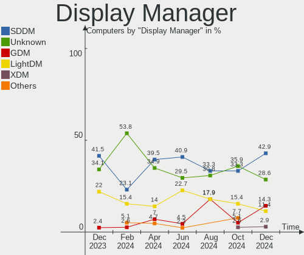
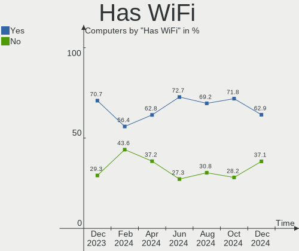
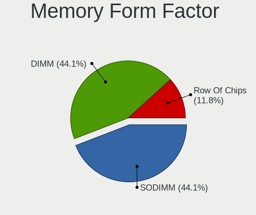
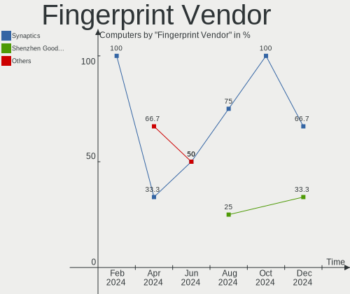

Gentoo Hardware Trends
----------------------

A project to identify most popular hardware characteristics and track their change
over time based on data collected by Gentoo users at https://Linux-Hardware.org.

Anyone can contribute to this report by the [hw-probe](https://github.com/linuxhw/hw-probe) tool:

    sudo -E hw-probe -all -upload

This is a report for all computer types. See also reports for [desktops](/Dist/Gentoo/Desktop/README.md) and [notebooks](/Dist/Gentoo/Notebook/README.md).

Full-feature report is available here: https://linux-hardware.org/?view=trends

Period: Nov, 2021.

Contents
--------

* [ System ](#system)
  - [ OS                       ](#os)
  - [ OS Family                ](#os-family)
  - [ Kernel                   ](#kernel)
  - [ Kernel Family            ](#kernel-family)
  - [ Kernel Major Ver.        ](#kernel-major-ver)
  - [ Arch                     ](#arch)
  - [ DE                       ](#de)
  - [ Display Server           ](#display-server)
  - [ Display Manager          ](#display-manager)
  - [ OS Lang                  ](#os-lang)
  - [ Boot Mode                ](#boot-mode)
  - [ Filesystem               ](#filesystem)
  - [ Part. scheme             ](#part-scheme)
  - [ Dual Boot with Linux/BSD ](#dual-boot-with-linuxbsd)
  - [ Dual Boot (Win)          ](#dual-boot-win)

* [ Board ](#board)
  - [ Vendor                   ](#vendor)
  - [ Model                    ](#model)
  - [ Model Family             ](#model-family)
  - [ MFG Year                 ](#mfg-year)
  - [ Form Factor              ](#form-factor)
  - [ Secure Boot              ](#secure-boot)
  - [ Coreboot                 ](#coreboot)
  - [ RAM Size                 ](#ram-size)
  - [ RAM Used                 ](#ram-used)
  - [ Total Drives             ](#total-drives)
  - [ Has CD-ROM               ](#has-cd-rom)
  - [ Has Ethernet             ](#has-ethernet)
  - [ Has WiFi                 ](#has-wifi)
  - [ Has Bluetooth            ](#has-bluetooth)

* [ Location ](#location)
  - [ Country                  ](#country)
  - [ City                     ](#city)

* [ Drives ](#drives)
  - [ Drive Vendor             ](#drive-vendor)
  - [ Drive Model              ](#drive-model)
  - [ HDD Vendor               ](#hdd-vendor)
  - [ SSD Vendor               ](#ssd-vendor)
  - [ Drive Kind               ](#drive-kind)
  - [ Drive Connector          ](#drive-connector)
  - [ Drive Size               ](#drive-size)
  - [ Space Total              ](#space-total)
  - [ Space Used               ](#space-used)
  - [ Malfunc. Drives          ](#malfunc-drives)
  - [ Malfunc. Drive Vendor    ](#malfunc-drive-vendor)
  - [ Malfunc. HDD Vendor      ](#malfunc-hdd-vendor)
  - [ Malfunc. Drive Kind      ](#malfunc-drive-kind)
  - [ Failed Drives            ](#failed-drives)
  - [ Failed Drive Vendor      ](#failed-drive-vendor)
  - [ Drive Status             ](#drive-status)

* [ Storage controller ](#storage-controller)
  - [ Storage Vendor           ](#storage-vendor)
  - [ Storage Model            ](#storage-model)
  - [ Storage Kind             ](#storage-kind)

* [ Processor ](#processor)
  - [ CPU Vendor               ](#cpu-vendor)
  - [ CPU Model                ](#cpu-model)
  - [ CPU Model Family         ](#cpu-model-family)
  - [ CPU Cores                ](#cpu-cores)
  - [ CPU Sockets              ](#cpu-sockets)
  - [ CPU Threads              ](#cpu-threads)
  - [ CPU Op-Modes             ](#cpu-op-modes)
  - [ CPU Microcode            ](#cpu-microcode)
  - [ CPU Microarch            ](#cpu-microarch)

* [ Graphics ](#graphics)
  - [ GPU Vendor               ](#gpu-vendor)
  - [ GPU Model                ](#gpu-model)
  - [ GPU Combo                ](#gpu-combo)
  - [ GPU Driver               ](#gpu-driver)
  - [ GPU Memory               ](#gpu-memory)

* [ Monitor ](#monitor)
  - [ Monitor Vendor           ](#monitor-vendor)
  - [ Monitor Model            ](#monitor-model)
  - [ Monitor Resolution       ](#monitor-resolution)
  - [ Monitor Diagonal         ](#monitor-diagonal)
  - [ Monitor Width            ](#monitor-width)
  - [ Aspect Ratio             ](#aspect-ratio)
  - [ Monitor Area             ](#monitor-area)
  - [ Pixel Density            ](#pixel-density)
  - [ Multiple Monitors        ](#multiple-monitors)

* [ Network ](#network)
  - [ Net Controller Vendor    ](#net-controller-vendor)
  - [ Net Controller Model     ](#net-controller-model)
  - [ Wireless Vendor          ](#wireless-vendor)
  - [ Wireless Model           ](#wireless-model)
  - [ Ethernet Vendor          ](#ethernet-vendor)
  - [ Ethernet Model           ](#ethernet-model)
  - [ Net Controller Kind      ](#net-controller-kind)
  - [ Used Controller          ](#used-controller)
  - [ NICs                     ](#nics)
  - [ IPv6                     ](#ipv6)

* [ Bluetooth ](#bluetooth)
  - [ Bluetooth Vendor         ](#bluetooth-vendor)
  - [ Bluetooth Model          ](#bluetooth-model)

* [ Sound ](#sound)
  - [ Sound Vendor             ](#sound-vendor)
  - [ Sound Model              ](#sound-model)

* [ Memory ](#memory)
  - [ Memory Vendor            ](#memory-vendor)
  - [ Memory Model             ](#memory-model)
  - [ Memory Kind              ](#memory-kind)
  - [ Memory Form Factor       ](#memory-form-factor)
  - [ Memory Size              ](#memory-size)
  - [ Memory Speed             ](#memory-speed)

* [ Printers & scanners ](#printers--scanners)
  - [ Printer Vendor           ](#printer-vendor)
  - [ Printer Model            ](#printer-model)
  - [ Scanner Vendor           ](#scanner-vendor)
  - [ Scanner Model            ](#scanner-model)

* [ Camera ](#camera)
  - [ Camera Vendor            ](#camera-vendor)
  - [ Camera Model             ](#camera-model)

* [ Security ](#security)
  - [ Fingerprint Vendor       ](#fingerprint-vendor)
  - [ Fingerprint Model        ](#fingerprint-model)
  - [ Chipcard Vendor          ](#chipcard-vendor)
  - [ Chipcard Model           ](#chipcard-model)

* [ Unsupported ](#unsupported)
  - [ Unsupported Devices      ](#unsupported-devices)
  - [ Unsupported Device Types ](#unsupported-device-types)

System
------

OS
--

Installed operating systems

| Name       | Computers | Percent |
|------------|-----------|---------|
| Gentoo 2.7 | 34        | 60.71%  |
| Gentoo 2.8 | 15        | 26.79%  |
| Gentoo 2.6 | 6         | 10.71%  |
| Gentoo 1   | 1         | 1.79%   |

OS Family
---------

OS without a version

| Name   | Computers | Percent |
|--------|-----------|---------|
| Gentoo | 56        | 100%    |

Kernel
------

Version of the Linux kernel

| Version                     | Computers | Percent |
|-----------------------------|-----------|---------|
| 5.10.76-gentoo-r1           | 8         | 14.29%  |
| 5.15.1-gentoo-x86_64        | 3         | 5.36%   |
| 5.10.61-gentoo              | 3         | 5.36%   |
| 5.15.2-gentoo-x86_64        | 2         | 3.57%   |
| 5.15.0-gentoo               | 2         | 3.57%   |
| 5.14.14-gentoo              | 2         | 3.57%   |
| 5.10.74-gentoo-x86_64       | 2         | 3.57%   |
| 5.10.70-1-lts               | 2         | 3.57%   |
| 5.4.80-gentoo-r1            | 1         | 1.79%   |
| 5.16.0-rc2aeon              | 1         | 1.79%   |
| 5.15.5-gentoo-x86_64        | 1         | 1.79%   |
| 5.15.5-gentoo-dist          | 1         | 1.79%   |
| 5.15.5-gentoo               | 1         | 1.79%   |
| 5.15.4-gentoo-x86_64        | 1         | 1.79%   |
| 5.15.4-gentoo               | 1         | 1.79%   |
| 5.15.2-gentoo20210917       | 1         | 1.79%   |
| 5.15.1-gentoo-limelight     | 1         | 1.79%   |
| 5.15.1-gentoo               | 1         | 1.79%   |
| 5.15.1                      | 1         | 1.79%   |
| 5.15.0-gentoo-x86_64        | 1         | 1.79%   |
| 5.14.7-gentoo-x86_64        | 1         | 1.79%   |
| 5.14.4-gentoo               | 1         | 1.79%   |
| 5.14.16-gentoo-x86_64       | 1         | 1.79%   |
| 5.14.15-xanmod1-gentoo-dist | 1         | 1.79%   |
| 5.14.15-gentoo-x86_64       | 1         | 1.79%   |
| 5.14.13-gentoo-x86_64       | 1         | 1.79%   |
| 5.10.81-gentoo-dist         | 1         | 1.79%   |
| 5.10.76-gentoo-r1-x86_64    | 1         | 1.79%   |
| 5.10.76-gentoo-r1-x86       | 1         | 1.79%   |
| 5.10.76-gentoo-r1-test2e    | 1         | 1.79%   |
| 5.10.76-gentoo-r1-suzanne   | 1         | 1.79%   |
| 5.10.76-gentoo-r1-n150      | 1         | 1.79%   |
| 5.10.76-gentoo-r1-6730b     | 1         | 1.79%   |
| 5.10.76-gentoo-r1-110-ipv6  | 1         | 1.79%   |
| 5.10.76-gentoo-r1--jp       | 1         | 1.79%   |
| 5.10.75-gentoo-dist         | 1         | 1.79%   |
| 5.10.74-gentoo              | 1         | 1.79%   |
| 5.10.11-v8                  | 1         | 1.79%   |
| 4.19.214-gentoo-freya       | 1         | 1.79%   |
| 4.19.214-gentoo             | 1         | 1.79%   |

Kernel Family
-------------

Linux kernel without a distro release

| Version  | Computers | Percent |
|----------|-----------|---------|
| 5.10.76  | 16        | 28.57%  |
| 5.15.1   | 6         | 10.71%  |
| 5.15.5   | 3         | 5.36%   |
| 5.15.2   | 3         | 5.36%   |
| 5.15.0   | 3         | 5.36%   |
| 5.10.74  | 3         | 5.36%   |
| 5.10.61  | 3         | 5.36%   |
| 5.15.4   | 2         | 3.57%   |
| 5.14.15  | 2         | 3.57%   |
| 5.14.14  | 2         | 3.57%   |
| 5.10.70  | 2         | 3.57%   |
| 4.19.214 | 2         | 3.57%   |
| 5.4.80   | 1         | 1.79%   |
| 5.16.0   | 1         | 1.79%   |
| 5.14.7   | 1         | 1.79%   |
| 5.14.4   | 1         | 1.79%   |
| 5.14.16  | 1         | 1.79%   |
| 5.14.13  | 1         | 1.79%   |
| 5.10.81  | 1         | 1.79%   |
| 5.10.75  | 1         | 1.79%   |
| 5.10.11  | 1         | 1.79%   |

Kernel Major Ver.
-----------------

Linux kernel major version

| Version | Computers | Percent |
|---------|-----------|---------|
| 5.10    | 27        | 48.21%  |
| 5.15    | 17        | 30.36%  |
| 5.14    | 8         | 14.29%  |
| 4.19    | 2         | 3.57%   |
| 5.4     | 1         | 1.79%   |
| 5.16    | 1         | 1.79%   |

Arch
----

OS architecture (x86_64, i586, etc.)

| Name    | Computers | Percent |
|---------|-----------|---------|
| x86_64  | 54        | 96.43%  |
| i686    | 1         | 1.79%   |
| aarch64 | 1         | 1.79%   |

DE
--

Desktop Environment

| Name       | Computers | Percent |
|------------|-----------|---------|
| Unknown    | 21        | 37.5%   |
| KDE5       | 17        | 30.36%  |
| GNOME      | 5         | 8.93%   |
| XFCE       | 4         | 7.14%   |
| awesome    | 3         | 5.36%   |
| MATE       | 2         | 3.57%   |
| DWM        | 2         | 3.57%   |
| X-Cinnamon | 1         | 1.79%   |
| openbox    | 1         | 1.79%   |

Display Server
--------------

X11 or Wayland

| Name    | Computers | Percent |
|---------|-----------|---------|
| X11     | 30        | 53.57%  |
| Unknown | 10        | 17.86%  |
| Wayland | 8         | 14.29%  |
| Tty     | 8         | 14.29%  |

Display Manager
---------------

SDDM, LightDM, etc.

| Name    | Computers | Percent |
|---------|-----------|---------|
| Unknown | 21        | 37.5%   |
| SDDM    | 20        | 35.71%  |
| LightDM | 7         | 12.5%   |
| GDM     | 5         | 8.93%   |
| SLiM    | 2         | 3.57%   |
| XDM     | 1         | 1.79%   |

OS Lang
-------

Language

| Lang    | Computers | Percent |
|---------|-----------|---------|
| en_US   | 15        | 26.79%  |
| C.UTF8  | 6         | 10.71%  |
| en_GB   | 5         | 8.93%   |
| ru_RU   | 4         | 7.14%   |
| nl_NL   | 4         | 7.14%   |
| pl_PL   | 2         | 3.57%   |
| it_IT   | 2         | 3.57%   |
| el_GR   | 2         | 3.57%   |
| zh_CN   | 1         | 1.79%   |
| tr_TR   | 1         | 1.79%   |
| sv_SE   | 1         | 1.79%   |
| ru_UA   | 1         | 1.79%   |
| pt_BR   | 1         | 1.79%   |
| lt_LT   | 1         | 1.79%   |
| hu_HU   | 1         | 1.79%   |
| fi_FI   | 1         | 1.79%   |
| es_ES   | 1         | 1.79%   |
| es_CL   | 1         | 1.79%   |
| es_AR   | 1         | 1.79%   |
| en_CA   | 1         | 1.79%   |
| de_DE   | 1         | 1.79%   |
| de_CH   | 1         | 1.79%   |
| C       | 1         | 1.79%   |
| Unknown | 1         | 1.79%   |

Boot Mode
---------

EFI or BIOS

| Mode | Computers | Percent |
|------|-----------|---------|
| EFI  | 37        | 66.07%  |
| BIOS | 19        | 33.93%  |

Filesystem
----------

Type of filesystem

| Type  | Computers | Percent |
|-------|-----------|---------|
| Ext4  | 29        | 51.79%  |
| Btrfs | 20        | 35.71%  |
| F2fs  | 4         | 7.14%   |
| Zfs   | 2         | 3.57%   |
| Xfs   | 1         | 1.79%   |

Part. scheme
------------

Scheme of partitioning

| Type    | Computers | Percent |
|---------|-----------|---------|
| GPT     | 46        | 82.14%  |
| Unknown | 6         | 10.71%  |
| MBR     | 4         | 7.14%   |

Dual Boot with Linux/BSD
------------------------

Hosting more than one Linux/BSD

| Dual boot | Computers | Percent |
|-----------|-----------|---------|
| No        | 40        | 71.43%  |
| Yes       | 16        | 28.57%  |

Dual Boot (Win)
---------------

Hosting Linux and Windows

| Dual boot | Computers | Percent |
|-----------|-----------|---------|
| No        | 34        | 60.71%  |
| Yes       | 22        | 39.29%  |

Board
-----

Vendor
------

Motherboard manufacturer

| Name                    | Computers | Percent |
|-------------------------|-----------|---------|
| Lenovo                  | 13        | 23.21%  |
| ASUSTek Computer        | 13        | 23.21%  |
| Hewlett-Packard         | 8         | 14.29%  |
| Gigabyte Technology     | 6         | 10.71%  |
| Samsung Electronics     | 2         | 3.57%   |
| MSI                     | 2         | 3.57%   |
| Intel                   | 2         | 3.57%   |
| Dell                    | 2         | 3.57%   |
| Toshiba                 | 1         | 1.79%   |
| Timi                    | 1         | 1.79%   |
| Supermicro              | 1         | 1.79%   |
| SIEMENS                 | 1         | 1.79%   |
| Raspberry Pi Foundation | 1         | 1.79%   |
| MOTILE                  | 1         | 1.79%   |
| ASRock                  | 1         | 1.79%   |
| Acer                    | 1         | 1.79%   |

Model
-----

Motherboard model

| Name                                      | Computers | Percent |
|-------------------------------------------|-----------|---------|
| Lenovo Legion Y530-15ICH 81FV             | 2         | 3.57%   |
| HP Laptop 15s-eq0xxx                      | 2         | 3.57%   |
| ASUS PRIME X570-P                         | 2         | 3.57%   |
| Toshiba Satellite C850D-118               | 1         | 1.79%   |
| Timi A35                                  | 1         | 1.79%   |
| Supermicro Super Server                   | 1         | 1.79%   |
| SIEMENS SIMATIC Field PG M6               | 1         | 1.79%   |
| Samsung RC530/RC730                       | 1         | 1.79%   |
| Samsung N150P/N210P/N220P                 | 1         | 1.79%   |
| RPi Raspberry Pi                          | 1         | 1.79%   |
| MSI MS-7C35                               | 1         | 1.79%   |
| MSI MS-7996                               | 1         | 1.79%   |
| MOTILE M142                               | 1         | 1.79%   |
| Lenovo Yoga Slim 7 13ACN5 82CY            | 1         | 1.79%   |
| Lenovo Yoga C740-14IML 81TC               | 1         | 1.79%   |
| Lenovo XiaoXin Chao7000-14IKBR 81GA       | 1         | 1.79%   |
| Lenovo ThinkPad T470p 20J7S06Q00          | 1         | 1.79%   |
| Lenovo ThinkPad T14 Gen 2i 20W0CTO1WW     | 1         | 1.79%   |
| Lenovo ThinkPad L14 Gen 1 20U50003GE      | 1         | 1.79%   |
| Lenovo ThinkPad E495 20NE000BGE           | 1         | 1.79%   |
| Lenovo Legion 7 15IMH05 81YT              | 1         | 1.79%   |
| Lenovo Legion 5 Pro 16ACH6H 82JQ          | 1         | 1.79%   |
| Lenovo IdeaPadFlex 5 14ITL05 82LT         | 1         | 1.79%   |
| Lenovo IdeaPad 5 Pro 16ACH6 82L5          | 1         | 1.79%   |
| Intel S1200RP                             | 1         | 1.79%   |
| Intel DP35DP AAD81073-205                 | 1         | 1.79%   |
| HP ProLiant ML150 G6                      | 1         | 1.79%   |
| HP ProBook 430 G5                         | 1         | 1.79%   |
| HP Pavilion ZV6100 (EE984EA#ABZ)          | 1         | 1.79%   |
| HP Pavilion Gaming Laptop 15-ec1xxx       | 1         | 1.79%   |
| HP EliteBook 745 G6                       | 1         | 1.79%   |
| HP Compaq 6730b (KE717AV)                 | 1         | 1.79%   |
| Gigabyte PC-X011158                       | 1         | 1.79%   |
| Gigabyte B150M-HD3-CF                     | 1         | 1.79%   |
| Gigabyte AB350-Gaming 3                   | 1         | 1.79%   |
| Gigabyte AB350-Gaming                     | 1         | 1.79%   |
| Gigabyte A320M-S2H                        | 1         | 1.79%   |
| Gigabyte 970A-DS3P                        | 1         | 1.79%   |
| Dell Latitude E7440                       | 1         | 1.79%   |
| Dell Latitude 7490                        | 1         | 1.79%   |
| ASUS TUF GAMING X570-PLUS                 | 1         | 1.79%   |
| ASUS TUF GAMING B550-PLUS                 | 1         | 1.79%   |
| ASUS ROG ZENITH II EXTREME                | 1         | 1.79%   |
| ASUS ROG STRIX X570-E GAMING              | 1         | 1.79%   |
| ASUS ROG STRIX B550-F GAMING              | 1         | 1.79%   |
| ASUS ROG Maximus XIII APEX                | 1         | 1.79%   |
| ASUS ROG CROSSHAIR VIII DARK HERO         | 1         | 1.79%   |
| ASUS P5LD2-Deluxe                         | 1         | 1.79%   |
| ASUS M3A78-CM                             | 1         | 1.79%   |
| ASUS ASUS TUF Gaming F17 FX706HE_TUF706HE | 1         | 1.79%   |
| ASUS 900                                  | 1         | 1.79%   |
| ASRock B550M Steel Legend                 | 1         | 1.79%   |
| Acer Aspire A715-42G                      | 1         | 1.79%   |

Model Family
------------

Motherboard model prefix

| Name                  | Computers | Percent |
|-----------------------|-----------|---------|
| ASUS ROG              | 5         | 8.93%   |
| Lenovo ThinkPad       | 4         | 7.14%   |
| Lenovo Legion         | 4         | 7.14%   |
| Lenovo Yoga           | 2         | 3.57%   |
| HP Pavilion           | 2         | 3.57%   |
| HP Laptop             | 2         | 3.57%   |
| Gigabyte AB350-Gaming | 2         | 3.57%   |
| Dell Latitude         | 2         | 3.57%   |
| ASUS TUF              | 2         | 3.57%   |
| ASUS PRIME            | 2         | 3.57%   |
| Toshiba Satellite     | 1         | 1.79%   |
| Timi A35              | 1         | 1.79%   |
| Supermicro Super      | 1         | 1.79%   |
| SIEMENS SIMATIC       | 1         | 1.79%   |
| Samsung RC530         | 1         | 1.79%   |
| Samsung N150P         | 1         | 1.79%   |
| RPi Raspberry         | 1         | 1.79%   |
| MSI MS-7C35           | 1         | 1.79%   |
| MSI MS-7996           | 1         | 1.79%   |
| MOTILE M142           | 1         | 1.79%   |
| Lenovo XiaoXin        | 1         | 1.79%   |
| Lenovo IdeaPadFlex    | 1         | 1.79%   |
| Lenovo IdeaPad        | 1         | 1.79%   |
| Intel S1200RP         | 1         | 1.79%   |
| Intel DP35DP          | 1         | 1.79%   |
| HP ProLiant           | 1         | 1.79%   |
| HP ProBook            | 1         | 1.79%   |
| HP EliteBook          | 1         | 1.79%   |
| HP Compaq             | 1         | 1.79%   |
| Gigabyte PC-X011158   | 1         | 1.79%   |
| Gigabyte B150M-HD3-CF | 1         | 1.79%   |
| Gigabyte A320M-S2H    | 1         | 1.79%   |
| Gigabyte 970A-DS3P    | 1         | 1.79%   |
| ASUS P5LD2-Deluxe     | 1         | 1.79%   |
| ASUS M3A78-CM         | 1         | 1.79%   |
| ASUS ASUS             | 1         | 1.79%   |
| ASUS 900              | 1         | 1.79%   |
| ASRock B550M          | 1         | 1.79%   |
| Acer Aspire           | 1         | 1.79%   |

MFG Year
--------

Motherboard manufacture year

| Year    | Computers | Percent |
|---------|-----------|---------|
| 2021    | 17        | 30.36%  |
| 2020    | 15        | 26.79%  |
| 2019    | 6         | 10.71%  |
| 2018    | 3         | 5.36%   |
| 2016    | 3         | 5.36%   |
| 2011    | 3         | 5.36%   |
| 2009    | 3         | 5.36%   |
| 2006    | 2         | 3.57%   |
| 2017    | 1         | 1.79%   |
| 2012    | 1         | 1.79%   |
| 2010    | 1         | 1.79%   |
| Unknown | 1         | 1.79%   |

Form Factor
-----------

Physical design of the computer

| Name           | Computers | Percent |
|----------------|-----------|---------|
| Notebook       | 29        | 51.79%  |
| Desktop        | 22        | 39.29%  |
| Convertible    | 2         | 3.57%   |
| Server         | 2         | 3.57%   |
| System on chip | 1         | 1.79%   |

Secure Boot
-----------

Enabled or disabled

| State    | Computers | Percent |
|----------|-----------|---------|
| Disabled | 56        | 100%    |

Coreboot
--------

Have coreboot on board

| Used | Computers | Percent |
|------|-----------|---------|
| No   | 56        | 100%    |

RAM Size
--------

Total RAM memory

| Size in GB  | Computers | Percent |
|-------------|-----------|---------|
| 32.01-64.0  | 16        | 28.57%  |
| 8.01-16.0   | 10        | 17.86%  |
| 4.01-8.0    | 7         | 12.5%   |
| 16.01-24.0  | 7         | 12.5%   |
| 24.01-32.0  | 4         | 7.14%   |
| 64.01-256.0 | 4         | 7.14%   |
| 3.01-4.0    | 3         | 5.36%   |
| 1.01-2.0    | 3         | 5.36%   |
| 2.01-3.0    | 2         | 3.57%   |

RAM Used
--------

Used RAM memory

| Used GB   | Computers | Percent |
|-----------|-----------|---------|
| 4.01-8.0  | 17        | 30.36%  |
| 1.01-2.0  | 11        | 19.64%  |
| 0.51-1.0  | 9         | 16.07%  |
| 2.01-3.0  | 6         | 10.71%  |
| 8.01-16.0 | 6         | 10.71%  |
| 0.01-0.5  | 6         | 10.71%  |
| 3.01-4.0  | 1         | 1.79%   |

Total Drives
------------

Number of drives on board

| Drives | Computers | Percent |
|--------|-----------|---------|
| 1      | 31        | 55.36%  |
| 2      | 11        | 19.64%  |
| 3      | 7         | 12.5%   |
| 4      | 4         | 7.14%   |
| 7      | 1         | 1.79%   |
| 6      | 1         | 1.79%   |
| 5      | 1         | 1.79%   |

Has CD-ROM
----------

Has CD-ROM on board

| Presented | Computers | Percent |
|-----------|-----------|---------|
| No        | 44        | 78.57%  |
| Yes       | 12        | 21.43%  |

Has Ethernet
------------

Has Ethernet on board

| Presented | Computers | Percent |
|-----------|-----------|---------|
| Yes       | 50        | 89.29%  |
| No        | 6         | 10.71%  |

Has WiFi
--------

Has WiFi module

| Presented | Computers | Percent |
|-----------|-----------|---------|
| Yes       | 42        | 75%     |
| No        | 14        | 25%     |

Has Bluetooth
-------------

Has Bluetooth module

| Presented | Computers | Percent |
|-----------|-----------|---------|
| Yes       | 34        | 60.71%  |
| No        | 22        | 39.29%  |

Location
--------

Country
-------

Geographic location (country)

| Country     | Computers | Percent |
|-------------|-----------|---------|
| USA         | 6         | 10.71%  |
| Russia      | 6         | 10.71%  |
| Poland      | 5         | 8.93%   |
| Netherlands | 5         | 8.93%   |
| Germany     | 5         | 8.93%   |
| Italy       | 4         | 7.14%   |
| Finland     | 4         | 7.14%   |
| UK          | 3         | 5.36%   |
| Greece      | 3         | 5.36%   |
| Ukraine     | 2         | 3.57%   |
| Switzerland | 1         | 1.79%   |
| Spain       | 1         | 1.79%   |
| Slovakia    | 1         | 1.79%   |
| Singapore   | 1         | 1.79%   |
| Lithuania   | 1         | 1.79%   |
| Hungary     | 1         | 1.79%   |
| China       | 1         | 1.79%   |
| Chile       | 1         | 1.79%   |
| Canada      | 1         | 1.79%   |
| Bulgaria    | 1         | 1.79%   |
| Brazil      | 1         | 1.79%   |
| Belarus     | 1         | 1.79%   |
| Argentina   | 1         | 1.79%   |

City
----

Geographic location (city)

| City              | Computers | Percent |
|-------------------|-----------|---------|
| Helsinki          | 4         | 7.14%   |
| Almere Stad       | 4         | 7.14%   |
| Athens            | 3         | 5.36%   |
| Warsaw            | 2         | 3.57%   |
| Szczecin          | 2         | 3.57%   |
| St Petersburg     | 2         | 3.57%   |
| Moscow            | 2         | 3.57%   |
| Milan             | 2         | 3.57%   |
| Zurich            | 1         | 1.79%   |
| Vilnius           | 1         | 1.79%   |
| Vigo              | 1         | 1.79%   |
| Vancouver         | 1         | 1.79%   |
| Ufa               | 1         | 1.79%   |
| Tacoma            | 1         | 1.79%   |
| Singapore         | 1         | 1.79%   |
| Shenzhen          | 1         | 1.79%   |
| S??o Paulo        | 1         | 1.79%   |
| Santiago          | 1         | 1.79%   |
| Samokov           | 1         | 1.79%   |
| Roldan            | 1         | 1.79%   |
| Nuremberg         | 1         | 1.79%   |
| Nizhniy Novgorod  | 1         | 1.79%   |
| Munich            | 1         | 1.79%   |
| Minsk             | 1         | 1.79%   |
| London            | 1         | 1.79%   |
| Liverpool         | 1         | 1.79%   |
| Littleton         | 1         | 1.79%   |
| Laziska Gorne     | 1         | 1.79%   |
| Kyiv              | 1         | 1.79%   |
| Ithaca            | 1         | 1.79%   |
| High Wycombe      | 1         | 1.79%   |
| Harsum            | 1         | 1.79%   |
| Hamburg           | 1         | 1.79%   |
| Glen Ellyn        | 1         | 1.79%   |
| Garden Grove      | 1         | 1.79%   |
| Frankfurt am Main | 1         | 1.79%   |
| Dnipro            | 1         | 1.79%   |
| Budapest          | 1         | 1.79%   |
| Brescia           | 1         | 1.79%   |
| Bratislava        | 1         | 1.79%   |
| Bologna           | 1         | 1.79%   |
| Baldwin           | 1         | 1.79%   |
| Amsterdam         | 1         | 1.79%   |

Drives
------

Drive Vendor
------------

Hard drive vendors

| Vendor              | Computers | Drives | Percent |
|---------------------|-----------|--------|---------|
| WDC                 | 20        | 27     | 23.53%  |
| Samsung Electronics | 18        | 26     | 21.18%  |
| Seagate             | 7         | 10     | 8.24%   |
| Toshiba             | 6         | 6      | 7.06%   |
| Kingston            | 5         | 5      | 5.88%   |
| SK Hynix            | 4         | 4      | 4.71%   |
| Hitachi             | 4         | 6      | 4.71%   |
| SanDisk             | 3         | 3      | 3.53%   |
| Corsair             | 3         | 3      | 3.53%   |
| GOODRAM             | 2         | 2      | 2.35%   |
| Crucial             | 2         | 5      | 2.35%   |
| Unknown             | 1         | 1      | 1.18%   |
| SSSTC               | 1         | 1      | 1.18%   |
| PNY                 | 1         | 1      | 1.18%   |
| Linux               | 1         | 1      | 1.18%   |
| LaCie               | 1         | 1      | 1.18%   |
| KIOXIA              | 1         | 1      | 1.18%   |
| Intel               | 1         | 1      | 1.18%   |
| Fujitsu             | 1         | 1      | 1.18%   |
| CT2000MX            | 1         | 1      | 1.18%   |
| BIWIN               | 1         | 1      | 1.18%   |
| ASUS-PHISON         | 1         | 1      | 1.18%   |

Drive Model
-----------

Hard drive models

| Model                                   | Computers | Percent |
|-----------------------------------------|-----------|---------|
| Toshiba MQ04ABF100 1TB                  | 2         | 2.11%   |
| Seagate ST1000LM049-2GH172 1TB          | 2         | 2.11%   |
| Samsung SSD 980 PRO 2TB                 | 2         | 2.11%   |
| Samsung MZVLB512HBJQ-000L2 512GB        | 2         | 2.11%   |
| GOODRAM SSDPR-CL100-480-G2 480GB        | 2         | 2.11%   |
| WDC WDS500G2B0A-00SM50 500GB SSD        | 1         | 1.05%   |
| WDC WDS500G1B0B-00AS40 500GB SSD        | 1         | 1.05%   |
| WDC WDS250G2B0A-00SM50 250GB SSD        | 1         | 1.05%   |
| WDC WDS100T2B0C-00PXH0 1TB              | 1         | 1.05%   |
| WDC WDS100T1X0E-00AFY0 1TB              | 1         | 1.05%   |
| WDC WD7500BPVT-24HXZT1 752GB            | 1         | 1.05%   |
| WDC WD5000BPVT-22HXZT3 500GB            | 1         | 1.05%   |
| WDC WD5000BEVT-80A0RT0 500GB            | 1         | 1.05%   |
| WDC WD5000AZLX-00JKKA0 500GB            | 1         | 1.05%   |
| WDC WD30EFRX-68EUZN0 3TB                | 1         | 1.05%   |
| WDC WD30EFRX-68AX9N0 3TB                | 1         | 1.05%   |
| WDC WD2500BEVS-22UST0 250GB             | 1         | 1.05%   |
| WDC WD20EZRZ-00Z5HB0 2TB                | 1         | 1.05%   |
| WDC WD2003FZEX-00Z4SA0 2TB              | 1         | 1.05%   |
| WDC WD2002FAEX-007BA0 2TB               | 1         | 1.05%   |
| WDC WD10PURX-64E5EY0 1TB                | 1         | 1.05%   |
| WDC WD10EZEX-60WN4A1 1TB                | 1         | 1.05%   |
| WDC WD10EZEX-08WN4A0 1TB                | 1         | 1.05%   |
| WDC WD10EZEX-08M2NA0 1TB                | 1         | 1.05%   |
| WDC WD10EADS-00L5B1 1TB                 | 1         | 1.05%   |
| WDC WD1003FZEX-00MK2A0 1TB              | 1         | 1.05%   |
| WDC PC SN730 SDBQNTY-1T00-1001 1TB      | 1         | 1.05%   |
| WDC PC SN730 SDBPNTY-512G-1101 512GB    | 1         | 1.05%   |
| WDC PC SN730 SDBPNTY-512G-1006 512GB    | 1         | 1.05%   |
| WDC PC SN520 SDAPNUW-256G-1006 256GB    | 1         | 1.05%   |
| Unknown MMC Card  32GB                  | 1         | 1.05%   |
| Toshiba KSG60ZMV512G M.2 2280 512GB SSD | 1         | 1.05%   |
| Toshiba HDWE150 5TB                     | 1         | 1.05%   |
| Toshiba DT01ACA200 2TB                  | 1         | 1.05%   |
| Toshiba DT01ACA100 1TB                  | 1         | 1.05%   |
| SSSTC CL1-4D256 256GB                   | 1         | 1.05%   |
| SK Hynix SKHynix_HFS001TDE9X084N 1TB    | 1         | 1.05%   |
| SK Hynix PC401 HFS256GD9TNG-62A0A 256GB | 1         | 1.05%   |
| SK Hynix HFM512GDHTNG-8710B 512GB       | 1         | 1.05%   |
| SK Hynix HFM512GD3JX016N 512GB          | 1         | 1.05%   |
| Seagate ST4000DM004-2CV104 4TB          | 1         | 1.05%   |
| Seagate ST3250318AS 250GB               | 1         | 1.05%   |
| Seagate ST3160215SCE 160GB              | 1         | 1.05%   |
| Seagate ST12000NM0008-2H3101 12TB       | 1         | 1.05%   |
| Seagate ST10000NM0156-2AA111 10TB       | 1         | 1.05%   |
| SanDisk SDSSDHII480G 480GB              | 1         | 1.05%   |
| SanDisk SD9SN8W-128G-1006 128GB SSD     | 1         | 1.05%   |
| SanDisk Extreme Pro 500GB               | 1         | 1.05%   |
| Samsung SSD 980 PRO 500GB               | 1         | 1.05%   |
| Samsung SSD 980 PRO 1TB                 | 1         | 1.05%   |
| Samsung SSD 970 EVO Plus 500GB          | 1         | 1.05%   |
| Samsung SSD 970 EVO Plus 250GB          | 1         | 1.05%   |
| Samsung SSD 970 EVO 500GB               | 1         | 1.05%   |
| Samsung SSD 970 EVO 1TB                 | 1         | 1.05%   |
| Samsung SSD 870 EVO 2TB                 | 1         | 1.05%   |
| Samsung SSD 860 QVO 4TB                 | 1         | 1.05%   |
| Samsung SSD 860 EVO 250GB               | 1         | 1.05%   |
| Samsung SSD 850 PRO 256GB               | 1         | 1.05%   |
| Samsung SSD 850 EVO 250GB               | 1         | 1.05%   |
| Samsung SSD 840 Series 120GB            | 1         | 1.05%   |

HDD Vendor
----------

Hard disk drive vendors

| Vendor              | Computers | Drives | Percent |
|---------------------|-----------|--------|---------|
| WDC                 | 12        | 17     | 38.71%  |
| Seagate             | 7         | 10     | 22.58%  |
| Toshiba             | 5         | 5      | 16.13%  |
| Hitachi             | 4         | 6      | 12.9%   |
| Samsung Electronics | 1         | 4      | 3.23%   |
| LaCie               | 1         | 1      | 3.23%   |
| Fujitsu             | 1         | 1      | 3.23%   |

SSD Vendor
----------

Solid state drive vendors

| Vendor              | Computers | Drives | Percent |
|---------------------|-----------|--------|---------|
| Samsung Electronics | 7         | 7      | 26.92%  |
| Kingston            | 4         | 4      | 15.38%  |
| WDC                 | 3         | 4      | 11.54%  |
| SanDisk             | 2         | 2      | 7.69%   |
| GOODRAM             | 2         | 2      | 7.69%   |
| Corsair             | 2         | 2      | 7.69%   |
| Toshiba             | 1         | 1      | 3.85%   |
| Linux               | 1         | 1      | 3.85%   |
| CT2000MX            | 1         | 1      | 3.85%   |
| Crucial             | 1         | 3      | 3.85%   |
| BIWIN               | 1         | 1      | 3.85%   |
| ASUS-PHISON         | 1         | 1      | 3.85%   |

Drive Kind
----------

HDD or SSD

| Kind | Computers | Drives | Percent |
|------|-----------|--------|---------|
| NVMe | 30        | 34     | 38.46%  |
| SSD  | 24        | 29     | 30.77%  |
| HDD  | 23        | 44     | 29.49%  |
| MMC  | 1         | 1      | 1.28%   |

Drive Connector
---------------

SATA, SAS, NVMe, etc.

| Type | Computers | Drives | Percent |
|------|-----------|--------|---------|
| SATA | 36        | 70     | 52.17%  |
| NVMe | 30        | 34     | 43.48%  |
| SAS  | 2         | 3      | 2.9%    |
| MMC  | 1         | 1      | 1.45%   |

Drive Size
----------

Size of hard drive

| Size in TB | Computers | Drives | Percent |
|------------|-----------|--------|---------|
| 0.01-0.5   | 27        | 35     | 49.09%  |
| 0.51-1.0   | 13        | 15     | 23.64%  |
| 1.01-2.0   | 8         | 9      | 14.55%  |
| 3.01-4.0   | 2         | 2      | 3.64%   |
| 2.01-3.0   | 2         | 6      | 3.64%   |
| 4.01-10.0  | 2         | 5      | 3.64%   |
| 10.01-20.0 | 1         | 1      | 1.82%   |

Space Total
-----------

Amount of disk space available on the file system

| Size in GB     | Computers | Percent |
|----------------|-----------|---------|
| 251-500        | 10        | 17.86%  |
| 101-250        | 10        | 17.86%  |
| 501-1000       | 10        | 17.86%  |
| More than 3000 | 6         | 10.71%  |
| 1001-2000      | 5         | 8.93%   |
| Unknown        | 5         | 8.93%   |
| 2001-3000      | 4         | 7.14%   |
| 51-100         | 4         | 7.14%   |
| 1-20           | 2         | 3.57%   |

Space Used
----------

Amount of used disk space

| Used GB        | Computers | Percent |
|----------------|-----------|---------|
| 1-20           | 10        | 17.86%  |
| 251-500        | 9         | 16.07%  |
| 21-50          | 7         | 12.5%   |
| 101-250        | 6         | 10.71%  |
| 51-100         | 5         | 8.93%   |
| Unknown        | 5         | 8.93%   |
| More than 3000 | 4         | 7.14%   |
| 1001-2000      | 4         | 7.14%   |
| 501-1000       | 4         | 7.14%   |
| 2001-3000      | 2         | 3.57%   |

Malfunc. Drives
---------------

Drive models with a malfunction

| Model                               | Computers | Drives | Percent |
|-------------------------------------|-----------|--------|---------|
| WDC WD30EFRX-68AX9N0 3TB            | 1         | 2      | 12.5%   |
| WDC WD20EZRZ-00Z5HB0 2TB            | 1         | 1      | 12.5%   |
| Toshiba MQ04ABF100 1TB              | 1         | 1      | 12.5%   |
| SanDisk SD9SN8W-128G-1006 128GB SSD | 1         | 1      | 12.5%   |
| Samsung Electronics SSD 870 EVO 2TB | 1         | 1      | 12.5%   |
| Hitachi HTS542525K9A300 250GB       | 1         | 1      | 12.5%   |
| Fujitsu MHZ2160BJ G2 160GB          | 1         | 1      | 12.5%   |
| Corsair Neutron GTX SSD 240GB       | 1         | 1      | 12.5%   |

Malfunc. Drive Vendor
---------------------

Vendors of faulty drives

| Vendor              | Computers | Drives | Percent |
|---------------------|-----------|--------|---------|
| WDC                 | 2         | 3      | 25%     |
| Toshiba             | 1         | 1      | 12.5%   |
| SanDisk             | 1         | 1      | 12.5%   |
| Samsung Electronics | 1         | 1      | 12.5%   |
| Hitachi             | 1         | 1      | 12.5%   |
| Fujitsu             | 1         | 1      | 12.5%   |
| Corsair             | 1         | 1      | 12.5%   |

Malfunc. HDD Vendor
-------------------

Vendors of faulty HDD drives

| Vendor  | Computers | Drives | Percent |
|---------|-----------|--------|---------|
| WDC     | 2         | 3      | 40%     |
| Toshiba | 1         | 1      | 20%     |
| Hitachi | 1         | 1      | 20%     |
| Fujitsu | 1         | 1      | 20%     |

Malfunc. Drive Kind
-------------------

Kinds of faulty drives

| Kind | Computers | Drives | Percent |
|------|-----------|--------|---------|
| HDD  | 5         | 6      | 62.5%   |
| SSD  | 3         | 3      | 37.5%   |

Failed Drives
-------------

Failed drive models

Zero info for selected period =(

Failed Drive Vendor
-------------------

Failed drive vendors

Zero info for selected period =(

Drive Status
------------

Number of failed and malfunc. drives

| Status   | Computers | Drives | Percent |
|----------|-----------|--------|---------|
| Works    | 47        | 93     | 78.33%  |
| Malfunc  | 8         | 9      | 13.33%  |
| Detected | 5         | 6      | 8.33%   |

Storage controller
------------------

Storage Vendor
--------------

Storage controller vendors

| Vendor                         | Computers | Percent |
|--------------------------------|-----------|---------|
| Intel                          | 23        | 29.49%  |
| AMD                            | 22        | 28.21%  |
| Samsung Electronics            | 12        | 15.38%  |
| Sandisk                        | 7         | 8.97%   |
| SK Hynix                       | 4         | 5.13%   |
| Phison Electronics             | 2         | 2.56%   |
| ASMedia Technology             | 2         | 2.56%   |
| Toshiba America Info Systems   | 1         | 1.28%   |
| Solid State Storage Technology | 1         | 1.28%   |
| Silicon Image                  | 1         | 1.28%   |
| Micron/Crucial Technology      | 1         | 1.28%   |
| Marvell Technology Group       | 1         | 1.28%   |
| Kingston Technology Company    | 1         | 1.28%   |

Storage Model
-------------

Storage controller models

| Model                                                                          | Computers | Percent |
|--------------------------------------------------------------------------------|-----------|---------|
| AMD FCH SATA Controller [AHCI mode]                                            | 16        | 18.82%  |
| Samsung NVMe SSD Controller SM981/PM981/PM983                                  | 6         | 7.06%   |
| Samsung NVMe SSD Controller PM9A1/PM9A3/980PRO                                 | 5         | 5.88%   |
| Sandisk WD Black SN750 / PC SN730 NVMe SSD                                     | 3         | 3.53%   |
| Intel Sunrise Point-LP SATA Controller [AHCI mode]                             | 3         | 3.53%   |
| AMD Starship/Matisse Chipset SATA Controller [AHCI mode]                       | 3         | 3.53%   |
| SK Hynix Gold P31 SSD                                                          | 2         | 2.35%   |
| Samsung NVMe SSD Controller SM961/PM961/SM963                                  | 2         | 2.35%   |
| Intel Q170/Q150/B150/H170/H110/Z170/CM236 Chipset SATA Controller [AHCI Mode]  | 2         | 2.35%   |
| Intel Cannon Lake Mobile PCH SATA AHCI Controller                              | 2         | 2.35%   |
| ASMedia ASM1062 Serial ATA Controller                                          | 2         | 2.35%   |
| AMD SB7x0/SB8x0/SB9x0 IDE Controller                                           | 2         | 2.35%   |
| AMD 300 Series Chipset SATA Controller                                         | 2         | 2.35%   |
| Toshiba America Info Systems BG3 NVMe SSD Controller                           | 1         | 1.18%   |
| Solid State Storage Non-Volatile memory controller                             | 1         | 1.18%   |
| SK Hynix PC401 NVMe Solid State Drive 256GB                                    | 1         | 1.18%   |
| SK Hynix BC501 NVMe Solid State Drive                                          | 1         | 1.18%   |
| Silicon Image SiI 3132 Serial ATA Raid II Controller                           | 1         | 1.18%   |
| Sandisk WD PC SN810 / Black SN850 NVMe SSD                                     | 1         | 1.18%   |
| Sandisk WD Blue SN550 NVMe SSD                                                 | 1         | 1.18%   |
| Sandisk WD Blue SN500 / PC SN520 NVMe SSD                                      | 1         | 1.18%   |
| Sandisk WD Black 2018/SN750 / PC SN720 NVMe SSD                                | 1         | 1.18%   |
| Phison E16 PCIe4 NVMe Controller                                               | 1         | 1.18%   |
| Phison E12 NVMe Controller                                                     | 1         | 1.18%   |
| Micron/Crucial NVMe Controller                                                 | 1         | 1.18%   |
| Marvell Group 88SE6101/6102 single-port PATA133 interface                      | 1         | 1.18%   |
| Kingston Company KC2000 NVMe SSD                                               | 1         | 1.18%   |
| Intel Volume Management Device NVMe RAID Controller                            | 1         | 1.18%   |
| Intel SSD 660P Series                                                          | 1         | 1.18%   |
| Intel SATA Controller [RAID mode]                                              | 1         | 1.18%   |
| Intel NM10/ICH7 Family SATA Controller [IDE mode]                              | 1         | 1.18%   |
| Intel NM10/ICH7 Family SATA Controller [AHCI mode]                             | 1         | 1.18%   |
| Intel Comet Lake SATA AHCI Controller                                          | 1         | 1.18%   |
| Intel Atom Processor C3000 Series SATA Controller 1                            | 1         | 1.18%   |
| Intel 82801JI (ICH10 Family) SATA AHCI Controller                              | 1         | 1.18%   |
| Intel 82801JI (ICH10 Family) 2 port SATA IDE Controller #2                     | 1         | 1.18%   |
| Intel 82801IBM/IEM (ICH9M/ICH9M-E) 4 port SATA Controller [AHCI mode]          | 1         | 1.18%   |
| Intel 82801FBM (ICH6M) SATA Controller                                         | 1         | 1.18%   |
| Intel 82801 Mobile SATA Controller [RAID mode]                                 | 1         | 1.18%   |
| Intel 8 Series/C220 Series Chipset Family 6-port SATA Controller 1 [AHCI mode] | 1         | 1.18%   |
| Intel 8 Series SATA Controller 1 [AHCI mode]                                   | 1         | 1.18%   |
| Intel 6 Series/C200 Series Chipset Family 6 port Mobile SATA AHCI Controller   | 1         | 1.18%   |
| Intel 500 Series Chipset Family SATA AHCI Controller                           | 1         | 1.18%   |
| Intel 200 Series PCH SATA controller [AHCI mode]                               | 1         | 1.18%   |
| AMD SB7x0/SB8x0/SB9x0 SATA Controller [IDE mode]                               | 1         | 1.18%   |
| AMD SB7x0/SB8x0/SB9x0 SATA Controller [AHCI mode]                              | 1         | 1.18%   |
| AMD IXP SB4x0 IDE Controller                                                   | 1         | 1.18%   |
| AMD FCH SATA Controller D                                                      | 1         | 1.18%   |

Storage Kind
------------

Kind of storage controller (IDE, SATA, NVMe, SAS, ...)

| Kind | Computers | Percent |
|------|-----------|---------|
| SATA | 38        | 48.1%   |
| NVMe | 30        | 37.97%  |
| IDE  | 7         | 8.86%   |
| RAID | 4         | 5.06%   |

Processor
---------

CPU Vendor
----------

Processor vendors

| Vendor | Computers | Percent |
|--------|-----------|---------|
| AMD    | 28        | 50%     |
| Intel  | 27        | 48.21%  |
| ARM    | 1         | 1.79%   |

CPU Model
---------

Processor models

| Model                                           | Computers | Percent |
|-------------------------------------------------|-----------|---------|
| Intel Core i5-8250U CPU @ 1.60GHz               | 2         | 3.57%   |
| AMD Ryzen 9 3950X 16-Core Processor             | 2         | 3.57%   |
| AMD Ryzen 5 5600X 6-Core Processor              | 2         | 3.57%   |
| AMD Ryzen 5 3600 6-Core Processor               | 2         | 3.57%   |
| AMD Ryzen 5 3500U with Radeon Vega Mobile Gfx   | 2         | 3.57%   |
| Intel Xeon CPU E5502 @ 1.87GHz                  | 1         | 1.79%   |
| Intel Xeon CPU E3-1270 v3 @ 3.50GHz             | 1         | 1.79%   |
| Intel Pentium 4 CPU 3.20GHz                     | 1         | 1.79%   |
| Intel Core i9-10980HK CPU @ 2.40GHz             | 1         | 1.79%   |
| Intel Core i7-8750H CPU @ 2.20GHz               | 1         | 1.79%   |
| Intel Core i7-8650U CPU @ 1.90GHz               | 1         | 1.79%   |
| Intel Core i7-7700HQ CPU @ 2.80GHz              | 1         | 1.79%   |
| Intel Core i7-2670QM CPU @ 2.20GHz              | 1         | 1.79%   |
| Intel Core i5-9400F CPU @ 2.90GHz               | 1         | 1.79%   |
| Intel Core i5-8400H CPU @ 2.50GHz               | 1         | 1.79%   |
| Intel Core i5-8300H CPU @ 2.30GHz               | 1         | 1.79%   |
| Intel Core i5-6400 CPU @ 2.70GHz                | 1         | 1.79%   |
| Intel Core i5-4310U CPU @ 2.00GHz               | 1         | 1.79%   |
| Intel Core i5-10210U CPU @ 1.60GHz              | 1         | 1.79%   |
| Intel Core i3-6100 CPU @ 3.70GHz                | 1         | 1.79%   |
| Intel Core 2 Quad CPU Q9300 @ 2.50GHz           | 1         | 1.79%   |
| Intel Core 2 Duo CPU P8700 @ 2.53GHz            | 1         | 1.79%   |
| Intel Celeron M processor 900MHz                | 1         | 1.79%   |
| Intel Atom CPU N450 @ 1.66GHz                   | 1         | 1.79%   |
| Intel Atom CPU C3558 @ 2.20GHz                  | 1         | 1.79%   |
| Intel 11th Gen Core i9-11900K @ 3.50GHz         | 1         | 1.79%   |
| Intel 11th Gen Core i7-1185G7 @ 3.00GHz         | 1         | 1.79%   |
| Intel 11th Gen Core i7-11800H @ 2.30GHz         | 1         | 1.79%   |
| Intel 11th Gen Core i7-1165G7 @ 2.80GHz         | 1         | 1.79%   |
| Intel 11th Gen Core i5-11300H @ 3.10GHz         | 1         | 1.79%   |
| ARM Processor                                   | 1         | 1.79%   |
| AMD Ryzen Threadripper 3960X 24-Core Processor  | 1         | 1.79%   |
| AMD Ryzen 9 5950X 16-Core Processor             | 1         | 1.79%   |
| AMD Ryzen 7 PRO 5750G with Radeon Graphics      | 1         | 1.79%   |
| AMD Ryzen 7 PRO 3700U w/ Radeon Vega Mobile Gfx | 1         | 1.79%   |
| AMD Ryzen 7 5800X 8-Core Processor              | 1         | 1.79%   |
| AMD Ryzen 7 5800U with Radeon Graphics          | 1         | 1.79%   |
| AMD Ryzen 7 5800H with Radeon Graphics          | 1         | 1.79%   |
| AMD Ryzen 7 5700U with Radeon Graphics          | 1         | 1.79%   |
| AMD Ryzen 7 3700U with Radeon Vega Mobile Gfx   | 1         | 1.79%   |
| AMD Ryzen 7 1700X Eight-Core Processor          | 1         | 1.79%   |
| AMD Ryzen 7 1700 Eight-Core Processor           | 1         | 1.79%   |
| AMD Ryzen 5 5600H with Radeon Graphics          | 1         | 1.79%   |
| AMD Ryzen 5 4600H with Radeon Graphics          | 1         | 1.79%   |
| AMD Ryzen 5 4500U with Radeon Graphics          | 1         | 1.79%   |
| AMD Ryzen 5 2600 Six-Core Processor             | 1         | 1.79%   |
| AMD Ryzen 3 3200U with Radeon Vega Mobile Gfx   | 1         | 1.79%   |
| AMD Phenom II X4 955 Processor                  | 1         | 1.79%   |
| AMD FX-8350 Eight-Core Processor                | 1         | 1.79%   |
| AMD E1-1200 APU with Radeon HD Graphics         | 1         | 1.79%   |
| AMD Athlon 64 Processor 3200+                   | 1         | 1.79%   |

CPU Model Family
----------------

Processor model prefix

| Model                  | Computers | Percent |
|------------------------|-----------|---------|
| AMD Ryzen 5            | 10        | 17.86%  |
| Intel Core i5          | 8         | 14.29%  |
| AMD Ryzen 7            | 7         | 12.5%   |
| Other                  | 6         | 10.71%  |
| Intel Core i7          | 4         | 7.14%   |
| AMD Ryzen 9            | 3         | 5.36%   |
| Intel Xeon             | 2         | 3.57%   |
| Intel Atom             | 2         | 3.57%   |
| AMD Ryzen 7 PRO        | 2         | 3.57%   |
| Intel Pentium 4        | 1         | 1.79%   |
| Intel Core i9          | 1         | 1.79%   |
| Intel Core i3          | 1         | 1.79%   |
| Intel Core 2 Quad      | 1         | 1.79%   |
| Intel Core 2 Duo       | 1         | 1.79%   |
| Intel Celeron M        | 1         | 1.79%   |
| AMD Ryzen Threadripper | 1         | 1.79%   |
| AMD Ryzen 3            | 1         | 1.79%   |
| AMD Phenom II X4       | 1         | 1.79%   |
| AMD FX                 | 1         | 1.79%   |
| AMD E1                 | 1         | 1.79%   |
| AMD Athlon 64          | 1         | 1.79%   |

CPU Cores
---------

Number of processor cores

| Number  | Computers | Percent |
|---------|-----------|---------|
| 4       | 21        | 37.5%   |
| 8       | 10        | 17.86%  |
| 6       | 10        | 17.86%  |
| 2       | 6         | 10.71%  |
| 1       | 4         | 7.14%   |
| 16      | 3         | 5.36%   |
| 24      | 1         | 1.79%   |
| Unknown | 1         | 1.79%   |

CPU Sockets
-----------

Number of sockets

| Number  | Computers | Percent |
|---------|-----------|---------|
| 1       | 55        | 98.21%  |
| Unknown | 1         | 1.79%   |

CPU Threads
-----------

Threads per core (Hyper-Threading)

| Number  | Computers | Percent |
|---------|-----------|---------|
| 2       | 44        | 78.57%  |
| 1       | 11        | 19.64%  |
| Unknown | 1         | 1.79%   |

CPU Op-Modes
------------

CPU Operation Modes (32-bit, 64-bit)

| Op mode        | Computers | Percent |
|----------------|-----------|---------|
| 32-bit, 64-bit | 55        | 98.21%  |
| 32-bit         | 1         | 1.79%   |

CPU Microcode
-------------

Microcode number

| Number     | Computers | Percent |
|------------|-----------|---------|
| Unknown    | 9         | 16.07%  |
| 0x0a50000c | 3         | 5.36%   |
| 0x0a201016 | 3         | 5.36%   |
| 0x08701021 | 3         | 5.36%   |
| 0x08108109 | 3         | 5.36%   |
| 0x906ea    | 2         | 3.57%   |
| 0x806ea    | 2         | 3.57%   |
| 0x806c1    | 2         | 3.57%   |
| 0x506e3    | 2         | 3.57%   |
| 0x08108102 | 2         | 3.57%   |
| 0xf43      | 1         | 1.79%   |
| 0xa0652    | 1         | 1.79%   |
| 0x906e9    | 1         | 1.79%   |
| 0x806ec    | 1         | 1.79%   |
| 0x806d1    | 1         | 1.79%   |
| 0x6d8      | 1         | 1.79%   |
| 0x506f1    | 1         | 1.79%   |
| 0x40651    | 1         | 1.79%   |
| 0x306c3    | 1         | 1.79%   |
| 0x206a7    | 1         | 1.79%   |
| 0x106ca    | 1         | 1.79%   |
| 0x106a5    | 1         | 1.79%   |
| 0x1067a    | 1         | 1.79%   |
| 0x10677    | 1         | 1.79%   |
| 0x0a50000b | 1         | 1.79%   |
| 0x0a201009 | 1         | 1.79%   |
| 0x08608102 | 1         | 1.79%   |
| 0x08600106 | 1         | 1.79%   |
| 0x08301039 | 1         | 1.79%   |
| 0x0800820d | 1         | 1.79%   |
| 0x08001138 | 1         | 1.79%   |
| 0x0800111c | 1         | 1.79%   |
| 0x06000852 | 1         | 1.79%   |
| 0x05000119 | 1         | 1.79%   |
| 0x010000db | 1         | 1.79%   |

CPU Microarch
-------------

Microarchitecture

| Name        | Computers | Percent |
|-------------|-----------|---------|
| KabyLake    | 9         | 16.07%  |
| Zen 3       | 8         | 14.29%  |
| Zen 2       | 7         | 12.5%   |
| Zen+        | 6         | 10.71%  |
| TigerLake   | 3         | 5.36%   |
| Unknown     | 3         | 5.36%   |
| Zen         | 2         | 3.57%   |
| Skylake     | 2         | 3.57%   |
| Penryn      | 2         | 3.57%   |
| Haswell     | 2         | 3.57%   |
| SandyBridge | 1         | 1.79%   |
| Piledriver  | 1         | 1.79%   |
| P6          | 1         | 1.79%   |
| NetBurst    | 1         | 1.79%   |
| Nehalem     | 1         | 1.79%   |
| K8 Hammer   | 1         | 1.79%   |
| K10         | 1         | 1.79%   |
| Icelake     | 1         | 1.79%   |
| Goldmont    | 1         | 1.79%   |
| CometLake   | 1         | 1.79%   |
| Bonnell     | 1         | 1.79%   |
| Bobcat      | 1         | 1.79%   |

Graphics
--------

GPU Vendor
----------

Vendors of graphics cards

| Vendor                     | Computers | Percent |
|----------------------------|-----------|---------|
| Nvidia                     | 24        | 36.36%  |
| AMD                        | 21        | 31.82%  |
| Intel                      | 18        | 27.27%  |
| Matrox Electronics Systems | 2         | 3.03%   |
| ASPEED Technology          | 1         | 1.52%   |

GPU Model
---------

Graphics card models

| Model                                                                                 | Computers | Percent |
|---------------------------------------------------------------------------------------|-----------|---------|
| AMD Picasso/Raven 2 [Radeon Vega Series / Radeon Vega Mobile Series]                  | 5         | 7.58%   |
| Intel UHD Graphics 620                                                                | 3         | 4.55%   |
| Intel TigerLake-LP GT2 [Iris Xe Graphics]                                             | 3         | 4.55%   |
| Intel CoffeeLake-H GT2 [UHD Graphics 630]                                             | 3         | 4.55%   |
| Matrox Electronics Systems MGA G200e [Pilot] ServerEngines (SEP1)                     | 2         | 3.03%   |
| AMD Renoir                                                                            | 2         | 3.03%   |
| AMD Navi 21 [Radeon RX 6800/6800 XT / 6900 XT]                                        | 2         | 3.03%   |
| AMD Ellesmere [Radeon RX 470/480/570/570X/580/580X/590]                               | 2         | 3.03%   |
| AMD Cezanne                                                                           | 2         | 3.03%   |
| Nvidia TU117M [GeForce MX450]                                                         | 1         | 1.52%   |
| Nvidia TU117M [GeForce GTX 1650 Mobile / Max-Q]                                       | 1         | 1.52%   |
| Nvidia TU117M                                                                         | 1         | 1.52%   |
| Nvidia TU116 [GeForce GTX 1650]                                                       | 1         | 1.52%   |
| Nvidia TU104BM [GeForce RTX 2080 SUPER Mobile / Max-Q]                                | 1         | 1.52%   |
| Nvidia GP108 [GeForce GT 1030]                                                        | 1         | 1.52%   |
| Nvidia GP107M [GeForce GTX 1050 Ti Mobile]                                            | 1         | 1.52%   |
| Nvidia GP107M [GeForce GTX 1050 Mobile]                                               | 1         | 1.52%   |
| Nvidia GP106 [GeForce GTX 1060 6GB]                                                   | 1         | 1.52%   |
| Nvidia GP106 [GeForce GTX 1060 3GB]                                                   | 1         | 1.52%   |
| Nvidia GP102 [GeForce GTX 1080 Ti]                                                    | 1         | 1.52%   |
| Nvidia GM206 [GeForce GTX 960]                                                        | 1         | 1.52%   |
| Nvidia GM108M [GeForce 940MX]                                                         | 1         | 1.52%   |
| Nvidia GM107 [GeForce GTX 750 Ti]                                                     | 1         | 1.52%   |
| Nvidia GK208B [GeForce GT 710]                                                        | 1         | 1.52%   |
| Nvidia GK107 [GeForce GT 740]                                                         | 1         | 1.52%   |
| Nvidia GF108M [GeForce GT 540M]                                                       | 1         | 1.52%   |
| Nvidia GA107M [GeForce RTX 3050 Ti Mobile]                                            | 1         | 1.52%   |
| Nvidia GA106 [GeForce RTX 3060]                                                       | 1         | 1.52%   |
| Nvidia GA104M [GeForce RTX 3070 Mobile / Max-Q]                                       | 1         | 1.52%   |
| Nvidia GA102 [GeForce RTX 3080 Ti]                                                    | 1         | 1.52%   |
| Nvidia G96C [GeForce 9400 GT]                                                         | 1         | 1.52%   |
| Nvidia G84 [GeForce 8600 GTS]                                                         | 1         | 1.52%   |
| Nvidia G73 [GeForce 7300 GT]                                                          | 1         | 1.52%   |
| Intel TigerLake-H GT1 [UHD Graphics]                                                  | 1         | 1.52%   |
| Intel Mobile 915GM/GMS/910GML Express Graphics Controller                             | 1         | 1.52%   |
| Intel Mobile 4 Series Chipset Integrated Graphics Controller                          | 1         | 1.52%   |
| Intel HD Graphics 630                                                                 | 1         | 1.52%   |
| Intel Haswell-ULT Integrated Graphics Controller                                      | 1         | 1.52%   |
| Intel CometLake-U GT2 [UHD Graphics]                                                  | 1         | 1.52%   |
| Intel CometLake-H GT2 [UHD Graphics]                                                  | 1         | 1.52%   |
| Intel Atom Processor D4xx/D5xx/N4xx/N5xx Integrated Graphics Controller               | 1         | 1.52%   |
| Intel 2nd Generation Core Processor Family Integrated Graphics Controller             | 1         | 1.52%   |
| ASPEED Technology ASPEED Graphics Family                                              | 1         | 1.52%   |
| AMD Wrestler [Radeon HD 7310]                                                         | 1         | 1.52%   |
| AMD Vega 10 XL/XT [Radeon RX Vega 56/64]                                              | 1         | 1.52%   |
| AMD Topaz XT [Radeon R7 M260/M265 / M340/M360 / M440/M445 / 530/535 / 620/625 Mobile] | 1         | 1.52%   |
| AMD RV635 [Radeon HD 3650/3750/4570/4580]                                             | 1         | 1.52%   |
| AMD RS780C [Radeon 3100]                                                              | 1         | 1.52%   |
| AMD RS480M [Mobility Radeon Xpress 200]                                               | 1         | 1.52%   |
| AMD Navi 10 [Radeon RX 5600 OEM/5600 XT / 5700/5700 XT]                               | 1         | 1.52%   |
| AMD Lucienne                                                                          | 1         | 1.52%   |

GPU Combo
---------

Combinations of graphics cards

| Name           | Computers | Percent |
|----------------|-----------|---------|
| 1 x AMD        | 17        | 30.36%  |
| 1 x Nvidia     | 15        | 26.79%  |
| 1 x Intel      | 10        | 17.86%  |
| Intel + Nvidia | 7         | 12.5%   |
| AMD + Nvidia   | 2         | 3.57%   |
| Other          | 1         | 1.79%   |
| 1 x Matrox     | 1         | 1.79%   |
| Intel + AMD    | 1         | 1.79%   |
| 1 x ASPEED     | 1         | 1.79%   |
| AMD + Matrox   | 1         | 1.79%   |

GPU Driver
----------

Free vs proprietary

| Driver      | Computers | Percent |
|-------------|-----------|---------|
| Free        | 32        | 57.14%  |
| Proprietary | 17        | 30.36%  |
| Unknown     | 7         | 12.5%   |

GPU Memory
----------

Total video memory

| Size in GB | Computers | Percent |
|------------|-----------|---------|
| Unknown    | 23        | 41.07%  |
| 1.01-2.0   | 13        | 23.21%  |
| 0.01-0.5   | 9         | 16.07%  |
| 8.01-16.0  | 5         | 8.93%   |
| 7.01-8.0   | 3         | 5.36%   |
| 3.01-4.0   | 2         | 3.57%   |
| 2.01-3.0   | 1         | 1.79%   |

Monitor
-------

Monitor Vendor
--------------

Monitor vendors

| Vendor              | Computers | Percent |
|---------------------|-----------|---------|
| Samsung Electronics | 9         | 16.07%  |
| AU Optronics        | 6         | 10.71%  |
| BOE                 | 5         | 8.93%   |
| LG Display          | 4         | 7.14%   |
| Iiyama              | 4         | 7.14%   |
| Chimei Innolux      | 4         | 7.14%   |
| Hewlett-Packard     | 3         | 5.36%   |
| AOC                 | 3         | 5.36%   |
| Philips             | 2         | 3.57%   |
| Goldstar            | 2         | 3.57%   |
| CSO                 | 2         | 3.57%   |
| BenQ                | 2         | 3.57%   |
| Toshiba             | 1         | 1.79%   |
| PANDA               | 1         | 1.79%   |
| NEC Computers       | 1         | 1.79%   |
| Mi                  | 1         | 1.79%   |
| LG Philips          | 1         | 1.79%   |
| Lenovo              | 1         | 1.79%   |
| InfoVision          | 1         | 1.79%   |
| Dell                | 1         | 1.79%   |
| AUS                 | 1         | 1.79%   |
| ASUSTek Computer    | 1         | 1.79%   |

Monitor Model
-------------

Monitor models

| Model                                                                 | Computers | Percent |
|-----------------------------------------------------------------------|-----------|---------|
| LG Display LCD Monitor LGD05E5 1920x1080 344x194mm 15.5-inch          | 2         | 3.57%   |
| Iiyama PL2409HD IVM560C 1920x1080 521x293mm 23.5-inch                 | 2         | 3.57%   |
| Goldstar HDR 4K GSM7707 3840x2160 600x340mm 27.2-inch                 | 2         | 3.57%   |
| Toshiba PA3552 TOS501C 1680x1050 433x270mm 20.1-inch                  | 1         | 1.79%   |
| Samsung Electronics U28E570 SAM0D71 3840x2160 608x345mm 27.5-inch     | 1         | 1.79%   |
| Samsung Electronics SyncMaster SAM02D9 1680x1050 433x271mm 20.1-inch  | 1         | 1.79%   |
| Samsung Electronics S22B300 SAM08C8 1920x1080 480x270mm 21.7-inch     | 1         | 1.79%   |
| Samsung Electronics LCD Monitor SEC3245 1366x768 344x194mm 15.5-inch  | 1         | 1.79%   |
| Samsung Electronics LCD Monitor SEC3030 1024x600 223x125mm 10.1-inch  | 1         | 1.79%   |
| Samsung Electronics LCD Monitor SDC4150 3456x2160 336x210mm 15.6-inch | 1         | 1.79%   |
| Samsung Electronics LCD Monitor S23B350 1920x1080                     | 1         | 1.79%   |
| Samsung Electronics C49RG9x SAM0F9C 3840x1080 1190x340mm 48.7-inch    | 1         | 1.79%   |
| Samsung Electronics C49HG9x SAM0E5E 3840x1080 1196x336mm 48.9-inch    | 1         | 1.79%   |
| Philips PHL 223V5 PHLC0CF 1920x1080 480x270mm 21.7-inch               | 1         | 1.79%   |
| Philips 200V4 PHLC0BF 1600x900 432x240mm 19.5-inch                    | 1         | 1.79%   |
| PANDA LCD Monitor NCP0040 1920x1080 344x194mm 15.5-inch               | 1         | 1.79%   |
| NEC Computers EA274WMi NEC6960 2560x1440 597x336mm 27.0-inch          | 1         | 1.79%   |
| Mi Monitor XMI3444 3440x1440 797x334mm 34.0-inch                      | 1         | 1.79%   |
| LG Philips LP154WX4-TLAB LPL3D01 1280x800 331x207mm 15.4-inch         | 1         | 1.79%   |
| LG Display LCD Monitor LGD062C 1920x1080 309x174mm 14.0-inch          | 1         | 1.79%   |
| LG Display LCD Monitor LGD03EA 1920x1080 309x174mm 14.0-inch          | 1         | 1.79%   |
| Lenovo Q24i-10 LEN65F3 1920x1080 527x296mm 23.8-inch                  | 1         | 1.79%   |
| InfoVision LCD Monitor IVO8C69 1920x1080 309x174mm 14.0-inch          | 1         | 1.79%   |
| Iiyama PLX2783H IVM6648 1920x1080 598x336mm 27.0-inch                 | 1         | 1.79%   |
| Iiyama PL2792Q IVM6630 2560x1440 597x336mm 27.0-inch                  | 1         | 1.79%   |
| Hewlett-Packard LP2475w HWP26F9 1920x1200 546x352mm 25.6-inch         | 1         | 1.79%   |
| Hewlett-Packard LP2475w HWP26F8 1920x1200 546x352mm 25.6-inch         | 1         | 1.79%   |
| Hewlett-Packard LA1951 HWP285B 1280x960 380x300mm 19.1-inch           | 1         | 1.79%   |
| Dell U3014 DEL4083 2560x1600 641x401mm 29.8-inch                      | 1         | 1.79%   |
| CSO LCD Monitor CSO1609 2560x1600 340x220mm 15.9-inch                 | 1         | 1.79%   |
| CSO LCD Monitor CSO1405 3840x2160 309x174mm 14.0-inch                 | 1         | 1.79%   |
| Chimei Innolux LCD Monitor CMN14D4 1920x1080 309x173mm 13.9-inch      | 1         | 1.79%   |
| Chimei Innolux LCD Monitor CMN14D3 1920x1080 309x173mm 13.9-inch      | 1         | 1.79%   |
| Chimei Innolux LCD Monitor CMN1402 1920x1080 309x173mm 13.9-inch      | 1         | 1.79%   |
| Chimei Innolux LCD Monitor CMN13B0 2560x1600 286x178mm 13.3-inch      | 1         | 1.79%   |
| BOE LCD Monitor BOE09B6 2560x1600 345x215mm 16.0-inch                 | 1         | 1.79%   |
| BOE LCD Monitor BOE08D6 1920x1080 309x174mm 14.0-inch                 | 1         | 1.79%   |
| BOE LCD Monitor BOE0852 1920x1080 344x194mm 15.5-inch                 | 1         | 1.79%   |
| BOE LCD Monitor BOE06F8 1366x768 293x165mm 13.2-inch                  | 1         | 1.79%   |
| BOE LCD Monitor BOE06F2 1920x1080 309x173mm 13.9-inch                 | 1         | 1.79%   |
| BenQ LCD Monitor EW3270U 3840x2160                                    | 1         | 1.79%   |
| BenQ EW2440L BNQ7938 1920x1080 531x298mm 24.0-inch                    | 1         | 1.79%   |
| AUS LCD Monitor ASUS VP249 1920x1080                                  | 1         | 1.79%   |
| AU Optronics LCD Monitor AUODF87 1920x1080 344x193mm 15.5-inch        | 1         | 1.79%   |
| AU Optronics LCD Monitor AUO8294 1920x1080 382x215mm 17.3-inch        | 1         | 1.79%   |
| AU Optronics LCD Monitor AUO61ED 1920x1080 340x190mm 15.3-inch        | 1         | 1.79%   |
| AU Optronics LCD Monitor AUO24ED 1920x1080 344x193mm 15.5-inch        | 1         | 1.79%   |
| AU Optronics LCD Monitor AUO243D 1920x1080 309x173mm 13.9-inch        | 1         | 1.79%   |
| AU Optronics LCD Monitor AUO048E 1920x1080 344x193mm 15.5-inch        | 1         | 1.79%   |
| ASUSTek Computer VG27A AUS2723 2560x1440 597x336mm 27.0-inch          | 1         | 1.79%   |
| AOC U2777B AOC2777 3840x2160 597x336mm 27.0-inch                      | 1         | 1.79%   |
| AOC 2270W AOC2270 1920x1080 477x268mm 21.5-inch                       | 1         | 1.79%   |
| AOC 2269WM AOC2269 1920x1080 480x270mm 21.7-inch                      | 1         | 1.79%   |

Monitor Resolution
------------------

Monitor screen resolution

| Resolution         | Computers | Percent |
|--------------------|-----------|---------|
| 1920x1080 (FHD)    | 28        | 50.91%  |
| 3840x2160 (4K)     | 6         | 10.91%  |
| 2560x1600          | 4         | 7.27%   |
| 2560x1440 (QHD)    | 3         | 5.45%   |
| 3840x1080          | 2         | 3.64%   |
| 1920x1200 (WUXGA)  | 2         | 3.64%   |
| 1680x1050 (WSXGA+) | 2         | 3.64%   |
| 1600x900 (HD+)     | 2         | 3.64%   |
| 1366x768 (WXGA)    | 2         | 3.64%   |
| 3456x2160          | 1         | 1.82%   |
| 3440x1440          | 1         | 1.82%   |
| 1280x960           | 1         | 1.82%   |
| 1280x800 (WXGA)    | 1         | 1.82%   |

Monitor Diagonal
----------------

Diagonal size in inches

| Inches  | Computers | Percent |
|---------|-----------|---------|
| 15      | 13        | 23.21%  |
| 27      | 8         | 14.29%  |
| 14      | 6         | 10.71%  |
| 13      | 6         | 10.71%  |
| 21      | 4         | 7.14%   |
| Unknown | 3         | 5.36%   |
| 25      | 2         | 3.57%   |
| 24      | 2         | 3.57%   |
| 23      | 2         | 3.57%   |
| 20      | 2         | 3.57%   |
| 19      | 2         | 3.57%   |
| 49      | 1         | 1.79%   |
| 48      | 1         | 1.79%   |
| 34      | 1         | 1.79%   |
| 29      | 1         | 1.79%   |
| 17      | 1         | 1.79%   |
| 16      | 1         | 1.79%   |

Monitor Width
-------------

Physical width

| Width in mm | Computers | Percent |
|-------------|-----------|---------|
| 301-350     | 24        | 44.44%  |
| 501-600     | 11        | 20.37%  |
| 401-500     | 7         | 12.96%  |
| Unknown     | 3         | 5.56%   |
| 601-700     | 2         | 3.7%    |
| 351-400     | 2         | 3.7%    |
| 201-300     | 2         | 3.7%    |
| 1001-1500   | 2         | 3.7%    |
| 701-800     | 1         | 1.85%   |

Aspect Ratio
------------

Proportional relationship between the width and the height

| Ratio   | Computers | Percent |
|---------|-----------|---------|
| 16/9    | 36        | 67.92%  |
| 16/10   | 9         | 16.98%  |
| Unknown | 3         | 5.66%   |
| 32/9    | 2         | 3.77%   |
| 5/4     | 1         | 1.89%   |
| 3/2     | 1         | 1.89%   |
| 21/9    | 1         | 1.89%   |

Monitor Area
------------

Area in inch

| Area in inch | Computers | Percent |
|----------------|-----------|---------|
| 101-110        | 12        | 21.43%  |
| 81-90          | 10        | 17.86%  |
| 301-350        | 8         | 14.29%  |
| 201-250        | 7         | 12.5%   |
| 151-200        | 5         | 8.93%   |
| Unknown        | 3         | 5.36%   |
| 71-80          | 2         | 3.57%   |
| 351-500        | 2         | 3.57%   |
| 251-300        | 2         | 3.57%   |
| 111-120        | 2         | 3.57%   |
| 501-1000       | 2         | 3.57%   |
| 121-130        | 1         | 1.79%   |

Pixel Density
-------------

Pixels per inch

| Density       | Computers | Percent |
|---------------|-----------|---------|
| 121-160       | 18        | 33.33%  |
| 51-100        | 12        | 22.22%  |
| 101-120       | 11        | 20.37%  |
| 161-240       | 7         | 12.96%  |
| Unknown       | 3         | 5.56%   |
| More than 240 | 2         | 3.7%    |
| 1-50          | 1         | 1.85%   |

Multiple Monitors
-----------------

Total monitors connected

| Total | Computers | Percent |
|-------|-----------|---------|
| 1     | 41        | 73.21%  |
| 2     | 8         | 14.29%  |
| 0     | 7         | 12.5%   |

Network
-------

Net Controller Vendor
---------------------

Controller vendors

| Vendor                   | Computers | Percent |
|--------------------------|-----------|---------|
| Realtek Semiconductor    | 34        | 40.48%  |
| Intel                    | 28        | 33.33%  |
| Qualcomm Atheros         | 7         | 8.33%   |
| MEDIATEK                 | 2         | 2.38%   |
| Marvell Technology Group | 2         | 2.38%   |
| Broadcom                 | 2         | 2.38%   |
| ASIX Electronics         | 2         | 2.38%   |
| TP-Link                  | 1         | 1.19%   |
| ICS Advent               | 1         | 1.19%   |
| Dell                     | 1         | 1.19%   |
| D-Link                   | 1         | 1.19%   |
| Broadcom Limited         | 1         | 1.19%   |
| Aquantia                 | 1         | 1.19%   |
| AMD                      | 1         | 1.19%   |

Net Controller Model
--------------------

Controller models

| Model                                                                   | Computers | Percent |
|-------------------------------------------------------------------------|-----------|---------|
| Realtek RTL8111/8168/8411 PCI Express Gigabit Ethernet Controller       | 24        | 23.76%  |
| Intel Wi-Fi 6 AX200                                                     | 9         | 8.91%   |
| Realtek RTL8125 2.5GbE Controller                                       | 5         | 4.95%   |
| Intel Wireless 8265 / 8275                                              | 3         | 2.97%   |
| Intel Wi-Fi 6 AX201                                                     | 3         | 2.97%   |
| Realtek RTL8822CE 802.11ac PCIe Wireless Network Adapter                | 2         | 1.98%   |
| Realtek RTL8822BE 802.11a/b/g/n/ac WiFi adapter                         | 2         | 1.98%   |
| Qualcomm Atheros QCA9377 802.11ac Wireless Network Adapter              | 2         | 1.98%   |
| Qualcomm Atheros AR9285 Wireless Network Adapter (PCI-Express)          | 2         | 1.98%   |
| MEDIATEK Network controller                                             | 2         | 1.98%   |
| Intel I211 Gigabit Network Connection                                   | 2         | 1.98%   |
| Intel I210 Gigabit Network Connection                                   | 2         | 1.98%   |
| Intel Ethernet Controller I225-V                                        | 2         | 1.98%   |
| ASIX AX88772B                                                           | 2         | 1.98%   |
| TP-Link Archer T3U [Realtek RTL8812BU]                                  | 1         | 0.99%   |
| Realtek RTL8821CE 802.11ac PCIe Wireless Network Adapter                | 1         | 0.99%   |
| Realtek RTL8723AE PCIe Wireless Network Adapter                         | 1         | 0.99%   |
| Realtek RTL8192EE PCIe Wireless Network Adapter                         | 1         | 0.99%   |
| Realtek RTL8153 Gigabit Ethernet Adapter                                | 1         | 0.99%   |
| Realtek RTL810xE PCI Express Fast Ethernet controller                   | 1         | 0.99%   |
| Realtek RTL-8100/8101L/8139 PCI Fast Ethernet Adapter                   | 1         | 0.99%   |
| Qualcomm Atheros Attansic L2 Fast Ethernet                              | 1         | 0.99%   |
| Qualcomm Atheros AR93xx Wireless Network Adapter                        | 1         | 0.99%   |
| Qualcomm Atheros AR9227 Wireless Network Adapter                        | 1         | 0.99%   |
| Qualcomm Atheros AR5212/5213/2414 Wireless Network Adapter              | 1         | 0.99%   |
| Qualcomm Atheros AR242x / AR542x Wireless Network Adapter (PCI-Express) | 1         | 0.99%   |
| Marvell Group 88E8053 PCI-E Gigabit Ethernet Controller                 | 1         | 0.99%   |
| Marvell Group 88E8040 PCI-E Fast Ethernet Controller                    | 1         | 0.99%   |
| Intel Wireless 7260                                                     | 1         | 0.99%   |
| Intel Wi-Fi 6 AX210/AX211/AX411 160MHz                                  | 1         | 0.99%   |
| Intel Tiger Lake PCH CNVi WiFi                                          | 1         | 0.99%   |
| Intel PRO/Wireless 5100 AGN [Shiloh] Network Connection                 | 1         | 0.99%   |
| Intel I350 Gigabit Network Connection                                   | 1         | 0.99%   |
| Intel Ethernet Connection X553 1GbE                                     | 1         | 0.99%   |
| Intel Ethernet Connection I218-LM                                       | 1         | 0.99%   |
| Intel Ethernet Connection (5) I219-V                                    | 1         | 0.99%   |
| Intel Ethernet Connection (4) I219-LM                                   | 1         | 0.99%   |
| Intel Ethernet Connection (2) I219-LM                                   | 1         | 0.99%   |
| Intel Ethernet Connection (13) I219-LM                                  | 1         | 0.99%   |
| Intel Dual Band Wireless-AC 3168NGW [Stone Peak]                        | 1         | 0.99%   |
| Intel Comet Lake PCH-LP CNVi WiFi                                       | 1         | 0.99%   |
| Intel Comet Lake PCH CNVi WiFi                                          | 1         | 0.99%   |
| Intel Centrino Wireless-N 130                                           | 1         | 0.99%   |
| Intel Cannon Lake PCH CNVi WiFi                                         | 1         | 0.99%   |
| Intel 82566DC-2 Gigabit Network Connection                              | 1         | 0.99%   |
| ICS Advent DM9601 Fast Ethernet Adapter                                 | 1         | 0.99%   |
| Dell Hub of E-Port Replicator                                           | 1         | 0.99%   |
| D-Link DWL-G132 [Atheros AR5523]                                        | 1         | 0.99%   |
| Broadcom NetXtreme BCM5723 Gigabit Ethernet PCIe                        | 1         | 0.99%   |
| Broadcom Limited NetLink BCM5787M Gigabit Ethernet PCI Express          | 1         | 0.99%   |
| Broadcom BCM4318 [AirForce One 54g] 802.11g Wireless LAN Controller     | 1         | 0.99%   |
| Aquantia AQC107 NBase-T/IEEE 802.3bz Ethernet Controller [AQtion]       | 1         | 0.99%   |
| AMD IXP SB400 AC'97 Modem Controller                                    | 1         | 0.99%   |

Wireless Vendor
---------------

Wireless vendors

| Vendor                | Computers | Percent |
|-----------------------|-----------|---------|
| Intel                 | 24        | 54.55%  |
| Realtek Semiconductor | 7         | 15.91%  |
| Qualcomm Atheros      | 7         | 15.91%  |
| MEDIATEK              | 2         | 4.55%   |
| TP-Link               | 1         | 2.27%   |
| Dell                  | 1         | 2.27%   |
| D-Link                | 1         | 2.27%   |
| Broadcom              | 1         | 2.27%   |

Wireless Model
--------------

Wireless models

| Model                                                                   | Computers | Percent |
|-------------------------------------------------------------------------|-----------|---------|
| Intel Wi-Fi 6 AX200                                                     | 9         | 20%     |
| Intel Wireless 8265 / 8275                                              | 3         | 6.67%   |
| Intel Wi-Fi 6 AX201                                                     | 3         | 6.67%   |
| Realtek RTL8822CE 802.11ac PCIe Wireless Network Adapter                | 2         | 4.44%   |
| Realtek RTL8822BE 802.11a/b/g/n/ac WiFi adapter                         | 2         | 4.44%   |
| Qualcomm Atheros QCA9377 802.11ac Wireless Network Adapter              | 2         | 4.44%   |
| Qualcomm Atheros AR9285 Wireless Network Adapter (PCI-Express)          | 2         | 4.44%   |
| MEDIATEK Network controller                                             | 2         | 4.44%   |
| TP-Link Archer T3U [Realtek RTL8812BU]                                  | 1         | 2.22%   |
| Realtek RTL8821CE 802.11ac PCIe Wireless Network Adapter                | 1         | 2.22%   |
| Realtek RTL8723AE PCIe Wireless Network Adapter                         | 1         | 2.22%   |
| Realtek RTL8192EE PCIe Wireless Network Adapter                         | 1         | 2.22%   |
| Qualcomm Atheros AR93xx Wireless Network Adapter                        | 1         | 2.22%   |
| Qualcomm Atheros AR9227 Wireless Network Adapter                        | 1         | 2.22%   |
| Qualcomm Atheros AR5212/5213/2414 Wireless Network Adapter              | 1         | 2.22%   |
| Qualcomm Atheros AR242x / AR542x Wireless Network Adapter (PCI-Express) | 1         | 2.22%   |
| Intel Wireless 7260                                                     | 1         | 2.22%   |
| Intel Wi-Fi 6 AX210/AX211/AX411 160MHz                                  | 1         | 2.22%   |
| Intel Tiger Lake PCH CNVi WiFi                                          | 1         | 2.22%   |
| Intel PRO/Wireless 5100 AGN [Shiloh] Network Connection                 | 1         | 2.22%   |
| Intel Dual Band Wireless-AC 3168NGW [Stone Peak]                        | 1         | 2.22%   |
| Intel Comet Lake PCH-LP CNVi WiFi                                       | 1         | 2.22%   |
| Intel Comet Lake PCH CNVi WiFi                                          | 1         | 2.22%   |
| Intel Centrino Wireless-N 130                                           | 1         | 2.22%   |
| Intel Cannon Lake PCH CNVi WiFi                                         | 1         | 2.22%   |
| Dell Hub of E-Port Replicator                                           | 1         | 2.22%   |
| D-Link DWL-G132 [Atheros AR5523]                                        | 1         | 2.22%   |
| Broadcom BCM4318 [AirForce One 54g] 802.11g Wireless LAN Controller     | 1         | 2.22%   |

Ethernet Vendor
---------------

Ethernet vendors

| Vendor                   | Computers | Percent |
|--------------------------|-----------|---------|
| Realtek Semiconductor    | 32        | 60.38%  |
| Intel                    | 12        | 22.64%  |
| Marvell Technology Group | 2         | 3.77%   |
| ASIX Electronics         | 2         | 3.77%   |
| Qualcomm Atheros         | 1         | 1.89%   |
| ICS Advent               | 1         | 1.89%   |
| Broadcom Limited         | 1         | 1.89%   |
| Broadcom                 | 1         | 1.89%   |
| Aquantia                 | 1         | 1.89%   |

Ethernet Model
--------------

Ethernet models

| Model                                                             | Computers | Percent |
|-------------------------------------------------------------------|-----------|---------|
| Realtek RTL8111/8168/8411 PCI Express Gigabit Ethernet Controller | 24        | 43.64%  |
| Realtek RTL8125 2.5GbE Controller                                 | 5         | 9.09%   |
| Intel I211 Gigabit Network Connection                             | 2         | 3.64%   |
| Intel I210 Gigabit Network Connection                             | 2         | 3.64%   |
| Intel Ethernet Controller I225-V                                  | 2         | 3.64%   |
| ASIX AX88772B                                                     | 2         | 3.64%   |
| Realtek RTL8153 Gigabit Ethernet Adapter                          | 1         | 1.82%   |
| Realtek RTL810xE PCI Express Fast Ethernet controller             | 1         | 1.82%   |
| Realtek RTL-8100/8101L/8139 PCI Fast Ethernet Adapter             | 1         | 1.82%   |
| Qualcomm Atheros Attansic L2 Fast Ethernet                        | 1         | 1.82%   |
| Marvell Group 88E8053 PCI-E Gigabit Ethernet Controller           | 1         | 1.82%   |
| Marvell Group 88E8040 PCI-E Fast Ethernet Controller              | 1         | 1.82%   |
| Intel I350 Gigabit Network Connection                             | 1         | 1.82%   |
| Intel Ethernet Connection X553 1GbE                               | 1         | 1.82%   |
| Intel Ethernet Connection I218-LM                                 | 1         | 1.82%   |
| Intel Ethernet Connection (5) I219-V                              | 1         | 1.82%   |
| Intel Ethernet Connection (4) I219-LM                             | 1         | 1.82%   |
| Intel Ethernet Connection (2) I219-LM                             | 1         | 1.82%   |
| Intel Ethernet Connection (13) I219-LM                            | 1         | 1.82%   |
| Intel 82566DC-2 Gigabit Network Connection                        | 1         | 1.82%   |
| ICS Advent DM9601 Fast Ethernet Adapter                           | 1         | 1.82%   |
| Broadcom NetXtreme BCM5723 Gigabit Ethernet PCIe                  | 1         | 1.82%   |
| Broadcom Limited NetLink BCM5787M Gigabit Ethernet PCI Express    | 1         | 1.82%   |
| Aquantia AQC107 NBase-T/IEEE 802.3bz Ethernet Controller [AQtion] | 1         | 1.82%   |

Net Controller Kind
-------------------

Ethernet, WiFi or modem

| Kind     | Computers | Percent |
|----------|-----------|---------|
| Ethernet | 50        | 53.76%  |
| WiFi     | 42        | 45.16%  |
| Modem    | 1         | 1.08%   |

Used Controller
---------------

Currently used network controller

| Kind     | Computers | Percent |
|----------|-----------|---------|
| Ethernet | 36        | 54.55%  |
| WiFi     | 30        | 45.45%  |

NICs
----

Total network controllers on board

| Total | Computers | Percent |
|-------|-----------|---------|
| 2     | 29        | 51.79%  |
| 1     | 21        | 37.5%   |
| 3     | 4         | 7.14%   |
| 8     | 1         | 1.79%   |
| 0     | 1         | 1.79%   |

IPv6
----

IPv6 vs IPv4

| Used | Computers | Percent |
|------|-----------|---------|
| No   | 48        | 85.71%  |
| Yes  | 8         | 14.29%  |

Bluetooth
---------

Bluetooth Vendor
----------------

Controller vendors

| Vendor                          | Computers | Percent |
|---------------------------------|-----------|---------|
| Intel                           | 22        | 64.71%  |
| Realtek Semiconductor           | 4         | 11.76%  |
| Qualcomm Atheros Communications | 2         | 5.88%   |
| Foxconn / Hon Hai               | 2         | 5.88%   |
| Toshiba                         | 1         | 2.94%   |
| Hewlett-Packard                 | 1         | 2.94%   |
| Cambridge Silicon Radio         | 1         | 2.94%   |
| ASUSTek Computer                | 1         | 2.94%   |

Bluetooth Model
---------------

Controller models

| Model                                               | Computers | Percent |
|-----------------------------------------------------|-----------|---------|
| Intel AX200 Bluetooth                               | 8         | 23.53%  |
| Intel Bluetooth Device                              | 5         | 14.71%  |
| Intel Bluetooth wireless interface                  | 3         | 8.82%   |
| Realtek Bluetooth Radio                             | 2         | 5.88%   |
| Qualcomm Atheros  Bluetooth Device                  | 2         | 5.88%   |
| Intel Bluetooth 9460/9560 Jefferson Peak (JfP)      | 2         | 5.88%   |
| Intel AX210 Bluetooth                               | 2         | 5.88%   |
| Foxconn / Hon Hai Wireless_Device                   | 2         | 5.88%   |
| Toshiba RT Bluetooth Radio                          | 1         | 2.94%   |
| Realtek RTL8822BE Bluetooth 4.2 Adapter             | 1         | 2.94%   |
| Realtek  Bluetooth 4.2 Adapter                      | 1         | 2.94%   |
| Intel Wireless-AC 3168 Bluetooth                    | 1         | 2.94%   |
| Intel Centrino Advanced-N 6230 Bluetooth adapter    | 1         | 2.94%   |
| HP Bluetooth 2.0 Interface [Broadcom BCM2045]       | 1         | 2.94%   |
| Cambridge Silicon Radio Bluetooth Dongle (HCI mode) | 1         | 2.94%   |
| ASUS Broadcom BCM20702A0 Bluetooth                  | 1         | 2.94%   |

Sound
-----

Sound Vendor
------------

Sound card vendors

| Vendor               | Computers | Percent |
|----------------------|-----------|---------|
| AMD                  | 29        | 35.8%   |
| Intel                | 23        | 28.4%   |
| Nvidia               | 18        | 22.22%  |
| Logitech             | 2         | 2.47%   |
| Creative Labs        | 2         | 2.47%   |
| ASUSTek Computer     | 2         | 2.47%   |
| iCreate Technologies | 1         | 1.23%   |
| Focusrite-Novation   | 1         | 1.23%   |
| Creative Technology  | 1         | 1.23%   |
| C-Media Electronics  | 1         | 1.23%   |
| Blue Microphones     | 1         | 1.23%   |

Sound Model
-----------

Sound card models

| Model                                                                      | Computers | Percent |
|----------------------------------------------------------------------------|-----------|---------|
| AMD Family 17h (Models 10h-1fh) HD Audio Controller                        | 12        | 12.12%  |
| AMD Starship/Matisse HD Audio Controller                                   | 9         | 9.09%   |
| AMD Renoir Radeon High Definition Audio Controller                         | 5         | 5.05%   |
| AMD Raven/Raven2/Fenghuang HDMI/DP Audio Controller                        | 5         | 5.05%   |
| Intel Tiger Lake-LP Smart Sound Technology Audio Controller                | 3         | 3.03%   |
| Intel Sunrise Point-LP HD Audio                                            | 3         | 3.03%   |
| Intel Cannon Lake PCH cAVS                                                 | 3         | 3.03%   |
| AMD Family 17h (Models 00h-0fh) HD Audio Controller                        | 3         | 3.03%   |
| Nvidia GP107GL High Definition Audio Controller                            | 2         | 2.02%   |
| Nvidia GP106 High Definition Audio Controller                              | 2         | 2.02%   |
| Nvidia Audio device                                                        | 2         | 2.02%   |
| Intel NM10/ICH7 Family High Definition Audio Controller                    | 2         | 2.02%   |
| Intel 82801I (ICH9 Family) HD Audio Controller                             | 2         | 2.02%   |
| Intel 100 Series/C230 Series Chipset Family HD Audio Controller            | 2         | 2.02%   |
| ASUSTek Computer USB Audio                                                 | 2         | 2.02%   |
| AMD SBx00 Azalia (Intel HDA)                                               | 2         | 2.02%   |
| AMD Navi 21 HDMI Audio [Radeon RX 6800/6800 XT / 6900 XT]                  | 2         | 2.02%   |
| AMD Ellesmere HDMI Audio [Radeon RX 470/480 / 570/580/590]                 | 2         | 2.02%   |
| Nvidia TU116 High Definition Audio Controller                              | 1         | 1.01%   |
| Nvidia TU107 GeForce GTX 1650 High Definition Audio Controller             | 1         | 1.01%   |
| Nvidia TU104 HD Audio Controller                                           | 1         | 1.01%   |
| Nvidia GP108 High Definition Audio Controller                              | 1         | 1.01%   |
| Nvidia GP102 HDMI Audio Controller                                         | 1         | 1.01%   |
| Nvidia GM206 High Definition Audio Controller                              | 1         | 1.01%   |
| Nvidia GM107 High Definition Audio Controller [GeForce 940MX]              | 1         | 1.01%   |
| Nvidia GK208 HDMI/DP Audio Controller                                      | 1         | 1.01%   |
| Nvidia GK107 HDMI Audio Controller                                         | 1         | 1.01%   |
| Nvidia GF108 High Definition Audio Controller                              | 1         | 1.01%   |
| Nvidia GA104 High Definition Audio Controller                              | 1         | 1.01%   |
| Nvidia GA102 High Definition Audio Controller                              | 1         | 1.01%   |
| Logitech Z-5 Speakers                                                      | 1         | 1.01%   |
| Logitech Blue Microphones                                                  | 1         | 1.01%   |
| Intel Tiger Lake-H HD Audio Controller                                     | 1         | 1.01%   |
| Intel Haswell-ULT HD Audio Controller                                      | 1         | 1.01%   |
| Intel Comet Lake PCH-LP cAVS                                               | 1         | 1.01%   |
| Intel Comet Lake PCH cAVS                                                  | 1         | 1.01%   |
| Intel CM238 HD Audio Controller                                            | 1         | 1.01%   |
| Intel 82801FB/FBM/FR/FW/FRW (ICH6 Family) High Definition Audio Controller | 1         | 1.01%   |
| Intel 8 Series HD Audio Controller                                         | 1         | 1.01%   |
| Intel 6 Series/C200 Series Chipset Family High Definition Audio Controller | 1         | 1.01%   |
| Intel 200 Series PCH HD Audio                                              | 1         | 1.01%   |
| iCreate Technologies Xonar U7 Echelon Ed.                                  | 1         | 1.01%   |
| Focusrite-Novation Focusrite Scarlett 2i2 2nd Gen                          | 1         | 1.01%   |
| Creative Technology Sound Blaster Play! 3                                  | 1         | 1.01%   |
| Creative Labs EMU20k1 [Sound Blaster X-Fi Series]                          | 1         | 1.01%   |
| Creative Labs EMU10k1 [Sound Blaster Live! Series]                         | 1         | 1.01%   |
| C-Media Electronics USB Audio Device                                       | 1         | 1.01%   |
| Blue Microphones Yeti Stereo Microphone                                    | 1         | 1.01%   |
| AMD Wrestler HDMI Audio                                                    | 1         | 1.01%   |
| AMD Vega 10 HDMI Audio [Radeon Vega 56/64]                                 | 1         | 1.01%   |
| AMD RV635 HDMI Audio [Radeon HD 3650/3730/3750]                            | 1         | 1.01%   |
| AMD Navi 10 HDMI Audio                                                     | 1         | 1.01%   |
| AMD IXP SB400 AC'97 Audio Controller                                       | 1         | 1.01%   |
| AMD FCH Azalia Controller                                                  | 1         | 1.01%   |

Memory
------

Memory Vendor
-------------

Memory module vendors

| Vendor              | Computers | Percent |
|---------------------|-----------|---------|
| Samsung Electronics | 16        | 26.23%  |
| Kingston            | 11        | 18.03%  |
| SK Hynix            | 8         | 13.11%  |
| Unknown             | 5         | 8.2%    |
| G.Skill             | 5         | 8.2%    |
| Micron Technology   | 4         | 6.56%   |
| Crucial             | 4         | 6.56%   |
| Corsair             | 3         | 4.92%   |
| Transcend           | 2         | 3.28%   |
| Ramaxel Technology  | 1         | 1.64%   |
| A-DATA Technology   | 1         | 1.64%   |
| 48spaces            | 1         | 1.64%   |

Memory Model
------------

Memory module models

| Model                                                            | Computers | Percent |
|------------------------------------------------------------------|-----------|---------|
| Samsung RAM M471A5244CB0-CWE 4GB SODIMM DDR4 3200MT/s            | 2         | 3.03%   |
| Samsung RAM M471A2K43DB1-CWE 16GB SODIMM DDR4 3200MT/s           | 2         | 3.03%   |
| Samsung RAM M471A1K43CB1-CTD 8192MB SODIMM DDR4 2667MT/s         | 2         | 3.03%   |
| Samsung RAM M471A1G44AB0-CWE 8192MB Row Of Chips DDR4 3200MT/s   | 2         | 3.03%   |
| Unknown RAM Module 512MB DIMM SDRAM                              | 1         | 1.52%   |
| Unknown RAM Module 2GB SODIMM DDR2 400MT/s                       | 1         | 1.52%   |
| Unknown RAM Module 2GB DIMM DDR2 667MT/s                         | 1         | 1.52%   |
| Unknown RAM Module 256MB SODIMM DRAM                             | 1         | 1.52%   |
| Unknown RAM Module 1GB SODIMM DRAM                               | 1         | 1.52%   |
| Unknown RAM Module 1GB DIMM SDRAM                                | 1         | 1.52%   |
| Unknown RAM Module 16GB DIMM DDR4 2133MT/s                       | 1         | 1.52%   |
| Transcend RAM JM3200HSE-16G 16GB SODIMM DDR4 3200MT/s            | 1         | 1.52%   |
| Transcend RAM JM3200HSB-16G 16GB SODIMM DDR4 3200MT/s            | 1         | 1.52%   |
| SK Hynix RAM Module 8GB SODIMM DDR4 2400MT/s                     | 1         | 1.52%   |
| SK Hynix RAM HYMP125S64CP8-S6 2GB SODIMM DDR2 800MT/s            | 1         | 1.52%   |
| SK Hynix RAM HMT41GS6AFR8A-PB 8GB SODIMM DDR3 1600MT/s           | 1         | 1.52%   |
| SK Hynix RAM HMA851S6CJR6N-VK 4096MB SODIMM DDR4 2667MT/s        | 1         | 1.52%   |
| SK Hynix RAM HMA82GU6JJR8N-VK 16GB DIMM DDR4 2666MT/s            | 1         | 1.52%   |
| SK Hynix RAM HMA82GS6AFR8N-UH 16GB SODIMM DDR4 2667MT/s          | 1         | 1.52%   |
| SK Hynix RAM HMA81GS6DJR8N-XN 8GB SODIMM DDR4 3200MT/s           | 1         | 1.52%   |
| SK Hynix RAM H9HCNNNCPMMLXR-NEE 8GB Row Of Chips LPDDR4 4266MT/s | 1         | 1.52%   |
| Samsung RAM M471B5773CHS-CK0 2048MB SODIMM DDR3 1600MT/s         | 1         | 1.52%   |
| Samsung RAM M471A5244CB0-CTD 4GB SODIMM DDR4 3266MT/s            | 1         | 1.52%   |
| Samsung RAM M471A5244CB0-CTD 4GB Row Of Chips DDR4 2667MT/s      | 1         | 1.52%   |
| Samsung RAM M471A2K43DB1-CTD 16384MB SODIMM DDR4 2667MT/s        | 1         | 1.52%   |
| Samsung RAM M471A2G43AB2-CWE 16384MB SODIMM DDR4 3200MT/s        | 1         | 1.52%   |
| Samsung RAM M471A1K43BB1-CRC 8GB SODIMM DDR4 2667MT/s            | 1         | 1.52%   |
| Samsung RAM M393A2K40DB2-CVF 16GB DIMM DDR4 2933MT/s             | 1         | 1.52%   |
| Samsung RAM M378A2G43MX3-CTD 16GB DIMM DDR4 2666MT/s             | 1         | 1.52%   |
| Ramaxel RAM RMSA3260MD78HAF-2666 8192MB SODIMM DDR4 2667MT/s     | 1         | 1.52%   |
| Micron RAM 8ATF2G64HZ-3G2E1 16GB SODIMM DDR4 3200MT/s            | 1         | 1.52%   |
| Micron RAM 8ATF1G64HZ-3G2J1 8GB SODIMM DDR4 3200MT/s             | 1         | 1.52%   |
| Micron RAM 4ATS2G64HZ-3G2B1 16GB SODIMM DDR4 3200MT/s            | 1         | 1.52%   |
| Micron RAM 18JSF25672PDZ1G4G1 2GB DIMM DDR3 800MT/s              | 1         | 1.52%   |
| Kingston RAM Module 2GB DIMM DDR2 667MT/s                        | 1         | 1.52%   |
| Kingston RAM KN2M64-ETF 8GB SODIMM DDR3 1600MT/s                 | 1         | 1.52%   |
| Kingston RAM KHX3200C16D4/32GX 32GB DIMM DDR4 3200MT/s           | 1         | 1.52%   |
| Kingston RAM KHX3200C16D4/16GX 16GB DIMM DDR4 3600MT/s           | 1         | 1.52%   |
| Kingston RAM KF3200C20S4/16GX 16GB SODIMM DDR4 3200MT/s          | 1         | 1.52%   |
| Kingston RAM KF3200C16D4/16GX 16GB DIMM DDR4 3200MT/s            | 1         | 1.52%   |
| Kingston RAM HP26D4S9S8HJ-8 8GB SODIMM DDR4 2667MT/s             | 1         | 1.52%   |
| Kingston RAM 99U5624-013.A00G 8GB SODIMM DDR4 2400MT/s           | 1         | 1.52%   |
| Kingston RAM 9965525-055.A00LF 8GB DIMM DDR3 1600MT/s            | 1         | 1.52%   |
| Kingston RAM 9905678-005.A00G 8GB DIMM DDR4 2133MT/s             | 1         | 1.52%   |
| Kingston RAM 9905625-062.A00G 8GB DIMM DDR4 2133MT/s             | 1         | 1.52%   |
| G.Skill RAM F4-4400C19-32GTRS 32GB DIMM DDR4 2667MT/s            | 1         | 1.52%   |
| G.Skill RAM F4-3600C17-16GTZR 16GB DIMM DDR4 3666MT/s            | 1         | 1.52%   |
| G.Skill RAM F4-3600C17-16GTZKW 16GB DIMM DDR4 3600MT/s           | 1         | 1.52%   |
| G.Skill RAM F4-3600C16-16GVKC 16384MB DIMM DDR4 3866MT/s         | 1         | 1.52%   |
| G.Skill RAM F4-3200C14-8GFX 8GB DIMM DDR4 3733MT/s               | 1         | 1.52%   |
| G.Skill RAM F4-3000C16-8GISB 8GB DIMM DDR4 3200MT/s              | 1         | 1.52%   |
| Crucial RAM CT16G4SFD8266.C16FN 16GB SODIMM DDR4 2667MT/s        | 1         | 1.52%   |
| Crucial RAM CT16G4SFD824A.C16FDD 16384MB SODIMM DDR4 2400MT/s    | 1         | 1.52%   |
| Crucial RAM BLT4G3D1608ET 4GB DIMM DDR3 667MT/s                  | 1         | 1.52%   |
| Crucial RAM BL16G36C16U4RL.M8FB1 16GB DIMM DDR4 4000MT/s         | 1         | 1.52%   |
| Crucial RAM BL16G32C16U4B.M16FE1 16GB DIMM DDR4 3200MT/s         | 1         | 1.52%   |
| Crucial RAM BL16G32C16U4B.M16FE 16GB DIMM DDR4 3200MT/s          | 1         | 1.52%   |
| Corsair RAM CMW32GX4M2Z3600C18 16GB DIMM DDR4 3733MT/s           | 1         | 1.52%   |
| Corsair RAM CMSX16GX4M1A2400C16 16GB SODIMM DDR4 2400MT/s        | 1         | 1.52%   |
| Corsair RAM CMK16GX4M2A2400C16 8GB DIMM DDR4 2933MT/s            | 1         | 1.52%   |

Memory Kind
-----------

Memory module kinds

| Kind   | Computers | Percent |
|--------|-----------|---------|
| DDR4   | 40        | 75.47%  |
| DDR3   | 6         | 11.32%  |
| DDR2   | 4         | 7.55%   |
| SDRAM  | 1         | 1.89%   |
| LPDDR4 | 1         | 1.89%   |
| DRAM   | 1         | 1.89%   |

Memory Form Factor
------------------

Physical design of the memory module

| Name         | Computers | Percent |
|--------------|-----------|---------|
| SODIMM       | 26        | 49.06%  |
| DIMM         | 23        | 43.4%   |
| Row Of Chips | 4         | 7.55%   |

Memory Size
-----------

Memory module size

| Size  | Computers | Percent |
|-------|-----------|---------|
| 16384 | 22        | 37.29%  |
| 8192  | 18        | 30.51%  |
| 2048  | 7         | 11.86%  |
| 4096  | 5         | 8.47%   |
| 32768 | 3         | 5.08%   |
| 1024  | 2         | 3.39%   |
| 512   | 1         | 1.69%   |
| 256   | 1         | 1.69%   |

Memory Speed
------------

Memory module speed

| Speed   | Computers | Percent |
|---------|-----------|---------|
| 3200    | 16        | 27.59%  |
| 2667    | 11        | 18.97%  |
| 2400    | 4         | 6.9%    |
| 667     | 4         | 6.9%    |
| 1600    | 3         | 5.17%   |
| 3733    | 2         | 3.45%   |
| 3600    | 2         | 3.45%   |
| 2933    | 2         | 3.45%   |
| 2666    | 2         | 3.45%   |
| 2133    | 2         | 3.45%   |
| 800     | 2         | 3.45%   |
| Unknown | 2         | 3.45%   |
| 4266    | 1         | 1.72%   |
| 4000    | 1         | 1.72%   |
| 3866    | 1         | 1.72%   |
| 3666    | 1         | 1.72%   |
| 3266    | 1         | 1.72%   |
| 400     | 1         | 1.72%   |

Printers & scanners
-------------------

Printer Vendor
--------------

Printer device vendors

| Vendor          | Computers | Percent |
|-----------------|-----------|---------|
| Xiaomi          | 1         | 33.33%  |
| Seiko Epson     | 1         | 33.33%  |
| Hewlett-Packard | 1         | 33.33%  |

Printer Model
-------------

Printer device models

| Model                 | Computers | Percent |
|-----------------------|-----------|---------|
| Xiaomi MiMouse 2      | 1         | 33.33%  |
| Seiko Epson AL-M310DN | 1         | 33.33%  |
| HP LaserJet M14-M17   | 1         | 33.33%  |

Scanner Vendor
--------------

Scanner device vendors

Zero info for selected period =(

Scanner Model
-------------

Scanner device models

Zero info for selected period =(

Camera
------

Camera Vendor
-------------

Camera device vendors

| Vendor                      | Computers | Percent |
|-----------------------------|-----------|---------|
| Logitech                    | 8         | 22.86%  |
| Chicony Electronics         | 7         | 20%     |
| IMC Networks                | 6         | 17.14%  |
| Luxvisions Innotech Limited | 3         | 8.57%   |
| Syntek                      | 2         | 5.71%   |
| Realtek Semiconductor       | 2         | 5.71%   |
| Lite-On Technology          | 2         | 5.71%   |
| Acer                        | 2         | 5.71%   |
| Z-Star Microelectronics     | 1         | 2.86%   |
| Genesys Logic               | 1         | 2.86%   |
| DigiTech                    | 1         | 2.86%   |

Camera Model
------------

Camera device models

| Model                                               | Computers | Percent |
|-----------------------------------------------------|-----------|---------|
| IMC Networks Integrated Camera                      | 4         | 11.43%  |
| Luxvisions Innotech Limited HP TrueVision HD Camera | 3         | 8.57%   |
| Chicony Integrated Camera                           | 3         | 8.57%   |
| Syntek Integrated Camera                            | 2         | 5.71%   |
| Logitech HD Pro Webcam C920                         | 2         | 5.71%   |
| Acer Integrated Camera                              | 2         | 5.71%   |
| Z-Star Webcam                                       | 1         | 2.86%   |
| Realtek Integrated Webcam HD                        | 1         | 2.86%   |
| Realtek Integrated Camera                           | 1         | 2.86%   |
| Logitech Webcam C925e                               | 1         | 2.86%   |
| Logitech Webcam C300                                | 1         | 2.86%   |
| Logitech Webcam C270                                | 1         | 2.86%   |
| Logitech QuickCam Orbit/Sphere AF                   | 1         | 2.86%   |
| Logitech QuickCam Communicate MP/S5500              | 1         | 2.86%   |
| Logitech BRIO Ultra HD Webcam                       | 1         | 2.86%   |
| Lite-On TOSHIBA Web Camera - HD                     | 1         | 2.86%   |
| Lite-On HP HD Camera                                | 1         | 2.86%   |
| IMC Networks XiaoMi Webcam                          | 1         | 2.86%   |
| IMC Networks USB2.0 HD UVC WebCam                   | 1         | 2.86%   |
| Genesys Logic USB 2.0 Camera                        | 1         | 2.86%   |
| DigiTech WebCam SCB-1110M                           | 1         | 2.86%   |
| Chicony HP HD Camera                                | 1         | 2.86%   |
| Chicony HD Webcam                                   | 1         | 2.86%   |
| Chicony HD User Facing                              | 1         | 2.86%   |
| Chicony CKF7037 HP webcam                           | 1         | 2.86%   |

Security
--------

Fingerprint Vendor
------------------

Fingerprint sensor vendors

| Vendor                     | Computers | Percent |
|----------------------------|-----------|---------|
| Synaptics                  | 3         | 42.86%  |
| Validity Sensors           | 2         | 28.57%  |
| Shenzhen Goodix Technology | 1         | 14.29%  |
| DigitalPersona             | 1         | 14.29%  |

Fingerprint Model
-----------------

Fingerprint sensor models

| Model                                                      | Computers | Percent |
|------------------------------------------------------------|-----------|---------|
| Unknown                                                    | 2         | 28.57%  |
| Validity Sensors VFS495 Fingerprint Reader                 | 1         | 14.29%  |
| Validity Sensors Synaptics WBDI                            | 1         | 14.29%  |
| Synaptics  VFS7552 Touch Fingerprint Sensor with PurePrint | 1         | 14.29%  |
| Shenzhen Goodix Fingerprint Reader                         | 1         | 14.29%  |
| DigitalPersona Fingerprint Reader                          | 1         | 14.29%  |

Chipcard Vendor
---------------

Chipcard module vendors

| Vendor               | Computers | Percent |
|----------------------|-----------|---------|
| Alcor Micro          | 3         | 50%     |
| Microchip Technology | 1         | 16.67%  |
| Broadcom             | 1         | 16.67%  |
| Aktiv                | 1         | 16.67%  |

Chipcard Model
--------------

Chipcard module models

| Model                                    | Computers | Percent |
|------------------------------------------|-----------|---------|
| Alcor Micro AU9540 Smartcard Reader      | 3         | 50%     |
| Microchip Technology SMSC USX101x Reader | 1         | 16.67%  |
| Broadcom 5880                            | 1         | 16.67%  |
| Aktiv Rutoken lite                       | 1         | 16.67%  |

Unsupported
-----------

Unsupported Devices
-------------------

Total unsupported devices on board

| Total | Computers | Percent |
|-------|-----------|---------|
| 0     | 25        | 44.64%  |
| 1     | 15        | 26.79%  |
| 2     | 7         | 12.5%   |
| 3     | 5         | 8.93%   |
| 4     | 2         | 3.57%   |
| 6     | 1         | 1.79%   |
| 5     | 1         | 1.79%   |

Unsupported Device Types
------------------------

Types of unsupported devices

| Type                     | Computers | Percent |
|--------------------------|-----------|---------|
| Graphics card            | 10        | 16.13%  |
| Camera                   | 10        | 16.13%  |
| Bluetooth                | 8         | 12.9%   |
| Fingerprint reader       | 7         | 11.29%  |
| Communication controller | 7         | 11.29%  |
| Net/wireless             | 5         | 8.06%   |
| Chipcard                 | 5         | 8.06%   |
| Sound                    | 2         | 3.23%   |
| Multimedia controller    | 2         | 3.23%   |
| Storage/ide              | 1         | 1.61%   |
| Storage/ata              | 1         | 1.61%   |
| Network                  | 1         | 1.61%   |
| Modem                    | 1         | 1.61%   |
| Firewire controller      | 1         | 1.61%   |
| Card reader              | 1         | 1.61%   |

