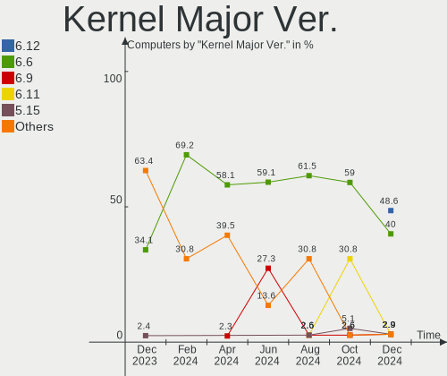
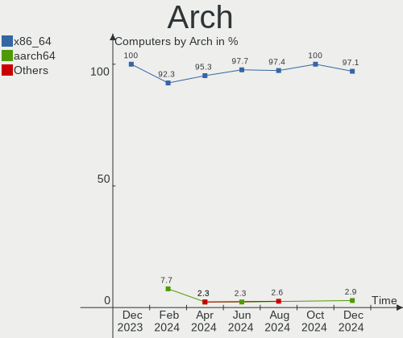
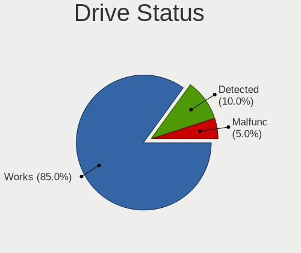
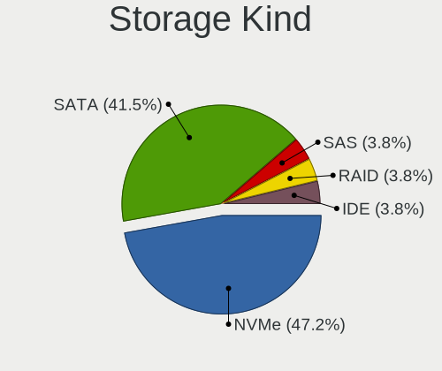
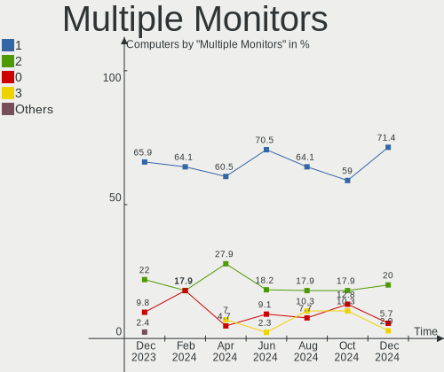

Gentoo - Hardware Trends
------------------------

A project to identify most popular hardware characteristics and track their change
over time based on data collected by Linux users at https://Linux-Hardware.org.

Anyone can contribute to this report by the [hw-probe](https://github.com/linuxhw/hw-probe) tool:

    sudo -E hw-probe -all -upload

This is a report for all computer types. See also reports for [desktops](/Dist/Gentoo/Desktop/README.md) and [notebooks](/Dist/Gentoo/Notebook/README.md).

This report is for one last month. Overall report since the beginning of time: [TestCoverage](https://github.com/linuxhw/TestCoverage)

Period: Jun, 2022.

Contents
--------

* [ System ](#system)
  - [ OS                       ](#os)
  - [ OS Family                ](#os-family)
  - [ Kernel                   ](#kernel)
  - [ Kernel Family            ](#kernel-family)
  - [ Kernel Major Ver.        ](#kernel-major-ver)
  - [ Arch                     ](#arch)
  - [ DE                       ](#de)
  - [ Display Server           ](#display-server)
  - [ Display Manager          ](#display-manager)
  - [ OS Lang                  ](#os-lang)
  - [ Boot Mode                ](#boot-mode)
  - [ Filesystem               ](#filesystem)
  - [ Part. scheme             ](#part-scheme)
  - [ Dual Boot with Linux/BSD ](#dual-boot-with-linuxbsd)
  - [ Dual Boot (Win)          ](#dual-boot-win)

* [ Board ](#board)
  - [ Vendor                   ](#vendor)
  - [ Model                    ](#model)
  - [ Model Family             ](#model-family)
  - [ MFG Year                 ](#mfg-year)
  - [ Form Factor              ](#form-factor)
  - [ Secure Boot              ](#secure-boot)
  - [ Coreboot                 ](#coreboot)
  - [ RAM Size                 ](#ram-size)
  - [ RAM Used                 ](#ram-used)
  - [ Total Drives             ](#total-drives)
  - [ Has CD-ROM               ](#has-cd-rom)
  - [ Has Ethernet             ](#has-ethernet)
  - [ Has WiFi                 ](#has-wifi)
  - [ Has Bluetooth            ](#has-bluetooth)

* [ Location ](#location)
  - [ Country                  ](#country)
  - [ City                     ](#city)

* [ Drives ](#drives)
  - [ Drive Vendor             ](#drive-vendor)
  - [ Drive Model              ](#drive-model)
  - [ HDD Vendor               ](#hdd-vendor)
  - [ SSD Vendor               ](#ssd-vendor)
  - [ Drive Kind               ](#drive-kind)
  - [ Drive Connector          ](#drive-connector)
  - [ Drive Size               ](#drive-size)
  - [ Space Total              ](#space-total)
  - [ Space Used               ](#space-used)
  - [ Malfunc. Drives          ](#malfunc-drives)
  - [ Malfunc. Drive Vendor    ](#malfunc-drive-vendor)
  - [ Malfunc. HDD Vendor      ](#malfunc-hdd-vendor)
  - [ Malfunc. Drive Kind      ](#malfunc-drive-kind)
  - [ Failed Drives            ](#failed-drives)
  - [ Failed Drive Vendor      ](#failed-drive-vendor)
  - [ Drive Status             ](#drive-status)

* [ Storage controller ](#storage-controller)
  - [ Storage Vendor           ](#storage-vendor)
  - [ Storage Model            ](#storage-model)
  - [ Storage Kind             ](#storage-kind)

* [ Processor ](#processor)
  - [ CPU Vendor               ](#cpu-vendor)
  - [ CPU Model                ](#cpu-model)
  - [ CPU Model Family         ](#cpu-model-family)
  - [ CPU Cores                ](#cpu-cores)
  - [ CPU Sockets              ](#cpu-sockets)
  - [ CPU Threads              ](#cpu-threads)
  - [ CPU Op-Modes             ](#cpu-op-modes)
  - [ CPU Microcode            ](#cpu-microcode)
  - [ CPU Microarch            ](#cpu-microarch)

* [ Graphics ](#graphics)
  - [ GPU Vendor               ](#gpu-vendor)
  - [ GPU Model                ](#gpu-model)
  - [ GPU Combo                ](#gpu-combo)
  - [ GPU Driver               ](#gpu-driver)
  - [ GPU Memory               ](#gpu-memory)

* [ Monitor ](#monitor)
  - [ Monitor Vendor           ](#monitor-vendor)
  - [ Monitor Model            ](#monitor-model)
  - [ Monitor Resolution       ](#monitor-resolution)
  - [ Monitor Diagonal         ](#monitor-diagonal)
  - [ Monitor Width            ](#monitor-width)
  - [ Aspect Ratio             ](#aspect-ratio)
  - [ Monitor Area             ](#monitor-area)
  - [ Pixel Density            ](#pixel-density)
  - [ Multiple Monitors        ](#multiple-monitors)

* [ Network ](#network)
  - [ Net Controller Vendor    ](#net-controller-vendor)
  - [ Net Controller Model     ](#net-controller-model)
  - [ Wireless Vendor          ](#wireless-vendor)
  - [ Wireless Model           ](#wireless-model)
  - [ Ethernet Vendor          ](#ethernet-vendor)
  - [ Ethernet Model           ](#ethernet-model)
  - [ Net Controller Kind      ](#net-controller-kind)
  - [ Used Controller          ](#used-controller)
  - [ NICs                     ](#nics)
  - [ IPv6                     ](#ipv6)

* [ Bluetooth ](#bluetooth)
  - [ Bluetooth Vendor         ](#bluetooth-vendor)
  - [ Bluetooth Model          ](#bluetooth-model)

* [ Sound ](#sound)
  - [ Sound Vendor             ](#sound-vendor)
  - [ Sound Model              ](#sound-model)

* [ Memory ](#memory)
  - [ Memory Vendor            ](#memory-vendor)
  - [ Memory Model             ](#memory-model)
  - [ Memory Kind              ](#memory-kind)
  - [ Memory Form Factor       ](#memory-form-factor)
  - [ Memory Size              ](#memory-size)
  - [ Memory Speed             ](#memory-speed)

* [ Printers & scanners ](#printers--scanners)
  - [ Printer Vendor           ](#printer-vendor)
  - [ Printer Model            ](#printer-model)
  - [ Scanner Vendor           ](#scanner-vendor)
  - [ Scanner Model            ](#scanner-model)

* [ Camera ](#camera)
  - [ Camera Vendor            ](#camera-vendor)
  - [ Camera Model             ](#camera-model)

* [ Security ](#security)
  - [ Fingerprint Vendor       ](#fingerprint-vendor)
  - [ Fingerprint Model        ](#fingerprint-model)
  - [ Chipcard Vendor          ](#chipcard-vendor)
  - [ Chipcard Model           ](#chipcard-model)

* [ Unsupported ](#unsupported)
  - [ Unsupported Devices      ](#unsupported-devices)
  - [ Unsupported Device Types ](#unsupported-device-types)

System
------

OS
--

Installed operating systems

| Name       | Computers | Percent |
|------------|-----------|---------|
| Gentoo 2.8 | 28        | 87.5%   |
| Gentoo 2.6 | 3         | 9.38%   |
| Gentoo 2.7 | 1         | 3.13%   |

OS Family
---------

OS without a version

| Name   | Computers | Percent |
|--------|-----------|---------|
| Gentoo | 32        | 100%    |

Kernel
------

Version of the Linux kernel

| Version                 | Computers | Percent |
|-------------------------|-----------|---------|
| 5.15.41-gentoo          | 4         | 12.5%   |
| 5.18.1-gentoo-r2        | 3         | 9.38%   |
| 5.15.41-gentoo-dist     | 3         | 9.38%   |
| 5.18.4-gentoo           | 2         | 6.25%   |
| 5.18.2-gentoo           | 2         | 6.25%   |
| 5.15.41-gentoo-x86_64   | 2         | 6.25%   |
| 5.15.32-gentoo-r1       | 2         | 6.25%   |
| 5.18.8-gentoo           | 1         | 3.13%   |
| 5.18.6-gentoo-x86_64    | 1         | 3.13%   |
| 5.18.6-gentoo           | 1         | 3.13%   |
| 5.18.5-gentoo           | 1         | 3.13%   |
| 5.18.1-gentoo-r1-x86_64 | 1         | 3.13%   |
| 5.18.1-gentoo-r1        | 1         | 3.13%   |
| 5.18.0-g95ff72a6c129    | 1         | 3.13%   |
| 5.17.8-gentoo           | 1         | 3.13%   |
| 5.17.6-zen1             | 1         | 3.13%   |
| 5.17.5-gentoo-x86_64    | 1         | 3.13%   |
| 5.17.13-gentoo          | 1         | 3.13%   |
| 5.17.12-gentoo-dist     | 1         | 3.13%   |
| 5.15.12-gentoo-x86_64   | 1         | 3.13%   |
| 4.9.16-gentoo           | 1         | 3.13%   |

Kernel Family
-------------

Linux kernel without a distro release

| Version | Computers | Percent |
|---------|-----------|---------|
| 5.15.41 | 9         | 28.13%  |
| 5.18.1  | 5         | 15.63%  |
| 5.18.6  | 2         | 6.25%   |
| 5.18.4  | 2         | 6.25%   |
| 5.18.2  | 2         | 6.25%   |
| 5.15.32 | 2         | 6.25%   |
| 5.18.8  | 1         | 3.13%   |
| 5.18.5  | 1         | 3.13%   |
| 5.18.0  | 1         | 3.13%   |
| 5.17.8  | 1         | 3.13%   |
| 5.17.6  | 1         | 3.13%   |
| 5.17.5  | 1         | 3.13%   |
| 5.17.13 | 1         | 3.13%   |
| 5.17.12 | 1         | 3.13%   |
| 5.15.12 | 1         | 3.13%   |
| 4.9.16  | 1         | 3.13%   |

Kernel Major Ver.
-----------------

Linux kernel major version

| Version | Computers | Percent |
|---------|-----------|---------|
| 5.18    | 14        | 43.75%  |
| 5.15    | 12        | 37.5%   |
| 5.17    | 5         | 15.63%  |
| 4.9     | 1         | 3.13%   |

Arch
----

OS architecture (x86_64, i586, etc.)

| Name   | Computers | Percent |
|--------|-----------|---------|
| x86_64 | 30        | 93.75%  |
| ppc    | 1         | 3.13%   |
| i686   | 1         | 3.13%   |

DE
--

Desktop Environment

| Name    | Computers | Percent |
|---------|-----------|---------|
| KDE5    | 10        | 31.25%  |
| Unknown | 10        | 31.25%  |
| GNOME   | 5         | 15.63%  |
| XFCE    | 2         | 6.25%   |
| MATE    | 2         | 6.25%   |
| xmonad  | 1         | 3.13%   |
| sway    | 1         | 3.13%   |
| DWM     | 1         | 3.13%   |

Display Server
--------------

X11 or Wayland

| Name    | Computers | Percent |
|---------|-----------|---------|
| X11     | 19        | 59.38%  |
| Wayland | 6         | 18.75%  |
| Tty     | 5         | 15.63%  |
| Unknown | 2         | 6.25%   |

Display Manager
---------------

SDDM, LightDM, etc.

| Name    | Computers | Percent |
|---------|-----------|---------|
| SDDM    | 11        | 34.38%  |
| Unknown | 10        | 31.25%  |
| LightDM | 7         | 21.88%  |
| GDM     | 3         | 9.38%   |
| XDM     | 1         | 3.13%   |

OS Lang
-------

Language

| Lang    | Computers | Percent |
|---------|-----------|---------|
| en_US   | 17        | 53.13%  |
| ru_RU   | 3         | 9.38%   |
| C.UTF8  | 3         | 9.38%   |
| fr_FR   | 2         | 6.25%   |
| en_GB   | 2         | 6.25%   |
| pl_PL   | 1         | 3.13%   |
| it_IT   | 1         | 3.13%   |
| en_CA   | 1         | 3.13%   |
| de_DE   | 1         | 3.13%   |
| Unknown | 1         | 3.13%   |

Boot Mode
---------

EFI or BIOS

| Mode | Computers | Percent |
|------|-----------|---------|
| EFI  | 28        | 87.5%   |
| BIOS | 4         | 12.5%   |

Filesystem
----------

Type of filesystem

| Type     | Computers | Percent |
|----------|-----------|---------|
| Ext4     | 23        | 71.88%  |
| Btrfs    | 5         | 15.63%  |
| F2fs     | 2         | 6.25%   |
| XXXXXXX  | 1         | 3.13%   |
| Bcachefs | 1         | 3.13%   |

Part. scheme
------------

Scheme of partitioning

| Type    | Computers | Percent |
|---------|-----------|---------|
| GPT     | 29        | 90.63%  |
| MBR     | 2         | 6.25%   |
| Unknown | 1         | 3.13%   |

Dual Boot with Linux/BSD
------------------------

Hosting more than one Linux/BSD

| Dual boot | Computers | Percent |
|-----------|-----------|---------|
| No        | 22        | 68.75%  |
| Yes       | 10        | 31.25%  |

Dual Boot (Win)
---------------

Hosting Linux and Windows

| Dual boot | Computers | Percent |
|-----------|-----------|---------|
| No        | 19        | 59.38%  |
| Yes       | 13        | 40.63%  |

Board
-----

Vendor
------

Motherboard manufacturer

| Name                | Computers | Percent |
|---------------------|-----------|---------|
| Dell                | 7         | 21.88%  |
| Lenovo              | 6         | 18.75%  |
| ASUSTek Computer    | 6         | 18.75%  |
| Hewlett-Packard     | 2         | 6.25%   |
| Gigabyte Technology | 2         | 6.25%   |
| Timi                | 1         | 3.13%   |
| Pegatron            | 1         | 3.13%   |
| MSI                 | 1         | 3.13%   |
| Intel               | 1         | 3.13%   |
| HUAWEI              | 1         | 3.13%   |
| Fujitsu             | 1         | 3.13%   |
| AVITA               | 1         | 3.13%   |
| ASRock              | 1         | 3.13%   |
| Unknown             | 1         | 3.13%   |

Model
-----

Motherboard model

| Name                                      | Computers | Percent |
|-------------------------------------------|-----------|---------|
| Timi RedmiBook 13                         | 1         | 3.13%   |
| Pegatron 810-170st                        | 1         | 3.13%   |
| MSI MS-7C37                               | 1         | 3.13%   |
| Lenovo ThinkPad X13 Yoga Gen 2 20W8002GCD | 1         | 3.13%   |
| Lenovo ThinkPad T460 20FMS421US           | 1         | 3.13%   |
| Lenovo ThinkPad T14 Gen 2a 20XK002SCK     | 1         | 3.13%   |
| Lenovo ThinkPad T14 Gen 1 20S1S35Y00      | 1         | 3.13%   |
| Lenovo ThinkPad A485 20MUCTO1WW           | 1         | 3.13%   |
| Lenovo Legion Y540-15IRH 81SX             | 1         | 3.13%   |
| Intel S5000XVN                            | 1         | 3.13%   |
| HUAWEI BOHB-WAX9                          | 1         | 3.13%   |
| HP OMEN by Laptop 15-dc0xxx               | 1         | 3.13%   |
| HP OMEN by Laptop                         | 1         | 3.13%   |
| Gigabyte Z590 UD                          | 1         | 3.13%   |
| Gigabyte AB350-Gaming                     | 1         | 3.13%   |
| Fujitsu D3417-B2 S26361-D3417-B2          | 1         | 3.13%   |
| Dell XPS 8700                             | 1         | 3.13%   |
| Dell XPS 17 9710                          | 1         | 3.13%   |
| Dell XPS 13 9365                          | 1         | 3.13%   |
| Dell Precision 7550                       | 1         | 3.13%   |
| Dell Latitude D420                        | 1         | 3.13%   |
| Dell Inspiron 15 5510                     | 1         | 3.13%   |
| Dell G3 3500                              | 1         | 3.13%   |
| AVITA NS14A6                              | 1         | 3.13%   |
| ASUS X555LJ                               | 1         | 3.13%   |
| ASUS TUF Gaming X570-PLUS                 | 1         | 3.13%   |
| ASUS ROG Zephyrus G14 GA401QC_GA401QC     | 1         | 3.13%   |
| ASUS ROG Strix G513QY_G513QY              | 1         | 3.13%   |
| ASUS ROG STRIX B450-F GAMING              | 1         | 3.13%   |
| ASUS M3A78-CM                             | 1         | 3.13%   |
| ASRock B450 Pro4                          | 1         | 3.13%   |
| Unknown                                   | 1         | 3.13%   |

Model Family
------------

Motherboard model prefix

| Name                  | Computers | Percent |
|-----------------------|-----------|---------|
| Lenovo ThinkPad       | 5         | 15.63%  |
| Dell XPS              | 3         | 9.38%   |
| ASUS ROG              | 3         | 9.38%   |
| HP OMEN               | 2         | 6.25%   |
| Timi RedmiBook        | 1         | 3.13%   |
| Pegatron 810-170st    | 1         | 3.13%   |
| MSI MS-7C37           | 1         | 3.13%   |
| Lenovo Legion         | 1         | 3.13%   |
| Intel S5000XVN        | 1         | 3.13%   |
| HUAWEI BOHB-WAX9      | 1         | 3.13%   |
| Gigabyte Z590         | 1         | 3.13%   |
| Gigabyte AB350-Gaming | 1         | 3.13%   |
| Fujitsu D3417-B2      | 1         | 3.13%   |
| Dell Precision        | 1         | 3.13%   |
| Dell Latitude         | 1         | 3.13%   |
| Dell Inspiron         | 1         | 3.13%   |
| Dell G3               | 1         | 3.13%   |
| AVITA NS14A6          | 1         | 3.13%   |
| ASUS X555LJ           | 1         | 3.13%   |
| ASUS TUF              | 1         | 3.13%   |
| ASUS M3A78-CM         | 1         | 3.13%   |
| ASRock B450           | 1         | 3.13%   |
| Unknown               | 1         | 3.13%   |

MFG Year
--------

Motherboard manufacture year

| Year    | Computers | Percent |
|---------|-----------|---------|
| 2021    | 7         | 21.88%  |
| 2020    | 5         | 15.63%  |
| 2019    | 4         | 12.5%   |
| 2018    | 4         | 12.5%   |
| 2017    | 2         | 6.25%   |
| 2016    | 2         | 6.25%   |
| 2014    | 2         | 6.25%   |
| 2022    | 1         | 3.13%   |
| 2015    | 1         | 3.13%   |
| 2008    | 1         | 3.13%   |
| 2007    | 1         | 3.13%   |
| 2006    | 1         | 3.13%   |
| Unknown | 1         | 3.13%   |

Form Factor
-----------

Physical design of the computer

| Name        | Computers | Percent |
|-------------|-----------|---------|
| Notebook    | 18        | 56.25%  |
| Desktop     | 11        | 34.38%  |
| Convertible | 2         | 6.25%   |
| Server      | 1         | 3.13%   |

Secure Boot
-----------

Enabled or disabled

| State    | Computers | Percent |
|----------|-----------|---------|
| Disabled | 31        | 96.88%  |
| Enabled  | 1         | 3.13%   |

Coreboot
--------

Have coreboot on board

| Used | Computers | Percent |
|------|-----------|---------|
| No   | 32        | 100%    |

RAM Size
--------

Total RAM memory

| Size in GB  | Computers | Percent |
|-------------|-----------|---------|
| 4.01-8.0    | 6         | 18.75%  |
| 32.01-64.0  | 6         | 18.75%  |
| 16.01-24.0  | 6         | 18.75%  |
| 8.01-16.0   | 5         | 15.63%  |
| 64.01-256.0 | 4         | 12.5%   |
| 24.01-32.0  | 2         | 6.25%   |
| 3.01-4.0    | 1         | 3.13%   |
| 2.01-3.0    | 1         | 3.13%   |
| 0.51-1.0    | 1         | 3.13%   |

RAM Used
--------

Used RAM memory

| Used GB    | Computers | Percent |
|------------|-----------|---------|
| 4.01-8.0   | 7         | 21.88%  |
| 2.01-3.0   | 7         | 21.88%  |
| 3.01-4.0   | 5         | 15.63%  |
| 1.01-2.0   | 4         | 12.5%   |
| 8.01-16.0  | 4         | 12.5%   |
| 0.01-0.5   | 2         | 6.25%   |
| 32.01-64.0 | 1         | 3.13%   |
| 16.01-24.0 | 1         | 3.13%   |
| 0.51-1.0   | 1         | 3.13%   |

Total Drives
------------

Number of drives on board

| Drives | Computers | Percent |
|--------|-----------|---------|
| 1      | 17        | 53.13%  |
| 2      | 9         | 28.13%  |
| 6      | 2         | 6.25%   |
| 5      | 2         | 6.25%   |
| 3      | 2         | 6.25%   |

Has CD-ROM
----------

Has CD-ROM on board

| Presented | Computers | Percent |
|-----------|-----------|---------|
| No        | 28        | 87.5%   |
| Yes       | 4         | 12.5%   |

Has Ethernet
------------

Has Ethernet on board

| Presented | Computers | Percent |
|-----------|-----------|---------|
| Yes       | 25        | 78.13%  |
| No        | 7         | 21.88%  |

Has WiFi
--------

Has WiFi module

| Presented | Computers | Percent |
|-----------|-----------|---------|
| Yes       | 24        | 75%     |
| No        | 8         | 25%     |

Has Bluetooth
-------------

Has Bluetooth module

| Presented | Computers | Percent |
|-----------|-----------|---------|
| Yes       | 20        | 62.5%   |
| No        | 12        | 37.5%   |

Location
--------

Country
-------

Geographic location (country)

| Country     | Computers | Percent |
|-------------|-----------|---------|
| USA         | 7         | 21.88%  |
| Russia      | 4         | 12.5%   |
| Poland      | 4         | 12.5%   |
| Netherlands | 3         | 9.38%   |
| Germany     | 2         | 6.25%   |
| France      | 2         | 6.25%   |
| China       | 2         | 6.25%   |
| Belarus     | 2         | 6.25%   |
| UK          | 1         | 3.13%   |
| Spain       | 1         | 3.13%   |
| Italy       | 1         | 3.13%   |
| Czechia     | 1         | 3.13%   |
| Canada      | 1         | 3.13%   |
| Belgium     | 1         | 3.13%   |

City
----

Geographic location (city)

| City          | Computers | Percent |
|---------------|-----------|---------|
| Yekaterinburg | 2         | 6.25%   |
| Warsaw        | 2         | 6.25%   |
| Paris         | 2         | 6.25%   |
| Minsk         | 2         | 6.25%   |
| Cieszyn       | 2         | 6.25%   |
| Amstelveen    | 2         | 6.25%   |
| Volgodonsk    | 1         | 3.13%   |
| Vancouver     | 1         | 3.13%   |
| Seattle       | 1         | 3.13%   |
| Prague        | 1         | 3.13%   |
| Perm          | 1         | 3.13%   |
| Orange        | 1         | 3.13%   |
| Nuremberg     | 1         | 3.13%   |
| Milan         | 1         | 3.13%   |
| London        | 1         | 3.13%   |
| Lochristi     | 1         | 3.13%   |
| Kensington    | 1         | 3.13%   |
| Kailua-Kona   | 1         | 3.13%   |
| Gunzenhausen  | 1         | 3.13%   |
| Guangzhou     | 1         | 3.13%   |
| Fuzhou        | 1         | 3.13%   |
| Chattanooga   | 1         | 3.13%   |
| Burke         | 1         | 3.13%   |
| Bertamirans   | 1         | 3.13%   |
| Ann Arbor     | 1         | 3.13%   |
| Amsterdam     | 1         | 3.13%   |

Drives
------

Drive Vendor
------------

Hard drive vendors

| Vendor              | Computers | Drives | Percent |
|---------------------|-----------|--------|---------|
| Samsung Electronics | 11        | 14     | 21.57%  |
| Seagate             | 7         | 10     | 13.73%  |
| Toshiba             | 6         | 7      | 11.76%  |
| WDC                 | 3         | 4      | 5.88%   |
| SK hynix            | 3         | 3      | 5.88%   |
| Kingston            | 3         | 3      | 5.88%   |
| SanDisk             | 2         | 2      | 3.92%   |
| Intel               | 2         | 2      | 3.92%   |
| Goodram             | 2         | 2      | 3.92%   |
| Silicon Motion      | 1         | 2      | 1.96%   |
| Plextor             | 1         | 1      | 1.96%   |
| Phison              | 1         | 1      | 1.96%   |
| Micron Technology   | 1         | 1      | 1.96%   |
| LITEON              | 1         | 1      | 1.96%   |
| KIOXIA-EXCERIA      | 1         | 1      | 1.96%   |
| Hoodisk             | 1         | 1      | 1.96%   |
| Hitachi             | 1         | 3      | 1.96%   |
| HGST                | 1         | 2      | 1.96%   |
| Gigabyte Technology | 1         | 1      | 1.96%   |
| Fujitsu             | 1         | 1      | 1.96%   |
| Crucial             | 1         | 1      | 1.96%   |

Drive Model
-----------

Hard drive models

| Model                                  | Computers | Percent |
|----------------------------------------|-----------|---------|
| Toshiba KXG6AZNV512G 512GB             | 2         | 3.51%   |
| Seagate ST2000LM015-2E8174 2TB         | 2         | 3.51%   |
| Samsung SSD 970 PRO 1TB                | 2         | 3.51%   |
| Samsung SSD 870 EVO 1TB                | 2         | 3.51%   |
| Samsung SSD 850 EVO 250GB              | 2         | 3.51%   |
| Kingston SA400S37240G 240GB SSD        | 2         | 3.51%   |
| Goodram SSDPR-CL100-480-G2 480GB       | 2         | 3.51%   |
| WDC WD8003FFBX-68B9AN0 8TB             | 1         | 1.75%   |
| WDC WD60EZRX-00MVLB1 6TB               | 1         | 1.75%   |
| WDC WD2003FZEX-00SRLA0 2TB             | 1         | 1.75%   |
| WDC PC SN520 SDAPMUW-512G-1101 512GB   | 1         | 1.75%   |
| Toshiba MK6008GAH 64GB                 | 1         | 1.75%   |
| Toshiba HDWR180 8TB                    | 1         | 1.75%   |
| Toshiba HDWE150 5TB                    | 1         | 1.75%   |
| Toshiba HDWD110 1TB                    | 1         | 1.75%   |
| SK hynix SKHynix_HFS512GDE9X081N 512GB | 1         | 1.75%   |
| SK hynix PC711 NVMe 512GB              | 1         | 1.75%   |
| SK hynix PC611 NVMe 512GB              | 1         | 1.75%   |
| Silicon Motion NVME SSD 128GB          | 1         | 1.75%   |
| Silicon Motion 256GB                   | 1         | 1.75%   |
| Seagate ST8000NM0055-1RM112 8TB        | 1         | 1.75%   |
| Seagate ST8000DM004-2CX188 8TB         | 1         | 1.75%   |
| Seagate ST4000NM0245-1Z2107 4TB        | 1         | 1.75%   |
| Seagate ST4000NM0024-1HT178 4TB        | 1         | 1.75%   |
| Seagate ST4000DM004-2CV104 4TB         | 1         | 1.75%   |
| Seagate ST12000NM0008-2H3101 12TB      | 1         | 1.75%   |
| SanDisk SDSSDH3 1T00 1TB               | 1         | 1.75%   |
| SanDisk SD8TB8U256G1001 256GB SSD      | 1         | 1.75%   |
| Samsung SSD 980 PRO 1TB                | 1         | 1.75%   |
| Samsung SSD 970 EVO Plus 1TB           | 1         | 1.75%   |
| Samsung SSD 970 EVO 1TB                | 1         | 1.75%   |
| Samsung SSD 860 EVO 500GB              | 1         | 1.75%   |
| Samsung SSD 850 PRO 256GB              | 1         | 1.75%   |
| Samsung PM991 NVMe 512GB               | 1         | 1.75%   |
| Samsung PM951 NVMe 256GB               | 1         | 1.75%   |
| Samsung MZNLN512HAJQ-00000 512GB SSD   | 1         | 1.75%   |
| Plextor PX-512M8VC 512GB SSD           | 1         | 1.75%   |
| Phison 311CD0512GB                     | 1         | 1.75%   |
| Micron 2450 NVMe 1024GB                | 1         | 1.75%   |
| LITEON CA3-8D128-HP 128GB              | 1         | 1.75%   |
| KIOXIA-EXCERIA G2 SSD 1TB              | 1         | 1.75%   |
| Kingston SNVS1000G 1TB                 | 1         | 1.75%   |
| Intel SSDPEKNU512GZ 512GB              | 1         | 1.75%   |
| Intel SSDPEKKF256G8L 256GB             | 1         | 1.75%   |
| Hoodisk SSD 256GB                      | 1         | 1.75%   |
| Hitachi HUS724030ALE641 3TB            | 1         | 1.75%   |
| HGST HTS545050A7E380 500GB             | 1         | 1.75%   |
| Gigabyte GP-GSM2NE3128GNTD 128GB       | 1         | 1.75%   |
| Fujitsu MHV2040AT 40GB                 | 1         | 1.75%   |
| Crucial CT2000MX500SSD1 2TB            | 1         | 1.75%   |

HDD Vendor
----------

Hard disk drive vendors

| Vendor  | Computers | Drives | Percent |
|---------|-----------|--------|---------|
| Seagate | 7         | 10     | 43.75%  |
| Toshiba | 4         | 5      | 25%     |
| WDC     | 2         | 3      | 12.5%   |
| Hitachi | 1         | 3      | 6.25%   |
| HGST    | 1         | 2      | 6.25%   |
| Fujitsu | 1         | 1      | 6.25%   |

SSD Vendor
----------

Solid state drive vendors

| Vendor              | Computers | Drives | Percent |
|---------------------|-----------|--------|---------|
| Samsung Electronics | 6         | 7      | 40%     |
| SanDisk             | 2         | 2      | 13.33%  |
| Kingston            | 2         | 2      | 13.33%  |
| Goodram             | 2         | 2      | 13.33%  |
| Plextor             | 1         | 1      | 6.67%   |
| Hoodisk             | 1         | 1      | 6.67%   |
| Crucial             | 1         | 1      | 6.67%   |

Drive Kind
----------

HDD or SSD

| Kind | Computers | Drives | Percent |
|------|-----------|--------|---------|
| NVMe | 20        | 23     | 44.44%  |
| SSD  | 14        | 16     | 31.11%  |
| HDD  | 11        | 24     | 24.44%  |

Drive Connector
---------------

SATA, SAS, NVMe, etc.

| Type | Computers | Drives | Percent |
|------|-----------|--------|---------|
| SATA | 21        | 40     | 51.22%  |
| NVMe | 20        | 23     | 48.78%  |

Drive Size
----------

Size of hard drive

| Size in TB | Computers | Drives | Percent |
|------------|-----------|--------|---------|
| 0.01-0.5   | 12        | 14     | 41.38%  |
| 0.51-1.0   | 6         | 6      | 20.69%  |
| 1.01-2.0   | 4         | 5      | 13.79%  |
| 4.01-10.0  | 3         | 8      | 10.34%  |
| 3.01-4.0   | 2         | 3      | 6.9%    |
| 2.01-3.0   | 1         | 3      | 3.45%   |
| 10.01-20.0 | 1         | 1      | 3.45%   |

Space Total
-----------

Amount of disk space available on the file system

| Size in GB     | Computers | Percent |
|----------------|-----------|---------|
| 101-250        | 9         | 28.13%  |
| 251-500        | 8         | 25%     |
| More than 3000 | 5         | 15.63%  |
| 501-1000       | 5         | 15.63%  |
| 21-50          | 2         | 6.25%   |
| 1001-2000      | 2         | 6.25%   |
| 2001-3000      | 1         | 3.13%   |

Space Used
----------

Amount of used disk space

| Used GB        | Computers | Percent |
|----------------|-----------|---------|
| 101-250        | 9         | 28.13%  |
| 1-20           | 6         | 18.75%  |
| 21-50          | 4         | 12.5%   |
| 51-100         | 4         | 12.5%   |
| More than 3000 | 3         | 9.38%   |
| 251-500        | 2         | 6.25%   |
| 501-1000       | 2         | 6.25%   |
| 2001-3000      | 1         | 3.13%   |
| 1001-2000      | 1         | 3.13%   |

Malfunc. Drives
---------------

Drive models with a malfunction

| Model                               | Computers | Drives | Percent |
|-------------------------------------|-----------|--------|---------|
| Toshiba MK6008GAH 64GB              | 1         | 1      | 50%     |
| Samsung Electronics SSD 970 EVO 1TB | 1         | 1      | 50%     |

Malfunc. Drive Vendor
---------------------

Vendors of faulty drives

| Vendor              | Computers | Drives | Percent |
|---------------------|-----------|--------|---------|
| Toshiba             | 1         | 1      | 50%     |
| Samsung Electronics | 1         | 1      | 50%     |

Malfunc. HDD Vendor
-------------------

Vendors of faulty HDD drives

| Vendor  | Computers | Drives | Percent |
|---------|-----------|--------|---------|
| Toshiba | 1         | 1      | 100%    |

Malfunc. Drive Kind
-------------------

Kinds of faulty drives

| Kind | Computers | Drives | Percent |
|------|-----------|--------|---------|
| NVMe | 1         | 1      | 50%     |
| HDD  | 1         | 1      | 50%     |

Failed Drives
-------------

Failed drive models

Zero info for selected period =(

Failed Drive Vendor
-------------------

Failed drive vendors

Zero info for selected period =(

Drive Status
------------

Number of failed and malfunc. drives

| Status  | Computers | Drives | Percent |
|---------|-----------|--------|---------|
| Works   | 31        | 61     | 93.94%  |
| Malfunc | 2         | 2      | 6.06%   |

Storage controller
------------------

Storage Vendor
--------------

Storage controller vendors

| Vendor                       | Computers | Percent |
|------------------------------|-----------|---------|
| Intel                        | 17        | 36.17%  |
| AMD                          | 8         | 17.02%  |
| Samsung Electronics          | 7         | 14.89%  |
| SK hynix                     | 3         | 6.38%   |
| Toshiba America Info Systems | 2         | 4.26%   |
| Phison Electronics           | 2         | 4.26%   |
| ASMedia Technology           | 2         | 4.26%   |
| Silicon Motion               | 1         | 2.13%   |
| SanDisk                      | 1         | 2.13%   |
| Micron Technology            | 1         | 2.13%   |
| Lite-On Technology           | 1         | 2.13%   |
| KIOXIA                       | 1         | 2.13%   |
| Kingston Technology Company  | 1         | 2.13%   |

Storage Model
-------------

Storage controller models

| Model                                                                          | Computers | Percent |
|--------------------------------------------------------------------------------|-----------|---------|
| AMD FCH SATA Controller [AHCI mode]                                            | 7         | 13.46%  |
| Samsung NVMe SSD Controller SM981/PM981/PM983                                  | 4         | 7.69%   |
| Toshiba America Info Systems XG6 NVMe SSD Controller                           | 2         | 3.85%   |
| SK hynix Gold P31 SSD                                                          | 2         | 3.85%   |
| Phison PS5013 E13 NVMe Controller                                              | 2         | 3.85%   |
| Intel Comet Lake SATA AHCI Controller                                          | 2         | 3.85%   |
| ASMedia ASM1062 Serial ATA Controller                                          | 2         | 3.85%   |
| AMD 400 Series Chipset SATA Controller                                         | 2         | 3.85%   |
| SK hynix Non-Volatile memory controller                                        | 1         | 1.92%   |
| Silicon Motion SM2263EN/SM2263XT SSD Controller                                | 1         | 1.92%   |
| SanDisk PC SN520 NVMe SSD                                                      | 1         | 1.92%   |
| Samsung NVMe SSD Controller SM951/PM951                                        | 1         | 1.92%   |
| Samsung NVMe SSD Controller PM9A1/PM9A3/980PRO                                 | 1         | 1.92%   |
| Samsung NVMe SSD Controller 980                                                | 1         | 1.92%   |
| Micron Non-Volatile memory controller                                          | 1         | 1.92%   |
| Lite-On Non-Volatile memory controller                                         | 1         | 1.92%   |
| KIOXIA NVMe SSD                                                                | 1         | 1.92%   |
| Kingston Company Company Non-Volatile memory controller                        | 1         | 1.92%   |
| Intel Wildcat Point-LP SATA Controller [AHCI Mode]                             | 1         | 1.92%   |
| Intel Volume Management Device NVMe RAID Controller                            | 1         | 1.92%   |
| Intel Sunrise Point-LP SATA Controller [AHCI mode]                             | 1         | 1.92%   |
| Intel SSD Pro 7600p/760p/E 6100p Series                                        | 1         | 1.92%   |
| Intel Q170/Q150/B150/H170/H110/Z170/CM236 Chipset SATA Controller [AHCI Mode]  | 1         | 1.92%   |
| Intel Non-Volatile memory controller                                           | 1         | 1.92%   |
| Intel HM170/QM170 Chipset SATA Controller [AHCI Mode]                          | 1         | 1.92%   |
| Intel Cannon Lake Mobile PCH SATA AHCI Controller                              | 1         | 1.92%   |
| Intel C600/X79 series chipset 6-Port SATA AHCI Controller                      | 1         | 1.92%   |
| Intel 82801G (ICH7 Family) IDE Controller                                      | 1         | 1.92%   |
| Intel 82801 Mobile SATA Controller [RAID mode]                                 | 1         | 1.92%   |
| Intel 8 Series/C220 Series Chipset Family 6-port SATA Controller 1 [AHCI mode] | 1         | 1.92%   |
| Intel 631xESB/632xESB SATA AHCI Controller                                     | 1         | 1.92%   |
| Intel 631xESB/632xESB IDE Controller                                           | 1         | 1.92%   |
| Intel 500 Series Chipset Family SATA AHCI Controller                           | 1         | 1.92%   |
| Intel 400 Series Chipset Family SATA AHCI Controller                           | 1         | 1.92%   |
| AMD SB7x0/SB8x0/SB9x0 SATA Controller [IDE mode]                               | 1         | 1.92%   |
| AMD SB7x0/SB8x0/SB9x0 IDE Controller                                           | 1         | 1.92%   |
| AMD 300 Series Chipset SATA Controller                                         | 1         | 1.92%   |

Storage Kind
------------

Kind of storage controller (IDE, SATA, NVMe, SAS, ...)

| Kind | Computers | Percent |
|------|-----------|---------|
| NVMe | 20        | 44.44%  |
| SATA | 20        | 44.44%  |
| IDE  | 3         | 6.67%   |
| RAID | 2         | 4.44%   |

Processor
---------

CPU Vendor
----------

Processor vendors

| Vendor       | Computers | Percent |
|--------------|-----------|---------|
| Intel        | 20        | 62.5%   |
| AMD          | 11        | 34.38%  |
| PowerBook6,7 | 1         | 3.13%   |

CPU Model
---------

Processor models

| Model                                           | Computers | Percent |
|-------------------------------------------------|-----------|---------|
| Intel Core i5-10210U CPU @ 1.60GHz              | 2         | 6.25%   |
| PowerBook6,7 7447A, altivec supported           | 1         | 3.13%   |
| Intel Xeon CPU E5335 @ 2.00GHz                  | 1         | 3.13%   |
| Intel Xeon CPU E3-1275 v6 @ 3.80GHz             | 1         | 3.13%   |
| Intel Core i7-9750H CPU @ 2.60GHz               | 1         | 3.13%   |
| Intel Core i7-7820HK CPU @ 2.90GHz              | 1         | 3.13%   |
| Intel Core i7-5500U CPU @ 2.40GHz               | 1         | 3.13%   |
| Intel Core i7-4930K CPU @ 3.40GHz               | 1         | 3.13%   |
| Intel Core i7-4790 CPU @ 3.60GHz                | 1         | 3.13%   |
| Intel Core i7-10850H CPU @ 2.70GHz              | 1         | 3.13%   |
| Intel Core i7-10610U CPU @ 1.80GHz              | 1         | 3.13%   |
| Intel Core i5-8300H CPU @ 2.30GHz               | 1         | 3.13%   |
| Intel Core i5-8200Y CPU @ 1.30GHz               | 1         | 3.13%   |
| Intel Core i5-6300U CPU @ 2.40GHz               | 1         | 3.13%   |
| Intel Core i5-10300H CPU @ 2.50GHz              | 1         | 3.13%   |
| Intel Core Duo CPU U2500 @ 1.20GHz              | 1         | 3.13%   |
| Intel 11th Gen Core i7-11800H @ 2.30GHz         | 1         | 3.13%   |
| Intel 11th Gen Core i7-11700K @ 3.60GHz         | 1         | 3.13%   |
| Intel 11th Gen Core i7-1165G7 @ 2.80GHz         | 1         | 3.13%   |
| Intel 11th Gen Core i7-11390H @ 3.40GHz         | 1         | 3.13%   |
| AMD Ryzen 9 5950X 16-Core Processor             | 1         | 3.13%   |
| AMD Ryzen 9 5900HX with Radeon Graphics         | 1         | 3.13%   |
| AMD Ryzen 9 3900X 12-Core Processor             | 1         | 3.13%   |
| AMD Ryzen 7 PRO 5850U with Radeon Graphics      | 1         | 3.13%   |
| AMD Ryzen 7 PRO 2700U w/ Radeon Vega Mobile Gfx | 1         | 3.13%   |
| AMD Ryzen 7 5800HS with Radeon Graphics         | 1         | 3.13%   |
| AMD Ryzen 7 2700X Eight-Core Processor          | 1         | 3.13%   |
| AMD Ryzen 5 2600 Six-Core Processor             | 1         | 3.13%   |
| AMD Ryzen 5 1600 Six-Core Processor             | 1         | 3.13%   |
| AMD Ryzen 3 3200U with Radeon Vega Mobile Gfx   | 1         | 3.13%   |
| AMD Phenom II X4 955 Processor                  | 1         | 3.13%   |

CPU Model Family
----------------

Processor model prefix

| Model            | Computers | Percent |
|------------------|-----------|---------|
| Intel Core i7    | 7         | 21.88%  |
| Intel Core i5    | 6         | 18.75%  |
| Other            | 5         | 15.63%  |
| AMD Ryzen 9      | 3         | 9.38%   |
| Intel Xeon       | 2         | 6.25%   |
| AMD Ryzen 7 PRO  | 2         | 6.25%   |
| AMD Ryzen 7      | 2         | 6.25%   |
| AMD Ryzen 5      | 2         | 6.25%   |
| Intel Core Duo   | 1         | 3.13%   |
| AMD Ryzen 3      | 1         | 3.13%   |
| AMD Phenom II X4 | 1         | 3.13%   |

CPU Cores
---------

Number of processor cores

| Number | Computers | Percent |
|--------|-----------|---------|
| 4      | 12        | 37.5%   |
| 8      | 6         | 18.75%  |
| 6      | 5         | 15.63%  |
| 2      | 5         | 15.63%  |
| 1      | 2         | 6.25%   |
| 16     | 1         | 3.13%   |
| 12     | 1         | 3.13%   |

CPU Sockets
-----------

Number of sockets

| Number | Computers | Percent |
|--------|-----------|---------|
| 1      | 31        | 96.88%  |
| 2      | 1         | 3.13%   |

CPU Threads
-----------

Threads per core (Hyper-Threading)

| Number | Computers | Percent |
|--------|-----------|---------|
| 2      | 26        | 81.25%  |
| 1      | 6         | 18.75%  |

CPU Op-Modes
------------

CPU Operation Modes (32-bit, 64-bit)

| Op mode        | Computers | Percent |
|----------------|-----------|---------|
| 32-bit, 64-bit | 30        | 93.75%  |
| 32-bit         | 2         | 6.25%   |

CPU Microcode
-------------

Microcode number

| Number     | Computers | Percent |
|------------|-----------|---------|
| 0x806ec    | 3         | 9.38%   |
| 0x0a50000c | 3         | 9.38%   |
| 0x0800820d | 3         | 9.38%   |
| 0xa0652    | 2         | 6.25%   |
| 0x906ea    | 2         | 6.25%   |
| Unknown    | 2         | 6.25%   |
| 0xa0671    | 1         | 3.13%   |
| 0x906e9    | 1         | 3.13%   |
| 0x806e9    | 1         | 3.13%   |
| 0x806d1    | 1         | 3.13%   |
| 0x806c2    | 1         | 3.13%   |
| 0x806c1    | 1         | 3.13%   |
| 0x6f7      | 1         | 3.13%   |
| 0x6ec      | 1         | 3.13%   |
| 0x406e3    | 1         | 3.13%   |
| 0x306e4    | 1         | 3.13%   |
| 0x306d4    | 1         | 3.13%   |
| 0x306c3    | 1         | 3.13%   |
| 0x0a201204 | 1         | 3.13%   |
| 0x08701021 | 1         | 3.13%   |
| 0x08108109 | 1         | 3.13%   |
| 0x0810100b | 1         | 3.13%   |
| 0x010000db | 1         | 3.13%   |

CPU Microarch
-------------

Microarchitecture

| Name      | Computers | Percent |
|-----------|-----------|---------|
| KabyLake  | 8         | 25%     |
| Zen+      | 4         | 12.5%   |
| Zen 3     | 4         | 12.5%   |
| TigerLake | 2         | 6.25%   |
| Icelake   | 2         | 6.25%   |
| CometLake | 2         | 6.25%   |
| Zen 2     | 1         | 3.13%   |
| Zen       | 1         | 3.13%   |
| Skylake   | 1         | 3.13%   |
| P6        | 1         | 3.13%   |
| K10       | 1         | 3.13%   |
| IvyBridge | 1         | 3.13%   |
| Haswell   | 1         | 3.13%   |
| Core      | 1         | 3.13%   |
| Broadwell | 1         | 3.13%   |
| Unknown   | 1         | 3.13%   |

Graphics
--------

GPU Vendor
----------

Vendors of graphics cards

| Vendor | Computers | Percent |
|--------|-----------|---------|
| Nvidia | 15        | 38.46%  |
| Intel  | 14        | 35.9%   |
| AMD    | 10        | 25.64%  |

GPU Model
---------

Graphics card models

| Model                                                                         | Computers | Percent |
|-------------------------------------------------------------------------------|-----------|---------|
| Intel CometLake-U GT2 [UHD Graphics]                                          | 3         | 7.32%   |
| AMD Cezanne                                                                   | 3         | 7.32%   |
| Intel TigerLake-LP GT2 [Iris Xe Graphics]                                     | 2         | 4.88%   |
| Nvidia TU117M                                                                 | 1         | 2.44%   |
| Nvidia TU117GLM [Quadro T2000 Mobile / Max-Q]                                 | 1         | 2.44%   |
| Nvidia TU106M [GeForce RTX 2060 Mobile]                                       | 1         | 2.44%   |
| Nvidia GP108M [GeForce MX330]                                                 | 1         | 2.44%   |
| Nvidia GP108M [GeForce MX250]                                                 | 1         | 2.44%   |
| Nvidia GP107M [GeForce GTX 1050 Ti Mobile]                                    | 1         | 2.44%   |
| Nvidia GP106M [GeForce GTX 1060 Mobile]                                       | 1         | 2.44%   |
| Nvidia GP104 [GeForce GTX 1080]                                               | 1         | 2.44%   |
| Nvidia GP102 [GeForce GTX 1080 Ti]                                            | 1         | 2.44%   |
| Nvidia GM107 [GeForce GTX 745]                                                | 1         | 2.44%   |
| Nvidia GK208BM [GeForce 920M]                                                 | 1         | 2.44%   |
| Nvidia GK104 [GeForce GTX 660 Ti]                                             | 1         | 2.44%   |
| Nvidia GA107M [GeForce RTX 3050 Mobile]                                       | 1         | 2.44%   |
| Nvidia GA106 [Geforce RTX 3050]                                               | 1         | 2.44%   |
| Nvidia G84 [GeForce 8600 GTS]                                                 | 1         | 2.44%   |
| Intel UHD Graphics 615                                                        | 1         | 2.44%   |
| Intel TigerLake-H GT1 [UHD Graphics]                                          | 1         | 2.44%   |
| Intel Skylake GT2 [HD Graphics 520]                                           | 1         | 2.44%   |
| Intel Mobile 945GM/GMS/GME, 943/940GML Express Integrated Graphics Controller | 1         | 2.44%   |
| Intel Mobile 945GM/GMS, 943/940GML Express Integrated Graphics Controller     | 1         | 2.44%   |
| Intel HD Graphics P630                                                        | 1         | 2.44%   |
| Intel HD Graphics 630                                                         | 1         | 2.44%   |
| Intel HD Graphics 5500                                                        | 1         | 2.44%   |
| Intel CometLake-H GT2 [UHD Graphics]                                          | 1         | 2.44%   |
| Intel CoffeeLake-H GT2 [UHD Graphics 630]                                     | 1         | 2.44%   |
| AMD RV360/M12 [Mobility Radeon 9550]                                          | 1         | 2.44%   |
| AMD RS780C [Radeon 3100]                                                      | 1         | 2.44%   |
| AMD Raven Ridge [Radeon Vega Series / Radeon Vega Mobile Series]              | 1         | 2.44%   |
| AMD Picasso/Raven 2 [Radeon Vega Series / Radeon Vega Mobile Series]          | 1         | 2.44%   |
| AMD Navi 23 [Radeon RX 6600/6600 XT/6600M]                                    | 1         | 2.44%   |
| AMD Navi 22 [Radeon RX 6700/6700 XT/6750 XT / 6800M]                          | 1         | 2.44%   |
| AMD Ellesmere [Radeon RX 470/480/570/570X/580/580X/590]                       | 1         | 2.44%   |
| AMD Cedar [Radeon HD 5000/6000/7350/8350 Series]                              | 1         | 2.44%   |

GPU Combo
---------

Combinations of graphics cards

| Name           | Computers | Percent |
|----------------|-----------|---------|
| 1 x AMD        | 9         | 28.13%  |
| 1 x Nvidia     | 8         | 25%     |
| Intel + Nvidia | 7         | 21.88%  |
| 1 x Intel      | 6         | 18.75%  |
| 2 x Intel      | 1         | 3.13%   |
| 2 x AMD        | 1         | 3.13%   |

GPU Driver
----------

Free vs proprietary

| Driver      | Computers | Percent |
|-------------|-----------|---------|
| Free        | 24        | 75%     |
| Proprietary | 8         | 25%     |

GPU Memory
----------

Total video memory

| Size in GB | Computers | Percent |
|------------|-----------|---------|
| Unknown    | 14        | 43.75%  |
| 7.01-8.0   | 4         | 12.5%   |
| 0.01-0.5   | 4         | 12.5%   |
| 3.01-4.0   | 3         | 9.38%   |
| 0.51-1.0   | 3         | 9.38%   |
| 8.01-16.0  | 2         | 6.25%   |
| 2.01-3.0   | 1         | 3.13%   |
| 1.01-2.0   | 1         | 3.13%   |

Monitor
-------

Monitor Vendor
--------------

Monitor vendors

| Vendor               | Computers | Percent |
|----------------------|-----------|---------|
| BOE                  | 7         | 17.95%  |
| Samsung Electronics  | 6         | 15.38%  |
| LG Display           | 4         | 10.26%  |
| Chimei Innolux       | 4         | 10.26%  |
| Goldstar             | 3         | 7.69%   |
| ViewSonic            | 2         | 5.13%   |
| Sharp                | 2         | 5.13%   |
| Hewlett-Packard      | 2         | 5.13%   |
| AU Optronics         | 2         | 5.13%   |
| ASUSTek Computer     | 2         | 5.13%   |
| PNP                  | 1         | 2.56%   |
| Iiyama               | 1         | 2.56%   |
| BenQ                 | 1         | 2.56%   |
| Apple                | 1         | 2.56%   |
| Ancor Communications | 1         | 2.56%   |

Monitor Model
-------------

Monitor models

| Model                                                                  | Computers | Percent |
|------------------------------------------------------------------------|-----------|---------|
| BOE LCD Monitor BOE0819 1920x1080 344x194mm 15.5-inch                  | 2         | 5.13%   |
| ViewSonic VX2458 Series VSC36AF 1920x1080 521x293mm 23.5-inch          | 1         | 2.56%   |
| ViewSonic LCD Monitor VSC2034 2560x1440 600x340mm 27.2-inch            | 1         | 2.56%   |
| Sharp LQ140M1JW49 SHP1523 1920x1080 309x174mm 14.0-inch                | 1         | 2.56%   |
| Sharp LCD Monitor SHP1517 3840x2400 366x229mm 17.0-inch                | 1         | 2.56%   |
| Samsung Electronics SyncMaster SAM0584 2048x1152 510x290mm 23.1-inch   | 1         | 2.56%   |
| Samsung Electronics SMS27A850 SAM083D 2560x1440 518x324mm 24.1-inch    | 1         | 2.56%   |
| Samsung Electronics S22B300 SAM08C8 1920x1080 477x268mm 21.5-inch      | 1         | 2.56%   |
| Samsung Electronics LCD Monitor SEC3157 1280x800 261x163mm 12.1-inch   | 1         | 2.56%   |
| Samsung Electronics LCD Monitor SAM07C5 1920x1080 1020x570mm 46.0-inch | 1         | 2.56%   |
| Samsung Electronics C27F591 SAM0D37 1920x1080 598x336mm 27.0-inch      | 1         | 2.56%   |
| PNP LCD Monitor PNP0801 1280x960                                       | 1         | 2.56%   |
| LG Display LCD Monitor LGD06BA 2560x1600 286x179mm 13.3-inch           | 1         | 2.56%   |
| LG Display LCD Monitor LGD0536 1920x1080 294x165mm 13.3-inch           | 1         | 2.56%   |
| LG Display LCD Monitor LGD0532 1920x1080 344x194mm 15.5-inch           | 1         | 2.56%   |
| LG Display LCD Monitor LGD0521 1920x1080 309x174mm 14.0-inch           | 1         | 2.56%   |
| Iiyama PL2480H IVM610B 1920x1080 521x293mm 23.5-inch                   | 1         | 2.56%   |
| Hewlett-Packard 27es HWP3325 1920x1080 600x340mm 27.2-inch             | 1         | 2.56%   |
| Hewlett-Packard 24w HPN3431 1920x1080 527x296mm 23.8-inch              | 1         | 2.56%   |
| Goldstar FULL HD GSM5B55 1920x1080 480x270mm 21.7-inch                 | 1         | 2.56%   |
| Goldstar E1942 GSM4C09 1366x768 410x230mm 18.5-inch                    | 1         | 2.56%   |
| Goldstar 22MP55 GSM5A26 1920x1080 480x270mm 21.7-inch                  | 1         | 2.56%   |
| Chimei Innolux LCD Monitor CMN15AB 1366x768 344x194mm 15.5-inch        | 1         | 2.56%   |
| Chimei Innolux LCD Monitor CMN152E 1920x1080 344x193mm 15.5-inch       | 1         | 2.56%   |
| Chimei Innolux LCD Monitor CMN14F5 1920x1080 309x173mm 13.9-inch       | 1         | 2.56%   |
| Chimei Innolux LCD Monitor CMN14D4 1920x1080 309x173mm 13.9-inch       | 1         | 2.56%   |
| BOE LCD Monitor BOE0973 2560x1440 344x194mm 15.5-inch                  | 1         | 2.56%   |
| BOE LCD Monitor BOE0898 1920x1080 294x165mm 13.3-inch                  | 1         | 2.56%   |
| BOE LCD Monitor BOE0872 1920x1080 344x194mm 15.5-inch                  | 1         | 2.56%   |
| BOE LCD Monitor BOE084D 1920x1080 344x193mm 15.5-inch                  | 1         | 2.56%   |
| BOE LCD Monitor BOE07DB 1920x1080 309x174mm 14.0-inch                  | 1         | 2.56%   |
| BenQ GW2480 BNQ78E7 1920x1080 527x296mm 23.8-inch                      | 1         | 2.56%   |
| AU Optronics LCD Monitor AUO243D 1920x1080 309x173mm 13.9-inch         | 1         | 2.56%   |
| AU Optronics LCD Monitor AUO23ED 1920x1080 344x193mm 15.5-inch         | 1         | 2.56%   |
| ASUSTek Computer PB247 AUS24A8 1920x1080 527x297mm 23.8-inch           | 1         | 2.56%   |
| ASUSTek Computer MB16AC AUS1641 1920x1080 344x194mm 15.5-inch          | 1         | 2.56%   |
| Apple Color LCD APP9C3F 1024x768 285x214mm 14.0-inch                   | 1         | 2.56%   |
| Ancor Communications VG248 ACI24E1 1920x1080 531x299mm 24.0-inch       | 1         | 2.56%   |

Monitor Resolution
------------------

Monitor screen resolution

| Resolution       | Computers | Percent |
|------------------|-----------|---------|
| 1920x1080 (FHD)  | 22        | 66.67%  |
| 2560x1440 (QHD)  | 3         | 9.09%   |
| 3840x2400        | 1         | 3.03%   |
| 3840x2160 (4K)   | 1         | 3.03%   |
| 2560x1600        | 1         | 3.03%   |
| 2048x1152        | 1         | 3.03%   |
| 1440x900 (WXGA+) | 1         | 3.03%   |
| 1366x768 (WXGA)  | 1         | 3.03%   |
| 1280x960         | 1         | 3.03%   |
| 1024x768 (XGA)   | 1         | 3.03%   |

Monitor Diagonal
----------------

Diagonal size in inches

| Inches  | Computers | Percent |
|---------|-----------|---------|
| 15      | 10        | 27.03%  |
| 14      | 6         | 16.22%  |
| 13      | 5         | 13.51%  |
| 27      | 3         | 8.11%   |
| 24      | 3         | 8.11%   |
| 23      | 3         | 8.11%   |
| 21      | 3         | 8.11%   |
| 54      | 1         | 2.7%    |
| 18      | 1         | 2.7%    |
| 17      | 1         | 2.7%    |
| Unknown | 1         | 2.7%    |

Monitor Width
-------------

Physical width

| Width in mm | Computers | Percent |
|-------------|-----------|---------|
| 301-350     | 17        | 47.22%  |
| 501-600     | 8         | 22.22%  |
| 401-500     | 4         | 11.11%  |
| 201-300     | 4         | 11.11%  |
| 351-400     | 1         | 2.78%   |
| 1001-1500   | 1         | 2.78%   |
| Unknown     | 1         | 2.78%   |

Aspect Ratio
------------

Proportional relationship between the width and the height

| Ratio | Computers | Percent |
|-------|-----------|---------|
| 16/9  | 26        | 81.25%  |
| 16/10 | 4         | 12.5%   |
| 4/3   | 2         | 6.25%   |

Monitor Area
------------

Area in inch

| Area in inch | Computers | Percent |
|----------------|-----------|---------|
| 101-110        | 10        | 27.03%  |
| 201-250        | 8         | 21.62%  |
| 81-90          | 7         | 18.92%  |
| 71-80          | 3         | 8.11%   |
| 301-350        | 3         | 8.11%   |
| More than 1000 | 1         | 2.7%    |
| 251-300        | 1         | 2.7%    |
| 141-150        | 1         | 2.7%    |
| 121-130        | 1         | 2.7%    |
| 91-100         | 1         | 2.7%    |
| Unknown        | 1         | 2.7%    |

Pixel Density
-------------

Pixels per inch

| Density       | Computers | Percent |
|---------------|-----------|---------|
| 121-160       | 14        | 40%     |
| 51-100        | 9         | 25.71%  |
| 101-120       | 5         | 14.29%  |
| 161-240       | 4         | 11.43%  |
| More than 240 | 1         | 2.86%   |
| 1-50          | 1         | 2.86%   |
| Unknown       | 1         | 2.86%   |

Multiple Monitors
-----------------

Total monitors connected

| Total | Computers | Percent |
|-------|-----------|---------|
| 1     | 24        | 75%     |
| 2     | 8         | 25%     |

Network
-------

Net Controller Vendor
---------------------

Controller vendors

| Vendor                     | Computers | Percent |
|----------------------------|-----------|---------|
| Intel                      | 17        | 36.96%  |
| Realtek Semiconductor      | 16        | 34.78%  |
| Qualcomm Atheros           | 3         | 6.52%   |
| MediaTek                   | 2         | 4.35%   |
| Broadcom                   | 2         | 4.35%   |
| ZTE WCDMA Technologies MSM | 1         | 2.17%   |
| Samsung Electronics        | 1         | 2.17%   |
| Quectel Wireless Solutions | 1         | 2.17%   |
| Lenovo                     | 1         | 2.17%   |
| Broadcom Limited           | 1         | 2.17%   |
| Apple                      | 1         | 2.17%   |

Net Controller Model
--------------------

Controller models

| Model                                                               | Computers | Percent |
|---------------------------------------------------------------------|-----------|---------|
| Realtek RTL8111/8168/8411 PCI Express Gigabit Ethernet Controller   | 15        | 28.85%  |
| Intel Comet Lake PCH-LP CNVi WiFi                                   | 3         | 5.77%   |
| Qualcomm Atheros AR9485 Wireless Network Adapter                    | 2         | 3.85%   |
| MediaTek MT7921 802.11ax PCI Express Wireless Network Adapter       | 2         | 3.85%   |
| Intel Wi-Fi 6 AX201                                                 | 2         | 3.85%   |
| Intel Comet Lake PCH CNVi WiFi                                      | 2         | 3.85%   |
| Intel Cannon Lake PCH CNVi WiFi                                     | 2         | 3.85%   |
| ZTE WCDMA MSM SCSI CD-ROM 2.31                                      | 1         | 1.92%   |
| Samsung GT-I9070 (network tethering, USB debugging enabled)         | 1         | 1.92%   |
| Realtek RTL8852AE 802.11ax PCIe Wireless Network Adapter            | 1         | 1.92%   |
| Realtek RTL8822BE 802.11a/b/g/n/ac WiFi adapter                     | 1         | 1.92%   |
| Realtek RTL8125 2.5GbE Controller                                   | 1         | 1.92%   |
| Quectel Wireless Solutions Quectel EM05-CE                          | 1         | 1.92%   |
| Qualcomm Atheros QCA9377 802.11ac Wireless Network Adapter          | 1         | 1.92%   |
| Lenovo USB-C Dock Ethernet                                          | 1         | 1.92%   |
| Intel Wireless 8265 / 8275                                          | 1         | 1.92%   |
| Intel Wireless 8260                                                 | 1         | 1.92%   |
| Intel Wireless 7265                                                 | 1         | 1.92%   |
| Intel Wi-Fi 6 AX200                                                 | 1         | 1.92%   |
| Intel Tiger Lake PCH CNVi WiFi                                      | 1         | 1.92%   |
| Intel PRO/Wireless 3945ABG [Golan] Network Connection               | 1         | 1.92%   |
| Intel I211 Gigabit Network Connection                               | 1         | 1.92%   |
| Intel Ethernet Connection I219-LM                                   | 1         | 1.92%   |
| Intel Ethernet Connection (2) I219-LM                               | 1         | 1.92%   |
| Intel Ethernet Connection (11) I219-LM                              | 1         | 1.92%   |
| Intel Ethernet Connection (10) I219-LM                              | 1         | 1.92%   |
| Intel 80003ES2LAN Gigabit Ethernet Controller (Copper)              | 1         | 1.92%   |
| Broadcom NetXtreme BCM5752 Gigabit Ethernet PCI Express             | 1         | 1.92%   |
| Broadcom Limited BCM4352 802.11ac Wireless Network Adapter          | 1         | 1.92%   |
| Broadcom BCM4318 [AirForce One 54g] 802.11g Wireless LAN Controller | 1         | 1.92%   |
| Apple UniNorth 2 GMAC (Sun GEM)                                     | 1         | 1.92%   |

Wireless Vendor
---------------

Wireless vendors

| Vendor                     | Computers | Percent |
|----------------------------|-----------|---------|
| Intel                      | 15        | 60%     |
| Qualcomm Atheros           | 3         | 12%     |
| Realtek Semiconductor      | 2         | 8%      |
| MediaTek                   | 2         | 8%      |
| Quectel Wireless Solutions | 1         | 4%      |
| Broadcom Limited           | 1         | 4%      |
| Broadcom                   | 1         | 4%      |

Wireless Model
--------------

Wireless models

| Model                                                               | Computers | Percent |
|---------------------------------------------------------------------|-----------|---------|
| Intel Comet Lake PCH-LP CNVi WiFi                                   | 3         | 12%     |
| Qualcomm Atheros AR9485 Wireless Network Adapter                    | 2         | 8%      |
| MediaTek MT7921 802.11ax PCI Express Wireless Network Adapter       | 2         | 8%      |
| Intel Wi-Fi 6 AX201                                                 | 2         | 8%      |
| Intel Comet Lake PCH CNVi WiFi                                      | 2         | 8%      |
| Intel Cannon Lake PCH CNVi WiFi                                     | 2         | 8%      |
| Realtek RTL8852AE 802.11ax PCIe Wireless Network Adapter            | 1         | 4%      |
| Realtek RTL8822BE 802.11a/b/g/n/ac WiFi adapter                     | 1         | 4%      |
| Quectel Wireless Solutions Quectel EM05-CE                          | 1         | 4%      |
| Qualcomm Atheros QCA9377 802.11ac Wireless Network Adapter          | 1         | 4%      |
| Intel Wireless 8265 / 8275                                          | 1         | 4%      |
| Intel Wireless 8260                                                 | 1         | 4%      |
| Intel Wireless 7265                                                 | 1         | 4%      |
| Intel Wi-Fi 6 AX200                                                 | 1         | 4%      |
| Intel Tiger Lake PCH CNVi WiFi                                      | 1         | 4%      |
| Intel PRO/Wireless 3945ABG [Golan] Network Connection               | 1         | 4%      |
| Broadcom Limited BCM4352 802.11ac Wireless Network Adapter          | 1         | 4%      |
| Broadcom BCM4318 [AirForce One 54g] 802.11g Wireless LAN Controller | 1         | 4%      |

Ethernet Vendor
---------------

Ethernet vendors

| Vendor                     | Computers | Percent |
|----------------------------|-----------|---------|
| Realtek Semiconductor      | 16        | 59.26%  |
| Intel                      | 6         | 22.22%  |
| ZTE WCDMA Technologies MSM | 1         | 3.7%    |
| Samsung Electronics        | 1         | 3.7%    |
| Lenovo                     | 1         | 3.7%    |
| Broadcom                   | 1         | 3.7%    |
| Apple                      | 1         | 3.7%    |

Ethernet Model
--------------

Ethernet models

| Model                                                             | Computers | Percent |
|-------------------------------------------------------------------|-----------|---------|
| Realtek RTL8111/8168/8411 PCI Express Gigabit Ethernet Controller | 15        | 55.56%  |
| ZTE WCDMA MSM SCSI CD-ROM 2.31                                    | 1         | 3.7%    |
| Samsung GT-I9070 (network tethering, USB debugging enabled)       | 1         | 3.7%    |
| Realtek RTL8125 2.5GbE Controller                                 | 1         | 3.7%    |
| Lenovo USB-C Dock Ethernet                                        | 1         | 3.7%    |
| Intel I211 Gigabit Network Connection                             | 1         | 3.7%    |
| Intel Ethernet Connection I219-LM                                 | 1         | 3.7%    |
| Intel Ethernet Connection (2) I219-LM                             | 1         | 3.7%    |
| Intel Ethernet Connection (11) I219-LM                            | 1         | 3.7%    |
| Intel Ethernet Connection (10) I219-LM                            | 1         | 3.7%    |
| Intel 80003ES2LAN Gigabit Ethernet Controller (Copper)            | 1         | 3.7%    |
| Broadcom NetXtreme BCM5752 Gigabit Ethernet PCI Express           | 1         | 3.7%    |
| Apple UniNorth 2 GMAC (Sun GEM)                                   | 1         | 3.7%    |

Net Controller Kind
-------------------

Ethernet, WiFi or modem

| Kind     | Computers | Percent |
|----------|-----------|---------|
| Ethernet | 25        | 51.02%  |
| WiFi     | 24        | 48.98%  |

Used Controller
---------------

Currently used network controller

| Kind     | Computers | Percent |
|----------|-----------|---------|
| WiFi     | 17        | 56.67%  |
| Ethernet | 13        | 43.33%  |

NICs
----

Total network controllers on board

| Total | Computers | Percent |
|-------|-----------|---------|
| 2     | 15        | 46.88%  |
| 1     | 15        | 46.88%  |
| 3     | 2         | 6.25%   |

IPv6
----

IPv6 vs IPv4

| Used | Computers | Percent |
|------|-----------|---------|
| No   | 27        | 84.38%  |
| Yes  | 5         | 15.63%  |

Bluetooth
---------

Bluetooth Vendor
----------------

Controller vendors

| Vendor                          | Computers | Percent |
|---------------------------------|-----------|---------|
| Intel                           | 13        | 65%     |
| Realtek Semiconductor           | 2         | 10%     |
| IMC Networks                    | 2         | 10%     |
| Qualcomm Atheros Communications | 1         | 5%      |
| Broadcom                        | 1         | 5%      |
| Apple                           | 1         | 5%      |

Bluetooth Model
---------------

Controller models

| Model                                          | Computers | Percent |
|------------------------------------------------|-----------|---------|
| Intel Bluetooth Device                         | 5         | 25%     |
| Intel Bluetooth 9460/9560 Jefferson Peak (JfP) | 5         | 25%     |
| Intel Bluetooth wireless interface             | 2         | 10%     |
| Realtek RTL8822BE Bluetooth 4.2 Adapter        | 1         | 5%      |
| Realtek Bluetooth Radio                        | 1         | 5%      |
| Qualcomm Atheros Bluetooth USB Host Controller | 1         | 5%      |
| Intel AX200 Bluetooth                          | 1         | 5%      |
| IMC Networks Wireless_Device                   | 1         | 5%      |
| IMC Networks Bluetooth Device                  | 1         | 5%      |
| Broadcom BCM20702A0                            | 1         | 5%      |
| Apple Bluetooth HCI MacBookPro (HID mode)      | 1         | 5%      |

Sound
-----

Sound Vendor
------------

Sound card vendors

| Vendor                | Computers | Percent |
|-----------------------|-----------|---------|
| Intel                 | 20        | 40%     |
| AMD                   | 11        | 22%     |
| Nvidia                | 10        | 20%     |
| Realtek Semiconductor | 2         | 4%      |
| SteelSeries ApS       | 1         | 2%      |
| Sony                  | 1         | 2%      |
| Razer USA             | 1         | 2%      |
| Lenovo                | 1         | 2%      |
| Creative Technology   | 1         | 2%      |
| C-Media Electronics   | 1         | 2%      |
| Astro Gaming          | 1         | 2%      |

Sound Model
-----------

Sound card models

| Model                                                               | Computers | Percent |
|---------------------------------------------------------------------|-----------|---------|
| AMD Family 17h/19h HD Audio Controller                              | 5         | 8.33%   |
| Intel Comet Lake PCH-LP cAVS                                        | 3         | 5%      |
| AMD Renoir Radeon High Definition Audio Controller                  | 3         | 5%      |
| AMD Family 17h (Models 00h-0fh) HD Audio Controller                 | 3         | 5%      |
| Realtek Semiconductor USB Condenser Microphone                      | 2         | 3.33%   |
| Nvidia TU107 GeForce GTX 1650 High Definition Audio Controller      | 2         | 3.33%   |
| Intel Tiger Lake-LP Smart Sound Technology Audio Controller         | 2         | 3.33%   |
| Intel Tiger Lake-H HD Audio Controller                              | 2         | 3.33%   |
| Intel Sunrise Point-LP HD Audio                                     | 2         | 3.33%   |
| Intel Comet Lake PCH cAVS                                           | 2         | 3.33%   |
| Intel Cannon Lake PCH cAVS                                          | 2         | 3.33%   |
| AMD Starship/Matisse HD Audio Controller                            | 2         | 3.33%   |
| AMD Raven/Raven2/Fenghuang HDMI/DP Audio Controller                 | 2         | 3.33%   |
| AMD Navi 21/23 HDMI/DP Audio Controller                             | 2         | 3.33%   |
| SteelSeries ApS Arctis Pro Wireless                                 | 1         | 1.67%   |
| Sony DualShock 4 [CUH-ZCT2x]                                        | 1         | 1.67%   |
| Razer USA Razer Kraken X USB                                        | 1         | 1.67%   |
| Nvidia TU106 High Definition Audio Controller                       | 1         | 1.67%   |
| Nvidia GP107GL High Definition Audio Controller                     | 1         | 1.67%   |
| Nvidia GP106 High Definition Audio Controller                       | 1         | 1.67%   |
| Nvidia GP104 High Definition Audio Controller                       | 1         | 1.67%   |
| Nvidia GP102 HDMI Audio Controller                                  | 1         | 1.67%   |
| Nvidia GM107 High Definition Audio Controller [GeForce 940MX]       | 1         | 1.67%   |
| Nvidia GK208 HDMI/DP Audio Controller                               | 1         | 1.67%   |
| Nvidia GK104 HDMI Audio Controller                                  | 1         | 1.67%   |
| Lenovo ThinkPad USB-C Dock Gen2 USB Audio                           | 1         | 1.67%   |
| Intel Wildcat Point-LP High Definition Audio Controller             | 1         | 1.67%   |
| Intel NM10/ICH7 Family High Definition Audio Controller             | 1         | 1.67%   |
| Intel CM238 HD Audio Controller                                     | 1         | 1.67%   |
| Intel C600/X79 series chipset High Definition Audio Controller      | 1         | 1.67%   |
| Intel Broadwell-U Audio Controller                                  | 1         | 1.67%   |
| Intel 8 Series/C220 Series Chipset High Definition Audio Controller | 1         | 1.67%   |
| Intel 631xESB/632xESB High Definition Audio Controller              | 1         | 1.67%   |
| Intel 100 Series/C230 Series Chipset Family HD Audio Controller     | 1         | 1.67%   |
| Creative Technology Sound Blaster Play! 3                           | 1         | 1.67%   |
| C-Media Electronics CM108 Audio Controller                          | 1         | 1.67%   |
| Astro Gaming Astro MixAmp Pro                                       | 1         | 1.67%   |
| AMD SBx00 Azalia (Intel HDA)                                        | 1         | 1.67%   |
| AMD Ellesmere HDMI Audio [Radeon RX 470/480 / 570/580/590]          | 1         | 1.67%   |
| AMD Cedar HDMI Audio [Radeon HD 5400/6300/7300 Series]              | 1         | 1.67%   |

Memory
------

Memory Vendor
-------------

Memory module vendors

| Vendor              | Computers | Percent |
|---------------------|-----------|---------|
| Samsung Electronics | 10        | 29.41%  |
| Micron Technology   | 6         | 17.65%  |
| Crucial             | 4         | 11.76%  |
| SK hynix            | 3         | 8.82%   |
| A-DATA Technology   | 3         | 8.82%   |
| Unknown             | 1         | 2.94%   |
| Ramaxel Technology  | 1         | 2.94%   |
| Qimonda             | 1         | 2.94%   |
| Patriot             | 1         | 2.94%   |
| Kingston            | 1         | 2.94%   |
| G.Skill             | 1         | 2.94%   |
| Corsair             | 1         | 2.94%   |
| Unknown             | 1         | 2.94%   |

Memory Model
------------

Memory module models

| Model                                                          | Computers | Percent |
|----------------------------------------------------------------|-----------|---------|
| Samsung RAM M471A2G44AM0-CWE 16384MB SODIMM DDR4 3200MT/s      | 2         | 5.56%   |
| Micron RAM 8ATF1G64HZ-3G2J1 8GB SODIMM DDR4 3200MT/s           | 2         | 5.56%   |
| Unknown RAM Module 2GB DIMM DDR2 667MT/s                       | 1         | 2.78%   |
| SK hynix RAM HMT451U6BFR8C-PB 4GB DIMM DDR3 1600MT/s           | 1         | 2.78%   |
| SK hynix RAM HMT425U6AFR6C-PB 2GB DIMM DDR3 1600MT/s           | 1         | 2.78%   |
| SK hynix RAM HMAA1GS6CJR6N-XN 8192MB SODIMM DDR4 3200MT/s      | 1         | 2.78%   |
| SK hynix RAM HMA851S6CJR6N-VK 4GB SODIMM DDR4 2667MT/s         | 1         | 2.78%   |
| Samsung RAM M471B5173DB0-YK0 4GB SODIMM DDR3 1600MT/s          | 1         | 2.78%   |
| Samsung RAM M471B1G73EB0-YK0 8GB SODIMM DDR3 1600MT/s          | 1         | 2.78%   |
| Samsung RAM M471A2K43DB1-CWE 16GB SODIMM DDR4 3200MT/s         | 1         | 2.78%   |
| Samsung RAM M471A1G44AB0-CWE 8192MB SODIMM DDR4 3200MT/s       | 1         | 2.78%   |
| Samsung RAM M471A1G44AB0-CTD 8GB SODIMM DDR4 2667MT/s          | 1         | 2.78%   |
| Samsung RAM M391A2K43BB1-CRC 16GB DIMM DDR4 2866MT/s           | 1         | 2.78%   |
| Samsung RAM K4E6E304EB-EGCF 4GB Row Of Chips LPDDR3 1867MT/s   | 1         | 2.78%   |
| Samsung RAM K4A8G165WC-BCTD 4GB SODIMM DDR4 2667MT/s           | 1         | 2.78%   |
| Ramaxel RAM RMSA3300ME78HBF-2666 16GB SODIMM DDR4 2667MT/s     | 1         | 2.78%   |
| Qimonda RAM 72T256920EFA3SC 2GB DIMM DDR2 667MT/s              | 1         | 2.78%   |
| Qimonda RAM 72T256420EFD3SB2 2GB DIMM DDR2 667MT/s             | 1         | 2.78%   |
| Patriot RAM 3200 C16 Series 8GB DIMM DDR4 3200MT/s             | 1         | 2.78%   |
| Micron RAM 8ATF1G64HZ-2G6E1 8192MB SODIMM DDR4 2667MT/s        | 1         | 2.78%   |
| Micron RAM 53E1G32D2NP-046 2048MB Row Of Chips LPDDR4 4267MT/s | 1         | 2.78%   |
| Micron RAM 4ATF1G64HZ-3G2F1 8GB SODIMM DDR4 3200MT/s           | 1         | 2.78%   |
| Micron RAM 16JTF51264AZ-1G4D 4GB DIMM DDR3 1333MT/s            | 1         | 2.78%   |
| Kingston RAM HP698651-154-KEB 8GB DIMM DDR3 1333MT/s           | 1         | 2.78%   |
| G.Skill RAM F4-3600C16-16GVKC 16GB DIMM DDR4 3866MT/s          | 1         | 2.78%   |
| Crucial RAM CT8G4SFS8266.M8FE 8GB SODIMM DDR4 2667MT/s         | 1         | 2.78%   |
| Crucial RAM CT16G4SFRA32A.C16FR 16GB SODIMM DDR4 3200MT/s      | 1         | 2.78%   |
| Crucial RAM BL8G30C15U4R.M8FE1 8GB DIMM DDR4 3200MT/s          | 1         | 2.78%   |
| Crucial RAM BL32G32C16U4B.M16FB1 32GB DIMM DDR4 3200MT/s       | 1         | 2.78%   |
| Corsair RAM CMW32GX4M2Z3600C18 16GB DIMM DDR4 3733MT/s         | 1         | 2.78%   |
| A-DATA RAM Module 16GB SODIMM DDR4 2400MT/s                    | 1         | 2.78%   |
| A-DATA RAM DOVF1B163GEG 2GB SODIMM DDR 667MT/s                 | 1         | 2.78%   |
| A-DATA RAM DDR4 3200 8GB DIMM DDR4 3400MT/s                    | 1         | 2.78%   |
| Unknown                                                        | 1         | 2.78%   |

Memory Kind
-----------

Memory module kinds

| Kind   | Computers | Percent |
|--------|-----------|---------|
| DDR4   | 21        | 70%     |
| DDR3   | 4         | 13.33%  |
| DDR2   | 2         | 6.67%   |
| LPDDR4 | 1         | 3.33%   |
| LPDDR3 | 1         | 3.33%   |
| DDR    | 1         | 3.33%   |

Memory Form Factor
------------------

Physical design of the memory module

| Name         | Computers | Percent |
|--------------|-----------|---------|
| SODIMM       | 17        | 54.84%  |
| DIMM         | 11        | 35.48%  |
| Row Of Chips | 2         | 6.45%   |
| Chip         | 1         | 3.23%   |

Memory Size
-----------

Memory module size

| Size  | Computers | Percent |
|-------|-----------|---------|
| 8192  | 10        | 30.3%   |
| 16384 | 9         | 27.27%  |
| 4096  | 6         | 18.18%  |
| 2048  | 4         | 12.12%  |
| 32768 | 3         | 9.09%   |
| 512   | 1         | 3.03%   |

Memory Speed
------------

Memory module speed

| Speed | Computers | Percent |
|-------|-----------|---------|
| 3200  | 11        | 35.48%  |
| 2667  | 5         | 16.13%  |
| 1600  | 3         | 9.68%   |
| 667   | 3         | 9.68%   |
| 4267  | 1         | 3.23%   |
| 3866  | 1         | 3.23%   |
| 3733  | 1         | 3.23%   |
| 3400  | 1         | 3.23%   |
| 2866  | 1         | 3.23%   |
| 2400  | 1         | 3.23%   |
| 1867  | 1         | 3.23%   |
| 1333  | 1         | 3.23%   |
| 533   | 1         | 3.23%   |

Printers & scanners
-------------------

Printer Vendor
--------------

Printer device vendors

| Vendor          | Computers | Percent |
|-----------------|-----------|---------|
| Hewlett-Packard | 2         | 100%    |

Printer Model
-------------

Printer device models

| Model                  | Computers | Percent |
|------------------------|-----------|---------|
| HP LaserJet M14-M17    | 1         | 50%     |
| HP DeskJet 3630 series | 1         | 50%     |

Scanner Vendor
--------------

Scanner device vendors

Zero info for selected period =(

Scanner Model
-------------

Scanner device models

Zero info for selected period =(

Camera
------

Camera Vendor
-------------

Camera device vendors

| Vendor                        | Computers | Percent |
|-------------------------------|-----------|---------|
| Chicony Electronics           | 3         | 20%     |
| Acer                          | 3         | 20%     |
| Realtek Semiconductor         | 2         | 13.33%  |
| Xiaomi                        | 1         | 6.67%   |
| Sunplus Innovation Technology | 1         | 6.67%   |
| Quanta                        | 1         | 6.67%   |
| Microdia                      | 1         | 6.67%   |
| Logitech                      | 1         | 6.67%   |
| Lite-On Technology            | 1         | 6.67%   |
| Alcor Micro                   | 1         | 6.67%   |

Camera Model
------------

Camera device models

| Model                            | Computers | Percent |
|----------------------------------|-----------|---------|
| Chicony Integrated Camera        | 3         | 18.75%  |
| Acer Integrated Camera           | 2         | 12.5%   |
| Xiaomi MI 9                      | 1         | 6.25%   |
| Sunplus HP Wide Vision HD        | 1         | 6.25%   |
| Realtek USB Camera               | 1         | 6.25%   |
| Realtek Integrated_Webcam_HD     | 1         | 6.25%   |
| Quanta HD Camera                 | 1         | 6.25%   |
| Microdia Integrated_Webcam_HD    | 1         | 6.25%   |
| Logitech HD Webcam C615          | 1         | 6.25%   |
| Lite-On HP Wide Vision HD Camera | 1         | 6.25%   |
| Alcor Micro 720P USB Webcam      | 1         | 6.25%   |
| Acer SunplusIT Integrated Camera | 1         | 6.25%   |
| Acer Integrated IR Camera        | 1         | 6.25%   |

Security
--------

Fingerprint Vendor
------------------

Fingerprint sensor vendors

| Vendor           | Computers | Percent |
|------------------|-----------|---------|
| Validity Sensors | 2         | 50%     |
| Synaptics        | 2         | 50%     |

Fingerprint Model
-----------------

Fingerprint sensor models

| Model                                             | Computers | Percent |
|---------------------------------------------------|-----------|---------|
| Validity Sensors VFS7552 Touch Fingerprint Sensor | 1         | 25%     |
| Validity Sensors VFS 5011 fingerprint sensor      | 1         | 25%     |
| Synaptics Prometheus MIS Touch Fingerprint Reader | 1         | 25%     |
| Synaptics Metallica MIS Touch Fingerprint Reader  | 1         | 25%     |

Chipcard Vendor
---------------

Chipcard module vendors

| Vendor                | Computers | Percent |
|-----------------------|-----------|---------|
| Alcor Micro           | 2         | 40%     |
| O2 Micro              | 1         | 20%     |
| Gemalto (was Gemplus) | 1         | 20%     |
| Broadcom              | 1         | 20%     |

Chipcard Model
--------------

Chipcard module models

| Model                                             | Computers | Percent |
|---------------------------------------------------|-----------|---------|
| Alcor Micro AU9540 Smartcard Reader               | 2         | 40%     |
| O2 Micro Oz776 SmartCard Reader                   | 1         | 20%     |
| Gemalto (was Gemplus) GemPC Twin SmartCard Reader | 1         | 20%     |
| Broadcom 58200                                    | 1         | 20%     |

Unsupported
-----------

Unsupported Devices
-------------------

Total unsupported devices on board

| Total | Computers | Percent |
|-------|-----------|---------|
| 0     | 17        | 53.13%  |
| 1     | 6         | 18.75%  |
| 2     | 4         | 12.5%   |
| 4     | 3         | 9.38%   |
| 6     | 1         | 3.13%   |
| 3     | 1         | 3.13%   |

Unsupported Device Types
------------------------

Types of unsupported devices

| Type                     | Computers | Percent |
|--------------------------|-----------|---------|
| Communication controller | 5         | 15.63%  |
| Chipcard                 | 5         | 15.63%  |
| Fingerprint reader       | 4         | 12.5%   |
| Sound                    | 3         | 9.38%   |
| Graphics card            | 3         | 9.38%   |
| Camera                   | 3         | 9.38%   |
| Bluetooth                | 3         | 9.38%   |
| Net/wireless             | 2         | 6.25%   |
| Network                  | 1         | 3.13%   |
| Net/ethernet             | 1         | 3.13%   |
| Firewire controller      | 1         | 3.13%   |
| Card reader              | 1         | 3.13%   |

