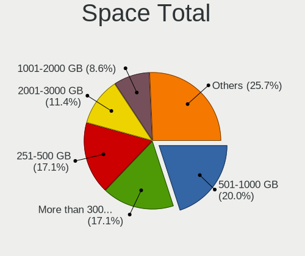
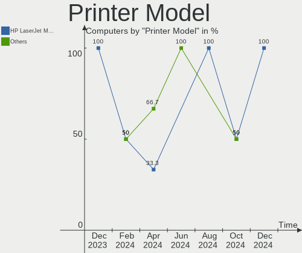

Gentoo - Hardware Trends
------------------------

A project to identify most popular hardware characteristics and track their change
over time based on data collected by Linux users at https://Linux-Hardware.org.

Anyone can contribute to this report by the [hw-probe](https://github.com/linuxhw/hw-probe) tool:

    sudo -E hw-probe -all -upload

This is a report for all computer types. See also reports for [desktops](/Dist/Gentoo/Desktop/README.md) and [notebooks](/Dist/Gentoo/Notebook/README.md).

This report is for one last month. Overall report since the beginning of time: [TestCoverage](https://github.com/linuxhw/TestCoverage)

Period: Jan, 2023.

Contents
--------

* [ System ](#system)
  - [ OS                       ](#os)
  - [ OS Family                ](#os-family)
  - [ Kernel                   ](#kernel)
  - [ Kernel Family            ](#kernel-family)
  - [ Kernel Major Ver.        ](#kernel-major-ver)
  - [ Arch                     ](#arch)
  - [ DE                       ](#de)
  - [ Display Server           ](#display-server)
  - [ Display Manager          ](#display-manager)
  - [ OS Lang                  ](#os-lang)
  - [ Boot Mode                ](#boot-mode)
  - [ Filesystem               ](#filesystem)
  - [ Part. scheme             ](#part-scheme)
  - [ Dual Boot with Linux/BSD ](#dual-boot-with-linuxbsd)
  - [ Dual Boot (Win)          ](#dual-boot-win)

* [ Board ](#board)
  - [ Vendor                   ](#vendor)
  - [ Model                    ](#model)
  - [ Model Family             ](#model-family)
  - [ MFG Year                 ](#mfg-year)
  - [ Form Factor              ](#form-factor)
  - [ Secure Boot              ](#secure-boot)
  - [ Coreboot                 ](#coreboot)
  - [ RAM Size                 ](#ram-size)
  - [ RAM Used                 ](#ram-used)
  - [ Total Drives             ](#total-drives)
  - [ Has CD-ROM               ](#has-cd-rom)
  - [ Has Ethernet             ](#has-ethernet)
  - [ Has WiFi                 ](#has-wifi)
  - [ Has Bluetooth            ](#has-bluetooth)

* [ Location ](#location)
  - [ Country                  ](#country)
  - [ City                     ](#city)

* [ Drives ](#drives)
  - [ Drive Vendor             ](#drive-vendor)
  - [ Drive Model              ](#drive-model)
  - [ HDD Vendor               ](#hdd-vendor)
  - [ SSD Vendor               ](#ssd-vendor)
  - [ Drive Kind               ](#drive-kind)
  - [ Drive Connector          ](#drive-connector)
  - [ Drive Size               ](#drive-size)
  - [ Space Total              ](#space-total)
  - [ Space Used               ](#space-used)
  - [ Malfunc. Drives          ](#malfunc-drives)
  - [ Malfunc. Drive Vendor    ](#malfunc-drive-vendor)
  - [ Malfunc. HDD Vendor      ](#malfunc-hdd-vendor)
  - [ Malfunc. Drive Kind      ](#malfunc-drive-kind)
  - [ Failed Drives            ](#failed-drives)
  - [ Failed Drive Vendor      ](#failed-drive-vendor)
  - [ Drive Status             ](#drive-status)

* [ Storage controller ](#storage-controller)
  - [ Storage Vendor           ](#storage-vendor)
  - [ Storage Model            ](#storage-model)
  - [ Storage Kind             ](#storage-kind)

* [ Processor ](#processor)
  - [ CPU Vendor               ](#cpu-vendor)
  - [ CPU Model                ](#cpu-model)
  - [ CPU Model Family         ](#cpu-model-family)
  - [ CPU Cores                ](#cpu-cores)
  - [ CPU Sockets              ](#cpu-sockets)
  - [ CPU Threads              ](#cpu-threads)
  - [ CPU Op-Modes             ](#cpu-op-modes)
  - [ CPU Microcode            ](#cpu-microcode)
  - [ CPU Microarch            ](#cpu-microarch)

* [ Graphics ](#graphics)
  - [ GPU Vendor               ](#gpu-vendor)
  - [ GPU Model                ](#gpu-model)
  - [ GPU Combo                ](#gpu-combo)
  - [ GPU Driver               ](#gpu-driver)
  - [ GPU Memory               ](#gpu-memory)

* [ Monitor ](#monitor)
  - [ Monitor Vendor           ](#monitor-vendor)
  - [ Monitor Model            ](#monitor-model)
  - [ Monitor Resolution       ](#monitor-resolution)
  - [ Monitor Diagonal         ](#monitor-diagonal)
  - [ Monitor Width            ](#monitor-width)
  - [ Aspect Ratio             ](#aspect-ratio)
  - [ Monitor Area             ](#monitor-area)
  - [ Pixel Density            ](#pixel-density)
  - [ Multiple Monitors        ](#multiple-monitors)

* [ Network ](#network)
  - [ Net Controller Vendor    ](#net-controller-vendor)
  - [ Net Controller Model     ](#net-controller-model)
  - [ Wireless Vendor          ](#wireless-vendor)
  - [ Wireless Model           ](#wireless-model)
  - [ Ethernet Vendor          ](#ethernet-vendor)
  - [ Ethernet Model           ](#ethernet-model)
  - [ Net Controller Kind      ](#net-controller-kind)
  - [ Used Controller          ](#used-controller)
  - [ NICs                     ](#nics)
  - [ IPv6                     ](#ipv6)

* [ Bluetooth ](#bluetooth)
  - [ Bluetooth Vendor         ](#bluetooth-vendor)
  - [ Bluetooth Model          ](#bluetooth-model)

* [ Sound ](#sound)
  - [ Sound Vendor             ](#sound-vendor)
  - [ Sound Model              ](#sound-model)

* [ Memory ](#memory)
  - [ Memory Vendor            ](#memory-vendor)
  - [ Memory Model             ](#memory-model)
  - [ Memory Kind              ](#memory-kind)
  - [ Memory Form Factor       ](#memory-form-factor)
  - [ Memory Size              ](#memory-size)
  - [ Memory Speed             ](#memory-speed)

* [ Printers & scanners ](#printers--scanners)
  - [ Printer Vendor           ](#printer-vendor)
  - [ Printer Model            ](#printer-model)
  - [ Scanner Vendor           ](#scanner-vendor)
  - [ Scanner Model            ](#scanner-model)

* [ Camera ](#camera)
  - [ Camera Vendor            ](#camera-vendor)
  - [ Camera Model             ](#camera-model)

* [ Security ](#security)
  - [ Fingerprint Vendor       ](#fingerprint-vendor)
  - [ Fingerprint Model        ](#fingerprint-model)
  - [ Chipcard Vendor          ](#chipcard-vendor)
  - [ Chipcard Model           ](#chipcard-model)

* [ Unsupported ](#unsupported)
  - [ Unsupported Devices      ](#unsupported-devices)
  - [ Unsupported Device Types ](#unsupported-device-types)

System
------

OS
--

Installed operating systems

| Name       | Computers | Percent |
|------------|-----------|---------|
| Gentoo 2.9 | 47        | 97.92%  |
| Gentoo     | 1         | 2.08%   |

OS Family
---------

OS without a version

| Name   | Computers | Percent |
|--------|-----------|---------|
| Gentoo | 48        | 100%    |

Kernel
------

Version of the Linux kernel

| Version                | Computers | Percent |
|------------------------|-----------|---------|
| 5.15.80-gentoo         | 7         | 14.58%  |
| 6.1.7-gentoo           | 6         | 12.5%   |
| 5.15.85-gentoo-dist    | 3         | 6.25%   |
| 5.15.80-gentoo-x86_64  | 3         | 6.25%   |
| 6.1.6-gentoo           | 2         | 4.17%   |
| 6.1.2-gentoo-x86_64    | 2         | 4.17%   |
| 5.15.88-gentoo         | 2         | 4.17%   |
| 6.1.8-gentoo-x86_64    | 1         | 2.08%   |
| 6.1.8-gentoo-dist      | 1         | 2.08%   |
| 6.1.8-gentoo           | 1         | 2.08%   |
| 6.1.7-xanmod1          | 1         | 2.08%   |
| 6.1.7-gentoo-x86_64    | 1         | 2.08%   |
| 6.1.7-gentoo-dist      | 1         | 2.08%   |
| 6.1.6-gentoo-x86_64    | 1         | 2.08%   |
| 6.1.6-gentoo-dist      | 1         | 2.08%   |
| 6.1.4-gentoo-dist      | 1         | 2.08%   |
| 6.1.4-gentoo           | 1         | 2.08%   |
| 6.1.3-gentoosystemd    | 1         | 2.08%   |
| 6.1.3-gentoo-x86_64    | 1         | 2.08%   |
| 6.1.3-gentoo-dist      | 1         | 2.08%   |
| 6.1.1-gentoo-x86_64    | 1         | 2.08%   |
| 6.1.1-gentoo           | 1         | 2.08%   |
| 6.1.0-pf1              | 1         | 2.08%   |
| 6.0.19-gentoo          | 1         | 2.08%   |
| 5.15.88-gentoo-x86_64  | 1         | 2.08%   |
| 5.15.75-gentoo-x86_64  | 1         | 2.08%   |
| 5.15.74-gentoo-x86     | 1         | 2.08%   |
| 5.15.41-gentoo-amongus | 1         | 2.08%   |
| 5.15.0-57-lowlatency   | 1         | 2.08%   |
| 5.10.76-gentoo-r1      | 1         | 2.08%   |

Kernel Family
-------------

Linux kernel without a distro release

| Version | Computers | Percent |
|---------|-----------|---------|
| 5.15.80 | 10        | 20.83%  |
| 6.1.7   | 9         | 18.75%  |
| 6.1.6   | 4         | 8.33%   |
| 6.1.8   | 3         | 6.25%   |
| 6.1.3   | 3         | 6.25%   |
| 5.15.88 | 3         | 6.25%   |
| 5.15.85 | 3         | 6.25%   |
| 6.1.4   | 2         | 4.17%   |
| 6.1.2   | 2         | 4.17%   |
| 6.1.1   | 2         | 4.17%   |
| 6.1.0   | 1         | 2.08%   |
| 6.0.19  | 1         | 2.08%   |
| 5.15.75 | 1         | 2.08%   |
| 5.15.74 | 1         | 2.08%   |
| 5.15.41 | 1         | 2.08%   |
| 5.15.0  | 1         | 2.08%   |
| 5.10.76 | 1         | 2.08%   |

Kernel Major Ver.
-----------------

Linux kernel major version

| Version | Computers | Percent |
|---------|-----------|---------|
| 6.1     | 26        | 54.17%  |
| 5.15    | 20        | 41.67%  |
| 6.0     | 1         | 2.08%   |
| 5.10    | 1         | 2.08%   |

Arch
----

OS architecture (x86_64, i586, etc.)

| Name   | Computers | Percent |
|--------|-----------|---------|
| x86_64 | 47        | 97.92%  |
| i686   | 1         | 2.08%   |

DE
--

Desktop Environment

| Name        | Computers | Percent |
|-------------|-----------|---------|
| KDE5        | 14        | 29.17%  |
| Unknown     | 11        | 22.92%  |
| XFCE        | 5         | 10.42%  |
| MATE        | 5         | 10.42%  |
| GNOME       | 4         | 8.33%   |
| X-Cinnamon  | 3         | 6.25%   |
| Sway        | 1         | 2.08%   |
| sussy_bspwm | 1         | 2.08%   |
| KDE         | 1         | 2.08%   |
| Hyprland    | 1         | 2.08%   |
| DWM         | 1         | 2.08%   |
| bspwm       | 1         | 2.08%   |

Display Server
--------------

X11 or Wayland

| Name    | Computers | Percent |
|---------|-----------|---------|
| X11     | 29        | 60.42%  |
| Unknown | 8         | 16.67%  |
| Tty     | 7         | 14.58%  |
| Wayland | 4         | 8.33%   |

Display Manager
---------------

SDDM, LightDM, etc.

| Name    | Computers | Percent |
|---------|-----------|---------|
| SDDM    | 21        | 43.75%  |
| Unknown | 11        | 22.92%  |
| LightDM | 8         | 16.67%  |
| GDM     | 4         | 8.33%   |
| SLiM    | 3         | 6.25%   |
| XDM     | 1         | 2.08%   |

OS Lang
-------

Language

| Lang    | Computers | Percent |
|---------|-----------|---------|
| en_US   | 18        | 37.5%   |
| cs_CZ   | 6         | 12.5%   |
| C.UTF8  | 6         | 12.5%   |
| ru_RU   | 3         | 6.25%   |
| C       | 3         | 6.25%   |
| Unknown | 3         | 6.25%   |
| it_IT   | 2         | 4.17%   |
| fr_FR   | 2         | 4.17%   |
| ru_UA   | 1         | 2.08%   |
| pl_PL   | 1         | 2.08%   |
| mi_NZ   | 1         | 2.08%   |
| ja_JP   | 1         | 2.08%   |
| de_DE   | 1         | 2.08%   |

Boot Mode
---------

EFI or BIOS

| Mode | Computers | Percent |
|------|-----------|---------|
| EFI  | 39        | 81.25%  |
| BIOS | 9         | 18.75%  |

Filesystem
----------

Type of filesystem

| Type    | Computers | Percent |
|---------|-----------|---------|
| Ext4    | 23        | 47.92%  |
| Btrfs   | 18        | 37.5%   |
| F2fs    | 3         | 6.25%   |
| XXXXXXX | 2         | 4.17%   |
| Zfs     | 1         | 2.08%   |
| Xfs     | 1         | 2.08%   |

Part. scheme
------------

Scheme of partitioning

| Type    | Computers | Percent |
|---------|-----------|---------|
| GPT     | 44        | 91.67%  |
| MBR     | 3         | 6.25%   |
| Unknown | 1         | 2.08%   |

Dual Boot with Linux/BSD
------------------------

Hosting more than one Linux/BSD

| Dual boot | Computers | Percent |
|-----------|-----------|---------|
| No        | 31        | 64.58%  |
| Yes       | 17        | 35.42%  |

Dual Boot (Win)
---------------

Hosting Linux and Windows

| Dual boot | Computers | Percent |
|-----------|-----------|---------|
| No        | 29        | 60.42%  |
| Yes       | 19        | 39.58%  |

Board
-----

Vendor
------

Motherboard manufacturer

| Name                | Computers | Percent |
|---------------------|-----------|---------|
| ASUSTek Computer    | 13        | 27.08%  |
| Lenovo              | 9         | 18.75%  |
| Dell                | 8         | 16.67%  |
| Hewlett-Packard     | 4         | 8.33%   |
| Gigabyte Technology | 4         | 8.33%   |
| MSI                 | 2         | 4.17%   |
| Google              | 2         | 4.17%   |
| Acer                | 2         | 4.17%   |
| Timi                | 1         | 2.08%   |
| Sony                | 1         | 2.08%   |
| Schenker            | 1         | 2.08%   |
| ASRock              | 1         | 2.08%   |

Model
-----

Motherboard model

| Name                                         | Computers | Percent |
|----------------------------------------------|-----------|---------|
| Dell XPS 9320                                | 2         | 4.17%   |
| Timi Mi Laptop Pro 15                        | 1         | 2.08%   |
| Sony PCG-GRT230(UC)                          | 1         | 2.08%   |
| Schenker XMG PRO (E22)                       | 1         | 2.08%   |
| MSI MS-7C91                                  | 1         | 2.08%   |
| MSI Bravo 15 B5DD                            | 1         | 2.08%   |
| Lenovo ThinkStation P710 30B6S1U500          | 1         | 2.08%   |
| Lenovo ThinkPad X1 Titanium Gen 1 20QA000GUS | 1         | 2.08%   |
| Lenovo ThinkPad T480 20L6S04Q00              | 1         | 2.08%   |
| Lenovo ThinkPad T470s 20HGS27Y0V             | 1         | 2.08%   |
| Lenovo Legion Y540-15IRH-PG0 81SY            | 1         | 2.08%   |
| Lenovo Legion 5 Pro 16IAH7H 82RF             | 1         | 2.08%   |
| Lenovo Legion 5 Pro 16ACH6H 82JQ             | 1         | 2.08%   |
| Lenovo IdeaPad S145-15IWL 81MV               | 1         | 2.08%   |
| Lenovo IdeaPad 5 15ARE05 81YQ                | 1         | 2.08%   |
| HP Z640 Workstation                          | 1         | 2.08%   |
| HP Victus by Gaming Laptop 15-fb0xxx         | 1         | 2.08%   |
| HP Pavilion Gaming Laptop 17-cd1xxx          | 1         | 2.08%   |
| HP Pavilion Gaming Laptop 15-ec1xxx          | 1         | 2.08%   |
| Google Sasuke                                | 1         | 2.08%   |
| Google Helios                                | 1         | 2.08%   |
| Gigabyte Z370P D3                            | 1         | 2.08%   |
| Gigabyte B450M DS3H                          | 1         | 2.08%   |
| Gigabyte B150M-D2V DDR3-CF                   | 1         | 2.08%   |
| Gigabyte AB350-Gaming                        | 1         | 2.08%   |
| Dell XPS 17 9700                             | 1         | 2.08%   |
| Dell Precision 7770                          | 1         | 2.08%   |
| Dell Precision 7720                          | 1         | 2.08%   |
| Dell OptiPlex 790                            | 1         | 2.08%   |
| Dell Latitude 5530                           | 1         | 2.08%   |
| Dell Latitude 5410                           | 1         | 2.08%   |
| ASUS VivoBook_ASUSLaptop X515JA_P1511CJA     | 1         | 2.08%   |
| ASUS TUF Gaming Z690-PLUS D4                 | 1         | 2.08%   |
| ASUS TUF Gaming FX505DT_FX505DT              | 1         | 2.08%   |
| ASUS TUF Gaming B660M-PLUS WIFI              | 1         | 2.08%   |
| ASUS ROG Strix G732LXS_G732LXS               | 1         | 2.08%   |
| ASUS ROG Maximus XIII HERO                   | 1         | 2.08%   |
| ASUS ROG CROSSHAIR VII HERO                  | 1         | 2.08%   |
| ASUS ProArt B550-CREATOR                     | 1         | 2.08%   |
| ASUS PRIME Z390-A                            | 1         | 2.08%   |

Model Family
------------

Motherboard model prefix

| Name                  | Computers | Percent |
|-----------------------|-----------|---------|
| Lenovo ThinkPad       | 3         | 6.25%   |
| Lenovo Legion         | 3         | 6.25%   |
| Dell XPS              | 3         | 6.25%   |
| ASUS TUF              | 3         | 6.25%   |
| ASUS ROG              | 3         | 6.25%   |
| ASUS PRIME            | 3         | 6.25%   |
| Lenovo IdeaPad        | 2         | 4.17%   |
| HP Pavilion           | 2         | 4.17%   |
| Dell Precision        | 2         | 4.17%   |
| Dell Latitude         | 2         | 4.17%   |
| Timi Mi               | 1         | 2.08%   |
| Sony PCG-GRT230(UC)   | 1         | 2.08%   |
| Schenker XMG          | 1         | 2.08%   |
| MSI MS-7C91           | 1         | 2.08%   |
| MSI Bravo             | 1         | 2.08%   |
| Lenovo ThinkStation   | 1         | 2.08%   |
| HP Z640               | 1         | 2.08%   |
| HP Victus             | 1         | 2.08%   |
| Google Sasuke         | 1         | 2.08%   |
| Google Helios         | 1         | 2.08%   |
| Gigabyte Z370P        | 1         | 2.08%   |
| Gigabyte B450M        | 1         | 2.08%   |
| Gigabyte B150M-D2V    | 1         | 2.08%   |
| Gigabyte AB350-Gaming | 1         | 2.08%   |
| Dell OptiPlex         | 1         | 2.08%   |
| ASUS VivoBook         | 1         | 2.08%   |
| ASUS ProArt           | 1         | 2.08%   |
| ASUS M3A78-CM         | 1         | 2.08%   |
| ASUS All              | 1         | 2.08%   |
| ASRock AM1H-ITX       | 1         | 2.08%   |
| Acer TravelMate       | 1         | 2.08%   |
| Acer Predator         | 1         | 2.08%   |

MFG Year
--------

Motherboard manufacture year

| Year | Computers | Percent |
|------|-----------|---------|
| 2022 | 11        | 22.92%  |
| 2021 | 10        | 20.83%  |
| 2020 | 7         | 14.58%  |
| 2019 | 4         | 8.33%   |
| 2018 | 4         | 8.33%   |
| 2017 | 4         | 8.33%   |
| 2015 | 3         | 6.25%   |
| 2014 | 2         | 4.17%   |
| 2011 | 1         | 2.08%   |
| 2008 | 1         | 2.08%   |
| 2003 | 1         | 2.08%   |

Form Factor
-----------

Physical design of the computer

| Name        | Computers | Percent |
|-------------|-----------|---------|
| Notebook    | 28        | 58.33%  |
| Desktop     | 19        | 39.58%  |
| Convertible | 1         | 2.08%   |

Secure Boot
-----------

Enabled or disabled

| State    | Computers | Percent |
|----------|-----------|---------|
| Disabled | 48        | 100%    |

Coreboot
--------

Have coreboot on board

| Used | Computers | Percent |
|------|-----------|---------|
| No   | 46        | 95.83%  |
| Yes  | 2         | 4.17%   |

RAM Size
--------

Total RAM memory

| Size in GB  | Computers | Percent |
|-------------|-----------|---------|
| 32.01-64.0  | 14        | 29.17%  |
| 16.01-24.0  | 13        | 27.08%  |
| 8.01-16.0   | 6         | 12.5%   |
| 4.01-8.0    | 5         | 10.42%  |
| 64.01-256.0 | 5         | 10.42%  |
| 3.01-4.0    | 3         | 6.25%   |
| 24.01-32.0  | 1         | 2.08%   |
| 0.01-0.5    | 1         | 2.08%   |

RAM Used
--------

Used RAM memory

| Used GB   | Computers | Percent |
|-----------|-----------|---------|
| 2.01-3.0  | 11        | 22.92%  |
| 8.01-16.0 | 10        | 20.83%  |
| 3.01-4.0  | 8         | 16.67%  |
| 1.01-2.0  | 8         | 16.67%  |
| 4.01-8.0  | 6         | 12.5%   |
| 0.01-0.5  | 4         | 8.33%   |
| 0.51-1.0  | 1         | 2.08%   |

Total Drives
------------

Number of drives on board

| Drives | Computers | Percent |
|--------|-----------|---------|
| 1      | 20        | 41.67%  |
| 2      | 17        | 35.42%  |
| 3      | 5         | 10.42%  |
| 6      | 2         | 4.17%   |
| 5      | 2         | 4.17%   |
| 4      | 2         | 4.17%   |

Has CD-ROM
----------

Has CD-ROM on board

| Presented | Computers | Percent |
|-----------|-----------|---------|
| No        | 41        | 85.42%  |
| Yes       | 7         | 14.58%  |

Has Ethernet
------------

Has Ethernet on board

| Presented | Computers | Percent |
|-----------|-----------|---------|
| Yes       | 41        | 85.42%  |
| No        | 7         | 14.58%  |

Has WiFi
--------

Has WiFi module

| Presented | Computers | Percent |
|-----------|-----------|---------|
| Yes       | 33        | 68.75%  |
| No        | 15        | 31.25%  |

Has Bluetooth
-------------

Has Bluetooth module

| Presented | Computers | Percent |
|-----------|-----------|---------|
| Yes       | 30        | 62.5%   |
| No        | 18        | 37.5%   |

Location
--------

Country
-------

Geographic location (country)

| Country     | Computers | Percent |
|-------------|-----------|---------|
| USA         | 13        | 27.08%  |
| Czechia     | 7         | 14.58%  |
| Poland      | 3         | 6.25%   |
| Germany     | 3         | 6.25%   |
| Russia      | 2         | 4.17%   |
| Mexico      | 2         | 4.17%   |
| Italy       | 2         | 4.17%   |
| France      | 2         | 4.17%   |
| Turkey      | 1         | 2.08%   |
| Taiwan      | 1         | 2.08%   |
| Switzerland | 1         | 2.08%   |
| Spain       | 1         | 2.08%   |
| Romania     | 1         | 2.08%   |
| Portugal    | 1         | 2.08%   |
| New Zealand | 1         | 2.08%   |
| Netherlands | 1         | 2.08%   |
| Mauritius   | 1         | 2.08%   |
| Japan       | 1         | 2.08%   |
| Hungary     | 1         | 2.08%   |
| Georgia     | 1         | 2.08%   |
| Canada      | 1         | 2.08%   |
| Australia   | 1         | 2.08%   |

City
----

Geographic location (city)

| City              | Computers | Percent |
|-------------------|-----------|---------|
| Vitkov            | 4         | 8.33%   |
| Warsaw            | 3         | 6.25%   |
| Oviedo            | 2         | 4.17%   |
| Zweidlen-Dorf     | 1         | 2.08%   |
| Woodbridge        | 1         | 2.08%   |
| Weisswasser       | 1         | 2.08%   |
| Vechelde          | 1         | 2.08%   |
| Tbilisi           | 1         | 2.08%   |
| Taipei            | 1         | 2.08%   |
| Sydney            | 1         | 2.08%   |
| St. Claude        | 1         | 2.08%   |
| Rimini            | 1         | 2.08%   |
| Ribnitz-Damgarten | 1         | 2.08%   |
| Renton            | 1         | 2.08%   |
| Prague            | 1         | 2.08%   |
| Port Louis        | 1         | 2.08%   |
| Ponetovice        | 1         | 2.08%   |
| Paris             | 1         | 2.08%   |
| Monterrey         | 1         | 2.08%   |
| Monterey          | 1         | 2.08%   |
| Minato-ku         | 1         | 2.08%   |
| Melgaço          | 1         | 2.08%   |
| Maule             | 1         | 2.08%   |
| Madrid            | 1         | 2.08%   |
| Isparta           | 1         | 2.08%   |
| Felsoszolnok      | 1         | 2.08%   |
| Enfield           | 1         | 2.08%   |
| El Arenal         | 1         | 2.08%   |
| Denton            | 1         | 2.08%   |
| Dallas            | 1         | 2.08%   |
| Crowley           | 1         | 2.08%   |
| Corpus Christi    | 1         | 2.08%   |
| Como              | 1         | 2.08%   |
| Cleveland         | 1         | 2.08%   |
| Christchurch      | 1         | 2.08%   |
| Český Těšín  | 1         | 2.08%   |
| Bucharest         | 1         | 2.08%   |
| Borovichi         | 1         | 2.08%   |
| Aurora            | 1         | 2.08%   |
| Astrakhan         | 1         | 2.08%   |

Drives
------

Drive Vendor
------------

Hard drive vendors

| Vendor                | Computers | Drives | Percent |
|-----------------------|-----------|--------|---------|
| Samsung Electronics   | 16        | 21     | 20.51%  |
| Seagate               | 10        | 17     | 12.82%  |
| WDC                   | 8         | 10     | 10.26%  |
| Sandisk               | 7         | 8      | 8.97%   |
| SK hynix              | 5         | 5      | 6.41%   |
| Intel                 | 4         | 5      | 5.13%   |
| KIOXIA                | 3         | 3      | 3.85%   |
| Unknown               | 2         | 2      | 2.56%   |
| Toshiba               | 2         | 2      | 2.56%   |
| Phison Electronics    | 2         | 2      | 2.56%   |
| Micron Technology     | 2         | 2      | 2.56%   |
| Kingston              | 2         | 2      | 2.56%   |
| Hitachi               | 2         | 4      | 2.56%   |
| GOODRAM               | 2         | 2      | 2.56%   |
| XPG                   | 1         | 3      | 1.28%   |
| Solid State Storage   | 1         | 1      | 1.28%   |
| Smartbuy              | 1         | 1      | 1.28%   |
| Silicon Motion        | 1         | 1      | 1.28%   |
| Realtek Semiconductor | 1         | 2      | 1.28%   |
| Kingchuxing           | 1         | 1      | 1.28%   |
| IBM/Hitachi           | 1         | 1      | 1.28%   |
| HGST                  | 1         | 1      | 1.28%   |
| Crucial               | 1         | 1      | 1.28%   |
| Apacer                | 1         | 1      | 1.28%   |
| A-DATA Technology     | 1         | 1      | 1.28%   |

Drive Model
-----------

Hard drive models

| Model                                                 | Computers | Percent |
|-------------------------------------------------------|-----------|---------|
| Samsung NVMe SSD Controller SM981/PM981/PM983 500GB   | 6         | 6.98%   |
| Samsung NVMe SSD Controller PM9A1/PM9A3/980PRO 512GB  | 5         | 5.81%   |
| Intel SSD 660P Series 512GB                           | 3         | 3.49%   |
| Unknown MMC Card  32GB                                | 2         | 2.33%   |
| Seagate ST1000LM049-2GH172 1TB                        | 2         | 2.33%   |
| Sandisk WD Blue SN550 NVMe SSD 1TB                    | 2         | 2.33%   |
| Samsung NVMe SSD Controller SM961/PM961/SM963 256GB   | 2         | 2.33%   |
| GOODRAM SSDPR-CL100-480-G2 480GB                      | 2         | 2.33%   |
| XPG GAMMIX S70 2TB                                    | 1         | 1.16%   |
| WDC WDS100T2B0B-00YS70 1TB SSD                        | 1         | 1.16%   |
| WDC WD80EMAZ-00WJTA0 8TB                              | 1         | 1.16%   |
| WDC WD60EFRX-68MYMN1 6TB                              | 1         | 1.16%   |
| WDC WD5000AAKX-753CA1 500GB                           | 1         | 1.16%   |
| WDC WD40EZRZ-00WN9B0 4TB                              | 1         | 1.16%   |
| WDC WD40EZRZ-00GXCB0 4TB                              | 1         | 1.16%   |
| WDC WD20EZRX-00DC0B0 2TB                              | 1         | 1.16%   |
| WDC WD140EDFZ-11A0VA0 14TB                            | 1         | 1.16%   |
| WDC WD10EZEX-08WN4A0 1TB                              | 1         | 1.16%   |
| WDC WD10EADS-00L5B1 1TB                               | 1         | 1.16%   |
| Toshiba MQ01ACF050 500GB                              | 1         | 1.16%   |
| Toshiba HDWE150 5TB                                   | 1         | 1.16%   |
| Solid State Storage SSSTC CL1-4D256 256GB             | 1         | 1.16%   |
| Smartbuy SSD 240GB                                    | 1         | 1.16%   |
| SK hynix SKHynix_HFM001TD3HX015N 1TB                  | 1         | 1.16%   |
| SK hynix PC801 NVMe 2TB                               | 1         | 1.16%   |
| SK hynix PC801 NVMe 1TB                               | 1         | 1.16%   |
| SK hynix BC511 512GB                                  | 1         | 1.16%   |
| SK hynix BC501 NVMe Solid State Drive 512GB           | 1         | 1.16%   |
| Silicon Motion SM2263EN/SM2263XT SSD Controller 512GB | 1         | 1.16%   |
| Seagate ST8000NE001-2M7101 8TB                        | 1         | 1.16%   |
| Seagate ST8000AS0002-1NA17Z 8TB                       | 1         | 1.16%   |
| Seagate ST4000DM004-2CV104 4TB                        | 1         | 1.16%   |
| Seagate ST2000DM008-2FR102 2TB                        | 1         | 1.16%   |
| Seagate ST18000NM000J-2TV103 18TB                     | 1         | 1.16%   |
| Seagate ST16000NM001G-2KK103 16TB                     | 1         | 1.16%   |
| Seagate ST16000NE000-2RW103 16TB                      | 1         | 1.16%   |
| Seagate ST12000NM0008-2H3101 12TB                     | 1         | 1.16%   |
| Seagate ST1000DM010-2EP102 1TB                        | 1         | 1.16%   |
| Seagate ST1000DM003-1ER162 1TB                        | 1         | 1.16%   |
| Seagate Backup+ Hub BK 8TB                            | 1         | 1.16%   |

HDD Vendor
----------

Hard disk drive vendors

| Vendor      | Computers | Drives | Percent |
|-------------|-----------|--------|---------|
| Seagate     | 10        | 17     | 43.48%  |
| WDC         | 7         | 9      | 30.43%  |
| Toshiba     | 2         | 2      | 8.7%    |
| Hitachi     | 2         | 4      | 8.7%    |
| IBM/Hitachi | 1         | 1      | 4.35%   |
| HGST        | 1         | 1      | 4.35%   |

SSD Vendor
----------

Solid state drive vendors

| Vendor              | Computers | Drives | Percent |
|---------------------|-----------|--------|---------|
| Samsung Electronics | 3         | 3      | 21.43%  |
| GOODRAM             | 2         | 2      | 14.29%  |
| WDC                 | 1         | 1      | 7.14%   |
| Smartbuy            | 1         | 1      | 7.14%   |
| SanDisk             | 1         | 2      | 7.14%   |
| Micron Technology   | 1         | 1      | 7.14%   |
| Kingston            | 1         | 1      | 7.14%   |
| Kingchuxing         | 1         | 1      | 7.14%   |
| Crucial             | 1         | 1      | 7.14%   |
| Apacer              | 1         | 1      | 7.14%   |
| A-DATA Technology   | 1         | 1      | 7.14%   |

Drive Kind
----------

HDD or SSD

| Kind | Computers | Drives | Percent |
|------|-----------|--------|---------|
| NVMe | 37        | 48     | 51.39%  |
| HDD  | 19        | 34     | 26.39%  |
| SSD  | 14        | 15     | 19.44%  |
| MMC  | 2         | 2      | 2.78%   |

Drive Connector
---------------

SATA, SAS, NVMe, etc.

| Type | Computers | Drives | Percent |
|------|-----------|--------|---------|
| NVMe | 37        | 48     | 55.22%  |
| SATA | 27        | 48     | 40.3%   |
| MMC  | 2         | 2      | 2.99%   |
| SAS  | 1         | 1      | 1.49%   |

Drive Size
----------

Size of hard drive

| Size in TB | Computers | Drives | Percent |
|------------|-----------|--------|---------|
| 0.01-0.5   | 15        | 16     | 36.59%  |
| 0.51-1.0   | 10        | 11     | 24.39%  |
| 10.01-20.0 | 5         | 7      | 12.2%   |
| 4.01-10.0  | 5         | 6      | 12.2%   |
| 3.01-4.0   | 3         | 3      | 7.32%   |
| 1.01-2.0   | 2         | 3      | 4.88%   |
| 2.01-3.0   | 1         | 3      | 2.44%   |

Space Total
-----------

Amount of disk space available on the file system

| Size in GB     | Computers | Percent |
|----------------|-----------|---------|
| 251-500        | 12        | 25%     |
| More than 3000 | 10        | 20.83%  |
| 101-250        | 9         | 18.75%  |
| 501-1000       | 5         | 10.42%  |
| 1001-2000      | 3         | 6.25%   |
| 51-100         | 3         | 6.25%   |
| Unknown        | 3         | 6.25%   |
| 1-20           | 2         | 4.17%   |
| 21-50          | 1         | 2.08%   |

Space Used
----------

Amount of used disk space

| Used GB        | Computers | Percent |
|----------------|-----------|---------|
| 21-50          | 8         | 16.67%  |
| 1-20           | 8         | 16.67%  |
| More than 3000 | 7         | 14.58%  |
| 51-100         | 7         | 14.58%  |
| 251-500        | 4         | 8.33%   |
| 501-1000       | 4         | 8.33%   |
| 101-250        | 3         | 6.25%   |
| Unknown        | 3         | 6.25%   |
| 2001-3000      | 2         | 4.17%   |
| 1001-2000      | 2         | 4.17%   |

Malfunc. Drives
---------------

Drive models with a malfunction

| Model                                                            | Computers | Drives | Percent |
|------------------------------------------------------------------|-----------|--------|---------|
| WDC WD5000AAKX-753CA1 500GB                                      | 1         | 1      | 20%     |
| Samsung Electronics PM9A1 NVMe 2048GB                            | 1         | 1      | 20%     |
| Samsung Electronics NVMe SSD Controller PM9A1/PM9A3/980PRO 512GB | 1         | 2      | 20%     |
| Realtek Semiconductor ADATA SX6000PNP 256GB                      | 1         | 2      | 20%     |
| IBM/Hitachi IC25N040ATMR04-0 40GB                                | 1         | 1      | 20%     |

Malfunc. Drive Vendor
---------------------

Vendors of faulty drives

| Vendor                | Computers | Drives | Percent |
|-----------------------|-----------|--------|---------|
| Samsung Electronics   | 2         | 3      | 40%     |
| WDC                   | 1         | 1      | 20%     |
| Realtek Semiconductor | 1         | 2      | 20%     |
| IBM/Hitachi           | 1         | 1      | 20%     |

Malfunc. HDD Vendor
-------------------

Vendors of faulty HDD drives

| Vendor      | Computers | Drives | Percent |
|-------------|-----------|--------|---------|
| WDC         | 1         | 1      | 50%     |
| IBM/Hitachi | 1         | 1      | 50%     |

Malfunc. Drive Kind
-------------------

Kinds of faulty drives

| Kind | Computers | Drives | Percent |
|------|-----------|--------|---------|
| NVMe | 3         | 5      | 60%     |
| HDD  | 2         | 2      | 40%     |

Failed Drives
-------------

Failed drive models

Zero info for selected period =(

Failed Drive Vendor
-------------------

Failed drive vendors

Zero info for selected period =(

Drive Status
------------

Number of failed and malfunc. drives

| Status   | Computers | Drives | Percent |
|----------|-----------|--------|---------|
| Works    | 44        | 87     | 83.02%  |
| Malfunc  | 5         | 7      | 9.43%   |
| Detected | 4         | 5      | 7.55%   |

Storage controller
------------------

Storage Vendor
--------------

Storage controller vendors

| Vendor                           | Computers | Percent |
|----------------------------------|-----------|---------|
| Intel                            | 26        | 35.14%  |
| Samsung Electronics              | 15        | 20.27%  |
| AMD                              | 10        | 13.51%  |
| Sandisk                          | 6         | 8.11%   |
| SK hynix                         | 5         | 6.76%   |
| KIOXIA                           | 3         | 4.05%   |
| Phison Electronics               | 2         | 2.7%    |
| Solid State Storage Technology   | 1         | 1.35%   |
| Silicon Motion                   | 1         | 1.35%   |
| Silicon Integrated Systems [SiS] | 1         | 1.35%   |
| Realtek Semiconductor            | 1         | 1.35%   |
| Micron Technology                | 1         | 1.35%   |
| Kingston Technology Company      | 1         | 1.35%   |
| INNOGRIT                         | 1         | 1.35%   |

Storage Model
-------------

Storage controller models

| Model                                                                         | Computers | Percent |
|-------------------------------------------------------------------------------|-----------|---------|
| AMD FCH SATA Controller [AHCI mode]                                           | 7         | 8.33%   |
| Samsung NVMe SSD Controller SM981/PM981/PM983                                 | 6         | 7.14%   |
| Samsung NVMe SSD Controller PM9A1/PM9A3/980PRO                                | 6         | 7.14%   |
| Intel Volume Management Device NVMe RAID Controller                           | 4         | 4.76%   |
| Intel SSD 660P Series                                                         | 3         | 3.57%   |
| Intel C610/X99 series chipset 6-Port SATA Controller [AHCI mode]              | 3         | 3.57%   |
| SK hynix Non-Volatile memory controller                                       | 2         | 2.38%   |
| SanDisk WD Blue SN550 NVMe SSD                                                | 2         | 2.38%   |
| Samsung NVMe SSD Controller SM961/PM961/SM963                                 | 2         | 2.38%   |
| Samsung NVMe SSD Controller 980                                               | 2         | 2.38%   |
| KIOXIA NVMe SSD Controller BG4                                                | 2         | 2.38%   |
| Intel Q170/Q150/B150/H170/H110/Z170/CM236 Chipset SATA Controller [AHCI Mode] | 2         | 2.38%   |
| Intel Comet Lake SATA AHCI Controller                                         | 2         | 2.38%   |
| Intel Cannon Lake Mobile PCH SATA AHCI Controller                             | 2         | 2.38%   |
| Intel Alder Lake-S PCH SATA Controller [AHCI Mode]                            | 2         | 2.38%   |
| Intel 82801 Mobile SATA Controller [RAID mode]                                | 2         | 2.38%   |
| Intel 500 Series Chipset Family SATA AHCI Controller                          | 2         | 2.38%   |
| AMD 500 Series Chipset SATA Controller                                        | 2         | 2.38%   |
| AMD 400 Series Chipset SATA Controller                                        | 2         | 2.38%   |
| Solid State Storage Non-Volatile memory controller                            | 1         | 1.19%   |
| SK hynix Gold P31/PC711 NVMe Solid State Drive                                | 1         | 1.19%   |
| SK hynix BC511                                                                | 1         | 1.19%   |
| SK hynix BC501 NVMe Solid State Drive                                         | 1         | 1.19%   |
| Silicon Motion SM2263EN/SM2263XT SSD Controller                               | 1         | 1.19%   |
| Silicon Integrated Systems [SiS] 5513 IDE Controller                          | 1         | 1.19%   |
| SanDisk WD Blue SN500 / PC SN520 NVMe SSD                                     | 1         | 1.19%   |
| SanDisk WD Black SN750 / PC SN730 NVMe SSD                                    | 1         | 1.19%   |
| SanDisk PC SN520 NVMe SSD                                                     | 1         | 1.19%   |
| Sandisk Non-Volatile memory controller                                        | 1         | 1.19%   |
| Realtek Realtek Non-Volatile memory controller                                | 1         | 1.19%   |
| Phison E18 PCIe4 NVMe Controller                                              | 1         | 1.19%   |
| Phison E12 NVMe Controller                                                    | 1         | 1.19%   |
| Micron Non-Volatile memory controller                                         | 1         | 1.19%   |
| KIOXIA NVMe SSD                                                               | 1         | 1.19%   |
| Kingston Company Company Non-Volatile memory controller                       | 1         | 1.19%   |
| Intel SSD Pro 7600p/760p/E 6100p Series                                       | 1         | 1.19%   |
| Intel Cannon Point-LP SATA Controller [AHCI Mode]                             | 1         | 1.19%   |
| Intel Cannon Lake PCH SATA AHCI Controller                                    | 1         | 1.19%   |
| Intel C610/X99 series chipset sSATA Controller [AHCI mode]                    | 1         | 1.19%   |
| Intel C610/X99 series chipset IDE-r Controller                                | 1         | 1.19%   |

Storage Kind
------------

Kind of storage controller (IDE, SATA, NVMe, SAS, ...)

| Kind | Computers | Percent |
|------|-----------|---------|
| NVMe | 37        | 49.33%  |
| SATA | 29        | 38.67%  |
| RAID | 6         | 8%      |
| IDE  | 3         | 4%      |

Processor
---------

CPU Vendor
----------

Processor vendors

| Vendor | Computers | Percent |
|--------|-----------|---------|
| Intel  | 35        | 72.92%  |
| AMD    | 13        | 27.08%  |

CPU Model
---------

Processor models

| Model                                         | Computers | Percent |
|-----------------------------------------------|-----------|---------|
| Intel 12th Gen Core i7-12700H                 | 2         | 4.17%   |
| AMD Ryzen 7 5800H with Radeon Graphics        | 2         | 4.17%   |
| AMD Ryzen 5 5600X 6-Core Processor            | 2         | 4.17%   |
| Intel Xeon CPU E5-2683 v4 @ 2.10GHz           | 1         | 2.08%   |
| Intel Xeon CPU E5-2620 v4 @ 2.10GHz           | 1         | 2.08%   |
| Intel Pentium CPU 5405U @ 2.30GHz             | 1         | 2.08%   |
| Intel Pentium 4 CPU 2.40GHz                   | 1         | 2.08%   |
| Intel Core i9-10885H CPU @ 2.40GHz            | 1         | 2.08%   |
| Intel Core i7-9750H CPU @ 2.60GHz             | 1         | 2.08%   |
| Intel Core i7-8750H CPU @ 2.20GHz             | 1         | 2.08%   |
| Intel Core i7-8086K CPU @ 4.00GHz             | 1         | 2.08%   |
| Intel Core i7-7920HQ CPU @ 3.10GHz            | 1         | 2.08%   |
| Intel Core i7-5930K CPU @ 3.50GHz             | 1         | 2.08%   |
| Intel Core i7-10875H CPU @ 2.30GHz            | 1         | 2.08%   |
| Intel Core i7-10750H CPU @ 2.60GHz            | 1         | 2.08%   |
| Intel Core i7-10510U CPU @ 1.80GHz            | 1         | 2.08%   |
| Intel Core i5-8600K CPU @ 3.60GHz             | 1         | 2.08%   |
| Intel Core i5-8350U CPU @ 1.70GHz             | 1         | 2.08%   |
| Intel Core i5-7300U CPU @ 2.60GHz             | 1         | 2.08%   |
| Intel Core i5-2500 CPU @ 3.30GHz              | 1         | 2.08%   |
| Intel Core i5-1035G1 CPU @ 1.00GHz            | 1         | 2.08%   |
| Intel Core i5-10210U CPU @ 1.60GHz            | 1         | 2.08%   |
| Intel Core i3-6100 CPU @ 3.70GHz              | 1         | 2.08%   |
| Intel Core i3-10110U CPU @ 2.10GHz            | 1         | 2.08%   |
| Intel Core i3-10100 CPU @ 3.60GHz             | 1         | 2.08%   |
| Intel Celeron N4500 @ 1.10GHz                 | 1         | 2.08%   |
| Intel Celeron CPU N2930 @ 1.83GHz             | 1         | 2.08%   |
| Intel 12th Gen Core i9-12900K                 | 1         | 2.08%   |
| Intel 12th Gen Core i7-12850HX                | 1         | 2.08%   |
| Intel 12th Gen Core i7-1280P                  | 1         | 2.08%   |
| Intel 12th Gen Core i7-1265U                  | 1         | 2.08%   |
| Intel 12th Gen Core i7-1260P                  | 1         | 2.08%   |
| Intel 12th Gen Core i5-12400F                 | 1         | 2.08%   |
| Intel 11th Gen Core i9-11900K @ 3.50GHz       | 1         | 2.08%   |
| Intel 11th Gen Core i7-1160G7 @ 1.20GHz       | 1         | 2.08%   |
| Intel 11th Gen Core i5-11600K @ 3.90GHz       | 1         | 2.08%   |
| AMD Sempron 3850 APU with Radeon R3           | 1         | 2.08%   |
| AMD Ryzen 9 5950X 16-Core Processor           | 1         | 2.08%   |
| AMD Ryzen 7 3750H with Radeon Vega Mobile Gfx | 1         | 2.08%   |
| AMD Ryzen 7 2700X Eight-Core Processor        | 1         | 2.08%   |

CPU Model Family
----------------

Processor model prefix

| Model            | Computers | Percent |
|------------------|-----------|---------|
| Other            | 11        | 22.92%  |
| Intel Core i7    | 8         | 16.67%  |
| Intel Core i5    | 6         | 12.5%   |
| AMD Ryzen 5      | 6         | 12.5%   |
| AMD Ryzen 7      | 4         | 8.33%   |
| Intel Core i3    | 3         | 6.25%   |
| Intel Xeon       | 2         | 4.17%   |
| Intel Celeron    | 2         | 4.17%   |
| Intel Pentium 4  | 1         | 2.08%   |
| Intel Pentium    | 1         | 2.08%   |
| Intel Core i9    | 1         | 2.08%   |
| AMD Sempron      | 1         | 2.08%   |
| AMD Ryzen 9      | 1         | 2.08%   |
| AMD Phenom II X4 | 1         | 2.08%   |

CPU Cores
---------

Number of processor cores

| Number | Computers | Percent |
|--------|-----------|---------|
| 6      | 14        | 29.17%  |
| 4      | 12        | 25%     |
| 8      | 7         | 14.58%  |
| 2      | 5         | 10.42%  |
| 16     | 4         | 8.33%   |
| 14     | 3         | 6.25%   |
| 12     | 1         | 2.08%   |
| 10     | 1         | 2.08%   |
| 1      | 1         | 2.08%   |

CPU Sockets
-----------

Number of sockets

| Number | Computers | Percent |
|--------|-----------|---------|
| 1      | 48        | 100%    |

CPU Threads
-----------

Threads per core (Hyper-Threading)

| Number | Computers | Percent |
|--------|-----------|---------|
| 2      | 40        | 83.33%  |
| 1      | 8         | 16.67%  |

CPU Op-Modes
------------

CPU Operation Modes (32-bit, 64-bit)

| Op mode        | Computers | Percent |
|----------------|-----------|---------|
| 32-bit, 64-bit | 47        | 97.92%  |
| 32-bit         | 1         | 2.08%   |

CPU Microcode
-------------

Microcode number

| Number     | Computers | Percent |
|------------|-----------|---------|
| Unknown    | 5         | 10.42%  |
| 0x906ea    | 4         | 8.33%   |
| 0x906a3    | 3         | 6.25%   |
| 0x806ec    | 3         | 6.25%   |
| 0xa0652    | 2         | 4.17%   |
| 0x0a50000c | 2         | 4.17%   |
| 0x08600106 | 2         | 4.17%   |
| 0x0800820d | 2         | 4.17%   |
| 0xf29      | 1         | 2.08%   |
| 0xa0671    | 1         | 2.08%   |
| 0xa0653    | 1         | 2.08%   |
| 0x906e9    | 1         | 2.08%   |
| 0x906c0    | 1         | 2.08%   |
| 0x906a4    | 1         | 2.08%   |
| 0x90675    | 1         | 2.08%   |
| 0x90672    | 1         | 2.08%   |
| 0x806eb    | 1         | 2.08%   |
| 0x806ea    | 1         | 2.08%   |
| 0x806e9    | 1         | 2.08%   |
| 0x806c1    | 1         | 2.08%   |
| 0x706e5    | 1         | 2.08%   |
| 0x506e3    | 1         | 2.08%   |
| 0x406f1    | 1         | 2.08%   |
| 0x306f2    | 1         | 2.08%   |
| 0x30678    | 1         | 2.08%   |
| 0x206a7    | 1         | 2.08%   |
| 0x0a50000d | 1         | 2.08%   |
| 0x0a20120a | 1         | 2.08%   |
| 0x0a201016 | 1         | 2.08%   |
| 0x0a201009 | 1         | 2.08%   |
| 0x08108102 | 1         | 2.08%   |
| 0x0700010f | 1         | 2.08%   |
| 0x010000db | 1         | 2.08%   |

CPU Microarch
-------------

Microarchitecture

| Name             | Computers | Percent |
|------------------|-----------|---------|
| KabyLake         | 11        | 22.92%  |
| Zen 3            | 6         | 12.5%   |
| Alderlake Hybrid | 6         | 12.5%   |
| CometLake        | 4         | 8.33%   |
| Zen+             | 3         | 6.25%   |
| Unknown          | 3         | 6.25%   |
| Zen 2            | 2         | 4.17%   |
| Icelake          | 2         | 4.17%   |
| Broadwell        | 2         | 4.17%   |
| Tremont          | 1         | 2.08%   |
| TigerLake        | 1         | 2.08%   |
| Skylake          | 1         | 2.08%   |
| Silvermont       | 1         | 2.08%   |
| SandyBridge      | 1         | 2.08%   |
| NetBurst         | 1         | 2.08%   |
| K10              | 1         | 2.08%   |
| Jaguar           | 1         | 2.08%   |
| Haswell          | 1         | 2.08%   |

Graphics
--------

GPU Vendor
----------

Vendors of graphics cards

| Vendor | Computers | Percent |
|--------|-----------|---------|
| Intel  | 25        | 41.67%  |
| Nvidia | 24        | 40%     |
| AMD    | 11        | 18.33%  |

GPU Model
---------

Graphics card models

| Model                                                        | Computers | Percent |
|--------------------------------------------------------------|-----------|---------|
| Intel Alder Lake-P Integrated Graphics Controller            | 4         | 6.45%   |
| Intel CometLake-U GT2 [UHD Graphics]                         | 3         | 4.84%   |
| Intel CometLake-H GT2 [UHD Graphics]                         | 3         | 4.84%   |
| Nvidia TU117M [GeForce GTX 1650 Mobile / Max-Q]              | 2         | 3.23%   |
| Nvidia TU117 [GeForce GTX 1650]                              | 2         | 3.23%   |
| Nvidia GA104M [Geforce RTX 3070 Ti Laptop GPU]               | 2         | 3.23%   |
| AMD Renoir                                                   | 2         | 3.23%   |
| AMD Cezanne [Radeon Vega Series / Radeon Vega Mobile Series] | 2         | 3.23%   |
| Nvidia TU117M                                                | 1         | 1.61%   |
| Nvidia TU116M [GeForce GTX 1660 Ti Mobile]                   | 1         | 1.61%   |
| Nvidia TU106M [GeForce RTX 2060 Max-Q]                       | 1         | 1.61%   |
| Nvidia TU106 [GeForce RTX 2070]                              | 1         | 1.61%   |
| Nvidia TU106 [GeForce RTX 2060 Rev. A]                       | 1         | 1.61%   |
| Nvidia TU104M [GeForce RTX 2080 SUPER Mobile / Max-Q]        | 1         | 1.61%   |
| Nvidia TU104 [GeForce RTX 2080 Rev. A]                       | 1         | 1.61%   |
| Nvidia TU104 [GeForce RTX 2070 SUPER]                        | 1         | 1.61%   |
| Nvidia NV17M [GeForce4 420 Go]                               | 1         | 1.61%   |
| Nvidia GP108M [GeForce MX250]                                | 1         | 1.61%   |
| Nvidia GP107 [GeForce GTX 1050 Ti]                           | 1         | 1.61%   |
| Nvidia GP106M [GeForce GTX 1060 Mobile]                      | 1         | 1.61%   |
| Nvidia GP106 [GeForce GTX 1060 3GB]                          | 1         | 1.61%   |
| Nvidia GP104GLM [Quadro P4000 Mobile]                        | 1         | 1.61%   |
| Nvidia GM200GL [Quadro M6000]                                | 1         | 1.61%   |
| Nvidia GF119 [GeForce GT 610]                                | 1         | 1.61%   |
| Nvidia GA106M [GeForce RTX 3060 Mobile / Max-Q]              | 1         | 1.61%   |
| Nvidia GA104GLM [RTX A3000 12GB Laptop GPU]                  | 1         | 1.61%   |
| Intel Whiskey Lake-U GT1 [UHD Graphics 610]                  | 1         | 1.61%   |
| Intel UHD Graphics 620                                       | 1         | 1.61%   |
| Intel Tiger Lake-UP4 GT2 [Iris Xe Graphics]                  | 1         | 1.61%   |
| Intel RocketLake-S GT1 [UHD Graphics 750]                    | 1         | 1.61%   |
| Intel JasperLake [UHD Graphics]                              | 1         | 1.61%   |
| Intel Iris Plus Graphics G1 (Ice Lake)                       | 1         | 1.61%   |
| Intel HD Graphics 620                                        | 1         | 1.61%   |
| Intel HD Graphics 530                                        | 1         | 1.61%   |
| Intel CometLake-S GT2 [UHD Graphics 630]                     | 1         | 1.61%   |
| Intel CoffeeLake-H GT2 [UHD Graphics 630]                    | 1         | 1.61%   |
| Intel Atom Processor Z36xxx/Z37xxx Series Graphics & Display | 1         | 1.61%   |
| Intel AlderLake-S GT1                                        | 1         | 1.61%   |
| Intel Alder Lake-UP3 GT2 [Iris Xe Graphics]                  | 1         | 1.61%   |
| Intel Alder Lake-HX GT1 [UHD Graphics 770]                   | 1         | 1.61%   |

GPU Combo
---------

Combinations of graphics cards

| Name           | Computers | Percent |
|----------------|-----------|---------|
| 1 x Intel      | 15        | 31.25%  |
| 1 x Nvidia     | 12        | 25%     |
| Intel + Nvidia | 10        | 20.83%  |
| 1 x AMD        | 7         | 14.58%  |
| 2 x AMD        | 2         | 4.17%   |
| AMD + Nvidia   | 2         | 4.17%   |

GPU Driver
----------

Free vs proprietary

| Driver      | Computers | Percent |
|-------------|-----------|---------|
| Free        | 29        | 60.42%  |
| Proprietary | 17        | 35.42%  |
| Unknown     | 2         | 4.17%   |

GPU Memory
----------

Total video memory

| Size in GB | Computers | Percent |
|------------|-----------|---------|
| Unknown    | 29        | 60.42%  |
| 3.01-4.0   | 5         | 10.42%  |
| 0.01-0.5   | 4         | 8.33%   |
| 7.01-8.0   | 3         | 6.25%   |
| 0.51-1.0   | 3         | 6.25%   |
| 1.01-2.0   | 2         | 4.17%   |
| 5.01-6.0   | 1         | 2.08%   |
| 2.01-3.0   | 1         | 2.08%   |

Monitor
-------

Monitor Vendor
--------------

Monitor vendors

| Vendor              | Computers | Percent |
|---------------------|-----------|---------|
| BOE                 | 8         | 14.55%  |
| AU Optronics        | 8         | 14.55%  |
| Samsung Electronics | 6         | 10.91%  |
| Sharp               | 4         | 7.27%   |
| Dell                | 4         | 7.27%   |
| Goldstar            | 3         | 5.45%   |
| Philips             | 2         | 3.64%   |
| LG Display          | 2         | 3.64%   |
| Hewlett-Packard     | 2         | 3.64%   |
| Chimei Innolux      | 2         | 3.64%   |
| BenQ                | 2         | 3.64%   |
| ZIS                 | 1         | 1.82%   |
| Viotek              | 1         | 1.82%   |
| Unknown             | 1         | 1.82%   |
| PANDA               | 1         | 1.82%   |
| Lenovo              | 1         | 1.82%   |
| IBM                 | 1         | 1.82%   |
| Gigabyte Technology | 1         | 1.82%   |
| FUS                 | 1         | 1.82%   |
| Fujitsu Siemens     | 1         | 1.82%   |
| CSO                 | 1         | 1.82%   |
| ASUSTek Computer    | 1         | 1.82%   |
| Acer                | 1         | 1.82%   |

Monitor Model
-------------

Monitor models

| Model                                                                 | Computers | Percent |
|-----------------------------------------------------------------------|-----------|---------|
| AU Optronics LCD Monitor AUO61ED 1920x1080 344x194mm 15.5-inch        | 2         | 3.51%   |
| ZIS ZWS 28" 240HZ ZIS4ED5 1920x1080 619x348mm 28.0-inch               | 1         | 1.75%   |
| Viotek GNV34DBE VTK3400 3440x1440 797x334mm 34.0-inch                 | 1         | 1.75%   |
| Unknown LCD Monitor FFFF 2288x1287 2550x2550mm 142.0-inch             | 1         | 1.75%   |
| Sharp LQ173M1JW03 SHP14DC 1920x1080 382x215mm 17.3-inch               | 1         | 1.75%   |
| Sharp LQ156M1JW01 SHP14C3 1920x1080 344x194mm 15.5-inch               | 1         | 1.75%   |
| Sharp LCD Monitor SHP1551 3840x2400 288x180mm 13.4-inch               | 1         | 1.75%   |
| Sharp LCD Monitor SHP14D6 3840x2400 366x229mm 17.0-inch               | 1         | 1.75%   |
| Samsung Electronics T24C550 SAM0AA0 1920x1080 521x293mm 23.5-inch     | 1         | 1.75%   |
| Samsung Electronics SyncMaster SAM059A 1920x1080 480x270mm 21.7-inch  | 1         | 1.75%   |
| Samsung Electronics S27B350 SAM08DC 1920x1080 598x336mm 27.0-inch     | 1         | 1.75%   |
| Samsung Electronics S22B300 SAM08C8 1920x1080 477x268mm 21.5-inch     | 1         | 1.75%   |
| Samsung Electronics LCD Monitor SDC4163 3456x2160 288x180mm 13.4-inch | 1         | 1.75%   |
| Samsung Electronics LCD Monitor SAM07D0 1360x768 700x390mm 31.5-inch  | 1         | 1.75%   |
| Samsung Electronics C24F390 SAM0D2C 1920x1080 521x293mm 23.5-inch     | 1         | 1.75%   |
| Philips PHL 221V8 PHLC211 1920x1080 477x268mm 21.5-inch               | 1         | 1.75%   |
| Philips LCD Monitor PHL 499P9 6400x1440                               | 1         | 1.75%   |
| PANDA LCD Monitor NCP002D 1920x1080 344x194mm 15.5-inch               | 1         | 1.75%   |
| LG Display LCD Monitor LGD05E5 1920x1080 344x194mm 15.5-inch          | 1         | 1.75%   |
| LG Display LCD Monitor LGD0521 1920x1080 309x174mm 14.0-inch          | 1         | 1.75%   |
| Lenovo LEN D24f-10 LEN65EB 1920x1080 520x290mm 23.4-inch              | 1         | 1.75%   |
| IBM L170 IBM1A4E 1280x1024 338x270mm 17.0-inch                        | 1         | 1.75%   |
| Hewlett-Packard 22m HPN3575 1920x1080 476x268mm 21.5-inch             | 1         | 1.75%   |
| Hewlett-Packard 22es HWP331B 1920x1080 476x268mm 21.5-inch            | 1         | 1.75%   |
| Goldstar ULTRAWIDE GSM59F2 2560x1080 798x334mm 34.1-inch              | 1         | 1.75%   |
| Goldstar HDR WQHD GSM772E 3440x1440 800x335mm 34.1-inch               | 1         | 1.75%   |
| Goldstar HDR 4K GSM7707 3840x2160 600x340mm 27.2-inch                 | 1         | 1.75%   |
| Gigabyte Technology M32U GBT3204 3840x2160 697x392mm 31.5-inch        | 1         | 1.75%   |
| FUS LCD Monitor P27T-6 IPS                                            | 1         | 1.75%   |
| Fujitsu Siemens P27T-6 IPS FUS07EE 2560x1440 597x336mm 27.0-inch      | 1         | 1.75%   |
| Dell U2717D DEL40EB 2560x1440 597x336mm 27.0-inch                     | 1         | 1.75%   |
| Dell S2421NX DEL41FB 1920x1080 527x296mm 23.8-inch                    | 1         | 1.75%   |
| Dell E2222HS DELF133 1920x1080 478x260mm 21.4-inch                    | 1         | 1.75%   |
| Dell E1916H DELF065 1366x768 410x230mm 18.5-inch                      | 1         | 1.75%   |
| CSO LCD Monitor CSO1600 2560x1600 345x215mm 16.0-inch                 | 1         | 1.75%   |
| Chimei Innolux LCD Monitor CMN175D 1920x1080 381x214mm 17.2-inch      | 1         | 1.75%   |
| Chimei Innolux LCD Monitor CMN151E 1920x1080 344x193mm 15.5-inch      | 1         | 1.75%   |
| BOE LCD Monitor BOE0A5C 1920x1080 382x215mm 17.3-inch                 | 1         | 1.75%   |
| BOE LCD Monitor BOE0A1F 2560x1600 344x215mm 16.0-inch                 | 1         | 1.75%   |
| BOE LCD Monitor BOE09F3 1366x768 309x174mm 14.0-inch                  | 1         | 1.75%   |

Monitor Resolution
------------------

Monitor screen resolution

| Resolution       | Computers | Percent |
|------------------|-----------|---------|
| 1920x1080 (FHD)  | 29        | 55.77%  |
| 1366x768 (WXGA)  | 4         | 7.69%   |
| 3840x2160 (4K)   | 3         | 5.77%   |
| 2560x1440 (QHD)  | 3         | 5.77%   |
| 3840x2400        | 2         | 3.85%   |
| 2560x1600        | 2         | 3.85%   |
| 6400x1440        | 1         | 1.92%   |
| 3456x2160        | 1         | 1.92%   |
| 3440x1440        | 1         | 1.92%   |
| 2560x1080        | 1         | 1.92%   |
| 2288x1287        | 1         | 1.92%   |
| 1360x768         | 1         | 1.92%   |
| 1280x1024 (SXGA) | 1         | 1.92%   |
| 1128x1504        | 1         | 1.92%   |
| Unknown          | 1         | 1.92%   |

Monitor Diagonal
----------------

Diagonal size in inches

| Inches  | Computers | Percent |
|---------|-----------|---------|
| 15      | 10        | 18.52%  |
| 17      | 7         | 12.96%  |
| 27      | 5         | 9.26%   |
| 23      | 5         | 9.26%   |
| 21      | 5         | 9.26%   |
| 14      | 4         | 7.41%   |
| 13      | 4         | 7.41%   |
| 34      | 3         | 5.56%   |
| 31      | 2         | 3.7%    |
| 24      | 2         | 3.7%    |
| 16      | 2         | 3.7%    |
| 142     | 1         | 1.85%   |
| 28      | 1         | 1.85%   |
| 18      | 1         | 1.85%   |
| 11      | 1         | 1.85%   |
| Unknown | 1         | 1.85%   |

Monitor Width
-------------

Physical width

| Width in mm    | Computers | Percent |
|----------------|-----------|---------|
| 301-350        | 18        | 33.96%  |
| 501-600        | 10        | 18.87%  |
| 401-500        | 7         | 13.21%  |
| 351-400        | 6         | 11.32%  |
| 201-300        | 4         | 7.55%   |
| 701-800        | 3         | 5.66%   |
| 601-700        | 3         | 5.66%   |
| More than 2000 | 1         | 1.89%   |
| Unknown        | 1         | 1.89%   |

Aspect Ratio
------------

Proportional relationship between the width and the height

| Ratio   | Computers | Percent |
|---------|-----------|---------|
| 16/9    | 37        | 75.51%  |
| 16/10   | 5         | 10.2%   |
| 21/9    | 3         | 6.12%   |
| 5/4     | 1         | 2.04%   |
| 3/2     | 1         | 2.04%   |
| 1.00    | 1         | 2.04%   |
| Unknown | 1         | 2.04%   |

Monitor Area
------------

Area in inch²

| Area in inch² | Computers | Percent |
|----------------|-----------|---------|
| 101-110        | 10        | 18.87%  |
| 201-250        | 9         | 16.98%  |
| 81-90          | 6         | 11.32%  |
| 301-350        | 6         | 11.32%  |
| 121-130        | 6         | 11.32%  |
| 351-500        | 5         | 9.43%   |
| 71-80          | 2         | 3.77%   |
| 151-200        | 2         | 3.77%   |
| 141-150        | 2         | 3.77%   |
| 111-120        | 2         | 3.77%   |
| More than 1000 | 1         | 1.89%   |
| 51-60          | 1         | 1.89%   |
| Unknown        | 1         | 1.89%   |

Pixel Density
-------------

Pixels per inch

| Density       | Computers | Percent |
|---------------|-----------|---------|
| 121-160       | 20        | 38.46%  |
| 101-120       | 11        | 21.15%  |
| 51-100        | 11        | 21.15%  |
| 161-240       | 4         | 7.69%   |
| More than 240 | 3         | 5.77%   |
| 1-50          | 2         | 3.85%   |
| Unknown       | 1         | 1.92%   |

Multiple Monitors
-----------------

Total monitors connected

| Total | Computers | Percent |
|-------|-----------|---------|
| 1     | 34        | 70.83%  |
| 2     | 9         | 18.75%  |
| 0     | 3         | 6.25%   |
| 3     | 2         | 4.17%   |

Network
-------

Net Controller Vendor
---------------------

Controller vendors

| Vendor                           | Computers | Percent |
|----------------------------------|-----------|---------|
| Intel                            | 34        | 47.89%  |
| Realtek Semiconductor            | 28        | 39.44%  |
| Silicon Integrated Systems [SiS] | 1         | 1.41%   |
| Ralink                           | 1         | 1.41%   |
| Qualcomm Atheros                 | 1         | 1.41%   |
| Qualcomm                         | 1         | 1.41%   |
| MediaTek                         | 1         | 1.41%   |
| Input Club                       | 1         | 1.41%   |
| Fibocom                          | 1         | 1.41%   |
| Broadcom                         | 1         | 1.41%   |
| Aquantia                         | 1         | 1.41%   |

Net Controller Model
--------------------

Controller models

| Model                                                               | Computers | Percent |
|---------------------------------------------------------------------|-----------|---------|
| Realtek RTL8111/8168/8411 PCI Express Gigabit Ethernet Controller   | 21        | 25.61%  |
| Intel Alder Lake-P PCH CNVi WiFi                                    | 4         | 4.88%   |
| Realtek RTL8822CE 802.11ac PCIe Wireless Network Adapter            | 3         | 3.66%   |
| Realtek RTL8153 Gigabit Ethernet Adapter                            | 3         | 3.66%   |
| Intel Wireless 8265 / 8275                                          | 3         | 3.66%   |
| Intel Wi-Fi 6 AX200                                                 | 3         | 3.66%   |
| Intel Ethernet Controller I225-V                                    | 3         | 3.66%   |
| Intel Comet Lake PCH-LP CNVi WiFi                                   | 3         | 3.66%   |
| Realtek RTL8821CE 802.11ac PCIe Wireless Network Adapter            | 2         | 2.44%   |
| Realtek RTL8125 2.5GbE Controller                                   | 2         | 2.44%   |
| Intel Ethernet Connection (4) I219-LM                               | 2         | 2.44%   |
| Intel Ethernet Connection (2) I218-LM                               | 2         | 2.44%   |
| Intel Comet Lake PCH CNVi WiFi                                      | 2         | 2.44%   |
| Intel Cannon Lake PCH CNVi WiFi                                     | 2         | 2.44%   |
| Intel Alder Lake-S PCH CNVi WiFi                                    | 2         | 2.44%   |
| Silicon Integrated Systems [SiS] SiS900 PCI Fast Ethernet           | 1         | 1.22%   |
| Silicon Integrated Systems [SiS] AC'97 Modem Controller             | 1         | 1.22%   |
| Ralink RT5360 Wireless 802.11n 1T/1R                                | 1         | 1.22%   |
| Qualcomm QCA6390 Wireless Network Adapter                           | 1         | 1.22%   |
| Qualcomm Atheros AR9287 Wireless Network Adapter (PCI-Express)      | 1         | 1.22%   |
| MediaTek MT7921 802.11ax PCI Express Wireless Network Adapter       | 1         | 1.22%   |
| Intel Wireless 7265                                                 | 1         | 1.22%   |
| Intel Wireless 7260                                                 | 1         | 1.22%   |
| Intel Wi-Fi 6 AX210/AX211/AX411 160MHz                              | 1         | 1.22%   |
| Intel Wi-Fi 6 AX201 160MHz                                          | 1         | 1.22%   |
| Intel Wi-Fi 6 AX201                                                 | 1         | 1.22%   |
| Intel I211 Gigabit Network Connection                               | 1         | 1.22%   |
| Intel I210 Gigabit Network Connection                               | 1         | 1.22%   |
| Intel Ethernet Connection (7) I219-V                                | 1         | 1.22%   |
| Intel Ethernet Connection (5) I219-LM                               | 1         | 1.22%   |
| Intel Ethernet Connection (2) I218-V                                | 1         | 1.22%   |
| Intel Ethernet Connection (17) I219-LM                              | 1         | 1.22%   |
| Intel Ethernet Connection (16) I219-LM                              | 1         | 1.22%   |
| Intel Ethernet Connection (14) I219-V                               | 1         | 1.22%   |
| Intel Ethernet Connection (10) I219-V                               | 1         | 1.22%   |
| Intel 82579LM Gigabit Network Connection (Lewisville)               | 1         | 1.22%   |
| Input Club ErgoDox Infinity                                         | 1         | 1.22%   |
| Fibocom L830-EB-00 LTE WWAN Modem                                   | 1         | 1.22%   |
| Broadcom NetXtreme BCM5718 Gigabit Ethernet PCIe                    | 1         | 1.22%   |
| Aquantia AQC113CS NBase-T/IEEE 802.3bz Ethernet Controller [AQtion] | 1         | 1.22%   |

Wireless Vendor
---------------

Wireless vendors

| Vendor                | Computers | Percent |
|-----------------------|-----------|---------|
| Intel                 | 24        | 70.59%  |
| Realtek Semiconductor | 5         | 14.71%  |
| Ralink                | 1         | 2.94%   |
| Qualcomm Atheros      | 1         | 2.94%   |
| Qualcomm              | 1         | 2.94%   |
| MediaTek              | 1         | 2.94%   |
| Fibocom               | 1         | 2.94%   |

Wireless Model
--------------

Wireless models

| Model                                                          | Computers | Percent |
|----------------------------------------------------------------|-----------|---------|
| Intel Alder Lake-P PCH CNVi WiFi                               | 4         | 11.76%  |
| Realtek RTL8822CE 802.11ac PCIe Wireless Network Adapter       | 3         | 8.82%   |
| Intel Wireless 8265 / 8275                                     | 3         | 8.82%   |
| Intel Wi-Fi 6 AX200                                            | 3         | 8.82%   |
| Intel Comet Lake PCH-LP CNVi WiFi                              | 3         | 8.82%   |
| Realtek RTL8821CE 802.11ac PCIe Wireless Network Adapter       | 2         | 5.88%   |
| Intel Comet Lake PCH CNVi WiFi                                 | 2         | 5.88%   |
| Intel Cannon Lake PCH CNVi WiFi                                | 2         | 5.88%   |
| Intel Alder Lake-S PCH CNVi WiFi                               | 2         | 5.88%   |
| Ralink RT5360 Wireless 802.11n 1T/1R                           | 1         | 2.94%   |
| Qualcomm QCA6390 Wireless Network Adapter                      | 1         | 2.94%   |
| Qualcomm Atheros AR9287 Wireless Network Adapter (PCI-Express) | 1         | 2.94%   |
| MediaTek MT7921 802.11ax PCI Express Wireless Network Adapter  | 1         | 2.94%   |
| Intel Wireless 7265                                            | 1         | 2.94%   |
| Intel Wireless 7260                                            | 1         | 2.94%   |
| Intel Wi-Fi 6 AX210/AX211/AX411 160MHz                         | 1         | 2.94%   |
| Intel Wi-Fi 6 AX201 160MHz                                     | 1         | 2.94%   |
| Intel Wi-Fi 6 AX201                                            | 1         | 2.94%   |
| Fibocom L830-EB-00 LTE WWAN Modem                              | 1         | 2.94%   |

Ethernet Vendor
---------------

Ethernet vendors

| Vendor                           | Computers | Percent |
|----------------------------------|-----------|---------|
| Realtek Semiconductor            | 26        | 57.78%  |
| Intel                            | 16        | 35.56%  |
| Silicon Integrated Systems [SiS] | 1         | 2.22%   |
| Broadcom                         | 1         | 2.22%   |
| Aquantia                         | 1         | 2.22%   |

Ethernet Model
--------------

Ethernet models

| Model                                                               | Computers | Percent |
|---------------------------------------------------------------------|-----------|---------|
| Realtek RTL8111/8168/8411 PCI Express Gigabit Ethernet Controller   | 21        | 45.65%  |
| Realtek RTL8153 Gigabit Ethernet Adapter                            | 3         | 6.52%   |
| Intel Ethernet Controller I225-V                                    | 3         | 6.52%   |
| Realtek RTL8125 2.5GbE Controller                                   | 2         | 4.35%   |
| Intel Ethernet Connection (4) I219-LM                               | 2         | 4.35%   |
| Intel Ethernet Connection (2) I218-LM                               | 2         | 4.35%   |
| Silicon Integrated Systems [SiS] SiS900 PCI Fast Ethernet           | 1         | 2.17%   |
| Intel I211 Gigabit Network Connection                               | 1         | 2.17%   |
| Intel I210 Gigabit Network Connection                               | 1         | 2.17%   |
| Intel Ethernet Connection (7) I219-V                                | 1         | 2.17%   |
| Intel Ethernet Connection (5) I219-LM                               | 1         | 2.17%   |
| Intel Ethernet Connection (2) I218-V                                | 1         | 2.17%   |
| Intel Ethernet Connection (17) I219-LM                              | 1         | 2.17%   |
| Intel Ethernet Connection (16) I219-LM                              | 1         | 2.17%   |
| Intel Ethernet Connection (14) I219-V                               | 1         | 2.17%   |
| Intel Ethernet Connection (10) I219-V                               | 1         | 2.17%   |
| Intel 82579LM Gigabit Network Connection (Lewisville)               | 1         | 2.17%   |
| Broadcom NetXtreme BCM5718 Gigabit Ethernet PCIe                    | 1         | 2.17%   |
| Aquantia AQC113CS NBase-T/IEEE 802.3bz Ethernet Controller [AQtion] | 1         | 2.17%   |

Net Controller Kind
-------------------

Ethernet, WiFi or modem

| Kind     | Computers | Percent |
|----------|-----------|---------|
| Ethernet | 41        | 53.95%  |
| WiFi     | 33        | 43.42%  |
| Modem    | 2         | 2.63%   |

Used Controller
---------------

Currently used network controller

| Kind     | Computers | Percent |
|----------|-----------|---------|
| WiFi     | 28        | 57.14%  |
| Ethernet | 21        | 42.86%  |

NICs
----

Total network controllers on board

| Total | Computers | Percent |
|-------|-----------|---------|
| 2     | 27        | 56.25%  |
| 1     | 20        | 41.67%  |
| 3     | 1         | 2.08%   |

IPv6
----

IPv6 vs IPv4

| Used | Computers | Percent |
|------|-----------|---------|
| No   | 39        | 81.25%  |
| Yes  | 9         | 18.75%  |

Bluetooth
---------

Bluetooth Vendor
----------------

Controller vendors

| Vendor                  | Computers | Percent |
|-------------------------|-----------|---------|
| Intel                   | 23        | 76.67%  |
| Realtek Semiconductor   | 3         | 10%     |
| IMC Networks            | 3         | 10%     |
| Cambridge Silicon Radio | 1         | 3.33%   |

Bluetooth Model
---------------

Controller models

| Model                                               | Computers | Percent |
|-----------------------------------------------------|-----------|---------|
| Intel Bluetooth Device                              | 11        | 36.67%  |
| Intel Bluetooth wireless interface                  | 5         | 16.67%  |
| Realtek Bluetooth Radio                             | 3         | 10%     |
| Intel Bluetooth 9460/9560 Jefferson Peak (JfP)      | 3         | 10%     |
| Intel AX200 Bluetooth                               | 3         | 10%     |
| IMC Networks Bluetooth Radio                        | 2         | 6.67%   |
| Intel AX210 Bluetooth                               | 1         | 3.33%   |
| IMC Networks Wireless_Device                        | 1         | 3.33%   |
| Cambridge Silicon Radio Bluetooth Dongle (HCI mode) | 1         | 3.33%   |

Sound
-----

Sound Vendor
------------

Sound card vendors

| Vendor                           | Computers | Percent |
|----------------------------------|-----------|---------|
| Intel                            | 30        | 39.47%  |
| Nvidia                           | 22        | 28.95%  |
| AMD                              | 13        | 17.11%  |
| Logitech                         | 2         | 2.63%   |
| C-Media Electronics              | 2         | 2.63%   |
| Trust                            | 1         | 1.32%   |
| Silicon Integrated Systems [SiS] | 1         | 1.32%   |
| Samson Technologies              | 1         | 1.32%   |
| Lenovo                           | 1         | 1.32%   |
| GN Netcom                        | 1         | 1.32%   |
| DSEA A/S                         | 1         | 1.32%   |
| Blue Microphones                 | 1         | 1.32%   |

Sound Model
-----------

Sound card models

| Model                                                                      | Computers | Percent |
|----------------------------------------------------------------------------|-----------|---------|
| AMD Family 17h/19h HD Audio Controller                                     | 6         | 7.14%   |
| Nvidia TU107 GeForce GTX 1650 High Definition Audio Controller             | 5         | 5.95%   |
| Intel Alder Lake PCH-P High Definition Audio Controller                    | 4         | 4.76%   |
| Nvidia TU106 High Definition Audio Controller                              | 3         | 3.57%   |
| Nvidia TU104 HD Audio Controller                                           | 3         | 3.57%   |
| Nvidia GA104 High Definition Audio Controller                              | 3         | 3.57%   |
| Intel Comet Lake PCH-LP cAVS                                               | 3         | 3.57%   |
| Intel Comet Lake PCH cAVS                                                  | 3         | 3.57%   |
| Intel Cannon Lake PCH cAVS                                                 | 3         | 3.57%   |
| Intel C610/X99 series chipset HD Audio Controller                          | 3         | 3.57%   |
| AMD Starship/Matisse HD Audio Controller                                   | 3         | 3.57%   |
| AMD Renoir Radeon High Definition Audio Controller                         | 3         | 3.57%   |
| Nvidia GP106 High Definition Audio Controller                              | 2         | 2.38%   |
| Intel Sunrise Point-LP HD Audio                                            | 2         | 2.38%   |
| Intel Alder Lake-S HD Audio Controller                                     | 2         | 2.38%   |
| AMD Navi 10 HDMI Audio                                                     | 2         | 2.38%   |
| AMD Family 17h (Models 00h-0fh) HD Audio Controller                        | 2         | 2.38%   |
| Trust GXT 242 Microphone                                                   | 1         | 1.19%   |
| Silicon Integrated Systems [SiS] SiS7012 AC'97 Sound Controller            | 1         | 1.19%   |
| Samson Technologies C01U condenser microphone                              | 1         | 1.19%   |
| Nvidia TU116 High Definition Audio Controller                              | 1         | 1.19%   |
| Nvidia GP107GL High Definition Audio Controller                            | 1         | 1.19%   |
| Nvidia GP104 High Definition Audio Controller                              | 1         | 1.19%   |
| Nvidia GM200 High Definition Audio                                         | 1         | 1.19%   |
| Nvidia GF119 HDMI Audio Controller                                         | 1         | 1.19%   |
| Nvidia GA106 High Definition Audio Controller                              | 1         | 1.19%   |
| Logitech V10 Notebook Speakers                                             | 1         | 1.19%   |
| Logitech G733 Gaming Headset                                               | 1         | 1.19%   |
| Lenovo ThinkPad Dock USB Audio                                             | 1         | 1.19%   |
| Intel Tiger Lake-LP Smart Sound Technology Audio Controller                | 1         | 1.19%   |
| Intel Jasper Lake HD Audio                                                 | 1         | 1.19%   |
| Intel Ice Lake-LP Smart Sound Technology Audio Controller                  | 1         | 1.19%   |
| Intel Comet Lake PCH-V cAVS                                                | 1         | 1.19%   |
| Intel CM238 HD Audio Controller                                            | 1         | 1.19%   |
| Intel Cannon Point-LP High Definition Audio Controller                     | 1         | 1.19%   |
| Intel Atom Processor Z36xxx/Z37xxx Series High Definition Audio Controller | 1         | 1.19%   |
| Intel 6 Series/C200 Series Chipset Family High Definition Audio Controller | 1         | 1.19%   |
| Intel 200 Series PCH HD Audio                                              | 1         | 1.19%   |
| Intel 100 Series/C230 Series Chipset Family HD Audio Controller            | 1         | 1.19%   |
| GN Netcom Jabra PRO 930                                                    | 1         | 1.19%   |

Memory
------

Memory Vendor
-------------

Memory module vendors

| Vendor              | Computers | Percent |
|---------------------|-----------|---------|
| SK hynix            | 11        | 20.75%  |
| Kingston            | 10        | 18.87%  |
| Samsung Electronics | 9         | 16.98%  |
| Micron Technology   | 6         | 11.32%  |
| Corsair             | 4         | 7.55%   |
| Crucial             | 3         | 5.66%   |
| Unknown             | 2         | 3.77%   |
| Timetec             | 2         | 3.77%   |
| Unknown             | 2         | 3.77%   |
| Nanya Technology    | 1         | 1.89%   |
| GOODRAM             | 1         | 1.89%   |
| G.Skill             | 1         | 1.89%   |
| A-DATA Technology   | 1         | 1.89%   |

Memory Model
------------

Memory module models

| Model                                                     | Computers | Percent |
|-----------------------------------------------------------|-----------|---------|
| Unknown                                                   | 2         | 3.57%   |
| Unknown RAM Module 2GB DIMM DDR2 667MT/s                  | 1         | 1.79%   |
| Unknown RAM Module 256MB SODIMM DDR 133MT/s               | 1         | 1.79%   |
| Timetec RAM SD4-3200 16GB SODIMM DDR4 3200MT/s            | 1         | 1.79%   |
| Timetec RAM SD4-2400 8GB SODIMM DDR4 2400MT/s             | 1         | 1.79%   |
| SK hynix RAM Module 2GB Row Of Chips LPDDR4 4267MT/s      | 1         | 1.79%   |
| SK hynix RAM HMT351U6CFR8C-H9 4GB DIMM DDR3 1600MT/s      | 1         | 1.79%   |
| SK hynix RAM HMCG78MEBSA092N 16GB SODIMM DDR5 4800MT/s    | 1         | 1.79%   |
| SK hynix RAM HMAA4GS6CJR8N-XN 32GB SODIMM DDR4 3200MT/s   | 1         | 1.79%   |
| SK hynix RAM HMA851S6DJR6N-XN 4GB SODIMM DDR4 3200MT/s    | 1         | 1.79%   |
| SK hynix RAM HMA84GR7MFR4N-UH 32GB DIMM DDR4 2400MT/s     | 1         | 1.79%   |
| SK hynix RAM HMA82GS6CJR8N-VK 16GB SODIMM DDR4 2667MT/s   | 1         | 1.79%   |
| SK hynix RAM HMA81GS6JJR8N-VK 8GB SODIMM DDR4 2667MT/s    | 1         | 1.79%   |
| SK hynix RAM HMA81GS6DJR8N-XN 8GB SODIMM DDR4 3200MT/s    | 1         | 1.79%   |
| SK hynix RAM HMA81GS6AFR8N-UH 8192MB SODIMM DDR4 2667MT/s | 1         | 1.79%   |
| SK hynix RAM HMA42GR7AFR4N-TF 16GB DIMM DDR4 2133MT/s     | 1         | 1.79%   |
| Samsung RAM Module 4GB Row Of Chips LPDDR3 2133MT/s       | 1         | 1.79%   |
| Samsung RAM M471A5244CB0-CTD 4GB SODIMM DDR4 3266MT/s     | 1         | 1.79%   |
| Samsung RAM M471A2K43EB1-CWE 16GB SODIMM DDR4 3200MT/s    | 1         | 1.79%   |
| Samsung RAM M471A2G43BB2-CWE 16GB SODIMM DDR4 3200MT/s    | 1         | 1.79%   |
| Samsung RAM M471A1K43EB1-CWE 8GB SODIMM DDR4 3200MT/s     | 1         | 1.79%   |
| Samsung RAM M471A1K43DB1-CWE 8GB SODIMM DDR4 3200MT/s     | 1         | 1.79%   |
| Samsung RAM M471A1K43DB1-CTD 8GB SODIMM DDR4 2667MT/s     | 1         | 1.79%   |
| Samsung RAM M471A1G44AB0-CTD 8GB SODIMM DDR4 2667MT/s     | 1         | 1.79%   |
| Samsung RAM M425R2GA3BB0-CQKOL 16GB SODIMM DDR5 4800MT/s  | 1         | 1.79%   |
| Samsung RAM K4U6E3S4AA-MGCR 4GB LPDDR4 2933MT/s           | 1         | 1.79%   |
| Nanya RAM M2F4G64CB88B7N-DI 4GB DIMM DDR3 1600MT/s        | 1         | 1.79%   |
| Micron RAM 8ATF1G64HZ-3G2R1 8192MB SODIMM DDR4 3200MT/s   | 1         | 1.79%   |
| Micron RAM 4ATS1G64HZ-2G3A1 8GB SODIMM DDR4 2400MT/s      | 1         | 1.79%   |
| Micron RAM 4ATF51264HZ-3G2J1 4GB SODIMM DDR4 3200MT/s     | 1         | 1.79%   |
| Micron RAM 18ASF2G72PDZ-2G6D1 16GB DIMM DDR4 2667MT/s     | 1         | 1.79%   |
| Micron RAM 16ATF2G64HZ-3G2J1 16GB SODIMM DDR4 3200MT/s    | 1         | 1.79%   |
| Micron RAM 16ATF2G64HZ-2G3E1 16GB SODIMM DDR4 2667MT/s    | 1         | 1.79%   |
| Kingston RAM KHX3200C16D4/16GX 16GB DIMM DDR4 3600MT/s    | 1         | 1.79%   |
| Kingston RAM KHX2666C16D4/4G 4GB DIMM DDR4 2667MT/s       | 1         | 1.79%   |
| Kingston RAM KHX2666C16/8G 8GB DIMM DDR4 3466MT/s         | 1         | 1.79%   |
| Kingston RAM KF3600C18D4/32GX 32GB DIMM DDR4 3600MT/s     | 1         | 1.79%   |
| Kingston RAM KF3600C17D4/8GX 8GB DIMM DDR4 3600MT/s       | 1         | 1.79%   |
| Kingston RAM KF3200C20S4/16G 16GB SODIMM DDR4 3200MT/s    | 1         | 1.79%   |
| Kingston RAM KF3200C16D4/32GX 32GB DIMM DDR4 3200MT/s     | 1         | 1.79%   |

Memory Kind
-----------

Memory module kinds

| Kind   | Computers | Percent |
|--------|-----------|---------|
| DDR4   | 33        | 70.21%  |
| DDR3   | 4         | 8.51%   |
| DDR5   | 3         | 6.38%   |
| LPDDR5 | 2         | 4.26%   |
| LPDDR4 | 2         | 4.26%   |
| LPDDR3 | 1         | 2.13%   |
| DDR2   | 1         | 2.13%   |
| DDR    | 1         | 2.13%   |

Memory Form Factor
------------------

Physical design of the memory module

| Name         | Computers | Percent |
|--------------|-----------|---------|
| SODIMM       | 23        | 48.94%  |
| DIMM         | 19        | 40.43%  |
| Row Of Chips | 4         | 8.51%   |
| Unknown      | 1         | 2.13%   |

Memory Size
-----------

Memory module size

| Size  | Computers | Percent |
|-------|-----------|---------|
| 8192  | 17        | 32.69%  |
| 16384 | 15        | 28.85%  |
| 4096  | 10        | 19.23%  |
| 32768 | 5         | 9.62%   |
| 2048  | 4         | 7.69%   |
| 256   | 1         | 1.92%   |

Memory Speed
------------

Memory module speed

| Speed | Computers | Percent |
|-------|-----------|---------|
| 3200  | 15        | 27.78%  |
| 2667  | 10        | 18.52%  |
| 1600  | 4         | 7.41%   |
| 3600  | 3         | 5.56%   |
| 2400  | 3         | 5.56%   |
| 2133  | 3         | 5.56%   |
| 6400  | 2         | 3.7%    |
| 4800  | 2         | 3.7%    |
| 3000  | 2         | 3.7%    |
| 5200  | 1         | 1.85%   |
| 4267  | 1         | 1.85%   |
| 3466  | 1         | 1.85%   |
| 3400  | 1         | 1.85%   |
| 3266  | 1         | 1.85%   |
| 2933  | 1         | 1.85%   |
| 2666  | 1         | 1.85%   |
| 1333  | 1         | 1.85%   |
| 667   | 1         | 1.85%   |
| 133   | 1         | 1.85%   |

Printers & scanners
-------------------

Printer Vendor
--------------

Printer device vendors

| Vendor          | Computers | Percent |
|-----------------|-----------|---------|
| Hewlett-Packard | 1         | 100%    |

Printer Model
-------------

Printer device models

| Model               | Computers | Percent |
|---------------------|-----------|---------|
| HP LaserJet M14-M17 | 1         | 100%    |

Scanner Vendor
--------------

Scanner device vendors

Zero info for selected period =(

Scanner Model
-------------

Scanner device models

Zero info for selected period =(

Camera
------

Camera Vendor
-------------

Camera device vendors

| Vendor                        | Computers | Percent |
|-------------------------------|-----------|---------|
| IMC Networks                  | 5         | 17.24%  |
| Chicony Electronics           | 5         | 17.24%  |
| Microdia                      | 4         | 13.79%  |
| Acer                          | 4         | 13.79%  |
| Syntek                        | 2         | 6.9%    |
| Sunplus Innovation Technology | 2         | 6.9%    |
| Luxvisions Innotech Limited   | 2         | 6.9%    |
| Logitech                      | 2         | 6.9%    |
| WaveRider Communications      | 1         | 3.45%   |
| Realtek Semiconductor         | 1         | 3.45%   |
| Quanta                        | 1         | 3.45%   |

Camera Model
------------

Camera device models

| Model                                                | Computers | Percent |
|------------------------------------------------------|-----------|---------|
| Syntek Integrated Camera                             | 2         | 6.9%    |
| Microdia Integrated_Webcam_FHD                       | 2         | 6.9%    |
| IMC Networks USB2.0 HD UVC WebCam                    | 2         | 6.9%    |
| IMC Networks Integrated Camera                       | 2         | 6.9%    |
| Chicony Integrated Camera                            | 2         | 6.9%    |
| WaveRider Lihappe8 Webcam L69SN 1080P                | 1         | 3.45%   |
| Sunplus Integrated_Webcam_HD                         | 1         | 3.45%   |
| Sunplus HD WebCam                                    | 1         | 3.45%   |
| Realtek Integrated_Webcam_HD                         | 1         | 3.45%   |
| Quanta HD Webcam                                     | 1         | 3.45%   |
| Microdia USB 2.0 Camera                              | 1         | 3.45%   |
| Microdia Integrated_Webcam_HD                        | 1         | 3.45%   |
| Luxvisions Innotech Limited HP Wide Vision HD Camera | 1         | 3.45%   |
| Luxvisions Innotech Limited HP TrueVision HD Camera  | 1         | 3.45%   |
| Logitech HD Pro Webcam C920                          | 1         | 3.45%   |
| Logitech BRIO Ultra HD Webcam                        | 1         | 3.45%   |
| IMC Networks USB2.0 VGA UVC WebCam                   | 1         | 3.45%   |
| Chicony XiaoMi USB 2.0 Webcam                        | 1         | 3.45%   |
| Chicony HP Wide Vision HD Camera                     | 1         | 3.45%   |
| Chicony 720p HD Camera                               | 1         | 3.45%   |
| Acer SunplusIT Integrated Camera                     | 1         | 3.45%   |
| Acer Integrated Camera                               | 1         | 3.45%   |
| Acer HD Webcam                                       | 1         | 3.45%   |
| Acer BisonCam,NB Pro                                 | 1         | 3.45%   |

Security
--------

Fingerprint Vendor
------------------

Fingerprint sensor vendors

| Vendor                     | Computers | Percent |
|----------------------------|-----------|---------|
| Validity Sensors           | 1         | 33.33%  |
| Shenzhen Goodix Technology | 1         | 33.33%  |
| Elan Microelectronics      | 1         | 33.33%  |

Fingerprint Model
-----------------

Fingerprint sensor models

| Model                           | Computers | Percent |
|---------------------------------|-----------|---------|
| Validity Sensors Synaptics WBDI | 1         | 33.33%  |
| Shenzhen Goodix FingerPrint     | 1         | 33.33%  |
| Elan ELAN:Fingerprint           | 1         | 33.33%  |

Chipcard Vendor
---------------

Chipcard module vendors

| Vendor   | Computers | Percent |
|----------|-----------|---------|
| Broadcom | 3         | 100%    |

Chipcard Model
--------------

Chipcard module models

| Model          | Computers | Percent |
|----------------|-----------|---------|
| Broadcom 58200 | 2         | 66.67%  |
| Broadcom 5880  | 1         | 33.33%  |

Unsupported
-----------

Unsupported Devices
-------------------

Total unsupported devices on board

| Total | Computers | Percent |
|-------|-----------|---------|
| 1     | 21        | 43.75%  |
| 0     | 19        | 39.58%  |
| 2     | 3         | 6.25%   |
| 4     | 2         | 4.17%   |
| 3     | 2         | 4.17%   |
| 6     | 1         | 2.08%   |

Unsupported Device Types
------------------------

Types of unsupported devices

| Type                     | Computers | Percent |
|--------------------------|-----------|---------|
| Graphics card            | 7         | 16.28%  |
| Communication controller | 7         | 16.28%  |
| Camera                   | 6         | 13.95%  |
| Multimedia controller    | 5         | 11.63%  |
| Card reader              | 4         | 9.3%    |
| Unassigned class         | 3         | 6.98%   |
| Net/wireless             | 3         | 6.98%   |
| Fingerprint reader       | 3         | 6.98%   |
| Sound                    | 2         | 4.65%   |
| Storage/ide              | 1         | 2.33%   |
| Network                  | 1         | 2.33%   |
| Chipcard                 | 1         | 2.33%   |

