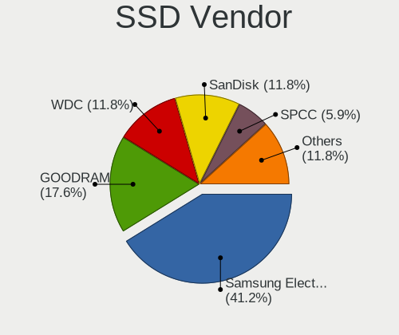
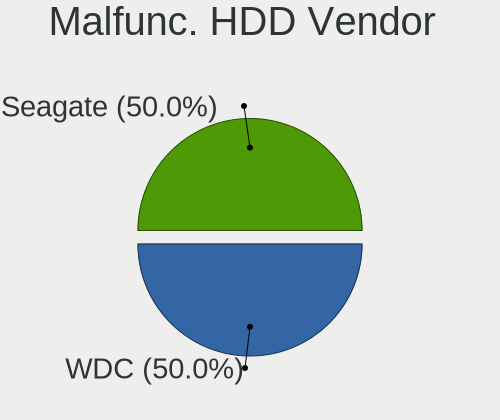
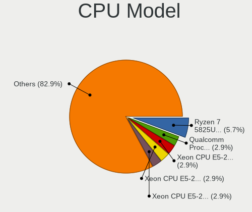
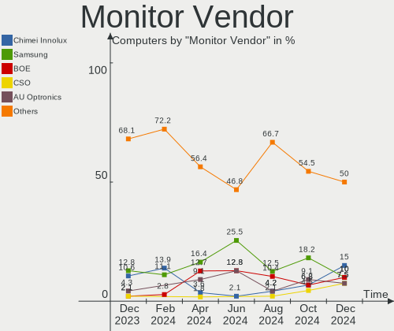
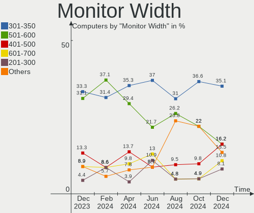
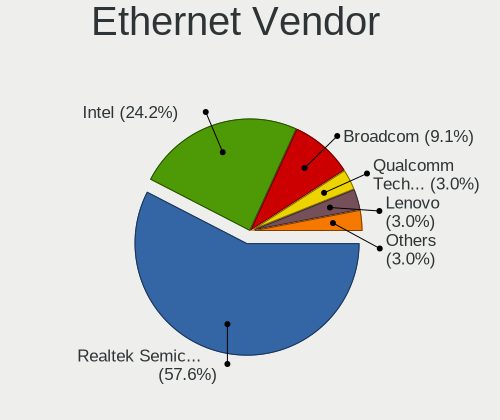
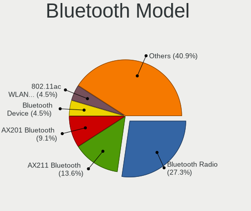

Gentoo Hardware Trends
----------------------

A project to identify most popular hardware characteristics and track their change
over time based on data collected by Gentoo users at https://Linux-Hardware.org.

Anyone can contribute to this report by the [hw-probe](https://github.com/linuxhw/hw-probe) tool:

    sudo -E hw-probe -all -upload

This is a report for all computer types. See also reports for [desktops](/Dist/Gentoo/Desktop/README.md) and [notebooks](/Dist/Gentoo/Notebook/README.md).

Full-feature report is available here: https://linux-hardware.org/?view=trends

Period: Mar, 2022.

Contents
--------

* [ System ](#system)
  - [ OS                       ](#os)
  - [ OS Family                ](#os-family)
  - [ Kernel                   ](#kernel)
  - [ Kernel Family            ](#kernel-family)
  - [ Kernel Major Ver.        ](#kernel-major-ver)
  - [ Arch                     ](#arch)
  - [ DE                       ](#de)
  - [ Display Server           ](#display-server)
  - [ Display Manager          ](#display-manager)
  - [ OS Lang                  ](#os-lang)
  - [ Boot Mode                ](#boot-mode)
  - [ Filesystem               ](#filesystem)
  - [ Part. scheme             ](#part-scheme)
  - [ Dual Boot with Linux/BSD ](#dual-boot-with-linuxbsd)
  - [ Dual Boot (Win)          ](#dual-boot-win)

* [ Board ](#board)
  - [ Vendor                   ](#vendor)
  - [ Model                    ](#model)
  - [ Model Family             ](#model-family)
  - [ MFG Year                 ](#mfg-year)
  - [ Form Factor              ](#form-factor)
  - [ Secure Boot              ](#secure-boot)
  - [ Coreboot                 ](#coreboot)
  - [ RAM Size                 ](#ram-size)
  - [ RAM Used                 ](#ram-used)
  - [ Total Drives             ](#total-drives)
  - [ Has CD-ROM               ](#has-cd-rom)
  - [ Has Ethernet             ](#has-ethernet)
  - [ Has WiFi                 ](#has-wifi)
  - [ Has Bluetooth            ](#has-bluetooth)

* [ Location ](#location)
  - [ Country                  ](#country)
  - [ City                     ](#city)

* [ Drives ](#drives)
  - [ Drive Vendor             ](#drive-vendor)
  - [ Drive Model              ](#drive-model)
  - [ HDD Vendor               ](#hdd-vendor)
  - [ SSD Vendor               ](#ssd-vendor)
  - [ Drive Kind               ](#drive-kind)
  - [ Drive Connector          ](#drive-connector)
  - [ Drive Size               ](#drive-size)
  - [ Space Total              ](#space-total)
  - [ Space Used               ](#space-used)
  - [ Malfunc. Drives          ](#malfunc-drives)
  - [ Malfunc. Drive Vendor    ](#malfunc-drive-vendor)
  - [ Malfunc. HDD Vendor      ](#malfunc-hdd-vendor)
  - [ Malfunc. Drive Kind      ](#malfunc-drive-kind)
  - [ Failed Drives            ](#failed-drives)
  - [ Failed Drive Vendor      ](#failed-drive-vendor)
  - [ Drive Status             ](#drive-status)

* [ Storage controller ](#storage-controller)
  - [ Storage Vendor           ](#storage-vendor)
  - [ Storage Model            ](#storage-model)
  - [ Storage Kind             ](#storage-kind)

* [ Processor ](#processor)
  - [ CPU Vendor               ](#cpu-vendor)
  - [ CPU Model                ](#cpu-model)
  - [ CPU Model Family         ](#cpu-model-family)
  - [ CPU Cores                ](#cpu-cores)
  - [ CPU Sockets              ](#cpu-sockets)
  - [ CPU Threads              ](#cpu-threads)
  - [ CPU Op-Modes             ](#cpu-op-modes)
  - [ CPU Microcode            ](#cpu-microcode)
  - [ CPU Microarch            ](#cpu-microarch)

* [ Graphics ](#graphics)
  - [ GPU Vendor               ](#gpu-vendor)
  - [ GPU Model                ](#gpu-model)
  - [ GPU Combo                ](#gpu-combo)
  - [ GPU Driver               ](#gpu-driver)
  - [ GPU Memory               ](#gpu-memory)

* [ Monitor ](#monitor)
  - [ Monitor Vendor           ](#monitor-vendor)
  - [ Monitor Model            ](#monitor-model)
  - [ Monitor Resolution       ](#monitor-resolution)
  - [ Monitor Diagonal         ](#monitor-diagonal)
  - [ Monitor Width            ](#monitor-width)
  - [ Aspect Ratio             ](#aspect-ratio)
  - [ Monitor Area             ](#monitor-area)
  - [ Pixel Density            ](#pixel-density)
  - [ Multiple Monitors        ](#multiple-monitors)

* [ Network ](#network)
  - [ Net Controller Vendor    ](#net-controller-vendor)
  - [ Net Controller Model     ](#net-controller-model)
  - [ Wireless Vendor          ](#wireless-vendor)
  - [ Wireless Model           ](#wireless-model)
  - [ Ethernet Vendor          ](#ethernet-vendor)
  - [ Ethernet Model           ](#ethernet-model)
  - [ Net Controller Kind      ](#net-controller-kind)
  - [ Used Controller          ](#used-controller)
  - [ NICs                     ](#nics)
  - [ IPv6                     ](#ipv6)

* [ Bluetooth ](#bluetooth)
  - [ Bluetooth Vendor         ](#bluetooth-vendor)
  - [ Bluetooth Model          ](#bluetooth-model)

* [ Sound ](#sound)
  - [ Sound Vendor             ](#sound-vendor)
  - [ Sound Model              ](#sound-model)

* [ Memory ](#memory)
  - [ Memory Vendor            ](#memory-vendor)
  - [ Memory Model             ](#memory-model)
  - [ Memory Kind              ](#memory-kind)
  - [ Memory Form Factor       ](#memory-form-factor)
  - [ Memory Size              ](#memory-size)
  - [ Memory Speed             ](#memory-speed)

* [ Printers & scanners ](#printers--scanners)
  - [ Printer Vendor           ](#printer-vendor)
  - [ Printer Model            ](#printer-model)
  - [ Scanner Vendor           ](#scanner-vendor)
  - [ Scanner Model            ](#scanner-model)

* [ Camera ](#camera)
  - [ Camera Vendor            ](#camera-vendor)
  - [ Camera Model             ](#camera-model)

* [ Security ](#security)
  - [ Fingerprint Vendor       ](#fingerprint-vendor)
  - [ Fingerprint Model        ](#fingerprint-model)
  - [ Chipcard Vendor          ](#chipcard-vendor)
  - [ Chipcard Model           ](#chipcard-model)

* [ Unsupported ](#unsupported)
  - [ Unsupported Devices      ](#unsupported-devices)
  - [ Unsupported Device Types ](#unsupported-device-types)

System
------

OS
--

Installed operating systems

| Name       | Computers | Percent |
|------------|-----------|---------|
| Gentoo 2.8 | 18        | 36%     |
| Gentoo 2.6 | 17        | 34%     |
| Gentoo 2.7 | 14        | 28%     |
| Gentoo 1   | 1         | 2%      |

OS Family
---------

OS without a version

| Name   | Computers | Percent |
|--------|-----------|---------|
| Gentoo | 50        | 100%    |

Kernel
------

Version of the Linux kernel

| Version                       | Computers | Percent |
|-------------------------------|-----------|---------|
| 5.15.23-gentoo                | 5         | 10%     |
| 5.15.26-gentoo                | 4         | 8%      |
| 5.15.26-gentoo-x86_64         | 3         | 6%      |
| 5.15.23-gentoo-x86_64         | 3         | 6%      |
| 5.17.1-gentoo-r1              | 2         | 4%      |
| 5.17.0-gentoo-x86_64          | 2         | 4%      |
| 5.16.12-gentoo-x86_64         | 2         | 4%      |
| 5.16.11-gentoo-x86_64         | 2         | 4%      |
| 5.16.11-gentoo-dist           | 2         | 4%      |
| 5.10.35-gentoo                | 2         | 4%      |
| 5.4.97-gentoo-x86_64          | 1         | 2%      |
| 5.17.1-gentoo-r1-groovin      | 1         | 2%      |
| 5.17.0-gentoo                 | 1         | 2%      |
| 5.16.9-gentoo-dist            | 1         | 2%      |
| 5.16.8-gentoo-x86_64          | 1         | 2%      |
| 5.16.3-gentoo                 | 1         | 2%      |
| 5.16.2-gentoo                 | 1         | 2%      |
| 5.16.16-gentoo                | 1         | 2%      |
| 5.16.15                       | 1         | 2%      |
| 5.16.14-gentoo-x86_64-lto     | 1         | 2%      |
| 5.16.14-gentoo-x86_64         | 1         | 2%      |
| 5.16.14-gentoo-girlhog        | 1         | 2%      |
| 5.16.14-gentoo                | 1         | 2%      |
| 5.16.10-zen1                  | 1         | 2%      |
| 5.15.30-gentoo-dist           | 1         | 2%      |
| 5.15.26b                      | 1         | 2%      |
| 5.15.23-gentoo-dist           | 1         | 2%      |
| 5.15.16-gentoo-x86_64         | 1         | 2%      |
| 5.15.16-gentoo-NSA            | 1         | 2%      |
| 5.15.11-gentoo-x86_64         | 1         | 2%      |
| 5.10.63-v8                    | 1         | 2%      |
| 5.10.49-gentoo-r1-x86_64      | 1         | 2%      |
| 4.9.135-vs2.3.9.8-dappersec-2 | 1         | 2%      |

Kernel Family
-------------

Linux kernel without a distro release

| Version | Computers | Percent |
|---------|-----------|---------|
| 5.15.23 | 9         | 18%     |
| 5.15.26 | 8         | 16%     |
| 5.16.14 | 4         | 8%      |
| 5.16.11 | 4         | 8%      |
| 5.17.1  | 3         | 6%      |
| 5.17.0  | 3         | 6%      |
| 5.16.12 | 2         | 4%      |
| 5.15.16 | 2         | 4%      |
| 5.10.35 | 2         | 4%      |
| 5.4.97  | 1         | 2%      |
| 5.16.9  | 1         | 2%      |
| 5.16.8  | 1         | 2%      |
| 5.16.3  | 1         | 2%      |
| 5.16.2  | 1         | 2%      |
| 5.16.16 | 1         | 2%      |
| 5.16.15 | 1         | 2%      |
| 5.16.10 | 1         | 2%      |
| 5.15.30 | 1         | 2%      |
| 5.15.11 | 1         | 2%      |
| 5.10.63 | 1         | 2%      |
| 5.10.49 | 1         | 2%      |
| 4.9.135 | 1         | 2%      |

Kernel Major Ver.
-----------------

Linux kernel major version

| Version | Computers | Percent |
|---------|-----------|---------|
| 5.15    | 21        | 42%     |
| 5.16    | 17        | 34%     |
| 5.17    | 6         | 12%     |
| 5.10    | 4         | 8%      |
| 5.4     | 1         | 2%      |
| 4.9     | 1         | 2%      |

Arch
----

OS architecture (x86_64, i586, etc.)

| Name    | Computers | Percent |
|---------|-----------|---------|
| x86_64  | 48        | 96%     |
| aarch64 | 2         | 4%      |

DE
--

Desktop Environment

| Name     | Computers | Percent |
|----------|-----------|---------|
| KDE5     | 13        | 26%     |
| Unknown  | 12        | 24%     |
| GNOME    | 9         | 18%     |
| XFCE     | 5         | 10%     |
| MATE     | 5         | 10%     |
| KDE      | 2         | 4%      |
| Cinnamon | 2         | 4%      |
| openbox  | 1         | 2%      |
| dwm      | 1         | 2%      |

Display Server
--------------

X11 or Wayland

| Name    | Computers | Percent |
|---------|-----------|---------|
| X11     | 26        | 52%     |
| Unknown | 12        | 24%     |
| Tty     | 8         | 16%     |
| Wayland | 4         | 8%      |

Display Manager
---------------

SDDM, LightDM, etc.

| Name    | Computers | Percent |
|---------|-----------|---------|
| Unknown | 24        | 48%     |
| LightDM | 12        | 24%     |
| SDDM    | 11        | 22%     |
| GDM     | 2         | 4%      |
| LXDM    | 1         | 2%      |

OS Lang
-------

Language

| Lang    | Computers | Percent |
|---------|-----------|---------|
| en_US   | 23        | 46%     |
| C.UTF8  | 8         | 16%     |
| Unknown | 5         | 10%     |
| en_GB   | 4         | 8%      |
| pl_PL   | 2         | 4%      |
| zh_TW   | 1         | 2%      |
| ru_RU   | 1         | 2%      |
| fr_CA   | 1         | 2%      |
| es_ES   | 1         | 2%      |
| es_AR   | 1         | 2%      |
| en_IN   | 1         | 2%      |
| en_AT   | 1         | 2%      |
| C       | 1         | 2%      |

Boot Mode
---------

EFI or BIOS

| Mode | Computers | Percent |
|------|-----------|---------|
| EFI  | 41        | 82%     |
| BIOS | 9         | 18%     |

Filesystem
----------

Type of filesystem

| Type  | Computers | Percent |
|-------|-----------|---------|
| Ext4  | 37        | 74%     |
| Btrfs | 9         | 18%     |
| F2fs  | 3         | 6%      |
| Zfs   | 1         | 2%      |

Part. scheme
------------

Scheme of partitioning

| Type    | Computers | Percent |
|---------|-----------|---------|
| GPT     | 47        | 94%     |
| Unknown | 3         | 6%      |

Dual Boot with Linux/BSD
------------------------

Hosting more than one Linux/BSD

| Dual boot | Computers | Percent |
|-----------|-----------|---------|
| No        | 35        | 70%     |
| Yes       | 15        | 30%     |

Dual Boot (Win)
---------------

Hosting Linux and Windows

| Dual boot | Computers | Percent |
|-----------|-----------|---------|
| No        | 30        | 60%     |
| Yes       | 20        | 40%     |

Board
-----

Vendor
------

Motherboard manufacturer

| Name                    | Computers | Percent |
|-------------------------|-----------|---------|
| ASUSTek Computer        | 13        | 26%     |
| Lenovo                  | 5         | 10%     |
| Hewlett-Packard         | 5         | 10%     |
| MSI                     | 4         | 8%      |
| Intel                   | 3         | 6%      |
| Gigabyte Technology     | 3         | 6%      |
| Timi                    | 2         | 4%      |
| Dell                    | 2         | 4%      |
| ASRock                  | 2         | 4%      |
| TUXEDO                  | 1         | 2%      |
| Toshiba                 | 1         | 2%      |
| Razer                   | 1         | 2%      |
| Raspberry Pi Foundation | 1         | 2%      |
| HUAWEI                  | 1         | 2%      |
| Framework               | 1         | 2%      |
| Fanless Mini PC         | 1         | 2%      |
| BANGHO                  | 1         | 2%      |
| Apple                   | 1         | 2%      |
| Alienware               | 1         | 2%      |
| Unknown                 | 1         | 2%      |

Model
-----

Motherboard model

| Name                                | Computers | Percent |
|-------------------------------------|-----------|---------|
| ASUS TUF GAMING Z590-PLUS WIFI      | 2         | 4%      |
| TUXEDO InfinityBook Pro 14 Gen6     | 1         | 2%      |
| Toshiba Satellite L50-C             | 1         | 2%      |
| Timi RedmiBook Air 13               | 1         | 2%      |
| Timi Mi Laptop Pro 15               | 1         | 2%      |
| Razer Blade 15 (2022) - RZ09-0421   | 1         | 2%      |
| RPi Raspberry Pi                    | 1         | 2%      |
| MSI MS-7D18                         | 1         | 2%      |
| MSI MS-7C94                         | 1         | 2%      |
| MSI MS-7A34                         | 1         | 2%      |
| MSI GE66 Raider 11UE                | 1         | 2%      |
| Lenovo Yoga C940-14IIL 81Q9         | 1         | 2%      |
| Lenovo ThinkCentre M920q 10V8S06904 | 1         | 2%      |
| Lenovo Legion Y740-17IRHg 81UJ      | 1         | 2%      |
| Lenovo Legion Y530-15ICH 81FV       | 1         | 2%      |
| Lenovo IdeaPad C340-14IML 81TK      | 1         | 2%      |
| Intel NUC11PAHi7                    | 1         | 2%      |
| Intel NUC10i7FNH                    | 1         | 2%      |
| Intel DH61WW AAG23116-302           | 1         | 2%      |
| HUAWEI NBLK-WAX9X                   | 1         | 2%      |
| HP Victus by Laptop 16-e0xxx        | 1         | 2%      |
| HP Pavilion ZV6100 (EE984EA#ABZ)    | 1         | 2%      |
| HP OMEN Laptop 15-en0xxx            | 1         | 2%      |
| HP ENVY x360 Convertible 15-eu0xxx  | 1         | 2%      |
| HP EliteBook 850 G8 Notebook PC     | 1         | 2%      |
| Gigabyte Z590 UD                    | 1         | 2%      |
| Gigabyte B550 GAMING X V2           | 1         | 2%      |
| Gigabyte AB350-Gaming               | 1         | 2%      |
| Framework Laptop                    | 1         | 2%      |
| Fanless Mini PC PCG02 GLE           | 1         | 2%      |
| Dell XPS 12-9Q33                    | 1         | 2%      |
| Dell OptiPlex 7080                  | 1         | 2%      |
| BANGHO MAX G0101                    | 1         | 2%      |
| ASUS Z170 PRO GAMING                | 1         | 2%      |
| ASUS TUF GAMING X570-PRO            | 1         | 2%      |
| ASUS TUF Gaming X570-PLUS           | 1         | 2%      |
| ASUS SABERTOOTH 990FX R2.0          | 1         | 2%      |
| ASUS ROG STRIX Z390-E GAMING        | 1         | 2%      |
| ASUS ROG STRIX Z370-H GAMING        | 1         | 2%      |
| ASUS ROG STRIX B550-F GAMING        | 1         | 2%      |
| ASUS ROG STRIX B450-F GAMING        | 1         | 2%      |
| ASUS PRIME X299-DELUXE II           | 1         | 2%      |
| ASUS PRIME J4005I-C                 | 1         | 2%      |
| ASUS M3A78-CM                       | 1         | 2%      |
| ASRock Z170A-X1                     | 1         | 2%      |
| ASRock A300M-STX                    | 1         | 2%      |
| Apple MacBookPro11,3                | 1         | 2%      |
| Alienware Aurora Ryzen Edition      | 1         | 2%      |
| Unknown                             | 1         | 2%      |

Model Family
------------

Motherboard model prefix

| Name                  | Computers | Percent |
|-----------------------|-----------|---------|
| ASUS TUF              | 4         | 8%      |
| ASUS ROG              | 4         | 8%      |
| Lenovo Legion         | 2         | 4%      |
| ASUS PRIME            | 2         | 4%      |
| TUXEDO InfinityBook   | 1         | 2%      |
| Toshiba Satellite     | 1         | 2%      |
| Timi RedmiBook        | 1         | 2%      |
| Timi Mi               | 1         | 2%      |
| Razer Blade           | 1         | 2%      |
| RPi Raspberry         | 1         | 2%      |
| MSI MS-7D18           | 1         | 2%      |
| MSI MS-7C94           | 1         | 2%      |
| MSI MS-7A34           | 1         | 2%      |
| MSI GE66              | 1         | 2%      |
| Lenovo Yoga           | 1         | 2%      |
| Lenovo ThinkCentre    | 1         | 2%      |
| Lenovo IdeaPad        | 1         | 2%      |
| Intel NUC11PAHi7      | 1         | 2%      |
| Intel NUC10i7FNH      | 1         | 2%      |
| Intel DH61WW          | 1         | 2%      |
| HUAWEI NBLK-WAX9X     | 1         | 2%      |
| HP Victus             | 1         | 2%      |
| HP Pavilion           | 1         | 2%      |
| HP OMEN               | 1         | 2%      |
| HP ENVY               | 1         | 2%      |
| HP EliteBook          | 1         | 2%      |
| Gigabyte Z590         | 1         | 2%      |
| Gigabyte B550         | 1         | 2%      |
| Gigabyte AB350-Gaming | 1         | 2%      |
| Framework Laptop      | 1         | 2%      |
| Fanless Mini PC PCG02 | 1         | 2%      |
| Dell XPS              | 1         | 2%      |
| Dell OptiPlex         | 1         | 2%      |
| BANGHO MAX            | 1         | 2%      |
| ASUS Z170             | 1         | 2%      |
| ASUS SABERTOOTH       | 1         | 2%      |
| ASUS M3A78-CM         | 1         | 2%      |
| ASRock Z170A-X1       | 1         | 2%      |
| ASRock A300M-STX      | 1         | 2%      |
| Apple MacBookPro11    | 1         | 2%      |
| Alienware Aurora      | 1         | 2%      |
| Unknown               | 1         | 2%      |

MFG Year
--------

Motherboard manufacture year

| Year    | Computers | Percent |
|---------|-----------|---------|
| 2021    | 13        | 26%     |
| 2019    | 9         | 18%     |
| 2020    | 8         | 16%     |
| 2018    | 3         | 6%      |
| 2017    | 3         | 6%      |
| 2014    | 3         | 6%      |
| 2022    | 2         | 4%      |
| 2015    | 2         | 4%      |
| 2012    | 2         | 4%      |
| Unknown | 2         | 4%      |
| 2016    | 1         | 2%      |
| 2008    | 1         | 2%      |
| 2006    | 1         | 2%      |

Form Factor
-----------

Physical design of the computer

| Name           | Computers | Percent |
|----------------|-----------|---------|
| Desktop        | 23        | 46%     |
| Notebook       | 18        | 36%     |
| Convertible    | 3         | 6%      |
| Mini pc        | 3         | 6%      |
| System on chip | 2         | 4%      |
| Stick pc       | 1         | 2%      |

Secure Boot
-----------

Enabled or disabled

| State    | Computers | Percent |
|----------|-----------|---------|
| Disabled | 50        | 100%    |

Coreboot
--------

Have coreboot on board

| Used | Computers | Percent |
|------|-----------|---------|
| No   | 50        | 100%    |

RAM Size
--------

Total RAM memory

| Size in GB  | Computers | Percent |
|-------------|-----------|---------|
| 16.01-24.0  | 15        | 30%     |
| 32.01-64.0  | 9         | 18%     |
| 8.01-16.0   | 8         | 16%     |
| 4.01-8.0    | 7         | 14%     |
| 64.01-256.0 | 7         | 14%     |
| 3.01-4.0    | 2         | 4%      |
| 24.01-32.0  | 1         | 2%      |
| 1.01-2.0    | 1         | 2%      |

RAM Used
--------

Used RAM memory

| Used GB    | Computers | Percent |
|------------|-----------|---------|
| 4.01-8.0   | 12        | 24%     |
| 2.01-3.0   | 11        | 22%     |
| 8.01-16.0  | 6         | 12%     |
| 0.51-1.0   | 6         | 12%     |
| 1.01-2.0   | 5         | 10%     |
| 0.01-0.5   | 5         | 10%     |
| 3.01-4.0   | 3         | 6%      |
| 16.01-24.0 | 2         | 4%      |

Total Drives
------------

Number of drives on board

| Drives | Computers | Percent |
|--------|-----------|---------|
| 1      | 24        | 48%     |
| 2      | 14        | 28%     |
| 3      | 4         | 8%      |
| 6      | 3         | 6%      |
| 5      | 3         | 6%      |
| 8      | 1         | 2%      |
| 4      | 1         | 2%      |

Has CD-ROM
----------

Has CD-ROM on board

| Presented | Computers | Percent |
|-----------|-----------|---------|
| No        | 42        | 84%     |
| Yes       | 8         | 16%     |

Has Ethernet
------------

Has Ethernet on board

| Presented | Computers | Percent |
|-----------|-----------|---------|
| Yes       | 38        | 76%     |
| No        | 12        | 24%     |

Has WiFi
--------

Has WiFi module

| Presented | Computers | Percent |
|-----------|-----------|---------|
| Yes       | 35        | 70%     |
| No        | 15        | 30%     |

Has Bluetooth
-------------

Has Bluetooth module

| Presented | Computers | Percent |
|-----------|-----------|---------|
| Yes       | 30        | 60%     |
| No        | 20        | 40%     |

Location
--------

Country
-------

Geographic location (country)

| Country     | Computers | Percent |
|-------------|-----------|---------|
| USA         | 11        | 22%     |
| Poland      | 5         | 10%     |
| Russia      | 4         | 8%      |
| China       | 4         | 8%      |
| Germany     | 3         | 6%      |
| UK          | 2         | 4%      |
| Sweden      | 2         | 4%      |
| Spain       | 2         | 4%      |
| Turkey      | 1         | 2%      |
| Taiwan      | 1         | 2%      |
| Romania     | 1         | 2%      |
| Philippines | 1         | 2%      |
| Norway      | 1         | 2%      |
| Netherlands | 1         | 2%      |
| Nepal       | 1         | 2%      |
| Mexico      | 1         | 2%      |
| Ireland     | 1         | 2%      |
| India       | 1         | 2%      |
| Hong Kong   | 1         | 2%      |
| Egypt       | 1         | 2%      |
| Canada      | 1         | 2%      |
| Bulgaria    | 1         | 2%      |
| Austria     | 1         | 2%      |
| Australia   | 1         | 2%      |
| Argentina   | 1         | 2%      |

City
----

Geographic location (city)

| City                 | Computers | Percent |
|----------------------|-----------|---------|
| Warsaw               | 3         | 6%      |
| Stockholm            | 2         | 4%      |
| Moscow               | 2         | 4%      |
| Geleshan             | 2         | 4%      |
| Vienna               | 1         | 2%      |
| Unterschleissheim    | 1         | 2%      |
| Storsteinnes         | 1         | 2%      |
| St Petersburg        | 1         | 2%      |
| Sofia                | 1         | 2%      |
| Québec              | 1         | 2%      |
| Poplar               | 1         | 2%      |
| Orange               | 1         | 2%      |
| Ocala                | 1         | 2%      |
| Oakland              | 1         | 2%      |
| Munich               | 1         | 2%      |
| Miasto Ogrod Komorow | 1         | 2%      |
| Mexico City          | 1         | 2%      |
| Magadan              | 1         | 2%      |
| Los Angeles          | 1         | 2%      |
| Leidschendam         | 1         | 2%      |
| Laziska Gorne        | 1         | 2%      |
| Killeen              | 1         | 2%      |
| Kathmandu            | 1         | 2%      |
| Hyannis              | 1         | 2%      |
| Hsinchu              | 1         | 2%      |
| Houston              | 1         | 2%      |
| Gold Coast           | 1         | 2%      |
| Garden Grove         | 1         | 2%      |
| Frankfurt am Main    | 1         | 2%      |
| Foshan               | 1         | 2%      |
| Fort Collins         | 1         | 2%      |
| Farnborough          | 1         | 2%      |
| Dublin               | 1         | 2%      |
| Cluj-Napoca          | 1         | 2%      |
| Chennai              | 1         | 2%      |
| Central              | 1         | 2%      |
| Cebu City            | 1         | 2%      |
| Cairo                | 1         | 2%      |
| Bernal               | 1         | 2%      |
| Bellaterra           | 1         | 2%      |
| Beijing              | 1         | 2%      |
| Balıkesir           | 1         | 2%      |
| Austin               | 1         | 2%      |
| Aurora               | 1         | 2%      |
| Arona                | 1         | 2%      |

Drives
------

Drive Vendor
------------

Hard drive vendors

| Vendor                         | Computers | Drives | Percent |
|--------------------------------|-----------|--------|---------|
| Samsung Electronics            | 19        | 27     | 21.59%  |
| WDC                            | 12        | 16     | 13.64%  |
| Seagate                        | 11        | 14     | 12.5%   |
| SanDisk                        | 7         | 7      | 7.95%   |
| Toshiba                        | 6         | 7      | 6.82%   |
| Kingston                       | 5         | 6      | 5.68%   |
| Unknown                        | 3         | 4      | 3.41%   |
| KIOXIA                         | 3         | 3      | 3.41%   |
| Intel                          | 3         | 4      | 3.41%   |
| SK Hynix                       | 2         | 2      | 2.27%   |
| KIOXIA-EXCERIA                 | 2         | 3      | 2.27%   |
| GOODRAM                        | 2         | 2      | 2.27%   |
| Crucial                        | 2         | 2      | 2.27%   |
| XrayDisk                       | 1         | 1      | 1.14%   |
| Verbatim                       | 1         | 1      | 1.14%   |
| Transcend                      | 1         | 1      | 1.14%   |
| Solid State Storage Technology | 1         | 1      | 1.14%   |
| PNY                            | 1         | 1      | 1.14%   |
| Phison                         | 1         | 1      | 1.14%   |
| Micron Technology              | 1         | 1      | 1.14%   |
| Hitachi                        | 1         | 3      | 1.14%   |
| HGST                           | 1         | 1      | 1.14%   |
| Corsair                        | 1         | 2      | 1.14%   |
| Apple                          | 1         | 1      | 1.14%   |

Drive Model
-----------

Hard drive models

| Model                                  | Computers | Percent |
|----------------------------------------|-----------|---------|
| WDC WD10EZEX-08M2NA0 1TB               | 2         | 1.89%   |
| Unknown MMC Card  128GB                | 2         | 1.89%   |
| Sandisk NVMe SSD Drive 1TB             | 2         | 1.89%   |
| Samsung SSD 980 PRO 2TB                | 2         | 1.89%   |
| Samsung SSD 980 PRO 1TB                | 2         | 1.89%   |
| Samsung SSD 980 500GB                  | 2         | 1.89%   |
| KIOXIA-EXCERIA SSD 500GB               | 2         | 1.89%   |
| GOODRAM SSDPR-CL100-480-G2 480GB       | 2         | 1.89%   |
| Crucial CT500MX500SSD1 500GB           | 2         | 1.89%   |
| XrayDisk SSD 128GB                     | 1         | 0.94%   |
| WDC WDS500G3X0C-00SJG0 500GB           | 1         | 0.94%   |
| WDC WDS500G2B0A-00SM50 500GB SSD       | 1         | 0.94%   |
| WDC WDS200T2B0C-00PXH0 2TB             | 1         | 0.94%   |
| WDC WDS100T2B0A-00SM50 1TB SSD         | 1         | 0.94%   |
| WDC WD8003FFBX-68B9AN0 8TB             | 1         | 0.94%   |
| WDC WD60EZRX-00MVLB1 6TB               | 1         | 0.94%   |
| WDC WD5000AZRX-00A8LB0 500GB           | 1         | 0.94%   |
| WDC WD3200LPVX-22V0TT0 320GB           | 1         | 0.94%   |
| WDC WD30EFRX-68EUZN0 3TB               | 1         | 0.94%   |
| WDC WD20EZAZ-00GGJB0 2TB               | 1         | 0.94%   |
| WDC WD2003FZEX-00Z4SA0 2TB             | 1         | 0.94%   |
| WDC WD1001FALS-00J7B1 1TB              | 1         | 0.94%   |
| WDC PC SN730 SDBPNTY-256G-1101 256GB   | 1         | 0.94%   |
| WDC PC SN730 SDBPNTY-1T00-1006 1TB     | 1         | 0.94%   |
| Verbatim Vi550 S3 SSD 256GB            | 1         | 0.94%   |
| Unknown MMC Card  64GB                 | 1         | 0.94%   |
| Unknown MMC Card  32GB                 | 1         | 0.94%   |
| Transcend TS128GMTE110S 128GB          | 1         | 0.94%   |
| Toshiba TR200 480GB SSD                | 1         | 0.94%   |
| Toshiba MQ01ABD100 1TB                 | 1         | 0.94%   |
| Toshiba HDWQ140 4TB                    | 1         | 0.94%   |
| Toshiba HDWL120 2TB                    | 1         | 0.94%   |
| Toshiba HDWE150 5TB                    | 1         | 0.94%   |
| Toshiba HDWD130 3TB                    | 1         | 0.94%   |
| Toshiba DT01ACA300 3TB                 | 1         | 0.94%   |
| Solid State Storage NVMe SSD Drive 1TB | 1         | 0.94%   |
| SK Hynix SH920 mSATA 256GB SSD         | 1         | 0.94%   |
| SK Hynix PC611 NVMe 512GB              | 1         | 0.94%   |
| Seagate ST8000DM004-2CX188 8TB         | 1         | 0.94%   |
| Seagate ST500DM002-1BD142 500GB        | 1         | 0.94%   |
| Seagate ST4000DM004-2CV104 4TB         | 1         | 0.94%   |
| Seagate ST4000DM000-1F2168 4TB         | 1         | 0.94%   |
| Seagate ST3000DM001-1ER166 3TB         | 1         | 0.94%   |
| Seagate ST2000LX001-1RG174 2TB         | 1         | 0.94%   |
| Seagate ST2000DM005-2CW102 2TB         | 1         | 0.94%   |
| Seagate ST2000DM001-1ER164 2TB         | 1         | 0.94%   |
| Seagate ST12000NM0008-2H3101 12TB      | 1         | 0.94%   |
| Seagate ST1000LM049-2GH172 1TB         | 1         | 0.94%   |
| Seagate ST1000DM010-2EP102 1TB         | 1         | 0.94%   |
| Seagate ST1000DM003-1ER162 1TB         | 1         | 0.94%   |
| Seagate Expansion 320GB                | 1         | 0.94%   |
| SanDisk Ultra II 480GB SSD             | 1         | 0.94%   |
| SanDisk Ultra 3D NVMe 1TB              | 1         | 0.94%   |
| SanDisk SSD PLUS 240GB                 | 1         | 0.94%   |
| SanDisk SD9SN8W-128G-1006 128GB SSD    | 1         | 0.94%   |
| Sandisk NVMe SSD Drive 2TB             | 1         | 0.94%   |
| Samsung SSD 980 PRO 500GB              | 1         | 0.94%   |
| Samsung SSD 970 PRO 1TB                | 1         | 0.94%   |
| Samsung SSD 970 EVO Plus 500GB         | 1         | 0.94%   |
| Samsung SSD 970 EVO Plus 1TB           | 1         | 0.94%   |

HDD Vendor
----------

Hard disk drive vendors

| Vendor  | Computers | Drives | Percent |
|---------|-----------|--------|---------|
| Seagate | 11        | 14     | 44%     |
| WDC     | 7         | 10     | 28%     |
| Toshiba | 5         | 6      | 20%     |
| Hitachi | 1         | 3      | 4%      |
| HGST    | 1         | 1      | 4%      |

SSD Vendor
----------

Solid state drive vendors

| Vendor              | Computers | Drives | Percent |
|---------------------|-----------|--------|---------|
| Samsung Electronics | 9         | 9      | 32.14%  |
| SanDisk             | 3         | 3      | 10.71%  |
| Kingston            | 3         | 4      | 10.71%  |
| WDC                 | 2         | 2      | 7.14%   |
| GOODRAM             | 2         | 2      | 7.14%   |
| Crucial             | 2         | 2      | 7.14%   |
| XrayDisk            | 1         | 1      | 3.57%   |
| Verbatim            | 1         | 1      | 3.57%   |
| Toshiba             | 1         | 1      | 3.57%   |
| SK Hynix            | 1         | 1      | 3.57%   |
| PNY                 | 1         | 1      | 3.57%   |
| Corsair             | 1         | 1      | 3.57%   |
| Apple               | 1         | 1      | 3.57%   |

Drive Kind
----------

HDD or SSD

| Kind | Computers | Drives | Percent |
|------|-----------|--------|---------|
| NVMe | 36        | 44     | 45%     |
| SSD  | 23        | 29     | 28.75%  |
| HDD  | 18        | 34     | 22.5%   |
| MMC  | 3         | 4      | 3.75%   |

Drive Connector
---------------

SATA, SAS, NVMe, etc.

| Type | Computers | Drives | Percent |
|------|-----------|--------|---------|
| NVMe | 36        | 44     | 52.94%  |
| SATA | 27        | 61     | 39.71%  |
| MMC  | 3         | 4      | 4.41%   |
| SAS  | 2         | 2      | 2.94%   |

Drive Size
----------

Size of hard drive

| Size in TB | Computers | Drives | Percent |
|------------|-----------|--------|---------|
| 0.01-0.5   | 18        | 25     | 39.13%  |
| 0.51-1.0   | 12        | 13     | 26.09%  |
| 1.01-2.0   | 6         | 8      | 13.04%  |
| 3.01-4.0   | 4         | 4      | 8.7%    |
| 2.01-3.0   | 3         | 8      | 6.52%   |
| 4.01-10.0  | 2         | 4      | 4.35%   |
| 10.01-20.0 | 1         | 1      | 2.17%   |

Space Total
-----------

Amount of disk space available on the file system

| Size in GB     | Computers | Percent |
|----------------|-----------|---------|
| 251-500        | 9         | 18%     |
| 501-1000       | 9         | 18%     |
| More than 3000 | 8         | 16%     |
| 101-250        | 8         | 16%     |
| 1001-2000      | 5         | 10%     |
| 1-20           | 4         | 8%      |
| 2001-3000      | 3         | 6%      |
| Unknown        | 2         | 4%      |
| 21-50          | 1         | 2%      |
| 51-100         | 1         | 2%      |

Space Used
----------

Amount of used disk space

| Used GB        | Computers | Percent |
|----------------|-----------|---------|
| 1-20           | 10        | 20%     |
| 251-500        | 9         | 18%     |
| 21-50          | 8         | 16%     |
| More than 3000 | 5         | 10%     |
| 51-100         | 5         | 10%     |
| 501-1000       | 4         | 8%      |
| 101-250        | 3         | 6%      |
| 1001-2000      | 3         | 6%      |
| Unknown        | 2         | 4%      |
| 2001-3000      | 1         | 2%      |

Malfunc. Drives
---------------

Drive models with a malfunction

| Model                          | Computers | Drives | Percent |
|--------------------------------|-----------|--------|---------|
| WDC WD5000AZRX-00A8LB0 500GB   | 1         | 1      | 20%     |
| WDC WD10EZEX-08M2NA0 1TB       | 1         | 1      | 20%     |
| Toshiba HDWD130 3TB            | 1         | 1      | 20%     |
| SK Hynix SH920 mSATA 256GB SSD | 1         | 1      | 20%     |
| Kingston SV100S2128G 128GB SSD | 1         | 1      | 20%     |

Malfunc. Drive Vendor
---------------------

Vendors of faulty drives

| Vendor   | Computers | Drives | Percent |
|----------|-----------|--------|---------|
| WDC      | 2         | 2      | 40%     |
| Toshiba  | 1         | 1      | 20%     |
| SK Hynix | 1         | 1      | 20%     |
| Kingston | 1         | 1      | 20%     |

Malfunc. HDD Vendor
-------------------

Vendors of faulty HDD drives

| Vendor  | Computers | Drives | Percent |
|---------|-----------|--------|---------|
| WDC     | 2         | 2      | 66.67%  |
| Toshiba | 1         | 1      | 33.33%  |

Malfunc. Drive Kind
-------------------

Kinds of faulty drives

| Kind | Computers | Drives | Percent |
|------|-----------|--------|---------|
| HDD  | 3         | 3      | 60%     |
| SSD  | 2         | 2      | 40%     |

Failed Drives
-------------

Failed drive models

Zero info for selected period =(

Failed Drive Vendor
-------------------

Failed drive vendors

Zero info for selected period =(

Drive Status
------------

Number of failed and malfunc. drives

| Status   | Computers | Drives | Percent |
|----------|-----------|--------|---------|
| Works    | 42        | 90     | 72.41%  |
| Detected | 11        | 16     | 18.97%  |
| Malfunc  | 5         | 5      | 8.62%   |

Storage controller
------------------

Storage Vendor
--------------

Storage controller vendors

| Vendor                         | Computers | Percent |
|--------------------------------|-----------|---------|
| Intel                          | 28        | 35.44%  |
| Samsung Electronics            | 17        | 21.52%  |
| AMD                            | 13        | 16.46%  |
| Sandisk                        | 7         | 8.86%   |
| KIOXIA                         | 4         | 5.06%   |
| Kingston Technology Company    | 2         | 2.53%   |
| ASMedia Technology             | 2         | 2.53%   |
| Toshiba America Info Systems   | 1         | 1.27%   |
| Solid State Storage Technology | 1         | 1.27%   |
| SK Hynix                       | 1         | 1.27%   |
| Silicon Motion                 | 1         | 1.27%   |
| Phison Electronics             | 1         | 1.27%   |
| Micron Technology              | 1         | 1.27%   |

Storage Model
-------------

Storage controller models

| Model                                                                          | Computers | Percent |
|--------------------------------------------------------------------------------|-----------|---------|
| Samsung NVMe SSD Controller SM981/PM981/PM983                                  | 8         | 9.52%   |
| Samsung NVMe SSD Controller PM9A1/PM9A3/980PRO                                 | 6         | 7.14%   |
| AMD FCH SATA Controller [AHCI mode]                                            | 6         | 7.14%   |
| Intel 500 Series Chipset Family SATA AHCI Controller                           | 4         | 4.76%   |
| Sandisk WD Black SN750 / PC SN730 NVMe SSD                                     | 3         | 3.57%   |
| Sandisk Non-Volatile memory controller                                         | 3         | 3.57%   |
| Intel Comet Lake SATA AHCI Controller                                          | 3         | 3.57%   |
| Samsung NVMe SSD Controller 980                                                | 2         | 2.38%   |
| KIOXIA NVMe SSD                                                                | 2         | 2.38%   |
| KIOXIA Non-Volatile memory controller                                          | 2         | 2.38%   |
| Intel Volume Management Device NVMe RAID Controller                            | 2         | 2.38%   |
| Intel Sunrise Point-LP SATA Controller [AHCI mode]                             | 2         | 2.38%   |
| Intel Q170/Q150/B150/H170/H110/Z170/CM236 Chipset SATA Controller [AHCI Mode]  | 2         | 2.38%   |
| Intel Celeron/Pentium Silver Processor SATA Controller                         | 2         | 2.38%   |
| Intel Cannon Lake PCH SATA AHCI Controller                                     | 2         | 2.38%   |
| Intel Cannon Lake Mobile PCH SATA AHCI Controller                              | 2         | 2.38%   |
| Intel 200 Series PCH SATA controller [AHCI mode]                               | 2         | 2.38%   |
| ASMedia ASM1062 Serial ATA Controller                                          | 2         | 2.38%   |
| AMD 500 Series Chipset SATA Controller                                         | 2         | 2.38%   |
| AMD 300 Series Chipset SATA Controller                                         | 2         | 2.38%   |
| Toshiba America Info Systems XG6 NVMe SSD Controller                           | 1         | 1.19%   |
| Solid State Storage Non-Volatile memory controller                             | 1         | 1.19%   |
| SK Hynix Non-Volatile memory controller                                        | 1         | 1.19%   |
| Silicon Motion SM2263EN/SM2263XT SSD Controller                                | 1         | 1.19%   |
| Sandisk WD Blue SN550 NVMe SSD                                                 | 1         | 1.19%   |
| Samsung NVMe SSD Controller SM961/PM961/SM963                                  | 1         | 1.19%   |
| Samsung Apple PCIe SSD                                                         | 1         | 1.19%   |
| Phison E7 NVMe Controller                                                      | 1         | 1.19%   |
| Phison E12 NVMe Controller                                                     | 1         | 1.19%   |
| Micron Non-Volatile memory controller                                          | 1         | 1.19%   |
| Kingston Company Company Non-Volatile memory controller                        | 1         | 1.19%   |
| Kingston Company A2000 NVMe SSD                                                | 1         | 1.19%   |
| Intel Tiger Lake-LP SATA Controller [AHCI mode]                                | 1         | 1.19%   |
| Intel SSD Pro 7600p/760p/E 6100p Series                                        | 1         | 1.19%   |
| Intel SSD 660P Series                                                          | 1         | 1.19%   |
| Intel SSD 600P Series                                                          | 1         | 1.19%   |
| Intel 8 Series/C220 Series Chipset Family 6-port SATA Controller 1 [AHCI mode] | 1         | 1.19%   |
| Intel 8 Series SATA Controller 1 [AHCI mode]                                   | 1         | 1.19%   |
| Intel 6 Series/C200 Series Chipset Family 6 port Desktop SATA AHCI Controller  | 1         | 1.19%   |
| AMD SB7x0/SB8x0/SB9x0 SATA Controller [IDE mode]                               | 1         | 1.19%   |
| AMD SB7x0/SB8x0/SB9x0 SATA Controller [AHCI mode]                              | 1         | 1.19%   |
| AMD SB7x0/SB8x0/SB9x0 IDE Controller                                           | 1         | 1.19%   |
| AMD IXP SB4x0 IDE Controller                                                   | 1         | 1.19%   |
| AMD FCH RAID Controller                                                        | 1         | 1.19%   |
| AMD 400 Series Chipset SATA Controller                                         | 1         | 1.19%   |

Storage Kind
------------

Kind of storage controller (IDE, SATA, NVMe, SAS, ...)

| Kind | Computers | Percent |
|------|-----------|---------|
| NVMe | 36        | 47.37%  |
| SATA | 35        | 46.05%  |
| RAID | 3         | 3.95%   |
| IDE  | 2         | 2.63%   |

Processor
---------

CPU Vendor
----------

Processor vendors

| Vendor | Computers | Percent |
|--------|-----------|---------|
| Intel  | 31        | 62%     |
| AMD    | 17        | 34%     |
| ARM    | 2         | 4%      |

CPU Model
---------

Processor models

| Model                                         | Computers | Percent |
|-----------------------------------------------|-----------|---------|
| Intel 11th Gen Core i7-1165G7 @ 2.80GHz       | 3         | 6%      |
| Intel 11th Gen Core i5-11600KF @ 3.90GHz      | 2         | 4%      |
| ARM Processor                                 | 2         | 4%      |
| Intel Core i9-9900K CPU @ 3.60GHz             | 1         | 2%      |
| Intel Core i7-9800X CPU @ 3.80GHz             | 1         | 2%      |
| Intel Core i7-9750H CPU @ 2.60GHz             | 1         | 2%      |
| Intel Core i7-8750H CPU @ 2.20GHz             | 1         | 2%      |
| Intel Core i7-8700K CPU @ 3.70GHz             | 1         | 2%      |
| Intel Core i7-6700K CPU @ 4.00GHz             | 1         | 2%      |
| Intel Core i7-6500U CPU @ 2.50GHz             | 1         | 2%      |
| Intel Core i7-4870HQ CPU @ 2.50GHz            | 1         | 2%      |
| Intel Core i7-4500U CPU @ 1.80GHz             | 1         | 2%      |
| Intel Core i7-10710U CPU @ 1.10GHz            | 1         | 2%      |
| Intel Core i7-10700 CPU @ 2.90GHz             | 1         | 2%      |
| Intel Core i7-1065G7 CPU @ 1.30GHz            | 1         | 2%      |
| Intel Core i7-10510U CPU @ 1.80GHz            | 1         | 2%      |
| Intel Core i5-8500T CPU @ 2.10GHz             | 1         | 2%      |
| Intel Core i5-6500 CPU @ 3.20GHz              | 1         | 2%      |
| Intel Core i5-3330 CPU @ 3.00GHz              | 1         | 2%      |
| Intel Core i5-10210Y CPU @ 1.00GHz            | 1         | 2%      |
| Intel Core i5-10210U CPU @ 1.60GHz            | 1         | 2%      |
| Intel Core i3-4000M CPU @ 2.40GHz             | 1         | 2%      |
| Intel Celeron J4125 CPU @ 2.00GHz             | 1         | 2%      |
| Intel Celeron J4005 CPU @ 2.00GHz             | 1         | 2%      |
| Intel 12th Gen Core i7-12800H                 | 1         | 2%      |
| Intel 11th Gen Core i7-11800H @ 2.30GHz       | 1         | 2%      |
| Intel 11th Gen Core i7-11700K @ 3.60GHz       | 1         | 2%      |
| Intel 11th Gen Core i7-11370H @ 3.30GHz       | 1         | 2%      |
| Intel 11th Gen Core i5-11400 @ 2.60GHz        | 1         | 2%      |
| AMD Ryzen 9 5950X 16-Core Processor           | 1         | 2%      |
| AMD Ryzen 9 5900X 12-Core Processor           | 1         | 2%      |
| AMD Ryzen 9 3950X 16-Core Processor           | 1         | 2%      |
| AMD Ryzen 9 3900X 12-Core Processor           | 1         | 2%      |
| AMD Ryzen 7 5800X 8-Core Processor            | 1         | 2%      |
| AMD Ryzen 7 5800H with Radeon Graphics        | 1         | 2%      |
| AMD Ryzen 7 5700G with Radeon Graphics        | 1         | 2%      |
| AMD Ryzen 7 4800H with Radeon Graphics        | 1         | 2%      |
| AMD Ryzen 5 5600X 6-Core Processor            | 1         | 2%      |
| AMD Ryzen 5 5500U with Radeon Graphics        | 1         | 2%      |
| AMD Ryzen 5 3500U with Radeon Vega Mobile Gfx | 1         | 2%      |
| AMD Ryzen 5 2600 Six-Core Processor           | 1         | 2%      |
| AMD Ryzen 5 2400G with Radeon Vega Graphics   | 1         | 2%      |
| AMD Ryzen 5 1500X Quad-Core Processor         | 1         | 2%      |
| AMD Phenom II X4 955 Processor                | 1         | 2%      |
| AMD FX-8350 Eight-Core Processor              | 1         | 2%      |
| AMD Athlon 64 Processor 3200+                 | 1         | 2%      |

CPU Model Family
----------------

Processor model prefix

| Model            | Computers | Percent |
|------------------|-----------|---------|
| Other            | 12        | 24%     |
| Intel Core i7    | 12        | 24%     |
| AMD Ryzen 5      | 6         | 12%     |
| Intel Core i5    | 5         | 10%     |
| AMD Ryzen 9      | 4         | 8%      |
| AMD Ryzen 7      | 4         | 8%      |
| Intel Celeron    | 2         | 4%      |
| Intel Core i9    | 1         | 2%      |
| Intel Core i3    | 1         | 2%      |
| AMD Phenom II X4 | 1         | 2%      |
| AMD FX           | 1         | 2%      |
| AMD Athlon 64    | 1         | 2%      |

CPU Cores
---------

Number of processor cores

| Number  | Computers | Percent |
|---------|-----------|---------|
| 4       | 18        | 36%     |
| 6       | 11        | 22%     |
| 8       | 9         | 18%     |
| 2       | 5         | 10%     |
| 16      | 2         | 4%      |
| 12      | 2         | 4%      |
| 14      | 1         | 2%      |
| 1       | 1         | 2%      |
| Unknown | 1         | 2%      |

CPU Sockets
-----------

Number of sockets

| Number  | Computers | Percent |
|---------|-----------|---------|
| 1       | 49        | 98%     |
| Unknown | 1         | 2%      |

CPU Threads
-----------

Threads per core (Hyper-Threading)

| Number  | Computers | Percent |
|---------|-----------|---------|
| 2       | 40        | 80%     |
| 1       | 9         | 18%     |
| Unknown | 1         | 2%      |

CPU Op-Modes
------------

CPU Operation Modes (32-bit, 64-bit)

| Op mode        | Computers | Percent |
|----------------|-----------|---------|
| 32-bit, 64-bit | 50        | 100%    |

CPU Microcode
-------------

Microcode number

| Number     | Computers | Percent |
|------------|-----------|---------|
| Unknown    | 6         | 12%     |
| 0xa0671    | 4         | 8%      |
| 0x806c1    | 4         | 8%      |
| 0x806ec    | 3         | 6%      |
| 0x906ea    | 2         | 4%      |
| 0x506e3    | 2         | 4%      |
| 0x0a50000c | 2         | 4%      |
| 0x0a201016 | 2         | 4%      |
| 0xa0660    | 1         | 2%      |
| 0xa0655    | 1         | 2%      |
| 0x906ed    | 1         | 2%      |
| 0x906a3    | 1         | 2%      |
| 0x806d1    | 1         | 2%      |
| 0x706e5    | 1         | 2%      |
| 0x706a8    | 1         | 2%      |
| 0x706a1    | 1         | 2%      |
| 0x50654    | 1         | 2%      |
| 0x406e3    | 1         | 2%      |
| 0x40661    | 1         | 2%      |
| 0x40651    | 1         | 2%      |
| 0x306c3    | 1         | 2%      |
| 0x306a9    | 1         | 2%      |
| 0x0a201205 | 1         | 2%      |
| 0x0a201204 | 1         | 2%      |
| 0x08701021 | 1         | 2%      |
| 0x08701013 | 1         | 2%      |
| 0x08608103 | 1         | 2%      |
| 0x08600106 | 1         | 2%      |
| 0x08108109 | 1         | 2%      |
| 0x0810100b | 1         | 2%      |
| 0x0800820d | 1         | 2%      |
| 0x08001105 | 1         | 2%      |
| 0x010000db | 1         | 2%      |

CPU Microarch
-------------

Microarchitecture

| Name             | Computers | Percent |
|------------------|-----------|---------|
| KabyLake         | 8         | 16%     |
| Unknown          | 7         | 14%     |
| Zen 3            | 6         | 12%     |
| TigerLake        | 4         | 8%      |
| Skylake          | 4         | 8%      |
| Zen 2            | 3         | 6%      |
| Haswell          | 3         | 6%      |
| Zen+             | 2         | 4%      |
| Zen              | 2         | 4%      |
| IceLake          | 2         | 4%      |
| Goldmont plus    | 2         | 4%      |
| CometLake        | 2         | 4%      |
| Piledriver       | 1         | 2%      |
| K8 Hammer        | 1         | 2%      |
| K10              | 1         | 2%      |
| IvyBridge        | 1         | 2%      |
| Alderlake Hybrid | 1         | 2%      |

Graphics
--------

GPU Vendor
----------

Vendors of graphics cards

| Vendor | Computers | Percent |
|--------|-----------|---------|
| Intel  | 21        | 36.84%  |
| Nvidia | 20        | 35.09%  |
| AMD    | 16        | 28.07%  |

GPU Model
---------

Graphics card models

| Model                                                                | Computers | Percent |
|----------------------------------------------------------------------|-----------|---------|
| Intel TigerLake-LP GT2 [Iris Xe Graphics]                            | 4         | 6.9%    |
| AMD Ellesmere [Radeon RX 470/480/570/570X/580/580X/590]              | 3         | 5.17%   |
| Nvidia TU106 [GeForce RTX 2070]                                      | 2         | 3.45%   |
| Nvidia GT200GL [Quadro FX 4800]                                      | 2         | 3.45%   |
| Nvidia GP106 [GeForce GTX 1060 3GB]                                  | 2         | 3.45%   |
| Nvidia GP104 [GeForce GTX 1070]                                      | 2         | 3.45%   |
| Intel GeminiLake [UHD Graphics 600]                                  | 2         | 3.45%   |
| Intel CometLake-U GT2 [UHD Graphics]                                 | 2         | 3.45%   |
| Intel CoffeeLake-H GT2 [UHD Graphics 630]                            | 2         | 3.45%   |
| AMD Cezanne                                                          | 2         | 3.45%   |
| Nvidia TU116M [GeForce GTX 1660 Ti Mobile]                           | 1         | 1.72%   |
| Nvidia TU106BM [GeForce RTX 2070 Mobile / Max-Q]                     | 1         | 1.72%   |
| Nvidia GP108M [GeForce MX250]                                        | 1         | 1.72%   |
| Nvidia GP107M [GeForce GTX 1050 Ti Mobile]                           | 1         | 1.72%   |
| Nvidia GP107 [GeForce GTX 1050 Ti]                                   | 1         | 1.72%   |
| Nvidia GP104 [GeForce GTX 1080]                                      | 1         | 1.72%   |
| Nvidia GM108M [GeForce 930M]                                         | 1         | 1.72%   |
| Nvidia GK107M [GeForce GT 750M Mac Edition]                          | 1         | 1.72%   |
| Nvidia GA106M [GeForce RTX 3060 Mobile / Max-Q]                      | 1         | 1.72%   |
| Nvidia GA106 [Geforce RTX 3050]                                      | 1         | 1.72%   |
| Nvidia GA104M [Geforce RTX 3070 Ti Laptop GPU]                       | 1         | 1.72%   |
| Nvidia GA102 [GeForce RTX 3090]                                      | 1         | 1.72%   |
| Intel Xeon E3-1200 v2/3rd Gen Core processor Graphics Controller     | 1         | 1.72%   |
| Intel UHD Graphics 615                                               | 1         | 1.72%   |
| Intel TigerLake-H GT1 [UHD Graphics]                                 | 1         | 1.72%   |
| Intel Skylake GT2 [HD Graphics 520]                                  | 1         | 1.72%   |
| Intel Iris Plus Graphics G7                                          | 1         | 1.72%   |
| Intel Haswell-ULT Integrated Graphics Controller                     | 1         | 1.72%   |
| Intel CometLake-S GT2 [UHD Graphics 630]                             | 1         | 1.72%   |
| Intel Comet Lake UHD Graphics                                        | 1         | 1.72%   |
| Intel CoffeeLake-S GT2 [UHD Graphics 630]                            | 1         | 1.72%   |
| Intel Alder Lake-P Integrated Graphics Controller                    | 1         | 1.72%   |
| Intel 4th Gen Core Processor Integrated Graphics Controller          | 1         | 1.72%   |
| AMD Turks PRO [Radeon HD 7570]                                       | 1         | 1.72%   |
| AMD RV730 PRO [Radeon HD 4650]                                       | 1         | 1.72%   |
| AMD RS780C [Radeon 3100]                                             | 1         | 1.72%   |
| AMD RS480M [Mobility Radeon Xpress 200]                              | 1         | 1.72%   |
| AMD Renoir                                                           | 1         | 1.72%   |
| AMD Raven Ridge [Radeon Vega Series / Radeon Vega Mobile Series]     | 1         | 1.72%   |
| AMD Picasso/Raven 2 [Radeon Vega Series / Radeon Vega Mobile Series] | 1         | 1.72%   |
| AMD Navi 14 [Radeon RX 5500/5500M / Pro 5500M]                       | 1         | 1.72%   |
| AMD Navi 10 [Radeon RX 5600 OEM/5600 XT / 5700/5700 XT]              | 1         | 1.72%   |
| AMD Lucienne                                                         | 1         | 1.72%   |
| AMD Cedar [Radeon HD 5000/6000/7350/8350 Series]                     | 1         | 1.72%   |
| AMD Bonaire XTX [Radeon R7 260X/360]                                 | 1         | 1.72%   |

GPU Combo
---------

Combinations of graphics cards

| Name           | Computers | Percent |
|----------------|-----------|---------|
| 1 x Intel      | 14        | 28%     |
| 1 x Nvidia     | 12        | 24%     |
| 1 x AMD        | 12        | 24%     |
| Intel + Nvidia | 6         | 12%     |
| Other          | 2         | 4%      |
| AMD + Nvidia   | 2         | 4%      |
| 2 x AMD        | 1         | 2%      |
| Intel + AMD    | 1         | 2%      |

GPU Driver
----------

Free vs proprietary

| Driver      | Computers | Percent |
|-------------|-----------|---------|
| Free        | 30        | 60%     |
| Proprietary | 14        | 28%     |
| Unknown     | 6         | 12%     |

GPU Memory
----------

Total video memory

| Size in GB | Computers | Percent |
|------------|-----------|---------|
| Unknown    | 27        | 54%     |
| 7.01-8.0   | 8         | 16%     |
| 1.01-2.0   | 4         | 8%      |
| 0.51-1.0   | 4         | 8%      |
| 0.01-0.5   | 4         | 8%      |
| 3.01-4.0   | 2         | 4%      |
| 5.01-6.0   | 1         | 2%      |

Monitor
-------

Monitor Vendor
--------------

Monitor vendors

| Vendor               | Computers | Percent |
|----------------------|-----------|---------|
| Samsung Electronics  | 4         | 7.41%   |
| Philips              | 4         | 7.41%   |
| LG Display           | 4         | 7.41%   |
| Goldstar             | 4         | 7.41%   |
| Lenovo               | 3         | 5.56%   |
| Hewlett-Packard      | 3         | 5.56%   |
| Chimei Innolux       | 3         | 5.56%   |
| BOE                  | 3         | 5.56%   |
| Ancor Communications | 3         | 5.56%   |
| ViewSonic            | 2         | 3.7%    |
| Sharp                | 2         | 3.7%    |
| Dell                 | 2         | 3.7%    |
| CSO                  | 2         | 3.7%    |
| ASUSTek Computer     | 2         | 3.7%    |
| AOC                  | 2         | 3.7%    |
| Onkyo                | 1         | 1.85%   |
| NEC Computers        | 1         | 1.85%   |
| LYC                  | 1         | 1.85%   |
| LG Electronics       | 1         | 1.85%   |
| KTC                  | 1         | 1.85%   |
| InfoVision           | 1         | 1.85%   |
| Iiyama               | 1         | 1.85%   |
| Gigabyte Technology  | 1         | 1.85%   |
| BenQ                 | 1         | 1.85%   |
| AU Optronics         | 1         | 1.85%   |
| Apple                | 1         | 1.85%   |

Monitor Model
-------------

Monitor models

| Model                                                                 | Computers | Percent |
|-----------------------------------------------------------------------|-----------|---------|
| ViewSonic VX2458-mhd VSC0437 1920x1080 521x293mm 23.5-inch            | 1         | 1.82%   |
| ViewSonic LCD Monitor VSC1B35 1920x1080 530x300mm 24.0-inch           | 1         | 1.82%   |
| Sharp LQ156T1JW03 SHP1529 2560x1440 344x194mm 15.5-inch               | 1         | 1.82%   |
| Sharp LQ156M1JW01 SHP14C3 1920x1080 344x194mm 15.5-inch               | 1         | 1.82%   |
| Samsung Electronics SyncMaster SAM05CC 1920x1080 530x300mm 24.0-inch  | 1         | 1.82%   |
| Samsung Electronics SMS27A850 SAM083D 2560x1440 518x324mm 24.1-inch   | 1         | 1.82%   |
| Samsung Electronics S22B300 SAM08C8 1920x1080 477x268mm 21.5-inch     | 1         | 1.82%   |
| Samsung Electronics LCD Monitor SDC415F 3840x2160 344x194mm 15.5-inch | 1         | 1.82%   |
| Philips PHL 273V7 PHLC156 1920x1080 598x336mm 27.0-inch               | 1         | 1.82%   |
| Philips PHL 242M8 PHLC214 1920x1080 527x296mm 23.8-inch               | 1         | 1.82%   |
| Philips PHL 223V5 PHLC0CF 1920x1080 477x268mm 21.5-inch               | 1         | 1.82%   |
| Philips LCD Monitor PHL 275S1 2560x1440                               | 1         | 1.82%   |
| Onkyo TX-NR535 ONK0E51 2560x1440 597x336mm 27.0-inch                  | 1         | 1.82%   |
| NEC Computers LCD1990FXp NEC66C9 1280x1024 376x301mm 19.0-inch        | 1         | 1.82%   |
| LYC L2106 LYC0001 1920x1080 476x268mm 21.5-inch                       | 1         | 1.82%   |
| LG Electronics LCD Monitor E2351 1920x1080                            | 1         | 1.82%   |
| LG Display LCD Monitor LGD064C 1920x1080 344x194mm 15.5-inch          | 1         | 1.82%   |
| LG Display LCD Monitor LGD05FE 1920x1080 344x194mm 15.5-inch          | 1         | 1.82%   |
| LG Display LCD Monitor LGD05E5 1920x1080 344x194mm 15.5-inch          | 1         | 1.82%   |
| LG Display LCD Monitor LGD03FD 1920x1080 276x156mm 12.5-inch          | 1         | 1.82%   |
| Lenovo M14t LEN62A3 1920x1080 309x174mm 14.0-inch                     | 1         | 1.82%   |
| Lenovo LEN Q27h-10 LEN66A7 2560x1440 598x336mm 27.0-inch              | 1         | 1.82%   |
| Lenovo E24q-20 LEN62CF 2560x1440 527x296mm 23.8-inch                  | 1         | 1.82%   |
| KTC Q2711SH KTC2700 2560x1440 597x336mm 27.0-inch                     | 1         | 1.82%   |
| InfoVision LCD Monitor IVO3D41 1920x1080 344x194mm 15.5-inch          | 1         | 1.82%   |
| Iiyama PL2792Q IVM6637 2560x1440 597x336mm 27.0-inch                  | 1         | 1.82%   |
| Iiyama PL2792Q IVM6630 2560x1440 600x340mm 27.2-inch                  | 1         | 1.82%   |
| Hewlett-Packard LP2475w HWP26F9 1920x1200 546x352mm 25.6-inch         | 1         | 1.82%   |
| Hewlett-Packard 27fh HPN354A 1920x1080 598x336mm 27.0-inch            | 1         | 1.82%   |
| Hewlett-Packard 22es HWP331B 1920x1080 476x268mm 21.5-inch            | 1         | 1.82%   |
| Goldstar ULTRAGEAR GSM5BB4 2560x1440 597x336mm 27.0-inch              | 1         | 1.82%   |
| Goldstar LG HDR 4K GSM7707 3840x2160 600x340mm 27.2-inch              | 1         | 1.82%   |
| Goldstar E1942 GSM4C09 1366x768 410x230mm 18.5-inch                   | 1         | 1.82%   |
| Goldstar 27GL850 GSM5B7F 2560x1440 597x336mm 27.0-inch                | 1         | 1.82%   |
| Gigabyte Technology G34WQC GBT3400 3440x1440 800x330mm 34.1-inch      | 1         | 1.82%   |
| Dell P2319H DELD0D6 1920x1080 509x286mm 23.0-inch                     | 1         | 1.82%   |
| Dell P2317H DEL40F3 1920x1080 509x286mm 23.0-inch                     | 1         | 1.82%   |
| CSO LCD Monitor CSO1402 2880x1800 302x188mm 14.0-inch                 | 1         | 1.82%   |
| CSO LCD Monitor CSO1302 2560x1600 286x179mm 13.3-inch                 | 1         | 1.82%   |
| Chimei Innolux LCD Monitor CMN15CA 1366x768 344x193mm 15.5-inch       | 1         | 1.82%   |
| Chimei Innolux LCD Monitor CMN15AB 1366x768 344x193mm 15.5-inch       | 1         | 1.82%   |
| Chimei Innolux LCD Monitor CMN14D6 1366x768 309x173mm 13.9-inch       | 1         | 1.82%   |
| BOE LCD Monitor BOE095F 2256x1504 285x190mm 13.5-inch                 | 1         | 1.82%   |
| BOE LCD Monitor BOE0877 1920x1080 309x173mm 13.9-inch                 | 1         | 1.82%   |
| BOE LCD Monitor BOE0821 3840x2160 309x174mm 14.0-inch                 | 1         | 1.82%   |
| BenQ G2200W BNQ780E 1680x1050 473x297mm 22.0-inch                     | 1         | 1.82%   |
| AU Optronics LCD Monitor AUO329D 1920x1080 382x214mm 17.2-inch        | 1         | 1.82%   |
| ASUSTek Computer VG249 AUS2421 1920x1080 527x296mm 23.8-inch          | 1         | 1.82%   |
| ASUSTek Computer VG248 AUS24AC 1920x1080 530x300mm 24.0-inch          | 1         | 1.82%   |
| Apple Color LCD APPA022 2880x1800 331x207mm 15.4-inch                 | 1         | 1.82%   |
| AOC 2757 AOC2757 1920x1080 598x336mm 27.0-inch                        | 1         | 1.82%   |
| AOC 24B2W1 AOC2402 1920x1080 527x296mm 23.8-inch                      | 1         | 1.82%   |
| Ancor Communications VX239 ACI23E1 1920x1080 510x290mm 23.1-inch      | 1         | 1.82%   |
| Ancor Communications ASUS VS247 ACI249A 1920x1080 521x293mm 23.5-inch | 1         | 1.82%   |
| Ancor Communications ASUS VN247 ACI24C3 1920x1080 521x293mm 23.5-inch | 1         | 1.82%   |

Monitor Resolution
------------------

Monitor screen resolution

| Resolution         | Computers | Percent |
|--------------------|-----------|---------|
| 1920x1080 (FHD)    | 24        | 50%     |
| 2560x1440 (QHD)    | 8         | 16.67%  |
| 3840x2160 (4K)     | 4         | 8.33%   |
| 1366x768 (WXGA)    | 4         | 8.33%   |
| 2880x1800          | 2         | 4.17%   |
| 3440x1440          | 1         | 2.08%   |
| 2560x1600          | 1         | 2.08%   |
| 2256x1504          | 1         | 2.08%   |
| 1920x1200 (WUXGA)  | 1         | 2.08%   |
| 1680x1050 (WSXGA+) | 1         | 2.08%   |
| 1280x1024 (SXGA)   | 1         | 2.08%   |

Monitor Diagonal
----------------

Diagonal size in inches

| Inches  | Computers | Percent |
|---------|-----------|---------|
| 23      | 10        | 19.23%  |
| 15      | 10        | 19.23%  |
| 27      | 8         | 15.38%  |
| 24      | 4         | 7.69%   |
| 13      | 4         | 7.69%   |
| 21      | 3         | 5.77%   |
| 14      | 3         | 5.77%   |
| Unknown | 2         | 3.85%   |
| 49      | 1         | 1.92%   |
| 34      | 1         | 1.92%   |
| 25      | 1         | 1.92%   |
| 22      | 1         | 1.92%   |
| 19      | 1         | 1.92%   |
| 18      | 1         | 1.92%   |
| 17      | 1         | 1.92%   |
| 12      | 1         | 1.92%   |

Monitor Width
-------------

Physical width

| Width in mm | Computers | Percent |
|-------------|-----------|---------|
| 501-600     | 17        | 36.17%  |
| 301-350     | 15        | 31.91%  |
| 401-500     | 6         | 12.77%  |
| 201-300     | 3         | 6.38%   |
| 351-400     | 2         | 4.26%   |
| Unknown     | 2         | 4.26%   |
| 701-800     | 1         | 2.13%   |
| 1001-1500   | 1         | 2.13%   |

Aspect Ratio
------------

Proportional relationship between the width and the height

| Ratio   | Computers | Percent |
|---------|-----------|---------|
| 16/9    | 32        | 74.42%  |
| 16/10   | 6         | 13.95%  |
| Unknown | 2         | 4.65%   |
| 5/4     | 1         | 2.33%   |
| 3/2     | 1         | 2.33%   |
| 21/9    | 1         | 2.33%   |

Monitor Area
------------

Area in inch²

| Area in inch² | Computers | Percent |
|----------------|-----------|---------|
| 201-250        | 15        | 29.41%  |
| 101-110        | 10        | 19.61%  |
| 301-350        | 8         | 15.69%  |
| 81-90          | 6         | 11.76%  |
| 251-300        | 2         | 3.92%   |
| 151-200        | 2         | 3.92%   |
| Unknown        | 2         | 3.92%   |
| More than 1000 | 1         | 1.96%   |
| 71-80          | 1         | 1.96%   |
| 61-70          | 1         | 1.96%   |
| 351-500        | 1         | 1.96%   |
| 141-150        | 1         | 1.96%   |
| 121-130        | 1         | 1.96%   |

Pixel Density
-------------

Pixels per inch

| Density       | Computers | Percent |
|---------------|-----------|---------|
| 51-100        | 18        | 37.5%   |
| 101-120       | 10        | 20.83%  |
| 121-160       | 9         | 18.75%  |
| 161-240       | 6         | 12.5%   |
| More than 240 | 3         | 6.25%   |
| Unknown       | 2         | 4.17%   |

Multiple Monitors
-----------------

Total monitors connected

| Total | Computers | Percent |
|-------|-----------|---------|
| 1     | 34        | 68%     |
| 2     | 9         | 18%     |
| 0     | 5         | 10%     |
| 4     | 1         | 2%      |
| 3     | 1         | 2%      |

Network
-------

Net Controller Vendor
---------------------

Controller vendors

| Vendor                | Computers | Percent |
|-----------------------|-----------|---------|
| Intel                 | 32        | 50.79%  |
| Realtek Semiconductor | 23        | 36.51%  |
| Broadcom              | 3         | 4.76%   |
| ASIX Electronics      | 2         | 3.17%   |
| MEDIATEK              | 1         | 1.59%   |
| Aquantia              | 1         | 1.59%   |
| AMD                   | 1         | 1.59%   |

Net Controller Model
--------------------

Controller models

| Model                                                               | Computers | Percent |
|---------------------------------------------------------------------|-----------|---------|
| Realtek RTL8111/8168/8411 PCI Express Gigabit Ethernet Controller   | 15        | 19.48%  |
| Intel Wi-Fi 6 AX200                                                 | 5         | 6.49%   |
| Intel Ethernet Controller I225-V                                    | 5         | 6.49%   |
| Intel Ethernet Connection (2) I219-V                                | 4         | 5.19%   |
| Realtek RTL8125 2.5GbE Controller                                   | 3         | 3.9%    |
| Intel Wi-Fi 6 AX201                                                 | 3         | 3.9%    |
| Intel Tiger Lake PCH CNVi WiFi                                      | 3         | 3.9%    |
| Intel Comet Lake PCH-LP CNVi WiFi                                   | 3         | 3.9%    |
| Realtek RTL8852AE 802.11ax PCIe Wireless Network Adapter            | 2         | 2.6%    |
| Intel Wireless 3165                                                 | 2         | 2.6%    |
| Intel Wi-Fi 6 AX210/AX211/AX411 160MHz                              | 2         | 2.6%    |
| Intel Cannon Lake PCH CNVi WiFi                                     | 2         | 2.6%    |
| Intel 82574L Gigabit Network Connection                             | 2         | 2.6%    |
| Realtek RTL88x2bu [AC1200 Techkey]                                  | 1         | 1.3%    |
| Realtek RTL8822CE 802.11ac PCIe Wireless Network Adapter            | 1         | 1.3%    |
| Realtek RTL8822BE 802.11a/b/g/n/ac WiFi adapter                     | 1         | 1.3%    |
| Realtek RTL8812AE 802.11ac PCIe Wireless Network Adapter            | 1         | 1.3%    |
| Realtek RTL-8100/8101L/8139 PCI Fast Ethernet Adapter               | 1         | 1.3%    |
| Realtek Killer E3000 2.5GbE Controller                              | 1         | 1.3%    |
| Realtek Killer E2600 Gigabit Ethernet Controller                    | 1         | 1.3%    |
| MEDIATEK RZ608 Wi-Fi 6E 80MHz                                       | 1         | 1.3%    |
| Intel Wireless-AC 9260                                              | 1         | 1.3%    |
| Intel Wireless 7260                                                 | 1         | 1.3%    |
| Intel Wireless 3160                                                 | 1         | 1.3%    |
| Intel Ice Lake-LP PCH CNVi WiFi                                     | 1         | 1.3%    |
| Intel I211 Gigabit Network Connection                               | 1         | 1.3%    |
| Intel Ethernet Connection (7) I219-V                                | 1         | 1.3%    |
| Intel Ethernet Connection (7) I219-LM                               | 1         | 1.3%    |
| Intel Ethernet Connection (11) I219-LM                              | 1         | 1.3%    |
| Intel Ethernet Connection (10) I219-V                               | 1         | 1.3%    |
| Intel Alder Lake-P PCH CNVi WiFi                                    | 1         | 1.3%    |
| Intel 82579V Gigabit Network Connection                             | 1         | 1.3%    |
| Broadcom BCM43602 802.11ac Wireless LAN SoC                         | 1         | 1.3%    |
| Broadcom BCM4360 802.11ac Wireless Network Adapter                  | 1         | 1.3%    |
| Broadcom BCM4318 [AirForce One 54g] 802.11g Wireless LAN Controller | 1         | 1.3%    |
| ASIX AX88772B Fast Ethernet Controller                              | 1         | 1.3%    |
| ASIX AX88772                                                        | 1         | 1.3%    |
| Aquantia AQC111 NBase-T/IEEE 802.3bz Ethernet Controller [AQtion]   | 1         | 1.3%    |
| AMD IXP SB400 AC'97 Modem Controller                                | 1         | 1.3%    |

Wireless Vendor
---------------

Wireless vendors

| Vendor                | Computers | Percent |
|-----------------------|-----------|---------|
| Intel                 | 25        | 71.43%  |
| Realtek Semiconductor | 6         | 17.14%  |
| Broadcom              | 3         | 8.57%   |
| MEDIATEK              | 1         | 2.86%   |

Wireless Model
--------------

Wireless models

| Model                                                               | Computers | Percent |
|---------------------------------------------------------------------|-----------|---------|
| Intel Wi-Fi 6 AX200                                                 | 5         | 14.29%  |
| Intel Wi-Fi 6 AX201                                                 | 3         | 8.57%   |
| Intel Tiger Lake PCH CNVi WiFi                                      | 3         | 8.57%   |
| Intel Comet Lake PCH-LP CNVi WiFi                                   | 3         | 8.57%   |
| Realtek RTL8852AE 802.11ax PCIe Wireless Network Adapter            | 2         | 5.71%   |
| Intel Wireless 3165                                                 | 2         | 5.71%   |
| Intel Wi-Fi 6 AX210/AX211/AX411 160MHz                              | 2         | 5.71%   |
| Intel Cannon Lake PCH CNVi WiFi                                     | 2         | 5.71%   |
| Realtek RTL88x2bu [AC1200 Techkey]                                  | 1         | 2.86%   |
| Realtek RTL8822CE 802.11ac PCIe Wireless Network Adapter            | 1         | 2.86%   |
| Realtek RTL8822BE 802.11a/b/g/n/ac WiFi adapter                     | 1         | 2.86%   |
| Realtek RTL8812AE 802.11ac PCIe Wireless Network Adapter            | 1         | 2.86%   |
| MEDIATEK RZ608 Wi-Fi 6E 80MHz                                       | 1         | 2.86%   |
| Intel Wireless-AC 9260                                              | 1         | 2.86%   |
| Intel Wireless 7260                                                 | 1         | 2.86%   |
| Intel Wireless 3160                                                 | 1         | 2.86%   |
| Intel Ice Lake-LP PCH CNVi WiFi                                     | 1         | 2.86%   |
| Intel Alder Lake-P PCH CNVi WiFi                                    | 1         | 2.86%   |
| Broadcom BCM43602 802.11ac Wireless LAN SoC                         | 1         | 2.86%   |
| Broadcom BCM4360 802.11ac Wireless Network Adapter                  | 1         | 2.86%   |
| Broadcom BCM4318 [AirForce One 54g] 802.11g Wireless LAN Controller | 1         | 2.86%   |

Ethernet Vendor
---------------

Ethernet vendors

| Vendor                | Computers | Percent |
|-----------------------|-----------|---------|
| Realtek Semiconductor | 21        | 53.85%  |
| Intel                 | 15        | 38.46%  |
| ASIX Electronics      | 2         | 5.13%   |
| Aquantia              | 1         | 2.56%   |

Ethernet Model
--------------

Ethernet models

| Model                                                             | Computers | Percent |
|-------------------------------------------------------------------|-----------|---------|
| Realtek RTL8111/8168/8411 PCI Express Gigabit Ethernet Controller | 15        | 36.59%  |
| Intel Ethernet Controller I225-V                                  | 5         | 12.2%   |
| Intel Ethernet Connection (2) I219-V                              | 4         | 9.76%   |
| Realtek RTL8125 2.5GbE Controller                                 | 3         | 7.32%   |
| Intel 82574L Gigabit Network Connection                           | 2         | 4.88%   |
| Realtek RTL-8100/8101L/8139 PCI Fast Ethernet Adapter             | 1         | 2.44%   |
| Realtek Killer E3000 2.5GbE Controller                            | 1         | 2.44%   |
| Realtek Killer E2600 Gigabit Ethernet Controller                  | 1         | 2.44%   |
| Intel I211 Gigabit Network Connection                             | 1         | 2.44%   |
| Intel Ethernet Connection (7) I219-V                              | 1         | 2.44%   |
| Intel Ethernet Connection (7) I219-LM                             | 1         | 2.44%   |
| Intel Ethernet Connection (11) I219-LM                            | 1         | 2.44%   |
| Intel Ethernet Connection (10) I219-V                             | 1         | 2.44%   |
| Intel 82579V Gigabit Network Connection                           | 1         | 2.44%   |
| ASIX AX88772B Fast Ethernet Controller                            | 1         | 2.44%   |
| ASIX AX88772                                                      | 1         | 2.44%   |
| Aquantia AQC111 NBase-T/IEEE 802.3bz Ethernet Controller [AQtion] | 1         | 2.44%   |

Net Controller Kind
-------------------

Ethernet, WiFi or modem

| Kind     | Computers | Percent |
|----------|-----------|---------|
| Ethernet | 38        | 51.35%  |
| WiFi     | 35        | 47.3%   |
| Modem    | 1         | 1.35%   |

Used Controller
---------------

Currently used network controller

| Kind     | Computers | Percent |
|----------|-----------|---------|
| WiFi     | 26        | 50%     |
| Ethernet | 26        | 50%     |

NICs
----

Total network controllers on board

| Total | Computers | Percent |
|-------|-----------|---------|
| 1     | 24        | 48%     |
| 2     | 22        | 44%     |
| 3     | 2         | 4%      |
| 0     | 2         | 4%      |

IPv6
----

IPv6 vs IPv4

| Used | Computers | Percent |
|------|-----------|---------|
| No   | 38        | 76%     |
| Yes  | 12        | 24%     |

Bluetooth
---------

Bluetooth Vendor
----------------

Controller vendors

| Vendor                  | Computers | Percent |
|-------------------------|-----------|---------|
| Intel                   | 23        | 74.19%  |
| Cambridge Silicon Radio | 3         | 9.68%   |
| Realtek Semiconductor   | 2         | 6.45%   |
| Realtek                 | 1         | 3.23%   |
| MediaTek                | 1         | 3.23%   |
| Apple                   | 1         | 3.23%   |

Bluetooth Model
---------------

Controller models

| Model                                               | Computers | Percent |
|-----------------------------------------------------|-----------|---------|
| Intel AX201 Bluetooth                               | 7         | 22.58%  |
| Intel Bluetooth wireless interface                  | 4         | 12.9%   |
| Intel Bluetooth 9460/9560 Jefferson Peak (JfP)      | 4         | 12.9%   |
| Intel AX200 Bluetooth                               | 4         | 12.9%   |
| Cambridge Silicon Radio Bluetooth Dongle (HCI mode) | 3         | 9.68%   |
| Realtek Bluetooth Radio                             | 2         | 6.45%   |
| Intel Bluetooth Device                              | 2         | 6.45%   |
| Intel AX210 Bluetooth                               | 2         | 6.45%   |
| Realtek Bluetooth Radio                             | 1         | 3.23%   |
| MediaTek Wireless_Device                            | 1         | 3.23%   |
| Apple Bluetooth Host Controller                     | 1         | 3.23%   |

Sound
-----

Sound Vendor
------------

Sound card vendors

| Vendor                               | Computers | Percent |
|--------------------------------------|-----------|---------|
| Intel                                | 30        | 37.5%   |
| AMD                                  | 20        | 25%     |
| Nvidia                               | 16        | 20%     |
| Thesycon Systemsoftware & Consulting | 1         | 1.25%   |
| Sony                                 | 1         | 1.25%   |
| Sennheiser Communications            | 1         | 1.25%   |
| Realtek Semiconductor                | 1         | 1.25%   |
| Plantronics                          | 1         | 1.25%   |
| Logitech                             | 1         | 1.25%   |
| Kingston Technology                  | 1         | 1.25%   |
| FiiO Electronics Technology          | 1         | 1.25%   |
| Creative Technology                  | 1         | 1.25%   |
| Comtrue                              | 1         | 1.25%   |
| C-Media Electronics                  | 1         | 1.25%   |
| Blue Microphones                     | 1         | 1.25%   |
| AudioQuest                           | 1         | 1.25%   |
| ACTIONS                              | 1         | 1.25%   |

Sound Model
-----------

Sound card models

| Model                                                                      | Computers | Percent |
|----------------------------------------------------------------------------|-----------|---------|
| AMD Starship/Matisse HD Audio Controller                                   | 6         | 6.45%   |
| AMD Family 17h/19h HD Audio Controller                                     | 6         | 6.45%   |
| Intel Tiger Lake-H HD Audio Controller                                     | 5         | 5.38%   |
| Intel Tiger Lake-LP Smart Sound Technology Audio Controller                | 4         | 4.3%    |
| Intel Cannon Lake PCH cAVS                                                 | 4         | 4.3%    |
| Nvidia TU106 High Definition Audio Controller                              | 3         | 3.23%   |
| Nvidia GP104 High Definition Audio Controller                              | 3         | 3.23%   |
| Intel Comet Lake PCH-LP cAVS                                               | 3         | 3.23%   |
| AMD Renoir Radeon High Definition Audio Controller                         | 3         | 3.23%   |
| AMD Ellesmere HDMI Audio [Radeon RX 470/480 / 570/580/590]                 | 3         | 3.23%   |
| Nvidia GP107GL High Definition Audio Controller                            | 2         | 2.15%   |
| Nvidia GP106 High Definition Audio Controller                              | 2         | 2.15%   |
| Nvidia Audio device                                                        | 2         | 2.15%   |
| Intel Sunrise Point-LP HD Audio                                            | 2         | 2.15%   |
| Intel 8 Series/C220 Series Chipset High Definition Audio Controller        | 2         | 2.15%   |
| Intel 200 Series PCH HD Audio                                              | 2         | 2.15%   |
| Intel 100 Series/C230 Series Chipset Family HD Audio Controller            | 2         | 2.15%   |
| AMD SBx00 Azalia (Intel HDA)                                               | 2         | 2.15%   |
| AMD Raven/Raven2/Fenghuang HDMI/DP Audio Controller                        | 2         | 2.15%   |
| AMD Navi 10 HDMI Audio                                                     | 2         | 2.15%   |
| AMD Family 17h (Models 00h-0fh) HD Audio Controller                        | 2         | 2.15%   |
| Thesycon Systemsoftware & Consulting D30 Pro                               | 1         | 1.08%   |
| Sony DualShock 4 [CUH-ZCT2x]                                               | 1         | 1.08%   |
| Sennheiser Communications GSX 1200 Pro Main Audio                          | 1         | 1.08%   |
| Realtek Semiconductor USB Audio                                            | 1         | 1.08%   |
| Plantronics RIG 800HD                                                      | 1         | 1.08%   |
| Nvidia TU116 High Definition Audio Controller                              | 1         | 1.08%   |
| Nvidia GK107 HDMI Audio Controller                                         | 1         | 1.08%   |
| Nvidia GA104 High Definition Audio Controller                              | 1         | 1.08%   |
| Nvidia GA102 High Definition Audio Controller                              | 1         | 1.08%   |
| Logitech USB Headset H540                                                  | 1         | 1.08%   |
| Kingston Technology HyperX 7.1 Audio                                       | 1         | 1.08%   |
| Intel Xeon E3-1200 v3/4th Gen Core Processor HD Audio Controller           | 1         | 1.08%   |
| Intel Ice Lake-LP Smart Sound Technology Audio Controller                  | 1         | 1.08%   |
| Intel Haswell-ULT HD Audio Controller                                      | 1         | 1.08%   |
| Intel Comet Lake PCH cAVS                                                  | 1         | 1.08%   |
| Intel Celeron/Pentium Silver Processor High Definition Audio               | 1         | 1.08%   |
| Intel Alder Lake PCH-P High Definition Audio Controller                    | 1         | 1.08%   |
| Intel 8 Series HD Audio Controller                                         | 1         | 1.08%   |
| Intel 6 Series/C200 Series Chipset Family High Definition Audio Controller | 1         | 1.08%   |
| FiiO Electronics Technology BTR5                                           | 1         | 1.08%   |
| Creative Technology Sound Blaster Play! 3                                  | 1         | 1.08%   |
| Comtrue E1DA PowerDAC V2.1 PCM24/192                                       | 1         | 1.08%   |
| C-Media Electronics Blue Snowball                                          | 1         | 1.08%   |
| Blue Microphones Yeti Stereo Microphone                                    | 1         | 1.08%   |
| AudioQuest DragonFly Red                                                   | 1         | 1.08%   |
| AMD Turks HDMI Audio [Radeon HD 6500/6600 / 6700M Series]                  | 1         | 1.08%   |
| AMD Tobago HDMI Audio [Radeon R7 360 / R9 360 OEM]                         | 1         | 1.08%   |
| AMD RV710/730 HDMI Audio [Radeon HD 4000 series]                           | 1         | 1.08%   |
| AMD IXP SB400 AC'97 Audio Controller                                       | 1         | 1.08%   |
| AMD Cedar HDMI Audio [Radeon HD 5400/6300/7300 Series]                     | 1         | 1.08%   |
| ACTIONS EDIFIER M380                                                       | 1         | 1.08%   |

Memory
------

Memory Vendor
-------------

Memory module vendors

| Vendor                       | Computers | Percent |
|------------------------------|-----------|---------|
| Kingston                     | 9         | 18.75%  |
| Samsung Electronics          | 6         | 12.5%   |
| Corsair                      | 5         | 10.42%  |
| SK Hynix                     | 4         | 8.33%   |
| Micron Technology            | 4         | 8.33%   |
| G.Skill                      | 4         | 8.33%   |
| Crucial                      | 4         | 8.33%   |
| Unknown                      | 2         | 4.17%   |
| Transcend                    | 2         | 4.17%   |
| Ramaxel Technology           | 2         | 4.17%   |
| Unknown (ABCD)               | 1         | 2.08%   |
| Thermaltake                  | 1         | 2.08%   |
| Team                         | 1         | 2.08%   |
| Patriot Memory (PDP Systems) | 1         | 2.08%   |
| Magnum Tech                  | 1         | 2.08%   |
| A-DATA Technology            | 1         | 2.08%   |

Memory Model
------------

Memory module models

| Model                                                                    | Computers | Percent |
|--------------------------------------------------------------------------|-----------|---------|
| Ramaxel RAM RMSA3260MD78HAF-2666 8192MB SODIMM DDR4 2667MT/s             | 2         | 3.77%   |
| Kingston RAM KHX3200C16D4/16GX 16384MB DIMM DDR4 3600MT/s                | 2         | 3.77%   |
| Unknown RAM Module 2GB DIMM DDR2 667MT/s                                 | 1         | 1.89%   |
| Unknown RAM Module 256MB SODIMM DRAM                                     | 1         | 1.89%   |
| Unknown RAM Module 1GB SODIMM DRAM                                       | 1         | 1.89%   |
| Unknown (ABCD) RAM 123456789012345678 2048MB SODIMM LPDDR4 2400MT/s      | 1         | 1.89%   |
| Transcend RAM TS512MLK64V3H 4GB DIMM DDR3 1333MT/s                       | 1         | 1.89%   |
| Transcend RAM JM3200HSB-8G 8GB SODIMM DDR4 3200MT/s                      | 1         | 1.89%   |
| Transcend RAM JM1333KLH-4G 4GB DIMM DDR3 1333MT/s                        | 1         | 1.89%   |
| Thermaltake RAM R009R432GX2-3600C18A 32GB DIMM DDR4 3600MT/s             | 1         | 1.89%   |
| Team RAM TEAMGROUP-UD4-3200 16384MB DIMM DDR4 3733MT/s                   | 1         | 1.89%   |
| SK Hynix RAM Module 8GB SODIMM DDR3 1600MT/s                             | 1         | 1.89%   |
| SK Hynix RAM HMA851S6CJR6N-VK 4GB Row Of Chips DDR4 2667MT/s             | 1         | 1.89%   |
| SK Hynix RAM HMA81GS6DJR8N-XN 8GB SODIMM DDR4 3200MT/s                   | 1         | 1.89%   |
| SK Hynix RAM H9CCNNNCLGALAR-NVD 8GB Row Of Chips LPDDR3 2133MT/s         | 1         | 1.89%   |
| Samsung RAM M471B1G73DB0-YK0 8GB SODIMM DDR3 1600MT/s                    | 1         | 1.89%   |
| Samsung RAM M471A5244CB0-CTD 4096MB SODIMM DDR4 3266MT/s                 | 1         | 1.89%   |
| Samsung RAM M471A1K43EB1-CWE 8GB SODIMM DDR4 3200MT/s                    | 1         | 1.89%   |
| Samsung RAM M471A1K43DB1-CWE 8192MB SODIMM DDR4 3200MT/s                 | 1         | 1.89%   |
| Samsung RAM M471A1G44AB0-CTD 8GB SODIMM DDR4 2667MT/s                    | 1         | 1.89%   |
| Samsung RAM M425R1GB4BB0-CQKOD 8GB SODIMM 4800MT/s                       | 1         | 1.89%   |
| Patriot Memory (PDP Systems) RAM PSD432G32002S 32GB SODIMM DDR4 3200MT/s | 1         | 1.89%   |
| Micron RAM Module 8GB Row Of Chips LPDDR4 4267MT/s                       | 1         | 1.89%   |
| Micron RAM Module 4096MB SODIMM DDR3 1600MT/s                            | 1         | 1.89%   |
| Micron RAM 8ATF1G64HZ-2G6E1 8GB SODIMM DDR4 2667MT/s                     | 1         | 1.89%   |
| Micron RAM 8ATF1G64AZ-3G2J1 8GB DIMM DDR4 3200MT/s                       | 1         | 1.89%   |
| Magnum Tech RAM MAGNUMTECH 4096MB SODIMM DDR3 1600MT/s                   | 1         | 1.89%   |
| Kingston RAM XVTW4H-MIE 32GB DIMM DDR4 3200MT/s                          | 1         | 1.89%   |
| Kingston RAM KHX2666C15S4/8G 8GB SODIMM DDR4 2667MT/s                    | 1         | 1.89%   |
| Kingston RAM KHX2666C15S4/16G 16GB SODIMM DDR4 2667MT/s                  | 1         | 1.89%   |
| Kingston RAM KHX2400C11D3/8GX 8GB DIMM DDR3 2400MT/s                     | 1         | 1.89%   |
| Kingston RAM KHX2133C14D4/4G 4096MB DIMM DDR4 2933MT/s                   | 1         | 1.89%   |
| Kingston RAM KHX2133C14/8G 8GB DIMM DDR4 2400MT/s                        | 1         | 1.89%   |
| Kingston RAM HX426C16FB/8 8GB DIMM DDR4 2667MT/s                         | 1         | 1.89%   |
| Kingston RAM HP32D4S2S1ME-4 4GB SODIMM DDR4 3200MT/s                     | 1         | 1.89%   |
| Kingston RAM 9905744-066.A00G 32GB SODIMM DDR4 3200MT/s                  | 1         | 1.89%   |
| G.Skill RAM Module 16GB DIMM DDR4 2133MT/s                               | 1         | 1.89%   |
| G.Skill RAM F4-3600C16-16GTZN 16GB DIMM DDR4 3733MT/s                    | 1         | 1.89%   |
| G.Skill RAM F4-3200C 8GB SODIMM DDR4 1067MT/s                            | 1         | 1.89%   |
| G.Skill RAM F4-2666C18-32GRS 32GB SODIMM DDR4 2667MT/s                   | 1         | 1.89%   |
| Crucial RAM CT8G4SFS8266.M8FE 8GB SODIMM DDR4 2667MT/s                   | 1         | 1.89%   |
| Crucial RAM CT8G4SFRA32A.M8FRS 8GB SODIMM DDR4 3200MT/s                  | 1         | 1.89%   |
| Crucial RAM BL8G32C16U4R.M8FE1 8GB DIMM DDR4 3400MT/s                    | 1         | 1.89%   |
| Crucial RAM BL32G32C16U4B.M16FB1 32GB DIMM DDR4 3200MT/s                 | 1         | 1.89%   |
| Corsair RAM CMSX64GX4M2A2933C19 32GB SODIMM DDR4 2933MT/s                | 1         | 1.89%   |
| Corsair RAM CMK8GX4M1A2400C14 8GB DIMM DDR4 2667MT/s                     | 1         | 1.89%   |
| Corsair RAM CMK32GX4M2B3000C15 16GB DIMM DDR4 3000MT/s                   | 1         | 1.89%   |
| Corsair RAM CMK16GX4M2B3200C16 8192MB DIMM DDR4 3600MT/s                 | 1         | 1.89%   |
| Corsair RAM CMK16GX4M2B3000C15 8GB DIMM DDR4 3000MT/s                    | 1         | 1.89%   |
| Corsair RAM CMK16GX4M2A2666C16 8GB DIMM DDR4 3200MT/s                    | 1         | 1.89%   |
| A-DATA RAM DDR4 3200 8GB DIMM DDR4 3200MT/s                              | 1         | 1.89%   |

Memory Kind
-----------

Memory module kinds

| Kind    | Computers | Percent |
|---------|-----------|---------|
| DDR4    | 34        | 73.91%  |
| DDR3    | 6         | 13.04%  |
| LPDDR4  | 2         | 4.35%   |
| LPDDR3  | 1         | 2.17%   |
| DRAM    | 1         | 2.17%   |
| DDR2    | 1         | 2.17%   |
| Unknown | 1         | 2.17%   |

Memory Form Factor
------------------

Physical design of the memory module

| Name         | Computers | Percent |
|--------------|-----------|---------|
| SODIMM       | 23        | 50%     |
| DIMM         | 20        | 43.48%  |
| Row Of Chips | 3         | 6.52%   |

Memory Size
-----------

Memory module size

| Size  | Computers | Percent |
|-------|-----------|---------|
| 8192  | 26        | 50.98%  |
| 32768 | 9         | 17.65%  |
| 4096  | 7         | 13.73%  |
| 16384 | 6         | 11.76%  |
| 2048  | 1         | 1.96%   |
| 1024  | 1         | 1.96%   |
| 256   | 1         | 1.96%   |

Memory Speed
------------

Memory module speed

| Speed   | Computers | Percent |
|---------|-----------|---------|
| 3200    | 13        | 26%     |
| 2667    | 10        | 20%     |
| 3600    | 4         | 8%      |
| 1600    | 4         | 8%      |
| 2400    | 3         | 6%      |
| 3733    | 2         | 4%      |
| 2933    | 2         | 4%      |
| 2133    | 2         | 4%      |
| 4800    | 1         | 2%      |
| 4267    | 1         | 2%      |
| 3466    | 1         | 2%      |
| 3400    | 1         | 2%      |
| 3266    | 1         | 2%      |
| 3000    | 1         | 2%      |
| 1333    | 1         | 2%      |
| 1067    | 1         | 2%      |
| 667     | 1         | 2%      |
| Unknown | 1         | 2%      |

Printers & scanners
-------------------

Printer Vendor
--------------

Printer device vendors

| Vendor          | Computers | Percent |
|-----------------|-----------|---------|
| Seiko Epson     | 1         | 50%     |
| Hewlett-Packard | 1         | 50%     |

Printer Model
-------------

Printer device models

| Model                 | Computers | Percent |
|-----------------------|-----------|---------|
| Seiko Epson AL-M310DN | 1         | 50%     |
| HP LaserJet M14-M17   | 1         | 50%     |

Scanner Vendor
--------------

Scanner device vendors

Zero info for selected period =(

Scanner Model
-------------

Scanner device models

Zero info for selected period =(

Camera
------

Camera Vendor
-------------

Camera device vendors

| Vendor                | Computers | Percent |
|-----------------------|-----------|---------|
| Logitech              | 4         | 20%     |
| IMC Networks          | 4         | 20%     |
| Chicony Electronics   | 3         | 15%     |
| Realtek Semiconductor | 2         | 10%     |
| DJKANA1BIFZTDM        | 2         | 10%     |
| Acer                  | 2         | 10%     |
| Quanta                | 1         | 5%      |
| Microdia              | 1         | 5%      |
| Lite-On Technology    | 1         | 5%      |

Camera Model
------------

Camera device models

| Model                                   | Computers | Percent |
|-----------------------------------------|-----------|---------|
| Logitech Webcam C270                    | 2         | 10%     |
| Logitech HD Pro Webcam C920             | 2         | 10%     |
| IMC Networks Integrated Camera          | 2         | 10%     |
| DJKANA1BIFZTDM HP Wide Vision HD Camera | 2         | 10%     |
| Acer Integrated Camera                  | 2         | 10%     |
| Realtek Laptop Camera                   | 1         | 5%      |
| Realtek Integrated Webcam               | 1         | 5%      |
| Quanta HP Wide Vision HD Camera         | 1         | 5%      |
| Microdia HP Integrated Webcam           | 1         | 5%      |
| Lite-On TOSHIBA Web Camera - HD         | 1         | 5%      |
| IMC Networks ov9734_azurewave_camera    | 1         | 5%      |
| IMC Networks Integrated RGB Camera      | 1         | 5%      |
| Chicony XiaoMi USB 2.0 Webcam           | 1         | 5%      |
| Chicony USB 2.0 Camera                  | 1         | 5%      |
| Chicony Integrated Camera (1280x720@30) | 1         | 5%      |

Security
--------

Fingerprint Vendor
------------------

Fingerprint sensor vendors

| Vendor                     | Computers | Percent |
|----------------------------|-----------|---------|
| Synaptics                  | 1         | 33.33%  |
| Shenzhen Goodix Technology | 1         | 33.33%  |
| Elan Microelectronics      | 1         | 33.33%  |

Fingerprint Model
-----------------

Fingerprint sensor models

| Model                               | Computers | Percent |
|-------------------------------------|-----------|---------|
| Shenzhen Goodix  Fingerprint Device | 1         | 33.33%  |
| Elan ELAN:Fingerprint               | 1         | 33.33%  |
| Unknown                             | 1         | 33.33%  |

Chipcard Vendor
---------------

Chipcard module vendors

Zero info for selected period =(

Chipcard Model
--------------

Chipcard module models

Zero info for selected period =(

Unsupported
-----------

Unsupported Devices
-------------------

Total unsupported devices on board

| Total | Computers | Percent |
|-------|-----------|---------|
| 0     | 29        | 58%     |
| 1     | 13        | 26%     |
| 2     | 4         | 8%      |
| 4     | 2         | 4%      |
| 3     | 2         | 4%      |

Unsupported Device Types
------------------------

Types of unsupported devices

| Type                     | Computers | Percent |
|--------------------------|-----------|---------|
| Graphics card            | 6         | 18.75%  |
| Bluetooth                | 5         | 15.63%  |
| Communication controller | 4         | 12.5%   |
| Multimedia controller    | 3         | 9.38%   |
| Fingerprint reader       | 3         | 9.38%   |
| Storage/raid             | 2         | 6.25%   |
| Sound                    | 2         | 6.25%   |
| Net/wireless             | 2         | 6.25%   |
| Storage/ata              | 1         | 3.13%   |
| Net/ethernet             | 1         | 3.13%   |
| Modem                    | 1         | 3.13%   |
| Card reader              | 1         | 3.13%   |
| Camera                   | 1         | 3.13%   |

