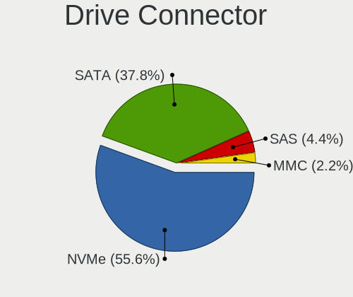
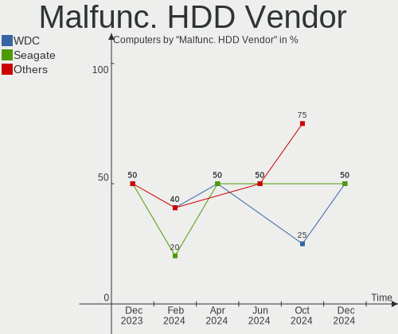
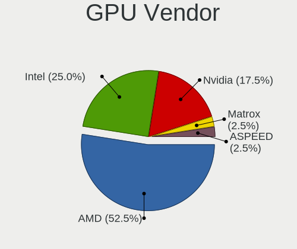
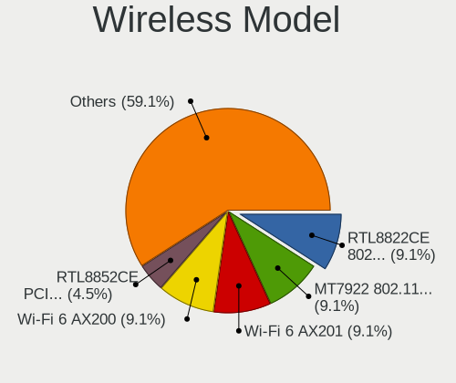
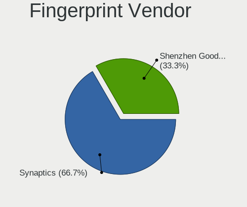

Gentoo - Hardware Trends
------------------------

A project to identify most popular hardware characteristics and track their change
over time based on data collected by Linux users at https://Linux-Hardware.org.

Anyone can contribute to this report by the [hw-probe](https://github.com/linuxhw/hw-probe) tool:

    sudo -E hw-probe -all -upload

This is a report for all computer types. See also reports for [desktops](/Dist/Gentoo/Desktop/README.md) and [notebooks](/Dist/Gentoo/Notebook/README.md).

This report is for one last month. Overall report since the beginning of time: [TestCoverage](https://github.com/linuxhw/TestCoverage)

Period: Dec, 2022.

Contents
--------

* [ System ](#system)
  - [ OS                       ](#os)
  - [ OS Family                ](#os-family)
  - [ Kernel                   ](#kernel)
  - [ Kernel Family            ](#kernel-family)
  - [ Kernel Major Ver.        ](#kernel-major-ver)
  - [ Arch                     ](#arch)
  - [ DE                       ](#de)
  - [ Display Server           ](#display-server)
  - [ Display Manager          ](#display-manager)
  - [ OS Lang                  ](#os-lang)
  - [ Boot Mode                ](#boot-mode)
  - [ Filesystem               ](#filesystem)
  - [ Part. scheme             ](#part-scheme)
  - [ Dual Boot with Linux/BSD ](#dual-boot-with-linuxbsd)
  - [ Dual Boot (Win)          ](#dual-boot-win)

* [ Board ](#board)
  - [ Vendor                   ](#vendor)
  - [ Model                    ](#model)
  - [ Model Family             ](#model-family)
  - [ MFG Year                 ](#mfg-year)
  - [ Form Factor              ](#form-factor)
  - [ Secure Boot              ](#secure-boot)
  - [ Coreboot                 ](#coreboot)
  - [ RAM Size                 ](#ram-size)
  - [ RAM Used                 ](#ram-used)
  - [ Total Drives             ](#total-drives)
  - [ Has CD-ROM               ](#has-cd-rom)
  - [ Has Ethernet             ](#has-ethernet)
  - [ Has WiFi                 ](#has-wifi)
  - [ Has Bluetooth            ](#has-bluetooth)

* [ Location ](#location)
  - [ Country                  ](#country)
  - [ City                     ](#city)

* [ Drives ](#drives)
  - [ Drive Vendor             ](#drive-vendor)
  - [ Drive Model              ](#drive-model)
  - [ HDD Vendor               ](#hdd-vendor)
  - [ SSD Vendor               ](#ssd-vendor)
  - [ Drive Kind               ](#drive-kind)
  - [ Drive Connector          ](#drive-connector)
  - [ Drive Size               ](#drive-size)
  - [ Space Total              ](#space-total)
  - [ Space Used               ](#space-used)
  - [ Malfunc. Drives          ](#malfunc-drives)
  - [ Malfunc. Drive Vendor    ](#malfunc-drive-vendor)
  - [ Malfunc. HDD Vendor      ](#malfunc-hdd-vendor)
  - [ Malfunc. Drive Kind      ](#malfunc-drive-kind)
  - [ Failed Drives            ](#failed-drives)
  - [ Failed Drive Vendor      ](#failed-drive-vendor)
  - [ Drive Status             ](#drive-status)

* [ Storage controller ](#storage-controller)
  - [ Storage Vendor           ](#storage-vendor)
  - [ Storage Model            ](#storage-model)
  - [ Storage Kind             ](#storage-kind)

* [ Processor ](#processor)
  - [ CPU Vendor               ](#cpu-vendor)
  - [ CPU Model                ](#cpu-model)
  - [ CPU Model Family         ](#cpu-model-family)
  - [ CPU Cores                ](#cpu-cores)
  - [ CPU Sockets              ](#cpu-sockets)
  - [ CPU Threads              ](#cpu-threads)
  - [ CPU Op-Modes             ](#cpu-op-modes)
  - [ CPU Microcode            ](#cpu-microcode)
  - [ CPU Microarch            ](#cpu-microarch)

* [ Graphics ](#graphics)
  - [ GPU Vendor               ](#gpu-vendor)
  - [ GPU Model                ](#gpu-model)
  - [ GPU Combo                ](#gpu-combo)
  - [ GPU Driver               ](#gpu-driver)
  - [ GPU Memory               ](#gpu-memory)

* [ Monitor ](#monitor)
  - [ Monitor Vendor           ](#monitor-vendor)
  - [ Monitor Model            ](#monitor-model)
  - [ Monitor Resolution       ](#monitor-resolution)
  - [ Monitor Diagonal         ](#monitor-diagonal)
  - [ Monitor Width            ](#monitor-width)
  - [ Aspect Ratio             ](#aspect-ratio)
  - [ Monitor Area             ](#monitor-area)
  - [ Pixel Density            ](#pixel-density)
  - [ Multiple Monitors        ](#multiple-monitors)

* [ Network ](#network)
  - [ Net Controller Vendor    ](#net-controller-vendor)
  - [ Net Controller Model     ](#net-controller-model)
  - [ Wireless Vendor          ](#wireless-vendor)
  - [ Wireless Model           ](#wireless-model)
  - [ Ethernet Vendor          ](#ethernet-vendor)
  - [ Ethernet Model           ](#ethernet-model)
  - [ Net Controller Kind      ](#net-controller-kind)
  - [ Used Controller          ](#used-controller)
  - [ NICs                     ](#nics)
  - [ IPv6                     ](#ipv6)

* [ Bluetooth ](#bluetooth)
  - [ Bluetooth Vendor         ](#bluetooth-vendor)
  - [ Bluetooth Model          ](#bluetooth-model)

* [ Sound ](#sound)
  - [ Sound Vendor             ](#sound-vendor)
  - [ Sound Model              ](#sound-model)

* [ Memory ](#memory)
  - [ Memory Vendor            ](#memory-vendor)
  - [ Memory Model             ](#memory-model)
  - [ Memory Kind              ](#memory-kind)
  - [ Memory Form Factor       ](#memory-form-factor)
  - [ Memory Size              ](#memory-size)
  - [ Memory Speed             ](#memory-speed)

* [ Printers & scanners ](#printers--scanners)
  - [ Printer Vendor           ](#printer-vendor)
  - [ Printer Model            ](#printer-model)
  - [ Scanner Vendor           ](#scanner-vendor)
  - [ Scanner Model            ](#scanner-model)

* [ Camera ](#camera)
  - [ Camera Vendor            ](#camera-vendor)
  - [ Camera Model             ](#camera-model)

* [ Security ](#security)
  - [ Fingerprint Vendor       ](#fingerprint-vendor)
  - [ Fingerprint Model        ](#fingerprint-model)
  - [ Chipcard Vendor          ](#chipcard-vendor)
  - [ Chipcard Model           ](#chipcard-model)

* [ Unsupported ](#unsupported)
  - [ Unsupported Devices      ](#unsupported-devices)
  - [ Unsupported Device Types ](#unsupported-device-types)

System
------

OS
--

Installed operating systems

| Name       | Computers | Percent |
|------------|-----------|---------|
| Gentoo 2.9 | 57        | 93.44%  |
| Gentoo 2.8 | 4         | 6.56%   |

OS Family
---------

OS without a version

| Name   | Computers | Percent |
|--------|-----------|---------|
| Gentoo | 61        | 100%    |

Kernel
------

Version of the Linux kernel

| Version                            | Computers | Percent |
|------------------------------------|-----------|---------|
| 5.15.80-gentoo-x86_64              | 12        | 19.67%  |
| 5.15.75-gentoo                     | 6         | 9.84%   |
| 5.15.80-gentoo                     | 5         | 8.2%    |
| 6.0.11-gentoo                      | 4         | 6.56%   |
| 5.15.75-gentoo-x86_64              | 4         | 6.56%   |
| 6.1.0-gentoo                       | 2         | 3.28%   |
| 6.0.8                              | 2         | 3.28%   |
| 5.15.77-gentoo-dist                | 2         | 3.28%   |
| 6.1.1-gentoo-dist                  | 1         | 1.64%   |
| 6.1.1-gentoo                       | 1         | 1.64%   |
| 6.1.1                              | 1         | 1.64%   |
| 6.1.0-rc8                          | 1         | 1.64%   |
| 6.1.0-pf1                          | 1         | 1.64%   |
| 6.0.12-gentoo-dist                 | 1         | 1.64%   |
| 6.0.10-gentoo-x86_64               | 1         | 1.64%   |
| 6.0.10-gentoo                      | 1         | 1.64%   |
| 6.0.0-pf5gentoo                    | 1         | 1.64%   |
| 6.0.0-pf5                          | 1         | 1.64%   |
| 5.19.10-xanmod1                    | 1         | 1.64%   |
| 5.19.1-N7700PG                     | 1         | 1.64%   |
| 5.16.7                             | 1         | 1.64%   |
| 5.15.85-gentoo-hardened1           | 1         | 1.64%   |
| 5.15.83-gentoo-dist                | 1         | 1.64%   |
| 5.15.80-gentoo-silverstore         | 1         | 1.64%   |
| 5.15.80-gentoo-NVIDIA_sin_simplefb | 1         | 1.64%   |
| 5.15.75-gentoo-ver_4               | 1         | 1.64%   |
| 5.15.74-gentoo-x86_64              | 1         | 1.64%   |
| 5.15.69-gentoo                     | 1         | 1.64%   |
| 5.15.59-gentoo-debug               | 1         | 1.64%   |
| 5.15.41-gentoo                     | 1         | 1.64%   |
| 5.15.32-v8+                        | 1         | 1.64%   |
| 5.15.23-gentoo                     | 1         | 1.64%   |

Kernel Family
-------------

Linux kernel without a distro release

| Version | Computers | Percent |
|---------|-----------|---------|
| 5.15.80 | 19        | 31.15%  |
| 5.15.75 | 11        | 18.03%  |
| 6.1.0   | 4         | 6.56%   |
| 6.0.11  | 4         | 6.56%   |
| 6.1.1   | 3         | 4.92%   |
| 6.0.8   | 2         | 3.28%   |
| 6.0.10  | 2         | 3.28%   |
| 6.0.0   | 2         | 3.28%   |
| 5.15.77 | 2         | 3.28%   |
| 6.0.12  | 1         | 1.64%   |
| 5.19.10 | 1         | 1.64%   |
| 5.19.1  | 1         | 1.64%   |
| 5.16.7  | 1         | 1.64%   |
| 5.15.85 | 1         | 1.64%   |
| 5.15.83 | 1         | 1.64%   |
| 5.15.74 | 1         | 1.64%   |
| 5.15.69 | 1         | 1.64%   |
| 5.15.59 | 1         | 1.64%   |
| 5.15.41 | 1         | 1.64%   |
| 5.15.32 | 1         | 1.64%   |
| 5.15.23 | 1         | 1.64%   |

Kernel Major Ver.
-----------------

Linux kernel major version

| Version | Computers | Percent |
|---------|-----------|---------|
| 5.15    | 40        | 65.57%  |
| 6.0     | 11        | 18.03%  |
| 6.1     | 7         | 11.48%  |
| 5.19    | 2         | 3.28%   |
| 5.16    | 1         | 1.64%   |

Arch
----

OS architecture (x86_64, i586, etc.)

| Name     | Computers | Percent |
|----------|-----------|---------|
| x86_64   | 59        | 96.72%  |
| armv5tel | 1         | 1.64%   |
| aarch64  | 1         | 1.64%   |

DE
--

Desktop Environment

| Name       | Computers | Percent |
|------------|-----------|---------|
| KDE5       | 18        | 29.51%  |
| Unknown    | 14        | 22.95%  |
| XFCE       | 10        | 16.39%  |
| GNOME      | 6         | 9.84%   |
| MATE       | 4         | 6.56%   |
| dwm        | 2         | 3.28%   |
| X-Cinnamon | 1         | 1.64%   |
| Trinity    | 1         | 1.64%   |
| sway       | 1         | 1.64%   |
| i3         | 1         | 1.64%   |
| Hyprland   | 1         | 1.64%   |
| bspwm      | 1         | 1.64%   |
| awesome    | 1         | 1.64%   |

Display Server
--------------

X11 or Wayland

| Name    | Computers | Percent |
|---------|-----------|---------|
| X11     | 31        | 50.82%  |
| Unknown | 12        | 19.67%  |
| Tty     | 10        | 16.39%  |
| Wayland | 8         | 13.11%  |

Display Manager
---------------

SDDM, LightDM, etc.

| Name    | Computers | Percent |
|---------|-----------|---------|
| SDDM    | 20        | 32.79%  |
| LightDM | 18        | 29.51%  |
| Unknown | 17        | 27.87%  |
| GDM     | 4         | 6.56%   |
| XDM     | 1         | 1.64%   |
| TDM     | 1         | 1.64%   |

OS Lang
-------

Language

| Lang           | Computers | Percent |
|----------------|-----------|---------|
| en_US          | 29        | 47.54%  |
| C.UTF8         | 5         | 8.2%    |
| Unknown        | 3         | 4.92%   |
| ru_RU          | 2         | 3.28%   |
| pl_PL          | 2         | 3.28%   |
| it_IT          | 2         | 3.28%   |
| fr_FR          | 2         | 3.28%   |
| es_ES          | 2         | 3.28%   |
| en_GB          | 2         | 3.28%   |
| en_CA          | 2         | 3.28%   |
| C              | 2         | 3.28%   |
| zh_CN          | 1         | 1.64%   |
| pt_PT          | 1         | 1.64%   |
| mi_NZ          | 1         | 1.64%   |
| en_GB.iso88591 | 1         | 1.64%   |
| en_AU          | 1         | 1.64%   |
| de_DE          | 1         | 1.64%   |
| cs_CZ          | 1         | 1.64%   |
| bg_BG          | 1         | 1.64%   |

Boot Mode
---------

EFI or BIOS

| Mode | Computers | Percent |
|------|-----------|---------|
| EFI  | 43        | 70.49%  |
| BIOS | 18        | 29.51%  |

Filesystem
----------

Type of filesystem

| Type     | Computers | Percent |
|----------|-----------|---------|
| Ext4     | 35        | 57.38%  |
| Btrfs    | 14        | 22.95%  |
| Reiserfs | 4         | 6.56%   |
| F2fs     | 3         | 4.92%   |
| XXXXXXX  | 2         | 3.28%   |
| Xfs      | 2         | 3.28%   |
| Zfs      | 1         | 1.64%   |

Part. scheme
------------

Scheme of partitioning

| Type | Computers | Percent |
|------|-----------|---------|
| GPT  | 54        | 88.52%  |
| MBR  | 7         | 11.48%  |

Dual Boot with Linux/BSD
------------------------

Hosting more than one Linux/BSD

| Dual boot | Computers | Percent |
|-----------|-----------|---------|
| No        | 39        | 63.93%  |
| Yes       | 22        | 36.07%  |

Dual Boot (Win)
---------------

Hosting Linux and Windows

| Dual boot | Computers | Percent |
|-----------|-----------|---------|
| No        | 36        | 59.02%  |
| Yes       | 25        | 40.98%  |

Board
-----

Vendor
------

Motherboard manufacturer

| Name                    | Computers | Percent |
|-------------------------|-----------|---------|
| Hewlett-Packard         | 11        | 18.03%  |
| Dell                    | 8         | 13.11%  |
| ASUSTek Computer        | 8         | 13.11%  |
| Lenovo                  | 7         | 11.48%  |
| Gigabyte Technology     | 7         | 11.48%  |
| Supermicro              | 4         | 6.56%   |
| MSI                     | 3         | 4.92%   |
| Acer                    | 2         | 3.28%   |
| Unknown                 | 2         | 3.28%   |
| Toshiba                 | 1         | 1.64%   |
| Star Labs               | 1         | 1.64%   |
| Samsung Electronics     | 1         | 1.64%   |
| Raspberry Pi Foundation | 1         | 1.64%   |
| Phoenix                 | 1         | 1.64%   |
| Pegatron                | 1         | 1.64%   |
| HUAWEI                  | 1         | 1.64%   |
| Google                  | 1         | 1.64%   |
| ASRock                  | 1         | 1.64%   |

Model
-----

Motherboard model

| Name                                        | Computers | Percent |
|---------------------------------------------|-----------|---------|
| Supermicro Super Server                     | 2         | 3.28%   |
| MSI MS-7C37                                 | 2         | 3.28%   |
| Gigabyte Z370P D3                           | 2         | 3.28%   |
| Unknown                                     | 2         | 3.28%   |
| Toshiba Satellite L50-B                     | 1         | 1.64%   |
| Supermicro X10SL7-F                         | 1         | 1.64%   |
| Supermicro SSG-6028R-E1CR24L                | 1         | 1.64%   |
| Star Labs StarLite                          | 1         | 1.64%   |
| Samsung 950QED                              | 1         | 1.64%   |
| RPi Raspberry Pi                            | 1         | 1.64%   |
| Phoenix 945GM                               | 1         | 1.64%   |
| Pegatron p7-1219                            | 1         | 1.64%   |
| MSI MS-7375                                 | 1         | 1.64%   |
| Lenovo ThinkPad X1 Carbon Gen 10 21CCS8QS00 | 1         | 1.64%   |
| Lenovo ThinkPad W540 20BG0033RT             | 1         | 1.64%   |
| Lenovo ThinkPad T470p 20J7S25C00            | 1         | 1.64%   |
| Lenovo ThinkPad T16 Gen 1 21CHCTO1WW        | 1         | 1.64%   |
| Lenovo Legion Y540-15IRH-PG0 81SY           | 1         | 1.64%   |
| Lenovo Legion 5 Pro 16IAH7H 82RF            | 1         | 1.64%   |
| Lenovo IdeaPad Gaming 3 15ACH6 82K2         | 1         | 1.64%   |
| HUAWEI NBLB-WAX9N                           | 1         | 1.64%   |
| HP Z640 Workstation                         | 1         | 1.64%   |
| HP Z400 Workstation                         | 1         | 1.64%   |
| HP ProLiant DL360p Gen8                     | 1         | 1.64%   |
| HP ProBook 6570b                            | 1         | 1.64%   |
| HP Pavilion Laptop 15-cs0xxx                | 1         | 1.64%   |
| HP Pavilion Aero Laptop 13-be0xxx           | 1         | 1.64%   |
| HP G62                                      | 1         | 1.64%   |
| HP EliteDesk 705 G4 DM 35W (TAA)            | 1         | 1.64%   |
| HP EliteBook 820 G3                         | 1         | 1.64%   |
| HP Compaq dc7100 USDT(DX877AV)              | 1         | 1.64%   |
| HP 250 G7 Notebook PC                       | 1         | 1.64%   |
| Google Eve                                  | 1         | 1.64%   |
| Gigabyte B650M DS3H                         | 1         | 1.64%   |
| Gigabyte B650 AORUS PRO AX                  | 1         | 1.64%   |
| Gigabyte B550M DS3H                         | 1         | 1.64%   |
| Gigabyte B550M AORUS ELITE                  | 1         | 1.64%   |
| Gigabyte AB350-Gaming                       | 1         | 1.64%   |
| Dell Vostro 5490                            | 1         | 1.64%   |
| Dell Precision 7720                         | 1         | 1.64%   |

Model Family
------------

Motherboard model prefix

| Name                         | Computers | Percent |
|------------------------------|-----------|---------|
| Lenovo ThinkPad              | 4         | 6.56%   |
| Dell Inspiron                | 3         | 4.92%   |
| ASUS PRIME                   | 3         | 4.92%   |
| Supermicro Super             | 2         | 3.28%   |
| MSI MS-7C37                  | 2         | 3.28%   |
| Lenovo Legion                | 2         | 3.28%   |
| HP Pavilion                  | 2         | 3.28%   |
| Gigabyte Z370P               | 2         | 3.28%   |
| Gigabyte B550M               | 2         | 3.28%   |
| Acer Predator                | 2         | 3.28%   |
| Unknown                      | 2         | 3.28%   |
| Toshiba Satellite            | 1         | 1.64%   |
| Supermicro X10SL7-F          | 1         | 1.64%   |
| Supermicro SSG-6028R-E1CR24L | 1         | 1.64%   |
| Star Labs StarLite           | 1         | 1.64%   |
| Samsung 950QED               | 1         | 1.64%   |
| RPi Raspberry                | 1         | 1.64%   |
| Phoenix 945GM                | 1         | 1.64%   |
| Pegatron p7-1219             | 1         | 1.64%   |
| MSI MS-7375                  | 1         | 1.64%   |
| Lenovo IdeaPad               | 1         | 1.64%   |
| HUAWEI NBLB-WAX9N            | 1         | 1.64%   |
| HP Z640                      | 1         | 1.64%   |
| HP Z400                      | 1         | 1.64%   |
| HP ProLiant                  | 1         | 1.64%   |
| HP ProBook                   | 1         | 1.64%   |
| HP G62                       | 1         | 1.64%   |
| HP EliteDesk                 | 1         | 1.64%   |
| HP EliteBook                 | 1         | 1.64%   |
| HP Compaq                    | 1         | 1.64%   |
| HP 250                       | 1         | 1.64%   |
| Google Eve                   | 1         | 1.64%   |
| Gigabyte B650M               | 1         | 1.64%   |
| Gigabyte B650                | 1         | 1.64%   |
| Gigabyte AB350-Gaming        | 1         | 1.64%   |
| Dell Vostro                  | 1         | 1.64%   |
| Dell Precision               | 1         | 1.64%   |
| Dell OptiPlex                | 1         | 1.64%   |
| Dell G5                      | 1         | 1.64%   |
| Dell G3                      | 1         | 1.64%   |

MFG Year
--------

Motherboard manufacture year

| Year    | Computers | Percent |
|---------|-----------|---------|
| 2019    | 9         | 14.75%  |
| 2022    | 8         | 13.11%  |
| 2020    | 8         | 13.11%  |
| 2017    | 7         | 11.48%  |
| 2021    | 5         | 8.2%    |
| 2018    | 5         | 8.2%    |
| 2015    | 3         | 4.92%   |
| 2011    | 3         | 4.92%   |
| 2010    | 3         | 4.92%   |
| 2014    | 2         | 3.28%   |
| 2012    | 2         | 3.28%   |
| Unknown | 2         | 3.28%   |
| 2013    | 1         | 1.64%   |
| 2009    | 1         | 1.64%   |
| 2008    | 1         | 1.64%   |
| 2004    | 1         | 1.64%   |

Form Factor
-----------

Physical design of the computer

| Name           | Computers | Percent |
|----------------|-----------|---------|
| Desktop        | 27        | 44.26%  |
| Notebook       | 27        | 44.26%  |
| Server         | 4         | 6.56%   |
| System on chip | 1         | 1.64%   |
| Convertible    | 1         | 1.64%   |
| All in one     | 1         | 1.64%   |

Secure Boot
-----------

Enabled or disabled

| State    | Computers | Percent |
|----------|-----------|---------|
| Disabled | 60        | 98.36%  |
| Enabled  | 1         | 1.64%   |

Coreboot
--------

Have coreboot on board

| Used | Computers | Percent |
|------|-----------|---------|
| No   | 60        | 98.36%  |
| Yes  | 1         | 1.64%   |

RAM Size
--------

Total RAM memory

| Size in GB  | Computers | Percent |
|-------------|-----------|---------|
| 32.01-64.0  | 12        | 19.67%  |
| 16.01-24.0  | 12        | 19.67%  |
| 4.01-8.0    | 10        | 16.39%  |
| 64.01-256.0 | 7         | 11.48%  |
| 3.01-4.0    | 6         | 9.84%   |
| 8.01-16.0   | 6         | 9.84%   |
| 24.01-32.0  | 5         | 8.2%    |
| 1.01-2.0    | 2         | 3.28%   |
| 0.01-0.5    | 1         | 1.64%   |

RAM Used
--------

Used RAM memory

| Used GB    | Computers | Percent |
|------------|-----------|---------|
| 0.51-1.0   | 12        | 19.67%  |
| 1.01-2.0   | 10        | 16.39%  |
| 4.01-8.0   | 9         | 14.75%  |
| 0.01-0.5   | 8         | 13.11%  |
| 2.01-3.0   | 7         | 11.48%  |
| 3.01-4.0   | 6         | 9.84%   |
| 16.01-24.0 | 4         | 6.56%   |
| 8.01-16.0  | 3         | 4.92%   |
| 32.01-64.0 | 1         | 1.64%   |
| 0          | 1         | 1.64%   |

Total Drives
------------

Number of drives on board

| Drives | Computers | Percent |
|--------|-----------|---------|
| 1      | 24        | 39.34%  |
| 2      | 15        | 24.59%  |
| 3      | 9         | 14.75%  |
| 4      | 4         | 6.56%   |
| 8      | 3         | 4.92%   |
| 6      | 2         | 3.28%   |
| 21     | 1         | 1.64%   |
| 9      | 1         | 1.64%   |
| 7      | 1         | 1.64%   |
| 5      | 1         | 1.64%   |

Has CD-ROM
----------

Has CD-ROM on board

| Presented | Computers | Percent |
|-----------|-----------|---------|
| No        | 51        | 83.61%  |
| Yes       | 10        | 16.39%  |

Has Ethernet
------------

Has Ethernet on board

| Presented | Computers | Percent |
|-----------|-----------|---------|
| Yes       | 52        | 85.25%  |
| No        | 9         | 14.75%  |

Has WiFi
--------

Has WiFi module

| Presented | Computers | Percent |
|-----------|-----------|---------|
| Yes       | 39        | 63.93%  |
| No        | 22        | 36.07%  |

Has Bluetooth
-------------

Has Bluetooth module

| Presented | Computers | Percent |
|-----------|-----------|---------|
| Yes       | 37        | 60.66%  |
| No        | 24        | 39.34%  |

Location
--------

Country
-------

Geographic location (country)

| Country     | Computers | Percent |
|-------------|-----------|---------|
| USA         | 20        | 32.79%  |
| Russia      | 7         | 11.48%  |
| Poland      | 3         | 4.92%   |
| France      | 3         | 4.92%   |
| Canada      | 3         | 4.92%   |
| UK          | 2         | 3.28%   |
| Spain       | 2         | 3.28%   |
| Italy       | 2         | 3.28%   |
| Germany     | 2         | 3.28%   |
| China       | 2         | 3.28%   |
| Australia   | 2         | 3.28%   |
| Portugal    | 1         | 1.64%   |
| Norway      | 1         | 1.64%   |
| New Zealand | 1         | 1.64%   |
| Netherlands | 1         | 1.64%   |
| Nepal       | 1         | 1.64%   |
| Malaysia    | 1         | 1.64%   |
| Lithuania   | 1         | 1.64%   |
| India       | 1         | 1.64%   |
| Georgia     | 1         | 1.64%   |
| Czechia     | 1         | 1.64%   |
| Cyprus      | 1         | 1.64%   |
| Croatia     | 1         | 1.64%   |
| Bulgaria    | 1         | 1.64%   |

City
----

Geographic location (city)

| City          | Computers | Percent |
|---------------|-----------|---------|
| Warsaw        | 3         | 4.92%   |
| Saskatoon     | 3         | 4.92%   |
| Pittsburgh    | 3         | 4.92%   |
| Zarech'ye     | 2         | 3.28%   |
| Sydney        | 2         | 3.28%   |
| Moscow        | 2         | 3.28%   |
| Igualada      | 2         | 3.28%   |
| Zagreb        | 1         | 1.64%   |
| Yekaterinburg | 1         | 1.64%   |
| West Orange   | 1         | 1.64%   |
| Trondheim     | 1         | 1.64%   |
| Thurmont      | 1         | 1.64%   |
| Tbilisi       | 1         | 1.64%   |
| Taganrog      | 1         | 1.64%   |
| Sofia         | 1         | 1.64%   |
| Seattle       | 1         | 1.64%   |
| San Antonio   | 1         | 1.64%   |
| San Angelo    | 1         | 1.64%   |
| Ruhland       | 1         | 1.64%   |
| Purmerend     | 1         | 1.64%   |
| Porto         | 1         | 1.64%   |
| Pokhara       | 1         | 1.64%   |
| Parrish       | 1         | 1.64%   |
| Paris         | 1         | 1.64%   |
| Oviedo        | 1         | 1.64%   |
| Norristown    | 1         | 1.64%   |
| Nicosia       | 1         | 1.64%   |
| New York      | 1         | 1.64%   |
| Neuss         | 1         | 1.64%   |
| Nantes        | 1         | 1.64%   |
| Milton        | 1         | 1.64%   |
| Milan         | 1         | 1.64%   |
| Marseille     | 1         | 1.64%   |
| Livermore     | 1         | 1.64%   |
| Kolkata       | 1         | 1.64%   |
| Klaipėda     | 1         | 1.64%   |
| Ipoh          | 1         | 1.64%   |
| Huddersfield  | 1         | 1.64%   |
| Hangzhou      | 1         | 1.64%   |
| Guanzate      | 1         | 1.64%   |

Drives
------

Drive Vendor
------------

Hard drive vendors

| Vendor                      | Computers | Drives | Percent |
|-----------------------------|-----------|--------|---------|
| Samsung Electronics         | 24        | 36     | 21.43%  |
| WDC                         | 17        | 41     | 15.18%  |
| Seagate                     | 14        | 17     | 12.5%   |
| Sandisk                     | 8         | 9      | 7.14%   |
| Toshiba                     | 7         | 18     | 6.25%   |
| Intel                       | 5         | 5      | 4.46%   |
| Hitachi                     | 4         | 10     | 3.57%   |
| Crucial                     | 4         | 4      | 3.57%   |
| Unknown                     | 3         | 3      | 2.68%   |
| Kingston                    | 3         | 5      | 2.68%   |
| Phison Electronics          | 2         | 2      | 1.79%   |
| HGST                        | 2         | 3      | 1.79%   |
| GOODRAM                     | 2         | 2      | 1.79%   |
| A-DATA Technology           | 2         | 2      | 1.79%   |
| Star                        | 1         | 1      | 0.89%   |
| SK hynix                    | 1         | 1      | 0.89%   |
| Silicon Motion              | 1         | 1      | 0.89%   |
| Realtek Semiconductor       | 1         | 1      | 0.89%   |
| Patriot                     | 1         | 1      | 0.89%   |
| OCZ                         | 1         | 1      | 0.89%   |
| Micron/Crucial Technology   | 1         | 1      | 0.89%   |
| Micron Technology           | 1         | 1      | 0.89%   |
| Kingston Technology Company | 1         | 1      | 0.89%   |
| HGST HTS                    | 1         | 1      | 0.89%   |
| Dogfish                     | 1         | 1      | 0.89%   |
| China                       | 1         | 1      | 0.89%   |
| Apacer                      | 1         | 1      | 0.89%   |
| AFAYA                       | 1         | 1      | 0.89%   |
| Unknown                     | 1         | 1      | 0.89%   |

Drive Model
-----------

Hard drive models

| Model                                               | Computers | Percent |
|-----------------------------------------------------|-----------|---------|
| Samsung NVMe SSD Controller SM981/PM981/PM983 500GB | 9         | 6.82%   |
| Samsung NVMe SSD Controller PM9A1/PM9A3/980PRO 2TB  | 7         | 5.3%    |
| WDC WD30EFRX-68EUZN0 3TB                            | 3         | 2.27%   |
| Seagate ST2000DM008-2FR102 2TB                      | 3         | 2.27%   |
| WDC WD10EZEX-08WN4A0 1TB                            | 2         | 1.52%   |
| Unknown MMC Card  128GB                             | 2         | 1.52%   |
| Seagate ST1000LM049-2GH172 1TB                      | 2         | 1.52%   |
| Samsung SSD 860 EVO 500GB                           | 2         | 1.52%   |
| Samsung SSD 860 EVO 250GB                           | 2         | 1.52%   |
| GOODRAM SSDPR-CL100-480-G2 480GB                    | 2         | 1.52%   |
| WDC WDS500G2B0A-00SM50 500GB SSD                    | 1         | 0.76%   |
| WDC WDS200T2B0B-00YS70 2TB SSD                      | 1         | 0.76%   |
| WDC WDS100T2B0A-00SM50 1TB SSD                      | 1         | 0.76%   |
| WDC WD6400AAKS-65A7B0 640GB                         | 1         | 0.76%   |
| WDC WD6400AAKS-40H2B0 640GB                         | 1         | 0.76%   |
| WDC WD60EFZX-68B3FN0 6TB                            | 1         | 0.76%   |
| WDC WD60EFAX-68SHWN0 6TB                            | 1         | 0.76%   |
| WDC WD6003FZBX-00K5WB0 6TB                          | 1         | 0.76%   |
| WDC WD5000BEVT-22ZAT0 500GB                         | 1         | 0.76%   |
| WDC WD5000AZLX-22JKKA0 500GB                        | 1         | 0.76%   |
| WDC WD5000AAKX-60U6AA0 500GB                        | 1         | 0.76%   |
| WDC WD5000AADS-00S9B0 500GB                         | 1         | 0.76%   |
| WDC WD40EZAZ-00SF3B0 4TB                            | 1         | 0.76%   |
| WDC WD40EFRX-68N32N0 4TB                            | 1         | 0.76%   |
| WDC WD30EZRX-00D8PB0 3TB                            | 1         | 0.76%   |
| WDC WD30EFRX-68AX9N0 3TB                            | 1         | 0.76%   |
| WDC WD2500AAKS-00F0A0 250GB                         | 1         | 0.76%   |
| WDC WD20EZAZ-00L9GB0 2TB                            | 1         | 0.76%   |
| WDC WD20EFRX-68EUZN0 2TB                            | 1         | 0.76%   |
| WDC WD20EFRX-68AX9N0 2TB                            | 1         | 0.76%   |
| WDC WD2002FAEX-007BA0 2TB                           | 1         | 0.76%   |
| WDC WD10EFRX-68PJCN0 1TB                            | 1         | 0.76%   |
| WDC WD10EADS-22M2B0 1TB                             | 1         | 0.76%   |
| WDC WD1002FAEX-00Y9A0 1TB                           | 1         | 0.76%   |
| WDC WD Blue SA510 2.5 500GB                         | 1         | 0.76%   |
| Unknown MMC Card  32GB                              | 1         | 0.76%   |
| Toshiba MQ04ABF100 1TB                              | 1         | 0.76%   |
| Toshiba MQ02ABD100H 1TB                             | 1         | 0.76%   |
| Toshiba MQ01ABF050 500GB                            | 1         | 0.76%   |
| Toshiba HDWL120 2TB                                 | 1         | 0.76%   |

HDD Vendor
----------

Hard disk drive vendors

| Vendor   | Computers | Drives | Percent |
|----------|-----------|--------|---------|
| WDC      | 16        | 36     | 36.36%  |
| Seagate  | 14        | 17     | 31.82%  |
| Toshiba  | 6         | 17     | 13.64%  |
| Hitachi  | 4         | 10     | 9.09%   |
| HGST     | 2         | 3      | 4.55%   |
| HGST HTS | 1         | 1      | 2.27%   |
| AFAYA    | 1         | 1      | 2.27%   |

SSD Vendor
----------

Solid state drive vendors

| Vendor              | Computers | Drives | Percent |
|---------------------|-----------|--------|---------|
| Samsung Electronics | 9         | 11     | 25.71%  |
| WDC                 | 4         | 5      | 11.43%  |
| Crucial             | 4         | 4      | 11.43%  |
| Kingston            | 3         | 5      | 8.57%   |
| SanDisk             | 2         | 3      | 5.71%   |
| GOODRAM             | 2         | 2      | 5.71%   |
| A-DATA Technology   | 2         | 2      | 5.71%   |
| Star                | 1         | 1      | 2.86%   |
| Patriot             | 1         | 1      | 2.86%   |
| OCZ                 | 1         | 1      | 2.86%   |
| Micron Technology   | 1         | 1      | 2.86%   |
| Intel               | 1         | 1      | 2.86%   |
| Dogfish             | 1         | 1      | 2.86%   |
| China               | 1         | 1      | 2.86%   |
| Apacer              | 1         | 1      | 2.86%   |
| Unknown             | 1         | 1      | 2.86%   |

Drive Kind
----------

HDD or SSD

| Kind | Computers | Drives | Percent |
|------|-----------|--------|---------|
| HDD  | 35        | 85     | 35%     |
| NVMe | 33        | 43     | 33%     |
| SSD  | 29        | 41     | 29%     |
| MMC  | 3         | 3      | 3%      |

Drive Connector
---------------

SATA, SAS, NVMe, etc.

| Type | Computers | Drives | Percent |
|------|-----------|--------|---------|
| SATA | 45        | 125    | 54.88%  |
| NVMe | 33        | 43     | 40.24%  |
| MMC  | 3         | 3      | 3.66%   |
| SAS  | 1         | 1      | 1.22%   |

Drive Size
----------

Size of hard drive

| Size in TB | Computers | Drives | Percent |
|------------|-----------|--------|---------|
| 0.01-0.5   | 27        | 45     | 38.03%  |
| 0.51-1.0   | 18        | 24     | 25.35%  |
| 1.01-2.0   | 10        | 27     | 14.08%  |
| 2.01-3.0   | 7         | 18     | 9.86%   |
| 3.01-4.0   | 4         | 6      | 5.63%   |
| 4.01-10.0  | 4         | 5      | 5.63%   |
| 10.01-20.0 | 1         | 1      | 1.41%   |

Space Total
-----------

Amount of disk space available on the file system

| Size in GB     | Computers | Percent |
|----------------|-----------|---------|
| 101-250        | 13        | 21.31%  |
| 501-1000       | 11        | 18.03%  |
| More than 3000 | 9         | 14.75%  |
| 1001-2000      | 9         | 14.75%  |
| 251-500        | 8         | 13.11%  |
| 2001-3000      | 4         | 6.56%   |
| Unknown        | 3         | 4.92%   |
| 1-20           | 2         | 3.28%   |
| 51-100         | 2         | 3.28%   |

Space Used
----------

Amount of used disk space

| Used GB        | Computers | Percent |
|----------------|-----------|---------|
| 21-50          | 12        | 19.67%  |
| 1-20           | 12        | 19.67%  |
| 501-1000       | 7         | 11.48%  |
| More than 3000 | 6         | 9.84%   |
| 251-500        | 6         | 9.84%   |
| 101-250        | 5         | 8.2%    |
| 1001-2000      | 5         | 8.2%    |
| 51-100         | 4         | 6.56%   |
| Unknown        | 3         | 4.92%   |
| 2001-3000      | 1         | 1.64%   |

Malfunc. Drives
---------------

Drive models with a malfunction

| Model                                                           | Computers | Drives | Percent |
|-----------------------------------------------------------------|-----------|--------|---------|
| WDC WD6400AAKS-65A7B0 640GB                                     | 1         | 1      | 7.14%   |
| WDC WD60EFAX-68SHWN0 6TB                                        | 1         | 1      | 7.14%   |
| WDC WD5000BEVT-22ZAT0 500GB                                     | 1         | 1      | 7.14%   |
| WDC WD30EFRX-68EUZN0 3TB                                        | 1         | 1      | 7.14%   |
| WDC WD30EFRX-68AX9N0 3TB                                        | 1         | 1      | 7.14%   |
| WDC WD20EFRX-68EUZN0 2TB                                        | 1         | 2      | 7.14%   |
| WDC WD10EFRX-68PJCN0 1TB                                        | 1         | 1      | 7.14%   |
| WDC WD10EADS-22M2B0 1TB                                         | 1         | 1      | 7.14%   |
| Toshiba MQ02ABD100H 1TB                                         | 1         | 1      | 7.14%   |
| SK hynix BC501 NVMe Solid State Drive 512GB                     | 1         | 1      | 7.14%   |
| Seagate ST1000LM049-2GH172 1TB                                  | 1         | 1      | 7.14%   |
| Samsung Electronics NVMe SSD Controller SM981/PM981/PM983 500GB | 1         | 2      | 7.14%   |
| Hitachi HTS725050A9A364 500GB                                   | 1         | 1      | 7.14%   |
| HGST HTS 541075A9E680 752GB                                     | 1         | 1      | 7.14%   |

Malfunc. Drive Vendor
---------------------

Vendors of faulty drives

| Vendor              | Computers | Drives | Percent |
|---------------------|-----------|--------|---------|
| WDC                 | 6         | 9      | 50%     |
| Toshiba             | 1         | 1      | 8.33%   |
| SK hynix            | 1         | 1      | 8.33%   |
| Seagate             | 1         | 1      | 8.33%   |
| Samsung Electronics | 1         | 2      | 8.33%   |
| Hitachi             | 1         | 1      | 8.33%   |
| HGST HTS            | 1         | 1      | 8.33%   |

Malfunc. HDD Vendor
-------------------

Vendors of faulty HDD drives

| Vendor   | Computers | Drives | Percent |
|----------|-----------|--------|---------|
| WDC      | 6         | 9      | 60%     |
| Toshiba  | 1         | 1      | 10%     |
| Seagate  | 1         | 1      | 10%     |
| Hitachi  | 1         | 1      | 10%     |
| HGST HTS | 1         | 1      | 10%     |

Malfunc. Drive Kind
-------------------

Kinds of faulty drives

| Kind | Computers | Drives | Percent |
|------|-----------|--------|---------|
| HDD  | 10        | 13     | 83.33%  |
| NVMe | 2         | 3      | 16.67%  |

Failed Drives
-------------

Failed drive models

Zero info for selected period =(

Failed Drive Vendor
-------------------

Failed drive vendors

Zero info for selected period =(

Drive Status
------------

Number of failed and malfunc. drives

| Status   | Computers | Drives | Percent |
|----------|-----------|--------|---------|
| Works    | 56        | 152    | 80%     |
| Malfunc  | 10        | 16     | 14.29%  |
| Detected | 4         | 4      | 5.71%   |

Storage controller
------------------

Storage Vendor
--------------

Storage controller vendors

| Vendor                       | Computers | Percent |
|------------------------------|-----------|---------|
| Intel                        | 34        | 35.42%  |
| AMD                          | 19        | 19.79%  |
| Samsung Electronics          | 18        | 18.75%  |
| Sandisk                      | 6         | 6.25%   |
| ASMedia Technology           | 3         | 3.13%   |
| Phison Electronics           | 2         | 2.08%   |
| JMicron Technology           | 2         | 2.08%   |
| Broadcom / LSI               | 2         | 2.08%   |
| Toshiba America Info Systems | 1         | 1.04%   |
| SK hynix                     | 1         | 1.04%   |
| Silicon Motion               | 1         | 1.04%   |
| Silicon Image                | 1         | 1.04%   |
| Realtek Semiconductor        | 1         | 1.04%   |
| Nvidia                       | 1         | 1.04%   |
| Micron/Crucial Technology    | 1         | 1.04%   |
| Marvell Technology Group     | 1         | 1.04%   |
| Kingston Technology Company  | 1         | 1.04%   |
| Hewlett-Packard              | 1         | 1.04%   |

Storage Model
-------------

Storage controller models

| Model                                                                          | Computers | Percent |
|--------------------------------------------------------------------------------|-----------|---------|
| AMD FCH SATA Controller [AHCI mode]                                            | 10        | 8.77%   |
| Samsung NVMe SSD Controller SM981/PM981/PM983                                  | 9         | 7.89%   |
| Samsung NVMe SSD Controller PM9A1/PM9A3/980PRO                                 | 7         | 6.14%   |
| Intel C610/X99 series chipset sSATA Controller [AHCI mode]                     | 3         | 2.63%   |
| AMD SATA controller                                                            | 3         | 2.63%   |
| AMD 300 Series Chipset SATA Controller                                         | 3         | 2.63%   |
| Samsung NVMe SSD Controller 980                                                | 2         | 1.75%   |
| Intel Sunrise Point-LP SATA Controller [AHCI mode]                             | 2         | 1.75%   |
| Intel Non-Volatile memory controller                                           | 2         | 1.75%   |
| Intel Comet Lake SATA AHCI Controller                                          | 2         | 1.75%   |
| Intel Cannon Lake Mobile PCH SATA AHCI Controller                              | 2         | 1.75%   |
| Intel C610/X99 series chipset 6-Port SATA Controller [AHCI mode]               | 2         | 1.75%   |
| Intel 82801 Mobile SATA Controller [RAID mode]                                 | 2         | 1.75%   |
| Intel 8 Series/C220 Series Chipset Family 6-port SATA Controller 1 [AHCI mode] | 2         | 1.75%   |
| Intel 7 Series Chipset Family 6-port SATA Controller [AHCI mode]               | 2         | 1.75%   |
| Intel 6 Series/C200 Series Chipset Family 6 port Desktop SATA AHCI Controller  | 2         | 1.75%   |
| Intel 400 Series Chipset Family SATA AHCI Controller                           | 2         | 1.75%   |
| Intel 200 Series PCH SATA controller [AHCI mode]                               | 2         | 1.75%   |
| ASMedia ASM1062 Serial ATA Controller                                          | 2         | 1.75%   |
| AMD SB7x0/SB8x0/SB9x0 SATA Controller [AHCI mode]                              | 2         | 1.75%   |
| AMD 500 Series Chipset SATA Controller                                         | 2         | 1.75%   |
| AMD 400 Series Chipset SATA Controller                                         | 2         | 1.75%   |
| Toshiba America Info Systems BG3 NVMe SSD Controller                           | 1         | 0.88%   |
| SK hynix BC501 NVMe Solid State Drive                                          | 1         | 0.88%   |
| Silicon Motion SM2263EN/SM2263XT SSD Controller                                | 1         | 0.88%   |
| Silicon Image SiI 3132 Serial ATA Raid II Controller                           | 1         | 0.88%   |
| SanDisk WD PC SN810 / Black SN850 NVMe SSD                                     | 1         | 0.88%   |
| SanDisk WD Blue SN550 NVMe SSD                                                 | 1         | 0.88%   |
| SanDisk WD Blue SN500 / PC SN520 NVMe SSD                                      | 1         | 0.88%   |
| SanDisk WD Black SN750 / PC SN730 NVMe SSD                                     | 1         | 0.88%   |
| SanDisk PC SN520 NVMe SSD                                                      | 1         | 0.88%   |
| Sandisk Non-Volatile memory controller                                         | 1         | 0.88%   |
| Samsung NVMe SSD Controller SM961/PM961/SM963                                  | 1         | 0.88%   |
| Samsung NVMe SSD Controller SM951/PM951                                        | 1         | 0.88%   |
| Realtek RTS5763DL NVMe SSD Controller                                          | 1         | 0.88%   |
| Phison PS5013 E13 NVMe Controller                                              | 1         | 0.88%   |
| Phison E12 NVMe Controller                                                     | 1         | 0.88%   |
| Nvidia MCP78S [GeForce 8200] SATA Controller (non-AHCI mode)                   | 1         | 0.88%   |
| Nvidia MCP78S [GeForce 8200] IDE                                               | 1         | 0.88%   |
| Micron/Crucial P2 NVMe PCIe SSD                                                | 1         | 0.88%   |

Storage Kind
------------

Kind of storage controller (IDE, SATA, NVMe, SAS, ...)

| Kind | Computers | Percent |
|------|-----------|---------|
| SATA | 47        | 49.47%  |
| NVMe | 33        | 34.74%  |
| RAID | 7         | 7.37%   |
| IDE  | 6         | 6.32%   |
| SAS  | 2         | 2.11%   |

Processor
---------

CPU Vendor
----------

Processor vendors

| Vendor                | Computers | Percent |
|-----------------------|-----------|---------|
| Intel                 | 36        | 59.02%  |
| AMD                   | 23        | 37.7%   |
| Marvell Semiconductor | 1         | 1.64%   |
| ARM                   | 1         | 1.64%   |

CPU Model
---------

Processor models

| Model                                                                    | Computers | Percent |
|--------------------------------------------------------------------------|-----------|---------|
| AMD Ryzen 7 5800X 8-Core Processor                                       | 3         | 4.92%   |
| AMD Ryzen 7 7700X 8-Core Processor                                       | 2         | 3.28%   |
| Marvell Semiconductor Marvell Kirkwood (Flattened Device Tree) Processor | 1         | 1.64%   |
| Intel Xeon CPU W3680 @ 3.33GHz                                           | 1         | 1.64%   |
| Intel Xeon CPU E5-2650L v4 @ 1.70GHz                                     | 1         | 1.64%   |
| Intel Xeon CPU E5-2650 v2 @ 2.60GHz                                      | 1         | 1.64%   |
| Intel Xeon CPU E5-2620 v3 @ 2.40GHz                                      | 1         | 1.64%   |
| Intel Xeon CPU E5-1650 v3 @ 3.50GHz                                      | 1         | 1.64%   |
| Intel Xeon CPU E3-1230L v3 @ 1.80GHz                                     | 1         | 1.64%   |
| Intel Pentium Silver N5030 CPU @ 1.10GHz                                 | 1         | 1.64%   |
| Intel Pentium CPU G630 @ 2.70GHz                                         | 1         | 1.64%   |
| Intel Pentium 4 CPU 2.80GHz                                              | 1         | 1.64%   |
| Intel Core i7-9750H CPU @ 2.60GHz                                        | 1         | 1.64%   |
| Intel Core i7-8750H CPU @ 2.20GHz                                        | 1         | 1.64%   |
| Intel Core i7-8700K CPU @ 3.70GHz                                        | 1         | 1.64%   |
| Intel Core i7-8550U CPU @ 1.80GHz                                        | 1         | 1.64%   |
| Intel Core i7-7920HQ CPU @ 3.10GHz                                       | 1         | 1.64%   |
| Intel Core i7-7820HQ CPU @ 2.90GHz                                       | 1         | 1.64%   |
| Intel Core i7-6600U CPU @ 2.60GHz                                        | 1         | 1.64%   |
| Intel Core i7-4700MQ CPU @ 2.40GHz                                       | 1         | 1.64%   |
| Intel Core i7-2670QM CPU @ 2.20GHz                                       | 1         | 1.64%   |
| Intel Core i7-2600K CPU @ 3.40GHz                                        | 1         | 1.64%   |
| Intel Core i7-10750H CPU @ 2.60GHz                                       | 1         | 1.64%   |
| Intel Core i7-10510U CPU @ 1.80GHz                                       | 1         | 1.64%   |
| Intel Core i5-8600K CPU @ 3.60GHz                                        | 1         | 1.64%   |
| Intel Core i5-8500 CPU @ 3.00GHz                                         | 1         | 1.64%   |
| Intel Core i5-7Y57 CPU @ 1.20GHz                                         | 1         | 1.64%   |
| Intel Core i5-7300HQ CPU @ 2.50GHz                                       | 1         | 1.64%   |
| Intel Core i5-5200U CPU @ 2.20GHz                                        | 1         | 1.64%   |
| Intel Core i5-3210M CPU @ 2.50GHz                                        | 1         | 1.64%   |
| Intel Core i5-10300H CPU @ 2.50GHz                                       | 1         | 1.64%   |
| Intel Core i5-10210U CPU @ 1.60GHz                                       | 1         | 1.64%   |
| Intel Core i3-8130U CPU @ 2.20GHz                                        | 1         | 1.64%   |
| Intel Core i3-1005G1 CPU @ 1.20GHz                                       | 1         | 1.64%   |
| Intel Core 2 Duo CPU T5500 @ 1.66GHz                                     | 1         | 1.64%   |
| Intel 12th Gen Core i7-1280P                                             | 1         | 1.64%   |
| Intel 12th Gen Core i7-12700H                                            | 1         | 1.64%   |
| Intel 12th Gen Core i7-1260P                                             | 1         | 1.64%   |
| Intel 11th Gen Core i5-1135G7 @ 2.40GHz                                  | 1         | 1.64%   |
| ARM Processor                                                            | 1         | 1.64%   |

CPU Model Family
----------------

Processor model prefix

| Model                | Computers | Percent |
|----------------------|-----------|---------|
| Intel Core i7        | 12        | 19.67%  |
| AMD Ryzen 7          | 9         | 14.75%  |
| Intel Core i5        | 8         | 13.11%  |
| Other                | 6         | 9.84%   |
| Intel Xeon           | 6         | 9.84%   |
| AMD Ryzen 5          | 4         | 6.56%   |
| AMD Ryzen 9          | 3         | 4.92%   |
| Intel Core i3        | 2         | 3.28%   |
| Intel Pentium Silver | 1         | 1.64%   |
| Intel Pentium 4      | 1         | 1.64%   |
| Intel Pentium        | 1         | 1.64%   |
| Intel Core 2 Duo     | 1         | 1.64%   |
| AMD Ryzen 7 PRO      | 1         | 1.64%   |
| AMD Ryzen 5 PRO      | 1         | 1.64%   |
| AMD Phenom II X6     | 1         | 1.64%   |
| AMD Phenom II X4     | 1         | 1.64%   |
| AMD FX               | 1         | 1.64%   |
| AMD EPYC             | 1         | 1.64%   |
| AMD Athlon II        | 1         | 1.64%   |

CPU Cores
---------

Number of processor cores

| Number  | Computers | Percent |
|---------|-----------|---------|
| 4       | 16        | 26.23%  |
| 6       | 14        | 22.95%  |
| 8       | 10        | 16.39%  |
| 2       | 9         | 14.75%  |
| 12      | 3         | 4.92%   |
| 16      | 2         | 3.28%   |
| 14      | 2         | 3.28%   |
| 1       | 2         | 3.28%   |
| 32      | 1         | 1.64%   |
| 28      | 1         | 1.64%   |
| Unknown | 1         | 1.64%   |

CPU Sockets
-----------

Number of sockets

| Number  | Computers | Percent |
|---------|-----------|---------|
| 1       | 58        | 95.08%  |
| 2       | 2         | 3.28%   |
| Unknown | 1         | 1.64%   |

CPU Threads
-----------

Threads per core (Hyper-Threading)

| Number  | Computers | Percent |
|---------|-----------|---------|
| 2       | 49        | 80.33%  |
| 1       | 11        | 18.03%  |
| Unknown | 1         | 1.64%   |

CPU Op-Modes
------------

CPU Operation Modes (32-bit, 64-bit)

| Op mode        | Computers | Percent |
|----------------|-----------|---------|
| 32-bit, 64-bit | 60        | 98.36%  |
| Unknown        | 1         | 1.64%   |

CPU Microcode
-------------

Microcode number

| Number     | Computers | Percent |
|------------|-----------|---------|
| Unknown    | 10        | 16.39%  |
| 0x906ea    | 5         | 8.2%    |
| 0x906e9    | 3         | 4.92%   |
| 0x0a601203 | 3         | 4.92%   |
| 0xa0652    | 2         | 3.28%   |
| 0x906a3    | 2         | 3.28%   |
| 0x806ec    | 2         | 3.28%   |
| 0x806ea    | 2         | 3.28%   |
| 0x306f2    | 2         | 3.28%   |
| 0x206a7    | 2         | 3.28%   |
| 0x0a20120a | 2         | 3.28%   |
| 0x08701021 | 2         | 3.28%   |
| 0x0800820d | 2         | 3.28%   |
| 0xf41      | 1         | 1.64%   |
| 0x806e9    | 1         | 1.64%   |
| 0x706a8    | 1         | 1.64%   |
| 0x6fb      | 1         | 1.64%   |
| 0x406f1    | 1         | 1.64%   |
| 0x406e3    | 1         | 1.64%   |
| 0x306e4    | 1         | 1.64%   |
| 0x306c3    | 1         | 1.64%   |
| 0x306a9    | 1         | 1.64%   |
| 0x206c2    | 1         | 1.64%   |
| 0x0a50000d | 1         | 1.64%   |
| 0x0a50000c | 1         | 1.64%   |
| 0x0a404102 | 1         | 1.64%   |
| 0x0a201016 | 1         | 1.64%   |
| 0x0a201009 | 1         | 1.64%   |
| 0x08600104 | 1         | 1.64%   |
| 0x08301055 | 1         | 1.64%   |
| 0x08101016 | 1         | 1.64%   |
| 0x0600063e | 1         | 1.64%   |
| 0x010000db | 1         | 1.64%   |
| 0x010000c8 | 1         | 1.64%   |
| 0x010000bf | 1         | 1.64%   |

CPU Microarch
-------------

Microarchitecture

| Name             | Computers | Percent |
|------------------|-----------|---------|
| KabyLake         | 13        | 21.31%  |
| Zen 3            | 7         | 11.48%  |
| Unknown          | 6         | 9.84%   |
| Zen 2            | 5         | 8.2%    |
| Haswell          | 4         | 6.56%   |
| SandyBridge      | 3         | 4.92%   |
| K10              | 3         | 4.92%   |
| Alderlake Hybrid | 3         | 4.92%   |
| Zen+             | 2         | 3.28%   |
| IvyBridge        | 2         | 3.28%   |
| CometLake        | 2         | 3.28%   |
| Broadwell        | 2         | 3.28%   |
| Zen              | 1         | 1.64%   |
| Westmere         | 1         | 1.64%   |
| TigerLake        | 1         | 1.64%   |
| Skylake          | 1         | 1.64%   |
| NetBurst         | 1         | 1.64%   |
| IceLake          | 1         | 1.64%   |
| Goldmont plus    | 1         | 1.64%   |
| Core             | 1         | 1.64%   |
| Bulldozer        | 1         | 1.64%   |

Graphics
--------

GPU Vendor
----------

Vendors of graphics cards

| Vendor                     | Computers | Percent |
|----------------------------|-----------|---------|
| Intel                      | 25        | 33.78%  |
| Nvidia                     | 24        | 32.43%  |
| AMD                        | 20        | 27.03%  |
| ASPEED Technology          | 4         | 5.41%   |
| Matrox Electronics Systems | 1         | 1.35%   |

GPU Model
---------

Graphics card models

| Model                                                                     | Computers | Percent |
|---------------------------------------------------------------------------|-----------|---------|
| ASPEED Technology ASPEED Graphics Family                                  | 4         | 5.33%   |
| Intel Alder Lake-P Integrated Graphics Controller                         | 3         | 4%      |
| AMD Raphael                                                               | 3         | 4%      |
| Intel UHD Graphics 620                                                    | 2         | 2.67%   |
| Intel HD Graphics 630                                                     | 2         | 2.67%   |
| Intel CometLake-U GT2 [UHD Graphics]                                      | 2         | 2.67%   |
| Intel CometLake-H GT2 [UHD Graphics]                                      | 2         | 2.67%   |
| Intel CoffeeLake-S GT2 [UHD Graphics 630]                                 | 2         | 2.67%   |
| Intel 2nd Generation Core Processor Family Integrated Graphics Controller | 2         | 2.67%   |
| AMD Navi 22 [Radeon RX 6700/6700 XT/6750 XT / 6800M]                      | 2         | 2.67%   |
| AMD Navi 10 [Radeon RX 5600 OEM/5600 XT / 5700/5700 XT]                   | 2         | 2.67%   |
| AMD Cezanne [Radeon Vega Series / Radeon Vega Mobile Series]              | 2         | 2.67%   |
| Nvidia TU117M [GeForce GTX 1650 Mobile / Max-Q]                           | 1         | 1.33%   |
| Nvidia TU117M                                                             | 1         | 1.33%   |
| Nvidia TU116 [GeForce GTX 1660 SUPER]                                     | 1         | 1.33%   |
| Nvidia TU106M [GeForce RTX 2060 Mobile]                                   | 1         | 1.33%   |
| Nvidia TU106 [GeForce RTX 2070 Rev. A]                                    | 1         | 1.33%   |
| Nvidia TU106 [GeForce RTX 2060 Rev. A]                                    | 1         | 1.33%   |
| Nvidia GP108M [GeForce MX250]                                             | 1         | 1.33%   |
| Nvidia GP108M [GeForce MX150]                                             | 1         | 1.33%   |
| Nvidia GP107M [GeForce GTX 1050 Mobile]                                   | 1         | 1.33%   |
| Nvidia GP106M [GeForce GTX 1060 Mobile]                                   | 1         | 1.33%   |
| Nvidia GP106 [GeForce GTX 1060 3GB]                                       | 1         | 1.33%   |
| Nvidia GP104GLM [Quadro P4000 Mobile]                                     | 1         | 1.33%   |
| Nvidia GP104 [GeForce GTX 1080]                                           | 1         | 1.33%   |
| Nvidia GM204 [GeForce GTX 980]                                            | 1         | 1.33%   |
| Nvidia GM200GL [Quadro M6000]                                             | 1         | 1.33%   |
| Nvidia GM108M [GeForce 940MX]                                             | 1         | 1.33%   |
| Nvidia GK106GLM [Quadro K2100M]                                           | 1         | 1.33%   |
| Nvidia GF114 [GeForce GTX 560]                                            | 1         | 1.33%   |
| Nvidia GF100GL [Quadro 4000]                                              | 1         | 1.33%   |
| Nvidia GA106 [RTX A2000]                                                  | 1         | 1.33%   |
| Nvidia GA104M [Geforce RTX 3070 Ti Laptop GPU]                            | 1         | 1.33%   |
| Nvidia GA102 [GeForce RTX 3080 Ti]                                        | 1         | 1.33%   |
| Nvidia GA102 [GeForce RTX 3080 Lite Hash Rate]                            | 1         | 1.33%   |
| Nvidia C77 [nForce 780a/980a SLI]                                         | 1         | 1.33%   |
| Matrox Electronics Systems MGA G200EH                                     | 1         | 1.33%   |
| Intel TigerLake-LP GT2 [Iris Xe Graphics]                                 | 1         | 1.33%   |
| Intel Skylake GT2 [HD Graphics 520]                                       | 1         | 1.33%   |
| Intel Mobile 945GSE Express Integrated Graphics Controller                | 1         | 1.33%   |

GPU Combo
---------

Combinations of graphics cards

| Name            | Computers | Percent |
|-----------------|-----------|---------|
| 1 x Intel       | 15        | 24.59%  |
| 1 x AMD         | 15        | 24.59%  |
| 1 x Nvidia      | 11        | 18.03%  |
| Intel + Nvidia  | 9         | 14.75%  |
| Other           | 2         | 3.28%   |
| 1 x ASPEED      | 2         | 3.28%   |
| AMD + Nvidia    | 2         | 3.28%   |
| 2 x AMD         | 1         | 1.64%   |
| Nvidia + ASPEED | 1         | 1.64%   |
| 1 x Matrox      | 1         | 1.64%   |
| Intel + AMD     | 1         | 1.64%   |
| AMD + ASPEED    | 1         | 1.64%   |

GPU Driver
----------

Free vs proprietary

| Driver      | Computers | Percent |
|-------------|-----------|---------|
| Free        | 38        | 62.3%   |
| Proprietary | 17        | 27.87%  |
| Unknown     | 6         | 9.84%   |

GPU Memory
----------

Total video memory

| Size in GB | Computers | Percent |
|------------|-----------|---------|
| Unknown    | 36        | 59.02%  |
| 7.01-8.0   | 5         | 8.2%    |
| 0.51-1.0   | 5         | 8.2%    |
| 0.01-0.5   | 5         | 8.2%    |
| 1.01-2.0   | 3         | 4.92%   |
| 8.01-16.0  | 3         | 4.92%   |
| 5.01-6.0   | 2         | 3.28%   |
| 3.01-4.0   | 1         | 1.64%   |
| 2.01-3.0   | 1         | 1.64%   |

Monitor
-------

Monitor Vendor
--------------

Monitor vendors

| Vendor               | Computers | Percent |
|----------------------|-----------|---------|
| Samsung Electronics  | 8         | 12.5%   |
| AU Optronics         | 7         | 10.94%  |
| Goldstar             | 6         | 9.38%   |
| LG Display           | 5         | 7.81%   |
| BOE                  | 5         | 7.81%   |
| ViewSonic            | 4         | 6.25%   |
| Hewlett-Packard      | 4         | 6.25%   |
| Chimei Innolux       | 4         | 6.25%   |
| Philips              | 3         | 4.69%   |
| Dell                 | 3         | 4.69%   |
| Acer                 | 2         | 3.13%   |
| Viotek               | 1         | 1.56%   |
| Unknown              | 1         | 1.56%   |
| Sharp                | 1         | 1.56%   |
| RTK                  | 1         | 1.56%   |
| PANDA                | 1         | 1.56%   |
| Panasonic            | 1         | 1.56%   |
| LG Electronics       | 1         | 1.56%   |
| Lenovo               | 1         | 1.56%   |
| InnoLux Display      | 1         | 1.56%   |
| DENON                | 1         | 1.56%   |
| BenQ                 | 1         | 1.56%   |
| ASUSTek Computer     | 1         | 1.56%   |
| Ancor Communications | 1         | 1.56%   |

Monitor Model
-------------

Monitor models

| Model                                                                 | Computers | Percent |
|-----------------------------------------------------------------------|-----------|---------|
| Philips PHL 221V8 PHLC211 1920x1080 480x270mm 21.7-inch               | 2         | 3.13%   |
| Hewlett-Packard LA2205 HWP2848 1680x1050 470x300mm 22.0-inch          | 2         | 3.13%   |
| Goldstar HDR 4K GSM7707 3840x2160 600x340mm 27.2-inch                 | 2         | 3.13%   |
| Viotek GNV27DB VTK2700 2560x1440 597x336mm 27.0-inch                  | 1         | 1.56%   |
| ViewSonic VX2450 SERIES VSCE226 1920x1080 525x297mm 23.7-inch         | 1         | 1.56%   |
| ViewSonic VX2370 SERIES VSC342C 1920x1080 509x286mm 23.0-inch         | 1         | 1.56%   |
| ViewSonic VG2039 SERIES VSC362D 1600x900 432x240mm 19.5-inch          | 1         | 1.56%   |
| ViewSonic LCD Monitor VSC7B2E 1920x1080 480x270mm 21.7-inch           | 1         | 1.56%   |
| Unknown LCD Monitor FFFF 2288x1287 2550x2550mm 142.0-inch             | 1         | 1.56%   |
| Sharp LQ123P1JX32 SHP148A 2400x1600 259x173mm 12.3-inch               | 1         | 1.56%   |
| Samsung Electronics U28E590 SAM0C4D 3840x2160 607x345mm 27.5-inch     | 1         | 1.56%   |
| Samsung Electronics S27B350 SAM08DC 1920x1080 598x336mm 27.0-inch     | 1         | 1.56%   |
| Samsung Electronics S22B300 SAM08C8 1920x1080 477x268mm 21.5-inch     | 1         | 1.56%   |
| Samsung Electronics LCD Monitor SyncMaster                            | 1         | 1.56%   |
| Samsung Electronics LCD Monitor SDC4159 1920x1080 344x194mm 15.5-inch | 1         | 1.56%   |
| Samsung Electronics LC24RG50 SAM0F90 1920x1080 532x304mm 24.1-inch    | 1         | 1.56%   |
| Samsung Electronics C32HG7x SAM0E13 2560x1440 697x392mm 31.5-inch     | 1         | 1.56%   |
| Samsung Electronics C24F390 SAM0D2C 1920x1080 521x293mm 23.5-inch     | 1         | 1.56%   |
| RTK KYV HDMI RTK2A3B 1920x1080 600x340mm 27.2-inch                    | 1         | 1.56%   |
| Philips PHL19PFL3405 PHLD071 1360x768 477x268mm 21.5-inch             | 1         | 1.56%   |
| PANDA LCD Monitor NCP0035 1920x1080 309x174mm 14.0-inch               | 1         | 1.56%   |
| Panasonic LCD Monitor MEI96A2 2880x1620 344x193mm 15.5-inch           | 1         | 1.56%   |
| LG Electronics LCD Monitor LG TV 3840x1080                            | 1         | 1.56%   |
| LG Display LCD Monitor LGD06FF 1920x1080 344x194mm 15.5-inch          | 1         | 1.56%   |
| LG Display LCD Monitor LGD05E5 1920x1080 340x190mm 15.3-inch          | 1         | 1.56%   |
| LG Display LCD Monitor LGD048A 1920x1080 276x156mm 12.5-inch          | 1         | 1.56%   |
| LG Display LCD Monitor LGD045C 1366x768 345x194mm 15.6-inch           | 1         | 1.56%   |
| LG Display LCD Monitor LGD0258 1600x900 345x194mm 15.6-inch           | 1         | 1.56%   |
| Lenovo G27q-20 LEN66C3 2560x1440 597x336mm 27.0-inch                  | 1         | 1.56%   |
| InnoLux Display BT156GW01 INL0007 1366x768 344x194mm 15.5-inch        | 1         | 1.56%   |
| Hewlett-Packard L2245w HWP26FC 1680x1050 470x300mm 22.0-inch          | 1         | 1.56%   |
| Hewlett-Packard 22es HWP331B 1920x1080 476x268mm 21.5-inch            | 1         | 1.56%   |
| Goldstar StudioWorks 7 00S GSM430B 1280x1024 310x230mm 15.2-inch      | 1         | 1.56%   |
| Goldstar HDR WFHD GSM7714 2560x1080 798x334mm 34.1-inch               | 1         | 1.56%   |
| Goldstar 34GK950F GSM7727 3440x1440 800x335mm 34.1-inch               | 1         | 1.56%   |
| Goldstar 27EA33 GSM59BC 1920x1080 598x337mm 27.0-inch                 | 1         | 1.56%   |
| DENON AVR DON0064 3840x2160 600x340mm 27.2-inch                       | 1         | 1.56%   |
| Dell SE198WFP DELF004 1440x900 408x255mm 18.9-inch                    | 1         | 1.56%   |
| Dell OptiPlex 7460 DEL93F3 1920x1080 510x287mm 23.0-inch              | 1         | 1.56%   |
| Dell E207WFP DELD011 1680x1050 430x270mm 20.0-inch                    | 1         | 1.56%   |

Monitor Resolution
------------------

Monitor screen resolution

| Resolution         | Computers | Percent |
|--------------------|-----------|---------|
| 1920x1080 (FHD)    | 29        | 48.33%  |
| 3840x2160 (4K)     | 6         | 10%     |
| 2560x1440 (QHD)    | 4         | 6.67%   |
| 1680x1050 (WSXGA+) | 4         | 6.67%   |
| 1920x1200 (WUXGA)  | 2         | 3.33%   |
| 1600x900 (HD+)     | 2         | 3.33%   |
| 1366x768 (WXGA)    | 2         | 3.33%   |
| 3840x1080          | 1         | 1.67%   |
| 3440x1440          | 1         | 1.67%   |
| 2560x1600          | 1         | 1.67%   |
| 2560x1080          | 1         | 1.67%   |
| 2400x1600          | 1         | 1.67%   |
| 2288x1287          | 1         | 1.67%   |
| 2240x1400          | 1         | 1.67%   |
| 1440x900 (WXGA+)   | 1         | 1.67%   |
| 1360x768           | 1         | 1.67%   |
| 1152x864           | 1         | 1.67%   |
| Unknown            | 1         | 1.67%   |

Monitor Diagonal
----------------

Diagonal size in inches

| Inches  | Computers | Percent |
|---------|-----------|---------|
| 15      | 14        | 22.58%  |
| 27      | 10        | 16.13%  |
| 21      | 7         | 11.29%  |
| 23      | 4         | 6.45%   |
| 13      | 4         | 6.45%   |
| 24      | 3         | 4.84%   |
| 22      | 3         | 4.84%   |
| 17      | 3         | 4.84%   |
| 34      | 2         | 3.23%   |
| 16      | 2         | 3.23%   |
| 14      | 2         | 3.23%   |
| 12      | 2         | 3.23%   |
| 142     | 1         | 1.61%   |
| 72      | 1         | 1.61%   |
| 31      | 1         | 1.61%   |
| 20      | 1         | 1.61%   |
| 19      | 1         | 1.61%   |
| Unknown | 1         | 1.61%   |

Monitor Width
-------------

Physical width

| Width in mm    | Computers | Percent |
|----------------|-----------|---------|
| 301-350        | 21        | 36.21%  |
| 501-600        | 14        | 24.14%  |
| 401-500        | 10        | 17.24%  |
| 351-400        | 3         | 5.17%   |
| 201-300        | 3         | 5.17%   |
| 701-800        | 2         | 3.45%   |
| 601-700        | 2         | 3.45%   |
| More than 2000 | 1         | 1.72%   |
| 1501-2000      | 1         | 1.72%   |
| Unknown        | 1         | 1.72%   |

Aspect Ratio
------------

Proportional relationship between the width and the height

| Ratio   | Computers | Percent |
|---------|-----------|---------|
| 16/9    | 42        | 73.68%  |
| 16/10   | 9         | 15.79%  |
| 21/9    | 2         | 3.51%   |
| 4/3     | 1         | 1.75%   |
| 3/2     | 1         | 1.75%   |
| 1.00    | 1         | 1.75%   |
| Unknown | 1         | 1.75%   |

Monitor Area
------------

Area in inch²

| Area in inch² | Computers | Percent |
|----------------|-----------|---------|
| 201-250        | 13        | 21.67%  |
| 101-110        | 13        | 21.67%  |
| 301-350        | 10        | 16.67%  |
| 81-90          | 5         | 8.33%   |
| 351-500        | 3         | 5%      |
| 151-200        | 3         | 5%      |
| 121-130        | 3         | 5%      |
| 111-120        | 3         | 5%      |
| More than 1000 | 2         | 3.33%   |
| 61-70          | 2         | 3.33%   |
| 71-80          | 1         | 1.67%   |
| 251-300        | 1         | 1.67%   |
| Unknown        | 1         | 1.67%   |

Pixel Density
-------------

Pixels per inch

| Density       | Computers | Percent |
|---------------|-----------|---------|
| 51-100        | 19        | 32.2%   |
| 121-160       | 18        | 30.51%  |
| 101-120       | 11        | 18.64%  |
| 161-240       | 7         | 11.86%  |
| 1-50          | 2         | 3.39%   |
| More than 240 | 1         | 1.69%   |
| Unknown       | 1         | 1.69%   |

Multiple Monitors
-----------------

Total monitors connected

| Total | Computers | Percent |
|-------|-----------|---------|
| 1     | 39        | 63.93%  |
| 2     | 12        | 19.67%  |
| 0     | 9         | 14.75%  |
| 3     | 1         | 1.64%   |

Network
-------

Net Controller Vendor
---------------------

Controller vendors

| Vendor                | Computers | Percent |
|-----------------------|-----------|---------|
| Intel                 | 37        | 43.53%  |
| Realtek Semiconductor | 34        | 40%     |
| Broadcom              | 5         | 5.88%   |
| MediaTek              | 2         | 2.35%   |
| TP-Link               | 1         | 1.18%   |
| Senao                 | 1         | 1.18%   |
| Ralink                | 1         | 1.18%   |
| Qualcomm Atheros      | 1         | 1.18%   |
| Qualcomm              | 1         | 1.18%   |
| Nvidia                | 1         | 1.18%   |
| Insyde Software       | 1         | 1.18%   |

Net Controller Model
--------------------

Controller models

| Model                                                             | Computers | Percent |
|-------------------------------------------------------------------|-----------|---------|
| Realtek RTL8111/8168/8411 PCI Express Gigabit Ethernet Controller | 28        | 28.87%  |
| Realtek RTL8821CE 802.11ac PCIe Wireless Network Adapter          | 3         | 3.09%   |
| Intel Wireless 7265                                               | 3         | 3.09%   |
| Intel Cannon Lake PCH CNVi WiFi                                   | 3         | 3.09%   |
| Intel Alder Lake-P PCH CNVi WiFi                                  | 3         | 3.09%   |
| MediaTek MT7922 802.11ax PCI Express Wireless Network Adapter     | 2         | 2.06%   |
| Intel Wireless-AC 9260                                            | 2         | 2.06%   |
| Intel Wireless 8265 / 8275                                        | 2         | 2.06%   |
| Intel Wi-Fi 6 AX200                                               | 2         | 2.06%   |
| Intel I211 Gigabit Network Connection                             | 2         | 2.06%   |
| Intel I210 Gigabit Network Connection                             | 2         | 2.06%   |
| Intel Ethernet Controller I225-V                                  | 2         | 2.06%   |
| Intel Ethernet Connection (5) I219-LM                             | 2         | 2.06%   |
| Intel Comet Lake PCH-LP CNVi WiFi                                 | 2         | 2.06%   |
| Intel Comet Lake PCH CNVi WiFi                                    | 2         | 2.06%   |
| Intel 82579V Gigabit Network Connection                           | 2         | 2.06%   |
| TP-Link TL-WN823N v2/v3 [Realtek RTL8192EU]                       | 1         | 1.03%   |
| Senao EUB9801 802.11abgn Wireless Adapter [Ralink RT3572]         | 1         | 1.03%   |
| Realtek RTL8852AE 802.11ax PCIe Wireless Network Adapter          | 1         | 1.03%   |
| Realtek RTL8153 Gigabit Ethernet Adapter                          | 1         | 1.03%   |
| Realtek RTL8152 Fast Ethernet Adapter                             | 1         | 1.03%   |
| Realtek RTL8125 2.5GbE Controller                                 | 1         | 1.03%   |
| Realtek RTL810xE PCI Express Fast Ethernet controller             | 1         | 1.03%   |
| Realtek RTL-8100/8101L/8139 PCI Fast Ethernet Adapter             | 1         | 1.03%   |
| Realtek Killer E2600 Gigabit Ethernet Controller                  | 1         | 1.03%   |
| Ralink RT5392 PCIe Wireless Network Adapter                       | 1         | 1.03%   |
| Qualcomm QCNFA765 Wireless Network Adapter                        | 1         | 1.03%   |
| Qualcomm Atheros QCA9377 802.11ac Wireless Network Adapter        | 1         | 1.03%   |
| Nvidia MCP77 Ethernet                                             | 1         | 1.03%   |
| Intel Wireless 8260                                               | 1         | 1.03%   |
| Intel Wireless 7260                                               | 1         | 1.03%   |
| Intel Wireless 3165                                               | 1         | 1.03%   |
| Intel Wireless 3160                                               | 1         | 1.03%   |
| Intel I350 Gigabit Network Connection                             | 1         | 1.03%   |
| Intel Gemini Lake PCH CNVi WiFi                                   | 1         | 1.03%   |
| Intel Ethernet Connection I219-LM                                 | 1         | 1.03%   |
| Intel Ethernet Connection I217-LM                                 | 1         | 1.03%   |
| Intel Ethernet Connection (7) I219-LM                             | 1         | 1.03%   |
| Intel Ethernet Connection (2) I218-LM                             | 1         | 1.03%   |
| Intel Dual Band Wireless-AC 3168NGW [Stone Peak]                  | 1         | 1.03%   |

Wireless Vendor
---------------

Wireless vendors

| Vendor                | Computers | Percent |
|-----------------------|-----------|---------|
| Intel                 | 27        | 69.23%  |
| Realtek Semiconductor | 4         | 10.26%  |
| MediaTek              | 2         | 5.13%   |
| TP-Link               | 1         | 2.56%   |
| Senao                 | 1         | 2.56%   |
| Ralink                | 1         | 2.56%   |
| Qualcomm Atheros      | 1         | 2.56%   |
| Qualcomm              | 1         | 2.56%   |
| Broadcom              | 1         | 2.56%   |

Wireless Model
--------------

Wireless models

| Model                                                         | Computers | Percent |
|---------------------------------------------------------------|-----------|---------|
| Realtek RTL8821CE 802.11ac PCIe Wireless Network Adapter      | 3         | 7.69%   |
| Intel Wireless 7265                                           | 3         | 7.69%   |
| Intel Cannon Lake PCH CNVi WiFi                               | 3         | 7.69%   |
| Intel Alder Lake-P PCH CNVi WiFi                              | 3         | 7.69%   |
| MediaTek MT7922 802.11ax PCI Express Wireless Network Adapter | 2         | 5.13%   |
| Intel Wireless-AC 9260                                        | 2         | 5.13%   |
| Intel Wireless 8265 / 8275                                    | 2         | 5.13%   |
| Intel Wi-Fi 6 AX200                                           | 2         | 5.13%   |
| Intel Comet Lake PCH-LP CNVi WiFi                             | 2         | 5.13%   |
| Intel Comet Lake PCH CNVi WiFi                                | 2         | 5.13%   |
| TP-Link TL-WN823N v2/v3 [Realtek RTL8192EU]                   | 1         | 2.56%   |
| Senao EUB9801 802.11abgn Wireless Adapter [Ralink RT3572]     | 1         | 2.56%   |
| Realtek RTL8852AE 802.11ax PCIe Wireless Network Adapter      | 1         | 2.56%   |
| Ralink RT5392 PCIe Wireless Network Adapter                   | 1         | 2.56%   |
| Qualcomm QCNFA765 Wireless Network Adapter                    | 1         | 2.56%   |
| Qualcomm Atheros QCA9377 802.11ac Wireless Network Adapter    | 1         | 2.56%   |
| Intel Wireless 8260                                           | 1         | 2.56%   |
| Intel Wireless 7260                                           | 1         | 2.56%   |
| Intel Wireless 3165                                           | 1         | 2.56%   |
| Intel Wireless 3160                                           | 1         | 2.56%   |
| Intel Gemini Lake PCH CNVi WiFi                               | 1         | 2.56%   |
| Intel Dual Band Wireless-AC 3168NGW [Stone Peak]              | 1         | 2.56%   |
| Intel Centrino Advanced-N 6235                                | 1         | 2.56%   |
| Intel Centrino Advanced-N 6205 [Taylor Peak]                  | 1         | 2.56%   |
| Broadcom BCM4313 802.11bgn Wireless Network Adapter           | 1         | 2.56%   |

Ethernet Vendor
---------------

Ethernet vendors

| Vendor                | Computers | Percent |
|-----------------------|-----------|---------|
| Realtek Semiconductor | 33        | 58.93%  |
| Intel                 | 17        | 30.36%  |
| Broadcom              | 4         | 7.14%   |
| Nvidia                | 1         | 1.79%   |
| Insyde Software       | 1         | 1.79%   |

Ethernet Model
--------------

Ethernet models

| Model                                                                 | Computers | Percent |
|-----------------------------------------------------------------------|-----------|---------|
| Realtek RTL8111/8168/8411 PCI Express Gigabit Ethernet Controller     | 28        | 48.28%  |
| Intel I211 Gigabit Network Connection                                 | 2         | 3.45%   |
| Intel I210 Gigabit Network Connection                                 | 2         | 3.45%   |
| Intel Ethernet Controller I225-V                                      | 2         | 3.45%   |
| Intel Ethernet Connection (5) I219-LM                                 | 2         | 3.45%   |
| Intel 82579V Gigabit Network Connection                               | 2         | 3.45%   |
| Realtek RTL8153 Gigabit Ethernet Adapter                              | 1         | 1.72%   |
| Realtek RTL8152 Fast Ethernet Adapter                                 | 1         | 1.72%   |
| Realtek RTL8125 2.5GbE Controller                                     | 1         | 1.72%   |
| Realtek RTL810xE PCI Express Fast Ethernet controller                 | 1         | 1.72%   |
| Realtek RTL-8100/8101L/8139 PCI Fast Ethernet Adapter                 | 1         | 1.72%   |
| Realtek Killer E2600 Gigabit Ethernet Controller                      | 1         | 1.72%   |
| Nvidia MCP77 Ethernet                                                 | 1         | 1.72%   |
| Intel I350 Gigabit Network Connection                                 | 1         | 1.72%   |
| Intel Ethernet Connection I219-LM                                     | 1         | 1.72%   |
| Intel Ethernet Connection I217-LM                                     | 1         | 1.72%   |
| Intel Ethernet Connection (7) I219-LM                                 | 1         | 1.72%   |
| Intel Ethernet Connection (2) I218-LM                                 | 1         | 1.72%   |
| Intel 82599ES 10-Gigabit SFI/SFP+ Network Connection                  | 1         | 1.72%   |
| Intel 82575EB Gigabit Network Connection                              | 1         | 1.72%   |
| Intel 82574L Gigabit Network Connection                               | 1         | 1.72%   |
| Insyde Software RNDIS/Ethernet Gadget                                 | 1         | 1.72%   |
| Broadcom NetXtreme BCM5764M Gigabit Ethernet PCIe                     | 1         | 1.72%   |
| Broadcom NetXtreme BCM5751 Gigabit Ethernet PCI Express               | 1         | 1.72%   |
| Broadcom NetXtreme BCM5718 Gigabit Ethernet PCIe                      | 1         | 1.72%   |
| Broadcom BCM57416 NetXtreme-E Dual-Media 10G RDMA Ethernet Controller | 1         | 1.72%   |

Net Controller Kind
-------------------

Ethernet, WiFi or modem

| Kind     | Computers | Percent |
|----------|-----------|---------|
| Ethernet | 52        | 57.14%  |
| WiFi     | 39        | 42.86%  |

Used Controller
---------------

Currently used network controller

| Kind     | Computers | Percent |
|----------|-----------|---------|
| Ethernet | 31        | 50.82%  |
| WiFi     | 30        | 49.18%  |

NICs
----

Total network controllers on board

| Total | Computers | Percent |
|-------|-----------|---------|
| 2     | 38        | 62.3%   |
| 1     | 19        | 31.15%  |
| 0     | 2         | 3.28%   |
| 4     | 1         | 1.64%   |
| 3     | 1         | 1.64%   |

IPv6
----

IPv6 vs IPv4

| Used | Computers | Percent |
|------|-----------|---------|
| No   | 47        | 77.05%  |
| Yes  | 14        | 22.95%  |

Bluetooth
---------

Bluetooth Vendor
----------------

Controller vendors

| Vendor                | Computers | Percent |
|-----------------------|-----------|---------|
| Intel                 | 25        | 64.1%   |
| Realtek Semiconductor | 4         | 10.26%  |
| Broadcom              | 3         | 7.69%   |
| Foxconn / Hon Hai     | 2         | 5.13%   |
| ASUSTek Computer      | 2         | 5.13%   |
| USI                   | 1         | 2.56%   |
| MediaTek              | 1         | 2.56%   |
| Belkin Components     | 1         | 2.56%   |

Bluetooth Model
---------------

Controller models

| Model                                                 | Computers | Percent |
|-------------------------------------------------------|-----------|---------|
| Intel Bluetooth wireless interface                    | 9         | 23.08%  |
| Intel Bluetooth 9460/9560 Jefferson Peak (JfP)        | 7         | 17.95%  |
| Realtek Bluetooth Radio                               | 4         | 10.26%  |
| Intel Wireless-AC 9260 Bluetooth Adapter              | 2         | 5.13%   |
| Intel Bluetooth Device                                | 2         | 5.13%   |
| Intel AX200 Bluetooth                                 | 2         | 5.13%   |
| Foxconn / Hon Hai Wireless_Device                     | 2         | 5.13%   |
| Broadcom BCM20702A0 Bluetooth 4.0                     | 2         | 5.13%   |
| USI Bluetooth Device                                  | 1         | 2.56%   |
| MediaTek Wireless_Device                              | 1         | 2.56%   |
| Intel Wireless-AC 3168 Bluetooth                      | 1         | 2.56%   |
| Intel Centrino Bluetooth Wireless Transceiver         | 1         | 2.56%   |
| Intel AX201 Bluetooth                                 | 1         | 2.56%   |
| Broadcom HP Portable SoftSailing                      | 1         | 2.56%   |
| Belkin Components F8T065BF Mini Bluetooth 4.0 Adapter | 1         | 2.56%   |
| ASUS Bluetooth Radio                                  | 1         | 2.56%   |
| ASUS Bluetooth Device                                 | 1         | 2.56%   |

Sound
-----

Sound Vendor
------------

Sound card vendors

| Vendor              | Computers | Percent |
|---------------------|-----------|---------|
| Intel               | 31        | 36.9%   |
| AMD                 | 21        | 25%     |
| Nvidia              | 20        | 23.81%  |
| Creative Labs       | 3         | 3.57%   |
| SteelSeries ApS     | 2         | 2.38%   |
| C-Media Electronics | 2         | 2.38%   |
| Trust               | 1         | 1.19%   |
| Logitech            | 1         | 1.19%   |
| JMTek               | 1         | 1.19%   |
| Creative Technology | 1         | 1.19%   |
| ASUSTek Computer    | 1         | 1.19%   |

Sound Model
-----------

Sound card models

| Model                                                                      | Computers | Percent |
|----------------------------------------------------------------------------|-----------|---------|
| AMD Family 17h/19h HD Audio Controller                                     | 7         | 6.93%   |
| AMD Starship/Matisse HD Audio Controller                                   | 6         | 5.94%   |
| Intel Sunrise Point-LP HD Audio                                            | 4         | 3.96%   |
| AMD Rembrandt Radeon High Definition Audio Controller                      | 4         | 3.96%   |
| Nvidia TU106 High Definition Audio Controller                              | 3         | 2.97%   |
| Intel CM238 HD Audio Controller                                            | 3         | 2.97%   |
| Intel Cannon Lake PCH cAVS                                                 | 3         | 2.97%   |
| Intel Alder Lake PCH-P High Definition Audio Controller                    | 3         | 2.97%   |
| AMD Renoir Radeon High Definition Audio Controller                         | 3         | 2.97%   |
| Nvidia TU107 GeForce GTX 1650 High Definition Audio Controller             | 2         | 1.98%   |
| Nvidia GP106 High Definition Audio Controller                              | 2         | 1.98%   |
| Nvidia GP104 High Definition Audio Controller                              | 2         | 1.98%   |
| Nvidia GA102 High Definition Audio Controller                              | 2         | 1.98%   |
| Intel Comet Lake PCH-LP cAVS                                               | 2         | 1.98%   |
| Intel Comet Lake PCH cAVS                                                  | 2         | 1.98%   |
| Intel 7 Series/C216 Chipset Family High Definition Audio Controller        | 2         | 1.98%   |
| Intel 6 Series/C200 Series Chipset Family High Definition Audio Controller | 2         | 1.98%   |
| Intel 200 Series PCH HD Audio                                              | 2         | 1.98%   |
| AMD SBx00 Azalia (Intel HDA)                                               | 2         | 1.98%   |
| AMD Navi 21/23 HDMI/DP Audio Controller                                    | 2         | 1.98%   |
| AMD Navi 10 HDMI Audio                                                     | 2         | 1.98%   |
| AMD Family 17h (Models 00h-0fh) HD Audio Controller                        | 2         | 1.98%   |
| AMD Ellesmere HDMI Audio [Radeon RX 470/480 / 570/580/590]                 | 2         | 1.98%   |
| Trust GXT 354 Headset                                                      | 1         | 0.99%   |
| SteelSeries ApS SteelSeries Arctis 7                                       | 1         | 0.99%   |
| SteelSeries ApS SteelSeries Arctis 1 Wireless                              | 1         | 0.99%   |
| Nvidia TU116 High Definition Audio Controller                              | 1         | 0.99%   |
| Nvidia GP107GL High Definition Audio Controller                            | 1         | 0.99%   |
| Nvidia GM204 High Definition Audio Controller                              | 1         | 0.99%   |
| Nvidia GM200 High Definition Audio                                         | 1         | 0.99%   |
| Nvidia GK106 HDMI Audio Controller                                         | 1         | 0.99%   |
| Nvidia GF114 HDMI Audio Controller                                         | 1         | 0.99%   |
| Nvidia GF100 High Definition Audio Controller                              | 1         | 0.99%   |
| Nvidia GA106 High Definition Audio Controller                              | 1         | 0.99%   |
| Nvidia GA104 High Definition Audio Controller                              | 1         | 0.99%   |
| Logitech V10 Notebook Speakers                                             | 1         | 0.99%   |
| JMTek USB PnP Audio Device                                                 | 1         | 0.99%   |
| Intel Xeon E3-1200 v3/4th Gen Core Processor HD Audio Controller           | 1         | 0.99%   |
| Intel Wildcat Point-LP High Definition Audio Controller                    | 1         | 0.99%   |
| Intel Tiger Lake-LP Smart Sound Technology Audio Controller                | 1         | 0.99%   |

Memory
------

Memory Vendor
-------------

Memory module vendors

| Vendor              | Computers | Percent |
|---------------------|-----------|---------|
| Samsung Electronics | 16        | 25.4%   |
| SK hynix            | 8         | 12.7%   |
| Corsair             | 8         | 12.7%   |
| Kingston            | 6         | 9.52%   |
| Micron Technology   | 5         | 7.94%   |
| Crucial             | 5         | 7.94%   |
| Unknown             | 4         | 6.35%   |
| G.Skill             | 2         | 3.17%   |
| A-DATA Technology   | 2         | 3.17%   |
| Unknown (ABCD)      | 1         | 1.59%   |
| Qumo                | 1         | 1.59%   |
| Nanya Technology    | 1         | 1.59%   |
| Hikvision           | 1         | 1.59%   |
| Elpida              | 1         | 1.59%   |
| Apacer              | 1         | 1.59%   |
| Unknown             | 1         | 1.59%   |

Memory Model
------------

Memory module models

| Model                                                            | Computers | Percent |
|------------------------------------------------------------------|-----------|---------|
| Samsung RAM M471A5244CB0-CTD 4GB SODIMM DDR4 3266MT/s            | 2         | 3.03%   |
| Unknown RAM Module 4GB DIMM DDR3 1600MT/s                        | 1         | 1.52%   |
| Unknown RAM Module 2GB DIMM DDR2 667MT/s                         | 1         | 1.52%   |
| Unknown RAM Module 1GB DIMM DDR2                                 | 1         | 1.52%   |
| Unknown RAM Module 16GB DIMM DDR3 1333MT/s                       | 1         | 1.52%   |
| Unknown (ABCD) RAM 123456789012345678 2GB SODIMM LPDDR4 2400MT/s | 1         | 1.52%   |
| SK hynix RAM HMT41GS6AFR8A-PB 8GB SODIMM DDR3 1600MT/s           | 1         | 1.52%   |
| SK hynix RAM HMT351S6CFR8C-PB 4GB SODIMM DDR3 1600MT/s           | 1         | 1.52%   |
| SK hynix RAM HMAA1GS6CMR8N-VK 8GB SODIMM DDR4 2667MT/s           | 1         | 1.52%   |
| SK hynix RAM HMA81GS6JJR8N-VK 8GB SODIMM DDR4 2667MT/s           | 1         | 1.52%   |
| SK hynix RAM HMA81GS6DJR8N-XN 8GB SODIMM DDR4 3200MT/s           | 1         | 1.52%   |
| SK hynix RAM HMA81GS6AFR8N-UH 8GB SODIMM DDR4 2667MT/s           | 1         | 1.52%   |
| SK hynix RAM HMA42GR7AFR4N-TF 16GB DIMM DDR4 2133MT/s            | 1         | 1.52%   |
| SK hynix RAM H9JCNNNFA5MLYR-N6E 8GB SODIMM LPDDR5 6400MT/s       | 1         | 1.52%   |
| Samsung RAM Module 8GB SODIMM DDR4 2400MT/s                      | 1         | 1.52%   |
| Samsung RAM Module 8GB SODIMM DDR4 2133MT/s                      | 1         | 1.52%   |
| Samsung RAM M471A5244CB0-CWE 4GB SODIMM DDR4 3200MT/s            | 1         | 1.52%   |
| Samsung RAM M471A1K43DB1-CWE 8GB SODIMM DDR4 3200MT/s            | 1         | 1.52%   |
| Samsung RAM M471A1K43DB1-CTD 8GB SODIMM DDR4 2667MT/s            | 1         | 1.52%   |
| Samsung RAM M471A1K43BB1-CTD 8GB SODIMM DDR4 2667MT/s            | 1         | 1.52%   |
| Samsung RAM M471A1G44AB0-CWE 8GB SODIMM DDR4 3200MT/s            | 1         | 1.52%   |
| Samsung RAM M425R2GA3BB0-CQKOL 16GB SODIMM 4800MT/s              | 1         | 1.52%   |
| Samsung RAM M393A2G40DB0-CPB 16GB DIMM DDR4 2133MT/s             | 1         | 1.52%   |
| Samsung RAM M391B5273DH0-CH9 4096MB DIMM DDR3 1333MT/s           | 1         | 1.52%   |
| Samsung RAM M386A4G40DM0-CPB 32GB DIMM DDR4 2133MT/s             | 1         | 1.52%   |
| Samsung RAM M378B5273DH0-CH9 4096MB DIMM DDR3 2133MT/s           | 1         | 1.52%   |
| Samsung RAM K4E6E304EB-EGCF 4GB 1867MT/s                         | 1         | 1.52%   |
| Samsung RAM K3LKCKC0BM-MGCP 4GB Row Of Chips LPDDR5 6400MT/s     | 1         | 1.52%   |
| Samsung RAM K3LKBKB@BM-MGCP 2GB Row Of Chips 6400MT/s            | 1         | 1.52%   |
| Qumo RAM QUM4U-16G2666N19 16GB DIMM DDR4 2666MT/s                | 1         | 1.52%   |
| Nanya RAM NT256D64S88C0G-5T 256MB DIMM DDR 400MT/s               | 1         | 1.52%   |
| Micron RAM 9JSF51272AZ-1G9E2 4GB DIMM DDR3 1600MT/s              | 1         | 1.52%   |
| Micron RAM 4ATF1G64HZ-3G2E1 8GB SODIMM DDR4 3200MT/s             | 1         | 1.52%   |
| Micron RAM 18ASF2G72PDZ-2G9E1 16GB DIMM DDR4 2933MT/s            | 1         | 1.52%   |
| Micron RAM 16ATF2G64HZ-2G6H1 16GB SODIMM DDR4 2667MT/s           | 1         | 1.52%   |
| Micron RAM 16ATF2G64HZ-2G3E1 16GB SODIMM DDR4 2667MT/s           | 1         | 1.52%   |
| Kingston RAM TSB16D3LS1KFG/4G 4GB SODIMM DDR3 1600MT/s           | 1         | 1.52%   |
| Kingston RAM KKRVFX-MIE 8GB SODIMM DDR4 3200MT/s                 | 1         | 1.52%   |
| Kingston RAM K 1GB DIMM DDR 667MT/s                              | 1         | 1.52%   |
| Kingston RAM HP594908-HR1-ELD 2GB SODIMM DDR3 1333MT/s           | 1         | 1.52%   |

Memory Kind
-----------

Memory module kinds

| Kind   | Computers | Percent |
|--------|-----------|---------|
| DDR4   | 35        | 59.32%  |
| DDR3   | 10        | 16.95%  |
| DDR5   | 4         | 6.78%   |
| LPDDR5 | 3         | 5.08%   |
| DDR2   | 3         | 5.08%   |
| SDRAM  | 1         | 1.69%   |
| LPDDR4 | 1         | 1.69%   |
| LPDDR3 | 1         | 1.69%   |
| DDR    | 1         | 1.69%   |

Memory Form Factor
------------------

Physical design of the memory module

| Name         | Computers | Percent |
|--------------|-----------|---------|
| DIMM         | 29        | 50%     |
| SODIMM       | 26        | 44.83%  |
| Row Of Chips | 2         | 3.45%   |
| Unknown      | 1         | 1.72%   |

Memory Size
-----------

Memory module size

| Size  | Computers | Percent |
|-------|-----------|---------|
| 8192  | 21        | 35%     |
| 16384 | 15        | 25%     |
| 4096  | 12        | 20%     |
| 32768 | 5         | 8.33%   |
| 2048  | 5         | 8.33%   |
| 1024  | 1         | 1.67%   |
| 256   | 1         | 1.67%   |

Memory Speed
------------

Memory module speed

| Speed   | Computers | Percent |
|---------|-----------|---------|
| 3200    | 10        | 16.13%  |
| 2667    | 10        | 16.13%  |
| 2133    | 6         | 9.68%   |
| 1600    | 5         | 8.06%   |
| 3600    | 4         | 6.45%   |
| 6400    | 3         | 4.84%   |
| 4800    | 3         | 4.84%   |
| 2400    | 3         | 4.84%   |
| 1333    | 3         | 4.84%   |
| 3266    | 2         | 3.23%   |
| 667     | 2         | 3.23%   |
| 6000    | 1         | 1.61%   |
| 3400    | 1         | 1.61%   |
| 3000    | 1         | 1.61%   |
| 2933    | 1         | 1.61%   |
| 2800    | 1         | 1.61%   |
| 2666    | 1         | 1.61%   |
| 1867    | 1         | 1.61%   |
| 1866    | 1         | 1.61%   |
| 800     | 1         | 1.61%   |
| 400     | 1         | 1.61%   |
| Unknown | 1         | 1.61%   |

Printers & scanners
-------------------

Printer Vendor
--------------

Printer device vendors

| Vendor          | Computers | Percent |
|-----------------|-----------|---------|
| Hewlett-Packard | 2         | 100%    |

Printer Model
-------------

Printer device models

| Model               | Computers | Percent |
|---------------------|-----------|---------|
| HP LaserJet M14-M17 | 1         | 50%     |
| HP LaserJet 3200    | 1         | 50%     |

Scanner Vendor
--------------

Scanner device vendors

Zero info for selected period =(

Scanner Model
-------------

Scanner device models

Zero info for selected period =(

Camera
------

Camera Vendor
-------------

Camera device vendors

| Vendor                                 | Computers | Percent |
|----------------------------------------|-----------|---------|
| Logitech                               | 7         | 18.92%  |
| Microdia                               | 5         | 13.51%  |
| Sunplus Innovation Technology          | 4         | 10.81%  |
| Realtek Semiconductor                  | 4         | 10.81%  |
| IMC Networks                           | 4         | 10.81%  |
| Quanta                                 | 3         | 8.11%   |
| Chicony Electronics                    | 3         | 8.11%   |
| Lite-On Technology                     | 2         | 5.41%   |
| Syntek                                 | 1         | 2.7%    |
| Luxvisions Innotech Limited            | 1         | 2.7%    |
| Generalplus Technology                 | 1         | 2.7%    |
| Cheng Uei Precision Industry (Foxlink) | 1         | 2.7%    |
| Acer                                   | 1         | 2.7%    |

Camera Model
------------

Camera device models

| Model                                                           | Computers | Percent |
|-----------------------------------------------------------------|-----------|---------|
| Microdia Integrated_Webcam_HD                                   | 3         | 8.11%   |
| Microdia USB 2.0 Camera                                         | 2         | 5.41%   |
| Logitech Webcam C270                                            | 2         | 5.41%   |
| IMC Networks Integrated Camera                                  | 2         | 5.41%   |
| Syntek Integrated Camera                                        | 1         | 2.7%    |
| Sunplus Integrated_Webcam_HD                                    | 1         | 2.7%    |
| Sunplus Integrated Webcam                                       | 1         | 2.7%    |
| Sunplus HP Universal Camera                                     | 1         | 2.7%    |
| Sunplus 1080p FHD Camera                                        | 1         | 2.7%    |
| Realtek WebCamera                                               | 1         | 2.7%    |
| Realtek USB Boot                                                | 1         | 2.7%    |
| Realtek Integrated_Webcam_HD                                    | 1         | 2.7%    |
| Realtek Integrated_Webcam_FHD                                   | 1         | 2.7%    |
| Quanta HP Webcam                                                | 1         | 2.7%    |
| Quanta HD Webcam                                                | 1         | 2.7%    |
| Quanta HD User Facing                                           | 1         | 2.7%    |
| Luxvisions Innotech Limited Integrated Camera                   | 1         | 2.7%    |
| Logitech Webcam C310                                            | 1         | 2.7%    |
| Logitech HD Webcam C615                                         | 1         | 2.7%    |
| Logitech HD Webcam C525                                         | 1         | 2.7%    |
| Logitech HD Webcam C510                                         | 1         | 2.7%    |
| Logitech BRIO Ultra HD Webcam                                   | 1         | 2.7%    |
| Lite-On Integrated Camera                                       | 1         | 2.7%    |
| Lite-On HP HD Webcam                                            | 1         | 2.7%    |
| IMC Networks TOSHIBA Web Camera - HD                            | 1         | 2.7%    |
| IMC Networks ov9734_azurewave_camera                            | 1         | 2.7%    |
| Generalplus 808 Camera #9 (web-cam mode)                        | 1         | 2.7%    |
| Chicony Webcam-101                                              | 1         | 2.7%    |
| Chicony Integrated Camera                                       | 1         | 2.7%    |
| Chicony HP Wide Vision HD Camera                                | 1         | 2.7%    |
| Cheng Uei Precision Industry (Foxlink) HP Wide Vision HD Camera | 1         | 2.7%    |
| Acer Integrated RGB Camera                                      | 1         | 2.7%    |

Security
--------

Fingerprint Vendor
------------------

Fingerprint sensor vendors

| Vendor                | Computers | Percent |
|-----------------------|-----------|---------|
| Validity Sensors      | 3         | 75%     |
| Elan Microelectronics | 1         | 25%     |

Fingerprint Model
-----------------

Fingerprint sensor models

| Model                                        | Computers | Percent |
|----------------------------------------------|-----------|---------|
| Validity Sensors VFS495 Fingerprint Reader   | 1         | 25%     |
| Validity Sensors VFS 5011 fingerprint sensor | 1         | 25%     |
| Validity Sensors Synaptics WBDI              | 1         | 25%     |
| Elan ELAN:ARM-M4                             | 1         | 25%     |

Chipcard Vendor
---------------

Chipcard module vendors

| Vendor           | Computers | Percent |
|------------------|-----------|---------|
| Yubico.com       | 1         | 33.33%  |
| SCM Microsystems | 1         | 33.33%  |
| Broadcom         | 1         | 33.33%  |

Chipcard Model
--------------

Chipcard module models

| Model                                                  | Computers | Percent |
|--------------------------------------------------------|-----------|---------|
| Yubico.com Yubikey 4/5 CCID                            | 1         | 33.33%  |
| SCM Microsystems SCR331-LC1 / SCR3310 SmartCard Reader | 1         | 33.33%  |
| Broadcom 5880                                          | 1         | 33.33%  |

Unsupported
-----------

Unsupported Devices
-------------------

Total unsupported devices on board

| Total | Computers | Percent |
|-------|-----------|---------|
| 0     | 26        | 42.62%  |
| 1     | 15        | 24.59%  |
| 2     | 7         | 11.48%  |
| 3     | 5         | 8.2%    |
| 5     | 4         | 6.56%   |
| 6     | 2         | 3.28%   |
| 4     | 2         | 3.28%   |

Unsupported Device Types
------------------------

Types of unsupported devices

| Type                     | Computers | Percent |
|--------------------------|-----------|---------|
| Graphics card            | 14        | 18.42%  |
| Communication controller | 14        | 18.42%  |
| Camera                   | 9         | 11.84%  |
| Bluetooth                | 9         | 11.84%  |
| Net/wireless             | 7         | 9.21%   |
| Fingerprint reader       | 4         | 5.26%   |
| Card reader              | 4         | 5.26%   |
| Unassigned class         | 3         | 3.95%   |
| Tv card                  | 2         | 2.63%   |
| Sound                    | 2         | 2.63%   |
| Chipcard                 | 2         | 2.63%   |
| Storage/raid             | 1         | 1.32%   |
| Storage/ide              | 1         | 1.32%   |
| Storage/ata              | 1         | 1.32%   |
| Network                  | 1         | 1.32%   |
| Net/ethernet             | 1         | 1.32%   |
| Multimedia controller    | 1         | 1.32%   |

