Gentoo - Hardware Trends (Desktops)
-----------------------------------

A project to identify most popular hardware characteristics and track their change
over time based on data collected by Linux users at https://Linux-Hardware.org.

Anyone can contribute to this report by the [hw-probe](https://github.com/linuxhw/hw-probe) tool:

    sudo -E hw-probe -all -upload

This report is for one last month. Overall report since the beginning of time: [TestDays](https://github.com/linuxhw/TestDays)

Period: Dec, 2025.

Contents
--------

* [ System ](#system)
  - [ OS                       ](#os)
  - [ OS Family                ](#os-family)
  - [ Kernel                   ](#kernel)
  - [ Kernel Family            ](#kernel-family)
  - [ Kernel Major Ver.        ](#kernel-major-ver)
  - [ Arch                     ](#arch)
  - [ DE                       ](#de)
  - [ Display Server           ](#display-server)
  - [ Display Manager          ](#display-manager)
  - [ OS Lang                  ](#os-lang)
  - [ Boot Mode                ](#boot-mode)
  - [ Filesystem               ](#filesystem)
  - [ Part. scheme             ](#part-scheme)
  - [ Dual Boot with Linux/BSD ](#dual-boot-with-linuxbsd)
  - [ Dual Boot (Win)          ](#dual-boot-win)

* [ Board ](#board)
  - [ Vendor                   ](#vendor)
  - [ Model                    ](#model)
  - [ Model Family             ](#model-family)
  - [ MFG Year                 ](#mfg-year)
  - [ Form Factor              ](#form-factor)
  - [ Secure Boot              ](#secure-boot)
  - [ Coreboot                 ](#coreboot)
  - [ RAM Size                 ](#ram-size)
  - [ RAM Used                 ](#ram-used)
  - [ Total Drives             ](#total-drives)
  - [ Has CD-ROM               ](#has-cd-rom)
  - [ Has Ethernet             ](#has-ethernet)
  - [ Has WiFi                 ](#has-wifi)
  - [ Has Bluetooth            ](#has-bluetooth)

* [ Location ](#location)
  - [ Country                  ](#country)
  - [ City                     ](#city)

* [ Drives ](#drives)
  - [ Drive Vendor             ](#drive-vendor)
  - [ Drive Model              ](#drive-model)
  - [ HDD Vendor               ](#hdd-vendor)
  - [ SSD Vendor               ](#ssd-vendor)
  - [ Drive Kind               ](#drive-kind)
  - [ Drive Connector          ](#drive-connector)
  - [ Drive Size               ](#drive-size)
  - [ Space Total              ](#space-total)
  - [ Space Used               ](#space-used)
  - [ Malfunc. Drives          ](#malfunc-drives)
  - [ Malfunc. Drive Vendor    ](#malfunc-drive-vendor)
  - [ Malfunc. HDD Vendor      ](#malfunc-hdd-vendor)
  - [ Malfunc. Drive Kind      ](#malfunc-drive-kind)
  - [ Failed Drives            ](#failed-drives)
  - [ Failed Drive Vendor      ](#failed-drive-vendor)
  - [ Drive Status             ](#drive-status)

* [ Storage controller ](#storage-controller)
  - [ Storage Vendor           ](#storage-vendor)
  - [ Storage Model            ](#storage-model)
  - [ Storage Kind             ](#storage-kind)

* [ Processor ](#processor)
  - [ CPU Vendor               ](#cpu-vendor)
  - [ CPU Model                ](#cpu-model)
  - [ CPU Model Family         ](#cpu-model-family)
  - [ CPU Cores                ](#cpu-cores)
  - [ CPU Sockets              ](#cpu-sockets)
  - [ CPU Threads              ](#cpu-threads)
  - [ CPU Op-Modes             ](#cpu-op-modes)
  - [ CPU Microcode            ](#cpu-microcode)
  - [ CPU Microarch            ](#cpu-microarch)

* [ Graphics ](#graphics)
  - [ GPU Vendor               ](#gpu-vendor)
  - [ GPU Model                ](#gpu-model)
  - [ GPU Combo                ](#gpu-combo)
  - [ GPU Driver               ](#gpu-driver)
  - [ GPU Memory               ](#gpu-memory)

* [ Monitor ](#monitor)
  - [ Monitor Vendor           ](#monitor-vendor)
  - [ Monitor Model            ](#monitor-model)
  - [ Monitor Resolution       ](#monitor-resolution)
  - [ Monitor Diagonal         ](#monitor-diagonal)
  - [ Monitor Width            ](#monitor-width)
  - [ Aspect Ratio             ](#aspect-ratio)
  - [ Monitor Area             ](#monitor-area)
  - [ Pixel Density            ](#pixel-density)
  - [ Multiple Monitors        ](#multiple-monitors)

* [ Network ](#network)
  - [ Net Controller Vendor    ](#net-controller-vendor)
  - [ Net Controller Model     ](#net-controller-model)
  - [ Wireless Vendor          ](#wireless-vendor)
  - [ Wireless Model           ](#wireless-model)
  - [ Ethernet Vendor          ](#ethernet-vendor)
  - [ Ethernet Model           ](#ethernet-model)
  - [ Net Controller Kind      ](#net-controller-kind)
  - [ Used Controller          ](#used-controller)
  - [ NICs                     ](#nics)
  - [ IPv6                     ](#ipv6)

* [ Bluetooth ](#bluetooth)
  - [ Bluetooth Vendor         ](#bluetooth-vendor)
  - [ Bluetooth Model          ](#bluetooth-model)

* [ Sound ](#sound)
  - [ Sound Vendor             ](#sound-vendor)
  - [ Sound Model              ](#sound-model)

* [ Memory ](#memory)
  - [ Memory Vendor            ](#memory-vendor)
  - [ Memory Model             ](#memory-model)
  - [ Memory Kind              ](#memory-kind)
  - [ Memory Form Factor       ](#memory-form-factor)
  - [ Memory Size              ](#memory-size)
  - [ Memory Speed             ](#memory-speed)

* [ Printers & scanners ](#printers--scanners)
  - [ Printer Vendor           ](#printer-vendor)
  - [ Printer Model            ](#printer-model)
  - [ Scanner Vendor           ](#scanner-vendor)
  - [ Scanner Model            ](#scanner-model)

* [ Camera ](#camera)
  - [ Camera Vendor            ](#camera-vendor)
  - [ Camera Model             ](#camera-model)

* [ Security ](#security)
  - [ Fingerprint Vendor       ](#fingerprint-vendor)
  - [ Fingerprint Model        ](#fingerprint-model)
  - [ Chipcard Vendor          ](#chipcard-vendor)
  - [ Chipcard Model           ](#chipcard-model)

* [ Unsupported ](#unsupported)
  - [ Unsupported Devices      ](#unsupported-devices)
  - [ Unsupported Device Types ](#unsupported-device-types)

System
------

OS
--

Installed operating systems

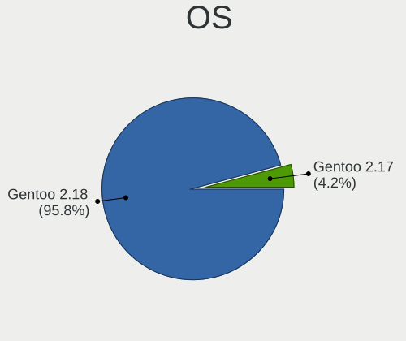

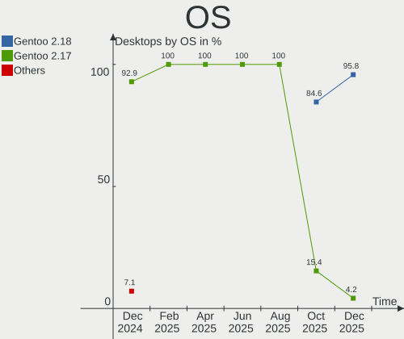

| Name        | Desktops | Percent |
|-------------|----------|---------|
| Gentoo 2.18 | 23       | 95.83%  |
| Gentoo 2.17 | 1        | 4.17%   |

OS Family
---------

OS without a version

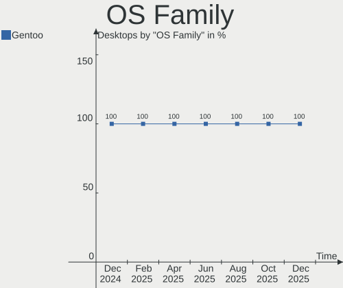

| Name   | Desktops | Percent |
|--------|----------|---------|
| Gentoo | 24       | 100%    |

Kernel
------

Version of the Linux kernel

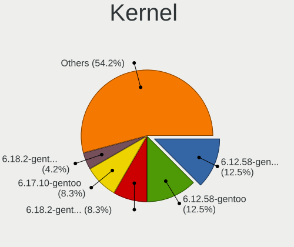

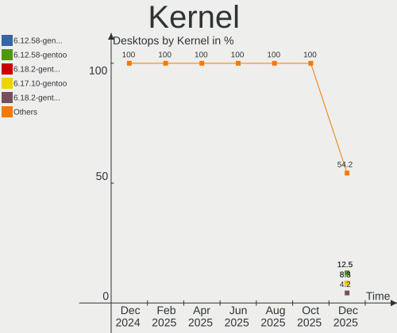

| Version                      | Desktops | Percent |
|------------------------------|----------|---------|
| 6.12.58-gentoo-x86_64        | 3        | 12.5%   |
| 6.12.58-gentoo               | 3        | 12.5%   |
| 6.18.2-gentoo-x86_64         | 2        | 8.33%   |
| 6.17.10-gentoo               | 2        | 8.33%   |
| 6.18.2-gentoo-22-dec-2025    | 1        | 4.17%   |
| 6.18.1-gentoo                | 1        | 4.17%   |
| 6.18.0-gentoo                | 1        | 4.17%   |
| 6.17.9-x86_64-xanmod1        | 1        | 4.17%   |
| 6.17.9-gentoo-dist           | 1        | 4.17%   |
| 6.17.9-gentoo                | 1        | 4.17%   |
| 6.17.9-cachyos               | 1        | 4.17%   |
| 6.17.8-gentoo-x86_64         | 1        | 4.17%   |
| 6.17.8-gentoo-dist           | 1        | 4.17%   |
| 6.17.10-gentoo-x86_64        | 1        | 4.17%   |
| 6.17.10-gentoo-dist          | 1        | 4.17%   |
| 6.12.58-gentoo-dist          | 1        | 4.17%   |
| 6.12.54-gentoo-dist-hardened | 1        | 4.17%   |
| 6.12.41-gentoo               | 1        | 4.17%   |

Kernel Family
-------------

Linux kernel without a distro release

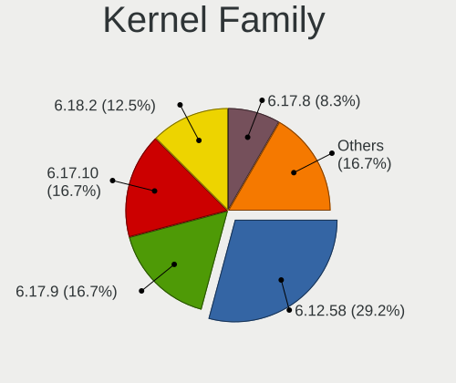

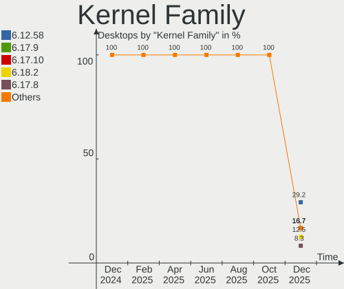

| Version | Desktops | Percent |
|---------|----------|---------|
| 6.12.58 | 7        | 29.17%  |
| 6.17.9  | 4        | 16.67%  |
| 6.17.10 | 4        | 16.67%  |
| 6.18.2  | 3        | 12.5%   |
| 6.17.8  | 2        | 8.33%   |
| 6.18.1  | 1        | 4.17%   |
| 6.18.0  | 1        | 4.17%   |
| 6.12.54 | 1        | 4.17%   |
| 6.12.41 | 1        | 4.17%   |

Kernel Major Ver.
-----------------

Linux kernel major version

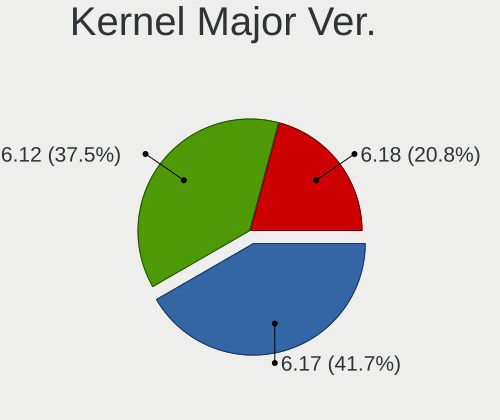

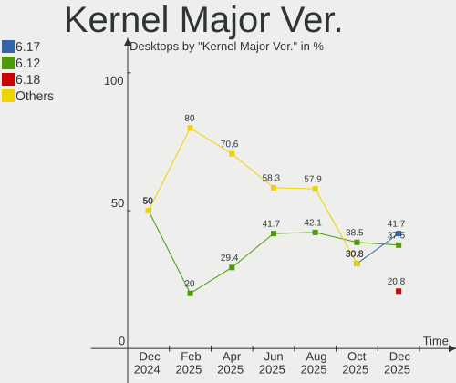

| Version | Desktops | Percent |
|---------|----------|---------|
| 6.17    | 10       | 41.67%  |
| 6.12    | 9        | 37.5%   |
| 6.18    | 5        | 20.83%  |

Arch
----

OS architecture (x86_64, i586, etc.)

| Name   | Desktops | Percent |
|--------|----------|---------|
| x86_64 | 24       | 100%    |

DE
--

Desktop Environment

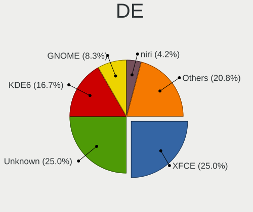

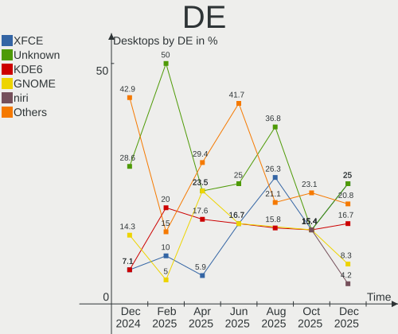

| Name          | Desktops | Percent |
|---------------|----------|---------|
| XFCE          | 6        | 25%     |
| Unknown       | 6        | 25%     |
| KDE6          | 4        | 16.67%  |
| GNOME         | 2        | 8.33%   |
| niri          | 1        | 4.17%   |
| MATE          | 1        | 4.17%   |
| LXDE          | 1        | 4.17%   |
| Enlightenment | 1        | 4.17%   |
| e16-session   | 1        | 4.17%   |
| Cinnamon      | 1        | 4.17%   |

Display Server
--------------

X11 or Wayland

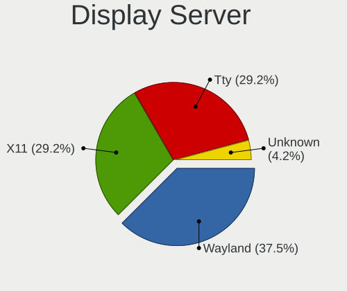

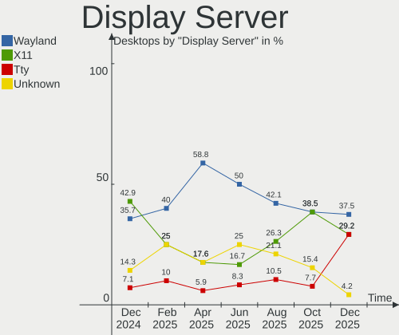

| Name    | Desktops | Percent |
|---------|----------|---------|
| Wayland | 9        | 37.5%   |
| X11     | 7        | 29.17%  |
| Tty     | 7        | 29.17%  |
| Unknown | 1        | 4.17%   |

Display Manager
---------------

SDDM, LightDM, etc.

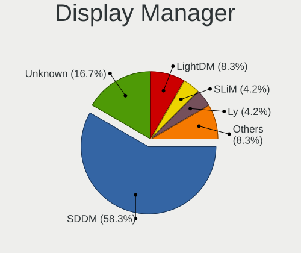

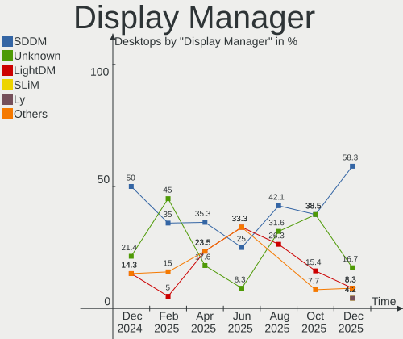

| Name    | Desktops | Percent |
|---------|----------|---------|
| SDDM    | 14       | 58.33%  |
| Unknown | 4        | 16.67%  |
| LightDM | 2        | 8.33%   |
| SLiM    | 1        | 4.17%   |
| Ly      | 1        | 4.17%   |
| GREETD  | 1        | 4.17%   |
| GDM     | 1        | 4.17%   |

OS Lang
-------

Language

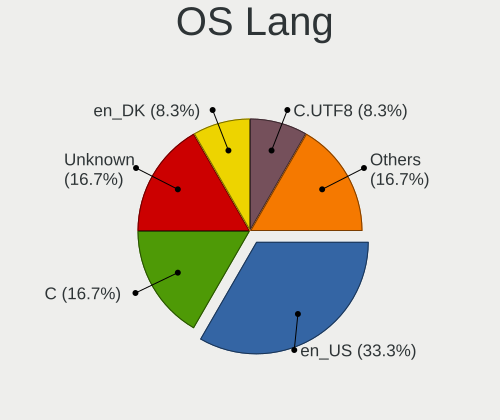

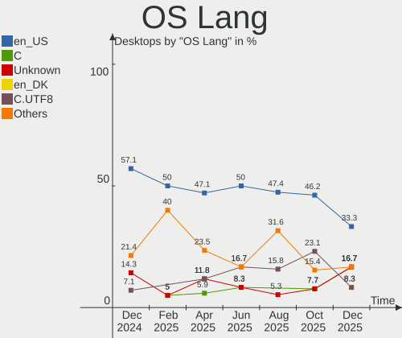

| Lang    | Desktops | Percent |
|---------|----------|---------|
| en_US   | 8        | 33.33%  |
| C       | 4        | 16.67%  |
| Unknown | 4        | 16.67%  |
| en_DK   | 2        | 8.33%   |
| C.UTF8  | 2        | 8.33%   |
| ru_RU   | 1        | 4.17%   |
| it_IT   | 1        | 4.17%   |
| de_DE   | 1        | 4.17%   |
| de_CH   | 1        | 4.17%   |

Boot Mode
---------

EFI or BIOS

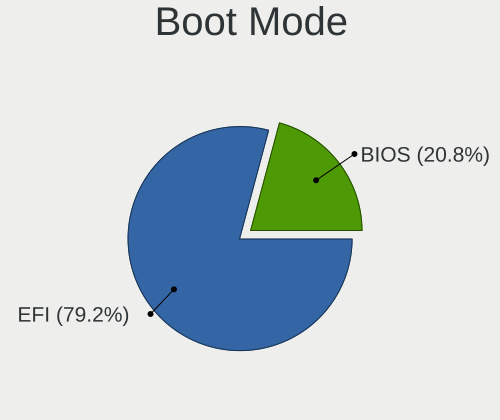

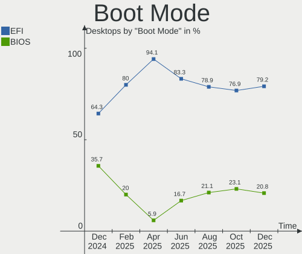

| Mode | Desktops | Percent |
|------|----------|---------|
| EFI  | 19       | 79.17%  |
| BIOS | 5        | 20.83%  |

Filesystem
----------

Type of filesystem

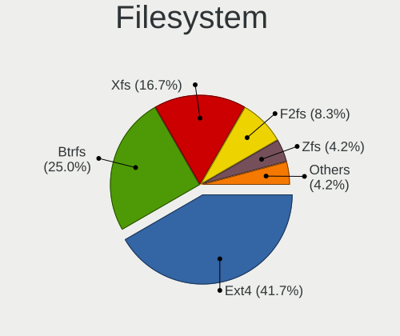

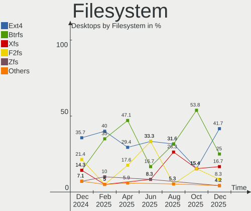

| Type  | Desktops | Percent |
|-------|----------|---------|
| Ext4  | 10       | 41.67%  |
| Btrfs | 6        | 25%     |
| Xfs   | 4        | 16.67%  |
| F2fs  | 2        | 8.33%   |
| Zfs   | 1        | 4.17%   |
| XXX4  | 1        | 4.17%   |

Part. scheme
------------

Scheme of partitioning

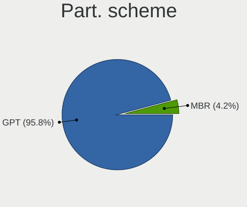

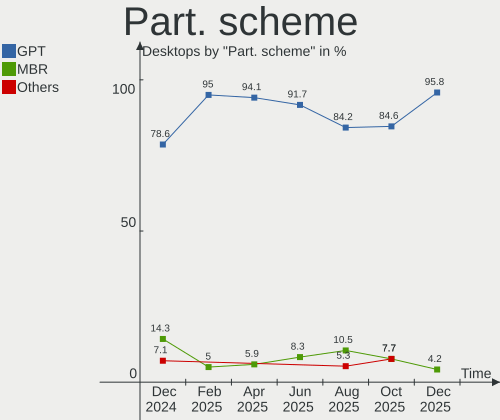

| Type | Desktops | Percent |
|------|----------|---------|
| GPT  | 23       | 95.83%  |
| MBR  | 1        | 4.17%   |

Dual Boot with Linux/BSD
------------------------

Hosting more than one Linux/BSD

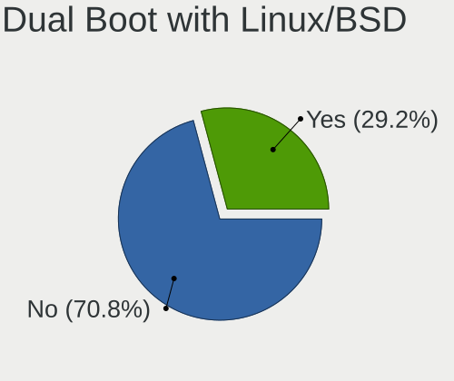

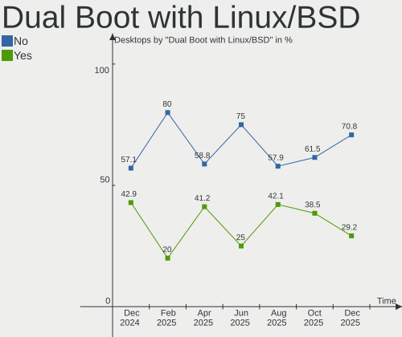

| Dual boot | Desktops | Percent |
|-----------|----------|---------|
| No        | 17       | 70.83%  |
| Yes       | 7        | 29.17%  |

Dual Boot (Win)
---------------

Hosting Linux and Windows

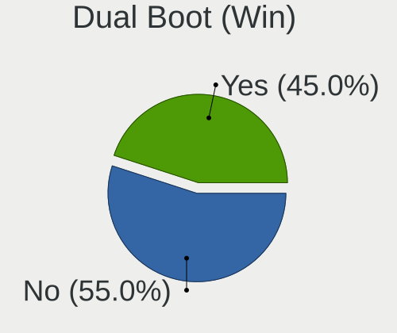

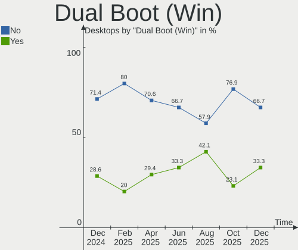

| Dual boot | Desktops | Percent |
|-----------|----------|---------|
| No        | 16       | 66.67%  |
| Yes       | 8        | 33.33%  |

Board
-----

Vendor
------

Motherboard manufacturer

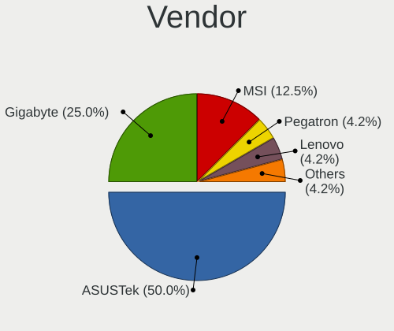

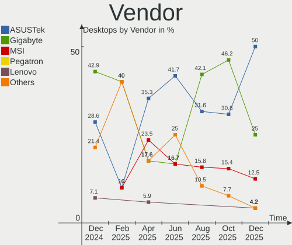

| Name                | Desktops | Percent |
|---------------------|----------|---------|
| ASUSTek Computer    | 12       | 50%     |
| Gigabyte Technology | 6        | 25%     |
| MSI                 | 3        | 12.5%   |
| Pegatron            | 1        | 4.17%   |
| Lenovo              | 1        | 4.17%   |
| Dell                | 1        | 4.17%   |

Model
-----

Motherboard model

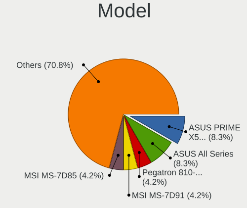

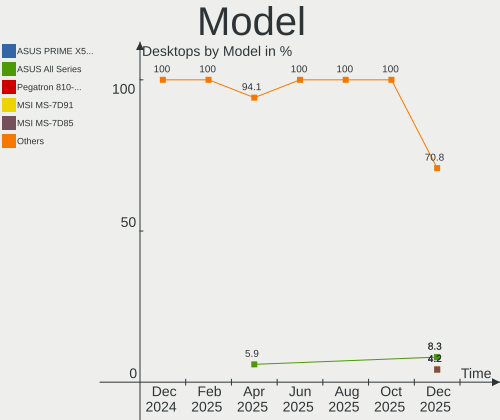

| Name                               | Desktops | Percent |
|------------------------------------|----------|---------|
| ASUS PRIME X570-P                  | 2        | 8.33%   |
| ASUS All Series                    | 2        | 8.33%   |
| Pegatron 810-170st                 | 1        | 4.17%   |
| MSI MS-7D91                        | 1        | 4.17%   |
| MSI MS-7D85                        | 1        | 4.17%   |
| MSI MS-7C84                        | 1        | 4.17%   |
| Lenovo ThinkCentre Edge72 3492EHG  | 1        | 4.17%   |
| Gigabyte X870E AORUS PRO           | 1        | 4.17%   |
| Gigabyte X570S AORUS ELITE AX      | 1        | 4.17%   |
| Gigabyte Q370M D3H GSM PLUS        | 1        | 4.17%   |
| Gigabyte B550 GAMING X V2          | 1        | 4.17%   |
| Gigabyte AB350-Gaming              | 1        | 4.17%   |
| Gigabyte A520 AORUS ELITE          | 1        | 4.17%   |
| Dell Precision Tower 7810          | 1        | 4.17%   |
| ASUS TUF Gaming X670E-PLUS WIFI    | 1        | 4.17%   |
| ASUS ROG ZENITH II EXTREME         | 1        | 4.17%   |
| ASUS ROG STRIX X870E-E GAMING WIFI | 1        | 4.17%   |
| ASUS ROG CROSSHAIR X670E HERO      | 1        | 4.17%   |
| ASUS ROG CROSSHAIR VIII HERO       | 1        | 4.17%   |
| ASUS ProArt X670E-CREATOR WIFI     | 1        | 4.17%   |
| ASUS Pro WS W790E-SAGE SE          | 1        | 4.17%   |
| ASUS M3A78-CM                      | 1        | 4.17%   |

Model Family
------------

Motherboard model prefix

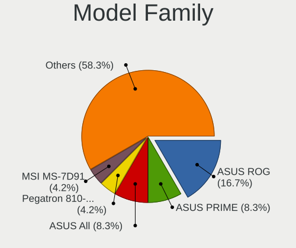

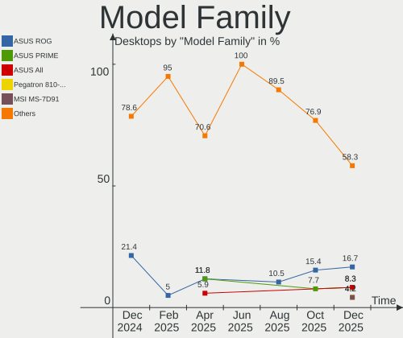

| Name                  | Desktops | Percent |
|-----------------------|----------|---------|
| ASUS ROG              | 4        | 16.67%  |
| ASUS PRIME            | 2        | 8.33%   |
| ASUS All              | 2        | 8.33%   |
| Pegatron 810-170st    | 1        | 4.17%   |
| MSI MS-7D91           | 1        | 4.17%   |
| MSI MS-7D85           | 1        | 4.17%   |
| MSI MS-7C84           | 1        | 4.17%   |
| Lenovo ThinkCentre    | 1        | 4.17%   |
| Gigabyte X870E        | 1        | 4.17%   |
| Gigabyte X570S        | 1        | 4.17%   |
| Gigabyte Q370M        | 1        | 4.17%   |
| Gigabyte B550         | 1        | 4.17%   |
| Gigabyte AB350-Gaming | 1        | 4.17%   |
| Gigabyte A520         | 1        | 4.17%   |
| Dell Precision        | 1        | 4.17%   |
| ASUS TUF              | 1        | 4.17%   |
| ASUS ProArt           | 1        | 4.17%   |
| ASUS Pro              | 1        | 4.17%   |
| ASUS M3A78-CM         | 1        | 4.17%   |

MFG Year
--------

Motherboard manufacture year

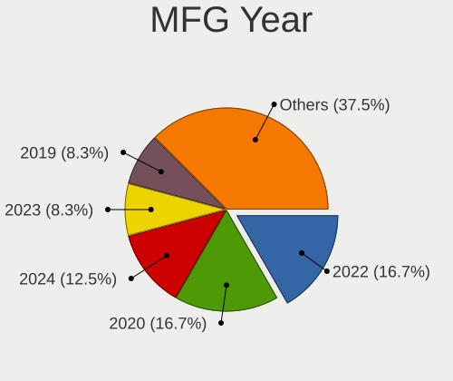

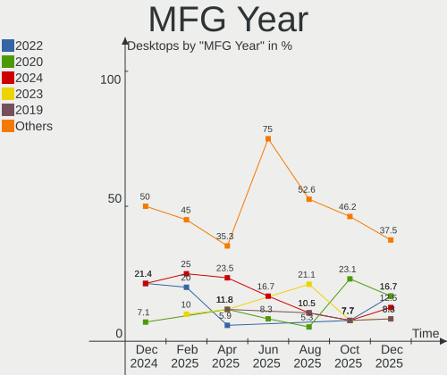

| Year | Desktops | Percent |
|------|----------|---------|
| 2022 | 4        | 16.67%  |
| 2020 | 4        | 16.67%  |
| 2024 | 3        | 12.5%   |
| 2023 | 2        | 8.33%   |
| 2019 | 2        | 8.33%   |
| 2014 | 2        | 8.33%   |
| 2013 | 2        | 8.33%   |
| 2025 | 1        | 4.17%   |
| 2021 | 1        | 4.17%   |
| 2017 | 1        | 4.17%   |
| 2016 | 1        | 4.17%   |
| 2008 | 1        | 4.17%   |

Form Factor
-----------

Physical design of the computer

| Name    | Desktops | Percent |
|---------|----------|---------|
| Desktop | 24       | 100%    |

Secure Boot
-----------

Enabled or disabled

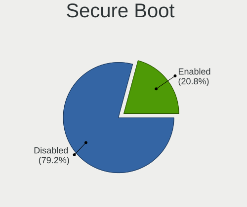

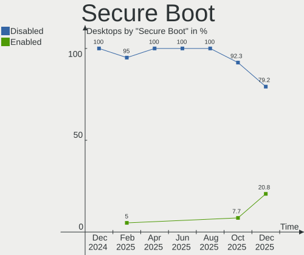

| State    | Desktops | Percent |
|----------|----------|---------|
| Disabled | 19       | 79.17%  |
| Enabled  | 5        | 20.83%  |

Coreboot
--------

Have coreboot on board

| Used | Desktops | Percent |
|------|----------|---------|
| No   | 24       | 100%    |

RAM Size
--------

Total RAM memory

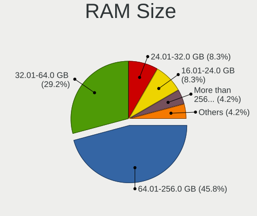

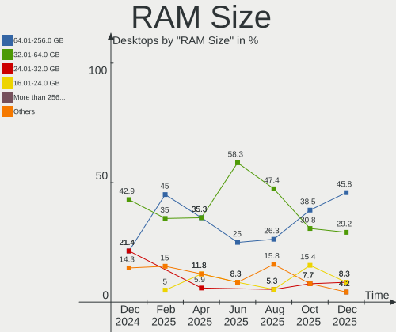

| Size in GB      | Desktops | Percent |
|-----------------|----------|---------|
| 64.01-256.0     | 11       | 45.83%  |
| 32.01-64.0      | 7        | 29.17%  |
| 24.01-32.0      | 2        | 8.33%   |
| 16.01-24.0      | 2        | 8.33%   |
| More than 256.0 | 1        | 4.17%   |
| 4.01-8.0        | 1        | 4.17%   |

RAM Used
--------

Used RAM memory

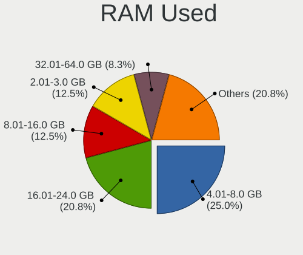

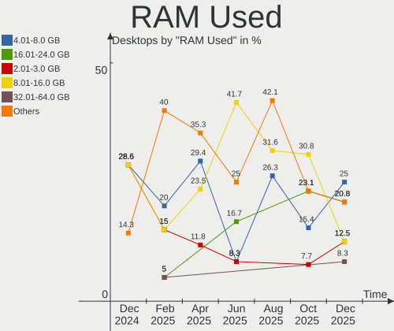

| Used GB    | Desktops | Percent |
|------------|----------|---------|
| 4.01-8.0   | 6        | 25%     |
| 16.01-24.0 | 5        | 20.83%  |
| 2.01-3.0   | 3        | 12.5%   |
| 8.01-16.0  | 3        | 12.5%   |
| 32.01-64.0 | 2        | 8.33%   |
| 1.01-2.0   | 2        | 8.33%   |
| 0.51-1.0   | 2        | 8.33%   |
| 3.01-4.0   | 1        | 4.17%   |

Total Drives
------------

Number of drives on board

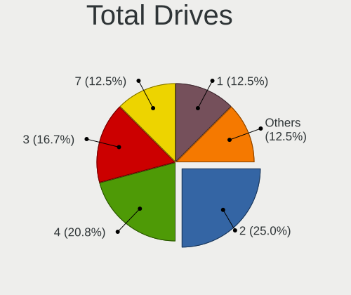

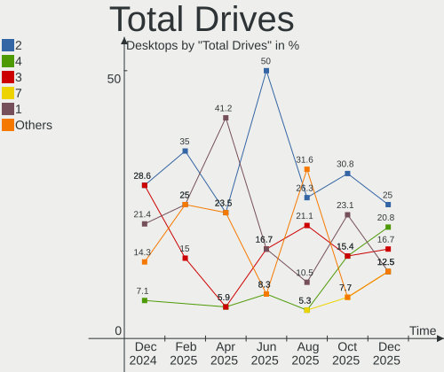

| Drives | Desktops | Percent |
|--------|----------|---------|
| 2      | 6        | 25%     |
| 4      | 5        | 20.83%  |
| 3      | 4        | 16.67%  |
| 7      | 3        | 12.5%   |
| 1      | 3        | 12.5%   |
| 6      | 2        | 8.33%   |
| 5      | 1        | 4.17%   |

Has CD-ROM
----------

Has CD-ROM on board

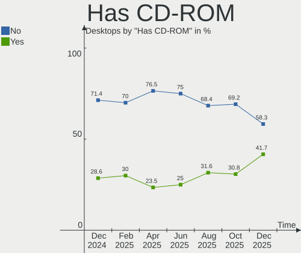

| Presented | Desktops | Percent |
|-----------|----------|---------|
| No        | 14       | 58.33%  |
| Yes       | 10       | 41.67%  |

Has Ethernet
------------

Has Ethernet on board

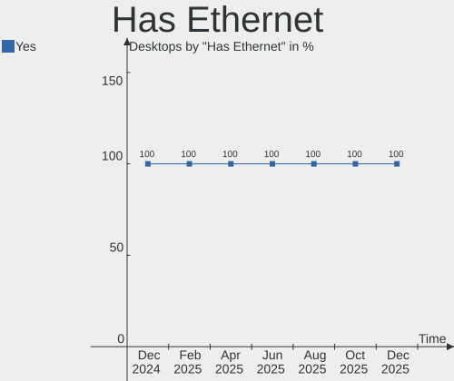

| Presented | Desktops | Percent |
|-----------|----------|---------|
| Yes       | 24       | 100%    |

Has WiFi
--------

Has WiFi module

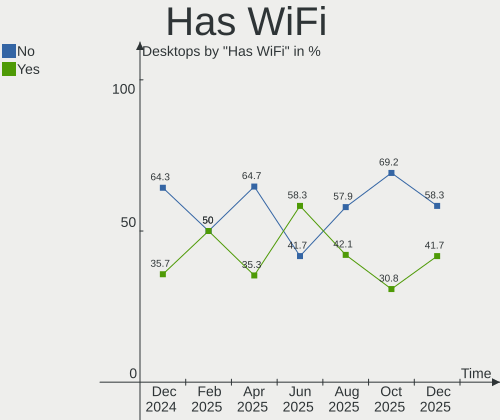

| Presented | Desktops | Percent |
|-----------|----------|---------|
| No        | 14       | 58.33%  |
| Yes       | 10       | 41.67%  |

Has Bluetooth
-------------

Has Bluetooth module

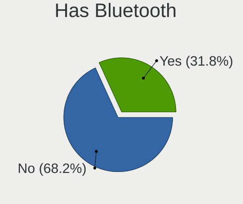

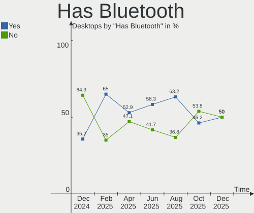

| Presented | Desktops | Percent |
|-----------|----------|---------|
| Yes       | 12       | 50%     |
| No        | 12       | 50%     |

Location
--------

Country
-------

Geographic location (country)

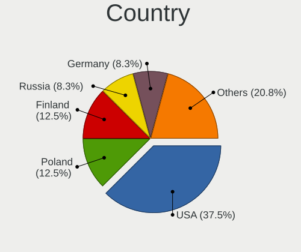

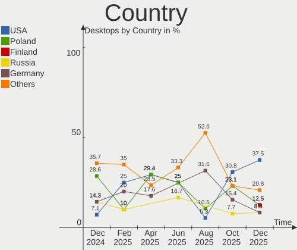

| Country     | Desktops | Percent |
|-------------|----------|---------|
| USA         | 9        | 37.5%   |
| Poland      | 3        | 12.5%   |
| Finland     | 3        | 12.5%   |
| Russia      | 2        | 8.33%   |
| Germany     | 2        | 8.33%   |
| UK          | 1        | 4.17%   |
| Switzerland | 1        | 4.17%   |
| Spain       | 1        | 4.17%   |
| Hungary     | 1        | 4.17%   |
| Canada      | 1        | 4.17%   |

City
----

Geographic location (city)

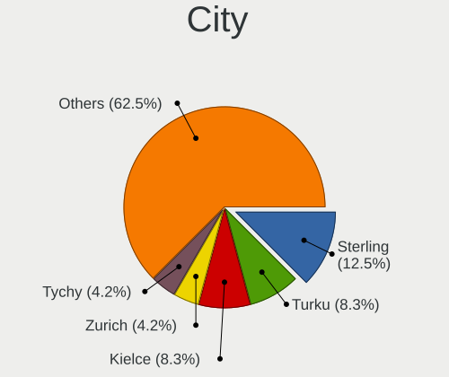

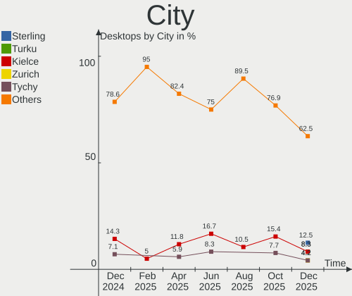

| City              | Desktops | Percent |
|-------------------|----------|---------|
| Sterling          | 3        | 12.5%   |
| Turku             | 2        | 8.33%   |
| Kielce            | 2        | 8.33%   |
| Zurich            | 1        | 4.17%   |
| Tychy             | 1        | 4.17%   |
| St Petersburg     | 1        | 4.17%   |
| Spokane           | 1        | 4.17%   |
| Shawnigan Lake    | 1        | 4.17%   |
| Seattle           | 1        | 4.17%   |
| Pittsburgh        | 1        | 4.17%   |
| Olympia           | 1        | 4.17%   |
| Moscow            | 1        | 4.17%   |
| Mannheim          | 1        | 4.17%   |
| Madrid            | 1        | 4.17%   |
| Helsinki          | 1        | 4.17%   |
| Hatvan            | 1        | 4.17%   |
| Frankfurt am Main | 1        | 4.17%   |
| Cambridge         | 1        | 4.17%   |
| Baton Rouge       | 1        | 4.17%   |
| Ann Arbor         | 1        | 4.17%   |

Drives
------

Drive Vendor
------------

Hard drive vendors

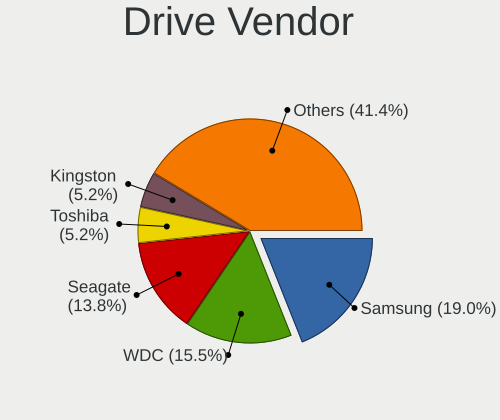

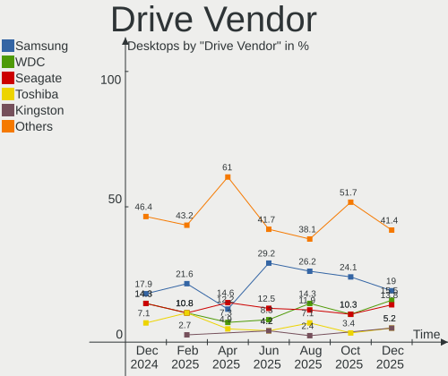

| Vendor                       | Desktops | Drives | Percent |
|------------------------------|----------|--------|---------|
| Samsung Electronics          | 11       | 23     | 18.97%  |
| WDC                          | 9        | 19     | 15.52%  |
| Seagate                      | 8        | 9      | 13.79%  |
| Toshiba                      | 3        | 3      | 5.17%   |
| Kingston                     | 3        | 3      | 5.17%   |
| Crucial                      | 3        | 3      | 5.17%   |
| Sandisk                      | 2        | 2      | 3.45%   |
| Micron/Crucial Technology    | 2        | 2      | 3.45%   |
| Kingston Technology Company  | 2        | 2      | 3.45%   |
| Intel                        | 2        | 2      | 3.45%   |
| GOODRAM                      | 2        | 2      | 3.45%   |
| China                        | 2        | 3      | 3.45%   |
| Western Digital              | 1        | 1      | 1.72%   |
| SOLIDIGM                     | 1        | 1      | 1.72%   |
| SK hynix                     | 1        | 1      | 1.72%   |
| Shenzhen Longsys Electronics | 1        | 1      | 1.72%   |
| Seagate Technology           | 1        | 1      | 1.72%   |
| Phison Electronics           | 1        | 1      | 1.72%   |
| Patriot                      | 1        | 1      | 1.72%   |
| Hitachi                      | 1        | 3      | 1.72%   |
| Hewlett-Packard              | 1        | 2      | 1.72%   |

Drive Model
-----------

Hard drive models

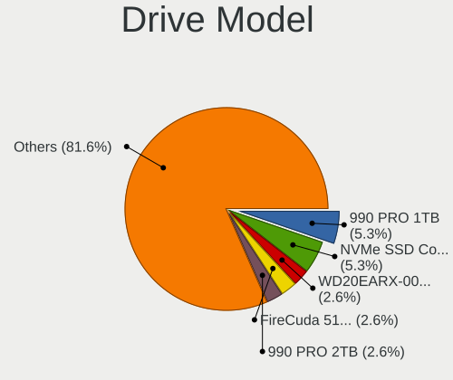

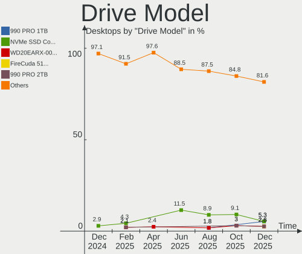

| Model                                              | Desktops | Percent |
|----------------------------------------------------|----------|---------|
| Samsung SSD 990 PRO 1TB                            | 4        | 5.26%   |
| Samsung NVMe SSD Controller SM981/PM981/PM983 1TB  | 4        | 5.26%   |
| WDC WD20EARX-00PASB0 2TB                           | 2        | 2.63%   |
| Seagate FireCuda 510 SSD ZP1000GM30031 1TB         | 2        | 2.63%   |
| Samsung SSD 990 PRO 2TB                            | 2        | 2.63%   |
| Samsung SSD 990 EVO Plus 1TB                       | 2        | 2.63%   |
| Samsung NVMe SSD Controller PM9A1/PM9A3/980PRO 1TB | 2        | 2.63%   |
| Kingston Company SNV2S2000G 2TB                    | 2        | 2.63%   |
| Kingston SNVS500G 500GB                            | 2        | 2.63%   |
| Western Digital Ultrastar DC SN640 NVMe SSD 8TB    | 1        | 1.32%   |
| WDC WUH721816ALE6L0 16TB                           | 1        | 1.32%   |
| WDC WDS100T2B0A-00SM50 1TB SSD                     | 1        | 1.32%   |
| WDC WD7502AAEX-00Y9A0 752GB                        | 1        | 1.32%   |
| WDC WD5000AZLX-60K2TA0 500GB                       | 1        | 1.32%   |
| WDC WD40EZRZ-00GXCB0 4TB                           | 1        | 1.32%   |
| WDC WD20PURZ-85GU6Y0 2TB                           | 1        | 1.32%   |
| WDC WD20EZBX-00AYRA0 2TB                           | 1        | 1.32%   |
| WDC WD20EFRX-68EUZN0 2TB                           | 1        | 1.32%   |
| WDC WD20EFRX-68AX9N0 2TB                           | 1        | 1.32%   |
| WDC WD20EARZ-00C5XB0 2TB                           | 1        | 1.32%   |
| WDC WD2003FZEX-00SRLA0 2TB                         | 1        | 1.32%   |
| WDC WD10EZEX-60WN4A0 1TB                           | 1        | 1.32%   |
| WDC WD10EZEX-08WN4A0 1TB                           | 1        | 1.32%   |
| Toshiba HDWR480UZSVB 8TB                           | 1        | 1.32%   |
| Toshiba HDWE150 5TB                                | 1        | 1.32%   |
| Toshiba HDWE140 4TB                                | 1        | 1.32%   |
| SOLIDIGM SSDPFKNU020TZ 2TB                         | 1        | 1.32%   |
| SK hynix SHGP31-1000GM 1TB                         | 1        | 1.32%   |
| Shenzhen Longsys Lexar SSD NM710 1TB               | 1        | 1.32%   |
| Seagate ZP2000GM30004 2TB                          | 1        | 1.32%   |
| Seagate ST8000DM004-2U9188 8TB                     | 1        | 1.32%   |
| Seagate ST4000DM004-2CV104 4TB                     | 1        | 1.32%   |
| Seagate ST31000340AS 1TB                           | 1        | 1.32%   |
| Seagate ST16000NM000J-2TW103 16TB                  | 1        | 1.32%   |
| Seagate ST12000VN0008-2YS101 12TB                  | 1        | 1.32%   |
| Seagate ST12000NM0008-2H3101 12TB                  | 1        | 1.32%   |
| Seagate Backup+ Desk 5TB                           | 1        | 1.32%   |
| Sandisk WD_BLACK SN850X 2000GB                     | 1        | 1.32%   |
| Sandisk WD_BLACK SN770 2TB                         | 1        | 1.32%   |
| Samsung SSD 990 PRO 4TB                            | 1        | 1.32%   |

HDD Vendor
----------

Hard disk drive vendors

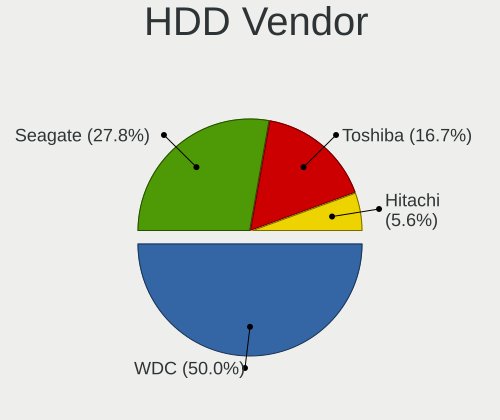

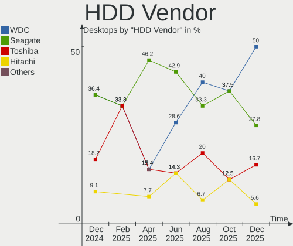

| Vendor  | Desktops | Drives | Percent |
|---------|----------|--------|---------|
| WDC     | 9        | 18     | 50%     |
| Seagate | 5        | 6      | 27.78%  |
| Toshiba | 3        | 3      | 16.67%  |
| Hitachi | 1        | 3      | 5.56%   |

SSD Vendor
----------

Solid state drive vendors

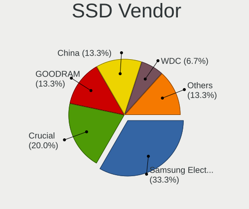

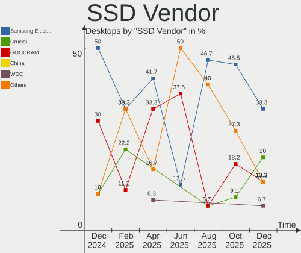

| Vendor              | Desktops | Drives | Percent |
|---------------------|----------|--------|---------|
| Samsung Electronics | 5        | 5      | 33.33%  |
| Crucial             | 3        | 3      | 20%     |
| GOODRAM             | 2        | 2      | 13.33%  |
| China               | 2        | 3      | 13.33%  |
| WDC                 | 1        | 1      | 6.67%   |
| Patriot             | 1        | 1      | 6.67%   |
| Kingston            | 1        | 1      | 6.67%   |

Drive Kind
----------

HDD or SSD

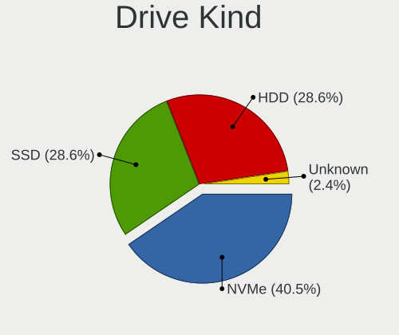

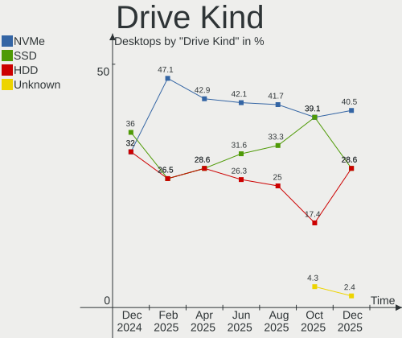

| Kind    | Desktops | Drives | Percent |
|---------|----------|--------|---------|
| NVMe    | 17       | 38     | 40.48%  |
| SSD     | 12       | 16     | 28.57%  |
| HDD     | 12       | 30     | 28.57%  |
| Unknown | 1        | 1      | 2.38%   |

Drive Connector
---------------

SATA, SAS, NVMe, etc.

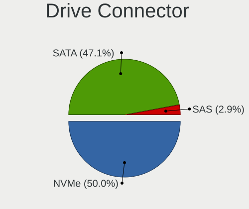

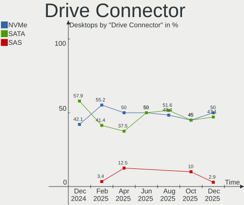

| Type | Desktops | Drives | Percent |
|------|----------|--------|---------|
| NVMe | 17       | 38     | 50%     |
| SATA | 16       | 46     | 47.06%  |
| SAS  | 1        | 1      | 2.94%   |

Drive Size
----------

Size of hard drive

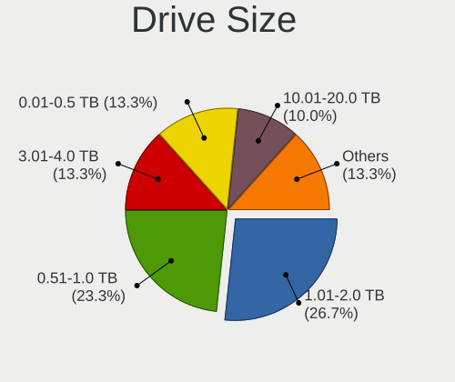

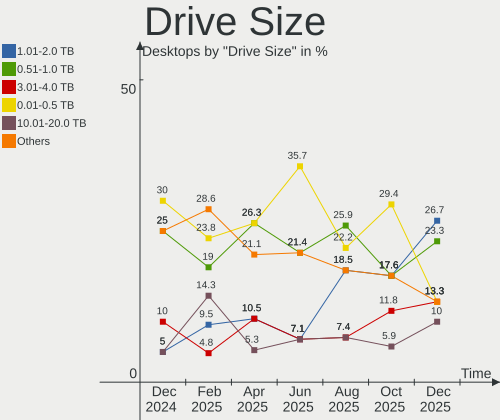

| Size in TB | Desktops | Drives | Percent |
|------------|----------|--------|---------|
| 1.01-2.0   | 8        | 13     | 26.67%  |
| 0.51-1.0   | 7        | 13     | 23.33%  |
| 3.01-4.0   | 4        | 4      | 13.33%  |
| 0.01-0.5   | 4        | 6      | 13.33%  |
| 10.01-20.0 | 3        | 4      | 10%     |
| 4.01-10.0  | 3        | 3      | 10%     |
| 2.01-3.0   | 1        | 3      | 3.33%   |

Space Total
-----------

Amount of disk space available on the file system

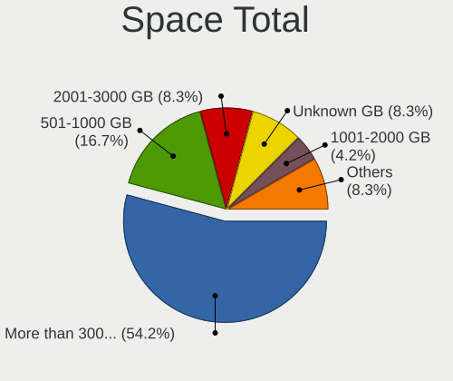

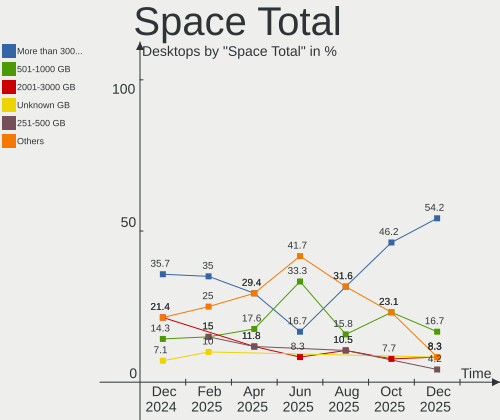

| Size in GB     | Desktops | Percent |
|----------------|----------|---------|
| More than 3000 | 13       | 54.17%  |
| 501-1000       | 4        | 16.67%  |
| 2001-3000      | 2        | 8.33%   |
| Unknown        | 2        | 8.33%   |
| 251-500        | 1        | 4.17%   |
| 1001-2000      | 1        | 4.17%   |
| 51-100         | 1        | 4.17%   |

Space Used
----------

Amount of used disk space

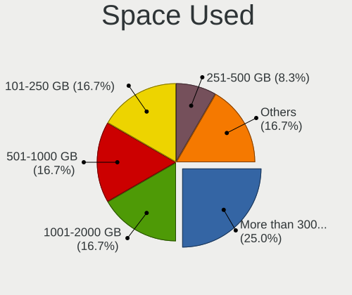

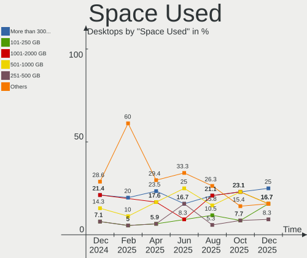

| Used GB        | Desktops | Percent |
|----------------|----------|---------|
| More than 3000 | 6        | 25%     |
| 101-250        | 4        | 16.67%  |
| 1001-2000      | 4        | 16.67%  |
| 501-1000       | 4        | 16.67%  |
| 251-500        | 2        | 8.33%   |
| Unknown        | 2        | 8.33%   |
| 21-50          | 1        | 4.17%   |
| 2001-3000      | 1        | 4.17%   |

Malfunc. Drives
---------------

Drive models with a malfunction

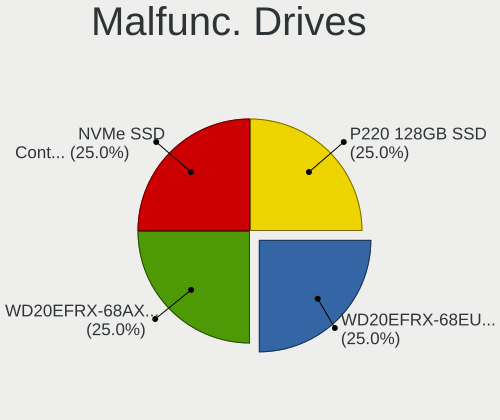

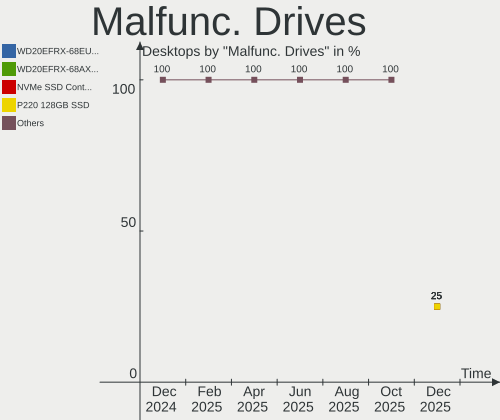

| Model                                                          | Desktops | Drives | Percent |
|----------------------------------------------------------------|----------|--------|---------|
| WDC WD20EFRX-68EUZN0 2TB                                       | 1        | 1      | 25%     |
| WDC WD20EFRX-68AX9N0 2TB                                       | 1        | 1      | 25%     |
| Samsung Electronics NVMe SSD Controller PM9A1/PM9A3/980PRO 1TB | 1        | 1      | 25%     |
| Patriot P220 128GB SSD                                         | 1        | 1      | 25%     |

Malfunc. Drive Vendor
---------------------

Vendors of faulty drives

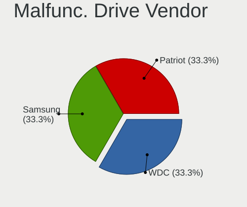

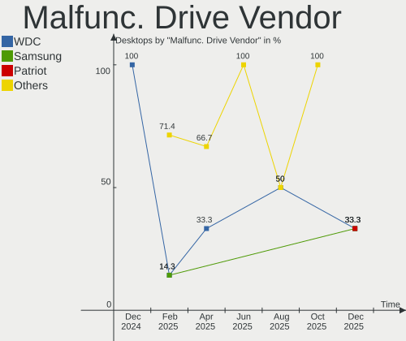

| Vendor              | Desktops | Drives | Percent |
|---------------------|----------|--------|---------|
| WDC                 | 1        | 2      | 33.33%  |
| Samsung Electronics | 1        | 1      | 33.33%  |
| Patriot             | 1        | 1      | 33.33%  |

Malfunc. HDD Vendor
-------------------

Vendors of faulty HDD drives

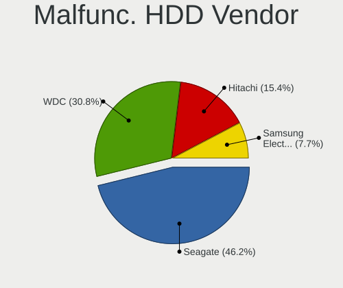

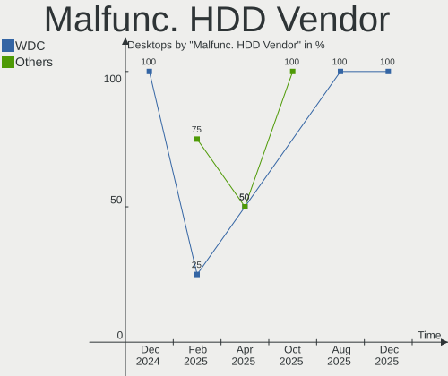

| Vendor | Desktops | Drives | Percent |
|--------|----------|--------|---------|
| WDC    | 1        | 2      | 100%    |

Malfunc. Drive Kind
-------------------

Kinds of faulty drives

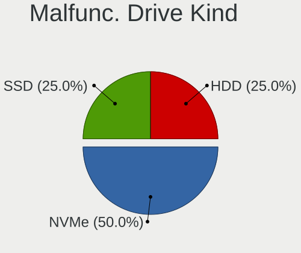

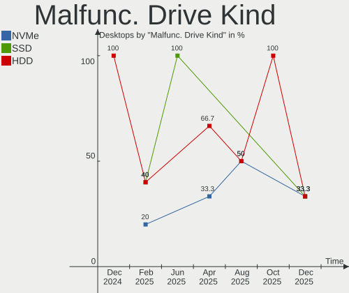

| Kind | Desktops | Drives | Percent |
|------|----------|--------|---------|
| NVMe | 1        | 1      | 33.33%  |
| SSD  | 1        | 1      | 33.33%  |
| HDD  | 1        | 2      | 33.33%  |

Failed Drives
-------------

Failed drive models

Zero info for selected period =(

Failed Drive Vendor
-------------------

Failed drive vendors

Zero info for selected period =(

Drive Status
------------

Number of failed and malfunc. drives

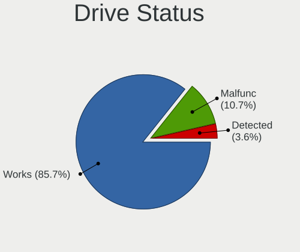

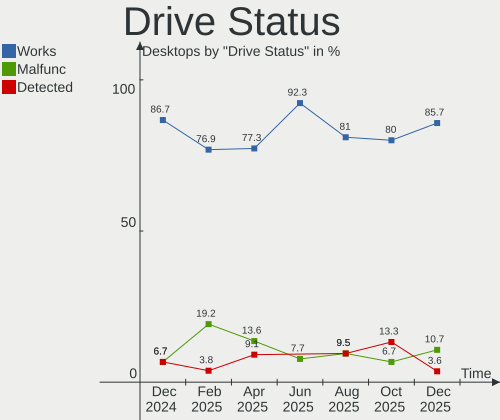

| Status   | Desktops | Drives | Percent |
|----------|----------|--------|---------|
| Works    | 24       | 80     | 85.71%  |
| Malfunc  | 3        | 4      | 10.71%  |
| Detected | 1        | 1      | 3.57%   |

Storage controller
------------------

Storage Vendor
--------------

Storage controller vendors

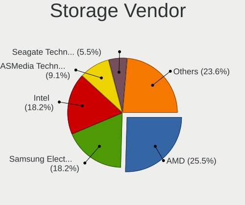

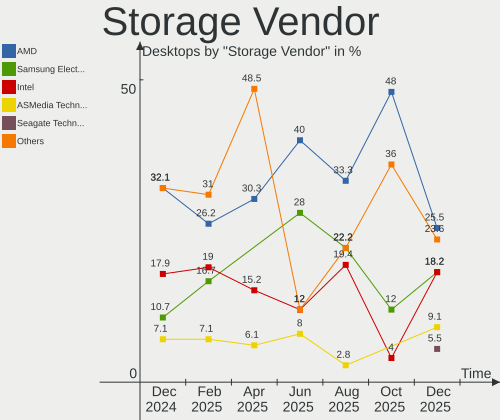

| Vendor                       | Desktops | Percent |
|------------------------------|----------|---------|
| AMD                          | 14       | 25.45%  |
| Samsung Electronics          | 10       | 18.18%  |
| Intel                        | 10       | 18.18%  |
| ASMedia Technology           | 5        | 9.09%   |
| Seagate Technology           | 3        | 5.45%   |
| SanDisk                      | 2        | 3.64%   |
| Micron/Crucial Technology    | 2        | 3.64%   |
| Kingston Technology Company  | 2        | 3.64%   |
| Western Digital              | 1        | 1.82%   |
| Solidigm                     | 1        | 1.82%   |
| SK hynix                     | 1        | 1.82%   |
| Shenzhen Longsys Electronics | 1        | 1.82%   |
| Phison Electronics           | 1        | 1.82%   |
| JMicron Technology           | 1        | 1.82%   |
| INNOGRIT                     | 1        | 1.82%   |

Storage Model
-------------

Storage controller models

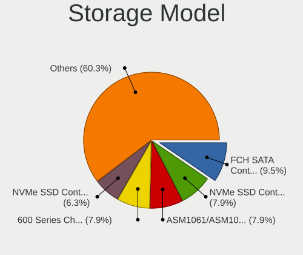

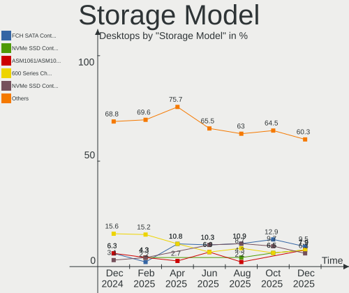

| Model                                                                          | Desktops | Percent |
|--------------------------------------------------------------------------------|----------|---------|
| AMD FCH SATA Controller [AHCI mode]                                            | 6        | 9.52%   |
| Samsung NVMe SSD Controller S4LV008[Pascal]                                    | 5        | 7.94%   |
| ASMedia ASM1061/ASM1062 Serial ATA Controller                                  | 5        | 7.94%   |
| AMD 600 Series Chipset SATA Controller                                         | 5        | 7.94%   |
| Samsung NVMe SSD Controller SM981/PM981/PM983                                  | 4        | 6.35%   |
| Samsung NVMe SSD Controller PM9C1a (DRAM-less)                                 | 3        | 4.76%   |
| Seagate FireCuda/IronWolf 510 SSD                                              | 2        | 3.17%   |
| Samsung NVMe SSD Controller PM9A1/PM9A3/980PRO                                 | 2        | 3.17%   |
| Kingston Company NV2 NVMe SSD [SM2267XT] (DRAM-less)                           | 2        | 3.17%   |
| Kingston Company NV1 NVMe SSD [SM2263XT] (DRAM-less)                           | 2        | 3.17%   |
| Intel Raptor Lake SATA AHCI Controller                                         | 2        | 3.17%   |
| Intel 8 Series/C220 Series Chipset Family 6-port SATA Controller 1 [AHCI mode] | 2        | 3.17%   |
| AMD 500 Series Chipset SATA Controller                                         | 2        | 3.17%   |
| Western Digital Ultrastar DC SN640 NVMe SSD                                    | 1        | 1.59%   |
| Solidigm P41 Plus NVMe SSD (DRAM-less) [Echo Harbor]                           | 1        | 1.59%   |
| SK hynix Gold P31/BC711/PC711 NVMe Solid State Drive                           | 1        | 1.59%   |
| Shenzhen Longsys Lexar NM790 / Patriot Viper VP4300 Lite NVMe SSD (DRAM-less)  | 1        | 1.59%   |
| Seagate FireCuda 540 SSD                                                       | 1        | 1.59%   |
| SanDisk WD SN560/SN740/SN770/SN5000 NVMe SSD                                   | 1        | 1.59%   |
| Sandisk WD Black SN850X NVMe SSD                                               | 1        | 1.59%   |
| Phison E16 PCIe4 NVMe Controller                                               | 1        | 1.59%   |
| Micron/Crucial T700 NVMe PCIe SSD                                              | 1        | 1.59%   |
| Micron/Crucial P3 Plus NVMe PCIe SSD (DRAM-less)                               | 1        | 1.59%   |
| JMicron JMB58x AHCI SATA controller                                            | 1        | 1.59%   |
| Intel SSD 660P Series                                                          | 1        | 1.59%   |
| Intel Optane SSD 900P Series                                                   | 1        | 1.59%   |
| Intel Cannon Lake PCH SATA AHCI Controller                                     | 1        | 1.59%   |
| Intel C610/X99 series chipset sSATA Controller [AHCI mode]                     | 1        | 1.59%   |
| Intel C600/X79 series chipset 6-Port SATA AHCI Controller                      | 1        | 1.59%   |
| Intel 6 Series/C200 Series Chipset Family 6 port Desktop SATA AHCI Controller  | 1        | 1.59%   |
| INNOGRIT NVMe SSD Controller IG5236 [RainierPC]                                | 1        | 1.59%   |
| AMD SB7x0/SB8x0/SB9x0 SATA Controller [IDE mode]                               | 1        | 1.59%   |
| AMD SB7x0/SB8x0/SB9x0 IDE Controller                                           | 1        | 1.59%   |
| AMD 300 Series Chipset SATA Controller                                         | 1        | 1.59%   |

Storage Kind
------------

Kind of storage controller (IDE, SATA, NVMe, SAS, ...)

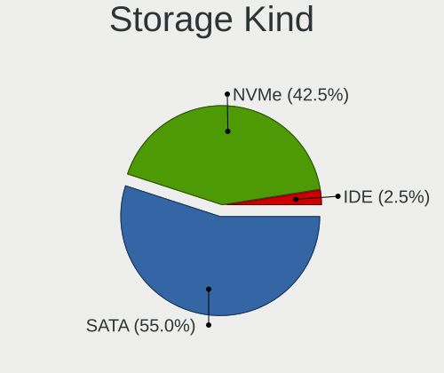

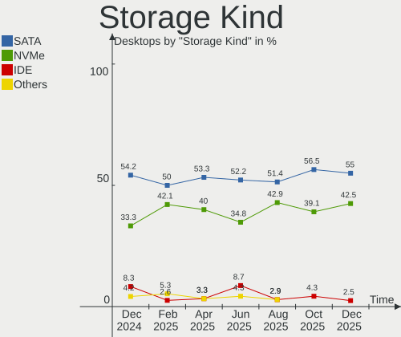

| Kind | Desktops | Percent |
|------|----------|---------|
| SATA | 22       | 55%     |
| NVMe | 17       | 42.5%   |
| IDE  | 1        | 2.5%    |

Processor
---------

CPU Vendor
----------

Processor vendors

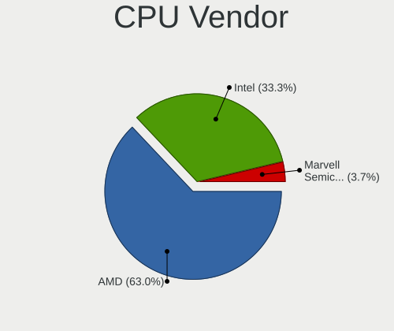

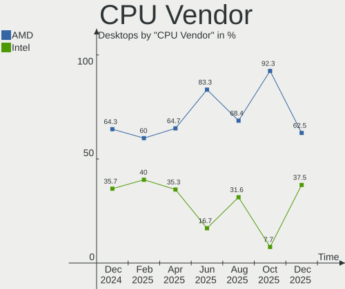

| Vendor | Desktops | Percent |
|--------|----------|---------|
| AMD    | 15       | 62.5%   |
| Intel  | 9        | 37.5%   |

CPU Model
---------

Processor models

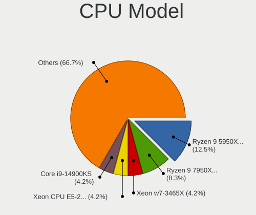

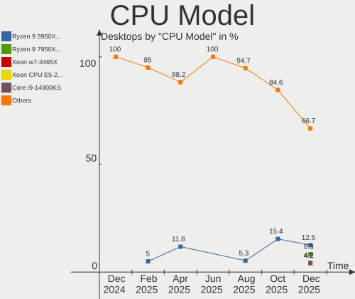

| Model                                          | Desktops | Percent |
|------------------------------------------------|----------|---------|
| AMD Ryzen 9 5950X 16-Core Processor            | 3        | 12.5%   |
| AMD Ryzen 9 7950X 16-Core Processor            | 2        | 8.33%   |
| Intel Xeon w7-3465X                            | 1        | 4.17%   |
| Intel Xeon CPU E5-2699 v4 @ 2.20GHz            | 1        | 4.17%   |
| Intel Core i9-14900KS                          | 1        | 4.17%   |
| Intel Core i7-4930K CPU @ 3.40GHz              | 1        | 4.17%   |
| Intel Core i7-4790 CPU @ 3.60GHz               | 1        | 4.17%   |
| Intel Core i7-4770 CPU @ 3.40GHz               | 1        | 4.17%   |
| Intel Core i5-8500 CPU @ 3.00GHz               | 1        | 4.17%   |
| Intel Core i5-3470S CPU @ 2.90GHz              | 1        | 4.17%   |
| Intel 13th Gen Core i5-13600K                  | 1        | 4.17%   |
| AMD Ryzen Threadripper 3960X 24-Core Processor | 1        | 4.17%   |
| AMD Ryzen 9 9950X3D 16-Core Processor          | 1        | 4.17%   |
| AMD Ryzen 9 5900X 12-Core Processor            | 1        | 4.17%   |
| AMD Ryzen 9 3900X 12-Core Processor            | 1        | 4.17%   |
| AMD Ryzen 7 7800X3D 8-Core Processor           | 1        | 4.17%   |
| AMD Ryzen 7 5700G with Radeon Graphics         | 1        | 4.17%   |
| AMD Ryzen 7 3800X 8-Core Processor             | 1        | 4.17%   |
| AMD Ryzen 5 2600 Six-Core Processor            | 1        | 4.17%   |
| AMD Phenom II X4 955 Processor                 | 1        | 4.17%   |
| AMD EPYC 4564P 16-Core Processor               | 1        | 4.17%   |

CPU Model Family
----------------

Processor model prefix

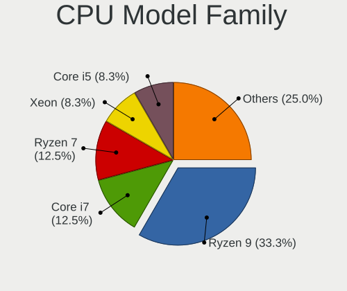

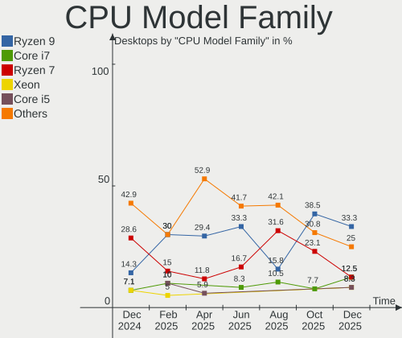

| Model                  | Desktops | Percent |
|------------------------|----------|---------|
| AMD Ryzen 9            | 8        | 33.33%  |
| Intel Core i7          | 3        | 12.5%   |
| AMD Ryzen 7            | 3        | 12.5%   |
| Intel Xeon             | 2        | 8.33%   |
| Intel Core i5          | 2        | 8.33%   |
| Other                  | 1        | 4.17%   |
| Intel Core i9          | 1        | 4.17%   |
| AMD Ryzen Threadripper | 1        | 4.17%   |
| AMD Ryzen 5            | 1        | 4.17%   |
| AMD Phenom II X4       | 1        | 4.17%   |
| AMD EPYC               | 1        | 4.17%   |

CPU Cores
---------

Number of processor cores

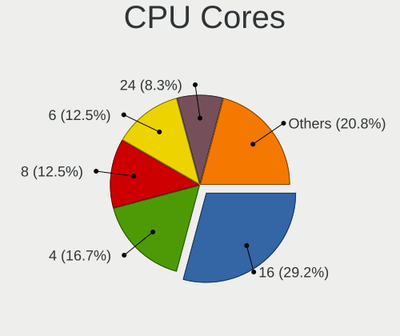

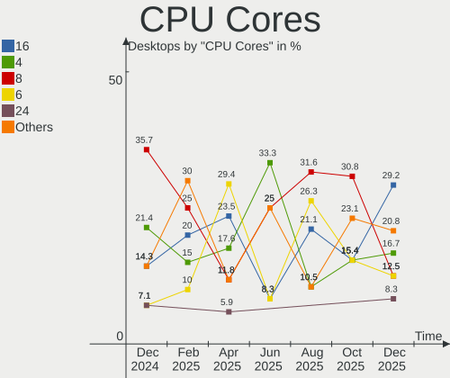

| Number | Desktops | Percent |
|--------|----------|---------|
| 16     | 7        | 29.17%  |
| 4      | 4        | 16.67%  |
| 8      | 3        | 12.5%   |
| 6      | 3        | 12.5%   |
| 24     | 2        | 8.33%   |
| 12     | 2        | 8.33%   |
| 44     | 1        | 4.17%   |
| 28     | 1        | 4.17%   |
| 14     | 1        | 4.17%   |

CPU Sockets
-----------

Number of sockets

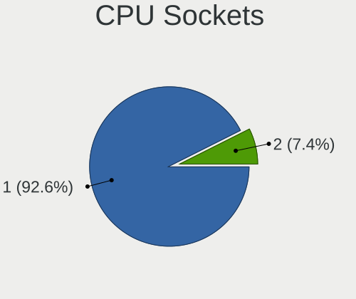

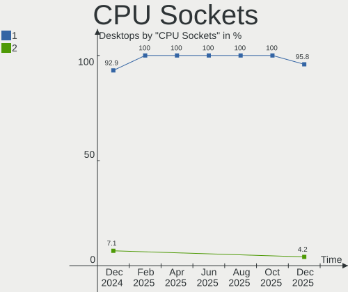

| Number | Desktops | Percent |
|--------|----------|---------|
| 1      | 23       | 95.83%  |
| 2      | 1        | 4.17%   |

CPU Threads
-----------

Threads per core (Hyper-Threading)

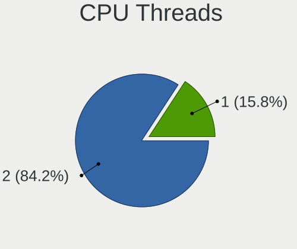

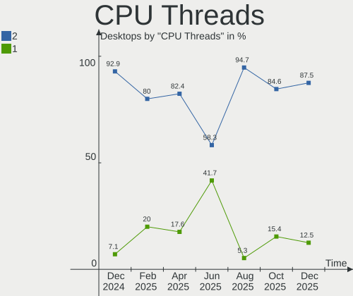

| Number | Desktops | Percent |
|--------|----------|---------|
| 2      | 21       | 87.5%   |
| 1      | 3        | 12.5%   |

CPU Op-Modes
------------

CPU Operation Modes (32-bit, 64-bit)

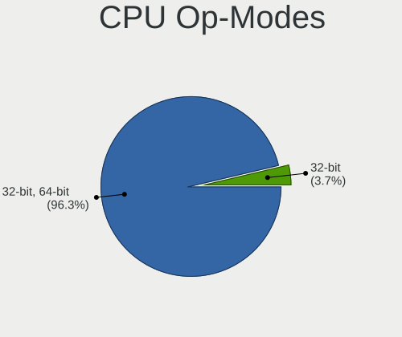

| Op mode        | Desktops | Percent |
|----------------|----------|---------|
| 32-bit, 64-bit | 24       | 100%    |

CPU Microcode
-------------

Microcode number

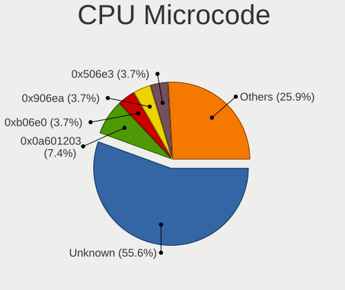

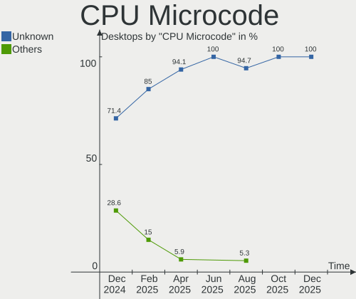

| Number  | Desktops | Percent |
|---------|----------|---------|
| Unknown | 24       | 100%    |

CPU Microarch
-------------

Microarchitecture

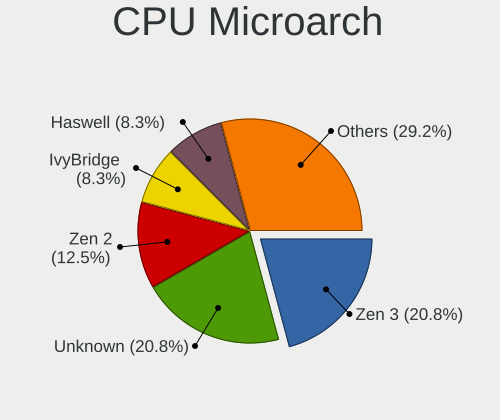

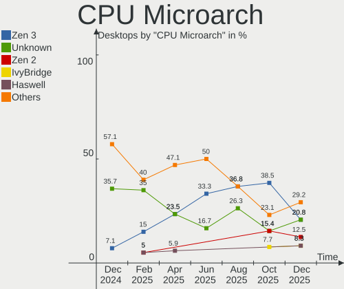

| Name             | Desktops | Percent |
|------------------|----------|---------|
| Zen 3            | 5        | 20.83%  |
| Unknown          | 5        | 20.83%  |
| Zen 2            | 3        | 12.5%   |
| IvyBridge        | 2        | 8.33%   |
| Haswell          | 2        | 8.33%   |
| Alderlake Hybrid | 2        | 8.33%   |
| Zen+             | 1        | 4.17%   |
| Sapphire Rapids  | 1        | 4.17%   |
| KabyLake         | 1        | 4.17%   |
| K10              | 1        | 4.17%   |
| Broadwell        | 1        | 4.17%   |

Graphics
--------

GPU Vendor
----------

Vendors of graphics cards

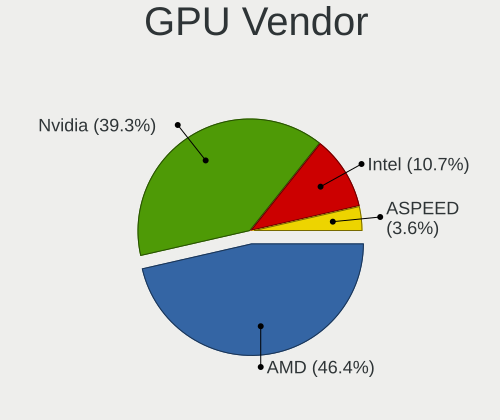

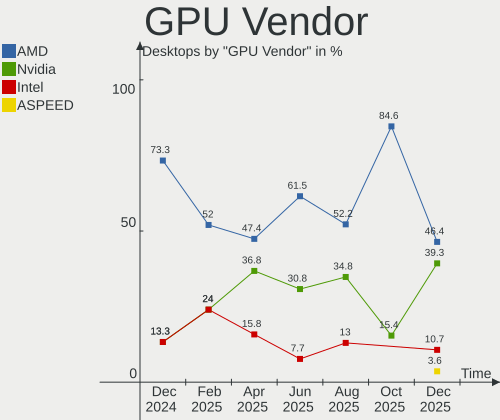

| Vendor            | Desktops | Percent |
|-------------------|----------|---------|
| AMD               | 13       | 46.43%  |
| Nvidia            | 11       | 39.29%  |
| Intel             | 3        | 10.71%  |
| ASPEED Technology | 1        | 3.57%   |

GPU Model
---------

Graphics card models

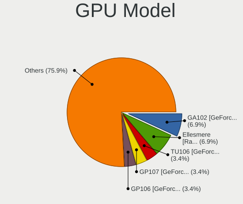

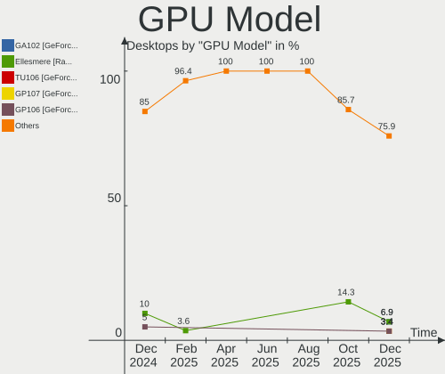

| Model                                                                 | Desktops | Percent |
|-----------------------------------------------------------------------|----------|---------|
| Nvidia GA102 [GeForce RTX 3090]                                       | 2        | 6.9%    |
| AMD Ellesmere [Radeon RX 470/480/570/570X/580/580X/590]               | 2        | 6.9%    |
| Nvidia TU106 [GeForce RTX 2070 Rev. A]                                | 1        | 3.45%   |
| Nvidia GP107 [GeForce GTX 1050]                                       | 1        | 3.45%   |
| Nvidia GP106 [GeForce GTX 1060 6GB]                                   | 1        | 3.45%   |
| Nvidia GP104 [GeForce GTX 1060 6GB]                                   | 1        | 3.45%   |
| Nvidia GP102 [GeForce GTX 1080 Ti]                                    | 1        | 3.45%   |
| Nvidia GB203 [GeForce RTX 5080]                                       | 1        | 3.45%   |
| Nvidia GA104 [GeForce RTX 3060]                                       | 1        | 3.45%   |
| Nvidia AD106 [GeForce RTX 4060 Ti]                                    | 1        | 3.45%   |
| Nvidia AD104 [GeForce RTX 4070 SUPER]                                 | 1        | 3.45%   |
| Intel Xeon E3-1200 v2/3rd Gen Core processor Graphics Controller      | 1        | 3.45%   |
| Intel DG2 [Arc A770]                                                  | 1        | 3.45%   |
| Intel DG2 [Arc A380]                                                  | 1        | 3.45%   |
| ASPEED Technology ASPEED Graphics Family                              | 1        | 3.45%   |
| AMD RS780C [Radeon 3100]                                              | 1        | 3.45%   |
| AMD Raphael                                                           | 1        | 3.45%   |
| AMD Navi 48 [Radeon RX 9070/9070 XT/9070 GRE]                         | 1        | 3.45%   |
| AMD Navi 33 [Radeon RX 7600/7600 XT/7600M XT/7600S/7700S / PRO W7600] | 1        | 3.45%   |
| AMD Navi 32 [Radeon RX 7700 XT / 7800 XT]                             | 1        | 3.45%   |
| AMD Navi 23 [Radeon RX 6600/6600 XT/6600M]                            | 1        | 3.45%   |
| AMD Navi 22 [Radeon RX 6700/6700 XT/6750 XT / 6800M/6850M XT]         | 1        | 3.45%   |
| AMD Navi 10 [Radeon RX 5600 OEM/5600 XT / 5700/5700 XT]               | 1        | 3.45%   |
| AMD Hawaii PRO [Radeon R9 290/390]                                    | 1        | 3.45%   |
| AMD Granite Ridge [Radeon Graphics]                                   | 1        | 3.45%   |
| AMD Cezanne [Radeon Vega Series / Radeon Vega Mobile Series]          | 1        | 3.45%   |
| AMD Cedar [Radeon HD 5000/6000/7350/8350 Series]                      | 1        | 3.45%   |

GPU Combo
---------

Combinations of graphics cards

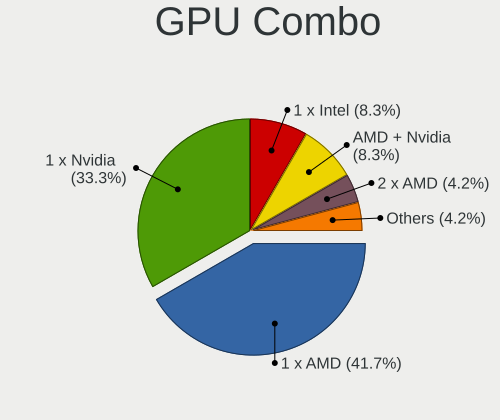

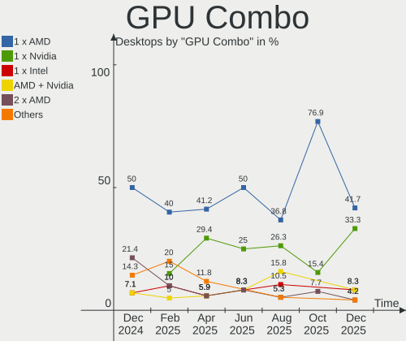

| Name                        | Desktops | Percent |
|-----------------------------|----------|---------|
| 1 x AMD                     | 10       | 41.67%  |
| 1 x Nvidia                  | 8        | 33.33%  |
| 1 x Intel                   | 2        | 8.33%   |
| AMD + Nvidia                | 2        | 8.33%   |
| 2 x AMD                     | 1        | 4.17%   |
| Intel + Nvidia + 1 x ASPEED | 1        | 4.17%   |

GPU Driver
----------

Free vs proprietary

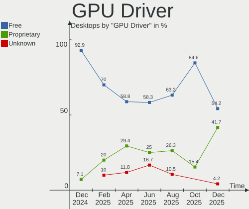

| Driver      | Desktops | Percent |
|-------------|----------|---------|
| Free        | 13       | 54.17%  |
| Proprietary | 10       | 41.67%  |
| Unknown     | 1        | 4.17%   |

GPU Memory
----------

Total video memory

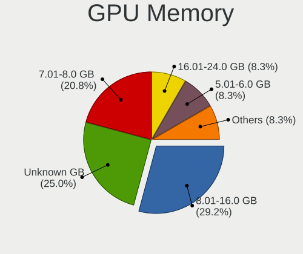

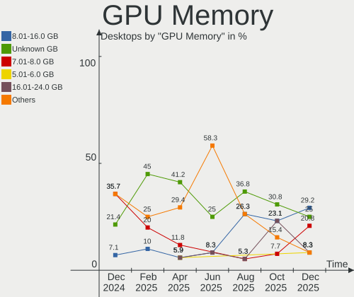

| Size in GB | Desktops | Percent |
|------------|----------|---------|
| 8.01-16.0  | 7        | 29.17%  |
| Unknown    | 6        | 25%     |
| 7.01-8.0   | 5        | 20.83%  |
| 5.01-6.0   | 2        | 8.33%   |
| 16.01-24.0 | 2        | 8.33%   |
| 1.01-2.0   | 1        | 4.17%   |
| 0.01-0.5   | 1        | 4.17%   |

Monitor
-------

Monitor Vendor
--------------

Monitor vendors

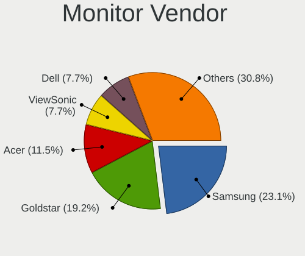

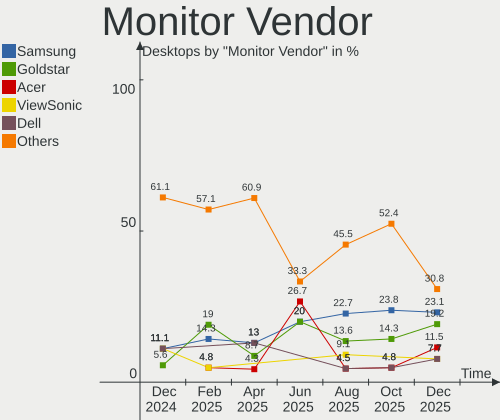

| Vendor               | Desktops | Percent |
|----------------------|----------|---------|
| Samsung Electronics  | 6        | 23.08%  |
| Goldstar             | 5        | 19.23%  |
| Acer                 | 3        | 11.54%  |
| ViewSonic            | 2        | 7.69%   |
| Dell                 | 2        | 7.69%   |
| AOC                  | 2        | 7.69%   |
| Ancor Communications | 2        | 7.69%   |
| Toshiba              | 1        | 3.85%   |
| Gigabyte Technology  | 1        | 3.85%   |
| CMT                  | 1        | 3.85%   |
| ASUSTek Computer     | 1        | 3.85%   |

Monitor Model
-------------

Monitor models

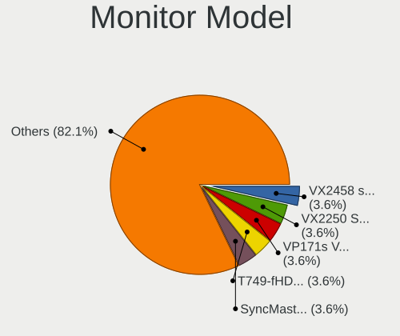

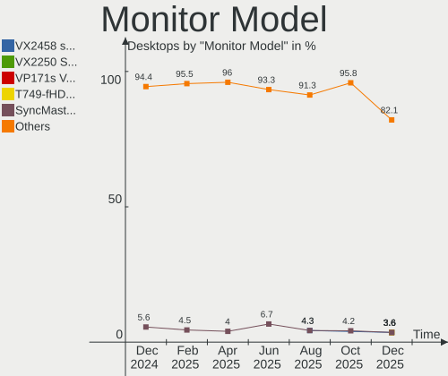

| Model                                                                   | Desktops | Percent |
|-------------------------------------------------------------------------|----------|---------|
| ViewSonic VX2458 series VSC0437 1920x1080 521x293mm 23.5-inch           | 1        | 3.57%   |
| ViewSonic VX2250 SERIES VSCCB25 1920x1080 477x268mm 21.5-inch           | 1        | 3.57%   |
| ViewSonic VP171s VSCB716 1280x1024 338x270mm 17.0-inch                  | 1        | 3.57%   |
| Toshiba T749-fHD720 TSB8801 1920x1080 708x398mm 32.0-inch               | 1        | 3.57%   |
| Samsung Electronics SyncMaster SAM059A 1920x1080 477x268mm 21.5-inch    | 1        | 3.57%   |
| Samsung Electronics S22B300 SAM08C8 1920x1080 477x268mm 21.5-inch       | 1        | 3.57%   |
| Samsung Electronics Odyssey G95C SAM74AF 3840x1080 1193x336mm 48.8-inch | 1        | 3.57%   |
| Samsung Electronics LS49AG95 SAM71AC 3840x1080 1190x340mm 48.7-inch     | 1        | 3.57%   |
| Samsung Electronics LCD Monitor SAM0E35 1920x1080 530x300mm 24.0-inch   | 1        | 3.57%   |
| Samsung Electronics LCD Monitor SAM0DF6 3840x2160 890x500mm 40.2-inch   | 1        | 3.57%   |
| Goldstar ULTRAGEAR+ GSM77BD 3840x2160 597x336mm 27.0-inch               | 1        | 3.57%   |
| Goldstar LG TV SSCR2 GSMC0C0 3840x2160                                  | 1        | 3.57%   |
| Goldstar HDR 4K GSM774F 3840x2160 697x392mm 31.5-inch                   | 1        | 3.57%   |
| Goldstar HDR 4K GSM7707 3840x2160 600x340mm 27.2-inch                   | 1        | 3.57%   |
| Goldstar FHD GSM5BE4 1920x1080 480x270mm 21.7-inch                      | 1        | 3.57%   |
| Goldstar 27GL850 GSM5B7F 2560x1440 597x336mm 27.0-inch                  | 1        | 3.57%   |
| Gigabyte Technology M28U GBT2800 3840x2160 697x392mm 31.5-inch          | 1        | 3.57%   |
| Dell U2412M DELA07B 1920x1200 518x324mm 24.1-inch                       | 1        | 3.57%   |
| Dell AW2725DF DELA252 2560x1440 590x334mm 26.7-inch                     | 1        | 3.57%   |
| CMT GP27-FUS CMT2704 3840x2160 597x336mm 27.0-inch                      | 1        | 3.57%   |
| ASUSTek Computer VG34VQ3B AUS3453 3440x1440 797x334mm 34.0-inch         | 1        | 3.57%   |
| AOC U2879G6 AOC2879 3840x2160 621x341mm 27.9-inch                       | 1        | 3.57%   |
| AOC 22B2WG5 AOC2202 1920x1080 477x268mm 21.5-inch                       | 1        | 3.57%   |
| Ancor Communications ASUS VN247 ACI24C3 1920x1080 521x293mm 23.5-inch   | 1        | 3.57%   |
| Ancor Communications ASUS VH242H ACI24F3 1920x1080 521x293mm 23.5-inch  | 1        | 3.57%   |
| Acer XF243Y P ACR0852 1920x1080 527x296mm 23.8-inch                     | 1        | 3.57%   |
| Acer VG270 ACR0D2D 1920x1080 598x336mm 27.0-inch                        | 1        | 3.57%   |
| Acer K242HYL ACR0475 1920x1080 527x296mm 23.8-inch                      | 1        | 3.57%   |

Monitor Resolution
------------------

Monitor screen resolution

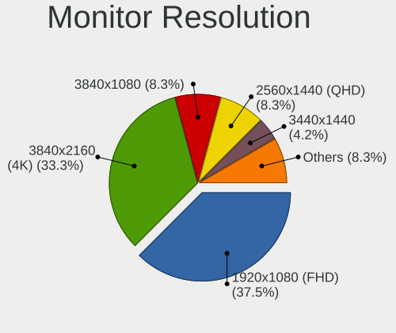

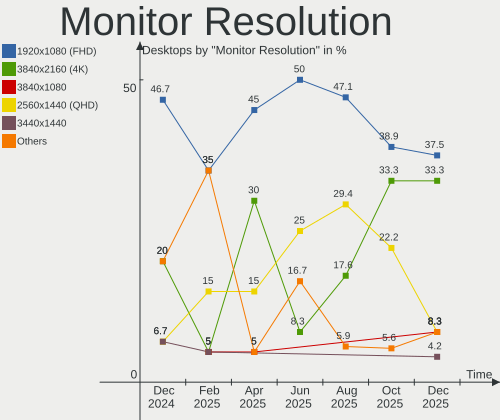

| Resolution        | Desktops | Percent |
|-------------------|----------|---------|
| 1920x1080 (FHD)   | 9        | 37.5%   |
| 3840x2160 (4K)    | 8        | 33.33%  |
| 3840x1080         | 2        | 8.33%   |
| 2560x1440 (QHD)   | 2        | 8.33%   |
| 3440x1440         | 1        | 4.17%   |
| 1920x1200 (WUXGA) | 1        | 4.17%   |
| 1280x1024 (SXGA)  | 1        | 4.17%   |

Monitor Diagonal
----------------

Diagonal size in inches

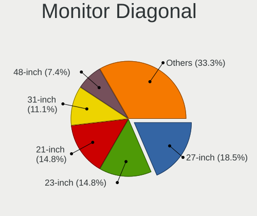

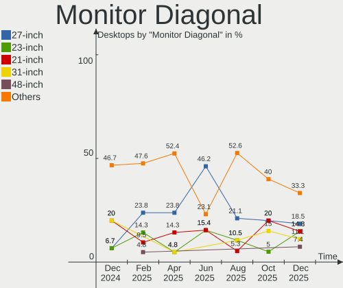

| Inches | Desktops | Percent |
|--------|----------|---------|
| 27     | 5        | 18.52%  |
| 23     | 4        | 14.81%  |
| 21     | 4        | 14.81%  |
| 31     | 3        | 11.11%  |
| 48     | 2        | 7.41%   |
| 24     | 2        | 7.41%   |
| 84     | 1        | 3.7%    |
| 72     | 1        | 3.7%    |
| 54     | 1        | 3.7%    |
| 34     | 1        | 3.7%    |
| 32     | 1        | 3.7%    |
| 26     | 1        | 3.7%    |
| 17     | 1        | 3.7%    |

Monitor Width
-------------

Physical width

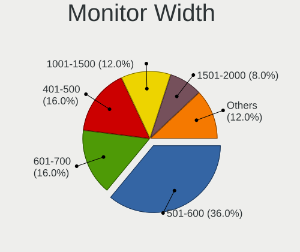

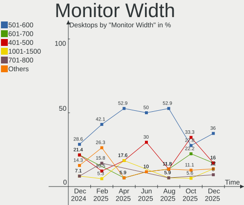

| Width in mm | Desktops | Percent |
|-------------|----------|---------|
| 501-600     | 9        | 36%     |
| 601-700     | 4        | 16%     |
| 401-500     | 4        | 16%     |
| 1001-1500   | 3        | 12%     |
| 701-800     | 2        | 8%      |
| 1501-2000   | 2        | 8%      |
| 301-350     | 1        | 4%      |

Aspect Ratio
------------

Proportional relationship between the width and the height

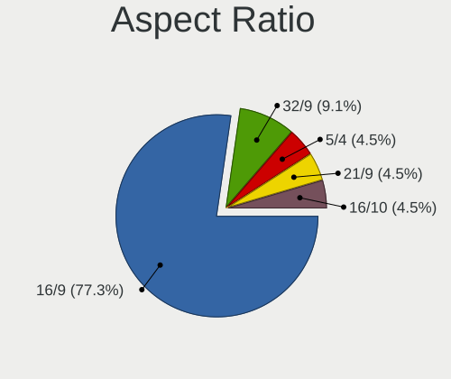

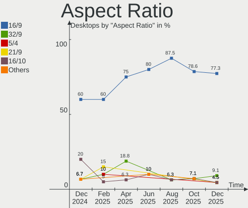

| Ratio | Desktops | Percent |
|-------|----------|---------|
| 16/9  | 17       | 77.27%  |
| 32/9  | 2        | 9.09%   |
| 5/4   | 1        | 4.55%   |
| 21/9  | 1        | 4.55%   |
| 16/10 | 1        | 4.55%   |

Monitor Area
------------

Area in inch²

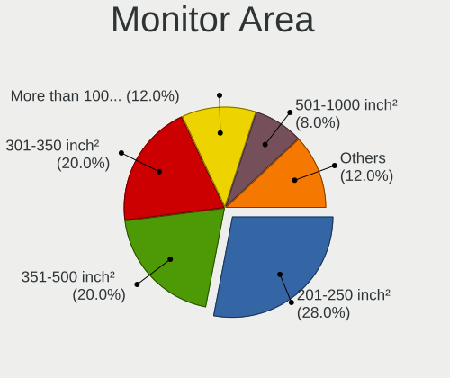

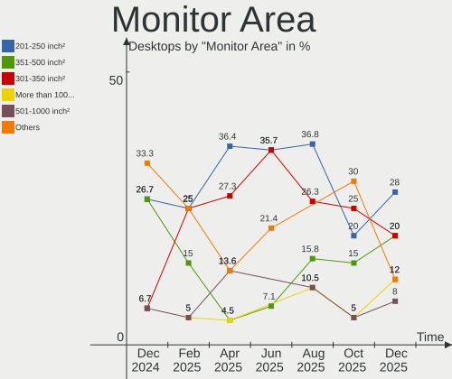

| Area in inch² | Desktops | Percent |
|----------------|----------|---------|
| 201-250        | 7        | 28%     |
| 351-500        | 5        | 20%     |
| 301-350        | 5        | 20%     |
| More than 1000 | 3        | 12%     |
| 501-1000       | 2        | 8%      |
| 251-300        | 1        | 4%      |
| 151-200        | 1        | 4%      |
| 141-150        | 1        | 4%      |

Pixel Density
-------------

Pixels per inch

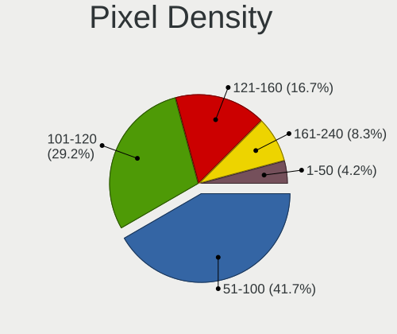

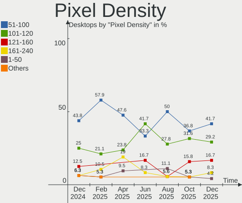

| Density | Desktops | Percent |
|---------|----------|---------|
| 51-100  | 10       | 41.67%  |
| 101-120 | 7        | 29.17%  |
| 121-160 | 4        | 16.67%  |
| 161-240 | 2        | 8.33%   |
| 1-50    | 1        | 4.17%   |

Multiple Monitors
-----------------

Total monitors connected

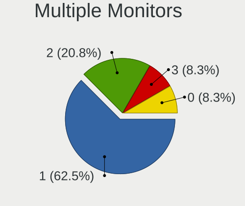

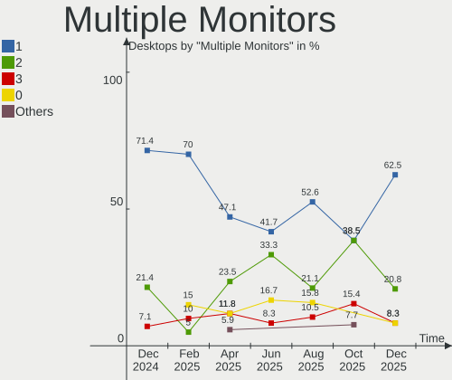

| Total | Desktops | Percent |
|-------|----------|---------|
| 1     | 15       | 62.5%   |
| 2     | 5        | 20.83%  |
| 3     | 2        | 8.33%   |
| 0     | 2        | 8.33%   |

Network
-------

Net Controller Vendor
---------------------

Controller vendors

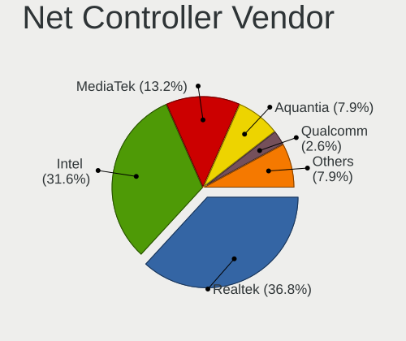

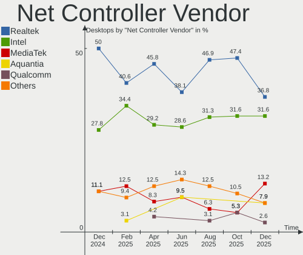

| Vendor                | Desktops | Percent |
|-----------------------|----------|---------|
| Realtek Semiconductor | 14       | 36.84%  |
| Intel                 | 12       | 31.58%  |
| MediaTek              | 5        | 13.16%  |
| Aquantia              | 3        | 7.89%   |
| Qualcomm Technologies | 1        | 2.63%   |
| Broadcom Limited      | 1        | 2.63%   |
| ASIX Electronics      | 1        | 2.63%   |
| American Megatrends   | 1        | 2.63%   |

Net Controller Model
--------------------

Controller models

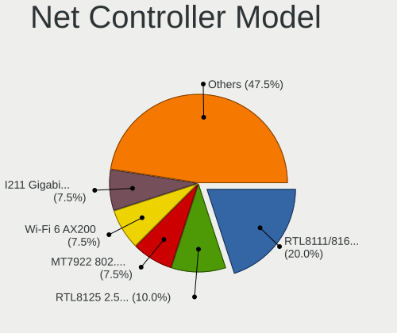

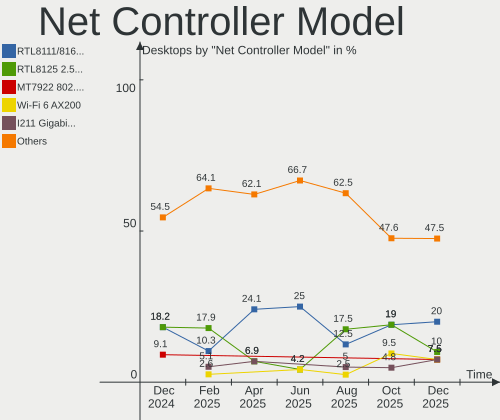

| Model                                                                           | Desktops | Percent |
|---------------------------------------------------------------------------------|----------|---------|
| Realtek RTL8111/8168/8211/8411 PCI Express Gigabit Ethernet Controller          | 8        | 20%     |
| Realtek RTL8125 2.5GbE Controller                                               | 4        | 10%     |
| MediaTek MT7922 802.11ax PCI Express Wireless Network Adapter                   | 3        | 7.5%    |
| Intel Wi-Fi 6 AX200                                                             | 3        | 7.5%    |
| Intel I211 Gigabit Network Connection                                           | 3        | 7.5%    |
| Intel Ethernet Controller I225-V                                                | 2        | 5%      |
| Intel Ethernet Connection I217-V                                                | 2        | 5%      |
| Aquantia AQtion AQC113CS NBase-T/IEEE 802.3an Ethernet Controller [Antigua 10G] | 2        | 5%      |
| Realtek RTL8153 Gigabit Ethernet Adapter                                        | 1        | 2.5%    |
| Realtek RTL8126 5GbE Controller                                                 | 1        | 2.5%    |
| Qualcomm WCN785x Wi-Fi 7(802.11be) 320MHz 2x2 [FastConnect 7800]                | 1        | 2.5%    |
| MediaTek MT7927 802.11be 320MHz 2x2 PCIe Wireless Network Adapter [Filogic 380] | 1        | 2.5%    |
| MediaTek MT7921K (RZ608) Wi-Fi 6E 80MHz                                         | 1        | 2.5%    |
| Intel Ethernet Controller X710 for 10GBASE-T                                    | 1        | 2.5%    |
| Intel Ethernet Controller I226-V                                                | 1        | 2.5%    |
| Intel Ethernet Connection I217-LM                                               | 1        | 2.5%    |
| Intel Ethernet Connection (7) I219-LM                                           | 1        | 2.5%    |
| Broadcom Limited BCM4352 802.11ac Dual Band Wireless Network Adapter            | 1        | 2.5%    |
| ASIX AX88772A Fast Ethernet                                                     | 1        | 2.5%    |
| Aquantia AQtion AQC107 NBase-T/IEEE 802.3an Ethernet Controller [Atlantic 10G]  | 1        | 2.5%    |
| American Megatrends Virtual Ethernet.                                           | 1        | 2.5%    |

Wireless Vendor
---------------

Wireless vendors

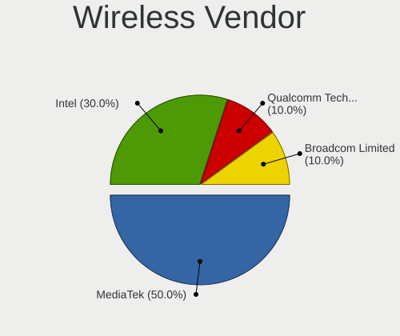

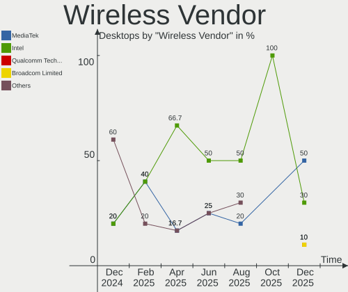

| Vendor                | Desktops | Percent |
|-----------------------|----------|---------|
| MediaTek              | 5        | 50%     |
| Intel                 | 3        | 30%     |
| Qualcomm Technologies | 1        | 10%     |
| Broadcom Limited      | 1        | 10%     |

Wireless Model
--------------

Wireless models

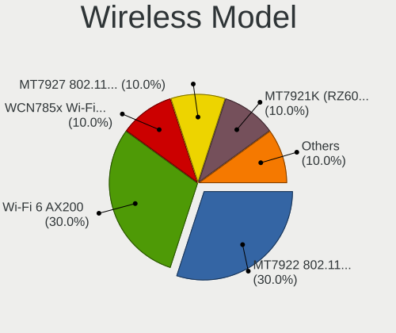

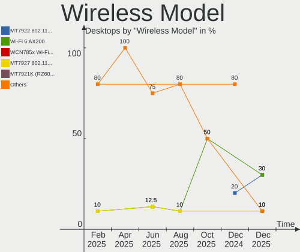

| Model                                                                           | Desktops | Percent |
|---------------------------------------------------------------------------------|----------|---------|
| MediaTek MT7922 802.11ax PCI Express Wireless Network Adapter                   | 3        | 30%     |
| Intel Wi-Fi 6 AX200                                                             | 3        | 30%     |
| Qualcomm WCN785x Wi-Fi 7(802.11be) 320MHz 2x2 [FastConnect 7800]                | 1        | 10%     |
| MediaTek MT7927 802.11be 320MHz 2x2 PCIe Wireless Network Adapter [Filogic 380] | 1        | 10%     |
| MediaTek MT7921K (RZ608) Wi-Fi 6E 80MHz                                         | 1        | 10%     |
| Broadcom Limited BCM4352 802.11ac Dual Band Wireless Network Adapter            | 1        | 10%     |

Ethernet Vendor
---------------

Ethernet vendors

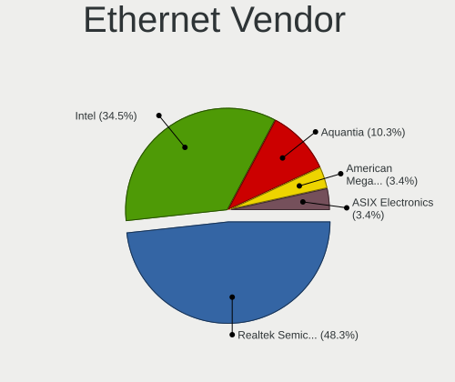

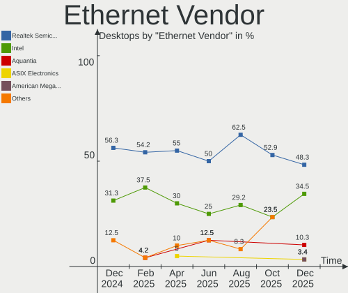

| Vendor                | Desktops | Percent |
|-----------------------|----------|---------|
| Realtek Semiconductor | 14       | 48.28%  |
| Intel                 | 10       | 34.48%  |
| Aquantia              | 3        | 10.34%  |
| ASIX Electronics      | 1        | 3.45%   |
| American Megatrends   | 1        | 3.45%   |

Ethernet Model
--------------

Ethernet models

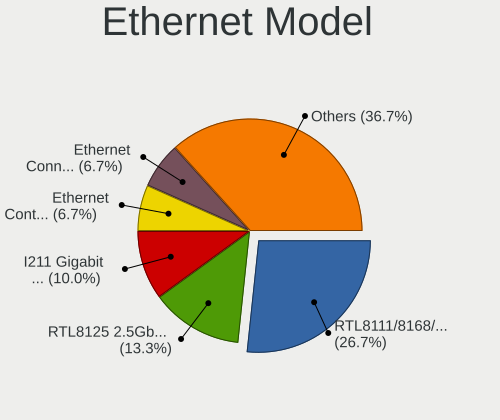

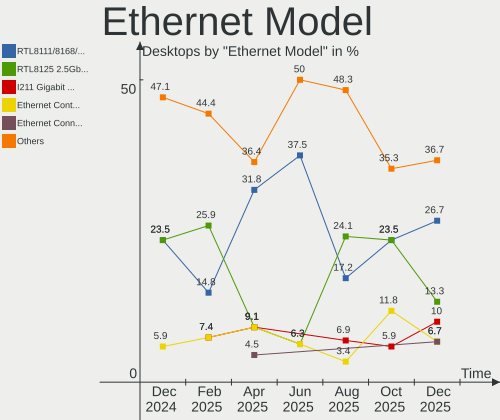

| Model                                                                           | Desktops | Percent |
|---------------------------------------------------------------------------------|----------|---------|
| Realtek RTL8111/8168/8211/8411 PCI Express Gigabit Ethernet Controller          | 8        | 26.67%  |
| Realtek RTL8125 2.5GbE Controller                                               | 4        | 13.33%  |
| Intel I211 Gigabit Network Connection                                           | 3        | 10%     |
| Intel Ethernet Controller I225-V                                                | 2        | 6.67%   |
| Intel Ethernet Connection I217-V                                                | 2        | 6.67%   |
| Aquantia AQtion AQC113CS NBase-T/IEEE 802.3an Ethernet Controller [Antigua 10G] | 2        | 6.67%   |
| Realtek RTL8153 Gigabit Ethernet Adapter                                        | 1        | 3.33%   |
| Realtek RTL8126 5GbE Controller                                                 | 1        | 3.33%   |
| Intel Ethernet Controller X710 for 10GBASE-T                                    | 1        | 3.33%   |
| Intel Ethernet Controller I226-V                                                | 1        | 3.33%   |
| Intel Ethernet Connection I217-LM                                               | 1        | 3.33%   |
| Intel Ethernet Connection (7) I219-LM                                           | 1        | 3.33%   |
| ASIX AX88772A Fast Ethernet                                                     | 1        | 3.33%   |
| Aquantia AQtion AQC107 NBase-T/IEEE 802.3an Ethernet Controller [Atlantic 10G]  | 1        | 3.33%   |
| American Megatrends Virtual Ethernet.                                           | 1        | 3.33%   |

Net Controller Kind
-------------------

Ethernet, WiFi or modem

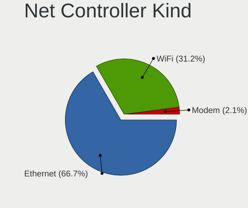

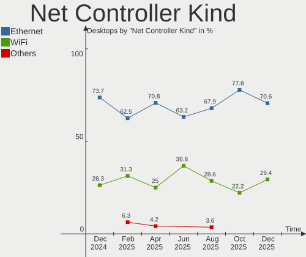

| Kind     | Desktops | Percent |
|----------|----------|---------|
| Ethernet | 24       | 70.59%  |
| WiFi     | 10       | 29.41%  |

Used Controller
---------------

Currently used network controller

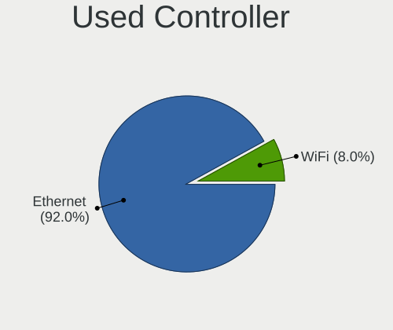

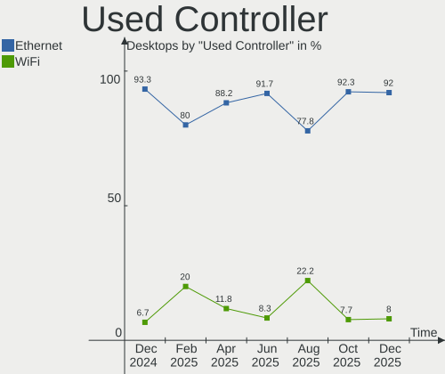

| Kind     | Desktops | Percent |
|----------|----------|---------|
| Ethernet | 23       | 92%     |
| WiFi     | 2        | 8%      |

NICs
----

Total network controllers on board

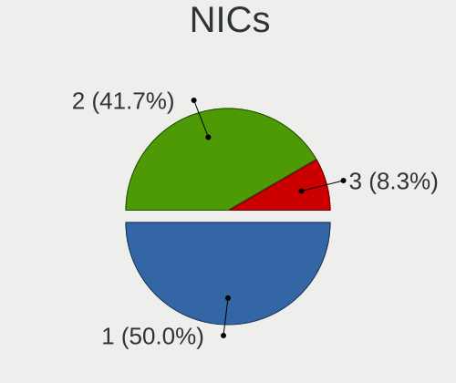

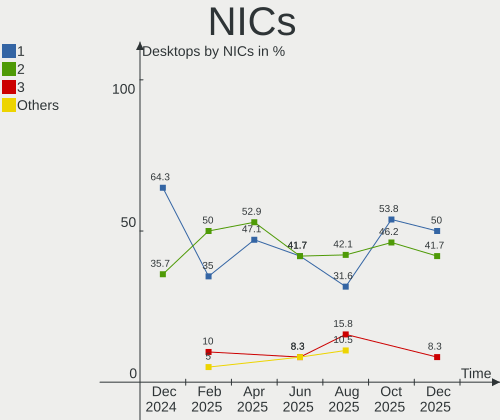

| Total | Desktops | Percent |
|-------|----------|---------|
| 1     | 12       | 50%     |
| 2     | 10       | 41.67%  |
| 3     | 2        | 8.33%   |

IPv6
----

IPv6 vs IPv4

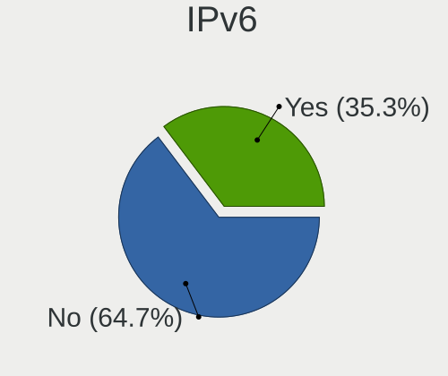

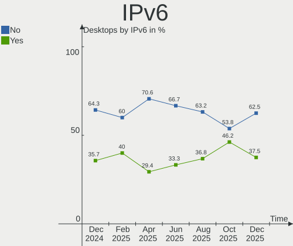

| Used | Desktops | Percent |
|------|----------|---------|
| No   | 15       | 62.5%   |
| Yes  | 9        | 37.5%   |

Bluetooth
---------

Bluetooth Vendor
----------------

Controller vendors

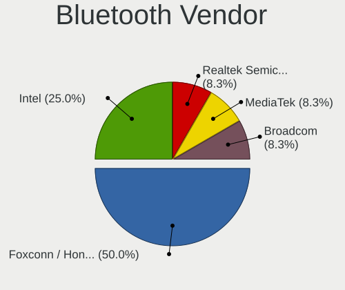

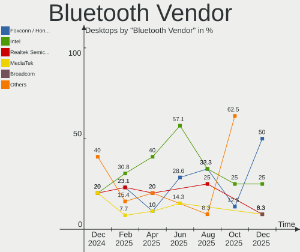

| Vendor                | Desktops | Percent |
|-----------------------|----------|---------|
| Foxconn / Hon Hai     | 6        | 50%     |
| Intel                 | 3        | 25%     |
| Realtek Semiconductor | 1        | 8.33%   |
| MediaTek              | 1        | 8.33%   |
| Broadcom              | 1        | 8.33%   |

Bluetooth Model
---------------

Controller models

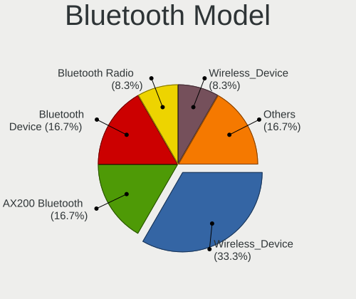

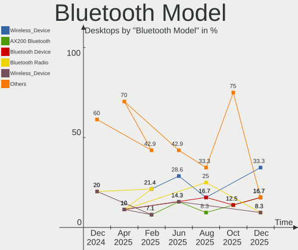

| Model                              | Desktops | Percent |
|------------------------------------|----------|---------|
| Foxconn / Hon Hai Wireless_Device  | 4        | 33.33%  |
| Intel AX200 Bluetooth              | 2        | 16.67%  |
| Foxconn / Hon Hai Bluetooth Device | 2        | 16.67%  |
| Realtek Bluetooth Radio            | 1        | 8.33%   |
| MediaTek Wireless_Device           | 1        | 8.33%   |
| Intel AX210 Bluetooth              | 1        | 8.33%   |
| Broadcom BCM20702A0                | 1        | 8.33%   |

Sound
-----

Sound Vendor
------------

Sound card vendors

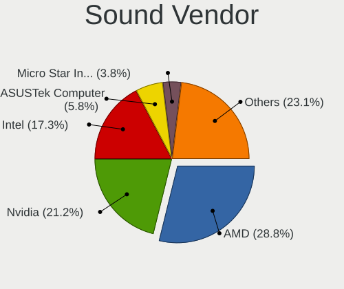

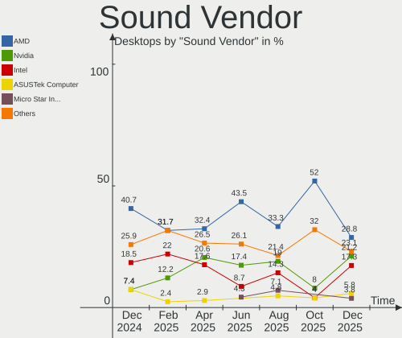

| Vendor                   | Desktops | Percent |
|--------------------------|----------|---------|
| AMD                      | 15       | 28.85%  |
| Nvidia                   | 11       | 21.15%  |
| Intel                    | 9        | 17.31%  |
| ASUSTek Computer         | 3        | 5.77%   |
| Micro Star International | 2        | 3.85%   |
| Creative Labs            | 2        | 3.85%   |
| Unknown                  | 1        | 1.92%   |
| Realtek Semiconductor    | 1        | 1.92%   |
| MV-SILICON               | 1        | 1.92%   |
| Kingston Technology      | 1        | 1.92%   |
| JOUNIVO                  | 1        | 1.92%   |
| Jieli Technology         | 1        | 1.92%   |
| Focusrite-Novation       | 1        | 1.92%   |
| Comtrue                  | 1        | 1.92%   |
| C-Media Electronics      | 1        | 1.92%   |
| BEHRINGER International  | 1        | 1.92%   |

Sound Model
-----------

Sound card models

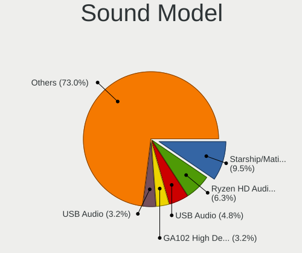

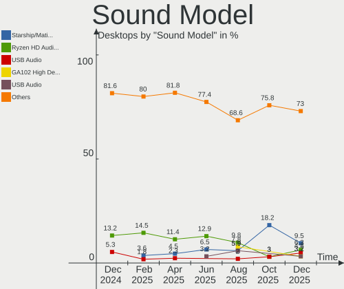

| Model                                                                      | Desktops | Percent |
|----------------------------------------------------------------------------|----------|---------|
| AMD Starship/Matisse HD Audio Controller                                   | 6        | 9.52%   |
| AMD Ryzen HD Audio Controller                                              | 4        | 6.35%   |
| ASUSTek Computer USB Audio                                                 | 3        | 4.76%   |
| Nvidia GA102 High Definition Audio Controller                              | 2        | 3.17%   |
| Micro Star International USB Audio                                         | 2        | 3.17%   |
| Intel Raptor Lake High Definition Audio Controller                         | 2        | 3.17%   |
| Intel DG2 Audio Controller                                                 | 2        | 3.17%   |
| AMD Radeon High Definition Audio Controller                                | 2        | 3.17%   |
| AMD Navi 31 HDMI/DP Audio                                                  | 2        | 3.17%   |
| AMD Navi 21/23 HDMI/DP Audio Controller                                    | 2        | 3.17%   |
| AMD Ellesmere HDMI Audio [Radeon RX 470/480 / 570/580/590]                 | 2        | 3.17%   |
| Unknown USB MIDI Interface                                                 | 1        | 1.59%   |
| Realtek Semiconductor LG Monitor HP MIC                                    | 1        | 1.59%   |
| Nvidia TU106 High Definition Audio Controller                              | 1        | 1.59%   |
| Nvidia GP107GL High Definition Audio Controller                            | 1        | 1.59%   |
| Nvidia GP106 High Definition Audio Controller                              | 1        | 1.59%   |
| Nvidia GP104 High Definition Audio Controller                              | 1        | 1.59%   |
| Nvidia GP102 HDMI Audio Controller                                         | 1        | 1.59%   |
| Nvidia GB203 High Definition Audio Controller                              | 1        | 1.59%   |
| Nvidia GA104 High Definition Audio Controller                              | 1        | 1.59%   |
| Nvidia AD106M High Definition Audio Controller                             | 1        | 1.59%   |
| Nvidia AD104 High Definition Audio Controller                              | 1        | 1.59%   |
| MV-SILICON fifine Microphone                                               | 1        | 1.59%   |
| Kingston Technology HyperX Cloud II Wireless                               | 1        | 1.59%   |
| JOUNIVO JOUNIVO JV601                                                      | 1        | 1.59%   |
| Jieli Technology UACDemoV1.0                                               | 1        | 1.59%   |
| Intel Cannon Lake PCH cAVS                                                 | 1        | 1.59%   |
| Intel C610/X99 series chipset HD Audio Controller                          | 1        | 1.59%   |
| Intel C600/X79 series chipset High Definition Audio Controller             | 1        | 1.59%   |
| Intel Alder Lake-S HD Audio Controller                                     | 1        | 1.59%   |
| Intel 8 Series/C220 Series Chipset High Definition Audio Controller        | 1        | 1.59%   |
| Intel 6 Series/C200 Series Chipset Family High Definition Audio Controller | 1        | 1.59%   |
| Focusrite-Novation Scarlett Solo (3rd Gen.)                                | 1        | 1.59%   |
| Creative Labs EMU10k1 [Sound Blaster Live! Series]                         | 1        | 1.59%   |
| Creative Labs CA0108/CA10300 [Sound Blaster Audigy Series]                 | 1        | 1.59%   |
| Comtrue MOONDROP Dawn Pro                                                  | 1        | 1.59%   |
| C-Media Electronics CM108 Audio Controller                                 | 1        | 1.59%   |
| BEHRINGER International UMC202HD 192k                                      | 1        | 1.59%   |
| AMD SBx00 Azalia (Intel HDA)                                               | 1        | 1.59%   |
| AMD Renoir/Cezanne HDMI/DP Audio Controller                                | 1        | 1.59%   |

Memory
------

Memory Vendor
-------------

Memory module vendors

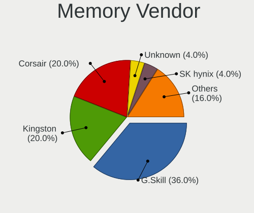

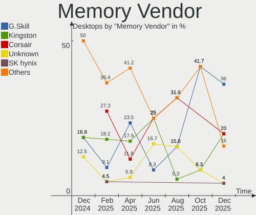

| Vendor            | Desktops | Percent |
|-------------------|----------|---------|
| G.Skill           | 9        | 36%     |
| Kingston          | 5        | 20%     |
| Corsair           | 5        | 20%     |
| Unknown           | 1        | 4%      |
| SK hynix          | 1        | 4%      |
| Micron Technology | 1        | 4%      |
| KINGBANK          | 1        | 4%      |
| Crucial           | 1        | 4%      |
| A-DATA Technology | 1        | 4%      |

Memory Model
------------

Memory module models

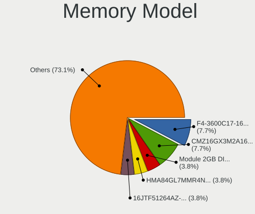

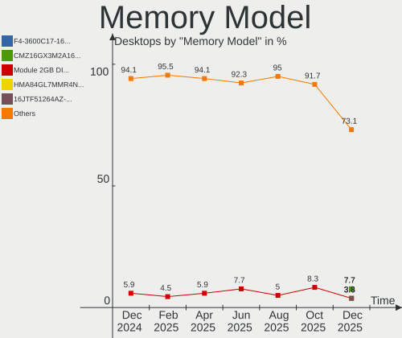

| Model                                                   | Desktops | Percent |
|---------------------------------------------------------|----------|---------|
| G.Skill RAM F4-3600C17-16GTZR 16GB DIMM DDR4 3666MT/s   | 2        | 7.69%   |
| Corsair RAM CMZ16GX3M2A1600C10 8GB DIMM DDR3 1600MT/s   | 2        | 7.69%   |
| Unknown RAM Module 2GB DIMM DDR2 667MT/s                | 1        | 3.85%   |
| SK hynix RAM HMA84GL7MMR4N-TF 32GB RIMM DDR4 2133MT/s   | 1        | 3.85%   |
| Micron RAM 16JTF51264AZ-1G4D 4GB DIMM DDR3 1333MT/s     | 1        | 3.85%   |
| Kingston RAM KHX3200C16D4/32GX 32GB DIMM DDR4 3200MT/s  | 1        | 3.85%   |
| Kingston RAM KHX3200C16D4/16GX 16GB DIMM DDR4 3600MT/s  | 1        | 3.85%   |
| Kingston RAM KF556R36-32 32GiB DIMM DDR5 4800MT/s       | 1        | 3.85%   |
| Kingston RAM KF3600C16D4/16GX 16GB DIMM DDR4 3800MT/s   | 1        | 3.85%   |
| Kingston RAM KF1600C10D3/8G 8GB DIMM DDR3 1600MT/s      | 1        | 3.85%   |
| Kingston RAM HP698651-154-KEB 8GB DIMM DDR3 1333MT/s    | 1        | 3.85%   |
| KINGBANK RAM Module 48GB DIMM DDR5 4800MT/s             | 1        | 3.85%   |
| G.Skill RAM F5-6400J3239G32G 32GB DIMM DDR5 6400MT/s    | 1        | 3.85%   |
| G.Skill RAM F5-6000J3636F16G 16GB DIMM DDR5 6400MT/s    | 1        | 3.85%   |
| G.Skill RAM F5-6000J3238G32G 32GB DIMM DDR5 6000MT/s    | 1        | 3.85%   |
| G.Skill RAM F5-6000J3040G32G 32GB DIMM DDR5 6200MT/s    | 1        | 3.85%   |
| G.Skill RAM F4-4400C19-16GVK 16GB DIMM DDR4 4400MT/s    | 1        | 3.85%   |
| G.Skill RAM F4-3600C18-32GVK 32GiB DIMM DDR4 3600MT/s   | 1        | 3.85%   |
| G.Skill RAM F4-3600C16-16GTZNC 16GiB DIMM DDR4 3600MT/s | 1        | 3.85%   |
| Crucial RAM CT32G4DFD832A.C16FF 32GB DIMM DDR4 3200MT/s | 1        | 3.85%   |
| Corsair RAM CMP96GX5M2B7000C40 48GB DIMM DDR5 6400MT/s  | 1        | 3.85%   |
| Corsair RAM CMK32GX4M2Z3600C18 16GB DIMM DDR4 3800MT/s  | 1        | 3.85%   |
| Corsair RAM CMK32GX4M2D3600C18 16GB DIMM DDR4 3800MT/s  | 1        | 3.85%   |
| A-DATA RAM DDR4 3200 16GB DIMM DDR4 3600MT/s            | 1        | 3.85%   |

Memory Kind
-----------

Memory module kinds

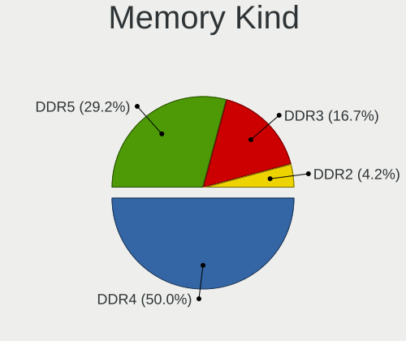

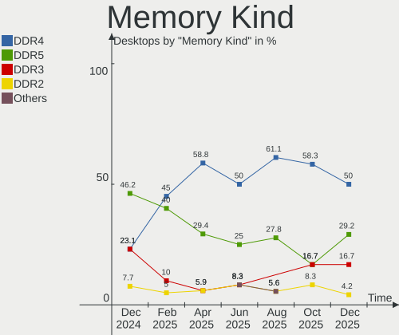

| Kind | Desktops | Percent |
|------|----------|---------|
| DDR4 | 12       | 50%     |
| DDR5 | 7        | 29.17%  |
| DDR3 | 4        | 16.67%  |
| DDR2 | 1        | 4.17%   |

Memory Form Factor
------------------

Physical design of the memory module

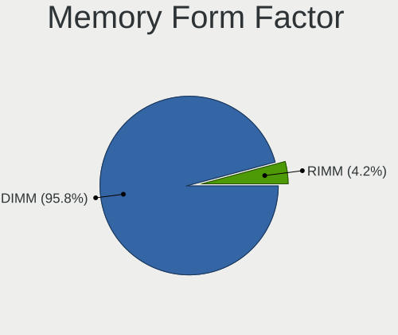

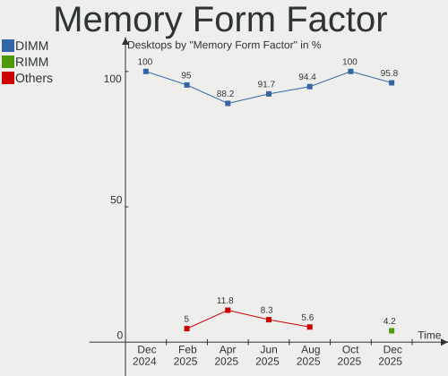

| Name | Desktops | Percent |
|------|----------|---------|
| DIMM | 23       | 95.83%  |
| RIMM | 1        | 4.17%   |

Memory Size
-----------

Memory module size

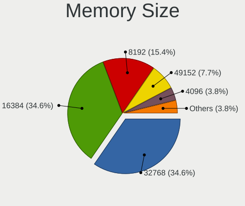

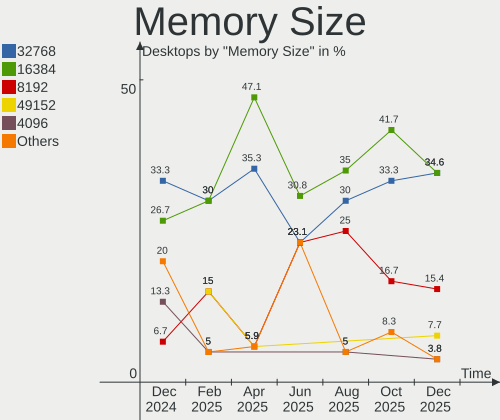

| Size  | Desktops | Percent |
|-------|----------|---------|
| 32768 | 9        | 34.62%  |
| 16384 | 9        | 34.62%  |
| 8192  | 4        | 15.38%  |
| 49152 | 2        | 7.69%   |
| 4096  | 1        | 3.85%   |
| 2048  | 1        | 3.85%   |

Memory Speed
------------

Memory module speed

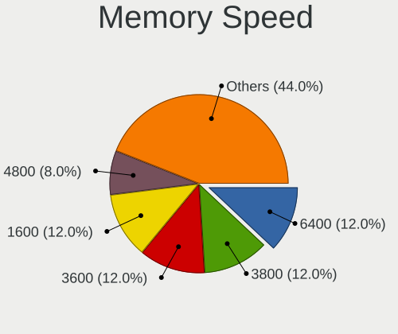

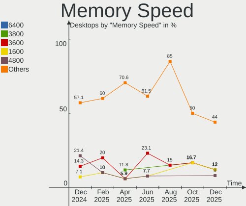

| Speed | Desktops | Percent |
|-------|----------|---------|
| 6400  | 3        | 12%     |
| 3800  | 3        | 12%     |
| 3600  | 3        | 12%     |
| 1600  | 3        | 12%     |
| 4800  | 2        | 8%      |
| 3666  | 2        | 8%      |
| 3200  | 2        | 8%      |
| 6200  | 1        | 4%      |
| 6000  | 1        | 4%      |
| 4400  | 1        | 4%      |
| 3866  | 1        | 4%      |
| 2133  | 1        | 4%      |
| 1333  | 1        | 4%      |
| 667   | 1        | 4%      |

Printers & scanners
-------------------

Printer Vendor
--------------

Printer device vendors

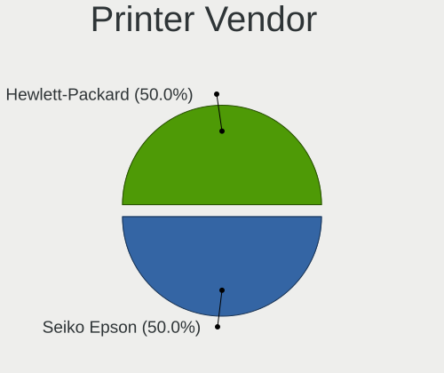

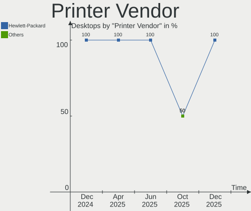

| Vendor          | Desktops | Percent |
|-----------------|----------|---------|
| Hewlett-Packard | 1        | 100%    |

Printer Model
-------------

Printer device models

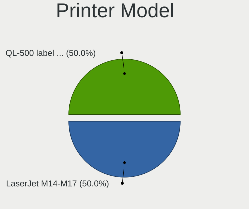

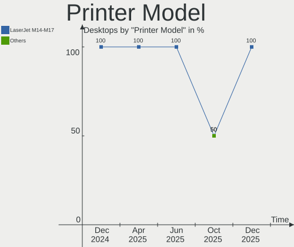

| Model               | Desktops | Percent |
|---------------------|----------|---------|
| HP LaserJet M14-M17 | 1        | 100%    |

Scanner Vendor
--------------

Scanner device vendors

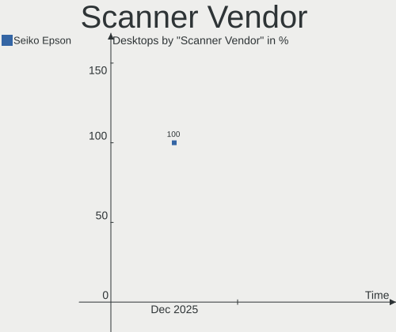

| Vendor      | Desktops | Percent |
|-------------|----------|---------|
| Seiko Epson | 1        | 100%    |

Scanner Model
-------------

Scanner device models

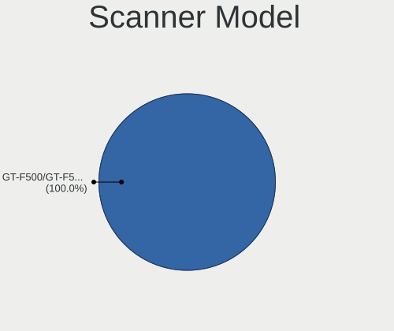

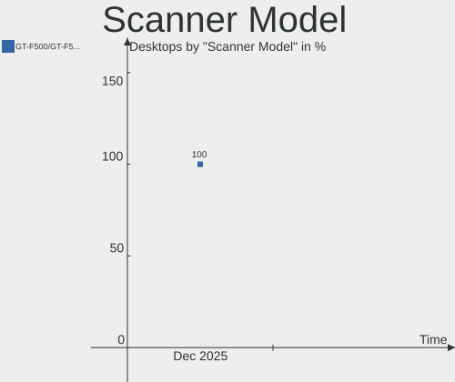

| Model                                                    | Desktops | Percent |
|----------------------------------------------------------|----------|---------|
| Seiko Epson GT-F500/GT-F550 [Perfection 2480/2580 PHOTO] | 1        | 100%    |

Camera
------

Camera Vendor
-------------

Camera device vendors

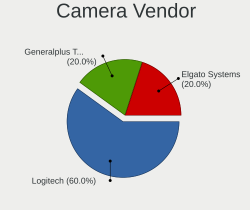

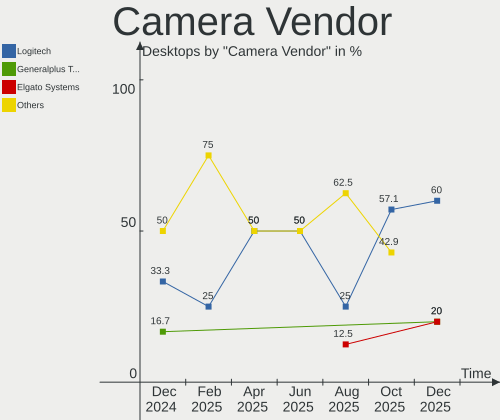

| Vendor                 | Desktops | Percent |
|------------------------|----------|---------|
| Logitech               | 3        | 60%     |
| Generalplus Technology | 1        | 20%     |
| Elgato Systems         | 1        | 20%     |

Camera Model
------------

Camera device models

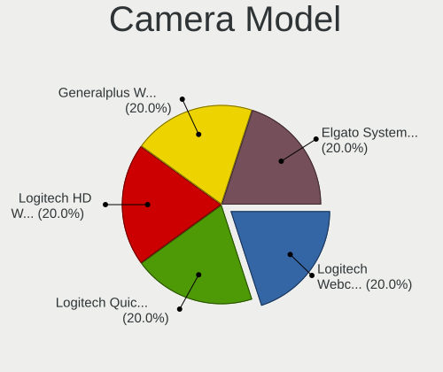

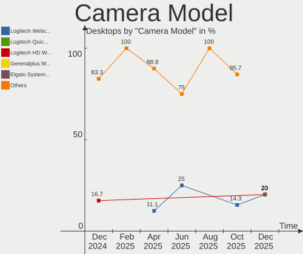

| Model                             | Desktops | Percent |
|-----------------------------------|----------|---------|
| Logitech Webcam C270              | 1        | 20%     |
| Logitech QuickCam Pro 9000        | 1        | 20%     |
| Logitech HD Webcam C525           | 1        | 20%     |
| Generalplus WEB CAM               | 1        | 20%     |
| Elgato Systems Elgato Facecam Pro | 1        | 20%     |

Security
--------

Fingerprint Vendor
------------------

Fingerprint sensor vendors

Zero info for selected period =(

Fingerprint Model
-----------------

Fingerprint sensor models

Zero info for selected period =(

Chipcard Vendor
---------------

Chipcard module vendors

Zero info for selected period =(

Chipcard Model
--------------

Chipcard module models

Zero info for selected period =(

Unsupported
-----------

Unsupported Devices
-------------------

Total unsupported devices on board

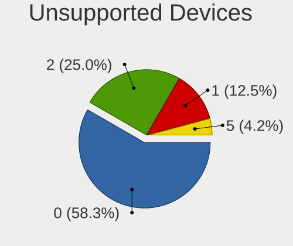

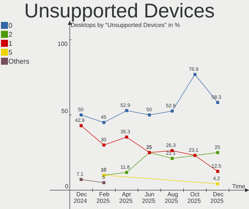

| Total | Desktops | Percent |
|-------|----------|---------|
| 0     | 14       | 58.33%  |
| 2     | 6        | 25%     |
| 1     | 3        | 12.5%   |
| 5     | 1        | 4.17%   |

Unsupported Device Types
------------------------

Types of unsupported devices

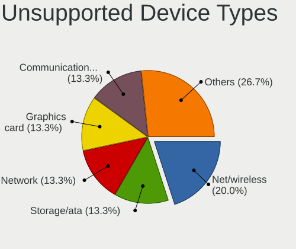

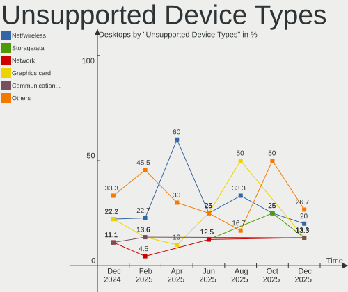

| Type                     | Desktops | Percent |
|--------------------------|----------|---------|
| Net/wireless             | 3        | 20%     |
| Storage/ata              | 2        | 13.33%  |
| Network                  | 2        | 13.33%  |
| Graphics card            | 2        | 13.33%  |
| Communication controller | 2        | 13.33%  |
| Bluetooth                | 2        | 13.33%  |
| Unassigned class         | 1        | 6.67%   |
| Sound                    | 1        | 6.67%   |

