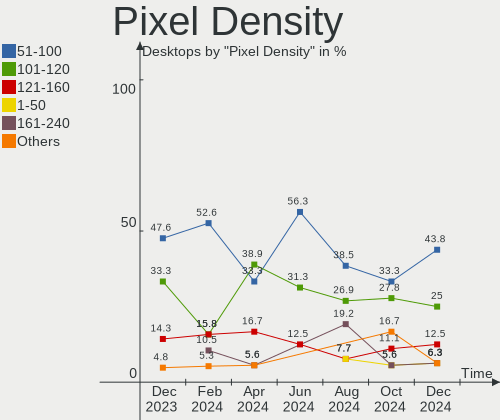
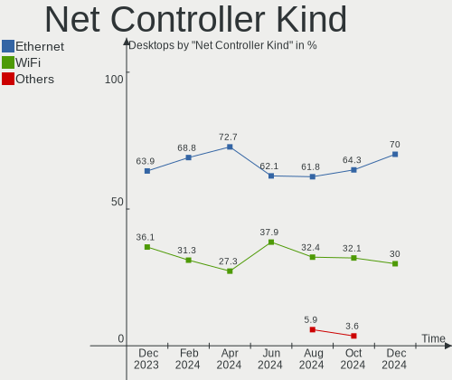

Gentoo - Hardware Trends (Desktops)
-----------------------------------

A project to identify most popular hardware characteristics and track their change
over time based on data collected by Linux users at https://Linux-Hardware.org.

Anyone can contribute to this report by the [hw-probe](https://github.com/linuxhw/hw-probe) tool:

    sudo -E hw-probe -all -upload

This report is for one last month. Overall report since the beginning of time: [TestDays](https://github.com/linuxhw/TestDays)

Period: Mar, 2023.

Contents
--------

* [ System ](#system)
  - [ OS                       ](#os)
  - [ OS Family                ](#os-family)
  - [ Kernel                   ](#kernel)
  - [ Kernel Family            ](#kernel-family)
  - [ Kernel Major Ver.        ](#kernel-major-ver)
  - [ Arch                     ](#arch)
  - [ DE                       ](#de)
  - [ Display Server           ](#display-server)
  - [ Display Manager          ](#display-manager)
  - [ OS Lang                  ](#os-lang)
  - [ Boot Mode                ](#boot-mode)
  - [ Filesystem               ](#filesystem)
  - [ Part. scheme             ](#part-scheme)
  - [ Dual Boot with Linux/BSD ](#dual-boot-with-linuxbsd)
  - [ Dual Boot (Win)          ](#dual-boot-win)

* [ Board ](#board)
  - [ Vendor                   ](#vendor)
  - [ Model                    ](#model)
  - [ Model Family             ](#model-family)
  - [ MFG Year                 ](#mfg-year)
  - [ Form Factor              ](#form-factor)
  - [ Secure Boot              ](#secure-boot)
  - [ Coreboot                 ](#coreboot)
  - [ RAM Size                 ](#ram-size)
  - [ RAM Used                 ](#ram-used)
  - [ Total Drives             ](#total-drives)
  - [ Has CD-ROM               ](#has-cd-rom)
  - [ Has Ethernet             ](#has-ethernet)
  - [ Has WiFi                 ](#has-wifi)
  - [ Has Bluetooth            ](#has-bluetooth)

* [ Location ](#location)
  - [ Country                  ](#country)
  - [ City                     ](#city)

* [ Drives ](#drives)
  - [ Drive Vendor             ](#drive-vendor)
  - [ Drive Model              ](#drive-model)
  - [ HDD Vendor               ](#hdd-vendor)
  - [ SSD Vendor               ](#ssd-vendor)
  - [ Drive Kind               ](#drive-kind)
  - [ Drive Connector          ](#drive-connector)
  - [ Drive Size               ](#drive-size)
  - [ Space Total              ](#space-total)
  - [ Space Used               ](#space-used)
  - [ Malfunc. Drives          ](#malfunc-drives)
  - [ Malfunc. Drive Vendor    ](#malfunc-drive-vendor)
  - [ Malfunc. HDD Vendor      ](#malfunc-hdd-vendor)
  - [ Malfunc. Drive Kind      ](#malfunc-drive-kind)
  - [ Failed Drives            ](#failed-drives)
  - [ Failed Drive Vendor      ](#failed-drive-vendor)
  - [ Drive Status             ](#drive-status)

* [ Storage controller ](#storage-controller)
  - [ Storage Vendor           ](#storage-vendor)
  - [ Storage Model            ](#storage-model)
  - [ Storage Kind             ](#storage-kind)

* [ Processor ](#processor)
  - [ CPU Vendor               ](#cpu-vendor)
  - [ CPU Model                ](#cpu-model)
  - [ CPU Model Family         ](#cpu-model-family)
  - [ CPU Cores                ](#cpu-cores)
  - [ CPU Sockets              ](#cpu-sockets)
  - [ CPU Threads              ](#cpu-threads)
  - [ CPU Op-Modes             ](#cpu-op-modes)
  - [ CPU Microcode            ](#cpu-microcode)
  - [ CPU Microarch            ](#cpu-microarch)

* [ Graphics ](#graphics)
  - [ GPU Vendor               ](#gpu-vendor)
  - [ GPU Model                ](#gpu-model)
  - [ GPU Combo                ](#gpu-combo)
  - [ GPU Driver               ](#gpu-driver)
  - [ GPU Memory               ](#gpu-memory)

* [ Monitor ](#monitor)
  - [ Monitor Vendor           ](#monitor-vendor)
  - [ Monitor Model            ](#monitor-model)
  - [ Monitor Resolution       ](#monitor-resolution)
  - [ Monitor Diagonal         ](#monitor-diagonal)
  - [ Monitor Width            ](#monitor-width)
  - [ Aspect Ratio             ](#aspect-ratio)
  - [ Monitor Area             ](#monitor-area)
  - [ Pixel Density            ](#pixel-density)
  - [ Multiple Monitors        ](#multiple-monitors)

* [ Network ](#network)
  - [ Net Controller Vendor    ](#net-controller-vendor)
  - [ Net Controller Model     ](#net-controller-model)
  - [ Wireless Vendor          ](#wireless-vendor)
  - [ Wireless Model           ](#wireless-model)
  - [ Ethernet Vendor          ](#ethernet-vendor)
  - [ Ethernet Model           ](#ethernet-model)
  - [ Net Controller Kind      ](#net-controller-kind)
  - [ Used Controller          ](#used-controller)
  - [ NICs                     ](#nics)
  - [ IPv6                     ](#ipv6)

* [ Bluetooth ](#bluetooth)
  - [ Bluetooth Vendor         ](#bluetooth-vendor)
  - [ Bluetooth Model          ](#bluetooth-model)

* [ Sound ](#sound)
  - [ Sound Vendor             ](#sound-vendor)
  - [ Sound Model              ](#sound-model)

* [ Memory ](#memory)
  - [ Memory Vendor            ](#memory-vendor)
  - [ Memory Model             ](#memory-model)
  - [ Memory Kind              ](#memory-kind)
  - [ Memory Form Factor       ](#memory-form-factor)
  - [ Memory Size              ](#memory-size)
  - [ Memory Speed             ](#memory-speed)

* [ Printers & scanners ](#printers--scanners)
  - [ Printer Vendor           ](#printer-vendor)
  - [ Printer Model            ](#printer-model)
  - [ Scanner Vendor           ](#scanner-vendor)
  - [ Scanner Model            ](#scanner-model)

* [ Camera ](#camera)
  - [ Camera Vendor            ](#camera-vendor)
  - [ Camera Model             ](#camera-model)

* [ Security ](#security)
  - [ Fingerprint Vendor       ](#fingerprint-vendor)
  - [ Fingerprint Model        ](#fingerprint-model)
  - [ Chipcard Vendor          ](#chipcard-vendor)
  - [ Chipcard Model           ](#chipcard-model)

* [ Unsupported ](#unsupported)
  - [ Unsupported Devices      ](#unsupported-devices)
  - [ Unsupported Device Types ](#unsupported-device-types)

System
------

OS
--

Installed operating systems

| Name        | Desktops | Percent |
|-------------|----------|---------|
| Gentoo 2.13 | 26       | 89.66%  |
| Gentoo 2.9  | 3        | 10.34%  |

OS Family
---------

OS without a version

| Name   | Desktops | Percent |
|--------|----------|---------|
| Gentoo | 29       | 100%    |

Kernel
------

Version of the Linux kernel

| Version                     | Desktops | Percent |
|-----------------------------|----------|---------|
| 6.1.12-gentoo               | 6        | 20.69%  |
| 6.1.12-gentoo-x86_64        | 4        | 13.79%  |
| 6.2.8-gentoo-x86_64         | 1        | 3.45%   |
| 6.2.6-x86_64                | 1        | 3.45%   |
| 6.2.5-gentoo-dist           | 1        | 3.45%   |
| 6.2.3-gentoo-x86_64         | 1        | 3.45%   |
| 6.2.3-gentoo                | 1        | 3.45%   |
| 6.2.2-gentoo                | 1        | 3.45%   |
| 6.2.1-gentoo-x86_64         | 1        | 3.45%   |
| 6.2.0-pf2-llvm              | 1        | 3.45%   |
| 6.1.3-gentoo                | 1        | 3.45%   |
| 6.1.19-rt-rt8               | 1        | 3.45%   |
| 6.1.19-renacuajo            | 1        | 3.45%   |
| 6.1.15-gentoo               | 1        | 3.45%   |
| 6.1.13-gentoo-x86_64        | 1        | 3.45%   |
| 6.1.12-gentoo-dist-hardened | 1        | 3.45%   |
| 6.1.12-gentoo-dist          | 1        | 3.45%   |
| 5.15.91-gentoo              | 1        | 3.45%   |
| 5.15.80-gentoo              | 1        | 3.45%   |
| 5.15.59-gentoo-x86_64       | 1        | 3.45%   |
| 5.10.174-gentoo             | 1        | 3.45%   |

Kernel Family
-------------

Linux kernel without a distro release

| Version  | Desktops | Percent |
|----------|----------|---------|
| 6.1.12   | 12       | 41.38%  |
| 6.2.3    | 2        | 6.9%    |
| 6.1.19   | 2        | 6.9%    |
| 6.2.8    | 1        | 3.45%   |
| 6.2.6    | 1        | 3.45%   |
| 6.2.5    | 1        | 3.45%   |
| 6.2.2    | 1        | 3.45%   |
| 6.2.1    | 1        | 3.45%   |
| 6.2.0    | 1        | 3.45%   |
| 6.1.3    | 1        | 3.45%   |
| 6.1.15   | 1        | 3.45%   |
| 6.1.13   | 1        | 3.45%   |
| 5.15.91  | 1        | 3.45%   |
| 5.15.80  | 1        | 3.45%   |
| 5.15.59  | 1        | 3.45%   |
| 5.10.174 | 1        | 3.45%   |

Kernel Major Ver.
-----------------

Linux kernel major version

| Version | Desktops | Percent |
|---------|----------|---------|
| 6.1     | 17       | 58.62%  |
| 6.2     | 8        | 27.59%  |
| 5.15    | 3        | 10.34%  |
| 5.10    | 1        | 3.45%   |

Arch
----

OS architecture (x86_64, i586, etc.)

| Name   | Desktops | Percent |
|--------|----------|---------|
| x86_64 | 28       | 96.55%  |
| i686   | 1        | 3.45%   |

DE
--

Desktop Environment

| Name    | Desktops | Percent |
|---------|----------|---------|
| Unknown | 9        | 31.03%  |
| KDE5    | 8        | 27.59%  |
| XFCE    | 4        | 13.79%  |
| GNOME   | 3        | 10.34%  |
| LXQt    | 2        | 6.9%    |
| openbox | 1        | 3.45%   |
| MATE    | 1        | 3.45%   |
| KDE     | 1        | 3.45%   |

Display Server
--------------

X11 or Wayland

| Name    | Desktops | Percent |
|---------|----------|---------|
| X11     | 9        | 31.03%  |
| Unknown | 8        | 27.59%  |
| Wayland | 6        | 20.69%  |
| Tty     | 6        | 20.69%  |

Display Manager
---------------

SDDM, LightDM, etc.

| Name    | Desktops | Percent |
|---------|----------|---------|
| Unknown | 11       | 37.93%  |
| SDDM    | 9        | 31.03%  |
| LightDM | 4        | 13.79%  |
| GDM     | 3        | 10.34%  |
| LXDM    | 2        | 6.9%    |

OS Lang
-------

Language

| Lang   | Desktops | Percent |
|--------|----------|---------|
| en_US  | 11       | 37.93%  |
| C.UTF8 | 6        | 20.69%  |
| en_GB  | 4        | 13.79%  |
| de_DE  | 3        | 10.34%  |
| fr_FR  | 2        | 6.9%    |
| pl_PL  | 1        | 3.45%   |
| es_ES  | 1        | 3.45%   |
| en_AU  | 1        | 3.45%   |

Boot Mode
---------

EFI or BIOS

| Mode | Desktops | Percent |
|------|----------|---------|
| EFI  | 20       | 68.97%  |
| BIOS | 9        | 31.03%  |

Filesystem
----------

Type of filesystem

| Type    | Desktops | Percent |
|---------|----------|---------|
| Ext4    | 13       | 44.83%  |
| Btrfs   | 8        | 27.59%  |
| F2fs    | 4        | 13.79%  |
| Zfs     | 2        | 6.9%    |
| XXXXXXX | 1        | 3.45%   |
| Xfs     | 1        | 3.45%   |

Part. scheme
------------

Scheme of partitioning

| Type    | Desktops | Percent |
|---------|----------|---------|
| GPT     | 23       | 79.31%  |
| MBR     | 4        | 13.79%  |
| Unknown | 2        | 6.9%    |

Dual Boot with Linux/BSD
------------------------

Hosting more than one Linux/BSD

| Dual boot | Desktops | Percent |
|-----------|----------|---------|
| No        | 15       | 51.72%  |
| Yes       | 14       | 48.28%  |

Dual Boot (Win)
---------------

Hosting Linux and Windows

| Dual boot | Desktops | Percent |
|-----------|----------|---------|
| No        | 20       | 68.97%  |
| Yes       | 9        | 31.03%  |

Board
-----

Vendor
------

Motherboard manufacturer

| Name                | Desktops | Percent |
|---------------------|----------|---------|
| ASUSTek Computer    | 13       | 44.83%  |
| ASRock              | 5        | 17.24%  |
| Gigabyte Technology | 4        | 13.79%  |
| Supermicro          | 1        | 3.45%   |
| MSI                 | 1        | 3.45%   |
| Huanan              | 1        | 3.45%   |
| HPE                 | 1        | 3.45%   |
| Fujitsu Siemens     | 1        | 3.45%   |
| Foxconn             | 1        | 3.45%   |
| Unknown             | 1        | 3.45%   |

Model
-----

Motherboard model

| Name                                | Desktops | Percent |
|-------------------------------------|----------|---------|
| ASUS M3A78-CM                       | 2        | 6.9%    |
| Supermicro SSG-6028R-ER12-HDP-AI050 | 1        | 3.45%   |
| MSI MS-7640                         | 1        | 3.45%   |
| Huanan X99-F8D V2.4                 | 1        | 3.45%   |
| HPE ProLiant MicroServer Gen10 Plus | 1        | 3.45%   |
| Gigabyte Z77X-UD5H                  | 1        | 3.45%   |
| Gigabyte X470 AORUS ULTRA GAMING    | 1        | 3.45%   |
| Gigabyte B150M-D2V DDR3             | 1        | 3.45%   |
| Gigabyte AB350-Gaming               | 1        | 3.45%   |
| Fujitsu Siemens D1547               | 1        | 3.45%   |
| Foxconn TPS01                       | 1        | 3.45%   |
| ASUS TUF Gaming X670E-PLUS WIFI     | 1        | 3.45%   |
| ASUS TUF Gaming B650M-PLUS WIFI     | 1        | 3.45%   |
| ASUS ROG STRIX Z590-F GAMING WIFI   | 1        | 3.45%   |
| ASUS ROG STRIX Z590-E GAMING WIFI   | 1        | 3.45%   |
| ASUS ROG STRIX X670E-E GAMING WIFI  | 1        | 3.45%   |
| ASUS ROG STRIX X570-I GAMING        | 1        | 3.45%   |
| ASUS ROG STRIX B650E-F GAMING WIFI  | 1        | 3.45%   |
| ASUS ROG STRIX B450-F GAMING        | 1        | 3.45%   |
| ASUS ProArt X670E-CREATOR WIFI      | 1        | 3.45%   |
| ASUS PRIME B450M-A                  | 1        | 3.45%   |
| ASUS Maximus VIII HERO ALPHA        | 1        | 3.45%   |
| ASRock X570 Taichi                  | 1        | 3.45%   |
| ASRock X370 Gaming X                | 1        | 3.45%   |
| ASRock H81M-HDS                     | 1        | 3.45%   |
| ASRock H170 Pro4                    | 1        | 3.45%   |
| ASRock AM1H-ITX                     | 1        | 3.45%   |
| Unknown                             | 1        | 3.45%   |

Model Family
------------

Motherboard model prefix

| Name                                | Desktops | Percent |
|-------------------------------------|----------|---------|
| ASUS ROG                            | 6        | 20.69%  |
| ASUS TUF                            | 2        | 6.9%    |
| ASUS M3A78-CM                       | 2        | 6.9%    |
| Supermicro SSG-6028R-ER12-HDP-AI050 | 1        | 3.45%   |
| MSI MS-7640                         | 1        | 3.45%   |
| Huanan X99-F8D                      | 1        | 3.45%   |
| HPE ProLiant                        | 1        | 3.45%   |
| Gigabyte Z77X-UD5H                  | 1        | 3.45%   |
| Gigabyte X470                       | 1        | 3.45%   |
| Gigabyte B150M-D2V                  | 1        | 3.45%   |
| Gigabyte AB350-Gaming               | 1        | 3.45%   |
| Fujitsu Siemens D1547               | 1        | 3.45%   |
| Foxconn TPS01                       | 1        | 3.45%   |
| ASUS ProArt                         | 1        | 3.45%   |
| ASUS PRIME                          | 1        | 3.45%   |
| ASUS Maximus                        | 1        | 3.45%   |
| ASRock X570                         | 1        | 3.45%   |
| ASRock X370                         | 1        | 3.45%   |
| ASRock H81M-HDS                     | 1        | 3.45%   |
| ASRock H170                         | 1        | 3.45%   |
| ASRock AM1H-ITX                     | 1        | 3.45%   |
| Unknown                             | 1        | 3.45%   |

MFG Year
--------

Motherboard manufacture year

| Year | Desktops | Percent |
|------|----------|---------|
| 2022 | 5        | 17.24%  |
| 2021 | 4        | 13.79%  |
| 2018 | 4        | 13.79%  |
| 2019 | 2        | 6.9%    |
| 2017 | 2        | 6.9%    |
| 2012 | 2        | 6.9%    |
| 2008 | 2        | 6.9%    |
| 2023 | 1        | 3.45%   |
| 2020 | 1        | 3.45%   |
| 2016 | 1        | 3.45%   |
| 2015 | 1        | 3.45%   |
| 2014 | 1        | 3.45%   |
| 2013 | 1        | 3.45%   |
| 2009 | 1        | 3.45%   |
| 2003 | 1        | 3.45%   |

Form Factor
-----------

Physical design of the computer

| Name    | Desktops | Percent |
|---------|----------|---------|
| Desktop | 29       | 100%    |

Secure Boot
-----------

Enabled or disabled

| State    | Desktops | Percent |
|----------|----------|---------|
| Disabled | 29       | 100%    |

Coreboot
--------

Have coreboot on board

| Used | Desktops | Percent |
|------|----------|---------|
| No   | 29       | 100%    |

RAM Size
--------

Total RAM memory

| Size in GB      | Desktops | Percent |
|-----------------|----------|---------|
| 64.01-256.0     | 9        | 31.03%  |
| 32.01-64.0      | 7        | 24.14%  |
| 16.01-24.0      | 5        | 17.24%  |
| 3.01-4.0        | 3        | 10.34%  |
| 4.01-8.0        | 2        | 6.9%    |
| More than 256.0 | 1        | 3.45%   |
| 2.01-3.0        | 1        | 3.45%   |
| 8.01-16.0       | 1        | 3.45%   |

RAM Used
--------

Used RAM memory

| Used GB     | Desktops | Percent |
|-------------|----------|---------|
| 2.01-3.0    | 6        | 20.69%  |
| 4.01-8.0    | 5        | 17.24%  |
| 8.01-16.0   | 5        | 17.24%  |
| 3.01-4.0    | 4        | 13.79%  |
| 1.01-2.0    | 3        | 10.34%  |
| 0.51-1.0    | 3        | 10.34%  |
| 0.01-0.5    | 2        | 6.9%    |
| 64.01-256.0 | 1        | 3.45%   |

Total Drives
------------

Number of drives on board

| Drives | Desktops | Percent |
|--------|----------|---------|
| 1      | 9        | 31.03%  |
| 3      | 8        | 27.59%  |
| 4      | 5        | 17.24%  |
| 8      | 2        | 6.9%    |
| 6      | 2        | 6.9%    |
| 2      | 2        | 6.9%    |
| 5      | 1        | 3.45%   |

Has CD-ROM
----------

Has CD-ROM on board

| Presented | Desktops | Percent |
|-----------|----------|---------|
| No        | 22       | 75.86%  |
| Yes       | 7        | 24.14%  |

Has Ethernet
------------

Has Ethernet on board

| Presented | Desktops | Percent |
|-----------|----------|---------|
| Yes       | 28       | 96.55%  |
| No        | 1        | 3.45%   |

Has WiFi
--------

Has WiFi module

| Presented | Desktops | Percent |
|-----------|----------|---------|
| No        | 18       | 62.07%  |
| Yes       | 11       | 37.93%  |

Has Bluetooth
-------------

Has Bluetooth module

| Presented | Desktops | Percent |
|-----------|----------|---------|
| No        | 16       | 55.17%  |
| Yes       | 13       | 44.83%  |

Location
--------

Country
-------

Geographic location (country)

| Country   | Desktops | Percent |
|-----------|----------|---------|
| Germany   | 8        | 27.59%  |
| USA       | 5        | 17.24%  |
| UK        | 4        | 13.79%  |
| Poland    | 3        | 10.34%  |
| France    | 2        | 6.9%    |
| Czechia   | 2        | 6.9%    |
| Vietnam   | 1        | 3.45%   |
| Spain     | 1        | 3.45%   |
| Russia    | 1        | 3.45%   |
| Canada    | 1        | 3.45%   |
| Australia | 1        | 3.45%   |

City
----

Geographic location (city)

| City                  | Desktops | Percent |
|-----------------------|----------|---------|
| Warsaw                | 3        | 10.34%  |
| Cologne               | 2        | 6.9%    |
| Český Těšín      | 2        | 6.9%    |
| Vancouver             | 1        | 3.45%   |
| Stade                 | 1        | 3.45%   |
| San Francisco         | 1        | 3.45%   |
| Royal Tunbridge Wells | 1        | 3.45%   |
| Perth                 | 1        | 3.45%   |
| Moscow                | 1        | 3.45%   |
| Maule                 | 1        | 3.45%   |
| Marysville            | 1        | 3.45%   |
| Mainhausen            | 1        | 3.45%   |
| Lohne                 | 1        | 3.45%   |
| Logroño              | 1        | 3.45%   |
| Leeds                 | 1        | 3.45%   |
| Kiel                  | 1        | 3.45%   |
| Hanoi                 | 1        | 3.45%   |
| Gunzenhausen          | 1        | 3.45%   |
| Croydon               | 1        | 3.45%   |
| Clitheroe             | 1        | 3.45%   |
| Cherry Hill           | 1        | 3.45%   |
| Champigny-sur-Marne   | 1        | 3.45%   |
| Bremerton             | 1        | 3.45%   |
| Berlin                | 1        | 3.45%   |
| Beaverton             | 1        | 3.45%   |

Drives
------

Drive Vendor
------------

Hard drive vendors

| Vendor                      | Desktops | Drives | Percent |
|-----------------------------|----------|--------|---------|
| Samsung Electronics         | 11       | 18     | 18.33%  |
| Seagate                     | 9        | 21     | 15%     |
| WDC                         | 7        | 10     | 11.67%  |
| Phison Electronics          | 5        | 6      | 8.33%   |
| Crucial                     | 5        | 7      | 8.33%   |
| Toshiba                     | 3        | 3      | 5%      |
| Sandisk                     | 3        | 3      | 5%      |
| GOODRAM                     | 3        | 3      | 5%      |
| Micron/Crucial Technology   | 2        | 2      | 3.33%   |
| Intel                       | 2        | 3      | 3.33%   |
| Hitachi                     | 2        | 4      | 3.33%   |
| SK hynix                    | 1        | 1      | 1.67%   |
| Silicon Motion              | 1        | 1      | 1.67%   |
| OCZ                         | 1        | 1      | 1.67%   |
| MAXIO Technology (Hangzhou) | 1        | 1      | 1.67%   |
| Kingston                    | 1        | 2      | 1.67%   |
| KingSpec                    | 1        | 1      | 1.67%   |
| China                       | 1        | 3      | 1.67%   |
| Unknown                     | 1        | 1      | 1.67%   |

Drive Model
-----------

Hard drive models

| Model                                                  | Desktops | Percent |
|--------------------------------------------------------|----------|---------|
| Samsung NVMe SSD Controller SM981/PM981/PM983 250GB    | 3        | 4%      |
| Samsung NVMe SSD Controller PM9A1/PM9A3/980PRO 1TB     | 3        | 4%      |
| Phison E7 NVMe Controller 240GB                        | 2        | 2.67%   |
| Micron/Crucial P2 NVMe PCIe SSD 1TB                    | 2        | 2.67%   |
| GOODRAM SSDPR-CL100-480-G2 480GB                       | 2        | 2.67%   |
| Crucial CT1000MX500SSD1 1TB                            | 2        | 2.67%   |
| WDC WD80EFAX-68KNBN0 8TB                               | 1        | 1.33%   |
| WDC WD60EFRX-68MYMN1 6TB                               | 1        | 1.33%   |
| WDC WD5000LPLX-66ZNTT1 500GB                           | 1        | 1.33%   |
| WDC WD5000AADS-00S9B0 500GB                            | 1        | 1.33%   |
| WDC WD30EFRX-68EUZN0 3TB                               | 1        | 1.33%   |
| WDC WD20EFRX-68EUZN0 2TB                               | 1        | 1.33%   |
| WDC WD2003FZEX-00SRLA0 2TB                             | 1        | 1.33%   |
| WDC WD1502FYPS-02W3B0 1TB                              | 1        | 1.33%   |
| WDC WD1200JS-00SGB0 120GB                              | 1        | 1.33%   |
| Toshiba MK1633GSG 160GB                                | 1        | 1.33%   |
| Toshiba KXG50ZNV512G NVMe 512GB                        | 1        | 1.33%   |
| Toshiba HDWE150 5TB                                    | 1        | 1.33%   |
| SK hynix SHPP41-2000GM 2TB                             | 1        | 1.33%   |
| Silicon Motion SM2263EN/SM2263XT SSD Controller 1024GB | 1        | 1.33%   |
| Seagate ST4000NM0031 4TB                               | 1        | 1.33%   |
| Seagate ST4000DM004-2CV104 4TB                         | 1        | 1.33%   |
| Seagate ST4000DM000-1F2168 4TB                         | 1        | 1.33%   |
| Seagate ST3000DM001-9YN166 3TB                         | 1        | 1.33%   |
| Seagate ST2000VN004-2E4164 2TB                         | 1        | 1.33%   |
| Seagate ST2000DX002-2DV164 2TB                         | 1        | 1.33%   |
| Seagate ST2000DM008-2FR102 2TB                         | 1        | 1.33%   |
| Seagate ST2000DM001-1ER164 2TB                         | 1        | 1.33%   |
| Seagate ST12000NM0008-2H3101 12TB                      | 1        | 1.33%   |
| Seagate ST1000VM002-1ET162 1TB                         | 1        | 1.33%   |
| Seagate ST1000DM003-1ER162 1TB                         | 1        | 1.33%   |
| Seagate ST1000DM003-1CH162 1TB                         | 1        | 1.33%   |
| Sandisk WD Blue SN550 NVMe SSD 256GB                   | 1        | 1.33%   |
| SanDisk SSD PLUS 480GB                                 | 1        | 1.33%   |
| SanDisk SD8TB8U256G1001 256GB SSD                      | 1        | 1.33%   |
| Samsung SSD 980 1TB                                    | 1        | 1.33%   |
| Samsung SSD 860 PRO 4TB                                | 1        | 1.33%   |
| Samsung SSD 860 PRO 256GB                              | 1        | 1.33%   |
| Samsung SSD 860 EVO 500GB                              | 1        | 1.33%   |
| Samsung SSD 860 EVO 4TB                                | 1        | 1.33%   |

HDD Vendor
----------

Hard disk drive vendors

| Vendor  | Desktops | Drives | Percent |
|---------|----------|--------|---------|
| Seagate | 9        | 21     | 45%     |
| WDC     | 7        | 10     | 35%     |
| Toshiba | 2        | 2      | 10%     |
| Hitachi | 2        | 4      | 10%     |

SSD Vendor
----------

Solid state drive vendors

| Vendor              | Desktops | Drives | Percent |
|---------------------|----------|--------|---------|
| Samsung Electronics | 6        | 10     | 27.27%  |
| Crucial             | 5        | 7      | 22.73%  |
| GOODRAM             | 3        | 3      | 13.64%  |
| SanDisk             | 2        | 2      | 9.09%   |
| OCZ                 | 1        | 1      | 4.55%   |
| Kingston            | 1        | 2      | 4.55%   |
| KingSpec            | 1        | 1      | 4.55%   |
| Intel               | 1        | 2      | 4.55%   |
| China               | 1        | 3      | 4.55%   |
| Unknown             | 1        | 1      | 4.55%   |

Drive Kind
----------

HDD or SSD

| Kind | Desktops | Drives | Percent |
|------|----------|--------|---------|
| SSD  | 17       | 32     | 38.64%  |
| HDD  | 14       | 37     | 31.82%  |
| NVMe | 13       | 22     | 29.55%  |

Drive Connector
---------------

SATA, SAS, NVMe, etc.

| Type | Desktops | Drives | Percent |
|------|----------|--------|---------|
| SATA | 24       | 63     | 63.16%  |
| NVMe | 13       | 22     | 34.21%  |
| SAS  | 1        | 6      | 2.63%   |

Drive Size
----------

Size of hard drive

| Size in TB | Desktops | Drives | Percent |
|------------|----------|--------|---------|
| 0.01-0.5   | 16       | 24     | 38.1%   |
| 0.51-1.0   | 8        | 15     | 19.05%  |
| 1.01-2.0   | 6        | 10     | 14.29%  |
| 3.01-4.0   | 5        | 10     | 11.9%   |
| 2.01-3.0   | 3        | 6      | 7.14%   |
| 4.01-10.0  | 3        | 3      | 7.14%   |
| 10.01-20.0 | 1        | 1      | 2.38%   |

Space Total
-----------

Amount of disk space available on the file system

| Size in GB     | Desktops | Percent |
|----------------|----------|---------|
| More than 3000 | 8        | 27.59%  |
| 1001-2000      | 7        | 24.14%  |
| 251-500        | 4        | 13.79%  |
| 501-1000       | 4        | 13.79%  |
| 101-250        | 2        | 6.9%    |
| 2001-3000      | 1        | 3.45%   |
| 1-20           | 1        | 3.45%   |
| 51-100         | 1        | 3.45%   |
| Unknown        | 1        | 3.45%   |

Space Used
----------

Amount of used disk space

| Used GB        | Desktops | Percent |
|----------------|----------|---------|
| 1-20           | 7        | 24.14%  |
| More than 3000 | 4        | 13.79%  |
| 21-50          | 4        | 13.79%  |
| 251-500        | 3        | 10.34%  |
| 501-1000       | 3        | 10.34%  |
| 51-100         | 3        | 10.34%  |
| 101-250        | 2        | 6.9%    |
| 2001-3000      | 1        | 3.45%   |
| 1001-2000      | 1        | 3.45%   |
| Unknown        | 1        | 3.45%   |

Malfunc. Drives
---------------

Drive models with a malfunction

| Model                          | Desktops | Drives | Percent |
|--------------------------------|----------|--------|---------|
| WDC WD30EFRX-68EUZN0 3TB       | 1        | 2      | 14.29%  |
| Toshiba MK1633GSG 160GB        | 1        | 1      | 14.29%  |
| Seagate ST3000DM001-9YN166 3TB | 1        | 1      | 14.29%  |
| Seagate ST2000DX002-2DV164 2TB | 1        | 1      | 14.29%  |
| SanDisk SSD PLUS 480GB         | 1        | 1      | 14.29%  |
| Intel SSDSC2BB160G4T 160GB     | 1        | 2      | 14.29%  |
| China SSD 240GB                | 1        | 1      | 14.29%  |

Malfunc. Drive Vendor
---------------------

Vendors of faulty drives

| Vendor  | Desktops | Drives | Percent |
|---------|----------|--------|---------|
| Seagate | 2        | 2      | 28.57%  |
| WDC     | 1        | 2      | 14.29%  |
| Toshiba | 1        | 1      | 14.29%  |
| SanDisk | 1        | 1      | 14.29%  |
| Intel   | 1        | 2      | 14.29%  |
| China   | 1        | 1      | 14.29%  |

Malfunc. HDD Vendor
-------------------

Vendors of faulty HDD drives

| Vendor  | Desktops | Drives | Percent |
|---------|----------|--------|---------|
| Seagate | 2        | 2      | 50%     |
| WDC     | 1        | 2      | 25%     |
| Toshiba | 1        | 1      | 25%     |

Malfunc. Drive Kind
-------------------

Kinds of faulty drives

| Kind | Desktops | Drives | Percent |
|------|----------|--------|---------|
| HDD  | 4        | 5      | 57.14%  |
| SSD  | 3        | 4      | 42.86%  |

Failed Drives
-------------

Failed drive models

Zero info for selected period =(

Failed Drive Vendor
-------------------

Failed drive vendors

Zero info for selected period =(

Drive Status
------------

Number of failed and malfunc. drives

| Status   | Desktops | Drives | Percent |
|----------|----------|--------|---------|
| Works    | 25       | 70     | 71.43%  |
| Malfunc  | 7        | 9      | 20%     |
| Detected | 3        | 12     | 8.57%   |

Storage controller
------------------

Storage Vendor
--------------

Storage controller vendors

| Vendor                       | Desktops | Percent |
|------------------------------|----------|---------|
| AMD                          | 16       | 30.19%  |
| Intel                        | 12       | 22.64%  |
| Samsung Electronics          | 6        | 11.32%  |
| Phison Electronics           | 5        | 9.43%   |
| Micron/Crucial Technology    | 2        | 3.77%   |
| Broadcom / LSI               | 2        | 3.77%   |
| ASMedia Technology           | 2        | 3.77%   |
| Toshiba America Info Systems | 1        | 1.89%   |
| SK hynix                     | 1        | 1.89%   |
| Silicon Motion               | 1        | 1.89%   |
| SanDisk                      | 1        | 1.89%   |
| MAXIO Technology (Hangzhou)  | 1        | 1.89%   |
| Marvell Technology Group     | 1        | 1.89%   |
| LSI Logic / Symbios Logic    | 1        | 1.89%   |
| JMicron Technology           | 1        | 1.89%   |

Storage Model
-------------

Storage controller models

| Model                                                                          | Desktops | Percent |
|--------------------------------------------------------------------------------|----------|---------|
| AMD FCH SATA Controller [AHCI mode]                                            | 13       | 19.7%   |
| Samsung NVMe SSD Controller SM981/PM981/PM983                                  | 3        | 4.55%   |
| Samsung NVMe SSD Controller PM9A1/PM9A3/980PRO                                 | 3        | 4.55%   |
| Intel Q170/Q150/B150/H170/H110/Z170/CM236 Chipset SATA Controller [AHCI Mode]  | 3        | 4.55%   |
| AMD SB7x0/SB8x0/SB9x0 SATA Controller [IDE mode]                               | 3        | 4.55%   |
| AMD SB7x0/SB8x0/SB9x0 IDE Controller                                           | 3        | 4.55%   |
| AMD 400 Series Chipset SATA Controller                                         | 3        | 4.55%   |
| Phison E7 NVMe Controller                                                      | 2        | 3.03%   |
| Phison E18 PCIe4 NVMe Controller                                               | 2        | 3.03%   |
| Micron/Crucial P2 NVMe PCIe SSD                                                | 2        | 3.03%   |
| Intel 500 Series Chipset Family SATA AHCI Controller                           | 2        | 3.03%   |
| ASMedia ASM1062 Serial ATA Controller                                          | 2        | 3.03%   |
| Toshiba America Info Systems XG5 NVMe SSD Controller                           | 1        | 1.52%   |
| SK hynix Platinum P41 NVMe Solid State Drive 2TB                               | 1        | 1.52%   |
| Silicon Motion SM2263EN/SM2263XT SSD Controller                                | 1        | 1.52%   |
| SanDisk WD Blue SN550 NVMe SSD                                                 | 1        | 1.52%   |
| Samsung NVMe SSD Controller SM961/PM961/SM963                                  | 1        | 1.52%   |
| Samsung NVMe SSD Controller 980                                                | 1        | 1.52%   |
| Phison E16 PCIe4 NVMe Controller                                               | 1        | 1.52%   |
| Phison E12 NVMe Controller                                                     | 1        | 1.52%   |
| MAXIO (Hangzhou) NVMe SSD Controller MAP1202                                   | 1        | 1.52%   |
| Marvell Group 88SE9172 SATA 6Gb/s Controller                                   | 1        | 1.52%   |
| LSI Logic / Symbios Logic MegaRAID SAS 2108 [Liberator]                        | 1        | 1.52%   |
| JMicron JMB362 SATA Controller                                                 | 1        | 1.52%   |
| Intel Tiger Lake-LP SATA Controller                                            | 1        | 1.52%   |
| Intel SSD 660P Series                                                          | 1        | 1.52%   |
| Intel NM10/ICH7 Family SATA Controller [AHCI mode]                             | 1        | 1.52%   |
| Intel Cannon Lake PCH SATA AHCI Controller                                     | 1        | 1.52%   |
| Intel C610/X99 series chipset sSATA Controller [AHCI mode]                     | 1        | 1.52%   |
| Intel 82801DB (ICH4) IDE Controller                                            | 1        | 1.52%   |
| Intel 8 Series/C220 Series Chipset Family 6-port SATA Controller 1 [AHCI mode] | 1        | 1.52%   |
| Intel 7 Series/C210 Series Chipset Family 6-port SATA Controller [AHCI mode]   | 1        | 1.52%   |
| Intel 500 Series Chipset Family SATA RAID Controller                           | 1        | 1.52%   |
| Broadcom / LSI SAS3008 PCI-Express Fusion-MPT SAS-3                            | 1        | 1.52%   |
| Broadcom / LSI SAS2308 PCI-Express Fusion-MPT SAS-2                            | 1        | 1.52%   |
| AMD X370 Series Chipset SATA Controller                                        | 1        | 1.52%   |
| AMD 300 Series Chipset SATA Controller                                         | 1        | 1.52%   |

Storage Kind
------------

Kind of storage controller (IDE, SATA, NVMe, SAS, ...)

| Kind | Desktops | Percent |
|------|----------|---------|
| SATA | 27       | 56.25%  |
| NVMe | 13       | 27.08%  |
| IDE  | 4        | 8.33%   |
| RAID | 2        | 4.17%   |
| SAS  | 2        | 4.17%   |

Processor
---------

CPU Vendor
----------

Processor vendors

| Vendor | Desktops | Percent |
|--------|----------|---------|
| AMD    | 16       | 55.17%  |
| Intel  | 13       | 44.83%  |

CPU Model
---------

Processor models

| Model                                    | Desktops | Percent |
|------------------------------------------|----------|---------|
| AMD Ryzen 9 7950X 16-Core Processor      | 3        | 10.34%  |
| AMD Ryzen 7 5800X3D 8-Core Processor     | 2        | 6.9%    |
| AMD Phenom II X4 955 Processor           | 2        | 6.9%    |
| Intel Xeon E-2224 CPU @ 3.40GHz          | 1        | 3.45%   |
| Intel Xeon CPU E5-2696 v4 @ 2.20GHz      | 1        | 3.45%   |
| Intel Xeon CPU E5-2680 v4 @ 2.40GHz      | 1        | 3.45%   |
| Intel Pentium CPU G3220 @ 3.00GHz        | 1        | 3.45%   |
| Intel Pentium 4 CPU 2.66GHz              | 1        | 3.45%   |
| Intel Core i9-10850K CPU @ 3.60GHz       | 1        | 3.45%   |
| Intel Core i7-7700 CPU @ 3.60GHz         | 1        | 3.45%   |
| Intel Core i7-6700K CPU @ 4.00GHz        | 1        | 3.45%   |
| Intel Core i7-3770 CPU @ 3.40GHz         | 1        | 3.45%   |
| Intel Core i3-6100 CPU @ 3.70GHz         | 1        | 3.45%   |
| Intel Atom CPU D510 @ 1.66GHz            | 1        | 3.45%   |
| Intel 11th Gen Core i9-11900KF @ 3.50GHz | 1        | 3.45%   |
| Intel 11th Gen Core i7-1165G7 @ 2.80GHz  | 1        | 3.45%   |
| AMD Ryzen 9 7950X3D 16-Core Processor    | 1        | 3.45%   |
| AMD Ryzen 9 7900X 12-Core Processor      | 1        | 3.45%   |
| AMD Ryzen 9 3950X 16-Core Processor      | 1        | 3.45%   |
| AMD Ryzen 7 2700X Eight-Core Processor   | 1        | 3.45%   |
| AMD Ryzen 5 5500                         | 1        | 3.45%   |
| AMD Ryzen 5 2600 Six-Core Processor      | 1        | 3.45%   |
| AMD Ryzen 5 1600 Six-Core Processor      | 1        | 3.45%   |
| AMD FX-8150 Eight-Core Processor         | 1        | 3.45%   |
| AMD Athlon 5350 APU with Radeon R3       | 1        | 3.45%   |

CPU Model Family
----------------

Processor model prefix

| Model            | Desktops | Percent |
|------------------|----------|---------|
| AMD Ryzen 9      | 6        | 20.69%  |
| Intel Xeon       | 3        | 10.34%  |
| Intel Core i7    | 3        | 10.34%  |
| AMD Ryzen 7      | 3        | 10.34%  |
| AMD Ryzen 5      | 3        | 10.34%  |
| Other            | 2        | 6.9%    |
| AMD Phenom II X4 | 2        | 6.9%    |
| Intel Pentium 4  | 1        | 3.45%   |
| Intel Pentium    | 1        | 3.45%   |
| Intel Core i9    | 1        | 3.45%   |
| Intel Core i3    | 1        | 3.45%   |
| Intel Atom       | 1        | 3.45%   |
| AMD FX           | 1        | 3.45%   |
| AMD Athlon       | 1        | 3.45%   |

CPU Cores
---------

Number of processor cores

| Number | Desktops | Percent |
|--------|----------|---------|
| 4      | 9        | 31.03%  |
| 16     | 5        | 17.24%  |
| 8      | 4        | 13.79%  |
| 6      | 3        | 10.34%  |
| 2      | 3        | 10.34%  |
| 44     | 1        | 3.45%   |
| 28     | 1        | 3.45%   |
| 12     | 1        | 3.45%   |
| 10     | 1        | 3.45%   |
| 1      | 1        | 3.45%   |

CPU Sockets
-----------

Number of sockets

| Number | Desktops | Percent |
|--------|----------|---------|
| 1      | 27       | 93.1%   |
| 2      | 2        | 6.9%    |

CPU Threads
-----------

Threads per core (Hyper-Threading)

| Number | Desktops | Percent |
|--------|----------|---------|
| 2      | 23       | 79.31%  |
| 1      | 6        | 20.69%  |

CPU Op-Modes
------------

CPU Operation Modes (32-bit, 64-bit)

| Op mode        | Desktops | Percent |
|----------------|----------|---------|
| 32-bit, 64-bit | 28       | 96.55%  |
| 32-bit         | 1        | 3.45%   |

CPU Microcode
-------------

Microcode number

| Number     | Desktops | Percent |
|------------|----------|---------|
| 0x0a601203 | 5        | 17.24%  |
| Unknown    | 5        | 17.24%  |
| 0x506e3    | 2        | 6.9%    |
| 0x406f1    | 2        | 6.9%    |
| 0x0a20120a | 2        | 6.9%    |
| 0x0800820d | 2        | 6.9%    |
| 0xf29      | 1        | 3.45%   |
| 0xa0671    | 1        | 3.45%   |
| 0x906ea    | 1        | 3.45%   |
| 0x906e9    | 1        | 3.45%   |
| 0x806c1    | 1        | 3.45%   |
| 0x306c3    | 1        | 3.45%   |
| 0x0a50000c | 1        | 3.45%   |
| 0x08001138 | 1        | 3.45%   |
| 0x0700010f | 1        | 3.45%   |
| 0x0600063e | 1        | 3.45%   |
| 0x010000db | 1        | 3.45%   |

CPU Microarch
-------------

Microarchitecture

| Name      | Desktops | Percent |
|-----------|----------|---------|
| Unknown   | 5        | 17.24%  |
| Zen 3     | 3        | 10.34%  |
| Zen+      | 2        | 6.9%    |
| Skylake   | 2        | 6.9%    |
| KabyLake  | 2        | 6.9%    |
| K10       | 2        | 6.9%    |
| Broadwell | 2        | 6.9%    |
| Zen 2     | 1        | 3.45%   |
| Zen       | 1        | 3.45%   |
| TigerLake | 1        | 3.45%   |
| NetBurst  | 1        | 3.45%   |
| Jaguar    | 1        | 3.45%   |
| IvyBridge | 1        | 3.45%   |
| Icelake   | 1        | 3.45%   |
| Haswell   | 1        | 3.45%   |
| CometLake | 1        | 3.45%   |
| Bulldozer | 1        | 3.45%   |
| Bonnell   | 1        | 3.45%   |

Graphics
--------

GPU Vendor
----------

Vendors of graphics cards

| Vendor                     | Desktops | Percent |
|----------------------------|----------|---------|
| AMD                        | 16       | 50%     |
| Nvidia                     | 8        | 25%     |
| Intel                      | 6        | 18.75%  |
| Matrox Electronics Systems | 1        | 3.13%   |
| ASPEED Technology          | 1        | 3.13%   |

GPU Model
---------

Graphics card models

| Model                                                                       | Desktops | Percent |
|-----------------------------------------------------------------------------|----------|---------|
| AMD Raphael                                                                 | 3        | 8.57%   |
| Nvidia GA102 [GeForce RTX 3080 Ti]                                          | 2        | 5.71%   |
| AMD RS780C [Radeon 3100]                                                    | 2        | 5.71%   |
| AMD Navi 31 [Radeon RX 7900 XT/7900 XTX]                                    | 2        | 5.71%   |
| AMD Navi 14 [Radeon RX 5500/5500M / Pro 5500M]                              | 2        | 5.71%   |
| Nvidia GP104 [GeForce GTX 1080]                                             | 1        | 2.86%   |
| Nvidia GF119 [GeForce GT 610]                                               | 1        | 2.86%   |
| Nvidia GF108 [GeForce GT 430]                                               | 1        | 2.86%   |
| Nvidia GA106 [GeForce RTX 3060 Lite Hash Rate]                              | 1        | 2.86%   |
| Nvidia GA104 [GeForce RTX 3070]                                             | 1        | 2.86%   |
| Nvidia GA104 [GeForce RTX 3070 Lite Hash Rate]                              | 1        | 2.86%   |
| Nvidia GA104 [GeForce RTX 3060]                                             | 1        | 2.86%   |
| Matrox Electronics Systems MGA G200eH3                                      | 1        | 2.86%   |
| Intel Xeon E3-1200 v3/4th Gen Core Processor Integrated Graphics Controller | 1        | 2.86%   |
| Intel TigerLake-LP GT2 [Iris Xe Graphics]                                   | 1        | 2.86%   |
| Intel IvyBridge GT2 [HD Graphics 4000]                                      | 1        | 2.86%   |
| Intel HD Graphics 630                                                       | 1        | 2.86%   |
| Intel HD Graphics 530                                                       | 1        | 2.86%   |
| Intel Atom Processor D4xx/D5xx/N4xx/N5xx Integrated Graphics Controller     | 1        | 2.86%   |
| ASPEED Technology ASPEED Graphics Family                                    | 1        | 2.86%   |
| AMD Tahiti XT [Radeon HD 7970/8970 OEM / R9 280X]                           | 1        | 2.86%   |
| AMD RV280 [Radeon 9200] (Secondary)                                         | 1        | 2.86%   |
| AMD RV280 [Radeon 9200]                                                     | 1        | 2.86%   |
| AMD Oland PRO [Radeon R7 240/340 / Radeon 520]                              | 1        | 2.86%   |
| AMD Navi 21 [Radeon RX 6800/6800 XT / 6900 XT]                              | 1        | 2.86%   |
| AMD Kabini [Radeon HD 8400 / R3 Series]                                     | 1        | 2.86%   |
| AMD Ellesmere [Radeon RX 470/480/570/570X/580/580X/590]                     | 1        | 2.86%   |
| AMD Cedar [Radeon HD 5000/6000/7350/8350 Series]                            | 1        | 2.86%   |
| AMD Bonaire XT [Radeon HD 7790/8770 / R7 360 / R9 260/360 OEM]              | 1        | 2.86%   |

GPU Combo
---------

Combinations of graphics cards

| Name           | Desktops | Percent |
|----------------|----------|---------|
| 1 x AMD        | 12       | 41.38%  |
| 1 x Nvidia     | 5        | 17.24%  |
| 1 x Intel      | 4        | 13.79%  |
| 2 x AMD        | 2        | 6.9%    |
| 2 x Nvidia     | 1        | 3.45%   |
| 1 x Matrox     | 1        | 3.45%   |
| Intel + Nvidia | 1        | 3.45%   |
| Intel + AMD    | 1        | 3.45%   |
| 1 x ASPEED     | 1        | 3.45%   |
| AMD + Nvidia   | 1        | 3.45%   |

GPU Driver
----------

Free vs proprietary

| Driver      | Desktops | Percent |
|-------------|----------|---------|
| Free        | 22       | 75.86%  |
| Proprietary | 4        | 13.79%  |
| Unknown     | 3        | 10.34%  |

GPU Memory
----------

Total video memory

| Size in GB | Desktops | Percent |
|------------|----------|---------|
| Unknown    | 13       | 44.83%  |
| 0.51-1.0   | 4        | 13.79%  |
| 7.01-8.0   | 3        | 10.34%  |
| 8.01-16.0  | 3        | 10.34%  |
| 0.01-0.5   | 3        | 10.34%  |
| 16.01-24.0 | 2        | 6.9%    |
| 2.01-3.0   | 1        | 3.45%   |

Monitor
-------

Monitor Vendor
--------------

Monitor vendors

| Vendor                  | Desktops | Percent |
|-------------------------|----------|---------|
| Samsung Electronics     | 7        | 25%     |
| Dell                    | 4        | 14.29%  |
| ASUSTek Computer        | 3        | 10.71%  |
| Iiyama                  | 2        | 7.14%   |
| Eizo                    | 2        | 7.14%   |
| Unknown                 | 1        | 3.57%   |
| Sceptre Tech            | 1        | 3.57%   |
| Lenovo                  | 1        | 3.57%   |
| IBM                     | 1        | 3.57%   |
| HJW                     | 1        | 3.57%   |
| Goldstar                | 1        | 3.57%   |
| Gateway                 | 1        | 3.57%   |
| Chi Mei Optoelectronics | 1        | 3.57%   |
| BenQ                    | 1        | 3.57%   |
| AOC                     | 1        | 3.57%   |

Monitor Model
-------------

Monitor models

| Model                                                                   | Desktops | Percent |
|-------------------------------------------------------------------------|----------|---------|
| Samsung Electronics SyncMaster SAM059A 1920x1080 477x268mm 21.5-inch    | 2        | 6.25%   |
| Eizo CS2731 ENC3069 2560x1440 597x336mm 27.0-inch                       | 2        | 6.25%   |
| Unknown LCD Monitor FFFF 2288x1287 2550x2550mm 142.0-inch               | 1        | 3.13%   |
| Sceptre Tech C305W-2560UN SPT0C0D 2560x1080 690x291mm 29.5-inch         | 1        | 3.13%   |
| Samsung Electronics SyncMaster SAM03E4 1680x1050 474x296mm 22.0-inch    | 1        | 3.13%   |
| Samsung Electronics S22B300 SAM08C8 1920x1080 477x268mm 21.5-inch       | 1        | 3.13%   |
| Samsung Electronics LCD Monitor SAM7003 3840x2160 1872x1053mm 84.6-inch | 1        | 3.13%   |
| Samsung Electronics LCD Monitor SAM07D0 1360x768 700x390mm 31.5-inch    | 1        | 3.13%   |
| Samsung Electronics C49HG9x SAM0E5E 3840x1080 1196x336mm 48.9-inch      | 1        | 3.13%   |
| Samsung Electronics C27HG7x SAM0E16 2560x1440 598x336mm 27.0-inch       | 1        | 3.13%   |
| Lenovo LEN G34w-10 LEN66A1 3440x1440 797x334mm 34.0-inch                | 1        | 3.13%   |
| Iiyama PL2792UH IVM664C 3840x2160 596x335mm 26.9-inch                   | 1        | 3.13%   |
| Iiyama PL2792Q IVM6637 2560x1440 597x336mm 27.0-inch                    | 1        | 3.13%   |
| IBM L170 IBM1A4E 1280x1024 338x270mm 17.0-inch                          | 1        | 3.13%   |
| HJW HDMI TO USB HJW0001 1920x1080 708x398mm 32.0-inch                   | 1        | 3.13%   |
| Goldstar ULTRAWIDE GSM76F6 3440x1440 800x335mm 34.1-inch                | 1        | 3.13%   |
| Gateway FHD2400 GWY096C 1920x1200 518x291mm 23.4-inch                   | 1        | 3.13%   |
| Dell U3417W DELA0E0 3440x1440 800x335mm 34.1-inch                       | 1        | 3.13%   |
| Dell U2719D DEL415A 2560x1440 597x336mm 27.0-inch                       | 1        | 3.13%   |
| Dell S3422DWG DELD12D 3440x1440 797x334mm 34.0-inch                     | 1        | 3.13%   |
| Dell S3422DWG DELD125 3440x1440 797x334mm 34.0-inch                     | 1        | 3.13%   |
| Dell S2721QS DELA198 3840x2160 597x336mm 27.0-inch                      | 1        | 3.13%   |
| Dell LCD Monitor S3422DWG 3440x1440                                     | 1        | 3.13%   |
| Dell LCD Monitor S3422DWG                                               | 1        | 3.13%   |
| Chi Mei Optoelectronics CMC 19AW CMO2198 1440x900 408x255mm 18.9-inch   | 1        | 3.13%   |
| BenQ E2200HD BNQ790C 1920x1080 477x268mm 21.5-inch                      | 1        | 3.13%   |
| ASUSTek Computer VG27A AUS2722 2560x1440 597x336mm 27.0-inch            | 1        | 3.13%   |
| ASUSTek Computer ROG PG278QR AUS27B1 2560x1440 598x336mm 27.0-inch      | 1        | 3.13%   |
| ASUSTek Computer PG42UQ AUS42E0 3840x2160 920x517mm 41.5-inch           | 1        | 3.13%   |
| AOC 2460G5 AOC2460 1920x1080 531x299mm 24.0-inch                        | 1        | 3.13%   |

Monitor Resolution
------------------

Monitor screen resolution

| Resolution         | Desktops | Percent |
|--------------------|----------|---------|
| 2560x1440 (QHD)    | 6        | 20.69%  |
| 1920x1080 (FHD)    | 6        | 20.69%  |
| 3840x2160 (4K)     | 4        | 13.79%  |
| 3440x1440          | 4        | 13.79%  |
| 3840x1080          | 1        | 3.45%   |
| 2560x1080          | 1        | 3.45%   |
| 2288x1287          | 1        | 3.45%   |
| 1920x1200 (WUXGA)  | 1        | 3.45%   |
| 1680x1050 (WSXGA+) | 1        | 3.45%   |
| 1440x900 (WXGA+)   | 1        | 3.45%   |
| 1360x768           | 1        | 3.45%   |
| 1280x1024 (SXGA)   | 1        | 3.45%   |
| Unknown            | 1        | 3.45%   |

Monitor Diagonal
----------------

Diagonal size in inches

| Inches  | Desktops | Percent |
|---------|----------|---------|
| 27      | 8        | 27.59%  |
| 21      | 4        | 13.79%  |
| 34      | 3        | 10.34%  |
| 142     | 1        | 3.45%   |
| 84      | 1        | 3.45%   |
| 48      | 1        | 3.45%   |
| 41      | 1        | 3.45%   |
| 40      | 1        | 3.45%   |
| 32      | 1        | 3.45%   |
| 31      | 1        | 3.45%   |
| 29      | 1        | 3.45%   |
| 24      | 1        | 3.45%   |
| 23      | 1        | 3.45%   |
| 22      | 1        | 3.45%   |
| 19      | 1        | 3.45%   |
| 17      | 1        | 3.45%   |
| Unknown | 1        | 3.45%   |

Monitor Width
-------------

Physical width

| Width in mm    | Desktops | Percent |
|----------------|----------|---------|
| 501-600        | 10       | 35.71%  |
| 401-500        | 5        | 17.86%  |
| 701-800        | 4        | 14.29%  |
| 601-700        | 2        | 7.14%   |
| More than 2000 | 1        | 3.57%   |
| 801-900        | 1        | 3.57%   |
| 301-350        | 1        | 3.57%   |
| 1501-2000      | 1        | 3.57%   |
| 1001-1500      | 1        | 3.57%   |
| 901-1000       | 1        | 3.57%   |
| Unknown        | 1        | 3.57%   |

Aspect Ratio
------------

Proportional relationship between the width and the height

| Ratio   | Desktops | Percent |
|---------|----------|---------|
| 16/9    | 17       | 62.96%  |
| 21/9    | 3        | 11.11%  |
| 16/10   | 3        | 11.11%  |
| 5/4     | 1        | 3.7%    |
| 32/9    | 1        | 3.7%    |
| 1.00    | 1        | 3.7%    |
| Unknown | 1        | 3.7%    |

Monitor Area
------------

Area in inch²

| Area in inch² | Desktops | Percent |
|----------------|----------|---------|
| 301-350        | 9        | 32.14%  |
| 351-500        | 5        | 17.86%  |
| 201-250        | 5        | 17.86%  |
| 501-1000       | 3        | 10.71%  |
| More than 1000 | 2        | 7.14%   |
| 251-300        | 1        | 3.57%   |
| 151-200        | 1        | 3.57%   |
| 141-150        | 1        | 3.57%   |
| Unknown        | 1        | 3.57%   |

Pixel Density
-------------

Pixels per inch

| Density | Desktops | Percent |
|---------|----------|---------|
| 101-120 | 14       | 50%     |
| 51-100  | 10       | 35.71%  |
| 1-50    | 2        | 7.14%   |
| 161-240 | 1        | 3.57%   |
| Unknown | 1        | 3.57%   |

Multiple Monitors
-----------------

Total monitors connected

| Total | Desktops | Percent |
|-------|----------|---------|
| 1     | 18       | 62.07%  |
| 0     | 5        | 17.24%  |
| 2     | 4        | 13.79%  |
| 3     | 2        | 6.9%    |

Network
-------

Net Controller Vendor
---------------------

Controller vendors

| Vendor                | Desktops | Percent |
|-----------------------|----------|---------|
| Intel                 | 17       | 45.95%  |
| Realtek Semiconductor | 13       | 35.14%  |
| MediaTek              | 3        | 8.11%   |
| Qualcomm Atheros      | 2        | 5.41%   |
| Hewlett-Packard       | 1        | 2.7%    |
| Aquantia              | 1        | 2.7%    |

Net Controller Model
--------------------

Controller models

| Model                                                               | Desktops | Percent |
|---------------------------------------------------------------------|----------|---------|
| Realtek RTL8111/8168/8411 PCI Express Gigabit Ethernet Controller   | 10       | 22.73%  |
| Intel I211 Gigabit Network Connection                               | 5        | 11.36%  |
| Intel Ethernet Controller I225-V                                    | 5        | 11.36%  |
| Realtek RTL8125 2.5GbE Controller                                   | 3        | 6.82%   |
| Intel Wi-Fi 6 AX210/AX211/AX411 160MHz                              | 3        | 6.82%   |
| Intel Wi-Fi 6 AX200                                                 | 2        | 4.55%   |
| Intel I350 Gigabit Network Connection                               | 2        | 4.55%   |
| Intel Ethernet Connection (2) I219-V                                | 2        | 4.55%   |
| Realtek RTL88x2bu [AC1200 Techkey]                                  | 1        | 2.27%   |
| Qualcomm Atheros AR9287 Wireless Network Adapter (PCI-Express)      | 1        | 2.27%   |
| Qualcomm Atheros AR8151 v2.0 Gigabit Ethernet                       | 1        | 2.27%   |
| MediaTek MT7922 802.11ax PCI Express Wireless Network Adapter       | 1        | 2.27%   |
| MediaTek MT7921K (RZ608) Wi-Fi 6E 80MHz                             | 1        | 2.27%   |
| MediaTek MT7921 802.11ax PCI Express Wireless Network Adapter       | 1        | 2.27%   |
| Intel Wireless-AC 9260                                              | 1        | 2.27%   |
| Intel 82801DB PRO/100 VE (LOM) Ethernet Controller                  | 1        | 2.27%   |
| Intel 82599ES 10-Gigabit SFI/SFP+ Network Connection                | 1        | 2.27%   |
| Intel 82579V Gigabit Network Connection                             | 1        | 2.27%   |
| HP Virtual NIC                                                      | 1        | 2.27%   |
| Aquantia AQC113CS NBase-T/IEEE 802.3bz Ethernet Controller [AQtion] | 1        | 2.27%   |

Wireless Vendor
---------------

Wireless vendors

| Vendor                | Desktops | Percent |
|-----------------------|----------|---------|
| Intel                 | 6        | 54.55%  |
| MediaTek              | 3        | 27.27%  |
| Realtek Semiconductor | 1        | 9.09%   |
| Qualcomm Atheros      | 1        | 9.09%   |

Wireless Model
--------------

Wireless models

| Model                                                          | Desktops | Percent |
|----------------------------------------------------------------|----------|---------|
| Intel Wi-Fi 6 AX210/AX211/AX411 160MHz                         | 3        | 27.27%  |
| Intel Wi-Fi 6 AX200                                            | 2        | 18.18%  |
| Realtek RTL88x2bu [AC1200 Techkey]                             | 1        | 9.09%   |
| Qualcomm Atheros AR9287 Wireless Network Adapter (PCI-Express) | 1        | 9.09%   |
| MediaTek MT7922 802.11ax PCI Express Wireless Network Adapter  | 1        | 9.09%   |
| MediaTek MT7921K (RZ608) Wi-Fi 6E 80MHz                        | 1        | 9.09%   |
| MediaTek MT7921 802.11ax PCI Express Wireless Network Adapter  | 1        | 9.09%   |
| Intel Wireless-AC 9260                                         | 1        | 9.09%   |

Ethernet Vendor
---------------

Ethernet vendors

| Vendor                | Desktops | Percent |
|-----------------------|----------|---------|
| Intel                 | 16       | 50%     |
| Realtek Semiconductor | 13       | 40.63%  |
| Qualcomm Atheros      | 1        | 3.13%   |
| Hewlett-Packard       | 1        | 3.13%   |
| Aquantia              | 1        | 3.13%   |

Ethernet Model
--------------

Ethernet models

| Model                                                               | Desktops | Percent |
|---------------------------------------------------------------------|----------|---------|
| Realtek RTL8111/8168/8411 PCI Express Gigabit Ethernet Controller   | 10       | 30.3%   |
| Intel I211 Gigabit Network Connection                               | 5        | 15.15%  |
| Intel Ethernet Controller I225-V                                    | 5        | 15.15%  |
| Realtek RTL8125 2.5GbE Controller                                   | 3        | 9.09%   |
| Intel I350 Gigabit Network Connection                               | 2        | 6.06%   |
| Intel Ethernet Connection (2) I219-V                                | 2        | 6.06%   |
| Qualcomm Atheros AR8151 v2.0 Gigabit Ethernet                       | 1        | 3.03%   |
| Intel 82801DB PRO/100 VE (LOM) Ethernet Controller                  | 1        | 3.03%   |
| Intel 82599ES 10-Gigabit SFI/SFP+ Network Connection                | 1        | 3.03%   |
| Intel 82579V Gigabit Network Connection                             | 1        | 3.03%   |
| HP Virtual NIC                                                      | 1        | 3.03%   |
| Aquantia AQC113CS NBase-T/IEEE 802.3bz Ethernet Controller [AQtion] | 1        | 3.03%   |

Net Controller Kind
-------------------

Ethernet, WiFi or modem

| Kind     | Desktops | Percent |
|----------|----------|---------|
| Ethernet | 28       | 71.79%  |
| WiFi     | 11       | 28.21%  |

Used Controller
---------------

Currently used network controller

| Kind     | Desktops | Percent |
|----------|----------|---------|
| Ethernet | 24       | 82.76%  |
| WiFi     | 5        | 17.24%  |

NICs
----

Total network controllers on board

| Total | Desktops | Percent |
|-------|----------|---------|
| 1     | 14       | 48.28%  |
| 2     | 11       | 37.93%  |
| 6     | 2        | 6.9%    |
| 4     | 1        | 3.45%   |
| 3     | 1        | 3.45%   |

IPv6
----

IPv6 vs IPv4

| Used | Desktops | Percent |
|------|----------|---------|
| No   | 21       | 72.41%  |
| Yes  | 8        | 27.59%  |

Bluetooth
---------

Bluetooth Vendor
----------------

Controller vendors

| Vendor                  | Desktops | Percent |
|-------------------------|----------|---------|
| Intel                   | 6        | 46.15%  |
| MediaTek                | 2        | 15.38%  |
| Cambridge Silicon Radio | 2        | 15.38%  |
| Realtek Semiconductor   | 1        | 7.69%   |
| IMC Networks            | 1        | 7.69%   |
| Foxconn / Hon Hai       | 1        | 7.69%   |

Bluetooth Model
---------------

Controller models

| Model                                               | Desktops | Percent |
|-----------------------------------------------------|----------|---------|
| Intel AX210 Bluetooth                               | 3        | 23.08%  |
| MediaTek Wireless_Device                            | 2        | 15.38%  |
| Intel AX200 Bluetooth                               | 2        | 15.38%  |
| Cambridge Silicon Radio Bluetooth Dongle (HCI mode) | 2        | 15.38%  |
| Realtek Bluetooth Radio                             | 1        | 7.69%   |
| Intel Wireless-AC 9260 Bluetooth Adapter            | 1        | 7.69%   |
| IMC Networks Wireless_Device                        | 1        | 7.69%   |
| Foxconn / Hon Hai Wireless_Device                   | 1        | 7.69%   |

Sound
-----

Sound Vendor
------------

Sound card vendors

| Vendor                 | Desktops | Percent |
|------------------------|----------|---------|
| AMD                    | 17       | 36.17%  |
| Nvidia                 | 8        | 17.02%  |
| Intel                  | 7        | 14.89%  |
| C-Media Electronics    | 3        | 6.38%   |
| Logitech               | 2        | 4.26%   |
| ASUSTek Computer       | 2        | 4.26%   |
| TEAC                   | 1        | 2.13%   |
| SteelSeries ApS        | 1        | 2.13%   |
| RODE Microphones       | 1        | 2.13%   |
| MAG Technology         | 1        | 2.13%   |
| M-Audio                | 1        | 2.13%   |
| Corsair                | 1        | 2.13%   |
| Audient                | 1        | 2.13%   |
| AKAI Professional M.I. | 1        | 2.13%   |

Sound Model
-----------

Sound card models

| Model                                                                   | Desktops | Percent |
|-------------------------------------------------------------------------|----------|---------|
| Nvidia GA104 High Definition Audio Controller                           | 3        | 5.17%   |
| Intel 100 Series/C230 Series Chipset Family HD Audio Controller         | 3        | 5.17%   |
| AMD Starship/Matisse HD Audio Controller                                | 3        | 5.17%   |
| AMD SBx00 Azalia (Intel HDA)                                            | 3        | 5.17%   |
| AMD Rembrandt Radeon High Definition Audio Controller                   | 3        | 5.17%   |
| AMD Family 17h/19h HD Audio Controller                                  | 3        | 5.17%   |
| AMD Family 17h (Models 00h-0fh) HD Audio Controller                     | 3        | 5.17%   |
| Nvidia GA102 High Definition Audio Controller                           | 2        | 3.45%   |
| ASUSTek Computer USB Audio                                              | 2        | 3.45%   |
| AMD Navi 31 [Radeon RX 7000 HDMI Audio]                                 | 2        | 3.45%   |
| AMD Navi 10 HDMI Audio                                                  | 2        | 3.45%   |
| TEAC AI-301DA                                                           | 1        | 1.72%   |
| SteelSeries ApS SteelSeries Arctis 5                                    | 1        | 1.72%   |
| RODE Microphones RODE NT-USB                                            | 1        | 1.72%   |
| Nvidia GP104 High Definition Audio Controller                           | 1        | 1.72%   |
| Nvidia GF119 HDMI Audio Controller                                      | 1        | 1.72%   |
| Nvidia GF108 High Definition Audio Controller                           | 1        | 1.72%   |
| Nvidia GA106 High Definition Audio Controller                           | 1        | 1.72%   |
| MAG Technology ARC AMP DAC                                              | 1        | 1.72%   |
| M-Audio M-Track                                                         | 1        | 1.72%   |
| Logitech G933 Wireless Headset Dongle                                   | 1        | 1.72%   |
| Logitech Blue Microphones                                               | 1        | 1.72%   |
| Intel Tiger Lake-LP Smart Sound Technology Audio Controller             | 1        | 1.72%   |
| Intel C610/X99 series chipset HD Audio Controller                       | 1        | 1.72%   |
| Intel 82801DB/DBL/DBM (ICH4/ICH4-L/ICH4-M) AC'97 Audio Controller       | 1        | 1.72%   |
| Intel 7 Series/C216 Chipset Family High Definition Audio Controller     | 1        | 1.72%   |
| Corsair VOID ELITE Wireless Gaming Dongle                               | 1        | 1.72%   |
| C-Media Electronics USB Modi Device                                     | 1        | 1.72%   |
| C-Media Electronics I'm Fulla Schiit                                    | 1        | 1.72%   |
| C-Media Electronics CM6631A Audio Processor                             | 1        | 1.72%   |
| Audient EVO4                                                            | 1        | 1.72%   |
| AMD Tahiti HDMI Audio [Radeon HD 7870 XT / 7950/7970]                   | 1        | 1.72%   |
| AMD Renoir Radeon High Definition Audio Controller                      | 1        | 1.72%   |
| AMD Oland/Hainan/Cape Verde/Pitcairn HDMI Audio [Radeon HD 7000 Series] | 1        | 1.72%   |
| AMD Navi 21/23 HDMI/DP Audio Controller                                 | 1        | 1.72%   |
| AMD FCH Azalia Controller                                               | 1        | 1.72%   |
| AMD Ellesmere HDMI Audio [Radeon RX 470/480 / 570/580/590]              | 1        | 1.72%   |
| AMD Cedar HDMI Audio [Radeon HD 5400/6300/7300 Series]                  | 1        | 1.72%   |
| AMD Bonaire HDMI Audio                                                  | 1        | 1.72%   |
| AKAI Professional M.I. MPK Mini Mk II MIDI Controller                   | 1        | 1.72%   |

Memory
------

Memory Vendor
-------------

Memory module vendors

| Vendor              | Desktops | Percent |
|---------------------|----------|---------|
| G.Skill             | 7        | 25.93%  |
| Unknown             | 4        | 14.81%  |
| Corsair             | 4        | 14.81%  |
| Team                | 2        | 7.41%   |
| Samsung Electronics | 2        | 7.41%   |
| Kingston            | 2        | 7.41%   |
| Crucial             | 2        | 7.41%   |
| Nanya Technology    | 1        | 3.7%    |
| Micron Technology   | 1        | 3.7%    |
| HPE                 | 1        | 3.7%    |
| A-DATA Technology   | 1        | 3.7%    |

Memory Model
------------

Memory module models

| Model                                                    | Desktops | Percent |
|----------------------------------------------------------|----------|---------|
| G.Skill RAM F5-6000J3040G32G 32GB DIMM 4800MT/s          | 4        | 14.81%  |
| Unknown RAM Module 2GB DIMM DDR2 667MT/s                 | 2        | 7.41%   |
| Crucial RAM BL16G32C16U4B.M16FE1 16GB DIMM DDR4 3400MT/s | 2        | 7.41%   |
| Unknown RAM Module 2GB SODIMM DDR2 800MT/s               | 1        | 3.7%    |
| Unknown RAM Module 1GB DIMM DDR 333MT/s                  | 1        | 3.7%    |
| Team RAM TEAMGROUP-UD4-3600 16GB DIMM DDR4 3600MT/s      | 1        | 3.7%    |
| Team RAM TEAMGROUP-UD4-3200 8GB DIMM DDR4 3733MT/s       | 1        | 3.7%    |
| Samsung RAM M471B5173DB0-YK0 4GB SODIMM DDR3 1600MT/s    | 1        | 3.7%    |
| Samsung RAM M393A2G40EB1-CPB 16GB DIMM DDR4 2133MT/s     | 1        | 3.7%    |
| Nanya RAM M2F4G64CB88B7N-DI 4GB DIMM DDR3 1600MT/s       | 1        | 3.7%    |
| Micron RAM 36ASF4G72PZ-2G3B1 32GB DIMM DDR4 2400MT/s     | 1        | 3.7%    |
| Kingston RAM 99U5471-012.A00LF 4GB DIMM DDR3 1600MT/s    | 1        | 3.7%    |
| Kingston RAM 9905625-066.A00G 16GB DIMM DDR4 2667MT/s    | 1        | 3.7%    |
| HPE RAM 879527-091 16GB DIMM DDR4 2666MT/s               | 1        | 3.7%    |
| G.Skill RAM F5-6000J3636F16G 16GB DIMM DDR5 6400MT/s     | 1        | 3.7%    |
| G.Skill RAM F3-2133C9-8GBXH 8GB DIMM DDR3 667MT/s        | 1        | 3.7%    |
| G.Skill RAM F3-12800CL10-8GBXL 8GB DIMM DDR3 1600MT/s    | 1        | 3.7%    |
| Corsair RAM CMT16GX4M2Z3200C16 8GB DIMM DDR4 2667MT/s    | 1        | 3.7%    |
| Corsair RAM CMK64GX5M2B5200C40 32GB DIMM DDR5 5200MT/s   | 1        | 3.7%    |
| Corsair RAM CMK32GX4M2A2666C16 16GB DIMM DDR4 3100MT/s   | 1        | 3.7%    |
| Corsair RAM CMK16GX4M2B3000C15 8GB DIMM DDR4 3200MT/s    | 1        | 3.7%    |
| A-DATA RAM DDR4 3200 8GB DIMM DDR4 3400MT/s              | 1        | 3.7%    |

Memory Kind
-----------

Memory module kinds

| Kind | Desktops | Percent |
|------|----------|---------|
| DDR4 | 12       | 46.15%  |
| DDR5 | 6        | 23.08%  |
| DDR3 | 4        | 15.38%  |
| DDR2 | 3        | 11.54%  |
| DDR  | 1        | 3.85%   |

Memory Form Factor
------------------

Physical design of the memory module

| Name   | Desktops | Percent |
|--------|----------|---------|
| DIMM   | 25       | 92.59%  |
| SODIMM | 2        | 7.41%   |

Memory Size
-----------

Memory module size

| Size  | Desktops | Percent |
|-------|----------|---------|
| 32768 | 9        | 34.62%  |
| 16384 | 7        | 26.92%  |
| 8192  | 4        | 15.38%  |
| 2048  | 3        | 11.54%  |
| 4096  | 2        | 7.69%   |
| 1024  | 1        | 3.85%   |

Memory Speed
------------

Memory module speed

| Speed | Desktops | Percent |
|-------|----------|---------|
| 4800  | 4        | 15.38%  |
| 3400  | 3        | 11.54%  |
| 1600  | 3        | 11.54%  |
| 667   | 3        | 11.54%  |
| 2667  | 2        | 7.69%   |
| 6400  | 1        | 3.85%   |
| 5200  | 1        | 3.85%   |
| 3733  | 1        | 3.85%   |
| 3600  | 1        | 3.85%   |
| 3466  | 1        | 3.85%   |
| 3100  | 1        | 3.85%   |
| 2666  | 1        | 3.85%   |
| 2400  | 1        | 3.85%   |
| 2133  | 1        | 3.85%   |
| 800   | 1        | 3.85%   |
| 333   | 1        | 3.85%   |

Printers & scanners
-------------------

Printer Vendor
--------------

Printer device vendors

| Vendor             | Desktops | Percent |
|--------------------|----------|---------|
| Hewlett-Packard    | 1        | 50%     |
| Brother Industries | 1        | 50%     |

Printer Model
-------------

Printer device models

| Model               | Desktops | Percent |
|---------------------|----------|---------|
| HP LaserJet M14-M17 | 1        | 50%     |
| Brother MFC-9340CDW | 1        | 50%     |

Scanner Vendor
--------------

Scanner device vendors

Zero info for selected period =(

Scanner Model
-------------

Scanner device models

Zero info for selected period =(

Camera
------

Camera Vendor
-------------

Camera device vendors

| Vendor       | Desktops | Percent |
|--------------|----------|---------|
| MacroSilicon | 1        | 33.33%  |
| Logitech     | 1        | 33.33%  |
| A4Tech       | 1        | 33.33%  |

Camera Model
------------

Camera device models

| Model                           | Desktops | Percent |
|---------------------------------|----------|---------|
| MacroSilicon USB Video          | 1        | 33.33%  |
| Logitech BRIO 4K Stream Edition | 1        | 33.33%  |
| A4Tech USB Live camera          | 1        | 33.33%  |

Security
--------

Fingerprint Vendor
------------------

Fingerprint sensor vendors

Zero info for selected period =(

Fingerprint Model
-----------------

Fingerprint sensor models

Zero info for selected period =(

Chipcard Vendor
---------------

Chipcard module vendors

| Vendor     | Desktops | Percent |
|------------|----------|---------|
| Yubico.com | 1        | 50%     |
| Bit4id     | 1        | 50%     |

Chipcard Model
--------------

Chipcard module models

| Model                       | Desktops | Percent |
|-----------------------------|----------|---------|
| Yubico.com Yubikey 4/5 CCID | 1        | 50%     |
| Bit4id miniLector-s         | 1        | 50%     |

Unsupported
-----------

Unsupported Devices
-------------------

Total unsupported devices on board

| Total | Desktops | Percent |
|-------|----------|---------|
| 0     | 15       | 51.72%  |
| 1     | 6        | 20.69%  |
| 2     | 5        | 17.24%  |
| 3     | 2        | 6.9%    |
| 7     | 1        | 3.45%   |

Unsupported Device Types
------------------------

Types of unsupported devices

| Type                     | Desktops | Percent |
|--------------------------|----------|---------|
| Graphics card            | 6        | 27.27%  |
| Bluetooth                | 5        | 22.73%  |
| Communication controller | 3        | 13.64%  |
| Unassigned class         | 2        | 9.09%   |
| Sound                    | 2        | 9.09%   |
| Net/wireless             | 2        | 9.09%   |
| Network                  | 1        | 4.55%   |
| Net/ethernet             | 1        | 4.55%   |

