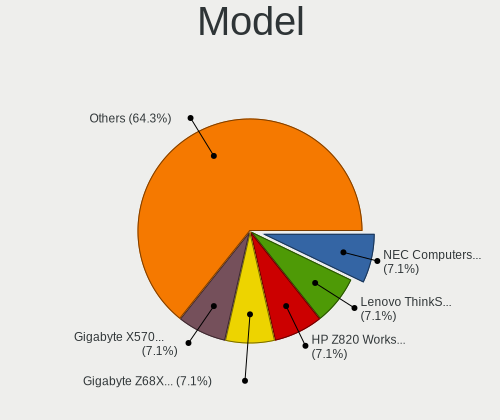
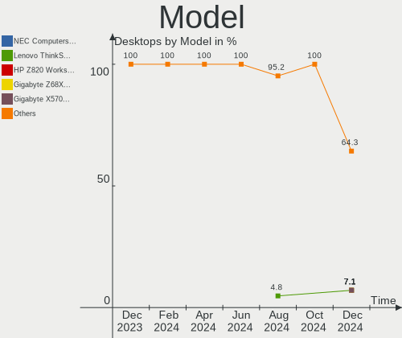
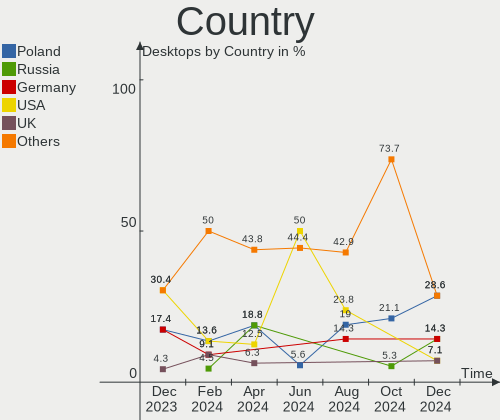
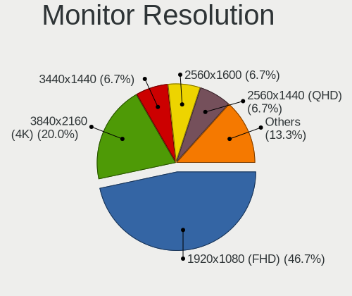
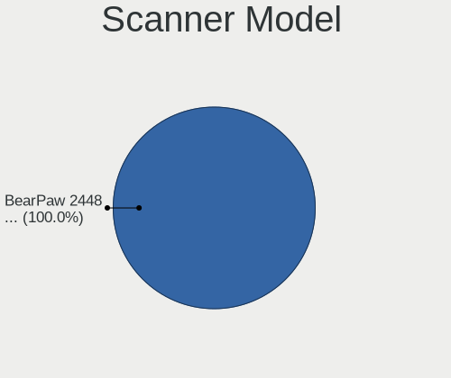
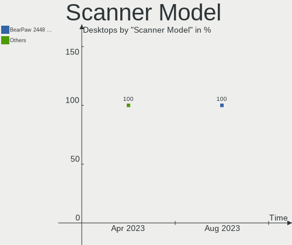

Gentoo Hardware Trends (Desktops)
---------------------------------

A project to identify most popular hardware characteristics and track their change
over time based on data collected by Gentoo users at https://Linux-Hardware.org.

Anyone can contribute to this report by the [hw-probe](https://github.com/linuxhw/hw-probe) tool:

    sudo -E hw-probe -all -upload

Full-feature report is available here: https://linux-hardware.org/?view=trends&formfactor=desktop

Period: Oct, 2021.

Contents
--------

* [ System ](#system)
  - [ OS                       ](#os)
  - [ OS Family                ](#os-family)
  - [ Kernel                   ](#kernel)
  - [ Kernel Family            ](#kernel-family)
  - [ Kernel Major Ver.        ](#kernel-major-ver)
  - [ Arch                     ](#arch)
  - [ DE                       ](#de)
  - [ Display Server           ](#display-server)
  - [ Display Manager          ](#display-manager)
  - [ OS Lang                  ](#os-lang)
  - [ Boot Mode                ](#boot-mode)
  - [ Filesystem               ](#filesystem)
  - [ Part. scheme             ](#part-scheme)
  - [ Dual Boot with Linux/BSD ](#dual-boot-with-linuxbsd)
  - [ Dual Boot (Win)          ](#dual-boot-win)

* [ Board ](#board)
  - [ Vendor                   ](#vendor)
  - [ Model                    ](#model)
  - [ Model Family             ](#model-family)
  - [ MFG Year                 ](#mfg-year)
  - [ Form Factor              ](#form-factor)
  - [ Secure Boot              ](#secure-boot)
  - [ Coreboot                 ](#coreboot)
  - [ RAM Size                 ](#ram-size)
  - [ RAM Used                 ](#ram-used)
  - [ Total Drives             ](#total-drives)
  - [ Has CD-ROM               ](#has-cd-rom)
  - [ Has Ethernet             ](#has-ethernet)
  - [ Has WiFi                 ](#has-wifi)
  - [ Has Bluetooth            ](#has-bluetooth)

* [ Location ](#location)
  - [ Country                  ](#country)
  - [ City                     ](#city)

* [ Drives ](#drives)
  - [ Drive Vendor             ](#drive-vendor)
  - [ Drive Model              ](#drive-model)
  - [ HDD Vendor               ](#hdd-vendor)
  - [ SSD Vendor               ](#ssd-vendor)
  - [ Drive Kind               ](#drive-kind)
  - [ Drive Connector          ](#drive-connector)
  - [ Drive Size               ](#drive-size)
  - [ Space Total              ](#space-total)
  - [ Space Used               ](#space-used)
  - [ Malfunc. Drives          ](#malfunc-drives)
  - [ Malfunc. Drive Vendor    ](#malfunc-drive-vendor)
  - [ Malfunc. HDD Vendor      ](#malfunc-hdd-vendor)
  - [ Malfunc. Drive Kind      ](#malfunc-drive-kind)
  - [ Failed Drives            ](#failed-drives)
  - [ Failed Drive Vendor      ](#failed-drive-vendor)
  - [ Drive Status             ](#drive-status)

* [ Storage controller ](#storage-controller)
  - [ Storage Vendor           ](#storage-vendor)
  - [ Storage Model            ](#storage-model)
  - [ Storage Kind             ](#storage-kind)

* [ Processor ](#processor)
  - [ CPU Vendor               ](#cpu-vendor)
  - [ CPU Model                ](#cpu-model)
  - [ CPU Model Family         ](#cpu-model-family)
  - [ CPU Cores                ](#cpu-cores)
  - [ CPU Sockets              ](#cpu-sockets)
  - [ CPU Threads              ](#cpu-threads)
  - [ CPU Op-Modes             ](#cpu-op-modes)
  - [ CPU Microcode            ](#cpu-microcode)
  - [ CPU Microarch            ](#cpu-microarch)

* [ Graphics ](#graphics)
  - [ GPU Vendor               ](#gpu-vendor)
  - [ GPU Model                ](#gpu-model)
  - [ GPU Combo                ](#gpu-combo)
  - [ GPU Driver               ](#gpu-driver)
  - [ GPU Memory               ](#gpu-memory)

* [ Monitor ](#monitor)
  - [ Monitor Vendor           ](#monitor-vendor)
  - [ Monitor Model            ](#monitor-model)
  - [ Monitor Resolution       ](#monitor-resolution)
  - [ Monitor Diagonal         ](#monitor-diagonal)
  - [ Monitor Width            ](#monitor-width)
  - [ Aspect Ratio             ](#aspect-ratio)
  - [ Monitor Area             ](#monitor-area)
  - [ Pixel Density            ](#pixel-density)
  - [ Multiple Monitors        ](#multiple-monitors)

* [ Network ](#network)
  - [ Net Controller Vendor    ](#net-controller-vendor)
  - [ Net Controller Model     ](#net-controller-model)
  - [ Wireless Vendor          ](#wireless-vendor)
  - [ Wireless Model           ](#wireless-model)
  - [ Ethernet Vendor          ](#ethernet-vendor)
  - [ Ethernet Model           ](#ethernet-model)
  - [ Net Controller Kind      ](#net-controller-kind)
  - [ Used Controller          ](#used-controller)
  - [ NICs                     ](#nics)
  - [ IPv6                     ](#ipv6)

* [ Bluetooth ](#bluetooth)
  - [ Bluetooth Vendor         ](#bluetooth-vendor)
  - [ Bluetooth Model          ](#bluetooth-model)

* [ Sound ](#sound)
  - [ Sound Vendor             ](#sound-vendor)
  - [ Sound Model              ](#sound-model)

* [ Memory ](#memory)
  - [ Memory Vendor            ](#memory-vendor)
  - [ Memory Model             ](#memory-model)
  - [ Memory Kind              ](#memory-kind)
  - [ Memory Form Factor       ](#memory-form-factor)
  - [ Memory Size              ](#memory-size)
  - [ Memory Speed             ](#memory-speed)

* [ Printers & scanners ](#printers--scanners)
  - [ Printer Vendor           ](#printer-vendor)
  - [ Printer Model            ](#printer-model)
  - [ Scanner Vendor           ](#scanner-vendor)
  - [ Scanner Model            ](#scanner-model)

* [ Camera ](#camera)
  - [ Camera Vendor            ](#camera-vendor)
  - [ Camera Model             ](#camera-model)

* [ Security ](#security)
  - [ Fingerprint Vendor       ](#fingerprint-vendor)
  - [ Fingerprint Model        ](#fingerprint-model)
  - [ Chipcard Vendor          ](#chipcard-vendor)
  - [ Chipcard Model           ](#chipcard-model)

* [ Unsupported ](#unsupported)
  - [ Unsupported Devices      ](#unsupported-devices)
  - [ Unsupported Device Types ](#unsupported-device-types)

System
------

OS
--

Installed operating systems

| Name       | Desktops | Percent |
|------------|----------|---------|
| Gentoo 2.7 | 22       | 73.33%  |
| Gentoo 2.8 | 7        | 23.33%  |
| Gentoo 1   | 1        | 3.33%   |

OS Family
---------

OS without a version

| Name   | Desktops | Percent |
|--------|----------|---------|
| Gentoo | 30       | 100%    |

Kernel
------

Version of the Linux kernel

| Version                   | Desktops | Percent |
|---------------------------|----------|---------|
| 5.10.61-gentoo            | 6        | 20%     |
| 5.10.61-gentoo-x86_64     | 3        | 10%     |
| 5.14.12-gentoo            | 2        | 6.67%   |
| 5.14.8-gentoo             | 1        | 3.33%   |
| 5.14.6-gentoo             | 1        | 3.33%   |
| 5.14.6                    | 1        | 3.33%   |
| 5.14.4-gentoo             | 1        | 3.33%   |
| 5.14.15-gentoo20210917    | 1        | 3.33%   |
| 5.14.14-gentoo-yoshi      | 1        | 3.33%   |
| 5.14.14-gentoo-x86_64     | 1        | 3.33%   |
| 5.14.14-gentoo            | 1        | 3.33%   |
| 5.14.13-gentoo-gentoo-amd | 1        | 3.33%   |
| 5.14.13-gentoo            | 1        | 3.33%   |
| 5.14.13                   | 1        | 3.33%   |
| 5.14.11-zen1              | 1        | 3.33%   |
| 5.14.11-gentoo-x86_64     | 1        | 3.33%   |
| 5.14.11-gentoo-limelight  | 1        | 3.33%   |
| 5.14.10-gentoo            | 1        | 3.33%   |
| 5.13.5-gentoo             | 1        | 3.33%   |
| 5.12.9-zen1               | 1        | 3.33%   |
| 5.12.19-1-MANJARO         | 1        | 3.33%   |
| 5.10.61-gentooaeon        | 1        | 3.33%   |

Kernel Family
-------------

Linux kernel without a distro release

| Version | Desktops | Percent |
|---------|----------|---------|
| 5.10.61 | 10       | 33.33%  |
| 5.14.14 | 3        | 10%     |
| 5.14.13 | 3        | 10%     |
| 5.14.11 | 3        | 10%     |
| 5.14.6  | 2        | 6.67%   |
| 5.14.12 | 2        | 6.67%   |
| 5.14.8  | 1        | 3.33%   |
| 5.14.4  | 1        | 3.33%   |
| 5.14.15 | 1        | 3.33%   |
| 5.14.10 | 1        | 3.33%   |
| 5.13.5  | 1        | 3.33%   |
| 5.12.9  | 1        | 3.33%   |
| 5.12.19 | 1        | 3.33%   |

Kernel Major Ver.
-----------------

Linux kernel major version

| Version | Desktops | Percent |
|---------|----------|---------|
| 5.14    | 17       | 56.67%  |
| 5.10    | 10       | 33.33%  |
| 5.12    | 2        | 6.67%   |
| 5.13    | 1        | 3.33%   |

Arch
----

OS architecture (x86_64, i586, etc.)

| Name   | Desktops | Percent |
|--------|----------|---------|
| x86_64 | 30       | 100%    |

DE
--

Desktop Environment

| Name       | Desktops | Percent |
|------------|----------|---------|
| KDE5       | 10       | 33.33%  |
| Unknown    | 7        | 23.33%  |
| GNOME      | 5        | 16.67%  |
| XFCE       | 4        | 13.33%  |
| MATE       | 2        | 6.67%   |
| X-Cinnamon | 1        | 3.33%   |
| LXQt       | 1        | 3.33%   |

Display Server
--------------

X11 or Wayland

| Name    | Desktops | Percent |
|---------|----------|---------|
| X11     | 18       | 60%     |
| Unknown | 5        | 16.67%  |
| Tty     | 4        | 13.33%  |
| Wayland | 3        | 10%     |

Display Manager
---------------

SDDM, LightDM, etc.

| Name    | Desktops | Percent |
|---------|----------|---------|
| SDDM    | 11       | 36.67%  |
| Unknown | 8        | 26.67%  |
| LightDM | 7        | 23.33%  |
| GDM     | 3        | 10%     |
| XDM     | 1        | 3.33%   |

OS Lang
-------

Language

| Lang    | Desktops | Percent |
|---------|----------|---------|
| en_US   | 12       | 40%     |
| en_GB   | 7        | 23.33%  |
| de_DE   | 3        | 10%     |
| Unknown | 3        | 10%     |
| pl_PL   | 2        | 6.67%   |
| nl_NL   | 1        | 3.33%   |
| C.UTF8  | 1        | 3.33%   |
| C       | 1        | 3.33%   |

Boot Mode
---------

EFI or BIOS

| Mode | Desktops | Percent |
|------|----------|---------|
| EFI  | 19       | 63.33%  |
| BIOS | 11       | 36.67%  |

Filesystem
----------

Type of filesystem

| Type  | Desktops | Percent |
|-------|----------|---------|
| Ext4  | 16       | 53.33%  |
| Btrfs | 7        | 23.33%  |
| F2fs  | 4        | 13.33%  |
| Zfs   | 2        | 6.67%   |
| Xfs   | 1        | 3.33%   |

Part. scheme
------------

Scheme of partitioning

| Type    | Desktops | Percent |
|---------|----------|---------|
| GPT     | 24       | 80%     |
| MBR     | 3        | 10%     |
| Unknown | 3        | 10%     |

Dual Boot with Linux/BSD
------------------------

Hosting more than one Linux/BSD

| Dual boot | Desktops | Percent |
|-----------|----------|---------|
| Yes       | 16       | 53.33%  |
| No        | 14       | 46.67%  |

Dual Boot (Win)
---------------

Hosting Linux and Windows

| Dual boot | Desktops | Percent |
|-----------|----------|---------|
| No        | 26       | 86.67%  |
| Yes       | 4        | 13.33%  |

Board
-----

Vendor
------

Motherboard manufacturer

| Name                | Desktops | Percent |
|---------------------|----------|---------|
| ASUSTek Computer    | 10       | 33.33%  |
| ASRock              | 6        | 20%     |
| Gigabyte Technology | 5        | 16.67%  |
| MSI                 | 3        | 10%     |
| Fujitsu             | 3        | 10%     |
| Red Hat             | 1        | 3.33%   |
| Hewlett-Packard     | 1        | 3.33%   |
| Acer                | 1        | 3.33%   |

Model
-----

Motherboard model

| Name                             | Desktops | Percent |
|----------------------------------|----------|---------|
| Red Hat RHEL                     | 1        | 3.33%   |
| MSI MS-7C35                      | 1        | 3.33%   |
| MSI MS-7B79                      | 1        | 3.33%   |
| MSI MS-7B48                      | 1        | 3.33%   |
| HP Z400 Workstation              | 1        | 3.33%   |
| Gigabyte Z87X-UD3H               | 1        | 3.33%   |
| Gigabyte X570 AORUS MASTER       | 1        | 3.33%   |
| Gigabyte B460HD3                 | 1        | 3.33%   |
| Gigabyte B450M DS3H V2           | 1        | 3.33%   |
| Gigabyte AB350-Gaming            | 1        | 3.33%   |
| Fujitsu ESPRIMO P7935            | 1        | 3.33%   |
| Fujitsu D3417-B2 S26361-D3417-B2 | 1        | 3.33%   |
| Fujitsu D3401-H1                 | 1        | 3.33%   |
| ASUS Z170-A                      | 1        | 3.33%   |
| ASUS ROG STRIX B550-F GAMING     | 1        | 3.33%   |
| ASUS ROG Maximus XIII APEX       | 1        | 3.33%   |
| ASUS ROG CROSSHAIR VIII HERO     | 1        | 3.33%   |
| ASUS PRIME X570-PRO              | 1        | 3.33%   |
| ASUS PRIME X570-P                | 1        | 3.33%   |
| ASUS PRIME B450-PLUS             | 1        | 3.33%   |
| ASUS PRIME A520M-K               | 1        | 3.33%   |
| ASUS Maximus VIII HERO           | 1        | 3.33%   |
| ASUS M3A78-CM                    | 1        | 3.33%   |
| ASRock Z390 Extreme4             | 1        | 3.33%   |
| ASRock X570 Pro4                 | 1        | 3.33%   |
| ASRock X370 Killer SLI/ac        | 1        | 3.33%   |
| ASRock X370 Gaming X             | 1        | 3.33%   |
| ASRock B550M Steel Legend        | 1        | 3.33%   |
| ASRock B550 Phantom Gaming 4     | 1        | 3.33%   |
| Acer Aspire XC-780               | 1        | 3.33%   |

Model Family
------------

Motherboard model prefix

| Name                  | Desktops | Percent |
|-----------------------|----------|---------|
| ASUS PRIME            | 4        | 13.33%  |
| ASUS ROG              | 3        | 10%     |
| ASRock X370           | 2        | 6.67%   |
| Red Hat RHEL          | 1        | 3.33%   |
| MSI MS-7C35           | 1        | 3.33%   |
| MSI MS-7B79           | 1        | 3.33%   |
| MSI MS-7B48           | 1        | 3.33%   |
| HP Z400               | 1        | 3.33%   |
| Gigabyte Z87X-UD3H    | 1        | 3.33%   |
| Gigabyte X570         | 1        | 3.33%   |
| Gigabyte B460HD3      | 1        | 3.33%   |
| Gigabyte B450M        | 1        | 3.33%   |
| Gigabyte AB350-Gaming | 1        | 3.33%   |
| Fujitsu ESPRIMO       | 1        | 3.33%   |
| Fujitsu D3417-B2      | 1        | 3.33%   |
| Fujitsu D3401-H1      | 1        | 3.33%   |
| ASUS Z170-A           | 1        | 3.33%   |
| ASUS Maximus          | 1        | 3.33%   |
| ASUS M3A78-CM         | 1        | 3.33%   |
| ASRock Z390           | 1        | 3.33%   |
| ASRock X570           | 1        | 3.33%   |
| ASRock B550M          | 1        | 3.33%   |
| ASRock B550           | 1        | 3.33%   |
| Acer Aspire           | 1        | 3.33%   |

MFG Year
--------

Motherboard manufacture year

| Year | Desktops | Percent |
|------|----------|---------|
| 2020 | 9        | 30%     |
| 2019 | 6        | 20%     |
| 2021 | 5        | 16.67%  |
| 2018 | 4        | 13.33%  |
| 2010 | 2        | 6.67%   |
| 2016 | 1        | 3.33%   |
| 2015 | 1        | 3.33%   |
| 2014 | 1        | 3.33%   |
| 2009 | 1        | 3.33%   |

Form Factor
-----------

Physical design of the computer

| Name    | Desktops | Percent |
|---------|----------|---------|
| Desktop | 30       | 100%    |

Secure Boot
-----------

Enabled or disabled

| State    | Desktops | Percent |
|----------|----------|---------|
| Disabled | 29       | 96.67%  |
| Enabled  | 1        | 3.33%   |

Coreboot
--------

Have coreboot on board

| Used | Desktops | Percent |
|------|----------|---------|
| No   | 30       | 100%    |

RAM Size
--------

Total RAM memory

| Size in GB  | Desktops | Percent |
|-------------|----------|---------|
| 32.01-64.0  | 15       | 50%     |
| 64.01-256.0 | 6        | 20%     |
| 16.01-24.0  | 3        | 10%     |
| 8.01-16.0   | 3        | 10%     |
| 4.01-8.0    | 2        | 6.67%   |
| 24.01-32.0  | 1        | 3.33%   |

RAM Used
--------

Used RAM memory

| Used GB    | Desktops | Percent |
|------------|----------|---------|
| 4.01-8.0   | 11       | 36.67%  |
| 8.01-16.0  | 6        | 20%     |
| 2.01-3.0   | 5        | 16.67%  |
| 24.01-32.0 | 2        | 6.67%   |
| 0.51-1.0   | 2        | 6.67%   |
| 32.01-64.0 | 1        | 3.33%   |
| 3.01-4.0   | 1        | 3.33%   |
| 16.01-24.0 | 1        | 3.33%   |
| 1.01-2.0   | 1        | 3.33%   |

Total Drives
------------

Number of drives on board

| Drives | Desktops | Percent |
|--------|----------|---------|
| 3      | 8        | 26.67%  |
| 2      | 7        | 23.33%  |
| 5      | 4        | 13.33%  |
| 1      | 4        | 13.33%  |
| 6      | 3        | 10%     |
| 4      | 3        | 10%     |
| 7      | 1        | 3.33%   |

Has CD-ROM
----------

Has CD-ROM on board

| Presented | Desktops | Percent |
|-----------|----------|---------|
| No        | 23       | 76.67%  |
| Yes       | 7        | 23.33%  |

Has Ethernet
------------

Has Ethernet on board

| Presented | Desktops | Percent |
|-----------|----------|---------|
| Yes       | 28       | 93.33%  |
| No        | 2        | 6.67%   |

Has WiFi
--------

Has WiFi module

| Presented | Desktops | Percent |
|-----------|----------|---------|
| No        | 22       | 73.33%  |
| Yes       | 8        | 26.67%  |

Has Bluetooth
-------------

Has Bluetooth module

| Presented | Desktops | Percent |
|-----------|----------|---------|
| No        | 18       | 60%     |
| Yes       | 12       | 40%     |

Location
--------

Country
-------

Geographic location (country)

| Country     | Desktops | Percent |
|-------------|----------|---------|
| Poland      | 6        | 20%     |
| Germany     | 5        | 16.67%  |
| UK          | 4        | 13.33%  |
| USA         | 3        | 10%     |
| Jamaica     | 2        | 6.67%   |
| France      | 2        | 6.67%   |
| Spain       | 1        | 3.33%   |
| Slovakia    | 1        | 3.33%   |
| Russia      | 1        | 3.33%   |
| Netherlands | 1        | 3.33%   |
| Mexico      | 1        | 3.33%   |
| Finland     | 1        | 3.33%   |
| Bulgaria    | 1        | 3.33%   |
| Australia   | 1        | 3.33%   |

City
----

Geographic location (city)

| City                   | Desktops | Percent |
|------------------------|----------|---------|
| Swansea                | 2        | 6.67%   |
| Monroe                 | 2        | 6.67%   |
| Warsaw                 | 1        | 3.33%   |
| Trier                  | 1        | 3.33%   |
| Tampere                | 1        | 3.33%   |
| Sulejowek              | 1        | 3.33%   |
| St Petersburg          | 1        | 3.33%   |
| Sofia                  | 1        | 3.33%   |
| Saint-Maur-des-Foss?©s | 1        | 3.33%   |
| Poznan                 | 1        | 3.33%   |
| Portmore               | 1        | 3.33%   |
| London                 | 1        | 3.33%   |
| Laziska Gorne          | 1        | 3.33%   |
| Landshut               | 1        | 3.33%   |
| Krakow                 | 1        | 3.33%   |
| Kingston               | 1        | 3.33%   |
| Hobart                 | 1        | 3.33%   |
| High Wycombe           | 1        | 3.33%   |
| Haiger                 | 1        | 3.33%   |
| Glencoe                | 1        | 3.33%   |
| Fuenlabrada            | 1        | 3.33%   |
| Frankenthal            | 1        | 3.33%   |
| Falkenstein            | 1        | 3.33%   |
| Clermont-Ferrand       | 1        | 3.33%   |
| Ciudad Ju??rez         | 1        | 3.33%   |
| Cieszyn                | 1        | 3.33%   |
| Bratislava             | 1        | 3.33%   |
| Amsterdam              | 1        | 3.33%   |

Drives
------

Drive Vendor
------------

Hard drive vendors

| Vendor              | Desktops | Drives | Percent |
|---------------------|----------|--------|---------|
| Samsung Electronics | 16       | 26     | 22.54%  |
| WDC                 | 14       | 17     | 19.72%  |
| Seagate             | 12       | 22     | 16.9%   |
| Hitachi             | 5        | 10     | 7.04%   |
| Toshiba             | 3        | 3      | 4.23%   |
| Kingston            | 3        | 4      | 4.23%   |
| Phison              | 2        | 2      | 2.82%   |
| GOODRAM             | 2        | 2      | 2.82%   |
| Crucial             | 2        | 2      | 2.82%   |
| Unknown             | 1        | 1      | 1.41%   |
| Team                | 1        | 1      | 1.41%   |
| SanDisk             | 1        | 1      | 1.41%   |
| QEMU                | 1        | 1      | 1.41%   |
| PNY                 | 1        | 1      | 1.41%   |
| MDT                 | 1        | 1      | 1.41%   |
| LaCie               | 1        | 1      | 1.41%   |
| Kingchuxing         | 1        | 1      | 1.41%   |
| Intel               | 1        | 1      | 1.41%   |
| Corsair             | 1        | 1      | 1.41%   |
| ASMedia             | 1        | 1      | 1.41%   |
| A-DATA Technology   | 1        | 1      | 1.41%   |

Drive Model
-----------

Hard drive models

| Model                                  | Desktops | Percent |
|----------------------------------------|----------|---------|
| WDC WDS500G2B0B-00YS70 500GB SSD       | 2        | 2.35%   |
| Seagate ST4000DM004-2CV104 4TB         | 2        | 2.35%   |
| Samsung SSD 970 EVO 500GB              | 2        | 2.35%   |
| Samsung NVMe SSD Drive 500GB           | 2        | 2.35%   |
| Hitachi HUA721010KLA330 1TB            | 2        | 2.35%   |
| GOODRAM SSDPR-CL100-480-G2 480GB       | 2        | 2.35%   |
| WDC WDS500G2X0C-00L350 500GB           | 1        | 1.18%   |
| WDC WDS100T2B0C 1TB                    | 1        | 1.18%   |
| WDC WD7500BPVT-24HXZT1 752GB           | 1        | 1.18%   |
| WDC WD6400AAKS-65A7B2 640GB            | 1        | 1.18%   |
| WDC WD60EFRX-68L0BN1 6TB               | 1        | 1.18%   |
| WDC WD5000BPVT-22HXZT3 500GB           | 1        | 1.18%   |
| WDC WD20EZAZ-00GGJB0 2TB               | 1        | 1.18%   |
| WDC WD20EFRX-68EUZN0 2TB               | 1        | 1.18%   |
| WDC WD10JPLX-00MBPT0 1TB               | 1        | 1.18%   |
| WDC WD10EZEX-21WN4A0 1TB               | 1        | 1.18%   |
| WDC WD10EALX-009BA0 1TB                | 1        | 1.18%   |
| WDC WD1002FBYS-18W8B0 1TB              | 1        | 1.18%   |
| WDC WD1002FAEX-00Z3A0 1TB              | 1        | 1.18%   |
| Unknown SD/MMC/MS PRO 128GB            | 1        | 1.18%   |
| Toshiba THNSN5512GPUK NVMe 512GB       | 1        | 1.18%   |
| Toshiba HDWE150 5TB                    | 1        | 1.18%   |
| Toshiba HDWD120 2TB                    | 1        | 1.18%   |
| Team TM8FP2240G 240GB                  | 1        | 1.18%   |
| Seagate ST4000VN008-2DR166 4TB         | 1        | 1.18%   |
| Seagate ST4000VN000-1H4168 4TB         | 1        | 1.18%   |
| Seagate ST4000NM0245-1Z2107 4TB        | 1        | 1.18%   |
| Seagate ST4000DM005-2DP166 4TB         | 1        | 1.18%   |
| Seagate ST3500630AS 500GB              | 1        | 1.18%   |
| Seagate ST3500413AS 500GB              | 1        | 1.18%   |
| Seagate ST3250318AS 250GB              | 1        | 1.18%   |
| Seagate ST3160023AS 160GB              | 1        | 1.18%   |
| Seagate ST31000524AS 1TB               | 1        | 1.18%   |
| Seagate ST3000DM008-2DM166 3TB         | 1        | 1.18%   |
| Seagate ST2000DM001-1ER164 2TB         | 1        | 1.18%   |
| Seagate ST12000NM0008-2H3101 12TB      | 1        | 1.18%   |
| Seagate ST1000DM010-2EP102 1TB         | 1        | 1.18%   |
| Seagate ST1000DM003-1SB102 1TB         | 1        | 1.18%   |
| SanDisk SD8SNAT-128G-1006 128GB SSD    | 1        | 1.18%   |
| Samsung SSD 980 PRO 2TB                | 1        | 1.18%   |
| Samsung SSD 980 PRO 1TB                | 1        | 1.18%   |
| Samsung SSD 970 EVO Plus 500GB         | 1        | 1.18%   |
| Samsung SSD 970 EVO Plus 2TB           | 1        | 1.18%   |
| Samsung SSD 970 EVO 1TB                | 1        | 1.18%   |
| Samsung SSD 960 PRO 512GB              | 1        | 1.18%   |
| Samsung SSD 960 EVO 1TB                | 1        | 1.18%   |
| Samsung SSD 860 EVO 500GB              | 1        | 1.18%   |
| Samsung SSD 860 EVO 2TB                | 1        | 1.18%   |
| Samsung SSD 860 EVO 250GB              | 1        | 1.18%   |
| Samsung SSD 850 EVO 1TB                | 1        | 1.18%   |
| Samsung SSD 840 PRO Series 256GB       | 1        | 1.18%   |
| Samsung SSD 840 PRO Series 128GB       | 1        | 1.18%   |
| Samsung SSD 840 EVO 250GB              | 1        | 1.18%   |
| Samsung Portable SSD T3 250GB          | 1        | 1.18%   |
| Samsung PM963 2.5" NVMe PCIe SSD 512GB | 1        | 1.18%   |
| Samsung NVMe SSD Drive 1TB             | 1        | 1.18%   |
| Samsung MZVLB512HBJQ-00000 512GB       | 1        | 1.18%   |
| Samsung HD154UI 1TB                    | 1        | 1.18%   |
| Samsung HD103UJ 1TB                    | 1        | 1.18%   |
| QEMU HARDDISK 9GB                      | 1        | 1.18%   |

HDD Vendor
----------

Hard disk drive vendors

| Vendor              | Desktops | Drives | Percent |
|---------------------|----------|--------|---------|
| Seagate             | 12       | 22     | 34.29%  |
| WDC                 | 11       | 13     | 31.43%  |
| Hitachi             | 5        | 10     | 14.29%  |
| Toshiba             | 2        | 2      | 5.71%   |
| Unknown             | 1        | 1      | 2.86%   |
| Samsung Electronics | 1        | 2      | 2.86%   |
| QEMU                | 1        | 1      | 2.86%   |
| MDT                 | 1        | 1      | 2.86%   |
| LaCie               | 1        | 1      | 2.86%   |

SSD Vendor
----------

Solid state drive vendors

| Vendor              | Desktops | Drives | Percent |
|---------------------|----------|--------|---------|
| Samsung Electronics | 7        | 8      | 38.89%  |
| WDC                 | 2        | 2      | 11.11%  |
| Kingston            | 2        | 2      | 11.11%  |
| GOODRAM             | 2        | 2      | 11.11%  |
| SanDisk             | 1        | 1      | 5.56%   |
| PNY                 | 1        | 1      | 5.56%   |
| Crucial             | 1        | 1      | 5.56%   |
| Corsair             | 1        | 1      | 5.56%   |
| ASMedia             | 1        | 1      | 5.56%   |

Drive Kind
----------

HDD or SSD

| Kind | Desktops | Drives | Percent |
|------|----------|--------|---------|
| HDD  | 22       | 53     | 39.29%  |
| NVMe | 20       | 28     | 35.71%  |
| SSD  | 14       | 19     | 25%     |

Drive Connector
---------------

SATA, SAS, NVMe, etc.

| Type | Desktops | Drives | Percent |
|------|----------|--------|---------|
| SATA | 24       | 69     | 52.17%  |
| NVMe | 20       | 28     | 43.48%  |
| SAS  | 2        | 3      | 4.35%   |

Drive Size
----------

Size of hard drive

| Size in TB | Desktops | Drives | Percent |
|------------|----------|--------|---------|
| 0.01-0.5   | 14       | 23     | 32.56%  |
| 0.51-1.0   | 12       | 20     | 27.91%  |
| 1.01-2.0   | 6        | 9      | 13.95%  |
| 3.01-4.0   | 5        | 10     | 11.63%  |
| 2.01-3.0   | 3        | 5      | 6.98%   |
| 4.01-10.0  | 2        | 4      | 4.65%   |
| 10.01-20.0 | 1        | 1      | 2.33%   |

Space Total
-----------

Amount of disk space available on the file system

| Size in GB     | Desktops | Percent |
|----------------|----------|---------|
| 501-1000       | 11       | 36.67%  |
| More than 3000 | 7        | 23.33%  |
| 1001-2000      | 4        | 13.33%  |
| 2001-3000      | 2        | 6.67%   |
| 101-250        | 2        | 6.67%   |
| Unknown        | 2        | 6.67%   |
| 251-500        | 1        | 3.33%   |
| 1-20           | 1        | 3.33%   |

Space Used
----------

Amount of used disk space

| Used GB        | Desktops | Percent |
|----------------|----------|---------|
| 1001-2000      | 7        | 23.33%  |
| 501-1000       | 5        | 16.67%  |
| 251-500        | 4        | 13.33%  |
| More than 3000 | 3        | 10%     |
| 101-250        | 3        | 10%     |
| 21-50          | 2        | 6.67%   |
| 1-20           | 2        | 6.67%   |
| 51-100         | 2        | 6.67%   |
| Unknown        | 2        | 6.67%   |

Malfunc. Drives
---------------

Drive models with a malfunction

| Model                                 | Desktops | Drives | Percent |
|---------------------------------------|----------|--------|---------|
| WDC WD6400AAKS-65A7B2 640GB           | 1        | 1      | 7.69%   |
| WDC WD60EFRX-68L0BN1 6TB              | 1        | 3      | 7.69%   |
| WDC WD1002FBYS-18W8B0 1TB             | 1        | 1      | 7.69%   |
| Seagate ST3500413AS 500GB             | 1        | 1      | 7.69%   |
| Seagate ST3160023AS 160GB             | 1        | 1      | 7.69%   |
| Samsung Electronics SSD 970 EVO 500GB | 1        | 1      | 7.69%   |
| Samsung Electronics SSD 850 EVO 1TB   | 1        | 1      | 7.69%   |
| Samsung Electronics HD154UI 1TB       | 1        | 1      | 7.69%   |
| Samsung Electronics HD103UJ 1TB       | 1        | 1      | 7.69%   |
| MDT MD2000KS-00MJB0 200GB             | 1        | 1      | 7.69%   |
| Hitachi HUA721010KLA330 1TB           | 1        | 1      | 7.69%   |
| Hitachi HDS722020ALA330 2TB           | 1        | 2      | 7.69%   |
| Corsair Neutron GTX SSD 240GB         | 1        | 1      | 7.69%   |

Malfunc. Drive Vendor
---------------------

Vendors of faulty drives

| Vendor              | Desktops | Drives | Percent |
|---------------------|----------|--------|---------|
| WDC                 | 3        | 5      | 25%     |
| Samsung Electronics | 3        | 4      | 25%     |
| Seagate             | 2        | 2      | 16.67%  |
| Hitachi             | 2        | 3      | 16.67%  |
| MDT                 | 1        | 1      | 8.33%   |
| Corsair             | 1        | 1      | 8.33%   |

Malfunc. HDD Vendor
-------------------

Vendors of faulty HDD drives

| Vendor              | Desktops | Drives | Percent |
|---------------------|----------|--------|---------|
| WDC                 | 3        | 5      | 33.33%  |
| Seagate             | 2        | 2      | 22.22%  |
| Hitachi             | 2        | 3      | 22.22%  |
| Samsung Electronics | 1        | 2      | 11.11%  |
| MDT                 | 1        | 1      | 11.11%  |

Malfunc. Drive Kind
-------------------

Kinds of faulty drives

| Kind | Desktops | Drives | Percent |
|------|----------|--------|---------|
| HDD  | 6        | 13     | 66.67%  |
| SSD  | 2        | 2      | 22.22%  |
| NVMe | 1        | 1      | 11.11%  |

Failed Drives
-------------

Failed drive models

| Model                            | Desktops | Drives | Percent |
|----------------------------------|----------|--------|---------|
| Toshiba THNSN5512GPUK NVMe 512GB | 1        | 1      | 100%    |

Failed Drive Vendor
-------------------

Failed drive vendors

| Vendor  | Desktops | Drives | Percent |
|---------|----------|--------|---------|
| Toshiba | 1        | 1      | 100%    |

Drive Status
------------

Number of failed and malfunc. drives

| Status   | Desktops | Drives | Percent |
|----------|----------|--------|---------|
| Works    | 28       | 74     | 63.64%  |
| Malfunc  | 9        | 16     | 20.45%  |
| Detected | 6        | 9      | 13.64%  |
| Failed   | 1        | 1      | 2.27%   |

Storage controller
------------------

Storage Vendor
--------------

Storage controller vendors

| Vendor                       | Desktops | Percent |
|------------------------------|----------|---------|
| AMD                          | 17       | 29.31%  |
| Intel                        | 13       | 22.41%  |
| Samsung Electronics          | 11       | 18.97%  |
| Phison Electronics           | 3        | 5.17%   |
| ASMedia Technology           | 3        | 5.17%   |
| Sandisk                      | 2        | 3.45%   |
| Marvell Technology Group     | 2        | 3.45%   |
| Kingston Technology Company  | 2        | 3.45%   |
| Toshiba America Info Systems | 1        | 1.72%   |
| Silicon Motion               | 1        | 1.72%   |
| Red Hat                      | 1        | 1.72%   |
| Realtek Semiconductor        | 1        | 1.72%   |
| Micron/Crucial Technology    | 1        | 1.72%   |

Storage Model
-------------

Storage controller models

| Model                                                                          | Desktops | Percent |
|--------------------------------------------------------------------------------|----------|---------|
| AMD FCH SATA Controller [AHCI mode]                                            | 12       | 17.39%  |
| Samsung NVMe SSD Controller SM981/PM981/PM983                                  | 6        | 8.7%    |
| Intel Q170/Q150/B150/H170/H110/Z170/CM236 Chipset SATA Controller [AHCI Mode]  | 5        | 7.25%   |
| AMD Starship/Matisse Chipset SATA Controller [AHCI mode]                       | 4        | 5.8%    |
| Samsung NVMe SSD Controller PM9A1/PM9A3/980PRO                                 | 3        | 4.35%   |
| ASMedia ASM1062 Serial ATA Controller                                          | 3        | 4.35%   |
| AMD 400 Series Chipset SATA Controller                                         | 3        | 4.35%   |
| Samsung NVMe SSD Controller SM961/PM961/SM963                                  | 2        | 2.9%    |
| Intel SATA Controller [RAID mode]                                              | 2        | 2.9%    |
| AMD X370 Series Chipset SATA Controller                                        | 2        | 2.9%    |
| Toshiba America Info Systems XG4 NVMe SSD Controller                           | 1        | 1.45%   |
| Silicon Motion SM2263EN/SM2263XT SSD Controller                                | 1        | 1.45%   |
| Sandisk WD Blue SN550 NVMe SSD                                                 | 1        | 1.45%   |
| Sandisk WD Black 2018/SN750 / PC SN720 NVMe SSD                                | 1        | 1.45%   |
| Red Hat Virtio SCSI                                                            | 1        | 1.45%   |
| Realtek Realtek Non-Volatile memory controller                                 | 1        | 1.45%   |
| Phison E7 NVMe Controller                                                      | 1        | 1.45%   |
| Phison E16 PCIe4 NVMe Controller                                               | 1        | 1.45%   |
| Phison E12 NVMe Controller                                                     | 1        | 1.45%   |
| Micron/Crucial P2 NVMe PCIe SSD                                                | 1        | 1.45%   |
| Marvell Group 88SE9172 SATA 6Gb/s Controller                                   | 1        | 1.45%   |
| Marvell Group 88SE912x IDE Controller                                          | 1        | 1.45%   |
| Marvell Group 88SE9123 PCIe SATA 6.0 Gb/s controller                           | 1        | 1.45%   |
| Kingston Company KC2000 NVMe SSD                                               | 1        | 1.45%   |
| Kingston Company HyperX Predator PCIe AHCI SSD                                 | 1        | 1.45%   |
| Kingston Company A2000 NVMe SSD                                                | 1        | 1.45%   |
| Intel SSD 660P Series                                                          | 1        | 1.45%   |
| Intel Cannon Lake PCH SATA AHCI Controller                                     | 1        | 1.45%   |
| Intel 82801IR/IO/IH (ICH9R/DO/DH) 6 port SATA Controller [AHCI mode]           | 1        | 1.45%   |
| Intel 8 Series/C220 Series Chipset Family 6-port SATA Controller 1 [AHCI mode] | 1        | 1.45%   |
| Intel 500 Series Chipset Family SATA AHCI Controller                           | 1        | 1.45%   |
| Intel 400 Series Chipset Family SATA AHCI Controller                           | 1        | 1.45%   |
| Intel 4 Series Chipset PT IDER Controller                                      | 1        | 1.45%   |
| Intel 200 Series PCH SATA controller [AHCI mode]                               | 1        | 1.45%   |
| AMD SB7x0/SB8x0/SB9x0 SATA Controller [IDE mode]                               | 1        | 1.45%   |
| AMD SB7x0/SB8x0/SB9x0 IDE Controller                                           | 1        | 1.45%   |
| AMD 300 Series Chipset SATA Controller                                         | 1        | 1.45%   |

Storage Kind
------------

Kind of storage controller (IDE, SATA, NVMe, SAS, ...)

| Kind | Desktops | Percent |
|------|----------|---------|
| SATA | 29       | 53.7%   |
| NVMe | 20       | 37.04%  |
| RAID | 2        | 3.7%    |
| IDE  | 2        | 3.7%    |
| SCSI | 1        | 1.85%   |

Processor
---------

CPU Vendor
----------

Processor vendors

| Vendor | Desktops | Percent |
|--------|----------|---------|
| AMD    | 18       | 60%     |
| Intel  | 12       | 40%     |

CPU Model
---------

Processor models

| Model                                          | Desktops | Percent |
|------------------------------------------------|----------|---------|
| Intel Core i7-6700K CPU @ 4.00GHz              | 2        | 6.67%   |
| AMD Ryzen 5 3600 6-Core Processor              | 2        | 6.67%   |
| AMD Ryzen 5 1600 Six-Core Processor            | 2        | 6.67%   |
| Intel Xeon CPU W3565 @ 3.20GHz                 | 1        | 3.33%   |
| Intel Xeon CPU E3-1275 v6 @ 3.80GHz            | 1        | 3.33%   |
| Intel Core i7-9700K CPU @ 3.60GHz              | 1        | 3.33%   |
| Intel Core i7-6700 CPU @ 3.40GHz               | 1        | 3.33%   |
| Intel Core i7-10700K CPU @ 3.80GHz             | 1        | 3.33%   |
| Intel Core i5-9600KF CPU @ 3.70GHz             | 1        | 3.33%   |
| Intel Core i5-6400 CPU @ 2.70GHz               | 1        | 3.33%   |
| Intel Core i5-4670K CPU @ 3.40GHz              | 1        | 3.33%   |
| Intel Core 2 Duo CPU E7600 @ 3.06GHz           | 1        | 3.33%   |
| Intel 11th Gen Core i9-11900K @ 3.50GHz        | 1        | 3.33%   |
| AMD Ryzen Threadripper 1950X 16-Core Processor | 1        | 3.33%   |
| AMD Ryzen 9 5950X 16-Core Processor            | 1        | 3.33%   |
| AMD Ryzen 9 3950X 16-Core Processor            | 1        | 3.33%   |
| AMD Ryzen 9 3900X 12-Core Processor            | 1        | 3.33%   |
| AMD Ryzen 7 5800X 8-Core Processor             | 1        | 3.33%   |
| AMD Ryzen 7 3700X 8-Core Processor             | 1        | 3.33%   |
| AMD Ryzen 7 2700 Eight-Core Processor          | 1        | 3.33%   |
| AMD Ryzen 7 1700X Eight-Core Processor         | 1        | 3.33%   |
| AMD Ryzen 5 PRO 4650G with Radeon Graphics     | 1        | 3.33%   |
| AMD Ryzen 5 5600X 6-Core Processor             | 1        | 3.33%   |
| AMD Ryzen 5 3600XT 6-Core Processor            | 1        | 3.33%   |
| AMD Ryzen 5 3600X 6-Core Processor             | 1        | 3.33%   |
| AMD Ryzen 5 2600 Six-Core Processor            | 1        | 3.33%   |
| AMD Phenom II X4 955 Processor                 | 1        | 3.33%   |

CPU Model Family
----------------

Processor model prefix

| Model                  | Desktops | Percent |
|------------------------|----------|---------|
| AMD Ryzen 5            | 8        | 26.67%  |
| Intel Core i7          | 5        | 16.67%  |
| AMD Ryzen 7            | 4        | 13.33%  |
| Intel Core i5          | 3        | 10%     |
| AMD Ryzen 9            | 3        | 10%     |
| Intel Xeon             | 2        | 6.67%   |
| Other                  | 1        | 3.33%   |
| Intel Core 2 Duo       | 1        | 3.33%   |
| AMD Ryzen Threadripper | 1        | 3.33%   |
| AMD Ryzen 5 PRO        | 1        | 3.33%   |
| AMD Phenom II X4       | 1        | 3.33%   |

CPU Cores
---------

Number of processor cores

| Number | Desktops | Percent |
|--------|----------|---------|
| 6      | 10       | 33.33%  |
| 4      | 8        | 26.67%  |
| 8      | 7        | 23.33%  |
| 16     | 3        | 10%     |
| 12     | 1        | 3.33%   |
| 2      | 1        | 3.33%   |

CPU Sockets
-----------

Number of sockets

| Number | Desktops | Percent |
|--------|----------|---------|
| 1      | 29       | 96.67%  |
| 2      | 1        | 3.33%   |

CPU Threads
-----------

Threads per core (Hyper-Threading)

| Number | Desktops | Percent |
|--------|----------|---------|
| 2      | 23       | 76.67%  |
| 1      | 7        | 23.33%  |

CPU Op-Modes
------------

CPU Operation Modes (32-bit, 64-bit)

| Op mode        | Desktops | Percent |
|----------------|----------|---------|
| 32-bit, 64-bit | 30       | 100%    |

CPU Microcode
-------------

Microcode number

| Number     | Desktops | Percent |
|------------|----------|---------|
| Unknown    | 6        | 20%     |
| 0x08701021 | 5        | 16.67%  |
| 0x506e3    | 3        | 10%     |
| 0x906ec    | 2        | 6.67%   |
| 0x0a201009 | 2        | 6.67%   |
| 0x08001138 | 2        | 6.67%   |
| 0xa0671    | 1        | 3.33%   |
| 0xa0655    | 1        | 3.33%   |
| 0x906e9    | 1        | 3.33%   |
| 0x1067a    | 1        | 3.33%   |
| 0x0a201016 | 1        | 3.33%   |
| 0x08701013 | 1        | 3.33%   |
| 0x08600106 | 1        | 3.33%   |
| 0x0800820d | 1        | 3.33%   |
| 0x08008206 | 1        | 3.33%   |
| 0x010000db | 1        | 3.33%   |

CPU Microarch
-------------

Microarchitecture

| Name      | Desktops | Percent |
|-----------|----------|---------|
| Zen 2     | 8        | 26.67%  |
| Skylake   | 4        | 13.33%  |
| Zen+      | 3        | 10%     |
| Zen 3     | 3        | 10%     |
| Zen       | 3        | 10%     |
| KabyLake  | 3        | 10%     |
| Penryn    | 1        | 3.33%   |
| Nehalem   | 1        | 3.33%   |
| K10       | 1        | 3.33%   |
| Haswell   | 1        | 3.33%   |
| CometLake | 1        | 3.33%   |
| Unknown   | 1        | 3.33%   |

Graphics
--------

GPU Vendor
----------

Vendors of graphics cards

| Vendor | Desktops | Percent |
|--------|----------|---------|
| AMD    | 15       | 50%     |
| Nvidia | 9        | 30%     |
| Intel  | 6        | 20%     |

GPU Model
---------

Graphics card models

| Model                                                                 | Desktops | Percent |
|-----------------------------------------------------------------------|----------|---------|
| AMD Ellesmere [Radeon RX 470/480/570/570X/580/580X/590]               | 5        | 16.13%  |
| Intel HD Graphics 530                                                 | 4        | 12.9%   |
| Nvidia TU104 [GeForce RTX 2070 SUPER]                                 | 1        | 3.23%   |
| Nvidia GP108 [GeForce GT 1030]                                        | 1        | 3.23%   |
| Nvidia GP106 [GeForce GTX 1060 3GB]                                   | 1        | 3.23%   |
| Nvidia GP104 [GeForce GTX 1080]                                       | 1        | 3.23%   |
| Nvidia GM206 [GeForce GTX 960]                                        | 1        | 3.23%   |
| Nvidia GM204 [GeForce GTX 970]                                        | 1        | 3.23%   |
| Nvidia GA104 [GeForce RTX 3070 Lite Hash Rate]                        | 1        | 3.23%   |
| Nvidia GA102 [GeForce RTX 3080 Ti]                                    | 1        | 3.23%   |
| Nvidia G73 [GeForce 7300 GT]                                          | 1        | 3.23%   |
| Intel HD Graphics P630                                                | 1        | 3.23%   |
| Intel 4 Series Chipset Integrated Graphics Controller                 | 1        | 3.23%   |
| AMD Vega 10 XL/XT [Radeon RX Vega 56/64]                              | 1        | 3.23%   |
| AMD Tahiti PRO [Radeon HD 7950/8950 OEM / R9 280]                     | 1        | 3.23%   |
| AMD RS780C [Radeon 3100]                                              | 1        | 3.23%   |
| AMD Renoir                                                            | 1        | 3.23%   |
| AMD Oland [Radeon HD 8570 / R5 430 OEM / R7 240/340 / Radeon 520 OEM] | 1        | 3.23%   |
| AMD Oland PRO [Radeon R7 240/340]                                     | 1        | 3.23%   |
| AMD Navi 22 [Radeon RX 6700/6700 XT / 6800M]                          | 1        | 3.23%   |
| AMD Navi 21 [Radeon RX 6800/6800 XT / 6900 XT]                        | 1        | 3.23%   |
| AMD Navi 10 [Radeon RX 5600 OEM/5600 XT / 5700/5700 XT]               | 1        | 3.23%   |
| AMD Caicos XT [Radeon HD 7470/8470 / R5 235/310 OEM]                  | 1        | 3.23%   |
| AMD Baffin [Radeon RX 550 640SP / RX 560/560X]                        | 1        | 3.23%   |

GPU Combo
---------

Combinations of graphics cards

| Name         | Desktops | Percent |
|--------------|----------|---------|
| 1 x AMD      | 13       | 43.33%  |
| 1 x Nvidia   | 8        | 26.67%  |
| 1 x Intel    | 6        | 20%     |
| Other        | 1        | 3.33%   |
| 2 x AMD      | 1        | 3.33%   |
| AMD + Nvidia | 1        | 3.33%   |

GPU Driver
----------

Free vs proprietary

| Driver      | Desktops | Percent |
|-------------|----------|---------|
| Free        | 19       | 63.33%  |
| Proprietary | 8        | 26.67%  |
| Unknown     | 3        | 10%     |

GPU Memory
----------

Total video memory

| Size in GB | Desktops | Percent |
|------------|----------|---------|
| Unknown    | 9        | 30%     |
| 7.01-8.0   | 8        | 26.67%  |
| 3.01-4.0   | 3        | 10%     |
| 8.01-16.0  | 3        | 10%     |
| 0.01-0.5   | 3        | 10%     |
| 2.01-3.0   | 2        | 6.67%   |
| 1.01-2.0   | 1        | 3.33%   |
| 0.51-1.0   | 1        | 3.33%   |

Monitor
-------

Monitor Vendor
--------------

Monitor vendors

| Vendor                  | Desktops | Percent |
|-------------------------|----------|---------|
| Samsung Electronics     | 6        | 19.35%  |
| Dell                    | 4        | 12.9%   |
| BenQ                    | 4        | 12.9%   |
| Goldstar                | 3        | 9.68%   |
| ViewSonic               | 2        | 6.45%   |
| Hewlett-Packard         | 2        | 6.45%   |
| ASUSTek Computer        | 2        | 6.45%   |
| MStar                   | 1        | 3.23%   |
| Iiyama                  | 1        | 3.23%   |
| Gigabyte Technology     | 1        | 3.23%   |
| Gateway                 | 1        | 3.23%   |
| Fujitsu Siemens         | 1        | 3.23%   |
| Chi Mei Optoelectronics | 1        | 3.23%   |
| Ancor Communications    | 1        | 3.23%   |
| Acer                    | 1        | 3.23%   |

Monitor Model
-------------

Monitor models

| Model                                                                   | Desktops | Percent |
|-------------------------------------------------------------------------|----------|---------|
| Goldstar HDR 4K GSM7707 3840x2160 600x340mm 27.2-inch                   | 2        | 6.06%   |
| ViewSonic VX3276-QHD VSCE635 2560x1440 698x393mm 31.5-inch              | 1        | 3.03%   |
| ViewSonic VX2458-mhd VSC0437 1920x1080 520x290mm 23.4-inch              | 1        | 3.03%   |
| Samsung Electronics SyncMaster SAM0274 1440x900 410x257mm 19.1-inch     | 1        | 3.03%   |
| Samsung Electronics S24B300 SAM08CC 1920x1080 521x293mm 23.5-inch       | 1        | 3.03%   |
| Samsung Electronics S22B300 SAM08C8 1920x1080 480x270mm 21.7-inch       | 1        | 3.03%   |
| Samsung Electronics LCD Monitor SAM0BB4 3840x2160 1872x1053mm 84.6-inch | 1        | 3.03%   |
| Samsung Electronics LC27RG50 SAM100A 1920x1080 532x304mm 24.1-inch      | 1        | 3.03%   |
| Samsung Electronics C49RG9x SAM0F9C 3840x1080 1190x340mm 48.7-inch      | 1        | 3.03%   |
| Samsung Electronics C24F390 SAM0D2C 1920x1080 520x290mm 23.4-inch       | 1        | 3.03%   |
| MStar DP MST2380 2560x1440 597x336mm 27.0-inch                          | 1        | 3.03%   |
| Iiyama PL2792Q IVM6630 2560x1440 597x336mm 27.0-inch                    | 1        | 3.03%   |
| Hewlett-Packard W2082a HWP325C 1600x900 443x249mm 20.0-inch             | 1        | 3.03%   |
| Hewlett-Packard LP2475w HWP26F9 1920x1200 546x352mm 25.6-inch           | 1        | 3.03%   |
| Goldstar LG ULTRAWIDE GSM59F1 1920x1080 580x240mm 24.7-inch             | 1        | 3.03%   |
| Goldstar 24GM77 GSM5A92 1920x1080 530x300mm 24.0-inch                   | 1        | 3.03%   |
| Gigabyte Technology AORUS AD27QD GBT2701 2560x1440 609x355mm 27.8-inch  | 1        | 3.03%   |
| Gateway FPD1765 GWY06E9 1280x1024 338x270mm 17.0-inch                   | 1        | 3.03%   |
| Fujitsu Siemens P24W-5 ECO FUS06A7 1920x1200 518x324mm 24.1-inch        | 1        | 3.03%   |
| Dell U2713HM DEL4080 2560x1440 597x336mm 27.0-inch                      | 1        | 3.03%   |
| Dell U2713HM DEL407E 2560x1440 597x336mm 27.0-inch                      | 1        | 3.03%   |
| Dell LCD Monitor SE2417HG                                               | 1        | 3.03%   |
| Dell 1905FP DEL400C 1280x1024 376x301mm 19.0-inch                       | 1        | 3.03%   |
| Chi Mei Optoelectronics CMC 19AW CMO2198 1440x900 408x255mm 18.9-inch   | 1        | 3.03%   |
| BenQ VZ2770H BNQ7B3C 1920x1080 598x336mm 27.0-inch                      | 1        | 3.03%   |
| BenQ VZ2350 BNQ7B36 1920x1080 509x286mm 23.0-inch                       | 1        | 3.03%   |
| BenQ G2420HD BNQ7840 1920x1080 530x300mm 24.0-inch                      | 1        | 3.03%   |
| BenQ E2200HD BNQ790C 1920x1080 477x268mm 21.5-inch                      | 1        | 3.03%   |
| ASUSTek Computer VP249 AUS24AF 1920x1080 527x296mm 23.8-inch            | 1        | 3.03%   |
| ASUSTek Computer PG329 AUS32F3 2560x1440 708x399mm 32.0-inch            | 1        | 3.03%   |
| Ancor Communications ROG PG279Q ACI27EC 2560x1440 598x336mm 27.0-inch   | 1        | 3.03%   |
| Acer LCD Monitor V243H 3840x1080                                        | 1        | 3.03%   |

Monitor Resolution
------------------

Monitor screen resolution

| Resolution        | Desktops | Percent |
|-------------------|----------|---------|
| 1920x1080 (FHD)   | 12       | 36.36%  |
| 2560x1440 (QHD)   | 8        | 24.24%  |
| 3840x2160 (4K)    | 3        | 9.09%   |
| 3840x1080         | 2        | 6.06%   |
| 1440x900 (WXGA+)  | 2        | 6.06%   |
| 1280x1024 (SXGA)  | 2        | 6.06%   |
| 2560x1080         | 1        | 3.03%   |
| 1920x1200 (WUXGA) | 1        | 3.03%   |
| 1600x900 (HD+)    | 1        | 3.03%   |
| Unknown           | 1        | 3.03%   |

Monitor Diagonal
----------------

Diagonal size in inches

| Inches  | Desktops | Percent |
|---------|----------|---------|
| 27      | 9        | 28.13%  |
| 24      | 5        | 15.63%  |
| 23      | 4        | 12.5%   |
| 19      | 3        | 9.38%   |
| 21      | 2        | 6.25%   |
| 84      | 1        | 3.13%   |
| 48      | 1        | 3.13%   |
| 34      | 1        | 3.13%   |
| 32      | 1        | 3.13%   |
| 31      | 1        | 3.13%   |
| 25      | 1        | 3.13%   |
| 20      | 1        | 3.13%   |
| 17      | 1        | 3.13%   |
| Unknown | 1        | 3.13%   |

Monitor Width
-------------

Physical width

| Width in mm | Desktops | Percent |
|-------------|----------|---------|
| 501-600     | 16       | 55.17%  |
| 401-500     | 4        | 13.79%  |
| 701-800     | 2        | 6.9%    |
| 601-700     | 2        | 6.9%    |
| 351-400     | 1        | 3.45%   |
| 301-350     | 1        | 3.45%   |
| 1501-2000   | 1        | 3.45%   |
| 1001-1500   | 1        | 3.45%   |
| Unknown     | 1        | 3.45%   |

Aspect Ratio
------------

Proportional relationship between the width and the height

| Ratio   | Desktops | Percent |
|---------|----------|---------|
| 16/9    | 21       | 70%     |
| 16/10   | 4        | 13.33%  |
| 5/4     | 2        | 6.67%   |
| 32/9    | 1        | 3.33%   |
| 21/9    | 1        | 3.33%   |
| Unknown | 1        | 3.33%   |

Monitor Area
------------

Area in inch²

| Area in inch² | Desktops | Percent |
|----------------|----------|---------|
| 301-350        | 9        | 30%     |
| 201-250        | 8        | 26.67%  |
| 351-500        | 3        | 10%     |
| 251-300        | 3        | 10%     |
| 151-200        | 3        | 10%     |
| More than 1000 | 1        | 3.33%   |
| 141-150        | 1        | 3.33%   |
| 501-1000       | 1        | 3.33%   |
| Unknown        | 1        | 3.33%   |

Pixel Density
-------------

Pixels per inch

| Density | Desktops | Percent |
|---------|----------|---------|
| 51-100  | 18       | 62.07%  |
| 101-120 | 8        | 27.59%  |
| 161-240 | 2        | 6.9%    |
| Unknown | 1        | 3.45%   |

Multiple Monitors
-----------------

Total monitors connected

| Total | Desktops | Percent |
|-------|----------|---------|
| 1     | 18       | 60%     |
| 2     | 8        | 26.67%  |
| 0     | 4        | 13.33%  |

Network
-------

Net Controller Vendor
---------------------

Controller vendors

| Vendor                | Desktops | Percent |
|-----------------------|----------|---------|
| Intel                 | 18       | 47.37%  |
| Realtek Semiconductor | 16       | 42.11%  |
| Broadcom              | 2        | 5.26%   |
| Raspberry Pi          | 1        | 2.63%   |
| Aquantia              | 1        | 2.63%   |

Net Controller Model
--------------------

Controller models

| Model                                                             | Desktops | Percent |
|-------------------------------------------------------------------|----------|---------|
| Realtek RTL8111/8168/8411 PCI Express Gigabit Ethernet Controller | 11       | 25.58%  |
| Intel I211 Gigabit Network Connection                             | 6        | 13.95%  |
| Realtek RTL8125 2.5GbE Controller                                 | 4        | 9.3%    |
| Intel Wi-Fi 6 AX200                                               | 3        | 6.98%   |
| Intel Ethernet Controller I225-V                                  | 2        | 4.65%   |
| Intel Ethernet Connection (2) I219-V                              | 2        | 4.65%   |
| Intel Ethernet Connection (2) I219-LM                             | 2        | 4.65%   |
| Realtek RTL8812AE 802.11ac PCIe Wireless Network Adapter          | 1        | 2.33%   |
| Realtek RTL8153 Gigabit Ethernet Adapter                          | 1        | 2.33%   |
| Raspberry Pi Pico                                                 | 1        | 2.33%   |
| Intel Wireless 8260                                               | 1        | 2.33%   |
| Intel Wireless 3165                                               | 1        | 2.33%   |
| Intel Ethernet Connection I217-V                                  | 1        | 2.33%   |
| Intel Dual Band Wireless-AC 3168NGW [Stone Peak]                  | 1        | 2.33%   |
| Intel Cannon Lake PCH CNVi WiFi                                   | 1        | 2.33%   |
| Intel 82574L Gigabit Network Connection                           | 1        | 2.33%   |
| Intel 82567LM-3 Gigabit Network Connection                        | 1        | 2.33%   |
| Broadcom NetXtreme II BCM5709 Gigabit Ethernet                    | 1        | 2.33%   |
| Broadcom NetXtreme BCM5764M Gigabit Ethernet PCIe                 | 1        | 2.33%   |
| Aquantia AQC107 NBase-T/IEEE 802.3bz Ethernet Controller [AQtion] | 1        | 2.33%   |

Wireless Vendor
---------------

Wireless vendors

| Vendor                | Desktops | Percent |
|-----------------------|----------|---------|
| Intel                 | 7        | 87.5%   |
| Realtek Semiconductor | 1        | 12.5%   |

Wireless Model
--------------

Wireless models

| Model                                                    | Desktops | Percent |
|----------------------------------------------------------|----------|---------|
| Intel Wi-Fi 6 AX200                                      | 3        | 37.5%   |
| Realtek RTL8812AE 802.11ac PCIe Wireless Network Adapter | 1        | 12.5%   |
| Intel Wireless 8260                                      | 1        | 12.5%   |
| Intel Wireless 3165                                      | 1        | 12.5%   |
| Intel Dual Band Wireless-AC 3168NGW [Stone Peak]         | 1        | 12.5%   |
| Intel Cannon Lake PCH CNVi WiFi                          | 1        | 12.5%   |

Ethernet Vendor
---------------

Ethernet vendors

| Vendor                | Desktops | Percent |
|-----------------------|----------|---------|
| Realtek Semiconductor | 16       | 47.06%  |
| Intel                 | 15       | 44.12%  |
| Broadcom              | 2        | 5.88%   |
| Aquantia              | 1        | 2.94%   |

Ethernet Model
--------------

Ethernet models

| Model                                                             | Desktops | Percent |
|-------------------------------------------------------------------|----------|---------|
| Realtek RTL8111/8168/8411 PCI Express Gigabit Ethernet Controller | 11       | 32.35%  |
| Intel I211 Gigabit Network Connection                             | 6        | 17.65%  |
| Realtek RTL8125 2.5GbE Controller                                 | 4        | 11.76%  |
| Intel Ethernet Controller I225-V                                  | 2        | 5.88%   |
| Intel Ethernet Connection (2) I219-V                              | 2        | 5.88%   |
| Intel Ethernet Connection (2) I219-LM                             | 2        | 5.88%   |
| Realtek RTL8153 Gigabit Ethernet Adapter                          | 1        | 2.94%   |
| Intel Ethernet Connection I217-V                                  | 1        | 2.94%   |
| Intel 82574L Gigabit Network Connection                           | 1        | 2.94%   |
| Intel 82567LM-3 Gigabit Network Connection                        | 1        | 2.94%   |
| Broadcom NetXtreme II BCM5709 Gigabit Ethernet                    | 1        | 2.94%   |
| Broadcom NetXtreme BCM5764M Gigabit Ethernet PCIe                 | 1        | 2.94%   |
| Aquantia AQC107 NBase-T/IEEE 802.3bz Ethernet Controller [AQtion] | 1        | 2.94%   |

Net Controller Kind
-------------------

Ethernet, WiFi or modem

| Kind     | Desktops | Percent |
|----------|----------|---------|
| Ethernet | 28       | 75.68%  |
| WiFi     | 8        | 21.62%  |
| Modem    | 1        | 2.7%    |

Used Controller
---------------

Currently used network controller

| Kind     | Desktops | Percent |
|----------|----------|---------|
| Ethernet | 26       | 83.87%  |
| WiFi     | 5        | 16.13%  |

NICs
----

Total network controllers on board

| Total | Desktops | Percent |
|-------|----------|---------|
| 1     | 18       | 60%     |
| 2     | 9        | 30%     |
| 3     | 2        | 6.67%   |
| 0     | 1        | 3.33%   |

IPv6
----

IPv6 vs IPv4

| Used | Desktops | Percent |
|------|----------|---------|
| No   | 20       | 66.67%  |
| Yes  | 10       | 33.33%  |

Bluetooth
---------

Bluetooth Vendor
----------------

Controller vendors

| Vendor                | Desktops | Percent |
|-----------------------|----------|---------|
| Intel                 | 9        | 75%     |
| Realtek Semiconductor | 2        | 16.67%  |
| Broadcom              | 1        | 8.33%   |

Bluetooth Model
---------------

Controller models

| Model                                          | Desktops | Percent |
|------------------------------------------------|----------|---------|
| Intel AX200 Bluetooth                          | 4        | 33.33%  |
| Realtek Bluetooth Radio                        | 2        | 16.67%  |
| Intel Wireless-AC 3168 Bluetooth               | 1        | 8.33%   |
| Intel Bluetooth wireless interface             | 1        | 8.33%   |
| Intel Bluetooth Device                         | 1        | 8.33%   |
| Intel Bluetooth 9460/9560 Jefferson Peak (JfP) | 1        | 8.33%   |
| Intel AX210 Bluetooth                          | 1        | 8.33%   |
| Broadcom BCM20702A0 Bluetooth 4.0              | 1        | 8.33%   |

Sound
-----

Sound Vendor
------------

Sound card vendors

| Vendor                               | Desktops | Percent |
|--------------------------------------|----------|---------|
| AMD                                  | 19       | 38.78%  |
| Intel                                | 10       | 20.41%  |
| Nvidia                               | 8        | 16.33%  |
| Logitech                             | 3        | 6.12%   |
| C-Media Electronics                  | 2        | 4.08%   |
| ASUSTek Computer                     | 2        | 4.08%   |
| Thesycon Systemsoftware & Consulting | 1        | 2.04%   |
| SAVITECH                             | 1        | 2.04%   |
| Samson Technologies                  | 1        | 2.04%   |
| RODE Microphones                     | 1        | 2.04%   |
| FiiO Electronics Technology          | 1        | 2.04%   |

Sound Model
-----------

Sound card models

| Model                                                                             | Desktops | Percent |
|-----------------------------------------------------------------------------------|----------|---------|
| AMD Starship/Matisse HD Audio Controller                                          | 10       | 16.13%  |
| AMD Family 17h (Models 00h-0fh) HD Audio Controller                               | 5        | 8.06%   |
| AMD Ellesmere HDMI Audio [Radeon RX 470/480 / 570/580/590]                        | 5        | 8.06%   |
| Intel 100 Series/C230 Series Chipset Family HD Audio Controller                   | 3        | 4.84%   |
| AMD Oland/Hainan/Cape Verde/Pitcairn HDMI Audio [Radeon HD 7000 Series]           | 2        | 3.23%   |
| AMD Navi 21 HDMI Audio [Radeon RX 6800/6800 XT / 6900 XT]                         | 2        | 3.23%   |
| Thesycon Systemsoftware & Consulting DX7 Pro                                      | 1        | 1.61%   |
| SAVITECH SA9023 audio controller                                                  | 1        | 1.61%   |
| Samson Technologies Q1U dynamic microphone                                        | 1        | 1.61%   |
| RODE Microphones RODE VideoMic NTG                                                | 1        | 1.61%   |
| Nvidia TU104 HD Audio Controller                                                  | 1        | 1.61%   |
| Nvidia GP108 High Definition Audio Controller                                     | 1        | 1.61%   |
| Nvidia GP106 High Definition Audio Controller                                     | 1        | 1.61%   |
| Nvidia GP104 High Definition Audio Controller                                     | 1        | 1.61%   |
| Nvidia GM206 High Definition Audio Controller                                     | 1        | 1.61%   |
| Nvidia GM204 High Definition Audio Controller                                     | 1        | 1.61%   |
| Nvidia GA104 High Definition Audio Controller                                     | 1        | 1.61%   |
| Nvidia GA102 High Definition Audio Controller                                     | 1        | 1.61%   |
| Logitech Yeti X                                                                   | 1        | 1.61%   |
| Logitech H600 [Wireless Headset]                                                  | 1        | 1.61%   |
| Logitech Blue Microphones                                                         | 1        | 1.61%   |
| Intel Comet Lake PCH-V Smart Sound Technology Audio Controller                    | 1        | 1.61%   |
| Intel Cannon Lake PCH cAVS                                                        | 1        | 1.61%   |
| Intel 82801JI (ICH10 Family) HD Audio Controller                                  | 1        | 1.61%   |
| Intel 82801JD/DO (ICH10 Family) HD Audio Controller                               | 1        | 1.61%   |
| Intel 82801I (ICH9 Family) HD Audio Controller                                    | 1        | 1.61%   |
| Intel 8 Series/C220 Series Chipset High Definition Audio Controller               | 1        | 1.61%   |
| Intel 200 Series PCH HD Audio                                                     | 1        | 1.61%   |
| FiiO Electronics Technology K5 Pro                                                | 1        | 1.61%   |
| C-Media Electronics USB Advanced Audio Device                                     | 1        | 1.61%   |
| C-Media Electronics CM108 Audio Controller                                        | 1        | 1.61%   |
| ASUSTek Computer Xonar U1 Audio Station                                           | 1        | 1.61%   |
| ASUSTek Computer USB Audio                                                        | 1        | 1.61%   |
| AMD Vega 10 HDMI Audio [Radeon Vega 56/64]                                        | 1        | 1.61%   |
| AMD Tahiti HDMI Audio [Radeon HD 7870 XT / 7950/7970]                             | 1        | 1.61%   |
| AMD SBx00 Azalia (Intel HDA)                                                      | 1        | 1.61%   |
| AMD Renoir Radeon High Definition Audio Controller                                | 1        | 1.61%   |
| AMD Navi 10 HDMI Audio                                                            | 1        | 1.61%   |
| AMD Family 17h (Models 10h-1fh) HD Audio Controller                               | 1        | 1.61%   |
| AMD Caicos HDMI Audio [Radeon HD 6450 / 7450/8450/8490 OEM / R5 230/235/235X OEM] | 1        | 1.61%   |
| AMD Baffin HDMI/DP Audio [Radeon RX 550 640SP / RX 560/560X]                      | 1        | 1.61%   |

Memory
------

Memory Vendor
-------------

Memory module vendors

| Vendor              | Desktops | Percent |
|---------------------|----------|---------|
| G.Skill             | 8        | 27.59%  |
| Unknown             | 3        | 10.34%  |
| Kingston            | 3        | 10.34%  |
| Crucial             | 3        | 10.34%  |
| Corsair             | 3        | 10.34%  |
| SK Hynix            | 2        | 6.9%    |
| Samsung Electronics | 2        | 6.9%    |
| A-DATA Technology   | 2        | 6.9%    |
| Team                | 1        | 3.45%   |
| Red Hat             | 1        | 3.45%   |
| Micron Technology   | 1        | 3.45%   |

Memory Model
------------

Memory module models

| Model                                                                  | Desktops | Percent |
|------------------------------------------------------------------------|----------|---------|
| Kingston RAM KHX2666C16/8G 8GB DIMM DDR4 3200MT/s                      | 2        | 6.45%   |
| A-DATA RAM DDR4 3200 8GB DIMM DDR4 3200MT/s                            | 2        | 6.45%   |
| Unknown RAM Module 2GB DIMM DDR2 667MT/s                               | 1        | 3.23%   |
| Unknown RAM D4U0830160B 8GB DIMM DDR4 2666MT/s                         | 1        | 3.23%   |
| Unknown RAM 3000 C16 Series 8192MB DIMM DDR4 2133MT/s                  | 1        | 3.23%   |
| Team RAM TEAMGROUP-UD4-3600 8GB DIMM DDR4 3600MT/s                     | 1        | 3.23%   |
| SK Hynix RAM HMT325U7CFR8C-H9 2GB DIMM DDR3 1333MT/s                   | 1        | 3.23%   |
| SK Hynix RAM HMT125U7TFR8C-H9 2048MB DIMM DDR3 1333MT/s                | 1        | 3.23%   |
| SK Hynix RAM HMA41GU6AFR8N-TF 8GB DIMM DDR4 2465MT/s                   | 1        | 3.23%   |
| Samsung RAM M378A2K43BB1-CPB 16384MB DIMM DDR4 2400MT/s                | 1        | 3.23%   |
| Samsung RAM 4D332037385435363633515A332D43463720 2GB DIMM DDR2 800MT/s | 1        | 3.23%   |
| Red Hat RAM Module 16GB DIMM RAM                                       | 1        | 3.23%   |
| Micron RAM 18ASF2G72AZ-2G3B1 16GB DIMM DDR4 2400MT/s                   | 1        | 3.23%   |
| Kingston RAM KHX2666C15D4/8G 8GB DIMM DDR4 2667MT/s                    | 1        | 3.23%   |
| Kingston RAM KHX1866C10D3/8G 8GB DIMM 1867MT/s                         | 1        | 3.23%   |
| G.Skill RAM F4-4400C19-32GTRS 32GB DIMM DDR4 2667MT/s                  | 1        | 3.23%   |
| G.Skill RAM F4-3600C17-16GTZKW 16GB DIMM DDR4 3600MT/s                 | 1        | 3.23%   |
| G.Skill RAM F4-3600C16-16GVKC 16GB DIMM DDR4 3866MT/s                  | 1        | 3.23%   |
| G.Skill RAM F4-3200C16-8GVKB 8GB DIMM DDR4 3200MT/s                    | 1        | 3.23%   |
| G.Skill RAM F4-3000C16-8GISB 8GB DIMM DDR4 3200MT/s                    | 1        | 3.23%   |
| G.Skill RAM F4-3000C16-16GISB 16GB DIMM DDR4 3000MT/s                  | 1        | 3.23%   |
| G.Skill RAM F4-3000C15-8GVRB 8GB DIMM DDR4 2133MT/s                    | 1        | 3.23%   |
| G.Skill RAM F3-14900CL9-4GBSR 4096MB DIMM DDR3 1600MT/s                | 1        | 3.23%   |
| Crucial RAM CT16G4DFD8213.C16FAD 16GB DIMM DDR4 2133MT/s               | 1        | 3.23%   |
| Crucial RAM BL16G36C16U4W.M16FE1 16GB DIMM DDR4 3733MT/s               | 1        | 3.23%   |
| Crucial RAM BL16G32C16U4W.16FE 16GB DIMM DDR4 3200MT/s                 | 1        | 3.23%   |
| Corsair RAM CMK32GX4M2Z2400C16 16GB DIMM DDR4 2400MT/s                 | 1        | 3.23%   |
| Corsair RAM CMK32GX4M2B3200C16 16GB DIMM DDR4 3400MT/s                 | 1        | 3.23%   |
| Corsair RAM CMK16GX4M2A2400C16 8GB DIMM DDR4 2933MT/s                  | 1        | 3.23%   |

Memory Kind
-----------

Memory module kinds

| Kind | Desktops | Percent |
|------|----------|---------|
| DDR4 | 23       | 82.14%  |
| DDR3 | 2        | 7.14%   |
| DDR2 | 2        | 7.14%   |
| RAM  | 1        | 3.57%   |

Memory Form Factor
------------------

Physical design of the memory module

| Name | Desktops | Percent |
|------|----------|---------|
| DIMM | 28       | 100%    |

Memory Size
-----------

Memory module size

| Size  | Desktops | Percent |
|-------|----------|---------|
| 16384 | 12       | 41.38%  |
| 8192  | 9        | 31.03%  |
| 32768 | 4        | 13.79%  |
| 2048  | 3        | 10.34%  |
| 4096  | 1        | 3.45%   |

Memory Speed
------------

Memory module speed

| Speed   | Desktops | Percent |
|---------|----------|---------|
| 3200    | 8        | 26.67%  |
| 2400    | 3        | 10%     |
| 2133    | 3        | 10%     |
| 3600    | 2        | 6.67%   |
| 2667    | 2        | 6.67%   |
| 3866    | 1        | 3.33%   |
| 3733    | 1        | 3.33%   |
| 3400    | 1        | 3.33%   |
| 3000    | 1        | 3.33%   |
| 2933    | 1        | 3.33%   |
| 2666    | 1        | 3.33%   |
| 2465    | 1        | 3.33%   |
| 1600    | 1        | 3.33%   |
| 1333    | 1        | 3.33%   |
| 800     | 1        | 3.33%   |
| 667     | 1        | 3.33%   |
| Unknown | 1        | 3.33%   |

Printers & scanners
-------------------

Printer Vendor
--------------

Printer device vendors

| Vendor          | Desktops | Percent |
|-----------------|----------|---------|
| Hewlett-Packard | 1        | 100%    |

Printer Model
-------------

Printer device models

| Model               | Desktops | Percent |
|---------------------|----------|---------|
| HP LaserJet M14-M17 | 1        | 100%    |

Scanner Vendor
--------------

Scanner device vendors

| Vendor | Desktops | Percent |
|--------|----------|---------|
| Canon  | 1        | 100%    |

Scanner Model
-------------

Scanner device models

| Model                         | Desktops | Percent |
|-------------------------------|----------|---------|
| Canon CanoScan N1240U/LiDE 30 | 1        | 100%    |

Camera
------

Camera Vendor
-------------

Camera device vendors

| Vendor                        | Desktops | Percent |
|-------------------------------|----------|---------|
| Logitech                      | 2        | 50%     |
| webcam vendor                 | 1        | 25%     |
| Sunplus Innovation Technology | 1        | 25%     |

Camera Model
------------

Camera device models

| Model                        | Desktops | Percent |
|------------------------------|----------|---------|
| webcam vendor webcam product | 1        | 25%     |
| Sunplus Full HD webcam       | 1        | 25%     |
| Logitech Webcam C270         | 1        | 25%     |
| Logitech BRIO                | 1        | 25%     |

Security
--------

Fingerprint Vendor
------------------

Fingerprint sensor vendors

| Vendor         | Desktops | Percent |
|----------------|----------|---------|
| DigitalPersona | 1        | 100%    |

Fingerprint Model
-----------------

Fingerprint sensor models

| Model                             | Desktops | Percent |
|-----------------------------------|----------|---------|
| DigitalPersona Fingerprint Reader | 1        | 100%    |

Chipcard Vendor
---------------

Chipcard module vendors

Zero info for selected period =(

Chipcard Model
--------------

Chipcard module models

Zero info for selected period =(

Unsupported
-----------

Unsupported Devices
-------------------

Total unsupported devices on board

| Total | Desktops | Percent |
|-------|----------|---------|
| 0     | 18       | 60%     |
| 1     | 10       | 33.33%  |
| 3     | 2        | 6.67%   |

Unsupported Device Types
------------------------

Types of unsupported devices

| Type                     | Desktops | Percent |
|--------------------------|----------|---------|
| Communication controller | 3        | 20%     |
| Net/ethernet             | 2        | 13.33%  |
| Graphics card            | 2        | 13.33%  |
| Bluetooth                | 2        | 13.33%  |
| Tv card                  | 1        | 6.67%   |
| Storage/ide              | 1        | 6.67%   |
| Sound                    | 1        | 6.67%   |
| Modem                    | 1        | 6.67%   |
| Firewire controller      | 1        | 6.67%   |
| Fingerprint reader       | 1        | 6.67%   |

