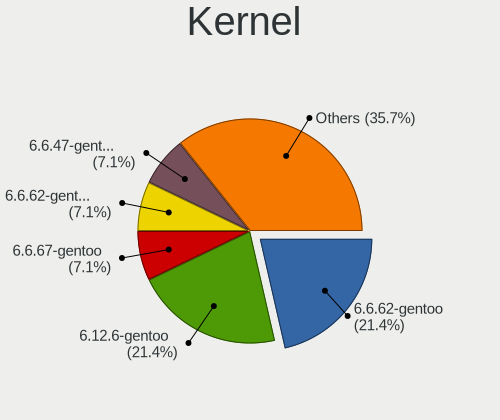
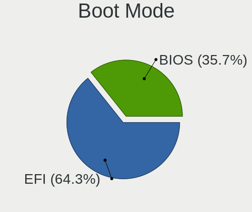
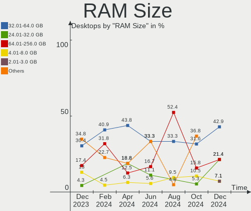
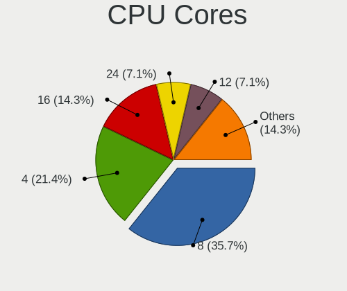
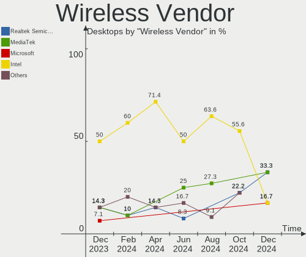
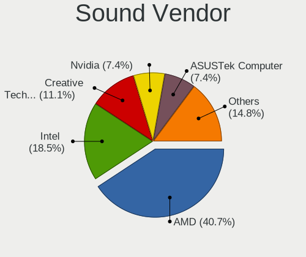
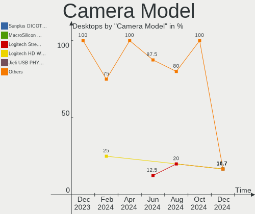

Gentoo - Hardware Trends (Desktops)
-----------------------------------

A project to identify most popular hardware characteristics and track their change
over time based on data collected by Linux users at https://Linux-Hardware.org.

Anyone can contribute to this report by the [hw-probe](https://github.com/linuxhw/hw-probe) tool:

    sudo -E hw-probe -all -upload

This report is for one last month. Overall report since the beginning of time: [TestDays](https://github.com/linuxhw/TestDays)

Period: Dec, 2023.

Contents
--------

* [ System ](#system)
  - [ OS                       ](#os)
  - [ OS Family                ](#os-family)
  - [ Kernel                   ](#kernel)
  - [ Kernel Family            ](#kernel-family)
  - [ Kernel Major Ver.        ](#kernel-major-ver)
  - [ Arch                     ](#arch)
  - [ DE                       ](#de)
  - [ Display Server           ](#display-server)
  - [ Display Manager          ](#display-manager)
  - [ OS Lang                  ](#os-lang)
  - [ Boot Mode                ](#boot-mode)
  - [ Filesystem               ](#filesystem)
  - [ Part. scheme             ](#part-scheme)
  - [ Dual Boot with Linux/BSD ](#dual-boot-with-linuxbsd)
  - [ Dual Boot (Win)          ](#dual-boot-win)

* [ Board ](#board)
  - [ Vendor                   ](#vendor)
  - [ Model                    ](#model)
  - [ Model Family             ](#model-family)
  - [ MFG Year                 ](#mfg-year)
  - [ Form Factor              ](#form-factor)
  - [ Secure Boot              ](#secure-boot)
  - [ Coreboot                 ](#coreboot)
  - [ RAM Size                 ](#ram-size)
  - [ RAM Used                 ](#ram-used)
  - [ Total Drives             ](#total-drives)
  - [ Has CD-ROM               ](#has-cd-rom)
  - [ Has Ethernet             ](#has-ethernet)
  - [ Has WiFi                 ](#has-wifi)
  - [ Has Bluetooth            ](#has-bluetooth)

* [ Location ](#location)
  - [ Country                  ](#country)
  - [ City                     ](#city)

* [ Drives ](#drives)
  - [ Drive Vendor             ](#drive-vendor)
  - [ Drive Model              ](#drive-model)
  - [ HDD Vendor               ](#hdd-vendor)
  - [ SSD Vendor               ](#ssd-vendor)
  - [ Drive Kind               ](#drive-kind)
  - [ Drive Connector          ](#drive-connector)
  - [ Drive Size               ](#drive-size)
  - [ Space Total              ](#space-total)
  - [ Space Used               ](#space-used)
  - [ Malfunc. Drives          ](#malfunc-drives)
  - [ Malfunc. Drive Vendor    ](#malfunc-drive-vendor)
  - [ Malfunc. HDD Vendor      ](#malfunc-hdd-vendor)
  - [ Malfunc. Drive Kind      ](#malfunc-drive-kind)
  - [ Failed Drives            ](#failed-drives)
  - [ Failed Drive Vendor      ](#failed-drive-vendor)
  - [ Drive Status             ](#drive-status)

* [ Storage controller ](#storage-controller)
  - [ Storage Vendor           ](#storage-vendor)
  - [ Storage Model            ](#storage-model)
  - [ Storage Kind             ](#storage-kind)

* [ Processor ](#processor)
  - [ CPU Vendor               ](#cpu-vendor)
  - [ CPU Model                ](#cpu-model)
  - [ CPU Model Family         ](#cpu-model-family)
  - [ CPU Cores                ](#cpu-cores)
  - [ CPU Sockets              ](#cpu-sockets)
  - [ CPU Threads              ](#cpu-threads)
  - [ CPU Op-Modes             ](#cpu-op-modes)
  - [ CPU Microcode            ](#cpu-microcode)
  - [ CPU Microarch            ](#cpu-microarch)

* [ Graphics ](#graphics)
  - [ GPU Vendor               ](#gpu-vendor)
  - [ GPU Model                ](#gpu-model)
  - [ GPU Combo                ](#gpu-combo)
  - [ GPU Driver               ](#gpu-driver)
  - [ GPU Memory               ](#gpu-memory)

* [ Monitor ](#monitor)
  - [ Monitor Vendor           ](#monitor-vendor)
  - [ Monitor Model            ](#monitor-model)
  - [ Monitor Resolution       ](#monitor-resolution)
  - [ Monitor Diagonal         ](#monitor-diagonal)
  - [ Monitor Width            ](#monitor-width)
  - [ Aspect Ratio             ](#aspect-ratio)
  - [ Monitor Area             ](#monitor-area)
  - [ Pixel Density            ](#pixel-density)
  - [ Multiple Monitors        ](#multiple-monitors)

* [ Network ](#network)
  - [ Net Controller Vendor    ](#net-controller-vendor)
  - [ Net Controller Model     ](#net-controller-model)
  - [ Wireless Vendor          ](#wireless-vendor)
  - [ Wireless Model           ](#wireless-model)
  - [ Ethernet Vendor          ](#ethernet-vendor)
  - [ Ethernet Model           ](#ethernet-model)
  - [ Net Controller Kind      ](#net-controller-kind)
  - [ Used Controller          ](#used-controller)
  - [ NICs                     ](#nics)
  - [ IPv6                     ](#ipv6)

* [ Bluetooth ](#bluetooth)
  - [ Bluetooth Vendor         ](#bluetooth-vendor)
  - [ Bluetooth Model          ](#bluetooth-model)

* [ Sound ](#sound)
  - [ Sound Vendor             ](#sound-vendor)
  - [ Sound Model              ](#sound-model)

* [ Memory ](#memory)
  - [ Memory Vendor            ](#memory-vendor)
  - [ Memory Model             ](#memory-model)
  - [ Memory Kind              ](#memory-kind)
  - [ Memory Form Factor       ](#memory-form-factor)
  - [ Memory Size              ](#memory-size)
  - [ Memory Speed             ](#memory-speed)

* [ Printers & scanners ](#printers--scanners)
  - [ Printer Vendor           ](#printer-vendor)
  - [ Printer Model            ](#printer-model)
  - [ Scanner Vendor           ](#scanner-vendor)
  - [ Scanner Model            ](#scanner-model)

* [ Camera ](#camera)
  - [ Camera Vendor            ](#camera-vendor)
  - [ Camera Model             ](#camera-model)

* [ Security ](#security)
  - [ Fingerprint Vendor       ](#fingerprint-vendor)
  - [ Fingerprint Model        ](#fingerprint-model)
  - [ Chipcard Vendor          ](#chipcard-vendor)
  - [ Chipcard Model           ](#chipcard-model)

* [ Unsupported ](#unsupported)
  - [ Unsupported Devices      ](#unsupported-devices)
  - [ Unsupported Device Types ](#unsupported-device-types)

System
------

OS
--

Installed operating systems

| Name        | Desktops | Percent |
|-------------|----------|---------|
| Gentoo 2.14 | 22       | 100%    |

OS Family
---------

OS without a version

| Name   | Desktops | Percent |
|--------|----------|---------|
| Gentoo | 22       | 100%    |

Kernel
------

Version of the Linux kernel

| Version                | Desktops | Percent |
|------------------------|----------|---------|
| 6.1.57-gentoo          | 3        | 13.64%  |
| 6.7.0-rc6              | 1        | 4.55%   |
| 6.6.8-gentoo           | 1        | 4.55%   |
| 6.6.7-gentoo-dist      | 1        | 4.55%   |
| 6.6.6-x86_64           | 1        | 4.55%   |
| 6.6.6-gentoo-dist      | 1        | 4.55%   |
| 6.6.4-gentoo-x86_64    | 1        | 4.55%   |
| 6.6.3-gentoo           | 1        | 4.55%   |
| 6.6.2-gentoo           | 1        | 4.55%   |
| 6.1.67-gentoo-x86_64   | 1        | 4.55%   |
| 6.1.67-gentoo-risutech | 1        | 4.55%   |
| 6.1.67-gentoo-dist     | 1        | 4.55%   |
| 6.1.66-gentoo-x86_64   | 1        | 4.55%   |
| 6.1.66-gentoo-md-flat  | 1        | 4.55%   |
| 6.1.66-gentoo          | 1        | 4.55%   |
| 6.1.60-gentoo-dist     | 1        | 4.55%   |
| 6.1.57-gentoovolka     | 1        | 4.55%   |
| 6.1.57-gentoo-x86_64   | 1        | 4.55%   |
| 6.1.57-gentoo-custom5  | 1        | 4.55%   |
| 6.1.19-rt-rt8          | 1        | 4.55%   |

Kernel Family
-------------

Linux kernel without a distro release

| Version | Desktops | Percent |
|---------|----------|---------|
| 6.1.57  | 6        | 27.27%  |
| 6.1.67  | 3        | 13.64%  |
| 6.1.66  | 3        | 13.64%  |
| 6.6.6   | 2        | 9.09%   |
| 6.7.0   | 1        | 4.55%   |
| 6.6.8   | 1        | 4.55%   |
| 6.6.7   | 1        | 4.55%   |
| 6.6.4   | 1        | 4.55%   |
| 6.6.3   | 1        | 4.55%   |
| 6.6.2   | 1        | 4.55%   |
| 6.1.60  | 1        | 4.55%   |
| 6.1.19  | 1        | 4.55%   |

Kernel Major Ver.
-----------------

Linux kernel major version

| Version | Desktops | Percent |
|---------|----------|---------|
| 6.1     | 14       | 63.64%  |
| 6.6     | 7        | 31.82%  |
| 6.7     | 1        | 4.55%   |

Arch
----

OS architecture (x86_64, i586, etc.)

| Name   | Desktops | Percent |
|--------|----------|---------|
| x86_64 | 22       | 100%    |

DE
--

Desktop Environment

| Name    | Desktops | Percent |
|---------|----------|---------|
| KDE5    | 10       | 45.45%  |
| Unknown | 5        | 22.73%  |
| XFCE    | 4        | 18.18%  |
| MATE    | 2        | 9.09%   |
| i3      | 1        | 4.55%   |

Display Server
--------------

X11 or Wayland

| Name    | Desktops | Percent |
|---------|----------|---------|
| X11     | 13       | 59.09%  |
| Wayland | 4        | 18.18%  |
| Unknown | 4        | 18.18%  |
| Tty     | 1        | 4.55%   |

Display Manager
---------------

SDDM, LightDM, etc.

| Name    | Desktops | Percent |
|---------|----------|---------|
| Unknown | 8        | 36.36%  |
| SDDM    | 7        | 31.82%  |
| LightDM | 7        | 31.82%  |

OS Lang
-------

Language

| Lang    | Desktops | Percent |
|---------|----------|---------|
| en_US   | 9        | 40.91%  |
| de_DE   | 4        | 18.18%  |
| C.UTF8  | 3        | 13.64%  |
| zh_TW   | 1        | 4.55%   |
| pt_BR   | 1        | 4.55%   |
| fr_FR   | 1        | 4.55%   |
| en_GB   | 1        | 4.55%   |
| C       | 1        | 4.55%   |
| Unknown | 1        | 4.55%   |

Boot Mode
---------

EFI or BIOS

| Mode | Desktops | Percent |
|------|----------|---------|
| EFI  | 17       | 77.27%  |
| BIOS | 5        | 22.73%  |

Filesystem
----------

Type of filesystem

| Type    | Desktops | Percent |
|---------|----------|---------|
| Ext4    | 11       | 50%     |
| F2fs    | 4        | 18.18%  |
| Btrfs   | 4        | 18.18%  |
| Xfs     | 2        | 9.09%   |
| XXXXXXX | 1        | 4.55%   |

Part. scheme
------------

Scheme of partitioning

| Type    | Desktops | Percent |
|---------|----------|---------|
| GPT     | 16       | 72.73%  |
| MBR     | 3        | 13.64%  |
| Unknown | 3        | 13.64%  |

Dual Boot with Linux/BSD
------------------------

Hosting more than one Linux/BSD

| Dual boot | Desktops | Percent |
|-----------|----------|---------|
| No        | 13       | 59.09%  |
| Yes       | 9        | 40.91%  |

Dual Boot (Win)
---------------

Hosting Linux and Windows

| Dual boot | Desktops | Percent |
|-----------|----------|---------|
| No        | 16       | 72.73%  |
| Yes       | 6        | 27.27%  |

Board
-----

Vendor
------

Motherboard manufacturer

| Name                | Desktops | Percent |
|---------------------|----------|---------|
| Gigabyte Technology | 6        | 27.27%  |
| ASUSTek Computer    | 6        | 27.27%  |
| ASRock              | 3        | 13.64%  |
| MSI                 | 2        | 9.09%   |
| Lenovo              | 2        | 9.09%   |
| Hewlett-Packard     | 1        | 4.55%   |
| Fujitsu             | 1        | 4.55%   |
| Foxconn             | 1        | 4.55%   |

Model
-----

Motherboard model

| Name                                 | Desktops | Percent |
|--------------------------------------|----------|---------|
| MSI MS-7E10                          | 1        | 4.55%   |
| MSI MS-7C02                          | 1        | 4.55%   |
| Lenovo ThinkStation S30 4351B20      | 1        | 4.55%   |
| Lenovo ThinkCentre M73 10AY008JGE    | 1        | 4.55%   |
| HP EliteDesk 800 G5 SFF              | 1        | 4.55%   |
| Gigabyte X79-UP4                     | 1        | 4.55%   |
| Gigabyte B450 AORUS ELITE            | 1        | 4.55%   |
| Gigabyte B150M-D2V DDR3              | 1        | 4.55%   |
| Gigabyte AB350-Gaming                | 1        | 4.55%   |
| Gigabyte A520 AORUS ELITE            | 1        | 4.55%   |
| Gigabyte 970A-DS3P FX                | 1        | 4.55%   |
| Fujitsu ESPRIMO E700                 | 1        | 4.55%   |
| Foxconn TPS01                        | 1        | 4.55%   |
| ASUS ROG STRIX X570-E GAMING         | 1        | 4.55%   |
| ASUS ROG Maximus XI HERO             | 1        | 4.55%   |
| ASUS PRIME B660-PLUS D4              | 1        | 4.55%   |
| ASUS PRIME B550-PLUS                 | 1        | 4.55%   |
| ASUS M3A78-CM                        | 1        | 4.55%   |
| ASUS ASUS EXPERTCENTER D500MD_D500SD | 1        | 4.55%   |
| ASRock X399 Taichi                   | 1        | 4.55%   |
| ASRock B650M PG Riptide              | 1        | 4.55%   |
| ASRock A300M-STX                     | 1        | 4.55%   |

Model Family
------------

Motherboard model prefix

| Name                  | Desktops | Percent |
|-----------------------|----------|---------|
| ASUS ROG              | 2        | 9.09%   |
| ASUS PRIME            | 2        | 9.09%   |
| MSI MS-7E10           | 1        | 4.55%   |
| MSI MS-7C02           | 1        | 4.55%   |
| Lenovo ThinkStation   | 1        | 4.55%   |
| Lenovo ThinkCentre    | 1        | 4.55%   |
| HP EliteDesk          | 1        | 4.55%   |
| Gigabyte X79-UP4      | 1        | 4.55%   |
| Gigabyte B450         | 1        | 4.55%   |
| Gigabyte B150M-D2V    | 1        | 4.55%   |
| Gigabyte AB350-Gaming | 1        | 4.55%   |
| Gigabyte A520         | 1        | 4.55%   |
| Gigabyte 970A-DS3P    | 1        | 4.55%   |
| Fujitsu ESPRIMO       | 1        | 4.55%   |
| Foxconn TPS01         | 1        | 4.55%   |
| ASUS M3A78-CM         | 1        | 4.55%   |
| ASUS ASUS             | 1        | 4.55%   |
| ASRock X399           | 1        | 4.55%   |
| ASRock B650M          | 1        | 4.55%   |
| ASRock A300M-STX      | 1        | 4.55%   |

MFG Year
--------

Motherboard manufacture year

| Year | Desktops | Percent |
|------|----------|---------|
| 2018 | 4        | 18.18%  |
| 2017 | 3        | 13.64%  |
| 2023 | 2        | 9.09%   |
| 2021 | 2        | 9.09%   |
| 2020 | 2        | 9.09%   |
| 2014 | 2        | 9.09%   |
| 2022 | 1        | 4.55%   |
| 2019 | 1        | 4.55%   |
| 2015 | 1        | 4.55%   |
| 2012 | 1        | 4.55%   |
| 2011 | 1        | 4.55%   |
| 2009 | 1        | 4.55%   |
| 2008 | 1        | 4.55%   |

Form Factor
-----------

Physical design of the computer

| Name    | Desktops | Percent |
|---------|----------|---------|
| Desktop | 22       | 100%    |

Secure Boot
-----------

Enabled or disabled

| State    | Desktops | Percent |
|----------|----------|---------|
| Disabled | 22       | 100%    |

Coreboot
--------

Have coreboot on board

| Used | Desktops | Percent |
|------|----------|---------|
| No   | 22       | 100%    |

RAM Size
--------

Total RAM memory

| Size in GB  | Desktops | Percent |
|-------------|----------|---------|
| 32.01-64.0  | 7        | 31.82%  |
| 16.01-24.0  | 5        | 22.73%  |
| 64.01-256.0 | 4        | 18.18%  |
| 4.01-8.0    | 3        | 13.64%  |
| 3.01-4.0    | 2        | 9.09%   |
| 24.01-32.0  | 1        | 4.55%   |

RAM Used
--------

Used RAM memory

| Used GB    | Desktops | Percent |
|------------|----------|---------|
| 4.01-8.0   | 9        | 40.91%  |
| 0.51-1.0   | 3        | 13.64%  |
| 0.01-0.5   | 3        | 13.64%  |
| 3.01-4.0   | 2        | 9.09%   |
| 1.01-2.0   | 2        | 9.09%   |
| 2.01-3.0   | 1        | 4.55%   |
| 16.01-24.0 | 1        | 4.55%   |
| 8.01-16.0  | 1        | 4.55%   |

Total Drives
------------

Number of drives on board

| Drives | Desktops | Percent |
|--------|----------|---------|
| 2      | 7        | 31.82%  |
| 1      | 6        | 27.27%  |
| 6      | 3        | 13.64%  |
| 3      | 3        | 13.64%  |
| 4      | 2        | 9.09%   |
| 8      | 1        | 4.55%   |

Has CD-ROM
----------

Has CD-ROM on board

| Presented | Desktops | Percent |
|-----------|----------|---------|
| No        | 14       | 63.64%  |
| Yes       | 8        | 36.36%  |

Has Ethernet
------------

Has Ethernet on board

| Presented | Desktops | Percent |
|-----------|----------|---------|
| Yes       | 22       | 100%    |

Has WiFi
--------

Has WiFi module

| Presented | Desktops | Percent |
|-----------|----------|---------|
| Yes       | 12       | 54.55%  |
| No        | 10       | 45.45%  |

Has Bluetooth
-------------

Has Bluetooth module

| Presented | Desktops | Percent |
|-----------|----------|---------|
| No        | 16       | 72.73%  |
| Yes       | 6        | 27.27%  |

Location
--------

Country
-------

Geographic location (country)

| Country | Desktops | Percent |
|---------|----------|---------|
| USA     | 7        | 31.82%  |
| Poland  | 4        | 18.18%  |
| Germany | 4        | 18.18%  |
| France  | 2        | 9.09%   |
| UK      | 1        | 4.55%   |
| Taiwan  | 1        | 4.55%   |
| Sweden  | 1        | 4.55%   |
| Hungary | 1        | 4.55%   |
| Brazil  | 1        | 4.55%   |

City
----

Geographic location (city)

| City             | Desktops | Percent |
|------------------|----------|---------|
| Warsaw           | 3        | 13.64%  |
| Wrentham         | 1        | 4.55%   |
| Oklahoma City    | 1        | 4.55%   |
| Munich           | 1        | 4.55%   |
| Mönchengladbach | 1        | 4.55%   |
| Lund             | 1        | 4.55%   |
| Lincoln          | 1        | 4.55%   |
| Le Boulou        | 1        | 4.55%   |
| La Grange        | 1        | 4.55%   |
| Kropp            | 1        | 4.55%   |
| Itapevi          | 1        | 4.55%   |
| Hsinchu          | 1        | 4.55%   |
| Hamburg          | 1        | 4.55%   |
| Győr            | 1        | 4.55%   |
| Epone            | 1        | 4.55%   |
| Edinburgh        | 1        | 4.55%   |
| Clifton          | 1        | 4.55%   |
| Cieszyn          | 1        | 4.55%   |
| Augusta          | 1        | 4.55%   |
| Ashburn          | 1        | 4.55%   |

Drives
------

Drive Vendor
------------

Hard drive vendors

| Vendor                      | Desktops | Drives | Percent |
|-----------------------------|----------|--------|---------|
| Seagate                     | 8        | 11     | 17.39%  |
| Samsung Electronics         | 7        | 12     | 15.22%  |
| WDC                         | 3        | 5      | 6.52%   |
| Sandisk                     | 3        | 4      | 6.52%   |
| GOODRAM                     | 3        | 3      | 6.52%   |
| Crucial                     | 3        | 3      | 6.52%   |
| Toshiba                     | 2        | 2      | 4.35%   |
| Kingston                    | 2        | 2      | 4.35%   |
| Intel                       | 2        | 2      | 4.35%   |
| Hitachi                     | 2        | 4      | 4.35%   |
| Verbatim                    | 1        | 1      | 2.17%   |
| Unknown                     | 1        | 3      | 2.17%   |
| Team                        | 1        | 1      | 2.17%   |
| SPCC                        | 1        | 1      | 2.17%   |
| SABRENT                     | 1        | 1      | 2.17%   |
| PNY                         | 1        | 1      | 2.17%   |
| Phison Electronics          | 1        | 1      | 2.17%   |
| Micron/Crucial Technology   | 1        | 1      | 2.17%   |
| Kingston Technology Company | 1        | 1      | 2.17%   |
| HGST                        | 1        | 1      | 2.17%   |
| China                       | 1        | 1      | 2.17%   |

Drive Model
-----------

Hard drive models

| Model                                               | Desktops | Percent |
|-----------------------------------------------------|----------|---------|
| Samsung NVMe SSD Controller SM981/PM981/PM983 512GB | 4        | 7.41%   |
| Samsung SSD 860 EVO 1TB                             | 2        | 3.7%    |
| GOODRAM SSDPR-CL100-480-G2 480GB                    | 2        | 3.7%    |
| WDC WDS500G2B0A-00SM50 500GB SSD                    | 1        | 1.85%   |
| WDC WD20EZRZ-00Z5HB0 2TB                            | 1        | 1.85%   |
| WDC WD2001FASS-00W2B0 2TB                           | 1        | 1.85%   |
| WDC WD10EZEX-00BN5A0 1TB                            | 1        | 1.85%   |
| WDC WD102KRYZ-01A5AB0 10TB                          | 1        | 1.85%   |
| Verbatim Vi550 S3 512GB                             | 1        | 1.85%   |
| Unknown SD/MMC/M.S.PRO 32GB                         | 1        | 1.85%   |
| Unknown SD/MMC 2GB                                  | 1        | 1.85%   |
| Unknown M.S./M.S.Pro/HG 16GB                        | 1        | 1.85%   |
| Toshiba HDWE150 5TB                                 | 1        | 1.85%   |
| Toshiba DT01ACA100 1TB                              | 1        | 1.85%   |
| Team T253E2512G 512GB SSD                           | 1        | 1.85%   |
| SPCC Solid State Disk 1TB                           | 1        | 1.85%   |
| Seagate ST8000VN004-3CP101 8TB                      | 1        | 1.85%   |
| Seagate ST8000DM004-2U9188 8TB                      | 1        | 1.85%   |
| Seagate ST500DM002-1BD142 500GB                     | 1        | 1.85%   |
| Seagate ST4000DM004-2CV104 4TB                      | 1        | 1.85%   |
| Seagate ST2000DM008-2UB102 2TB                      | 1        | 1.85%   |
| Seagate ST2000DM006-2DM164 2TB                      | 1        | 1.85%   |
| Seagate ST12000NM0008-2H3101 12TB                   | 1        | 1.85%   |
| Seagate ST1000DM010-2EP102 1TB                      | 1        | 1.85%   |
| Sandisk WD_BLACK SN850X 4000GB                      | 1        | 1.85%   |
| Sandisk WD Blue SN500 / PC SN520 NVMe SSD 128GB     | 1        | 1.85%   |
| Sandisk WD Black SN850 1024GB                       | 1        | 1.85%   |
| Samsung SSD 980 500GB                               | 1        | 1.85%   |
| Samsung SSD 850 PRO 512GB                           | 1        | 1.85%   |
| Samsung SSD 850 EVO 250GB                           | 1        | 1.85%   |
| Samsung SSD 850 EVO 1TB                             | 1        | 1.85%   |
| Samsung NVMe SSD Controller PM9A1/PM9A3/980PRO 2TB  | 1        | 1.85%   |
| SABRENT Disk 2TB                                    | 1        | 1.85%   |
| PNY SSD2SC120G1LC763C121S459P 120GB                 | 1        | 1.85%   |
| Phison E12 NVMe Controller 1TB                      | 1        | 1.85%   |
| Micron/Crucial CT2000P5PSSD8 2TB                    | 1        | 1.85%   |
| Kingston Company A2000 NVMe SSD 1TB                 | 1        | 1.85%   |
| Kingston SKC3000D2048G 2TB                          | 1        | 1.85%   |
| Kingston SA400S37480G 480GB SSD                     | 1        | 1.85%   |
| Intel SSDSA2BW080G3H 80GB                           | 1        | 1.85%   |

HDD Vendor
----------

Hard disk drive vendors

| Vendor  | Desktops | Drives | Percent |
|---------|----------|--------|---------|
| Seagate | 8        | 11     | 47.06%  |
| WDC     | 3        | 4      | 17.65%  |
| Toshiba | 2        | 2      | 11.76%  |
| Hitachi | 2        | 4      | 11.76%  |
| SABRENT | 1        | 1      | 5.88%   |
| HGST    | 1        | 1      | 5.88%   |

SSD Vendor
----------

Solid state drive vendors

| Vendor              | Desktops | Drives | Percent |
|---------------------|----------|--------|---------|
| Samsung Electronics | 4        | 5      | 22.22%  |
| GOODRAM             | 3        | 3      | 16.67%  |
| Crucial             | 3        | 3      | 16.67%  |
| WDC                 | 1        | 1      | 5.56%   |
| Verbatim            | 1        | 1      | 5.56%   |
| Team                | 1        | 1      | 5.56%   |
| SPCC                | 1        | 1      | 5.56%   |
| PNY                 | 1        | 1      | 5.56%   |
| Kingston            | 1        | 1      | 5.56%   |
| Intel               | 1        | 1      | 5.56%   |
| China               | 1        | 1      | 5.56%   |

Drive Kind
----------

HDD or SSD

| Kind    | Desktops | Drives | Percent |
|---------|----------|--------|---------|
| SSD     | 15       | 19     | 35.71%  |
| HDD     | 14       | 23     | 33.33%  |
| NVMe    | 12       | 16     | 28.57%  |
| Unknown | 1        | 3      | 2.38%   |

Drive Connector
---------------

SATA, SAS, NVMe, etc.

| Type | Desktops | Drives | Percent |
|------|----------|--------|---------|
| SATA | 20       | 41     | 58.82%  |
| NVMe | 12       | 16     | 35.29%  |
| SAS  | 2        | 4      | 5.88%   |

Drive Size
----------

Size of hard drive

| Size in TB | Desktops | Drives | Percent |
|------------|----------|--------|---------|
| 0.51-1.0   | 11       | 14     | 33.33%  |
| 0.01-0.5   | 10       | 11     | 30.3%   |
| 1.01-2.0   | 5        | 6      | 15.15%  |
| 4.01-10.0  | 4        | 6      | 12.12%  |
| 3.01-4.0   | 1        | 1      | 3.03%   |
| 2.01-3.0   | 1        | 3      | 3.03%   |
| 10.01-20.0 | 1        | 1      | 3.03%   |

Space Total
-----------

Amount of disk space available on the file system

| Size in GB     | Desktops | Percent |
|----------------|----------|---------|
| More than 3000 | 6        | 27.27%  |
| 501-1000       | 4        | 18.18%  |
| 101-250        | 3        | 13.64%  |
| 1001-2000      | 3        | 13.64%  |
| 2001-3000      | 2        | 9.09%   |
| 251-500        | 1        | 4.55%   |
| 1-20           | 1        | 4.55%   |
| 51-100         | 1        | 4.55%   |
| Unknown        | 1        | 4.55%   |

Space Used
----------

Amount of used disk space

| Used GB        | Desktops | Percent |
|----------------|----------|---------|
| 51-100         | 4        | 18.18%  |
| More than 3000 | 3        | 13.64%  |
| 1001-2000      | 3        | 13.64%  |
| 1-20           | 3        | 13.64%  |
| 501-1000       | 3        | 13.64%  |
| 251-500        | 2        | 9.09%   |
| 101-250        | 2        | 9.09%   |
| 21-50          | 1        | 4.55%   |
| Unknown        | 1        | 4.55%   |

Malfunc. Drives
---------------

Drive models with a malfunction

| Model                               | Desktops | Drives | Percent |
|-------------------------------------|----------|--------|---------|
| Seagate ST1000DM010-2EP102 1TB      | 1        | 1      | 33.33%  |
| PNY SSD2SC120G1LC763C121S459P 120GB | 1        | 1      | 33.33%  |
| HGST HTS721010A9E630 1TB            | 1        | 1      | 33.33%  |

Malfunc. Drive Vendor
---------------------

Vendors of faulty drives

| Vendor  | Desktops | Drives | Percent |
|---------|----------|--------|---------|
| Seagate | 1        | 1      | 33.33%  |
| PNY     | 1        | 1      | 33.33%  |
| HGST    | 1        | 1      | 33.33%  |

Malfunc. HDD Vendor
-------------------

Vendors of faulty HDD drives

| Vendor  | Desktops | Drives | Percent |
|---------|----------|--------|---------|
| Seagate | 1        | 1      | 50%     |
| HGST    | 1        | 1      | 50%     |

Malfunc. Drive Kind
-------------------

Kinds of faulty drives

| Kind | Desktops | Drives | Percent |
|------|----------|--------|---------|
| HDD  | 2        | 2      | 66.67%  |
| SSD  | 1        | 1      | 33.33%  |

Failed Drives
-------------

Failed drive models

Zero info for selected period =(

Failed Drive Vendor
-------------------

Failed drive vendors

Zero info for selected period =(

Drive Status
------------

Number of failed and malfunc. drives

| Status   | Desktops | Drives | Percent |
|----------|----------|--------|---------|
| Works    | 19       | 45     | 73.08%  |
| Detected | 4        | 13     | 15.38%  |
| Malfunc  | 3        | 3      | 11.54%  |

Storage controller
------------------

Storage Vendor
--------------

Storage controller vendors

| Vendor                      | Desktops | Percent |
|-----------------------------|----------|---------|
| AMD                         | 12       | 34.29%  |
| Intel                       | 10       | 28.57%  |
| Samsung Electronics         | 4        | 11.43%  |
| SanDisk                     | 3        | 8.57%   |
| Kingston Technology Company | 2        | 5.71%   |
| Phison Electronics          | 1        | 2.86%   |
| Micron/Crucial Technology   | 1        | 2.86%   |
| Marvell Technology Group    | 1        | 2.86%   |
| ASMedia Technology          | 1        | 2.86%   |

Storage Model
-------------

Storage controller models

| Model                                                                          | Desktops | Percent |
|--------------------------------------------------------------------------------|----------|---------|
| AMD FCH SATA Controller [AHCI mode]                                            | 6        | 13.64%  |
| Samsung NVMe SSD Controller SM981/PM981/PM983                                  | 4        | 9.09%   |
| Intel Cannon Lake PCH SATA AHCI Controller                                     | 2        | 4.55%   |
| Intel C600/X79 series chipset 6-Port SATA AHCI Controller                      | 2        | 4.55%   |
| Intel Alder Lake-S PCH SATA Controller [AHCI Mode]                             | 2        | 4.55%   |
| AMD 500 Series Chipset SATA Controller                                         | 2        | 4.55%   |
| AMD 400 Series Chipset SATA Controller                                         | 2        | 4.55%   |
| SanDisk WD PC SN810 / Black SN850 NVMe SSD                                     | 1        | 2.27%   |
| SanDisk WD Blue SN500 / PC SN520 x2 M.2 2280 NVMe SSD                          | 1        | 2.27%   |
| Sandisk WD Black SN850X NVMe SSD                                               | 1        | 2.27%   |
| Samsung NVMe SSD Controller PM9A1/PM9A3/980PRO                                 | 1        | 2.27%   |
| Samsung NVMe SSD Controller 980 (DRAM-less)                                    | 1        | 2.27%   |
| Phison E12 NVMe Controller                                                     | 1        | 2.27%   |
| Micron/Crucial P5 Plus NVMe PCIe SSD                                           | 1        | 2.27%   |
| Marvell Group 88SE9172 SATA 6Gb/s Controller                                   | 1        | 2.27%   |
| Kingston Company KC3000/FURY Renegade NVMe SSD E18                             | 1        | 2.27%   |
| Kingston Company A2000 NVMe SSD SM2263EN                                       | 1        | 2.27%   |
| Intel Volume Management Device NVMe RAID Controller                            | 1        | 2.27%   |
| Intel SSD 670p Series [Keystone Harbor]                                        | 1        | 2.27%   |
| Intel Q170/Q150/B150/H170/H110/Z170/CM236 Chipset SATA Controller [AHCI Mode]  | 1        | 2.27%   |
| Intel NM10/ICH7 Family SATA Controller [AHCI mode]                             | 1        | 2.27%   |
| Intel C602 chipset 4-Port SATA Storage Control Unit                            | 1        | 2.27%   |
| Intel C600/X79 series chipset IDE-r Controller                                 | 1        | 2.27%   |
| Intel 8 Series/C220 Series Chipset Family 6-port SATA Controller 1 [AHCI mode] | 1        | 2.27%   |
| Intel 6 Series/C200 Series Chipset Family 6 port Desktop SATA AHCI Controller  | 1        | 2.27%   |
| ASMedia ASM1062 Serial ATA Controller                                          | 1        | 2.27%   |
| AMD X399 Series Chipset SATA Controller                                        | 1        | 2.27%   |
| AMD SB7x0/SB8x0/SB9x0 SATA Controller [IDE mode]                               | 1        | 2.27%   |
| AMD SB7x0/SB8x0/SB9x0 SATA Controller [AHCI mode]                              | 1        | 2.27%   |
| AMD SB7x0/SB8x0/SB9x0 IDE Controller                                           | 1        | 2.27%   |
| AMD 300 Series Chipset SATA Controller                                         | 1        | 2.27%   |

Storage Kind
------------

Kind of storage controller (IDE, SATA, NVMe, SAS, ...)

| Kind | Desktops | Percent |
|------|----------|---------|
| SATA | 22       | 57.89%  |
| NVMe | 12       | 31.58%  |
| IDE  | 2        | 5.26%   |
| RAID | 1        | 2.63%   |
| SAS  | 1        | 2.63%   |

Processor
---------

CPU Vendor
----------

Processor vendors

| Vendor | Desktops | Percent |
|--------|----------|---------|
| AMD    | 12       | 54.55%  |
| Intel  | 10       | 45.45%  |

CPU Model
---------

Processor models

| Model                                          | Desktops | Percent |
|------------------------------------------------|----------|---------|
| Intel Xeon CPU E5-1620 v2 @ 3.70GHz            | 1        | 4.55%   |
| Intel Pentium CPU G3240T @ 2.70GHz             | 1        | 4.55%   |
| Intel Core i7-9700 CPU @ 3.00GHz               | 1        | 4.55%   |
| Intel Core i7-8700K CPU @ 3.70GHz              | 1        | 4.55%   |
| Intel Core i7-4820K CPU @ 3.70GHz              | 1        | 4.55%   |
| Intel Core i5-2400 CPU @ 3.10GHz               | 1        | 4.55%   |
| Intel Core i3-6100 CPU @ 3.70GHz               | 1        | 4.55%   |
| Intel Atom CPU D510 @ 1.66GHz                  | 1        | 4.55%   |
| Intel 12th Gen Core i5-12500                   | 1        | 4.55%   |
| Intel 12th Gen Core i5-12400                   | 1        | 4.55%   |
| AMD Ryzen Threadripper 2950X 16-Core Processor | 1        | 4.55%   |
| AMD Ryzen 9 7950X 16-Core Processor            | 1        | 4.55%   |
| AMD Ryzen 9 3900X 12-Core Processor            | 1        | 4.55%   |
| AMD Ryzen 7 5800X3D 8-Core Processor           | 1        | 4.55%   |
| AMD Ryzen 7 5700G with Radeon Graphics         | 1        | 4.55%   |
| AMD Ryzen 7 3700X 8-Core Processor             | 1        | 4.55%   |
| AMD Ryzen 5 7600 6-Core Processor              | 1        | 4.55%   |
| AMD Ryzen 5 5600X 6-Core Processor             | 1        | 4.55%   |
| AMD Ryzen 5 2600 Six-Core Processor            | 1        | 4.55%   |
| AMD Ryzen 3 3200G with Radeon Vega Graphics    | 1        | 4.55%   |
| AMD Phenom II X4 955 Processor                 | 1        | 4.55%   |
| AMD FX-8300 Eight-Core Processor               | 1        | 4.55%   |

CPU Model Family
----------------

Processor model prefix

| Model                  | Desktops | Percent |
|------------------------|----------|---------|
| Intel Core i7          | 3        | 13.64%  |
| AMD Ryzen 7            | 3        | 13.64%  |
| AMD Ryzen 5            | 3        | 13.64%  |
| Other                  | 2        | 9.09%   |
| AMD Ryzen 9            | 2        | 9.09%   |
| Intel Xeon             | 1        | 4.55%   |
| Intel Pentium          | 1        | 4.55%   |
| Intel Core i5          | 1        | 4.55%   |
| Intel Core i3          | 1        | 4.55%   |
| Intel Atom             | 1        | 4.55%   |
| AMD Ryzen Threadripper | 1        | 4.55%   |
| AMD Ryzen 3            | 1        | 4.55%   |
| AMD Phenom II X4       | 1        | 4.55%   |
| AMD FX                 | 1        | 4.55%   |

CPU Cores
---------

Number of processor cores

| Number | Desktops | Percent |
|--------|----------|---------|
| 6      | 6        | 27.27%  |
| 4      | 6        | 27.27%  |
| 8      | 4        | 18.18%  |
| 2      | 3        | 13.64%  |
| 16     | 2        | 9.09%   |
| 12     | 1        | 4.55%   |

CPU Sockets
-----------

Number of sockets

| Number | Desktops | Percent |
|--------|----------|---------|
| 1      | 22       | 100%    |

CPU Threads
-----------

Threads per core (Hyper-Threading)

| Number | Desktops | Percent |
|--------|----------|---------|
| 2      | 17       | 77.27%  |
| 1      | 5        | 22.73%  |

CPU Op-Modes
------------

CPU Operation Modes (32-bit, 64-bit)

| Op mode        | Desktops | Percent |
|----------------|----------|---------|
| 32-bit, 64-bit | 22       | 100%    |

CPU Microcode
-------------

Microcode number

| Number     | Desktops | Percent |
|------------|----------|---------|
| Unknown    | 6        | 27.27%  |
| 0x306e4    | 2        | 9.09%   |
| 0x0800820d | 2        | 9.09%   |
| 0x906ed    | 1        | 4.55%   |
| 0x90675    | 1        | 4.55%   |
| 0x506e3    | 1        | 4.55%   |
| 0x0a601206 | 1        | 4.55%   |
| 0x0a601203 | 1        | 4.55%   |
| 0x0a50000d | 1        | 4.55%   |
| 0x0a20120a | 1        | 4.55%   |
| 0x0a201016 | 1        | 4.55%   |
| 0x08701030 | 1        | 4.55%   |
| 0x08108102 | 1        | 4.55%   |
| 0x06000822 | 1        | 4.55%   |
| 0x010000db | 1        | 4.55%   |

CPU Microarch
-------------

Microarchitecture

| Name             | Desktops | Percent |
|------------------|----------|---------|
| Zen+             | 3        | 13.64%  |
| Zen 3            | 3        | 13.64%  |
| Zen 2            | 2        | 9.09%   |
| KabyLake         | 2        | 9.09%   |
| IvyBridge        | 2        | 9.09%   |
| Alderlake Hybrid | 2        | 9.09%   |
| Unknown          | 2        | 9.09%   |
| Skylake          | 1        | 4.55%   |
| SandyBridge      | 1        | 4.55%   |
| Piledriver       | 1        | 4.55%   |
| K10              | 1        | 4.55%   |
| Haswell          | 1        | 4.55%   |
| Bonnell          | 1        | 4.55%   |

Graphics
--------

GPU Vendor
----------

Vendors of graphics cards

| Vendor | Desktops | Percent |
|--------|----------|---------|
| AMD    | 11       | 47.83%  |
| Nvidia | 7        | 30.43%  |
| Intel  | 5        | 21.74%  |

GPU Model
---------

Graphics card models

| Model                                                                       | Desktops | Percent |
|-----------------------------------------------------------------------------|----------|---------|
| Nvidia GF119 [GeForce GT 610]                                               | 2        | 8.33%   |
| Nvidia GA104 [GeForce RTX 3070 Ti]                                          | 2        | 8.33%   |
| AMD Raphael                                                                 | 2        | 8.33%   |
| AMD Navi 10 [Radeon RX 5600 OEM/5600 XT / 5700/5700 XT]                     | 2        | 8.33%   |
| AMD Ellesmere [Radeon RX 470/480/570/570X/580/580X/590]                     | 2        | 8.33%   |
| Nvidia GP108 [GeForce GT 1030]                                              | 1        | 4.17%   |
| Nvidia GP107GL [Quadro P620]                                                | 1        | 4.17%   |
| Nvidia GA104 [GeForce RTX 3070 Lite Hash Rate]                              | 1        | 4.17%   |
| Intel Xeon E3-1200 v3/4th Gen Core Processor Integrated Graphics Controller | 1        | 4.17%   |
| Intel HD Graphics 530                                                       | 1        | 4.17%   |
| Intel CoffeeLake-S GT2 [UHD Graphics 630]                                   | 1        | 4.17%   |
| Intel Atom Processor D4xx/D5xx/N4xx/N5xx Integrated Graphics Controller     | 1        | 4.17%   |
| Intel Alder Lake-S GT1 [UHD Graphics 770]                                   | 1        | 4.17%   |
| AMD RS780C [Radeon 3100]                                                    | 1        | 4.17%   |
| AMD Picasso/Raven 2 [Radeon Vega Series / Radeon Vega Mobile Series]        | 1        | 4.17%   |
| AMD Navi 22 [Radeon RX 6700/6700 XT/6750 XT / 6800M/6850M XT]               | 1        | 4.17%   |
| AMD Navi 21 [Radeon RX 6800/6800 XT / 6900 XT]                              | 1        | 4.17%   |
| AMD Cezanne [Radeon Vega Series / Radeon Vega Mobile Series]                | 1        | 4.17%   |
| AMD Cedar [Radeon HD 5000/6000/7350/8350 Series]                            | 1        | 4.17%   |

GPU Combo
---------

Combinations of graphics cards

| Name           | Desktops | Percent |
|----------------|----------|---------|
| 1 x AMD        | 10       | 45.45%  |
| 1 x Nvidia     | 6        | 27.27%  |
| 1 x Intel      | 4        | 18.18%  |
| 2 x AMD        | 1        | 4.55%   |
| Intel + Nvidia | 1        | 4.55%   |

GPU Driver
----------

Free vs proprietary

| Driver      | Desktops | Percent |
|-------------|----------|---------|
| Free        | 15       | 68.18%  |
| Proprietary | 5        | 22.73%  |
| Unknown     | 2        | 9.09%   |

GPU Memory
----------

Total video memory

| Size in GB | Desktops | Percent |
|------------|----------|---------|
| Unknown    | 7        | 31.82%  |
| 7.01-8.0   | 6        | 27.27%  |
| 1.01-2.0   | 3        | 13.64%  |
| 0.01-0.5   | 3        | 13.64%  |
| 8.01-16.0  | 2        | 9.09%   |
| 0.51-1.0   | 1        | 4.55%   |

Monitor
-------

Monitor Vendor
--------------

Monitor vendors

| Vendor              | Desktops | Percent |
|---------------------|----------|---------|
| Samsung Electronics | 5        | 21.74%  |
| Dell                | 3        | 13.04%  |
| Philips             | 2        | 8.7%    |
| Goldstar            | 2        | 8.7%    |
| ASUSTek Computer    | 2        | 8.7%    |
| Microstep           | 1        | 4.35%   |
| Iiyama              | 1        | 4.35%   |
| IBM                 | 1        | 4.35%   |
| HJW                 | 1        | 4.35%   |
| Hewlett-Packard     | 1        | 4.35%   |
| Gigabyte Technology | 1        | 4.35%   |
| EDI                 | 1        | 4.35%   |
| AOC                 | 1        | 4.35%   |
| Acer                | 1        | 4.35%   |

Monitor Model
-------------

Monitor models

| Model                                                                | Desktops | Percent |
|----------------------------------------------------------------------|----------|---------|
| Samsung Electronics SyncMaster SAM059A 1920x1080 477x268mm 21.5-inch | 2        | 8.33%   |
| Samsung Electronics U28E590 SAM0C4D 3840x2160 610x350mm 27.7-inch    | 1        | 4.17%   |
| Samsung Electronics S22B300 SAM08C8 1920x1080 477x268mm 21.5-inch    | 1        | 4.17%   |
| Samsung Electronics C24F390 SAM0D2C 1920x1080 521x293mm 23.5-inch    | 1        | 4.17%   |
| Philips 273ELH PHLC07D 1920x1080 598x336mm 27.0-inch                 | 1        | 4.17%   |
| Philips 17S PHL0877 1280x1024 337x270mm 17.0-inch                    | 1        | 4.17%   |
| Microstep LCD Monitor Optix MAG27CQ 2560x1440                        | 1        | 4.17%   |
| Iiyama PL2450H IVM618A 1920x1080 527x296mm 23.8-inch                 | 1        | 4.17%   |
| IBM L170 IBM1A4E 1280x1024 338x270mm 17.0-inch                       | 1        | 4.17%   |
| HJW MACROSILICON HJW1836 1680x1050 530x290mm 23.8-inch               | 1        | 4.17%   |
| Hewlett-Packard S230tm HWP3115 1920x1080 509x286mm 23.0-inch         | 1        | 4.17%   |
| Hewlett-Packard LA2206 HWP2946 1920x1080 476x268mm 21.5-inch         | 1        | 4.17%   |
| Goldstar ULTRAWIDE GSM59F1 2560x1080 673x284mm 28.8-inch             | 1        | 4.17%   |
| Goldstar ULTRAGEAR GSM5B7F 2560x1440 597x336mm 27.0-inch             | 1        | 4.17%   |
| Gigabyte Technology G24F 2 GBT2403 1920x1080 527x296mm 23.8-inch     | 1        | 4.17%   |
| EDI EDIIG0216 EDI0216 1920x1080 521x293mm 23.5-inch                  | 1        | 4.17%   |
| Dell U2515H DELD06E 2560x1440 553x311mm 25.0-inch                    | 1        | 4.17%   |
| Dell S2422HG DELA1BF 1920x1080 521x293mm 23.5-inch                   | 1        | 4.17%   |
| Dell P2418D DELD0C2 2560x1440 526x296mm 23.8-inch                    | 1        | 4.17%   |
| ASUSTek Computer VY229HE AUS22DC 1920x1080 479x260mm 21.5-inch       | 1        | 4.17%   |
| ASUSTek Computer VA24E AUS24D1 1920x1080 527x296mm 23.8-inch         | 1        | 4.17%   |
| AOC 22B2WG5 AOC2202 1920x1080 477x268mm 21.5-inch                    | 1        | 4.17%   |
| Acer KG281K ACR062D 3840x2160 621x341mm 27.9-inch                    | 1        | 4.17%   |

Monitor Resolution
------------------

Monitor screen resolution

| Resolution       | Desktops | Percent |
|------------------|----------|---------|
| 1920x1080 (FHD)  | 11       | 55%     |
| 2560x1440 (QHD)  | 3        | 15%     |
| 3840x2160 (4K)   | 2        | 10%     |
| 1280x1024 (SXGA) | 2        | 10%     |
| 2560x1080        | 1        | 5%      |
| 1400x1050        | 1        | 5%      |

Monitor Diagonal
----------------

Diagonal size in inches

| Inches  | Desktops | Percent |
|---------|----------|---------|
| 23      | 7        | 30.43%  |
| 21      | 5        | 21.74%  |
| 27      | 4        | 17.39%  |
| 24      | 2        | 8.7%    |
| 17      | 2        | 8.7%    |
| 34      | 1        | 4.35%   |
| 25      | 1        | 4.35%   |
| Unknown | 1        | 4.35%   |

Monitor Width
-------------

Physical width

| Width in mm | Desktops | Percent |
|-------------|----------|---------|
| 501-600     | 10       | 47.62%  |
| 401-500     | 5        | 23.81%  |
| 601-700     | 2        | 9.52%   |
| 301-350     | 2        | 9.52%   |
| 701-800     | 1        | 4.76%   |
| Unknown     | 1        | 4.76%   |

Aspect Ratio
------------

Proportional relationship between the width and the height

| Ratio   | Desktops | Percent |
|---------|----------|---------|
| 16/9    | 16       | 80%     |
| 5/4     | 2        | 10%     |
| 21/9    | 1        | 5%      |
| Unknown | 1        | 5%      |

Monitor Area
------------

Area in inch²

| Area in inch² | Desktops | Percent |
|----------------|----------|---------|
| 201-250        | 11       | 50%     |
| 301-350        | 4        | 18.18%  |
| 151-200        | 2        | 9.09%   |
| 141-150        | 2        | 9.09%   |
| 351-500        | 1        | 4.55%   |
| 251-300        | 1        | 4.55%   |
| Unknown        | 1        | 4.55%   |

Pixel Density
-------------

Pixels per inch

| Density | Desktops | Percent |
|---------|----------|---------|
| 51-100  | 10       | 50%     |
| 101-120 | 6        | 30%     |
| 121-160 | 3        | 15%     |
| Unknown | 1        | 5%      |

Multiple Monitors
-----------------

Total monitors connected

| Total | Desktops | Percent |
|-------|----------|---------|
| 1     | 15       | 68.18%  |
| 2     | 3        | 13.64%  |
| 0     | 3        | 13.64%  |
| 4     | 1        | 4.55%   |

Network
-------

Net Controller Vendor
---------------------

Controller vendors

| Vendor                | Desktops | Percent |
|-----------------------|----------|---------|
| Realtek Semiconductor | 15       | 45.45%  |
| Intel                 | 13       | 39.39%  |
| Qualcomm Atheros      | 2        | 6.06%   |
| Microsoft             | 1        | 3.03%   |
| MediaTek              | 1        | 3.03%   |
| Broadcom              | 1        | 3.03%   |

Net Controller Model
--------------------

Controller models

| Model                                                                         | Desktops | Percent |
|-------------------------------------------------------------------------------|----------|---------|
| Realtek RTL8111/8168/8411 PCI Express Gigabit Ethernet Controller             | 10       | 25.64%  |
| Realtek RTL8125 2.5GbE Controller                                             | 4        | 10.26%  |
| Intel I211 Gigabit Network Connection                                         | 2        | 5.13%   |
| Intel Dual Band Wireless-AC 3168NGW [Stone Peak]                              | 2        | 5.13%   |
| Intel 82579LM Gigabit Network Connection (Lewisville)                         | 2        | 5.13%   |
| Realtek USB 10/100/1G/2.5G LAN                                                | 1        | 2.56%   |
| Realtek RTL88x2bu [AC1200 Techkey]                                            | 1        | 2.56%   |
| Realtek RTL8188EUS 802.11n Wireless Network Adapter                           | 1        | 2.56%   |
| Realtek RTL8169 PCI Gigabit Ethernet Controller                               | 1        | 2.56%   |
| Qualcomm Atheros AR9287 Wireless Network Adapter (PCI-Express)                | 1        | 2.56%   |
| Qualcomm Atheros AR9285 Wireless Network Adapter (PCI-Express)                | 1        | 2.56%   |
| Microsoft Xbox Wireless Adapter for Windows                                   | 1        | 2.56%   |
| MediaTek MT7922 802.11ax PCI Express Wireless Network Adapter                 | 1        | 2.56%   |
| Intel Wi-Fi 6 AX210/AX211/AX411 160MHz                                        | 1        | 2.56%   |
| Intel Wi-Fi 6 AX200                                                           | 1        | 2.56%   |
| Intel Ethernet Connection I217-V                                              | 1        | 2.56%   |
| Intel Ethernet Connection (7) I219-V                                          | 1        | 2.56%   |
| Intel Ethernet Connection (7) I219-LM                                         | 1        | 2.56%   |
| Intel Ethernet Connection (17) I219-V                                         | 1        | 2.56%   |
| Intel Cannon Lake PCH CNVi WiFi                                               | 1        | 2.56%   |
| Intel Alder Lake-S PCH CNVi WiFi                                              | 1        | 2.56%   |
| Intel 82579V Gigabit Network Connection                                       | 1        | 2.56%   |
| Intel 82571EB/82571GB Gigabit Ethernet Controller D0/D1 (copper applications) | 1        | 2.56%   |
| Broadcom NetXtreme II BCM57810 10 Gigabit Ethernet                            | 1        | 2.56%   |

Wireless Vendor
---------------

Wireless vendors

| Vendor                | Desktops | Percent |
|-----------------------|----------|---------|
| Intel                 | 6        | 50%     |
| Realtek Semiconductor | 2        | 16.67%  |
| Qualcomm Atheros      | 2        | 16.67%  |
| Microsoft             | 1        | 8.33%   |
| MediaTek              | 1        | 8.33%   |

Wireless Model
--------------

Wireless models

| Model                                                          | Desktops | Percent |
|----------------------------------------------------------------|----------|---------|
| Intel Dual Band Wireless-AC 3168NGW [Stone Peak]               | 2        | 16.67%  |
| Realtek RTL88x2bu [AC1200 Techkey]                             | 1        | 8.33%   |
| Realtek RTL8188EUS 802.11n Wireless Network Adapter            | 1        | 8.33%   |
| Qualcomm Atheros AR9287 Wireless Network Adapter (PCI-Express) | 1        | 8.33%   |
| Qualcomm Atheros AR9285 Wireless Network Adapter (PCI-Express) | 1        | 8.33%   |
| Microsoft Xbox Wireless Adapter for Windows                    | 1        | 8.33%   |
| MediaTek MT7922 802.11ax PCI Express Wireless Network Adapter  | 1        | 8.33%   |
| Intel Wi-Fi 6 AX210/AX211/AX411 160MHz                         | 1        | 8.33%   |
| Intel Wi-Fi 6 AX200                                            | 1        | 8.33%   |
| Intel Cannon Lake PCH CNVi WiFi                                | 1        | 8.33%   |
| Intel Alder Lake-S PCH CNVi WiFi                               | 1        | 8.33%   |

Ethernet Vendor
---------------

Ethernet vendors

| Vendor                | Desktops | Percent |
|-----------------------|----------|---------|
| Realtek Semiconductor | 15       | 57.69%  |
| Intel                 | 10       | 38.46%  |
| Broadcom              | 1        | 3.85%   |

Ethernet Model
--------------

Ethernet models

| Model                                                                         | Desktops | Percent |
|-------------------------------------------------------------------------------|----------|---------|
| Realtek RTL8111/8168/8411 PCI Express Gigabit Ethernet Controller             | 10       | 37.04%  |
| Realtek RTL8125 2.5GbE Controller                                             | 4        | 14.81%  |
| Intel I211 Gigabit Network Connection                                         | 2        | 7.41%   |
| Intel 82579LM Gigabit Network Connection (Lewisville)                         | 2        | 7.41%   |
| Realtek USB 10/100/1G/2.5G LAN                                                | 1        | 3.7%    |
| Realtek RTL8169 PCI Gigabit Ethernet Controller                               | 1        | 3.7%    |
| Intel Ethernet Connection I217-V                                              | 1        | 3.7%    |
| Intel Ethernet Connection (7) I219-V                                          | 1        | 3.7%    |
| Intel Ethernet Connection (7) I219-LM                                         | 1        | 3.7%    |
| Intel Ethernet Connection (17) I219-V                                         | 1        | 3.7%    |
| Intel 82579V Gigabit Network Connection                                       | 1        | 3.7%    |
| Intel 82571EB/82571GB Gigabit Ethernet Controller D0/D1 (copper applications) | 1        | 3.7%    |
| Broadcom NetXtreme II BCM57810 10 Gigabit Ethernet                            | 1        | 3.7%    |

Net Controller Kind
-------------------

Ethernet, WiFi or modem

| Kind     | Desktops | Percent |
|----------|----------|---------|
| Ethernet | 22       | 64.71%  |
| WiFi     | 12       | 35.29%  |

Used Controller
---------------

Currently used network controller

| Kind     | Desktops | Percent |
|----------|----------|---------|
| Ethernet | 19       | 76%     |
| WiFi     | 6        | 24%     |

NICs
----

Total network controllers on board

| Total | Desktops | Percent |
|-------|----------|---------|
| 1     | 10       | 45.45%  |
| 2     | 9        | 40.91%  |
| 3     | 2        | 9.09%   |
| 4     | 1        | 4.55%   |

IPv6
----

IPv6 vs IPv4

| Used | Desktops | Percent |
|------|----------|---------|
| No   | 15       | 68.18%  |
| Yes  | 7        | 31.82%  |

Bluetooth
---------

Bluetooth Vendor
----------------

Controller vendors

| Vendor   | Desktops | Percent |
|----------|----------|---------|
| Intel    | 4        | 66.67%  |
| MediaTek | 1        | 16.67%  |
| Broadcom | 1        | 16.67%  |

Bluetooth Model
---------------

Controller models

| Model                                          | Desktops | Percent |
|------------------------------------------------|----------|---------|
| MediaTek Wireless_Device                       | 1        | 16.67%  |
| Intel Wireless-AC 3168 Bluetooth               | 1        | 16.67%  |
| Intel Bluetooth 9460/9560 Jefferson Peak (JfP) | 1        | 16.67%  |
| Intel AX210 Bluetooth                          | 1        | 16.67%  |
| Intel AX200 Bluetooth                          | 1        | 16.67%  |
| Broadcom BCM20702A0 Bluetooth 4.0              | 1        | 16.67%  |

Sound
-----

Sound Vendor
------------

Sound card vendors

| Vendor                   | Desktops | Percent |
|--------------------------|----------|---------|
| AMD                      | 14       | 42.42%  |
| Nvidia                   | 7        | 21.21%  |
| Intel                    | 7        | 21.21%  |
| SteelSeries ApS          | 1        | 3.03%   |
| Microsoft                | 1        | 3.03%   |
| Micro Star International | 1        | 3.03%   |
| M-Audio                  | 1        | 3.03%   |
| Huawei Technologies      | 1        | 3.03%   |

Sound Model
-----------

Sound card models

| Model                                                                      | Desktops | Percent |
|----------------------------------------------------------------------------|----------|---------|
| AMD Starship/Matisse HD Audio Controller                                   | 4        | 9.76%   |
| Nvidia GA104 High Definition Audio Controller                              | 3        | 7.32%   |
| AMD Family 17h/19h HD Audio Controller                                     | 3        | 7.32%   |
| Nvidia GF119 HDMI Audio Controller                                         | 2        | 4.88%   |
| Intel Cannon Lake PCH cAVS                                                 | 2        | 4.88%   |
| Intel Alder Lake-S HD Audio Controller                                     | 2        | 4.88%   |
| AMD Rembrandt Radeon High Definition Audio Controller                      | 2        | 4.88%   |
| AMD Navi 21/23 HDMI/DP Audio Controller                                    | 2        | 4.88%   |
| AMD Navi 10 HDMI Audio                                                     | 2        | 4.88%   |
| AMD Family 17h (Models 00h-0fh) HD Audio Controller                        | 2        | 4.88%   |
| AMD Ellesmere HDMI Audio [Radeon RX 470/480 / 570/580/590]                 | 2        | 4.88%   |
| SteelSeries ApS Arctis Nova 3                                              | 1        | 2.44%   |
| Nvidia GP108 High Definition Audio Controller                              | 1        | 2.44%   |
| Nvidia GP107GL High Definition Audio Controller                            | 1        | 2.44%   |
| Microsoft LifeChat LX-3000 Headset                                         | 1        | 2.44%   |
| Micro Star International USB Audio                                         | 1        | 2.44%   |
| M-Audio M-Track                                                            | 1        | 2.44%   |
| Intel Xeon E3-1200 v3/4th Gen Core Processor HD Audio Controller           | 1        | 2.44%   |
| Intel C600/X79 series chipset High Definition Audio Controller             | 1        | 2.44%   |
| Intel 8 Series/C220 Series Chipset High Definition Audio Controller        | 1        | 2.44%   |
| Intel 6 Series/C200 Series Chipset Family High Definition Audio Controller | 1        | 2.44%   |
| Huawei Technologies KT USB Audio                                           | 1        | 2.44%   |
| AMD SBx00 Azalia (Intel HDA)                                               | 1        | 2.44%   |
| AMD Renoir Radeon High Definition Audio Controller                         | 1        | 2.44%   |
| AMD Raven/Raven2/Fenghuang HDMI/DP Audio Controller                        | 1        | 2.44%   |
| AMD Cedar HDMI Audio [Radeon HD 5400/6300/7300 Series]                     | 1        | 2.44%   |

Memory
------

Memory Vendor
-------------

Memory module vendors

| Vendor              | Desktops | Percent |
|---------------------|----------|---------|
| G.Skill             | 5        | 25%     |
| Kingston            | 4        | 20%     |
| Unknown             | 2        | 10%     |
| SK hynix            | 2        | 10%     |
| Corsair             | 2        | 10%     |
| Samsung Electronics | 1        | 5%      |
| Micron Technology   | 1        | 5%      |
| Crucial             | 1        | 5%      |
| A-DATA Technology   | 1        | 5%      |
| Unknown             | 1        | 5%      |

Memory Model
------------

Memory module models

| Model                                                  | Desktops | Percent |
|--------------------------------------------------------|----------|---------|
| G.Skill RAM F4-3200C16-16GVK 16GB DIMM DDR4 3600MT/s   | 2        | 9.09%   |
| Unknown RAM Module 2GB SODIMM DDR2 800MT/s             | 1        | 4.55%   |
| Unknown RAM Module 2GB DIMM DDR2 667MT/s               | 1        | 4.55%   |
| SK hynix RAM HMT351U6EFR8A-PB 8GB DIMM DDR3 1600MT/s   | 1        | 4.55%   |
| SK hynix RAM HMAG68EXNUA076N 8GB DIMM DDR4 3200MT/s    | 1        | 4.55%   |
| Samsung RAM M393B1G70BH0 8GB DIMM DDR3 1600MT/s        | 1        | 4.55%   |
| Micron RAM Module 4GB DIMM DDR4 2667MT/s               | 1        | 4.55%   |
| Kingston RAM KHX3200C16D4/32GX 32GB DIMM DDR4 3200MT/s | 1        | 4.55%   |
| Kingston RAM KHX1866C10D3/ 8GB DIMM DDR3 1866MT/s      | 1        | 4.55%   |
| Kingston RAM 99U5702-114.A00G 8GB DIMM DDR4 3200MT/s   | 1        | 4.55%   |
| Kingston RAM 99U5471-012.A00LF 4GB DIMM DDR3 1600MT/s  | 1        | 4.55%   |
| Kingston RAM 99U5403-159.A 8GB DIMM DDR3 800MT/s       | 1        | 4.55%   |
| G.Skill RAM F4-4400C19-16GVK 16GB DIMM DDR4 4000MT/s   | 1        | 4.55%   |
| G.Skill RAM F4-3600C17-16GTZSW 16GB DIMM DDR4 3600MT/s | 1        | 4.55%   |
| G.Skill RAM F4-3200C16-8GVKB 8GB DIMM DDR4 3866MT/s    | 1        | 4.55%   |
| G.Skill RAM F4-2666C18-8GRS 8GB SODIMM DDR4 2667MT/s   | 1        | 4.55%   |
| Crucial RAM BL8G32C16U4B.8FE 8GB DIMM DDR4 3666MT/s    | 1        | 4.55%   |
| Corsair RAM CMK64GX4M4B3200C16 16GB DIMM DDR4 3200MT/s | 1        | 4.55%   |
| Corsair RAM CMH64GX5M2B6400C32 32GB DIMM DDR5 6000MT/s | 1        | 4.55%   |
| A-DATA RAM DDR4 3200 8GB DIMM DDR4 3600MT/s            | 1        | 4.55%   |
| Unknown                                                | 1        | 4.55%   |

Memory Kind
-----------

Memory module kinds

| Kind | Desktops | Percent |
|------|----------|---------|
| DDR4 | 11       | 57.89%  |
| DDR3 | 4        | 21.05%  |
| DDR5 | 2        | 10.53%  |
| DDR2 | 2        | 10.53%  |

Memory Form Factor
------------------

Physical design of the memory module

| Name   | Desktops | Percent |
|--------|----------|---------|
| DIMM   | 17       | 89.47%  |
| SODIMM | 2        | 10.53%  |

Memory Size
-----------

Memory module size

| Size  | Desktops | Percent |
|-------|----------|---------|
| 8192  | 7        | 35%     |
| 16384 | 6        | 30%     |
| 32768 | 3        | 15%     |
| 4096  | 2        | 10%     |
| 2048  | 2        | 10%     |

Memory Speed
------------

Memory module speed

| Speed | Desktops | Percent |
|-------|----------|---------|
| 3600  | 4        | 19.05%  |
| 3200  | 3        | 14.29%  |
| 1600  | 3        | 14.29%  |
| 2667  | 2        | 9.52%   |
| 800   | 2        | 9.52%   |
| 6000  | 1        | 4.76%   |
| 5600  | 1        | 4.76%   |
| 4000  | 1        | 4.76%   |
| 3866  | 1        | 4.76%   |
| 3666  | 1        | 4.76%   |
| 1866  | 1        | 4.76%   |
| 667   | 1        | 4.76%   |

Printers & scanners
-------------------

Printer Vendor
--------------

Printer device vendors

| Vendor          | Desktops | Percent |
|-----------------|----------|---------|
| Hewlett-Packard | 1        | 100%    |

Printer Model
-------------

Printer device models

| Model               | Desktops | Percent |
|---------------------|----------|---------|
| HP LaserJet M14-M17 | 1        | 100%    |

Scanner Vendor
--------------

Scanner device vendors

Zero info for selected period =(

Scanner Model
-------------

Scanner device models

Zero info for selected period =(

Camera
------

Camera Vendor
-------------

Camera device vendors

| Vendor              | Desktops | Percent |
|---------------------|----------|---------|
| Logitech            | 2        | 50%     |
| Microsoft           | 1        | 25%     |
| Chicony Electronics | 1        | 25%     |

Camera Model
------------

Camera device models

| Model                             | Desktops | Percent |
|-----------------------------------|----------|---------|
| Logitech Webcam C270              | 2        | 50%     |
| Microsoft LifeCam Cinema          | 1        | 25%     |
| Chicony HP 720p HD Monitor Webcam | 1        | 25%     |

Security
--------

Fingerprint Vendor
------------------

Fingerprint sensor vendors

Zero info for selected period =(

Fingerprint Model
-----------------

Fingerprint sensor models

Zero info for selected period =(

Chipcard Vendor
---------------

Chipcard module vendors

Zero info for selected period =(

Chipcard Model
--------------

Chipcard module models

Zero info for selected period =(

Unsupported
-----------

Unsupported Devices
-------------------

Total unsupported devices on board

| Total | Desktops | Percent |
|-------|----------|---------|
| 0     | 14       | 63.64%  |
| 2     | 3        | 13.64%  |
| 1     | 3        | 13.64%  |
| 3     | 2        | 9.09%   |

Unsupported Device Types
------------------------

Types of unsupported devices

| Type                     | Desktops | Percent |
|--------------------------|----------|---------|
| Graphics card            | 5        | 33.33%  |
| Net/ethernet             | 2        | 13.33%  |
| Communication controller | 2        | 13.33%  |
| Bluetooth                | 2        | 13.33%  |
| Storage/ide              | 1        | 6.67%   |
| Sound                    | 1        | 6.67%   |
| Net/wireless             | 1        | 6.67%   |
| Camera                   | 1        | 6.67%   |

