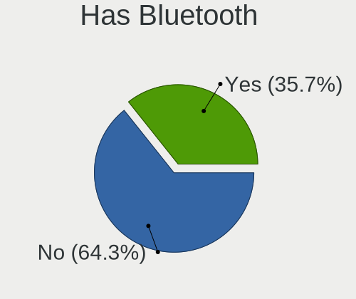
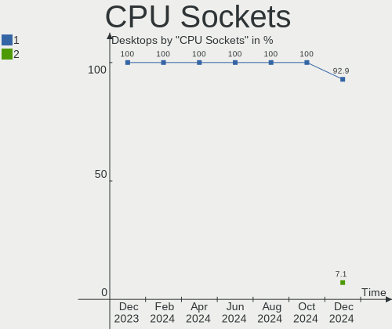
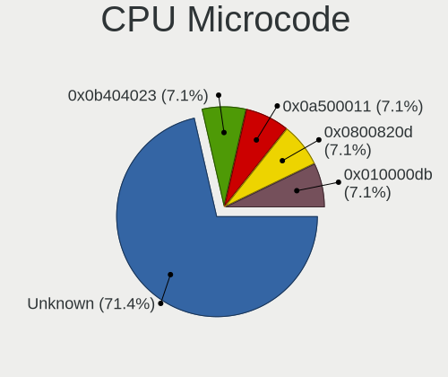
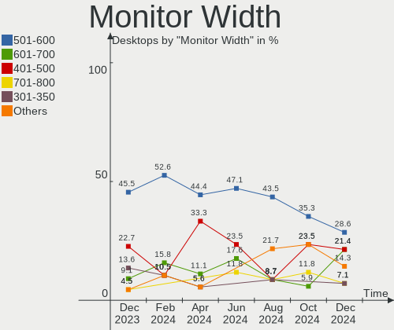
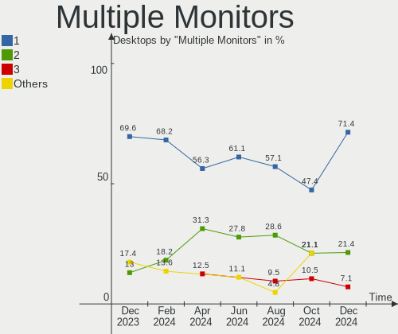
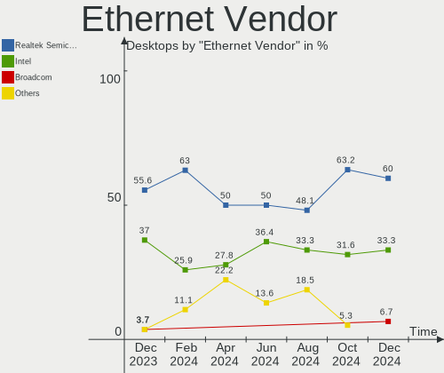

Gentoo Hardware Trends (Desktops)
---------------------------------

A project to identify most popular hardware characteristics and track their change
over time based on data collected by Gentoo users at https://Linux-Hardware.org.

Anyone can contribute to this report by the [hw-probe](https://github.com/linuxhw/hw-probe) tool:

    sudo -E hw-probe -all -upload

Full-feature report is available here: https://linux-hardware.org/?view=trends

Period: Mar, 2022.

Contents
--------

* [ System ](#system)
  - [ OS                       ](#os)
  - [ OS Family                ](#os-family)
  - [ Kernel                   ](#kernel)
  - [ Kernel Family            ](#kernel-family)
  - [ Kernel Major Ver.        ](#kernel-major-ver)
  - [ Arch                     ](#arch)
  - [ DE                       ](#de)
  - [ Display Server           ](#display-server)
  - [ Display Manager          ](#display-manager)
  - [ OS Lang                  ](#os-lang)
  - [ Boot Mode                ](#boot-mode)
  - [ Filesystem               ](#filesystem)
  - [ Part. scheme             ](#part-scheme)
  - [ Dual Boot with Linux/BSD ](#dual-boot-with-linuxbsd)
  - [ Dual Boot (Win)          ](#dual-boot-win)

* [ Board ](#board)
  - [ Vendor                   ](#vendor)
  - [ Model                    ](#model)
  - [ Model Family             ](#model-family)
  - [ MFG Year                 ](#mfg-year)
  - [ Form Factor              ](#form-factor)
  - [ Secure Boot              ](#secure-boot)
  - [ Coreboot                 ](#coreboot)
  - [ RAM Size                 ](#ram-size)
  - [ RAM Used                 ](#ram-used)
  - [ Total Drives             ](#total-drives)
  - [ Has CD-ROM               ](#has-cd-rom)
  - [ Has Ethernet             ](#has-ethernet)
  - [ Has WiFi                 ](#has-wifi)
  - [ Has Bluetooth            ](#has-bluetooth)

* [ Location ](#location)
  - [ Country                  ](#country)
  - [ City                     ](#city)

* [ Drives ](#drives)
  - [ Drive Vendor             ](#drive-vendor)
  - [ Drive Model              ](#drive-model)
  - [ HDD Vendor               ](#hdd-vendor)
  - [ SSD Vendor               ](#ssd-vendor)
  - [ Drive Kind               ](#drive-kind)
  - [ Drive Connector          ](#drive-connector)
  - [ Drive Size               ](#drive-size)
  - [ Space Total              ](#space-total)
  - [ Space Used               ](#space-used)
  - [ Malfunc. Drives          ](#malfunc-drives)
  - [ Malfunc. Drive Vendor    ](#malfunc-drive-vendor)
  - [ Malfunc. HDD Vendor      ](#malfunc-hdd-vendor)
  - [ Malfunc. Drive Kind      ](#malfunc-drive-kind)
  - [ Failed Drives            ](#failed-drives)
  - [ Failed Drive Vendor      ](#failed-drive-vendor)
  - [ Drive Status             ](#drive-status)

* [ Storage controller ](#storage-controller)
  - [ Storage Vendor           ](#storage-vendor)
  - [ Storage Model            ](#storage-model)
  - [ Storage Kind             ](#storage-kind)

* [ Processor ](#processor)
  - [ CPU Vendor               ](#cpu-vendor)
  - [ CPU Model                ](#cpu-model)
  - [ CPU Model Family         ](#cpu-model-family)
  - [ CPU Cores                ](#cpu-cores)
  - [ CPU Sockets              ](#cpu-sockets)
  - [ CPU Threads              ](#cpu-threads)
  - [ CPU Op-Modes             ](#cpu-op-modes)
  - [ CPU Microcode            ](#cpu-microcode)
  - [ CPU Microarch            ](#cpu-microarch)

* [ Graphics ](#graphics)
  - [ GPU Vendor               ](#gpu-vendor)
  - [ GPU Model                ](#gpu-model)
  - [ GPU Combo                ](#gpu-combo)
  - [ GPU Driver               ](#gpu-driver)
  - [ GPU Memory               ](#gpu-memory)

* [ Monitor ](#monitor)
  - [ Monitor Vendor           ](#monitor-vendor)
  - [ Monitor Model            ](#monitor-model)
  - [ Monitor Resolution       ](#monitor-resolution)
  - [ Monitor Diagonal         ](#monitor-diagonal)
  - [ Monitor Width            ](#monitor-width)
  - [ Aspect Ratio             ](#aspect-ratio)
  - [ Monitor Area             ](#monitor-area)
  - [ Pixel Density            ](#pixel-density)
  - [ Multiple Monitors        ](#multiple-monitors)

* [ Network ](#network)
  - [ Net Controller Vendor    ](#net-controller-vendor)
  - [ Net Controller Model     ](#net-controller-model)
  - [ Wireless Vendor          ](#wireless-vendor)
  - [ Wireless Model           ](#wireless-model)
  - [ Ethernet Vendor          ](#ethernet-vendor)
  - [ Ethernet Model           ](#ethernet-model)
  - [ Net Controller Kind      ](#net-controller-kind)
  - [ Used Controller          ](#used-controller)
  - [ NICs                     ](#nics)
  - [ IPv6                     ](#ipv6)

* [ Bluetooth ](#bluetooth)
  - [ Bluetooth Vendor         ](#bluetooth-vendor)
  - [ Bluetooth Model          ](#bluetooth-model)

* [ Sound ](#sound)
  - [ Sound Vendor             ](#sound-vendor)
  - [ Sound Model              ](#sound-model)

* [ Memory ](#memory)
  - [ Memory Vendor            ](#memory-vendor)
  - [ Memory Model             ](#memory-model)
  - [ Memory Kind              ](#memory-kind)
  - [ Memory Form Factor       ](#memory-form-factor)
  - [ Memory Size              ](#memory-size)
  - [ Memory Speed             ](#memory-speed)

* [ Printers & scanners ](#printers--scanners)
  - [ Printer Vendor           ](#printer-vendor)
  - [ Printer Model            ](#printer-model)
  - [ Scanner Vendor           ](#scanner-vendor)
  - [ Scanner Model            ](#scanner-model)

* [ Camera ](#camera)
  - [ Camera Vendor            ](#camera-vendor)
  - [ Camera Model             ](#camera-model)

* [ Security ](#security)
  - [ Fingerprint Vendor       ](#fingerprint-vendor)
  - [ Fingerprint Model        ](#fingerprint-model)
  - [ Chipcard Vendor          ](#chipcard-vendor)
  - [ Chipcard Model           ](#chipcard-model)

* [ Unsupported ](#unsupported)
  - [ Unsupported Devices      ](#unsupported-devices)
  - [ Unsupported Device Types ](#unsupported-device-types)

System
------

OS
--

Installed operating systems

| Name       | Desktops | Percent |
|------------|----------|---------|
| Gentoo 2.8 | 9        | 39.13%  |
| Gentoo 2.7 | 7        | 30.43%  |
| Gentoo 2.6 | 7        | 30.43%  |

OS Family
---------

OS without a version

| Name   | Desktops | Percent |
|--------|----------|---------|
| Gentoo | 23       | 100%    |

Kernel
------

Version of the Linux kernel

| Version                       | Desktops | Percent |
|-------------------------------|----------|---------|
| 5.15.23-gentoo                | 3        | 13.04%  |
| 5.15.26-gentoo                | 2        | 8.7%    |
| 5.10.35-gentoo                | 2        | 8.7%    |
| 5.4.97-gentoo-x86_64          | 1        | 4.35%   |
| 5.17.1-gentoo-r1              | 1        | 4.35%   |
| 5.17.0-gentoo-x86_64          | 1        | 4.35%   |
| 5.17.0-gentoo                 | 1        | 4.35%   |
| 5.16.8-gentoo-x86_64          | 1        | 4.35%   |
| 5.16.15                       | 1        | 4.35%   |
| 5.16.14-gentoo-x86_64         | 1        | 4.35%   |
| 5.16.14-gentoo-girlhog        | 1        | 4.35%   |
| 5.16.12-gentoo-x86_64         | 1        | 4.35%   |
| 5.16.11-gentoo-x86_64         | 1        | 4.35%   |
| 5.15.26b                      | 1        | 4.35%   |
| 5.15.26-gentoo-x86_64         | 1        | 4.35%   |
| 5.15.23-gentoo-dist           | 1        | 4.35%   |
| 5.15.16-gentoo-NSA            | 1        | 4.35%   |
| 5.10.49-gentoo-r1-x86_64      | 1        | 4.35%   |
| 4.9.135-vs2.3.9.8-dappersec-2 | 1        | 4.35%   |

Kernel Family
-------------

Linux kernel without a distro release

| Version | Desktops | Percent |
|---------|----------|---------|
| 5.15.26 | 4        | 17.39%  |
| 5.15.23 | 4        | 17.39%  |
| 5.17.0  | 2        | 8.7%    |
| 5.16.14 | 2        | 8.7%    |
| 5.10.35 | 2        | 8.7%    |
| 5.4.97  | 1        | 4.35%   |
| 5.17.1  | 1        | 4.35%   |
| 5.16.8  | 1        | 4.35%   |
| 5.16.15 | 1        | 4.35%   |
| 5.16.12 | 1        | 4.35%   |
| 5.16.11 | 1        | 4.35%   |
| 5.15.16 | 1        | 4.35%   |
| 5.10.49 | 1        | 4.35%   |
| 4.9.135 | 1        | 4.35%   |

Kernel Major Ver.
-----------------

Linux kernel major version

| Version | Desktops | Percent |
|---------|----------|---------|
| 5.15    | 9        | 39.13%  |
| 5.16    | 6        | 26.09%  |
| 5.17    | 3        | 13.04%  |
| 5.10    | 3        | 13.04%  |
| 5.4     | 1        | 4.35%   |
| 4.9     | 1        | 4.35%   |

Arch
----

OS architecture (x86_64, i586, etc.)

| Name   | Desktops | Percent |
|--------|----------|---------|
| x86_64 | 23       | 100%    |

DE
--

Desktop Environment

| Name     | Desktops | Percent |
|----------|----------|---------|
| KDE5     | 7        | 30.43%  |
| GNOME    | 5        | 21.74%  |
| Unknown  | 5        | 21.74%  |
| XFCE     | 2        | 8.7%    |
| MATE     | 2        | 8.7%    |
| KDE      | 1        | 4.35%   |
| Cinnamon | 1        | 4.35%   |

Display Server
--------------

X11 or Wayland

| Name    | Desktops | Percent |
|---------|----------|---------|
| X11     | 9        | 39.13%  |
| Unknown | 6        | 26.09%  |
| Tty     | 5        | 21.74%  |
| Wayland | 3        | 13.04%  |

Display Manager
---------------

SDDM, LightDM, etc.

| Name    | Desktops | Percent |
|---------|----------|---------|
| Unknown | 11       | 47.83%  |
| SDDM    | 6        | 26.09%  |
| LightDM | 4        | 17.39%  |
| LXDM    | 1        | 4.35%   |
| GDM     | 1        | 4.35%   |

OS Lang
-------

Language

| Lang    | Desktops | Percent |
|---------|----------|---------|
| en_US   | 13       | 56.52%  |
| C.UTF8  | 3        | 13.04%  |
| pl_PL   | 2        | 8.7%    |
| Unknown | 2        | 8.7%    |
| zh_TW   | 1        | 4.35%   |
| en_IN   | 1        | 4.35%   |
| en_GB   | 1        | 4.35%   |

Boot Mode
---------

EFI or BIOS

| Mode | Desktops | Percent |
|------|----------|---------|
| EFI  | 20       | 86.96%  |
| BIOS | 3        | 13.04%  |

Filesystem
----------

Type of filesystem

| Type  | Desktops | Percent |
|-------|----------|---------|
| Ext4  | 15       | 65.22%  |
| Btrfs | 5        | 21.74%  |
| F2fs  | 2        | 8.7%    |
| Zfs   | 1        | 4.35%   |

Part. scheme
------------

Scheme of partitioning

| Type    | Desktops | Percent |
|---------|----------|---------|
| GPT     | 21       | 91.3%   |
| Unknown | 2        | 8.7%    |

Dual Boot with Linux/BSD
------------------------

Hosting more than one Linux/BSD

| Dual boot | Desktops | Percent |
|-----------|----------|---------|
| No        | 14       | 60.87%  |
| Yes       | 9        | 39.13%  |

Dual Boot (Win)
---------------

Hosting Linux and Windows

| Dual boot | Desktops | Percent |
|-----------|----------|---------|
| No        | 12       | 52.17%  |
| Yes       | 11       | 47.83%  |

Board
-----

Vendor
------

Motherboard manufacturer

| Name                | Desktops | Percent |
|---------------------|----------|---------|
| ASUSTek Computer    | 13       | 56.52%  |
| Gigabyte Technology | 3        | 13.04%  |
| MSI                 | 2        | 8.7%    |
| ASRock              | 2        | 8.7%    |
| Intel               | 1        | 4.35%   |
| Dell                | 1        | 4.35%   |
| Alienware           | 1        | 4.35%   |

Model
-----

Motherboard model

| Name                           | Desktops | Percent |
|--------------------------------|----------|---------|
| ASUS TUF GAMING Z590-PLUS WIFI | 2        | 8.7%    |
| MSI MS-7D18                    | 1        | 4.35%   |
| MSI MS-7C94                    | 1        | 4.35%   |
| Intel DH61WW AAG23116-302      | 1        | 4.35%   |
| Gigabyte Z590 UD               | 1        | 4.35%   |
| Gigabyte B550 GAMING X V2      | 1        | 4.35%   |
| Gigabyte AB350-Gaming          | 1        | 4.35%   |
| Dell OptiPlex 7080             | 1        | 4.35%   |
| ASUS Z170 PRO GAMING           | 1        | 4.35%   |
| ASUS TUF GAMING X570-PRO       | 1        | 4.35%   |
| ASUS TUF Gaming X570-PLUS      | 1        | 4.35%   |
| ASUS SABERTOOTH 990FX R2.0     | 1        | 4.35%   |
| ASUS ROG STRIX Z390-E GAMING   | 1        | 4.35%   |
| ASUS ROG STRIX Z370-H GAMING   | 1        | 4.35%   |
| ASUS ROG STRIX B550-F GAMING   | 1        | 4.35%   |
| ASUS ROG STRIX B450-F GAMING   | 1        | 4.35%   |
| ASUS PRIME X299-DELUXE II      | 1        | 4.35%   |
| ASUS PRIME J4005I-C            | 1        | 4.35%   |
| ASUS M3A78-CM                  | 1        | 4.35%   |
| ASRock Z170A-X1                | 1        | 4.35%   |
| ASRock A300M-STX               | 1        | 4.35%   |
| Alienware Aurora Ryzen Edition | 1        | 4.35%   |

Model Family
------------

Motherboard model prefix

| Name                  | Desktops | Percent |
|-----------------------|----------|---------|
| ASUS TUF              | 4        | 17.39%  |
| ASUS ROG              | 4        | 17.39%  |
| ASUS PRIME            | 2        | 8.7%    |
| MSI MS-7D18           | 1        | 4.35%   |
| MSI MS-7C94           | 1        | 4.35%   |
| Intel DH61WW          | 1        | 4.35%   |
| Gigabyte Z590         | 1        | 4.35%   |
| Gigabyte B550         | 1        | 4.35%   |
| Gigabyte AB350-Gaming | 1        | 4.35%   |
| Dell OptiPlex         | 1        | 4.35%   |
| ASUS Z170             | 1        | 4.35%   |
| ASUS SABERTOOTH       | 1        | 4.35%   |
| ASUS M3A78-CM         | 1        | 4.35%   |
| ASRock Z170A-X1       | 1        | 4.35%   |
| ASRock A300M-STX      | 1        | 4.35%   |
| Alienware Aurora      | 1        | 4.35%   |

MFG Year
--------

Motherboard manufacture year

| Year | Desktops | Percent |
|------|----------|---------|
| 2020 | 6        | 26.09%  |
| 2021 | 4        | 17.39%  |
| 2019 | 3        | 13.04%  |
| 2018 | 2        | 8.7%    |
| 2017 | 2        | 8.7%    |
| 2012 | 2        | 8.7%    |
| 2022 | 1        | 4.35%   |
| 2016 | 1        | 4.35%   |
| 2015 | 1        | 4.35%   |
| 2008 | 1        | 4.35%   |

Form Factor
-----------

Physical design of the computer

| Name    | Desktops | Percent |
|---------|----------|---------|
| Desktop | 23       | 100%    |

Secure Boot
-----------

Enabled or disabled

| State    | Desktops | Percent |
|----------|----------|---------|
| Disabled | 23       | 100%    |

Coreboot
--------

Have coreboot on board

| Used | Desktops | Percent |
|------|----------|---------|
| No   | 23       | 100%    |

RAM Size
--------

Total RAM memory

| Size in GB  | Desktops | Percent |
|-------------|----------|---------|
| 32.01-64.0  | 7        | 30.43%  |
| 16.01-24.0  | 7        | 30.43%  |
| 64.01-256.0 | 4        | 17.39%  |
| 8.01-16.0   | 3        | 13.04%  |
| 4.01-8.0    | 1        | 4.35%   |
| 24.01-32.0  | 1        | 4.35%   |

RAM Used
--------

Used RAM memory

| Used GB    | Desktops | Percent |
|------------|----------|---------|
| 4.01-8.0   | 7        | 30.43%  |
| 8.01-16.0  | 5        | 21.74%  |
| 2.01-3.0   | 3        | 13.04%  |
| 0.51-1.0   | 3        | 13.04%  |
| 16.01-24.0 | 2        | 8.7%    |
| 1.01-2.0   | 2        | 8.7%    |
| 0.01-0.5   | 1        | 4.35%   |

Total Drives
------------

Number of drives on board

| Drives | Desktops | Percent |
|--------|----------|---------|
| 1      | 7        | 30.43%  |
| 2      | 5        | 21.74%  |
| 6      | 3        | 13.04%  |
| 5      | 3        | 13.04%  |
| 3      | 3        | 13.04%  |
| 8      | 1        | 4.35%   |
| 4      | 1        | 4.35%   |

Has CD-ROM
----------

Has CD-ROM on board

| Presented | Desktops | Percent |
|-----------|----------|---------|
| No        | 18       | 78.26%  |
| Yes       | 5        | 21.74%  |

Has Ethernet
------------

Has Ethernet on board

| Presented | Desktops | Percent |
|-----------|----------|---------|
| Yes       | 23       | 100%    |

Has WiFi
--------

Has WiFi module

| Presented | Desktops | Percent |
|-----------|----------|---------|
| No        | 12       | 52.17%  |
| Yes       | 11       | 47.83%  |

Has Bluetooth
-------------

Has Bluetooth module

| Presented | Desktops | Percent |
|-----------|----------|---------|
| No        | 13       | 56.52%  |
| Yes       | 10       | 43.48%  |

Location
--------

Country
-------

Geographic location (country)

| Country     | Desktops | Percent |
|-------------|----------|---------|
| USA         | 5        | 21.74%  |
| Poland      | 3        | 13.04%  |
| China       | 2        | 8.7%    |
| UK          | 1        | 4.35%   |
| Taiwan      | 1        | 4.35%   |
| Sweden      | 1        | 4.35%   |
| Spain       | 1        | 4.35%   |
| Russia      | 1        | 4.35%   |
| Philippines | 1        | 4.35%   |
| Norway      | 1        | 4.35%   |
| Mexico      | 1        | 4.35%   |
| Ireland     | 1        | 4.35%   |
| India       | 1        | 4.35%   |
| Hong Kong   | 1        | 4.35%   |
| Germany     | 1        | 4.35%   |
| Bulgaria    | 1        | 4.35%   |

City
----

Geographic location (city)

| City                 | Desktops | Percent |
|----------------------|----------|---------|
| Geleshan             | 2        | 8.7%    |
| Warsaw               | 1        | 4.35%   |
| Storsteinnes         | 1        | 4.35%   |
| Stockholm            | 1        | 4.35%   |
| Sofia                | 1        | 4.35%   |
| Poplar               | 1        | 4.35%   |
| Orange               | 1        | 4.35%   |
| Munich               | 1        | 4.35%   |
| Moscow               | 1        | 4.35%   |
| Miasto Ogrod Komorow | 1        | 4.35%   |
| Mexico City          | 1        | 4.35%   |
| Los Angeles          | 1        | 4.35%   |
| Laziska Gorne        | 1        | 4.35%   |
| Hyannis              | 1        | 4.35%   |
| Hsinchu              | 1        | 4.35%   |
| Fort Collins         | 1        | 4.35%   |
| Dublin               | 1        | 4.35%   |
| Chennai              | 1        | 4.35%   |
| Central              | 1        | 4.35%   |
| Cebu City            | 1        | 4.35%   |
| Bellaterra           | 1        | 4.35%   |
| Aurora               | 1        | 4.35%   |

Drives
------

Drive Vendor
------------

Hard drive vendors

| Vendor              | Desktops | Drives | Percent |
|---------------------|----------|--------|---------|
| Samsung Electronics | 11       | 16     | 21.15%  |
| Seagate             | 10       | 13     | 19.23%  |
| WDC                 | 6        | 10     | 11.54%  |
| Toshiba             | 4        | 5      | 7.69%   |
| Sandisk             | 4        | 4      | 7.69%   |
| Kingston            | 3        | 4      | 5.77%   |
| Intel               | 2        | 3      | 3.85%   |
| GOODRAM             | 2        | 2      | 3.85%   |
| Transcend           | 1        | 1      | 1.92%   |
| SK Hynix            | 1        | 1      | 1.92%   |
| PNY                 | 1        | 1      | 1.92%   |
| Phison              | 1        | 1      | 1.92%   |
| KIOXIA-EXCERIA      | 1        | 2      | 1.92%   |
| KIOXIA              | 1        | 1      | 1.92%   |
| Hitachi             | 1        | 3      | 1.92%   |
| HGST                | 1        | 1      | 1.92%   |
| Crucial             | 1        | 1      | 1.92%   |
| Corsair             | 1        | 2      | 1.92%   |

Drive Model
-----------

Hard drive models

| Model                             | Desktops | Percent |
|-----------------------------------|----------|---------|
| Sandisk NVMe SSD Drive 1TB        | 2        | 3.03%   |
| Samsung SSD 980 PRO 1TB           | 2        | 3.03%   |
| Samsung SSD 980 500GB             | 2        | 3.03%   |
| GOODRAM SSDPR-CL100-480-G2 480GB  | 2        | 3.03%   |
| WDC WDS500G2B0A-00SM50 500GB SSD  | 1        | 1.52%   |
| WDC WDS100T2B0A-00SM50 1TB SSD    | 1        | 1.52%   |
| WDC WD8003FFBX-68B9AN0 8TB        | 1        | 1.52%   |
| WDC WD60EZRX-00MVLB1 6TB          | 1        | 1.52%   |
| WDC WD5000AZRX-00A8LB0 500GB      | 1        | 1.52%   |
| WDC WD30EFRX-68EUZN0 3TB          | 1        | 1.52%   |
| WDC WD20EZAZ-00GGJB0 2TB          | 1        | 1.52%   |
| WDC WD2003FZEX-00Z4SA0 2TB        | 1        | 1.52%   |
| WDC WD10EZEX-08M2NA0 1TB          | 1        | 1.52%   |
| WDC WD1001FALS-00J7B1 1TB         | 1        | 1.52%   |
| Transcend TS128GMTE110S 128GB     | 1        | 1.52%   |
| Toshiba TR200 480GB SSD           | 1        | 1.52%   |
| Toshiba HDWQ140 4TB               | 1        | 1.52%   |
| Toshiba HDWE150 5TB               | 1        | 1.52%   |
| Toshiba HDWD130 3TB               | 1        | 1.52%   |
| Toshiba DT01ACA300 3TB            | 1        | 1.52%   |
| SK Hynix PC611 NVMe 512GB         | 1        | 1.52%   |
| Seagate ST8000DM004-2CX188 8TB    | 1        | 1.52%   |
| Seagate ST500DM002-1BD142 500GB   | 1        | 1.52%   |
| Seagate ST4000DM004-2CV104 4TB    | 1        | 1.52%   |
| Seagate ST4000DM000-1F2168 4TB    | 1        | 1.52%   |
| Seagate ST3000DM001-1ER166 3TB    | 1        | 1.52%   |
| Seagate ST2000LX001-1RG174 2TB    | 1        | 1.52%   |
| Seagate ST2000DM005-2CW102 2TB    | 1        | 1.52%   |
| Seagate ST2000DM001-1ER164 2TB    | 1        | 1.52%   |
| Seagate ST12000NM0008-2H3101 12TB | 1        | 1.52%   |
| Seagate ST1000DM010-2EP102 1TB    | 1        | 1.52%   |
| Seagate ST1000DM003-1ER162 1TB    | 1        | 1.52%   |
| Seagate Expansion 320GB           | 1        | 1.52%   |
| SanDisk Ultra II 480GB SSD        | 1        | 1.52%   |
| SanDisk SSD PLUS 240GB            | 1        | 1.52%   |
| Samsung SSD 980 PRO 2TB           | 1        | 1.52%   |
| Samsung SSD 970 PRO 1TB           | 1        | 1.52%   |
| Samsung SSD 970 EVO Plus 1TB      | 1        | 1.52%   |
| Samsung SSD 970 EVO 1TB           | 1        | 1.52%   |
| Samsung SSD 860 QVO 2TB           | 1        | 1.52%   |
| Samsung SSD 860 QVO 1TB           | 1        | 1.52%   |
| Samsung SSD 860 EVO 250GB         | 1        | 1.52%   |
| Samsung SSD 850 PRO 256GB         | 1        | 1.52%   |
| Samsung SSD 850 EVO 1TB           | 1        | 1.52%   |
| Samsung NVMe SSD Drive 512GB      | 1        | 1.52%   |
| Samsung NVMe SSD Drive 500GB      | 1        | 1.52%   |
| Samsung NVMe SSD Drive 2TB        | 1        | 1.52%   |
| PNY CS1311 240GB SSD              | 1        | 1.52%   |
| Phison Neutron NX500 800GB        | 1        | 1.52%   |
| KIOXIA-EXCERIA SSD 500GB          | 1        | 1.52%   |
| KIOXIA-EXCERIA SSD 1TB            | 1        | 1.52%   |
| KIOXIA KXG60PNV2T04 NVMe 2048GB   | 1        | 1.52%   |
| Kingston SV300S37A120G 120GB SSD  | 1        | 1.52%   |
| Kingston SV100S2128G 128GB SSD    | 1        | 1.52%   |
| Kingston SSDNOW 30GB              | 1        | 1.52%   |
| Intel SSDPEKKW256G8 256GB         | 1        | 1.52%   |
| Intel SSD 600P Series 256GB       | 1        | 1.52%   |
| Hitachi HUS724030ALE641 3TB       | 1        | 1.52%   |
| HGST HDN724040ALE640 4TB          | 1        | 1.52%   |
| Crucial CT500MX500SSD1 500GB      | 1        | 1.52%   |

HDD Vendor
----------

Hard disk drive vendors

| Vendor  | Desktops | Drives | Percent |
|---------|----------|--------|---------|
| Seagate | 10       | 13     | 50%     |
| WDC     | 5        | 8      | 25%     |
| Toshiba | 3        | 4      | 15%     |
| Hitachi | 1        | 3      | 5%      |
| HGST    | 1        | 1      | 5%      |

SSD Vendor
----------

Solid state drive vendors

| Vendor              | Desktops | Drives | Percent |
|---------------------|----------|--------|---------|
| Samsung Electronics | 5        | 5      | 27.78%  |
| Kingston            | 3        | 4      | 16.67%  |
| WDC                 | 2        | 2      | 11.11%  |
| SanDisk             | 2        | 2      | 11.11%  |
| GOODRAM             | 2        | 2      | 11.11%  |
| Toshiba             | 1        | 1      | 5.56%   |
| PNY                 | 1        | 1      | 5.56%   |
| Crucial             | 1        | 1      | 5.56%   |
| Corsair             | 1        | 1      | 5.56%   |

Drive Kind
----------

HDD or SSD

| Kind | Desktops | Drives | Percent |
|------|----------|--------|---------|
| NVMe | 18       | 23     | 40.91%  |
| SSD  | 13       | 19     | 29.55%  |
| HDD  | 13       | 29     | 29.55%  |

Drive Connector
---------------

SATA, SAS, NVMe, etc.

| Type | Desktops | Drives | Percent |
|------|----------|--------|---------|
| NVMe | 18       | 23     | 52.94%  |
| SATA | 15       | 47     | 44.12%  |
| SAS  | 1        | 1      | 2.94%   |

Drive Size
----------

Size of hard drive

| Size in TB | Desktops | Drives | Percent |
|------------|----------|--------|---------|
| 0.01-0.5   | 11       | 17     | 34.38%  |
| 0.51-1.0   | 7        | 8      | 21.88%  |
| 3.01-4.0   | 4        | 4      | 12.5%   |
| 1.01-2.0   | 4        | 6      | 12.5%   |
| 2.01-3.0   | 3        | 8      | 9.38%   |
| 4.01-10.0  | 2        | 4      | 6.25%   |
| 10.01-20.0 | 1        | 1      | 3.13%   |

Space Total
-----------

Amount of disk space available on the file system

| Size in GB     | Desktops | Percent |
|----------------|----------|---------|
| More than 3000 | 6        | 26.09%  |
| 101-250        | 6        | 26.09%  |
| 501-1000       | 4        | 17.39%  |
| 2001-3000      | 3        | 13.04%  |
| 1001-2000      | 2        | 8.7%    |
| 1-20           | 2        | 8.7%    |

Space Used
----------

Amount of used disk space

| Used GB        | Desktops | Percent |
|----------------|----------|---------|
| More than 3000 | 4        | 17.39%  |
| 1-20           | 4        | 17.39%  |
| 251-500        | 3        | 13.04%  |
| 21-50          | 3        | 13.04%  |
| 1001-2000      | 3        | 13.04%  |
| 501-1000       | 3        | 13.04%  |
| 101-250        | 2        | 8.7%    |
| 2001-3000      | 1        | 4.35%   |

Malfunc. Drives
---------------

Drive models with a malfunction

| Model                          | Desktops | Drives | Percent |
|--------------------------------|----------|--------|---------|
| WDC WD5000AZRX-00A8LB0 500GB   | 1        | 1      | 33.33%  |
| Toshiba HDWD130 3TB            | 1        | 1      | 33.33%  |
| Kingston SV100S2128G 128GB SSD | 1        | 1      | 33.33%  |

Malfunc. Drive Vendor
---------------------

Vendors of faulty drives

| Vendor   | Desktops | Drives | Percent |
|----------|----------|--------|---------|
| WDC      | 1        | 1      | 33.33%  |
| Toshiba  | 1        | 1      | 33.33%  |
| Kingston | 1        | 1      | 33.33%  |

Malfunc. HDD Vendor
-------------------

Vendors of faulty HDD drives

| Vendor  | Desktops | Drives | Percent |
|---------|----------|--------|---------|
| WDC     | 1        | 1      | 50%     |
| Toshiba | 1        | 1      | 50%     |

Malfunc. Drive Kind
-------------------

Kinds of faulty drives

| Kind | Desktops | Drives | Percent |
|------|----------|--------|---------|
| HDD  | 2        | 2      | 66.67%  |
| SSD  | 1        | 1      | 33.33%  |

Failed Drives
-------------

Failed drive models

Zero info for selected period =(

Failed Drive Vendor
-------------------

Failed drive vendors

Zero info for selected period =(

Drive Status
------------

Number of failed and malfunc. drives

| Status   | Desktops | Drives | Percent |
|----------|----------|--------|---------|
| Works    | 19       | 59     | 70.37%  |
| Detected | 5        | 9      | 18.52%  |
| Malfunc  | 3        | 3      | 11.11%  |

Storage controller
------------------

Storage Vendor
--------------

Storage controller vendors

| Vendor                       | Desktops | Percent |
|------------------------------|----------|---------|
| Intel                        | 14       | 33.33%  |
| AMD                          | 10       | 23.81%  |
| Samsung Electronics          | 9        | 21.43%  |
| Sandisk                      | 2        | 4.76%   |
| ASMedia Technology           | 2        | 4.76%   |
| Toshiba America Info Systems | 1        | 2.38%   |
| SK Hynix                     | 1        | 2.38%   |
| Silicon Motion               | 1        | 2.38%   |
| Phison Electronics           | 1        | 2.38%   |
| KIOXIA                       | 1        | 2.38%   |

Storage Model
-------------

Storage controller models

| Model                                                                         | Desktops | Percent |
|-------------------------------------------------------------------------------|----------|---------|
| Samsung NVMe SSD Controller SM981/PM981/PM983                                 | 5        | 10.87%  |
| Intel 500 Series Chipset Family SATA AHCI Controller                          | 4        | 8.7%    |
| AMD FCH SATA Controller [AHCI mode]                                           | 4        | 8.7%    |
| Samsung NVMe SSD Controller PM9A1/PM9A3/980PRO                                | 3        | 6.52%   |
| Sandisk Non-Volatile memory controller                                        | 2        | 4.35%   |
| Samsung NVMe SSD Controller 980                                               | 2        | 4.35%   |
| Intel Q170/Q150/B150/H170/H110/Z170/CM236 Chipset SATA Controller [AHCI Mode] | 2        | 4.35%   |
| Intel 200 Series PCH SATA controller [AHCI mode]                              | 2        | 4.35%   |
| ASMedia ASM1062 Serial ATA Controller                                         | 2        | 4.35%   |
| AMD 500 Series Chipset SATA Controller                                        | 2        | 4.35%   |
| Toshiba America Info Systems XG6 NVMe SSD Controller                          | 1        | 2.17%   |
| SK Hynix Non-Volatile memory controller                                       | 1        | 2.17%   |
| Silicon Motion SM2263EN/SM2263XT SSD Controller                               | 1        | 2.17%   |
| Phison E7 NVMe Controller                                                     | 1        | 2.17%   |
| Phison E12 NVMe Controller                                                    | 1        | 2.17%   |
| KIOXIA NVMe SSD                                                               | 1        | 2.17%   |
| Intel SSD Pro 7600p/760p/E 6100p Series                                       | 1        | 2.17%   |
| Intel SSD 600P Series                                                         | 1        | 2.17%   |
| Intel Comet Lake SATA AHCI Controller                                         | 1        | 2.17%   |
| Intel Celeron/Pentium Silver Processor SATA Controller                        | 1        | 2.17%   |
| Intel Cannon Lake PCH SATA AHCI Controller                                    | 1        | 2.17%   |
| Intel 6 Series/C200 Series Chipset Family 6 port Desktop SATA AHCI Controller | 1        | 2.17%   |
| AMD SB7x0/SB8x0/SB9x0 SATA Controller [IDE mode]                              | 1        | 2.17%   |
| AMD SB7x0/SB8x0/SB9x0 SATA Controller [AHCI mode]                             | 1        | 2.17%   |
| AMD SB7x0/SB8x0/SB9x0 IDE Controller                                          | 1        | 2.17%   |
| AMD FCH RAID Controller                                                       | 1        | 2.17%   |
| AMD 400 Series Chipset SATA Controller                                        | 1        | 2.17%   |
| AMD 300 Series Chipset SATA Controller                                        | 1        | 2.17%   |

Storage Kind
------------

Kind of storage controller (IDE, SATA, NVMe, SAS, ...)

| Kind | Desktops | Percent |
|------|----------|---------|
| SATA | 21       | 51.22%  |
| NVMe | 18       | 43.9%   |
| RAID | 1        | 2.44%   |
| IDE  | 1        | 2.44%   |

Processor
---------

CPU Vendor
----------

Processor vendors

| Vendor | Desktops | Percent |
|--------|----------|---------|
| Intel  | 12       | 52.17%  |
| AMD    | 11       | 47.83%  |

CPU Model
---------

Processor models

| Model                                       | Desktops | Percent |
|---------------------------------------------|----------|---------|
| Intel 11th Gen Core i5-11600KF @ 3.90GHz    | 2        | 8.7%    |
| Intel Core i9-9900K CPU @ 3.60GHz           | 1        | 4.35%   |
| Intel Core i7-9800X CPU @ 3.80GHz           | 1        | 4.35%   |
| Intel Core i7-8700K CPU @ 3.70GHz           | 1        | 4.35%   |
| Intel Core i7-6700K CPU @ 4.00GHz           | 1        | 4.35%   |
| Intel Core i7-10700 CPU @ 2.90GHz           | 1        | 4.35%   |
| Intel Core i5-6500 CPU @ 3.20GHz            | 1        | 4.35%   |
| Intel Core i5-3330 CPU @ 3.00GHz            | 1        | 4.35%   |
| Intel Celeron J4005 CPU @ 2.00GHz           | 1        | 4.35%   |
| Intel 11th Gen Core i7-11700K @ 3.60GHz     | 1        | 4.35%   |
| Intel 11th Gen Core i5-11400 @ 2.60GHz      | 1        | 4.35%   |
| AMD Ryzen 9 5950X 16-Core Processor         | 1        | 4.35%   |
| AMD Ryzen 9 5900X 12-Core Processor         | 1        | 4.35%   |
| AMD Ryzen 9 3950X 16-Core Processor         | 1        | 4.35%   |
| AMD Ryzen 9 3900X 12-Core Processor         | 1        | 4.35%   |
| AMD Ryzen 7 5800X 8-Core Processor          | 1        | 4.35%   |
| AMD Ryzen 7 5700G with Radeon Graphics      | 1        | 4.35%   |
| AMD Ryzen 5 5600X 6-Core Processor          | 1        | 4.35%   |
| AMD Ryzen 5 2600 Six-Core Processor         | 1        | 4.35%   |
| AMD Ryzen 5 2400G with Radeon Vega Graphics | 1        | 4.35%   |
| AMD Phenom II X4 955 Processor              | 1        | 4.35%   |
| AMD FX-8350 Eight-Core Processor            | 1        | 4.35%   |

CPU Model Family
----------------

Processor model prefix

| Model            | Desktops | Percent |
|------------------|----------|---------|
| Other            | 4        | 17.39%  |
| Intel Core i7    | 4        | 17.39%  |
| AMD Ryzen 9      | 4        | 17.39%  |
| AMD Ryzen 5      | 3        | 13.04%  |
| Intel Core i5    | 2        | 8.7%    |
| AMD Ryzen 7      | 2        | 8.7%    |
| Intel Core i9    | 1        | 4.35%   |
| Intel Celeron    | 1        | 4.35%   |
| AMD Phenom II X4 | 1        | 4.35%   |
| AMD FX           | 1        | 4.35%   |

CPU Cores
---------

Number of processor cores

| Number | Desktops | Percent |
|--------|----------|---------|
| 8      | 6        | 26.09%  |
| 6      | 6        | 26.09%  |
| 4      | 6        | 26.09%  |
| 16     | 2        | 8.7%    |
| 12     | 2        | 8.7%    |
| 2      | 1        | 4.35%   |

CPU Sockets
-----------

Number of sockets

| Number | Desktops | Percent |
|--------|----------|---------|
| 1      | 23       | 100%    |

CPU Threads
-----------

Threads per core (Hyper-Threading)

| Number | Desktops | Percent |
|--------|----------|---------|
| 2      | 19       | 82.61%  |
| 1      | 4        | 17.39%  |

CPU Op-Modes
------------

CPU Operation Modes (32-bit, 64-bit)

| Op mode        | Desktops | Percent |
|----------------|----------|---------|
| 32-bit, 64-bit | 23       | 100%    |

CPU Microcode
-------------

Microcode number

| Number     | Desktops | Percent |
|------------|----------|---------|
| 0xa0671    | 4        | 17.39%  |
| 0x506e3    | 2        | 8.7%    |
| 0x0a201016 | 2        | 8.7%    |
| Unknown    | 2        | 8.7%    |
| 0xa0655    | 1        | 4.35%   |
| 0x906ed    | 1        | 4.35%   |
| 0x706a1    | 1        | 4.35%   |
| 0x50654    | 1        | 4.35%   |
| 0x306a9    | 1        | 4.35%   |
| 0x0a50000c | 1        | 4.35%   |
| 0x0a201205 | 1        | 4.35%   |
| 0x0a201204 | 1        | 4.35%   |
| 0x08701021 | 1        | 4.35%   |
| 0x08701013 | 1        | 4.35%   |
| 0x0810100b | 1        | 4.35%   |
| 0x0800820d | 1        | 4.35%   |
| 0x010000db | 1        | 4.35%   |

CPU Microarch
-------------

Microarchitecture

| Name          | Desktops | Percent |
|---------------|----------|---------|
| Zen 3         | 5        | 21.74%  |
| Skylake       | 3        | 13.04%  |
| Unknown       | 3        | 13.04%  |
| Zen 2         | 2        | 8.7%    |
| KabyLake      | 2        | 8.7%    |
| Zen+          | 1        | 4.35%   |
| Zen           | 1        | 4.35%   |
| Piledriver    | 1        | 4.35%   |
| K10           | 1        | 4.35%   |
| IvyBridge     | 1        | 4.35%   |
| Icelake       | 1        | 4.35%   |
| Goldmont plus | 1        | 4.35%   |
| CometLake     | 1        | 4.35%   |

Graphics
--------

GPU Vendor
----------

Vendors of graphics cards

| Vendor | Desktops | Percent |
|--------|----------|---------|
| Nvidia | 11       | 44%     |
| AMD    | 11       | 44%     |
| Intel  | 3        | 12%     |

GPU Model
---------

Graphics card models

| Model                                                            | Desktops | Percent |
|------------------------------------------------------------------|----------|---------|
| AMD Ellesmere [Radeon RX 470/480/570/570X/580/580X/590]          | 3        | 12%     |
| Nvidia TU106 [GeForce RTX 2070]                                  | 2        | 8%      |
| Nvidia GT200GL [Quadro FX 4800]                                  | 2        | 8%      |
| Nvidia GP104 [GeForce GTX 1070]                                  | 2        | 8%      |
| Nvidia GP107 [GeForce GTX 1050 Ti]                               | 1        | 4%      |
| Nvidia GP106 [GeForce GTX 1060 3GB]                              | 1        | 4%      |
| Nvidia GP104 [GeForce GTX 1080]                                  | 1        | 4%      |
| Nvidia GA106 [Geforce RTX 3050]                                  | 1        | 4%      |
| Nvidia GA102 [GeForce RTX 3090]                                  | 1        | 4%      |
| Intel Xeon E3-1200 v2/3rd Gen Core processor Graphics Controller | 1        | 4%      |
| Intel GeminiLake [UHD Graphics 600]                              | 1        | 4%      |
| Intel CometLake-S GT2 [UHD Graphics 630]                         | 1        | 4%      |
| AMD Turks PRO [Radeon HD 7570]                                   | 1        | 4%      |
| AMD RV730 PRO [Radeon HD 4650]                                   | 1        | 4%      |
| AMD RS780C [Radeon 3100]                                         | 1        | 4%      |
| AMD Raven Ridge [Radeon Vega Series / Radeon Vega Mobile Series] | 1        | 4%      |
| AMD Navi 10 [Radeon RX 5600 OEM/5600 XT / 5700/5700 XT]          | 1        | 4%      |
| AMD Cezanne                                                      | 1        | 4%      |
| AMD Cedar [Radeon HD 5000/6000/7350/8350 Series]                 | 1        | 4%      |
| AMD Bonaire XTX [Radeon R7 260X/360]                             | 1        | 4%      |

GPU Combo
---------

Combinations of graphics cards

| Name         | Desktops | Percent |
|--------------|----------|---------|
| 1 x Nvidia   | 10       | 43.48%  |
| 1 x AMD      | 9        | 39.13%  |
| 1 x Intel    | 2        | 8.7%    |
| Intel + AMD  | 1        | 4.35%   |
| AMD + Nvidia | 1        | 4.35%   |

GPU Driver
----------

Free vs proprietary

| Driver      | Desktops | Percent |
|-------------|----------|---------|
| Free        | 13       | 56.52%  |
| Proprietary | 7        | 30.43%  |
| Unknown     | 3        | 13.04%  |

GPU Memory
----------

Total video memory

| Size in GB | Desktops | Percent |
|------------|----------|---------|
| 7.01-8.0   | 8        | 34.78%  |
| Unknown    | 8        | 34.78%  |
| 0.51-1.0   | 3        | 13.04%  |
| 1.01-2.0   | 2        | 8.7%    |
| 5.01-6.0   | 1        | 4.35%   |
| 0.01-0.5   | 1        | 4.35%   |

Monitor
-------

Monitor Vendor
--------------

Monitor vendors

| Vendor               | Desktops | Percent |
|----------------------|----------|---------|
| Samsung Electronics  | 3        | 10.71%  |
| Philips              | 3        | 10.71%  |
| Goldstar             | 3        | 10.71%  |
| Ancor Communications | 3        | 10.71%  |
| Lenovo               | 2        | 7.14%   |
| Hewlett-Packard      | 2        | 7.14%   |
| AOC                  | 2        | 7.14%   |
| ViewSonic            | 1        | 3.57%   |
| Onkyo                | 1        | 3.57%   |
| LYC                  | 1        | 3.57%   |
| LG Electronics       | 1        | 3.57%   |
| KTC                  | 1        | 3.57%   |
| Iiyama               | 1        | 3.57%   |
| Gigabyte Technology  | 1        | 3.57%   |
| Dell                 | 1        | 3.57%   |
| BenQ                 | 1        | 3.57%   |
| ASUSTek Computer     | 1        | 3.57%   |

Monitor Model
-------------

Monitor models

| Model                                                                 | Desktops | Percent |
|-----------------------------------------------------------------------|----------|---------|
| ViewSonic VX2458-mhd VSC0437 1920x1080 521x293mm 23.5-inch            | 1        | 3.45%   |
| Samsung Electronics SyncMaster SAM05CC 1920x1080 530x300mm 24.0-inch  | 1        | 3.45%   |
| Samsung Electronics SMS27A850 SAM083D 2560x1440 518x324mm 24.1-inch   | 1        | 3.45%   |
| Samsung Electronics S22B300 SAM08C8 1920x1080 477x268mm 21.5-inch     | 1        | 3.45%   |
| Philips PHL 273V7 PHLC156 1920x1080 598x336mm 27.0-inch               | 1        | 3.45%   |
| Philips PHL 242M8 PHLC214 1920x1080 527x296mm 23.8-inch               | 1        | 3.45%   |
| Philips LCD Monitor PHL 275S1 2560x1440                               | 1        | 3.45%   |
| Onkyo TX-NR535 ONK0E51 2560x1440 597x336mm 27.0-inch                  | 1        | 3.45%   |
| LYC L2106 LYC0001 1920x1080 476x268mm 21.5-inch                       | 1        | 3.45%   |
| LG Electronics LCD Monitor E2351 1920x1080                            | 1        | 3.45%   |
| Lenovo M14t LEN62A3 1920x1080 309x174mm 14.0-inch                     | 1        | 3.45%   |
| Lenovo LEN Q27h-10 LEN66A7 2560x1440 598x336mm 27.0-inch              | 1        | 3.45%   |
| KTC Q2711SH KTC2700 2560x1440 597x336mm 27.0-inch                     | 1        | 3.45%   |
| Iiyama PL2792Q IVM6637 2560x1440 597x336mm 27.0-inch                  | 1        | 3.45%   |
| Iiyama PL2792Q IVM6630 2560x1440 600x340mm 27.2-inch                  | 1        | 3.45%   |
| Hewlett-Packard LP2475w HWP26F9 1920x1200 546x352mm 25.6-inch         | 1        | 3.45%   |
| Hewlett-Packard 27fh HPN354A 1920x1080 598x336mm 27.0-inch            | 1        | 3.45%   |
| Goldstar ULTRAGEAR GSM5BB4 2560x1440 597x336mm 27.0-inch              | 1        | 3.45%   |
| Goldstar E1942 GSM4C09 1366x768 410x230mm 18.5-inch                   | 1        | 3.45%   |
| Goldstar 27GL850 GSM5B7F 2560x1440 597x336mm 27.0-inch                | 1        | 3.45%   |
| Gigabyte Technology G34WQC GBT3400 3440x1440 800x330mm 34.1-inch      | 1        | 3.45%   |
| Dell P2319H DELD0D6 1920x1080 509x286mm 23.0-inch                     | 1        | 3.45%   |
| BenQ G2200W BNQ780E 1680x1050 473x297mm 22.0-inch                     | 1        | 3.45%   |
| ASUSTek Computer VG249 AUS2421 1920x1080 527x296mm 23.8-inch          | 1        | 3.45%   |
| AOC 2757 AOC2757 1920x1080 598x336mm 27.0-inch                        | 1        | 3.45%   |
| AOC 24B2W1 AOC2402 1920x1080 527x296mm 23.8-inch                      | 1        | 3.45%   |
| Ancor Communications VX239 ACI23E1 1920x1080 510x290mm 23.1-inch      | 1        | 3.45%   |
| Ancor Communications ASUS VS247 ACI249A 1920x1080 521x293mm 23.5-inch | 1        | 3.45%   |
| Ancor Communications ASUS VN247 ACI24C3 1920x1080 521x293mm 23.5-inch | 1        | 3.45%   |

Monitor Resolution
------------------

Monitor screen resolution

| Resolution         | Desktops | Percent |
|--------------------|----------|---------|
| 1920x1080 (FHD)    | 12       | 52.17%  |
| 2560x1440 (QHD)    | 6        | 26.09%  |
| 3840x2160 (4K)     | 1        | 4.35%   |
| 3440x1440          | 1        | 4.35%   |
| 1920x1200 (WUXGA)  | 1        | 4.35%   |
| 1680x1050 (WSXGA+) | 1        | 4.35%   |
| 1366x768 (WXGA)    | 1        | 4.35%   |

Monitor Diagonal
----------------

Diagonal size in inches

| Inches  | Desktops | Percent |
|---------|----------|---------|
| 27      | 7        | 25.93%  |
| 23      | 7        | 25.93%  |
| 24      | 3        | 11.11%  |
| 21      | 2        | 7.41%   |
| Unknown | 2        | 7.41%   |
| 49      | 1        | 3.7%    |
| 34      | 1        | 3.7%    |
| 25      | 1        | 3.7%    |
| 22      | 1        | 3.7%    |
| 18      | 1        | 3.7%    |
| 14      | 1        | 3.7%    |

Monitor Width
-------------

Physical width

| Width in mm | Desktops | Percent |
|-------------|----------|---------|
| 501-600     | 13       | 59.09%  |
| 401-500     | 4        | 18.18%  |
| Unknown     | 2        | 9.09%   |
| 701-800     | 1        | 4.55%   |
| 301-350     | 1        | 4.55%   |
| 1001-1500   | 1        | 4.55%   |

Aspect Ratio
------------

Proportional relationship between the width and the height

| Ratio   | Desktops | Percent |
|---------|----------|---------|
| 16/9    | 14       | 70%     |
| 16/10   | 3        | 15%     |
| Unknown | 2        | 10%     |
| 21/9    | 1        | 5%      |

Monitor Area
------------

Area in inch

| Area in inch | Desktops | Percent |
|----------------|----------|---------|
| 201-250        | 10       | 38.46%  |
| 301-350        | 7        | 26.92%  |
| 251-300        | 2        | 7.69%   |
| Unknown        | 2        | 7.69%   |
| More than 1000 | 1        | 3.85%   |
| 81-90          | 1        | 3.85%   |
| 351-500        | 1        | 3.85%   |
| 151-200        | 1        | 3.85%   |
| 141-150        | 1        | 3.85%   |

Pixel Density
-------------

Pixels per inch

| Density | Desktops | Percent |
|---------|----------|---------|
| 51-100  | 13       | 56.52%  |
| 101-120 | 7        | 30.43%  |
| Unknown | 2        | 8.7%    |
| 121-160 | 1        | 4.35%   |

Multiple Monitors
-----------------

Total monitors connected

| Total | Desktops | Percent |
|-------|----------|---------|
| 1     | 11       | 47.83%  |
| 2     | 6        | 26.09%  |
| 0     | 4        | 17.39%  |
| 4     | 1        | 4.35%   |
| 3     | 1        | 4.35%   |

Network
-------

Net Controller Vendor
---------------------

Controller vendors

| Vendor                | Desktops | Percent |
|-----------------------|----------|---------|
| Intel                 | 14       | 50%     |
| Realtek Semiconductor | 11       | 39.29%  |
| MEDIATEK              | 1        | 3.57%   |
| Broadcom              | 1        | 3.57%   |
| Aquantia              | 1        | 3.57%   |

Net Controller Model
--------------------

Controller models

| Model                                                             | Desktops | Percent |
|-------------------------------------------------------------------|----------|---------|
| Realtek RTL8111/8168/8411 PCI Express Gigabit Ethernet Controller | 7        | 18.92%  |
| Intel Ethernet Controller I225-V                                  | 4        | 10.81%  |
| Intel Ethernet Connection (2) I219-V                              | 4        | 10.81%  |
| Realtek RTL8125 2.5GbE Controller                                 | 3        | 8.11%   |
| Intel Wi-Fi 6 AX200                                               | 3        | 8.11%   |
| Intel Tiger Lake PCH CNVi WiFi                                    | 3        | 8.11%   |
| Intel 82574L Gigabit Network Connection                           | 2        | 5.41%   |
| Realtek RTL8812AE 802.11ac PCIe Wireless Network Adapter          | 1        | 2.7%    |
| Realtek Killer E2600 Gigabit Ethernet Controller                  | 1        | 2.7%    |
| MEDIATEK RZ608 Wi-Fi 6E 80MHz                                     | 1        | 2.7%    |
| Intel Wireless-AC 9260                                            | 1        | 2.7%    |
| Intel I211 Gigabit Network Connection                             | 1        | 2.7%    |
| Intel Ethernet Connection (7) I219-V                              | 1        | 2.7%    |
| Intel Ethernet Connection (11) I219-LM                            | 1        | 2.7%    |
| Intel Cannon Lake PCH CNVi WiFi                                   | 1        | 2.7%    |
| Intel 82579V Gigabit Network Connection                           | 1        | 2.7%    |
| Broadcom BCM4360 802.11ac Wireless Network Adapter                | 1        | 2.7%    |
| Aquantia AQC111 NBase-T/IEEE 802.3bz Ethernet Controller [AQtion] | 1        | 2.7%    |

Wireless Vendor
---------------

Wireless vendors

| Vendor                | Desktops | Percent |
|-----------------------|----------|---------|
| Intel                 | 8        | 72.73%  |
| Realtek Semiconductor | 1        | 9.09%   |
| MEDIATEK              | 1        | 9.09%   |
| Broadcom              | 1        | 9.09%   |

Wireless Model
--------------

Wireless models

| Model                                                    | Desktops | Percent |
|----------------------------------------------------------|----------|---------|
| Intel Wi-Fi 6 AX200                                      | 3        | 27.27%  |
| Intel Tiger Lake PCH CNVi WiFi                           | 3        | 27.27%  |
| Realtek RTL8812AE 802.11ac PCIe Wireless Network Adapter | 1        | 9.09%   |
| MEDIATEK RZ608 Wi-Fi 6E 80MHz                            | 1        | 9.09%   |
| Intel Wireless-AC 9260                                   | 1        | 9.09%   |
| Intel Cannon Lake PCH CNVi WiFi                          | 1        | 9.09%   |
| Broadcom BCM4360 802.11ac Wireless Network Adapter       | 1        | 9.09%   |

Ethernet Vendor
---------------

Ethernet vendors

| Vendor                | Desktops | Percent |
|-----------------------|----------|---------|
| Intel                 | 12       | 50%     |
| Realtek Semiconductor | 11       | 45.83%  |
| Aquantia              | 1        | 4.17%   |

Ethernet Model
--------------

Ethernet models

| Model                                                             | Desktops | Percent |
|-------------------------------------------------------------------|----------|---------|
| Realtek RTL8111/8168/8411 PCI Express Gigabit Ethernet Controller | 7        | 26.92%  |
| Intel Ethernet Controller I225-V                                  | 4        | 15.38%  |
| Intel Ethernet Connection (2) I219-V                              | 4        | 15.38%  |
| Realtek RTL8125 2.5GbE Controller                                 | 3        | 11.54%  |
| Intel 82574L Gigabit Network Connection                           | 2        | 7.69%   |
| Realtek Killer E2600 Gigabit Ethernet Controller                  | 1        | 3.85%   |
| Intel I211 Gigabit Network Connection                             | 1        | 3.85%   |
| Intel Ethernet Connection (7) I219-V                              | 1        | 3.85%   |
| Intel Ethernet Connection (11) I219-LM                            | 1        | 3.85%   |
| Intel 82579V Gigabit Network Connection                           | 1        | 3.85%   |
| Aquantia AQC111 NBase-T/IEEE 802.3bz Ethernet Controller [AQtion] | 1        | 3.85%   |

Net Controller Kind
-------------------

Ethernet, WiFi or modem

| Kind     | Desktops | Percent |
|----------|----------|---------|
| Ethernet | 23       | 67.65%  |
| WiFi     | 11       | 32.35%  |

Used Controller
---------------

Currently used network controller

| Kind     | Desktops | Percent |
|----------|----------|---------|
| Ethernet | 20       | 80%     |
| WiFi     | 5        | 20%     |

NICs
----

Total network controllers on board

| Total | Desktops | Percent |
|-------|----------|---------|
| 2     | 11       | 47.83%  |
| 1     | 10       | 43.48%  |
| 3     | 2        | 8.7%    |

IPv6
----

IPv6 vs IPv4

| Used | Desktops | Percent |
|------|----------|---------|
| No   | 17       | 73.91%  |
| Yes  | 6        | 26.09%  |

Bluetooth
---------

Bluetooth Vendor
----------------

Controller vendors

| Vendor                  | Desktops | Percent |
|-------------------------|----------|---------|
| Intel                   | 7        | 70%     |
| Cambridge Silicon Radio | 2        | 20%     |
| MediaTek                | 1        | 10%     |

Bluetooth Model
---------------

Controller models

| Model                                               | Desktops | Percent |
|-----------------------------------------------------|----------|---------|
| Intel AX201 Bluetooth                               | 3        | 30%     |
| Intel AX200 Bluetooth                               | 2        | 20%     |
| Cambridge Silicon Radio Bluetooth Dongle (HCI mode) | 2        | 20%     |
| MediaTek Wireless_Device                            | 1        | 10%     |
| Intel Bluetooth Device                              | 1        | 10%     |
| Intel Bluetooth 9460/9560 Jefferson Peak (JfP)      | 1        | 10%     |

Sound
-----

Sound Vendor
------------

Sound card vendors

| Vendor                               | Desktops | Percent |
|--------------------------------------|----------|---------|
| AMD                                  | 14       | 33.33%  |
| Intel                                | 11       | 26.19%  |
| Nvidia                               | 9        | 21.43%  |
| Thesycon Systemsoftware & Consulting | 1        | 2.38%   |
| Sony                                 | 1        | 2.38%   |
| Sennheiser Communications            | 1        | 2.38%   |
| Plantronics                          | 1        | 2.38%   |
| FiiO Electronics Technology          | 1        | 2.38%   |
| Comtrue                              | 1        | 2.38%   |
| C-Media Electronics                  | 1        | 2.38%   |
| AudioQuest                           | 1        | 2.38%   |

Sound Model
-----------

Sound card models

| Model                                                                      | Desktops | Percent |
|----------------------------------------------------------------------------|----------|---------|
| AMD Starship/Matisse HD Audio Controller                                   | 6        | 12.24%  |
| Intel Tiger Lake-H HD Audio Controller                                     | 4        | 8.16%   |
| Nvidia GP104 High Definition Audio Controller                              | 3        | 6.12%   |
| AMD Ellesmere HDMI Audio [Radeon RX 470/480 / 570/580/590]                 | 3        | 6.12%   |
| Nvidia TU106 High Definition Audio Controller                              | 2        | 4.08%   |
| Intel 200 Series PCH HD Audio                                              | 2        | 4.08%   |
| Intel 100 Series/C230 Series Chipset Family HD Audio Controller            | 2        | 4.08%   |
| AMD SBx00 Azalia (Intel HDA)                                               | 2        | 4.08%   |
| AMD Family 17h/19h HD Audio Controller                                     | 2        | 4.08%   |
| Thesycon Systemsoftware & Consulting D30 Pro                               | 1        | 2.04%   |
| Sony DualShock 4 [CUH-ZCT2x]                                               | 1        | 2.04%   |
| Sennheiser Communications GSX 1200 Pro Main Audio                          | 1        | 2.04%   |
| Plantronics RIG 800HD                                                      | 1        | 2.04%   |
| Nvidia GP107GL High Definition Audio Controller                            | 1        | 2.04%   |
| Nvidia GP106 High Definition Audio Controller                              | 1        | 2.04%   |
| Nvidia GA102 High Definition Audio Controller                              | 1        | 2.04%   |
| Nvidia Audio device                                                        | 1        | 2.04%   |
| Intel Comet Lake PCH cAVS                                                  | 1        | 2.04%   |
| Intel Cannon Lake PCH cAVS                                                 | 1        | 2.04%   |
| Intel 6 Series/C200 Series Chipset Family High Definition Audio Controller | 1        | 2.04%   |
| FiiO Electronics Technology BTR5                                           | 1        | 2.04%   |
| Comtrue E1DA PowerDAC V2.1 PCM24/192                                       | 1        | 2.04%   |
| C-Media Electronics Blue Snowball                                          | 1        | 2.04%   |
| AudioQuest DragonFly Red                                                   | 1        | 2.04%   |
| AMD Turks HDMI Audio [Radeon HD 6500/6600 / 6700M Series]                  | 1        | 2.04%   |
| AMD Tobago HDMI Audio [Radeon R7 360 / R9 360 OEM]                         | 1        | 2.04%   |
| AMD RV710/730 HDMI Audio [Radeon HD 4000 series]                           | 1        | 2.04%   |
| AMD Renoir Radeon High Definition Audio Controller                         | 1        | 2.04%   |
| AMD Raven/Raven2/Fenghuang HDMI/DP Audio Controller                        | 1        | 2.04%   |
| AMD Navi 10 HDMI Audio                                                     | 1        | 2.04%   |
| AMD Family 17h (Models 00h-0fh) HD Audio Controller                        | 1        | 2.04%   |
| AMD Cedar HDMI Audio [Radeon HD 5400/6300/7300 Series]                     | 1        | 2.04%   |

Memory
------

Memory Vendor
-------------

Memory module vendors

| Vendor            | Desktops | Percent |
|-------------------|----------|---------|
| Kingston          | 6        | 27.27%  |
| Corsair           | 4        | 18.18%  |
| Crucial           | 3        | 13.64%  |
| Micron Technology | 2        | 9.09%   |
| G.Skill           | 2        | 9.09%   |
| Unknown           | 1        | 4.55%   |
| Transcend         | 1        | 4.55%   |
| Thermaltake       | 1        | 4.55%   |
| Team              | 1        | 4.55%   |
| A-DATA Technology | 1        | 4.55%   |

Memory Model
------------

Memory module models

| Model                                                        | Desktops | Percent |
|--------------------------------------------------------------|----------|---------|
| Kingston RAM KHX3200C16D4/16GX 16384MB DIMM DDR4 3600MT/s    | 2        | 8%      |
| Unknown RAM Module 2GB DIMM DDR2 667MT/s                     | 1        | 4%      |
| Transcend RAM TS512MLK64V3H 4GB DIMM DDR3 1333MT/s           | 1        | 4%      |
| Transcend RAM JM1333KLH-4G 4GB DIMM DDR3 1333MT/s            | 1        | 4%      |
| Thermaltake RAM R009R432GX2-3600C18A 32GB DIMM DDR4 3600MT/s | 1        | 4%      |
| Team RAM TEAMGROUP-UD4-3200 16384MB DIMM DDR4 3733MT/s       | 1        | 4%      |
| Micron RAM 8ATF1G64HZ-2G6E1 8GB SODIMM DDR4 2667MT/s         | 1        | 4%      |
| Micron RAM 8ATF1G64AZ-3G2J1 8GB DIMM DDR4 3200MT/s           | 1        | 4%      |
| Kingston RAM XVTW4H-MIE 32GB DIMM DDR4 3200MT/s              | 1        | 4%      |
| Kingston RAM KHX2400C11D3/8GX 8GB DIMM DDR3 2400MT/s         | 1        | 4%      |
| Kingston RAM KHX2133C14D4/4G 4096MB DIMM DDR4 2933MT/s       | 1        | 4%      |
| Kingston RAM KHX2133C14/8G 8GB DIMM DDR4 2400MT/s            | 1        | 4%      |
| Kingston RAM HX426C16FB/8 8GB DIMM DDR4 2667MT/s             | 1        | 4%      |
| G.Skill RAM Module 16GB DIMM DDR4 2133MT/s                   | 1        | 4%      |
| G.Skill RAM F4-3600C16-16GTZN 16GB DIMM DDR4 3733MT/s        | 1        | 4%      |
| Crucial RAM CT8G4SFS8266.M8FE 8GB SODIMM DDR4 2667MT/s       | 1        | 4%      |
| Crucial RAM BL8G32C16U4R.M8FE1 8GB DIMM DDR4 3400MT/s        | 1        | 4%      |
| Crucial RAM BL32G32C16U4B.M16FB1 32GB DIMM DDR4 3200MT/s     | 1        | 4%      |
| Corsair RAM CMK8GX4M1A2400C14 8GB DIMM DDR4 2667MT/s         | 1        | 4%      |
| Corsair RAM CMK32GX4M2B3000C15 16GB DIMM DDR4 3000MT/s       | 1        | 4%      |
| Corsair RAM CMK16GX4M2B3200C16 8192MB DIMM DDR4 3600MT/s     | 1        | 4%      |
| Corsair RAM CMK16GX4M2B3000C15 8GB DIMM DDR4 3000MT/s        | 1        | 4%      |
| Corsair RAM CMK16GX4M2A2666C16 8GB DIMM DDR4 3200MT/s        | 1        | 4%      |
| A-DATA RAM DDR4 3200 8GB DIMM DDR4 3200MT/s                  | 1        | 4%      |

Memory Kind
-----------

Memory module kinds

| Kind | Desktops | Percent |
|------|----------|---------|
| DDR4 | 18       | 85.71%  |
| DDR3 | 2        | 9.52%   |
| DDR2 | 1        | 4.76%   |

Memory Form Factor
------------------

Physical design of the memory module

| Name   | Desktops | Percent |
|--------|----------|---------|
| DIMM   | 20       | 95.24%  |
| SODIMM | 1        | 4.76%   |

Memory Size
-----------

Memory module size

| Size  | Desktops | Percent |
|-------|----------|---------|
| 8192  | 10       | 43.48%  |
| 32768 | 5        | 21.74%  |
| 16384 | 5        | 21.74%  |
| 4096  | 2        | 8.7%    |
| 2048  | 1        | 4.35%   |

Memory Speed
------------

Memory module speed

| Speed | Desktops | Percent |
|-------|----------|---------|
| 3200  | 5        | 21.74%  |
| 3600  | 4        | 17.39%  |
| 2667  | 3        | 13.04%  |
| 3733  | 2        | 8.7%    |
| 2400  | 2        | 8.7%    |
| 3466  | 1        | 4.35%   |
| 3400  | 1        | 4.35%   |
| 3000  | 1        | 4.35%   |
| 2933  | 1        | 4.35%   |
| 2133  | 1        | 4.35%   |
| 1333  | 1        | 4.35%   |
| 667   | 1        | 4.35%   |

Printers & scanners
-------------------

Printer Vendor
--------------

Printer device vendors

| Vendor          | Desktops | Percent |
|-----------------|----------|---------|
| Hewlett-Packard | 1        | 100%    |

Printer Model
-------------

Printer device models

| Model               | Desktops | Percent |
|---------------------|----------|---------|
| HP LaserJet M14-M17 | 1        | 100%    |

Scanner Vendor
--------------

Scanner device vendors

Zero info for selected period =(

Scanner Model
-------------

Scanner device models

Zero info for selected period =(

Camera
------

Camera Vendor
-------------

Camera device vendors

| Vendor   | Desktops | Percent |
|----------|----------|---------|
| Logitech | 3        | 100%    |

Camera Model
------------

Camera device models

| Model                       | Desktops | Percent |
|-----------------------------|----------|---------|
| Logitech Webcam C270        | 2        | 66.67%  |
| Logitech HD Pro Webcam C920 | 1        | 33.33%  |

Security
--------

Fingerprint Vendor
------------------

Fingerprint sensor vendors

Zero info for selected period =(

Fingerprint Model
-----------------

Fingerprint sensor models

Zero info for selected period =(

Chipcard Vendor
---------------

Chipcard module vendors

Zero info for selected period =(

Chipcard Model
--------------

Chipcard module models

Zero info for selected period =(

Unsupported
-----------

Unsupported Devices
-------------------

Total unsupported devices on board

| Total | Desktops | Percent |
|-------|----------|---------|
| 0     | 14       | 60.87%  |
| 1     | 6        | 26.09%  |
| 4     | 1        | 4.35%   |
| 3     | 1        | 4.35%   |
| 2     | 1        | 4.35%   |

Unsupported Device Types
------------------------

Types of unsupported devices

| Type          | Desktops | Percent |
|---------------|----------|---------|
| Graphics card | 4        | 33.33%  |
| Sound         | 2        | 16.67%  |
| Net/wireless  | 2        | 16.67%  |
| Storage/raid  | 1        | 8.33%   |
| Storage/ata   | 1        | 8.33%   |
| Net/ethernet  | 1        | 8.33%   |
| Bluetooth     | 1        | 8.33%   |

