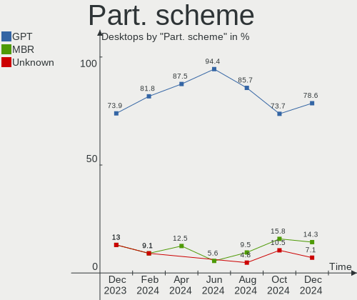
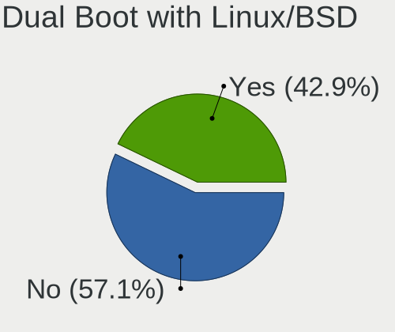
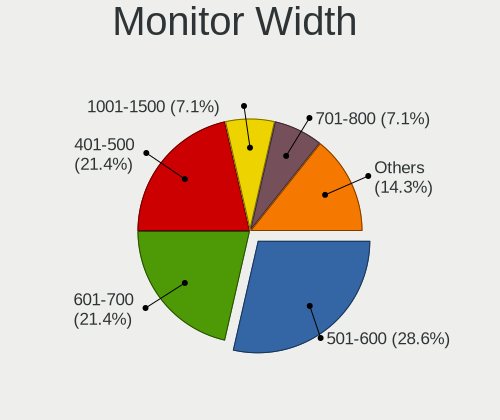
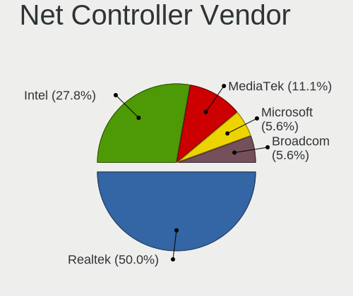
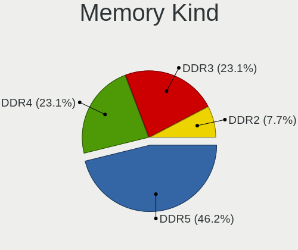

Gentoo - Hardware Trends (Desktops)
-----------------------------------

A project to identify most popular hardware characteristics and track their change
over time based on data collected by Linux users at https://Linux-Hardware.org.

Anyone can contribute to this report by the [hw-probe](https://github.com/linuxhw/hw-probe) tool:

    sudo -E hw-probe -all -upload

This report is for one last month. Overall report since the beginning of time: [TestDays](https://github.com/linuxhw/TestDays)

Period: Dec, 2024.

Contents
--------

* [ System ](#system)
  - [ OS                       ](#os)
  - [ OS Family                ](#os-family)
  - [ Kernel                   ](#kernel)
  - [ Kernel Family            ](#kernel-family)
  - [ Kernel Major Ver.        ](#kernel-major-ver)
  - [ Arch                     ](#arch)
  - [ DE                       ](#de)
  - [ Display Server           ](#display-server)
  - [ Display Manager          ](#display-manager)
  - [ OS Lang                  ](#os-lang)
  - [ Boot Mode                ](#boot-mode)
  - [ Filesystem               ](#filesystem)
  - [ Part. scheme             ](#part-scheme)
  - [ Dual Boot with Linux/BSD ](#dual-boot-with-linuxbsd)
  - [ Dual Boot (Win)          ](#dual-boot-win)

* [ Board ](#board)
  - [ Vendor                   ](#vendor)
  - [ Model                    ](#model)
  - [ Model Family             ](#model-family)
  - [ MFG Year                 ](#mfg-year)
  - [ Form Factor              ](#form-factor)
  - [ Secure Boot              ](#secure-boot)
  - [ Coreboot                 ](#coreboot)
  - [ RAM Size                 ](#ram-size)
  - [ RAM Used                 ](#ram-used)
  - [ Total Drives             ](#total-drives)
  - [ Has CD-ROM               ](#has-cd-rom)
  - [ Has Ethernet             ](#has-ethernet)
  - [ Has WiFi                 ](#has-wifi)
  - [ Has Bluetooth            ](#has-bluetooth)

* [ Location ](#location)
  - [ Country                  ](#country)
  - [ City                     ](#city)

* [ Drives ](#drives)
  - [ Drive Vendor             ](#drive-vendor)
  - [ Drive Model              ](#drive-model)
  - [ HDD Vendor               ](#hdd-vendor)
  - [ SSD Vendor               ](#ssd-vendor)
  - [ Drive Kind               ](#drive-kind)
  - [ Drive Connector          ](#drive-connector)
  - [ Drive Size               ](#drive-size)
  - [ Space Total              ](#space-total)
  - [ Space Used               ](#space-used)
  - [ Malfunc. Drives          ](#malfunc-drives)
  - [ Malfunc. Drive Vendor    ](#malfunc-drive-vendor)
  - [ Malfunc. HDD Vendor      ](#malfunc-hdd-vendor)
  - [ Malfunc. Drive Kind      ](#malfunc-drive-kind)
  - [ Failed Drives            ](#failed-drives)
  - [ Failed Drive Vendor      ](#failed-drive-vendor)
  - [ Drive Status             ](#drive-status)

* [ Storage controller ](#storage-controller)
  - [ Storage Vendor           ](#storage-vendor)
  - [ Storage Model            ](#storage-model)
  - [ Storage Kind             ](#storage-kind)

* [ Processor ](#processor)
  - [ CPU Vendor               ](#cpu-vendor)
  - [ CPU Model                ](#cpu-model)
  - [ CPU Model Family         ](#cpu-model-family)
  - [ CPU Cores                ](#cpu-cores)
  - [ CPU Sockets              ](#cpu-sockets)
  - [ CPU Threads              ](#cpu-threads)
  - [ CPU Op-Modes             ](#cpu-op-modes)
  - [ CPU Microcode            ](#cpu-microcode)
  - [ CPU Microarch            ](#cpu-microarch)

* [ Graphics ](#graphics)
  - [ GPU Vendor               ](#gpu-vendor)
  - [ GPU Model                ](#gpu-model)
  - [ GPU Combo                ](#gpu-combo)
  - [ GPU Driver               ](#gpu-driver)
  - [ GPU Memory               ](#gpu-memory)

* [ Monitor ](#monitor)
  - [ Monitor Vendor           ](#monitor-vendor)
  - [ Monitor Model            ](#monitor-model)
  - [ Monitor Resolution       ](#monitor-resolution)
  - [ Monitor Diagonal         ](#monitor-diagonal)
  - [ Monitor Width            ](#monitor-width)
  - [ Aspect Ratio             ](#aspect-ratio)
  - [ Monitor Area             ](#monitor-area)
  - [ Pixel Density            ](#pixel-density)
  - [ Multiple Monitors        ](#multiple-monitors)

* [ Network ](#network)
  - [ Net Controller Vendor    ](#net-controller-vendor)
  - [ Net Controller Model     ](#net-controller-model)
  - [ Wireless Vendor          ](#wireless-vendor)
  - [ Wireless Model           ](#wireless-model)
  - [ Ethernet Vendor          ](#ethernet-vendor)
  - [ Ethernet Model           ](#ethernet-model)
  - [ Net Controller Kind      ](#net-controller-kind)
  - [ Used Controller          ](#used-controller)
  - [ NICs                     ](#nics)
  - [ IPv6                     ](#ipv6)

* [ Bluetooth ](#bluetooth)
  - [ Bluetooth Vendor         ](#bluetooth-vendor)
  - [ Bluetooth Model          ](#bluetooth-model)

* [ Sound ](#sound)
  - [ Sound Vendor             ](#sound-vendor)
  - [ Sound Model              ](#sound-model)

* [ Memory ](#memory)
  - [ Memory Vendor            ](#memory-vendor)
  - [ Memory Model             ](#memory-model)
  - [ Memory Kind              ](#memory-kind)
  - [ Memory Form Factor       ](#memory-form-factor)
  - [ Memory Size              ](#memory-size)
  - [ Memory Speed             ](#memory-speed)

* [ Printers & scanners ](#printers--scanners)
  - [ Printer Vendor           ](#printer-vendor)
  - [ Printer Model            ](#printer-model)
  - [ Scanner Vendor           ](#scanner-vendor)
  - [ Scanner Model            ](#scanner-model)

* [ Camera ](#camera)
  - [ Camera Vendor            ](#camera-vendor)
  - [ Camera Model             ](#camera-model)

* [ Security ](#security)
  - [ Fingerprint Vendor       ](#fingerprint-vendor)
  - [ Fingerprint Model        ](#fingerprint-model)
  - [ Chipcard Vendor          ](#chipcard-vendor)
  - [ Chipcard Model           ](#chipcard-model)

* [ Unsupported ](#unsupported)
  - [ Unsupported Devices      ](#unsupported-devices)
  - [ Unsupported Device Types ](#unsupported-device-types)

System
------

OS
--

Installed operating systems

| Name        | Desktops | Percent |
|-------------|----------|---------|
| Gentoo 2.17 | 13       | 92.86%  |
| Gentoo 2.15 | 1        | 7.14%   |

OS Family
---------

OS without a version

| Name   | Desktops | Percent |
|--------|----------|---------|
| Gentoo | 14       | 100%    |

Kernel
------

Version of the Linux kernel

| Version                       | Desktops | Percent |
|-------------------------------|----------|---------|
| 6.6.62-gentoo                 | 3        | 21.43%  |
| 6.12.6-gentoo                 | 3        | 21.43%  |
| 6.6.67-gentoo                 | 1        | 7.14%   |
| 6.6.62-gentoo-x86_64          | 1        | 7.14%   |
| 6.6.47-gentoo-x86_64          | 1        | 7.14%   |
| 6.12.7                        | 1        | 7.14%   |
| 6.12.6-stiroy                 | 1        | 7.14%   |
| 6.12.1-gentoo-x86_64          | 1        | 7.14%   |
| 6.12.1-gentoo                 | 1        | 7.14%   |
| 6.11.11-gentoo-hpz820-mgreene | 1        | 7.14%   |

Kernel Family
-------------

Linux kernel without a distro release

| Version | Desktops | Percent |
|---------|----------|---------|
| 6.6.62  | 4        | 28.57%  |
| 6.12.6  | 4        | 28.57%  |
| 6.12.1  | 2        | 14.29%  |
| 6.6.67  | 1        | 7.14%   |
| 6.6.47  | 1        | 7.14%   |
| 6.12.7  | 1        | 7.14%   |
| 6.11.11 | 1        | 7.14%   |

Kernel Major Ver.
-----------------

Linux kernel major version

| Version | Desktops | Percent |
|---------|----------|---------|
| 6.12    | 7        | 50%     |
| 6.6     | 6        | 42.86%  |
| 6.11    | 1        | 7.14%   |

Arch
----

OS architecture (x86_64, i586, etc.)

| Name   | Desktops | Percent |
|--------|----------|---------|
| x86_64 | 14       | 100%    |

DE
--

Desktop Environment

| Name     | Desktops | Percent |
|----------|----------|---------|
| Unknown  | 4        | 28.57%  |
| LXQt     | 3        | 21.43%  |
| GNOME    | 2        | 14.29%  |
| XFCE     | 1        | 7.14%   |
| MATE     | 1        | 7.14%   |
| KDE6     | 1        | 7.14%   |
| KDE5     | 1        | 7.14%   |
| Hyprland | 1        | 7.14%   |

Display Server
--------------

X11 or Wayland

| Name    | Desktops | Percent |
|---------|----------|---------|
| X11     | 6        | 42.86%  |
| Wayland | 5        | 35.71%  |
| Unknown | 2        | 14.29%  |
| Tty     | 1        | 7.14%   |

Display Manager
---------------

SDDM, LightDM, etc.

| Name    | Desktops | Percent |
|---------|----------|---------|
| SDDM    | 7        | 50%     |
| Unknown | 3        | 21.43%  |
| LightDM | 2        | 14.29%  |
| GDM     | 2        | 14.29%  |

OS Lang
-------

Language

| Lang    | Desktops | Percent |
|---------|----------|---------|
| en_US   | 8        | 57.14%  |
| Unknown | 2        | 14.29%  |
| ja_JP   | 1        | 7.14%   |
| en_GB   | 1        | 7.14%   |
| de_DE   | 1        | 7.14%   |
| C.UTF8  | 1        | 7.14%   |

Boot Mode
---------

EFI or BIOS

| Mode | Desktops | Percent |
|------|----------|---------|
| EFI  | 9        | 64.29%  |
| BIOS | 5        | 35.71%  |

Filesystem
----------

Type of filesystem

| Type  | Desktops | Percent |
|-------|----------|---------|
| Ext4  | 5        | 35.71%  |
| F2fs  | 3        | 21.43%  |
| Xfs   | 2        | 14.29%  |
| Btrfs | 2        | 14.29%  |
| Zfs   | 1        | 7.14%   |
| Jfs   | 1        | 7.14%   |

Part. scheme
------------

Scheme of partitioning

| Type    | Desktops | Percent |
|---------|----------|---------|
| GPT     | 11       | 78.57%  |
| MBR     | 2        | 14.29%  |
| Unknown | 1        | 7.14%   |

Dual Boot with Linux/BSD
------------------------

Hosting more than one Linux/BSD

| Dual boot | Desktops | Percent |
|-----------|----------|---------|
| No        | 8        | 57.14%  |
| Yes       | 6        | 42.86%  |

Dual Boot (Win)
---------------

Hosting Linux and Windows

| Dual boot | Desktops | Percent |
|-----------|----------|---------|
| No        | 10       | 71.43%  |
| Yes       | 4        | 28.57%  |

Board
-----

Vendor
------

Motherboard manufacturer

| Name                | Desktops | Percent |
|---------------------|----------|---------|
| Gigabyte Technology | 6        | 42.86%  |
| ASUSTek Computer    | 4        | 28.57%  |
| NEC Computers       | 1        | 7.14%   |
| Lenovo              | 1        | 7.14%   |
| Hewlett-Packard     | 1        | 7.14%   |
| ASRock              | 1        | 7.14%   |

Model
-----

Motherboard model

| Name                                    | Desktops | Percent |
|-----------------------------------------|----------|---------|
| NEC Computers PC-VL150FS                | 1        | 7.14%   |
| Lenovo ThinkStation P3 Tower 30GS00C6GE | 1        | 7.14%   |
| HP Z820 Workstation                     | 1        | 7.14%   |
| Gigabyte Z68X-UD3-B3                    | 1        | 7.14%   |
| Gigabyte X570S UD                       | 1        | 7.14%   |
| Gigabyte B650M AORUS ELITE AX ICE       | 1        | 7.14%   |
| Gigabyte B650 AORUS ELITE AX            | 1        | 7.14%   |
| Gigabyte AB350-Gaming                   | 1        | 7.14%   |
| Gigabyte A520 AORUS ELITE               | 1        | 7.14%   |
| ASUS ROG STRIX Z390-F GAMING            | 1        | 7.14%   |
| ASUS ROG STRIX X670E-E GAMING WIFI      | 1        | 7.14%   |
| ASUS ROG STRIX B650E-E GAMING WIFI      | 1        | 7.14%   |
| ASUS M3A78-CM                           | 1        | 7.14%   |
| ASRock X870 Steel Legend WiFi           | 1        | 7.14%   |

Model Family
------------

Motherboard model prefix

| Name                     | Desktops | Percent |
|--------------------------|----------|---------|
| ASUS ROG                 | 3        | 21.43%  |
| NEC Computers PC-VL150FS | 1        | 7.14%   |
| Lenovo ThinkStation      | 1        | 7.14%   |
| HP Z820                  | 1        | 7.14%   |
| Gigabyte Z68X-UD3-B3     | 1        | 7.14%   |
| Gigabyte X570S           | 1        | 7.14%   |
| Gigabyte B650M           | 1        | 7.14%   |
| Gigabyte B650            | 1        | 7.14%   |
| Gigabyte AB350-Gaming    | 1        | 7.14%   |
| Gigabyte A520            | 1        | 7.14%   |
| ASUS M3A78-CM            | 1        | 7.14%   |
| ASRock X870              | 1        | 7.14%   |

MFG Year
--------

Motherboard manufacture year

| Year | Desktops | Percent |
|------|----------|---------|
| 2024 | 3        | 21.43%  |
| 2022 | 3        | 21.43%  |
| 2021 | 1        | 7.14%   |
| 2020 | 1        | 7.14%   |
| 2018 | 1        | 7.14%   |
| 2017 | 1        | 7.14%   |
| 2013 | 1        | 7.14%   |
| 2012 | 1        | 7.14%   |
| 2011 | 1        | 7.14%   |
| 2008 | 1        | 7.14%   |

Form Factor
-----------

Physical design of the computer

| Name    | Desktops | Percent |
|---------|----------|---------|
| Desktop | 14       | 100%    |

Secure Boot
-----------

Enabled or disabled

| State    | Desktops | Percent |
|----------|----------|---------|
| Disabled | 14       | 100%    |

Coreboot
--------

Have coreboot on board

| Used | Desktops | Percent |
|------|----------|---------|
| No   | 14       | 100%    |

RAM Size
--------

Total RAM memory

| Size in GB  | Desktops | Percent |
|-------------|----------|---------|
| 32.01-64.0  | 6        | 42.86%  |
| 24.01-32.0  | 3        | 21.43%  |
| 64.01-256.0 | 3        | 21.43%  |
| 4.01-8.0    | 1        | 7.14%   |
| 2.01-3.0    | 1        | 7.14%   |

RAM Used
--------

Used RAM memory

| Used GB    | Desktops | Percent |
|------------|----------|---------|
| 4.01-8.0   | 4        | 28.57%  |
| 2.01-3.0   | 4        | 28.57%  |
| 8.01-16.0  | 4        | 28.57%  |
| 24.01-32.0 | 1        | 7.14%   |
| 1.01-2.0   | 1        | 7.14%   |

Total Drives
------------

Number of drives on board

| Drives | Desktops | Percent |
|--------|----------|---------|
| 3      | 4        | 28.57%  |
| 2      | 4        | 28.57%  |
| 1      | 3        | 21.43%  |
| 6      | 2        | 14.29%  |
| 4      | 1        | 7.14%   |

Has CD-ROM
----------

Has CD-ROM on board

| Presented | Desktops | Percent |
|-----------|----------|---------|
| No        | 10       | 71.43%  |
| Yes       | 4        | 28.57%  |

Has Ethernet
------------

Has Ethernet on board

| Presented | Desktops | Percent |
|-----------|----------|---------|
| Yes       | 14       | 100%    |

Has WiFi
--------

Has WiFi module

| Presented | Desktops | Percent |
|-----------|----------|---------|
| No        | 8        | 57.14%  |
| Yes       | 6        | 42.86%  |

Has Bluetooth
-------------

Has Bluetooth module

| Presented | Desktops | Percent |
|-----------|----------|---------|
| No        | 9        | 64.29%  |
| Yes       | 5        | 35.71%  |

Location
--------

Country
-------

Geographic location (country)

| Country   | Desktops | Percent |
|-----------|----------|---------|
| Poland    | 4        | 28.57%  |
| Russia    | 2        | 14.29%  |
| Germany   | 2        | 14.29%  |
| USA       | 1        | 7.14%   |
| UK        | 1        | 7.14%   |
| Sweden    | 1        | 7.14%   |
| Japan     | 1        | 7.14%   |
| France    | 1        | 7.14%   |
| Argentina | 1        | 7.14%   |

City
----

Geographic location (city)

| City         | Desktops | Percent |
|--------------|----------|---------|
| Moscow       | 2        | 14.29%  |
| Kielce       | 2        | 14.29%  |
| Tychy        | 1        | 7.14%   |
| Suffolk      | 1        | 7.14%   |
| Stockholm    | 1        | 7.14%   |
| Northwich    | 1        | 7.14%   |
| Naha         | 1        | 7.14%   |
| Gaillac      | 1        | 7.14%   |
| Fulda        | 1        | 7.14%   |
| Dresden      | 1        | 7.14%   |
| Cieszyn      | 1        | 7.14%   |
| Buenos Aires | 1        | 7.14%   |

Drives
------

Drive Vendor
------------

Hard drive vendors

| Vendor                      | Desktops | Drives | Percent |
|-----------------------------|----------|--------|---------|
| Samsung Electronics         | 5        | 10     | 17.86%  |
| WDC                         | 4        | 6      | 14.29%  |
| Seagate                     | 4        | 4      | 14.29%  |
| GOODRAM                     | 3        | 3      | 10.71%  |
| Toshiba                     | 2        | 3      | 7.14%   |
| SanDisk                     | 2        | 3      | 7.14%   |
| Phison Electronics          | 2        | 2      | 7.14%   |
| ADATA Technology            | 2        | 2      | 7.14%   |
| SK hynix                    | 1        | 1      | 3.57%   |
| Kingston Technology Company | 1        | 1      | 3.57%   |
| Hitachi                     | 1        | 3      | 3.57%   |
| Crucial                     | 1        | 1      | 3.57%   |

Drive Model
-----------

Hard drive models

| Model                                                             | Desktops | Percent |
|-------------------------------------------------------------------|----------|---------|
| WDC WD10EZEX-08WN4A0 1TB                                          | 2        | 5.88%   |
| GOODRAM SSDPR-CL100-480-G2 480GB                                  | 2        | 5.88%   |
| WDC WD82PURZ-85TEUY0 8TB                                          | 1        | 2.94%   |
| WDC WD30EZRX-00D8PB0 3TB                                          | 1        | 2.94%   |
| WDC WD30EFRX-68EUZN0 3TB                                          | 1        | 2.94%   |
| Toshiba HDWE150 5TB                                               | 1        | 2.94%   |
| Toshiba HDWD130 3TB                                               | 1        | 2.94%   |
| Toshiba DT01ACA050 500GB                                          | 1        | 2.94%   |
| SK hynix SKHynix_HFS002TEJ9X102N 2TB                              | 1        | 2.94%   |
| Seagate ST4000DM004-2CV104 4TB                                    | 1        | 2.94%   |
| Seagate ST3500418AS 500GB                                         | 1        | 2.94%   |
| Seagate ST2000VN004-2E4164 2TB                                    | 1        | 2.94%   |
| Seagate ST12000NM0008-2H3101 12TB                                 | 1        | 2.94%   |
| Sandisk WD_BLACK SN770 1TB                                        | 1        | 2.94%   |
| SanDisk SDSSDH3500G 500GB                                         | 1        | 2.94%   |
| Samsung SSD 870 QVO 1TB                                           | 1        | 2.94%   |
| Samsung SSD 870 EVO 4TB                                           | 1        | 2.94%   |
| Samsung SSD 870 EVO 1TB                                           | 1        | 2.94%   |
| Samsung SSD 860 EVO 1TB                                           | 1        | 2.94%   |
| Samsung SSD 850 EVO 500GB                                         | 1        | 2.94%   |
| Samsung SSD 850 EVO 250GB                                         | 1        | 2.94%   |
| Samsung NVMe SSD Controller SM981/PM981/PM983 512GB               | 1        | 2.94%   |
| Samsung NVMe SSD Controller SM961/PM961/SM963 256GB               | 1        | 2.94%   |
| Samsung NVMe SSD Controller PM9A1/PM9A3/980PRO 512GB              | 1        | 2.94%   |
| Phison MSI M450 500GB                                             | 1        | 2.94%   |
| Phison E12 NVMe Controller 480GB                                  | 1        | 2.94%   |
| Kingston Company SNV2S2000G 2TB                                   | 1        | 2.94%   |
| Hitachi HUS724030ALE641 3TB                                       | 1        | 2.94%   |
| GOODRAM SSDPR-CL100-960-G3 960GB                                  | 1        | 2.94%   |
| Crucial CT250MX500SSD1 250GB                                      | 1        | 2.94%   |
| ADATA XPG SX8200 Pro PCIe Gen3x4 M.2 2280 Solid State Drive 256GB | 1        | 2.94%   |
| ADATA LEGEND 960 1TB                                              | 1        | 2.94%   |

HDD Vendor
----------

Hard disk drive vendors

| Vendor  | Desktops | Drives | Percent |
|---------|----------|--------|---------|
| WDC     | 4        | 6      | 36.36%  |
| Seagate | 4        | 4      | 36.36%  |
| Toshiba | 2        | 3      | 18.18%  |
| Hitachi | 1        | 3      | 9.09%   |

SSD Vendor
----------

Solid state drive vendors

| Vendor              | Desktops | Drives | Percent |
|---------------------|----------|--------|---------|
| Samsung Electronics | 5        | 7      | 50%     |
| GOODRAM             | 3        | 3      | 30%     |
| SanDisk             | 1        | 1      | 10%     |
| Crucial             | 1        | 1      | 10%     |

Drive Kind
----------

HDD or SSD

| Kind | Desktops | Drives | Percent |
|------|----------|--------|---------|
| SSD  | 9        | 12     | 36%     |
| NVMe | 8        | 11     | 32%     |
| HDD  | 8        | 16     | 32%     |

Drive Connector
---------------

SATA, SAS, NVMe, etc.

| Type | Desktops | Drives | Percent |
|------|----------|--------|---------|
| SATA | 11       | 28     | 57.89%  |
| NVMe | 8        | 11     | 42.11%  |

Drive Size
----------

Size of hard drive

| Size in TB | Desktops | Drives | Percent |
|------------|----------|--------|---------|
| 0.01-0.5   | 6        | 9      | 30%     |
| 0.51-1.0   | 5        | 7      | 25%     |
| 2.01-3.0   | 3        | 6      | 15%     |
| 3.01-4.0   | 2        | 2      | 10%     |
| 4.01-10.0  | 2        | 2      | 10%     |
| 10.01-20.0 | 1        | 1      | 5%      |
| 1.01-2.0   | 1        | 1      | 5%      |

Space Total
-----------

Amount of disk space available on the file system

| Size in GB     | Desktops | Percent |
|----------------|----------|---------|
| More than 3000 | 5        | 35.71%  |
| 2001-3000      | 3        | 21.43%  |
| 501-1000       | 2        | 14.29%  |
| 21-50          | 1        | 7.14%   |
| 1001-2000      | 1        | 7.14%   |
| 1-20           | 1        | 7.14%   |
| Unknown        | 1        | 7.14%   |

Space Used
----------

Amount of used disk space

| Used GB        | Desktops | Percent |
|----------------|----------|---------|
| More than 3000 | 3        | 21.43%  |
| 1001-2000      | 3        | 21.43%  |
| 1-20           | 2        | 14.29%  |
| 501-1000       | 2        | 14.29%  |
| 251-500        | 1        | 7.14%   |
| 2001-3000      | 1        | 7.14%   |
| 101-250        | 1        | 7.14%   |
| Unknown        | 1        | 7.14%   |

Malfunc. Drives
---------------

Drive models with a malfunction

| Model                    | Desktops | Drives | Percent |
|--------------------------|----------|--------|---------|
| WDC WD30EZRX-00D8PB0 3TB | 1        | 1      | 100%    |

Malfunc. Drive Vendor
---------------------

Vendors of faulty drives

| Vendor | Desktops | Drives | Percent |
|--------|----------|--------|---------|
| WDC    | 1        | 1      | 100%    |

Malfunc. HDD Vendor
-------------------

Vendors of faulty HDD drives

| Vendor | Desktops | Drives | Percent |
|--------|----------|--------|---------|
| WDC    | 1        | 1      | 100%    |

Malfunc. Drive Kind
-------------------

Kinds of faulty drives

| Kind | Desktops | Drives | Percent |
|------|----------|--------|---------|
| HDD  | 1        | 1      | 100%    |

Failed Drives
-------------

Failed drive models

Zero info for selected period =(

Failed Drive Vendor
-------------------

Failed drive vendors

Zero info for selected period =(

Drive Status
------------

Number of failed and malfunc. drives

| Status   | Desktops | Drives | Percent |
|----------|----------|--------|---------|
| Works    | 13       | 35     | 86.67%  |
| Detected | 1        | 3      | 6.67%   |
| Malfunc  | 1        | 1      | 6.67%   |

Storage controller
------------------

Storage Vendor
--------------

Storage controller vendors

| Vendor                      | Desktops | Percent |
|-----------------------------|----------|---------|
| AMD                         | 9        | 32.14%  |
| Intel                       | 5        | 17.86%  |
| Samsung Electronics         | 3        | 10.71%  |
| Phison Electronics          | 2        | 7.14%   |
| ASMedia Technology          | 2        | 7.14%   |
| ADATA Technology            | 2        | 7.14%   |
| SK hynix                    | 1        | 3.57%   |
| SanDisk                     | 1        | 3.57%   |
| Marvell Technology Group    | 1        | 3.57%   |
| Kingston Technology Company | 1        | 3.57%   |
| Broadcom / LSI              | 1        | 3.57%   |

Storage Model
-------------

Storage controller models

| Model                                                                                   | Desktops | Percent |
|-----------------------------------------------------------------------------------------|----------|---------|
| AMD 600 Series Chipset SATA Controller                                                  | 5        | 15.63%  |
| ASMedia ASM1061/ASM1062 Serial ATA Controller                                           | 2        | 6.25%   |
| AMD FCH SATA Controller [AHCI mode]                                                     | 2        | 6.25%   |
| SK hynix Platinum P41/PC801 NVMe Solid State Drive                                      | 1        | 3.13%   |
| SanDisk WD Black SN770 / PC SN740 256GB / PC SN560 (DRAM-less) NVMe SSD                 | 1        | 3.13%   |
| Samsung NVMe SSD Controller SM981/PM981/PM983                                           | 1        | 3.13%   |
| Samsung NVMe SSD Controller SM961/PM961/SM963                                           | 1        | 3.13%   |
| Samsung NVMe SSD Controller PM9A1/PM9A3/980PRO                                          | 1        | 3.13%   |
| Phison PS5019-E19 PCIe4 NVMe Controller (DRAM-less)                                     | 1        | 3.13%   |
| Phison E12 NVMe Controller                                                              | 1        | 3.13%   |
| Marvell Group 88SE9172 SATA 6Gb/s Controller                                            | 1        | 3.13%   |
| Kingston Company NV2 NVMe SSD [SM2267XT] (DRAM-less)                                    | 1        | 3.13%   |
| Intel Cannon Lake PCH SATA AHCI Controller                                              | 1        | 3.13%   |
| Intel C602 chipset 4-Port SATA Storage Control Unit                                     | 1        | 3.13%   |
| Intel C600/X79 series chipset 6-Port SATA AHCI Controller                               | 1        | 3.13%   |
| Intel Alder Lake-S PCH SATA Controller [AHCI Mode]                                      | 1        | 3.13%   |
| Intel 6 Series/C200 Series Chipset Family Desktop SATA Controller (IDE mode, ports 4-5) | 1        | 3.13%   |
| Intel 6 Series/C200 Series Chipset Family Desktop SATA Controller (IDE mode, ports 0-3) | 1        | 3.13%   |
| Intel 6 Series/C200 Series Chipset Family 6 port Desktop SATA AHCI Controller           | 1        | 3.13%   |
| Broadcom / LSI SAS2308 PCI-Express Fusion-MPT SAS-2                                     | 1        | 3.13%   |
| AMD SB7x0/SB8x0/SB9x0 SATA Controller [IDE mode]                                        | 1        | 3.13%   |
| AMD SB7x0/SB8x0/SB9x0 IDE Controller                                                    | 1        | 3.13%   |
| AMD 500 Series Chipset SATA Controller                                                  | 1        | 3.13%   |
| AMD 300 Series Chipset SATA Controller                                                  | 1        | 3.13%   |
| ADATA XPG SX8200 Pro PCIe Gen3x4 M.2 2280 Solid State Drive                             | 1        | 3.13%   |
| ADATA LEGEND 960 NVMe SSD                                                               | 1        | 3.13%   |

Storage Kind
------------

Kind of storage controller (IDE, SATA, NVMe, SAS, ...)

| Kind | Desktops | Percent |
|------|----------|---------|
| SATA | 13       | 54.17%  |
| NVMe | 8        | 33.33%  |
| IDE  | 2        | 8.33%   |
| SAS  | 1        | 4.17%   |

Processor
---------

CPU Vendor
----------

Processor vendors

| Vendor | Desktops | Percent |
|--------|----------|---------|
| AMD    | 9        | 64.29%  |
| Intel  | 5        | 35.71%  |

CPU Model
---------

Processor models

| Model                                       | Desktops | Percent |
|---------------------------------------------|----------|---------|
| Intel Xeon CPU E5-2690 0 @ 2.90GHz          | 1        | 7.14%   |
| Intel Core i9-9900K CPU @ 3.60GHz           | 1        | 7.14%   |
| Intel Core i9-14900K                        | 1        | 7.14%   |
| Intel Core i7-2600K CPU @ 3.40GHz           | 1        | 7.14%   |
| Intel Core i3-2120 CPU @ 3.30GHz            | 1        | 7.14%   |
| AMD Ryzen 9 7950X3D 16-Core Processor       | 1        | 7.14%   |
| AMD Ryzen 9 7900X 12-Core Processor         | 1        | 7.14%   |
| AMD Ryzen 7 9800X3D 8-Core Processor        | 1        | 7.14%   |
| AMD Ryzen 7 9700X 8-Core Processor          | 1        | 7.14%   |
| AMD Ryzen 7 7700X 8-Core Processor          | 1        | 7.14%   |
| AMD Ryzen 7 5700G with Radeon Graphics      | 1        | 7.14%   |
| AMD Ryzen 5 3400G with Radeon Vega Graphics | 1        | 7.14%   |
| AMD Ryzen 5 2600 Six-Core Processor         | 1        | 7.14%   |
| AMD Phenom II X4 955 Processor              | 1        | 7.14%   |

CPU Model Family
----------------

Processor model prefix

| Model            | Desktops | Percent |
|------------------|----------|---------|
| AMD Ryzen 7      | 4        | 28.57%  |
| Intel Core i9    | 2        | 14.29%  |
| AMD Ryzen 9      | 2        | 14.29%  |
| AMD Ryzen 5      | 2        | 14.29%  |
| Intel Xeon       | 1        | 7.14%   |
| Intel Core i7    | 1        | 7.14%   |
| Intel Core i3    | 1        | 7.14%   |
| AMD Phenom II X4 | 1        | 7.14%   |

CPU Cores
---------

Number of processor cores

| Number | Desktops | Percent |
|--------|----------|---------|
| 8      | 5        | 35.71%  |
| 4      | 3        | 21.43%  |
| 16     | 2        | 14.29%  |
| 24     | 1        | 7.14%   |
| 12     | 1        | 7.14%   |
| 6      | 1        | 7.14%   |
| 2      | 1        | 7.14%   |

CPU Sockets
-----------

Number of sockets

| Number | Desktops | Percent |
|--------|----------|---------|
| 1      | 13       | 92.86%  |
| 2      | 1        | 7.14%   |

CPU Threads
-----------

Threads per core (Hyper-Threading)

| Number | Desktops | Percent |
|--------|----------|---------|
| 2      | 13       | 92.86%  |
| 1      | 1        | 7.14%   |

CPU Op-Modes
------------

CPU Operation Modes (32-bit, 64-bit)

| Op mode        | Desktops | Percent |
|----------------|----------|---------|
| 32-bit, 64-bit | 14       | 100%    |

CPU Microcode
-------------

Microcode number

| Number     | Desktops | Percent |
|------------|----------|---------|
| Unknown    | 10       | 71.43%  |
| 0x0b404023 | 1        | 7.14%   |
| 0x0a500011 | 1        | 7.14%   |
| 0x0800820d | 1        | 7.14%   |
| 0x010000db | 1        | 7.14%   |

CPU Microarch
-------------

Microarchitecture

| Name             | Desktops | Percent |
|------------------|----------|---------|
| Unknown          | 5        | 35.71%  |
| SandyBridge      | 3        | 21.43%  |
| Zen+             | 2        | 14.29%  |
| Zen 3            | 1        | 7.14%   |
| KabyLake         | 1        | 7.14%   |
| K10              | 1        | 7.14%   |
| Alderlake Hybrid | 1        | 7.14%   |

Graphics
--------

GPU Vendor
----------

Vendors of graphics cards

| Vendor | Desktops | Percent |
|--------|----------|---------|
| AMD    | 11       | 73.33%  |
| Nvidia | 2        | 13.33%  |
| Intel  | 2        | 13.33%  |

GPU Model
---------

Graphics card models

| Model                                                                     | Desktops | Percent |
|---------------------------------------------------------------------------|----------|---------|
| AMD Raphael                                                               | 3        | 15%     |
| AMD Navi 22 [Radeon RX 6700/6700 XT/6750 XT / 6800M/6850M XT]             | 2        | 10%     |
| AMD Navi 10 [Radeon RX 5600 OEM/5600 XT / 5700/5700 XT]                   | 2        | 10%     |
| AMD Granite Ridge [Radeon Graphics]                                       | 2        | 10%     |
| AMD Ellesmere [Radeon RX 470/480/570/570X/580/580X/590]                   | 2        | 10%     |
| Nvidia GP106 [GeForce GTX 1060 6GB]                                       | 1        | 5%      |
| Nvidia GP104 [GeForce GTX 1070]                                           | 1        | 5%      |
| Nvidia GK208 [GeForce GT 630 Rev. 2]                                      | 1        | 5%      |
| Intel Raptor Lake-S GT1 [UHD Graphics 770]                                | 1        | 5%      |
| Intel DG2 [Arc A770]                                                      | 1        | 5%      |
| Intel 2nd Generation Core Processor Family Integrated Graphics Controller | 1        | 5%      |
| AMD RS780C [Radeon 3100]                                                  | 1        | 5%      |
| AMD Cezanne [Radeon Vega Series / Radeon Vega Mobile Series]              | 1        | 5%      |
| AMD Cedar [Radeon HD 5000/6000/7350/8350 Series]                          | 1        | 5%      |

GPU Combo
---------

Combinations of graphics cards

| Name         | Desktops | Percent |
|--------------|----------|---------|
| 1 x AMD      | 7        | 50%     |
| 2 x AMD      | 3        | 21.43%  |
| 2 x Nvidia   | 1        | 7.14%   |
| 2 x Intel    | 1        | 7.14%   |
| 1 x Intel    | 1        | 7.14%   |
| AMD + Nvidia | 1        | 7.14%   |

GPU Driver
----------

Free vs proprietary

| Driver      | Desktops | Percent |
|-------------|----------|---------|
| Free        | 12       | 85.71%  |
| Proprietary | 2        | 14.29%  |

GPU Memory
----------

Total video memory

| Size in GB | Desktops | Percent |
|------------|----------|---------|
| 7.01-8.0   | 5        | 35.71%  |
| 0.01-0.5   | 3        | 21.43%  |
| Unknown    | 3        | 21.43%  |
| 1.01-2.0   | 1        | 7.14%   |
| 8.01-16.0  | 1        | 7.14%   |
| 0.51-1.0   | 1        | 7.14%   |

Monitor
-------

Monitor Vendor
--------------

Monitor vendors

| Vendor                  | Desktops | Percent |
|-------------------------|----------|---------|
| ViewSonic               | 2        | 11.11%  |
| Samsung Electronics     | 2        | 11.11%  |
| Eizo                    | 2        | 11.11%  |
| Dell                    | 2        | 11.11%  |
| Mi                      | 1        | 5.56%   |
| INNOCN                  | 1        | 5.56%   |
| Iiyama                  | 1        | 5.56%   |
| HKC                     | 1        | 5.56%   |
| Goldstar                | 1        | 5.56%   |
| Denver                  | 1        | 5.56%   |
| Chi Mei Optoelectronics | 1        | 5.56%   |
| BOE                     | 1        | 5.56%   |
| BenQ                    | 1        | 5.56%   |
| AOC                     | 1        | 5.56%   |

Monitor Model
-------------

Monitor models

| Model                                                                 | Desktops | Percent |
|-----------------------------------------------------------------------|----------|---------|
| ViewSonic VX3276-QHD VSCE635 2560x1440 698x393mm 31.5-inch            | 1        | 5.56%   |
| ViewSonic VG3448 VSC0D38 3440x1440 800x335mm 34.1-inch                | 1        | 5.56%   |
| Samsung Electronics SyncMaster SAM059A 1920x1080 477x268mm 21.5-inch  | 1        | 5.56%   |
| Samsung Electronics S22B300 SAM08C8 1920x1080 477x268mm 21.5-inch     | 1        | 5.56%   |
| Mi P27FBA-RX XMIB010 1920x1080 597x336mm 27.0-inch                    | 1        | 5.56%   |
| INNOCN 49C1R IOCFFFF 1920x1080 1197x337mm 49.0-inch                   | 1        | 5.56%   |
| Iiyama PLE2483H IVM6113 1920x1080 530x300mm 24.0-inch                 | 1        | 5.56%   |
| HKC 24E3 HKC2431 1920x1080 527x296mm 23.8-inch                        | 1        | 5.56%   |
| Goldstar ULTRAGEAR+ GSM780F 3840x2160 697x392mm 31.5-inch             | 1        | 5.56%   |
| Eizo FS2333 ENC2344 1920x1080 510x287mm 23.0-inch                     | 1        | 5.56%   |
| Eizo EV2480 ENC3225 1920x1080 528x297mm 23.9-inch                     | 1        | 5.56%   |
| Denver PrimetekH3CQC LHCFFFF 3840x1080 1197x337mm 49.0-inch           | 1        | 5.56%   |
| Dell U2412M DELA07B 1920x1200 518x324mm 24.1-inch                     | 1        | 5.56%   |
| Dell LCD Monitor SX2210 1920x1080                                     | 1        | 5.56%   |
| Chi Mei Optoelectronics CMC 19AW CMO2198 1440x900 408x255mm 18.9-inch | 1        | 5.56%   |
| BOE LCD Monitor BOE0ACA 2560x1600 340x210mm 15.7-inch                 | 1        | 5.56%   |
| BenQ E2200HD BNQ790C 1920x1080 477x268mm 21.5-inch                    | 1        | 5.56%   |
| AOC 22B2WG5 AOC2202 1920x1080 477x268mm 21.5-inch                     | 1        | 5.56%   |

Monitor Resolution
------------------

Monitor screen resolution

| Resolution        | Desktops | Percent |
|-------------------|----------|---------|
| 1920x1080 (FHD)   | 7        | 46.67%  |
| 3840x2160 (4K)    | 3        | 20%     |
| 3440x1440         | 1        | 6.67%   |
| 2560x1600         | 1        | 6.67%   |
| 2560x1440 (QHD)   | 1        | 6.67%   |
| 1920x1200 (WUXGA) | 1        | 6.67%   |
| 1440x900 (WXGA+)  | 1        | 6.67%   |

Monitor Diagonal
----------------

Diagonal size in inches

| Inches  | Desktops | Percent |
|---------|----------|---------|
| 31      | 3        | 20%     |
| 21      | 3        | 20%     |
| 24      | 2        | 13.33%  |
| 49      | 1        | 6.67%   |
| 34      | 1        | 6.67%   |
| 27      | 1        | 6.67%   |
| 23      | 1        | 6.67%   |
| 19      | 1        | 6.67%   |
| 15      | 1        | 6.67%   |
| Unknown | 1        | 6.67%   |

Monitor Width
-------------

Physical width

| Width in mm | Desktops | Percent |
|-------------|----------|---------|
| 501-600     | 4        | 28.57%  |
| 601-700     | 3        | 21.43%  |
| 401-500     | 3        | 21.43%  |
| 701-800     | 1        | 7.14%   |
| 301-350     | 1        | 7.14%   |
| 1001-1500   | 1        | 7.14%   |
| Unknown     | 1        | 7.14%   |

Aspect Ratio
------------

Proportional relationship between the width and the height

| Ratio   | Desktops | Percent |
|---------|----------|---------|
| 16/9    | 9        | 60%     |
| 16/10   | 3        | 20%     |
| 32/9    | 1        | 6.67%   |
| 21/9    | 1        | 6.67%   |
| Unknown | 1        | 6.67%   |

Monitor Area
------------

Area in inch²

| Area in inch² | Desktops | Percent |
|----------------|----------|---------|
| 351-500        | 4        | 26.67%  |
| 201-250        | 4        | 26.67%  |
| 151-200        | 2        | 13.33%  |
| 301-350        | 1        | 6.67%   |
| 251-300        | 1        | 6.67%   |
| 111-120        | 1        | 6.67%   |
| 501-1000       | 1        | 6.67%   |
| Unknown        | 1        | 6.67%   |

Pixel Density
-------------

Pixels per inch

| Density | Desktops | Percent |
|---------|----------|---------|
| 51-100  | 7        | 43.75%  |
| 101-120 | 4        | 25%     |
| 121-160 | 2        | 12.5%   |
| 1-50    | 1        | 6.25%   |
| 161-240 | 1        | 6.25%   |
| Unknown | 1        | 6.25%   |

Multiple Monitors
-----------------

Total monitors connected

| Total | Desktops | Percent |
|-------|----------|---------|
| 1     | 10       | 71.43%  |
| 2     | 3        | 21.43%  |
| 3     | 1        | 7.14%   |

Network
-------

Net Controller Vendor
---------------------

Controller vendors

| Vendor                | Desktops | Percent |
|-----------------------|----------|---------|
| Realtek Semiconductor | 9        | 50%     |
| Intel                 | 5        | 27.78%  |
| MediaTek              | 2        | 11.11%  |
| Microsoft             | 1        | 5.56%   |
| Broadcom              | 1        | 5.56%   |

Net Controller Model
--------------------

Controller models

| Model                                                                  | Desktops | Percent |
|------------------------------------------------------------------------|----------|---------|
| Realtek RTL8125 2.5GbE Controller                                      | 4        | 18.18%  |
| Realtek RTL8111/8168/8211/8411 PCI Express Gigabit Ethernet Controller | 4        | 18.18%  |
| MediaTek MT7922 802.11ax PCI Express Wireless Network Adapter          | 2        | 9.09%   |
| Realtek RTL8852CE PCIe 802.11ax Wireless Network Controller            | 1        | 4.55%   |
| Realtek RTL8153 Gigabit Ethernet Adapter                               | 1        | 4.55%   |
| Realtek 802.11ac WLAN Adapter                                          | 1        | 4.55%   |
| Microsoft Xbox 360 Wireless Adapter                                    | 1        | 4.55%   |
| Intel Wi-Fi 6E(802.11ax) AX210/AX1675* 2x2 [Typhoon Peak]              | 1        | 4.55%   |
| Intel Ethernet Controller I226-V                                       | 1        | 4.55%   |
| Intel Ethernet Controller I225-V                                       | 1        | 4.55%   |
| Intel Ethernet Connection (7) I219-V                                   | 1        | 4.55%   |
| Intel Ethernet Connection (17) I219-LM                                 | 1        | 4.55%   |
| Intel 82579LM Gigabit Network Connection (Lewisville)                  | 1        | 4.55%   |
| Intel 82574L Gigabit Network Connection                                | 1        | 4.55%   |
| Broadcom NetLink BCM57781 Gigabit Ethernet PCIe                        | 1        | 4.55%   |

Wireless Vendor
---------------

Wireless vendors

| Vendor                | Desktops | Percent |
|-----------------------|----------|---------|
| Realtek Semiconductor | 2        | 33.33%  |
| MediaTek              | 2        | 33.33%  |
| Microsoft             | 1        | 16.67%  |
| Intel                 | 1        | 16.67%  |

Wireless Model
--------------

Wireless models

| Model                                                         | Desktops | Percent |
|---------------------------------------------------------------|----------|---------|
| MediaTek MT7922 802.11ax PCI Express Wireless Network Adapter | 2        | 33.33%  |
| Realtek RTL8852CE PCIe 802.11ax Wireless Network Controller   | 1        | 16.67%  |
| Realtek 802.11ac WLAN Adapter                                 | 1        | 16.67%  |
| Microsoft Xbox 360 Wireless Adapter                           | 1        | 16.67%  |
| Intel Wi-Fi 6E(802.11ax) AX210/AX1675* 2x2 [Typhoon Peak]     | 1        | 16.67%  |

Ethernet Vendor
---------------

Ethernet vendors

| Vendor                | Desktops | Percent |
|-----------------------|----------|---------|
| Realtek Semiconductor | 9        | 60%     |
| Intel                 | 5        | 33.33%  |
| Broadcom              | 1        | 6.67%   |

Ethernet Model
--------------

Ethernet models

| Model                                                                  | Desktops | Percent |
|------------------------------------------------------------------------|----------|---------|
| Realtek RTL8125 2.5GbE Controller                                      | 4        | 25%     |
| Realtek RTL8111/8168/8211/8411 PCI Express Gigabit Ethernet Controller | 4        | 25%     |
| Realtek RTL8153 Gigabit Ethernet Adapter                               | 1        | 6.25%   |
| Intel Ethernet Controller I226-V                                       | 1        | 6.25%   |
| Intel Ethernet Controller I225-V                                       | 1        | 6.25%   |
| Intel Ethernet Connection (7) I219-V                                   | 1        | 6.25%   |
| Intel Ethernet Connection (17) I219-LM                                 | 1        | 6.25%   |
| Intel 82579LM Gigabit Network Connection (Lewisville)                  | 1        | 6.25%   |
| Intel 82574L Gigabit Network Connection                                | 1        | 6.25%   |
| Broadcom NetLink BCM57781 Gigabit Ethernet PCIe                        | 1        | 6.25%   |

Net Controller Kind
-------------------

Ethernet, WiFi or modem

| Kind     | Desktops | Percent |
|----------|----------|---------|
| Ethernet | 14       | 70%     |
| WiFi     | 6        | 30%     |

Used Controller
---------------

Currently used network controller

| Kind     | Desktops | Percent |
|----------|----------|---------|
| Ethernet | 14       | 93.33%  |
| WiFi     | 1        | 6.67%   |

NICs
----

Total network controllers on board

| Total | Desktops | Percent |
|-------|----------|---------|
| 1     | 9        | 64.29%  |
| 2     | 5        | 35.71%  |

IPv6
----

IPv6 vs IPv4

| Used | Desktops | Percent |
|------|----------|---------|
| No   | 9        | 64.29%  |
| Yes  | 5        | 35.71%  |

Bluetooth
---------

Bluetooth Vendor
----------------

Controller vendors

| Vendor                  | Desktops | Percent |
|-------------------------|----------|---------|
| Realtek Semiconductor   | 1        | 20%     |
| MediaTek                | 1        | 20%     |
| Intel                   | 1        | 20%     |
| IMC Networks            | 1        | 20%     |
| Cambridge Silicon Radio | 1        | 20%     |

Bluetooth Model
---------------

Controller models

| Model                                               | Desktops | Percent |
|-----------------------------------------------------|----------|---------|
| Realtek Bluetooth Radio                             | 1        | 20%     |
| MediaTek Wireless_Device                            | 1        | 20%     |
| Intel AX210 Bluetooth                               | 1        | 20%     |
| IMC Networks Wireless_Device                        | 1        | 20%     |
| Cambridge Silicon Radio Bluetooth Dongle (HCI mode) | 1        | 20%     |

Sound
-----

Sound Vendor
------------

Sound card vendors

| Vendor              | Desktops | Percent |
|---------------------|----------|---------|
| AMD                 | 11       | 40.74%  |
| Intel               | 5        | 18.52%  |
| Creative Technology | 3        | 11.11%  |
| Nvidia              | 2        | 7.41%   |
| ASUSTek Computer    | 2        | 7.41%   |
| XMOS                | 1        | 3.7%    |
| Kingston Technology | 1        | 3.7%    |
| C-Media Electronics | 1        | 3.7%    |
| ASRock              | 1        | 3.7%    |

Sound Model
-----------

Sound card models

| Model                                                                      | Desktops | Percent |
|----------------------------------------------------------------------------|----------|---------|
| AMD Rembrandt Radeon High Definition Audio Controller                      | 5        | 13.16%  |
| AMD Family 17h/19h/1ah HD Audio Controller                                 | 5        | 13.16%  |
| Intel 6 Series/C200 Series Chipset Family High Definition Audio Controller | 2        | 5.26%   |
| Creative Technology Sound BlasterX G6                                      | 2        | 5.26%   |
| ASUSTek Computer USB Audio                                                 | 2        | 5.26%   |
| AMD Navi 21/23 HDMI/DP Audio Controller                                    | 2        | 5.26%   |
| AMD Navi 10 HDMI Audio                                                     | 2        | 5.26%   |
| AMD Ellesmere HDMI Audio [Radeon RX 470/480 / 570/580/590]                 | 2        | 5.26%   |
| XMOS iFi (by AMR) HD USB Audio                                             | 1        | 2.63%   |
| Nvidia GP106 High Definition Audio Controller                              | 1        | 2.63%   |
| Nvidia GP104 High Definition Audio Controller                              | 1        | 2.63%   |
| Nvidia GK208 HDMI/DP Audio Controller                                      | 1        | 2.63%   |
| Kingston Technology HyperX QuadCast                                        | 1        | 2.63%   |
| Intel DG2 Audio Controller                                                 | 1        | 2.63%   |
| Intel Cannon Lake PCH cAVS                                                 | 1        | 2.63%   |
| Intel C600/X79 series chipset High Definition Audio Controller             | 1        | 2.63%   |
| Intel Alder Lake-S HD Audio Controller                                     | 1        | 2.63%   |
| Creative Technology Pebble V3                                              | 1        | 2.63%   |
| C-Media Electronics Audio Adapter (Unitek Y-247A)                          | 1        | 2.63%   |
| ASRock USB Audio                                                           | 1        | 2.63%   |
| AMD SBx00 Azalia (Intel HDA)                                               | 1        | 2.63%   |
| AMD Renoir Radeon High Definition Audio Controller                         | 1        | 2.63%   |
| AMD Family 17h (Models 00h-0fh) HD Audio Controller                        | 1        | 2.63%   |
| AMD Cedar HDMI Audio [Radeon HD 5400/6300/7300 Series]                     | 1        | 2.63%   |

Memory
------

Memory Vendor
-------------

Memory module vendors

| Vendor              | Desktops | Percent |
|---------------------|----------|---------|
| Samsung Electronics | 3        | 18.75%  |
| Kingston            | 3        | 18.75%  |
| G.Skill             | 3        | 18.75%  |
| A-DATA Technology   | 3        | 18.75%  |
| Unknown             | 2        | 12.5%   |
| Crucial             | 1        | 6.25%   |
| Unknown             | 1        | 6.25%   |

Memory Model
------------

Memory module models

| Model                                                     | Desktops | Percent |
|-----------------------------------------------------------|----------|---------|
| Unknown RAM Module 2GB DIMM DDR2 667MT/s                  | 1        | 5.88%   |
| Unknown RAM Module 1GB DIMM DDR3 1333MT/s                 | 1        | 5.88%   |
| Samsung RAM Module 2GB DIMM DDR3 1333MT/s                 | 1        | 5.88%   |
| Samsung RAM M393B5270DH0-YK0 4GB DIMM DDR3 1600MT/s       | 1        | 5.88%   |
| Samsung RAM M323R4GA3BB0-CQKOD 32GB DIMM DDR5 4800MT/s    | 1        | 5.88%   |
| Kingston RAM KHX3200C16D4/4GX 4GB DIMM DDR4 3600MT/s      | 1        | 5.88%   |
| Kingston RAM KHX2133C11D3/8GX 8GB DIMM DDR3 2133MT/s      | 1        | 5.88%   |
| Kingston RAM 9965426-088.A00LF 4GB DIMM DDR3 1600MT/s     | 1        | 5.88%   |
| Kingston RAM 9965426-079.A00LF 4GB DIMM DDR3 1600MT/s     | 1        | 5.88%   |
| G.Skill RAM F5-6000J3040G32G 32GB DIMM DDR5 6000MT/s      | 1        | 5.88%   |
| G.Skill RAM F5-5600J2834F16G 16GB DIMM DDR5 5600MT/s      | 1        | 5.88%   |
| G.Skill RAM F4-4400C19-16GVK 16GB DIMM DDR4 4000MT/s      | 1        | 5.88%   |
| Crucial RAM BLS16G4D30AESB.M16FE 16GB DIMM DDR4 3200MT/s  | 1        | 5.88%   |
| A-DATA RAM DDR4 3200 8GB DIMM DDR4 3600MT/s               | 1        | 5.88%   |
| A-DATA RAM AX5U6000C3032G-BLABK 32GB DIMM DDR5 4800MT/s   | 1        | 5.88%   |
| A-DATA RAM AX5U6000C3016G-DTLABWH 16GB DIMM DDR5 6000MT/s | 1        | 5.88%   |
| Unknown                                                   | 1        | 5.88%   |

Memory Kind
-----------

Memory module kinds

| Kind | Desktops | Percent |
|------|----------|---------|
| DDR5 | 6        | 46.15%  |
| DDR4 | 3        | 23.08%  |
| DDR3 | 3        | 23.08%  |
| DDR2 | 1        | 7.69%   |

Memory Form Factor
------------------

Physical design of the memory module

| Name | Desktops | Percent |
|------|----------|---------|
| DIMM | 13       | 100%    |

Memory Size
-----------

Memory module size

| Size  | Desktops | Percent |
|-------|----------|---------|
| 32768 | 5        | 33.33%  |
| 16384 | 4        | 26.67%  |
| 4096  | 2        | 13.33%  |
| 2048  | 2        | 13.33%  |
| 8192  | 1        | 6.67%   |
| 1024  | 1        | 6.67%   |

Memory Speed
------------

Memory module speed

| Speed | Desktops | Percent |
|-------|----------|---------|
| 4800  | 3        | 21.43%  |
| 6000  | 2        | 14.29%  |
| 3600  | 2        | 14.29%  |
| 5600  | 1        | 7.14%   |
| 4000  | 1        | 7.14%   |
| 3200  | 1        | 7.14%   |
| 2133  | 1        | 7.14%   |
| 1600  | 1        | 7.14%   |
| 1333  | 1        | 7.14%   |
| 667   | 1        | 7.14%   |

Printers & scanners
-------------------

Printer Vendor
--------------

Printer device vendors

| Vendor          | Desktops | Percent |
|-----------------|----------|---------|
| Hewlett-Packard | 1        | 100%    |

Printer Model
-------------

Printer device models

| Model                  | Desktops | Percent |
|------------------------|----------|---------|
| HP HP LaserJet M14-M17 | 1        | 100%    |

Scanner Vendor
--------------

Scanner device vendors

Zero info for selected period =(

Scanner Model
-------------

Scanner device models

Zero info for selected period =(

Camera
------

Camera Vendor
-------------

Camera device vendors

| Vendor                        | Desktops | Percent |
|-------------------------------|----------|---------|
| Logitech                      | 2        | 33.33%  |
| Sunplus Innovation Technology | 1        | 16.67%  |
| MacroSilicon                  | 1        | 16.67%  |
| Jieli Technology              | 1        | 16.67%  |
| Generalplus Technology        | 1        | 16.67%  |

Camera Model
------------

Camera device models

| Model                      | Desktops | Percent |
|----------------------------|----------|---------|
| Sunplus DICOTA 4K          | 1        | 16.67%  |
| MacroSilicon USB Video     | 1        | 16.67%  |
| Logitech StreamCam         | 1        | 16.67%  |
| Logitech HD Webcam C525    | 1        | 16.67%  |
| Jieli USB PHY 2.0          | 1        | 16.67%  |
| Generalplus GENERAL WEBCAM | 1        | 16.67%  |

Security
--------

Fingerprint Vendor
------------------

Fingerprint sensor vendors

Zero info for selected period =(

Fingerprint Model
-----------------

Fingerprint sensor models

Zero info for selected period =(

Chipcard Vendor
---------------

Chipcard module vendors

| Vendor                | Desktops | Percent |
|-----------------------|----------|---------|
| Advanced Card Systems | 1        | 100%    |

Chipcard Model
--------------

Chipcard module models

| Model                         | Desktops | Percent |
|-------------------------------|----------|---------|
| Advanced Card Systems ACR122U | 1        | 100%    |

Unsupported
-----------

Unsupported Devices
-------------------

Total unsupported devices on board

| Total | Desktops | Percent |
|-------|----------|---------|
| 0     | 7        | 50%     |
| 1     | 6        | 42.86%  |
| 3     | 1        | 7.14%   |

Unsupported Device Types
------------------------

Types of unsupported devices

| Type                     | Desktops | Percent |
|--------------------------|----------|---------|
| Net/wireless             | 2        | 22.22%  |
| Graphics card            | 2        | 22.22%  |
| Network                  | 1        | 11.11%  |
| Firewire controller      | 1        | 11.11%  |
| Communication controller | 1        | 11.11%  |
| Chipcard                 | 1        | 11.11%  |
| Bluetooth                | 1        | 11.11%  |

