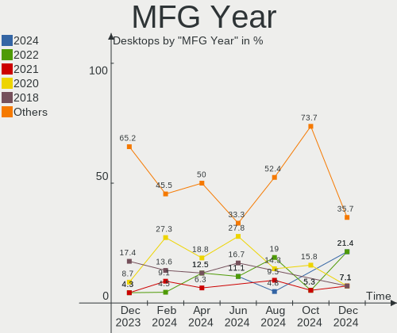
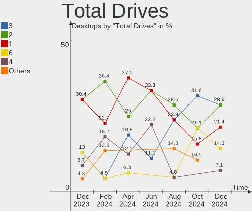
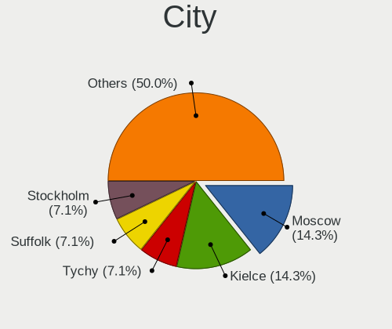
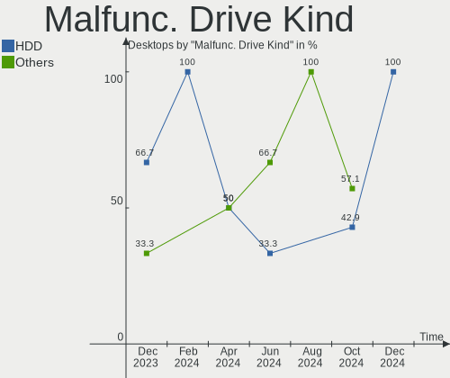
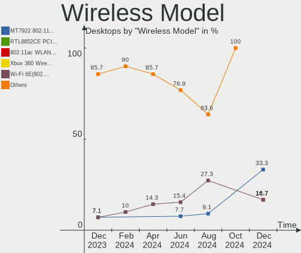

Gentoo - Hardware Trends (Desktops)
-----------------------------------

A project to identify most popular hardware characteristics and track their change
over time based on data collected by Linux users at https://Linux-Hardware.org.

Anyone can contribute to this report by the [hw-probe](https://github.com/linuxhw/hw-probe) tool:

    sudo -E hw-probe -all -upload

This report is for one last month. Overall report since the beginning of time: [TestDays](https://github.com/linuxhw/TestDays)

Period: Aug, 2023.

Contents
--------

* [ System ](#system)
  - [ OS                       ](#os)
  - [ OS Family                ](#os-family)
  - [ Kernel                   ](#kernel)
  - [ Kernel Family            ](#kernel-family)
  - [ Kernel Major Ver.        ](#kernel-major-ver)
  - [ Arch                     ](#arch)
  - [ DE                       ](#de)
  - [ Display Server           ](#display-server)
  - [ Display Manager          ](#display-manager)
  - [ OS Lang                  ](#os-lang)
  - [ Boot Mode                ](#boot-mode)
  - [ Filesystem               ](#filesystem)
  - [ Part. scheme             ](#part-scheme)
  - [ Dual Boot with Linux/BSD ](#dual-boot-with-linuxbsd)
  - [ Dual Boot (Win)          ](#dual-boot-win)

* [ Board ](#board)
  - [ Vendor                   ](#vendor)
  - [ Model                    ](#model)
  - [ Model Family             ](#model-family)
  - [ MFG Year                 ](#mfg-year)
  - [ Form Factor              ](#form-factor)
  - [ Secure Boot              ](#secure-boot)
  - [ Coreboot                 ](#coreboot)
  - [ RAM Size                 ](#ram-size)
  - [ RAM Used                 ](#ram-used)
  - [ Total Drives             ](#total-drives)
  - [ Has CD-ROM               ](#has-cd-rom)
  - [ Has Ethernet             ](#has-ethernet)
  - [ Has WiFi                 ](#has-wifi)
  - [ Has Bluetooth            ](#has-bluetooth)

* [ Location ](#location)
  - [ Country                  ](#country)
  - [ City                     ](#city)

* [ Drives ](#drives)
  - [ Drive Vendor             ](#drive-vendor)
  - [ Drive Model              ](#drive-model)
  - [ HDD Vendor               ](#hdd-vendor)
  - [ SSD Vendor               ](#ssd-vendor)
  - [ Drive Kind               ](#drive-kind)
  - [ Drive Connector          ](#drive-connector)
  - [ Drive Size               ](#drive-size)
  - [ Space Total              ](#space-total)
  - [ Space Used               ](#space-used)
  - [ Malfunc. Drives          ](#malfunc-drives)
  - [ Malfunc. Drive Vendor    ](#malfunc-drive-vendor)
  - [ Malfunc. HDD Vendor      ](#malfunc-hdd-vendor)
  - [ Malfunc. Drive Kind      ](#malfunc-drive-kind)
  - [ Failed Drives            ](#failed-drives)
  - [ Failed Drive Vendor      ](#failed-drive-vendor)
  - [ Drive Status             ](#drive-status)

* [ Storage controller ](#storage-controller)
  - [ Storage Vendor           ](#storage-vendor)
  - [ Storage Model            ](#storage-model)
  - [ Storage Kind             ](#storage-kind)

* [ Processor ](#processor)
  - [ CPU Vendor               ](#cpu-vendor)
  - [ CPU Model                ](#cpu-model)
  - [ CPU Model Family         ](#cpu-model-family)
  - [ CPU Cores                ](#cpu-cores)
  - [ CPU Sockets              ](#cpu-sockets)
  - [ CPU Threads              ](#cpu-threads)
  - [ CPU Op-Modes             ](#cpu-op-modes)
  - [ CPU Microcode            ](#cpu-microcode)
  - [ CPU Microarch            ](#cpu-microarch)

* [ Graphics ](#graphics)
  - [ GPU Vendor               ](#gpu-vendor)
  - [ GPU Model                ](#gpu-model)
  - [ GPU Combo                ](#gpu-combo)
  - [ GPU Driver               ](#gpu-driver)
  - [ GPU Memory               ](#gpu-memory)

* [ Monitor ](#monitor)
  - [ Monitor Vendor           ](#monitor-vendor)
  - [ Monitor Model            ](#monitor-model)
  - [ Monitor Resolution       ](#monitor-resolution)
  - [ Monitor Diagonal         ](#monitor-diagonal)
  - [ Monitor Width            ](#monitor-width)
  - [ Aspect Ratio             ](#aspect-ratio)
  - [ Monitor Area             ](#monitor-area)
  - [ Pixel Density            ](#pixel-density)
  - [ Multiple Monitors        ](#multiple-monitors)

* [ Network ](#network)
  - [ Net Controller Vendor    ](#net-controller-vendor)
  - [ Net Controller Model     ](#net-controller-model)
  - [ Wireless Vendor          ](#wireless-vendor)
  - [ Wireless Model           ](#wireless-model)
  - [ Ethernet Vendor          ](#ethernet-vendor)
  - [ Ethernet Model           ](#ethernet-model)
  - [ Net Controller Kind      ](#net-controller-kind)
  - [ Used Controller          ](#used-controller)
  - [ NICs                     ](#nics)
  - [ IPv6                     ](#ipv6)

* [ Bluetooth ](#bluetooth)
  - [ Bluetooth Vendor         ](#bluetooth-vendor)
  - [ Bluetooth Model          ](#bluetooth-model)

* [ Sound ](#sound)
  - [ Sound Vendor             ](#sound-vendor)
  - [ Sound Model              ](#sound-model)

* [ Memory ](#memory)
  - [ Memory Vendor            ](#memory-vendor)
  - [ Memory Model             ](#memory-model)
  - [ Memory Kind              ](#memory-kind)
  - [ Memory Form Factor       ](#memory-form-factor)
  - [ Memory Size              ](#memory-size)
  - [ Memory Speed             ](#memory-speed)

* [ Printers & scanners ](#printers--scanners)
  - [ Printer Vendor           ](#printer-vendor)
  - [ Printer Model            ](#printer-model)
  - [ Scanner Vendor           ](#scanner-vendor)
  - [ Scanner Model            ](#scanner-model)

* [ Camera ](#camera)
  - [ Camera Vendor            ](#camera-vendor)
  - [ Camera Model             ](#camera-model)

* [ Security ](#security)
  - [ Fingerprint Vendor       ](#fingerprint-vendor)
  - [ Fingerprint Model        ](#fingerprint-model)
  - [ Chipcard Vendor          ](#chipcard-vendor)
  - [ Chipcard Model           ](#chipcard-model)

* [ Unsupported ](#unsupported)
  - [ Unsupported Devices      ](#unsupported-devices)
  - [ Unsupported Device Types ](#unsupported-device-types)

System
------

OS
--

Installed operating systems

| Name        | Desktops | Percent |
|-------------|----------|---------|
| Gentoo 2.14 | 14       | 51.85%  |
| Gentoo 2.13 | 13       | 48.15%  |

OS Family
---------

OS without a version

| Name   | Desktops | Percent |
|--------|----------|---------|
| Gentoo | 27       | 100%    |

Kernel
------

Version of the Linux kernel

| Version                               | Desktops | Percent |
|---------------------------------------|----------|---------|
| 6.1.41-gentoo                         | 5        | 18.52%  |
| 6.4.9-gentoo                          | 3        | 11.11%  |
| 6.1.41-gentoo-dist                    | 3        | 11.11%  |
| 6.5.0-rc6-next-20230818-g0310018905e1 | 1        | 3.7%    |
| 6.5.0-rc4-shallot                     | 1        | 3.7%    |
| 6.5.0-gentoo                          | 1        | 3.7%    |
| 6.4.8-gentoo-dist                     | 1        | 3.7%    |
| 6.4.8-gentoo                          | 1        | 3.7%    |
| 6.4.7-gentoo                          | 1        | 3.7%    |
| 6.4.3-gentoo-dist                     | 1        | 3.7%    |
| 6.4.10-x86_64                         | 1        | 3.7%    |
| 6.4.10-gentoo-x86_64                  | 1        | 3.7%    |
| 6.4.10-gentoo-dist                    | 1        | 3.7%    |
| 6.4.10-gentoo                         | 1        | 3.7%    |
| 6.3.9-zen1-flat                       | 1        | 3.7%    |
| 6.3.8-gentoo                          | 1        | 3.7%    |
| 6.1.38-gentoo-x86_64                  | 1        | 3.7%    |
| 6.1.38-gentoo-dist                    | 1        | 3.7%    |
| 5.14.6-gentoo                         | 1        | 3.7%    |

Kernel Family
-------------

Linux kernel without a distro release

| Version | Desktops | Percent |
|---------|----------|---------|
| 6.1.41  | 8        | 29.63%  |
| 6.4.10  | 4        | 14.81%  |
| 6.5.0   | 3        | 11.11%  |
| 6.4.9   | 3        | 11.11%  |
| 6.4.8   | 2        | 7.41%   |
| 6.1.38  | 2        | 7.41%   |
| 6.4.7   | 1        | 3.7%    |
| 6.4.3   | 1        | 3.7%    |
| 6.3.9   | 1        | 3.7%    |
| 6.3.8   | 1        | 3.7%    |
| 5.14.6  | 1        | 3.7%    |

Kernel Major Ver.
-----------------

Linux kernel major version

| Version | Desktops | Percent |
|---------|----------|---------|
| 6.4     | 11       | 40.74%  |
| 6.1     | 10       | 37.04%  |
| 6.5     | 3        | 11.11%  |
| 6.3     | 2        | 7.41%   |
| 5.14    | 1        | 3.7%    |

Arch
----

OS architecture (x86_64, i586, etc.)

| Name        | Desktops | Percent |
|-------------|----------|---------|
| x86_64      | 25       | 92.59%  |
| loongarch64 | 2        | 7.41%   |

DE
--

Desktop Environment

| Name    | Desktops | Percent |
|---------|----------|---------|
| Unknown | 10       | 37.04%  |
| GNOME   | 6        | 22.22%  |
| XFCE    | 5        | 18.52%  |
| KDE5    | 4        | 14.81%  |
| sway    | 1        | 3.7%    |
| MATE    | 1        | 3.7%    |

Display Server
--------------

X11 or Wayland

| Name    | Desktops | Percent |
|---------|----------|---------|
| X11     | 13       | 48.15%  |
| Tty     | 6        | 22.22%  |
| Wayland | 4        | 14.81%  |
| Unknown | 4        | 14.81%  |

Display Manager
---------------

SDDM, LightDM, etc.

| Name    | Desktops | Percent |
|---------|----------|---------|
| Unknown | 11       | 40.74%  |
| LightDM | 7        | 25.93%  |
| SDDM    | 6        | 22.22%  |
| GDM     | 3        | 11.11%  |

OS Lang
-------

Language

| Lang            | Desktops | Percent |
|-----------------|----------|---------|
| en_US           | 13       | 48.15%  |
| C.UTF8          | 2        | 7.41%   |
| ru_RU           | 1        | 3.7%    |
| pl_PL.UTF8      | 1        | 3.7%    |
| nl_NL           | 1        | 3.7%    |
| it_IT           | 1        | 3.7%    |
| fr_FR           | 1        | 3.7%    |
| fr_BE           | 1        | 3.7%    |
| fi_FI@euro.UTF- | 1        | 3.7%    |
| en_IE           | 1        | 3.7%    |
| en_GB           | 1        | 3.7%    |
| de_DE           | 1        | 3.7%    |
| cs_CZ           | 1        | 3.7%    |
| Unknown         | 1        | 3.7%    |

Boot Mode
---------

EFI or BIOS

| Mode | Desktops | Percent |
|------|----------|---------|
| EFI  | 18       | 66.67%  |
| BIOS | 9        | 33.33%  |

Filesystem
----------

Type of filesystem

| Type  | Desktops | Percent |
|-------|----------|---------|
| Ext4  | 17       | 62.96%  |
| Btrfs | 6        | 22.22%  |
| F2fs  | 4        | 14.81%  |

Part. scheme
------------

Scheme of partitioning

| Type | Desktops | Percent |
|------|----------|---------|
| GPT  | 23       | 85.19%  |
| MBR  | 4        | 14.81%  |

Dual Boot with Linux/BSD
------------------------

Hosting more than one Linux/BSD

| Dual boot | Desktops | Percent |
|-----------|----------|---------|
| No        | 20       | 74.07%  |
| Yes       | 7        | 25.93%  |

Dual Boot (Win)
---------------

Hosting Linux and Windows

| Dual boot | Desktops | Percent |
|-----------|----------|---------|
| No        | 17       | 62.96%  |
| Yes       | 10       | 37.04%  |

Board
-----

Vendor
------

Motherboard manufacturer

| Name                | Desktops | Percent |
|---------------------|----------|---------|
| ASUSTek Computer    | 8        | 29.63%  |
| Gigabyte Technology | 5        | 18.52%  |
| MSI                 | 2        | 7.41%   |
| Loongson            | 2        | 7.41%   |
| Dell                | 2        | 7.41%   |
| NEC Computers       | 1        | 3.7%    |
| Medion              | 1        | 3.7%    |
| Huanan              | 1        | 3.7%    |
| Hewlett-Packard     | 1        | 3.7%    |
| Fujitsu             | 1        | 3.7%    |
| Foxconn             | 1        | 3.7%    |
| ASRock              | 1        | 3.7%    |
| AMD                 | 1        | 3.7%    |

Model
-----

Motherboard model

| Name                               | Desktops | Percent |
|------------------------------------|----------|---------|
| Loongson 3A6000-7A2000-1w-V0.1-EVB | 2        | 7.41%   |
| ASUS M3A78-CM                      | 2        | 7.41%   |
| NEC Computers PC-MKM30BZG4         | 1        | 3.7%    |
| MSI MS-7C02                        | 1        | 3.7%    |
| MSI MS-7974                        | 1        | 3.7%    |
| Medion MD34100/2543                | 1        | 3.7%    |
| Huanan X99-F8D V2.4                | 1        | 3.7%    |
| HP 750-100ny                       | 1        | 3.7%    |
| Gigabyte Z77X-UD5H                 | 1        | 3.7%    |
| Gigabyte Z390 AORUS ELITE          | 1        | 3.7%    |
| Gigabyte Z370P D3                  | 1        | 3.7%    |
| Gigabyte B650 AORUS PRO AX         | 1        | 3.7%    |
| Gigabyte AB350-Gaming              | 1        | 3.7%    |
| Fujitsu ESPRIMO E700               | 1        | 3.7%    |
| Foxconn TPS01                      | 1        | 3.7%    |
| Dell OptiPlex 7010                 | 1        | 3.7%    |
| Dell Inspiron 531                  | 1        | 3.7%    |
| ASUS TUF Gaming X670E-PLUS         | 1        | 3.7%    |
| ASUS TUF Gaming X570-PRO           | 1        | 3.7%    |
| ASUS SABERTOOTH 990FX R2.0         | 1        | 3.7%    |
| ASUS ROG STRIX X670E-F GAMING WIFI | 1        | 3.7%    |
| ASUS ROG STRIX X570-E GAMING       | 1        | 3.7%    |
| ASUS PRIME N100I-D D4              | 1        | 3.7%    |
| ASRock AB350M Pro4                 | 1        | 3.7%    |
| AMD A690G M2+                      | 1        | 3.7%    |

Model Family
------------

Motherboard model prefix

| Name                               | Desktops | Percent |
|------------------------------------|----------|---------|
| Loongson 3A6000-7A2000-1w-V0.1-EVB | 2        | 7.41%   |
| ASUS TUF                           | 2        | 7.41%   |
| ASUS ROG                           | 2        | 7.41%   |
| ASUS M3A78-CM                      | 2        | 7.41%   |
| NEC Computers PC-MKM30BZG4         | 1        | 3.7%    |
| MSI MS-7C02                        | 1        | 3.7%    |
| MSI MS-7974                        | 1        | 3.7%    |
| Medion MD34100                     | 1        | 3.7%    |
| Huanan X99-F8D                     | 1        | 3.7%    |
| HP 750-100ny                       | 1        | 3.7%    |
| Gigabyte Z77X-UD5H                 | 1        | 3.7%    |
| Gigabyte Z390                      | 1        | 3.7%    |
| Gigabyte Z370P                     | 1        | 3.7%    |
| Gigabyte B650                      | 1        | 3.7%    |
| Gigabyte AB350-Gaming              | 1        | 3.7%    |
| Fujitsu ESPRIMO                    | 1        | 3.7%    |
| Foxconn TPS01                      | 1        | 3.7%    |
| Dell OptiPlex                      | 1        | 3.7%    |
| Dell Inspiron                      | 1        | 3.7%    |
| ASUS SABERTOOTH                    | 1        | 3.7%    |
| ASUS PRIME                         | 1        | 3.7%    |
| ASRock AB350M                      | 1        | 3.7%    |
| AMD A690G                          | 1        | 3.7%    |

MFG Year
--------

Motherboard manufacture year

| Year    | Desktops | Percent |
|---------|----------|---------|
| 2019    | 5        | 18.52%  |
| 2022    | 3        | 11.11%  |
| 2017    | 3        | 11.11%  |
| 2008    | 3        | 11.11%  |
| 2015    | 2        | 7.41%   |
| 2012    | 2        | 7.41%   |
| Unknown | 2        | 7.41%   |
| 2023    | 1        | 3.7%    |
| 2021    | 1        | 3.7%    |
| 2020    | 1        | 3.7%    |
| 2013    | 1        | 3.7%    |
| 2011    | 1        | 3.7%    |
| 2009    | 1        | 3.7%    |
| 2007    | 1        | 3.7%    |

Form Factor
-----------

Physical design of the computer

| Name    | Desktops | Percent |
|---------|----------|---------|
| Desktop | 27       | 100%    |

Secure Boot
-----------

Enabled or disabled

| State    | Desktops | Percent |
|----------|----------|---------|
| Disabled | 26       | 96.3%   |
| Enabled  | 1        | 3.7%    |

Coreboot
--------

Have coreboot on board

| Used | Desktops | Percent |
|------|----------|---------|
| No   | 27       | 100%    |

RAM Size
--------

Total RAM memory

| Size in GB  | Desktops | Percent |
|-------------|----------|---------|
| 32.01-64.0  | 8        | 29.63%  |
| 16.01-24.0  | 5        | 18.52%  |
| 64.01-256.0 | 4        | 14.81%  |
| 4.01-8.0    | 3        | 11.11%  |
| 8.01-16.0   | 3        | 11.11%  |
| 3.01-4.0    | 2        | 7.41%   |
| 24.01-32.0  | 2        | 7.41%   |

RAM Used
--------

Used RAM memory

| Used GB    | Desktops | Percent |
|------------|----------|---------|
| 4.01-8.0   | 8        | 29.63%  |
| 3.01-4.0   | 4        | 14.81%  |
| 2.01-3.0   | 4        | 14.81%  |
| 1.01-2.0   | 4        | 14.81%  |
| 0.01-0.5   | 3        | 11.11%  |
| 16.01-24.0 | 2        | 7.41%   |
| 24.01-32.0 | 1        | 3.7%    |
| 8.01-16.0  | 1        | 3.7%    |

Total Drives
------------

Number of drives on board

| Drives | Desktops | Percent |
|--------|----------|---------|
| 1      | 10       | 37.04%  |
| 2      | 7        | 25.93%  |
| 4      | 4        | 14.81%  |
| 7      | 2        | 7.41%   |
| 6      | 2        | 7.41%   |
| 5      | 1        | 3.7%    |
| 3      | 1        | 3.7%    |

Has CD-ROM
----------

Has CD-ROM on board

| Presented | Desktops | Percent |
|-----------|----------|---------|
| No        | 19       | 70.37%  |
| Yes       | 8        | 29.63%  |

Has Ethernet
------------

Has Ethernet on board

| Presented | Desktops | Percent |
|-----------|----------|---------|
| Yes       | 27       | 100%    |

Has WiFi
--------

Has WiFi module

| Presented | Desktops | Percent |
|-----------|----------|---------|
| No        | 15       | 55.56%  |
| Yes       | 12       | 44.44%  |

Has Bluetooth
-------------

Has Bluetooth module

| Presented | Desktops | Percent |
|-----------|----------|---------|
| No        | 16       | 59.26%  |
| Yes       | 11       | 40.74%  |

Location
--------

Country
-------

Geographic location (country)

| Country     | Desktops | Percent |
|-------------|----------|---------|
| Poland      | 4        | 14.81%  |
| Germany     | 4        | 14.81%  |
| USA         | 3        | 11.11%  |
| UK          | 2        | 7.41%   |
| Russia      | 2        | 7.41%   |
| Japan       | 2        | 7.41%   |
| Czechia     | 2        | 7.41%   |
| Netherlands | 1        | 3.7%    |
| Italy       | 1        | 3.7%    |
| Ireland     | 1        | 3.7%    |
| France      | 1        | 3.7%    |
| Finland     | 1        | 3.7%    |
| Croatia     | 1        | 3.7%    |
| China       | 1        | 3.7%    |
| Belgium     | 1        | 3.7%    |

City
----

Geographic location (city)

| City                | Desktops | Percent |
|---------------------|----------|---------|
| Warsaw              | 3        | 11.11%  |
| Vista               | 1        | 3.7%    |
| Tokyo               | 1        | 3.7%    |
| The Hague           | 1        | 3.7%    |
| Tampere             | 1        | 3.7%    |
| St Petersburg       | 1        | 3.7%    |
| Spy                 | 1        | 3.7%    |
| Slough              | 1        | 3.7%    |
| Šlapanice          | 1        | 3.7%    |
| Pula                | 1        | 3.7%    |
| Prague              | 1        | 3.7%    |
| Port Glasgow        | 1        | 3.7%    |
| Nakano              | 1        | 3.7%    |
| Moscow              | 1        | 3.7%    |
| Mönchengladbach    | 1        | 3.7%    |
| Konstancin-Jeziorna | 1        | 3.7%    |
| Goshen              | 1        | 3.7%    |
| Dublin              | 1        | 3.7%    |
| Detmold             | 1        | 3.7%    |
| Dallas              | 1        | 3.7%    |
| Como                | 1        | 3.7%    |
| Chelles             | 1        | 3.7%    |
| Berlin              | 1        | 3.7%    |
| Beijing             | 1        | 3.7%    |
| Achterwehr          | 1        | 3.7%    |

Drives
------

Drive Vendor
------------

Hard drive vendors

| Vendor                      | Desktops | Drives | Percent |
|-----------------------------|----------|--------|---------|
| WDC                         | 8        | 10     | 13.79%  |
| Seagate                     | 8        | 13     | 13.79%  |
| Samsung Electronics         | 7        | 9      | 12.07%  |
| Sandisk                     | 6        | 7      | 10.34%  |
| Toshiba                     | 5        | 5      | 8.62%   |
| Hitachi                     | 4        | 9      | 6.9%    |
| GOODRAM                     | 3        | 3      | 5.17%   |
| Yangtze Memory Technologies | 2        | 2      | 3.45%   |
| Kingston                    | 2        | 2      | 3.45%   |
| Intel                       | 2        | 2      | 3.45%   |
| Crucial                     | 2        | 3      | 3.45%   |
| Verbatim                    | 1        | 1      | 1.72%   |
| Unknown                     | 1        | 1      | 1.72%   |
| SPCC                        | 1        | 1      | 1.72%   |
| Realtek Semiconductor       | 1        | 1      | 1.72%   |
| Phison Electronics          | 1        | 1      | 1.72%   |
| Micron/Crucial Technology   | 1        | 1      | 1.72%   |
| MAXIO Technology (Hangzhou) | 1        | 1      | 1.72%   |
| Kingston Technology Company | 1        | 1      | 1.72%   |
| A-DATA Technology           | 1        | 1      | 1.72%   |

Drive Model
-----------

Hard drive models

| Model                                | Desktops | Percent |
|--------------------------------------|----------|---------|
| Sandisk WD_BLACK SN770 1TB           | 2        | 3.23%   |
| GOODRAM SSDPR-CL100-480-G2 480GB     | 2        | 3.23%   |
| Yangtze Memory ZHITAI TiPlus7100 1TB | 1        | 1.61%   |
| Yangtze Memory ZHITAI TiPlus5000 1TB | 1        | 1.61%   |
| WDC WDS200T1R0A-68A4W0 2TB           | 1        | 1.61%   |
| WDC WD5000AZLX-08K2TA0 500GB         | 1        | 1.61%   |
| WDC WD3200AAJS-00L7A0 320GB          | 1        | 1.61%   |
| WDC WD30EFRX-68EUZN0 3TB             | 1        | 1.61%   |
| WDC WD10EZEX-08WN4A0 1TB             | 1        | 1.61%   |
| WDC WD10EZEX-08M2NA0 1TB             | 1        | 1.61%   |
| WDC WD102KRYZ-01A5AB0 10TB           | 1        | 1.61%   |
| WDC WD Blue SA510 2.5 1TB SSD        | 1        | 1.61%   |
| Verbatim Vi550 S3 512GB              | 1        | 1.61%   |
| Unknown SD/MMC/MS PRO 1GB            | 1        | 1.61%   |
| Toshiba MG08ACA16TE 16TB             | 1        | 1.61%   |
| Toshiba HDWQ140 4TB                  | 1        | 1.61%   |
| Toshiba HDWE150 5TB                  | 1        | 1.61%   |
| Toshiba DT01ACA200 2TB               | 1        | 1.61%   |
| Toshiba DT01ACA100 1TB               | 1        | 1.61%   |
| SPCC Solid State Disk 1TB            | 1        | 1.61%   |
| Seagate ST8000DM004-2CX188 8TB       | 1        | 1.61%   |
| Seagate ST6000DM003-2CY186 6TB       | 1        | 1.61%   |
| Seagate ST4000DM004-2CV104 4TB       | 1        | 1.61%   |
| Seagate ST32000641AS 2TB             | 1        | 1.61%   |
| Seagate ST2000DM006-2DM164 2TB       | 1        | 1.61%   |
| Seagate ST2000DM001-1ER164 2TB       | 1        | 1.61%   |
| Seagate ST18000NM003D-3DL103 18TB    | 1        | 1.61%   |
| Seagate ST12000NM0008-2H3101 12TB    | 1        | 1.61%   |
| Seagate ST1000DM003-9YN162 1TB       | 1        | 1.61%   |
| Seagate ST1000DM003-1SB10C 1TB       | 1        | 1.61%   |
| Seagate ST1000DM003-1SB102 1TB       | 1        | 1.61%   |
| Sandisk WD_BLACK SN750 SE 1TB        | 1        | 1.61%   |
| Sandisk WD Blue SN570 1TB            | 1        | 1.61%   |
| SanDisk Ultra II 480GB SSD           | 1        | 1.61%   |
| SanDisk SSD PLUS 240GB               | 1        | 1.61%   |
| SanDisk SDSSDH3 512G                 | 1        | 1.61%   |
| Samsung SSD 980 1TB                  | 1        | 1.61%   |
| Samsung SSD 870 EVO 1TB              | 1        | 1.61%   |
| Samsung SSD 860 QVO 1TB              | 1        | 1.61%   |
| Samsung SSD 860 EVO 500GB            | 1        | 1.61%   |

HDD Vendor
----------

Hard disk drive vendors

| Vendor  | Desktops | Drives | Percent |
|---------|----------|--------|---------|
| Seagate | 8        | 13     | 33.33%  |
| WDC     | 6        | 7      | 25%     |
| Toshiba | 5        | 5      | 20.83%  |
| Hitachi | 4        | 9      | 16.67%  |
| Unknown | 1        | 1      | 4.17%   |

SSD Vendor
----------

Solid state drive vendors

| Vendor              | Desktops | Drives | Percent |
|---------------------|----------|--------|---------|
| Samsung Electronics | 4        | 5      | 19.05%  |
| SanDisk             | 3        | 3      | 14.29%  |
| GOODRAM             | 3        | 3      | 14.29%  |
| WDC                 | 2        | 3      | 9.52%   |
| Kingston            | 2        | 2      | 9.52%   |
| Intel               | 2        | 2      | 9.52%   |
| Crucial             | 2        | 3      | 9.52%   |
| Verbatim            | 1        | 1      | 4.76%   |
| SPCC                | 1        | 1      | 4.76%   |
| A-DATA Technology   | 1        | 1      | 4.76%   |

Drive Kind
----------

HDD or SSD

| Kind | Desktops | Drives | Percent |
|------|----------|--------|---------|
| SSD  | 16       | 24     | 39.02%  |
| HDD  | 15       | 35     | 36.59%  |
| NVMe | 10       | 15     | 24.39%  |

Drive Connector
---------------

SATA, SAS, NVMe, etc.

| Type | Desktops | Drives | Percent |
|------|----------|--------|---------|
| SATA | 22       | 57     | 66.67%  |
| NVMe | 10       | 15     | 30.3%   |
| SAS  | 1        | 2      | 3.03%   |

Drive Size
----------

Size of hard drive

| Size in TB | Desktops | Drives | Percent |
|------------|----------|--------|---------|
| 0.51-1.0   | 13       | 17     | 32.5%   |
| 0.01-0.5   | 12       | 17     | 30%     |
| 1.01-2.0   | 5        | 11     | 12.5%   |
| 10.01-20.0 | 3        | 3      | 7.5%    |
| 4.01-10.0  | 3        | 4      | 7.5%    |
| 3.01-4.0   | 2        | 2      | 5%      |
| 2.01-3.0   | 2        | 5      | 5%      |

Space Total
-----------

Amount of disk space available on the file system

| Size in GB     | Desktops | Percent |
|----------------|----------|---------|
| More than 3000 | 11       | 40.74%  |
| 501-1000       | 10       | 37.04%  |
| 251-500        | 2        | 7.41%   |
| 101-250        | 2        | 7.41%   |
| 1001-2000      | 1        | 3.7%    |
| Unknown        | 1        | 3.7%    |

Space Used
----------

Amount of used disk space

| Used GB        | Desktops | Percent |
|----------------|----------|---------|
| More than 3000 | 6        | 22.22%  |
| 251-500        | 3        | 11.11%  |
| 1-20           | 3        | 11.11%  |
| 501-1000       | 3        | 11.11%  |
| 51-100         | 3        | 11.11%  |
| 21-50          | 2        | 7.41%   |
| 2001-3000      | 2        | 7.41%   |
| 101-250        | 2        | 7.41%   |
| 1001-2000      | 2        | 7.41%   |
| Unknown        | 1        | 3.7%    |

Malfunc. Drives
---------------

Drive models with a malfunction

| Model                                                     | Desktops | Drives | Percent |
|-----------------------------------------------------------|----------|--------|---------|
| WDC WD30EFRX-68EUZN0 3TB                                  | 1        | 2      | 25%     |
| Samsung Electronics SSD 980 1TB                           | 1        | 1      | 25%     |
| Realtek Semiconductor RTS5763DL NVMe SSD Controller 512GB | 1        | 1      | 25%     |
| Intel SSDSCKKF180G8L 180GB                                | 1        | 1      | 25%     |

Malfunc. Drive Vendor
---------------------

Vendors of faulty drives

| Vendor                | Desktops | Drives | Percent |
|-----------------------|----------|--------|---------|
| WDC                   | 1        | 2      | 25%     |
| Samsung Electronics   | 1        | 1      | 25%     |
| Realtek Semiconductor | 1        | 1      | 25%     |
| Intel                 | 1        | 1      | 25%     |

Malfunc. HDD Vendor
-------------------

Vendors of faulty HDD drives

| Vendor | Desktops | Drives | Percent |
|--------|----------|--------|---------|
| WDC    | 1        | 2      | 100%    |

Malfunc. Drive Kind
-------------------

Kinds of faulty drives

| Kind | Desktops | Drives | Percent |
|------|----------|--------|---------|
| NVMe | 2        | 2      | 50%     |
| SSD  | 1        | 1      | 25%     |
| HDD  | 1        | 2      | 25%     |

Failed Drives
-------------

Failed drive models

Zero info for selected period =(

Failed Drive Vendor
-------------------

Failed drive vendors

Zero info for selected period =(

Drive Status
------------

Number of failed and malfunc. drives

| Status   | Desktops | Drives | Percent |
|----------|----------|--------|---------|
| Works    | 25       | 66     | 80.65%  |
| Malfunc  | 4        | 5      | 12.9%   |
| Detected | 2        | 3      | 6.45%   |

Storage controller
------------------

Storage Vendor
--------------

Storage controller vendors

| Vendor                      | Desktops | Percent |
|-----------------------------|----------|---------|
| AMD                         | 13       | 29.55%  |
| Intel                       | 11       | 25%     |
| SanDisk                     | 4        | 9.09%   |
| Samsung Electronics         | 3        | 6.82%   |
| Yangtze Memory Technologies | 2        | 4.55%   |
| Loongson Technology         | 2        | 4.55%   |
| ASMedia Technology          | 2        | 4.55%   |
| Realtek Semiconductor       | 1        | 2.27%   |
| Phison Electronics          | 1        | 2.27%   |
| Nvidia                      | 1        | 2.27%   |
| Micron/Crucial Technology   | 1        | 2.27%   |
| MAXIO Technology (Hangzhou) | 1        | 2.27%   |
| Marvell Technology Group    | 1        | 2.27%   |
| Kingston Technology Company | 1        | 2.27%   |

Storage Model
-------------

Storage controller models

| Model                                                                         | Desktops | Percent |
|-------------------------------------------------------------------------------|----------|---------|
| AMD FCH SATA Controller [AHCI mode]                                           | 7        | 13.73%  |
| SanDisk WD Black SN770 / PC SN740 256GB / PC SN560 (DRAM-less) NVMe SSD       | 2        | 3.92%   |
| Loongson SATA controller                                                      | 2        | 3.92%   |
| Intel Cannon Lake PCH SATA AHCI Controller                                    | 2        | 3.92%   |
| Intel 7 Series/C210 Series Chipset Family 6-port SATA Controller [AHCI mode]  | 2        | 3.92%   |
| ASMedia ASM1062 Serial ATA Controller                                         | 2        | 3.92%   |
| AMD SB7x0/SB8x0/SB9x0 SATA Controller [IDE mode]                              | 2        | 3.92%   |
| AMD SB7x0/SB8x0/SB9x0 SATA Controller [AHCI mode]                             | 2        | 3.92%   |
| AMD SB7x0/SB8x0/SB9x0 IDE Controller                                          | 2        | 3.92%   |
| AMD 300 Series Chipset SATA Controller                                        | 2        | 3.92%   |
| Yangtze Memory ZHITAI TiPro5000 NVMe SSD                                      | 1        | 1.96%   |
| Yangtze Memory ZHITAI TiPlus7100                                              | 1        | 1.96%   |
| SanDisk WD Blue SN570 NVMe SSD 1TB                                            | 1        | 1.96%   |
| SanDisk PC SN735 NVMe SSD (DRAM-less)                                         | 1        | 1.96%   |
| Samsung NVMe SSD Controller SM981/PM981/PM983                                 | 1        | 1.96%   |
| Samsung NVMe SSD Controller SM961/PM961/SM963                                 | 1        | 1.96%   |
| Samsung NVMe SSD Controller 980                                               | 1        | 1.96%   |
| Realtek RTS5763DL NVMe SSD Controller                                         | 1        | 1.96%   |
| Phison E18 PCIe4 NVMe Controller                                              | 1        | 1.96%   |
| Nvidia MCP61 SATA Controller                                                  | 1        | 1.96%   |
| Nvidia MCP61 IDE                                                              | 1        | 1.96%   |
| Micron/Crucial P5 Plus NVMe PCIe SSD                                          | 1        | 1.96%   |
| MAXIO (Hangzhou) NVMe SSD Controller MAP1202                                  | 1        | 1.96%   |
| Marvell Group 88SE9172 SATA 6Gb/s Controller                                  | 1        | 1.96%   |
| Kingston Company A2000 NVMe SSD                                               | 1        | 1.96%   |
| Intel SATA Controller [RAID mode]                                             | 1        | 1.96%   |
| Intel SATA controller                                                         | 1        | 1.96%   |
| Intel Q170/Q150/B150/H170/H110/Z170/CM236 Chipset SATA Controller [AHCI Mode] | 1        | 1.96%   |
| Intel NM10/ICH7 Family SATA Controller [AHCI mode]                            | 1        | 1.96%   |
| Intel C610/X99 series chipset sSATA Controller [AHCI mode]                    | 1        | 1.96%   |
| Intel C610/X99 series chipset 6-Port SATA Controller [AHCI mode]              | 1        | 1.96%   |
| Intel 6 Series/C200 Series Chipset Family 6 port Desktop SATA AHCI Controller | 1        | 1.96%   |
| Intel 200 Series PCH SATA controller [AHCI mode]                              | 1        | 1.96%   |
| AMD SB600 Non-Raid-5 SATA                                                     | 1        | 1.96%   |
| AMD SB600 IDE                                                                 | 1        | 1.96%   |
| AMD 400 Series Chipset SATA Controller                                        | 1        | 1.96%   |

Storage Kind
------------

Kind of storage controller (IDE, SATA, NVMe, SAS, ...)

| Kind | Desktops | Percent |
|------|----------|---------|
| SATA | 25       | 62.5%   |
| NVMe | 10       | 25%     |
| IDE  | 4        | 10%     |
| RAID | 1        | 2.5%    |

Processor
---------

CPU Vendor
----------

Processor vendors

| Vendor   | Desktops | Percent |
|----------|----------|---------|
| AMD      | 14       | 51.85%  |
| Intel    | 11       | 40.74%  |
| Loongson | 2        | 7.41%   |

CPU Model
---------

Processor models

| Model                                      | Desktops | Percent |
|--------------------------------------------|----------|---------|
| Loongson 3A6000                            | 2        | 7.41%   |
| Intel Core i7-3770 CPU @ 3.40GHz           | 2        | 7.41%   |
| AMD Phenom II X4 955 Processor             | 2        | 7.41%   |
| Intel Xeon CPU E5-2680 v4 @ 2.40GHz        | 1        | 3.7%    |
| Intel N100                                 | 1        | 3.7%    |
| Intel Core i5-9600K CPU @ 3.70GHz          | 1        | 3.7%    |
| Intel Core i5-8600K CPU @ 3.60GHz          | 1        | 3.7%    |
| Intel Core i5-8500 CPU @ 3.00GHz           | 1        | 3.7%    |
| Intel Core i5-8400 CPU @ 2.80GHz           | 1        | 3.7%    |
| Intel Core i5-6400 CPU @ 2.70GHz           | 1        | 3.7%    |
| Intel Core i5-2400 CPU @ 3.10GHz           | 1        | 3.7%    |
| Intel Atom CPU D510 @ 1.66GHz              | 1        | 3.7%    |
| AMD Ryzen 9 7900X 12-Core Processor        | 1        | 3.7%    |
| AMD Ryzen 9 7900 12-Core Processor         | 1        | 3.7%    |
| AMD Ryzen 9 5900X 12-Core Processor        | 1        | 3.7%    |
| AMD Ryzen 9 3950X 16-Core Processor        | 1        | 3.7%    |
| AMD Ryzen 9 3900X 12-Core Processor        | 1        | 3.7%    |
| AMD Ryzen 7 7700X 8-Core Processor         | 1        | 3.7%    |
| AMD Ryzen 5 3600 6-Core Processor          | 1        | 3.7%    |
| AMD Ryzen 5 2600 Six-Core Processor        | 1        | 3.7%    |
| AMD FX-8350 Eight-Core Processor           | 1        | 3.7%    |
| AMD FX-8300 Eight-Core Processor           | 1        | 3.7%    |
| AMD Athlon Dual Core Processor 4050e       | 1        | 3.7%    |
| AMD Athlon 64 X2 Dual Core Processor 5000+ | 1        | 3.7%    |

CPU Model Family
----------------

Processor model prefix

| Model                | Desktops | Percent |
|----------------------|----------|---------|
| Intel Core i5        | 6        | 22.22%  |
| AMD Ryzen 9          | 5        | 18.52%  |
| Other                | 3        | 11.11%  |
| Intel Core i7        | 2        | 7.41%   |
| AMD Ryzen 5          | 2        | 7.41%   |
| AMD Phenom II X4     | 2        | 7.41%   |
| AMD FX               | 2        | 7.41%   |
| Intel Xeon           | 1        | 3.7%    |
| Intel Atom           | 1        | 3.7%    |
| AMD Ryzen 7          | 1        | 3.7%    |
| AMD Athlon Dual Core | 1        | 3.7%    |
| AMD Athlon 64 X2     | 1        | 3.7%    |

CPU Cores
---------

Number of processor cores

| Number | Desktops | Percent |
|--------|----------|---------|
| 4      | 11       | 40.74%  |
| 6      | 6        | 22.22%  |
| 12     | 4        | 14.81%  |
| 2      | 3        | 11.11%  |
| 28     | 1        | 3.7%    |
| 16     | 1        | 3.7%    |
| 8      | 1        | 3.7%    |

CPU Sockets
-----------

Number of sockets

| Number | Desktops | Percent |
|--------|----------|---------|
| 1      | 26       | 96.3%   |
| 2      | 1        | 3.7%    |

CPU Threads
-----------

Threads per core (Hyper-Threading)

| Number | Desktops | Percent |
|--------|----------|---------|
| 2      | 16       | 59.26%  |
| 1      | 11       | 40.74%  |

CPU Op-Modes
------------

CPU Operation Modes (32-bit, 64-bit)

| Op mode        | Desktops | Percent |
|----------------|----------|---------|
| 32-bit, 64-bit | 27       | 100%    |

CPU Microcode
-------------

Microcode number

| Number     | Desktops | Percent |
|------------|----------|---------|
| Unknown    | 15       | 55.56%  |
| 0x0a601203 | 2        | 7.41%   |
| 0xb06e0    | 1        | 3.7%    |
| 0x906ea    | 1        | 3.7%    |
| 0x506e3    | 1        | 3.7%    |
| 0x406f1    | 1        | 3.7%    |
| 0x306a9    | 1        | 3.7%    |
| 0x0a20120a | 1        | 3.7%    |
| 0x08701021 | 1        | 3.7%    |
| 0x0800820d | 1        | 3.7%    |
| 0x06000852 | 1        | 3.7%    |
| 0x010000db | 1        | 3.7%    |

CPU Microarch
-------------

Microarchitecture

| Name        | Desktops | Percent |
|-------------|----------|---------|
| Unknown     | 5        | 18.52%  |
| KabyLake    | 4        | 14.81%  |
| Zen 2       | 3        | 11.11%  |
| Piledriver  | 2        | 7.41%   |
| K8 Hammer   | 2        | 7.41%   |
| K10         | 2        | 7.41%   |
| IvyBridge   | 2        | 7.41%   |
| Zen+        | 1        | 3.7%    |
| Zen 3       | 1        | 3.7%    |
| Skylake     | 1        | 3.7%    |
| SandyBridge | 1        | 3.7%    |
| Gracemont   | 1        | 3.7%    |
| Broadwell   | 1        | 3.7%    |
| Bonnell     | 1        | 3.7%    |

Graphics
--------

GPU Vendor
----------

Vendors of graphics cards

| Vendor              | Desktops | Percent |
|---------------------|----------|---------|
| AMD                 | 13       | 43.33%  |
| Nvidia              | 10       | 33.33%  |
| Intel               | 5        | 16.67%  |
| Loongson Technology | 2        | 6.67%   |

GPU Model
---------

Graphics card models

| Model                                                                   | Desktops | Percent |
|-------------------------------------------------------------------------|----------|---------|
| AMD Raphael                                                             | 3        | 9.38%   |
| AMD Ellesmere [Radeon RX 470/480/570/570X/580/580X/590]                 | 3        | 9.38%   |
| Loongson Technology VGA compatible controller                           | 2        | 6.25%   |
| Intel CoffeeLake-S GT2 [UHD Graphics 630]                               | 2        | 6.25%   |
| AMD RS780C [Radeon 3100]                                                | 2        | 6.25%   |
| AMD Navi 22 [Radeon RX 6700/6700 XT/6750 XT / 6800M/6850M XT]           | 2        | 6.25%   |
| Nvidia GP108 [GeForce GT 1030]                                          | 1        | 3.13%   |
| Nvidia GP107 [GeForce GTX 1050 Ti]                                      | 1        | 3.13%   |
| Nvidia GP106 [GeForce GTX 1060 3GB]                                     | 1        | 3.13%   |
| Nvidia GM206 [GeForce GTX 960]                                          | 1        | 3.13%   |
| Nvidia GM107 [GeForce GTX 750 Ti]                                       | 1        | 3.13%   |
| Nvidia GF108 [GeForce GT 430]                                           | 1        | 3.13%   |
| Nvidia GA106 [GeForce RTX 3060 Lite Hash Rate]                          | 1        | 3.13%   |
| Nvidia GA104 [GeForce RTX 3070 Ti]                                      | 1        | 3.13%   |
| Nvidia GA102 [GeForce RTX 3080 Ti]                                      | 1        | 3.13%   |
| Nvidia C61 [GeForce 6150SE nForce 430]                                  | 1        | 3.13%   |
| Nvidia AD104 [GeForce RTX 4070 Ti]                                      | 1        | 3.13%   |
| Intel IvyBridge GT2 [HD Graphics 4000]                                  | 1        | 3.13%   |
| Intel Atom Processor D4xx/D5xx/N4xx/N5xx Integrated Graphics Controller | 1        | 3.13%   |
| Intel Alder Lake-N [UHD Graphics]                                       | 1        | 3.13%   |
| AMD RS690 [Radeon X1200]                                                | 1        | 3.13%   |
| AMD Navi 21 [Radeon RX 6800/6800 XT / 6900 XT]                          | 1        | 3.13%   |
| AMD Lexa PRO [Radeon 540/540X/550/550X / RX 540X/550/550X]              | 1        | 3.13%   |
| AMD Cedar [Radeon HD 5000/6000/7350/8350 Series]                        | 1        | 3.13%   |

GPU Combo
---------

Combinations of graphics cards

| Name                      | Desktops | Percent |
|---------------------------|----------|---------|
| 1 x AMD                   | 9        | 33.33%  |
| 1 x Nvidia                | 8        | 29.63%  |
| 1 x Intel                 | 5        | 18.52%  |
| AMD + Loongson Technology | 2        | 7.41%   |
| 2 x Nvidia                | 1        | 3.7%    |
| 2 x AMD                   | 1        | 3.7%    |
| AMD + Nvidia              | 1        | 3.7%    |

GPU Driver
----------

Free vs proprietary

| Driver      | Desktops | Percent |
|-------------|----------|---------|
| Free        | 19       | 70.37%  |
| Proprietary | 7        | 25.93%  |
| Unknown     | 1        | 3.7%    |

GPU Memory
----------

Total video memory

| Size in GB | Desktops | Percent |
|------------|----------|---------|
| Unknown    | 10       | 37.04%  |
| 8.01-16.0  | 5        | 18.52%  |
| 0.01-0.5   | 4        | 14.81%  |
| 3.01-4.0   | 3        | 11.11%  |
| 7.01-8.0   | 2        | 7.41%   |
| 2.01-3.0   | 1        | 3.7%    |
| 1.01-2.0   | 1        | 3.7%    |
| 0.51-1.0   | 1        | 3.7%    |

Monitor
-------

Monitor Vendor
--------------

Monitor vendors

| Vendor               | Desktops | Percent |
|----------------------|----------|---------|
| Samsung Electronics  | 8        | 30.77%  |
| Dell                 | 6        | 23.08%  |
| Iiyama               | 2        | 7.69%   |
| Goldstar             | 2        | 7.69%   |
| BenQ                 | 2        | 7.69%   |
| Acer                 | 2        | 7.69%   |
| Mitsubishi           | 1        | 3.85%   |
| Hewlett-Packard      | 1        | 3.85%   |
| ASUSTek Computer     | 1        | 3.85%   |
| Ancor Communications | 1        | 3.85%   |

Monitor Model
-------------

Monitor models

| Model                                                                   | Desktops | Percent |
|-------------------------------------------------------------------------|----------|---------|
| Samsung Electronics U32H85x SAM0E3C 3840x2160 697x392mm 31.5-inch       | 1        | 3.7%    |
| Samsung Electronics SyncMaster SAM059A 1920x1080 477x268mm 21.5-inch    | 1        | 3.7%    |
| Samsung Electronics SyncMaster SAM0373 1680x1050 459x296mm 21.5-inch    | 1        | 3.7%    |
| Samsung Electronics SMB2430L SAM0645 1920x1080 520x290mm 23.4-inch      | 1        | 3.7%    |
| Samsung Electronics S34J55x SAM0F70 3440x1440 797x333mm 34.0-inch       | 1        | 3.7%    |
| Samsung Electronics S22B300 SAM08C8 1920x1080 477x268mm 21.5-inch       | 1        | 3.7%    |
| Samsung Electronics LCD Monitor SAM0FEF 3840x2160 1872x1053mm 84.6-inch | 1        | 3.7%    |
| Samsung Electronics LCD Monitor SAM0A7C 1366x768 698x393mm 31.5-inch    | 1        | 3.7%    |
| Samsung Electronics C24F390 SAM0D2C 1920x1080 521x293mm 23.5-inch       | 1        | 3.7%    |
| Mitsubishi RDT193WM MEL4798 1440x900 408x255mm 18.9-inch                | 1        | 3.7%    |
| Iiyama PL2792Q IVM6637 2560x1440 597x336mm 27.0-inch                    | 1        | 3.7%    |
| Iiyama PL2483H IVM6138 1920x1080 531x299mm 24.0-inch                    | 1        | 3.7%    |
| Hewlett-Packard 27fw HPN354B 1920x1080 598x336mm 27.0-inch              | 1        | 3.7%    |
| Goldstar ULTRAWIDE GSM76E4 3440x1440 800x335mm 34.1-inch                | 1        | 3.7%    |
| Goldstar 34GK950F GSM7727 3440x1440 800x335mm 34.1-inch                 | 1        | 3.7%    |
| Dell UZ2715H DELA0AD 1920x1080 590x330mm 26.6-inch                      | 1        | 3.7%    |
| Dell U2415 DELA0BC 1920x1200 518x324mm 24.1-inch                        | 1        | 3.7%    |
| Dell P2721Q DELF125 3840x2160 597x336mm 27.0-inch                       | 1        | 3.7%    |
| Dell P2418D DELD0C2 2560x1440 526x296mm 23.8-inch                       | 1        | 3.7%    |
| Dell E2220H DELF118 1920x1080 480x270mm 21.7-inch                       | 1        | 3.7%    |
| Dell E1914H DELD03A 1366x768 410x230mm 18.5-inch                        | 1        | 3.7%    |
| BenQ PD3200U BNQ8025 3840x2160 708x399mm 32.0-inch                      | 1        | 3.7%    |
| BenQ PD2700U BNQ802E 3840x2160 597x336mm 27.0-inch                      | 1        | 3.7%    |
| ASUSTek Computer PA329C AUS3264 3840x2160 708x399mm 32.0-inch           | 1        | 3.7%    |
| Ancor Communications ASUS PB287Q ACI28A3 3840x2160 621x341mm 27.9-inch  | 1        | 3.7%    |
| Acer XB271HU ACR0490 2560x1440 598x336mm 27.0-inch                      | 1        | 3.7%    |
| Acer AL1717 ACRAD54 1280x1024 338x270mm 17.0-inch                       | 1        | 3.7%    |

Monitor Resolution
------------------

Monitor screen resolution

| Resolution         | Desktops | Percent |
|--------------------|----------|---------|
| 3840x2160 (4K)     | 7        | 28%     |
| 1920x1080 (FHD)    | 7        | 28%     |
| 3440x1440          | 3        | 12%     |
| 2560x1440 (QHD)    | 3        | 12%     |
| 1366x768 (WXGA)    | 2        | 8%      |
| 1680x1050 (WSXGA+) | 1        | 4%      |
| 1440x900 (WXGA+)   | 1        | 4%      |
| 1280x1024 (SXGA)   | 1        | 4%      |

Monitor Diagonal
----------------

Diagonal size in inches

| Inches | Desktops | Percent |
|--------|----------|---------|
| 27     | 7        | 25.93%  |
| 21     | 4        | 14.81%  |
| 34     | 3        | 11.11%  |
| 32     | 2        | 7.41%   |
| 31     | 2        | 7.41%   |
| 24     | 2        | 7.41%   |
| 23     | 2        | 7.41%   |
| 18     | 2        | 7.41%   |
| 84     | 1        | 3.7%    |
| 40     | 1        | 3.7%    |
| 17     | 1        | 3.7%    |

Monitor Width
-------------

Physical width

| Width in mm | Desktops | Percent |
|-------------|----------|---------|
| 501-600     | 9        | 34.62%  |
| 401-500     | 6        | 23.08%  |
| 701-800     | 5        | 19.23%  |
| 601-700     | 3        | 11.54%  |
| 801-900     | 1        | 3.85%   |
| 301-350     | 1        | 3.85%   |
| 1501-2000   | 1        | 3.85%   |

Aspect Ratio
------------

Proportional relationship between the width and the height

| Ratio | Desktops | Percent |
|-------|----------|---------|
| 16/9  | 18       | 75%     |
| 21/9  | 3        | 12.5%   |
| 16/10 | 2        | 8.33%   |
| 5/4   | 1        | 4.17%   |

Monitor Area
------------

Area in inch²

| Area in inch² | Desktops | Percent |
|----------------|----------|---------|
| 351-500        | 7        | 26.92%  |
| 301-350        | 7        | 26.92%  |
| 201-250        | 7        | 26.92%  |
| 141-150        | 2        | 7.69%   |
| More than 1000 | 1        | 3.85%   |
| 151-200        | 1        | 3.85%   |
| 501-1000       | 1        | 3.85%   |

Pixel Density
-------------

Pixels per inch

| Density | Desktops | Percent |
|---------|----------|---------|
| 51-100  | 8        | 34.78%  |
| 101-120 | 7        | 30.43%  |
| 121-160 | 5        | 21.74%  |
| 161-240 | 2        | 8.7%    |
| 1-50    | 1        | 4.35%   |

Multiple Monitors
-----------------

Total monitors connected

| Total | Desktops | Percent |
|-------|----------|---------|
| 1     | 19       | 70.37%  |
| 0     | 4        | 14.81%  |
| 2     | 3        | 11.11%  |
| 3     | 1        | 3.7%    |

Network
-------

Net Controller Vendor
---------------------

Controller vendors

| Vendor                | Desktops | Percent |
|-----------------------|----------|---------|
| Realtek Semiconductor | 17       | 42.5%   |
| Intel                 | 16       | 40%     |
| Loongson Technology   | 2        | 5%      |
| Qualcomm Atheros      | 1        | 2.5%    |
| Prusa                 | 1        | 2.5%    |
| Nvidia                | 1        | 2.5%    |
| MediaTek              | 1        | 2.5%    |
| Broadcom              | 1        | 2.5%    |

Net Controller Model
--------------------

Controller models

| Model                                                             | Desktops | Percent |
|-------------------------------------------------------------------|----------|---------|
| Realtek RTL8111/8168/8411 PCI Express Gigabit Ethernet Controller | 14       | 31.82%  |
| Intel Wi-Fi 6 AX200                                               | 5        | 11.36%  |
| Intel Ethernet Controller I225-V                                  | 3        | 6.82%   |
| Realtek RTL8125 2.5GbE Controller                                 | 2        | 4.55%   |
| Loongson Ethernet controller                                      | 2        | 4.55%   |
| Intel Ethernet Connection (7) I219-V                              | 2        | 4.55%   |
| Intel 82579V Gigabit Network Connection                           | 2        | 4.55%   |
| Realtek RTL88x2bu [AC1200 Techkey]                                | 1        | 2.27%   |
| Realtek RTL8153 Gigabit Ethernet Adapter                          | 1        | 2.27%   |
| Realtek RTL810xE PCI Express Fast Ethernet controller             | 1        | 2.27%   |
| Qualcomm Atheros AR8151 v2.0 Gigabit Ethernet                     | 1        | 2.27%   |
| Prusa Original i3 MK3                                             | 1        | 2.27%   |
| Nvidia MCP61 Ethernet                                             | 1        | 2.27%   |
| MediaTek MT7922 802.11ax PCI Express Wireless Network Adapter     | 1        | 2.27%   |
| Intel Wireless 7265                                               | 1        | 2.27%   |
| Intel Wireless 3165                                               | 1        | 2.27%   |
| Intel I211 Gigabit Network Connection                             | 1        | 2.27%   |
| Intel Ethernet 10G 2P X520 Adapter                                | 1        | 2.27%   |
| Intel Cannon Lake PCH CNVi WiFi                                   | 1        | 2.27%   |
| Intel 82579LM Gigabit Network Connection (Lewisville)             | 1        | 2.27%   |
| Broadcom Network controller                                       | 1        | 2.27%   |

Wireless Vendor
---------------

Wireless vendors

| Vendor                | Desktops | Percent |
|-----------------------|----------|---------|
| Intel                 | 8        | 72.73%  |
| Realtek Semiconductor | 1        | 9.09%   |
| MediaTek              | 1        | 9.09%   |
| Broadcom              | 1        | 9.09%   |

Wireless Model
--------------

Wireless models

| Model                                                         | Desktops | Percent |
|---------------------------------------------------------------|----------|---------|
| Intel Wi-Fi 6 AX200                                           | 5        | 45.45%  |
| Realtek RTL88x2bu [AC1200 Techkey]                            | 1        | 9.09%   |
| MediaTek MT7922 802.11ax PCI Express Wireless Network Adapter | 1        | 9.09%   |
| Intel Wireless 7265                                           | 1        | 9.09%   |
| Intel Wireless 3165                                           | 1        | 9.09%   |
| Intel Cannon Lake PCH CNVi WiFi                               | 1        | 9.09%   |
| Broadcom Network controller                                   | 1        | 9.09%   |

Ethernet Vendor
---------------

Ethernet vendors

| Vendor                | Desktops | Percent |
|-----------------------|----------|---------|
| Realtek Semiconductor | 17       | 54.84%  |
| Intel                 | 10       | 32.26%  |
| Loongson Technology   | 2        | 6.45%   |
| Qualcomm Atheros      | 1        | 3.23%   |
| Nvidia                | 1        | 3.23%   |

Ethernet Model
--------------

Ethernet models

| Model                                                             | Desktops | Percent |
|-------------------------------------------------------------------|----------|---------|
| Realtek RTL8111/8168/8411 PCI Express Gigabit Ethernet Controller | 14       | 43.75%  |
| Intel Ethernet Controller I225-V                                  | 3        | 9.38%   |
| Realtek RTL8125 2.5GbE Controller                                 | 2        | 6.25%   |
| Loongson Ethernet controller                                      | 2        | 6.25%   |
| Intel Ethernet Connection (7) I219-V                              | 2        | 6.25%   |
| Intel 82579V Gigabit Network Connection                           | 2        | 6.25%   |
| Realtek RTL8153 Gigabit Ethernet Adapter                          | 1        | 3.13%   |
| Realtek RTL810xE PCI Express Fast Ethernet controller             | 1        | 3.13%   |
| Qualcomm Atheros AR8151 v2.0 Gigabit Ethernet                     | 1        | 3.13%   |
| Nvidia MCP61 Ethernet                                             | 1        | 3.13%   |
| Intel I211 Gigabit Network Connection                             | 1        | 3.13%   |
| Intel Ethernet 10G 2P X520 Adapter                                | 1        | 3.13%   |
| Intel 82579LM Gigabit Network Connection (Lewisville)             | 1        | 3.13%   |

Net Controller Kind
-------------------

Ethernet, WiFi or modem

| Kind     | Desktops | Percent |
|----------|----------|---------|
| Ethernet | 27       | 69.23%  |
| WiFi     | 11       | 28.21%  |
| Modem    | 1        | 2.56%   |

Used Controller
---------------

Currently used network controller

| Kind     | Desktops | Percent |
|----------|----------|---------|
| Ethernet | 19       | 73.08%  |
| WiFi     | 7        | 26.92%  |

NICs
----

Total network controllers on board

| Total | Desktops | Percent |
|-------|----------|---------|
| 1     | 13       | 48.15%  |
| 2     | 12       | 44.44%  |
| 3     | 2        | 7.41%   |

IPv6
----

IPv6 vs IPv4

| Used | Desktops | Percent |
|------|----------|---------|
| No   | 20       | 74.07%  |
| Yes  | 7        | 25.93%  |

Bluetooth
---------

Bluetooth Vendor
----------------

Controller vendors

| Vendor                  | Desktops | Percent |
|-------------------------|----------|---------|
| Intel                   | 7        | 63.64%  |
| Cambridge Silicon Radio | 3        | 27.27%  |
| MediaTek                | 1        | 9.09%   |

Bluetooth Model
---------------

Controller models

| Model                                               | Desktops | Percent |
|-----------------------------------------------------|----------|---------|
| Intel AX200 Bluetooth                               | 4        | 36.36%  |
| Cambridge Silicon Radio Bluetooth Dongle (HCI mode) | 3        | 27.27%  |
| Intel Bluetooth wireless interface                  | 2        | 18.18%  |
| MediaTek Wireless_Device                            | 1        | 9.09%   |
| Intel Bluetooth 9460/9560 Jefferson Peak (JfP)      | 1        | 9.09%   |

Sound
-----

Sound Vendor
------------

Sound card vendors

| Vendor                 | Desktops | Percent |
|------------------------|----------|---------|
| AMD                    | 17       | 35.42%  |
| Nvidia                 | 10       | 20.83%  |
| Intel                  | 10       | 20.83%  |
| Logitech               | 3        | 6.25%   |
| Loongson Technology    | 2        | 4.17%   |
| Texas Instruments      | 1        | 2.08%   |
| SteelSeries ApS        | 1        | 2.08%   |
| Razer USA              | 1        | 2.08%   |
| Conexant Systems       | 1        | 2.08%   |
| C-Media Electronics    | 1        | 2.08%   |
| AKG C44-USB Microphone | 1        | 2.08%   |

Sound Model
-----------

Sound card models

| Model                                                                      | Desktops | Percent |
|----------------------------------------------------------------------------|----------|---------|
| AMD SBx00 Azalia (Intel HDA)                                               | 5        | 8.77%   |
| AMD Starship/Matisse HD Audio Controller                                   | 4        | 7.02%   |
| Intel Cannon Lake PCH cAVS                                                 | 3        | 5.26%   |
| AMD Navi 21/23 HDMI/DP Audio Controller                                    | 3        | 5.26%   |
| AMD Ellesmere HDMI Audio [Radeon RX 470/480 / 570/580/590]                 | 3        | 5.26%   |
| Loongson Technology HDA (High Definition Audio) Controller                 | 2        | 3.51%   |
| Loongson Technology Audio device                                           | 2        | 3.51%   |
| Logitech Blue Microphones                                                  | 2        | 3.51%   |
| Intel 7 Series/C216 Chipset Family High Definition Audio Controller        | 2        | 3.51%   |
| AMD Rembrandt Radeon High Definition Audio Controller                      | 2        | 3.51%   |
| AMD Family 17h/19h HD Audio Controller                                     | 2        | 3.51%   |
| Texas Instruments PCM2906C Audio CODEC                                     | 1        | 1.75%   |
| SteelSeries ApS SteelSeries Arctis 7                                       | 1        | 1.75%   |
| Razer USA RZ19-0229 Gaming Microphone                                      | 1        | 1.75%   |
| Nvidia MCP61 High Definition Audio                                         | 1        | 1.75%   |
| Nvidia GP108 High Definition Audio Controller                              | 1        | 1.75%   |
| Nvidia GP107GL High Definition Audio Controller                            | 1        | 1.75%   |
| Nvidia GP106 High Definition Audio Controller                              | 1        | 1.75%   |
| Nvidia GM206 High Definition Audio Controller                              | 1        | 1.75%   |
| Nvidia GM107 High Definition Audio Controller [GeForce 940MX]              | 1        | 1.75%   |
| Nvidia GF108 High Definition Audio Controller                              | 1        | 1.75%   |
| Nvidia GA106 High Definition Audio Controller                              | 1        | 1.75%   |
| Nvidia GA104 High Definition Audio Controller                              | 1        | 1.75%   |
| Nvidia GA102 High Definition Audio Controller                              | 1        | 1.75%   |
| Nvidia Audio device                                                        | 1        | 1.75%   |
| Logitech V10 Notebook Speakers                                             | 1        | 1.75%   |
| Intel C610/X99 series chipset HD Audio Controller                          | 1        | 1.75%   |
| Intel Alder Lake-N HD Graphics SGPC                                        | 1        | 1.75%   |
| Intel 6 Series/C200 Series Chipset Family High Definition Audio Controller | 1        | 1.75%   |
| Intel 200 Series PCH HD Audio                                              | 1        | 1.75%   |
| Intel 100 Series/C230 Series Chipset Family HD Audio Controller            | 1        | 1.75%   |
| Conexant Systems DELL UZ2715H                                              | 1        | 1.75%   |
| C-Media Electronics CM108 Audio Controller                                 | 1        | 1.75%   |
| AMD RS690 HDMI Audio [Radeon Xpress 1200 Series]                           | 1        | 1.75%   |
| AMD Family 17h (Models 00h-0fh) HD Audio Controller                        | 1        | 1.75%   |
| AMD Cedar HDMI Audio [Radeon HD 5400/6300/7300 Series]                     | 1        | 1.75%   |
| AMD Baffin HDMI/DP Audio [Radeon RX 550 640SP / RX 560/560X]               | 1        | 1.75%   |
| AKG C44-USB Microphone AKG C44-USB Microphone                              | 1        | 1.75%   |

Memory
------

Memory Vendor
-------------

Memory module vendors

| Vendor              | Desktops | Percent |
|---------------------|----------|---------|
| Kingston            | 6        | 20%     |
| Unknown             | 4        | 13.33%  |
| Samsung Electronics | 4        | 13.33%  |
| SK hynix            | 3        | 10%     |
| G.Skill             | 3        | 10%     |
| Corsair             | 3        | 10%     |
| Crucial             | 2        | 6.67%   |
| A-DATA Technology   | 2        | 6.67%   |
| Patriot             | 1        | 3.33%   |
| Micron Technology   | 1        | 3.33%   |
| Chun Well           | 1        | 3.33%   |

Memory Model
------------

Memory module models

| Model                                                  | Desktops | Percent |
|--------------------------------------------------------|----------|---------|
| Unknown RAM Module 2GB DIMM DDR2 667MT/s               | 2        | 6.25%   |
| Kingston RAM KHX1866C10D3/8G 8GB DIMM DDR3 2133MT/s    | 2        | 6.25%   |
| Unknown RAM Module 2GB SODIMM DDR2 800MT/s             | 1        | 3.13%   |
| Unknown RAM Module 2GB DIMM                            | 1        | 3.13%   |
| SK hynix RAM HYMP125U64CP8-S6 2GB DIMM DDR2 49926MT/s  | 1        | 3.13%   |
| SK hynix RAM HMT351U6EFR8A-PB 8GB DIMM DDR3 1333MT/s   | 1        | 3.13%   |
| SK hynix RAM HMA851U6JJR6N-VK 4GB DIMM DDR4 2667MT/s   | 1        | 3.13%   |
| Samsung RAM M471A2K43DB1-CTD 16GB SODIMM DDR4 2667MT/s | 1        | 3.13%   |
| Samsung RAM M393A2G40EB1-CPB 16GB DIMM DDR4 2133MT/s   | 1        | 3.13%   |
| Samsung RAM M378B5173DB0-CK0 4GB DIMM DDR3 1600MT/s    | 1        | 3.13%   |
| Samsung RAM M378B1G73EB0-YK0 8GB DIMM DDR3 1600MT/s    | 1        | 3.13%   |
| Samsung RAM M378A5244CB0-CRC 4096MB DIMM DDR4 3066MT/s | 1        | 3.13%   |
| Samsung RAM M378A1K43CB2-CRC 8GB DIMM DDR4 3500MT/s    | 1        | 3.13%   |
| Patriot RAM 3200 C16 Series 16GB DIMM DDR4 3266MT/s    | 1        | 3.13%   |
| Micron RAM 16JTF51264AZ-1G4M1 4GB DIMM DDR3 1333MT/s   | 1        | 3.13%   |
| Kingston RAM KPN424-ELG 1GB DIMM DDR2 667MT/s          | 1        | 3.13%   |
| Kingston RAM KHX3200C16D4/16GX 16GB DIMM DDR4 3600MT/s | 1        | 3.13%   |
| Kingston RAM KF556C40-32 32GB DIMM DDR5 5808MT/s       | 1        | 3.13%   |
| Kingston RAM HP698650-154-MCN 4GB DIMM DDR3 1600MT/s   | 1        | 3.13%   |
| G.Skill RAM F5-6000J3636F16G 16GB DIMM DDR5 6400MT/s   | 1        | 3.13%   |
| G.Skill RAM F4-3200C14-8GTZSW 8GB DIMM DDR4 3200MT/s   | 1        | 3.13%   |
| G.Skill RAM F3-12800CL10-8GBXL 8GB DIMM DDR3 1600MT/s  | 1        | 3.13%   |
| Crucial RAM BLS8G4D30BESBK.8FD 8GB DIMM DDR4 3000MT/s  | 1        | 3.13%   |
| Crucial RAM BL8G32C16U4R.M8FE1 8GB DIMM DDR4 3400MT/s  | 1        | 3.13%   |
| Corsair RAM CMT64GX5M2B5600Z40 32GB DIMM DDR5 4800MT/s | 1        | 3.13%   |
| Corsair RAM CMK16GX4M2Z3200C16 8GB DIMM DDR4 3200MT/s  | 1        | 3.13%   |
| Corsair RAM CMK16GX4M2B3200C16 8GB DIMM DDR4 3600MT/s  | 1        | 3.13%   |
| Chun Well RAM D4U2666CS-16G 16GB DIMM DDR4 2667MT/s    | 1        | 3.13%   |
| A-DATA RAM DDR4 3200 8GB DIMM DDR4 3600MT/s            | 1        | 3.13%   |
| A-DATA RAM DDR4 3000 2OZ 16GB DIMM DDR4 3000MT/s       | 1        | 3.13%   |

Memory Kind
-----------

Memory module kinds

| Kind    | Desktops | Percent |
|---------|----------|---------|
| DDR4    | 11       | 44%     |
| DDR3    | 6        | 24%     |
| DDR2    | 4        | 16%     |
| DDR5    | 3        | 12%     |
| Unknown | 1        | 4%      |

Memory Form Factor
------------------

Physical design of the memory module

| Name   | Desktops | Percent |
|--------|----------|---------|
| DIMM   | 23       | 92%     |
| SODIMM | 2        | 8%      |

Memory Size
-----------

Memory module size

| Size  | Desktops | Percent |
|-------|----------|---------|
| 8192  | 10       | 33.33%  |
| 16384 | 6        | 20%     |
| 2048  | 5        | 16.67%  |
| 32768 | 4        | 13.33%  |
| 4096  | 4        | 13.33%  |
| 1024  | 1        | 3.33%   |

Memory Speed
------------

Memory module speed

| Speed   | Desktops | Percent |
|---------|----------|---------|
| 3600    | 3        | 10%     |
| 2133    | 3        | 10%     |
| 1600    | 3        | 10%     |
| 667     | 3        | 10%     |
| 3200    | 2        | 6.67%   |
| 3000    | 2        | 6.67%   |
| 2667    | 2        | 6.67%   |
| 1333    | 2        | 6.67%   |
| 49926   | 1        | 3.33%   |
| 6400    | 1        | 3.33%   |
| 5808    | 1        | 3.33%   |
| 4800    | 1        | 3.33%   |
| 3500    | 1        | 3.33%   |
| 3400    | 1        | 3.33%   |
| 3266    | 1        | 3.33%   |
| 3066    | 1        | 3.33%   |
| 800     | 1        | 3.33%   |
| Unknown | 1        | 3.33%   |

Printers & scanners
-------------------

Printer Vendor
--------------

Printer device vendors

| Vendor             | Desktops | Percent |
|--------------------|----------|---------|
| Hewlett-Packard    | 2        | 66.67%  |
| Brother Industries | 1        | 33.33%  |

Printer Model
-------------

Printer device models

| Model               | Desktops | Percent |
|---------------------|----------|---------|
| HP LaserJet M14-M17 | 1        | 33.33%  |
| HP Deskjet 9800     | 1        | 33.33%  |
| Brother MFC-9340CDW | 1        | 33.33%  |

Scanner Vendor
--------------

Scanner device vendors

| Vendor         | Desktops | Percent |
|----------------|----------|---------|
| Mustek Systems | 1        | 100%    |

Scanner Model
-------------

Scanner device models

| Model                              | Desktops | Percent |
|------------------------------------|----------|---------|
| Mustek Systems BearPaw 2448 TA Pro | 1        | 100%    |

Camera
------

Camera Vendor
-------------

Camera device vendors

| Vendor                        | Desktops | Percent |
|-------------------------------|----------|---------|
| Logitech                      | 5        | 71.43%  |
| Sunplus Innovation Technology | 1        | 14.29%  |
| Realtek Semiconductor         | 1        | 14.29%  |

Camera Model
------------

Camera device models

| Model                           | Desktops | Percent |
|---------------------------------|----------|---------|
| Logitech C922 Pro Stream Webcam | 2        | 28.57%  |
| Sunplus USB 2.0 Camera          | 1        | 14.29%  |
| Realtek Integrated_Webcam_FHD   | 1        | 14.29%  |
| Logitech Webcam C310            | 1        | 14.29%  |
| Logitech Webcam C270            | 1        | 14.29%  |
| Logitech HD Webcam C525         | 1        | 14.29%  |

Security
--------

Fingerprint Vendor
------------------

Fingerprint sensor vendors

Zero info for selected period =(

Fingerprint Model
-----------------

Fingerprint sensor models

Zero info for selected period =(

Chipcard Vendor
---------------

Chipcard module vendors

| Vendor           | Desktops | Percent |
|------------------|----------|---------|
| SCM Microsystems | 1        | 100%    |

Chipcard Model
--------------

Chipcard module models

| Model                                                  | Desktops | Percent |
|--------------------------------------------------------|----------|---------|
| SCM Microsystems SCR331-LC1 / SCR3310 SmartCard Reader | 1        | 100%    |

Unsupported
-----------

Unsupported Devices
-------------------

Total unsupported devices on board

| Total | Desktops | Percent |
|-------|----------|---------|
| 0     | 18       | 66.67%  |
| 2     | 4        | 14.81%  |
| 1     | 4        | 14.81%  |
| 3     | 1        | 3.7%    |

Unsupported Device Types
------------------------

Types of unsupported devices

| Type                     | Desktops | Percent |
|--------------------------|----------|---------|
| Graphics card            | 5        | 38.46%  |
| Net/ethernet             | 2        | 15.38%  |
| Communication controller | 2        | 15.38%  |
| Unassigned class         | 1        | 7.69%   |
| Storage/ata              | 1        | 7.69%   |
| Sound                    | 1        | 7.69%   |
| Net/wireless             | 1        | 7.69%   |

