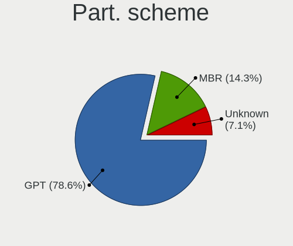
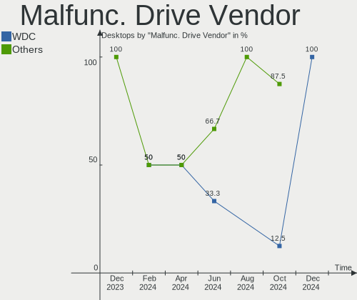

Gentoo - Hardware Trends (Desktops)
-----------------------------------

A project to identify most popular hardware characteristics and track their change
over time based on data collected by Linux users at https://Linux-Hardware.org.

Anyone can contribute to this report by the [hw-probe](https://github.com/linuxhw/hw-probe) tool:

    sudo -E hw-probe -all -upload

This report is for one last month. Overall report since the beginning of time: [TestCoverage](https://github.com/linuxhw/TestCoverage)

Period: Jan, 2023.

Contents
--------

* [ System ](#system)
  - [ OS                       ](#os)
  - [ OS Family                ](#os-family)
  - [ Kernel                   ](#kernel)
  - [ Kernel Family            ](#kernel-family)
  - [ Kernel Major Ver.        ](#kernel-major-ver)
  - [ Arch                     ](#arch)
  - [ DE                       ](#de)
  - [ Display Server           ](#display-server)
  - [ Display Manager          ](#display-manager)
  - [ OS Lang                  ](#os-lang)
  - [ Boot Mode                ](#boot-mode)
  - [ Filesystem               ](#filesystem)
  - [ Part. scheme             ](#part-scheme)
  - [ Dual Boot with Linux/BSD ](#dual-boot-with-linuxbsd)
  - [ Dual Boot (Win)          ](#dual-boot-win)

* [ Board ](#board)
  - [ Vendor                   ](#vendor)
  - [ Model                    ](#model)
  - [ Model Family             ](#model-family)
  - [ MFG Year                 ](#mfg-year)
  - [ Form Factor              ](#form-factor)
  - [ Secure Boot              ](#secure-boot)
  - [ Coreboot                 ](#coreboot)
  - [ RAM Size                 ](#ram-size)
  - [ RAM Used                 ](#ram-used)
  - [ Total Drives             ](#total-drives)
  - [ Has CD-ROM               ](#has-cd-rom)
  - [ Has Ethernet             ](#has-ethernet)
  - [ Has WiFi                 ](#has-wifi)
  - [ Has Bluetooth            ](#has-bluetooth)

* [ Location ](#location)
  - [ Country                  ](#country)
  - [ City                     ](#city)

* [ Drives ](#drives)
  - [ Drive Vendor             ](#drive-vendor)
  - [ Drive Model              ](#drive-model)
  - [ HDD Vendor               ](#hdd-vendor)
  - [ SSD Vendor               ](#ssd-vendor)
  - [ Drive Kind               ](#drive-kind)
  - [ Drive Connector          ](#drive-connector)
  - [ Drive Size               ](#drive-size)
  - [ Space Total              ](#space-total)
  - [ Space Used               ](#space-used)
  - [ Malfunc. Drives          ](#malfunc-drives)
  - [ Malfunc. Drive Vendor    ](#malfunc-drive-vendor)
  - [ Malfunc. HDD Vendor      ](#malfunc-hdd-vendor)
  - [ Malfunc. Drive Kind      ](#malfunc-drive-kind)
  - [ Failed Drives            ](#failed-drives)
  - [ Failed Drive Vendor      ](#failed-drive-vendor)
  - [ Drive Status             ](#drive-status)

* [ Storage controller ](#storage-controller)
  - [ Storage Vendor           ](#storage-vendor)
  - [ Storage Model            ](#storage-model)
  - [ Storage Kind             ](#storage-kind)

* [ Processor ](#processor)
  - [ CPU Vendor               ](#cpu-vendor)
  - [ CPU Model                ](#cpu-model)
  - [ CPU Model Family         ](#cpu-model-family)
  - [ CPU Cores                ](#cpu-cores)
  - [ CPU Sockets              ](#cpu-sockets)
  - [ CPU Threads              ](#cpu-threads)
  - [ CPU Op-Modes             ](#cpu-op-modes)
  - [ CPU Microcode            ](#cpu-microcode)
  - [ CPU Microarch            ](#cpu-microarch)

* [ Graphics ](#graphics)
  - [ GPU Vendor               ](#gpu-vendor)
  - [ GPU Model                ](#gpu-model)
  - [ GPU Combo                ](#gpu-combo)
  - [ GPU Driver               ](#gpu-driver)
  - [ GPU Memory               ](#gpu-memory)

* [ Monitor ](#monitor)
  - [ Monitor Vendor           ](#monitor-vendor)
  - [ Monitor Model            ](#monitor-model)
  - [ Monitor Resolution       ](#monitor-resolution)
  - [ Monitor Diagonal         ](#monitor-diagonal)
  - [ Monitor Width            ](#monitor-width)
  - [ Aspect Ratio             ](#aspect-ratio)
  - [ Monitor Area             ](#monitor-area)
  - [ Pixel Density            ](#pixel-density)
  - [ Multiple Monitors        ](#multiple-monitors)

* [ Network ](#network)
  - [ Net Controller Vendor    ](#net-controller-vendor)
  - [ Net Controller Model     ](#net-controller-model)
  - [ Wireless Vendor          ](#wireless-vendor)
  - [ Wireless Model           ](#wireless-model)
  - [ Ethernet Vendor          ](#ethernet-vendor)
  - [ Ethernet Model           ](#ethernet-model)
  - [ Net Controller Kind      ](#net-controller-kind)
  - [ Used Controller          ](#used-controller)
  - [ NICs                     ](#nics)
  - [ IPv6                     ](#ipv6)

* [ Bluetooth ](#bluetooth)
  - [ Bluetooth Vendor         ](#bluetooth-vendor)
  - [ Bluetooth Model          ](#bluetooth-model)

* [ Sound ](#sound)
  - [ Sound Vendor             ](#sound-vendor)
  - [ Sound Model              ](#sound-model)

* [ Memory ](#memory)
  - [ Memory Vendor            ](#memory-vendor)
  - [ Memory Model             ](#memory-model)
  - [ Memory Kind              ](#memory-kind)
  - [ Memory Form Factor       ](#memory-form-factor)
  - [ Memory Size              ](#memory-size)
  - [ Memory Speed             ](#memory-speed)

* [ Printers & scanners ](#printers--scanners)
  - [ Printer Vendor           ](#printer-vendor)
  - [ Printer Model            ](#printer-model)
  - [ Scanner Vendor           ](#scanner-vendor)
  - [ Scanner Model            ](#scanner-model)

* [ Camera ](#camera)
  - [ Camera Vendor            ](#camera-vendor)
  - [ Camera Model             ](#camera-model)

* [ Security ](#security)
  - [ Fingerprint Vendor       ](#fingerprint-vendor)
  - [ Fingerprint Model        ](#fingerprint-model)
  - [ Chipcard Vendor          ](#chipcard-vendor)
  - [ Chipcard Model           ](#chipcard-model)

* [ Unsupported ](#unsupported)
  - [ Unsupported Devices      ](#unsupported-devices)
  - [ Unsupported Device Types ](#unsupported-device-types)

System
------

OS
--

Installed operating systems

| Name       | Desktops | Percent |
|------------|----------|---------|
| Gentoo 2.9 | 19       | 100%    |

OS Family
---------

OS without a version

| Name   | Desktops | Percent |
|--------|----------|---------|
| Gentoo | 19       | 100%    |

Kernel
------

Version of the Linux kernel

| Version                | Desktops | Percent |
|------------------------|----------|---------|
| 5.15.80-gentoo         | 6        | 31.58%  |
| 6.1.7-gentoo           | 3        | 15.79%  |
| 6.1.8-gentoo           | 1        | 5.26%   |
| 6.1.6-gentoo-dist      | 1        | 5.26%   |
| 6.1.6-gentoo           | 1        | 5.26%   |
| 6.1.4-gentoo           | 1        | 5.26%   |
| 6.1.1-gentoo           | 1        | 5.26%   |
| 5.15.88-gentoo         | 1        | 5.26%   |
| 5.15.85-gentoo-dist    | 1        | 5.26%   |
| 5.15.80-gentoo-x86_64  | 1        | 5.26%   |
| 5.15.41-gentoo-amongus | 1        | 5.26%   |
| 5.15.0-57-lowlatency   | 1        | 5.26%   |

Kernel Family
-------------

Linux kernel without a distro release

| Version | Desktops | Percent |
|---------|----------|---------|
| 5.15.80 | 7        | 36.84%  |
| 6.1.7   | 3        | 15.79%  |
| 6.1.6   | 2        | 10.53%  |
| 6.1.8   | 1        | 5.26%   |
| 6.1.4   | 1        | 5.26%   |
| 6.1.1   | 1        | 5.26%   |
| 5.15.88 | 1        | 5.26%   |
| 5.15.85 | 1        | 5.26%   |
| 5.15.41 | 1        | 5.26%   |
| 5.15.0  | 1        | 5.26%   |

Kernel Major Ver.
-----------------

Linux kernel major version

| Version | Desktops | Percent |
|---------|----------|---------|
| 5.15    | 11       | 57.89%  |
| 6.1     | 8        | 42.11%  |

Arch
----

OS architecture (x86_64, i586, etc.)

| Name   | Desktops | Percent |
|--------|----------|---------|
| x86_64 | 19       | 100%    |

DE
--

Desktop Environment

| Name        | Desktops | Percent |
|-------------|----------|---------|
| Unknown     | 6        | 31.58%  |
| KDE5        | 5        | 26.32%  |
| XFCE        | 2        | 10.53%  |
| GNOME       | 2        | 10.53%  |
| X-Cinnamon  | 1        | 5.26%   |
| Sway        | 1        | 5.26%   |
| sussy_bspwm | 1        | 5.26%   |
| MATE        | 1        | 5.26%   |

Display Server
--------------

X11 or Wayland

| Name    | Desktops | Percent |
|---------|----------|---------|
| X11     | 10       | 52.63%  |
| Unknown | 5        | 26.32%  |
| Tty     | 3        | 15.79%  |
| Wayland | 1        | 5.26%   |

Display Manager
---------------

SDDM, LightDM, etc.

| Name    | Desktops | Percent |
|---------|----------|---------|
| SDDM    | 7        | 36.84%  |
| Unknown | 5        | 26.32%  |
| LightDM | 4        | 21.05%  |
| GDM     | 2        | 10.53%  |
| SLiM    | 1        | 5.26%   |

OS Lang
-------

Language

| Lang   | Desktops | Percent |
|--------|----------|---------|
| en_US  | 7        | 36.84%  |
| C.UTF8 | 3        | 15.79%  |
| it_IT  | 2        | 10.53%  |
| cs_CZ  | 2        | 10.53%  |
| ru_RU  | 1        | 5.26%   |
| pl_PL  | 1        | 5.26%   |
| fr_FR  | 1        | 5.26%   |
| de_DE  | 1        | 5.26%   |
| C      | 1        | 5.26%   |

Boot Mode
---------

EFI or BIOS

| Mode | Desktops | Percent |
|------|----------|---------|
| EFI  | 14       | 73.68%  |
| BIOS | 5        | 26.32%  |

Filesystem
----------

Type of filesystem

| Type    | Desktops | Percent |
|---------|----------|---------|
| Ext4    | 9        | 47.37%  |
| Btrfs   | 6        | 31.58%  |
| F2fs    | 2        | 10.53%  |
| Zfs     | 1        | 5.26%   |
| XXXXXXX | 1        | 5.26%   |

Part. scheme
------------

Scheme of partitioning

| Type | Desktops | Percent |
|------|----------|---------|
| GPT  | 18       | 94.74%  |
| MBR  | 1        | 5.26%   |

Dual Boot with Linux/BSD
------------------------

Hosting more than one Linux/BSD

| Dual boot | Desktops | Percent |
|-----------|----------|---------|
| No        | 11       | 57.89%  |
| Yes       | 8        | 42.11%  |

Dual Boot (Win)
---------------

Hosting Linux and Windows

| Dual boot | Desktops | Percent |
|-----------|----------|---------|
| No        | 15       | 78.95%  |
| Yes       | 4        | 21.05%  |

Board
-----

Vendor
------

Motherboard manufacturer

| Name                | Desktops | Percent |
|---------------------|----------|---------|
| ASUSTek Computer    | 10       | 52.63%  |
| Gigabyte Technology | 4        | 21.05%  |
| MSI                 | 1        | 5.26%   |
| Lenovo              | 1        | 5.26%   |
| Hewlett-Packard     | 1        | 5.26%   |
| Dell                | 1        | 5.26%   |
| ASRock              | 1        | 5.26%   |

Model
-----

Motherboard model

| Name                                | Desktops | Percent |
|-------------------------------------|----------|---------|
| MSI MS-7C91                         | 1        | 5.26%   |
| Lenovo ThinkStation P710 30B6S1U500 | 1        | 5.26%   |
| HP Z640 Workstation                 | 1        | 5.26%   |
| Gigabyte Z370P D3                   | 1        | 5.26%   |
| Gigabyte B450M DS3H                 | 1        | 5.26%   |
| Gigabyte B150M-D2V DDR3-CF          | 1        | 5.26%   |
| Gigabyte AB350-Gaming               | 1        | 5.26%   |
| Dell OptiPlex 790                   | 1        | 5.26%   |
| ASUS TUF Gaming Z690-PLUS D4        | 1        | 5.26%   |
| ASUS TUF Gaming B660M-PLUS WIFI     | 1        | 5.26%   |
| ASUS ROG Maximus XIII HERO          | 1        | 5.26%   |
| ASUS ROG CROSSHAIR VII HERO         | 1        | 5.26%   |
| ASUS ProArt B550-CREATOR            | 1        | 5.26%   |
| ASUS PRIME Z390-A                   | 1        | 5.26%   |
| ASUS PRIME H570M-PLUS               | 1        | 5.26%   |
| ASUS PRIME B460M-A                  | 1        | 5.26%   |
| ASUS M3A78-CM                       | 1        | 5.26%   |
| ASUS All Series                     | 1        | 5.26%   |
| ASRock AM1H-ITX                     | 1        | 5.26%   |

Model Family
------------

Motherboard model prefix

| Name                  | Desktops | Percent |
|-----------------------|----------|---------|
| ASUS PRIME            | 3        | 15.79%  |
| ASUS TUF              | 2        | 10.53%  |
| ASUS ROG              | 2        | 10.53%  |
| MSI MS-7C91           | 1        | 5.26%   |
| Lenovo ThinkStation   | 1        | 5.26%   |
| HP Z640               | 1        | 5.26%   |
| Gigabyte Z370P        | 1        | 5.26%   |
| Gigabyte B450M        | 1        | 5.26%   |
| Gigabyte B150M-D2V    | 1        | 5.26%   |
| Gigabyte AB350-Gaming | 1        | 5.26%   |
| Dell OptiPlex         | 1        | 5.26%   |
| ASUS ProArt           | 1        | 5.26%   |
| ASUS M3A78-CM         | 1        | 5.26%   |
| ASUS All              | 1        | 5.26%   |
| ASRock AM1H-ITX       | 1        | 5.26%   |

MFG Year
--------

Motherboard manufacture year

| Year | Desktops | Percent |
|------|----------|---------|
| 2021 | 4        | 21.05%  |
| 2022 | 3        | 15.79%  |
| 2015 | 3        | 15.79%  |
| 2020 | 2        | 10.53%  |
| 2018 | 2        | 10.53%  |
| 2017 | 2        | 10.53%  |
| 2014 | 1        | 5.26%   |
| 2011 | 1        | 5.26%   |
| 2008 | 1        | 5.26%   |

Form Factor
-----------

Physical design of the computer

| Name    | Desktops | Percent |
|---------|----------|---------|
| Desktop | 19       | 100%    |

Secure Boot
-----------

Enabled or disabled

| State    | Desktops | Percent |
|----------|----------|---------|
| Disabled | 19       | 100%    |

Coreboot
--------

Have coreboot on board

| Used | Desktops | Percent |
|------|----------|---------|
| No   | 19       | 100%    |

RAM Size
--------

Total RAM memory

| Size in GB  | Desktops | Percent |
|-------------|----------|---------|
| 16.01-24.0  | 6        | 31.58%  |
| 32.01-64.0  | 5        | 26.32%  |
| 64.01-256.0 | 4        | 21.05%  |
| 4.01-8.0    | 2        | 10.53%  |
| 3.01-4.0    | 1        | 5.26%   |
| 24.01-32.0  | 1        | 5.26%   |

RAM Used
--------

Used RAM memory

| Used GB   | Desktops | Percent |
|-----------|----------|---------|
| 8.01-16.0 | 6        | 31.58%  |
| 3.01-4.0  | 4        | 21.05%  |
| 2.01-3.0  | 4        | 21.05%  |
| 1.01-2.0  | 3        | 15.79%  |
| 4.01-8.0  | 1        | 5.26%   |
| 0.01-0.5  | 1        | 5.26%   |

Total Drives
------------

Number of drives on board

| Drives | Desktops | Percent |
|--------|----------|---------|
| 2      | 6        | 31.58%  |
| 3      | 4        | 21.05%  |
| 1      | 3        | 15.79%  |
| 6      | 2        | 10.53%  |
| 5      | 2        | 10.53%  |
| 4      | 2        | 10.53%  |

Has CD-ROM
----------

Has CD-ROM on board

| Presented | Desktops | Percent |
|-----------|----------|---------|
| No        | 13       | 68.42%  |
| Yes       | 6        | 31.58%  |

Has Ethernet
------------

Has Ethernet on board

| Presented | Desktops | Percent |
|-----------|----------|---------|
| Yes       | 19       | 100%    |

Has WiFi
--------

Has WiFi module

| Presented | Desktops | Percent |
|-----------|----------|---------|
| No        | 14       | 73.68%  |
| Yes       | 5        | 26.32%  |

Has Bluetooth
-------------

Has Bluetooth module

| Presented | Desktops | Percent |
|-----------|----------|---------|
| No        | 15       | 78.95%  |
| Yes       | 4        | 21.05%  |

Location
--------

Country
-------

Geographic location (country)

| Country   | Desktops | Percent |
|-----------|----------|---------|
| Czechia   | 4        | 21.05%  |
| USA       | 3        | 15.79%  |
| Poland    | 2        | 10.53%  |
| Italy     | 2        | 10.53%  |
| Germany   | 2        | 10.53%  |
| Russia    | 1        | 5.26%   |
| Romania   | 1        | 5.26%   |
| Mexico    | 1        | 5.26%   |
| Mauritius | 1        | 5.26%   |
| France    | 1        | 5.26%   |
| Australia | 1        | 5.26%   |

City
----

Geographic location (city)

| City              | Desktops | Percent |
|-------------------|----------|---------|
| Vitkov            | 3        | 15.79%  |
| Warsaw            | 2        | 10.53%  |
| Weisswasser       | 1        | 5.26%   |
| Sydney            | 1        | 5.26%   |
| Rimini            | 1        | 5.26%   |
| Ribnitz-Damgarten | 1        | 5.26%   |
| Port Louis        | 1        | 5.26%   |
| Monterrey         | 1        | 5.26%   |
| Monterey          | 1        | 5.26%   |
| Maule             | 1        | 5.26%   |
| Enfield           | 1        | 5.26%   |
| Corpus Christi    | 1        | 5.26%   |
| Como              | 1        | 5.26%   |
| Český Těšín  | 1        | 5.26%   |
| Bucharest         | 1        | 5.26%   |
| Astrakhan         | 1        | 5.26%   |

Drives
------

Drive Vendor
------------

Hard drive vendors

| Vendor                | Desktops | Drives | Percent |
|-----------------------|----------|--------|---------|
| Seagate               | 9        | 16     | 22.5%   |
| WDC                   | 8        | 10     | 20%     |
| Samsung Electronics   | 7        | 9      | 17.5%   |
| Sandisk               | 2        | 3      | 5%      |
| Hitachi               | 2        | 4      | 5%      |
| GOODRAM               | 2        | 2      | 5%      |
| XPG                   | 1        | 3      | 2.5%    |
| Toshiba               | 1        | 1      | 2.5%    |
| SK hynix              | 1        | 1      | 2.5%    |
| Silicon Motion        | 1        | 1      | 2.5%    |
| Realtek Semiconductor | 1        | 2      | 2.5%    |
| Kingchuxing           | 1        | 1      | 2.5%    |
| Intel                 | 1        | 1      | 2.5%    |
| Crucial               | 1        | 1      | 2.5%    |
| Apacer                | 1        | 1      | 2.5%    |
| A-DATA Technology     | 1        | 1      | 2.5%    |

Drive Model
-----------

Hard drive models

| Model                                                 | Desktops | Percent |
|-------------------------------------------------------|----------|---------|
| Samsung NVMe SSD Controller SM981/PM981/PM983 500GB   | 3        | 6.52%   |
| Samsung NVMe SSD Controller SM961/PM961/SM963 256GB   | 2        | 4.35%   |
| GOODRAM SSDPR-CL100-480-G2 480GB                      | 2        | 4.35%   |
| XPG GAMMIX S70 2TB                                    | 1        | 2.17%   |
| WDC WDS100T2B0B-00YS70 1TB SSD                        | 1        | 2.17%   |
| WDC WD80EMAZ-00WJTA0 8TB                              | 1        | 2.17%   |
| WDC WD60EFRX-68MYMN1 6TB                              | 1        | 2.17%   |
| WDC WD5000AAKX-753CA1 500GB                           | 1        | 2.17%   |
| WDC WD40EZRZ-00WN9B0 4TB                              | 1        | 2.17%   |
| WDC WD40EZRZ-00GXCB0 4TB                              | 1        | 2.17%   |
| WDC WD20EZRX-00DC0B0 2TB                              | 1        | 2.17%   |
| WDC WD140EDFZ-11A0VA0 14TB                            | 1        | 2.17%   |
| WDC WD10EZEX-08WN4A0 1TB                              | 1        | 2.17%   |
| WDC WD10EADS-00L5B1 1TB                               | 1        | 2.17%   |
| Toshiba HDWE150 5TB                                   | 1        | 2.17%   |
| SK hynix BC511 512GB                                  | 1        | 2.17%   |
| Silicon Motion SM2263EN/SM2263XT SSD Controller 512GB | 1        | 2.17%   |
| Seagate ST8000NE001-2M7101 8TB                        | 1        | 2.17%   |
| Seagate ST8000AS0002-1NA17Z 8TB                       | 1        | 2.17%   |
| Seagate ST4000DM004-2CV104 4TB                        | 1        | 2.17%   |
| Seagate ST2000DM008-2FR102 2TB                        | 1        | 2.17%   |
| Seagate ST18000NM000J-2TV103 18TB                     | 1        | 2.17%   |
| Seagate ST16000NM001G-2KK103 16TB                     | 1        | 2.17%   |
| Seagate ST16000NE000-2RW103 16TB                      | 1        | 2.17%   |
| Seagate ST12000NM0008-2H3101 12TB                     | 1        | 2.17%   |
| Seagate ST1000LM049-2GH172 1TB                        | 1        | 2.17%   |
| Seagate ST1000DM010-2EP102 1TB                        | 1        | 2.17%   |
| Seagate ST1000DM003-1ER162 1TB                        | 1        | 2.17%   |
| Seagate Backup+ Hub BK 8TB                            | 1        | 2.17%   |
| Sandisk WD Blue SN550 NVMe SSD 1TB                    | 1        | 2.17%   |
| SanDisk SSD PLUS 240GB                                | 1        | 2.17%   |
| Samsung SSD 980 500GB                                 | 1        | 2.17%   |
| Samsung SSD 860 EVO 500GB                             | 1        | 2.17%   |
| Samsung NVMe SSD Controller PM9A1/PM9A3/980PRO 512GB  | 1        | 2.17%   |
| Realtek ADATA SX6000PNP 256GB                         | 1        | 2.17%   |
| Kingchuxing SSD 128GB                                 | 1        | 2.17%   |
| Intel SSD 660P Series 512GB                           | 1        | 2.17%   |
| Hitachi HUS724030ALE641 3TB                           | 1        | 2.17%   |
| Hitachi HDS721050CLA360 500GB                         | 1        | 2.17%   |
| Crucial CT500BX500SSD1 500GB                          | 1        | 2.17%   |

HDD Vendor
----------

Hard disk drive vendors

| Vendor  | Desktops | Drives | Percent |
|---------|----------|--------|---------|
| Seagate | 9        | 16     | 47.37%  |
| WDC     | 7        | 9      | 36.84%  |
| Hitachi | 2        | 4      | 10.53%  |
| Toshiba | 1        | 1      | 5.26%   |

SSD Vendor
----------

Solid state drive vendors

| Vendor              | Desktops | Drives | Percent |
|---------------------|----------|--------|---------|
| GOODRAM             | 2        | 2      | 22.22%  |
| WDC                 | 1        | 1      | 11.11%  |
| SanDisk             | 1        | 2      | 11.11%  |
| Samsung Electronics | 1        | 1      | 11.11%  |
| Kingchuxing         | 1        | 1      | 11.11%  |
| Crucial             | 1        | 1      | 11.11%  |
| Apacer              | 1        | 1      | 11.11%  |
| A-DATA Technology   | 1        | 1      | 11.11%  |

Drive Kind
----------

HDD or SSD

| Kind | Desktops | Drives | Percent |
|------|----------|--------|---------|
| HDD  | 15       | 30     | 41.67%  |
| NVMe | 12       | 17     | 33.33%  |
| SSD  | 9        | 10     | 25%     |

Drive Connector
---------------

SATA, SAS, NVMe, etc.

| Type | Desktops | Drives | Percent |
|------|----------|--------|---------|
| SATA | 18       | 39     | 58.06%  |
| NVMe | 12       | 17     | 38.71%  |
| SAS  | 1        | 1      | 3.23%   |

Drive Size
----------

Size of hard drive

| Size in TB | Desktops | Drives | Percent |
|------------|----------|--------|---------|
| 0.01-0.5   | 9        | 10     | 28.13%  |
| 0.51-1.0   | 7        | 8      | 21.88%  |
| 10.01-20.0 | 5        | 7      | 15.63%  |
| 4.01-10.0  | 5        | 6      | 15.63%  |
| 3.01-4.0   | 3        | 3      | 9.38%   |
| 1.01-2.0   | 2        | 3      | 6.25%   |
| 2.01-3.0   | 1        | 3      | 3.13%   |

Space Total
-----------

Amount of disk space available on the file system

| Size in GB     | Desktops | Percent |
|----------------|----------|---------|
| More than 3000 | 9        | 47.37%  |
| 251-500        | 4        | 21.05%  |
| 101-250        | 2        | 10.53%  |
| 501-1000       | 2        | 10.53%  |
| 1-20           | 1        | 5.26%   |
| Unknown        | 1        | 5.26%   |

Space Used
----------

Amount of used disk space

| Used GB        | Desktops | Percent |
|----------------|----------|---------|
| More than 3000 | 7        | 36.84%  |
| 1-20           | 3        | 15.79%  |
| 51-100         | 3        | 15.79%  |
| 21-50          | 2        | 10.53%  |
| 2001-3000      | 2        | 10.53%  |
| 101-250        | 1        | 5.26%   |
| Unknown        | 1        | 5.26%   |

Malfunc. Drives
---------------

Drive models with a malfunction

| Model                                                            | Desktops | Drives | Percent |
|------------------------------------------------------------------|----------|--------|---------|
| WDC WD5000AAKX-753CA1 500GB                                      | 1        | 1      | 33.33%  |
| Samsung Electronics NVMe SSD Controller PM9A1/PM9A3/980PRO 512GB | 1        | 2      | 33.33%  |
| Realtek Semiconductor ADATA SX6000PNP 256GB                      | 1        | 2      | 33.33%  |

Malfunc. Drive Vendor
---------------------

Vendors of faulty drives

| Vendor                | Desktops | Drives | Percent |
|-----------------------|----------|--------|---------|
| WDC                   | 1        | 1      | 33.33%  |
| Samsung Electronics   | 1        | 2      | 33.33%  |
| Realtek Semiconductor | 1        | 2      | 33.33%  |

Malfunc. HDD Vendor
-------------------

Vendors of faulty HDD drives

| Vendor | Desktops | Drives | Percent |
|--------|----------|--------|---------|
| WDC    | 1        | 1      | 100%    |

Malfunc. Drive Kind
-------------------

Kinds of faulty drives

| Kind | Desktops | Drives | Percent |
|------|----------|--------|---------|
| NVMe | 2        | 4      | 66.67%  |
| HDD  | 1        | 1      | 33.33%  |

Failed Drives
-------------

Failed drive models

Zero info for selected period =(

Failed Drive Vendor
-------------------

Failed drive vendors

Zero info for selected period =(

Drive Status
------------

Number of failed and malfunc. drives

| Status   | Desktops | Drives | Percent |
|----------|----------|--------|---------|
| Works    | 19       | 51     | 82.61%  |
| Malfunc  | 3        | 5      | 13.04%  |
| Detected | 1        | 1      | 4.35%   |

Storage controller
------------------

Storage Vendor
--------------

Storage controller vendors

| Vendor                | Desktops | Percent |
|-----------------------|----------|---------|
| Intel                 | 12       | 38.71%  |
| Samsung Electronics   | 7        | 22.58%  |
| AMD                   | 7        | 22.58%  |
| SK hynix              | 1        | 3.23%   |
| Silicon Motion        | 1        | 3.23%   |
| SanDisk               | 1        | 3.23%   |
| Realtek Semiconductor | 1        | 3.23%   |
| INNOGRIT              | 1        | 3.23%   |

Storage Model
-------------

Storage controller models

| Model                                                                         | Desktops | Percent |
|-------------------------------------------------------------------------------|----------|---------|
| AMD FCH SATA Controller [AHCI mode]                                           | 4        | 10%     |
| Samsung NVMe SSD Controller SM981/PM981/PM983                                 | 3        | 7.5%    |
| Intel C610/X99 series chipset 6-Port SATA Controller [AHCI mode]              | 3        | 7.5%    |
| Samsung NVMe SSD Controller SM961/PM961/SM963                                 | 2        | 5%      |
| Intel Volume Management Device NVMe RAID Controller                           | 2        | 5%      |
| Intel Alder Lake-S PCH SATA Controller [AHCI Mode]                            | 2        | 5%      |
| Intel 500 Series Chipset Family SATA AHCI Controller                          | 2        | 5%      |
| AMD 500 Series Chipset SATA Controller                                        | 2        | 5%      |
| AMD 400 Series Chipset SATA Controller                                        | 2        | 5%      |
| SK hynix BC511                                                                | 1        | 2.5%    |
| Silicon Motion SM2263EN/SM2263XT SSD Controller                               | 1        | 2.5%    |
| SanDisk WD Blue SN550 NVMe SSD                                                | 1        | 2.5%    |
| Samsung NVMe SSD Controller PM9A1/PM9A3/980PRO                                | 1        | 2.5%    |
| Samsung NVMe SSD Controller 980                                               | 1        | 2.5%    |
| Realtek Realtek Non-Volatile memory controller                                | 1        | 2.5%    |
| Intel SSD 660P Series                                                         | 1        | 2.5%    |
| Intel Q170/Q150/B150/H170/H110/Z170/CM236 Chipset SATA Controller [AHCI Mode] | 1        | 2.5%    |
| Intel Cannon Lake PCH SATA AHCI Controller                                    | 1        | 2.5%    |
| Intel C610/X99 series chipset sSATA Controller [AHCI mode]                    | 1        | 2.5%    |
| Intel C610/X99 series chipset IDE-r Controller                                | 1        | 2.5%    |
| Intel 6 Series/C200 Series Chipset Family 6 port Desktop SATA AHCI Controller | 1        | 2.5%    |
| Intel 400 Series Chipset Family SATA AHCI Controller                          | 1        | 2.5%    |
| Intel 200 Series PCH SATA controller [AHCI mode]                              | 1        | 2.5%    |
| INNOGRIT Non-Volatile memory controller                                       | 1        | 2.5%    |
| AMD SB7x0/SB8x0/SB9x0 SATA Controller [IDE mode]                              | 1        | 2.5%    |
| AMD SB7x0/SB8x0/SB9x0 IDE Controller                                          | 1        | 2.5%    |
| AMD 300 Series Chipset SATA Controller                                        | 1        | 2.5%    |

Storage Kind
------------

Kind of storage controller (IDE, SATA, NVMe, SAS, ...)

| Kind | Desktops | Percent |
|------|----------|---------|
| SATA | 19       | 54.29%  |
| NVMe | 12       | 34.29%  |
| RAID | 2        | 5.71%   |
| IDE  | 2        | 5.71%   |

Processor
---------

CPU Vendor
----------

Processor vendors

| Vendor | Desktops | Percent |
|--------|----------|---------|
| Intel  | 12       | 63.16%  |
| AMD    | 7        | 36.84%  |

CPU Model
---------

Processor models

| Model                                   | Desktops | Percent |
|-----------------------------------------|----------|---------|
| AMD Ryzen 5 5600X 6-Core Processor      | 2        | 10.53%  |
| Intel Xeon CPU E5-2683 v4 @ 2.10GHz     | 1        | 5.26%   |
| Intel Xeon CPU E5-2620 v4 @ 2.10GHz     | 1        | 5.26%   |
| Intel Core i7-8086K CPU @ 4.00GHz       | 1        | 5.26%   |
| Intel Core i7-5930K CPU @ 3.50GHz       | 1        | 5.26%   |
| Intel Core i5-8600K CPU @ 3.60GHz       | 1        | 5.26%   |
| Intel Core i5-2500 CPU @ 3.30GHz        | 1        | 5.26%   |
| Intel Core i3-6100 CPU @ 3.70GHz        | 1        | 5.26%   |
| Intel Core i3-10100 CPU @ 3.60GHz       | 1        | 5.26%   |
| Intel 12th Gen Core i9-12900K           | 1        | 5.26%   |
| Intel 12th Gen Core i5-12400F           | 1        | 5.26%   |
| Intel 11th Gen Core i9-11900K @ 3.50GHz | 1        | 5.26%   |
| Intel 11th Gen Core i5-11600K @ 3.90GHz | 1        | 5.26%   |
| AMD Sempron 3850 APU with Radeon R3     | 1        | 5.26%   |
| AMD Ryzen 9 5950X 16-Core Processor     | 1        | 5.26%   |
| AMD Ryzen 7 2700X Eight-Core Processor  | 1        | 5.26%   |
| AMD Ryzen 5 2600 Six-Core Processor     | 1        | 5.26%   |
| AMD Phenom II X4 955 Processor          | 1        | 5.26%   |

CPU Model Family
----------------

Processor model prefix

| Model            | Desktops | Percent |
|------------------|----------|---------|
| Other            | 4        | 21.05%  |
| AMD Ryzen 5      | 3        | 15.79%  |
| Intel Xeon       | 2        | 10.53%  |
| Intel Core i7    | 2        | 10.53%  |
| Intel Core i5    | 2        | 10.53%  |
| Intel Core i3    | 2        | 10.53%  |
| AMD Sempron      | 1        | 5.26%   |
| AMD Ryzen 9      | 1        | 5.26%   |
| AMD Ryzen 7      | 1        | 5.26%   |
| AMD Phenom II X4 | 1        | 5.26%   |

CPU Cores
---------

Number of processor cores

| Number | Desktops | Percent |
|--------|----------|---------|
| 6      | 8        | 42.11%  |
| 4      | 4        | 21.05%  |
| 16     | 3        | 15.79%  |
| 8      | 3        | 15.79%  |
| 2      | 1        | 5.26%   |

CPU Sockets
-----------

Number of sockets

| Number | Desktops | Percent |
|--------|----------|---------|
| 1      | 19       | 100%    |

CPU Threads
-----------

Threads per core (Hyper-Threading)

| Number | Desktops | Percent |
|--------|----------|---------|
| 2      | 15       | 78.95%  |
| 1      | 4        | 21.05%  |

CPU Op-Modes
------------

CPU Operation Modes (32-bit, 64-bit)

| Op mode        | Desktops | Percent |
|----------------|----------|---------|
| 32-bit, 64-bit | 19       | 100%    |

CPU Microcode
-------------

Microcode number

| Number     | Desktops | Percent |
|------------|----------|---------|
| Unknown    | 3        | 15.79%  |
| 0x906ea    | 2        | 10.53%  |
| 0x0800820d | 2        | 10.53%  |
| 0xa0671    | 1        | 5.26%   |
| 0xa0653    | 1        | 5.26%   |
| 0x90675    | 1        | 5.26%   |
| 0x506e3    | 1        | 5.26%   |
| 0x406f1    | 1        | 5.26%   |
| 0x306f2    | 1        | 5.26%   |
| 0x206a7    | 1        | 5.26%   |
| 0x0a20120a | 1        | 5.26%   |
| 0x0a201016 | 1        | 5.26%   |
| 0x0a201009 | 1        | 5.26%   |
| 0x0700010f | 1        | 5.26%   |
| 0x010000db | 1        | 5.26%   |

CPU Microarch
-------------

Microarchitecture

| Name             | Desktops | Percent |
|------------------|----------|---------|
| Zen 3            | 3        | 15.79%  |
| Zen+             | 2        | 10.53%  |
| KabyLake         | 2        | 10.53%  |
| Broadwell        | 2        | 10.53%  |
| Unknown          | 2        | 10.53%  |
| Skylake          | 1        | 5.26%   |
| SandyBridge      | 1        | 5.26%   |
| K10              | 1        | 5.26%   |
| Jaguar           | 1        | 5.26%   |
| Icelake          | 1        | 5.26%   |
| Haswell          | 1        | 5.26%   |
| CometLake        | 1        | 5.26%   |
| Alderlake Hybrid | 1        | 5.26%   |

Graphics
--------

GPU Vendor
----------

Vendors of graphics cards

| Vendor | Desktops | Percent |
|--------|----------|---------|
| Nvidia | 9        | 45%     |
| AMD    | 6        | 30%     |
| Intel  | 5        | 25%     |

GPU Model
---------

Graphics card models

| Model                                                                     | Desktops | Percent |
|---------------------------------------------------------------------------|----------|---------|
| Nvidia TU117 [GeForce GTX 1650]                                           | 2        | 10%     |
| Nvidia TU106 [GeForce RTX 2060 Rev. A]                                    | 1        | 5%      |
| Nvidia TU104 [GeForce RTX 2080 Rev. A]                                    | 1        | 5%      |
| Nvidia TU104 [GeForce RTX 2070 SUPER]                                     | 1        | 5%      |
| Nvidia GP107 [GeForce GTX 1050 Ti]                                        | 1        | 5%      |
| Nvidia GP106 [GeForce GTX 1060 3GB]                                       | 1        | 5%      |
| Nvidia GM200GL [Quadro M6000]                                             | 1        | 5%      |
| Nvidia GF119 [GeForce GT 610]                                             | 1        | 5%      |
| Intel RocketLake-S GT1 [UHD Graphics 750]                                 | 1        | 5%      |
| Intel HD Graphics 530                                                     | 1        | 5%      |
| Intel CometLake-S GT2 [UHD Graphics 630]                                  | 1        | 5%      |
| Intel AlderLake-S GT1                                                     | 1        | 5%      |
| Intel 2nd Generation Core Processor Family Integrated Graphics Controller | 1        | 5%      |
| AMD RS780C [Radeon 3100]                                                  | 1        | 5%      |
| AMD Oland GL [FirePro W2100]                                              | 1        | 5%      |
| AMD Navi 10 [Radeon RX 5600 OEM/5600 XT / 5700/5700 XT]                   | 1        | 5%      |
| AMD Kabini [Radeon HD 8280 / R3 Series]                                   | 1        | 5%      |
| AMD Cedar [Radeon HD 5000/6000/7350/8350 Series]                          | 1        | 5%      |
| AMD Baffin [Radeon RX 550 640SP / RX 560/560X]                            | 1        | 5%      |

GPU Combo
---------

Combinations of graphics cards

| Name           | Desktops | Percent |
|----------------|----------|---------|
| 1 x Nvidia     | 8        | 42.11%  |
| 1 x AMD        | 6        | 31.58%  |
| 1 x Intel      | 4        | 21.05%  |
| Intel + Nvidia | 1        | 5.26%   |

GPU Driver
----------

Free vs proprietary

| Driver      | Desktops | Percent |
|-------------|----------|---------|
| Free        | 11       | 57.89%  |
| Proprietary | 7        | 36.84%  |
| Unknown     | 1        | 5.26%   |

GPU Memory
----------

Total video memory

| Size in GB | Desktops | Percent |
|------------|----------|---------|
| Unknown    | 9        | 47.37%  |
| 7.01-8.0   | 2        | 10.53%  |
| 3.01-4.0   | 2        | 10.53%  |
| 1.01-2.0   | 2        | 10.53%  |
| 0.51-1.0   | 2        | 10.53%  |
| 2.01-3.0   | 1        | 5.26%   |
| 0.01-0.5   | 1        | 5.26%   |

Monitor
-------

Monitor Vendor
--------------

Monitor vendors

| Vendor              | Desktops | Percent |
|---------------------|----------|---------|
| Samsung Electronics | 4        | 18.18%  |
| Dell                | 3        | 13.64%  |
| Philips             | 2        | 9.09%   |
| BenQ                | 2        | 9.09%   |
| ZIS                 | 1        | 4.55%   |
| Unknown             | 1        | 4.55%   |
| Lenovo              | 1        | 4.55%   |
| IBM                 | 1        | 4.55%   |
| Hewlett-Packard     | 1        | 4.55%   |
| Goldstar            | 1        | 4.55%   |
| Gigabyte Technology | 1        | 4.55%   |
| FUS                 | 1        | 4.55%   |
| Fujitsu Siemens     | 1        | 4.55%   |
| ASUSTek Computer    | 1        | 4.55%   |
| Acer                | 1        | 4.55%   |

Monitor Model
-------------

Monitor models

| Model                                                                | Desktops | Percent |
|----------------------------------------------------------------------|----------|---------|
| ZIS ZWS 28" 240HZ ZIS4ED5 1920x1080 619x348mm 28.0-inch              | 1        | 4.17%   |
| Unknown LCD Monitor FFFF 2288x1287 2550x2550mm 142.0-inch            | 1        | 4.17%   |
| Samsung Electronics T24C550 SAM0AA0 1920x1080 521x293mm 23.5-inch    | 1        | 4.17%   |
| Samsung Electronics SyncMaster SAM059A 1920x1080 480x270mm 21.7-inch | 1        | 4.17%   |
| Samsung Electronics S22B300 SAM08C8 1920x1080 477x268mm 21.5-inch    | 1        | 4.17%   |
| Samsung Electronics LCD Monitor SAM07D0 1360x768 700x390mm 31.5-inch | 1        | 4.17%   |
| Samsung Electronics C24F390 SAM0D2C 1920x1080 521x293mm 23.5-inch    | 1        | 4.17%   |
| Philips PHL 221V8 PHLC211 1920x1080 477x268mm 21.5-inch              | 1        | 4.17%   |
| Philips LCD Monitor PHL 499P9 6400x1440                              | 1        | 4.17%   |
| Lenovo LEN D24f-10 LEN65EB 1920x1080 520x290mm 23.4-inch             | 1        | 4.17%   |
| IBM L170 IBM1A4E 1280x1024 338x270mm 17.0-inch                       | 1        | 4.17%   |
| Hewlett-Packard 22es HWP331B 1920x1080 476x268mm 21.5-inch           | 1        | 4.17%   |
| Goldstar ULTRAWIDE GSM59F2 2560x1080 798x334mm 34.1-inch             | 1        | 4.17%   |
| Gigabyte Technology M32U GBT3204 3840x2160 697x392mm 31.5-inch       | 1        | 4.17%   |
| FUS LCD Monitor P27T-6 IPS                                           | 1        | 4.17%   |
| Fujitsu Siemens P27T-6 IPS FUS07EE 2560x1440 597x336mm 27.0-inch     | 1        | 4.17%   |
| Dell U2717D DEL40EB 2560x1440 597x336mm 27.0-inch                    | 1        | 4.17%   |
| Dell E2222HS DELF133 1920x1080 478x260mm 21.4-inch                   | 1        | 4.17%   |
| Dell E1916H DELF065 1366x768 410x230mm 18.5-inch                     | 1        | 4.17%   |
| BenQ PD2705Q BNQ8035 2560x1440 600x340mm 27.2-inch                   | 1        | 4.17%   |
| BenQ GW2455 BNQ78D8 1920x1080 521x293mm 23.5-inch                    | 1        | 4.17%   |
| ASUSTek Computer VG278 AUS27AF 1920x1080 598x336mm 27.0-inch         | 1        | 4.17%   |
| Acer VG240Y ACR06F0 1920x1080 527x296mm 23.8-inch                    | 1        | 4.17%   |
| Acer VG240Y ACR06BF 1920x1080 527x296mm 23.8-inch                    | 1        | 4.17%   |

Monitor Resolution
------------------

Monitor screen resolution

| Resolution       | Desktops | Percent |
|------------------|----------|---------|
| 1920x1080 (FHD)  | 11       | 52.38%  |
| 2560x1440 (QHD)  | 2        | 9.52%   |
| 6400x1440        | 1        | 4.76%   |
| 3840x2160 (4K)   | 1        | 4.76%   |
| 2560x1080        | 1        | 4.76%   |
| 2288x1287        | 1        | 4.76%   |
| 1366x768 (WXGA)  | 1        | 4.76%   |
| 1360x768         | 1        | 4.76%   |
| 1280x1024 (SXGA) | 1        | 4.76%   |
| Unknown          | 1        | 4.76%   |

Monitor Diagonal
----------------

Diagonal size in inches

| Inches  | Desktops | Percent |
|---------|----------|---------|
| 23      | 5        | 23.81%  |
| 21      | 4        | 19.05%  |
| 27      | 3        | 14.29%  |
| 31      | 2        | 9.52%   |
| 142     | 1        | 4.76%   |
| 34      | 1        | 4.76%   |
| 28      | 1        | 4.76%   |
| 24      | 1        | 4.76%   |
| 18      | 1        | 4.76%   |
| 17      | 1        | 4.76%   |
| Unknown | 1        | 4.76%   |

Monitor Width
-------------

Physical width

| Width in mm    | Desktops | Percent |
|----------------|----------|---------|
| 501-600        | 7        | 35%     |
| 401-500        | 6        | 30%     |
| 601-700        | 3        | 15%     |
| More than 2000 | 1        | 5%      |
| 701-800        | 1        | 5%      |
| 301-350        | 1        | 5%      |
| Unknown        | 1        | 5%      |

Aspect Ratio
------------

Proportional relationship between the width and the height

| Ratio   | Desktops | Percent |
|---------|----------|---------|
| 16/9    | 15       | 78.95%  |
| 5/4     | 1        | 5.26%   |
| 21/9    | 1        | 5.26%   |
| 1.00    | 1        | 5.26%   |
| Unknown | 1        | 5.26%   |

Monitor Area
------------

Area in inch²

| Area in inch² | Desktops | Percent |
|----------------|----------|---------|
| 201-250        | 8        | 40%     |
| 301-350        | 4        | 20%     |
| 351-500        | 3        | 15%     |
| 141-150        | 2        | 10%     |
| More than 1000 | 1        | 5%      |
| 151-200        | 1        | 5%      |
| Unknown        | 1        | 5%      |

Pixel Density
-------------

Pixels per inch

| Density | Desktops | Percent |
|---------|----------|---------|
| 51-100  | 9        | 47.37%  |
| 101-120 | 6        | 31.58%  |
| 1-50    | 2        | 10.53%  |
| 121-160 | 1        | 5.26%   |
| Unknown | 1        | 5.26%   |

Multiple Monitors
-----------------

Total monitors connected

| Total | Desktops | Percent |
|-------|----------|---------|
| 1     | 12       | 63.16%  |
| 2     | 5        | 26.32%  |
| 3     | 1        | 5.26%   |
| 0     | 1        | 5.26%   |

Network
-------

Net Controller Vendor
---------------------

Controller vendors

| Vendor                | Desktops | Percent |
|-----------------------|----------|---------|
| Intel                 | 13       | 44.83%  |
| Realtek Semiconductor | 11       | 37.93%  |
| Ralink                | 1        | 3.45%   |
| Qualcomm Atheros      | 1        | 3.45%   |
| Input Club            | 1        | 3.45%   |
| Broadcom              | 1        | 3.45%   |
| Aquantia              | 1        | 3.45%   |

Net Controller Model
--------------------

Controller models

| Model                                                               | Desktops | Percent |
|---------------------------------------------------------------------|----------|---------|
| Realtek RTL8111/8168/8411 PCI Express Gigabit Ethernet Controller   | 9        | 30%     |
| Intel Ethernet Controller I225-V                                    | 3        | 10%     |
| Realtek RTL8125 2.5GbE Controller                                   | 2        | 6.67%   |
| Intel Ethernet Connection (2) I218-LM                               | 2        | 6.67%   |
| Ralink RT5360 Wireless 802.11n 1T/1R                                | 1        | 3.33%   |
| Qualcomm Atheros AR9287 Wireless Network Adapter (PCI-Express)      | 1        | 3.33%   |
| Intel Wireless 7265                                                 | 1        | 3.33%   |
| Intel Wi-Fi 6 AX200                                                 | 1        | 3.33%   |
| Intel I211 Gigabit Network Connection                               | 1        | 3.33%   |
| Intel I210 Gigabit Network Connection                               | 1        | 3.33%   |
| Intel Ethernet Connection (7) I219-V                                | 1        | 3.33%   |
| Intel Ethernet Connection (2) I218-V                                | 1        | 3.33%   |
| Intel Ethernet Connection (14) I219-V                               | 1        | 3.33%   |
| Intel Alder Lake-S PCH CNVi WiFi                                    | 1        | 3.33%   |
| Intel 82579LM Gigabit Network Connection (Lewisville)               | 1        | 3.33%   |
| Input Club ErgoDox Infinity                                         | 1        | 3.33%   |
| Broadcom NetXtreme BCM5718 Gigabit Ethernet PCIe                    | 1        | 3.33%   |
| Aquantia AQC113CS NBase-T/IEEE 802.3bz Ethernet Controller [AQtion] | 1        | 3.33%   |

Wireless Vendor
---------------

Wireless vendors

| Vendor           | Desktops | Percent |
|------------------|----------|---------|
| Intel            | 3        | 60%     |
| Ralink           | 1        | 20%     |
| Qualcomm Atheros | 1        | 20%     |

Wireless Model
--------------

Wireless models

| Model                                                          | Desktops | Percent |
|----------------------------------------------------------------|----------|---------|
| Ralink RT5360 Wireless 802.11n 1T/1R                           | 1        | 20%     |
| Qualcomm Atheros AR9287 Wireless Network Adapter (PCI-Express) | 1        | 20%     |
| Intel Wireless 7265                                            | 1        | 20%     |
| Intel Wi-Fi 6 AX200                                            | 1        | 20%     |
| Intel Alder Lake-S PCH CNVi WiFi                               | 1        | 20%     |

Ethernet Vendor
---------------

Ethernet vendors

| Vendor                | Desktops | Percent |
|-----------------------|----------|---------|
| Realtek Semiconductor | 11       | 47.83%  |
| Intel                 | 10       | 43.48%  |
| Broadcom              | 1        | 4.35%   |
| Aquantia              | 1        | 4.35%   |

Ethernet Model
--------------

Ethernet models

| Model                                                               | Desktops | Percent |
|---------------------------------------------------------------------|----------|---------|
| Realtek RTL8111/8168/8411 PCI Express Gigabit Ethernet Controller   | 9        | 37.5%   |
| Intel Ethernet Controller I225-V                                    | 3        | 12.5%   |
| Realtek RTL8125 2.5GbE Controller                                   | 2        | 8.33%   |
| Intel Ethernet Connection (2) I218-LM                               | 2        | 8.33%   |
| Intel I211 Gigabit Network Connection                               | 1        | 4.17%   |
| Intel I210 Gigabit Network Connection                               | 1        | 4.17%   |
| Intel Ethernet Connection (7) I219-V                                | 1        | 4.17%   |
| Intel Ethernet Connection (2) I218-V                                | 1        | 4.17%   |
| Intel Ethernet Connection (14) I219-V                               | 1        | 4.17%   |
| Intel 82579LM Gigabit Network Connection (Lewisville)               | 1        | 4.17%   |
| Broadcom NetXtreme BCM5718 Gigabit Ethernet PCIe                    | 1        | 4.17%   |
| Aquantia AQC113CS NBase-T/IEEE 802.3bz Ethernet Controller [AQtion] | 1        | 4.17%   |

Net Controller Kind
-------------------

Ethernet, WiFi or modem

| Kind     | Desktops | Percent |
|----------|----------|---------|
| Ethernet | 19       | 76%     |
| WiFi     | 5        | 20%     |
| Modem    | 1        | 4%      |

Used Controller
---------------

Currently used network controller

| Kind     | Desktops | Percent |
|----------|----------|---------|
| Ethernet | 16       | 84.21%  |
| WiFi     | 3        | 15.79%  |

NICs
----

Total network controllers on board

| Total | Desktops | Percent |
|-------|----------|---------|
| 2     | 9        | 47.37%  |
| 1     | 9        | 47.37%  |
| 3     | 1        | 5.26%   |

IPv6
----

IPv6 vs IPv4

| Used | Desktops | Percent |
|------|----------|---------|
| No   | 15       | 78.95%  |
| Yes  | 4        | 21.05%  |

Bluetooth
---------

Bluetooth Vendor
----------------

Controller vendors

| Vendor                  | Desktops | Percent |
|-------------------------|----------|---------|
| Intel                   | 3        | 75%     |
| Cambridge Silicon Radio | 1        | 25%     |

Bluetooth Model
---------------

Controller models

| Model                                               | Desktops | Percent |
|-----------------------------------------------------|----------|---------|
| Intel Bluetooth wireless interface                  | 1        | 25%     |
| Intel Bluetooth Device                              | 1        | 25%     |
| Intel AX200 Bluetooth                               | 1        | 25%     |
| Cambridge Silicon Radio Bluetooth Dongle (HCI mode) | 1        | 25%     |

Sound
-----

Sound Vendor
------------

Sound card vendors

| Vendor              | Desktops | Percent |
|---------------------|----------|---------|
| Nvidia              | 9        | 27.27%  |
| Intel               | 9        | 27.27%  |
| AMD                 | 7        | 21.21%  |
| Logitech            | 2        | 6.06%   |
| C-Media Electronics | 2        | 6.06%   |
| Trust               | 1        | 3.03%   |
| Samson Technologies | 1        | 3.03%   |
| GN Netcom           | 1        | 3.03%   |
| Blue Microphones    | 1        | 3.03%   |

Sound Model
-----------

Sound card models

| Model                                                                      | Desktops | Percent |
|----------------------------------------------------------------------------|----------|---------|
| Intel C610/X99 series chipset HD Audio Controller                          | 3        | 8.33%   |
| AMD Starship/Matisse HD Audio Controller                                   | 3        | 8.33%   |
| Nvidia TU107 GeForce GTX 1650 High Definition Audio Controller             | 2        | 5.56%   |
| Nvidia TU104 HD Audio Controller                                           | 2        | 5.56%   |
| AMD Family 17h (Models 00h-0fh) HD Audio Controller                        | 2        | 5.56%   |
| Trust GXT 242 Microphone                                                   | 1        | 2.78%   |
| Samson Technologies C01U condenser microphone                              | 1        | 2.78%   |
| Nvidia TU106 High Definition Audio Controller                              | 1        | 2.78%   |
| Nvidia GP107GL High Definition Audio Controller                            | 1        | 2.78%   |
| Nvidia GP106 High Definition Audio Controller                              | 1        | 2.78%   |
| Nvidia GM200 High Definition Audio                                         | 1        | 2.78%   |
| Nvidia GF119 HDMI Audio Controller                                         | 1        | 2.78%   |
| Logitech V10 Notebook Speakers                                             | 1        | 2.78%   |
| Logitech G733 Gaming Headset                                               | 1        | 2.78%   |
| Intel Comet Lake PCH-V cAVS                                                | 1        | 2.78%   |
| Intel Cannon Lake PCH cAVS                                                 | 1        | 2.78%   |
| Intel Alder Lake-S HD Audio Controller                                     | 1        | 2.78%   |
| Intel 6 Series/C200 Series Chipset Family High Definition Audio Controller | 1        | 2.78%   |
| Intel 200 Series PCH HD Audio                                              | 1        | 2.78%   |
| Intel 100 Series/C230 Series Chipset Family HD Audio Controller            | 1        | 2.78%   |
| GN Netcom Jabra PRO 930                                                    | 1        | 2.78%   |
| C-Media Electronics CMI8788 [Oxygen HD Audio]                              | 1        | 2.78%   |
| C-Media Electronics CM108 Audio Controller                                 | 1        | 2.78%   |
| Blue Microphones Yeti Stereo Microphone                                    | 1        | 2.78%   |
| AMD SBx00 Azalia (Intel HDA)                                               | 1        | 2.78%   |
| AMD Oland/Hainan/Cape Verde/Pitcairn HDMI Audio [Radeon HD 7000 Series]    | 1        | 2.78%   |
| AMD Navi 10 HDMI Audio                                                     | 1        | 2.78%   |
| AMD Cedar HDMI Audio [Radeon HD 5400/6300/7300 Series]                     | 1        | 2.78%   |
| AMD Baffin HDMI/DP Audio [Radeon RX 550 640SP / RX 560/560X]               | 1        | 2.78%   |

Memory
------

Memory Vendor
-------------

Memory module vendors

| Vendor            | Desktops | Percent |
|-------------------|----------|---------|
| Kingston          | 7        | 31.82%  |
| Corsair           | 4        | 18.18%  |
| SK hynix          | 3        | 13.64%  |
| Crucial           | 2        | 9.09%   |
| Unknown           | 1        | 4.55%   |
| Nanya Technology  | 1        | 4.55%   |
| Micron Technology | 1        | 4.55%   |
| GOODRAM           | 1        | 4.55%   |
| G.Skill           | 1        | 4.55%   |
| A-DATA Technology | 1        | 4.55%   |

Memory Model
------------

Memory module models

| Model                                                  | Desktops | Percent |
|--------------------------------------------------------|----------|---------|
| Unknown RAM Module 2GB DIMM DDR2 667MT/s               | 1        | 4.17%   |
| SK hynix RAM HMT351U6CFR8C-H9 4GB DIMM DDR3 1600MT/s   | 1        | 4.17%   |
| SK hynix RAM HMA84GR7MFR4N-UH 32GB DIMM DDR4 2400MT/s  | 1        | 4.17%   |
| SK hynix RAM HMA42GR7AFR4N-TF 16GB DIMM DDR4 2133MT/s  | 1        | 4.17%   |
| Nanya RAM M2F4G64CB88B7N-DI 4GB DIMM DDR3 1600MT/s     | 1        | 4.17%   |
| Micron RAM 18ASF2G72PDZ-2G6D1 16GB DIMM DDR4 2667MT/s  | 1        | 4.17%   |
| Kingston RAM KHX3200C16D4/16GX 16GB DIMM DDR4 3600MT/s | 1        | 4.17%   |
| Kingston RAM KHX2666C16D4/4G 4GB DIMM DDR4 2667MT/s    | 1        | 4.17%   |
| Kingston RAM KHX2666C16/8G 8GB DIMM DDR4 3466MT/s      | 1        | 4.17%   |
| Kingston RAM KF3600C18D4/32GX 32GB DIMM DDR4 3600MT/s  | 1        | 4.17%   |
| Kingston RAM KF3600C17D4/8GX 8GB DIMM DDR4 3600MT/s    | 1        | 4.17%   |
| Kingston RAM KF3200C16D4/32GX 32GB DIMM DDR4 3200MT/s  | 1        | 4.17%   |
| Kingston RAM 99U5471-012.A00LF 4GB DIMM DDR3 1600MT/s  | 1        | 4.17%   |
| Kingston RAM 9905713-035.A00G 8GB DIMM DDR4 2667MT/s   | 1        | 4.17%   |
| Kingston RAM 9905702-427.A00G 8GB DIMM DDR4 2666MT/s   | 1        | 4.17%   |
| GOODRAM RAM GR1600D364L11/2G 2GB DIMM DDR3 1333MT/s    | 1        | 4.17%   |
| G.Skill RAM F3-10666CL9-8GBXL 8GB DIMM DDR3 2133MT/s   | 1        | 4.17%   |
| Crucial RAM BLS8G4D30BESBK.8FD 8GB DIMM DDR4 3000MT/s  | 1        | 4.17%   |
| Crucial RAM BL8G30C15U4R.M8FE1 8GB DIMM DDR4 3200MT/s  | 1        | 4.17%   |
| Corsair RAM CMU64GX4M4C3000C15 16GB DIMM DDR4 3000MT/s | 1        | 4.17%   |
| Corsair RAM CMK32GX5M2B5200C40 16GB DIMM 5200MT/s      | 1        | 4.17%   |
| Corsair RAM CMK32GX4M2E3200C16 16GB DIMM DDR4 3200MT/s | 1        | 4.17%   |
| Corsair RAM CMK16GX4M2E3200C16 8GB DIMM DDR4 3200MT/s  | 1        | 4.17%   |
| A-DATA RAM DDR4 3200 8GB DIMM DDR4 3400MT/s            | 1        | 4.17%   |

Memory Kind
-----------

Memory module kinds

| Kind | Desktops | Percent |
|------|----------|---------|
| DDR4 | 14       | 73.68%  |
| DDR3 | 3        | 15.79%  |
| DDR5 | 1        | 5.26%   |
| DDR2 | 1        | 5.26%   |

Memory Form Factor
------------------

Physical design of the memory module

| Name | Desktops | Percent |
|------|----------|---------|
| DIMM | 19       | 100%    |

Memory Size
-----------

Memory module size

| Size  | Desktops | Percent |
|-------|----------|---------|
| 8192  | 7        | 31.82%  |
| 16384 | 5        | 22.73%  |
| 32768 | 4        | 18.18%  |
| 4096  | 4        | 18.18%  |
| 2048  | 2        | 9.09%   |

Memory Speed
------------

Memory module speed

| Speed | Desktops | Percent |
|-------|----------|---------|
| 3200  | 4        | 16.67%  |
| 3600  | 3        | 12.5%   |
| 2667  | 3        | 12.5%   |
| 1600  | 3        | 12.5%   |
| 3000  | 2        | 8.33%   |
| 2133  | 2        | 8.33%   |
| 5200  | 1        | 4.17%   |
| 3466  | 1        | 4.17%   |
| 3400  | 1        | 4.17%   |
| 2666  | 1        | 4.17%   |
| 2400  | 1        | 4.17%   |
| 1333  | 1        | 4.17%   |
| 667   | 1        | 4.17%   |

Printers & scanners
-------------------

Printer Vendor
--------------

Printer device vendors

| Vendor          | Desktops | Percent |
|-----------------|----------|---------|
| Hewlett-Packard | 1        | 100%    |

Printer Model
-------------

Printer device models

| Model               | Desktops | Percent |
|---------------------|----------|---------|
| HP LaserJet M14-M17 | 1        | 100%    |

Scanner Vendor
--------------

Scanner device vendors

Zero info for selected period =(

Scanner Model
-------------

Scanner device models

Zero info for selected period =(

Camera
------

Camera Vendor
-------------

Camera device vendors

| Vendor                   | Desktops | Percent |
|--------------------------|----------|---------|
| Logitech                 | 2        | 50%     |
| WaveRider Communications | 1        | 25%     |
| Microdia                 | 1        | 25%     |

Camera Model
------------

Camera device models

| Model                                 | Desktops | Percent |
|---------------------------------------|----------|---------|
| WaveRider Lihappe8 Webcam L69SN 1080P | 1        | 25%     |
| Microdia USB 2.0 Camera               | 1        | 25%     |
| Logitech HD Pro Webcam C920           | 1        | 25%     |
| Logitech BRIO Ultra HD Webcam         | 1        | 25%     |

Security
--------

Fingerprint Vendor
------------------

Fingerprint sensor vendors

Zero info for selected period =(

Fingerprint Model
-----------------

Fingerprint sensor models

Zero info for selected period =(

Chipcard Vendor
---------------

Chipcard module vendors

Zero info for selected period =(

Chipcard Model
--------------

Chipcard module models

Zero info for selected period =(

Unsupported
-----------

Unsupported Devices
-------------------

Total unsupported devices on board

| Total | Desktops | Percent |
|-------|----------|---------|
| 0     | 8        | 42.11%  |
| 1     | 7        | 36.84%  |
| 4     | 2        | 10.53%  |
| 2     | 2        | 10.53%  |

Unsupported Device Types
------------------------

Types of unsupported devices

| Type                     | Desktops | Percent |
|--------------------------|----------|---------|
| Communication controller | 5        | 29.41%  |
| Unassigned class         | 3        | 17.65%  |
| Graphics card            | 2        | 11.76%  |
| Storage/ide              | 1        | 5.88%   |
| Sound                    | 1        | 5.88%   |
| Network                  | 1        | 5.88%   |
| Net/wireless             | 1        | 5.88%   |
| Multimedia controller    | 1        | 5.88%   |
| Card reader              | 1        | 5.88%   |
| Camera                   | 1        | 5.88%   |

