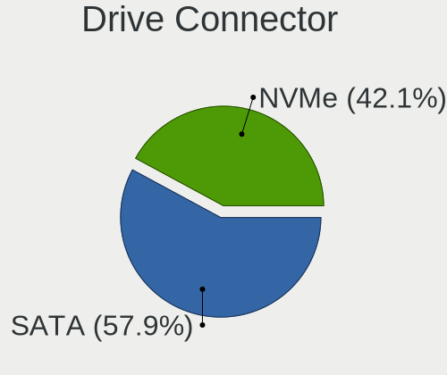
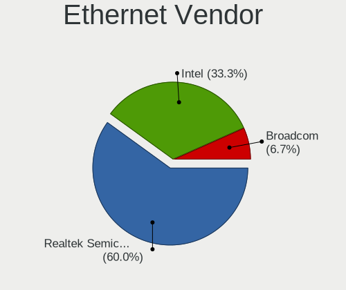
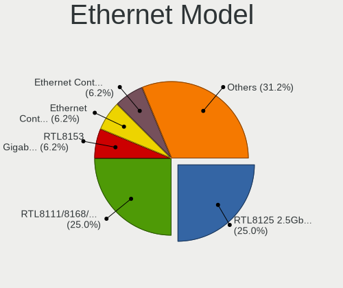
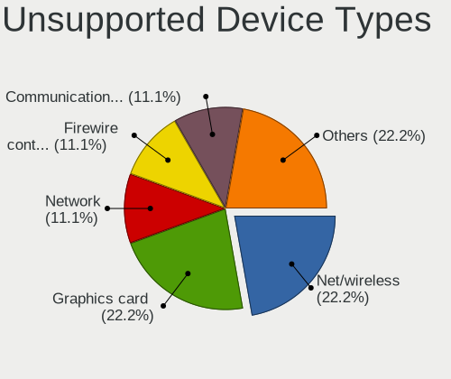

Gentoo - Hardware Trends (Desktops)
-----------------------------------

A project to identify most popular hardware characteristics and track their change
over time based on data collected by Linux users at https://Linux-Hardware.org.

Anyone can contribute to this report by the [hw-probe](https://github.com/linuxhw/hw-probe) tool:

    sudo -E hw-probe -all -upload

This report is for one last month. Overall report since the beginning of time: [TestDays](https://github.com/linuxhw/TestDays)

Period: Nov, 2023.

Contents
--------

* [ System ](#system)
  - [ OS                       ](#os)
  - [ OS Family                ](#os-family)
  - [ Kernel                   ](#kernel)
  - [ Kernel Family            ](#kernel-family)
  - [ Kernel Major Ver.        ](#kernel-major-ver)
  - [ Arch                     ](#arch)
  - [ DE                       ](#de)
  - [ Display Server           ](#display-server)
  - [ Display Manager          ](#display-manager)
  - [ OS Lang                  ](#os-lang)
  - [ Boot Mode                ](#boot-mode)
  - [ Filesystem               ](#filesystem)
  - [ Part. scheme             ](#part-scheme)
  - [ Dual Boot with Linux/BSD ](#dual-boot-with-linuxbsd)
  - [ Dual Boot (Win)          ](#dual-boot-win)

* [ Board ](#board)
  - [ Vendor                   ](#vendor)
  - [ Model                    ](#model)
  - [ Model Family             ](#model-family)
  - [ MFG Year                 ](#mfg-year)
  - [ Form Factor              ](#form-factor)
  - [ Secure Boot              ](#secure-boot)
  - [ Coreboot                 ](#coreboot)
  - [ RAM Size                 ](#ram-size)
  - [ RAM Used                 ](#ram-used)
  - [ Total Drives             ](#total-drives)
  - [ Has CD-ROM               ](#has-cd-rom)
  - [ Has Ethernet             ](#has-ethernet)
  - [ Has WiFi                 ](#has-wifi)
  - [ Has Bluetooth            ](#has-bluetooth)

* [ Location ](#location)
  - [ Country                  ](#country)
  - [ City                     ](#city)

* [ Drives ](#drives)
  - [ Drive Vendor             ](#drive-vendor)
  - [ Drive Model              ](#drive-model)
  - [ HDD Vendor               ](#hdd-vendor)
  - [ SSD Vendor               ](#ssd-vendor)
  - [ Drive Kind               ](#drive-kind)
  - [ Drive Connector          ](#drive-connector)
  - [ Drive Size               ](#drive-size)
  - [ Space Total              ](#space-total)
  - [ Space Used               ](#space-used)
  - [ Malfunc. Drives          ](#malfunc-drives)
  - [ Malfunc. Drive Vendor    ](#malfunc-drive-vendor)
  - [ Malfunc. HDD Vendor      ](#malfunc-hdd-vendor)
  - [ Malfunc. Drive Kind      ](#malfunc-drive-kind)
  - [ Failed Drives            ](#failed-drives)
  - [ Failed Drive Vendor      ](#failed-drive-vendor)
  - [ Drive Status             ](#drive-status)

* [ Storage controller ](#storage-controller)
  - [ Storage Vendor           ](#storage-vendor)
  - [ Storage Model            ](#storage-model)
  - [ Storage Kind             ](#storage-kind)

* [ Processor ](#processor)
  - [ CPU Vendor               ](#cpu-vendor)
  - [ CPU Model                ](#cpu-model)
  - [ CPU Model Family         ](#cpu-model-family)
  - [ CPU Cores                ](#cpu-cores)
  - [ CPU Sockets              ](#cpu-sockets)
  - [ CPU Threads              ](#cpu-threads)
  - [ CPU Op-Modes             ](#cpu-op-modes)
  - [ CPU Microcode            ](#cpu-microcode)
  - [ CPU Microarch            ](#cpu-microarch)

* [ Graphics ](#graphics)
  - [ GPU Vendor               ](#gpu-vendor)
  - [ GPU Model                ](#gpu-model)
  - [ GPU Combo                ](#gpu-combo)
  - [ GPU Driver               ](#gpu-driver)
  - [ GPU Memory               ](#gpu-memory)

* [ Monitor ](#monitor)
  - [ Monitor Vendor           ](#monitor-vendor)
  - [ Monitor Model            ](#monitor-model)
  - [ Monitor Resolution       ](#monitor-resolution)
  - [ Monitor Diagonal         ](#monitor-diagonal)
  - [ Monitor Width            ](#monitor-width)
  - [ Aspect Ratio             ](#aspect-ratio)
  - [ Monitor Area             ](#monitor-area)
  - [ Pixel Density            ](#pixel-density)
  - [ Multiple Monitors        ](#multiple-monitors)

* [ Network ](#network)
  - [ Net Controller Vendor    ](#net-controller-vendor)
  - [ Net Controller Model     ](#net-controller-model)
  - [ Wireless Vendor          ](#wireless-vendor)
  - [ Wireless Model           ](#wireless-model)
  - [ Ethernet Vendor          ](#ethernet-vendor)
  - [ Ethernet Model           ](#ethernet-model)
  - [ Net Controller Kind      ](#net-controller-kind)
  - [ Used Controller          ](#used-controller)
  - [ NICs                     ](#nics)
  - [ IPv6                     ](#ipv6)

* [ Bluetooth ](#bluetooth)
  - [ Bluetooth Vendor         ](#bluetooth-vendor)
  - [ Bluetooth Model          ](#bluetooth-model)

* [ Sound ](#sound)
  - [ Sound Vendor             ](#sound-vendor)
  - [ Sound Model              ](#sound-model)

* [ Memory ](#memory)
  - [ Memory Vendor            ](#memory-vendor)
  - [ Memory Model             ](#memory-model)
  - [ Memory Kind              ](#memory-kind)
  - [ Memory Form Factor       ](#memory-form-factor)
  - [ Memory Size              ](#memory-size)
  - [ Memory Speed             ](#memory-speed)

* [ Printers & scanners ](#printers--scanners)
  - [ Printer Vendor           ](#printer-vendor)
  - [ Printer Model            ](#printer-model)
  - [ Scanner Vendor           ](#scanner-vendor)
  - [ Scanner Model            ](#scanner-model)

* [ Camera ](#camera)
  - [ Camera Vendor            ](#camera-vendor)
  - [ Camera Model             ](#camera-model)

* [ Security ](#security)
  - [ Fingerprint Vendor       ](#fingerprint-vendor)
  - [ Fingerprint Model        ](#fingerprint-model)
  - [ Chipcard Vendor          ](#chipcard-vendor)
  - [ Chipcard Model           ](#chipcard-model)

* [ Unsupported ](#unsupported)
  - [ Unsupported Devices      ](#unsupported-devices)
  - [ Unsupported Device Types ](#unsupported-device-types)

System
------

OS
--

Installed operating systems

| Name        | Desktops | Percent |
|-------------|----------|---------|
| Gentoo 2.14 | 25       | 100%    |

OS Family
---------

OS without a version

| Name   | Desktops | Percent |
|--------|----------|---------|
| Gentoo | 25       | 100%    |

Kernel
------

Version of the Linux kernel

| Version              | Desktops | Percent |
|----------------------|----------|---------|
| 6.1.57-gentoo        | 6        | 24%     |
| 6.1.57-gentoo-x86_64 | 4        | 16%     |
| 6.6.0-gentoo         | 2        | 8%      |
| 6.5.9-gentoo-x86_64  | 2        | 8%      |
| 6.7.0-rc1            | 1        | 4%      |
| 6.6.3-gentoo_ap      | 1        | 4%      |
| 6.6.2-gentoo-x86_64  | 1        | 4%      |
| 6.6.2-gentoo         | 1        | 4%      |
| 6.6.1-zen1           | 1        | 4%      |
| 6.6.1-Prants         | 1        | 4%      |
| 6.6.0-gentoo-x86_64  | 1        | 4%      |
| 6.6.0-gentoo-Ryzen   | 1        | 4%      |
| 6.5.9-gentoo         | 1        | 4%      |
| 6.3.8-gentoo         | 1        | 4%      |
| 6.1.57-gentoo-dist   | 1        | 4%      |

Kernel Family
-------------

Linux kernel without a distro release

| Version | Desktops | Percent |
|---------|----------|---------|
| 6.1.57  | 11       | 44%     |
| 6.6.0   | 4        | 16%     |
| 6.5.9   | 3        | 12%     |
| 6.6.2   | 2        | 8%      |
| 6.6.1   | 2        | 8%      |
| 6.7.0   | 1        | 4%      |
| 6.6.3   | 1        | 4%      |
| 6.3.8   | 1        | 4%      |

Kernel Major Ver.
-----------------

Linux kernel major version

| Version | Desktops | Percent |
|---------|----------|---------|
| 6.1     | 11       | 44%     |
| 6.6     | 9        | 36%     |
| 6.5     | 3        | 12%     |
| 6.7     | 1        | 4%      |
| 6.3     | 1        | 4%      |

Arch
----

OS architecture (x86_64, i586, etc.)

| Name        | Desktops | Percent |
|-------------|----------|---------|
| x86_64      | 24       | 96%     |
| loongarch64 | 1        | 4%      |

DE
--

Desktop Environment

| Name       | Desktops | Percent |
|------------|----------|---------|
| Unknown    | 8        | 32%     |
| KDE5       | 7        | 28%     |
| GNOME      | 4        | 16%     |
| XFCE       | 3        | 12%     |
| X-Cinnamon | 1        | 4%      |
| MATE       | 1        | 4%      |
| dwm        | 1        | 4%      |

Display Server
--------------

X11 or Wayland

| Name    | Desktops | Percent |
|---------|----------|---------|
| X11     | 10       | 40%     |
| Wayland | 5        | 20%     |
| Tty     | 5        | 20%     |
| Unknown | 5        | 20%     |

Display Manager
---------------

SDDM, LightDM, etc.

| Name    | Desktops | Percent |
|---------|----------|---------|
| SDDM    | 8        | 32%     |
| LightDM | 7        | 28%     |
| Unknown | 7        | 28%     |
| GDM     | 2        | 8%      |
| LXDM    | 1        | 4%      |

OS Lang
-------

Language

| Lang       | Desktops | Percent |
|------------|----------|---------|
| en_US      | 15       | 60%     |
| Unknown    | 2        | 8%      |
| zh_CN      | 1        | 4%      |
| ru_RU.UTF8 | 1        | 4%      |
| ru_RU      | 1        | 4%      |
| POSIX      | 1        | 4%      |
| lt_LT      | 1        | 4%      |
| es_ES.UTF8 | 1        | 4%      |
| es_AR      | 1        | 4%      |
| C.UTF8     | 1        | 4%      |

Boot Mode
---------

EFI or BIOS

| Mode | Desktops | Percent |
|------|----------|---------|
| EFI  | 23       | 92%     |
| BIOS | 2        | 8%      |

Filesystem
----------

Type of filesystem

| Type  | Desktops | Percent |
|-------|----------|---------|
| Ext4  | 12       | 48%     |
| F2fs  | 5        | 20%     |
| Btrfs | 5        | 20%     |
| Xfs   | 3        | 12%     |

Part. scheme
------------

Scheme of partitioning

| Type    | Desktops | Percent |
|---------|----------|---------|
| GPT     | 23       | 92%     |
| MBR     | 1        | 4%      |
| Unknown | 1        | 4%      |

Dual Boot with Linux/BSD
------------------------

Hosting more than one Linux/BSD

| Dual boot | Desktops | Percent |
|-----------|----------|---------|
| No        | 14       | 56%     |
| Yes       | 11       | 44%     |

Dual Boot (Win)
---------------

Hosting Linux and Windows

| Dual boot | Desktops | Percent |
|-----------|----------|---------|
| No        | 17       | 68%     |
| Yes       | 8        | 32%     |

Board
-----

Vendor
------

Motherboard manufacturer

| Name                | Desktops | Percent |
|---------------------|----------|---------|
| ASUSTek Computer    | 11       | 44%     |
| Gigabyte Technology | 6        | 24%     |
| MSI                 | 4        | 16%     |
| Medion              | 1        | 4%      |
| Loongson            | 1        | 4%      |
| Intel               | 1        | 4%      |
| ASRock              | 1        | 4%      |

Model
-----

Motherboard model

| Name                                  | Desktops | Percent |
|---------------------------------------|----------|---------|
| MSI MS-7C91                           | 1        | 4%      |
| MSI MS-7C56                           | 1        | 4%      |
| MSI MS-7C35                           | 1        | 4%      |
| MSI MS-7C09                           | 1        | 4%      |
| Medion MD34100/2543                   | 1        | 4%      |
| Loongson 3A6000-HV-7A2000-1w-V0.1-EVB | 1        | 4%      |
| Intel DH77EB AAG39073-304             | 1        | 4%      |
| Gigabyte Z590 UD                      | 1        | 4%      |
| Gigabyte H110M-H                      | 1        | 4%      |
| Gigabyte B560M AORUS ELITE            | 1        | 4%      |
| Gigabyte B450M DS3H                   | 1        | 4%      |
| Gigabyte AB350-Gaming                 | 1        | 4%      |
| Gigabyte A520 AORUS ELITE             | 1        | 4%      |
| ASUS Z10PA-D8 Series                  | 1        | 4%      |
| ASUS TUF Gaming Z790-PLUS WIFI D4     | 1        | 4%      |
| ASUS TUF Gaming B660M-PLUS D4         | 1        | 4%      |
| ASUS TUF Gaming B550-PLUS             | 1        | 4%      |
| ASUS ROG STRIX Z590-F GAMING WIFI     | 1        | 4%      |
| ASUS ROG STRIX Z370-H GAMING          | 1        | 4%      |
| ASUS ROG STRIX B650E-F GAMING WIFI    | 1        | 4%      |
| ASUS ROG STRIX B560-A GAMING WIFI     | 1        | 4%      |
| ASUS PRIME Z270-P                     | 1        | 4%      |
| ASUS P10S-I Series                    | 1        | 4%      |
| ASUS M3A78-CM                         | 1        | 4%      |
| ASRock B550 Phantom Gaming 4          | 1        | 4%      |

Model Family
------------

Motherboard model prefix

| Name                                  | Desktops | Percent |
|---------------------------------------|----------|---------|
| ASUS ROG                              | 4        | 16%     |
| ASUS TUF                              | 3        | 12%     |
| MSI MS-7C91                           | 1        | 4%      |
| MSI MS-7C56                           | 1        | 4%      |
| MSI MS-7C35                           | 1        | 4%      |
| MSI MS-7C09                           | 1        | 4%      |
| Medion MD34100                        | 1        | 4%      |
| Loongson 3A6000-HV-7A2000-1w-V0.1-EVB | 1        | 4%      |
| Intel DH77EB                          | 1        | 4%      |
| Gigabyte Z590                         | 1        | 4%      |
| Gigabyte H110M-H                      | 1        | 4%      |
| Gigabyte B560M                        | 1        | 4%      |
| Gigabyte B450M                        | 1        | 4%      |
| Gigabyte AB350-Gaming                 | 1        | 4%      |
| Gigabyte A520                         | 1        | 4%      |
| ASUS Z10PA-D8                         | 1        | 4%      |
| ASUS PRIME                            | 1        | 4%      |
| ASUS P10S-I                           | 1        | 4%      |
| ASUS M3A78-CM                         | 1        | 4%      |
| ASRock B550                           | 1        | 4%      |

MFG Year
--------

Motherboard manufacture year

| Year    | Desktops | Percent |
|---------|----------|---------|
| 2022    | 4        | 16%     |
| 2021    | 4        | 16%     |
| 2020    | 4        | 16%     |
| 2018    | 3        | 12%     |
| 2017    | 3        | 12%     |
| 2019    | 2        | 8%      |
| 2016    | 2        | 8%      |
| 2012    | 1        | 4%      |
| 2008    | 1        | 4%      |
| Unknown | 1        | 4%      |

Form Factor
-----------

Physical design of the computer

| Name    | Desktops | Percent |
|---------|----------|---------|
| Desktop | 25       | 100%    |

Secure Boot
-----------

Enabled or disabled

| State    | Desktops | Percent |
|----------|----------|---------|
| Disabled | 24       | 96%     |
| Enabled  | 1        | 4%      |

Coreboot
--------

Have coreboot on board

| Used | Desktops | Percent |
|------|----------|---------|
| No   | 25       | 100%    |

RAM Size
--------

Total RAM memory

| Size in GB  | Desktops | Percent |
|-------------|----------|---------|
| 32.01-64.0  | 11       | 44%     |
| 64.01-256.0 | 7        | 28%     |
| 16.01-24.0  | 5        | 20%     |
| 4.01-8.0    | 1        | 4%      |
| 8.01-16.0   | 1        | 4%      |

RAM Used
--------

Used RAM memory

| Used GB    | Desktops | Percent |
|------------|----------|---------|
| 4.01-8.0   | 4        | 16%     |
| 3.01-4.0   | 4        | 16%     |
| 2.01-3.0   | 4        | 16%     |
| 16.01-24.0 | 4        | 16%     |
| 1.01-2.0   | 4        | 16%     |
| 0.51-1.0   | 3        | 12%     |
| 32.01-64.0 | 1        | 4%      |
| 8.01-16.0  | 1        | 4%      |

Total Drives
------------

Number of drives on board

| Drives | Desktops | Percent |
|--------|----------|---------|
| 4      | 6        | 24%     |
| 2      | 6        | 24%     |
| 6      | 5        | 20%     |
| 3      | 3        | 12%     |
| 5      | 2        | 8%      |
| 1      | 2        | 8%      |
| 31     | 1        | 4%      |

Has CD-ROM
----------

Has CD-ROM on board

| Presented | Desktops | Percent |
|-----------|----------|---------|
| No        | 16       | 64%     |
| Yes       | 9        | 36%     |

Has Ethernet
------------

Has Ethernet on board

| Presented | Desktops | Percent |
|-----------|----------|---------|
| Yes       | 24       | 96%     |
| No        | 1        | 4%      |

Has WiFi
--------

Has WiFi module

| Presented | Desktops | Percent |
|-----------|----------|---------|
| No        | 14       | 56%     |
| Yes       | 11       | 44%     |

Has Bluetooth
-------------

Has Bluetooth module

| Presented | Desktops | Percent |
|-----------|----------|---------|
| Yes       | 13       | 52%     |
| No        | 12       | 48%     |

Location
--------

Country
-------

Geographic location (country)

| Country   | Desktops | Percent |
|-----------|----------|---------|
| USA       | 4        | 16%     |
| Poland    | 4        | 16%     |
| Russia    | 3        | 12%     |
| China     | 3        | 12%     |
| Germany   | 2        | 8%      |
| UK        | 1        | 4%      |
| Sweden    | 1        | 4%      |
| Spain     | 1        | 4%      |
| Slovakia  | 1        | 4%      |
| Ireland   | 1        | 4%      |
| Canada    | 1        | 4%      |
| Belarus   | 1        | 4%      |
| Austria   | 1        | 4%      |
| Argentina | 1        | 4%      |

City
----

Geographic location (city)

| City              | Desktops | Percent |
|-------------------|----------|---------|
| Warsaw            | 3        | 12%     |
| Rostov-on-Don     | 2        | 8%      |
| Beijing           | 2        | 8%      |
| Weifang           | 1        | 4%      |
| Vladivostok       | 1        | 4%      |
| Vienna            | 1        | 4%      |
| Stockholm         | 1        | 4%      |
| Sherwood Park     | 1        | 4%      |
| Partizánske      | 1        | 4%      |
| Orange            | 1        | 4%      |
| New York          | 1        | 4%      |
| Minsk             | 1        | 4%      |
| Leeds             | 1        | 4%      |
| Krakow            | 1        | 4%      |
| Kansas City       | 1        | 4%      |
| Igualada          | 1        | 4%      |
| Frankfurt am Main | 1        | 4%      |
| Dublin            | 1        | 4%      |
| Detmold           | 1        | 4%      |
| Córdoba          | 1        | 4%      |
| Amissville        | 1        | 4%      |

Drives
------

Drive Vendor
------------

Hard drive vendors

| Vendor                      | Desktops | Drives | Percent |
|-----------------------------|----------|--------|---------|
| WDC                         | 12       | 31     | 17.91%  |
| Samsung Electronics         | 11       | 23     | 16.42%  |
| Seagate                     | 9        | 10     | 13.43%  |
| Toshiba                     | 4        | 19     | 5.97%   |
| Sandisk                     | 4        | 4      | 5.97%   |
| Phison Electronics          | 3        | 3      | 4.48%   |
| Intel                       | 3        | 4      | 4.48%   |
| Hitachi                     | 3        | 5      | 4.48%   |
| GOODRAM                     | 3        | 3      | 4.48%   |
| Yangtze Memory Technologies | 2        | 2      | 2.99%   |
| Crucial                     | 2        | 3      | 2.99%   |
| Realtek Semiconductor       | 1        | 1      | 1.49%   |
| Phison                      | 1        | 1      | 1.49%   |
| Micron/Crucial Technology   | 1        | 1      | 1.49%   |
| MAXIO Technology (Hangzhou) | 1        | 1      | 1.49%   |
| Lenovo                      | 1        | 1      | 1.49%   |
| Kingston                    | 1        | 1      | 1.49%   |
| KingSpec                    | 1        | 1      | 1.49%   |
| HGST                        | 1        | 1      | 1.49%   |
| China                       | 1        | 1      | 1.49%   |
| A-DATA Technology           | 1        | 1      | 1.49%   |
| Unknown                     | 1        | 1      | 1.49%   |

Drive Model
-----------

Hard drive models

| Model                                               | Desktops | Percent |
|-----------------------------------------------------|----------|---------|
| Samsung SSD 980 1TB                                 | 5        | 5.88%   |
| Samsung NVMe SSD Controller PM9A1/PM9A3/980PRO 2TB  | 3        | 3.53%   |
| Seagate ST3000DM008-2DM166 3TB                      | 2        | 2.35%   |
| Samsung SSD 860 EVO 250GB                           | 2        | 2.35%   |
| Samsung SSD 850 EVO 500GB                           | 2        | 2.35%   |
| Samsung NVMe SSD Controller SM981/PM981/PM983 250GB | 2        | 2.35%   |
| Hitachi HUS724030ALE641 3TB                         | 2        | 2.35%   |
| GOODRAM SSDPR-CL100-480-G2 480GB                    | 2        | 2.35%   |
| Yangtze Memory ZHITAI TiPro7000 1TB                 | 1        | 1.18%   |
| Yangtze Memory ZHITAI TiPlus5000 1TB                | 1        | 1.18%   |
| WDC WUH721818ALE6L4 18TB                            | 1        | 1.18%   |
| WDC WDS240G2G0A-00JH30 240GB SSD                    | 1        | 1.18%   |
| WDC WDBNCE5000PNC 500GB SSD                         | 1        | 1.18%   |
| WDC WD8003FFBX-68B9AN0 8TB                          | 1        | 1.18%   |
| WDC WD7500BPVT-24HXZT1 752GB                        | 1        | 1.18%   |
| WDC WD40EFAX-68JH4N1 4TB                            | 1        | 1.18%   |
| WDC WD4001FAEX-00MJRA0 4TB                          | 1        | 1.18%   |
| WDC WD3200LPVX-22V0TT0 320GB                        | 1        | 1.18%   |
| WDC WD30EZRZ-22Z5HB0 3TB                            | 1        | 1.18%   |
| WDC WD30EFRX-68EUZN0 3TB                            | 1        | 1.18%   |
| WDC WD20EZRZ-00Z5HB0 2TB                            | 1        | 1.18%   |
| WDC WD20EZRX-00D8PB0 2TB                            | 1        | 1.18%   |
| WDC WD20EFRX-68EUZN0 2TB                            | 1        | 1.18%   |
| WDC WD20EARX-00MMMB0 2TB                            | 1        | 1.18%   |
| WDC WD20EARS-00MVWB0 2TB                            | 1        | 1.18%   |
| WDC WD120EFBX-68B0EN0 12TB                          | 1        | 1.18%   |
| WDC WD10EZRZ-00HTKB0 1TB                            | 1        | 1.18%   |
| WDC WD10EZEX-00WN4A0 1TB                            | 1        | 1.18%   |
| WDC WD10EZEX-00RKKA0 1TB                            | 1        | 1.18%   |
| WDC WD10EZEX-00BBHA0 1TB                            | 1        | 1.18%   |
| Toshiba MQ04ABF100 1TB                              | 1        | 1.18%   |
| Toshiba HDWE150 5TB                                 | 1        | 1.18%   |
| Toshiba HDWE140 4TB                                 | 1        | 1.18%   |
| Toshiba DT01ACA100 1TB                              | 1        | 1.18%   |
| Seagate ST500DM002-1BC142 500GB                     | 1        | 1.18%   |
| Seagate ST4000VN006-3CW104 4TB                      | 1        | 1.18%   |
| Seagate ST4000DM004-2CV104 4TB                      | 1        | 1.18%   |
| Seagate ST3160318AS 160GB                           | 1        | 1.18%   |
| Seagate ST31000524AS 1TB                            | 1        | 1.18%   |
| Seagate ST2000DM008-2FR102 2TB                      | 1        | 1.18%   |

HDD Vendor
----------

Hard disk drive vendors

| Vendor  | Desktops | Drives | Percent |
|---------|----------|--------|---------|
| WDC     | 11       | 29     | 37.93%  |
| Seagate | 9        | 10     | 31.03%  |
| Toshiba | 4        | 19     | 13.79%  |
| Hitachi | 3        | 5      | 10.34%  |
| HGST    | 1        | 1      | 3.45%   |
| Unknown | 1        | 1      | 3.45%   |

SSD Vendor
----------

Solid state drive vendors

| Vendor              | Desktops | Drives | Percent |
|---------------------|----------|--------|---------|
| Samsung Electronics | 6        | 10     | 31.58%  |
| GOODRAM             | 3        | 3      | 15.79%  |
| WDC                 | 2        | 2      | 10.53%  |
| Crucial             | 2        | 3      | 10.53%  |
| Lenovo              | 1        | 1      | 5.26%   |
| Kingston            | 1        | 1      | 5.26%   |
| KingSpec            | 1        | 1      | 5.26%   |
| Intel               | 1        | 1      | 5.26%   |
| China               | 1        | 1      | 5.26%   |
| A-DATA Technology   | 1        | 1      | 5.26%   |

Drive Kind
----------

HDD or SSD

| Kind | Desktops | Drives | Percent |
|------|----------|--------|---------|
| HDD  | 19       | 65     | 35.85%  |
| NVMe | 18       | 29     | 33.96%  |
| SSD  | 16       | 24     | 30.19%  |

Drive Connector
---------------

SATA, SAS, NVMe, etc.

| Type | Desktops | Drives | Percent |
|------|----------|--------|---------|
| SATA | 22       | 88     | 53.66%  |
| NVMe | 18       | 29     | 43.9%   |
| SAS  | 1        | 1      | 2.44%   |

Drive Size
----------

Size of hard drive

| Size in TB | Desktops | Drives | Percent |
|------------|----------|--------|---------|
| 0.01-0.5   | 15       | 24     | 32.61%  |
| 0.51-1.0   | 9        | 10     | 19.57%  |
| 3.01-4.0   | 6        | 22     | 13.04%  |
| 1.01-2.0   | 6        | 18     | 13.04%  |
| 2.01-3.0   | 5        | 8      | 10.87%  |
| 10.01-20.0 | 3        | 5      | 6.52%   |
| 4.01-10.0  | 2        | 2      | 4.35%   |

Space Total
-----------

Amount of disk space available on the file system

| Size in GB     | Desktops | Percent |
|----------------|----------|---------|
| More than 3000 | 7        | 28%     |
| 501-1000       | 6        | 24%     |
| 101-250        | 4        | 16%     |
| 2001-3000      | 3        | 12%     |
| 1001-2000      | 3        | 12%     |
| 251-500        | 1        | 4%      |
| 21-50          | 1        | 4%      |

Space Used
----------

Amount of used disk space

| Used GB        | Desktops | Percent |
|----------------|----------|---------|
| 1001-2000      | 5        | 20%     |
| More than 3000 | 4        | 16%     |
| 101-250        | 4        | 16%     |
| 1-20           | 4        | 16%     |
| 251-500        | 3        | 12%     |
| 501-1000       | 2        | 8%      |
| 21-50          | 1        | 4%      |
| 2001-3000      | 1        | 4%      |
| 51-100         | 1        | 4%      |

Malfunc. Drives
---------------

Drive models with a malfunction

| Model                             | Desktops | Drives | Percent |
|-----------------------------------|----------|--------|---------|
| WDC WD10EZEX-00RKKA0 1TB          | 1        | 1      | 11.11%  |
| Seagate ST500DM002-1BC142 500GB   | 1        | 1      | 11.11%  |
| Seagate ST31000524AS 1TB          | 1        | 1      | 11.11%  |
| Seagate ST3000DM008-2DM166 3TB    | 1        | 1      | 11.11%  |
| Intel SSDSCKKF180G8L 180GB        | 1        | 1      | 11.11%  |
| Hitachi HUS724030ALE641 3TB       | 1        | 1      | 11.11%  |
| Hitachi HDS722020ALA330 2TB       | 1        | 1      | 11.11%  |
| A-DATA Technology SP900 128GB SSD | 1        | 1      | 11.11%  |
| Unknown                           | 1        | 1      | 11.11%  |

Malfunc. Drive Vendor
---------------------

Vendors of faulty drives

| Vendor            | Desktops | Drives | Percent |
|-------------------|----------|--------|---------|
| Seagate           | 3        | 3      | 33.33%  |
| Hitachi           | 2        | 2      | 22.22%  |
| WDC               | 1        | 1      | 11.11%  |
| Intel             | 1        | 1      | 11.11%  |
| A-DATA Technology | 1        | 1      | 11.11%  |
| Unknown           | 1        | 1      | 11.11%  |

Malfunc. HDD Vendor
-------------------

Vendors of faulty HDD drives

| Vendor  | Desktops | Drives | Percent |
|---------|----------|--------|---------|
| Seagate | 3        | 3      | 42.86%  |
| Hitachi | 2        | 2      | 28.57%  |
| WDC     | 1        | 1      | 14.29%  |
| Unknown | 1        | 1      | 14.29%  |

Malfunc. Drive Kind
-------------------

Kinds of faulty drives

| Kind | Desktops | Drives | Percent |
|------|----------|--------|---------|
| HDD  | 7        | 7      | 77.78%  |
| SSD  | 2        | 2      | 22.22%  |

Failed Drives
-------------

Failed drive models

Zero info for selected period =(

Failed Drive Vendor
-------------------

Failed drive vendors

Zero info for selected period =(

Drive Status
------------

Number of failed and malfunc. drives

| Status   | Desktops | Drives | Percent |
|----------|----------|--------|---------|
| Works    | 24       | 105    | 70.59%  |
| Malfunc  | 8        | 9      | 23.53%  |
| Detected | 2        | 4      | 5.88%   |

Storage controller
------------------

Storage Vendor
--------------

Storage controller vendors

| Vendor                      | Desktops | Percent |
|-----------------------------|----------|---------|
| Intel                       | 14       | 28.57%  |
| AMD                         | 10       | 20.41%  |
| Samsung Electronics         | 8        | 16.33%  |
| SanDisk                     | 4        | 8.16%   |
| Phison Electronics          | 4        | 8.16%   |
| Yangtze Memory Technologies | 2        | 4.08%   |
| ASMedia Technology          | 2        | 4.08%   |
| Realtek Semiconductor       | 1        | 2.04%   |
| Micron/Crucial Technology   | 1        | 2.04%   |
| MAXIO Technology (Hangzhou) | 1        | 2.04%   |
| LSI Logic / Symbios Logic   | 1        | 2.04%   |
| Loongson Technology         | 1        | 2.04%   |

Storage Model
-------------

Storage controller models

| Model                                                                         | Desktops | Percent |
|-------------------------------------------------------------------------------|----------|---------|
| Samsung NVMe SSD Controller 980 (DRAM-less)                                   | 5        | 8.06%   |
| AMD 500 Series Chipset SATA Controller                                        | 5        | 8.06%   |
| Intel 500 Series Chipset Family SATA AHCI Controller                          | 4        | 6.45%   |
| AMD FCH SATA Controller [AHCI mode]                                           | 4        | 6.45%   |
| Samsung NVMe SSD Controller PM9A1/PM9A3/980PRO                                | 3        | 4.84%   |
| Samsung NVMe SSD Controller SM981/PM981/PM983                                 | 2        | 3.23%   |
| Phison E18 PCIe4 NVMe Controller                                              | 2        | 3.23%   |
| Intel Q170/Q150/B150/H170/H110/Z170/CM236 Chipset SATA Controller [AHCI Mode] | 2        | 3.23%   |
| Intel 200 Series PCH SATA controller [AHCI mode]                              | 2        | 3.23%   |
| Yangtze Memory ZHITAI TiPro7000                                               | 1        | 1.61%   |
| Yangtze Memory ZHITAI TiPro5000 NVMe SSD                                      | 1        | 1.61%   |
| SanDisk WD Black SN770 / PC SN740 256GB / PC SN560 (DRAM-less) NVMe SSD       | 1        | 1.61%   |
| SanDisk Ultra 3D / WD Blue SN550 NVMe SSD                                     | 1        | 1.61%   |
| SanDisk Extreme Pro / WD Black SN750 / PC SN730 / Red SN700 NVMe SSD          | 1        | 1.61%   |
| SanDisk Extreme Pro / WD Black 2018/SN750/PC SN720 NVMe SSD                   | 1        | 1.61%   |
| Samsung NVMe SSD Controller SM961/PM961/SM963                                 | 1        | 1.61%   |
| Samsung NVMe SSD Controller S4LV008[Pascal]                                   | 1        | 1.61%   |
| Realtek RTS5765DL NVMe SSD Controller (DRAM-less)                             | 1        | 1.61%   |
| Phison PS5021-E21 PCIe4 NVMe Controller (DRAM-less)                           | 1        | 1.61%   |
| Phison E12 NVMe Controller                                                    | 1        | 1.61%   |
| Micron/Crucial P2 [Nick P2] / P3 / P3 Plus NVMe PCIe SSD (DRAM-less)          | 1        | 1.61%   |
| MAXIO (Hangzhou) NVMe SSD Controller MAP1602                                  | 1        | 1.61%   |
| LSI Logic / Symbios Logic MegaRAID SAS 2008 [Falcon]                          | 1        | 1.61%   |
| Loongson SATA controller                                                      | 1        | 1.61%   |
| Intel Volume Management Device NVMe RAID Controller Intel Corporation         | 1        | 1.61%   |
| Intel Volume Management Device NVMe RAID Controller                           | 1        | 1.61%   |
| Intel SSD 660P Series                                                         | 1        | 1.61%   |
| Intel SSD 600P Series                                                         | 1        | 1.61%   |
| Intel SATA Controller [RAID mode]                                             | 1        | 1.61%   |
| Intel NVMe Optane Memory Series                                               | 1        | 1.61%   |
| Intel Cannon Lake PCH SATA AHCI Controller                                    | 1        | 1.61%   |
| Intel C610/X99 series chipset sSATA Controller [AHCI mode]                    | 1        | 1.61%   |
| Intel C610/X99 series chipset 6-Port SATA Controller [AHCI mode]              | 1        | 1.61%   |
| Intel Alder Lake-S PCH SATA Controller [AHCI Mode]                            | 1        | 1.61%   |
| Intel 700 Series Chipset Family SATA AHCI Controller                          | 1        | 1.61%   |
| Intel 7 Series/C210 Series Chipset Family 6-port SATA Controller [AHCI mode]  | 1        | 1.61%   |
| ASMedia 106x SATA/RAID Controller                                             | 1        | 1.61%   |
| ASMedia 1064 SATA Controller                                                  | 1        | 1.61%   |
| AMD SB7x0/SB8x0/SB9x0 SATA Controller [IDE mode]                              | 1        | 1.61%   |
| AMD SB7x0/SB8x0/SB9x0 IDE Controller                                          | 1        | 1.61%   |

Storage Kind
------------

Kind of storage controller (IDE, SATA, NVMe, SAS, ...)

| Kind | Desktops | Percent |
|------|----------|---------|
| SATA | 25       | 52.08%  |
| NVMe | 18       | 37.5%   |
| RAID | 4        | 8.33%   |
| IDE  | 1        | 2.08%   |

Processor
---------

CPU Vendor
----------

Processor vendors

| Vendor   | Desktops | Percent |
|----------|----------|---------|
| Intel    | 14       | 56%     |
| AMD      | 10       | 40%     |
| Loongson | 1        | 4%      |

CPU Model
---------

Processor models

| Model                                   | Desktops | Percent |
|-----------------------------------------|----------|---------|
| AMD Ryzen 9 5900X 12-Core Processor     | 3        | 12%     |
| Intel Core i5-8400 CPU @ 2.80GHz        | 2        | 8%      |
| Intel 11th Gen Core i7-11700K @ 3.60GHz | 2        | 8%      |
| AMD Ryzen 5 2600 Six-Core Processor     | 2        | 8%      |
| Loongson 3A6000                         | 1        | 4%      |
| Intel Xeon CPU E5-2620 v4 @ 2.10GHz     | 1        | 4%      |
| Intel Xeon CPU E3-1240L v5 @ 2.10GHz    | 1        | 4%      |
| Intel Core i9-10850K CPU @ 3.60GHz      | 1        | 4%      |
| Intel Core i7-8086K CPU @ 4.00GHz       | 1        | 4%      |
| Intel Core i7-7700K CPU @ 4.20GHz       | 1        | 4%      |
| Intel Core i7-3770 CPU @ 3.40GHz        | 1        | 4%      |
| Intel Core i5-7500 CPU @ 3.40GHz        | 1        | 4%      |
| Intel 13th Gen Core i7-13700KF          | 1        | 4%      |
| Intel 12th Gen Core i5-12600K           | 1        | 4%      |
| Intel 11th Gen Core i5-11400 @ 2.60GHz  | 1        | 4%      |
| AMD Ryzen 7 7800X3D 8-Core Processor    | 1        | 4%      |
| AMD Ryzen 7 5700G with Radeon Graphics  | 1        | 4%      |
| AMD Ryzen 5 5600X 6-Core Processor      | 1        | 4%      |
| AMD Ryzen 5 5500                        | 1        | 4%      |
| AMD Phenom II X4 955 Processor          | 1        | 4%      |

CPU Model Family
----------------

Processor model prefix

| Model            | Desktops | Percent |
|------------------|----------|---------|
| Other            | 6        | 24%     |
| AMD Ryzen 5      | 4        | 16%     |
| Intel Core i7    | 3        | 12%     |
| Intel Core i5    | 3        | 12%     |
| AMD Ryzen 9      | 3        | 12%     |
| Intel Xeon       | 2        | 8%      |
| AMD Ryzen 7      | 2        | 8%      |
| Intel Core i9    | 1        | 4%      |
| AMD Phenom II X4 | 1        | 4%      |

CPU Cores
---------

Number of processor cores

| Number | Desktops | Percent |
|--------|----------|---------|
| 6      | 8        | 32%     |
| 4      | 6        | 24%     |
| 8      | 4        | 16%     |
| 12     | 3        | 12%     |
| 16     | 2        | 8%      |
| 10     | 2        | 8%      |

CPU Sockets
-----------

Number of sockets

| Number | Desktops | Percent |
|--------|----------|---------|
| 1      | 24       | 96%     |
| 2      | 1        | 4%      |

CPU Threads
-----------

Threads per core (Hyper-Threading)

| Number | Desktops | Percent |
|--------|----------|---------|
| 2      | 21       | 84%     |
| 1      | 4        | 16%     |

CPU Op-Modes
------------

CPU Operation Modes (32-bit, 64-bit)

| Op mode        | Desktops | Percent |
|----------------|----------|---------|
| 32-bit, 64-bit | 25       | 100%    |

CPU Microcode
-------------

Microcode number

| Number     | Desktops | Percent |
|------------|----------|---------|
| Unknown    | 11       | 44%     |
| 0x0a20120a | 3        | 12%     |
| 0xa0671    | 1        | 4%      |
| 0x906ea    | 1        | 4%      |
| 0x906e9    | 1        | 4%      |
| 0x90672    | 1        | 4%      |
| 0x506e3    | 1        | 4%      |
| 0x0a601206 | 1        | 4%      |
| 0x0a50000f | 1        | 4%      |
| 0x0a50000d | 1        | 4%      |
| 0x0a201025 | 1        | 4%      |
| 0x0800820d | 1        | 4%      |
| 0x010000db | 1        | 4%      |

CPU Microarch
-------------

Microarchitecture

| Name             | Desktops | Percent |
|------------------|----------|---------|
| Zen 3            | 6        | 24%     |
| KabyLake         | 5        | 20%     |
| Icelake          | 3        | 12%     |
| Zen+             | 2        | 8%      |
| Alderlake Hybrid | 2        | 8%      |
| Unknown          | 2        | 8%      |
| Skylake          | 1        | 4%      |
| K10              | 1        | 4%      |
| IvyBridge        | 1        | 4%      |
| CometLake        | 1        | 4%      |
| Broadwell        | 1        | 4%      |

Graphics
--------

GPU Vendor
----------

Vendors of graphics cards

| Vendor              | Desktops | Percent |
|---------------------|----------|---------|
| AMD                 | 11       | 42.31%  |
| Nvidia              | 9        | 34.62%  |
| Intel               | 3        | 11.54%  |
| ASPEED Technology   | 2        | 7.69%   |
| Loongson Technology | 1        | 3.85%   |

GPU Model
---------

Graphics card models

| Model                                                        | Desktops | Percent |
|--------------------------------------------------------------|----------|---------|
| AMD Ellesmere [Radeon RX 470/480/570/570X/580/580X/590]      | 3        | 10.34%  |
| Nvidia GA102 [GeForce RTX 3080 Ti]                           | 2        | 6.9%    |
| Intel CoffeeLake-S GT2 [UHD Graphics 630]                    | 2        | 6.9%    |
| ASPEED Technology ASPEED Graphics Family                     | 2        | 6.9%    |
| Nvidia TU106 [GeForce RTX 2060 SUPER]                        | 1        | 3.45%   |
| Nvidia GM206 [GeForce GTX 960]                               | 1        | 3.45%   |
| Nvidia GA106 [GeForce RTX 3060]                              | 1        | 3.45%   |
| Nvidia GA106 [GeForce RTX 3060 Lite Hash Rate]               | 1        | 3.45%   |
| Nvidia GA106 [Geforce RTX 3050]                              | 1        | 3.45%   |
| Nvidia GA104 [GeForce RTX 3070 Lite Hash Rate]               | 1        | 3.45%   |
| Nvidia GA104 [GeForce RTX 3060 Ti Lite Hash Rate]            | 1        | 3.45%   |
| Nvidia AD107 [GeForce RTX 4060]                              | 1        | 3.45%   |
| Loongson Technology VGA compatible controller                | 1        | 3.45%   |
| Intel IvyBridge GT2 [HD Graphics 4000]                       | 1        | 3.45%   |
| AMD Vega 10 XTX [Radeon Vega Frontier Edition]               | 1        | 3.45%   |
| AMD RS780C [Radeon 3100]                                     | 1        | 3.45%   |
| AMD Raphael                                                  | 1        | 3.45%   |
| AMD Polaris 20 XL [Radeon RX 580 2048SP]                     | 1        | 3.45%   |
| AMD Navi 31 [Radeon RX 7900 XT/7900 XTX]                     | 1        | 3.45%   |
| AMD Navi 24 [Radeon RX 6400/6500 XT/6500M]                   | 1        | 3.45%   |
| AMD Navi 23 [Radeon RX 6600/6600 XT/6600M]                   | 1        | 3.45%   |
| AMD Lexa PRO [Radeon 540/540X/550/550X / RX 540X/550/550X]   | 1        | 3.45%   |
| AMD Cezanne [Radeon Vega Series / Radeon Vega Mobile Series] | 1        | 3.45%   |
| AMD Cedar [Radeon HD 5000/6000/7350/8350 Series]             | 1        | 3.45%   |

GPU Combo
---------

Combinations of graphics cards

| Name       | Desktops | Percent |
|------------|----------|---------|
| 1 x AMD    | 10       | 40%     |
| 1 x Nvidia | 8        | 32%     |
| 1 x Intel  | 3        | 12%     |
| 1 x ASPEED | 2        | 8%      |
| 2 x Nvidia | 1        | 4%      |
| 2 x AMD    | 1        | 4%      |

GPU Driver
----------

Free vs proprietary

| Driver      | Desktops | Percent |
|-------------|----------|---------|
| Free        | 17       | 68%     |
| Proprietary | 5        | 20%     |
| Unknown     | 3        | 12%     |

GPU Memory
----------

Total video memory

| Size in GB | Desktops | Percent |
|------------|----------|---------|
| Unknown    | 10       | 40%     |
| 7.01-8.0   | 6        | 24%     |
| 8.01-16.0  | 4        | 16%     |
| 3.01-4.0   | 2        | 8%      |
| 16.01-24.0 | 1        | 4%      |
| 0.51-1.0   | 1        | 4%      |
| 0.01-0.5   | 1        | 4%      |

Monitor
-------

Monitor Vendor
--------------

Monitor vendors

| Vendor               | Desktops | Percent |
|----------------------|----------|---------|
| Samsung Electronics  | 6        | 25%     |
| Goldstar             | 4        | 16.67%  |
| AOC                  | 3        | 12.5%   |
| BenQ                 | 2        | 8.33%   |
| ViewSonic            | 1        | 4.17%   |
| VDO                  | 1        | 4.17%   |
| Unknown              | 1        | 4.17%   |
| MSI                  | 1        | 4.17%   |
| HUAWEI               | 1        | 4.17%   |
| Element              | 1        | 4.17%   |
| Dell                 | 1        | 4.17%   |
| ASUSTek Computer     | 1        | 4.17%   |
| Ancor Communications | 1        | 4.17%   |

Monitor Model
-------------

Monitor models

| Model                                                                   | Desktops | Percent |
|-------------------------------------------------------------------------|----------|---------|
| ViewSonic VX2458-mhd VSC0437 1920x1080 521x293mm 23.5-inch              | 1        | 4.17%   |
| VDO PATH.HDR VDO6666 2048x1152 600x340mm 27.2-inch                      | 1        | 4.17%   |
| Unknown LCD Monitor FFFF 2288x1287 2550x2550mm 142.0-inch               | 1        | 4.17%   |
| Samsung Electronics SyncMaster SAM059A 1920x1080 477x268mm 21.5-inch    | 1        | 4.17%   |
| Samsung Electronics S22B300 SAM08C8 1920x1080 477x268mm 21.5-inch       | 1        | 4.17%   |
| Samsung Electronics S19B300 SAM08A6 1366x768 410x230mm 18.5-inch        | 1        | 4.17%   |
| Samsung Electronics LCD Monitor SAM7003 3840x2160 1872x1053mm 84.6-inch | 1        | 4.17%   |
| Samsung Electronics LC49G95T SAM7053 3840x1080 1193x336mm 48.8-inch     | 1        | 4.17%   |
| Samsung Electronics C49RG9x SAM0F9C 3840x1080 1190x340mm 48.7-inch      | 1        | 4.17%   |
| MSI G32C4 MSI3DA6 1920x1080 698x393mm 31.5-inch                         | 1        | 4.17%   |
| HUAWEI ZQE-CBA HWV6A25 3440x1440 797x334mm 34.0-inch                    | 1        | 4.17%   |
| Goldstar ULTRAWIDE GSM7794 2560x1080 800x335mm 34.1-inch                | 1        | 4.17%   |
| Goldstar Ultra HD GSM5B08 3840x2160 600x340mm 27.2-inch                 | 1        | 4.17%   |
| Goldstar HDR WFHD GSM7714 2560x1080 798x334mm 34.1-inch                 | 1        | 4.17%   |
| Goldstar HDR 4K GSM7707 3840x2160 600x340mm 27.2-inch                   | 1        | 4.17%   |
| Element ElEFW248 ELE3393 1366x768 520x300mm 23.6-inch                   | 1        | 4.17%   |
| Dell P2721Q DELF125 3840x2160 597x336mm 27.0-inch                       | 1        | 4.17%   |
| BenQ GW2270 BNQ78DB 1920x1080 476x268mm 21.5-inch                       | 1        | 4.17%   |
| BenQ GL2450 BNQ78A5 1920x1080 531x298mm 24.0-inch                       | 1        | 4.17%   |
| ASUSTek Computer VG258QM AUS2581 1920x1080 544x303mm 24.5-inch          | 1        | 4.17%   |
| AOC 2769M AOC2769 1920x1080 598x336mm 27.0-inch                         | 1        | 4.17%   |
| AOC 24B1W AOC2401 1920x1080 521x293mm 23.5-inch                         | 1        | 4.17%   |
| AOC 22B2WG5 AOC2202 1920x1080 477x268mm 21.5-inch                       | 1        | 4.17%   |
| Ancor Communications ASUS PB287Q ACI28A3 3840x2160 621x341mm 27.9-inch  | 1        | 4.17%   |

Monitor Resolution
------------------

Monitor screen resolution

| Resolution      | Desktops | Percent |
|-----------------|----------|---------|
| 1920x1080 (FHD) | 7        | 31.82%  |
| 3840x2160 (4K)  | 5        | 22.73%  |
| 3840x1080       | 2        | 9.09%   |
| 2560x1080       | 2        | 9.09%   |
| 1366x768 (WXGA) | 2        | 9.09%   |
| 3440x1440       | 1        | 4.55%   |
| 2560x1440 (QHD) | 1        | 4.55%   |
| 2288x1287       | 1        | 4.55%   |
| 2048x1152       | 1        | 4.55%   |

Monitor Diagonal
----------------

Diagonal size in inches

| Inches | Desktops | Percent |
|--------|----------|---------|
| 27     | 5        | 22.73%  |
| 34     | 3        | 13.64%  |
| 24     | 3        | 13.64%  |
| 21     | 3        | 13.64%  |
| 48     | 2        | 9.09%   |
| 142    | 1        | 4.55%   |
| 84     | 1        | 4.55%   |
| 38     | 1        | 4.55%   |
| 31     | 1        | 4.55%   |
| 23     | 1        | 4.55%   |
| 18     | 1        | 4.55%   |

Monitor Width
-------------

Physical width

| Width in mm    | Desktops | Percent |
|----------------|----------|---------|
| 501-600        | 8        | 36.36%  |
| 401-500        | 4        | 18.18%  |
| 701-800        | 3        | 13.64%  |
| 601-700        | 2        | 9.09%   |
| 1001-1500      | 2        | 9.09%   |
| More than 2000 | 1        | 4.55%   |
| 801-900        | 1        | 4.55%   |
| 1501-2000      | 1        | 4.55%   |

Aspect Ratio
------------

Proportional relationship between the width and the height

| Ratio | Desktops | Percent |
|-------|----------|---------|
| 16/9  | 14       | 66.67%  |
| 21/9  | 3        | 14.29%  |
| 32/9  | 2        | 9.52%   |
| 16/10 | 1        | 4.76%   |
| 1.00  | 1        | 4.76%   |

Monitor Area
------------

Area in inch²

| Area in inch² | Desktops | Percent |
|----------------|----------|---------|
| 301-350        | 5        | 22.73%  |
| 201-250        | 5        | 22.73%  |
| 351-500        | 3        | 13.64%  |
| 501-1000       | 3        | 13.64%  |
| More than 1000 | 2        | 9.09%   |
| 251-300        | 2        | 9.09%   |
| 151-200        | 1        | 4.55%   |
| 141-150        | 1        | 4.55%   |

Pixel Density
-------------

Pixels per inch

| Density | Desktops | Percent |
|---------|----------|---------|
| 51-100  | 10       | 50%     |
| 101-120 | 4        | 20%     |
| 161-240 | 3        | 15%     |
| 1-50    | 2        | 10%     |
| 121-160 | 1        | 5%      |

Multiple Monitors
-----------------

Total monitors connected

| Total | Desktops | Percent |
|-------|----------|---------|
| 1     | 19       | 76%     |
| 0     | 4        | 16%     |
| 4     | 1        | 4%      |
| 2     | 1        | 4%      |

Network
-------

Net Controller Vendor
---------------------

Controller vendors

| Vendor                          | Desktops | Percent |
|---------------------------------|----------|---------|
| Realtek Semiconductor           | 16       | 47.06%  |
| Intel                           | 15       | 44.12%  |
| Qualcomm Atheros Communications | 1        | 2.94%   |
| QinHeng Electronics             | 1        | 2.94%   |
| MediaTek                        | 1        | 2.94%   |

Net Controller Model
--------------------

Controller models

| Model                                                             | Desktops | Percent |
|-------------------------------------------------------------------|----------|---------|
| Realtek RTL8111/8168/8411 PCI Express Gigabit Ethernet Controller | 10       | 25%     |
| Realtek RTL8125 2.5GbE Controller                                 | 6        | 15%     |
| Intel Wi-Fi 6 AX210/AX211/AX411 160MHz                            | 3        | 7.5%    |
| Intel Wi-Fi 6 AX200                                               | 3        | 7.5%    |
| Intel I210 Gigabit Network Connection                             | 2        | 5%      |
| Intel Ethernet Controller I225-V                                  | 2        | 5%      |
| Realtek RTL8852BE PCIe 802.11ax Wireless Network Controller       | 1        | 2.5%    |
| Qualcomm Atheros AR9271 802.11n                                   | 1        | 2.5%    |
| QinHeng USB Single Serial                                         | 1        | 2.5%    |
| MediaTek MT7921K (RZ608) Wi-Fi 6E 80MHz                           | 1        | 2.5%    |
| Intel Wireless 7265                                               | 1        | 2.5%    |
| Intel Tiger Lake PCH CNVi WiFi                                    | 1        | 2.5%    |
| Intel Ethernet Controller X550                                    | 1        | 2.5%    |
| Intel Ethernet Controller I226-V                                  | 1        | 2.5%    |
| Intel Ethernet Connection (2) I219-V                              | 1        | 2.5%    |
| Intel Cannon Lake PCH CNVi WiFi                                   | 1        | 2.5%    |
| Intel 82599ES 10-Gigabit SFI/SFP+ Network Connection              | 1        | 2.5%    |
| Intel 82579V Gigabit Network Connection                           | 1        | 2.5%    |
| Intel 82575EB Gigabit Network Connection                          | 1        | 2.5%    |
| Intel 700 Series Chipset Family Wi-Fi                             | 1        | 2.5%    |

Wireless Vendor
---------------

Wireless vendors

| Vendor                          | Desktops | Percent |
|---------------------------------|----------|---------|
| Intel                           | 9        | 81.82%  |
| Qualcomm Atheros Communications | 1        | 9.09%   |
| MediaTek                        | 1        | 9.09%   |

Wireless Model
--------------

Wireless models

| Model                                   | Desktops | Percent |
|-----------------------------------------|----------|---------|
| Intel Wi-Fi 6 AX210/AX211/AX411 160MHz  | 3        | 25%     |
| Intel Wi-Fi 6 AX200                     | 3        | 25%     |
| Qualcomm Atheros AR9271 802.11n         | 1        | 8.33%   |
| MediaTek MT7921K (RZ608) Wi-Fi 6E 80MHz | 1        | 8.33%   |
| Intel Wireless 7265                     | 1        | 8.33%   |
| Intel Tiger Lake PCH CNVi WiFi          | 1        | 8.33%   |
| Intel Cannon Lake PCH CNVi WiFi         | 1        | 8.33%   |
| Intel 700 Series Chipset Family Wi-Fi   | 1        | 8.33%   |

Ethernet Vendor
---------------

Ethernet vendors

| Vendor                | Desktops | Percent |
|-----------------------|----------|---------|
| Realtek Semiconductor | 16       | 64%     |
| Intel                 | 9        | 36%     |

Ethernet Model
--------------

Ethernet models

| Model                                                             | Desktops | Percent |
|-------------------------------------------------------------------|----------|---------|
| Realtek RTL8111/8168/8411 PCI Express Gigabit Ethernet Controller | 10       | 37.04%  |
| Realtek RTL8125 2.5GbE Controller                                 | 6        | 22.22%  |
| Intel I210 Gigabit Network Connection                             | 2        | 7.41%   |
| Intel Ethernet Controller I225-V                                  | 2        | 7.41%   |
| Realtek RTL8852BE PCIe 802.11ax Wireless Network Controller       | 1        | 3.7%    |
| Intel Ethernet Controller X550                                    | 1        | 3.7%    |
| Intel Ethernet Controller I226-V                                  | 1        | 3.7%    |
| Intel Ethernet Connection (2) I219-V                              | 1        | 3.7%    |
| Intel 82599ES 10-Gigabit SFI/SFP+ Network Connection              | 1        | 3.7%    |
| Intel 82579V Gigabit Network Connection                           | 1        | 3.7%    |
| Intel 82575EB Gigabit Network Connection                          | 1        | 3.7%    |

Net Controller Kind
-------------------

Ethernet, WiFi or modem

| Kind     | Desktops | Percent |
|----------|----------|---------|
| Ethernet | 24       | 66.67%  |
| WiFi     | 11       | 30.56%  |
| Modem    | 1        | 2.78%   |

Used Controller
---------------

Currently used network controller

| Kind     | Desktops | Percent |
|----------|----------|---------|
| Ethernet | 18       | 75%     |
| WiFi     | 6        | 25%     |

NICs
----

Total network controllers on board

| Total | Desktops | Percent |
|-------|----------|---------|
| 2     | 12       | 48%     |
| 1     | 11       | 44%     |
| 5     | 1        | 4%      |
| 3     | 1        | 4%      |

IPv6
----

IPv6 vs IPv4

| Used | Desktops | Percent |
|------|----------|---------|
| No   | 17       | 68%     |
| Yes  | 8        | 32%     |

Bluetooth
---------

Bluetooth Vendor
----------------

Controller vendors

| Vendor                  | Desktops | Percent |
|-------------------------|----------|---------|
| Intel                   | 8        | 61.54%  |
| Cambridge Silicon Radio | 2        | 15.38%  |
| MediaTek                | 1        | 7.69%   |
| IMC Networks            | 1        | 7.69%   |
| Actions                 | 1        | 7.69%   |

Bluetooth Model
---------------

Controller models

| Model                                               | Desktops | Percent |
|-----------------------------------------------------|----------|---------|
| Intel AX210 Bluetooth                               | 2        | 15.38%  |
| Intel AX201 Bluetooth                               | 2        | 15.38%  |
| Intel AX200 Bluetooth                               | 2        | 15.38%  |
| Cambridge Silicon Radio Bluetooth Dongle (HCI mode) | 2        | 15.38%  |
| MediaTek Wireless_Device                            | 1        | 7.69%   |
| Intel Bluetooth wireless interface                  | 1        | 7.69%   |
| Intel Bluetooth 9460/9560 Jefferson Peak (JfP)      | 1        | 7.69%   |
| IMC Networks Bluetooth Radio                        | 1        | 7.69%   |
| Actions general adapter                             | 1        | 7.69%   |

Sound
-----

Sound Vendor
------------

Sound card vendors

| Vendor               | Desktops | Percent |
|----------------------|----------|---------|
| AMD                  | 13       | 29.55%  |
| Intel                | 12       | 27.27%  |
| Nvidia               | 9        | 20.45%  |
| Kingston Technology  | 3        | 6.82%   |
| ASUSTek Computer     | 2        | 4.55%   |
| Plantronics          | 1        | 2.27%   |
| Loongson Technology  | 1        | 2.27%   |
| iCreate Technologies | 1        | 2.27%   |
| Hewlett-Packard      | 1        | 2.27%   |
| Unknown              | 1        | 2.27%   |

Sound Model
-----------

Sound card models

| Model                                                                        | Desktops | Percent |
|------------------------------------------------------------------------------|----------|---------|
| AMD Starship/Matisse HD Audio Controller                                     | 4        | 7.27%   |
| AMD Ellesmere HDMI Audio [Radeon RX 470/480 / 570/580/590]                   | 4        | 7.27%   |
| Nvidia GA106 High Definition Audio Controller                                | 3        | 5.45%   |
| Intel Tiger Lake-H HD Audio Controller                                       | 3        | 5.45%   |
| Intel 200 Series PCH HD Audio                                                | 3        | 5.45%   |
| Nvidia GA104 High Definition Audio Controller                                | 2        | 3.64%   |
| Nvidia GA102 High Definition Audio Controller                                | 2        | 3.64%   |
| ASUSTek Computer USB Audio                                                   | 2        | 3.64%   |
| AMD Renoir Radeon High Definition Audio Controller                           | 2        | 3.64%   |
| AMD Navi 21/23 HDMI/DP Audio Controller                                      | 2        | 3.64%   |
| AMD Family 17h/19h HD Audio Controller                                       | 2        | 3.64%   |
| AMD Family 17h (Models 00h-0fh) HD Audio Controller                          | 2        | 3.64%   |
| Plantronics Blackwire C5220 headset (remote control and 3.5mm audio adapter) | 1        | 1.82%   |
| Nvidia TU106 High Definition Audio Controller                                | 1        | 1.82%   |
| Nvidia GM206 High Definition Audio Controller                                | 1        | 1.82%   |
| Nvidia Audio device                                                          | 1        | 1.82%   |
| Loongson Technology HDA (High Definition Audio) Controller                   | 1        | 1.82%   |
| Loongson Technology Audio device                                             | 1        | 1.82%   |
| Kingston Technology HyperX SoloCast                                          | 1        | 1.82%   |
| Kingston Technology HyperX QuadCast                                          | 1        | 1.82%   |
| Kingston Technology HyperX 7.1 Audio                                         | 1        | 1.82%   |
| Intel Smart Sound Technology (SST) Audio Controller                          | 1        | 1.82%   |
| Intel Cannon Lake PCH cAVS                                                   | 1        | 1.82%   |
| Intel Alder Lake-S HD Audio Controller                                       | 1        | 1.82%   |
| Intel 700 Series Chipset Family Precise Touch and Stylus Port #1             | 1        | 1.82%   |
| Intel 7 Series/C216 Chipset Family High Definition Audio Controller          | 1        | 1.82%   |
| Intel 100 Series/C230 Series Chipset Family HD Audio Controller              | 1        | 1.82%   |
| iCreate Technologies Xonar U7                                                | 1        | 1.82%   |
| Hewlett-Packard HyperX Virtual Surround Sound                                | 1        | 1.82%   |
| AMD Vega 10 HDMI Audio [Radeon Vega 56/64]                                   | 1        | 1.82%   |
| AMD SBx00 Azalia (Intel HDA)                                                 | 1        | 1.82%   |
| AMD Rembrandt Radeon High Definition Audio Controller                        | 1        | 1.82%   |
| AMD Navi 31 HDMI/DP Audio                                                    | 1        | 1.82%   |
| AMD Cedar HDMI Audio [Radeon HD 5400/6300/7300 Series]                       | 1        | 1.82%   |
| AMD Baffin HDMI/DP Audio [Radeon RX 550 640SP / RX 560/560X]                 | 1        | 1.82%   |
| Unknown                                                                      | 1        | 1.82%   |

Memory
------

Memory Vendor
-------------

Memory module vendors

| Vendor              | Desktops | Percent |
|---------------------|----------|---------|
| G.Skill             | 5        | 19.23%  |
| Kingston            | 4        | 15.38%  |
| Crucial             | 3        | 11.54%  |
| Corsair             | 3        | 11.54%  |
| Unknown             | 2        | 7.69%   |
| Samsung Electronics | 2        | 7.69%   |
| A-DATA Technology   | 2        | 7.69%   |
| Unknown (0x0B92)    | 1        | 3.85%   |
| SK hynix            | 1        | 3.85%   |
| Patriot             | 1        | 3.85%   |
| Foxline             | 1        | 3.85%   |
| Unknown             | 1        | 3.85%   |

Memory Model
------------

Memory module models

| Model                                                    | Desktops | Percent |
|----------------------------------------------------------|----------|---------|
| Unknown RAM Module 2GB DIMM DDR2 667MT/s                 | 1        | 3.33%   |
| Unknown RAM Module 16GB DIMM DDR4 2400MT/s               | 1        | 3.33%   |
| Unknown (0x0B92) RAM Module 8GB DIMM DDR4 3400MT/s       | 1        | 3.33%   |
| SK hynix RAM HMA42GR7AFR4N-UH 16GB DIMM DDR4 2400MT/s    | 1        | 3.33%   |
| Samsung RAM M391A2K43BB1-CPB 16GB DIMM DDR4 2133MT/s     | 1        | 3.33%   |
| Samsung RAM M378A5244CB0-CRC 4GB DIMM DDR4 3066MT/s      | 1        | 3.33%   |
| Samsung RAM M378A1K43CB2-CRC 8GB DIMM DDR4 3500MT/s      | 1        | 3.33%   |
| Patriot RAM PSD432G32002 32GB DIMM DDR4 3200MT/s         | 1        | 3.33%   |
| Kingston RAM KHX2666C16/8G 8GB DIMM DDR4 3466MT/s        | 1        | 3.33%   |
| Kingston RAM KF560C32-32 32GB DIMM DDR5 5600MT/s         | 1        | 3.33%   |
| Kingston RAM KF3600C17D4/8GX 8GB DIMM DDR4 3600MT/s      | 1        | 3.33%   |
| Kingston RAM KF3200C16D4/8GX 8GB DIMM DDR4 3600MT/s      | 1        | 3.33%   |
| Kingston RAM 9905625-075.A00G 16GB DIMM DDR4 2400MT/s    | 1        | 3.33%   |
| G.Skill RAM F4-4400C19-16GVK 16GB DIMM DDR4 4000MT/s     | 1        | 3.33%   |
| G.Skill RAM F4-3600C17-16GTZKW 16GB DIMM DDR4 3600MT/s   | 1        | 3.33%   |
| G.Skill RAM F4-3200C16-8GVKB 8GB DIMM DDR4 3866MT/s      | 1        | 3.33%   |
| G.Skill RAM F4-3200C16-8GTRS 8GB DIMM DDR4 3600MT/s      | 1        | 3.33%   |
| G.Skill RAM F4-3200C16-32GVK 32GB DIMM DDR4 3200MT/s     | 1        | 3.33%   |
| G.Skill RAM F4-2666C15-8GVR 8GB DIMM DDR4 2800MT/s       | 1        | 3.33%   |
| Foxline RAM FL2400D4U17-8GSE 8GB DIMM DDR4 2400MT/s      | 1        | 3.33%   |
| Crucial RAM CT8G4DFS824A.M8FE 8GB DIMM DDR4 2933MT/s     | 1        | 3.33%   |
| Crucial RAM CT16G4DFRA266.C8FE 16GB DIMM DDR4 2667MT/s   | 1        | 3.33%   |
| Crucial RAM CT16G4DFD824A.M16FE 16GB DIMM DDR4 2400MT/s  | 1        | 3.33%   |
| Crucial RAM BL32G32C16U4B.M16FB1 32GB DIMM DDR4 3200MT/s | 1        | 3.33%   |
| Corsair RAM CMK32GX4M2E3200C16 16GB DIMM DDR4 3534MT/s   | 1        | 3.33%   |
| Corsair RAM CMK16GX4M2Z3200C16 8GB DIMM DDR4 3200MT/s    | 1        | 3.33%   |
| Corsair RAM CMK16GX4M2B3200C16 8GB DIMM DDR4 3600MT/s    | 1        | 3.33%   |
| A-DATA RAM DDR4 3200 8GB DIMM DDR4 3600MT/s              | 1        | 3.33%   |
| A-DATA RAM AX4U32008G16A-DCBK20 8GB DIMM DDR4 3200MT/s   | 1        | 3.33%   |
| Unknown                                                  | 1        | 3.33%   |

Memory Kind
-----------

Memory module kinds

| Kind | Desktops | Percent |
|------|----------|---------|
| DDR4 | 21       | 87.5%   |
| DDR5 | 1        | 4.17%   |
| DDR3 | 1        | 4.17%   |
| DDR2 | 1        | 4.17%   |

Memory Form Factor
------------------

Physical design of the memory module

| Name | Desktops | Percent |
|------|----------|---------|
| DIMM | 24       | 100%    |

Memory Size
-----------

Memory module size

| Size  | Desktops | Percent |
|-------|----------|---------|
| 8192  | 11       | 44%     |
| 16384 | 7        | 28%     |
| 32768 | 5        | 20%     |
| 4096  | 1        | 4%      |
| 2048  | 1        | 4%      |

Memory Speed
------------

Memory module speed

| Speed | Desktops | Percent |
|-------|----------|---------|
| 3600  | 6        | 20.69%  |
| 3200  | 5        | 17.24%  |
| 2400  | 4        | 13.79%  |
| 5600  | 1        | 3.45%   |
| 4000  | 1        | 3.45%   |
| 3866  | 1        | 3.45%   |
| 3534  | 1        | 3.45%   |
| 3500  | 1        | 3.45%   |
| 3466  | 1        | 3.45%   |
| 3400  | 1        | 3.45%   |
| 3066  | 1        | 3.45%   |
| 2933  | 1        | 3.45%   |
| 2800  | 1        | 3.45%   |
| 2667  | 1        | 3.45%   |
| 2133  | 1        | 3.45%   |
| 1800  | 1        | 3.45%   |
| 667   | 1        | 3.45%   |

Printers & scanners
-------------------

Printer Vendor
--------------

Printer device vendors

| Vendor          | Desktops | Percent |
|-----------------|----------|---------|
| Hewlett-Packard | 1        | 100%    |

Printer Model
-------------

Printer device models

| Model               | Desktops | Percent |
|---------------------|----------|---------|
| HP LaserJet M14-M17 | 1        | 100%    |

Scanner Vendor
--------------

Scanner device vendors

Zero info for selected period =(

Scanner Model
-------------

Scanner device models

Zero info for selected period =(

Camera
------

Camera Vendor
-------------

Camera device vendors

| Vendor                | Desktops | Percent |
|-----------------------|----------|---------|
| Arkmicro Technologies | 1        | 50%     |
| ARC International     | 1        | 50%     |

Camera Model
------------

Camera device models

| Model                    | Desktops | Percent |
|--------------------------|----------|---------|
| Arkmicro Acme CA04       | 1        | 50%     |
| ARC International Camera | 1        | 50%     |

Security
--------

Fingerprint Vendor
------------------

Fingerprint sensor vendors

Zero info for selected period =(

Fingerprint Model
-----------------

Fingerprint sensor models

Zero info for selected period =(

Chipcard Vendor
---------------

Chipcard module vendors

Zero info for selected period =(

Chipcard Model
--------------

Chipcard module models

Zero info for selected period =(

Unsupported
-----------

Unsupported Devices
-------------------

Total unsupported devices on board

| Total | Desktops | Percent |
|-------|----------|---------|
| 0     | 14       | 56%     |
| 1     | 6        | 24%     |
| 3     | 4        | 16%     |
| 2     | 1        | 4%      |

Unsupported Device Types
------------------------

Types of unsupported devices

| Type                     | Desktops | Percent |
|--------------------------|----------|---------|
| Communication controller | 8        | 42.11%  |
| Graphics card            | 4        | 21.05%  |
| Bluetooth                | 3        | 15.79%  |
| Unassigned class         | 1        | 5.26%   |
| Storage/raid             | 1        | 5.26%   |
| Network                  | 1        | 5.26%   |
| Net/wireless             | 1        | 5.26%   |

