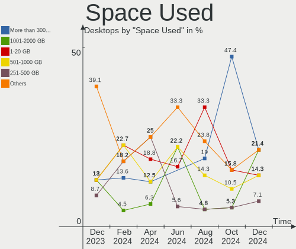
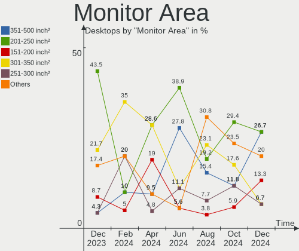
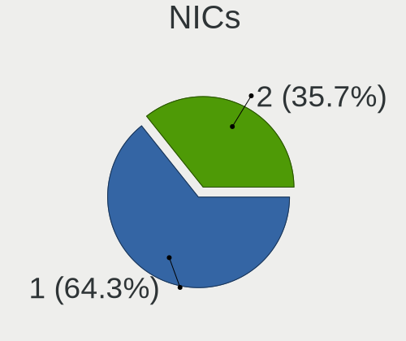
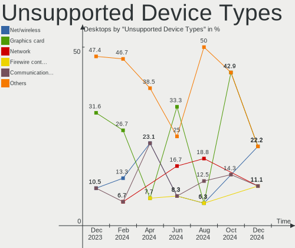

Gentoo - Hardware Trends (Desktops)
-----------------------------------

A project to identify most popular hardware characteristics and track their change
over time based on data collected by Linux users at https://Linux-Hardware.org.

Anyone can contribute to this report by the [hw-probe](https://github.com/linuxhw/hw-probe) tool:

    sudo -E hw-probe -all -upload

This report is for one last month. Overall report since the beginning of time: [TestDays](https://github.com/linuxhw/TestDays)

Period: Apr, 2024.

Contents
--------

* [ System ](#system)
  - [ OS                       ](#os)
  - [ OS Family                ](#os-family)
  - [ Kernel                   ](#kernel)
  - [ Kernel Family            ](#kernel-family)
  - [ Kernel Major Ver.        ](#kernel-major-ver)
  - [ Arch                     ](#arch)
  - [ DE                       ](#de)
  - [ Display Server           ](#display-server)
  - [ Display Manager          ](#display-manager)
  - [ OS Lang                  ](#os-lang)
  - [ Boot Mode                ](#boot-mode)
  - [ Filesystem               ](#filesystem)
  - [ Part. scheme             ](#part-scheme)
  - [ Dual Boot with Linux/BSD ](#dual-boot-with-linuxbsd)
  - [ Dual Boot (Win)          ](#dual-boot-win)

* [ Board ](#board)
  - [ Vendor                   ](#vendor)
  - [ Model                    ](#model)
  - [ Model Family             ](#model-family)
  - [ MFG Year                 ](#mfg-year)
  - [ Form Factor              ](#form-factor)
  - [ Secure Boot              ](#secure-boot)
  - [ Coreboot                 ](#coreboot)
  - [ RAM Size                 ](#ram-size)
  - [ RAM Used                 ](#ram-used)
  - [ Total Drives             ](#total-drives)
  - [ Has CD-ROM               ](#has-cd-rom)
  - [ Has Ethernet             ](#has-ethernet)
  - [ Has WiFi                 ](#has-wifi)
  - [ Has Bluetooth            ](#has-bluetooth)

* [ Location ](#location)
  - [ Country                  ](#country)
  - [ City                     ](#city)

* [ Drives ](#drives)
  - [ Drive Vendor             ](#drive-vendor)
  - [ Drive Model              ](#drive-model)
  - [ HDD Vendor               ](#hdd-vendor)
  - [ SSD Vendor               ](#ssd-vendor)
  - [ Drive Kind               ](#drive-kind)
  - [ Drive Connector          ](#drive-connector)
  - [ Drive Size               ](#drive-size)
  - [ Space Total              ](#space-total)
  - [ Space Used               ](#space-used)
  - [ Malfunc. Drives          ](#malfunc-drives)
  - [ Malfunc. Drive Vendor    ](#malfunc-drive-vendor)
  - [ Malfunc. HDD Vendor      ](#malfunc-hdd-vendor)
  - [ Malfunc. Drive Kind      ](#malfunc-drive-kind)
  - [ Failed Drives            ](#failed-drives)
  - [ Failed Drive Vendor      ](#failed-drive-vendor)
  - [ Drive Status             ](#drive-status)

* [ Storage controller ](#storage-controller)
  - [ Storage Vendor           ](#storage-vendor)
  - [ Storage Model            ](#storage-model)
  - [ Storage Kind             ](#storage-kind)

* [ Processor ](#processor)
  - [ CPU Vendor               ](#cpu-vendor)
  - [ CPU Model                ](#cpu-model)
  - [ CPU Model Family         ](#cpu-model-family)
  - [ CPU Cores                ](#cpu-cores)
  - [ CPU Sockets              ](#cpu-sockets)
  - [ CPU Threads              ](#cpu-threads)
  - [ CPU Op-Modes             ](#cpu-op-modes)
  - [ CPU Microcode            ](#cpu-microcode)
  - [ CPU Microarch            ](#cpu-microarch)

* [ Graphics ](#graphics)
  - [ GPU Vendor               ](#gpu-vendor)
  - [ GPU Model                ](#gpu-model)
  - [ GPU Combo                ](#gpu-combo)
  - [ GPU Driver               ](#gpu-driver)
  - [ GPU Memory               ](#gpu-memory)

* [ Monitor ](#monitor)
  - [ Monitor Vendor           ](#monitor-vendor)
  - [ Monitor Model            ](#monitor-model)
  - [ Monitor Resolution       ](#monitor-resolution)
  - [ Monitor Diagonal         ](#monitor-diagonal)
  - [ Monitor Width            ](#monitor-width)
  - [ Aspect Ratio             ](#aspect-ratio)
  - [ Monitor Area             ](#monitor-area)
  - [ Pixel Density            ](#pixel-density)
  - [ Multiple Monitors        ](#multiple-monitors)

* [ Network ](#network)
  - [ Net Controller Vendor    ](#net-controller-vendor)
  - [ Net Controller Model     ](#net-controller-model)
  - [ Wireless Vendor          ](#wireless-vendor)
  - [ Wireless Model           ](#wireless-model)
  - [ Ethernet Vendor          ](#ethernet-vendor)
  - [ Ethernet Model           ](#ethernet-model)
  - [ Net Controller Kind      ](#net-controller-kind)
  - [ Used Controller          ](#used-controller)
  - [ NICs                     ](#nics)
  - [ IPv6                     ](#ipv6)

* [ Bluetooth ](#bluetooth)
  - [ Bluetooth Vendor         ](#bluetooth-vendor)
  - [ Bluetooth Model          ](#bluetooth-model)

* [ Sound ](#sound)
  - [ Sound Vendor             ](#sound-vendor)
  - [ Sound Model              ](#sound-model)

* [ Memory ](#memory)
  - [ Memory Vendor            ](#memory-vendor)
  - [ Memory Model             ](#memory-model)
  - [ Memory Kind              ](#memory-kind)
  - [ Memory Form Factor       ](#memory-form-factor)
  - [ Memory Size              ](#memory-size)
  - [ Memory Speed             ](#memory-speed)

* [ Printers & scanners ](#printers--scanners)
  - [ Printer Vendor           ](#printer-vendor)
  - [ Printer Model            ](#printer-model)
  - [ Scanner Vendor           ](#scanner-vendor)
  - [ Scanner Model            ](#scanner-model)

* [ Camera ](#camera)
  - [ Camera Vendor            ](#camera-vendor)
  - [ Camera Model             ](#camera-model)

* [ Security ](#security)
  - [ Fingerprint Vendor       ](#fingerprint-vendor)
  - [ Fingerprint Model        ](#fingerprint-model)
  - [ Chipcard Vendor          ](#chipcard-vendor)
  - [ Chipcard Model           ](#chipcard-model)

* [ Unsupported ](#unsupported)
  - [ Unsupported Devices      ](#unsupported-devices)
  - [ Unsupported Device Types ](#unsupported-device-types)

System
------

OS
--

Installed operating systems

| Name        | Desktops | Percent |
|-------------|----------|---------|
| Gentoo 2.14 | 13       | 86.67%  |
| Gentoo 2.15 | 2        | 13.33%  |

OS Family
---------

OS without a version

| Name   | Desktops | Percent |
|--------|----------|---------|
| Gentoo | 15       | 100%    |

Kernel
------

Version of the Linux kernel

| Version              | Desktops | Percent |
|----------------------|----------|---------|
| 6.6.21-gentoo        | 4        | 26.67%  |
| 6.6.21-gentoo-x86_64 | 3        | 20%     |
| 6.6.13-gentoo-x86_64 | 2        | 13.33%  |
| 6.9.0-rc1-git        | 1        | 6.67%   |
| 6.8.6-gentoo-dist    | 1        | 6.67%   |
| 6.8.4-gentoo-x86_64  | 1        | 6.67%   |
| 6.6.21-gentoo-dist   | 1        | 6.67%   |
| 6.6.13-gentoo        | 1        | 6.67%   |
| 6.1.67-gentoo-x86_64 | 1        | 6.67%   |

Kernel Family
-------------

Linux kernel without a distro release

| Version | Desktops | Percent |
|---------|----------|---------|
| 6.6.21  | 8        | 53.33%  |
| 6.6.13  | 3        | 20%     |
| 6.9.0   | 1        | 6.67%   |
| 6.8.6   | 1        | 6.67%   |
| 6.8.4   | 1        | 6.67%   |
| 6.1.67  | 1        | 6.67%   |

Kernel Major Ver.
-----------------

Linux kernel major version

| Version | Desktops | Percent |
|---------|----------|---------|
| 6.6     | 11       | 73.33%  |
| 6.8     | 2        | 13.33%  |
| 6.9     | 1        | 6.67%   |
| 6.1     | 1        | 6.67%   |

Arch
----

OS architecture (x86_64, i586, etc.)

| Name   | Desktops | Percent |
|--------|----------|---------|
| x86_64 | 15       | 100%    |

DE
--

Desktop Environment

| Name     | Desktops | Percent |
|----------|----------|---------|
| KDE5     | 6        | 40%     |
| XFCE     | 2        | 13.33%  |
| Unknown  | 2        | 13.33%  |
| MATE     | 1        | 6.67%   |
| LXQt     | 1        | 6.67%   |
| KDE      | 1        | 6.67%   |
| Hyprland | 1        | 6.67%   |
| GNOME    | 1        | 6.67%   |

Display Server
--------------

X11 or Wayland

| Name    | Desktops | Percent |
|---------|----------|---------|
| X11     | 8        | 53.33%  |
| Wayland | 6        | 40%     |
| Unknown | 1        | 6.67%   |

Display Manager
---------------

SDDM, LightDM, etc.

| Name    | Desktops | Percent |
|---------|----------|---------|
| SDDM    | 8        | 53.33%  |
| LightDM | 3        | 20%     |
| Unknown | 2        | 13.33%  |
| SLiM    | 1        | 6.67%   |
| GDM     | 1        | 6.67%   |

OS Lang
-------

Language

| Lang   | Desktops | Percent |
|--------|----------|---------|
| en_US  | 7        | 46.67%  |
| C.UTF8 | 4        | 26.67%  |
| ru_RU  | 1        | 6.67%   |
| fr_FR  | 1        | 6.67%   |
| en_GB  | 1        | 6.67%   |
| en_DK  | 1        | 6.67%   |

Boot Mode
---------

EFI or BIOS

| Mode | Desktops | Percent |
|------|----------|---------|
| EFI  | 11       | 73.33%  |
| BIOS | 4        | 26.67%  |

Filesystem
----------

Type of filesystem

| Type    | Desktops | Percent |
|---------|----------|---------|
| Ext4    | 7        | 46.67%  |
| Xfs     | 3        | 20%     |
| F2fs    | 3        | 20%     |
| XXXXXXX | 2        | 13.33%  |

Part. scheme
------------

Scheme of partitioning

| Type | Desktops | Percent |
|------|----------|---------|
| GPT  | 13       | 86.67%  |
| MBR  | 2        | 13.33%  |

Dual Boot with Linux/BSD
------------------------

Hosting more than one Linux/BSD

| Dual boot | Desktops | Percent |
|-----------|----------|---------|
| No        | 9        | 60%     |
| Yes       | 6        | 40%     |

Dual Boot (Win)
---------------

Hosting Linux and Windows

| Dual boot | Desktops | Percent |
|-----------|----------|---------|
| No        | 13       | 86.67%  |
| Yes       | 2        | 13.33%  |

Board
-----

Vendor
------

Motherboard manufacturer

| Name                | Desktops | Percent |
|---------------------|----------|---------|
| ASUSTek Computer    | 8        | 53.33%  |
| Gigabyte Technology | 4        | 26.67%  |
| MSI                 | 2        | 13.33%  |
| Hewlett-Packard     | 1        | 6.67%   |

Model
-----

Motherboard model

| Name                               | Desktops | Percent |
|------------------------------------|----------|---------|
| MSI MS-7E27                        | 1        | 6.67%   |
| MSI MS-7C79                        | 1        | 6.67%   |
| HP Z420 Workstation                | 1        | 6.67%   |
| Gigabyte B75-D3V                   | 1        | 6.67%   |
| Gigabyte B560M AORUS PRO           | 1        | 6.67%   |
| Gigabyte AB350-Gaming              | 1        | 6.67%   |
| Gigabyte A520 AORUS ELITE          | 1        | 6.67%   |
| ASUS TUF Gaming B550-PLUS          | 1        | 6.67%   |
| ASUS ROG STRIX Z390-E GAMING       | 1        | 6.67%   |
| ASUS ROG STRIX X670E-E GAMING WIFI | 1        | 6.67%   |
| ASUS PRIME X670-P                  | 1        | 6.67%   |
| ASUS P6X58D-E                      | 1        | 6.67%   |
| ASUS M5A99FX PRO R2.0              | 1        | 6.67%   |
| ASUS M3A78-CM                      | 1        | 6.67%   |
| ASUS All Series                    | 1        | 6.67%   |

Model Family
------------

Motherboard model prefix

| Name                  | Desktops | Percent |
|-----------------------|----------|---------|
| ASUS ROG              | 2        | 13.33%  |
| MSI MS-7E27           | 1        | 6.67%   |
| MSI MS-7C79           | 1        | 6.67%   |
| HP Z420               | 1        | 6.67%   |
| Gigabyte B75-D3V      | 1        | 6.67%   |
| Gigabyte B560M        | 1        | 6.67%   |
| Gigabyte AB350-Gaming | 1        | 6.67%   |
| Gigabyte A520         | 1        | 6.67%   |
| ASUS TUF              | 1        | 6.67%   |
| ASUS PRIME            | 1        | 6.67%   |
| ASUS P6X58D-E         | 1        | 6.67%   |
| ASUS M5A99FX          | 1        | 6.67%   |
| ASUS M3A78-CM         | 1        | 6.67%   |
| ASUS All              | 1        | 6.67%   |

MFG Year
--------

Motherboard manufacture year

| Year | Desktops | Percent |
|------|----------|---------|
| 2020 | 3        | 20%     |
| 2012 | 3        | 20%     |
| 2022 | 2        | 13.33%  |
| 2023 | 1        | 6.67%   |
| 2021 | 1        | 6.67%   |
| 2018 | 1        | 6.67%   |
| 2017 | 1        | 6.67%   |
| 2016 | 1        | 6.67%   |
| 2010 | 1        | 6.67%   |
| 2008 | 1        | 6.67%   |

Form Factor
-----------

Physical design of the computer

| Name    | Desktops | Percent |
|---------|----------|---------|
| Desktop | 15       | 100%    |

Secure Boot
-----------

Enabled or disabled

| State    | Desktops | Percent |
|----------|----------|---------|
| Disabled | 15       | 100%    |

Coreboot
--------

Have coreboot on board

| Used | Desktops | Percent |
|------|----------|---------|
| No   | 15       | 100%    |

RAM Size
--------

Total RAM memory

| Size in GB  | Desktops | Percent |
|-------------|----------|---------|
| 32.01-64.0  | 7        | 46.67%  |
| 24.01-32.0  | 3        | 20%     |
| 64.01-256.0 | 2        | 13.33%  |
| 16.01-24.0  | 2        | 13.33%  |
| 4.01-8.0    | 1        | 6.67%   |

RAM Used
--------

Used RAM memory

| Used GB    | Desktops | Percent |
|------------|----------|---------|
| 8.01-16.0  | 4        | 26.67%  |
| 3.01-4.0   | 3        | 20%     |
| 2.01-3.0   | 2        | 13.33%  |
| 16.01-24.0 | 2        | 13.33%  |
| 1.01-2.0   | 2        | 13.33%  |
| 4.01-8.0   | 1        | 6.67%   |
| 0.51-1.0   | 1        | 6.67%   |

Total Drives
------------

Number of drives on board

| Drives | Desktops | Percent |
|--------|----------|---------|
| 1      | 5        | 33.33%  |
| 2      | 4        | 26.67%  |
| 3      | 3        | 20%     |
| 4      | 2        | 13.33%  |
| 6      | 1        | 6.67%   |

Has CD-ROM
----------

Has CD-ROM on board

| Presented | Desktops | Percent |
|-----------|----------|---------|
| No        | 8        | 53.33%  |
| Yes       | 7        | 46.67%  |

Has Ethernet
------------

Has Ethernet on board

| Presented | Desktops | Percent |
|-----------|----------|---------|
| Yes       | 15       | 100%    |

Has WiFi
--------

Has WiFi module

| Presented | Desktops | Percent |
|-----------|----------|---------|
| No        | 10       | 66.67%  |
| Yes       | 5        | 33.33%  |

Has Bluetooth
-------------

Has Bluetooth module

| Presented | Desktops | Percent |
|-----------|----------|---------|
| No        | 9        | 60%     |
| Yes       | 6        | 40%     |

Location
--------

Country
-------

Geographic location (country)

| Country  | Desktops | Percent |
|----------|----------|---------|
| Russia   | 3        | 20%     |
| Poland   | 3        | 20%     |
| USA      | 2        | 13.33%  |
| UK       | 1        | 6.67%   |
| Sweden   | 1        | 6.67%   |
| Ireland  | 1        | 6.67%   |
| France   | 1        | 6.67%   |
| Denmark  | 1        | 6.67%   |
| Czechia  | 1        | 6.67%   |
| Bulgaria | 1        | 6.67%   |

City
----

Geographic location (city)

| City                | Desktops | Percent |
|---------------------|----------|---------|
| Warsaw              | 3        | 20%     |
| Woburn              | 1        | 6.67%   |
| Stockholm           | 1        | 6.67%   |
| St Petersburg       | 1        | 6.67%   |
| Sofia               | 1        | 6.67%   |
| Novosibirsk         | 1        | 6.67%   |
| Norager             | 1        | 6.67%   |
| Lancaster           | 1        | 6.67%   |
| Krasnodar           | 1        | 6.67%   |
| Kralupy nad Vltavou | 1        | 6.67%   |
| Étampes            | 1        | 6.67%   |
| Dublin              | 1        | 6.67%   |
| Croydon             | 1        | 6.67%   |

Drives
------

Drive Vendor
------------

Hard drive vendors

| Vendor                      | Desktops | Drives | Percent |
|-----------------------------|----------|--------|---------|
| Seagate                     | 6        | 7      | 20%     |
| Samsung Electronics         | 5        | 5      | 16.67%  |
| GOODRAM                     | 3        | 3      | 10%     |
| WDC                         | 2        | 4      | 6.67%   |
| Sandisk                     | 2        | 2      | 6.67%   |
| Toshiba                     | 1        | 1      | 3.33%   |
| Phison Electronics          | 1        | 2      | 3.33%   |
| Patriot                     | 1        | 1      | 3.33%   |
| OCZ                         | 1        | 1      | 3.33%   |
| Micron/Crucial Technology   | 1        | 1      | 3.33%   |
| Micron Technology           | 1        | 1      | 3.33%   |
| Kingston Technology Company | 1        | 1      | 3.33%   |
| Kingston                    | 1        | 1      | 3.33%   |
| Intel                       | 1        | 1      | 3.33%   |
| Hitachi                     | 1        | 3      | 3.33%   |
| Crucial                     | 1        | 1      | 3.33%   |
| ADATA Technology            | 1        | 1      | 3.33%   |

Drive Model
-----------

Hard drive models

| Model                                             | Desktops | Percent |
|---------------------------------------------------|----------|---------|
| Seagate ST4000DM004-2CV104 4TB                    | 2        | 6.06%   |
| Samsung NVMe SSD Controller SM981/PM981/PM983 1TB | 2        | 6.06%   |
| GOODRAM SSDPR-CL100-480-G2 480GB                  | 2        | 6.06%   |
| WDC WDS500G2B0A-00SM50 500GB SSD                  | 1        | 3.03%   |
| WDC WDS500G1B0A-00H9H0 500GB SSD                  | 1        | 3.03%   |
| WDC WD10EZEX-00BBHA0 1TB                          | 1        | 3.03%   |
| WDC WD10EADS-00M2B0 1TB                           | 1        | 3.03%   |
| Toshiba HDWE150 5TB                               | 1        | 3.03%   |
| Seagate ST3500413AS 500GB                         | 1        | 3.03%   |
| Seagate ST2000DM006-2DM164 2TB                    | 1        | 3.03%   |
| Seagate ST2000DM001-1ER164 2TB                    | 1        | 3.03%   |
| Seagate ST12000NM0008-2H3101 12TB                 | 1        | 3.03%   |
| Sandisk WDC PC SN530 SDBPMPZ-512G-1101 512GB      | 1        | 3.03%   |
| Sandisk WD Blue SN580 2TB                         | 1        | 3.03%   |
| Samsung SSD 870 EVO 1TB                           | 1        | 3.03%   |
| Samsung SSD 860 EVO 500GB                         | 1        | 3.03%   |
| Samsung SSD 850 EVO 1TB                           | 1        | 3.03%   |
| Phison Sabrent SB-RKT4P-8TB                       | 1        | 3.03%   |
| Phison E12 NVMe Controller 2TB                    | 1        | 3.03%   |
| Patriot Blast 960GB SSD                           | 1        | 3.03%   |
| OCZ AGILITY3 128GB SSD                            | 1        | 3.03%   |
| Micron/Crucial P2 NVMe PCIe SSD 4TB               | 1        | 3.03%   |
| Micron MTFDKBA512TFK 512GB                        | 1        | 3.03%   |
| Kingston Company SNV2S2000G 2TB                   | 1        | 3.03%   |
| Kingston SA400S37480G 480GB SSD                   | 1        | 3.03%   |
| Intel SSD 660P Series 1024GB                      | 1        | 3.03%   |
| Hitachi HUS724030ALE641 3TB                       | 1        | 3.03%   |
| GOODRAM SSDPR-CL100-960-G3 960GB                  | 1        | 3.03%   |
| Crucial CT2000MX500SSD1 2TB                       | 1        | 3.03%   |
| ADATA LEGEND 800 1TB                              | 1        | 3.03%   |

HDD Vendor
----------

Hard disk drive vendors

| Vendor  | Desktops | Drives | Percent |
|---------|----------|--------|---------|
| Seagate | 6        | 7      | 60%     |
| WDC     | 2        | 2      | 20%     |
| Toshiba | 1        | 1      | 10%     |
| Hitachi | 1        | 3      | 10%     |

SSD Vendor
----------

Solid state drive vendors

| Vendor              | Desktops | Drives | Percent |
|---------------------|----------|--------|---------|
| Samsung Electronics | 3        | 3      | 27.27%  |
| GOODRAM             | 3        | 3      | 27.27%  |
| WDC                 | 1        | 2      | 9.09%   |
| Patriot             | 1        | 1      | 9.09%   |
| OCZ                 | 1        | 1      | 9.09%   |
| Kingston            | 1        | 1      | 9.09%   |
| Crucial             | 1        | 1      | 9.09%   |

Drive Kind
----------

HDD or SSD

| Kind | Desktops | Drives | Percent |
|------|----------|--------|---------|
| SSD  | 10       | 12     | 43.48%  |
| HDD  | 7        | 13     | 30.43%  |
| NVMe | 6        | 11     | 26.09%  |

Drive Connector
---------------

SATA, SAS, NVMe, etc.

| Type | Desktops | Drives | Percent |
|------|----------|--------|---------|
| SATA | 13       | 25     | 68.42%  |
| NVMe | 6        | 11     | 31.58%  |

Drive Size
----------

Size of hard drive

| Size in TB | Desktops | Drives | Percent |
|------------|----------|--------|---------|
| 0.51-1.0   | 6        | 6      | 30%     |
| 0.01-0.5   | 6        | 8      | 30%     |
| 1.01-2.0   | 3        | 4      | 15%     |
| 3.01-4.0   | 2        | 2      | 10%     |
| 2.01-3.0   | 1        | 3      | 5%      |
| 10.01-20.0 | 1        | 1      | 5%      |
| 4.01-10.0  | 1        | 1      | 5%      |

Space Total
-----------

Amount of disk space available on the file system

| Size in GB     | Desktops | Percent |
|----------------|----------|---------|
| More than 3000 | 5        | 33.33%  |
| 101-250        | 2        | 13.33%  |
| 1001-2000      | 2        | 13.33%  |
| 1-20           | 2        | 13.33%  |
| 501-1000       | 2        | 13.33%  |
| 251-500        | 1        | 6.67%   |
| 2001-3000      | 1        | 6.67%   |

Space Used
----------

Amount of used disk space

| Used GB        | Desktops | Percent |
|----------------|----------|---------|
| 251-500        | 4        | 26.67%  |
| 1-20           | 3        | 20%     |
| More than 3000 | 2        | 13.33%  |
| 501-1000       | 2        | 13.33%  |
| 21-50          | 1        | 6.67%   |
| 101-250        | 1        | 6.67%   |
| 1001-2000      | 1        | 6.67%   |
| 51-100         | 1        | 6.67%   |

Malfunc. Drives
---------------

Drive models with a malfunction

| Model                   | Desktops | Drives | Percent |
|-------------------------|----------|--------|---------|
| WDC WD10EADS-00M2B0 1TB | 1        | 1      | 50%     |
| OCZ AGILITY3 128GB SSD  | 1        | 1      | 50%     |

Malfunc. Drive Vendor
---------------------

Vendors of faulty drives

| Vendor | Desktops | Drives | Percent |
|--------|----------|--------|---------|
| WDC    | 1        | 1      | 50%     |
| OCZ    | 1        | 1      | 50%     |

Malfunc. HDD Vendor
-------------------

Vendors of faulty HDD drives

| Vendor | Desktops | Drives | Percent |
|--------|----------|--------|---------|
| WDC    | 1        | 1      | 100%    |

Malfunc. Drive Kind
-------------------

Kinds of faulty drives

| Kind | Desktops | Drives | Percent |
|------|----------|--------|---------|
| SSD  | 1        | 1      | 50%     |
| HDD  | 1        | 1      | 50%     |

Failed Drives
-------------

Failed drive models

Zero info for selected period =(

Failed Drive Vendor
-------------------

Failed drive vendors

Zero info for selected period =(

Drive Status
------------

Number of failed and malfunc. drives

| Status  | Desktops | Drives | Percent |
|---------|----------|--------|---------|
| Works   | 15       | 34     | 88.24%  |
| Malfunc | 2        | 2      | 11.76%  |

Storage controller
------------------

Storage Vendor
--------------

Storage controller vendors

| Vendor                      | Desktops | Percent |
|-----------------------------|----------|---------|
| Intel                       | 8        | 29.63%  |
| AMD                         | 8        | 29.63%  |
| Sandisk                     | 2        | 7.41%   |
| Samsung Electronics         | 2        | 7.41%   |
| Phison Electronics          | 1        | 3.7%    |
| Micron/Crucial Technology   | 1        | 3.7%    |
| Micron Technology           | 1        | 3.7%    |
| Marvell Technology Group    | 1        | 3.7%    |
| Kingston Technology Company | 1        | 3.7%    |
| ASMedia Technology          | 1        | 3.7%    |
| ADATA Technology            | 1        | 3.7%    |

Storage Model
-------------

Storage controller models

| Model                                                                       | Desktops | Percent |
|-----------------------------------------------------------------------------|----------|---------|
| AMD 600 Series Chipset SATA Controller                                      | 3        | 8.82%   |
| Samsung NVMe SSD Controller SM981/PM981/PM983                               | 2        | 5.88%   |
| AMD 500 Series Chipset SATA Controller                                      | 2        | 5.88%   |
| Sandisk WD Blue SN580 NVMe SSD (DRAM-less)                                  | 1        | 2.94%   |
| SanDisk PC SN530 NVMe SSD (DRAM-less)                                       | 1        | 2.94%   |
| Phison E18 PCIe4 NVMe Controller                                            | 1        | 2.94%   |
| Phison E12 NVMe Controller                                                  | 1        | 2.94%   |
| Micron/Crucial P2 [Nick P2] / P3 / P3 Plus NVMe PCIe SSD (DRAM-less)        | 1        | 2.94%   |
| Micron 2450 NVMe SSD [HendrixV] (DRAM-less)                                 | 1        | 2.94%   |
| Marvell Group 88SE9123 PCIe SATA 6.0 Gb/s controller                        | 1        | 2.94%   |
| Kingston Company NV2 NVMe SSD SM2267XT (DRAM-less)                          | 1        | 2.94%   |
| Intel SSD 660P Series                                                       | 1        | 2.94%   |
| Intel SATA Controller [RAID Mode]                                           | 1        | 2.94%   |
| Intel Comet Lake SATA AHCI Controller                                       | 1        | 2.94%   |
| Intel Cannon Lake PCH SATA AHCI Controller                                  | 1        | 2.94%   |
| Intel C610/X99 series chipset sSATA Controller [AHCI mode]                  | 1        | 2.94%   |
| Intel C610/X99 series chipset 6-Port SATA Controller [AHCI mode]            | 1        | 2.94%   |
| Intel C602 chipset 4-Port SATA Storage Control Unit                         | 1        | 2.94%   |
| Intel C600/X79 series chipset IDE-r Controller                              | 1        | 2.94%   |
| Intel 82801JI (ICH10 Family) SATA AHCI Controller                           | 1        | 2.94%   |
| Intel 7 Series/C210 Series Chipset Family 4-port SATA Controller [IDE mode] | 1        | 2.94%   |
| Intel 7 Series/C210 Series Chipset Family 2-port SATA Controller [IDE mode] | 1        | 2.94%   |
| Intel 500 Series Chipset Family SATA AHCI Controller                        | 1        | 2.94%   |
| ASMedia ASM1061/ASM1062 Serial ATA Controller                               | 1        | 2.94%   |
| AMD SB7x0/SB8x0/SB9x0 SATA Controller [IDE mode]                            | 1        | 2.94%   |
| AMD SB7x0/SB8x0/SB9x0 SATA Controller [AHCI mode]                           | 1        | 2.94%   |
| AMD SB7x0/SB8x0/SB9x0 IDE Controller                                        | 1        | 2.94%   |
| AMD FCH SATA Controller [AHCI mode]                                         | 1        | 2.94%   |
| AMD 300 Series Chipset SATA Controller                                      | 1        | 2.94%   |
| ADATA LEGEND 800 NVMe SSD (DRAM-less)                                       | 1        | 2.94%   |

Storage Kind
------------

Kind of storage controller (IDE, SATA, NVMe, SAS, ...)

| Kind | Desktops | Percent |
|------|----------|---------|
| SATA | 13       | 54.17%  |
| NVMe | 6        | 25%     |
| IDE  | 3        | 12.5%   |
| RAID | 1        | 4.17%   |
| SAS  | 1        | 4.17%   |

Processor
---------

CPU Vendor
----------

Processor vendors

| Vendor | Desktops | Percent |
|--------|----------|---------|
| AMD    | 8        | 53.33%  |
| Intel  | 7        | 46.67%  |

CPU Model
---------

Processor models

| Model                                  | Desktops | Percent |
|----------------------------------------|----------|---------|
| AMD Ryzen 7 5700G with Radeon Graphics | 2        | 13.33%  |
| Intel Xeon CPU E5-1620 v2 @ 3.70GHz    | 1        | 6.67%   |
| Intel Core i9-9900K CPU @ 3.60GHz      | 1        | 6.67%   |
| Intel Core i7-6800K CPU @ 3.40GHz      | 1        | 6.67%   |
| Intel Core i7-10700K CPU @ 3.80GHz     | 1        | 6.67%   |
| Intel Core i7 CPU 950 @ 3.07GHz        | 1        | 6.67%   |
| Intel Core i5-3330 CPU @ 3.00GHz       | 1        | 6.67%   |
| Intel 11th Gen Core i5-11500 @ 2.70GHz | 1        | 6.67%   |
| AMD Ryzen 9 7950X3D 16-Core Processor  | 1        | 6.67%   |
| AMD Ryzen 7 7800X3D 8-Core Processor   | 1        | 6.67%   |
| AMD Ryzen 5 7600 6-Core Processor      | 1        | 6.67%   |
| AMD Ryzen 5 2600 Six-Core Processor    | 1        | 6.67%   |
| AMD Phenom II X4 955 Processor         | 1        | 6.67%   |
| AMD FX-8150 Eight-Core Processor       | 1        | 6.67%   |

CPU Model Family
----------------

Processor model prefix

| Model            | Desktops | Percent |
|------------------|----------|---------|
| Intel Core i7    | 3        | 20%     |
| AMD Ryzen 7      | 3        | 20%     |
| AMD Ryzen 5      | 2        | 13.33%  |
| Other            | 1        | 6.67%   |
| Intel Xeon       | 1        | 6.67%   |
| Intel Core i9    | 1        | 6.67%   |
| Intel Core i5    | 1        | 6.67%   |
| AMD Ryzen 9      | 1        | 6.67%   |
| AMD Phenom II X4 | 1        | 6.67%   |
| AMD FX           | 1        | 6.67%   |

CPU Cores
---------

Number of processor cores

| Number | Desktops | Percent |
|--------|----------|---------|
| 8      | 5        | 33.33%  |
| 4      | 5        | 33.33%  |
| 6      | 4        | 26.67%  |
| 16     | 1        | 6.67%   |

CPU Sockets
-----------

Number of sockets

| Number | Desktops | Percent |
|--------|----------|---------|
| 1      | 15       | 100%    |

CPU Threads
-----------

Threads per core (Hyper-Threading)

| Number | Desktops | Percent |
|--------|----------|---------|
| 2      | 13       | 86.67%  |
| 1      | 2        | 13.33%  |

CPU Op-Modes
------------

CPU Operation Modes (32-bit, 64-bit)

| Op mode        | Desktops | Percent |
|----------------|----------|---------|
| 32-bit, 64-bit | 15       | 100%    |

CPU Microcode
-------------

Microcode number

| Number     | Desktops | Percent |
|------------|----------|---------|
| Unknown    | 8        | 53.33%  |
| 0x306a9    | 1        | 6.67%   |
| 0x0a601206 | 1        | 6.67%   |
| 0x0a601203 | 1        | 6.67%   |
| 0x0a50000d | 1        | 6.67%   |
| 0x0800820d | 1        | 6.67%   |
| 0x0600062e | 1        | 6.67%   |
| 0x010000db | 1        | 6.67%   |

CPU Microarch
-------------

Microarchitecture

| Name      | Desktops | Percent |
|-----------|----------|---------|
| Unknown   | 3        | 20%     |
| Zen 3     | 2        | 13.33%  |
| IvyBridge | 2        | 13.33%  |
| Zen+      | 1        | 6.67%   |
| Nehalem   | 1        | 6.67%   |
| KabyLake  | 1        | 6.67%   |
| K10       | 1        | 6.67%   |
| Icelake   | 1        | 6.67%   |
| CometLake | 1        | 6.67%   |
| Bulldozer | 1        | 6.67%   |
| Broadwell | 1        | 6.67%   |

Graphics
--------

GPU Vendor
----------

Vendors of graphics cards

| Vendor | Desktops | Percent |
|--------|----------|---------|
| AMD    | 10       | 58.82%  |
| Nvidia | 7        | 41.18%  |

GPU Model
---------

Graphics card models

| Model                                                         | Desktops | Percent |
|---------------------------------------------------------------|----------|---------|
| AMD Raphael                                                   | 3        | 15.79%  |
| AMD Navi 22 [Radeon RX 6700/6700 XT/6750 XT / 6800M/6850M XT] | 3        | 15.79%  |
| AMD Cezanne [Radeon Vega Series / Radeon Vega Mobile Series]  | 2        | 10.53%  |
| Nvidia TU116 [GeForce GTX 1660]                               | 1        | 5.26%   |
| Nvidia GP107 [GeForce GTX 1050]                               | 1        | 5.26%   |
| Nvidia GP102 [GeForce GTX 1080 Ti]                            | 1        | 5.26%   |
| Nvidia GM204 [GeForce GTX 970]                                | 1        | 5.26%   |
| Nvidia GK107 [GeForce GTX 650]                                | 1        | 5.26%   |
| Nvidia GA106 [GeForce RTX 3060 Lite Hash Rate]                | 1        | 5.26%   |
| Nvidia GA102 [GeForce RTX 3080 Ti]                            | 1        | 5.26%   |
| AMD RS780C [Radeon 3100]                                      | 1        | 5.26%   |
| AMD Oland PRO [Radeon R7 240/340 / Radeon 520]                | 1        | 5.26%   |
| AMD Navi 23 [Radeon RX 6650 XT / 6700S / 6800S]               | 1        | 5.26%   |
| AMD Cedar [Radeon HD 5000/6000/7350/8350 Series]              | 1        | 5.26%   |

GPU Combo
---------

Combinations of graphics cards

| Name         | Desktops | Percent |
|--------------|----------|---------|
| 1 x AMD      | 6        | 40%     |
| 1 x Nvidia   | 5        | 33.33%  |
| 2 x AMD      | 2        | 13.33%  |
| AMD + Nvidia | 2        | 13.33%  |

GPU Driver
----------

Free vs proprietary

| Driver      | Desktops | Percent |
|-------------|----------|---------|
| Free        | 10       | 66.67%  |
| Proprietary | 5        | 33.33%  |

GPU Memory
----------

Total video memory

| Size in GB | Desktops | Percent |
|------------|----------|---------|
| 8.01-16.0  | 5        | 33.33%  |
| 0.01-0.5   | 3        | 20%     |
| 1.01-2.0   | 2        | 13.33%  |
| 0.51-1.0   | 2        | 13.33%  |
| 7.01-8.0   | 1        | 6.67%   |
| 5.01-6.0   | 1        | 6.67%   |
| 3.01-4.0   | 1        | 6.67%   |

Monitor
-------

Monitor Vendor
--------------

Monitor vendors

| Vendor              | Desktops | Percent |
|---------------------|----------|---------|
| Samsung Electronics | 6        | 28.57%  |
| Dell                | 3        | 14.29%  |
| Philips             | 2        | 9.52%   |
| Goldstar            | 2        | 9.52%   |
| ViewSonic           | 1        | 4.76%   |
| Valve               | 1        | 4.76%   |
| LG Electronics      | 1        | 4.76%   |
| Huion               | 1        | 4.76%   |
| Hewlett-Packard     | 1        | 4.76%   |
| BenQ                | 1        | 4.76%   |
| AOC                 | 1        | 4.76%   |
| Acer                | 1        | 4.76%   |

Monitor Model
-------------

Monitor models

| Model                                                                | Desktops | Percent |
|----------------------------------------------------------------------|----------|---------|
| ViewSonic VA2231 Series VSCBB25 1920x1080 477x268mm 21.5-inch        | 1        | 4%      |
| Valve Index HMD VLV91A8 2880x1600                                    | 1        | 4%      |
| Samsung Electronics SyncMaster SAM059A 1920x1080 477x268mm 21.5-inch | 1        | 4%      |
| Samsung Electronics SyncMaster SAM03E3 1680x1050 433x271mm 20.1-inch | 1        | 4%      |
| Samsung Electronics S22E200 SAM0C70 1680x1050 473x291mm 21.9-inch    | 1        | 4%      |
| Samsung Electronics S22B300 SAM08C8 1920x1080 477x268mm 21.5-inch    | 1        | 4%      |
| Samsung Electronics LU28R55 SAM1016 3840x2160 632x360mm 28.6-inch    | 1        | 4%      |
| Samsung Electronics LU28R55 SAM1015 3840x2160 630x360mm 28.6-inch    | 1        | 4%      |
| Samsung Electronics LF27T35 SAM707F 1920x1080 598x337mm 27.0-inch    | 1        | 4%      |
| Samsung Electronics C27HG7x SAM0E16 2560x1440 598x336mm 27.0-inch    | 1        | 4%      |
| Philips PHL 328E1 PHLC204 3840x2160 697x392mm 31.5-inch              | 1        | 4%      |
| Philips PHL 242V8 PHLC219 1920x1080 527x296mm 23.8-inch              | 1        | 4%      |
| LG Electronics LCD Monitor LG HDR 4K 7680x2160                       | 1        | 4%      |
| LG Electronics LCD Monitor LG HDR 4K                                 | 1        | 4%      |
| Huion GT-191 HAT1953 1920x1080 400x270mm 19.0-inch                   | 1        | 4%      |
| Hewlett-Packard LP2065 HWP0A72 1600x1200 408x306mm 20.1-inch         | 1        | 4%      |
| Goldstar IPS FULLHD GSM5AB8 1920x1080 480x270mm 21.7-inch            | 1        | 4%      |
| Goldstar HDR 4K GSM7707 3840x2160 600x340mm 27.2-inch                | 1        | 4%      |
| Goldstar HDR 4K GSM7706 3840x2160 600x340mm 27.2-inch                | 1        | 4%      |
| Dell U2412M DELA07A 1920x1200 518x324mm 24.1-inch                    | 1        | 4%      |
| Dell S2721DS DELA19D 2560x1440 597x336mm 27.0-inch                   | 1        | 4%      |
| Dell P2314H DEL4098 1920x1080 509x286mm 23.0-inch                    | 1        | 4%      |
| BenQ XL2720T BNQ7F13 1920x1080 597x336mm 27.0-inch                   | 1        | 4%      |
| AOC 22B2WG5 AOC2202 1920x1080 477x268mm 21.5-inch                    | 1        | 4%      |
| Acer VG270U P ACR06CF 2560x1440 597x336mm 27.0-inch                  | 1        | 4%      |

Monitor Resolution
------------------

Monitor screen resolution

| Resolution         | Desktops | Percent |
|--------------------|----------|---------|
| 1920x1080 (FHD)    | 7        | 38.89%  |
| 3840x2160 (4K)     | 3        | 16.67%  |
| 2560x1440 (QHD)    | 3        | 16.67%  |
| 7680x2160          | 1        | 5.56%   |
| 1920x1200 (WUXGA)  | 1        | 5.56%   |
| 1680x1050 (WSXGA+) | 1        | 5.56%   |
| 1600x1200          | 1        | 5.56%   |
| Unknown            | 1        | 5.56%   |

Monitor Diagonal
----------------

Diagonal size in inches

| Inches  | Desktops | Percent |
|---------|----------|---------|
| 27      | 6        | 30%     |
| 21      | 5        | 25%     |
| 24      | 2        | 10%     |
| 20      | 2        | 10%     |
| 31      | 1        | 5%      |
| 28      | 1        | 5%      |
| 23      | 1        | 5%      |
| 19      | 1        | 5%      |
| Unknown | 1        | 5%      |

Monitor Width
-------------

Physical width

| Width in mm | Desktops | Percent |
|-------------|----------|---------|
| 501-600     | 8        | 47.06%  |
| 401-500     | 6        | 35.29%  |
| 601-700     | 2        | 11.76%  |
| Unknown     | 1        | 5.88%   |

Aspect Ratio
------------

Proportional relationship between the width and the height

| Ratio   | Desktops | Percent |
|---------|----------|---------|
| 16/9    | 13       | 76.47%  |
| 16/10   | 2        | 11.76%  |
| 4/3     | 1        | 5.88%   |
| Unknown | 1        | 5.88%   |

Monitor Area
------------

Area in inch²

| Area in inch² | Desktops | Percent |
|----------------|----------|---------|
| 301-350        | 6        | 30%     |
| 201-250        | 6        | 30%     |
| 151-200        | 4        | 20%     |
| 351-500        | 2        | 10%     |
| 251-300        | 1        | 5%      |
| Unknown        | 1        | 5%      |

Pixel Density
-------------

Pixels per inch

| Density | Desktops | Percent |
|---------|----------|---------|
| 101-120 | 7        | 41.18%  |
| 51-100  | 6        | 35.29%  |
| 121-160 | 2        | 11.76%  |
| 161-240 | 1        | 5.88%   |
| Unknown | 1        | 5.88%   |

Multiple Monitors
-----------------

Total monitors connected

| Total | Desktops | Percent |
|-------|----------|---------|
| 1     | 8        | 53.33%  |
| 2     | 5        | 33.33%  |
| 3     | 2        | 13.33%  |

Network
-------

Net Controller Vendor
---------------------

Controller vendors

| Vendor                   | Desktops | Percent |
|--------------------------|----------|---------|
| Realtek Semiconductor    | 10       | 52.63%  |
| Intel                    | 6        | 31.58%  |
| TP-Link                  | 1        | 5.26%   |
| Qualcomm Atheros         | 1        | 5.26%   |
| Marvell Technology Group | 1        | 5.26%   |

Net Controller Model
--------------------

Controller models

| Model                                                                  | Desktops | Percent |
|------------------------------------------------------------------------|----------|---------|
| Realtek RTL8111/8168/8211/8411 PCI Express Gigabit Ethernet Controller | 5        | 22.73%  |
| Realtek RTL8125 2.5GbE Controller                                      | 4        | 18.18%  |
| Intel Ethernet Controller I225-V                                       | 2        | 9.09%   |
| TP-Link 802.11ac NIC                                                   | 1        | 4.55%   |
| Realtek RTL8812AE 802.11ac PCIe Wireless Network Adapter               | 1        | 4.55%   |
| Qualcomm Atheros AR8161 Gigabit Ethernet                               | 1        | 4.55%   |
| Marvell Group 88E8056 PCI-E Gigabit Ethernet Controller                | 1        | 4.55%   |
| Intel Wi-Fi 6E(802.11ax) AX210/AX1675* 2x2 [Typhoon Peak]              | 1        | 4.55%   |
| Intel Wi-Fi 6 AX200                                                    | 1        | 4.55%   |
| Intel Ethernet Connection (7) I219-V                                   | 1        | 4.55%   |
| Intel Ethernet Connection (2) I218-V                                   | 1        | 4.55%   |
| Intel Comet Lake PCH CNVi WiFi                                         | 1        | 4.55%   |
| Intel Cannon Lake PCH CNVi WiFi                                        | 1        | 4.55%   |
| Intel 82579LM Gigabit Network Connection (Lewisville)                  | 1        | 4.55%   |

Wireless Vendor
---------------

Wireless vendors

| Vendor                | Desktops | Percent |
|-----------------------|----------|---------|
| Intel                 | 4        | 66.67%  |
| TP-Link               | 1        | 16.67%  |
| Realtek Semiconductor | 1        | 16.67%  |

Wireless Model
--------------

Wireless models

| Model                                                     | Desktops | Percent |
|-----------------------------------------------------------|----------|---------|
| TP-Link 802.11ac NIC                                      | 1        | 16.67%  |
| Realtek RTL8812AE 802.11ac PCIe Wireless Network Adapter  | 1        | 16.67%  |
| Intel Wi-Fi 6E(802.11ax) AX210/AX1675* 2x2 [Typhoon Peak] | 1        | 16.67%  |
| Intel Wi-Fi 6 AX200                                       | 1        | 16.67%  |
| Intel Comet Lake PCH CNVi WiFi                            | 1        | 16.67%  |
| Intel Cannon Lake PCH CNVi WiFi                           | 1        | 16.67%  |

Ethernet Vendor
---------------

Ethernet vendors

| Vendor                   | Desktops | Percent |
|--------------------------|----------|---------|
| Realtek Semiconductor    | 9        | 56.25%  |
| Intel                    | 5        | 31.25%  |
| Qualcomm Atheros         | 1        | 6.25%   |
| Marvell Technology Group | 1        | 6.25%   |

Ethernet Model
--------------

Ethernet models

| Model                                                                  | Desktops | Percent |
|------------------------------------------------------------------------|----------|---------|
| Realtek RTL8111/8168/8211/8411 PCI Express Gigabit Ethernet Controller | 5        | 31.25%  |
| Realtek RTL8125 2.5GbE Controller                                      | 4        | 25%     |
| Intel Ethernet Controller I225-V                                       | 2        | 12.5%   |
| Qualcomm Atheros AR8161 Gigabit Ethernet                               | 1        | 6.25%   |
| Marvell Group 88E8056 PCI-E Gigabit Ethernet Controller                | 1        | 6.25%   |
| Intel Ethernet Connection (7) I219-V                                   | 1        | 6.25%   |
| Intel Ethernet Connection (2) I218-V                                   | 1        | 6.25%   |
| Intel 82579LM Gigabit Network Connection (Lewisville)                  | 1        | 6.25%   |

Net Controller Kind
-------------------

Ethernet, WiFi or modem

| Kind     | Desktops | Percent |
|----------|----------|---------|
| Ethernet | 15       | 75%     |
| WiFi     | 5        | 25%     |

Used Controller
---------------

Currently used network controller

| Kind     | Desktops | Percent |
|----------|----------|---------|
| Ethernet | 12       | 80%     |
| WiFi     | 3        | 20%     |

NICs
----

Total network controllers on board

| Total | Desktops | Percent |
|-------|----------|---------|
| 1     | 10       | 66.67%  |
| 2     | 4        | 26.67%  |
| 3     | 1        | 6.67%   |

IPv6
----

IPv6 vs IPv4

| Used | Desktops | Percent |
|------|----------|---------|
| No   | 10       | 66.67%  |
| Yes  | 5        | 33.33%  |

Bluetooth
---------

Bluetooth Vendor
----------------

Controller vendors

| Vendor                  | Desktops | Percent |
|-------------------------|----------|---------|
| Intel                   | 4        | 66.67%  |
| Cambridge Silicon Radio | 2        | 33.33%  |

Bluetooth Model
---------------

Controller models

| Model                                               | Desktops | Percent |
|-----------------------------------------------------|----------|---------|
| Cambridge Silicon Radio Bluetooth Dongle (HCI mode) | 2        | 33.33%  |
| Intel Bluetooth 9460/9560 Jefferson Peak (JfP)      | 1        | 16.67%  |
| Intel AX210 Bluetooth                               | 1        | 16.67%  |
| Intel AX201 Bluetooth                               | 1        | 16.67%  |
| Intel AX200 Bluetooth                               | 1        | 16.67%  |

Sound
-----

Sound Vendor
------------

Sound card vendors

| Vendor                   | Desktops | Percent |
|--------------------------|----------|---------|
| AMD                      | 10       | 27.78%  |
| Nvidia                   | 7        | 19.44%  |
| Intel                    | 7        | 19.44%  |
| Texas Instruments        | 2        | 5.56%   |
| Valve Software           | 1        | 2.78%   |
| MAG Technology           | 1        | 2.78%   |
| Generalplus Technology   | 1        | 2.78%   |
| Focusrite-Novation       | 1        | 2.78%   |
| Creative Labs            | 1        | 2.78%   |
| C-Media Electronics      | 1        | 2.78%   |
| Barco Display Systems    | 1        | 2.78%   |
| ASUSTek Computer         | 1        | 2.78%   |
| Asahi Kasei Microsystems | 1        | 2.78%   |
| AKAI Professional M.I.   | 1        | 2.78%   |

Sound Model
-----------

Sound card models

| Model                                                                                           | Desktops | Percent |
|-------------------------------------------------------------------------------------------------|----------|---------|
| AMD Navi 21/23 HDMI/DP Audio Controller                                                         | 4        | 9.3%    |
| AMD Rembrandt Radeon High Definition Audio Controller                                           | 3        | 6.98%   |
| AMD Family 17h/19h HD Audio Controller                                                          | 3        | 6.98%   |
| AMD SBx00 Azalia (Intel HDA)                                                                    | 2        | 4.65%   |
| AMD Renoir Radeon High Definition Audio Controller                                              | 2        | 4.65%   |
| Valve Software Valve VR Radio & HMD Mic                                                         | 1        | 2.33%   |
| Texas Instruments PCM2902 Audio Codec                                                           | 1        | 2.33%   |
| Texas Instruments PCM2704 16-bit stereo audio DAC                                               | 1        | 2.33%   |
| Nvidia TU116 High Definition Audio Controller                                                   | 1        | 2.33%   |
| Nvidia GP107GL High Definition Audio Controller                                                 | 1        | 2.33%   |
| Nvidia GP102 HDMI Audio Controller                                                              | 1        | 2.33%   |
| Nvidia GM204 High Definition Audio Controller                                                   | 1        | 2.33%   |
| Nvidia GK107 HDMI Audio Controller                                                              | 1        | 2.33%   |
| Nvidia GA106 High Definition Audio Controller                                                   | 1        | 2.33%   |
| Nvidia GA102 High Definition Audio Controller                                                   | 1        | 2.33%   |
| MAG Technology ARC AMP DAC                                                                      | 1        | 2.33%   |
| Intel Tiger Lake-H HD Audio Controller                                                          | 1        | 2.33%   |
| Intel Comet Lake PCH cAVS                                                                       | 1        | 2.33%   |
| Intel Cannon Lake PCH cAVS                                                                      | 1        | 2.33%   |
| Intel C610/X99 series chipset HD Audio Controller                                               | 1        | 2.33%   |
| Intel C600/X79 series chipset High Definition Audio Controller                                  | 1        | 2.33%   |
| Intel 82801JI (ICH10 Family) HD Audio Controller                                                | 1        | 2.33%   |
| Intel 7 Series/C216 Chipset Family High Definition Audio Controller                             | 1        | 2.33%   |
| Generalplus Technology USB Audio Device                                                         | 1        | 2.33%   |
| Focusrite-Novation Scarlett Solo USB                                                            | 1        | 2.33%   |
| Creative Labs CA0132 Sound Core3D [Sound Blaster Recon3D / Z-Series / Sound BlasterX AE-5 Plus] | 1        | 2.33%   |
| C-Media Electronics CMI8788 [Oxygen HD Audio]                                                   | 1        | 2.33%   |
| Barco Display Systems Tronsmart Glary                                                           | 1        | 2.33%   |
| ASUSTek Computer USB Audio                                                                      | 1        | 2.33%   |
| Asahi Kasei Microsystems AK5370 I/F A/D Converter                                               | 1        | 2.33%   |
| AMD Oland/Hainan/Cape Verde/Pitcairn HDMI Audio [Radeon HD 7000 Series]                         | 1        | 2.33%   |
| AMD Family 17h (Models 00h-0fh) HD Audio Controller                                             | 1        | 2.33%   |
| AMD Cedar HDMI Audio [Radeon HD 5400/6300/7300 Series]                                          | 1        | 2.33%   |
| AKAI Professional M.I. MPK261                                                                   | 1        | 2.33%   |

Memory
------

Memory Vendor
-------------

Memory module vendors

| Vendor            | Desktops | Percent |
|-------------------|----------|---------|
| Corsair           | 4        | 25%     |
| Unknown           | 3        | 18.75%  |
| G.Skill           | 3        | 18.75%  |
| Patriot           | 2        | 12.5%   |
| SK hynix          | 1        | 6.25%   |
| Kllisre           | 1        | 6.25%   |
| Crucial           | 1        | 6.25%   |
| A-DATA Technology | 1        | 6.25%   |

Memory Model
------------

Memory module models

| Model                                                   | Desktops | Percent |
|---------------------------------------------------------|----------|---------|
| Corsair RAM CMK32GX5M2B6000Z30 16GB DIMM DDR5 4800MT/s  | 2        | 11.11%  |
| Unknown RAM Module 4GB DIMM 1066MT/s                    | 1        | 5.56%   |
| Unknown RAM Module 2GB DIMM DDR2 667MT/s                | 1        | 5.56%   |
| Unknown RAM 1866 CL10 Series 8192MB DIMM DDR3 933MT/s   | 1        | 5.56%   |
| SK hynix RAM HMT451U7BFR8C-PB 4GB DIMM DDR3 1600MT/s    | 1        | 5.56%   |
| SK hynix RAM HMT41GU7BFR8C-PB 8GB DIMM DDR3 1600MT/s    | 1        | 5.56%   |
| SK hynix RAM HMT41GU7AFR8C-RD 8GB DIMM DDR3 1866MT/s    | 1        | 5.56%   |
| Patriot RAM PSD34G13332 4GB DIMM DDR3 1600MT/s          | 1        | 5.56%   |
| Patriot RAM 3000 C16 Series 4GB DIMM DDR4 3200MT/s      | 1        | 5.56%   |
| Kllisre RAM Module 8GB DIMM DDR3 1600MT/s               | 1        | 5.56%   |
| G.Skill RAM F5-6000J3040G32G 32GB DIMM DDR5 6000MT/s    | 1        | 5.56%   |
| G.Skill RAM F4-4400C19-16GVK 16GB DIMM DDR4 4000MT/s    | 1        | 5.56%   |
| G.Skill RAM F4-3200C16-16GVK 16GB DIMM DDR4 3600MT/s    | 1        | 5.56%   |
| Crucial RAM CT16G4DFD8213.C16FA 16GB DIMM DDR4 2133MT/s | 1        | 5.56%   |
| Corsair RAM CMK32GX4M2A2666C16 16GB DIMM DDR4 3100MT/s  | 1        | 5.56%   |
| Corsair RAM CMK16GX4M2E3200C16 8GB DIMM DDR4 3200MT/s   | 1        | 5.56%   |
| A-DATA RAM DDR4 3200 8GB DIMM DDR4 3600MT/s             | 1        | 5.56%   |

Memory Kind
-----------

Memory module kinds

| Kind    | Desktops | Percent |
|---------|----------|---------|
| DDR4    | 7        | 46.67%  |
| DDR5    | 3        | 20%     |
| DDR3    | 3        | 20%     |
| DDR2    | 1        | 6.67%   |
| Unknown | 1        | 6.67%   |

Memory Form Factor
------------------

Physical design of the memory module

| Name | Desktops | Percent |
|------|----------|---------|
| DIMM | 15       | 100%    |

Memory Size
-----------

Memory module size

| Size  | Desktops | Percent |
|-------|----------|---------|
| 16384 | 6        | 35.29%  |
| 8192  | 4        | 23.53%  |
| 32768 | 3        | 17.65%  |
| 4096  | 3        | 17.65%  |
| 2048  | 1        | 5.88%   |

Memory Speed
------------

Memory module speed

| Speed | Desktops | Percent |
|-------|----------|---------|
| 1600  | 3        | 17.65%  |
| 4800  | 2        | 11.76%  |
| 3600  | 2        | 11.76%  |
| 3200  | 2        | 11.76%  |
| 1866  | 2        | 11.76%  |
| 6000  | 1        | 5.88%   |
| 4000  | 1        | 5.88%   |
| 3100  | 1        | 5.88%   |
| 2133  | 1        | 5.88%   |
| 1066  | 1        | 5.88%   |
| 667   | 1        | 5.88%   |

Printers & scanners
-------------------

Printer Vendor
--------------

Printer device vendors

| Vendor              | Desktops | Percent |
|---------------------|----------|---------|
| Prolific Technology | 1        | 33.33%  |
| NXP Semiconductors  | 1        | 33.33%  |
| Hewlett-Packard     | 1        | 33.33%  |

Printer Model
-------------

Printer device models

| Model                         | Desktops | Percent |
|-------------------------------|----------|---------|
| Prolific PL2305 Parallel Port | 1        | 33.33%  |
| NXP Semiconductors Printer-80 | 1        | 33.33%  |
| HP HP LaserJet M14-M17        | 1        | 33.33%  |

Scanner Vendor
--------------

Scanner device vendors

Zero info for selected period =(

Scanner Model
-------------

Scanner device models

Zero info for selected period =(

Camera
------

Camera Vendor
-------------

Camera device vendors

| Vendor              | Desktops | Percent |
|---------------------|----------|---------|
| Logitech            | 3        | 50%     |
| Valve Software      | 1        | 16.67%  |
| Microdia            | 1        | 16.67%  |
| Creative Technology | 1        | 16.67%  |

Camera Model
------------

Camera device models

| Model                                     | Desktops | Percent |
|-------------------------------------------|----------|---------|
| Valve Software 3D Camera                  | 1        | 16.67%  |
| Microdia Webcam Vitade AF                 | 1        | 16.67%  |
| Logitech Logitech Webcam C100             | 1        | 16.67%  |
| Logitech HD Pro Webcam C920               | 1        | 16.67%  |
| Logitech BRIO 4K Stream Edition           | 1        | 16.67%  |
| Creative VF0690 Live! Cam Socialize HD AF | 1        | 16.67%  |

Security
--------

Fingerprint Vendor
------------------

Fingerprint sensor vendors

Zero info for selected period =(

Fingerprint Model
-----------------

Fingerprint sensor models

Zero info for selected period =(

Chipcard Vendor
---------------

Chipcard module vendors

| Vendor                | Desktops | Percent |
|-----------------------|----------|---------|
| Gemalto (was Gemplus) | 1        | 100%    |

Chipcard Model
--------------

Chipcard module models

| Model                                   | Desktops | Percent |
|-----------------------------------------|----------|---------|
| Gemalto (was Gemplus) eToken 5110+ FIPS | 1        | 100%    |

Unsupported
-----------

Unsupported Devices
-------------------

Total unsupported devices on board

| Total | Desktops | Percent |
|-------|----------|---------|
| 0     | 10       | 66.67%  |
| 2     | 2        | 13.33%  |
| 1     | 2        | 13.33%  |
| 3     | 1        | 6.67%   |

Unsupported Device Types
------------------------

Types of unsupported devices

| Type                     | Desktops | Percent |
|--------------------------|----------|---------|
| Communication controller | 3        | 33.33%  |
| Net/wireless             | 2        | 22.22%  |
| Unassigned class         | 1        | 11.11%  |
| Sound                    | 1        | 11.11%  |
| Firewire controller      | 1        | 11.11%  |
| Chipcard                 | 1        | 11.11%  |

