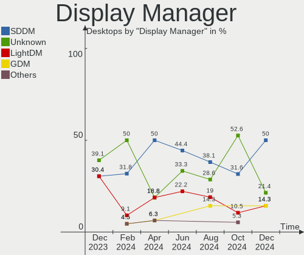
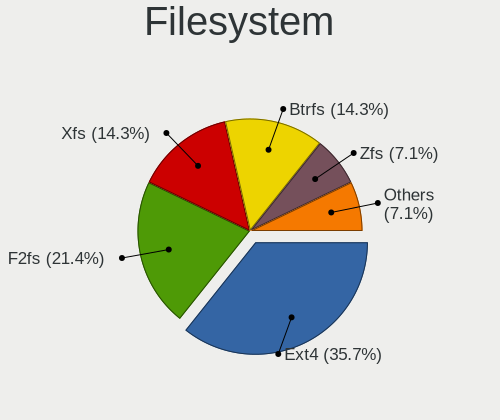
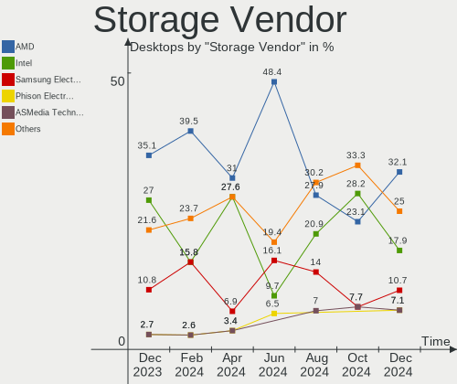

Gentoo Hardware Trends (Desktop)
--------------------------------

A project to identify most popular hardware characteristics and track their change
over time based on data collected by Gentoo users at https://Linux-Hardware.org.

Anyone can contribute to the study by uploading probes of their computers by
the [hw-probe](https://github.com/linuxhw/hw-probe) tool:

    sudo -E hw-probe -all -upload

Full-feature report is available here: https://linux-hardware.org/?view=trends&formfactor=desktop

Period: May, 2020.

Contents
--------

- [ OS                       ](#os)
- [ OS Family                ](#os-family)
- [ Kernel                   ](#kernel)
- [ Kernel Family            ](#kernel-family)
- [ Kernel Major Ver.        ](#kernel-major-ver)
- [ Arch                     ](#arch)
- [ DE                       ](#de)
- [ Display Server           ](#display-server)
- [ Display Manager          ](#display-manager)
- [ OS Lang                  ](#os-lang)
- [ Boot Mode                ](#boot-mode)
- [ Filesystem               ](#filesystem)
- [ Part. scheme             ](#part-scheme)
- [ Dual Boot with Linux/BSD ](#dual-boot-with-linux/bsd)
- [ Dual Boot (Win)          ](#dual-boot-win)
- [ Country                  ](#country)
- [ City                     ](#city)
- [ Vendor                   ](#vendor)
- [ Model                    ](#model)
- [ Model Family             ](#model-family)
- [ MFG Year                 ](#mfg-year)
- [ Form Factor              ](#form-factor)
- [ Secure Boot              ](#secure-boot)
- [ Coreboot                 ](#coreboot)
- [ RAM Size                 ](#ram-size)
- [ RAM Used                 ](#ram-used)
- [ Drive Vendor             ](#drive-vendor)
- [ Drive Model              ](#drive-model)
- [ Drive Kind               ](#drive-kind)
- [ Drive Connector          ](#drive-connector)
- [ Drive Size               ](#drive-size)
- [ Space Total              ](#space-total)
- [ Space Used               ](#space-used)
- [ Malfunc. Drives          ](#malfunc-drives)
- [ Malfunc. Drive Vendor    ](#malfunc-drive-vendor)
- [ Malfunc. Drive Kind      ](#malfunc-drive-kind)
- [ Failed Drives            ](#failed-drives)
- [ Failed Drive Vendor      ](#failed-drive-vendor)
- [ Drive Status             ](#drive-status)
- [ Storage Vendor           ](#storage-vendor)
- [ Storage Model            ](#storage-model)
- [ Storage Kind             ](#storage-kind)
- [ CPU Vendor               ](#cpu-vendor)
- [ CPU Model                ](#cpu-model)
- [ CPU Model Family         ](#cpu-model-family)
- [ CPU Cores                ](#cpu-cores)
- [ CPU Sockets              ](#cpu-sockets)
- [ CPU Threads              ](#cpu-threads)
- [ CPU Op-Modes             ](#cpu-op-modes)
- [ CPU Microcode            ](#cpu-microcode)
- [ CPU Microarch            ](#cpu-microarch)
- [ GPU Vendor               ](#gpu-vendor)
- [ GPU Model                ](#gpu-model)
- [ GPU Combo                ](#gpu-combo)
- [ GPU Driver               ](#gpu-driver)
- [ GPU Memory               ](#gpu-memory)
- [ Monitor Vendor           ](#monitor-vendor)
- [ Monitor Model            ](#monitor-model)
- [ Monitor Resolution       ](#monitor-resolution)
- [ Monitor Diagonal         ](#monitor-diagonal)
- [ Monitor Width            ](#monitor-width)
- [ Aspect Ratio             ](#aspect-ratio)
- [ Monitor Area             ](#monitor-area)
- [ Pixel Density            ](#pixel-density)
- [ Multiple Monitors        ](#multiple-monitors)
- [ Net Controller Vendor    ](#net-controller-vendor)
- [ Net Controller Model     ](#net-controller-model)
- [ Net Controller Kind      ](#net-controller-kind)
- [ Used Controller          ](#used-controller)
- [ NICs                     ](#nics)
- [ Unsupported Devices      ](#unsupported-devices)
- [ Unsupported Device Types ](#unsupported-device-types)

OS
--

Installed operating systems

| Name       | Computers | Percent |
|------------|-----------|---------|
| Gentoo     | 27        | 61.36%  |
| Gentoo 2.7 | 8         | 18.18%  |
| Gentoo 2.6 | 8         | 18.18%  |
| Gentoo 1   | 1         | 2.27%   |

OS Family
---------

OS without a version

| Name   | Computers | Percent |
|--------|-----------|---------|
| Gentoo | 44        | 100%    |

Kernel
------

Version of the Linux kernel

| Version                               | Computers | Percent |
|---------------------------------------|-----------|---------|
| 5.4.38-gentoo                         | 5         | 11.36%  |
| 5.6.11-gentoo                         | 4         | 9.09%   |
| 5.4.28-gentoo                         | 3         | 6.82%   |
| 5.6.13                                | 2         | 4.55%   |
| 5.4.38-gentoo-x86_64                  | 2         | 4.55%   |
| 5.6.9-zen1                            | 1         | 2.27%   |
| 5.6.8                                 | 1         | 2.27%   |
| 5.6.7                                 | 1         | 2.27%   |
| 5.6.2-gentoo                          | 1         | 2.27%   |
| 5.6.15-gentoo-x86_64                  | 1         | 2.27%   |
| 5.6.14-gentoo-limelight               | 1         | 2.27%   |
| 5.6.14-gentoo                         | 1         | 2.27%   |
| 5.6.13-gentoo                         | 1         | 2.27%   |
| 5.6.12-gentoo-x86_64                  | 1         | 2.27%   |
| 5.6.11-gentoo-nvidia                  | 1         | 2.27%   |
| 5.6.11-gentoo-ck1                     | 1         | 2.27%   |
| 5.6.0-pf6                             | 1         | 2.27%   |
| 5.5.13-gentoo                         | 1         | 2.27%   |
| 5.4.38-gentoo_zotac-ionitx-a-e_nvidia | 1         | 2.27%   |
| 5.4.38-gentoo_zotac-ionitx-a-e        | 1         | 2.27%   |
| 5.4.38-gentoo_TARGA-NOW_NT9231        | 1         | 2.27%   |
| 5.4.38-gentoo_B75M-D3H                | 1         | 2.27%   |
| 5.4.31-ck                             | 1         | 2.27%   |
| 5.4.30-gentoo-g7768687-dirty          | 1         | 2.27%   |
| 5.4.28-gentoo-zen1                    | 1         | 2.27%   |
| 5.4.28-gentoo-x86_64                  | 1         | 2.27%   |
| 5.4.18                                | 1         | 2.27%   |
| 5.4.17-gentoo                         | 1         | 2.27%   |
| 5.4.0-31-generic                      | 1         | 2.27%   |
| 5.3.1                                 | 1         | 2.27%   |
| 5.2.0                                 | 1         | 2.27%   |
| 4.19.97-gentoo-x86_64                 | 1         | 2.27%   |
| 4.19.86-gentoo                        | 1         | 2.27%   |

Kernel Family
-------------

Linux kernel without a distro release

| Version | Computers | Percent |
|---------|-----------|---------|
| 5.4.38  | 11        | 25%     |
| 5.6.11  | 6         | 13.64%  |
| 5.4.28  | 5         | 11.36%  |
| 5.6.13  | 3         | 6.82%   |
| 5.6.14  | 2         | 4.55%   |
| 5.6.9   | 1         | 2.27%   |
| 5.6.8   | 1         | 2.27%   |
| 5.6.7   | 1         | 2.27%   |
| 5.6.2   | 1         | 2.27%   |
| 5.6.15  | 1         | 2.27%   |
| 5.6.12  | 1         | 2.27%   |
| 5.6.0   | 1         | 2.27%   |
| 5.5.13  | 1         | 2.27%   |
| 5.4.31  | 1         | 2.27%   |
| 5.4.30  | 1         | 2.27%   |
| 5.4.18  | 1         | 2.27%   |
| 5.4.17  | 1         | 2.27%   |
| 5.4.0   | 1         | 2.27%   |
| 5.3.1   | 1         | 2.27%   |
| 5.2.0   | 1         | 2.27%   |
| 4.19.97 | 1         | 2.27%   |
| 4.19.86 | 1         | 2.27%   |

Kernel Major Ver.
-----------------

Linux kernel major version

| Version | Computers | Percent |
|---------|-----------|---------|
| 5.4     | 21        | 47.73%  |
| 5.6     | 18        | 40.91%  |
| 4.19    | 2         | 4.55%   |
| 5.5     | 1         | 2.27%   |
| 5.3     | 1         | 2.27%   |
| 5.2     | 1         | 2.27%   |

Arch
----

OS architecture (x86_64, i586, etc.)

| Name   | Computers | Percent |
|--------|-----------|---------|
| x86_64 | 43        | 97.73%  |
| i686   | 1         | 2.27%   |

DE
--

Desktop Environment

| Name    | Computers | Percent |
|---------|-----------|---------|
| Unknown | 32        | 72.73%  |
| XFCE    | 8         | 18.18%  |
| KDE     | 3         | 6.82%   |
| GNOME   | 1         | 2.27%   |

Display Server
--------------

X11 or Wayland

| Name    | Computers | Percent |
|---------|-----------|---------|
| X11     | 24        | 54.55%  |
| Unknown | 13        | 29.55%  |
| Tty     | 7         | 15.91%  |

Display Manager
---------------

SDDM, LightDM, etc.

| Name    | Computers | Percent |
|---------|-----------|---------|
| Unknown | 30        | 68.18%  |
| SDDM    | 4         | 9.09%   |
| XDM     | 3         | 6.82%   |
| SLiM    | 3         | 6.82%   |
| LightDM | 2         | 4.55%   |
| GDM     | 2         | 4.55%   |

OS Lang
-------

Language

| Lang       | Computers | Percent |
|------------|-----------|---------|
| en_US.utf8 | 10        | 22.73%  |
| en_CA      | 5         | 11.36%  |
| en_GB.utf8 | 4         | 9.09%   |
| de_DE.utf8 | 4         | 9.09%   |
| en_US      | 3         | 6.82%   |
| Unknown    | 3         | 6.82%   |
| cs_CZ.utf8 | 2         | 4.55%   |
| zh_CN      | 1         | 2.27%   |
| ru_UA.utf8 | 1         | 2.27%   |
| ru_RU      | 1         | 2.27%   |
| pt_BR      | 1         | 2.27%   |
| fr_FR.utf8 | 1         | 2.27%   |
| es_ES.utf8 | 1         | 2.27%   |
| en_GB      | 1         | 2.27%   |
| en_DK.utf8 | 1         | 2.27%   |
| en_DE      | 1         | 2.27%   |
| en_CA.utf8 | 1         | 2.27%   |
| de_DE      | 1         | 2.27%   |
| cs_CZ      | 1         | 2.27%   |
| C.UTF8     | 1         | 2.27%   |

Boot Mode
---------

EFI or BIOS

| Mode | Computers | Percent |
|------|-----------|---------|
| BIOS | 23        | 52.27%  |
| EFI  | 21        | 47.73%  |

Filesystem
----------

Type of filesystem

| Type     | Computers | Percent |
|----------|-----------|---------|
| Ext4     | 31        | 70.45%  |
| Btrfs    | 9         | 20.45%  |
| Zfs      | 2         | 4.55%   |
| Reiserfs | 1         | 2.27%   |
| F2fs     | 1         | 2.27%   |

Part. scheme
------------

Scheme of partitioning

| Type    | Computers | Percent |
|---------|-----------|---------|
| Unknown | 26        | 59.09%  |
| GPT     | 11        | 25%     |
| MBR     | 7         | 15.91%  |

Dual Boot with Linux/BSD
------------------------

Hosting more than one Linux/BSD

| Dual boot | Computers | Percent |
|-----------|-----------|---------|
| No        | 33        | 75%     |
| Yes       | 11        | 25%     |

Dual Boot (Win)
---------------

Hosting Linux and Windows

| Dual boot | Computers | Percent |
|-----------|-----------|---------|
| No        | 29        | 65.91%  |
| Yes       | 15        | 34.09%  |

Country
-------

Geographic location (country)

| Country        | Computers | Percent |
|----------------|-----------|---------|
| USA            | 10        | 22.73%  |
| Germany        | 8         | 18.18%  |
| Canada         | 6         | 13.64%  |
| Czech Republic | 3         | 6.82%   |
| Spain          | 2         | 4.55%   |
| Greece         | 2         | 4.55%   |
| France         | 2         | 4.55%   |
| Ukraine        | 1         | 2.27%   |
| UK             | 1         | 2.27%   |
| Sweden         | 1         | 2.27%   |
| Russia         | 1         | 2.27%   |
| Hong Kong      | 1         | 2.27%   |
| Estonia        | 1         | 2.27%   |
| Denmark        | 1         | 2.27%   |
| China          | 1         | 2.27%   |
| Brazil         | 1         | 2.27%   |
| Belarus        | 1         | 2.27%   |
| Austria        | 1         | 2.27%   |

City
----

Geographic location (city)

| City             | Computers | Percent |
|------------------|-----------|---------|
| Ottawa           | 6         | 13.64%  |
| Berlin           | 5         | 11.36%  |
| Šlapanice       | 3         | 6.82%   |
| Sahuarita        | 2         | 4.55%   |
| Clermont         | 2         | 4.55%   |
| Zaragoza         | 1         | 2.27%   |
| Vienna           | 1         | 2.27%   |
| Tallinn          | 1         | 2.27%   |
| São Paulo       | 1         | 2.27%   |
| Roubaix          | 1         | 2.27%   |
| Pittsfield       | 1         | 2.27%   |
| Palmers Green    | 1         | 2.27%   |
| Odense           | 1         | 2.27%   |
| Nuremberg        | 1         | 2.27%   |
| Novokuznetsk     | 1         | 2.27%   |
| Missoula         | 1         | 2.27%   |
| Livingston       | 1         | 2.27%   |
| Lisichansk       | 1         | 2.27%   |
| Guangzhou        | 1         | 2.27%   |
| Gallatin         | 1         | 2.27%   |
| Elefsina         | 1         | 2.27%   |
| Dunkirk          | 1         | 2.27%   |
| Colorado Springs | 1         | 2.27%   |
| Cologne          | 1         | 2.27%   |
| Central          | 1         | 2.27%   |
| Bromma           | 1         | 2.27%   |
| Brest            | 1         | 2.27%   |
| Brandon          | 1         | 2.27%   |
| Barcelona        | 1         | 2.27%   |
| Ano Syros        | 1         | 2.27%   |
| Alperstedt       | 1         | 2.27%   |

Vendor
------

Motherboard manufacturer

| Name                | Computers | Percent |
|---------------------|-----------|---------|
| ASUSTek Computer    | 14        | 31.82%  |
| Gigabyte Technology | 9         | 20.45%  |
| ASRock              | 6         | 13.64%  |
| MSI                 | 3         | 6.82%   |
| Hewlett-Packard     | 3         | 6.82%   |
| Dell                | 2         | 4.55%   |
| Unknown             | 2         | 4.55%   |
| Sun Microsystems    | 1         | 2.27%   |
| Pegatron            | 1         | 2.27%   |
| Foxconn             | 1         | 2.27%   |
| ASRockRack          | 1         | 2.27%   |
| Acer                | 1         | 2.27%   |

Model
-----

Motherboard model

| Name                         | Computers | Percent |
|------------------------------|-----------|---------|
| ASUS All Series              | 2         | 4.55%   |
| Unknown                      | 2         | 4.55%   |
| Sun Microsystems Ultra 24    | 1         | 2.27%   |
| Pegatron AY026AA-ABA CQ5300F | 1         | 2.27%   |
| MSI MS-7C02                  | 1         | 2.27%   |
| MSI MS-7A33                  | 1         | 2.27%   |
| MSI MS-7978                  | 1         | 2.27%   |
| HP Z600 Workstation          | 1         | 2.27%   |
| HP ENVY Desktop              | 1         | 2.27%   |
| HP Compaq 8000 Elite USDT PC | 1         | 2.27%   |
| Gigabyte Z97P-D3             | 1         | 2.27%   |
| Gigabyte X570 AORUS ELITE    | 1         | 2.27%   |
| Gigabyte M61SME-S2           | 1         | 2.27%   |
| Gigabyte H370M-D3H           | 1         | 2.27%   |
| Gigabyte GA-E350N-USB3       | 1         | 2.27%   |
| Gigabyte G31M-ES2L           | 1         | 2.27%   |
| Gigabyte B75M-D3H            | 1         | 2.27%   |
| Gigabyte B450M S2H           | 1         | 2.27%   |
| Gigabyte A320M-S2H           | 1         | 2.27%   |
| Foxconn nT-330i              | 1         | 2.27%   |
| Dell Precision 5820 Tower    | 1         | 2.27%   |
| Dell OptiPlex 7010           | 1         | 2.27%   |
| ASUS TUF X470-PLUS GAMING    | 1         | 2.27%   |
| ASUS STRIX H270F GAMING      | 1         | 2.27%   |
| ASUS ROG CROSSHAIR VIII HERO | 1         | 2.27%   |
| ASUS PRIME X470-PRO          | 1         | 2.27%   |
| ASUS P8Z77-V LE PLUS         | 1         | 2.27%   |
| ASUS P8B75-V                 | 1         | 2.27%   |
| ASUS P6TD DELUXE             | 1         | 2.27%   |
| ASUS Maximus VIII HERO       | 1         | 2.27%   |
| ASUS M5A97                   | 1         | 2.27%   |
| ASUS M2N-CM DVI              | 1         | 2.27%   |
| ASUS E45M1-I DELUXE          | 1         | 2.27%   |
| ASUS CROSSHAIR VI HERO       | 1         | 2.27%   |
| ASRockRack X470D4U           | 1         | 2.27%   |
| ASRock Z77 Extreme3          | 1         | 2.27%   |
| ASRock X570 Steel Legend     | 1         | 2.27%   |
| ASRock X470 Taichi           | 1         | 2.27%   |
| ASRock X370 Gaming K4        | 1         | 2.27%   |
| ASRock M3A785GXH/128M        | 1         | 2.27%   |
| ASRock B450M-HDV R4.0        | 1         | 2.27%   |
| Acer Aspire X1301            | 1         | 2.27%   |

Model Family
------------

Motherboard model prefix

| Name                   | Computers | Percent |
|------------------------|-----------|---------|
| ASUS All               | 2         | 4.55%   |
| Unknown                | 2         | 4.55%   |
| Sun Microsystems Ultra | 1         | 2.27%   |
| Pegatron AY026AA-ABA   | 1         | 2.27%   |
| MSI MS-7C02            | 1         | 2.27%   |
| MSI MS-7A33            | 1         | 2.27%   |
| MSI MS-7978            | 1         | 2.27%   |
| HP Z600                | 1         | 2.27%   |
| HP ENVY                | 1         | 2.27%   |
| HP Compaq              | 1         | 2.27%   |
| Gigabyte Z97P-D3       | 1         | 2.27%   |
| Gigabyte X570          | 1         | 2.27%   |
| Gigabyte M61SME-S2     | 1         | 2.27%   |
| Gigabyte H370M-D3H     | 1         | 2.27%   |
| Gigabyte GA-E350N-USB3 | 1         | 2.27%   |
| Gigabyte G31M-ES2L     | 1         | 2.27%   |
| Gigabyte B75M-D3H      | 1         | 2.27%   |
| Gigabyte B450M         | 1         | 2.27%   |
| Gigabyte A320M-S2H     | 1         | 2.27%   |
| Foxconn nT-330i        | 1         | 2.27%   |
| Dell Precision         | 1         | 2.27%   |
| Dell OptiPlex          | 1         | 2.27%   |
| ASUS TUF               | 1         | 2.27%   |
| ASUS STRIX             | 1         | 2.27%   |
| ASUS ROG               | 1         | 2.27%   |
| ASUS PRIME             | 1         | 2.27%   |
| ASUS P8Z77-V           | 1         | 2.27%   |
| ASUS P8B75-V           | 1         | 2.27%   |
| ASUS P6TD              | 1         | 2.27%   |
| ASUS Maximus           | 1         | 2.27%   |
| ASUS M5A97             | 1         | 2.27%   |
| ASUS M2N-CM            | 1         | 2.27%   |
| ASUS E45M1-I           | 1         | 2.27%   |
| ASUS CROSSHAIR         | 1         | 2.27%   |
| ASRockRack X470D4U     | 1         | 2.27%   |
| ASRock Z77             | 1         | 2.27%   |
| ASRock X570            | 1         | 2.27%   |
| ASRock X470            | 1         | 2.27%   |
| ASRock X370            | 1         | 2.27%   |
| ASRock M3A785GXH       | 1         | 2.27%   |
| ASRock B450M-HDV       | 1         | 2.27%   |
| Acer Aspire            | 1         | 2.27%   |

MFG Year
--------

Motherboard manufacture year

| Year | Computers | Percent |
|------|-----------|---------|
| 2019 | 11        | 25%     |
| 2018 | 6         | 13.64%  |
| 2009 | 5         | 11.36%  |
| 2014 | 4         | 9.09%   |
| 2020 | 3         | 6.82%   |
| 2010 | 3         | 6.82%   |
| 2008 | 3         | 6.82%   |
| 2016 | 2         | 4.55%   |
| 2015 | 2         | 4.55%   |
| 2013 | 2         | 4.55%   |
| 2017 | 1         | 2.27%   |
| 2012 | 1         | 2.27%   |
| 2011 | 1         | 2.27%   |

Form Factor
-----------

Physical design of the computer

| Name    | Computers | Percent |
|---------|-----------|---------|
| Desktop | 44        | 100%    |

Secure Boot
-----------

Enabled or disabled

| State    | Computers | Percent |
|----------|-----------|---------|
| Disabled | 43        | 97.73%  |
| Enabled  | 1         | 2.27%   |

Coreboot
--------

Have coreboot on board

| Used | Computers | Percent |
|------|-----------|---------|
| No   | 44        | 100%    |

RAM Size
--------

Total RAM memory

| Size in GB  | Computers | Percent |
|-------------|-----------|---------|
| 16.01-24.0  | 13        | 29.55%  |
| 32.01-64.0  | 11        | 25%     |
| 1.01-2.0    | 5         | 11.36%  |
| 3.01-4.0    | 4         | 9.09%   |
| 8.01-16.0   | 4         | 9.09%   |
| 64.01-256.0 | 3         | 6.82%   |
| 4.01-8.0    | 2         | 4.55%   |
| 24.01-32.0  | 1         | 2.27%   |
| 0.01-1.0    | 1         | 2.27%   |

RAM Used
--------

Used RAM memory

| Used GB    | Computers | Percent |
|------------|-----------|---------|
| 0.01-1.0   | 11        | 25%     |
| 1.01-2.0   | 9         | 20.45%  |
| 4.01-8.0   | 8         | 18.18%  |
| 2.01-3.0   | 7         | 15.91%  |
| 3.01-4.0   | 5         | 11.36%  |
| 32.01-64.0 | 2         | 4.55%   |
| 16.01-24.0 | 2         | 4.55%   |

Drive Vendor
------------

Hard drive vendors

| Vendor              | Computers | Drives | Percent |
|---------------------|-----------|--------|---------|
| WDC                 | 21        | 35     | 25.3%   |
| Samsung Electronics | 16        | 24     | 19.28%  |
| Seagate             | 15        | 18     | 18.07%  |
| Hitachi             | 7         | 7      | 8.43%   |
| SanDisk             | 5         | 6      | 6.02%   |
| Kingston            | 4         | 5      | 4.82%   |
| Intel               | 3         | 4      | 3.61%   |
| Crucial             | 3         | 3      | 3.61%   |
| Phison              | 2         | 2      | 2.41%   |
| Toshiba             | 1         | 1      | 1.2%    |
| Patriot             | 1         | 1      | 1.2%    |
| OCZ                 | 1         | 1      | 1.2%    |
| Linux               | 1         | 1      | 1.2%    |
| LaCie               | 1         | 1      | 1.2%    |
| HGST                | 1         | 1      | 1.2%    |
| Generic             | 1         | 1      | 1.2%    |

Drive Model
-----------

Hard drive models

| Model                       | Computers | Percent |
|-----------------------------|-----------|---------|
| ST500DM002-1BD142 500GB     | 3         | 2.7%    |
| WD40EFRX-68WT0N0 4TB        | 2         | 1.8%    |
| WD30EFRX-68EUZN0 3TB        | 2         | 1.8%    |
| WD10EZEX-08WN4A0 1TB        | 2         | 1.8%    |
| ST3500418AS 500GB           | 2         | 1.8%    |
| SSD PLUS 480GB              | 2         | 1.8%    |
| SSD 970 EVO 1TB             | 2         | 1.8%    |
| SSD 850 EVO 500GB           | 2         | 1.8%    |
| SSD 840 EVO 250GB           | 2         | 1.8%    |
| SA400S37120G 120GB SSD      | 2         | 1.8%    |
| HTS725050A9A362 500GB       | 2         | 1.8%    |
| HTS721080G9SA00 80GB        | 2         | 1.8%    |
| WD82PURZ-85TEUY0 8TB        | 1         | 0.9%    |
| WD80EFZX-68UW8N0 8TB        | 1         | 0.9%    |
| WD80EFAX-68LHPN0 8TB        | 1         | 0.9%    |
| WD80EFAX-68KNBN0 8TB        | 1         | 0.9%    |
| WD8001FFWX-68J1UN0 8TB      | 1         | 0.9%    |
| WD7500BPKX-22HPJT0 752GB    | 1         | 0.9%    |
| WD7500BPKT-60PK4T0 752GB    | 1         | 0.9%    |
| WD740ADFD-00NLR1 74GB       | 1         | 0.9%    |
| WD60EZAZ-00ZGHB0 6TB        | 1         | 0.9%    |
| WD5000AAVS-22G9B1 500GB     | 1         | 0.9%    |
| WD40EZRX-00SPEB0 4TB        | 1         | 0.9%    |
| WD40EFRX-68N32N0 4TB        | 1         | 0.9%    |
| WD4004FZWX-00GBGB0 4TB      | 1         | 0.9%    |
| WD4003FFBX-68MU3N0 4TB      | 1         | 0.9%    |
| WD3200AAKS-75VYA0 320GB     | 1         | 0.9%    |
| WD3200AAJS-65M0A0 320GB     | 1         | 0.9%    |
| WD30PURZ-85GU6Y0 3TB        | 1         | 0.9%    |
| WD2500BEVS-22UST0 250GB     | 1         | 0.9%    |
| WD2500AAKX-753CA1 250GB     | 1         | 0.9%    |
| WD2500AAKS-00YGA0 250GB     | 1         | 0.9%    |
| WD20EZRX-00D8PB0 2TB        | 1         | 0.9%    |
| WD20EZAZ-00GGJB0 2TB        | 1         | 0.9%    |
| WD20EFRX-68EUZN0 2TB        | 1         | 0.9%    |
| WD20EFRX-68AX9N0 2TB        | 1         | 0.9%    |
| WD1600BEVT-22ZCT0 160GB     | 1         | 0.9%    |
| WD1600AAJS-75M0A0 160GB     | 1         | 0.9%    |
| WD10EZEX-60WN4A0 1TB        | 1         | 0.9%    |
| WD10EZEX-00BN5A0 1TB        | 1         | 0.9%    |
| WD1003FZEX-00K3CA0 1TB      | 1         | 0.9%    |
| ST500LM012 HN-M500MBB 500GB | 1         | 0.9%    |
| ST4000VN008-2DR166 4TB      | 1         | 0.9%    |
| ST4000VN000-1H4168 4TB      | 1         | 0.9%    |
| ST4000DM000-1F2168 4TB      | 1         | 0.9%    |
| ST340016A 40GB              | 1         | 0.9%    |
| ST3320813AS 320GB           | 1         | 0.9%    |
| ST3000DM001-1ER166 3TB      | 1         | 0.9%    |
| ST3000DM001-1CH166 3TB      | 1         | 0.9%    |
| ST2000DM005-2CW102 2TB      | 1         | 0.9%    |
| ST2000DM001-1ER164 2TB      | 1         | 0.9%    |
| ST1000NM0033-9ZM173 1TB     | 1         | 0.9%    |
| ST1000NM0011 1TB            | 1         | 0.9%    |
| ST1000DM003-1CH162 1TB      | 1         | 0.9%    |
| SSDSC2CW240A3 240GB         | 1         | 0.9%    |
| SSDPEKNW512G8 512GB         | 1         | 0.9%    |
| SSDPEKNW020T8 2TB           | 1         | 0.9%    |
| SSDPEKKW128G7 128GB         | 1         | 0.9%    |
| SSD PLUS 240GB              | 1         | 0.9%    |
| SSD 970 PRO 1TB             | 1         | 0.9%    |

Drive Kind
----------

HDD or SSD

| Kind    | Computers | Drives | Percent |
|---------|-----------|--------|---------|
| HDD     | 40        | 68     | 52.63%  |
| SSD     | 22        | 28     | 28.95%  |
| NVMe    | 13        | 14     | 17.11%  |
| Unknown | 1         | 1      | 1.32%   |

Drive Connector
---------------

SATA, SAS, NVMe, etc.

| Type | Computers | Drives | Percent |
|------|-----------|--------|---------|
| SATA | 41        | 95     | 73.21%  |
| NVMe | 13        | 14     | 23.21%  |
| SAS  | 2         | 2      | 3.57%   |

Drive Size
----------

Size of hard drive

| Size in TB | Computers | Drives | Percent |
|------------|-----------|--------|---------|
| 0.01-0.5   | 36        | 52     | 42.35%  |
| 0.51-1.0   | 22        | 26     | 25.88%  |
| 1.01-2.0   | 11        | 11     | 12.94%  |
| 3.01-4.0   | 6         | 10     | 7.06%   |
| 2.01-3.0   | 6         | 6      | 7.06%   |
| 4.01-10.0  | 4         | 6      | 4.71%   |

Space Total
-----------

Amount of disk space available on the file system

| Size in GB     | Computers | Percent |
|----------------|-----------|---------|
| More than 3000 | 9         | 20.45%  |
| 101-250        | 9         | 20.45%  |
| 501-1000       | 8         | 18.18%  |
| 251-500        | 6         | 13.64%  |
| 1001-2000      | 4         | 9.09%   |
| 2001-3000      | 3         | 6.82%   |
| 51-100         | 3         | 6.82%   |
| Unknown        | 2         | 4.55%   |

Space Used
----------

Amount of used disk space

| Used GB        | Computers | Percent |
|----------------|-----------|---------|
| 1-20           | 11        | 25%     |
| 101-250        | 9         | 20.45%  |
| More than 3000 | 6         | 13.64%  |
| 51-100         | 6         | 13.64%  |
| 1001-2000      | 4         | 9.09%   |
| 501-1000       | 4         | 9.09%   |
| Unknown        | 2         | 4.55%   |
| 251-500        | 1         | 2.27%   |
| 21-50          | 1         | 2.27%   |

Malfunc. Drives
---------------

Drive models with a malfunction

| Model                   | Computers | Drives | Percent |
|-------------------------|-----------|--------|---------|
| WD40EFRX-68WT0N0 4TB    | 2         | 2      | 13.33%  |
| ST500DM002-1BD142 500GB | 2         | 2      | 13.33%  |
| ST3500418AS 500GB       | 2         | 2      | 13.33%  |
| WD5000AAVS-22G9B1 500GB | 1         | 1      | 6.67%   |
| WD4004FZWX-00GBGB0 4TB  | 1         | 1      | 6.67%   |
| ST3320813AS 320GB       | 1         | 1      | 6.67%   |
| ST1000NM0011 1TB        | 1         | 1      | 6.67%   |
| ST1000DM003-1CH162 1TB  | 1         | 1      | 6.67%   |
| SSDPEKKW128G7 128GB     | 1         | 1      | 6.67%   |
| HTS721080G9SA00 80GB    | 1         | 1      | 6.67%   |
| HTS421260H9AT00 64GB    | 1         | 1      | 6.67%   |
| HD103UJ 1TB             | 1         | 1      | 6.67%   |

Malfunc. Drive Vendor
---------------------

Vendors of faulty drives

| Vendor              | Computers | Drives | Percent |
|---------------------|-----------|--------|---------|
| Seagate             | 6         | 7      | 42.86%  |
| WDC                 | 4         | 4      | 28.57%  |
| Hitachi             | 2         | 2      | 14.29%  |
| Samsung Electronics | 1         | 1      | 7.14%   |
| Intel               | 1         | 1      | 7.14%   |

Malfunc. Drive Kind
-------------------

Kinds of faulty drives

| Kind | Computers | Drives | Percent |
|------|-----------|--------|---------|
| HDD  | 12        | 14     | 92.31%  |
| NVMe | 1         | 1      | 7.69%   |

Failed Drives
-------------

Failed drive models

Zero info for selected period =(

Failed Drive Vendor
-------------------

Failed drive vendors

Zero info for selected period =(

Drive Status
------------

Number of failed and malfunc. drives

| Status   | Computers | Drives | Percent |
|----------|-----------|--------|---------|
| Works    | 40        | 94     | 72.73%  |
| Malfunc  | 13        | 15     | 23.64%  |
| Detected | 2         | 2      | 3.64%   |

Storage Vendor
--------------

Storage controller vendors

| Vendor                           | Computers | Percent |
|----------------------------------|-----------|---------|
| Intel                            | 20        | 29.41%  |
| AMD                              | 18        | 26.47%  |
| Samsung Electronics              | 8         | 11.76%  |
| Nvidia                           | 6         | 8.82%   |
| ASMedia Technology               | 4         | 5.88%   |
| Marvell Technology Group         | 3         | 4.41%   |
| Phison Electronics               | 2         | 2.94%   |
| VIA Technologies                 | 1         | 1.47%   |
| Silicon Integrated Systems [SiS] | 1         | 1.47%   |
| LSI Logic / Symbios Logic        | 1         | 1.47%   |
| Kingston Technology Company      | 1         | 1.47%   |
| JMicron Technology               | 1         | 1.47%   |
| Broadcom / LSI                   | 1         | 1.47%   |
| Adaptec                          | 1         | 1.47%   |

Storage Model
-------------

Storage controller models

| Model                                                                   | Computers | Percent |
|-------------------------------------------------------------------------|-----------|---------|
| FCH SATA Controller [AHCI mode]                                         | 14        | 15.91%  |
| 400 Series Chipset SATA Controller                                      | 7         | 7.95%   |
| NVMe SSD Controller SM981/PM981/PM983                                   | 5         | 5.68%   |
| 7 Series/C210 Series Chipset Family 6-port SATA Controller [AHCI mode]  | 5         | 5.68%   |
| SB7x0/SB8x0/SB9x0 SATA Controller [AHCI mode]                           | 4         | 4.55%   |
| ASM1062 Serial ATA Controller                                           | 4         | 4.55%   |
| X370 Series Chipset SATA Controller                                     | 3         | 3.41%   |
| SSD 660P Series                                                         | 2         | 2.27%   |
| SB7x0/SB8x0/SB9x0 IDE Controller                                        | 2         | 2.27%   |
| SATA Controller [RAID mode]                                             | 2         | 2.27%   |
| Q170/Q150/B150/H170/H110/Z170/CM236 Chipset SATA Controller [AHCI Mode] | 2         | 2.27%   |
| NVMe SSD Controller SM961/PM961                                         | 2         | 2.27%   |
| MCP61 SATA Controller                                                   | 2         | 2.27%   |
| 9 Series Chipset Family SATA Controller [AHCI Mode]                     | 2         | 2.27%   |
| VT6421 IDE/SATA Controller                                              | 1         | 1.14%   |
| SSD 600P Series                                                         | 1         | 1.14%   |
| SATA Controller / IDE mode                                              | 1         | 1.14%   |
| SAS2308 PCI-Express Fusion-MPT SAS-2                                    | 1         | 1.14%   |
| SAS2008 PCI-Express Fusion-MPT SAS-2 [Falcon]                           | 1         | 1.14%   |
| NVMe SSD Controller SM951/PM951                                         | 1         | 1.14%   |
| Non-Volatile memory controller                                          | 1         | 1.14%   |
| NM10/ICH7 Family SATA Controller [IDE mode]                             | 1         | 1.14%   |
| MCP79 SATA Controller                                                   | 1         | 1.14%   |
| MCP79 AHCI Controller                                                   | 1         | 1.14%   |
| MCP78S [GeForce 8200] IDE                                               | 1         | 1.14%   |
| MCP78S [GeForce 8200] AHCI Controller                                   | 1         | 1.14%   |
| MCP67 IDE Controller                                                    | 1         | 1.14%   |
| MCP67 AHCI Controller                                                   | 1         | 1.14%   |
| MCP61 IDE                                                               | 1         | 1.14%   |
| JMB363 SATA/IDE Controller                                              | 1         | 1.14%   |
| FCH SATA Controller D                                                   | 1         | 1.14%   |
| E16 PCIe4 NVMe Controller                                               | 1         | 1.14%   |
| E12 NVMe Controller                                                     | 1         | 1.14%   |
| Cannon Lake PCH SATA AHCI Controller                                    | 1         | 1.14%   |
| C610/X99 series chipset sSATA Controller [AHCI mode]                    | 1         | 1.14%   |
| C610/X99 series chipset 6-Port SATA Controller [AHCI mode]              | 1         | 1.14%   |
| C600/X79 series chipset SATA RAID Controller                            | 1         | 1.14%   |
| AIC-7861                                                                | 1         | 1.14%   |
| 92xx SATA 6G Controller                                                 | 1         | 1.14%   |
| 88SE9120 SATA 6Gb/s Controller                                          | 1         | 1.14%   |
| 88SE6111/6121 SATA II / PATA Controller                                 | 1         | 1.14%   |
| 82801JI (ICH10 Family) SATA AHCI Controller                             | 1         | 1.14%   |
| 82801JD/DO (ICH10 Family) SATA AHCI Controller                          | 1         | 1.14%   |
| 82801IR/IO/IH (ICH9R/DO/DH) 6 port SATA Controller [AHCI mode]          | 1         | 1.14%   |
| 5513 IDE Controller                                                     | 1         | 1.14%   |
| 200 Series PCH SATA controller [AHCI mode]                              | 1         | 1.14%   |

Storage Kind
------------

Kind of storage controller (IDE, SATA, NVMe, SAS, ...)

| Kind | Computers | Percent |
|------|-----------|---------|
| SATA | 36        | 53.73%  |
| NVMe | 13        | 19.4%   |
| IDE  | 11        | 16.42%  |
| RAID | 4         | 5.97%   |
| SAS  | 2         | 2.99%   |
| SCSI | 1         | 1.49%   |

CPU Vendor
----------

Processor vendors

| Vendor | Computers | Percent |
|--------|-----------|---------|
| Intel  | 22        | 50%     |
| AMD    | 22        | 50%     |

CPU Model
---------

Processor models

| Model                                       | Computers | Percent |
|---------------------------------------------|-----------|---------|
| Intel Atom CPU 330 @ 1.60GHz                | 2         | 4.55%   |
| AMD Ryzen 7 3800X 8-Core Processor          | 2         | 4.55%   |
| AMD Ryzen 7 3700X 8-Core Processor          | 2         | 4.55%   |
| AMD Ryzen 7 2700 Eight-Core Processor       | 2         | 4.55%   |
| AMD Ryzen 5 3600 6-Core Processor           | 2         | 4.55%   |
| Intel Xeon W-2104 CPU @ 3.20GHz             | 1         | 2.27%   |
| Intel Xeon CPU X5675 @ 3.07GHz              | 1         | 2.27%   |
| Intel Xeon CPU E3-1230 v3 @ 3.30GHz         | 1         | 2.27%   |
| Intel Pentium CPU G2030 @ 3.00GHz           | 1         | 2.27%   |
| Intel Core i7-8700K CPU @ 3.70GHz           | 1         | 2.27%   |
| Intel Core i7-7700K CPU @ 4.20GHz           | 1         | 2.27%   |
| Intel Core i7-7700 CPU @ 3.60GHz            | 1         | 2.27%   |
| Intel Core i7-6700K CPU @ 4.00GHz           | 1         | 2.27%   |
| Intel Core i7-5930K CPU @ 3.50GHz           | 1         | 2.27%   |
| Intel Core i7-4770K CPU @ 3.50GHz           | 1         | 2.27%   |
| Intel Core i7-3770 CPU @ 3.40GHz            | 1         | 2.27%   |
| Intel Core i7 CPU 950 @ 3.07GHz             | 1         | 2.27%   |
| Intel Core i5-7600K CPU @ 3.80GHz           | 1         | 2.27%   |
| Intel Core i5-3470 CPU @ 3.20GHz            | 1         | 2.27%   |
| Intel Core i5-2500K CPU @ 3.30GHz           | 1         | 2.27%   |
| Intel Core i5-2400 CPU @ 3.10GHz            | 1         | 2.27%   |
| Intel Core 2 Quad CPU Q9650 @ 3.00GHz       | 1         | 2.27%   |
| Intel Core 2 Duo CPU E8600 @ 3.33GHz        | 1         | 2.27%   |
| Intel Core 2 CPU 6400 @ 2.13GHz             | 1         | 2.27%   |
| Intel Atom CPU 230 @ 1.60GHz                | 1         | 2.27%   |
| AMD Sempron Processor LE-1300               | 1         | 2.27%   |
| AMD Sempron Processor 3000+                 | 1         | 2.27%   |
| AMD Ryzen 9 3900X 12-Core Processor         | 1         | 2.27%   |
| AMD Ryzen 7 2700X Eight-Core Processor      | 1         | 2.27%   |
| AMD Ryzen 7 1700 Eight-Core Processor       | 1         | 2.27%   |
| AMD Ryzen 5 1600X Six-Core Processor        | 1         | 2.27%   |
| AMD Ryzen 5 1600 Six-Core Processor         | 1         | 2.27%   |
| AMD Ryzen 3 2200G with Radeon Vega Graphics | 1         | 2.27%   |
| AMD Phenom II X4 965 Processor              | 1         | 2.27%   |
| AMD FX-8150 Eight-Core Processor            | 1         | 2.27%   |
| AMD E-450 APU with Radeon HD Graphics       | 1         | 2.27%   |
| AMD E-350 Processor                         | 1         | 2.27%   |
| AMD Athlon Processor LE-1640                | 1         | 2.27%   |
| AMD Athlon II X3 425 Processor              | 1         | 2.27%   |

CPU Model Family
----------------

Processor model prefix

| Model             | Computers | Percent |
|-------------------|-----------|---------|
| Intel Core i7     | 8         | 18.18%  |
| AMD Ryzen 7       | 8         | 18.18%  |
| Intel Core i5     | 4         | 9.09%   |
| AMD Ryzen 5       | 4         | 9.09%   |
| Intel Xeon        | 3         | 6.82%   |
| Intel Atom        | 3         | 6.82%   |
| AMD Sempron       | 2         | 4.55%   |
| AMD E             | 2         | 4.55%   |
| Intel Pentium     | 1         | 2.27%   |
| Intel Core 2 Quad | 1         | 2.27%   |
| Intel Core 2 Duo  | 1         | 2.27%   |
| Intel Core 2      | 1         | 2.27%   |
| AMD Ryzen 9       | 1         | 2.27%   |
| AMD Ryzen 3       | 1         | 2.27%   |
| AMD Phenom II X4  | 1         | 2.27%   |
| AMD FX            | 1         | 2.27%   |
| AMD Athlon II X3  | 1         | 2.27%   |
| AMD Athlon        | 1         | 2.27%   |

CPU Cores
---------

Number of processor cores

| Number | Computers | Percent |
|--------|-----------|---------|
| 4      | 16        | 36.36%  |
| 8      | 8         | 18.18%  |
| 2      | 7         | 15.91%  |
| 6      | 6         | 13.64%  |
| 1      | 4         | 9.09%   |
| 12     | 2         | 4.55%   |
| 3      | 1         | 2.27%   |

CPU Sockets
-----------

Number of sockets

| Number | Computers | Percent |
|--------|-----------|---------|
| 1      | 43        | 97.73%  |
| 2      | 1         | 2.27%   |

CPU Threads
-----------

Threads per core (Hyper-Threading)

| Number | Computers | Percent |
|--------|-----------|---------|
| 2      | 27        | 61.36%  |
| 1      | 17        | 38.64%  |

CPU Op-Modes
------------

CPU Operation Modes (32-bit, 64-bit)

| Op mode        | Computers | Percent |
|----------------|-----------|---------|
| 32-bit, 64-bit | 44        | 100%    |

CPU Microcode
-------------

Microcode number

| Number     | Computers | Percent |
|------------|-----------|---------|
| Unknown    | 8         | 18.18%  |
| 0x08701013 | 6         | 13.64%  |
| 0x906e9    | 3         | 6.82%   |
| 0x0800820d | 3         | 6.82%   |
| 0x08001138 | 3         | 6.82%   |
| 0x306a9    | 2         | 4.55%   |
| 0x206a7    | 2         | 4.55%   |
| 0x106c2    | 2         | 4.55%   |
| 0x906ea    | 1         | 2.27%   |
| 0x6f6      | 1         | 2.27%   |
| 0x506e3    | 1         | 2.27%   |
| 0x50654    | 1         | 2.27%   |
| 0x306f2    | 1         | 2.27%   |
| 0x306c3    | 1         | 2.27%   |
| 0x206c2    | 1         | 2.27%   |
| 0x1067a    | 1         | 2.27%   |
| 0x08701021 | 1         | 2.27%   |
| 0x0810100b | 1         | 2.27%   |
| 0x0600063e | 1         | 2.27%   |
| 0x05000119 | 1         | 2.27%   |
| 0x05000028 | 1         | 2.27%   |
| 0x010000c8 | 1         | 2.27%   |
| 0x01000086 | 1         | 2.27%   |

CPU Microarch
-------------

Microarchitecture

| Name        | Computers | Percent |
|-------------|-----------|---------|
| Zen 2       | 7         | 15.91%  |
| Skylake     | 6         | 13.64%  |
| Zen         | 4         | 9.09%   |
| Zen+        | 3         | 6.82%   |
| K8 Hammer   | 3         | 6.82%   |
| IvyBridge   | 3         | 6.82%   |
| Haswell     | 3         | 6.82%   |
| Bonnell     | 3         | 6.82%   |
| SandyBridge | 2         | 4.55%   |
| K10         | 2         | 4.55%   |
| Core        | 2         | 4.55%   |
| Bobcat      | 2         | 4.55%   |
| Westmere    | 1         | 2.27%   |
| Penryn      | 1         | 2.27%   |
| Nehalem     | 1         | 2.27%   |
| Bulldozer   | 1         | 2.27%   |

GPU Vendor
----------

Vendors of graphics cards

| Vendor                           | Computers | Percent |
|----------------------------------|-----------|---------|
| Nvidia                           | 23        | 52.27%  |
| AMD                              | 14        | 31.82%  |
| Intel                            | 5         | 11.36%  |
| Silicon Integrated Systems [SiS] | 1         | 2.27%   |
| ASPEED Technology                | 1         | 2.27%   |

GPU Model
---------

Graphics card models

| Model                                                                 | Computers | Percent |
|-----------------------------------------------------------------------|-----------|---------|
| Navi 10 [Radeon RX 5600 OEM/5600 XT / 5700/5700 XT]                   | 3         | 6.82%   |
| GT218 [GeForce 210]                                                   | 3         | 6.82%   |
| Xeon E3-1200 v2/3rd Gen Core processor Graphics Controller            | 2         | 4.55%   |
| GP106 [GeForce GTX 1060 6GB]                                          | 2         | 4.55%   |
| GK208B [GeForce GT 710]                                               | 2         | 4.55%   |
| Ellesmere [Radeon RX 470/480/570/570X/580/580X/590]                   | 2         | 4.55%   |
| C79 [ION]                                                             | 2         | 4.55%   |
| Xeon E3-1200 v3/4th Gen Core Processor Integrated Graphics Controller | 1         | 2.27%   |
| Wrestler [Radeon HD 6320]                                             | 1         | 2.27%   |
| Wrestler [Radeon HD 6310]                                             | 1         | 2.27%   |
| Vega 20 [Radeon VII]                                                  | 1         | 2.27%   |
| Vega 10 XL/XT [Radeon RX Vega 56/64]                                  | 1         | 2.27%   |
| UHD Graphics 630 (Desktop)                                            | 1         | 2.27%   |
| TU117 [GeForce GTX 1650]                                              | 1         | 2.27%   |
| RV620 LE [Radeon HD 3450]                                             | 1         | 2.27%   |
| Raven Ridge [Radeon Vega Series / Radeon Vega Mobile Series]          | 1         | 2.27%   |
| Oland PRO [Radeon R7 240/340]                                         | 1         | 2.27%   |
| GP108 [GeForce GT 1030]                                               | 1         | 2.27%   |
| GP107GL [Quadro P400]                                                 | 1         | 2.27%   |
| GP106 [GeForce GTX 1060 3GB]                                          | 1         | 2.27%   |
| GP104 [GeForce GTX 1070]                                              | 1         | 2.27%   |
| GM204 [GeForce GTX 980]                                               | 1         | 2.27%   |
| GM204 [GeForce GTX 970]                                               | 1         | 2.27%   |
| GM107 [GeForce GTX 750 Ti]                                            | 1         | 2.27%   |
| GK208B [GeForce GT 730]                                               | 1         | 2.27%   |
| GK107 [GeForce GT 740]                                                | 1         | 2.27%   |
| GK104 [GeForce GTX 770]                                               | 1         | 2.27%   |
| Cedar [Radeon HD 5000/6000/7350/8350 Series]                          | 1         | 2.27%   |
| C77 [GeForce 8200]                                                    | 1         | 2.27%   |
| C68 [GeForce 7025 / nForce 630a]                                      | 1         | 2.27%   |
| C61 [GeForce 6150SE nForce 430]                                       | 1         | 2.27%   |
| Barts XT [Radeon HD 6870]                                             | 1         | 2.27%   |
| ASPEED Graphics Family                                                | 1         | 2.27%   |
| 771/671 PCIE VGA Display Adapter                                      | 1         | 2.27%   |
| 4 Series Chipset Integrated Graphics Controller                       | 1         | 2.27%   |

GPU Combo
---------

Combinations of graphics cards

| Name       | Computers | Percent |
|------------|-----------|---------|
| 1 x Nvidia | 23        | 52.27%  |
| 1 x AMD    | 14        | 31.82%  |
| 1 x Intel  | 5         | 11.36%  |
| 1 x SiS    | 1         | 2.27%   |
| 1 x ASPEED | 1         | 2.27%   |

GPU Driver
----------

Free vs proprietary

| Driver      | Computers | Percent |
|-------------|-----------|---------|
| Free        | 24        | 54.55%  |
| Proprietary | 14        | 31.82%  |
| Unknown     | 6         | 13.64%  |

GPU Memory
----------

Total video memory

| Size in GB | Computers | Percent |
|------------|-----------|---------|
| Unknown    | 14        | 31.82%  |
| 1.01-2.0   | 8         | 18.18%  |
| 7.01-8.0   | 7         | 15.91%  |
| 0.01-0.5   | 5         | 11.36%  |
| 0.51-1.0   | 4         | 9.09%   |
| 3.01-4.0   | 3         | 6.82%   |
| 5.01-6.0   | 1         | 2.27%   |
| 2.01-3.0   | 1         | 2.27%   |
| 8.01-16.0  | 1         | 2.27%   |

Monitor Vendor
--------------

Monitor vendors

| Vendor               | Computers | Percent |
|----------------------|-----------|---------|
| Goldstar             | 9         | 23.08%  |
| Samsung Electronics  | 7         | 17.95%  |
| Dell                 | 4         | 10.26%  |
| AOC                  | 3         | 7.69%   |
| LG Electronics       | 2         | 5.13%   |
| Eizo                 | 2         | 5.13%   |
| BenQ                 | 2         | 5.13%   |
| Ancor Communications | 2         | 5.13%   |
| Unknown              | 1         | 2.56%   |
| Sony                 | 1         | 2.56%   |
| Philips              | 1         | 2.56%   |
| MSI                  | 1         | 2.56%   |
| Lenovo Group Limited | 1         | 2.56%   |
| Lenovo               | 1         | 2.56%   |
| Iiyama               | 1         | 2.56%   |
| Idek Iiyama          | 1         | 2.56%   |

Monitor Model
-------------

Monitor models

| Model                                              | Computers | Percent |
|----------------------------------------------------|-----------|---------|
| VE247 ACI2493 1920x1080 531x299mm 24.0-inch        | 1         | 2.44%   |
| U28E590 SAM0C4C 3840x2160 608x345mm 27.5-inch      | 1         | 2.44%   |
| U28D590 SAM0B80 3840x2160 607x345mm 27.5-inch      | 1         | 2.44%   |
| TV *00 SNYA204 3840x2160 1218x685mm 55.0-inch      | 1         | 2.44%   |
| SyncMaster SAM056A 1440x900 470x300mm 22.0-inch    | 1         | 2.44%   |
| SyncMaster SAM016C 1280x1024 376x301mm 19.0-inch   | 1         | 2.44%   |
| SyncMaster SAM011F 1280x1024 376x301mm 19.0-inch   | 1         | 2.44%   |
| PL2473HD IVM6107 1920x1080 521x293mm 23.5-inch     | 1         | 2.44%   |
| PD271F AOC2710 1920x1080 598x336mm 27.0-inch       | 1         | 2.44%   |
| P2314H DEL409A 1920x1080 509x286mm 23.0-inch       | 1         | 2.44%   |
| MAG272QR MSI3CA8 2560x1440 597x336mm 27.0-inch     | 1         | 2.44%   |
| LG ULTRAWIDE GSM59F1 1920x1080 580x240mm 24.7-inch | 1         | 2.44%   |
| LEN T22i-10 LEN61A9 1920x1080 476x268mm 21.5-inch  | 1         | 2.44%   |
| LCD Monitor U3219Q 3840x2160                       | 1         | 2.44%   |
| LCD Monitor SAMSUNG 1920x1080                      | 1         | 2.44%   |
| LCD Monitor SAM0C39 1920x1080 1050x590mm 47.4-inch | 1         | 2.44%   |
| LCD Monitor PL2473HD 1920x1080                     | 1         | 2.44%   |
| LCD Monitor LG HDR WFHD 2560x1080                  | 1         | 2.44%   |
| LCD Monitor LG HDR 4K                              | 1         | 2.44%   |
| LCD Monitor LEN L1700pC 1280x1024                  | 1         | 2.44%   |
| L227W GSM566E 1680x1050 474x296mm 22.0-inch        | 1         | 2.44%   |
| L1781Q GSM43DD 1280x1024 338x270mm 17.0-inch       | 1         | 2.44%   |
| IPS277 GSM5903 1920x1080 600x340mm 27.2-inch       | 1         | 2.44%   |
| IPS FULLHD GSM5AB8 1920x1080 480x270mm 21.7-inch   | 1         | 2.44%   |
| IPS FULLHD GSM5AB7 1920x1080 480x270mm 21.7-inch   | 1         | 2.44%   |
| HDR 4K GSM7707 3840x2160 600x340mm 27.2-inch       | 1         | 2.44%   |
| GW2406Z BNQ78E1 1920x1080 530x300mm 24.0-inch      | 1         | 2.44%   |
| EW2440L BNQ7938 1920x1080 531x298mm 24.0-inch      | 1         | 2.44%   |
| EV2455 ENC2533 1920x1200 519x324mm 24.1-inch       | 1         | 2.44%   |
| E2216HV DELF06F 1920x1080 476x268mm 21.5-inch      | 1         | 2.44%   |
| E1910 GSM4BEA 1280x1024 376x301mm 19.0-inch        | 1         | 2.44%   |
| CS2731 ENC3074 2560x1440 597x336mm 27.0-inch       | 1         | 2.44%   |
| CF791 SAM0DC4 3440x1440 797x333mm 34.0-inch        | 1         | 2.44%   |
| C32F391 SAM0D34 1920x1080 698x393mm 31.5-inch      | 1         | 2.44%   |
| ASUS VX239 ACI23E1 1920x1080 509x286mm 23.0-inch   | 1         | 2.44%   |
| 2790 AOC2790 1920x1080 598x336mm 27.0-inch         | 1         | 2.44%   |
| 24MB56 GSM5A98 1920x1080 510x290mm 23.1-inch       | 1         | 2.44%   |
| 24EN33 GSM59D6 1920x1080 521x293mm 23.5-inch       | 1         | 2.44%   |
| 2460 AOC2460 1920x1080 531x299mm 24.0-inch         | 1         | 2.44%   |
| 240PW PHL0873 1920x1200 519x324mm 24.1-inch        | 1         | 2.44%   |
| 1907FP DEL4014 1280x1024 376x301mm 19.0-inch       | 1         | 2.44%   |

Monitor Resolution
------------------

Monitor screen resolution

| Resolution         | Computers | Percent |
|--------------------|-----------|---------|
| 1920x1080 (FHD)    | 18        | 46.15%  |
| 3840x2160 (4K)     | 6         | 15.38%  |
| 1280x1024 (SXGA)   | 5         | 12.82%  |
| 2560x1440 (QHD)    | 3         | 7.69%   |
| 2560x1080          | 2         | 5.13%   |
| 1680x1050 (WSXGA+) | 2         | 5.13%   |
| 3440x1440          | 1         | 2.56%   |
| 1920x1200 (WUXGA)  | 1         | 2.56%   |
| Unknown            | 1         | 2.56%   |

Monitor Diagonal
----------------

Diagonal size in inches

| Inches  | Computers | Percent |
|---------|-----------|---------|
| 27      | 8         | 20%     |
| 24      | 6         | 15%     |
| Unknown | 6         | 15%     |
| 23      | 5         | 12.5%   |
| 21      | 5         | 12.5%   |
| 19      | 3         | 7.5%    |
| 34      | 2         | 5%      |
| 55      | 1         | 2.5%    |
| 40      | 1         | 2.5%    |
| 31      | 1         | 2.5%    |
| 22      | 1         | 2.5%    |
| 17      | 1         | 2.5%    |

Monitor Width
-------------

Physical width

| Width in mm | Computers | Percent |
|-------------|-----------|---------|
| 501-600     | 16        | 41.03%  |
| 401-500     | 6         | 15.38%  |
| Unknown     | 6         | 15.38%  |
| 601-700     | 3         | 7.69%   |
| 351-400     | 3         | 7.69%   |
| 701-800     | 2         | 5.13%   |
| 801-900     | 1         | 2.56%   |
| 301-350     | 1         | 2.56%   |
| 1001-1500   | 1         | 2.56%   |

Aspect Ratio
------------

Proportional relationship between the width and the height

| Ratio   | Computers | Percent |
|---------|-----------|---------|
| 16/9    | 22        | 57.89%  |
| Unknown | 6         | 15.79%  |
| 5/4     | 4         | 10.53%  |
| 16/10   | 4         | 10.53%  |
| 21/9    | 2         | 5.26%   |

Monitor Area
------------

Area in inch²

| Area in inch² | Computers | Percent |
|----------------|-----------|---------|
| 201-250        | 12        | 30.77%  |
| 301-350        | 8         | 20.51%  |
| Unknown        | 6         | 15.38%  |
| 151-200        | 5         | 12.82%  |
| 351-500        | 3         | 7.69%   |
| 251-300        | 2         | 5.13%   |
| More than 1000 | 1         | 2.56%   |
| 141-150        | 1         | 2.56%   |
| 501-1000       | 1         | 2.56%   |

Pixel Density
-------------

Pixels per inch

| Density | Computers | Percent |
|---------|-----------|---------|
| 51-100  | 20        | 52.63%  |
| 101-120 | 8         | 21.05%  |
| Unknown | 6         | 15.79%  |
| 161-240 | 3         | 7.89%   |
| 121-160 | 1         | 2.63%   |

Multiple Monitors
-----------------

Total monitors connected

| Total | Computers | Percent |
|-------|-----------|---------|
| 1     | 30        | 68.18%  |
| 0     | 8         | 18.18%  |
| 2     | 5         | 11.36%  |
| 3     | 1         | 2.27%   |

Net Controller Vendor
---------------------

Controller vendors

| Vendor             | Computers | Percent |
|--------------------|-----------|---------|
| Intel              | 12        | 75%     |
| Nvidia             | 2         | 12.5%   |
| Netchip Technology | 2         | 12.5%   |

Net Controller Model
--------------------

Controller models

| Model                                           | Computers | Percent |
|-------------------------------------------------|-----------|---------|
| I211 Gigabit Network Connection                 | 7         | 38.89%  |
| Wi-Fi 6 AX200                                   | 2         | 11.11%  |
| MCP61 Ethernet                                  | 2         | 11.11%  |
| Linux-USB Serial Gadget (CDC ACM mode)          | 2         | 11.11%  |
| I210 Gigabit Network Connection                 | 1         | 5.56%   |
| 82579LM Gigabit Network Connection (Lewisville) | 1         | 5.56%   |
| 82576 Gigabit Network Connection                | 1         | 5.56%   |
| 82567LM-3 Gigabit Network Connection            | 1         | 5.56%   |
| 82566DM-2 Gigabit Network Connection            | 1         | 5.56%   |

Net Controller Kind
-------------------

Ethernet, WiFi or modem

| Kind     | Computers | Percent |
|----------|-----------|---------|
| Ethernet | 13        | 72.22%  |
| WiFi     | 3         | 16.67%  |
| Modem    | 2         | 11.11%  |

Used Controller
---------------

Currently used network controller

| Kind     | Computers | Percent |
|----------|-----------|---------|
| Ethernet | 10        | 76.92%  |
| WiFi     | 3         | 23.08%  |

NICs
----

Total network controllers on board

| Total | Computers | Percent |
|-------|-----------|---------|
| 1     | 27        | 61.36%  |
| 2     | 13        | 29.55%  |
| 3     | 3         | 6.82%   |
| 4     | 1         | 2.27%   |

Unsupported Devices
-------------------

Total unsupported devices on board

| Total | Computers | Percent |
|-------|-----------|---------|
| 0     | 24        | 54.55%  |
| 1     | 11        | 25%     |
| 2     | 8         | 18.18%  |
| 3     | 1         | 2.27%   |

Unsupported Device Types
------------------------

Types of unsupported devices

| Type                     | Computers | Percent |
|--------------------------|-----------|---------|
| Communication controller | 7         | 24.14%  |
| Graphics card            | 6         | 20.69%  |
| Sound                    | 5         | 17.24%  |
| Bluetooth                | 2         | 6.9%    |
| Unassigned class         | 1         | 3.45%   |
| Storage/ide              | 1         | 3.45%   |
| Network                  | 1         | 3.45%   |
| Net/wireless             | 1         | 3.45%   |
| Net/ethernet             | 1         | 3.45%   |
| Multimedia controller    | 1         | 3.45%   |
| Firewire controller      | 1         | 3.45%   |
| Fingerprint reader       | 1         | 3.45%   |
| Chipcard                 | 1         | 3.45%   |

