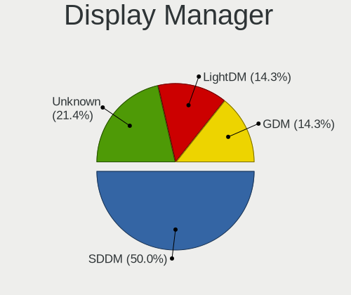
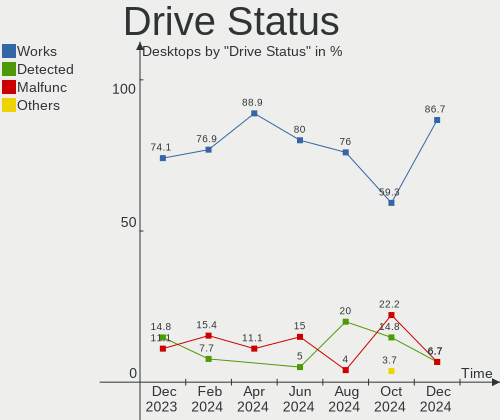
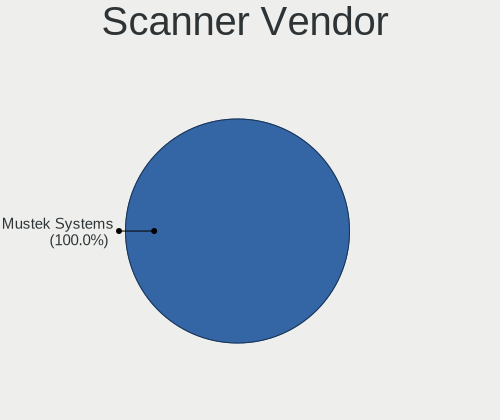

Gentoo Hardware Trends (Desktops)
---------------------------------

A project to identify most popular hardware characteristics and track their change
over time based on data collected by Gentoo users at https://Linux-Hardware.org.

Anyone can contribute to this report by the [hw-probe](https://github.com/linuxhw/hw-probe) tool:

    sudo -E hw-probe -all -upload

This report is for one last month. Overall report since the beginning of time: [TestCoverage](https://github.com/linuxhw/TestCoverage)

Period: Apr, 2022.

Contents
--------

* [ System ](#system)
  - [ OS                       ](#os)
  - [ OS Family                ](#os-family)
  - [ Kernel                   ](#kernel)
  - [ Kernel Family            ](#kernel-family)
  - [ Kernel Major Ver.        ](#kernel-major-ver)
  - [ Arch                     ](#arch)
  - [ DE                       ](#de)
  - [ Display Server           ](#display-server)
  - [ Display Manager          ](#display-manager)
  - [ OS Lang                  ](#os-lang)
  - [ Boot Mode                ](#boot-mode)
  - [ Filesystem               ](#filesystem)
  - [ Part. scheme             ](#part-scheme)
  - [ Dual Boot with Linux/BSD ](#dual-boot-with-linuxbsd)
  - [ Dual Boot (Win)          ](#dual-boot-win)

* [ Board ](#board)
  - [ Vendor                   ](#vendor)
  - [ Model                    ](#model)
  - [ Model Family             ](#model-family)
  - [ MFG Year                 ](#mfg-year)
  - [ Form Factor              ](#form-factor)
  - [ Secure Boot              ](#secure-boot)
  - [ Coreboot                 ](#coreboot)
  - [ RAM Size                 ](#ram-size)
  - [ RAM Used                 ](#ram-used)
  - [ Total Drives             ](#total-drives)
  - [ Has CD-ROM               ](#has-cd-rom)
  - [ Has Ethernet             ](#has-ethernet)
  - [ Has WiFi                 ](#has-wifi)
  - [ Has Bluetooth            ](#has-bluetooth)

* [ Location ](#location)
  - [ Country                  ](#country)
  - [ City                     ](#city)

* [ Drives ](#drives)
  - [ Drive Vendor             ](#drive-vendor)
  - [ Drive Model              ](#drive-model)
  - [ HDD Vendor               ](#hdd-vendor)
  - [ SSD Vendor               ](#ssd-vendor)
  - [ Drive Kind               ](#drive-kind)
  - [ Drive Connector          ](#drive-connector)
  - [ Drive Size               ](#drive-size)
  - [ Space Total              ](#space-total)
  - [ Space Used               ](#space-used)
  - [ Malfunc. Drives          ](#malfunc-drives)
  - [ Malfunc. Drive Vendor    ](#malfunc-drive-vendor)
  - [ Malfunc. HDD Vendor      ](#malfunc-hdd-vendor)
  - [ Malfunc. Drive Kind      ](#malfunc-drive-kind)
  - [ Failed Drives            ](#failed-drives)
  - [ Failed Drive Vendor      ](#failed-drive-vendor)
  - [ Drive Status             ](#drive-status)

* [ Storage controller ](#storage-controller)
  - [ Storage Vendor           ](#storage-vendor)
  - [ Storage Model            ](#storage-model)
  - [ Storage Kind             ](#storage-kind)

* [ Processor ](#processor)
  - [ CPU Vendor               ](#cpu-vendor)
  - [ CPU Model                ](#cpu-model)
  - [ CPU Model Family         ](#cpu-model-family)
  - [ CPU Cores                ](#cpu-cores)
  - [ CPU Sockets              ](#cpu-sockets)
  - [ CPU Threads              ](#cpu-threads)
  - [ CPU Op-Modes             ](#cpu-op-modes)
  - [ CPU Microcode            ](#cpu-microcode)
  - [ CPU Microarch            ](#cpu-microarch)

* [ Graphics ](#graphics)
  - [ GPU Vendor               ](#gpu-vendor)
  - [ GPU Model                ](#gpu-model)
  - [ GPU Combo                ](#gpu-combo)
  - [ GPU Driver               ](#gpu-driver)
  - [ GPU Memory               ](#gpu-memory)

* [ Monitor ](#monitor)
  - [ Monitor Vendor           ](#monitor-vendor)
  - [ Monitor Model            ](#monitor-model)
  - [ Monitor Resolution       ](#monitor-resolution)
  - [ Monitor Diagonal         ](#monitor-diagonal)
  - [ Monitor Width            ](#monitor-width)
  - [ Aspect Ratio             ](#aspect-ratio)
  - [ Monitor Area             ](#monitor-area)
  - [ Pixel Density            ](#pixel-density)
  - [ Multiple Monitors        ](#multiple-monitors)

* [ Network ](#network)
  - [ Net Controller Vendor    ](#net-controller-vendor)
  - [ Net Controller Model     ](#net-controller-model)
  - [ Wireless Vendor          ](#wireless-vendor)
  - [ Wireless Model           ](#wireless-model)
  - [ Ethernet Vendor          ](#ethernet-vendor)
  - [ Ethernet Model           ](#ethernet-model)
  - [ Net Controller Kind      ](#net-controller-kind)
  - [ Used Controller          ](#used-controller)
  - [ NICs                     ](#nics)
  - [ IPv6                     ](#ipv6)

* [ Bluetooth ](#bluetooth)
  - [ Bluetooth Vendor         ](#bluetooth-vendor)
  - [ Bluetooth Model          ](#bluetooth-model)

* [ Sound ](#sound)
  - [ Sound Vendor             ](#sound-vendor)
  - [ Sound Model              ](#sound-model)

* [ Memory ](#memory)
  - [ Memory Vendor            ](#memory-vendor)
  - [ Memory Model             ](#memory-model)
  - [ Memory Kind              ](#memory-kind)
  - [ Memory Form Factor       ](#memory-form-factor)
  - [ Memory Size              ](#memory-size)
  - [ Memory Speed             ](#memory-speed)

* [ Printers & scanners ](#printers--scanners)
  - [ Printer Vendor           ](#printer-vendor)
  - [ Printer Model            ](#printer-model)
  - [ Scanner Vendor           ](#scanner-vendor)
  - [ Scanner Model            ](#scanner-model)

* [ Camera ](#camera)
  - [ Camera Vendor            ](#camera-vendor)
  - [ Camera Model             ](#camera-model)

* [ Security ](#security)
  - [ Fingerprint Vendor       ](#fingerprint-vendor)
  - [ Fingerprint Model        ](#fingerprint-model)
  - [ Chipcard Vendor          ](#chipcard-vendor)
  - [ Chipcard Model           ](#chipcard-model)

* [ Unsupported ](#unsupported)
  - [ Unsupported Devices      ](#unsupported-devices)
  - [ Unsupported Device Types ](#unsupported-device-types)

System
------

OS
--

Installed operating systems

| Name       | Desktops | Percent |
|------------|----------|---------|
| Gentoo 2.8 | 11       | 37.93%  |
| Gentoo 2.6 | 11       | 37.93%  |
| Gentoo 2.7 | 7        | 24.14%  |

OS Family
---------

OS without a version

| Name   | Desktops | Percent |
|--------|----------|---------|
| Gentoo | 29       | 100%    |

Kernel
------

Version of the Linux kernel

| Version                          | Desktops | Percent |
|----------------------------------|----------|---------|
| 5.15.26-gentoo                   | 4        | 13.79%  |
| 5.15.32-gentoo-r1                | 3        | 10.34%  |
| 5.17.1-gentoo-r1                 | 2        | 6.9%    |
| 5.15.32-gentoo-r1-x86_64         | 2        | 6.9%    |
| 5.15.32-gentoo-dist              | 2        | 6.9%    |
| 5.17.5-gentoo-x86_64             | 1        | 3.45%   |
| 5.17.3-gentoo-11-02-22           | 1        | 3.45%   |
| 5.17.2-gentoo-limelight          | 1        | 3.45%   |
| 5.17.2-gentoo                    | 1        | 3.45%   |
| 5.17.1-gentoo-r1-x86_64          | 1        | 3.45%   |
| 5.17.1-gentoo-r1-gentoo          | 1        | 3.45%   |
| 5.17.0-gentoo                    | 1        | 3.45%   |
| 5.17.0-genix_5.17+               | 1        | 3.45%   |
| 5.16.13-gentoo                   | 1        | 3.45%   |
| 5.16.11-gentoo-x86_64            | 1        | 3.45%   |
| 5.15.34                          | 1        | 3.45%   |
| 5.15.32-gentoo-r1harambe-edition | 1        | 3.45%   |
| 5.15.32-gentoo-r1-cp003          | 1        | 3.45%   |
| 5.15.26-gentoo-x86_64            | 1        | 3.45%   |
| 5.14.13-gentoo                   | 1        | 3.45%   |
| 5.10.52-gentoo-x86_64            | 1        | 3.45%   |

Kernel Family
-------------

Linux kernel without a distro release

| Version | Desktops | Percent |
|---------|----------|---------|
| 5.15.32 | 9        | 31.03%  |
| 5.15.26 | 5        | 17.24%  |
| 5.17.1  | 4        | 13.79%  |
| 5.17.2  | 2        | 6.9%    |
| 5.17.0  | 2        | 6.9%    |
| 5.17.5  | 1        | 3.45%   |
| 5.17.3  | 1        | 3.45%   |
| 5.16.13 | 1        | 3.45%   |
| 5.16.11 | 1        | 3.45%   |
| 5.15.34 | 1        | 3.45%   |
| 5.14.13 | 1        | 3.45%   |
| 5.10.52 | 1        | 3.45%   |

Kernel Major Ver.
-----------------

Linux kernel major version

| Version | Desktops | Percent |
|---------|----------|---------|
| 5.15    | 15       | 51.72%  |
| 5.17    | 10       | 34.48%  |
| 5.16    | 2        | 6.9%    |
| 5.14    | 1        | 3.45%   |
| 5.10    | 1        | 3.45%   |

Arch
----

OS architecture (x86_64, i586, etc.)

| Name   | Desktops | Percent |
|--------|----------|---------|
| x86_64 | 29       | 100%    |

DE
--

Desktop Environment

| Name    | Desktops | Percent |
|---------|----------|---------|
| KDE5    | 11       | 37.93%  |
| Unknown | 9        | 31.03%  |
| GNOME   | 5        | 17.24%  |
| XFCE    | 2        | 6.9%    |
| MATE    | 1        | 3.45%   |
| DWM     | 1        | 3.45%   |

Display Server
--------------

X11 or Wayland

| Name    | Desktops | Percent |
|---------|----------|---------|
| X11     | 16       | 55.17%  |
| Unknown | 8        | 27.59%  |
| Wayland | 3        | 10.34%  |
| Tty     | 2        | 6.9%    |

Display Manager
---------------

SDDM, LightDM, etc.

| Name    | Desktops | Percent |
|---------|----------|---------|
| Unknown | 11       | 37.93%  |
| SDDM    | 10       | 34.48%  |
| LightDM | 4        | 13.79%  |
| GDM     | 3        | 10.34%  |
| SLiM    | 1        | 3.45%   |

OS Lang
-------

Language

| Lang       | Desktops | Percent |
|------------|----------|---------|
| en_US      | 13       | 44.83%  |
| Unknown    | 4        | 13.79%  |
| C.UTF8     | 3        | 10.34%  |
| pl_PL      | 2        | 6.9%    |
| es_ES      | 2        | 6.9%    |
| en_GB      | 2        | 6.9%    |
| fr_FR.UTF8 | 1        | 3.45%   |
| de_DE      | 1        | 3.45%   |
| C          | 1        | 3.45%   |

Boot Mode
---------

EFI or BIOS

| Mode | Desktops | Percent |
|------|----------|---------|
| EFI  | 23       | 79.31%  |
| BIOS | 6        | 20.69%  |

Filesystem
----------

Type of filesystem

| Type  | Desktops | Percent |
|-------|----------|---------|
| Ext4  | 17       | 58.62%  |
| Btrfs | 7        | 24.14%  |
| F2fs  | 2        | 6.9%    |
| Zfs   | 1        | 3.45%   |
| XXX   | 1        | 3.45%   |
| Xfs   | 1        | 3.45%   |

Part. scheme
------------

Scheme of partitioning

| Type    | Desktops | Percent |
|---------|----------|---------|
| GPT     | 27       | 93.1%   |
| Unknown | 2        | 6.9%    |

Dual Boot with Linux/BSD
------------------------

Hosting more than one Linux/BSD

| Dual boot | Desktops | Percent |
|-----------|----------|---------|
| No        | 16       | 55.17%  |
| Yes       | 13       | 44.83%  |

Dual Boot (Win)
---------------

Hosting Linux and Windows

| Dual boot | Desktops | Percent |
|-----------|----------|---------|
| No        | 21       | 72.41%  |
| Yes       | 8        | 27.59%  |

Board
-----

Vendor
------

Motherboard manufacturer

| Name                | Desktops | Percent |
|---------------------|----------|---------|
| ASUSTek Computer    | 11       | 37.93%  |
| Gigabyte Technology | 6        | 20.69%  |
| MSI                 | 5        | 17.24%  |
| ASRock              | 4        | 13.79%  |
| Lenovo              | 1        | 3.45%   |
| Dell                | 1        | 3.45%   |
| ASRockRack          | 1        | 3.45%   |

Model
-----

Motherboard model

| Name                               | Desktops | Percent |
|------------------------------------|----------|---------|
| ASRock Z390 Extreme4               | 2        | 6.9%    |
| MSI MS-7C91                        | 1        | 3.45%   |
| MSI MS-7C84                        | 1        | 3.45%   |
| MSI MS-7B98                        | 1        | 3.45%   |
| MSI MS-7B86                        | 1        | 3.45%   |
| MSI MS-7B17                        | 1        | 3.45%   |
| Lenovo ThinkCentre M900 10FMCTO1WW | 1        | 3.45%   |
| Gigabyte Z590 UD                   | 1        | 3.45%   |
| Gigabyte X570 GAMING X             | 1        | 3.45%   |
| Gigabyte X570 AORUS ELITE WIFI     | 1        | 3.45%   |
| Gigabyte H470 HD3                  | 1        | 3.45%   |
| Gigabyte B460HD3                   | 1        | 3.45%   |
| Gigabyte AB350-Gaming              | 1        | 3.45%   |
| Dell OptiPlex 7080                 | 1        | 3.45%   |
| ASUS TUF Gaming Z690-PLUS D4       | 1        | 3.45%   |
| ASUS TUF Gaming B550-PLUS          | 1        | 3.45%   |
| ASUS ROG STRIX X570-E GAMING       | 1        | 3.45%   |
| ASUS ROG STRIX X470-F GAMING       | 1        | 3.45%   |
| ASUS ROG STRIX B550-F GAMING       | 1        | 3.45%   |
| ASUS ROG Maximus XIII APEX         | 1        | 3.45%   |
| ASUS PRIME X570-PRO                | 1        | 3.45%   |
| ASUS PRIME H570M-PLUS              | 1        | 3.45%   |
| ASUS P6X58D-E                      | 1        | 3.45%   |
| ASUS M3A78-CM                      | 1        | 3.45%   |
| ASUS All Series                    | 1        | 3.45%   |
| ASRockRack X470D4U                 | 1        | 3.45%   |
| ASRock A520M Pro4                  | 1        | 3.45%   |
| ASRock A320M-ITX                   | 1        | 3.45%   |

Model Family
------------

Motherboard model prefix

| Name                  | Desktops | Percent |
|-----------------------|----------|---------|
| ASUS ROG              | 4        | 13.79%  |
| Gigabyte X570         | 2        | 6.9%    |
| ASUS TUF              | 2        | 6.9%    |
| ASUS PRIME            | 2        | 6.9%    |
| ASRock Z390           | 2        | 6.9%    |
| MSI MS-7C91           | 1        | 3.45%   |
| MSI MS-7C84           | 1        | 3.45%   |
| MSI MS-7B98           | 1        | 3.45%   |
| MSI MS-7B86           | 1        | 3.45%   |
| MSI MS-7B17           | 1        | 3.45%   |
| Lenovo ThinkCentre    | 1        | 3.45%   |
| Gigabyte Z590         | 1        | 3.45%   |
| Gigabyte H470         | 1        | 3.45%   |
| Gigabyte B460HD3      | 1        | 3.45%   |
| Gigabyte AB350-Gaming | 1        | 3.45%   |
| Dell OptiPlex         | 1        | 3.45%   |
| ASUS P6X58D-E         | 1        | 3.45%   |
| ASUS M3A78-CM         | 1        | 3.45%   |
| ASUS All              | 1        | 3.45%   |
| ASRockRack X470D4U    | 1        | 3.45%   |
| ASRock A520M          | 1        | 3.45%   |
| ASRock A320M-ITX      | 1        | 3.45%   |

MFG Year
--------

Motherboard manufacture year

| Year | Desktops | Percent |
|------|----------|---------|
| 2020 | 6        | 20.69%  |
| 2019 | 6        | 20.69%  |
| 2018 | 6        | 20.69%  |
| 2021 | 5        | 17.24%  |
| 2022 | 2        | 6.9%    |
| 2017 | 1        | 3.45%   |
| 2015 | 1        | 3.45%   |
| 2010 | 1        | 3.45%   |
| 2008 | 1        | 3.45%   |

Form Factor
-----------

Physical design of the computer

| Name    | Desktops | Percent |
|---------|----------|---------|
| Desktop | 29       | 100%    |

Secure Boot
-----------

Enabled or disabled

| State    | Desktops | Percent |
|----------|----------|---------|
| Disabled | 28       | 96.55%  |
| Enabled  | 1        | 3.45%   |

Coreboot
--------

Have coreboot on board

| Used | Desktops | Percent |
|------|----------|---------|
| No   | 29       | 100%    |

RAM Size
--------

Total RAM memory

| Size in GB  | Desktops | Percent |
|-------------|----------|---------|
| 64.01-256.0 | 11       | 37.93%  |
| 32.01-64.0  | 9        | 31.03%  |
| 16.01-24.0  | 6        | 20.69%  |
| 4.01-8.0    | 1        | 3.45%   |
| 24.01-32.0  | 1        | 3.45%   |
| 8.01-16.0   | 1        | 3.45%   |

RAM Used
--------

Used RAM memory

| Used GB    | Desktops | Percent |
|------------|----------|---------|
| 4.01-8.0   | 9        | 31.03%  |
| 1.01-2.0   | 6        | 20.69%  |
| 2.01-3.0   | 5        | 17.24%  |
| 8.01-16.0  | 4        | 13.79%  |
| 16.01-24.0 | 2        | 6.9%    |
| 32.01-64.0 | 1        | 3.45%   |
| 3.01-4.0   | 1        | 3.45%   |
| 0.51-1.0   | 1        | 3.45%   |

Total Drives
------------

Number of drives on board

| Drives | Desktops | Percent |
|--------|----------|---------|
| 2      | 8        | 27.59%  |
| 3      | 7        | 24.14%  |
| 5      | 4        | 13.79%  |
| 4      | 4        | 13.79%  |
| 1      | 4        | 13.79%  |
| 7      | 1        | 3.45%   |
| 6      | 1        | 3.45%   |

Has CD-ROM
----------

Has CD-ROM on board

| Presented | Desktops | Percent |
|-----------|----------|---------|
| No        | 23       | 79.31%  |
| Yes       | 6        | 20.69%  |

Has Ethernet
------------

Has Ethernet on board

| Presented | Desktops | Percent |
|-----------|----------|---------|
| Yes       | 29       | 100%    |

Has WiFi
--------

Has WiFi module

| Presented | Desktops | Percent |
|-----------|----------|---------|
| No        | 19       | 65.52%  |
| Yes       | 10       | 34.48%  |

Has Bluetooth
-------------

Has Bluetooth module

| Presented | Desktops | Percent |
|-----------|----------|---------|
| No        | 19       | 65.52%  |
| Yes       | 10       | 34.48%  |

Location
--------

Country
-------

Geographic location (country)

| Country     | Desktops | Percent |
|-------------|----------|---------|
| USA         | 11       | 37.93%  |
| Spain       | 3        | 10.34%  |
| Poland      | 3        | 10.34%  |
| UK          | 2        | 6.9%    |
| France      | 2        | 6.9%    |
| Australia   | 2        | 6.9%    |
| Switzerland | 1        | 3.45%   |
| Russia      | 1        | 3.45%   |
| Malaysia    | 1        | 3.45%   |
| Germany     | 1        | 3.45%   |
| Czechia     | 1        | 3.45%   |
| Canada      | 1        | 3.45%   |

City
----

Geographic location (city)

| City          | Desktops | Percent |
|---------------|----------|---------|
| San Jose      | 2        | 6.9%    |
| Houston       | 2        | 6.9%    |
| Zurich        | 1        | 3.45%   |
| Warsaw        | 1        | 3.45%   |
| Toulouse      | 1        | 3.45%   |
| Sydney        | 1        | 3.45%   |
| St Louis      | 1        | 3.45%   |
| Sanford       | 1        | 3.45%   |
| Pruszków     | 1        | 3.45%   |
| Poplar        | 1        | 3.45%   |
| Paris         | 1        | 3.45%   |
| Oxnard        | 1        | 3.45%   |
| Ourense       | 1        | 3.45%   |
| Orange        | 1        | 3.45%   |
| Ocala         | 1        | 3.45%   |
| Nuremberg     | 1        | 3.45%   |
| New York      | 1        | 3.45%   |
| Melbourne     | 1        | 3.45%   |
| Los Angeles   | 1        | 3.45%   |
| Laziska Gorne | 1        | 3.45%   |
| Kuala Lumpur  | 1        | 3.45%   |
| Izhevsk       | 1        | 3.45%   |
| Granada       | 1        | 3.45%   |
| Boucherville  | 1        | 3.45%   |
| Bilovec       | 1        | 3.45%   |
| Bellaterra    | 1        | 3.45%   |
| Abingdon      | 1        | 3.45%   |

Drives
------

Drive Vendor
------------

Hard drive vendors

| Vendor              | Desktops | Drives | Percent |
|---------------------|----------|--------|---------|
| Seagate             | 12       | 17     | 18.46%  |
| Samsung Electronics | 10       | 15     | 15.38%  |
| WDC                 | 7        | 10     | 10.77%  |
| Kingston            | 5        | 6      | 7.69%   |
| Phison              | 4        | 4      | 6.15%   |
| Crucial             | 4        | 7      | 6.15%   |
| Toshiba             | 3        | 3      | 4.62%   |
| SanDisk             | 3        | 3      | 4.62%   |
| Hitachi             | 3        | 6      | 4.62%   |
| Corsair             | 3        | 4      | 4.62%   |
| GOODRAM             | 2        | 2      | 3.08%   |
| A-DATA Technology   | 2        | 3      | 3.08%   |
| XPG                 | 1        | 2      | 1.54%   |
| SK Hynix            | 1        | 1      | 1.54%   |
| LaCie               | 1        | 1      | 1.54%   |
| Intel               | 1        | 1      | 1.54%   |
| IBM                 | 1        | 1      | 1.54%   |
| Hewlett-Packard     | 1        | 3      | 1.54%   |
| China               | 1        | 1      | 1.54%   |

Drive Model
-----------

Hard drive models

| Model                             | Desktops | Percent |
|-----------------------------------|----------|---------|
| Samsung SSD 980 PRO 1TB           | 3        | 3.85%   |
| Crucial CT1000MX500SSD1 1TB       | 3        | 3.85%   |
| Seagate ST4000DM004-2CV104 4TB    | 2        | 2.56%   |
| SanDisk SDSSDH31000G 1TB          | 2        | 2.56%   |
| Phison Viper M.2 VPN100 1TB       | 2        | 2.56%   |
| GOODRAM SSDPR-CL100-480-G2 480GB  | 2        | 2.56%   |
| A-DATA SX8200PNP 512GB            | 2        | 2.56%   |
| XPG GAMMIX S11 Pro 512GB          | 1        | 1.28%   |
| WDC WDS500G2B0B 500GB SSD         | 1        | 1.28%   |
| WDC WDS240G1G0B-00RC30 240GB SSD  | 1        | 1.28%   |
| WDC WDS100T2B0C 1TB               | 1        | 1.28%   |
| WDC WD8003FFBX-68B9AN0 8TB        | 1        | 1.28%   |
| WDC WD60EZRX-00MVLB1 6TB          | 1        | 1.28%   |
| WDC WD40EZRZ-00GXCB0 4TB          | 1        | 1.28%   |
| WDC WD20EZAZ-00GGJB0 2TB          | 1        | 1.28%   |
| WDC WD20EARS-00MVWB0 2TB          | 1        | 1.28%   |
| WDC WD2003FYYS-18W0B0 2TB         | 1        | 1.28%   |
| WDC WD10EFRX-68FYTN0 1TB          | 1        | 1.28%   |
| Toshiba TR200 480GB SSD           | 1        | 1.28%   |
| Toshiba HDWE150 5TB               | 1        | 1.28%   |
| Toshiba HDWE140 4TB               | 1        | 1.28%   |
| SK Hynix PC611 NVMe 512GB         | 1        | 1.28%   |
| Seagate ST8000DM004-2CX188 8TB    | 1        | 1.28%   |
| Seagate ST6000VN0033-2EE110 6TB   | 1        | 1.28%   |
| Seagate ST500DM002-1BD142 500GB   | 1        | 1.28%   |
| Seagate ST4000DM005-2DP166 4TB    | 1        | 1.28%   |
| Seagate ST3500418AS 500GB         | 1        | 1.28%   |
| Seagate ST2000DM006-2DM164 2TB    | 1        | 1.28%   |
| Seagate ST2000DM001-1CH164 2TB    | 1        | 1.28%   |
| Seagate ST18000NM000J-2TV103 18TB | 1        | 1.28%   |
| Seagate ST12000NM0008-2H3101 12TB | 1        | 1.28%   |
| Seagate ST1000LM048-2E7172 1TB    | 1        | 1.28%   |
| Seagate ST1000DM010-2EP102 1TB    | 1        | 1.28%   |
| SanDisk SD7SB7S512G1001 512GB SSD | 1        | 1.28%   |
| Samsung SSD 980 PRO 2TB           | 1        | 1.28%   |
| Samsung SSD 980 1TB               | 1        | 1.28%   |
| Samsung SSD 970 EVO Plus 2TB      | 1        | 1.28%   |
| Samsung SSD 970 EVO Plus 250GB    | 1        | 1.28%   |
| Samsung SSD 970 EVO 250GB         | 1        | 1.28%   |
| Samsung SSD 870 QVO 2TB           | 1        | 1.28%   |
| Samsung SSD 860 EVO 500GB         | 1        | 1.28%   |
| Samsung SSD 860 EVO 250GB         | 1        | 1.28%   |
| Samsung SSD 850 PRO 256GB         | 1        | 1.28%   |
| Samsung NVMe SSD Drive 500GB      | 1        | 1.28%   |
| Phison Sabrent Rocket 4.0 1TB     | 1        | 1.28%   |
| Phison Sabrent 512GB              | 1        | 1.28%   |
| LaCie Rugged THB USB3 2TB         | 1        | 1.28%   |
| Kingston SKC2500M81000G 1TB       | 1        | 1.28%   |
| Kingston SHSS37A240G 240GB SSD    | 1        | 1.28%   |
| Kingston SA400S37240G 240GB SSD   | 1        | 1.28%   |
| Kingston SA2000M8500G 500GB       | 1        | 1.28%   |
| Kingston NVMe SSD Drive 500GB     | 1        | 1.28%   |
| Intel SSDPED1D280GA 280GB         | 1        | 1.28%   |
| IBM DTLA-307045 48GB              | 1        | 1.28%   |
| Hitachi HUS724030ALE641 3TB       | 1        | 1.28%   |
| Hitachi HUA723020ALA641 2TB       | 1        | 1.28%   |
| Hitachi HDS723020BLA642 2TB       | 1        | 1.28%   |
| Hitachi HDS721010CLA332 1TB       | 1        | 1.28%   |
| HP SSD EX920 1TB                  | 1        | 1.28%   |
| HP MB2000GCWDA 2TB                | 1        | 1.28%   |

HDD Vendor
----------

Hard disk drive vendors

| Vendor          | Desktops | Drives | Percent |
|-----------------|----------|--------|---------|
| Seagate         | 12       | 17     | 48%     |
| WDC             | 5        | 7      | 20%     |
| Hitachi         | 3        | 6      | 12%     |
| Toshiba         | 2        | 2      | 8%      |
| LaCie           | 1        | 1      | 4%      |
| IBM             | 1        | 1      | 4%      |
| Hewlett-Packard | 1        | 2      | 4%      |

SSD Vendor
----------

Solid state drive vendors

| Vendor              | Desktops | Drives | Percent |
|---------------------|----------|--------|---------|
| Samsung Electronics | 4        | 4      | 19.05%  |
| Crucial             | 4        | 6      | 19.05%  |
| SanDisk             | 3        | 3      | 14.29%  |
| WDC                 | 2        | 2      | 9.52%   |
| Kingston            | 2        | 3      | 9.52%   |
| GOODRAM             | 2        | 2      | 9.52%   |
| Corsair             | 2        | 3      | 9.52%   |
| Toshiba             | 1        | 1      | 4.76%   |
| China               | 1        | 1      | 4.76%   |

Drive Kind
----------

HDD or SSD

| Kind | Desktops | Drives | Percent |
|------|----------|--------|---------|
| NVMe | 22       | 29     | 37.29%  |
| HDD  | 20       | 36     | 33.9%   |
| SSD  | 17       | 25     | 28.81%  |

Drive Connector
---------------

SATA, SAS, NVMe, etc.

| Type | Desktops | Drives | Percent |
|------|----------|--------|---------|
| SATA | 23       | 60     | 50%     |
| NVMe | 22       | 29     | 47.83%  |
| SAS  | 1        | 1      | 2.17%   |

Drive Size
----------

Size of hard drive

| Size in TB | Desktops | Drives | Percent |
|------------|----------|--------|---------|
| 0.01-0.5   | 14       | 20     | 35.9%   |
| 0.51-1.0   | 8        | 10     | 20.51%  |
| 1.01-2.0   | 7        | 12     | 17.95%  |
| 3.01-4.0   | 4        | 8      | 10.26%  |
| 4.01-10.0  | 3        | 5      | 7.69%   |
| 10.01-20.0 | 2        | 3      | 5.13%   |
| 2.01-3.0   | 1        | 3      | 2.56%   |

Space Total
-----------

Amount of disk space available on the file system

| Size in GB     | Desktops | Percent |
|----------------|----------|---------|
| 2001-3000      | 7        | 24.14%  |
| 501-1000       | 7        | 24.14%  |
| More than 3000 | 6        | 20.69%  |
| 251-500        | 3        | 10.34%  |
| 101-250        | 2        | 6.9%    |
| 1001-2000      | 2        | 6.9%    |
| 1-20           | 1        | 3.45%   |
| Unknown        | 1        | 3.45%   |

Space Used
----------

Amount of used disk space

| Used GB        | Desktops | Percent |
|----------------|----------|---------|
| 101-250        | 5        | 17.24%  |
| More than 3000 | 4        | 13.79%  |
| 251-500        | 4        | 13.79%  |
| 501-1000       | 4        | 13.79%  |
| 21-50          | 3        | 10.34%  |
| 1001-2000      | 3        | 10.34%  |
| 51-100         | 3        | 10.34%  |
| 1-20           | 2        | 6.9%    |
| Unknown        | 1        | 3.45%   |

Malfunc. Drives
---------------

Drive models with a malfunction

| Model                           | Desktops | Drives | Percent |
|---------------------------------|----------|--------|---------|
| Seagate ST3500418AS 500GB       | 1        | 1      | 33.33%  |
| Samsung Electronics SSD 980 1TB | 1        | 1      | 33.33%  |
| IBM DTLA-307045 48GB            | 1        | 1      | 33.33%  |

Malfunc. Drive Vendor
---------------------

Vendors of faulty drives

| Vendor              | Desktops | Drives | Percent |
|---------------------|----------|--------|---------|
| Seagate             | 1        | 1      | 33.33%  |
| Samsung Electronics | 1        | 1      | 33.33%  |
| IBM                 | 1        | 1      | 33.33%  |

Malfunc. HDD Vendor
-------------------

Vendors of faulty HDD drives

| Vendor  | Desktops | Drives | Percent |
|---------|----------|--------|---------|
| Seagate | 1        | 1      | 50%     |
| IBM     | 1        | 1      | 50%     |

Malfunc. Drive Kind
-------------------

Kinds of faulty drives

| Kind | Desktops | Drives | Percent |
|------|----------|--------|---------|
| HDD  | 2        | 2      | 66.67%  |
| NVMe | 1        | 1      | 33.33%  |

Failed Drives
-------------

Failed drive models

Zero info for selected period =(

Failed Drive Vendor
-------------------

Failed drive vendors

Zero info for selected period =(

Drive Status
------------

Number of failed and malfunc. drives

| Status   | Desktops | Drives | Percent |
|----------|----------|--------|---------|
| Works    | 27       | 85     | 84.38%  |
| Malfunc  | 3        | 3      | 9.38%   |
| Detected | 2        | 2      | 6.25%   |

Storage controller
------------------

Storage Vendor
--------------

Storage controller vendors

| Vendor                      | Desktops | Percent |
|-----------------------------|----------|---------|
| Intel                       | 14       | 25%     |
| AMD                         | 14       | 25%     |
| Samsung Electronics         | 8        | 14.29%  |
| ASMedia Technology          | 5        | 8.93%   |
| Phison Electronics          | 4        | 7.14%   |
| Kingston Technology Company | 3        | 5.36%   |
| ADATA Technology            | 3        | 5.36%   |
| Micron/Crucial Technology   | 2        | 3.57%   |
| SK Hynix                    | 1        | 1.79%   |
| Silicon Motion              | 1        | 1.79%   |
| Sandisk                     | 1        | 1.79%   |

Storage Model
-------------

Storage controller models

| Model                                                                         | Desktops | Percent |
|-------------------------------------------------------------------------------|----------|---------|
| AMD FCH SATA Controller [AHCI mode]                                           | 11       | 16.92%  |
| Samsung NVMe SSD Controller SM981/PM981/PM983                                 | 4        | 6.15%   |
| Samsung NVMe SSD Controller PM9A1/PM9A3/980PRO                                | 4        | 6.15%   |
| Intel Cannon Lake PCH SATA AHCI Controller                                    | 4        | 6.15%   |
| ASMedia ASM1062 Serial ATA Controller                                         | 4        | 6.15%   |
| Phison E12 NVMe Controller                                                    | 3        | 4.62%   |
| Intel 500 Series Chipset Family SATA AHCI Controller                          | 3        | 4.62%   |
| AMD 500 Series Chipset SATA Controller                                        | 3        | 4.62%   |
| AMD 400 Series Chipset SATA Controller                                        | 3        | 4.62%   |
| ADATA XPG SX8200 Pro PCIe Gen3x4 M.2 2280 Solid State Drive                   | 3        | 4.62%   |
| Kingston Company A2000 NVMe SSD                                               | 2        | 3.08%   |
| Intel Comet Lake SATA AHCI Controller                                         | 2        | 3.08%   |
| SK Hynix Non-Volatile memory controller                                       | 1        | 1.54%   |
| Silicon Motion SM2262/SM2262EN SSD Controller                                 | 1        | 1.54%   |
| Sandisk WD Blue SN550 NVMe SSD                                                | 1        | 1.54%   |
| Samsung NVMe SSD Controller 980                                               | 1        | 1.54%   |
| Phison E16 PCIe4 NVMe Controller                                              | 1        | 1.54%   |
| Micron/Crucial P2 NVMe PCIe SSD                                               | 1        | 1.54%   |
| Micron/Crucial P1 NVMe PCIe SSD                                               | 1        | 1.54%   |
| Kingston Company KC2000 NVMe SSD                                              | 1        | 1.54%   |
| Intel Q170/Q150/B150/H170/H110/Z170/CM236 Chipset SATA Controller [AHCI Mode] | 1        | 1.54%   |
| Intel Optane SSD 900P Series                                                  | 1        | 1.54%   |
| Intel Alder Lake-S PCH SATA Controller [AHCI Mode]                            | 1        | 1.54%   |
| Intel 9 Series Chipset Family SATA Controller [AHCI Mode]                     | 1        | 1.54%   |
| Intel 82801JI (ICH10 Family) SATA AHCI Controller                             | 1        | 1.54%   |
| Intel 400 Series Chipset Family SATA AHCI Controller                          | 1        | 1.54%   |
| ASMedia ASM1061 SATA IDE Controller                                           | 1        | 1.54%   |
| AMD SB7x0/SB8x0/SB9x0 SATA Controller [IDE mode]                              | 1        | 1.54%   |
| AMD SB7x0/SB8x0/SB9x0 IDE Controller                                          | 1        | 1.54%   |
| AMD FCH SATA Controller D                                                     | 1        | 1.54%   |
| AMD 300 Series Chipset SATA Controller                                        | 1        | 1.54%   |

Storage Kind
------------

Kind of storage controller (IDE, SATA, NVMe, SAS, ...)

| Kind | Desktops | Percent |
|------|----------|---------|
| SATA | 28       | 53.85%  |
| NVMe | 22       | 42.31%  |
| IDE  | 2        | 3.85%   |

Processor
---------

CPU Vendor
----------

Processor vendors

| Vendor | Desktops | Percent |
|--------|----------|---------|
| AMD    | 15       | 51.72%  |
| Intel  | 14       | 48.28%  |

CPU Model
---------

Processor models

| Model                                      | Desktops | Percent |
|--------------------------------------------|----------|---------|
| AMD Ryzen 9 5950X 16-Core Processor        | 3        | 10.34%  |
| AMD Ryzen 5 2600 Six-Core Processor        | 3        | 10.34%  |
| Intel Core i9-9900K CPU @ 3.60GHz          | 2        | 6.9%    |
| Intel Core i5-9600K CPU @ 3.70GHz          | 2        | 6.9%    |
| AMD Ryzen 7 2700 Eight-Core Processor      | 2        | 6.9%    |
| Intel Xeon CPU X5690 @ 3.47GHz             | 1        | 3.45%   |
| Intel Core i7-6700T CPU @ 2.80GHz          | 1        | 3.45%   |
| Intel Core i7-10700K CPU @ 3.80GHz         | 1        | 3.45%   |
| Intel Core i7-10700 CPU @ 2.90GHz          | 1        | 3.45%   |
| Intel Core i5-4690K CPU @ 3.50GHz          | 1        | 3.45%   |
| Intel Core i5-10400F CPU @ 2.90GHz         | 1        | 3.45%   |
| Intel Core i5-10400 CPU @ 2.90GHz          | 1        | 3.45%   |
| Intel 12th Gen Core i9-12900K              | 1        | 3.45%   |
| Intel 11th Gen Core i9-11900K @ 3.50GHz    | 1        | 3.45%   |
| Intel 11th Gen Core i7-11700K @ 3.60GHz    | 1        | 3.45%   |
| AMD Ryzen 9 5900X 12-Core Processor        | 1        | 3.45%   |
| AMD Ryzen 9 3950X 16-Core Processor        | 1        | 3.45%   |
| AMD Ryzen 7 PRO 5750G with Radeon Graphics | 1        | 3.45%   |
| AMD Ryzen 7 3700X 8-Core Processor         | 1        | 3.45%   |
| AMD Ryzen 5 3600XT 6-Core Processor        | 1        | 3.45%   |
| AMD Ryzen 5 3600X 6-Core Processor         | 1        | 3.45%   |
| AMD Phenom II X4 955 Processor             | 1        | 3.45%   |

CPU Model Family
----------------

Processor model prefix

| Model            | Desktops | Percent |
|------------------|----------|---------|
| Intel Core i5    | 5        | 17.24%  |
| AMD Ryzen 9      | 5        | 17.24%  |
| AMD Ryzen 5      | 5        | 17.24%  |
| Other            | 3        | 10.34%  |
| Intel Core i7    | 3        | 10.34%  |
| AMD Ryzen 7      | 3        | 10.34%  |
| Intel Core i9    | 2        | 6.9%    |
| Intel Xeon       | 1        | 3.45%   |
| AMD Ryzen 7 PRO  | 1        | 3.45%   |
| AMD Phenom II X4 | 1        | 3.45%   |

CPU Cores
---------

Number of processor cores

| Number | Desktops | Percent |
|--------|----------|---------|
| 8      | 10       | 34.48%  |
| 6      | 10       | 34.48%  |
| 16     | 5        | 17.24%  |
| 4      | 3        | 10.34%  |
| 12     | 1        | 3.45%   |

CPU Sockets
-----------

Number of sockets

| Number | Desktops | Percent |
|--------|----------|---------|
| 1      | 29       | 100%    |

CPU Threads
-----------

Threads per core (Hyper-Threading)

| Number | Desktops | Percent |
|--------|----------|---------|
| 2      | 24       | 82.76%  |
| 1      | 5        | 17.24%  |

CPU Op-Modes
------------

CPU Operation Modes (32-bit, 64-bit)

| Op mode        | Desktops | Percent |
|----------------|----------|---------|
| 32-bit, 64-bit | 29       | 100%    |

CPU Microcode
-------------

Microcode number

| Number     | Desktops | Percent |
|------------|----------|---------|
| 0x0a201016 | 4        | 13.79%  |
| Unknown    | 4        | 13.79%  |
| 0x08701021 | 3        | 10.34%  |
| 0x0800820d | 3        | 10.34%  |
| 0xa0655    | 2        | 6.9%    |
| 0xa0653    | 2        | 6.9%    |
| 0x906ed    | 2        | 6.9%    |
| 0xa0671    | 1        | 3.45%   |
| 0x906ec    | 1        | 3.45%   |
| 0x90672    | 1        | 3.45%   |
| 0x506e3    | 1        | 3.45%   |
| 0x306c3    | 1        | 3.45%   |
| 0x206c2    | 1        | 3.45%   |
| 0x0a50000b | 1        | 3.45%   |
| 0x08008204 | 1        | 3.45%   |
| 0x010000db | 1        | 3.45%   |

CPU Microarch
-------------

Microarchitecture

| Name             | Desktops | Percent |
|------------------|----------|---------|
| Zen+             | 5        | 17.24%  |
| Zen 3            | 5        | 17.24%  |
| Zen 2            | 4        | 13.79%  |
| KabyLake         | 4        | 13.79%  |
| CometLake        | 4        | 13.79%  |
| Westmere         | 1        | 3.45%   |
| Skylake          | 1        | 3.45%   |
| K10              | 1        | 3.45%   |
| Icelake          | 1        | 3.45%   |
| Haswell          | 1        | 3.45%   |
| Alderlake Hybrid | 1        | 3.45%   |
| Unknown          | 1        | 3.45%   |

Graphics
--------

GPU Vendor
----------

Vendors of graphics cards

| Vendor            | Desktops | Percent |
|-------------------|----------|---------|
| AMD               | 16       | 50%     |
| Nvidia            | 11       | 34.38%  |
| Intel             | 4        | 12.5%   |
| ASPEED Technology | 1        | 3.13%   |

GPU Model
---------

Graphics card models

| Model                                                   | Desktops | Percent |
|---------------------------------------------------------|----------|---------|
| AMD Ellesmere [Radeon RX 470/480/570/570X/580/580X/590] | 7        | 21.88%  |
| Nvidia GK208B [GeForce GT 710]                          | 2        | 6.25%   |
| Intel CometLake-S GT2 [UHD Graphics 630]                | 2        | 6.25%   |
| Nvidia TU106 [GeForce RTX 2070 Rev. A]                  | 1        | 3.13%   |
| Nvidia GP108 [GeForce GT 1030]                          | 1        | 3.13%   |
| Nvidia GP106 [GeForce GTX 1060 6GB]                     | 1        | 3.13%   |
| Nvidia GK110B [GeForce GTX 780 Ti]                      | 1        | 3.13%   |
| Nvidia GA106 [Geforce RTX 3050]                         | 1        | 3.13%   |
| Nvidia GA104 [GeForce RTX 3060 Ti]                      | 1        | 3.13%   |
| Nvidia GA102 [GeForce RTX 3080]                         | 1        | 3.13%   |
| Nvidia GA102 [GeForce RTX 3080 Ti]                      | 1        | 3.13%   |
| Nvidia GA102 [GeForce RTX 3080 Lite Hash Rate]          | 1        | 3.13%   |
| Intel HD Graphics 530                                   | 1        | 3.13%   |
| Intel CoffeeLake-S GT2 [UHD Graphics 630]               | 1        | 3.13%   |
| ASPEED Technology ASPEED Graphics Family                | 1        | 3.13%   |
| AMD Vega 20 [Radeon VII]                                | 1        | 3.13%   |
| AMD Turks PRO [Radeon HD 7570]                          | 1        | 3.13%   |
| AMD Tonga PRO [Radeon R9 285/380]                       | 1        | 3.13%   |
| AMD RS780C [Radeon 3100]                                | 1        | 3.13%   |
| AMD Navi 24 [Radeon RX 6400 / 6500 XT]                  | 1        | 3.13%   |
| AMD Navi 22 [Radeon RX 6700/6700 XT/6750 XT / 6800M]    | 1        | 3.13%   |
| AMD Navi 14 [Radeon RX 5500/5500M / Pro 5500M]          | 1        | 3.13%   |
| AMD Ellesmere [Radeon Pro WX 7100]                      | 1        | 3.13%   |
| AMD Cedar [Radeon HD 5000/6000/7350/8350 Series]        | 1        | 3.13%   |

GPU Combo
---------

Combinations of graphics cards

| Name         | Desktops | Percent |
|--------------|----------|---------|
| 1 x AMD      | 14       | 48.28%  |
| 1 x Nvidia   | 10       | 34.48%  |
| 1 x Intel    | 2        | 6.9%    |
| Intel + AMD  | 1        | 3.45%   |
| 1 x ASPEED   | 1        | 3.45%   |
| AMD + Nvidia | 1        | 3.45%   |

GPU Driver
----------

Free vs proprietary

| Driver      | Desktops | Percent |
|-------------|----------|---------|
| Free        | 18       | 62.07%  |
| Proprietary | 9        | 31.03%  |
| Unknown     | 2        | 6.9%    |

GPU Memory
----------

Total video memory

| Size in GB | Desktops | Percent |
|------------|----------|---------|
| 7.01-8.0   | 6        | 20.69%  |
| 3.01-4.0   | 6        | 20.69%  |
| Unknown    | 6        | 20.69%  |
| 8.01-16.0  | 3        | 10.34%  |
| 0.51-1.0   | 3        | 10.34%  |
| 1.01-2.0   | 2        | 6.9%    |
| 5.01-6.0   | 1        | 3.45%   |
| 2.01-3.0   | 1        | 3.45%   |
| 0.01-0.5   | 1        | 3.45%   |

Monitor
-------

Monitor Vendor
--------------

Monitor vendors

| Vendor               | Desktops | Percent |
|----------------------|----------|---------|
| Hewlett-Packard      | 5        | 15.15%  |
| Goldstar             | 4        | 12.12%  |
| Samsung Electronics  | 3        | 9.09%   |
| BenQ                 | 3        | 9.09%   |
| LG Electronics       | 2        | 6.06%   |
| Iiyama               | 2        | 6.06%   |
| Dell                 | 2        | 6.06%   |
| Ancor Communications | 2        | 6.06%   |
| Acer                 | 2        | 6.06%   |
| ViewSonic            | 1        | 3.03%   |
| Philips              | 1        | 3.03%   |
| Onkyo                | 1        | 3.03%   |
| MTK                  | 1        | 3.03%   |
| Microstep            | 1        | 3.03%   |
| Lenovo               | 1        | 3.03%   |
| ASUSTek Computer     | 1        | 3.03%   |
| Unknown              | 1        | 3.03%   |

Monitor Model
-------------

Monitor models

| Model                                                                 | Desktops | Percent |
|-----------------------------------------------------------------------|----------|---------|
| ViewSonic VX2718-2KPC VSCB73A 2560x1440 598x336mm 27.0-inch           | 1        | 2.5%    |
| Samsung Electronics U32R59x SAM0F96 3840x2160 697x392mm 31.5-inch     | 1        | 2.5%    |
| Samsung Electronics SMS27A850 SAM083D 2560x1440 518x324mm 24.1-inch   | 1        | 2.5%    |
| Samsung Electronics S22B300 SAM08C8 1920x1080 477x268mm 21.5-inch     | 1        | 2.5%    |
| Philips PHL 273V7 PHLC156 1920x1080 598x336mm 27.0-inch               | 1        | 2.5%    |
| Onkyo TX-NR535 ONK0E51 2560x1440 597x336mm 27.0-inch                  | 1        | 2.5%    |
| MTK Cultraview TV MTK0030 1920x1080 708x398mm 32.0-inch               | 1        | 2.5%    |
| Microstep LCD Monitor MSI MPG27CQ 2560x1440                           | 1        | 2.5%    |
| LG Electronics LCD Monitor LG IPS FULLHD 3840x1080                    | 1        | 2.5%    |
| LG Electronics LCD Monitor LG IPS FULLHD                              | 1        | 2.5%    |
| LG Electronics LCD Monitor LG HDR 4K 7680x2160                        | 1        | 2.5%    |
| LG Electronics LCD Monitor LG HDR 4K                                  | 1        | 2.5%    |
| Lenovo LEN T2424pA LEN60C8 1920x1080 527x296mm 23.8-inch              | 1        | 2.5%    |
| Iiyama PL2792Q IVM6637 2560x1440 597x336mm 27.0-inch                  | 1        | 2.5%    |
| Iiyama PL2792Q IVM6630 2560x1440 597x336mm 27.0-inch                  | 1        | 2.5%    |
| Iiyama PL2788H IVM6628 1920x1080 598x336mm 27.0-inch                  | 1        | 2.5%    |
| Hewlett-Packard S231d HWP313F 1920x1080 510x287mm 23.0-inch           | 1        | 2.5%    |
| Hewlett-Packard LP2475w HWP26F9 1920x1200 546x352mm 25.6-inch         | 1        | 2.5%    |
| Hewlett-Packard LCD Monitor w2338h 3840x1080                          | 1        | 2.5%    |
| Hewlett-Packard LCD Monitor w2338h                                    | 1        | 2.5%    |
| Hewlett-Packard L2445w HWP280F 1920x1200 518x324mm 24.1-inch          | 1        | 2.5%    |
| Hewlett-Packard E231 HWP3063 1920x1080 510x287mm 23.0-inch            | 1        | 2.5%    |
| Hewlett-Packard 24mq HPN366F 2560x1440 527x296mm 23.8-inch            | 1        | 2.5%    |
| Goldstar ULTRAWIDE GSM76E4 3440x1440 800x335mm 34.1-inch              | 1        | 2.5%    |
| Goldstar Ultra HD GSM5B08 3840x2160 600x340mm 27.2-inch               | 1        | 2.5%    |
| Goldstar LG HDR 4K GSM7707 3840x2160 600x340mm 27.2-inch              | 1        | 2.5%    |
| Goldstar LG FULL HD GSM5BDF 1920x1080 480x270mm 21.7-inch             | 1        | 2.5%    |
| Dell U2713H DELA091 2560x1440 597x336mm 27.0-inch                     | 1        | 2.5%    |
| Dell SE2417HG DELD08D 1920x1080 521x293mm 23.5-inch                   | 1        | 2.5%    |
| Dell S2721D DELA199 2560x1440 597x336mm 27.0-inch                     | 1        | 2.5%    |
| BenQ VZ2770H BNQ7B3C 1920x1080 598x336mm 27.0-inch                    | 1        | 2.5%    |
| BenQ GW2280 BNQ78E8 1920x1080 476x268mm 21.5-inch                     | 1        | 2.5%    |
| BenQ GW2270 BNQ78DB 1920x1080 476x268mm 21.5-inch                     | 1        | 2.5%    |
| BenQ GL2780 BNQ78EC 1920x1080 600x340mm 27.2-inch                     | 1        | 2.5%    |
| ASUSTek Computer VP247 AUS24CA 1920x1080 521x293mm 23.5-inch          | 1        | 2.5%    |
| Ancor Communications ASUS VS247 ACI249A 1920x1080 521x293mm 23.5-inch | 1        | 2.5%    |
| Ancor Communications ASUS VH222 ACI22AB 1920x1080 477x268mm 21.5-inch | 1        | 2.5%    |
| Acer V243H ACR00DC 1920x1080 531x299mm 24.0-inch                      | 1        | 2.5%    |
| Acer T231H ACR0184 1920x1080 510x287mm 23.0-inch                      | 1        | 2.5%    |
| Unknown                                                               | 1        | 2.5%    |

Monitor Resolution
------------------

Monitor screen resolution

| Resolution        | Desktops | Percent |
|-------------------|----------|---------|
| 1920x1080 (FHD)   | 14       | 45.16%  |
| 2560x1440 (QHD)   | 6        | 19.35%  |
| 3840x2160 (4K)    | 4        | 12.9%   |
| 1920x1200 (WUXGA) | 2        | 6.45%   |
| Unknown           | 2        | 6.45%   |
| 7680x2160         | 1        | 3.23%   |
| 3840x1080         | 1        | 3.23%   |
| 3440x1440         | 1        | 3.23%   |

Monitor Diagonal
----------------

Diagonal size in inches

| Inches  | Desktops | Percent |
|---------|----------|---------|
| 27      | 8        | 25.81%  |
| 23      | 7        | 22.58%  |
| 21      | 4        | 12.9%   |
| Unknown | 4        | 12.9%   |
| 24      | 3        | 9.68%   |
| 49      | 1        | 3.23%   |
| 34      | 1        | 3.23%   |
| 32      | 1        | 3.23%   |
| 31      | 1        | 3.23%   |
| 25      | 1        | 3.23%   |

Monitor Width
-------------

Physical width

| Width in mm | Desktops | Percent |
|-------------|----------|---------|
| 501-600     | 16       | 57.14%  |
| 401-500     | 4        | 14.29%  |
| Unknown     | 4        | 14.29%  |
| 701-800     | 2        | 7.14%   |
| 601-700     | 1        | 3.57%   |
| 1001-1500   | 1        | 3.57%   |

Aspect Ratio
------------

Proportional relationship between the width and the height

| Ratio   | Desktops | Percent |
|---------|----------|---------|
| 16/9    | 19       | 70.37%  |
| Unknown | 4        | 14.81%  |
| 16/10   | 3        | 11.11%  |
| 21/9    | 1        | 3.7%    |

Monitor Area
------------

Area in inch²

| Area in inch² | Desktops | Percent |
|----------------|----------|---------|
| 201-250        | 10       | 33.33%  |
| 301-350        | 8        | 26.67%  |
| Unknown        | 4        | 13.33%  |
| 351-500        | 3        | 10%     |
| 251-300        | 3        | 10%     |
| More than 1000 | 1        | 3.33%   |
| 151-200        | 1        | 3.33%   |

Pixel Density
-------------

Pixels per inch

| Density | Desktops | Percent |
|---------|----------|---------|
| 51-100  | 12       | 44.44%  |
| 101-120 | 7        | 25.93%  |
| Unknown | 4        | 14.81%  |
| 161-240 | 2        | 7.41%   |
| 121-160 | 2        | 7.41%   |

Multiple Monitors
-----------------

Total monitors connected

| Total | Desktops | Percent |
|-------|----------|---------|
| 1     | 17       | 58.62%  |
| 2     | 7        | 24.14%  |
| 0     | 3        | 10.34%  |
| 4     | 1        | 3.45%   |
| 3     | 1        | 3.45%   |

Network
-------

Net Controller Vendor
---------------------

Controller vendors

| Vendor                   | Desktops | Percent |
|--------------------------|----------|---------|
| Intel                    | 18       | 51.43%  |
| Realtek Semiconductor    | 13       | 37.14%  |
| Marvell Technology Group | 1        | 2.86%   |
| DisplayLink              | 1        | 2.86%   |
| Broadcom                 | 1        | 2.86%   |
| American Megatrends      | 1        | 2.86%   |

Net Controller Model
--------------------

Controller models

| Model                                                             | Desktops | Percent |
|-------------------------------------------------------------------|----------|---------|
| Realtek RTL8111/8168/8411 PCI Express Gigabit Ethernet Controller | 7        | 16.28%  |
| Realtek RTL8125 2.5GbE Controller                                 | 5        | 11.63%  |
| Intel I211 Gigabit Network Connection                             | 5        | 11.63%  |
| Intel Wi-Fi 6 AX200                                               | 4        | 9.3%    |
| Intel Ethernet Connection (7) I219-V                              | 4        | 9.3%    |
| Intel Ethernet Controller I225-V                                  | 3        | 6.98%   |
| Realtek RTL8188SU 802.11n WLAN Adapter                            | 1        | 2.33%   |
| Marvell Group 88E8056 PCI-E Gigabit Ethernet Controller           | 1        | 2.33%   |
| Intel Wireless 8260                                               | 1        | 2.33%   |
| Intel Wi-Fi 6 AX210/AX211/AX411 160MHz                            | 1        | 2.33%   |
| Intel I210 Gigabit Network Connection                             | 1        | 2.33%   |
| Intel Ethernet Connection (2) I219-LM                             | 1        | 2.33%   |
| Intel Ethernet Connection (14) I219-V                             | 1        | 2.33%   |
| Intel Ethernet Connection (11) I219-V                             | 1        | 2.33%   |
| Intel Ethernet Connection (11) I219-LM                            | 1        | 2.33%   |
| Intel Dual Band Wireless-AC 3168NGW [Stone Peak]                  | 1        | 2.33%   |
| Intel Comet Lake PCH CNVi WiFi                                    | 1        | 2.33%   |
| Intel Cannon Lake PCH CNVi WiFi                                   | 1        | 2.33%   |
| DisplayLink HP S231d USB Monitor                                  | 1        | 2.33%   |
| Broadcom BCM4360 802.11ac Wireless Network Adapter                | 1        | 2.33%   |
| American Megatrends Virtual Ethernet                              | 1        | 2.33%   |

Wireless Vendor
---------------

Wireless vendors

| Vendor                | Desktops | Percent |
|-----------------------|----------|---------|
| Intel                 | 9        | 81.82%  |
| Realtek Semiconductor | 1        | 9.09%   |
| Broadcom              | 1        | 9.09%   |

Wireless Model
--------------

Wireless models

| Model                                              | Desktops | Percent |
|----------------------------------------------------|----------|---------|
| Intel Wi-Fi 6 AX200                                | 4        | 36.36%  |
| Realtek RTL8188SU 802.11n WLAN Adapter             | 1        | 9.09%   |
| Intel Wireless 8260                                | 1        | 9.09%   |
| Intel Wi-Fi 6 AX210/AX211/AX411 160MHz             | 1        | 9.09%   |
| Intel Dual Band Wireless-AC 3168NGW [Stone Peak]   | 1        | 9.09%   |
| Intel Comet Lake PCH CNVi WiFi                     | 1        | 9.09%   |
| Intel Cannon Lake PCH CNVi WiFi                    | 1        | 9.09%   |
| Broadcom BCM4360 802.11ac Wireless Network Adapter | 1        | 9.09%   |

Ethernet Vendor
---------------

Ethernet vendors

| Vendor                   | Desktops | Percent |
|--------------------------|----------|---------|
| Intel                    | 17       | 53.13%  |
| Realtek Semiconductor    | 12       | 37.5%   |
| Marvell Technology Group | 1        | 3.13%   |
| DisplayLink              | 1        | 3.13%   |
| American Megatrends      | 1        | 3.13%   |

Ethernet Model
--------------

Ethernet models

| Model                                                             | Desktops | Percent |
|-------------------------------------------------------------------|----------|---------|
| Realtek RTL8111/8168/8411 PCI Express Gigabit Ethernet Controller | 7        | 21.88%  |
| Realtek RTL8125 2.5GbE Controller                                 | 5        | 15.63%  |
| Intel I211 Gigabit Network Connection                             | 5        | 15.63%  |
| Intel Ethernet Connection (7) I219-V                              | 4        | 12.5%   |
| Intel Ethernet Controller I225-V                                  | 3        | 9.38%   |
| Marvell Group 88E8056 PCI-E Gigabit Ethernet Controller           | 1        | 3.13%   |
| Intel I210 Gigabit Network Connection                             | 1        | 3.13%   |
| Intel Ethernet Connection (2) I219-LM                             | 1        | 3.13%   |
| Intel Ethernet Connection (14) I219-V                             | 1        | 3.13%   |
| Intel Ethernet Connection (11) I219-V                             | 1        | 3.13%   |
| Intel Ethernet Connection (11) I219-LM                            | 1        | 3.13%   |
| DisplayLink HP S231d USB Monitor                                  | 1        | 3.13%   |
| American Megatrends Virtual Ethernet                              | 1        | 3.13%   |

Net Controller Kind
-------------------

Ethernet, WiFi or modem

| Kind     | Desktops | Percent |
|----------|----------|---------|
| Ethernet | 29       | 74.36%  |
| WiFi     | 10       | 25.64%  |

Used Controller
---------------

Currently used network controller

| Kind     | Desktops | Percent |
|----------|----------|---------|
| Ethernet | 26       | 89.66%  |
| WiFi     | 3        | 10.34%  |

NICs
----

Total network controllers on board

| Total | Desktops | Percent |
|-------|----------|---------|
| 1     | 20       | 68.97%  |
| 2     | 7        | 24.14%  |
| 3     | 2        | 6.9%    |

IPv6
----

IPv6 vs IPv4

| Used | Desktops | Percent |
|------|----------|---------|
| No   | 26       | 89.66%  |
| Yes  | 3        | 10.34%  |

Bluetooth
---------

Bluetooth Vendor
----------------

Controller vendors

| Vendor                  | Desktops | Percent |
|-------------------------|----------|---------|
| Intel                   | 8        | 72.73%  |
| Cambridge Silicon Radio | 2        | 18.18%  |
| Realtek Semiconductor   | 1        | 9.09%   |

Bluetooth Model
---------------

Controller models

| Model                                               | Desktops | Percent |
|-----------------------------------------------------|----------|---------|
| Intel AX200 Bluetooth                               | 3        | 27.27%  |
| Cambridge Silicon Radio Bluetooth Dongle (HCI mode) | 2        | 18.18%  |
| Realtek Bluetooth Radio                             | 1        | 9.09%   |
| Intel Wireless-AC 3168 Bluetooth                    | 1        | 9.09%   |
| Intel Bluetooth wireless interface                  | 1        | 9.09%   |
| Intel Bluetooth Device                              | 1        | 9.09%   |
| Intel Bluetooth 9460/9560 Jefferson Peak (JfP)      | 1        | 9.09%   |
| Intel AX210 Bluetooth                               | 1        | 9.09%   |

Sound
-----

Sound Vendor
------------

Sound card vendors

| Vendor                 | Desktops | Percent |
|------------------------|----------|---------|
| AMD                    | 21       | 38.89%  |
| Intel                  | 13       | 24.07%  |
| Nvidia                 | 10       | 18.52%  |
| Yamaha                 | 1        | 1.85%   |
| Realtek Semiconductor  | 1        | 1.85%   |
| Razer USA              | 1        | 1.85%   |
| Logitech               | 1        | 1.85%   |
| JMTek                  | 1        | 1.85%   |
| Generalplus Technology | 1        | 1.85%   |
| Conexant               | 1        | 1.85%   |
| C-Media Electronics    | 1        | 1.85%   |
| B & W Group            | 1        | 1.85%   |
| ASUSTek Computer       | 1        | 1.85%   |

Sound Model
-----------

Sound card models

| Model                                                           | Desktops | Percent |
|-----------------------------------------------------------------|----------|---------|
| AMD Starship/Matisse HD Audio Controller                        | 8        | 12.5%   |
| AMD Ellesmere HDMI Audio [Radeon RX 470/480 / 570/580/590]      | 8        | 12.5%   |
| AMD Family 17h (Models 00h-0fh) HD Audio Controller             | 5        | 7.81%   |
| Intel Cannon Lake PCH cAVS                                      | 4        | 6.25%   |
| Nvidia GA102 High Definition Audio Controller                   | 3        | 4.69%   |
| Nvidia GK208 HDMI/DP Audio Controller                           | 2        | 3.13%   |
| Intel Comet Lake PCH cAVS                                       | 2        | 3.13%   |
| AMD Navi 21/23 HDMI/DP Audio Controller                         | 2        | 3.13%   |
| Yamaha Steinberg UR22C                                          | 1        | 1.56%   |
| Realtek Semiconductor USB Audio                                 | 1        | 1.56%   |
| Razer USA Kraken Tournament Edition                             | 1        | 1.56%   |
| Nvidia TU106 High Definition Audio Controller                   | 1        | 1.56%   |
| Nvidia GP108 High Definition Audio Controller                   | 1        | 1.56%   |
| Nvidia GP106 High Definition Audio Controller                   | 1        | 1.56%   |
| Nvidia GK110 High Definition Audio Controller                   | 1        | 1.56%   |
| Nvidia GA104 High Definition Audio Controller                   | 1        | 1.56%   |
| Logitech G933 Wireless Headset Dongle                           | 1        | 1.56%   |
| JMTek USB PnP Audio Device                                      | 1        | 1.56%   |
| Intel Tiger Lake-H HD Audio Controller                          | 1        | 1.56%   |
| Intel Comet Lake PCH-V cAVS                                     | 1        | 1.56%   |
| Intel Audio device                                              | 1        | 1.56%   |
| Intel Alder Lake-S HD Audio Controller                          | 1        | 1.56%   |
| Intel 9 Series Chipset Family HD Audio Controller               | 1        | 1.56%   |
| Intel 82801JI (ICH10 Family) HD Audio Controller                | 1        | 1.56%   |
| Intel 100 Series/C230 Series Chipset Family HD Audio Controller | 1        | 1.56%   |
| Generalplus Technology USB Audio Device                         | 1        | 1.56%   |
| Conexant USB AUDIO                                              | 1        | 1.56%   |
| C-Media Electronics USB Audio Device                            | 1        | 1.56%   |
| B & W Group MM-1                                                | 1        | 1.56%   |
| ASUSTek Computer USB Audio                                      | 1        | 1.56%   |
| AMD Vega 20 HDMI Audio [Radeon VII]                             | 1        | 1.56%   |
| AMD Turks HDMI Audio [Radeon HD 6500/6600 / 6700M Series]       | 1        | 1.56%   |
| AMD Tonga HDMI Audio [Radeon R9 285/380]                        | 1        | 1.56%   |
| AMD SBx00 Azalia (Intel HDA)                                    | 1        | 1.56%   |
| AMD Renoir Radeon High Definition Audio Controller              | 1        | 1.56%   |
| AMD Navi 10 HDMI Audio                                          | 1        | 1.56%   |
| AMD Family 17h/19h HD Audio Controller                          | 1        | 1.56%   |
| AMD Cedar HDMI Audio [Radeon HD 5400/6300/7300 Series]          | 1        | 1.56%   |

Memory
------

Memory Vendor
-------------

Memory module vendors

| Vendor              | Desktops | Percent |
|---------------------|----------|---------|
| Crucial             | 5        | 17.86%  |
| Corsair             | 5        | 17.86%  |
| Kingston            | 4        | 14.29%  |
| G.Skill             | 4        | 14.29%  |
| Unknown             | 3        | 10.71%  |
| Samsung Electronics | 2        | 7.14%   |
| Micron Technology   | 2        | 7.14%   |
| AMD                 | 1        | 3.57%   |
| A-DATA Technology   | 1        | 3.57%   |
| A Force             | 1        | 3.57%   |

Memory Model
------------

Memory module models

| Model                                                    | Desktops | Percent |
|----------------------------------------------------------|----------|---------|
| Corsair RAM CMK32GX4M2B3200C16 16GB DIMM DDR4 3400MT/s   | 2        | 6.9%    |
| Unknown RAM Module 8GB DIMM 1333MT/s                     | 1        | 3.45%   |
| Unknown RAM Module 2GB DIMM DDR2 667MT/s                 | 1        | 3.45%   |
| Unknown RAM Module 16GB DIMM DDR4 3200MT/s               | 1        | 3.45%   |
| Samsung RAM M471A1G43DB0-CPB 8GB SODIMM DDR4 2400MT/s    | 1        | 3.45%   |
| Samsung RAM M391A4G43AB1-CVF 32GB DIMM DDR4 2933MT/s     | 1        | 3.45%   |
| Micron RAM 8ATF1G64AZ-3G2J1 8GB DIMM DDR4 3200MT/s       | 1        | 3.45%   |
| Micron RAM 18ASF2G72AZ-2G6D1 16GB DIMM DDR4 2667MT/s     | 1        | 3.45%   |
| Kingston RAM KHX3200C16D4/8GX 8GB DIMM DDR4 3533MT/s     | 1        | 3.45%   |
| Kingston RAM KHX2666C16/16G 16GB DIMM DDR4 3200MT/s      | 1        | 3.45%   |
| Kingston RAM KF3200C16D4/8GX 8GB DIMM DDR4 3200MT/s      | 1        | 3.45%   |
| Kingston RAM KF3200C16D4/32GX 32GB DIMM DDR4 3200MT/s    | 1        | 3.45%   |
| Kingston RAM 99U5702-095.A00G 8GB DIMM DDR4 2667MT/s     | 1        | 3.45%   |
| G.Skill RAM F4-4400C19-32GTRS 32GB DIMM DDR4 2667MT/s    | 1        | 3.45%   |
| G.Skill RAM F4-3200C16-8GIS 8GB DIMM DDR4 3200MT/s       | 1        | 3.45%   |
| G.Skill RAM F4-3200C14-32GVK 32GB DIMM DDR4 2666MT/s     | 1        | 3.45%   |
| G.Skill RAM F4-3000C16-8GTZR 8GB DIMM DDR4 3000MT/s      | 1        | 3.45%   |
| Crucial RAM CT8G4DFS824A.M8FE 8GB DIMM DDR4 2933MT/s     | 1        | 3.45%   |
| Crucial RAM BL8G32C16U4B.M8FE1 8GB DIMM DDR4 3600MT/s    | 1        | 3.45%   |
| Crucial RAM BL32G36C16U4B.M16FB1 32GB DIMM DDR4 3600MT/s | 1        | 3.45%   |
| Crucial RAM BL32G32C16U4B.M16FB1 32GB DIMM DDR4 3200MT/s | 1        | 3.45%   |
| Crucial RAM BL16G32C16U4W.16FE 16GB DIMM DDR4 3200MT/s   | 1        | 3.45%   |
| Corsair RAM CMV4GX3M1A1333C9 4GB DIMM DDR3 1600MT/s      | 1        | 3.45%   |
| Corsair RAM CMK32GX4M2Z2400C16 16GB DIMM DDR4 2400MT/s   | 1        | 3.45%   |
| Corsair RAM CMK16GX4M2Z3200C16 8GB DIMM DDR4 3200MT/s    | 1        | 3.45%   |
| AMD RAM R9S48G3206U2S 8GB DIMM DDR4 3200MT/s             | 1        | 3.45%   |
| A-DATA RAM DDR4 3200 16GB DIMM DDR4 3200MT/s             | 1        | 3.45%   |
| A Force RAM 1GX64B160K NYA 8GB DIMM DDR3 1333MT/s        | 1        | 3.45%   |

Memory Kind
-----------

Memory module kinds

| Kind    | Desktops | Percent |
|---------|----------|---------|
| DDR4    | 24       | 88.89%  |
| DDR3    | 1        | 3.7%    |
| DDR2    | 1        | 3.7%    |
| Unknown | 1        | 3.7%    |

Memory Form Factor
------------------

Physical design of the memory module

| Name   | Desktops | Percent |
|--------|----------|---------|
| DIMM   | 26       | 96.3%   |
| SODIMM | 1        | 3.7%    |

Memory Size
-----------

Memory module size

| Size  | Desktops | Percent |
|-------|----------|---------|
| 8192  | 12       | 44.44%  |
| 32768 | 7        | 25.93%  |
| 16384 | 7        | 25.93%  |
| 2048  | 1        | 3.7%    |

Memory Speed
------------

Memory module speed

| Speed | Desktops | Percent |
|-------|----------|---------|
| 3200  | 11       | 37.93%  |
| 2667  | 3        | 10.34%  |
| 3600  | 2        | 6.9%    |
| 3400  | 2        | 6.9%    |
| 2933  | 2        | 6.9%    |
| 2400  | 2        | 6.9%    |
| 1333  | 2        | 6.9%    |
| 3533  | 1        | 3.45%   |
| 3000  | 1        | 3.45%   |
| 2666  | 1        | 3.45%   |
| 1600  | 1        | 3.45%   |
| 667   | 1        | 3.45%   |

Printers & scanners
-------------------

Printer Vendor
--------------

Printer device vendors

| Vendor          | Desktops | Percent |
|-----------------|----------|---------|
| Hewlett-Packard | 1        | 100%    |

Printer Model
-------------

Printer device models

| Model               | Desktops | Percent |
|---------------------|----------|---------|
| HP LaserJet M14-M17 | 1        | 100%    |

Scanner Vendor
--------------

Scanner device vendors

| Vendor | Desktops | Percent |
|--------|----------|---------|
| Canon  | 2        | 100%    |

Scanner Model
-------------

Scanner device models

| Model                         | Desktops | Percent |
|-------------------------------|----------|---------|
| Canon CanoScan N1240U/LiDE 30 | 1        | 50%     |
| Canon CanoScan LiDE 600F      | 1        | 50%     |

Camera
------

Camera Vendor
-------------

Camera device vendors

| Vendor              | Desktops | Percent |
|---------------------|----------|---------|
| Logitech            | 4        | 44.44%  |
| Microdia            | 2        | 22.22%  |
| YGTek               | 1        | 11.11%  |
| Cubeternet          | 1        | 11.11%  |
| Chicony Electronics | 1        | 11.11%  |

Camera Model
------------

Camera device models

| Model                                                               | Desktops | Percent |
|---------------------------------------------------------------------|----------|---------|
| Microdia JP001                                                      | 2        | 22.22%  |
| YGTek Webcam                                                        | 1        | 11.11%  |
| Logitech Webcam C270                                                | 1        | 11.11%  |
| Logitech HD Webcam C510                                             | 1        | 11.11%  |
| Logitech HD Pro Webcam C920                                         | 1        | 11.11%  |
| Logitech C505e HD Webcam                                            | 1        | 11.11%  |
| Cubeternet EtronTech CMOS based eSP570 WebCam [Onyx Titanium TC101] | 1        | 11.11%  |
| Chicony HP 720p HD Monitor Webcam                                   | 1        | 11.11%  |

Security
--------

Fingerprint Vendor
------------------

Fingerprint sensor vendors

| Vendor         | Desktops | Percent |
|----------------|----------|---------|
| DigitalPersona | 1        | 100%    |

Fingerprint Model
-----------------

Fingerprint sensor models

| Model                             | Desktops | Percent |
|-----------------------------------|----------|---------|
| DigitalPersona Fingerprint Reader | 1        | 100%    |

Chipcard Vendor
---------------

Chipcard module vendors

| Vendor                | Desktops | Percent |
|-----------------------|----------|---------|
| Advanced Card Systems | 1        | 100%    |

Chipcard Model
--------------

Chipcard module models

| Model                                        | Desktops | Percent |
|----------------------------------------------|----------|---------|
| Advanced Card Systems ACR38 SmartCard Reader | 1        | 100%    |

Unsupported
-----------

Unsupported Devices
-------------------

Total unsupported devices on board

| Total | Desktops | Percent |
|-------|----------|---------|
| 0     | 19       | 65.52%  |
| 1     | 7        | 24.14%  |
| 4     | 1        | 3.45%   |
| 3     | 1        | 3.45%   |
| 2     | 1        | 3.45%   |

Unsupported Device Types
------------------------

Types of unsupported devices

| Type                     | Desktops | Percent |
|--------------------------|----------|---------|
| Communication controller | 4        | 26.67%  |
| Graphics card            | 3        | 20%     |
| Network                  | 2        | 13.33%  |
| Net/wireless             | 2        | 13.33%  |
| Storage/ata              | 1        | 6.67%   |
| Sound                    | 1        | 6.67%   |
| Fingerprint reader       | 1        | 6.67%   |
| Bluetooth                | 1        | 6.67%   |

