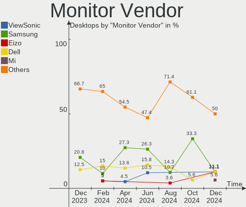
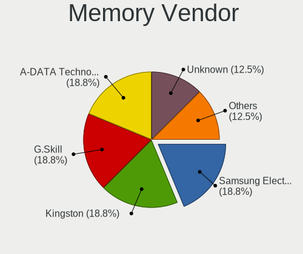

Gentoo Hardware Trends (Desktops)
---------------------------------

A project to identify most popular hardware characteristics and track their change
over time based on data collected by Gentoo users at https://Linux-Hardware.org.

Anyone can contribute to this report by the [hw-probe](https://github.com/linuxhw/hw-probe) tool:

    sudo -E hw-probe -all -upload

Full-feature report is available here: https://linux-hardware.org/?view=trends

Period: Dec, 2021.

Contents
--------

* [ System ](#system)
  - [ OS                       ](#os)
  - [ OS Family                ](#os-family)
  - [ Kernel                   ](#kernel)
  - [ Kernel Family            ](#kernel-family)
  - [ Kernel Major Ver.        ](#kernel-major-ver)
  - [ Arch                     ](#arch)
  - [ DE                       ](#de)
  - [ Display Server           ](#display-server)
  - [ Display Manager          ](#display-manager)
  - [ OS Lang                  ](#os-lang)
  - [ Boot Mode                ](#boot-mode)
  - [ Filesystem               ](#filesystem)
  - [ Part. scheme             ](#part-scheme)
  - [ Dual Boot with Linux/BSD ](#dual-boot-with-linuxbsd)
  - [ Dual Boot (Win)          ](#dual-boot-win)

* [ Board ](#board)
  - [ Vendor                   ](#vendor)
  - [ Model                    ](#model)
  - [ Model Family             ](#model-family)
  - [ MFG Year                 ](#mfg-year)
  - [ Form Factor              ](#form-factor)
  - [ Secure Boot              ](#secure-boot)
  - [ Coreboot                 ](#coreboot)
  - [ RAM Size                 ](#ram-size)
  - [ RAM Used                 ](#ram-used)
  - [ Total Drives             ](#total-drives)
  - [ Has CD-ROM               ](#has-cd-rom)
  - [ Has Ethernet             ](#has-ethernet)
  - [ Has WiFi                 ](#has-wifi)
  - [ Has Bluetooth            ](#has-bluetooth)

* [ Location ](#location)
  - [ Country                  ](#country)
  - [ City                     ](#city)

* [ Drives ](#drives)
  - [ Drive Vendor             ](#drive-vendor)
  - [ Drive Model              ](#drive-model)
  - [ HDD Vendor               ](#hdd-vendor)
  - [ SSD Vendor               ](#ssd-vendor)
  - [ Drive Kind               ](#drive-kind)
  - [ Drive Connector          ](#drive-connector)
  - [ Drive Size               ](#drive-size)
  - [ Space Total              ](#space-total)
  - [ Space Used               ](#space-used)
  - [ Malfunc. Drives          ](#malfunc-drives)
  - [ Malfunc. Drive Vendor    ](#malfunc-drive-vendor)
  - [ Malfunc. HDD Vendor      ](#malfunc-hdd-vendor)
  - [ Malfunc. Drive Kind      ](#malfunc-drive-kind)
  - [ Failed Drives            ](#failed-drives)
  - [ Failed Drive Vendor      ](#failed-drive-vendor)
  - [ Drive Status             ](#drive-status)

* [ Storage controller ](#storage-controller)
  - [ Storage Vendor           ](#storage-vendor)
  - [ Storage Model            ](#storage-model)
  - [ Storage Kind             ](#storage-kind)

* [ Processor ](#processor)
  - [ CPU Vendor               ](#cpu-vendor)
  - [ CPU Model                ](#cpu-model)
  - [ CPU Model Family         ](#cpu-model-family)
  - [ CPU Cores                ](#cpu-cores)
  - [ CPU Sockets              ](#cpu-sockets)
  - [ CPU Threads              ](#cpu-threads)
  - [ CPU Op-Modes             ](#cpu-op-modes)
  - [ CPU Microcode            ](#cpu-microcode)
  - [ CPU Microarch            ](#cpu-microarch)

* [ Graphics ](#graphics)
  - [ GPU Vendor               ](#gpu-vendor)
  - [ GPU Model                ](#gpu-model)
  - [ GPU Combo                ](#gpu-combo)
  - [ GPU Driver               ](#gpu-driver)
  - [ GPU Memory               ](#gpu-memory)

* [ Monitor ](#monitor)
  - [ Monitor Vendor           ](#monitor-vendor)
  - [ Monitor Model            ](#monitor-model)
  - [ Monitor Resolution       ](#monitor-resolution)
  - [ Monitor Diagonal         ](#monitor-diagonal)
  - [ Monitor Width            ](#monitor-width)
  - [ Aspect Ratio             ](#aspect-ratio)
  - [ Monitor Area             ](#monitor-area)
  - [ Pixel Density            ](#pixel-density)
  - [ Multiple Monitors        ](#multiple-monitors)

* [ Network ](#network)
  - [ Net Controller Vendor    ](#net-controller-vendor)
  - [ Net Controller Model     ](#net-controller-model)
  - [ Wireless Vendor          ](#wireless-vendor)
  - [ Wireless Model           ](#wireless-model)
  - [ Ethernet Vendor          ](#ethernet-vendor)
  - [ Ethernet Model           ](#ethernet-model)
  - [ Net Controller Kind      ](#net-controller-kind)
  - [ Used Controller          ](#used-controller)
  - [ NICs                     ](#nics)
  - [ IPv6                     ](#ipv6)

* [ Bluetooth ](#bluetooth)
  - [ Bluetooth Vendor         ](#bluetooth-vendor)
  - [ Bluetooth Model          ](#bluetooth-model)

* [ Sound ](#sound)
  - [ Sound Vendor             ](#sound-vendor)
  - [ Sound Model              ](#sound-model)

* [ Memory ](#memory)
  - [ Memory Vendor            ](#memory-vendor)
  - [ Memory Model             ](#memory-model)
  - [ Memory Kind              ](#memory-kind)
  - [ Memory Form Factor       ](#memory-form-factor)
  - [ Memory Size              ](#memory-size)
  - [ Memory Speed             ](#memory-speed)

* [ Printers & scanners ](#printers--scanners)
  - [ Printer Vendor           ](#printer-vendor)
  - [ Printer Model            ](#printer-model)
  - [ Scanner Vendor           ](#scanner-vendor)
  - [ Scanner Model            ](#scanner-model)

* [ Camera ](#camera)
  - [ Camera Vendor            ](#camera-vendor)
  - [ Camera Model             ](#camera-model)

* [ Security ](#security)
  - [ Fingerprint Vendor       ](#fingerprint-vendor)
  - [ Fingerprint Model        ](#fingerprint-model)
  - [ Chipcard Vendor          ](#chipcard-vendor)
  - [ Chipcard Model           ](#chipcard-model)

* [ Unsupported ](#unsupported)
  - [ Unsupported Devices      ](#unsupported-devices)
  - [ Unsupported Device Types ](#unsupported-device-types)

System
------

OS
--

Installed operating systems

| Name       | Desktops | Percent |
|------------|----------|---------|
| Gentoo 2.7 | 8        | 53.33%  |
| Gentoo 2.8 | 5        | 33.33%  |
| Gentoo 2.6 | 1        | 6.67%   |
| Gentoo 1   | 1        | 6.67%   |

OS Family
---------

OS without a version

| Name   | Desktops | Percent |
|--------|----------|---------|
| Gentoo | 15       | 100%    |

Kernel
------

Version of the Linux kernel

| Version                      | Desktops | Percent |
|------------------------------|----------|---------|
| 5.10.76-gentoo-r1            | 3        | 20%     |
| 5.15.6-gentoo                | 2        | 13.33%  |
| 6.0.0-Phaco-g8f10ff49057f    | 1        | 6.67%   |
| 5.15.4-gentoo-deimos         | 1        | 6.67%   |
| 5.15.10-gentoo-limelight     | 1        | 6.67%   |
| 5.15.10-gentoo               | 1        | 6.67%   |
| 5.15.0-gentoofullmaster      | 1        | 6.67%   |
| 5.10.84-gentoo-112-overlayfs | 1        | 6.67%   |
| 5.10.78-gentoo-dist          | 1        | 6.67%   |
| 5.10.76-gentoo-r1-x86_64     | 1        | 6.67%   |
| 5.10.76-gentoo-r1-kris       | 1        | 6.67%   |
| 5.10.61-gentoo-x86_64        | 1        | 6.67%   |

Kernel Family
-------------

Linux kernel without a distro release

| Version | Desktops | Percent |
|---------|----------|---------|
| 5.10.76 | 5        | 33.33%  |
| 5.15.6  | 2        | 13.33%  |
| 5.15.10 | 2        | 13.33%  |
| 6.0.0   | 1        | 6.67%   |
| 5.15.4  | 1        | 6.67%   |
| 5.15.0  | 1        | 6.67%   |
| 5.10.84 | 1        | 6.67%   |
| 5.10.78 | 1        | 6.67%   |
| 5.10.61 | 1        | 6.67%   |

Kernel Major Ver.
-----------------

Linux kernel major version

| Version | Desktops | Percent |
|---------|----------|---------|
| 5.10    | 8        | 53.33%  |
| 5.15    | 6        | 40%     |
| 6.0     | 1        | 6.67%   |

Arch
----

OS architecture (x86_64, i586, etc.)

| Name   | Desktops | Percent |
|--------|----------|---------|
| x86_64 | 15       | 100%    |

DE
--

Desktop Environment

| Name    | Desktops | Percent |
|---------|----------|---------|
| KDE5    | 6        | 40%     |
| Unknown | 4        | 26.67%  |
| GNOME   | 3        | 20%     |
| XFCE    | 1        | 6.67%   |
| MATE    | 1        | 6.67%   |

Display Server
--------------

X11 or Wayland

| Name    | Desktops | Percent |
|---------|----------|---------|
| X11     | 10       | 66.67%  |
| Unknown | 3        | 20%     |
| Wayland | 1        | 6.67%   |
| Tty     | 1        | 6.67%   |

Display Manager
---------------

SDDM, LightDM, etc.

| Name    | Desktops | Percent |
|---------|----------|---------|
| SDDM    | 5        | 33.33%  |
| Unknown | 5        | 33.33%  |
| GDM     | 3        | 20%     |
| LightDM | 2        | 13.33%  |

OS Lang
-------

Language

| Lang  | Desktops | Percent |
|-------|----------|---------|
| en_US | 6        | 40%     |
| pl_PL | 3        | 20%     |
| en_GB | 2        | 13.33%  |
| sl_SI | 1        | 6.67%   |
| es_ES | 1        | 6.67%   |
| en_CA | 1        | 6.67%   |
| el_GR | 1        | 6.67%   |

Boot Mode
---------

EFI or BIOS

| Mode | Desktops | Percent |
|------|----------|---------|
| EFI  | 9        | 60%     |
| BIOS | 6        | 40%     |

Filesystem
----------

Type of filesystem

| Type  | Desktops | Percent |
|-------|----------|---------|
| Ext4  | 8        | 53.33%  |
| Btrfs | 4        | 26.67%  |
| F2fs  | 2        | 13.33%  |
| Ext3  | 1        | 6.67%   |

Part. scheme
------------

Scheme of partitioning

| Type    | Desktops | Percent |
|---------|----------|---------|
| GPT     | 14       | 93.33%  |
| Unknown | 1        | 6.67%   |

Dual Boot with Linux/BSD
------------------------

Hosting more than one Linux/BSD

| Dual boot | Desktops | Percent |
|-----------|----------|---------|
| No        | 9        | 60%     |
| Yes       | 6        | 40%     |

Dual Boot (Win)
---------------

Hosting Linux and Windows

| Dual boot | Desktops | Percent |
|-----------|----------|---------|
| No        | 9        | 60%     |
| Yes       | 6        | 40%     |

Board
-----

Vendor
------

Motherboard manufacturer

| Name                | Desktops | Percent |
|---------------------|----------|---------|
| ASUSTek Computer    | 6        | 40%     |
| MSI                 | 3        | 20%     |
| Gigabyte Technology | 2        | 13.33%  |
| Dell                | 2        | 13.33%  |
| EVGA                | 1        | 6.67%   |
| ASRock              | 1        | 6.67%   |

Model
-----

Motherboard model

| Name                         | Desktops | Percent |
|------------------------------|----------|---------|
| MSI MS-7D31                  | 1        | 6.67%   |
| MSI MS-7C02                  | 1        | 6.67%   |
| MSI MS-7821                  | 1        | 6.67%   |
| Gigabyte B450 AORUS PRO WIFI | 1        | 6.67%   |
| Gigabyte AB350-Gaming        | 1        | 6.67%   |
| EVGA Z390 DARK               | 1        | 6.67%   |
| Dell Vostro 410              | 1        | 6.67%   |
| Dell OptiPlex 790            | 1        | 6.67%   |
| ASUS TUF B450-PLUS GAMING    | 1        | 6.67%   |
| ASUS SABERTOOTH 990FX        | 1        | 6.67%   |
| ASUS ROG Maximus XIII APEX   | 1        | 6.67%   |
| ASUS P5LD2-Deluxe            | 1        | 6.67%   |
| ASUS M3N78-EM                | 1        | 6.67%   |
| ASUS M3A78-CM                | 1        | 6.67%   |
| ASRock H110M-HDV R3.0        | 1        | 6.67%   |

Model Family
------------

Motherboard model prefix

| Name                  | Desktops | Percent |
|-----------------------|----------|---------|
| MSI MS-7D31           | 1        | 6.67%   |
| MSI MS-7C02           | 1        | 6.67%   |
| MSI MS-7821           | 1        | 6.67%   |
| Gigabyte B450         | 1        | 6.67%   |
| Gigabyte AB350-Gaming | 1        | 6.67%   |
| EVGA Z390             | 1        | 6.67%   |
| Dell Vostro           | 1        | 6.67%   |
| Dell OptiPlex         | 1        | 6.67%   |
| ASUS TUF              | 1        | 6.67%   |
| ASUS SABERTOOTH       | 1        | 6.67%   |
| ASUS ROG              | 1        | 6.67%   |
| ASUS P5LD2-Deluxe     | 1        | 6.67%   |
| ASUS M3N78-EM         | 1        | 6.67%   |
| ASUS M3A78-CM         | 1        | 6.67%   |
| ASRock H110M-HDV      | 1        | 6.67%   |

MFG Year
--------

Motherboard manufacture year

| Year | Desktops | Percent |
|------|----------|---------|
| 2021 | 4        | 26.67%  |
| 2019 | 3        | 20%     |
| 2012 | 2        | 13.33%  |
| 2018 | 1        | 6.67%   |
| 2014 | 1        | 6.67%   |
| 2010 | 1        | 6.67%   |
| 2009 | 1        | 6.67%   |
| 2008 | 1        | 6.67%   |
| 2006 | 1        | 6.67%   |

Form Factor
-----------

Physical design of the computer

| Name    | Desktops | Percent |
|---------|----------|---------|
| Desktop | 15       | 100%    |

Secure Boot
-----------

Enabled or disabled

| State    | Desktops | Percent |
|----------|----------|---------|
| Disabled | 15       | 100%    |

Coreboot
--------

Have coreboot on board

| Used | Desktops | Percent |
|------|----------|---------|
| No   | 15       | 100%    |

RAM Size
--------

Total RAM memory

| Size in GB  | Desktops | Percent |
|-------------|----------|---------|
| 16.01-24.0  | 6        | 40%     |
| 64.01-256.0 | 3        | 20%     |
| 4.01-8.0    | 2        | 13.33%  |
| 32.01-64.0  | 2        | 13.33%  |
| 3.01-4.0    | 1        | 6.67%   |
| 2.01-3.0    | 1        | 6.67%   |

RAM Used
--------

Used RAM memory

| Used GB    | Desktops | Percent |
|------------|----------|---------|
| 2.01-3.0   | 4        | 26.67%  |
| 3.01-4.0   | 3        | 20%     |
| 4.01-8.0   | 2        | 13.33%  |
| 0.51-1.0   | 2        | 13.33%  |
| 16.01-24.0 | 1        | 6.67%   |
| 1.01-2.0   | 1        | 6.67%   |
| 8.01-16.0  | 1        | 6.67%   |
| 0.01-0.5   | 1        | 6.67%   |

Total Drives
------------

Number of drives on board

| Drives | Desktops | Percent |
|--------|----------|---------|
| 4      | 5        | 33.33%  |
| 2      | 4        | 26.67%  |
| 3      | 2        | 13.33%  |
| 1      | 2        | 13.33%  |
| 6      | 1        | 6.67%   |
| 5      | 1        | 6.67%   |

Has CD-ROM
----------

Has CD-ROM on board

| Presented | Desktops | Percent |
|-----------|----------|---------|
| No        | 11       | 73.33%  |
| Yes       | 4        | 26.67%  |

Has Ethernet
------------

Has Ethernet on board

| Presented | Desktops | Percent |
|-----------|----------|---------|
| Yes       | 14       | 93.33%  |
| No        | 1        | 6.67%   |

Has WiFi
--------

Has WiFi module

| Presented | Desktops | Percent |
|-----------|----------|---------|
| No        | 8        | 53.33%  |
| Yes       | 7        | 46.67%  |

Has Bluetooth
-------------

Has Bluetooth module

| Presented | Desktops | Percent |
|-----------|----------|---------|
| No        | 10       | 66.67%  |
| Yes       | 5        | 33.33%  |

Location
--------

Country
-------

Geographic location (country)

| Country    | Desktops | Percent |
|------------|----------|---------|
| USA        | 4        | 26.67%  |
| Poland     | 4        | 26.67%  |
| Ukraine    | 1        | 6.67%   |
| Spain      | 1        | 6.67%   |
| Slovenia   | 1        | 6.67%   |
| Hong Kong  | 1        | 6.67%   |
| Greece     | 1        | 6.67%   |
| Canada     | 1        | 6.67%   |
| Bangladesh | 1        | 6.67%   |

City
----

Geographic location (city)

| City            | Desktops | Percent |
|-----------------|----------|---------|
| Warsaw          | 2        | 13.33%  |
| Vancouver       | 1        | 6.67%   |
| Tacoma          | 1        | 6.67%   |
| Seattle         | 1        | 6.67%   |
| Rzesz??w        | 1        | 6.67%   |
| Redmond         | 1        | 6.67%   |
| Lviv            | 1        | 6.67%   |
| Kowloon         | 1        | 6.67%   |
| Ivan??na Gorica | 1        | 6.67%   |
| Igualada        | 1        | 6.67%   |
| Dhaka           | 1        | 6.67%   |
| Bogucice        | 1        | 6.67%   |
| Baton Rouge     | 1        | 6.67%   |
| Athens          | 1        | 6.67%   |

Drives
------

Drive Vendor
------------

Hard drive vendors

| Vendor              | Desktops | Drives | Percent |
|---------------------|----------|--------|---------|
| WDC                 | 9        | 12     | 23.68%  |
| Samsung Electronics | 6        | 9      | 15.79%  |
| Toshiba             | 4        | 4      | 10.53%  |
| GOODRAM             | 4        | 4      | 10.53%  |
| Seagate             | 3        | 3      | 7.89%   |
| A-DATA Technology   | 3        | 3      | 7.89%   |
| Kingston            | 2        | 2      | 5.26%   |
| Hitachi             | 2        | 6      | 5.26%   |
| Crucial             | 2        | 2      | 5.26%   |
| LaCie               | 1        | 1      | 2.63%   |
| Intel               | 1        | 1      | 2.63%   |
| CT2000MX            | 1        | 1      | 2.63%   |

Drive Model
-----------

Hard drive models

| Model                                      | Desktops | Percent |
|--------------------------------------------|----------|---------|
| GOODRAM SSDPR-CL100-480-G2 480GB           | 2        | 4.65%   |
| WDC WDS240G2G0A 240GB SSD                  | 1        | 2.33%   |
| WDC WD5000BEVT-22ZAT0 500GB                | 1        | 2.33%   |
| WDC WD40EZRZ-00GXCB0 4TB                   | 1        | 2.33%   |
| WDC WD30EZRZ-00GXCB0 3TB                   | 1        | 2.33%   |
| WDC WD30EFRX-68EUZN0 3TB                   | 1        | 2.33%   |
| WDC WD30EFRX-68AX9N0 3TB                   | 1        | 2.33%   |
| WDC WD10EZEX-60M2NA0 1TB                   | 1        | 2.33%   |
| WDC WD10EZEX-22M                           | 1        | 2.33%   |
| WDC WD10EZEX-08M2NA0 1TB                   | 1        | 2.33%   |
| WDC WD10EARS-00MVWB0 1TB                   | 1        | 2.33%   |
| WDC WD1002FAEX-00Y9A0 1TB                  | 1        | 2.33%   |
| Toshiba HDWE150 5TB                        | 1        | 2.33%   |
| Toshiba DT01ACA300 3TB                     | 1        | 2.33%   |
| Toshiba DT01ACA100 1TB                     | 1        | 2.33%   |
| Toshiba DT01ABA100V 1TB                    | 1        | 2.33%   |
| Seagate ST4000DM004-2CV104 4TB             | 1        | 2.33%   |
| Seagate ST12000NM0008-2H3101 12TB          | 1        | 2.33%   |
| Seagate FireCuda 520 SSD ZP2000GM30002 2TB | 1        | 2.33%   |
| Samsung SSD 980 PRO 2TB                    | 1        | 2.33%   |
| Samsung SSD 970 PRO 512GB                  | 1        | 2.33%   |
| Samsung SSD 970 EVO Plus 2TB               | 1        | 2.33%   |
| Samsung SSD 870 QVO 2TB                    | 1        | 2.33%   |
| Samsung SSD 870 EVO 500GB                  | 1        | 2.33%   |
| Samsung SSD 860 PRO 1TB                    | 1        | 2.33%   |
| Samsung SSD 860 EVO M.2 250GB              | 1        | 2.33%   |
| Samsung SSD 860 EVO 250GB                  | 1        | 2.33%   |
| LaCie Rugged THB USB3 2TB                  | 1        | 2.33%   |
| Kingston SV300S37A240G 240GB SSD           | 1        | 2.33%   |
| Kingston SV300S37A120G 120GB SSD           | 1        | 2.33%   |
| Intel SSDSC2BB120G4 120GB                  | 1        | 2.33%   |
| Hitachi HUS724030ALE641 3TB                | 1        | 2.33%   |
| Hitachi HDS721010CLA332 1TB                | 1        | 2.33%   |
| Hitachi HDP725025GLA380 250GB              | 1        | 2.33%   |
| GOODRAM SSDPR_CX300_120 120GB              | 1        | 2.33%   |
| GOODRAM SSDPR-CX400-512-G2 512GB           | 1        | 2.33%   |
| CT2000MX 500SSD1 2TB                       | 1        | 2.33%   |
| Crucial CT500P2SSD8 500GB                  | 1        | 2.33%   |
| Crucial CT2000MX500SSD1 2TB                | 1        | 2.33%   |
| A-DATA SX8200PNP 512GB                     | 1        | 2.33%   |
| A-DATA SX8200PNP 1TB                       | 1        | 2.33%   |
| A-DATA SU650 240GB SSD                     | 1        | 2.33%   |

HDD Vendor
----------

Hard disk drive vendors

| Vendor  | Desktops | Drives | Percent |
|---------|----------|--------|---------|
| WDC     | 9        | 11     | 50%     |
| Toshiba | 4        | 4      | 22.22%  |
| Seagate | 2        | 2      | 11.11%  |
| Hitachi | 2        | 6      | 11.11%  |
| LaCie   | 1        | 1      | 5.56%   |

SSD Vendor
----------

Solid state drive vendors

| Vendor              | Desktops | Drives | Percent |
|---------------------|----------|--------|---------|
| Samsung Electronics | 5        | 6      | 31.25%  |
| GOODRAM             | 4        | 4      | 25%     |
| Kingston            | 2        | 2      | 12.5%   |
| WDC                 | 1        | 1      | 6.25%   |
| Intel               | 1        | 1      | 6.25%   |
| CT2000MX            | 1        | 1      | 6.25%   |
| Crucial             | 1        | 1      | 6.25%   |
| A-DATA Technology   | 1        | 1      | 6.25%   |

Drive Kind
----------

HDD or SSD

| Kind | Desktops | Drives | Percent |
|------|----------|--------|---------|
| HDD  | 12       | 24     | 44.44%  |
| SSD  | 10       | 17     | 37.04%  |
| NVMe | 5        | 7      | 18.52%  |

Drive Connector
---------------

SATA, SAS, NVMe, etc.

| Type | Desktops | Drives | Percent |
|------|----------|--------|---------|
| SATA | 14       | 39     | 70%     |
| NVMe | 5        | 7      | 25%     |
| SAS  | 1        | 2      | 5%      |

Drive Size
----------

Size of hard drive

| Size in TB | Desktops | Drives | Percent |
|------------|----------|--------|---------|
| 0.01-0.5   | 9        | 13     | 33.33%  |
| 0.51-1.0   | 8        | 12     | 29.63%  |
| 2.01-3.0   | 5        | 8      | 18.52%  |
| 3.01-4.0   | 2        | 2      | 7.41%   |
| 10.01-20.0 | 1        | 1      | 3.7%    |
| 1.01-2.0   | 1        | 4      | 3.7%    |
| 4.01-10.0  | 1        | 1      | 3.7%    |

Space Total
-----------

Amount of disk space available on the file system

| Size in GB     | Desktops | Percent |
|----------------|----------|---------|
| More than 3000 | 4        | 26.67%  |
| 251-500        | 3        | 20%     |
| 101-250        | 3        | 20%     |
| 1001-2000      | 2        | 13.33%  |
| 2001-3000      | 1        | 6.67%   |
| 1-20           | 1        | 6.67%   |
| 501-1000       | 1        | 6.67%   |

Space Used
----------

Amount of used disk space

| Used GB        | Desktops | Percent |
|----------------|----------|---------|
| More than 3000 | 3        | 20%     |
| 101-250        | 3        | 20%     |
| 251-500        | 2        | 13.33%  |
| 1-20           | 2        | 13.33%  |
| 51-100         | 2        | 13.33%  |
| 21-50          | 1        | 6.67%   |
| 2001-3000      | 1        | 6.67%   |
| 501-1000       | 1        | 6.67%   |

Malfunc. Drives
---------------

Drive models with a malfunction

| Model                                 | Desktops | Drives | Percent |
|---------------------------------------|----------|--------|---------|
| WDC WD5000BEVT-22ZAT0 500GB           | 1        | 1      | 25%     |
| Toshiba DT01ABA100V 1TB               | 1        | 1      | 25%     |
| Samsung Electronics SSD 870 EVO 500GB | 1        | 1      | 25%     |
| Kingston SV300S37A120G 120GB SSD      | 1        | 1      | 25%     |

Malfunc. Drive Vendor
---------------------

Vendors of faulty drives

| Vendor              | Desktops | Drives | Percent |
|---------------------|----------|--------|---------|
| WDC                 | 1        | 1      | 25%     |
| Toshiba             | 1        | 1      | 25%     |
| Samsung Electronics | 1        | 1      | 25%     |
| Kingston            | 1        | 1      | 25%     |

Malfunc. HDD Vendor
-------------------

Vendors of faulty HDD drives

| Vendor  | Desktops | Drives | Percent |
|---------|----------|--------|---------|
| WDC     | 1        | 1      | 50%     |
| Toshiba | 1        | 1      | 50%     |

Malfunc. Drive Kind
-------------------

Kinds of faulty drives

| Kind | Desktops | Drives | Percent |
|------|----------|--------|---------|
| SSD  | 2        | 2      | 50%     |
| HDD  | 2        | 2      | 50%     |

Failed Drives
-------------

Failed drive models

Zero info for selected period =(

Failed Drive Vendor
-------------------

Failed drive vendors

Zero info for selected period =(

Drive Status
------------

Number of failed and malfunc. drives

| Status   | Desktops | Drives | Percent |
|----------|----------|--------|---------|
| Works    | 14       | 39     | 70%     |
| Malfunc  | 4        | 4      | 20%     |
| Detected | 2        | 5      | 10%     |

Storage controller
------------------

Storage Vendor
--------------

Storage controller vendors

| Vendor                    | Desktops | Percent |
|---------------------------|----------|---------|
| Intel                     | 8        | 30.77%  |
| AMD                       | 6        | 23.08%  |
| Samsung Electronics       | 3        | 11.54%  |
| ASMedia Technology        | 3        | 11.54%  |
| ADATA Technology          | 2        | 7.69%   |
| Silicon Image             | 1        | 3.85%   |
| Seagate Technology        | 1        | 3.85%   |
| Nvidia                    | 1        | 3.85%   |
| Micron/Crucial Technology | 1        | 3.85%   |

Storage Model
-------------

Storage controller models

| Model                                                                          | Desktops | Percent |
|--------------------------------------------------------------------------------|----------|---------|
| ASMedia ASM1062 Serial ATA Controller                                          | 3        | 9.38%   |
| AMD FCH SATA Controller [AHCI mode]                                            | 3        | 9.38%   |
| AMD 400 Series Chipset SATA Controller                                         | 3        | 9.38%   |
| Samsung NVMe SSD Controller SM981/PM981/PM983                                  | 2        | 6.25%   |
| ADATA XPG SX8200 Pro PCIe Gen3x4 M.2 2280 Solid State Drive                    | 2        | 6.25%   |
| Silicon Image SiI 3132 Serial ATA Raid II Controller                           | 1        | 3.13%   |
| Seagate FireCuda 520 SSD                                                       | 1        | 3.13%   |
| Samsung NVMe SSD Controller PM9A1/PM9A3/980PRO                                 | 1        | 3.13%   |
| Nvidia MCP78S [GeForce 8200] IDE                                               | 1        | 3.13%   |
| Nvidia MCP78S [GeForce 8200] AHCI Controller                                   | 1        | 3.13%   |
| Micron/Crucial P2 NVMe PCIe SSD                                                | 1        | 3.13%   |
| Intel Q170/Q150/B150/H170/H110/Z170/CM236 Chipset SATA Controller [AHCI Mode]  | 1        | 3.13%   |
| Intel NM10/ICH7 Family SATA Controller [IDE mode]                              | 1        | 3.13%   |
| Intel Cannon Lake PCH SATA AHCI Controller                                     | 1        | 3.13%   |
| Intel 82801IR/IO/IH (ICH9R/DO/DH) 4 port SATA Controller [IDE mode]            | 1        | 3.13%   |
| Intel 82801I (ICH9 Family) 2 port SATA Controller [IDE mode]                   | 1        | 3.13%   |
| Intel 8 Series/C220 Series Chipset Family 6-port SATA Controller 1 [AHCI mode] | 1        | 3.13%   |
| Intel 600 Series Chipset Family SATA AHCI Controller                           | 1        | 3.13%   |
| Intel 6 Series/C200 Series Chipset Family 6 port Desktop SATA AHCI Controller  | 1        | 3.13%   |
| Intel 500 Series Chipset Family SATA AHCI Controller                           | 1        | 3.13%   |
| AMD SB7x0/SB8x0/SB9x0 SATA Controller [IDE mode]                               | 1        | 3.13%   |
| AMD SB7x0/SB8x0/SB9x0 SATA Controller [AHCI mode]                              | 1        | 3.13%   |
| AMD SB7x0/SB8x0/SB9x0 IDE Controller                                           | 1        | 3.13%   |
| AMD 300 Series Chipset SATA Controller                                         | 1        | 3.13%   |

Storage Kind
------------

Kind of storage controller (IDE, SATA, NVMe, SAS, ...)

| Kind | Desktops | Percent |
|------|----------|---------|
| SATA | 13       | 56.52%  |
| NVMe | 5        | 21.74%  |
| IDE  | 4        | 17.39%  |
| RAID | 1        | 4.35%   |

Processor
---------

CPU Vendor
----------

Processor vendors

| Vendor | Desktops | Percent |
|--------|----------|---------|
| Intel  | 8        | 53.33%  |
| AMD    | 7        | 46.67%  |

CPU Model
---------

Processor models

| Model                                      | Desktops | Percent |
|--------------------------------------------|----------|---------|
| AMD Ryzen 5 2600 Six-Core Processor        | 2        | 13.33%  |
| Intel Pentium 4 CPU 3.20GHz                | 1        | 6.67%   |
| Intel Core i9-9900K CPU @ 3.60GHz          | 1        | 6.67%   |
| Intel Core i7-4790K CPU @ 4.00GHz          | 1        | 6.67%   |
| Intel Core i5-7400 CPU @ 3.00GHz           | 1        | 6.67%   |
| Intel Core i5-2400 CPU @ 3.10GHz           | 1        | 6.67%   |
| Intel Core 2 Quad CPU Q6600 @ 2.40GHz      | 1        | 6.67%   |
| Intel 12th Gen Core i7-12700K              | 1        | 6.67%   |
| Intel 11th Gen Core i9-11900K @ 3.50GHz    | 1        | 6.67%   |
| AMD Ryzen 5 3600 6-Core Processor          | 1        | 6.67%   |
| AMD Ryzen 5 1600 Six-Core Processor        | 1        | 6.67%   |
| AMD Phenom II X4 955 Processor             | 1        | 6.67%   |
| AMD FX-8120 Eight-Core Processor           | 1        | 6.67%   |
| AMD Athlon 64 X2 Dual Core Processor 5400+ | 1        | 6.67%   |

CPU Model Family
----------------

Processor model prefix

| Model             | Desktops | Percent |
|-------------------|----------|---------|
| AMD Ryzen 5       | 4        | 26.67%  |
| Other             | 2        | 13.33%  |
| Intel Core i5     | 2        | 13.33%  |
| Intel Pentium 4   | 1        | 6.67%   |
| Intel Core i9     | 1        | 6.67%   |
| Intel Core i7     | 1        | 6.67%   |
| Intel Core 2 Quad | 1        | 6.67%   |
| AMD Phenom II X4  | 1        | 6.67%   |
| AMD FX            | 1        | 6.67%   |
| AMD Athlon 64 X2  | 1        | 6.67%   |

CPU Cores
---------

Number of processor cores

| Number | Desktops | Percent |
|--------|----------|---------|
| 4      | 6        | 40%     |
| 6      | 4        | 26.67%  |
| 8      | 2        | 13.33%  |
| 12     | 1        | 6.67%   |
| 2      | 1        | 6.67%   |
| 1      | 1        | 6.67%   |

CPU Sockets
-----------

Number of sockets

| Number | Desktops | Percent |
|--------|----------|---------|
| 1      | 15       | 100%    |

CPU Threads
-----------

Threads per core (Hyper-Threading)

| Number | Desktops | Percent |
|--------|----------|---------|
| 2      | 10       | 66.67%  |
| 1      | 5        | 33.33%  |

CPU Op-Modes
------------

CPU Operation Modes (32-bit, 64-bit)

| Op mode        | Desktops | Percent |
|----------------|----------|---------|
| 32-bit, 64-bit | 15       | 100%    |

CPU Microcode
-------------

Microcode number

| Number     | Desktops | Percent |
|------------|----------|---------|
| Unknown    | 2        | 13.33%  |
| 0xf43      | 1        | 6.67%   |
| 0x906ed    | 1        | 6.67%   |
| 0x906e9    | 1        | 6.67%   |
| 0x90672    | 1        | 6.67%   |
| 0x6fb      | 1        | 6.67%   |
| 0x306c3    | 1        | 6.67%   |
| 0x206a7    | 1        | 6.67%   |
| 0x08701013 | 1        | 6.67%   |
| 0x0800820d | 1        | 6.67%   |
| 0x0800820b | 1        | 6.67%   |
| 0x08001138 | 1        | 6.67%   |
| 0x0600063e | 1        | 6.67%   |
| 0x010000db | 1        | 6.67%   |

CPU Microarch
-------------

Microarchitecture

| Name             | Desktops | Percent |
|------------------|----------|---------|
| Zen+             | 2        | 13.33%  |
| KabyLake         | 2        | 13.33%  |
| Zen 2            | 1        | 6.67%   |
| Zen              | 1        | 6.67%   |
| SandyBridge      | 1        | 6.67%   |
| NetBurst         | 1        | 6.67%   |
| K8 Hammer        | 1        | 6.67%   |
| K10              | 1        | 6.67%   |
| Haswell          | 1        | 6.67%   |
| Core             | 1        | 6.67%   |
| Bulldozer        | 1        | 6.67%   |
| Alderlake Hybrid | 1        | 6.67%   |
| Unknown          | 1        | 6.67%   |

Graphics
--------

GPU Vendor
----------

Vendors of graphics cards

| Vendor | Desktops | Percent |
|--------|----------|---------|
| Nvidia | 9        | 52.94%  |
| AMD    | 5        | 29.41%  |
| Intel  | 3        | 17.65%  |

GPU Model
---------

Graphics card models

| Model                                                               | Desktops | Percent |
|---------------------------------------------------------------------|----------|---------|
| AMD Ellesmere [Radeon RX 470/480/570/570X/580/580X/590]             | 2        | 11.76%  |
| Nvidia TU106 [GeForce RTX 2060 SUPER]                               | 1        | 5.88%   |
| Nvidia TU102 [GeForce RTX 2080 Ti Rev. A]                           | 1        | 5.88%   |
| Nvidia GP106 [GeForce GTX 1060 6GB]                                 | 1        | 5.88%   |
| Nvidia GM204 [GeForce GTX 970]                                      | 1        | 5.88%   |
| Nvidia GK208B [GeForce GT 730]                                      | 1        | 5.88%   |
| Nvidia GK104 [GeForce GTX 770]                                      | 1        | 5.88%   |
| Nvidia GA102 [GeForce RTX 3080 Ti]                                  | 1        | 5.88%   |
| Nvidia G98 [GeForce 8400 GS Rev. 2]                                 | 1        | 5.88%   |
| Nvidia G73 [GeForce 7300 GT]                                        | 1        | 5.88%   |
| Intel HD Graphics 630                                               | 1        | 5.88%   |
| Intel CoffeeLake-S GT2 [UHD Graphics 630]                           | 1        | 5.88%   |
| Intel AlderLake-S GT1                                               | 1        | 5.88%   |
| AMD RV635 [Radeon HD 3650/3750/4570/4580]                           | 1        | 5.88%   |
| AMD RS780C [Radeon 3100]                                            | 1        | 5.88%   |
| AMD Baffin [Radeon RX 460/560D / Pro 450/455/460/555/555X/560/560X] | 1        | 5.88%   |

GPU Combo
---------

Combinations of graphics cards

| Name           | Desktops | Percent |
|----------------|----------|---------|
| 1 x Nvidia     | 7        | 46.67%  |
| 1 x AMD        | 4        | 26.67%  |
| Other          | 1        | 6.67%   |
| Intel + Nvidia | 1        | 6.67%   |
| 1 x Intel      | 1        | 6.67%   |
| AMD + Nvidia   | 1        | 6.67%   |

GPU Driver
----------

Free vs proprietary

| Driver      | Desktops | Percent |
|-------------|----------|---------|
| Free        | 8        | 53.33%  |
| Proprietary | 5        | 33.33%  |
| Unknown     | 2        | 13.33%  |

GPU Memory
----------

Total video memory

| Size in GB | Desktops | Percent |
|------------|----------|---------|
| Unknown    | 6        | 40%     |
| 0.01-0.5   | 4        | 26.67%  |
| 1.01-2.0   | 2        | 13.33%  |
| 7.01-8.0   | 1        | 6.67%   |
| 3.01-4.0   | 1        | 6.67%   |
| 8.01-16.0  | 1        | 6.67%   |

Monitor
-------

Monitor Vendor
--------------

Monitor vendors

| Vendor              | Desktops | Percent |
|---------------------|----------|---------|
| Dell                | 5        | 33.33%  |
| Samsung Electronics | 2        | 13.33%  |
| Goldstar            | 2        | 13.33%  |
| AOC                 | 2        | 13.33%  |
| ViewSonic           | 1        | 6.67%   |
| Lenovo              | 1        | 6.67%   |
| Hewlett-Packard     | 1        | 6.67%   |
| Chimei Innolux      | 1        | 6.67%   |

Monitor Model
-------------

Monitor models

| Model                                                                | Desktops | Percent |
|----------------------------------------------------------------------|----------|---------|
| ViewSonic VX2250 SERIES VSCCB25 1920x1080 477x268mm 21.5-inch        | 1        | 5.56%   |
| Samsung Electronics SyncMaster SAM0584 2048x1152 510x287mm 23.0-inch | 1        | 5.56%   |
| Samsung Electronics SyncMaster SAM011E 1280x1024 338x270mm 17.0-inch | 1        | 5.56%   |
| Samsung Electronics S22B300 SAM08C8 1920x1080 480x270mm 21.7-inch    | 1        | 5.56%   |
| Lenovo P24h-10 LEN61AE 2560x1440 527x296mm 23.8-inch                 | 1        | 5.56%   |
| Hewlett-Packard LV1561w HWP2837 1366x768 344x194mm 15.5-inch         | 1        | 5.56%   |
| Hewlett-Packard 22f HPN3541 1920x1080 500x300mm 23.0-inch            | 1        | 5.56%   |
| Goldstar HDR WFHD GSM7714 2560x1080 798x334mm 34.1-inch              | 1        | 5.56%   |
| Goldstar HDR 4K GSM7707 3840x2160 600x340mm 27.2-inch                | 1        | 5.56%   |
| Dell U2717D DEL40EB 2560x1440 597x336mm 27.0-inch                    | 1        | 5.56%   |
| Dell U2515H DELD070 2560x1440 553x311mm 25.0-inch                    | 1        | 5.56%   |
| Dell U2212HM DELD047 1920x1080 475x267mm 21.5-inch                   | 1        | 5.56%   |
| Dell S3221QS DELD107 3840x2160 697x392mm 31.5-inch                   | 1        | 5.56%   |
| Dell E2015HV DELF05E 1600x900 434x236mm 19.4-inch                    | 1        | 5.56%   |
| Dell 2208WFP DEL403C 1680x1050 473x296mm 22.0-inch                   | 1        | 5.56%   |
| Chimei Innolux LCD Monitor CMN1132 1366x768 260x140mm 11.6-inch      | 1        | 5.56%   |
| AOC LCD Monitor Q27G1WG4 2560x1440                                   | 1        | 5.56%   |
| AOC 2437 AOC2437 1920x1080 521x293mm 23.5-inch                       | 1        | 5.56%   |

Monitor Resolution
------------------

Monitor screen resolution

| Resolution         | Desktops | Percent |
|--------------------|----------|---------|
| 1920x1080 (FHD)    | 5        | 29.41%  |
| 2560x1440 (QHD)    | 3        | 17.65%  |
| 3840x2160 (4K)     | 2        | 11.76%  |
| 1366x768 (WXGA)    | 2        | 11.76%  |
| 2560x1080          | 1        | 5.88%   |
| 2048x1152          | 1        | 5.88%   |
| 1680x1050 (WSXGA+) | 1        | 5.88%   |
| 1600x900 (HD+)     | 1        | 5.88%   |
| 1280x1024 (SXGA)   | 1        | 5.88%   |

Monitor Diagonal
----------------

Diagonal size in inches

| Inches  | Desktops | Percent |
|---------|----------|---------|
| 23      | 4        | 22.22%  |
| 21      | 3        | 16.67%  |
| 27      | 2        | 11.11%  |
| 34      | 1        | 5.56%   |
| 31      | 1        | 5.56%   |
| 25      | 1        | 5.56%   |
| 22      | 1        | 5.56%   |
| 19      | 1        | 5.56%   |
| 17      | 1        | 5.56%   |
| 15      | 1        | 5.56%   |
| 11      | 1        | 5.56%   |
| Unknown | 1        | 5.56%   |

Monitor Width
-------------

Physical width

| Width in mm | Desktops | Percent |
|-------------|----------|---------|
| 501-600     | 5        | 31.25%  |
| 401-500     | 5        | 31.25%  |
| 301-350     | 2        | 12.5%   |
| 701-800     | 1        | 6.25%   |
| 601-700     | 1        | 6.25%   |
| 201-300     | 1        | 6.25%   |
| Unknown     | 1        | 6.25%   |

Aspect Ratio
------------

Proportional relationship between the width and the height

| Ratio   | Desktops | Percent |
|---------|----------|---------|
| 16/9    | 10       | 71.43%  |
| 5/4     | 1        | 7.14%   |
| 21/9    | 1        | 7.14%   |
| 16/10   | 1        | 7.14%   |
| Unknown | 1        | 7.14%   |

Monitor Area
------------

Area in inch²

| Area in inch² | Desktops | Percent |
|----------------|----------|---------|
| 201-250        | 8        | 44.44%  |
| 351-500        | 2        | 11.11%  |
| 301-350        | 2        | 11.11%  |
| 51-60          | 1        | 5.56%   |
| 251-300        | 1        | 5.56%   |
| 151-200        | 1        | 5.56%   |
| 141-150        | 1        | 5.56%   |
| 101-110        | 1        | 5.56%   |
| Unknown        | 1        | 5.56%   |

Pixel Density
-------------

Pixels per inch

| Density | Desktops | Percent |
|---------|----------|---------|
| 101-120 | 6        | 37.5%   |
| 51-100  | 6        | 37.5%   |
| 121-160 | 2        | 12.5%   |
| 161-240 | 1        | 6.25%   |
| Unknown | 1        | 6.25%   |

Multiple Monitors
-----------------

Total monitors connected

| Total | Desktops | Percent |
|-------|----------|---------|
| 1     | 9        | 60%     |
| 2     | 5        | 33.33%  |
| 0     | 1        | 6.67%   |

Network
-------

Net Controller Vendor
---------------------

Controller vendors

| Vendor                          | Desktops | Percent |
|---------------------------------|----------|---------|
| Realtek Semiconductor           | 6        | 33.33%  |
| Intel                           | 5        | 27.78%  |
| Qualcomm Atheros                | 2        | 11.11%  |
| Ralink Technology               | 1        | 5.56%   |
| Qualcomm Atheros Communications | 1        | 5.56%   |
| Nvidia                          | 1        | 5.56%   |
| Microsoft                       | 1        | 5.56%   |
| Marvell Technology Group        | 1        | 5.56%   |

Net Controller Model
--------------------

Controller models

| Model                                                             | Desktops | Percent |
|-------------------------------------------------------------------|----------|---------|
| Realtek RTL8111/8168/8411 PCI Express Gigabit Ethernet Controller | 6        | 25%     |
| Intel Ethernet Controller I225-V                                  | 2        | 8.33%   |
| Ralink RT2870/RT3070 Wireless Adapter                             | 1        | 4.17%   |
| Qualcomm Atheros Killer E220x Gigabit Ethernet Controller         | 1        | 4.17%   |
| Qualcomm Atheros AR9271 802.11n                                   | 1        | 4.17%   |
| Qualcomm Atheros AR93xx Wireless Network Adapter                  | 1        | 4.17%   |
| Qualcomm Atheros AR9227 Wireless Network Adapter                  | 1        | 4.17%   |
| Qualcomm Atheros AR5212/5213/2414 Wireless Network Adapter        | 1        | 4.17%   |
| Nvidia MCP77 Ethernet                                             | 1        | 4.17%   |
| Microsoft XBOX ACC                                                | 1        | 4.17%   |
| Marvell Group 88E8053 PCI-E Gigabit Ethernet Controller           | 1        | 4.17%   |
| Intel I211 Gigabit Network Connection                             | 1        | 4.17%   |
| Intel I210 Gigabit Network Connection                             | 1        | 4.17%   |
| Intel Ethernet Connection (7) I219-V                              | 1        | 4.17%   |
| Intel Dual Band Wireless-AC 3168NGW [Stone Peak]                  | 1        | 4.17%   |
| Intel Cannon Lake PCH CNVi WiFi                                   | 1        | 4.17%   |
| Intel 82579LM Gigabit Network Connection (Lewisville)             | 1        | 4.17%   |
| Intel 600 Series Chipset Family Wireless-AC 9560                  | 1        | 4.17%   |

Wireless Vendor
---------------

Wireless vendors

| Vendor                          | Desktops | Percent |
|---------------------------------|----------|---------|
| Intel                           | 3        | 37.5%   |
| Qualcomm Atheros                | 2        | 25%     |
| Ralink Technology               | 1        | 12.5%   |
| Qualcomm Atheros Communications | 1        | 12.5%   |
| Microsoft                       | 1        | 12.5%   |

Wireless Model
--------------

Wireless models

| Model                                                      | Desktops | Percent |
|------------------------------------------------------------|----------|---------|
| Ralink RT2870/RT3070 Wireless Adapter                      | 1        | 11.11%  |
| Qualcomm Atheros AR9271 802.11n                            | 1        | 11.11%  |
| Qualcomm Atheros AR93xx Wireless Network Adapter           | 1        | 11.11%  |
| Qualcomm Atheros AR9227 Wireless Network Adapter           | 1        | 11.11%  |
| Qualcomm Atheros AR5212/5213/2414 Wireless Network Adapter | 1        | 11.11%  |
| Microsoft XBOX ACC                                         | 1        | 11.11%  |
| Intel Dual Band Wireless-AC 3168NGW [Stone Peak]           | 1        | 11.11%  |
| Intel Cannon Lake PCH CNVi WiFi                            | 1        | 11.11%  |
| Intel 600 Series Chipset Family Wireless-AC 9560           | 1        | 11.11%  |

Ethernet Vendor
---------------

Ethernet vendors

| Vendor                   | Desktops | Percent |
|--------------------------|----------|---------|
| Realtek Semiconductor    | 6        | 42.86%  |
| Intel                    | 5        | 35.71%  |
| Qualcomm Atheros         | 1        | 7.14%   |
| Nvidia                   | 1        | 7.14%   |
| Marvell Technology Group | 1        | 7.14%   |

Ethernet Model
--------------

Ethernet models

| Model                                                             | Desktops | Percent |
|-------------------------------------------------------------------|----------|---------|
| Realtek RTL8111/8168/8411 PCI Express Gigabit Ethernet Controller | 6        | 40%     |
| Intel Ethernet Controller I225-V                                  | 2        | 13.33%  |
| Qualcomm Atheros Killer E220x Gigabit Ethernet Controller         | 1        | 6.67%   |
| Nvidia MCP77 Ethernet                                             | 1        | 6.67%   |
| Marvell Group 88E8053 PCI-E Gigabit Ethernet Controller           | 1        | 6.67%   |
| Intel I211 Gigabit Network Connection                             | 1        | 6.67%   |
| Intel I210 Gigabit Network Connection                             | 1        | 6.67%   |
| Intel Ethernet Connection (7) I219-V                              | 1        | 6.67%   |
| Intel 82579LM Gigabit Network Connection (Lewisville)             | 1        | 6.67%   |

Net Controller Kind
-------------------

Ethernet, WiFi or modem

| Kind     | Desktops | Percent |
|----------|----------|---------|
| Ethernet | 14       | 66.67%  |
| WiFi     | 7        | 33.33%  |

Used Controller
---------------

Currently used network controller

| Kind     | Desktops | Percent |
|----------|----------|---------|
| Ethernet | 11       | 73.33%  |
| WiFi     | 4        | 26.67%  |

NICs
----

Total network controllers on board

| Total | Desktops | Percent |
|-------|----------|---------|
| 1     | 9        | 60%     |
| 2     | 3        | 20%     |
| 3     | 2        | 13.33%  |
| 0     | 1        | 6.67%   |

IPv6
----

IPv6 vs IPv4

| Used | Desktops | Percent |
|------|----------|---------|
| No   | 14       | 93.33%  |
| Yes  | 1        | 6.67%   |

Bluetooth
---------

Bluetooth Vendor
----------------

Controller vendors

| Vendor                  | Desktops | Percent |
|-------------------------|----------|---------|
| Intel                   | 4        | 80%     |
| Cambridge Silicon Radio | 1        | 20%     |

Bluetooth Model
---------------

Controller models

| Model                                               | Desktops | Percent |
|-----------------------------------------------------|----------|---------|
| Intel Bluetooth Device                              | 3        | 60%     |
| Intel Wireless-AC 3168 Bluetooth                    | 1        | 20%     |
| Cambridge Silicon Radio Bluetooth Dongle (HCI mode) | 1        | 20%     |

Sound
-----

Sound Vendor
------------

Sound card vendors

| Vendor           | Desktops | Percent |
|------------------|----------|---------|
| Nvidia           | 8        | 29.63%  |
| AMD              | 7        | 25.93%  |
| Intel            | 5        | 18.52%  |
| Creative Labs    | 2        | 7.41%   |
| SteelSeries ApS  | 1        | 3.7%    |
| Logitech         | 1        | 3.7%    |
| JOUNIVO          | 1        | 3.7%    |
| AudioQuest       | 1        | 3.7%    |
| ASUSTek Computer | 1        | 3.7%    |

Sound Model
-----------

Sound card models

| Model                                                                      | Desktops | Percent |
|----------------------------------------------------------------------------|----------|---------|
| AMD Family 17h (Models 00h-0fh) HD Audio Controller                        | 3        | 10.34%  |
| AMD Ellesmere HDMI Audio [Radeon RX 470/480 / 570/580/590]                 | 2        | 6.9%    |
| SteelSeries ApS Arctis 7 wireless adapter                                  | 1        | 3.45%   |
| Nvidia TU106 High Definition Audio Controller                              | 1        | 3.45%   |
| Nvidia TU102 High Definition Audio Controller                              | 1        | 3.45%   |
| Nvidia MCP72XE/MCP72P/MCP78U/MCP78S High Definition Audio                  | 1        | 3.45%   |
| Nvidia GP106 High Definition Audio Controller                              | 1        | 3.45%   |
| Nvidia GM204 High Definition Audio Controller                              | 1        | 3.45%   |
| Nvidia GK208 HDMI/DP Audio Controller                                      | 1        | 3.45%   |
| Nvidia GK104 HDMI Audio Controller                                         | 1        | 3.45%   |
| Nvidia GA102 High Definition Audio Controller                              | 1        | 3.45%   |
| Logitech Yeti X                                                            | 1        | 3.45%   |
| JOUNIVO JV601                                                              | 1        | 3.45%   |
| Intel NM10/ICH7 Family High Definition Audio Controller                    | 1        | 3.45%   |
| Intel Cannon Lake PCH cAVS                                                 | 1        | 3.45%   |
| Intel 8 Series/C220 Series Chipset High Definition Audio Controller        | 1        | 3.45%   |
| Intel 6 Series/C200 Series Chipset Family High Definition Audio Controller | 1        | 3.45%   |
| Intel 100 Series/C230 Series Chipset Family HD Audio Controller            | 1        | 3.45%   |
| Creative Labs Sound Core3D [Sound Blaster Recon3D / Z-Series]              | 1        | 3.45%   |
| Creative Labs EMU10k1 [Sound Blaster Live! Series]                         | 1        | 3.45%   |
| AudioQuest SDAC                                                            | 1        | 3.45%   |
| ASUSTek Computer USB Audio                                                 | 1        | 3.45%   |
| AMD Starship/Matisse HD Audio Controller                                   | 1        | 3.45%   |
| AMD SBx00 Azalia (Intel HDA)                                               | 1        | 3.45%   |
| AMD RV635 HDMI Audio [Radeon HD 3650/3730/3750]                            | 1        | 3.45%   |
| AMD Baffin HDMI/DP Audio [Radeon RX 550 640SP / RX 560/560X]               | 1        | 3.45%   |

Memory
------

Memory Vendor
-------------

Memory module vendors

| Vendor              | Desktops | Percent |
|---------------------|----------|---------|
| Unknown             | 4        | 25%     |
| Crucial             | 3        | 18.75%  |
| Samsung Electronics | 2        | 12.5%   |
| Kingston            | 2        | 12.5%   |
| G.Skill             | 2        | 12.5%   |
| Corsair             | 2        | 12.5%   |
| A-DATA Technology   | 1        | 6.25%   |

Memory Model
------------

Memory module models

| Model                                                  | Desktops | Percent |
|--------------------------------------------------------|----------|---------|
| Unknown RAM Module 512MB DIMM SDRAM                    | 1        | 5.88%   |
| Unknown RAM Module 4GB DIMM DDR3 1600MT/s              | 1        | 5.88%   |
| Unknown RAM Module 2GB DIMM DDR2 667MT/s               | 1        | 5.88%   |
| Unknown RAM Module 1GB DIMM SDRAM                      | 1        | 5.88%   |
| Unknown RAM Module 1GB DIMM DDR2 667MT/s               | 1        | 5.88%   |
| Samsung RAM M378B1G73DB0-CK0 8GB DIMM DDR3 2133MT/s    | 1        | 5.88%   |
| Samsung RAM M3 78T2863RZS-CF7 1GB DIMM DDR2 800MT/s    | 1        | 5.88%   |
| Kingston RAM Module 2GB DIMM DDR2 800MT/s              | 1        | 5.88%   |
| Kingston RAM KHX3000C15/16GX 16GB DIMM DDR4 3333MT/s   | 1        | 5.88%   |
| G.Skill RAM F4-4400C19-32GTRS 32GB DIMM DDR4 2667MT/s  | 1        | 5.88%   |
| G.Skill RAM F4-3600C17-16GTZKW 16GB DIMM DDR4 3600MT/s | 1        | 5.88%   |
| Crucial RAM CT102464BD160B.M16 8GB DIMM DDR3 1600MT/s  | 1        | 5.88%   |
| Crucial RAM BLS4G4D26BFSE.8FE 4GB DIMM DDR4 2667MT/s   | 1        | 5.88%   |
| Crucial RAM BL32G36C16U4B.M16FB1 32GB DIMM DDR4        | 1        | 5.88%   |
| Corsair RAM CMY32GX3M4A1600C9 8GB DIMM DDR3 1600MT/s   | 1        | 5.88%   |
| Corsair RAM CMK16GX4M2E3200C16 8GB DIMM DDR4 3200MT/s  | 1        | 5.88%   |
| A-DATA RAM DDR4 3200 8GB DIMM DDR4 3200MT/s            | 1        | 5.88%   |

Memory Kind
-----------

Memory module kinds

| Kind  | Desktops | Percent |
|-------|----------|---------|
| DDR4  | 7        | 50%     |
| DDR3  | 3        | 21.43%  |
| DDR2  | 3        | 21.43%  |
| SDRAM | 1        | 7.14%   |

Memory Form Factor
------------------

Physical design of the memory module

| Name | Desktops | Percent |
|------|----------|---------|
| DIMM | 14       | 100%    |

Memory Size
-----------

Memory module size

| Size  | Desktops | Percent |
|-------|----------|---------|
| 32768 | 3        | 18.75%  |
| 8192  | 3        | 18.75%  |
| 1024  | 3        | 18.75%  |
| 16384 | 2        | 12.5%   |
| 4096  | 2        | 12.5%   |
| 2048  | 2        | 12.5%   |
| 512   | 1        | 6.25%   |

Memory Speed
------------

Memory module speed

| Speed   | Desktops | Percent |
|---------|----------|---------|
| 1600    | 3        | 20%     |
| 3600    | 2        | 13.33%  |
| 3200    | 2        | 13.33%  |
| 2667    | 2        | 13.33%  |
| 667     | 2        | 13.33%  |
| 3333    | 1        | 6.67%   |
| 2133    | 1        | 6.67%   |
| 800     | 1        | 6.67%   |
| Unknown | 1        | 6.67%   |

Printers & scanners
-------------------

Printer Vendor
--------------

Printer device vendors

| Vendor          | Desktops | Percent |
|-----------------|----------|---------|
| Hewlett-Packard | 2        | 100%    |

Printer Model
-------------

Printer device models

| Model               | Desktops | Percent |
|---------------------|----------|---------|
| HP LaserJet M14-M17 | 1        | 50%     |
| HP LaserJet 1018    | 1        | 50%     |

Scanner Vendor
--------------

Scanner device vendors

Zero info for selected period =(

Scanner Model
-------------

Scanner device models

Zero info for selected period =(

Camera
------

Camera Vendor
-------------

Camera device vendors

| Vendor                 | Desktops | Percent |
|------------------------|----------|---------|
| Logitech               | 3        | 75%     |
| Generalplus Technology | 1        | 25%     |

Camera Model
------------

Camera device models

| Model                       | Desktops | Percent |
|-----------------------------|----------|---------|
| Logitech StreamCam          | 1        | 25%     |
| Logitech HD Pro Webcam C920 | 1        | 25%     |
| Logitech B525 HD Webcam     | 1        | 25%     |
| Generalplus GENERAL WEBCAM  | 1        | 25%     |

Security
--------

Fingerprint Vendor
------------------

Fingerprint sensor vendors

| Vendor         | Desktops | Percent |
|----------------|----------|---------|
| DigitalPersona | 1        | 100%    |

Fingerprint Model
-----------------

Fingerprint sensor models

| Model                             | Desktops | Percent |
|-----------------------------------|----------|---------|
| DigitalPersona Fingerprint Reader | 1        | 100%    |

Chipcard Vendor
---------------

Chipcard module vendors

Zero info for selected period =(

Chipcard Model
--------------

Chipcard module models

Zero info for selected period =(

Unsupported
-----------

Unsupported Devices
-------------------

Total unsupported devices on board

| Total | Desktops | Percent |
|-------|----------|---------|
| 0     | 9        | 60%     |
| 1     | 3        | 20%     |
| 4     | 2        | 13.33%  |
| 2     | 1        | 6.67%   |

Unsupported Device Types
------------------------

Types of unsupported devices

| Type                     | Desktops | Percent |
|--------------------------|----------|---------|
| Communication controller | 3        | 25%     |
| Net/wireless             | 2        | 16.67%  |
| Graphics card            | 2        | 16.67%  |
| Camera                   | 2        | 16.67%  |
| Bluetooth                | 2        | 16.67%  |
| Fingerprint reader       | 1        | 8.33%   |

