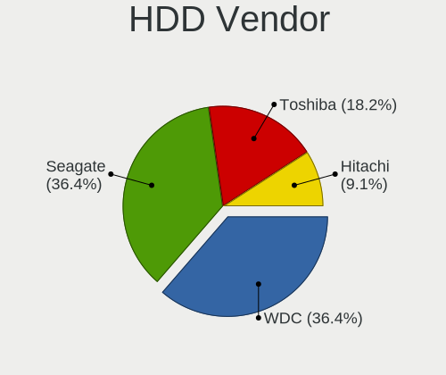
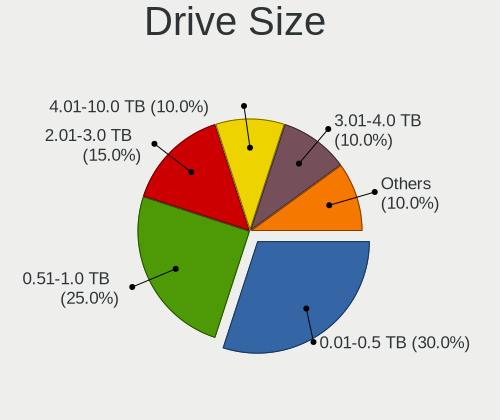
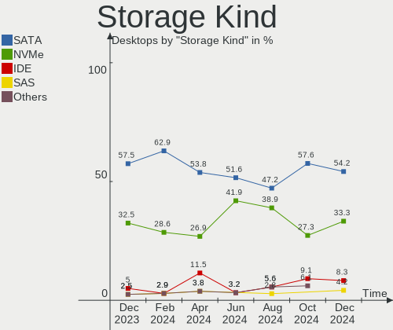
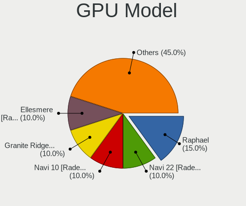
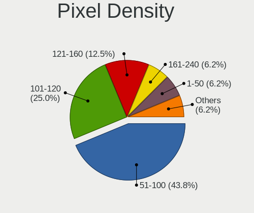
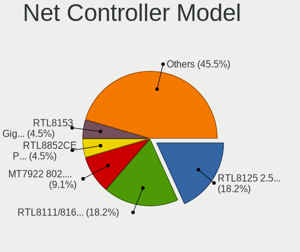
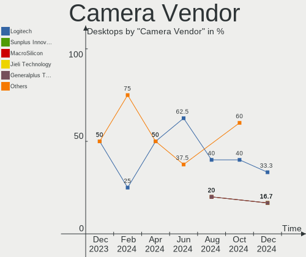

Gentoo - Hardware Trends (Desktops)
-----------------------------------

A project to identify most popular hardware characteristics and track their change
over time based on data collected by Linux users at https://Linux-Hardware.org.

Anyone can contribute to this report by the [hw-probe](https://github.com/linuxhw/hw-probe) tool:

    sudo -E hw-probe -all -upload

This report is for one last month. Overall report since the beginning of time: [TestCoverage](https://github.com/linuxhw/TestCoverage)

Period: Nov, 2022.

Contents
--------

* [ System ](#system)
  - [ OS                       ](#os)
  - [ OS Family                ](#os-family)
  - [ Kernel                   ](#kernel)
  - [ Kernel Family            ](#kernel-family)
  - [ Kernel Major Ver.        ](#kernel-major-ver)
  - [ Arch                     ](#arch)
  - [ DE                       ](#de)
  - [ Display Server           ](#display-server)
  - [ Display Manager          ](#display-manager)
  - [ OS Lang                  ](#os-lang)
  - [ Boot Mode                ](#boot-mode)
  - [ Filesystem               ](#filesystem)
  - [ Part. scheme             ](#part-scheme)
  - [ Dual Boot with Linux/BSD ](#dual-boot-with-linuxbsd)
  - [ Dual Boot (Win)          ](#dual-boot-win)

* [ Board ](#board)
  - [ Vendor                   ](#vendor)
  - [ Model                    ](#model)
  - [ Model Family             ](#model-family)
  - [ MFG Year                 ](#mfg-year)
  - [ Form Factor              ](#form-factor)
  - [ Secure Boot              ](#secure-boot)
  - [ Coreboot                 ](#coreboot)
  - [ RAM Size                 ](#ram-size)
  - [ RAM Used                 ](#ram-used)
  - [ Total Drives             ](#total-drives)
  - [ Has CD-ROM               ](#has-cd-rom)
  - [ Has Ethernet             ](#has-ethernet)
  - [ Has WiFi                 ](#has-wifi)
  - [ Has Bluetooth            ](#has-bluetooth)

* [ Location ](#location)
  - [ Country                  ](#country)
  - [ City                     ](#city)

* [ Drives ](#drives)
  - [ Drive Vendor             ](#drive-vendor)
  - [ Drive Model              ](#drive-model)
  - [ HDD Vendor               ](#hdd-vendor)
  - [ SSD Vendor               ](#ssd-vendor)
  - [ Drive Kind               ](#drive-kind)
  - [ Drive Connector          ](#drive-connector)
  - [ Drive Size               ](#drive-size)
  - [ Space Total              ](#space-total)
  - [ Space Used               ](#space-used)
  - [ Malfunc. Drives          ](#malfunc-drives)
  - [ Malfunc. Drive Vendor    ](#malfunc-drive-vendor)
  - [ Malfunc. HDD Vendor      ](#malfunc-hdd-vendor)
  - [ Malfunc. Drive Kind      ](#malfunc-drive-kind)
  - [ Failed Drives            ](#failed-drives)
  - [ Failed Drive Vendor      ](#failed-drive-vendor)
  - [ Drive Status             ](#drive-status)

* [ Storage controller ](#storage-controller)
  - [ Storage Vendor           ](#storage-vendor)
  - [ Storage Model            ](#storage-model)
  - [ Storage Kind             ](#storage-kind)

* [ Processor ](#processor)
  - [ CPU Vendor               ](#cpu-vendor)
  - [ CPU Model                ](#cpu-model)
  - [ CPU Model Family         ](#cpu-model-family)
  - [ CPU Cores                ](#cpu-cores)
  - [ CPU Sockets              ](#cpu-sockets)
  - [ CPU Threads              ](#cpu-threads)
  - [ CPU Op-Modes             ](#cpu-op-modes)
  - [ CPU Microcode            ](#cpu-microcode)
  - [ CPU Microarch            ](#cpu-microarch)

* [ Graphics ](#graphics)
  - [ GPU Vendor               ](#gpu-vendor)
  - [ GPU Model                ](#gpu-model)
  - [ GPU Combo                ](#gpu-combo)
  - [ GPU Driver               ](#gpu-driver)
  - [ GPU Memory               ](#gpu-memory)

* [ Monitor ](#monitor)
  - [ Monitor Vendor           ](#monitor-vendor)
  - [ Monitor Model            ](#monitor-model)
  - [ Monitor Resolution       ](#monitor-resolution)
  - [ Monitor Diagonal         ](#monitor-diagonal)
  - [ Monitor Width            ](#monitor-width)
  - [ Aspect Ratio             ](#aspect-ratio)
  - [ Monitor Area             ](#monitor-area)
  - [ Pixel Density            ](#pixel-density)
  - [ Multiple Monitors        ](#multiple-monitors)

* [ Network ](#network)
  - [ Net Controller Vendor    ](#net-controller-vendor)
  - [ Net Controller Model     ](#net-controller-model)
  - [ Wireless Vendor          ](#wireless-vendor)
  - [ Wireless Model           ](#wireless-model)
  - [ Ethernet Vendor          ](#ethernet-vendor)
  - [ Ethernet Model           ](#ethernet-model)
  - [ Net Controller Kind      ](#net-controller-kind)
  - [ Used Controller          ](#used-controller)
  - [ NICs                     ](#nics)
  - [ IPv6                     ](#ipv6)

* [ Bluetooth ](#bluetooth)
  - [ Bluetooth Vendor         ](#bluetooth-vendor)
  - [ Bluetooth Model          ](#bluetooth-model)

* [ Sound ](#sound)
  - [ Sound Vendor             ](#sound-vendor)
  - [ Sound Model              ](#sound-model)

* [ Memory ](#memory)
  - [ Memory Vendor            ](#memory-vendor)
  - [ Memory Model             ](#memory-model)
  - [ Memory Kind              ](#memory-kind)
  - [ Memory Form Factor       ](#memory-form-factor)
  - [ Memory Size              ](#memory-size)
  - [ Memory Speed             ](#memory-speed)

* [ Printers & scanners ](#printers--scanners)
  - [ Printer Vendor           ](#printer-vendor)
  - [ Printer Model            ](#printer-model)
  - [ Scanner Vendor           ](#scanner-vendor)
  - [ Scanner Model            ](#scanner-model)

* [ Camera ](#camera)
  - [ Camera Vendor            ](#camera-vendor)
  - [ Camera Model             ](#camera-model)

* [ Security ](#security)
  - [ Fingerprint Vendor       ](#fingerprint-vendor)
  - [ Fingerprint Model        ](#fingerprint-model)
  - [ Chipcard Vendor          ](#chipcard-vendor)
  - [ Chipcard Model           ](#chipcard-model)

* [ Unsupported ](#unsupported)
  - [ Unsupported Devices      ](#unsupported-devices)
  - [ Unsupported Device Types ](#unsupported-device-types)

System
------

OS
--

Installed operating systems

| Name          | Desktops | Percent |
|---------------|----------|---------|
| Gentoo 2.9    | 13       | 59.09%  |
| Gentoo 2.8    | 8        | 36.36%  |
| Gentoo 22.0.1 | 1        | 4.55%   |

OS Family
---------

OS without a version

| Name   | Desktops | Percent |
|--------|----------|---------|
| Gentoo | 22       | 100%    |

Kernel
------

Version of the Linux kernel

| Version                      | Desktops | Percent |
|------------------------------|----------|---------|
| 5.15.75-gentoo               | 3        | 13.64%  |
| 5.15.75-gentoo-x86_64        | 2        | 9.09%   |
| 5.15.75-gentoo-dist          | 2        | 9.09%   |
| 6.0.9-gentoo-x86_64          | 1        | 4.55%   |
| 6.0.9-gentoo                 | 1        | 4.55%   |
| 6.0.9-calculate              | 1        | 4.55%   |
| 6.0.8-gentoo-harambe-edition | 1        | 4.55%   |
| 6.0.7-gentoo                 | 1        | 4.55%   |
| 6.0.6-gentoo_ap              | 1        | 4.55%   |
| 6.0.6-gentoo-x86_64          | 1        | 4.55%   |
| 5.19.16-gentoo               | 1        | 4.55%   |
| 5.15.79-gentoo-hardened1     | 1        | 4.55%   |
| 5.15.75-gentoo-ts221         | 1        | 4.55%   |
| 5.15.75-gentoo-mp-server     | 1        | 4.55%   |
| 5.15.75-gentoo-221027        | 1        | 4.55%   |
| 5.15.74-gentoo-dist          | 1        | 4.55%   |
| 5.15.69-gentoo-x86_64        | 1        | 4.55%   |
| 5.15.41-gentoo-x86_64        | 1        | 4.55%   |

Kernel Family
-------------

Linux kernel without a distro release

| Version | Desktops | Percent |
|---------|----------|---------|
| 5.15.75 | 10       | 45.45%  |
| 6.0.9   | 3        | 13.64%  |
| 6.0.6   | 2        | 9.09%   |
| 6.0.8   | 1        | 4.55%   |
| 6.0.7   | 1        | 4.55%   |
| 5.19.16 | 1        | 4.55%   |
| 5.15.79 | 1        | 4.55%   |
| 5.15.74 | 1        | 4.55%   |
| 5.15.69 | 1        | 4.55%   |
| 5.15.41 | 1        | 4.55%   |

Kernel Major Ver.
-----------------

Linux kernel major version

| Version | Desktops | Percent |
|---------|----------|---------|
| 5.15    | 14       | 63.64%  |
| 6.0     | 7        | 31.82%  |
| 5.19    | 1        | 4.55%   |

Arch
----

OS architecture (x86_64, i586, etc.)

| Name     | Desktops | Percent |
|----------|----------|---------|
| x86_64   | 21       | 95.45%  |
| armv5tel | 1        | 4.55%   |

DE
--

Desktop Environment

| Name    | Desktops | Percent |
|---------|----------|---------|
| XFCE    | 4        | 18.18%  |
| KDE5    | 4        | 18.18%  |
| GNOME   | 4        | 18.18%  |
| Unknown | 4        | 18.18%  |
| MATE    | 2        | 9.09%   |
| Unity   | 1        | 4.55%   |
| sway    | 1        | 4.55%   |
| i3      | 1        | 4.55%   |
| awesome | 1        | 4.55%   |

Display Server
--------------

X11 or Wayland

| Name    | Desktops | Percent |
|---------|----------|---------|
| X11     | 11       | 50%     |
| Tty     | 6        | 27.27%  |
| Unknown | 4        | 18.18%  |
| Wayland | 1        | 4.55%   |

Display Manager
---------------

SDDM, LightDM, etc.

| Name    | Desktops | Percent |
|---------|----------|---------|
| LightDM | 8        | 36.36%  |
| Unknown | 7        | 31.82%  |
| SDDM    | 5        | 22.73%  |
| GREETD  | 1        | 4.55%   |
| GDM     | 1        | 4.55%   |

OS Lang
-------

Language

| Lang    | Desktops | Percent |
|---------|----------|---------|
| en_US   | 9        | 40.91%  |
| C.UTF8  | 3        | 13.64%  |
| ru_RU   | 2        | 9.09%   |
| it_IT   | 2        | 9.09%   |
| de_DE   | 2        | 9.09%   |
| pl_PL   | 1        | 4.55%   |
| en_CA   | 1        | 4.55%   |
| C       | 1        | 4.55%   |
| Unknown | 1        | 4.55%   |

Boot Mode
---------

EFI or BIOS

| Mode | Desktops | Percent |
|------|----------|---------|
| EFI  | 18       | 81.82%  |
| BIOS | 4        | 18.18%  |

Filesystem
----------

Type of filesystem

| Type     | Desktops | Percent |
|----------|----------|---------|
| Ext4     | 11       | 50%     |
| Btrfs    | 4        | 18.18%  |
| F2fs     | 3        | 13.64%  |
| Zfs      | 1        | 4.55%   |
| XXXXXXX  | 1        | 4.55%   |
| Xfs      | 1        | 4.55%   |
| Reiserfs | 1        | 4.55%   |

Part. scheme
------------

Scheme of partitioning

| Type    | Desktops | Percent |
|---------|----------|---------|
| GPT     | 21       | 95.45%  |
| Unknown | 1        | 4.55%   |

Dual Boot with Linux/BSD
------------------------

Hosting more than one Linux/BSD

| Dual boot | Desktops | Percent |
|-----------|----------|---------|
| Yes       | 12       | 54.55%  |
| No        | 10       | 45.45%  |

Dual Boot (Win)
---------------

Hosting Linux and Windows

| Dual boot | Desktops | Percent |
|-----------|----------|---------|
| No        | 13       | 59.09%  |
| Yes       | 9        | 40.91%  |

Board
-----

Vendor
------

Motherboard manufacturer

| Name                | Desktops | Percent |
|---------------------|----------|---------|
| ASUSTek Computer    | 8        | 36.36%  |
| MSI                 | 4        | 18.18%  |
| Gigabyte Technology | 4        | 18.18%  |
| ASRock              | 2        | 9.09%   |
| Apple               | 2        | 9.09%   |
| Unknown             | 2        | 9.09%   |

Model
-----

Motherboard model

| Name                             | Desktops | Percent |
|----------------------------------|----------|---------|
| Apple MacPro5,1                  | 2        | 9.09%   |
| Unknown                          | 2        | 9.09%   |
| MSI MS-7C60                      | 1        | 4.55%   |
| MSI MS-7C35                      | 1        | 4.55%   |
| MSI MS-7C34                      | 1        | 4.55%   |
| MSI MS-7C09                      | 1        | 4.55%   |
| Gigabyte Z370P D3                | 1        | 4.55%   |
| Gigabyte Z370 AORUS Ultra Gaming | 1        | 4.55%   |
| Gigabyte X570 AORUS MASTER       | 1        | 4.55%   |
| Gigabyte AB350-Gaming            | 1        | 4.55%   |
| ASUS TUF Gaming X570-PRO         | 1        | 4.55%   |
| ASUS TUF Gaming X570-PLUS        | 1        | 4.55%   |
| ASUS ROG STRIX X470-F GAMING     | 1        | 4.55%   |
| ASUS ROG Maximus XI HERO         | 1        | 4.55%   |
| ASUS ROG CROSSHAIR VIII FORMULA  | 1        | 4.55%   |
| ASUS PRIME Z370-P II             | 1        | 4.55%   |
| ASUS PRIME X570-PRO              | 1        | 4.55%   |
| ASUS M3A78-CM                    | 1        | 4.55%   |
| ASRock N68C-GS UCC               | 1        | 4.55%   |
| ASRock B550 Extreme4             | 1        | 4.55%   |

Model Family
------------

Motherboard model prefix

| Name                  | Desktops | Percent |
|-----------------------|----------|---------|
| ASUS ROG              | 3        | 13.64%  |
| ASUS TUF              | 2        | 9.09%   |
| ASUS PRIME            | 2        | 9.09%   |
| Apple MacPro5         | 2        | 9.09%   |
| Unknown               | 2        | 9.09%   |
| MSI MS-7C60           | 1        | 4.55%   |
| MSI MS-7C35           | 1        | 4.55%   |
| MSI MS-7C34           | 1        | 4.55%   |
| MSI MS-7C09           | 1        | 4.55%   |
| Gigabyte Z370P        | 1        | 4.55%   |
| Gigabyte Z370         | 1        | 4.55%   |
| Gigabyte X570         | 1        | 4.55%   |
| Gigabyte AB350-Gaming | 1        | 4.55%   |
| ASUS M3A78-CM         | 1        | 4.55%   |
| ASRock N68C-GS        | 1        | 4.55%   |
| ASRock B550           | 1        | 4.55%   |

MFG Year
--------

Motherboard manufacture year

| Year    | Desktops | Percent |
|---------|----------|---------|
| 2019    | 6        | 27.27%  |
| 2018    | 4        | 18.18%  |
| 2020    | 3        | 13.64%  |
| 2010    | 3        | 13.64%  |
| 2017    | 2        | 9.09%   |
| 2022    | 1        | 4.55%   |
| 2021    | 1        | 4.55%   |
| 2008    | 1        | 4.55%   |
| Unknown | 1        | 4.55%   |

Form Factor
-----------

Physical design of the computer

| Name    | Desktops | Percent |
|---------|----------|---------|
| Desktop | 22       | 100%    |

Secure Boot
-----------

Enabled or disabled

| State    | Desktops | Percent |
|----------|----------|---------|
| Disabled | 21       | 95.45%  |
| Enabled  | 1        | 4.55%   |

Coreboot
--------

Have coreboot on board

| Used | Desktops | Percent |
|------|----------|---------|
| No   | 22       | 100%    |

RAM Size
--------

Total RAM memory

| Size in GB      | Desktops | Percent |
|-----------------|----------|---------|
| 32.01-64.0      | 10       | 45.45%  |
| 64.01-256.0     | 5        | 22.73%  |
| 4.01-8.0        | 2        | 9.09%   |
| 16.01-24.0      | 2        | 9.09%   |
| More than 256.0 | 1        | 4.55%   |
| 8.01-16.0       | 1        | 4.55%   |
| 0.51-1.0        | 1        | 4.55%   |

RAM Used
--------

Used RAM memory

| Used GB    | Desktops | Percent |
|------------|----------|---------|
| 4.01-8.0   | 5        | 22.73%  |
| 2.01-3.0   | 4        | 18.18%  |
| 3.01-4.0   | 3        | 13.64%  |
| 16.01-24.0 | 3        | 13.64%  |
| 8.01-16.0  | 3        | 13.64%  |
| 1.01-2.0   | 2        | 9.09%   |
| 0.51-1.0   | 1        | 4.55%   |
| 0.01-0.5   | 1        | 4.55%   |

Total Drives
------------

Number of drives on board

| Drives | Desktops | Percent |
|--------|----------|---------|
| 2      | 5        | 22.73%  |
| 6      | 4        | 18.18%  |
| 7      | 3        | 13.64%  |
| 3      | 3        | 13.64%  |
| 4      | 2        | 9.09%   |
| 1      | 2        | 9.09%   |
| 12     | 1        | 4.55%   |
| 8      | 1        | 4.55%   |
| 5      | 1        | 4.55%   |

Has CD-ROM
----------

Has CD-ROM on board

| Presented | Desktops | Percent |
|-----------|----------|---------|
| No        | 17       | 77.27%  |
| Yes       | 5        | 22.73%  |

Has Ethernet
------------

Has Ethernet on board

| Presented | Desktops | Percent |
|-----------|----------|---------|
| Yes       | 21       | 95.45%  |
| No        | 1        | 4.55%   |

Has WiFi
--------

Has WiFi module

| Presented | Desktops | Percent |
|-----------|----------|---------|
| No        | 12       | 54.55%  |
| Yes       | 10       | 45.45%  |

Has Bluetooth
-------------

Has Bluetooth module

| Presented | Desktops | Percent |
|-----------|----------|---------|
| No        | 12       | 54.55%  |
| Yes       | 10       | 45.45%  |

Location
--------

Country
-------

Geographic location (country)

| Country | Desktops | Percent |
|---------|----------|---------|
| USA     | 5        | 22.73%  |
| Russia  | 4        | 18.18%  |
| Germany | 4        | 18.18%  |
| Poland  | 2        | 9.09%   |
| Tunisia | 1        | 4.55%   |
| Sweden  | 1        | 4.55%   |
| Italy   | 1        | 4.55%   |
| Ireland | 1        | 4.55%   |
| Hungary | 1        | 4.55%   |
| Denmark | 1        | 4.55%   |
| Canada  | 1        | 4.55%   |

City
----

Geographic location (city)

| City            | Desktops | Percent |
|-----------------|----------|---------|
| Los Angeles     | 3        | 13.64%  |
| Moscow          | 2        | 9.09%   |
| Berlin          | 2        | 9.09%   |
| Wroclaw         | 1        | 4.55%   |
| Warsaw          | 1        | 4.55%   |
| Vaxjo           | 1        | 4.55%   |
| Szeged          | 1        | 4.55%   |
| St Petersburg   | 1        | 4.55%   |
| Schwieberdingen | 1        | 4.55%   |
| Québec         | 1        | 4.55%   |
| Ivanovo         | 1        | 4.55%   |
| Hørsholm       | 1        | 4.55%   |
| Houston         | 1        | 4.55%   |
| Guanzate        | 1        | 4.55%   |
| Essen           | 1        | 4.55%   |
| Dublin          | 1        | 4.55%   |
| Augusta         | 1        | 4.55%   |
| Aryanah         | 1        | 4.55%   |

Drives
------

Drive Vendor
------------

Hard drive vendors

| Vendor              | Desktops | Drives | Percent |
|---------------------|----------|--------|---------|
| Samsung Electronics | 12       | 22     | 21.43%  |
| WDC                 | 10       | 18     | 17.86%  |
| Seagate             | 6        | 9      | 10.71%  |
| Toshiba             | 5        | 7      | 8.93%   |
| SanDisk             | 3        | 5      | 5.36%   |
| Kingston            | 3        | 11     | 5.36%   |
| Phison Electronics  | 2        | 3      | 3.57%   |
| Hitachi             | 2        | 4      | 3.57%   |
| GOODRAM             | 2        | 2      | 3.57%   |
| Corsair             | 2        | 2      | 3.57%   |
| T-FORCE             | 1        | 6      | 1.79%   |
| PNY                 | 1        | 2      | 1.79%   |
| OCZ                 | 1        | 1      | 1.79%   |
| Micron Technology   | 1        | 2      | 1.79%   |
| Maxtor              | 1        | 1      | 1.79%   |
| Intel               | 1        | 2      | 1.79%   |
| HGST                | 1        | 1      | 1.79%   |
| FNK TECH            | 1        | 1      | 1.79%   |
| Dyconn H            | 1        | 1      | 1.79%   |

Drive Model
-----------

Hard drive models

| Model                                                | Desktops | Percent |
|------------------------------------------------------|----------|---------|
| Samsung NVMe SSD Controller SM981/PM981/PM983 1TB    | 5        | 7.04%   |
| Samsung NVMe SSD Controller PM9A1/PM9A3/980PRO 250GB | 3        | 4.23%   |
| WDC WD10EZEX-08WN4A0 1TB                             | 2        | 2.82%   |
| Seagate ST12000NM0008-2H3101 12TB                    | 2        | 2.82%   |
| Samsung SSD 860 EVO 1TB                              | 2        | 2.82%   |
| Samsung SSD 850 EVO 500GB                            | 2        | 2.82%   |
| Phison E16 PCIe4 NVMe Controller 1TB                 | 2        | 2.82%   |
| Kingston SA400S37240G 240GB SSD                      | 2        | 2.82%   |
| GOODRAM SSDPR-CL100-480-G2 480GB                     | 2        | 2.82%   |
| WDC WD7500BPVT-24HXZT1 752GB                         | 1        | 1.41%   |
| WDC WD60EZAZ-00SF3B0 6TB                             | 1        | 1.41%   |
| WDC WD60EFZX-68B3FN0 6TB                             | 1        | 1.41%   |
| WDC WD60EFAX-68SHWN0 6TB                             | 1        | 1.41%   |
| WDC WD6003FZBX-00K5WB0 6TB                           | 1        | 1.41%   |
| WDC WD40PURZ-85TTDY0 4TB                             | 1        | 1.41%   |
| WDC WD40EZRZ-19GXCB0 4TB                             | 1        | 1.41%   |
| WDC WD40EZRZ-00GXCB0 4TB                             | 1        | 1.41%   |
| WDC WD30EFRX-68N32N0 3TB                             | 1        | 1.41%   |
| WDC WD30EFRX-68EUZN0 3TB                             | 1        | 1.41%   |
| WDC WD30EFRX-68AX9N0 3TB                             | 1        | 1.41%   |
| WDC WD20PURZ-85GU6Y0 2TB                             | 1        | 1.41%   |
| WDC WD2002FAEX-007BA0 2TB                            | 1        | 1.41%   |
| WDC WD10EZEX-75M2NA0 1TB                             | 1        | 1.41%   |
| WDC WD10EZEX-08M2NA0 1TB                             | 1        | 1.41%   |
| Toshiba MG09ACA18TE 18TB                             | 1        | 1.41%   |
| Toshiba HDWQ140 4TB                                  | 1        | 1.41%   |
| Toshiba HDWE150 5TB                                  | 1        | 1.41%   |
| Toshiba HDWE140 4TB                                  | 1        | 1.41%   |
| Toshiba HDWD110 1TB                                  | 1        | 1.41%   |
| T-FORCE SSD 1TB                                      | 1        | 1.41%   |
| Seagate ST500DM002-1BD142 500GB                      | 1        | 1.41%   |
| Seagate ST4000DM004-2CV104 4TB                       | 1        | 1.41%   |
| Seagate ST2000DX001-1CM164 2TB                       | 1        | 1.41%   |
| Seagate ST1000LX015-1U7172 1TB                       | 1        | 1.41%   |
| Sandisk WD_BLACK SN750 SE 1TB                        | 1        | 1.41%   |
| Sandisk WDC WDS100T2B0C-00PXH0 1TB                   | 1        | 1.41%   |
| SanDisk Ultra II 480GB SSD                           | 1        | 1.41%   |
| SanDisk SSD PLUS 240GB                               | 1        | 1.41%   |
| Samsung SSD 870 EVO 4TB                              | 1        | 1.41%   |
| Samsung SSD 860 QVO 1TB                              | 1        | 1.41%   |

HDD Vendor
----------

Hard disk drive vendors

| Vendor              | Desktops | Drives | Percent |
|---------------------|----------|--------|---------|
| WDC                 | 10       | 18     | 35.71%  |
| Seagate             | 6        | 9      | 21.43%  |
| Toshiba             | 5        | 7      | 17.86%  |
| Hitachi             | 2        | 4      | 7.14%   |
| Samsung Electronics | 1        | 1      | 3.57%   |
| Maxtor              | 1        | 1      | 3.57%   |
| HGST                | 1        | 1      | 3.57%   |
| FNK TECH            | 1        | 1      | 3.57%   |
| Dyconn H            | 1        | 1      | 3.57%   |

SSD Vendor
----------

Solid state drive vendors

| Vendor              | Desktops | Drives | Percent |
|---------------------|----------|--------|---------|
| Samsung Electronics | 7        | 9      | 36.84%  |
| Kingston            | 3        | 11     | 15.79%  |
| SanDisk             | 2        | 3      | 10.53%  |
| GOODRAM             | 2        | 2      | 10.53%  |
| Corsair             | 2        | 2      | 10.53%  |
| T-FORCE             | 1        | 6      | 5.26%   |
| PNY                 | 1        | 2      | 5.26%   |
| OCZ                 | 1        | 1      | 5.26%   |

Drive Kind
----------

HDD or SSD

| Kind | Desktops | Drives | Percent |
|------|----------|--------|---------|
| HDD  | 18       | 43     | 39.13%  |
| SSD  | 15       | 36     | 32.61%  |
| NVMe | 13       | 21     | 28.26%  |

Drive Connector
---------------

SATA, SAS, NVMe, etc.

| Type | Desktops | Drives | Percent |
|------|----------|--------|---------|
| SATA | 20       | 77     | 57.14%  |
| NVMe | 13       | 21     | 37.14%  |
| SAS  | 2        | 2      | 5.71%   |

Drive Size
----------

Size of hard drive

| Size in TB | Desktops | Drives | Percent |
|------------|----------|--------|---------|
| 0.01-0.5   | 14       | 30     | 31.11%  |
| 0.51-1.0   | 11       | 20     | 24.44%  |
| 3.01-4.0   | 6        | 9      | 13.33%  |
| 1.01-2.0   | 4        | 4      | 8.89%   |
| 4.01-10.0  | 4        | 5      | 8.89%   |
| 2.01-3.0   | 3        | 7      | 6.67%   |
| 10.01-20.0 | 3        | 4      | 6.67%   |

Space Total
-----------

Amount of disk space available on the file system

| Size in GB     | Desktops | Percent |
|----------------|----------|---------|
| More than 3000 | 10       | 45.45%  |
| 1001-2000      | 3        | 13.64%  |
| 501-1000       | 3        | 13.64%  |
| 101-250        | 2        | 9.09%   |
| Unknown        | 2        | 9.09%   |
| 2001-3000      | 1        | 4.55%   |
| 1-20           | 1        | 4.55%   |

Space Used
----------

Amount of used disk space

| Used GB        | Desktops | Percent |
|----------------|----------|---------|
| More than 3000 | 5        | 22.73%  |
| 1001-2000      | 4        | 18.18%  |
| 1-20           | 4        | 18.18%  |
| 101-250        | 2        | 9.09%   |
| 51-100         | 2        | 9.09%   |
| Unknown        | 2        | 9.09%   |
| 251-500        | 1        | 4.55%   |
| 2001-3000      | 1        | 4.55%   |
| 501-1000       | 1        | 4.55%   |

Malfunc. Drives
---------------

Drive models with a malfunction

| Model                             | Desktops | Drives | Percent |
|-----------------------------------|----------|--------|---------|
| WDC WD60EFAX-68SHWN0 6TB          | 1        | 1      | 14.29%  |
| WDC WD30EFRX-68AX9N0 3TB          | 1        | 1      | 14.29%  |
| Seagate ST500DM002-1BD142 500GB   | 1        | 1      | 14.29%  |
| Samsung Electronics SP2504C 250GB | 1        | 1      | 14.29%  |
| PNY SSD2SC240GE2DH16B-T 240GB     | 1        | 1      | 14.29%  |
| Maxtor STM3160215A 160GB          | 1        | 1      | 14.29%  |
| Corsair Neutron GTX SSD 240GB     | 1        | 1      | 14.29%  |

Malfunc. Drive Vendor
---------------------

Vendors of faulty drives

| Vendor              | Desktops | Drives | Percent |
|---------------------|----------|--------|---------|
| WDC                 | 1        | 2      | 16.67%  |
| Seagate             | 1        | 1      | 16.67%  |
| Samsung Electronics | 1        | 1      | 16.67%  |
| PNY                 | 1        | 1      | 16.67%  |
| Maxtor              | 1        | 1      | 16.67%  |
| Corsair             | 1        | 1      | 16.67%  |

Malfunc. HDD Vendor
-------------------

Vendors of faulty HDD drives

| Vendor              | Desktops | Drives | Percent |
|---------------------|----------|--------|---------|
| WDC                 | 1        | 2      | 25%     |
| Seagate             | 1        | 1      | 25%     |
| Samsung Electronics | 1        | 1      | 25%     |
| Maxtor              | 1        | 1      | 25%     |

Malfunc. Drive Kind
-------------------

Kinds of faulty drives

| Kind | Desktops | Drives | Percent |
|------|----------|--------|---------|
| HDD  | 3        | 5      | 60%     |
| SSD  | 2        | 2      | 40%     |

Failed Drives
-------------

Failed drive models

Zero info for selected period =(

Failed Drive Vendor
-------------------

Failed drive vendors

Zero info for selected period =(

Drive Status
------------

Number of failed and malfunc. drives

| Status   | Desktops | Drives | Percent |
|----------|----------|--------|---------|
| Works    | 21       | 88     | 72.41%  |
| Malfunc  | 5        | 7      | 17.24%  |
| Detected | 3        | 5      | 10.34%  |

Storage controller
------------------

Storage Vendor
--------------

Storage controller vendors

| Vendor                   | Desktops | Percent |
|--------------------------|----------|---------|
| AMD                      | 11       | 29.73%  |
| Samsung Electronics      | 8        | 21.62%  |
| Intel                    | 8        | 21.62%  |
| SanDisk                  | 2        | 5.41%   |
| Phison Electronics       | 2        | 5.41%   |
| Marvell Technology Group | 2        | 5.41%   |
| Nvidia                   | 1        | 2.7%    |
| Micron Technology        | 1        | 2.7%    |
| JMicron Technology       | 1        | 2.7%    |
| ASMedia Technology       | 1        | 2.7%    |

Storage Model
-------------

Storage controller models

| Model                                                                 | Desktops | Percent |
|-----------------------------------------------------------------------|----------|---------|
| AMD FCH SATA Controller [AHCI mode]                                   | 9        | 21.43%  |
| Samsung NVMe SSD Controller SM981/PM981/PM983                         | 5        | 11.9%   |
| Intel 200 Series PCH SATA controller [AHCI mode]                      | 4        | 9.52%   |
| Samsung NVMe SSD Controller PM9A1/PM9A3/980PRO                        | 3        | 7.14%   |
| SanDisk Non-Volatile memory controller                                | 2        | 4.76%   |
| Phison E16 PCIe4 NVMe Controller                                      | 2        | 4.76%   |
| Intel 82801JI (ICH10 Family) SATA AHCI Controller                     | 2        | 4.76%   |
| Nvidia MCP61 SATA Controller                                          | 1        | 2.38%   |
| Nvidia MCP61 IDE                                                      | 1        | 2.38%   |
| Micron 7400 PRO NVMe SSD                                              | 1        | 2.38%   |
| Marvell Group 88SE9230 PCIe 2.0 x2 4-port SATA 6 Gb/s RAID Controller | 1        | 2.38%   |
| Marvell Group 88SE9123 PCIe SATA 6.0 Gb/s controller                  | 1        | 2.38%   |
| JMicron JMB363 SATA/IDE Controller                                    | 1        | 2.38%   |
| Intel Non-Volatile memory controller                                  | 1        | 2.38%   |
| Intel Cannon Lake PCH SATA AHCI Controller                            | 1        | 2.38%   |
| Intel C600/X79 series chipset 6-Port SATA AHCI Controller             | 1        | 2.38%   |
| ASMedia ASM1062 Serial ATA Controller                                 | 1        | 2.38%   |
| AMD SB7x0/SB8x0/SB9x0 SATA Controller [IDE mode]                      | 1        | 2.38%   |
| AMD SB7x0/SB8x0/SB9x0 IDE Controller                                  | 1        | 2.38%   |
| AMD 500 Series Chipset SATA Controller                                | 1        | 2.38%   |
| AMD 400 Series Chipset SATA Controller                                | 1        | 2.38%   |
| AMD 300 Series Chipset SATA Controller                                | 1        | 2.38%   |

Storage Kind
------------

Kind of storage controller (IDE, SATA, NVMe, SAS, ...)

| Kind | Desktops | Percent |
|------|----------|---------|
| SATA | 19       | 52.78%  |
| NVMe | 13       | 36.11%  |
| IDE  | 4        | 11.11%  |

Processor
---------

CPU Vendor
----------

Processor vendors

| Vendor                | Desktops | Percent |
|-----------------------|----------|---------|
| AMD                   | 13       | 59.09%  |
| Intel                 | 8        | 36.36%  |
| Marvell Semiconductor | 1        | 4.55%   |

CPU Model
---------

Processor models

| Model                                                                    | Desktops | Percent |
|--------------------------------------------------------------------------|----------|---------|
| AMD Ryzen 9 5900X 12-Core Processor                                      | 3        | 13.64%  |
| AMD Ryzen 9 5950X 16-Core Processor                                      | 2        | 9.09%   |
| Marvell Semiconductor Marvell Kirkwood (Flattened Device Tree) Processor | 1        | 4.55%   |
| Intel Xeon CPU X5690 @ 3.47GHz                                           | 1        | 4.55%   |
| Intel Xeon CPU X5570 @ 2.93GHz                                           | 1        | 4.55%   |
| Intel Xeon CPU E5-1650 0 @ 3.20GHz                                       | 1        | 4.55%   |
| Intel Core i9-9900K CPU @ 3.60GHz                                        | 1        | 4.55%   |
| Intel Core i7-8700K CPU @ 3.70GHz                                        | 1        | 4.55%   |
| Intel Core i5-9400F CPU @ 2.90GHz                                        | 1        | 4.55%   |
| Intel Core i5-8600K CPU @ 3.60GHz                                        | 1        | 4.55%   |
| Intel Core i5-8400 CPU @ 2.80GHz                                         | 1        | 4.55%   |
| AMD Ryzen Threadripper 3960X 24-Core Processor                           | 1        | 4.55%   |
| AMD Ryzen 9 3950X 16-Core Processor                                      | 1        | 4.55%   |
| AMD Ryzen 9 3900XT 12-Core Processor                                     | 1        | 4.55%   |
| AMD Ryzen 7 5800X 8-Core Processor                                       | 1        | 4.55%   |
| AMD Ryzen 5 3600XT 6-Core Processor                                      | 1        | 4.55%   |
| AMD Ryzen 5 2600 Six-Core Processor                                      | 1        | 4.55%   |
| AMD Phenom II X6 1055T Processor                                         | 1        | 4.55%   |
| AMD Phenom II X4 955 Processor                                           | 1        | 4.55%   |

CPU Model Family
----------------

Processor model prefix

| Model                  | Desktops | Percent |
|------------------------|----------|---------|
| AMD Ryzen 9            | 7        | 31.82%  |
| Intel Xeon             | 3        | 13.64%  |
| Intel Core i5          | 3        | 13.64%  |
| AMD Ryzen 5            | 2        | 9.09%   |
| Other                  | 1        | 4.55%   |
| Intel Core i9          | 1        | 4.55%   |
| Intel Core i7          | 1        | 4.55%   |
| AMD Ryzen Threadripper | 1        | 4.55%   |
| AMD Ryzen 7            | 1        | 4.55%   |
| AMD Phenom II X6       | 1        | 4.55%   |
| AMD Phenom II X4       | 1        | 4.55%   |

CPU Cores
---------

Number of processor cores

| Number | Desktops | Percent |
|--------|----------|---------|
| 6      | 8        | 36.36%  |
| 12     | 5        | 22.73%  |
| 16     | 3        | 13.64%  |
| 8      | 3        | 13.64%  |
| 24     | 1        | 4.55%   |
| 4      | 1        | 4.55%   |
| 1      | 1        | 4.55%   |

CPU Sockets
-----------

Number of sockets

| Number | Desktops | Percent |
|--------|----------|---------|
| 1      | 20       | 90.91%  |
| 2      | 2        | 9.09%   |

CPU Threads
-----------

Threads per core (Hyper-Threading)

| Number | Desktops | Percent |
|--------|----------|---------|
| 2      | 16       | 72.73%  |
| 1      | 6        | 27.27%  |

CPU Op-Modes
------------

CPU Operation Modes (32-bit, 64-bit)

| Op mode        | Desktops | Percent |
|----------------|----------|---------|
| 32-bit, 64-bit | 21       | 95.45%  |
| Unknown        | 1        | 4.55%   |

CPU Microcode
-------------

Microcode number

| Number     | Desktops | Percent |
|------------|----------|---------|
| 0x0a201016 | 5        | 22.73%  |
| 0x906ea    | 4        | 18.18%  |
| 0x08701021 | 3        | 13.64%  |
| 0x906ec    | 1        | 4.55%   |
| 0x206d7    | 1        | 4.55%   |
| 0x206c2    | 1        | 4.55%   |
| 0x106a5    | 1        | 4.55%   |
| 0x0a20120a | 1        | 4.55%   |
| 0x08301055 | 1        | 4.55%   |
| 0x0800820d | 1        | 4.55%   |
| 0x010000db | 1        | 4.55%   |
| 0x010000bf | 1        | 4.55%   |
| Unknown    | 1        | 4.55%   |

CPU Microarch
-------------

Microarchitecture

| Name        | Desktops | Percent |
|-------------|----------|---------|
| Zen 3       | 6        | 27.27%  |
| KabyLake    | 5        | 22.73%  |
| Zen 2       | 4        | 18.18%  |
| K10         | 2        | 9.09%   |
| Zen+        | 1        | 4.55%   |
| Westmere    | 1        | 4.55%   |
| SandyBridge | 1        | 4.55%   |
| Nehalem     | 1        | 4.55%   |
| Unknown     | 1        | 4.55%   |

Graphics
--------

GPU Vendor
----------

Vendors of graphics cards

| Vendor | Desktops | Percent |
|--------|----------|---------|
| Nvidia | 13       | 56.52%  |
| AMD    | 9        | 39.13%  |
| Intel  | 1        | 4.35%   |

GPU Model
---------

Graphics card models

| Model                                                   | Desktops | Percent |
|---------------------------------------------------------|----------|---------|
| AMD Navi 10 [Radeon RX 5600 OEM/5600 XT / 5700/5700 XT] | 2        | 8.33%   |
| Nvidia TU116 [GeForce GTX 1660]                         | 1        | 4.17%   |
| Nvidia TU116 [GeForce GTX 1650 SUPER]                   | 1        | 4.17%   |
| Nvidia TU106 [GeForce RTX 2060 SUPER]                   | 1        | 4.17%   |
| Nvidia TU106 [GeForce RTX 2060 Rev. A]                  | 1        | 4.17%   |
| Nvidia TU104 [GeForce RTX 2080]                         | 1        | 4.17%   |
| Nvidia TU104 [GeForce RTX 2080 SUPER]                   | 1        | 4.17%   |
| Nvidia TU104 [GeForce RTX 2080 Rev. A]                  | 1        | 4.17%   |
| Nvidia TU102 [GeForce RTX 2080 Ti Rev. A]               | 1        | 4.17%   |
| Nvidia GT218 [GeForce 210]                              | 1        | 4.17%   |
| Nvidia GP107 [GeForce GTX 1050]                         | 1        | 4.17%   |
| Nvidia GP106 [GeForce GTX 1060 6GB]                     | 1        | 4.17%   |
| Nvidia GP106 [GeForce GTX 1060 3GB]                     | 1        | 4.17%   |
| Nvidia GA102 [GeForce RTX 3090]                         | 1        | 4.17%   |
| Nvidia GA102 [GeForce RTX 3080 Ti]                      | 1        | 4.17%   |
| Intel CoffeeLake-S GT2 [UHD Graphics 630]               | 1        | 4.17%   |
| AMD RS780C [Radeon 3100]                                | 1        | 4.17%   |
| AMD Navi 22 [Radeon RX 6700/6700 XT/6750 XT / 6800M]    | 1        | 4.17%   |
| AMD Navi 14 [Radeon RX 5500/5500M / Pro 5500M]          | 1        | 4.17%   |
| AMD Juniper XT [Radeon HD 5770]                         | 1        | 4.17%   |
| AMD Ellesmere [Radeon RX 470/480/570/570X/580/580X/590] | 1        | 4.17%   |
| AMD Cypress XT [Radeon HD 5870]                         | 1        | 4.17%   |
| AMD Cedar [Radeon HD 5000/6000/7350/8350 Series]        | 1        | 4.17%   |

GPU Combo
---------

Combinations of graphics cards

| Name               | Desktops | Percent |
|--------------------|----------|---------|
| 1 x Nvidia         | 11       | 50%     |
| 1 x AMD            | 8        | 36.36%  |
| Other              | 1        | 4.55%   |
| Intel + 2 x Nvidia | 1        | 4.55%   |
| AMD + Nvidia       | 1        | 4.55%   |

GPU Driver
----------

Free vs proprietary

| Driver      | Desktops | Percent |
|-------------|----------|---------|
| Free        | 11       | 50%     |
| Proprietary | 9        | 40.91%  |
| Unknown     | 2        | 9.09%   |

GPU Memory
----------

Total video memory

| Size in GB | Desktops | Percent |
|------------|----------|---------|
| 7.01-8.0   | 6        | 27.27%  |
| 5.01-6.0   | 4        | 18.18%  |
| 0.51-1.0   | 4        | 18.18%  |
| Unknown    | 4        | 18.18%  |
| 8.01-16.0  | 2        | 9.09%   |
| 2.01-3.0   | 1        | 4.55%   |
| 0.01-0.5   | 1        | 4.55%   |

Monitor
-------

Monitor Vendor
--------------

Monitor vendors

| Vendor               | Desktops | Percent |
|----------------------|----------|---------|
| Samsung Electronics  | 6        | 25%     |
| LG Electronics       | 2        | 8.33%   |
| Goldstar             | 2        | 8.33%   |
| Dell                 | 2        | 8.33%   |
| Apple                | 2        | 8.33%   |
| AOC                  | 2        | 8.33%   |
| Ancor Communications | 2        | 8.33%   |
| ViewSonic            | 1        | 4.17%   |
| Iiyama               | 1        | 4.17%   |
| Hewlett-Packard      | 1        | 4.17%   |
| BenQ                 | 1        | 4.17%   |
| ASUSTek Computer     | 1        | 4.17%   |
| Acer                 | 1        | 4.17%   |

Monitor Model
-------------

Monitor models

| Model                                                                 | Desktops | Percent |
|-----------------------------------------------------------------------|----------|---------|
| Apple Cinema HD APP9223 1920x1200 495x310mm 23.0-inch                 | 2        | 8%      |
| ViewSonic VX4380 SERIES VSC5B34 3840x2160 941x529mm 42.5-inch         | 1        | 4%      |
| Samsung Electronics S22B300 SAM08C8 1920x1080 477x268mm 21.5-inch     | 1        | 4%      |
| Samsung Electronics LCD Monitor SyncMaster                            | 1        | 4%      |
| Samsung Electronics LC49G95T SAM7053 3840x1080 1193x336mm 48.8-inch   | 1        | 4%      |
| Samsung Electronics C49RG9x SAM0F9C 2560x1440 1193x336mm 48.8-inch    | 1        | 4%      |
| Samsung Electronics C32JG5x SAM0F73 1920x1080 698x393mm 31.5-inch     | 1        | 4%      |
| Samsung Electronics C24F390 SAM0D2C 1920x1080 520x290mm 23.4-inch     | 1        | 4%      |
| LG Electronics LCD Monitor LG TV 3840x1080                            | 1        | 4%      |
| LG Electronics LCD Monitor LG IPS FULLHD 3840x1200                    | 1        | 4%      |
| Iiyama PLG2488H IVM6127 1920x1080 530x300mm 24.0-inch                 | 1        | 4%      |
| Iiyama PL2760Q IVM663D 2560x1440 600x340mm 27.2-inch                  | 1        | 4%      |
| Hewlett-Packard 27fh HPN354A 1920x1080 598x336mm 27.0-inch            | 1        | 4%      |
| Goldstar ULTRAWIDE GSM76F9 2560x1080 531x298mm 24.0-inch              | 1        | 4%      |
| Goldstar L1750S GSM43CC 1280x1024 338x270mm 17.0-inch                 | 1        | 4%      |
| Dell LCD Monitor 2707WFP                                              | 1        | 4%      |
| Dell 2407WFP DELA017 1920x1200 520x330mm 24.2-inch                    | 1        | 4%      |
| BenQ ZOWIE XL LCD BNQ7F45 2560x1440 598x336mm 27.0-inch               | 1        | 4%      |
| ASUSTek Computer VG28UQL1A AUS28A0 3840x2160 621x341mm 27.9-inch      | 1        | 4%      |
| AOC 24V2W1G5 AOC2402 1920x1080 527x296mm 23.8-inch                    | 1        | 4%      |
| AOC 2460G4 AOC246A 1920x1080 531x299mm 24.0-inch                      | 1        | 4%      |
| Ancor Communications ASUS VS207 ACI20F2 1600x900 432x240mm 19.5-inch  | 1        | 4%      |
| Ancor Communications ASUS VG278 ACI27E1 1920x1080 600x340mm 27.2-inch | 1        | 4%      |
| Acer XB240H ACR041B 1920x1080 531x299mm 24.0-inch                     | 1        | 4%      |

Monitor Resolution
------------------

Monitor screen resolution

| Resolution        | Desktops | Percent |
|-------------------|----------|---------|
| 1920x1080 (FHD)   | 9        | 36%     |
| 3840x1080         | 3        | 12%     |
| 1920x1200 (WUXGA) | 3        | 12%     |
| 3840x2160 (4K)    | 2        | 8%      |
| 2560x1440 (QHD)   | 2        | 8%      |
| Unknown           | 2        | 8%      |
| 3840x1200         | 1        | 4%      |
| 2560x1080         | 1        | 4%      |
| 1600x900 (HD+)    | 1        | 4%      |
| 1280x1024 (SXGA)  | 1        | 4%      |

Monitor Diagonal
----------------

Diagonal size in inches

| Inches  | Desktops | Percent |
|---------|----------|---------|
| 27      | 5        | 21.74%  |
| 24      | 4        | 17.39%  |
| 23      | 4        | 17.39%  |
| 48      | 2        | 8.7%    |
| Unknown | 2        | 8.7%    |
| 42      | 1        | 4.35%   |
| 34      | 1        | 4.35%   |
| 31      | 1        | 4.35%   |
| 21      | 1        | 4.35%   |
| 19      | 1        | 4.35%   |
| 17      | 1        | 4.35%   |

Monitor Width
-------------

Physical width

| Width in mm | Desktops | Percent |
|-------------|----------|---------|
| 501-600     | 7        | 35%     |
| 401-500     | 4        | 20%     |
| 601-700     | 2        | 10%     |
| 1001-1500   | 2        | 10%     |
| Unknown     | 2        | 10%     |
| 701-800     | 1        | 5%      |
| 301-350     | 1        | 5%      |
| 901-1000    | 1        | 5%      |

Aspect Ratio
------------

Proportional relationship between the width and the height

| Ratio   | Desktops | Percent |
|---------|----------|---------|
| 16/9    | 10       | 50%     |
| 16/10   | 4        | 20%     |
| 32/9    | 2        | 10%     |
| Unknown | 2        | 10%     |
| 5/4     | 1        | 5%      |
| 21/9    | 1        | 5%      |

Monitor Area
------------

Area in inch²

| Area in inch² | Desktops | Percent |
|----------------|----------|---------|
| 201-250        | 7        | 31.82%  |
| 301-350        | 5        | 22.73%  |
| 501-1000       | 3        | 13.64%  |
| 251-300        | 2        | 9.09%   |
| Unknown        | 2        | 9.09%   |
| 351-500        | 1        | 4.55%   |
| 151-200        | 1        | 4.55%   |
| 141-150        | 1        | 4.55%   |

Pixel Density
-------------

Pixels per inch

| Density | Desktops | Percent |
|---------|----------|---------|
| 51-100  | 13       | 65%     |
| 101-120 | 4        | 20%     |
| Unknown | 2        | 10%     |
| 121-160 | 1        | 5%      |

Multiple Monitors
-----------------

Total monitors connected

| Total | Desktops | Percent |
|-------|----------|---------|
| 1     | 13       | 59.09%  |
| 2     | 5        | 22.73%  |
| 0     | 3        | 13.64%  |
| 3     | 1        | 4.55%   |

Network
-------

Net Controller Vendor
---------------------

Controller vendors

| Vendor                | Desktops | Percent |
|-----------------------|----------|---------|
| Intel                 | 13       | 43.33%  |
| Realtek Semiconductor | 11       | 36.67%  |
| Broadcom              | 2        | 6.67%   |
| STMicroelectronics    | 1        | 3.33%   |
| Qualcomm Atheros      | 1        | 3.33%   |
| Nvidia                | 1        | 3.33%   |
| Aquantia              | 1        | 3.33%   |

Net Controller Model
--------------------

Controller models

| Model                                                             | Desktops | Percent |
|-------------------------------------------------------------------|----------|---------|
| Realtek RTL8111/8168/8411 PCI Express Gigabit Ethernet Controller | 7        | 19.44%  |
| Intel Wi-Fi 6 AX200                                               | 6        | 16.67%  |
| Intel I211 Gigabit Network Connection                             | 5        | 13.89%  |
| Realtek RTL8125 2.5GbE Controller                                 | 3        | 8.33%   |
| Intel 82574L Gigabit Network Connection                           | 2        | 5.56%   |
| STMicroelectronics Virtual COM Port                               | 1        | 2.78%   |
| Realtek Killer E3000 2.5GbE Controller                            | 1        | 2.78%   |
| Realtek Killer E2600 Gigabit Ethernet Controller                  | 1        | 2.78%   |
| Realtek 802.11ac NIC                                              | 1        | 2.78%   |
| Qualcomm Atheros QCA986x/988x 802.11ac Wireless Network Adapter   | 1        | 2.78%   |
| Nvidia MCP61 Ethernet                                             | 1        | 2.78%   |
| Intel Wireless-AC 9260                                            | 1        | 2.78%   |
| Intel Ethernet Controller I225-V                                  | 1        | 2.78%   |
| Intel Ethernet Connection (7) I219-V                              | 1        | 2.78%   |
| Intel Ethernet Connection (2) I219-V                              | 1        | 2.78%   |
| Broadcom BCM4360 802.11ac Wireless Network Adapter                | 1        | 2.78%   |
| Broadcom BCM4322 802.11a/b/g/n Wireless LAN Controller            | 1        | 2.78%   |
| Aquantia AQC111 NBase-T/IEEE 802.3bz Ethernet Controller [AQtion] | 1        | 2.78%   |

Wireless Vendor
---------------

Wireless vendors

| Vendor                | Desktops | Percent |
|-----------------------|----------|---------|
| Intel                 | 7        | 63.64%  |
| Broadcom              | 2        | 18.18%  |
| Realtek Semiconductor | 1        | 9.09%   |
| Qualcomm Atheros      | 1        | 9.09%   |

Wireless Model
--------------

Wireless models

| Model                                                           | Desktops | Percent |
|-----------------------------------------------------------------|----------|---------|
| Intel Wi-Fi 6 AX200                                             | 6        | 54.55%  |
| Realtek 802.11ac NIC                                            | 1        | 9.09%   |
| Qualcomm Atheros QCA986x/988x 802.11ac Wireless Network Adapter | 1        | 9.09%   |
| Intel Wireless-AC 9260                                          | 1        | 9.09%   |
| Broadcom BCM4360 802.11ac Wireless Network Adapter              | 1        | 9.09%   |
| Broadcom BCM4322 802.11a/b/g/n Wireless LAN Controller          | 1        | 9.09%   |

Ethernet Vendor
---------------

Ethernet vendors

| Vendor                | Desktops | Percent |
|-----------------------|----------|---------|
| Realtek Semiconductor | 11       | 47.83%  |
| Intel                 | 10       | 43.48%  |
| Nvidia                | 1        | 4.35%   |
| Aquantia              | 1        | 4.35%   |

Ethernet Model
--------------

Ethernet models

| Model                                                             | Desktops | Percent |
|-------------------------------------------------------------------|----------|---------|
| Realtek RTL8111/8168/8411 PCI Express Gigabit Ethernet Controller | 7        | 29.17%  |
| Intel I211 Gigabit Network Connection                             | 5        | 20.83%  |
| Realtek RTL8125 2.5GbE Controller                                 | 3        | 12.5%   |
| Intel 82574L Gigabit Network Connection                           | 2        | 8.33%   |
| Realtek Killer E3000 2.5GbE Controller                            | 1        | 4.17%   |
| Realtek Killer E2600 Gigabit Ethernet Controller                  | 1        | 4.17%   |
| Nvidia MCP61 Ethernet                                             | 1        | 4.17%   |
| Intel Ethernet Controller I225-V                                  | 1        | 4.17%   |
| Intel Ethernet Connection (7) I219-V                              | 1        | 4.17%   |
| Intel Ethernet Connection (2) I219-V                              | 1        | 4.17%   |
| Aquantia AQC111 NBase-T/IEEE 802.3bz Ethernet Controller [AQtion] | 1        | 4.17%   |

Net Controller Kind
-------------------

Ethernet, WiFi or modem

| Kind     | Desktops | Percent |
|----------|----------|---------|
| Ethernet | 21       | 65.63%  |
| WiFi     | 10       | 31.25%  |
| Modem    | 1        | 3.13%   |

Used Controller
---------------

Currently used network controller

| Kind     | Desktops | Percent |
|----------|----------|---------|
| Ethernet | 20       | 95.24%  |
| WiFi     | 1        | 4.76%   |

NICs
----

Total network controllers on board

| Total | Desktops | Percent |
|-------|----------|---------|
| 1     | 11       | 50%     |
| 3     | 6        | 27.27%  |
| 2     | 4        | 18.18%  |
| 0     | 1        | 4.55%   |

IPv6
----

IPv6 vs IPv4

| Used | Desktops | Percent |
|------|----------|---------|
| No   | 15       | 68.18%  |
| Yes  | 7        | 31.82%  |

Bluetooth
---------

Bluetooth Vendor
----------------

Controller vendors

| Vendor                  | Desktops | Percent |
|-------------------------|----------|---------|
| Intel                   | 7        | 63.64%  |
| Apple                   | 2        | 18.18%  |
| Cambridge Silicon Radio | 1        | 9.09%   |
| Broadcom                | 1        | 9.09%   |

Bluetooth Model
---------------

Controller models

| Model                                               | Desktops | Percent |
|-----------------------------------------------------|----------|---------|
| Intel AX200 Bluetooth                               | 6        | 54.55%  |
| Apple Built-in Bluetooth 2.0+EDR HCI                | 2        | 18.18%  |
| Intel Wireless-AC 9260 Bluetooth Adapter            | 1        | 9.09%   |
| Cambridge Silicon Radio Bluetooth Dongle (HCI mode) | 1        | 9.09%   |
| Broadcom BCM20702A0 Bluetooth 4.0                   | 1        | 9.09%   |

Sound
-----

Sound Vendor
------------

Sound card vendors

| Vendor                   | Desktops | Percent |
|--------------------------|----------|---------|
| AMD                      | 14       | 32.56%  |
| Nvidia                   | 13       | 30.23%  |
| Intel                    | 7        | 16.28%  |
| SteelSeries ApS          | 2        | 4.65%   |
| Sony                     | 1        | 2.33%   |
| Razer USA                | 1        | 2.33%   |
| Micro Star International | 1        | 2.33%   |
| Logitech                 | 1        | 2.33%   |
| Focusrite-Novation       | 1        | 2.33%   |
| Clavia DMI AB            | 1        | 2.33%   |
| C-Media Electronics      | 1        | 2.33%   |

Sound Model
-----------

Sound card models

| Model                                                                 | Desktops | Percent |
|-----------------------------------------------------------------------|----------|---------|
| AMD Starship/Matisse HD Audio Controller                              | 10       | 19.61%  |
| Intel 200 Series PCH HD Audio                                         | 4        | 7.84%   |
| Nvidia TU104 HD Audio Controller                                      | 3        | 5.88%   |
| AMD Navi 10 HDMI Audio                                                | 3        | 5.88%   |
| Nvidia TU116 High Definition Audio Controller                         | 2        | 3.92%   |
| Nvidia TU106 High Definition Audio Controller                         | 2        | 3.92%   |
| Nvidia GP106 High Definition Audio Controller                         | 2        | 3.92%   |
| Nvidia GA102 High Definition Audio Controller                         | 2        | 3.92%   |
| Intel 82801JI (ICH10 Family) HD Audio Controller                      | 2        | 3.92%   |
| SteelSeries ApS SteelSeries Arctis 7                                  | 1        | 1.96%   |
| SteelSeries ApS Arctis 7+                                             | 1        | 1.96%   |
| Sony DualShock 4 [CUH-ZCT2x]                                          | 1        | 1.96%   |
| Razer USA Razer BlackShark V2 Pro                                     | 1        | 1.96%   |
| Nvidia TU102 High Definition Audio Controller                         | 1        | 1.96%   |
| Nvidia MCP61 High Definition Audio                                    | 1        | 1.96%   |
| Nvidia High Definition Audio Controller                               | 1        | 1.96%   |
| Nvidia GP107GL High Definition Audio Controller                       | 1        | 1.96%   |
| Micro Star International USB Audio                                    | 1        | 1.96%   |
| Logitech V10 Notebook Speakers                                        | 1        | 1.96%   |
| Intel C600/X79 series chipset High Definition Audio Controller        | 1        | 1.96%   |
| Focusrite-Novation Focusrite Scarlett 6i6                             | 1        | 1.96%   |
| Clavia DMI AB Nord Piano 4                                            | 1        | 1.96%   |
| C-Media Electronics CM108 Audio Controller                            | 1        | 1.96%   |
| AMD SBx00 Azalia (Intel HDA)                                          | 1        | 1.96%   |
| AMD Navi 21/23 HDMI/DP Audio Controller                               | 1        | 1.96%   |
| AMD Juniper HDMI Audio [Radeon HD 5700 Series]                        | 1        | 1.96%   |
| AMD Family 17h (Models 00h-0fh) HD Audio Controller                   | 1        | 1.96%   |
| AMD Ellesmere HDMI Audio [Radeon RX 470/480 / 570/580/590]            | 1        | 1.96%   |
| AMD Cypress HDMI Audio [Radeon HD 5830/5850/5870 / 6850/6870 Rebrand] | 1        | 1.96%   |
| AMD Cedar HDMI Audio [Radeon HD 5400/6300/7300 Series]                | 1        | 1.96%   |

Memory
------

Memory Vendor
-------------

Memory module vendors

| Vendor              | Desktops | Percent |
|---------------------|----------|---------|
| Corsair             | 5        | 22.73%  |
| G.Skill             | 4        | 18.18%  |
| Samsung Electronics | 3        | 13.64%  |
| Unknown             | 2        | 9.09%   |
| Kingston            | 2        | 9.09%   |
| Crucial             | 2        | 9.09%   |
| SK hynix            | 1        | 4.55%   |
| PNY                 | 1        | 4.55%   |
| Micron Technology   | 1        | 4.55%   |
| A-DATA Technology   | 1        | 4.55%   |

Memory Model
------------

Memory module models

| Model                                                     | Desktops | Percent |
|-----------------------------------------------------------|----------|---------|
| Unknown RAM Module 8GB DIMM 400MT/s                       | 1        | 4.55%   |
| Unknown RAM Module 2GB DIMM DDR2 667MT/s                  | 1        | 4.55%   |
| SK hynix RAM Module 16GB DIMM DDR3 800MT/s                | 1        | 4.55%   |
| Samsung RAM Module 4GB DIMM DDR3 1066MT/s                 | 1        | 4.55%   |
| Samsung RAM M393B1K70DH0 8GB DIMM DDR3 1866MT/s           | 1        | 4.55%   |
| Samsung RAM M391A4G43MB1-CTD 32GB DIMM DDR4 2667MT/s      | 1        | 4.55%   |
| PNY RAM 8GBF1X08LIII43-12-K 8GB DIMM DDR4 2667MT/s        | 1        | 4.55%   |
| Micron RAM Module 4GB DIMM DDR3 1066MT/s                  | 1        | 4.55%   |
| Kingston RAM KHX3000C15/16GX 16GB DIMM DDR4 3333MT/s      | 1        | 4.55%   |
| Kingston RAM KF3200C16D4/32GX 32GB DIMM DDR4 3200MT/s     | 1        | 4.55%   |
| G.Skill RAM F4-3600C17-16GTZKW 16GB DIMM DDR4 3600MT/s    | 1        | 4.55%   |
| G.Skill RAM F4-3600C16-16GTZNC 16384MB DIMM DDR4 3600MT/s | 1        | 4.55%   |
| G.Skill RAM F4-3200C16-16GTZN 16GB DIMM DDR4 3200MT/s     | 1        | 4.55%   |
| G.Skill RAM F4-2400C15-16GIS 16GB DIMM DDR4 2400MT/s      | 1        | 4.55%   |
| Crucial RAM BLS8G4D30BESBK.8FD 8GB DIMM DDR4 3000MT/s     | 1        | 4.55%   |
| Crucial RAM BL8G32C16U4R.M8FE1 8GB DIMM DDR4 3400MT/s     | 1        | 4.55%   |
| Corsair RAM CMT64GX4M4Z3600C16 16GB DIMM DDR4 3600MT/s    | 1        | 4.55%   |
| Corsair RAM CMK64GX4M2E3200C16 32GB DIMM DDR4 3200MT/s    | 1        | 4.55%   |
| Corsair RAM CMK32GX4M2D3600C18 16GB DIMM DDR4 3600MT/s    | 1        | 4.55%   |
| Corsair RAM CMK32GX4M2B3200C16 16GB DIMM DDR4 3400MT/s    | 1        | 4.55%   |
| Corsair RAM CMK16GX4M2Z3200C16 8GB DIMM DDR4 3200MT/s     | 1        | 4.55%   |
| A-DATA RAM DDR4 3200 8GB DIMM DDR4 3400MT/s               | 1        | 4.55%   |

Memory Kind
-----------

Memory module kinds

| Kind    | Desktops | Percent |
|---------|----------|---------|
| DDR4    | 15       | 75%     |
| DDR3    | 3        | 15%     |
| DDR2    | 1        | 5%      |
| Unknown | 1        | 5%      |

Memory Form Factor
------------------

Physical design of the memory module

| Name | Desktops | Percent |
|------|----------|---------|
| DIMM | 20       | 100%    |

Memory Size
-----------

Memory module size

| Size  | Desktops | Percent |
|-------|----------|---------|
| 16384 | 9        | 45%     |
| 8192  | 5        | 25%     |
| 32768 | 4        | 20%     |
| 4096  | 1        | 5%      |
| 2048  | 1        | 5%      |

Memory Speed
------------

Memory module speed

| Speed | Desktops | Percent |
|-------|----------|---------|
| 3600  | 4        | 19.05%  |
| 3200  | 4        | 19.05%  |
| 3400  | 3        | 14.29%  |
| 2667  | 2        | 9.52%   |
| 3333  | 1        | 4.76%   |
| 3000  | 1        | 4.76%   |
| 2400  | 1        | 4.76%   |
| 1866  | 1        | 4.76%   |
| 1066  | 1        | 4.76%   |
| 800   | 1        | 4.76%   |
| 667   | 1        | 4.76%   |
| 400   | 1        | 4.76%   |

Printers & scanners
-------------------

Printer Vendor
--------------

Printer device vendors

| Vendor          | Desktops | Percent |
|-----------------|----------|---------|
| Hewlett-Packard | 1        | 100%    |

Printer Model
-------------

Printer device models

| Model               | Desktops | Percent |
|---------------------|----------|---------|
| HP LaserJet M14-M17 | 1        | 100%    |

Scanner Vendor
--------------

Scanner device vendors

Zero info for selected period =(

Scanner Model
-------------

Scanner device models

Zero info for selected period =(

Camera
------

Camera Vendor
-------------

Camera device vendors

| Vendor                        | Desktops | Percent |
|-------------------------------|----------|---------|
| Sunplus Innovation Technology | 1        | 50%     |
| AVerMedia Technologies        | 1        | 50%     |

Camera Model
------------

Camera device models

| Model                           | Desktops | Percent |
|---------------------------------|----------|---------|
| Sunplus FHD Camera Microphone   | 1        | 50%     |
| AVerMedia Live Streamer CAM 313 | 1        | 50%     |

Security
--------

Fingerprint Vendor
------------------

Fingerprint sensor vendors

Zero info for selected period =(

Fingerprint Model
-----------------

Fingerprint sensor models

Zero info for selected period =(

Chipcard Vendor
---------------

Chipcard module vendors

| Vendor           | Desktops | Percent |
|------------------|----------|---------|
| SCM Microsystems | 1        | 50%     |
| Aktiv            | 1        | 50%     |

Chipcard Model
--------------

Chipcard module models

| Model                                                  | Desktops | Percent |
|--------------------------------------------------------|----------|---------|
| SCM Microsystems SCR331-LC1 / SCR3310 SmartCard Reader | 1        | 50%     |
| Aktiv Rutoken lite                                     | 1        | 50%     |

Unsupported
-----------

Unsupported Devices
-------------------

Total unsupported devices on board

| Total | Desktops | Percent |
|-------|----------|---------|
| 0     | 14       | 63.64%  |
| 2     | 3        | 13.64%  |
| 1     | 3        | 13.64%  |
| 6     | 1        | 4.55%   |
| 4     | 1        | 4.55%   |

Unsupported Device Types
------------------------

Types of unsupported devices

| Type                     | Desktops | Percent |
|--------------------------|----------|---------|
| Sound                    | 2        | 12.5%   |
| Net/wireless             | 2        | 12.5%   |
| Communication controller | 2        | 12.5%   |
| Bluetooth                | 2        | 12.5%   |
| Tv card                  | 1        | 6.25%   |
| Storage/ide              | 1        | 6.25%   |
| Network                  | 1        | 6.25%   |
| Net/ethernet             | 1        | 6.25%   |
| Multimedia controller    | 1        | 6.25%   |
| Modem                    | 1        | 6.25%   |
| Graphics card            | 1        | 6.25%   |
| Chipcard                 | 1        | 6.25%   |

