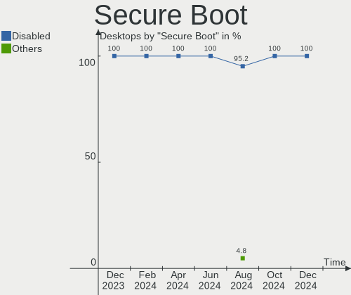
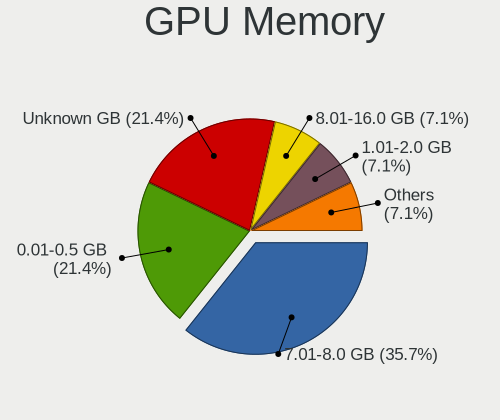
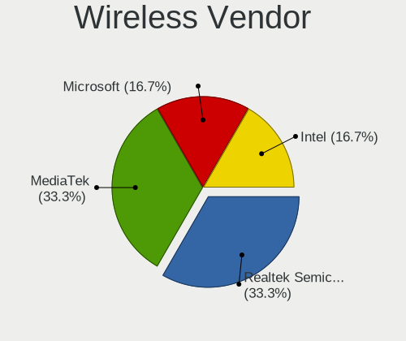
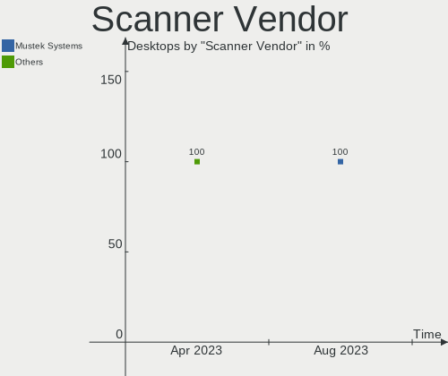
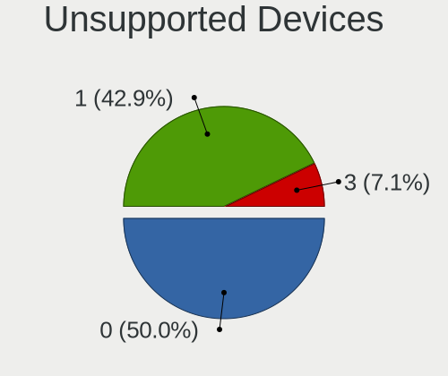

Gentoo Hardware Trends (Desktops)
---------------------------------

A project to identify most popular hardware characteristics and track their change
over time based on data collected by Gentoo users at https://Linux-Hardware.org.

Anyone can contribute to this report by the [hw-probe](https://github.com/linuxhw/hw-probe) tool:

    sudo -E hw-probe -all -upload

Full-feature report is available here: https://linux-hardware.org/?view=trends

Period: Jan, 2022.

Contents
--------

* [ System ](#system)
  - [ OS                       ](#os)
  - [ OS Family                ](#os-family)
  - [ Kernel                   ](#kernel)
  - [ Kernel Family            ](#kernel-family)
  - [ Kernel Major Ver.        ](#kernel-major-ver)
  - [ Arch                     ](#arch)
  - [ DE                       ](#de)
  - [ Display Server           ](#display-server)
  - [ Display Manager          ](#display-manager)
  - [ OS Lang                  ](#os-lang)
  - [ Boot Mode                ](#boot-mode)
  - [ Filesystem               ](#filesystem)
  - [ Part. scheme             ](#part-scheme)
  - [ Dual Boot with Linux/BSD ](#dual-boot-with-linuxbsd)
  - [ Dual Boot (Win)          ](#dual-boot-win)

* [ Board ](#board)
  - [ Vendor                   ](#vendor)
  - [ Model                    ](#model)
  - [ Model Family             ](#model-family)
  - [ MFG Year                 ](#mfg-year)
  - [ Form Factor              ](#form-factor)
  - [ Secure Boot              ](#secure-boot)
  - [ Coreboot                 ](#coreboot)
  - [ RAM Size                 ](#ram-size)
  - [ RAM Used                 ](#ram-used)
  - [ Total Drives             ](#total-drives)
  - [ Has CD-ROM               ](#has-cd-rom)
  - [ Has Ethernet             ](#has-ethernet)
  - [ Has WiFi                 ](#has-wifi)
  - [ Has Bluetooth            ](#has-bluetooth)

* [ Location ](#location)
  - [ Country                  ](#country)
  - [ City                     ](#city)

* [ Drives ](#drives)
  - [ Drive Vendor             ](#drive-vendor)
  - [ Drive Model              ](#drive-model)
  - [ HDD Vendor               ](#hdd-vendor)
  - [ SSD Vendor               ](#ssd-vendor)
  - [ Drive Kind               ](#drive-kind)
  - [ Drive Connector          ](#drive-connector)
  - [ Drive Size               ](#drive-size)
  - [ Space Total              ](#space-total)
  - [ Space Used               ](#space-used)
  - [ Malfunc. Drives          ](#malfunc-drives)
  - [ Malfunc. Drive Vendor    ](#malfunc-drive-vendor)
  - [ Malfunc. HDD Vendor      ](#malfunc-hdd-vendor)
  - [ Malfunc. Drive Kind      ](#malfunc-drive-kind)
  - [ Failed Drives            ](#failed-drives)
  - [ Failed Drive Vendor      ](#failed-drive-vendor)
  - [ Drive Status             ](#drive-status)

* [ Storage controller ](#storage-controller)
  - [ Storage Vendor           ](#storage-vendor)
  - [ Storage Model            ](#storage-model)
  - [ Storage Kind             ](#storage-kind)

* [ Processor ](#processor)
  - [ CPU Vendor               ](#cpu-vendor)
  - [ CPU Model                ](#cpu-model)
  - [ CPU Model Family         ](#cpu-model-family)
  - [ CPU Cores                ](#cpu-cores)
  - [ CPU Sockets              ](#cpu-sockets)
  - [ CPU Threads              ](#cpu-threads)
  - [ CPU Op-Modes             ](#cpu-op-modes)
  - [ CPU Microcode            ](#cpu-microcode)
  - [ CPU Microarch            ](#cpu-microarch)

* [ Graphics ](#graphics)
  - [ GPU Vendor               ](#gpu-vendor)
  - [ GPU Model                ](#gpu-model)
  - [ GPU Combo                ](#gpu-combo)
  - [ GPU Driver               ](#gpu-driver)
  - [ GPU Memory               ](#gpu-memory)

* [ Monitor ](#monitor)
  - [ Monitor Vendor           ](#monitor-vendor)
  - [ Monitor Model            ](#monitor-model)
  - [ Monitor Resolution       ](#monitor-resolution)
  - [ Monitor Diagonal         ](#monitor-diagonal)
  - [ Monitor Width            ](#monitor-width)
  - [ Aspect Ratio             ](#aspect-ratio)
  - [ Monitor Area             ](#monitor-area)
  - [ Pixel Density            ](#pixel-density)
  - [ Multiple Monitors        ](#multiple-monitors)

* [ Network ](#network)
  - [ Net Controller Vendor    ](#net-controller-vendor)
  - [ Net Controller Model     ](#net-controller-model)
  - [ Wireless Vendor          ](#wireless-vendor)
  - [ Wireless Model           ](#wireless-model)
  - [ Ethernet Vendor          ](#ethernet-vendor)
  - [ Ethernet Model           ](#ethernet-model)
  - [ Net Controller Kind      ](#net-controller-kind)
  - [ Used Controller          ](#used-controller)
  - [ NICs                     ](#nics)
  - [ IPv6                     ](#ipv6)

* [ Bluetooth ](#bluetooth)
  - [ Bluetooth Vendor         ](#bluetooth-vendor)
  - [ Bluetooth Model          ](#bluetooth-model)

* [ Sound ](#sound)
  - [ Sound Vendor             ](#sound-vendor)
  - [ Sound Model              ](#sound-model)

* [ Memory ](#memory)
  - [ Memory Vendor            ](#memory-vendor)
  - [ Memory Model             ](#memory-model)
  - [ Memory Kind              ](#memory-kind)
  - [ Memory Form Factor       ](#memory-form-factor)
  - [ Memory Size              ](#memory-size)
  - [ Memory Speed             ](#memory-speed)

* [ Printers & scanners ](#printers--scanners)
  - [ Printer Vendor           ](#printer-vendor)
  - [ Printer Model            ](#printer-model)
  - [ Scanner Vendor           ](#scanner-vendor)
  - [ Scanner Model            ](#scanner-model)

* [ Camera ](#camera)
  - [ Camera Vendor            ](#camera-vendor)
  - [ Camera Model             ](#camera-model)

* [ Security ](#security)
  - [ Fingerprint Vendor       ](#fingerprint-vendor)
  - [ Fingerprint Model        ](#fingerprint-model)
  - [ Chipcard Vendor          ](#chipcard-vendor)
  - [ Chipcard Model           ](#chipcard-model)

* [ Unsupported ](#unsupported)
  - [ Unsupported Devices      ](#unsupported-devices)
  - [ Unsupported Device Types ](#unsupported-device-types)

System
------

OS
--

Installed operating systems

| Name       | Desktops | Percent |
|------------|----------|---------|
| Gentoo 2.7 | 7        | 36.84%  |
| Gentoo 2.6 | 7        | 36.84%  |
| Gentoo 2.8 | 4        | 21.05%  |
| Gentoo 1   | 1        | 5.26%   |

OS Family
---------

OS without a version

| Name   | Desktops | Percent |
|--------|----------|---------|
| Gentoo | 19       | 100%    |

Kernel
------

Version of the Linux kernel

| Version                  | Desktops | Percent |
|--------------------------|----------|---------|
| 5.15.11-gentoo           | 6        | 31.58%  |
| 5.15.11-gentoo-x86_64    | 3        | 15.79%  |
| 5.15.16-gentoo           | 2        | 10.53%  |
| 5.15.10-gentoo           | 2        | 10.53%  |
| 5.16.2-gentoo            | 1        | 5.26%   |
| 5.15.16-gentoo-dist      | 1        | 5.26%   |
| 5.15.15-gentoo-limelight | 1        | 5.26%   |
| 5.15.13-gentoo           | 1        | 5.26%   |
| 5.14.0-rc1+              | 1        | 5.26%   |
| 5.10.76-gentoo-r1        | 1        | 5.26%   |

Kernel Family
-------------

Linux kernel without a distro release

| Version | Desktops | Percent |
|---------|----------|---------|
| 5.15.11 | 9        | 47.37%  |
| 5.15.16 | 3        | 15.79%  |
| 5.15.10 | 2        | 10.53%  |
| 5.16.2  | 1        | 5.26%   |
| 5.15.15 | 1        | 5.26%   |
| 5.15.13 | 1        | 5.26%   |
| 5.14.0  | 1        | 5.26%   |
| 5.10.76 | 1        | 5.26%   |

Kernel Major Ver.
-----------------

Linux kernel major version

| Version | Desktops | Percent |
|---------|----------|---------|
| 5.15    | 16       | 84.21%  |
| 5.16    | 1        | 5.26%   |
| 5.14    | 1        | 5.26%   |
| 5.10    | 1        | 5.26%   |

Arch
----

OS architecture (x86_64, i586, etc.)

| Name   | Desktops | Percent |
|--------|----------|---------|
| x86_64 | 19       | 100%    |

DE
--

Desktop Environment

| Name    | Desktops | Percent |
|---------|----------|---------|
| Unknown | 8        | 42.11%  |
| KDE5    | 6        | 31.58%  |
| XFCE    | 1        | 5.26%   |
| MATE    | 1        | 5.26%   |
| LXQt    | 1        | 5.26%   |
| KDE     | 1        | 5.26%   |
| GNOME   | 1        | 5.26%   |

Display Server
--------------

X11 or Wayland

| Name    | Desktops | Percent |
|---------|----------|---------|
| Unknown | 7        | 36.84%  |
| X11     | 5        | 26.32%  |
| Tty     | 4        | 21.05%  |
| Wayland | 3        | 15.79%  |

Display Manager
---------------

SDDM, LightDM, etc.

| Name    | Desktops | Percent |
|---------|----------|---------|
| Unknown | 10       | 52.63%  |
| SDDM    | 5        | 26.32%  |
| LightDM | 3        | 15.79%  |
| TDM     | 1        | 5.26%   |

OS Lang
-------

Language

| Lang    | Desktops | Percent |
|---------|----------|---------|
| en_US   | 7        | 36.84%  |
| en_GB   | 5        | 26.32%  |
| C.UTF8  | 2        | 10.53%  |
| Unknown | 2        | 10.53%  |
| ru_RU   | 1        | 5.26%   |
| pl_PL   | 1        | 5.26%   |
| de_DE   | 1        | 5.26%   |

Boot Mode
---------

EFI or BIOS

| Mode | Desktops | Percent |
|------|----------|---------|
| EFI  | 16       | 84.21%  |
| BIOS | 3        | 15.79%  |

Filesystem
----------

Type of filesystem

| Type  | Desktops | Percent |
|-------|----------|---------|
| Ext4  | 13       | 68.42%  |
| Btrfs | 4        | 21.05%  |
| F2fs  | 2        | 10.53%  |

Part. scheme
------------

Scheme of partitioning

| Type | Desktops | Percent |
|------|----------|---------|
| GPT  | 18       | 94.74%  |
| MBR  | 1        | 5.26%   |

Dual Boot with Linux/BSD
------------------------

Hosting more than one Linux/BSD

| Dual boot | Desktops | Percent |
|-----------|----------|---------|
| No        | 14       | 73.68%  |
| Yes       | 5        | 26.32%  |

Dual Boot (Win)
---------------

Hosting Linux and Windows

| Dual boot | Desktops | Percent |
|-----------|----------|---------|
| No        | 11       | 57.89%  |
| Yes       | 8        | 42.11%  |

Board
-----

Vendor
------

Motherboard manufacturer

| Name                | Desktops | Percent |
|---------------------|----------|---------|
| ASRock              | 7        | 36.84%  |
| Gigabyte Technology | 5        | 26.32%  |
| ASUSTek Computer    | 5        | 26.32%  |
| MSI                 | 1        | 5.26%   |
| Lenovo              | 1        | 5.26%   |

Model
-----

Motherboard model

| Name                              | Desktops | Percent |
|-----------------------------------|----------|---------|
| MSI MS-7C02                       | 1        | 5.26%   |
| Lenovo ThinkCentre Edge72 3492EHG | 1        | 5.26%   |
| Gigabyte Z490 UD                  | 1        | 5.26%   |
| Gigabyte B460HD3                  | 1        | 5.26%   |
| Gigabyte B450M S2H                | 1        | 5.26%   |
| Gigabyte AX370-Gaming 3           | 1        | 5.26%   |
| Gigabyte AB350-Gaming             | 1        | 5.26%   |
| ASUS ROG STRIX B560-I GAMING WIFI | 1        | 5.26%   |
| ASUS ROG Maximus XIII APEX        | 1        | 5.26%   |
| ASUS PRIME B450M-K                | 1        | 5.26%   |
| ASUS M5A97 LE R2.0                | 1        | 5.26%   |
| ASUS M3A78-CM                     | 1        | 5.26%   |
| ASRock X370 Gaming X              | 1        | 5.26%   |
| ASRock Q1900-ITX                  | 1        | 5.26%   |
| ASRock B550 Steel Legend          | 1        | 5.26%   |
| ASRock AM1H-ITX                   | 1        | 5.26%   |
| ASRock AB350M Pro4                | 1        | 5.26%   |
| ASRock A88M-G                     | 1        | 5.26%   |
| ASRock 970 Pro3 R2.0              | 1        | 5.26%   |

Model Family
------------

Motherboard model prefix

| Name                  | Desktops | Percent |
|-----------------------|----------|---------|
| ASUS ROG              | 2        | 10.53%  |
| MSI MS-7C02           | 1        | 5.26%   |
| Lenovo ThinkCentre    | 1        | 5.26%   |
| Gigabyte Z490         | 1        | 5.26%   |
| Gigabyte B460HD3      | 1        | 5.26%   |
| Gigabyte B450M        | 1        | 5.26%   |
| Gigabyte AX370-Gaming | 1        | 5.26%   |
| Gigabyte AB350-Gaming | 1        | 5.26%   |
| ASUS PRIME            | 1        | 5.26%   |
| ASUS M5A97            | 1        | 5.26%   |
| ASUS M3A78-CM         | 1        | 5.26%   |
| ASRock X370           | 1        | 5.26%   |
| ASRock Q1900-ITX      | 1        | 5.26%   |
| ASRock B550           | 1        | 5.26%   |
| ASRock AM1H-ITX       | 1        | 5.26%   |
| ASRock AB350M         | 1        | 5.26%   |
| ASRock A88M-G         | 1        | 5.26%   |
| ASRock 970            | 1        | 5.26%   |

MFG Year
--------

Motherboard manufacture year

| Year | Desktops | Percent |
|------|----------|---------|
| 2020 | 3        | 15.79%  |
| 2017 | 3        | 15.79%  |
| 2021 | 2        | 10.53%  |
| 2019 | 2        | 10.53%  |
| 2018 | 2        | 10.53%  |
| 2014 | 2        | 10.53%  |
| 2012 | 2        | 10.53%  |
| 2016 | 1        | 5.26%   |
| 2013 | 1        | 5.26%   |
| 2008 | 1        | 5.26%   |

Form Factor
-----------

Physical design of the computer

| Name    | Desktops | Percent |
|---------|----------|---------|
| Desktop | 19       | 100%    |

Secure Boot
-----------

Enabled or disabled

| State    | Desktops | Percent |
|----------|----------|---------|
| Disabled | 17       | 89.47%  |
| Enabled  | 2        | 10.53%  |

Coreboot
--------

Have coreboot on board

| Used | Desktops | Percent |
|------|----------|---------|
| No   | 19       | 100%    |

RAM Size
--------

Total RAM memory

| Size in GB  | Desktops | Percent |
|-------------|----------|---------|
| 16.01-24.0  | 5        | 26.32%  |
| 4.01-8.0    | 4        | 21.05%  |
| 32.01-64.0  | 4        | 21.05%  |
| 64.01-256.0 | 3        | 15.79%  |
| 8.01-16.0   | 2        | 10.53%  |
| 24.01-32.0  | 1        | 5.26%   |

RAM Used
--------

Used RAM memory

| Used GB    | Desktops | Percent |
|------------|----------|---------|
| 0.01-0.5   | 5        | 26.32%  |
| 4.01-8.0   | 4        | 21.05%  |
| 1.01-2.0   | 4        | 21.05%  |
| 3.01-4.0   | 2        | 10.53%  |
| 8.01-16.0  | 2        | 10.53%  |
| 2.01-3.0   | 1        | 5.26%   |
| 16.01-24.0 | 1        | 5.26%   |

Total Drives
------------

Number of drives on board

| Drives | Desktops | Percent |
|--------|----------|---------|
| 2      | 7        | 36.84%  |
| 3      | 4        | 21.05%  |
| 1      | 3        | 15.79%  |
| 6      | 2        | 10.53%  |
| 4      | 2        | 10.53%  |
| 5      | 1        | 5.26%   |

Has CD-ROM
----------

Has CD-ROM on board

| Presented | Desktops | Percent |
|-----------|----------|---------|
| No        | 17       | 89.47%  |
| Yes       | 2        | 10.53%  |

Has Ethernet
------------

Has Ethernet on board

| Presented | Desktops | Percent |
|-----------|----------|---------|
| Yes       | 19       | 100%    |

Has WiFi
--------

Has WiFi module

| Presented | Desktops | Percent |
|-----------|----------|---------|
| No        | 14       | 73.68%  |
| Yes       | 5        | 26.32%  |

Has Bluetooth
-------------

Has Bluetooth module

| Presented | Desktops | Percent |
|-----------|----------|---------|
| No        | 14       | 73.68%  |
| Yes       | 5        | 26.32%  |

Location
--------

Country
-------

Geographic location (country)

| Country | Desktops | Percent |
|---------|----------|---------|
| USA     | 4        | 21.05%  |
| Poland  | 4        | 21.05%  |
| Russia  | 2        | 10.53%  |
| Germany | 2        | 10.53%  |
| UK      | 1        | 5.26%   |
| Tunisia | 1        | 5.26%   |
| Hungary | 1        | 5.26%   |
| Finland | 1        | 5.26%   |
| Czechia | 1        | 5.26%   |
| Chile   | 1        | 5.26%   |
| Belgium | 1        | 5.26%   |

City
----

Geographic location (city)

| City            | Desktops | Percent |
|-----------------|----------|---------|
| Cieszyn         | 2        | 10.53%  |
| Warsaw          | 1        | 5.26%   |
| Tura            | 1        | 5.26%   |
| Spring Lake     | 1        | 5.26%   |
| Santiago        | 1        | 5.26%   |
| Prague          | 1        | 5.26%   |
| Moscow          | 1        | 5.26%   |
| Lochow          | 1        | 5.26%   |
| Livingston      | 1        | 5.26%   |
| Kulmbach        | 1        | 5.26%   |
| Kiel            | 1        | 5.26%   |
| High Wycombe    | 1        | 5.26%   |
| Helsinki        | 1        | 5.26%   |
| Clermont        | 1        | 5.26%   |
| Ciney           | 1        | 5.26%   |
| Chattanooga     | 1        | 5.26%   |
| Carthage        | 1        | 5.26%   |
| Blagoveshchensk | 1        | 5.26%   |

Drives
------

Drive Vendor
------------

Hard drive vendors

| Vendor              | Desktops | Drives | Percent |
|---------------------|----------|--------|---------|
| WDC                 | 10       | 12     | 21.28%  |
| Seagate             | 9        | 10     | 19.15%  |
| Samsung Electronics | 5        | 6      | 10.64%  |
| SanDisk             | 3        | 4      | 6.38%   |
| SPCC                | 2        | 2      | 4.26%   |
| Intel               | 2        | 2      | 4.26%   |
| Hitachi             | 2        | 4      | 4.26%   |
| GOODRAM             | 2        | 2      | 4.26%   |
| Crucial             | 2        | 3      | 4.26%   |
| Toshiba             | 1        | 1      | 2.13%   |
| Team                | 1        | 1      | 2.13%   |
| PLEXTOR             | 1        | 1      | 2.13%   |
| Phison              | 1        | 1      | 2.13%   |
| OCZ-VERTEX          | 1        | 1      | 2.13%   |
| Leven               | 1        | 2      | 2.13%   |
| LaCie               | 1        | 1      | 2.13%   |
| KIOXIA-EXCERIA      | 1        | 1      | 2.13%   |
| Kingchuxing         | 1        | 1      | 2.13%   |
| EMTEC               | 1        | 1      | 2.13%   |

Drive Model
-----------

Hard drive models

| Model                                      | Desktops | Percent |
|--------------------------------------------|----------|---------|
| Seagate ST2000DM006-2DM164 2TB             | 2        | 3.77%   |
| GOODRAM SSDPR-CL100-480-G2 480GB           | 2        | 3.77%   |
| WDC WDS500G3X0C-00SJG0 500GB               | 1        | 1.89%   |
| WDC WDS240G2G0B-00EPW0 240GB SSD           | 1        | 1.89%   |
| WDC WDS100T2B0C 1TB                        | 1        | 1.89%   |
| WDC WD80EDAZ-11TA3A0 8TB                   | 1        | 1.89%   |
| WDC WD40EFRX-68N32N0 4TB                   | 1        | 1.89%   |
| WDC WD30EFRX-68EUZN0 3TB                   | 1        | 1.89%   |
| WDC WD2502ABYS-02B7A0 256GB                | 1        | 1.89%   |
| WDC WD20EZRX-00D8PB0 2TB                   | 1        | 1.89%   |
| WDC WD20EZBX-00AYRA0 2TB                   | 1        | 1.89%   |
| WDC WD20EFRX-68EUZN0 2TB                   | 1        | 1.89%   |
| WDC WD10EZRX-00A8LB0 1TB                   | 1        | 1.89%   |
| WDC WD10EZEX-08WN4A0 1TB                   | 1        | 1.89%   |
| Toshiba HDWE150 5TB                        | 1        | 1.89%   |
| Team TM8FP2240G 240GB                      | 1        | 1.89%   |
| SPCC Solid State Disk 256GB                | 1        | 1.89%   |
| SPCC Solid State Disk 120GB                | 1        | 1.89%   |
| Seagate ST500LT012-1DG142 500GB            | 1        | 1.89%   |
| Seagate ST500DM002-1BD142 500GB            | 1        | 1.89%   |
| Seagate ST4000DM004-2CV104 4TB             | 1        | 1.89%   |
| Seagate ST2000DX001-1NS164 2TB             | 1        | 1.89%   |
| Seagate ST2000DM008-2FR102 2TB             | 1        | 1.89%   |
| Seagate ST12000NM0008-2H3101 12TB          | 1        | 1.89%   |
| Seagate ST1000DM010-2EP102 1TB             | 1        | 1.89%   |
| Seagate FireCuda 520 SSD ZP1000GM30002 1TB | 1        | 1.89%   |
| SanDisk SSD PLUS 1000GB                    | 1        | 1.89%   |
| SanDisk SSD i110 32GB                      | 1        | 1.89%   |
| SanDisk SSD i100 32GB                      | 1        | 1.89%   |
| SanDisk SDSSDA120G 120GB                   | 1        | 1.89%   |
| Samsung SSD 980 PRO 2TB                    | 1        | 1.89%   |
| Samsung SSD 980 PRO 1TB                    | 1        | 1.89%   |
| Samsung SSD 980 1TB                        | 1        | 1.89%   |
| Samsung SSD 870 QVO 2TB                    | 1        | 1.89%   |
| Samsung SSD 850 EVO 120GB                  | 1        | 1.89%   |
| Samsung SSD 830 Series 128GB               | 1        | 1.89%   |
| PLEXTOR PX-1TM9PG + 1TB                    | 1        | 1.89%   |
| Phison Sabrent 2TB                         | 1        | 1.89%   |
| OCZ-VERTEX PLUS R2 128GB SSD               | 1        | 1.89%   |
| Leven JAJS600M128C 128GB SSD               | 1        | 1.89%   |
| LaCie Rugged THB USB3 2TB                  | 1        | 1.89%   |
| KIOXIA-EXCERIA PLUS G2 SSD 500GB           | 1        | 1.89%   |
| Kingchuxing 512GB                          | 1        | 1.89%   |
| Intel SSDSC2BW080A4 80GB                   | 1        | 1.89%   |
| Intel SSDPEKKW512G8 512GB                  | 1        | 1.89%   |
| Hitachi HUS724030ALE641 3TB                | 1        | 1.89%   |
| Hitachi HUA722020ALA331 2TB                | 1        | 1.89%   |
| EMTEC X250 512GB SSD                       | 1        | 1.89%   |
| Crucial CT2000MX500SSD1 2TB                | 1        | 1.89%   |
| Crucial CT1000P5SSD8 1TB                   | 1        | 1.89%   |
| Crucial CT1000MX500SSD1 1TB                | 1        | 1.89%   |

HDD Vendor
----------

Hard disk drive vendors

| Vendor  | Desktops | Drives | Percent |
|---------|----------|--------|---------|
| WDC     | 9        | 9      | 42.86%  |
| Seagate | 8        | 9      | 38.1%   |
| Hitachi | 2        | 4      | 9.52%   |
| Toshiba | 1        | 1      | 4.76%   |
| LaCie   | 1        | 1      | 4.76%   |

SSD Vendor
----------

Solid state drive vendors

| Vendor              | Desktops | Drives | Percent |
|---------------------|----------|--------|---------|
| SanDisk             | 3        | 4      | 17.65%  |
| Samsung Electronics | 3        | 3      | 17.65%  |
| SPCC                | 2        | 2      | 11.76%  |
| GOODRAM             | 2        | 2      | 11.76%  |
| Crucial             | 2        | 2      | 11.76%  |
| WDC                 | 1        | 1      | 5.88%   |
| OCZ-VERTEX          | 1        | 1      | 5.88%   |
| Leven               | 1        | 2      | 5.88%   |
| Intel               | 1        | 1      | 5.88%   |
| EMTEC               | 1        | 1      | 5.88%   |

Drive Kind
----------

HDD or SSD

| Kind | Desktops | Drives | Percent |
|------|----------|--------|---------|
| SSD  | 14       | 19     | 38.89%  |
| HDD  | 14       | 24     | 38.89%  |
| NVMe | 8        | 13     | 22.22%  |

Drive Connector
---------------

SATA, SAS, NVMe, etc.

| Type | Desktops | Drives | Percent |
|------|----------|--------|---------|
| SATA | 17       | 42     | 65.38%  |
| NVMe | 8        | 13     | 30.77%  |
| SAS  | 1        | 1      | 3.85%   |

Drive Size
----------

Size of hard drive

| Size in TB | Desktops | Drives | Percent |
|------------|----------|--------|---------|
| 0.01-0.5   | 11       | 17     | 35.48%  |
| 1.01-2.0   | 8        | 11     | 25.81%  |
| 0.51-1.0   | 5        | 6      | 16.13%  |
| 3.01-4.0   | 2        | 2      | 6.45%   |
| 2.01-3.0   | 2        | 4      | 6.45%   |
| 4.01-10.0  | 2        | 2      | 6.45%   |
| 10.01-20.0 | 1        | 1      | 3.23%   |

Space Total
-----------

Amount of disk space available on the file system

| Size in GB     | Desktops | Percent |
|----------------|----------|---------|
| More than 3000 | 5        | 26.32%  |
| 251-500        | 4        | 21.05%  |
| 1001-2000      | 3        | 15.79%  |
| 2001-3000      | 2        | 10.53%  |
| 101-250        | 2        | 10.53%  |
| 501-1000       | 2        | 10.53%  |
| 51-100         | 1        | 5.26%   |

Space Used
----------

Amount of used disk space

| Used GB        | Desktops | Percent |
|----------------|----------|---------|
| 1-20           | 5        | 26.32%  |
| More than 3000 | 3        | 15.79%  |
| 251-500        | 3        | 15.79%  |
| 2001-3000      | 2        | 10.53%  |
| 501-1000       | 2        | 10.53%  |
| 51-100         | 2        | 10.53%  |
| 21-50          | 1        | 5.26%   |
| 1001-2000      | 1        | 5.26%   |

Malfunc. Drives
---------------

Drive models with a malfunction

| Model                       | Desktops | Drives | Percent |
|-----------------------------|----------|--------|---------|
| WDC WD2502ABYS-02B7A0 256GB | 1        | 1      | 14.29%  |
| WDC WD20EZRX-00D8PB0 2TB    | 1        | 1      | 14.29%  |
| WDC WD10EZRX-00A8LB0 1TB    | 1        | 1      | 14.29%  |
| SanDisk SSD PLUS 1000GB     | 1        | 1      | 14.29%  |
| SanDisk SSD i100 32GB       | 1        | 1      | 14.29%  |
| Hitachi HUA722020ALA331 2TB | 1        | 1      | 14.29%  |
| EMTEC X250 512GB SSD        | 1        | 1      | 14.29%  |

Malfunc. Drive Vendor
---------------------

Vendors of faulty drives

| Vendor  | Desktops | Drives | Percent |
|---------|----------|--------|---------|
| WDC     | 3        | 3      | 42.86%  |
| SanDisk | 2        | 2      | 28.57%  |
| Hitachi | 1        | 1      | 14.29%  |
| EMTEC   | 1        | 1      | 14.29%  |

Malfunc. HDD Vendor
-------------------

Vendors of faulty HDD drives

| Vendor  | Desktops | Drives | Percent |
|---------|----------|--------|---------|
| WDC     | 3        | 3      | 75%     |
| Hitachi | 1        | 1      | 25%     |

Malfunc. Drive Kind
-------------------

Kinds of faulty drives

| Kind | Desktops | Drives | Percent |
|------|----------|--------|---------|
| SSD  | 3        | 3      | 50%     |
| HDD  | 3        | 4      | 50%     |

Failed Drives
-------------

Failed drive models

Zero info for selected period =(

Failed Drive Vendor
-------------------

Failed drive vendors

Zero info for selected period =(

Drive Status
------------

Number of failed and malfunc. drives

| Status   | Desktops | Drives | Percent |
|----------|----------|--------|---------|
| Works    | 18       | 47     | 72%     |
| Malfunc  | 6        | 7      | 24%     |
| Detected | 1        | 2      | 4%      |

Storage controller
------------------

Storage Vendor
--------------

Storage controller vendors

| Vendor                         | Desktops | Percent |
|--------------------------------|----------|---------|
| AMD                            | 13       | 38.24%  |
| Intel                          | 6        | 17.65%  |
| Samsung Electronics            | 3        | 8.82%   |
| Sandisk                        | 2        | 5.88%   |
| Phison Electronics             | 2        | 5.88%   |
| ASMedia Technology             | 2        | 5.88%   |
| Solid State Storage Technology | 1        | 2.94%   |
| Silicon Motion                 | 1        | 2.94%   |
| Seagate Technology             | 1        | 2.94%   |
| Micron/Crucial Technology      | 1        | 2.94%   |
| LSI Logic / Symbios Logic      | 1        | 2.94%   |
| KIOXIA                         | 1        | 2.94%   |

Storage Model
-------------

Storage controller models

| Model                                                                         | Desktops | Percent |
|-------------------------------------------------------------------------------|----------|---------|
| AMD FCH SATA Controller [AHCI mode]                                           | 9        | 20.93%  |
| AMD 400 Series Chipset SATA Controller                                        | 3        | 6.98%   |
| Samsung NVMe SSD Controller PM9A1/PM9A3/980PRO                                | 2        | 4.65%   |
| Intel 500 Series Chipset Family SATA AHCI Controller                          | 2        | 4.65%   |
| ASMedia ASM1062 Serial ATA Controller                                         | 2        | 4.65%   |
| AMD X370 Series Chipset SATA Controller                                       | 2        | 4.65%   |
| AMD SB7x0/SB8x0/SB9x0 SATA Controller [AHCI mode]                             | 2        | 4.65%   |
| AMD 300 Series Chipset SATA Controller                                        | 2        | 4.65%   |
| Solid State Storage Non-Volatile memory controller                            | 1        | 2.33%   |
| Silicon Motion SM2263EN/SM2263XT SSD Controller                               | 1        | 2.33%   |
| Seagate FireCuda 520 SSD                                                      | 1        | 2.33%   |
| Sandisk WD Blue SN550 NVMe SSD                                                | 1        | 2.33%   |
| Sandisk WD Black SN750 / PC SN730 NVMe SSD                                    | 1        | 2.33%   |
| Samsung NVMe SSD Controller 980                                               | 1        | 2.33%   |
| Phison E7 NVMe Controller                                                     | 1        | 2.33%   |
| Phison E12 NVMe Controller                                                    | 1        | 2.33%   |
| Micron/Crucial Non-Volatile memory controller                                 | 1        | 2.33%   |
| LSI Logic / Symbios Logic SAS1064ET PCI-Express Fusion-MPT SAS                | 1        | 2.33%   |
| KIOXIA Non-Volatile memory controller                                         | 1        | 2.33%   |
| Intel SSD Pro 7600p/760p/E 6100p Series                                       | 1        | 2.33%   |
| Intel Comet Lake SATA AHCI Controller                                         | 1        | 2.33%   |
| Intel Atom Processor E3800 Series SATA AHCI Controller                        | 1        | 2.33%   |
| Intel 6 Series/C200 Series Chipset Family 6 port Desktop SATA AHCI Controller | 1        | 2.33%   |
| Intel 400 Series Chipset Family SATA AHCI Controller                          | 1        | 2.33%   |
| AMD Starship/Matisse Chipset SATA Controller [AHCI mode]                      | 1        | 2.33%   |
| AMD SB7x0/SB8x0/SB9x0 SATA Controller [IDE mode]                              | 1        | 2.33%   |
| AMD SB7x0/SB8x0/SB9x0 IDE Controller                                          | 1        | 2.33%   |

Storage Kind
------------

Kind of storage controller (IDE, SATA, NVMe, SAS, ...)

| Kind | Desktops | Percent |
|------|----------|---------|
| SATA | 19       | 65.52%  |
| NVMe | 8        | 27.59%  |
| SCSI | 1        | 3.45%   |
| IDE  | 1        | 3.45%   |

Processor
---------

CPU Vendor
----------

Processor vendors

| Vendor | Desktops | Percent |
|--------|----------|---------|
| AMD    | 13       | 68.42%  |
| Intel  | 6        | 31.58%  |

CPU Model
---------

Processor models

| Model                                     | Desktops | Percent |
|-------------------------------------------|----------|---------|
| AMD Ryzen 5 2600 Six-Core Processor       | 2        | 10.53%  |
| AMD FX-6300 Six-Core Processor            | 2        | 10.53%  |
| Intel Core i7-10700K CPU @ 3.80GHz        | 1        | 5.26%   |
| Intel Core i7-10700F CPU @ 2.90GHz        | 1        | 5.26%   |
| Intel Core i5-3470S CPU @ 2.90GHz         | 1        | 5.26%   |
| Intel Celeron CPU J1900 @ 1.99GHz         | 1        | 5.26%   |
| Intel 11th Gen Core i9-11900K @ 3.50GHz   | 1        | 5.26%   |
| Intel 11th Gen Core i5-11500 @ 2.70GHz    | 1        | 5.26%   |
| AMD Sempron 3850 APU with Radeon R3       | 1        | 5.26%   |
| AMD Ryzen 9 3950X 16-Core Processor       | 1        | 5.26%   |
| AMD Ryzen 7 5800X 8-Core Processor        | 1        | 5.26%   |
| AMD Ryzen 5 3600XT 6-Core Processor       | 1        | 5.26%   |
| AMD Ryzen 5 3600 6-Core Processor         | 1        | 5.26%   |
| AMD Ryzen 5 1600X Six-Core Processor      | 1        | 5.26%   |
| AMD Ryzen 5 1600 Six-Core Processor       | 1        | 5.26%   |
| AMD Phenom II X4 955 Processor            | 1        | 5.26%   |
| AMD A10-5800K APU with Radeon HD Graphics | 1        | 5.26%   |

CPU Model Family
----------------

Processor model prefix

| Model            | Desktops | Percent |
|------------------|----------|---------|
| AMD Ryzen 5      | 6        | 31.58%  |
| Other            | 2        | 10.53%  |
| Intel Core i7    | 2        | 10.53%  |
| AMD FX           | 2        | 10.53%  |
| Intel Core i5    | 1        | 5.26%   |
| Intel Celeron    | 1        | 5.26%   |
| AMD Sempron      | 1        | 5.26%   |
| AMD Ryzen 9      | 1        | 5.26%   |
| AMD Ryzen 7      | 1        | 5.26%   |
| AMD Phenom II X4 | 1        | 5.26%   |
| AMD A10          | 1        | 5.26%   |

CPU Cores
---------

Number of processor cores

| Number | Desktops | Percent |
|--------|----------|---------|
| 6      | 7        | 36.84%  |
| 8      | 4        | 21.05%  |
| 4      | 4        | 21.05%  |
| 3      | 2        | 10.53%  |
| 16     | 1        | 5.26%   |
| 2      | 1        | 5.26%   |

CPU Sockets
-----------

Number of sockets

| Number | Desktops | Percent |
|--------|----------|---------|
| 1      | 19       | 100%    |

CPU Threads
-----------

Threads per core (Hyper-Threading)

| Number | Desktops | Percent |
|--------|----------|---------|
| 2      | 15       | 78.95%  |
| 1      | 4        | 21.05%  |

CPU Op-Modes
------------

CPU Operation Modes (32-bit, 64-bit)

| Op mode        | Desktops | Percent |
|----------------|----------|---------|
| 32-bit, 64-bit | 19       | 100%    |

CPU Microcode
-------------

Microcode number

| Number     | Desktops | Percent |
|------------|----------|---------|
| 0xa0671    | 2        | 10.53%  |
| 0xa0655    | 2        | 10.53%  |
| 0x0800820d | 2        | 10.53%  |
| 0x08001138 | 2        | 10.53%  |
| 0x306a9    | 1        | 5.26%   |
| 0x30673    | 1        | 5.26%   |
| 0x0a201009 | 1        | 5.26%   |
| 0x08701021 | 1        | 5.26%   |
| 0x08701013 | 1        | 5.26%   |
| 0x0700010f | 1        | 5.26%   |
| 0x06001119 | 1        | 5.26%   |
| 0x06000822 | 1        | 5.26%   |
| 0x06000817 | 1        | 5.26%   |
| 0x010000db | 1        | 5.26%   |
| Unknown    | 1        | 5.26%   |

CPU Microarch
-------------

Microarchitecture

| Name       | Desktops | Percent |
|------------|----------|---------|
| Zen 2      | 3        | 15.79%  |
| Piledriver | 3        | 15.79%  |
| Zen+       | 2        | 10.53%  |
| Zen        | 2        | 10.53%  |
| Icelake    | 2        | 10.53%  |
| CometLake  | 2        | 10.53%  |
| Zen 3      | 1        | 5.26%   |
| Silvermont | 1        | 5.26%   |
| K10        | 1        | 5.26%   |
| Jaguar     | 1        | 5.26%   |
| IvyBridge  | 1        | 5.26%   |

Graphics
--------

GPU Vendor
----------

Vendors of graphics cards

| Vendor | Desktops | Percent |
|--------|----------|---------|
| AMD    | 9        | 47.37%  |
| Nvidia | 7        | 36.84%  |
| Intel  | 3        | 15.79%  |

GPU Model
---------

Graphics card models

| Model                                                            | Desktops | Percent |
|------------------------------------------------------------------|----------|---------|
| AMD Ellesmere [Radeon RX 470/480/570/570X/580/580X/590]          | 2        | 9.52%   |
| Nvidia TU116 [GeForce GTX 1660 SUPER]                            | 1        | 4.76%   |
| Nvidia GP108 [GeForce GT 1030]                                   | 1        | 4.76%   |
| Nvidia GP106 [GeForce GTX 1060 6GB]                              | 1        | 4.76%   |
| Nvidia GM204 [GeForce GTX 970]                                   | 1        | 4.76%   |
| Nvidia GA102 [GeForce RTX 3080]                                  | 1        | 4.76%   |
| Nvidia GA102 [GeForce RTX 3080 Ti]                               | 1        | 4.76%   |
| Nvidia G73 [GeForce 7300 GT]                                     | 1        | 4.76%   |
| Intel Xeon E3-1200 v2/3rd Gen Core processor Graphics Controller | 1        | 4.76%   |
| Intel RocketLake-S GT1 [UHD Graphics 750]                        | 1        | 4.76%   |
| Intel Atom Processor Z36xxx/Z37xxx Series Graphics & Display     | 1        | 4.76%   |
| AMD Trinity [Radeon HD 7660D]                                    | 1        | 4.76%   |
| AMD RS780C [Radeon 3100]                                         | 1        | 4.76%   |
| AMD Oland PRO [Radeon R7 240/340 / Radeon 520]                   | 1        | 4.76%   |
| AMD Navi 23 [Radeon RX 6600/6600 XT/6600M]                       | 1        | 4.76%   |
| AMD Navi 21 [Radeon RX 6800/6800 XT / 6900 XT]                   | 1        | 4.76%   |
| AMD Lexa PRO [Radeon 540/540X/550/550X / RX 540X/550/550X]       | 1        | 4.76%   |
| AMD Kabini [Radeon HD 8280 / R3 Series]                          | 1        | 4.76%   |
| AMD Juniper XT [Radeon HD 5770]                                  | 1        | 4.76%   |
| AMD Curacao PRO [Radeon R7 370 / R9 270/370 OEM]                 | 1        | 4.76%   |

GPU Combo
---------

Combinations of graphics cards

| Name       | Desktops | Percent |
|------------|----------|---------|
| 1 x AMD    | 8        | 42.11%  |
| 1 x Nvidia | 7        | 36.84%  |
| 1 x Intel  | 3        | 15.79%  |
| 2 x AMD    | 1        | 5.26%   |

GPU Driver
----------

Free vs proprietary

| Driver      | Desktops | Percent |
|-------------|----------|---------|
| Free        | 12       | 63.16%  |
| Proprietary | 6        | 31.58%  |
| Unknown     | 1        | 5.26%   |

GPU Memory
----------

Total video memory

| Size in GB | Desktops | Percent |
|------------|----------|---------|
| Unknown    | 5        | 26.32%  |
| 8.01-16.0  | 3        | 15.79%  |
| 0.01-0.5   | 3        | 15.79%  |
| 3.01-4.0   | 2        | 10.53%  |
| 1.01-2.0   | 2        | 10.53%  |
| 0.51-1.0   | 2        | 10.53%  |
| 7.01-8.0   | 1        | 5.26%   |
| 5.01-6.0   | 1        | 5.26%   |

Monitor
-------

Monitor Vendor
--------------

Monitor vendors

| Vendor                  | Desktops | Percent |
|-------------------------|----------|---------|
| Goldstar                | 4        | 18.18%  |
| Dell                    | 3        | 13.64%  |
| Acer                    | 3        | 13.64%  |
| BenQ                    | 2        | 9.09%   |
| ViewSonic               | 1        | 4.55%   |
| SKY                     | 1        | 4.55%   |
| Samsung Electronics     | 1        | 4.55%   |
| PNP                     | 1        | 4.55%   |
| PKB                     | 1        | 4.55%   |
| HJW                     | 1        | 4.55%   |
| HannStar                | 1        | 4.55%   |
| Chi Mei Optoelectronics | 1        | 4.55%   |
| Belinea                 | 1        | 4.55%   |
| AOC                     | 1        | 4.55%   |

Monitor Model
-------------

Monitor models

| Model                                                                 | Desktops | Percent |
|-----------------------------------------------------------------------|----------|---------|
| ViewSonic VG2249 Series VSCF232 1920x1080 476x268mm 21.5-inch         | 1        | 4.35%   |
| SKY TV-monitor SKY1202 1920x1080 885x498mm 40.0-inch                  | 1        | 4.35%   |
| Samsung Electronics S22B300 SAM08C8 1920x1080 477x268mm 21.5-inch     | 1        | 4.35%   |
| PNP Monitor PNP09FF 1920x1080 480x270mm 21.7-inch                     | 1        | 4.35%   |
| PKB LCD Monitor VIS220WS 1680x1050                                    | 1        | 4.35%   |
| HJW MACROSILICON HJW1836 1680x1050 530x290mm 23.8-inch                | 1        | 4.35%   |
| HannStar JC198D HSD0CC6 1280x1024 376x301mm 19.0-inch                 | 1        | 4.35%   |
| Goldstar ULTRAWIDE GSM76E4 3440x1440 800x335mm 34.1-inch              | 1        | 4.35%   |
| Goldstar LG FULL HD GSM5B54 1920x1080 480x270mm 21.7-inch             | 1        | 4.35%   |
| Goldstar HDR 4K GSM7707 3840x2160 600x340mm 27.2-inch                 | 1        | 4.35%   |
| Goldstar 24MB35 GSM5A49 1920x1080 510x290mm 23.1-inch                 | 1        | 4.35%   |
| Dell S2721DS DELA19E 2560x1440 597x336mm 27.0-inch                    | 1        | 4.35%   |
| Dell S2721DGF DEL41D9 2560x1440 597x336mm 27.0-inch                   | 1        | 4.35%   |
| Dell LCD Monitor SE2417HG                                             | 1        | 4.35%   |
| Dell E177FP DELA023 1280x1024 338x270mm 17.0-inch                     | 1        | 4.35%   |
| Chi Mei Optoelectronics CMC 19AW CMO2198 1440x900 408x255mm 18.9-inch | 1        | 4.35%   |
| BenQ XL2411Z BNQ7F32 1920x1080 531x298mm 24.0-inch                    | 1        | 4.35%   |
| BenQ E2200HD BNQ790C 1920x1080 477x268mm 21.5-inch                    | 1        | 4.35%   |
| Belinea Belinea101735 MAX06B2 1280x1024 338x270mm 17.0-inch           | 1        | 4.35%   |
| AOC 2481W AOC2481 1920x1080 527x296mm 23.8-inch                       | 1        | 4.35%   |
| Acer VG270U P ACR06CF 2560x1440 597x336mm 27.0-inch                   | 1        | 4.35%   |
| Acer LCD Monitor V243H 3840x1080                                      | 1        | 4.35%   |
| Acer K272HUL ACR03DD 2560x1440 597x336mm 27.0-inch                    | 1        | 4.35%   |

Monitor Resolution
------------------

Monitor screen resolution

| Resolution         | Desktops | Percent |
|--------------------|----------|---------|
| 1920x1080 (FHD)    | 8        | 40%     |
| 2560x1440 (QHD)    | 3        | 15%     |
| 1280x1024 (SXGA)   | 2        | 10%     |
| 3840x2160 (4K)     | 1        | 5%      |
| 3840x1080          | 1        | 5%      |
| 3440x1440          | 1        | 5%      |
| 1680x1050 (WSXGA+) | 1        | 5%      |
| 1440x900 (WXGA+)   | 1        | 5%      |
| 1400x1050          | 1        | 5%      |
| Unknown            | 1        | 5%      |

Monitor Diagonal
----------------

Diagonal size in inches

| Inches  | Desktops | Percent |
|---------|----------|---------|
| 21      | 5        | 23.81%  |
| 27      | 4        | 19.05%  |
| 23      | 3        | 14.29%  |
| 19      | 2        | 9.52%   |
| 17      | 2        | 9.52%   |
| Unknown | 2        | 9.52%   |
| 40      | 1        | 4.76%   |
| 34      | 1        | 4.76%   |
| 24      | 1        | 4.76%   |

Monitor Width
-------------

Physical width

| Width in mm | Desktops | Percent |
|-------------|----------|---------|
| 501-600     | 8        | 40%     |
| 401-500     | 5        | 25%     |
| 301-350     | 2        | 10%     |
| Unknown     | 2        | 10%     |
| 801-900     | 1        | 5%      |
| 701-800     | 1        | 5%      |
| 351-400     | 1        | 5%      |

Aspect Ratio
------------

Proportional relationship between the width and the height

| Ratio   | Desktops | Percent |
|---------|----------|---------|
| 16/9    | 13       | 68.42%  |
| 5/4     | 2        | 10.53%  |
| Unknown | 2        | 10.53%  |
| 21/9    | 1        | 5.26%   |
| 16/10   | 1        | 5.26%   |

Monitor Area
------------

Area in inch

| Area in inch | Desktops | Percent |
|----------------|----------|---------|
| 201-250        | 7        | 35%     |
| 301-350        | 4        | 20%     |
| 151-200        | 3        | 15%     |
| 141-150        | 2        | 10%     |
| Unknown        | 2        | 10%     |
| 351-500        | 1        | 5%      |
| 501-1000       | 1        | 5%      |

Pixel Density
-------------

Pixels per inch

| Density | Desktops | Percent |
|---------|----------|---------|
| 101-120 | 9        | 47.37%  |
| 51-100  | 6        | 31.58%  |
| Unknown | 2        | 10.53%  |
| 1-50    | 1        | 5.26%   |
| 161-240 | 1        | 5.26%   |

Multiple Monitors
-----------------

Total monitors connected

| Total | Desktops | Percent |
|-------|----------|---------|
| 1     | 12       | 63.16%  |
| 2     | 3        | 15.79%  |
| 3     | 2        | 10.53%  |
| 0     | 2        | 10.53%  |

Network
-------

Net Controller Vendor
---------------------

Controller vendors

| Vendor                | Desktops | Percent |
|-----------------------|----------|---------|
| Realtek Semiconductor | 17       | 70.83%  |
| Intel                 | 4        | 16.67%  |
| Ralink Technology     | 1        | 4.17%   |
| Qualcomm Atheros      | 1        | 4.17%   |
| Broadcom              | 1        | 4.17%   |

Net Controller Model
--------------------

Controller models

| Model                                                             | Desktops | Percent |
|-------------------------------------------------------------------|----------|---------|
| Realtek RTL8111/8168/8411 PCI Express Gigabit Ethernet Controller | 15       | 60%     |
| Realtek RTL8125 2.5GbE Controller                                 | 2        | 8%      |
| Realtek RTL8188FTV 802.11b/g/n 1T1R 2.4G WLAN Adapter             | 1        | 4%      |
| Ralink MT7601U Wireless Adapter                                   | 1        | 4%      |
| Qualcomm Atheros AR9285 Wireless Network Adapter (PCI-Express)    | 1        | 4%      |
| Intel Wireless-AC 9260                                            | 1        | 4%      |
| Intel Tiger Lake PCH CNVi WiFi                                    | 1        | 4%      |
| Intel I211 Gigabit Network Connection                             | 1        | 4%      |
| Intel Ethernet Controller I225-V                                  | 1        | 4%      |
| Broadcom BCM4306 802.11b/g Wireless LAN Controller                | 1        | 4%      |

Wireless Vendor
---------------

Wireless vendors

| Vendor                | Desktops | Percent |
|-----------------------|----------|---------|
| Intel                 | 2        | 33.33%  |
| Realtek Semiconductor | 1        | 16.67%  |
| Ralink Technology     | 1        | 16.67%  |
| Qualcomm Atheros      | 1        | 16.67%  |
| Broadcom              | 1        | 16.67%  |

Wireless Model
--------------

Wireless models

| Model                                                          | Desktops | Percent |
|----------------------------------------------------------------|----------|---------|
| Realtek RTL8188FTV 802.11b/g/n 1T1R 2.4G WLAN Adapter          | 1        | 16.67%  |
| Ralink MT7601U Wireless Adapter                                | 1        | 16.67%  |
| Qualcomm Atheros AR9285 Wireless Network Adapter (PCI-Express) | 1        | 16.67%  |
| Intel Wireless-AC 9260                                         | 1        | 16.67%  |
| Intel Tiger Lake PCH CNVi WiFi                                 | 1        | 16.67%  |
| Broadcom BCM4306 802.11b/g Wireless LAN Controller             | 1        | 16.67%  |

Ethernet Vendor
---------------

Ethernet vendors

| Vendor                | Desktops | Percent |
|-----------------------|----------|---------|
| Realtek Semiconductor | 17       | 89.47%  |
| Intel                 | 2        | 10.53%  |

Ethernet Model
--------------

Ethernet models

| Model                                                             | Desktops | Percent |
|-------------------------------------------------------------------|----------|---------|
| Realtek RTL8111/8168/8411 PCI Express Gigabit Ethernet Controller | 15       | 78.95%  |
| Realtek RTL8125 2.5GbE Controller                                 | 2        | 10.53%  |
| Intel I211 Gigabit Network Connection                             | 1        | 5.26%   |
| Intel Ethernet Controller I225-V                                  | 1        | 5.26%   |

Net Controller Kind
-------------------

Ethernet, WiFi or modem

| Kind     | Desktops | Percent |
|----------|----------|---------|
| Ethernet | 19       | 79.17%  |
| WiFi     | 5        | 20.83%  |

Used Controller
---------------

Currently used network controller

| Kind     | Desktops | Percent |
|----------|----------|---------|
| Ethernet | 18       | 90%     |
| WiFi     | 2        | 10%     |

NICs
----

Total network controllers on board

| Total | Desktops | Percent |
|-------|----------|---------|
| 1     | 15       | 78.95%  |
| 2     | 3        | 15.79%  |
| 6     | 1        | 5.26%   |

IPv6
----

IPv6 vs IPv4

| Used | Desktops | Percent |
|------|----------|---------|
| No   | 16       | 84.21%  |
| Yes  | 3        | 15.79%  |

Bluetooth
---------

Bluetooth Vendor
----------------

Controller vendors

| Vendor                  | Desktops | Percent |
|-------------------------|----------|---------|
| Intel                   | 3        | 60%     |
| Cambridge Silicon Radio | 1        | 20%     |
| Broadcom                | 1        | 20%     |

Bluetooth Model
---------------

Controller models

| Model                                               | Desktops | Percent |
|-----------------------------------------------------|----------|---------|
| Intel Wireless-AC 9260 Bluetooth Adapter            | 1        | 20%     |
| Intel Bluetooth Device                              | 1        | 20%     |
| Intel AX210 Bluetooth                               | 1        | 20%     |
| Cambridge Silicon Radio Bluetooth Dongle (HCI mode) | 1        | 20%     |
| Broadcom BCM20702A0 Bluetooth 4.0                   | 1        | 20%     |

Sound
-----

Sound Vendor
------------

Sound card vendors

| Vendor                               | Desktops | Percent |
|--------------------------------------|----------|---------|
| AMD                                  | 14       | 45.16%  |
| Nvidia                               | 6        | 19.35%  |
| Intel                                | 4        | 12.9%   |
| ASUSTek Computer                     | 2        | 6.45%   |
| Thesycon Systemsoftware & Consulting | 1        | 3.23%   |
| SAVITECH                             | 1        | 3.23%   |
| GYROCOM C&C                          | 1        | 3.23%   |
| GN Netcom                            | 1        | 3.23%   |
| Creative Technology                  | 1        | 3.23%   |

Sound Model
-----------

Sound card models

| Model                                                                      | Desktops | Percent |
|----------------------------------------------------------------------------|----------|---------|
| AMD Starship/Matisse HD Audio Controller                                   | 4        | 10.26%  |
| AMD Family 17h (Models 00h-0fh) HD Audio Controller                        | 4        | 10.26%  |
| AMD SBx00 Azalia (Intel HDA)                                               | 3        | 7.69%   |
| Nvidia GA102 High Definition Audio Controller                              | 2        | 5.13%   |
| AMD Oland/Hainan/Cape Verde/Pitcairn HDMI Audio [Radeon HD 7000 Series]    | 2        | 5.13%   |
| AMD Navi 21 HDMI Audio [Radeon RX 6800/6800 XT / 6900 XT]                  | 2        | 5.13%   |
| AMD FCH Azalia Controller                                                  | 2        | 5.13%   |
| AMD Ellesmere HDMI Audio [Radeon RX 470/480 / 570/580/590]                 | 2        | 5.13%   |
| Thesycon Systemsoftware & Consulting E30                                   | 1        | 2.56%   |
| SAVITECH SA9023 audio controller                                           | 1        | 2.56%   |
| Nvidia TU116 High Definition Audio Controller                              | 1        | 2.56%   |
| Nvidia GP108 High Definition Audio Controller                              | 1        | 2.56%   |
| Nvidia GP106 High Definition Audio Controller                              | 1        | 2.56%   |
| Nvidia GM204 High Definition Audio Controller                              | 1        | 2.56%   |
| Intel Tiger Lake-H HD Audio Controller                                     | 1        | 2.56%   |
| Intel Comet Lake PCH-V cAVS                                                | 1        | 2.56%   |
| Intel Comet Lake PCH cAVS                                                  | 1        | 2.56%   |
| Intel 6 Series/C200 Series Chipset Family High Definition Audio Controller | 1        | 2.56%   |
| GYROCOM C&C Fiio E10                                                       | 1        | 2.56%   |
| GN Netcom Jabra Link 380                                                   | 1        | 2.56%   |
| Creative Technology Sound BlasterX G6                                      | 1        | 2.56%   |
| ASUSTek Computer Xonar U1 Audio Station                                    | 1        | 2.56%   |
| ASUSTek Computer USB Audio                                                 | 1        | 2.56%   |
| AMD Trinity HDMI Audio Controller                                          | 1        | 2.56%   |
| AMD Juniper HDMI Audio [Radeon HD 5700 Series]                             | 1        | 2.56%   |
| AMD Baffin HDMI/DP Audio [Radeon RX 550 640SP / RX 560/560X]               | 1        | 2.56%   |

Memory
------

Memory Vendor
-------------

Memory module vendors

| Vendor              | Desktops | Percent |
|---------------------|----------|---------|
| Kingston            | 4        | 17.39%  |
| G.Skill             | 3        | 13.04%  |
| Crucial             | 3        | 13.04%  |
| Unknown             | 2        | 8.7%    |
| Patriot             | 2        | 8.7%    |
| Corsair             | 2        | 8.7%    |
| A-DATA Technology   | 2        | 8.7%    |
| Team                | 1        | 4.35%   |
| T-FORCE             | 1        | 4.35%   |
| Samsung Electronics | 1        | 4.35%   |
| Nanya Technology    | 1        | 4.35%   |
| GOODRAM             | 1        | 4.35%   |

Memory Model
------------

Memory module models

| Model                                                    | Desktops | Percent |
|----------------------------------------------------------|----------|---------|
| Crucial RAM BL16G36C16U4RL.M8FB1 16GB DIMM DDR4 4000MT/s | 2        | 8.33%   |
| Unknown RAM Module 2GB DIMM DDR2 667MT/s                 | 1        | 4.17%   |
| Unknown RAM 1866 CL10 Series 8192MB DIMM DDR3 933MT/s    | 1        | 4.17%   |
| Team RAM TEAMGROUP-UD4-3600 8GB DIMM DDR4 3600MT/s       | 1        | 4.17%   |
| T-FORCE RAM ZEUS-1600 4GB DIMM DDR3 1600MT/s             | 1        | 4.17%   |
| Samsung RAM M378B5173QH0-CK0 4GB DIMM DDR3 1866MT/s      | 1        | 4.17%   |
| Patriot RAM 3200 C16 Series 16GB DIMM DDR4 3200MT/s      | 1        | 4.17%   |
| Patriot RAM 3000 C15 Series 8GB DIMM DDR4 3000MT/s       | 1        | 4.17%   |
| Nanya RAM M2F4G64CB88B7N-DI 4GB DIMM DDR3 1600MT/s       | 1        | 4.17%   |
| Kingston RAM KHX3200C16D4/4GX 4GB DIMM DDR4 3600MT/s     | 1        | 4.17%   |
| Kingston RAM KHX1600C10D3/8G 8192MB DIMM DDR3 1867MT/s   | 1        | 4.17%   |
| Kingston RAM 99U5584-005.A00LF 4096MB DIMM DDR3 1600MT/s | 1        | 4.17%   |
| Kingston RAM 99U5402-462.A00LF 4GB DIMM DDR3 1333MT/s    | 1        | 4.17%   |
| GOODRAM RAM GR1600D364L11/2G 2GB DIMM DDR3 1333MT/s      | 1        | 4.17%   |
| G.Skill RAM F4-4400C19-32GTRS 32GB DIMM DDR4 2667MT/s    | 1        | 4.17%   |
| G.Skill RAM F4-3600C16-8GVKC 8GB DIMM DDR4 3600MT/s      | 1        | 4.17%   |
| G.Skill RAM F4-3200C14-8GTZR 8GB DIMM DDR4 3200MT/s      | 1        | 4.17%   |
| Crucial RAM CT8G4DFD824A.C16FF 8GB DIMM DDR4 2733MT/s    | 1        | 4.17%   |
| Crucial RAM CT8G4DFD824A.C16FBD1 8GB DIMM DDR4 2400MT/s  | 1        | 4.17%   |
| Corsair RAM CMSO8GX3M2C1600C11 4GB DIMM DDR3 1600MT/s    | 1        | 4.17%   |
| Corsair RAM CMK32GX4M2Z2400C16 16GB DIMM DDR4 2400MT/s   | 1        | 4.17%   |
| A-DATA RAM DDR4 3200 8GB DIMM DDR4 3200MT/s              | 1        | 4.17%   |
| A-DATA RAM DDR4 3000 2OZ 16GB DIMM DDR4 3000MT/s         | 1        | 4.17%   |

Memory Kind
-----------

Memory module kinds

| Kind | Desktops | Percent |
|------|----------|---------|
| DDR4 | 12       | 63.16%  |
| DDR3 | 6        | 31.58%  |
| DDR2 | 1        | 5.26%   |

Memory Form Factor
------------------

Physical design of the memory module

| Name | Desktops | Percent |
|------|----------|---------|
| DIMM | 19       | 100%    |

Memory Size
-----------

Memory module size

| Size  | Desktops | Percent |
|-------|----------|---------|
| 8192  | 6        | 27.27%  |
| 4096  | 6        | 27.27%  |
| 16384 | 5        | 22.73%  |
| 32768 | 3        | 13.64%  |
| 2048  | 2        | 9.09%   |

Memory Speed
------------

Memory module speed

| Speed | Desktops | Percent |
|-------|----------|---------|
| 1600  | 4        | 16.67%  |
| 3600  | 3        | 12.5%   |
| 3200  | 3        | 12.5%   |
| 4000  | 2        | 8.33%   |
| 3000  | 2        | 8.33%   |
| 2400  | 2        | 8.33%   |
| 1866  | 2        | 8.33%   |
| 1333  | 2        | 8.33%   |
| 2733  | 1        | 4.17%   |
| 2667  | 1        | 4.17%   |
| 1867  | 1        | 4.17%   |
| 667   | 1        | 4.17%   |

Printers & scanners
-------------------

Printer Vendor
--------------

Printer device vendors

| Vendor          | Desktops | Percent |
|-----------------|----------|---------|
| Hewlett-Packard | 1        | 100%    |

Printer Model
-------------

Printer device models

| Model               | Desktops | Percent |
|---------------------|----------|---------|
| HP LaserJet M14-M17 | 1        | 100%    |

Scanner Vendor
--------------

Scanner device vendors

| Vendor | Desktops | Percent |
|--------|----------|---------|
| Canon  | 1        | 100%    |

Scanner Model
-------------

Scanner device models

| Model                         | Desktops | Percent |
|-------------------------------|----------|---------|
| Canon CanoScan N1240U/LiDE 30 | 1        | 100%    |

Camera
------

Camera Vendor
-------------

Camera device vendors

| Vendor              | Desktops | Percent |
|---------------------|----------|---------|
| Microdia            | 2        | 50%     |
| Logitech            | 1        | 25%     |
| Creative Technology | 1        | 25%     |

Camera Model
------------

Camera device models

| Model                         | Desktops | Percent |
|-------------------------------|----------|---------|
| Microdia USB Live camera      | 1        | 25%     |
| Microdia Camera               | 1        | 25%     |
| Logitech HD Pro Webcam C920   | 1        | 25%     |
| Creative Live! Cam Sync 1080p | 1        | 25%     |

Security
--------

Fingerprint Vendor
------------------

Fingerprint sensor vendors

| Vendor         | Desktops | Percent |
|----------------|----------|---------|
| DigitalPersona | 1        | 100%    |

Fingerprint Model
-----------------

Fingerprint sensor models

| Model                             | Desktops | Percent |
|-----------------------------------|----------|---------|
| DigitalPersona Fingerprint Reader | 1        | 100%    |

Chipcard Vendor
---------------

Chipcard module vendors

Zero info for selected period =(

Chipcard Model
--------------

Chipcard module models

Zero info for selected period =(

Unsupported
-----------

Unsupported Devices
-------------------

Total unsupported devices on board

| Total | Desktops | Percent |
|-------|----------|---------|
| 0     | 13       | 68.42%  |
| 1     | 4        | 21.05%  |
| 7     | 1        | 5.26%   |
| 3     | 1        | 5.26%   |

Unsupported Device Types
------------------------

Types of unsupported devices

| Type                     | Desktops | Percent |
|--------------------------|----------|---------|
| Graphics card            | 3        | 25%     |
| Net/wireless             | 2        | 16.67%  |
| Communication controller | 2        | 16.67%  |
| Sound                    | 1        | 8.33%   |
| Fingerprint reader       | 1        | 8.33%   |
| Dvb card                 | 1        | 8.33%   |
| Camera                   | 1        | 8.33%   |
| Bluetooth                | 1        | 8.33%   |

