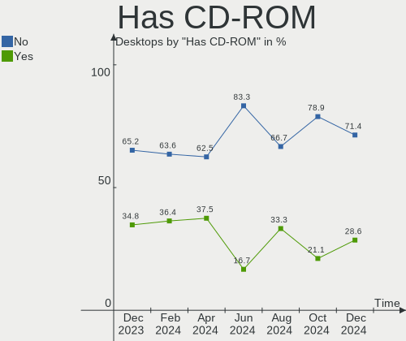
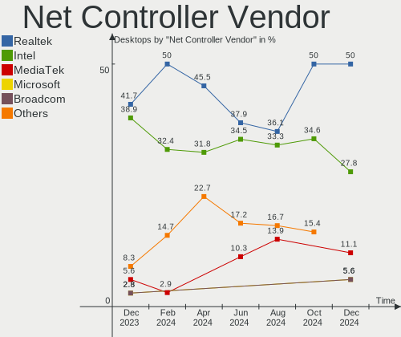
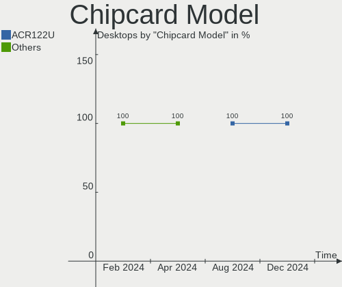

Gentoo - Hardware Trends (Desktops)
-----------------------------------

A project to identify most popular hardware characteristics and track their change
over time based on data collected by Linux users at https://Linux-Hardware.org.

Anyone can contribute to this report by the [hw-probe](https://github.com/linuxhw/hw-probe) tool:

    sudo -E hw-probe -all -upload

This report is for one last month. Overall report since the beginning of time: [TestCoverage](https://github.com/linuxhw/TestCoverage)

Period: Jul, 2022.

Contents
--------

* [ System ](#system)
  - [ OS                       ](#os)
  - [ OS Family                ](#os-family)
  - [ Kernel                   ](#kernel)
  - [ Kernel Family            ](#kernel-family)
  - [ Kernel Major Ver.        ](#kernel-major-ver)
  - [ Arch                     ](#arch)
  - [ DE                       ](#de)
  - [ Display Server           ](#display-server)
  - [ Display Manager          ](#display-manager)
  - [ OS Lang                  ](#os-lang)
  - [ Boot Mode                ](#boot-mode)
  - [ Filesystem               ](#filesystem)
  - [ Part. scheme             ](#part-scheme)
  - [ Dual Boot with Linux/BSD ](#dual-boot-with-linuxbsd)
  - [ Dual Boot (Win)          ](#dual-boot-win)

* [ Board ](#board)
  - [ Vendor                   ](#vendor)
  - [ Model                    ](#model)
  - [ Model Family             ](#model-family)
  - [ MFG Year                 ](#mfg-year)
  - [ Form Factor              ](#form-factor)
  - [ Secure Boot              ](#secure-boot)
  - [ Coreboot                 ](#coreboot)
  - [ RAM Size                 ](#ram-size)
  - [ RAM Used                 ](#ram-used)
  - [ Total Drives             ](#total-drives)
  - [ Has CD-ROM               ](#has-cd-rom)
  - [ Has Ethernet             ](#has-ethernet)
  - [ Has WiFi                 ](#has-wifi)
  - [ Has Bluetooth            ](#has-bluetooth)

* [ Location ](#location)
  - [ Country                  ](#country)
  - [ City                     ](#city)

* [ Drives ](#drives)
  - [ Drive Vendor             ](#drive-vendor)
  - [ Drive Model              ](#drive-model)
  - [ HDD Vendor               ](#hdd-vendor)
  - [ SSD Vendor               ](#ssd-vendor)
  - [ Drive Kind               ](#drive-kind)
  - [ Drive Connector          ](#drive-connector)
  - [ Drive Size               ](#drive-size)
  - [ Space Total              ](#space-total)
  - [ Space Used               ](#space-used)
  - [ Malfunc. Drives          ](#malfunc-drives)
  - [ Malfunc. Drive Vendor    ](#malfunc-drive-vendor)
  - [ Malfunc. HDD Vendor      ](#malfunc-hdd-vendor)
  - [ Malfunc. Drive Kind      ](#malfunc-drive-kind)
  - [ Failed Drives            ](#failed-drives)
  - [ Failed Drive Vendor      ](#failed-drive-vendor)
  - [ Drive Status             ](#drive-status)

* [ Storage controller ](#storage-controller)
  - [ Storage Vendor           ](#storage-vendor)
  - [ Storage Model            ](#storage-model)
  - [ Storage Kind             ](#storage-kind)

* [ Processor ](#processor)
  - [ CPU Vendor               ](#cpu-vendor)
  - [ CPU Model                ](#cpu-model)
  - [ CPU Model Family         ](#cpu-model-family)
  - [ CPU Cores                ](#cpu-cores)
  - [ CPU Sockets              ](#cpu-sockets)
  - [ CPU Threads              ](#cpu-threads)
  - [ CPU Op-Modes             ](#cpu-op-modes)
  - [ CPU Microcode            ](#cpu-microcode)
  - [ CPU Microarch            ](#cpu-microarch)

* [ Graphics ](#graphics)
  - [ GPU Vendor               ](#gpu-vendor)
  - [ GPU Model                ](#gpu-model)
  - [ GPU Combo                ](#gpu-combo)
  - [ GPU Driver               ](#gpu-driver)
  - [ GPU Memory               ](#gpu-memory)

* [ Monitor ](#monitor)
  - [ Monitor Vendor           ](#monitor-vendor)
  - [ Monitor Model            ](#monitor-model)
  - [ Monitor Resolution       ](#monitor-resolution)
  - [ Monitor Diagonal         ](#monitor-diagonal)
  - [ Monitor Width            ](#monitor-width)
  - [ Aspect Ratio             ](#aspect-ratio)
  - [ Monitor Area             ](#monitor-area)
  - [ Pixel Density            ](#pixel-density)
  - [ Multiple Monitors        ](#multiple-monitors)

* [ Network ](#network)
  - [ Net Controller Vendor    ](#net-controller-vendor)
  - [ Net Controller Model     ](#net-controller-model)
  - [ Wireless Vendor          ](#wireless-vendor)
  - [ Wireless Model           ](#wireless-model)
  - [ Ethernet Vendor          ](#ethernet-vendor)
  - [ Ethernet Model           ](#ethernet-model)
  - [ Net Controller Kind      ](#net-controller-kind)
  - [ Used Controller          ](#used-controller)
  - [ NICs                     ](#nics)
  - [ IPv6                     ](#ipv6)

* [ Bluetooth ](#bluetooth)
  - [ Bluetooth Vendor         ](#bluetooth-vendor)
  - [ Bluetooth Model          ](#bluetooth-model)

* [ Sound ](#sound)
  - [ Sound Vendor             ](#sound-vendor)
  - [ Sound Model              ](#sound-model)

* [ Memory ](#memory)
  - [ Memory Vendor            ](#memory-vendor)
  - [ Memory Model             ](#memory-model)
  - [ Memory Kind              ](#memory-kind)
  - [ Memory Form Factor       ](#memory-form-factor)
  - [ Memory Size              ](#memory-size)
  - [ Memory Speed             ](#memory-speed)

* [ Printers & scanners ](#printers--scanners)
  - [ Printer Vendor           ](#printer-vendor)
  - [ Printer Model            ](#printer-model)
  - [ Scanner Vendor           ](#scanner-vendor)
  - [ Scanner Model            ](#scanner-model)

* [ Camera ](#camera)
  - [ Camera Vendor            ](#camera-vendor)
  - [ Camera Model             ](#camera-model)

* [ Security ](#security)
  - [ Fingerprint Vendor       ](#fingerprint-vendor)
  - [ Fingerprint Model        ](#fingerprint-model)
  - [ Chipcard Vendor          ](#chipcard-vendor)
  - [ Chipcard Model           ](#chipcard-model)

* [ Unsupported ](#unsupported)
  - [ Unsupported Devices      ](#unsupported-devices)
  - [ Unsupported Device Types ](#unsupported-device-types)

System
------

OS
--

Installed operating systems

| Name       | Desktops | Percent |
|------------|----------|---------|
| Gentoo 2.8 | 25       | 100%    |

OS Family
---------

OS without a version

| Name   | Desktops | Percent |
|--------|----------|---------|
| Gentoo | 25       | 100%    |

Kernel
------

Version of the Linux kernel

| Version               | Desktops | Percent |
|-----------------------|----------|---------|
| 5.15.52-gentoo        | 3        | 12%     |
| 5.18.14-gentoo-x86_64 | 2        | 8%      |
| 5.18.10-gentoo        | 2        | 8%      |
| 5.15.52-gentoo-x86_64 | 2        | 8%      |
| 5.15.41-gentoo        | 2        | 8%      |
| 5.18.9-gentoo-x86_64  | 1        | 4%      |
| 5.18.9-gentoo         | 1        | 4%      |
| 5.18.7-gentoo         | 1        | 4%      |
| 5.18.15-gentoo-x86_64 | 1        | 4%      |
| 5.18.14-gentoo        | 1        | 4%      |
| 5.18.10-k08           | 1        | 4%      |
| 5.18.10-gentoo-x86_64 | 1        | 4%      |
| 5.17.7-gentoo-x86_64  | 1        | 4%      |
| 5.15.55-gentoo        | 1        | 4%      |
| 5.15.52-gentoo-ts221  | 1        | 4%      |
| 5.15.52-gentoo-dist   | 1        | 4%      |
| 5.15.41-gentoo-x86_64 | 1        | 4%      |
| 5.15.41-gentoo-dist   | 1        | 4%      |
| 4.14.280-gentoo       | 1        | 4%      |

Kernel Family
-------------

Linux kernel without a distro release

| Version  | Desktops | Percent |
|----------|----------|---------|
| 5.15.52  | 7        | 28%     |
| 5.18.10  | 4        | 16%     |
| 5.15.41  | 4        | 16%     |
| 5.18.14  | 3        | 12%     |
| 5.18.9   | 2        | 8%      |
| 5.18.7   | 1        | 4%      |
| 5.18.15  | 1        | 4%      |
| 5.17.7   | 1        | 4%      |
| 5.15.55  | 1        | 4%      |
| 4.14.280 | 1        | 4%      |

Kernel Major Ver.
-----------------

Linux kernel major version

| Version | Desktops | Percent |
|---------|----------|---------|
| 5.15    | 12       | 48%     |
| 5.18    | 11       | 44%     |
| 5.17    | 1        | 4%      |
| 4.14    | 1        | 4%      |

Arch
----

OS architecture (x86_64, i586, etc.)

| Name     | Desktops | Percent |
|----------|----------|---------|
| x86_64   | 24       | 96%     |
| armv5tel | 1        | 4%      |

DE
--

Desktop Environment

| Name     | Desktops | Percent |
|----------|----------|---------|
| KDE5     | 8        | 32%     |
| Unknown  | 8        | 32%     |
| GNOME    | 4        | 16%     |
| XFCE     | 2        | 8%      |
| MATE     | 1        | 4%      |
| i3       | 1        | 4%      |
| Cinnamon | 1        | 4%      |

Display Server
--------------

X11 or Wayland

| Name    | Desktops | Percent |
|---------|----------|---------|
| X11     | 15       | 60%     |
| Unknown | 5        | 20%     |
| Tty     | 3        | 12%     |
| Wayland | 2        | 8%      |

Display Manager
---------------

SDDM, LightDM, etc.

| Name    | Desktops | Percent |
|---------|----------|---------|
| SDDM    | 9        | 36%     |
| Unknown | 7        | 28%     |
| LXDM    | 3        | 12%     |
| LightDM | 3        | 12%     |
| GDM     | 3        | 12%     |

OS Lang
-------

Language

| Lang    | Desktops | Percent |
|---------|----------|---------|
| en_US   | 12       | 48%     |
| Unknown | 3        | 12%     |
| en_GB   | 2        | 8%      |
| de_DE   | 2        | 8%      |
| C.UTF8  | 2        | 8%      |
| ru_RU   | 1        | 4%      |
| pl_PL   | 1        | 4%      |
| ja_JP   | 1        | 4%      |
| C       | 1        | 4%      |

Boot Mode
---------

EFI or BIOS

| Mode | Desktops | Percent |
|------|----------|---------|
| EFI  | 22       | 88%     |
| BIOS | 3        | 12%     |

Filesystem
----------

Type of filesystem

| Type    | Desktops | Percent |
|---------|----------|---------|
| Ext4    | 15       | 60%     |
| F2fs    | 4        | 16%     |
| Btrfs   | 3        | 12%     |
| Zfs     | 2        | 8%      |
| XXXXXXX | 1        | 4%      |

Part. scheme
------------

Scheme of partitioning

| Type    | Desktops | Percent |
|---------|----------|---------|
| GPT     | 22       | 88%     |
| MBR     | 2        | 8%      |
| Unknown | 1        | 4%      |

Dual Boot with Linux/BSD
------------------------

Hosting more than one Linux/BSD

| Dual boot | Desktops | Percent |
|-----------|----------|---------|
| No        | 13       | 52%     |
| Yes       | 12       | 48%     |

Dual Boot (Win)
---------------

Hosting Linux and Windows

| Dual boot | Desktops | Percent |
|-----------|----------|---------|
| No        | 14       | 56%     |
| Yes       | 11       | 44%     |

Board
-----

Vendor
------

Motherboard manufacturer

| Name                | Desktops | Percent |
|---------------------|----------|---------|
| ASUSTek Computer    | 8        | 32%     |
| Gigabyte Technology | 5        | 20%     |
| MSI                 | 4        | 16%     |
| ASRock              | 4        | 16%     |
| Lenovo              | 1        | 4%      |
| Intel               | 1        | 4%      |
| Dell                | 1        | 4%      |
| Unknown             | 1        | 4%      |

Model
-----

Motherboard model

| Name                                | Desktops | Percent |
|-------------------------------------|----------|---------|
| MSI MS-7C35                         | 1        | 4%      |
| MSI MS-7B89                         | 1        | 4%      |
| MSI MS-7B17                         | 1        | 4%      |
| MSI MS-7821                         | 1        | 4%      |
| Lenovo ThinkStation P620 30E0001TGE | 1        | 4%      |
| Intel D54250WYK H13922-303          | 1        | 4%      |
| Gigabyte Z690 AORUS MASTER          | 1        | 4%      |
| Gigabyte Z590 UD                    | 1        | 4%      |
| Gigabyte B450 AORUS M               | 1        | 4%      |
| Gigabyte AB350-Gaming               | 1        | 4%      |
| Gigabyte 970A-DS3                   | 1        | 4%      |
| Dell OptiPlex 790                   | 1        | 4%      |
| ASUS TUF Gaming X570-PLUS           | 1        | 4%      |
| ASUS ROG STRIX B560-I GAMING WIFI   | 1        | 4%      |
| ASUS ROG STRIX B550-F GAMING        | 1        | 4%      |
| ASUS ROG Maximus Z690 EXTREME       | 1        | 4%      |
| ASUS ROG Maximus XI HERO            | 1        | 4%      |
| ASUS ROG CROSSHAIR VIII DARK HERO   | 1        | 4%      |
| ASUS PRIME Z390-A                   | 1        | 4%      |
| ASUS M3A78-CM                       | 1        | 4%      |
| ASRock X570 Taichi                  | 1        | 4%      |
| ASRock X399 Taichi                  | 1        | 4%      |
| ASRock B550M Steel Legend           | 1        | 4%      |
| ASRock AM1H-ITX                     | 1        | 4%      |
| Unknown                             | 1        | 4%      |

Model Family
------------

Motherboard model prefix

| Name                  | Desktops | Percent |
|-----------------------|----------|---------|
| ASUS ROG              | 5        | 20%     |
| MSI MS-7C35           | 1        | 4%      |
| MSI MS-7B89           | 1        | 4%      |
| MSI MS-7B17           | 1        | 4%      |
| MSI MS-7821           | 1        | 4%      |
| Lenovo ThinkStation   | 1        | 4%      |
| Intel D54250WYK       | 1        | 4%      |
| Gigabyte Z690         | 1        | 4%      |
| Gigabyte Z590         | 1        | 4%      |
| Gigabyte B450         | 1        | 4%      |
| Gigabyte AB350-Gaming | 1        | 4%      |
| Gigabyte 970A-DS3     | 1        | 4%      |
| Dell OptiPlex         | 1        | 4%      |
| ASUS TUF              | 1        | 4%      |
| ASUS PRIME            | 1        | 4%      |
| ASUS M3A78-CM         | 1        | 4%      |
| ASRock X570           | 1        | 4%      |
| ASRock X399           | 1        | 4%      |
| ASRock B550M          | 1        | 4%      |
| ASRock AM1H-ITX       | 1        | 4%      |
| Unknown               | 1        | 4%      |

MFG Year
--------

Motherboard manufacture year

| Year    | Desktops | Percent |
|---------|----------|---------|
| 2018    | 5        | 20%     |
| 2021    | 4        | 16%     |
| 2020    | 3        | 12%     |
| 2019    | 3        | 12%     |
| 2013    | 3        | 12%     |
| 2017    | 2        | 8%      |
| 2022    | 1        | 4%      |
| 2014    | 1        | 4%      |
| 2011    | 1        | 4%      |
| 2008    | 1        | 4%      |
| Unknown | 1        | 4%      |

Form Factor
-----------

Physical design of the computer

| Name    | Desktops | Percent |
|---------|----------|---------|
| Desktop | 25       | 100%    |

Secure Boot
-----------

Enabled or disabled

| State    | Desktops | Percent |
|----------|----------|---------|
| Disabled | 25       | 100%    |

Coreboot
--------

Have coreboot on board

| Used | Desktops | Percent |
|------|----------|---------|
| No   | 25       | 100%    |

RAM Size
--------

Total RAM memory

| Size in GB  | Desktops | Percent |
|-------------|----------|---------|
| 32.01-64.0  | 10       | 40%     |
| 64.01-256.0 | 7        | 28%     |
| 16.01-24.0  | 4        | 16%     |
| 4.01-8.0    | 2        | 8%      |
| 8.01-16.0   | 1        | 4%      |
| 0.51-1.0    | 1        | 4%      |

RAM Used
--------

Used RAM memory

| Used GB    | Desktops | Percent |
|------------|----------|---------|
| 4.01-8.0   | 5        | 20%     |
| 3.01-4.0   | 5        | 20%     |
| 2.01-3.0   | 3        | 12%     |
| 16.01-24.0 | 3        | 12%     |
| 8.01-16.0  | 3        | 12%     |
| 1.01-2.0   | 2        | 8%      |
| 32.01-64.0 | 1        | 4%      |
| 0.51-1.0   | 1        | 4%      |
| 0.01-0.5   | 1        | 4%      |
| 0          | 1        | 4%      |

Total Drives
------------

Number of drives on board

| Drives | Desktops | Percent |
|--------|----------|---------|
| 2      | 11       | 44%     |
| 3      | 5        | 20%     |
| 6      | 3        | 12%     |
| 4      | 3        | 12%     |
| 7      | 2        | 8%      |
| 5      | 1        | 4%      |

Has CD-ROM
----------

Has CD-ROM on board

| Presented | Desktops | Percent |
|-----------|----------|---------|
| No        | 18       | 72%     |
| Yes       | 7        | 28%     |

Has Ethernet
------------

Has Ethernet on board

| Presented | Desktops | Percent |
|-----------|----------|---------|
| Yes       | 24       | 96%     |
| No        | 1        | 4%      |

Has WiFi
--------

Has WiFi module

| Presented | Desktops | Percent |
|-----------|----------|---------|
| Yes       | 13       | 52%     |
| No        | 12       | 48%     |

Has Bluetooth
-------------

Has Bluetooth module

| Presented | Desktops | Percent |
|-----------|----------|---------|
| No        | 13       | 52%     |
| Yes       | 12       | 48%     |

Location
--------

Country
-------

Geographic location (country)

| Country  | Desktops | Percent |
|----------|----------|---------|
| USA      | 8        | 32%     |
| Germany  | 7        | 28%     |
| Poland   | 3        | 12%     |
| UK       | 1        | 4%      |
| Slovakia | 1        | 4%      |
| Russia   | 1        | 4%      |
| Romania  | 1        | 4%      |
| Japan    | 1        | 4%      |
| Finland  | 1        | 4%      |
| China    | 1        | 4%      |

City
----

Geographic location (city)

| City         | Desktops | Percent |
|--------------|----------|---------|
| Wrentham     | 1        | 4%      |
| Warsaw       | 1        | 4%      |
| Warren       | 1        | 4%      |
| Troisdorf    | 1        | 4%      |
| Trnava       | 1        | 4%      |
| Texas City   | 1        | 4%      |
| Stasi Las    | 1        | 4%      |
| Seattle      | 1        | 4%      |
| Sankt Wendel | 1        | 4%      |
| Rostock      | 1        | 4%      |
| Oulu         | 1        | 4%      |
| Orange       | 1        | 4%      |
| Munich       | 1        | 4%      |
| Moscow       | 1        | 4%      |
| Mildstedt    | 1        | 4%      |
| Meguro-ku    | 1        | 4%      |
| Houston      | 1        | 4%      |
| Foshan       | 1        | 4%      |
| Denver       | 1        | 4%      |
| Croydon      | 1        | 4%      |
| Cologne      | 1        | 4%      |
| Cluj-Napoca  | 1        | 4%      |
| Cieszyn      | 1        | 4%      |
| Berlin       | 1        | 4%      |
| Baton Rouge  | 1        | 4%      |

Drives
------

Drive Vendor
------------

Hard drive vendors

| Vendor              | Desktops | Drives | Percent |
|---------------------|----------|--------|---------|
| Samsung Electronics | 15       | 29     | 28.85%  |
| WDC                 | 11       | 16     | 21.15%  |
| Seagate             | 10       | 15     | 19.23%  |
| Hitachi             | 3        | 6      | 5.77%   |
| Toshiba             | 2        | 3      | 3.85%   |
| SanDisk             | 2        | 3      | 3.85%   |
| Phison              | 2        | 4      | 3.85%   |
| Kingston            | 2        | 3      | 3.85%   |
| GOODRAM             | 2        | 2      | 3.85%   |
| Kingchuxing         | 1        | 2      | 1.92%   |
| Intel               | 1        | 1      | 1.92%   |
| HGST                | 1        | 1      | 1.92%   |

Drive Model
-----------

Hard drive models

| Model                                      | Desktops | Percent |
|--------------------------------------------|----------|---------|
| Seagate ST2000DM006-2DM164 2TB             | 3        | 3.95%   |
| Seagate ST4000DM004-2CV104 4TB             | 2        | 2.63%   |
| Samsung SSD 980 PRO 500GB                  | 2        | 2.63%   |
| Samsung SSD 970 EVO Plus 500GB             | 2        | 2.63%   |
| Samsung SSD 970 EVO 500GB                  | 2        | 2.63%   |
| Samsung SSD 970 EVO 250GB                  | 2        | 2.63%   |
| Samsung SSD 860 PRO 4TB                    | 2        | 2.63%   |
| GOODRAM SSDPR-CL100-480-G2 480GB           | 2        | 2.63%   |
| WDC WDS500G3X0C-00SJG0 500GB               | 1        | 1.32%   |
| WDC WDS500G2B0C-00PXH0 500GB               | 1        | 1.32%   |
| WDC WDS100T2B0A-00SM50 1TB SSD             | 1        | 1.32%   |
| WDC WDS100T2B0A 1TB SSD                    | 1        | 1.32%   |
| WDC WDS100T1X0E-00AFY0 1TB                 | 1        | 1.32%   |
| WDC WD80EDAZ-11TA3A0 8TB                   | 1        | 1.32%   |
| WDC WD8003FFBX-68B9AN0 8TB                 | 1        | 1.32%   |
| WDC WD60EZRX-00MVLB1 6TB                   | 1        | 1.32%   |
| WDC WD5000AVDS-63U7B1 500GB                | 1        | 1.32%   |
| WDC WD40EZRZ-00GXCB0 4TB                   | 1        | 1.32%   |
| WDC WD40EFRX-68N32N0 4TB                   | 1        | 1.32%   |
| WDC WD30EFRX-68AX9N0 3TB                   | 1        | 1.32%   |
| WDC WD20EFRX-68AX9N0 2TB                   | 1        | 1.32%   |
| WDC WD20EARS-00J2GB0 2TB                   | 1        | 1.32%   |
| WDC WD10EZEX-60M2NA0 1TB                   | 1        | 1.32%   |
| WDC PC SN730 SDBQNTY-512G-1001 512GB       | 1        | 1.32%   |
| Toshiba KXG60ZNV256G 256GB                 | 1        | 1.32%   |
| Toshiba HDWE150 5TB                        | 1        | 1.32%   |
| Toshiba HDWA120 2TB                        | 1        | 1.32%   |
| Seagate ST8000DM004-2CX188 8TB             | 1        | 1.32%   |
| Seagate ST4000NE001-2MA101 4TB             | 1        | 1.32%   |
| Seagate ST2000DM001-1CH164 2TB             | 1        | 1.32%   |
| Seagate ST12000NM0008-2H3101 12TB          | 1        | 1.32%   |
| Seagate ST10000NE0004-1ZF101 10TB          | 1        | 1.32%   |
| Seagate FireCuda 520 SSD ZP1000GM30002 1TB | 1        | 1.32%   |
| Seagate Desktop 8TB                        | 1        | 1.32%   |
| Seagate Backup+ Desk 3TB                   | 1        | 1.32%   |
| SanDisk SSD i110 32GB                      | 1        | 1.32%   |
| SanDisk SSD G5 BICS4 500GB                 | 1        | 1.32%   |
| SanDisk SDSSDH3 2T00 2TB                   | 1        | 1.32%   |
| Samsung SSD 980 PRO 2TB                    | 1        | 1.32%   |
| Samsung SSD 980 PRO 1TB                    | 1        | 1.32%   |
| Samsung SSD 980 1TB                        | 1        | 1.32%   |
| Samsung SSD 970 PRO 1TB                    | 1        | 1.32%   |
| Samsung SSD 970 EVO Plus 1TB               | 1        | 1.32%   |
| Samsung SSD 960 EVO 250GB                  | 1        | 1.32%   |
| Samsung SSD 870 QVO 4TB                    | 1        | 1.32%   |
| Samsung SSD 870 EVO 500GB                  | 1        | 1.32%   |
| Samsung SSD 870 EVO 1TB                    | 1        | 1.32%   |
| Samsung SSD 850 PRO 512GB                  | 1        | 1.32%   |
| Samsung SSD 850 PRO 256GB                  | 1        | 1.32%   |
| Samsung SSD 850 PRO 1TB                    | 1        | 1.32%   |
| Samsung SSD 850 EVO 500GB                  | 1        | 1.32%   |
| Samsung NVMe SSD Drive 2TB                 | 1        | 1.32%   |
| Samsung NVMe SSD Drive 1TB                 | 1        | 1.32%   |
| Samsung MZVLB512HBJQ-000L7 512GB           | 1        | 1.32%   |
| Phison Sabrent Rocket Q 1TB                | 1        | 1.32%   |
| Phison Sabrent Rocket 4.0 1TB              | 1        | 1.32%   |
| Kingston SV300S37A240G 240GB SSD           | 1        | 1.32%   |
| Kingston SKC310S37A960G 960GB SSD          | 1        | 1.32%   |
| Kingston SEDC400S37960G 960GB SSD          | 1        | 1.32%   |
| Kingchuxing SSD 128GB                      | 1        | 1.32%   |

HDD Vendor
----------

Hard disk drive vendors

| Vendor  | Desktops | Drives | Percent |
|---------|----------|--------|---------|
| Seagate | 9        | 13     | 39.13%  |
| WDC     | 8        | 10     | 34.78%  |
| Hitachi | 3        | 6      | 13.04%  |
| Toshiba | 2        | 2      | 8.7%    |
| HGST    | 1        | 1      | 4.35%   |

SSD Vendor
----------

Solid state drive vendors

| Vendor              | Desktops | Drives | Percent |
|---------------------|----------|--------|---------|
| Samsung Electronics | 7        | 9      | 43.75%  |
| SanDisk             | 2        | 3      | 12.5%   |
| Kingston            | 2        | 3      | 12.5%   |
| GOODRAM             | 2        | 2      | 12.5%   |
| WDC                 | 1        | 2      | 6.25%   |
| Kingchuxing         | 1        | 1      | 6.25%   |
| Intel               | 1        | 1      | 6.25%   |

Drive Kind
----------

HDD or SSD

| Kind    | Desktops | Drives | Percent |
|---------|----------|--------|---------|
| HDD     | 18       | 32     | 37.5%   |
| NVMe    | 17       | 31     | 35.42%  |
| SSD     | 12       | 21     | 25%     |
| Unknown | 1        | 1      | 2.08%   |

Drive Connector
---------------

SATA, SAS, NVMe, etc.

| Type | Desktops | Drives | Percent |
|------|----------|--------|---------|
| SATA | 23       | 51     | 56.1%   |
| NVMe | 17       | 31     | 41.46%  |
| SAS  | 1        | 3      | 2.44%   |

Drive Size
----------

Size of hard drive

| Size in TB | Desktops | Drives | Percent |
|------------|----------|--------|---------|
| 0.01-0.5   | 10       | 13     | 24.39%  |
| 3.01-4.0   | 8        | 8      | 19.51%  |
| 1.01-2.0   | 7        | 9      | 17.07%  |
| 0.51-1.0   | 7        | 9      | 17.07%  |
| 4.01-10.0  | 5        | 8      | 12.2%   |
| 2.01-3.0   | 3        | 5      | 7.32%   |
| 10.01-20.0 | 1        | 1      | 2.44%   |

Space Total
-----------

Amount of disk space available on the file system

| Size in GB     | Desktops | Percent |
|----------------|----------|---------|
| More than 3000 | 8        | 32%     |
| 2001-3000      | 4        | 16%     |
| 1001-2000      | 3        | 12%     |
| 251-500        | 2        | 8%      |
| 101-250        | 2        | 8%      |
| 501-1000       | 2        | 8%      |
| 21-50          | 1        | 4%      |
| 1-20           | 1        | 4%      |
| 51-100         | 1        | 4%      |
| Unknown        | 1        | 4%      |

Space Used
----------

Amount of used disk space

| Used GB        | Desktops | Percent |
|----------------|----------|---------|
| More than 3000 | 6        | 24%     |
| 101-250        | 4        | 16%     |
| 1001-2000      | 4        | 16%     |
| 1-20           | 4        | 16%     |
| 501-1000       | 3        | 12%     |
| 251-500        | 2        | 8%      |
| 51-100         | 1        | 4%      |
| Unknown        | 1        | 4%      |

Malfunc. Drives
---------------

Drive models with a malfunction

| Model                                 | Desktops | Drives | Percent |
|---------------------------------------|----------|--------|---------|
| WDC WD40EFRX-68N32N0 4TB              | 1        | 1      | 14.29%  |
| WDC WD20EFRX-68AX9N0 2TB              | 1        | 1      | 14.29%  |
| WDC WD20EARS-00J2GB0 2TB              | 1        | 1      | 14.29%  |
| Toshiba HDWA120 2TB                   | 1        | 1      | 14.29%  |
| Samsung Electronics SSD 980 PRO 2TB   | 1        | 1      | 14.29%  |
| Samsung Electronics SSD 870 EVO 500GB | 1        | 1      | 14.29%  |
| Hitachi HTS541680J9SA00 80GB          | 1        | 1      | 14.29%  |

Malfunc. Drive Vendor
---------------------

Vendors of faulty drives

| Vendor              | Desktops | Drives | Percent |
|---------------------|----------|--------|---------|
| WDC                 | 3        | 3      | 42.86%  |
| Samsung Electronics | 2        | 2      | 28.57%  |
| Toshiba             | 1        | 1      | 14.29%  |
| Hitachi             | 1        | 1      | 14.29%  |

Malfunc. HDD Vendor
-------------------

Vendors of faulty HDD drives

| Vendor  | Desktops | Drives | Percent |
|---------|----------|--------|---------|
| WDC     | 3        | 3      | 60%     |
| Toshiba | 1        | 1      | 20%     |
| Hitachi | 1        | 1      | 20%     |

Malfunc. Drive Kind
-------------------

Kinds of faulty drives

| Kind | Desktops | Drives | Percent |
|------|----------|--------|---------|
| HDD  | 5        | 5      | 71.43%  |
| NVMe | 1        | 1      | 14.29%  |
| SSD  | 1        | 1      | 14.29%  |

Failed Drives
-------------

Failed drive models

Zero info for selected period =(

Failed Drive Vendor
-------------------

Failed drive vendors

Zero info for selected period =(

Drive Status
------------

Number of failed and malfunc. drives

| Status   | Desktops | Drives | Percent |
|----------|----------|--------|---------|
| Works    | 24       | 69     | 72.73%  |
| Malfunc  | 7        | 7      | 21.21%  |
| Detected | 2        | 9      | 6.06%   |

Storage controller
------------------

Storage Vendor
--------------

Storage controller vendors

| Vendor                       | Desktops | Percent |
|------------------------------|----------|---------|
| AMD                          | 14       | 29.17%  |
| Samsung Electronics          | 13       | 27.08%  |
| Intel                        | 9        | 18.75%  |
| SanDisk                      | 3        | 6.25%   |
| Phison Electronics           | 2        | 4.17%   |
| ASMedia Technology           | 2        | 4.17%   |
| Toshiba America Info Systems | 1        | 2.08%   |
| Silicon Motion               | 1        | 2.08%   |
| Seagate Technology           | 1        | 2.08%   |
| JMicron Technology           | 1        | 2.08%   |
| Broadcom / LSI               | 1        | 2.08%   |

Storage Model
-------------

Storage controller models

| Model                                                                          | Desktops | Percent |
|--------------------------------------------------------------------------------|----------|---------|
| AMD FCH SATA Controller [AHCI mode]                                            | 9        | 16.36%  |
| Samsung NVMe SSD Controller SM981/PM981/PM983                                  | 8        | 14.55%  |
| Samsung NVMe SSD Controller PM9A1/PM9A3/980PRO                                 | 4        | 7.27%   |
| Intel Cannon Lake PCH SATA AHCI Controller                                     | 3        | 5.45%   |
| SanDisk WD Black SN750 / PC SN730 NVMe SSD                                     | 2        | 3.64%   |
| Intel 500 Series Chipset Family SATA AHCI Controller                           | 2        | 3.64%   |
| ASMedia ASM1062 Serial ATA Controller                                          | 2        | 3.64%   |
| AMD 500 Series Chipset SATA Controller                                         | 2        | 3.64%   |
| AMD 400 Series Chipset SATA Controller                                         | 2        | 3.64%   |
| Toshiba America Info Systems XG6 NVMe SSD Controller                           | 1        | 1.82%   |
| Silicon Motion SM2263EN/SM2263XT SSD Controller                                | 1        | 1.82%   |
| Seagate FireCuda 520 SSD                                                       | 1        | 1.82%   |
| SanDisk WD PC SN810 / Black SN850 NVMe SSD                                     | 1        | 1.82%   |
| SanDisk WD Blue SN550 NVMe SSD                                                 | 1        | 1.82%   |
| Samsung NVMe SSD Controller SM961/PM961/SM963                                  | 1        | 1.82%   |
| Samsung NVMe SSD Controller 980                                                | 1        | 1.82%   |
| Phison E16 PCIe4 NVMe Controller                                               | 1        | 1.82%   |
| Phison E12 NVMe Controller                                                     | 1        | 1.82%   |
| JMicron JMB363 SATA/IDE Controller                                             | 1        | 1.82%   |
| Intel Volume Management Device NVMe RAID Controller                            | 1        | 1.82%   |
| Intel Alder Lake-S PCH SATA Controller [AHCI Mode]                             | 1        | 1.82%   |
| Intel 8 Series/C220 Series Chipset Family 6-port SATA Controller 1 [AHCI mode] | 1        | 1.82%   |
| Intel 8 Series SATA Controller 1 [AHCI mode]                                   | 1        | 1.82%   |
| Intel 6 Series/C200 Series Chipset Family 6 port Desktop SATA AHCI Controller  | 1        | 1.82%   |
| Broadcom / LSI SAS2308 PCI-Express Fusion-MPT SAS-2                            | 1        | 1.82%   |
| AMD X399 Series Chipset SATA Controller                                        | 1        | 1.82%   |
| AMD SB7x0/SB8x0/SB9x0 SATA Controller [IDE mode]                               | 1        | 1.82%   |
| AMD SB7x0/SB8x0/SB9x0 SATA Controller [AHCI mode]                              | 1        | 1.82%   |
| AMD SB7x0/SB8x0/SB9x0 IDE Controller                                           | 1        | 1.82%   |
| AMD 300 Series Chipset SATA Controller                                         | 1        | 1.82%   |

Storage Kind
------------

Kind of storage controller (IDE, SATA, NVMe, SAS, ...)

| Kind | Desktops | Percent |
|------|----------|---------|
| SATA | 23       | 52.27%  |
| NVMe | 17       | 38.64%  |
| IDE  | 2        | 4.55%   |
| RAID | 1        | 2.27%   |
| SAS  | 1        | 2.27%   |

Processor
---------

CPU Vendor
----------

Processor vendors

| Vendor                | Desktops | Percent |
|-----------------------|----------|---------|
| AMD                   | 14       | 56%     |
| Intel                 | 10       | 40%     |
| Marvell Semiconductor | 1        | 4%      |

CPU Model
---------

Processor models

| Model                                                                    | Desktops | Percent |
|--------------------------------------------------------------------------|----------|---------|
| Intel 12th Gen Core i9-12900K                                            | 2        | 8%      |
| Marvell Semiconductor Marvell Kirkwood (Flattened Device Tree) Processor | 1        | 4%      |
| Intel Core i7-8700K CPU @ 3.70GHz                                        | 1        | 4%      |
| Intel Core i7-8086K CPU @ 4.00GHz                                        | 1        | 4%      |
| Intel Core i7-4790K CPU @ 4.00GHz                                        | 1        | 4%      |
| Intel Core i5-9600K CPU @ 3.70GHz                                        | 1        | 4%      |
| Intel Core i5-4250U CPU @ 1.30GHz                                        | 1        | 4%      |
| Intel Core i5-2400 CPU @ 3.10GHz                                         | 1        | 4%      |
| Intel 11th Gen Core i7-11700K @ 3.60GHz                                  | 1        | 4%      |
| Intel 11th Gen Core i5-11500 @ 2.70GHz                                   | 1        | 4%      |
| AMD Sempron 3850 APU with Radeon R3                                      | 1        | 4%      |
| AMD Ryzen Threadripper PRO 3955WX 16-Cores                               | 1        | 4%      |
| AMD Ryzen Threadripper 1920X 12-Core Processor                           | 1        | 4%      |
| AMD Ryzen 9 5950X 16-Core Processor                                      | 1        | 4%      |
| AMD Ryzen 9 5900X 12-Core Processor                                      | 1        | 4%      |
| AMD Ryzen 9 3950X 16-Core Processor                                      | 1        | 4%      |
| AMD Ryzen 7 5800X 8-Core Processor                                       | 1        | 4%      |
| AMD Ryzen 7 3800X 8-Core Processor                                       | 1        | 4%      |
| AMD Ryzen 7 3700X 8-Core Processor                                       | 1        | 4%      |
| AMD Ryzen 7 2700X Eight-Core Processor                                   | 1        | 4%      |
| AMD Ryzen 5 5600X 6-Core Processor                                       | 1        | 4%      |
| AMD Ryzen 5 2600 Six-Core Processor                                      | 1        | 4%      |
| AMD Phenom II X4 955 Processor                                           | 1        | 4%      |
| AMD FX-4300 Quad-Core Processor                                          | 1        | 4%      |

CPU Model Family
----------------

Processor model prefix

| Model                  | Desktops | Percent |
|------------------------|----------|---------|
| Other                  | 5        | 20%     |
| AMD Ryzen 7            | 4        | 16%     |
| Intel Core i7          | 3        | 12%     |
| Intel Core i5          | 3        | 12%     |
| AMD Ryzen 9            | 3        | 12%     |
| AMD Ryzen Threadripper | 2        | 8%      |
| AMD Ryzen 5            | 2        | 8%      |
| AMD Sempron            | 1        | 4%      |
| AMD Phenom II X4       | 1        | 4%      |
| AMD FX                 | 1        | 4%      |

CPU Cores
---------

Number of processor cores

| Number | Desktops | Percent |
|--------|----------|---------|
| 6      | 6        | 24%     |
| 16     | 5        | 20%     |
| 8      | 5        | 20%     |
| 4      | 4        | 16%     |
| 12     | 2        | 8%      |
| 2      | 2        | 8%      |
| 1      | 1        | 4%      |

CPU Sockets
-----------

Number of sockets

| Number | Desktops | Percent |
|--------|----------|---------|
| 1      | 25       | 100%    |

CPU Threads
-----------

Threads per core (Hyper-Threading)

| Number | Desktops | Percent |
|--------|----------|---------|
| 2      | 20       | 80%     |
| 1      | 5        | 20%     |

CPU Op-Modes
------------

CPU Operation Modes (32-bit, 64-bit)

| Op mode        | Desktops | Percent |
|----------------|----------|---------|
| 32-bit, 64-bit | 24       | 96%     |
| Unknown        | 1        | 4%      |

CPU Microcode
-------------

Microcode number

| Number     | Desktops | Percent |
|------------|----------|---------|
| Unknown    | 4        | 16%     |
| 0x0a201016 | 3        | 12%     |
| 0xa0671    | 2        | 8%      |
| 0x906ea    | 2        | 8%      |
| 0x90672    | 2        | 8%      |
| 0x08701021 | 2        | 8%      |
| 0x906ec    | 1        | 4%      |
| 0x40651    | 1        | 4%      |
| 0x306c3    | 1        | 4%      |
| 0x206a7    | 1        | 4%      |
| 0x0a201204 | 1        | 4%      |
| 0x08301039 | 1        | 4%      |
| 0x0800820d | 1        | 4%      |
| 0x08001137 | 1        | 4%      |
| 0x0700010f | 1        | 4%      |
| 0x010000db | 1        | 4%      |

CPU Microarch
-------------

Microarchitecture

| Name             | Desktops | Percent |
|------------------|----------|---------|
| Zen 3            | 4        | 16%     |
| Zen 2            | 4        | 16%     |
| KabyLake         | 3        | 12%     |
| Zen+             | 2        | 8%      |
| Icelake          | 2        | 8%      |
| Haswell          | 2        | 8%      |
| Alderlake Hybrid | 2        | 8%      |
| Zen              | 1        | 4%      |
| SandyBridge      | 1        | 4%      |
| Piledriver       | 1        | 4%      |
| K10              | 1        | 4%      |
| Jaguar           | 1        | 4%      |
| Unknown          | 1        | 4%      |

Graphics
--------

GPU Vendor
----------

Vendors of graphics cards

| Vendor | Desktops | Percent |
|--------|----------|---------|
| AMD    | 15       | 62.5%   |
| Nvidia | 7        | 29.17%  |
| Intel  | 2        | 8.33%   |

GPU Model
---------

Graphics card models

| Model                                                                 | Desktops | Percent |
|-----------------------------------------------------------------------|----------|---------|
| AMD Ellesmere [Radeon RX 470/480/570/570X/580/580X/590]               | 5        | 20%     |
| Nvidia TU106 [GeForce RTX 2070 Rev. A]                                | 2        | 8%      |
| AMD Cedar [Radeon HD 5000/6000/7350/8350 Series]                      | 2        | 8%      |
| Nvidia TU104 [GeForce RTX 2080 Rev. A]                                | 1        | 4%      |
| Nvidia TU104 [GeForce RTX 2070 SUPER]                                 | 1        | 4%      |
| Nvidia GA106 [Geforce RTX 3050]                                       | 1        | 4%      |
| Nvidia GA102 [GeForce RTX 3090]                                       | 1        | 4%      |
| Nvidia GA102 [GeForce RTX 3080 Ti]                                    | 1        | 4%      |
| Intel RocketLake-S GT1 [UHD Graphics 750]                             | 1        | 4%      |
| Intel Haswell-ULT Integrated Graphics Controller                      | 1        | 4%      |
| AMD Vega 20 [Radeon VII]                                              | 1        | 4%      |
| AMD RS780C [Radeon 3100]                                              | 1        | 4%      |
| AMD Oland [Radeon HD 8570 / R5 430 OEM / R7 240/340 / Radeon 520 OEM] | 1        | 4%      |
| AMD Navi 23 [Radeon RX 6650 XT]                                       | 1        | 4%      |
| AMD Navi 10 [Radeon RX 5600 OEM/5600 XT / 5700/5700 XT]               | 1        | 4%      |
| AMD Lexa XT [Radeon PRO WX 3200]                                      | 1        | 4%      |
| AMD Kabini [Radeon HD 8280 / R3 Series]                               | 1        | 4%      |
| AMD Fiji [Radeon R9 FURY / NANO Series]                               | 1        | 4%      |
| AMD Baffin [Radeon RX 460/560D / Pro 450/455/460/555/555X/560/560X]   | 1        | 4%      |

GPU Combo
---------

Combinations of graphics cards

| Name       | Desktops | Percent |
|------------|----------|---------|
| 1 x AMD    | 14       | 56%     |
| 1 x Nvidia | 7        | 28%     |
| 1 x Intel  | 2        | 8%      |
| Other      | 1        | 4%      |
| 2 x AMD    | 1        | 4%      |

GPU Driver
----------

Free vs proprietary

| Driver      | Desktops | Percent |
|-------------|----------|---------|
| Free        | 15       | 60%     |
| Proprietary | 6        | 24%     |
| Unknown     | 4        | 16%     |

GPU Memory
----------

Total video memory

| Size in GB | Desktops | Percent |
|------------|----------|---------|
| Unknown    | 9        | 36%     |
| 7.01-8.0   | 6        | 24%     |
| 3.01-4.0   | 3        | 12%     |
| 8.01-16.0  | 2        | 8%      |
| 0.51-1.0   | 2        | 8%      |
| 5.01-6.0   | 1        | 4%      |
| 1.01-2.0   | 1        | 4%      |
| 0.01-0.5   | 1        | 4%      |

Monitor
-------

Monitor Vendor
--------------

Monitor vendors

| Vendor               | Desktops | Percent |
|----------------------|----------|---------|
| Samsung Electronics  | 7        | 24.14%  |
| Goldstar             | 6        | 20.69%  |
| Eizo                 | 3        | 10.34%  |
| Dell                 | 3        | 10.34%  |
| ViewSonic            | 2        | 6.9%    |
| Unknown              | 1        | 3.45%   |
| Sony                 | 1        | 3.45%   |
| MSI                  | 1        | 3.45%   |
| LG Electronics       | 1        | 3.45%   |
| Lenovo               | 1        | 3.45%   |
| Hewlett-Packard      | 1        | 3.45%   |
| AOC                  | 1        | 3.45%   |
| Ancor Communications | 1        | 3.45%   |

Monitor Model
-------------

Monitor models

| Model                                                                   | Desktops | Percent |
|-------------------------------------------------------------------------|----------|---------|
| Goldstar HDR 4K GSM7707 3840x2160 600x340mm 27.2-inch                   | 2        | 6.45%   |
| Eizo CS2731 ENC3069 2560x1440 597x336mm 27.0-inch                       | 2        | 6.45%   |
| ViewSonic VX2250 SERIES VSCCB25 1920x1080 477x268mm 21.5-inch           | 1        | 3.23%   |
| ViewSonic VG1655 VSCD239 1920x1080 340x190mm 15.3-inch                  | 1        | 3.23%   |
| Unknown LCD Monitor FFFF 2288x1287 2550x2550mm 142.0-inch               | 1        | 3.23%   |
| Sony SDMU27M90*30 SNY075A 3840x2160 596x335mm 26.9-inch                 | 1        | 3.23%   |
| Samsung Electronics U28E590 SAM0C4D 3840x2160 607x345mm 27.5-inch       | 1        | 3.23%   |
| Samsung Electronics SyncMaster SAM0194 1280x1024 376x301mm 19.0-inch    | 1        | 3.23%   |
| Samsung Electronics SMS27A850 SAM083D 2560x1440 518x324mm 24.1-inch     | 1        | 3.23%   |
| Samsung Electronics S22B300 SAM08C8 1920x1080 477x268mm 21.5-inch       | 1        | 3.23%   |
| Samsung Electronics LCD Monitor SAM7002 3840x2160 1872x1053mm 84.6-inch | 1        | 3.23%   |
| Samsung Electronics LCD Monitor SAM0357 1920x1080                       | 1        | 3.23%   |
| Samsung Electronics LC24RG50 SAM0F90 1920x1080 530x300mm 24.0-inch      | 1        | 3.23%   |
| MSI MAG241C MSI3EA2 1920x1080 521x293mm 23.5-inch                       | 1        | 3.23%   |
| LG Electronics LCD Monitor LG HDR 4K 7680x2160                          | 1        | 3.23%   |
| LG Electronics LCD Monitor LG HDR 4K                                    | 1        | 3.23%   |
| Lenovo LEN T22i-10 LEN61A9 1920x1080 476x268mm 21.5-inch                | 1        | 3.23%   |
| Hewlett-Packard LP2475w HWP26F8 1920x1200 540x350mm 25.3-inch           | 1        | 3.23%   |
| Goldstar ULTRAGEAR GSM5B7F 2560x1440 597x336mm 27.0-inch                | 1        | 3.23%   |
| Goldstar TV SSCR2 GSM8080 3840x2160                                     | 1        | 3.23%   |
| Goldstar LG ULTRAGEAR GSM774B 3440x1440 800x330mm 34.1-inch             | 1        | 3.23%   |
| Goldstar 27EA33 GSM59BD 1920x1080 598x337mm 27.0-inch                   | 1        | 3.23%   |
| Goldstar 24MB35 GSM5A49 1920x1080 510x290mm 23.1-inch                   | 1        | 3.23%   |
| Eizo CX240 ENC2354 1920x1200 519x324mm 24.1-inch                        | 1        | 3.23%   |
| Dell U2715H DELD067 2560x1440 597x336mm 27.0-inch                       | 1        | 3.23%   |
| Dell S2417DG DELA0E7 2560x1440 527x296mm 23.8-inch                      | 1        | 3.23%   |
| Dell E2015HV DELF05E 1600x900 434x236mm 19.4-inch                       | 1        | 3.23%   |
| AOC U2777B AOC2777 3840x2160 597x336mm 27.0-inch                        | 1        | 3.23%   |
| Ancor Communications ASUS PB278 ACI27A3 2560x1440 597x336mm 27.0-inch   | 1        | 3.23%   |

Monitor Resolution
------------------

Monitor screen resolution

| Resolution        | Desktops | Percent |
|-------------------|----------|---------|
| 1920x1080 (FHD)   | 9        | 32.14%  |
| 2560x1440 (QHD)   | 7        | 25%     |
| 3840x2160 (4K)    | 5        | 17.86%  |
| 7680x2160         | 1        | 3.57%   |
| 3440x1440         | 1        | 3.57%   |
| 2288x1287         | 1        | 3.57%   |
| 1920x1200 (WUXGA) | 1        | 3.57%   |
| 1600x900 (HD+)    | 1        | 3.57%   |
| 1280x1024 (SXGA)  | 1        | 3.57%   |
| Unknown           | 1        | 3.57%   |

Monitor Diagonal
----------------

Diagonal size in inches

| Inches  | Desktops | Percent |
|---------|----------|---------|
| 27      | 10       | 33.33%  |
| 24      | 4        | 13.33%  |
| 21      | 3        | 10%     |
| 23      | 2        | 6.67%   |
| 19      | 2        | 6.67%   |
| Unknown | 2        | 6.67%   |
| 142     | 1        | 3.33%   |
| 84      | 1        | 3.33%   |
| 72      | 1        | 3.33%   |
| 34      | 1        | 3.33%   |
| 26      | 1        | 3.33%   |
| 25      | 1        | 3.33%   |
| 15      | 1        | 3.33%   |

Monitor Width
-------------

Physical width

| Width in mm    | Desktops | Percent |
|----------------|----------|---------|
| 501-600        | 15       | 55.56%  |
| 401-500        | 3        | 11.11%  |
| 1501-2000      | 2        | 7.41%   |
| Unknown        | 2        | 7.41%   |
| More than 2000 | 1        | 3.7%    |
| 701-800        | 1        | 3.7%    |
| 601-700        | 1        | 3.7%    |
| 351-400        | 1        | 3.7%    |
| 301-350        | 1        | 3.7%    |

Aspect Ratio
------------

Proportional relationship between the width and the height

| Ratio   | Desktops | Percent |
|---------|----------|---------|
| 16/9    | 17       | 70.83%  |
| 16/10   | 3        | 12.5%   |
| 5/4     | 1        | 4.17%   |
| 21/9    | 1        | 4.17%   |
| 1.00    | 1        | 4.17%   |
| Unknown | 1        | 4.17%   |

Monitor Area
------------

Area in inch

| Area in inch | Desktops | Percent |
|----------------|----------|---------|
| 301-350        | 10       | 35.71%  |
| 201-250        | 5        | 17.86%  |
| 251-300        | 4        | 14.29%  |
| More than 1000 | 3        | 10.71%  |
| 151-200        | 2        | 7.14%   |
| Unknown        | 2        | 7.14%   |
| 351-500        | 1        | 3.57%   |
| 101-110        | 1        | 3.57%   |

Pixel Density
-------------

Pixels per inch

| Density | Desktops | Percent |
|---------|----------|---------|
| 51-100  | 10       | 35.71%  |
| 101-120 | 9        | 32.14%  |
| 161-240 | 3        | 10.71%  |
| 121-160 | 3        | 10.71%  |
| Unknown | 2        | 7.14%   |
| 1-50    | 1        | 3.57%   |

Multiple Monitors
-----------------

Total monitors connected

| Total | Desktops | Percent |
|-------|----------|---------|
| 1     | 13       | 52%     |
| 2     | 8        | 32%     |
| 0     | 3        | 12%     |
| 3     | 1        | 4%      |

Network
-------

Net Controller Vendor
---------------------

Controller vendors

| Vendor                | Desktops | Percent |
|-----------------------|----------|---------|
| Intel                 | 16       | 44.44%  |
| Realtek Semiconductor | 12       | 33.33%  |
| Aquantia              | 4        | 11.11%  |
| Qualcomm Atheros      | 2        | 5.56%   |
| Microsoft             | 1        | 2.78%   |
| DisplayLink           | 1        | 2.78%   |

Net Controller Model
--------------------

Controller models

| Model                                                               | Desktops | Percent |
|---------------------------------------------------------------------|----------|---------|
| Realtek RTL8111/8168/8411 PCI Express Gigabit Ethernet Controller   | 7        | 15.91%  |
| Realtek RTL8125 2.5GbE Controller                                   | 5        | 11.36%  |
| Intel Wi-Fi 6 AX200                                                 | 4        | 9.09%   |
| Intel I211 Gigabit Network Connection                               | 3        | 6.82%   |
| Intel Ethernet Connection (7) I219-V                                | 3        | 6.82%   |
| Intel Wi-Fi 6 AX210/AX211/AX411 160MHz                              | 2        | 4.55%   |
| Intel Ethernet Controller I225-V                                    | 2        | 4.55%   |
| Intel 82599ES 10-Gigabit SFI/SFP+ Network Connection                | 2        | 4.55%   |
| Aquantia AQC113CS NBase-T/IEEE 802.3bz Ethernet Controller [AQtion] | 2        | 4.55%   |
| Qualcomm Atheros Killer E220x Gigabit Ethernet Controller           | 1        | 2.27%   |
| Qualcomm Atheros AR9485 Wireless Network Adapter                    | 1        | 2.27%   |
| Qualcomm Atheros AR93xx Wireless Network Adapter                    | 1        | 2.27%   |
| Microsoft XBOX ACC                                                  | 1        | 2.27%   |
| Intel Wireless-AC 9260                                              | 1        | 2.27%   |
| Intel Tiger Lake PCH CNVi WiFi                                      | 1        | 2.27%   |
| Intel Ethernet Connection I218-V                                    | 1        | 2.27%   |
| Intel Dual Band Wireless-AC 3168NGW [Stone Peak]                    | 1        | 2.27%   |
| Intel Cannon Lake PCH CNVi WiFi                                     | 1        | 2.27%   |
| Intel Alder Lake-S PCH CNVi WiFi                                    | 1        | 2.27%   |
| Intel 82579LM Gigabit Network Connection (Lewisville)               | 1        | 2.27%   |
| DisplayLink Dell D3100 Docking Station                              | 1        | 2.27%   |
| Aquantia Ethernet controller                                        | 1        | 2.27%   |
| Aquantia AQC107 NBase-T/IEEE 802.3bz Ethernet Controller [AQtion]   | 1        | 2.27%   |

Wireless Vendor
---------------

Wireless vendors

| Vendor           | Desktops | Percent |
|------------------|----------|---------|
| Intel            | 11       | 78.57%  |
| Qualcomm Atheros | 2        | 14.29%  |
| Microsoft        | 1        | 7.14%   |

Wireless Model
--------------

Wireless models

| Model                                            | Desktops | Percent |
|--------------------------------------------------|----------|---------|
| Intel Wi-Fi 6 AX200                              | 4        | 28.57%  |
| Intel Wi-Fi 6 AX210/AX211/AX411 160MHz           | 2        | 14.29%  |
| Qualcomm Atheros AR9485 Wireless Network Adapter | 1        | 7.14%   |
| Qualcomm Atheros AR93xx Wireless Network Adapter | 1        | 7.14%   |
| Microsoft XBOX ACC                               | 1        | 7.14%   |
| Intel Wireless-AC 9260                           | 1        | 7.14%   |
| Intel Tiger Lake PCH CNVi WiFi                   | 1        | 7.14%   |
| Intel Dual Band Wireless-AC 3168NGW [Stone Peak] | 1        | 7.14%   |
| Intel Cannon Lake PCH CNVi WiFi                  | 1        | 7.14%   |
| Intel Alder Lake-S PCH CNVi WiFi                 | 1        | 7.14%   |

Ethernet Vendor
---------------

Ethernet vendors

| Vendor                | Desktops | Percent |
|-----------------------|----------|---------|
| Realtek Semiconductor | 12       | 41.38%  |
| Intel                 | 11       | 37.93%  |
| Aquantia              | 4        | 13.79%  |
| Qualcomm Atheros      | 1        | 3.45%   |
| DisplayLink           | 1        | 3.45%   |

Ethernet Model
--------------

Ethernet models

| Model                                                               | Desktops | Percent |
|---------------------------------------------------------------------|----------|---------|
| Realtek RTL8111/8168/8411 PCI Express Gigabit Ethernet Controller   | 7        | 23.33%  |
| Realtek RTL8125 2.5GbE Controller                                   | 5        | 16.67%  |
| Intel I211 Gigabit Network Connection                               | 3        | 10%     |
| Intel Ethernet Connection (7) I219-V                                | 3        | 10%     |
| Intel Ethernet Controller I225-V                                    | 2        | 6.67%   |
| Intel 82599ES 10-Gigabit SFI/SFP+ Network Connection                | 2        | 6.67%   |
| Aquantia AQC113CS NBase-T/IEEE 802.3bz Ethernet Controller [AQtion] | 2        | 6.67%   |
| Qualcomm Atheros Killer E220x Gigabit Ethernet Controller           | 1        | 3.33%   |
| Intel Ethernet Connection I218-V                                    | 1        | 3.33%   |
| Intel 82579LM Gigabit Network Connection (Lewisville)               | 1        | 3.33%   |
| DisplayLink Dell D3100 Docking Station                              | 1        | 3.33%   |
| Aquantia Ethernet controller                                        | 1        | 3.33%   |
| Aquantia AQC107 NBase-T/IEEE 802.3bz Ethernet Controller [AQtion]   | 1        | 3.33%   |

Net Controller Kind
-------------------

Ethernet, WiFi or modem

| Kind     | Desktops | Percent |
|----------|----------|---------|
| Ethernet | 24       | 64.86%  |
| WiFi     | 13       | 35.14%  |

Used Controller
---------------

Currently used network controller

| Kind     | Desktops | Percent |
|----------|----------|---------|
| Ethernet | 22       | 84.62%  |
| WiFi     | 4        | 15.38%  |

NICs
----

Total network controllers on board

| Total | Desktops | Percent |
|-------|----------|---------|
| 2     | 10       | 40%     |
| 1     | 10       | 40%     |
| 4     | 2        | 8%      |
| 3     | 2        | 8%      |
| 0     | 1        | 4%      |

IPv6
----

IPv6 vs IPv4

| Used | Desktops | Percent |
|------|----------|---------|
| No   | 18       | 72%     |
| Yes  | 7        | 28%     |

Bluetooth
---------

Bluetooth Vendor
----------------

Controller vendors

| Vendor                  | Desktops | Percent |
|-------------------------|----------|---------|
| Intel                   | 10       | 83.33%  |
| Foxconn / Hon Hai       | 1        | 8.33%   |
| Cambridge Silicon Radio | 1        | 8.33%   |

Bluetooth Model
---------------

Controller models

| Model                                               | Desktops | Percent |
|-----------------------------------------------------|----------|---------|
| Intel AX200 Bluetooth                               | 4        | 33.33%  |
| Intel Bluetooth Device                              | 2        | 16.67%  |
| Intel AX210 Bluetooth                               | 2        | 16.67%  |
| Intel Bluetooth 9460/9560 Jefferson Peak (JfP)      | 1        | 8.33%   |
| Intel AX201 Bluetooth                               | 1        | 8.33%   |
| Foxconn / Hon Hai Bluetooth USB Host Controller     | 1        | 8.33%   |
| Cambridge Silicon Radio Bluetooth Dongle (HCI mode) | 1        | 8.33%   |

Sound
-----

Sound Vendor
------------

Sound card vendors

| Vendor                               | Desktops | Percent |
|--------------------------------------|----------|---------|
| AMD                                  | 17       | 32.69%  |
| Intel                                | 10       | 19.23%  |
| Nvidia                               | 7        | 13.46%  |
| C-Media Electronics                  | 2        | 3.85%   |
| Unknown                              | 1        | 1.92%   |
| Thesycon Systemsoftware & Consulting | 1        | 1.92%   |
| TEAC                                 | 1        | 1.92%   |
| SteelSeries ApS                      | 1        | 1.92%   |
| RODE Microphones                     | 1        | 1.92%   |
| Razer USA                            | 1        | 1.92%   |
| MAG Technology                       | 1        | 1.92%   |
| JOUNIVO                              | 1        | 1.92%   |
| Huawei Technologies                  | 1        | 1.92%   |
| GN Netcom                            | 1        | 1.92%   |
| Focusrite-Novation                   | 1        | 1.92%   |
| FIFINE Microphones                   | 1        | 1.92%   |
| Blue Microphones                     | 1        | 1.92%   |
| BEHRINGER International              | 1        | 1.92%   |
| Audio-Technica                       | 1        | 1.92%   |
| ASUSTek Computer                     | 1        | 1.92%   |

Sound Model
-----------

Sound card models

| Model                                                                      | Desktops | Percent |
|----------------------------------------------------------------------------|----------|---------|
| AMD Starship/Matisse HD Audio Controller                                   | 6        | 9.68%   |
| AMD Ellesmere HDMI Audio [Radeon RX 470/480 / 570/580/590]                 | 5        | 8.06%   |
| Intel Cannon Lake PCH cAVS                                                 | 3        | 4.84%   |
| Nvidia TU106 High Definition Audio Controller                              | 2        | 3.23%   |
| Nvidia TU104 HD Audio Controller                                           | 2        | 3.23%   |
| Nvidia GA102 High Definition Audio Controller                              | 2        | 3.23%   |
| Intel Tiger Lake-H HD Audio Controller                                     | 2        | 3.23%   |
| Intel Alder Lake-S HD Audio Controller                                     | 2        | 3.23%   |
| AMD Family 17h (Models 00h-0fh) HD Audio Controller                        | 2        | 3.23%   |
| AMD Cedar HDMI Audio [Radeon HD 5400/6300/7300 Series]                     | 2        | 3.23%   |
| AMD Baffin HDMI/DP Audio [Radeon RX 550 640SP / RX 560/560X]               | 2        | 3.23%   |
| Unknown Realtek USB Audio Rear                                             | 1        | 1.61%   |
| Unknown Realtek USB Audio Front                                            | 1        | 1.61%   |
| Thesycon Systemsoftware & Consulting DX3 Pro                               | 1        | 1.61%   |
| TEAC UD-503                                                                | 1        | 1.61%   |
| SteelSeries ApS SteelSeries Arctis 9                                       | 1        | 1.61%   |
| RODE Microphones RODE NT-USB                                               | 1        | 1.61%   |
| Razer USA Kraken Tournament Edition                                        | 1        | 1.61%   |
| Nvidia GA106 High Definition Audio Controller                              | 1        | 1.61%   |
| MAG Technology ARC AMP DAC                                                 | 1        | 1.61%   |
| JOUNIVO JV601                                                              | 1        | 1.61%   |
| Intel Haswell-ULT HD Audio Controller                                      | 1        | 1.61%   |
| Intel 8 Series/C220 Series Chipset High Definition Audio Controller        | 1        | 1.61%   |
| Intel 8 Series HD Audio Controller                                         | 1        | 1.61%   |
| Intel 6 Series/C200 Series Chipset Family High Definition Audio Controller | 1        | 1.61%   |
| Huawei Technologies USB-C HEADSET                                          | 1        | 1.61%   |
| GN Netcom Jabra Link 380                                                   | 1        | 1.61%   |
| Focusrite-Novation Scarlett 2i2 Camera                                     | 1        | 1.61%   |
| FIFINE Microphones FIFINE K670 Microphone                                  | 1        | 1.61%   |
| C-Media Electronics CMI8788 [Oxygen HD Audio]                              | 1        | 1.61%   |
| C-Media Electronics Blue Snowball                                          | 1        | 1.61%   |
| Blue Microphones Yeti Stereo Microphone                                    | 1        | 1.61%   |
| BEHRINGER International UMC202HD 192k                                      | 1        | 1.61%   |
| Audio-Technica AT2020USB+                                                  | 1        | 1.61%   |
| ASUSTek Computer USB Audio                                                 | 1        | 1.61%   |
| AMD Vega 20 HDMI Audio [Radeon VII]                                        | 1        | 1.61%   |
| AMD SBx00 Azalia (Intel HDA)                                               | 1        | 1.61%   |
| AMD Oland/Hainan/Cape Verde/Pitcairn HDMI Audio [Radeon HD 7000 Series]    | 1        | 1.61%   |
| AMD Navi 21/23 HDMI/DP Audio Controller                                    | 1        | 1.61%   |
| AMD Navi 10 HDMI Audio                                                     | 1        | 1.61%   |
| AMD Kabini HDMI/DP Audio                                                   | 1        | 1.61%   |
| AMD Fiji HDMI/DP Audio [Radeon R9 Nano / FURY/FURY X]                      | 1        | 1.61%   |
| AMD FCH Azalia Controller                                                  | 1        | 1.61%   |

Memory
------

Memory Vendor
-------------

Memory module vendors

| Vendor              | Desktops | Percent |
|---------------------|----------|---------|
| Crucial             | 8        | 30.77%  |
| G.Skill             | 5        | 19.23%  |
| Corsair             | 4        | 15.38%  |
| Samsung Electronics | 2        | 7.69%   |
| Unknown             | 1        | 3.85%   |
| Team                | 1        | 3.85%   |
| SK hynix            | 1        | 3.85%   |
| Nanya Technology    | 1        | 3.85%   |
| Kingston            | 1        | 3.85%   |
| GOODRAM             | 1        | 3.85%   |
| A-DATA Technology   | 1        | 3.85%   |

Memory Model
------------

Memory module models

| Model                                                    | Desktops | Percent |
|----------------------------------------------------------|----------|---------|
| Unknown RAM Module 2GB DIMM DDR2 667MT/s                 | 1        | 3.85%   |
| Team RAM TEAMGROUP-UD4-3200 16GB DIMM DDR4 3200MT/s      | 1        | 3.85%   |
| SK hynix RAM HMA84GR7CJR4N-XN 32GB DIMM DDR4 3200MT/s    | 1        | 3.85%   |
| Samsung RAM M393A4K40DB3-CWE 32GB DIMM DDR4 3200MT/s     | 1        | 3.85%   |
| Samsung RAM M378B1G73DB0-CK0 8GB DIMM DDR3 2133MT/s      | 1        | 3.85%   |
| Nanya RAM M2F4G64CB88B7N-DI 4GB DIMM DDR3 1600MT/s       | 1        | 3.85%   |
| Kingston RAM 99U5471-039.A 8GB DIMM DDR3 800MT/s         | 1        | 3.85%   |
| GOODRAM RAM GR1600D364L11/2G 2GB DIMM DDR3 1333MT/s      | 1        | 3.85%   |
| G.Skill RAM F4-3200C16-8GVKB 8GB DIMM DDR4 3200MT/s      | 1        | 3.85%   |
| G.Skill RAM F4-3200C16-16GVK 16GB DIMM DDR4 3600MT/s     | 1        | 3.85%   |
| G.Skill RAM F4-3200C14-8GTZR 8GB DIMM DDR4 3200MT/s      | 1        | 3.85%   |
| G.Skill RAM F4-3200C14-8GFX 8GB DIMM DDR4 3733MT/s       | 1        | 3.85%   |
| G.Skill RAM F4-3000C16-8GTZR 8GB DIMM DDR4 3000MT/s      | 1        | 3.85%   |
| Crucial RAM CT16G4DFD832A.M16FJ 16GB DIMM DDR4 3200MT/s  | 1        | 3.85%   |
| Crucial RAM CT16G48C40U5.M8A1 16GB DIMM DDR5 4800MT/s    | 1        | 3.85%   |
| Crucial RAM CT102464BD160B.M16 8GB DIMM DDR3 1600MT/s    | 1        | 3.85%   |
| Crucial RAM BLS16G4D30CEST.16FD 16GB DIMM DDR4 3000MT/s  | 1        | 3.85%   |
| Crucial RAM BLS16G4D30AESB.M16FE 16GB DIMM DDR4 3200MT/s | 1        | 3.85%   |
| Crucial RAM BL32G32C16U4B.M16FB1 32GB DIMM DDR4 3200MT/s | 1        | 3.85%   |
| Crucial RAM BL16G36C16U4RL.M8FB1 16GB DIMM DDR4 4000MT/s | 1        | 3.85%   |
| Crucial RAM BL16G32C16U4B.M16FE1 16GB DIMM DDR4 3200MT/s | 1        | 3.85%   |
| Corsair RAM CMY32GX3M4A1600C9 8GB DIMM DDR3 1600MT/s     | 1        | 3.85%   |
| Corsair RAM CMW64GX4M2D3600C18 32GB DIMM DDR4 3600MT/s   | 1        | 3.85%   |
| Corsair RAM CMK64GX4M2E3200C16 32GB DIMM DDR4 3200MT/s   | 1        | 3.85%   |
| Corsair RAM CMK32GX4M2E3200C16 16GB DIMM DDR4 3200MT/s   | 1        | 3.85%   |
| A-DATA RAM DDR4 3200 8GB DIMM DDR4 3400MT/s              | 1        | 3.85%   |

Memory Kind
-----------

Memory module kinds

| Kind | Desktops | Percent |
|------|----------|---------|
| DDR4 | 16       | 72.73%  |
| DDR3 | 4        | 18.18%  |
| DDR5 | 1        | 4.55%   |
| DDR2 | 1        | 4.55%   |

Memory Form Factor
------------------

Physical design of the memory module

| Name | Desktops | Percent |
|------|----------|---------|
| DIMM | 22       | 100%    |

Memory Size
-----------

Memory module size

| Size  | Desktops | Percent |
|-------|----------|---------|
| 16384 | 8        | 33.33%  |
| 8192  | 7        | 29.17%  |
| 32768 | 6        | 25%     |
| 2048  | 2        | 8.33%   |
| 4096  | 1        | 4.17%   |

Memory Speed
------------

Memory module speed

| Speed | Desktops | Percent |
|-------|----------|---------|
| 3200  | 9        | 36%     |
| 1600  | 3        | 12%     |
| 3600  | 2        | 8%      |
| 3000  | 2        | 8%      |
| 4800  | 1        | 4%      |
| 4000  | 1        | 4%      |
| 3733  | 1        | 4%      |
| 3466  | 1        | 4%      |
| 3400  | 1        | 4%      |
| 2133  | 1        | 4%      |
| 1333  | 1        | 4%      |
| 800   | 1        | 4%      |
| 667   | 1        | 4%      |

Printers & scanners
-------------------

Printer Vendor
--------------

Printer device vendors

| Vendor          | Desktops | Percent |
|-----------------|----------|---------|
| Hewlett-Packard | 1        | 50%     |
| Canon           | 1        | 50%     |

Printer Model
-------------

Printer device models

| Model               | Desktops | Percent |
|---------------------|----------|---------|
| HP LaserJet M14-M17 | 1        | 50%     |
| Canon LiDE 400      | 1        | 50%     |

Scanner Vendor
--------------

Scanner device vendors

Zero info for selected period =(

Scanner Model
-------------

Scanner device models

Zero info for selected period =(

Camera
------

Camera Vendor
-------------

Camera device vendors

| Vendor                        | Desktops | Percent |
|-------------------------------|----------|---------|
| Logitech                      | 3        | 50%     |
| Sunplus Innovation Technology | 1        | 16.67%  |
| Microdia                      | 1        | 16.67%  |
| Chicony Electronics           | 1        | 16.67%  |

Camera Model
------------

Camera device models

| Model                           | Desktops | Percent |
|---------------------------------|----------|---------|
| Sunplus NexiGo N940 2K Webcam   | 1        | 16.67%  |
| Microdia HDP Webcam USB         | 1        | 16.67%  |
| Logitech Webcam C110            | 1        | 16.67%  |
| Logitech Logi 4K Stream Edition | 1        | 16.67%  |
| Logitech HD Pro Webcam C920     | 1        | 16.67%  |
| Chicony Gateway Webcam          | 1        | 16.67%  |

Security
--------

Fingerprint Vendor
------------------

Fingerprint sensor vendors

Zero info for selected period =(

Fingerprint Model
-----------------

Fingerprint sensor models

Zero info for selected period =(

Chipcard Vendor
---------------

Chipcard module vendors

| Vendor     | Desktops | Percent |
|------------|----------|---------|
| Yubico.com | 1        | 100%    |

Chipcard Model
--------------

Chipcard module models

| Model                           | Desktops | Percent |
|---------------------------------|----------|---------|
| Yubico.com Yubikey 4/5 U2F+CCID | 1        | 100%    |

Unsupported
-----------

Unsupported Devices
-------------------

Total unsupported devices on board

| Total | Desktops | Percent |
|-------|----------|---------|
| 0     | 13       | 52%     |
| 1     | 7        | 28%     |
| 2     | 3        | 12%     |
| 3     | 2        | 8%      |

Unsupported Device Types
------------------------

Types of unsupported devices

| Type                     | Desktops | Percent |
|--------------------------|----------|---------|
| Sound                    | 4        | 22.22%  |
| Net/wireless             | 4        | 22.22%  |
| Graphics card            | 3        | 16.67%  |
| Communication controller | 3        | 16.67%  |
| Storage/ide              | 1        | 5.56%   |
| Network                  | 1        | 5.56%   |
| Multimedia controller    | 1        | 5.56%   |
| Bluetooth                | 1        | 5.56%   |

