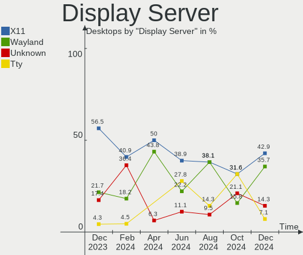
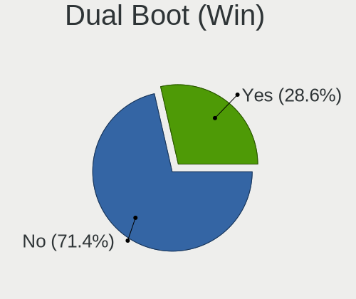
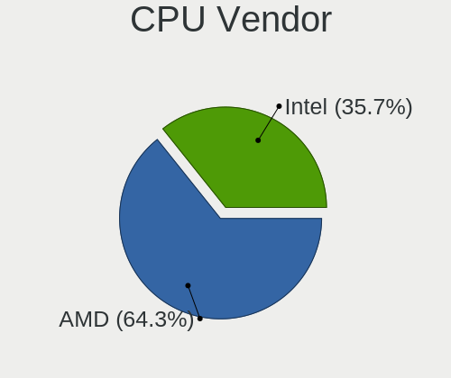

Gentoo Hardware Trends (Desktop)
--------------------------------

A project to identify most popular hardware characteristics and track their change
over time based on data collected by Gentoo users at https://Linux-Hardware.org.

Anyone can contribute to the study by uploading probes of their computers by
the [hw-probe](https://github.com/linuxhw/hw-probe) tool:

    sudo -E hw-probe -all -upload

Full-feature report is available here: https://linux-hardware.org/?view=trends&formfactor=desktop

Period: Jan, 2021.

Contents
--------

- [ OS                       ](#os)
- [ OS Family                ](#os-family)
- [ Kernel                   ](#kernel)
- [ Kernel Family            ](#kernel-family)
- [ Kernel Major Ver.        ](#kernel-major-ver)
- [ Arch                     ](#arch)
- [ DE                       ](#de)
- [ Display Server           ](#display-server)
- [ Display Manager          ](#display-manager)
- [ OS Lang                  ](#os-lang)
- [ Boot Mode                ](#boot-mode)
- [ Filesystem               ](#filesystem)
- [ Part. scheme             ](#part-scheme)
- [ Dual Boot with Linux/BSD ](#dual-boot-with-linux/bsd)
- [ Dual Boot (Win)          ](#dual-boot-win)
- [ Country                  ](#country)
- [ City                     ](#city)
- [ Vendor                   ](#vendor)
- [ Model                    ](#model)
- [ Model Family             ](#model-family)
- [ MFG Year                 ](#mfg-year)
- [ Form Factor              ](#form-factor)
- [ Secure Boot              ](#secure-boot)
- [ Coreboot                 ](#coreboot)
- [ RAM Size                 ](#ram-size)
- [ RAM Used                 ](#ram-used)
- [ Has CD-ROM               ](#has-cd-rom)
- [ Total Drives             ](#total-drives)
- [ Has Ethernet             ](#has-ethernet)
- [ Drive Vendor             ](#drive-vendor)
- [ Drive Model              ](#drive-model)
- [ HDD Vendor               ](#hdd-vendor)
- [ SSD Vendor               ](#ssd-vendor)
- [ Drive Kind               ](#drive-kind)
- [ Drive Connector          ](#drive-connector)
- [ Drive Size               ](#drive-size)
- [ Space Total              ](#space-total)
- [ Space Used               ](#space-used)
- [ Malfunc. Drives          ](#malfunc-drives)
- [ Malfunc. Drive Vendor    ](#malfunc-drive-vendor)
- [ Malfunc. HDD Vendor      ](#malfunc-hdd-vendor)
- [ Malfunc. Drive Kind      ](#malfunc-drive-kind)
- [ Failed Drives            ](#failed-drives)
- [ Failed Drive Vendor      ](#failed-drive-vendor)
- [ Drive Status             ](#drive-status)
- [ Storage Vendor           ](#storage-vendor)
- [ Storage Model            ](#storage-model)
- [ Storage Kind             ](#storage-kind)
- [ CPU Vendor               ](#cpu-vendor)
- [ CPU Model                ](#cpu-model)
- [ CPU Model Family         ](#cpu-model-family)
- [ CPU Cores                ](#cpu-cores)
- [ CPU Sockets              ](#cpu-sockets)
- [ CPU Threads              ](#cpu-threads)
- [ CPU Op-Modes             ](#cpu-op-modes)
- [ CPU Microcode            ](#cpu-microcode)
- [ CPU Microarch            ](#cpu-microarch)
- [ GPU Vendor               ](#gpu-vendor)
- [ GPU Model                ](#gpu-model)
- [ GPU Combo                ](#gpu-combo)
- [ GPU Driver               ](#gpu-driver)
- [ GPU Memory               ](#gpu-memory)
- [ Monitor Vendor           ](#monitor-vendor)
- [ Monitor Model            ](#monitor-model)
- [ Monitor Resolution       ](#monitor-resolution)
- [ Monitor Diagonal         ](#monitor-diagonal)
- [ Monitor Width            ](#monitor-width)
- [ Aspect Ratio             ](#aspect-ratio)
- [ Monitor Area             ](#monitor-area)
- [ Pixel Density            ](#pixel-density)
- [ Multiple Monitors        ](#multiple-monitors)
- [ Net Controller Vendor    ](#net-controller-vendor)
- [ Net Controller Model     ](#net-controller-model)
- [ Wireless Vendor          ](#wireless-vendor)
- [ Wireless Model           ](#wireless-model)
- [ Ethernet Vendor          ](#ethernet-vendor)
- [ Ethernet Model           ](#ethernet-model)
- [ Net Controller Kind      ](#net-controller-kind)
- [ Used Controller          ](#used-controller)
- [ NICs                     ](#nics)
- [ Memory Vendor            ](#memory-vendor)
- [ Memory Model             ](#memory-model)
- [ Memory Kind              ](#memory-kind)
- [ Memory Form Factor       ](#memory-form-factor)
- [ Memory Size              ](#memory-size)
- [ Memory Speed             ](#memory-speed)
- [ Sound Vendor             ](#sound-vendor)
- [ Sound Model              ](#sound-model)
- [ Camera Vendor            ](#camera-vendor)
- [ Camera Model             ](#camera-model)
- [ Fingerprint Vendor       ](#fingerprint-vendor)
- [ Fingerprint Model        ](#fingerprint-model)
- [ Chipcard Vendor          ](#chipcard-vendor)
- [ Chipcard Model           ](#chipcard-model)
- [ Printer Vendor           ](#printer-vendor)
- [ Printer Model            ](#printer-model)
- [ Scanner Vendor           ](#scanner-vendor)
- [ Scanner Model            ](#scanner-model)
- [ Bluetooth Vendor         ](#bluetooth-vendor)
- [ Bluetooth Model          ](#bluetooth-model)
- [ Unsupported Devices      ](#unsupported-devices)
- [ Unsupported Device Types ](#unsupported-device-types)

OS
--

Installed operating systems

| Name       | Desktops | Percent |
|------------|----------|---------|
| Gentoo     | 15       | 53.57%  |
| Gentoo 2.7 | 13       | 46.43%  |

OS Family
---------

OS without a version

| Name   | Desktops | Percent |
|--------|----------|---------|
| Gentoo | 28       | 100%    |

Kernel
------

Version of the Linux kernel

| Version                 | Desktops | Percent |
|-------------------------|----------|---------|
| 5.4.80-gentoo-r1-x86_64 | 3        | 10.71%  |
| 5.4.80-gentoo-r1        | 3        | 10.71%  |
| 5.10.7-gentoo           | 3        | 10.71%  |
| 5.10.4-gentoo           | 2        | 7.14%   |
| 5.10.2-gentoo           | 2        | 7.14%   |
| 5.9.8-gentoo-x86_64     | 1        | 3.57%   |
| 5.9.16-gentoo-x86_64    | 1        | 3.57%   |
| 5.9.11-gentoo           | 1        | 3.57%   |
| 5.8.2-gentoo            | 1        | 3.57%   |
| 5.5.0-gentoo-x86_64     | 1        | 3.57%   |
| 5.10.8-gentoo-x86_64    | 1        | 3.57%   |
| 5.10.6-gentoo-x86_64    | 1        | 3.57%   |
| 5.10.6-gentoo-mgreene   | 1        | 3.57%   |
| 5.10.6-gentoo           | 1        | 3.57%   |
| 5.10.5-gentoo-mgreene   | 1        | 3.57%   |
| 5.10.5-gentoo           | 1        | 3.57%   |
| 5.10.5                  | 1        | 3.57%   |
| 5.10.3-gentoo           | 1        | 3.57%   |
| 5.10.10-gentoo          | 1        | 3.57%   |
| 4.19.66-gentoo          | 1        | 3.57%   |

Kernel Family
-------------

Linux kernel without a distro release

| Version | Desktops | Percent |
|---------|----------|---------|
| 5.4.80  | 6        | 21.43%  |
| 5.10.7  | 3        | 10.71%  |
| 5.10.6  | 3        | 10.71%  |
| 5.10.5  | 3        | 10.71%  |
| 5.10.4  | 2        | 7.14%   |
| 5.10.2  | 2        | 7.14%   |
| 5.9.8   | 1        | 3.57%   |
| 5.9.16  | 1        | 3.57%   |
| 5.9.11  | 1        | 3.57%   |
| 5.8.2   | 1        | 3.57%   |
| 5.5.0   | 1        | 3.57%   |
| 5.10.8  | 1        | 3.57%   |
| 5.10.3  | 1        | 3.57%   |
| 5.10.10 | 1        | 3.57%   |
| 4.19.66 | 1        | 3.57%   |

Kernel Major Ver.
-----------------

Linux kernel major version

| Version | Desktops | Percent |
|---------|----------|---------|
| 5.10    | 16       | 57.14%  |
| 5.4     | 6        | 21.43%  |
| 5.9     | 3        | 10.71%  |
| 5.8     | 1        | 3.57%   |
| 5.5     | 1        | 3.57%   |
| 4.19    | 1        | 3.57%   |

Arch
----

OS architecture (x86_64, i586, etc.)

| Name   | Desktops | Percent |
|--------|----------|---------|
| x86_64 | 28       | 100%    |

DE
--

Desktop Environment

| Name       | Desktops | Percent |
|------------|----------|---------|
| Unknown    | 8        | 28.57%  |
| GNOME      | 6        | 21.43%  |
| KDE5       | 5        | 17.86%  |
| XFCE       | 4        | 14.29%  |
| KDE        | 3        | 10.71%  |
| XSession   | 1        | 3.57%   |
| X-Cinnamon | 1        | 3.57%   |

Display Server
--------------

X11 or Wayland

| Name    | Desktops | Percent |
|---------|----------|---------|
| X11     | 14       | 50%     |
| Unknown | 8        | 28.57%  |
| Tty     | 5        | 17.86%  |
| Wayland | 1        | 3.57%   |

Display Manager
---------------

SDDM, LightDM, etc.

| Name    | Desktops | Percent |
|---------|----------|---------|
| Unknown | 14       | 50%     |
| SDDM    | 6        | 21.43%  |
| GDM     | 4        | 14.29%  |
| LightDM | 2        | 7.14%   |
| SLiM    | 1        | 3.57%   |
| LXDM    | 1        | 3.57%   |

OS Lang
-------

Language

| Lang   | Desktops | Percent |
|--------|----------|---------|
| en_US  | 15       | 53.57%  |
| de_DE  | 4        | 14.29%  |
| pl_PL  | 2        | 7.14%   |
| en_GB  | 2        | 7.14%   |
| ja_JP  | 1        | 3.57%   |
| en_CA  | 1        | 3.57%   |
| de_CH  | 1        | 3.57%   |
| C.UTF8 | 1        | 3.57%   |
| C      | 1        | 3.57%   |

Boot Mode
---------

EFI or BIOS

| Mode | Desktops | Percent |
|------|----------|---------|
| EFI  | 21       | 75%     |
| BIOS | 7        | 25%     |

Filesystem
----------

Type of filesystem

| Type  | Desktops | Percent |
|-------|----------|---------|
| Ext4  | 17       | 60.71%  |
| Btrfs | 6        | 21.43%  |
| Xfs   | 3        | 10.71%  |
| Zfs   | 1        | 3.57%   |
| Jfs   | 1        | 3.57%   |

Part. scheme
------------

Scheme of partitioning

| Type    | Desktops | Percent |
|---------|----------|---------|
| GPT     | 23       | 82.14%  |
| Unknown | 4        | 14.29%  |
| MBR     | 1        | 3.57%   |

Dual Boot with Linux/BSD
------------------------

Hosting more than one Linux/BSD

| Dual boot | Desktops | Percent |
|-----------|----------|---------|
| No        | 25       | 89.29%  |
| Yes       | 3        | 10.71%  |

Dual Boot (Win)
---------------

Hosting Linux and Windows

| Dual boot | Desktops | Percent |
|-----------|----------|---------|
| No        | 20       | 71.43%  |
| Yes       | 8        | 28.57%  |

Country
-------

Geographic location (country)

| Country        | Desktops | Percent |
|----------------|----------|---------|
| USA            | 7        | 25%     |
| Germany        | 4        | 14.29%  |
| Poland         | 3        | 10.71%  |
| Slovakia       | 2        | 7.14%   |
| Belgium        | 2        | 7.14%   |
| Ukraine        | 1        | 3.57%   |
| UK             | 1        | 3.57%   |
| Switzerland    | 1        | 3.57%   |
| Netherlands    | 1        | 3.57%   |
| Japan          | 1        | 3.57%   |
| Czech Republic | 1        | 3.57%   |
| Canada         | 1        | 3.57%   |
| Bulgaria       | 1        | 3.57%   |
| Belarus        | 1        | 3.57%   |
| Austria        | 1        | 3.57%   |

City
----

Geographic location (city)

| City              | Desktops | Percent |
|-------------------|----------|---------|
| Suffolk           | 2        | 7.14%   |
| Bratislava        | 2        | 7.14%   |
| Antwerp           | 2        | 7.14%   |
| Wrocław          | 1        | 3.57%   |
| Wrentham          | 1        | 3.57%   |
| Windischgarsten   | 1        | 3.57%   |
| Waldems           | 1        | 3.57%   |
| Virginia Beach    | 1        | 3.57%   |
| Sofia             | 1        | 3.57%   |
| Sanford           | 1        | 3.57%   |
| Prague            | 1        | 3.57%   |
| Oberried          | 1        | 3.57%   |
| Munich            | 1        | 3.57%   |
| Minsk             | 1        | 3.57%   |
| Meguro-ku         | 1        | 3.57%   |
| Kyiv              | 1        | 3.57%   |
| Kloten            | 1        | 3.57%   |
| Irvine            | 1        | 3.57%   |
| Geldermalsen      | 1        | 3.57%   |
| Falkenstein       | 1        | 3.57%   |
| Cieszyn           | 1        | 3.57%   |
| Calgary           | 1        | 3.57%   |
| Bialystok         | 1        | 3.57%   |
| Belfast           | 1        | 3.57%   |
| Bainbridge Island | 1        | 3.57%   |

Vendor
------

Motherboard manufacturer

| Name                | Desktops | Percent |
|---------------------|----------|---------|
| ASUSTek Computer    | 10       | 35.71%  |
| ASRock              | 8        | 28.57%  |
| MSI                 | 4        | 14.29%  |
| Gigabyte Technology | 4        | 14.29%  |
| Hewlett-Packard     | 2        | 7.14%   |

Model
-----

Motherboard model

| Name                           | Desktops | Percent |
|--------------------------------|----------|---------|
| MSI MS-7C91                    | 1        | 3.57%   |
| MSI MS-7C34                    | 1        | 3.57%   |
| MSI MS-7971                    | 1        | 3.57%   |
| MSI MS-7640                    | 1        | 3.57%   |
| HP Z820 Workstation            | 1        | 3.57%   |
| HP Compaq 8200 Elite SFF PC    | 1        | 3.57%   |
| Gigabyte Z170X-Gaming 3        | 1        | 3.57%   |
| Gigabyte X570 I AORUS PRO WIFI | 1        | 3.57%   |
| Gigabyte GB-BACE-3000          | 1        | 3.57%   |
| Gigabyte B450M DS3H            | 1        | 3.57%   |
| ASUS TUF GAMING X570-PLUS      | 1        | 3.57%   |
| ASUS ROG ZENITH II EXTREME     | 1        | 3.57%   |
| ASUS ROG STRIX X570-I GAMING   | 1        | 3.57%   |
| ASUS ROG STRIX B550-F GAMING   | 1        | 3.57%   |
| ASUS ROG Maximus XII HERO      | 1        | 3.57%   |
| ASUS ROG Maximus XI HERO       | 1        | 3.57%   |
| ASUS PRIME X570-P              | 1        | 3.57%   |
| ASUS PRIME B460-PLUS           | 1        | 3.57%   |
| ASUS P8H67-M PRO               | 1        | 3.57%   |
| ASUS P5Q-E                     | 1        | 3.57%   |
| ASRock X570 Steel Legend       | 1        | 3.57%   |
| ASRock X370 Gaming X           | 1        | 3.57%   |
| ASRock Q1900-ITX               | 1        | 3.57%   |
| ASRock J3455-ITX               | 1        | 3.57%   |
| ASRock B550M Steel Legend      | 1        | 3.57%   |
| ASRock B450 Pro4               | 1        | 3.57%   |
| ASRock AB350M Pro4             | 1        | 3.57%   |
| ASRock 970 Pro3 R2.0           | 1        | 3.57%   |

Model Family
------------

Motherboard model prefix

| Name                  | Desktops | Percent |
|-----------------------|----------|---------|
| ASUS ROG              | 5        | 17.86%  |
| ASUS PRIME            | 2        | 7.14%   |
| MSI MS-7C91           | 1        | 3.57%   |
| MSI MS-7C34           | 1        | 3.57%   |
| MSI MS-7971           | 1        | 3.57%   |
| MSI MS-7640           | 1        | 3.57%   |
| HP Z820               | 1        | 3.57%   |
| HP Compaq             | 1        | 3.57%   |
| Gigabyte Z170X-Gaming | 1        | 3.57%   |
| Gigabyte X570         | 1        | 3.57%   |
| Gigabyte GB-BACE-3000 | 1        | 3.57%   |
| Gigabyte B450M        | 1        | 3.57%   |
| ASUS TUF              | 1        | 3.57%   |
| ASUS P8H67-M          | 1        | 3.57%   |
| ASUS P5Q-E            | 1        | 3.57%   |
| ASRock X570           | 1        | 3.57%   |
| ASRock X370           | 1        | 3.57%   |
| ASRock Q1900-ITX      | 1        | 3.57%   |
| ASRock J3455-ITX      | 1        | 3.57%   |
| ASRock B550M          | 1        | 3.57%   |
| ASRock B450           | 1        | 3.57%   |
| ASRock AB350M         | 1        | 3.57%   |
| ASRock 970            | 1        | 3.57%   |

MFG Year
--------

Motherboard manufacture year

| Year | Desktops | Percent |
|------|----------|---------|
| 2020 | 14       | 50%     |
| 2018 | 7        | 25%     |
| 2019 | 3        | 10.71%  |
| 2016 | 1        | 3.57%   |
| 2015 | 1        | 3.57%   |
| 2011 | 1        | 3.57%   |
| 2009 | 1        | 3.57%   |

Form Factor
-----------

Physical design of the computer

| Name    | Desktops | Percent |
|---------|----------|---------|
| Desktop | 28       | 100%    |

Secure Boot
-----------

Enabled or disabled

| State    | Desktops | Percent |
|----------|----------|---------|
| Disabled | 28       | 100%    |

Coreboot
--------

Have coreboot on board

| Used | Desktops | Percent |
|------|----------|---------|
| No   | 28       | 100%    |

RAM Size
--------

Total RAM memory

| Size in GB  | Desktops | Percent |
|-------------|----------|---------|
| 32.01-64.0  | 12       | 42.86%  |
| 64.01-256.0 | 6        | 21.43%  |
| 16.01-24.0  | 6        | 21.43%  |
| 8.01-16.0   | 2        | 7.14%   |
| 24.01-32.0  | 1        | 3.57%   |
| 1.01-2.0    | 1        | 3.57%   |

RAM Used
--------

Used RAM memory

| Used GB    | Desktops | Percent |
|------------|----------|---------|
| 4.01-8.0   | 6        | 21.43%  |
| 3.01-4.0   | 6        | 21.43%  |
| 8.01-16.0  | 5        | 17.86%  |
| 1.01-2.0   | 4        | 14.29%  |
| 2.01-3.0   | 3        | 10.71%  |
| 0.01-0.5   | 3        | 10.71%  |
| 32.01-64.0 | 1        | 3.57%   |

Has CD-ROM
----------

Has CD-ROM on board

| Presented | Desktops | Percent |
|-----------|----------|---------|
| No        | 19       | 67.86%  |
| Yes       | 9        | 32.14%  |

Total Drives
------------

Number of drives on board

| Drives | Desktops | Percent |
|--------|----------|---------|
| 2      | 11       | 39.29%  |
| 1      | 6        | 21.43%  |
| 3      | 5        | 17.86%  |
| 4      | 3        | 10.71%  |
| 6      | 2        | 7.14%   |
| 5      | 1        | 3.57%   |

Has Ethernet
------------

Has Ethernet on board

| Presented | Desktops | Percent |
|-----------|----------|---------|
| Yes       | 28       | 100%    |

Drive Vendor
------------

Hard drive vendors

| Vendor              | Desktops | Drives | Percent |
|---------------------|----------|--------|---------|
| WDC                 | 13       | 16     | 24.53%  |
| Samsung Electronics | 11       | 12     | 20.75%  |
| Seagate             | 9        | 15     | 16.98%  |
| Kingston            | 3        | 4      | 5.66%   |
| HGST                | 3        | 5      | 5.66%   |
| Toshiba             | 2        | 3      | 3.77%   |
| SanDisk             | 2        | 2      | 3.77%   |
| Corsair             | 2        | 3      | 3.77%   |
| A-DATA Technology   | 2        | 3      | 3.77%   |
| Team                | 1        | 1      | 1.89%   |
| Kingchuxing         | 1        | 1      | 1.89%   |
| Intel               | 1        | 1      | 1.89%   |
| Hitachi             | 1        | 1      | 1.89%   |
| GOODRAM             | 1        | 1      | 1.89%   |
| Crucial             | 1        | 2      | 1.89%   |

Drive Model
-----------

Hard drive models

| Model                                       | Desktops | Percent |
|---------------------------------------------|----------|---------|
| WDC WD20EFRX-68EUZN0 2TB                    | 2        | 3.45%   |
| Seagate ST2000DM006-2DM164 2TB              | 2        | 3.45%   |
| Samsung SSD 970 EVO 1TB                     | 2        | 3.45%   |
| Samsung NVMe SSD Drive 500GB                | 2        | 3.45%   |
| WDC WDS512G1X0C-00ENX0 512GB                | 1        | 1.72%   |
| WDC WDS500G3X0C-00SJG0 500GB                | 1        | 1.72%   |
| WDC WDS500G2B0C-00PXH0 500GB                | 1        | 1.72%   |
| WDC WDS500G2B0A-00SM50 500GB SSD            | 1        | 1.72%   |
| WDC WDS100T3X0C-00SJG0 1TB                  | 1        | 1.72%   |
| WDC WD5002ABYS-02B1B0 500GB                 | 1        | 1.72%   |
| WDC WD5000BPVT-22HXZT3 500GB                | 1        | 1.72%   |
| WDC WD5000BEVT-80A0RT0 500GB                | 1        | 1.72%   |
| WDC WD3200BPVT-22JJ5T0 320GB                | 1        | 1.72%   |
| WDC WD20EZRZ-00Z5HB0 2TB                    | 1        | 1.72%   |
| WDC WD20EZRX-00D8PB0 2TB                    | 1        | 1.72%   |
| WDC WD10EADS-00L5B1 1TB                     | 1        | 1.72%   |
| WDC WD1003FZEX-00MK2A0 1TB                  | 1        | 1.72%   |
| Toshiba MQ01ACF050 500GB                    | 1        | 1.72%   |
| Toshiba HDWR180 8TB                         | 1        | 1.72%   |
| Team TM8FP2240G 240GB                       | 1        | 1.72%   |
| Seagate ST8000NM0055-1RM112 8TB             | 1        | 1.72%   |
| Seagate ST500DM002-1BD142 500GB             | 1        | 1.72%   |
| Seagate ST4000VN008-2DR166 4TB              | 1        | 1.72%   |
| Seagate ST4000NM0245-1Z2107 4TB             | 1        | 1.72%   |
| Seagate ST2000DM001-1ER164 2TB              | 1        | 1.72%   |
| Seagate ST1000DM003-1ER162 1TB              | 1        | 1.72%   |
| Seagate ST1000DM003-1CH162 1TB              | 1        | 1.72%   |
| Seagate FireCuda 520 SSD ZP500GM30002 500GB | 1        | 1.72%   |
| SanDisk SSD G5 BICS4 1TB                    | 1        | 1.72%   |
| SanDisk SDSSDH3 1T00 1TB                    | 1        | 1.72%   |
| Samsung SSD 970 EVO 500GB                   | 1        | 1.72%   |
| Samsung SSD 970 EVO 250GB                   | 1        | 1.72%   |
| Samsung SSD 960 EVO 500GB                   | 1        | 1.72%   |
| Samsung SSD 860 QVO 4TB                     | 1        | 1.72%   |
| Samsung SSD 860 EVO 500GB                   | 1        | 1.72%   |
| Samsung SSD 860 EVO 2TB                     | 1        | 1.72%   |
| Samsung SSD 860 EVO 1TB                     | 1        | 1.72%   |
| Samsung SSD 850 EVO 250GB                   | 1        | 1.72%   |
| Kingston SUV400S37120G 120GB SSD            | 1        | 1.72%   |
| Kingston SA2000M8250G 250GB                 | 1        | 1.72%   |
| Kingston SA2000M81000G 1TB                  | 1        | 1.72%   |
| Kingchuxing 512GB                           | 1        | 1.72%   |
| Intel SSDPEKNW020T8 2TB                     | 1        | 1.72%   |
| Hitachi HTS545050B9SA02 500GB               | 1        | 1.72%   |
| HGST HUS726040ALE614 4TB                    | 1        | 1.72%   |
| HGST HUH721212ALE604 12TB                   | 1        | 1.72%   |
| HGST HMS5C4040BLE640 4TB                    | 1        | 1.72%   |
| GOODRAM IRP-SSDPR-S25C-512 512GB            | 1        | 1.72%   |
| Crucial CT275MX300SSD1 275GB                | 1        | 1.72%   |
| Corsair Force MP600 1TB                     | 1        | 1.72%   |
| Corsair Force MP510 480GB                   | 1        | 1.72%   |
| A-DATA SX8200PNP 512GB                      | 1        | 1.72%   |
| A-DATA SX8200PNP 1TB                        | 1        | 1.72%   |
| A-DATA SU900 512GB SSD                      | 1        | 1.72%   |

HDD Vendor
----------

Hard disk drive vendors

| Vendor  | Desktops | Drives | Percent |
|---------|----------|--------|---------|
| WDC     | 9        | 11     | 39.13%  |
| Seagate | 8        | 14     | 34.78%  |
| HGST    | 3        | 5      | 13.04%  |
| Toshiba | 2        | 3      | 8.7%    |
| Hitachi | 1        | 1      | 4.35%   |

SSD Vendor
----------

Solid state drive vendors

| Vendor              | Desktops | Drives | Percent |
|---------------------|----------|--------|---------|
| Samsung Electronics | 5        | 5      | 41.67%  |
| SanDisk             | 2        | 2      | 16.67%  |
| WDC                 | 1        | 1      | 8.33%   |
| Kingston            | 1        | 1      | 8.33%   |
| GOODRAM             | 1        | 1      | 8.33%   |
| Crucial             | 1        | 2      | 8.33%   |
| A-DATA Technology   | 1        | 1      | 8.33%   |

Drive Kind
----------

HDD or SSD

| Kind | Desktops | Drives | Percent |
|------|----------|--------|---------|
| HDD  | 19       | 34     | 41.3%   |
| NVMe | 17       | 23     | 36.96%  |
| SSD  | 10       | 13     | 21.74%  |

Drive Connector
---------------

SATA, SAS, NVMe, etc.

| Type | Desktops | Drives | Percent |
|------|----------|--------|---------|
| SATA | 24       | 47     | 58.54%  |
| NVMe | 17       | 23     | 41.46%  |

Drive Size
----------

Size of hard drive

| Size in TB | Desktops | Drives | Percent |
|------------|----------|--------|---------|
| 0.01-0.5   | 10       | 13     | 34.48%  |
| 1.01-2.0   | 8        | 10     | 27.59%  |
| 0.51-1.0   | 5        | 12     | 17.24%  |
| 3.01-4.0   | 4        | 7      | 13.79%  |
| 10.01-20.0 | 1        | 1      | 3.45%   |
| 4.01-10.0  | 1        | 4      | 3.45%   |

Space Total
-----------

Amount of disk space available on the file system

| Size in GB     | Desktops | Percent |
|----------------|----------|---------|
| More than 3000 | 8        | 28.57%  |
| 251-500        | 4        | 14.29%  |
| 501-1000       | 4        | 14.29%  |
| 2001-3000      | 3        | 10.71%  |
| 1001-2000      | 3        | 10.71%  |
| 101-250        | 2        | 7.14%   |
| Unknown        | 2        | 7.14%   |
| 21-50          | 1        | 3.57%   |
| 51-100         | 1        | 3.57%   |

Space Used
----------

Amount of used disk space

| Used GB        | Desktops | Percent |
|----------------|----------|---------|
| 1001-2000      | 6        | 21.43%  |
| 251-500        | 4        | 14.29%  |
| 101-250        | 3        | 10.71%  |
| 501-1000       | 3        | 10.71%  |
| More than 3000 | 2        | 7.14%   |
| 21-50          | 2        | 7.14%   |
| 2001-3000      | 2        | 7.14%   |
| 1-20           | 2        | 7.14%   |
| 51-100         | 2        | 7.14%   |
| Unknown        | 2        | 7.14%   |

Malfunc. Drives
---------------

Drive models with a malfunction

| Model                           | Desktops | Drives | Percent |
|---------------------------------|----------|--------|---------|
| WDC WD1003FZEX-00MK2A0 1TB      | 1        | 1      | 50%     |
| Seagate ST500DM002-1BD142 500GB | 1        | 1      | 50%     |

Malfunc. Drive Vendor
---------------------

Vendors of faulty drives

| Vendor  | Desktops | Drives | Percent |
|---------|----------|--------|---------|
| WDC     | 1        | 1      | 50%     |
| Seagate | 1        | 1      | 50%     |

Malfunc. HDD Vendor
-------------------

Vendors of faulty HDD drives

| Vendor  | Desktops | Drives | Percent |
|---------|----------|--------|---------|
| WDC     | 1        | 1      | 50%     |
| Seagate | 1        | 1      | 50%     |

Malfunc. Drive Kind
-------------------

Kinds of faulty drives

| Kind | Desktops | Drives | Percent |
|------|----------|--------|---------|
| HDD  | 2        | 2      | 100%    |

Failed Drives
-------------

Failed drive models

Zero info for selected period =(

Failed Drive Vendor
-------------------

Failed drive vendors

Zero info for selected period =(

Drive Status
------------

Number of failed and malfunc. drives

| Status   | Desktops | Drives | Percent |
|----------|----------|--------|---------|
| Works    | 23       | 58     | 76.67%  |
| Detected | 5        | 10     | 16.67%  |
| Malfunc  | 2        | 2      | 6.67%   |

Storage Vendor
--------------

Storage controller vendors

| Vendor                      | Desktops | Percent |
|-----------------------------|----------|---------|
| AMD                         | 16       | 28.57%  |
| Intel                       | 13       | 23.21%  |
| Samsung Electronics         | 6        | 10.71%  |
| ASMedia Technology          | 5        | 8.93%   |
| Sandisk                     | 4        | 7.14%   |
| Phison Electronics          | 3        | 5.36%   |
| Kingston Technology Company | 2        | 3.57%   |
| ADATA Technology            | 2        | 3.57%   |
| Silicon Motion              | 1        | 1.79%   |
| Seagate Technology          | 1        | 1.79%   |
| LSI Logic / Symbios Logic   | 1        | 1.79%   |
| JMicron Technology          | 1        | 1.79%   |
| Broadcom / LSI              | 1        | 1.79%   |

Storage Model
-------------

Storage controller models

| Model                                                                            | Desktops | Percent |
|----------------------------------------------------------------------------------|----------|---------|
| AMD FCH SATA Controller [AHCI mode]                                              | 10       | 16.13%  |
| ASMedia ASM1062 Serial ATA Controller                                            | 5        | 8.06%   |
| Samsung NVMe SSD Controller SM981/PM981/PM983                                    | 4        | 6.45%   |
| AMD SATA controller                                                              | 3        | 4.84%   |
| Kingston Company A2000 NVMe SSD                                                  | 2        | 3.23%   |
| Intel Q170/Q150/B150/H170/H110/Z170/CM236 Chipset SATA Controller [AHCI Mode]    | 2        | 3.23%   |
| Intel 6 Series/C200 Series Chipset Family 6 port Desktop SATA AHCI Controller    | 2        | 3.23%   |
| Intel 400 Series Chipset Family SATA AHCI Controller                             | 2        | 3.23%   |
| AMD 400 Series Chipset SATA Controller                                           | 2        | 3.23%   |
| ADATA XPG SX8200 Pro PCIe Gen3x4 M.2 2280 Solid State Drive                      | 2        | 3.23%   |
| Silicon Motion SM2263EN/SM2263XT SSD Controller                                  | 1        | 1.61%   |
| Seagate Non-Volatile memory controller                                           | 1        | 1.61%   |
| Sandisk WD Blue SN550 NVMe SSD                                                   | 1        | 1.61%   |
| Sandisk WD Black SN750 / PC SN730 NVMe SSD                                       | 1        | 1.61%   |
| Sandisk WD Black NVMe SSD                                                        | 1        | 1.61%   |
| Sandisk WD Black 2018 / PC SN720 NVMe SSD                                        | 1        | 1.61%   |
| Samsung NVMe SSD Controller SM961/PM961/SM963                                    | 1        | 1.61%   |
| Samsung Electronics Non-Volatile memory controller                               | 1        | 1.61%   |
| Phison E7 NVMe Controller                                                        | 1        | 1.61%   |
| Phison E16 PCIe4 NVMe Controller                                                 | 1        | 1.61%   |
| Phison E12 NVMe Controller                                                       | 1        | 1.61%   |
| LSI Logic / Symbios Logic MegaRAID SAS 2108 [Liberator]                          | 1        | 1.61%   |
| JMicron JMB362 SATA Controller                                                   | 1        | 1.61%   |
| Intel SSD 660P Series                                                            | 1        | 1.61%   |
| Intel Celeron N3350/Pentium N4200/Atom E3900 Series SATA AHCI Controller         | 1        | 1.61%   |
| Intel Cannon Lake PCH SATA AHCI Controller                                       | 1        | 1.61%   |
| Intel C602 chipset 4-Port SATA Storage Control Unit                              | 1        | 1.61%   |
| Intel C600/X79 series chipset SATA RAID Controller                               | 1        | 1.61%   |
| Intel C600/X79 series chipset IDE-r Controller                                   | 1        | 1.61%   |
| Intel Atom/Celeron/Pentium Processor x5-E8000/J3xxx/N3xxx Series SATA Controller | 1        | 1.61%   |
| Intel Atom Processor E3800 Series SATA AHCI Controller                           | 1        | 1.61%   |
| Intel 82801JI (ICH10 Family) SATA AHCI Controller                                | 1        | 1.61%   |
| Broadcom / LSI SAS2308 PCI-Express Fusion-MPT SAS-2                              | 1        | 1.61%   |
| AMD X370 Series Chipset SATA Controller                                          | 1        | 1.61%   |
| AMD SB7x0/SB8x0/SB9x0 SATA Controller [IDE mode]                                 | 1        | 1.61%   |
| AMD SB7x0/SB8x0/SB9x0 SATA Controller [AHCI mode]                                | 1        | 1.61%   |
| AMD SB7x0/SB8x0/SB9x0 IDE Controller                                             | 1        | 1.61%   |
| AMD 300 Series Chipset SATA Controller                                           | 1        | 1.61%   |

Storage Kind
------------

Kind of storage controller (IDE, SATA, NVMe, SAS, ...)

| Kind | Desktops | Percent |
|------|----------|---------|
| SATA | 27       | 55.1%   |
| NVMe | 17       | 34.69%  |
| RAID | 2        | 4.08%   |
| IDE  | 2        | 4.08%   |
| SAS  | 1        | 2.04%   |

CPU Vendor
----------

Processor vendors

| Vendor | Desktops | Percent |
|--------|----------|---------|
| AMD    | 16       | 57.14%  |
| Intel  | 12       | 42.86%  |

CPU Model
---------

Processor models

| Model                                          | Desktops | Percent |
|------------------------------------------------|----------|---------|
| AMD Ryzen 9 3900X 12-Core Processor            | 3        | 10.71%  |
| AMD Ryzen 5 5600X 6-Core Processor             | 3        | 10.71%  |
| Intel Core i7-2600 CPU @ 3.40GHz               | 2        | 7.14%   |
| Intel Core i5-6500 CPU @ 3.20GHz               | 2        | 7.14%   |
| AMD Ryzen 7 3800X 8-Core Processor             | 2        | 7.14%   |
| AMD Ryzen 7 3700X 8-Core Processor             | 2        | 7.14%   |
| Intel Xeon CPU X5470 @ 3.33GHz                 | 1        | 3.57%   |
| Intel Xeon CPU E5-2690 0 @ 2.90GHz             | 1        | 3.57%   |
| Intel Core i7-8700K CPU @ 3.70GHz              | 1        | 3.57%   |
| Intel Core i7-10700K CPU @ 3.80GHz             | 1        | 3.57%   |
| Intel Core i5-10600KF CPU @ 4.10GHz            | 1        | 3.57%   |
| Intel Celeron CPU N3000 @ 1.04GHz              | 1        | 3.57%   |
| Intel Celeron CPU J3455 @ 1.50GHz              | 1        | 3.57%   |
| Intel Celeron CPU J1900 @ 1.99GHz              | 1        | 3.57%   |
| AMD Ryzen Threadripper 3960X 24-Core Processor | 1        | 3.57%   |
| AMD Ryzen 9 3950X 16-Core Processor            | 1        | 3.57%   |
| AMD Ryzen 5 3600 6-Core Processor              | 1        | 3.57%   |
| AMD Ryzen 5 1600 Six-Core Processor            | 1        | 3.57%   |
| AMD FX-8150 Eight-Core Processor               | 1        | 3.57%   |
| AMD FX-6300 Six-Core Processor                 | 1        | 3.57%   |

CPU Model Family
----------------

Processor model prefix

| Model                  | Desktops | Percent |
|------------------------|----------|---------|
| AMD Ryzen 5            | 5        | 17.86%  |
| Intel Core i7          | 4        | 14.29%  |
| AMD Ryzen 9            | 4        | 14.29%  |
| AMD Ryzen 7            | 4        | 14.29%  |
| Intel Core i5          | 3        | 10.71%  |
| Intel Celeron          | 3        | 10.71%  |
| Intel Xeon             | 2        | 7.14%   |
| AMD FX                 | 2        | 7.14%   |
| AMD Ryzen Threadripper | 1        | 3.57%   |

CPU Cores
---------

Number of processor cores

| Number | Desktops | Percent |
|--------|----------|---------|
| 4      | 8        | 28.57%  |
| 6      | 7        | 25%     |
| 8      | 5        | 17.86%  |
| 12     | 3        | 10.71%  |
| 16     | 2        | 7.14%   |
| 24     | 1        | 3.57%   |
| 3      | 1        | 3.57%   |
| 2      | 1        | 3.57%   |

CPU Sockets
-----------

Number of sockets

| Number | Desktops | Percent |
|--------|----------|---------|
| 1      | 27       | 96.43%  |
| 2      | 1        | 3.57%   |

CPU Threads
-----------

Threads per core (Hyper-Threading)

| Number | Desktops | Percent |
|--------|----------|---------|
| 2      | 22       | 78.57%  |
| 1      | 6        | 21.43%  |

CPU Op-Modes
------------

CPU Operation Modes (32-bit, 64-bit)

| Op mode        | Desktops | Percent |
|----------------|----------|---------|
| 32-bit, 64-bit | 28       | 100%    |

CPU Microcode
-------------

Microcode number

| Number     | Desktops | Percent |
|------------|----------|---------|
| 0x08701021 | 5        | 17.86%  |
| Unknown    | 5        | 17.86%  |
| 0x0a201009 | 3        | 10.71%  |
| 0xa0655    | 2        | 7.14%   |
| 0x506e3    | 2        | 7.14%   |
| 0x906ea    | 1        | 3.57%   |
| 0x506c9    | 1        | 3.57%   |
| 0x406c3    | 1        | 3.57%   |
| 0x30673    | 1        | 3.57%   |
| 0x206d7    | 1        | 3.57%   |
| 0x206a7    | 1        | 3.57%   |
| 0x1067a    | 1        | 3.57%   |
| 0x08701013 | 1        | 3.57%   |
| 0x08301039 | 1        | 3.57%   |
| 0x08001138 | 1        | 3.57%   |
| 0x06000817 | 1        | 3.57%   |

CPU Microarch
-------------

Microarchitecture

| Name        | Desktops | Percent |
|-------------|----------|---------|
| Zen 2       | 10       | 35.71%  |
| SandyBridge | 3        | 10.71%  |
| Unknown     | 3        | 10.71%  |
| Skylake     | 2        | 7.14%   |
| Silvermont  | 2        | 7.14%   |
| CometLake   | 2        | 7.14%   |
| Zen         | 1        | 3.57%   |
| Piledriver  | 1        | 3.57%   |
| Penryn      | 1        | 3.57%   |
| KabyLake    | 1        | 3.57%   |
| Goldmont    | 1        | 3.57%   |
| Bulldozer   | 1        | 3.57%   |

GPU Vendor
----------

Vendors of graphics cards

| Vendor | Desktops | Percent |
|--------|----------|---------|
| AMD    | 14       | 50%     |
| Nvidia | 9        | 32.14%  |
| Intel  | 5        | 17.86%  |

GPU Model
---------

Graphics card models

| Model                                                                                    | Desktops | Percent |
|------------------------------------------------------------------------------------------|----------|---------|
| AMD Ellesmere [Radeon RX 470/480/570/570X/580/580X/590]                                  | 5        | 17.24%  |
| AMD Navi 10 [Radeon RX 5600 OEM/5600 XT / 5700/5700 XT]                                  | 4        | 13.79%  |
| Nvidia GP107 [GeForce GTX 1050 Ti]                                                       | 2        | 6.9%    |
| Intel 2nd Generation Core Processor Family Integrated Graphics Controller                | 2        | 6.9%    |
| Nvidia TU117 [GeForce GTX 1650]                                                          | 1        | 3.45%   |
| Nvidia TU116 [GeForce GTX 1660]                                                          | 1        | 3.45%   |
| Nvidia TU116 [GeForce GTX 1660 Ti]                                                       | 1        | 3.45%   |
| Nvidia TU104 [GeForce RTX 2070 SUPER]                                                    | 1        | 3.45%   |
| Nvidia GP104 [GeForce GTX 1070]                                                          | 1        | 3.45%   |
| Nvidia GM206 [GeForce GTX 960]                                                           | 1        | 3.45%   |
| Nvidia GM107 [GeForce GTX 750 Ti]                                                        | 1        | 3.45%   |
| Intel HD Graphics 500                                                                    | 1        | 3.45%   |
| Intel Atom/Celeron/Pentium Processor x5-E8000/J3xxx/N3xxx Integrated Graphics Controller | 1        | 3.45%   |
| Intel Atom Processor Z36xxx/Z37xxx Series Graphics & Display                             | 1        | 3.45%   |
| AMD Vega 10 XL/XT [Radeon RX Vega 56/64]                                                 | 1        | 3.45%   |
| AMD Tobago PRO [Radeon R7 360 / R9 360 OEM]                                              | 1        | 3.45%   |
| AMD Tahiti XT [Radeon HD 7970/8970 OEM / R9 280X]                                        | 1        | 3.45%   |
| AMD Oland PRO [Radeon R7 240/340]                                                        | 1        | 3.45%   |
| AMD Lexa PRO [Radeon 540/540X/550/550X / RX 540X/550/550X]                               | 1        | 3.45%   |
| AMD Baffin [Radeon RX 550 640SP / RX 560/560X]                                           | 1        | 3.45%   |

GPU Combo
---------

Combinations of graphics cards

| Name       | Desktops | Percent |
|------------|----------|---------|
| 1 x AMD    | 13       | 46.43%  |
| 1 x Nvidia | 9        | 32.14%  |
| 1 x Intel  | 5        | 17.86%  |
| 2 x AMD    | 1        | 3.57%   |

GPU Driver
----------

Free vs proprietary

| Driver      | Desktops | Percent |
|-------------|----------|---------|
| Free        | 18       | 64.29%  |
| Proprietary | 7        | 25%     |
| Unknown     | 3        | 10.71%  |

GPU Memory
----------

Total video memory

| Size in GB | Desktops | Percent |
|------------|----------|---------|
| Unknown    | 9        | 32.14%  |
| 7.01-8.0   | 8        | 28.57%  |
| 3.01-4.0   | 6        | 21.43%  |
| 5.01-6.0   | 2        | 7.14%   |
| 1.01-2.0   | 2        | 7.14%   |
| 0.51-1.0   | 1        | 3.57%   |

Monitor Vendor
--------------

Monitor vendors

| Vendor                  | Desktops | Percent |
|-------------------------|----------|---------|
| Dell                    | 5        | 17.86%  |
| Goldstar                | 4        | 14.29%  |
| ViewSonic               | 2        | 7.14%   |
| MSI                     | 2        | 7.14%   |
| Idek Iiyama             | 2        | 7.14%   |
| BenQ                    | 2        | 7.14%   |
| AOC                     | 2        | 7.14%   |
| Ancor Communications    | 2        | 7.14%   |
| Samsung Electronics     | 1        | 3.57%   |
| Iiyama                  | 1        | 3.57%   |
| Hewlett-Packard         | 1        | 3.57%   |
| Eizo                    | 1        | 3.57%   |
| Chi Mei Optoelectronics | 1        | 3.57%   |
| ASUSTek Computer        | 1        | 3.57%   |
| Acer                    | 1        | 3.57%   |

Monitor Model
-------------

Monitor models

| Model                                                                  | Desktops | Percent |
|------------------------------------------------------------------------|----------|---------|
| ViewSonic VP2770 SERIES VSC832B 2560x1440 597x336mm 27.0-inch          | 1        | 3.57%   |
| ViewSonic VG3448 VSC0D38 3440x1440 800x330mm 34.1-inch                 | 1        | 3.57%   |
| Samsung Electronics C49HG9x SAM0E5D 3840x1080 1200x340mm 49.1-inch     | 1        | 3.57%   |
| MSI Optix MAG27CQ MSI1462 2560x1440 597x336mm 27.0-inch                | 1        | 3.57%   |
| MSI MAG241C MSI3EA2 1920x1080 521x293mm 23.5-inch                      | 1        | 3.57%   |
| Iiyama PL2480H IVM610B 1920x1080 520x290mm 23.4-inch                   | 1        | 3.57%   |
| Idek Iiyama LCD Monitor PLE2607WS                                      | 1        | 3.57%   |
| Idek Iiyama LCD Monitor PL2792UH 3840x2160                             | 1        | 3.57%   |
| Hewlett-Packard E243i HPN3462 1920x1200 518x324mm 24.1-inch            | 1        | 3.57%   |
| Goldstar ULTRAWIDE GSM76F6 3440x1440 800x335mm 34.1-inch               | 1        | 3.57%   |
| Goldstar ULTRAWIDE GSM76E4 3440x1440 800x335mm 34.1-inch               | 1        | 3.57%   |
| Goldstar HDR 4K GSM7707 3840x2160 600x340mm 27.2-inch                  | 1        | 3.57%   |
| Goldstar E2370 GSM580F 1680x1050 510x290mm 23.1-inch                   | 1        | 3.57%   |
| Eizo EV2450 ENC2530 1920x1080 528x297mm 23.9-inch                      | 1        | 3.57%   |
| Dell U2515H DELD06F 2560x1440 553x311mm 25.0-inch                      | 1        | 3.57%   |
| Dell S2721QS DELA198 3840x2160 597x336mm 27.0-inch                     | 1        | 3.57%   |
| Dell LCD Monitor U2412M 3840x1200                                      | 1        | 3.57%   |
| Dell LCD Monitor 2209WA 1680x1050                                      | 1        | 3.57%   |
| Dell E207WFP DELD011 1680x1050 430x270mm 20.0-inch                     | 1        | 3.57%   |
| Chi Mei Optoelectronics CMC 19AW CMO2198 1440x900 408x255mm 18.9-inch  | 1        | 3.57%   |
| BenQ GW2780 BNQ78E6 1920x1080 598x336mm 27.0-inch                      | 1        | 3.57%   |
| BenQ E2200HD BNQ790C 1920x1080 477x268mm 21.5-inch                     | 1        | 3.57%   |
| ASUSTek Computer VP249 AUS24AF 1920x1080 527x296mm 23.8-inch           | 1        | 3.57%   |
| AOC U2777B AOC2777 3840x2160 597x336mm 27.0-inch                       | 1        | 3.57%   |
| AOC 2481W AOC2481 1920x1080 527x296mm 23.8-inch                        | 1        | 3.57%   |
| Ancor Communications ASUS PB287Q ACI28A3 1920x1080 620x340mm 27.8-inch | 1        | 3.57%   |
| Ancor Communications ASUS PA238 ACI23B1 1920x1080 509x286mm 23.0-inch  | 1        | 3.57%   |
| Acer XB273K GP ACR071C 3840x2160 597x336mm 27.0-inch                   | 1        | 3.57%   |

Monitor Resolution
------------------

Monitor screen resolution

| Resolution         | Desktops | Percent |
|--------------------|----------|---------|
| 1920x1080 (FHD)    | 9        | 34.62%  |
| 3840x2160 (4K)     | 5        | 19.23%  |
| 3440x1440          | 4        | 15.38%  |
| 2560x1440 (QHD)    | 2        | 7.69%   |
| 1680x1050 (WSXGA+) | 2        | 7.69%   |
| 3840x1200          | 1        | 3.85%   |
| 3840x1080          | 1        | 3.85%   |
| 1440x900 (WXGA+)   | 1        | 3.85%   |
| Unknown            | 1        | 3.85%   |

Monitor Diagonal
----------------

Diagonal size in inches

| Inches  | Desktops | Percent |
|---------|----------|---------|
| 27      | 6        | 24%     |
| 23      | 5        | 20%     |
| 34      | 4        | 16%     |
| Unknown | 3        | 12%     |
| 24      | 2        | 8%      |
| 49      | 1        | 4%      |
| 25      | 1        | 4%      |
| 21      | 1        | 4%      |
| 20      | 1        | 4%      |
| 19      | 1        | 4%      |

Monitor Width
-------------

Physical width

| Width in mm | Desktops | Percent |
|-------------|----------|---------|
| 501-600     | 13       | 54.17%  |
| 701-800     | 4        | 16.67%  |
| Unknown     | 3        | 12.5%   |
| 401-500     | 2        | 8.33%   |
| 601-700     | 1        | 4.17%   |
| 1001-1500   | 1        | 4.17%   |

Aspect Ratio
------------

Proportional relationship between the width and the height

| Ratio   | Desktops | Percent |
|---------|----------|---------|
| 16/9    | 14       | 56%     |
| 21/9    | 4        | 16%     |
| 16/10   | 3        | 12%     |
| Unknown | 3        | 12%     |
| 32/9    | 1        | 4%      |

Monitor Area
------------

Area in inch²

| Area in inch² | Desktops | Percent |
|----------------|----------|---------|
| 301-350        | 6        | 25%     |
| 201-250        | 6        | 25%     |
| 351-500        | 4        | 16.67%  |
| Unknown        | 3        | 12.5%   |
| 251-300        | 2        | 8.33%   |
| 151-200        | 2        | 8.33%   |
| 501-1000       | 1        | 4.17%   |

Pixel Density
-------------

Pixels per inch

| Density | Desktops | Percent |
|---------|----------|---------|
| 51-100  | 10       | 41.67%  |
| 101-120 | 7        | 29.17%  |
| 161-240 | 3        | 12.5%   |
| Unknown | 3        | 12.5%   |
| 121-160 | 1        | 4.17%   |

Multiple Monitors
-----------------

Total monitors connected

| Total | Desktops | Percent |
|-------|----------|---------|
| 1     | 19       | 67.86%  |
| 2     | 5        | 17.86%  |
| 0     | 4        | 14.29%  |

Net Controller Vendor
---------------------

Controller vendors

| Vendor                         | Desktops | Percent |
|--------------------------------|----------|---------|
| Realtek Semiconductor          | 16       | 44.44%  |
| Intel                          | 13       | 36.11%  |
| Aquantia                       | 3        | 8.33%   |
| TP-Link                        | 1        | 2.78%   |
| Qualcomm Atheros               | 1        | 2.78%   |
| Marvell Technology Group       | 1        | 2.78%   |
| Broadcom Inc. and subsidiaries | 1        | 2.78%   |

Net Controller Model
--------------------

Controller models

| Model                                                                         | Desktops | Percent |
|-------------------------------------------------------------------------------|----------|---------|
| Realtek RTL8111/8168/8411 PCI Express Gigabit Ethernet Controller             | 14       | 29.79%  |
| Intel Wi-Fi 6 AX200                                                           | 6        | 12.77%  |
| Intel I211 Gigabit Network Connection                                         | 5        | 10.64%  |
| Realtek RTL8125 2.5GbE Controller                                             | 2        | 4.26%   |
| Intel 82579LM Gigabit Network Connection (Lewisville)                         | 2        | 4.26%   |
| Aquantia AQC107 NBase-T/IEEE 802.3bz Ethernet Controller [AQtion]             | 2        | 4.26%   |
| TP-Link AC600 wireless Realtek RTL8811AU [Archer T2U Nano]                    | 1        | 2.13%   |
| Realtek RTL8153 Gigabit Ethernet Adapter                                      | 1        | 2.13%   |
| Realtek Killer E3000 2.5GbE Controller                                        | 1        | 2.13%   |
| Realtek Killer E2600 Gigabit Ethernet Controller                              | 1        | 2.13%   |
| Qualcomm Atheros Killer E220x Gigabit Ethernet Controller                     | 1        | 2.13%   |
| Marvell Group 88E8056 PCI-E Gigabit Ethernet Controller                       | 1        | 2.13%   |
| Intel Wireless-AC 9560 [Jefferson Peak]                                       | 1        | 2.13%   |
| Intel Wireless 3160                                                           | 1        | 2.13%   |
| Intel Ethernet Controller I225-V                                              | 1        | 2.13%   |
| Intel Ethernet Connection (7) I219-V                                          | 1        | 2.13%   |
| Intel Ethernet Connection (11) I219-V                                         | 1        | 2.13%   |
| Intel Comet Lake PCH CNVi WiFi                                                | 1        | 2.13%   |
| Intel 82574L Gigabit Network Connection                                       | 1        | 2.13%   |
| Intel 82571EB/82571GB Gigabit Ethernet Controller D0/D1 (copper applications) | 1        | 2.13%   |
| Broadcom Inc. and subsidiaries NetXtreme II BCM5709 Gigabit Ethernet          | 1        | 2.13%   |
| Aquantia AQC111 NBase-T/IEEE 802.3bz Ethernet Controller [AQtion]             | 1        | 2.13%   |

Wireless Vendor
---------------

Wireless vendors

| Vendor  | Desktops | Percent |
|---------|----------|---------|
| Intel   | 9        | 90%     |
| TP-Link | 1        | 10%     |

Wireless Model
--------------

Wireless models

| Model                                                      | Desktops | Percent |
|------------------------------------------------------------|----------|---------|
| Intel Wi-Fi 6 AX200                                        | 6        | 60%     |
| TP-Link AC600 wireless Realtek RTL8811AU [Archer T2U Nano] | 1        | 10%     |
| Intel Wireless-AC 9560 [Jefferson Peak]                    | 1        | 10%     |
| Intel Wireless 3160                                        | 1        | 10%     |
| Intel Comet Lake PCH CNVi WiFi                             | 1        | 10%     |

Ethernet Vendor
---------------

Ethernet vendors

| Vendor                         | Desktops | Percent |
|--------------------------------|----------|---------|
| Realtek Semiconductor          | 16       | 50%     |
| Intel                          | 10       | 31.25%  |
| Aquantia                       | 3        | 9.38%   |
| Qualcomm Atheros               | 1        | 3.13%   |
| Marvell Technology Group       | 1        | 3.13%   |
| Broadcom Inc. and subsidiaries | 1        | 3.13%   |

Ethernet Model
--------------

Ethernet models

| Model                                                                         | Desktops | Percent |
|-------------------------------------------------------------------------------|----------|---------|
| Realtek RTL8111/8168/8411 PCI Express Gigabit Ethernet Controller             | 14       | 37.84%  |
| Intel I211 Gigabit Network Connection                                         | 5        | 13.51%  |
| Realtek RTL8125 2.5GbE Controller                                             | 2        | 5.41%   |
| Intel 82579LM Gigabit Network Connection (Lewisville)                         | 2        | 5.41%   |
| Aquantia AQC107 NBase-T/IEEE 802.3bz Ethernet Controller [AQtion]             | 2        | 5.41%   |
| Realtek RTL8153 Gigabit Ethernet Adapter                                      | 1        | 2.7%    |
| Realtek Killer E3000 2.5GbE Controller                                        | 1        | 2.7%    |
| Realtek Killer E2600 Gigabit Ethernet Controller                              | 1        | 2.7%    |
| Qualcomm Atheros Killer E220x Gigabit Ethernet Controller                     | 1        | 2.7%    |
| Marvell Group 88E8056 PCI-E Gigabit Ethernet Controller                       | 1        | 2.7%    |
| Intel Ethernet Controller I225-V                                              | 1        | 2.7%    |
| Intel Ethernet Connection (7) I219-V                                          | 1        | 2.7%    |
| Intel Ethernet Connection (11) I219-V                                         | 1        | 2.7%    |
| Intel 82574L Gigabit Network Connection                                       | 1        | 2.7%    |
| Intel 82571EB/82571GB Gigabit Ethernet Controller D0/D1 (copper applications) | 1        | 2.7%    |
| Broadcom Inc. and subsidiaries NetXtreme II BCM5709 Gigabit Ethernet          | 1        | 2.7%    |
| Aquantia AQC111 NBase-T/IEEE 802.3bz Ethernet Controller [AQtion]             | 1        | 2.7%    |

Net Controller Kind
-------------------

Ethernet, WiFi or modem

| Kind     | Desktops | Percent |
|----------|----------|---------|
| Ethernet | 28       | 73.68%  |
| WiFi     | 10       | 26.32%  |

Used Controller
---------------

Currently used network controller

| Kind     | Desktops | Percent |
|----------|----------|---------|
| Ethernet | 24       | 82.76%  |
| WiFi     | 5        | 17.24%  |

NICs
----

Total network controllers on board

| Total | Desktops | Percent |
|-------|----------|---------|
| 1     | 15       | 53.57%  |
| 2     | 8        | 28.57%  |
| 3     | 4        | 14.29%  |
| 4     | 1        | 3.57%   |

Memory Vendor
-------------

Memory module vendors

| Vendor              | Desktops | Percent |
|---------------------|----------|---------|
| G.Skill             | 6        | 22.22%  |
| Unknown             | 5        | 18.52%  |
| Crucial             | 4        | 14.81%  |
| Kingston            | 3        | 11.11%  |
| Corsair             | 3        | 11.11%  |
| Team                | 1        | 3.7%    |
| Samsung Electronics | 1        | 3.7%    |
| Patriot             | 1        | 3.7%    |
| Micron Technology   | 1        | 3.7%    |
| Klevv               | 1        | 3.7%    |
| A-DATA Technology   | 1        | 3.7%    |

Memory Model
------------

Memory module models

| Model                                                       | Desktops | Percent |
|-------------------------------------------------------------|----------|---------|
| Unknown RAM ZEUS-1600 4096MB DIMM DDR3 1600MT/s             | 1        | 3.7%    |
| Unknown RAM Module 8192MB SODIMM DDR3 1333MT/s              | 1        | 3.7%    |
| Unknown RAM Module 4GB DIMM DDR2 667MT/s                    | 1        | 3.7%    |
| Unknown RAM Module 4096MB DIMM DDR3 1333MT/s                | 1        | 3.7%    |
| Unknown RAM CL14-16-16 D4-2400 8192MB DIMM DDR4 2133MT/s    | 1        | 3.7%    |
| Team RAM TEAMGROUP-UD4-3600 8GB DIMM DDR4 3600MT/s          | 1        | 3.7%    |
| Samsung RAM M393B5270DH0-YK0 4096MB DIMM DDR3 1600MT/s      | 1        | 3.7%    |
| Patriot RAM 3200 C16 Series 8GB DIMM DDR4 3200MT/s          | 1        | 3.7%    |
| Micron RAM Module 4096MB DIMM DDR3 1333MT/s                 | 1        | 3.7%    |
| Klevv RAM KD4AGU880-36A180U 16384MB DIMM DDR4 3600MT/s      | 1        | 3.7%    |
| Kingston RAM Module 8192MB DIMM DDR3 1333MT/s               | 1        | 3.7%    |
| Kingston RAM KHX3200C16D4/16GX 16GB DIMM DDR4 3400MT/s      | 1        | 3.7%    |
| Kingston RAM KHX2666C16D4/32GX 32GB DIMM DDR4 2666MT/s      | 1        | 3.7%    |
| G.Skill RAM F4-3600C17-16GTZR 16384MB DIMM DDR4 3666MT/s    | 1        | 3.7%    |
| G.Skill RAM F4-3600C16-16GVKC 16384MB DIMM DDR4 3600MT/s    | 1        | 3.7%    |
| G.Skill RAM F4-3600C16-16GTZNC 16GB DIMM DDR4 3600MT/s      | 1        | 3.7%    |
| G.Skill RAM F4-3200C16-8GTZR 8192MB DIMM DDR4 3200MT/s      | 1        | 3.7%    |
| G.Skill RAM F4-3200C16-16GVK 16384MB DIMM DDR4 3600MT/s     | 1        | 3.7%    |
| G.Skill RAM F3-2133C9-8GBXH 8192MB DIMM DDR3 667MT/s        | 1        | 3.7%    |
| Crucial RAM CT25664BF160B.C8FP 2048MB DIMM DDR3 1600MT/s    | 1        | 3.7%    |
| Crucial RAM CT16G4DFD832A.M16FJ 16GB DIMM DDR4 3200MT/s     | 1        | 3.7%    |
| Crucial RAM CT102464BA160B.C16 8192MB DIMM DDR3 1600MT/s    | 1        | 3.7%    |
| Crucial RAM BL16G36C16U4RL.M8FB1 16384MB DIMM DDR4 3600MT/s | 1        | 3.7%    |
| Corsair RAM CMW32GX4M2C3200C16 16GB DIMM DDR4 3200MT/s      | 1        | 3.7%    |
| Corsair RAM CMSO8GX3M2C1600C11 4096MB DIMM DDR3 1333MT/s    | 1        | 3.7%    |
| Corsair RAM CMK64GX4M2D3600C18 32GB DIMM DDR4 3600MT/s      | 1        | 3.7%    |
| A-DATA RAM DDR4 3000 2OZ 16GB DIMM DDR4 3000MT/s            | 1        | 3.7%    |

Memory Kind
-----------

Memory module kinds

| Kind | Desktops | Percent |
|------|----------|---------|
| DDR4 | 15       | 62.5%   |
| DDR3 | 8        | 33.33%  |
| DDR2 | 1        | 4.17%   |

Memory Form Factor
------------------

Physical design of the memory module

| Name   | Desktops | Percent |
|--------|----------|---------|
| DIMM   | 23       | 95.83%  |
| SODIMM | 1        | 4.17%   |

Memory Size
-----------

Memory module size

| Size  | Desktops | Percent |
|-------|----------|---------|
| 16384 | 11       | 42.31%  |
| 8192  | 6        | 23.08%  |
| 4096  | 5        | 19.23%  |
| 32768 | 3        | 11.54%  |
| 2048  | 1        | 3.85%   |

Memory Speed
------------

Memory module speed

| Speed | Desktops | Percent |
|-------|----------|---------|
| 3600  | 8        | 32%     |
| 1600  | 4        | 16%     |
| 3200  | 3        | 12%     |
| 1333  | 3        | 12%     |
| 667   | 2        | 8%      |
| 3666  | 1        | 4%      |
| 3400  | 1        | 4%      |
| 3000  | 1        | 4%      |
| 2666  | 1        | 4%      |
| 2133  | 1        | 4%      |

Sound Vendor
------------

Sound card vendors

| Vendor                    | Desktops | Percent |
|---------------------------|----------|---------|
| AMD                       | 20       | 35.09%  |
| Intel                     | 11       | 19.3%   |
| Nvidia                    | 9        | 15.79%  |
| Logitech                  | 4        | 7.02%   |
| C-Media Electronics       | 2        | 3.51%   |
| ASUSTek Computer          | 2        | 3.51%   |
| Texas Instruments         | 1        | 1.75%   |
| SteelSeries ApS           | 1        | 1.75%   |
| Sennheiser Communications | 1        | 1.75%   |
| SAVITECH                  | 1        | 1.75%   |
| Realtek Semiconductor     | 1        | 1.75%   |
| JMTek                     | 1        | 1.75%   |
| GYROCOM C&C               | 1        | 1.75%   |
| Creative Technology       | 1        | 1.75%   |
| Antlion Audio             | 1        | 1.75%   |

Sound Model
-----------

Sound card models

| Model                                                                                             | Desktops | Percent |
|---------------------------------------------------------------------------------------------------|----------|---------|
| AMD Starship/Matisse HD Audio Controller                                                          | 13       | 19.12%  |
| AMD Ellesmere HDMI Audio [Radeon RX 470/480 / 570/580/590]                                        | 5        | 7.35%   |
| AMD Navi 10 HDMI Audio                                                                            | 4        | 5.88%   |
| Nvidia TU116 High Definition Audio Controller                                                     | 2        | 2.94%   |
| Nvidia GP107GL High Definition Audio Controller                                                   | 2        | 2.94%   |
| Intel 6 Series/C200 Series Chipset Family High Definition Audio Controller                        | 2        | 2.94%   |
| AMD SBx00 Azalia (Intel HDA)                                                                      | 2        | 2.94%   |
| AMD Baffin HDMI/DP Audio [Radeon RX 550 640SP / RX 560/560X]                                      | 2        | 2.94%   |
| Texas Instruments PCM2704 16-bit stereo audio DAC                                                 | 1        | 1.47%   |
| SteelSeries ApS SteelSeries Arctis 7                                                              | 1        | 1.47%   |
| Sennheiser Communications Sennheiser USB headset                                                  | 1        | 1.47%   |
| SAVITECH SA9023 audio controller                                                                  | 1        | 1.47%   |
| Realtek Semiconductor USB Condenser Microphone                                                    | 1        | 1.47%   |
| Nvidia TU107 GeForce GTX 1650 High Definition Audio Controller                                    | 1        | 1.47%   |
| Nvidia TU104 HD Audio Controller                                                                  | 1        | 1.47%   |
| Nvidia GP104 High Definition Audio Controller                                                     | 1        | 1.47%   |
| Nvidia GM206 High Definition Audio Controller                                                     | 1        | 1.47%   |
| Nvidia GM107 High Definition Audio Controller [GeForce 940MX]                                     | 1        | 1.47%   |
| Logitech Z-5 Speakers                                                                             | 1        | 1.47%   |
| Logitech USB Headset                                                                              | 1        | 1.47%   |
| Logitech G430 Surround Sound Gaming Headset                                                       | 1        | 1.47%   |
| Logitech 960 Headset                                                                              | 1        | 1.47%   |
| JMTek LCS USB Audio                                                                               | 1        | 1.47%   |
| Intel Comet Lake PCH cAVS                                                                         | 1        | 1.47%   |
| Intel Celeron N3350/Pentium N4200/Atom E3900 Series Audio Cluster                                 | 1        | 1.47%   |
| Intel Cannon Lake PCH cAVS                                                                        | 1        | 1.47%   |
| Intel C600/X79 series chipset High Definition Audio Controller                                    | 1        | 1.47%   |
| Intel Audio device                                                                                | 1        | 1.47%   |
| Intel Atom/Celeron/Pentium Processor x5-E8000/J3xxx/N3xxx Series High Definition Audio Controller | 1        | 1.47%   |
| Intel Atom Processor Z36xxx/Z37xxx Series High Definition Audio Controller                        | 1        | 1.47%   |
| Intel 82801JI (ICH10 Family) HD Audio Controller                                                  | 1        | 1.47%   |
| Intel 100 Series/C230 Series Chipset Family HD Audio Controller                                   | 1        | 1.47%   |
| GYROCOM C&C DigiHug USB Audio                                                                     | 1        | 1.47%   |
| Creative Technology Sound Blaster Premium HD [SBX]                                                | 1        | 1.47%   |
| C-Media Electronics CMI8788 [Oxygen HD Audio]                                                     | 1        | 1.47%   |
| C-Media Electronics CM108 Audio Controller                                                        | 1        | 1.47%   |
| ASUSTek Computer Xonar U1 Audio Station                                                           | 1        | 1.47%   |
| ASUSTek Computer USB Audio                                                                        | 1        | 1.47%   |
| Antlion Audio Antlion Wireless Microphone                                                         | 1        | 1.47%   |
| AMD Vega 10 HDMI Audio [Radeon Vega 56/64]                                                        | 1        | 1.47%   |
| AMD Tobago HDMI Audio [Radeon R7 360 / R9 360 OEM]                                                | 1        | 1.47%   |
| AMD Tahiti HDMI Audio [Radeon HD 7870 XT / 7950/7970]                                             | 1        | 1.47%   |
| AMD Oland/Hainan/Cape Verde/Pitcairn HDMI Audio [Radeon HD 7000 Series]                           | 1        | 1.47%   |
| AMD Family 17h (Models 00h-0fh) HD Audio Controller                                               | 1        | 1.47%   |

Camera Vendor
-------------

Camera device vendors

| Vendor                | Desktops | Percent |
|-----------------------|----------|---------|
| Logitech              | 4        | 50%     |
| Realtek Semiconductor | 1        | 12.5%   |
| MACROSILICON          | 1        | 12.5%   |
| Creative Technology   | 1        | 12.5%   |
| A4Tech                | 1        | 12.5%   |

Camera Model
------------

Camera device models

| Model                                  | Desktops | Percent |
|----------------------------------------|----------|---------|
| Realtek FULL HD 1080P Webcam           | 1        | 12.5%   |
| MACROSILICON USB Video                 | 1        | 12.5%   |
| Logitech Webcam C925e                  | 1        | 12.5%   |
| Logitech Webcam C270                   | 1        | 12.5%   |
| Logitech Webcam C170                   | 1        | 12.5%   |
| Logitech HD Webcam C615                | 1        | 12.5%   |
| Creative VF0610 Live! Cam Socialize HD | 1        | 12.5%   |
| A4Tech USB Live camera                 | 1        | 12.5%   |

Fingerprint Vendor
------------------

Fingerprint sensor vendors

Zero info for selected period =(

Fingerprint Model
-----------------

Fingerprint sensor models

Zero info for selected period =(

Chipcard Vendor
---------------

Chipcard module vendors

| Vendor                            | Desktops | Percent |
|-----------------------------------|----------|---------|
| VASCO Data Security International | 1        | 100%    |

Chipcard Model
--------------

Chipcard module models

| Model                                          | Desktops | Percent |
|------------------------------------------------|----------|---------|
| VASCO Data Security International DIGIPASS 870 | 1        | 100%    |

Printer Vendor
--------------

Printer device vendors

| Vendor          | Desktops | Percent |
|-----------------|----------|---------|
| Hewlett-Packard | 1        | 100%    |

Printer Model
-------------

Printer device models

| Model            | Desktops | Percent |
|------------------|----------|---------|
| HP LaserJet 1020 | 1        | 100%    |

Scanner Vendor
--------------

Scanner device vendors

Zero info for selected period =(

Scanner Model
-------------

Scanner device models

Zero info for selected period =(

Bluetooth Vendor
----------------

Controller vendors

| Vendor                  | Desktops | Percent |
|-------------------------|----------|---------|
| Intel                   | 9        | 69.23%  |
| Cambridge Silicon Radio | 4        | 30.77%  |

Bluetooth Model
---------------

Controller models

| Model                                               | Desktops | Percent |
|-----------------------------------------------------|----------|---------|
| Intel AX200 Bluetooth                               | 6        | 46.15%  |
| Cambridge Silicon Radio Bluetooth Dongle (HCI mode) | 4        | 30.77%  |
| Intel Bluetooth wireless interface                  | 1        | 7.69%   |
| Intel Bluetooth Device                              | 1        | 7.69%   |
| Intel Bluetooth 9460/9560 Jefferson Peak (JfP)      | 1        | 7.69%   |

Unsupported Devices
-------------------

Total unsupported devices on board

| Total | Desktops | Percent |
|-------|----------|---------|
| 0     | 18       | 64.29%  |
| 2     | 7        | 25%     |
| 1     | 2        | 7.14%   |
| 5     | 1        | 3.57%   |

Unsupported Device Types
------------------------

Types of unsupported devices

| Type                     | Desktops | Percent |
|--------------------------|----------|---------|
| Sound                    | 4        | 20%     |
| Communication controller | 4        | 20%     |
| Bluetooth                | 3        | 15%     |
| Storage/ide              | 2        | 10%     |
| Net/wireless             | 2        | 10%     |
| Graphics card            | 2        | 10%     |
| Firewire controller      | 1        | 5%      |
| Chipcard                 | 1        | 5%      |
| Camera                   | 1        | 5%      |

