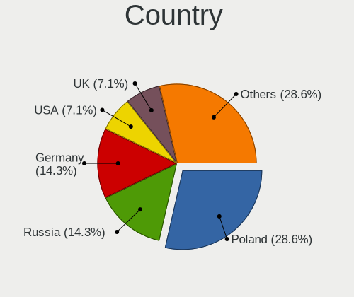
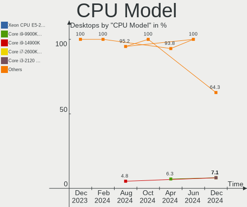

Gentoo - Hardware Trends (Desktops)
-----------------------------------

A project to identify most popular hardware characteristics and track their change
over time based on data collected by Linux users at https://Linux-Hardware.org.

Anyone can contribute to this report by the [hw-probe](https://github.com/linuxhw/hw-probe) tool:

    sudo -E hw-probe -all -upload

This report is for one last month. Overall report since the beginning of time: [TestDays](https://github.com/linuxhw/TestDays)

Period: May, 2023.

Contents
--------

* [ System ](#system)
  - [ OS                       ](#os)
  - [ OS Family                ](#os-family)
  - [ Kernel                   ](#kernel)
  - [ Kernel Family            ](#kernel-family)
  - [ Kernel Major Ver.        ](#kernel-major-ver)
  - [ Arch                     ](#arch)
  - [ DE                       ](#de)
  - [ Display Server           ](#display-server)
  - [ Display Manager          ](#display-manager)
  - [ OS Lang                  ](#os-lang)
  - [ Boot Mode                ](#boot-mode)
  - [ Filesystem               ](#filesystem)
  - [ Part. scheme             ](#part-scheme)
  - [ Dual Boot with Linux/BSD ](#dual-boot-with-linuxbsd)
  - [ Dual Boot (Win)          ](#dual-boot-win)

* [ Board ](#board)
  - [ Vendor                   ](#vendor)
  - [ Model                    ](#model)
  - [ Model Family             ](#model-family)
  - [ MFG Year                 ](#mfg-year)
  - [ Form Factor              ](#form-factor)
  - [ Secure Boot              ](#secure-boot)
  - [ Coreboot                 ](#coreboot)
  - [ RAM Size                 ](#ram-size)
  - [ RAM Used                 ](#ram-used)
  - [ Total Drives             ](#total-drives)
  - [ Has CD-ROM               ](#has-cd-rom)
  - [ Has Ethernet             ](#has-ethernet)
  - [ Has WiFi                 ](#has-wifi)
  - [ Has Bluetooth            ](#has-bluetooth)

* [ Location ](#location)
  - [ Country                  ](#country)
  - [ City                     ](#city)

* [ Drives ](#drives)
  - [ Drive Vendor             ](#drive-vendor)
  - [ Drive Model              ](#drive-model)
  - [ HDD Vendor               ](#hdd-vendor)
  - [ SSD Vendor               ](#ssd-vendor)
  - [ Drive Kind               ](#drive-kind)
  - [ Drive Connector          ](#drive-connector)
  - [ Drive Size               ](#drive-size)
  - [ Space Total              ](#space-total)
  - [ Space Used               ](#space-used)
  - [ Malfunc. Drives          ](#malfunc-drives)
  - [ Malfunc. Drive Vendor    ](#malfunc-drive-vendor)
  - [ Malfunc. HDD Vendor      ](#malfunc-hdd-vendor)
  - [ Malfunc. Drive Kind      ](#malfunc-drive-kind)
  - [ Failed Drives            ](#failed-drives)
  - [ Failed Drive Vendor      ](#failed-drive-vendor)
  - [ Drive Status             ](#drive-status)

* [ Storage controller ](#storage-controller)
  - [ Storage Vendor           ](#storage-vendor)
  - [ Storage Model            ](#storage-model)
  - [ Storage Kind             ](#storage-kind)

* [ Processor ](#processor)
  - [ CPU Vendor               ](#cpu-vendor)
  - [ CPU Model                ](#cpu-model)
  - [ CPU Model Family         ](#cpu-model-family)
  - [ CPU Cores                ](#cpu-cores)
  - [ CPU Sockets              ](#cpu-sockets)
  - [ CPU Threads              ](#cpu-threads)
  - [ CPU Op-Modes             ](#cpu-op-modes)
  - [ CPU Microcode            ](#cpu-microcode)
  - [ CPU Microarch            ](#cpu-microarch)

* [ Graphics ](#graphics)
  - [ GPU Vendor               ](#gpu-vendor)
  - [ GPU Model                ](#gpu-model)
  - [ GPU Combo                ](#gpu-combo)
  - [ GPU Driver               ](#gpu-driver)
  - [ GPU Memory               ](#gpu-memory)

* [ Monitor ](#monitor)
  - [ Monitor Vendor           ](#monitor-vendor)
  - [ Monitor Model            ](#monitor-model)
  - [ Monitor Resolution       ](#monitor-resolution)
  - [ Monitor Diagonal         ](#monitor-diagonal)
  - [ Monitor Width            ](#monitor-width)
  - [ Aspect Ratio             ](#aspect-ratio)
  - [ Monitor Area             ](#monitor-area)
  - [ Pixel Density            ](#pixel-density)
  - [ Multiple Monitors        ](#multiple-monitors)

* [ Network ](#network)
  - [ Net Controller Vendor    ](#net-controller-vendor)
  - [ Net Controller Model     ](#net-controller-model)
  - [ Wireless Vendor          ](#wireless-vendor)
  - [ Wireless Model           ](#wireless-model)
  - [ Ethernet Vendor          ](#ethernet-vendor)
  - [ Ethernet Model           ](#ethernet-model)
  - [ Net Controller Kind      ](#net-controller-kind)
  - [ Used Controller          ](#used-controller)
  - [ NICs                     ](#nics)
  - [ IPv6                     ](#ipv6)

* [ Bluetooth ](#bluetooth)
  - [ Bluetooth Vendor         ](#bluetooth-vendor)
  - [ Bluetooth Model          ](#bluetooth-model)

* [ Sound ](#sound)
  - [ Sound Vendor             ](#sound-vendor)
  - [ Sound Model              ](#sound-model)

* [ Memory ](#memory)
  - [ Memory Vendor            ](#memory-vendor)
  - [ Memory Model             ](#memory-model)
  - [ Memory Kind              ](#memory-kind)
  - [ Memory Form Factor       ](#memory-form-factor)
  - [ Memory Size              ](#memory-size)
  - [ Memory Speed             ](#memory-speed)

* [ Printers & scanners ](#printers--scanners)
  - [ Printer Vendor           ](#printer-vendor)
  - [ Printer Model            ](#printer-model)
  - [ Scanner Vendor           ](#scanner-vendor)
  - [ Scanner Model            ](#scanner-model)

* [ Camera ](#camera)
  - [ Camera Vendor            ](#camera-vendor)
  - [ Camera Model             ](#camera-model)

* [ Security ](#security)
  - [ Fingerprint Vendor       ](#fingerprint-vendor)
  - [ Fingerprint Model        ](#fingerprint-model)
  - [ Chipcard Vendor          ](#chipcard-vendor)
  - [ Chipcard Model           ](#chipcard-model)

* [ Unsupported ](#unsupported)
  - [ Unsupported Devices      ](#unsupported-devices)
  - [ Unsupported Device Types ](#unsupported-device-types)

System
------

OS
--

Installed operating systems

| Name        | Desktops | Percent |
|-------------|----------|---------|
| Gentoo 2.13 | 38       | 100%    |

OS Family
---------

OS without a version

| Name   | Desktops | Percent |
|--------|----------|---------|
| Gentoo | 38       | 100%    |

Kernel
------

Version of the Linux kernel

| Version                        | Desktops | Percent |
|--------------------------------|----------|---------|
| 6.1.19-gentoo                  | 5        | 13.16%  |
| 6.3.4-gentoo                   | 3        | 7.89%   |
| 6.3.1-gentoo                   | 3        | 7.89%   |
| 6.1.27-gentoo-r1-x86_64        | 3        | 7.89%   |
| 6.3.3-gentoo                   | 2        | 5.26%   |
| 6.1.28-gentoo                  | 2        | 5.26%   |
| 6.4.0-rc2-x86_64               | 1        | 2.63%   |
| 6.3.4-gentoo-c17               | 1        | 2.63%   |
| 6.3.2-gentoo-x86_64            | 1        | 2.63%   |
| 6.3.1-zen1                     | 1        | 2.63%   |
| 6.3.1-x86_64                   | 1        | 2.63%   |
| 6.3.1-gentoo_ap                | 1        | 2.63%   |
| 6.3.1-gentoo-x86_64            | 1        | 2.63%   |
| 6.3.1-gentoo-polaris           | 1        | 2.63%   |
| 6.3.0-gentoo                   | 1        | 2.63%   |
| 6.2.13-gentoo-dist             | 1        | 2.63%   |
| 6.2.12-gentoo-x86_64           | 1        | 2.63%   |
| 6.1.27-gentoo-r1-nvidia        | 1        | 2.63%   |
| 6.1.27-gentoo-r1               | 1        | 2.63%   |
| 6.1.27-gentoo-dist             | 1        | 2.63%   |
| 6.1.27-1-lts                   | 1        | 2.63%   |
| 6.1.22-gentoo-dist             | 1        | 2.63%   |
| 6.1.19-gentoo-x86_64           | 1        | 2.63%   |
| 6.1.19-gentoo-dist             | 1        | 2.63%   |
| 6.1.19-gentoo-42-docker-vmware | 1        | 2.63%   |
| 5.17.1                         | 1        | 2.63%   |

Kernel Family
-------------

Linux kernel without a distro release

| Version | Desktops | Percent |
|---------|----------|---------|
| 6.3.1   | 8        | 21.05%  |
| 6.1.19  | 8        | 21.05%  |
| 6.1.27  | 7        | 18.42%  |
| 6.3.4   | 4        | 10.53%  |
| 6.3.3   | 2        | 5.26%   |
| 6.1.28  | 2        | 5.26%   |
| 6.4.0   | 1        | 2.63%   |
| 6.3.2   | 1        | 2.63%   |
| 6.3.0   | 1        | 2.63%   |
| 6.2.13  | 1        | 2.63%   |
| 6.2.12  | 1        | 2.63%   |
| 6.1.22  | 1        | 2.63%   |
| 5.17.1  | 1        | 2.63%   |

Kernel Major Ver.
-----------------

Linux kernel major version

| Version | Desktops | Percent |
|---------|----------|---------|
| 6.1     | 18       | 47.37%  |
| 6.3     | 16       | 42.11%  |
| 6.2     | 2        | 5.26%   |
| 6.4     | 1        | 2.63%   |
| 5.17    | 1        | 2.63%   |

Arch
----

OS architecture (x86_64, i586, etc.)

| Name   | Desktops | Percent |
|--------|----------|---------|
| x86_64 | 37       | 97.37%  |
| i686   | 1        | 2.63%   |

DE
--

Desktop Environment

| Name     | Desktops | Percent |
|----------|----------|---------|
| Unknown  | 12       | 31.58%  |
| KDE5     | 10       | 26.32%  |
| XFCE     | 7        | 18.42%  |
| gnome    | 5        | 13.16%  |
| i3       | 2        | 5.26%   |
| MATE     | 1        | 2.63%   |
| Hyprland | 1        | 2.63%   |

Display Server
--------------

X11 or Wayland

| Name    | Desktops | Percent |
|---------|----------|---------|
| X11     | 21       | 55.26%  |
| Wayland | 7        | 18.42%  |
| Tty     | 7        | 18.42%  |
| Unknown | 3        | 7.89%   |

Display Manager
---------------

SDDM, LightDM, etc.

| Name    | Desktops | Percent |
|---------|----------|---------|
| Unknown | 15       | 39.47%  |
| LightDM | 9        | 23.68%  |
| SDDM    | 7        | 18.42%  |
| GDM     | 4        | 10.53%  |
| LXDM    | 2        | 5.26%   |
| SLiM    | 1        | 2.63%   |

OS Lang
-------

Language

| Lang       | Desktops | Percent |
|------------|----------|---------|
| en_US      | 13       | 34.21%  |
| C.UTF8     | 6        | 15.79%  |
| C          | 4        | 10.53%  |
| en_GB      | 3        | 7.89%   |
| ru_RU      | 2        | 5.26%   |
| de_DE      | 2        | 5.26%   |
| Unknown    | 2        | 5.26%   |
| uk_UA      | 1        | 2.63%   |
| ru_RU.UTF8 | 1        | 2.63%   |
| pl_PL      | 1        | 2.63%   |
| fi_FI      | 1        | 2.63%   |
| es_MX      | 1        | 2.63%   |
| cs_CZ      | 1        | 2.63%   |

Boot Mode
---------

EFI or BIOS

| Mode | Desktops | Percent |
|------|----------|---------|
| EFI  | 27       | 71.05%  |
| BIOS | 11       | 28.95%  |

Filesystem
----------

Type of filesystem

| Type     | Desktops | Percent |
|----------|----------|---------|
| Ext4     | 19       | 50%     |
| Btrfs    | 9        | 23.68%  |
| F2fs     | 4        | 10.53%  |
| Zfs      | 2        | 5.26%   |
| Reiserfs | 2        | 5.26%   |
| XXXXXXX  | 1        | 2.63%   |
| Xfs      | 1        | 2.63%   |

Part. scheme
------------

Scheme of partitioning

| Type    | Desktops | Percent |
|---------|----------|---------|
| GPT     | 31       | 81.58%  |
| MBR     | 6        | 15.79%  |
| Unknown | 1        | 2.63%   |

Dual Boot with Linux/BSD
------------------------

Hosting more than one Linux/BSD

| Dual boot | Desktops | Percent |
|-----------|----------|---------|
| No        | 24       | 63.16%  |
| Yes       | 14       | 36.84%  |

Dual Boot (Win)
---------------

Hosting Linux and Windows

| Dual boot | Desktops | Percent |
|-----------|----------|---------|
| No        | 22       | 57.89%  |
| Yes       | 16       | 42.11%  |

Board
-----

Vendor
------

Motherboard manufacturer

| Name                | Desktops | Percent |
|---------------------|----------|---------|
| ASUSTek Computer    | 12       | 31.58%  |
| MSI                 | 7        | 18.42%  |
| Gigabyte Technology | 7        | 18.42%  |
| ASRock              | 5        | 13.16%  |
| Foxconn             | 2        | 5.26%   |
| TYAN Computer       | 1        | 2.63%   |
| Pegatron            | 1        | 2.63%   |
| Lenovo              | 1        | 2.63%   |
| Hewlett-Packard     | 1        | 2.63%   |
| Unknown             | 1        | 2.63%   |

Model
-----

Motherboard model

| Name                                 | Desktops | Percent |
|--------------------------------------|----------|---------|
| ASUS TUF Gaming X570-PLUS            | 2        | 5.26%   |
| ASUS M3A78-CM                        | 2        | 5.26%   |
| ASUS All Series                      | 2        | 5.26%   |
| TYAN VT82C694T                       | 1        | 2.63%   |
| Pegatron 810-170st                   | 1        | 2.63%   |
| MSI MS-7D67                          | 1        | 2.63%   |
| MSI MS-7D09                          | 1        | 2.63%   |
| MSI MS-7C91                          | 1        | 2.63%   |
| MSI MS-7C35                          | 1        | 2.63%   |
| MSI MS-7B85                          | 1        | 2.63%   |
| MSI MS-7B18                          | 1        | 2.63%   |
| MSI MS-7817                          | 1        | 2.63%   |
| Lenovo ThinkStation P520c 30BX001KUS | 1        | 2.63%   |
| HP Z420 Workstation                  | 1        | 2.63%   |
| Gigabyte Z690 AORUS MASTER           | 1        | 2.63%   |
| Gigabyte Z390 GAMING X               | 1        | 2.63%   |
| Gigabyte X670E AORUS MASTER          | 1        | 2.63%   |
| Gigabyte X570S AORUS ELITE AX        | 1        | 2.63%   |
| Gigabyte X570 AORUS ELITE            | 1        | 2.63%   |
| Gigabyte AB350-Gaming                | 1        | 2.63%   |
| Gigabyte 970A-DS3P FX                | 1        | 2.63%   |
| Foxconn TPS01                        | 1        | 2.63%   |
| Foxconn nT-330i                      | 1        | 2.63%   |
| ASUS ROG STRIX Z590-F GAMING WIFI    | 1        | 2.63%   |
| ASUS ROG STRIX X570-E GAMING         | 1        | 2.63%   |
| ASUS ROG Maximus Z690 HERO           | 1        | 2.63%   |
| ASUS PRIME B550-PLUS                 | 1        | 2.63%   |
| ASUS P6X58D PREMIUM                  | 1        | 2.63%   |
| ASUS M4A89GTD-PRO/USB3               | 1        | 2.63%   |
| ASRock Z170 OC Formula               | 1        | 2.63%   |
| ASRock X670E Taichi                  | 1        | 2.63%   |
| ASRock X670E Pro RS                  | 1        | 2.63%   |
| ASRock X570 Taichi                   | 1        | 2.63%   |
| ASRock B550M-ITX/ac                  | 1        | 2.63%   |
| Unknown                              | 1        | 2.63%   |

Model Family
------------

Motherboard model prefix

| Name                  | Desktops | Percent |
|-----------------------|----------|---------|
| ASUS ROG              | 3        | 7.89%   |
| ASUS TUF              | 2        | 5.26%   |
| ASUS M3A78-CM         | 2        | 5.26%   |
| ASUS All              | 2        | 5.26%   |
| ASRock X670E          | 2        | 5.26%   |
| TYAN VT82C694T        | 1        | 2.63%   |
| Pegatron 810-170st    | 1        | 2.63%   |
| MSI MS-7D67           | 1        | 2.63%   |
| MSI MS-7D09           | 1        | 2.63%   |
| MSI MS-7C91           | 1        | 2.63%   |
| MSI MS-7C35           | 1        | 2.63%   |
| MSI MS-7B85           | 1        | 2.63%   |
| MSI MS-7B18           | 1        | 2.63%   |
| MSI MS-7817           | 1        | 2.63%   |
| Lenovo ThinkStation   | 1        | 2.63%   |
| HP Z420               | 1        | 2.63%   |
| Gigabyte Z690         | 1        | 2.63%   |
| Gigabyte Z390         | 1        | 2.63%   |
| Gigabyte X670E        | 1        | 2.63%   |
| Gigabyte X570S        | 1        | 2.63%   |
| Gigabyte X570         | 1        | 2.63%   |
| Gigabyte AB350-Gaming | 1        | 2.63%   |
| Gigabyte 970A-DS3P    | 1        | 2.63%   |
| Foxconn TPS01         | 1        | 2.63%   |
| Foxconn nT-330i       | 1        | 2.63%   |
| ASUS PRIME            | 1        | 2.63%   |
| ASUS P6X58D           | 1        | 2.63%   |
| ASUS M4A89GTD-PRO     | 1        | 2.63%   |
| ASRock Z170           | 1        | 2.63%   |
| ASRock X570           | 1        | 2.63%   |
| ASRock B550M-ITX      | 1        | 2.63%   |
| Unknown               | 1        | 2.63%   |

MFG Year
--------

Motherboard manufacture year

| Year | Desktops | Percent |
|------|----------|---------|
| 2019 | 6        | 15.79%  |
| 2021 | 5        | 13.16%  |
| 2018 | 4        | 10.53%  |
| 2022 | 3        | 7.89%   |
| 2009 | 3        | 7.89%   |
| 2023 | 2        | 5.26%   |
| 2020 | 2        | 5.26%   |
| 2017 | 2        | 5.26%   |
| 2014 | 2        | 5.26%   |
| 2013 | 2        | 5.26%   |
| 2010 | 2        | 5.26%   |
| 2008 | 2        | 5.26%   |
| 2016 | 1        | 2.63%   |
| 2012 | 1        | 2.63%   |
| 2002 | 1        | 2.63%   |

Form Factor
-----------

Physical design of the computer

| Name    | Desktops | Percent |
|---------|----------|---------|
| Desktop | 38       | 100%    |

Secure Boot
-----------

Enabled or disabled

| State    | Desktops | Percent |
|----------|----------|---------|
| Disabled | 38       | 100%    |

Coreboot
--------

Have coreboot on board

| Used | Desktops | Percent |
|------|----------|---------|
| No   | 38       | 100%    |

RAM Size
--------

Total RAM memory

| Size in GB  | Desktops | Percent |
|-------------|----------|---------|
| 32.01-64.0  | 15       | 39.47%  |
| 64.01-256.0 | 8        | 21.05%  |
| 16.01-24.0  | 4        | 10.53%  |
| 4.01-8.0    | 3        | 7.89%   |
| 24.01-32.0  | 3        | 7.89%   |
| 1.01-2.0    | 2        | 5.26%   |
| 3.01-4.0    | 1        | 2.63%   |
| 2.01-3.0    | 1        | 2.63%   |
| 8.01-16.0   | 1        | 2.63%   |

RAM Used
--------

Used RAM memory

| Used GB    | Desktops | Percent |
|------------|----------|---------|
| 4.01-8.0   | 9        | 23.68%  |
| 8.01-16.0  | 8        | 21.05%  |
| 0.01-0.5   | 5        | 13.16%  |
| 3.01-4.0   | 4        | 10.53%  |
| 1.01-2.0   | 4        | 10.53%  |
| 2.01-3.0   | 3        | 7.89%   |
| 0.51-1.0   | 2        | 5.26%   |
| 32.01-64.0 | 1        | 2.63%   |
| 24.01-32.0 | 1        | 2.63%   |
| 16.01-24.0 | 1        | 2.63%   |

Total Drives
------------

Number of drives on board

| Drives | Desktops | Percent |
|--------|----------|---------|
| 2      | 13       | 34.21%  |
| 1      | 7        | 18.42%  |
| 3      | 6        | 15.79%  |
| 5      | 5        | 13.16%  |
| 4      | 3        | 7.89%   |
| 10     | 1        | 2.63%   |
| 7      | 1        | 2.63%   |
| 6      | 1        | 2.63%   |
| 0      | 1        | 2.63%   |

Has CD-ROM
----------

Has CD-ROM on board

| Presented | Desktops | Percent |
|-----------|----------|---------|
| No        | 26       | 68.42%  |
| Yes       | 12       | 31.58%  |

Has Ethernet
------------

Has Ethernet on board

| Presented | Desktops | Percent |
|-----------|----------|---------|
| Yes       | 38       | 100%    |

Has WiFi
--------

Has WiFi module

| Presented | Desktops | Percent |
|-----------|----------|---------|
| Yes       | 24       | 63.16%  |
| No        | 14       | 36.84%  |

Has Bluetooth
-------------

Has Bluetooth module

| Presented | Desktops | Percent |
|-----------|----------|---------|
| No        | 20       | 52.63%  |
| Yes       | 18       | 47.37%  |

Location
--------

Country
-------

Geographic location (country)

| Country     | Desktops | Percent |
|-------------|----------|---------|
| USA         | 12       | 31.58%  |
| Germany     | 6        | 15.79%  |
| Russia      | 4        | 10.53%  |
| Poland      | 4        | 10.53%  |
| UK          | 2        | 5.26%   |
| Sweden      | 2        | 5.26%   |
| Ukraine     | 1        | 2.63%   |
| Netherlands | 1        | 2.63%   |
| Mexico      | 1        | 2.63%   |
| Hungary     | 1        | 2.63%   |
| Finland     | 1        | 2.63%   |
| Czechia     | 1        | 2.63%   |
| Canada      | 1        | 2.63%   |
| Brazil      | 1        | 2.63%   |

City
----

Geographic location (city)

| City        | Desktops | Percent |
|-------------|----------|---------|
| Warsaw      | 3        | 7.89%   |
| Sterling    | 3        | 7.89%   |
| Vladivostok | 2        | 5.26%   |
| Summerville | 2        | 5.26%   |
| Moscow      | 2        | 5.26%   |
| Berlin      | 2        | 5.26%   |
| Stockholm   | 1        | 2.63%   |
| Šlapanice  | 1        | 2.63%   |
| Seattle     | 1        | 2.63%   |
| Round Rock  | 1        | 2.63%   |
| Rotterdam   | 1        | 2.63%   |
| Oulu        | 1        | 2.63%   |
| Malmo       | 1        | 2.63%   |
| Lich        | 1        | 2.63%   |
| Leeds       | 1        | 2.63%   |
| Kiel        | 1        | 2.63%   |
| Kharkiv     | 1        | 2.63%   |
| Itapevi     | 1        | 2.63%   |
| Ingolstadt  | 1        | 2.63%   |
| Hohentengen | 1        | 2.63%   |
| Hoffman     | 1        | 2.63%   |
| Gatineau    | 1        | 2.63%   |
| Flint       | 1        | 2.63%   |
| Cuernavaca  | 1        | 2.63%   |
| Clifton     | 1        | 2.63%   |
| Cieszyn     | 1        | 2.63%   |
| Chula Vista | 1        | 2.63%   |
| Chicago     | 1        | 2.63%   |
| Budapest    | 1        | 2.63%   |
| Albuquerque | 1        | 2.63%   |

Drives
------

Drive Vendor
------------

Hard drive vendors

| Vendor                    | Desktops | Drives | Percent |
|---------------------------|----------|--------|---------|
| Samsung Electronics       | 16       | 29     | 19.05%  |
| Seagate                   | 13       | 16     | 15.48%  |
| WDC                       | 10       | 14     | 11.9%   |
| Crucial                   | 7        | 7      | 8.33%   |
| Toshiba                   | 5        | 5      | 5.95%   |
| Sandisk                   | 4        | 5      | 4.76%   |
| Hitachi                   | 4        | 7      | 4.76%   |
| China                     | 4        | 5      | 4.76%   |
| Kingston                  | 3        | 3      | 3.57%   |
| GOODRAM                   | 3        | 3      | 3.57%   |
| Micron Technology         | 2        | 2      | 2.38%   |
| ADROITLARK                | 2        | 2      | 2.38%   |
| Transcend                 | 1        | 1      | 1.19%   |
| SK hynix                  | 1        | 1      | 1.19%   |
| Realtek Semiconductor     | 1        | 1      | 1.19%   |
| PNY                       | 1        | 1      | 1.19%   |
| Phison Electronics        | 1        | 2      | 1.19%   |
| Phison                    | 1        | 1      | 1.19%   |
| OCZ                       | 1        | 1      | 1.19%   |
| Micron/Crucial Technology | 1        | 1      | 1.19%   |
| LITEONIT                  | 1        | 1      | 1.19%   |
| Intel                     | 1        | 1      | 1.19%   |
| ADATA Technology          | 1        | 2      | 1.19%   |

Drive Model
-----------

Hard drive models

| Model                                               | Desktops | Percent |
|-----------------------------------------------------|----------|---------|
| Samsung NVMe SSD Controller PM9A1/PM9A3/980PRO 1TB  | 6        | 5.88%   |
| Seagate ST4000DM004-2CV104 4TB                      | 5        | 4.9%    |
| Samsung SSD 860 EVO 1TB                             | 3        | 2.94%   |
| Samsung NVMe SSD Controller SM981/PM981/PM983 256GB | 3        | 2.94%   |
| WDC WD20EARX-00PASB0 2TB                            | 2        | 1.96%   |
| WDC WD2003FZEX-00SRLA0 2TB                          | 2        | 1.96%   |
| Seagate ST1000DM010-2EP102 1TB                      | 2        | 1.96%   |
| Samsung SSD 870 EVO 1TB                             | 2        | 1.96%   |
| Samsung NVMe SSD Controller SM961/PM961/SM963 256GB | 2        | 1.96%   |
| GOODRAM SSDPR-CL100-480-G2 480GB                    | 2        | 1.96%   |
| China SATA SSD 960GB                                | 2        | 1.96%   |
| ADROITLARK SSD 120GB                                | 2        | 1.96%   |
| WDC WDS500G2B0A-00SM50 500GB SSD                    | 1        | 0.98%   |
| WDC WD7500BPVT-24HXZT1 752GB                        | 1        | 0.98%   |
| WDC WD5000AAKX-08U6AA0 500GB                        | 1        | 0.98%   |
| WDC WD40EZRZ-00GXCB0 4TB                            | 1        | 0.98%   |
| WDC WD40EZRX-22SPEB0 4TB                            | 1        | 0.98%   |
| WDC WD2500BEVS-22UST0 250GB                         | 1        | 0.98%   |
| WDC WD20EZRZ-00Z5HB0 2TB                            | 1        | 0.98%   |
| WDC WD10EZEX-00BN5A0 1TB                            | 1        | 0.98%   |
| WDC WD1001FALS-00J7B1 1TB                           | 1        | 0.98%   |
| Transcend TS64GSSD340 64GB                          | 1        | 0.98%   |
| Toshiba MG04ACA200E 2TB                             | 1        | 0.98%   |
| Toshiba HDWE150 5TB                                 | 1        | 0.98%   |
| Toshiba HDWD110 1TB                                 | 1        | 0.98%   |
| Toshiba DT01ACA200 2TB                              | 1        | 0.98%   |
| Toshiba DT01ACA100 1TB                              | 1        | 0.98%   |
| SK hynix SHGP31-1000GM 1TB                          | 1        | 0.98%   |
| Seagate ST500DM002-1BC142 500GB                     | 1        | 0.98%   |
| Seagate ST4000DM005-2DP166 4TB                      | 1        | 0.98%   |
| Seagate ST380011A 80GB                              | 1        | 0.98%   |
| Seagate ST31000528AS 1TB                            | 1        | 0.98%   |
| Seagate ST2000DM001-1ER164 2TB                      | 1        | 0.98%   |
| Seagate ST12000NM0008-2H3101 12TB                   | 1        | 0.98%   |
| Seagate ST10000DM0004 10TB                          | 1        | 0.98%   |
| Seagate Backup+ Desk 8TB                            | 1        | 0.98%   |
| Sandisk WD Blue SN570 500GB                         | 1        | 0.98%   |
| Sandisk WD Black SN850 500GB                        | 1        | 0.98%   |
| Sandisk WD Black SN750 / PC SN730 NVMe SSD 256GB    | 1        | 0.98%   |
| SanDisk SDSSDH3 1T02 1TB                            | 1        | 0.98%   |

HDD Vendor
----------

Hard disk drive vendors

| Vendor  | Desktops | Drives | Percent |
|---------|----------|--------|---------|
| Seagate | 13       | 15     | 41.94%  |
| WDC     | 9        | 13     | 29.03%  |
| Toshiba | 5        | 5      | 16.13%  |
| Hitachi | 4        | 7      | 12.9%   |

SSD Vendor
----------

Solid state drive vendors

| Vendor              | Desktops | Drives | Percent |
|---------------------|----------|--------|---------|
| Samsung Electronics | 10       | 13     | 27.03%  |
| Crucial             | 7        | 7      | 18.92%  |
| China               | 4        | 5      | 10.81%  |
| GOODRAM             | 3        | 3      | 8.11%   |
| SanDisk             | 2        | 2      | 5.41%   |
| Micron Technology   | 2        | 2      | 5.41%   |
| Kingston            | 2        | 2      | 5.41%   |
| ADROITLARK          | 2        | 2      | 5.41%   |
| WDC                 | 1        | 1      | 2.7%    |
| Transcend           | 1        | 1      | 2.7%    |
| PNY                 | 1        | 1      | 2.7%    |
| OCZ                 | 1        | 1      | 2.7%    |
| LITEONIT            | 1        | 1      | 2.7%    |

Drive Kind
----------

HDD or SSD

| Kind    | Desktops | Drives | Percent |
|---------|----------|--------|---------|
| SSD     | 25       | 41     | 39.06%  |
| HDD     | 23       | 40     | 35.94%  |
| NVMe    | 15       | 29     | 23.44%  |
| Unknown | 1        | 1      | 1.56%   |

Drive Connector
---------------

SATA, SAS, NVMe, etc.

| Type | Desktops | Drives | Percent |
|------|----------|--------|---------|
| SATA | 32       | 81     | 66.67%  |
| NVMe | 15       | 29     | 31.25%  |
| SAS  | 1        | 1      | 2.08%   |

Drive Size
----------

Size of hard drive

| Size in TB | Desktops | Drives | Percent |
|------------|----------|--------|---------|
| 0.01-0.5   | 22       | 27     | 36.07%  |
| 0.51-1.0   | 18       | 26     | 29.51%  |
| 1.01-2.0   | 9        | 11     | 14.75%  |
| 3.01-4.0   | 8        | 11     | 13.11%  |
| 4.01-10.0  | 2        | 2      | 3.28%   |
| 2.01-3.0   | 1        | 3      | 1.64%   |
| 10.01-20.0 | 1        | 1      | 1.64%   |

Space Total
-----------

Amount of disk space available on the file system

| Size in GB     | Desktops | Percent |
|----------------|----------|---------|
| More than 3000 | 8        | 21.05%  |
| 1001-2000      | 6        | 15.79%  |
| 501-1000       | 6        | 15.79%  |
| 251-500        | 5        | 13.16%  |
| 2001-3000      | 3        | 7.89%   |
| 101-250        | 3        | 7.89%   |
| Unknown        | 3        | 7.89%   |
| 1-20           | 2        | 5.26%   |
| 51-100         | 2        | 5.26%   |

Space Used
----------

Amount of used disk space

| Used GB        | Desktops | Percent |
|----------------|----------|---------|
| 501-1000       | 6        | 15.79%  |
| 21-50          | 5        | 13.16%  |
| 101-250        | 5        | 13.16%  |
| 1001-2000      | 5        | 13.16%  |
| 1-20           | 5        | 13.16%  |
| More than 3000 | 4        | 10.53%  |
| 251-500        | 4        | 10.53%  |
| Unknown        | 3        | 7.89%   |
| 2001-3000      | 1        | 2.63%   |

Malfunc. Drives
---------------

Drive models with a malfunction

| Model                               | Desktops | Drives | Percent |
|-------------------------------------|----------|--------|---------|
| Toshiba DT01ACA200 2TB              | 1        | 1      | 14.29%  |
| Seagate ST500DM002-1BC142 500GB     | 1        | 1      | 14.29%  |
| Seagate ST380011A 80GB              | 1        | 1      | 14.29%  |
| Seagate ST1000DM010-2EP102 1TB      | 1        | 1      | 14.29%  |
| PNY SSD2SC120G1LC763C121S459P 120GB | 1        | 1      | 14.29%  |
| Hitachi HTS721080G9SA00 80GB        | 1        | 1      | 14.29%  |
| China SATA SSD 960GB                | 1        | 1      | 14.29%  |

Malfunc. Drive Vendor
---------------------

Vendors of faulty drives

| Vendor  | Desktops | Drives | Percent |
|---------|----------|--------|---------|
| Seagate | 3        | 3      | 42.86%  |
| Toshiba | 1        | 1      | 14.29%  |
| PNY     | 1        | 1      | 14.29%  |
| Hitachi | 1        | 1      | 14.29%  |
| China   | 1        | 1      | 14.29%  |

Malfunc. HDD Vendor
-------------------

Vendors of faulty HDD drives

| Vendor  | Desktops | Drives | Percent |
|---------|----------|--------|---------|
| Seagate | 3        | 3      | 60%     |
| Toshiba | 1        | 1      | 20%     |
| Hitachi | 1        | 1      | 20%     |

Malfunc. Drive Kind
-------------------

Kinds of faulty drives

| Kind | Desktops | Drives | Percent |
|------|----------|--------|---------|
| HDD  | 5        | 5      | 71.43%  |
| SSD  | 2        | 2      | 28.57%  |

Failed Drives
-------------

Failed drive models

Zero info for selected period =(

Failed Drive Vendor
-------------------

Failed drive vendors

Zero info for selected period =(

Drive Status
------------

Number of failed and malfunc. drives

| Status   | Desktops | Drives | Percent |
|----------|----------|--------|---------|
| Works    | 33       | 97     | 75%     |
| Malfunc  | 7        | 7      | 15.91%  |
| Detected | 4        | 7      | 9.09%   |

Storage controller
------------------

Storage Vendor
--------------

Storage controller vendors

| Vendor                      | Desktops | Percent |
|-----------------------------|----------|---------|
| AMD                         | 20       | 30.3%   |
| Intel                       | 16       | 24.24%  |
| Samsung Electronics         | 10       | 15.15%  |
| ASMedia Technology          | 5        | 7.58%   |
| SanDisk                     | 3        | 4.55%   |
| Phison Electronics          | 2        | 3.03%   |
| Nvidia                      | 2        | 3.03%   |
| VIA Technologies            | 1        | 1.52%   |
| SK hynix                    | 1        | 1.52%   |
| Realtek Semiconductor       | 1        | 1.52%   |
| Micron/Crucial Technology   | 1        | 1.52%   |
| Marvell Technology Group    | 1        | 1.52%   |
| Kingston Technology Company | 1        | 1.52%   |
| JMicron Technology          | 1        | 1.52%   |
| ADATA Technology            | 1        | 1.52%   |

Storage Model
-------------

Storage controller models

| Model                                                                          | Desktops | Percent |
|--------------------------------------------------------------------------------|----------|---------|
| AMD FCH SATA Controller [AHCI mode]                                            | 13       | 16.67%  |
| Samsung NVMe SSD Controller PM9A1/PM9A3/980PRO                                 | 6        | 7.69%   |
| ASMedia ASM1062 Serial ATA Controller                                          | 5        | 6.41%   |
| Samsung NVMe SSD Controller SM981/PM981/PM983                                  | 3        | 3.85%   |
| Intel 8 Series/C220 Series Chipset Family 6-port SATA Controller 1 [AHCI mode] | 3        | 3.85%   |
| AMD 500 Series Chipset SATA Controller                                         | 3        | 3.85%   |
| Samsung NVMe SSD Controller SM961/PM961/SM963                                  | 2        | 2.56%   |
| Samsung NVMe SSD Controller 980                                                | 2        | 2.56%   |
| Phison E18 PCIe4 NVMe Controller                                               | 2        | 2.56%   |
| Nvidia MCP79 SATA Controller                                                   | 2        | 2.56%   |
| Intel Cannon Lake PCH SATA AHCI Controller                                     | 2        | 2.56%   |
| Intel C600/X79 series chipset 6-Port SATA AHCI Controller                      | 2        | 2.56%   |
| Intel Alder Lake-S PCH SATA Controller [AHCI Mode]                             | 2        | 2.56%   |
| Intel 500 Series Chipset Family SATA AHCI Controller                           | 2        | 2.56%   |
| AMD SB7x0/SB8x0/SB9x0 SATA Controller [IDE mode]                               | 2        | 2.56%   |
| AMD SB7x0/SB8x0/SB9x0 SATA Controller [AHCI mode]                              | 2        | 2.56%   |
| AMD SB7x0/SB8x0/SB9x0 IDE Controller                                           | 2        | 2.56%   |
| VIA VT82C586A/B/VT82C686/A/B/VT823x/A/C PIPC Bus Master IDE                    | 1        | 1.28%   |
| SK hynix Gold P31/PC711 NVMe Solid State Drive                                 | 1        | 1.28%   |
| SanDisk WD PC SN810 / Black SN850 NVMe SSD                                     | 1        | 1.28%   |
| SanDisk WD Blue SN570 NVMe SSD 1TB                                             | 1        | 1.28%   |
| SanDisk WD Black SN750 / PC SN730 NVMe SSD                                     | 1        | 1.28%   |
| Samsung NVMe SSD Controller SM951/PM951                                        | 1        | 1.28%   |
| Realtek NVMe Controller                                                        | 1        | 1.28%   |
| Micron/Crucial P2 NVMe PCIe SSD                                                | 1        | 1.28%   |
| Marvell Group 88SE914D SATA-600 Controller                                     | 1        | 1.28%   |
| Kingston Company Company Non-Volatile memory controller                        | 1        | 1.28%   |
| JMicron JMB368 IDE controller                                                  | 1        | 1.28%   |
| JMicron JMB361 AHCI/IDE                                                        | 1        | 1.28%   |
| Intel SSD 660P Series                                                          | 1        | 1.28%   |
| Intel Q170/Q150/B150/H170/H110/Z170/CM236 Chipset SATA Controller [AHCI Mode]  | 1        | 1.28%   |
| Intel NM10/ICH7 Family SATA Controller [AHCI mode]                             | 1        | 1.28%   |
| Intel C602 chipset 4-Port SATA Storage Control Unit                            | 1        | 1.28%   |
| Intel C600/X79 series chipset IDE-r Controller                                 | 1        | 1.28%   |
| Intel 82801JI (ICH10 Family) 4 port SATA IDE Controller #1                     | 1        | 1.28%   |
| Intel 82801JI (ICH10 Family) 2 port SATA IDE Controller #2                     | 1        | 1.28%   |
| Intel 200 Series PCH SATA controller [AHCI mode]                               | 1        | 1.28%   |
| AMD 400 Series Chipset SATA Controller                                         | 1        | 1.28%   |
| AMD 300 Series Chipset SATA Controller                                         | 1        | 1.28%   |
| ADATA XPG SX8200 Pro PCIe Gen3x4 M.2 2280 Solid State Drive                    | 1        | 1.28%   |

Storage Kind
------------

Kind of storage controller (IDE, SATA, NVMe, SAS, ...)

| Kind | Desktops | Percent |
|------|----------|---------|
| SATA | 34       | 58.62%  |
| NVMe | 15       | 25.86%  |
| IDE  | 8        | 13.79%  |
| SAS  | 1        | 1.72%   |

Processor
---------

CPU Vendor
----------

Processor vendors

| Vendor | Desktops | Percent |
|--------|----------|---------|
| AMD    | 20       | 52.63%  |
| Intel  | 18       | 47.37%  |

CPU Model
---------

Processor models

| Model                                    | Desktops | Percent |
|------------------------------------------|----------|---------|
| AMD Ryzen 5 5600X 6-Core Processor       | 4        | 10.53%  |
| AMD Ryzen 9 7900X 12-Core Processor      | 3        | 7.89%   |
| AMD Ryzen 9 5900X 12-Core Processor      | 3        | 7.89%   |
| Intel Atom CPU 330 @ 1.60GHz             | 2        | 5.26%   |
| AMD Ryzen 9 5950X 16-Core Processor      | 2        | 5.26%   |
| AMD Phenom II X4 955 Processor           | 2        | 5.26%   |
| Intel Xeon W-2145 CPU @ 3.70GHz          | 1        | 2.63%   |
| Intel Xeon CPU E5-1680 v2 @ 3.00GHz      | 1        | 2.63%   |
| Intel Pentium III CPU - S 1400MHz        | 1        | 2.63%   |
| Intel Core i9-10850K CPU @ 3.60GHz       | 1        | 2.63%   |
| Intel Core i7-9700KF CPU @ 3.60GHz       | 1        | 2.63%   |
| Intel Core i7-8700K CPU @ 3.70GHz        | 1        | 2.63%   |
| Intel Core i7-6700K CPU @ 4.00GHz        | 1        | 2.63%   |
| Intel Core i7-4930K CPU @ 3.40GHz        | 1        | 2.63%   |
| Intel Core i7-4790 CPU @ 3.60GHz         | 1        | 2.63%   |
| Intel Core i7-4770 CPU @ 3.40GHz         | 1        | 2.63%   |
| Intel Core i7 CPU 950 @ 3.07GHz          | 1        | 2.63%   |
| Intel Core i5-4590T CPU @ 2.00GHz        | 1        | 2.63%   |
| Intel Atom CPU D510 @ 1.66GHz            | 1        | 2.63%   |
| Intel 12th Gen Core i9-12900KS           | 1        | 2.63%   |
| Intel 12th Gen Core i9-12900K            | 1        | 2.63%   |
| Intel 11th Gen Core i9-11900KF @ 3.50GHz | 1        | 2.63%   |
| AMD Ryzen 9 7950X 16-Core Processor      | 1        | 2.63%   |
| AMD Ryzen 7 5800X3D 8-Core Processor     | 1        | 2.63%   |
| AMD Ryzen 5 2600X Six-Core Processor     | 1        | 2.63%   |
| AMD Ryzen 5 2600 Six-Core Processor      | 1        | 2.63%   |
| AMD Phenom II X4 970 Processor           | 1        | 2.63%   |
| AMD FX-8300 Eight-Core Processor         | 1        | 2.63%   |

CPU Model Family
----------------

Processor model prefix

| Model             | Desktops | Percent |
|-------------------|----------|---------|
| AMD Ryzen 9       | 9        | 23.68%  |
| Intel Core i7     | 7        | 18.42%  |
| AMD Ryzen 5       | 6        | 15.79%  |
| Other             | 3        | 7.89%   |
| Intel Atom        | 3        | 7.89%   |
| AMD Phenom II X4  | 3        | 7.89%   |
| Intel Xeon        | 2        | 5.26%   |
| Intel Pentium III | 1        | 2.63%   |
| Intel Core i9     | 1        | 2.63%   |
| Intel Core i5     | 1        | 2.63%   |
| AMD Ryzen 7       | 1        | 2.63%   |
| AMD FX            | 1        | 2.63%   |

CPU Cores
---------

Number of processor cores

| Number | Desktops | Percent |
|--------|----------|---------|
| 4      | 9        | 23.68%  |
| 6      | 8        | 21.05%  |
| 12     | 6        | 15.79%  |
| 16     | 5        | 13.16%  |
| 8      | 5        | 13.16%  |
| 2      | 4        | 10.53%  |
| 10     | 1        | 2.63%   |

CPU Sockets
-----------

Number of sockets

| Number | Desktops | Percent |
|--------|----------|---------|
| 1      | 37       | 97.37%  |
| 2      | 1        | 2.63%   |

CPU Threads
-----------

Threads per core (Hyper-Threading)

| Number | Desktops | Percent |
|--------|----------|---------|
| 2      | 32       | 84.21%  |
| 1      | 6        | 15.79%  |

CPU Op-Modes
------------

CPU Operation Modes (32-bit, 64-bit)

| Op mode        | Desktops | Percent |
|----------------|----------|---------|
| 32-bit, 64-bit | 37       | 97.37%  |
| 32-bit         | 1        | 2.63%   |

CPU Microcode
-------------

Microcode number

| Number     | Desktops | Percent |
|------------|----------|---------|
| Unknown    | 14       | 36.84%  |
| 0x0a20120a | 4        | 10.53%  |
| 0x0a601203 | 3        | 7.89%   |
| 0x306c3    | 2        | 5.26%   |
| 0x0a201016 | 2        | 5.26%   |
| 0x0800820d | 2        | 5.26%   |
| 0x906ed    | 1        | 2.63%   |
| 0x906ea    | 1        | 2.63%   |
| 0x306e4    | 1        | 2.63%   |
| 0x106c2    | 1        | 2.63%   |
| 0x106a5    | 1        | 2.63%   |
| 0x0a601201 | 1        | 2.63%   |
| 0x0a201205 | 1        | 2.63%   |
| 0x0a201025 | 1        | 2.63%   |
| 0x06000822 | 1        | 2.63%   |
| 0x010000db | 1        | 2.63%   |
| 0x010000c8 | 1        | 2.63%   |

CPU Microarch
-------------

Microarchitecture

| Name             | Desktops | Percent |
|------------------|----------|---------|
| Zen 3            | 10       | 26.32%  |
| Unknown          | 4        | 10.53%  |
| K10              | 3        | 7.89%   |
| Haswell          | 3        | 7.89%   |
| Bonnell          | 3        | 7.89%   |
| Zen+             | 2        | 5.26%   |
| Skylake          | 2        | 5.26%   |
| KabyLake         | 2        | 5.26%   |
| IvyBridge        | 2        | 5.26%   |
| Alderlake Hybrid | 2        | 5.26%   |
| Piledriver       | 1        | 2.63%   |
| P6               | 1        | 2.63%   |
| Nehalem          | 1        | 2.63%   |
| Icelake          | 1        | 2.63%   |
| CometLake        | 1        | 2.63%   |

Graphics
--------

GPU Vendor
----------

Vendors of graphics cards

| Vendor | Desktops | Percent |
|--------|----------|---------|
| AMD    | 19       | 45.24%  |
| Nvidia | 18       | 42.86%  |
| Intel  | 5        | 11.9%   |

GPU Model
---------

Graphics card models

| Model                                                                       | Desktops | Percent |
|-----------------------------------------------------------------------------|----------|---------|
| AMD Navi 22 [Radeon RX 6700/6700 XT/6750 XT / 6800M/6850M XT]               | 4        | 8.51%   |
| Nvidia AD102 [GeForce RTX 4090]                                             | 3        | 6.38%   |
| AMD Raphael                                                                 | 3        | 6.38%   |
| AMD Ellesmere [Radeon RX 470/480/570/570X/580/580X/590]                     | 3        | 6.38%   |
| Nvidia TU104 [GeForce RTX 2070 SUPER]                                       | 2        | 4.26%   |
| Nvidia GA102 [GeForce RTX 3080 Ti]                                          | 2        | 4.26%   |
| Nvidia C79 [ION]                                                            | 2        | 4.26%   |
| AMD RS780C [Radeon 3100]                                                    | 2        | 4.26%   |
| AMD Navi 21 [Radeon RX 6800/6800 XT / 6900 XT]                              | 2        | 4.26%   |
| Nvidia VGA compatible controller                                            | 1        | 2.13%   |
| Nvidia TU116 [GeForce GTX 1660 SUPER]                                       | 1        | 2.13%   |
| Nvidia TU104 [GeForce RTX 2080 SUPER]                                       | 1        | 2.13%   |
| Nvidia GP106 [GeForce GTX 1060 6GB]                                         | 1        | 2.13%   |
| Nvidia GP104 [GeForce GTX 1080]                                             | 1        | 2.13%   |
| Nvidia GP104 [GeForce GTX 1060 6GB]                                         | 1        | 2.13%   |
| Nvidia GP102 [GeForce GTX 1080 Ti]                                          | 1        | 2.13%   |
| Nvidia GM206GL [Quadro M2000]                                               | 1        | 2.13%   |
| Nvidia GM204 [GeForce GTX 970]                                              | 1        | 2.13%   |
| Nvidia GM107 [GeForce GTX 750]                                              | 1        | 2.13%   |
| Nvidia GA104 [GeForce RTX 3070 Ti]                                          | 1        | 2.13%   |
| Intel Xeon E3-1200 v3/4th Gen Core Processor Integrated Graphics Controller | 1        | 2.13%   |
| Intel HD Graphics 530                                                       | 1        | 2.13%   |
| Intel DG2 [Arc A770]                                                        | 1        | 2.13%   |
| Intel Atom Processor D4xx/D5xx/N4xx/N5xx Integrated Graphics Controller     | 1        | 2.13%   |
| Intel AlderLake-S GT1                                                       | 1        | 2.13%   |
| AMD RS880 [Radeon HD 4290]                                                  | 1        | 2.13%   |
| AMD Park [Mobility Radeon HD 5430]                                          | 1        | 2.13%   |
| AMD Navi 31 [Radeon RX 7900 XT/7900 XTX]                                    | 1        | 2.13%   |
| AMD Navi 24 [Radeon RX 6400/6500 XT/6500M]                                  | 1        | 2.13%   |
| AMD Navi 23 [Radeon RX 6600/6600 XT/6600M]                                  | 1        | 2.13%   |
| AMD Cedar [Radeon HD 5000/6000/7350/8350 Series]                            | 1        | 2.13%   |
| AMD Cape Verde PRO [Radeon HD 7750/8740 / R7 250E]                          | 1        | 2.13%   |
| AMD Baffin [Radeon RX 460/560D / Pro 450/455/460/555/555X/560/560X]         | 1        | 2.13%   |

GPU Combo
---------

Combinations of graphics cards

| Name           | Desktops | Percent |
|----------------|----------|---------|
| 1 x Nvidia     | 14       | 36.84%  |
| 1 x AMD        | 13       | 34.21%  |
| 1 x Intel      | 4        | 10.53%  |
| 2 x AMD        | 3        | 7.89%   |
| AMD + Nvidia   | 3        | 7.89%   |
| Intel + Nvidia | 1        | 2.63%   |

GPU Driver
----------

Free vs proprietary

| Driver      | Desktops | Percent |
|-------------|----------|---------|
| Free        | 22       | 57.89%  |
| Proprietary | 15       | 39.47%  |
| Unknown     | 1        | 2.63%   |

GPU Memory
----------

Total video memory

| Size in GB | Desktops | Percent |
|------------|----------|---------|
| 8.01-16.0  | 9        | 23.68%  |
| Unknown    | 7        | 18.42%  |
| 7.01-8.0   | 5        | 13.16%  |
| 0.01-0.5   | 5        | 13.16%  |
| 5.01-6.0   | 3        | 7.89%   |
| 3.01-4.0   | 3        | 7.89%   |
| 16.01-24.0 | 3        | 7.89%   |
| 1.01-2.0   | 2        | 5.26%   |
| 0.51-1.0   | 1        | 2.63%   |

Monitor
-------

Monitor Vendor
--------------

Monitor vendors

| Vendor               | Desktops | Percent |
|----------------------|----------|---------|
| Samsung Electronics  | 9        | 20.93%  |
| Goldstar             | 5        | 11.63%  |
| ASUSTek Computer     | 4        | 9.3%    |
| Dell                 | 3        | 6.98%   |
| BenQ                 | 3        | 6.98%   |
| AOC                  | 3        | 6.98%   |
| Hewlett-Packard      | 2        | 4.65%   |
| Gigabyte Technology  | 2        | 4.65%   |
| Ancor Communications | 2        | 4.65%   |
| Acer                 | 2        | 4.65%   |
| Vizio                | 1        | 2.33%   |
| Unknown              | 1        | 2.33%   |
| MStar                | 1        | 2.33%   |
| Microstep            | 1        | 2.33%   |
| Idek Iiyama          | 1        | 2.33%   |
| Envision Peripherals | 1        | 2.33%   |
| Denver               | 1        | 2.33%   |
| Arnos Instruments    | 1        | 2.33%   |

Monitor Model
-------------

Monitor models

| Model                                                                   | Desktops | Percent |
|-------------------------------------------------------------------------|----------|---------|
| Gigabyte Technology G27FC A GBT2715 1920x1080 598x336mm 27.0-inch       | 2        | 4.55%   |
| AOC LCD Monitor U2879G6 3840x2160                                       | 2        | 4.55%   |
| Acer ED320QR S ACR0805 1920x1080 609x348mm 27.6-inch                    | 2        | 4.55%   |
| Vizio D43n-E1 VIZ1009 1920x1080 953x543mm 43.2-inch                     | 1        | 2.27%   |
| Unknown LCD Monitor FFFF 2288x1287 2550x2550mm 142.0-inch               | 1        | 2.27%   |
| Samsung Electronics SyncMaster SAM059A 1920x1080 477x268mm 21.5-inch    | 1        | 2.27%   |
| Samsung Electronics SMT23A350 SAM07A7 1920x1080 510x287mm 23.0-inch     | 1        | 2.27%   |
| Samsung Electronics SME2020N SAM06A6 1600x900 443x249mm 20.0-inch       | 1        | 2.27%   |
| Samsung Electronics S22B300 SAM08C8 1920x1080 477x268mm 21.5-inch       | 1        | 2.27%   |
| Samsung Electronics LCD Monitor SAM7003 3840x2160 1872x1053mm 84.6-inch | 1        | 2.27%   |
| Samsung Electronics LCD Monitor SAM7002 3840x2160 1872x1053mm 84.6-inch | 1        | 2.27%   |
| Samsung Electronics LCD Monitor C27FG7x 1920x1080                       | 1        | 2.27%   |
| Samsung Electronics C49RG9x SAM0F9C 3840x1080 1193x336mm 48.8-inch      | 1        | 2.27%   |
| Samsung Electronics C24F390 SAM0D2C 1920x1080 521x293mm 23.5-inch       | 1        | 2.27%   |
| MStar DP MST2380 2560x1440 597x336mm 27.0-inch                          | 1        | 2.27%   |
| Microstep LCD Monitor Optix MAG27CQ 2560x1440                           | 1        | 2.27%   |
| Idek Iiyama LCD Monitor PL2473HD 1920x1080                              | 1        | 2.27%   |
| Hewlett-Packard w2408 HWP26CF 1920x1200 518x324mm 24.1-inch             | 1        | 2.27%   |
| Hewlett-Packard ENVY 27 HPN3368 3840x2160 597x336mm 27.0-inch           | 1        | 2.27%   |
| Goldstar Ultra HD GSM5B09 3840x2160 600x340mm 27.2-inch                 | 1        | 2.27%   |
| Goldstar M237WDP GSM5778 1920x1080 598x336mm 27.0-inch                  | 1        | 2.27%   |
| Goldstar L227W GSM566E 1680x1050 474x296mm 22.0-inch                    | 1        | 2.27%   |
| Goldstar HDR 4K GSM7707 3840x2160 600x340mm 27.2-inch                   | 1        | 2.27%   |
| Goldstar FULL HD GSM5B55 1920x1080 480x270mm 21.7-inch                  | 1        | 2.27%   |
| Envision Peripherals LCD2361 ENV2361 1920x1080 521x293mm 23.5-inch      | 1        | 2.27%   |
| Denver 27C1U LHCFFFF 3840x2160 597x336mm 27.0-inch                      | 1        | 2.27%   |
| Dell S2721QS DELA196 3840x2160 597x336mm 27.0-inch                      | 1        | 2.27%   |
| Dell LCD Monitor U2412M 3840x1200                                       | 1        | 2.27%   |
| Dell LCD Monitor U2412M                                                 | 1        | 2.27%   |
| Dell AW3418DW DELA0FA 3440x1440 798x335mm 34.1-inch                     | 1        | 2.27%   |
| BenQ VW2430 BNQ7B2E 1920x1080 531x299mm 24.0-inch                       | 1        | 2.27%   |
| BenQ PD3200U BNQ8025 3840x2160 708x399mm 32.0-inch                      | 1        | 2.27%   |
| BenQ PD2500Q BNQ802A 2560x1440 553x311mm 25.0-inch                      | 1        | 2.27%   |
| ASUSTek Computer XG32VC AUS3220 2560x1440 697x392mm 31.5-inch           | 1        | 2.27%   |
| ASUSTek Computer VP28U AUS28B1 3840x2160 621x341mm 27.9-inch            | 1        | 2.27%   |
| ASUSTek Computer VG249 AUS2421 1920x1080 527x296mm 23.8-inch            | 1        | 2.27%   |
| ASUSTek Computer ROG XG27UQ AUS272A 3840x2160 596x335mm 26.9-inch       | 1        | 2.27%   |
| Arnos Instruments F-15 AIC7151 1024x768 304x228mm 15.0-inch             | 1        | 2.27%   |
| AOC 24B2W1G5 AOC2402 1920x1080 527x296mm 23.8-inch                      | 1        | 2.27%   |
| Ancor Communications ROG PG279Q ACI27EC 2560x1440 598x336mm 27.0-inch   | 1        | 2.27%   |

Monitor Resolution
------------------

Monitor screen resolution

| Resolution         | Desktops | Percent |
|--------------------|----------|---------|
| 1920x1080 (FHD)    | 14       | 35%     |
| 3840x2160 (4K)     | 11       | 27.5%   |
| 2560x1440 (QHD)    | 6        | 15%     |
| 3840x1200          | 1        | 2.5%    |
| 3840x1080          | 1        | 2.5%    |
| 3440x1440          | 1        | 2.5%    |
| 2288x1287          | 1        | 2.5%    |
| 1920x1200 (WUXGA)  | 1        | 2.5%    |
| 1680x1050 (WSXGA+) | 1        | 2.5%    |
| 1600x900 (HD+)     | 1        | 2.5%    |
| 1024x768 (XGA)     | 1        | 2.5%    |
| Unknown            | 1        | 2.5%    |

Monitor Diagonal
----------------

Diagonal size in inches

| Inches  | Desktops | Percent |
|---------|----------|---------|
| 27      | 10       | 23.26%  |
| Unknown | 6        | 13.95%  |
| 23      | 4        | 9.3%    |
| 21      | 4        | 9.3%    |
| 31      | 3        | 6.98%   |
| 24      | 3        | 6.98%   |
| 84      | 2        | 4.65%   |
| 142     | 1        | 2.33%   |
| 48      | 1        | 2.33%   |
| 43      | 1        | 2.33%   |
| 35      | 1        | 2.33%   |
| 34      | 1        | 2.33%   |
| 32      | 1        | 2.33%   |
| 26      | 1        | 2.33%   |
| 25      | 1        | 2.33%   |
| 22      | 1        | 2.33%   |
| 20      | 1        | 2.33%   |
| 15      | 1        | 2.33%   |

Monitor Width
-------------

Physical width

| Width in mm    | Desktops | Percent |
|----------------|----------|---------|
| 501-600        | 15       | 37.5%   |
| 401-500        | 6        | 15%     |
| Unknown        | 6        | 15%     |
| 601-700        | 4        | 10%     |
| 701-800        | 2        | 5%      |
| 1501-2000      | 2        | 5%      |
| More than 2000 | 1        | 2.5%    |
| 801-900        | 1        | 2.5%    |
| 301-350        | 1        | 2.5%    |
| 1001-1500      | 1        | 2.5%    |
| 901-1000       | 1        | 2.5%    |

Aspect Ratio
------------

Proportional relationship between the width and the height

| Ratio   | Desktops | Percent |
|---------|----------|---------|
| 16/9    | 23       | 62.16%  |
| Unknown | 6        | 16.22%  |
| 16/10   | 3        | 8.11%   |
| 21/9    | 2        | 5.41%   |
| 4/3     | 1        | 2.7%    |
| 32/9    | 1        | 2.7%    |
| 1.00    | 1        | 2.7%    |

Monitor Area
------------

Area in inch²

| Area in inch² | Desktops | Percent |
|----------------|----------|---------|
| 301-350        | 10       | 23.81%  |
| 201-250        | 10       | 23.81%  |
| 351-500        | 6        | 14.29%  |
| Unknown        | 6        | 14.29%  |
| More than 1000 | 3        | 7.14%   |
| 251-300        | 2        | 4.76%   |
| 151-200        | 2        | 4.76%   |
| 501-1000       | 2        | 4.76%   |
| 101-110        | 1        | 2.38%   |

Pixel Density
-------------

Pixels per inch

| Density | Desktops | Percent |
|---------|----------|---------|
| 51-100  | 18       | 46.15%  |
| 101-120 | 9        | 23.08%  |
| Unknown | 6        | 15.38%  |
| 161-240 | 3        | 7.69%   |
| 121-160 | 2        | 5.13%   |
| 1-50    | 1        | 2.56%   |

Multiple Monitors
-----------------

Total monitors connected

| Total | Desktops | Percent |
|-------|----------|---------|
| 1     | 29       | 76.32%  |
| 2     | 6        | 15.79%  |
| 0     | 2        | 5.26%   |
| 4     | 1        | 2.63%   |

Network
-------

Net Controller Vendor
---------------------

Controller vendors

| Vendor                          | Desktops | Percent |
|---------------------------------|----------|---------|
| Intel                           | 24       | 38.71%  |
| Realtek Semiconductor           | 21       | 33.87%  |
| Qualcomm Atheros                | 3        | 4.84%   |
| Qualcomm Atheros Communications | 2        | 3.23%   |
| MediaTek                        | 2        | 3.23%   |
| Broadcom                        | 2        | 3.23%   |
| Nvidia                          | 1        | 1.61%   |
| NetGear                         | 1        | 1.61%   |
| Microsoft                       | 1        | 1.61%   |
| Mellanox Technologies           | 1        | 1.61%   |
| Marvell Technology Group        | 1        | 1.61%   |
| Broadcom Limited                | 1        | 1.61%   |
| ASIX Electronics                | 1        | 1.61%   |
| Aquantia                        | 1        | 1.61%   |

Net Controller Model
--------------------

Controller models

| Model                                                                                                                  | Desktops | Percent |
|------------------------------------------------------------------------------------------------------------------------|----------|---------|
| Realtek RTL8111/8168/8411 PCI Express Gigabit Ethernet Controller                                                      | 14       | 18.18%  |
| Intel Wi-Fi 6 AX210/AX211/AX411 160MHz                                                                                 | 10       | 12.99%  |
| Realtek RTL8125 2.5GbE Controller                                                                                      | 6        | 7.79%   |
| Intel I211 Gigabit Network Connection                                                                                  | 5        | 6.49%   |
| Intel Ethernet Controller I225-V                                                                                       | 4        | 5.19%   |
| Intel Wireless-AC 9260                                                                                                 | 3        | 3.9%    |
| Intel Wi-Fi 6 AX200                                                                                                    | 3        | 3.9%    |
| Qualcomm Atheros AR9271 802.11n                                                                                        | 2        | 2.6%    |
| Intel Ethernet Connection I217-V                                                                                       | 2        | 2.6%    |
| Intel Ethernet Connection (7) I219-V                                                                                   | 2        | 2.6%    |
| Realtek RTL88x2bu [AC1200 Techkey]                                                                                     | 1        | 1.3%    |
| Realtek RTL8191SU 802.11n WLAN Adapter                                                                                 | 1        | 1.3%    |
| Realtek RTL8169 PCI Gigabit Ethernet Controller                                                                        | 1        | 1.3%    |
| Realtek Killer E3000 2.5GbE Controller                                                                                 | 1        | 1.3%    |
| Qualcomm Atheros AR928X Wireless Network Adapter (PCI-Express)                                                         | 1        | 1.3%    |
| Qualcomm Atheros AR8131 Gigabit Ethernet                                                                               | 1        | 1.3%    |
| Qualcomm Atheros AR5212/5213/2414 Wireless Network Adapter                                                             | 1        | 1.3%    |
| Qualcomm Atheros AR242x / AR542x Wireless Network Adapter (PCI-Express)                                                | 1        | 1.3%    |
| Nvidia MCP79 Ethernet                                                                                                  | 1        | 1.3%    |
| NetGear WNDA3100v2 802.11abgn [Broadcom BCM4323]                                                                       | 1        | 1.3%    |
| Microsoft XBOX ACC                                                                                                     | 1        | 1.3%    |
| Mellanox MT25408A0-FCC-QI ConnectX, Dual Port 40Gb/s InfiniBand / 10GigE Adapter IC with PCIe 2.0 x8 5.0GT/s Interface | 1        | 1.3%    |
| MediaTek MT7922 802.11ax PCI Express Wireless Network Adapter                                                          | 1        | 1.3%    |
| MediaTek MT7921K (RZ608) Wi-Fi 6E 80MHz                                                                                | 1        | 1.3%    |
| Marvell Group 88E8056 PCI-E Gigabit Ethernet Controller                                                                | 1        | 1.3%    |
| Intel Ethernet Connection (2) I219-V                                                                                   | 1        | 1.3%    |
| Intel Ethernet Connection (2) I219-LM                                                                                  | 1        | 1.3%    |
| Intel 82599ES 10-Gigabit SFI/SFP+ Network Connection                                                                   | 1        | 1.3%    |
| Intel 82579LM Gigabit Network Connection (Lewisville)                                                                  | 1        | 1.3%    |
| Intel 82575EB Gigabit Network Connection                                                                               | 1        | 1.3%    |
| Intel 82557/8/9/0/1 Ethernet Pro 100                                                                                   | 1        | 1.3%    |
| Broadcom NetXtreme BCM5715 Gigabit Ethernet                                                                            | 1        | 1.3%    |
| Broadcom Network controller                                                                                            | 1        | 1.3%    |
| Broadcom Limited BCM4352 802.11ac Wireless Network Adapter                                                             | 1        | 1.3%    |
| ASIX AX88772A Fast Ethernet                                                                                            | 1        | 1.3%    |
| Aquantia AQC113C NBase-T/IEEE 802.3bz Ethernet Controller [AQtion]                                                     | 1        | 1.3%    |

Wireless Vendor
---------------

Wireless vendors

| Vendor                          | Desktops | Percent |
|---------------------------------|----------|---------|
| Intel                           | 15       | 53.57%  |
| Qualcomm Atheros                | 3        | 10.71%  |
| Realtek Semiconductor           | 2        | 7.14%   |
| Qualcomm Atheros Communications | 2        | 7.14%   |
| MediaTek                        | 2        | 7.14%   |
| NetGear                         | 1        | 3.57%   |
| Microsoft                       | 1        | 3.57%   |
| Broadcom Limited                | 1        | 3.57%   |
| Broadcom                        | 1        | 3.57%   |

Wireless Model
--------------

Wireless models

| Model                                                                   | Desktops | Percent |
|-------------------------------------------------------------------------|----------|---------|
| Intel Wi-Fi 6 AX210/AX211/AX411 160MHz                                  | 10       | 34.48%  |
| Intel Wireless-AC 9260                                                  | 3        | 10.34%  |
| Intel Wi-Fi 6 AX200                                                     | 3        | 10.34%  |
| Qualcomm Atheros AR9271 802.11n                                         | 2        | 6.9%    |
| Realtek RTL88x2bu [AC1200 Techkey]                                      | 1        | 3.45%   |
| Realtek RTL8191SU 802.11n WLAN Adapter                                  | 1        | 3.45%   |
| Qualcomm Atheros AR928X Wireless Network Adapter (PCI-Express)          | 1        | 3.45%   |
| Qualcomm Atheros AR5212/5213/2414 Wireless Network Adapter              | 1        | 3.45%   |
| Qualcomm Atheros AR242x / AR542x Wireless Network Adapter (PCI-Express) | 1        | 3.45%   |
| NetGear WNDA3100v2 802.11abgn [Broadcom BCM4323]                        | 1        | 3.45%   |
| Microsoft XBOX ACC                                                      | 1        | 3.45%   |
| MediaTek MT7922 802.11ax PCI Express Wireless Network Adapter           | 1        | 3.45%   |
| MediaTek MT7921K (RZ608) Wi-Fi 6E 80MHz                                 | 1        | 3.45%   |
| Broadcom Network controller                                             | 1        | 3.45%   |
| Broadcom Limited BCM4352 802.11ac Wireless Network Adapter              | 1        | 3.45%   |

Ethernet Vendor
---------------

Ethernet vendors

| Vendor                   | Desktops | Percent |
|--------------------------|----------|---------|
| Realtek Semiconductor    | 20       | 46.51%  |
| Intel                    | 17       | 39.53%  |
| Qualcomm Atheros         | 1        | 2.33%   |
| Nvidia                   | 1        | 2.33%   |
| Marvell Technology Group | 1        | 2.33%   |
| Broadcom                 | 1        | 2.33%   |
| ASIX Electronics         | 1        | 2.33%   |
| Aquantia                 | 1        | 2.33%   |

Ethernet Model
--------------

Ethernet models

| Model                                                              | Desktops | Percent |
|--------------------------------------------------------------------|----------|---------|
| Realtek RTL8111/8168/8411 PCI Express Gigabit Ethernet Controller  | 14       | 29.79%  |
| Realtek RTL8125 2.5GbE Controller                                  | 6        | 12.77%  |
| Intel I211 Gigabit Network Connection                              | 5        | 10.64%  |
| Intel Ethernet Controller I225-V                                   | 4        | 8.51%   |
| Intel Ethernet Connection I217-V                                   | 2        | 4.26%   |
| Intel Ethernet Connection (7) I219-V                               | 2        | 4.26%   |
| Realtek RTL8169 PCI Gigabit Ethernet Controller                    | 1        | 2.13%   |
| Realtek Killer E3000 2.5GbE Controller                             | 1        | 2.13%   |
| Qualcomm Atheros AR8131 Gigabit Ethernet                           | 1        | 2.13%   |
| Nvidia MCP79 Ethernet                                              | 1        | 2.13%   |
| Marvell Group 88E8056 PCI-E Gigabit Ethernet Controller            | 1        | 2.13%   |
| Intel Ethernet Connection (2) I219-V                               | 1        | 2.13%   |
| Intel Ethernet Connection (2) I219-LM                              | 1        | 2.13%   |
| Intel 82599ES 10-Gigabit SFI/SFP+ Network Connection               | 1        | 2.13%   |
| Intel 82579LM Gigabit Network Connection (Lewisville)              | 1        | 2.13%   |
| Intel 82575EB Gigabit Network Connection                           | 1        | 2.13%   |
| Intel 82557/8/9/0/1 Ethernet Pro 100                               | 1        | 2.13%   |
| Broadcom NetXtreme BCM5715 Gigabit Ethernet                        | 1        | 2.13%   |
| ASIX AX88772A Fast Ethernet                                        | 1        | 2.13%   |
| Aquantia AQC113C NBase-T/IEEE 802.3bz Ethernet Controller [AQtion] | 1        | 2.13%   |

Net Controller Kind
-------------------

Ethernet, WiFi or modem

| Kind     | Desktops | Percent |
|----------|----------|---------|
| Ethernet | 38       | 60.32%  |
| WiFi     | 24       | 38.1%   |
| Unknown  | 1        | 1.59%   |

Used Controller
---------------

Currently used network controller

| Kind     | Desktops | Percent |
|----------|----------|---------|
| Ethernet | 28       | 71.79%  |
| WiFi     | 11       | 28.21%  |

NICs
----

Total network controllers on board

| Total | Desktops | Percent |
|-------|----------|---------|
| 2     | 18       | 47.37%  |
| 1     | 13       | 34.21%  |
| 3     | 5        | 13.16%  |
| 7     | 2        | 5.26%   |

IPv6
----

IPv6 vs IPv4

| Used | Desktops | Percent |
|------|----------|---------|
| No   | 24       | 63.16%  |
| Yes  | 14       | 36.84%  |

Bluetooth
---------

Bluetooth Vendor
----------------

Controller vendors

| Vendor                  | Desktops | Percent |
|-------------------------|----------|---------|
| Intel                   | 13       | 72.22%  |
| MediaTek                | 3        | 16.67%  |
| Cambridge Silicon Radio | 1        | 5.56%   |
| Broadcom                | 1        | 5.56%   |

Bluetooth Model
---------------

Controller models

| Model                                               | Desktops | Percent |
|-----------------------------------------------------|----------|---------|
| Intel AX210 Bluetooth                               | 7        | 38.89%  |
| MediaTek Wireless_Device                            | 3        | 16.67%  |
| Intel Wireless-AC 9260 Bluetooth Adapter            | 3        | 16.67%  |
| Intel AX200 Bluetooth                               | 3        | 16.67%  |
| Cambridge Silicon Radio Bluetooth Dongle (HCI mode) | 1        | 5.56%   |
| Broadcom BCM20702A0                                 | 1        | 5.56%   |

Sound
-----

Sound Vendor
------------

Sound card vendors

| Vendor                               | Desktops | Percent |
|--------------------------------------|----------|---------|
| AMD                                  | 23       | 28.05%  |
| Nvidia                               | 18       | 21.95%  |
| Intel                                | 13       | 15.85%  |
| C-Media Electronics                  | 5        | 6.1%    |
| ASUSTek Computer                     | 3        | 3.66%   |
| Razer USA                            | 2        | 2.44%   |
| Creative Labs                        | 2        | 2.44%   |
| Thesycon Systemsoftware & Consulting | 1        | 1.22%   |
| Texas Instruments                    | 1        | 1.22%   |
| SteelSeries ApS                      | 1        | 1.22%   |
| Sony                                 | 1        | 1.22%   |
| Solid State Logic                    | 1        | 1.22%   |
| Microsoft                            | 1        | 1.22%   |
| Micro Star International             | 1        | 1.22%   |
| Kingston Technology                  | 1        | 1.22%   |
| JMTek                                | 1        | 1.22%   |
| Huawei Technologies                  | 1        | 1.22%   |
| GYROCOM C&C                          | 1        | 1.22%   |
| Focusrite-Novation                   | 1        | 1.22%   |
| BEHRINGER International              | 1        | 1.22%   |
| ASRock                               | 1        | 1.22%   |
| Anlya.cn                             | 1        | 1.22%   |
| AKG C44-USB Microphone               | 1        | 1.22%   |

Sound Model
-----------

Sound card models

| Model                                                               | Desktops | Percent |
|---------------------------------------------------------------------|----------|---------|
| AMD Starship/Matisse HD Audio Controller                            | 10       | 10.2%   |
| AMD Navi 21/23 HDMI/DP Audio Controller                             | 8        | 8.16%   |
| Nvidia TU104 HD Audio Controller                                    | 3        | 3.06%   |
| Nvidia AD102 High Definition Audio Controller                       | 3        | 3.06%   |
| Intel 8 Series/C220 Series Chipset High Definition Audio Controller | 3        | 3.06%   |
| AMD SBx00 Azalia (Intel HDA)                                        | 3        | 3.06%   |
| AMD Rembrandt Radeon High Definition Audio Controller               | 3        | 3.06%   |
| AMD Family 17h/19h HD Audio Controller                              | 3        | 3.06%   |
| AMD Ellesmere HDMI Audio [Radeon RX 470/480 / 570/580/590]          | 3        | 3.06%   |
| Nvidia MCP79 High Definition Audio                                  | 2        | 2.04%   |
| Nvidia GP104 High Definition Audio Controller                       | 2        | 2.04%   |
| Nvidia GA102 High Definition Audio Controller                       | 2        | 2.04%   |
| Intel Cannon Lake PCH cAVS                                          | 2        | 2.04%   |
| Intel C600/X79 series chipset High Definition Audio Controller      | 2        | 2.04%   |
| C-Media Electronics USB Audio Device                                | 2        | 2.04%   |
| AMD Family 17h (Models 00h-0fh) HD Audio Controller                 | 2        | 2.04%   |
| AMD Cedar HDMI Audio [Radeon HD 5400/6300/7300 Series]              | 2        | 2.04%   |
| Thesycon Systemsoftware & Consulting SABAJ USB AUDIO                | 1        | 1.02%   |
| Texas Instruments PCM2902 Audio Codec                               | 1        | 1.02%   |
| SteelSeries ApS SteelSeries Arctis 9                                | 1        | 1.02%   |
| Sony DualSense wireless controller (PS5)                            | 1        | 1.02%   |
| Solid State Logic SSL 2+                                            | 1        | 1.02%   |
| Razer USA Razer Kraken V3 X                                         | 1        | 1.02%   |
| Razer USA Razer Barracuda X                                         | 1        | 1.02%   |
| Nvidia TU116 High Definition Audio Controller                       | 1        | 1.02%   |
| Nvidia GP106 High Definition Audio Controller                       | 1        | 1.02%   |
| Nvidia GP102 HDMI Audio Controller                                  | 1        | 1.02%   |
| Nvidia GM206 High Definition Audio Controller                       | 1        | 1.02%   |
| Nvidia GM204 High Definition Audio Controller                       | 1        | 1.02%   |
| Nvidia GM107 High Definition Audio Controller [GeForce 940MX]       | 1        | 1.02%   |
| Nvidia GA104 High Definition Audio Controller                       | 1        | 1.02%   |
| Microsoft LifeChat LX-3000 Headset                                  | 1        | 1.02%   |
| Micro Star International USB Audio                                  | 1        | 1.02%   |
| Kingston Technology HyperX Quadcast                                 | 1        | 1.02%   |
| JMTek USB PnP Audio Device                                          | 1        | 1.02%   |
| Intel Tiger Lake-H HD Audio Controller                              | 1        | 1.02%   |
| Intel Smart Sound Technology (SST) Audio Controller                 | 1        | 1.02%   |
| Intel DG2 Audio Controller                                          | 1        | 1.02%   |
| Intel Alder Lake-S HD Audio Controller                              | 1        | 1.02%   |
| Intel 82801JI (ICH10 Family) HD Audio Controller                    | 1        | 1.02%   |

Memory
------

Memory Vendor
-------------

Memory module vendors

| Vendor            | Desktops | Percent |
|-------------------|----------|---------|
| Corsair           | 10       | 25.64%  |
| Kingston          | 7        | 17.95%  |
| G.Skill           | 7        | 17.95%  |
| Unknown           | 5        | 12.82%  |
| Micron Technology | 2        | 5.13%   |
| Crucial           | 2        | 5.13%   |
| A-DATA Technology | 2        | 5.13%   |
| Team              | 1        | 2.56%   |
| SK hynix          | 1        | 2.56%   |
| SGS/Thomson       | 1        | 2.56%   |
| Patriot Memory    | 1        | 2.56%   |

Memory Model
------------

Memory module models

| Model                                                      | Desktops | Percent |
|------------------------------------------------------------|----------|---------|
| Unknown RAM Module 2GB DIMM DDR2 667MT/s                   | 2        | 4.76%   |
| Corsair RAM CMZ16GX3M2A1600C10 8GB DIMM DDR3 1600MT/s      | 2        | 4.76%   |
| Corsair RAM CMK16GX4M2D3600C18 8GB DIMM DDR4 3600MT/s      | 2        | 4.76%   |
| Unknown RAM Module 512MB DIMM                              | 1        | 2.38%   |
| Unknown RAM Module 2GB SODIMM DDR2 800MT/s                 | 1        | 2.38%   |
| Unknown RAM Module 2GB DIMM 1066MT/s                       | 1        | 2.38%   |
| Team RAM Elite-800 2GB DIMM SDRAM 2048MT/s                 | 1        | 2.38%   |
| SK hynix RAM Module 16GB DIMM DDR4 2133MT/s                | 1        | 2.38%   |
| SGS/Thomson RAM Module 1GB DIMM SDRAM 2048MT/s             | 1        | 2.38%   |
| Patriot Memory RAM 3200 C16 Series 16GB DIMM DDR4 3200MT/s | 1        | 2.38%   |
| Micron RAM 36JSF2G72PZ-1G9N1 16GB DIMM DDR3 1866MT/s       | 1        | 2.38%   |
| Micron RAM 36JSF2G72PZ-1G9E1 16GB DIMM DDR3 1866MT/s       | 1        | 2.38%   |
| Micron RAM 16JTF51264AZ-1G4D 4GB DIMM DDR3 1333MT/s        | 1        | 2.38%   |
| Kingston RAM KHX1866C10D3/ 8GB DIMM DDR3 1866MT/s          | 1        | 2.38%   |
| Kingston RAM KF564C32-16 16GB DIMM DDR5 6400MT/s           | 1        | 2.38%   |
| Kingston RAM KF3600C18D4/32GX 32GB DIMM DDR4 3600MT/s      | 1        | 2.38%   |
| Kingston RAM KF3600C18D4/16GX 16GB DIMM DDR4 3600MT/s      | 1        | 2.38%   |
| Kingston RAM HP698651-154-KEB 8GB DIMM DDR3 1333MT/s       | 1        | 2.38%   |
| Kingston RAM 99U5584-010.A00LF 4GB DIMM DDR3 1866MT/s      | 1        | 2.38%   |
| Kingston RAM 99U5474-037.A00LF 4GB DIMM DDR3 1600MT/s      | 1        | 2.38%   |
| Kingston RAM 99U5471-020.A00LF 4GB DIMM DDR3 1600MT/s      | 1        | 2.38%   |
| Kingston RAM 99U5403-159.A 8GB DIMM DDR3 800MT/s           | 1        | 2.38%   |
| G.Skill RAM F5-6400J3239G16G 16GB DIMM DDR5 6400MT/s       | 1        | 2.38%   |
| G.Skill RAM F5-6000J3636F16G 16GB DIMM DDR5 6400MT/s       | 1        | 2.38%   |
| G.Skill RAM F4-3600C17-16GTZKW 16GB DIMM DDR4 3600MT/s     | 1        | 2.38%   |
| G.Skill RAM F4-3600C16-16GVKC 16GB DIMM DDR4 3866MT/s      | 1        | 2.38%   |
| G.Skill RAM F4-3200C16-8GVKB 8GB DIMM DDR4 3866MT/s        | 1        | 2.38%   |
| G.Skill RAM F4-3200C16-16GVK 16384MB DIMM DDR4 3600MT/s    | 1        | 2.38%   |
| G.Skill RAM F4-2133C15-16GVR 16GB DIMM DDR4 2133MT/s       | 1        | 2.38%   |
| Crucial RAM CT102464BD160B.C16 8GB DIMM DDR3 1600MT/s      | 1        | 2.38%   |
| Crucial RAM BL8G32C16U4B.8FE 8GB DIMM DDR4 3666MT/s        | 1        | 2.38%   |
| Corsair RAM CMW16GX4M2C3200C16 8GB DIMM DDR4 3733MT/s      | 1        | 2.38%   |
| Corsair RAM CMT32GX5M2X6200C36 16GB DIMM DDR5 6400MT/s     | 1        | 2.38%   |
| Corsair RAM CMK64GX5M2B5600Z40 32GB DIMM DDR5 5600MT/s     | 1        | 2.38%   |
| Corsair RAM CMK32GX4M2B3200C16 16GB DIMM DDR4 3400MT/s     | 1        | 2.38%   |
| Corsair RAM CMK16GX4M2B3000C15 8GB DIMM DDR4 3533MT/s      | 1        | 2.38%   |
| Corsair RAM CMH32GX5M2D6000Z36 16GB DIMM DDR5 4800MT/s     | 1        | 2.38%   |
| A-DATA RAM DDR4 3600 16GB DIMM DDR4 3800MT/s               | 1        | 2.38%   |
| A-DATA RAM DDR4 3200 8GB DIMM DDR4 3600MT/s                | 1        | 2.38%   |

Memory Kind
-----------

Memory module kinds

| Kind    | Desktops | Percent |
|---------|----------|---------|
| DDR4    | 17       | 45.95%  |
| DDR3    | 7        | 18.92%  |
| DDR5    | 6        | 16.22%  |
| DDR2    | 3        | 8.11%   |
| SDRAM   | 2        | 5.41%   |
| Unknown | 2        | 5.41%   |

Memory Form Factor
------------------

Physical design of the memory module

| Name   | Desktops | Percent |
|--------|----------|---------|
| DIMM   | 36       | 97.3%   |
| SODIMM | 1        | 2.7%    |

Memory Size
-----------

Memory module size

| Size  | Desktops | Percent |
|-------|----------|---------|
| 16384 | 14       | 35.9%   |
| 8192  | 11       | 28.21%  |
| 2048  | 5        | 12.82%  |
| 32768 | 4        | 10.26%  |
| 4096  | 3        | 7.69%   |
| 1024  | 1        | 2.56%   |
| 512   | 1        | 2.56%   |

Memory Speed
------------

Memory module speed

| Speed   | Desktops | Percent |
|---------|----------|---------|
| 3600    | 5        | 12.82%  |
| 6400    | 4        | 10.26%  |
| 1600    | 4        | 10.26%  |
| 3666    | 3        | 7.69%   |
| 1866    | 3        | 7.69%   |
| 3866    | 2        | 5.13%   |
| 2133    | 2        | 5.13%   |
| 2048    | 2        | 5.13%   |
| 800     | 2        | 5.13%   |
| 667     | 2        | 5.13%   |
| 5600    | 1        | 2.56%   |
| 4800    | 1        | 2.56%   |
| 3800    | 1        | 2.56%   |
| 3733    | 1        | 2.56%   |
| 3533    | 1        | 2.56%   |
| 3400    | 1        | 2.56%   |
| 3200    | 1        | 2.56%   |
| 1333    | 1        | 2.56%   |
| 1066    | 1        | 2.56%   |
| Unknown | 1        | 2.56%   |

Printers & scanners
-------------------

Printer Vendor
--------------

Printer device vendors

| Vendor          | Desktops | Percent |
|-----------------|----------|---------|
| Seiko Epson     | 1        | 50%     |
| Hewlett-Packard | 1        | 50%     |

Printer Model
-------------

Printer device models

| Model                      | Desktops | Percent |
|----------------------------|----------|---------|
| Seiko Epson XP-4200 Series | 1        | 50%     |
| HP LaserJet M14-M17        | 1        | 50%     |

Scanner Vendor
--------------

Scanner device vendors

Zero info for selected period =(

Scanner Model
-------------

Scanner device models

Zero info for selected period =(

Camera
------

Camera Vendor
-------------

Camera device vendors

| Vendor                        | Desktops | Percent |
|-------------------------------|----------|---------|
| Logitech                      | 3        | 30%     |
| Microdia                      | 2        | 20%     |
| Sunplus Innovation Technology | 1        | 10%     |
| Samsung Electronics           | 1        | 10%     |
| Microsoft                     | 1        | 10%     |
| MacroSilicon                  | 1        | 10%     |
| Chicony Electronics           | 1        | 10%     |

Camera Model
------------

Camera device models

| Model                                   | Desktops | Percent |
|-----------------------------------------|----------|---------|
| Sunplus Aoni FHD Camera                 | 1        | 10%     |
| Samsung Galaxy series, misc. (MTP mode) | 1        | 10%     |
| Microsoft LifeCam Cinema                | 1        | 10%     |
| Microdia CameraA                        | 1        | 10%     |
| Microdia Camera                         | 1        | 10%     |
| MacroSilicon usb video                  | 1        | 10%     |
| Logitech Webcam C270                    | 1        | 10%     |
| Logitech C922 Pro Stream Webcam         | 1        | 10%     |
| Logitech BRIO Ultra HD Webcam           | 1        | 10%     |
| Chicony Gateway Webcam                  | 1        | 10%     |

Security
--------

Fingerprint Vendor
------------------

Fingerprint sensor vendors

Zero info for selected period =(

Fingerprint Model
-----------------

Fingerprint sensor models

Zero info for selected period =(

Chipcard Vendor
---------------

Chipcard module vendors

| Vendor                | Desktops | Percent |
|-----------------------|----------|---------|
| Advanced Card Systems | 1        | 100%    |

Chipcard Model
--------------

Chipcard module models

| Model                         | Desktops | Percent |
|-------------------------------|----------|---------|
| Advanced Card Systems ACR122U | 1        | 100%    |

Unsupported
-----------

Unsupported Devices
-------------------

Total unsupported devices on board

| Total | Desktops | Percent |
|-------|----------|---------|
| 0     | 18       | 47.37%  |
| 1     | 11       | 28.95%  |
| 2     | 6        | 15.79%  |
| 3     | 2        | 5.26%   |
| 6     | 1        | 2.63%   |

Unsupported Device Types
------------------------

Types of unsupported devices

| Type                     | Desktops | Percent |
|--------------------------|----------|---------|
| Communication controller | 8        | 24.24%  |
| Net/wireless             | 4        | 12.12%  |
| Graphics card            | 4        | 12.12%  |
| Net/ethernet             | 3        | 9.09%   |
| Firewire controller      | 3        | 9.09%   |
| Storage/ide              | 2        | 6.06%   |
| Camera                   | 2        | 6.06%   |
| Bluetooth                | 2        | 6.06%   |
| Storage/ata              | 1        | 3.03%   |
| Sound                    | 1        | 3.03%   |
| Network                  | 1        | 3.03%   |
| Chipcard                 | 1        | 3.03%   |
| Card reader              | 1        | 3.03%   |

