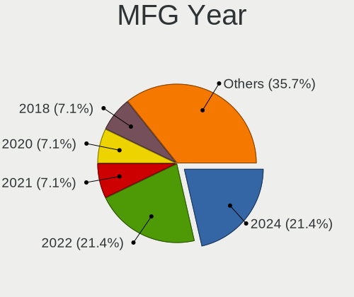
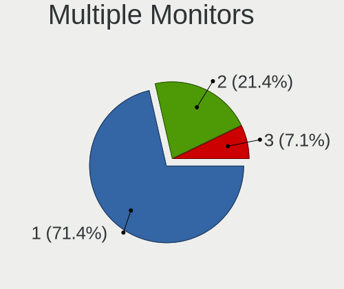

Gentoo Hardware Trends (Desktops)
---------------------------------

A project to identify most popular hardware characteristics and track their change
over time based on data collected by Gentoo users at https://Linux-Hardware.org.

Anyone can contribute to this report by the [hw-probe](https://github.com/linuxhw/hw-probe) tool:

    sudo -E hw-probe -all -upload

Full-feature report is available here: https://linux-hardware.org/?view=trends

Period: Feb, 2022.

Contents
--------

* [ System ](#system)
  - [ OS                       ](#os)
  - [ OS Family                ](#os-family)
  - [ Kernel                   ](#kernel)
  - [ Kernel Family            ](#kernel-family)
  - [ Kernel Major Ver.        ](#kernel-major-ver)
  - [ Arch                     ](#arch)
  - [ DE                       ](#de)
  - [ Display Server           ](#display-server)
  - [ Display Manager          ](#display-manager)
  - [ OS Lang                  ](#os-lang)
  - [ Boot Mode                ](#boot-mode)
  - [ Filesystem               ](#filesystem)
  - [ Part. scheme             ](#part-scheme)
  - [ Dual Boot with Linux/BSD ](#dual-boot-with-linuxbsd)
  - [ Dual Boot (Win)          ](#dual-boot-win)

* [ Board ](#board)
  - [ Vendor                   ](#vendor)
  - [ Model                    ](#model)
  - [ Model Family             ](#model-family)
  - [ MFG Year                 ](#mfg-year)
  - [ Form Factor              ](#form-factor)
  - [ Secure Boot              ](#secure-boot)
  - [ Coreboot                 ](#coreboot)
  - [ RAM Size                 ](#ram-size)
  - [ RAM Used                 ](#ram-used)
  - [ Total Drives             ](#total-drives)
  - [ Has CD-ROM               ](#has-cd-rom)
  - [ Has Ethernet             ](#has-ethernet)
  - [ Has WiFi                 ](#has-wifi)
  - [ Has Bluetooth            ](#has-bluetooth)

* [ Location ](#location)
  - [ Country                  ](#country)
  - [ City                     ](#city)

* [ Drives ](#drives)
  - [ Drive Vendor             ](#drive-vendor)
  - [ Drive Model              ](#drive-model)
  - [ HDD Vendor               ](#hdd-vendor)
  - [ SSD Vendor               ](#ssd-vendor)
  - [ Drive Kind               ](#drive-kind)
  - [ Drive Connector          ](#drive-connector)
  - [ Drive Size               ](#drive-size)
  - [ Space Total              ](#space-total)
  - [ Space Used               ](#space-used)
  - [ Malfunc. Drives          ](#malfunc-drives)
  - [ Malfunc. Drive Vendor    ](#malfunc-drive-vendor)
  - [ Malfunc. HDD Vendor      ](#malfunc-hdd-vendor)
  - [ Malfunc. Drive Kind      ](#malfunc-drive-kind)
  - [ Failed Drives            ](#failed-drives)
  - [ Failed Drive Vendor      ](#failed-drive-vendor)
  - [ Drive Status             ](#drive-status)

* [ Storage controller ](#storage-controller)
  - [ Storage Vendor           ](#storage-vendor)
  - [ Storage Model            ](#storage-model)
  - [ Storage Kind             ](#storage-kind)

* [ Processor ](#processor)
  - [ CPU Vendor               ](#cpu-vendor)
  - [ CPU Model                ](#cpu-model)
  - [ CPU Model Family         ](#cpu-model-family)
  - [ CPU Cores                ](#cpu-cores)
  - [ CPU Sockets              ](#cpu-sockets)
  - [ CPU Threads              ](#cpu-threads)
  - [ CPU Op-Modes             ](#cpu-op-modes)
  - [ CPU Microcode            ](#cpu-microcode)
  - [ CPU Microarch            ](#cpu-microarch)

* [ Graphics ](#graphics)
  - [ GPU Vendor               ](#gpu-vendor)
  - [ GPU Model                ](#gpu-model)
  - [ GPU Combo                ](#gpu-combo)
  - [ GPU Driver               ](#gpu-driver)
  - [ GPU Memory               ](#gpu-memory)

* [ Monitor ](#monitor)
  - [ Monitor Vendor           ](#monitor-vendor)
  - [ Monitor Model            ](#monitor-model)
  - [ Monitor Resolution       ](#monitor-resolution)
  - [ Monitor Diagonal         ](#monitor-diagonal)
  - [ Monitor Width            ](#monitor-width)
  - [ Aspect Ratio             ](#aspect-ratio)
  - [ Monitor Area             ](#monitor-area)
  - [ Pixel Density            ](#pixel-density)
  - [ Multiple Monitors        ](#multiple-monitors)

* [ Network ](#network)
  - [ Net Controller Vendor    ](#net-controller-vendor)
  - [ Net Controller Model     ](#net-controller-model)
  - [ Wireless Vendor          ](#wireless-vendor)
  - [ Wireless Model           ](#wireless-model)
  - [ Ethernet Vendor          ](#ethernet-vendor)
  - [ Ethernet Model           ](#ethernet-model)
  - [ Net Controller Kind      ](#net-controller-kind)
  - [ Used Controller          ](#used-controller)
  - [ NICs                     ](#nics)
  - [ IPv6                     ](#ipv6)

* [ Bluetooth ](#bluetooth)
  - [ Bluetooth Vendor         ](#bluetooth-vendor)
  - [ Bluetooth Model          ](#bluetooth-model)

* [ Sound ](#sound)
  - [ Sound Vendor             ](#sound-vendor)
  - [ Sound Model              ](#sound-model)

* [ Memory ](#memory)
  - [ Memory Vendor            ](#memory-vendor)
  - [ Memory Model             ](#memory-model)
  - [ Memory Kind              ](#memory-kind)
  - [ Memory Form Factor       ](#memory-form-factor)
  - [ Memory Size              ](#memory-size)
  - [ Memory Speed             ](#memory-speed)

* [ Printers & scanners ](#printers--scanners)
  - [ Printer Vendor           ](#printer-vendor)
  - [ Printer Model            ](#printer-model)
  - [ Scanner Vendor           ](#scanner-vendor)
  - [ Scanner Model            ](#scanner-model)

* [ Camera ](#camera)
  - [ Camera Vendor            ](#camera-vendor)
  - [ Camera Model             ](#camera-model)

* [ Security ](#security)
  - [ Fingerprint Vendor       ](#fingerprint-vendor)
  - [ Fingerprint Model        ](#fingerprint-model)
  - [ Chipcard Vendor          ](#chipcard-vendor)
  - [ Chipcard Model           ](#chipcard-model)

* [ Unsupported ](#unsupported)
  - [ Unsupported Devices      ](#unsupported-devices)
  - [ Unsupported Device Types ](#unsupported-device-types)

System
------

OS
--

Installed operating systems

| Name       | Desktops | Percent |
|------------|----------|---------|
| Gentoo 2.7 | 6        | 35.29%  |
| Gentoo 2.6 | 6        | 35.29%  |
| Gentoo 2.8 | 4        | 23.53%  |
| Gentoo 1   | 1        | 5.88%   |

OS Family
---------

OS without a version

| Name   | Desktops | Percent |
|--------|----------|---------|
| Gentoo | 17       | 100%    |

Kernel
------

Version of the Linux kernel

| Version                 | Desktops | Percent |
|-------------------------|----------|---------|
| 5.15.23-gentoo          | 4        | 23.53%  |
| 5.15.19-gentoo          | 2        | 11.76%  |
| 5.4.97-gentoo-x86_64    | 1        | 5.88%   |
| 5.16.9-gentoo-gentoo    | 1        | 5.88%   |
| 5.16.7-tkg-cacule       | 1        | 5.88%   |
| 5.16.5-gentoo-limelight | 1        | 5.88%   |
| 5.16.5-gentoo-dist      | 1        | 5.88%   |
| 5.16.5-gentoo           | 1        | 5.88%   |
| 5.16.4-gentoo           | 1        | 5.88%   |
| 5.16.10-gentoo-x86_64   | 1        | 5.88%   |
| 5.15.19-gentoo-x86_64   | 1        | 5.88%   |
| 5.15.16-gentoo          | 1        | 5.88%   |
| 5.15.11-gentoo          | 1        | 5.88%   |

Kernel Family
-------------

Linux kernel without a distro release

| Version | Desktops | Percent |
|---------|----------|---------|
| 5.15.23 | 4        | 23.53%  |
| 5.16.5  | 3        | 17.65%  |
| 5.15.19 | 3        | 17.65%  |
| 5.4.97  | 1        | 5.88%   |
| 5.16.9  | 1        | 5.88%   |
| 5.16.7  | 1        | 5.88%   |
| 5.16.4  | 1        | 5.88%   |
| 5.16.10 | 1        | 5.88%   |
| 5.15.16 | 1        | 5.88%   |
| 5.15.11 | 1        | 5.88%   |

Kernel Major Ver.
-----------------

Linux kernel major version

| Version | Desktops | Percent |
|---------|----------|---------|
| 5.15    | 9        | 52.94%  |
| 5.16    | 7        | 41.18%  |
| 5.4     | 1        | 5.88%   |

Arch
----

OS architecture (x86_64, i586, etc.)

| Name   | Desktops | Percent |
|--------|----------|---------|
| x86_64 | 17       | 100%    |

DE
--

Desktop Environment

| Name    | Desktops | Percent |
|---------|----------|---------|
| Unknown | 8        | 47.06%  |
| KDE5    | 7        | 41.18%  |
| MATE    | 2        | 11.76%  |

Display Server
--------------

X11 or Wayland

| Name    | Desktops | Percent |
|---------|----------|---------|
| X11     | 8        | 47.06%  |
| Unknown | 5        | 29.41%  |
| Tty     | 3        | 17.65%  |
| Wayland | 1        | 5.88%   |

Display Manager
---------------

SDDM, LightDM, etc.

| Name    | Desktops | Percent |
|---------|----------|---------|
| SDDM    | 7        | 41.18%  |
| Unknown | 6        | 35.29%  |
| LightDM | 3        | 17.65%  |
| XDM     | 1        | 5.88%   |

OS Lang
-------

Language

| Lang    | Desktops | Percent |
|---------|----------|---------|
| en_US   | 7        | 41.18%  |
| en_GB   | 2        | 11.76%  |
| de_DE   | 2        | 11.76%  |
| C.UTF8  | 2        | 11.76%  |
| ru_RU   | 1        | 5.88%   |
| pl_PL   | 1        | 5.88%   |
| fr_FR   | 1        | 5.88%   |
| Unknown | 1        | 5.88%   |

Boot Mode
---------

EFI or BIOS

| Mode | Desktops | Percent |
|------|----------|---------|
| EFI  | 16       | 94.12%  |
| BIOS | 1        | 5.88%   |

Filesystem
----------

Type of filesystem

| Type  | Desktops | Percent |
|-------|----------|---------|
| Ext4  | 11       | 64.71%  |
| Btrfs | 4        | 23.53%  |
| F2fs  | 2        | 11.76%  |

Part. scheme
------------

Scheme of partitioning

| Type | Desktops | Percent |
|------|----------|---------|
| GPT  | 17       | 100%    |

Dual Boot with Linux/BSD
------------------------

Hosting more than one Linux/BSD

| Dual boot | Desktops | Percent |
|-----------|----------|---------|
| No        | 9        | 52.94%  |
| Yes       | 8        | 47.06%  |

Dual Boot (Win)
---------------

Hosting Linux and Windows

| Dual boot | Desktops | Percent |
|-----------|----------|---------|
| No        | 13       | 76.47%  |
| Yes       | 4        | 23.53%  |

Board
-----

Vendor
------

Motherboard manufacturer

| Name                | Desktops | Percent |
|---------------------|----------|---------|
| ASUSTek Computer    | 6        | 35.29%  |
| Gigabyte Technology | 4        | 23.53%  |
| MSI                 | 3        | 17.65%  |
| YANYU               | 1        | 5.88%   |
| Supermicro          | 1        | 5.88%   |
| ASRock              | 1        | 5.88%   |
| Alienware           | 1        | 5.88%   |

Model
-----

Motherboard model

| Name                              | Desktops | Percent |
|-----------------------------------|----------|---------|
| YANYU H17SL                       | 1        | 5.88%   |
| Supermicro A1SRM-2758F            | 1        | 5.88%   |
| MSI MS-7C56                       | 1        | 5.88%   |
| MSI MS-7B17                       | 1        | 5.88%   |
| MSI MS-7851                       | 1        | 5.88%   |
| Gigabyte Z590 UD                  | 1        | 5.88%   |
| Gigabyte Z490 UD                  | 1        | 5.88%   |
| Gigabyte B460HD3                  | 1        | 5.88%   |
| Gigabyte AB350-Gaming             | 1        | 5.88%   |
| ASUS ROG STRIX B450-F GAMING      | 1        | 5.88%   |
| ASUS ROG Maximus XIII APEX        | 1        | 5.88%   |
| ASUS ROG CROSSHAIR VIII DARK HERO | 1        | 5.88%   |
| ASUS PRIME X570-PRO               | 1        | 5.88%   |
| ASUS PRIME B450M-K                | 1        | 5.88%   |
| ASUS M3A78-CM                     | 1        | 5.88%   |
| ASRock B450 Pro4                  | 1        | 5.88%   |
| Alienware Aurora Ryzen Edition    | 1        | 5.88%   |

Model Family
------------

Motherboard model prefix

| Name                   | Desktops | Percent |
|------------------------|----------|---------|
| ASUS ROG               | 3        | 17.65%  |
| ASUS PRIME             | 2        | 11.76%  |
| YANYU H17SL            | 1        | 5.88%   |
| Supermicro A1SRM-2758F | 1        | 5.88%   |
| MSI MS-7C56            | 1        | 5.88%   |
| MSI MS-7B17            | 1        | 5.88%   |
| MSI MS-7851            | 1        | 5.88%   |
| Gigabyte Z590          | 1        | 5.88%   |
| Gigabyte Z490          | 1        | 5.88%   |
| Gigabyte B460HD3       | 1        | 5.88%   |
| Gigabyte AB350-Gaming  | 1        | 5.88%   |
| ASUS M3A78-CM          | 1        | 5.88%   |
| ASRock B450            | 1        | 5.88%   |
| Alienware Aurora       | 1        | 5.88%   |

MFG Year
--------

Motherboard manufacture year

| Year | Desktops | Percent |
|------|----------|---------|
| 2018 | 5        | 29.41%  |
| 2020 | 4        | 23.53%  |
| 2021 | 3        | 17.65%  |
| 2022 | 1        | 5.88%   |
| 2019 | 1        | 5.88%   |
| 2017 | 1        | 5.88%   |
| 2013 | 1        | 5.88%   |
| 2008 | 1        | 5.88%   |

Form Factor
-----------

Physical design of the computer

| Name    | Desktops | Percent |
|---------|----------|---------|
| Desktop | 17       | 100%    |

Secure Boot
-----------

Enabled or disabled

| State    | Desktops | Percent |
|----------|----------|---------|
| Disabled | 15       | 88.24%  |
| Enabled  | 2        | 11.76%  |

Coreboot
--------

Have coreboot on board

| Used | Desktops | Percent |
|------|----------|---------|
| No   | 17       | 100%    |

RAM Size
--------

Total RAM memory

| Size in GB  | Desktops | Percent |
|-------------|----------|---------|
| 32.01-64.0  | 8        | 47.06%  |
| 64.01-256.0 | 4        | 23.53%  |
| 16.01-24.0  | 3        | 17.65%  |
| 4.01-8.0    | 2        | 11.76%  |

RAM Used
--------

Used RAM memory

| Used GB     | Desktops | Percent |
|-------------|----------|---------|
| 4.01-8.0    | 5        | 29.41%  |
| 1.01-2.0    | 3        | 17.65%  |
| 3.01-4.0    | 2        | 11.76%  |
| 8.01-16.0   | 2        | 11.76%  |
| 0.01-0.5    | 2        | 11.76%  |
| 2.01-3.0    | 1        | 5.88%   |
| 64.01-256.0 | 1        | 5.88%   |
| 0.51-1.0    | 1        | 5.88%   |

Total Drives
------------

Number of drives on board

| Drives | Desktops | Percent |
|--------|----------|---------|
| 2      | 6        | 35.29%  |
| 3      | 3        | 17.65%  |
| 6      | 2        | 11.76%  |
| 5      | 2        | 11.76%  |
| 1      | 2        | 11.76%  |
| 10     | 1        | 5.88%   |
| 4      | 1        | 5.88%   |

Has CD-ROM
----------

Has CD-ROM on board

| Presented | Desktops | Percent |
|-----------|----------|---------|
| No        | 15       | 88.24%  |
| Yes       | 2        | 11.76%  |

Has Ethernet
------------

Has Ethernet on board

| Presented | Desktops | Percent |
|-----------|----------|---------|
| Yes       | 17       | 100%    |

Has WiFi
--------

Has WiFi module

| Presented | Desktops | Percent |
|-----------|----------|---------|
| No        | 11       | 64.71%  |
| Yes       | 6        | 35.29%  |

Has Bluetooth
-------------

Has Bluetooth module

| Presented | Desktops | Percent |
|-----------|----------|---------|
| No        | 13       | 76.47%  |
| Yes       | 4        | 23.53%  |

Location
--------

Country
-------

Geographic location (country)

| Country | Desktops | Percent |
|---------|----------|---------|
| USA     | 3        | 17.65%  |
| Russia  | 3        | 17.65%  |
| UK      | 2        | 11.76%  |
| Poland  | 2        | 11.76%  |
| Germany | 2        | 11.76%  |
| Tunisia | 1        | 5.88%   |
| Spain   | 1        | 5.88%   |
| Norway  | 1        | 5.88%   |
| Italy   | 1        | 5.88%   |
| France  | 1        | 5.88%   |

City
----

Geographic location (city)

| City                  | Desktops | Percent |
|-----------------------|----------|---------|
| St Petersburg         | 2        | 11.76%  |
| Warsaw                | 1        | 5.88%   |
| Svobodnyy             | 1        | 5.88%   |
| Siedlce               | 1        | 5.88%   |
| Sant Boi de Llobregat | 1        | 5.88%   |
| Orange                | 1        | 5.88%   |
| Ocala                 | 1        | 5.88%   |
| Morcenx               | 1        | 5.88%   |
| Milan                 | 1        | 5.88%   |
| Houston               | 1        | 5.88%   |
| Hanover               | 1        | 5.88%   |
| Gillingham            | 1        | 5.88%   |
| Essen                 | 1        | 5.88%   |
| Beja                  | 1        | 5.88%   |
| Bardu                 | 1        | 5.88%   |
| Abingdon              | 1        | 5.88%   |

Drives
------

Drive Vendor
------------

Hard drive vendors

| Vendor              | Desktops | Drives | Percent |
|---------------------|----------|--------|---------|
| Samsung Electronics | 7        | 12     | 18.42%  |
| Seagate             | 6        | 6      | 15.79%  |
| WDC                 | 5        | 15     | 13.16%  |
| Crucial             | 3        | 6      | 7.89%   |
| Toshiba             | 2        | 2      | 5.26%   |
| SanDisk             | 2        | 3      | 5.26%   |
| Phison              | 2        | 2      | 5.26%   |
| GOODRAM             | 2        | 2      | 5.26%   |
| PLEXTOR             | 1        | 1      | 2.63%   |
| LaCie               | 1        | 1      | 2.63%   |
| KIOXIA              | 1        | 1      | 2.63%   |
| Kingston            | 1        | 1      | 2.63%   |
| Intel               | 1        | 1      | 2.63%   |
| Hitachi             | 1        | 3      | 2.63%   |
| HGST                | 1        | 1      | 2.63%   |
| EMTEC               | 1        | 1      | 2.63%   |
| Corsair             | 1        | 2      | 2.63%   |

Drive Model
-----------

Hard drive models

| Model                             | Desktops | Percent |
|-----------------------------------|----------|---------|
| GOODRAM SSDPR-CL100-480-G2 480GB  | 2        | 4.35%   |
| Crucial CT2000MX500SSD1 2TB       | 2        | 4.35%   |
| Crucial CT1000MX500SSD1 1TB       | 2        | 4.35%   |
| WDC WDS100T2B0C 1TB               | 1        | 2.17%   |
| WDC WD8003FFBX-68B9AN0 8TB        | 1        | 2.17%   |
| WDC WD6400AAKS-75A7B2 640GB       | 1        | 2.17%   |
| WDC WD60EZRX-00MVLB1 6TB          | 1        | 2.17%   |
| WDC WD30EFRX-68EUZN0 3TB          | 1        | 2.17%   |
| WDC WD10JFCX-68N6GN0 1TB          | 1        | 2.17%   |
| Toshiba HDWE150 5TB               | 1        | 2.17%   |
| Toshiba HDWD120 2TB               | 1        | 2.17%   |
| Seagate ST8000DM004-2CX188 8TB    | 1        | 2.17%   |
| Seagate ST4000DM004-2CV104 4TB    | 1        | 2.17%   |
| Seagate ST2000DM006-2DM164 2TB    | 1        | 2.17%   |
| Seagate ST12000NM0008-2H3101 12TB | 1        | 2.17%   |
| Seagate ST1000DM010-2EP102 1TB    | 1        | 2.17%   |
| Seagate ST1000DM003-1CH162 1TB    | 1        | 2.17%   |
| SanDisk SSD PLUS 240GB            | 1        | 2.17%   |
| SanDisk SSD PLUS 1000GB           | 1        | 2.17%   |
| Samsung SSD 980 PRO 2TB           | 1        | 2.17%   |
| Samsung SSD 980 PRO 1TB           | 1        | 2.17%   |
| Samsung SSD 970 EVO Plus 250GB    | 1        | 2.17%   |
| Samsung SSD 970 EVO Plus 1TB      | 1        | 2.17%   |
| Samsung SSD 970 EVO 250GB         | 1        | 2.17%   |
| Samsung SSD 870 QVO 2TB           | 1        | 2.17%   |
| Samsung SSD 860 EVO 500GB         | 1        | 2.17%   |
| Samsung SSD 860 EVO 250GB         | 1        | 2.17%   |
| Samsung SSD 850 PRO 256GB         | 1        | 2.17%   |
| Samsung SSD 850 EVO 500GB         | 1        | 2.17%   |
| Samsung MZVL22T0HBLB-00B00 2TB    | 1        | 2.17%   |
| PLEXTOR PX-1TM9PG + 1TB           | 1        | 2.17%   |
| Phison Sabrent 1TB                | 1        | 2.17%   |
| Phison Neutron NX500 800GB        | 1        | 2.17%   |
| LaCie Rugged THB USB3 2TB         | 1        | 2.17%   |
| KIOXIA KXG60PNV2T04 NVMe 2048GB   | 1        | 2.17%   |
| Kingston SKC2500M81000G 1TB       | 1        | 2.17%   |
| Intel SSDPEKKW512G8 512GB         | 1        | 2.17%   |
| Hitachi HUS724030ALE641 3TB       | 1        | 2.17%   |
| HGST HTS545050A7E680 500GB        | 1        | 2.17%   |
| EMTEC X250 512GB SSD              | 1        | 2.17%   |
| Crucial CT525MX300SSD1 528GB      | 1        | 2.17%   |
| Corsair Force MP510 480GB         | 1        | 2.17%   |
| Corsair Force LS SSD 960GB        | 1        | 2.17%   |

HDD Vendor
----------

Hard disk drive vendors

| Vendor  | Desktops | Drives | Percent |
|---------|----------|--------|---------|
| Seagate | 6        | 6      | 40%     |
| WDC     | 4        | 14     | 26.67%  |
| Toshiba | 2        | 2      | 13.33%  |
| LaCie   | 1        | 1      | 6.67%   |
| Hitachi | 1        | 3      | 6.67%   |
| HGST    | 1        | 1      | 6.67%   |

SSD Vendor
----------

Solid state drive vendors

| Vendor              | Desktops | Drives | Percent |
|---------------------|----------|--------|---------|
| Samsung Electronics | 5        | 5      | 35.71%  |
| Crucial             | 3        | 6      | 21.43%  |
| SanDisk             | 2        | 3      | 14.29%  |
| GOODRAM             | 2        | 2      | 14.29%  |
| EMTEC               | 1        | 1      | 7.14%   |
| Corsair             | 1        | 1      | 7.14%   |

Drive Kind
----------

HDD or SSD

| Kind | Desktops | Drives | Percent |
|------|----------|--------|---------|
| SSD  | 12       | 18     | 37.5%   |
| NVMe | 10       | 15     | 31.25%  |
| HDD  | 10       | 27     | 31.25%  |

Drive Connector
---------------

SATA, SAS, NVMe, etc.

| Type | Desktops | Drives | Percent |
|------|----------|--------|---------|
| SATA | 15       | 44     | 57.69%  |
| NVMe | 10       | 15     | 38.46%  |
| SAS  | 1        | 1      | 3.85%   |

Drive Size
----------

Size of hard drive

| Size in TB | Desktops | Drives | Percent |
|------------|----------|--------|---------|
| 0.01-0.5   | 8        | 9      | 32%     |
| 0.51-1.0   | 7        | 20     | 28%     |
| 1.01-2.0   | 4        | 6      | 16%     |
| 2.01-3.0   | 2        | 4      | 8%      |
| 4.01-10.0  | 2        | 4      | 8%      |
| 3.01-4.0   | 1        | 1      | 4%      |
| 10.01-20.0 | 1        | 1      | 4%      |

Space Total
-----------

Amount of disk space available on the file system

| Size in GB     | Desktops | Percent |
|----------------|----------|---------|
| More than 3000 | 5        | 29.41%  |
| 501-1000       | 5        | 29.41%  |
| 2001-3000      | 3        | 17.65%  |
| 251-500        | 1        | 5.88%   |
| 1001-2000      | 1        | 5.88%   |
| 51-100         | 1        | 5.88%   |
| Unknown        | 1        | 5.88%   |

Space Used
----------

Amount of used disk space

| Used GB        | Desktops | Percent |
|----------------|----------|---------|
| More than 3000 | 4        | 23.53%  |
| 251-500        | 4        | 23.53%  |
| 501-1000       | 2        | 11.76%  |
| 51-100         | 2        | 11.76%  |
| 21-50          | 1        | 5.88%   |
| 2001-3000      | 1        | 5.88%   |
| 101-250        | 1        | 5.88%   |
| 1-20           | 1        | 5.88%   |
| Unknown        | 1        | 5.88%   |

Malfunc. Drives
---------------

Drive models with a malfunction

| Model                        | Desktops | Drives | Percent |
|------------------------------|----------|--------|---------|
| EMTEC X250 512GB SSD         | 1        | 1      | 50%     |
| Crucial CT525MX300SSD1 528GB | 1        | 1      | 50%     |

Malfunc. Drive Vendor
---------------------

Vendors of faulty drives

| Vendor  | Desktops | Drives | Percent |
|---------|----------|--------|---------|
| EMTEC   | 1        | 1      | 50%     |
| Crucial | 1        | 1      | 50%     |

Malfunc. HDD Vendor
-------------------

Vendors of faulty HDD drives

Zero info for selected period =(

Malfunc. Drive Kind
-------------------

Kinds of faulty drives

| Kind | Desktops | Drives | Percent |
|------|----------|--------|---------|
| SSD  | 2        | 2      | 100%    |

Failed Drives
-------------

Failed drive models

Zero info for selected period =(

Failed Drive Vendor
-------------------

Failed drive vendors

Zero info for selected period =(

Drive Status
------------

Number of failed and malfunc. drives

| Status  | Desktops | Drives | Percent |
|---------|----------|--------|---------|
| Works   | 17       | 58     | 89.47%  |
| Malfunc | 2        | 2      | 10.53%  |

Storage controller
------------------

Storage Vendor
--------------

Storage controller vendors

| Vendor                         | Desktops | Percent |
|--------------------------------|----------|---------|
| AMD                            | 9        | 29.03%  |
| Intel                          | 8        | 25.81%  |
| Samsung Electronics            | 5        | 16.13%  |
| Phison Electronics             | 2        | 6.45%   |
| ASMedia Technology             | 2        | 6.45%   |
| Toshiba America Info Systems   | 1        | 3.23%   |
| Solid State Storage Technology | 1        | 3.23%   |
| Sandisk                        | 1        | 3.23%   |
| Marvell Technology Group       | 1        | 3.23%   |
| Kingston Technology Company    | 1        | 3.23%   |

Storage Model
-------------

Storage controller models

| Model                                                                          | Desktops | Percent |
|--------------------------------------------------------------------------------|----------|---------|
| AMD FCH SATA Controller [AHCI mode]                                            | 5        | 12.82%  |
| Samsung NVMe SSD Controller SM981/PM981/PM983                                  | 3        | 7.69%   |
| Samsung NVMe SSD Controller PM9A1/PM9A3/980PRO                                 | 3        | 7.69%   |
| AMD 400 Series Chipset SATA Controller                                         | 3        | 7.69%   |
| Phison E12 NVMe Controller                                                     | 2        | 5.13%   |
| Intel 500 Series Chipset Family SATA AHCI Controller                           | 2        | 5.13%   |
| ASMedia ASM1062 Serial ATA Controller                                          | 2        | 5.13%   |
| Toshiba America Info Systems XG6 NVMe SSD Controller                           | 1        | 2.56%   |
| Solid State Storage Non-Volatile memory controller                             | 1        | 2.56%   |
| Sandisk WD Blue SN550 NVMe SSD                                                 | 1        | 2.56%   |
| Phison E7 NVMe Controller                                                      | 1        | 2.56%   |
| Marvell Group 88SE9235 PCIe 2.0 x2 4-port SATA 6 Gb/s Controller               | 1        | 2.56%   |
| Kingston Company KC2000 NVMe SSD                                               | 1        | 2.56%   |
| Intel SSD Pro 7600p/760p/E 6100p Series                                        | 1        | 2.56%   |
| Intel Q170/Q150/B150/H170/H110/Z170/CM236 Chipset SATA Controller [AHCI Mode]  | 1        | 2.56%   |
| Intel Comet Lake SATA AHCI Controller                                          | 1        | 2.56%   |
| Intel Cannon Lake PCH SATA AHCI Controller                                     | 1        | 2.56%   |
| Intel Atom processor C2000 AHCI SATA3 Controller                               | 1        | 2.56%   |
| Intel Atom processor C2000 AHCI SATA2 Controller                               | 1        | 2.56%   |
| Intel 8 Series/C220 Series Chipset Family 6-port SATA Controller 1 [AHCI mode] | 1        | 2.56%   |
| Intel 400 Series Chipset Family SATA AHCI Controller                           | 1        | 2.56%   |
| AMD Starship/Matisse Chipset SATA Controller [AHCI mode]                       | 1        | 2.56%   |
| AMD SB7x0/SB8x0/SB9x0 SATA Controller [IDE mode]                               | 1        | 2.56%   |
| AMD SB7x0/SB8x0/SB9x0 IDE Controller                                           | 1        | 2.56%   |
| AMD FCH RAID Controller                                                        | 1        | 2.56%   |
| AMD 300 Series Chipset SATA Controller                                         | 1        | 2.56%   |

Storage Kind
------------

Kind of storage controller (IDE, SATA, NVMe, SAS, ...)

| Kind | Desktops | Percent |
|------|----------|---------|
| SATA | 16       | 57.14%  |
| NVMe | 10       | 35.71%  |
| RAID | 1        | 3.57%   |
| IDE  | 1        | 3.57%   |

Processor
---------

CPU Vendor
----------

Processor vendors

| Vendor | Desktops | Percent |
|--------|----------|---------|
| AMD    | 9        | 52.94%  |
| Intel  | 8        | 47.06%  |

CPU Model
---------

Processor models

| Model                                   | Desktops | Percent |
|-----------------------------------------|----------|---------|
| AMD Ryzen 5 3600XT 6-Core Processor     | 2        | 11.76%  |
| Intel Pentium CPU G3220 @ 3.00GHz       | 1        | 5.88%   |
| Intel Core i7-8700T CPU @ 2.40GHz       | 1        | 5.88%   |
| Intel Core i7-10700K CPU @ 3.80GHz      | 1        | 5.88%   |
| Intel Core i7-10700F CPU @ 2.90GHz      | 1        | 5.88%   |
| Intel Core i5-9600K CPU @ 3.70GHz       | 1        | 5.88%   |
| Intel Atom CPU C2758 @ 2.40GHz          | 1        | 5.88%   |
| Intel 11th Gen Core i9-11900K @ 3.50GHz | 1        | 5.88%   |
| Intel 11th Gen Core i7-11700K @ 3.60GHz | 1        | 5.88%   |
| AMD Ryzen 9 5950X 16-Core Processor     | 1        | 5.88%   |
| AMD Ryzen 9 5900X 12-Core Processor     | 1        | 5.88%   |
| AMD Ryzen 7 3700X 8-Core Processor      | 1        | 5.88%   |
| AMD Ryzen 5 5600X 6-Core Processor      | 1        | 5.88%   |
| AMD Ryzen 5 3600 6-Core Processor       | 1        | 5.88%   |
| AMD Ryzen 5 2600 Six-Core Processor     | 1        | 5.88%   |
| AMD Phenom II X4 955 Processor          | 1        | 5.88%   |

CPU Model Family
----------------

Processor model prefix

| Model            | Desktops | Percent |
|------------------|----------|---------|
| AMD Ryzen 5      | 5        | 29.41%  |
| Intel Core i7    | 3        | 17.65%  |
| Other            | 2        | 11.76%  |
| AMD Ryzen 9      | 2        | 11.76%  |
| Intel Pentium    | 1        | 5.88%   |
| Intel Core i5    | 1        | 5.88%   |
| Intel Atom       | 1        | 5.88%   |
| AMD Ryzen 7      | 1        | 5.88%   |
| AMD Phenom II X4 | 1        | 5.88%   |

CPU Cores
---------

Number of processor cores

| Number | Desktops | Percent |
|--------|----------|---------|
| 6      | 7        | 41.18%  |
| 8      | 6        | 35.29%  |
| 16     | 1        | 5.88%   |
| 12     | 1        | 5.88%   |
| 4      | 1        | 5.88%   |
| 2      | 1        | 5.88%   |

CPU Sockets
-----------

Number of sockets

| Number | Desktops | Percent |
|--------|----------|---------|
| 1      | 17       | 100%    |

CPU Threads
-----------

Threads per core (Hyper-Threading)

| Number | Desktops | Percent |
|--------|----------|---------|
| 2      | 13       | 76.47%  |
| 1      | 4        | 23.53%  |

CPU Op-Modes
------------

CPU Operation Modes (32-bit, 64-bit)

| Op mode        | Desktops | Percent |
|----------------|----------|---------|
| 32-bit, 64-bit | 17       | 100%    |

CPU Microcode
-------------

Microcode number

| Number     | Desktops | Percent |
|------------|----------|---------|
| 0x0a201016 | 3        | 17.65%  |
| 0x08701021 | 3        | 17.65%  |
| 0xa0671    | 2        | 11.76%  |
| 0xa0655    | 2        | 11.76%  |
| 0x906ec    | 1        | 5.88%   |
| 0x906ea    | 1        | 5.88%   |
| 0x406d8    | 1        | 5.88%   |
| 0x306c3    | 1        | 5.88%   |
| 0x08701013 | 1        | 5.88%   |
| 0x0800820d | 1        | 5.88%   |
| 0x010000db | 1        | 5.88%   |

CPU Microarch
-------------

Microarchitecture

| Name       | Desktops | Percent |
|------------|----------|---------|
| Zen 2      | 4        | 23.53%  |
| Zen 3      | 3        | 17.65%  |
| KabyLake   | 2        | 11.76%  |
| Icelake    | 2        | 11.76%  |
| CometLake  | 2        | 11.76%  |
| Zen+       | 1        | 5.88%   |
| Silvermont | 1        | 5.88%   |
| K10        | 1        | 5.88%   |
| Haswell    | 1        | 5.88%   |

Graphics
--------

GPU Vendor
----------

Vendors of graphics cards

| Vendor            | Desktops | Percent |
|-------------------|----------|---------|
| Nvidia            | 10       | 58.82%  |
| AMD               | 4        | 23.53%  |
| Intel             | 2        | 11.76%  |
| ASPEED Technology | 1        | 5.88%   |

GPU Model
---------

Graphics card models

| Model                                                                       | Desktops | Percent |
|-----------------------------------------------------------------------------|----------|---------|
| Nvidia TU116 [GeForce GTX 1660 SUPER]                                       | 2        | 11.76%  |
| Nvidia TU106 [GeForce RTX 2070 Rev. A]                                      | 1        | 5.88%   |
| Nvidia TU106 [GeForce RTX 2060 SUPER]                                       | 1        | 5.88%   |
| Nvidia TU102 [GeForce RTX 2080 Ti Rev. A]                                   | 1        | 5.88%   |
| Nvidia GP108 [GeForce GT 1030]                                              | 1        | 5.88%   |
| Nvidia GP104 [GeForce GTX 1080]                                             | 1        | 5.88%   |
| Nvidia GA102 [GeForce RTX 3090]                                             | 1        | 5.88%   |
| Nvidia GA102 [GeForce RTX 3080 Ti]                                          | 1        | 5.88%   |
| Nvidia G73 [GeForce 7300 GT]                                                | 1        | 5.88%   |
| Intel Xeon E3-1200 v3/4th Gen Core Processor Integrated Graphics Controller | 1        | 5.88%   |
| Intel CoffeeLake-S GT2 [UHD Graphics 630]                                   | 1        | 5.88%   |
| ASPEED Technology ASPEED Graphics Family                                    | 1        | 5.88%   |
| AMD Vega 10 XL/XT [Radeon RX Vega 56/64]                                    | 1        | 5.88%   |
| AMD RS780C [Radeon 3100]                                                    | 1        | 5.88%   |
| AMD Navi 21 [Radeon RX 6800/6800 XT / 6900 XT]                              | 1        | 5.88%   |
| AMD Ellesmere [Radeon RX 470/480/570/570X/580/580X/590]                     | 1        | 5.88%   |

GPU Combo
---------

Combinations of graphics cards

| Name       | Desktops | Percent |
|------------|----------|---------|
| 1 x Nvidia | 10       | 58.82%  |
| 1 x AMD    | 4        | 23.53%  |
| 1 x Intel  | 2        | 11.76%  |
| 1 x ASPEED | 1        | 5.88%   |

GPU Driver
----------

Free vs proprietary

| Driver      | Desktops | Percent |
|-------------|----------|---------|
| Proprietary | 8        | 47.06%  |
| Free        | 8        | 47.06%  |
| Unknown     | 1        | 5.88%   |

GPU Memory
----------

Total video memory

| Size in GB | Desktops | Percent |
|------------|----------|---------|
| 7.01-8.0   | 5        | 29.41%  |
| Unknown    | 4        | 23.53%  |
| 8.01-16.0  | 3        | 17.65%  |
| 5.01-6.0   | 2        | 11.76%  |
| 0.01-0.5   | 2        | 11.76%  |
| 1.01-2.0   | 1        | 5.88%   |

Monitor
-------

Monitor Vendor
--------------

Monitor vendors

| Vendor               | Desktops | Percent |
|----------------------|----------|---------|
| Samsung Electronics  | 4        | 19.05%  |
| Dell                 | 3        | 14.29%  |
| ASUSTek Computer     | 2        | 9.52%   |
| Ancor Communications | 2        | 9.52%   |
| Acer                 | 2        | 9.52%   |
| Valve                | 1        | 4.76%   |
| PKB                  | 1        | 4.76%   |
| MSI                  | 1        | 4.76%   |
| Iiyama               | 1        | 4.76%   |
| Goldstar             | 1        | 4.76%   |
| Gigabyte Technology  | 1        | 4.76%   |
| BenQ                 | 1        | 4.76%   |
| AOC                  | 1        | 4.76%   |

Monitor Model
-------------

Monitor models

| Model                                                                 | Desktops | Percent |
|-----------------------------------------------------------------------|----------|---------|
| Valve Index HMD VLV91A8                                               | 1        | 4.76%   |
| Samsung Electronics SMS27A850 SAM083D 2560x1440 518x324mm 24.1-inch   | 1        | 4.76%   |
| Samsung Electronics S22B300 SAM08C8 1920x1080 477x268mm 21.5-inch     | 1        | 4.76%   |
| Samsung Electronics LU28R55 SAM1018 3840x2160 632x360mm 28.6-inch     | 1        | 4.76%   |
| Samsung Electronics LF24T450F SAM7096 1920x1080 527x296mm 23.8-inch   | 1        | 4.76%   |
| PKB LCD Monitor VIS220WS 1680x1050                                    | 1        | 4.76%   |
| MSI MPG27CQ MSI3FA3 2560x1440 597x336mm 27.0-inch                     | 1        | 4.76%   |
| Iiyama X2483/2481 IVM6128 1920x1080 527x296mm 23.8-inch               | 1        | 4.76%   |
| Goldstar HDR 4K GSM7707 3840x2160 600x340mm 27.2-inch                 | 1        | 4.76%   |
| Gigabyte Technology G34WQC GBT3400 3440x1440 800x330mm 34.1-inch      | 1        | 4.76%   |
| Dell S2421NX DEL41FB 1920x1080 527x296mm 23.8-inch                    | 1        | 4.76%   |
| Dell P2319H DELD0D6 1920x1080 510x290mm 23.1-inch                     | 1        | 4.76%   |
| Dell LCD Monitor SE2417HG                                             | 1        | 4.76%   |
| BenQ VZ2770H BNQ7B3C 1920x1080 598x336mm 27.0-inch                    | 1        | 4.76%   |
| ASUSTek Computer XG27WQ AUS2724 2560x1440 597x336mm 27.0-inch         | 1        | 4.76%   |
| ASUSTek Computer VG249 AUS2421 1920x1080 527x296mm 23.8-inch          | 1        | 4.76%   |
| AOC 2267W AOC2267 1920x1080 476x268mm 21.5-inch                       | 1        | 4.76%   |
| Ancor Communications VN279 ACI27A4 1920x1080 597x336mm 27.0-inch      | 1        | 4.76%   |
| Ancor Communications ASUS VN247 ACI24C3 1920x1080 521x293mm 23.5-inch | 1        | 4.76%   |
| Acer VG270U P ACR06CF 2560x1440 597x336mm 27.0-inch                   | 1        | 4.76%   |
| Acer LCD Monitor V243H 3840x1080                                      | 1        | 4.76%   |

Monitor Resolution
------------------

Monitor screen resolution

| Resolution         | Desktops | Percent |
|--------------------|----------|---------|
| 1920x1080 (FHD)    | 9        | 45%     |
| 2560x1440 (QHD)    | 4        | 20%     |
| 3840x2160 (4K)     | 2        | 10%     |
| Unknown            | 2        | 10%     |
| 3840x1080          | 1        | 5%      |
| 3440x1440          | 1        | 5%      |
| 1680x1050 (WSXGA+) | 1        | 5%      |

Monitor Diagonal
----------------

Diagonal size in inches

| Inches  | Desktops | Percent |
|---------|----------|---------|
| 27      | 5        | 26.32%  |
| 24      | 4        | 21.05%  |
| 23      | 3        | 15.79%  |
| Unknown | 3        | 15.79%  |
| 21      | 2        | 10.53%  |
| 34      | 1        | 5.26%   |
| 28      | 1        | 5.26%   |

Monitor Width
-------------

Physical width

| Width in mm | Desktops | Percent |
|-------------|----------|---------|
| 501-600     | 11       | 61.11%  |
| Unknown     | 3        | 16.67%  |
| 401-500     | 2        | 11.11%  |
| 701-800     | 1        | 5.56%   |
| 601-700     | 1        | 5.56%   |

Aspect Ratio
------------

Proportional relationship between the width and the height

| Ratio   | Desktops | Percent |
|---------|----------|---------|
| 16/9    | 12       | 70.59%  |
| Unknown | 3        | 17.65%  |
| 21/9    | 1        | 5.88%   |
| 16/10   | 1        | 5.88%   |

Monitor Area
------------

Area in inch²

| Area in inch² | Desktops | Percent |
|----------------|----------|---------|
| 201-250        | 6        | 33.33%  |
| 301-350        | 5        | 27.78%  |
| Unknown        | 3        | 16.67%  |
| 351-500        | 2        | 11.11%  |
| 251-300        | 1        | 5.56%   |
| 151-200        | 1        | 5.56%   |

Pixel Density
-------------

Pixels per inch

| Density | Desktops | Percent |
|---------|----------|---------|
| 51-100  | 8        | 42.11%  |
| 101-120 | 6        | 31.58%  |
| Unknown | 3        | 15.79%  |
| 161-240 | 1        | 5.26%   |
| 121-160 | 1        | 5.26%   |

Multiple Monitors
-----------------

Total monitors connected

| Total | Desktops | Percent |
|-------|----------|---------|
| 1     | 12       | 70.59%  |
| 2     | 3        | 17.65%  |
| 4     | 1        | 5.88%   |
| 0     | 1        | 5.88%   |

Network
-------

Net Controller Vendor
---------------------

Controller vendors

| Vendor                | Desktops | Percent |
|-----------------------|----------|---------|
| Realtek Semiconductor | 10       | 40%     |
| Intel                 | 9        | 36%     |
| Ralink Technology     | 1        | 4%      |
| Qualcomm Atheros      | 1        | 4%      |
| OpenMoko              | 1        | 4%      |
| Broadcom              | 1        | 4%      |
| Atmel                 | 1        | 4%      |
| Aquantia              | 1        | 4%      |

Net Controller Model
--------------------

Controller models

| Model                                                             | Desktops | Percent |
|-------------------------------------------------------------------|----------|---------|
| Realtek RTL8111/8168/8411 PCI Express Gigabit Ethernet Controller | 8        | 29.63%  |
| Intel I211 Gigabit Network Connection                             | 3        | 11.11%  |
| Intel Wi-Fi 6 AX200                                               | 2        | 7.41%   |
| Realtek RTL8125 2.5GbE Controller                                 | 1        | 3.7%    |
| Realtek Killer E2600 Gigabit Ethernet Controller                  | 1        | 3.7%    |
| Ralink MT7601U Wireless Adapter                                   | 1        | 3.7%    |
| Qualcomm Atheros AR9287 Wireless Network Adapter (PCI-Express)    | 1        | 3.7%    |
| OpenMoko OneRNG entropy device                                    | 1        | 3.7%    |
| Intel Wi-Fi 6 AX210/AX211/AX411 160MHz                            | 1        | 3.7%    |
| Intel Ethernet Controller XXV710 for 25GbE SFP28                  | 1        | 3.7%    |
| Intel Ethernet Controller X710 for 10GbE SFP+                     | 1        | 3.7%    |
| Intel Ethernet Controller I225-V                                  | 1        | 3.7%    |
| Intel Ethernet Connection I354                                    | 1        | 3.7%    |
| Intel Ethernet Connection (7) I219-V                              | 1        | 3.7%    |
| Broadcom BCM4360 802.11ac Wireless Network Adapter                | 1        | 3.7%    |
| Atmel LUFA USB to Serial Adapter Project                          | 1        | 3.7%    |
| Aquantia AQC107 NBase-T/IEEE 802.3bz Ethernet Controller [AQtion] | 1        | 3.7%    |

Wireless Vendor
---------------

Wireless vendors

| Vendor            | Desktops | Percent |
|-------------------|----------|---------|
| Intel             | 3        | 50%     |
| Ralink Technology | 1        | 16.67%  |
| Qualcomm Atheros  | 1        | 16.67%  |
| Broadcom          | 1        | 16.67%  |

Wireless Model
--------------

Wireless models

| Model                                                          | Desktops | Percent |
|----------------------------------------------------------------|----------|---------|
| Intel Wi-Fi 6 AX200                                            | 2        | 33.33%  |
| Ralink MT7601U Wireless Adapter                                | 1        | 16.67%  |
| Qualcomm Atheros AR9287 Wireless Network Adapter (PCI-Express) | 1        | 16.67%  |
| Intel Wi-Fi 6 AX210/AX211/AX411 160MHz                         | 1        | 16.67%  |
| Broadcom BCM4360 802.11ac Wireless Network Adapter             | 1        | 16.67%  |

Ethernet Vendor
---------------

Ethernet vendors

| Vendor                | Desktops | Percent |
|-----------------------|----------|---------|
| Realtek Semiconductor | 10       | 55.56%  |
| Intel                 | 7        | 38.89%  |
| Aquantia              | 1        | 5.56%   |

Ethernet Model
--------------

Ethernet models

| Model                                                             | Desktops | Percent |
|-------------------------------------------------------------------|----------|---------|
| Realtek RTL8111/8168/8411 PCI Express Gigabit Ethernet Controller | 8        | 42.11%  |
| Intel I211 Gigabit Network Connection                             | 3        | 15.79%  |
| Realtek RTL8125 2.5GbE Controller                                 | 1        | 5.26%   |
| Realtek Killer E2600 Gigabit Ethernet Controller                  | 1        | 5.26%   |
| Intel Ethernet Controller XXV710 for 25GbE SFP28                  | 1        | 5.26%   |
| Intel Ethernet Controller X710 for 10GbE SFP+                     | 1        | 5.26%   |
| Intel Ethernet Controller I225-V                                  | 1        | 5.26%   |
| Intel Ethernet Connection I354                                    | 1        | 5.26%   |
| Intel Ethernet Connection (7) I219-V                              | 1        | 5.26%   |
| Aquantia AQC107 NBase-T/IEEE 802.3bz Ethernet Controller [AQtion] | 1        | 5.26%   |

Net Controller Kind
-------------------

Ethernet, WiFi or modem

| Kind     | Desktops | Percent |
|----------|----------|---------|
| Ethernet | 17       | 70.83%  |
| WiFi     | 6        | 25%     |
| Modem    | 1        | 4.17%   |

Used Controller
---------------

Currently used network controller

| Kind     | Desktops | Percent |
|----------|----------|---------|
| Ethernet | 15       | 83.33%  |
| WiFi     | 3        | 16.67%  |

NICs
----

Total network controllers on board

| Total | Desktops | Percent |
|-------|----------|---------|
| 1     | 10       | 58.82%  |
| 2     | 4        | 23.53%  |
| 12    | 1        | 5.88%   |
| 4     | 1        | 5.88%   |
| 3     | 1        | 5.88%   |

IPv6
----

IPv6 vs IPv4

| Used | Desktops | Percent |
|------|----------|---------|
| No   | 14       | 82.35%  |
| Yes  | 3        | 17.65%  |

Bluetooth
---------

Bluetooth Vendor
----------------

Controller vendors

| Vendor                  | Desktops | Percent |
|-------------------------|----------|---------|
| Intel                   | 3        | 75%     |
| Cambridge Silicon Radio | 1        | 25%     |

Bluetooth Model
---------------

Controller models

| Model                                               | Desktops | Percent |
|-----------------------------------------------------|----------|---------|
| Intel AX200 Bluetooth                               | 2        | 50%     |
| Intel Bluetooth Device                              | 1        | 25%     |
| Cambridge Silicon Radio Bluetooth Dongle (HCI mode) | 1        | 25%     |

Sound
-----

Sound Vendor
------------

Sound card vendors

| Vendor              | Desktops | Percent |
|---------------------|----------|---------|
| AMD                 | 10       | 31.25%  |
| Nvidia              | 8        | 25%     |
| Intel               | 5        | 15.63%  |
| Creative Technology | 2        | 6.25%   |
| Yamaha              | 1        | 3.13%   |
| Valve Software      | 1        | 3.13%   |
| Razer USA           | 1        | 3.13%   |
| Creative Labs       | 1        | 3.13%   |
| C-Media Electronics | 1        | 3.13%   |
| Blue Microphones    | 1        | 3.13%   |
| ASUSTek Computer    | 1        | 3.13%   |

Sound Model
-----------

Sound card models

| Model                                                               | Desktops | Percent |
|---------------------------------------------------------------------|----------|---------|
| AMD Starship/Matisse HD Audio Controller                            | 6        | 17.65%  |
| Nvidia TU106 High Definition Audio Controller                       | 2        | 5.88%   |
| Nvidia GA102 High Definition Audio Controller                       | 2        | 5.88%   |
| Yamaha Steinberg UR22mkII                                           | 1        | 2.94%   |
| Valve Software Valve VR Radio & HMD Mic                             | 1        | 2.94%   |
| Razer USA Razer Kraken Tournament Edition                           | 1        | 2.94%   |
| Nvidia TU116 High Definition Audio Controller                       | 1        | 2.94%   |
| Nvidia TU102 High Definition Audio Controller                       | 1        | 2.94%   |
| Nvidia GP108 High Definition Audio Controller                       | 1        | 2.94%   |
| Nvidia GP104 High Definition Audio Controller                       | 1        | 2.94%   |
| Intel Xeon E3-1200 v3/4th Gen Core Processor HD Audio Controller    | 1        | 2.94%   |
| Intel Tiger Lake-H HD Audio Controller                              | 1        | 2.94%   |
| Intel Comet Lake PCH-V cAVS                                         | 1        | 2.94%   |
| Intel Cannon Lake PCH cAVS                                          | 1        | 2.94%   |
| Intel 8 Series/C220 Series Chipset High Definition Audio Controller | 1        | 2.94%   |
| Intel 100 Series/C230 Series Chipset Family HD Audio Controller     | 1        | 2.94%   |
| Creative Technology Sound BlasterX G6                               | 1        | 2.94%   |
| Creative Technology Sound Blaster Play! 2                           | 1        | 2.94%   |
| Creative Labs Sound Core3D [Sound Blaster Recon3D / Z-Series]       | 1        | 2.94%   |
| C-Media Electronics Blue Snowball                                   | 1        | 2.94%   |
| Blue Microphones Yeti Stereo Microphone                             | 1        | 2.94%   |
| ASUSTek Computer USB Audio                                          | 1        | 2.94%   |
| AMD Vega 10 HDMI Audio [Radeon Vega 56/64]                          | 1        | 2.94%   |
| AMD SBx00 Azalia (Intel HDA)                                        | 1        | 2.94%   |
| AMD Navi 21 HDMI Audio [Radeon RX 6800/6800 XT / 6900 XT]           | 1        | 2.94%   |
| AMD Family 17h (Models 00h-0fh) HD Audio Controller                 | 1        | 2.94%   |
| AMD Ellesmere HDMI Audio [Radeon RX 470/480 / 570/580/590]          | 1        | 2.94%   |

Memory
------

Memory Vendor
-------------

Memory module vendors

| Vendor            | Desktops | Percent |
|-------------------|----------|---------|
| G.Skill           | 3        | 16.67%  |
| Crucial           | 3        | 16.67%  |
| Corsair           | 3        | 16.67%  |
| Patriot           | 2        | 11.11%  |
| Kingston          | 2        | 11.11%  |
| Unknown           | 1        | 5.56%   |
| Toshiba           | 1        | 5.56%   |
| PUSKILL           | 1        | 5.56%   |
| GOODRAM           | 1        | 5.56%   |
| A-DATA Technology | 1        | 5.56%   |

Memory Model
------------

Memory module models

| Model                                                    | Desktops | Percent |
|----------------------------------------------------------|----------|---------|
| Unknown RAM Module 2GB DIMM DDR2 667MT/s                 | 1        | 5.26%   |
| Toshiba RAM 9965525-139.A00LF 8GB DIMM DDR3 1600MT/s     | 1        | 5.26%   |
| PUSKILL RAM PJ16TFK1GM8 16GB SODIMM DDR4 2667MT/s        | 1        | 5.26%   |
| Patriot RAM PSD34G160081 4GB DIMM DDR3 1600MT/s          | 1        | 5.26%   |
| Patriot RAM 3000 C15 Series 8GB DIMM DDR4 3000MT/s       | 1        | 5.26%   |
| Kingston RAM XVTW4H-MIE 32GB DIMM DDR4 3200MT/s          | 1        | 5.26%   |
| Kingston RAM KHX3200C16D4/8GX 8GB DIMM DDR4 3533MT/s     | 1        | 5.26%   |
| GOODRAM RAM IRX3000D464L16S/8G 8GB DIMM DDR4 3000MT/s    | 1        | 5.26%   |
| G.Skill RAM F4-4400C19-32GTRS 32GB DIMM DDR4 2667MT/s    | 1        | 5.26%   |
| G.Skill RAM F4-3600C16-8GTZN 8GB DIMM DDR4 3666MT/s      | 1        | 5.26%   |
| G.Skill RAM F4-3000C16-8GTZR 8192MB DIMM DDR4 3000MT/s   | 1        | 5.26%   |
| Crucial RAM BL32G32C16U4B.M16FB1 32GB DIMM DDR4 3200MT/s | 1        | 5.26%   |
| Crucial RAM BL16G36C16U4RL.M8FB1 16GB DIMM DDR4 4000MT/s | 1        | 5.26%   |
| Crucial RAM BL16G32C16U4W.16FE 16GB DIMM DDR4 3200MT/s   | 1        | 5.26%   |
| Corsair RAM CMZ4GX3M1A1600C9 4096MB DIMM DDR3 1600MT/s   | 1        | 5.26%   |
| Corsair RAM CMK32GX4M2Z2400C16 16GB DIMM DDR4 2400MT/s   | 1        | 5.26%   |
| Corsair RAM CMK32GX4M2B3000C15 16GB DIMM DDR4 3000MT/s   | 1        | 5.26%   |
| Corsair RAM CMK16GX4M2B3200C16 8192MB DIMM DDR4 3600MT/s | 1        | 5.26%   |
| A-DATA RAM DDR4 3200 8GB DIMM DDR4 3200MT/s              | 1        | 5.26%   |

Memory Kind
-----------

Memory module kinds

| Kind | Desktops | Percent |
|------|----------|---------|
| DDR4 | 14       | 82.35%  |
| DDR3 | 2        | 11.76%  |
| DDR2 | 1        | 5.88%   |

Memory Form Factor
------------------

Physical design of the memory module

| Name   | Desktops | Percent |
|--------|----------|---------|
| DIMM   | 16       | 94.12%  |
| SODIMM | 1        | 5.88%   |

Memory Size
-----------

Memory module size

| Size  | Desktops | Percent |
|-------|----------|---------|
| 8192  | 7        | 38.89%  |
| 16384 | 5        | 27.78%  |
| 32768 | 4        | 22.22%  |
| 4096  | 1        | 5.56%   |
| 2048  | 1        | 5.56%   |

Memory Speed
------------

Memory module speed

| Speed | Desktops | Percent |
|-------|----------|---------|
| 3200  | 4        | 22.22%  |
| 3000  | 4        | 22.22%  |
| 2667  | 2        | 11.11%  |
| 1600  | 2        | 11.11%  |
| 4000  | 1        | 5.56%   |
| 3666  | 1        | 5.56%   |
| 3600  | 1        | 5.56%   |
| 3533  | 1        | 5.56%   |
| 2400  | 1        | 5.56%   |
| 667   | 1        | 5.56%   |

Printers & scanners
-------------------

Printer Vendor
--------------

Printer device vendors

| Vendor          | Desktops | Percent |
|-----------------|----------|---------|
| Hewlett-Packard | 1        | 100%    |

Printer Model
-------------

Printer device models

| Model               | Desktops | Percent |
|---------------------|----------|---------|
| HP LaserJet M14-M17 | 1        | 100%    |

Scanner Vendor
--------------

Scanner device vendors

| Vendor | Desktops | Percent |
|--------|----------|---------|
| Canon  | 1        | 100%    |

Scanner Model
-------------

Scanner device models

| Model                         | Desktops | Percent |
|-------------------------------|----------|---------|
| Canon CanoScan N1240U/LiDE 30 | 1        | 100%    |

Camera
------

Camera Vendor
-------------

Camera device vendors

| Vendor              | Desktops | Percent |
|---------------------|----------|---------|
| Logitech            | 4        | 66.67%  |
| Valve Software      | 1        | 16.67%  |
| Creative Technology | 1        | 16.67%  |

Camera Model
------------

Camera device models

| Model                           | Desktops | Percent |
|---------------------------------|----------|---------|
| Logitech HD Pro Webcam C920     | 2        | 33.33%  |
| Valve Software 3D Camera        | 1        | 16.67%  |
| Logitech C922 Pro Stream Webcam | 1        | 16.67%  |
| Logitech BRIO Ultra HD Webcam   | 1        | 16.67%  |
| Creative Live! Cam Sync 1080p   | 1        | 16.67%  |

Security
--------

Fingerprint Vendor
------------------

Fingerprint sensor vendors

| Vendor         | Desktops | Percent |
|----------------|----------|---------|
| DigitalPersona | 1        | 100%    |

Fingerprint Model
-----------------

Fingerprint sensor models

| Model                             | Desktops | Percent |
|-----------------------------------|----------|---------|
| DigitalPersona Fingerprint Reader | 1        | 100%    |

Chipcard Vendor
---------------

Chipcard module vendors

Zero info for selected period =(

Chipcard Model
--------------

Chipcard module models

Zero info for selected period =(

Unsupported
-----------

Unsupported Devices
-------------------

Total unsupported devices on board

| Total | Desktops | Percent |
|-------|----------|---------|
| 0     | 10       | 58.82%  |
| 1     | 6        | 35.29%  |
| 2     | 1        | 5.88%   |

Unsupported Device Types
------------------------

Types of unsupported devices

| Type                     | Desktops | Percent |
|--------------------------|----------|---------|
| Communication controller | 2        | 25%     |
| Storage/raid             | 1        | 12.5%   |
| Sound                    | 1        | 12.5%   |
| Net/wireless             | 1        | 12.5%   |
| Net/ethernet             | 1        | 12.5%   |
| Graphics card            | 1        | 12.5%   |
| Fingerprint reader       | 1        | 12.5%   |

