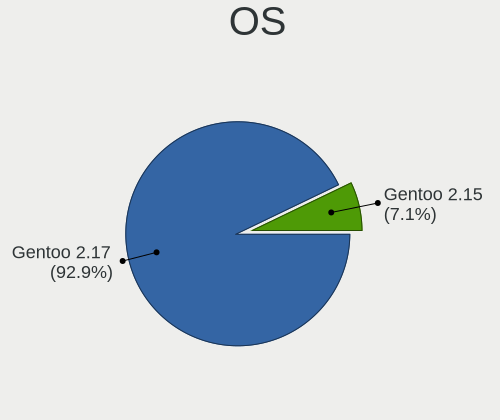
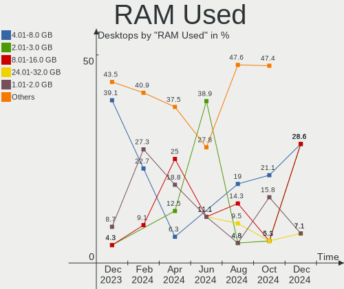
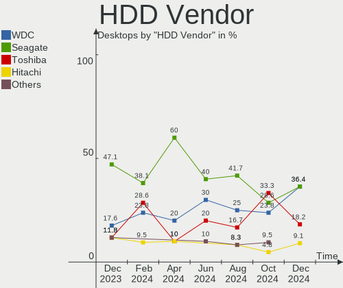
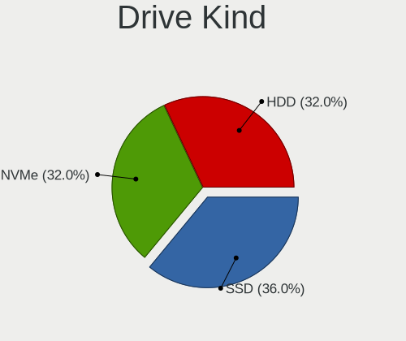
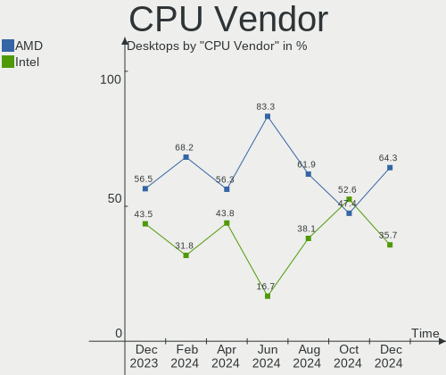

Gentoo - Hardware Trends (Desktops)
-----------------------------------

A project to identify most popular hardware characteristics and track their change
over time based on data collected by Linux users at https://Linux-Hardware.org.

Anyone can contribute to this report by the [hw-probe](https://github.com/linuxhw/hw-probe) tool:

    sudo -E hw-probe -all -upload

This report is for one last month. Overall report since the beginning of time: [TestCoverage](https://github.com/linuxhw/TestCoverage)

Period: Jun, 2022.

Contents
--------

* [ System ](#system)
  - [ OS                       ](#os)
  - [ OS Family                ](#os-family)
  - [ Kernel                   ](#kernel)
  - [ Kernel Family            ](#kernel-family)
  - [ Kernel Major Ver.        ](#kernel-major-ver)
  - [ Arch                     ](#arch)
  - [ DE                       ](#de)
  - [ Display Server           ](#display-server)
  - [ Display Manager          ](#display-manager)
  - [ OS Lang                  ](#os-lang)
  - [ Boot Mode                ](#boot-mode)
  - [ Filesystem               ](#filesystem)
  - [ Part. scheme             ](#part-scheme)
  - [ Dual Boot with Linux/BSD ](#dual-boot-with-linuxbsd)
  - [ Dual Boot (Win)          ](#dual-boot-win)

* [ Board ](#board)
  - [ Vendor                   ](#vendor)
  - [ Model                    ](#model)
  - [ Model Family             ](#model-family)
  - [ MFG Year                 ](#mfg-year)
  - [ Form Factor              ](#form-factor)
  - [ Secure Boot              ](#secure-boot)
  - [ Coreboot                 ](#coreboot)
  - [ RAM Size                 ](#ram-size)
  - [ RAM Used                 ](#ram-used)
  - [ Total Drives             ](#total-drives)
  - [ Has CD-ROM               ](#has-cd-rom)
  - [ Has Ethernet             ](#has-ethernet)
  - [ Has WiFi                 ](#has-wifi)
  - [ Has Bluetooth            ](#has-bluetooth)

* [ Location ](#location)
  - [ Country                  ](#country)
  - [ City                     ](#city)

* [ Drives ](#drives)
  - [ Drive Vendor             ](#drive-vendor)
  - [ Drive Model              ](#drive-model)
  - [ HDD Vendor               ](#hdd-vendor)
  - [ SSD Vendor               ](#ssd-vendor)
  - [ Drive Kind               ](#drive-kind)
  - [ Drive Connector          ](#drive-connector)
  - [ Drive Size               ](#drive-size)
  - [ Space Total              ](#space-total)
  - [ Space Used               ](#space-used)
  - [ Malfunc. Drives          ](#malfunc-drives)
  - [ Malfunc. Drive Vendor    ](#malfunc-drive-vendor)
  - [ Malfunc. HDD Vendor      ](#malfunc-hdd-vendor)
  - [ Malfunc. Drive Kind      ](#malfunc-drive-kind)
  - [ Failed Drives            ](#failed-drives)
  - [ Failed Drive Vendor      ](#failed-drive-vendor)
  - [ Drive Status             ](#drive-status)

* [ Storage controller ](#storage-controller)
  - [ Storage Vendor           ](#storage-vendor)
  - [ Storage Model            ](#storage-model)
  - [ Storage Kind             ](#storage-kind)

* [ Processor ](#processor)
  - [ CPU Vendor               ](#cpu-vendor)
  - [ CPU Model                ](#cpu-model)
  - [ CPU Model Family         ](#cpu-model-family)
  - [ CPU Cores                ](#cpu-cores)
  - [ CPU Sockets              ](#cpu-sockets)
  - [ CPU Threads              ](#cpu-threads)
  - [ CPU Op-Modes             ](#cpu-op-modes)
  - [ CPU Microcode            ](#cpu-microcode)
  - [ CPU Microarch            ](#cpu-microarch)

* [ Graphics ](#graphics)
  - [ GPU Vendor               ](#gpu-vendor)
  - [ GPU Model                ](#gpu-model)
  - [ GPU Combo                ](#gpu-combo)
  - [ GPU Driver               ](#gpu-driver)
  - [ GPU Memory               ](#gpu-memory)

* [ Monitor ](#monitor)
  - [ Monitor Vendor           ](#monitor-vendor)
  - [ Monitor Model            ](#monitor-model)
  - [ Monitor Resolution       ](#monitor-resolution)
  - [ Monitor Diagonal         ](#monitor-diagonal)
  - [ Monitor Width            ](#monitor-width)
  - [ Aspect Ratio             ](#aspect-ratio)
  - [ Monitor Area             ](#monitor-area)
  - [ Pixel Density            ](#pixel-density)
  - [ Multiple Monitors        ](#multiple-monitors)

* [ Network ](#network)
  - [ Net Controller Vendor    ](#net-controller-vendor)
  - [ Net Controller Model     ](#net-controller-model)
  - [ Wireless Vendor          ](#wireless-vendor)
  - [ Wireless Model           ](#wireless-model)
  - [ Ethernet Vendor          ](#ethernet-vendor)
  - [ Ethernet Model           ](#ethernet-model)
  - [ Net Controller Kind      ](#net-controller-kind)
  - [ Used Controller          ](#used-controller)
  - [ NICs                     ](#nics)
  - [ IPv6                     ](#ipv6)

* [ Bluetooth ](#bluetooth)
  - [ Bluetooth Vendor         ](#bluetooth-vendor)
  - [ Bluetooth Model          ](#bluetooth-model)

* [ Sound ](#sound)
  - [ Sound Vendor             ](#sound-vendor)
  - [ Sound Model              ](#sound-model)

* [ Memory ](#memory)
  - [ Memory Vendor            ](#memory-vendor)
  - [ Memory Model             ](#memory-model)
  - [ Memory Kind              ](#memory-kind)
  - [ Memory Form Factor       ](#memory-form-factor)
  - [ Memory Size              ](#memory-size)
  - [ Memory Speed             ](#memory-speed)

* [ Printers & scanners ](#printers--scanners)
  - [ Printer Vendor           ](#printer-vendor)
  - [ Printer Model            ](#printer-model)
  - [ Scanner Vendor           ](#scanner-vendor)
  - [ Scanner Model            ](#scanner-model)

* [ Camera ](#camera)
  - [ Camera Vendor            ](#camera-vendor)
  - [ Camera Model             ](#camera-model)

* [ Security ](#security)
  - [ Fingerprint Vendor       ](#fingerprint-vendor)
  - [ Fingerprint Model        ](#fingerprint-model)
  - [ Chipcard Vendor          ](#chipcard-vendor)
  - [ Chipcard Model           ](#chipcard-model)

* [ Unsupported ](#unsupported)
  - [ Unsupported Devices      ](#unsupported-devices)
  - [ Unsupported Device Types ](#unsupported-device-types)

System
------

OS
--

Installed operating systems

| Name       | Desktops | Percent |
|------------|----------|---------|
| Gentoo 2.8 | 10       | 90.91%  |
| Gentoo 2.7 | 1        | 9.09%   |

OS Family
---------

OS without a version

| Name   | Desktops | Percent |
|--------|----------|---------|
| Gentoo | 11       | 100%    |

Kernel
------

Version of the Linux kernel

| Version               | Desktops | Percent |
|-----------------------|----------|---------|
| 5.15.41-gentoo        | 4        | 36.36%  |
| 5.18.6-gentoo-x86_64  | 1        | 9.09%   |
| 5.18.6-gentoo         | 1        | 9.09%   |
| 5.18.1-gentoo-r2      | 1        | 9.09%   |
| 5.15.41-gentoo-x86_64 | 1        | 9.09%   |
| 5.15.32-gentoo-r1     | 1        | 9.09%   |
| 5.15.12-gentoo-x86_64 | 1        | 9.09%   |
| 4.9.16-gentoo         | 1        | 9.09%   |

Kernel Family
-------------

Linux kernel without a distro release

| Version | Desktops | Percent |
|---------|----------|---------|
| 5.15.41 | 5        | 45.45%  |
| 5.18.6  | 2        | 18.18%  |
| 5.18.1  | 1        | 9.09%   |
| 5.15.32 | 1        | 9.09%   |
| 5.15.12 | 1        | 9.09%   |
| 4.9.16  | 1        | 9.09%   |

Kernel Major Ver.
-----------------

Linux kernel major version

| Version | Desktops | Percent |
|---------|----------|---------|
| 5.15    | 7        | 63.64%  |
| 5.18    | 3        | 27.27%  |
| 4.9     | 1        | 9.09%   |

Arch
----

OS architecture (x86_64, i586, etc.)

| Name   | Desktops | Percent |
|--------|----------|---------|
| x86_64 | 10       | 90.91%  |
| ppc    | 1        | 9.09%   |

DE
--

Desktop Environment

| Name    | Desktops | Percent |
|---------|----------|---------|
| KDE5    | 3        | 27.27%  |
| Unknown | 3        | 27.27%  |
| MATE    | 2        | 18.18%  |
| GNOME   | 2        | 18.18%  |
| DWM     | 1        | 9.09%   |

Display Server
--------------

X11 or Wayland

| Name    | Desktops | Percent |
|---------|----------|---------|
| X11     | 9        | 81.82%  |
| Tty     | 1        | 9.09%   |
| Unknown | 1        | 9.09%   |

Display Manager
---------------

SDDM, LightDM, etc.

| Name    | Desktops | Percent |
|---------|----------|---------|
| LightDM | 4        | 36.36%  |
| Unknown | 3        | 27.27%  |
| SDDM    | 2        | 18.18%  |
| XDM     | 1        | 9.09%   |
| GDM     | 1        | 9.09%   |

OS Lang
-------

Language

| Lang   | Desktops | Percent |
|--------|----------|---------|
| en_US  | 5        | 45.45%  |
| ru_RU  | 2        | 18.18%  |
| pl_PL  | 1        | 9.09%   |
| en_CA  | 1        | 9.09%   |
| de_DE  | 1        | 9.09%   |
| C.UTF8 | 1        | 9.09%   |

Boot Mode
---------

EFI or BIOS

| Mode | Desktops | Percent |
|------|----------|---------|
| EFI  | 9        | 81.82%  |
| BIOS | 2        | 18.18%  |

Filesystem
----------

Type of filesystem

| Type    | Desktops | Percent |
|---------|----------|---------|
| Ext4    | 7        | 63.64%  |
| F2fs    | 2        | 18.18%  |
| XXXXXXX | 1        | 9.09%   |
| Btrfs   | 1        | 9.09%   |

Part. scheme
------------

Scheme of partitioning

| Type    | Desktops | Percent |
|---------|----------|---------|
| GPT     | 10       | 90.91%  |
| Unknown | 1        | 9.09%   |

Dual Boot with Linux/BSD
------------------------

Hosting more than one Linux/BSD

| Dual boot | Desktops | Percent |
|-----------|----------|---------|
| No        | 7        | 63.64%  |
| Yes       | 4        | 36.36%  |

Dual Boot (Win)
---------------

Hosting Linux and Windows

| Dual boot | Desktops | Percent |
|-----------|----------|---------|
| Yes       | 6        | 54.55%  |
| No        | 5        | 45.45%  |

Board
-----

Vendor
------

Motherboard manufacturer

| Name                | Desktops | Percent |
|---------------------|----------|---------|
| ASUSTek Computer    | 3        | 27.27%  |
| Gigabyte Technology | 2        | 18.18%  |
| Pegatron            | 1        | 9.09%   |
| MSI                 | 1        | 9.09%   |
| Fujitsu             | 1        | 9.09%   |
| Dell                | 1        | 9.09%   |
| ASRock              | 1        | 9.09%   |
| Unknown             | 1        | 9.09%   |

Model
-----

Motherboard model

| Name                             | Desktops | Percent |
|----------------------------------|----------|---------|
| Pegatron 810-170st               | 1        | 9.09%   |
| MSI MS-7C37                      | 1        | 9.09%   |
| Gigabyte Z590 UD                 | 1        | 9.09%   |
| Gigabyte AB350-Gaming            | 1        | 9.09%   |
| Fujitsu D3417-B2 S26361-D3417-B2 | 1        | 9.09%   |
| Dell XPS 8700                    | 1        | 9.09%   |
| ASUS TUF Gaming X570-PLUS        | 1        | 9.09%   |
| ASUS ROG STRIX B450-F GAMING     | 1        | 9.09%   |
| ASUS M3A78-CM                    | 1        | 9.09%   |
| ASRock B450 Pro4                 | 1        | 9.09%   |
| Unknown                          | 1        | 9.09%   |

Model Family
------------

Motherboard model prefix

| Name                  | Desktops | Percent |
|-----------------------|----------|---------|
| Pegatron 810-170st    | 1        | 9.09%   |
| MSI MS-7C37           | 1        | 9.09%   |
| Gigabyte Z590         | 1        | 9.09%   |
| Gigabyte AB350-Gaming | 1        | 9.09%   |
| Fujitsu D3417-B2      | 1        | 9.09%   |
| Dell XPS              | 1        | 9.09%   |
| ASUS TUF              | 1        | 9.09%   |
| ASUS ROG              | 1        | 9.09%   |
| ASUS M3A78-CM         | 1        | 9.09%   |
| ASRock B450           | 1        | 9.09%   |
| Unknown               | 1        | 9.09%   |

MFG Year
--------

Motherboard manufacture year

| Year    | Desktops | Percent |
|---------|----------|---------|
| 2019    | 2        | 18.18%  |
| 2018    | 2        | 18.18%  |
| 2017    | 2        | 18.18%  |
| 2014    | 2        | 18.18%  |
| 2022    | 1        | 9.09%   |
| 2008    | 1        | 9.09%   |
| Unknown | 1        | 9.09%   |

Form Factor
-----------

Physical design of the computer

| Name    | Desktops | Percent |
|---------|----------|---------|
| Desktop | 11       | 100%    |

Secure Boot
-----------

Enabled or disabled

| State    | Desktops | Percent |
|----------|----------|---------|
| Disabled | 10       | 90.91%  |
| Enabled  | 1        | 9.09%   |

Coreboot
--------

Have coreboot on board

| Used | Desktops | Percent |
|------|----------|---------|
| No   | 11       | 100%    |

RAM Size
--------

Total RAM memory

| Size in GB  | Desktops | Percent |
|-------------|----------|---------|
| 32.01-64.0  | 3        | 27.27%  |
| 64.01-256.0 | 3        | 27.27%  |
| 4.01-8.0    | 1        | 9.09%   |
| 24.01-32.0  | 1        | 9.09%   |
| 16.01-24.0  | 1        | 9.09%   |
| 8.01-16.0   | 1        | 9.09%   |
| 0.51-1.0    | 1        | 9.09%   |

RAM Used
--------

Used RAM memory

| Used GB    | Desktops | Percent |
|------------|----------|---------|
| 4.01-8.0   | 2        | 18.18%  |
| 2.01-3.0   | 2        | 18.18%  |
| 8.01-16.0  | 2        | 18.18%  |
| 32.01-64.0 | 1        | 9.09%   |
| 3.01-4.0   | 1        | 9.09%   |
| 16.01-24.0 | 1        | 9.09%   |
| 1.01-2.0   | 1        | 9.09%   |
| 0.01-0.5   | 1        | 9.09%   |

Total Drives
------------

Number of drives on board

| Drives | Desktops | Percent |
|--------|----------|---------|
| 2      | 3        | 27.27%  |
| 6      | 2        | 18.18%  |
| 5      | 2        | 18.18%  |
| 3      | 2        | 18.18%  |
| 1      | 2        | 18.18%  |

Has CD-ROM
----------

Has CD-ROM on board

| Presented | Desktops | Percent |
|-----------|----------|---------|
| No        | 8        | 72.73%  |
| Yes       | 3        | 27.27%  |

Has Ethernet
------------

Has Ethernet on board

| Presented | Desktops | Percent |
|-----------|----------|---------|
| Yes       | 11       | 100%    |

Has WiFi
--------

Has WiFi module

| Presented | Desktops | Percent |
|-----------|----------|---------|
| No        | 7        | 63.64%  |
| Yes       | 4        | 36.36%  |

Has Bluetooth
-------------

Has Bluetooth module

| Presented | Desktops | Percent |
|-----------|----------|---------|
| No        | 7        | 63.64%  |
| Yes       | 4        | 36.36%  |

Location
--------

Country
-------

Geographic location (country)

| Country     | Desktops | Percent |
|-------------|----------|---------|
| USA         | 3        | 27.27%  |
| Poland      | 3        | 27.27%  |
| Russia      | 2        | 18.18%  |
| Netherlands | 1        | 9.09%   |
| Germany     | 1        | 9.09%   |
| Canada      | 1        | 9.09%   |

City
----

Geographic location (city)

| City          | Desktops | Percent |
|---------------|----------|---------|
| Warsaw        | 2        | 18.18%  |
| Yekaterinburg | 1        | 9.09%   |
| Volgodonsk    | 1        | 9.09%   |
| Vancouver     | 1        | 9.09%   |
| Seattle       | 1        | 9.09%   |
| Orange        | 1        | 9.09%   |
| Kensington    | 1        | 9.09%   |
| Gunzenhausen  | 1        | 9.09%   |
| Cieszyn       | 1        | 9.09%   |
| Amstelveen    | 1        | 9.09%   |

Drives
------

Drive Vendor
------------

Hard drive vendors

| Vendor              | Desktops | Drives | Percent |
|---------------------|----------|--------|---------|
| Seagate             | 6        | 9      | 25%     |
| Samsung Electronics | 4        | 7      | 16.67%  |
| Toshiba             | 3        | 4      | 12.5%   |
| WDC                 | 2        | 3      | 8.33%   |
| Goodram             | 2        | 2      | 8.33%   |
| Silicon Motion      | 1        | 2      | 4.17%   |
| Kingston            | 1        | 1      | 4.17%   |
| Hitachi             | 1        | 3      | 4.17%   |
| HGST                | 1        | 2      | 4.17%   |
| Gigabyte Technology | 1        | 1      | 4.17%   |
| Fujitsu             | 1        | 1      | 4.17%   |
| Crucial             | 1        | 1      | 4.17%   |

Drive Model
-----------

Hard drive models

| Model                             | Desktops | Percent |
|-----------------------------------|----------|---------|
| Goodram SSDPR-CL100-480-G2 480GB  | 2        | 6.67%   |
| WDC WD8003FFBX-68B9AN0 8TB        | 1        | 3.33%   |
| WDC WD60EZRX-00MVLB1 6TB          | 1        | 3.33%   |
| WDC WD2003FZEX-00SRLA0 2TB        | 1        | 3.33%   |
| Toshiba HDWR180 8TB               | 1        | 3.33%   |
| Toshiba HDWE150 5TB               | 1        | 3.33%   |
| Toshiba HDWD110 1TB               | 1        | 3.33%   |
| Silicon Motion NVME SSD 128GB     | 1        | 3.33%   |
| Silicon Motion 256GB              | 1        | 3.33%   |
| Seagate ST8000NM0055-1RM112 8TB   | 1        | 3.33%   |
| Seagate ST8000DM004-2CX188 8TB    | 1        | 3.33%   |
| Seagate ST4000NM0245-1Z2107 4TB   | 1        | 3.33%   |
| Seagate ST4000NM0024-1HT178 4TB   | 1        | 3.33%   |
| Seagate ST4000DM004-2CV104 4TB    | 1        | 3.33%   |
| Seagate ST2000LM015-2E8174 2TB    | 1        | 3.33%   |
| Seagate ST12000NM0008-2H3101 12TB | 1        | 3.33%   |
| Samsung SSD 980 PRO 1TB           | 1        | 3.33%   |
| Samsung SSD 970 PRO 1TB           | 1        | 3.33%   |
| Samsung SSD 970 EVO 1TB           | 1        | 3.33%   |
| Samsung SSD 870 EVO 1TB           | 1        | 3.33%   |
| Samsung SSD 860 EVO 500GB         | 1        | 3.33%   |
| Samsung SSD 850 PRO 256GB         | 1        | 3.33%   |
| Samsung SSD 850 EVO 250GB         | 1        | 3.33%   |
| Kingston SA400S37240G 240GB SSD   | 1        | 3.33%   |
| Hitachi HUS724030ALE641 3TB       | 1        | 3.33%   |
| HGST HTS545050A7E380 500GB        | 1        | 3.33%   |
| Gigabyte GP-GSM2NE3128GNTD 128GB  | 1        | 3.33%   |
| Fujitsu MHV2040AT 40GB            | 1        | 3.33%   |
| Crucial CT2000MX500SSD1 2TB       | 1        | 3.33%   |

HDD Vendor
----------

Hard disk drive vendors

| Vendor  | Desktops | Drives | Percent |
|---------|----------|--------|---------|
| Seagate | 6        | 9      | 42.86%  |
| Toshiba | 3        | 4      | 21.43%  |
| WDC     | 2        | 3      | 14.29%  |
| Hitachi | 1        | 3      | 7.14%   |
| HGST    | 1        | 2      | 7.14%   |
| Fujitsu | 1        | 1      | 7.14%   |

SSD Vendor
----------

Solid state drive vendors

| Vendor              | Desktops | Drives | Percent |
|---------------------|----------|--------|---------|
| Samsung Electronics | 3        | 4      | 42.86%  |
| Goodram             | 2        | 2      | 28.57%  |
| Kingston            | 1        | 1      | 14.29%  |
| Crucial             | 1        | 1      | 14.29%  |

Drive Kind
----------

HDD or SSD

| Kind | Desktops | Drives | Percent |
|------|----------|--------|---------|
| HDD  | 9        | 22     | 45%     |
| SSD  | 6        | 8      | 30%     |
| NVMe | 5        | 6      | 25%     |

Drive Connector
---------------

SATA, SAS, NVMe, etc.

| Type | Desktops | Drives | Percent |
|------|----------|--------|---------|
| SATA | 11       | 30     | 68.75%  |
| NVMe | 5        | 6      | 31.25%  |

Drive Size
----------

Size of hard drive

| Size in TB | Desktops | Drives | Percent |
|------------|----------|--------|---------|
| 0.01-0.5   | 7        | 9      | 36.84%  |
| 1.01-2.0   | 3        | 4      | 15.79%  |
| 4.01-10.0  | 3        | 8      | 15.79%  |
| 3.01-4.0   | 2        | 3      | 10.53%  |
| 0.51-1.0   | 2        | 2      | 10.53%  |
| 2.01-3.0   | 1        | 3      | 5.26%   |
| 10.01-20.0 | 1        | 1      | 5.26%   |

Space Total
-----------

Amount of disk space available on the file system

| Size in GB     | Desktops | Percent |
|----------------|----------|---------|
| More than 3000 | 5        | 45.45%  |
| 251-500        | 2        | 18.18%  |
| 21-50          | 1        | 9.09%   |
| 101-250        | 1        | 9.09%   |
| 1001-2000      | 1        | 9.09%   |
| 501-1000       | 1        | 9.09%   |

Space Used
----------

Amount of used disk space

| Used GB        | Desktops | Percent |
|----------------|----------|---------|
| More than 3000 | 3        | 27.27%  |
| 101-250        | 2        | 18.18%  |
| 1-20           | 2        | 18.18%  |
| 251-500        | 1        | 9.09%   |
| 21-50          | 1        | 9.09%   |
| 2001-3000      | 1        | 9.09%   |
| 501-1000       | 1        | 9.09%   |

Malfunc. Drives
---------------

Drive models with a malfunction

| Model                               | Desktops | Drives | Percent |
|-------------------------------------|----------|--------|---------|
| Samsung Electronics SSD 970 EVO 1TB | 1        | 1      | 100%    |

Malfunc. Drive Vendor
---------------------

Vendors of faulty drives

| Vendor              | Desktops | Drives | Percent |
|---------------------|----------|--------|---------|
| Samsung Electronics | 1        | 1      | 100%    |

Malfunc. HDD Vendor
-------------------

Vendors of faulty HDD drives

Zero info for selected period =(

Malfunc. Drive Kind
-------------------

Kinds of faulty drives

| Kind | Desktops | Drives | Percent |
|------|----------|--------|---------|
| NVMe | 1        | 1      | 100%    |

Failed Drives
-------------

Failed drive models

Zero info for selected period =(

Failed Drive Vendor
-------------------

Failed drive vendors

Zero info for selected period =(

Drive Status
------------

Number of failed and malfunc. drives

| Status  | Desktops | Drives | Percent |
|---------|----------|--------|---------|
| Works   | 11       | 35     | 91.67%  |
| Malfunc | 1        | 1      | 8.33%   |

Storage controller
------------------

Storage Vendor
--------------

Storage controller vendors

| Vendor              | Desktops | Percent |
|---------------------|----------|---------|
| AMD                 | 6        | 35.29%  |
| Intel               | 4        | 23.53%  |
| Samsung Electronics | 3        | 17.65%  |
| ASMedia Technology  | 2        | 11.76%  |
| Silicon Motion      | 1        | 5.88%   |
| Phison Electronics  | 1        | 5.88%   |

Storage Model
-------------

Storage controller models

| Model                                                                          | Desktops | Percent |
|--------------------------------------------------------------------------------|----------|---------|
| AMD FCH SATA Controller [AHCI mode]                                            | 5        | 23.81%  |
| Samsung NVMe SSD Controller SM981/PM981/PM983                                  | 2        | 9.52%   |
| ASMedia ASM1062 Serial ATA Controller                                          | 2        | 9.52%   |
| AMD 400 Series Chipset SATA Controller                                         | 2        | 9.52%   |
| Silicon Motion SM2263EN/SM2263XT SSD Controller                                | 1        | 4.76%   |
| Samsung NVMe SSD Controller PM9A1/PM9A3/980PRO                                 | 1        | 4.76%   |
| Phison PS5013 E13 NVMe Controller                                              | 1        | 4.76%   |
| Intel Q170/Q150/B150/H170/H110/Z170/CM236 Chipset SATA Controller [AHCI Mode]  | 1        | 4.76%   |
| Intel C600/X79 series chipset 6-Port SATA AHCI Controller                      | 1        | 4.76%   |
| Intel 8 Series/C220 Series Chipset Family 6-port SATA Controller 1 [AHCI mode] | 1        | 4.76%   |
| Intel 500 Series Chipset Family SATA AHCI Controller                           | 1        | 4.76%   |
| AMD SB7x0/SB8x0/SB9x0 SATA Controller [IDE mode]                               | 1        | 4.76%   |
| AMD SB7x0/SB8x0/SB9x0 IDE Controller                                           | 1        | 4.76%   |
| AMD 300 Series Chipset SATA Controller                                         | 1        | 4.76%   |

Storage Kind
------------

Kind of storage controller (IDE, SATA, NVMe, SAS, ...)

| Kind | Desktops | Percent |
|------|----------|---------|
| SATA | 10       | 62.5%   |
| NVMe | 5        | 31.25%  |
| IDE  | 1        | 6.25%   |

Processor
---------

CPU Vendor
----------

Processor vendors

| Vendor       | Desktops | Percent |
|--------------|----------|---------|
| AMD          | 6        | 54.55%  |
| Intel        | 4        | 36.36%  |
| PowerBook6,7 | 1        | 9.09%   |

CPU Model
---------

Processor models

| Model                                   | Desktops | Percent |
|-----------------------------------------|----------|---------|
| PowerBook6,7 7447A, altivec supported   | 1        | 9.09%   |
| Intel Xeon CPU E3-1275 v6 @ 3.80GHz     | 1        | 9.09%   |
| Intel Core i7-4930K CPU @ 3.40GHz       | 1        | 9.09%   |
| Intel Core i7-4790 CPU @ 3.60GHz        | 1        | 9.09%   |
| Intel 11th Gen Core i7-11700K @ 3.60GHz | 1        | 9.09%   |
| AMD Ryzen 9 5950X 16-Core Processor     | 1        | 9.09%   |
| AMD Ryzen 9 3900X 12-Core Processor     | 1        | 9.09%   |
| AMD Ryzen 7 2700X Eight-Core Processor  | 1        | 9.09%   |
| AMD Ryzen 5 2600 Six-Core Processor     | 1        | 9.09%   |
| AMD Ryzen 5 1600 Six-Core Processor     | 1        | 9.09%   |
| AMD Phenom II X4 955 Processor          | 1        | 9.09%   |

CPU Model Family
----------------

Processor model prefix

| Model            | Desktops | Percent |
|------------------|----------|---------|
| Other            | 2        | 18.18%  |
| Intel Core i7    | 2        | 18.18%  |
| AMD Ryzen 9      | 2        | 18.18%  |
| AMD Ryzen 5      | 2        | 18.18%  |
| Intel Xeon       | 1        | 9.09%   |
| AMD Ryzen 7      | 1        | 9.09%   |
| AMD Phenom II X4 | 1        | 9.09%   |

CPU Cores
---------

Number of processor cores

| Number | Desktops | Percent |
|--------|----------|---------|
| 6      | 3        | 27.27%  |
| 4      | 3        | 27.27%  |
| 8      | 2        | 18.18%  |
| 16     | 1        | 9.09%   |
| 12     | 1        | 9.09%   |
| 1      | 1        | 9.09%   |

CPU Sockets
-----------

Number of sockets

| Number | Desktops | Percent |
|--------|----------|---------|
| 1      | 11       | 100%    |

CPU Threads
-----------

Threads per core (Hyper-Threading)

| Number | Desktops | Percent |
|--------|----------|---------|
| 2      | 8        | 72.73%  |
| 1      | 3        | 27.27%  |

CPU Op-Modes
------------

CPU Operation Modes (32-bit, 64-bit)

| Op mode        | Desktops | Percent |
|----------------|----------|---------|
| 32-bit, 64-bit | 10       | 90.91%  |
| 32-bit         | 1        | 9.09%   |

CPU Microcode
-------------

Microcode number

| Number     | Desktops | Percent |
|------------|----------|---------|
| 0x0800820d | 3        | 27.27%  |
| 0xa0671    | 1        | 9.09%   |
| 0x906e9    | 1        | 9.09%   |
| 0x306e4    | 1        | 9.09%   |
| 0x306c3    | 1        | 9.09%   |
| 0x0a201204 | 1        | 9.09%   |
| 0x08701021 | 1        | 9.09%   |
| 0x010000db | 1        | 9.09%   |
| Unknown    | 1        | 9.09%   |

CPU Microarch
-------------

Microarchitecture

| Name      | Desktops | Percent |
|-----------|----------|---------|
| Zen+      | 3        | 27.27%  |
| Zen 3     | 1        | 9.09%   |
| Zen 2     | 1        | 9.09%   |
| KabyLake  | 1        | 9.09%   |
| K10       | 1        | 9.09%   |
| IvyBridge | 1        | 9.09%   |
| Icelake   | 1        | 9.09%   |
| Haswell   | 1        | 9.09%   |
| Unknown   | 1        | 9.09%   |

Graphics
--------

GPU Vendor
----------

Vendors of graphics cards

| Vendor | Desktops | Percent |
|--------|----------|---------|
| Nvidia | 5        | 45.45%  |
| AMD    | 5        | 45.45%  |
| Intel  | 1        | 9.09%   |

GPU Model
---------

Graphics card models

| Model                                                   | Desktops | Percent |
|---------------------------------------------------------|----------|---------|
| Nvidia GP104 [GeForce GTX 1080]                         | 1        | 9.09%   |
| Nvidia GP102 [GeForce GTX 1080 Ti]                      | 1        | 9.09%   |
| Nvidia GM107 [GeForce GTX 745]                          | 1        | 9.09%   |
| Nvidia GK104 [GeForce GTX 660 Ti]                       | 1        | 9.09%   |
| Nvidia GA106 [Geforce RTX 3050]                         | 1        | 9.09%   |
| Intel HD Graphics P630                                  | 1        | 9.09%   |
| AMD RV360/M12 [Mobility Radeon 9550]                    | 1        | 9.09%   |
| AMD RS780C [Radeon 3100]                                | 1        | 9.09%   |
| AMD Navi 23 [Radeon RX 6600/6600 XT/6600M]              | 1        | 9.09%   |
| AMD Ellesmere [Radeon RX 470/480/570/570X/580/580X/590] | 1        | 9.09%   |
| AMD Cedar [Radeon HD 5000/6000/7350/8350 Series]        | 1        | 9.09%   |

GPU Combo
---------

Combinations of graphics cards

| Name       | Desktops | Percent |
|------------|----------|---------|
| 1 x Nvidia | 5        | 45.45%  |
| 1 x AMD    | 5        | 45.45%  |
| 1 x Intel  | 1        | 9.09%   |

GPU Driver
----------

Free vs proprietary

| Driver      | Desktops | Percent |
|-------------|----------|---------|
| Free        | 7        | 63.64%  |
| Proprietary | 4        | 36.36%  |

GPU Memory
----------

Total video memory

| Size in GB | Desktops | Percent |
|------------|----------|---------|
| 7.01-8.0   | 4        | 36.36%  |
| Unknown    | 3        | 27.27%  |
| 1.01-2.0   | 1        | 9.09%   |
| 8.01-16.0  | 1        | 9.09%   |
| 0.51-1.0   | 1        | 9.09%   |
| 0.01-0.5   | 1        | 9.09%   |

Monitor
-------

Monitor Vendor
--------------

Monitor vendors

| Vendor               | Desktops | Percent |
|----------------------|----------|---------|
| Samsung Electronics  | 3        | 23.08%  |
| ViewSonic            | 2        | 15.38%  |
| PNP                  | 1        | 7.69%   |
| Iiyama               | 1        | 7.69%   |
| Hewlett-Packard      | 1        | 7.69%   |
| Goldstar             | 1        | 7.69%   |
| BenQ                 | 1        | 7.69%   |
| ASUSTek Computer     | 1        | 7.69%   |
| Apple                | 1        | 7.69%   |
| Ancor Communications | 1        | 7.69%   |

Monitor Model
-------------

Monitor models

| Model                                                                | Desktops | Percent |
|----------------------------------------------------------------------|----------|---------|
| ViewSonic VX2458 Series VSC36AF 1920x1080 521x293mm 23.5-inch        | 1        | 7.69%   |
| ViewSonic LCD Monitor VSC2034 2560x1440 600x340mm 27.2-inch          | 1        | 7.69%   |
| Samsung Electronics SyncMaster SAM0584 2048x1152 510x290mm 23.1-inch | 1        | 7.69%   |
| Samsung Electronics SMS27A850 SAM083D 2560x1440 518x324mm 24.1-inch  | 1        | 7.69%   |
| Samsung Electronics S22B300 SAM08C8 1920x1080 477x268mm 21.5-inch    | 1        | 7.69%   |
| PNP LCD Monitor PNP0801 1280x960                                     | 1        | 7.69%   |
| Iiyama PL2480H IVM610B 1920x1080 521x293mm 23.5-inch                 | 1        | 7.69%   |
| Hewlett-Packard 27es HWP3325 1920x1080 600x340mm 27.2-inch           | 1        | 7.69%   |
| Goldstar FULL HD GSM5B55 1920x1080 480x270mm 21.7-inch               | 1        | 7.69%   |
| BenQ GW2480 BNQ78E7 1920x1080 527x296mm 23.8-inch                    | 1        | 7.69%   |
| ASUSTek Computer PB247 AUS24A8 1920x1080 527x297mm 23.8-inch         | 1        | 7.69%   |
| Apple Color LCD APP9C3F 1024x768 285x214mm 14.0-inch                 | 1        | 7.69%   |
| Ancor Communications VG248 ACI24E1 1920x1080 531x299mm 24.0-inch     | 1        | 7.69%   |

Monitor Resolution
------------------

Monitor screen resolution

| Resolution      | Desktops | Percent |
|-----------------|----------|---------|
| 1920x1080 (FHD) | 5        | 45.45%  |
| 2560x1440 (QHD) | 2        | 18.18%  |
| 3840x2160 (4K)  | 1        | 9.09%   |
| 2048x1152       | 1        | 9.09%   |
| 1280x960        | 1        | 9.09%   |
| 1024x768 (XGA)  | 1        | 9.09%   |

Monitor Diagonal
----------------

Diagonal size in inches

| Inches  | Desktops | Percent |
|---------|----------|---------|
| 23      | 3        | 27.27%  |
| 27      | 2        | 18.18%  |
| 24      | 2        | 18.18%  |
| 21      | 2        | 18.18%  |
| 14      | 1        | 9.09%   |
| Unknown | 1        | 9.09%   |

Monitor Width
-------------

Physical width

| Width in mm | Desktops | Percent |
|-------------|----------|---------|
| 501-600     | 6        | 60%     |
| 401-500     | 2        | 20%     |
| 201-300     | 1        | 10%     |
| Unknown     | 1        | 10%     |

Aspect Ratio
------------

Proportional relationship between the width and the height

| Ratio | Desktops | Percent |
|-------|----------|---------|
| 16/9  | 7        | 70%     |
| 4/3   | 2        | 20%     |
| 16/10 | 1        | 10%     |

Monitor Area
------------

Area in inch²

| Area in inch² | Desktops | Percent |
|----------------|----------|---------|
| 201-250        | 6        | 54.55%  |
| 301-350        | 2        | 18.18%  |
| 251-300        | 1        | 9.09%   |
| 91-100         | 1        | 9.09%   |
| Unknown        | 1        | 9.09%   |

Pixel Density
-------------

Pixels per inch

| Density | Desktops | Percent |
|---------|----------|---------|
| 51-100  | 6        | 60%     |
| 101-120 | 3        | 30%     |
| Unknown | 1        | 10%     |

Multiple Monitors
-----------------

Total monitors connected

| Total | Desktops | Percent |
|-------|----------|---------|
| 1     | 8        | 72.73%  |
| 2     | 3        | 27.27%  |

Network
-------

Net Controller Vendor
---------------------

Controller vendors

| Vendor                | Desktops | Percent |
|-----------------------|----------|---------|
| Realtek Semiconductor | 8        | 57.14%  |
| Intel                 | 2        | 14.29%  |
| Qualcomm Atheros      | 1        | 7.14%   |
| Broadcom Limited      | 1        | 7.14%   |
| Broadcom              | 1        | 7.14%   |
| Apple                 | 1        | 7.14%   |

Net Controller Model
--------------------

Controller models

| Model                                                               | Desktops | Percent |
|---------------------------------------------------------------------|----------|---------|
| Realtek RTL8111/8168/8411 PCI Express Gigabit Ethernet Controller   | 7        | 46.67%  |
| Realtek RTL8125 2.5GbE Controller                                   | 1        | 6.67%   |
| Qualcomm Atheros AR9485 Wireless Network Adapter                    | 1        | 6.67%   |
| Intel Wi-Fi 6 AX200                                                 | 1        | 6.67%   |
| Intel I211 Gigabit Network Connection                               | 1        | 6.67%   |
| Intel Ethernet Connection (2) I219-LM                               | 1        | 6.67%   |
| Broadcom Limited BCM4352 802.11ac Wireless Network Adapter          | 1        | 6.67%   |
| Broadcom BCM4318 [AirForce One 54g] 802.11g Wireless LAN Controller | 1        | 6.67%   |
| Apple UniNorth 2 GMAC (Sun GEM)                                     | 1        | 6.67%   |

Wireless Vendor
---------------

Wireless vendors

| Vendor           | Desktops | Percent |
|------------------|----------|---------|
| Qualcomm Atheros | 1        | 25%     |
| Intel            | 1        | 25%     |
| Broadcom Limited | 1        | 25%     |
| Broadcom         | 1        | 25%     |

Wireless Model
--------------

Wireless models

| Model                                                               | Desktops | Percent |
|---------------------------------------------------------------------|----------|---------|
| Qualcomm Atheros AR9485 Wireless Network Adapter                    | 1        | 25%     |
| Intel Wi-Fi 6 AX200                                                 | 1        | 25%     |
| Broadcom Limited BCM4352 802.11ac Wireless Network Adapter          | 1        | 25%     |
| Broadcom BCM4318 [AirForce One 54g] 802.11g Wireless LAN Controller | 1        | 25%     |

Ethernet Vendor
---------------

Ethernet vendors

| Vendor                | Desktops | Percent |
|-----------------------|----------|---------|
| Realtek Semiconductor | 8        | 72.73%  |
| Intel                 | 2        | 18.18%  |
| Apple                 | 1        | 9.09%   |

Ethernet Model
--------------

Ethernet models

| Model                                                             | Desktops | Percent |
|-------------------------------------------------------------------|----------|---------|
| Realtek RTL8111/8168/8411 PCI Express Gigabit Ethernet Controller | 7        | 63.64%  |
| Realtek RTL8125 2.5GbE Controller                                 | 1        | 9.09%   |
| Intel I211 Gigabit Network Connection                             | 1        | 9.09%   |
| Intel Ethernet Connection (2) I219-LM                             | 1        | 9.09%   |
| Apple UniNorth 2 GMAC (Sun GEM)                                   | 1        | 9.09%   |

Net Controller Kind
-------------------

Ethernet, WiFi or modem

| Kind     | Desktops | Percent |
|----------|----------|---------|
| Ethernet | 11       | 73.33%  |
| WiFi     | 4        | 26.67%  |

Used Controller
---------------

Currently used network controller

| Kind     | Desktops | Percent |
|----------|----------|---------|
| Ethernet | 11       | 100%    |

NICs
----

Total network controllers on board

| Total | Desktops | Percent |
|-------|----------|---------|
| 1     | 7        | 63.64%  |
| 2     | 4        | 36.36%  |

IPv6
----

IPv6 vs IPv4

| Used | Desktops | Percent |
|------|----------|---------|
| No   | 8        | 72.73%  |
| Yes  | 3        | 27.27%  |

Bluetooth
---------

Bluetooth Vendor
----------------

Controller vendors

| Vendor                          | Desktops | Percent |
|---------------------------------|----------|---------|
| Qualcomm Atheros Communications | 1        | 25%     |
| Intel                           | 1        | 25%     |
| Broadcom                        | 1        | 25%     |
| Apple                           | 1        | 25%     |

Bluetooth Model
---------------

Controller models

| Model                                          | Desktops | Percent |
|------------------------------------------------|----------|---------|
| Qualcomm Atheros Bluetooth USB Host Controller | 1        | 25%     |
| Intel AX200 Bluetooth                          | 1        | 25%     |
| Broadcom BCM20702A0                            | 1        | 25%     |
| Apple Bluetooth HCI MacBookPro (HID mode)      | 1        | 25%     |

Sound
-----

Sound Vendor
------------

Sound card vendors

| Vendor                | Desktops | Percent |
|-----------------------|----------|---------|
| AMD                   | 6        | 28.57%  |
| Nvidia                | 4        | 19.05%  |
| Intel                 | 4        | 19.05%  |
| Realtek Semiconductor | 2        | 9.52%   |
| SteelSeries ApS       | 1        | 4.76%   |
| Sony                  | 1        | 4.76%   |
| Creative Technology   | 1        | 4.76%   |
| C-Media Electronics   | 1        | 4.76%   |
| Astro Gaming          | 1        | 4.76%   |

Sound Model
-----------

Sound card models

| Model                                                               | Desktops | Percent |
|---------------------------------------------------------------------|----------|---------|
| AMD Family 17h (Models 00h-0fh) HD Audio Controller                 | 3        | 12.5%   |
| Realtek Semiconductor USB Condenser Microphone                      | 2        | 8.33%   |
| AMD Starship/Matisse HD Audio Controller                            | 2        | 8.33%   |
| SteelSeries ApS Arctis Pro Wireless                                 | 1        | 4.17%   |
| Sony DualShock 4 [CUH-ZCT2x]                                        | 1        | 4.17%   |
| Nvidia GP104 High Definition Audio Controller                       | 1        | 4.17%   |
| Nvidia GP102 HDMI Audio Controller                                  | 1        | 4.17%   |
| Nvidia GM107 High Definition Audio Controller [GeForce 940MX]       | 1        | 4.17%   |
| Nvidia GK104 HDMI Audio Controller                                  | 1        | 4.17%   |
| Intel Tiger Lake-H HD Audio Controller                              | 1        | 4.17%   |
| Intel C600/X79 series chipset High Definition Audio Controller      | 1        | 4.17%   |
| Intel 8 Series/C220 Series Chipset High Definition Audio Controller | 1        | 4.17%   |
| Intel 100 Series/C230 Series Chipset Family HD Audio Controller     | 1        | 4.17%   |
| Creative Technology Sound Blaster Play! 3                           | 1        | 4.17%   |
| C-Media Electronics CM108 Audio Controller                          | 1        | 4.17%   |
| Astro Gaming Astro MixAmp Pro                                       | 1        | 4.17%   |
| AMD SBx00 Azalia (Intel HDA)                                        | 1        | 4.17%   |
| AMD Navi 21/23 HDMI/DP Audio Controller                             | 1        | 4.17%   |
| AMD Ellesmere HDMI Audio [Radeon RX 470/480 / 570/580/590]          | 1        | 4.17%   |
| AMD Cedar HDMI Audio [Radeon HD 5400/6300/7300 Series]              | 1        | 4.17%   |

Memory
------

Memory Vendor
-------------

Memory module vendors

| Vendor              | Desktops | Percent |
|---------------------|----------|---------|
| Crucial             | 2        | 18.18%  |
| Unknown             | 1        | 9.09%   |
| SK hynix            | 1        | 9.09%   |
| Samsung Electronics | 1        | 9.09%   |
| Patriot             | 1        | 9.09%   |
| Micron Technology   | 1        | 9.09%   |
| Kingston            | 1        | 9.09%   |
| G.Skill             | 1        | 9.09%   |
| Corsair             | 1        | 9.09%   |
| A-DATA Technology   | 1        | 9.09%   |

Memory Model
------------

Memory module models

| Model                                                    | Desktops | Percent |
|----------------------------------------------------------|----------|---------|
| Unknown RAM Module 2GB DIMM DDR2 667MT/s                 | 1        | 8.33%   |
| SK hynix RAM HMT451U6BFR8C-PB 4GB DIMM DDR3 1600MT/s     | 1        | 8.33%   |
| SK hynix RAM HMT425U6AFR6C-PB 2GB DIMM DDR3 1600MT/s     | 1        | 8.33%   |
| Samsung RAM M391A2K43BB1-CRC 16GB DIMM DDR4 2866MT/s     | 1        | 8.33%   |
| Patriot RAM 3200 C16 Series 8GB DIMM DDR4 3200MT/s       | 1        | 8.33%   |
| Micron RAM 16JTF51264AZ-1G4D 4GB DIMM DDR3 1333MT/s      | 1        | 8.33%   |
| Kingston RAM HP698651-154-KEB 8GB DIMM DDR3 1333MT/s     | 1        | 8.33%   |
| G.Skill RAM F4-3600C16-16GVKC 16GB DIMM DDR4 3866MT/s    | 1        | 8.33%   |
| Crucial RAM BL8G30C15U4R.M8FE1 8GB DIMM DDR4 3200MT/s    | 1        | 8.33%   |
| Crucial RAM BL32G32C16U4B.M16FB1 32GB DIMM DDR4 3200MT/s | 1        | 8.33%   |
| Corsair RAM CMW32GX4M2Z3600C18 16GB DIMM DDR4 3733MT/s   | 1        | 8.33%   |
| A-DATA RAM DDR4 3200 8GB DIMM DDR4 3400MT/s              | 1        | 8.33%   |

Memory Kind
-----------

Memory module kinds

| Kind | Desktops | Percent |
|------|----------|---------|
| DDR4 | 7        | 70%     |
| DDR3 | 2        | 20%     |
| DDR2 | 1        | 10%     |

Memory Form Factor
------------------

Physical design of the memory module

| Name | Desktops | Percent |
|------|----------|---------|
| DIMM | 10       | 100%    |

Memory Size
-----------

Memory module size

| Size  | Desktops | Percent |
|-------|----------|---------|
| 32768 | 3        | 25%     |
| 16384 | 3        | 25%     |
| 8192  | 2        | 16.67%  |
| 4096  | 2        | 16.67%  |
| 2048  | 2        | 16.67%  |

Memory Speed
------------

Memory module speed

| Speed | Desktops | Percent |
|-------|----------|---------|
| 3200  | 3        | 30%     |
| 3866  | 1        | 10%     |
| 3733  | 1        | 10%     |
| 3400  | 1        | 10%     |
| 2866  | 1        | 10%     |
| 1600  | 1        | 10%     |
| 1333  | 1        | 10%     |
| 667   | 1        | 10%     |

Printers & scanners
-------------------

Printer Vendor
--------------

Printer device vendors

| Vendor          | Desktops | Percent |
|-----------------|----------|---------|
| Hewlett-Packard | 1        | 100%    |

Printer Model
-------------

Printer device models

| Model               | Desktops | Percent |
|---------------------|----------|---------|
| HP LaserJet M14-M17 | 1        | 100%    |

Scanner Vendor
--------------

Scanner device vendors

Zero info for selected period =(

Scanner Model
-------------

Scanner device models

Zero info for selected period =(

Camera
------

Camera Vendor
-------------

Camera device vendors

| Vendor   | Desktops | Percent |
|----------|----------|---------|
| Xiaomi   | 1        | 50%     |
| Logitech | 1        | 50%     |

Camera Model
------------

Camera device models

| Model                   | Desktops | Percent |
|-------------------------|----------|---------|
| Xiaomi MI 9             | 1        | 50%     |
| Logitech HD Webcam C615 | 1        | 50%     |

Security
--------

Fingerprint Vendor
------------------

Fingerprint sensor vendors

Zero info for selected period =(

Fingerprint Model
-----------------

Fingerprint sensor models

Zero info for selected period =(

Chipcard Vendor
---------------

Chipcard module vendors

Zero info for selected period =(

Chipcard Model
--------------

Chipcard module models

Zero info for selected period =(

Unsupported
-----------

Unsupported Devices
-------------------

Total unsupported devices on board

| Total | Desktops | Percent |
|-------|----------|---------|
| 0     | 9        | 81.82%  |
| 2     | 1        | 9.09%   |
| 1     | 1        | 9.09%   |

Unsupported Device Types
------------------------

Types of unsupported devices

| Type                     | Desktops | Percent |
|--------------------------|----------|---------|
| Net/wireless             | 2        | 66.67%  |
| Communication controller | 1        | 33.33%  |

