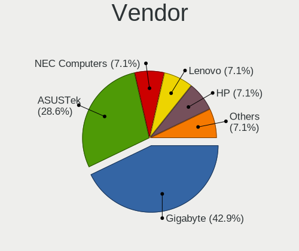
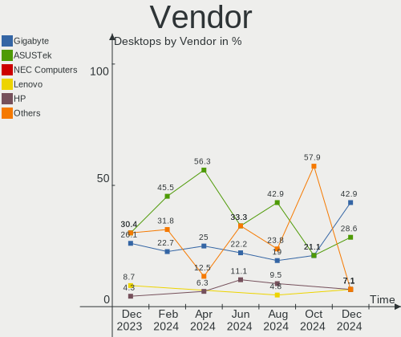
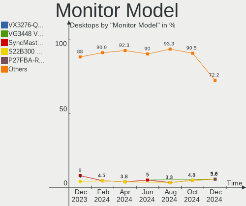

Gentoo Hardware Trends (Desktop)
--------------------------------

A project to identify most popular hardware characteristics and track their change
over time based on data collected by Gentoo users at https://Linux-Hardware.org.

Anyone can contribute to the study by uploading probes of their computers by
the [hw-probe](https://github.com/linuxhw/hw-probe) tool:

    sudo -E hw-probe -all -upload

Full-feature report is available here: https://linux-hardware.org/?view=trends&formfactor=desktop

Period: Oct, 2020.

Contents
--------

- [ OS                       ](#os)
- [ OS Family                ](#os-family)
- [ Kernel                   ](#kernel)
- [ Kernel Family            ](#kernel-family)
- [ Kernel Major Ver.        ](#kernel-major-ver)
- [ Arch                     ](#arch)
- [ DE                       ](#de)
- [ Display Server           ](#display-server)
- [ Display Manager          ](#display-manager)
- [ OS Lang                  ](#os-lang)
- [ Boot Mode                ](#boot-mode)
- [ Filesystem               ](#filesystem)
- [ Part. scheme             ](#part-scheme)
- [ Dual Boot with Linux/BSD ](#dual-boot-with-linux/bsd)
- [ Dual Boot (Win)          ](#dual-boot-win)
- [ Country                  ](#country)
- [ City                     ](#city)
- [ Vendor                   ](#vendor)
- [ Model                    ](#model)
- [ Model Family             ](#model-family)
- [ MFG Year                 ](#mfg-year)
- [ Form Factor              ](#form-factor)
- [ Secure Boot              ](#secure-boot)
- [ Coreboot                 ](#coreboot)
- [ RAM Size                 ](#ram-size)
- [ RAM Used                 ](#ram-used)
- [ Has CD-ROM               ](#has-cd-rom)
- [ Total Drives             ](#total-drives)
- [ Has Ethernet             ](#has-ethernet)
- [ Drive Vendor             ](#drive-vendor)
- [ HDD Vendor               ](#hdd-vendor)
- [ SSD Vendor               ](#ssd-vendor)
- [ Drive Model              ](#drive-model)
- [ Drive Kind               ](#drive-kind)
- [ Drive Connector          ](#drive-connector)
- [ Drive Size               ](#drive-size)
- [ Space Total              ](#space-total)
- [ Space Used               ](#space-used)
- [ Malfunc. Drives          ](#malfunc-drives)
- [ Malfunc. Drive Vendor    ](#malfunc-drive-vendor)
- [ Malfunc. HDD Vendor      ](#malfunc-hdd-vendor)
- [ Malfunc. Drive Kind      ](#malfunc-drive-kind)
- [ Failed Drives            ](#failed-drives)
- [ Failed Drive Vendor      ](#failed-drive-vendor)
- [ Drive Status             ](#drive-status)
- [ Storage Vendor           ](#storage-vendor)
- [ Storage Model            ](#storage-model)
- [ Storage Kind             ](#storage-kind)
- [ CPU Vendor               ](#cpu-vendor)
- [ CPU Model                ](#cpu-model)
- [ CPU Model Family         ](#cpu-model-family)
- [ CPU Cores                ](#cpu-cores)
- [ CPU Sockets              ](#cpu-sockets)
- [ CPU Threads              ](#cpu-threads)
- [ CPU Op-Modes             ](#cpu-op-modes)
- [ CPU Microcode            ](#cpu-microcode)
- [ CPU Microarch            ](#cpu-microarch)
- [ GPU Vendor               ](#gpu-vendor)
- [ GPU Model                ](#gpu-model)
- [ GPU Combo                ](#gpu-combo)
- [ GPU Driver               ](#gpu-driver)
- [ GPU Memory               ](#gpu-memory)
- [ Monitor Vendor           ](#monitor-vendor)
- [ Monitor Model            ](#monitor-model)
- [ Monitor Resolution       ](#monitor-resolution)
- [ Monitor Diagonal         ](#monitor-diagonal)
- [ Monitor Width            ](#monitor-width)
- [ Aspect Ratio             ](#aspect-ratio)
- [ Monitor Area             ](#monitor-area)
- [ Pixel Density            ](#pixel-density)
- [ Multiple Monitors        ](#multiple-monitors)
- [ Net Controller Vendor    ](#net-controller-vendor)
- [ Net Controller Model     ](#net-controller-model)
- [ Wireless Vendor          ](#wireless-vendor)
- [ Wireless Model           ](#wireless-model)
- [ Ethernet Vendor          ](#ethernet-vendor)
- [ Ethernet Model           ](#ethernet-model)
- [ Net Controller Kind      ](#net-controller-kind)
- [ Used Controller          ](#used-controller)
- [ NICs                     ](#nics)
- [ Memory Vendor            ](#memory-vendor)
- [ Memory Model             ](#memory-model)
- [ Memory Kind              ](#memory-kind)
- [ Memory Form Factor       ](#memory-form-factor)
- [ Memory Size              ](#memory-size)
- [ Memory Speed             ](#memory-speed)
- [ Sound Vendor             ](#sound-vendor)
- [ Sound Model              ](#sound-model)
- [ Camera Vendor            ](#camera-vendor)
- [ Camera Model             ](#camera-model)
- [ Fingerprint Vendor       ](#fingerprint-vendor)
- [ Fingerprint Model        ](#fingerprint-model)
- [ Chipcard Vendor          ](#chipcard-vendor)
- [ Chipcard Model           ](#chipcard-model)
- [ Printer Vendor           ](#printer-vendor)
- [ Printer Model            ](#printer-model)
- [ Scanner Vendor           ](#scanner-vendor)
- [ Scanner Model            ](#scanner-model)
- [ Bluetooth Vendor         ](#bluetooth-vendor)
- [ Bluetooth Model          ](#bluetooth-model)
- [ Unsupported Devices      ](#unsupported-devices)
- [ Unsupported Device Types ](#unsupported-device-types)

OS
--

Installed operating systems

| Name       | Desktops | Percent |
|------------|----------|---------|
| Gentoo 2.7 | 14       | 53.85%  |
| Gentoo     | 12       | 46.15%  |

OS Family
---------

OS without a version

| Name   | Desktops | Percent |
|--------|----------|---------|
| Gentoo | 26       | 100%    |

Kernel
------

Version of the Linux kernel

| Version                 | Desktops | Percent |
|-------------------------|----------|---------|
| 5.9.1-gentoo            | 3        | 11.54%  |
| 5.4.66-gentoo-x86_64    | 3        | 11.54%  |
| 5.4.66-gentoo           | 2        | 7.69%   |
| 5.9.0-rc8+              | 1        | 3.85%   |
| 5.9.0-gentoo-gentoo-amd | 1        | 3.85%   |
| 5.9.0-gentoo            | 1        | 3.85%   |
| 5.8.9                   | 1        | 3.85%   |
| 5.8.14-gentoo-x86_64    | 1        | 3.85%   |
| 5.8.14-gentoo           | 1        | 3.85%   |
| 5.8.13                  | 1        | 3.85%   |
| 5.8.12-gentoo           | 1        | 3.85%   |
| 5.8.10-gentoo           | 1        | 3.85%   |
| 5.6.15-gentoo           | 1        | 3.85%   |
| 5.5.0-gentoo-x86_64     | 1        | 3.85%   |
| 5.4.72-gentoo           | 1        | 3.85%   |
| 5.4.70-gentoo           | 1        | 3.85%   |
| 5.4.66-gentoo-nder-12   | 1        | 3.85%   |
| 5.4.60-gentoo-x86_64    | 1        | 3.85%   |
| 5.4.60-gentoo           | 1        | 3.85%   |
| 5.4.28-gentoo           | 1        | 3.85%   |
| 4.19.6-gentoo           | 1        | 3.85%   |

Kernel Family
-------------

Linux kernel without a distro release

| Version | Desktops | Percent |
|---------|----------|---------|
| 5.4.66  | 6        | 23.08%  |
| 5.9.1   | 3        | 11.54%  |
| 5.9.0   | 3        | 11.54%  |
| 5.8.14  | 2        | 7.69%   |
| 5.4.60  | 2        | 7.69%   |
| 5.8.9   | 1        | 3.85%   |
| 5.8.13  | 1        | 3.85%   |
| 5.8.12  | 1        | 3.85%   |
| 5.8.10  | 1        | 3.85%   |
| 5.6.15  | 1        | 3.85%   |
| 5.5.0   | 1        | 3.85%   |
| 5.4.72  | 1        | 3.85%   |
| 5.4.70  | 1        | 3.85%   |
| 5.4.28  | 1        | 3.85%   |
| 4.19.6  | 1        | 3.85%   |

Kernel Major Ver.
-----------------

Linux kernel major version

| Version | Desktops | Percent |
|---------|----------|---------|
| 5.4     | 11       | 42.31%  |
| 5.9     | 6        | 23.08%  |
| 5.8     | 6        | 23.08%  |
| 5.6     | 1        | 3.85%   |
| 5.5     | 1        | 3.85%   |
| 4.19    | 1        | 3.85%   |

Arch
----

OS architecture (x86_64, i586, etc.)

| Name   | Desktops | Percent |
|--------|----------|---------|
| x86_64 | 26       | 100%    |

DE
--

Desktop Environment

| Name    | Desktops | Percent |
|---------|----------|---------|
| Unknown | 10       | 38.46%  |
| KDE5    | 7        | 26.92%  |
| GNOME   | 4        | 15.38%  |
| XFCE    | 3        | 11.54%  |
| KDE     | 2        | 7.69%   |

Display Server
--------------

X11 or Wayland

| Name    | Desktops | Percent |
|---------|----------|---------|
| X11     | 18       | 69.23%  |
| Tty     | 4        | 15.38%  |
| Unknown | 4        | 15.38%  |

Display Manager
---------------

SDDM, LightDM, etc.

| Name    | Desktops | Percent |
|---------|----------|---------|
| Unknown | 14       | 53.85%  |
| SDDM    | 8        | 30.77%  |
| LightDM | 2        | 7.69%   |
| LXDM    | 1        | 3.85%   |
| GDM     | 1        | 3.85%   |

OS Lang
-------

Language

| Lang       | Desktops | Percent |
|------------|----------|---------|
| en_US.utf8 | 7        | 26.92%  |
| en_US      | 4        | 15.38%  |
| ru_RU.utf8 | 3        | 11.54%  |
| en_GB.utf8 | 2        | 7.69%   |
| de_DE.utf8 | 2        | 7.69%   |
| C.UTF8     | 2        | 7.69%   |
| sv_SE      | 1        | 3.85%   |
| ru_RU      | 1        | 3.85%   |
| pt_PT.utf8 | 1        | 3.85%   |
| en_IE.utf8 | 1        | 3.85%   |
| en_GB      | 1        | 3.85%   |
| C          | 1        | 3.85%   |

Boot Mode
---------

EFI or BIOS

| Mode | Desktops | Percent |
|------|----------|---------|
| EFI  | 17       | 65.38%  |
| BIOS | 9        | 34.62%  |

Filesystem
----------

Type of filesystem

| Type     | Desktops | Percent |
|----------|----------|---------|
| Ext4     | 19       | 73.08%  |
| Btrfs    | 6        | 23.08%  |
| Reiserfs | 1        | 3.85%   |

Part. scheme
------------

Scheme of partitioning

| Type | Desktops | Percent |
|------|----------|---------|
| GPT  | 20       | 76.92%  |
| MBR  | 6        | 23.08%  |

Dual Boot with Linux/BSD
------------------------

Hosting more than one Linux/BSD

| Dual boot | Desktops | Percent |
|-----------|----------|---------|
| No        | 17       | 65.38%  |
| Yes       | 9        | 34.62%  |

Dual Boot (Win)
---------------

Hosting Linux and Windows

| Dual boot | Desktops | Percent |
|-----------|----------|---------|
| No        | 20       | 76.92%  |
| Yes       | 6        | 23.08%  |

Country
-------

Geographic location (country)

| Country     | Desktops | Percent |
|-------------|----------|---------|
| USA         | 4        | 15.38%  |
| Russia      | 4        | 15.38%  |
| Ukraine     | 3        | 11.54%  |
| Germany     | 3        | 11.54%  |
| Spain       | 2        | 7.69%   |
| Poland      | 2        | 7.69%   |
| UK          | 1        | 3.85%   |
| Switzerland | 1        | 3.85%   |
| Sweden      | 1        | 3.85%   |
| Romania     | 1        | 3.85%   |
| Netherlands | 1        | 3.85%   |
| Denmark     | 1        | 3.85%   |
| Belarus     | 1        | 3.85%   |
| Austria     | 1        | 3.85%   |

City
----

Geographic location (city)

| City              | Desktops | Percent |
|-------------------|----------|---------|
| Kyiv              | 2        | 7.69%   |
| Cieszyn           | 2        | 7.69%   |
| Zurich            | 1        | 3.85%   |
| Vladimir          | 1        | 3.85%   |
| Visby             | 1        | 3.85%   |
| Vienna            | 1        | 3.85%   |
| Ufa               | 1        | 3.85%   |
| Tomsk             | 1        | 3.85%   |
| St Petersburg     | 1        | 3.85%   |
| Rochester         | 1        | 3.85%   |
| Offenbach         | 1        | 3.85%   |
| Nottingham        | 1        | 3.85%   |
| Madrid            | 1        | 3.85%   |
| Livingston        | 1        | 3.85%   |
| Lafayette         | 1        | 3.85%   |
| Kjellerup         | 1        | 3.85%   |
| Kharkiv           | 1        | 3.85%   |
| Ilmenau           | 1        | 3.85%   |
| Hrodna            | 1        | 3.85%   |
| Hoensbroek        | 1        | 3.85%   |
| Glen Ellyn        | 1        | 3.85%   |
| Fuenlabrada       | 1        | 3.85%   |
| Frankfurt am Main | 1        | 3.85%   |
| Bucharest         | 1        | 3.85%   |

Vendor
------

Motherboard manufacturer

| Name                | Desktops | Percent |
|---------------------|----------|---------|
| ASUSTek Computer    | 9        | 34.62%  |
| MSI                 | 6        | 23.08%  |
| ASRock              | 6        | 23.08%  |
| Gigabyte Technology | 2        | 7.69%   |
| Hewlett-Packard     | 1        | 3.85%   |
| Entroware           | 1        | 3.85%   |
| Dell                | 1        | 3.85%   |

Model
-----

Motherboard model

| Name                                 | Desktops | Percent |
|--------------------------------------|----------|---------|
| MSI MS-7C13                          | 1        | 3.85%   |
| MSI MS-7C02                          | 1        | 3.85%   |
| MSI MS-7B49                          | 1        | 3.85%   |
| MSI MS-7A31                          | 1        | 3.85%   |
| MSI MS-7A15                          | 1        | 3.85%   |
| MSI MS-7971                          | 1        | 3.85%   |
| HP Pavilion Gaming Desktop TG01-0xxx | 1        | 3.85%   |
| Gigabyte H110M-S2V                   | 1        | 3.85%   |
| Gigabyte B450M DS3H                  | 1        | 3.85%   |
| Entroware Nyx                        | 1        | 3.85%   |
| Dell OptiPlex 9020                   | 1        | 3.85%   |
| ASUS Z170 PRO GAMING                 | 1        | 3.85%   |
| ASUS TUF GAMING X570-PLUS            | 1        | 3.85%   |
| ASUS TUF GAMING B460-PLUS            | 1        | 3.85%   |
| ASUS PRIME X570-PRO                  | 1        | 3.85%   |
| ASUS P6X58D PREMIUM                  | 1        | 3.85%   |
| ASUS H61M-K                          | 1        | 3.85%   |
| ASUS EB1012                          | 1        | 3.85%   |
| ASUS All Series                      | 1        | 3.85%   |
| ASUS A88XM-A                         | 1        | 3.85%   |
| ASRock X570M Pro4                    | 1        | 3.85%   |
| ASRock X570 Phantom Gaming-ITX/TB3   | 1        | 3.85%   |
| ASRock X370 Professional Gaming      | 1        | 3.85%   |
| ASRock X370 Gaming X                 | 1        | 3.85%   |
| ASRock N3150-ITX                     | 1        | 3.85%   |
| ASRock AM1H-ITX                      | 1        | 3.85%   |

Model Family
------------

Motherboard model prefix

| Name               | Desktops | Percent |
|--------------------|----------|---------|
| ASUS TUF           | 2        | 7.69%   |
| ASRock X370        | 2        | 7.69%   |
| MSI MS-7C13        | 1        | 3.85%   |
| MSI MS-7C02        | 1        | 3.85%   |
| MSI MS-7B49        | 1        | 3.85%   |
| MSI MS-7A31        | 1        | 3.85%   |
| MSI MS-7A15        | 1        | 3.85%   |
| MSI MS-7971        | 1        | 3.85%   |
| HP Pavilion        | 1        | 3.85%   |
| Gigabyte H110M-S2V | 1        | 3.85%   |
| Gigabyte B450M     | 1        | 3.85%   |
| Entroware Nyx      | 1        | 3.85%   |
| Dell OptiPlex      | 1        | 3.85%   |
| ASUS Z170          | 1        | 3.85%   |
| ASUS PRIME         | 1        | 3.85%   |
| ASUS P6X58D        | 1        | 3.85%   |
| ASUS H61M-K        | 1        | 3.85%   |
| ASUS EB1012        | 1        | 3.85%   |
| ASUS All           | 1        | 3.85%   |
| ASUS A88XM-A       | 1        | 3.85%   |
| ASRock X570M       | 1        | 3.85%   |
| ASRock X570        | 1        | 3.85%   |
| ASRock N3150-ITX   | 1        | 3.85%   |
| ASRock AM1H-ITX    | 1        | 3.85%   |

MFG Year
--------

Motherboard manufacture year

| Year | Desktops | Percent |
|------|----------|---------|
| 2020 | 9        | 34.62%  |
| 2019 | 4        | 15.38%  |
| 2018 | 4        | 15.38%  |
| 2017 | 2        | 7.69%   |
| 2016 | 2        | 7.69%   |
| 2015 | 2        | 7.69%   |
| 2010 | 2        | 7.69%   |
| 2014 | 1        | 3.85%   |

Form Factor
-----------

Physical design of the computer

| Name    | Desktops | Percent |
|---------|----------|---------|
| Desktop | 26       | 100%    |

Secure Boot
-----------

Enabled or disabled

| State    | Desktops | Percent |
|----------|----------|---------|
| Disabled | 26       | 100%    |

Coreboot
--------

Have coreboot on board

| Used | Desktops | Percent |
|------|----------|---------|
| No   | 26       | 100%    |

RAM Size
--------

Total RAM memory

| Size in GB | Desktops | Percent |
|------------|----------|---------|
| 32.01-64.0 | 11       | 42.31%  |
| 16.01-24.0 | 8        | 30.77%  |
| 4.01-8.0   | 3        | 11.54%  |
| 8.01-16.0  | 3        | 11.54%  |
| 3.01-4.0   | 1        | 3.85%   |

RAM Used
--------

Used RAM memory

| Used GB    | Desktops | Percent |
|------------|----------|---------|
| 4.01-8.0   | 7        | 26.92%  |
| 3.01-4.0   | 5        | 19.23%  |
| 1.01-2.0   | 5        | 19.23%  |
| 2.01-3.0   | 3        | 11.54%  |
| 0.01-1.0   | 3        | 11.54%  |
| 8.01-16.0  | 2        | 7.69%   |
| 16.01-24.0 | 1        | 3.85%   |

Has CD-ROM
----------

Has CD-ROM on board

| Presented | Desktops | Percent |
|-----------|----------|---------|
| No        | 19       | 73.08%  |
| Yes       | 7        | 26.92%  |

Total Drives
------------

Number of drives on board

| Drives | Desktops | Percent |
|--------|----------|---------|
| 2      | 9        | 34.62%  |
| 3      | 8        | 30.77%  |
| 1      | 6        | 23.08%  |
| 4      | 2        | 7.69%   |
| 5      | 1        | 3.85%   |

Has Ethernet
------------

Has Ethernet on board

| Presented | Desktops | Percent |
|-----------|----------|---------|
| Yes       | 26       | 100%    |

Drive Vendor
------------

Hard drive vendors

| Vendor              | Desktops | Drives | Percent |
|---------------------|----------|--------|---------|
| Samsung Electronics | 14       | 19     | 28.57%  |
| WDC                 | 13       | 18     | 26.53%  |
| Toshiba             | 5        | 6      | 10.2%   |
| Seagate             | 4        | 5      | 8.16%   |
| Kingston            | 4        | 4      | 8.16%   |
| Hitachi             | 2        | 2      | 4.08%   |
| Team                | 1        | 1      | 2.04%   |
| SK Hynix            | 1        | 1      | 2.04%   |
| SanDisk             | 1        | 1      | 2.04%   |
| OCZ                 | 1        | 1      | 2.04%   |
| Intel               | 1        | 1      | 2.04%   |
| Crucial             | 1        | 1      | 2.04%   |
| Corsair             | 1        | 1      | 2.04%   |

HDD Vendor
----------

Hard disk drive vendors

| Vendor              | Desktops | Drives | Percent |
|---------------------|----------|--------|---------|
| WDC                 | 12       | 17     | 54.55%  |
| Toshiba             | 4        | 5      | 18.18%  |
| Seagate             | 3        | 4      | 13.64%  |
| Hitachi             | 2        | 2      | 9.09%   |
| Samsung Electronics | 1        | 1      | 4.55%   |

SSD Vendor
----------

Solid state drive vendors

| Vendor              | Desktops | Drives | Percent |
|---------------------|----------|--------|---------|
| Samsung Electronics | 10       | 11     | 47.62%  |
| Kingston            | 4        | 4      | 19.05%  |
| WDC                 | 1        | 1      | 4.76%   |
| Toshiba             | 1        | 1      | 4.76%   |
| SanDisk             | 1        | 1      | 4.76%   |
| OCZ                 | 1        | 1      | 4.76%   |
| Intel               | 1        | 1      | 4.76%   |
| Crucial             | 1        | 1      | 4.76%   |
| Corsair             | 1        | 1      | 4.76%   |

Drive Model
-----------

Hard drive models

| Model                              | Desktops | Percent |
|------------------------------------|----------|---------|
| WD40EFRX-68WT0N0 4TB               | 3        | 5.26%   |
| SSD 970 EVO 1TB                    | 3        | 5.26%   |
| SSD 970 EVO 250GB                  | 2        | 3.51%   |
| SSD 860 EVO 500GB                  | 2        | 3.51%   |
| SSD 860 EVO 250GB                  | 2        | 3.51%   |
| SSD 860 EVO 1TB                    | 2        | 3.51%   |
| SSD 850 EVO 250GB                  | 2        | 3.51%   |
| WDS250G2B0B 250GB SSD              | 1        | 1.75%   |
| WD6401AALS-00L3B2 640GB            | 1        | 1.75%   |
| WD5000AAKX-003CA0 500GB            | 1        | 1.75%   |
| WD40EFRX-68N32N0 4TB               | 1        | 1.75%   |
| WD30EZRX-00SPEB0 3TB               | 1        | 1.75%   |
| WD30EFRX-68EUZN0 3TB               | 1        | 1.75%   |
| WD20EZRX-00DC0B0 2TB               | 1        | 1.75%   |
| WD20EFRX-68EUZN0 2TB               | 1        | 1.75%   |
| WD2000F9YZ-09N20L1 2TB             | 1        | 1.75%   |
| WD10EZEX-08WN4A0 1TB               | 1        | 1.75%   |
| WD10EZEX-00WN4A0 1TB               | 1        | 1.75%   |
| WD1002FAEX-00Y9A0 1TB              | 1        | 1.75%   |
| VECTOR150 240GB SSD                | 1        | 1.75%   |
| TM8FP2240G 240GB                   | 1        | 1.75%   |
| THNS064GG2BNAA 64GB SSD            | 1        | 1.75%   |
| SUV400S37120G 120GB SSD            | 1        | 1.75%   |
| ST8000DM004-2CX188 8TB             | 1        | 1.75%   |
| ST4000DM004-2CV104 4TB             | 1        | 1.75%   |
| ST1000NC001-1DY162 1TB             | 1        | 1.75%   |
| ST1000DM003-9YN162 1TB             | 1        | 1.75%   |
| SSDSC2BW120A4 120GB                | 1        | 1.75%   |
| SSD i100 32GB                      | 1        | 1.75%   |
| SSD 970 EVO Plus 500GB             | 1        | 1.75%   |
| SSD 960 EVO 250GB                  | 1        | 1.75%   |
| SSD 840 PRO Series 256GB           | 1        | 1.75%   |
| SSD 840 EVO 1TB                    | 1        | 1.75%   |
| SSD 830 Series 128GB               | 1        | 1.75%   |
| SHSS37A240G 240GB SSD              | 1        | 1.75%   |
| SHFS37A120G 120GB SSD              | 1        | 1.75%   |
| SA400S37120G 120GB SSD             | 1        | 1.75%   |
| MQ01ACF050 500GB                   | 1        | 1.75%   |
| HTS542516K9SA00 160GB              | 1        | 1.75%   |
| HDWD105 500GB                      | 1        | 1.75%   |
| HDS721010CLA332 1TB                | 1        | 1.75%   |
| HD103SJ 1TB                        | 1        | 1.75%   |
| FireCuda 510 SSD ZP1000GM30001 1TB | 1        | 1.75%   |
| DT01ACA050 500GB                   | 1        | 1.75%   |
| DT01ABA300 3TB                     | 1        | 1.75%   |
| CT275MX300SSD1 275GB               | 1        | 1.75%   |
| CSSD-F40GB2-A                      | 1        | 1.75%   |
| BC501 HFM512GDJTNG-8310A 512GB     | 1        | 1.75%   |

Drive Kind
----------

HDD or SSD

| Kind | Desktops | Drives | Percent |
|------|----------|--------|---------|
| SSD  | 19       | 22     | 41.3%   |
| HDD  | 17       | 29     | 36.96%  |
| NVMe | 10       | 10     | 21.74%  |

Drive Connector
---------------

SATA, SAS, NVMe, etc.

| Type | Desktops | Drives | Percent |
|------|----------|--------|---------|
| SATA | 24       | 51     | 70.59%  |
| NVMe | 10       | 10     | 29.41%  |

Drive Size
----------

Size of hard drive

| Size in TB | Desktops | Drives | Percent |
|------------|----------|--------|---------|
| 0.01-0.5   | 19       | 25     | 48.72%  |
| 0.51-1.0   | 9        | 11     | 23.08%  |
| 3.01-4.0   | 5        | 8      | 12.82%  |
| 1.01-2.0   | 3        | 3      | 7.69%   |
| 2.01-3.0   | 2        | 3      | 5.13%   |
| 4.01-10.0  | 1        | 1      | 2.56%   |

Space Total
-----------

Amount of disk space available on the file system

| Size in GB     | Desktops | Percent |
|----------------|----------|---------|
| More than 3000 | 8        | 30.77%  |
| 1001-2000      | 6        | 23.08%  |
| 251-500        | 5        | 19.23%  |
| 101-250        | 3        | 11.54%  |
| 501-1000       | 2        | 7.69%   |
| 21-50          | 1        | 3.85%   |
| 2001-3000      | 1        | 3.85%   |

Space Used
----------

Amount of used disk space

| Used GB        | Desktops | Percent |
|----------------|----------|---------|
| 21-50          | 6        | 23.08%  |
| More than 3000 | 4        | 15.38%  |
| 2001-3000      | 4        | 15.38%  |
| 101-250        | 4        | 15.38%  |
| 501-1000       | 4        | 15.38%  |
| 1001-2000      | 2        | 7.69%   |
| 1-20           | 2        | 7.69%   |

Malfunc. Drives
---------------

Drive models with a malfunction

| Model                   | Desktops | Drives | Percent |
|-------------------------|----------|--------|---------|
| WD5000AAKX-003CA0 500GB | 1        | 1      | 16.67%  |
| WD40EFRX-68WT0N0 4TB    | 1        | 1      | 16.67%  |
| WD1002FAEX-00Y9A0 1TB   | 1        | 1      | 16.67%  |
| ST1000NC001-1DY162 1TB  | 1        | 1      | 16.67%  |
| HTS542516K9SA00 160GB   | 1        | 1      | 16.67%  |
| HDWD105 500GB           | 1        | 2      | 16.67%  |

Malfunc. Drive Vendor
---------------------

Vendors of faulty drives

| Vendor  | Desktops | Drives | Percent |
|---------|----------|--------|---------|
| WDC     | 3        | 3      | 50%     |
| Toshiba | 1        | 2      | 16.67%  |
| Seagate | 1        | 1      | 16.67%  |
| Hitachi | 1        | 1      | 16.67%  |

Malfunc. HDD Vendor
-------------------

Vendors of faulty HDD drives

| Vendor  | Desktops | Drives | Percent |
|---------|----------|--------|---------|
| WDC     | 3        | 3      | 50%     |
| Toshiba | 1        | 2      | 16.67%  |
| Seagate | 1        | 1      | 16.67%  |
| Hitachi | 1        | 1      | 16.67%  |

Malfunc. Drive Kind
-------------------

Kinds of faulty drives

| Kind | Desktops | Drives | Percent |
|------|----------|--------|---------|
| HDD  | 5        | 7      | 100%    |

Failed Drives
-------------

Failed drive models

Zero info for selected period =(

Failed Drive Vendor
-------------------

Failed drive vendors

Zero info for selected period =(

Drive Status
------------

Number of failed and malfunc. drives

| Status  | Desktops | Drives | Percent |
|---------|----------|--------|---------|
| Works   | 24       | 54     | 82.76%  |
| Malfunc | 5        | 7      | 17.24%  |

Storage Vendor
--------------

Storage controller vendors

| Vendor                   | Desktops | Percent |
|--------------------------|----------|---------|
| Intel                    | 13       | 32.5%   |
| AMD                      | 12       | 30%     |
| Samsung Electronics      | 7        | 17.5%   |
| ASMedia Technology       | 3        | 7.5%    |
| SK Hynix                 | 1        | 2.5%    |
| Seagate Technology       | 1        | 2.5%    |
| Phison Electronics       | 1        | 2.5%    |
| Nvidia                   | 1        | 2.5%    |
| Marvell Technology Group | 1        | 2.5%    |

Storage Model
-------------

Storage controller models

| Model                                                                      | Desktops | Percent |
|----------------------------------------------------------------------------|----------|---------|
| FCH SATA Controller [AHCI mode]                                            | 12       | 26.09%  |
| NVMe SSD Controller SM981/PM981/PM983                                      | 6        | 13.04%  |
| Q170/Q150/B150/H170/H110/Z170/CM236 Chipset SATA Controller [AHCI Mode]    | 4        | 8.7%    |
| X370 Series Chipset SATA Controller                                        | 3        | 6.52%   |
| ASM1062 Serial ATA Controller                                              | 3        | 6.52%   |
| 400 Series Chipset SATA Controller                                         | 3        | 6.52%   |
| 200 Series PCH SATA controller [AHCI mode]                                 | 2        | 4.35%   |
| NVMe SSD Controller SM961/PM961                                            | 1        | 2.17%   |
| Non-Volatile memory controller                                             | 1        | 2.17%   |
| MCP79 AHCI Controller                                                      | 1        | 2.17%   |
| E7 NVMe Controller                                                         | 1        | 2.17%   |
| Cannon Lake PCH SATA AHCI Controller                                       | 1        | 2.17%   |
| BC501 NVMe Solid State Drive 512GB                                         | 1        | 2.17%   |
| Atom/Celeron/Pentium Processor x5-E8000/J3xxx/N3xxx Series SATA Controller | 1        | 2.17%   |
| 9 Series Chipset Family SATA Controller [AHCI Mode]                        | 1        | 2.17%   |
| 88SE9123 PCIe SATA 6.0 Gb/s controller                                     | 1        | 2.17%   |
| 82801JI (ICH10 Family) SATA AHCI Controller                                | 1        | 2.17%   |
| 8 Series/C220 Series Chipset Family 6-port SATA Controller 1 [AHCI mode]   | 1        | 2.17%   |
| 6 Series/C200 Series Chipset Family 6 port Desktop SATA AHCI Controller    | 1        | 2.17%   |
| 400 Series Chipset Family SATA AHCI Controller                             | 1        | 2.17%   |

Storage Kind
------------

Kind of storage controller (IDE, SATA, NVMe, SAS, ...)

| Kind | Desktops | Percent |
|------|----------|---------|
| SATA | 26       | 72.22%  |
| NVMe | 10       | 27.78%  |

CPU Vendor
----------

Processor vendors

| Vendor | Desktops | Percent |
|--------|----------|---------|
| Intel  | 14       | 53.85%  |
| AMD    | 12       | 46.15%  |

CPU Model
---------

Processor models

| Model                                       | Desktops | Percent |
|---------------------------------------------|----------|---------|
| AMD Ryzen 7 3800X 8-Core Processor          | 2        | 7.69%   |
| AMD Ryzen 5 3600 6-Core Processor           | 2        | 7.69%   |
| Intel Pentium CPU G4560 @ 3.50GHz           | 1        | 3.85%   |
| Intel Pentium CPU G4500 @ 3.50GHz           | 1        | 3.85%   |
| Intel Core i7-9700 CPU @ 3.00GHz            | 1        | 3.85%   |
| Intel Core i7-8700K CPU @ 3.70GHz           | 1        | 3.85%   |
| Intel Core i7-4790K CPU @ 4.00GHz           | 1        | 3.85%   |
| Intel Core i7-4770 CPU @ 3.40GHz            | 1        | 3.85%   |
| Intel Core i7 CPU 930 @ 2.80GHz             | 1        | 3.85%   |
| Intel Core i5-6600K CPU @ 3.50GHz           | 1        | 3.85%   |
| Intel Core i5-6500 CPU @ 3.20GHz            | 1        | 3.85%   |
| Intel Core i5-3330 CPU @ 3.00GHz            | 1        | 3.85%   |
| Intel Core i5-10600K CPU @ 4.10GHz          | 1        | 3.85%   |
| Intel Core i3-9100F CPU @ 3.60GHz           | 1        | 3.85%   |
| Intel Celeron CPU N3150 @ 1.60GHz           | 1        | 3.85%   |
| Intel Atom CPU 330 @ 1.60GHz                | 1        | 3.85%   |
| AMD Sempron 3850 APU with Radeon R3         | 1        | 3.85%   |
| AMD Ryzen 7 3700X 8-Core Processor          | 1        | 3.85%   |
| AMD Ryzen 7 2700X Eight-Core Processor      | 1        | 3.85%   |
| AMD Ryzen 7 2700 Eight-Core Processor       | 1        | 3.85%   |
| AMD Ryzen 7 1700X Eight-Core Processor      | 1        | 3.85%   |
| AMD Ryzen 5 1600 Six-Core Processor         | 1        | 3.85%   |
| AMD Ryzen 3 3200G with Radeon Vega Graphics | 1        | 3.85%   |
| AMD A10-6800K APU with Radeon HD Graphics   | 1        | 3.85%   |

CPU Model Family
----------------

Processor model prefix

| Model         | Desktops | Percent |
|---------------|----------|---------|
| AMD Ryzen 7   | 6        | 23.08%  |
| Intel Core i7 | 5        | 19.23%  |
| Intel Core i5 | 4        | 15.38%  |
| AMD Ryzen 5   | 3        | 11.54%  |
| Intel Pentium | 2        | 7.69%   |
| Intel Core i3 | 1        | 3.85%   |
| Intel Celeron | 1        | 3.85%   |
| Intel Atom    | 1        | 3.85%   |
| AMD Sempron   | 1        | 3.85%   |
| AMD Ryzen 3   | 1        | 3.85%   |
| AMD A10       | 1        | 3.85%   |

CPU Cores
---------

Number of processor cores

| Number | Desktops | Percent |
|--------|----------|---------|
| 4      | 10       | 38.46%  |
| 8      | 7        | 26.92%  |
| 6      | 5        | 19.23%  |
| 2      | 4        | 15.38%  |

CPU Sockets
-----------

Number of sockets

| Number | Desktops | Percent |
|--------|----------|---------|
| 1      | 26       | 100%    |

CPU Threads
-----------

Threads per core (Hyper-Threading)

| Number | Desktops | Percent |
|--------|----------|---------|
| 2      | 17       | 65.38%  |
| 1      | 9        | 34.62%  |

CPU Op-Modes
------------

CPU Operation Modes (32-bit, 64-bit)

| Op mode        | Desktops | Percent |
|----------------|----------|---------|
| 32-bit, 64-bit | 26       | 100%    |

CPU Microcode
-------------

Microcode number

| Number     | Desktops | Percent |
|------------|----------|---------|
| 0x08701021 | 5        | 19.23%  |
| 0x506e3    | 3        | 11.54%  |
| Unknown    | 3        | 11.54%  |
| 0x906ea    | 2        | 7.69%   |
| 0x0800820d | 2        | 7.69%   |
| 0x08001138 | 2        | 7.69%   |
| 0xa0655    | 1        | 3.85%   |
| 0x906ed    | 1        | 3.85%   |
| 0x906e9    | 1        | 3.85%   |
| 0x406c3    | 1        | 3.85%   |
| 0x306c3    | 1        | 3.85%   |
| 0x306a9    | 1        | 3.85%   |
| 0x106c2    | 1        | 3.85%   |
| 0x08108109 | 1        | 3.85%   |
| 0x0700010f | 1        | 3.85%   |

CPU Microarch
-------------

Microarchitecture

| Name       | Desktops | Percent |
|------------|----------|---------|
| Zen 2      | 5        | 19.23%  |
| KabyLake   | 4        | 15.38%  |
| Zen+       | 3        | 11.54%  |
| Skylake    | 3        | 11.54%  |
| Zen        | 2        | 7.69%   |
| Haswell    | 2        | 7.69%   |
| Silvermont | 1        | 3.85%   |
| Piledriver | 1        | 3.85%   |
| Nehalem    | 1        | 3.85%   |
| Jaguar     | 1        | 3.85%   |
| IvyBridge  | 1        | 3.85%   |
| CometLake  | 1        | 3.85%   |
| Bonnell    | 1        | 3.85%   |

GPU Vendor
----------

Vendors of graphics cards

| Vendor | Desktops | Percent |
|--------|----------|---------|
| AMD    | 12       | 42.86%  |
| Nvidia | 11       | 39.29%  |
| Intel  | 5        | 17.86%  |

GPU Model
---------

Graphics card models

| Model                                                                              | Desktops | Percent |
|------------------------------------------------------------------------------------|----------|---------|
| Ellesmere [Radeon RX 470/480/570/570X/580/580X/590]                                | 4        | 13.79%  |
| GP107 [GeForce GTX 1050 Ti]                                                        | 2        | 6.9%    |
| Baffin [Radeon RX 460/560D / Pro 450/455/460/555/555X/560/560X]                    | 2        | 6.9%    |
| Xeon E3-1200 v3/4th Gen Core Processor Integrated Graphics Controller              | 1        | 3.45%   |
| Vega 10 XL/XT [Radeon RX Vega 56/64]                                               | 1        | 3.45%   |
| UHD Graphics 630 (Desktop 9 Series)                                                | 1        | 3.45%   |
| TU106 [GeForce RTX 2060 SUPER]                                                     | 1        | 3.45%   |
| TU104 [GeForce RTX 2080 SUPER]                                                     | 1        | 3.45%   |
| Tonga PRO [Radeon R9 285/380]                                                      | 1        | 3.45%   |
| Picasso                                                                            | 1        | 3.45%   |
| Oland PRO [Radeon R7 240/340]                                                      | 1        | 3.45%   |
| Navi 10 [Radeon RX 5600 OEM/5600 XT / 5700/5700 XT]                                | 1        | 3.45%   |
| Kabini [Radeon HD 8280 / R3 Series]                                                | 1        | 3.45%   |
| HD Graphics 610                                                                    | 1        | 3.45%   |
| HD Graphics 530                                                                    | 1        | 3.45%   |
| Hawaii XT / Grenada XT [Radeon R9 290X/390X]                                       | 1        | 3.45%   |
| GP106 [GeForce GTX 1060 6GB]                                                       | 1        | 3.45%   |
| GP104 [GeForce GTX 1070]                                                           | 1        | 3.45%   |
| GM107 [GeForce GTX 750 Ti]                                                         | 1        | 3.45%   |
| GK208B [GeForce GT 710]                                                            | 1        | 3.45%   |
| GK106 [GeForce GTX 650 Ti]                                                         | 1        | 3.45%   |
| G96C [GeForce 9500 GT]                                                             | 1        | 3.45%   |
| C79 [ION]                                                                          | 1        | 3.45%   |
| Atom/Celeron/Pentium Processor x5-E8000/J3xxx/N3xxx Integrated Graphics Controller | 1        | 3.45%   |

GPU Combo
---------

Combinations of graphics cards

| Name         | Desktops | Percent |
|--------------|----------|---------|
| 1 x Nvidia   | 10       | 38.46%  |
| 1 x AMD      | 9        | 34.62%  |
| 1 x Intel    | 4        | 15.38%  |
| 2 x AMD      | 1        | 3.85%   |
| Intel + AMD  | 1        | 3.85%   |
| AMD + Nvidia | 1        | 3.85%   |

GPU Driver
----------

Free vs proprietary

| Driver      | Desktops | Percent |
|-------------|----------|---------|
| Free        | 18       | 69.23%  |
| Proprietary | 6        | 23.08%  |
| Unknown     | 2        | 7.69%   |

GPU Memory
----------

Total video memory

| Size in GB | Desktops | Percent |
|------------|----------|---------|
| Unknown    | 9        | 34.62%  |
| 7.01-8.0   | 7        | 26.92%  |
| 3.01-4.0   | 4        | 15.38%  |
| 1.01-2.0   | 3        | 11.54%  |
| 5.01-6.0   | 1        | 3.85%   |
| 0.51-1.0   | 1        | 3.85%   |
| 0.01-0.5   | 1        | 3.85%   |

Monitor Vendor
--------------

Monitor vendors

| Vendor                  | Desktops | Percent |
|-------------------------|----------|---------|
| BenQ                    | 7        | 22.58%  |
| Samsung Electronics     | 5        | 16.13%  |
| Goldstar                | 3        | 9.68%   |
| Ancor Communications    | 3        | 9.68%   |
| Iiyama                  | 2        | 6.45%   |
| Acer                    | 2        | 6.45%   |
| Yamaha                  | 1        | 3.23%   |
| Sony                    | 1        | 3.23%   |
| Philips                 | 1        | 3.23%   |
| Idek Iiyama             | 1        | 3.23%   |
| Fujitsu Siemens         | 1        | 3.23%   |
| Dell                    | 1        | 3.23%   |
| Chi Mei Optoelectronics | 1        | 3.23%   |
| ASUSTek Computer        | 1        | 3.23%   |
| AOC                     | 1        | 3.23%   |

Monitor Model
-------------

Monitor models

| Model                                              | Desktops | Percent |
|----------------------------------------------------|----------|---------|
| S24F350 SAM0D20 1920x1080 521x293mm 23.5-inch      | 2        | 6.06%   |
| GL2450 BNQ78A5 1920x1080 531x298mm 24.0-inch       | 2        | 6.06%   |
| E2200HD BNQ790C 1920x1080 477x268mm 21.5-inch      | 2        | 6.06%   |
| W2246 GSM5783 1920x1080 477x268mm 21.5-inch        | 1        | 3.03%   |
| VZ2770H BNQ7B3C 1920x1080 598x336mm 27.0-inch      | 1        | 3.03%   |
| VP247 AUS24DA 1920x1080 521x293mm 23.5-inch        | 1        | 3.03%   |
| VG248 ACI24E1 1680x1050 530x300mm 24.0-inch        | 1        | 3.03%   |
| V226HQL ACR0335 1920x1080 477x268mm 21.5-inch      | 1        | 3.03%   |
| ULTRAWIDE GSM76FA 2560x1080 798x334mm 34.1-inch    | 1        | 3.03%   |
| U28E590 SAM0C4D 3840x2160 607x345mm 27.5-inch      | 1        | 3.03%   |
| U2410 DELF015 1920x1200 520x320mm 24.0-inch        | 1        | 3.03%   |
| SyncMaster SAM0216 1280x1024 338x270mm 17.0-inch   | 1        | 3.03%   |
| PLX2783H IVM6648 1920x1080 598x336mm 27.0-inch     | 1        | 3.03%   |
| PL2776HD IVM6605 1920x1080 598x336mm 27.0-inch     | 1        | 3.03%   |
| PD3200U BNQ8025 3840x2160 708x399mm 32.0-inch      | 1        | 3.03%   |
| PB248 ACI24A3 1920x1200 518x324mm 24.1-inch        | 1        | 3.03%   |
| P17-2 FUS0550 1280x1024 338x270mm 17.0-inch        | 1        | 3.03%   |
| LG ULTRAWIDE GSM59F1 1920x1080 580x240mm 24.7-inch | 1        | 3.03%   |
| LCD Monitor X34 P 3440x1440                        | 1        | 3.03%   |
| LCD Monitor TV  *00 3840x2160                      | 1        | 3.03%   |
| LCD Monitor SAM0902 1920x1080 1020x570mm 46.0-inch | 1        | 3.03%   |
| LCD Monitor PL2792UH 3840x2160                     | 1        | 3.03%   |
| LCD Monitor PHL 275E1 3926x1440                    | 1        | 3.03%   |
| LCD Monitor PHL 193V5                              | 1        | 3.03%   |
| L1730S GSM438D 1280x1024 338x270mm 17.0-inch       | 1        | 3.03%   |
| HTR-6064 YMH3169 1920x540                          | 1        | 3.03%   |
| GW2765 BNQ78D6 1920x1080 600x340mm 27.2-inch       | 1        | 3.03%   |
| CMC 19AW CMO2198 1440x900 408x255mm 18.9-inch      | 1        | 3.03%   |
| ASUS VP278 ACI27C8 1920x1080 598x336mm 27.0-inch   | 1        | 3.03%   |
| 2369M AOC2369 1920x1080 509x286mm 23.0-inch        | 1        | 3.03%   |

Monitor Resolution
------------------

Monitor screen resolution

| Resolution        | Desktops | Percent |
|-------------------|----------|---------|
| 1920x1080 (FHD)   | 13       | 44.83%  |
| 3840x2160 (4K)    | 4        | 13.79%  |
| 1280x1024 (SXGA)  | 3        | 10.34%  |
| 1920x1200 (WUXGA) | 2        | 6.9%    |
| 3926x1440         | 1        | 3.45%   |
| 3440x1440         | 1        | 3.45%   |
| 2560x1440 (QHD)   | 1        | 3.45%   |
| 2560x1080         | 1        | 3.45%   |
| 1920x540          | 1        | 3.45%   |
| 1440x900 (WXGA+)  | 1        | 3.45%   |
| Unknown           | 1        | 3.45%   |

Monitor Diagonal
----------------

Diagonal size in inches

| Inches  | Desktops | Percent |
|---------|----------|---------|
| 27      | 6        | 19.35%  |
| 24      | 5        | 16.13%  |
| Unknown | 5        | 16.13%  |
| 23      | 4        | 12.9%   |
| 21      | 4        | 12.9%   |
| 17      | 3        | 9.68%   |
| 46      | 1        | 3.23%   |
| 34      | 1        | 3.23%   |
| 32      | 1        | 3.23%   |
| 18      | 1        | 3.23%   |

Monitor Width
-------------

Physical width

| Width in mm | Desktops | Percent |
|-------------|----------|---------|
| 501-600     | 12       | 42.86%  |
| Unknown     | 5        | 17.86%  |
| 401-500     | 4        | 14.29%  |
| 301-350     | 3        | 10.71%  |
| 701-800     | 2        | 7.14%   |
| 601-700     | 1        | 3.57%   |
| 1001-1500   | 1        | 3.57%   |

Aspect Ratio
------------

Proportional relationship between the width and the height

| Ratio   | Desktops | Percent |
|---------|----------|---------|
| 16/9    | 15       | 55.56%  |
| Unknown | 4        | 14.81%  |
| 5/4     | 3        | 11.11%  |
| 16/10   | 3        | 11.11%  |
| 32/9    | 1        | 3.7%    |
| 21/9    | 1        | 3.7%    |

Monitor Area
------------

Area in inch²

| Area in inch² | Desktops | Percent |
|----------------|----------|---------|
| 201-250        | 8        | 27.59%  |
| 301-350        | 6        | 20.69%  |
| Unknown        | 5        | 17.24%  |
| 141-150        | 3        | 10.34%  |
| 351-500        | 2        | 6.9%    |
| 251-300        | 2        | 6.9%    |
| 151-200        | 2        | 6.9%    |
| 501-1000       | 1        | 3.45%   |

Pixel Density
-------------

Pixels per inch

| Density | Desktops | Percent |
|---------|----------|---------|
| 51-100  | 14       | 53.85%  |
| Unknown | 5        | 19.23%  |
| 101-120 | 4        | 15.38%  |
| 121-160 | 2        | 7.69%   |
| 1-50    | 1        | 3.85%   |

Multiple Monitors
-----------------

Total monitors connected

| Total | Desktops | Percent |
|-------|----------|---------|
| 1     | 15       | 57.69%  |
| 2     | 6        | 23.08%  |
| 0     | 3        | 11.54%  |
| 3     | 2        | 7.69%   |

Net Controller Vendor
---------------------

Controller vendors

| Vendor                         | Desktops | Percent |
|--------------------------------|----------|---------|
| Realtek Semiconductor          | 14       | 37.84%  |
| Intel                          | 13       | 35.14%  |
| Qualcomm Atheros               | 4        | 10.81%  |
| Broadcom Inc. and subsidiaries | 2        | 5.41%   |
| Marvell Technology Group       | 1        | 2.7%    |
| D-Link                         | 1        | 2.7%    |
| ASIX Electronics               | 1        | 2.7%    |
| Aquantia                       | 1        | 2.7%    |

Net Controller Model
--------------------

Controller models

| Model                                                     | Desktops | Percent |
|-----------------------------------------------------------|----------|---------|
| RTL8111/8168/8411 PCI Express Gigabit Ethernet Controller | 13       | 30.23%  |
| I211 Gigabit Network Connection                           | 7        | 16.28%  |
| Wireless-AC 9260                                          | 2        | 4.65%   |
| Ethernet Connection (2) I219-V                            | 2        | 4.65%   |
| AR9285 Wireless Network Adapter (PCI-Express)             | 2        | 4.65%   |
| Wireless-AC 9560 [Jefferson Peak]                         | 1        | 2.33%   |
| Wi-Fi 6 AX200                                             | 1        | 2.33%   |
| RTL8822CE 802.11ac PCIe Wireless Network Adapter          | 1        | 2.33%   |
| RTL8153 Gigabit Ethernet Adapter                          | 1        | 2.33%   |
| NetXtreme BCM5715 Gigabit Ethernet                        | 1        | 2.33%   |
| Ethernet Connection I217-LM                               | 1        | 2.33%   |
| Ethernet Connection (7) I219-V                            | 1        | 2.33%   |
| Ethernet Connection (2) I218-V                            | 1        | 2.33%   |
| Ethernet Connection (12) I219-V                           | 1        | 2.33%   |
| DWA-125 Wireless N 150 Adapter(rev.A3) [Ralink RT5370]    | 1        | 2.33%   |
| Dual Band Wireless-AC 3168NGW [Stone Peak]                | 1        | 2.33%   |
| BCM4360 802.11ac Wireless Network Adapter                 | 1        | 2.33%   |
| AX88178A                                                  | 1        | 2.33%   |
| AR9485 Wireless Network Adapter                           | 1        | 2.33%   |
| AR9227 Wireless Network Adapter                           | 1        | 2.33%   |
| AQC108 NBase-T/IEEE 802.3bz Ethernet Controller [AQtion]  | 1        | 2.33%   |
| 88E8056 PCI-E Gigabit Ethernet Controller                 | 1        | 2.33%   |

Wireless Vendor
---------------

Wireless vendors

| Vendor                         | Desktops | Percent |
|--------------------------------|----------|---------|
| Intel                          | 5        | 41.67%  |
| Qualcomm Atheros               | 4        | 33.33%  |
| Realtek Semiconductor          | 1        | 8.33%   |
| D-Link                         | 1        | 8.33%   |
| Broadcom Inc. and subsidiaries | 1        | 8.33%   |

Wireless Model
--------------

Wireless models

| Model                                                  | Desktops | Percent |
|--------------------------------------------------------|----------|---------|
| Wireless-AC 9260                                       | 2        | 16.67%  |
| AR9285 Wireless Network Adapter (PCI-Express)          | 2        | 16.67%  |
| Wireless-AC 9560 [Jefferson Peak]                      | 1        | 8.33%   |
| Wi-Fi 6 AX200                                          | 1        | 8.33%   |
| RTL8822CE 802.11ac PCIe Wireless Network Adapter       | 1        | 8.33%   |
| DWA-125 Wireless N 150 Adapter(rev.A3) [Ralink RT5370] | 1        | 8.33%   |
| Dual Band Wireless-AC 3168NGW [Stone Peak]             | 1        | 8.33%   |
| BCM4360 802.11ac Wireless Network Adapter              | 1        | 8.33%   |
| AR9485 Wireless Network Adapter                        | 1        | 8.33%   |
| AR9227 Wireless Network Adapter                        | 1        | 8.33%   |

Ethernet Vendor
---------------

Ethernet vendors

| Vendor                         | Desktops | Percent |
|--------------------------------|----------|---------|
| Realtek Semiconductor          | 14       | 46.67%  |
| Intel                          | 12       | 40%     |
| Marvell Technology Group       | 1        | 3.33%   |
| Broadcom Inc. and subsidiaries | 1        | 3.33%   |
| ASIX Electronics               | 1        | 3.33%   |
| Aquantia                       | 1        | 3.33%   |

Ethernet Model
--------------

Ethernet models

| Model                                                     | Desktops | Percent |
|-----------------------------------------------------------|----------|---------|
| RTL8111/8168/8411 PCI Express Gigabit Ethernet Controller | 13       | 41.94%  |
| I211 Gigabit Network Connection                           | 7        | 22.58%  |
| Ethernet Connection (2) I219-V                            | 2        | 6.45%   |
| RTL8153 Gigabit Ethernet Adapter                          | 1        | 3.23%   |
| NetXtreme BCM5715 Gigabit Ethernet                        | 1        | 3.23%   |
| Ethernet Connection I217-LM                               | 1        | 3.23%   |
| Ethernet Connection (7) I219-V                            | 1        | 3.23%   |
| Ethernet Connection (2) I218-V                            | 1        | 3.23%   |
| Ethernet Connection (12) I219-V                           | 1        | 3.23%   |
| AX88178A                                                  | 1        | 3.23%   |
| AQC108 NBase-T/IEEE 802.3bz Ethernet Controller [AQtion]  | 1        | 3.23%   |
| 88E8056 PCI-E Gigabit Ethernet Controller                 | 1        | 3.23%   |

Net Controller Kind
-------------------

Ethernet, WiFi or modem

| Kind     | Desktops | Percent |
|----------|----------|---------|
| Ethernet | 26       | 68.42%  |
| WiFi     | 12       | 31.58%  |

Used Controller
---------------

Currently used network controller

| Kind     | Desktops | Percent |
|----------|----------|---------|
| Ethernet | 24       | 77.42%  |
| WiFi     | 7        | 22.58%  |

NICs
----

Total network controllers on board

| Total | Desktops | Percent |
|-------|----------|---------|
| 1     | 15       | 57.69%  |
| 2     | 7        | 26.92%  |
| 3     | 3        | 11.54%  |
| 4     | 1        | 3.85%   |

Memory Vendor
-------------

Memory module vendors

| Vendor              | Desktops | Percent |
|---------------------|----------|---------|
| Kingston            | 8        | 26.67%  |
| Unknown             | 5        | 16.67%  |
| Crucial             | 5        | 16.67%  |
| Corsair             | 3        | 10%     |
| GOODRAM             | 2        | 6.67%   |
| G.Skill             | 2        | 6.67%   |
| Team                | 1        | 3.33%   |
| Samsung Electronics | 1        | 3.33%   |
| Nanya Technology    | 1        | 3.33%   |
| Kllisre             | 1        | 3.33%   |
| A-DATA Technology   | 1        | 3.33%   |

Memory Model
------------

Memory module models

| Model                                               | Desktops | Percent |
|-----------------------------------------------------|----------|---------|
| RAM TEAMGROUP-UD4-3600 8GB DIMM DDR4 3600MT/s       | 1        | 3.13%   |
| RAM Module 8192MB DIMM DDR3 1600MT/s                | 1        | 3.13%   |
| RAM Module 4096MB DIMM DDR3 1600MT/s                | 1        | 3.13%   |
| RAM Module 4096MB DIMM 1066MT/s                     | 1        | 3.13%   |
| RAM Module 2048MB DIMM DDR2 667MT/s                 | 1        | 3.13%   |
| RAM Module 2048MB DIMM 1066MT/s                     | 1        | 3.13%   |
| RAM M378A2K43CB1-CTD 16384MB DIMM DDR4 2667MT/s     | 1        | 3.13%   |
| RAM M2F4G64CB88B7N-DI 4GB DIMM DDR3 1600MT/s        | 1        | 3.13%   |
| RAM KHX3333C16D4/8GX 8192MB DIMM DDR4 3333MT/s      | 1        | 3.13%   |
| RAM KHX2666C16/16G 16384MB DIMM DDR4 2667MT/s       | 1        | 3.13%   |
| RAM KHX2666C15D4/8G 8192MB DIMM DDR4 2667MT/s       | 1        | 3.13%   |
| RAM KHX2133C14D4/4G 4GB DIMM DDR4 2933MT/s          | 1        | 3.13%   |
| RAM KHX1866C10D3/8GX 8192MB DIMM DDR3 1600MT/s      | 1        | 3.13%   |
| RAM KHX1866C10D3/8G 8192MB DIMM DDR3 1600MT/s       | 1        | 3.13%   |
| RAM KHX1600C9S3L/4G 4096MB DIMM DDR3 1600MT/s       | 1        | 3.13%   |
| RAM GY2400D464L15S/8G 8GB DIMM DDR4 2400MT/s        | 1        | 3.13%   |
| RAM GR1600D364L11/2G 2GB DIMM DDR3 1333MT/s         | 1        | 3.13%   |
| RAM F4-3600C16-8GVKC 8GB DIMM DDR4 3600MT/s         | 1        | 3.13%   |
| RAM F3-2133C9-4GXL 4096MB DIMM DDR3 1867MT/s        | 1        | 3.13%   |
| RAM DDR4 3000 8192MB DIMM DDR4 3066MT/s             | 1        | 3.13%   |
| RAM CT8G4DFD8213.C16FDD2 8192MB DIMM DDR4 2133MT/s  | 1        | 3.13%   |
| RAM CT16G4DFD8266.C16FD1 16GB DIMM DDR4 2667MT/s    | 1        | 3.13%   |
| RAM CMW32GX4M4C3000C15 8192MB DIMM DDR4 3000MT/s    | 1        | 3.13%   |
| RAM CMK32GX4M2B3200C16 16GB DIMM DDR4 3400MT/s      | 1        | 3.13%   |
| RAM CMK16GX4M1A2400C14 16384MB DIMM DDR4 2400MT/s   | 1        | 3.13%   |
| RAM BLS8G4D26BFSBK.8FD 8192MB DIMM DDR4 2667MT/s    | 1        | 3.13%   |
| RAM BL8G36C16U4W.M8FE1 8192MB DIMM DDR4 2667MT/s    | 1        | 3.13%   |
| RAM BL16G36C16U4W.M16FE1 16384MB DIMM DDR4 3733MT/s | 1        | 3.13%   |
| RAM 99U5471-054.A00LF 8192MB DIMM DDR3 1600MT/s     | 1        | 3.13%   |
| RAM 9905701-131.A00G 16GB DIMM DDR4 2400MT/s        | 1        | 3.13%   |
| RAM 9905625-066.A00G 16GB DIMM DDR4 2667MT/s        | 1        | 3.13%   |
| RAM 2400 C15 Series 16384MB DIMM DDR4 2133MT/s      | 1        | 3.13%   |

Memory Kind
-----------

Memory module kinds

| Kind    | Desktops | Percent |
|---------|----------|---------|
| DDR4    | 18       | 69.23%  |
| DDR3    | 6        | 23.08%  |
| DDR2    | 1        | 3.85%   |
| Unknown | 1        | 3.85%   |

Memory Form Factor
------------------

Physical design of the memory module

| Name | Desktops | Percent |
|------|----------|---------|
| DIMM | 26       | 100%    |

Memory Size
-----------

Memory module size

| Size  | Desktops | Percent |
|-------|----------|---------|
| 8192  | 11       | 37.93%  |
| 16384 | 10       | 34.48%  |
| 4096  | 5        | 17.24%  |
| 2048  | 3        | 10.34%  |

Memory Speed
------------

Memory module speed

| Speed | Desktops | Percent |
|-------|----------|---------|
| 2667  | 7        | 23.33%  |
| 1600  | 6        | 20%     |
| 2400  | 3        | 10%     |
| 3600  | 2        | 6.67%   |
| 2133  | 2        | 6.67%   |
| 3733  | 1        | 3.33%   |
| 3400  | 1        | 3.33%   |
| 3333  | 1        | 3.33%   |
| 3066  | 1        | 3.33%   |
| 3000  | 1        | 3.33%   |
| 2933  | 1        | 3.33%   |
| 1867  | 1        | 3.33%   |
| 1333  | 1        | 3.33%   |
| 1066  | 1        | 3.33%   |
| 667   | 1        | 3.33%   |

Sound Vendor
------------

Sound card vendors

| Vendor              | Desktops | Percent |
|---------------------|----------|---------|
| AMD                 | 15       | 32.61%  |
| Intel               | 13       | 28.26%  |
| Nvidia              | 10       | 21.74%  |
| Logitech            | 2        | 4.35%   |
| C-Media Electronics | 2        | 4.35%   |
| SAVITECH            | 1        | 2.17%   |
| JMTek               | 1        | 2.17%   |
| Creative Labs       | 1        | 2.17%   |
| ASUSTek Computer    | 1        | 2.17%   |

Sound Model
-----------

Sound card models

| Model                                                                                       | Desktops | Percent |
|---------------------------------------------------------------------------------------------|----------|---------|
| Starship/Matisse HD Audio Controller                                                        | 5        | 8.93%   |
| Family 17h (Models 00h-0fh) HD Audio Controller                                             | 4        | 7.14%   |
| Ellesmere HDMI Audio [Radeon RX 470/480 / 570/580/590]                                      | 4        | 7.14%   |
| 100 Series/C230 Series Chipset Family HD Audio Controller                                   | 4        | 7.14%   |
| GP107GL High Definition Audio Controller                                                    | 2        | 3.57%   |
| FCH Azalia Controller                                                                       | 2        | 3.57%   |
| Baffin HDMI/DP Audio [Radeon RX 550 640SP / RX 560/560X]                                    | 2        | 3.57%   |
| 200 Series PCH HD Audio                                                                     | 2        | 3.57%   |
| Xonar U1 Audio Station                                                                      | 1        | 1.79%   |
| Xeon E3-1200 v3/4th Gen Core Processor HD Audio Controller                                  | 1        | 1.79%   |
| Vega 10 HDMI Audio [Radeon Vega 56/64]                                                      | 1        | 1.79%   |
| USB PnP Audio Device                                                                        | 1        | 1.79%   |
| USB Audio Device                                                                            | 1        | 1.79%   |
| TU106 High Definition Audio Controller                                                      | 1        | 1.79%   |
| TU104 HD Audio Controller                                                                   | 1        | 1.79%   |
| Tonga HDMI Audio [Radeon R9 285/380]                                                        | 1        | 1.79%   |
| SA9023 audio controller                                                                     | 1        | 1.79%   |
| Raven/Raven2/Fenghuang HDMI/DP Audio Controller                                             | 1        | 1.79%   |
| Oland/Hainan/Cape Verde/Pitcairn HDMI Audio [Radeon HD 7000 Series]                         | 1        | 1.79%   |
| Navi 10 HDMI Audio                                                                          | 1        | 1.79%   |
| MCP79 High Definition Audio                                                                 | 1        | 1.79%   |
| Headset H340                                                                                | 1        | 1.79%   |
| Hawaii HDMI Audio [Radeon R9 290/290X / 390/390X]                                           | 1        | 1.79%   |
| GP106 High Definition Audio Controller                                                      | 1        | 1.79%   |
| GP104 High Definition Audio Controller                                                      | 1        | 1.79%   |
| GM107 High Definition Audio Controller [GeForce 940MX]                                      | 1        | 1.79%   |
| GK208 HDMI/DP Audio Controller                                                              | 1        | 1.79%   |
| GK106 HDMI Audio Controller                                                                 | 1        | 1.79%   |
| G430 Surround Sound Gaming Headset                                                          | 1        | 1.79%   |
| Family 17h (Models 10h-1fh) HD Audio Controller                                             | 1        | 1.79%   |
| EMU10k2/CA0100/CA0102/CA10200 [Sound Blaster Audigy Series]                                 | 1        | 1.79%   |
| CMI8788 [Oxygen HD Audio]                                                                   | 1        | 1.79%   |
| Cannon Lake PCH cAVS                                                                        | 1        | 1.79%   |
| Audio device                                                                                | 1        | 1.79%   |
| Atom/Celeron/Pentium Processor x5-E8000/J3xxx/N3xxx Series High Definition Audio Controller | 1        | 1.79%   |
| 9 Series Chipset Family HD Audio Controller                                                 | 1        | 1.79%   |
| 82801JI (ICH10 Family) HD Audio Controller                                                  | 1        | 1.79%   |
| 8 Series/C220 Series Chipset High Definition Audio Controller                               | 1        | 1.79%   |
| 6 Series/C200 Series Chipset Family High Definition Audio Controller                        | 1        | 1.79%   |

Camera Vendor
-------------

Camera device vendors

| Vendor                  | Desktops | Percent |
|-------------------------|----------|---------|
| Logitech                | 4        | 66.67%  |
| Z-Star Microelectronics | 1        | 16.67%  |
| Creative Technology     | 1        | 16.67%  |

Camera Model
------------

Camera device models

| Model                         | Desktops | Percent |
|-------------------------------|----------|---------|
| Webcam C310                   | 1        | 16.67%  |
| Webcam C270                   | 1        | 16.67%  |
| Vimicro USB Camera (Altair)   | 1        | 16.67%  |
| VF0610 Live! Cam Socialize HD | 1        | 16.67%  |
| HD Pro Webcam C920            | 1        | 16.67%  |
| B525 HD Webcam                | 1        | 16.67%  |

Fingerprint Vendor
------------------

Fingerprint sensor vendors

Zero info for selected period =(

Fingerprint Model
-----------------

Fingerprint sensor models

Zero info for selected period =(

Chipcard Vendor
---------------

Chipcard module vendors

Zero info for selected period =(

Chipcard Model
--------------

Chipcard module models

Zero info for selected period =(

Printer Vendor
--------------

Printer device vendors

Zero info for selected period =(

Printer Model
-------------

Printer device models

Zero info for selected period =(

Scanner Vendor
--------------

Scanner device vendors

Zero info for selected period =(

Scanner Model
-------------

Scanner device models

Zero info for selected period =(

Bluetooth Vendor
----------------

Controller vendors

| Vendor                  | Desktops | Percent |
|-------------------------|----------|---------|
| Intel                   | 5        | 50%     |
| Cambridge Silicon Radio | 4        | 40%     |
| Realtek Semiconductor   | 1        | 10%     |

Bluetooth Model
---------------

Controller models

| Model                                    | Desktops | Percent |
|------------------------------------------|----------|---------|
| Bluetooth Dongle (HCI mode)              | 4        | 40%     |
| Bluetooth Device                         | 2        | 20%     |
| Wireless-AC 3168 Bluetooth               | 1        | 10%     |
| Bluetooth Radio                          | 1        | 10%     |
| Bluetooth 9460/9560 Jefferson Peak (JfP) | 1        | 10%     |
| AX200 Bluetooth                          | 1        | 10%     |

Unsupported Devices
-------------------

Total unsupported devices on board

| Total | Desktops | Percent |
|-------|----------|---------|
| 0     | 16       | 61.54%  |
| 1     | 9        | 34.62%  |
| 2     | 1        | 3.85%   |

Unsupported Device Types
------------------------

Types of unsupported devices

| Type                     | Desktops | Percent |
|--------------------------|----------|---------|
| Communication controller | 6        | 54.55%  |
| Graphics card            | 2        | 18.18%  |
| Network                  | 1        | 9.09%   |
| Net/wireless             | 1        | 9.09%   |
| Firewire controller      | 1        | 9.09%   |

