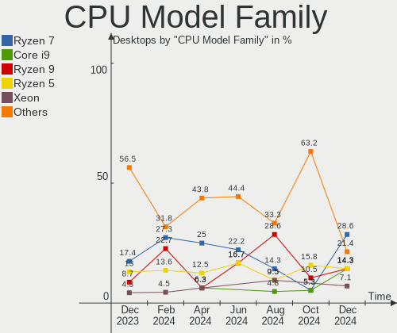

Gentoo - Hardware Trends (Desktops)
-----------------------------------

A project to identify most popular hardware characteristics and track their change
over time based on data collected by Linux users at https://Linux-Hardware.org.

Anyone can contribute to this report by the [hw-probe](https://github.com/linuxhw/hw-probe) tool:

    sudo -E hw-probe -all -upload

This report is for one last month. Overall report since the beginning of time: [TestCoverage](https://github.com/linuxhw/TestCoverage)

Period: Aug, 2022.

Contents
--------

* [ System ](#system)
  - [ OS                       ](#os)
  - [ OS Family                ](#os-family)
  - [ Kernel                   ](#kernel)
  - [ Kernel Family            ](#kernel-family)
  - [ Kernel Major Ver.        ](#kernel-major-ver)
  - [ Arch                     ](#arch)
  - [ DE                       ](#de)
  - [ Display Server           ](#display-server)
  - [ Display Manager          ](#display-manager)
  - [ OS Lang                  ](#os-lang)
  - [ Boot Mode                ](#boot-mode)
  - [ Filesystem               ](#filesystem)
  - [ Part. scheme             ](#part-scheme)
  - [ Dual Boot with Linux/BSD ](#dual-boot-with-linuxbsd)
  - [ Dual Boot (Win)          ](#dual-boot-win)

* [ Board ](#board)
  - [ Vendor                   ](#vendor)
  - [ Model                    ](#model)
  - [ Model Family             ](#model-family)
  - [ MFG Year                 ](#mfg-year)
  - [ Form Factor              ](#form-factor)
  - [ Secure Boot              ](#secure-boot)
  - [ Coreboot                 ](#coreboot)
  - [ RAM Size                 ](#ram-size)
  - [ RAM Used                 ](#ram-used)
  - [ Total Drives             ](#total-drives)
  - [ Has CD-ROM               ](#has-cd-rom)
  - [ Has Ethernet             ](#has-ethernet)
  - [ Has WiFi                 ](#has-wifi)
  - [ Has Bluetooth            ](#has-bluetooth)

* [ Location ](#location)
  - [ Country                  ](#country)
  - [ City                     ](#city)

* [ Drives ](#drives)
  - [ Drive Vendor             ](#drive-vendor)
  - [ Drive Model              ](#drive-model)
  - [ HDD Vendor               ](#hdd-vendor)
  - [ SSD Vendor               ](#ssd-vendor)
  - [ Drive Kind               ](#drive-kind)
  - [ Drive Connector          ](#drive-connector)
  - [ Drive Size               ](#drive-size)
  - [ Space Total              ](#space-total)
  - [ Space Used               ](#space-used)
  - [ Malfunc. Drives          ](#malfunc-drives)
  - [ Malfunc. Drive Vendor    ](#malfunc-drive-vendor)
  - [ Malfunc. HDD Vendor      ](#malfunc-hdd-vendor)
  - [ Malfunc. Drive Kind      ](#malfunc-drive-kind)
  - [ Failed Drives            ](#failed-drives)
  - [ Failed Drive Vendor      ](#failed-drive-vendor)
  - [ Drive Status             ](#drive-status)

* [ Storage controller ](#storage-controller)
  - [ Storage Vendor           ](#storage-vendor)
  - [ Storage Model            ](#storage-model)
  - [ Storage Kind             ](#storage-kind)

* [ Processor ](#processor)
  - [ CPU Vendor               ](#cpu-vendor)
  - [ CPU Model                ](#cpu-model)
  - [ CPU Model Family         ](#cpu-model-family)
  - [ CPU Cores                ](#cpu-cores)
  - [ CPU Sockets              ](#cpu-sockets)
  - [ CPU Threads              ](#cpu-threads)
  - [ CPU Op-Modes             ](#cpu-op-modes)
  - [ CPU Microcode            ](#cpu-microcode)
  - [ CPU Microarch            ](#cpu-microarch)

* [ Graphics ](#graphics)
  - [ GPU Vendor               ](#gpu-vendor)
  - [ GPU Model                ](#gpu-model)
  - [ GPU Combo                ](#gpu-combo)
  - [ GPU Driver               ](#gpu-driver)
  - [ GPU Memory               ](#gpu-memory)

* [ Monitor ](#monitor)
  - [ Monitor Vendor           ](#monitor-vendor)
  - [ Monitor Model            ](#monitor-model)
  - [ Monitor Resolution       ](#monitor-resolution)
  - [ Monitor Diagonal         ](#monitor-diagonal)
  - [ Monitor Width            ](#monitor-width)
  - [ Aspect Ratio             ](#aspect-ratio)
  - [ Monitor Area             ](#monitor-area)
  - [ Pixel Density            ](#pixel-density)
  - [ Multiple Monitors        ](#multiple-monitors)

* [ Network ](#network)
  - [ Net Controller Vendor    ](#net-controller-vendor)
  - [ Net Controller Model     ](#net-controller-model)
  - [ Wireless Vendor          ](#wireless-vendor)
  - [ Wireless Model           ](#wireless-model)
  - [ Ethernet Vendor          ](#ethernet-vendor)
  - [ Ethernet Model           ](#ethernet-model)
  - [ Net Controller Kind      ](#net-controller-kind)
  - [ Used Controller          ](#used-controller)
  - [ NICs                     ](#nics)
  - [ IPv6                     ](#ipv6)

* [ Bluetooth ](#bluetooth)
  - [ Bluetooth Vendor         ](#bluetooth-vendor)
  - [ Bluetooth Model          ](#bluetooth-model)

* [ Sound ](#sound)
  - [ Sound Vendor             ](#sound-vendor)
  - [ Sound Model              ](#sound-model)

* [ Memory ](#memory)
  - [ Memory Vendor            ](#memory-vendor)
  - [ Memory Model             ](#memory-model)
  - [ Memory Kind              ](#memory-kind)
  - [ Memory Form Factor       ](#memory-form-factor)
  - [ Memory Size              ](#memory-size)
  - [ Memory Speed             ](#memory-speed)

* [ Printers & scanners ](#printers--scanners)
  - [ Printer Vendor           ](#printer-vendor)
  - [ Printer Model            ](#printer-model)
  - [ Scanner Vendor           ](#scanner-vendor)
  - [ Scanner Model            ](#scanner-model)

* [ Camera ](#camera)
  - [ Camera Vendor            ](#camera-vendor)
  - [ Camera Model             ](#camera-model)

* [ Security ](#security)
  - [ Fingerprint Vendor       ](#fingerprint-vendor)
  - [ Fingerprint Model        ](#fingerprint-model)
  - [ Chipcard Vendor          ](#chipcard-vendor)
  - [ Chipcard Model           ](#chipcard-model)

* [ Unsupported ](#unsupported)
  - [ Unsupported Devices      ](#unsupported-devices)
  - [ Unsupported Device Types ](#unsupported-device-types)

System
------

OS
--

Installed operating systems

| Name       | Desktops | Percent |
|------------|----------|---------|
| Gentoo 2.8 | 18       | 100%    |

OS Family
---------

OS without a version

| Name   | Desktops | Percent |
|--------|----------|---------|
| Gentoo | 18       | 100%    |

Kernel
------

Version of the Linux kernel

| Version               | Desktops | Percent |
|-----------------------|----------|---------|
| 5.15.52-gentoo-x86_64 | 3        | 16.67%  |
| 5.19.0-gentoo         | 2        | 11.11%  |
| 5.15.59-gentoo        | 2        | 11.11%  |
| 5.19.1-gentoo-a6      | 1        | 5.56%   |
| 5.19.0-xanmod1-x86_64 | 1        | 5.56%   |
| 5.19.0-gentoo-x86_64  | 1        | 5.56%   |
| 5.19.0-gentoo-carbon  | 1        | 5.56%   |
| 5.18.3-zen1           | 1        | 5.56%   |
| 5.18.15-gentoo        | 1        | 5.56%   |
| 5.17.3-gentoo         | 1        | 5.56%   |
| 5.15.52-gentoo-ts221  | 1        | 5.56%   |
| 5.15.52-gentoo-dist   | 1        | 5.56%   |
| 5.15.52-gentoo        | 1        | 5.56%   |
| 5.15.41-gentoo-x86_64 | 1        | 5.56%   |

Kernel Family
-------------

Linux kernel without a distro release

| Version | Desktops | Percent |
|---------|----------|---------|
| 5.15.52 | 6        | 33.33%  |
| 5.19.0  | 5        | 27.78%  |
| 5.15.59 | 2        | 11.11%  |
| 5.19.1  | 1        | 5.56%   |
| 5.18.3  | 1        | 5.56%   |
| 5.18.15 | 1        | 5.56%   |
| 5.17.3  | 1        | 5.56%   |
| 5.15.41 | 1        | 5.56%   |

Kernel Major Ver.
-----------------

Linux kernel major version

| Version | Desktops | Percent |
|---------|----------|---------|
| 5.15    | 9        | 50%     |
| 5.19    | 6        | 33.33%  |
| 5.18    | 2        | 11.11%  |
| 5.17    | 1        | 5.56%   |

Arch
----

OS architecture (x86_64, i586, etc.)

| Name     | Desktops | Percent |
|----------|----------|---------|
| x86_64   | 17       | 94.44%  |
| armv5tel | 1        | 5.56%   |

DE
--

Desktop Environment

| Name    | Desktops | Percent |
|---------|----------|---------|
| Unknown | 8        | 44.44%  |
| GNOME   | 4        | 22.22%  |
| KDE5    | 3        | 16.67%  |
| MATE    | 2        | 11.11%  |
| LXQt    | 1        | 5.56%   |

Display Server
--------------

X11 or Wayland

| Name    | Desktops | Percent |
|---------|----------|---------|
| X11     | 7        | 38.89%  |
| Unknown | 5        | 27.78%  |
| Wayland | 3        | 16.67%  |
| Tty     | 3        | 16.67%  |

Display Manager
---------------

SDDM, LightDM, etc.

| Name    | Desktops | Percent |
|---------|----------|---------|
| Unknown | 9        | 50%     |
| SDDM    | 5        | 27.78%  |
| LightDM | 3        | 16.67%  |
| GDM     | 1        | 5.56%   |

OS Lang
-------

Language

| Lang    | Desktops | Percent |
|---------|----------|---------|
| en_US   | 9        | 50%     |
| en_GB   | 3        | 16.67%  |
| ru_RU   | 2        | 11.11%  |
| Unknown | 2        | 11.11%  |
| zh_TW   | 1        | 5.56%   |
| pl_PL   | 1        | 5.56%   |

Boot Mode
---------

EFI or BIOS

| Mode | Desktops | Percent |
|------|----------|---------|
| EFI  | 15       | 83.33%  |
| BIOS | 3        | 16.67%  |

Filesystem
----------

Type of filesystem

| Type  | Desktops | Percent |
|-------|----------|---------|
| Ext4  | 10       | 55.56%  |
| F2fs  | 5        | 27.78%  |
| Btrfs | 2        | 11.11%  |
| Xfs   | 1        | 5.56%   |

Part. scheme
------------

Scheme of partitioning

| Type    | Desktops | Percent |
|---------|----------|---------|
| GPT     | 17       | 94.44%  |
| Unknown | 1        | 5.56%   |

Dual Boot with Linux/BSD
------------------------

Hosting more than one Linux/BSD

| Dual boot | Desktops | Percent |
|-----------|----------|---------|
| Yes       | 11       | 61.11%  |
| No        | 7        | 38.89%  |

Dual Boot (Win)
---------------

Hosting Linux and Windows

| Dual boot | Desktops | Percent |
|-----------|----------|---------|
| No        | 10       | 55.56%  |
| Yes       | 8        | 44.44%  |

Board
-----

Vendor
------

Motherboard manufacturer

| Name                | Desktops | Percent |
|---------------------|----------|---------|
| ASUSTek Computer    | 6        | 33.33%  |
| Gigabyte Technology | 4        | 22.22%  |
| MSI                 | 3        | 16.67%  |
| ASRock              | 3        | 16.67%  |
| Lenovo              | 1        | 5.56%   |
| Unknown             | 1        | 5.56%   |

Model
-----

Motherboard model

| Name                               | Desktops | Percent |
|------------------------------------|----------|---------|
| MSI MS-7D09                        | 1        | 5.56%   |
| MSI MS-7C02                        | 1        | 5.56%   |
| MSI MS-7B85                        | 1        | 5.56%   |
| Lenovo Legion T5 26AMR5 90RB0002US | 1        | 5.56%   |
| Gigabyte Z77X-D3H                  | 1        | 5.56%   |
| Gigabyte B550M DS3H                | 1        | 5.56%   |
| Gigabyte B450 GAMING X             | 1        | 5.56%   |
| Gigabyte AB350-Gaming              | 1        | 5.56%   |
| ASUS TUF Gaming X570-PLUS          | 1        | 5.56%   |
| ASUS TUF B450M-PLUS GAMING         | 1        | 5.56%   |
| ASUS ROG STRIX X570-E GAMING       | 1        | 5.56%   |
| ASUS ROG Maximus Z690 EXTREME      | 1        | 5.56%   |
| ASUS PRIME Z390-A                  | 1        | 5.56%   |
| ASUS M3A78-CM                      | 1        | 5.56%   |
| ASRock X370 Gaming X               | 1        | 5.56%   |
| ASRock P67 Extreme4 Gen3           | 1        | 5.56%   |
| ASRock B75M-GL R2.0                | 1        | 5.56%   |
| Unknown                            | 1        | 5.56%   |

Model Family
------------

Motherboard model prefix

| Name                  | Desktops | Percent |
|-----------------------|----------|---------|
| ASUS TUF              | 2        | 11.11%  |
| ASUS ROG              | 2        | 11.11%  |
| MSI MS-7D09           | 1        | 5.56%   |
| MSI MS-7C02           | 1        | 5.56%   |
| MSI MS-7B85           | 1        | 5.56%   |
| Lenovo Legion         | 1        | 5.56%   |
| Gigabyte Z77X-D3H     | 1        | 5.56%   |
| Gigabyte B550M        | 1        | 5.56%   |
| Gigabyte B450         | 1        | 5.56%   |
| Gigabyte AB350-Gaming | 1        | 5.56%   |
| ASUS PRIME            | 1        | 5.56%   |
| ASUS M3A78-CM         | 1        | 5.56%   |
| ASRock X370           | 1        | 5.56%   |
| ASRock P67            | 1        | 5.56%   |
| ASRock B75M-GL        | 1        | 5.56%   |
| Unknown               | 1        | 5.56%   |

MFG Year
--------

Motherboard manufacture year

| Year    | Desktops | Percent |
|---------|----------|---------|
| 2018    | 4        | 22.22%  |
| 2019    | 3        | 16.67%  |
| 2021    | 2        | 11.11%  |
| 2017    | 2        | 11.11%  |
| 2012    | 2        | 11.11%  |
| 2022    | 1        | 5.56%   |
| 2020    | 1        | 5.56%   |
| 2011    | 1        | 5.56%   |
| 2008    | 1        | 5.56%   |
| Unknown | 1        | 5.56%   |

Form Factor
-----------

Physical design of the computer

| Name    | Desktops | Percent |
|---------|----------|---------|
| Desktop | 18       | 100%    |

Secure Boot
-----------

Enabled or disabled

| State    | Desktops | Percent |
|----------|----------|---------|
| Disabled | 18       | 100%    |

Coreboot
--------

Have coreboot on board

| Used | Desktops | Percent |
|------|----------|---------|
| No   | 18       | 100%    |

RAM Size
--------

Total RAM memory

| Size in GB  | Desktops | Percent |
|-------------|----------|---------|
| 32.01-64.0  | 9        | 50%     |
| 64.01-256.0 | 4        | 22.22%  |
| 16.01-24.0  | 2        | 11.11%  |
| 4.01-8.0    | 1        | 5.56%   |
| 24.01-32.0  | 1        | 5.56%   |
| 0.51-1.0    | 1        | 5.56%   |

RAM Used
--------

Used RAM memory

| Used GB    | Desktops | Percent |
|------------|----------|---------|
| 8.01-16.0  | 5        | 27.78%  |
| 4.01-8.0   | 2        | 11.11%  |
| 16.01-24.0 | 2        | 11.11%  |
| 1.01-2.0   | 2        | 11.11%  |
| 0.51-1.0   | 2        | 11.11%  |
| 32.01-64.0 | 1        | 5.56%   |
| 3.01-4.0   | 1        | 5.56%   |
| 24.01-32.0 | 1        | 5.56%   |
| 2.01-3.0   | 1        | 5.56%   |
| 0.01-0.5   | 1        | 5.56%   |

Total Drives
------------

Number of drives on board

| Drives | Desktops | Percent |
|--------|----------|---------|
| 2      | 7        | 38.89%  |
| 3      | 5        | 27.78%  |
| 6      | 2        | 11.11%  |
| 5      | 2        | 11.11%  |
| 12     | 1        | 5.56%   |
| 4      | 1        | 5.56%   |

Has CD-ROM
----------

Has CD-ROM on board

| Presented | Desktops | Percent |
|-----------|----------|---------|
| No        | 15       | 83.33%  |
| Yes       | 3        | 16.67%  |

Has Ethernet
------------

Has Ethernet on board

| Presented | Desktops | Percent |
|-----------|----------|---------|
| Yes       | 17       | 94.44%  |
| No        | 1        | 5.56%   |

Has WiFi
--------

Has WiFi module

| Presented | Desktops | Percent |
|-----------|----------|---------|
| No        | 12       | 66.67%  |
| Yes       | 6        | 33.33%  |

Has Bluetooth
-------------

Has Bluetooth module

| Presented | Desktops | Percent |
|-----------|----------|---------|
| No        | 11       | 61.11%  |
| Yes       | 7        | 38.89%  |

Location
--------

Country
-------

Geographic location (country)

| Country     | Desktops | Percent |
|-------------|----------|---------|
| USA         | 4        | 22.22%  |
| Germany     | 4        | 22.22%  |
| Poland      | 3        | 16.67%  |
| Russia      | 2        | 11.11%  |
| UK          | 1        | 5.56%   |
| Taiwan      | 1        | 5.56%   |
| Switzerland | 1        | 5.56%   |
| Netherlands | 1        | 5.56%   |
| Czechia     | 1        | 5.56%   |

City
----

Geographic location (city)

| City                 | Desktops | Percent |
|----------------------|----------|---------|
| Warsaw               | 2        | 11.11%  |
| Vladivostok          | 1        | 5.56%   |
| Thibodaux            | 1        | 5.56%   |
| Taichung City        | 1        | 5.56%   |
| Swansea              | 1        | 5.56%   |
| St. Cloud            | 1        | 5.56%   |
| Rostock              | 1        | 5.56%   |
| Renens               | 1        | 5.56%   |
| Prague               | 1        | 5.56%   |
| Moscow               | 1        | 5.56%   |
| Freiburg im Breisgau | 1        | 5.56%   |
| Florence             | 1        | 5.56%   |
| Duisburg             | 1        | 5.56%   |
| Denver               | 1        | 5.56%   |
| Cieszyn              | 1        | 5.56%   |
| Berlin               | 1        | 5.56%   |
| Amstelveen           | 1        | 5.56%   |

Drives
------

Drive Vendor
------------

Hard drive vendors

| Vendor              | Desktops | Drives | Percent |
|---------------------|----------|--------|---------|
| Samsung Electronics | 10       | 22     | 23.26%  |
| WDC                 | 7        | 7      | 16.28%  |
| Toshiba             | 7        | 10     | 16.28%  |
| Seagate             | 6        | 13     | 13.95%  |
| OCZ                 | 3        | 3      | 6.98%   |
| Hitachi             | 2        | 5      | 4.65%   |
| GOODRAM             | 2        | 2      | 4.65%   |
| Unknown             | 1        | 1      | 2.33%   |
| Team                | 1        | 1      | 2.33%   |
| Phison              | 1        | 1      | 2.33%   |
| Kingchuxing         | 1        | 1      | 2.33%   |
| HGST                | 1        | 1      | 2.33%   |
| Crucial             | 1        | 1      | 2.33%   |

Drive Model
-----------

Hard drive models

| Model                                             | Desktops | Percent |
|---------------------------------------------------|----------|---------|
| Samsung SSD 970 EVO 500GB                         | 3        | 5.77%   |
| Samsung SSD 870 EVO 1TB                           | 2        | 3.85%   |
| GOODRAM SSDPR-CL100-480-G2 480GB                  | 2        | 3.85%   |
| WDC WDS500G1B0C-00S6U0 500GB                      | 1        | 1.92%   |
| WDC WDS200T3X0C-00SJG0 2TB                        | 1        | 1.92%   |
| WDC WD7500BPVT-22HXZT1 752GB                      | 1        | 1.92%   |
| WDC WD40EZRZ-00GXCB0 4TB                          | 1        | 1.92%   |
| WDC WD20EFRX-68EUZN0 2TB                          | 1        | 1.92%   |
| WDC WD10EZRZ-00HTKB0 1TB                          | 1        | 1.92%   |
| WDC WD10EFRX-68JCSN0 1TB                          | 1        | 1.92%   |
| Unknown NVMe SSD Drive 1TB                        | 1        | 1.92%   |
| Toshiba MG09ACA18TE 18TB                          | 1        | 1.92%   |
| Toshiba MG04ACA200E 2TB                           | 1        | 1.92%   |
| Toshiba HDWR180 8TB                               | 1        | 1.92%   |
| Toshiba HDWE160 6TB                               | 1        | 1.92%   |
| Toshiba HDWE150 5TB                               | 1        | 1.92%   |
| Toshiba HDWD110 1TB                               | 1        | 1.92%   |
| Toshiba DT01ACA100 1TB                            | 1        | 1.92%   |
| Team TM8FP2240G 240GB                             | 1        | 1.92%   |
| Seagate ST8000NM0055-1RM112 8TB                   | 1        | 1.92%   |
| Seagate ST4000DM004-2CV104 4TB                    | 1        | 1.92%   |
| Seagate ST18000NM000J-2TV103 18TB                 | 1        | 1.92%   |
| Seagate ST12000NM0008-2H3101 12TB                 | 1        | 1.92%   |
| Seagate ST12000NE0007-2GT116 12TB                 | 1        | 1.92%   |
| Seagate ST1000DM003-1SB102 1TB                    | 1        | 1.92%   |
| Seagate ST1000DM003-1CH162 1TB                    | 1        | 1.92%   |
| Seagate ST10000VN0008-2JJ101 10TB                 | 1        | 1.92%   |
| Seagate ST10000VN0004-1ZD101 10TB                 | 1        | 1.92%   |
| Samsung SSD 970 EVO Plus 2TB                      | 1        | 1.92%   |
| Samsung SSD 970 EVO 1TB                           | 1        | 1.92%   |
| Samsung SSD 860 QVO 2TB                           | 1        | 1.92%   |
| Samsung SSD 850 PRO 256GB                         | 1        | 1.92%   |
| Samsung SSD 850 EVO 500GB                         | 1        | 1.92%   |
| Samsung SSD 850 EVO 250GB                         | 1        | 1.92%   |
| Samsung SSD 840 PRO Series 128GB                  | 1        | 1.92%   |
| Samsung NVMe SSD Drive 500GB                      | 1        | 1.92%   |
| Samsung NVMe SSD Drive 2TB                        | 1        | 1.92%   |
| Samsung NVMe SSD Drive 1TB                        | 1        | 1.92%   |
| Samsung NVMe SSD Controller SM981/PM981/PM983 1TB | 1        | 1.92%   |
| Phison APS-SE20G-512 512GB                        | 1        | 1.92%   |
| OCZ VERTEX4 128GB SSD                             | 1        | 1.92%   |
| OCZ VERTEX3 64GB SSD                              | 1        | 1.92%   |
| OCZ AGILITY3 120GB SSD                            | 1        | 1.92%   |
| Kingchuxing 512GB                                 | 1        | 1.92%   |
| Hitachi HUS724030ALE641 3TB                       | 1        | 1.92%   |
| Hitachi HDS721010CLA332 1TB                       | 1        | 1.92%   |
| HGST HTS545050A7E380 500GB                        | 1        | 1.92%   |
| Crucial CT1000MX500SSD1 1TB                       | 1        | 1.92%   |

HDD Vendor
----------

Hard disk drive vendors

| Vendor  | Desktops | Drives | Percent |
|---------|----------|--------|---------|
| Toshiba | 7        | 10     | 33.33%  |
| Seagate | 6        | 13     | 28.57%  |
| WDC     | 5        | 5      | 23.81%  |
| Hitachi | 2        | 5      | 9.52%   |
| HGST    | 1        | 1      | 4.76%   |

SSD Vendor
----------

Solid state drive vendors

| Vendor              | Desktops | Drives | Percent |
|---------------------|----------|--------|---------|
| Samsung Electronics | 6        | 11     | 50%     |
| OCZ                 | 3        | 3      | 25%     |
| GOODRAM             | 2        | 2      | 16.67%  |
| Crucial             | 1        | 1      | 8.33%   |

Drive Kind
----------

HDD or SSD

| Kind | Desktops | Drives | Percent |
|------|----------|--------|---------|
| HDD  | 14       | 34     | 38.89%  |
| NVMe | 11       | 17     | 30.56%  |
| SSD  | 11       | 17     | 30.56%  |

Drive Connector
---------------

SATA, SAS, NVMe, etc.

| Type | Desktops | Drives | Percent |
|------|----------|--------|---------|
| SATA | 18       | 51     | 62.07%  |
| NVMe | 11       | 17     | 37.93%  |

Drive Size
----------

Size of hard drive

| Size in TB | Desktops | Drives | Percent |
|------------|----------|--------|---------|
| 0.51-1.0   | 9        | 12     | 30%     |
| 0.01-0.5   | 8        | 13     | 26.67%  |
| 4.01-10.0  | 4        | 12     | 13.33%  |
| 10.01-20.0 | 3        | 5      | 10%     |
| 1.01-2.0   | 3        | 4      | 10%     |
| 3.01-4.0   | 2        | 2      | 6.67%   |
| 2.01-3.0   | 1        | 3      | 3.33%   |

Space Total
-----------

Amount of disk space available on the file system

| Size in GB     | Desktops | Percent |
|----------------|----------|---------|
| More than 3000 | 4        | 22.22%  |
| 101-250        | 3        | 16.67%  |
| 1001-2000      | 3        | 16.67%  |
| 501-1000       | 3        | 16.67%  |
| 251-500        | 2        | 11.11%  |
| 2001-3000      | 1        | 5.56%   |
| 1-20           | 1        | 5.56%   |
| Unknown        | 1        | 5.56%   |

Space Used
----------

Amount of used disk space

| Used GB        | Desktops | Percent |
|----------------|----------|---------|
| More than 3000 | 3        | 16.67%  |
| 1001-2000      | 3        | 16.67%  |
| 251-500        | 2        | 11.11%  |
| 21-50          | 2        | 11.11%  |
| 1-20           | 2        | 11.11%  |
| 501-1000       | 2        | 11.11%  |
| 51-100         | 2        | 11.11%  |
| 2001-3000      | 1        | 5.56%   |
| Unknown        | 1        | 5.56%   |

Malfunc. Drives
---------------

Drive models with a malfunction

| Model                                 | Desktops | Drives | Percent |
|---------------------------------------|----------|--------|---------|
| WDC WD10EFRX-68JCSN0 1TB              | 1        | 1      | 16.67%  |
| Seagate ST10000VN0004-1ZD101 10TB     | 1        | 4      | 16.67%  |
| Samsung Electronics SSD 970 EVO 1TB   | 1        | 1      | 16.67%  |
| Samsung Electronics SSD 870 EVO 1TB   | 1        | 1      | 16.67%  |
| Samsung Electronics SSD 850 PRO 256GB | 1        | 4      | 16.67%  |
| OCZ VERTEX4 128GB SSD                 | 1        | 1      | 16.67%  |

Malfunc. Drive Vendor
---------------------

Vendors of faulty drives

| Vendor              | Desktops | Drives | Percent |
|---------------------|----------|--------|---------|
| Samsung Electronics | 3        | 6      | 50%     |
| WDC                 | 1        | 1      | 16.67%  |
| Seagate             | 1        | 4      | 16.67%  |
| OCZ                 | 1        | 1      | 16.67%  |

Malfunc. HDD Vendor
-------------------

Vendors of faulty HDD drives

| Vendor  | Desktops | Drives | Percent |
|---------|----------|--------|---------|
| WDC     | 1        | 1      | 50%     |
| Seagate | 1        | 4      | 50%     |

Malfunc. Drive Kind
-------------------

Kinds of faulty drives

| Kind | Desktops | Drives | Percent |
|------|----------|--------|---------|
| SSD  | 3        | 6      | 50%     |
| HDD  | 2        | 5      | 33.33%  |
| NVMe | 1        | 1      | 16.67%  |

Failed Drives
-------------

Failed drive models

Zero info for selected period =(

Failed Drive Vendor
-------------------

Failed drive vendors

Zero info for selected period =(

Drive Status
------------

Number of failed and malfunc. drives

| Status   | Desktops | Drives | Percent |
|----------|----------|--------|---------|
| Works    | 16       | 46     | 66.67%  |
| Malfunc  | 5        | 12     | 20.83%  |
| Detected | 3        | 10     | 12.5%   |

Storage controller
------------------

Storage Vendor
--------------

Storage controller vendors

| Vendor                   | Desktops | Percent |
|--------------------------|----------|---------|
| AMD                      | 11       | 31.43%  |
| Samsung Electronics      | 7        | 20%     |
| Intel                    | 6        | 17.14%  |
| SanDisk                  | 2        | 5.71%   |
| Phison Electronics       | 2        | 5.71%   |
| Marvell Technology Group | 2        | 5.71%   |
| Unknown                  | 1        | 2.86%   |
| Silicon Motion           | 1        | 2.86%   |
| JMicron Technology       | 1        | 2.86%   |
| Broadcom / LSI           | 1        | 2.86%   |
| ASMedia Technology       | 1        | 2.86%   |

Storage Model
-------------

Storage controller models

| Model                                                                                   | Desktops | Percent |
|-----------------------------------------------------------------------------------------|----------|---------|
| Samsung NVMe SSD Controller SM981/PM981/PM983                                           | 6        | 14.29%  |
| AMD FCH SATA Controller [AHCI mode]                                                     | 6        | 14.29%  |
| AMD 400 Series Chipset SATA Controller                                                  | 4        | 9.52%   |
| Intel 7 Series/C210 Series Chipset Family 6-port SATA Controller [AHCI mode]            | 2        | 4.76%   |
| AMD 500 Series Chipset SATA Controller                                                  | 2        | 4.76%   |
| Unknown Non-Volatile memory controller                                                  | 1        | 2.38%   |
| Silicon Motion SM2263EN/SM2263XT SSD Controller                                         | 1        | 2.38%   |
| SanDisk WD Blue SN500 / PC SN520 NVMe SSD                                               | 1        | 2.38%   |
| SanDisk WD Black 2018/SN750 / PC SN720 NVMe SSD                                         | 1        | 2.38%   |
| Samsung NVMe SSD Controller PM9A1/PM9A3/980PRO                                          | 1        | 2.38%   |
| Phison E7 NVMe Controller                                                               | 1        | 2.38%   |
| Phison E12 NVMe Controller                                                              | 1        | 2.38%   |
| Marvell Group 88SE9172 SATA 6Gb/s Controller                                            | 1        | 2.38%   |
| Marvell Group 88SE912x SATA 6Gb/s Controller [IDE mode]                                 | 1        | 2.38%   |
| JMicron JMB363 SATA/IDE Controller                                                      | 1        | 2.38%   |
| Intel Volume Management Device NVMe RAID Controller                                     | 1        | 2.38%   |
| Intel Cannon Lake PCH SATA AHCI Controller                                              | 1        | 2.38%   |
| Intel Alder Lake-S PCH SATA Controller [AHCI Mode]                                      | 1        | 2.38%   |
| Intel 6 Series/C200 Series Chipset Family Desktop SATA Controller (IDE mode, ports 4-5) | 1        | 2.38%   |
| Intel 6 Series/C200 Series Chipset Family Desktop SATA Controller (IDE mode, ports 0-3) | 1        | 2.38%   |
| Intel 500 Series Chipset Family SATA AHCI Controller                                    | 1        | 2.38%   |
| Broadcom / LSI SAS3008 PCI-Express Fusion-MPT SAS-3                                     | 1        | 2.38%   |
| ASMedia ASM1062 Serial ATA Controller                                                   | 1        | 2.38%   |
| AMD X370 Series Chipset SATA Controller                                                 | 1        | 2.38%   |
| AMD SB7x0/SB8x0/SB9x0 SATA Controller [IDE mode]                                        | 1        | 2.38%   |
| AMD SB7x0/SB8x0/SB9x0 IDE Controller                                                    | 1        | 2.38%   |
| AMD 300 Series Chipset SATA Controller                                                  | 1        | 2.38%   |

Storage Kind
------------

Kind of storage controller (IDE, SATA, NVMe, SAS, ...)

| Kind | Desktops | Percent |
|------|----------|---------|
| SATA | 16       | 50%     |
| NVMe | 11       | 34.38%  |
| IDE  | 3        | 9.38%   |
| RAID | 1        | 3.13%   |
| SAS  | 1        | 3.13%   |

Processor
---------

CPU Vendor
----------

Processor vendors

| Vendor                | Desktops | Percent |
|-----------------------|----------|---------|
| AMD                   | 11       | 61.11%  |
| Intel                 | 6        | 33.33%  |
| Marvell Semiconductor | 1        | 5.56%   |

CPU Model
---------

Processor models

| Model                                                                    | Desktops | Percent |
|--------------------------------------------------------------------------|----------|---------|
| AMD Ryzen 9 3900X 12-Core Processor                                      | 2        | 11.11%  |
| AMD Ryzen 5 3600 6-Core Processor                                        | 2        | 11.11%  |
| AMD Ryzen 5 2600 Six-Core Processor                                      | 2        | 11.11%  |
| Marvell Semiconductor Marvell Kirkwood (Flattened Device Tree) Processor | 1        | 5.56%   |
| Intel Core i7-8086K CPU @ 4.00GHz                                        | 1        | 5.56%   |
| Intel Core i5-3550 CPU @ 3.30GHz                                         | 1        | 5.56%   |
| Intel Core i5-2500S CPU @ 2.70GHz                                        | 1        | 5.56%   |
| Intel Core i5-2500K CPU @ 3.30GHz                                        | 1        | 5.56%   |
| Intel 12th Gen Core i9-12900K                                            | 1        | 5.56%   |
| Intel 11th Gen Core i9-11900KF @ 3.50GHz                                 | 1        | 5.56%   |
| AMD Ryzen 9 5900X 12-Core Processor                                      | 1        | 5.56%   |
| AMD Ryzen 5 3600X 6-Core Processor                                       | 1        | 5.56%   |
| AMD Ryzen 5 2600X Six-Core Processor                                     | 1        | 5.56%   |
| AMD Ryzen 5 1600 Six-Core Processor                                      | 1        | 5.56%   |
| AMD Phenom II X4 955 Processor                                           | 1        | 5.56%   |

CPU Model Family
----------------

Processor model prefix

| Model            | Desktops | Percent |
|------------------|----------|---------|
| AMD Ryzen 5      | 7        | 38.89%  |
| Other            | 3        | 16.67%  |
| Intel Core i5    | 3        | 16.67%  |
| AMD Ryzen 9      | 3        | 16.67%  |
| Intel Core i7    | 1        | 5.56%   |
| AMD Phenom II X4 | 1        | 5.56%   |

CPU Cores
---------

Number of processor cores

| Number | Desktops | Percent |
|--------|----------|---------|
| 6      | 8        | 44.44%  |
| 4      | 4        | 22.22%  |
| 12     | 3        | 16.67%  |
| 16     | 1        | 5.56%   |
| 8      | 1        | 5.56%   |
| 1      | 1        | 5.56%   |

CPU Sockets
-----------

Number of sockets

| Number | Desktops | Percent |
|--------|----------|---------|
| 1      | 18       | 100%    |

CPU Threads
-----------

Threads per core (Hyper-Threading)

| Number | Desktops | Percent |
|--------|----------|---------|
| 2      | 13       | 72.22%  |
| 1      | 5        | 27.78%  |

CPU Op-Modes
------------

CPU Operation Modes (32-bit, 64-bit)

| Op mode        | Desktops | Percent |
|----------------|----------|---------|
| 32-bit, 64-bit | 17       | 94.44%  |
| Unknown        | 1        | 5.56%   |

CPU Microcode
-------------

Microcode number

| Number     | Desktops | Percent |
|------------|----------|---------|
| 0x08701021 | 4        | 22.22%  |
| 0x0800820d | 3        | 16.67%  |
| Unknown    | 3        | 16.67%  |
| 0xa0671    | 1        | 5.56%   |
| 0x906ea    | 1        | 5.56%   |
| 0x90672    | 1        | 5.56%   |
| 0x306a9    | 1        | 5.56%   |
| 0x206a7    | 1        | 5.56%   |
| 0x0a201009 | 1        | 5.56%   |
| 0x08001138 | 1        | 5.56%   |
| 0x010000db | 1        | 5.56%   |

CPU Microarch
-------------

Microarchitecture

| Name             | Desktops | Percent |
|------------------|----------|---------|
| Zen 2            | 5        | 27.78%  |
| Zen+             | 3        | 16.67%  |
| SandyBridge      | 2        | 11.11%  |
| Zen 3            | 1        | 5.56%   |
| Zen              | 1        | 5.56%   |
| KabyLake         | 1        | 5.56%   |
| K10              | 1        | 5.56%   |
| IvyBridge        | 1        | 5.56%   |
| Icelake          | 1        | 5.56%   |
| Alderlake Hybrid | 1        | 5.56%   |
| Unknown          | 1        | 5.56%   |

Graphics
--------

GPU Vendor
----------

Vendors of graphics cards

| Vendor | Desktops | Percent |
|--------|----------|---------|
| AMD    | 11       | 64.71%  |
| Nvidia | 5        | 29.41%  |
| Intel  | 1        | 5.88%   |

GPU Model
---------

Graphics card models

| Model                                                            | Desktops | Percent |
|------------------------------------------------------------------|----------|---------|
| AMD Ellesmere [Radeon RX 470/480/570/570X/580/580X/590]          | 7        | 38.89%  |
| Nvidia TU104 [GeForce RTX 2080 Rev. A]                           | 2        | 11.11%  |
| AMD Navi 21 [Radeon RX 6800/6800 XT / 6900 XT]                   | 2        | 11.11%  |
| Nvidia TU116 [GeForce GTX 1660 SUPER]                            | 1        | 5.56%   |
| Nvidia TU104 [GeForce RTX 2070 SUPER]                            | 1        | 5.56%   |
| Nvidia GF119 [GeForce GT 610]                                    | 1        | 5.56%   |
| Intel Xeon E3-1200 v2/3rd Gen Core processor Graphics Controller | 1        | 5.56%   |
| AMD RS780C [Radeon 3100]                                         | 1        | 5.56%   |
| AMD Oland PRO [Radeon R7 240/340 / Radeon 520]                   | 1        | 5.56%   |
| AMD Cedar [Radeon HD 5000/6000/7350/8350 Series]                 | 1        | 5.56%   |

GPU Combo
---------

Combinations of graphics cards

| Name       | Desktops | Percent |
|------------|----------|---------|
| 1 x AMD    | 10       | 55.56%  |
| 1 x Nvidia | 5        | 27.78%  |
| Other      | 1        | 5.56%   |
| 2 x AMD    | 1        | 5.56%   |
| 1 x Intel  | 1        | 5.56%   |

GPU Driver
----------

Free vs proprietary

| Driver      | Desktops | Percent |
|-------------|----------|---------|
| Free        | 13       | 72.22%  |
| Proprietary | 4        | 22.22%  |
| Unknown     | 1        | 5.56%   |

GPU Memory
----------

Total video memory

| Size in GB | Desktops | Percent |
|------------|----------|---------|
| 7.01-8.0   | 7        | 38.89%  |
| 0.51-1.0   | 3        | 16.67%  |
| Unknown    | 3        | 16.67%  |
| 8.01-16.0  | 2        | 11.11%  |
| 5.01-6.0   | 1        | 5.56%   |
| 3.01-4.0   | 1        | 5.56%   |
| 0.01-0.5   | 1        | 5.56%   |

Monitor
-------

Monitor Vendor
--------------

Monitor vendors

| Vendor                  | Desktops | Percent |
|-------------------------|----------|---------|
| Samsung Electronics     | 4        | 16.67%  |
| ViewSonic               | 2        | 8.33%   |
| Goldstar                | 2        | 8.33%   |
| Dell                    | 2        | 8.33%   |
| BenQ                    | 2        | 8.33%   |
| AOC                     | 2        | 8.33%   |
| Acer                    | 2        | 8.33%   |
| ___                     | 1        | 4.17%   |
| Unknown                 | 1        | 4.17%   |
| Toshiba                 | 1        | 4.17%   |
| Sceptre Tech            | 1        | 4.17%   |
| NEC Computers           | 1        | 4.17%   |
| Iiyama                  | 1        | 4.17%   |
| Chi Mei Optoelectronics | 1        | 4.17%   |
| ASUSTek Computer        | 1        | 4.17%   |

Monitor Model
-------------

Monitor models

| Model                                                                 | Desktops | Percent |
|-----------------------------------------------------------------------|----------|---------|
| Samsung Electronics U28E590 SAM0C4D 3840x2160 607x345mm 27.5-inch     | 2        | 7.41%   |
| ___ LCDTV16 ___9000 1360x768                                          | 1        | 3.7%    |
| ViewSonic VX2363 Series VSC6B2F 1920x1080 509x286mm 23.0-inch         | 1        | 3.7%    |
| ViewSonic VG1655 VSCD239 1920x1080 340x190mm 15.3-inch                | 1        | 3.7%    |
| Unknown LCDTV 9000 1360x768 1600x900mm 72.3-inch                      | 1        | 3.7%    |
| Toshiba 32FHD_LCD_TV TSB3700 1920x1080 700x400mm 31.7-inch            | 1        | 3.7%    |
| Sceptre Tech H32 SPT0CB8 1920x1080 575x323mm 26.0-inch                | 1        | 3.7%    |
| Samsung Electronics U28E590 SAM0C4C 3840x2160 608x345mm 27.5-inch     | 1        | 3.7%    |
| Samsung Electronics S22B300 SAM08C8 1920x1080 477x268mm 21.5-inch     | 1        | 3.7%    |
| Samsung Electronics LC24RG50 SAM0F90 1920x1080 532x304mm 24.1-inch    | 1        | 3.7%    |
| NEC Computers 70GX2 NEC6691 1280x1024 338x270mm 17.0-inch             | 1        | 3.7%    |
| Iiyama PL2480H IVM610B 1920x1080 521x293mm 23.5-inch                  | 1        | 3.7%    |
| Goldstar LG ULTRAGEAR GSM774B 3440x1440 800x330mm 34.1-inch           | 1        | 3.7%    |
| Goldstar E2211 GSM5839 1920x1080 477x268mm 21.5-inch                  | 1        | 3.7%    |
| Dell U2414H DELA0A4 1920x1080 527x296mm 23.8-inch                     | 1        | 3.7%    |
| Dell 2408WFP DELA02C 1920x1200 520x320mm 24.0-inch                    | 1        | 3.7%    |
| Dell 2408WFP DELA02B 1920x1200 519x320mm 24.0-inch                    | 1        | 3.7%    |
| Chi Mei Optoelectronics CMC 19AW CMO2198 1440x900 408x255mm 18.9-inch | 1        | 3.7%    |
| BenQ G2420HDBL BNQ785F 1920x1080 477x268mm 21.5-inch                  | 1        | 3.7%    |
| BenQ E2200HD BNQ790C 1920x1080 477x268mm 21.5-inch                    | 1        | 3.7%    |
| ASUSTek Computer PB247 AUS24A8 1920x1080 527x297mm 23.8-inch          | 1        | 3.7%    |
| AOC 2460G4 AOC246A 1920x1080 530x300mm 24.0-inch                      | 1        | 3.7%    |
| AOC 2251w AOC2251 1920x1080 477x268mm 21.5-inch                       | 1        | 3.7%    |
| Acer KB272HL ACR070F 1920x1080 598x336mm 27.0-inch                    | 1        | 3.7%    |
| Acer EI272UR ACR072E 2560x1440 597x336mm 27.0-inch                    | 1        | 3.7%    |
| Acer B247Y ACR063F 1920x1080 527x296mm 23.8-inch                      | 1        | 3.7%    |

Monitor Resolution
------------------

Monitor screen resolution

| Resolution        | Desktops | Percent |
|-------------------|----------|---------|
| 1920x1080 (FHD)   | 11       | 52.38%  |
| 3840x2160 (4K)    | 3        | 14.29%  |
| 1440x900 (WXGA+)  | 2        | 9.52%   |
| 3440x1440         | 1        | 4.76%   |
| 2560x1440 (QHD)   | 1        | 4.76%   |
| 1920x1200 (WUXGA) | 1        | 4.76%   |
| 1360x768          | 1        | 4.76%   |
| 1280x1024 (SXGA)  | 1        | 4.76%   |

Monitor Diagonal
----------------

Diagonal size in inches

| Inches  | Desktops | Percent |
|---------|----------|---------|
| 24      | 4        | 17.39%  |
| 23      | 4        | 17.39%  |
| 21      | 4        | 17.39%  |
| 27      | 3        | 13.04%  |
| 84      | 1        | 4.35%   |
| 72      | 1        | 4.35%   |
| 34      | 1        | 4.35%   |
| 31      | 1        | 4.35%   |
| 19      | 1        | 4.35%   |
| 17      | 1        | 4.35%   |
| 15      | 1        | 4.35%   |
| Unknown | 1        | 4.35%   |

Monitor Width
-------------

Physical width

| Width in mm | Desktops | Percent |
|-------------|----------|---------|
| 501-600     | 9        | 40.91%  |
| 401-500     | 4        | 18.18%  |
| 601-700     | 3        | 13.64%  |
| 301-350     | 2        | 9.09%   |
| 1501-2000   | 2        | 9.09%   |
| 701-800     | 1        | 4.55%   |
| Unknown     | 1        | 4.55%   |

Aspect Ratio
------------

Proportional relationship between the width and the height

| Ratio | Desktops | Percent |
|-------|----------|---------|
| 16/9  | 14       | 77.78%  |
| 16/10 | 2        | 11.11%  |
| 5/4   | 1        | 5.56%   |
| 21/9  | 1        | 5.56%   |

Monitor Area
------------

Area in inch²

| Area in inch² | Desktops | Percent |
|----------------|----------|---------|
| 201-250        | 7        | 33.33%  |
| 301-350        | 3        | 14.29%  |
| More than 1000 | 2        | 9.52%   |
| 351-500        | 2        | 9.52%   |
| 251-300        | 2        | 9.52%   |
| 151-200        | 2        | 9.52%   |
| 141-150        | 1        | 4.76%   |
| 101-110        | 1        | 4.76%   |
| Unknown        | 1        | 4.76%   |

Pixel Density
-------------

Pixels per inch

| Density | Desktops | Percent |
|---------|----------|---------|
| 51-100  | 12       | 52.17%  |
| 101-120 | 6        | 26.09%  |
| 121-160 | 3        | 13.04%  |
| 1-50    | 1        | 4.35%   |
| Unknown | 1        | 4.35%   |

Multiple Monitors
-----------------

Total monitors connected

| Total | Desktops | Percent |
|-------|----------|---------|
| 1     | 9        | 50%     |
| 3     | 3        | 16.67%  |
| 2     | 3        | 16.67%  |
| 0     | 2        | 11.11%  |
| 4     | 1        | 5.56%   |

Network
-------

Net Controller Vendor
---------------------

Controller vendors

| Vendor                | Desktops | Percent |
|-----------------------|----------|---------|
| Realtek Semiconductor | 11       | 47.83%  |
| Intel                 | 9        | 39.13%  |
| Qualcomm Atheros      | 1        | 4.35%   |
| Dresden Elektronik    | 1        | 4.35%   |
| Aquantia              | 1        | 4.35%   |

Net Controller Model
--------------------

Controller models

| Model                                                               | Desktops | Percent |
|---------------------------------------------------------------------|----------|---------|
| Realtek RTL8111/8168/8411 PCI Express Gigabit Ethernet Controller   | 10       | 35.71%  |
| Intel Wi-Fi 6 AX200                                                 | 3        | 10.71%  |
| Intel I211 Gigabit Network Connection                               | 3        | 10.71%  |
| Intel Ethernet Controller I225-V                                    | 2        | 7.14%   |
| Realtek RTL8125 2.5GbE Controller                                   | 1        | 3.57%   |
| Qualcomm Atheros AR8151 v2.0 Gigabit Ethernet                       | 1        | 3.57%   |
| Intel Wireless-AC 9260                                              | 1        | 3.57%   |
| Intel Wireless 7265                                                 | 1        | 3.57%   |
| Intel Ethernet Connection (7) I219-V                                | 1        | 3.57%   |
| Intel Alder Lake-S PCH CNVi WiFi                                    | 1        | 3.57%   |
| Intel 82599ES 10-Gigabit SFI/SFP+ Network Connection                | 1        | 3.57%   |
| Intel 82575GB Gigabit Network Connection                            | 1        | 3.57%   |
| Dresden Elektronik ZigBee gateway [ConBee II]                       | 1        | 3.57%   |
| Aquantia AQC113CS NBase-T/IEEE 802.3bz Ethernet Controller [AQtion] | 1        | 3.57%   |

Wireless Vendor
---------------

Wireless vendors

| Vendor | Desktops | Percent |
|--------|----------|---------|
| Intel  | 6        | 100%    |

Wireless Model
--------------

Wireless models

| Model                            | Desktops | Percent |
|----------------------------------|----------|---------|
| Intel Wi-Fi 6 AX200              | 3        | 50%     |
| Intel Wireless-AC 9260           | 1        | 16.67%  |
| Intel Wireless 7265              | 1        | 16.67%  |
| Intel Alder Lake-S PCH CNVi WiFi | 1        | 16.67%  |

Ethernet Vendor
---------------

Ethernet vendors

| Vendor                | Desktops | Percent |
|-----------------------|----------|---------|
| Realtek Semiconductor | 11       | 57.89%  |
| Intel                 | 6        | 31.58%  |
| Qualcomm Atheros      | 1        | 5.26%   |
| Aquantia              | 1        | 5.26%   |

Ethernet Model
--------------

Ethernet models

| Model                                                               | Desktops | Percent |
|---------------------------------------------------------------------|----------|---------|
| Realtek RTL8111/8168/8411 PCI Express Gigabit Ethernet Controller   | 10       | 47.62%  |
| Intel I211 Gigabit Network Connection                               | 3        | 14.29%  |
| Intel Ethernet Controller I225-V                                    | 2        | 9.52%   |
| Realtek RTL8125 2.5GbE Controller                                   | 1        | 4.76%   |
| Qualcomm Atheros AR8151 v2.0 Gigabit Ethernet                       | 1        | 4.76%   |
| Intel Ethernet Connection (7) I219-V                                | 1        | 4.76%   |
| Intel 82599ES 10-Gigabit SFI/SFP+ Network Connection                | 1        | 4.76%   |
| Intel 82575GB Gigabit Network Connection                            | 1        | 4.76%   |
| Aquantia AQC113CS NBase-T/IEEE 802.3bz Ethernet Controller [AQtion] | 1        | 4.76%   |

Net Controller Kind
-------------------

Ethernet, WiFi or modem

| Kind     | Desktops | Percent |
|----------|----------|---------|
| Ethernet | 17       | 70.83%  |
| WiFi     | 6        | 25%     |
| Modem    | 1        | 4.17%   |

Used Controller
---------------

Currently used network controller

| Kind     | Desktops | Percent |
|----------|----------|---------|
| Ethernet | 15       | 88.24%  |
| WiFi     | 2        | 11.76%  |

NICs
----

Total network controllers on board

| Total | Desktops | Percent |
|-------|----------|---------|
| 1     | 10       | 55.56%  |
| 2     | 4        | 22.22%  |
| 5     | 1        | 5.56%   |
| 4     | 1        | 5.56%   |
| 3     | 1        | 5.56%   |
| 0     | 1        | 5.56%   |

IPv6
----

IPv6 vs IPv4

| Used | Desktops | Percent |
|------|----------|---------|
| No   | 13       | 72.22%  |
| Yes  | 5        | 27.78%  |

Bluetooth
---------

Bluetooth Vendor
----------------

Controller vendors

| Vendor                  | Desktops | Percent |
|-------------------------|----------|---------|
| Intel                   | 6        | 85.71%  |
| Cambridge Silicon Radio | 1        | 14.29%  |

Bluetooth Model
---------------

Controller models

| Model                                               | Desktops | Percent |
|-----------------------------------------------------|----------|---------|
| Intel AX200 Bluetooth                               | 3        | 42.86%  |
| Intel Wireless-AC 9260 Bluetooth Adapter            | 1        | 14.29%  |
| Intel Bluetooth wireless interface                  | 1        | 14.29%  |
| Intel Bluetooth Device                              | 1        | 14.29%  |
| Cambridge Silicon Radio Bluetooth Dongle (HCI mode) | 1        | 14.29%  |

Sound
-----

Sound Vendor
------------

Sound card vendors

| Vendor                | Desktops | Percent |
|-----------------------|----------|---------|
| AMD                   | 13       | 38.24%  |
| Nvidia                | 5        | 14.71%  |
| Intel                 | 5        | 14.71%  |
| C-Media Electronics   | 2        | 5.88%   |
| ASUSTek Computer      | 2        | 5.88%   |
| SAVITECH              | 1        | 2.94%   |
| Realtek Semiconductor | 1        | 2.94%   |
| Razer USA             | 1        | 2.94%   |
| Creative Labs         | 1        | 2.94%   |
| Corsair               | 1        | 2.94%   |
| Blue Microphones      | 1        | 2.94%   |
| Audio-Technica        | 1        | 2.94%   |

Sound Model
-----------

Sound card models

| Model                                                                      | Desktops | Percent |
|----------------------------------------------------------------------------|----------|---------|
| AMD Ellesmere HDMI Audio [Radeon RX 470/480 / 570/580/590]                 | 7        | 16.67%  |
| AMD Starship/Matisse HD Audio Controller                                   | 5        | 11.9%   |
| AMD Family 17h (Models 00h-0fh) HD Audio Controller                        | 4        | 9.52%   |
| Nvidia TU104 HD Audio Controller                                           | 3        | 7.14%   |
| AMD Navi 21/23 HDMI/DP Audio Controller                                    | 2        | 4.76%   |
| SAVITECH SA9023 audio controller                                           | 1        | 2.38%   |
| Realtek Semiconductor USB Condenser Microphone                             | 1        | 2.38%   |
| Razer USA Razer Seiren Mini                                                | 1        | 2.38%   |
| Nvidia TU116 High Definition Audio Controller                              | 1        | 2.38%   |
| Nvidia GF119 HDMI Audio Controller                                         | 1        | 2.38%   |
| Intel Tiger Lake-H HD Audio Controller                                     | 1        | 2.38%   |
| Intel Cannon Lake PCH cAVS                                                 | 1        | 2.38%   |
| Intel Alder Lake-S HD Audio Controller                                     | 1        | 2.38%   |
| Intel 7 Series/C216 Chipset Family High Definition Audio Controller        | 1        | 2.38%   |
| Intel 6 Series/C200 Series Chipset Family High Definition Audio Controller | 1        | 2.38%   |
| Creative Labs CA0106/CA0111 [SB Live!/Audigy/X-Fi Series]                  | 1        | 2.38%   |
| Corsair VOID PRO Wireless Gaming Headset                                   | 1        | 2.38%   |
| C-Media Electronics AT9933USB                                              | 1        | 2.38%   |
| C-Media Electronics Anua Mic CM 900                                        | 1        | 2.38%   |
| Blue Microphones Yeti Stereo Microphone                                    | 1        | 2.38%   |
| Audio-Technica USB Headphone Amp.                                          | 1        | 2.38%   |
| ASUSTek Computer Xonar U1 Audio Station                                    | 1        | 2.38%   |
| ASUSTek Computer USB Audio                                                 | 1        | 2.38%   |
| AMD SBx00 Azalia (Intel HDA)                                               | 1        | 2.38%   |
| AMD Oland/Hainan/Cape Verde/Pitcairn HDMI Audio [Radeon HD 7000 Series]    | 1        | 2.38%   |
| AMD Cedar HDMI Audio [Radeon HD 5400/6300/7300 Series]                     | 1        | 2.38%   |

Memory
------

Memory Vendor
-------------

Memory module vendors

| Vendor              | Desktops | Percent |
|---------------------|----------|---------|
| Corsair             | 8        | 44.44%  |
| Unknown             | 3        | 16.67%  |
| Team                | 1        | 5.56%   |
| Samsung Electronics | 1        | 5.56%   |
| Patriot Memory      | 1        | 5.56%   |
| Patriot             | 1        | 5.56%   |
| Kingston            | 1        | 5.56%   |
| G.Skill             | 1        | 5.56%   |
| A-DATA Technology   | 1        | 5.56%   |

Memory Model
------------

Memory module models

| Model                                                      | Desktops | Percent |
|------------------------------------------------------------|----------|---------|
| Corsair RAM CMK16GX4M2B3200C16 8GB DIMM DDR4 3600MT/s      | 3        | 14.29%  |
| Corsair RAM CMK32GX4M2E3200C16 16GB DIMM DDR4 3200MT/s     | 2        | 9.52%   |
| Unknown RAM Module 8GB DIMM DDR3 1333MT/s                  | 1        | 4.76%   |
| Unknown RAM Module 2GB DIMM DDR2 667MT/s                   | 1        | 4.76%   |
| Unknown RAM 3000 C16 Series 8192MB DIMM DDR4 2133MT/s      | 1        | 4.76%   |
| Team RAM TEAMGROUP-UD4-3600 8GB DIMM DDR4 3600MT/s         | 1        | 4.76%   |
| Samsung RAM M378A1G44AB0-CWE 8GB DIMM DDR4 3200MT/s        | 1        | 4.76%   |
| Patriot RAM 1600 CL9 Series 4GB DIMM DDR3 1600MT/s         | 1        | 4.76%   |
| Patriot Memory RAM 3200 C16 Series 16GB DIMM DDR4 3200MT/s | 1        | 4.76%   |
| Kingston RAM 9965745-026.A00G 16GB DIMM DDR4 3334MT/s      | 1        | 4.76%   |
| G.Skill RAM F4-3600C16-16GVKC 16GB DIMM DDR4 3866MT/s      | 1        | 4.76%   |
| Corsair RAM CMZ8GX3M2A1600C9 4096MB DIMM DDR3 1600MT/s     | 1        | 4.76%   |
| Corsair RAM CMZ8GX3M1A1600C10 8GB DIMM DDR3 1600MT/s       | 1        | 4.76%   |
| Corsair RAM CMZ16GX3M2A1600C10 8GB DIMM DDR3 1600MT/s      | 1        | 4.76%   |
| Corsair RAM CMW32GX4M2E3200C16 16GB DIMM DDR4 3200MT/s     | 1        | 4.76%   |
| Corsair RAM CMK32GX4M2B3200C16 16GB DIMM DDR4 3400MT/s     | 1        | 4.76%   |
| Corsair RAM CMK16GX4M2D3000C16 8GB DIMM DDR4 3200MT/s      | 1        | 4.76%   |
| A-DATA RAM DDR4 3200 8GB DIMM DDR4 3400MT/s                | 1        | 4.76%   |

Memory Kind
-----------

Memory module kinds

| Kind | Desktops | Percent |
|------|----------|---------|
| DDR4 | 12       | 75%     |
| DDR3 | 3        | 18.75%  |
| DDR2 | 1        | 6.25%   |

Memory Form Factor
------------------

Physical design of the memory module

| Name | Desktops | Percent |
|------|----------|---------|
| DIMM | 16       | 100%    |

Memory Size
-----------

Memory module size

| Size  | Desktops | Percent |
|-------|----------|---------|
| 16384 | 6        | 35.29%  |
| 8192  | 6        | 35.29%  |
| 32768 | 3        | 17.65%  |
| 4096  | 1        | 5.88%   |
| 2048  | 1        | 5.88%   |

Memory Speed
------------

Memory module speed

| Speed | Desktops | Percent |
|-------|----------|---------|
| 3200  | 7        | 36.84%  |
| 3600  | 4        | 21.05%  |
| 3400  | 2        | 10.53%  |
| 1600  | 2        | 10.53%  |
| 3866  | 1        | 5.26%   |
| 3334  | 1        | 5.26%   |
| 1333  | 1        | 5.26%   |
| 667   | 1        | 5.26%   |

Printers & scanners
-------------------

Printer Vendor
--------------

Printer device vendors

| Vendor          | Desktops | Percent |
|-----------------|----------|---------|
| Hewlett-Packard | 1        | 100%    |

Printer Model
-------------

Printer device models

| Model               | Desktops | Percent |
|---------------------|----------|---------|
| HP LaserJet M14-M17 | 1        | 100%    |

Scanner Vendor
--------------

Scanner device vendors

Zero info for selected period =(

Scanner Model
-------------

Scanner device models

Zero info for selected period =(

Camera
------

Camera Vendor
-------------

Camera device vendors

| Vendor                        | Desktops | Percent |
|-------------------------------|----------|---------|
| Logitech                      | 3        | 60%     |
| Sunplus Innovation Technology | 1        | 20%     |
| MacroSilicon                  | 1        | 20%     |

Camera Model
------------

Camera device models

| Model                         | Desktops | Percent |
|-------------------------------|----------|---------|
| Sunplus Full HD webcam        | 1        | 20%     |
| MacroSilicon USB Video        | 1        | 20%     |
| Logitech HD Webcam C615       | 1        | 20%     |
| Logitech HD Pro Webcam C920   | 1        | 20%     |
| Logitech BRIO Ultra HD Webcam | 1        | 20%     |

Security
--------

Fingerprint Vendor
------------------

Fingerprint sensor vendors

Zero info for selected period =(

Fingerprint Model
-----------------

Fingerprint sensor models

Zero info for selected period =(

Chipcard Vendor
---------------

Chipcard module vendors

Zero info for selected period =(

Chipcard Model
--------------

Chipcard module models

Zero info for selected period =(

Unsupported
-----------

Unsupported Devices
-------------------

Total unsupported devices on board

| Total | Desktops | Percent |
|-------|----------|---------|
| 0     | 13       | 72.22%  |
| 1     | 3        | 16.67%  |
| 2     | 2        | 11.11%  |

Unsupported Device Types
------------------------

Types of unsupported devices

| Type                     | Desktops | Percent |
|--------------------------|----------|---------|
| Communication controller | 2        | 28.57%  |
| Bluetooth                | 2        | 28.57%  |
| Storage/ide              | 1        | 14.29%  |
| Net/wireless             | 1        | 14.29%  |
| Modem                    | 1        | 14.29%  |

