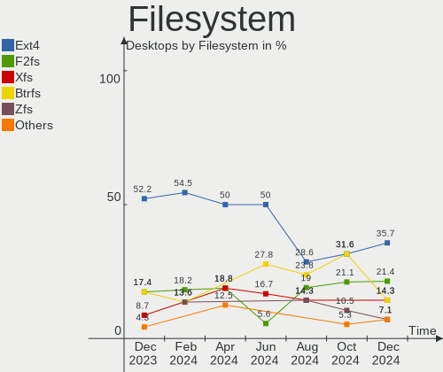
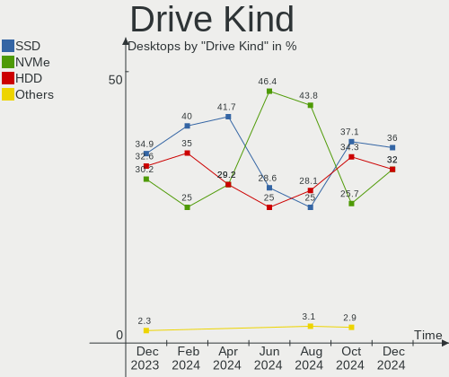
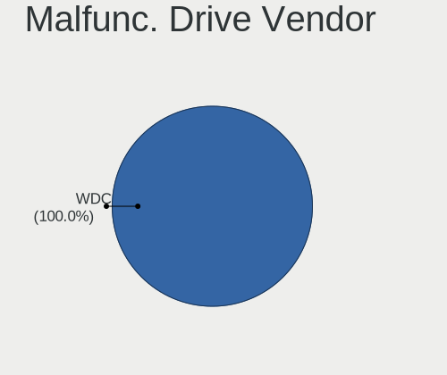
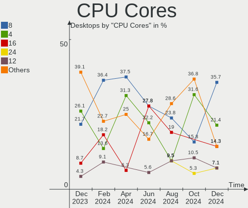
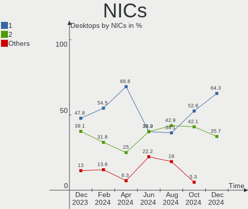

Gentoo Hardware Trends (Desktop)
--------------------------------

A project to identify most popular hardware characteristics and track their change
over time based on data collected by Gentoo users at https://Linux-Hardware.org.

Anyone can contribute to the study by uploading probes of their computers by
the [hw-probe](https://github.com/linuxhw/hw-probe) tool:

    sudo -E hw-probe -all -upload

Full-feature report is available here: https://linux-hardware.org/?view=trends&formfactor=desktop

Period: Sep, 2020.

Contents
--------

- [ OS                       ](#os)
- [ OS Family                ](#os-family)
- [ Kernel                   ](#kernel)
- [ Kernel Family            ](#kernel-family)
- [ Kernel Major Ver.        ](#kernel-major-ver)
- [ Arch                     ](#arch)
- [ DE                       ](#de)
- [ Display Server           ](#display-server)
- [ Display Manager          ](#display-manager)
- [ OS Lang                  ](#os-lang)
- [ Boot Mode                ](#boot-mode)
- [ Filesystem               ](#filesystem)
- [ Part. scheme             ](#part-scheme)
- [ Dual Boot with Linux/BSD ](#dual-boot-with-linux/bsd)
- [ Dual Boot (Win)          ](#dual-boot-win)
- [ Country                  ](#country)
- [ City                     ](#city)
- [ Vendor                   ](#vendor)
- [ Model                    ](#model)
- [ Model Family             ](#model-family)
- [ MFG Year                 ](#mfg-year)
- [ Form Factor              ](#form-factor)
- [ Secure Boot              ](#secure-boot)
- [ Coreboot                 ](#coreboot)
- [ RAM Size                 ](#ram-size)
- [ RAM Used                 ](#ram-used)
- [ Has CD-ROM               ](#has-cd-rom)
- [ Total Drives             ](#total-drives)
- [ Has Ethernet             ](#has-ethernet)
- [ Drive Vendor             ](#drive-vendor)
- [ HDD Vendor               ](#hdd-vendor)
- [ SSD Vendor               ](#ssd-vendor)
- [ Drive Model              ](#drive-model)
- [ Drive Kind               ](#drive-kind)
- [ Drive Connector          ](#drive-connector)
- [ Drive Size               ](#drive-size)
- [ Space Total              ](#space-total)
- [ Space Used               ](#space-used)
- [ Malfunc. Drives          ](#malfunc-drives)
- [ Malfunc. Drive Vendor    ](#malfunc-drive-vendor)
- [ Malfunc. HDD Vendor      ](#malfunc-hdd-vendor)
- [ Malfunc. Drive Kind      ](#malfunc-drive-kind)
- [ Failed Drives            ](#failed-drives)
- [ Failed Drive Vendor      ](#failed-drive-vendor)
- [ Drive Status             ](#drive-status)
- [ Storage Vendor           ](#storage-vendor)
- [ Storage Model            ](#storage-model)
- [ Storage Kind             ](#storage-kind)
- [ CPU Vendor               ](#cpu-vendor)
- [ CPU Model                ](#cpu-model)
- [ CPU Model Family         ](#cpu-model-family)
- [ CPU Cores                ](#cpu-cores)
- [ CPU Sockets              ](#cpu-sockets)
- [ CPU Threads              ](#cpu-threads)
- [ CPU Op-Modes             ](#cpu-op-modes)
- [ CPU Microcode            ](#cpu-microcode)
- [ CPU Microarch            ](#cpu-microarch)
- [ GPU Vendor               ](#gpu-vendor)
- [ GPU Model                ](#gpu-model)
- [ GPU Combo                ](#gpu-combo)
- [ GPU Driver               ](#gpu-driver)
- [ GPU Memory               ](#gpu-memory)
- [ Monitor Vendor           ](#monitor-vendor)
- [ Monitor Model            ](#monitor-model)
- [ Monitor Resolution       ](#monitor-resolution)
- [ Monitor Diagonal         ](#monitor-diagonal)
- [ Monitor Width            ](#monitor-width)
- [ Aspect Ratio             ](#aspect-ratio)
- [ Monitor Area             ](#monitor-area)
- [ Pixel Density            ](#pixel-density)
- [ Multiple Monitors        ](#multiple-monitors)
- [ Net Controller Vendor    ](#net-controller-vendor)
- [ Net Controller Model     ](#net-controller-model)
- [ Wireless Vendor          ](#wireless-vendor)
- [ Wireless Model           ](#wireless-model)
- [ Ethernet Vendor          ](#ethernet-vendor)
- [ Ethernet Model           ](#ethernet-model)
- [ Net Controller Kind      ](#net-controller-kind)
- [ Used Controller          ](#used-controller)
- [ NICs                     ](#nics)
- [ Memory Vendor            ](#memory-vendor)
- [ Memory Model             ](#memory-model)
- [ Memory Kind              ](#memory-kind)
- [ Memory Form Factor       ](#memory-form-factor)
- [ Memory Size              ](#memory-size)
- [ Memory Speed             ](#memory-speed)
- [ Sound Vendor             ](#sound-vendor)
- [ Sound Model              ](#sound-model)
- [ Camera Vendor            ](#camera-vendor)
- [ Camera Model             ](#camera-model)
- [ Fingerprint Vendor       ](#fingerprint-vendor)
- [ Fingerprint Model        ](#fingerprint-model)
- [ Chipcard Vendor          ](#chipcard-vendor)
- [ Chipcard Model           ](#chipcard-model)
- [ Printer Vendor           ](#printer-vendor)
- [ Printer Model            ](#printer-model)
- [ Scanner Vendor           ](#scanner-vendor)
- [ Scanner Model            ](#scanner-model)
- [ Bluetooth Vendor         ](#bluetooth-vendor)
- [ Bluetooth Model          ](#bluetooth-model)
- [ Unsupported Devices      ](#unsupported-devices)
- [ Unsupported Device Types ](#unsupported-device-types)

OS
--

Installed operating systems

| Name         | Desktops | Percent |
|--------------|----------|---------|
| Gentoo       | 18       | 51.43%  |
| Gentoo 2.7   | 12       | 34.29%  |
| Gentoo 2.6   | 3        | 8.57%   |
| Gentoo 2.4.1 | 1        | 2.86%   |
| Gentoo 1     | 1        | 2.86%   |

OS Family
---------

OS without a version

| Name   | Desktops | Percent |
|--------|----------|---------|
| Gentoo | 35       | 100%    |

Kernel
------

Version of the Linux kernel

| Version                      | Desktops | Percent |
|------------------------------|----------|---------|
| 5.4.60-gentoo                | 3        | 8.57%   |
| 5.4.66-gentoo                | 2        | 5.71%   |
| 5.8.9-gentoo                 | 1        | 2.86%   |
| 5.8.8-gentoo-x86_64          | 1        | 2.86%   |
| 5.8.8-gentoo                 | 1        | 2.86%   |
| 5.8.7-gentoo                 | 1        | 2.86%   |
| 5.8.6-gentoo                 | 1        | 2.86%   |
| 5.8.6                        | 1        | 2.86%   |
| 5.8.5-gentoo-x86_64          | 1        | 2.86%   |
| 5.8.5-gentoo                 | 1        | 2.86%   |
| 5.8.4-gentoo                 | 1        | 2.86%   |
| 5.8.12-gentoo-x86_64         | 1        | 2.86%   |
| 5.8.12                       | 1        | 2.86%   |
| 5.8.11-gentoo-limelight      | 1        | 2.86%   |
| 5.8.11-gentoo                | 1        | 2.86%   |
| 5.8.10-ryza                  | 1        | 2.86%   |
| 5.8.10-gentoo-x86_64-01      | 1        | 2.86%   |
| 5.8.10-gentoo-classic-try    | 1        | 2.86%   |
| 5.8.10-gentoo                | 1        | 2.86%   |
| 5.8.10                       | 1        | 2.86%   |
| 5.8.1-gentoo                 | 1        | 2.86%   |
| 5.7.9-gentoo                 | 1        | 2.86%   |
| 5.7.12-zen1                  | 1        | 2.86%   |
| 5.7.12-gentoo-2c             | 1        | 2.86%   |
| 5.7.11-gentoo                | 1        | 2.86%   |
| 5.6.0-pf8-x86_64-Ryzen_2200G | 1        | 2.86%   |
| 5.4.60-gentoo-x86_64         | 1        | 2.86%   |
| 5.4.60-gentoo-lz0            | 1        | 2.86%   |
| 5.4.55-gentoo-compact-0.3    | 1        | 2.86%   |
| 5.4.48-gentoo_PowerMac3,6    | 1        | 2.86%   |
| 5.4.48-gentoo_PowerMac10,2   | 1        | 2.86%   |
| 5.4.48-gentoo-x86_64         | 1        | 2.86%   |

Kernel Family
-------------

Linux kernel without a distro release

| Version | Desktops | Percent |
|---------|----------|---------|
| 5.8.10  | 5        | 14.29%  |
| 5.4.60  | 5        | 14.29%  |
| 5.4.48  | 3        | 8.57%   |
| 5.8.8   | 2        | 5.71%   |
| 5.8.6   | 2        | 5.71%   |
| 5.8.5   | 2        | 5.71%   |
| 5.8.12  | 2        | 5.71%   |
| 5.8.11  | 2        | 5.71%   |
| 5.7.12  | 2        | 5.71%   |
| 5.4.66  | 2        | 5.71%   |
| 5.8.9   | 1        | 2.86%   |
| 5.8.7   | 1        | 2.86%   |
| 5.8.4   | 1        | 2.86%   |
| 5.8.1   | 1        | 2.86%   |
| 5.7.9   | 1        | 2.86%   |
| 5.7.11  | 1        | 2.86%   |
| 5.6.0   | 1        | 2.86%   |
| 5.4.55  | 1        | 2.86%   |

Kernel Major Ver.
-----------------

Linux kernel major version

| Version | Desktops | Percent |
|---------|----------|---------|
| 5.8     | 19       | 54.29%  |
| 5.4     | 11       | 31.43%  |
| 5.7     | 4        | 11.43%  |
| 5.6     | 1        | 2.86%   |

Arch
----

OS architecture (x86_64, i586, etc.)

| Name   | Desktops | Percent |
|--------|----------|---------|
| x86_64 | 33       | 94.29%  |
| ppc    | 2        | 5.71%   |

DE
--

Desktop Environment

| Name       | Desktops | Percent |
|------------|----------|---------|
| Unknown    | 10       | 28.57%  |
| KDE5       | 9        | 25.71%  |
| XFCE       | 7        | 20%     |
| GNOME      | 5        | 14.29%  |
| X-Cinnamon | 1        | 2.86%   |
| MATE       | 1        | 2.86%   |
| LXQt       | 1        | 2.86%   |
| KDE        | 1        | 2.86%   |

Display Server
--------------

X11 or Wayland

| Name    | Desktops | Percent |
|---------|----------|---------|
| X11     | 21       | 60%     |
| Tty     | 9        | 25.71%  |
| Unknown | 5        | 14.29%  |

Display Manager
---------------

SDDM, LightDM, etc.

| Name    | Desktops | Percent |
|---------|----------|---------|
| Unknown | 12       | 34.29%  |
| SDDM    | 9        | 25.71%  |
| LightDM | 8        | 22.86%  |
| GDM     | 3        | 8.57%   |
| XDM     | 2        | 5.71%   |
| LXDM    | 1        | 2.86%   |

OS Lang
-------

Language

| Lang           | Desktops | Percent |
|----------------|----------|---------|
| en_US.utf8     | 7        | 20%     |
| C.UTF8         | 4        | 11.43%  |
| en_US          | 3        | 8.57%   |
| ru_RU          | 2        | 5.71%   |
| en_GB.utf8     | 2        | 5.71%   |
| de_DE.utf8     | 2        | 5.71%   |
| de_DE          | 2        | 5.71%   |
| Unknown        | 2        | 5.71%   |
| sv_SE          | 1        | 2.86%   |
| spanish        | 1        | 2.86%   |
| ru_RU.utf8     | 1        | 2.86%   |
| fr_FR.utf8     | 1        | 2.86%   |
| fr_CA          | 1        | 2.86%   |
| fi_FI.utf8     | 1        | 2.86%   |
| es_ES.utf8     | 1        | 2.86%   |
| en_ZA.utf8     | 1        | 2.86%   |
| en_NZ          | 1        | 2.86%   |
| en_GB.iso88591 | 1        | 2.86%   |
| en_AU.utf8     | 1        | 2.86%   |

Boot Mode
---------

EFI or BIOS

| Mode | Desktops | Percent |
|------|----------|---------|
| EFI  | 20       | 57.14%  |
| BIOS | 15       | 42.86%  |

Filesystem
----------

Type of filesystem

| Type     | Desktops | Percent |
|----------|----------|---------|
| EXt4     | 23       | 65.71%  |
| Btrfs    | 6        | 17.14%  |
| Xfs      | 2        | 5.71%   |
| Reiserfs | 2        | 5.71%   |
| F2fs     | 2        | 5.71%   |

Part. scheme
------------

Scheme of partitioning

| Type    | Desktops | Percent |
|---------|----------|---------|
| GPT     | 24       | 68.57%  |
| MBR     | 9        | 25.71%  |
| Unknown | 2        | 5.71%   |

Dual Boot with Linux/BSD
------------------------

Hosting more than one Linux/BSD

| Dual boot | Desktops | Percent |
|-----------|----------|---------|
| No        | 25       | 71.43%  |
| Yes       | 10       | 28.57%  |

Dual Boot (Win)
---------------

Hosting Linux and Windows

| Dual boot | Desktops | Percent |
|-----------|----------|---------|
| No        | 21       | 60%     |
| Yes       | 14       | 40%     |

Country
-------

Geographic location (country)

| Country        | Desktops | Percent |
|----------------|----------|---------|
| USA            | 11       | 31.43%  |
| Germany        | 6        | 17.14%  |
| Russia         | 4        | 11.43%  |
| UK             | 2        | 5.71%   |
| Sweden         | 2        | 5.71%   |
| Spain          | 2        | 5.71%   |
| Finland        | 2        | 5.71%   |
| South Africa   | 1        | 2.86%   |
| New Zealand    | 1        | 2.86%   |
| France         | 1        | 2.86%   |
| Czech Republic | 1        | 2.86%   |
| Canada         | 1        | 2.86%   |
| Australia      | 1        | 2.86%   |

City
----

Geographic location (city)

| City              | Desktops | Percent |
|-------------------|----------|---------|
| St Petersburg     | 3        | 8.57%   |
| Vila-real         | 2        | 5.71%   |
| Berlin            | 2        | 5.71%   |
| Wrentham          | 1        | 2.86%   |
| Uttoxeter         | 1        | 2.86%   |
| Tomsk             | 1        | 2.86%   |
| San Antonio       | 1        | 2.86%   |
| Pueblo            | 1        | 2.86%   |
| Prague            | 1        | 2.86%   |
| Old Lyme          | 1        | 2.86%   |
| Melbourne         | 1        | 2.86%   |
| Massy             | 1        | 2.86%   |
| Massapequa        | 1        | 2.86%   |
| Maersta           | 1        | 2.86%   |
| Leesburg          | 1        | 2.86%   |
| Lappeenranta      | 1        | 2.86%   |
| Ladson            | 1        | 2.86%   |
| La Jolla          | 1        | 2.86%   |
| Karlstad          | 1        | 2.86%   |
| Helsinki          | 1        | 2.86%   |
| Hanover           | 1        | 2.86%   |
| Frankfurt am Main | 1        | 2.86%   |
| Falkenstein       | 1        | 2.86%   |
| Darmstadt         | 1        | 2.86%   |
| Clifton           | 1        | 2.86%   |
| Checkendon        | 1        | 2.86%   |
| Cape Town         | 1        | 2.86%   |
| Brisbane          | 1        | 2.86%   |
| Brewster          | 1        | 2.86%   |
| Beaconsfield      | 1        | 2.86%   |
| Auckland          | 1        | 2.86%   |

Vendor
------

Motherboard manufacturer

| Name                | Desktops | Percent |
|---------------------|----------|---------|
| MSI                 | 12       | 34.29%  |
| ASUSTek Computer    | 11       | 31.43%  |
| ASRock              | 4        | 11.43%  |
| Gigabyte Technology | 3        | 8.57%   |
| Unknown             | 3        | 8.57%   |
| Supermicro          | 1        | 2.86%   |
| Acer                | 1        | 2.86%   |

Model
-----

Motherboard model

| Name                         | Desktops | Percent |
|------------------------------|----------|---------|
| ASUS All Series              | 3        | 8.57%   |
| Unknown                      | 3        | 8.57%   |
| MSI MS-7A38                  | 2        | 5.71%   |
| ASUS PRIME X370-PRO          | 2        | 5.71%   |
| Supermicro A1SRM-2758F       | 1        | 2.86%   |
| MSI MS-7B89                  | 1        | 2.86%   |
| MSI MS-7B86                  | 1        | 2.86%   |
| MSI MS-7B79                  | 1        | 2.86%   |
| MSI MS-7A40                  | 1        | 2.86%   |
| MSI MS-7A34                  | 1        | 2.86%   |
| MSI MS-7A21                  | 1        | 2.86%   |
| MSI MS-7984                  | 1        | 2.86%   |
| MSI MS-7885                  | 1        | 2.86%   |
| MSI MS-7693                  | 1        | 2.86%   |
| MSI MS-7522                  | 1        | 2.86%   |
| Gigabyte Z77X-UD5H           | 1        | 2.86%   |
| Gigabyte B450 AORUS PRO      | 1        | 2.86%   |
| Gigabyte AB350-Gaming 3      | 1        | 2.86%   |
| ASUS ROG STRIX X570-F GAMING | 1        | 2.86%   |
| ASUS ROG STRIX B450-F GAMING | 1        | 2.86%   |
| ASUS ROG Maximus XI HERO     | 1        | 2.86%   |
| ASUS PRIME X470-PRO          | 1        | 2.86%   |
| ASUS P9X79                   | 1        | 2.86%   |
| ASUS P5K-V                   | 1        | 2.86%   |
| ASRock Z170 OC Formula       | 1        | 2.86%   |
| ASRock B450M-HDV R4.0        | 1        | 2.86%   |
| ASRock AB350M Pro4           | 1        | 2.86%   |
| ASRock 970A-G                | 1        | 2.86%   |
| Acer Aspire XC-710           | 1        | 2.86%   |

Model Family
------------

Motherboard model prefix

| Name                   | Desktops | Percent |
|------------------------|----------|---------|
| ASUS ROG               | 3        | 8.57%   |
| ASUS PRIME             | 3        | 8.57%   |
| ASUS All               | 3        | 8.57%   |
| Unknown                | 3        | 8.57%   |
| MSI MS-7A38            | 2        | 5.71%   |
| Supermicro A1SRM-2758F | 1        | 2.86%   |
| MSI MS-7B89            | 1        | 2.86%   |
| MSI MS-7B86            | 1        | 2.86%   |
| MSI MS-7B79            | 1        | 2.86%   |
| MSI MS-7A40            | 1        | 2.86%   |
| MSI MS-7A34            | 1        | 2.86%   |
| MSI MS-7A21            | 1        | 2.86%   |
| MSI MS-7984            | 1        | 2.86%   |
| MSI MS-7885            | 1        | 2.86%   |
| MSI MS-7693            | 1        | 2.86%   |
| MSI MS-7522            | 1        | 2.86%   |
| Gigabyte Z77X-UD5H     | 1        | 2.86%   |
| Gigabyte B450          | 1        | 2.86%   |
| Gigabyte AB350-Gaming  | 1        | 2.86%   |
| ASUS P9X79             | 1        | 2.86%   |
| ASUS P5K-V             | 1        | 2.86%   |
| ASRock Z170            | 1        | 2.86%   |
| ASRock B450M-HDV       | 1        | 2.86%   |
| ASRock AB350M          | 1        | 2.86%   |
| ASRock 970A-G          | 1        | 2.86%   |
| Acer Aspire            | 1        | 2.86%   |

MFG Year
--------

Motherboard manufacture year

| Year    | Desktops | Percent |
|---------|----------|---------|
| 2019    | 13       | 37.14%  |
| 2016    | 7        | 20%     |
| 2020    | 4        | 11.43%  |
| 2015    | 3        | 8.57%   |
| 2018    | 2        | 5.71%   |
| 2014    | 2        | 5.71%   |
| Unknown | 2        | 5.71%   |
| 2011    | 1        | 2.86%   |
| 2008    | 1        | 2.86%   |

Form Factor
-----------

Physical design of the computer

| Name    | Desktops | Percent |
|---------|----------|---------|
| Desktop | 35       | 100%    |

Secure Boot
-----------

Enabled or disabled

| State    | Desktops | Percent |
|----------|----------|---------|
| Disabled | 33       | 94.29%  |
| Enabled  | 2        | 5.71%   |

Coreboot
--------

Have coreboot on board

| Used | Desktops | Percent |
|------|----------|---------|
| No   | 35       | 100%    |

RAM Size
--------

Total RAM memory

| Size in GB  | Desktops | Percent |
|-------------|----------|---------|
| 32.01-64.0  | 17       | 48.57%  |
| 16.01-24.0  | 8        | 22.86%  |
| 64.01-256.0 | 3        | 8.57%   |
| 8.01-16.0   | 3        | 8.57%   |
| 4.01-8.0    | 1        | 2.86%   |
| 3.01-4.0    | 1        | 2.86%   |
| 1.01-2.0    | 1        | 2.86%   |
| 0.01-1.0    | 1        | 2.86%   |

RAM Used
--------

Used RAM memory

| Used GB    | Desktops | Percent |
|------------|----------|---------|
| 4.01-8.0   | 14       | 40%     |
| 0.01-1.0   | 6        | 17.14%  |
| 3.01-4.0   | 4        | 11.43%  |
| 2.01-3.0   | 4        | 11.43%  |
| 16.01-24.0 | 3        | 8.57%   |
| 1.01-2.0   | 2        | 5.71%   |
| 8.01-16.0  | 2        | 5.71%   |

Has CD-ROM
----------

Has CD-ROM on board

| Presented | Desktops | Percent |
|-----------|----------|---------|
| No        | 24       | 68.57%  |
| Yes       | 11       | 31.43%  |

Total Drives
------------

Number of drives on board

| Drives | Desktops | Percent |
|--------|----------|---------|
| 2      | 13       | 37.14%  |
| 3      | 6        | 17.14%  |
| 1      | 6        | 17.14%  |
| 4      | 5        | 14.29%  |
| 7      | 2        | 5.71%   |
| 5      | 2        | 5.71%   |
| 10     | 1        | 2.86%   |

Has Ethernet
------------

Has Ethernet on board

| Presented | Desktops | Percent |
|-----------|----------|---------|
| Yes       | 35       | 100%    |

Drive Vendor
------------

Hard drive vendors

| Vendor              | Desktops | Drives | Percent |
|---------------------|----------|--------|---------|
| Samsung Electronics | 18       | 31     | 29.03%  |
| WDC                 | 15       | 35     | 24.19%  |
| Seagate             | 12       | 18     | 19.35%  |
| SanDisk             | 2        | 2      | 3.23%   |
| Intel               | 2        | 2      | 3.23%   |
| Unknown             | 1        | 1      | 1.61%   |
| Transcend           | 1        | 1      | 1.61%   |
| SPCC                | 1        | 1      | 1.61%   |
| Patriot             | 1        | 1      | 1.61%   |
| OCZ                 | 1        | 1      | 1.61%   |
| Mushkin             | 1        | 1      | 1.61%   |
| Micron Technology   | 1        | 1      | 1.61%   |
| LaCie               | 1        | 1      | 1.61%   |
| Kingston            | 1        | 1      | 1.61%   |
| HGST                | 1        | 1      | 1.61%   |
| Hewlett-Packard     | 1        | 1      | 1.61%   |
| Crucial             | 1        | 1      | 1.61%   |
| A-DATA Technology   | 1        | 1      | 1.61%   |

HDD Vendor
----------

Hard disk drive vendors

| Vendor              | Desktops | Drives | Percent |
|---------------------|----------|--------|---------|
| WDC                 | 15       | 34     | 50%     |
| Seagate             | 12       | 18     | 40%     |
| Samsung Electronics | 1        | 2      | 3.33%   |
| LaCie               | 1        | 1      | 3.33%   |
| HGST                | 1        | 1      | 3.33%   |

SSD Vendor
----------

Solid state drive vendors

| Vendor              | Desktops | Drives | Percent |
|---------------------|----------|--------|---------|
| Samsung Electronics | 8        | 14     | 40%     |
| SanDisk             | 2        | 2      | 10%     |
| WDC                 | 1        | 1      | 5%      |
| Transcend           | 1        | 1      | 5%      |
| SPCC                | 1        | 1      | 5%      |
| Patriot             | 1        | 1      | 5%      |
| OCZ                 | 1        | 1      | 5%      |
| Mushkin             | 1        | 1      | 5%      |
| Micron Technology   | 1        | 1      | 5%      |
| Hewlett-Packard     | 1        | 1      | 5%      |
| Crucial             | 1        | 1      | 5%      |
| A-DATA Technology   | 1        | 1      | 5%      |

Drive Model
-----------

Hard drive models

| Model                        | Desktops | Percent |
|------------------------------|----------|---------|
| SSD 850 EVO 500GB            | 4        | 5%      |
| SSD 970 EVO Plus 500GB       | 3        | 3.75%   |
| WD20EZRX-00D8PB0 2TB         | 2        | 2.5%    |
| WD16 00BB-55GUA0 160GB       | 2        | 2.5%    |
| WD1003FZEX-00MK2A0 1TB       | 2        | 2.5%    |
| ST2000DM006-2DM164 2TB       | 2        | 2.5%    |
| SSD 970 EVO Plus 1TB         | 2        | 2.5%    |
| SSD 970 EVO 500GB            | 2        | 2.5%    |
| SSD 840 PRO Series 256GB     | 2        | 2.5%    |
| WDS250G2B0A-00SM50 250GB SSD | 1        | 1.25%   |
| WD7500AACS-0 752GB           | 1        | 1.25%   |
| WD20EZRZ-00Z5HB0 2TB         | 1        | 1.25%   |
| WD20EARX-00PASB0 2TB         | 1        | 1.25%   |
| WD2003FZEX-00Z4SA0 2TB       | 1        | 1.25%   |
| WD2003FZEX-00SRLA0 2TB       | 1        | 1.25%   |
| WD15EARS-00S8B1 1TB          | 1        | 1.25%   |
| WD10JFCX-68N6GN0 1TB         | 1        | 1.25%   |
| WD10EZEX-60WN4A0 1TB         | 1        | 1.25%   |
| WD10EZEX-08WN4A0 1TB         | 1        | 1.25%   |
| WD10EZEX-00KUWA0 1TB         | 1        | 1.25%   |
| WD10EURX-63UY4Y0 1TB         | 1        | 1.25%   |
| WD10EAVS-00D7B1 1TB          | 1        | 1.25%   |
| WD1002FAEX-00Z3A0 1TB        | 1        | 1.25%   |
| VERTEX450 128GB SSD          | 1        | 1.25%   |
| TS32GSSD25S-M 32GB           | 1        | 1.25%   |
| SU635 240GB SSD              | 1        | 1.25%   |
| ST9808211A 80GB              | 1        | 1.25%   |
| ST8000DM004-2CX188 8TB       | 1        | 1.25%   |
| ST500DM002-1BD142 500GB      | 1        | 1.25%   |
| ST4000DM004-2CV104 4TB       | 1        | 1.25%   |
| ST3750330AS 752GB            | 1        | 1.25%   |
| ST360021A 64GB               | 1        | 1.25%   |
| ST3500630AS 500GB            | 1        | 1.25%   |
| ST3500418AS 500GB            | 1        | 1.25%   |
| ST2000DL003-9VT166 2TB       | 1        | 1.25%   |
| ST1000NM0053-1C1173 1TB      | 1        | 1.25%   |
| ST1000LM024 HN-M101MBB 1TB   | 1        | 1.25%   |
| ST1000DM003-1CH162 1TB       | 1        | 1.25%   |
| SSDPEKNW512G8 512GB          | 1        | 1.25%   |
| SSD PLUS 480GB               | 1        | 1.25%   |
| SSD M700 120GB               | 1        | 1.25%   |
| SSD G5 BICS4 1TB             | 1        | 1.25%   |
| SSD 970 EVO Plus 250GB       | 1        | 1.25%   |
| SSD 970 EVO 250GB            | 1        | 1.25%   |
| SSD 960 EVO 500GB            | 1        | 1.25%   |
| SSD 960 EVO 250GB            | 1        | 1.25%   |
| SSD 950 PRO 512GB            | 1        | 1.25%   |
| SSD 950 PRO 256GB            | 1        | 1.25%   |
| SSD 860 EVO 250GB            | 1        | 1.25%   |
| SSD 850 EVO 250GB            | 1        | 1.25%   |
| SSD 850 EVO 1TB              | 1        | 1.25%   |
| SSD 840 EVO 500GB            | 1        | 1.25%   |
| SSD 840 EVO 250GB            | 1        | 1.25%   |
| SSD 840 250GB                | 1        | 1.25%   |
| SSD 830 Series 128GB         | 1        | 1.25%   |
| Solid State Disk 512GB       | 1        | 1.25%   |
| SD/MMC/MS PRO 128GB          | 1        | 1.25%   |
| SA2000M81000G 1TB            | 1        | 1.25%   |
| Rugged THB USB3 2TB          | 1        | 1.25%   |
| PM991 NVMe 256GB             | 1        | 1.25%   |

Drive Kind
----------

HDD or SSD

| Kind    | Desktops | Drives | Percent |
|---------|----------|--------|---------|
| HDD     | 26       | 56     | 46.43%  |
| NVMe    | 15       | 18     | 26.79%  |
| SSD     | 14       | 26     | 25%     |
| Unknown | 1        | 1      | 1.79%   |

Drive Connector
---------------

SATA, SAS, NVMe, etc.

| Type | Desktops | Drives | Percent |
|------|----------|--------|---------|
| SATA | 29       | 79     | 60.42%  |
| NVMe | 15       | 18     | 31.25%  |
| SAS  | 4        | 4      | 8.33%   |

Drive Size
----------

Size of hard drive

| Size in TB | Desktops | Drives | Percent |
|------------|----------|--------|---------|
| 0.01-0.5   | 25       | 45     | 43.86%  |
| 0.51-1.0   | 21       | 40     | 36.84%  |
| 1.01-2.0   | 9        | 14     | 15.79%  |
| 3.01-4.0   | 1        | 1      | 1.75%   |
| 4.01-10.0  | 1        | 1      | 1.75%   |

Space Total
-----------

Amount of disk space available on the file system

| Size in GB     | Desktops | Percent |
|----------------|----------|---------|
| 251-500        | 10       | 28.57%  |
| 1001-2000      | 10       | 28.57%  |
| 101-250        | 5        | 14.29%  |
| More than 3000 | 4        | 11.43%  |
| 2001-3000      | 4        | 11.43%  |
| 501-1000       | 2        | 5.71%   |

Space Used
----------

Amount of used disk space

| Used GB        | Desktops | Percent |
|----------------|----------|---------|
| 251-500        | 10       | 28.57%  |
| 501-1000       | 7        | 20%     |
| 1001-2000      | 5        | 14.29%  |
| 21-50          | 3        | 8.57%   |
| 101-250        | 3        | 8.57%   |
| 51-100         | 3        | 8.57%   |
| 1-20           | 2        | 5.71%   |
| More than 3000 | 1        | 2.86%   |
| 2001-3000      | 1        | 2.86%   |

Malfunc. Drives
---------------

Drive models with a malfunction

| Model             | Desktops | Drives | Percent |
|-------------------|----------|--------|---------|
| ST3500630AS 500GB | 1        | 1      | 50%     |
| SSD 840 250GB     | 1        | 1      | 50%     |

Malfunc. Drive Vendor
---------------------

Vendors of faulty drives

| Vendor              | Desktops | Drives | Percent |
|---------------------|----------|--------|---------|
| Seagate             | 1        | 1      | 50%     |
| Samsung Electronics | 1        | 1      | 50%     |

Malfunc. HDD Vendor
-------------------

Vendors of faulty HDD drives

| Vendor  | Desktops | Drives | Percent |
|---------|----------|--------|---------|
| Seagate | 1        | 1      | 100%    |

Malfunc. Drive Kind
-------------------

Kinds of faulty drives

| Kind | Desktops | Drives | Percent |
|------|----------|--------|---------|
| SSD  | 1        | 1      | 50%     |
| HDD  | 1        | 1      | 50%     |

Failed Drives
-------------

Failed drive models

Zero info for selected period =(

Failed Drive Vendor
-------------------

Failed drive vendors

Zero info for selected period =(

Drive Status
------------

Number of failed and malfunc. drives

| Status   | Desktops | Drives | Percent |
|----------|----------|--------|---------|
| Works    | 31       | 92     | 81.58%  |
| Detected | 5        | 7      | 13.16%  |
| Malfunc  | 2        | 2      | 5.26%   |

Storage Vendor
--------------

Storage controller vendors

| Vendor                      | Desktops | Percent |
|-----------------------------|----------|---------|
| AMD                         | 18       | 31.03%  |
| Intel                       | 16       | 27.59%  |
| Samsung Electronics         | 13       | 22.41%  |
| ASMedia Technology          | 3        | 5.17%   |
| Marvell Technology Group    | 2        | 3.45%   |
| JMicron Technology          | 2        | 3.45%   |
| 3ware                       | 2        | 3.45%   |
| Kingston Technology Company | 1        | 1.72%   |
| Adaptec                     | 1        | 1.72%   |

Storage Model
-------------

Storage controller models

| Model                                                                    | Desktops | Percent |
|--------------------------------------------------------------------------|----------|---------|
| FCH SATA Controller [AHCI mode]                                          | 16       | 20.51%  |
| 400 Series Chipset SATA Controller                                       | 10       | 12.82%  |
| NVMe SSD Controller SM981/PM981/PM983                                    | 8        | 10.26%  |
| Q170/Q150/B150/H170/H110/Z170/CM236 Chipset SATA Controller [AHCI Mode]  | 3        | 3.85%   |
| ASM1062 Serial ATA Controller                                            | 3        | 3.85%   |
| 300 Series Chipset SATA Controller                                       | 3        | 3.85%   |
| X370 Series Chipset SATA Controller                                      | 2        | 2.56%   |
| SSD 660P Series                                                          | 2        | 2.56%   |
| SB7x0/SB8x0/SB9x0 SATA Controller [AHCI mode]                            | 2        | 2.56%   |
| NVMe SSD Controller SM961/PM961                                          | 2        | 2.56%   |
| NVMe SSD Controller SM951/PM951                                          | 2        | 2.56%   |
| JMB363 SATA/IDE Controller                                               | 2        | 2.56%   |
| C610/X99 series chipset sSATA Controller [AHCI mode]                     | 2        | 2.56%   |
| 9650SE SATA-II RAID PCIe                                                 | 2        | 2.56%   |
| 7 Series/C210 Series Chipset Family 6-port SATA Controller [AHCI mode]   | 2        | 2.56%   |
| SB7x0/SB8x0/SB9x0 IDE Controller                                         | 1        | 1.28%   |
| SATA Controller [RAID mode]                                              | 1        | 1.28%   |
| Electronics Non-Volatile memory controller                               | 1        | 1.28%   |
| Cannon Lake PCH SATA AHCI Controller                                     | 1        | 1.28%   |
| C610/X99 series chipset 6-Port SATA Controller [AHCI mode]               | 1        | 1.28%   |
| C600/X79 series chipset 6-Port SATA AHCI Controller                      | 1        | 1.28%   |
| Atom processor C2000 AHCI SATA3 Controller                               | 1        | 1.28%   |
| Atom processor C2000 AHCI SATA2 Controller                               | 1        | 1.28%   |
| AAC-RAID                                                                 | 1        | 1.28%   |
| A2000, M.2, 500GB                                                        | 1        | 1.28%   |
| 9 Series Chipset Family SATA Controller [AHCI Mode]                      | 1        | 1.28%   |
| 88SE9235 PCIe 2.0 x2 4-port SATA 6 Gb/s Controller                       | 1        | 1.28%   |
| 88SE9172 SATA 6Gb/s Controller                                           | 1        | 1.28%   |
| 82801JI (ICH10 Family) SATA AHCI Controller                              | 1        | 1.28%   |
| 82801IB (ICH9) 2 port SATA Controller [IDE mode]                         | 1        | 1.28%   |
| 82801I (ICH9 Family) 2 port SATA Controller [IDE mode]                   | 1        | 1.28%   |
| 8 Series/C220 Series Chipset Family 6-port SATA Controller 1 [AHCI mode] | 1        | 1.28%   |

Storage Kind
------------

Kind of storage controller (IDE, SATA, NVMe, SAS, ...)

| Kind | Desktops | Percent |
|------|----------|---------|
| SATA | 31       | 57.41%  |
| NVMe | 16       | 29.63%  |
| RAID | 4        | 7.41%   |
| IDE  | 3        | 5.56%   |

CPU Vendor
----------

Processor vendors

| Vendor       | Desktops | Percent |
|--------------|----------|---------|
| AMD          | 18       | 51.43%  |
| Intel        | 15       | 42.86%  |
| PowerMac3,6  | 1        | 2.86%   |
| PowerMac10,2 | 1        | 2.86%   |

CPU Model
---------

Processor models

| Model                                       | Desktops | Percent |
|---------------------------------------------|----------|---------|
| Intel Core i7-6700K CPU @ 4.00GHz           | 2        | 5.71%   |
| AMD Ryzen 7 3800X 8-Core Processor          | 2        | 5.71%   |
| AMD Ryzen 7 3700X 8-Core Processor          | 2        | 5.71%   |
| AMD Ryzen 7 2700X Eight-Core Processor      | 2        | 5.71%   |
| AMD Ryzen 5 3600 6-Core Processor           | 2        | 5.71%   |
| AMD Ryzen 5 2600 Six-Core Processor         | 2        | 5.71%   |
| AMD Ryzen 3 2200G with Radeon Vega Graphics | 2        | 5.71%   |
| PowerMac3,6 7455, altivec supported         | 1        | 2.86%   |
| PowerMac10,2 7447A, altivec supported       | 1        | 2.86%   |
| Intel Xeon CPU E5-2696 v4 @ 2.20GHz         | 1        | 2.86%   |
| Intel Xeon CPU E5-2676 v3 @ 2.40GHz         | 1        | 2.86%   |
| Intel Xeon CPU E5-2650 v2 @ 2.60GHz         | 1        | 2.86%   |
| Intel Core i7-8700K CPU @ 3.70GHz           | 1        | 2.86%   |
| Intel Core i7-5930K CPU @ 3.50GHz           | 1        | 2.86%   |
| Intel Core i7-4930K CPU @ 3.40GHz           | 1        | 2.86%   |
| Intel Core i7-4790K CPU @ 4.00GHz           | 1        | 2.86%   |
| Intel Core i7-3770K CPU @ 3.50GHz           | 1        | 2.86%   |
| Intel Core i7 CPU X 990 @ 3.47GHz           | 1        | 2.86%   |
| Intel Core i5-4570S CPU @ 2.90GHz           | 1        | 2.86%   |
| Intel Core i3-6100 CPU @ 3.70GHz            | 1        | 2.86%   |
| Intel Core 2 Quad CPU Q9400 @ 2.66GHz       | 1        | 2.86%   |
| Intel Atom CPU C2758 @ 2.40GHz              | 1        | 2.86%   |
| AMD Ryzen 7 2700 Eight-Core Processor       | 1        | 2.86%   |
| AMD Ryzen 7 1700X Eight-Core Processor      | 1        | 2.86%   |
| AMD Ryzen 7 1700 Eight-Core Processor       | 1        | 2.86%   |
| AMD Ryzen 5 1600 Six-Core Processor         | 1        | 2.86%   |
| AMD Phenom II X6 1100T Processor            | 1        | 2.86%   |
| AMD FX-6300 Six-Core Processor              | 1        | 2.86%   |

CPU Model Family
----------------

Processor model prefix

| Model             | Desktops | Percent |
|-------------------|----------|---------|
| AMD Ryzen 7       | 9        | 25.71%  |
| Intel Core i7     | 8        | 22.86%  |
| AMD Ryzen 5       | 5        | 14.29%  |
| Intel Xeon        | 3        | 8.57%   |
| Other             | 2        | 5.71%   |
| AMD Ryzen 3       | 2        | 5.71%   |
| Intel Core i5     | 1        | 2.86%   |
| Intel Core i3     | 1        | 2.86%   |
| Intel Core 2 Quad | 1        | 2.86%   |
| Intel Atom        | 1        | 2.86%   |
| AMD Phenom II X6  | 1        | 2.86%   |
| AMD FX            | 1        | 2.86%   |

CPU Cores
---------

Number of processor cores

| Number | Desktops | Percent |
|--------|----------|---------|
| 8      | 11       | 31.43%  |
| 6      | 10       | 28.57%  |
| 4      | 8        | 22.86%  |
| 2      | 2        | 5.71%   |
| 22     | 1        | 2.86%   |
| 12     | 1        | 2.86%   |
| 3      | 1        | 2.86%   |
| 1      | 1        | 2.86%   |

CPU Sockets
-----------

Number of sockets

| Number | Desktops | Percent |
|--------|----------|---------|
| 1      | 34       | 97.14%  |
| 2      | 1        | 2.86%   |

CPU Threads
-----------

Threads per core (Hyper-Threading)

| Number | Desktops | Percent |
|--------|----------|---------|
| 2      | 27       | 77.14%  |
| 1      | 8        | 22.86%  |

CPU Op-Modes
------------

CPU Operation Modes (32-bit, 64-bit)

| Op mode        | Desktops | Percent |
|----------------|----------|---------|
| 32-bit, 64-bit | 33       | 94.29%  |
| 32-bit         | 2        | 5.71%   |

CPU Microcode
-------------

Microcode number

| Number     | Desktops | Percent |
|------------|----------|---------|
| 0x0800820d | 5        | 14.29%  |
| 0x08701013 | 4        | 11.43%  |
| 0x506e3    | 3        | 8.57%   |
| 0x08001138 | 3        | 8.57%   |
| Unknown    | 3        | 8.57%   |
| 0x306f2    | 2        | 5.71%   |
| 0x306e4    | 2        | 5.71%   |
| 0x306c3    | 2        | 5.71%   |
| 0x08701021 | 2        | 5.71%   |
| 0x906ea    | 1        | 2.86%   |
| 0x406f1    | 1        | 2.86%   |
| 0x406d8    | 1        | 2.86%   |
| 0x306a9    | 1        | 2.86%   |
| 0x206c2    | 1        | 2.86%   |
| 0x1067a    | 1        | 2.86%   |
| 0x08101013 | 1        | 2.86%   |
| 0x0810100b | 1        | 2.86%   |
| 0x010000bf | 1        | 2.86%   |

CPU Microarch
-------------

Microarchitecture

| Name       | Desktops | Percent |
|------------|----------|---------|
| Zen 2      | 6        | 17.14%  |
| Zen+       | 5        | 14.29%  |
| Zen        | 5        | 14.29%  |
| Skylake    | 4        | 11.43%  |
| Haswell    | 4        | 11.43%  |
| IvyBridge  | 3        | 8.57%   |
| Unknown    | 2        | 5.71%   |
| Westmere   | 1        | 2.86%   |
| Silvermont | 1        | 2.86%   |
| Piledriver | 1        | 2.86%   |
| K10        | 1        | 2.86%   |
| Core       | 1        | 2.86%   |
| Broadwell  | 1        | 2.86%   |

GPU Vendor
----------

Vendors of graphics cards

| Vendor            | Desktops | Percent |
|-------------------|----------|---------|
| AMD               | 18       | 48.65%  |
| Nvidia            | 16       | 43.24%  |
| Intel             | 2        | 5.41%   |
| ASPEED Technology | 1        | 2.7%    |

GPU Model
---------

Graphics card models

| Model                                                                 | Desktops | Percent |
|-----------------------------------------------------------------------|----------|---------|
| Ellesmere [Radeon RX 470/480/570/570X/580/580X/590]                   | 6        | 16.22%  |
| Navi 10 [Radeon RX 5600 OEM/5600 XT / 5700/5700 XT]                   | 3        | 8.11%   |
| GP104 [GeForce GTX 1070]                                              | 3        | 8.11%   |
| Raven Ridge [Radeon Vega Series / Radeon Vega Mobile Series]          | 2        | 5.41%   |
| GM204 [GeForce GTX 970]                                               | 2        | 5.41%   |
| GM200 [GeForce GTX 980 Ti]                                            | 2        | 5.41%   |
| Xeon E3-1200 v3/4th Gen Core Processor Integrated Graphics Controller | 1        | 2.7%    |
| Vega 10 XL/XT [Radeon RX Vega 56/64]                                  | 1        | 2.7%    |
| TU116 [GeForce GTX 1660 Ti]                                           | 1        | 2.7%    |
| TU106 [GeForce RTX 2060 Rev. A]                                       | 1        | 2.7%    |
| RV770 [Radeon HD 4850]                                                | 1        | 2.7%    |
| RV280 [Radeon 9200]                                                   | 1        | 2.7%    |
| NV17 [GeForce4 MX 420]                                                | 1        | 2.7%    |
| HD Graphics 530                                                       | 1        | 2.7%    |
| GT218 [GeForce 8400 GS Rev. 3]                                        | 1        | 2.7%    |
| GP107 [GeForce GTX 1050 Ti]                                           | 1        | 2.7%    |
| GP102 [GeForce GTX 1080 Ti]                                           | 1        | 2.7%    |
| GM204 [GeForce GTX 980]                                               | 1        | 2.7%    |
| GM107 [GeForce GTX 750 Ti]                                            | 1        | 2.7%    |
| GF119 [GeForce GT 610]                                                | 1        | 2.7%    |
| Cedar [Radeon HD 5000/6000/7350/8350 Series]                          | 1        | 2.7%    |
| Cape Verde XT [Radeon HD 7770/8760 / R7 250X]                         | 1        | 2.7%    |
| Caicos PRO [Radeon HD 7450]                                           | 1        | 2.7%    |
| Baffin [Radeon RX 460/560D / Pro 450/455/460/555/555X/560/560X]       | 1        | 2.7%    |
| ASPEED Graphics Family                                                | 1        | 2.7%    |

GPU Combo
---------

Combinations of graphics cards

| Name         | Desktops | Percent |
|--------------|----------|---------|
| 1 x AMD      | 16       | 45.71%  |
| 1 x Nvidia   | 14       | 40%     |
| 1 x Intel    | 2        | 5.71%   |
| AMD + Nvidia | 2        | 5.71%   |
| 1 x ASPEED   | 1        | 2.86%   |

GPU Driver
----------

Free vs proprietary

| Driver      | Desktops | Percent |
|-------------|----------|---------|
| Free        | 21       | 60%     |
| Proprietary | 12       | 34.29%  |
| Unknown     | 2        | 5.71%   |

GPU Memory
----------

Total video memory

| Size in GB | Desktops | Percent |
|------------|----------|---------|
| 7.01-8.0   | 10       | 28.57%  |
| Unknown    | 6        | 17.14%  |
| 0.01-0.5   | 5        | 14.29%  |
| 3.01-4.0   | 4        | 11.43%  |
| 5.01-6.0   | 3        | 8.57%   |
| 1.01-2.0   | 3        | 8.57%   |
| 0.51-1.0   | 3        | 8.57%   |
| 8.01-16.0  | 1        | 2.86%   |

Monitor Vendor
--------------

Monitor vendors

| Vendor               | Desktops | Percent |
|----------------------|----------|---------|
| Samsung Electronics  | 6        | 13.33%  |
| AOC                  | 5        | 11.11%  |
| Goldstar             | 3        | 6.67%   |
| Dell                 | 3        | 6.67%   |
| BenQ                 | 3        | 6.67%   |
| Acer                 | 3        | 6.67%   |
| LG Electronics       | 2        | 4.44%   |
| Iiyama               | 2        | 4.44%   |
| Hewlett-Packard      | 2        | 4.44%   |
| Ancor Communications | 2        | 4.44%   |
| Vizio                | 1        | 2.22%   |
| ViewSonic            | 1        | 2.22%   |
| Vestel Elektronik    | 1        | 2.22%   |
| Unknown              | 1        | 2.22%   |
| Sunplus              | 1        | 2.22%   |
| RTK                  | 1        | 2.22%   |
| Philips              | 1        | 2.22%   |
| NEC Computers        | 1        | 2.22%   |
| MSI                  | 1        | 2.22%   |
| Impression           | 1        | 2.22%   |
| HannStar Display     | 1        | 2.22%   |
| HannStar             | 1        | 2.22%   |
| FOR                  | 1        | 2.22%   |
| ASUSTek Computer     | 1        | 2.22%   |

Monitor Model
-------------

Monitor models

| Model                                                | Desktops | Percent |
|------------------------------------------------------|----------|---------|
| XG270HU ACR0414 2560x1440 597x336mm 27.0-inch        | 2        | 4.26%   |
| PL2409HD IVM560C 1920x1080 521x293mm 23.5-inch       | 2        | 4.26%   |
| XL2420Z BNQ7F2F 1920x1080 530x300mm 24.0-inch        | 1        | 2.13%   |
| VZ27A AUS27A9 2560x1440 597x336mm 27.0-inch          | 1        | 2.13%   |
| VX229 ACI22E5 1920x1080 476x268mm 21.5-inch          | 1        | 2.13%   |
| VA1903wb-2 VSC941F 1440x900 410x256mm 19.0-inch      | 1        | 2.13%   |
| ULTRAWIDE GSM76E4 3440x1440 800x335mm 34.1-inch      | 1        | 2.13%   |
| U3415W DELA0A7 3440x1440 798x335mm 34.1-inch         | 1        | 2.13%   |
| U28H75x SAM0E00 3840x2160 607x345mm 27.5-inch        | 1        | 2.13%   |
| U2879G6 AOC2879 3840x2160 620x340mm 27.8-inch        | 1        | 2.13%   |
| U2410 DELF015 1920x1200 520x320mm 24.0-inch          | 1        | 2.13%   |
| SyncMaster SAM016B 1280x1024 376x301mm 19.0-inch     | 1        | 2.13%   |
| S24D590 SAM0B47 1920x1080 520x290mm 23.4-inch        | 1        | 2.13%   |
| PORPOISE RTKBC32 1920x1080 344x195mm 15.6-inch       | 1        | 2.13%   |
| PHL 246E9Q PHLC17C 1920x1080 527x296mm 23.8-inch     | 1        | 2.13%   |
| PD3200U BNQ8025 3840x2160 708x399mm 32.0-inch        | 1        | 2.13%   |
| P2418D DELD0C2 2560x1440 526x296mm 23.8-inch         | 1        | 2.13%   |
| N246v HPN3509 1920x1080 528x297mm 23.9-inch          | 1        | 2.13%   |
| Monitor TV SPVFFFF 1920x1080 376x301mm 19.0-inch     | 1        | 2.13%   |
| MAG241C MSI3EA2 1920x1080 521x293mm 23.5-inch        | 1        | 2.13%   |
| LG ULTRAWIDE GSM59F2 1920x1080 800x340mm 34.2-inch   | 1        | 2.13%   |
| LCD1970NXp NEC668E 1280x1024 376x301mm 19.0-inch     | 1        | 2.13%   |
| LCD Monitor SyncMaster 1920x1080                     | 1        | 2.13%   |
| LCD Monitor SAM0C39 1920x1080 1050x590mm 47.4-inch   | 1        | 2.13%   |
| LCD Monitor SAM0AC8 1920x1080 1124x627mm 50.7-inch   | 1        | 2.13%   |
| LCD Monitor LG HDR 4K 7680x2160                      | 1        | 2.13%   |
| LCD Monitor LG HDR 4K                                | 1        | 2.13%   |
| LCD Monitor Impression *22W1*                        | 1        | 2.13%   |
| LCD Monitor HX191D 4880x1080                         | 1        | 2.13%   |
| LCD Monitor E2722                                    | 1        | 2.13%   |
| LCD Monitor 2470W 1920x1080                          | 1        | 2.13%   |
| LCD BNQ801E 1920x1080 600x340mm 27.2-inch            | 1        | 2.13%   |
| HX191D HSD15C6 1280x1024 376x301mm 19.0-inch         | 1        | 2.13%   |
| FP93GX BNQ76D5 1280x1024 376x301mm 19.0-inch         | 1        | 2.13%   |
| Formac TFT FOR8012 1280x1024 346x276mm 17.4-inch     | 1        | 2.13%   |
| E2722 GSM593C 1920x1080 600x340mm 27.2-inch          | 1        | 2.13%   |
| D43n-E1 VIZ1009 1920x1080 953x543mm 43.2-inch        | 1        | 2.13%   |
| Compaq Q2009 HWP2829 1600x900 442x249mm 20.0-inch    | 1        | 2.13%   |
| B243HL ACR00D3 1920x1080 531x298mm 24.0-inch         | 1        | 2.13%   |
| ASUS PB287Q ACI28A3 1920x1080 620x340mm 27.8-inch    | 1        | 2.13%   |
| 50UHD_LCD_TV VES3700 3840x2160 1872x1053mm 84.6-inch | 1        | 2.13%   |
| 2590G5 AOC2590 1920x1080 540x300mm 24.3-inch         | 1        | 2.13%   |
| 2590G4 AOC2590 1920x1080 544x303mm 24.5-inch         | 1        | 2.13%   |
| 2470W AOC2470 1920x1080 521x293mm 23.5-inch          | 1        | 2.13%   |
| *22W1* IMP2262 1680x1050 473x296mm 22.0-inch         | 1        | 2.13%   |

Monitor Resolution
------------------

Monitor screen resolution

| Resolution         | Desktops | Percent |
|--------------------|----------|---------|
| 1920x1080 (FHD)    | 18       | 42.86%  |
| 1280x1024 (SXGA)   | 5        | 11.9%   |
| 3840x2160 (4K)     | 4        | 9.52%   |
| 2560x1440 (QHD)    | 4        | 9.52%   |
| 3440x1440          | 2        | 4.76%   |
| Unknown            | 2        | 4.76%   |
| 7680x2160          | 1        | 2.38%   |
| 4880x1080          | 1        | 2.38%   |
| 2560x1080          | 1        | 2.38%   |
| 1920x1200 (WUXGA)  | 1        | 2.38%   |
| 1680x1050 (WSXGA+) | 1        | 2.38%   |
| 1600x900 (HD+)     | 1        | 2.38%   |
| 1440x900 (WXGA+)   | 1        | 2.38%   |

Monitor Diagonal
----------------

Diagonal size in inches

| Inches  | Desktops | Percent |
|---------|----------|---------|
| 27      | 7        | 16.67%  |
| 23      | 7        | 16.67%  |
| 19      | 6        | 14.29%  |
| 24      | 5        | 11.9%   |
| Unknown | 4        | 9.52%   |
| 34      | 2        | 4.76%   |
| 32      | 2        | 4.76%   |
| 21      | 2        | 4.76%   |
| 50      | 1        | 2.38%   |
| 43      | 1        | 2.38%   |
| 40      | 1        | 2.38%   |
| 29      | 1        | 2.38%   |
| 26      | 1        | 2.38%   |
| 20      | 1        | 2.38%   |
| 17      | 1        | 2.38%   |

Monitor Width
-------------

Physical width

| Width in mm | Desktops | Percent |
|-------------|----------|---------|
| 501-600     | 16       | 39.02%  |
| 351-400     | 5        | 12.2%   |
| 701-800     | 4        | 9.76%   |
| 601-700     | 4        | 9.76%   |
| 401-500     | 4        | 9.76%   |
| Unknown     | 4        | 9.76%   |
| 801-900     | 1        | 2.44%   |
| 301-350     | 1        | 2.44%   |
| 1001-1500   | 1        | 2.44%   |
| 901-1000    | 1        | 2.44%   |

Aspect Ratio
------------

Proportional relationship between the width and the height

| Ratio   | Desktops | Percent |
|---------|----------|---------|
| 16/9    | 21       | 56.76%  |
| 5/4     | 6        | 16.22%  |
| Unknown | 4        | 10.81%  |
| 21/9    | 3        | 8.11%   |
| 16/10   | 3        | 8.11%   |

Monitor Area
------------

Area in inch

| Area in inch | Desktops | Percent |
|----------------|----------|---------|
| 301-350        | 9        | 21.95%  |
| 201-250        | 9        | 21.95%  |
| 151-200        | 8        | 19.51%  |
| 351-500        | 4        | 9.76%   |
| Unknown        | 4        | 9.76%   |
| 251-300        | 3        | 7.32%   |
| 501-1000       | 2        | 4.88%   |
| More than 1000 | 1        | 2.44%   |
| 141-150        | 1        | 2.44%   |

Pixel Density
-------------

Pixels per inch

| Density | Desktops | Percent |
|---------|----------|---------|
| 51-100  | 19       | 51.35%  |
| 101-120 | 7        | 18.92%  |
| 121-160 | 5        | 13.51%  |
| Unknown | 4        | 10.81%  |
| 1-50    | 1        | 2.7%    |
| 161-240 | 1        | 2.7%    |

Multiple Monitors
-----------------

Total monitors connected

| Total | Desktops | Percent |
|-------|----------|---------|
| 1     | 20       | 57.14%  |
| 2     | 11       | 31.43%  |
| 0     | 3        | 8.57%   |
| 3     | 1        | 2.86%   |

Net Controller Vendor
---------------------

Controller vendors

| Vendor                         | Desktops | Percent |
|--------------------------------|----------|---------|
| Intel                          | 22       | 44%     |
| Realtek Semiconductor          | 16       | 32%     |
| Qualcomm Atheros               | 2        | 4%      |
| Broadcom Inc. and subsidiaries | 2        | 4%      |
| Apple                          | 2        | 4%      |
| TP-Link                        | 1        | 2%      |
| OpenMoko                       | 1        | 2%      |
| Microsoft                      | 1        | 2%      |
| D-Link System                  | 1        | 2%      |
| Atmel                          | 1        | 2%      |
| ASIX Electronics               | 1        | 2%      |

Net Controller Model
--------------------

Controller models

| Model                                                      | Desktops | Percent |
|------------------------------------------------------------|----------|---------|
| RTL8111/8168/8411 PCI Express Gigabit Ethernet Controller  | 16       | 28.57%  |
| I211 Gigabit Network Connection                            | 6        | 10.71%  |
| Ethernet Connection (2) I218-V                             | 4        | 7.14%   |
| Wi-Fi 6 AX200                                              | 2        | 3.57%   |
| UniNorth 2 GMAC (Sun GEM)                                  | 2        | 3.57%   |
| RTL8153 Gigabit Ethernet Adapter                           | 2        | 3.57%   |
| Ethernet Connection (2) I219-V                             | 2        | 3.57%   |
| 82579V Gigabit Network Connection                          | 2        | 3.57%   |
| 82574L Gigabit Network Connection                          | 2        | 3.57%   |
| Xbox 360 Wireless Adapter                                  | 1        | 1.79%   |
| Wireless-AC 9560 [Jefferson Peak]                          | 1        | 1.79%   |
| Wireless 8265 / 8275                                       | 1        | 1.79%   |
| Wireless 8260                                              | 1        | 1.79%   |
| Wireless 7260                                              | 1        | 1.79%   |
| OneRNG entropy device                                      | 1        | 1.79%   |
| Network controller                                         | 1        | 1.79%   |
| LUFA USB to Serial Adapter Project                         | 1        | 1.79%   |
| I350 Gigabit Network Connection                            | 1        | 1.79%   |
| Ethernet Connection I354                                   | 1        | 1.79%   |
| Ethernet Connection (7) I219-V                             | 1        | 1.79%   |
| DWA-140 RangeBooster N Adapter(rev.B2) [Ralink RT3072]     | 1        | 1.79%   |
| Dual Band Wireless-AC 3168NGW [Stone Peak]                 | 1        | 1.79%   |
| BCM4318 [AirForce One 54g] 802.11g Wireless LAN Controller | 1        | 1.79%   |
| AX88772                                                    | 1        | 1.79%   |
| Attansic L1 Gigabit Ethernet                               | 1        | 1.79%   |
| AR8151 v2.0 Gigabit Ethernet                               | 1        | 1.79%   |
| 802.11ac WLAN Adapter                                      | 1        | 1.79%   |

Wireless Vendor
---------------

Wireless vendors

| Vendor                         | Desktops | Percent |
|--------------------------------|----------|---------|
| Intel                          | 7        | 58.33%  |
| Broadcom Inc. and subsidiaries | 2        | 16.67%  |
| TP-Link                        | 1        | 8.33%   |
| Microsoft                      | 1        | 8.33%   |
| D-Link System                  | 1        | 8.33%   |

Wireless Model
--------------

Wireless models

| Model                                                      | Desktops | Percent |
|------------------------------------------------------------|----------|---------|
| Wi-Fi 6 AX200                                              | 2        | 16.67%  |
| Xbox 360 Wireless Adapter                                  | 1        | 8.33%   |
| Wireless-AC 9560 [Jefferson Peak]                          | 1        | 8.33%   |
| Wireless 8265 / 8275                                       | 1        | 8.33%   |
| Wireless 8260                                              | 1        | 8.33%   |
| Wireless 7260                                              | 1        | 8.33%   |
| Network controller                                         | 1        | 8.33%   |
| DWA-140 RangeBooster N Adapter(rev.B2) [Ralink RT3072]     | 1        | 8.33%   |
| Dual Band Wireless-AC 3168NGW [Stone Peak]                 | 1        | 8.33%   |
| BCM4318 [AirForce One 54g] 802.11g Wireless LAN Controller | 1        | 8.33%   |
| 802.11ac WLAN Adapter                                      | 1        | 8.33%   |

Ethernet Vendor
---------------

Ethernet vendors

| Vendor                | Desktops | Percent |
|-----------------------|----------|---------|
| Intel                 | 19       | 47.5%   |
| Realtek Semiconductor | 16       | 40%     |
| Qualcomm Atheros      | 2        | 5%      |
| Apple                 | 2        | 5%      |
| ASIX Electronics      | 1        | 2.5%    |

Ethernet Model
--------------

Ethernet models

| Model                                                     | Desktops | Percent |
|-----------------------------------------------------------|----------|---------|
| RTL8111/8168/8411 PCI Express Gigabit Ethernet Controller | 16       | 38.1%   |
| I211 Gigabit Network Connection                           | 6        | 14.29%  |
| Ethernet Connection (2) I218-V                            | 4        | 9.52%   |
| UniNorth 2 GMAC (Sun GEM)                                 | 2        | 4.76%   |
| RTL8153 Gigabit Ethernet Adapter                          | 2        | 4.76%   |
| Ethernet Connection (2) I219-V                            | 2        | 4.76%   |
| 82579V Gigabit Network Connection                         | 2        | 4.76%   |
| 82574L Gigabit Network Connection                         | 2        | 4.76%   |
| I350 Gigabit Network Connection                           | 1        | 2.38%   |
| Ethernet Connection I354                                  | 1        | 2.38%   |
| Ethernet Connection (7) I219-V                            | 1        | 2.38%   |
| AX88772                                                   | 1        | 2.38%   |
| Attansic L1 Gigabit Ethernet                              | 1        | 2.38%   |
| AR8151 v2.0 Gigabit Ethernet                              | 1        | 2.38%   |

Net Controller Kind
-------------------

Ethernet, WiFi or modem

| Kind     | Desktops | Percent |
|----------|----------|---------|
| Ethernet | 35       | 74.47%  |
| WiFi     | 11       | 23.4%   |
| Modem    | 1        | 2.13%   |

Used Controller
---------------

Currently used network controller

| Kind     | Desktops | Percent |
|----------|----------|---------|
| Ethernet | 30       | 81.08%  |
| WiFi     | 7        | 18.92%  |

NICs
----

Total network controllers on board

| Total | Desktops | Percent |
|-------|----------|---------|
| 1     | 21       | 60%     |
| 2     | 11       | 31.43%  |
| 3     | 2        | 5.71%   |
| 4     | 1        | 2.86%   |

Memory Vendor
-------------

Memory module vendors

| Vendor              | Desktops | Percent |
|---------------------|----------|---------|
| G.Skill             | 8        | 23.53%  |
| Corsair             | 7        | 20.59%  |
| Kingston            | 6        | 17.65%  |
| Crucial             | 4        | 11.76%  |
| Unknown             | 1        | 2.94%   |
| Toshiba             | 1        | 2.94%   |
| Team                | 1        | 2.94%   |
| SK Hynix            | 1        | 2.94%   |
| Samsung Electronics | 1        | 2.94%   |
| Patriot             | 1        | 2.94%   |
| Micron Technology   | 1        | 2.94%   |
| AMD                 | 1        | 2.94%   |
| A-DATA Technology   | 1        | 2.94%   |

Memory Model
------------

Memory module models

| Model                                               | Desktops | Percent |
|-----------------------------------------------------|----------|---------|
| RAM F4-3200C16-16GVK 16GB DIMM DDR4 3600MT/s        | 3        | 7.89%   |
| RAM TEAMGROUP-UD4-3600 16384MB DIMM DDR4 3600MT/s   | 1        | 2.63%   |
| RAM R748G2606U2S 8192MB DIMM DDR4 2667MT/s          | 1        | 2.63%   |
| RAM R7432G2606U2S 32GB DIMM DDR4 2666MT/s           | 1        | 2.63%   |
| RAM Module 4096MB SODIMM DDR3 1600MT/s              | 1        | 2.63%   |
| RAM Module 2048MB DIMM DDR2 667MT/s                 | 1        | 2.63%   |
| RAM Module 1024MB SODIMM DDR2 667MT/s               | 1        | 2.63%   |
| RAM M393B1K70CHD 8192MB DIMM DDR3 1333MT/s          | 1        | 2.63%   |
| RAM KHX2933C15D4/8GX 8192MB DIMM DDR4 2933MT/s      | 1        | 2.63%   |
| RAM KHX2400C15D4/8G 8192MB DIMM DDR4 2400MT/s       | 1        | 2.63%   |
| RAM KHX2400C11D3/4GX 4096MB DIMM DDR3 2400MT/s      | 1        | 2.63%   |
| RAM KHX1866C10D3/8G 8192MB DIMM DDR3 1904MT/s       | 1        | 2.63%   |
| RAM F4-3200C14-16GVK 16384MB DIMM DDR4 3200MT/s     | 1        | 2.63%   |
| RAM F4-2400C15-8GFT 8192MB DIMM DDR4 2400MT/s       | 1        | 2.63%   |
| RAM F4-2400C15-4GIS 4096MB DIMM DDR4 3000MT/s       | 1        | 2.63%   |
| RAM F3-1600C9-8GXM 8192MB DIMM DDR3 1600MT/s        | 1        | 2.63%   |
| RAM F3-1600C10-8GAO 8192MB DIMM DDR3 1600MT/s       | 1        | 2.63%   |
| RAM DDR4 3000 2OZ 16384MB DIMM DDR4 3000MT/s        | 1        | 2.63%   |
| RAM CT16G4DFD824A.C16FDD 16384MB DIMM DDR4 2400MT/s | 1        | 2.63%   |
| RAM CML16GX3M2A1600C9 8192MB DIMM DDR3 2133MT/s     | 1        | 2.63%   |
| RAM CMK8GX4M1A2666C16 8192MB DIMM DDR4 3000MT/s     | 1        | 2.63%   |
| RAM CMK32GX4M4A2666C16 8192MB DIMM DDR4 2666MT/s    | 1        | 2.63%   |
| RAM CMK32GX4M2B3000C15 16384MB DIMM DDR4 3000MT/s   | 1        | 2.63%   |
| RAM CMK32GX4M2A2666C16 16GB DIMM DDR4 3100MT/s      | 1        | 2.63%   |
| RAM CMK16GX4M2B3200C16 8192MB DIMM DDR4 3266MT/s    | 1        | 2.63%   |
| RAM CMK16GX4M2B3000C15 8192MB DIMM DDR4 3466MT/s    | 1        | 2.63%   |
| RAM CL16-18-18 D4-2666 8192MB DIMM DDR4 2666MT/s    | 1        | 2.63%   |
| RAM BLS8G4D30AESBK.M8FE 8192MB DIMM DDR4 3600MT/s   | 1        | 2.63%   |
| RAM BLS8G4D26BFSCK.8FD 8192MB DIMM DDR4             | 1        | 2.63%   |
| RAM BLS16G4D32AESB.M16FE 16384MB DIMM DDR4 3200MT/s | 1        | 2.63%   |
| RAM 99U5471-047.A00LF 8192MB DIMM DDR3 1333MT/s     | 1        | 2.63%   |
| RAM 9965525-139.A00LF 8192MB DIMM DDR3 1600MT/s     | 1        | 2.63%   |
| RAM 9905403-442.A00LF 4096MB DIMM DDR3 1333MT/s     | 1        | 2.63%   |
| RAM 9905402-413.A00LF 2048MB DIMM DDR3 1333MT/s     | 1        | 2.63%   |
| RAM 3200 C16 Series 16384MB DIMM DDR4 3200MT/s      | 1        | 2.63%   |
| RAM 18KSF1G72AZ-1G6P1 8192MB DIMM 1600MT/s          | 1        | 2.63%   |

Memory Kind
-----------

Memory module kinds

| Kind | Desktops | Percent |
|------|----------|---------|
| DDR4 | 21       | 65.63%  |
| DDR3 | 10       | 31.25%  |
| DDR2 | 1        | 3.13%   |

Memory Form Factor
------------------

Physical design of the memory module

| Name   | Desktops | Percent |
|--------|----------|---------|
| DIMM   | 31       | 93.94%  |
| SODIMM | 2        | 6.06%   |

Memory Size
-----------

Memory module size

| Size  | Desktops | Percent |
|-------|----------|---------|
| 8192  | 18       | 50%     |
| 16384 | 6        | 16.67%  |
| 16000 | 4        | 11.11%  |
| 4096  | 4        | 11.11%  |
| 2048  | 2        | 5.56%   |
| 32000 | 1        | 2.78%   |
| 1024  | 1        | 2.78%   |

Memory Speed
------------

Memory module speed

| Speed | Desktops | Percent |
|-------|----------|---------|
| 3200  | 5        | 14.71%  |
| 2133  | 5        | 14.71%  |
| 1600  | 5        | 14.71%  |
| 2400  | 4        | 11.76%  |
| 1333  | 4        | 11.76%  |
| 3600  | 2        | 5.88%   |
| 2667  | 2        | 5.88%   |
| 2666  | 2        | 5.88%   |
| 667   | 2        | 5.88%   |
| 3000  | 1        | 2.94%   |
| 2933  | 1        | 2.94%   |
| 1066  | 1        | 2.94%   |

Sound Vendor
------------

Sound card vendors

| Vendor                    | Desktops | Percent |
|---------------------------|----------|---------|
| AMD                       | 23       | 37.1%   |
| Nvidia                    | 15       | 24.19%  |
| Intel                     | 13       | 20.97%  |
| C-Media Electronics       | 5        | 8.06%   |
| Trust                     | 1        | 1.61%   |
| Texas Instruments         | 1        | 1.61%   |
| Sennheiser Communications | 1        | 1.61%   |
| GYROCOM C&C               | 1        | 1.61%   |
| GN Netcom                 | 1        | 1.61%   |
| Creative Technology       | 1        | 1.61%   |

Sound Model
-----------

Sound card models

| Model                                                                         | Desktops | Percent |
|-------------------------------------------------------------------------------|----------|---------|
| Family 17h (Models 00h-0fh) HD Audio Controller                               | 8        | 10.81%  |
| Ellesmere HDMI Audio [Radeon RX 470/480 / 570/580/590]                        | 6        | 8.11%   |
| Starship/Matisse HD Audio Controller                                          | 5        | 6.76%   |
| Navi 10 HDMI Audio                                                            | 3        | 4.05%   |
| GP104 High Definition Audio Controller                                        | 3        | 4.05%   |
| GM204 High Definition Audio Controller                                        | 3        | 4.05%   |
| C610/X99 series chipset HD Audio Controller                                   | 3        | 4.05%   |
| 100 Series/C230 Series Chipset Family HD Audio Controller                     | 3        | 4.05%   |
| SBx00 Azalia (Intel HDA)                                                      | 2        | 2.7%    |
| Raven/Raven2/Fenghuang HDMI/DP Audio Controller                               | 2        | 2.7%    |
| GM200 High Definition Audio                                                   | 2        | 2.7%    |
| Family 17h (Models 10h-1fh) HD Audio Controller                               | 2        | 2.7%    |
| CMI8788 [Oxygen HD Audio]                                                     | 2        | 2.7%    |
| ATGM1-USB                                                                     | 2        | 2.7%    |
| Xeon E3-1200 v3/4th Gen Core Processor HD Audio Controller                    | 1        | 1.35%   |
| Vega 10 HDMI Audio [Radeon Vega 56/64]                                        | 1        | 1.35%   |
| USB microphone                                                                | 1        | 1.35%   |
| TU116 High Definition Audio Controller                                        | 1        | 1.35%   |
| TU106 High Definition Audio Controller                                        | 1        | 1.35%   |
| Sound Blaster Play! 2                                                         | 1        | 1.35%   |
| RV770 HDMI Audio [Radeon HD 4850/4870]                                        | 1        | 1.35%   |
| PCM2902 Audio Codec                                                           | 1        | 1.35%   |
| Oland/Hainan/Cape Verde/Pitcairn HDMI Audio [Radeon HD 7000 Series]           | 1        | 1.35%   |
| Jabra LINK 850                                                                | 1        | 1.35%   |
| High Definition Audio Controller                                              | 1        | 1.35%   |
| Headset [PC 8]                                                                | 1        | 1.35%   |
| GP107GL High Definition Audio Controller                                      | 1        | 1.35%   |
| GP102 HDMI Audio Controller                                                   | 1        | 1.35%   |
| GM107 High Definition Audio Controller [GeForce 940MX]                        | 1        | 1.35%   |
| GF119 HDMI Audio Controller                                                   | 1        | 1.35%   |
| Fiio E10                                                                      | 1        | 1.35%   |
| Cedar HDMI Audio [Radeon HD 5400/6300/7300 Series]                            | 1        | 1.35%   |
| Cannon Lake PCH cAVS                                                          | 1        | 1.35%   |
| Caicos HDMI Audio [Radeon HD 6450 / 7450/8450/8490 OEM / R5 230/235/235X OEM] | 1        | 1.35%   |
| C600/X79 series chipset High Definition Audio Controller                      | 1        | 1.35%   |
| Baffin HDMI/DP Audio [Radeon RX 550 640SP / RX 560/560X]                      | 1        | 1.35%   |
| Audio Adapter (Unitek Y-247A)                                                 | 1        | 1.35%   |
| 9 Series Chipset Family HD Audio Controller                                   | 1        | 1.35%   |
| 82801JI (ICH10 Family) HD Audio Controller                                    | 1        | 1.35%   |
| 82801I (ICH9 Family) HD Audio Controller                                      | 1        | 1.35%   |
| 8 Series/C220 Series Chipset High Definition Audio Controller                 | 1        | 1.35%   |
| 7 Series/C216 Chipset Family High Definition Audio Controller                 | 1        | 1.35%   |

Camera Vendor
-------------

Camera device vendors

| Vendor                      | Desktops | Percent |
|-----------------------------|----------|---------|
| Logitech                    | 7        | 70%     |
| Microdia                    | 1        | 10%     |
| KYE Systems (Mouse Systems) | 1        | 10%     |
| Creative Technology         | 1        | 10%     |

Camera Model
------------

Camera device models

| Model                              | Desktops | Percent |
|------------------------------------|----------|---------|
| Webcam C270                        | 2        | 20%     |
| HD Pro Webcam C920                 | 2        | 20%     |
| Webcam C200                        | 1        | 10%     |
| USB 2.0 HD1080P PC Camera          | 1        | 10%     |
| Live! Cam Chat HD [VF0700]         | 1        | 10%     |
| HD Webcam C615                     | 1        | 10%     |
| Defender G-Lens 2577 HD720p Camera | 1        | 10%     |
| BRIO                               | 1        | 10%     |

Fingerprint Vendor
------------------

Fingerprint sensor vendors

| Vendor         | Desktops | Percent |
|----------------|----------|---------|
| DigitalPersona | 1        | 100%    |

Fingerprint Model
-----------------

Fingerprint sensor models

| Model              | Desktops | Percent |
|--------------------|----------|---------|
| Fingerprint Reader | 1        | 100%    |

Chipcard Vendor
---------------

Chipcard module vendors

Zero info for selected period =(

Chipcard Model
--------------

Chipcard module models

Zero info for selected period =(

Printer Vendor
--------------

Printer device vendors

| Vendor          | Desktops | Percent |
|-----------------|----------|---------|
| Hewlett-Packard | 1        | 100%    |

Printer Model
-------------

Printer device models

| Model          | Desktops | Percent |
|----------------|----------|---------|
| PhotoSmart 130 | 1        | 100%    |

Scanner Vendor
--------------

Scanner device vendors

Zero info for selected period =(

Scanner Model
-------------

Scanner device models

Zero info for selected period =(

Bluetooth Vendor
----------------

Controller vendors

| Vendor                  | Desktops | Percent |
|-------------------------|----------|---------|
| Intel                   | 7        | 53.85%  |
| Cambridge Silicon Radio | 3        | 23.08%  |
| Belkin Components       | 1        | 7.69%   |
| ASUSTek Computer        | 1        | 7.69%   |
| Apple                   | 1        | 7.69%   |

Bluetooth Model
---------------

Controller models

| Model                                            | Desktops | Percent |
|--------------------------------------------------|----------|---------|
| Bluetooth Device                                 | 7        | 53.85%  |
| Bluetooth Dongle (HCI mode)                      | 3        | 23.08%  |
| Wireless-AC 3168 Bluetooth                       | 1        | 7.69%   |
| Broadcom BCM20702 Single-Chip Bluetooth 4.0 + LE | 1        | 7.69%   |
| Bluetooth Device with trace filter               | 1        | 7.69%   |

Unsupported Devices
-------------------

Total unsupported devices on board

| Total | Desktops | Percent |
|-------|----------|---------|
| 0     | 18       | 51.43%  |
| 1     | 11       | 31.43%  |
| 2     | 4        | 11.43%  |
| 5     | 1        | 2.86%   |
| 3     | 1        | 2.86%   |

Unsupported Device Types
------------------------

Types of unsupported devices

| Type                     | Desktops | Percent |
|--------------------------|----------|---------|
| Communication controller | 7        | 31.82%  |
| Graphics card            | 4        | 18.18%  |
| Unassigned class         | 3        | 13.64%  |
| Net/wireless             | 2        | 9.09%   |
| Storage/nvme             | 1        | 4.55%   |
| Sound                    | 1        | 4.55%   |
| Network                  | 1        | 4.55%   |
| Firewire controller      | 1        | 4.55%   |
| Fingerprint reader       | 1        | 4.55%   |
| Bluetooth                | 1        | 4.55%   |

