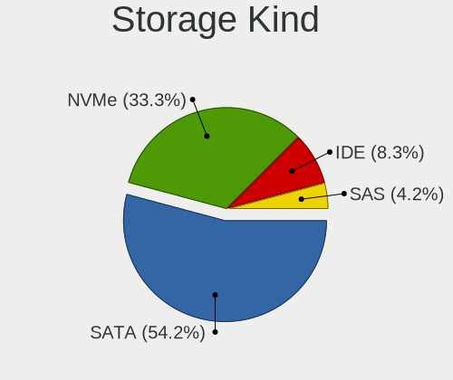
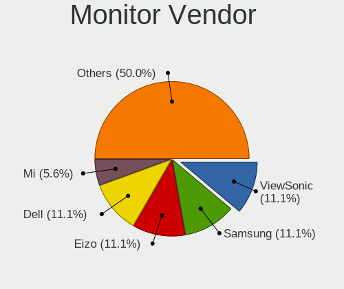
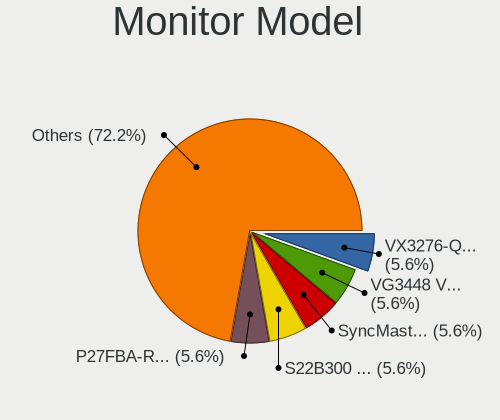
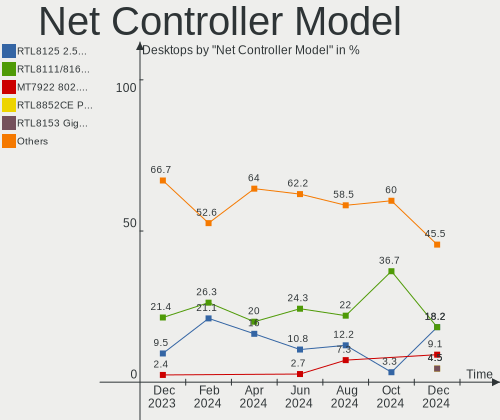
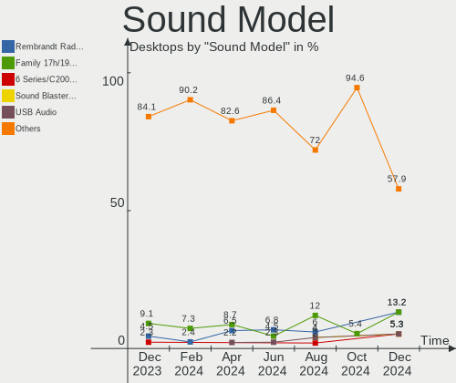
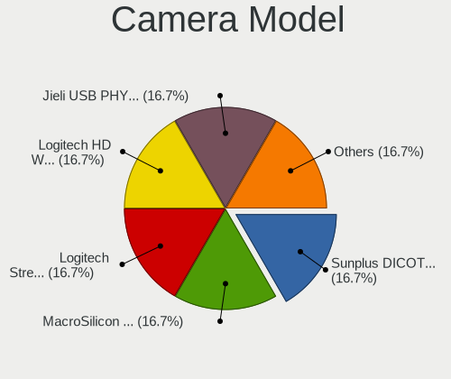
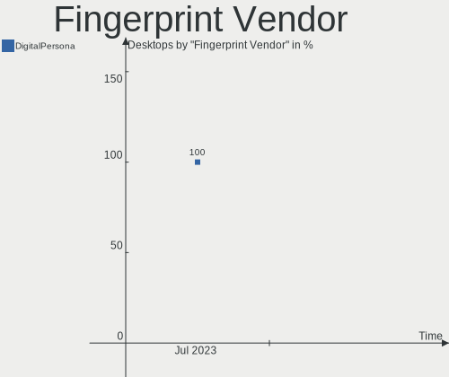
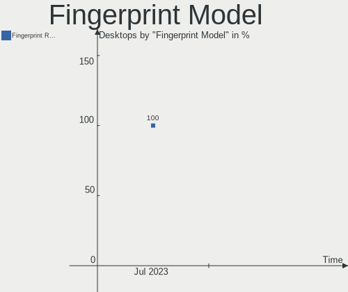

Gentoo - Hardware Trends (Desktops)
-----------------------------------

A project to identify most popular hardware characteristics and track their change
over time based on data collected by Linux users at https://Linux-Hardware.org.

Anyone can contribute to this report by the [hw-probe](https://github.com/linuxhw/hw-probe) tool:

    sudo -E hw-probe -all -upload

This report is for one last month. Overall report since the beginning of time: [TestCoverage](https://github.com/linuxhw/TestCoverage)

Period: Oct, 2022.

Contents
--------

* [ System ](#system)
  - [ OS                       ](#os)
  - [ OS Family                ](#os-family)
  - [ Kernel                   ](#kernel)
  - [ Kernel Family            ](#kernel-family)
  - [ Kernel Major Ver.        ](#kernel-major-ver)
  - [ Arch                     ](#arch)
  - [ DE                       ](#de)
  - [ Display Server           ](#display-server)
  - [ Display Manager          ](#display-manager)
  - [ OS Lang                  ](#os-lang)
  - [ Boot Mode                ](#boot-mode)
  - [ Filesystem               ](#filesystem)
  - [ Part. scheme             ](#part-scheme)
  - [ Dual Boot with Linux/BSD ](#dual-boot-with-linuxbsd)
  - [ Dual Boot (Win)          ](#dual-boot-win)

* [ Board ](#board)
  - [ Vendor                   ](#vendor)
  - [ Model                    ](#model)
  - [ Model Family             ](#model-family)
  - [ MFG Year                 ](#mfg-year)
  - [ Form Factor              ](#form-factor)
  - [ Secure Boot              ](#secure-boot)
  - [ Coreboot                 ](#coreboot)
  - [ RAM Size                 ](#ram-size)
  - [ RAM Used                 ](#ram-used)
  - [ Total Drives             ](#total-drives)
  - [ Has CD-ROM               ](#has-cd-rom)
  - [ Has Ethernet             ](#has-ethernet)
  - [ Has WiFi                 ](#has-wifi)
  - [ Has Bluetooth            ](#has-bluetooth)

* [ Location ](#location)
  - [ Country                  ](#country)
  - [ City                     ](#city)

* [ Drives ](#drives)
  - [ Drive Vendor             ](#drive-vendor)
  - [ Drive Model              ](#drive-model)
  - [ HDD Vendor               ](#hdd-vendor)
  - [ SSD Vendor               ](#ssd-vendor)
  - [ Drive Kind               ](#drive-kind)
  - [ Drive Connector          ](#drive-connector)
  - [ Drive Size               ](#drive-size)
  - [ Space Total              ](#space-total)
  - [ Space Used               ](#space-used)
  - [ Malfunc. Drives          ](#malfunc-drives)
  - [ Malfunc. Drive Vendor    ](#malfunc-drive-vendor)
  - [ Malfunc. HDD Vendor      ](#malfunc-hdd-vendor)
  - [ Malfunc. Drive Kind      ](#malfunc-drive-kind)
  - [ Failed Drives            ](#failed-drives)
  - [ Failed Drive Vendor      ](#failed-drive-vendor)
  - [ Drive Status             ](#drive-status)

* [ Storage controller ](#storage-controller)
  - [ Storage Vendor           ](#storage-vendor)
  - [ Storage Model            ](#storage-model)
  - [ Storage Kind             ](#storage-kind)

* [ Processor ](#processor)
  - [ CPU Vendor               ](#cpu-vendor)
  - [ CPU Model                ](#cpu-model)
  - [ CPU Model Family         ](#cpu-model-family)
  - [ CPU Cores                ](#cpu-cores)
  - [ CPU Sockets              ](#cpu-sockets)
  - [ CPU Threads              ](#cpu-threads)
  - [ CPU Op-Modes             ](#cpu-op-modes)
  - [ CPU Microcode            ](#cpu-microcode)
  - [ CPU Microarch            ](#cpu-microarch)

* [ Graphics ](#graphics)
  - [ GPU Vendor               ](#gpu-vendor)
  - [ GPU Model                ](#gpu-model)
  - [ GPU Combo                ](#gpu-combo)
  - [ GPU Driver               ](#gpu-driver)
  - [ GPU Memory               ](#gpu-memory)

* [ Monitor ](#monitor)
  - [ Monitor Vendor           ](#monitor-vendor)
  - [ Monitor Model            ](#monitor-model)
  - [ Monitor Resolution       ](#monitor-resolution)
  - [ Monitor Diagonal         ](#monitor-diagonal)
  - [ Monitor Width            ](#monitor-width)
  - [ Aspect Ratio             ](#aspect-ratio)
  - [ Monitor Area             ](#monitor-area)
  - [ Pixel Density            ](#pixel-density)
  - [ Multiple Monitors        ](#multiple-monitors)

* [ Network ](#network)
  - [ Net Controller Vendor    ](#net-controller-vendor)
  - [ Net Controller Model     ](#net-controller-model)
  - [ Wireless Vendor          ](#wireless-vendor)
  - [ Wireless Model           ](#wireless-model)
  - [ Ethernet Vendor          ](#ethernet-vendor)
  - [ Ethernet Model           ](#ethernet-model)
  - [ Net Controller Kind      ](#net-controller-kind)
  - [ Used Controller          ](#used-controller)
  - [ NICs                     ](#nics)
  - [ IPv6                     ](#ipv6)

* [ Bluetooth ](#bluetooth)
  - [ Bluetooth Vendor         ](#bluetooth-vendor)
  - [ Bluetooth Model          ](#bluetooth-model)

* [ Sound ](#sound)
  - [ Sound Vendor             ](#sound-vendor)
  - [ Sound Model              ](#sound-model)

* [ Memory ](#memory)
  - [ Memory Vendor            ](#memory-vendor)
  - [ Memory Model             ](#memory-model)
  - [ Memory Kind              ](#memory-kind)
  - [ Memory Form Factor       ](#memory-form-factor)
  - [ Memory Size              ](#memory-size)
  - [ Memory Speed             ](#memory-speed)

* [ Printers & scanners ](#printers--scanners)
  - [ Printer Vendor           ](#printer-vendor)
  - [ Printer Model            ](#printer-model)
  - [ Scanner Vendor           ](#scanner-vendor)
  - [ Scanner Model            ](#scanner-model)

* [ Camera ](#camera)
  - [ Camera Vendor            ](#camera-vendor)
  - [ Camera Model             ](#camera-model)

* [ Security ](#security)
  - [ Fingerprint Vendor       ](#fingerprint-vendor)
  - [ Fingerprint Model        ](#fingerprint-model)
  - [ Chipcard Vendor          ](#chipcard-vendor)
  - [ Chipcard Model           ](#chipcard-model)

* [ Unsupported ](#unsupported)
  - [ Unsupported Devices      ](#unsupported-devices)
  - [ Unsupported Device Types ](#unsupported-device-types)

System
------

OS
--

Installed operating systems

| Name          | Desktops | Percent |
|---------------|----------|---------|
| Gentoo 2.8    | 14       | 70%     |
| Gentoo 2.9    | 4        | 20%     |
| Gentoo 22.0.1 | 1        | 5%      |
| Gentoo 1      | 1        | 5%      |

OS Family
---------

OS without a version

| Name   | Desktops | Percent |
|--------|----------|---------|
| Gentoo | 20       | 100%    |

Kernel
------

Version of the Linux kernel

| Version                  | Desktops | Percent |
|--------------------------|----------|---------|
| 5.15.74-gentoo           | 2        | 10%     |
| 5.15.69-gentoo           | 2        | 10%     |
| 6.1.0-rc1                | 1        | 5%      |
| 6.0.2-WorkStation-x86_64 | 1        | 5%      |
| 6.0.1-tkg-bore-llvm      | 1        | 5%      |
| 6.0.0                    | 1        | 5%      |
| 5.19.9-x86_64            | 1        | 5%      |
| 5.19.16-lqx4-SPTrinity   | 1        | 5%      |
| 5.19.16-lqx4-SPStudio    | 1        | 5%      |
| 5.19.16-gentoo           | 1        | 5%      |
| 5.19.11-gentoo-limelight | 1        | 5%      |
| 5.15.74-gentoo-x86_64    | 1        | 5%      |
| 5.15.74-gentoo-dist      | 1        | 5%      |
| 5.15.72-gentoo-dist      | 1        | 5%      |
| 5.15.72-gentoo           | 1        | 5%      |
| 5.15.69-gentoo-dist      | 1        | 5%      |
| 5.15.59-gentoo-x86_64    | 1        | 5%      |
| 5.15.29-calculate        | 1        | 5%      |

Kernel Family
-------------

Linux kernel without a distro release

| Version | Desktops | Percent |
|---------|----------|---------|
| 5.15.74 | 4        | 20%     |
| 5.19.16 | 3        | 15%     |
| 5.15.69 | 3        | 15%     |
| 5.15.72 | 2        | 10%     |
| 6.1.0   | 1        | 5%      |
| 6.0.2   | 1        | 5%      |
| 6.0.1   | 1        | 5%      |
| 6.0.0   | 1        | 5%      |
| 5.19.9  | 1        | 5%      |
| 5.19.11 | 1        | 5%      |
| 5.15.59 | 1        | 5%      |
| 5.15.29 | 1        | 5%      |

Kernel Major Ver.
-----------------

Linux kernel major version

| Version | Desktops | Percent |
|---------|----------|---------|
| 5.15    | 11       | 55%     |
| 5.19    | 5        | 25%     |
| 6.0     | 3        | 15%     |
| 6.1     | 1        | 5%      |

Arch
----

OS architecture (x86_64, i586, etc.)

| Name   | Desktops | Percent |
|--------|----------|---------|
| x86_64 | 20       | 100%    |

DE
--

Desktop Environment

| Name     | Desktops | Percent |
|----------|----------|---------|
| Unknown  | 7        | 35%     |
| GNOME    | 6        | 30%     |
| KDE5     | 4        | 20%     |
| MATE     | 1        | 5%      |
| Hyprland | 1        | 5%      |
| Cinnamon | 1        | 5%      |

Display Server
--------------

X11 or Wayland

| Name    | Desktops | Percent |
|---------|----------|---------|
| X11     | 7        | 35%     |
| Wayland | 7        | 35%     |
| Unknown | 5        | 25%     |
| Tty     | 1        | 5%      |

Display Manager
---------------

SDDM, LightDM, etc.

| Name    | Desktops | Percent |
|---------|----------|---------|
| Unknown | 6        | 30%     |
| LightDM | 5        | 25%     |
| GDM     | 5        | 25%     |
| SDDM    | 3        | 15%     |
| GREETD  | 1        | 5%      |

OS Lang
-------

Language

| Lang    | Desktops | Percent |
|---------|----------|---------|
| en_US   | 6        | 30%     |
| de_DE   | 3        | 15%     |
| Unknown | 3        | 15%     |
| en_GB   | 2        | 10%     |
| C.UTF8  | 2        | 10%     |
| pt_BR   | 1        | 5%      |
| pl_PL   | 1        | 5%      |
| es_MX   | 1        | 5%      |
| en_CA   | 1        | 5%      |

Boot Mode
---------

EFI or BIOS

| Mode | Desktops | Percent |
|------|----------|---------|
| EFI  | 16       | 80%     |
| BIOS | 4        | 20%     |

Filesystem
----------

Type of filesystem

| Type  | Desktops | Percent |
|-------|----------|---------|
| Ext4  | 8        | 40%     |
| Btrfs | 8        | 40%     |
| F2fs  | 2        | 10%     |
| Zfs   | 1        | 5%      |
| Xfs   | 1        | 5%      |

Part. scheme
------------

Scheme of partitioning

| Type    | Desktops | Percent |
|---------|----------|---------|
| GPT     | 19       | 95%     |
| Unknown | 1        | 5%      |

Dual Boot with Linux/BSD
------------------------

Hosting more than one Linux/BSD

| Dual boot | Desktops | Percent |
|-----------|----------|---------|
| Yes       | 10       | 50%     |
| No        | 10       | 50%     |

Dual Boot (Win)
---------------

Hosting Linux and Windows

| Dual boot | Desktops | Percent |
|-----------|----------|---------|
| No        | 11       | 55%     |
| Yes       | 9        | 45%     |

Board
-----

Vendor
------

Motherboard manufacturer

| Name                | Desktops | Percent |
|---------------------|----------|---------|
| ASUSTek Computer    | 9        | 45%     |
| Gigabyte Technology | 6        | 30%     |
| MSI                 | 3        | 15%     |
| Huanan              | 1        | 5%      |
| ASRock              | 1        | 5%      |

Model
-----

Motherboard model

| Name                               | Desktops | Percent |
|------------------------------------|----------|---------|
| MSI MS-7A38                        | 2        | 10%     |
| MSI MS-7B79                        | 1        | 5%      |
| Huanan X99-F8 GAMING V2.0          | 1        | 5%      |
| Gigabyte Z370 AORUS Gaming 5       | 1        | 5%      |
| Gigabyte X570 AORUS ELITE          | 1        | 5%      |
| Gigabyte TRX40 DESIGNARE           | 1        | 5%      |
| Gigabyte H81M-H                    | 1        | 5%      |
| Gigabyte F2A88XM-DS2               | 1        | 5%      |
| Gigabyte AB350-Gaming              | 1        | 5%      |
| ASUS TUF Gaming X570-PLUS          | 1        | 5%      |
| ASUS ROG STRIX X670E-I GAMING WIFI | 1        | 5%      |
| ASUS ROG STRIX X670E-E GAMING WIFI | 1        | 5%      |
| ASUS ROG STRIX X570-E GAMING       | 1        | 5%      |
| ASUS ROG Maximus XIII APEX         | 1        | 5%      |
| ASUS ROG CROSSHAIR VIII DARK HERO  | 1        | 5%      |
| ASUS PRIME B550M-A                 | 1        | 5%      |
| ASUS M4A89GTD-PRO/USB3             | 1        | 5%      |
| ASUS M3A78-CM                      | 1        | 5%      |
| ASRock X670E Steel Legend          | 1        | 5%      |

Model Family
------------

Motherboard model prefix

| Name                  | Desktops | Percent |
|-----------------------|----------|---------|
| ASUS ROG              | 5        | 25%     |
| MSI MS-7A38           | 2        | 10%     |
| MSI MS-7B79           | 1        | 5%      |
| Huanan X99-F8         | 1        | 5%      |
| Gigabyte Z370         | 1        | 5%      |
| Gigabyte X570         | 1        | 5%      |
| Gigabyte TRX40        | 1        | 5%      |
| Gigabyte H81M-H       | 1        | 5%      |
| Gigabyte F2A88XM-DS2  | 1        | 5%      |
| Gigabyte AB350-Gaming | 1        | 5%      |
| ASUS TUF              | 1        | 5%      |
| ASUS PRIME            | 1        | 5%      |
| ASUS M4A89GTD-PRO     | 1        | 5%      |
| ASUS M3A78-CM         | 1        | 5%      |
| ASRock X670E          | 1        | 5%      |

MFG Year
--------

Motherboard manufacture year

| Year | Desktops | Percent |
|------|----------|---------|
| 2019 | 5        | 25%     |
| 2022 | 3        | 15%     |
| 2021 | 3        | 15%     |
| 2020 | 2        | 10%     |
| 2018 | 2        | 10%     |
| 2013 | 2        | 10%     |
| 2017 | 1        | 5%      |
| 2010 | 1        | 5%      |
| 2008 | 1        | 5%      |

Form Factor
-----------

Physical design of the computer

| Name    | Desktops | Percent |
|---------|----------|---------|
| Desktop | 20       | 100%    |

Secure Boot
-----------

Enabled or disabled

| State    | Desktops | Percent |
|----------|----------|---------|
| Disabled | 19       | 95%     |
| Enabled  | 1        | 5%      |

Coreboot
--------

Have coreboot on board

| Used | Desktops | Percent |
|------|----------|---------|
| No   | 20       | 100%    |

RAM Size
--------

Total RAM memory

| Size in GB  | Desktops | Percent |
|-------------|----------|---------|
| 64.01-256.0 | 7        | 35%     |
| 32.01-64.0  | 5        | 25%     |
| 24.01-32.0  | 3        | 15%     |
| 4.01-8.0    | 2        | 10%     |
| 16.01-24.0  | 2        | 10%     |
| 8.01-16.0   | 1        | 5%      |

RAM Used
--------

Used RAM memory

| Used GB    | Desktops | Percent |
|------------|----------|---------|
| 4.01-8.0   | 7        | 35%     |
| 8.01-16.0  | 3        | 15%     |
| 3.01-4.0   | 2        | 10%     |
| 1.01-2.0   | 2        | 10%     |
| 0.51-1.0   | 2        | 10%     |
| 24.01-32.0 | 1        | 5%      |
| 2.01-3.0   | 1        | 5%      |
| 16.01-24.0 | 1        | 5%      |
| 0.01-0.5   | 1        | 5%      |

Total Drives
------------

Number of drives on board

| Drives | Desktops | Percent |
|--------|----------|---------|
| 5      | 6        | 30%     |
| 2      | 4        | 20%     |
| 3      | 3        | 15%     |
| 1      | 3        | 15%     |
| 6      | 2        | 10%     |
| 9      | 1        | 5%      |
| 4      | 1        | 5%      |

Has CD-ROM
----------

Has CD-ROM on board

| Presented | Desktops | Percent |
|-----------|----------|---------|
| No        | 18       | 90%     |
| Yes       | 2        | 10%     |

Has Ethernet
------------

Has Ethernet on board

| Presented | Desktops | Percent |
|-----------|----------|---------|
| Yes       | 20       | 100%    |

Has WiFi
--------

Has WiFi module

| Presented | Desktops | Percent |
|-----------|----------|---------|
| Yes       | 12       | 60%     |
| No        | 8        | 40%     |

Has Bluetooth
-------------

Has Bluetooth module

| Presented | Desktops | Percent |
|-----------|----------|---------|
| Yes       | 14       | 70%     |
| No        | 6        | 30%     |

Location
--------

Country
-------

Geographic location (country)

| Country | Desktops | Percent |
|---------|----------|---------|
| USA     | 6        | 30%     |
| Germany | 5        | 25%     |
| UK      | 2        | 10%     |
| Poland  | 2        | 10%     |
| Canada  | 2        | 10%     |
| Brazil  | 2        | 10%     |
| Mexico  | 1        | 5%      |

City
----

Geographic location (city)

| City          | Desktops | Percent |
|---------------|----------|---------|
| Luckau        | 2        | 10%     |
| Wyszków      | 1        | 5%      |
| Winter Park   | 1        | 5%      |
| Weatherford   | 1        | 5%      |
| Warsaw        | 1        | 5%      |
| Vancouver     | 1        | 5%      |
| Toronto       | 1        | 5%      |
| Thermopolis   | 1        | 5%      |
| San Antonio   | 1        | 5%      |
| Natal         | 1        | 5%      |
| Mexico City   | 1        | 5%      |
| Lehigh Acres  | 1        | 5%      |
| Laubach       | 1        | 5%      |
| Hertford      | 1        | 5%      |
| Edinburgh     | 1        | 5%      |
| Dreieich      | 1        | 5%      |
| Curitiba      | 1        | 5%      |
| Bad Bramstedt | 1        | 5%      |
| Atlanta       | 1        | 5%      |

Drives
------

Drive Vendor
------------

Hard drive vendors

| Vendor                    | Desktops | Drives | Percent |
|---------------------------|----------|--------|---------|
| Samsung Electronics       | 12       | 19     | 21.82%  |
| WDC                       | 9        | 11     | 16.36%  |
| Seagate                   | 7        | 12     | 12.73%  |
| SanDisk                   | 3        | 5      | 5.45%   |
| Intel                     | 3        | 3      | 5.45%   |
| Toshiba                   | 2        | 2      | 3.64%   |
| Silicon Motion            | 2        | 3      | 3.64%   |
| Phison Electronics        | 2        | 2      | 3.64%   |
| Hitachi                   | 2        | 4      | 3.64%   |
| GOODRAM                   | 2        | 2      | 3.64%   |
| Crucial                   | 2        | 2      | 3.64%   |
| ADATA Technology          | 2        | 2      | 3.64%   |
| T-FORCE                   | 1        | 1      | 1.82%   |
| Seagate Technology        | 1        | 1      | 1.82%   |
| Realtek Semiconductor     | 1        | 1      | 1.82%   |
| OCZ                       | 1        | 1      | 1.82%   |
| Micron/Crucial Technology | 1        | 1      | 1.82%   |
| KingSpec                  | 1        | 2      | 1.82%   |
| ASMT                      | 1        | 1      | 1.82%   |

Drive Model
-----------

Hard drive models

| Model                                                 | Desktops | Percent |
|-------------------------------------------------------|----------|---------|
| Samsung SSD 860 EVO 1TB                               | 4        | 6.25%   |
| Samsung NVMe SSD Controller PM9A1/PM9A3/980PRO 250GB  | 3        | 4.69%   |
| Samsung NVMe SSD Controller SM981/PM981/PM983 500GB   | 2        | 3.13%   |
| GOODRAM SSDPR-CL100-480-G2 480GB                      | 2        | 3.13%   |
| WDC WDBNCE0020PNC 2TB SSD                             | 1        | 1.56%   |
| WDC WD5000AAKX-08U6AA0 500GB                          | 1        | 1.56%   |
| WDC WD40EZRZ-00WN9B0 4TB                              | 1        | 1.56%   |
| WDC WD30EFRX-68EUZN0 3TB                              | 1        | 1.56%   |
| WDC WD20EARX-00PASB0 2TB                              | 1        | 1.56%   |
| WDC WD2003FZEX-00SRLA0 2TB                            | 1        | 1.56%   |
| WDC WD1200JS-00NCB1 120GB                             | 1        | 1.56%   |
| WDC WD10EZRZ-00HTKB0 1TB                              | 1        | 1.56%   |
| WDC WD10EZEX-08WN4A0 1TB                              | 1        | 1.56%   |
| WDC WD101KFBX-68R56N0 10TB                            | 1        | 1.56%   |
| Toshiba HDWE150 5TB                                   | 1        | 1.56%   |
| Toshiba DT01ACA300 3TB                                | 1        | 1.56%   |
| T-FORCE SSD 1TB                                       | 1        | 1.56%   |
| Silicon Motion SM2263EN/SM2263XT SSD Controller 256GB | 1        | 1.56%   |
| Silicon Motion SM2262/SM2262EN SSD Controller 1024GB  | 1        | 1.56%   |
| Seagate FireCuda 520 SSD 500GB                        | 1        | 1.56%   |
| Seagate ST9250315AS 250GB                             | 1        | 1.56%   |
| Seagate ST4000VN008-2DR166 4TB                        | 1        | 1.56%   |
| Seagate ST4000DM004-2CV104 4TB                        | 1        | 1.56%   |
| Seagate ST4000DM000-1F2168 4TB                        | 1        | 1.56%   |
| Seagate ST3500630AS 500GB                             | 1        | 1.56%   |
| Seagate ST3360320AS 360GB                             | 1        | 1.56%   |
| Seagate ST3250410AS 250GB                             | 1        | 1.56%   |
| Seagate ST12000NM0008-2H3101 12TB                     | 1        | 1.56%   |
| Seagate ST1000VN002-2EY102 1TB                        | 1        | 1.56%   |
| Seagate ST1000DM010-2EP102 1TB                        | 1        | 1.56%   |
| Sandisk WD_BLACK SN770 1TB                            | 1        | 1.56%   |
| Sandisk WD Black SN750 / PC SN730 NVMe SSD 1TB        | 1        | 1.56%   |
| SanDisk SDSSDA240G 240GB                              | 1        | 1.56%   |
| SanDisk SDSSDA120G 120GB                              | 1        | 1.56%   |
| Samsung SSD 870 QVO 2TB                               | 1        | 1.56%   |
| Samsung SSD 870 EVO 1TB                               | 1        | 1.56%   |
| Samsung SSD 850 EVO 500GB                             | 1        | 1.56%   |
| Samsung SSD 850 EVO 250GB                             | 1        | 1.56%   |
| Samsung SSD 840 Series 120GB                          | 1        | 1.56%   |
| Samsung SSD 840 EVO 250GB                             | 1        | 1.56%   |

HDD Vendor
----------

Hard disk drive vendors

| Vendor  | Desktops | Drives | Percent |
|---------|----------|--------|---------|
| WDC     | 8        | 10     | 42.11%  |
| Seagate | 7        | 12     | 36.84%  |
| Toshiba | 2        | 2      | 10.53%  |
| Hitachi | 2        | 4      | 10.53%  |

SSD Vendor
----------

Solid state drive vendors

| Vendor              | Desktops | Drives | Percent |
|---------------------|----------|--------|---------|
| Samsung Electronics | 9        | 12     | 42.86%  |
| SanDisk             | 2        | 2      | 9.52%   |
| GOODRAM             | 2        | 2      | 9.52%   |
| Crucial             | 2        | 2      | 9.52%   |
| WDC                 | 1        | 1      | 4.76%   |
| T-FORCE             | 1        | 1      | 4.76%   |
| OCZ                 | 1        | 1      | 4.76%   |
| KingSpec            | 1        | 2      | 4.76%   |
| Intel               | 1        | 1      | 4.76%   |
| ASMT                | 1        | 1      | 4.76%   |

Drive Kind
----------

HDD or SSD

| Kind | Desktops | Drives | Percent |
|------|----------|--------|---------|
| NVMe | 14       | 22     | 37.84%  |
| SSD  | 12       | 25     | 32.43%  |
| HDD  | 11       | 28     | 29.73%  |

Drive Connector
---------------

SATA, SAS, NVMe, etc.

| Type | Desktops | Drives | Percent |
|------|----------|--------|---------|
| SATA | 16       | 52     | 51.61%  |
| NVMe | 14       | 22     | 45.16%  |
| SAS  | 1        | 1      | 3.23%   |

Drive Size
----------

Size of hard drive

| Size in TB | Desktops | Drives | Percent |
|------------|----------|--------|---------|
| 0.01-0.5   | 10       | 18     | 29.41%  |
| 0.51-1.0   | 9        | 15     | 26.47%  |
| 1.01-2.0   | 5        | 7      | 14.71%  |
| 3.01-4.0   | 4        | 5      | 11.76%  |
| 2.01-3.0   | 3        | 5      | 8.82%   |
| 4.01-10.0  | 2        | 2      | 5.88%   |
| 10.01-20.0 | 1        | 1      | 2.94%   |

Space Total
-----------

Amount of disk space available on the file system

| Size in GB     | Desktops | Percent |
|----------------|----------|---------|
| More than 3000 | 6        | 30%     |
| 501-1000       | 4        | 20%     |
| 1001-2000      | 3        | 15%     |
| 251-500        | 2        | 10%     |
| 1-20           | 2        | 10%     |
| 101-250        | 1        | 5%      |
| 51-100         | 1        | 5%      |
| Unknown        | 1        | 5%      |

Space Used
----------

Amount of used disk space

| Used GB        | Desktops | Percent |
|----------------|----------|---------|
| More than 3000 | 4        | 20%     |
| 21-50          | 4        | 20%     |
| 1-20           | 3        | 15%     |
| 251-500        | 2        | 10%     |
| 101-250        | 2        | 10%     |
| 51-100         | 2        | 10%     |
| 1001-2000      | 1        | 5%      |
| 501-1000       | 1        | 5%      |
| Unknown        | 1        | 5%      |

Malfunc. Drives
---------------

Drive models with a malfunction

| Model                     | Desktops | Drives | Percent |
|---------------------------|----------|--------|---------|
| Seagate ST3250410AS 250GB | 1        | 1      | 100%    |

Malfunc. Drive Vendor
---------------------

Vendors of faulty drives

| Vendor  | Desktops | Drives | Percent |
|---------|----------|--------|---------|
| Seagate | 1        | 1      | 100%    |

Malfunc. HDD Vendor
-------------------

Vendors of faulty HDD drives

| Vendor  | Desktops | Drives | Percent |
|---------|----------|--------|---------|
| Seagate | 1        | 1      | 100%    |

Malfunc. Drive Kind
-------------------

Kinds of faulty drives

| Kind | Desktops | Drives | Percent |
|------|----------|--------|---------|
| HDD  | 1        | 1      | 100%    |

Failed Drives
-------------

Failed drive models

Zero info for selected period =(

Failed Drive Vendor
-------------------

Failed drive vendors

Zero info for selected period =(

Drive Status
------------

Number of failed and malfunc. drives

| Status   | Desktops | Drives | Percent |
|----------|----------|--------|---------|
| Works    | 18       | 67     | 85.71%  |
| Detected | 2        | 7      | 9.52%   |
| Malfunc  | 1        | 1      | 4.76%   |

Storage controller
------------------

Storage Vendor
--------------

Storage controller vendors

| Vendor                    | Desktops | Percent |
|---------------------------|----------|---------|
| AMD                       | 16       | 40%     |
| Samsung Electronics       | 5        | 12.5%   |
| Intel                     | 5        | 12.5%   |
| Silicon Motion            | 2        | 5%      |
| SanDisk                   | 2        | 5%      |
| Phison Electronics        | 2        | 5%      |
| ASMedia Technology        | 2        | 5%      |
| ADATA Technology          | 2        | 5%      |
| Seagate Technology        | 1        | 2.5%    |
| Realtek Semiconductor     | 1        | 2.5%    |
| Micron/Crucial Technology | 1        | 2.5%    |
| JMicron Technology        | 1        | 2.5%    |

Storage Model
-------------

Storage controller models

| Model                                                                          | Desktops | Percent |
|--------------------------------------------------------------------------------|----------|---------|
| AMD FCH SATA Controller [AHCI mode]                                            | 9        | 20%     |
| Samsung NVMe SSD Controller PM9A1/PM9A3/980PRO                                 | 3        | 6.67%   |
| AMD SATA controller                                                            | 3        | 6.67%   |
| AMD 400 Series Chipset SATA Controller                                         | 3        | 6.67%   |
| Samsung NVMe SSD Controller SM981/PM981/PM983                                  | 2        | 4.44%   |
| ADATA A Non-Volatile memory controller                                         | 2        | 4.44%   |
| Silicon Motion SM2263EN/SM2263XT SSD Controller                                | 1        | 2.22%   |
| Silicon Motion SM2262/SM2262EN SSD Controller                                  | 1        | 2.22%   |
| Seagate FireCuda 520 SSD                                                       | 1        | 2.22%   |
| SanDisk WD Black SN750 / PC SN730 NVMe SSD                                     | 1        | 2.22%   |
| SanDisk Non-Volatile memory controller                                         | 1        | 2.22%   |
| Samsung NVMe SSD Controller SM961/PM961/SM963                                  | 1        | 2.22%   |
| Realtek RTS5763DL NVMe SSD Controller                                          | 1        | 2.22%   |
| Phison PS5013 E13 NVMe Controller                                              | 1        | 2.22%   |
| Phison E12 NVMe Controller                                                     | 1        | 2.22%   |
| Micron/Crucial NVMe Controller                                                 | 1        | 2.22%   |
| JMicron JMB361 AHCI/IDE                                                        | 1        | 2.22%   |
| Intel SSD Pro 7600p/760p/E 6100p Series                                        | 1        | 2.22%   |
| Intel SSD 660P Series                                                          | 1        | 2.22%   |
| Intel 8 Series/C220 Series Chipset Family 6-port SATA Controller 1 [AHCI mode] | 1        | 2.22%   |
| Intel 500 Series Chipset Family SATA AHCI Controller                           | 1        | 2.22%   |
| Intel 200 Series PCH SATA controller [AHCI mode]                               | 1        | 2.22%   |
| ASMedia SATA controller                                                        | 1        | 2.22%   |
| ASMedia ASM1062 Serial ATA Controller                                          | 1        | 2.22%   |
| AMD SB7x0/SB8x0/SB9x0 SATA Controller [IDE mode]                               | 1        | 2.22%   |
| AMD SB7x0/SB8x0/SB9x0 SATA Controller [AHCI mode]                              | 1        | 2.22%   |
| AMD SB7x0/SB8x0/SB9x0 IDE Controller                                           | 1        | 2.22%   |
| AMD 500 Series Chipset SATA Controller                                         | 1        | 2.22%   |
| AMD 300 Series Chipset SATA Controller                                         | 1        | 2.22%   |

Storage Kind
------------

Kind of storage controller (IDE, SATA, NVMe, SAS, ...)

| Kind | Desktops | Percent |
|------|----------|---------|
| SATA | 20       | 55.56%  |
| NVMe | 14       | 38.89%  |
| IDE  | 2        | 5.56%   |

Processor
---------

CPU Vendor
----------

Processor vendors

| Vendor | Desktops | Percent |
|--------|----------|---------|
| AMD    | 16       | 80%     |
| Intel  | 4        | 20%     |

CPU Model
---------

Processor models

| Model                                          | Desktops | Percent |
|------------------------------------------------|----------|---------|
| AMD Ryzen 9 5950X 16-Core Processor            | 3        | 15%     |
| AMD Ryzen 9 7950X 16-Core Processor            | 2        | 10%     |
| Intel Xeon CPU E5-2678 v3 @ 2.50GHz            | 1        | 5%      |
| Intel Core i7-8700K CPU @ 3.70GHz              | 1        | 5%      |
| Intel Core i7-4790K CPU @ 4.00GHz              | 1        | 5%      |
| Intel 11th Gen Core i9-11900K @ 3.50GHz        | 1        | 5%      |
| AMD Ryzen Threadripper 3970X 32-Core Processor | 1        | 5%      |
| AMD Ryzen 9 7900X 12-Core Processor            | 1        | 5%      |
| AMD Ryzen 9 5900X 12-Core Processor            | 1        | 5%      |
| AMD Ryzen 7 PRO 5750G with Radeon Graphics     | 1        | 5%      |
| AMD Ryzen 7 5700X 8-Core Processor             | 1        | 5%      |
| AMD Ryzen 7 2700X Eight-Core Processor         | 1        | 5%      |
| AMD Ryzen 5 2600 Six-Core Processor            | 1        | 5%      |
| AMD Ryzen 3 4300GE with Radeon Graphics        | 1        | 5%      |
| AMD Phenom II X6 1090T Processor               | 1        | 5%      |
| AMD Phenom II X4 955 Processor                 | 1        | 5%      |
| AMD A6-6400K APU with Radeon HD Graphics       | 1        | 5%      |

CPU Model Family
----------------

Processor model prefix

| Model                  | Desktops | Percent |
|------------------------|----------|---------|
| AMD Ryzen 9            | 7        | 35%     |
| Intel Core i7          | 2        | 10%     |
| AMD Ryzen 7            | 2        | 10%     |
| Other                  | 1        | 5%      |
| Intel Xeon             | 1        | 5%      |
| AMD Ryzen Threadripper | 1        | 5%      |
| AMD Ryzen 7 PRO        | 1        | 5%      |
| AMD Ryzen 5            | 1        | 5%      |
| AMD Ryzen 3            | 1        | 5%      |
| AMD Phenom II X6       | 1        | 5%      |
| AMD Phenom II X4       | 1        | 5%      |
| AMD A6                 | 1        | 5%      |

CPU Cores
---------

Number of processor cores

| Number | Desktops | Percent |
|--------|----------|---------|
| 16     | 5        | 25%     |
| 8      | 4        | 20%     |
| 12     | 3        | 15%     |
| 6      | 3        | 15%     |
| 4      | 3        | 15%     |
| 32     | 1        | 5%      |
| 1      | 1        | 5%      |

CPU Sockets
-----------

Number of sockets

| Number | Desktops | Percent |
|--------|----------|---------|
| 1      | 20       | 100%    |

CPU Threads
-----------

Threads per core (Hyper-Threading)

| Number | Desktops | Percent |
|--------|----------|---------|
| 2      | 18       | 90%     |
| 1      | 2        | 10%     |

CPU Op-Modes
------------

CPU Operation Modes (32-bit, 64-bit)

| Op mode        | Desktops | Percent |
|----------------|----------|---------|
| 32-bit, 64-bit | 20       | 100%    |

CPU Microcode
-------------

Microcode number

| Number     | Desktops | Percent |
|------------|----------|---------|
| 0x0a601203 | 2        | 10%     |
| 0x0a201016 | 2        | 10%     |
| 0x0800820d | 2        | 10%     |
| Unknown    | 2        | 10%     |
| 0x306f2    | 1        | 5%      |
| 0x306c3    | 1        | 5%      |
| 0x0a601201 | 1        | 5%      |
| 0x0a50000b | 1        | 5%      |
| 0x0a20120a | 1        | 5%      |
| 0x0a201205 | 1        | 5%      |
| 0x08600106 | 1        | 5%      |
| 0x08301039 | 1        | 5%      |
| 0x06001119 | 1        | 5%      |
| 0x010000dc | 1        | 5%      |
| 0x010000db | 1        | 5%      |
| 0x00000000 | 1        | 5%      |

CPU Microarch
-------------

Microarchitecture

| Name       | Desktops | Percent |
|------------|----------|---------|
| Zen 3      | 6        | 30%     |
| Unknown    | 4        | 20%     |
| Zen+       | 2        | 10%     |
| Zen 2      | 2        | 10%     |
| K10        | 2        | 10%     |
| Haswell    | 2        | 10%     |
| Piledriver | 1        | 5%      |
| KabyLake   | 1        | 5%      |

Graphics
--------

GPU Vendor
----------

Vendors of graphics cards

| Vendor | Desktops | Percent |
|--------|----------|---------|
| AMD    | 14       | 63.64%  |
| Nvidia | 7        | 31.82%  |
| Intel  | 1        | 4.55%   |

GPU Model
---------

Graphics card models

| Model                                                                       | Desktops | Percent |
|-----------------------------------------------------------------------------|----------|---------|
| Nvidia GA106 [GeForce RTX 3060 Lite Hash Rate]                              | 2        | 9.09%   |
| Nvidia GA102 [GeForce RTX 3080 Ti]                                          | 2        | 9.09%   |
| AMD Raphael                                                                 | 2        | 9.09%   |
| AMD Navi 22 [Radeon RX 6700/6700 XT/6750 XT / 6800M]                        | 2        | 9.09%   |
| Nvidia GP106GL [Quadro P2000]                                               | 1        | 4.55%   |
| Nvidia GK104 [GeForce GTX 670]                                              | 1        | 4.55%   |
| Nvidia GA106 [RTX A2000]                                                    | 1        | 4.55%   |
| Intel Xeon E3-1200 v3/4th Gen Core Processor Integrated Graphics Controller | 1        | 4.55%   |
| AMD RS780C [Radeon 3100]                                                    | 1        | 4.55%   |
| AMD Richland [Radeon HD 8470D]                                              | 1        | 4.55%   |
| AMD Renoir                                                                  | 1        | 4.55%   |
| AMD Navi 23 [Radeon RX 6600/6600 XT/6600M]                                  | 1        | 4.55%   |
| AMD Navi 21 [Radeon RX 6900 XT]                                             | 1        | 4.55%   |
| AMD Navi 21 [Radeon RX 6800/6800 XT / 6900 XT]                              | 1        | 4.55%   |
| AMD Navi 10 [Radeon RX 5600 OEM/5600 XT / 5700/5700 XT]                     | 1        | 4.55%   |
| AMD Ellesmere [Radeon RX 470/480/570/570X/580/580X/590]                     | 1        | 4.55%   |
| AMD Cezanne                                                                 | 1        | 4.55%   |
| AMD Cedar [Radeon HD 5000/6000/7350/8350 Series]                            | 1        | 4.55%   |

GPU Combo
---------

Combinations of graphics cards

| Name         | Desktops | Percent |
|--------------|----------|---------|
| 1 x AMD      | 12       | 60%     |
| 1 x Nvidia   | 6        | 30%     |
| Intel + AMD  | 1        | 5%      |
| AMD + Nvidia | 1        | 5%      |

GPU Driver
----------

Free vs proprietary

| Driver      | Desktops | Percent |
|-------------|----------|---------|
| Free        | 14       | 70%     |
| Proprietary | 5        | 25%     |
| Unknown     | 1        | 5%      |

GPU Memory
----------

Total video memory

| Size in GB | Desktops | Percent |
|------------|----------|---------|
| 8.01-16.0  | 7        | 35%     |
| 7.01-8.0   | 3        | 15%     |
| 1.01-2.0   | 2        | 10%     |
| 0.51-1.0   | 2        | 10%     |
| 0.01-0.5   | 2        | 10%     |
| Unknown    | 2        | 10%     |
| 5.01-6.0   | 1        | 5%      |
| 4.01-5.0   | 1        | 5%      |

Monitor
-------

Monitor Vendor
--------------

Monitor vendors

| Vendor               | Desktops | Percent |
|----------------------|----------|---------|
| Acer                 | 6        | 20.69%  |
| Goldstar             | 5        | 17.24%  |
| Samsung Electronics  | 2        | 6.9%    |
| ASUSTek Computer     | 2        | 6.9%    |
| AOC                  | 2        | 6.9%    |
| UGD                  | 1        | 3.45%   |
| MPI                  | 1        | 3.45%   |
| LTM                  | 1        | 3.45%   |
| HVR                  | 1        | 3.45%   |
| Hewlett-Packard      | 1        | 3.45%   |
| HannStar             | 1        | 3.45%   |
| Gigabyte Technology  | 1        | 3.45%   |
| Denver               | 1        | 3.45%   |
| Dell                 | 1        | 3.45%   |
| CVT                  | 1        | 3.45%   |
| BenQ                 | 1        | 3.45%   |
| Ancor Communications | 1        | 3.45%   |

Monitor Model
-------------

Monitor models

| Model                                                                 | Desktops | Percent |
|-----------------------------------------------------------------------|----------|---------|
| Goldstar LG HDR 4K GSM7707 3840x2160 600x340mm 27.2-inch              | 2        | 6.67%   |
| UGD Artist 12 UGD1106 1920x1080 256x144mm 11.6-inch                   | 1        | 3.33%   |
| Samsung Electronics S22B300 SAM08C8 1920x1080 477x268mm 21.5-inch     | 1        | 3.33%   |
| Samsung Electronics LCD Monitor SAM0B30 1920x1080 885x498mm 40.0-inch | 1        | 3.33%   |
| MPI MPI7002 MPI7002 1920x1080 180x130mm 8.7-inch                      | 1        | 3.33%   |
| LTM LCD Monitor LTM045E 400x1280                                      | 1        | 3.33%   |
| HVR HTC-VIVE HVRAA01 2160x1200                                        | 1        | 3.33%   |
| Hewlett-Packard LA2205 HWP2848 1680x1050 473x296mm 22.0-inch          | 1        | 3.33%   |
| HannStar HT225HPB HSD49F3 1920x1080 477x268mm 21.5-inch               | 1        | 3.33%   |
| Goldstar ULTRAWIDE GSM59F2 2560x1080 798x334mm 34.1-inch              | 1        | 3.33%   |
| Goldstar Ultra HD GSM5B09 3840x2160 600x340mm 27.2-inch               | 1        | 3.33%   |
| Goldstar LG HDR WFHD GSM7715 2560x1080 800x340mm 34.2-inch            | 1        | 3.33%   |
| Goldstar 34GK950F GSM7727 3440x1440 800x335mm 34.1-inch               | 1        | 3.33%   |
| Gigabyte Technology AORUS FO48U GBT4800 3840x2160 697x392mm 31.5-inch | 1        | 3.33%   |
| Denver 27C1U LHCFFFF 2160x3840                                        | 1        | 3.33%   |
| Dell S2721DGF DEL41D9 2560x1440 597x336mm 27.0-inch                   | 1        | 3.33%   |
| CVT CVTE TV CVT0003 1920x1080 575x323mm 26.0-inch                     | 1        | 3.33%   |
| BenQ ZOWIE XL LCD BNQ7F33 1920x1080 531x298mm 24.0-inch               | 1        | 3.33%   |
| ASUSTek Computer XG32VC AUS3220 2560x1440 697x392mm 31.5-inch         | 1        | 3.33%   |
| ASUSTek Computer VP32UQ AUS32A7 3840x2160 700x390mm 31.5-inch         | 1        | 3.33%   |
| AOC 24V2W1G5 AOC2402 1920x1080 527x296mm 23.8-inch                    | 1        | 3.33%   |
| AOC 2243W AOC2243 1920x1080 477x268mm 21.5-inch                       | 1        | 3.33%   |
| Ancor Communications VS248 ACI2498 1920x1080 531x299mm 24.0-inch      | 1        | 3.33%   |
| Acer XB271HU ACR0490 2560x1440 598x336mm 27.0-inch                    | 1        | 3.33%   |
| Acer XB252Q ACR0562 1920x1080 544x303mm 24.5-inch                     | 1        | 3.33%   |
| Acer T232HL ACR041F 1920x1080 509x286mm 23.0-inch                     | 1        | 3.33%   |
| Acer P5530 ACR2515 1920x1080                                          | 1        | 3.33%   |
| Acer LCD Monitor B226HQL 1920x1080                                    | 1        | 3.33%   |
| Acer G276HL ACR0300 1920x1080 598x336mm 27.0-inch                     | 1        | 3.33%   |

Monitor Resolution
------------------

Monitor screen resolution

| Resolution         | Desktops | Percent |
|--------------------|----------|---------|
| 1920x1080 (FHD)    | 10       | 41.67%  |
| 3840x2160 (4K)     | 5        | 20.83%  |
| 2560x1440 (QHD)    | 3        | 12.5%   |
| 400x1280           | 1        | 4.17%   |
| 3440x1440          | 1        | 4.17%   |
| 2560x1080          | 1        | 4.17%   |
| 2160x1200          | 1        | 4.17%   |
| 1680x1050 (WSXGA+) | 1        | 4.17%   |
| 1280x720 (HD)      | 1        | 4.17%   |

Monitor Diagonal
----------------

Diagonal size in inches

| Inches  | Desktops | Percent |
|---------|----------|---------|
| 27      | 6        | 20.69%  |
| Unknown | 4        | 13.79%  |
| 31      | 3        | 10.34%  |
| 24      | 3        | 10.34%  |
| 21      | 3        | 10.34%  |
| 34      | 2        | 6.9%    |
| 23      | 2        | 6.9%    |
| 54      | 1        | 3.45%   |
| 29      | 1        | 3.45%   |
| 26      | 1        | 3.45%   |
| 22      | 1        | 3.45%   |
| 11      | 1        | 3.45%   |
| 8       | 1        | 3.45%   |

Monitor Width
-------------

Physical width

| Width in mm | Desktops | Percent |
|-------------|----------|---------|
| 501-600     | 11       | 39.29%  |
| 601-700     | 4        | 14.29%  |
| 401-500     | 4        | 14.29%  |
| Unknown     | 4        | 14.29%  |
| 701-800     | 2        | 7.14%   |
| 201-300     | 1        | 3.57%   |
| 101-200     | 1        | 3.57%   |
| 1001-1500   | 1        | 3.57%   |

Aspect Ratio
------------

Proportional relationship between the width and the height

| Ratio   | Desktops | Percent |
|---------|----------|---------|
| 16/9    | 15       | 68.18%  |
| 21/9    | 3        | 13.64%  |
| 4/3     | 1        | 4.55%   |
| 16/10   | 1        | 4.55%   |
| 0.31    | 1        | 4.55%   |
| Unknown | 1        | 4.55%   |

Monitor Area
------------

Area in inch²

| Area in inch² | Desktops | Percent |
|----------------|----------|---------|
| 201-250        | 7        | 25%     |
| 301-350        | 6        | 21.43%  |
| 351-500        | 5        | 17.86%  |
| Unknown        | 4        | 14.29%  |
| 251-300        | 2        | 7.14%   |
| More than 1000 | 1        | 3.57%   |
| 51-60          | 1        | 3.57%   |
| 1-40           | 1        | 3.57%   |
| 151-200        | 1        | 3.57%   |

Pixel Density
-------------

Pixels per inch

| Density | Desktops | Percent |
|---------|----------|---------|
| 51-100  | 9        | 36%     |
| 101-120 | 5        | 20%     |
| 161-240 | 4        | 16%     |
| Unknown | 4        | 16%     |
| 121-160 | 2        | 8%      |
| 1-50    | 1        | 4%      |

Multiple Monitors
-----------------

Total monitors connected

| Total | Desktops | Percent |
|-------|----------|---------|
| 1     | 10       | 50%     |
| 2     | 7        | 35%     |
| 4     | 1        | 5%      |
| 3     | 1        | 5%      |
| 0     | 1        | 5%      |

Network
-------

Net Controller Vendor
---------------------

Controller vendors

| Vendor                | Desktops | Percent |
|-----------------------|----------|---------|
| Realtek Semiconductor | 14       | 45.16%  |
| Intel                 | 11       | 35.48%  |
| MediaTek              | 2        | 6.45%   |
| STMicroelectronics    | 1        | 3.23%   |
| Sigma Designs         | 1        | 3.23%   |
| Microsoft             | 1        | 3.23%   |
| Dresden Elektronik    | 1        | 3.23%   |

Net Controller Model
--------------------

Controller models

| Model                                                             | Desktops | Percent |
|-------------------------------------------------------------------|----------|---------|
| Realtek RTL8111/8168/8411 PCI Express Gigabit Ethernet Controller | 12       | 30.77%  |
| Intel Wi-Fi 6 AX200                                               | 4        | 10.26%  |
| Realtek RTL8125 2.5GbE Controller                                 | 3        | 7.69%   |
| Intel Wi-Fi 6 AX210/AX211/AX411 160MHz                            | 3        | 7.69%   |
| Intel I211 Gigabit Network Connection                             | 3        | 7.69%   |
| Intel Ethernet Controller I225-V                                  | 3        | 7.69%   |
| MediaTek MT7922 802.11ax PCI Express Wireless Network Adapter     | 2        | 5.13%   |
| Intel Wireless 3165                                               | 2        | 5.13%   |
| STMicroelectronics Virtual COM Port                               | 1        | 2.56%   |
| Sigma Designs Aeotec Z-Stick Gen5 (ZW090) - UZB                   | 1        | 2.56%   |
| Realtek RTL88x2bu [AC1200 Techkey]                                | 1        | 2.56%   |
| Microsoft Wireless XBox Controller Dongle                         | 1        | 2.56%   |
| Intel I210 Gigabit Network Connection                             | 1        | 2.56%   |
| Intel Ethernet Connection (2) I219-V                              | 1        | 2.56%   |
| Dresden Elektronik ZigBee gateway [ConBee II]                     | 1        | 2.56%   |

Wireless Vendor
---------------

Wireless vendors

| Vendor                | Desktops | Percent |
|-----------------------|----------|---------|
| Intel                 | 9        | 69.23%  |
| MediaTek              | 2        | 15.38%  |
| Realtek Semiconductor | 1        | 7.69%   |
| Microsoft             | 1        | 7.69%   |

Wireless Model
--------------

Wireless models

| Model                                                         | Desktops | Percent |
|---------------------------------------------------------------|----------|---------|
| Intel Wi-Fi 6 AX200                                           | 4        | 30.77%  |
| Intel Wi-Fi 6 AX210/AX211/AX411 160MHz                        | 3        | 23.08%  |
| MediaTek MT7922 802.11ax PCI Express Wireless Network Adapter | 2        | 15.38%  |
| Intel Wireless 3165                                           | 2        | 15.38%  |
| Realtek RTL88x2bu [AC1200 Techkey]                            | 1        | 7.69%   |
| Microsoft Wireless XBox Controller Dongle                     | 1        | 7.69%   |

Ethernet Vendor
---------------

Ethernet vendors

| Vendor                | Desktops | Percent |
|-----------------------|----------|---------|
| Realtek Semiconductor | 14       | 63.64%  |
| Intel                 | 8        | 36.36%  |

Ethernet Model
--------------

Ethernet models

| Model                                                             | Desktops | Percent |
|-------------------------------------------------------------------|----------|---------|
| Realtek RTL8111/8168/8411 PCI Express Gigabit Ethernet Controller | 12       | 52.17%  |
| Realtek RTL8125 2.5GbE Controller                                 | 3        | 13.04%  |
| Intel I211 Gigabit Network Connection                             | 3        | 13.04%  |
| Intel Ethernet Controller I225-V                                  | 3        | 13.04%  |
| Intel I210 Gigabit Network Connection                             | 1        | 4.35%   |
| Intel Ethernet Connection (2) I219-V                              | 1        | 4.35%   |

Net Controller Kind
-------------------

Ethernet, WiFi or modem

| Kind     | Desktops | Percent |
|----------|----------|---------|
| Ethernet | 20       | 58.82%  |
| WiFi     | 12       | 35.29%  |
| Modem    | 2        | 5.88%   |

Used Controller
---------------

Currently used network controller

| Kind     | Desktops | Percent |
|----------|----------|---------|
| Ethernet | 18       | 81.82%  |
| WiFi     | 4        | 18.18%  |

NICs
----

Total network controllers on board

| Total | Desktops | Percent |
|-------|----------|---------|
| 1     | 10       | 50%     |
| 2     | 6        | 30%     |
| 3     | 4        | 20%     |

IPv6
----

IPv6 vs IPv4

| Used | Desktops | Percent |
|------|----------|---------|
| No   | 16       | 80%     |
| Yes  | 4        | 20%     |

Bluetooth
---------

Bluetooth Vendor
----------------

Controller vendors

| Vendor                   | Desktops | Percent |
|--------------------------|----------|---------|
| Intel                    | 10       | 62.5%   |
| Cambridge Silicon Radio  | 2        | 12.5%   |
| MediaTek                 | 1        | 6.25%   |
| HTC (High Tech Computer) | 1        | 6.25%   |
| Foxconn / Hon Hai        | 1        | 6.25%   |
| Broadcom                 | 1        | 6.25%   |

Bluetooth Model
---------------

Controller models

| Model                                                                | Desktops | Percent |
|----------------------------------------------------------------------|----------|---------|
| Intel AX210 Bluetooth                                                | 4        | 25%     |
| Intel AX200 Bluetooth                                                | 4        | 25%     |
| Cambridge Silicon Radio Bluetooth Dongle (HCI mode)                  | 2        | 12.5%   |
| MediaTek Wireless_Device                                             | 1        | 6.25%   |
| Intel Wireless-AC 9260 Bluetooth Adapter                             | 1        | 6.25%   |
| Intel Bluetooth wireless interface                                   | 1        | 6.25%   |
| HTC (High Tech Computer) Vive Hub Bluetooth 4.1 (Broadcom BCM920703) | 1        | 6.25%   |
| Foxconn / Hon Hai Wireless_Device                                    | 1        | 6.25%   |
| Broadcom BCM20702A0 Bluetooth 4.0                                    | 1        | 6.25%   |

Sound
-----

Sound Vendor
------------

Sound card vendors

| Vendor                                          | Desktops | Percent |
|-------------------------------------------------|----------|---------|
| AMD                                             | 17       | 38.64%  |
| Nvidia                                          | 7        | 15.91%  |
| Intel                                           | 3        | 6.82%   |
| ASUSTek Computer                                | 3        | 6.82%   |
| Texas Instruments                               | 2        | 4.55%   |
| C-Media Electronics                             | 2        | 4.55%   |
| Tenx Technology                                 | 1        | 2.27%   |
| SteelSeries ApS                                 | 1        | 2.27%   |
| M-Audio                                         | 1        | 2.27%   |
| Logitech                                        | 1        | 2.27%   |
| Licensed by Sony Computer Entertainment America | 1        | 2.27%   |
| Kingston Technology                             | 1        | 2.27%   |
| Giga-Byte Technology                            | 1        | 2.27%   |
| Focusrite-Novation                              | 1        | 2.27%   |
| Creative Technology                             | 1        | 2.27%   |
| AKAI Professional M.I.                          | 1        | 2.27%   |

Sound Model
-----------

Sound card models

| Model                                                                    | Desktops | Percent |
|--------------------------------------------------------------------------|----------|---------|
| AMD Starship/Matisse HD Audio Controller                                 | 6        | 11.32%  |
| AMD Navi 21/23 HDMI/DP Audio Controller                                  | 5        | 9.43%   |
| Nvidia GA106 High Definition Audio Controller                            | 3        | 5.66%   |
| ASUSTek Computer USB Audio                                               | 3        | 5.66%   |
| Texas Instruments PCM2902 Audio Codec                                    | 2        | 3.77%   |
| Nvidia GA102 High Definition Audio Controller                            | 2        | 3.77%   |
| AMD SBx00 Azalia (Intel HDA)                                             | 2        | 3.77%   |
| AMD Renoir Radeon High Definition Audio Controller                       | 2        | 3.77%   |
| AMD Rembrandt Radeon High Definition Audio Controller                    | 2        | 3.77%   |
| AMD Family 17h/19h HD Audio Controller                                   | 2        | 3.77%   |
| AMD Family 17h (Models 00h-0fh) HD Audio Controller                      | 2        | 3.77%   |
| Tenx Technology USB AUDIO                                                | 1        | 1.89%   |
| SteelSeries ApS SteelSeries Arctis 7                                     | 1        | 1.89%   |
| Nvidia GP106 High Definition Audio Controller                            | 1        | 1.89%   |
| Nvidia GK104 HDMI Audio Controller                                       | 1        | 1.89%   |
| M-Audio M-Audio Producer                                                 | 1        | 1.89%   |
| Logitech Yeti X                                                          | 1        | 1.89%   |
| Licensed by Sony Computer Entertainment America Rocksmith Guitar Adapter | 1        | 1.89%   |
| Kingston Technology HyperX QuadCast                                      | 1        | 1.89%   |
| Intel Xeon E3-1200 v3/4th Gen Core Processor HD Audio Controller         | 1        | 1.89%   |
| Intel C610/X99 series chipset HD Audio Controller                        | 1        | 1.89%   |
| Intel 8 Series/C220 Series Chipset High Definition Audio Controller      | 1        | 1.89%   |
| Intel 200 Series PCH HD Audio                                            | 1        | 1.89%   |
| Giga-Byte Technology USB Audio                                           | 1        | 1.89%   |
| Focusrite-Novation Scarlett 2i4                                          | 1        | 1.89%   |
| Creative Technology Sound BlasterX G1                                    | 1        | 1.89%   |
| C-Media Electronics USB Audio Device                                     | 1        | 1.89%   |
| C-Media Electronics CMI8788 [Oxygen HD Audio]                            | 1        | 1.89%   |
| AMD Navi 10 HDMI Audio                                                   | 1        | 1.89%   |
| AMD FCH Azalia Controller                                                | 1        | 1.89%   |
| AMD Ellesmere HDMI Audio [Radeon RX 470/480 / 570/580/590]               | 1        | 1.89%   |
| AMD Cedar HDMI Audio [Radeon HD 5400/6300/7300 Series]                   | 1        | 1.89%   |
| AKAI Professional M.I. MPK mini 3                                        | 1        | 1.89%   |

Memory
------

Memory Vendor
-------------

Memory module vendors

| Vendor             | Desktops | Percent |
|--------------------|----------|---------|
| Corsair            | 6        | 30%     |
| Kingston           | 5        | 25%     |
| G.Skill            | 4        | 20%     |
| Unknown            | 1        | 5%      |
| Ramaxel Technology | 1        | 5%      |
| Crucial            | 1        | 5%      |
| A-DATA Technology  | 1        | 5%      |
| Unknown            | 1        | 5%      |

Memory Model
------------

Memory module models

| Model                                                  | Desktops | Percent |
|--------------------------------------------------------|----------|---------|
| G.Skill RAM F4-3200C16-8GIS 8GB DIMM DDR4 3200MT/s     | 2        | 9.52%   |
| Unknown RAM Module 2GB DIMM DDR2 667MT/s               | 1        | 4.76%   |
| Ramaxel RAM RMUA5090KB78HAF2133 8GB DIMM DDR4 2133MT/s | 1        | 4.76%   |
| Kingston RAM KF560C40-16 16GB DIMM DDR5 4800MT/s       | 1        | 4.76%   |
| Kingston RAM KF3600C18D4/32GX 32GB DIMM DDR4 3600MT/s  | 1        | 4.76%   |
| Kingston RAM KF3200C16D4/16GX 16GB DIMM DDR4 3200MT/s  | 1        | 4.76%   |
| Kingston RAM ACR16D3LU1KFG 4GB DIMM DDR3 1600MT/s      | 1        | 4.76%   |
| Kingston RAM 9965794-016.A00G 32GB DIMM DDR5 4800MT/s  | 1        | 4.76%   |
| G.Skill RAM F4-4400C19-32GTRS 32GB DIMM DDR4 2667MT/s  | 1        | 4.76%   |
| G.Skill RAM F4-3600C16-16GVKC 16GB DIMM DDR4 3866MT/s  | 1        | 4.76%   |
| Crucial RAM BLS4G3D1339DS 4GB DIMM DDR3 1333MT/s       | 1        | 4.76%   |
| Corsair RAM CMY16GX3M2A1866C9 8GB DIMM DDR3 2400MT/s   | 1        | 4.76%   |
| Corsair RAM CMY16GX3M2A1600C9 8GB DIMM 2133MT/s        | 1        | 4.76%   |
| Corsair RAM CMT64GX4M4Z3600C16 16GB DIMM DDR4 3600MT/s | 1        | 4.76%   |
| Corsair RAM CMK64GX4M2E3200C16 32GB DIMM DDR4 3200MT/s | 1        | 4.76%   |
| Corsair RAM CMK16GX4M2C3000C16 8GB DIMM DDR4 3000MT/s  | 1        | 4.76%   |
| Corsair RAM CMK16GX4M2B3000C15 8GB DIMM DDR4 3200MT/s  | 1        | 4.76%   |
| Corsair RAM CMK16GX4M2A2400C14 8GB DIMM DDR4 2800MT/s  | 1        | 4.76%   |
| A-DATA RAM DDR4 3200 16GB DIMM DDR4 3400MT/s           | 1        | 4.76%   |
| Unknown                                                | 1        | 4.76%   |

Memory Kind
-----------

Memory module kinds

| Kind | Desktops | Percent |
|------|----------|---------|
| DDR4 | 12       | 63.16%  |
| DDR5 | 3        | 15.79%  |
| DDR3 | 3        | 15.79%  |
| DDR2 | 1        | 5.26%   |

Memory Form Factor
------------------

Physical design of the memory module

| Name | Desktops | Percent |
|------|----------|---------|
| DIMM | 19       | 100%    |

Memory Size
-----------

Memory module size

| Size  | Desktops | Percent |
|-------|----------|---------|
| 8192  | 7        | 36.84%  |
| 32768 | 5        | 26.32%  |
| 16384 | 5        | 26.32%  |
| 4096  | 1        | 5.26%   |
| 2048  | 1        | 5.26%   |

Memory Speed
------------

Memory module speed

| Speed | Desktops | Percent |
|-------|----------|---------|
| 3200  | 4        | 19.05%  |
| 4800  | 3        | 14.29%  |
| 3600  | 2        | 9.52%   |
| 2133  | 2        | 9.52%   |
| 3866  | 1        | 4.76%   |
| 3466  | 1        | 4.76%   |
| 3400  | 1        | 4.76%   |
| 3000  | 1        | 4.76%   |
| 2800  | 1        | 4.76%   |
| 2667  | 1        | 4.76%   |
| 2400  | 1        | 4.76%   |
| 1600  | 1        | 4.76%   |
| 1333  | 1        | 4.76%   |
| 667   | 1        | 4.76%   |

Printers & scanners
-------------------

Printer Vendor
--------------

Printer device vendors

| Vendor          | Desktops | Percent |
|-----------------|----------|---------|
| Hewlett-Packard | 1        | 100%    |

Printer Model
-------------

Printer device models

| Model               | Desktops | Percent |
|---------------------|----------|---------|
| HP LaserJet M14-M17 | 1        | 100%    |

Scanner Vendor
--------------

Scanner device vendors

Zero info for selected period =(

Scanner Model
-------------

Scanner device models

Zero info for selected period =(

Camera
------

Camera Vendor
-------------

Camera device vendors

| Vendor                | Desktops | Percent |
|-----------------------|----------|---------|
| Logitech              | 5        | 71.43%  |
| Realtek Semiconductor | 1        | 14.29%  |
| MacroSilicon          | 1        | 14.29%  |

Camera Model
------------

Camera device models

| Model                         | Desktops | Percent |
|-------------------------------|----------|---------|
| Realtek Streaming Webcam      | 1        | 12.5%   |
| MacroSilicon USB Video        | 1        | 12.5%   |
| MacroSilicon ShadowCast       | 1        | 12.5%   |
| Logitech Webcam C270          | 1        | 12.5%   |
| Logitech HD Webcam C525       | 1        | 12.5%   |
| Logitech HD Pro Webcam C920   | 1        | 12.5%   |
| Logitech C920 PRO HD Webcam   | 1        | 12.5%   |
| Logitech BRIO Ultra HD Webcam | 1        | 12.5%   |

Security
--------

Fingerprint Vendor
------------------

Fingerprint sensor vendors

| Vendor         | Desktops | Percent |
|----------------|----------|---------|
| DigitalPersona | 1        | 100%    |

Fingerprint Model
-----------------

Fingerprint sensor models

| Model                             | Desktops | Percent |
|-----------------------------------|----------|---------|
| DigitalPersona Fingerprint Reader | 1        | 100%    |

Chipcard Vendor
---------------

Chipcard module vendors

| Vendor                | Desktops | Percent |
|-----------------------|----------|---------|
| SCM Microsystems      | 1        | 50%     |
| Advanced Card Systems | 1        | 50%     |

Chipcard Model
--------------

Chipcard module models

| Model                                                  | Desktops | Percent |
|--------------------------------------------------------|----------|---------|
| SCM Microsystems SCR331-LC1 / SCR3310 SmartCard Reader | 1        | 50%     |
| Advanced Card Systems ACR122U                          | 1        | 50%     |

Unsupported
-----------

Unsupported Devices
-------------------

Total unsupported devices on board

| Total | Desktops | Percent |
|-------|----------|---------|
| 0     | 10       | 50%     |
| 1     | 7        | 35%     |
| 2     | 2        | 10%     |
| 3     | 1        | 5%      |

Unsupported Device Types
------------------------

Types of unsupported devices

| Type                     | Desktops | Percent |
|--------------------------|----------|---------|
| Sound                    | 2        | 14.29%  |
| Net/wireless             | 2        | 14.29%  |
| Graphics card            | 2        | 14.29%  |
| Chipcard                 | 2        | 14.29%  |
| Bluetooth                | 2        | 14.29%  |
| Unassigned class         | 1        | 7.14%   |
| Network                  | 1        | 7.14%   |
| Fingerprint reader       | 1        | 7.14%   |
| Communication controller | 1        | 7.14%   |

