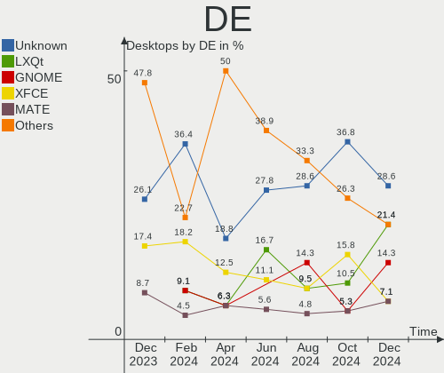
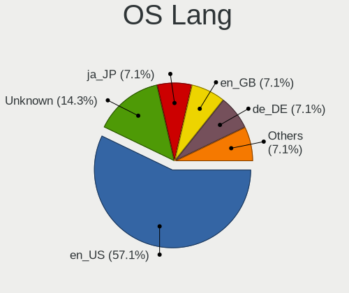
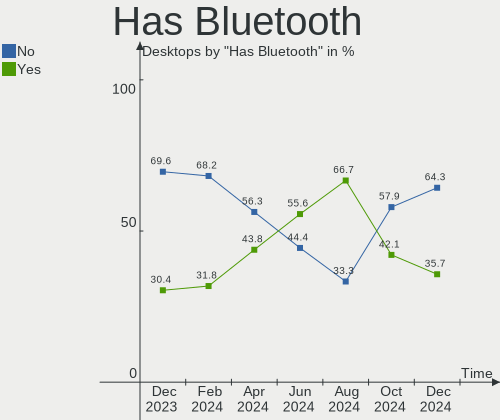
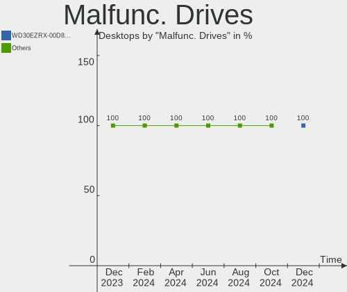
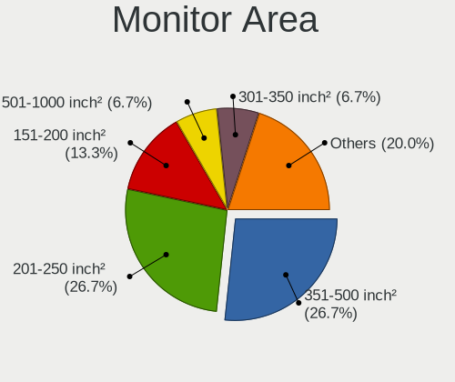
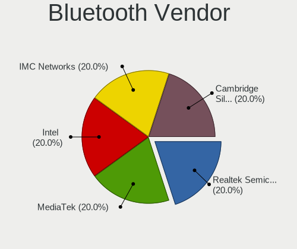

Gentoo Hardware Trends (Desktops)
---------------------------------

A project to identify most popular hardware characteristics and track their change
over time based on data collected by Gentoo users at https://Linux-Hardware.org.

Anyone can contribute to this report by the [hw-probe](https://github.com/linuxhw/hw-probe) tool:

    sudo -E hw-probe -all -upload

Full-feature report is available here: https://linux-hardware.org/?view=trends

Period: Nov, 2021.

Contents
--------

* [ System ](#system)
  - [ OS                       ](#os)
  - [ OS Family                ](#os-family)
  - [ Kernel                   ](#kernel)
  - [ Kernel Family            ](#kernel-family)
  - [ Kernel Major Ver.        ](#kernel-major-ver)
  - [ Arch                     ](#arch)
  - [ DE                       ](#de)
  - [ Display Server           ](#display-server)
  - [ Display Manager          ](#display-manager)
  - [ OS Lang                  ](#os-lang)
  - [ Boot Mode                ](#boot-mode)
  - [ Filesystem               ](#filesystem)
  - [ Part. scheme             ](#part-scheme)
  - [ Dual Boot with Linux/BSD ](#dual-boot-with-linuxbsd)
  - [ Dual Boot (Win)          ](#dual-boot-win)

* [ Board ](#board)
  - [ Vendor                   ](#vendor)
  - [ Model                    ](#model)
  - [ Model Family             ](#model-family)
  - [ MFG Year                 ](#mfg-year)
  - [ Form Factor              ](#form-factor)
  - [ Secure Boot              ](#secure-boot)
  - [ Coreboot                 ](#coreboot)
  - [ RAM Size                 ](#ram-size)
  - [ RAM Used                 ](#ram-used)
  - [ Total Drives             ](#total-drives)
  - [ Has CD-ROM               ](#has-cd-rom)
  - [ Has Ethernet             ](#has-ethernet)
  - [ Has WiFi                 ](#has-wifi)
  - [ Has Bluetooth            ](#has-bluetooth)

* [ Location ](#location)
  - [ Country                  ](#country)
  - [ City                     ](#city)

* [ Drives ](#drives)
  - [ Drive Vendor             ](#drive-vendor)
  - [ Drive Model              ](#drive-model)
  - [ HDD Vendor               ](#hdd-vendor)
  - [ SSD Vendor               ](#ssd-vendor)
  - [ Drive Kind               ](#drive-kind)
  - [ Drive Connector          ](#drive-connector)
  - [ Drive Size               ](#drive-size)
  - [ Space Total              ](#space-total)
  - [ Space Used               ](#space-used)
  - [ Malfunc. Drives          ](#malfunc-drives)
  - [ Malfunc. Drive Vendor    ](#malfunc-drive-vendor)
  - [ Malfunc. HDD Vendor      ](#malfunc-hdd-vendor)
  - [ Malfunc. Drive Kind      ](#malfunc-drive-kind)
  - [ Failed Drives            ](#failed-drives)
  - [ Failed Drive Vendor      ](#failed-drive-vendor)
  - [ Drive Status             ](#drive-status)

* [ Storage controller ](#storage-controller)
  - [ Storage Vendor           ](#storage-vendor)
  - [ Storage Model            ](#storage-model)
  - [ Storage Kind             ](#storage-kind)

* [ Processor ](#processor)
  - [ CPU Vendor               ](#cpu-vendor)
  - [ CPU Model                ](#cpu-model)
  - [ CPU Model Family         ](#cpu-model-family)
  - [ CPU Cores                ](#cpu-cores)
  - [ CPU Sockets              ](#cpu-sockets)
  - [ CPU Threads              ](#cpu-threads)
  - [ CPU Op-Modes             ](#cpu-op-modes)
  - [ CPU Microcode            ](#cpu-microcode)
  - [ CPU Microarch            ](#cpu-microarch)

* [ Graphics ](#graphics)
  - [ GPU Vendor               ](#gpu-vendor)
  - [ GPU Model                ](#gpu-model)
  - [ GPU Combo                ](#gpu-combo)
  - [ GPU Driver               ](#gpu-driver)
  - [ GPU Memory               ](#gpu-memory)

* [ Monitor ](#monitor)
  - [ Monitor Vendor           ](#monitor-vendor)
  - [ Monitor Model            ](#monitor-model)
  - [ Monitor Resolution       ](#monitor-resolution)
  - [ Monitor Diagonal         ](#monitor-diagonal)
  - [ Monitor Width            ](#monitor-width)
  - [ Aspect Ratio             ](#aspect-ratio)
  - [ Monitor Area             ](#monitor-area)
  - [ Pixel Density            ](#pixel-density)
  - [ Multiple Monitors        ](#multiple-monitors)

* [ Network ](#network)
  - [ Net Controller Vendor    ](#net-controller-vendor)
  - [ Net Controller Model     ](#net-controller-model)
  - [ Wireless Vendor          ](#wireless-vendor)
  - [ Wireless Model           ](#wireless-model)
  - [ Ethernet Vendor          ](#ethernet-vendor)
  - [ Ethernet Model           ](#ethernet-model)
  - [ Net Controller Kind      ](#net-controller-kind)
  - [ Used Controller          ](#used-controller)
  - [ NICs                     ](#nics)
  - [ IPv6                     ](#ipv6)

* [ Bluetooth ](#bluetooth)
  - [ Bluetooth Vendor         ](#bluetooth-vendor)
  - [ Bluetooth Model          ](#bluetooth-model)

* [ Sound ](#sound)
  - [ Sound Vendor             ](#sound-vendor)
  - [ Sound Model              ](#sound-model)

* [ Memory ](#memory)
  - [ Memory Vendor            ](#memory-vendor)
  - [ Memory Model             ](#memory-model)
  - [ Memory Kind              ](#memory-kind)
  - [ Memory Form Factor       ](#memory-form-factor)
  - [ Memory Size              ](#memory-size)
  - [ Memory Speed             ](#memory-speed)

* [ Printers & scanners ](#printers--scanners)
  - [ Printer Vendor           ](#printer-vendor)
  - [ Printer Model            ](#printer-model)
  - [ Scanner Vendor           ](#scanner-vendor)
  - [ Scanner Model            ](#scanner-model)

* [ Camera ](#camera)
  - [ Camera Vendor            ](#camera-vendor)
  - [ Camera Model             ](#camera-model)

* [ Security ](#security)
  - [ Fingerprint Vendor       ](#fingerprint-vendor)
  - [ Fingerprint Model        ](#fingerprint-model)
  - [ Chipcard Vendor          ](#chipcard-vendor)
  - [ Chipcard Model           ](#chipcard-model)

* [ Unsupported ](#unsupported)
  - [ Unsupported Devices      ](#unsupported-devices)
  - [ Unsupported Device Types ](#unsupported-device-types)

System
------

OS
--

Installed operating systems

| Name       | Desktops | Percent |
|------------|----------|---------|
| Gentoo 2.7 | 14       | 63.64%  |
| Gentoo 2.8 | 6        | 27.27%  |
| Gentoo 2.6 | 1        | 4.55%   |
| Gentoo 1   | 1        | 4.55%   |

OS Family
---------

OS without a version

| Name   | Desktops | Percent |
|--------|----------|---------|
| Gentoo | 22       | 100%    |

Kernel
------

Version of the Linux kernel

| Version                    | Desktops | Percent |
|----------------------------|----------|---------|
| 5.10.76-gentoo-r1          | 4        | 18.18%  |
| 5.14.14-gentoo             | 2        | 9.09%   |
| 5.16.0-rc2aeon             | 1        | 4.55%   |
| 5.15.2-gentoo20210917      | 1        | 4.55%   |
| 5.15.2-gentoo-x86_64       | 1        | 4.55%   |
| 5.15.1-gentoo-x86_64       | 1        | 4.55%   |
| 5.15.1-gentoo-limelight    | 1        | 4.55%   |
| 5.15.1-gentoo              | 1        | 4.55%   |
| 5.15.0-gentoo-x86_64       | 1        | 4.55%   |
| 5.15.0-gentoo              | 1        | 4.55%   |
| 5.14.4-gentoo              | 1        | 4.55%   |
| 5.14.16-gentoo-x86_64      | 1        | 4.55%   |
| 5.10.76-gentoo-r1-suzanne  | 1        | 4.55%   |
| 5.10.76-gentoo-r1-110-ipv6 | 1        | 4.55%   |
| 5.10.76-gentoo-r1--jp      | 1        | 4.55%   |
| 5.10.74-gentoo-x86_64      | 1        | 4.55%   |
| 5.10.61-gentoo             | 1        | 4.55%   |
| 4.19.214-gentoo-freya      | 1        | 4.55%   |

Kernel Family
-------------

Linux kernel without a distro release

| Version  | Desktops | Percent |
|----------|----------|---------|
| 5.10.76  | 7        | 31.82%  |
| 5.15.1   | 3        | 13.64%  |
| 5.15.2   | 2        | 9.09%   |
| 5.15.0   | 2        | 9.09%   |
| 5.14.14  | 2        | 9.09%   |
| 5.16.0   | 1        | 4.55%   |
| 5.14.4   | 1        | 4.55%   |
| 5.14.16  | 1        | 4.55%   |
| 5.10.74  | 1        | 4.55%   |
| 5.10.61  | 1        | 4.55%   |
| 4.19.214 | 1        | 4.55%   |

Kernel Major Ver.
-----------------

Linux kernel major version

| Version | Desktops | Percent |
|---------|----------|---------|
| 5.10    | 9        | 40.91%  |
| 5.15    | 7        | 31.82%  |
| 5.14    | 4        | 18.18%  |
| 5.16    | 1        | 4.55%   |
| 4.19    | 1        | 4.55%   |

Arch
----

OS architecture (x86_64, i586, etc.)

| Name   | Desktops | Percent |
|--------|----------|---------|
| x86_64 | 22       | 100%    |

DE
--

Desktop Environment

| Name       | Desktops | Percent |
|------------|----------|---------|
| KDE5       | 9        | 40.91%  |
| GNOME      | 4        | 18.18%  |
| Unknown    | 4        | 18.18%  |
| XFCE       | 1        | 4.55%   |
| X-Cinnamon | 1        | 4.55%   |
| MATE       | 1        | 4.55%   |
| DWM        | 1        | 4.55%   |
| awesome    | 1        | 4.55%   |

Display Server
--------------

X11 or Wayland

| Name    | Desktops | Percent |
|---------|----------|---------|
| X11     | 12       | 54.55%  |
| Wayland | 4        | 18.18%  |
| Tty     | 3        | 13.64%  |
| Unknown | 3        | 13.64%  |

Display Manager
---------------

SDDM, LightDM, etc.

| Name    | Desktops | Percent |
|---------|----------|---------|
| SDDM    | 10       | 45.45%  |
| Unknown | 6        | 27.27%  |
| LightDM | 3        | 13.64%  |
| GDM     | 3        | 13.64%  |

OS Lang
-------

Language

| Lang    | Desktops | Percent |
|---------|----------|---------|
| en_US   | 4        | 18.18%  |
| en_GB   | 4        | 18.18%  |
| pl_PL   | 2        | 9.09%   |
| nl_NL   | 2        | 9.09%   |
| ru_RU   | 1        | 4.55%   |
| hu_HU   | 1        | 4.55%   |
| fi_FI   | 1        | 4.55%   |
| es_ES   | 1        | 4.55%   |
| es_AR   | 1        | 4.55%   |
| en_CA   | 1        | 4.55%   |
| el_GR   | 1        | 4.55%   |
| de_CH   | 1        | 4.55%   |
| C.UTF8  | 1        | 4.55%   |
| Unknown | 1        | 4.55%   |

Boot Mode
---------

EFI or BIOS

| Mode | Desktops | Percent |
|------|----------|---------|
| EFI  | 14       | 63.64%  |
| BIOS | 8        | 36.36%  |

Filesystem
----------

Type of filesystem

| Type  | Desktops | Percent |
|-------|----------|---------|
| Ext4  | 10       | 45.45%  |
| Btrfs | 6        | 27.27%  |
| F2fs  | 3        | 13.64%  |
| Zfs   | 2        | 9.09%   |
| Xfs   | 1        | 4.55%   |

Part. scheme
------------

Scheme of partitioning

| Type    | Desktops | Percent |
|---------|----------|---------|
| GPT     | 19       | 86.36%  |
| Unknown | 2        | 9.09%   |
| MBR     | 1        | 4.55%   |

Dual Boot with Linux/BSD
------------------------

Hosting more than one Linux/BSD

| Dual boot | Desktops | Percent |
|-----------|----------|---------|
| No        | 13       | 59.09%  |
| Yes       | 9        | 40.91%  |

Dual Boot (Win)
---------------

Hosting Linux and Windows

| Dual boot | Desktops | Percent |
|-----------|----------|---------|
| No        | 12       | 54.55%  |
| Yes       | 10       | 45.45%  |

Board
-----

Vendor
------

Motherboard manufacturer

| Name                | Desktops | Percent |
|---------------------|----------|---------|
| ASUSTek Computer    | 11       | 50%     |
| Gigabyte Technology | 6        | 27.27%  |
| MSI                 | 2        | 9.09%   |
| Intel               | 1        | 4.55%   |
| Hewlett-Packard     | 1        | 4.55%   |
| ASRock              | 1        | 4.55%   |

Model
-----

Motherboard model

| Name                              | Desktops | Percent |
|-----------------------------------|----------|---------|
| ASUS PRIME X570-P                 | 2        | 9.09%   |
| MSI MS-7C35                       | 1        | 4.55%   |
| MSI MS-7996                       | 1        | 4.55%   |
| Intel DP35DP AAD81073-205         | 1        | 4.55%   |
| HP ProLiant ML150 G6              | 1        | 4.55%   |
| Gigabyte PC-X011158               | 1        | 4.55%   |
| Gigabyte B150M-HD3-CF             | 1        | 4.55%   |
| Gigabyte AB350-Gaming 3           | 1        | 4.55%   |
| Gigabyte AB350-Gaming             | 1        | 4.55%   |
| Gigabyte A320M-S2H                | 1        | 4.55%   |
| Gigabyte 970A-DS3P                | 1        | 4.55%   |
| ASUS TUF GAMING X570-PLUS         | 1        | 4.55%   |
| ASUS TUF GAMING B550-PLUS         | 1        | 4.55%   |
| ASUS ROG ZENITH II EXTREME        | 1        | 4.55%   |
| ASUS ROG STRIX X570-E GAMING      | 1        | 4.55%   |
| ASUS ROG STRIX B550-F GAMING      | 1        | 4.55%   |
| ASUS ROG Maximus XIII APEX        | 1        | 4.55%   |
| ASUS ROG CROSSHAIR VIII DARK HERO | 1        | 4.55%   |
| ASUS P5LD2-Deluxe                 | 1        | 4.55%   |
| ASUS M3A78-CM                     | 1        | 4.55%   |
| ASRock B550M Steel Legend         | 1        | 4.55%   |

Model Family
------------

Motherboard model prefix

| Name                  | Desktops | Percent |
|-----------------------|----------|---------|
| ASUS ROG              | 5        | 22.73%  |
| Gigabyte AB350-Gaming | 2        | 9.09%   |
| ASUS TUF              | 2        | 9.09%   |
| ASUS PRIME            | 2        | 9.09%   |
| MSI MS-7C35           | 1        | 4.55%   |
| MSI MS-7996           | 1        | 4.55%   |
| Intel DP35DP          | 1        | 4.55%   |
| HP ProLiant           | 1        | 4.55%   |
| Gigabyte PC-X011158   | 1        | 4.55%   |
| Gigabyte B150M-HD3-CF | 1        | 4.55%   |
| Gigabyte A320M-S2H    | 1        | 4.55%   |
| Gigabyte 970A-DS3P    | 1        | 4.55%   |
| ASUS P5LD2-Deluxe     | 1        | 4.55%   |
| ASUS M3A78-CM         | 1        | 4.55%   |
| ASRock B550M          | 1        | 4.55%   |

MFG Year
--------

Motherboard manufacture year

| Year | Desktops | Percent |
|------|----------|---------|
| 2021 | 7        | 31.82%  |
| 2020 | 4        | 18.18%  |
| 2019 | 3        | 13.64%  |
| 2016 | 3        | 13.64%  |
| 2009 | 2        | 9.09%   |
| 2017 | 1        | 4.55%   |
| 2011 | 1        | 4.55%   |
| 2006 | 1        | 4.55%   |

Form Factor
-----------

Physical design of the computer

| Name    | Desktops | Percent |
|---------|----------|---------|
| Desktop | 22       | 100%    |

Secure Boot
-----------

Enabled or disabled

| State    | Desktops | Percent |
|----------|----------|---------|
| Disabled | 22       | 100%    |

Coreboot
--------

Have coreboot on board

| Used | Desktops | Percent |
|------|----------|---------|
| No   | 22       | 100%    |

RAM Size
--------

Total RAM memory

| Size in GB  | Desktops | Percent |
|-------------|----------|---------|
| 32.01-64.0  | 9        | 40.91%  |
| 64.01-256.0 | 4        | 18.18%  |
| 24.01-32.0  | 2        | 9.09%   |
| 16.01-24.0  | 2        | 9.09%   |
| 8.01-16.0   | 2        | 9.09%   |
| 4.01-8.0    | 1        | 4.55%   |
| 3.01-4.0    | 1        | 4.55%   |
| 2.01-3.0    | 1        | 4.55%   |

RAM Used
--------

Used RAM memory

| Used GB   | Desktops | Percent |
|-----------|----------|---------|
| 4.01-8.0  | 9        | 40.91%  |
| 8.01-16.0 | 5        | 22.73%  |
| 1.01-2.0  | 4        | 18.18%  |
| 0.01-0.5  | 2        | 9.09%   |
| 2.01-3.0  | 1        | 4.55%   |
| 0.51-1.0  | 1        | 4.55%   |

Total Drives
------------

Number of drives on board

| Drives | Desktops | Percent |
|--------|----------|---------|
| 3      | 6        | 27.27%  |
| 2      | 6        | 27.27%  |
| 1      | 4        | 18.18%  |
| 4      | 3        | 13.64%  |
| 7      | 1        | 4.55%   |
| 6      | 1        | 4.55%   |
| 5      | 1        | 4.55%   |

Has CD-ROM
----------

Has CD-ROM on board

| Presented | Desktops | Percent |
|-----------|----------|---------|
| No        | 15       | 68.18%  |
| Yes       | 7        | 31.82%  |

Has Ethernet
------------

Has Ethernet on board

| Presented | Desktops | Percent |
|-----------|----------|---------|
| Yes       | 22       | 100%    |

Has WiFi
--------

Has WiFi module

| Presented | Desktops | Percent |
|-----------|----------|---------|
| Yes       | 11       | 50%     |
| No        | 11       | 50%     |

Has Bluetooth
-------------

Has Bluetooth module

| Presented | Desktops | Percent |
|-----------|----------|---------|
| No        | 15       | 68.18%  |
| Yes       | 7        | 31.82%  |

Location
--------

Country
-------

Geographic location (country)

| Country     | Desktops | Percent |
|-------------|----------|---------|
| Russia      | 3        | 13.64%  |
| Poland      | 3        | 13.64%  |
| USA         | 2        | 9.09%   |
| UK          | 2        | 9.09%   |
| Netherlands | 2        | 9.09%   |
| Finland     | 2        | 9.09%   |
| Switzerland | 1        | 4.55%   |
| Spain       | 1        | 4.55%   |
| Slovakia    | 1        | 4.55%   |
| Hungary     | 1        | 4.55%   |
| Greece      | 1        | 4.55%   |
| Canada      | 1        | 4.55%   |
| Bulgaria    | 1        | 4.55%   |
| Argentina   | 1        | 4.55%   |

City
----

Geographic location (city)

| City          | Desktops | Percent |
|---------------|----------|---------|
| Warsaw        | 2        | 9.09%   |
| Helsinki      | 2        | 9.09%   |
| Almere Stad   | 2        | 9.09%   |
| Zurich        | 1        | 4.55%   |
| Vigo          | 1        | 4.55%   |
| Vancouver     | 1        | 4.55%   |
| Ufa           | 1        | 4.55%   |
| Tacoma        | 1        | 4.55%   |
| St Petersburg | 1        | 4.55%   |
| Samokov       | 1        | 4.55%   |
| Roldan        | 1        | 4.55%   |
| Moscow        | 1        | 4.55%   |
| London        | 1        | 4.55%   |
| Laziska Gorne | 1        | 4.55%   |
| High Wycombe  | 1        | 4.55%   |
| Glen Ellyn    | 1        | 4.55%   |
| Budapest      | 1        | 4.55%   |
| Bratislava    | 1        | 4.55%   |
| Athens        | 1        | 4.55%   |

Drives
------

Drive Vendor
------------

Hard drive vendors

| Vendor              | Desktops | Drives | Percent |
|---------------------|----------|--------|---------|
| WDC                 | 12       | 18     | 24.49%  |
| Samsung Electronics | 10       | 15     | 20.41%  |
| Seagate             | 5        | 5      | 10.2%   |
| Toshiba             | 4        | 4      | 8.16%   |
| Kingston            | 3        | 3      | 6.12%   |
| Hitachi             | 3        | 5      | 6.12%   |
| Corsair             | 3        | 3      | 6.12%   |
| SanDisk             | 2        | 2      | 4.08%   |
| GOODRAM             | 2        | 2      | 4.08%   |
| Crucial             | 2        | 5      | 4.08%   |
| PNY                 | 1        | 1      | 2.04%   |
| LaCie               | 1        | 1      | 2.04%   |
| CT2000MX            | 1        | 1      | 2.04%   |

Drive Model
-----------

Hard drive models

| Model                             | Desktops | Percent |
|-----------------------------------|----------|---------|
| GOODRAM SSDPR-CL100-480-G2 480GB  | 2        | 3.51%   |
| WDC WDS500G2B0A-00SM50 500GB SSD  | 1        | 1.75%   |
| WDC WDS100T1X0E-00AFY0 1TB        | 1        | 1.75%   |
| WDC WD7500BPVT-24HXZT1 752GB      | 1        | 1.75%   |
| WDC WD5000BPVT-22HXZT3 500GB      | 1        | 1.75%   |
| WDC WD5000BEVT-80A0RT0 500GB      | 1        | 1.75%   |
| WDC WD5000AZLX-00JKKA0 500GB      | 1        | 1.75%   |
| WDC WD30EFRX-68EUZN0 3TB          | 1        | 1.75%   |
| WDC WD30EFRX-68AX9N0 3TB          | 1        | 1.75%   |
| WDC WD20EZRZ-00Z5HB0 2TB          | 1        | 1.75%   |
| WDC WD2003FZEX-00Z4SA0 2TB        | 1        | 1.75%   |
| WDC WD2002FAEX-007BA0 2TB         | 1        | 1.75%   |
| WDC WD10PURX-64E5EY0 1TB          | 1        | 1.75%   |
| WDC WD10EZEX-60WN4A1 1TB          | 1        | 1.75%   |
| WDC WD10EZEX-08WN4A0 1TB          | 1        | 1.75%   |
| WDC WD10EZEX-08M2NA0 1TB          | 1        | 1.75%   |
| WDC WD10EADS-00L5B1 1TB           | 1        | 1.75%   |
| WDC WD1003FZEX-00MK2A0 1TB        | 1        | 1.75%   |
| Toshiba MQ04ABF100 1TB            | 1        | 1.75%   |
| Toshiba HDWE150 5TB               | 1        | 1.75%   |
| Toshiba DT01ACA200 2TB            | 1        | 1.75%   |
| Toshiba DT01ACA100 1TB            | 1        | 1.75%   |
| Seagate ST4000DM004-2CV104 4TB    | 1        | 1.75%   |
| Seagate ST3250318AS 250GB         | 1        | 1.75%   |
| Seagate ST3160215SCE 160GB        | 1        | 1.75%   |
| Seagate ST12000NM0008-2H3101 12TB | 1        | 1.75%   |
| Seagate ST1000LM049-2GH172 1TB    | 1        | 1.75%   |
| SanDisk SDSSDHII480G 480GB        | 1        | 1.75%   |
| SanDisk Extreme Pro 500GB         | 1        | 1.75%   |
| Samsung SSD 980 PRO 500GB         | 1        | 1.75%   |
| Samsung SSD 980 PRO 2TB           | 1        | 1.75%   |
| Samsung SSD 980 PRO 1TB           | 1        | 1.75%   |
| Samsung SSD 970 EVO Plus 500GB    | 1        | 1.75%   |
| Samsung SSD 970 EVO Plus 250GB    | 1        | 1.75%   |
| Samsung SSD 970 EVO 500GB         | 1        | 1.75%   |
| Samsung SSD 970 EVO 1TB           | 1        | 1.75%   |
| Samsung SSD 860 QVO 4TB           | 1        | 1.75%   |
| Samsung SSD 860 EVO 250GB         | 1        | 1.75%   |
| Samsung SSD 840 Series 120GB      | 1        | 1.75%   |
| Samsung NVMe SSD Drive 500GB      | 1        | 1.75%   |
| Samsung HD321KJ 320GB             | 1        | 1.75%   |
| PNY CS3030 2TB SSD                | 1        | 1.75%   |
| LaCie Rugged THB USB3 2TB         | 1        | 1.75%   |
| Kingston SKC6001024G 1024GB SSD   | 1        | 1.75%   |
| Kingston SHSS37A240G 240GB SSD    | 1        | 1.75%   |
| Kingston SA400S37240G 240GB SSD   | 1        | 1.75%   |
| Hitachi HUS724030ALE641 3TB       | 1        | 1.75%   |
| Hitachi HTS545050B9SA02 500GB     | 1        | 1.75%   |
| Hitachi HDS723020BLA642 2TB       | 1        | 1.75%   |
| CT2000MX 500SSD1 2TB              | 1        | 1.75%   |
| Crucial CT500MX500SSD1 500GB      | 1        | 1.75%   |
| Crucial CT1000P1SSD8 1TB          | 1        | 1.75%   |
| Crucial CT1000MX500SSD1 1TB       | 1        | 1.75%   |
| Corsair Neutron GTX SSD 240GB     | 1        | 1.75%   |
| Corsair Force MP600 1TB           | 1        | 1.75%   |
| Corsair Force 3 SSD 64GB          | 1        | 1.75%   |

HDD Vendor
----------

Hard disk drive vendors

| Vendor              | Desktops | Drives | Percent |
|---------------------|----------|--------|---------|
| WDC                 | 11       | 16     | 44%     |
| Seagate             | 5        | 5      | 20%     |
| Toshiba             | 4        | 4      | 16%     |
| Hitachi             | 3        | 5      | 12%     |
| Samsung Electronics | 1        | 4      | 4%      |
| LaCie               | 1        | 1      | 4%      |

SSD Vendor
----------

Solid state drive vendors

| Vendor              | Desktops | Drives | Percent |
|---------------------|----------|--------|---------|
| Samsung Electronics | 3        | 3      | 21.43%  |
| Kingston            | 3        | 3      | 21.43%  |
| GOODRAM             | 2        | 2      | 14.29%  |
| Corsair             | 2        | 2      | 14.29%  |
| WDC                 | 1        | 1      | 7.14%   |
| SanDisk             | 1        | 1      | 7.14%   |
| CT2000MX            | 1        | 1      | 7.14%   |
| Crucial             | 1        | 3      | 7.14%   |

Drive Kind
----------

HDD or SSD

| Kind | Desktops | Drives | Percent |
|------|----------|--------|---------|
| HDD  | 17       | 35     | 41.46%  |
| NVMe | 12       | 14     | 29.27%  |
| SSD  | 12       | 16     | 29.27%  |

Drive Connector
---------------

SATA, SAS, NVMe, etc.

| Type | Desktops | Drives | Percent |
|------|----------|--------|---------|
| SATA | 19       | 49     | 59.38%  |
| NVMe | 12       | 14     | 37.5%   |
| SAS  | 1        | 2      | 3.13%   |

Drive Size
----------

Size of hard drive

| Size in TB | Desktops | Drives | Percent |
|------------|----------|--------|---------|
| 0.01-0.5   | 14       | 21     | 37.84%  |
| 0.51-1.0   | 10       | 12     | 27.03%  |
| 1.01-2.0   | 7        | 8      | 18.92%  |
| 3.01-4.0   | 2        | 2      | 5.41%   |
| 2.01-3.0   | 2        | 6      | 5.41%   |
| 10.01-20.0 | 1        | 1      | 2.7%    |
| 4.01-10.0  | 1        | 1      | 2.7%    |

Space Total
-----------

Amount of disk space available on the file system

| Size in GB     | Desktops | Percent |
|----------------|----------|---------|
| 501-1000       | 7        | 31.82%  |
| More than 3000 | 4        | 18.18%  |
| 2001-3000      | 3        | 13.64%  |
| 251-500        | 2        | 9.09%   |
| 1001-2000      | 2        | 9.09%   |
| Unknown        | 2        | 9.09%   |
| 1-20           | 1        | 4.55%   |
| 51-100         | 1        | 4.55%   |

Space Used
----------

Amount of used disk space

| Used GB        | Desktops | Percent |
|----------------|----------|---------|
| 251-500        | 7        | 31.82%  |
| More than 3000 | 3        | 13.64%  |
| 21-50          | 2        | 9.09%   |
| 2001-3000      | 2        | 9.09%   |
| 1001-2000      | 2        | 9.09%   |
| 1-20           | 2        | 9.09%   |
| 501-1000       | 2        | 9.09%   |
| Unknown        | 2        | 9.09%   |

Malfunc. Drives
---------------

Drive models with a malfunction

| Model                         | Desktops | Drives | Percent |
|-------------------------------|----------|--------|---------|
| WDC WD30EFRX-68AX9N0 3TB      | 1        | 2      | 25%     |
| WDC WD20EZRZ-00Z5HB0 2TB      | 1        | 1      | 25%     |
| Toshiba MQ04ABF100 1TB        | 1        | 1      | 25%     |
| Corsair Neutron GTX SSD 240GB | 1        | 1      | 25%     |

Malfunc. Drive Vendor
---------------------

Vendors of faulty drives

| Vendor  | Desktops | Drives | Percent |
|---------|----------|--------|---------|
| WDC     | 2        | 3      | 50%     |
| Toshiba | 1        | 1      | 25%     |
| Corsair | 1        | 1      | 25%     |

Malfunc. HDD Vendor
-------------------

Vendors of faulty HDD drives

| Vendor  | Desktops | Drives | Percent |
|---------|----------|--------|---------|
| WDC     | 2        | 3      | 66.67%  |
| Toshiba | 1        | 1      | 33.33%  |

Malfunc. Drive Kind
-------------------

Kinds of faulty drives

| Kind | Desktops | Drives | Percent |
|------|----------|--------|---------|
| HDD  | 3        | 4      | 75%     |
| SSD  | 1        | 1      | 25%     |

Failed Drives
-------------

Failed drive models

Zero info for selected period =(

Failed Drive Vendor
-------------------

Failed drive vendors

Zero info for selected period =(

Drive Status
------------

Number of failed and malfunc. drives

| Status   | Desktops | Drives | Percent |
|----------|----------|--------|---------|
| Works    | 20       | 57     | 76.92%  |
| Malfunc  | 4        | 5      | 15.38%  |
| Detected | 2        | 3      | 7.69%   |

Storage controller
------------------

Storage Vendor
--------------

Storage controller vendors

| Vendor                    | Desktops | Percent |
|---------------------------|----------|---------|
| AMD                       | 14       | 37.84%  |
| Samsung Electronics       | 7        | 18.92%  |
| Intel                     | 7        | 18.92%  |
| Sandisk                   | 2        | 5.41%   |
| Phison Electronics        | 2        | 5.41%   |
| ASMedia Technology        | 2        | 5.41%   |
| Silicon Image             | 1        | 2.7%    |
| Micron/Crucial Technology | 1        | 2.7%    |
| Marvell Technology Group  | 1        | 2.7%    |

Storage Model
-------------

Storage controller models

| Model                                                                         | Desktops | Percent |
|-------------------------------------------------------------------------------|----------|---------|
| AMD FCH SATA Controller [AHCI mode]                                           | 9        | 20.45%  |
| Samsung NVMe SSD Controller SM981/PM981/PM983                                 | 4        | 9.09%   |
| Samsung NVMe SSD Controller PM9A1/PM9A3/980PRO                                | 4        | 9.09%   |
| AMD Starship/Matisse Chipset SATA Controller [AHCI mode]                      | 3        | 6.82%   |
| Intel Q170/Q150/B150/H170/H110/Z170/CM236 Chipset SATA Controller [AHCI Mode] | 2        | 4.55%   |
| ASMedia ASM1062 Serial ATA Controller                                         | 2        | 4.55%   |
| AMD SB7x0/SB8x0/SB9x0 IDE Controller                                          | 2        | 4.55%   |
| AMD 300 Series Chipset SATA Controller                                        | 2        | 4.55%   |
| Silicon Image SiI 3132 Serial ATA Raid II Controller                          | 1        | 2.27%   |
| Sandisk WD PC SN810 / Black SN850 NVMe SSD                                    | 1        | 2.27%   |
| Sandisk WD Black 2018/SN750 / PC SN720 NVMe SSD                               | 1        | 2.27%   |
| Phison E16 PCIe4 NVMe Controller                                              | 1        | 2.27%   |
| Phison E12 NVMe Controller                                                    | 1        | 2.27%   |
| Micron/Crucial NVMe Controller                                                | 1        | 2.27%   |
| Marvell Group 88SE6101/6102 single-port PATA133 interface                     | 1        | 2.27%   |
| Intel SATA Controller [RAID mode]                                             | 1        | 2.27%   |
| Intel NM10/ICH7 Family SATA Controller [IDE mode]                             | 1        | 2.27%   |
| Intel 82801JI (ICH10 Family) SATA AHCI Controller                             | 1        | 2.27%   |
| Intel 82801JI (ICH10 Family) 2 port SATA IDE Controller #2                    | 1        | 2.27%   |
| Intel 500 Series Chipset Family SATA AHCI Controller                          | 1        | 2.27%   |
| Intel 200 Series PCH SATA controller [AHCI mode]                              | 1        | 2.27%   |
| AMD SB7x0/SB8x0/SB9x0 SATA Controller [IDE mode]                              | 1        | 2.27%   |
| AMD SB7x0/SB8x0/SB9x0 SATA Controller [AHCI mode]                             | 1        | 2.27%   |
| AMD FCH SATA Controller D                                                     | 1        | 2.27%   |

Storage Kind
------------

Kind of storage controller (IDE, SATA, NVMe, SAS, ...)

| Kind | Desktops | Percent |
|------|----------|---------|
| SATA | 19       | 50%     |
| NVMe | 12       | 31.58%  |
| IDE  | 5        | 13.16%  |
| RAID | 2        | 5.26%   |

Processor
---------

CPU Vendor
----------

Processor vendors

| Vendor | Desktops | Percent |
|--------|----------|---------|
| AMD    | 15       | 68.18%  |
| Intel  | 7        | 31.82%  |

CPU Model
---------

Processor models

| Model                                          | Desktops | Percent |
|------------------------------------------------|----------|---------|
| AMD Ryzen 9 3950X 16-Core Processor            | 2        | 9.09%   |
| AMD Ryzen 5 5600X 6-Core Processor             | 2        | 9.09%   |
| AMD Ryzen 5 3600 6-Core Processor              | 2        | 9.09%   |
| Intel Xeon CPU E5502 @ 1.87GHz                 | 1        | 4.55%   |
| Intel Pentium 4 CPU 3.20GHz                    | 1        | 4.55%   |
| Intel Core i5-9400F CPU @ 2.90GHz              | 1        | 4.55%   |
| Intel Core i5-6400 CPU @ 2.70GHz               | 1        | 4.55%   |
| Intel Core i3-6100 CPU @ 3.70GHz               | 1        | 4.55%   |
| Intel Core 2 Quad CPU Q9300 @ 2.50GHz          | 1        | 4.55%   |
| Intel 11th Gen Core i9-11900K @ 3.50GHz        | 1        | 4.55%   |
| AMD Ryzen Threadripper 3960X 24-Core Processor | 1        | 4.55%   |
| AMD Ryzen 9 5950X 16-Core Processor            | 1        | 4.55%   |
| AMD Ryzen 7 PRO 5750G with Radeon Graphics     | 1        | 4.55%   |
| AMD Ryzen 7 5800X 8-Core Processor             | 1        | 4.55%   |
| AMD Ryzen 7 1700X Eight-Core Processor         | 1        | 4.55%   |
| AMD Ryzen 7 1700 Eight-Core Processor          | 1        | 4.55%   |
| AMD Ryzen 5 2600 Six-Core Processor            | 1        | 4.55%   |
| AMD Phenom II X4 955 Processor                 | 1        | 4.55%   |
| AMD FX-8350 Eight-Core Processor               | 1        | 4.55%   |

CPU Model Family
----------------

Processor model prefix

| Model                  | Desktops | Percent |
|------------------------|----------|---------|
| AMD Ryzen 5            | 5        | 22.73%  |
| AMD Ryzen 9            | 3        | 13.64%  |
| AMD Ryzen 7            | 3        | 13.64%  |
| Intel Core i5          | 2        | 9.09%   |
| Other                  | 1        | 4.55%   |
| Intel Xeon             | 1        | 4.55%   |
| Intel Pentium 4        | 1        | 4.55%   |
| Intel Core i3          | 1        | 4.55%   |
| Intel Core 2 Quad      | 1        | 4.55%   |
| AMD Ryzen Threadripper | 1        | 4.55%   |
| AMD Ryzen 7 PRO        | 1        | 4.55%   |
| AMD Phenom II X4       | 1        | 4.55%   |
| AMD FX                 | 1        | 4.55%   |

CPU Cores
---------

Number of processor cores

| Number | Desktops | Percent |
|--------|----------|---------|
| 6      | 6        | 27.27%  |
| 8      | 5        | 22.73%  |
| 4      | 4        | 18.18%  |
| 16     | 3        | 13.64%  |
| 2      | 2        | 9.09%   |
| 24     | 1        | 4.55%   |
| 1      | 1        | 4.55%   |

CPU Sockets
-----------

Number of sockets

| Number | Desktops | Percent |
|--------|----------|---------|
| 1      | 22       | 100%    |

CPU Threads
-----------

Threads per core (Hyper-Threading)

| Number | Desktops | Percent |
|--------|----------|---------|
| 2      | 17       | 77.27%  |
| 1      | 5        | 22.73%  |

CPU Op-Modes
------------

CPU Operation Modes (32-bit, 64-bit)

| Op mode        | Desktops | Percent |
|----------------|----------|---------|
| 32-bit, 64-bit | 22       | 100%    |

CPU Microcode
-------------

Microcode number

| Number     | Desktops | Percent |
|------------|----------|---------|
| 0x0a201016 | 3        | 13.64%  |
| 0x08701021 | 3        | 13.64%  |
| Unknown    | 3        | 13.64%  |
| 0x506e3    | 2        | 9.09%   |
| 0xf43      | 1        | 4.55%   |
| 0x106a5    | 1        | 4.55%   |
| 0x10677    | 1        | 4.55%   |
| 0x0a50000b | 1        | 4.55%   |
| 0x0a201009 | 1        | 4.55%   |
| 0x08301039 | 1        | 4.55%   |
| 0x0800820d | 1        | 4.55%   |
| 0x08001138 | 1        | 4.55%   |
| 0x0800111c | 1        | 4.55%   |
| 0x06000852 | 1        | 4.55%   |
| 0x010000db | 1        | 4.55%   |

CPU Microarch
-------------

Microarchitecture

| Name       | Desktops | Percent |
|------------|----------|---------|
| Zen 3      | 5        | 22.73%  |
| Zen 2      | 5        | 22.73%  |
| Zen        | 2        | 9.09%   |
| Skylake    | 2        | 9.09%   |
| Zen+       | 1        | 4.55%   |
| Piledriver | 1        | 4.55%   |
| Penryn     | 1        | 4.55%   |
| NetBurst   | 1        | 4.55%   |
| Nehalem    | 1        | 4.55%   |
| KabyLake   | 1        | 4.55%   |
| K10        | 1        | 4.55%   |
| Unknown    | 1        | 4.55%   |

Graphics
--------

GPU Vendor
----------

Vendors of graphics cards

| Vendor                     | Desktops | Percent |
|----------------------------|----------|---------|
| Nvidia                     | 14       | 60.87%  |
| AMD                        | 8        | 34.78%  |
| Matrox Electronics Systems | 1        | 4.35%   |

GPU Model
---------

Graphics card models

| Model                                                             | Desktops | Percent |
|-------------------------------------------------------------------|----------|---------|
| AMD Navi 21 [Radeon RX 6800/6800 XT / 6900 XT]                    | 2        | 8.7%    |
| AMD Ellesmere [Radeon RX 470/480/570/570X/580/580X/590]           | 2        | 8.7%    |
| Nvidia TU116 [GeForce GTX 1650]                                   | 1        | 4.35%   |
| Nvidia GP108 [GeForce GT 1030]                                    | 1        | 4.35%   |
| Nvidia GP106 [GeForce GTX 1060 6GB]                               | 1        | 4.35%   |
| Nvidia GP106 [GeForce GTX 1060 3GB]                               | 1        | 4.35%   |
| Nvidia GP102 [GeForce GTX 1080 Ti]                                | 1        | 4.35%   |
| Nvidia GM206 [GeForce GTX 960]                                    | 1        | 4.35%   |
| Nvidia GM107 [GeForce GTX 750 Ti]                                 | 1        | 4.35%   |
| Nvidia GK208B [GeForce GT 710]                                    | 1        | 4.35%   |
| Nvidia GK107 [GeForce GT 740]                                     | 1        | 4.35%   |
| Nvidia GA106 [GeForce RTX 3060]                                   | 1        | 4.35%   |
| Nvidia GA102 [GeForce RTX 3080 Ti]                                | 1        | 4.35%   |
| Nvidia G96C [GeForce 9400 GT]                                     | 1        | 4.35%   |
| Nvidia G84 [GeForce 8600 GTS]                                     | 1        | 4.35%   |
| Nvidia G73 [GeForce 7300 GT]                                      | 1        | 4.35%   |
| Matrox Electronics Systems MGA G200e [Pilot] ServerEngines (SEP1) | 1        | 4.35%   |
| AMD Vega 10 XL/XT [Radeon RX Vega 56/64]                          | 1        | 4.35%   |
| AMD RV635 [Radeon HD 3650/3750/4570/4580]                         | 1        | 4.35%   |
| AMD RS780C [Radeon 3100]                                          | 1        | 4.35%   |
| AMD Navi 10 [Radeon RX 5600 OEM/5600 XT / 5700/5700 XT]           | 1        | 4.35%   |

GPU Combo
---------

Combinations of graphics cards

| Name         | Desktops | Percent |
|--------------|----------|---------|
| 1 x Nvidia   | 14       | 63.64%  |
| 1 x AMD      | 7        | 31.82%  |
| AMD + Matrox | 1        | 4.55%   |

GPU Driver
----------

Free vs proprietary

| Driver      | Desktops | Percent |
|-------------|----------|---------|
| Proprietary | 12       | 54.55%  |
| Free        | 9        | 40.91%  |
| Unknown     | 1        | 4.55%   |

GPU Memory
----------

Total video memory

| Size in GB | Desktops | Percent |
|------------|----------|---------|
| 8.01-16.0  | 5        | 22.73%  |
| 0.01-0.5   | 5        | 22.73%  |
| 1.01-2.0   | 4        | 18.18%  |
| 7.01-8.0   | 3        | 13.64%  |
| Unknown    | 3        | 13.64%  |
| 3.01-4.0   | 1        | 4.55%   |
| 2.01-3.0   | 1        | 4.55%   |

Monitor
-------

Monitor Vendor
--------------

Monitor vendors

| Vendor              | Desktops | Percent |
|---------------------|----------|---------|
| Samsung Electronics | 5        | 20.83%  |
| Iiyama              | 4        | 16.67%  |
| Hewlett-Packard     | 3        | 12.5%   |
| AOC                 | 3        | 12.5%   |
| Goldstar            | 2        | 8.33%   |
| BenQ                | 2        | 8.33%   |
| Toshiba             | 1        | 4.17%   |
| NEC Computers       | 1        | 4.17%   |
| Mi                  | 1        | 4.17%   |
| AUS                 | 1        | 4.17%   |
| ASUSTek Computer    | 1        | 4.17%   |

Monitor Model
-------------

Monitor models

| Model                                                                | Desktops | Percent |
|----------------------------------------------------------------------|----------|---------|
| Iiyama PL2409HD IVM560C 1920x1080 521x293mm 23.5-inch                | 2        | 8.33%   |
| Goldstar HDR 4K GSM7707 3840x2160 600x340mm 27.2-inch                | 2        | 8.33%   |
| Toshiba PA3552 TOS501C 1680x1050 433x270mm 20.1-inch                 | 1        | 4.17%   |
| Samsung Electronics SyncMaster SAM02D9 1680x1050 433x271mm 20.1-inch | 1        | 4.17%   |
| Samsung Electronics S22B300 SAM08C8 1920x1080 480x270mm 21.7-inch    | 1        | 4.17%   |
| Samsung Electronics LCD Monitor S23B350 1920x1080                    | 1        | 4.17%   |
| Samsung Electronics C49RG9x SAM0F9C 3840x1080 1190x340mm 48.7-inch   | 1        | 4.17%   |
| Samsung Electronics C49HG9x SAM0E5E 3840x1080 1196x336mm 48.9-inch   | 1        | 4.17%   |
| NEC Computers EA274WMi NEC6960 2560x1440 597x336mm 27.0-inch         | 1        | 4.17%   |
| Mi Monitor XMI3444 3440x1440 797x334mm 34.0-inch                     | 1        | 4.17%   |
| Iiyama PLX2783H IVM6648 1920x1080 598x336mm 27.0-inch                | 1        | 4.17%   |
| Iiyama PL2792Q IVM6630 2560x1440 597x336mm 27.0-inch                 | 1        | 4.17%   |
| Hewlett-Packard LP2475w HWP26F9 1920x1200 546x352mm 25.6-inch        | 1        | 4.17%   |
| Hewlett-Packard LP2475w HWP26F8 1920x1200 546x352mm 25.6-inch        | 1        | 4.17%   |
| Hewlett-Packard LA1951 HWP285B 1280x960 380x300mm 19.1-inch          | 1        | 4.17%   |
| BenQ LCD Monitor EW3270U 3840x2160                                   | 1        | 4.17%   |
| BenQ EW2440L BNQ7938 1920x1080 531x298mm 24.0-inch                   | 1        | 4.17%   |
| AUS LCD Monitor ASUS VP249 1920x1080                                 | 1        | 4.17%   |
| ASUSTek Computer VG27A AUS2723 2560x1440 597x336mm 27.0-inch         | 1        | 4.17%   |
| AOC U2777B AOC2777 3840x2160 597x336mm 27.0-inch                     | 1        | 4.17%   |
| AOC 2270W AOC2270 1920x1080 477x268mm 21.5-inch                      | 1        | 4.17%   |
| AOC 2269WM AOC2269 1920x1080 480x270mm 21.7-inch                     | 1        | 4.17%   |

Monitor Resolution
------------------

Monitor screen resolution

| Resolution         | Desktops | Percent |
|--------------------|----------|---------|
| 1920x1080 (FHD)    | 9        | 37.5%   |
| 3840x2160 (4K)     | 4        | 16.67%  |
| 2560x1440 (QHD)    | 3        | 12.5%   |
| 3840x1080          | 2        | 8.33%   |
| 1920x1200 (WUXGA)  | 2        | 8.33%   |
| 1680x1050 (WSXGA+) | 2        | 8.33%   |
| 3440x1440          | 1        | 4.17%   |
| 1280x960           | 1        | 4.17%   |

Monitor Diagonal
----------------

Diagonal size in inches

| Inches  | Desktops | Percent |
|---------|----------|---------|
| 27      | 7        | 29.17%  |
| 21      | 3        | 12.5%   |
| Unknown | 3        | 12.5%   |
| 25      | 2        | 8.33%   |
| 23      | 2        | 8.33%   |
| 20      | 2        | 8.33%   |
| 49      | 1        | 4.17%   |
| 48      | 1        | 4.17%   |
| 34      | 1        | 4.17%   |
| 24      | 1        | 4.17%   |
| 19      | 1        | 4.17%   |

Monitor Width
-------------

Physical width

| Width in mm | Desktops | Percent |
|-------------|----------|---------|
| 501-600     | 10       | 45.45%  |
| 401-500     | 5        | 22.73%  |
| Unknown     | 3        | 13.64%  |
| 1001-1500   | 2        | 9.09%   |
| 701-800     | 1        | 4.55%   |
| 351-400     | 1        | 4.55%   |

Aspect Ratio
------------

Proportional relationship between the width and the height

| Ratio   | Desktops | Percent |
|---------|----------|---------|
| 16/9    | 13       | 54.17%  |
| 16/10   | 4        | 16.67%  |
| Unknown | 3        | 12.5%   |
| 32/9    | 2        | 8.33%   |
| 5/4     | 1        | 4.17%   |
| 21/9    | 1        | 4.17%   |

Monitor Area
------------

Area in inch

| Area in inch | Desktops | Percent |
|----------------|----------|---------|
| 301-350        | 7        | 29.17%  |
| 201-250        | 5        | 20.83%  |
| 151-200        | 4        | 16.67%  |
| Unknown        | 3        | 12.5%   |
| 251-300        | 2        | 8.33%   |
| 501-1000       | 2        | 8.33%   |
| 351-500        | 1        | 4.17%   |

Pixel Density
-------------

Pixels per inch

| Density | Desktops | Percent |
|---------|----------|---------|
| 51-100  | 9        | 40.91%  |
| 101-120 | 6        | 27.27%  |
| 161-240 | 3        | 13.64%  |
| Unknown | 3        | 13.64%  |
| 1-50    | 1        | 4.55%   |

Multiple Monitors
-----------------

Total monitors connected

| Total | Desktops | Percent |
|-------|----------|---------|
| 1     | 17       | 77.27%  |
| 2     | 4        | 18.18%  |
| 0     | 1        | 4.55%   |

Network
-------

Net Controller Vendor
---------------------

Controller vendors

| Vendor                   | Desktops | Percent |
|--------------------------|----------|---------|
| Realtek Semiconductor    | 16       | 48.48%  |
| Intel                    | 8        | 24.24%  |
| Qualcomm Atheros         | 3        | 9.09%   |
| TP-Link                  | 1        | 3.03%   |
| Marvell Technology Group | 1        | 3.03%   |
| D-Link                   | 1        | 3.03%   |
| Broadcom                 | 1        | 3.03%   |
| ASIX Electronics         | 1        | 3.03%   |
| Aquantia                 | 1        | 3.03%   |

Net Controller Model
--------------------

Controller models

| Model                                                             | Desktops | Percent |
|-------------------------------------------------------------------|----------|---------|
| Realtek RTL8111/8168/8411 PCI Express Gigabit Ethernet Controller | 11       | 28.95%  |
| Realtek RTL8125 2.5GbE Controller                                 | 5        | 13.16%  |
| Intel Wi-Fi 6 AX200                                               | 5        | 13.16%  |
| Intel I211 Gigabit Network Connection                             | 2        | 5.26%   |
| Intel Ethernet Controller I225-V                                  | 2        | 5.26%   |
| TP-Link Archer T3U [Realtek RTL8812BU]                            | 1        | 2.63%   |
| Realtek RTL8192EE PCIe Wireless Network Adapter                   | 1        | 2.63%   |
| Qualcomm Atheros AR93xx Wireless Network Adapter                  | 1        | 2.63%   |
| Qualcomm Atheros AR9285 Wireless Network Adapter (PCI-Express)    | 1        | 2.63%   |
| Qualcomm Atheros AR9227 Wireless Network Adapter                  | 1        | 2.63%   |
| Qualcomm Atheros AR5212/5213/2414 Wireless Network Adapter        | 1        | 2.63%   |
| Marvell Group 88E8053 PCI-E Gigabit Ethernet Controller           | 1        | 2.63%   |
| Intel Wi-Fi 6 AX210/AX211/AX411 160MHz                            | 1        | 2.63%   |
| Intel 82566DC-2 Gigabit Network Connection                        | 1        | 2.63%   |
| D-Link DWL-G132 [Atheros AR5523]                                  | 1        | 2.63%   |
| Broadcom NetXtreme BCM5723 Gigabit Ethernet PCIe                  | 1        | 2.63%   |
| ASIX AX88772B                                                     | 1        | 2.63%   |
| Aquantia AQC107 NBase-T/IEEE 802.3bz Ethernet Controller [AQtion] | 1        | 2.63%   |

Wireless Vendor
---------------

Wireless vendors

| Vendor                | Desktops | Percent |
|-----------------------|----------|---------|
| Intel                 | 6        | 50%     |
| Qualcomm Atheros      | 3        | 25%     |
| TP-Link               | 1        | 8.33%   |
| Realtek Semiconductor | 1        | 8.33%   |
| D-Link                | 1        | 8.33%   |

Wireless Model
--------------

Wireless models

| Model                                                          | Desktops | Percent |
|----------------------------------------------------------------|----------|---------|
| Intel Wi-Fi 6 AX200                                            | 5        | 38.46%  |
| TP-Link Archer T3U [Realtek RTL8812BU]                         | 1        | 7.69%   |
| Realtek RTL8192EE PCIe Wireless Network Adapter                | 1        | 7.69%   |
| Qualcomm Atheros AR93xx Wireless Network Adapter               | 1        | 7.69%   |
| Qualcomm Atheros AR9285 Wireless Network Adapter (PCI-Express) | 1        | 7.69%   |
| Qualcomm Atheros AR9227 Wireless Network Adapter               | 1        | 7.69%   |
| Qualcomm Atheros AR5212/5213/2414 Wireless Network Adapter     | 1        | 7.69%   |
| Intel Wi-Fi 6 AX210/AX211/AX411 160MHz                         | 1        | 7.69%   |
| D-Link DWL-G132 [Atheros AR5523]                               | 1        | 7.69%   |

Ethernet Vendor
---------------

Ethernet vendors

| Vendor                   | Desktops | Percent |
|--------------------------|----------|---------|
| Realtek Semiconductor    | 16       | 64%     |
| Intel                    | 5        | 20%     |
| Marvell Technology Group | 1        | 4%      |
| Broadcom                 | 1        | 4%      |
| ASIX Electronics         | 1        | 4%      |
| Aquantia                 | 1        | 4%      |

Ethernet Model
--------------

Ethernet models

| Model                                                             | Desktops | Percent |
|-------------------------------------------------------------------|----------|---------|
| Realtek RTL8111/8168/8411 PCI Express Gigabit Ethernet Controller | 11       | 44%     |
| Realtek RTL8125 2.5GbE Controller                                 | 5        | 20%     |
| Intel I211 Gigabit Network Connection                             | 2        | 8%      |
| Intel Ethernet Controller I225-V                                  | 2        | 8%      |
| Marvell Group 88E8053 PCI-E Gigabit Ethernet Controller           | 1        | 4%      |
| Intel 82566DC-2 Gigabit Network Connection                        | 1        | 4%      |
| Broadcom NetXtreme BCM5723 Gigabit Ethernet PCIe                  | 1        | 4%      |
| ASIX AX88772B                                                     | 1        | 4%      |
| Aquantia AQC107 NBase-T/IEEE 802.3bz Ethernet Controller [AQtion] | 1        | 4%      |

Net Controller Kind
-------------------

Ethernet, WiFi or modem

| Kind     | Desktops | Percent |
|----------|----------|---------|
| Ethernet | 22       | 66.67%  |
| WiFi     | 11       | 33.33%  |

Used Controller
---------------

Currently used network controller

| Kind     | Desktops | Percent |
|----------|----------|---------|
| Ethernet | 19       | 76%     |
| WiFi     | 6        | 24%     |

NICs
----

Total network controllers on board

| Total | Desktops | Percent |
|-------|----------|---------|
| 1     | 12       | 54.55%  |
| 2     | 7        | 31.82%  |
| 3     | 3        | 13.64%  |

IPv6
----

IPv6 vs IPv4

| Used | Desktops | Percent |
|------|----------|---------|
| No   | 19       | 86.36%  |
| Yes  | 3        | 13.64%  |

Bluetooth
---------

Bluetooth Vendor
----------------

Controller vendors

| Vendor           | Desktops | Percent |
|------------------|----------|---------|
| Intel            | 6        | 85.71%  |
| ASUSTek Computer | 1        | 14.29%  |

Bluetooth Model
---------------

Controller models

| Model                              | Desktops | Percent |
|------------------------------------|----------|---------|
| Intel AX200 Bluetooth              | 4        | 57.14%  |
| Intel AX210 Bluetooth              | 2        | 28.57%  |
| ASUS Broadcom BCM20702A0 Bluetooth | 1        | 14.29%  |

Sound
-----

Sound Vendor
------------

Sound card vendors

| Vendor              | Desktops | Percent |
|---------------------|----------|---------|
| AMD                 | 16       | 40%     |
| Nvidia              | 11       | 27.5%   |
| Intel               | 5        | 12.5%   |
| Logitech            | 2        | 5%      |
| Creative Labs       | 2        | 5%      |
| ASUSTek Computer    | 2        | 5%      |
| Focusrite-Novation  | 1        | 2.5%    |
| C-Media Electronics | 1        | 2.5%    |

Sound Model
-----------

Sound card models

| Model                                                           | Desktops | Percent |
|-----------------------------------------------------------------|----------|---------|
| AMD Starship/Matisse HD Audio Controller                        | 9        | 19.15%  |
| AMD Family 17h (Models 00h-0fh) HD Audio Controller             | 3        | 6.38%   |
| Nvidia GP106 High Definition Audio Controller                   | 2        | 4.26%   |
| Intel 100 Series/C230 Series Chipset Family HD Audio Controller | 2        | 4.26%   |
| ASUSTek Computer USB Audio                                      | 2        | 4.26%   |
| AMD SBx00 Azalia (Intel HDA)                                    | 2        | 4.26%   |
| AMD Navi 21 HDMI Audio [Radeon RX 6800/6800 XT / 6900 XT]       | 2        | 4.26%   |
| AMD Ellesmere HDMI Audio [Radeon RX 470/480 / 570/580/590]      | 2        | 4.26%   |
| Nvidia TU116 High Definition Audio Controller                   | 1        | 2.13%   |
| Nvidia GP108 High Definition Audio Controller                   | 1        | 2.13%   |
| Nvidia GP102 HDMI Audio Controller                              | 1        | 2.13%   |
| Nvidia GM206 High Definition Audio Controller                   | 1        | 2.13%   |
| Nvidia GM107 High Definition Audio Controller [GeForce 940MX]   | 1        | 2.13%   |
| Nvidia GK208 HDMI/DP Audio Controller                           | 1        | 2.13%   |
| Nvidia GK107 HDMI Audio Controller                              | 1        | 2.13%   |
| Nvidia GA102 High Definition Audio Controller                   | 1        | 2.13%   |
| Nvidia Audio device                                             | 1        | 2.13%   |
| Logitech Z-5 Speakers                                           | 1        | 2.13%   |
| Logitech Blue Microphones                                       | 1        | 2.13%   |
| Intel NM10/ICH7 Family High Definition Audio Controller         | 1        | 2.13%   |
| Intel 82801I (ICH9 Family) HD Audio Controller                  | 1        | 2.13%   |
| Intel 200 Series PCH HD Audio                                   | 1        | 2.13%   |
| Focusrite-Novation Focusrite Scarlett 2i2 2nd Gen               | 1        | 2.13%   |
| Creative Labs EMU20k1 [Sound Blaster X-Fi Series]               | 1        | 2.13%   |
| Creative Labs EMU10k1 [Sound Blaster Live! Series]              | 1        | 2.13%   |
| C-Media Electronics USB Audio Device                            | 1        | 2.13%   |
| AMD Vega 10 HDMI Audio [Radeon Vega 56/64]                      | 1        | 2.13%   |
| AMD RV635 HDMI Audio [Radeon HD 3650/3730/3750]                 | 1        | 2.13%   |
| AMD Renoir Radeon High Definition Audio Controller              | 1        | 2.13%   |
| AMD Navi 10 HDMI Audio                                          | 1        | 2.13%   |
| AMD Family 17h (Models 10h-1fh) HD Audio Controller             | 1        | 2.13%   |

Memory
------

Memory Vendor
-------------

Memory module vendors

| Vendor              | Desktops | Percent |
|---------------------|----------|---------|
| Kingston            | 6        | 26.09%  |
| G.Skill             | 5        | 21.74%  |
| Unknown             | 3        | 13.04%  |
| Crucial             | 3        | 13.04%  |
| Corsair             | 2        | 8.7%    |
| SK Hynix            | 1        | 4.35%   |
| Samsung Electronics | 1        | 4.35%   |
| Micron Technology   | 1        | 4.35%   |
| A-DATA Technology   | 1        | 4.35%   |

Memory Model
------------

Memory module models

| Model                                                    | Desktops | Percent |
|----------------------------------------------------------|----------|---------|
| Unknown RAM Module 512MB DIMM SDRAM                      | 1        | 3.85%   |
| Unknown RAM Module 2GB DIMM DDR2 667MT/s                 | 1        | 3.85%   |
| Unknown RAM Module 1GB DIMM SDRAM                        | 1        | 3.85%   |
| Unknown RAM Module 16GB DIMM DDR4 2133MT/s               | 1        | 3.85%   |
| SK Hynix RAM HMA82GU6JJR8N-VK 16GB DIMM DDR4 2666MT/s    | 1        | 3.85%   |
| Samsung RAM M378A2G43MX3-CTD 16GB DIMM DDR4 2666MT/s     | 1        | 3.85%   |
| Micron RAM 18JSF25672PDZ1G4G1 2GB DIMM DDR3 800MT/s      | 1        | 3.85%   |
| Kingston RAM Module 2GB DIMM DDR2 667MT/s                | 1        | 3.85%   |
| Kingston RAM KHX3200C16D4/32GX 32GB DIMM DDR4 3200MT/s   | 1        | 3.85%   |
| Kingston RAM KHX3200C16D4/16GX 16GB DIMM DDR4 3600MT/s   | 1        | 3.85%   |
| Kingston RAM KF3200C16D4/16GX 16GB DIMM DDR4 3200MT/s    | 1        | 3.85%   |
| Kingston RAM 9905678-005.A00G 8GB DIMM DDR4 2133MT/s     | 1        | 3.85%   |
| Kingston RAM 9905625-062.A00G 8GB DIMM DDR4 2133MT/s     | 1        | 3.85%   |
| G.Skill RAM F4-4400C19-32GTRS 32GB DIMM DDR4 2667MT/s    | 1        | 3.85%   |
| G.Skill RAM F4-3600C17-16GTZR 16GB DIMM DDR4 3666MT/s    | 1        | 3.85%   |
| G.Skill RAM F4-3600C17-16GTZKW 16GB DIMM DDR4 3600MT/s   | 1        | 3.85%   |
| G.Skill RAM F4-3600C16-16GVKC 16384MB DIMM DDR4 3866MT/s | 1        | 3.85%   |
| G.Skill RAM F4-3200C14-8GFX 8GB DIMM DDR4 3733MT/s       | 1        | 3.85%   |
| G.Skill RAM F4-3000C16-8GISB 8GB DIMM DDR4 3200MT/s      | 1        | 3.85%   |
| Crucial RAM BLT4G3D1608ET 4GB DIMM DDR3 667MT/s          | 1        | 3.85%   |
| Crucial RAM BL16G36C16U4RL.M8FB1 16GB DIMM DDR4 4000MT/s | 1        | 3.85%   |
| Crucial RAM BL16G32C16U4B.M16FE1 16GB DIMM DDR4 3200MT/s | 1        | 3.85%   |
| Crucial RAM BL16G32C16U4B.M16FE 16GB DIMM DDR4 3200MT/s  | 1        | 3.85%   |
| Corsair RAM CMW32GX4M2Z3600C18 16GB DIMM DDR4 3733MT/s   | 1        | 3.85%   |
| Corsair RAM CMK16GX4M2A2400C16 8GB DIMM DDR4 2933MT/s    | 1        | 3.85%   |
| A-DATA RAM DDR4 3200 8GB DIMM DDR4 3200MT/s              | 1        | 3.85%   |

Memory Kind
-----------

Memory module kinds

| Kind  | Desktops | Percent |
|-------|----------|---------|
| DDR4  | 16       | 76.19%  |
| DDR3  | 2        | 9.52%   |
| DDR2  | 2        | 9.52%   |
| SDRAM | 1        | 4.76%   |

Memory Form Factor
------------------

Physical design of the memory module

| Name | Desktops | Percent |
|------|----------|---------|
| DIMM | 21       | 100%    |

Memory Size
-----------

Memory module size

| Size  | Desktops | Percent |
|-------|----------|---------|
| 16384 | 11       | 45.83%  |
| 8192  | 4        | 16.67%  |
| 32768 | 3        | 12.5%   |
| 2048  | 3        | 12.5%   |
| 4096  | 1        | 4.17%   |
| 1024  | 1        | 4.17%   |
| 512   | 1        | 4.17%   |

Memory Speed
------------

Memory module speed

| Speed   | Desktops | Percent |
|---------|----------|---------|
| 3200    | 5        | 21.74%  |
| 667     | 3        | 13.04%  |
| 3733    | 2        | 8.7%    |
| 3600    | 2        | 8.7%    |
| 2666    | 2        | 8.7%    |
| 2133    | 2        | 8.7%    |
| 4000    | 1        | 4.35%   |
| 3866    | 1        | 4.35%   |
| 3666    | 1        | 4.35%   |
| 2933    | 1        | 4.35%   |
| 2667    | 1        | 4.35%   |
| 800     | 1        | 4.35%   |
| Unknown | 1        | 4.35%   |

Printers & scanners
-------------------

Printer Vendor
--------------

Printer device vendors

| Vendor          | Desktops | Percent |
|-----------------|----------|---------|
| Hewlett-Packard | 1        | 100%    |

Printer Model
-------------

Printer device models

| Model               | Desktops | Percent |
|---------------------|----------|---------|
| HP LaserJet M14-M17 | 1        | 100%    |

Scanner Vendor
--------------

Scanner device vendors

Zero info for selected period =(

Scanner Model
-------------

Scanner device models

Zero info for selected period =(

Camera
------

Camera Vendor
-------------

Camera device vendors

| Vendor   | Desktops | Percent |
|----------|----------|---------|
| Logitech | 7        | 100%    |

Camera Model
------------

Camera device models

| Model                                  | Desktops | Percent |
|----------------------------------------|----------|---------|
| Logitech Webcam C925e                  | 1        | 14.29%  |
| Logitech Webcam C300                   | 1        | 14.29%  |
| Logitech Webcam C270                   | 1        | 14.29%  |
| Logitech QuickCam Orbit/Sphere AF      | 1        | 14.29%  |
| Logitech QuickCam Communicate MP/S5500 | 1        | 14.29%  |
| Logitech HD Pro Webcam C920            | 1        | 14.29%  |
| Logitech BRIO Ultra HD Webcam          | 1        | 14.29%  |

Security
--------

Fingerprint Vendor
------------------

Fingerprint sensor vendors

| Vendor         | Desktops | Percent |
|----------------|----------|---------|
| DigitalPersona | 1        | 100%    |

Fingerprint Model
-----------------

Fingerprint sensor models

| Model                             | Desktops | Percent |
|-----------------------------------|----------|---------|
| DigitalPersona Fingerprint Reader | 1        | 100%    |

Chipcard Vendor
---------------

Chipcard module vendors

| Vendor | Desktops | Percent |
|--------|----------|---------|
| Aktiv  | 1        | 100%    |

Chipcard Model
--------------

Chipcard module models

| Model              | Desktops | Percent |
|--------------------|----------|---------|
| Aktiv Rutoken lite | 1        | 100%    |

Unsupported
-----------

Unsupported Devices
-------------------

Total unsupported devices on board

| Total | Desktops | Percent |
|-------|----------|---------|
| 0     | 13       | 59.09%  |
| 1     | 6        | 27.27%  |
| 2     | 2        | 9.09%   |
| 3     | 1        | 4.55%   |

Unsupported Device Types
------------------------

Types of unsupported devices

| Type                     | Desktops | Percent |
|--------------------------|----------|---------|
| Communication controller | 3        | 25%     |
| Graphics card            | 2        | 16.67%  |
| Storage/ide              | 1        | 8.33%   |
| Sound                    | 1        | 8.33%   |
| Network                  | 1        | 8.33%   |
| Net/wireless             | 1        | 8.33%   |
| Firewire controller      | 1        | 8.33%   |
| Fingerprint reader       | 1        | 8.33%   |
| Bluetooth                | 1        | 8.33%   |

