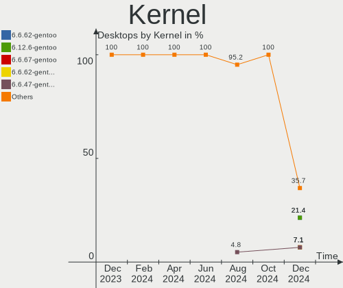
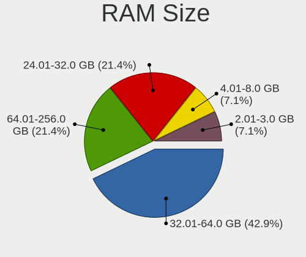
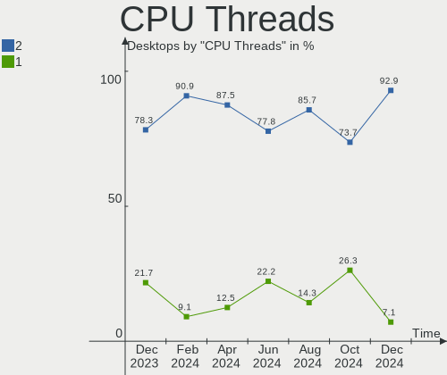
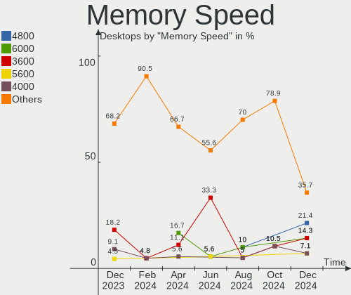
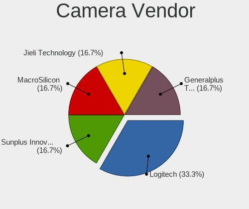

Gentoo - Hardware Trends (Desktops)
-----------------------------------

A project to identify most popular hardware characteristics and track their change
over time based on data collected by Linux users at https://Linux-Hardware.org.

Anyone can contribute to this report by the [hw-probe](https://github.com/linuxhw/hw-probe) tool:

    sudo -E hw-probe -all -upload

This report is for one last month. Overall report since the beginning of time: [TestDays](https://github.com/linuxhw/TestDays)

Period: Feb, 2023.

Contents
--------

* [ System ](#system)
  - [ OS                       ](#os)
  - [ OS Family                ](#os-family)
  - [ Kernel                   ](#kernel)
  - [ Kernel Family            ](#kernel-family)
  - [ Kernel Major Ver.        ](#kernel-major-ver)
  - [ Arch                     ](#arch)
  - [ DE                       ](#de)
  - [ Display Server           ](#display-server)
  - [ Display Manager          ](#display-manager)
  - [ OS Lang                  ](#os-lang)
  - [ Boot Mode                ](#boot-mode)
  - [ Filesystem               ](#filesystem)
  - [ Part. scheme             ](#part-scheme)
  - [ Dual Boot with Linux/BSD ](#dual-boot-with-linuxbsd)
  - [ Dual Boot (Win)          ](#dual-boot-win)

* [ Board ](#board)
  - [ Vendor                   ](#vendor)
  - [ Model                    ](#model)
  - [ Model Family             ](#model-family)
  - [ MFG Year                 ](#mfg-year)
  - [ Form Factor              ](#form-factor)
  - [ Secure Boot              ](#secure-boot)
  - [ Coreboot                 ](#coreboot)
  - [ RAM Size                 ](#ram-size)
  - [ RAM Used                 ](#ram-used)
  - [ Total Drives             ](#total-drives)
  - [ Has CD-ROM               ](#has-cd-rom)
  - [ Has Ethernet             ](#has-ethernet)
  - [ Has WiFi                 ](#has-wifi)
  - [ Has Bluetooth            ](#has-bluetooth)

* [ Location ](#location)
  - [ Country                  ](#country)
  - [ City                     ](#city)

* [ Drives ](#drives)
  - [ Drive Vendor             ](#drive-vendor)
  - [ Drive Model              ](#drive-model)
  - [ HDD Vendor               ](#hdd-vendor)
  - [ SSD Vendor               ](#ssd-vendor)
  - [ Drive Kind               ](#drive-kind)
  - [ Drive Connector          ](#drive-connector)
  - [ Drive Size               ](#drive-size)
  - [ Space Total              ](#space-total)
  - [ Space Used               ](#space-used)
  - [ Malfunc. Drives          ](#malfunc-drives)
  - [ Malfunc. Drive Vendor    ](#malfunc-drive-vendor)
  - [ Malfunc. HDD Vendor      ](#malfunc-hdd-vendor)
  - [ Malfunc. Drive Kind      ](#malfunc-drive-kind)
  - [ Failed Drives            ](#failed-drives)
  - [ Failed Drive Vendor      ](#failed-drive-vendor)
  - [ Drive Status             ](#drive-status)

* [ Storage controller ](#storage-controller)
  - [ Storage Vendor           ](#storage-vendor)
  - [ Storage Model            ](#storage-model)
  - [ Storage Kind             ](#storage-kind)

* [ Processor ](#processor)
  - [ CPU Vendor               ](#cpu-vendor)
  - [ CPU Model                ](#cpu-model)
  - [ CPU Model Family         ](#cpu-model-family)
  - [ CPU Cores                ](#cpu-cores)
  - [ CPU Sockets              ](#cpu-sockets)
  - [ CPU Threads              ](#cpu-threads)
  - [ CPU Op-Modes             ](#cpu-op-modes)
  - [ CPU Microcode            ](#cpu-microcode)
  - [ CPU Microarch            ](#cpu-microarch)

* [ Graphics ](#graphics)
  - [ GPU Vendor               ](#gpu-vendor)
  - [ GPU Model                ](#gpu-model)
  - [ GPU Combo                ](#gpu-combo)
  - [ GPU Driver               ](#gpu-driver)
  - [ GPU Memory               ](#gpu-memory)

* [ Monitor ](#monitor)
  - [ Monitor Vendor           ](#monitor-vendor)
  - [ Monitor Model            ](#monitor-model)
  - [ Monitor Resolution       ](#monitor-resolution)
  - [ Monitor Diagonal         ](#monitor-diagonal)
  - [ Monitor Width            ](#monitor-width)
  - [ Aspect Ratio             ](#aspect-ratio)
  - [ Monitor Area             ](#monitor-area)
  - [ Pixel Density            ](#pixel-density)
  - [ Multiple Monitors        ](#multiple-monitors)

* [ Network ](#network)
  - [ Net Controller Vendor    ](#net-controller-vendor)
  - [ Net Controller Model     ](#net-controller-model)
  - [ Wireless Vendor          ](#wireless-vendor)
  - [ Wireless Model           ](#wireless-model)
  - [ Ethernet Vendor          ](#ethernet-vendor)
  - [ Ethernet Model           ](#ethernet-model)
  - [ Net Controller Kind      ](#net-controller-kind)
  - [ Used Controller          ](#used-controller)
  - [ NICs                     ](#nics)
  - [ IPv6                     ](#ipv6)

* [ Bluetooth ](#bluetooth)
  - [ Bluetooth Vendor         ](#bluetooth-vendor)
  - [ Bluetooth Model          ](#bluetooth-model)

* [ Sound ](#sound)
  - [ Sound Vendor             ](#sound-vendor)
  - [ Sound Model              ](#sound-model)

* [ Memory ](#memory)
  - [ Memory Vendor            ](#memory-vendor)
  - [ Memory Model             ](#memory-model)
  - [ Memory Kind              ](#memory-kind)
  - [ Memory Form Factor       ](#memory-form-factor)
  - [ Memory Size              ](#memory-size)
  - [ Memory Speed             ](#memory-speed)

* [ Printers & scanners ](#printers--scanners)
  - [ Printer Vendor           ](#printer-vendor)
  - [ Printer Model            ](#printer-model)
  - [ Scanner Vendor           ](#scanner-vendor)
  - [ Scanner Model            ](#scanner-model)

* [ Camera ](#camera)
  - [ Camera Vendor            ](#camera-vendor)
  - [ Camera Model             ](#camera-model)

* [ Security ](#security)
  - [ Fingerprint Vendor       ](#fingerprint-vendor)
  - [ Fingerprint Model        ](#fingerprint-model)
  - [ Chipcard Vendor          ](#chipcard-vendor)
  - [ Chipcard Model           ](#chipcard-model)

* [ Unsupported ](#unsupported)
  - [ Unsupported Devices      ](#unsupported-devices)
  - [ Unsupported Device Types ](#unsupported-device-types)

System
------

OS
--

Installed operating systems

| Name        | Desktops | Percent |
|-------------|----------|---------|
| Gentoo 2.9  | 18       | 72%     |
| Gentoo 2.13 | 6        | 24%     |
| Gentoo 2.8  | 1        | 4%      |

OS Family
---------

OS without a version

| Name   | Desktops | Percent |
|--------|----------|---------|
| Gentoo | 25       | 100%    |

Kernel
------

Version of the Linux kernel

| Version                   | Desktops | Percent |
|---------------------------|----------|---------|
| 5.15.88-gentoo            | 6        | 24%     |
| 6.1.12-gentoo             | 4        | 16%     |
| 6.2.0-rc6-gentoo-dist+    | 1        | 4%      |
| 6.2.0                     | 1        | 4%      |
| 6.1.9-gentoo-dist         | 1        | 4%      |
| 6.1.8-gentoo-hardened1    | 1        | 4%      |
| 6.1.7                     | 1        | 4%      |
| 6.1.13-gentoo             | 1        | 4%      |
| 6.1.12-gentoonovirt       | 1        | 4%      |
| 6.1.11-gentoo-gentoo-dist | 1        | 4%      |
| 6.1.10-gentoo-x86_64      | 1        | 4%      |
| 6.1.10-gentoo             | 1        | 4%      |
| 6.1.1-arch1-1             | 1        | 4%      |
| 5.15.88-gentoo-x86_64     | 1        | 4%      |
| 5.15.74-gentoo            | 1        | 4%      |
| 5.15.0-56-generic         | 1        | 4%      |
| 5.10.43                   | 1        | 4%      |

Kernel Family
-------------

Linux kernel without a distro release

| Version | Desktops | Percent |
|---------|----------|---------|
| 5.15.88 | 7        | 28%     |
| 6.1.12  | 5        | 20%     |
| 6.2.0   | 2        | 8%      |
| 6.1.10  | 2        | 8%      |
| 6.1.9   | 1        | 4%      |
| 6.1.8   | 1        | 4%      |
| 6.1.7   | 1        | 4%      |
| 6.1.13  | 1        | 4%      |
| 6.1.11  | 1        | 4%      |
| 6.1.1   | 1        | 4%      |
| 5.15.74 | 1        | 4%      |
| 5.15.0  | 1        | 4%      |
| 5.10.43 | 1        | 4%      |

Kernel Major Ver.
-----------------

Linux kernel major version

| Version | Desktops | Percent |
|---------|----------|---------|
| 6.1     | 13       | 52%     |
| 5.15    | 9        | 36%     |
| 6.2     | 2        | 8%      |
| 5.10    | 1        | 4%      |

Arch
----

OS architecture (x86_64, i586, etc.)

| Name   | Desktops | Percent |
|--------|----------|---------|
| x86_64 | 25       | 100%    |

DE
--

Desktop Environment

| Name    | Desktops | Percent |
|---------|----------|---------|
| Unknown | 11       | 44%     |
| KDE5    | 5        | 20%     |
| XFCE    | 4        | 16%     |
| GNOME   | 3        | 12%     |
| sway    | 1        | 4%      |
| MATE    | 1        | 4%      |

Display Server
--------------

X11 or Wayland

| Name    | Desktops | Percent |
|---------|----------|---------|
| X11     | 12       | 48%     |
| Wayland | 5        | 20%     |
| Unknown | 5        | 20%     |
| Tty     | 3        | 12%     |

Display Manager
---------------

SDDM, LightDM, etc.

| Name    | Desktops | Percent |
|---------|----------|---------|
| Unknown | 12       | 48%     |
| SDDM    | 4        | 16%     |
| LightDM | 4        | 16%     |
| GDM     | 3        | 12%     |
| LXDM    | 1        | 4%      |
| GREETD  | 1        | 4%      |

OS Lang
-------

Language

| Lang             | Desktops | Percent |
|------------------|----------|---------|
| en_US            | 15       | 60%     |
| fr_FR            | 3        | 12%     |
| pl_PL            | 1        | 4%      |
| es_ES.ISO-8859-1 | 1        | 4%      |
| en_GB            | 1        | 4%      |
| de_DE            | 1        | 4%      |
| cs_CZ            | 1        | 4%      |
| C.UTF8           | 1        | 4%      |
| Unknown          | 1        | 4%      |

Boot Mode
---------

EFI or BIOS

| Mode | Desktops | Percent |
|------|----------|---------|
| EFI  | 20       | 80%     |
| BIOS | 5        | 20%     |

Filesystem
----------

Type of filesystem

| Type  | Desktops | Percent |
|-------|----------|---------|
| Ext4  | 12       | 48%     |
| Btrfs | 6        | 24%     |
| F2fs  | 3        | 12%     |
| Zfs   | 2        | 8%      |
| Xfs   | 2        | 8%      |

Part. scheme
------------

Scheme of partitioning

| Type    | Desktops | Percent |
|---------|----------|---------|
| GPT     | 21       | 84%     |
| MBR     | 2        | 8%      |
| Unknown | 2        | 8%      |

Dual Boot with Linux/BSD
------------------------

Hosting more than one Linux/BSD

| Dual boot | Desktops | Percent |
|-----------|----------|---------|
| Yes       | 13       | 52%     |
| No        | 12       | 48%     |

Dual Boot (Win)
---------------

Hosting Linux and Windows

| Dual boot | Desktops | Percent |
|-----------|----------|---------|
| No        | 19       | 76%     |
| Yes       | 6        | 24%     |

Board
-----

Vendor
------

Motherboard manufacturer

| Name                | Desktops | Percent |
|---------------------|----------|---------|
| ASUSTek Computer    | 12       | 48%     |
| Gigabyte Technology | 6        | 24%     |
| MSI                 | 3        | 12%     |
| ASRock              | 3        | 12%     |
| Lenovo              | 1        | 4%      |

Model
-----

Motherboard model

| Name                                | Desktops | Percent |
|-------------------------------------|----------|---------|
| ASUS M3A78-CM                       | 2        | 8%      |
| MSI MS-7D25                         | 1        | 4%      |
| MSI MS-7C91                         | 1        | 4%      |
| MSI MS-7A31                         | 1        | 4%      |
| Lenovo ThinkStation P340 30DJS35Q00 | 1        | 4%      |
| Gigabyte Z590 UD                    | 1        | 4%      |
| Gigabyte X570 AORUS MASTER          | 1        | 4%      |
| Gigabyte B650 AORUS PRO AX          | 1        | 4%      |
| Gigabyte B450 AORUS PRO             | 1        | 4%      |
| Gigabyte B150M-D2V DDR3-CF          | 1        | 4%      |
| Gigabyte AB350-Gaming               | 1        | 4%      |
| ASUS TUF Gaming Z690-PLUS D4        | 1        | 4%      |
| ASUS TUF Gaming X570-PLUS_BR        | 1        | 4%      |
| ASUS TUF Gaming X570-PLUS           | 1        | 4%      |
| ASUS TUF Gaming B550-PRO            | 1        | 4%      |
| ASUS ROG STRIX Z690-G GAMING WIFI   | 1        | 4%      |
| ASUS ROG STRIX X570-E GAMING        | 1        | 4%      |
| ASUS PRIME X570-P                   | 1        | 4%      |
| ASUS PRIME H570M-PLUS               | 1        | 4%      |
| ASUS PRIME B450M-A                  | 1        | 4%      |
| ASUS P10S-I Series                  | 1        | 4%      |
| ASRock X370 Professional Gaming     | 1        | 4%      |
| ASRock B550M Steel Legend           | 1        | 4%      |
| ASRock AM1H-ITX                     | 1        | 4%      |

Model Family
------------

Motherboard model prefix

| Name                  | Desktops | Percent |
|-----------------------|----------|---------|
| ASUS TUF              | 4        | 16%     |
| ASUS PRIME            | 3        | 12%     |
| ASUS ROG              | 2        | 8%      |
| ASUS M3A78-CM         | 2        | 8%      |
| MSI MS-7D25           | 1        | 4%      |
| MSI MS-7C91           | 1        | 4%      |
| MSI MS-7A31           | 1        | 4%      |
| Lenovo ThinkStation   | 1        | 4%      |
| Gigabyte Z590         | 1        | 4%      |
| Gigabyte X570         | 1        | 4%      |
| Gigabyte B650         | 1        | 4%      |
| Gigabyte B450         | 1        | 4%      |
| Gigabyte B150M-D2V    | 1        | 4%      |
| Gigabyte AB350-Gaming | 1        | 4%      |
| ASUS P10S-I           | 1        | 4%      |
| ASRock X370           | 1        | 4%      |
| ASRock B550M          | 1        | 4%      |
| ASRock AM1H-ITX       | 1        | 4%      |

MFG Year
--------

Motherboard manufacture year

| Year | Desktops | Percent |
|------|----------|---------|
| 2021 | 5        | 20%     |
| 2019 | 5        | 20%     |
| 2017 | 4        | 16%     |
| 2022 | 3        | 12%     |
| 2020 | 2        | 8%      |
| 2018 | 2        | 8%      |
| 2008 | 2        | 8%      |
| 2015 | 1        | 4%      |
| 2014 | 1        | 4%      |

Form Factor
-----------

Physical design of the computer

| Name    | Desktops | Percent |
|---------|----------|---------|
| Desktop | 25       | 100%    |

Secure Boot
-----------

Enabled or disabled

| State    | Desktops | Percent |
|----------|----------|---------|
| Disabled | 24       | 96%     |
| Enabled  | 1        | 4%      |

Coreboot
--------

Have coreboot on board

| Used | Desktops | Percent |
|------|----------|---------|
| No   | 25       | 100%    |

RAM Size
--------

Total RAM memory

| Size in GB  | Desktops | Percent |
|-------------|----------|---------|
| 32.01-64.0  | 11       | 44%     |
| 16.01-24.0  | 5        | 20%     |
| 64.01-256.0 | 4        | 16%     |
| 4.01-8.0    | 2        | 8%      |
| 3.01-4.0    | 1        | 4%      |
| 24.01-32.0  | 1        | 4%      |
| 8.01-16.0   | 1        | 4%      |

RAM Used
--------

Used RAM memory

| Used GB    | Desktops | Percent |
|------------|----------|---------|
| 8.01-16.0  | 6        | 24%     |
| 2.01-3.0   | 5        | 20%     |
| 4.01-8.0   | 4        | 16%     |
| 1.01-2.0   | 4        | 16%     |
| 3.01-4.0   | 3        | 12%     |
| 16.01-24.0 | 2        | 8%      |
| 0.01-0.5   | 1        | 4%      |

Total Drives
------------

Number of drives on board

| Drives | Desktops | Percent |
|--------|----------|---------|
| 3      | 6        | 24%     |
| 2      | 6        | 24%     |
| 5      | 4        | 16%     |
| 6      | 3        | 12%     |
| 1      | 3        | 12%     |
| 4      | 2        | 8%      |
| 8      | 1        | 4%      |

Has CD-ROM
----------

Has CD-ROM on board

| Presented | Desktops | Percent |
|-----------|----------|---------|
| No        | 20       | 80%     |
| Yes       | 5        | 20%     |

Has Ethernet
------------

Has Ethernet on board

| Presented | Desktops | Percent |
|-----------|----------|---------|
| Yes       | 25       | 100%    |

Has WiFi
--------

Has WiFi module

| Presented | Desktops | Percent |
|-----------|----------|---------|
| No        | 15       | 60%     |
| Yes       | 10       | 40%     |

Has Bluetooth
-------------

Has Bluetooth module

| Presented | Desktops | Percent |
|-----------|----------|---------|
| No        | 15       | 60%     |
| Yes       | 10       | 40%     |

Location
--------

Country
-------

Geographic location (country)

| Country   | Desktops | Percent |
|-----------|----------|---------|
| USA       | 5        | 20%     |
| Poland    | 4        | 16%     |
| France    | 3        | 12%     |
| Czechia   | 3        | 12%     |
| Germany   | 2        | 8%      |
| Vietnam   | 1        | 4%      |
| Spain     | 1        | 4%      |
| Slovakia  | 1        | 4%      |
| Singapore | 1        | 4%      |
| Russia    | 1        | 4%      |
| China     | 1        | 4%      |
| Brazil    | 1        | 4%      |
| Australia | 1        | 4%      |

City
----

Geographic location (city)

| City                  | Desktops | Percent |
|-----------------------|----------|---------|
| Warsaw                | 3        | 12%     |
| Vitkov                | 2        | 8%      |
| Yucaipa               | 1        | 4%      |
| St Petersburg         | 1        | 4%      |
| Singapore             | 1        | 4%      |
| Simat de la Valldigna | 1        | 4%      |
| Shanghai              | 1        | 4%      |
| San Dimas             | 1        | 4%      |
| San Antonio           | 1        | 4%      |
| Prešov               | 1        | 4%      |
| Polch                 | 1        | 4%      |
| Perth                 | 1        | 4%      |
| Orange                | 1        | 4%      |
| Maule                 | 1        | 4%      |
| Krakow                | 1        | 4%      |
| Ilmenau               | 1        | 4%      |
| Ho Chi Minh City      | 1        | 4%      |
| Dagneux               | 1        | 4%      |
| Cognac                | 1        | 4%      |
| Chapecó              | 1        | 4%      |
| Český Těšín      | 1        | 4%      |
| Augusta               | 1        | 4%      |

Drives
------

Drive Vendor
------------

Hard drive vendors

| Vendor                    | Desktops | Drives | Percent |
|---------------------------|----------|--------|---------|
| Samsung Electronics       | 12       | 20     | 23.53%  |
| WDC                       | 10       | 22     | 19.61%  |
| Seagate                   | 6        | 13     | 11.76%  |
| Sandisk                   | 5        | 6      | 9.8%    |
| Toshiba                   | 3        | 3      | 5.88%   |
| GOODRAM                   | 3        | 3      | 5.88%   |
| Realtek Semiconductor     | 2        | 3      | 3.92%   |
| Phison Electronics        | 2        | 3      | 3.92%   |
| Hitachi                   | 2        | 4      | 3.92%   |
| XPG                       | 1        | 3      | 1.96%   |
| OCZ                       | 1        | 1      | 1.96%   |
| Micron/Crucial Technology | 1        | 2      | 1.96%   |
| Intel                     | 1        | 1      | 1.96%   |
| China                     | 1        | 2      | 1.96%   |
| A-DATA Technology         | 1        | 1      | 1.96%   |

Drive Model
-----------

Hard drive models

| Model                                                 | Desktops | Percent |
|-------------------------------------------------------|----------|---------|
| Samsung NVMe SSD Controller SM981/PM981/PM983 250GB   | 4        | 5.8%    |
| Samsung SSD 980 1TB                                   | 3        | 4.35%   |
| WDC WD20EARX-00PASB0 2TB                              | 2        | 2.9%    |
| Seagate ST4000DM004-2CV104 4TB                        | 2        | 2.9%    |
| Samsung NVMe SSD Controller SM961/PM961/SM963 512GB   | 2        | 2.9%    |
| Samsung NVMe SSD Controller PM9A1/PM9A3/980PRO 960GB  | 2        | 2.9%    |
| GOODRAM SSDPR-CL100-480-G2 480GB                      | 2        | 2.9%    |
| XPG GAMMIX S70 2TB                                    | 1        | 1.45%   |
| WDC WD8003FFBX-68B9AN0 8TB                            | 1        | 1.45%   |
| WDC WD60EZRX-00MVLB1 6TB                              | 1        | 1.45%   |
| WDC WD60EFRX-68MYMN1 6TB                              | 1        | 1.45%   |
| WDC WD6003FZBX-00K5WB0 6TB                            | 1        | 1.45%   |
| WDC WD5000LPLX-66ZNTT1 500GB                          | 1        | 1.45%   |
| WDC WD5000LPCX-24VHAT0 500GB                          | 1        | 1.45%   |
| WDC WD5000AADS-00M2B0 500GB                           | 1        | 1.45%   |
| WDC WD40EFAX-68JH4N1 4TB                              | 1        | 1.45%   |
| WDC WD3003FZEX-00Z4SA0 3TB                            | 1        | 1.45%   |
| WDC WD20EZBX-08AYR 2TB                                | 1        | 1.45%   |
| WDC WD20EZBX-00AYRA0 2TB                              | 1        | 1.45%   |
| WDC WD20EFRX-68EUZN0 2TB                              | 1        | 1.45%   |
| WDC WD1502FYPS-02W3B0 1TB                             | 1        | 1.45%   |
| WDC WD120EFBX-68B0EN0 12TB                            | 1        | 1.45%   |
| WDC WD1001FALS-00J7B1 1TB                             | 1        | 1.45%   |
| Toshiba HDWE150 5TB                                   | 1        | 1.45%   |
| Toshiba HDWD110 1TB                                   | 1        | 1.45%   |
| Toshiba DT01ABA300 3TB                                | 1        | 1.45%   |
| Seagate ST8000NE001-2M7101 8TB                        | 1        | 1.45%   |
| Seagate ST8000AS0002-1NA17Z 8TB                       | 1        | 1.45%   |
| Seagate ST750LM022 HN-M750MBB 752GB                   | 1        | 1.45%   |
| Seagate ST2000DM001-1CH164 2TB                        | 1        | 1.45%   |
| Seagate ST18000NM000J-2TV103 18TB                     | 1        | 1.45%   |
| Seagate ST16000NM001G-2KK103 16TB                     | 1        | 1.45%   |
| Seagate ST12000NM0008-2H3101 12TB                     | 1        | 1.45%   |
| Seagate ST1000DM010-2EP102 1TB                        | 1        | 1.45%   |
| Seagate Expansion Desk 5TB                            | 1        | 1.45%   |
| Sandisk WD Blue SN550 NVMe SSD 1TB                    | 1        | 1.45%   |
| Sandisk WD Black SN850 500GB                          | 1        | 1.45%   |
| Sandisk WD Black SN750 / PC SN730 NVMe SSD 512GB      | 1        | 1.45%   |
| Sandisk WD Black 2018/SN750 / PC SN720 NVMe SSD 512GB | 1        | 1.45%   |
| SanDisk Extreme 55AE 500GB SSD                        | 1        | 1.45%   |

HDD Vendor
----------

Hard disk drive vendors

| Vendor              | Desktops | Drives | Percent |
|---------------------|----------|--------|---------|
| WDC                 | 10       | 22     | 45.45%  |
| Seagate             | 6        | 13     | 27.27%  |
| Toshiba             | 3        | 3      | 13.64%  |
| Hitachi             | 2        | 4      | 9.09%   |
| Samsung Electronics | 1        | 1      | 4.55%   |

SSD Vendor
----------

Solid state drive vendors

| Vendor              | Desktops | Drives | Percent |
|---------------------|----------|--------|---------|
| Samsung Electronics | 6        | 6      | 46.15%  |
| GOODRAM             | 3        | 3      | 23.08%  |
| SanDisk             | 1        | 1      | 7.69%   |
| OCZ                 | 1        | 1      | 7.69%   |
| China               | 1        | 2      | 7.69%   |
| A-DATA Technology   | 1        | 1      | 7.69%   |

Drive Kind
----------

HDD or SSD

| Kind | Desktops | Drives | Percent |
|------|----------|--------|---------|
| NVMe | 18       | 30     | 38.3%   |
| HDD  | 16       | 43     | 34.04%  |
| SSD  | 13       | 14     | 27.66%  |

Drive Connector
---------------

SATA, SAS, NVMe, etc.

| Type | Desktops | Drives | Percent |
|------|----------|--------|---------|
| SATA | 21       | 55     | 51.22%  |
| NVMe | 18       | 30     | 43.9%   |
| SAS  | 2        | 2      | 4.88%   |

Drive Size
----------

Size of hard drive

| Size in TB | Desktops | Drives | Percent |
|------------|----------|--------|---------|
| 0.01-0.5   | 12       | 12     | 27.27%  |
| 0.51-1.0   | 10       | 11     | 22.73%  |
| 1.01-2.0   | 6        | 10     | 13.64%  |
| 4.01-10.0  | 6        | 9      | 13.64%  |
| 10.01-20.0 | 4        | 6      | 9.09%   |
| 3.01-4.0   | 3        | 4      | 6.82%   |
| 2.01-3.0   | 3        | 5      | 6.82%   |

Space Total
-----------

Amount of disk space available on the file system

| Size in GB     | Desktops | Percent |
|----------------|----------|---------|
| More than 3000 | 8        | 32%     |
| 501-1000       | 8        | 32%     |
| 251-500        | 2        | 8%      |
| Unknown        | 2        | 8%      |
| 21-50          | 1        | 4%      |
| 2001-3000      | 1        | 4%      |
| 101-250        | 1        | 4%      |
| 1-20           | 1        | 4%      |
| 51-100         | 1        | 4%      |

Space Used
----------

Amount of used disk space

| Used GB        | Desktops | Percent |
|----------------|----------|---------|
| More than 3000 | 7        | 28%     |
| 101-250        | 5        | 20%     |
| 1-20           | 4        | 16%     |
| 51-100         | 3        | 12%     |
| Unknown        | 2        | 8%      |
| 251-500        | 1        | 4%      |
| 21-50          | 1        | 4%      |
| 1001-2000      | 1        | 4%      |
| 501-1000       | 1        | 4%      |

Malfunc. Drives
---------------

Drive models with a malfunction

| Model                                                   | Desktops | Drives | Percent |
|---------------------------------------------------------|----------|--------|---------|
| Samsung Electronics SSD 980 1TB                         | 2        | 2      | 25%     |
| WDC WD60EZRX-00MVLB1 6TB                                | 1        | 1      | 12.5%   |
| WDC WD1001FALS-00J7B1 1TB                               | 1        | 1      | 12.5%   |
| Seagate ST750LM022 HN-M750MBB 752GB                     | 1        | 1      | 12.5%   |
| Seagate ST2000DM001-1CH164 2TB                          | 1        | 1      | 12.5%   |
| Realtek Semiconductor RTS5763DL NVMe SSD Controller 4TB | 1        | 1      | 12.5%   |
| Realtek Semiconductor ADATA SX6000PNP 256GB             | 1        | 2      | 12.5%   |

Malfunc. Drive Vendor
---------------------

Vendors of faulty drives

| Vendor                | Desktops | Drives | Percent |
|-----------------------|----------|--------|---------|
| WDC                   | 2        | 2      | 28.57%  |
| Samsung Electronics   | 2        | 2      | 28.57%  |
| Realtek Semiconductor | 2        | 3      | 28.57%  |
| Seagate               | 1        | 2      | 14.29%  |

Malfunc. HDD Vendor
-------------------

Vendors of faulty HDD drives

| Vendor  | Desktops | Drives | Percent |
|---------|----------|--------|---------|
| WDC     | 2        | 2      | 66.67%  |
| Seagate | 1        | 2      | 33.33%  |

Malfunc. Drive Kind
-------------------

Kinds of faulty drives

| Kind | Desktops | Drives | Percent |
|------|----------|--------|---------|
| NVMe | 4        | 5      | 57.14%  |
| HDD  | 3        | 4      | 42.86%  |

Failed Drives
-------------

Failed drive models

Zero info for selected period =(

Failed Drive Vendor
-------------------

Failed drive vendors

Zero info for selected period =(

Drive Status
------------

Number of failed and malfunc. drives

| Status   | Desktops | Drives | Percent |
|----------|----------|--------|---------|
| Works    | 23       | 68     | 69.7%   |
| Malfunc  | 6        | 9      | 18.18%  |
| Detected | 4        | 10     | 12.12%  |

Storage controller
------------------

Storage Vendor
--------------

Storage controller vendors

| Vendor                    | Desktops | Percent |
|---------------------------|----------|---------|
| AMD                       | 17       | 34%     |
| Samsung Electronics       | 10       | 20%     |
| Intel                     | 9        | 18%     |
| SanDisk                   | 4        | 8%      |
| ASMedia Technology        | 4        | 8%      |
| Realtek Semiconductor     | 2        | 4%      |
| Phison Electronics        | 2        | 4%      |
| Micron/Crucial Technology | 1        | 2%      |
| INNOGRIT                  | 1        | 2%      |

Storage Model
-------------

Storage controller models

| Model                                                                         | Desktops | Percent |
|-------------------------------------------------------------------------------|----------|---------|
| AMD FCH SATA Controller [AHCI mode]                                           | 10       | 16.95%  |
| Samsung NVMe SSD Controller SM981/PM981/PM983                                 | 4        | 6.78%   |
| Samsung NVMe SSD Controller 980                                               | 3        | 5.08%   |
| Intel Alder Lake-S PCH SATA Controller [AHCI Mode]                            | 3        | 5.08%   |
| ASMedia ASM1062 Serial ATA Controller                                         | 3        | 5.08%   |
| AMD 500 Series Chipset SATA Controller                                        | 3        | 5.08%   |
| Samsung NVMe SSD Controller SM961/PM961/SM963                                 | 2        | 3.39%   |
| Samsung NVMe SSD Controller PM9A1/PM9A3/980PRO                                | 2        | 3.39%   |
| Intel Volume Management Device NVMe RAID Controller                           | 2        | 3.39%   |
| Intel Q170/Q150/B150/H170/H110/Z170/CM236 Chipset SATA Controller [AHCI Mode] | 2        | 3.39%   |
| Intel 500 Series Chipset Family SATA AHCI Controller                          | 2        | 3.39%   |
| AMD X370 Series Chipset SATA Controller                                       | 2        | 3.39%   |
| AMD SB7x0/SB8x0/SB9x0 SATA Controller [IDE mode]                              | 2        | 3.39%   |
| AMD SB7x0/SB8x0/SB9x0 IDE Controller                                          | 2        | 3.39%   |
| AMD 400 Series Chipset SATA Controller                                        | 2        | 3.39%   |
| SanDisk WD PC SN810 / Black SN850 NVMe SSD                                    | 1        | 1.69%   |
| SanDisk WD Blue SN550 NVMe SSD                                                | 1        | 1.69%   |
| SanDisk WD Black SN750 / PC SN730 NVMe SSD                                    | 1        | 1.69%   |
| SanDisk WD Black 2018/SN750 / PC SN720 NVMe SSD                               | 1        | 1.69%   |
| Realtek RTS5763DL NVMe SSD Controller                                         | 1        | 1.69%   |
| Realtek Realtek Non-Volatile memory controller                                | 1        | 1.69%   |
| Phison E16 PCIe4 NVMe Controller                                              | 1        | 1.69%   |
| Phison E12 NVMe Controller                                                    | 1        | 1.69%   |
| Micron/Crucial P2 NVMe PCIe SSD                                               | 1        | 1.69%   |
| Intel SSD 660P Series                                                         | 1        | 1.69%   |
| Intel Comet Lake SATA AHCI Controller                                         | 1        | 1.69%   |
| INNOGRIT Non-Volatile memory controller                                       | 1        | 1.69%   |
| ASMedia ASM1166 Serial ATA Controller                                         | 1        | 1.69%   |
| AMD SATA controller                                                           | 1        | 1.69%   |
| AMD 300 Series Chipset SATA Controller                                        | 1        | 1.69%   |

Storage Kind
------------

Kind of storage controller (IDE, SATA, NVMe, SAS, ...)

| Kind | Desktops | Percent |
|------|----------|---------|
| SATA | 25       | 53.19%  |
| NVMe | 18       | 38.3%   |
| RAID | 2        | 4.26%   |
| IDE  | 2        | 4.26%   |

Processor
---------

CPU Vendor
----------

Processor vendors

| Vendor | Desktops | Percent |
|--------|----------|---------|
| AMD    | 17       | 68%     |
| Intel  | 8        | 32%     |

CPU Model
---------

Processor models

| Model                                   | Desktops | Percent |
|-----------------------------------------|----------|---------|
| AMD Ryzen 9 5900X 12-Core Processor     | 2        | 8%      |
| AMD Ryzen 7 3700X 8-Core Processor      | 2        | 8%      |
| AMD Ryzen 7 1700X Eight-Core Processor  | 2        | 8%      |
| AMD Ryzen 5 5600X 6-Core Processor      | 2        | 8%      |
| AMD Phenom II X4 955 Processor          | 2        | 8%      |
| Intel Xeon CPU E3-1240L v5 @ 2.10GHz    | 1        | 4%      |
| Intel Core i7-10700K CPU @ 3.80GHz      | 1        | 4%      |
| Intel Core i3-6100 CPU @ 3.70GHz        | 1        | 4%      |
| Intel 12th Gen Core i9-12900K           | 1        | 4%      |
| Intel 12th Gen Core i7-12700K           | 1        | 4%      |
| Intel 12th Gen Core i5-12600K           | 1        | 4%      |
| Intel 11th Gen Core i7-11700K @ 3.60GHz | 1        | 4%      |
| Intel 11th Gen Core i5-11600K @ 3.90GHz | 1        | 4%      |
| AMD Ryzen 7 7700X 8-Core Processor      | 1        | 4%      |
| AMD Ryzen 7 5800X 8-Core Processor      | 1        | 4%      |
| AMD Ryzen 7 2700 Eight-Core Processor   | 1        | 4%      |
| AMD Ryzen 5 5500                        | 1        | 4%      |
| AMD Ryzen 5 3600XT 6-Core Processor     | 1        | 4%      |
| AMD Ryzen 5 2600 Six-Core Processor     | 1        | 4%      |
| AMD Athlon 5350 APU with Radeon R3      | 1        | 4%      |

CPU Model Family
----------------

Processor model prefix

| Model            | Desktops | Percent |
|------------------|----------|---------|
| AMD Ryzen 7      | 7        | 28%     |
| Other            | 5        | 20%     |
| AMD Ryzen 5      | 5        | 20%     |
| AMD Ryzen 9      | 2        | 8%      |
| AMD Phenom II X4 | 2        | 8%      |
| Intel Xeon       | 1        | 4%      |
| Intel Core i7    | 1        | 4%      |
| Intel Core i3    | 1        | 4%      |
| AMD Athlon       | 1        | 4%      |

CPU Cores
---------

Number of processor cores

| Number | Desktops | Percent |
|--------|----------|---------|
| 8      | 9        | 36%     |
| 6      | 6        | 24%     |
| 4      | 4        | 16%     |
| 12     | 3        | 12%     |
| 16     | 1        | 4%      |
| 10     | 1        | 4%      |
| 2      | 1        | 4%      |

CPU Sockets
-----------

Number of sockets

| Number | Desktops | Percent |
|--------|----------|---------|
| 1      | 25       | 100%    |

CPU Threads
-----------

Threads per core (Hyper-Threading)

| Number | Desktops | Percent |
|--------|----------|---------|
| 2      | 22       | 88%     |
| 1      | 3        | 12%     |

CPU Op-Modes
------------

CPU Operation Modes (32-bit, 64-bit)

| Op mode        | Desktops | Percent |
|----------------|----------|---------|
| 32-bit, 64-bit | 25       | 100%    |

CPU Microcode
-------------

Microcode number

| Number     | Desktops | Percent |
|------------|----------|---------|
| Unknown    | 5        | 20%     |
| 0x08701021 | 3        | 12%     |
| 0x90672    | 2        | 8%      |
| 0x0a201016 | 2        | 8%      |
| 0x0800820d | 2        | 8%      |
| 0xa0671    | 1        | 4%      |
| 0x506e3    | 1        | 4%      |
| 0x0a601203 | 1        | 4%      |
| 0x0a50000c | 1        | 4%      |
| 0x0a20120a | 1        | 4%      |
| 0x0a201009 | 1        | 4%      |
| 0x08001138 | 1        | 4%      |
| 0x0800111c | 1        | 4%      |
| 0x0700010f | 1        | 4%      |
| 0x010000db | 1        | 4%      |
| 0x00000000 | 1        | 4%      |

CPU Microarch
-------------

Microarchitecture

| Name             | Desktops | Percent |
|------------------|----------|---------|
| Zen 3            | 6        | 24%     |
| Zen 2            | 3        | 12%     |
| Alderlake Hybrid | 3        | 12%     |
| Zen+             | 2        | 8%      |
| Zen              | 2        | 8%      |
| Skylake          | 2        | 8%      |
| K10              | 2        | 8%      |
| Unknown          | 2        | 8%      |
| Jaguar           | 1        | 4%      |
| Icelake          | 1        | 4%      |
| CometLake        | 1        | 4%      |

Graphics
--------

GPU Vendor
----------

Vendors of graphics cards

| Vendor            | Desktops | Percent |
|-------------------|----------|---------|
| AMD               | 14       | 50%     |
| Nvidia            | 8        | 28.57%  |
| Intel             | 5        | 17.86%  |
| ASPEED Technology | 1        | 3.57%   |

GPU Model
---------

Graphics card models

| Model                                                         | Desktops | Percent |
|---------------------------------------------------------------|----------|---------|
| AMD Navi 22 [Radeon RX 6700/6700 XT/6750 XT / 6800M/6850M XT] | 3        | 10.71%  |
| Intel AlderLake-S GT1                                         | 2        | 7.14%   |
| AMD RS780C [Radeon 3100]                                      | 2        | 7.14%   |
| AMD Navi 10 [Radeon RX 5600 OEM/5600 XT / 5700/5700 XT]       | 2        | 7.14%   |
| AMD Ellesmere [Radeon RX 470/480/570/570X/580/580X/590]       | 2        | 7.14%   |
| Nvidia TU104 [GeForce RTX 2080]                               | 1        | 3.57%   |
| Nvidia GP106 [GeForce GTX 1060 6GB]                           | 1        | 3.57%   |
| Nvidia GM107 [GeForce GTX 750]                                | 1        | 3.57%   |
| Nvidia GF119 [GeForce GT 610]                                 | 1        | 3.57%   |
| Nvidia GA106 [Geforce RTX 3050]                               | 1        | 3.57%   |
| Nvidia GA104 [GeForce RTX 3070]                               | 1        | 3.57%   |
| Nvidia GA104 [GeForce RTX 3060]                               | 1        | 3.57%   |
| Nvidia GA102 [GeForce RTX 3080 Ti]                            | 1        | 3.57%   |
| Intel RocketLake-S GT1 [UHD Graphics 750]                     | 1        | 3.57%   |
| Intel HD Graphics 530                                         | 1        | 3.57%   |
| Intel CometLake-S GT2 [UHD Graphics 630]                      | 1        | 3.57%   |
| ASPEED Technology ASPEED Graphics Family                      | 1        | 3.57%   |
| AMD Raphael                                                   | 1        | 3.57%   |
| AMD Navi 31 [Radeon RX 7900 XT/7900 XTX]                      | 1        | 3.57%   |
| AMD Navi 14 [Radeon RX 5500/5500M / Pro 5500M]                | 1        | 3.57%   |
| AMD Kabini [Radeon HD 8400 / R3 Series]                       | 1        | 3.57%   |
| AMD Cedar [Radeon HD 5000/6000/7350/8350 Series]              | 1        | 3.57%   |

GPU Combo
---------

Combinations of graphics cards

| Name           | Desktops | Percent |
|----------------|----------|---------|
| 1 x AMD        | 12       | 48%     |
| 1 x Nvidia     | 5        | 20%     |
| 1 x Intel      | 4        | 16%     |
| AMD + Nvidia   | 2        | 8%      |
| Intel + Nvidia | 1        | 4%      |
| 1 x ASPEED     | 1        | 4%      |

GPU Driver
----------

Free vs proprietary

| Driver      | Desktops | Percent |
|-------------|----------|---------|
| Free        | 19       | 76%     |
| Proprietary | 5        | 20%     |
| Unknown     | 1        | 4%      |

GPU Memory
----------

Total video memory

| Size in GB | Desktops | Percent |
|------------|----------|---------|
| 7.01-8.0   | 7        | 28%     |
| Unknown    | 7        | 28%     |
| 8.01-16.0  | 5        | 20%     |
| 0.51-1.0   | 2        | 8%      |
| 5.01-6.0   | 1        | 4%      |
| 16.01-24.0 | 1        | 4%      |
| 1.01-2.0   | 1        | 4%      |
| 0.01-0.5   | 1        | 4%      |

Monitor
-------

Monitor Vendor
--------------

Monitor vendors

| Vendor               | Desktops | Percent |
|----------------------|----------|---------|
| Samsung Electronics  | 7        | 25%     |
| AOC                  | 4        | 14.29%  |
| Dell                 | 3        | 10.71%  |
| Iiyama               | 2        | 7.14%   |
| Goldstar             | 2        | 7.14%   |
| Unknown              | 1        | 3.57%   |
| LG Electronics       | 1        | 3.57%   |
| ITE                  | 1        | 3.57%   |
| IBM                  | 1        | 3.57%   |
| Hewlett-Packard      | 1        | 3.57%   |
| Fujitsu Siemens      | 1        | 3.57%   |
| BenQ                 | 1        | 3.57%   |
| ASUSTek Computer     | 1        | 3.57%   |
| Ancor Communications | 1        | 3.57%   |
| Acer                 | 1        | 3.57%   |

Monitor Model
-------------

Monitor models

| Model                                                                 | Desktops | Percent |
|-----------------------------------------------------------------------|----------|---------|
| Samsung Electronics SyncMaster SAM059A 1920x1080 477x268mm 21.5-inch  | 2        | 6.67%   |
| Unknown LCD Monitor FFFF 2288x1287 2550x2550mm 142.0-inch             | 1        | 3.33%   |
| Samsung Electronics SMS27A850 SAM083D 2560x1440 518x324mm 24.1-inch   | 1        | 3.33%   |
| Samsung Electronics S22B300 SAM08C8 1920x1080 477x268mm 21.5-inch     | 1        | 3.33%   |
| Samsung Electronics LCD Monitor SAM07D0 1360x768 700x390mm 31.5-inch  | 1        | 3.33%   |
| Samsung Electronics LCD Monitor LC34G55T 3440x2880                    | 1        | 3.33%   |
| Samsung Electronics LCD Monitor LC34G55T                              | 1        | 3.33%   |
| Samsung Electronics C27HG7x SAM0E16 2560x1440 598x336mm 27.0-inch     | 1        | 3.33%   |
| Samsung Electronics C27F390 SAM0D32 1920x1080 598x336mm 27.0-inch     | 1        | 3.33%   |
| LG Electronics LCD Monitor LG HDR WQHD 3840x1600                      | 1        | 3.33%   |
| ITE DP2VGA V221 ITE6516 1366x768 600x340mm 27.2-inch                  | 1        | 3.33%   |
| Iiyama PL2740HS IVM6663 1920x1080 598x336mm 27.0-inch                 | 1        | 3.33%   |
| Iiyama PL2730H IVM663A 1920x1080 598x336mm 27.0-inch                  | 1        | 3.33%   |
| IBM L170 IBM1A4E 1280x1024 338x270mm 17.0-inch                        | 1        | 3.33%   |
| Hewlett-Packard x2301 HWP2973 1920x1080 509x286mm 23.0-inch           | 1        | 3.33%   |
| Goldstar ULTRAWIDE GSM59F1 2560x1080 798x334mm 34.1-inch              | 1        | 3.33%   |
| Goldstar 34GK950F GSM7727 3440x1440 800x335mm 34.1-inch               | 1        | 3.33%   |
| Fujitsu Siemens P27T-6 IPS FUS07EE 2560x1440 597x336mm 27.0-inch      | 1        | 3.33%   |
| Dell U2720Q DEL41B3 3840x2160 597x336mm 27.0-inch                     | 1        | 3.33%   |
| Dell E2222HS DELF133 1920x1080 478x260mm 21.4-inch                    | 1        | 3.33%   |
| Dell E1914H DELD03A 1366x768 410x230mm 18.5-inch                      | 1        | 3.33%   |
| BenQ VW2430 BNQ7B2E 1920x1080 531x299mm 24.0-inch                     | 1        | 3.33%   |
| ASUSTek Computer VG28UQL1A AUS28A0 3840x2160 621x341mm 27.9-inch      | 1        | 3.33%   |
| AOC U2777B AOC2777 3840x2160 597x336mm 27.0-inch                      | 1        | 3.33%   |
| AOC Q2790 AOC2790 2560x1440 597x336mm 27.0-inch                       | 1        | 3.33%   |
| AOC 27G2G3 AOC2704 1920x1080 598x336mm 27.0-inch                      | 1        | 3.33%   |
| AOC 2460G5 AOC2460 1920x1080 531x299mm 24.0-inch                      | 1        | 3.33%   |
| Ancor Communications ASUS VE278 ACI27F6 1920x1080 598x336mm 27.0-inch | 1        | 3.33%   |
| Acer XB271HU ACR0490 2560x1440 598x336mm 27.0-inch                    | 1        | 3.33%   |

Monitor Resolution
------------------

Monitor screen resolution

| Resolution       | Desktops | Percent |
|------------------|----------|---------|
| 1920x1080 (FHD)  | 10       | 35.71%  |
| 3840x2160 (4K)   | 5        | 17.86%  |
| 2560x1440 (QHD)  | 4        | 14.29%  |
| 3840x1600        | 1        | 3.57%   |
| 3440x2880        | 1        | 3.57%   |
| 3440x1440        | 1        | 3.57%   |
| 2560x1080        | 1        | 3.57%   |
| 2288x1287        | 1        | 3.57%   |
| 1366x768 (WXGA)  | 1        | 3.57%   |
| 1360x768         | 1        | 3.57%   |
| 1280x1024 (SXGA) | 1        | 3.57%   |
| Unknown          | 1        | 3.57%   |

Monitor Diagonal
----------------

Diagonal size in inches

| Inches  | Desktops | Percent |
|---------|----------|---------|
| 27      | 11       | 39.29%  |
| 21      | 4        | 14.29%  |
| 24      | 3        | 10.71%  |
| 34      | 2        | 7.14%   |
| Unknown | 2        | 7.14%   |
| 142     | 1        | 3.57%   |
| 40      | 1        | 3.57%   |
| 31      | 1        | 3.57%   |
| 23      | 1        | 3.57%   |
| 18      | 1        | 3.57%   |
| 17      | 1        | 3.57%   |

Monitor Width
-------------

Physical width

| Width in mm    | Desktops | Percent |
|----------------|----------|---------|
| 501-600        | 14       | 50%     |
| 401-500        | 5        | 17.86%  |
| 701-800        | 2        | 7.14%   |
| 601-700        | 2        | 7.14%   |
| Unknown        | 2        | 7.14%   |
| More than 2000 | 1        | 3.57%   |
| 801-900        | 1        | 3.57%   |
| 301-350        | 1        | 3.57%   |

Aspect Ratio
------------

Proportional relationship between the width and the height

| Ratio   | Desktops | Percent |
|---------|----------|---------|
| 16/9    | 17       | 68%     |
| 21/9    | 2        | 8%      |
| 16/10   | 2        | 8%      |
| Unknown | 2        | 8%      |
| 5/4     | 1        | 4%      |
| 1.00    | 1        | 4%      |

Monitor Area
------------

Area in inch²

| Area in inch² | Desktops | Percent |
|----------------|----------|---------|
| 301-350        | 11       | 39.29%  |
| 201-250        | 5        | 17.86%  |
| 351-500        | 3        | 10.71%  |
| 251-300        | 2        | 7.14%   |
| 141-150        | 2        | 7.14%   |
| Unknown        | 2        | 7.14%   |
| More than 1000 | 1        | 3.57%   |
| 151-200        | 1        | 3.57%   |
| 501-1000       | 1        | 3.57%   |

Pixel Density
-------------

Pixels per inch

| Density | Desktops | Percent |
|---------|----------|---------|
| 51-100  | 10       | 40%     |
| 101-120 | 7        | 28%     |
| 161-240 | 3        | 12%     |
| 1-50    | 2        | 8%      |
| Unknown | 2        | 8%      |
| 121-160 | 1        | 4%      |

Multiple Monitors
-----------------

Total monitors connected

| Total | Desktops | Percent |
|-------|----------|---------|
| 1     | 19       | 76%     |
| 2     | 3        | 12%     |
| 3     | 2        | 8%      |
| 0     | 1        | 4%      |

Network
-------

Net Controller Vendor
---------------------

Controller vendors

| Vendor                          | Desktops | Percent |
|---------------------------------|----------|---------|
| Realtek Semiconductor           | 16       | 45.71%  |
| Intel                           | 14       | 40%     |
| Qualcomm Atheros Communications | 1        | 2.86%   |
| Qualcomm Atheros                | 1        | 2.86%   |
| QinHeng Electronics             | 1        | 2.86%   |
| MediaTek                        | 1        | 2.86%   |
| Aquantia                        | 1        | 2.86%   |

Net Controller Model
--------------------

Controller models

| Model                                                             | Desktops | Percent |
|-------------------------------------------------------------------|----------|---------|
| Realtek RTL8111/8168/8411 PCI Express Gigabit Ethernet Controller | 11       | 26.83%  |
| Realtek RTL8125 2.5GbE Controller                                 | 6        | 14.63%  |
| Intel I211 Gigabit Network Connection                             | 5        | 12.2%   |
| Intel Ethernet Controller I225-V                                  | 4        | 9.76%   |
| Intel Wi-Fi 6 AX200                                               | 2        | 4.88%   |
| Intel Alder Lake-S PCH CNVi WiFi                                  | 2        | 4.88%   |
| Qualcomm Atheros AR9271 802.11n                                   | 1        | 2.44%   |
| Qualcomm Atheros AR9287 Wireless Network Adapter (PCI-Express)    | 1        | 2.44%   |
| QinHeng SONOFF Zigbee 3.0 USB Dongle Plus V2                      | 1        | 2.44%   |
| MediaTek MT7922 802.11ax PCI Express Wireless Network Adapter     | 1        | 2.44%   |
| Intel Wireless-AC 9260                                            | 1        | 2.44%   |
| Intel Wi-Fi 6 AX210/AX211/AX411 160MHz                            | 1        | 2.44%   |
| Intel I210 Gigabit Network Connection                             | 1        | 2.44%   |
| Intel Ethernet Connection (14) I219-V                             | 1        | 2.44%   |
| Intel Ethernet Connection (11) I219-LM                            | 1        | 2.44%   |
| Intel Dual Band Wireless-AC 3168NGW [Stone Peak]                  | 1        | 2.44%   |
| Aquantia AQC108 NBase-T/IEEE 802.3bz Ethernet Controller [AQtion] | 1        | 2.44%   |

Wireless Vendor
---------------

Wireless vendors

| Vendor                          | Desktops | Percent |
|---------------------------------|----------|---------|
| Intel                           | 7        | 70%     |
| Qualcomm Atheros Communications | 1        | 10%     |
| Qualcomm Atheros                | 1        | 10%     |
| MediaTek                        | 1        | 10%     |

Wireless Model
--------------

Wireless models

| Model                                                          | Desktops | Percent |
|----------------------------------------------------------------|----------|---------|
| Intel Wi-Fi 6 AX200                                            | 2        | 20%     |
| Intel Alder Lake-S PCH CNVi WiFi                               | 2        | 20%     |
| Qualcomm Atheros AR9271 802.11n                                | 1        | 10%     |
| Qualcomm Atheros AR9287 Wireless Network Adapter (PCI-Express) | 1        | 10%     |
| MediaTek MT7922 802.11ax PCI Express Wireless Network Adapter  | 1        | 10%     |
| Intel Wireless-AC 9260                                         | 1        | 10%     |
| Intel Wi-Fi 6 AX210/AX211/AX411 160MHz                         | 1        | 10%     |
| Intel Dual Band Wireless-AC 3168NGW [Stone Peak]               | 1        | 10%     |

Ethernet Vendor
---------------

Ethernet vendors

| Vendor                | Desktops | Percent |
|-----------------------|----------|---------|
| Realtek Semiconductor | 16       | 55.17%  |
| Intel                 | 12       | 41.38%  |
| Aquantia              | 1        | 3.45%   |

Ethernet Model
--------------

Ethernet models

| Model                                                             | Desktops | Percent |
|-------------------------------------------------------------------|----------|---------|
| Realtek RTL8111/8168/8411 PCI Express Gigabit Ethernet Controller | 11       | 36.67%  |
| Realtek RTL8125 2.5GbE Controller                                 | 6        | 20%     |
| Intel I211 Gigabit Network Connection                             | 5        | 16.67%  |
| Intel Ethernet Controller I225-V                                  | 4        | 13.33%  |
| Intel I210 Gigabit Network Connection                             | 1        | 3.33%   |
| Intel Ethernet Connection (14) I219-V                             | 1        | 3.33%   |
| Intel Ethernet Connection (11) I219-LM                            | 1        | 3.33%   |
| Aquantia AQC108 NBase-T/IEEE 802.3bz Ethernet Controller [AQtion] | 1        | 3.33%   |

Net Controller Kind
-------------------

Ethernet, WiFi or modem

| Kind     | Desktops | Percent |
|----------|----------|---------|
| Ethernet | 25       | 69.44%  |
| WiFi     | 10       | 27.78%  |
| Modem    | 1        | 2.78%   |

Used Controller
---------------

Currently used network controller

| Kind     | Desktops | Percent |
|----------|----------|---------|
| Ethernet | 24       | 96%     |
| WiFi     | 1        | 4%      |

NICs
----

Total network controllers on board

| Total | Desktops | Percent |
|-------|----------|---------|
| 1     | 12       | 48%     |
| 2     | 10       | 40%     |
| 3     | 3        | 12%     |

IPv6
----

IPv6 vs IPv4

| Used | Desktops | Percent |
|------|----------|---------|
| No   | 20       | 80%     |
| Yes  | 5        | 20%     |

Bluetooth
---------

Bluetooth Vendor
----------------

Controller vendors

| Vendor                  | Desktops | Percent |
|-------------------------|----------|---------|
| Intel                   | 7        | 70%     |
| Realtek Semiconductor   | 1        | 10%     |
| MediaTek                | 1        | 10%     |
| Cambridge Silicon Radio | 1        | 10%     |

Bluetooth Model
---------------

Controller models

| Model                                               | Desktops | Percent |
|-----------------------------------------------------|----------|---------|
| Intel AX200 Bluetooth                               | 2        | 20%     |
| Realtek Bluetooth Radio                             | 1        | 10%     |
| MediaTek Wireless_Device                            | 1        | 10%     |
| Intel Wireless-AC 9260 Bluetooth Adapter            | 1        | 10%     |
| Intel Wireless-AC 3168 Bluetooth                    | 1        | 10%     |
| Intel Bluetooth Device                              | 1        | 10%     |
| Intel AX210 Bluetooth                               | 1        | 10%     |
| Intel AX201 Bluetooth                               | 1        | 10%     |
| Cambridge Silicon Radio Bluetooth Dongle (HCI mode) | 1        | 10%     |

Sound
-----

Sound Vendor
------------

Sound card vendors

| Vendor             | Desktops | Percent |
|--------------------|----------|---------|
| AMD                | 17       | 39.53%  |
| Nvidia             | 7        | 16.28%  |
| Intel              | 4        | 9.3%    |
| SteelSeries ApS    | 2        | 4.65%   |
| Solid State Logic  | 2        | 4.65%   |
| Logitech           | 2        | 4.65%   |
| ASUSTek Computer   | 2        | 4.65%   |
| VIA Technologies   | 1        | 2.33%   |
| Texas Instruments  | 1        | 2.33%   |
| Medeli Electronics | 1        | 2.33%   |
| M-Audio            | 1        | 2.33%   |
| DSEA A/S           | 1        | 2.33%   |
| Corsair            | 1        | 2.33%   |
| Audient            | 1        | 2.33%   |

Sound Model
-----------

Sound card models

| Model                                                           | Desktops | Percent |
|-----------------------------------------------------------------|----------|---------|
| AMD Starship/Matisse HD Audio Controller                        | 8        | 15.09%  |
| AMD Navi 21/23 HDMI/DP Audio Controller                         | 3        | 5.66%   |
| AMD Navi 10 HDMI Audio                                          | 3        | 5.66%   |
| AMD Family 17h (Models 00h-0fh) HD Audio Controller             | 3        | 5.66%   |
| Nvidia GA104 High Definition Audio Controller                   | 2        | 3.77%   |
| Intel Alder Lake-S HD Audio Controller                          | 2        | 3.77%   |
| AMD SBx00 Azalia (Intel HDA)                                    | 2        | 3.77%   |
| AMD Ellesmere HDMI Audio [Radeon RX 470/480 / 570/580/590]      | 2        | 3.77%   |
| VIA Technologies FX-AUDIO-DAC-X6                                | 1        | 1.89%   |
| Texas Instruments PCM2902 Audio Codec                           | 1        | 1.89%   |
| SteelSeries ApS SteelSeries Arctis 7                            | 1        | 1.89%   |
| SteelSeries ApS Arctis 7+                                       | 1        | 1.89%   |
| Solid State Logic SSL 2+                                        | 1        | 1.89%   |
| Solid State Logic SSL 2                                         | 1        | 1.89%   |
| Nvidia TU104 HD Audio Controller                                | 1        | 1.89%   |
| Nvidia GP106 High Definition Audio Controller                   | 1        | 1.89%   |
| Nvidia GM107 High Definition Audio Controller [GeForce 940MX]   | 1        | 1.89%   |
| Nvidia GF119 HDMI Audio Controller                              | 1        | 1.89%   |
| Nvidia GA102 High Definition Audio Controller                   | 1        | 1.89%   |
| Medeli Electronics USB LCS Audio                                | 1        | 1.89%   |
| M-Audio M-Track                                                 | 1        | 1.89%   |
| Logitech H390 headset with microphone                           | 1        | 1.89%   |
| Logitech G430 Surround Sound Gaming Headset                     | 1        | 1.89%   |
| Intel Tiger Lake-H HD Audio Controller                          | 1        | 1.89%   |
| Intel 100 Series/C230 Series Chipset Family HD Audio Controller | 1        | 1.89%   |
| DSEA A/S Sennheiser D 10 for Lync                               | 1        | 1.89%   |
| Corsair VOID ELITE Wireless Gaming Dongle                       | 1        | 1.89%   |
| Corsair Corsair ST100 Headset Output                           | 1        | 1.89%   |
| Audient EVO4                                                    | 1        | 1.89%   |
| ASUSTek Computer USB Audio                                      | 1        | 1.89%   |
| ASUSTek Computer STRIX SOUND CARD                               | 1        | 1.89%   |
| AMD Renoir Radeon High Definition Audio Controller              | 1        | 1.89%   |
| AMD Rembrandt Radeon High Definition Audio Controller           | 1        | 1.89%   |
| AMD Family 17h/19h HD Audio Controller                          | 1        | 1.89%   |
| AMD Cedar HDMI Audio [Radeon HD 5400/6300/7300 Series]          | 1        | 1.89%   |
| AMD Audio device                                                | 1        | 1.89%   |

Memory
------

Memory Vendor
-------------

Memory module vendors

| Vendor              | Desktops | Percent |
|---------------------|----------|---------|
| Kingston            | 5        | 20%     |
| Corsair             | 5        | 20%     |
| Crucial             | 4        | 16%     |
| A-DATA Technology   | 3        | 12%     |
| Unknown             | 2        | 8%      |
| Samsung Electronics | 2        | 8%      |
| Nanya Technology    | 1        | 4%      |
| Micron Technology   | 1        | 4%      |
| G.Skill             | 1        | 4%      |
| Unknown             | 1        | 4%      |

Memory Model
------------

Memory module models

| Model                                                    | Desktops | Percent |
|----------------------------------------------------------|----------|---------|
| Unknown RAM Module 2GB DIMM DDR2 667MT/s                 | 2        | 8%      |
| Samsung RAM M471B5173DB0-YK0 4GB SODIMM DDR3 1600MT/s    | 1        | 4%      |
| Samsung RAM M391A2K43BB1-CPB 16GB DIMM DDR4 2133MT/s     | 1        | 4%      |
| Nanya RAM M2F4G64CB88B7N-DI 4GB DIMM DDR3 1600MT/s       | 1        | 4%      |
| Micron RAM 16ATF4G64AZ-3G2F1 32GB DIMM DDR4 3200MT/s     | 1        | 4%      |
| Kingston RAM KF552C40-16 16GB DIMM DDR5 5200MT/s         | 1        | 4%      |
| Kingston RAM KF3600C18D4/16GX 16GB DIMM DDR4 3600MT/s    | 1        | 4%      |
| Kingston RAM KF3600C17D4/8GX 8GB DIMM DDR4 3600MT/s      | 1        | 4%      |
| Kingston RAM KF3200C16D4/32GX 32GB DIMM DDR4 3266MT/s    | 1        | 4%      |
| Kingston RAM 99U5471-012.A00LF 4GB DIMM DDR3 1600MT/s    | 1        | 4%      |
| G.Skill RAM F4-3200C16-8GVKB 8GB DIMM DDR4 3866MT/s      | 1        | 4%      |
| Crucial RAM CT16G4DFRA32A.M16FE 16GB DIMM DDR4 3200MT/s  | 1        | 4%      |
| Crucial RAM BL8G32C16U4B.M8FE 8GB DIMM DDR4 3600MT/s     | 1        | 4%      |
| Crucial RAM BL32G32C16U4B.M16FB1 32GB DIMM DDR4 3200MT/s | 1        | 4%      |
| Crucial RAM BL16G36C16U4RL.M8FB1 16GB DIMM DDR4 4000MT/s | 1        | 4%      |
| Corsair RAM CMK64GX4M2E3200C16 32GB DIMM DDR4 3200MT/s   | 1        | 4%      |
| Corsair RAM CMK32GX4M2Z3600C18 16GB DIMM DDR4 3800MT/s   | 1        | 4%      |
| Corsair RAM CMK32GX4M2D3600C18 16GB DIMM DDR4 3800MT/s   | 1        | 4%      |
| Corsair RAM CMK16GX4M2D3600C18 8GB DIMM DDR4             | 1        | 4%      |
| Corsair RAM CMK16GX4M1A2400C14 16GB DIMM DDR4 2400MT/s   | 1        | 4%      |
| A-DATA RAM Module 8GB DIMM DDR4 2666MT/s                 | 1        | 4%      |
| A-DATA RAM DDR4 3600 16GB DIMM DDR4 3800MT/s             | 1        | 4%      |
| A-DATA RAM DDR4 3200 8GB DIMM DDR4 3400MT/s              | 1        | 4%      |
| Unknown                                                  | 1        | 4%      |

Memory Kind
-----------

Memory module kinds

| Kind | Desktops | Percent |
|------|----------|---------|
| DDR4 | 17       | 73.91%  |
| DDR5 | 2        | 8.7%    |
| DDR3 | 2        | 8.7%    |
| DDR2 | 2        | 8.7%    |

Memory Form Factor
------------------

Physical design of the memory module

| Name   | Desktops | Percent |
|--------|----------|---------|
| DIMM   | 23       | 95.83%  |
| SODIMM | 1        | 4.17%   |

Memory Size
-----------

Memory module size

| Size  | Desktops | Percent |
|-------|----------|---------|
| 16384 | 10       | 41.67%  |
| 32768 | 5        | 20.83%  |
| 8192  | 5        | 20.83%  |
| 4096  | 2        | 8.33%   |
| 2048  | 2        | 8.33%   |

Memory Speed
------------

Memory module speed

| Speed | Desktops | Percent |
|-------|----------|---------|
| 3200  | 4        | 16.67%  |
| 3800  | 3        | 12.5%   |
| 3600  | 3        | 12.5%   |
| 1600  | 2        | 8.33%   |
| 667   | 2        | 8.33%   |
| 6000  | 1        | 4.17%   |
| 5200  | 1        | 4.17%   |
| 4000  | 1        | 4.17%   |
| 3866  | 1        | 4.17%   |
| 3666  | 1        | 4.17%   |
| 3400  | 1        | 4.17%   |
| 3266  | 1        | 4.17%   |
| 2666  | 1        | 4.17%   |
| 2400  | 1        | 4.17%   |
| 2133  | 1        | 4.17%   |

Printers & scanners
-------------------

Printer Vendor
--------------

Printer device vendors

| Vendor          | Desktops | Percent |
|-----------------|----------|---------|
| Hewlett-Packard | 1        | 100%    |

Printer Model
-------------

Printer device models

| Model               | Desktops | Percent |
|---------------------|----------|---------|
| HP LaserJet M14-M17 | 1        | 100%    |

Scanner Vendor
--------------

Scanner device vendors

Zero info for selected period =(

Scanner Model
-------------

Scanner device models

Zero info for selected period =(

Camera
------

Camera Vendor
-------------

Camera device vendors

| Vendor                        | Desktops | Percent |
|-------------------------------|----------|---------|
| Logitech                      | 3        | 37.5%   |
| Sunplus Innovation Technology | 1        | 12.5%   |
| Samsung Electronics           | 1        | 12.5%   |
| Microdia                      | 1        | 12.5%   |
| Generalplus Technology        | 1        | 12.5%   |
| Apple                         | 1        | 12.5%   |

Camera Model
------------

Camera device models

| Model                       | Desktops | Percent |
|-----------------------------|----------|---------|
| Sunplus UHD Capture         | 1        | 12.5%   |
| Samsung Galaxy A5 (MTP)     | 1        | 12.5%   |
| Microdia CameraA            | 1        | 12.5%   |
| Logitech HD Webcam C525     | 1        | 12.5%   |
| Logitech HD Pro Webcam C920 | 1        | 12.5%   |
| Logitech C920 PRO HD Webcam | 1        | 12.5%   |
| Generalplus WEB CAM         | 1        | 12.5%   |
| Apple iPhone 5/5C/5S/6/SE   | 1        | 12.5%   |

Security
--------

Fingerprint Vendor
------------------

Fingerprint sensor vendors

Zero info for selected period =(

Fingerprint Model
-----------------

Fingerprint sensor models

Zero info for selected period =(

Chipcard Vendor
---------------

Chipcard module vendors

| Vendor           | Desktops | Percent |
|------------------|----------|---------|
| SCM Microsystems | 2        | 100%    |

Chipcard Model
--------------

Chipcard module models

| Model                                                  | Desktops | Percent |
|--------------------------------------------------------|----------|---------|
| SCM Microsystems SCR331-LC1 / SCR3310 SmartCard Reader | 2        | 100%    |

Unsupported
-----------

Unsupported Devices
-------------------

Total unsupported devices on board

| Total | Desktops | Percent |
|-------|----------|---------|
| 0     | 14       | 56%     |
| 1     | 6        | 24%     |
| 2     | 3        | 12%     |
| 4     | 1        | 4%      |
| 3     | 1        | 4%      |

Unsupported Device Types
------------------------

Types of unsupported devices

| Type                     | Desktops | Percent |
|--------------------------|----------|---------|
| Net/wireless             | 6        | 30%     |
| Graphics card            | 3        | 15%     |
| Communication controller | 2        | 10%     |
| Camera                   | 2        | 10%     |
| Bluetooth                | 2        | 10%     |
| Storage/ata              | 1        | 5%      |
| Sound                    | 1        | 5%      |
| Multimedia controller    | 1        | 5%      |
| Modem                    | 1        | 5%      |
| Chipcard                 | 1        | 5%      |

