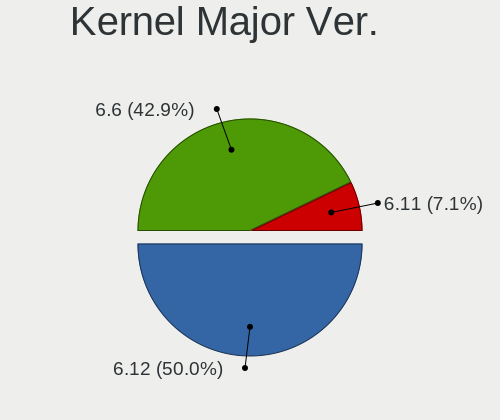
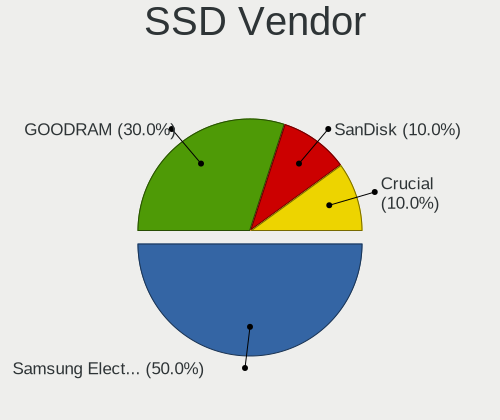
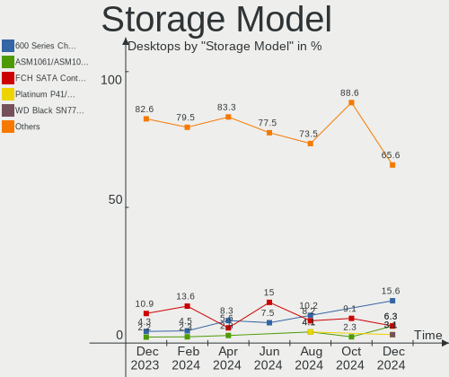
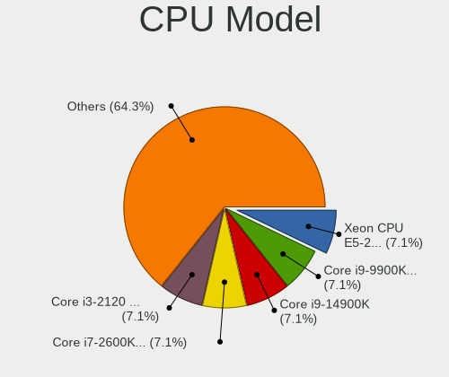
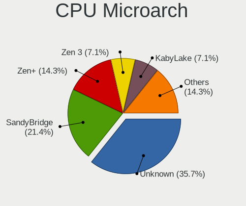
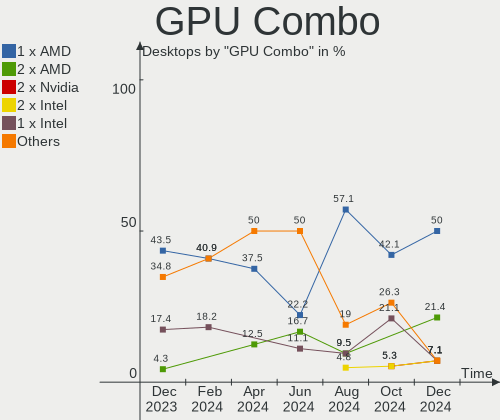
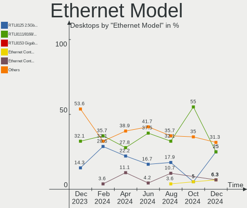
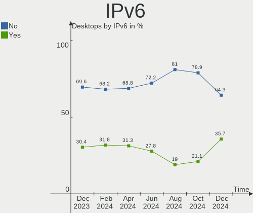

Gentoo - Hardware Trends (Desktops)
-----------------------------------

A project to identify most popular hardware characteristics and track their change
over time based on data collected by Linux users at https://Linux-Hardware.org.

Anyone can contribute to this report by the [hw-probe](https://github.com/linuxhw/hw-probe) tool:

    sudo -E hw-probe -all -upload

This report is for one last month. Overall report since the beginning of time: [TestDays](https://github.com/linuxhw/TestDays)

Period: Sep, 2023.

Contents
--------

* [ System ](#system)
  - [ OS                       ](#os)
  - [ OS Family                ](#os-family)
  - [ Kernel                   ](#kernel)
  - [ Kernel Family            ](#kernel-family)
  - [ Kernel Major Ver.        ](#kernel-major-ver)
  - [ Arch                     ](#arch)
  - [ DE                       ](#de)
  - [ Display Server           ](#display-server)
  - [ Display Manager          ](#display-manager)
  - [ OS Lang                  ](#os-lang)
  - [ Boot Mode                ](#boot-mode)
  - [ Filesystem               ](#filesystem)
  - [ Part. scheme             ](#part-scheme)
  - [ Dual Boot with Linux/BSD ](#dual-boot-with-linuxbsd)
  - [ Dual Boot (Win)          ](#dual-boot-win)

* [ Board ](#board)
  - [ Vendor                   ](#vendor)
  - [ Model                    ](#model)
  - [ Model Family             ](#model-family)
  - [ MFG Year                 ](#mfg-year)
  - [ Form Factor              ](#form-factor)
  - [ Secure Boot              ](#secure-boot)
  - [ Coreboot                 ](#coreboot)
  - [ RAM Size                 ](#ram-size)
  - [ RAM Used                 ](#ram-used)
  - [ Total Drives             ](#total-drives)
  - [ Has CD-ROM               ](#has-cd-rom)
  - [ Has Ethernet             ](#has-ethernet)
  - [ Has WiFi                 ](#has-wifi)
  - [ Has Bluetooth            ](#has-bluetooth)

* [ Location ](#location)
  - [ Country                  ](#country)
  - [ City                     ](#city)

* [ Drives ](#drives)
  - [ Drive Vendor             ](#drive-vendor)
  - [ Drive Model              ](#drive-model)
  - [ HDD Vendor               ](#hdd-vendor)
  - [ SSD Vendor               ](#ssd-vendor)
  - [ Drive Kind               ](#drive-kind)
  - [ Drive Connector          ](#drive-connector)
  - [ Drive Size               ](#drive-size)
  - [ Space Total              ](#space-total)
  - [ Space Used               ](#space-used)
  - [ Malfunc. Drives          ](#malfunc-drives)
  - [ Malfunc. Drive Vendor    ](#malfunc-drive-vendor)
  - [ Malfunc. HDD Vendor      ](#malfunc-hdd-vendor)
  - [ Malfunc. Drive Kind      ](#malfunc-drive-kind)
  - [ Failed Drives            ](#failed-drives)
  - [ Failed Drive Vendor      ](#failed-drive-vendor)
  - [ Drive Status             ](#drive-status)

* [ Storage controller ](#storage-controller)
  - [ Storage Vendor           ](#storage-vendor)
  - [ Storage Model            ](#storage-model)
  - [ Storage Kind             ](#storage-kind)

* [ Processor ](#processor)
  - [ CPU Vendor               ](#cpu-vendor)
  - [ CPU Model                ](#cpu-model)
  - [ CPU Model Family         ](#cpu-model-family)
  - [ CPU Cores                ](#cpu-cores)
  - [ CPU Sockets              ](#cpu-sockets)
  - [ CPU Threads              ](#cpu-threads)
  - [ CPU Op-Modes             ](#cpu-op-modes)
  - [ CPU Microcode            ](#cpu-microcode)
  - [ CPU Microarch            ](#cpu-microarch)

* [ Graphics ](#graphics)
  - [ GPU Vendor               ](#gpu-vendor)
  - [ GPU Model                ](#gpu-model)
  - [ GPU Combo                ](#gpu-combo)
  - [ GPU Driver               ](#gpu-driver)
  - [ GPU Memory               ](#gpu-memory)

* [ Monitor ](#monitor)
  - [ Monitor Vendor           ](#monitor-vendor)
  - [ Monitor Model            ](#monitor-model)
  - [ Monitor Resolution       ](#monitor-resolution)
  - [ Monitor Diagonal         ](#monitor-diagonal)
  - [ Monitor Width            ](#monitor-width)
  - [ Aspect Ratio             ](#aspect-ratio)
  - [ Monitor Area             ](#monitor-area)
  - [ Pixel Density            ](#pixel-density)
  - [ Multiple Monitors        ](#multiple-monitors)

* [ Network ](#network)
  - [ Net Controller Vendor    ](#net-controller-vendor)
  - [ Net Controller Model     ](#net-controller-model)
  - [ Wireless Vendor          ](#wireless-vendor)
  - [ Wireless Model           ](#wireless-model)
  - [ Ethernet Vendor          ](#ethernet-vendor)
  - [ Ethernet Model           ](#ethernet-model)
  - [ Net Controller Kind      ](#net-controller-kind)
  - [ Used Controller          ](#used-controller)
  - [ NICs                     ](#nics)
  - [ IPv6                     ](#ipv6)

* [ Bluetooth ](#bluetooth)
  - [ Bluetooth Vendor         ](#bluetooth-vendor)
  - [ Bluetooth Model          ](#bluetooth-model)

* [ Sound ](#sound)
  - [ Sound Vendor             ](#sound-vendor)
  - [ Sound Model              ](#sound-model)

* [ Memory ](#memory)
  - [ Memory Vendor            ](#memory-vendor)
  - [ Memory Model             ](#memory-model)
  - [ Memory Kind              ](#memory-kind)
  - [ Memory Form Factor       ](#memory-form-factor)
  - [ Memory Size              ](#memory-size)
  - [ Memory Speed             ](#memory-speed)

* [ Printers & scanners ](#printers--scanners)
  - [ Printer Vendor           ](#printer-vendor)
  - [ Printer Model            ](#printer-model)
  - [ Scanner Vendor           ](#scanner-vendor)
  - [ Scanner Model            ](#scanner-model)

* [ Camera ](#camera)
  - [ Camera Vendor            ](#camera-vendor)
  - [ Camera Model             ](#camera-model)

* [ Security ](#security)
  - [ Fingerprint Vendor       ](#fingerprint-vendor)
  - [ Fingerprint Model        ](#fingerprint-model)
  - [ Chipcard Vendor          ](#chipcard-vendor)
  - [ Chipcard Model           ](#chipcard-model)

* [ Unsupported ](#unsupported)
  - [ Unsupported Devices      ](#unsupported-devices)
  - [ Unsupported Device Types ](#unsupported-device-types)

System
------

OS
--

Installed operating systems

| Name        | Desktops | Percent |
|-------------|----------|---------|
| Gentoo 2.14 | 17       | 100%    |

OS Family
---------

OS without a version

| Name   | Desktops | Percent |
|--------|----------|---------|
| Gentoo | 17       | 100%    |

Kernel
------

Version of the Linux kernel

| Version                     | Desktops | Percent |
|-----------------------------|----------|---------|
| 6.1.46-gentoo               | 3        | 17.65%  |
| 6.1.53-gentoo-r1            | 2        | 11.76%  |
| 6.5.2-gentoo-x86_64         | 1        | 5.88%   |
| 6.5.0-cachyos               | 1        | 5.88%   |
| 6.4.14-gentoo-dist-hardened | 1        | 5.88%   |
| 6.4.10-gentoo-x86_64        | 1        | 5.88%   |
| 6.3.9-zen1-flat             | 1        | 5.88%   |
| 6.1.53-gentoo-x86_64        | 1        | 5.88%   |
| 6.1.53-gentoo-dist          | 1        | 5.88%   |
| 6.1.50-gentoo               | 1        | 5.88%   |
| 6.1.46-gentoo-x86_64        | 1        | 5.88%   |
| 6.1.46-gentoo-nouveau-01    | 1        | 5.88%   |
| 6.1.46-gentoo-dist          | 1        | 5.88%   |
| 5.15.0-43-generic           | 1        | 5.88%   |

Kernel Family
-------------

Linux kernel without a distro release

| Version | Desktops | Percent |
|---------|----------|---------|
| 6.1.46  | 6        | 35.29%  |
| 6.1.53  | 4        | 23.53%  |
| 6.5.2   | 1        | 5.88%   |
| 6.5.0   | 1        | 5.88%   |
| 6.4.14  | 1        | 5.88%   |
| 6.4.10  | 1        | 5.88%   |
| 6.3.9   | 1        | 5.88%   |
| 6.1.50  | 1        | 5.88%   |
| 5.15.0  | 1        | 5.88%   |

Kernel Major Ver.
-----------------

Linux kernel major version

| Version | Desktops | Percent |
|---------|----------|---------|
| 6.1     | 11       | 64.71%  |
| 6.5     | 2        | 11.76%  |
| 6.4     | 2        | 11.76%  |
| 6.3     | 1        | 5.88%   |
| 5.15    | 1        | 5.88%   |

Arch
----

OS architecture (x86_64, i586, etc.)

| Name   | Desktops | Percent |
|--------|----------|---------|
| x86_64 | 17       | 100%    |

DE
--

Desktop Environment

| Name    | Desktops | Percent |
|---------|----------|---------|
| Unknown | 6        | 35.29%  |
| XFCE    | 4        | 23.53%  |
| GNOME   | 3        | 17.65%  |
| MATE    | 2        | 11.76%  |
| KDE5    | 2        | 11.76%  |

Display Server
--------------

X11 or Wayland

| Name    | Desktops | Percent |
|---------|----------|---------|
| X11     | 7        | 41.18%  |
| Tty     | 4        | 23.53%  |
| Unknown | 4        | 23.53%  |
| Wayland | 2        | 11.76%  |

Display Manager
---------------

SDDM, LightDM, etc.

| Name    | Desktops | Percent |
|---------|----------|---------|
| LightDM | 6        | 35.29%  |
| Unknown | 6        | 35.29%  |
| SDDM    | 3        | 17.65%  |
| SLiM    | 2        | 11.76%  |

OS Lang
-------

Language

| Lang    | Desktops | Percent |
|---------|----------|---------|
| en_US   | 4        | 23.53%  |
| en_GB   | 3        | 17.65%  |
| de_DE   | 3        | 17.65%  |
| C.UTF8  | 2        | 11.76%  |
| ru_RU   | 1        | 5.88%   |
| fr_FR   | 1        | 5.88%   |
| es_ES   | 1        | 5.88%   |
| en_IE   | 1        | 5.88%   |
| Unknown | 1        | 5.88%   |

Boot Mode
---------

EFI or BIOS

| Mode | Desktops | Percent |
|------|----------|---------|
| EFI  | 9        | 52.94%  |
| BIOS | 8        | 47.06%  |

Filesystem
----------

Type of filesystem

| Type  | Desktops | Percent |
|-------|----------|---------|
| Ext4  | 9        | 52.94%  |
| F2fs  | 3        | 17.65%  |
| Xfs   | 2        | 11.76%  |
| Btrfs | 2        | 11.76%  |
| Zfs   | 1        | 5.88%   |

Part. scheme
------------

Scheme of partitioning

| Type    | Desktops | Percent |
|---------|----------|---------|
| GPT     | 12       | 70.59%  |
| Unknown | 3        | 17.65%  |
| MBR     | 2        | 11.76%  |

Dual Boot with Linux/BSD
------------------------

Hosting more than one Linux/BSD

| Dual boot | Desktops | Percent |
|-----------|----------|---------|
| No        | 12       | 70.59%  |
| Yes       | 5        | 29.41%  |

Dual Boot (Win)
---------------

Hosting Linux and Windows

| Dual boot | Desktops | Percent |
|-----------|----------|---------|
| No        | 14       | 82.35%  |
| Yes       | 3        | 17.65%  |

Board
-----

Vendor
------

Motherboard manufacturer

| Name                | Desktops | Percent |
|---------------------|----------|---------|
| ASUSTek Computer    | 7        | 41.18%  |
| Gigabyte Technology | 3        | 17.65%  |
| Supermicro          | 1        | 5.88%   |
| MSI                 | 1        | 5.88%   |
| Hewlett-Packard     | 1        | 5.88%   |
| Fujitsu             | 1        | 5.88%   |
| Dell                | 1        | 5.88%   |
| BESSTAR Tech        | 1        | 5.88%   |
| ASRock              | 1        | 5.88%   |

Model
-----

Motherboard model

| Name                               | Desktops | Percent |
|------------------------------------|----------|---------|
| Supermicro SYS-5038MD-H24TRF-OS012 | 1        | 5.88%   |
| MSI MS-7D89                        | 1        | 5.88%   |
| HP Z420 Workstation                | 1        | 5.88%   |
| Gigabyte B75M-D2V                  | 1        | 5.88%   |
| Gigabyte AB350-Gaming              | 1        | 5.88%   |
| Gigabyte A520 AORUS ELITE          | 1        | 5.88%   |
| Fujitsu ESPRIMO E700               | 1        | 5.88%   |
| Dell Inspiron 531                  | 1        | 5.88%   |
| BESSTAR Tech HM90                  | 1        | 5.88%   |
| ASUS ROG STRIX Z590-F GAMING WIFI  | 1        | 5.88%   |
| ASUS ROG STRIX X670E-F GAMING WIFI | 1        | 5.88%   |
| ASUS PRIME Z690-P WIFI D4          | 1        | 5.88%   |
| ASUS PRIME N100I-D D4              | 1        | 5.88%   |
| ASUS PRIME H310M-E/BR              | 1        | 5.88%   |
| ASUS PRIME B550M-K                 | 1        | 5.88%   |
| ASUS M3A78-CM                      | 1        | 5.88%   |
| ASRock B85M                        | 1        | 5.88%   |

Model Family
------------

Motherboard model prefix

| Name                               | Desktops | Percent |
|------------------------------------|----------|---------|
| ASUS PRIME                         | 4        | 23.53%  |
| ASUS ROG                           | 2        | 11.76%  |
| Supermicro SYS-5038MD-H24TRF-OS012 | 1        | 5.88%   |
| MSI MS-7D89                        | 1        | 5.88%   |
| HP Z420                            | 1        | 5.88%   |
| Gigabyte B75M-D2V                  | 1        | 5.88%   |
| Gigabyte AB350-Gaming              | 1        | 5.88%   |
| Gigabyte A520                      | 1        | 5.88%   |
| Fujitsu ESPRIMO                    | 1        | 5.88%   |
| Dell Inspiron                      | 1        | 5.88%   |
| BESSTAR Tech HM90                  | 1        | 5.88%   |
| ASUS M3A78-CM                      | 1        | 5.88%   |
| ASRock B85M                        | 1        | 5.88%   |

MFG Year
--------

Motherboard manufacture year

| Year | Desktops | Percent |
|------|----------|---------|
| 2021 | 3        | 17.65%  |
| 2022 | 2        | 11.76%  |
| 2020 | 2        | 11.76%  |
| 2018 | 2        | 11.76%  |
| 2012 | 2        | 11.76%  |
| 2023 | 1        | 5.88%   |
| 2017 | 1        | 5.88%   |
| 2013 | 1        | 5.88%   |
| 2011 | 1        | 5.88%   |
| 2008 | 1        | 5.88%   |
| 2007 | 1        | 5.88%   |

Form Factor
-----------

Physical design of the computer

| Name    | Desktops | Percent |
|---------|----------|---------|
| Desktop | 17       | 100%    |

Secure Boot
-----------

Enabled or disabled

| State    | Desktops | Percent |
|----------|----------|---------|
| Disabled | 17       | 100%    |

Coreboot
--------

Have coreboot on board

| Used | Desktops | Percent |
|------|----------|---------|
| No   | 17       | 100%    |

RAM Size
--------

Total RAM memory

| Size in GB  | Desktops | Percent |
|-------------|----------|---------|
| 32.01-64.0  | 7        | 41.18%  |
| 64.01-256.0 | 4        | 23.53%  |
| 16.01-24.0  | 3        | 17.65%  |
| 4.01-8.0    | 2        | 11.76%  |
| 3.01-4.0    | 1        | 5.88%   |

RAM Used
--------

Used RAM memory

| Used GB    | Desktops | Percent |
|------------|----------|---------|
| 3.01-4.0   | 4        | 23.53%  |
| 1.01-2.0   | 4        | 23.53%  |
| 2.01-3.0   | 3        | 17.65%  |
| 4.01-8.0   | 2        | 11.76%  |
| 8.01-16.0  | 2        | 11.76%  |
| 16.01-24.0 | 1        | 5.88%   |
| 0.51-1.0   | 1        | 5.88%   |

Total Drives
------------

Number of drives on board

| Drives | Desktops | Percent |
|--------|----------|---------|
| 2      | 9        | 52.94%  |
| 3      | 4        | 23.53%  |
| 1      | 3        | 17.65%  |
| 6      | 1        | 5.88%   |

Has CD-ROM
----------

Has CD-ROM on board

| Presented | Desktops | Percent |
|-----------|----------|---------|
| No        | 10       | 58.82%  |
| Yes       | 7        | 41.18%  |

Has Ethernet
------------

Has Ethernet on board

| Presented | Desktops | Percent |
|-----------|----------|---------|
| Yes       | 17       | 100%    |

Has WiFi
--------

Has WiFi module

| Presented | Desktops | Percent |
|-----------|----------|---------|
| No        | 13       | 76.47%  |
| Yes       | 4        | 23.53%  |

Has Bluetooth
-------------

Has Bluetooth module

| Presented | Desktops | Percent |
|-----------|----------|---------|
| No        | 11       | 64.71%  |
| Yes       | 6        | 35.29%  |

Location
--------

Country
-------

Geographic location (country)

| Country | Desktops | Percent |
|---------|----------|---------|
| Poland  | 4        | 23.53%  |
| Germany | 4        | 23.53%  |
| UK      | 3        | 17.65%  |
| USA     | 1        | 5.88%   |
| Spain   | 1        | 5.88%   |
| Russia  | 1        | 5.88%   |
| Ireland | 1        | 5.88%   |
| France  | 1        | 5.88%   |
| Brazil  | 1        | 5.88%   |

City
----

Geographic location (city)

| City             | Desktops | Percent |
|------------------|----------|---------|
| Warsaw           | 3        | 17.65%  |
| Ufa              | 1        | 5.88%   |
| Torredembarra    | 1        | 5.88%   |
| Port Glasgow     | 1        | 5.88%   |
| Mönchengladbach | 1        | 5.88%   |
| Mogi das Cruzes  | 1        | 5.88%   |
| Leeds            | 1        | 5.88%   |
| Krefeld          | 1        | 5.88%   |
| Ivry-sur-Seine   | 1        | 5.88%   |
| Isle of Lewis    | 1        | 5.88%   |
| Dublin           | 1        | 5.88%   |
| Cologne          | 1        | 5.88%   |
| Cieszyn          | 1        | 5.88%   |
| Carlsbad         | 1        | 5.88%   |
| Berlin           | 1        | 5.88%   |

Drives
------

Drive Vendor
------------

Hard drive vendors

| Vendor                      | Desktops | Drives | Percent |
|-----------------------------|----------|--------|---------|
| Seagate                     | 6        | 6      | 17.65%  |
| Samsung Electronics         | 5        | 9      | 14.71%  |
| Phison Electronics          | 3        | 3      | 8.82%   |
| GOODRAM                     | 3        | 3      | 8.82%   |
| WDC                         | 2        | 2      | 5.88%   |
| Toshiba                     | 2        | 2      | 5.88%   |
| SanDisk                     | 2        | 2      | 5.88%   |
| Hitachi                     | 2        | 4      | 5.88%   |
| Crucial                     | 2        | 2      | 5.88%   |
| Yangtze Memory Technologies | 1        | 1      | 2.94%   |
| SPCC                        | 1        | 1      | 2.94%   |
| SABRENT                     | 1        | 1      | 2.94%   |
| MAXIO Technology (Hangzhou) | 1        | 1      | 2.94%   |
| Kingchuxing                 | 1        | 1      | 2.94%   |
| China                       | 1        | 1      | 2.94%   |
| Unknown                     | 1        | 1      | 2.94%   |

Drive Model
-----------

Hard drive models

| Model                                               | Desktops | Percent |
|-----------------------------------------------------|----------|---------|
| SanDisk SSD PLUS 240GB                              | 2        | 5.71%   |
| Samsung NVMe SSD Controller PM9A1/PM9A3/980PRO 1TB  | 2        | 5.71%   |
| GOODRAM SSDPR-CL100-480-G2 480GB                    | 2        | 5.71%   |
| Yangtze Memory ZHITAI TiPlus5000 1TB                | 1        | 2.86%   |
| WDC WD3200AAJS-00L7A0 320GB                         | 1        | 2.86%   |
| WDC WD10EALX-009BA0 1TB                             | 1        | 2.86%   |
| Toshiba HDWE150 5TB                                 | 1        | 2.86%   |
| Toshiba HDWD240 4TB                                 | 1        | 2.86%   |
| SPCC Solid State Disk 1TB                           | 1        | 2.86%   |
| Seagate ST6000DM003-2CY186 6TB                      | 1        | 2.86%   |
| Seagate ST4000DM004-2CV104 4TB                      | 1        | 2.86%   |
| Seagate ST2000DM005-2CW102 2TB                      | 1        | 2.86%   |
| Seagate ST2000DL003-9VT166 2TB                      | 1        | 2.86%   |
| Seagate ST18000NM003D-3DL103 18TB                   | 1        | 2.86%   |
| Seagate ST12000NM0008-2H3101 12TB                   | 1        | 2.86%   |
| Samsung SSD 980 1TB                                 | 1        | 2.86%   |
| Samsung SSD 860 QVO 2TB                             | 1        | 2.86%   |
| Samsung SSD 850 EVO 500GB                           | 1        | 2.86%   |
| Samsung NVMe SSD Controller SM981/PM981/PM983 256GB | 1        | 2.86%   |
| SABRENT Disk 752GB                                  | 1        | 2.86%   |
| Phison PS5013 E13 NVMe Controller 512GB             | 1        | 2.86%   |
| Phison PCIe SSD 1TB                                 | 1        | 2.86%   |
| Phison Corsair MP600 PRO XT 2TB                     | 1        | 2.86%   |
| MAXIO (Hangzhou) NVMe SSD Controller MAP1202 512GB  | 1        | 2.86%   |
| Kingchuxing SSD 512GB                               | 1        | 2.86%   |
| Hitachi HUS724030ALE641 3TB                         | 1        | 2.86%   |
| Hitachi HDT721010SLA360 1TB                         | 1        | 2.86%   |
| GOODRAM SSDPR-CL100-960-G3 960GB                    | 1        | 2.86%   |
| Crucial CT500MX500SSD1 500GB                        | 1        | 2.86%   |
| Crucial CT1000MX500SSD1 1TB                         | 1        | 2.86%   |
| China SSD 240GB                                     | 1        | 2.86%   |
| Unknown                                             | 1        | 2.86%   |

HDD Vendor
----------

Hard disk drive vendors

| Vendor  | Desktops | Drives | Percent |
|---------|----------|--------|---------|
| Seagate | 6        | 6      | 46.15%  |
| WDC     | 2        | 2      | 15.38%  |
| Toshiba | 2        | 2      | 15.38%  |
| Hitachi | 2        | 4      | 15.38%  |
| SABRENT | 1        | 1      | 7.69%   |

SSD Vendor
----------

Solid state drive vendors

| Vendor              | Desktops | Drives | Percent |
|---------------------|----------|--------|---------|
| GOODRAM             | 3        | 3      | 23.08%  |
| SanDisk             | 2        | 2      | 15.38%  |
| Samsung Electronics | 2        | 3      | 15.38%  |
| Crucial             | 2        | 2      | 15.38%  |
| SPCC                | 1        | 1      | 7.69%   |
| Kingchuxing         | 1        | 1      | 7.69%   |
| China               | 1        | 1      | 7.69%   |
| Unknown             | 1        | 1      | 7.69%   |

Drive Kind
----------

HDD or SSD

| Kind | Desktops | Drives | Percent |
|------|----------|--------|---------|
| SSD  | 11       | 14     | 40.74%  |
| HDD  | 9        | 15     | 33.33%  |
| NVMe | 7        | 11     | 25.93%  |

Drive Connector
---------------

SATA, SAS, NVMe, etc.

| Type | Desktops | Drives | Percent |
|------|----------|--------|---------|
| SATA | 15       | 28     | 65.22%  |
| NVMe | 7        | 11     | 30.43%  |
| SAS  | 1        | 1      | 4.35%   |

Drive Size
----------

Size of hard drive

| Size in TB | Desktops | Drives | Percent |
|------------|----------|--------|---------|
| 0.01-0.5   | 9        | 10     | 36%     |
| 0.51-1.0   | 7        | 7      | 28%     |
| 3.01-4.0   | 2        | 2      | 8%      |
| 10.01-20.0 | 2        | 2      | 8%      |
| 1.01-2.0   | 2        | 3      | 8%      |
| 4.01-10.0  | 2        | 2      | 8%      |
| 2.01-3.0   | 1        | 3      | 4%      |

Space Total
-----------

Amount of disk space available on the file system

| Size in GB     | Desktops | Percent |
|----------------|----------|---------|
| More than 3000 | 6        | 35.29%  |
| 1001-2000      | 4        | 23.53%  |
| 501-1000       | 3        | 17.65%  |
| Unknown        | 2        | 11.76%  |
| 251-500        | 1        | 5.88%   |
| 101-250        | 1        | 5.88%   |

Space Used
----------

Amount of used disk space

| Used GB        | Desktops | Percent |
|----------------|----------|---------|
| More than 3000 | 5        | 29.41%  |
| 501-1000       | 3        | 17.65%  |
| 251-500        | 2        | 11.76%  |
| 1-20           | 2        | 11.76%  |
| Unknown        | 2        | 11.76%  |
| 101-250        | 1        | 5.88%   |
| 1001-2000      | 1        | 5.88%   |
| 51-100         | 1        | 5.88%   |

Malfunc. Drives
---------------

Drive models with a malfunction

| Model                          | Desktops | Drives | Percent |
|--------------------------------|----------|--------|---------|
| Toshiba HDWD240 4TB            | 1        | 1      | 50%     |
| Seagate ST2000DM005-2CW102 2TB | 1        | 1      | 50%     |

Malfunc. Drive Vendor
---------------------

Vendors of faulty drives

| Vendor  | Desktops | Drives | Percent |
|---------|----------|--------|---------|
| Toshiba | 1        | 1      | 50%     |
| Seagate | 1        | 1      | 50%     |

Malfunc. HDD Vendor
-------------------

Vendors of faulty HDD drives

| Vendor  | Desktops | Drives | Percent |
|---------|----------|--------|---------|
| Toshiba | 1        | 1      | 50%     |
| Seagate | 1        | 1      | 50%     |

Malfunc. Drive Kind
-------------------

Kinds of faulty drives

| Kind | Desktops | Drives | Percent |
|------|----------|--------|---------|
| HDD  | 2        | 2      | 100%    |

Failed Drives
-------------

Failed drive models

Zero info for selected period =(

Failed Drive Vendor
-------------------

Failed drive vendors

Zero info for selected period =(

Drive Status
------------

Number of failed and malfunc. drives

| Status   | Desktops | Drives | Percent |
|----------|----------|--------|---------|
| Works    | 14       | 27     | 66.67%  |
| Detected | 5        | 11     | 23.81%  |
| Malfunc  | 2        | 2      | 9.52%   |

Storage controller
------------------

Storage Vendor
--------------

Storage controller vendors

| Vendor                      | Desktops | Percent |
|-----------------------------|----------|---------|
| Intel                       | 10       | 38.46%  |
| AMD                         | 6        | 23.08%  |
| Samsung Electronics         | 3        | 11.54%  |
| Phison Electronics          | 3        | 11.54%  |
| ASMedia Technology          | 2        | 7.69%   |
| Nvidia                      | 1        | 3.85%   |
| MAXIO Technology (Hangzhou) | 1        | 3.85%   |

Storage Model
-------------

Storage controller models

| Model                                                                          | Desktops | Percent |
|--------------------------------------------------------------------------------|----------|---------|
| AMD FCH SATA Controller [AHCI mode]                                            | 3        | 9.09%   |
| Samsung NVMe SSD Controller PM9A1/PM9A3/980PRO                                 | 2        | 6.06%   |
| Phison E18 PCIe4 NVMe Controller                                               | 2        | 6.06%   |
| Intel 8 Series/C220 Series Chipset Family 6-port SATA Controller 1 [AHCI mode] | 2        | 6.06%   |
| AMD 500 Series Chipset SATA Controller                                         | 2        | 6.06%   |
| Samsung NVMe SSD Controller SM981/PM981/PM983                                  | 1        | 3.03%   |
| Samsung NVMe SSD Controller 980                                                | 1        | 3.03%   |
| Phison PS5013 E13 NVMe Controller                                              | 1        | 3.03%   |
| Nvidia MCP61 SATA Controller                                                   | 1        | 3.03%   |
| Nvidia MCP61 IDE                                                               | 1        | 3.03%   |
| MAXIO (Hangzhou) NVMe SSD Controller MAP1202                                   | 1        | 3.03%   |
| Intel Volume Management Device NVMe RAID Controller                            | 1        | 3.03%   |
| Intel SATA controller                                                          | 1        | 3.03%   |
| Intel Cannon Lake PCH SATA AHCI Controller                                     | 1        | 3.03%   |
| Intel C602 chipset 4-Port SATA Storage Control Unit                            | 1        | 3.03%   |
| Intel C600/X79 series chipset IDE-r Controller                                 | 1        | 3.03%   |
| Intel C600/X79 series chipset 6-Port SATA AHCI Controller                      | 1        | 3.03%   |
| Intel Alder Lake-S PCH SATA Controller [AHCI Mode]                             | 1        | 3.03%   |
| Intel 700 Series Chipset Family SATA AHCI Controller                           | 1        | 3.03%   |
| Intel 7 Series/C210 Series Chipset Family 6-port SATA Controller [AHCI mode]   | 1        | 3.03%   |
| Intel 6 Series/C200 Series Chipset Family 6 port Desktop SATA AHCI Controller  | 1        | 3.03%   |
| Intel 500 Series Chipset Family SATA AHCI Controller                           | 1        | 3.03%   |
| ASMedia ASM1062 Serial ATA Controller                                          | 1        | 3.03%   |
| ASMedia 1064 SATA Controller                                                   | 1        | 3.03%   |
| AMD SB7x0/SB8x0/SB9x0 SATA Controller [IDE mode]                               | 1        | 3.03%   |
| AMD SB7x0/SB8x0/SB9x0 IDE Controller                                           | 1        | 3.03%   |
| AMD 300 Series Chipset SATA Controller                                         | 1        | 3.03%   |

Storage Kind
------------

Kind of storage controller (IDE, SATA, NVMe, SAS, ...)

| Kind | Desktops | Percent |
|------|----------|---------|
| SATA | 16       | 59.26%  |
| NVMe | 6        | 22.22%  |
| IDE  | 3        | 11.11%  |
| RAID | 1        | 3.7%    |
| SAS  | 1        | 3.7%    |

Processor
---------

CPU Vendor
----------

Processor vendors

| Vendor | Desktops | Percent |
|--------|----------|---------|
| Intel  | 10       | 58.82%  |
| AMD    | 7        | 41.18%  |

CPU Model
---------

Processor models

| Model                                      | Desktops | Percent |
|--------------------------------------------|----------|---------|
| Intel Xeon CPU E5-1680 v2 @ 3.00GHz        | 1        | 5.88%   |
| Intel Xeon CPU D-1531 @ 2.20GHz            | 1        | 5.88%   |
| Intel N100                                 | 1        | 5.88%   |
| Intel Core i9-10850K CPU @ 3.60GHz         | 1        | 5.88%   |
| Intel Core i7-8700 CPU @ 3.20GHz           | 1        | 5.88%   |
| Intel Core i7-2600 CPU @ 3.40GHz           | 1        | 5.88%   |
| Intel Core i5-2400 CPU @ 3.10GHz           | 1        | 5.88%   |
| Intel Core i3-4130 CPU @ 3.40GHz           | 1        | 5.88%   |
| Intel 13th Gen Core i9-13900               | 1        | 5.88%   |
| Intel 12th Gen Core i5-12600K              | 1        | 5.88%   |
| AMD Ryzen 9 7900X 12-Core Processor        | 1        | 5.88%   |
| AMD Ryzen 9 4900H with Radeon Graphics     | 1        | 5.88%   |
| AMD Ryzen 7 5800X 8-Core Processor         | 1        | 5.88%   |
| AMD Ryzen 7 5700G with Radeon Graphics     | 1        | 5.88%   |
| AMD Ryzen 5 2600 Six-Core Processor        | 1        | 5.88%   |
| AMD Phenom II X4 955 Processor             | 1        | 5.88%   |
| AMD Athlon 64 X2 Dual Core Processor 5000+ | 1        | 5.88%   |

CPU Model Family
----------------

Processor model prefix

| Model            | Desktops | Percent |
|------------------|----------|---------|
| Other            | 3        | 17.65%  |
| Intel Xeon       | 2        | 11.76%  |
| Intel Core i7    | 2        | 11.76%  |
| AMD Ryzen 9      | 2        | 11.76%  |
| AMD Ryzen 7      | 2        | 11.76%  |
| Intel Core i9    | 1        | 5.88%   |
| Intel Core i5    | 1        | 5.88%   |
| Intel Core i3    | 1        | 5.88%   |
| AMD Ryzen 5      | 1        | 5.88%   |
| AMD Phenom II X4 | 1        | 5.88%   |
| AMD Athlon 64 X2 | 1        | 5.88%   |

CPU Cores
---------

Number of processor cores

| Number | Desktops | Percent |
|--------|----------|---------|
| 8      | 4        | 23.53%  |
| 4      | 4        | 23.53%  |
| 6      | 3        | 17.65%  |
| 10     | 2        | 11.76%  |
| 2      | 2        | 11.76%  |
| 24     | 1        | 5.88%   |
| 12     | 1        | 5.88%   |

CPU Sockets
-----------

Number of sockets

| Number | Desktops | Percent |
|--------|----------|---------|
| 1      | 17       | 100%    |

CPU Threads
-----------

Threads per core (Hyper-Threading)

| Number | Desktops | Percent |
|--------|----------|---------|
| 2      | 12       | 70.59%  |
| 1      | 5        | 29.41%  |

CPU Op-Modes
------------

CPU Operation Modes (32-bit, 64-bit)

| Op mode        | Desktops | Percent |
|----------------|----------|---------|
| 32-bit, 64-bit | 17       | 100%    |

CPU Microcode
-------------

Microcode number

| Number     | Desktops | Percent |
|------------|----------|---------|
| Unknown    | 7        | 41.18%  |
| 0xb06e0    | 1        | 5.88%   |
| 0xb0671    | 1        | 5.88%   |
| 0x906ea    | 1        | 5.88%   |
| 0x90672    | 1        | 5.88%   |
| 0x50663    | 1        | 5.88%   |
| 0x306e4    | 1        | 5.88%   |
| 0x0a601203 | 1        | 5.88%   |
| 0x0a50000d | 1        | 5.88%   |
| 0x0a20120a | 1        | 5.88%   |
| 0x0800820d | 1        | 5.88%   |

CPU Microarch
-------------

Microarchitecture

| Name             | Desktops | Percent |
|------------------|----------|---------|
| Zen 3            | 2        | 11.76%  |
| SandyBridge      | 2        | 11.76%  |
| Alderlake Hybrid | 2        | 11.76%  |
| Zen+             | 1        | 5.88%   |
| Zen 2            | 1        | 5.88%   |
| KabyLake         | 1        | 5.88%   |
| K8 Hammer        | 1        | 5.88%   |
| K10              | 1        | 5.88%   |
| IvyBridge        | 1        | 5.88%   |
| Haswell          | 1        | 5.88%   |
| Gracemont        | 1        | 5.88%   |
| CometLake        | 1        | 5.88%   |
| Broadwell        | 1        | 5.88%   |
| Unknown          | 1        | 5.88%   |

Graphics
--------

GPU Vendor
----------

Vendors of graphics cards

| Vendor            | Desktops | Percent |
|-------------------|----------|---------|
| AMD               | 8        | 42.11%  |
| Nvidia            | 6        | 31.58%  |
| Intel             | 4        | 21.05%  |
| ASPEED Technology | 1        | 5.26%   |

GPU Model
---------

Graphics card models

| Model                                                                     | Desktops | Percent |
|---------------------------------------------------------------------------|----------|---------|
| AMD Navi 21 [Radeon RX 6800/6800 XT / 6900 XT]                            | 3        | 15%     |
| AMD Cedar [Radeon HD 5000/6000/7350/8350 Series]                          | 2        | 10%     |
| Nvidia GP108 [GeForce GT 1030]                                            | 1        | 5%      |
| Nvidia GP107 [GeForce GTX 1050 Ti]                                        | 1        | 5%      |
| Nvidia GK208B [GeForce GT 710]                                            | 1        | 5%      |
| Nvidia GA104 [GeForce RTX 3060 Ti GDDR6X]                                 | 1        | 5%      |
| Nvidia GA102 [GeForce RTX 3080 Ti]                                        | 1        | 5%      |
| Nvidia C61 [GeForce 6150SE nForce 430]                                    | 1        | 5%      |
| Intel Raptor Lake-S GT1 [UHD Graphics 770]                                | 1        | 5%      |
| Intel CoffeeLake-S GT2 [UHD Graphics 630]                                 | 1        | 5%      |
| Intel Alder Lake-N [UHD Graphics]                                         | 1        | 5%      |
| Intel 4th Generation Core Processor Family Integrated Graphics Controller | 1        | 5%      |
| ASPEED Technology ASPEED Graphics Family                                  | 1        | 5%      |
| AMD RS780C [Radeon 3100]                                                  | 1        | 5%      |
| AMD Renoir                                                                | 1        | 5%      |
| AMD Cezanne [Radeon Vega Series / Radeon Vega Mobile Series]              | 1        | 5%      |
| AMD Cape Verde PRO [Radeon HD 7750/8740 / R7 250E]                        | 1        | 5%      |

GPU Combo
---------

Combinations of graphics cards

| Name           | Desktops | Percent |
|----------------|----------|---------|
| 1 x AMD        | 8        | 47.06%  |
| 1 x Nvidia     | 4        | 23.53%  |
| Intel + Nvidia | 2        | 11.76%  |
| 1 x Intel      | 2        | 11.76%  |
| 1 x ASPEED     | 1        | 5.88%   |

GPU Driver
----------

Free vs proprietary

| Driver      | Desktops | Percent |
|-------------|----------|---------|
| Free        | 13       | 76.47%  |
| Proprietary | 3        | 17.65%  |
| Unknown     | 1        | 5.88%   |

GPU Memory
----------

Total video memory

| Size in GB | Desktops | Percent |
|------------|----------|---------|
| Unknown    | 9        | 52.94%  |
| 8.01-16.0  | 3        | 17.65%  |
| 7.01-8.0   | 1        | 5.88%   |
| 3.01-4.0   | 1        | 5.88%   |
| 1.01-2.0   | 1        | 5.88%   |
| 0.51-1.0   | 1        | 5.88%   |
| 0.01-0.5   | 1        | 5.88%   |

Monitor
-------

Monitor Vendor
--------------

Monitor vendors

| Vendor              | Desktops | Percent |
|---------------------|----------|---------|
| Samsung Electronics | 6        | 33.33%  |
| Philips             | 2        | 11.11%  |
| Goldstar            | 2        | 11.11%  |
| Unknown             | 1        | 5.56%   |
| UGD                 | 1        | 5.56%   |
| Toshiba             | 1        | 5.56%   |
| Iiyama              | 1        | 5.56%   |
| Eizo                | 1        | 5.56%   |
| Dell                | 1        | 5.56%   |
| BenQ                | 1        | 5.56%   |
| AOC                 | 1        | 5.56%   |

Monitor Model
-------------

Monitor models

| Model                                                                   | Desktops | Percent |
|-------------------------------------------------------------------------|----------|---------|
| Unknown LCD Monitor FFFF 2288x1287 2550x2550mm 142.0-inch               | 1        | 5.26%   |
| UGD Artist13.3pro UGD1302 1920x1080 294x165mm 13.3-inch                 | 1        | 5.26%   |
| Toshiba TV TSB0108 1920x540                                             | 1        | 5.26%   |
| Samsung Electronics SyncMaster SAM059A 1920x1080 477x268mm 21.5-inch    | 1        | 5.26%   |
| Samsung Electronics SMT24A550 SAM07B5 1920x1080 531x299mm 24.0-inch     | 1        | 5.26%   |
| Samsung Electronics SMS27A650 SAM082E 1920x1080 598x336mm 27.0-inch     | 1        | 5.26%   |
| Samsung Electronics S22B300 SAM08C8 1920x1080 477x268mm 21.5-inch       | 1        | 5.26%   |
| Samsung Electronics LS28AG700N SAM7177 3840x2160 632x360mm 28.6-inch    | 1        | 5.26%   |
| Samsung Electronics LCD Monitor SAM7003 3840x2160 1872x1053mm 84.6-inch | 1        | 5.26%   |
| Philips PHL 288P6L PHL08F2 3840x2160 621x341mm 27.9-inch                | 1        | 5.26%   |
| Philips PHL 278E8Q PHLC161 1920x1080 598x336mm 27.0-inch                | 1        | 5.26%   |
| Iiyama PL2783Q IVM661F 2560x1440 597x336mm 27.0-inch                    | 1        | 5.26%   |
| Goldstar ULTRAGEAR GSM775C 1920x1080 698x393mm 31.5-inch                | 1        | 5.26%   |
| Goldstar MP59G GSM5B35 1920x1080 480x270mm 21.7-inch                    | 1        | 5.26%   |
| Eizo L557 ENC1690 1280x1024 337x270mm 17.0-inch                         | 1        | 5.26%   |
| Eizo L557 ENC1689 1280x1024 337x270mm 17.0-inch                         | 1        | 5.26%   |
| Dell P2418D DELD0C2 2560x1440 526x296mm 23.8-inch                       | 1        | 5.26%   |
| BenQ PD3200U BNQ8025 3840x2160 708x399mm 32.0-inch                      | 1        | 5.26%   |
| AOC 22B2WG5 AOC2202 1920x1080 477x268mm 21.5-inch                       | 1        | 5.26%   |

Monitor Resolution
------------------

Monitor screen resolution

| Resolution       | Desktops | Percent |
|------------------|----------|---------|
| 1920x1080 (FHD)  | 7        | 43.75%  |
| 3840x2160 (4K)   | 4        | 25%     |
| 2560x1440 (QHD)  | 2        | 12.5%   |
| 2288x1287        | 1        | 6.25%   |
| 1920x540         | 1        | 6.25%   |
| 1280x1024 (SXGA) | 1        | 6.25%   |

Monitor Diagonal
----------------

Diagonal size in inches

| Inches | Desktops | Percent |
|--------|----------|---------|
| 27     | 4        | 25%     |
| 24     | 2        | 12.5%   |
| 21     | 2        | 12.5%   |
| 142    | 1        | 6.25%   |
| 84     | 1        | 6.25%   |
| 72     | 1        | 6.25%   |
| 32     | 1        | 6.25%   |
| 31     | 1        | 6.25%   |
| 28     | 1        | 6.25%   |
| 17     | 1        | 6.25%   |
| 13     | 1        | 6.25%   |

Monitor Width
-------------

Physical width

| Width in mm    | Desktops | Percent |
|----------------|----------|---------|
| 501-600        | 5        | 33.33%  |
| 601-700        | 2        | 13.33%  |
| 401-500        | 2        | 13.33%  |
| 1501-2000      | 2        | 13.33%  |
| More than 2000 | 1        | 6.67%   |
| 701-800        | 1        | 6.67%   |
| 301-350        | 1        | 6.67%   |
| 201-300        | 1        | 6.67%   |

Aspect Ratio
------------

Proportional relationship between the width and the height

| Ratio | Desktops | Percent |
|-------|----------|---------|
| 16/9  | 11       | 84.62%  |
| 5/4   | 1        | 7.69%   |
| 1.00  | 1        | 7.69%   |

Monitor Area
------------

Area in inch²

| Area in inch² | Desktops | Percent |
|----------------|----------|---------|
| 301-350        | 4        | 25%     |
| 201-250        | 4        | 25%     |
| More than 1000 | 3        | 18.75%  |
| 351-500        | 2        | 12.5%   |
| 71-80          | 1        | 6.25%   |
| 151-200        | 1        | 6.25%   |
| 141-150        | 1        | 6.25%   |

Pixel Density
-------------

Pixels per inch

| Density | Desktops | Percent |
|---------|----------|---------|
| 51-100  | 7        | 41.18%  |
| 121-160 | 4        | 23.53%  |
| 101-120 | 3        | 17.65%  |
| 1-50    | 2        | 11.76%  |
| 161-240 | 1        | 5.88%   |

Multiple Monitors
-----------------

Total monitors connected

| Total | Desktops | Percent |
|-------|----------|---------|
| 1     | 9        | 52.94%  |
| 2     | 4        | 23.53%  |
| 0     | 3        | 17.65%  |
| 3     | 1        | 5.88%   |

Network
-------

Net Controller Vendor
---------------------

Controller vendors

| Vendor                | Desktops | Percent |
|-----------------------|----------|---------|
| Realtek Semiconductor | 12       | 52.17%  |
| Intel                 | 8        | 34.78%  |
| Nvidia                | 1        | 4.35%   |
| MediaTek              | 1        | 4.35%   |
| Broadcom              | 1        | 4.35%   |

Net Controller Model
--------------------

Controller models

| Model                                                             | Desktops | Percent |
|-------------------------------------------------------------------|----------|---------|
| Realtek RTL8111/8168/8411 PCI Express Gigabit Ethernet Controller | 10       | 40%     |
| Intel Ethernet Controller I225-V                                  | 3        | 12%     |
| Realtek RTL8125 2.5GbE Controller                                 | 1        | 4%      |
| Realtek RTL-8100/8101L/8139 PCI Fast Ethernet Adapter             | 1        | 4%      |
| Nvidia MCP61 Ethernet                                             | 1        | 4%      |
| MediaTek MT7921K (RZ608) Wi-Fi 6E 80MHz                           | 1        | 4%      |
| Intel Wi-Fi 6 AX210/AX211/AX411 160MHz                            | 1        | 4%      |
| Intel I350 Gigabit Network Connection                             | 1        | 4%      |
| Intel Ethernet Controller I226-V                                  | 1        | 4%      |
| Intel Alder Lake-S PCH CNVi WiFi                                  | 1        | 4%      |
| Intel 82579V Gigabit Network Connection                           | 1        | 4%      |
| Intel 82579LM Gigabit Network Connection (Lewisville)             | 1        | 4%      |
| Intel 700 Series Chipset Family Wi-Fi                             | 1        | 4%      |
| Broadcom NetXtreme BCM5715 Gigabit Ethernet                       | 1        | 4%      |

Wireless Vendor
---------------

Wireless vendors

| Vendor   | Desktops | Percent |
|----------|----------|---------|
| Intel    | 3        | 75%     |
| MediaTek | 1        | 25%     |

Wireless Model
--------------

Wireless models

| Model                                   | Desktops | Percent |
|-----------------------------------------|----------|---------|
| MediaTek MT7921K (RZ608) Wi-Fi 6E 80MHz | 1        | 25%     |
| Intel Wi-Fi 6 AX210/AX211/AX411 160MHz  | 1        | 25%     |
| Intel Alder Lake-S PCH CNVi WiFi        | 1        | 25%     |
| Intel 700 Series Chipset Family Wi-Fi   | 1        | 25%     |

Ethernet Vendor
---------------

Ethernet vendors

| Vendor                | Desktops | Percent |
|-----------------------|----------|---------|
| Realtek Semiconductor | 12       | 57.14%  |
| Intel                 | 7        | 33.33%  |
| Nvidia                | 1        | 4.76%   |
| Broadcom              | 1        | 4.76%   |

Ethernet Model
--------------

Ethernet models

| Model                                                             | Desktops | Percent |
|-------------------------------------------------------------------|----------|---------|
| Realtek RTL8111/8168/8411 PCI Express Gigabit Ethernet Controller | 10       | 47.62%  |
| Intel Ethernet Controller I225-V                                  | 3        | 14.29%  |
| Realtek RTL8125 2.5GbE Controller                                 | 1        | 4.76%   |
| Realtek RTL-8100/8101L/8139 PCI Fast Ethernet Adapter             | 1        | 4.76%   |
| Nvidia MCP61 Ethernet                                             | 1        | 4.76%   |
| Intel I350 Gigabit Network Connection                             | 1        | 4.76%   |
| Intel Ethernet Controller I226-V                                  | 1        | 4.76%   |
| Intel 82579V Gigabit Network Connection                           | 1        | 4.76%   |
| Intel 82579LM Gigabit Network Connection (Lewisville)             | 1        | 4.76%   |
| Broadcom NetXtreme BCM5715 Gigabit Ethernet                       | 1        | 4.76%   |

Net Controller Kind
-------------------

Ethernet, WiFi or modem

| Kind     | Desktops | Percent |
|----------|----------|---------|
| Ethernet | 17       | 80.95%  |
| WiFi     | 4        | 19.05%  |

Used Controller
---------------

Currently used network controller

| Kind     | Desktops | Percent |
|----------|----------|---------|
| Ethernet | 13       | 81.25%  |
| WiFi     | 3        | 18.75%  |

NICs
----

Total network controllers on board

| Total | Desktops | Percent |
|-------|----------|---------|
| 1     | 10       | 58.82%  |
| 2     | 5        | 29.41%  |
| 7     | 1        | 5.88%   |
| 3     | 1        | 5.88%   |

IPv6
----

IPv6 vs IPv4

| Used | Desktops | Percent |
|------|----------|---------|
| No   | 12       | 70.59%  |
| Yes  | 5        | 29.41%  |

Bluetooth
---------

Bluetooth Vendor
----------------

Controller vendors

| Vendor                  | Desktops | Percent |
|-------------------------|----------|---------|
| Intel                   | 4        | 66.67%  |
| MediaTek                | 1        | 16.67%  |
| Cambridge Silicon Radio | 1        | 16.67%  |

Bluetooth Model
---------------

Controller models

| Model                                               | Desktops | Percent |
|-----------------------------------------------------|----------|---------|
| MediaTek Wireless_Device                            | 1        | 16.67%  |
| Intel Bluetooth Device                              | 1        | 16.67%  |
| Intel AX210 Bluetooth                               | 1        | 16.67%  |
| Intel AX201 Bluetooth                               | 1        | 16.67%  |
| Intel AX200 Bluetooth                               | 1        | 16.67%  |
| Cambridge Silicon Radio Bluetooth Dongle (HCI mode) | 1        | 16.67%  |

Sound
-----

Sound Vendor
------------

Sound card vendors

| Vendor                               | Desktops | Percent |
|--------------------------------------|----------|---------|
| Intel                                | 9        | 28.13%  |
| AMD                                  | 9        | 28.13%  |
| Nvidia                               | 6        | 18.75%  |
| C-Media Electronics                  | 2        | 6.25%   |
| Thesycon Systemsoftware & Consulting | 1        | 3.13%   |
| Micro Star International             | 1        | 3.13%   |
| Generalplus Technology               | 1        | 3.13%   |
| FIFINE Microphones                   | 1        | 3.13%   |
| ASUSTek Computer                     | 1        | 3.13%   |
| AKG C44-USB Microphone               | 1        | 3.13%   |

Sound Model
-----------

Sound card models

| Model                                                                      | Desktops | Percent |
|----------------------------------------------------------------------------|----------|---------|
| AMD Navi 21/23 HDMI/DP Audio Controller                                    | 3        | 8.33%   |
| AMD Renoir Radeon High Definition Audio Controller                         | 2        | 5.56%   |
| AMD Family 17h/19h HD Audio Controller                                     | 2        | 5.56%   |
| AMD Cedar HDMI Audio [Radeon HD 5400/6300/7300 Series]                     | 2        | 5.56%   |
| Thesycon Systemsoftware & Consulting SABAJ USB AUDIO                       | 1        | 2.78%   |
| Nvidia MCP61 High Definition Audio                                         | 1        | 2.78%   |
| Nvidia GP108 High Definition Audio Controller                              | 1        | 2.78%   |
| Nvidia GP107GL High Definition Audio Controller                            | 1        | 2.78%   |
| Nvidia GK208 HDMI/DP Audio Controller                                      | 1        | 2.78%   |
| Nvidia GA104 High Definition Audio Controller                              | 1        | 2.78%   |
| Nvidia GA102 High Definition Audio Controller                              | 1        | 2.78%   |
| Micro Star International USB Audio                                         | 1        | 2.78%   |
| Intel Smart Sound Technology (SST) Audio Controller                        | 1        | 2.78%   |
| Intel Cannon Lake PCH cAVS                                                 | 1        | 2.78%   |
| Intel C600/X79 series chipset High Definition Audio Controller             | 1        | 2.78%   |
| Intel Alder Lake-S HD Audio Controller                                     | 1        | 2.78%   |
| Intel Alder Lake-N HD Graphics SGPC                                        | 1        | 2.78%   |
| Intel 8 Series/C220 Series Chipset High Definition Audio Controller        | 1        | 2.78%   |
| Intel 700 Series Chipset Family Precise Touch and Stylus Port #1           | 1        | 2.78%   |
| Intel 7 Series/C216 Chipset Family High Definition Audio Controller        | 1        | 2.78%   |
| Intel 6 Series/C200 Series Chipset Family High Definition Audio Controller | 1        | 2.78%   |
| Generalplus Technology USB Audio Device                                    | 1        | 2.78%   |
| FIFINE Microphones FIFINE K670 Microphone                                  | 1        | 2.78%   |
| C-Media Electronics Auna Mic CM900                                         | 1        | 2.78%   |
| C-Media Electronics Audio Adapter (Unitek Y-247A)                          | 1        | 2.78%   |
| ASUSTek Computer USB Audio                                                 | 1        | 2.78%   |
| AMD Starship/Matisse HD Audio Controller                                   | 1        | 2.78%   |
| AMD SBx00 Azalia (Intel HDA)                                               | 1        | 2.78%   |
| AMD Oland/Hainan/Cape Verde/Pitcairn HDMI Audio [Radeon HD 7000 Series]    | 1        | 2.78%   |
| AMD Family 17h (Models 00h-0fh) HD Audio Controller                        | 1        | 2.78%   |
| AKG C44-USB Microphone AKG C44-USB Microphone                              | 1        | 2.78%   |

Memory
------

Memory Vendor
-------------

Memory module vendors

| Vendor              | Desktops | Percent |
|---------------------|----------|---------|
| Corsair             | 3        | 20%     |
| SK hynix            | 2        | 13.33%  |
| Micron Technology   | 2        | 13.33%  |
| Kingston            | 2        | 13.33%  |
| G.Skill             | 2        | 13.33%  |
| Unknown             | 1        | 6.67%   |
| Samsung Electronics | 1        | 6.67%   |
| Crucial             | 1        | 6.67%   |
| A-DATA Technology   | 1        | 6.67%   |

Memory Model
------------

Memory module models

| Model                                                   | Desktops | Percent |
|---------------------------------------------------------|----------|---------|
| Unknown RAM Module 2GB DIMM DDR2 667MT/s                | 1        | 5.88%   |
| SK hynix RAM HYMP125U64CP8-S6 2GB DIMM DDR2 49926MT/s   | 1        | 5.88%   |
| SK hynix RAM HMT351U6EFR8A-PB 8GB DIMM DDR3 1333MT/s    | 1        | 5.88%   |
| Samsung RAM M471A2K43DB1-CTD 16GB SODIMM DDR4 2667MT/s  | 1        | 5.88%   |
| Micron RAM 36JSF2G72PZ-1G9N1 16GB DIMM DDR3 1866MT/s    | 1        | 5.88%   |
| Micron RAM 36JSF2G72PZ-1G9E1 16GB DIMM DDR3 1866MT/s    | 1        | 5.88%   |
| Micron RAM 18ADF2G72AZ-2G6H1R 16GB DIMM DDR4 2667MT/s   | 1        | 5.88%   |
| Kingston RAM KPN424-ELG 1GB DIMM DDR2 667MT/s           | 1        | 5.88%   |
| Kingston RAM KF556C36-32 32GB DIMM DDR5 5600MT/s        | 1        | 5.88%   |
| G.Skill RAM F4-4400C19-16GVK 16GB DIMM DDR4 4000MT/s    | 1        | 5.88%   |
| G.Skill RAM F3-12800CL9-2GBNQ 2GB DIMM DDR3 1333MT/s    | 1        | 5.88%   |
| Crucial RAM CT8G4DFRA32A.M4FB 8GB DIMM DDR4 3200MT/s    | 1        | 5.88%   |
| Crucial RAM CT32G4DFD832A.C16FE 32GB DIMM DDR4 3200MT/s | 1        | 5.88%   |
| Corsair RAM CMV16GX4M1A2400C16 16GB DIMM DDR4 2400MT/s  | 1        | 5.88%   |
| Corsair RAM CMT64GX5M2B5600Z40 32GB DIMM DDR5 4800MT/s  | 1        | 5.88%   |
| Corsair RAM CM4X16GF3200C16K4 16GB DIMM DDR4 2667MT/s   | 1        | 5.88%   |
| A-DATA RAM DDR4 3200 8GB DIMM DDR4 3600MT/s             | 1        | 5.88%   |

Memory Kind
-----------

Memory module kinds

| Kind | Desktops | Percent |
|------|----------|---------|
| DDR4 | 7        | 50%     |
| DDR3 | 3        | 21.43%  |
| DDR5 | 2        | 14.29%  |
| DDR2 | 2        | 14.29%  |

Memory Form Factor
------------------

Physical design of the memory module

| Name   | Desktops | Percent |
|--------|----------|---------|
| DIMM   | 13       | 92.86%  |
| SODIMM | 1        | 7.14%   |

Memory Size
-----------

Memory module size

| Size  | Desktops | Percent |
|-------|----------|---------|
| 16384 | 6        | 37.5%   |
| 32768 | 4        | 25%     |
| 2048  | 3        | 18.75%  |
| 8192  | 2        | 12.5%   |
| 1024  | 1        | 6.25%   |

Memory Speed
------------

Memory module speed

| Speed | Desktops | Percent |
|-------|----------|---------|
| 2667  | 3        | 20%     |
| 667   | 2        | 13.33%  |
| 49926 | 1        | 6.67%   |
| 5600  | 1        | 6.67%   |
| 4800  | 1        | 6.67%   |
| 4000  | 1        | 6.67%   |
| 3600  | 1        | 6.67%   |
| 3200  | 1        | 6.67%   |
| 2400  | 1        | 6.67%   |
| 1866  | 1        | 6.67%   |
| 1600  | 1        | 6.67%   |
| 1333  | 1        | 6.67%   |

Printers & scanners
-------------------

Printer Vendor
--------------

Printer device vendors

| Vendor          | Desktops | Percent |
|-----------------|----------|---------|
| Hewlett-Packard | 1        | 50%     |
| Canon           | 1        | 50%     |

Printer Model
-------------

Printer device models

| Model                     | Desktops | Percent |
|---------------------------|----------|---------|
| HP LaserJet M14-M17       | 1        | 50%     |
| Canon PIXMA MG2900 Series | 1        | 50%     |

Scanner Vendor
--------------

Scanner device vendors

Zero info for selected period =(

Scanner Model
-------------

Scanner device models

Zero info for selected period =(

Camera
------

Camera Vendor
-------------

Camera device vendors

| Vendor        | Desktops | Percent |
|---------------|----------|---------|
| Logitech      | 1        | 33.33%  |
| DHZJ-221208-K | 1        | 33.33%  |
| A4Tech        | 1        | 33.33%  |

Camera Model
------------

Camera device models

| Model                           | Desktops | Percent |
|---------------------------------|----------|---------|
| Logitech C922 Pro Stream Webcam | 1        | 33.33%  |
| DHZJ-221208-K USB Camera        | 1        | 33.33%  |
| A4Tech HD 720P PC Camera        | 1        | 33.33%  |

Security
--------

Fingerprint Vendor
------------------

Fingerprint sensor vendors

Zero info for selected period =(

Fingerprint Model
-----------------

Fingerprint sensor models

Zero info for selected period =(

Chipcard Vendor
---------------

Chipcard module vendors

| Vendor      | Desktops | Percent |
|-------------|----------|---------|
| Alcor Micro | 1        | 100%    |

Chipcard Model
--------------

Chipcard module models

| Model                               | Desktops | Percent |
|-------------------------------------|----------|---------|
| Alcor Micro AU9540 Smartcard Reader | 1        | 100%    |

Unsupported
-----------

Unsupported Devices
-------------------

Total unsupported devices on board

| Total | Desktops | Percent |
|-------|----------|---------|
| 0     | 10       | 58.82%  |
| 2     | 2        | 11.76%  |
| 1     | 2        | 11.76%  |
| 5     | 1        | 5.88%   |
| 4     | 1        | 5.88%   |
| 3     | 1        | 5.88%   |

Unsupported Device Types
------------------------

Types of unsupported devices

| Type                     | Desktops | Percent |
|--------------------------|----------|---------|
| Communication controller | 5        | 31.25%  |
| Graphics card            | 4        | 25%     |
| Storage/ide              | 1        | 6.25%   |
| Sound                    | 1        | 6.25%   |
| Net/wireless             | 1        | 6.25%   |
| Multimedia controller    | 1        | 6.25%   |
| Firewire controller      | 1        | 6.25%   |
| Chipcard                 | 1        | 6.25%   |
| Bluetooth                | 1        | 6.25%   |

