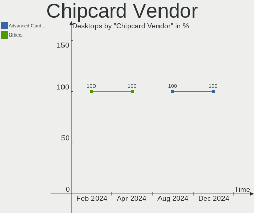

Gentoo - Hardware Trends (Desktops)
-----------------------------------

A project to identify most popular hardware characteristics and track their change
over time based on data collected by Linux users at https://Linux-Hardware.org.

Anyone can contribute to this report by the [hw-probe](https://github.com/linuxhw/hw-probe) tool:

    sudo -E hw-probe -all -upload

This report is for one last month. Overall report since the beginning of time: [TestCoverage](https://github.com/linuxhw/TestCoverage)

Period: Sep, 2022.

Contents
--------

* [ System ](#system)
  - [ OS                       ](#os)
  - [ OS Family                ](#os-family)
  - [ Kernel                   ](#kernel)
  - [ Kernel Family            ](#kernel-family)
  - [ Kernel Major Ver.        ](#kernel-major-ver)
  - [ Arch                     ](#arch)
  - [ DE                       ](#de)
  - [ Display Server           ](#display-server)
  - [ Display Manager          ](#display-manager)
  - [ OS Lang                  ](#os-lang)
  - [ Boot Mode                ](#boot-mode)
  - [ Filesystem               ](#filesystem)
  - [ Part. scheme             ](#part-scheme)
  - [ Dual Boot with Linux/BSD ](#dual-boot-with-linuxbsd)
  - [ Dual Boot (Win)          ](#dual-boot-win)

* [ Board ](#board)
  - [ Vendor                   ](#vendor)
  - [ Model                    ](#model)
  - [ Model Family             ](#model-family)
  - [ MFG Year                 ](#mfg-year)
  - [ Form Factor              ](#form-factor)
  - [ Secure Boot              ](#secure-boot)
  - [ Coreboot                 ](#coreboot)
  - [ RAM Size                 ](#ram-size)
  - [ RAM Used                 ](#ram-used)
  - [ Total Drives             ](#total-drives)
  - [ Has CD-ROM               ](#has-cd-rom)
  - [ Has Ethernet             ](#has-ethernet)
  - [ Has WiFi                 ](#has-wifi)
  - [ Has Bluetooth            ](#has-bluetooth)

* [ Location ](#location)
  - [ Country                  ](#country)
  - [ City                     ](#city)

* [ Drives ](#drives)
  - [ Drive Vendor             ](#drive-vendor)
  - [ Drive Model              ](#drive-model)
  - [ HDD Vendor               ](#hdd-vendor)
  - [ SSD Vendor               ](#ssd-vendor)
  - [ Drive Kind               ](#drive-kind)
  - [ Drive Connector          ](#drive-connector)
  - [ Drive Size               ](#drive-size)
  - [ Space Total              ](#space-total)
  - [ Space Used               ](#space-used)
  - [ Malfunc. Drives          ](#malfunc-drives)
  - [ Malfunc. Drive Vendor    ](#malfunc-drive-vendor)
  - [ Malfunc. HDD Vendor      ](#malfunc-hdd-vendor)
  - [ Malfunc. Drive Kind      ](#malfunc-drive-kind)
  - [ Failed Drives            ](#failed-drives)
  - [ Failed Drive Vendor      ](#failed-drive-vendor)
  - [ Drive Status             ](#drive-status)

* [ Storage controller ](#storage-controller)
  - [ Storage Vendor           ](#storage-vendor)
  - [ Storage Model            ](#storage-model)
  - [ Storage Kind             ](#storage-kind)

* [ Processor ](#processor)
  - [ CPU Vendor               ](#cpu-vendor)
  - [ CPU Model                ](#cpu-model)
  - [ CPU Model Family         ](#cpu-model-family)
  - [ CPU Cores                ](#cpu-cores)
  - [ CPU Sockets              ](#cpu-sockets)
  - [ CPU Threads              ](#cpu-threads)
  - [ CPU Op-Modes             ](#cpu-op-modes)
  - [ CPU Microcode            ](#cpu-microcode)
  - [ CPU Microarch            ](#cpu-microarch)

* [ Graphics ](#graphics)
  - [ GPU Vendor               ](#gpu-vendor)
  - [ GPU Model                ](#gpu-model)
  - [ GPU Combo                ](#gpu-combo)
  - [ GPU Driver               ](#gpu-driver)
  - [ GPU Memory               ](#gpu-memory)

* [ Monitor ](#monitor)
  - [ Monitor Vendor           ](#monitor-vendor)
  - [ Monitor Model            ](#monitor-model)
  - [ Monitor Resolution       ](#monitor-resolution)
  - [ Monitor Diagonal         ](#monitor-diagonal)
  - [ Monitor Width            ](#monitor-width)
  - [ Aspect Ratio             ](#aspect-ratio)
  - [ Monitor Area             ](#monitor-area)
  - [ Pixel Density            ](#pixel-density)
  - [ Multiple Monitors        ](#multiple-monitors)

* [ Network ](#network)
  - [ Net Controller Vendor    ](#net-controller-vendor)
  - [ Net Controller Model     ](#net-controller-model)
  - [ Wireless Vendor          ](#wireless-vendor)
  - [ Wireless Model           ](#wireless-model)
  - [ Ethernet Vendor          ](#ethernet-vendor)
  - [ Ethernet Model           ](#ethernet-model)
  - [ Net Controller Kind      ](#net-controller-kind)
  - [ Used Controller          ](#used-controller)
  - [ NICs                     ](#nics)
  - [ IPv6                     ](#ipv6)

* [ Bluetooth ](#bluetooth)
  - [ Bluetooth Vendor         ](#bluetooth-vendor)
  - [ Bluetooth Model          ](#bluetooth-model)

* [ Sound ](#sound)
  - [ Sound Vendor             ](#sound-vendor)
  - [ Sound Model              ](#sound-model)

* [ Memory ](#memory)
  - [ Memory Vendor            ](#memory-vendor)
  - [ Memory Model             ](#memory-model)
  - [ Memory Kind              ](#memory-kind)
  - [ Memory Form Factor       ](#memory-form-factor)
  - [ Memory Size              ](#memory-size)
  - [ Memory Speed             ](#memory-speed)

* [ Printers & scanners ](#printers--scanners)
  - [ Printer Vendor           ](#printer-vendor)
  - [ Printer Model            ](#printer-model)
  - [ Scanner Vendor           ](#scanner-vendor)
  - [ Scanner Model            ](#scanner-model)

* [ Camera ](#camera)
  - [ Camera Vendor            ](#camera-vendor)
  - [ Camera Model             ](#camera-model)

* [ Security ](#security)
  - [ Fingerprint Vendor       ](#fingerprint-vendor)
  - [ Fingerprint Model        ](#fingerprint-model)
  - [ Chipcard Vendor          ](#chipcard-vendor)
  - [ Chipcard Model           ](#chipcard-model)

* [ Unsupported ](#unsupported)
  - [ Unsupported Devices      ](#unsupported-devices)
  - [ Unsupported Device Types ](#unsupported-device-types)

System
------

OS
--

Installed operating systems

| Name       | Desktops | Percent |
|------------|----------|---------|
| Gentoo 2.8 | 15       | 100%    |

OS Family
---------

OS without a version

| Name   | Desktops | Percent |
|--------|----------|---------|
| Gentoo | 15       | 100%    |

Kernel
------

Version of the Linux kernel

| Version                      | Desktops | Percent |
|------------------------------|----------|---------|
| 5.15.59-gentoo               | 5        | 33.33%  |
| 5.15.59-gentoo-x86_64        | 2        | 13.33%  |
| 5.19.9-gentoo-x86_64         | 1        | 6.67%   |
| 5.19.9-gentoo                | 1        | 6.67%   |
| 5.19.8-xanmod1               | 1        | 6.67%   |
| 5.19.8-gentoo-clang-lto-prjc | 1        | 6.67%   |
| 5.19.7-gentoo-x86_64         | 1        | 6.67%   |
| 5.19.6-gentoo-x86_64         | 1        | 6.67%   |
| 5.19.11-renacuajo            | 1        | 6.67%   |
| 5.15.68-gentoo-x86_64        | 1        | 6.67%   |

Kernel Family
-------------

Linux kernel without a distro release

| Version | Desktops | Percent |
|---------|----------|---------|
| 5.15.59 | 7        | 46.67%  |
| 5.19.9  | 2        | 13.33%  |
| 5.19.8  | 2        | 13.33%  |
| 5.19.7  | 1        | 6.67%   |
| 5.19.6  | 1        | 6.67%   |
| 5.19.11 | 1        | 6.67%   |
| 5.15.68 | 1        | 6.67%   |

Kernel Major Ver.
-----------------

Linux kernel major version

| Version | Desktops | Percent |
|---------|----------|---------|
| 5.15    | 8        | 53.33%  |
| 5.19    | 7        | 46.67%  |

Arch
----

OS architecture (x86_64, i586, etc.)

| Name   | Desktops | Percent |
|--------|----------|---------|
| x86_64 | 15       | 100%    |

DE
--

Desktop Environment

| Name    | Desktops | Percent |
|---------|----------|---------|
| KDE5    | 8        | 53.33%  |
| Unknown | 4        | 26.67%  |
| XFCE    | 1        | 6.67%   |
| MATE    | 1        | 6.67%   |
| GNOME   | 1        | 6.67%   |

Display Server
--------------

X11 or Wayland

| Name    | Desktops | Percent |
|---------|----------|---------|
| X11     | 7        | 46.67%  |
| Tty     | 4        | 26.67%  |
| Wayland | 3        | 20%     |
| Unknown | 1        | 6.67%   |

Display Manager
---------------

SDDM, LightDM, etc.

| Name    | Desktops | Percent |
|---------|----------|---------|
| SDDM    | 8        | 53.33%  |
| LightDM | 2        | 13.33%  |
| Unknown | 2        | 13.33%  |
| XDM     | 1        | 6.67%   |
| SLiM    | 1        | 6.67%   |
| GDM     | 1        | 6.67%   |

OS Lang
-------

Language

| Lang       | Desktops | Percent |
|------------|----------|---------|
| en_US      | 5        | 33.33%  |
| pt_BR      | 2        | 13.33%  |
| pl_PL      | 2        | 13.33%  |
| en_GB      | 2        | 13.33%  |
| es_ES      | 1        | 6.67%   |
| en_US.UTF8 | 1        | 6.67%   |
| de_DE      | 1        | 6.67%   |
| cs_CZ      | 1        | 6.67%   |

Boot Mode
---------

EFI or BIOS

| Mode | Desktops | Percent |
|------|----------|---------|
| EFI  | 13       | 86.67%  |
| BIOS | 2        | 13.33%  |

Filesystem
----------

Type of filesystem

| Type  | Desktops | Percent |
|-------|----------|---------|
| Ext4  | 9        | 60%     |
| Btrfs | 4        | 26.67%  |
| F2fs  | 2        | 13.33%  |

Part. scheme
------------

Scheme of partitioning

| Type | Desktops | Percent |
|------|----------|---------|
| GPT  | 15       | 100%    |

Dual Boot with Linux/BSD
------------------------

Hosting more than one Linux/BSD

| Dual boot | Desktops | Percent |
|-----------|----------|---------|
| Yes       | 8        | 53.33%  |
| No        | 7        | 46.67%  |

Dual Boot (Win)
---------------

Hosting Linux and Windows

| Dual boot | Desktops | Percent |
|-----------|----------|---------|
| No        | 8        | 53.33%  |
| Yes       | 7        | 46.67%  |

Board
-----

Vendor
------

Motherboard manufacturer

| Name                | Desktops | Percent |
|---------------------|----------|---------|
| ASUSTek Computer    | 7        | 46.67%  |
| Gigabyte Technology | 3        | 20%     |
| MSI                 | 2        | 13.33%  |
| ASRock              | 2        | 13.33%  |
| Intel               | 1        | 6.67%   |

Model
-----

Motherboard model

| Name                              | Desktops | Percent |
|-----------------------------------|----------|---------|
| MSI MS-7C02                       | 1        | 6.67%   |
| MSI MS-7B89                       | 1        | 6.67%   |
| Intel X79                         | 1        | 6.67%   |
| Gigabyte Z590 UD                  | 1        | 6.67%   |
| Gigabyte B660 GAMING X AX DDR4    | 1        | 6.67%   |
| Gigabyte AB350-Gaming             | 1        | 6.67%   |
| ASUS ROG STRIX Z590-E GAMING WIFI | 1        | 6.67%   |
| ASUS ROG STRIX X570-I GAMING      | 1        | 6.67%   |
| ASUS ROG STRIX B550-F GAMING      | 1        | 6.67%   |
| ASUS ROG STRIX B450-F GAMING      | 1        | 6.67%   |
| ASUS ROG CROSSHAIR VIII HERO      | 1        | 6.67%   |
| ASUS M3A78-CM                     | 1        | 6.67%   |
| ASUS All Series                   | 1        | 6.67%   |
| ASRock Z390 Phantom Gaming 4S     | 1        | 6.67%   |
| ASRock J3160M                     | 1        | 6.67%   |

Model Family
------------

Motherboard model prefix

| Name                  | Desktops | Percent |
|-----------------------|----------|---------|
| ASUS ROG              | 5        | 33.33%  |
| MSI MS-7C02           | 1        | 6.67%   |
| MSI MS-7B89           | 1        | 6.67%   |
| Intel X79             | 1        | 6.67%   |
| Gigabyte Z590         | 1        | 6.67%   |
| Gigabyte B660         | 1        | 6.67%   |
| Gigabyte AB350-Gaming | 1        | 6.67%   |
| ASUS M3A78-CM         | 1        | 6.67%   |
| ASUS All              | 1        | 6.67%   |
| ASRock Z390           | 1        | 6.67%   |
| ASRock J3160M         | 1        | 6.67%   |

MFG Year
--------

Motherboard manufacture year

| Year | Desktops | Percent |
|------|----------|---------|
| 2020 | 4        | 26.67%  |
| 2021 | 2        | 13.33%  |
| 2019 | 2        | 13.33%  |
| 2018 | 2        | 13.33%  |
| 2022 | 1        | 6.67%   |
| 2017 | 1        | 6.67%   |
| 2016 | 1        | 6.67%   |
| 2014 | 1        | 6.67%   |
| 2008 | 1        | 6.67%   |

Form Factor
-----------

Physical design of the computer

| Name    | Desktops | Percent |
|---------|----------|---------|
| Desktop | 15       | 100%    |

Secure Boot
-----------

Enabled or disabled

| State    | Desktops | Percent |
|----------|----------|---------|
| Disabled | 15       | 100%    |

Coreboot
--------

Have coreboot on board

| Used | Desktops | Percent |
|------|----------|---------|
| No   | 15       | 100%    |

RAM Size
--------

Total RAM memory

| Size in GB  | Desktops | Percent |
|-------------|----------|---------|
| 32.01-64.0  | 9        | 60%     |
| 4.01-8.0    | 3        | 20%     |
| 64.01-256.0 | 2        | 13.33%  |
| 16.01-24.0  | 1        | 6.67%   |

RAM Used
--------

Used RAM memory

| Used GB    | Desktops | Percent |
|------------|----------|---------|
| 2.01-3.0   | 5        | 33.33%  |
| 1.01-2.0   | 3        | 20%     |
| 4.01-8.0   | 2        | 13.33%  |
| 8.01-16.0  | 2        | 13.33%  |
| 16.01-24.0 | 1        | 6.67%   |
| 0.51-1.0   | 1        | 6.67%   |
| 0.01-0.5   | 1        | 6.67%   |

Total Drives
------------

Number of drives on board

| Drives | Desktops | Percent |
|--------|----------|---------|
| 2      | 7        | 46.67%  |
| 3      | 3        | 20%     |
| 4      | 2        | 13.33%  |
| 7      | 1        | 6.67%   |
| 6      | 1        | 6.67%   |
| 5      | 1        | 6.67%   |

Has CD-ROM
----------

Has CD-ROM on board

| Presented | Desktops | Percent |
|-----------|----------|---------|
| No        | 14       | 93.33%  |
| Yes       | 1        | 6.67%   |

Has Ethernet
------------

Has Ethernet on board

| Presented | Desktops | Percent |
|-----------|----------|---------|
| Yes       | 15       | 100%    |

Has WiFi
--------

Has WiFi module

| Presented | Desktops | Percent |
|-----------|----------|---------|
| Yes       | 8        | 53.33%  |
| No        | 7        | 46.67%  |

Has Bluetooth
-------------

Has Bluetooth module

| Presented | Desktops | Percent |
|-----------|----------|---------|
| Yes       | 9        | 60%     |
| No        | 6        | 40%     |

Location
--------

Country
-------

Geographic location (country)

| Country   | Desktops | Percent |
|-----------|----------|---------|
| USA       | 3        | 20%     |
| Poland    | 3        | 20%     |
| Germany   | 2        | 13.33%  |
| Brazil    | 2        | 13.33%  |
| UK        | 1        | 6.67%   |
| Spain     | 1        | 6.67%   |
| Czechia   | 1        | 6.67%   |
| China     | 1        | 6.67%   |
| Argentina | 1        | 6.67%   |

City
----

Geographic location (city)

| City                    | Desktops | Percent |
|-------------------------|----------|---------|
| Wroclaw                 | 1        | 6.67%   |
| Warsaw                  | 1        | 6.67%   |
| Villanueva del Pardillo | 1        | 6.67%   |
| Tonbridge               | 1        | 6.67%   |
| Stuttgart               | 1        | 6.67%   |
| Sao Paulo               | 1        | 6.67%   |
| Santa Teresinha         | 1        | 6.67%   |
| Rosario                 | 1        | 6.67%   |
| Ponetovice              | 1        | 6.67%   |
| Orange                  | 1        | 6.67%   |
| Flemington              | 1        | 6.67%   |
| Fayetteville            | 1        | 6.67%   |
| Chengdu                 | 1        | 6.67%   |
| Boska Wola              | 1        | 6.67%   |
| Berlin                  | 1        | 6.67%   |

Drives
------

Drive Vendor
------------

Hard drive vendors

| Vendor              | Desktops | Drives | Percent |
|---------------------|----------|--------|---------|
| Samsung Electronics | 8        | 14     | 22.86%  |
| WDC                 | 6        | 9      | 17.14%  |
| Toshiba             | 5        | 5      | 14.29%  |
| Seagate             | 5        | 7      | 14.29%  |
| Kingston            | 3        | 3      | 8.57%   |
| GOODRAM             | 2        | 2      | 5.71%   |
| Patriot             | 1        | 1      | 2.86%   |
| Hitachi             | 1        | 3      | 2.86%   |
| HGST                | 1        | 1      | 2.86%   |
| Crucial             | 1        | 2      | 2.86%   |
| ADATA Technology    | 1        | 1      | 2.86%   |
| A-DATA Technology   | 1        | 1      | 2.86%   |

Drive Model
-----------

Hard drive models

| Model                                                 | Desktops | Percent |
|-------------------------------------------------------|----------|---------|
| Samsung SSD 980 PRO 1TB                               | 2        | 4.35%   |
| Samsung SSD 860 EVO 1TB                               | 2        | 4.35%   |
| GOODRAM SSDPR-CL100-480-G2 480GB                      | 2        | 4.35%   |
| WDC WDS500G2B0A-00SM50 500GB SSD                      | 1        | 2.17%   |
| WDC WDS100T3X0C-00SJG0 1TB                            | 1        | 2.17%   |
| WDC WD80EFAX-68KNBN0 8TB                              | 1        | 2.17%   |
| WDC WD8003FFBX-68B9AN0 8TB                            | 1        | 2.17%   |
| WDC WD60EZRZ-22GZ5B1 6TB                              | 1        | 2.17%   |
| WDC WD60EZRX-00MVLB1 6TB                              | 1        | 2.17%   |
| WDC WD40EZRZ-00GXCB0 4TB                              | 1        | 2.17%   |
| WDC WD1600AAJS-75B4A0 160GB                           | 1        | 2.17%   |
| WDC WD1003FZEX-00K3CA0 1TB                            | 1        | 2.17%   |
| Toshiba THNSF51T02DU7 1TB                             | 1        | 2.17%   |
| Toshiba MK5061GSY 500GB                               | 1        | 2.17%   |
| Toshiba HDWE150 5TB                                   | 1        | 2.17%   |
| Toshiba HDWE140 4TB                                   | 1        | 2.17%   |
| Toshiba DT01ACA100 1TB                                | 1        | 2.17%   |
| Seagate ST8000DM004-2CX188 8TB                        | 1        | 2.17%   |
| Seagate ST4000DM004-2CV104 4TB                        | 1        | 2.17%   |
| Seagate ST3000DM001-9YN166 3TB                        | 1        | 2.17%   |
| Seagate ST2000VN004-2E4164 2TB                        | 1        | 2.17%   |
| Seagate ST12000NM0008-2H3101 12TB                     | 1        | 2.17%   |
| Seagate ST1000LM024 HN-M101MBB 1TB                    | 1        | 2.17%   |
| Samsung SSD 970 EVO Plus 500GB                        | 1        | 2.17%   |
| Samsung SSD 870 EVO 500GB                             | 1        | 2.17%   |
| Samsung SSD 850 PRO 512GB                             | 1        | 2.17%   |
| Samsung SSD 850 PRO 256GB                             | 1        | 2.17%   |
| Samsung SSD 850 EVO 250GB                             | 1        | 2.17%   |
| Samsung SSD 840 Series 226GB                          | 1        | 2.17%   |
| Samsung SSD 840 PRO Series 256GB                      | 1        | 2.17%   |
| Samsung NVMe SSD Controller PM9A1/PM9A3/980PRO 1024GB | 1        | 2.17%   |
| Samsung MZVLW256HEHP-00000 256GB                      | 1        | 2.17%   |
| Samsung HD103SJ 1TB                                   | 1        | 2.17%   |
| Patriot Burst Elite 960GB SSD                         | 1        | 2.17%   |
| Kingston SNVS250G 250GB                               | 1        | 2.17%   |
| Kingston SA400S37240G 240GB SSD                       | 1        | 2.17%   |
| Kingston SA1000M8480G 480GB                           | 1        | 2.17%   |
| Hitachi HUS724030ALE641 3TB                           | 1        | 2.17%   |
| HGST HTS541515A9E630 1TB                              | 1        | 2.17%   |
| Crucial M4-CT064M4SSD2 64GB                           | 1        | 2.17%   |

HDD Vendor
----------

Hard disk drive vendors

| Vendor              | Desktops | Drives | Percent |
|---------------------|----------|--------|---------|
| WDC                 | 5        | 7      | 29.41%  |
| Seagate             | 5        | 7      | 29.41%  |
| Toshiba             | 4        | 4      | 23.53%  |
| Samsung Electronics | 1        | 1      | 5.88%   |
| Hitachi             | 1        | 3      | 5.88%   |
| HGST                | 1        | 1      | 5.88%   |

SSD Vendor
----------

Solid state drive vendors

| Vendor              | Desktops | Drives | Percent |
|---------------------|----------|--------|---------|
| Samsung Electronics | 6        | 8      | 46.15%  |
| GOODRAM             | 2        | 2      | 15.38%  |
| WDC                 | 1        | 1      | 7.69%   |
| Patriot             | 1        | 1      | 7.69%   |
| Kingston            | 1        | 1      | 7.69%   |
| Crucial             | 1        | 1      | 7.69%   |
| A-DATA Technology   | 1        | 1      | 7.69%   |

Drive Kind
----------

HDD or SSD

| Kind | Desktops | Drives | Percent |
|------|----------|--------|---------|
| SSD  | 12       | 15     | 38.71%  |
| HDD  | 11       | 23     | 35.48%  |
| NVMe | 8        | 11     | 25.81%  |

Drive Connector
---------------

SATA, SAS, NVMe, etc.

| Type | Desktops | Drives | Percent |
|------|----------|--------|---------|
| SATA | 14       | 38     | 63.64%  |
| NVMe | 8        | 11     | 36.36%  |

Drive Size
----------

Size of hard drive

| Size in TB | Desktops | Drives | Percent |
|------------|----------|--------|---------|
| 0.01-0.5   | 10       | 13     | 34.48%  |
| 0.51-1.0   | 8        | 9      | 27.59%  |
| 4.01-10.0  | 4        | 6      | 13.79%  |
| 3.01-4.0   | 3        | 3      | 10.34%  |
| 2.01-3.0   | 2        | 4      | 6.9%    |
| 10.01-20.0 | 1        | 1      | 3.45%   |
| 1.01-2.0   | 1        | 2      | 3.45%   |

Space Total
-----------

Amount of disk space available on the file system

| Size in GB     | Desktops | Percent |
|----------------|----------|---------|
| More than 3000 | 5        | 33.33%  |
| 1001-2000      | 5        | 33.33%  |
| 251-500        | 2        | 13.33%  |
| 2001-3000      | 1        | 6.67%   |
| 101-250        | 1        | 6.67%   |
| 501-1000       | 1        | 6.67%   |

Space Used
----------

Amount of used disk space

| Used GB        | Desktops | Percent |
|----------------|----------|---------|
| More than 3000 | 5        | 33.33%  |
| 101-250        | 2        | 13.33%  |
| 1001-2000      | 2        | 13.33%  |
| 1-20           | 2        | 13.33%  |
| 251-500        | 1        | 6.67%   |
| 21-50          | 1        | 6.67%   |
| 501-1000       | 1        | 6.67%   |
| 51-100         | 1        | 6.67%   |

Malfunc. Drives
---------------

Drive models with a malfunction

| Model                                 | Desktops | Drives | Percent |
|---------------------------------------|----------|--------|---------|
| WDC WD1600AAJS-75B4A0 160GB           | 1        | 1      | 20%     |
| Seagate ST3000DM001-9YN166 3TB        | 1        | 1      | 20%     |
| Seagate ST1000LM024 HN-M101MBB 1TB    | 1        | 1      | 20%     |
| Samsung Electronics SSD 870 EVO 500GB | 1        | 1      | 20%     |
| Samsung Electronics HD103SJ 1TB       | 1        | 1      | 20%     |

Malfunc. Drive Vendor
---------------------

Vendors of faulty drives

| Vendor              | Desktops | Drives | Percent |
|---------------------|----------|--------|---------|
| Seagate             | 2        | 2      | 50%     |
| WDC                 | 1        | 1      | 25%     |
| Samsung Electronics | 1        | 2      | 25%     |

Malfunc. HDD Vendor
-------------------

Vendors of faulty HDD drives

| Vendor              | Desktops | Drives | Percent |
|---------------------|----------|--------|---------|
| Seagate             | 2        | 2      | 50%     |
| WDC                 | 1        | 1      | 25%     |
| Samsung Electronics | 1        | 1      | 25%     |

Malfunc. Drive Kind
-------------------

Kinds of faulty drives

| Kind | Desktops | Drives | Percent |
|------|----------|--------|---------|
| HDD  | 4        | 4      | 80%     |
| SSD  | 1        | 1      | 20%     |

Failed Drives
-------------

Failed drive models

Zero info for selected period =(

Failed Drive Vendor
-------------------

Failed drive vendors

Zero info for selected period =(

Drive Status
------------

Number of failed and malfunc. drives

| Status  | Desktops | Drives | Percent |
|---------|----------|--------|---------|
| Works   | 14       | 44     | 77.78%  |
| Malfunc | 4        | 5      | 22.22%  |

Storage controller
------------------

Storage Vendor
--------------

Storage controller vendors

| Vendor                       | Desktops | Percent |
|------------------------------|----------|---------|
| AMD                          | 9        | 33.33%  |
| Intel                        | 6        | 22.22%  |
| Samsung Electronics          | 5        | 18.52%  |
| Kingston Technology Company  | 2        | 7.41%   |
| Toshiba America Info Systems | 1        | 3.7%    |
| SanDisk                      | 1        | 3.7%    |
| Micron/Crucial Technology    | 1        | 3.7%    |
| ASMedia Technology           | 1        | 3.7%    |
| ADATA Technology             | 1        | 3.7%    |

Storage Model
-------------

Storage controller models

| Model                                                                            | Desktops | Percent |
|----------------------------------------------------------------------------------|----------|---------|
| AMD FCH SATA Controller [AHCI mode]                                              | 6        | 19.35%  |
| Samsung NVMe SSD Controller PM9A1/PM9A3/980PRO                                   | 3        | 9.68%   |
| AMD 400 Series Chipset SATA Controller                                           | 3        | 9.68%   |
| Toshiba America Info Systems NVMe Controller                                     | 1        | 3.23%   |
| SanDisk WD Black SN750 / PC SN730 NVMe SSD                                       | 1        | 3.23%   |
| Samsung NVMe SSD Controller SM981/PM981/PM983                                    | 1        | 3.23%   |
| Samsung NVMe SSD Controller SM961/PM961/SM963                                    | 1        | 3.23%   |
| Micron/Crucial P2 NVMe PCIe SSD                                                  | 1        | 3.23%   |
| Kingston Company U-SNS8154P3 NVMe SSD                                            | 1        | 3.23%   |
| Kingston Company Company Non-Volatile memory controller                          | 1        | 3.23%   |
| Intel Cannon Lake PCH SATA AHCI Controller                                       | 1        | 3.23%   |
| Intel C600/X79 series chipset 6-Port SATA AHCI Controller                        | 1        | 3.23%   |
| Intel Atom/Celeron/Pentium Processor x5-E8000/J3xxx/N3xxx Series SATA Controller | 1        | 3.23%   |
| Intel Alder Lake-S PCH SATA Controller [AHCI Mode]                               | 1        | 3.23%   |
| Intel 500 Series Chipset Family SATA RAID Controller                             | 1        | 3.23%   |
| Intel 500 Series Chipset Family SATA AHCI Controller                             | 1        | 3.23%   |
| ASMedia 106x SATA/RAID Controller                                                | 1        | 3.23%   |
| AMD SB7x0/SB8x0/SB9x0 SATA Controller [IDE mode]                                 | 1        | 3.23%   |
| AMD SB7x0/SB8x0/SB9x0 IDE Controller                                             | 1        | 3.23%   |
| AMD 500 Series Chipset SATA Controller                                           | 1        | 3.23%   |
| AMD 300 Series Chipset SATA Controller                                           | 1        | 3.23%   |
| ADATA XPG SX8200 Pro PCIe Gen3x4 M.2 2280 Solid State Drive                      | 1        | 3.23%   |

Storage Kind
------------

Kind of storage controller (IDE, SATA, NVMe, SAS, ...)

| Kind | Desktops | Percent |
|------|----------|---------|
| SATA | 14       | 58.33%  |
| NVMe | 8        | 33.33%  |
| RAID | 1        | 4.17%   |
| IDE  | 1        | 4.17%   |

Processor
---------

CPU Vendor
----------

Processor vendors

| Vendor | Desktops | Percent |
|--------|----------|---------|
| AMD    | 9        | 60%     |
| Intel  | 6        | 40%     |

CPU Model
---------

Processor models

| Model                                    | Desktops | Percent |
|------------------------------------------|----------|---------|
| Intel Xeon CPU E5-2650 v2 @ 2.60GHz      | 1        | 6.67%   |
| Intel Core i7-9700F CPU @ 3.00GHz        | 1        | 6.67%   |
| Intel Celeron CPU J3160 @ 1.60GHz        | 1        | 6.67%   |
| Intel 12th Gen Core i5-12600KF           | 1        | 6.67%   |
| Intel 11th Gen Core i9-11900KF @ 3.50GHz | 1        | 6.67%   |
| Intel 11th Gen Core i7-11700K @ 3.60GHz  | 1        | 6.67%   |
| AMD Ryzen 9 5900X 12-Core Processor      | 1        | 6.67%   |
| AMD Ryzen 9 3900X 12-Core Processor      | 1        | 6.67%   |
| AMD Ryzen 7 3800X 8-Core Processor       | 1        | 6.67%   |
| AMD Ryzen 7 3700X 8-Core Processor       | 1        | 6.67%   |
| AMD Ryzen 5 5600X 6-Core Processor       | 1        | 6.67%   |
| AMD Ryzen 5 3600 6-Core Processor        | 1        | 6.67%   |
| AMD Ryzen 5 2600 Six-Core Processor      | 1        | 6.67%   |
| AMD Phenom II X4 955 Processor           | 1        | 6.67%   |
| AMD Athlon 5370 APU with Radeon R3       | 1        | 6.67%   |

CPU Model Family
----------------

Processor model prefix

| Model            | Desktops | Percent |
|------------------|----------|---------|
| Other            | 3        | 20%     |
| AMD Ryzen 5      | 3        | 20%     |
| AMD Ryzen 9      | 2        | 13.33%  |
| AMD Ryzen 7      | 2        | 13.33%  |
| Intel Xeon       | 1        | 6.67%   |
| Intel Core i7    | 1        | 6.67%   |
| Intel Celeron    | 1        | 6.67%   |
| AMD Phenom II X4 | 1        | 6.67%   |
| AMD Athlon       | 1        | 6.67%   |

CPU Cores
---------

Number of processor cores

| Number | Desktops | Percent |
|--------|----------|---------|
| 8      | 6        | 40%     |
| 6      | 3        | 20%     |
| 4      | 3        | 20%     |
| 12     | 2        | 13.33%  |
| 10     | 1        | 6.67%   |

CPU Sockets
-----------

Number of sockets

| Number | Desktops | Percent |
|--------|----------|---------|
| 1      | 15       | 100%    |

CPU Threads
-----------

Threads per core (Hyper-Threading)

| Number | Desktops | Percent |
|--------|----------|---------|
| 2      | 11       | 73.33%  |
| 1      | 4        | 26.67%  |

CPU Op-Modes
------------

CPU Operation Modes (32-bit, 64-bit)

| Op mode        | Desktops | Percent |
|----------------|----------|---------|
| 32-bit, 64-bit | 15       | 100%    |

CPU Microcode
-------------

Microcode number

| Number     | Desktops | Percent |
|------------|----------|---------|
| 0x08701021 | 3        | 20%     |
| 0xa0671    | 2        | 13.33%  |
| 0x906ed    | 1        | 6.67%   |
| 0x90672    | 1        | 6.67%   |
| 0x306e4    | 1        | 6.67%   |
| 0x0a201016 | 1        | 6.67%   |
| 0x08701013 | 1        | 6.67%   |
| 0x0800820d | 1        | 6.67%   |
| 0x0700010b | 1        | 6.67%   |
| 0x010000db | 1        | 6.67%   |
| 0x00000000 | 1        | 6.67%   |
| Unknown    | 1        | 6.67%   |

CPU Microarch
-------------

Microarchitecture

| Name             | Desktops | Percent |
|------------------|----------|---------|
| Zen 2            | 4        | 26.67%  |
| Zen 3            | 2        | 13.33%  |
| Icelake          | 2        | 13.33%  |
| Zen+             | 1        | 6.67%   |
| Silvermont       | 1        | 6.67%   |
| KabyLake         | 1        | 6.67%   |
| K10              | 1        | 6.67%   |
| Jaguar           | 1        | 6.67%   |
| IvyBridge        | 1        | 6.67%   |
| Alderlake Hybrid | 1        | 6.67%   |

Graphics
--------

GPU Vendor
----------

Vendors of graphics cards

| Vendor | Desktops | Percent |
|--------|----------|---------|
| AMD    | 8        | 53.33%  |
| Nvidia | 6        | 40%     |
| Intel  | 1        | 6.67%   |

GPU Model
---------

Graphics card models

| Model                                                                                    | Desktops | Percent |
|------------------------------------------------------------------------------------------|----------|---------|
| AMD Cedar [Radeon HD 5000/6000/7350/8350 Series]                                         | 2        | 13.33%  |
| Nvidia TU102 [GeForce RTX 2080 Ti Rev. A]                                                | 1        | 6.67%   |
| Nvidia GP102 [GeForce GTX 1080 Ti]                                                       | 1        | 6.67%   |
| Nvidia GK208B [GeForce GT 710]                                                           | 1        | 6.67%   |
| Nvidia GA106 [GeForce RTX 3060 Lite Hash Rate]                                           | 1        | 6.67%   |
| Nvidia GA106 [Geforce RTX 3050]                                                          | 1        | 6.67%   |
| Nvidia GA104 [GeForce RTX 3060]                                                          | 1        | 6.67%   |
| Intel Atom/Celeron/Pentium Processor x5-E8000/J3xxx/N3xxx Integrated Graphics Controller | 1        | 6.67%   |
| AMD Vega 10 XL/XT [Radeon RX Vega 56/64]                                                 | 1        | 6.67%   |
| AMD Tobago PRO [Radeon R7 360 / R9 360 OEM]                                              | 1        | 6.67%   |
| AMD RS780C [Radeon 3100]                                                                 | 1        | 6.67%   |
| AMD Navi 22 [Radeon RX 6700/6700 XT/6750 XT / 6800M]                                     | 1        | 6.67%   |
| AMD Navi 14 [Radeon RX 5500/5500M / Pro 5500M]                                           | 1        | 6.67%   |
| AMD Kabini [Radeon HD 8400 / R3 Series]                                                  | 1        | 6.67%   |

GPU Combo
---------

Combinations of graphics cards

| Name       | Desktops | Percent |
|------------|----------|---------|
| 1 x AMD    | 8        | 53.33%  |
| 1 x Nvidia | 6        | 40%     |
| 1 x Intel  | 1        | 6.67%   |

GPU Driver
----------

Free vs proprietary

| Driver      | Desktops | Percent |
|-------------|----------|---------|
| Free        | 10       | 66.67%  |
| Proprietary | 5        | 33.33%  |

GPU Memory
----------

Total video memory

| Size in GB | Desktops | Percent |
|------------|----------|---------|
| 8.01-16.0  | 4        | 26.67%  |
| 7.01-8.0   | 2        | 13.33%  |
| 1.01-2.0   | 2        | 13.33%  |
| 0.51-1.0   | 2        | 13.33%  |
| 0.01-0.5   | 2        | 13.33%  |
| Unknown    | 2        | 13.33%  |
| 3.01-4.0   | 1        | 6.67%   |

Monitor
-------

Monitor Vendor
--------------

Monitor vendors

| Vendor              | Desktops | Percent |
|---------------------|----------|---------|
| Samsung Electronics | 4        | 25%     |
| Philips             | 2        | 12.5%   |
| Dell                | 2        | 12.5%   |
| AOC                 | 2        | 12.5%   |
| ViewSonic           | 1        | 6.25%   |
| MSI                 | 1        | 6.25%   |
| BenQ                | 1        | 6.25%   |
| AUS                 | 1        | 6.25%   |
| ASUSTek Computer    | 1        | 6.25%   |
| Unknown             | 1        | 6.25%   |

Monitor Model
-------------

Monitor models

| Model                                                                | Desktops | Percent |
|----------------------------------------------------------------------|----------|---------|
| ViewSonic LCD Monitor VX3276-UHD 5760x2160                           | 1        | 6.25%   |
| Samsung Electronics U28E590 SAM0C4D 3840x2160 607x345mm 27.5-inch    | 1        | 6.25%   |
| Samsung Electronics SyncMaster SAM027F 1680x1050 474x296mm 22.0-inch | 1        | 6.25%   |
| Samsung Electronics SMS27A850 SAM083D 2560x1440 518x324mm 24.1-inch  | 1        | 6.25%   |
| Samsung Electronics S22B300 SAM08C8 1920x1080 477x268mm 21.5-inch    | 1        | 6.25%   |
| Philips PHL 349X7 PHLC149 3440x1440 800x330mm 34.1-inch              | 1        | 6.25%   |
| Philips PHL 242M8 PHLC214 1920x1080 527x296mm 23.8-inch              | 1        | 6.25%   |
| MSI MAG272QR MSI3CA8 2560x1440 597x336mm 27.0-inch                   | 1        | 6.25%   |
| Dell UP2516D DEL40E1 2560x1440 553x311mm 25.0-inch                   | 1        | 6.25%   |
| Dell LCD Monitor U2719D                                              | 1        | 6.25%   |
| BenQ XL2410T BNQ7F02 1920x1080 521x293mm 23.5-inch                   | 1        | 6.25%   |
| AUS LCD Monitor ROG PG278QR 4000x2560                                | 1        | 6.25%   |
| ASUSTek Computer VG245 AUS24A1 1920x1080 531x299mm 24.0-inch         | 1        | 6.25%   |
| AOC F19 AOC1900 1366x768 410x230mm 18.5-inch                         | 1        | 6.25%   |
| AOC 2270W AOC2270 1920x1080 477x268mm 21.5-inch                      | 1        | 6.25%   |
| Unknown                                                              | 1        | 6.25%   |

Monitor Resolution
------------------

Monitor screen resolution

| Resolution         | Desktops | Percent |
|--------------------|----------|---------|
| 1920x1080 (FHD)    | 5        | 31.25%  |
| 2560x1440 (QHD)    | 3        | 18.75%  |
| Unknown            | 2        | 12.5%   |
| 5760x2160          | 1        | 6.25%   |
| 4000x2560          | 1        | 6.25%   |
| 3840x2160 (4K)     | 1        | 6.25%   |
| 3440x1440          | 1        | 6.25%   |
| 1680x1050 (WSXGA+) | 1        | 6.25%   |
| 1366x768 (WXGA)    | 1        | 6.25%   |

Monitor Diagonal
----------------

Diagonal size in inches

| Inches  | Desktops | Percent |
|---------|----------|---------|
| 27      | 2        | 14.29%  |
| 24      | 2        | 14.29%  |
| 23      | 2        | 14.29%  |
| 21      | 2        | 14.29%  |
| Unknown | 2        | 14.29%  |
| 34      | 1        | 7.14%   |
| 25      | 1        | 7.14%   |
| 22      | 1        | 7.14%   |
| 18      | 1        | 7.14%   |

Monitor Width
-------------

Physical width

| Width in mm | Desktops | Percent |
|-------------|----------|---------|
| 501-600     | 6        | 42.86%  |
| 401-500     | 4        | 28.57%  |
| Unknown     | 2        | 14.29%  |
| 701-800     | 1        | 7.14%   |
| 601-700     | 1        | 7.14%   |

Aspect Ratio
------------

Proportional relationship between the width and the height

| Ratio   | Desktops | Percent |
|---------|----------|---------|
| 16/9    | 9        | 64.29%  |
| 16/10   | 2        | 14.29%  |
| Unknown | 2        | 14.29%  |
| 21/9    | 1        | 7.14%   |

Monitor Area
------------

Area in inch²

| Area in inch² | Desktops | Percent |
|----------------|----------|---------|
| 201-250        | 4        | 30.77%  |
| 301-350        | 2        | 15.38%  |
| 251-300        | 2        | 15.38%  |
| Unknown        | 2        | 15.38%  |
| 351-500        | 1        | 7.69%   |
| 151-200        | 1        | 7.69%   |
| 141-150        | 1        | 7.69%   |

Pixel Density
-------------

Pixels per inch

| Density | Desktops | Percent |
|---------|----------|---------|
| 101-120 | 5        | 38.46%  |
| 51-100  | 5        | 38.46%  |
| Unknown | 2        | 15.38%  |
| 121-160 | 1        | 7.69%   |

Multiple Monitors
-----------------

Total monitors connected

| Total | Desktops | Percent |
|-------|----------|---------|
| 1     | 10       | 66.67%  |
| 2     | 4        | 26.67%  |
| 0     | 1        | 6.67%   |

Network
-------

Net Controller Vendor
---------------------

Controller vendors

| Vendor                | Desktops | Percent |
|-----------------------|----------|---------|
| Realtek Semiconductor | 10       | 52.63%  |
| Intel                 | 8        | 42.11%  |
| MediaTek              | 1        | 5.26%   |

Net Controller Model
--------------------

Controller models

| Model                                                             | Desktops | Percent |
|-------------------------------------------------------------------|----------|---------|
| Realtek RTL8111/8168/8411 PCI Express Gigabit Ethernet Controller | 7        | 29.17%  |
| Intel Wi-Fi 6 AX200                                               | 5        | 20.83%  |
| Realtek RTL8125 2.5GbE Controller                                 | 3        | 12.5%   |
| Intel I211 Gigabit Network Connection                             | 3        | 12.5%   |
| Intel Ethernet Controller I225-V                                  | 2        | 8.33%   |
| Realtek RTL8192CE PCIe Wireless Network Adapter                   | 1        | 4.17%   |
| MediaTek MT7921K (RZ608) Wi-Fi 6E 80MHz                           | 1        | 4.17%   |
| Intel Wi-Fi 6 AX210/AX211/AX411 160MHz                            | 1        | 4.17%   |
| Intel Ethernet Connection (7) I219-V                              | 1        | 4.17%   |

Wireless Vendor
---------------

Wireless vendors

| Vendor                | Desktops | Percent |
|-----------------------|----------|---------|
| Intel                 | 6        | 75%     |
| Realtek Semiconductor | 1        | 12.5%   |
| MediaTek              | 1        | 12.5%   |

Wireless Model
--------------

Wireless models

| Model                                           | Desktops | Percent |
|-------------------------------------------------|----------|---------|
| Intel Wi-Fi 6 AX200                             | 5        | 62.5%   |
| Realtek RTL8192CE PCIe Wireless Network Adapter | 1        | 12.5%   |
| MediaTek MT7921K (RZ608) Wi-Fi 6E 80MHz         | 1        | 12.5%   |
| Intel Wi-Fi 6 AX210/AX211/AX411 160MHz          | 1        | 12.5%   |

Ethernet Vendor
---------------

Ethernet vendors

| Vendor                | Desktops | Percent |
|-----------------------|----------|---------|
| Realtek Semiconductor | 10       | 62.5%   |
| Intel                 | 6        | 37.5%   |

Ethernet Model
--------------

Ethernet models

| Model                                                             | Desktops | Percent |
|-------------------------------------------------------------------|----------|---------|
| Realtek RTL8111/8168/8411 PCI Express Gigabit Ethernet Controller | 7        | 43.75%  |
| Realtek RTL8125 2.5GbE Controller                                 | 3        | 18.75%  |
| Intel I211 Gigabit Network Connection                             | 3        | 18.75%  |
| Intel Ethernet Controller I225-V                                  | 2        | 12.5%   |
| Intel Ethernet Connection (7) I219-V                              | 1        | 6.25%   |

Net Controller Kind
-------------------

Ethernet, WiFi or modem

| Kind     | Desktops | Percent |
|----------|----------|---------|
| Ethernet | 15       | 65.22%  |
| WiFi     | 8        | 34.78%  |

Used Controller
---------------

Currently used network controller

| Kind     | Desktops | Percent |
|----------|----------|---------|
| Ethernet | 12       | 80%     |
| WiFi     | 3        | 20%     |

NICs
----

Total network controllers on board

| Total | Desktops | Percent |
|-------|----------|---------|
| 2     | 9        | 60%     |
| 1     | 6        | 40%     |

IPv6
----

IPv6 vs IPv4

| Used | Desktops | Percent |
|------|----------|---------|
| No   | 9        | 60%     |
| Yes  | 6        | 40%     |

Bluetooth
---------

Bluetooth Vendor
----------------

Controller vendors

| Vendor                  | Desktops | Percent |
|-------------------------|----------|---------|
| Intel                   | 6        | 66.67%  |
| Realtek Semiconductor   | 1        | 11.11%  |
| MediaTek                | 1        | 11.11%  |
| Cambridge Silicon Radio | 1        | 11.11%  |

Bluetooth Model
---------------

Controller models

| Model                                               | Desktops | Percent |
|-----------------------------------------------------|----------|---------|
| Intel AX200 Bluetooth                               | 5        | 55.56%  |
| Realtek Bluetooth Radio                             | 1        | 11.11%  |
| MediaTek Wireless_Device                            | 1        | 11.11%  |
| Intel AX210 Bluetooth                               | 1        | 11.11%  |
| Cambridge Silicon Radio Bluetooth Dongle (HCI mode) | 1        | 11.11%  |

Sound
-----

Sound Vendor
------------

Sound card vendors

| Vendor                | Desktops | Percent |
|-----------------------|----------|---------|
| AMD                   | 11       | 33.33%  |
| Intel                 | 6        | 18.18%  |
| Nvidia                | 5        | 15.15%  |
| Logitech              | 2        | 6.06%   |
| C-Media Electronics   | 2        | 6.06%   |
| Samson Technologies   | 1        | 3.03%   |
| Nektar                | 1        | 3.03%   |
| Focusrite-Novation    | 1        | 3.03%   |
| Creative Technology   | 1        | 3.03%   |
| Corsair               | 1        | 3.03%   |
| ASUSTek Computer      | 1        | 3.03%   |
| Actions Semiconductor | 1        | 3.03%   |

Sound Model
-----------

Sound card models

| Model                                                                                             | Desktops | Percent |
|---------------------------------------------------------------------------------------------------|----------|---------|
| AMD Starship/Matisse HD Audio Controller                                                          | 6        | 15.79%  |
| Intel Tiger Lake-H HD Audio Controller                                                            | 2        | 5.26%   |
| AMD Cedar HDMI Audio [Radeon HD 5400/6300/7300 Series]                                            | 2        | 5.26%   |
| Samson Technologies GoMic compact condenser mic                                                   | 1        | 2.63%   |
| Nvidia TU102 High Definition Audio Controller                                                     | 1        | 2.63%   |
| Nvidia GP102 HDMI Audio Controller                                                                | 1        | 2.63%   |
| Nvidia GK208 HDMI/DP Audio Controller                                                             | 1        | 2.63%   |
| Nvidia GA106 High Definition Audio Controller                                                     | 1        | 2.63%   |
| Nvidia GA104 High Definition Audio Controller                                                     | 1        | 2.63%   |
| Nektar Impact GXP88                                                                               | 1        | 2.63%   |
| Logitech H390 headset with microphone                                                             | 1        | 2.63%   |
| Logitech Blue Microphones                                                                         | 1        | 2.63%   |
| Intel Cannon Lake PCH cAVS                                                                        | 1        | 2.63%   |
| Intel C600/X79 series chipset High Definition Audio Controller                                    | 1        | 2.63%   |
| Intel Atom/Celeron/Pentium Processor x5-E8000/J3xxx/N3xxx Series High Definition Audio Controller | 1        | 2.63%   |
| Intel Alder Lake-S HD Audio Controller                                                            | 1        | 2.63%   |
| Focusrite-Novation Scarlett 2i2 Camera                                                            | 1        | 2.63%   |
| Creative Technology Sound BlasterX Katana                                                         | 1        | 2.63%   |
| Corsair VOID ELITE Wireless Gaming Dongle                                                         | 1        | 2.63%   |
| C-Media Electronics USB Modi Device                                                               | 1        | 2.63%   |
| C-Media Electronics Audio Adapter (Unitek Y-247A)                                                 | 1        | 2.63%   |
| ASUSTek Computer USB Audio                                                                        | 1        | 2.63%   |
| AMD Vega 10 HDMI Audio [Radeon Vega 56/64]                                                        | 1        | 2.63%   |
| AMD Tobago HDMI Audio [Radeon R7 360 / R9 360 OEM]                                                | 1        | 2.63%   |
| AMD SBx00 Azalia (Intel HDA)                                                                      | 1        | 2.63%   |
| AMD Navi 21/23 HDMI/DP Audio Controller                                                           | 1        | 2.63%   |
| AMD Navi 10 HDMI Audio                                                                            | 1        | 2.63%   |
| AMD Kabini HDMI/DP Audio                                                                          | 1        | 2.63%   |
| AMD FCH Azalia Controller                                                                         | 1        | 2.63%   |
| AMD Family 17h (Models 00h-0fh) HD Audio Controller                                               | 1        | 2.63%   |
| Actions Semiconductor USB AUDIO                                                                   | 1        | 2.63%   |

Memory
------

Memory Vendor
-------------

Memory module vendors

| Vendor              | Desktops | Percent |
|---------------------|----------|---------|
| G.Skill             | 4        | 25%     |
| Corsair             | 3        | 18.75%  |
| Kingston            | 2        | 12.5%   |
| Unknown             | 2        | 12.5%   |
| Unknown             | 1        | 6.25%   |
| Team                | 1        | 6.25%   |
| Samsung Electronics | 1        | 6.25%   |
| Crucial             | 1        | 6.25%   |
| A-DATA Technology   | 1        | 6.25%   |

Memory Model
------------

Memory module models

| Model                                                    | Desktops | Percent |
|----------------------------------------------------------|----------|---------|
| Unknown                                                  | 2        | 12.5%   |
| Unknown RAM Module 2GB DIMM DDR2 667MT/s                 | 1        | 6.25%   |
| Team RAM TEAMGROUP-UD4-3200 8GB DIMM DDR4 3733MT/s       | 1        | 6.25%   |
| Samsung RAM M393B5170FH0 4GB DIMM DDR3 1333MT/s          | 1        | 6.25%   |
| Kingston RAM KHX1866C10D3/8G 8GB DIMM DDR3 2133MT/s      | 1        | 6.25%   |
| Kingston RAM 9905743-043.A00G 16GB DIMM DDR4 3200MT/s    | 1        | 6.25%   |
| G.Skill RAM F4-3600C16-16GTZNC 16GB DIMM DDR4 3600MT/s   | 1        | 6.25%   |
| G.Skill RAM F4-3200C14-8GTZ 8GB DIMM DDR4 3733MT/s       | 1        | 6.25%   |
| G.Skill RAM F4-3000C16-8GISB 8GB DIMM DDR4 3200MT/s      | 1        | 6.25%   |
| G.Skill RAM F3-10666CL9-4GBNT 4GB DIMM DDR3 1400MT/s     | 1        | 6.25%   |
| Crucial RAM BL32G32C16U4B.M16FB1 32GB DIMM DDR4 3200MT/s | 1        | 6.25%   |
| Corsair RAM CMW32GX4M2D3600C18 16GB DIMM DDR4 3600MT/s   | 1        | 6.25%   |
| Corsair RAM CMT16GX4M2Z3200C16 8GB DIMM DDR4 2667MT/s    | 1        | 6.25%   |
| Corsair RAM CMK32GX4M2E3200C16 16GB DIMM DDR4 3200MT/s   | 1        | 6.25%   |
| A-DATA RAM DDR4 3200 16GB DIMM DDR4 3400MT/s             | 1        | 6.25%   |

Memory Kind
-----------

Memory module kinds

| Kind | Desktops | Percent |
|------|----------|---------|
| DDR4 | 11       | 73.33%  |
| DDR3 | 3        | 20%     |
| DDR2 | 1        | 6.67%   |

Memory Form Factor
------------------

Physical design of the memory module

| Name | Desktops | Percent |
|------|----------|---------|
| DIMM | 15       | 100%    |

Memory Size
-----------

Memory module size

| Size  | Desktops | Percent |
|-------|----------|---------|
| 8192  | 5        | 31.25%  |
| 32768 | 4        | 25%     |
| 16384 | 4        | 25%     |
| 4096  | 2        | 12.5%   |
| 2048  | 1        | 6.25%   |

Memory Speed
------------

Memory module speed

| Speed | Desktops | Percent |
|-------|----------|---------|
| 3200  | 4        | 26.67%  |
| 3733  | 2        | 13.33%  |
| 3600  | 2        | 13.33%  |
| 3400  | 1        | 6.67%   |
| 3000  | 1        | 6.67%   |
| 2667  | 1        | 6.67%   |
| 2133  | 1        | 6.67%   |
| 1400  | 1        | 6.67%   |
| 1333  | 1        | 6.67%   |
| 667   | 1        | 6.67%   |

Printers & scanners
-------------------

Printer Vendor
--------------

Printer device vendors

| Vendor          | Desktops | Percent |
|-----------------|----------|---------|
| Hewlett-Packard | 1        | 100%    |

Printer Model
-------------

Printer device models

| Model               | Desktops | Percent |
|---------------------|----------|---------|
| HP LaserJet M14-M17 | 1        | 100%    |

Scanner Vendor
--------------

Scanner device vendors

Zero info for selected period =(

Scanner Model
-------------

Scanner device models

Zero info for selected period =(

Camera
------

Camera Vendor
-------------

Camera device vendors

| Vendor              | Desktops | Percent |
|---------------------|----------|---------|
| Logitech            | 2        | 66.67%  |
| Samsung Electronics | 1        | 33.33%  |

Camera Model
------------

Camera device models

| Model                       | Desktops | Percent |
|-----------------------------|----------|---------|
| Samsung Galaxy A5 (MTP)     | 1        | 33.33%  |
| Logitech Webcam C920-C      | 1        | 33.33%  |
| Logitech HD Pro Webcam C920 | 1        | 33.33%  |

Security
--------

Fingerprint Vendor
------------------

Fingerprint sensor vendors

Zero info for selected period =(

Fingerprint Model
-----------------

Fingerprint sensor models

Zero info for selected period =(

Chipcard Vendor
---------------

Chipcard module vendors

| Vendor     | Desktops | Percent |
|------------|----------|---------|
| Clay Logic | 1        | 100%    |

Chipcard Model
--------------

Chipcard module models

| Model                   | Desktops | Percent |
|-------------------------|----------|---------|
| Clay Logic Nitrokey Pro | 1        | 100%    |

Unsupported
-----------

Unsupported Devices
-------------------

Total unsupported devices on board

| Total | Desktops | Percent |
|-------|----------|---------|
| 0     | 12       | 80%     |
| 3     | 1        | 6.67%   |
| 2     | 1        | 6.67%   |
| 1     | 1        | 6.67%   |

Unsupported Device Types
------------------------

Types of unsupported devices

| Type                     | Desktops | Percent |
|--------------------------|----------|---------|
| Sound                    | 1        | 25%     |
| Net/wireless             | 1        | 25%     |
| Multimedia controller    | 1        | 25%     |
| Communication controller | 1        | 25%     |

