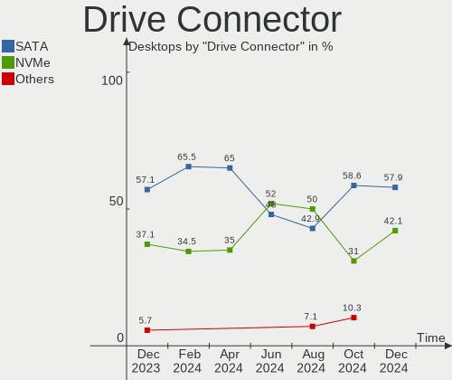
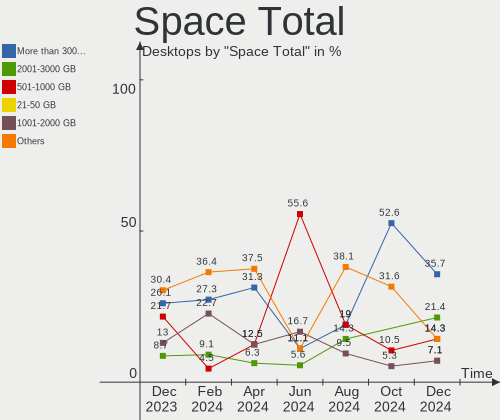
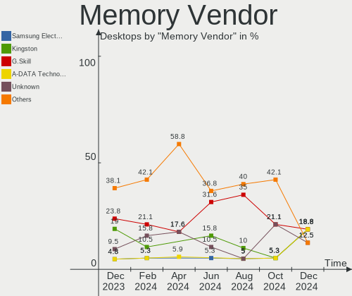
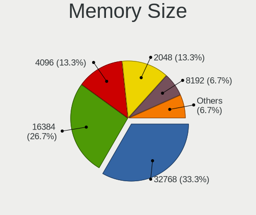

Gentoo Hardware Trends (Desktop)
--------------------------------

A project to identify most popular hardware characteristics and track their change
over time based on data collected by Gentoo users at https://Linux-Hardware.org.

Anyone can contribute to the study by uploading probes of their computers by
the [hw-probe](https://github.com/linuxhw/hw-probe) tool:

    sudo -E hw-probe -all -upload

Full-feature report is available here: https://linux-hardware.org/?view=trends&formfactor=desktop

Period: Mar, 2021.

Contents
--------

- [ OS                       ](#os)
- [ OS Family                ](#os-family)
- [ Kernel                   ](#kernel)
- [ Kernel Family            ](#kernel-family)
- [ Kernel Major Ver.        ](#kernel-major-ver)
- [ Arch                     ](#arch)
- [ DE                       ](#de)
- [ Display Server           ](#display-server)
- [ Display Manager          ](#display-manager)
- [ OS Lang                  ](#os-lang)
- [ Boot Mode                ](#boot-mode)
- [ Filesystem               ](#filesystem)
- [ Part. scheme             ](#part-scheme)
- [ Dual Boot with Linux/BSD ](#dual-boot-with-linux/bsd)
- [ Dual Boot (Win)          ](#dual-boot-win)
- [ Country                  ](#country)
- [ City                     ](#city)
- [ Vendor                   ](#vendor)
- [ Model                    ](#model)
- [ Model Family             ](#model-family)
- [ MFG Year                 ](#mfg-year)
- [ Form Factor              ](#form-factor)
- [ Secure Boot              ](#secure-boot)
- [ Coreboot                 ](#coreboot)
- [ RAM Size                 ](#ram-size)
- [ RAM Used                 ](#ram-used)
- [ Has CD-ROM               ](#has-cd-rom)
- [ Total Drives             ](#total-drives)
- [ Has Ethernet             ](#has-ethernet)
- [ Has WiFi                 ](#has-wifi)
- [ Has Bluetooth            ](#has-bluetooth)
- [ Drive Vendor             ](#drive-vendor)
- [ Drive Model              ](#drive-model)
- [ HDD Vendor               ](#hdd-vendor)
- [ SSD Vendor               ](#ssd-vendor)
- [ Drive Kind               ](#drive-kind)
- [ Drive Connector          ](#drive-connector)
- [ Drive Size               ](#drive-size)
- [ Space Total              ](#space-total)
- [ Space Used               ](#space-used)
- [ Malfunc. Drives          ](#malfunc-drives)
- [ Malfunc. Drive Vendor    ](#malfunc-drive-vendor)
- [ Malfunc. HDD Vendor      ](#malfunc-hdd-vendor)
- [ Malfunc. Drive Kind      ](#malfunc-drive-kind)
- [ Failed Drives            ](#failed-drives)
- [ Failed Drive Vendor      ](#failed-drive-vendor)
- [ Drive Status             ](#drive-status)
- [ Storage Vendor           ](#storage-vendor)
- [ Storage Model            ](#storage-model)
- [ Storage Kind             ](#storage-kind)
- [ CPU Vendor               ](#cpu-vendor)
- [ CPU Model                ](#cpu-model)
- [ CPU Model Family         ](#cpu-model-family)
- [ CPU Cores                ](#cpu-cores)
- [ CPU Sockets              ](#cpu-sockets)
- [ CPU Threads              ](#cpu-threads)
- [ CPU Op-Modes             ](#cpu-op-modes)
- [ CPU Microcode            ](#cpu-microcode)
- [ CPU Microarch            ](#cpu-microarch)
- [ GPU Vendor               ](#gpu-vendor)
- [ GPU Model                ](#gpu-model)
- [ GPU Combo                ](#gpu-combo)
- [ GPU Driver               ](#gpu-driver)
- [ GPU Memory               ](#gpu-memory)
- [ Monitor Vendor           ](#monitor-vendor)
- [ Monitor Model            ](#monitor-model)
- [ Monitor Resolution       ](#monitor-resolution)
- [ Monitor Diagonal         ](#monitor-diagonal)
- [ Monitor Width            ](#monitor-width)
- [ Aspect Ratio             ](#aspect-ratio)
- [ Monitor Area             ](#monitor-area)
- [ Pixel Density            ](#pixel-density)
- [ Multiple Monitors        ](#multiple-monitors)
- [ Net Controller Vendor    ](#net-controller-vendor)
- [ Net Controller Model     ](#net-controller-model)
- [ Wireless Vendor          ](#wireless-vendor)
- [ Wireless Model           ](#wireless-model)
- [ Ethernet Vendor          ](#ethernet-vendor)
- [ Ethernet Model           ](#ethernet-model)
- [ Net Controller Kind      ](#net-controller-kind)
- [ Used Controller          ](#used-controller)
- [ NICs                     ](#nics)
- [ IPv6                     ](#ipv6)
- [ Memory Vendor            ](#memory-vendor)
- [ Memory Model             ](#memory-model)
- [ Memory Kind              ](#memory-kind)
- [ Memory Form Factor       ](#memory-form-factor)
- [ Memory Size              ](#memory-size)
- [ Memory Speed             ](#memory-speed)
- [ Sound Vendor             ](#sound-vendor)
- [ Sound Model              ](#sound-model)
- [ Camera Vendor            ](#camera-vendor)
- [ Camera Model             ](#camera-model)
- [ Fingerprint Vendor       ](#fingerprint-vendor)
- [ Fingerprint Model        ](#fingerprint-model)
- [ Chipcard Vendor          ](#chipcard-vendor)
- [ Chipcard Model           ](#chipcard-model)
- [ Printer Vendor           ](#printer-vendor)
- [ Printer Model            ](#printer-model)
- [ Scanner Vendor           ](#scanner-vendor)
- [ Scanner Model            ](#scanner-model)
- [ Bluetooth Vendor         ](#bluetooth-vendor)
- [ Bluetooth Model          ](#bluetooth-model)
- [ Unsupported Devices      ](#unsupported-devices)
- [ Unsupported Device Types ](#unsupported-device-types)

OS
--

Installed operating systems

| Name        | Desktops | Percent |
|-------------|----------|---------|
| Gentoo 2.7  | 14       | 48.28%  |
| Gentoo      | 14       | 48.28%  |
| Gentoo 13.0 | 1        | 3.45%   |

OS Family
---------

OS without a version

| Name   | Desktops | Percent |
|--------|----------|---------|
| Gentoo | 29       | 100%    |

Kernel
------

Version of the Linux kernel

| Version                             | Desktops | Percent |
|-------------------------------------|----------|---------|
| 5.4.97-gentoo                       | 7        | 24.14%  |
| 5.11.6-gentoo                       | 3        | 10.34%  |
| 5.11.2-gentoo-rt9-x86_64            | 2        | 6.9%    |
| 5.8.18-gentoo-compact-0.3           | 1        | 3.45%   |
| 5.4.97                              | 1        | 3.45%   |
| 5.4.87-gentoo-x86_64                | 1        | 3.45%   |
| 5.4.80-gentoo-r1                    | 1        | 3.45%   |
| 5.11.8-gentoo-r1                    | 1        | 3.45%   |
| 5.11.7-zen1                         | 1        | 3.45%   |
| 5.11.6-xanmod1                      | 1        | 3.45%   |
| 5.11.6-gentoo-x86_64                | 1        | 3.45%   |
| 5.11.6+                             | 1        | 3.45%   |
| 5.11.2-gentoo                       | 1        | 3.45%   |
| 5.11.10-gentoo                      | 1        | 3.45%   |
| 5.11.0-gentoo                       | 1        | 3.45%   |
| 5.10.25-gentoo-x86_64               | 1        | 3.45%   |
| 5.10.23-gentoo                      | 1        | 3.45%   |
| 5.10.21-gentoo                      | 1        | 3.45%   |
| 5.10.19-gentoo-x86_64               | 1        | 3.45%   |
| 5.10.18-gentoo-x86_64-20210225-1019 | 1        | 3.45%   |

Kernel Family
-------------

Linux kernel without a distro release

| Version | Desktops | Percent |
|---------|----------|---------|
| 5.4.97  | 8        | 27.59%  |
| 5.11.6  | 6        | 20.69%  |
| 5.11.2  | 3        | 10.34%  |
| 5.8.18  | 1        | 3.45%   |
| 5.4.87  | 1        | 3.45%   |
| 5.4.80  | 1        | 3.45%   |
| 5.11.8  | 1        | 3.45%   |
| 5.11.7  | 1        | 3.45%   |
| 5.11.10 | 1        | 3.45%   |
| 5.11.0  | 1        | 3.45%   |
| 5.10.25 | 1        | 3.45%   |
| 5.10.23 | 1        | 3.45%   |
| 5.10.21 | 1        | 3.45%   |
| 5.10.19 | 1        | 3.45%   |
| 5.10.18 | 1        | 3.45%   |

Kernel Major Ver.
-----------------

Linux kernel major version

| Version | Desktops | Percent |
|---------|----------|---------|
| 5.11    | 13       | 44.83%  |
| 5.4     | 10       | 34.48%  |
| 5.10    | 5        | 17.24%  |
| 5.8     | 1        | 3.45%   |

Arch
----

OS architecture (x86_64, i586, etc.)

| Name   | Desktops | Percent |
|--------|----------|---------|
| x86_64 | 29       | 100%    |

DE
--

Desktop Environment

| Name       | Desktops | Percent |
|------------|----------|---------|
| Unknown    | 10       | 34.48%  |
| KDE5       | 6        | 20.69%  |
| MATE       | 4        | 13.79%  |
| XFCE       | 3        | 10.34%  |
| GNOME      | 3        | 10.34%  |
| X-Cinnamon | 1        | 3.45%   |
| LXQt       | 1        | 3.45%   |
| KDE        | 1        | 3.45%   |

Display Server
--------------

X11 or Wayland

| Name    | Desktops | Percent |
|---------|----------|---------|
| X11     | 17       | 58.62%  |
| Unknown | 7        | 24.14%  |
| Tty     | 5        | 17.24%  |

Display Manager
---------------

SDDM, LightDM, etc.

| Name    | Desktops | Percent |
|---------|----------|---------|
| Unknown | 12       | 41.38%  |
| LightDM | 8        | 27.59%  |
| SDDM    | 7        | 24.14%  |
| GDM     | 2        | 6.9%    |

OS Lang
-------

Language

| Lang    | Desktops | Percent |
|---------|----------|---------|
| en_US   | 13       | 44.83%  |
| ru_RU   | 4        | 13.79%  |
| C.UTF8  | 3        | 10.34%  |
| es_ES   | 2        | 6.9%    |
| de_DE   | 2        | 6.9%    |
| C       | 2        | 6.9%    |
| sv_SE   | 1        | 3.45%   |
| pl_PL   | 1        | 3.45%   |
| Unknown | 1        | 3.45%   |

Boot Mode
---------

EFI or BIOS

| Mode | Desktops | Percent |
|------|----------|---------|
| EFI  | 21       | 72.41%  |
| BIOS | 8        | 27.59%  |

Filesystem
----------

Type of filesystem

| Type  | Desktops | Percent |
|-------|----------|---------|
| Ext4  | 14       | 48.28%  |
| Btrfs | 6        | 20.69%  |
| Zfs   | 4        | 13.79%  |
| F2fs  | 3        | 10.34%  |
| Xfs   | 2        | 6.9%    |

Part. scheme
------------

Scheme of partitioning

| Type    | Desktops | Percent |
|---------|----------|---------|
| GPT     | 26       | 89.66%  |
| Unknown | 2        | 6.9%    |
| MBR     | 1        | 3.45%   |

Dual Boot with Linux/BSD
------------------------

Hosting more than one Linux/BSD

| Dual boot | Desktops | Percent |
|-----------|----------|---------|
| No        | 19       | 65.52%  |
| Yes       | 10       | 34.48%  |

Dual Boot (Win)
---------------

Hosting Linux and Windows

| Dual boot | Desktops | Percent |
|-----------|----------|---------|
| No        | 21       | 72.41%  |
| Yes       | 8        | 27.59%  |

Country
-------

Geographic location (country)

| Country    | Desktops | Percent |
|------------|----------|---------|
| USA        | 5        | 17.24%  |
| Russia     | 5        | 17.24%  |
| Spain      | 3        | 10.34%  |
| Poland     | 3        | 10.34%  |
| Germany    | 3        | 10.34%  |
| Finland    | 2        | 6.9%    |
| Ukraine    | 1        | 3.45%   |
| UK         | 1        | 3.45%   |
| Sweden     | 1        | 3.45%   |
| Slovakia   | 1        | 3.45%   |
| Norway     | 1        | 3.45%   |
| Kazakhstan | 1        | 3.45%   |
| Bulgaria   | 1        | 3.45%   |
| Belarus    | 1        | 3.45%   |

City
----

Geographic location (city)

| City               | Desktops | Percent |
|--------------------|----------|---------|
| Warsaw             | 3        | 10.34%  |
| Novosibirsk        | 2        | 6.9%    |
| Yekaterinburg      | 1        | 3.45%   |
| West Hollywood     | 1        | 3.45%   |
| Troitsk            | 1        | 3.45%   |
| Torremolinos       | 1        | 3.45%   |
| Sundsvall          | 1        | 3.45%   |
| St Louis           | 1        | 3.45%   |
| Sofia              | 1        | 3.45%   |
| Oulu               | 1        | 3.45%   |
| Minsk              | 1        | 3.45%   |
| Manacor            | 1        | 3.45%   |
| Madrid             | 1        | 3.45%   |
| Liptovska Teplicka | 1        | 3.45%   |
| Las Vegas          | 1        | 3.45%   |
| Langhus            | 1        | 3.45%   |
| Kronach            | 1        | 3.45%   |
| Kostanay           | 1        | 3.45%   |
| Helsinki           | 1        | 3.45%   |
| Fuquay-Varina      | 1        | 3.45%   |
| Falkenstein        | 1        | 3.45%   |
| Essex Junction     | 1        | 3.45%   |
| Bremerhaven        | 1        | 3.45%   |
| Blackburn          | 1        | 3.45%   |
| Balashikha         | 1        | 3.45%   |
| Alchevs'k          | 1        | 3.45%   |

Vendor
------

Motherboard manufacturer

| Name                | Desktops | Percent |
|---------------------|----------|---------|
| ASUSTek Computer    | 13       | 44.83%  |
| ASRock              | 6        | 20.69%  |
| MSI                 | 4        | 13.79%  |
| Gigabyte Technology | 4        | 13.79%  |
| Hewlett-Packard     | 1        | 3.45%   |
| BESSTAR Tech        | 1        | 3.45%   |

Model
-----

Motherboard model

| Name                             | Desktops | Percent |
|----------------------------------|----------|---------|
| ASRock B550M Steel Legend        | 2        | 6.9%    |
| MSI MS-7C37                      | 1        | 3.45%   |
| MSI MS-7C02                      | 1        | 3.45%   |
| MSI MS-7B98                      | 1        | 3.45%   |
| MSI MS-7A40                      | 1        | 3.45%   |
| HP Pavilion ZV6100 (EE984EA#ABZ) | 1        | 3.45%   |
| Gigabyte Z490 AORUS MASTER       | 1        | 3.45%   |
| Gigabyte Z390 GAMING X           | 1        | 3.45%   |
| Gigabyte B550M AORUS ELITE       | 1        | 3.45%   |
| Gigabyte AB350-Gaming            | 1        | 3.45%   |
| BESSTAR Tech DMAF5               | 1        | 3.45%   |
| ASUS Z170 PRO GAMING             | 1        | 3.45%   |
| ASUS TUF Z270 MARK 1             | 1        | 3.45%   |
| ASUS ROG STRIX B550-I GAMING     | 1        | 3.45%   |
| ASUS PRIME X570-P                | 1        | 3.45%   |
| ASUS PRIME X470-PRO              | 1        | 3.45%   |
| ASUS PRIME TRX40-PRO             | 1        | 3.45%   |
| ASUS PRIME B350-PLUS             | 1        | 3.45%   |
| ASUS P8H67-M PRO                 | 1        | 3.45%   |
| ASUS P5Q-E                       | 1        | 3.45%   |
| ASUS M5A99FX PRO R2.0            | 1        | 3.45%   |
| ASUS M4N78-VM                    | 1        | 3.45%   |
| ASUS M3A78-CM                    | 1        | 3.45%   |
| ASUS All Series                  | 1        | 3.45%   |
| ASRock Z68 Pro3                  | 1        | 3.45%   |
| ASRock X370 Professional Gaming  | 1        | 3.45%   |
| ASRock B450M Pro4                | 1        | 3.45%   |
| ASRock 970 Pro3 R2.0             | 1        | 3.45%   |

Model Family
------------

Motherboard model prefix

| Name                  | Desktops | Percent |
|-----------------------|----------|---------|
| ASUS PRIME            | 4        | 13.79%  |
| ASRock B550M          | 2        | 6.9%    |
| MSI MS-7C37           | 1        | 3.45%   |
| MSI MS-7C02           | 1        | 3.45%   |
| MSI MS-7B98           | 1        | 3.45%   |
| MSI MS-7A40           | 1        | 3.45%   |
| HP Pavilion           | 1        | 3.45%   |
| Gigabyte Z490         | 1        | 3.45%   |
| Gigabyte Z390         | 1        | 3.45%   |
| Gigabyte B550M        | 1        | 3.45%   |
| Gigabyte AB350-Gaming | 1        | 3.45%   |
| BESSTAR Tech DMAF5    | 1        | 3.45%   |
| ASUS Z170             | 1        | 3.45%   |
| ASUS TUF              | 1        | 3.45%   |
| ASUS ROG              | 1        | 3.45%   |
| ASUS P8H67-M          | 1        | 3.45%   |
| ASUS P5Q-E            | 1        | 3.45%   |
| ASUS M5A99FX          | 1        | 3.45%   |
| ASUS M4N78-VM         | 1        | 3.45%   |
| ASUS M3A78-CM         | 1        | 3.45%   |
| ASUS All              | 1        | 3.45%   |
| ASRock Z68            | 1        | 3.45%   |
| ASRock X370           | 1        | 3.45%   |
| ASRock B450M          | 1        | 3.45%   |
| ASRock 970            | 1        | 3.45%   |

MFG Year
--------

Motherboard manufacture year

| Year | Desktops | Percent |
|------|----------|---------|
| 2020 | 11       | 37.93%  |
| 2021 | 3        | 10.34%  |
| 2019 | 3        | 10.34%  |
| 2018 | 3        | 10.34%  |
| 2013 | 2        | 6.9%    |
| 2009 | 2        | 6.9%    |
| 2017 | 1        | 3.45%   |
| 2016 | 1        | 3.45%   |
| 2012 | 1        | 3.45%   |
| 2010 | 1        | 3.45%   |
| 2006 | 1        | 3.45%   |

Form Factor
-----------

Physical design of the computer

| Name    | Desktops | Percent |
|---------|----------|---------|
| Desktop | 29       | 100%    |

Secure Boot
-----------

Enabled or disabled

| State    | Desktops | Percent |
|----------|----------|---------|
| Disabled | 29       | 100%    |

Coreboot
--------

Have coreboot on board

| Used | Desktops | Percent |
|------|----------|---------|
| No   | 29       | 100%    |

RAM Size
--------

Total RAM memory

| Size in GB  | Desktops | Percent |
|-------------|----------|---------|
| 32.01-64.0  | 12       | 41.38%  |
| 16.01-24.0  | 9        | 31.03%  |
| 64.01-256.0 | 3        | 10.34%  |
| 8.01-16.0   | 2        | 6.9%    |
| 4.01-8.0    | 1        | 3.45%   |
| 24.01-32.0  | 1        | 3.45%   |
| 1.01-2.0    | 1        | 3.45%   |

RAM Used
--------

Used RAM memory

| Used GB    | Desktops | Percent |
|------------|----------|---------|
| 2.01-3.0   | 7        | 24.14%  |
| 4.01-8.0   | 6        | 20.69%  |
| 8.01-16.0  | 5        | 17.24%  |
| 16.01-24.0 | 4        | 13.79%  |
| 1.01-2.0   | 4        | 13.79%  |
| 32.01-64.0 | 1        | 3.45%   |
| 0.51-1.0   | 1        | 3.45%   |
| 0.01-0.5   | 1        | 3.45%   |

Has CD-ROM
----------

Has CD-ROM on board

| Presented | Desktops | Percent |
|-----------|----------|---------|
| No        | 25       | 86.21%  |
| Yes       | 4        | 13.79%  |

Total Drives
------------

Number of drives on board

| Drives | Desktops | Percent |
|--------|----------|---------|
| 2      | 8        | 27.59%  |
| 3      | 6        | 20.69%  |
| 1      | 5        | 17.24%  |
| 5      | 4        | 13.79%  |
| 6      | 3        | 10.34%  |
| 7      | 2        | 6.9%    |
| 4      | 1        | 3.45%   |

Has Ethernet
------------

Has Ethernet on board

| Presented | Desktops | Percent |
|-----------|----------|---------|
| Yes       | 29       | 100%    |

Has WiFi
--------

Has WiFi module

| Presented | Desktops | Percent |
|-----------|----------|---------|
| No        | 20       | 68.97%  |
| Yes       | 9        | 31.03%  |

Has Bluetooth
-------------

Has Bluetooth module

| Presented | Desktops | Percent |
|-----------|----------|---------|
| No        | 17       | 58.62%  |
| Yes       | 12       | 41.38%  |

Drive Vendor
------------

Hard drive vendors

| Vendor              | Desktops | Drives | Percent |
|---------------------|----------|--------|---------|
| Samsung Electronics | 13       | 15     | 20%     |
| Seagate             | 12       | 23     | 18.46%  |
| WDC                 | 11       | 18     | 16.92%  |
| Kingston            | 4        | 6      | 6.15%   |
| Hitachi             | 4        | 7      | 6.15%   |
| HGST                | 4        | 7      | 6.15%   |
| A-DATA Technology   | 4        | 4      | 6.15%   |
| Toshiba             | 2        | 2      | 3.08%   |
| SanDisk             | 2        | 2      | 3.08%   |
| Intel               | 2        | 3      | 3.08%   |
| GOODRAM             | 2        | 2      | 3.08%   |
| SPCC                | 1        | 1      | 1.54%   |
| Silicon Motion      | 1        | 2      | 1.54%   |
| Patriot             | 1        | 1      | 1.54%   |
| Corsair             | 1        | 1      | 1.54%   |
| Apacer              | 1        | 1      | 1.54%   |

Drive Model
-----------

Hard drive models

| Model                               | Desktops | Percent |
|-------------------------------------|----------|---------|
| WDC WD30EFRX-68EUZN0 3TB            | 2        | 2.44%   |
| WDC WD1500HLFS-01G6U1 150GB         | 2        | 2.44%   |
| WDC WD10EZEX-00MFCA0 1TB            | 2        | 2.44%   |
| Seagate ST8000DM004-2CX188 8TB      | 2        | 2.44%   |
| Seagate ST500LT012-1DG142 500GB     | 2        | 2.44%   |
| Seagate ST1000DM010-2EP102 1TB      | 2        | 2.44%   |
| Samsung SSD 970 EVO 1TB             | 2        | 2.44%   |
| Kingston SA400S37240G 240GB SSD     | 2        | 2.44%   |
| Hitachi HUS724030ALE641 3TB         | 2        | 2.44%   |
| GOODRAM SSDPR-CL100-480-G2 480GB    | 2        | 2.44%   |
| A-DATA SX6000PNP 256GB              | 2        | 2.44%   |
| WDC WDS500G2B0A-00SM50 500GB SSD    | 1        | 1.22%   |
| WDC WDS120G2G0B-00EPW0 120GB SSD    | 1        | 1.22%   |
| WDC WD5000BPVT-22HXZT3 500GB        | 1        | 1.22%   |
| WDC WD5000BEVT-80A0RT0 500GB        | 1        | 1.22%   |
| WDC WD40EZRZ-00GXCB0 4TB            | 1        | 1.22%   |
| WDC WD40EFRX-68N32N0 4TB            | 1        | 1.22%   |
| WDC WD4005FZBX-00K5WB0 4TB          | 1        | 1.22%   |
| WDC WD3200BPVT-22ZEST0 320GB        | 1        | 1.22%   |
| WDC WD30EZRX-00SPEB0 3TB            | 1        | 1.22%   |
| WDC WD20EZRX-00DC0B0 2TB            | 1        | 1.22%   |
| WDC WD10EZEX-08WN4A0 1TB            | 1        | 1.22%   |
| WDC WD1003FZEX-00K3CA0 1TB          | 1        | 1.22%   |
| Toshiba HDWE150 5TB                 | 1        | 1.22%   |
| Toshiba HDWD120 2TB                 | 1        | 1.22%   |
| SPCC M.2 PCIe SSD 512GB             | 1        | 1.22%   |
| Silicon Motion NVME SSD 128GB       | 1        | 1.22%   |
| Silicon Motion 256GB                | 1        | 1.22%   |
| Seagate ST8000VN004-2M2101 8TB      | 1        | 1.22%   |
| Seagate ST6000VN0033-2EE110 6TB     | 1        | 1.22%   |
| Seagate ST500DM002-1BD142 500GB     | 1        | 1.22%   |
| Seagate ST4000NM0245-1Z2107 4TB     | 1        | 1.22%   |
| Seagate ST4000NE001-2MA101 4TB      | 1        | 1.22%   |
| Seagate ST4000DM004-2CV104 4TB      | 1        | 1.22%   |
| Seagate ST3500418AS 500GB           | 1        | 1.22%   |
| Seagate ST2000DM006-2DM164 2TB      | 1        | 1.22%   |
| Seagate ST2000DM001-1CH164 2TB      | 1        | 1.22%   |
| Seagate ST12000NM0008-2H3101 12TB   | 1        | 1.22%   |
| SanDisk SD9SN8W-128G-1006 128GB SSD | 1        | 1.22%   |
| SanDisk SD6SB1M128G 128GB SSD       | 1        | 1.22%   |
| Samsung SSD 980 1TB                 | 1        | 1.22%   |
| Samsung SSD 970 EVO Plus 500GB      | 1        | 1.22%   |
| Samsung SSD 970 EVO 250GB           | 1        | 1.22%   |
| Samsung SSD 960 EVO 250GB           | 1        | 1.22%   |
| Samsung SSD 860 EVO 500GB           | 1        | 1.22%   |
| Samsung SSD 860 EVO 250GB           | 1        | 1.22%   |
| Samsung SSD 860 EVO 1TB             | 1        | 1.22%   |
| Samsung SSD 850 EVO 250GB           | 1        | 1.22%   |
| Samsung SSD 840 EVO 120GB           | 1        | 1.22%   |
| Samsung SSD 750 EVO 500GB           | 1        | 1.22%   |
| Samsung NVMe SSD Drive 500GB        | 1        | 1.22%   |
| Samsung NVMe SSD Drive 2TB          | 1        | 1.22%   |
| Samsung HD103SJ 1TB                 | 1        | 1.22%   |
| Patriot Ignite 480GB SSD            | 1        | 1.22%   |
| Kingston SUV400S37120G 120GB SSD    | 1        | 1.22%   |
| Kingston SKC6001024G 1TB SSD        | 1        | 1.22%   |
| Kingston SA400S37120G 120GB SSD     | 1        | 1.22%   |
| Kingston SA2000M81000G 1TB          | 1        | 1.22%   |
| Intel SSDSA2CW080G3 80GB            | 1        | 1.22%   |
| Intel NVMe SSD Drive 2TB            | 1        | 1.22%   |

HDD Vendor
----------

Hard disk drive vendors

| Vendor              | Desktops | Drives | Percent |
|---------------------|----------|--------|---------|
| Seagate             | 12       | 23     | 36.36%  |
| WDC                 | 10       | 16     | 30.3%   |
| Hitachi             | 4        | 7      | 12.12%  |
| HGST                | 4        | 7      | 12.12%  |
| Toshiba             | 2        | 2      | 6.06%   |
| Samsung Electronics | 1        | 1      | 3.03%   |

SSD Vendor
----------

Solid state drive vendors

| Vendor              | Desktops | Drives | Percent |
|---------------------|----------|--------|---------|
| Samsung Electronics | 5        | 6      | 29.41%  |
| Kingston            | 3        | 5      | 17.65%  |
| SanDisk             | 2        | 2      | 11.76%  |
| GOODRAM             | 2        | 2      | 11.76%  |
| WDC                 | 1        | 2      | 5.88%   |
| Patriot             | 1        | 1      | 5.88%   |
| Intel               | 1        | 1      | 5.88%   |
| Apacer              | 1        | 1      | 5.88%   |
| A-DATA Technology   | 1        | 1      | 5.88%   |

Drive Kind
----------

HDD or SSD

| Kind | Desktops | Drives | Percent |
|------|----------|--------|---------|
| HDD  | 21       | 56     | 40.38%  |
| SSD  | 16       | 21     | 30.77%  |
| NVMe | 15       | 18     | 28.85%  |

Drive Connector
---------------

SATA, SAS, NVMe, etc.

| Type | Desktops | Drives | Percent |
|------|----------|--------|---------|
| SATA | 27       | 77     | 64.29%  |
| NVMe | 15       | 18     | 35.71%  |

Drive Size
----------

Size of hard drive

| Size in TB | Desktops | Drives | Percent |
|------------|----------|--------|---------|
| 0.01-0.5   | 20       | 32     | 42.55%  |
| 0.51-1.0   | 7        | 16     | 14.89%  |
| 3.01-4.0   | 5        | 9      | 10.64%  |
| 2.01-3.0   | 5        | 9      | 10.64%  |
| 1.01-2.0   | 4        | 4      | 8.51%   |
| 4.01-10.0  | 4        | 5      | 8.51%   |
| 10.01-20.0 | 2        | 2      | 4.26%   |

Space Total
-----------

Amount of disk space available on the file system

| Size in GB     | Desktops | Percent |
|----------------|----------|---------|
| More than 3000 | 6        | 20.69%  |
| 1001-2000      | 5        | 17.24%  |
| 251-500        | 4        | 13.79%  |
| Unknown        | 4        | 13.79%  |
| 101-250        | 3        | 10.34%  |
| 501-1000       | 3        | 10.34%  |
| 1-20           | 2        | 6.9%    |
| 51-100         | 2        | 6.9%    |

Space Used
----------

Amount of used disk space

| Used GB        | Desktops | Percent |
|----------------|----------|---------|
| More than 3000 | 5        | 17.24%  |
| 1-20           | 5        | 17.24%  |
| 101-250        | 4        | 13.79%  |
| Unknown        | 4        | 13.79%  |
| 251-500        | 3        | 10.34%  |
| 21-50          | 3        | 10.34%  |
| 51-100         | 2        | 6.9%    |
| 2001-3000      | 1        | 3.45%   |
| 1001-2000      | 1        | 3.45%   |
| 501-1000       | 1        | 3.45%   |

Malfunc. Drives
---------------

Drive models with a malfunction

| Model                                 | Desktops | Drives | Percent |
|---------------------------------------|----------|--------|---------|
| WDC WD30EFRX-68EUZN0 3TB              | 1        | 1      | 25%     |
| Seagate ST500LT012-1DG142 500GB       | 1        | 1      | 25%     |
| SanDisk SD9SN8W-128G-1006 128GB SSD   | 1        | 1      | 25%     |
| Samsung Electronics SSD 960 EVO 250GB | 1        | 1      | 25%     |

Malfunc. Drive Vendor
---------------------

Vendors of faulty drives

| Vendor              | Desktops | Drives | Percent |
|---------------------|----------|--------|---------|
| WDC                 | 1        | 1      | 25%     |
| Seagate             | 1        | 1      | 25%     |
| SanDisk             | 1        | 1      | 25%     |
| Samsung Electronics | 1        | 1      | 25%     |

Malfunc. HDD Vendor
-------------------

Vendors of faulty HDD drives

| Vendor  | Desktops | Drives | Percent |
|---------|----------|--------|---------|
| WDC     | 1        | 1      | 50%     |
| Seagate | 1        | 1      | 50%     |

Malfunc. Drive Kind
-------------------

Kinds of faulty drives

| Kind | Desktops | Drives | Percent |
|------|----------|--------|---------|
| HDD  | 2        | 2      | 50%     |
| NVMe | 1        | 1      | 25%     |
| SSD  | 1        | 1      | 25%     |

Failed Drives
-------------

Failed drive models

Zero info for selected period =(

Failed Drive Vendor
-------------------

Failed drive vendors

Zero info for selected period =(

Drive Status
------------

Number of failed and malfunc. drives

| Status   | Desktops | Drives | Percent |
|----------|----------|--------|---------|
| Works    | 26       | 82     | 81.25%  |
| Malfunc  | 4        | 4      | 12.5%   |
| Detected | 2        | 9      | 6.25%   |

Storage Vendor
--------------

Storage controller vendors

| Vendor                      | Desktops | Percent |
|-----------------------------|----------|---------|
| AMD                         | 18       | 39.13%  |
| Intel                       | 9        | 19.57%  |
| Samsung Electronics         | 8        | 17.39%  |
| ASMedia Technology          | 3        | 6.52%   |
| Realtek Semiconductor       | 2        | 4.35%   |
| Phison Electronics          | 2        | 4.35%   |
| Silicon Motion              | 1        | 2.17%   |
| Nvidia                      | 1        | 2.17%   |
| Kingston Technology Company | 1        | 2.17%   |
| ADATA Technology            | 1        | 2.17%   |

Storage Model
-------------

Storage controller models

| Model                                                                          | Desktops | Percent |
|--------------------------------------------------------------------------------|----------|---------|
| AMD FCH SATA Controller [AHCI mode]                                            | 11       | 19.3%   |
| Samsung NVMe SSD Controller SM981/PM981/PM983                                  | 5        | 8.77%   |
| AMD 400 Series Chipset SATA Controller                                         | 4        | 7.02%   |
| ASMedia ASM1062 Serial ATA Controller                                          | 3        | 5.26%   |
| AMD Starship/Matisse Chipset SATA Controller [AHCI mode]                       | 3        | 5.26%   |
| Realtek Realtek Non-Volatile memory controller                                 | 2        | 3.51%   |
| Intel Cannon Lake PCH SATA AHCI Controller                                     | 2        | 3.51%   |
| Intel 6 Series/C200 Series Chipset Family 6 port Desktop SATA AHCI Controller  | 2        | 3.51%   |
| AMD SB7x0/SB8x0/SB9x0 SATA Controller [AHCI mode]                              | 2        | 3.51%   |
| AMD 300 Series Chipset SATA Controller                                         | 2        | 3.51%   |
| Silicon Motion SM2263EN/SM2263XT SSD Controller                                | 1        | 1.75%   |
| Samsung NVMe SSD Controller SM961/PM961/SM963                                  | 1        | 1.75%   |
| Samsung NVMe SSD Controller PM9A1/980PRO                                       | 1        | 1.75%   |
| Samsung NVMe Controller                                                        | 1        | 1.75%   |
| Phison E16 PCIe4 NVMe Controller                                               | 1        | 1.75%   |
| Phison E12 NVMe Controller                                                     | 1        | 1.75%   |
| Nvidia MCP78S [GeForce 8200] IDE                                               | 1        | 1.75%   |
| Nvidia MCP78S [GeForce 8200] AHCI Controller                                   | 1        | 1.75%   |
| Kingston Company A2000 NVMe SSD                                                | 1        | 1.75%   |
| Intel SSD 660P Series                                                          | 1        | 1.75%   |
| Intel Q170/Q150/B150/H170/H110/Z170/CM236 Chipset SATA Controller [AHCI Mode]  | 1        | 1.75%   |
| Intel Non-Volatile memory controller                                           | 1        | 1.75%   |
| Intel Comet Lake SATA AHCI Controller                                          | 1        | 1.75%   |
| Intel 82801JI (ICH10 Family) SATA AHCI Controller                              | 1        | 1.75%   |
| Intel 8 Series/C220 Series Chipset Family 6-port SATA Controller 1 [AHCI mode] | 1        | 1.75%   |
| Intel 200 Series PCH SATA controller [AHCI mode]                               | 1        | 1.75%   |
| AMD X370 Series Chipset SATA Controller                                        | 1        | 1.75%   |
| AMD SB7x0/SB8x0/SB9x0 SATA Controller [IDE mode]                               | 1        | 1.75%   |
| AMD SB7x0/SB8x0/SB9x0 IDE Controller                                           | 1        | 1.75%   |
| AMD IXP SB4x0 IDE Controller                                                   | 1        | 1.75%   |
| ADATA XPG SX8200 Pro PCIe Gen3x4 M.2 2280 Solid State Drive                    | 1        | 1.75%   |

Storage Kind
------------

Kind of storage controller (IDE, SATA, NVMe, SAS, ...)

| Kind | Desktops | Percent |
|------|----------|---------|
| SATA | 27       | 60%     |
| NVMe | 15       | 33.33%  |
| IDE  | 3        | 6.67%   |

CPU Vendor
----------

Processor vendors

| Vendor | Desktops | Percent |
|--------|----------|---------|
| AMD    | 20       | 68.97%  |
| Intel  | 9        | 31.03%  |

CPU Model
---------

Processor models

| Model                                          | Desktops | Percent |
|------------------------------------------------|----------|---------|
| AMD Ryzen 5 5600X 6-Core Processor             | 4        | 13.79%  |
| Intel Core i5-9600K CPU @ 3.70GHz              | 2        | 6.9%    |
| AMD Ryzen 7 3700X 8-Core Processor             | 2        | 6.9%    |
| AMD Ryzen 7 2700 Eight-Core Processor          | 2        | 6.9%    |
| AMD Ryzen 5 2600 Six-Core Processor            | 2        | 6.9%    |
| Intel Xeon CPU X5470 @ 3.33GHz                 | 1        | 3.45%   |
| Intel Core i9-10850K CPU @ 3.60GHz             | 1        | 3.45%   |
| Intel Core i7-7700 CPU @ 3.60GHz               | 1        | 3.45%   |
| Intel Core i7-6700K CPU @ 4.00GHz              | 1        | 3.45%   |
| Intel Core i7-3770K CPU @ 3.50GHz              | 1        | 3.45%   |
| Intel Core i7-2600 CPU @ 3.40GHz               | 1        | 3.45%   |
| Intel Core i5-4670 CPU @ 3.40GHz               | 1        | 3.45%   |
| AMD Ryzen Threadripper 3990X 64-Core Processor | 1        | 3.45%   |
| AMD Ryzen 7 PRO 4750G with Radeon Graphics     | 1        | 3.45%   |
| AMD Ryzen 7 2700X Eight-Core Processor         | 1        | 3.45%   |
| AMD Ryzen 5 3600 6-Core Processor              | 1        | 3.45%   |
| AMD Ryzen 5 3550H with Radeon Vega Mobile Gfx  | 1        | 3.45%   |
| AMD Phenom II X4 965 Processor                 | 1        | 3.45%   |
| AMD Phenom II X4 955 Processor                 | 1        | 3.45%   |
| AMD FX-8150 Eight-Core Processor               | 1        | 3.45%   |
| AMD FX-6300 Six-Core Processor                 | 1        | 3.45%   |
| AMD Athlon 64 Processor 3200+                  | 1        | 3.45%   |

CPU Model Family
----------------

Processor model prefix

| Model                  | Desktops | Percent |
|------------------------|----------|---------|
| AMD Ryzen 5            | 8        | 27.59%  |
| AMD Ryzen 7            | 5        | 17.24%  |
| Intel Core i7          | 4        | 13.79%  |
| Intel Core i5          | 3        | 10.34%  |
| AMD Phenom II X4       | 2        | 6.9%    |
| AMD FX                 | 2        | 6.9%    |
| Intel Xeon             | 1        | 3.45%   |
| Intel Core i9          | 1        | 3.45%   |
| AMD Ryzen Threadripper | 1        | 3.45%   |
| AMD Ryzen 7 PRO        | 1        | 3.45%   |
| AMD Athlon 64          | 1        | 3.45%   |

CPU Cores
---------

Number of processor cores

| Number | Desktops | Percent |
|--------|----------|---------|
| 4      | 10       | 34.48%  |
| 6      | 9        | 31.03%  |
| 8      | 6        | 20.69%  |
| 64     | 1        | 3.45%   |
| 10     | 1        | 3.45%   |
| 3      | 1        | 3.45%   |
| 1      | 1        | 3.45%   |

CPU Sockets
-----------

Number of sockets

| Number | Desktops | Percent |
|--------|----------|---------|
| 1      | 29       | 100%    |

CPU Threads
-----------

Threads per core (Hyper-Threading)

| Number | Desktops | Percent |
|--------|----------|---------|
| 2      | 22       | 75.86%  |
| 1      | 7        | 24.14%  |

CPU Op-Modes
------------

CPU Operation Modes (32-bit, 64-bit)

| Op mode        | Desktops | Percent |
|----------------|----------|---------|
| 32-bit, 64-bit | 29       | 100%    |

CPU Microcode
-------------

Microcode number

| Number     | Desktops | Percent |
|------------|----------|---------|
| 0x0800820d | 5        | 17.24%  |
| 0x0a201009 | 4        | 13.79%  |
| 0x08701021 | 2        | 6.9%    |
| 0xa0655    | 1        | 3.45%   |
| 0x906ed    | 1        | 3.45%   |
| 0x906ec    | 1        | 3.45%   |
| 0x906e9    | 1        | 3.45%   |
| 0x506e3    | 1        | 3.45%   |
| 0x306c3    | 1        | 3.45%   |
| 0x306a9    | 1        | 3.45%   |
| 0x206a7    | 1        | 3.45%   |
| 0x1067a    | 1        | 3.45%   |
| 0x08701013 | 1        | 3.45%   |
| 0x08600106 | 1        | 3.45%   |
| 0x08301039 | 1        | 3.45%   |
| 0x08108102 | 1        | 3.45%   |
| 0x06000817 | 1        | 3.45%   |
| 0x06000626 | 1        | 3.45%   |
| 0x010000db | 1        | 3.45%   |
| 0x00000000 | 1        | 3.45%   |
| Unknown    | 1        | 3.45%   |

CPU Microarch
-------------

Microarchitecture

| Name        | Desktops | Percent |
|-------------|----------|---------|
| Zen+        | 6        | 20.69%  |
| Zen 2       | 5        | 17.24%  |
| Zen 3       | 4        | 13.79%  |
| KabyLake    | 3        | 10.34%  |
| K10         | 2        | 6.9%    |
| Skylake     | 1        | 3.45%   |
| SandyBridge | 1        | 3.45%   |
| Piledriver  | 1        | 3.45%   |
| Penryn      | 1        | 3.45%   |
| K8 Hammer   | 1        | 3.45%   |
| IvyBridge   | 1        | 3.45%   |
| Haswell     | 1        | 3.45%   |
| CometLake   | 1        | 3.45%   |
| Bulldozer   | 1        | 3.45%   |

GPU Vendor
----------

Vendors of graphics cards

| Vendor | Desktops | Percent |
|--------|----------|---------|
| AMD    | 18       | 60%     |
| Nvidia | 9        | 30%     |
| Intel  | 3        | 10%     |

GPU Model
---------

Graphics card models

| Model                                                                     | Desktops | Percent |
|---------------------------------------------------------------------------|----------|---------|
| AMD Ellesmere [Radeon RX 470/480/570/570X/580/580X/590]                   | 5        | 16.67%  |
| AMD Navi 10 [Radeon RX 5600 OEM/5600 XT / 5700/5700 XT]                   | 3        | 10%     |
| Nvidia GM204 [GeForce GTX 970]                                            | 2        | 6.67%   |
| AMD Vega 10 XL/XT [Radeon RX Vega 56/64]                                  | 2        | 6.67%   |
| Nvidia TU117 [GeForce GTX 1650]                                           | 1        | 3.33%   |
| Nvidia TU116 [GeForce GTX 1660 Ti]                                        | 1        | 3.33%   |
| Nvidia TU106 [GeForce RTX 2060 Rev. A]                                    | 1        | 3.33%   |
| Nvidia TU104 [GeForce RTX 2060]                                           | 1        | 3.33%   |
| Nvidia GM206 [GeForce GTX 950]                                            | 1        | 3.33%   |
| Nvidia GK208B [GeForce GT 710]                                            | 1        | 3.33%   |
| Nvidia G73 [GeForce 7300 GT]                                              | 1        | 3.33%   |
| Intel Xeon E3-1200 v2/3rd Gen Core processor Graphics Controller          | 1        | 3.33%   |
| Intel CoffeeLake-S GT2 [UHD Graphics 630]                                 | 1        | 3.33%   |
| Intel 2nd Generation Core Processor Family Integrated Graphics Controller | 1        | 3.33%   |
| AMD Tobago PRO [Radeon R7 360 / R9 360 OEM]                               | 1        | 3.33%   |
| AMD RS780C [Radeon 3100]                                                  | 1        | 3.33%   |
| AMD RS480M [Mobility Radeon Xpress 200]                                   | 1        | 3.33%   |
| AMD Renoir                                                                | 1        | 3.33%   |
| AMD Pitcairn PRO [Radeon HD 7850 / R7 265 / R9 270 1024SP]                | 1        | 3.33%   |
| AMD Picasso                                                               | 1        | 3.33%   |
| AMD Lexa PRO [Radeon 540/540X/550/550X / RX 540X/550/550X]                | 1        | 3.33%   |
| AMD Baffin [Radeon RX 550 640SP / RX 560/560X]                            | 1        | 3.33%   |

GPU Combo
---------

Combinations of graphics cards

| Name       | Desktops | Percent |
|------------|----------|---------|
| 1 x AMD    | 18       | 62.07%  |
| 1 x Nvidia | 9        | 31.03%  |
| 1 x Intel  | 2        | 6.9%    |

GPU Driver
----------

Free vs proprietary

| Driver      | Desktops | Percent |
|-------------|----------|---------|
| Free        | 23       | 79.31%  |
| Proprietary | 6        | 20.69%  |

GPU Memory
----------

Total video memory

| Size in GB | Desktops | Percent |
|------------|----------|---------|
| 7.01-8.0   | 7        | 24.14%  |
| 3.01-4.0   | 6        | 20.69%  |
| 1.01-2.0   | 5        | 17.24%  |
| 0.01-0.5   | 5        | 17.24%  |
| 5.01-6.0   | 4        | 13.79%  |
| Unknown    | 2        | 6.9%    |

Monitor Vendor
--------------

Monitor vendors

| Vendor               | Desktops | Percent |
|----------------------|----------|---------|
| Samsung Electronics  | 5        | 15.63%  |
| AOC                  | 4        | 12.5%   |
| Hewlett-Packard      | 3        | 9.38%   |
| Goldstar             | 3        | 9.38%   |
| Dell                 | 3        | 9.38%   |
| BenQ                 | 3        | 9.38%   |
| ViewSonic            | 2        | 6.25%   |
| ASUSTek Computer     | 2        | 6.25%   |
| Yamaha               | 1        | 3.13%   |
| Unknown              | 1        | 3.13%   |
| Philips              | 1        | 3.13%   |
| Panasonic            | 1        | 3.13%   |
| Eizo                 | 1        | 3.13%   |
| Ancor Communications | 1        | 3.13%   |
| Acer                 | 1        | 3.13%   |

Monitor Model
-------------

Monitor models

| Model                                                                   | Desktops | Percent |
|-------------------------------------------------------------------------|----------|---------|
| AOC 2473W1M AOC2473 1920x1080 527x296mm 23.8-inch                       | 2        | 5.56%   |
| Yamaha HTR-6064 YMH3169 1920x540                                        | 1        | 2.78%   |
| ViewSonic VX2757 VSCF931 1920x1080 598x336mm 27.0-inch                  | 1        | 2.78%   |
| ViewSonic VX2458 Series VSC36AF 1920x1080 521x293mm 23.5-inch           | 1        | 2.78%   |
| Unknown LCD Monitor XMI Mi Monitor 3440x1440                            | 1        | 2.78%   |
| Samsung Electronics U28E590 SAM0C4D 3840x2160 607x345mm 27.5-inch       | 1        | 2.78%   |
| Samsung Electronics S23B550 SAM0919 1920x1080 510x287mm 23.0-inch       | 1        | 2.78%   |
| Samsung Electronics S22B300 SAM08C8 1920x1080 480x270mm 21.7-inch       | 1        | 2.78%   |
| Samsung Electronics LCD Monitor SAM7003 3840x2160 1872x1053mm 84.6-inch | 1        | 2.78%   |
| Samsung Electronics LCD Monitor SAM0A7D 1920x1080 1060x626mm 48.5-inch  | 1        | 2.78%   |
| Samsung Electronics LC49G95T SAM7053 3840x1080 1193x336mm 48.8-inch     | 1        | 2.78%   |
| Philips PHL 223V5 PHLC0CF 1920x1080 480x270mm 21.7-inch                 | 1        | 2.78%   |
| Panasonic TV MEIA296 1920x1080 1280x720mm 57.8-inch                     | 1        | 2.78%   |
| Hewlett-Packard LA1951 HWP285B 1280x960 380x300mm 19.1-inch             | 1        | 2.78%   |
| Hewlett-Packard 22er HWP331B 1920x1080 476x268mm 21.5-inch              | 1        | 2.78%   |
| Hewlett-Packard 2011 HWP2934 1600x900 443x249mm 20.0-inch               | 1        | 2.78%   |
| Goldstar ULTRAWIDE GSM76FA 2560x1080 798x334mm 34.1-inch                | 1        | 2.78%   |
| Goldstar Ultra HD GSM5B09 3840x2160 600x340mm 27.2-inch                 | 1        | 2.78%   |
| Goldstar LG ULTRAWIDE GSM59F1 1920x1080 580x240mm 24.7-inch             | 1        | 2.78%   |
| Goldstar FULL HD GSM5B55 1920x1080 480x270mm 21.7-inch                  | 1        | 2.78%   |
| Eizo EV2450 ENC2530 1920x1080 528x297mm 23.9-inch                       | 1        | 2.78%   |
| Dell P2418D DELD0C1 2560x1440 526x296mm 23.8-inch                       | 1        | 2.78%   |
| Dell P2414H DELA09B 1920x1080 530x300mm 24.0-inch                       | 1        | 2.78%   |
| Dell P2414H DELA09A 1920x1080 527x297mm 23.8-inch                       | 1        | 2.78%   |
| Dell LCD Monitor 2407WFP 1920x1200                                      | 1        | 2.78%   |
| BenQ XL2420T BNQ7F05 1920x1080 531x298mm 24.0-inch                      | 1        | 2.78%   |
| BenQ XL2420G BNQ7F39 1920x1080 530x300mm 24.0-inch                      | 1        | 2.78%   |
| BenQ LCD BNQ801E 1920x1080 600x340mm 27.2-inch                          | 1        | 2.78%   |
| BenQ GW2280 BNQ78E8 1920x1080 480x270mm 21.7-inch                       | 1        | 2.78%   |
| ASUSTek Computer VP249 AUS24AF 1920x1080 527x296mm 23.8-inch            | 1        | 2.78%   |
| ASUSTek Computer ROG PG278QR AUS27B2 2560x1440 600x340mm 27.2-inch      | 1        | 2.78%   |
| AOC U2777B AOC2777 3840x2160 597x336mm 27.0-inch                        | 1        | 2.78%   |
| AOC 2481W AOC2481 1920x1080 527x296mm 23.8-inch                         | 1        | 2.78%   |
| Ancor Communications ASUS PB287 ACI28A2 3840x2160 621x341mm 27.9-inch   | 1        | 2.78%   |
| Acer P215H ACR00E5 1920x1080 477x268mm 21.5-inch                        | 1        | 2.78%   |

Monitor Resolution
------------------

Monitor screen resolution

| Resolution        | Desktops | Percent |
|-------------------|----------|---------|
| 1920x1080 (FHD)   | 15       | 48.39%  |
| 3840x2160 (4K)    | 7        | 22.58%  |
| 2560x1440 (QHD)   | 2        | 6.45%   |
| 3840x1080         | 1        | 3.23%   |
| 3440x1440         | 1        | 3.23%   |
| 2560x1080         | 1        | 3.23%   |
| 1920x540          | 1        | 3.23%   |
| 1920x1200 (WUXGA) | 1        | 3.23%   |
| 1600x900 (HD+)    | 1        | 3.23%   |
| 1280x960          | 1        | 3.23%   |

Monitor Diagonal
----------------

Diagonal size in inches

| Inches  | Desktops | Percent |
|---------|----------|---------|
| 27      | 7        | 21.21%  |
| 21      | 6        | 18.18%  |
| 24      | 5        | 15.15%  |
| 23      | 5        | 15.15%  |
| Unknown | 3        | 9.09%   |
| 84      | 2        | 6.06%   |
| 48      | 2        | 6.06%   |
| 34      | 1        | 3.03%   |
| 20      | 1        | 3.03%   |
| 19      | 1        | 3.03%   |

Monitor Width
-------------

Physical width

| Width in mm | Desktops | Percent |
|-------------|----------|---------|
| 501-600     | 15       | 45.45%  |
| 401-500     | 7        | 21.21%  |
| Unknown     | 3        | 9.09%   |
| 601-700     | 2        | 6.06%   |
| 1501-2000   | 2        | 6.06%   |
| 1001-1500   | 2        | 6.06%   |
| 701-800     | 1        | 3.03%   |
| 351-400     | 1        | 3.03%   |

Aspect Ratio
------------

Proportional relationship between the width and the height

| Ratio   | Desktops | Percent |
|---------|----------|---------|
| 16/9    | 21       | 77.78%  |
| 32/9    | 2        | 7.41%   |
| Unknown | 2        | 7.41%   |
| 5/4     | 1        | 3.7%    |
| 21/9    | 1        | 3.7%    |

Monitor Area
------------

Area in inch

| Area in inch | Desktops | Percent |
|----------------|----------|---------|
| 201-250        | 14       | 42.42%  |
| 301-350        | 7        | 21.21%  |
| 151-200        | 4        | 12.12%  |
| More than 1000 | 3        | 9.09%   |
| Unknown        | 3        | 9.09%   |
| 351-500        | 1        | 3.03%   |
| 501-1000       | 1        | 3.03%   |

Pixel Density
-------------

Pixels per inch

| Density | Desktops | Percent |
|---------|----------|---------|
| 51-100  | 15       | 48.39%  |
| 101-120 | 6        | 19.35%  |
| 161-240 | 3        | 9.68%   |
| 121-160 | 3        | 9.68%   |
| Unknown | 3        | 9.68%   |
| 1-50    | 1        | 3.23%   |

Multiple Monitors
-----------------

Total monitors connected

| Total | Desktops | Percent |
|-------|----------|---------|
| 1     | 18       | 62.07%  |
| 2     | 9        | 31.03%  |
| 3     | 1        | 3.45%   |
| 0     | 1        | 3.45%   |

Net Controller Vendor
---------------------

Controller vendors

| Vendor                         | Desktops | Percent |
|--------------------------------|----------|---------|
| Realtek Semiconductor          | 18       | 43.9%   |
| Intel                          | 14       | 34.15%  |
| Broadcom Inc. and subsidiaries | 2        | 4.88%   |
| TP-Link                        | 1        | 2.44%   |
| Nvidia                         | 1        | 2.44%   |
| Marvell Technology Group       | 1        | 2.44%   |
| Davicom Semiconductor          | 1        | 2.44%   |
| ASIX Electronics               | 1        | 2.44%   |
| Aquantia                       | 1        | 2.44%   |
| AMD                            | 1        | 2.44%   |

Net Controller Model
--------------------

Controller models

| Model                                                                                     | Desktops | Percent |
|-------------------------------------------------------------------------------------------|----------|---------|
| Realtek RTL8111/8168/8411 PCI Express Gigabit Ethernet Controller                         | 15       | 31.91%  |
| Intel I211 Gigabit Network Connection                                                     | 4        | 8.51%   |
| Realtek RTL8812AU 802.11a/b/g/n/ac 2T2R DB WLAN Adapter                                   | 2        | 4.26%   |
| Realtek RTL8125 2.5GbE Controller                                                         | 2        | 4.26%   |
| Intel Wi-Fi 6 AX200                                                                       | 2        | 4.26%   |
| Intel Ethernet Controller I225-V                                                          | 2        | 4.26%   |
| Intel Ethernet Connection (7) I219-V                                                      | 2        | 4.26%   |
| Intel Ethernet Connection (2) I219-V                                                      | 2        | 4.26%   |
| Intel Dual Band Wireless-AC 3168NGW [Stone Peak]                                          | 2        | 4.26%   |
| TP-Link Archer T2U PLUS [RTL8821AU]                                                       | 1        | 2.13%   |
| Realtek RTL-8100/8101L/8139 PCI Fast Ethernet Adapter                                     | 1        | 2.13%   |
| Nvidia MCP77 Ethernet                                                                     | 1        | 2.13%   |
| Marvell Group 88E8056 PCI-E Gigabit Ethernet Controller                                   | 1        | 2.13%   |
| Intel Wireless-AC 9260                                                                    | 1        | 2.13%   |
| Intel Comet Lake PCH CNVi WiFi                                                            | 1        | 2.13%   |
| Intel 82574L Gigabit Network Connection                                                   | 1        | 2.13%   |
| Intel 82540EM Gigabit Ethernet Controller                                                 | 1        | 2.13%   |
| Davicom DM9621A USB To FastEther                                                          | 1        | 2.13%   |
| Broadcom Inc. and subsidiaries BCM4360 802.11ac Wireless Network Adapter                  | 1        | 2.13%   |
| Broadcom Inc. and subsidiaries BCM4318 [AirForce One 54g] 802.11g Wireless LAN Controller | 1        | 2.13%   |
| ASIX AX88772B Fast Ethernet Controller                                                    | 1        | 2.13%   |
| Aquantia AQC108 NBase-T/IEEE 802.3bz Ethernet Controller [AQtion]                         | 1        | 2.13%   |
| AMD IXP SB400 AC'97 Modem Controller                                                      | 1        | 2.13%   |

Wireless Vendor
---------------

Wireless vendors

| Vendor                         | Desktops | Percent |
|--------------------------------|----------|---------|
| Intel                          | 6        | 54.55%  |
| Realtek Semiconductor          | 2        | 18.18%  |
| Broadcom Inc. and subsidiaries | 2        | 18.18%  |
| TP-Link                        | 1        | 9.09%   |

Wireless Model
--------------

Wireless models

| Model                                                                                     | Desktops | Percent |
|-------------------------------------------------------------------------------------------|----------|---------|
| Realtek RTL8812AU 802.11a/b/g/n/ac 2T2R DB WLAN Adapter                                   | 2        | 18.18%  |
| Intel Wi-Fi 6 AX200                                                                       | 2        | 18.18%  |
| Intel Dual Band Wireless-AC 3168NGW [Stone Peak]                                          | 2        | 18.18%  |
| TP-Link Archer T2U PLUS [RTL8821AU]                                                       | 1        | 9.09%   |
| Intel Wireless-AC 9260                                                                    | 1        | 9.09%   |
| Intel Comet Lake PCH CNVi WiFi                                                            | 1        | 9.09%   |
| Broadcom Inc. and subsidiaries BCM4360 802.11ac Wireless Network Adapter                  | 1        | 9.09%   |
| Broadcom Inc. and subsidiaries BCM4318 [AirForce One 54g] 802.11g Wireless LAN Controller | 1        | 9.09%   |

Ethernet Vendor
---------------

Ethernet vendors

| Vendor                   | Desktops | Percent |
|--------------------------|----------|---------|
| Realtek Semiconductor    | 18       | 54.55%  |
| Intel                    | 10       | 30.3%   |
| Nvidia                   | 1        | 3.03%   |
| Marvell Technology Group | 1        | 3.03%   |
| Davicom Semiconductor    | 1        | 3.03%   |
| ASIX Electronics         | 1        | 3.03%   |
| Aquantia                 | 1        | 3.03%   |

Ethernet Model
--------------

Ethernet models

| Model                                                             | Desktops | Percent |
|-------------------------------------------------------------------|----------|---------|
| Realtek RTL8111/8168/8411 PCI Express Gigabit Ethernet Controller | 15       | 42.86%  |
| Intel I211 Gigabit Network Connection                             | 4        | 11.43%  |
| Realtek RTL8125 2.5GbE Controller                                 | 2        | 5.71%   |
| Intel Ethernet Controller I225-V                                  | 2        | 5.71%   |
| Intel Ethernet Connection (7) I219-V                              | 2        | 5.71%   |
| Intel Ethernet Connection (2) I219-V                              | 2        | 5.71%   |
| Realtek RTL-8100/8101L/8139 PCI Fast Ethernet Adapter             | 1        | 2.86%   |
| Nvidia MCP77 Ethernet                                             | 1        | 2.86%   |
| Marvell Group 88E8056 PCI-E Gigabit Ethernet Controller           | 1        | 2.86%   |
| Intel 82574L Gigabit Network Connection                           | 1        | 2.86%   |
| Intel 82540EM Gigabit Ethernet Controller                         | 1        | 2.86%   |
| Davicom DM9621A USB To FastEther                                  | 1        | 2.86%   |
| ASIX AX88772B Fast Ethernet Controller                            | 1        | 2.86%   |
| Aquantia AQC108 NBase-T/IEEE 802.3bz Ethernet Controller [AQtion] | 1        | 2.86%   |

Net Controller Kind
-------------------

Ethernet, WiFi or modem

| Kind     | Desktops | Percent |
|----------|----------|---------|
| Ethernet | 29       | 74.36%  |
| WiFi     | 9        | 23.08%  |
| Modem    | 1        | 2.56%   |

Used Controller
---------------

Currently used network controller

| Kind     | Desktops | Percent |
|----------|----------|---------|
| Ethernet | 26       | 78.79%  |
| WiFi     | 7        | 21.21%  |

NICs
----

Total network controllers on board

| Total | Desktops | Percent |
|-------|----------|---------|
| 1     | 19       | 65.52%  |
| 2     | 7        | 24.14%  |
| 3     | 3        | 10.34%  |

IPv6
----

IPv6 vs IPv4

| Used | Desktops | Percent |
|------|----------|---------|
| No   | 24       | 82.76%  |
| Yes  | 5        | 17.24%  |

Memory Vendor
-------------

Memory module vendors

| Vendor              | Desktops | Percent |
|---------------------|----------|---------|
| Unknown             | 6        | 21.43%  |
| Kingston            | 6        | 21.43%  |
| Crucial             | 6        | 21.43%  |
| G.Skill             | 5        | 17.86%  |
| Corsair             | 2        | 7.14%   |
| Samsung Electronics | 1        | 3.57%   |
| Patriot             | 1        | 3.57%   |
| A-DATA Technology   | 1        | 3.57%   |

Memory Model
------------

Memory module models

| Model                                                       | Desktops | Percent |
|-------------------------------------------------------------|----------|---------|
| Kingston RAM KHX2666C16/8G 8192MB DIMM DDR4 3200MT/s        | 3        | 9.38%   |
| G.Skill RAM F4-3200C16-16GVK 16384MB DIMM DDR4 3600MT/s     | 2        | 6.25%   |
| Crucial RAM CT102464BA160B.C16 8GB DIMM DDR3 1600MT/s       | 2        | 6.25%   |
| Unknown RAM ZEUS-1600 4096MB DIMM DDR3 1600MT/s             | 1        | 3.13%   |
| Unknown RAM Module 8192MB DIMM DDR3 2133MT/s                | 1        | 3.13%   |
| Unknown RAM Module 4GB DIMM DDR2 800MT/s                    | 1        | 3.13%   |
| Unknown RAM Module 4GB DIMM DDR2 667MT/s                    | 1        | 3.13%   |
| Unknown RAM Module 256MB SODIMM DRAM                        | 1        | 3.13%   |
| Unknown RAM Module 2048MB DIMM DDR2 667MT/s                 | 1        | 3.13%   |
| Unknown RAM Module 1024MB SODIMM DRAM                       | 1        | 3.13%   |
| Samsung RAM M378B5273DH0-CH9 4096MB DIMM 2133MT/s           | 1        | 3.13%   |
| Patriot RAM 3200 C16 Series 8GB DIMM DDR4 3200MT/s          | 1        | 3.13%   |
| Kingston RAM Module 8192MB DIMM DDR3 1333MT/s               | 1        | 3.13%   |
| Kingston RAM KHX2666C16D4/16GX 16384MB DIMM DDR4 2667MT/s   | 1        | 3.13%   |
| Kingston RAM KHX2400C15/16G 16384MB DIMM DDR4 3334MT/s      | 1        | 3.13%   |
| Kingston RAM 99U5471-052.A00LF 8192MB DIMM DDR3 1600MT/s    | 1        | 3.13%   |
| G.Skill RAM F4-3200C16-16GTZ 16384MB DIMM DDR4 3200MT/s     | 1        | 3.13%   |
| G.Skill RAM F4-3200C14-8GFX 8GB DIMM DDR4 3733MT/s          | 1        | 3.13%   |
| G.Skill RAM F4-2400C16-8GRS 8192MB SODIMM DDR4 2400MT/s     | 1        | 3.13%   |
| Crucial RAM ST51264BA1339.M16F 4096MB DIMM DDR3 1333MT/s    | 1        | 3.13%   |
| Crucial RAM CT8G4DFS824A.C8FE 8192MB DIMM DDR4 2667MT/s     | 1        | 3.13%   |
| Crucial RAM CT4G4DFS8213.C8FAD11 4GB DIMM DDR4 2133MT/s     | 1        | 3.13%   |
| Crucial RAM BLS16G4D32AESB.M16FE 16GB DIMM DDR4 3200MT/s    | 1        | 3.13%   |
| Crucial RAM BL8G32C16U4B.M8FE1 8GB DIMM DDR4 3200MT/s       | 1        | 3.13%   |
| Crucial RAM BL16G36C16U4RL.M8FB1 16384MB DIMM DDR4 3800MT/s | 1        | 3.13%   |
| Corsair RAM CMW32GX4M4C3000C15 8GB DIMM DDR4 3000MT/s       | 1        | 3.13%   |
| Corsair RAM CMK16GX4M2B3200C16 8GB DIMM DDR4 3266MT/s       | 1        | 3.13%   |
| A-DATA RAM DDR4 3200 8192MB DIMM DDR4 3200MT/s              | 1        | 3.13%   |

Memory Kind
-----------

Memory module kinds

| Kind | Desktops | Percent |
|------|----------|---------|
| DDR4 | 18       | 66.67%  |
| DDR3 | 5        | 18.52%  |
| DDR2 | 3        | 11.11%  |
| DRAM | 1        | 3.7%    |

Memory Form Factor
------------------

Physical design of the memory module

| Name   | Desktops | Percent |
|--------|----------|---------|
| DIMM   | 25       | 92.59%  |
| SODIMM | 2        | 7.41%   |

Memory Size
-----------

Memory module size

| Size  | Desktops | Percent |
|-------|----------|---------|
| 8192  | 13       | 43.33%  |
| 16384 | 8        | 26.67%  |
| 4096  | 5        | 16.67%  |
| 32768 | 1        | 3.33%   |
| 2048  | 1        | 3.33%   |
| 1024  | 1        | 3.33%   |
| 256   | 1        | 3.33%   |

Memory Speed
------------

Memory module speed

| Speed   | Desktops | Percent |
|---------|----------|---------|
| 3200    | 8        | 25.81%  |
| 1600    | 4        | 12.9%   |
| 2133    | 3        | 9.68%   |
| 3600    | 2        | 6.45%   |
| 2667    | 2        | 6.45%   |
| 1333    | 2        | 6.45%   |
| 667     | 2        | 6.45%   |
| 3800    | 1        | 3.23%   |
| 3733    | 1        | 3.23%   |
| 3334    | 1        | 3.23%   |
| 3266    | 1        | 3.23%   |
| 3000    | 1        | 3.23%   |
| 2400    | 1        | 3.23%   |
| 800     | 1        | 3.23%   |
| Unknown | 1        | 3.23%   |

Sound Vendor
------------

Sound card vendors

| Vendor                  | Desktops | Percent |
|-------------------------|----------|---------|
| AMD                     | 21       | 39.62%  |
| Intel                   | 9        | 16.98%  |
| Nvidia                  | 8        | 15.09%  |
| Logitech                | 2        | 3.77%   |
| Kingston Technology     | 2        | 3.77%   |
| Creative Technology     | 2        | 3.77%   |
| C-Media Electronics     | 2        | 3.77%   |
| RODE Microphones        | 1        | 1.89%   |
| Razer USA               | 1        | 1.89%   |
| Micronas                | 1        | 1.89%   |
| GN Netcom               | 1        | 1.89%   |
| Creative Labs           | 1        | 1.89%   |
| BEHRINGER International | 1        | 1.89%   |
| ASUSTek Computer        | 1        | 1.89%   |

Sound Model
-----------

Sound card models

| Model                                                                      | Desktops | Percent |
|----------------------------------------------------------------------------|----------|---------|
| AMD Starship/Matisse HD Audio Controller                                   | 7        | 10.61%  |
| AMD Ellesmere HDMI Audio [Radeon RX 470/480 / 570/580/590]                 | 5        | 7.58%   |
| AMD Family 17h (Models 00h-0fh) HD Audio Controller                        | 4        | 6.06%   |
| AMD SBx00 Azalia (Intel HDA)                                               | 3        | 4.55%   |
| AMD Navi 10 HDMI Audio                                                     | 3        | 4.55%   |
| Nvidia GM204 High Definition Audio Controller                              | 2        | 3.03%   |
| Kingston Technology HyperX 7.1 Audio                                       | 2        | 3.03%   |
| Intel Cannon Lake PCH cAVS                                                 | 2        | 3.03%   |
| Intel 6 Series/C200 Series Chipset Family High Definition Audio Controller | 2        | 3.03%   |
| AMD Vega 10 HDMI Audio [Radeon Vega 56/64]                                 | 2        | 3.03%   |
| AMD Family 17h (Models 10h-1fh) HD Audio Controller                        | 2        | 3.03%   |
| AMD Baffin HDMI/DP Audio [Radeon RX 550 640SP / RX 560/560X]               | 2        | 3.03%   |
| RODE Microphones RODE NT-USB Mini                                          | 1        | 1.52%   |
| Razer USA Kraken Tournament Edition                                        | 1        | 1.52%   |
| Nvidia TU116 High Definition Audio Controller                              | 1        | 1.52%   |
| Nvidia TU107 GeForce GTX 1650 High Definition Audio Controller             | 1        | 1.52%   |
| Nvidia TU106 High Definition Audio Controller                              | 1        | 1.52%   |
| Nvidia TU104 HD Audio Controller                                           | 1        | 1.52%   |
| Nvidia MCP72XE/MCP72P/MCP78U/MCP78S High Definition Audio                  | 1        | 1.52%   |
| Nvidia GM206 High Definition Audio Controller                              | 1        | 1.52%   |
| Nvidia GK208 HDMI/DP Audio Controller                                      | 1        | 1.52%   |
| Micronas Composite USB-Device                                              | 1        | 1.52%   |
| Logitech Wireless Headset                                                  | 1        | 1.52%   |
| Logitech G35 Headset                                                       | 1        | 1.52%   |
| Intel Comet Lake PCH cAVS                                                  | 1        | 1.52%   |
| Intel 82801JI (ICH10 Family) HD Audio Controller                           | 1        | 1.52%   |
| Intel 8 Series/C220 Series Chipset High Definition Audio Controller        | 1        | 1.52%   |
| Intel 200 Series PCH HD Audio                                              | 1        | 1.52%   |
| Intel 100 Series/C230 Series Chipset Family HD Audio Controller            | 1        | 1.52%   |
| GN Netcom Jabra Speak 710                                                  | 1        | 1.52%   |
| Creative Technology Sound Blaster Play! 3                                  | 1        | 1.52%   |
| Creative Technology SB Tactic3D Rage Wireless                              | 1        | 1.52%   |
| Creative Labs EMU20k1 [Sound Blaster X-Fi Series]                          | 1        | 1.52%   |
| C-Media Electronics CM108 Audio Controller                                 | 1        | 1.52%   |
| C-Media Electronics Audio Adapter (Unitek Y-247A)                          | 1        | 1.52%   |
| BEHRINGER International UMC202HD 192k                                      | 1        | 1.52%   |
| ASUSTek Computer USB Audio                                                 | 1        | 1.52%   |
| AMD Tobago HDMI Audio [Radeon R7 360 / R9 360 OEM]                         | 1        | 1.52%   |
| AMD Renoir Radeon High Definition Audio Controller                         | 1        | 1.52%   |
| AMD Raven/Raven2/Fenghuang HDMI/DP Audio Controller                        | 1        | 1.52%   |
| AMD Oland/Hainan/Cape Verde/Pitcairn HDMI Audio [Radeon HD 7000 Series]    | 1        | 1.52%   |
| AMD IXP SB400 AC'97 Audio Controller                                       | 1        | 1.52%   |

Camera Vendor
-------------

Camera device vendors

| Vendor              | Desktops | Percent |
|---------------------|----------|---------|
| Logitech            | 6        | 54.55%  |
| Samsung Electronics | 2        | 18.18%  |
| Razer USA           | 1        | 9.09%   |
| Microdia            | 1        | 9.09%   |
| ARC International   | 1        | 9.09%   |

Camera Model
------------

Camera device models

| Model                                       | Desktops | Percent |
|---------------------------------------------|----------|---------|
| Samsung Galaxy A5 (MTP)                     | 2        | 18.18%  |
| Logitech HD Pro Webcam C920                 | 2        | 18.18%  |
| Razer USA Gaming Webcam [Kiyo]              | 1        | 9.09%   |
| Microdia Defender G-Lens 2577 HD720p Camera | 1        | 9.09%   |
| Logitech Webcam C925e                       | 1        | 9.09%   |
| Logitech Webcam C310                        | 1        | 9.09%   |
| Logitech Webcam C270                        | 1        | 9.09%   |
| Logitech B525 HD Webcam                     | 1        | 9.09%   |
| ARC International Camera                    | 1        | 9.09%   |

Fingerprint Vendor
------------------

Fingerprint sensor vendors

Zero info for selected period =(

Fingerprint Model
-----------------

Fingerprint sensor models

Zero info for selected period =(

Chipcard Vendor
---------------

Chipcard module vendors

Zero info for selected period =(

Chipcard Model
--------------

Chipcard module models

Zero info for selected period =(

Printer Vendor
--------------

Printer device vendors

| Vendor          | Desktops | Percent |
|-----------------|----------|---------|
| Seiko Epson     | 1        | 50%     |
| Hewlett-Packard | 1        | 50%     |

Printer Model
-------------

Printer device models

| Model                 | Desktops | Percent |
|-----------------------|----------|---------|
| Seiko Epson AL-M310DN | 1        | 50%     |
| HP LaserJet M14-M17   | 1        | 50%     |

Scanner Vendor
--------------

Scanner device vendors

Zero info for selected period =(

Scanner Model
-------------

Scanner device models

Zero info for selected period =(

Bluetooth Vendor
----------------

Controller vendors

| Vendor                  | Desktops | Percent |
|-------------------------|----------|---------|
| Intel                   | 7        | 53.85%  |
| Cambridge Silicon Radio | 4        | 30.77%  |
| ASUSTek Computer        | 1        | 7.69%   |
| Apple                   | 1        | 7.69%   |

Bluetooth Model
---------------

Controller models

| Model                                               | Desktops | Percent |
|-----------------------------------------------------|----------|---------|
| Cambridge Silicon Radio Bluetooth Dongle (HCI mode) | 4        | 30.77%  |
| Intel Bluetooth Device                              | 3        | 23.08%  |
| Intel AX200 Bluetooth                               | 3        | 23.08%  |
| Intel Wireless-AC 9260 Bluetooth Adapter            | 1        | 7.69%   |
| ASUS Broadcom BCM20702A0 Bluetooth                  | 1        | 7.69%   |
| Apple Bluetooth USB Host Controller                 | 1        | 7.69%   |

Unsupported Devices
-------------------

Total unsupported devices on board

| Total | Desktops | Percent |
|-------|----------|---------|
| 0     | 20       | 68.97%  |
| 1     | 7        | 24.14%  |
| 2     | 2        | 6.9%    |

Unsupported Device Types
------------------------

Types of unsupported devices

| Type                     | Desktops | Percent |
|--------------------------|----------|---------|
| Sound                    | 2        | 20%     |
| Communication controller | 2        | 20%     |
| Camera                   | 2        | 20%     |
| Bluetooth                | 2        | 20%     |
| Net/wireless             | 1        | 10%     |
| Modem                    | 1        | 10%     |

