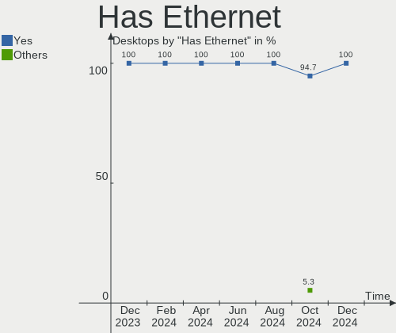
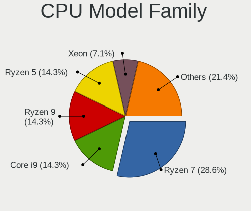
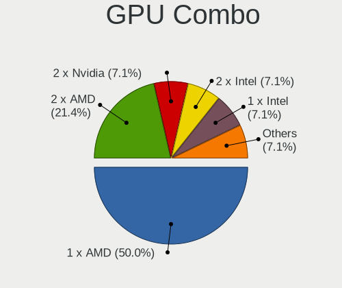
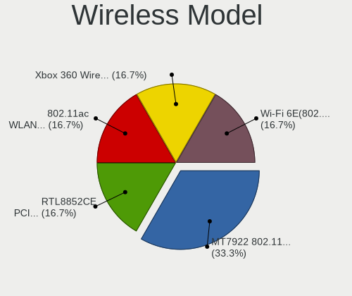
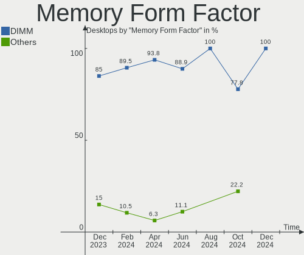

Gentoo - Hardware Trends (Desktops)
-----------------------------------

A project to identify most popular hardware characteristics and track their change
over time based on data collected by Linux users at https://Linux-Hardware.org.

Anyone can contribute to this report by the [hw-probe](https://github.com/linuxhw/hw-probe) tool:

    sudo -E hw-probe -all -upload

This report is for one last month. Overall report since the beginning of time: [TestCoverage](https://github.com/linuxhw/TestCoverage)

Period: May, 2022.

Contents
--------

* [ System ](#system)
  - [ OS                       ](#os)
  - [ OS Family                ](#os-family)
  - [ Kernel                   ](#kernel)
  - [ Kernel Family            ](#kernel-family)
  - [ Kernel Major Ver.        ](#kernel-major-ver)
  - [ Arch                     ](#arch)
  - [ DE                       ](#de)
  - [ Display Server           ](#display-server)
  - [ Display Manager          ](#display-manager)
  - [ OS Lang                  ](#os-lang)
  - [ Boot Mode                ](#boot-mode)
  - [ Filesystem               ](#filesystem)
  - [ Part. scheme             ](#part-scheme)
  - [ Dual Boot with Linux/BSD ](#dual-boot-with-linuxbsd)
  - [ Dual Boot (Win)          ](#dual-boot-win)

* [ Board ](#board)
  - [ Vendor                   ](#vendor)
  - [ Model                    ](#model)
  - [ Model Family             ](#model-family)
  - [ MFG Year                 ](#mfg-year)
  - [ Form Factor              ](#form-factor)
  - [ Secure Boot              ](#secure-boot)
  - [ Coreboot                 ](#coreboot)
  - [ RAM Size                 ](#ram-size)
  - [ RAM Used                 ](#ram-used)
  - [ Total Drives             ](#total-drives)
  - [ Has CD-ROM               ](#has-cd-rom)
  - [ Has Ethernet             ](#has-ethernet)
  - [ Has WiFi                 ](#has-wifi)
  - [ Has Bluetooth            ](#has-bluetooth)

* [ Location ](#location)
  - [ Country                  ](#country)
  - [ City                     ](#city)

* [ Drives ](#drives)
  - [ Drive Vendor             ](#drive-vendor)
  - [ Drive Model              ](#drive-model)
  - [ HDD Vendor               ](#hdd-vendor)
  - [ SSD Vendor               ](#ssd-vendor)
  - [ Drive Kind               ](#drive-kind)
  - [ Drive Connector          ](#drive-connector)
  - [ Drive Size               ](#drive-size)
  - [ Space Total              ](#space-total)
  - [ Space Used               ](#space-used)
  - [ Malfunc. Drives          ](#malfunc-drives)
  - [ Malfunc. Drive Vendor    ](#malfunc-drive-vendor)
  - [ Malfunc. HDD Vendor      ](#malfunc-hdd-vendor)
  - [ Malfunc. Drive Kind      ](#malfunc-drive-kind)
  - [ Failed Drives            ](#failed-drives)
  - [ Failed Drive Vendor      ](#failed-drive-vendor)
  - [ Drive Status             ](#drive-status)

* [ Storage controller ](#storage-controller)
  - [ Storage Vendor           ](#storage-vendor)
  - [ Storage Model            ](#storage-model)
  - [ Storage Kind             ](#storage-kind)

* [ Processor ](#processor)
  - [ CPU Vendor               ](#cpu-vendor)
  - [ CPU Model                ](#cpu-model)
  - [ CPU Model Family         ](#cpu-model-family)
  - [ CPU Cores                ](#cpu-cores)
  - [ CPU Sockets              ](#cpu-sockets)
  - [ CPU Threads              ](#cpu-threads)
  - [ CPU Op-Modes             ](#cpu-op-modes)
  - [ CPU Microcode            ](#cpu-microcode)
  - [ CPU Microarch            ](#cpu-microarch)

* [ Graphics ](#graphics)
  - [ GPU Vendor               ](#gpu-vendor)
  - [ GPU Model                ](#gpu-model)
  - [ GPU Combo                ](#gpu-combo)
  - [ GPU Driver               ](#gpu-driver)
  - [ GPU Memory               ](#gpu-memory)

* [ Monitor ](#monitor)
  - [ Monitor Vendor           ](#monitor-vendor)
  - [ Monitor Model            ](#monitor-model)
  - [ Monitor Resolution       ](#monitor-resolution)
  - [ Monitor Diagonal         ](#monitor-diagonal)
  - [ Monitor Width            ](#monitor-width)
  - [ Aspect Ratio             ](#aspect-ratio)
  - [ Monitor Area             ](#monitor-area)
  - [ Pixel Density            ](#pixel-density)
  - [ Multiple Monitors        ](#multiple-monitors)

* [ Network ](#network)
  - [ Net Controller Vendor    ](#net-controller-vendor)
  - [ Net Controller Model     ](#net-controller-model)
  - [ Wireless Vendor          ](#wireless-vendor)
  - [ Wireless Model           ](#wireless-model)
  - [ Ethernet Vendor          ](#ethernet-vendor)
  - [ Ethernet Model           ](#ethernet-model)
  - [ Net Controller Kind      ](#net-controller-kind)
  - [ Used Controller          ](#used-controller)
  - [ NICs                     ](#nics)
  - [ IPv6                     ](#ipv6)

* [ Bluetooth ](#bluetooth)
  - [ Bluetooth Vendor         ](#bluetooth-vendor)
  - [ Bluetooth Model          ](#bluetooth-model)

* [ Sound ](#sound)
  - [ Sound Vendor             ](#sound-vendor)
  - [ Sound Model              ](#sound-model)

* [ Memory ](#memory)
  - [ Memory Vendor            ](#memory-vendor)
  - [ Memory Model             ](#memory-model)
  - [ Memory Kind              ](#memory-kind)
  - [ Memory Form Factor       ](#memory-form-factor)
  - [ Memory Size              ](#memory-size)
  - [ Memory Speed             ](#memory-speed)

* [ Printers & scanners ](#printers--scanners)
  - [ Printer Vendor           ](#printer-vendor)
  - [ Printer Model            ](#printer-model)
  - [ Scanner Vendor           ](#scanner-vendor)
  - [ Scanner Model            ](#scanner-model)

* [ Camera ](#camera)
  - [ Camera Vendor            ](#camera-vendor)
  - [ Camera Model             ](#camera-model)

* [ Security ](#security)
  - [ Fingerprint Vendor       ](#fingerprint-vendor)
  - [ Fingerprint Model        ](#fingerprint-model)
  - [ Chipcard Vendor          ](#chipcard-vendor)
  - [ Chipcard Model           ](#chipcard-model)

* [ Unsupported ](#unsupported)
  - [ Unsupported Devices      ](#unsupported-devices)
  - [ Unsupported Device Types ](#unsupported-device-types)

System
------

OS
--

Installed operating systems

| Name       | Desktops | Percent |
|------------|----------|---------|
| Gentoo 2.7 | 10       | 37.04%  |
| Gentoo 2.8 | 9        | 33.33%  |
| Gentoo 2.6 | 6        | 22.22%  |
| Gentoo 2.3 | 1        | 3.7%    |
| Gentoo 1   | 1        | 3.7%    |

OS Family
---------

OS without a version

| Name   | Desktops | Percent |
|--------|----------|---------|
| Gentoo | 27       | 100%    |

Kernel
------

Version of the Linux kernel

| Version                       | Desktops | Percent |
|-------------------------------|----------|---------|
| 5.15.32-gentoo-r1             | 4        | 14.81%  |
| 5.15.32-gentoo-r1-x86_64      | 3        | 11.11%  |
| 5.17.5-gentoo                 | 2        | 7.41%   |
| 5.18.0-gentoo                 | 1        | 3.7%    |
| 5.17.9-gentoo-x86_64          | 1        | 3.7%    |
| 5.17.9-gentoo-dist            | 1        | 3.7%    |
| 5.17.8-gentoo-x86_64          | 1        | 3.7%    |
| 5.17.7-gentoo-limelight       | 1        | 3.7%    |
| 5.17.7-gentoo-dist            | 1        | 3.7%    |
| 5.17.6-gentoo-x86_64          | 1        | 3.7%    |
| 5.17.1-zen1-gungnir           | 1        | 3.7%    |
| 5.17.1-zen1                   | 1        | 3.7%    |
| 5.17.1-gentoo-r1              | 1        | 3.7%    |
| 5.15.41-gentoo-dist           | 1        | 3.7%    |
| 5.15.37-gentoo-dist-hardened  | 1        | 3.7%    |
| 5.15.32-x86_64                | 1        | 3.7%    |
| 5.15.32-gentoo-r1-meguias-6.4 | 1        | 3.7%    |
| 5.15.11-gentoo-x86_64         | 1        | 3.7%    |
| 5.13.19-gentoo-reflesia       | 1        | 3.7%    |
| 5.10.76-gentoo-r1-x86_64      | 1        | 3.7%    |
| 4.9.16-gentoo                 | 1        | 3.7%    |

Kernel Family
-------------

Linux kernel without a distro release

| Version | Desktops | Percent |
|---------|----------|---------|
| 5.15.32 | 9        | 33.33%  |
| 5.17.1  | 3        | 11.11%  |
| 5.17.9  | 2        | 7.41%   |
| 5.17.7  | 2        | 7.41%   |
| 5.17.5  | 2        | 7.41%   |
| 5.18.0  | 1        | 3.7%    |
| 5.17.8  | 1        | 3.7%    |
| 5.17.6  | 1        | 3.7%    |
| 5.15.41 | 1        | 3.7%    |
| 5.15.37 | 1        | 3.7%    |
| 5.15.11 | 1        | 3.7%    |
| 5.13.19 | 1        | 3.7%    |
| 5.10.76 | 1        | 3.7%    |
| 4.9.16  | 1        | 3.7%    |

Kernel Major Ver.
-----------------

Linux kernel major version

| Version | Desktops | Percent |
|---------|----------|---------|
| 5.15    | 12       | 44.44%  |
| 5.17    | 11       | 40.74%  |
| 5.18    | 1        | 3.7%    |
| 5.13    | 1        | 3.7%    |
| 5.10    | 1        | 3.7%    |
| 4.9     | 1        | 3.7%    |

Arch
----

OS architecture (x86_64, i586, etc.)

| Name   | Desktops | Percent |
|--------|----------|---------|
| x86_64 | 26       | 96.3%   |
| ppc    | 1        | 3.7%    |

DE
--

Desktop Environment

| Name          | Desktops | Percent |
|---------------|----------|---------|
| Unknown       | 12       | 44.44%  |
| KDE5          | 4        | 14.81%  |
| XFCE          | 3        | 11.11%  |
| GNOME         | 3        | 11.11%  |
| MATE          | 2        | 7.41%   |
| X-Cinnamon    | 1        | 3.7%    |
| LXQt          | 1        | 3.7%    |
| Enlightenment | 1        | 3.7%    |

Display Server
--------------

X11 or Wayland

| Name    | Desktops | Percent |
|---------|----------|---------|
| X11     | 13       | 48.15%  |
| Unknown | 7        | 25.93%  |
| Wayland | 4        | 14.81%  |
| Tty     | 3        | 11.11%  |

Display Manager
---------------

SDDM, LightDM, etc.

| Name    | Desktops | Percent |
|---------|----------|---------|
| Unknown | 12       | 44.44%  |
| SDDM    | 7        | 25.93%  |
| LightDM | 6        | 22.22%  |
| GREETD  | 1        | 3.7%    |
| GDM     | 1        | 3.7%    |

OS Lang
-------

Language

| Lang    | Desktops | Percent |
|---------|----------|---------|
| en_US   | 10       | 37.04%  |
| es_ES   | 3        | 11.11%  |
| en_GB   | 3        | 11.11%  |
| de_DE   | 2        | 7.41%   |
| C.UTF8  | 2        | 7.41%   |
| Unknown | 2        | 7.41%   |
| ru_RU   | 1        | 3.7%    |
| pl_PL   | 1        | 3.7%    |
| it_IT   | 1        | 3.7%    |
| fr_FR   | 1        | 3.7%    |
| ca_ES   | 1        | 3.7%    |

Boot Mode
---------

EFI or BIOS

| Mode | Desktops | Percent |
|------|----------|---------|
| EFI  | 21       | 77.78%  |
| BIOS | 6        | 22.22%  |

Filesystem
----------

Type of filesystem

| Type  | Desktops | Percent |
|-------|----------|---------|
| Ext4  | 15       | 55.56%  |
| Btrfs | 6        | 22.22%  |
| F2fs  | 3        | 11.11%  |
| Xfs   | 2        | 7.41%   |
| Zfs   | 1        | 3.7%    |

Part. scheme
------------

Scheme of partitioning

| Type    | Desktops | Percent |
|---------|----------|---------|
| GPT     | 24       | 88.89%  |
| Unknown | 2        | 7.41%   |
| MBR     | 1        | 3.7%    |

Dual Boot with Linux/BSD
------------------------

Hosting more than one Linux/BSD

| Dual boot | Desktops | Percent |
|-----------|----------|---------|
| Yes       | 15       | 55.56%  |
| No        | 12       | 44.44%  |

Dual Boot (Win)
---------------

Hosting Linux and Windows

| Dual boot | Desktops | Percent |
|-----------|----------|---------|
| No        | 21       | 77.78%  |
| Yes       | 6        | 22.22%  |

Board
-----

Vendor
------

Motherboard manufacturer

| Name                | Desktops | Percent |
|---------------------|----------|---------|
| ASUSTek Computer    | 12       | 44.44%  |
| MSI                 | 3        | 11.11%  |
| Gigabyte Technology | 3        | 11.11%  |
| ASRock              | 3        | 11.11%  |
| Intel               | 1        | 3.7%    |
| Hewlett-Packard     | 1        | 3.7%    |
| Dell                | 1        | 3.7%    |
| ASRockRack          | 1        | 3.7%    |
| Apple               | 1        | 3.7%    |
| Unknown             | 1        | 3.7%    |

Model
-----

Motherboard model

| Name                              | Desktops | Percent |
|-----------------------------------|----------|---------|
| MSI MS-7D54                       | 1        | 3.7%    |
| MSI MS-7D25                       | 1        | 3.7%    |
| MSI MS-7C37                       | 1        | 3.7%    |
| Intel D54250WYK H13922-303        | 1        | 3.7%    |
| HP OMEN 25L Desktop GT12-0xxx     | 1        | 3.7%    |
| Gigabyte Z590 UD                  | 1        | 3.7%    |
| Gigabyte GA-970A-D3               | 1        | 3.7%    |
| Gigabyte AB350-Gaming             | 1        | 3.7%    |
| Dell OptiPlex 790                 | 1        | 3.7%    |
| ASUS Z8NR-D12                     | 1        | 3.7%    |
| ASUS Z170-A                       | 1        | 3.7%    |
| ASUS TUF Gaming Z690-PLUS WIFI D4 | 1        | 3.7%    |
| ASUS TUF Gaming B550M-PLUS        | 1        | 3.7%    |
| ASUS TUF Gaming B550-PLUS         | 1        | 3.7%    |
| ASUS SABERTOOTH 990FX             | 1        | 3.7%    |
| ASUS ROG Maximus XIII APEX        | 1        | 3.7%    |
| ASUS PRIME Z690M-PLUS D4          | 1        | 3.7%    |
| ASUS PRIME X570-PRO               | 1        | 3.7%    |
| ASUS PRIME H370-PLUS              | 1        | 3.7%    |
| ASUS M3A78-CM                     | 1        | 3.7%    |
| ASUS All Series                   | 1        | 3.7%    |
| ASRockRack E3C232D2I              | 1        | 3.7%    |
| ASRock X370 Gaming X              | 1        | 3.7%    |
| ASRock B450 Gaming K4             | 1        | 3.7%    |
| ASRock A320M Pro4                 | 1        | 3.7%    |
| Apple MacPro5,1                   | 1        | 3.7%    |
| Unknown                           | 1        | 3.7%    |

Model Family
------------

Motherboard model prefix

| Name                  | Desktops | Percent |
|-----------------------|----------|---------|
| ASUS TUF              | 3        | 11.11%  |
| ASUS PRIME            | 3        | 11.11%  |
| MSI MS-7D54           | 1        | 3.7%    |
| MSI MS-7D25           | 1        | 3.7%    |
| MSI MS-7C37           | 1        | 3.7%    |
| Intel D54250WYK       | 1        | 3.7%    |
| HP OMEN               | 1        | 3.7%    |
| Gigabyte Z590         | 1        | 3.7%    |
| Gigabyte GA-970A-D3   | 1        | 3.7%    |
| Gigabyte AB350-Gaming | 1        | 3.7%    |
| Dell OptiPlex         | 1        | 3.7%    |
| ASUS Z8NR-D12         | 1        | 3.7%    |
| ASUS Z170-A           | 1        | 3.7%    |
| ASUS SABERTOOTH       | 1        | 3.7%    |
| ASUS ROG              | 1        | 3.7%    |
| ASUS M3A78-CM         | 1        | 3.7%    |
| ASUS All              | 1        | 3.7%    |
| ASRockRack E3C232D2I  | 1        | 3.7%    |
| ASRock X370           | 1        | 3.7%    |
| ASRock B450           | 1        | 3.7%    |
| ASRock A320M          | 1        | 3.7%    |
| Apple MacPro5         | 1        | 3.7%    |
| Unknown               | 1        | 3.7%    |

MFG Year
--------

Motherboard manufacture year

| Year    | Desktops | Percent |
|---------|----------|---------|
| 2021    | 5        | 18.52%  |
| 2020    | 3        | 11.11%  |
| 2018    | 3        | 11.11%  |
| 2017    | 3        | 11.11%  |
| 2011    | 3        | 11.11%  |
| 2019    | 2        | 7.41%   |
| 2015    | 2        | 7.41%   |
| 2022    | 1        | 3.7%    |
| 2013    | 1        | 3.7%    |
| 2010    | 1        | 3.7%    |
| 2009    | 1        | 3.7%    |
| 2008    | 1        | 3.7%    |
| Unknown | 1        | 3.7%    |

Form Factor
-----------

Physical design of the computer

| Name    | Desktops | Percent |
|---------|----------|---------|
| Desktop | 27       | 100%    |

Secure Boot
-----------

Enabled or disabled

| State    | Desktops | Percent |
|----------|----------|---------|
| Disabled | 26       | 96.3%   |
| Enabled  | 1        | 3.7%    |

Coreboot
--------

Have coreboot on board

| Used | Desktops | Percent |
|------|----------|---------|
| No   | 27       | 100%    |

RAM Size
--------

Total RAM memory

| Size in GB  | Desktops | Percent |
|-------------|----------|---------|
| 32.01-64.0  | 11       | 40.74%  |
| 16.01-24.0  | 6        | 22.22%  |
| 64.01-256.0 | 4        | 14.81%  |
| 8.01-16.0   | 4        | 14.81%  |
| 4.01-8.0    | 1        | 3.7%    |
| 0.51-1.0    | 1        | 3.7%    |

RAM Used
--------

Used RAM memory

| Used GB   | Desktops | Percent |
|-----------|----------|---------|
| 4.01-8.0  | 8        | 29.63%  |
| 1.01-2.0  | 5        | 18.52%  |
| 8.01-16.0 | 5        | 18.52%  |
| 3.01-4.0  | 4        | 14.81%  |
| 2.01-3.0  | 3        | 11.11%  |
| 0.01-0.5  | 2        | 7.41%   |

Total Drives
------------

Number of drives on board

| Drives | Desktops | Percent |
|--------|----------|---------|
| 2      | 8        | 29.63%  |
| 5      | 5        | 18.52%  |
| 4      | 5        | 18.52%  |
| 1      | 4        | 14.81%  |
| 6      | 3        | 11.11%  |
| 3      | 2        | 7.41%   |

Has CD-ROM
----------

Has CD-ROM on board

| Presented | Desktops | Percent |
|-----------|----------|---------|
| No        | 23       | 85.19%  |
| Yes       | 4        | 14.81%  |

Has Ethernet
------------

Has Ethernet on board

| Presented | Desktops | Percent |
|-----------|----------|---------|
| Yes       | 27       | 100%    |

Has WiFi
--------

Has WiFi module

| Presented | Desktops | Percent |
|-----------|----------|---------|
| No        | 16       | 59.26%  |
| Yes       | 11       | 40.74%  |

Has Bluetooth
-------------

Has Bluetooth module

| Presented | Desktops | Percent |
|-----------|----------|---------|
| No        | 15       | 55.56%  |
| Yes       | 12       | 44.44%  |

Location
--------

Country
-------

Geographic location (country)

| Country | Desktops | Percent |
|---------|----------|---------|
| USA     | 7        | 25.93%  |
| Poland  | 4        | 14.81%  |
| Spain   | 3        | 11.11%  |
| Germany | 3        | 11.11%  |
| Russia  | 2        | 7.41%   |
| France  | 2        | 7.41%   |
| Italy   | 1        | 3.7%    |
| Israel  | 1        | 3.7%    |
| Ireland | 1        | 3.7%    |
| India   | 1        | 3.7%    |
| China   | 1        | 3.7%    |
| Belarus | 1        | 3.7%    |

City
----

Geographic location (city)

| City                | Desktops | Percent |
|---------------------|----------|---------|
| Warsaw              | 2        | 7.41%   |
| Ocala               | 2        | 7.41%   |
| Combrit             | 2        | 7.41%   |
| Cieszyn             | 2        | 7.41%   |
| Yekaterinburg       | 1        | 3.7%    |
| Sterling            | 1        | 3.7%    |
| Schwieberdingen     | 1        | 3.7%    |
| Pardes Hanna Karkur | 1        | 3.7%    |
| Ostuni              | 1        | 3.7%    |
| Orange              | 1        | 3.7%    |
| Murmansk            | 1        | 3.7%    |
| Langenhagen         | 1        | 3.7%    |
| Igualada            | 1        | 3.7%    |
| Hyderabad           | 1        | 3.7%    |
| Hamburg             | 1        | 3.7%    |
| Gomel               | 1        | 3.7%    |
| Foshan              | 1        | 3.7%    |
| Dublin              | 1        | 3.7%    |
| Denver              | 1        | 3.7%    |
| Bilbao              | 1        | 3.7%    |
| Baton Rouge         | 1        | 3.7%    |
| Barcelona           | 1        | 3.7%    |
| Alton               | 1        | 3.7%    |

Drives
------

Drive Vendor
------------

Hard drive vendors

| Vendor              | Desktops | Drives | Percent |
|---------------------|----------|--------|---------|
| WDC                 | 13       | 22     | 21.31%  |
| Samsung Electronics | 10       | 22     | 16.39%  |
| Seagate             | 9        | 11     | 14.75%  |
| Crucial             | 4        | 4      | 6.56%   |
| Toshiba             | 3        | 4      | 4.92%   |
| SanDisk             | 3        | 3      | 4.92%   |
| Kingston            | 2        | 3      | 3.28%   |
| Intel               | 2        | 2      | 3.28%   |
| Hitachi             | 2        | 4      | 3.28%   |
| HGST                | 2        | 3      | 3.28%   |
| GOODRAM             | 2        | 2      | 3.28%   |
| Transcend           | 1        | 1      | 1.64%   |
| TO Exter            | 1        | 1      | 1.64%   |
| Team                | 1        | 1      | 1.64%   |
| Silicon Motion      | 1        | 2      | 1.64%   |
| LaCie               | 1        | 1      | 1.64%   |
| Kingchuxing         | 1        | 1      | 1.64%   |
| Fujitsu             | 1        | 1      | 1.64%   |
| Apacer              | 1        | 1      | 1.64%   |
| A-DATA Technology   | 1        | 1      | 1.64%   |

Drive Model
-----------

Hard drive models

| Model                                | Desktops | Percent |
|--------------------------------------|----------|---------|
| Samsung SSD 850 EVO 500GB            | 3        | 3.8%    |
| Seagate ST2000DM008-2FR102 2TB       | 2        | 2.53%   |
| Samsung SSD 970 EVO Plus 500GB       | 2        | 2.53%   |
| Samsung SSD 970 EVO Plus 1TB         | 2        | 2.53%   |
| GOODRAM SSDPR-CL100-480-G2 480GB     | 2        | 2.53%   |
| WDC WDS500G3XHC-00SJG0 500GB         | 1        | 1.27%   |
| WDC WDS500G2B0C-00PXH0 500GB         | 1        | 1.27%   |
| WDC WDS100T3XHC-00SJG0 1TB           | 1        | 1.27%   |
| WDC WD8003FFBX-68B9AN0 8TB           | 1        | 1.27%   |
| WDC WD60EZRX-00MVLB1 6TB             | 1        | 1.27%   |
| WDC WD5000AVDS-63U7B1 500GB          | 1        | 1.27%   |
| WDC WD5000AADS-00S9B0 500GB          | 1        | 1.27%   |
| WDC WD40EZRZ-00WN9B0 4TB             | 1        | 1.27%   |
| WDC WD40EZRX-00SPEB0 4TB             | 1        | 1.27%   |
| WDC WD40EZRX-00MVLB1 4TB             | 1        | 1.27%   |
| WDC WD40EFRX-68WT0N0 4TB             | 1        | 1.27%   |
| WDC WD3200AAJS-22RYA0 320GB          | 1        | 1.27%   |
| WDC WD30EFRX-68N32N0 3TB             | 1        | 1.27%   |
| WDC WD20EFRX-68EUZN0 2TB             | 1        | 1.27%   |
| WDC WD10EZEX-60WN4A0 1TB             | 1        | 1.27%   |
| WDC WD10EZEX-60M2NA0 1TB             | 1        | 1.27%   |
| WDC WD10EZEX-08WN4A0 1TB             | 1        | 1.27%   |
| WDC WD10EACS-00D6B1 1TB              | 1        | 1.27%   |
| WDC WD1002FAEX-00Y9A0 1TB            | 1        | 1.27%   |
| WDC WD1001FALS-41K1B0 1TB            | 1        | 1.27%   |
| WDC WD BLACK SDBPNTY-512G-1106 512GB | 1        | 1.27%   |
| Transcend TS512GSSD720 512GB         | 1        | 1.27%   |
| Toshiba HDWE150 5TB                  | 1        | 1.27%   |
| Toshiba HDWD110 1TB                  | 1        | 1.27%   |
| Toshiba DT01ACA100 1TB               | 1        | 1.27%   |
| TO Exter nal USB 3.0 320GB           | 1        | 1.27%   |
| Team TM8FP2240G 240GB                | 1        | 1.27%   |
| Silicon Motion NVME SSD 128GB        | 1        | 1.27%   |
| Silicon Motion 256GB                 | 1        | 1.27%   |
| Seagate ST8000DM004-2CX188 8TB       | 1        | 1.27%   |
| Seagate ST6000DX000-1H217Z 6TB       | 1        | 1.27%   |
| Seagate ST4000DM004-2CV104 4TB       | 1        | 1.27%   |
| Seagate ST3750640AS 752GB            | 1        | 1.27%   |
| Seagate ST2000LM015-2E8174 2TB       | 1        | 1.27%   |
| Seagate ST2000DX001-1CM164 2TB       | 1        | 1.27%   |
| Seagate ST12000NM0008-2H3101 12TB    | 1        | 1.27%   |
| SanDisk SSD PLUS 240GB               | 1        | 1.27%   |
| SanDisk SSD PLUS 120GB               | 1        | 1.27%   |
| Sandisk NVMe SSD Drive 500GB         | 1        | 1.27%   |
| Samsung SSD 980 PRO 2TB              | 1        | 1.27%   |
| Samsung SSD 980 PRO 250GB            | 1        | 1.27%   |
| Samsung SSD 980 PRO 1TB              | 1        | 1.27%   |
| Samsung SSD 870 QVO 2TB              | 1        | 1.27%   |
| Samsung SSD 860 EVO 250GB            | 1        | 1.27%   |
| Samsung SSD 860 EVO 1TB              | 1        | 1.27%   |
| Samsung SSD 850 PRO 512GB            | 1        | 1.27%   |
| Samsung SSD 850 PRO 256GB            | 1        | 1.27%   |
| Samsung SSD 850 EVO 250GB            | 1        | 1.27%   |
| Samsung SSD 850 EVO 1TB              | 1        | 1.27%   |
| Samsung SSD 840 Series 250GB         | 1        | 1.27%   |
| Samsung HD154UI 1TB                  | 1        | 1.27%   |
| LaCie Rugged THB USB3 2TB            | 1        | 1.27%   |
| Kingston SNVS500G 500GB              | 1        | 1.27%   |
| Kingston SA400S37480G 480GB SSD      | 1        | 1.27%   |
| Kingchuxing 512GB                    | 1        | 1.27%   |

HDD Vendor
----------

Hard disk drive vendors

| Vendor              | Desktops | Drives | Percent |
|---------------------|----------|--------|---------|
| WDC                 | 11       | 18     | 36.67%  |
| Seagate             | 9        | 11     | 30%     |
| Toshiba             | 3        | 4      | 10%     |
| Hitachi             | 2        | 4      | 6.67%   |
| HGST                | 2        | 3      | 6.67%   |
| Samsung Electronics | 1        | 1      | 3.33%   |
| LaCie               | 1        | 1      | 3.33%   |
| Fujitsu             | 1        | 1      | 3.33%   |

SSD Vendor
----------

Solid state drive vendors

| Vendor              | Desktops | Drives | Percent |
|---------------------|----------|--------|---------|
| Samsung Electronics | 7        | 11     | 33.33%  |
| Crucial             | 3        | 3      | 14.29%  |
| SanDisk             | 2        | 2      | 9.52%   |
| Intel               | 2        | 2      | 9.52%   |
| GOODRAM             | 2        | 2      | 9.52%   |
| Transcend           | 1        | 1      | 4.76%   |
| TO Exter            | 1        | 1      | 4.76%   |
| Kingston            | 1        | 2      | 4.76%   |
| Apacer              | 1        | 1      | 4.76%   |
| A-DATA Technology   | 1        | 1      | 4.76%   |

Drive Kind
----------

HDD or SSD

| Kind | Desktops | Drives | Percent |
|------|----------|--------|---------|
| HDD  | 21       | 43     | 39.62%  |
| SSD  | 17       | 26     | 32.08%  |
| NVMe | 15       | 21     | 28.3%   |

Drive Connector
---------------

SATA, SAS, NVMe, etc.

| Type | Desktops | Drives | Percent |
|------|----------|--------|---------|
| SATA | 24       | 67     | 58.54%  |
| NVMe | 15       | 21     | 36.59%  |
| SAS  | 2        | 2      | 4.88%   |

Drive Size
----------

Size of hard drive

| Size in TB | Desktops | Drives | Percent |
|------------|----------|--------|---------|
| 0.01-0.5   | 18       | 25     | 39.13%  |
| 0.51-1.0   | 12       | 18     | 26.09%  |
| 1.01-2.0   | 7        | 10     | 15.22%  |
| 3.01-4.0   | 3        | 5      | 6.52%   |
| 4.01-10.0  | 3        | 6      | 6.52%   |
| 2.01-3.0   | 2        | 4      | 4.35%   |
| 10.01-20.0 | 1        | 1      | 2.17%   |

Space Total
-----------

Amount of disk space available on the file system

| Size in GB     | Desktops | Percent |
|----------------|----------|---------|
| More than 3000 | 8        | 29.63%  |
| 101-250        | 5        | 18.52%  |
| 501-1000       | 3        | 11.11%  |
| 251-500        | 2        | 7.41%   |
| 21-50          | 2        | 7.41%   |
| 2001-3000      | 2        | 7.41%   |
| 1001-2000      | 2        | 7.41%   |
| 51-100         | 2        | 7.41%   |
| Unknown        | 1        | 3.7%    |

Space Used
----------

Amount of used disk space

| Used GB        | Desktops | Percent |
|----------------|----------|---------|
| More than 3000 | 6        | 22.22%  |
| 1-20           | 6        | 22.22%  |
| 51-100         | 3        | 11.11%  |
| 251-500        | 2        | 7.41%   |
| 21-50          | 2        | 7.41%   |
| 101-250        | 2        | 7.41%   |
| 1001-2000      | 2        | 7.41%   |
| 501-1000       | 2        | 7.41%   |
| 2001-3000      | 1        | 3.7%    |
| Unknown        | 1        | 3.7%    |

Malfunc. Drives
---------------

Drive models with a malfunction

| Model                          | Desktops | Drives | Percent |
|--------------------------------|----------|--------|---------|
| WDC WD40EFRX-68WT0N0 4TB       | 1        | 1      | 25%     |
| Transcend TS512GSSD720 512GB   | 1        | 1      | 25%     |
| Seagate ST2000DX001-1CM164 2TB | 1        | 1      | 25%     |
| HGST HTS545050A7E380 500GB     | 1        | 2      | 25%     |

Malfunc. Drive Vendor
---------------------

Vendors of faulty drives

| Vendor    | Desktops | Drives | Percent |
|-----------|----------|--------|---------|
| WDC       | 1        | 1      | 25%     |
| Transcend | 1        | 1      | 25%     |
| Seagate   | 1        | 1      | 25%     |
| HGST      | 1        | 2      | 25%     |

Malfunc. HDD Vendor
-------------------

Vendors of faulty HDD drives

| Vendor  | Desktops | Drives | Percent |
|---------|----------|--------|---------|
| WDC     | 1        | 1      | 33.33%  |
| Seagate | 1        | 1      | 33.33%  |
| HGST    | 1        | 2      | 33.33%  |

Malfunc. Drive Kind
-------------------

Kinds of faulty drives

| Kind | Desktops | Drives | Percent |
|------|----------|--------|---------|
| HDD  | 3        | 4      | 75%     |
| SSD  | 1        | 1      | 25%     |

Failed Drives
-------------

Failed drive models

Zero info for selected period =(

Failed Drive Vendor
-------------------

Failed drive vendors

Zero info for selected period =(

Drive Status
------------

Number of failed and malfunc. drives

| Status   | Desktops | Drives | Percent |
|----------|----------|--------|---------|
| Works    | 23       | 78     | 79.31%  |
| Detected | 3        | 7      | 10.34%  |
| Malfunc  | 3        | 5      | 10.34%  |

Storage controller
------------------

Storage Vendor
--------------

Storage controller vendors

| Vendor                      | Desktops | Percent |
|-----------------------------|----------|---------|
| Intel                       | 14       | 28.57%  |
| AMD                         | 12       | 24.49%  |
| Samsung Electronics         | 7        | 14.29%  |
| ASMedia Technology          | 6        | 12.24%  |
| Sandisk                     | 5        | 10.2%   |
| Silicon Motion              | 2        | 4.08%   |
| Phison Electronics          | 1        | 2.04%   |
| Micron/Crucial Technology   | 1        | 2.04%   |
| Kingston Technology Company | 1        | 2.04%   |

Storage Model
-------------

Storage controller models

| Model                                                                         | Desktops | Percent |
|-------------------------------------------------------------------------------|----------|---------|
| ASMedia ASM1062 Serial ATA Controller                                         | 6        | 10.71%  |
| AMD FCH SATA Controller [AHCI mode]                                           | 6        | 10.71%  |
| Samsung NVMe SSD Controller SM981/PM981/PM983                                 | 4        | 7.14%   |
| Samsung NVMe SSD Controller PM9A1/PM9A3/980PRO                                | 3        | 5.36%   |
| Intel Alder Lake-S PCH SATA Controller [AHCI Mode]                            | 3        | 5.36%   |
| Silicon Motion SM2263EN/SM2263XT SSD Controller                               | 2        | 3.57%   |
| Sandisk WD Black 2018/SN750 / PC SN720 NVMe SSD                               | 2        | 3.57%   |
| Intel Volume Management Device NVMe RAID Controller                           | 2        | 3.57%   |
| Intel Q170/Q150/B150/H170/H110/Z170/CM236 Chipset SATA Controller [AHCI Mode] | 2        | 3.57%   |
| Intel 82801JI (ICH10 Family) SATA AHCI Controller                             | 2        | 3.57%   |
| Intel 500 Series Chipset Family SATA AHCI Controller                          | 2        | 3.57%   |
| AMD SB7x0/SB8x0/SB9x0 SATA Controller [AHCI mode]                             | 2        | 3.57%   |
| AMD 500 Series Chipset SATA Controller                                        | 2        | 3.57%   |
| Sandisk WD Blue SN570 NVMe SSD                                                | 1        | 1.79%   |
| Sandisk WD Blue SN550 NVMe SSD                                                | 1        | 1.79%   |
| Sandisk WD Black SN750 / PC SN730 NVMe SSD                                    | 1        | 1.79%   |
| Phison E7 NVMe Controller                                                     | 1        | 1.79%   |
| Micron/Crucial P2 NVMe PCIe SSD                                               | 1        | 1.79%   |
| Kingston Company Company Non-Volatile memory controller                       | 1        | 1.79%   |
| Intel SATA Controller [RAID mode]                                             | 1        | 1.79%   |
| Intel Cannon Lake PCH SATA AHCI Controller                                    | 1        | 1.79%   |
| Intel C610/X99 series chipset 6-Port SATA Controller [AHCI mode]              | 1        | 1.79%   |
| Intel 8 Series SATA Controller 1 [AHCI mode]                                  | 1        | 1.79%   |
| Intel 6 Series/C200 Series Chipset Family 6 port Desktop SATA AHCI Controller | 1        | 1.79%   |
| AMD X370 Series Chipset SATA Controller                                       | 1        | 1.79%   |
| AMD SB7x0/SB8x0/SB9x0 SATA Controller [IDE mode]                              | 1        | 1.79%   |
| AMD SB7x0/SB8x0/SB9x0 IDE Controller                                          | 1        | 1.79%   |
| AMD FCH SATA Controller [IDE mode]                                            | 1        | 1.79%   |
| AMD FCH SATA Controller D                                                     | 1        | 1.79%   |
| AMD 400 Series Chipset SATA Controller                                        | 1        | 1.79%   |
| AMD 300 Series Chipset SATA Controller                                        | 1        | 1.79%   |

Storage Kind
------------

Kind of storage controller (IDE, SATA, NVMe, SAS, ...)

| Kind | Desktops | Percent |
|------|----------|---------|
| SATA | 25       | 56.82%  |
| NVMe | 15       | 34.09%  |
| RAID | 3        | 6.82%   |
| IDE  | 1        | 2.27%   |

Processor
---------

CPU Vendor
----------

Processor vendors

| Vendor       | Desktops | Percent |
|--------------|----------|---------|
| Intel        | 14       | 51.85%  |
| AMD          | 12       | 44.44%  |
| PowerBook6,7 | 1        | 3.7%    |

CPU Model
---------

Processor models

| Model                                          | Desktops | Percent |
|------------------------------------------------|----------|---------|
| Intel 12th Gen Core i7-12700K                  | 2        | 7.41%   |
| AMD FX-8120 Eight-Core Processor               | 2        | 7.41%   |
| PowerBook6,7 7447A, altivec supported          | 1        | 3.7%    |
| Intel Xeon CPU X5680 @ 3.33GHz                 | 1        | 3.7%    |
| Intel Xeon CPU E5520 @ 2.27GHz                 | 1        | 3.7%    |
| Intel Xeon CPU E3-1220 v6 @ 3.00GHz            | 1        | 3.7%    |
| Intel Core i7-8700K CPU @ 3.70GHz              | 1        | 3.7%    |
| Intel Core i7-6700K CPU @ 4.00GHz              | 1        | 3.7%    |
| Intel Core i7-5930K CPU @ 3.50GHz              | 1        | 3.7%    |
| Intel Core i7-10700 CPU @ 2.90GHz              | 1        | 3.7%    |
| Intel Core i5-4250U CPU @ 1.30GHz              | 1        | 3.7%    |
| Intel Core i5-2400 CPU @ 3.10GHz               | 1        | 3.7%    |
| Intel 12th Gen Core i7-12700KF                 | 1        | 3.7%    |
| Intel 11th Gen Core i9-11900K @ 3.50GHz        | 1        | 3.7%    |
| Intel 11th Gen Core i7-11700K @ 3.60GHz        | 1        | 3.7%    |
| AMD Ryzen 9 5900X 12-Core Processor            | 1        | 3.7%    |
| AMD Ryzen 7 5700X 8-Core Processor             | 1        | 3.7%    |
| AMD Ryzen 7 3700X 8-Core Processor             | 1        | 3.7%    |
| AMD Ryzen 5 5600X 6-Core Processor             | 1        | 3.7%    |
| AMD Ryzen 5 5600G with Radeon Graphics         | 1        | 3.7%    |
| AMD Ryzen 5 2600 Six-Core Processor            | 1        | 3.7%    |
| AMD Ryzen 5 1600 Six-Core Processor            | 1        | 3.7%    |
| AMD Ryzen 3 4300GE with Radeon Graphics        | 1        | 3.7%    |
| AMD Phenom II X4 955 Processor                 | 1        | 3.7%    |
| AMD A10-9700 RADEON R7, 10 COMPUTE CORES 4C+6G | 1        | 3.7%    |

CPU Model Family
----------------

Processor model prefix

| Model            | Desktops | Percent |
|------------------|----------|---------|
| Other            | 6        | 22.22%  |
| Intel Core i7    | 4        | 14.81%  |
| AMD Ryzen 5      | 4        | 14.81%  |
| Intel Xeon       | 3        | 11.11%  |
| Intel Core i5    | 2        | 7.41%   |
| AMD Ryzen 7      | 2        | 7.41%   |
| AMD FX           | 2        | 7.41%   |
| AMD Ryzen 9      | 1        | 3.7%    |
| AMD Ryzen 3      | 1        | 3.7%    |
| AMD Phenom II X4 | 1        | 3.7%    |
| AMD A10          | 1        | 3.7%    |

CPU Cores
---------

Number of processor cores

| Number | Desktops | Percent |
|--------|----------|---------|
| 4      | 7        | 25.93%  |
| 8      | 6        | 22.22%  |
| 6      | 6        | 22.22%  |
| 12     | 5        | 18.52%  |
| 2      | 2        | 7.41%   |
| 1      | 1        | 3.7%    |

CPU Sockets
-----------

Number of sockets

| Number | Desktops | Percent |
|--------|----------|---------|
| 1      | 25       | 92.59%  |
| 2      | 2        | 7.41%   |

CPU Threads
-----------

Threads per core (Hyper-Threading)

| Number | Desktops | Percent |
|--------|----------|---------|
| 2      | 23       | 85.19%  |
| 1      | 4        | 14.81%  |

CPU Op-Modes
------------

CPU Operation Modes (32-bit, 64-bit)

| Op mode        | Desktops | Percent |
|----------------|----------|---------|
| 32-bit, 64-bit | 26       | 96.3%   |
| 32-bit         | 1        | 3.7%    |

CPU Microcode
-------------

Microcode number

| Number     | Desktops | Percent |
|------------|----------|---------|
| Unknown    | 6        | 22.22%  |
| 0xa0671    | 2        | 7.41%   |
| 0x90672    | 2        | 7.41%   |
| 0xa0655    | 1        | 3.7%    |
| 0x906ea    | 1        | 3.7%    |
| 0x906e9    | 1        | 3.7%    |
| 0x506e3    | 1        | 3.7%    |
| 0x40651    | 1        | 3.7%    |
| 0x306f2    | 1        | 3.7%    |
| 0x206c2    | 1        | 3.7%    |
| 0x206a7    | 1        | 3.7%    |
| 0x0a50000c | 1        | 3.7%    |
| 0x0a201204 | 1        | 3.7%    |
| 0x0a201016 | 1        | 3.7%    |
| 0x08701021 | 1        | 3.7%    |
| 0x08600106 | 1        | 3.7%    |
| 0x0800820d | 1        | 3.7%    |
| 0x08001138 | 1        | 3.7%    |
| 0x0600063e | 1        | 3.7%    |
| 0x010000db | 1        | 3.7%    |

CPU Microarch
-------------

Microarchitecture

| Name             | Desktops | Percent |
|------------------|----------|---------|
| Zen 3            | 4        | 14.81%  |
| Zen 2            | 2        | 7.41%   |
| KabyLake         | 2        | 7.41%   |
| Icelake          | 2        | 7.41%   |
| Haswell          | 2        | 7.41%   |
| Bulldozer        | 2        | 7.41%   |
| Alderlake Hybrid | 2        | 7.41%   |
| Unknown          | 2        | 7.41%   |
| Zen+             | 1        | 3.7%    |
| Zen              | 1        | 3.7%    |
| Westmere         | 1        | 3.7%    |
| Skylake          | 1        | 3.7%    |
| SandyBridge      | 1        | 3.7%    |
| Nehalem          | 1        | 3.7%    |
| K10              | 1        | 3.7%    |
| Excavator        | 1        | 3.7%    |
| CometLake        | 1        | 3.7%    |

Graphics
--------

GPU Vendor
----------

Vendors of graphics cards

| Vendor            | Desktops | Percent |
|-------------------|----------|---------|
| Nvidia            | 12       | 42.86%  |
| AMD               | 12       | 42.86%  |
| Intel             | 2        | 7.14%   |
| ASPEED Technology | 2        | 7.14%   |

GPU Model
---------

Graphics card models

| Model                                                   | Desktops | Percent |
|---------------------------------------------------------|----------|---------|
| AMD Ellesmere [Radeon RX 470/480/570/570X/580/580X/590] | 3        | 10.34%  |
| ASPEED Technology ASPEED Graphics Family                | 2        | 6.9%    |
| AMD Navi 23 [Radeon RX 6600/6600 XT/6600M]              | 2        | 6.9%    |
| Nvidia TU104 [GeForce RTX 2080 SUPER]                   | 1        | 3.45%   |
| Nvidia GP106 [GeForce GTX 1060 6GB]                     | 1        | 3.45%   |
| Nvidia GP104 [GeForce GTX 1080]                         | 1        | 3.45%   |
| Nvidia GM206 [GeForce GTX 960]                          | 1        | 3.45%   |
| Nvidia GM204 [GeForce GTX 980]                          | 1        | 3.45%   |
| Nvidia GK208B [GeForce GT 730]                          | 1        | 3.45%   |
| Nvidia GK107 [GeForce GT 640 OEM]                       | 1        | 3.45%   |
| Nvidia GK106 [GeForce GTX 660]                          | 1        | 3.45%   |
| Nvidia GK104 [GeForce GTX 770]                          | 1        | 3.45%   |
| Nvidia GA106 [Geforce RTX 3050]                         | 1        | 3.45%   |
| Nvidia GA104 [GeForce RTX 3060 Ti]                      | 1        | 3.45%   |
| Nvidia GA102 [GeForce RTX 3080 Ti]                      | 1        | 3.45%   |
| Intel Haswell-ULT Integrated Graphics Controller        | 1        | 3.45%   |
| Intel AlderLake-S GT1                                   | 1        | 3.45%   |
| AMD RV360/M12 [Mobility Radeon 9550]                    | 1        | 3.45%   |
| AMD RS780C [Radeon 3100]                                | 1        | 3.45%   |
| AMD Renoir                                              | 1        | 3.45%   |
| AMD Oland PRO [Radeon R7 240/340 / Radeon 520]          | 1        | 3.45%   |
| AMD Navi 22 [Radeon RX 6700/6700 XT/6750 XT / 6800M]    | 1        | 3.45%   |
| AMD Navi 10 [Radeon RX 5600 OEM/5600 XT / 5700/5700 XT] | 1        | 3.45%   |
| AMD Cezanne                                             | 1        | 3.45%   |
| AMD Cedar [Radeon HD 5000/6000/7350/8350 Series]        | 1        | 3.45%   |

GPU Combo
---------

Combinations of graphics cards

| Name        | Desktops | Percent |
|-------------|----------|---------|
| 1 x Nvidia  | 12       | 44.44%  |
| 1 x AMD     | 10       | 37.04%  |
| 1 x ASPEED  | 2        | 7.41%   |
| 2 x AMD     | 1        | 3.7%    |
| Intel + AMD | 1        | 3.7%    |
| 1 x Intel   | 1        | 3.7%    |

GPU Driver
----------

Free vs proprietary

| Driver      | Desktops | Percent |
|-------------|----------|---------|
| Free        | 14       | 51.85%  |
| Proprietary | 10       | 37.04%  |
| Unknown     | 3        | 11.11%  |

GPU Memory
----------

Total video memory

| Size in GB | Desktops | Percent |
|------------|----------|---------|
| Unknown    | 7        | 25.93%  |
| 7.01-8.0   | 6        | 22.22%  |
| 1.01-2.0   | 4        | 14.81%  |
| 0.51-1.0   | 3        | 11.11%  |
| 5.01-6.0   | 2        | 7.41%   |
| 3.01-4.0   | 2        | 7.41%   |
| 8.01-16.0  | 2        | 7.41%   |
| 0.01-0.5   | 1        | 3.7%    |

Monitor
-------

Monitor Vendor
--------------

Monitor vendors

| Vendor                  | Desktops | Percent |
|-------------------------|----------|---------|
| Samsung Electronics     | 6        | 20.69%  |
| Goldstar                | 5        | 17.24%  |
| Dell                    | 4        | 13.79%  |
| ViewSonic               | 3        | 10.34%  |
| Ancor Communications    | 2        | 6.9%    |
| Philips                 | 1        | 3.45%   |
| Iiyama                  | 1        | 3.45%   |
| Idek Iiyama             | 1        | 3.45%   |
| Eizo                    | 1        | 3.45%   |
| Chi Mei Optoelectronics | 1        | 3.45%   |
| BenQ                    | 1        | 3.45%   |
| Apple                   | 1        | 3.45%   |
| Acer                    | 1        | 3.45%   |
| Unknown                 | 1        | 3.45%   |

Monitor Model
-------------

Monitor models

| Model                                                                 | Desktops | Percent |
|-----------------------------------------------------------------------|----------|---------|
| Goldstar LG HDR 4K GSM7707 3840x2160 600x340mm 27.2-inch              | 2        | 6.25%   |
| ViewSonic VX2776-4K-mhd VSC7137 3840x2160 608x355mm 27.7-inch         | 1        | 3.13%   |
| ViewSonic VX2458 Series VSC36AF 1920x1080 521x293mm 23.5-inch         | 1        | 3.13%   |
| ViewSonic LCD Monitor VSCCB25 1920x1080 480x270mm 21.7-inch           | 1        | 3.13%   |
| Samsung Electronics U28E570 SAM0D70 3840x2160 608x345mm 27.5-inch     | 1        | 3.13%   |
| Samsung Electronics SMS27A850 SAM083D 2560x1440 518x324mm 24.1-inch   | 1        | 3.13%   |
| Samsung Electronics SMB2430L SAM0645 1920x1080 520x290mm 23.4-inch    | 1        | 3.13%   |
| Samsung Electronics S22B300 SAM08C8 1920x1080 477x268mm 21.5-inch     | 1        | 3.13%   |
| Samsung Electronics LC27G5xT SAM707A 2560x1440 597x336mm 27.0-inch    | 1        | 3.13%   |
| Samsung Electronics C24F390 SAM0D2C 1920x1080 521x293mm 23.5-inch     | 1        | 3.13%   |
| Philips LCD Monitor PHL 288P6L                                        | 1        | 3.13%   |
| Iiyama PLG2488H IVM6127 1920x1080 530x300mm 24.0-inch                 | 1        | 3.13%   |
| Iiyama PL2760Q IVM663D 2560x1440 600x340mm 27.2-inch                  | 1        | 3.13%   |
| Idek Iiyama LCD Monitor PL2560H 3840x1080                             | 1        | 3.13%   |
| Goldstar L1750U GSM440C 1280x1024 338x270mm 17.0-inch                 | 1        | 3.13%   |
| Goldstar HDR WFHD GSM7714 2560x1080 798x334mm 34.1-inch               | 1        | 3.13%   |
| Goldstar 27EA33 GSM59BD 1920x1080 598x337mm 27.0-inch                 | 1        | 3.13%   |
| Eizo LCD Monitor S1901 6720x2160                                      | 1        | 3.13%   |
| Eizo LCD Monitor EV2416W                                              | 1        | 3.13%   |
| Dell P2317H DEL40F3 1920x1080 509x286mm 23.0-inch                     | 1        | 3.13%   |
| Dell LCD Monitor U3014 2560x1600                                      | 1        | 3.13%   |
| Dell G2410 DEL404B 1920x1080 531x298mm 24.0-inch                      | 1        | 3.13%   |
| Dell E2015HV DELF05E 1600x900 430x240mm 19.4-inch                     | 1        | 3.13%   |
| Chi Mei Optoelectronics CMC 19AW CMO2198 1440x900 408x255mm 18.9-inch | 1        | 3.13%   |
| BenQ E2200HD BNQ790C 1920x1080 477x268mm 21.5-inch                    | 1        | 3.13%   |
| Apple Color LCD APP9C3F 1024x768 285x214mm 14.0-inch                  | 1        | 3.13%   |
| Ancor Communications ASUS VS228 ACI22FD 1920x1080 476x268mm 21.5-inch | 1        | 3.13%   |
| Ancor Communications ASUS MX239 ACI23C2 1920x1080 528x310mm 24.1-inch | 1        | 3.13%   |
| Acer K222HQL ACR040D 1920x1080 477x268mm 21.5-inch                    | 1        | 3.13%   |
| Acer K222HQL ACR03E1 1920x1080 477x268mm 21.5-inch                    | 1        | 3.13%   |
| Unknown                                                               | 1        | 3.13%   |

Monitor Resolution
------------------

Monitor screen resolution

| Resolution       | Desktops | Percent |
|------------------|----------|---------|
| 1920x1080 (FHD)  | 12       | 40%     |
| 3840x2160 (4K)   | 4        | 13.33%  |
| 2560x1440 (QHD)  | 3        | 10%     |
| 3840x1080        | 2        | 6.67%   |
| Unknown          | 2        | 6.67%   |
| 6720x2160        | 1        | 3.33%   |
| 2560x1600        | 1        | 3.33%   |
| 2560x1080        | 1        | 3.33%   |
| 1600x900 (HD+)   | 1        | 3.33%   |
| 1440x900 (WXGA+) | 1        | 3.33%   |
| 1280x1024 (SXGA) | 1        | 3.33%   |
| 1024x768 (XGA)   | 1        | 3.33%   |

Monitor Diagonal
----------------

Diagonal size in inches

| Inches  | Desktops | Percent |
|---------|----------|---------|
| 27      | 6        | 20.69%  |
| 21      | 5        | 17.24%  |
| 24      | 4        | 13.79%  |
| 23      | 4        | 13.79%  |
| Unknown | 4        | 13.79%  |
| 19      | 2        | 6.9%    |
| 34      | 1        | 3.45%   |
| 31      | 1        | 3.45%   |
| 17      | 1        | 3.45%   |
| 14      | 1        | 3.45%   |

Monitor Width
-------------

Physical width

| Width in mm | Desktops | Percent |
|-------------|----------|---------|
| 501-600     | 11       | 42.31%  |
| 401-500     | 5        | 19.23%  |
| Unknown     | 4        | 15.38%  |
| 601-700     | 3        | 11.54%  |
| 701-800     | 1        | 3.85%   |
| 301-350     | 1        | 3.85%   |
| 201-300     | 1        | 3.85%   |

Aspect Ratio
------------

Proportional relationship between the width and the height

| Ratio   | Desktops | Percent |
|---------|----------|---------|
| 16/9    | 16       | 64%     |
| Unknown | 4        | 16%     |
| 16/10   | 2        | 8%      |
| 5/4     | 1        | 4%      |
| 4/3     | 1        | 4%      |
| 21/9    | 1        | 4%      |

Monitor Area
------------

Area in inch

| Area in inch | Desktops | Percent |
|----------------|----------|---------|
| 201-250        | 10       | 35.71%  |
| 301-350        | 6        | 21.43%  |
| Unknown        | 4        | 14.29%  |
| 351-500        | 2        | 7.14%   |
| 251-300        | 2        | 7.14%   |
| 151-200        | 2        | 7.14%   |
| 141-150        | 1        | 3.57%   |
| 91-100         | 1        | 3.57%   |

Pixel Density
-------------

Pixels per inch

| Density | Desktops | Percent |
|---------|----------|---------|
| 51-100  | 14       | 50%     |
| 101-120 | 6        | 21.43%  |
| Unknown | 4        | 14.29%  |
| 161-240 | 3        | 10.71%  |
| 121-160 | 1        | 3.57%   |

Multiple Monitors
-----------------

Total monitors connected

| Total | Desktops | Percent |
|-------|----------|---------|
| 1     | 15       | 55.56%  |
| 2     | 7        | 25.93%  |
| 0     | 3        | 11.11%  |
| 3     | 2        | 7.41%   |

Network
-------

Net Controller Vendor
---------------------

Controller vendors

| Vendor                 | Desktops | Percent |
|------------------------|----------|---------|
| Intel                  | 16       | 42.11%  |
| Realtek Semiconductor  | 13       | 34.21%  |
| Broadcom               | 4        | 10.53%  |
| Qualcomm Atheros       | 1        | 2.63%   |
| NetGear                | 1        | 2.63%   |
| Metrologic Instruments | 1        | 2.63%   |
| DisplayLink            | 1        | 2.63%   |
| Apple                  | 1        | 2.63%   |

Net Controller Model
--------------------

Controller models

| Model                                                               | Desktops | Percent |
|---------------------------------------------------------------------|----------|---------|
| Realtek RTL8111/8168/8411 PCI Express Gigabit Ethernet Controller   | 9        | 21.95%  |
| Realtek RTL8125 2.5GbE Controller                                   | 4        | 9.76%   |
| Intel Ethernet Controller I225-V                                    | 3        | 7.32%   |
| Intel Wi-Fi 6 AX200                                                 | 2        | 4.88%   |
| Intel I211 Gigabit Network Connection                               | 2        | 4.88%   |
| Intel 82574L Gigabit Network Connection                             | 2        | 4.88%   |
| Broadcom BCM4360 802.11ac Wireless Network Adapter                  | 2        | 4.88%   |
| Qualcomm Atheros AR9485 Wireless Network Adapter                    | 1        | 2.44%   |
| NetGear A6210                                                       | 1        | 2.44%   |
| Metrologic Instruments Voyager-1202                                 | 1        | 2.44%   |
| Intel Wi-Fi 6 AX210/AX211/AX411 160MHz                              | 1        | 2.44%   |
| Intel I210 Gigabit Network Connection                               | 1        | 2.44%   |
| Intel Ethernet Connection I218-V                                    | 1        | 2.44%   |
| Intel Ethernet Connection (2) I219-V                                | 1        | 2.44%   |
| Intel Ethernet Connection (2) I219-LM                               | 1        | 2.44%   |
| Intel Ethernet Connection (2) I218-V                                | 1        | 2.44%   |
| Intel Ethernet Connection (17) I219-V                               | 1        | 2.44%   |
| Intel Comet Lake PCH CNVi WiFi                                      | 1        | 2.44%   |
| Intel Alder Lake-S PCH CNVi WiFi                                    | 1        | 2.44%   |
| Intel 82579LM Gigabit Network Connection (Lewisville)               | 1        | 2.44%   |
| DisplayLink Dell D3100 Docking Station                              | 1        | 2.44%   |
| Broadcom BCM4322 802.11a/b/g/n Wireless LAN Controller              | 1        | 2.44%   |
| Broadcom BCM4318 [AirForce One 54g] 802.11g Wireless LAN Controller | 1        | 2.44%   |
| Apple UniNorth 2 GMAC (Sun GEM)                                     | 1        | 2.44%   |

Wireless Vendor
---------------

Wireless vendors

| Vendor           | Desktops | Percent |
|------------------|----------|---------|
| Intel            | 5        | 45.45%  |
| Broadcom         | 4        | 36.36%  |
| Qualcomm Atheros | 1        | 9.09%   |
| NetGear          | 1        | 9.09%   |

Wireless Model
--------------

Wireless models

| Model                                                               | Desktops | Percent |
|---------------------------------------------------------------------|----------|---------|
| Intel Wi-Fi 6 AX200                                                 | 2        | 18.18%  |
| Broadcom BCM4360 802.11ac Wireless Network Adapter                  | 2        | 18.18%  |
| Qualcomm Atheros AR9485 Wireless Network Adapter                    | 1        | 9.09%   |
| NetGear A6210                                                       | 1        | 9.09%   |
| Intel Wi-Fi 6 AX210/AX211/AX411 160MHz                              | 1        | 9.09%   |
| Intel Comet Lake PCH CNVi WiFi                                      | 1        | 9.09%   |
| Intel Alder Lake-S PCH CNVi WiFi                                    | 1        | 9.09%   |
| Broadcom BCM4322 802.11a/b/g/n Wireless LAN Controller              | 1        | 9.09%   |
| Broadcom BCM4318 [AirForce One 54g] 802.11g Wireless LAN Controller | 1        | 9.09%   |

Ethernet Vendor
---------------

Ethernet vendors

| Vendor                | Desktops | Percent |
|-----------------------|----------|---------|
| Realtek Semiconductor | 13       | 46.43%  |
| Intel                 | 13       | 46.43%  |
| DisplayLink           | 1        | 3.57%   |
| Apple                 | 1        | 3.57%   |

Ethernet Model
--------------

Ethernet models

| Model                                                             | Desktops | Percent |
|-------------------------------------------------------------------|----------|---------|
| Realtek RTL8111/8168/8411 PCI Express Gigabit Ethernet Controller | 9        | 31.03%  |
| Realtek RTL8125 2.5GbE Controller                                 | 4        | 13.79%  |
| Intel Ethernet Controller I225-V                                  | 3        | 10.34%  |
| Intel I211 Gigabit Network Connection                             | 2        | 6.9%    |
| Intel 82574L Gigabit Network Connection                           | 2        | 6.9%    |
| Intel I210 Gigabit Network Connection                             | 1        | 3.45%   |
| Intel Ethernet Connection I218-V                                  | 1        | 3.45%   |
| Intel Ethernet Connection (2) I219-V                              | 1        | 3.45%   |
| Intel Ethernet Connection (2) I219-LM                             | 1        | 3.45%   |
| Intel Ethernet Connection (2) I218-V                              | 1        | 3.45%   |
| Intel Ethernet Connection (17) I219-V                             | 1        | 3.45%   |
| Intel 82579LM Gigabit Network Connection (Lewisville)             | 1        | 3.45%   |
| DisplayLink Dell D3100 Docking Station                            | 1        | 3.45%   |
| Apple UniNorth 2 GMAC (Sun GEM)                                   | 1        | 3.45%   |

Net Controller Kind
-------------------

Ethernet, WiFi or modem

| Kind     | Desktops | Percent |
|----------|----------|---------|
| Ethernet | 27       | 69.23%  |
| WiFi     | 11       | 28.21%  |
| Modem    | 1        | 2.56%   |

Used Controller
---------------

Currently used network controller

| Kind     | Desktops | Percent |
|----------|----------|---------|
| Ethernet | 26       | 89.66%  |
| WiFi     | 3        | 10.34%  |

NICs
----

Total network controllers on board

| Total | Desktops | Percent |
|-------|----------|---------|
| 1     | 15       | 55.56%  |
| 2     | 11       | 40.74%  |
| 3     | 1        | 3.7%    |

IPv6
----

IPv6 vs IPv4

| Used | Desktops | Percent |
|------|----------|---------|
| No   | 20       | 74.07%  |
| Yes  | 7        | 25.93%  |

Bluetooth
---------

Bluetooth Vendor
----------------

Controller vendors

| Vendor                  | Desktops | Percent |
|-------------------------|----------|---------|
| Intel                   | 6        | 50%     |
| Apple                   | 3        | 25%     |
| Foxconn / Hon Hai       | 1        | 8.33%   |
| Cambridge Silicon Radio | 1        | 8.33%   |
| ASUSTek Computer        | 1        | 8.33%   |

Bluetooth Model
---------------

Controller models

| Model                                                 | Desktops | Percent |
|-------------------------------------------------------|----------|---------|
| Intel AX210 Bluetooth                                 | 2        | 16.67%  |
| Intel AX201 Bluetooth                                 | 2        | 16.67%  |
| Intel AX200 Bluetooth                                 | 2        | 16.67%  |
| Foxconn / Hon Hai Bluetooth USB Host Controller       | 1        | 8.33%   |
| Cambridge Silicon Radio Bluetooth Dongle (HCI mode)   | 1        | 8.33%   |
| ASUS Broadcom BCM20702 Single-Chip Bluetooth 4.0 + LE | 1        | 8.33%   |
| Apple Built-in Bluetooth 2.0+EDR HCI                  | 1        | 8.33%   |
| Apple Bluetooth USB Host Controller                   | 1        | 8.33%   |
| Apple Bluetooth HCI MacBookPro (HID mode)             | 1        | 8.33%   |

Sound
-----

Sound Vendor
------------

Sound card vendors

| Vendor                   | Desktops | Percent |
|--------------------------|----------|---------|
| AMD                      | 13       | 29.55%  |
| Nvidia                   | 11       | 25%     |
| Intel                    | 11       | 25%     |
| ASUSTek Computer         | 2        | 4.55%   |
| Texas Instruments        | 1        | 2.27%   |
| SAVITECH                 | 1        | 2.27%   |
| Realtek Semiconductor    | 1        | 2.27%   |
| Micro Star International | 1        | 2.27%   |
| JOUNIVO                  | 1        | 2.27%   |
| JMTek                    | 1        | 2.27%   |
| C-Media Electronics      | 1        | 2.27%   |

Sound Model
-----------

Sound card models

| Model                                                                      | Desktops | Percent |
|----------------------------------------------------------------------------|----------|---------|
| AMD Starship/Matisse HD Audio Controller                                   | 4        | 7.41%   |
| Intel Alder Lake-S HD Audio Controller                                     | 3        | 5.56%   |
| AMD Navi 21/23 HDMI/DP Audio Controller                                    | 3        | 5.56%   |
| AMD Ellesmere HDMI Audio [Radeon RX 470/480 / 570/580/590]                 | 3        | 5.56%   |
| AMD SBx00 Azalia (Intel HDA)                                               | 2        | 3.7%    |
| AMD Renoir Radeon High Definition Audio Controller                         | 2        | 3.7%    |
| AMD Family 17h/19h HD Audio Controller                                     | 2        | 3.7%    |
| AMD Family 17h (Models 00h-0fh) HD Audio Controller                        | 2        | 3.7%    |
| Texas Instruments PCM2902 Audio Codec                                      | 1        | 1.85%   |
| SAVITECH SA9023 audio controller                                           | 1        | 1.85%   |
| Realtek Semiconductor USB Audio                                            | 1        | 1.85%   |
| Nvidia TU104 HD Audio Controller                                           | 1        | 1.85%   |
| Nvidia GP106 High Definition Audio Controller                              | 1        | 1.85%   |
| Nvidia GP104 High Definition Audio Controller                              | 1        | 1.85%   |
| Nvidia GM206 High Definition Audio Controller                              | 1        | 1.85%   |
| Nvidia GM204 High Definition Audio Controller                              | 1        | 1.85%   |
| Nvidia GK208 HDMI/DP Audio Controller                                      | 1        | 1.85%   |
| Nvidia GK107 HDMI Audio Controller                                         | 1        | 1.85%   |
| Nvidia GK106 HDMI Audio Controller                                         | 1        | 1.85%   |
| Nvidia GK104 HDMI Audio Controller                                         | 1        | 1.85%   |
| Nvidia GA104 High Definition Audio Controller                              | 1        | 1.85%   |
| Nvidia GA102 High Definition Audio Controller                              | 1        | 1.85%   |
| Micro Star International USB Audio                                         | 1        | 1.85%   |
| JOUNIVO JV601                                                              | 1        | 1.85%   |
| JMTek USB PnP Audio Device                                                 | 1        | 1.85%   |
| Intel Tiger Lake-H HD Audio Controller                                     | 1        | 1.85%   |
| Intel Haswell-ULT HD Audio Controller                                      | 1        | 1.85%   |
| Intel Comet Lake PCH cAVS                                                  | 1        | 1.85%   |
| Intel Cannon Lake PCH cAVS                                                 | 1        | 1.85%   |
| Intel C610/X99 series chipset HD Audio Controller                          | 1        | 1.85%   |
| Intel 82801JI (ICH10 Family) HD Audio Controller                           | 1        | 1.85%   |
| Intel 8 Series HD Audio Controller                                         | 1        | 1.85%   |
| Intel 6 Series/C200 Series Chipset Family High Definition Audio Controller | 1        | 1.85%   |
| Intel 100 Series/C230 Series Chipset Family HD Audio Controller            | 1        | 1.85%   |
| C-Media Electronics Blue Snowball                                          | 1        | 1.85%   |
| ASUSTek Computer Xonar U1 Audio Station                                    | 1        | 1.85%   |
| ASUSTek Computer USB Audio                                                 | 1        | 1.85%   |
| AMD Oland/Hainan/Cape Verde/Pitcairn HDMI Audio [Radeon HD 7000 Series]    | 1        | 1.85%   |
| AMD Navi 10 HDMI Audio                                                     | 1        | 1.85%   |
| AMD Family 15h (Models 60h-6fh) Audio Controller                           | 1        | 1.85%   |
| AMD Cedar HDMI Audio [Radeon HD 5400/6300/7300 Series]                     | 1        | 1.85%   |

Memory
------

Memory Vendor
-------------

Memory module vendors

| Vendor              | Desktops | Percent |
|---------------------|----------|---------|
| G.Skill             | 7        | 26.92%  |
| Unknown             | 5        | 19.23%  |
| Kingston            | 5        | 19.23%  |
| Samsung Electronics | 2        | 7.69%   |
| Crucial             | 2        | 7.69%   |
| Team                | 1        | 3.85%   |
| Patriot             | 1        | 3.85%   |
| Corsair             | 1        | 3.85%   |
| A-DATA Technology   | 1        | 3.85%   |
| Unknown             | 1        | 3.85%   |

Memory Model
------------

Memory module models

| Model                                                    | Desktops | Percent |
|----------------------------------------------------------|----------|---------|
| Kingston RAM KF3200C16D4/16GX 16GB DIMM DDR4 3200MT/s    | 2        | 7.69%   |
| Unknown RAM Module 8GB DIMM 1333MT/s                     | 1        | 3.85%   |
| Unknown RAM Module 4GB DIMM DDR3 1600MT/s                | 1        | 3.85%   |
| Unknown RAM Module 4GB DIMM 1066MT/s                     | 1        | 3.85%   |
| Unknown RAM Module 2GB DIMM DDR2 667MT/s                 | 1        | 3.85%   |
| Unknown RAM Module 16GB DIMM DDR4 2133MT/s               | 1        | 3.85%   |
| Team RAM TEAMGROUP-UD4-3600 16GB DIMM DDR4 3600MT/s      | 1        | 3.85%   |
| Samsung RAM Module 8GB DIMM DDR3 1333MT/s                | 1        | 3.85%   |
| Samsung RAM M378B1G73DB0-CK0 8GB DIMM DDR3 2133MT/s      | 1        | 3.85%   |
| Patriot RAM 3200 C16 Series 8GB DIMM DDR4 3200MT/s       | 1        | 3.85%   |
| Kingston RAM Module 8GB DIMM DDR4 2933MT/s               | 1        | 3.85%   |
| Kingston RAM KHX3200C16D4/8GX 8192MB DIMM DDR4 3533MT/s  | 1        | 3.85%   |
| Kingston RAM KHX2666C16D4/16GX 16GB DIMM DDR4 2667MT/s   | 1        | 3.85%   |
| G.Skill RAM F4-4400C19-32GTRS 32GB DIMM DDR4 2667MT/s    | 1        | 3.85%   |
| G.Skill RAM F4-3600C19-8GTZRB 8GB DIMM DDR4 3600MT/s     | 1        | 3.85%   |
| G.Skill RAM F4-3600C18-32GTZR 32GB DIMM DDR4 3600MT/s    | 1        | 3.85%   |
| G.Skill RAM F4-3400C16-8GTZ 8GB DIMM DDR4 2197MT/s       | 1        | 3.85%   |
| G.Skill RAM F4-3200C16-8GTZB 8GB DIMM DDR4 3200MT/s      | 1        | 3.85%   |
| G.Skill RAM F4-3200C16-16GTZN 16384MB DIMM DDR4 3200MT/s | 1        | 3.85%   |
| G.Skill RAM F4-2400C15-8GIS 8192MB DIMM DDR4 2400MT/s    | 1        | 3.85%   |
| Crucial RAM CT102464BD160B.M16 8GB DIMM DDR3 1600MT/s    | 1        | 3.85%   |
| Crucial RAM BL32G32C16U4B.M16FB1 32GB DIMM DDR4 3200MT/s | 1        | 3.85%   |
| Corsair RAM CMK32GX4M4A2666C16 8GB DIMM DDR4 2667MT/s    | 1        | 3.85%   |
| A-DATA RAM DDR4 3200 8GB DIMM DDR4 3200MT/s              | 1        | 3.85%   |
| Unknown                                                  | 1        | 3.85%   |

Memory Kind
-----------

Memory module kinds

| Kind    | Desktops | Percent |
|---------|----------|---------|
| DDR4    | 18       | 75%     |
| DDR3    | 3        | 12.5%   |
| Unknown | 2        | 8.33%   |
| DDR2    | 1        | 4.17%   |

Memory Form Factor
------------------

Physical design of the memory module

| Name | Desktops | Percent |
|------|----------|---------|
| DIMM | 24       | 100%    |

Memory Size
-----------

Memory module size

| Size  | Desktops | Percent |
|-------|----------|---------|
| 8192  | 10       | 41.67%  |
| 16384 | 6        | 25%     |
| 32768 | 5        | 20.83%  |
| 4096  | 2        | 8.33%   |
| 2048  | 1        | 4.17%   |

Memory Speed
------------

Memory module speed

| Speed | Desktops | Percent |
|-------|----------|---------|
| 3200  | 7        | 28%     |
| 3600  | 3        | 12%     |
| 2667  | 3        | 12%     |
| 2133  | 2        | 8%      |
| 1600  | 2        | 8%      |
| 1333  | 2        | 8%      |
| 3533  | 1        | 4%      |
| 2933  | 1        | 4%      |
| 2400  | 1        | 4%      |
| 2197  | 1        | 4%      |
| 1066  | 1        | 4%      |
| 667   | 1        | 4%      |

Printers & scanners
-------------------

Printer Vendor
--------------

Printer device vendors

| Vendor          | Desktops | Percent |
|-----------------|----------|---------|
| Hewlett-Packard | 1        | 100%    |

Printer Model
-------------

Printer device models

| Model               | Desktops | Percent |
|---------------------|----------|---------|
| HP LaserJet M14-M17 | 1        | 100%    |

Scanner Vendor
--------------

Scanner device vendors

Zero info for selected period =(

Scanner Model
-------------

Scanner device models

Zero info for selected period =(

Camera
------

Camera Vendor
-------------

Camera device vendors

| Vendor                 | Desktops | Percent |
|------------------------|----------|---------|
| Logitech               | 3        | 50%     |
| Ruision                | 1        | 16.67%  |
| MacroSilicon           | 1        | 16.67%  |
| AVerMedia Technologies | 1        | 16.67%  |

Camera Model
------------

Camera device models

| Model                       | Desktops | Percent |
|-----------------------------|----------|---------|
| Logitech HD Pro Webcam C920 | 2        | 33.33%  |
| Ruision UVC Camera          | 1        | 16.67%  |
| MacroSilicon USB Video      | 1        | 16.67%  |
| Logitech Webcam C270        | 1        | 16.67%  |
| AVerMedia USB Device        | 1        | 16.67%  |

Security
--------

Fingerprint Vendor
------------------

Fingerprint sensor vendors

| Vendor         | Desktops | Percent |
|----------------|----------|---------|
| DigitalPersona | 1        | 100%    |

Fingerprint Model
-----------------

Fingerprint sensor models

| Model                             | Desktops | Percent |
|-----------------------------------|----------|---------|
| DigitalPersona Fingerprint Reader | 1        | 100%    |

Chipcard Vendor
---------------

Chipcard module vendors

| Vendor           | Desktops | Percent |
|------------------|----------|---------|
| SCM Microsystems | 1        | 50%     |
| Hewlett-Packard  | 1        | 50%     |

Chipcard Model
--------------

Chipcard module models

| Model                                                  | Desktops | Percent |
|--------------------------------------------------------|----------|---------|
| SCM Microsystems SCR331-LC1 / SCR3310 SmartCard Reader | 1        | 50%     |
| Hewlett-Packard SC Keyboard - Apollo (Liteon)          | 1        | 50%     |

Unsupported
-----------

Unsupported Devices
-------------------

Total unsupported devices on board

| Total | Desktops | Percent |
|-------|----------|---------|
| 0     | 17       | 62.96%  |
| 1     | 7        | 25.93%  |
| 2     | 3        | 11.11%  |

Unsupported Device Types
------------------------

Types of unsupported devices

| Type                     | Desktops | Percent |
|--------------------------|----------|---------|
| Graphics card            | 3        | 25%     |
| Storage/raid             | 2        | 16.67%  |
| Bluetooth                | 2        | 16.67%  |
| Unassigned class         | 1        | 8.33%   |
| Network                  | 1        | 8.33%   |
| Fingerprint reader       | 1        | 8.33%   |
| Communication controller | 1        | 8.33%   |
| Chipcard                 | 1        | 8.33%   |

