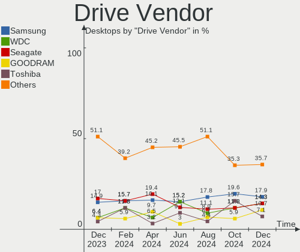
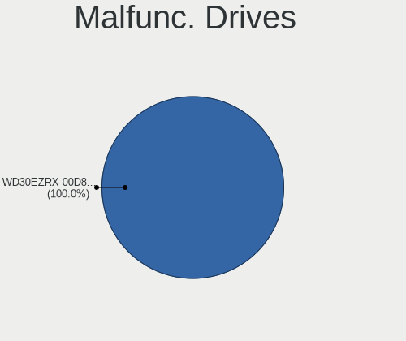
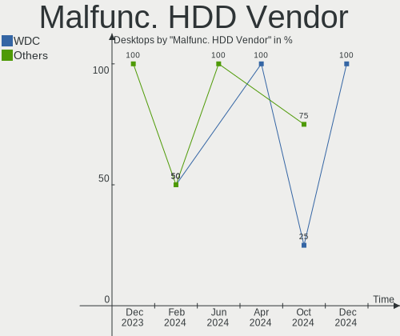
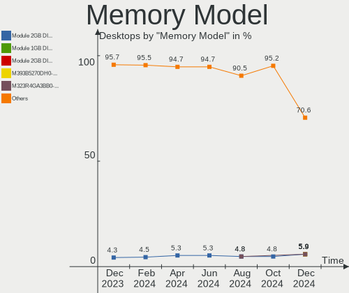
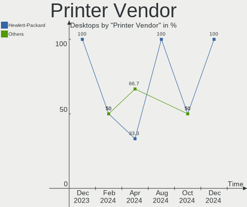

Gentoo - Hardware Trends (Desktops)
-----------------------------------

A project to identify most popular hardware characteristics and track their change
over time based on data collected by Linux users at https://Linux-Hardware.org.

Anyone can contribute to this report by the [hw-probe](https://github.com/linuxhw/hw-probe) tool:

    sudo -E hw-probe -all -upload

This report is for one last month. Overall report since the beginning of time: [TestDays](https://github.com/linuxhw/TestDays)

Period: Jan, 2024.

Contents
--------

* [ System ](#system)
  - [ OS                       ](#os)
  - [ OS Family                ](#os-family)
  - [ Kernel                   ](#kernel)
  - [ Kernel Family            ](#kernel-family)
  - [ Kernel Major Ver.        ](#kernel-major-ver)
  - [ Arch                     ](#arch)
  - [ DE                       ](#de)
  - [ Display Server           ](#display-server)
  - [ Display Manager          ](#display-manager)
  - [ OS Lang                  ](#os-lang)
  - [ Boot Mode                ](#boot-mode)
  - [ Filesystem               ](#filesystem)
  - [ Part. scheme             ](#part-scheme)
  - [ Dual Boot with Linux/BSD ](#dual-boot-with-linuxbsd)
  - [ Dual Boot (Win)          ](#dual-boot-win)

* [ Board ](#board)
  - [ Vendor                   ](#vendor)
  - [ Model                    ](#model)
  - [ Model Family             ](#model-family)
  - [ MFG Year                 ](#mfg-year)
  - [ Form Factor              ](#form-factor)
  - [ Secure Boot              ](#secure-boot)
  - [ Coreboot                 ](#coreboot)
  - [ RAM Size                 ](#ram-size)
  - [ RAM Used                 ](#ram-used)
  - [ Total Drives             ](#total-drives)
  - [ Has CD-ROM               ](#has-cd-rom)
  - [ Has Ethernet             ](#has-ethernet)
  - [ Has WiFi                 ](#has-wifi)
  - [ Has Bluetooth            ](#has-bluetooth)

* [ Location ](#location)
  - [ Country                  ](#country)
  - [ City                     ](#city)

* [ Drives ](#drives)
  - [ Drive Vendor             ](#drive-vendor)
  - [ Drive Model              ](#drive-model)
  - [ HDD Vendor               ](#hdd-vendor)
  - [ SSD Vendor               ](#ssd-vendor)
  - [ Drive Kind               ](#drive-kind)
  - [ Drive Connector          ](#drive-connector)
  - [ Drive Size               ](#drive-size)
  - [ Space Total              ](#space-total)
  - [ Space Used               ](#space-used)
  - [ Malfunc. Drives          ](#malfunc-drives)
  - [ Malfunc. Drive Vendor    ](#malfunc-drive-vendor)
  - [ Malfunc. HDD Vendor      ](#malfunc-hdd-vendor)
  - [ Malfunc. Drive Kind      ](#malfunc-drive-kind)
  - [ Failed Drives            ](#failed-drives)
  - [ Failed Drive Vendor      ](#failed-drive-vendor)
  - [ Drive Status             ](#drive-status)

* [ Storage controller ](#storage-controller)
  - [ Storage Vendor           ](#storage-vendor)
  - [ Storage Model            ](#storage-model)
  - [ Storage Kind             ](#storage-kind)

* [ Processor ](#processor)
  - [ CPU Vendor               ](#cpu-vendor)
  - [ CPU Model                ](#cpu-model)
  - [ CPU Model Family         ](#cpu-model-family)
  - [ CPU Cores                ](#cpu-cores)
  - [ CPU Sockets              ](#cpu-sockets)
  - [ CPU Threads              ](#cpu-threads)
  - [ CPU Op-Modes             ](#cpu-op-modes)
  - [ CPU Microcode            ](#cpu-microcode)
  - [ CPU Microarch            ](#cpu-microarch)

* [ Graphics ](#graphics)
  - [ GPU Vendor               ](#gpu-vendor)
  - [ GPU Model                ](#gpu-model)
  - [ GPU Combo                ](#gpu-combo)
  - [ GPU Driver               ](#gpu-driver)
  - [ GPU Memory               ](#gpu-memory)

* [ Monitor ](#monitor)
  - [ Monitor Vendor           ](#monitor-vendor)
  - [ Monitor Model            ](#monitor-model)
  - [ Monitor Resolution       ](#monitor-resolution)
  - [ Monitor Diagonal         ](#monitor-diagonal)
  - [ Monitor Width            ](#monitor-width)
  - [ Aspect Ratio             ](#aspect-ratio)
  - [ Monitor Area             ](#monitor-area)
  - [ Pixel Density            ](#pixel-density)
  - [ Multiple Monitors        ](#multiple-monitors)

* [ Network ](#network)
  - [ Net Controller Vendor    ](#net-controller-vendor)
  - [ Net Controller Model     ](#net-controller-model)
  - [ Wireless Vendor          ](#wireless-vendor)
  - [ Wireless Model           ](#wireless-model)
  - [ Ethernet Vendor          ](#ethernet-vendor)
  - [ Ethernet Model           ](#ethernet-model)
  - [ Net Controller Kind      ](#net-controller-kind)
  - [ Used Controller          ](#used-controller)
  - [ NICs                     ](#nics)
  - [ IPv6                     ](#ipv6)

* [ Bluetooth ](#bluetooth)
  - [ Bluetooth Vendor         ](#bluetooth-vendor)
  - [ Bluetooth Model          ](#bluetooth-model)

* [ Sound ](#sound)
  - [ Sound Vendor             ](#sound-vendor)
  - [ Sound Model              ](#sound-model)

* [ Memory ](#memory)
  - [ Memory Vendor            ](#memory-vendor)
  - [ Memory Model             ](#memory-model)
  - [ Memory Kind              ](#memory-kind)
  - [ Memory Form Factor       ](#memory-form-factor)
  - [ Memory Size              ](#memory-size)
  - [ Memory Speed             ](#memory-speed)

* [ Printers & scanners ](#printers--scanners)
  - [ Printer Vendor           ](#printer-vendor)
  - [ Printer Model            ](#printer-model)
  - [ Scanner Vendor           ](#scanner-vendor)
  - [ Scanner Model            ](#scanner-model)

* [ Camera ](#camera)
  - [ Camera Vendor            ](#camera-vendor)
  - [ Camera Model             ](#camera-model)

* [ Security ](#security)
  - [ Fingerprint Vendor       ](#fingerprint-vendor)
  - [ Fingerprint Model        ](#fingerprint-model)
  - [ Chipcard Vendor          ](#chipcard-vendor)
  - [ Chipcard Model           ](#chipcard-model)

* [ Unsupported ](#unsupported)
  - [ Unsupported Devices      ](#unsupported-devices)
  - [ Unsupported Device Types ](#unsupported-device-types)

System
------

OS
--

Installed operating systems

| Name        | Desktops | Percent |
|-------------|----------|---------|
| Gentoo 2.14 | 23       | 100%    |

OS Family
---------

OS without a version

| Name   | Desktops | Percent |
|--------|----------|---------|
| Gentoo | 23       | 100%    |

Kernel
------

Version of the Linux kernel

| Version                | Desktops | Percent |
|------------------------|----------|---------|
| 6.1.67-gentoo          | 6        | 26.09%  |
| 6.1.67-gentoo-x86_64   | 3        | 13.04%  |
| 6.6.8-gentoo-x86_64    | 2        | 8.7%    |
| 6.7.2-gentoo-r1        | 1        | 4.35%   |
| 6.7.1-gentoo-r1-x86_64 | 1        | 4.35%   |
| 6.7.0-gentoo-x86_64    | 1        | 4.35%   |
| 6.6.9-xanmod1          | 1        | 4.35%   |
| 6.6.8-zen1             | 1        | 4.35%   |
| 6.6.8-gentoo-dist      | 1        | 4.35%   |
| 6.6.8-gentoo           | 1        | 4.35%   |
| 6.6.4-gentoo           | 1        | 4.35%   |
| 6.6.13-gentoo-x86_64   | 1        | 4.35%   |
| 6.6.13-gentoo          | 1        | 4.35%   |
| 6.5.7-gentoo           | 1        | 4.35%   |
| 6.1.69-gentoo-dist     | 1        | 4.35%   |

Kernel Family
-------------

Linux kernel without a distro release

| Version | Desktops | Percent |
|---------|----------|---------|
| 6.1.67  | 9        | 39.13%  |
| 6.6.8   | 5        | 21.74%  |
| 6.6.13  | 2        | 8.7%    |
| 6.7.2   | 1        | 4.35%   |
| 6.7.1   | 1        | 4.35%   |
| 6.7.0   | 1        | 4.35%   |
| 6.6.9   | 1        | 4.35%   |
| 6.6.4   | 1        | 4.35%   |
| 6.5.7   | 1        | 4.35%   |
| 6.1.69  | 1        | 4.35%   |

Kernel Major Ver.
-----------------

Linux kernel major version

| Version | Desktops | Percent |
|---------|----------|---------|
| 6.1     | 10       | 43.48%  |
| 6.6     | 9        | 39.13%  |
| 6.7     | 3        | 13.04%  |
| 6.5     | 1        | 4.35%   |

Arch
----

OS architecture (x86_64, i586, etc.)

| Name   | Desktops | Percent |
|--------|----------|---------|
| x86_64 | 23       | 100%    |

DE
--

Desktop Environment

| Name    | Desktops | Percent |
|---------|----------|---------|
| Unknown | 8        | 34.78%  |
| KDE5    | 7        | 30.43%  |
| XFCE    | 4        | 17.39%  |
| MATE    | 1        | 4.35%   |
| KDE     | 1        | 4.35%   |
| GNOME   | 1        | 4.35%   |
| DWM     | 1        | 4.35%   |

Display Server
--------------

X11 or Wayland

| Name    | Desktops | Percent |
|---------|----------|---------|
| X11     | 8        | 34.78%  |
| Unknown | 7        | 30.43%  |
| Wayland | 5        | 21.74%  |
| Tty     | 3        | 13.04%  |

Display Manager
---------------

SDDM, LightDM, etc.

| Name    | Desktops | Percent |
|---------|----------|---------|
| Unknown | 13       | 56.52%  |
| SDDM    | 7        | 30.43%  |
| LightDM | 2        | 8.7%    |
| GDM     | 1        | 4.35%   |

OS Lang
-------

Language

| Lang    | Desktops | Percent |
|---------|----------|---------|
| en_US   | 10       | 43.48%  |
| C.UTF8  | 4        | 17.39%  |
| Unknown | 3        | 13.04%  |
| en_GB   | 2        | 8.7%    |
| POSIX   | 1        | 4.35%   |
| fr_FR   | 1        | 4.35%   |
| de_DE   | 1        | 4.35%   |
| C       | 1        | 4.35%   |

Boot Mode
---------

EFI or BIOS

| Mode | Desktops | Percent |
|------|----------|---------|
| EFI  | 20       | 86.96%  |
| BIOS | 3        | 13.04%  |

Filesystem
----------

Type of filesystem

| Type  | Desktops | Percent |
|-------|----------|---------|
| Ext4  | 9        | 39.13%  |
| Btrfs | 7        | 30.43%  |
| F2fs  | 3        | 13.04%  |
| Zfs   | 2        | 8.7%    |
| Xfs   | 2        | 8.7%    |

Part. scheme
------------

Scheme of partitioning

| Type    | Desktops | Percent |
|---------|----------|---------|
| GPT     | 21       | 91.3%   |
| MBR     | 1        | 4.35%   |
| Unknown | 1        | 4.35%   |

Dual Boot with Linux/BSD
------------------------

Hosting more than one Linux/BSD

| Dual boot | Desktops | Percent |
|-----------|----------|---------|
| Yes       | 13       | 56.52%  |
| No        | 10       | 43.48%  |

Dual Boot (Win)
---------------

Hosting Linux and Windows

| Dual boot | Desktops | Percent |
|-----------|----------|---------|
| No        | 18       | 78.26%  |
| Yes       | 5        | 21.74%  |

Board
-----

Vendor
------

Motherboard manufacturer

| Name                | Desktops | Percent |
|---------------------|----------|---------|
| Gigabyte Technology | 8        | 34.78%  |
| ASUSTek Computer    | 8        | 34.78%  |
| MSI                 | 2        | 8.7%    |
| Dell                | 2        | 8.7%    |
| Hewlett-Packard     | 1        | 4.35%   |
| ASRock              | 1        | 4.35%   |
| Unknown             | 1        | 4.35%   |

Model
-----

Motherboard model

| Name                              | Desktops | Percent |
|-----------------------------------|----------|---------|
| MSI MS-7C94                       | 1        | 4.35%   |
| MSI MS-7C84                       | 1        | 4.35%   |
| HP Z420 Workstation               | 1        | 4.35%   |
| Gigabyte Z77X-UD5H                | 1        | 4.35%   |
| Gigabyte Z590 UD                  | 1        | 4.35%   |
| Gigabyte X570 AORUS ELITE         | 1        | 4.35%   |
| Gigabyte B650M D3HP               | 1        | 4.35%   |
| Gigabyte B550 AORUS PRO V2        | 1        | 4.35%   |
| Gigabyte B550 AORUS ELITE V2      | 1        | 4.35%   |
| Gigabyte AB350-Gaming             | 1        | 4.35%   |
| Gigabyte A520 AORUS ELITE         | 1        | 4.35%   |
| Dell Precision T7600              | 1        | 4.35%   |
| Dell OptiPlex 5060                | 1        | 4.35%   |
| ASUS ROG STRIX Z370-H GAMING      | 1        | 4.35%   |
| ASUS ROG STRIX X570-I GAMING      | 1        | 4.35%   |
| ASUS ROG STRIX B560-A GAMING WIFI | 1        | 4.35%   |
| ASUS PRIME H610M-E D4             | 1        | 4.35%   |
| ASUS PRIME B660-PLUS D4           | 1        | 4.35%   |
| ASUS P8H67-M                      | 1        | 4.35%   |
| ASUS M5A78L-M/USB3                | 1        | 4.35%   |
| ASUS M3A78-CM                     | 1        | 4.35%   |
| ASRock X399 Taichi                | 1        | 4.35%   |
| Unknown                           | 1        | 4.35%   |

Model Family
------------

Motherboard model prefix

| Name                  | Desktops | Percent |
|-----------------------|----------|---------|
| ASUS ROG              | 3        | 13.04%  |
| Gigabyte B550         | 2        | 8.7%    |
| ASUS PRIME            | 2        | 8.7%    |
| MSI MS-7C94           | 1        | 4.35%   |
| MSI MS-7C84           | 1        | 4.35%   |
| HP Z420               | 1        | 4.35%   |
| Gigabyte Z77X-UD5H    | 1        | 4.35%   |
| Gigabyte Z590         | 1        | 4.35%   |
| Gigabyte X570         | 1        | 4.35%   |
| Gigabyte B650M        | 1        | 4.35%   |
| Gigabyte AB350-Gaming | 1        | 4.35%   |
| Gigabyte A520         | 1        | 4.35%   |
| Dell Precision        | 1        | 4.35%   |
| Dell OptiPlex         | 1        | 4.35%   |
| ASUS P8H67-M          | 1        | 4.35%   |
| ASUS M5A78L-M         | 1        | 4.35%   |
| ASUS M3A78-CM         | 1        | 4.35%   |
| ASRock X399           | 1        | 4.35%   |
| Unknown               | 1        | 4.35%   |

MFG Year
--------

Motherboard manufacture year

| Year    | Desktops | Percent |
|---------|----------|---------|
| 2020    | 5        | 21.74%  |
| 2021    | 3        | 13.04%  |
| 2017    | 3        | 13.04%  |
| 2019    | 2        | 8.7%    |
| 2012    | 2        | 8.7%    |
| 2023    | 1        | 4.35%   |
| 2022    | 1        | 4.35%   |
| 2014    | 1        | 4.35%   |
| 2011    | 1        | 4.35%   |
| 2010    | 1        | 4.35%   |
| 2008    | 1        | 4.35%   |
| 2007    | 1        | 4.35%   |
| Unknown | 1        | 4.35%   |

Form Factor
-----------

Physical design of the computer

| Name    | Desktops | Percent |
|---------|----------|---------|
| Desktop | 23       | 100%    |

Secure Boot
-----------

Enabled or disabled

| State    | Desktops | Percent |
|----------|----------|---------|
| Disabled | 22       | 95.65%  |
| Enabled  | 1        | 4.35%   |

Coreboot
--------

Have coreboot on board

| Used | Desktops | Percent |
|------|----------|---------|
| No   | 23       | 100%    |

RAM Size
--------

Total RAM memory

| Size in GB  | Desktops | Percent |
|-------------|----------|---------|
| 64.01-256.0 | 9        | 39.13%  |
| 32.01-64.0  | 7        | 30.43%  |
| 16.01-24.0  | 4        | 17.39%  |
| 24.01-32.0  | 2        | 8.7%    |
| 4.01-8.0    | 1        | 4.35%   |

RAM Used
--------

Used RAM memory

| Used GB    | Desktops | Percent |
|------------|----------|---------|
| 4.01-8.0   | 6        | 26.09%  |
| 8.01-16.0  | 5        | 21.74%  |
| 2.01-3.0   | 4        | 17.39%  |
| 3.01-4.0   | 3        | 13.04%  |
| 1.01-2.0   | 3        | 13.04%  |
| 16.01-24.0 | 1        | 4.35%   |
| 0.51-1.0   | 1        | 4.35%   |

Total Drives
------------

Number of drives on board

| Drives | Desktops | Percent |
|--------|----------|---------|
| 1      | 6        | 26.09%  |
| 4      | 4        | 17.39%  |
| 2      | 4        | 17.39%  |
| 6      | 3        | 13.04%  |
| 5      | 3        | 13.04%  |
| 19     | 1        | 4.35%   |
| 8      | 1        | 4.35%   |
| 7      | 1        | 4.35%   |

Has CD-ROM
----------

Has CD-ROM on board

| Presented | Desktops | Percent |
|-----------|----------|---------|
| No        | 16       | 69.57%  |
| Yes       | 7        | 30.43%  |

Has Ethernet
------------

Has Ethernet on board

| Presented | Desktops | Percent |
|-----------|----------|---------|
| Yes       | 23       | 100%    |

Has WiFi
--------

Has WiFi module

| Presented | Desktops | Percent |
|-----------|----------|---------|
| No        | 15       | 65.22%  |
| Yes       | 8        | 34.78%  |

Has Bluetooth
-------------

Has Bluetooth module

| Presented | Desktops | Percent |
|-----------|----------|---------|
| No        | 13       | 56.52%  |
| Yes       | 10       | 43.48%  |

Location
--------

Country
-------

Geographic location (country)

| Country   | Desktops | Percent |
|-----------|----------|---------|
| USA       | 7        | 30.43%  |
| Poland    | 4        | 17.39%  |
| France    | 3        | 13.04%  |
| Germany   | 2        | 8.7%    |
| Turkey    | 1        | 4.35%   |
| Finland   | 1        | 4.35%   |
| Colombia  | 1        | 4.35%   |
| China     | 1        | 4.35%   |
| Canada    | 1        | 4.35%   |
| Brazil    | 1        | 4.35%   |
| Argentina | 1        | 4.35%   |

City
----

Geographic location (city)

| City           | Desktops | Percent |
|----------------|----------|---------|
| Warsaw         | 3        | 13.04%  |
| Toulouse       | 1        | 4.35%   |
| Swift Current  | 1        | 4.35%   |
| Seattle        | 1        | 4.35%   |
| Rio de Janeiro | 1        | 4.35%   |
| Raisio         | 1        | 4.35%   |
| Orange         | 1        | 4.35%   |
| Oklahoma City  | 1        | 4.35%   |
| Noisy-le-Sec   | 1        | 4.35%   |
| Miami          | 1        | 4.35%   |
| Ludwigsburg    | 1        | 4.35%   |
| Le Boulou      | 1        | 4.35%   |
| Kansas City    | 1        | 4.35%   |
| Izmir          | 1        | 4.35%   |
| Dresden        | 1        | 4.35%   |
| Cieszyn        | 1        | 4.35%   |
| Chengdu        | 1        | 4.35%   |
| Bogotá        | 1        | 4.35%   |
| Bayonne        | 1        | 4.35%   |
| Avellaneda     | 1        | 4.35%   |
| Amissville     | 1        | 4.35%   |

Drives
------

Drive Vendor
------------

Hard drive vendors

| Vendor                      | Desktops | Drives | Percent |
|-----------------------------|----------|--------|---------|
| Samsung Electronics         | 10       | 23     | 19.61%  |
| WDC                         | 8        | 11     | 15.69%  |
| Seagate                     | 7        | 14     | 13.73%  |
| Phison Electronics          | 3        | 3      | 5.88%   |
| Intel                       | 3        | 3      | 5.88%   |
| Hitachi                     | 3        | 6      | 5.88%   |
| GOODRAM                     | 3        | 3      | 5.88%   |
| Kingston                    | 2        | 2      | 3.92%   |
| Unknown                     | 1        | 1      | 1.96%   |
| Toshiba                     | 1        | 1      | 1.96%   |
| Silicon Motion              | 1        | 1      | 1.96%   |
| Seagate Technology          | 1        | 1      | 1.96%   |
| Sandisk                     | 1        | 1      | 1.96%   |
| OCZ                         | 1        | 1      | 1.96%   |
| NETAPP                      | 1        | 3      | 1.96%   |
| Micron/Crucial Technology   | 1        | 1      | 1.96%   |
| MAXIO Technology (Hangzhou) | 1        | 1      | 1.96%   |
| Kingchuxing                 | 1        | 2      | 1.96%   |
| FREEBSD                     | 1        | 12     | 1.96%   |
| Crucial                     | 1        | 6      | 1.96%   |

Drive Model
-----------

Hard drive models

| Model                                                 | Desktops | Percent |
|-------------------------------------------------------|----------|---------|
| Samsung NVMe SSD Controller SM981/PM981/PM983 1TB     | 6        | 9.23%   |
| Samsung NVMe SSD Controller PM9A1/PM9A3/980PRO 2TB    | 4        | 6.15%   |
| Seagate ST4000DM004-2CV104 4TB                        | 2        | 3.08%   |
| GOODRAM SSDPR-CL100-480-G2 480GB                      | 2        | 3.08%   |
| WDC WDS100T2G0A-00JH30 1TB SSD                        | 1        | 1.54%   |
| WDC WD8003FFBX-68B9AN0 8TB                            | 1        | 1.54%   |
| WDC WD60EFRX-68MYMN1 6TB                              | 1        | 1.54%   |
| WDC WD3200BEVT-22ZCT0 320GB                           | 1        | 1.54%   |
| WDC WD30EFRX-68N32N0 3TB                              | 1        | 1.54%   |
| WDC WD30EFRX-68EUZN0 3TB                              | 1        | 1.54%   |
| WDC WD120EFBX-68B0EN0 12TB                            | 1        | 1.54%   |
| WDC WD10EZEX-08WN4A0 1TB                              | 1        | 1.54%   |
| WDC WD10EADS-65M2B0 1TB                               | 1        | 1.54%   |
| Unknown NVMe SSD Drive 1TB                            | 1        | 1.54%   |
| Toshiba HDWE150 5TB                                   | 1        | 1.54%   |
| Silicon Motion SM2263EN/SM2263XT SSD Controller 128GB | 1        | 1.54%   |
| Seagate FireCuda 520 SSD 500GB                        | 1        | 1.54%   |
| Seagate ST500LM012 HN-M500MBB 500GB                   | 1        | 1.54%   |
| Seagate ST4000VN008-2DR166 4TB                        | 1        | 1.54%   |
| Seagate ST3160811AS 160GB                             | 1        | 1.54%   |
| Seagate ST3000DM008-2DM166 3TB                        | 1        | 1.54%   |
| Seagate ST2000DM008-2UB102 2TB                        | 1        | 1.54%   |
| Seagate ST2000DM008-2FR102 2TB                        | 1        | 1.54%   |
| Seagate ST12000NM0008-2H3101 12TB                     | 1        | 1.54%   |
| Seagate ST1000DM010-2EP102 1TB                        | 1        | 1.54%   |
| Seagate FireCuda 530 ZP1000GM30023 1TB                | 1        | 1.54%   |
| Seagate BUP Slim RG 2TB                               | 1        | 1.54%   |
| Sandisk WD Blue SN550 NVMe SSD 512GB                  | 1        | 1.54%   |
| Samsung SSD 990 PRO 2TB                               | 1        | 1.54%   |
| Samsung SSD 980 500GB                                 | 1        | 1.54%   |
| Samsung SSD 980 1TB                                   | 1        | 1.54%   |
| Samsung SSD 860 EVO 500GB                             | 1        | 1.54%   |
| Samsung SSD 860 EVO 1TB                               | 1        | 1.54%   |
| Samsung SSD 850 PRO 512GB                             | 1        | 1.54%   |
| Samsung SSD 850 EVO 500GB                             | 1        | 1.54%   |
| Samsung SSD 850 EVO 250GB                             | 1        | 1.54%   |
| Phison PS5013 E13 NVMe Controller 256GB               | 1        | 1.54%   |
| Phison E16 PCIe4 NVMe Controller 2TB                  | 1        | 1.54%   |
| Phison E12 NVMe Controller 1TB                        | 1        | 1.54%   |
| OCZ VERTEX4 128GB SSD                                 | 1        | 1.54%   |

HDD Vendor
----------

Hard disk drive vendors

| Vendor  | Desktops | Drives | Percent |
|---------|----------|--------|---------|
| WDC     | 7        | 10     | 36.84%  |
| Seagate | 7        | 13     | 36.84%  |
| Hitachi | 3        | 6      | 15.79%  |
| Toshiba | 1        | 1      | 5.26%   |
| NETAPP  | 1        | 3      | 5.26%   |

SSD Vendor
----------

Solid state drive vendors

| Vendor              | Desktops | Drives | Percent |
|---------------------|----------|--------|---------|
| Samsung Electronics | 3        | 6      | 23.08%  |
| GOODRAM             | 3        | 3      | 23.08%  |
| Kingston            | 2        | 2      | 15.38%  |
| WDC                 | 1        | 1      | 7.69%   |
| OCZ                 | 1        | 1      | 7.69%   |
| Kingchuxing         | 1        | 2      | 7.69%   |
| FREEBSD             | 1        | 12     | 7.69%   |
| Crucial             | 1        | 6      | 7.69%   |

Drive Kind
----------

HDD or SSD

| Kind | Desktops | Drives | Percent |
|------|----------|--------|---------|
| NVMe | 17       | 30     | 39.53%  |
| HDD  | 14       | 33     | 32.56%  |
| SSD  | 12       | 33     | 27.91%  |

Drive Connector
---------------

SATA, SAS, NVMe, etc.

| Type | Desktops | Drives | Percent |
|------|----------|--------|---------|
| NVMe | 17       | 30     | 48.57%  |
| SATA | 17       | 65     | 48.57%  |
| SAS  | 1        | 1      | 2.86%   |

Drive Size
----------

Size of hard drive

| Size in TB | Desktops | Drives | Percent |
|------------|----------|--------|---------|
| 0.01-0.5   | 11       | 25     | 32.35%  |
| 0.51-1.0   | 9        | 15     | 26.47%  |
| 2.01-3.0   | 4        | 7      | 11.76%  |
| 3.01-4.0   | 3        | 10     | 8.82%   |
| 4.01-10.0  | 3        | 3      | 8.82%   |
| 10.01-20.0 | 2        | 3      | 5.88%   |
| 1.01-2.0   | 2        | 3      | 5.88%   |

Space Total
-----------

Amount of disk space available on the file system

| Size in GB     | Desktops | Percent |
|----------------|----------|---------|
| More than 3000 | 10       | 43.48%  |
| 501-1000       | 4        | 17.39%  |
| 1001-2000      | 3        | 13.04%  |
| Unknown        | 2        | 8.7%    |
| 21-50          | 1        | 4.35%   |
| 2001-3000      | 1        | 4.35%   |
| 101-250        | 1        | 4.35%   |
| 1-20           | 1        | 4.35%   |

Space Used
----------

Amount of used disk space

| Used GB        | Desktops | Percent |
|----------------|----------|---------|
| 1-20           | 5        | 21.74%  |
| More than 3000 | 4        | 17.39%  |
| 1001-2000      | 4        | 17.39%  |
| 251-500        | 2        | 8.7%    |
| 2001-3000      | 2        | 8.7%    |
| 501-1000       | 2        | 8.7%    |
| Unknown        | 2        | 8.7%    |
| 101-250        | 1        | 4.35%   |
| 51-100         | 1        | 4.35%   |

Malfunc. Drives
---------------

Drive models with a malfunction

| Model                            | Desktops | Drives | Percent |
|----------------------------------|----------|--------|---------|
| WDC WD3200BEVT-22ZCT0 320GB      | 1        | 1      | 16.67%  |
| WDC WD30EFRX-68EUZN0 3TB         | 1        | 2      | 16.67%  |
| Seagate ST3160811AS 160GB        | 1        | 1      | 16.67%  |
| Seagate ST3000DM008-2DM166 3TB   | 1        | 1      | 16.67%  |
| Kingston SV300S37A240G 240GB SSD | 1        | 1      | 16.67%  |
| Kingston SV300S37A 120G SSD      | 1        | 1      | 16.67%  |

Malfunc. Drive Vendor
---------------------

Vendors of faulty drives

| Vendor   | Desktops | Drives | Percent |
|----------|----------|--------|---------|
| WDC      | 2        | 3      | 33.33%  |
| Seagate  | 2        | 2      | 33.33%  |
| Kingston | 2        | 2      | 33.33%  |

Malfunc. HDD Vendor
-------------------

Vendors of faulty HDD drives

| Vendor  | Desktops | Drives | Percent |
|---------|----------|--------|---------|
| WDC     | 2        | 3      | 50%     |
| Seagate | 2        | 2      | 50%     |

Malfunc. Drive Kind
-------------------

Kinds of faulty drives

| Kind | Desktops | Drives | Percent |
|------|----------|--------|---------|
| HDD  | 4        | 5      | 66.67%  |
| SSD  | 2        | 2      | 33.33%  |

Failed Drives
-------------

Failed drive models

| Model                         | Desktops | Drives | Percent |
|-------------------------------|----------|--------|---------|
| Hitachi HTS723232L9A360 320GB | 1        | 1      | 100%    |

Failed Drive Vendor
-------------------

Failed drive vendors

| Vendor  | Desktops | Drives | Percent |
|---------|----------|--------|---------|
| Hitachi | 1        | 1      | 100%    |

Drive Status
------------

Number of failed and malfunc. drives

| Status   | Desktops | Drives | Percent |
|----------|----------|--------|---------|
| Works    | 22       | 80     | 68.75%  |
| Malfunc  | 6        | 7      | 18.75%  |
| Detected | 3        | 8      | 9.38%   |
| Failed   | 1        | 1      | 3.13%   |

Storage controller
------------------

Storage Vendor
--------------

Storage controller vendors

| Vendor                      | Desktops | Percent |
|-----------------------------|----------|---------|
| AMD                         | 12       | 26.67%  |
| Intel                       | 11       | 24.44%  |
| Samsung Electronics         | 9        | 20%     |
| Phison Electronics          | 3        | 6.67%   |
| VIA Technologies            | 1        | 2.22%   |
| Silicon Motion              | 1        | 2.22%   |
| Seagate Technology          | 1        | 2.22%   |
| SanDisk                     | 1        | 2.22%   |
| Micron/Crucial Technology   | 1        | 2.22%   |
| MAXIO Technology (Hangzhou) | 1        | 2.22%   |
| Marvell Technology Group    | 1        | 2.22%   |
| LSI Logic / Symbios Logic   | 1        | 2.22%   |
| INNOGRIT                    | 1        | 2.22%   |
| ASMedia Technology          | 1        | 2.22%   |

Storage Model
-------------

Storage controller models

| Model                                                                         | Desktops | Percent |
|-------------------------------------------------------------------------------|----------|---------|
| Samsung NVMe SSD Controller SM981/PM981/PM983                                 | 6        | 9.84%   |
| AMD FCH SATA Controller [AHCI mode]                                           | 5        | 8.2%    |
| Samsung NVMe SSD Controller PM9A1/PM9A3/980PRO                                | 4        | 6.56%   |
| AMD 500 Series Chipset SATA Controller                                        | 4        | 6.56%   |
| Samsung NVMe SSD Controller 980 (DRAM-less)                                   | 2        | 3.28%   |
| Intel Volume Management Device NVMe RAID Controller                           | 2        | 3.28%   |
| Intel Cannon Lake PCH SATA AHCI Controller                                    | 2        | 3.28%   |
| Intel C600/X79 series chipset 6-Port SATA AHCI Controller                     | 2        | 3.28%   |
| Intel Alder Lake-S PCH SATA Controller [AHCI Mode]                            | 2        | 3.28%   |
| Intel 500 Series Chipset Family SATA AHCI Controller                          | 2        | 3.28%   |
| AMD SB7x0/SB8x0/SB9x0 IDE Controller                                          | 2        | 3.28%   |
| VIA VT6415 PATA IDE Host Controller                                           | 1        | 1.64%   |
| Silicon Motion SM2263EN/SM2263XT (DRAM-less) NVMe SSD Controllers             | 1        | 1.64%   |
| Seagate FireCuda 530 SSD                                                      | 1        | 1.64%   |
| Seagate FireCuda 520/IronWolf 525 SSD                                         | 1        | 1.64%   |
| SanDisk Ultra 3D / WD Blue SN550 NVMe SSD                                     | 1        | 1.64%   |
| Samsung NVMe SSD Controller S4LV008[Pascal]                                   | 1        | 1.64%   |
| Phison PS5013-E13 PCIe3 NVMe Controller (DRAM-less)                           | 1        | 1.64%   |
| Phison E16 PCIe4 NVMe Controller                                              | 1        | 1.64%   |
| Phison E12 NVMe Controller                                                    | 1        | 1.64%   |
| Micron/Crucial P5 Plus NVMe PCIe SSD                                          | 1        | 1.64%   |
| MAXIO (Hangzhou) NVMe SSD Controller MAP1001                                  | 1        | 1.64%   |
| Marvell Group 88SE9172 SATA 6Gb/s Controller                                  | 1        | 1.64%   |
| LSI Logic / Symbios Logic MegaRAID SAS 2008 [Falcon]                          | 1        | 1.64%   |
| Intel SSD 660P Series                                                         | 1        | 1.64%   |
| Intel PCIe Data Center SSD                                                    | 1        | 1.64%   |
| Intel NVMe Optane Memory Series                                               | 1        | 1.64%   |
| Intel C602 chipset 4-Port SATA Storage Control Unit                           | 1        | 1.64%   |
| Intel C600/X79 series chipset IDE-r Controller                                | 1        | 1.64%   |
| Intel 7 Series/C210 Series Chipset Family 6-port SATA Controller [AHCI mode]  | 1        | 1.64%   |
| Intel 6 Series/C200 Series Chipset Family 6 port Desktop SATA AHCI Controller | 1        | 1.64%   |
| Intel 200 Series PCH SATA controller [AHCI mode]                              | 1        | 1.64%   |
| INNOGRIT NVMe SSD Controller IG5236                                           | 1        | 1.64%   |
| ASMedia ASM1064 Serial ATA Controller                                         | 1        | 1.64%   |
| AMD X399 Series Chipset SATA Controller                                       | 1        | 1.64%   |
| AMD SB7x0/SB8x0/SB9x0 SATA Controller [IDE mode]                              | 1        | 1.64%   |
| AMD SB7x0/SB8x0/SB9x0 SATA Controller [AHCI mode]                             | 1        | 1.64%   |
| AMD 600 Series Chipset SATA Controller                                        | 1        | 1.64%   |
| AMD 300 Series Chipset SATA Controller                                        | 1        | 1.64%   |

Storage Kind
------------

Kind of storage controller (IDE, SATA, NVMe, SAS, ...)

| Kind | Desktops | Percent |
|------|----------|---------|
| SATA | 23       | 47.92%  |
| NVMe | 17       | 35.42%  |
| IDE  | 4        | 8.33%   |
| RAID | 3        | 6.25%   |
| SAS  | 1        | 2.08%   |

Processor
---------

CPU Vendor
----------

Processor vendors

| Vendor | Desktops | Percent |
|--------|----------|---------|
| AMD    | 12       | 52.17%  |
| Intel  | 11       | 47.83%  |

CPU Model
---------

Processor models

| Model                                          | Desktops | Percent |
|------------------------------------------------|----------|---------|
| AMD Ryzen 9 5900X 12-Core Processor            | 3        | 13.04%  |
| Intel 11th Gen Core i7-11700K @ 3.60GHz        | 2        | 8.7%    |
| Intel Xeon CPU E5-2665 0 @ 2.40GHz             | 1        | 4.35%   |
| Intel Xeon CPU E5-1680 v2 @ 3.00GHz            | 1        | 4.35%   |
| Intel Core i9-9900K CPU @ 3.60GHz              | 1        | 4.35%   |
| Intel Core i7-8700 CPU @ 3.20GHz               | 1        | 4.35%   |
| Intel Core i7-8086K CPU @ 4.00GHz              | 1        | 4.35%   |
| Intel Core i7-3770 CPU @ 3.40GHz               | 1        | 4.35%   |
| Intel Core i3-2100 CPU @ 3.10GHz               | 1        | 4.35%   |
| Intel 12th Gen Core i7-12700                   | 1        | 4.35%   |
| Intel 12th Gen Core i5-12400                   | 1        | 4.35%   |
| AMD Ryzen Threadripper 2950X 16-Core Processor | 1        | 4.35%   |
| AMD Ryzen 9 5950X 16-Core Processor            | 1        | 4.35%   |
| AMD Ryzen 9 3900X 12-Core Processor            | 1        | 4.35%   |
| AMD Ryzen 7 5700G with Radeon Graphics         | 1        | 4.35%   |
| AMD Ryzen 5 7600X 6-Core Processor             | 1        | 4.35%   |
| AMD Ryzen 5 5600G with Radeon Graphics         | 1        | 4.35%   |
| AMD Ryzen 5 2600 Six-Core Processor            | 1        | 4.35%   |
| AMD Phenom II X4 955 Processor                 | 1        | 4.35%   |
| AMD FX-8350 Eight-Core Processor               | 1        | 4.35%   |

CPU Model Family
----------------

Processor model prefix

| Model                  | Desktops | Percent |
|------------------------|----------|---------|
| AMD Ryzen 9            | 5        | 21.74%  |
| Other                  | 4        | 17.39%  |
| Intel Core i7          | 3        | 13.04%  |
| AMD Ryzen 5            | 3        | 13.04%  |
| Intel Xeon             | 2        | 8.7%    |
| Intel Core i9          | 1        | 4.35%   |
| Intel Core i3          | 1        | 4.35%   |
| AMD Ryzen Threadripper | 1        | 4.35%   |
| AMD Ryzen 7            | 1        | 4.35%   |
| AMD Phenom II X4       | 1        | 4.35%   |
| AMD FX                 | 1        | 4.35%   |

CPU Cores
---------

Number of processor cores

| Number | Desktops | Percent |
|--------|----------|---------|
| 6      | 6        | 26.09%  |
| 12     | 5        | 21.74%  |
| 8      | 5        | 21.74%  |
| 16     | 3        | 13.04%  |
| 4      | 3        | 13.04%  |
| 2      | 1        | 4.35%   |

CPU Sockets
-----------

Number of sockets

| Number | Desktops | Percent |
|--------|----------|---------|
| 1      | 22       | 95.65%  |
| 2      | 1        | 4.35%   |

CPU Threads
-----------

Threads per core (Hyper-Threading)

| Number | Desktops | Percent |
|--------|----------|---------|
| 2      | 22       | 95.65%  |
| 1      | 1        | 4.35%   |

CPU Op-Modes
------------

CPU Operation Modes (32-bit, 64-bit)

| Op mode        | Desktops | Percent |
|----------------|----------|---------|
| 32-bit, 64-bit | 23       | 100%    |

CPU Microcode
-------------

Microcode number

| Number     | Desktops | Percent |
|------------|----------|---------|
| Unknown    | 7        | 30.43%  |
| 0x0a201016 | 2        | 8.7%    |
| 0x906ea    | 1        | 4.35%   |
| 0x90672    | 1        | 4.35%   |
| 0x306e4    | 1        | 4.35%   |
| 0x206d7    | 1        | 4.35%   |
| 0x206a7    | 1        | 4.35%   |
| 0x0a601203 | 1        | 4.35%   |
| 0x0a50000f | 1        | 4.35%   |
| 0x0a50000d | 1        | 4.35%   |
| 0x0a20102b | 1        | 4.35%   |
| 0x08701021 | 1        | 4.35%   |
| 0x0800820d | 1        | 4.35%   |
| 0x0800820b | 1        | 4.35%   |
| 0x06000852 | 1        | 4.35%   |
| 0x010000db | 1        | 4.35%   |

CPU Microarch
-------------

Microarchitecture

| Name             | Desktops | Percent |
|------------------|----------|---------|
| Zen 3            | 6        | 26.09%  |
| KabyLake         | 3        | 13.04%  |
| Zen+             | 2        | 8.7%    |
| SandyBridge      | 2        | 8.7%    |
| IvyBridge        | 2        | 8.7%    |
| Icelake          | 2        | 8.7%    |
| Unknown          | 2        | 8.7%    |
| Zen 2            | 1        | 4.35%   |
| Piledriver       | 1        | 4.35%   |
| K10              | 1        | 4.35%   |
| Alderlake Hybrid | 1        | 4.35%   |

Graphics
--------

GPU Vendor
----------

Vendors of graphics cards

| Vendor | Desktops | Percent |
|--------|----------|---------|
| AMD    | 14       | 56%     |
| Nvidia | 9        | 36%     |
| Intel  | 2        | 8%      |

GPU Model
---------

Graphics card models

| Model                                                         | Desktops | Percent |
|---------------------------------------------------------------|----------|---------|
| AMD Navi 22 [Radeon RX 6700/6700 XT/6750 XT / 6800M/6850M XT] | 2        | 7.69%   |
| AMD Navi 21 [Radeon RX 6800/6800 XT / 6900 XT]                | 2        | 7.69%   |
| AMD Cezanne [Radeon Vega Series / Radeon Vega Mobile Series]  | 2        | 7.69%   |
| AMD Cedar [Radeon HD 5000/6000/7350/8350 Series]              | 2        | 7.69%   |
| Nvidia TU104 [GeForce RTX 2080 Rev. A]                        | 1        | 3.85%   |
| Nvidia GP107GL [Quadro P620]                                  | 1        | 3.85%   |
| Nvidia GP106 [GeForce GTX 1060 6GB]                           | 1        | 3.85%   |
| Nvidia GM204 [GeForce GTX 970]                                | 1        | 3.85%   |
| Nvidia GM107 [GeForce GTX 750 Ti]                             | 1        | 3.85%   |
| Nvidia GA106 [GeForce RTX 3060]                               | 1        | 3.85%   |
| Nvidia GA106 [GeForce RTX 3060 Lite Hash Rate]                | 1        | 3.85%   |
| Nvidia GA106 [Geforce RTX 3050]                               | 1        | 3.85%   |
| Nvidia GA104 [GeForce RTX 3070 Ti]                            | 1        | 3.85%   |
| Intel CoffeeLake-S GT2 [UHD Graphics 630]                     | 1        | 3.85%   |
| Intel AlderLake-S GT1                                         | 1        | 3.85%   |
| AMD RS780L [Radeon 3000]                                      | 1        | 3.85%   |
| AMD RS780C [Radeon 3100]                                      | 1        | 3.85%   |
| AMD Raphael                                                   | 1        | 3.85%   |
| AMD Navi 24 [Radeon RX 6400/6500 XT/6500M]                    | 1        | 3.85%   |
| AMD Navi 23 [Radeon RX 6600/6600 XT/6600M]                    | 1        | 3.85%   |
| AMD Ellesmere [Radeon RX 470/480/570/570X/580/580X/590]       | 1        | 3.85%   |
| AMD Curacao PRO [Radeon R7 370 / R9 270/370 OEM]              | 1        | 3.85%   |

GPU Combo
---------

Combinations of graphics cards

| Name         | Desktops | Percent |
|--------------|----------|---------|
| 1 x AMD      | 11       | 47.83%  |
| 1 x Nvidia   | 8        | 34.78%  |
| 2 x AMD      | 1        | 4.35%   |
| Intel + AMD  | 1        | 4.35%   |
| 1 x Intel    | 1        | 4.35%   |
| AMD + Nvidia | 1        | 4.35%   |

GPU Driver
----------

Free vs proprietary

| Driver      | Desktops | Percent |
|-------------|----------|---------|
| Free        | 12       | 52.17%  |
| Proprietary | 8        | 34.78%  |
| Unknown     | 3        | 13.04%  |

GPU Memory
----------

Total video memory

| Size in GB | Desktops | Percent |
|------------|----------|---------|
| Unknown    | 8        | 34.78%  |
| 8.01-16.0  | 5        | 21.74%  |
| 7.01-8.0   | 3        | 13.04%  |
| 3.01-4.0   | 2        | 8.7%    |
| 1.01-2.0   | 2        | 8.7%    |
| 0.01-0.5   | 2        | 8.7%    |
| 5.01-6.0   | 1        | 4.35%   |

Monitor
-------

Monitor Vendor
--------------

Monitor vendors

| Vendor               | Desktops | Percent |
|----------------------|----------|---------|
| Samsung Electronics  | 4        | 15.38%  |
| ASUSTek Computer     | 3        | 11.54%  |
| Philips              | 2        | 7.69%   |
| Iiyama               | 2        | 7.69%   |
| Hewlett-Packard      | 2        | 7.69%   |
| Goldstar             | 2        | 7.69%   |
| BenQ                 | 2        | 7.69%   |
| ViewSonic            | 1        | 3.85%   |
| NEC Computers        | 1        | 3.85%   |
| Lenovo               | 1        | 3.85%   |
| Gigabyte Technology  | 1        | 3.85%   |
| Element              | 1        | 3.85%   |
| Dell                 | 1        | 3.85%   |
| AOC                  | 1        | 3.85%   |
| Ancor Communications | 1        | 3.85%   |
| Acer                 | 1        | 3.85%   |

Monitor Model
-------------

Monitor models

| Model                                                                  | Desktops | Percent |
|------------------------------------------------------------------------|----------|---------|
| ViewSonic VX2418C SER VSC1A3D 1920x1080 520x300mm 23.6-inch            | 1        | 3.57%   |
| Samsung Electronics SyncMaster SAM059A 1920x1080 477x268mm 21.5-inch   | 1        | 3.57%   |
| Samsung Electronics S22B300 SAM08C8 1920x1080 477x268mm 21.5-inch      | 1        | 3.57%   |
| Samsung Electronics LC49G95T SAM7053 3840x1080 1193x336mm 48.8-inch    | 1        | 3.57%   |
| Samsung Electronics C24F390 SAM0D2C 1920x1080 521x293mm 23.5-inch      | 1        | 3.57%   |
| Philips PHL 279C9 PHLC22C 3840x2160 597x336mm 27.0-inch                | 1        | 3.57%   |
| Philips 17S PHL0877 1280x1024 337x270mm 17.0-inch                      | 1        | 3.57%   |
| NEC Computers LCD92VX NEC66AF 1280x1024 380x300mm 19.1-inch            | 1        | 3.57%   |
| Lenovo T23d-10 LEN61C3 1920x1200 518x324mm 24.1-inch                   | 1        | 3.57%   |
| Iiyama PLG2488H IVM6127 1920x1080 531x299mm 24.0-inch                  | 1        | 3.57%   |
| Iiyama PL2792Q IVM6637 2560x1440 597x336mm 27.0-inch                   | 1        | 3.57%   |
| Iiyama PL2760Q IVM663D 2560x1440 597x336mm 27.0-inch                   | 1        | 3.57%   |
| Hewlett-Packard Z23i HWP308F 1920x1080 509x286mm 23.0-inch             | 1        | 3.57%   |
| Hewlett-Packard S230tm HWP3115 1920x1080 509x286mm 23.0-inch           | 1        | 3.57%   |
| Hewlett-Packard LA2206 HWP2946 1920x1080 476x268mm 21.5-inch           | 1        | 3.57%   |
| Goldstar FULL HD GSM5BDE 1920x1080 480x270mm 21.7-inch                 | 1        | 3.57%   |
| Goldstar 32GK850G GSM7709 2560x1440 697x392mm 31.5-inch                | 1        | 3.57%   |
| Gigabyte Technology G27Q GBT2709 2560x1440 598x336mm 27.0-inch         | 1        | 3.57%   |
| Element ElEFW248 ELE3393 1366x768 520x300mm 23.6-inch                  | 1        | 3.57%   |
| Dell S2422HG DELA1BF 1920x1080 521x293mm 23.5-inch                     | 1        | 3.57%   |
| BenQ GW2780 BNQ78E6 1920x1080 598x336mm 27.0-inch                      | 1        | 3.57%   |
| BenQ GW2760 BNQ78C6 1920x1080 598x336mm 27.0-inch                      | 1        | 3.57%   |
| ASUSTek Computer VG27AQL1A AUS2705 2560x1440 597x336mm 27.0-inch       | 1        | 3.57%   |
| ASUSTek Computer VG258QM AUS2581 1920x1080 544x303mm 24.5-inch         | 1        | 3.57%   |
| ASUSTek Computer VA24E AUS24D1 1920x1080 527x296mm 23.8-inch           | 1        | 3.57%   |
| AOC 22B2WG5 AOC2202 1920x1080 477x268mm 21.5-inch                      | 1        | 3.57%   |
| Ancor Communications ASUS VH242H ACI24F3 1920x1080 521x293mm 23.5-inch | 1        | 3.57%   |
| Acer K242HYL ACR064A 1920x1080 527x296mm 23.8-inch                     | 1        | 3.57%   |

Monitor Resolution
------------------

Monitor screen resolution

| Resolution        | Desktops | Percent |
|-------------------|----------|---------|
| 1920x1080 (FHD)   | 11       | 50%     |
| 2560x1440 (QHD)   | 4        | 18.18%  |
| 3840x2160 (4K)    | 2        | 9.09%   |
| 1280x1024 (SXGA)  | 2        | 9.09%   |
| 3840x1080         | 1        | 4.55%   |
| 1920x1200 (WUXGA) | 1        | 4.55%   |
| 1366x768 (WXGA)   | 1        | 4.55%   |

Monitor Diagonal
----------------

Diagonal size in inches

| Inches | Desktops | Percent |
|--------|----------|---------|
| 27     | 7        | 29.17%  |
| 23     | 5        | 20.83%  |
| 24     | 4        | 16.67%  |
| 21     | 3        | 12.5%   |
| 48     | 1        | 4.17%   |
| 38     | 1        | 4.17%   |
| 31     | 1        | 4.17%   |
| 19     | 1        | 4.17%   |
| 17     | 1        | 4.17%   |

Monitor Width
-------------

Physical width

| Width in mm | Desktops | Percent |
|-------------|----------|---------|
| 501-600     | 14       | 63.64%  |
| 401-500     | 3        | 13.64%  |
| 801-900     | 1        | 4.55%   |
| 601-700     | 1        | 4.55%   |
| 351-400     | 1        | 4.55%   |
| 301-350     | 1        | 4.55%   |
| 1001-1500   | 1        | 4.55%   |

Aspect Ratio
------------

Proportional relationship between the width and the height

| Ratio | Desktops | Percent |
|-------|----------|---------|
| 16/9  | 17       | 80.95%  |
| 5/4   | 2        | 9.52%   |
| 32/9  | 1        | 4.76%   |
| 16/10 | 1        | 4.76%   |

Monitor Area
------------

Area in inch²

| Area in inch² | Desktops | Percent |
|----------------|----------|---------|
| 201-250        | 8        | 34.78%  |
| 301-350        | 7        | 30.43%  |
| 251-300        | 2        | 8.7%    |
| 151-200        | 2        | 8.7%    |
| 501-1000       | 2        | 8.7%    |
| 351-500        | 1        | 4.35%   |
| 141-150        | 1        | 4.35%   |

Pixel Density
-------------

Pixels per inch

| Density | Desktops | Percent |
|---------|----------|---------|
| 51-100  | 12       | 57.14%  |
| 101-120 | 7        | 33.33%  |
| 1-50    | 1        | 4.76%   |
| 161-240 | 1        | 4.76%   |

Multiple Monitors
-----------------

Total monitors connected

| Total | Desktops | Percent |
|-------|----------|---------|
| 1     | 13       | 56.52%  |
| 2     | 5        | 21.74%  |
| 0     | 3        | 13.04%  |
| 4     | 1        | 4.35%   |
| 3     | 1        | 4.35%   |

Network
-------

Net Controller Vendor
---------------------

Controller vendors

| Vendor                | Desktops | Percent |
|-----------------------|----------|---------|
| Realtek Semiconductor | 15       | 46.88%  |
| Intel                 | 14       | 43.75%  |
| Ralink Technology     | 1        | 3.13%   |
| Qualcomm Atheros      | 1        | 3.13%   |
| Broadcom              | 1        | 3.13%   |

Net Controller Model
--------------------

Controller models

| Model                                                                  | Desktops | Percent |
|------------------------------------------------------------------------|----------|---------|
| Realtek RTL8125 2.5GbE Controller                                      | 7        | 19.44%  |
| Realtek RTL8111/8168/8211/8411 PCI Express Gigabit Ethernet Controller | 7        | 19.44%  |
| Intel I211 Gigabit Network Connection                                  | 3        | 8.33%   |
| Intel Wi-Fi 6 AX200                                                    | 2        | 5.56%   |
| Intel Ethernet Connection (7) I219-V                                   | 2        | 5.56%   |
| Intel 82579LM Gigabit Network Connection (Lewisville)                  | 2        | 5.56%   |
| Realtek RTL8192EE PCIe Wireless Network Adapter                        | 1        | 2.78%   |
| Ralink MT7601U Wireless Adapter                                        | 1        | 2.78%   |
| Qualcomm Atheros AR8151 v2.0 Gigabit Ethernet                          | 1        | 2.78%   |
| Intel Tiger Lake PCH CNVi WiFi                                         | 1        | 2.78%   |
| Intel Ethernet Controller X550                                         | 1        | 2.78%   |
| Intel Ethernet Connection (2) I219-V                                   | 1        | 2.78%   |
| Intel Dual Band Wireless-AC 3168NGW [Stone Peak]                       | 1        | 2.78%   |
| Intel Cannon Lake PCH CNVi WiFi                                        | 1        | 2.78%   |
| Intel Alder Lake-S PCH CNVi WiFi                                       | 1        | 2.78%   |
| Intel 82579V Gigabit Network Connection                                | 1        | 2.78%   |
| Intel 82576 Gigabit Network Connection                                 | 1        | 2.78%   |
| Intel 82574L Gigabit Network Connection                                | 1        | 2.78%   |
| Broadcom NetXtreme BCM5715 Gigabit Ethernet                            | 1        | 2.78%   |

Wireless Vendor
---------------

Wireless vendors

| Vendor                | Desktops | Percent |
|-----------------------|----------|---------|
| Intel                 | 6        | 75%     |
| Realtek Semiconductor | 1        | 12.5%   |
| Ralink Technology     | 1        | 12.5%   |

Wireless Model
--------------

Wireless models

| Model                                            | Desktops | Percent |
|--------------------------------------------------|----------|---------|
| Intel Wi-Fi 6 AX200                              | 2        | 25%     |
| Realtek RTL8192EE PCIe Wireless Network Adapter  | 1        | 12.5%   |
| Ralink MT7601U Wireless Adapter                  | 1        | 12.5%   |
| Intel Tiger Lake PCH CNVi WiFi                   | 1        | 12.5%   |
| Intel Dual Band Wireless-AC 3168NGW [Stone Peak] | 1        | 12.5%   |
| Intel Cannon Lake PCH CNVi WiFi                  | 1        | 12.5%   |
| Intel Alder Lake-S PCH CNVi WiFi                 | 1        | 12.5%   |

Ethernet Vendor
---------------

Ethernet vendors

| Vendor                | Desktops | Percent |
|-----------------------|----------|---------|
| Realtek Semiconductor | 14       | 51.85%  |
| Intel                 | 11       | 40.74%  |
| Qualcomm Atheros      | 1        | 3.7%    |
| Broadcom              | 1        | 3.7%    |

Ethernet Model
--------------

Ethernet models

| Model                                                                  | Desktops | Percent |
|------------------------------------------------------------------------|----------|---------|
| Realtek RTL8125 2.5GbE Controller                                      | 7        | 25%     |
| Realtek RTL8111/8168/8211/8411 PCI Express Gigabit Ethernet Controller | 7        | 25%     |
| Intel I211 Gigabit Network Connection                                  | 3        | 10.71%  |
| Intel Ethernet Connection (7) I219-V                                   | 2        | 7.14%   |
| Intel 82579LM Gigabit Network Connection (Lewisville)                  | 2        | 7.14%   |
| Qualcomm Atheros AR8151 v2.0 Gigabit Ethernet                          | 1        | 3.57%   |
| Intel Ethernet Controller X550                                         | 1        | 3.57%   |
| Intel Ethernet Connection (2) I219-V                                   | 1        | 3.57%   |
| Intel 82579V Gigabit Network Connection                                | 1        | 3.57%   |
| Intel 82576 Gigabit Network Connection                                 | 1        | 3.57%   |
| Intel 82574L Gigabit Network Connection                                | 1        | 3.57%   |
| Broadcom NetXtreme BCM5715 Gigabit Ethernet                            | 1        | 3.57%   |

Net Controller Kind
-------------------

Ethernet, WiFi or modem

| Kind     | Desktops | Percent |
|----------|----------|---------|
| Ethernet | 23       | 74.19%  |
| WiFi     | 8        | 25.81%  |

Used Controller
---------------

Currently used network controller

| Kind     | Desktops | Percent |
|----------|----------|---------|
| Ethernet | 19       | 82.61%  |
| WiFi     | 4        | 17.39%  |

NICs
----

Total network controllers on board

| Total | Desktops | Percent |
|-------|----------|---------|
| 1     | 12       | 52.17%  |
| 2     | 7        | 30.43%  |
| 3     | 3        | 13.04%  |
| 7     | 1        | 4.35%   |

IPv6
----

IPv6 vs IPv4

| Used | Desktops | Percent |
|------|----------|---------|
| No   | 14       | 60.87%  |
| Yes  | 9        | 39.13%  |

Bluetooth
---------

Bluetooth Vendor
----------------

Controller vendors

| Vendor                  | Desktops | Percent |
|-------------------------|----------|---------|
| Intel                   | 6        | 60%     |
| Cambridge Silicon Radio | 3        | 30%     |
| Realtek Semiconductor   | 1        | 10%     |

Bluetooth Model
---------------

Controller models

| Model                                               | Desktops | Percent |
|-----------------------------------------------------|----------|---------|
| Cambridge Silicon Radio Bluetooth Dongle (HCI mode) | 3        | 30%     |
| Intel Bluetooth 9460/9560 Jefferson Peak (JfP)      | 2        | 20%     |
| Intel AX200 Bluetooth                               | 2        | 20%     |
| Realtek Bluetooth Radio                             | 1        | 10%     |
| Intel Wireless-AC 3168 Bluetooth                    | 1        | 10%     |
| Intel AX201 Bluetooth                               | 1        | 10%     |

Sound
-----

Sound Vendor
------------

Sound card vendors

| Vendor              | Desktops | Percent |
|---------------------|----------|---------|
| AMD                 | 16       | 37.21%  |
| Intel               | 11       | 25.58%  |
| Nvidia              | 9        | 20.93%  |
| SteelSeries ApS     | 2        | 4.65%   |
| Plantronics         | 2        | 4.65%   |
| Mark of the Unicorn | 1        | 2.33%   |
| Audient             | 1        | 2.33%   |
| ASUSTek Computer    | 1        | 2.33%   |

Sound Model
-----------

Sound card models

| Model                                                                        | Desktops | Percent |
|------------------------------------------------------------------------------|----------|---------|
| AMD Navi 21/23 HDMI/DP Audio Controller                                      | 6        | 11.32%  |
| AMD Starship/Matisse HD Audio Controller                                     | 5        | 9.43%   |
| Nvidia GA106 High Definition Audio Controller                                | 3        | 5.66%   |
| AMD Family 17h/19h HD Audio Controller                                       | 3        | 5.66%   |
| Intel Tiger Lake-H HD Audio Controller                                       | 2        | 3.77%   |
| Intel Cannon Lake PCH cAVS                                                   | 2        | 3.77%   |
| Intel C600/X79 series chipset High Definition Audio Controller               | 2        | 3.77%   |
| Intel Alder Lake-S HD Audio Controller                                       | 2        | 3.77%   |
| AMD SBx00 Azalia (Intel HDA)                                                 | 2        | 3.77%   |
| AMD Renoir Radeon High Definition Audio Controller                           | 2        | 3.77%   |
| AMD Family 17h (Models 00h-0fh) HD Audio Controller                          | 2        | 3.77%   |
| AMD Cedar HDMI Audio [Radeon HD 5400/6300/7300 Series]                       | 2        | 3.77%   |
| SteelSeries ApS Arctis Pro Wireless                                          | 1        | 1.89%   |
| SteelSeries ApS Arctis Nova 3                                                | 1        | 1.89%   |
| Plantronics BT600                                                            | 1        | 1.89%   |
| Plantronics Blackwire C5220 headset (remote control and 3.5mm audio adapter) | 1        | 1.89%   |
| Nvidia TU104 HD Audio Controller                                             | 1        | 1.89%   |
| Nvidia GP107GL High Definition Audio Controller                              | 1        | 1.89%   |
| Nvidia GP106 High Definition Audio Controller                                | 1        | 1.89%   |
| Nvidia GM204 High Definition Audio Controller                                | 1        | 1.89%   |
| Nvidia GM107 High Definition Audio Controller [GeForce 940MX]                | 1        | 1.89%   |
| Nvidia GA104 High Definition Audio Controller                                | 1        | 1.89%   |
| Mark of the Unicorn M2                                                       | 1        | 1.89%   |
| Intel 7 Series/C216 Chipset Family High Definition Audio Controller          | 1        | 1.89%   |
| Intel 6 Series/C200 Series Chipset Family High Definition Audio Controller   | 1        | 1.89%   |
| Intel 200 Series PCH HD Audio                                                | 1        | 1.89%   |
| Audient EVO4                                                                 | 1        | 1.89%   |
| ASUSTek Computer Strix Wireless Headset                                      | 1        | 1.89%   |
| AMD RS780 HDMI Audio [Radeon 3000/3100 / HD 3200/3300]                       | 1        | 1.89%   |
| AMD Rembrandt Radeon High Definition Audio Controller                        | 1        | 1.89%   |
| AMD Oland/Hainan/Cape Verde/Pitcairn HDMI Audio [Radeon HD 7000 Series]      | 1        | 1.89%   |
| AMD Ellesmere HDMI Audio [Radeon RX 470/480 / 570/580/590]                   | 1        | 1.89%   |

Memory
------

Memory Vendor
-------------

Memory module vendors

| Vendor                       | Desktops | Percent |
|------------------------------|----------|---------|
| G.Skill                      | 7        | 31.82%  |
| Kingston                     | 3        | 13.64%  |
| Unknown                      | 2        | 9.09%   |
| Micron Technology            | 2        | 9.09%   |
| Crucial                      | 2        | 9.09%   |
| Team                         | 1        | 4.55%   |
| SK hynix                     | 1        | 4.55%   |
| Samsung Electronics          | 1        | 4.55%   |
| Patriot Memory (PDP Systems) | 1        | 4.55%   |
| Corsair                      | 1        | 4.55%   |
| A-DATA Technology            | 1        | 4.55%   |

Memory Model
------------

Memory module models

| Model                                                                    | Desktops | Percent |
|--------------------------------------------------------------------------|----------|---------|
| Unknown RAM Module 8GB DIMM 1600MT/s                                     | 1        | 3.45%   |
| Unknown RAM Module 2GB DIMM DDR2 667MT/s                                 | 1        | 3.45%   |
| Team RAM TEAMGROUP-UD4-3600 8GB DIMM DDR4 3733MT/s                       | 1        | 3.45%   |
| SK hynix RAM HMA81GS6CJR8N-VK 8GB SODIMM DDR4 2667MT/s                   | 1        | 3.45%   |
| Samsung RAM M393B2G70EB0-YK0 16GB DIMM DDR3 1600MT/s                     | 1        | 3.45%   |
| Samsung RAM M393B2G70DB0-YK0 16GB DIMM DDR3 1600MT/s                     | 1        | 3.45%   |
| Patriot Memory (PDP Systems) RAM 3200 C18 Series 32GB DIMM DDR4 3333MT/s | 1        | 3.45%   |
| Micron RAM 8ATF1G64HZ-2G3E1 8GB SODIMM DDR4 2400MT/s                     | 1        | 3.45%   |
| Micron RAM 36JSF2G72PZ-1G9N1 16GB DIMM DDR3 1866MT/s                     | 1        | 3.45%   |
| Micron RAM 36JSF2G72PZ-1G9E1 16GB DIMM DDR3 1866MT/s                     | 1        | 3.45%   |
| Kingston RAM KHX3200C16D4/16GX 16GB DIMM DDR4 3600MT/s                   | 1        | 3.45%   |
| Kingston RAM KHX1866C10D3/4G 4GB DIMM DDR3 1923MT/s                      | 1        | 3.45%   |
| Kingston RAM KHX1600C10D3/4G 4096MB DIMM DDR3 1600MT/s                   | 1        | 3.45%   |
| Kingston RAM KF3600C18D4/16GX 16GB DIMM DDR4 3733MT/s                    | 1        | 3.45%   |
| Kingston RAM KF3200C16D4/16GX 16GB DIMM DDR4 3200MT/s                    | 1        | 3.45%   |
| Kingston RAM 99U5402-034.A00G 4GB DIMM DDR3 1333MT/s                     | 1        | 3.45%   |
| Kingston RAM 9905471-011.A00LF 4GB DIMM DDR3 1600MT/s                    | 1        | 3.45%   |
| G.Skill RAM F4-4400C19-16GVK 16GB DIMM DDR4 4000MT/s                     | 1        | 3.45%   |
| G.Skill RAM F4-3600C18-32GVK 32GB DIMM DDR4 3600MT/s                     | 1        | 3.45%   |
| G.Skill RAM F4-3600C17-16GTZSW 16GB DIMM DDR4 3600MT/s                   | 1        | 3.45%   |
| G.Skill RAM F4-3200C16-8GVKB 8GB DIMM DDR4 3866MT/s                      | 1        | 3.45%   |
| G.Skill RAM F4-3200C16-32GVK 32GB DIMM DDR4 3200MT/s                     | 1        | 3.45%   |
| G.Skill RAM F4-3200C16-16GTZN 16GB DIMM DDR4 3200MT/s                    | 1        | 3.45%   |
| G.Skill RAM F4-2666C15-8GVR 8GB DIMM DDR4 2800MT/s                       | 1        | 3.45%   |
| G.Skill RAM F3-12800CL10-8GBXL 8GB DIMM DDR3 1600MT/s                    | 1        | 3.45%   |
| Crucial RAM CT16G4DFD832A.C16FN 16GB DIMM DDR4 3200MT/s                  | 1        | 3.45%   |
| Crucial RAM BL32G32C16U4B.M16FB1 32GB DIMM DDR4 3200MT/s                 | 1        | 3.45%   |
| Corsair RAM CMK32GX5M2B6000C30 16GB DIMM DDR5 6000MT/s                   | 1        | 3.45%   |
| A-DATA RAM DDR4 3200 8GB DIMM DDR4 3600MT/s                              | 1        | 3.45%   |

Memory Kind
-----------

Memory module kinds

| Kind    | Desktops | Percent |
|---------|----------|---------|
| DDR4    | 14       | 66.67%  |
| DDR3    | 4        | 19.05%  |
| DDR5    | 1        | 4.76%   |
| DDR2    | 1        | 4.76%   |
| Unknown | 1        | 4.76%   |

Memory Form Factor
------------------

Physical design of the memory module

| Name   | Desktops | Percent |
|--------|----------|---------|
| DIMM   | 20       | 95.24%  |
| SODIMM | 1        | 4.76%   |

Memory Size
-----------

Memory module size

| Size  | Desktops | Percent |
|-------|----------|---------|
| 16384 | 9        | 40.91%  |
| 32768 | 6        | 27.27%  |
| 8192  | 5        | 22.73%  |
| 4096  | 1        | 4.55%   |
| 2048  | 1        | 4.55%   |

Memory Speed
------------

Memory module speed

| Speed | Desktops | Percent |
|-------|----------|---------|
| 3200  | 5        | 18.52%  |
| 3600  | 4        | 14.81%  |
| 1600  | 4        | 14.81%  |
| 3733  | 2        | 7.41%   |
| 1866  | 2        | 7.41%   |
| 6000  | 1        | 3.7%    |
| 4000  | 1        | 3.7%    |
| 3866  | 1        | 3.7%    |
| 3333  | 1        | 3.7%    |
| 2800  | 1        | 3.7%    |
| 2667  | 1        | 3.7%    |
| 2400  | 1        | 3.7%    |
| 2133  | 1        | 3.7%    |
| 1333  | 1        | 3.7%    |
| 667   | 1        | 3.7%    |

Printers & scanners
-------------------

Printer Vendor
--------------

Printer device vendors

| Vendor             | Desktops | Percent |
|--------------------|----------|---------|
| Hewlett-Packard    | 1        | 50%     |
| Brother Industries | 1        | 50%     |

Printer Model
-------------

Printer device models

| Model                  | Desktops | Percent |
|------------------------|----------|---------|
| HP HP LaserJet M14-M17 | 1        | 50%     |
| Brother MFC-9340CDW    | 1        | 50%     |

Scanner Vendor
--------------

Scanner device vendors

Zero info for selected period =(

Scanner Model
-------------

Scanner device models

Zero info for selected period =(

Camera
------

Camera Vendor
-------------

Camera device vendors

| Vendor              | Desktops | Percent |
|---------------------|----------|---------|
| Logitech            | 3        | 42.86%  |
| Samsung Electronics | 2        | 28.57%  |
| Elgato Systems      | 1        | 14.29%  |
| Chicony Electronics | 1        | 14.29%  |

Camera Model
------------

Camera device models

| Model                                   | Desktops | Percent |
|-----------------------------------------|----------|---------|
| Logitech Webcam C270                    | 3        | 42.86%  |
| Samsung Galaxy series, misc. (MTP mode) | 2        | 28.57%  |
| Elgato Systems Game Capture HD60 X      | 1        | 14.29%  |
| Chicony HP 720p HD Monitor Webcam       | 1        | 14.29%  |

Security
--------

Fingerprint Vendor
------------------

Fingerprint sensor vendors

Zero info for selected period =(

Fingerprint Model
-----------------

Fingerprint sensor models

Zero info for selected period =(

Chipcard Vendor
---------------

Chipcard module vendors

Zero info for selected period =(

Chipcard Model
--------------

Chipcard module models

Zero info for selected period =(

Unsupported
-----------

Unsupported Devices
-------------------

Total unsupported devices on board

| Total | Desktops | Percent |
|-------|----------|---------|
| 0     | 15       | 65.22%  |
| 2     | 3        | 13.04%  |
| 1     | 3        | 13.04%  |
| 4     | 1        | 4.35%   |
| 3     | 1        | 4.35%   |

Unsupported Device Types
------------------------

Types of unsupported devices

| Type                     | Desktops | Percent |
|--------------------------|----------|---------|
| Storage/ide              | 3        | 20%     |
| Graphics card            | 3        | 20%     |
| Communication controller | 3        | 20%     |
| Bluetooth                | 2        | 13.33%  |
| Storage/ata              | 1        | 6.67%   |
| Net/wireless             | 1        | 6.67%   |
| Multimedia controller    | 1        | 6.67%   |
| Firewire controller      | 1        | 6.67%   |

