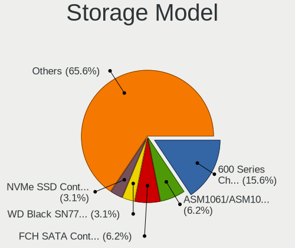

Gentoo - Hardware Trends (Desktops)
-----------------------------------

A project to identify most popular hardware characteristics and track their change
over time based on data collected by Linux users at https://Linux-Hardware.org.

Anyone can contribute to this report by the [hw-probe](https://github.com/linuxhw/hw-probe) tool:

    sudo -E hw-probe -all -upload

This report is for one last month. Overall report since the beginning of time: [TestCoverage](https://github.com/linuxhw/TestCoverage)

Period: Dec, 2022.

Contents
--------

* [ System ](#system)
  - [ OS                       ](#os)
  - [ OS Family                ](#os-family)
  - [ Kernel                   ](#kernel)
  - [ Kernel Family            ](#kernel-family)
  - [ Kernel Major Ver.        ](#kernel-major-ver)
  - [ Arch                     ](#arch)
  - [ DE                       ](#de)
  - [ Display Server           ](#display-server)
  - [ Display Manager          ](#display-manager)
  - [ OS Lang                  ](#os-lang)
  - [ Boot Mode                ](#boot-mode)
  - [ Filesystem               ](#filesystem)
  - [ Part. scheme             ](#part-scheme)
  - [ Dual Boot with Linux/BSD ](#dual-boot-with-linuxbsd)
  - [ Dual Boot (Win)          ](#dual-boot-win)

* [ Board ](#board)
  - [ Vendor                   ](#vendor)
  - [ Model                    ](#model)
  - [ Model Family             ](#model-family)
  - [ MFG Year                 ](#mfg-year)
  - [ Form Factor              ](#form-factor)
  - [ Secure Boot              ](#secure-boot)
  - [ Coreboot                 ](#coreboot)
  - [ RAM Size                 ](#ram-size)
  - [ RAM Used                 ](#ram-used)
  - [ Total Drives             ](#total-drives)
  - [ Has CD-ROM               ](#has-cd-rom)
  - [ Has Ethernet             ](#has-ethernet)
  - [ Has WiFi                 ](#has-wifi)
  - [ Has Bluetooth            ](#has-bluetooth)

* [ Location ](#location)
  - [ Country                  ](#country)
  - [ City                     ](#city)

* [ Drives ](#drives)
  - [ Drive Vendor             ](#drive-vendor)
  - [ Drive Model              ](#drive-model)
  - [ HDD Vendor               ](#hdd-vendor)
  - [ SSD Vendor               ](#ssd-vendor)
  - [ Drive Kind               ](#drive-kind)
  - [ Drive Connector          ](#drive-connector)
  - [ Drive Size               ](#drive-size)
  - [ Space Total              ](#space-total)
  - [ Space Used               ](#space-used)
  - [ Malfunc. Drives          ](#malfunc-drives)
  - [ Malfunc. Drive Vendor    ](#malfunc-drive-vendor)
  - [ Malfunc. HDD Vendor      ](#malfunc-hdd-vendor)
  - [ Malfunc. Drive Kind      ](#malfunc-drive-kind)
  - [ Failed Drives            ](#failed-drives)
  - [ Failed Drive Vendor      ](#failed-drive-vendor)
  - [ Drive Status             ](#drive-status)

* [ Storage controller ](#storage-controller)
  - [ Storage Vendor           ](#storage-vendor)
  - [ Storage Model            ](#storage-model)
  - [ Storage Kind             ](#storage-kind)

* [ Processor ](#processor)
  - [ CPU Vendor               ](#cpu-vendor)
  - [ CPU Model                ](#cpu-model)
  - [ CPU Model Family         ](#cpu-model-family)
  - [ CPU Cores                ](#cpu-cores)
  - [ CPU Sockets              ](#cpu-sockets)
  - [ CPU Threads              ](#cpu-threads)
  - [ CPU Op-Modes             ](#cpu-op-modes)
  - [ CPU Microcode            ](#cpu-microcode)
  - [ CPU Microarch            ](#cpu-microarch)

* [ Graphics ](#graphics)
  - [ GPU Vendor               ](#gpu-vendor)
  - [ GPU Model                ](#gpu-model)
  - [ GPU Combo                ](#gpu-combo)
  - [ GPU Driver               ](#gpu-driver)
  - [ GPU Memory               ](#gpu-memory)

* [ Monitor ](#monitor)
  - [ Monitor Vendor           ](#monitor-vendor)
  - [ Monitor Model            ](#monitor-model)
  - [ Monitor Resolution       ](#monitor-resolution)
  - [ Monitor Diagonal         ](#monitor-diagonal)
  - [ Monitor Width            ](#monitor-width)
  - [ Aspect Ratio             ](#aspect-ratio)
  - [ Monitor Area             ](#monitor-area)
  - [ Pixel Density            ](#pixel-density)
  - [ Multiple Monitors        ](#multiple-monitors)

* [ Network ](#network)
  - [ Net Controller Vendor    ](#net-controller-vendor)
  - [ Net Controller Model     ](#net-controller-model)
  - [ Wireless Vendor          ](#wireless-vendor)
  - [ Wireless Model           ](#wireless-model)
  - [ Ethernet Vendor          ](#ethernet-vendor)
  - [ Ethernet Model           ](#ethernet-model)
  - [ Net Controller Kind      ](#net-controller-kind)
  - [ Used Controller          ](#used-controller)
  - [ NICs                     ](#nics)
  - [ IPv6                     ](#ipv6)

* [ Bluetooth ](#bluetooth)
  - [ Bluetooth Vendor         ](#bluetooth-vendor)
  - [ Bluetooth Model          ](#bluetooth-model)

* [ Sound ](#sound)
  - [ Sound Vendor             ](#sound-vendor)
  - [ Sound Model              ](#sound-model)

* [ Memory ](#memory)
  - [ Memory Vendor            ](#memory-vendor)
  - [ Memory Model             ](#memory-model)
  - [ Memory Kind              ](#memory-kind)
  - [ Memory Form Factor       ](#memory-form-factor)
  - [ Memory Size              ](#memory-size)
  - [ Memory Speed             ](#memory-speed)

* [ Printers & scanners ](#printers--scanners)
  - [ Printer Vendor           ](#printer-vendor)
  - [ Printer Model            ](#printer-model)
  - [ Scanner Vendor           ](#scanner-vendor)
  - [ Scanner Model            ](#scanner-model)

* [ Camera ](#camera)
  - [ Camera Vendor            ](#camera-vendor)
  - [ Camera Model             ](#camera-model)

* [ Security ](#security)
  - [ Fingerprint Vendor       ](#fingerprint-vendor)
  - [ Fingerprint Model        ](#fingerprint-model)
  - [ Chipcard Vendor          ](#chipcard-vendor)
  - [ Chipcard Model           ](#chipcard-model)

* [ Unsupported ](#unsupported)
  - [ Unsupported Devices      ](#unsupported-devices)
  - [ Unsupported Device Types ](#unsupported-device-types)

System
------

OS
--

Installed operating systems

| Name       | Desktops | Percent |
|------------|----------|---------|
| Gentoo 2.9 | 27       | 100%    |

OS Family
---------

OS without a version

| Name   | Desktops | Percent |
|--------|----------|---------|
| Gentoo | 27       | 100%    |

Kernel
------

Version of the Linux kernel

| Version                    | Desktops | Percent |
|----------------------------|----------|---------|
| 5.15.80-gentoo-x86_64      | 4        | 14.81%  |
| 6.0.11-gentoo              | 3        | 11.11%  |
| 5.15.75-gentoo-x86_64      | 3        | 11.11%  |
| 6.1.0-gentoo               | 2        | 7.41%   |
| 5.15.80-gentoo             | 2        | 7.41%   |
| 5.15.77-gentoo-dist        | 2        | 7.41%   |
| 5.15.75-gentoo             | 2        | 7.41%   |
| 6.0.10-gentoo-x86_64       | 1        | 3.7%    |
| 6.0.10-gentoo              | 1        | 3.7%    |
| 6.0.0-pf5gentoo            | 1        | 3.7%    |
| 5.19.1-N7700PG             | 1        | 3.7%    |
| 5.15.85-gentoo-hardened1   | 1        | 3.7%    |
| 5.15.80-gentoo-silverstore | 1        | 3.7%    |
| 5.15.69-gentoo             | 1        | 3.7%    |
| 5.15.59-gentoo-debug       | 1        | 3.7%    |
| 5.15.23-gentoo             | 1        | 3.7%    |

Kernel Family
-------------

Linux kernel without a distro release

| Version | Desktops | Percent |
|---------|----------|---------|
| 5.15.80 | 7        | 25.93%  |
| 5.15.75 | 5        | 18.52%  |
| 6.0.11  | 3        | 11.11%  |
| 6.1.0   | 2        | 7.41%   |
| 6.0.10  | 2        | 7.41%   |
| 5.15.77 | 2        | 7.41%   |
| 6.0.0   | 1        | 3.7%    |
| 5.19.1  | 1        | 3.7%    |
| 5.15.85 | 1        | 3.7%    |
| 5.15.69 | 1        | 3.7%    |
| 5.15.59 | 1        | 3.7%    |
| 5.15.23 | 1        | 3.7%    |

Kernel Major Ver.
-----------------

Linux kernel major version

| Version | Desktops | Percent |
|---------|----------|---------|
| 5.15    | 18       | 66.67%  |
| 6.0     | 6        | 22.22%  |
| 6.1     | 2        | 7.41%   |
| 5.19    | 1        | 3.7%    |

Arch
----

OS architecture (x86_64, i586, etc.)

| Name     | Desktops | Percent |
|----------|----------|---------|
| x86_64   | 26       | 96.3%   |
| armv5tel | 1        | 3.7%    |

DE
--

Desktop Environment

| Name       | Desktops | Percent |
|------------|----------|---------|
| KDE5       | 9        | 33.33%  |
| Unknown    | 6        | 22.22%  |
| GNOME      | 4        | 14.81%  |
| XFCE       | 3        | 11.11%  |
| MATE       | 2        | 7.41%   |
| X-Cinnamon | 1        | 3.7%    |
| i3         | 1        | 3.7%    |
| dwm        | 1        | 3.7%    |

Display Server
--------------

X11 or Wayland

| Name    | Desktops | Percent |
|---------|----------|---------|
| X11     | 14       | 51.85%  |
| Unknown | 6        | 22.22%  |
| Wayland | 4        | 14.81%  |
| Tty     | 3        | 11.11%  |

Display Manager
---------------

SDDM, LightDM, etc.

| Name    | Desktops | Percent |
|---------|----------|---------|
| LightDM | 9        | 33.33%  |
| SDDM    | 8        | 29.63%  |
| Unknown | 8        | 29.63%  |
| GDM     | 2        | 7.41%   |

OS Lang
-------

Language

| Lang    | Desktops | Percent |
|---------|----------|---------|
| en_US   | 13       | 48.15%  |
| C.UTF8  | 3        | 11.11%  |
| Unknown | 2        | 7.41%   |
| pt_PT   | 1        | 3.7%    |
| pl_PL   | 1        | 3.7%    |
| it_IT   | 1        | 3.7%    |
| fr_FR   | 1        | 3.7%    |
| es_ES   | 1        | 3.7%    |
| en_AU   | 1        | 3.7%    |
| de_DE   | 1        | 3.7%    |
| C       | 1        | 3.7%    |
| bg_BG   | 1        | 3.7%    |

Boot Mode
---------

EFI or BIOS

| Mode | Desktops | Percent |
|------|----------|---------|
| EFI  | 18       | 66.67%  |
| BIOS | 9        | 33.33%  |

Filesystem
----------

Type of filesystem

| Type     | Desktops | Percent |
|----------|----------|---------|
| Ext4     | 14       | 51.85%  |
| Btrfs    | 7        | 25.93%  |
| F2fs     | 3        | 11.11%  |
| Zfs      | 1        | 3.7%    |
| XXXXXXX  | 1        | 3.7%    |
| Reiserfs | 1        | 3.7%    |

Part. scheme
------------

Scheme of partitioning

| Type | Desktops | Percent |
|------|----------|---------|
| GPT  | 25       | 92.59%  |
| MBR  | 2        | 7.41%   |

Dual Boot with Linux/BSD
------------------------

Hosting more than one Linux/BSD

| Dual boot | Desktops | Percent |
|-----------|----------|---------|
| No        | 14       | 51.85%  |
| Yes       | 13       | 48.15%  |

Dual Boot (Win)
---------------

Hosting Linux and Windows

| Dual boot | Desktops | Percent |
|-----------|----------|---------|
| No        | 14       | 51.85%  |
| Yes       | 13       | 48.15%  |

Board
-----

Vendor
------

Motherboard manufacturer

| Name                | Desktops | Percent |
|---------------------|----------|---------|
| ASUSTek Computer    | 8        | 29.63%  |
| Gigabyte Technology | 7        | 25.93%  |
| Hewlett-Packard     | 4        | 14.81%  |
| MSI                 | 3        | 11.11%  |
| Supermicro          | 1        | 3.7%    |
| Phoenix             | 1        | 3.7%    |
| Pegatron            | 1        | 3.7%    |
| ASRock              | 1        | 3.7%    |
| Unknown             | 1        | 3.7%    |

Model
-----

Motherboard model

| Name                               | Desktops | Percent |
|------------------------------------|----------|---------|
| MSI MS-7C37                        | 2        | 7.41%   |
| Gigabyte Z370P D3                  | 2        | 7.41%   |
| Supermicro SSG-6028R-E1CR24L       | 1        | 3.7%    |
| Phoenix 945GM                      | 1        | 3.7%    |
| Pegatron p7-1219                   | 1        | 3.7%    |
| MSI MS-7375                        | 1        | 3.7%    |
| HP Z640 Workstation                | 1        | 3.7%    |
| HP Z400 Workstation                | 1        | 3.7%    |
| HP EliteDesk 705 G4 DM 35W (TAA)   | 1        | 3.7%    |
| HP Compaq dc7100 USDT(DX877AV)     | 1        | 3.7%    |
| Gigabyte B650M DS3H                | 1        | 3.7%    |
| Gigabyte B650 AORUS PRO AX         | 1        | 3.7%    |
| Gigabyte B550M DS3H                | 1        | 3.7%    |
| Gigabyte B550M AORUS ELITE         | 1        | 3.7%    |
| Gigabyte AB350-Gaming              | 1        | 3.7%    |
| ASUS TUF Gaming X570-PLUS          | 1        | 3.7%    |
| ASUS SABERTOOTH 990FX              | 1        | 3.7%    |
| ASUS ROG STRIX X670E-F GAMING WIFI | 1        | 3.7%    |
| ASUS PRIME X570-PRO                | 1        | 3.7%    |
| ASUS PRIME X470-PRO                | 1        | 3.7%    |
| ASUS PRIME B450M-A                 | 1        | 3.7%    |
| ASUS P8Z68-V PRO                   | 1        | 3.7%    |
| ASUS M3A78-CM                      | 1        | 3.7%    |
| ASRock AB350M                      | 1        | 3.7%    |
| Unknown                            | 1        | 3.7%    |

Model Family
------------

Motherboard model prefix

| Name                         | Desktops | Percent |
|------------------------------|----------|---------|
| ASUS PRIME                   | 3        | 11.11%  |
| MSI MS-7C37                  | 2        | 7.41%   |
| Gigabyte Z370P               | 2        | 7.41%   |
| Gigabyte B550M               | 2        | 7.41%   |
| Supermicro SSG-6028R-E1CR24L | 1        | 3.7%    |
| Phoenix 945GM                | 1        | 3.7%    |
| Pegatron p7-1219             | 1        | 3.7%    |
| MSI MS-7375                  | 1        | 3.7%    |
| HP Z640                      | 1        | 3.7%    |
| HP Z400                      | 1        | 3.7%    |
| HP EliteDesk                 | 1        | 3.7%    |
| HP Compaq                    | 1        | 3.7%    |
| Gigabyte B650M               | 1        | 3.7%    |
| Gigabyte B650                | 1        | 3.7%    |
| Gigabyte AB350-Gaming        | 1        | 3.7%    |
| ASUS TUF                     | 1        | 3.7%    |
| ASUS SABERTOOTH              | 1        | 3.7%    |
| ASUS ROG                     | 1        | 3.7%    |
| ASUS P8Z68-V                 | 1        | 3.7%    |
| ASUS M3A78-CM                | 1        | 3.7%    |
| ASRock AB350M                | 1        | 3.7%    |
| Unknown                      | 1        | 3.7%    |

MFG Year
--------

Motherboard manufacture year

| Year    | Desktops | Percent |
|---------|----------|---------|
| 2019    | 5        | 18.52%  |
| 2017    | 4        | 14.81%  |
| 2022    | 3        | 11.11%  |
| 2020    | 3        | 11.11%  |
| 2011    | 3        | 11.11%  |
| 2018    | 2        | 7.41%   |
| 2010    | 2        | 7.41%   |
| 2015    | 1        | 3.7%    |
| 2009    | 1        | 3.7%    |
| 2008    | 1        | 3.7%    |
| 2004    | 1        | 3.7%    |
| Unknown | 1        | 3.7%    |

Form Factor
-----------

Physical design of the computer

| Name    | Desktops | Percent |
|---------|----------|---------|
| Desktop | 27       | 100%    |

Secure Boot
-----------

Enabled or disabled

| State    | Desktops | Percent |
|----------|----------|---------|
| Disabled | 26       | 96.3%   |
| Enabled  | 1        | 3.7%    |

Coreboot
--------

Have coreboot on board

| Used | Desktops | Percent |
|------|----------|---------|
| No   | 27       | 100%    |

RAM Size
--------

Total RAM memory

| Size in GB  | Desktops | Percent |
|-------------|----------|---------|
| 32.01-64.0  | 7        | 25.93%  |
| 64.01-256.0 | 5        | 18.52%  |
| 24.01-32.0  | 4        | 14.81%  |
| 16.01-24.0  | 4        | 14.81%  |
| 4.01-8.0    | 3        | 11.11%  |
| 3.01-4.0    | 2        | 7.41%   |
| 1.01-2.0    | 1        | 3.7%    |
| 0.01-0.5    | 1        | 3.7%    |

RAM Used
--------

Used RAM memory

| Used GB    | Desktops | Percent |
|------------|----------|---------|
| 4.01-8.0   | 5        | 18.52%  |
| 3.01-4.0   | 4        | 14.81%  |
| 0.51-1.0   | 4        | 14.81%  |
| 2.01-3.0   | 3        | 11.11%  |
| 16.01-24.0 | 3        | 11.11%  |
| 1.01-2.0   | 2        | 7.41%   |
| 8.01-16.0  | 2        | 7.41%   |
| 0.01-0.5   | 2        | 7.41%   |
| 32.01-64.0 | 1        | 3.7%    |
| 0          | 1        | 3.7%    |

Total Drives
------------

Number of drives on board

| Drives | Desktops | Percent |
|--------|----------|---------|
| 3      | 7        | 25.93%  |
| 2      | 5        | 18.52%  |
| 1      | 5        | 18.52%  |
| 8      | 3        | 11.11%  |
| 4      | 3        | 11.11%  |
| 6      | 2        | 7.41%   |
| 7      | 1        | 3.7%    |
| 5      | 1        | 3.7%    |

Has CD-ROM
----------

Has CD-ROM on board

| Presented | Desktops | Percent |
|-----------|----------|---------|
| No        | 21       | 77.78%  |
| Yes       | 6        | 22.22%  |

Has Ethernet
------------

Has Ethernet on board

| Presented | Desktops | Percent |
|-----------|----------|---------|
| Yes       | 26       | 96.3%   |
| No        | 1        | 3.7%    |

Has WiFi
--------

Has WiFi module

| Presented | Desktops | Percent |
|-----------|----------|---------|
| No        | 16       | 59.26%  |
| Yes       | 11       | 40.74%  |

Has Bluetooth
-------------

Has Bluetooth module

| Presented | Desktops | Percent |
|-----------|----------|---------|
| No        | 16       | 59.26%  |
| Yes       | 11       | 40.74%  |

Location
--------

Country
-------

Geographic location (country)

| Country   | Desktops | Percent |
|-----------|----------|---------|
| USA       | 11       | 40.74%  |
| Russia    | 2        | 7.41%   |
| Poland    | 2        | 7.41%   |
| Germany   | 2        | 7.41%   |
| Australia | 2        | 7.41%   |
| Spain     | 1        | 3.7%    |
| Portugal  | 1        | 3.7%    |
| Norway    | 1        | 3.7%    |
| Italy     | 1        | 3.7%    |
| France    | 1        | 3.7%    |
| Croatia   | 1        | 3.7%    |
| Canada    | 1        | 3.7%    |
| Bulgaria  | 1        | 3.7%    |

City
----

Geographic location (city)

| City           | Desktops | Percent |
|----------------|----------|---------|
| Warsaw         | 2        | 7.41%   |
| Sydney         | 2        | 7.41%   |
| Zarech'ye      | 1        | 3.7%    |
| Zagreb         | 1        | 3.7%    |
| Yekaterinburg  | 1        | 3.7%    |
| West Orange    | 1        | 3.7%    |
| Trondheim      | 1        | 3.7%    |
| Thurmont       | 1        | 3.7%    |
| Sofia          | 1        | 3.7%    |
| Seattle        | 1        | 3.7%    |
| Saskatoon      | 1        | 3.7%    |
| San Antonio    | 1        | 3.7%    |
| San Angelo     | 1        | 3.7%    |
| Ruhland        | 1        | 3.7%    |
| Porto          | 1        | 3.7%    |
| Parrish        | 1        | 3.7%    |
| Neuss          | 1        | 3.7%    |
| Nantes         | 1        | 3.7%    |
| Milton         | 1        | 3.7%    |
| Igualada       | 1        | 3.7%    |
| Guanzate       | 1        | 3.7%    |
| East Brunswick | 1        | 3.7%    |
| Cedar Park     | 1        | 3.7%    |
| Benton Harbor  | 1        | 3.7%    |
| Augusta        | 1        | 3.7%    |

Drives
------

Drive Vendor
------------

Hard drive vendors

| Vendor                    | Desktops | Drives | Percent |
|---------------------------|----------|--------|---------|
| WDC                       | 15       | 35     | 25.42%  |
| Samsung Electronics       | 12       | 21     | 20.34%  |
| Seagate                   | 10       | 12     | 16.95%  |
| Hitachi                   | 3        | 9      | 5.08%   |
| Toshiba                   | 2        | 2      | 3.39%   |
| SanDisk                   | 2        | 3      | 3.39%   |
| Phison Electronics        | 2        | 2      | 3.39%   |
| Intel                     | 2        | 2      | 3.39%   |
| GOODRAM                   | 2        | 2      | 3.39%   |
| Crucial                   | 2        | 2      | 3.39%   |
| Realtek Semiconductor     | 1        | 1      | 1.69%   |
| OCZ                       | 1        | 1      | 1.69%   |
| Micron/Crucial Technology | 1        | 1      | 1.69%   |
| Kingston                  | 1        | 2      | 1.69%   |
| Apacer                    | 1        | 1      | 1.69%   |
| AFAYA                     | 1        | 1      | 1.69%   |
| A-DATA Technology         | 1        | 1      | 1.69%   |

Drive Model
-----------

Hard drive models

| Model                                               | Desktops | Percent |
|-----------------------------------------------------|----------|---------|
| Samsung NVMe SSD Controller PM9A1/PM9A3/980PRO 2TB  | 4        | 5.26%   |
| WDC WD30EFRX-68EUZN0 3TB                            | 3        | 3.95%   |
| Samsung NVMe SSD Controller SM981/PM981/PM983 500GB | 3        | 3.95%   |
| WDC WD10EZEX-08WN4A0 1TB                            | 2        | 2.63%   |
| Seagate ST2000DM008-2FR102 2TB                      | 2        | 2.63%   |
| Samsung SSD 860 EVO 500GB                           | 2        | 2.63%   |
| Samsung SSD 860 EVO 250GB                           | 2        | 2.63%   |
| GOODRAM SSDPR-CL100-480-G2 480GB                    | 2        | 2.63%   |
| WDC WDS500G2B0A-00SM50 500GB SSD                    | 1        | 1.32%   |
| WDC WDS200T2B0B-00YS70 2TB SSD                      | 1        | 1.32%   |
| WDC WD6400AAKS-65A7B0 640GB                         | 1        | 1.32%   |
| WDC WD6400AAKS-40H2B0 640GB                         | 1        | 1.32%   |
| WDC WD60EFZX-68B3FN0 6TB                            | 1        | 1.32%   |
| WDC WD60EFAX-68SHWN0 6TB                            | 1        | 1.32%   |
| WDC WD6003FZBX-00K5WB0 6TB                          | 1        | 1.32%   |
| WDC WD5000AZLX-22JKKA0 500GB                        | 1        | 1.32%   |
| WDC WD5000AAKX-60U6AA0 500GB                        | 1        | 1.32%   |
| WDC WD40EZAZ-00SF3B0 4TB                            | 1        | 1.32%   |
| WDC WD40EFRX-68N32N0 4TB                            | 1        | 1.32%   |
| WDC WD30EZRX-00D8PB0 3TB                            | 1        | 1.32%   |
| WDC WD30EFRX-68AX9N0 3TB                            | 1        | 1.32%   |
| WDC WD2500AAKS-00F0A0 250GB                         | 1        | 1.32%   |
| WDC WD20EZAZ-00L9GB0 2TB                            | 1        | 1.32%   |
| WDC WD2002FAEX-007BA0 2TB                           | 1        | 1.32%   |
| WDC WD10EFRX-68PJCN0 1TB                            | 1        | 1.32%   |
| WDC WD10EADS-22M2B0 1TB                             | 1        | 1.32%   |
| WDC WD1002FAEX-00Y9A0 1TB                           | 1        | 1.32%   |
| WDC WD Blue SA510 2.5 500GB                         | 1        | 1.32%   |
| Toshiba HDWE150 5TB                                 | 1        | 1.32%   |
| Toshiba DT01ACA300 3TB                              | 1        | 1.32%   |
| Seagate ST6000DM003-2CY186 6TB                      | 1        | 1.32%   |
| Seagate ST4000VM000-1F3168 4TB                      | 1        | 1.32%   |
| Seagate ST4000DM004-2CV104 4TB                      | 1        | 1.32%   |
| Seagate ST380815AS 80GB                             | 1        | 1.32%   |
| Seagate ST3500418AS 500GB                           | 1        | 1.32%   |
| Seagate ST3120023A 120GB                            | 1        | 1.32%   |
| Seagate ST2000DM008-2UB102 2TB                      | 1        | 1.32%   |
| Seagate ST12000NM0008-2H3101 12TB                   | 1        | 1.32%   |
| Seagate ST1000DM010-2EP102 1TB                      | 1        | 1.32%   |
| Sandisk WD Blue SN500 / PC SN520 NVMe SSD 256GB     | 1        | 1.32%   |

HDD Vendor
----------

Hard disk drive vendors

| Vendor  | Desktops | Drives | Percent |
|---------|----------|--------|---------|
| WDC     | 15       | 31     | 48.39%  |
| Seagate | 10       | 12     | 32.26%  |
| Hitachi | 3        | 9      | 9.68%   |
| Toshiba | 2        | 2      | 6.45%   |
| AFAYA   | 1        | 1      | 3.23%   |

SSD Vendor
----------

Solid state drive vendors

| Vendor              | Desktops | Drives | Percent |
|---------------------|----------|--------|---------|
| Samsung Electronics | 7        | 8      | 35%     |
| WDC                 | 3        | 4      | 15%     |
| GOODRAM             | 2        | 2      | 10%     |
| Crucial             | 2        | 2      | 10%     |
| SanDisk             | 1        | 2      | 5%      |
| OCZ                 | 1        | 1      | 5%      |
| Kingston            | 1        | 2      | 5%      |
| Intel               | 1        | 1      | 5%      |
| Apacer              | 1        | 1      | 5%      |
| A-DATA Technology   | 1        | 1      | 5%      |

Drive Kind
----------

HDD or SSD

| Kind | Desktops | Drives | Percent |
|------|----------|--------|---------|
| HDD  | 23       | 55     | 44.23%  |
| SSD  | 17       | 24     | 32.69%  |
| NVMe | 12       | 19     | 23.08%  |

Drive Connector
---------------

SATA, SAS, NVMe, etc.

| Type | Desktops | Drives | Percent |
|------|----------|--------|---------|
| SATA | 25       | 79     | 67.57%  |
| NVMe | 12       | 19     | 32.43%  |

Drive Size
----------

Size of hard drive

| Size in TB | Desktops | Drives | Percent |
|------------|----------|--------|---------|
| 0.01-0.5   | 17       | 29     | 36.96%  |
| 0.51-1.0   | 8        | 14     | 17.39%  |
| 2.01-3.0   | 6        | 16     | 13.04%  |
| 1.01-2.0   | 6        | 8      | 13.04%  |
| 3.01-4.0   | 4        | 6      | 8.7%    |
| 4.01-10.0  | 4        | 5      | 8.7%    |
| 10.01-20.0 | 1        | 1      | 2.17%   |

Space Total
-----------

Amount of disk space available on the file system

| Size in GB     | Desktops | Percent |
|----------------|----------|---------|
| More than 3000 | 8        | 29.63%  |
| 1001-2000      | 4        | 14.81%  |
| 101-250        | 3        | 11.11%  |
| 501-1000       | 3        | 11.11%  |
| Unknown        | 3        | 11.11%  |
| 251-500        | 2        | 7.41%   |
| 1-20           | 2        | 7.41%   |
| 2001-3000      | 1        | 3.7%    |
| 51-100         | 1        | 3.7%    |

Space Used
----------

Amount of used disk space

| Used GB        | Desktops | Percent |
|----------------|----------|---------|
| More than 3000 | 5        | 18.52%  |
| 251-500        | 3        | 11.11%  |
| 21-50          | 3        | 11.11%  |
| 1-20           | 3        | 11.11%  |
| 501-1000       | 3        | 11.11%  |
| Unknown        | 3        | 11.11%  |
| 101-250        | 2        | 7.41%   |
| 1001-2000      | 2        | 7.41%   |
| 51-100         | 2        | 7.41%   |
| 2001-3000      | 1        | 3.7%    |

Malfunc. Drives
---------------

Drive models with a malfunction

| Model                                                           | Desktops | Drives | Percent |
|-----------------------------------------------------------------|----------|--------|---------|
| WDC WD6400AAKS-65A7B0 640GB                                     | 1        | 1      | 14.29%  |
| WDC WD60EFAX-68SHWN0 6TB                                        | 1        | 1      | 14.29%  |
| WDC WD30EFRX-68EUZN0 3TB                                        | 1        | 1      | 14.29%  |
| WDC WD30EFRX-68AX9N0 3TB                                        | 1        | 1      | 14.29%  |
| WDC WD10EFRX-68PJCN0 1TB                                        | 1        | 1      | 14.29%  |
| WDC WD10EADS-22M2B0 1TB                                         | 1        | 1      | 14.29%  |
| Samsung Electronics NVMe SSD Controller SM981/PM981/PM983 500GB | 1        | 2      | 14.29%  |

Malfunc. Drive Vendor
---------------------

Vendors of faulty drives

| Vendor              | Desktops | Drives | Percent |
|---------------------|----------|--------|---------|
| WDC                 | 5        | 6      | 83.33%  |
| Samsung Electronics | 1        | 2      | 16.67%  |

Malfunc. HDD Vendor
-------------------

Vendors of faulty HDD drives

| Vendor | Desktops | Drives | Percent |
|--------|----------|--------|---------|
| WDC    | 5        | 6      | 100%    |

Malfunc. Drive Kind
-------------------

Kinds of faulty drives

| Kind | Desktops | Drives | Percent |
|------|----------|--------|---------|
| HDD  | 5        | 6      | 83.33%  |
| NVMe | 1        | 2      | 16.67%  |

Failed Drives
-------------

Failed drive models

Zero info for selected period =(

Failed Drive Vendor
-------------------

Failed drive vendors

Zero info for selected period =(

Drive Status
------------

Number of failed and malfunc. drives

| Status   | Desktops | Drives | Percent |
|----------|----------|--------|---------|
| Works    | 27       | 89     | 81.82%  |
| Malfunc  | 5        | 8      | 15.15%  |
| Detected | 1        | 1      | 3.03%   |

Storage controller
------------------

Storage Vendor
--------------

Storage controller vendors

| Vendor                    | Desktops | Percent |
|---------------------------|----------|---------|
| AMD                       | 16       | 33.33%  |
| Intel                     | 10       | 20.83%  |
| Samsung Electronics       | 8        | 16.67%  |
| ASMedia Technology        | 3        | 6.25%   |
| Phison Electronics        | 2        | 4.17%   |
| JMicron Technology        | 2        | 4.17%   |
| Silicon Image             | 1        | 2.08%   |
| SanDisk                   | 1        | 2.08%   |
| Realtek Semiconductor     | 1        | 2.08%   |
| Nvidia                    | 1        | 2.08%   |
| Micron/Crucial Technology | 1        | 2.08%   |
| Marvell Technology Group  | 1        | 2.08%   |
| Broadcom / LSI            | 1        | 2.08%   |

Storage Model
-------------

Storage controller models

| Model                                                                         | Desktops | Percent |
|-------------------------------------------------------------------------------|----------|---------|
| AMD FCH SATA Controller [AHCI mode]                                           | 8        | 13.11%  |
| Samsung NVMe SSD Controller PM9A1/PM9A3/980PRO                                | 4        | 6.56%   |
| Samsung NVMe SSD Controller SM981/PM981/PM983                                 | 3        | 4.92%   |
| AMD SATA controller                                                           | 3        | 4.92%   |
| AMD 300 Series Chipset SATA Controller                                        | 3        | 4.92%   |
| Intel C610/X99 series chipset sSATA Controller [AHCI mode]                    | 2        | 3.28%   |
| Intel C610/X99 series chipset 6-Port SATA Controller [AHCI mode]              | 2        | 3.28%   |
| Intel 6 Series/C200 Series Chipset Family 6 port Desktop SATA AHCI Controller | 2        | 3.28%   |
| Intel 200 Series PCH SATA controller [AHCI mode]                              | 2        | 3.28%   |
| ASMedia ASM1062 Serial ATA Controller                                         | 2        | 3.28%   |
| AMD 500 Series Chipset SATA Controller                                        | 2        | 3.28%   |
| AMD 400 Series Chipset SATA Controller                                        | 2        | 3.28%   |
| Silicon Image SiI 3132 Serial ATA Raid II Controller                          | 1        | 1.64%   |
| SanDisk WD Blue SN500 / PC SN520 NVMe SSD                                     | 1        | 1.64%   |
| Samsung NVMe SSD Controller SM961/PM961/SM963                                 | 1        | 1.64%   |
| Samsung NVMe SSD Controller SM951/PM951                                       | 1        | 1.64%   |
| Samsung NVMe SSD Controller 980                                               | 1        | 1.64%   |
| Realtek RTS5763DL NVMe SSD Controller                                         | 1        | 1.64%   |
| Phison PS5013 E13 NVMe Controller                                             | 1        | 1.64%   |
| Phison E12 NVMe Controller                                                    | 1        | 1.64%   |
| Nvidia MCP78S [GeForce 8200] SATA Controller (non-AHCI mode)                  | 1        | 1.64%   |
| Nvidia MCP78S [GeForce 8200] IDE                                              | 1        | 1.64%   |
| Micron/Crucial P2 NVMe PCIe SSD                                               | 1        | 1.64%   |
| Marvell Group 88SE9172 SATA 6Gb/s Controller                                  | 1        | 1.64%   |
| JMicron JMB363 SATA/IDE Controller                                            | 1        | 1.64%   |
| JMicron JMB362 SATA Controller                                                | 1        | 1.64%   |
| Intel SATA Controller [RAID mode]                                             | 1        | 1.64%   |
| Intel Non-Volatile memory controller                                          | 1        | 1.64%   |
| Intel 82801GBM/GHM (ICH7-M Family) SATA Controller [AHCI mode]                | 1        | 1.64%   |
| Intel 82801G (ICH7 Family) IDE Controller                                     | 1        | 1.64%   |
| Intel 82801FB/FW (ICH6/ICH6W) SATA Controller                                 | 1        | 1.64%   |
| Intel 82801FB/FBM/FR/FW/FRW (ICH6 Family) IDE Controller                      | 1        | 1.64%   |
| Broadcom / LSI SAS3008 PCI-Express Fusion-MPT SAS-3                           | 1        | 1.64%   |
| ASMedia ASM1166 Serial ATA Controller                                         | 1        | 1.64%   |
| AMD SB7x0/SB8x0/SB9x0 SATA Controller [IDE mode]                              | 1        | 1.64%   |
| AMD SB7x0/SB8x0/SB9x0 SATA Controller [AHCI mode]                             | 1        | 1.64%   |
| AMD SB7x0/SB8x0/SB9x0 IDE Controller                                          | 1        | 1.64%   |
| AMD RS690 PCI to PCI Bridge (PCI Express Port 2)                              | 1        | 1.64%   |

Storage Kind
------------

Kind of storage controller (IDE, SATA, NVMe, SAS, ...)

| Kind | Desktops | Percent |
|------|----------|---------|
| SATA | 24       | 54.55%  |
| NVMe | 12       | 27.27%  |
| IDE  | 4        | 9.09%   |
| RAID | 3        | 6.82%   |
| SAS  | 1        | 2.27%   |

Processor
---------

CPU Vendor
----------

Processor vendors

| Vendor                | Desktops | Percent |
|-----------------------|----------|---------|
| AMD                   | 17       | 62.96%  |
| Intel                 | 9        | 33.33%  |
| Marvell Semiconductor | 1        | 3.7%    |

CPU Model
---------

Processor models

| Model                                                                    | Desktops | Percent |
|--------------------------------------------------------------------------|----------|---------|
| AMD Ryzen 7 5800X 8-Core Processor                                       | 3        | 11.11%  |
| AMD Ryzen 7 7700X 8-Core Processor                                       | 2        | 7.41%   |
| Marvell Semiconductor Marvell Kirkwood (Flattened Device Tree) Processor | 1        | 3.7%    |
| Intel Xeon CPU W3680 @ 3.33GHz                                           | 1        | 3.7%    |
| Intel Xeon CPU E5-2650L v4 @ 1.70GHz                                     | 1        | 3.7%    |
| Intel Xeon CPU E5-1650 v3 @ 3.50GHz                                      | 1        | 3.7%    |
| Intel Pentium CPU G630 @ 2.70GHz                                         | 1        | 3.7%    |
| Intel Pentium 4 CPU 2.80GHz                                              | 1        | 3.7%    |
| Intel Core i7-8700K CPU @ 3.70GHz                                        | 1        | 3.7%    |
| Intel Core i7-2600K CPU @ 3.40GHz                                        | 1        | 3.7%    |
| Intel Core i5-8600K CPU @ 3.60GHz                                        | 1        | 3.7%    |
| Intel Core 2 Duo CPU T5500 @ 1.66GHz                                     | 1        | 3.7%    |
| AMD Ryzen 9 7950X 16-Core Processor                                      | 1        | 3.7%    |
| AMD Ryzen 9 5900X 12-Core Processor                                      | 1        | 3.7%    |
| AMD Ryzen 9 3900XT 12-Core Processor                                     | 1        | 3.7%    |
| AMD Ryzen 7 3700X 8-Core Processor                                       | 1        | 3.7%    |
| AMD Ryzen 7 2700X Eight-Core Processor                                   | 1        | 3.7%    |
| AMD Ryzen 5 PRO 2400GE w/ Radeon Vega Graphics                           | 1        | 3.7%    |
| AMD Ryzen 5 5600 6-Core Processor                                        | 1        | 3.7%    |
| AMD Ryzen 5 3600 6-Core Processor                                        | 1        | 3.7%    |
| AMD Ryzen 5 2600 Six-Core Processor                                      | 1        | 3.7%    |
| AMD Phenom II X6 1090T Processor                                         | 1        | 3.7%    |
| AMD Phenom II X4 955 Processor                                           | 1        | 3.7%    |
| AMD FX-8120 Eight-Core Processor                                         | 1        | 3.7%    |

CPU Model Family
----------------

Processor model prefix

| Model            | Desktops | Percent |
|------------------|----------|---------|
| AMD Ryzen 7      | 7        | 25.93%  |
| Intel Xeon       | 3        | 11.11%  |
| AMD Ryzen 9      | 3        | 11.11%  |
| AMD Ryzen 5      | 3        | 11.11%  |
| Intel Core i7    | 2        | 7.41%   |
| Other            | 1        | 3.7%    |
| Intel Pentium 4  | 1        | 3.7%    |
| Intel Pentium    | 1        | 3.7%    |
| Intel Core i5    | 1        | 3.7%    |
| Intel Core 2 Duo | 1        | 3.7%    |
| AMD Ryzen 5 PRO  | 1        | 3.7%    |
| AMD Phenom II X6 | 1        | 3.7%    |
| AMD Phenom II X4 | 1        | 3.7%    |
| AMD FX           | 1        | 3.7%    |

CPU Cores
---------

Number of processor cores

| Number | Desktops | Percent |
|--------|----------|---------|
| 6      | 8        | 29.63%  |
| 8      | 7        | 25.93%  |
| 4      | 4        | 14.81%  |
| 12     | 2        | 7.41%   |
| 2      | 2        | 7.41%   |
| 1      | 2        | 7.41%   |
| 28     | 1        | 3.7%    |
| 16     | 1        | 3.7%    |

CPU Sockets
-----------

Number of sockets

| Number | Desktops | Percent |
|--------|----------|---------|
| 1      | 26       | 96.3%   |
| 2      | 1        | 3.7%    |

CPU Threads
-----------

Threads per core (Hyper-Threading)

| Number | Desktops | Percent |
|--------|----------|---------|
| 2      | 21       | 77.78%  |
| 1      | 6        | 22.22%  |

CPU Op-Modes
------------

CPU Operation Modes (32-bit, 64-bit)

| Op mode        | Desktops | Percent |
|----------------|----------|---------|
| 32-bit, 64-bit | 26       | 96.3%   |
| Unknown        | 1        | 3.7%    |

CPU Microcode
-------------

Microcode number

| Number     | Desktops | Percent |
|------------|----------|---------|
| Unknown    | 4        | 14.81%  |
| 0x0a601203 | 3        | 11.11%  |
| 0x906ea    | 2        | 7.41%   |
| 0x0a20120a | 2        | 7.41%   |
| 0x08701021 | 2        | 7.41%   |
| 0x0800820d | 2        | 7.41%   |
| 0xf41      | 1        | 3.7%    |
| 0x6fb      | 1        | 3.7%    |
| 0x406f1    | 1        | 3.7%    |
| 0x306f2    | 1        | 3.7%    |
| 0x206c2    | 1        | 3.7%    |
| 0x206a7    | 1        | 3.7%    |
| 0x0a201016 | 1        | 3.7%    |
| 0x0a201009 | 1        | 3.7%    |
| 0x08101016 | 1        | 3.7%    |
| 0x0600063e | 1        | 3.7%    |
| 0x010000db | 1        | 3.7%    |
| 0x010000bf | 1        | 3.7%    |

CPU Microarch
-------------

Microarchitecture

| Name        | Desktops | Percent |
|-------------|----------|---------|
| Zen 3       | 5        | 18.52%  |
| Unknown     | 4        | 14.81%  |
| Zen 2       | 3        | 11.11%  |
| Zen+        | 2        | 7.41%   |
| SandyBridge | 2        | 7.41%   |
| KabyLake    | 2        | 7.41%   |
| K10         | 2        | 7.41%   |
| Zen         | 1        | 3.7%    |
| Westmere    | 1        | 3.7%    |
| NetBurst    | 1        | 3.7%    |
| Haswell     | 1        | 3.7%    |
| Core        | 1        | 3.7%    |
| Bulldozer   | 1        | 3.7%    |
| Broadwell   | 1        | 3.7%    |

Graphics
--------

GPU Vendor
----------

Vendors of graphics cards

| Vendor            | Desktops | Percent |
|-------------------|----------|---------|
| Nvidia            | 12       | 41.38%  |
| AMD               | 12       | 41.38%  |
| Intel             | 4        | 13.79%  |
| ASPEED Technology | 1        | 3.45%   |

GPU Model
---------

Graphics card models

| Model                                                                     | Desktops | Percent |
|---------------------------------------------------------------------------|----------|---------|
| AMD Raphael                                                               | 3        | 10.34%  |
| AMD Navi 22 [Radeon RX 6700/6700 XT/6750 XT / 6800M]                      | 2        | 6.9%    |
| Nvidia TU116 [GeForce GTX 1660 SUPER]                                     | 1        | 3.45%   |
| Nvidia TU106 [GeForce RTX 2070 Rev. A]                                    | 1        | 3.45%   |
| Nvidia TU106 [GeForce RTX 2060 Rev. A]                                    | 1        | 3.45%   |
| Nvidia GP106 [GeForce GTX 1060 3GB]                                       | 1        | 3.45%   |
| Nvidia GP104 [GeForce GTX 1080]                                           | 1        | 3.45%   |
| Nvidia GM204 [GeForce GTX 980]                                            | 1        | 3.45%   |
| Nvidia GM200GL [Quadro M6000]                                             | 1        | 3.45%   |
| Nvidia GF100GL [Quadro 4000]                                              | 1        | 3.45%   |
| Nvidia GA106 [RTX A2000]                                                  | 1        | 3.45%   |
| Nvidia GA102 [GeForce RTX 3080 Ti]                                        | 1        | 3.45%   |
| Nvidia GA102 [GeForce RTX 3080 Lite Hash Rate]                            | 1        | 3.45%   |
| Nvidia C77 [nForce 780a/980a SLI]                                         | 1        | 3.45%   |
| Intel Mobile 945GSE Express Integrated Graphics Controller                | 1        | 3.45%   |
| Intel CoffeeLake-S GT2 [UHD Graphics 630]                                 | 1        | 3.45%   |
| Intel 82915G/GV/910GL Integrated Graphics Controller                      | 1        | 3.45%   |
| Intel 2nd Generation Core Processor Family Integrated Graphics Controller | 1        | 3.45%   |
| ASPEED Technology ASPEED Graphics Family                                  | 1        | 3.45%   |
| AMD Vega 10 XL/XT [Radeon RX Vega 56/64]                                  | 1        | 3.45%   |
| AMD RS780C [Radeon 3100]                                                  | 1        | 3.45%   |
| AMD Raven Ridge [Radeon Vega Series / Radeon Vega Mobile Series]          | 1        | 3.45%   |
| AMD Polaris 20 XL [Radeon RX 580 2048SP]                                  | 1        | 3.45%   |
| AMD Navi 10 [Radeon RX 5600 OEM/5600 XT / 5700/5700 XT]                   | 1        | 3.45%   |
| AMD Ellesmere [Radeon RX 470/480/570/570X/580/580X/590]                   | 1        | 3.45%   |
| AMD Cedar [Radeon HD 5000/6000/7350/8350 Series]                          | 1        | 3.45%   |

GPU Combo
---------

Combinations of graphics cards

| Name           | Desktops | Percent |
|----------------|----------|---------|
| 1 x AMD        | 10       | 37.04%  |
| 1 x Nvidia     | 9        | 33.33%  |
| 1 x Intel      | 3        | 11.11%  |
| AMD + Nvidia   | 2        | 7.41%   |
| Other          | 1        | 3.7%    |
| Intel + Nvidia | 1        | 3.7%    |
| 1 x ASPEED     | 1        | 3.7%    |

GPU Driver
----------

Free vs proprietary

| Driver      | Desktops | Percent |
|-------------|----------|---------|
| Free        | 15       | 55.56%  |
| Proprietary | 9        | 33.33%  |
| Unknown     | 3        | 11.11%  |

GPU Memory
----------

Total video memory

| Size in GB | Desktops | Percent |
|------------|----------|---------|
| Unknown    | 13       | 48.15%  |
| 7.01-8.0   | 4        | 14.81%  |
| 8.01-16.0  | 3        | 11.11%  |
| 0.01-0.5   | 3        | 11.11%  |
| 5.01-6.0   | 2        | 7.41%   |
| 2.01-3.0   | 1        | 3.7%    |
| 0.51-1.0   | 1        | 3.7%    |

Monitor
-------

Monitor Vendor
--------------

Monitor vendors

| Vendor               | Desktops | Percent |
|----------------------|----------|---------|
| Samsung Electronics  | 6        | 18.75%  |
| Goldstar             | 5        | 15.63%  |
| ViewSonic            | 3        | 9.38%   |
| Hewlett-Packard      | 3        | 9.38%   |
| Philips              | 2        | 6.25%   |
| Dell                 | 2        | 6.25%   |
| Acer                 | 2        | 6.25%   |
| Viotek               | 1        | 3.13%   |
| Unknown              | 1        | 3.13%   |
| LG Electronics       | 1        | 3.13%   |
| Lenovo               | 1        | 3.13%   |
| DENON                | 1        | 3.13%   |
| Chimei Innolux       | 1        | 3.13%   |
| BenQ                 | 1        | 3.13%   |
| ASUSTek Computer     | 1        | 3.13%   |
| Ancor Communications | 1        | 3.13%   |

Monitor Model
-------------

Monitor models

| Model                                                              | Desktops | Percent |
|--------------------------------------------------------------------|----------|---------|
| Philips PHL 221V8 PHLC211 1920x1080 480x270mm 21.7-inch            | 2        | 6.25%   |
| Hewlett-Packard LA2205 HWP2848 1680x1050 470x300mm 22.0-inch       | 2        | 6.25%   |
| Goldstar HDR 4K GSM7707 3840x2160 600x340mm 27.2-inch              | 2        | 6.25%   |
| Viotek GNV27DB VTK2700 2560x1440 597x336mm 27.0-inch               | 1        | 3.13%   |
| ViewSonic VX2450 SERIES VSCE226 1920x1080 525x297mm 23.7-inch      | 1        | 3.13%   |
| ViewSonic VG2039 SERIES VSC362D 1600x900 432x240mm 19.5-inch       | 1        | 3.13%   |
| ViewSonic LCD Monitor VSC7B2E 1920x1080 480x270mm 21.7-inch        | 1        | 3.13%   |
| Unknown LCD Monitor FFFF 2288x1287 2550x2550mm 142.0-inch          | 1        | 3.13%   |
| Samsung Electronics U28E590 SAM0C4D 3840x2160 607x345mm 27.5-inch  | 1        | 3.13%   |
| Samsung Electronics S22B300 SAM08C8 1920x1080 477x268mm 21.5-inch  | 1        | 3.13%   |
| Samsung Electronics LCD Monitor SyncMaster                         | 1        | 3.13%   |
| Samsung Electronics LC24RG50 SAM0F90 1920x1080 532x304mm 24.1-inch | 1        | 3.13%   |
| Samsung Electronics C32HG7x SAM0E13 2560x1440 697x392mm 31.5-inch  | 1        | 3.13%   |
| Samsung Electronics C24F390 SAM0D2C 1920x1080 521x293mm 23.5-inch  | 1        | 3.13%   |
| LG Electronics LCD Monitor LG TV 3840x1080                         | 1        | 3.13%   |
| Lenovo G27q-20 LEN66C3 2560x1440 597x336mm 27.0-inch               | 1        | 3.13%   |
| Hewlett-Packard L2245w HWP26FC 1680x1050 470x300mm 22.0-inch       | 1        | 3.13%   |
| Goldstar StudioWorks 7 00S GSM430B 1280x1024 310x230mm 15.2-inch   | 1        | 3.13%   |
| Goldstar HDR WFHD GSM7714 2560x1080 798x334mm 34.1-inch            | 1        | 3.13%   |
| Goldstar 34GK950F GSM7727 3440x1440 800x335mm 34.1-inch            | 1        | 3.13%   |
| DENON AVR DON0064 3840x2160 600x340mm 27.2-inch                    | 1        | 3.13%   |
| Dell SE198WFP DELF004 1440x900 408x255mm 18.9-inch                 | 1        | 3.13%   |
| Dell E207WFP DELD011 1680x1050 430x270mm 20.0-inch                 | 1        | 3.13%   |
| Chimei Innolux LCD Monitor CMN1747 1920x1080 381x214mm 17.2-inch   | 1        | 3.13%   |
| BenQ G2220HD BNQ7820 1920x1080 478x269mm 21.6-inch                 | 1        | 3.13%   |
| ASUSTek Computer VG245 AUS24A1 1920x1080 531x299mm 24.0-inch       | 1        | 3.13%   |
| Ancor Communications MX279 ACI27C3 1920x1080 598x336mm 27.0-inch   | 1        | 3.13%   |
| Acer XB271HU ACR0490 2560x1440 598x336mm 27.0-inch                 | 1        | 3.13%   |
| Acer FT220HQL ACR03D2 1920x1080 476x268mm 21.5-inch                | 1        | 3.13%   |

Monitor Resolution
------------------

Monitor screen resolution

| Resolution         | Desktops | Percent |
|--------------------|----------|---------|
| 1920x1080 (FHD)    | 11       | 35.48%  |
| 3840x2160 (4K)     | 4        | 12.9%   |
| 2560x1440 (QHD)    | 4        | 12.9%   |
| 1680x1050 (WSXGA+) | 4        | 12.9%   |
| 3840x1080          | 1        | 3.23%   |
| 3440x1440          | 1        | 3.23%   |
| 2560x1080          | 1        | 3.23%   |
| 2288x1287          | 1        | 3.23%   |
| 1600x900 (HD+)     | 1        | 3.23%   |
| 1440x900 (WXGA+)   | 1        | 3.23%   |
| 1152x864           | 1        | 3.23%   |
| Unknown            | 1        | 3.23%   |

Monitor Diagonal
----------------

Diagonal size in inches

| Inches  | Desktops | Percent |
|---------|----------|---------|
| 27      | 7        | 23.33%  |
| 21      | 6        | 20%     |
| 24      | 3        | 10%     |
| 22      | 3        | 10%     |
| 34      | 2        | 6.67%   |
| 142     | 1        | 3.33%   |
| 72      | 1        | 3.33%   |
| 31      | 1        | 3.33%   |
| 23      | 1        | 3.33%   |
| 20      | 1        | 3.33%   |
| 19      | 1        | 3.33%   |
| 17      | 1        | 3.33%   |
| 15      | 1        | 3.33%   |
| Unknown | 1        | 3.33%   |

Monitor Width
-------------

Physical width

| Width in mm    | Desktops | Percent |
|----------------|----------|---------|
| 501-600        | 10       | 37.04%  |
| 401-500        | 8        | 29.63%  |
| 701-800        | 2        | 7.41%   |
| 601-700        | 2        | 7.41%   |
| More than 2000 | 1        | 3.7%    |
| 351-400        | 1        | 3.7%    |
| 301-350        | 1        | 3.7%    |
| 1501-2000      | 1        | 3.7%    |
| Unknown        | 1        | 3.7%    |

Aspect Ratio
------------

Proportional relationship between the width and the height

| Ratio   | Desktops | Percent |
|---------|----------|---------|
| 16/9    | 18       | 64.29%  |
| 16/10   | 5        | 17.86%  |
| 21/9    | 2        | 7.14%   |
| 4/3     | 1        | 3.57%   |
| 1.00    | 1        | 3.57%   |
| Unknown | 1        | 3.57%   |

Monitor Area
------------

Area in inch

| Area in inch | Desktops | Percent |
|----------------|----------|---------|
| 201-250        | 10       | 35.71%  |
| 301-350        | 7        | 25%     |
| 351-500        | 3        | 10.71%  |
| More than 1000 | 2        | 7.14%   |
| 151-200        | 2        | 7.14%   |
| 251-300        | 1        | 3.57%   |
| 121-130        | 1        | 3.57%   |
| 111-120        | 1        | 3.57%   |
| Unknown        | 1        | 3.57%   |

Pixel Density
-------------

Pixels per inch

| Density | Desktops | Percent |
|---------|----------|---------|
| 51-100  | 12       | 42.86%  |
| 101-120 | 9        | 32.14%  |
| 1-50    | 2        | 7.14%   |
| 161-240 | 2        | 7.14%   |
| 121-160 | 2        | 7.14%   |
| Unknown | 1        | 3.57%   |

Multiple Monitors
-----------------

Total monitors connected

| Total | Desktops | Percent |
|-------|----------|---------|
| 1     | 14       | 51.85%  |
| 2     | 8        | 29.63%  |
| 0     | 4        | 14.81%  |
| 3     | 1        | 3.7%    |

Network
-------

Net Controller Vendor
---------------------

Controller vendors

| Vendor                | Desktops | Percent |
|-----------------------|----------|---------|
| Realtek Semiconductor | 17       | 44.74%  |
| Intel                 | 12       | 31.58%  |
| Broadcom              | 3        | 7.89%   |
| MediaTek              | 2        | 5.26%   |
| TP-Link               | 1        | 2.63%   |
| Senao                 | 1        | 2.63%   |
| Ralink                | 1        | 2.63%   |
| Nvidia                | 1        | 2.63%   |

Net Controller Model
--------------------

Controller models

| Model                                                             | Desktops | Percent |
|-------------------------------------------------------------------|----------|---------|
| Realtek RTL8111/8168/8411 PCI Express Gigabit Ethernet Controller | 15       | 35.71%  |
| MediaTek MT7922 802.11ax PCI Express Wireless Network Adapter     | 2        | 4.76%   |
| Intel Wireless-AC 9260                                            | 2        | 4.76%   |
| Intel I211 Gigabit Network Connection                             | 2        | 4.76%   |
| Intel Ethernet Controller I225-V                                  | 2        | 4.76%   |
| TP-Link TL-WN823N v2/v3 [Realtek RTL8192EU]                       | 1        | 2.38%   |
| Senao EUB9801 802.11abgn Wireless Adapter [Ralink RT3572]         | 1        | 2.38%   |
| Realtek RTL8821CE 802.11ac PCIe Wireless Network Adapter          | 1        | 2.38%   |
| Realtek RTL8153 Gigabit Ethernet Adapter                          | 1        | 2.38%   |
| Realtek RTL8125 2.5GbE Controller                                 | 1        | 2.38%   |
| Realtek RTL-8100/8101L/8139 PCI Fast Ethernet Adapter             | 1        | 2.38%   |
| Ralink RT5392 PCIe Wireless Network Adapter                       | 1        | 2.38%   |
| Nvidia MCP77 Ethernet                                             | 1        | 2.38%   |
| Intel Wireless 7265                                               | 1        | 2.38%   |
| Intel Wi-Fi 6 AX200                                               | 1        | 2.38%   |
| Intel Ethernet Connection (2) I218-LM                             | 1        | 2.38%   |
| Intel Dual Band Wireless-AC 3168NGW [Stone Peak]                  | 1        | 2.38%   |
| Intel 82599ES 10-Gigabit SFI/SFP+ Network Connection              | 1        | 2.38%   |
| Intel 82579V Gigabit Network Connection                           | 1        | 2.38%   |
| Intel 82575EB Gigabit Network Connection                          | 1        | 2.38%   |
| Intel 82574L Gigabit Network Connection                           | 1        | 2.38%   |
| Broadcom NetXtreme BCM5764M Gigabit Ethernet PCIe                 | 1        | 2.38%   |
| Broadcom NetXtreme BCM5751 Gigabit Ethernet PCI Express           | 1        | 2.38%   |
| Broadcom NetXtreme BCM5718 Gigabit Ethernet PCIe                  | 1        | 2.38%   |

Wireless Vendor
---------------

Wireless vendors

| Vendor                | Desktops | Percent |
|-----------------------|----------|---------|
| Intel                 | 5        | 45.45%  |
| MediaTek              | 2        | 18.18%  |
| TP-Link               | 1        | 9.09%   |
| Senao                 | 1        | 9.09%   |
| Realtek Semiconductor | 1        | 9.09%   |
| Ralink                | 1        | 9.09%   |

Wireless Model
--------------

Wireless models

| Model                                                         | Desktops | Percent |
|---------------------------------------------------------------|----------|---------|
| MediaTek MT7922 802.11ax PCI Express Wireless Network Adapter | 2        | 18.18%  |
| Intel Wireless-AC 9260                                        | 2        | 18.18%  |
| TP-Link TL-WN823N v2/v3 [Realtek RTL8192EU]                   | 1        | 9.09%   |
| Senao EUB9801 802.11abgn Wireless Adapter [Ralink RT3572]     | 1        | 9.09%   |
| Realtek RTL8821CE 802.11ac PCIe Wireless Network Adapter      | 1        | 9.09%   |
| Ralink RT5392 PCIe Wireless Network Adapter                   | 1        | 9.09%   |
| Intel Wireless 7265                                           | 1        | 9.09%   |
| Intel Wi-Fi 6 AX200                                           | 1        | 9.09%   |
| Intel Dual Band Wireless-AC 3168NGW [Stone Peak]              | 1        | 9.09%   |

Ethernet Vendor
---------------

Ethernet vendors

| Vendor                | Desktops | Percent |
|-----------------------|----------|---------|
| Realtek Semiconductor | 17       | 58.62%  |
| Intel                 | 8        | 27.59%  |
| Broadcom              | 3        | 10.34%  |
| Nvidia                | 1        | 3.45%   |

Ethernet Model
--------------

Ethernet models

| Model                                                             | Desktops | Percent |
|-------------------------------------------------------------------|----------|---------|
| Realtek RTL8111/8168/8411 PCI Express Gigabit Ethernet Controller | 15       | 48.39%  |
| Intel I211 Gigabit Network Connection                             | 2        | 6.45%   |
| Intel Ethernet Controller I225-V                                  | 2        | 6.45%   |
| Realtek RTL8153 Gigabit Ethernet Adapter                          | 1        | 3.23%   |
| Realtek RTL8125 2.5GbE Controller                                 | 1        | 3.23%   |
| Realtek RTL-8100/8101L/8139 PCI Fast Ethernet Adapter             | 1        | 3.23%   |
| Nvidia MCP77 Ethernet                                             | 1        | 3.23%   |
| Intel Ethernet Connection (2) I218-LM                             | 1        | 3.23%   |
| Intel 82599ES 10-Gigabit SFI/SFP+ Network Connection              | 1        | 3.23%   |
| Intel 82579V Gigabit Network Connection                           | 1        | 3.23%   |
| Intel 82575EB Gigabit Network Connection                          | 1        | 3.23%   |
| Intel 82574L Gigabit Network Connection                           | 1        | 3.23%   |
| Broadcom NetXtreme BCM5764M Gigabit Ethernet PCIe                 | 1        | 3.23%   |
| Broadcom NetXtreme BCM5751 Gigabit Ethernet PCI Express           | 1        | 3.23%   |
| Broadcom NetXtreme BCM5718 Gigabit Ethernet PCIe                  | 1        | 3.23%   |

Net Controller Kind
-------------------

Ethernet, WiFi or modem

| Kind     | Desktops | Percent |
|----------|----------|---------|
| Ethernet | 26       | 70.27%  |
| WiFi     | 11       | 29.73%  |

Used Controller
---------------

Currently used network controller

| Kind     | Desktops | Percent |
|----------|----------|---------|
| Ethernet | 21       | 77.78%  |
| WiFi     | 6        | 22.22%  |

NICs
----

Total network controllers on board

| Total | Desktops | Percent |
|-------|----------|---------|
| 2     | 15       | 55.56%  |
| 1     | 10       | 37.04%  |
| 3     | 1        | 3.7%    |
| 0     | 1        | 3.7%    |

IPv6
----

IPv6 vs IPv4

| Used | Desktops | Percent |
|------|----------|---------|
| No   | 21       | 77.78%  |
| Yes  | 6        | 22.22%  |

Bluetooth
---------

Bluetooth Vendor
----------------

Controller vendors

| Vendor                | Desktops | Percent |
|-----------------------|----------|---------|
| Intel                 | 5        | 38.46%  |
| Broadcom              | 2        | 15.38%  |
| ASUSTek Computer      | 2        | 15.38%  |
| Realtek Semiconductor | 1        | 7.69%   |
| MediaTek              | 1        | 7.69%   |
| Foxconn / Hon Hai     | 1        | 7.69%   |
| Belkin Components     | 1        | 7.69%   |

Bluetooth Model
---------------

Controller models

| Model                                                 | Desktops | Percent |
|-------------------------------------------------------|----------|---------|
| Intel Wireless-AC 9260 Bluetooth Adapter              | 2        | 15.38%  |
| Broadcom BCM20702A0 Bluetooth 4.0                     | 2        | 15.38%  |
| Realtek Bluetooth Radio                               | 1        | 7.69%   |
| MediaTek Wireless_Device                              | 1        | 7.69%   |
| Intel Wireless-AC 3168 Bluetooth                      | 1        | 7.69%   |
| Intel Bluetooth wireless interface                    | 1        | 7.69%   |
| Intel AX200 Bluetooth                                 | 1        | 7.69%   |
| Foxconn / Hon Hai Wireless_Device                     | 1        | 7.69%   |
| Belkin Components F8T065BF Mini Bluetooth 4.0 Adapter | 1        | 7.69%   |
| ASUS Bluetooth Radio                                  | 1        | 7.69%   |
| ASUS Bluetooth Device                                 | 1        | 7.69%   |

Sound
-----

Sound Vendor
------------

Sound card vendors

| Vendor              | Desktops | Percent |
|---------------------|----------|---------|
| AMD                 | 14       | 32.56%  |
| Nvidia              | 11       | 25.58%  |
| Intel               | 7        | 16.28%  |
| Creative Labs       | 3        | 6.98%   |
| SteelSeries ApS     | 2        | 4.65%   |
| C-Media Electronics | 2        | 4.65%   |
| Trust               | 1        | 2.33%   |
| Logitech            | 1        | 2.33%   |
| JMTek               | 1        | 2.33%   |
| ASUSTek Computer    | 1        | 2.33%   |

Sound Model
-----------

Sound card models

| Model                                                                                           | Desktops | Percent |
|-------------------------------------------------------------------------------------------------|----------|---------|
| AMD Starship/Matisse HD Audio Controller                                                        | 6        | 11.54%  |
| AMD Rembrandt Radeon High Definition Audio Controller                                           | 3        | 5.77%   |
| AMD Family 17h/19h HD Audio Controller                                                          | 3        | 5.77%   |
| Nvidia TU106 High Definition Audio Controller                                                   | 2        | 3.85%   |
| Nvidia GA102 High Definition Audio Controller                                                   | 2        | 3.85%   |
| Intel 6 Series/C200 Series Chipset Family High Definition Audio Controller                      | 2        | 3.85%   |
| Intel 200 Series PCH HD Audio                                                                   | 2        | 3.85%   |
| AMD Navi 21/23 HDMI/DP Audio Controller                                                         | 2        | 3.85%   |
| AMD Family 17h (Models 00h-0fh) HD Audio Controller                                             | 2        | 3.85%   |
| AMD Ellesmere HDMI Audio [Radeon RX 470/480 / 570/580/590]                                      | 2        | 3.85%   |
| Trust GXT 354 Headset                                                                           | 1        | 1.92%   |
| SteelSeries ApS SteelSeries Arctis 7                                                            | 1        | 1.92%   |
| SteelSeries ApS SteelSeries Arctis 1 Wireless                                                   | 1        | 1.92%   |
| Nvidia TU116 High Definition Audio Controller                                                   | 1        | 1.92%   |
| Nvidia GP106 High Definition Audio Controller                                                   | 1        | 1.92%   |
| Nvidia GP104 High Definition Audio Controller                                                   | 1        | 1.92%   |
| Nvidia GM204 High Definition Audio Controller                                                   | 1        | 1.92%   |
| Nvidia GM200 High Definition Audio                                                              | 1        | 1.92%   |
| Nvidia GF100 High Definition Audio Controller                                                   | 1        | 1.92%   |
| Nvidia GA106 High Definition Audio Controller                                                   | 1        | 1.92%   |
| Logitech V10 Notebook Speakers                                                                  | 1        | 1.92%   |
| JMTek USB PnP Audio Device                                                                      | 1        | 1.92%   |
| Intel C610/X99 series chipset HD Audio Controller                                               | 1        | 1.92%   |
| Intel 82801JI (ICH10 Family) HD Audio Controller                                                | 1        | 1.92%   |
| Intel 82801FB/FBM/FR/FW/FRW (ICH6 Family) AC'97 Audio Controller                                | 1        | 1.92%   |
| Creative Labs EMU20k2 [Sound Blaster X-Fi Titanium Series]                                      | 1        | 1.92%   |
| Creative Labs CA0132 Sound Core3D [Sound Blaster Recon3D / Z-Series / Sound BlasterX AE-5 Plus] | 1        | 1.92%   |
| Creative Labs CA0110 [Sound Blaster X-Fi Xtreme Audio]                                          | 1        | 1.92%   |
| C-Media Electronics USB Advanced Audio Device                                                   | 1        | 1.92%   |
| C-Media Electronics CM108 Audio Controller                                                      | 1        | 1.92%   |
| ASUSTek Computer USB Audio                                                                      | 1        | 1.92%   |
| AMD Vega 10 HDMI Audio [Radeon Vega 56/64]                                                      | 1        | 1.92%   |
| AMD SBx00 Azalia (Intel HDA)                                                                    | 1        | 1.92%   |
| AMD Raven/Raven2/Fenghuang HDMI/DP Audio Controller                                             | 1        | 1.92%   |
| AMD Navi 10 HDMI Audio                                                                          | 1        | 1.92%   |
| AMD Cedar HDMI Audio [Radeon HD 5400/6300/7300 Series]                                          | 1        | 1.92%   |

Memory
------

Memory Vendor
-------------

Memory module vendors

| Vendor              | Desktops | Percent |
|---------------------|----------|---------|
| Corsair             | 8        | 28.57%  |
| Samsung Electronics | 4        | 14.29%  |
| Crucial             | 4        | 14.29%  |
| Unknown             | 3        | 10.71%  |
| G.Skill             | 2        | 7.14%   |
| SK hynix            | 1        | 3.57%   |
| Qumo                | 1        | 3.57%   |
| Nanya Technology    | 1        | 3.57%   |
| Kingston            | 1        | 3.57%   |
| Hikvision           | 1        | 3.57%   |
| A-DATA Technology   | 1        | 3.57%   |
| Unknown             | 1        | 3.57%   |

Memory Model
------------

Memory module models

| Model                                                   | Desktops | Percent |
|---------------------------------------------------------|----------|---------|
| Unknown RAM Module 4GB DIMM DDR3 1600MT/s               | 1        | 3.33%   |
| Unknown RAM Module 2GB DIMM DDR2 667MT/s                | 1        | 3.33%   |
| Unknown RAM Module 1GB DIMM DDR2                        | 1        | 3.33%   |
| SK hynix RAM HMA42GR7AFR4N-TF 16GB DIMM DDR4 2133MT/s   | 1        | 3.33%   |
| Samsung RAM Module 8GB SODIMM DDR4 2400MT/s             | 1        | 3.33%   |
| Samsung RAM M391B5273DH0-CH9 4096MB DIMM DDR3 1333MT/s  | 1        | 3.33%   |
| Samsung RAM M386A4G40DM0-CPB 32GB DIMM DDR4 2133MT/s    | 1        | 3.33%   |
| Samsung RAM M378B5273DH0-CH9 4096MB DIMM DDR3 2133MT/s  | 1        | 3.33%   |
| Qumo RAM QUM4U-16G2666N19 16GB DIMM DDR4 2666MT/s       | 1        | 3.33%   |
| Nanya RAM NT256D64S88C0G-5T 256MB DIMM DDR 400MT/s      | 1        | 3.33%   |
| Kingston RAM K 1GB DIMM DDR 667MT/s                     | 1        | 3.33%   |
| Hikvision RAM HKED4161DAA1D0MA1 16GB DIMM DDR4 2667MT/s | 1        | 3.33%   |
| G.Skill RAM F4-3200C16-16GVK 16GB DIMM DDR4 3600MT/s    | 1        | 3.33%   |
| G.Skill RAM F3-12800CL9-4GBRL 4GB DIMM DDR3 1866MT/s    | 1        | 3.33%   |
| Crucial RAM CT16G48C40U5.M8A1 16GB DIMM DDR5 4800MT/s   | 1        | 3.33%   |
| Crucial RAM BLS8G4D30BESBK.8FD 8GB DIMM DDR4 3000MT/s   | 1        | 3.33%   |
| Crucial RAM BLS2G2D80EBS1S00.1 2GB DIMM DDR2 800MT/s    | 1        | 3.33%   |
| Crucial RAM BL8G32C16U4W.M8FE 8GB DIMM DDR4 3600MT/s    | 1        | 3.33%   |
| Crucial RAM BL8G32C16U4B.M8FE 8GB DIMM DDR4 3600MT/s    | 1        | 3.33%   |
| Corsair RAM CMW64GX4M2E3200C16 32GB DIMM DDR4 3200MT/s  | 1        | 3.33%   |
| Corsair RAM CMW32GX4M2D3600C18 16GB DIMM DDR4 3600MT/s  | 1        | 3.33%   |
| Corsair RAM CMT32GX4M4C3000C15 8GB DIMM DDR4 2133MT/s   | 1        | 3.33%   |
| Corsair RAM CMK8GX4M1A2400C16 8GB DIMM DDR4 2800MT/s    | 1        | 3.33%   |
| Corsair RAM CMK8GX4M1A2400C14 8GB DIMM DDR4 2800MT/s    | 1        | 3.33%   |
| Corsair RAM CMK64GX4M4C3200C16 16GB DIMM DDR4 3200MT/s  | 1        | 3.33%   |
| Corsair RAM CMK64GX4M2E3200C16 32GB DIMM DDR4 3200MT/s  | 1        | 3.33%   |
| Corsair RAM CMK32GX4M2D3600C18 16GB DIMM DDR4 3600MT/s  | 1        | 3.33%   |
| Corsair RAM CMH64GX5M2B5600Z40 32GB DIMM DDR5 4800MT/s  | 1        | 3.33%   |
| A-DATA RAM DDR4 3200 16GB DIMM DDR4 3400MT/s            | 1        | 3.33%   |
| Unknown                                                 | 1        | 3.33%   |

Memory Kind
-----------

Memory module kinds

| Kind  | Desktops | Percent |
|-------|----------|---------|
| DDR4  | 15       | 55.56%  |
| DDR3  | 4        | 14.81%  |
| DDR5  | 3        | 11.11%  |
| DDR2  | 3        | 11.11%  |
| SDRAM | 1        | 3.7%    |
| DDR   | 1        | 3.7%    |

Memory Form Factor
------------------

Physical design of the memory module

| Name   | Desktops | Percent |
|--------|----------|---------|
| DIMM   | 25       | 96.15%  |
| SODIMM | 1        | 3.85%   |

Memory Size
-----------

Memory module size

| Size  | Desktops | Percent |
|-------|----------|---------|
| 16384 | 8        | 29.63%  |
| 32768 | 5        | 18.52%  |
| 8192  | 5        | 18.52%  |
| 4096  | 4        | 14.81%  |
| 2048  | 3        | 11.11%  |
| 1024  | 1        | 3.7%    |
| 256   | 1        | 3.7%    |

Memory Speed
------------

Memory module speed

| Speed   | Desktops | Percent |
|---------|----------|---------|
| 3600    | 4        | 14.29%  |
| 2133    | 4        | 14.29%  |
| 3200    | 3        | 10.71%  |
| 4800    | 2        | 7.14%   |
| 667     | 2        | 7.14%   |
| 6000    | 1        | 3.57%   |
| 3400    | 1        | 3.57%   |
| 3000    | 1        | 3.57%   |
| 2800    | 1        | 3.57%   |
| 2667    | 1        | 3.57%   |
| 2666    | 1        | 3.57%   |
| 2400    | 1        | 3.57%   |
| 1866    | 1        | 3.57%   |
| 1600    | 1        | 3.57%   |
| 1333    | 1        | 3.57%   |
| 800     | 1        | 3.57%   |
| 400     | 1        | 3.57%   |
| Unknown | 1        | 3.57%   |

Printers & scanners
-------------------

Printer Vendor
--------------

Printer device vendors

| Vendor          | Desktops | Percent |
|-----------------|----------|---------|
| Hewlett-Packard | 1        | 100%    |

Printer Model
-------------

Printer device models

| Model               | Desktops | Percent |
|---------------------|----------|---------|
| HP LaserJet M14-M17 | 1        | 100%    |

Scanner Vendor
--------------

Scanner device vendors

Zero info for selected period =(

Scanner Model
-------------

Scanner device models

Zero info for selected period =(

Camera
------

Camera Vendor
-------------

Camera device vendors

| Vendor                 | Desktops | Percent |
|------------------------|----------|---------|
| Logitech               | 6        | 75%     |
| Microdia               | 1        | 12.5%   |
| Generalplus Technology | 1        | 12.5%   |

Camera Model
------------

Camera device models

| Model                                    | Desktops | Percent |
|------------------------------------------|----------|---------|
| Logitech Webcam C270                     | 2        | 25%     |
| Microdia USB 2.0 Camera                  | 1        | 12.5%   |
| Logitech HD Webcam C615                  | 1        | 12.5%   |
| Logitech HD Webcam C525                  | 1        | 12.5%   |
| Logitech HD Webcam C510                  | 1        | 12.5%   |
| Logitech BRIO Ultra HD Webcam            | 1        | 12.5%   |
| Generalplus 808 Camera #9 (web-cam mode) | 1        | 12.5%   |

Security
--------

Fingerprint Vendor
------------------

Fingerprint sensor vendors

Zero info for selected period =(

Fingerprint Model
-----------------

Fingerprint sensor models

Zero info for selected period =(

Chipcard Vendor
---------------

Chipcard module vendors

| Vendor           | Desktops | Percent |
|------------------|----------|---------|
| Yubico.com       | 1        | 50%     |
| SCM Microsystems | 1        | 50%     |

Chipcard Model
--------------

Chipcard module models

| Model                                                  | Desktops | Percent |
|--------------------------------------------------------|----------|---------|
| Yubico.com Yubikey 4/5 CCID                            | 1        | 50%     |
| SCM Microsystems SCR331-LC1 / SCR3310 SmartCard Reader | 1        | 50%     |

Unsupported
-----------

Unsupported Devices
-------------------

Total unsupported devices on board

| Total | Desktops | Percent |
|-------|----------|---------|
| 0     | 13       | 48.15%  |
| 1     | 7        | 25.93%  |
| 2     | 3        | 11.11%  |
| 6     | 1        | 3.7%    |
| 5     | 1        | 3.7%    |
| 4     | 1        | 3.7%    |
| 3     | 1        | 3.7%    |

Unsupported Device Types
------------------------

Types of unsupported devices

| Type                     | Desktops | Percent |
|--------------------------|----------|---------|
| Graphics card            | 6        | 24%     |
| Net/wireless             | 5        | 20%     |
| Communication controller | 3        | 12%     |
| Bluetooth                | 3        | 12%     |
| Unassigned class         | 2        | 8%      |
| Tv card                  | 2        | 8%      |
| Sound                    | 2        | 8%      |
| Storage/ata              | 1        | 4%      |
| Chipcard                 | 1        | 4%      |

