Gentoo - Hardware Trends (Desktops)
-----------------------------------

A project to identify most popular hardware characteristics and track their change
over time based on data collected by Linux users at https://Linux-Hardware.org.

Anyone can contribute to this report by the [hw-probe](https://github.com/linuxhw/hw-probe) tool:

    sudo -E hw-probe -all -upload

This report is for one last month. Overall report since the beginning of time: [TestDays](https://github.com/linuxhw/TestDays)

Period: Jul, 2023.

Contents
--------

* [ System ](#system)
  - [ OS                       ](#os)
  - [ OS Family                ](#os-family)
  - [ Kernel                   ](#kernel)
  - [ Kernel Family            ](#kernel-family)
  - [ Kernel Major Ver.        ](#kernel-major-ver)
  - [ Arch                     ](#arch)
  - [ DE                       ](#de)
  - [ Display Server           ](#display-server)
  - [ Display Manager          ](#display-manager)
  - [ OS Lang                  ](#os-lang)
  - [ Boot Mode                ](#boot-mode)
  - [ Filesystem               ](#filesystem)
  - [ Part. scheme             ](#part-scheme)
  - [ Dual Boot with Linux/BSD ](#dual-boot-with-linuxbsd)
  - [ Dual Boot (Win)          ](#dual-boot-win)

* [ Board ](#board)
  - [ Vendor                   ](#vendor)
  - [ Model                    ](#model)
  - [ Model Family             ](#model-family)
  - [ MFG Year                 ](#mfg-year)
  - [ Form Factor              ](#form-factor)
  - [ Secure Boot              ](#secure-boot)
  - [ Coreboot                 ](#coreboot)
  - [ RAM Size                 ](#ram-size)
  - [ RAM Used                 ](#ram-used)
  - [ Total Drives             ](#total-drives)
  - [ Has CD-ROM               ](#has-cd-rom)
  - [ Has Ethernet             ](#has-ethernet)
  - [ Has WiFi                 ](#has-wifi)
  - [ Has Bluetooth            ](#has-bluetooth)

* [ Location ](#location)
  - [ Country                  ](#country)
  - [ City                     ](#city)

* [ Drives ](#drives)
  - [ Drive Vendor             ](#drive-vendor)
  - [ Drive Model              ](#drive-model)
  - [ HDD Vendor               ](#hdd-vendor)
  - [ SSD Vendor               ](#ssd-vendor)
  - [ Drive Kind               ](#drive-kind)
  - [ Drive Connector          ](#drive-connector)
  - [ Drive Size               ](#drive-size)
  - [ Space Total              ](#space-total)
  - [ Space Used               ](#space-used)
  - [ Malfunc. Drives          ](#malfunc-drives)
  - [ Malfunc. Drive Vendor    ](#malfunc-drive-vendor)
  - [ Malfunc. HDD Vendor      ](#malfunc-hdd-vendor)
  - [ Malfunc. Drive Kind      ](#malfunc-drive-kind)
  - [ Failed Drives            ](#failed-drives)
  - [ Failed Drive Vendor      ](#failed-drive-vendor)
  - [ Drive Status             ](#drive-status)

* [ Storage controller ](#storage-controller)
  - [ Storage Vendor           ](#storage-vendor)
  - [ Storage Model            ](#storage-model)
  - [ Storage Kind             ](#storage-kind)

* [ Processor ](#processor)
  - [ CPU Vendor               ](#cpu-vendor)
  - [ CPU Model                ](#cpu-model)
  - [ CPU Model Family         ](#cpu-model-family)
  - [ CPU Cores                ](#cpu-cores)
  - [ CPU Sockets              ](#cpu-sockets)
  - [ CPU Threads              ](#cpu-threads)
  - [ CPU Op-Modes             ](#cpu-op-modes)
  - [ CPU Microcode            ](#cpu-microcode)
  - [ CPU Microarch            ](#cpu-microarch)

* [ Graphics ](#graphics)
  - [ GPU Vendor               ](#gpu-vendor)
  - [ GPU Model                ](#gpu-model)
  - [ GPU Combo                ](#gpu-combo)
  - [ GPU Driver               ](#gpu-driver)
  - [ GPU Memory               ](#gpu-memory)

* [ Monitor ](#monitor)
  - [ Monitor Vendor           ](#monitor-vendor)
  - [ Monitor Model            ](#monitor-model)
  - [ Monitor Resolution       ](#monitor-resolution)
  - [ Monitor Diagonal         ](#monitor-diagonal)
  - [ Monitor Width            ](#monitor-width)
  - [ Aspect Ratio             ](#aspect-ratio)
  - [ Monitor Area             ](#monitor-area)
  - [ Pixel Density            ](#pixel-density)
  - [ Multiple Monitors        ](#multiple-monitors)

* [ Network ](#network)
  - [ Net Controller Vendor    ](#net-controller-vendor)
  - [ Net Controller Model     ](#net-controller-model)
  - [ Wireless Vendor          ](#wireless-vendor)
  - [ Wireless Model           ](#wireless-model)
  - [ Ethernet Vendor          ](#ethernet-vendor)
  - [ Ethernet Model           ](#ethernet-model)
  - [ Net Controller Kind      ](#net-controller-kind)
  - [ Used Controller          ](#used-controller)
  - [ NICs                     ](#nics)
  - [ IPv6                     ](#ipv6)

* [ Bluetooth ](#bluetooth)
  - [ Bluetooth Vendor         ](#bluetooth-vendor)
  - [ Bluetooth Model          ](#bluetooth-model)

* [ Sound ](#sound)
  - [ Sound Vendor             ](#sound-vendor)
  - [ Sound Model              ](#sound-model)

* [ Memory ](#memory)
  - [ Memory Vendor            ](#memory-vendor)
  - [ Memory Model             ](#memory-model)
  - [ Memory Kind              ](#memory-kind)
  - [ Memory Form Factor       ](#memory-form-factor)
  - [ Memory Size              ](#memory-size)
  - [ Memory Speed             ](#memory-speed)

* [ Printers & scanners ](#printers--scanners)
  - [ Printer Vendor           ](#printer-vendor)
  - [ Printer Model            ](#printer-model)
  - [ Scanner Vendor           ](#scanner-vendor)
  - [ Scanner Model            ](#scanner-model)

* [ Camera ](#camera)
  - [ Camera Vendor            ](#camera-vendor)
  - [ Camera Model             ](#camera-model)

* [ Security ](#security)
  - [ Fingerprint Vendor       ](#fingerprint-vendor)
  - [ Fingerprint Model        ](#fingerprint-model)
  - [ Chipcard Vendor          ](#chipcard-vendor)
  - [ Chipcard Model           ](#chipcard-model)

* [ Unsupported ](#unsupported)
  - [ Unsupported Devices      ](#unsupported-devices)
  - [ Unsupported Device Types ](#unsupported-device-types)

System
------

OS
--

Installed operating systems

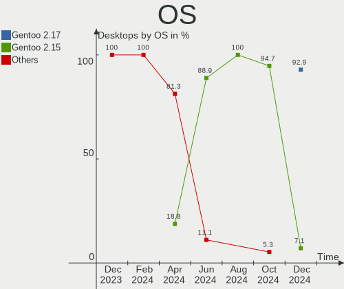

| Name        | Desktops | Percent |
|-------------|----------|---------|
| Gentoo 2.13 | 27       | 84.38%  |
| Gentoo 2.14 | 5        | 15.63%  |

OS Family
---------

OS without a version

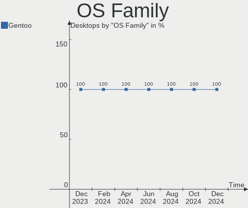

| Name   | Desktops | Percent |
|--------|----------|---------|
| Gentoo | 32       | 100%    |

Kernel
------

Version of the Linux kernel

| Version                | Desktops | Percent |
|------------------------|----------|---------|
| 6.1.31-gentoo          | 5        | 15.63%  |
| 6.4.7-gentoo           | 2        | 6.25%   |
| 6.4.6-gentoo           | 2        | 6.25%   |
| 6.4.3-gentoo           | 2        | 6.25%   |
| 6.1.41-gentoo          | 2        | 6.25%   |
| 6.1.31-gentoo-dist     | 2        | 6.25%   |
| 6.4.4-x86_64           | 1        | 3.13%   |
| 6.4.4-gentoo           | 1        | 3.13%   |
| 6.4.3-gentoo-x86_64    | 1        | 3.13%   |
| 6.4.2-gentoo-x86_64    | 1        | 3.13%   |
| 6.4.2-gentoo           | 1        | 3.13%   |
| 6.4.1-gentoo-x86_64    | 1        | 3.13%   |
| 6.3.6-gentoo-x86_64    | 1        | 3.13%   |
| 6.3.4                  | 1        | 3.13%   |
| 6.3.1-gentoo           | 1        | 3.13%   |
| 6.1.41-gentoo_LTS_     | 1        | 3.13%   |
| 6.1.38-gentoo-x86_64   | 1        | 3.13%   |
| 6.1.38-gentoo          | 1        | 3.13%   |
| 6.1.31-gentoo-x86_64   | 1        | 3.13%   |
| 6.1.28-gentoo          | 1        | 3.13%   |
| 5.17.5-300.fc36.x86_64 | 1        | 3.13%   |
| 5.15.72-gentoo-x86_64  | 1        | 3.13%   |
| 5.10.181-gentoo-dist   | 1        | 3.13%   |

Kernel Family
-------------

Linux kernel without a distro release

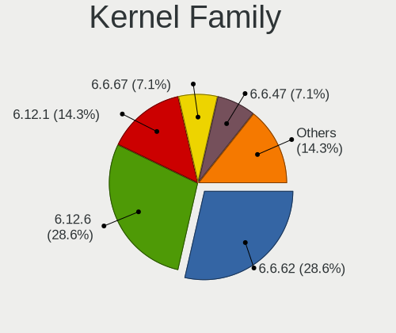

| Version  | Desktops | Percent |
|----------|----------|---------|
| 6.1.31   | 8        | 25%     |
| 6.4.3    | 3        | 9.38%   |
| 6.1.41   | 3        | 9.38%   |
| 6.4.7    | 2        | 6.25%   |
| 6.4.6    | 2        | 6.25%   |
| 6.4.4    | 2        | 6.25%   |
| 6.4.2    | 2        | 6.25%   |
| 6.1.38   | 2        | 6.25%   |
| 6.4.1    | 1        | 3.13%   |
| 6.3.6    | 1        | 3.13%   |
| 6.3.4    | 1        | 3.13%   |
| 6.3.1    | 1        | 3.13%   |
| 6.1.28   | 1        | 3.13%   |
| 5.17.5   | 1        | 3.13%   |
| 5.15.72  | 1        | 3.13%   |
| 5.10.181 | 1        | 3.13%   |

Kernel Major Ver.
-----------------

Linux kernel major version

| Version | Desktops | Percent |
|---------|----------|---------|
| 6.1     | 14       | 43.75%  |
| 6.4     | 12       | 37.5%   |
| 6.3     | 3        | 9.38%   |
| 5.17    | 1        | 3.13%   |
| 5.15    | 1        | 3.13%   |
| 5.10    | 1        | 3.13%   |

Arch
----

OS architecture (x86_64, i586, etc.)

| Name   | Desktops | Percent |
|--------|----------|---------|
| x86_64 | 32       | 100%    |

DE
--

Desktop Environment

| Name     | Desktops | Percent |
|----------|----------|---------|
| KDE5     | 10       | 31.25%  |
| Unknown  | 10       | 31.25%  |
| XFCE     | 5        | 15.63%  |
| GNOME    | 5        | 15.63%  |
| MATE     | 1        | 3.13%   |
| Hyprland | 1        | 3.13%   |

Display Server
--------------

X11 or Wayland

| Name    | Desktops | Percent |
|---------|----------|---------|
| X11     | 14       | 43.75%  |
| Wayland | 8        | 25%     |
| Tty     | 6        | 18.75%  |
| Unknown | 4        | 12.5%   |

Display Manager
---------------

SDDM, LightDM, etc.

| Name    | Desktops | Percent |
|---------|----------|---------|
| SDDM    | 11       | 34.38%  |
| Unknown | 11       | 34.38%  |
| GDM     | 5        | 15.63%  |
| LightDM | 4        | 12.5%   |
| LXDM    | 1        | 3.13%   |

OS Lang
-------

Language

| Lang    | Desktops | Percent |
|---------|----------|---------|
| en_US   | 12       | 37.5%   |
| en_GB   | 4        | 12.5%   |
| C.UTF8  | 4        | 12.5%   |
| de_DE   | 3        | 9.38%   |
| Unknown | 3        | 9.38%   |
| sv_SE   | 1        | 3.13%   |
| pt_BR   | 1        | 3.13%   |
| pl_PL   | 1        | 3.13%   |
| nl_BE   | 1        | 3.13%   |
| it_IT   | 1        | 3.13%   |
| C       | 1        | 3.13%   |

Boot Mode
---------

EFI or BIOS

| Mode | Desktops | Percent |
|------|----------|---------|
| EFI  | 23       | 71.88%  |
| BIOS | 9        | 28.13%  |

Filesystem
----------

Type of filesystem

| Type     | Desktops | Percent |
|----------|----------|---------|
| Ext4     | 20       | 62.5%   |
| Btrfs    | 4        | 12.5%   |
| F2fs     | 3        | 9.38%   |
| Zfs      | 2        | 6.25%   |
| Xfs      | 2        | 6.25%   |
| Reiserfs | 1        | 3.13%   |

Part. scheme
------------

Scheme of partitioning

| Type    | Desktops | Percent |
|---------|----------|---------|
| GPT     | 27       | 84.38%  |
| MBR     | 4        | 12.5%   |
| Unknown | 1        | 3.13%   |

Dual Boot with Linux/BSD
------------------------

Hosting more than one Linux/BSD

| Dual boot | Desktops | Percent |
|-----------|----------|---------|
| No        | 23       | 71.88%  |
| Yes       | 9        | 28.13%  |

Dual Boot (Win)
---------------

Hosting Linux and Windows

| Dual boot | Desktops | Percent |
|-----------|----------|---------|
| No        | 20       | 62.5%   |
| Yes       | 12       | 37.5%   |

Board
-----

Vendor
------

Motherboard manufacturer

| Name                | Desktops | Percent |
|---------------------|----------|---------|
| ASUSTek Computer    | 11       | 34.38%  |
| Gigabyte Technology | 7        | 21.88%  |
| MSI                 | 5        | 15.63%  |
| ASRock              | 4        | 12.5%   |
| Lenovo              | 1        | 3.13%   |
| Gateway             | 1        | 3.13%   |
| Foxconn             | 1        | 3.13%   |
| Dell                | 1        | 3.13%   |
| Aierben             | 1        | 3.13%   |

Model
-----

Motherboard model

| Name                                 | Desktops | Percent |
|--------------------------------------|----------|---------|
| ASUS M3A78-CM                        | 2        | 6.25%   |
| MSI MS-7D15                          | 1        | 3.13%   |
| MSI MS-7C79                          | 1        | 3.13%   |
| MSI MS-7C60                          | 1        | 3.13%   |
| MSI MS-7B85                          | 1        | 3.13%   |
| MSI MS-7A31                          | 1        | 3.13%   |
| Lenovo ThinkStation P520c 30BX001KUS | 1        | 3.13%   |
| Gigabyte Z590 UD                     | 1        | 3.13%   |
| Gigabyte Z390 AORUS MASTER           | 1        | 3.13%   |
| Gigabyte H510M H                     | 1        | 3.13%   |
| Gigabyte GA-MA770T-UD3P              | 1        | 3.13%   |
| Gigabyte B650M AORUS ELITE AX        | 1        | 3.13%   |
| Gigabyte B650 AORUS PRO AX           | 1        | 3.13%   |
| Gigabyte AB350-Gaming                | 1        | 3.13%   |
| Gateway MS-7399                      | 1        | 3.13%   |
| Foxconn TPS01                        | 1        | 3.13%   |
| Dell OptiPlex 7010                   | 1        | 3.13%   |
| ASUS TUF Gaming X570-PLUS            | 1        | 3.13%   |
| ASUS ROG STRIX Z590-F GAMING WIFI    | 1        | 3.13%   |
| ASUS ROG STRIX X670E-F GAMING WIFI   | 1        | 3.13%   |
| ASUS ROG STRIX X570-F GAMING         | 1        | 3.13%   |
| ASUS ROG STRIX B450-F GAMING         | 1        | 3.13%   |
| ASUS PRIME X570-P                    | 1        | 3.13%   |
| ASUS PRIME X370-PRO                  | 1        | 3.13%   |
| ASUS PRIME X299-DELUXE               | 1        | 3.13%   |
| ASUS PRIME J4005I-C                  | 1        | 3.13%   |
| ASRock Z390 Extreme4                 | 1        | 3.13%   |
| ASRock X570 Phantom Gaming X         | 1        | 3.13%   |
| ASRock X570 PG Velocita              | 1        | 3.13%   |
| ASRock AM1H-ITX                      | 1        | 3.13%   |
| Aierben NA17                         | 1        | 3.13%   |

Model Family
------------

Motherboard model prefix

| Name                    | Desktops | Percent |
|-------------------------|----------|---------|
| ASUS ROG                | 4        | 12.5%   |
| ASUS PRIME              | 4        | 12.5%   |
| ASUS M3A78-CM           | 2        | 6.25%   |
| ASRock X570             | 2        | 6.25%   |
| MSI MS-7D15             | 1        | 3.13%   |
| MSI MS-7C79             | 1        | 3.13%   |
| MSI MS-7C60             | 1        | 3.13%   |
| MSI MS-7B85             | 1        | 3.13%   |
| MSI MS-7A31             | 1        | 3.13%   |
| Lenovo ThinkStation     | 1        | 3.13%   |
| Gigabyte Z590           | 1        | 3.13%   |
| Gigabyte Z390           | 1        | 3.13%   |
| Gigabyte H510M          | 1        | 3.13%   |
| Gigabyte GA-MA770T-UD3P | 1        | 3.13%   |
| Gigabyte B650M          | 1        | 3.13%   |
| Gigabyte B650           | 1        | 3.13%   |
| Gigabyte AB350-Gaming   | 1        | 3.13%   |
| Gateway MS-7399         | 1        | 3.13%   |
| Foxconn TPS01           | 1        | 3.13%   |
| Dell OptiPlex           | 1        | 3.13%   |
| ASUS TUF                | 1        | 3.13%   |
| ASRock Z390             | 1        | 3.13%   |
| ASRock AM1H-ITX         | 1        | 3.13%   |
| Aierben NA17            | 1        | 3.13%   |

MFG Year
--------

Motherboard manufacture year

| Year | Desktops | Percent |
|------|----------|---------|
| 2019 | 5        | 15.63%  |
| 2018 | 5        | 15.63%  |
| 2022 | 4        | 12.5%   |
| 2017 | 4        | 12.5%   |
| 2021 | 3        | 9.38%   |
| 2020 | 3        | 9.38%   |
| 2008 | 3        | 9.38%   |
| 2009 | 2        | 6.25%   |
| 2023 | 1        | 3.13%   |
| 2014 | 1        | 3.13%   |
| 2013 | 1        | 3.13%   |

Form Factor
-----------

Physical design of the computer

| Name    | Desktops | Percent |
|---------|----------|---------|
| Desktop | 32       | 100%    |

Secure Boot
-----------

Enabled or disabled

| State    | Desktops | Percent |
|----------|----------|---------|
| Disabled | 32       | 100%    |

Coreboot
--------

Have coreboot on board

| Used | Desktops | Percent |
|------|----------|---------|
| No   | 32       | 100%    |

RAM Size
--------

Total RAM memory

| Size in GB  | Desktops | Percent |
|-------------|----------|---------|
| 32.01-64.0  | 8        | 25%     |
| 64.01-256.0 | 7        | 21.88%  |
| 16.01-24.0  | 7        | 21.88%  |
| 4.01-8.0    | 4        | 12.5%   |
| 24.01-32.0  | 3        | 9.38%   |
| 3.01-4.0    | 2        | 6.25%   |
| 8.01-16.0   | 1        | 3.13%   |

RAM Used
--------

Used RAM memory

| Used GB    | Desktops | Percent |
|------------|----------|---------|
| 4.01-8.0   | 10       | 31.25%  |
| 3.01-4.0   | 5        | 15.63%  |
| 2.01-3.0   | 4        | 12.5%   |
| 1.01-2.0   | 4        | 12.5%   |
| 8.01-16.0  | 3        | 9.38%   |
| 16.01-24.0 | 2        | 6.25%   |
| 0.01-0.5   | 2        | 6.25%   |
| 32.01-64.0 | 1        | 3.13%   |
| 24.01-32.0 | 1        | 3.13%   |

Total Drives
------------

Number of drives on board

| Drives | Desktops | Percent |
|--------|----------|---------|
| 4      | 8        | 25%     |
| 3      | 8        | 25%     |
| 2      | 7        | 21.88%  |
| 1      | 5        | 15.63%  |
| 6      | 2        | 6.25%   |
| 7      | 1        | 3.13%   |
| 5      | 1        | 3.13%   |

Has CD-ROM
----------

Has CD-ROM on board

| Presented | Desktops | Percent |
|-----------|----------|---------|
| No        | 23       | 71.88%  |
| Yes       | 9        | 28.13%  |

Has Ethernet
------------

Has Ethernet on board

| Presented | Desktops | Percent |
|-----------|----------|---------|
| Yes       | 32       | 100%    |

Has WiFi
--------

Has WiFi module

| Presented | Desktops | Percent |
|-----------|----------|---------|
| No        | 17       | 53.13%  |
| Yes       | 15       | 46.88%  |

Has Bluetooth
-------------

Has Bluetooth module

| Presented | Desktops | Percent |
|-----------|----------|---------|
| No        | 18       | 56.25%  |
| Yes       | 14       | 43.75%  |

Location
--------

Country
-------

Geographic location (country)

| Country      | Desktops | Percent |
|--------------|----------|---------|
| USA          | 10       | 31.25%  |
| Germany      | 6        | 18.75%  |
| Poland       | 4        | 12.5%   |
| UK           | 3        | 9.38%   |
| Sweden       | 2        | 6.25%   |
| Spain        | 1        | 3.13%   |
| South Africa | 1        | 3.13%   |
| Russia       | 1        | 3.13%   |
| Kazakhstan   | 1        | 3.13%   |
| Finland      | 1        | 3.13%   |
| Brazil       | 1        | 3.13%   |
| Belgium      | 1        | 3.13%   |

City
----

Geographic location (city)

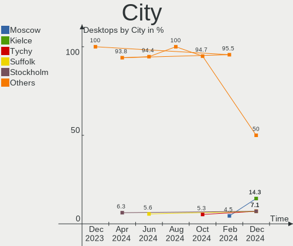

| City           | Desktops | Percent |
|----------------|----------|---------|
| Warsaw         | 3        | 9.38%   |
| Bothell        | 2        | 6.25%   |
| Woburn         | 1        | 3.13%   |
| Viernheim      | 1        | 3.13%   |
| Västerås     | 1        | 3.13%   |
| Troisdorf      | 1        | 3.13%   |
| Sao Paulo      | 1        | 3.13%   |
| Santa Ana      | 1        | 3.13%   |
| San Jose       | 1        | 3.13%   |
| San Antonio    | 1        | 3.13%   |
| Orange         | 1        | 3.13%   |
| Munich         | 1        | 3.13%   |
| Moultonborough | 1        | 3.13%   |
| London         | 1        | 3.13%   |
| Leeds          | 1        | 3.13%   |
| Kiel           | 1        | 3.13%   |
| Khimki         | 1        | 3.13%   |
| Johannesburg   | 1        | 3.13%   |
| Ilmenau        | 1        | 3.13%   |
| Hohentengen    | 1        | 3.13%   |
| Helsinki       | 1        | 3.13%   |
| Gothenburg     | 1        | 3.13%   |
| Girona         | 1        | 3.13%   |
| Flint          | 1        | 3.13%   |
| Denton         | 1        | 3.13%   |
| Cieszyn        | 1        | 3.13%   |
| Chula Vista    | 1        | 3.13%   |
| Berchem        | 1        | 3.13%   |
| Almaty         | 1        | 3.13%   |

Drives
------

Drive Vendor
------------

Hard drive vendors

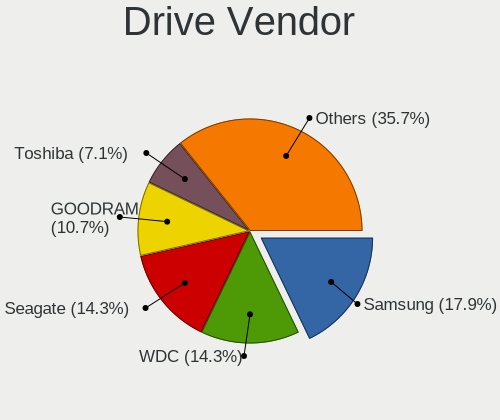

| Vendor                      | Desktops | Drives | Percent |
|-----------------------------|----------|--------|---------|
| Samsung Electronics         | 12       | 17     | 15.79%  |
| Seagate                     | 10       | 11     | 13.16%  |
| WDC                         | 9        | 18     | 11.84%  |
| Toshiba                     | 6        | 6      | 7.89%   |
| Crucial                     | 6        | 7      | 7.89%   |
| SanDisk                     | 4        | 4      | 5.26%   |
| Realtek Semiconductor       | 3        | 4      | 3.95%   |
| Phison Electronics          | 3        | 4      | 3.95%   |
| GOODRAM                     | 3        | 3      | 3.95%   |
| Silicon Motion              | 2        | 2      | 2.63%   |
| Kingston Technology Company | 2        | 2      | 2.63%   |
| Kingston                    | 2        | 3      | 2.63%   |
| Hitachi                     | 2        | 4      | 2.63%   |
| China                       | 2        | 4      | 2.63%   |
| OCZ                         | 1        | 1      | 1.32%   |
| Netac                       | 1        | 1      | 1.32%   |
| Micron/Crucial Technology   | 1        | 1      | 1.32%   |
| Micron Technology           | 1        | 1      | 1.32%   |
| Maxtor                      | 1        | 1      | 1.32%   |
| MAXIO Technology (Hangzhou) | 1        | 1      | 1.32%   |
| LITEONIT                    | 1        | 1      | 1.32%   |
| Intel                       | 1        | 1      | 1.32%   |
| HGST                        | 1        | 1      | 1.32%   |
| ADATA Technology            | 1        | 1      | 1.32%   |

Drive Model
-----------

Hard drive models

| Model                                                 | Desktops | Percent |
|-------------------------------------------------------|----------|---------|
| Samsung NVMe SSD Controller SM981/PM981/PM983 500GB   | 6        | 6.59%   |
| Samsung NVMe SSD Controller PM9A1/PM9A3/980PRO 1TB    | 4        | 4.4%    |
| WDC WDS500G2B0A-00SM50 500GB SSD                      | 2        | 2.2%    |
| WDC WD30EFRX-68EUZN0 3TB                              | 2        | 2.2%    |
| WDC WD2002FAEX-007BA0 2TB                             | 2        | 2.2%    |
| Toshiba DT01ACA100 1TB                                | 2        | 2.2%    |
| Silicon Motion SM2263EN/SM2263XT SSD Controller 500GB | 2        | 2.2%    |
| Seagate ST2000DM006-2DM164 2TB                        | 2        | 2.2%    |
| Realtek SPCC M.2 PCIe SSD 1TB                         | 2        | 2.2%    |
| Phison E12 NVMe Controller 2TB                        | 2        | 2.2%    |
| GOODRAM SSDPR-CL100-480-G2 480GB                      | 2        | 2.2%    |
| Crucial CT250MX500SSD1 250GB                          | 2        | 2.2%    |
| Crucial CT1000MX500SSD1 1TB                           | 2        | 2.2%    |
| WDC WD8003FFBX-68B9AN0 8TB                            | 1        | 1.1%    |
| WDC WD60EFZX-68B3FN0 6TB                              | 1        | 1.1%    |
| WDC WD60EFRX-68MYMN1 6TB                              | 1        | 1.1%    |
| WDC WD60EFAX-68SHWN0 6TB                              | 1        | 1.1%    |
| WDC WD40EFRX-68N32N0 4TB                              | 1        | 1.1%    |
| WDC WD30EFRX-68AX9N0 3TB                              | 1        | 1.1%    |
| WDC WD3003FZEX-00Z4SA0 3TB                            | 1        | 1.1%    |
| WDC WD20SPZX-08UA7 2TB                                | 1        | 1.1%    |
| WDC WD120EFBX-68B0EN0 12TB                            | 1        | 1.1%    |
| WDC WD1002FAEX-00Z3A0 1TB                             | 1        | 1.1%    |
| Toshiba TR200 480GB SSD                               | 1        | 1.1%    |
| Toshiba HDWE150 5TB                                   | 1        | 1.1%    |
| Toshiba HDWD240 4TB                                   | 1        | 1.1%    |
| Toshiba DT01ABA300 3TB                                | 1        | 1.1%    |
| Seagate ST6000DM003-2CY186 6TB                        | 1        | 1.1%    |
| Seagate ST500DM002-1BD142 500GB                       | 1        | 1.1%    |
| Seagate ST4000VN008-2DR166 4TB                        | 1        | 1.1%    |
| Seagate ST4000DM004-2CV104 4TB                        | 1        | 1.1%    |
| Seagate ST3320813AS 320GB                             | 1        | 1.1%    |
| Seagate ST32000641AS 2TB                              | 1        | 1.1%    |
| Seagate ST12000NM0008-2H3101 12TB                     | 1        | 1.1%    |
| Seagate ST1000LM024 HN-M101MBB 1TB                    | 1        | 1.1%    |
| Sandisk WD_BLACK SN770 1TB                            | 1        | 1.1%    |
| SanDisk Ultra II 480GB SSD                            | 1        | 1.1%    |
| SanDisk SDSSDH31000G 1TB                              | 1        | 1.1%    |
| SanDisk SDSSDH3 1T02 1TB                              | 1        | 1.1%    |
| Samsung SSD 980 1TB                                   | 1        | 1.1%    |

HDD Vendor
----------

Hard disk drive vendors

| Vendor              | Desktops | Drives | Percent |
|---------------------|----------|--------|---------|
| Seagate             | 10       | 11     | 34.48%  |
| WDC                 | 8        | 16     | 27.59%  |
| Toshiba             | 5        | 5      | 17.24%  |
| Samsung Electronics | 2        | 2      | 6.9%    |
| Hitachi             | 2        | 4      | 6.9%    |
| Maxtor              | 1        | 1      | 3.45%   |
| HGST                | 1        | 1      | 3.45%   |

SSD Vendor
----------

Solid state drive vendors

| Vendor              | Desktops | Drives | Percent |
|---------------------|----------|--------|---------|
| Crucial             | 6        | 7      | 23.08%  |
| SanDisk             | 3        | 3      | 11.54%  |
| Samsung Electronics | 3        | 3      | 11.54%  |
| GOODRAM             | 3        | 3      | 11.54%  |
| WDC                 | 2        | 2      | 7.69%   |
| Kingston            | 2        | 3      | 7.69%   |
| China               | 2        | 4      | 7.69%   |
| Toshiba             | 1        | 1      | 3.85%   |
| OCZ                 | 1        | 1      | 3.85%   |
| Netac               | 1        | 1      | 3.85%   |
| Micron Technology   | 1        | 1      | 3.85%   |
| LITEONIT            | 1        | 1      | 3.85%   |

Drive Kind
----------

HDD or SSD

| Kind | Desktops | Drives | Percent |
|------|----------|--------|---------|
| HDD  | 22       | 40     | 34.92%  |
| SSD  | 21       | 30     | 33.33%  |
| NVMe | 20       | 29     | 31.75%  |

Drive Connector
---------------

SATA, SAS, NVMe, etc.

| Type | Desktops | Drives | Percent |
|------|----------|--------|---------|
| SATA | 29       | 70     | 59.18%  |
| NVMe | 20       | 29     | 40.82%  |

Drive Size
----------

Size of hard drive

| Size in TB | Desktops | Drives | Percent |
|------------|----------|--------|---------|
| 0.01-0.5   | 16       | 22     | 32.65%  |
| 0.51-1.0   | 10       | 17     | 20.41%  |
| 1.01-2.0   | 6        | 7      | 12.24%  |
| 3.01-4.0   | 5        | 6      | 10.2%   |
| 2.01-3.0   | 5        | 9      | 10.2%   |
| 4.01-10.0  | 5        | 6      | 10.2%   |
| 10.01-20.0 | 2        | 3      | 4.08%   |

Space Total
-----------

Amount of disk space available on the file system

| Size in GB     | Desktops | Percent |
|----------------|----------|---------|
| More than 3000 | 10       | 31.25%  |
| 501-1000       | 8        | 25%     |
| 101-250        | 3        | 9.38%   |
| 1001-2000      | 3        | 9.38%   |
| 51-100         | 3        | 9.38%   |
| 251-500        | 2        | 6.25%   |
| 2001-3000      | 1        | 3.13%   |
| 1-20           | 1        | 3.13%   |
| Unknown        | 1        | 3.13%   |

Space Used
----------

Amount of used disk space

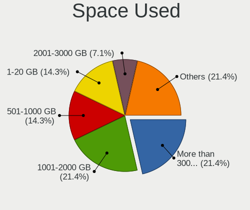

| Used GB        | Desktops | Percent |
|----------------|----------|---------|
| More than 3000 | 7        | 21.88%  |
| 1001-2000      | 5        | 15.63%  |
| 51-100         | 5        | 15.63%  |
| 251-500        | 4        | 12.5%   |
| 1-20           | 4        | 12.5%   |
| 21-50          | 2        | 6.25%   |
| 101-250        | 2        | 6.25%   |
| 2001-3000      | 1        | 3.13%   |
| 501-1000       | 1        | 3.13%   |
| Unknown        | 1        | 3.13%   |

Malfunc. Drives
---------------

Drive models with a malfunction

| Model                                                   | Desktops | Drives | Percent |
|---------------------------------------------------------|----------|--------|---------|
| WDC WD60EFAX-68SHWN0 6TB                                | 1        | 1      | 16.67%  |
| WDC WD30EFRX-68AX9N0 3TB                                | 1        | 1      | 16.67%  |
| WDC WD2002FAEX-007BA0 2TB                               | 1        | 1      | 16.67%  |
| Seagate ST4000VN008-2DR166 4TB                          | 1        | 2      | 16.67%  |
| Samsung Electronics SP2504C 250GB                       | 1        | 1      | 16.67%  |
| Realtek Semiconductor RTS5763DL NVMe SSD Controller 1TB | 1        | 1      | 16.67%  |

Malfunc. Drive Vendor
---------------------

Vendors of faulty drives

| Vendor                | Desktops | Drives | Percent |
|-----------------------|----------|--------|---------|
| WDC                   | 2        | 3      | 40%     |
| Seagate               | 1        | 2      | 20%     |
| Samsung Electronics   | 1        | 1      | 20%     |
| Realtek Semiconductor | 1        | 1      | 20%     |

Malfunc. HDD Vendor
-------------------

Vendors of faulty HDD drives

| Vendor              | Desktops | Drives | Percent |
|---------------------|----------|--------|---------|
| WDC                 | 2        | 3      | 50%     |
| Seagate             | 1        | 2      | 25%     |
| Samsung Electronics | 1        | 1      | 25%     |

Malfunc. Drive Kind
-------------------

Kinds of faulty drives

| Kind | Desktops | Drives | Percent |
|------|----------|--------|---------|
| HDD  | 3        | 6      | 75%     |
| NVMe | 1        | 1      | 25%     |

Failed Drives
-------------

Failed drive models

Zero info for selected period =(

Failed Drive Vendor
-------------------

Failed drive vendors

Zero info for selected period =(

Drive Status
------------

Number of failed and malfunc. drives

| Status   | Desktops | Drives | Percent |
|----------|----------|--------|---------|
| Works    | 31       | 88     | 83.78%  |
| Malfunc  | 4        | 7      | 10.81%  |
| Detected | 2        | 4      | 5.41%   |

Storage controller
------------------

Storage Vendor
--------------

Storage controller vendors

| Vendor                      | Desktops | Percent |
|-----------------------------|----------|---------|
| AMD                         | 18       | 31.03%  |
| Intel                       | 13       | 22.41%  |
| Samsung Electronics         | 10       | 17.24%  |
| Realtek Semiconductor       | 3        | 5.17%   |
| Phison Electronics          | 3        | 5.17%   |
| Silicon Motion              | 2        | 3.45%   |
| Kingston Technology Company | 2        | 3.45%   |
| ASMedia Technology          | 2        | 3.45%   |
| SanDisk                     | 1        | 1.72%   |
| Nvidia                      | 1        | 1.72%   |
| Micron/Crucial Technology   | 1        | 1.72%   |
| MAXIO Technology (Hangzhou) | 1        | 1.72%   |
| ADATA Technology            | 1        | 1.72%   |

Storage Model
-------------

Storage controller models

| Model                                                                        | Desktops | Percent |
|------------------------------------------------------------------------------|----------|---------|
| AMD FCH SATA Controller [AHCI mode]                                          | 13       | 19.12%  |
| Samsung NVMe SSD Controller SM981/PM981/PM983                                | 6        | 8.82%   |
| Samsung NVMe SSD Controller PM9A1/PM9A3/980PRO                               | 4        | 5.88%   |
| Intel 500 Series Chipset Family SATA AHCI Controller                         | 4        | 5.88%   |
| AMD SB7x0/SB8x0/SB9x0 IDE Controller                                         | 3        | 4.41%   |
| Silicon Motion SM2263EN/SM2263XT (DRAM-less) NVMe SSD Controllers            | 2        | 2.94%   |
| Realtek RTS5765DL NVMe SSD Controller (DRAM-less)                            | 2        | 2.94%   |
| Phison E12 NVMe Controller                                                   | 2        | 2.94%   |
| Intel Cannon Lake PCH SATA AHCI Controller                                   | 2        | 2.94%   |
| Intel 200 Series PCH SATA controller [AHCI mode]                             | 2        | 2.94%   |
| ASMedia ASM1062 Serial ATA Controller                                        | 2        | 2.94%   |
| AMD X370 Series Chipset SATA Controller                                      | 2        | 2.94%   |
| AMD SB7x0/SB8x0/SB9x0 SATA Controller [IDE mode]                             | 2        | 2.94%   |
| AMD 400 Series Chipset SATA Controller                                       | 2        | 2.94%   |
| SanDisk WD Black SN770 / PC SN740 256GB / PC SN560 (DRAM-less) NVMe SSD      | 1        | 1.47%   |
| Samsung NVMe SSD Controller SM961/PM961/SM963                                | 1        | 1.47%   |
| Samsung NVMe SSD Controller 980                                              | 1        | 1.47%   |
| Realtek RTS5763DL NVMe SSD Controller                                        | 1        | 1.47%   |
| Phison E18 PCIe4 NVMe Controller                                             | 1        | 1.47%   |
| Nvidia MCP73 SATA RAID Controller                                            | 1        | 1.47%   |
| Nvidia MCP73 IDE Controller                                                  | 1        | 1.47%   |
| Micron/Crucial P2 [Nick P2] / P3 / P3 Plus NVMe PCIe SSD (DRAM-less)         | 1        | 1.47%   |
| MAXIO (Hangzhou) NVMe SSD Controller MAP1202                                 | 1        | 1.47%   |
| Kingston Company Company Non-Volatile memory controller                      | 1        | 1.47%   |
| Kingston Company A2000 NVMe SSD                                              | 1        | 1.47%   |
| Intel SSD DC P4101/Pro 7600p/760p/E 6100p Series                             | 1        | 1.47%   |
| Intel NM10/ICH7 Family SATA Controller [AHCI mode]                           | 1        | 1.47%   |
| Intel Comet Lake SATA AHCI Controller                                        | 1        | 1.47%   |
| Intel Celeron/Pentium Silver Processor SATA Controller                       | 1        | 1.47%   |
| Intel Alder Lake-P SATA AHCI Controller                                      | 1        | 1.47%   |
| Intel 7 Series/C210 Series Chipset Family 6-port SATA Controller [AHCI mode] | 1        | 1.47%   |
| AMD SB7x0/SB8x0/SB9x0 SATA Controller [AHCI mode]                            | 1        | 1.47%   |
| AMD 300 Series Chipset SATA Controller                                       | 1        | 1.47%   |
| ADATA XPG SX8200 Pro PCIe Gen3x4 M.2 2280 Solid State Drive                  | 1        | 1.47%   |

Storage Kind
------------

Kind of storage controller (IDE, SATA, NVMe, SAS, ...)

| Kind | Desktops | Percent |
|------|----------|---------|
| SATA | 31       | 55.36%  |
| NVMe | 20       | 35.71%  |
| IDE  | 4        | 7.14%   |
| RAID | 1        | 1.79%   |

Processor
---------

CPU Vendor
----------

Processor vendors

| Vendor | Desktops | Percent |
|--------|----------|---------|
| AMD    | 18       | 56.25%  |
| Intel  | 14       | 43.75%  |

CPU Model
---------

Processor models

| Model                                          | Desktops | Percent |
|------------------------------------------------|----------|---------|
| AMD Ryzen 9 3900X 12-Core Processor            | 3        | 9.38%   |
| Intel Core i9-9900K CPU @ 3.60GHz              | 2        | 6.25%   |
| AMD Ryzen 9 7900X 12-Core Processor            | 2        | 6.25%   |
| AMD Phenom II X4 955 Processor                 | 2        | 6.25%   |
| Intel Xeon W-2145 CPU @ 3.70GHz                | 1        | 3.13%   |
| Intel Core i9-10850K CPU @ 3.60GHz             | 1        | 3.13%   |
| Intel Core i7-7800X CPU @ 3.50GHz              | 1        | 3.13%   |
| Intel Core i7-3770 CPU @ 3.40GHz               | 1        | 3.13%   |
| Intel Core i7-10700K CPU @ 3.80GHz             | 1        | 3.13%   |
| Intel Core i5-10400F CPU @ 2.90GHz             | 1        | 3.13%   |
| Intel Core i5-10400 CPU @ 2.90GHz              | 1        | 3.13%   |
| Intel Core 2 Extreme CPU X9650 @ 3.00GHz       | 1        | 3.13%   |
| Intel Celeron J4005 CPU @ 2.00GHz              | 1        | 3.13%   |
| Intel Atom CPU D510 @ 1.66GHz                  | 1        | 3.13%   |
| Intel 12th Gen Core i9-12900H                  | 1        | 3.13%   |
| Intel 11th Gen Core i7-11700K @ 3.60GHz        | 1        | 3.13%   |
| AMD Ryzen Threadripper 3970X 32-Core Processor | 1        | 3.13%   |
| AMD Ryzen 7 7700X 8-Core Processor             | 1        | 3.13%   |
| AMD Ryzen 7 5800X3D 8-Core Processor           | 1        | 3.13%   |
| AMD Ryzen 7 5800X 8-Core Processor             | 1        | 3.13%   |
| AMD Ryzen 7 3800X 8-Core Processor             | 1        | 3.13%   |
| AMD Ryzen 7 1700X Eight-Core Processor         | 1        | 3.13%   |
| AMD Ryzen 5 3600 6-Core Processor              | 1        | 3.13%   |
| AMD Ryzen 5 2600X Six-Core Processor           | 1        | 3.13%   |
| AMD Ryzen 5 2600 Six-Core Processor            | 1        | 3.13%   |
| AMD Phenom II X4 20 Processor                  | 1        | 3.13%   |
| AMD Athlon 5350 APU with Radeon R3             | 1        | 3.13%   |

CPU Model Family
----------------

Processor model prefix

| Model                  | Desktops | Percent |
|------------------------|----------|---------|
| AMD Ryzen 9            | 5        | 15.63%  |
| AMD Ryzen 7            | 5        | 15.63%  |
| Intel Core i9          | 3        | 9.38%   |
| Intel Core i7          | 3        | 9.38%   |
| AMD Ryzen 5            | 3        | 9.38%   |
| AMD Phenom II X4       | 3        | 9.38%   |
| Other                  | 2        | 6.25%   |
| Intel Core i5          | 2        | 6.25%   |
| Intel Xeon             | 1        | 3.13%   |
| Intel Core 2 Extreme   | 1        | 3.13%   |
| Intel Celeron          | 1        | 3.13%   |
| Intel Atom             | 1        | 3.13%   |
| AMD Ryzen Threadripper | 1        | 3.13%   |
| AMD Athlon             | 1        | 3.13%   |

CPU Cores
---------

Number of processor cores

| Number | Desktops | Percent |
|--------|----------|---------|
| 8      | 10       | 31.25%  |
| 6      | 6        | 18.75%  |
| 4      | 6        | 18.75%  |
| 12     | 5        | 15.63%  |
| 2      | 2        | 6.25%   |
| 32     | 1        | 3.13%   |
| 14     | 1        | 3.13%   |
| 10     | 1        | 3.13%   |

CPU Sockets
-----------

Number of sockets

| Number | Desktops | Percent |
|--------|----------|---------|
| 1      | 32       | 100%    |

CPU Threads
-----------

Threads per core (Hyper-Threading)

| Number | Desktops | Percent |
|--------|----------|---------|
| 2      | 25       | 78.13%  |
| 1      | 7        | 21.88%  |

CPU Op-Modes
------------

CPU Operation Modes (32-bit, 64-bit)

| Op mode        | Desktops | Percent |
|----------------|----------|---------|
| 32-bit, 64-bit | 32       | 100%    |

CPU Microcode
-------------

Microcode number

| Number     | Desktops | Percent |
|------------|----------|---------|
| Unknown    | 9        | 28.13%  |
| 0x08701021 | 5        | 15.63%  |
| 0x906ed    | 2        | 6.25%   |
| 0x0a601203 | 2        | 6.25%   |
| 0x0800820d | 2        | 6.25%   |
| 0xa0655    | 1        | 3.13%   |
| 0xa0653    | 1        | 3.13%   |
| 0x706a1    | 1        | 3.13%   |
| 0x306a9    | 1        | 3.13%   |
| 0x10676    | 1        | 3.13%   |
| 0x0a20120a | 1        | 3.13%   |
| 0x0a201016 | 1        | 3.13%   |
| 0x08301072 | 1        | 3.13%   |
| 0x08001138 | 1        | 3.13%   |
| 0x0700010f | 1        | 3.13%   |
| 0x010000db | 1        | 3.13%   |
| 0x010000c6 | 1        | 3.13%   |

CPU Microarch
-------------

Microarchitecture

| Name             | Desktops | Percent |
|------------------|----------|---------|
| Zen 2            | 6        | 18.75%  |
| CometLake        | 4        | 12.5%   |
| Unknown          | 4        | 12.5%   |
| K10              | 3        | 9.38%   |
| Zen+             | 2        | 6.25%   |
| Zen 3            | 2        | 6.25%   |
| Skylake          | 2        | 6.25%   |
| KabyLake         | 2        | 6.25%   |
| Zen              | 1        | 3.13%   |
| Penryn           | 1        | 3.13%   |
| Jaguar           | 1        | 3.13%   |
| IvyBridge        | 1        | 3.13%   |
| Goldmont plus    | 1        | 3.13%   |
| Bonnell          | 1        | 3.13%   |
| Alderlake Hybrid | 1        | 3.13%   |

Graphics
--------

GPU Vendor
----------

Vendors of graphics cards

| Vendor | Desktops | Percent |
|--------|----------|---------|
| AMD    | 16       | 47.06%  |
| Nvidia | 12       | 35.29%  |
| Intel  | 6        | 17.65%  |

GPU Model
---------

Graphics card models

| Model                                                                   | Desktops | Percent |
|-------------------------------------------------------------------------|----------|---------|
| AMD Ellesmere [Radeon RX 470/480/570/570X/580/580X/590]                 | 4        | 11.11%  |
| AMD Raphael                                                             | 3        | 8.33%   |
| Nvidia GA102 [GeForce RTX 3080 Ti]                                      | 2        | 5.56%   |
| AMD RS780C [Radeon 3100]                                                | 2        | 5.56%   |
| AMD Navi 21 [Radeon RX 6800/6800 XT / 6900 XT]                          | 2        | 5.56%   |
| AMD Navi 10 [Radeon RX 5600 OEM/5600 XT / 5700/5700 XT]                 | 2        | 5.56%   |
| Nvidia TU106 [GeForce RTX 2070 Rev. A]                                  | 1        | 2.78%   |
| Nvidia TU106 [GeForce RTX 2060 Rev. A]                                  | 1        | 2.78%   |
| Nvidia GP107 [GeForce GTX 1050]                                         | 1        | 2.78%   |
| Nvidia GP106 [P106M]                                                    | 1        | 2.78%   |
| Nvidia GP104 [GeForce GTX 1080]                                         | 1        | 2.78%   |
| Nvidia GM206GL [Quadro M2000]                                           | 1        | 2.78%   |
| Nvidia GK106 [GeForce GTX 660]                                          | 1        | 2.78%   |
| Nvidia GK104 [GeForce GTX 680]                                          | 1        | 2.78%   |
| Nvidia GA106 [Geforce RTX 3050]                                         | 1        | 2.78%   |
| Nvidia GA102 [GeForce RTX 3090]                                         | 1        | 2.78%   |
| Intel IvyBridge GT2 [HD Graphics 4000]                                  | 1        | 2.78%   |
| Intel GeminiLake [UHD Graphics 600]                                     | 1        | 2.78%   |
| Intel CometLake-S GT2 [UHD Graphics 630]                                | 1        | 2.78%   |
| Intel CoffeeLake-S GT2 [UHD Graphics 630]                               | 1        | 2.78%   |
| Intel Atom Processor D4xx/D5xx/N4xx/N5xx Integrated Graphics Controller | 1        | 2.78%   |
| Intel Alder Lake-P Integrated Graphics Controller                       | 1        | 2.78%   |
| AMD Vega 10 XL/XT [Radeon RX Vega 56/64]                                | 1        | 2.78%   |
| AMD Navi 31 [Radeon RX 7900 XT/7900 XTX]                                | 1        | 2.78%   |
| AMD Navi 22 [Radeon RX 6700/6700 XT/6750 XT / 6800M/6850M XT]           | 1        | 2.78%   |
| AMD Kabini [Radeon HD 8400 / R3 Series]                                 | 1        | 2.78%   |
| AMD Cedar [Radeon HD 5000/6000/7350/8350 Series]                        | 1        | 2.78%   |

GPU Combo
---------

Combinations of graphics cards

| Name           | Desktops | Percent |
|----------------|----------|---------|
| 1 x AMD        | 13       | 40.63%  |
| 1 x Nvidia     | 10       | 31.25%  |
| 1 x Intel      | 5        | 15.63%  |
| 2 x AMD        | 2        | 6.25%   |
| Intel + Nvidia | 1        | 3.13%   |
| AMD + Nvidia   | 1        | 3.13%   |

GPU Driver
----------

Free vs proprietary

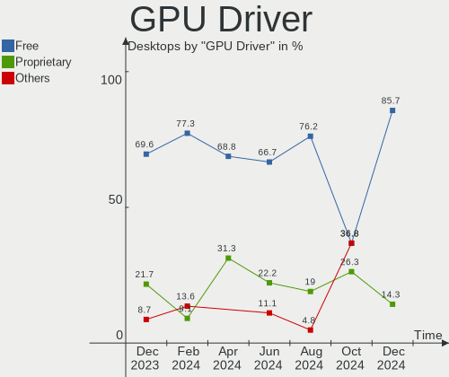

| Driver      | Desktops | Percent |
|-------------|----------|---------|
| Free        | 20       | 62.5%   |
| Proprietary | 8        | 25%     |
| Unknown     | 4        | 12.5%   |

GPU Memory
----------

Total video memory

| Size in GB | Desktops | Percent |
|------------|----------|---------|
| Unknown    | 10       | 31.25%  |
| 7.01-8.0   | 8        | 25%     |
| 3.01-4.0   | 4        | 12.5%   |
| 8.01-16.0  | 4        | 12.5%   |
| 16.01-24.0 | 2        | 6.25%   |
| 5.01-6.0   | 1        | 3.13%   |
| 1.01-2.0   | 1        | 3.13%   |
| 0.51-1.0   | 1        | 3.13%   |
| 0.01-0.5   | 1        | 3.13%   |

Monitor
-------

Monitor Vendor
--------------

Monitor vendors

| Vendor               | Desktops | Percent |
|----------------------|----------|---------|
| Samsung Electronics  | 9        | 24.32%  |
| Goldstar             | 5        | 13.51%  |
| Dell                 | 3        | 8.11%   |
| AOC                  | 3        | 8.11%   |
| Acer                 | 3        | 8.11%   |
| Hewlett-Packard      | 2        | 5.41%   |
| Gigabyte Technology  | 2        | 5.41%   |
| Chimei Innolux       | 2        | 5.41%   |
| Vizio                | 1        | 2.7%    |
| ViewSonic            | 1        | 2.7%    |
| Unknown              | 1        | 2.7%    |
| Philips              | 1        | 2.7%    |
| Lenovo               | 1        | 2.7%    |
| Iiyama               | 1        | 2.7%    |
| BenQ                 | 1        | 2.7%    |
| Ancor Communications | 1        | 2.7%    |

Monitor Model
-------------

Monitor models

| Model                                                                   | Desktops | Percent |
|-------------------------------------------------------------------------|----------|---------|
| Gigabyte Technology M32U GBT3204 3840x2160 697x392mm 31.5-inch          | 2        | 5.26%   |
| Chimei Innolux LCD Monitor CMN1747 1920x1080 381x214mm 17.2-inch        | 2        | 5.26%   |
| Vizio VX20L VIZ2000 1280x720 444x249mm 20.0-inch                        | 1        | 2.63%   |
| ViewSonic VX2450 SERIES VSCE226 1920x1080 525x297mm 23.7-inch           | 1        | 2.63%   |
| Unknown LCD Monitor FFFF 2288x1287 2550x2550mm 142.0-inch               | 1        | 2.63%   |
| Samsung Electronics U32R59x SAM0F96 3840x2160 697x392mm 31.5-inch       | 1        | 2.63%   |
| Samsung Electronics U32H85x SAM0E3C 3840x2160 697x392mm 31.5-inch       | 1        | 2.63%   |
| Samsung Electronics SyncMaster SAM059A 1920x1080 477x268mm 21.5-inch    | 1        | 2.63%   |
| Samsung Electronics SyncMaster SAM04D4 1920x1080 530x300mm 24.0-inch    | 1        | 2.63%   |
| Samsung Electronics SMS27A850 SAM083D 2560x1440 518x324mm 24.1-inch     | 1        | 2.63%   |
| Samsung Electronics SMBX2450 SAM0722 1920x1080 531x299mm 24.0-inch      | 1        | 2.63%   |
| Samsung Electronics S22B300 SAM08C8 1920x1080 477x268mm 21.5-inch       | 1        | 2.63%   |
| Samsung Electronics LCD Monitor SAM7004 3840x2160 1872x1053mm 84.6-inch | 1        | 2.63%   |
| Samsung Electronics LC27G5xT SAM707A 2560x1440 597x336mm 27.0-inch      | 1        | 2.63%   |
| Philips LCD Monitor PHL 276E8V 5760x2160                                | 1        | 2.63%   |
| Lenovo LEN G24-10 LEN65FD 1920x1080 521x293mm 23.5-inch                 | 1        | 2.63%   |
| Iiyama PL2730H IVM663A 1920x1080 598x336mm 27.0-inch                    | 1        | 2.63%   |
| Hewlett-Packard LCD Monitor ZR24w                                       | 1        | 2.63%   |
| Hewlett-Packard L2445w HWP280F 1920x1200 518x324mm 24.1-inch            | 1        | 2.63%   |
| Goldstar ULTRAWIDE GSM59F1 2560x1080 673x284mm 28.8-inch                | 1        | 2.63%   |
| Goldstar HDR 4K GSM7707 3840x2160 600x340mm 27.2-inch                   | 1        | 2.63%   |
| Goldstar FULL HD GSM5B55 1920x1080 480x270mm 21.7-inch                  | 1        | 2.63%   |
| Goldstar 34GK950F GSM7727 3440x1440 800x335mm 34.1-inch                 | 1        | 2.63%   |
| Goldstar 27GL850 GSM5B7F 2560x1440 597x336mm 27.0-inch                  | 1        | 2.63%   |
| Dell P2417H DELA0DC 1920x1080 527x296mm 23.8-inch                       | 1        | 2.63%   |
| Dell P2417H DELA0DB 1920x1080 527x296mm 23.8-inch                       | 1        | 2.63%   |
| Dell P2014H DEL4095 1600x900 434x236mm 19.4-inch                        | 1        | 2.63%   |
| Dell E1914H DELD03A 1366x768 410x230mm 18.5-inch                        | 1        | 2.63%   |
| BenQ PD3200U BNQ8025 3840x2160 708x399mm 32.0-inch                      | 1        | 2.63%   |
| AOC U2777B AOC2777 3840x2160 597x336mm 27.0-inch                        | 1        | 2.63%   |
| AOC 24B2W1 AOC2402 1920x1080 527x296mm 23.8-inch                        | 1        | 2.63%   |
| AOC 2450W AOC2450 1920x1080 521x293mm 23.5-inch                         | 1        | 2.63%   |
| Ancor Communications ASUS VE278 ACI27F6 1920x1080 598x336mm 27.0-inch   | 1        | 2.63%   |
| Acer XB271HU ACR0490 2560x1440 598x336mm 27.0-inch                      | 1        | 2.63%   |
| Acer VG270U P ACR06CF 2560x1440 597x336mm 27.0-inch                     | 1        | 2.63%   |
| Acer B276HUL ACR0361 2560x1440 597x336mm 27.0-inch                      | 1        | 2.63%   |

Monitor Resolution
------------------

Monitor screen resolution

| Resolution        | Desktops | Percent |
|-------------------|----------|---------|
| 1920x1080 (FHD)   | 10       | 28.57%  |
| 3840x2160 (4K)    | 9        | 25.71%  |
| 2560x1440 (QHD)   | 7        | 20%     |
| 5760x2160         | 1        | 2.86%   |
| 3440x1440         | 1        | 2.86%   |
| 2560x1080         | 1        | 2.86%   |
| 2288x1287         | 1        | 2.86%   |
| 1920x1200 (WUXGA) | 1        | 2.86%   |
| 1600x900 (HD+)    | 1        | 2.86%   |
| 1366x768 (WXGA)   | 1        | 2.86%   |
| 1280x1024 (SXGA)  | 1        | 2.86%   |
| Unknown           | 1        | 2.86%   |

Monitor Diagonal
----------------

Diagonal size in inches

| Inches  | Desktops | Percent |
|---------|----------|---------|
| 27      | 7        | 19.44%  |
| 24      | 7        | 19.44%  |
| 31      | 5        | 13.89%  |
| 23      | 3        | 8.33%   |
| 21      | 3        | 8.33%   |
| 34      | 2        | 5.56%   |
| 17      | 2        | 5.56%   |
| 142     | 1        | 2.78%   |
| 84      | 1        | 2.78%   |
| 32      | 1        | 2.78%   |
| 20      | 1        | 2.78%   |
| 19      | 1        | 2.78%   |
| 18      | 1        | 2.78%   |
| Unknown | 1        | 2.78%   |

Monitor Width
-------------

Physical width

| Width in mm    | Desktops | Percent |
|----------------|----------|---------|
| 501-600        | 13       | 40.63%  |
| 401-500        | 6        | 18.75%  |
| 601-700        | 5        | 15.63%  |
| 701-800        | 3        | 9.38%   |
| 351-400        | 2        | 6.25%   |
| More than 2000 | 1        | 3.13%   |
| 1501-2000      | 1        | 3.13%   |
| Unknown        | 1        | 3.13%   |

Aspect Ratio
------------

Proportional relationship between the width and the height

| Ratio   | Desktops | Percent |
|---------|----------|---------|
| 16/9    | 22       | 78.57%  |
| 21/9    | 2        | 7.14%   |
| 16/10   | 2        | 7.14%   |
| 1.00    | 1        | 3.57%   |
| Unknown | 1        | 3.57%   |

Monitor Area
------------

Area in inch²

| Area in inch² | Desktops | Percent |
|----------------|----------|---------|
| 201-250        | 10       | 28.57%  |
| 351-500        | 8        | 22.86%  |
| 301-350        | 7        | 20%     |
| More than 1000 | 2        | 5.71%   |
| 251-300        | 2        | 5.71%   |
| 151-200        | 2        | 5.71%   |
| 121-130        | 2        | 5.71%   |
| 141-150        | 1        | 2.86%   |
| Unknown        | 1        | 2.86%   |

Pixel Density
-------------

Pixels per inch

| Density | Desktops | Percent |
|---------|----------|---------|
| 51-100  | 14       | 43.75%  |
| 121-160 | 7        | 21.88%  |
| 101-120 | 7        | 21.88%  |
| 161-240 | 2        | 6.25%   |
| 1-50    | 1        | 3.13%   |
| Unknown | 1        | 3.13%   |

Multiple Monitors
-----------------

Total monitors connected

| Total | Desktops | Percent |
|-------|----------|---------|
| 1     | 19       | 59.38%  |
| 2     | 6        | 18.75%  |
| 0     | 4        | 12.5%   |
| 3     | 2        | 6.25%   |
| 4     | 1        | 3.13%   |

Network
-------

Net Controller Vendor
---------------------

Controller vendors

| Vendor                | Desktops | Percent |
|-----------------------|----------|---------|
| Intel                 | 21       | 46.67%  |
| Realtek Semiconductor | 16       | 35.56%  |
| Qualcomm Atheros      | 2        | 4.44%   |
| MediaTek              | 2        | 4.44%   |
| Wilocity              | 1        | 2.22%   |
| U-Blox                | 1        | 2.22%   |
| Nvidia                | 1        | 2.22%   |
| Mellanox Technologies | 1        | 2.22%   |

Net Controller Model
--------------------

Controller models

| Model                                                                          | Desktops | Percent |
|--------------------------------------------------------------------------------|----------|---------|
| Realtek RTL8111/8168/8411 PCI Express Gigabit Ethernet Controller              | 10       | 18.87%  |
| Intel I211 Gigabit Network Connection                                          | 8        | 15.09%  |
| Realtek RTL8125 2.5GbE Controller                                              | 4        | 7.55%   |
| Intel Ethernet Controller I225-V                                               | 3        | 5.66%   |
| MediaTek MT7922 802.11ax PCI Express Wireless Network Adapter                  | 2        | 3.77%   |
| Intel Wireless-AC 9260                                                         | 2        | 3.77%   |
| Intel Wi-Fi 6 AX200                                                            | 2        | 3.77%   |
| Intel Ethernet Connection (7) I219-V                                           | 2        | 3.77%   |
| Intel Cannon Lake PCH CNVi WiFi                                                | 2        | 3.77%   |
| Wilocity Wil6200 802.11ad Wireless Network Adapter                             | 1        | 1.89%   |
| U-Blox [u-blox 8]                                                              | 1        | 1.89%   |
| Realtek RTL88x2bu [AC1200 Techkey]                                             | 1        | 1.89%   |
| Realtek RTL-8110SC/8169SC Gigabit Ethernet                                     | 1        | 1.89%   |
| Realtek Killer E3000 2.5GbE Controller                                         | 1        | 1.89%   |
| Qualcomm Atheros QCA6174 802.11ac Wireless Network Adapter                     | 1        | 1.89%   |
| Qualcomm Atheros AR5413/AR5414 Wireless Network Adapter [AR5006X(S) 802.11abg] | 1        | 1.89%   |
| Nvidia MCP73 Ethernet                                                          | 1        | 1.89%   |
| Mellanox MT27500 Family [ConnectX-3]                                           | 1        | 1.89%   |
| Intel Wireless 8260                                                            | 1        | 1.89%   |
| Intel Wireless 3165                                                            | 1        | 1.89%   |
| Intel Wi-Fi 6 AX210/AX211/AX411 160MHz                                         | 1        | 1.89%   |
| Intel Ethernet Controller X550                                                 | 1        | 1.89%   |
| Intel Ethernet Connection (2) I219-V                                           | 1        | 1.89%   |
| Intel Ethernet Connection (2) I219-LM                                          | 1        | 1.89%   |
| Intel Ethernet Connection (10) I219-V                                          | 1        | 1.89%   |
| Intel Comet Lake PCH CNVi WiFi                                                 | 1        | 1.89%   |
| Intel 82579LM Gigabit Network Connection (Lewisville)                          | 1        | 1.89%   |

Wireless Vendor
---------------

Wireless vendors

| Vendor                | Desktops | Percent |
|-----------------------|----------|---------|
| Intel                 | 10       | 62.5%   |
| Qualcomm Atheros      | 2        | 12.5%   |
| MediaTek              | 2        | 12.5%   |
| Wilocity              | 1        | 6.25%   |
| Realtek Semiconductor | 1        | 6.25%   |

Wireless Model
--------------

Wireless models

| Model                                                                          | Desktops | Percent |
|--------------------------------------------------------------------------------|----------|---------|
| MediaTek MT7922 802.11ax PCI Express Wireless Network Adapter                  | 2        | 12.5%   |
| Intel Wireless-AC 9260                                                         | 2        | 12.5%   |
| Intel Wi-Fi 6 AX200                                                            | 2        | 12.5%   |
| Intel Cannon Lake PCH CNVi WiFi                                                | 2        | 12.5%   |
| Wilocity Wil6200 802.11ad Wireless Network Adapter                             | 1        | 6.25%   |
| Realtek RTL88x2bu [AC1200 Techkey]                                             | 1        | 6.25%   |
| Qualcomm Atheros QCA6174 802.11ac Wireless Network Adapter                     | 1        | 6.25%   |
| Qualcomm Atheros AR5413/AR5414 Wireless Network Adapter [AR5006X(S) 802.11abg] | 1        | 6.25%   |
| Intel Wireless 8260                                                            | 1        | 6.25%   |
| Intel Wireless 3165                                                            | 1        | 6.25%   |
| Intel Wi-Fi 6 AX210/AX211/AX411 160MHz                                         | 1        | 6.25%   |
| Intel Comet Lake PCH CNVi WiFi                                                 | 1        | 6.25%   |

Ethernet Vendor
---------------

Ethernet vendors

| Vendor                | Desktops | Percent |
|-----------------------|----------|---------|
| Intel                 | 17       | 48.57%  |
| Realtek Semiconductor | 16       | 45.71%  |
| Nvidia                | 1        | 2.86%   |
| Mellanox Technologies | 1        | 2.86%   |

Ethernet Model
--------------

Ethernet models

| Model                                                             | Desktops | Percent |
|-------------------------------------------------------------------|----------|---------|
| Realtek RTL8111/8168/8411 PCI Express Gigabit Ethernet Controller | 10       | 27.78%  |
| Intel I211 Gigabit Network Connection                             | 8        | 22.22%  |
| Realtek RTL8125 2.5GbE Controller                                 | 4        | 11.11%  |
| Intel Ethernet Controller I225-V                                  | 3        | 8.33%   |
| Intel Ethernet Connection (7) I219-V                              | 2        | 5.56%   |
| Realtek RTL-8110SC/8169SC Gigabit Ethernet                        | 1        | 2.78%   |
| Realtek Killer E3000 2.5GbE Controller                            | 1        | 2.78%   |
| Nvidia MCP73 Ethernet                                             | 1        | 2.78%   |
| Mellanox MT27500 Family [ConnectX-3]                              | 1        | 2.78%   |
| Intel Ethernet Controller X550                                    | 1        | 2.78%   |
| Intel Ethernet Connection (2) I219-V                              | 1        | 2.78%   |
| Intel Ethernet Connection (2) I219-LM                             | 1        | 2.78%   |
| Intel Ethernet Connection (10) I219-V                             | 1        | 2.78%   |
| Intel 82579LM Gigabit Network Connection (Lewisville)             | 1        | 2.78%   |

Net Controller Kind
-------------------

Ethernet, WiFi or modem

| Kind     | Desktops | Percent |
|----------|----------|---------|
| Ethernet | 32       | 66.67%  |
| WiFi     | 15       | 31.25%  |
| Modem    | 1        | 2.08%   |

Used Controller
---------------

Currently used network controller

| Kind     | Desktops | Percent |
|----------|----------|---------|
| Ethernet | 27       | 84.38%  |
| WiFi     | 5        | 15.63%  |

NICs
----

Total network controllers on board

| Total | Desktops | Percent |
|-------|----------|---------|
| 1     | 15       | 46.88%  |
| 2     | 14       | 43.75%  |
| 3     | 2        | 6.25%   |
| 4     | 1        | 3.13%   |

IPv6
----

IPv6 vs IPv4

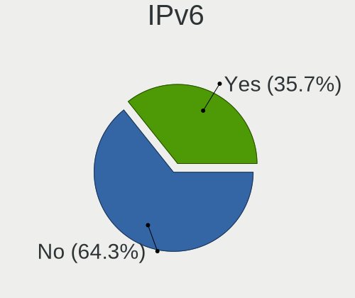

| Used | Desktops | Percent |
|------|----------|---------|
| No   | 23       | 71.88%  |
| Yes  | 9        | 28.13%  |

Bluetooth
---------

Bluetooth Vendor
----------------

Controller vendors

| Vendor                | Desktops | Percent |
|-----------------------|----------|---------|
| Intel                 | 10       | 62.5%   |
| MediaTek              | 2        | 12.5%   |
| Broadcom              | 2        | 12.5%   |
| Realtek Semiconductor | 1        | 6.25%   |
| ASUSTek Computer      | 1        | 6.25%   |

Bluetooth Model
---------------

Controller models

| Model                                          | Desktops | Percent |
|------------------------------------------------|----------|---------|
| MediaTek Wireless_Device                       | 2        | 12.5%   |
| Intel Wireless-AC 9260 Bluetooth Adapter       | 2        | 12.5%   |
| Intel Bluetooth wireless interface             | 2        | 12.5%   |
| Intel Bluetooth 9460/9560 Jefferson Peak (JfP) | 2        | 12.5%   |
| Intel AX200 Bluetooth                          | 2        | 12.5%   |
| Broadcom BCM20702A0 Bluetooth 4.0              | 2        | 12.5%   |
| Realtek Bluetooth Radio                        | 1        | 6.25%   |
| Intel AX210 Bluetooth                          | 1        | 6.25%   |
| Intel AX201 Bluetooth                          | 1        | 6.25%   |
| ASUS Bluetooth Device                          | 1        | 6.25%   |

Sound
-----

Sound Vendor
------------

Sound card vendors

| Vendor                               | Desktops | Percent |
|--------------------------------------|----------|---------|
| AMD                                  | 21       | 37.5%   |
| Nvidia                               | 10       | 17.86%  |
| Intel                                | 10       | 17.86%  |
| C-Media Electronics                  | 3        | 5.36%   |
| Creative Labs                        | 2        | 3.57%   |
| ASUSTek Computer                     | 2        | 3.57%   |
| Thesycon Systemsoftware & Consulting | 1        | 1.79%   |
| SteelSeries ApS                      | 1        | 1.79%   |
| Razer USA                            | 1        | 1.79%   |
| Plantronics                          | 1        | 1.79%   |
| Micro Star International             | 1        | 1.79%   |
| Logitech                             | 1        | 1.79%   |
| Generalplus Technology               | 1        | 1.79%   |
| AKG C44-USB Microphone               | 1        | 1.79%   |

Sound Model
-----------

Sound card models

| Model                                                               | Desktops | Percent |
|---------------------------------------------------------------------|----------|---------|
| AMD Starship/Matisse HD Audio Controller                            | 7        | 10.61%  |
| AMD Ellesmere HDMI Audio [Radeon RX 470/480 / 570/580/590]          | 4        | 6.06%   |
| Nvidia GA102 High Definition Audio Controller                       | 3        | 4.55%   |
| Intel Smart Sound Technology (SST) Audio Controller                 | 3        | 4.55%   |
| AMD SBx00 Azalia (Intel HDA)                                        | 3        | 4.55%   |
| AMD Navi 21/23 HDMI/DP Audio Controller                             | 3        | 4.55%   |
| AMD Family 17h (Models 00h-0fh) HD Audio Controller                 | 3        | 4.55%   |
| Nvidia TU106 High Definition Audio Controller                       | 2        | 3.03%   |
| Intel Cannon Lake PCH cAVS                                          | 2        | 3.03%   |
| AMD Rembrandt Radeon High Definition Audio Controller               | 2        | 3.03%   |
| AMD Navi 10 HDMI Audio                                              | 2        | 3.03%   |
| AMD Family 17h/19h HD Audio Controller                              | 2        | 3.03%   |
| Thesycon Systemsoftware & Consulting SABAJ USB AUDIO                | 1        | 1.52%   |
| SteelSeries ApS SteelSeries Arctis 7                                | 1        | 1.52%   |
| Razer USA Razer Kraken V3 X                                         | 1        | 1.52%   |
| Plantronics Savi Office Base Station                                | 1        | 1.52%   |
| Nvidia MCP73 High Definition Audio                                  | 1        | 1.52%   |
| Nvidia GP107GL High Definition Audio Controller                     | 1        | 1.52%   |
| Nvidia GP104 High Definition Audio Controller                       | 1        | 1.52%   |
| Nvidia GM206 High Definition Audio Controller                       | 1        | 1.52%   |
| Nvidia GK106 HDMI Audio Controller                                  | 1        | 1.52%   |
| Nvidia GK104 HDMI Audio Controller                                  | 1        | 1.52%   |
| Micro Star International USB Audio                                  | 1        | 1.52%   |
| Logitech H600 [Wireless Headset]                                    | 1        | 1.52%   |
| Intel Tiger Lake-H HD Audio Controller                              | 1        | 1.52%   |
| Intel Comet Lake PCH cAVS                                           | 1        | 1.52%   |
| Intel Alder Lake PCH-P High Definition Audio Controller             | 1        | 1.52%   |
| Intel 7 Series/C216 Chipset Family High Definition Audio Controller | 1        | 1.52%   |
| Intel 200 Series PCH HD Audio                                       | 1        | 1.52%   |
| Generalplus Technology USB Audio Device                             | 1        | 1.52%   |
| Creative Labs EMU20k2 [Sound Blaster X-Fi Titanium Series]          | 1        | 1.52%   |
| Creative Labs CA0108/CA10300 [Sound Blaster Audigy Series]          | 1        | 1.52%   |
| C-Media Electronics USB Advanced Audio Device                       | 1        | 1.52%   |
| C-Media Electronics CMI8788 [Oxygen HD Audio]                       | 1        | 1.52%   |
| C-Media Electronics Blue Snowball                                   | 1        | 1.52%   |
| ASUSTek Computer Xonar SoundCard                                    | 1        | 1.52%   |
| ASUSTek Computer USB Audio                                          | 1        | 1.52%   |
| AMD Vega 10 HDMI Audio [Radeon Vega 56/64]                          | 1        | 1.52%   |
| AMD Navi 31 HDMI/DP Audio                                           | 1        | 1.52%   |
| AMD FCH Azalia Controller                                           | 1        | 1.52%   |

Memory
------

Memory Vendor
-------------

Memory module vendors

| Vendor              | Desktops | Percent |
|---------------------|----------|---------|
| Corsair             | 10       | 31.25%  |
| G.Skill             | 5        | 15.63%  |
| Unknown             | 4        | 12.5%   |
| Kingston            | 3        | 9.38%   |
| Micron Technology   | 2        | 6.25%   |
| SK hynix            | 1        | 3.13%   |
| Samsung Electronics | 1        | 3.13%   |
| Patriot             | 1        | 3.13%   |
| Nanya Technology    | 1        | 3.13%   |
| Mushkin             | 1        | 3.13%   |
| Crucial             | 1        | 3.13%   |
| A-DATA Technology   | 1        | 3.13%   |
| Unknown             | 1        | 3.13%   |

Memory Model
------------

Memory module models

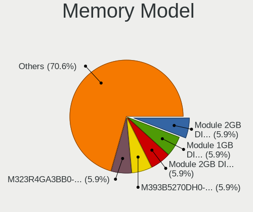

| Model                                                     | Desktops | Percent |
|-----------------------------------------------------------|----------|---------|
| Unknown RAM Module 2GB DIMM DDR2 667MT/s                  | 2        | 6.06%   |
| Kingston RAM KHX3600C17D4/16GX 16GB DIMM DDR4 3800MT/s    | 2        | 6.06%   |
| G.Skill RAM F5-6000J3636F16G 16GB DIMM DDR5 6400MT/s      | 2        | 6.06%   |
| Unknown RAM Module 2GB SODIMM DDR2 800MT/s                | 1        | 3.03%   |
| Unknown RAM Module 2GB DIMM DDR2 800MT/s                  | 1        | 3.03%   |
| SK hynix RAM Module 16GB DIMM DDR4 2133MT/s               | 1        | 3.03%   |
| Samsung RAM M471B5173DB0-YK0 4GB SODIMM DDR3 1600MT/s     | 1        | 3.03%   |
| Patriot RAM Module 8GB DIMM DDR4 2666MT/s                 | 1        | 3.03%   |
| Nanya RAM M2F4G64CB88B7N-DI 4GB DIMM DDR3 1600MT/s        | 1        | 3.03%   |
| Mushkin RAM MR[A/B]4U320GJJM8G 8GB DIMM DDR4 2134MT/s     | 1        | 3.03%   |
| Micron RAM Module 8GB SODIMM DDR4 3200MT/s                | 1        | 3.03%   |
| Micron RAM 8JTF51264AZ-1G6E1 4GB DIMM DDR3 1600MT/s       | 1        | 3.03%   |
| Kingston RAM KHX3200C16D4/8GX 8GB DIMM DDR4 3600MT/s      | 1        | 3.03%   |
| G.Skill RAM F4-3200C16-8GTZR 8GB DIMM DDR4 3200MT/s       | 1        | 3.03%   |
| G.Skill RAM F4-3200C16-16GVK 16GB DIMM DDR4 3600MT/s      | 1        | 3.03%   |
| G.Skill RAM F4-3200C14-8GFX 8GB DIMM DDR4 3733MT/s        | 1        | 3.03%   |
| Crucial RAM BL32G32C16U4B.M16FB1 32GB DIMM DDR4 3200MT/s  | 1        | 3.03%   |
| Corsair RAM CMT64GX5M2B5600Z40 32GB DIMM DDR5 4800MT/s    | 1        | 3.03%   |
| Corsair RAM CMK8GX4M1A2400C14 8GB DIMM DDR4 2800MT/s      | 1        | 3.03%   |
| Corsair RAM CMK64GX4M4X4000C18 16GB DIMM DDR4 4000MT/s    | 1        | 3.03%   |
| Corsair RAM CMK64GX4M2E3200C16 32GB DIMM DDR4 3200MT/s    | 1        | 3.03%   |
| Corsair RAM CMK32GX4M2E3200C16 16GB DIMM DDR4 3534MT/s    | 1        | 3.03%   |
| Corsair RAM CMK32GX4M2D3600C18 16GB DIMM DDR4 3800MT/s    | 1        | 3.03%   |
| Corsair RAM CMK32GX4M2B3200C16 16384MB DIMM DDR4 3400MT/s | 1        | 3.03%   |
| Corsair RAM CMK16GX4M2B3200C16 8GB DIMM DDR4 3600MT/s     | 1        | 3.03%   |
| Corsair RAM CMK16GX4M2B3000C15 8GB DIMM DDR4 3533MT/s     | 1        | 3.03%   |
| Corsair RAM CMK16GX4M2A2400C16 8GB DIMM DDR4 2933MT/s     | 1        | 3.03%   |
| Corsair RAM CMK16GX4M1A2400C14 16GB DIMM DDR4 2400MT/s    | 1        | 3.03%   |
| A-DATA RAM DDR4 3200 16GB DIMM DDR4 3600MT/s              | 1        | 3.03%   |
| Unknown                                                   | 1        | 3.03%   |

Memory Kind
-----------

Memory module kinds

| Kind    | Desktops | Percent |
|---------|----------|---------|
| DDR4    | 21       | 67.74%  |
| DDR2    | 4        | 12.9%   |
| DDR5    | 3        | 9.68%   |
| DDR3    | 2        | 6.45%   |
| Unknown | 1        | 3.23%   |

Memory Form Factor
------------------

Physical design of the memory module

| Name   | Desktops | Percent |
|--------|----------|---------|
| DIMM   | 29       | 90.63%  |
| SODIMM | 3        | 9.38%   |

Memory Size
-----------

Memory module size

| Size  | Desktops | Percent |
|-------|----------|---------|
| 16384 | 12       | 37.5%   |
| 8192  | 10       | 31.25%  |
| 32768 | 4        | 12.5%   |
| 2048  | 4        | 12.5%   |
| 4096  | 2        | 6.25%   |

Memory Speed
------------

Memory module speed

| Speed | Desktops | Percent |
|-------|----------|---------|
| 3600  | 5        | 15.63%  |
| 3800  | 3        | 9.38%   |
| 3200  | 3        | 9.38%   |
| 800   | 3        | 9.38%   |
| 6400  | 2        | 6.25%   |
| 1600  | 2        | 6.25%   |
| 667   | 2        | 6.25%   |
| 4800  | 1        | 3.13%   |
| 4000  | 1        | 3.13%   |
| 3733  | 1        | 3.13%   |
| 3534  | 1        | 3.13%   |
| 3533  | 1        | 3.13%   |
| 3400  | 1        | 3.13%   |
| 2933  | 1        | 3.13%   |
| 2800  | 1        | 3.13%   |
| 2666  | 1        | 3.13%   |
| 2400  | 1        | 3.13%   |
| 2134  | 1        | 3.13%   |
| 2133  | 1        | 3.13%   |

Printers & scanners
-------------------

Printer Vendor
--------------

Printer device vendors

| Vendor             | Desktops | Percent |
|--------------------|----------|---------|
| Hewlett-Packard    | 1        | 50%     |
| Brother Industries | 1        | 50%     |

Printer Model
-------------

Printer device models

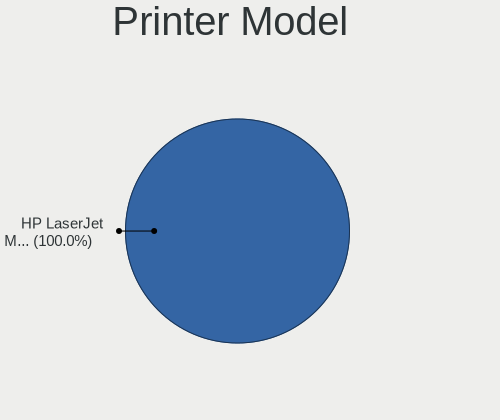

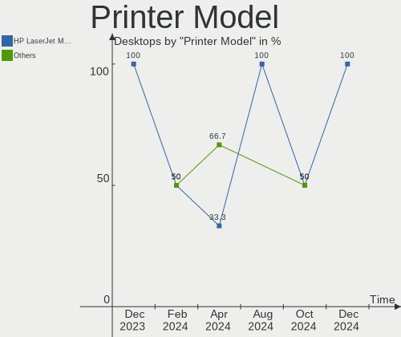

| Model                        | Desktops | Percent |
|------------------------------|----------|---------|
| HP LaserJet M14-M17          | 1        | 50%     |
| Brother QL-500 label printer | 1        | 50%     |

Scanner Vendor
--------------

Scanner device vendors

Zero info for selected period =(

Scanner Model
-------------

Scanner device models

Zero info for selected period =(

Camera
------

Camera Vendor
-------------

Camera device vendors

| Vendor              | Desktops | Percent |
|---------------------|----------|---------|
| Logitech            | 7        | 70%     |
| Trust               | 1        | 10%     |
| Microdia            | 1        | 10%     |
| Creative Technology | 1        | 10%     |

Camera Model
------------

Camera device models

| Model                               | Desktops | Percent |
|-------------------------------------|----------|---------|
| Logitech HD Pro Webcam C920         | 2        | 18.18%  |
| Trust QHD Webcam                    | 1        | 9.09%   |
| Microdia USB 2.0 Camera             | 1        | 9.09%   |
| Logitech Webcam C170                | 1        | 9.09%   |
| Logitech StreamCam                  | 1        | 9.09%   |
| Logitech QuickCam Orbit/Sphere AF   | 1        | 9.09%   |
| Logitech HD Webcam C910             | 1        | 9.09%   |
| Logitech HD Webcam C525             | 1        | 9.09%   |
| Logitech C922 Pro Stream Webcam     | 1        | 9.09%   |
| Creative Live! Cam Chat HD [VF0700] | 1        | 9.09%   |

Security
--------

Fingerprint Vendor
------------------

Fingerprint sensor vendors

| Vendor         | Desktops | Percent |
|----------------|----------|---------|
| DigitalPersona | 1        | 100%    |

Fingerprint Model
-----------------

Fingerprint sensor models

| Model                             | Desktops | Percent |
|-----------------------------------|----------|---------|
| DigitalPersona Fingerprint Reader | 1        | 100%    |

Chipcard Vendor
---------------

Chipcard module vendors

| Vendor           | Desktops | Percent |
|------------------|----------|---------|
| SCM Microsystems | 1        | 100%    |

Chipcard Model
--------------

Chipcard module models

| Model                                                  | Desktops | Percent |
|--------------------------------------------------------|----------|---------|
| SCM Microsystems SCR331-LC1 / SCR3310 SmartCard Reader | 1        | 100%    |

Unsupported
-----------

Unsupported Devices
-------------------

Total unsupported devices on board

| Total | Desktops | Percent |
|-------|----------|---------|
| 0     | 18       | 56.25%  |
| 1     | 6        | 18.75%  |
| 2     | 5        | 15.63%  |
| 4     | 2        | 6.25%   |
| 5     | 1        | 3.13%   |

Unsupported Device Types
------------------------

Types of unsupported devices

| Type                     | Desktops | Percent |
|--------------------------|----------|---------|
| Net/wireless             | 5        | 20%     |
| Graphics card            | 5        | 20%     |
| Sound                    | 4        | 16%     |
| Bluetooth                | 3        | 12%     |
| Communication controller | 2        | 8%      |
| Storage/ata              | 1        | 4%      |
| Network                  | 1        | 4%      |
| Net/ethernet             | 1        | 4%      |
| Multimedia controller    | 1        | 4%      |
| Firewire controller      | 1        | 4%      |
| Fingerprint reader       | 1        | 4%      |

