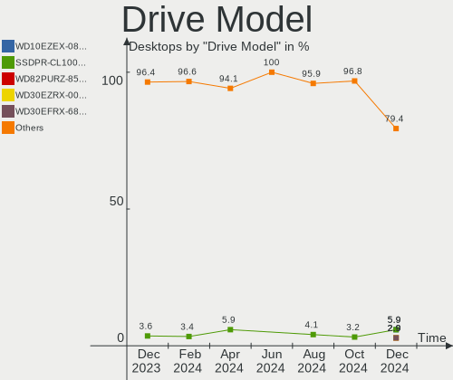

Gentoo - Hardware Trends (Desktops)
-----------------------------------

A project to identify most popular hardware characteristics and track their change
over time based on data collected by Linux users at https://Linux-Hardware.org.

Anyone can contribute to this report by the [hw-probe](https://github.com/linuxhw/hw-probe) tool:

    sudo -E hw-probe -all -upload

This report is for one last month. Overall report since the beginning of time: [TestDays](https://github.com/linuxhw/TestDays)

Period: Apr, 2023.

Contents
--------

* [ System ](#system)
  - [ OS                       ](#os)
  - [ OS Family                ](#os-family)
  - [ Kernel                   ](#kernel)
  - [ Kernel Family            ](#kernel-family)
  - [ Kernel Major Ver.        ](#kernel-major-ver)
  - [ Arch                     ](#arch)
  - [ DE                       ](#de)
  - [ Display Server           ](#display-server)
  - [ Display Manager          ](#display-manager)
  - [ OS Lang                  ](#os-lang)
  - [ Boot Mode                ](#boot-mode)
  - [ Filesystem               ](#filesystem)
  - [ Part. scheme             ](#part-scheme)
  - [ Dual Boot with Linux/BSD ](#dual-boot-with-linuxbsd)
  - [ Dual Boot (Win)          ](#dual-boot-win)

* [ Board ](#board)
  - [ Vendor                   ](#vendor)
  - [ Model                    ](#model)
  - [ Model Family             ](#model-family)
  - [ MFG Year                 ](#mfg-year)
  - [ Form Factor              ](#form-factor)
  - [ Secure Boot              ](#secure-boot)
  - [ Coreboot                 ](#coreboot)
  - [ RAM Size                 ](#ram-size)
  - [ RAM Used                 ](#ram-used)
  - [ Total Drives             ](#total-drives)
  - [ Has CD-ROM               ](#has-cd-rom)
  - [ Has Ethernet             ](#has-ethernet)
  - [ Has WiFi                 ](#has-wifi)
  - [ Has Bluetooth            ](#has-bluetooth)

* [ Location ](#location)
  - [ Country                  ](#country)
  - [ City                     ](#city)

* [ Drives ](#drives)
  - [ Drive Vendor             ](#drive-vendor)
  - [ Drive Model              ](#drive-model)
  - [ HDD Vendor               ](#hdd-vendor)
  - [ SSD Vendor               ](#ssd-vendor)
  - [ Drive Kind               ](#drive-kind)
  - [ Drive Connector          ](#drive-connector)
  - [ Drive Size               ](#drive-size)
  - [ Space Total              ](#space-total)
  - [ Space Used               ](#space-used)
  - [ Malfunc. Drives          ](#malfunc-drives)
  - [ Malfunc. Drive Vendor    ](#malfunc-drive-vendor)
  - [ Malfunc. HDD Vendor      ](#malfunc-hdd-vendor)
  - [ Malfunc. Drive Kind      ](#malfunc-drive-kind)
  - [ Failed Drives            ](#failed-drives)
  - [ Failed Drive Vendor      ](#failed-drive-vendor)
  - [ Drive Status             ](#drive-status)

* [ Storage controller ](#storage-controller)
  - [ Storage Vendor           ](#storage-vendor)
  - [ Storage Model            ](#storage-model)
  - [ Storage Kind             ](#storage-kind)

* [ Processor ](#processor)
  - [ CPU Vendor               ](#cpu-vendor)
  - [ CPU Model                ](#cpu-model)
  - [ CPU Model Family         ](#cpu-model-family)
  - [ CPU Cores                ](#cpu-cores)
  - [ CPU Sockets              ](#cpu-sockets)
  - [ CPU Threads              ](#cpu-threads)
  - [ CPU Op-Modes             ](#cpu-op-modes)
  - [ CPU Microcode            ](#cpu-microcode)
  - [ CPU Microarch            ](#cpu-microarch)

* [ Graphics ](#graphics)
  - [ GPU Vendor               ](#gpu-vendor)
  - [ GPU Model                ](#gpu-model)
  - [ GPU Combo                ](#gpu-combo)
  - [ GPU Driver               ](#gpu-driver)
  - [ GPU Memory               ](#gpu-memory)

* [ Monitor ](#monitor)
  - [ Monitor Vendor           ](#monitor-vendor)
  - [ Monitor Model            ](#monitor-model)
  - [ Monitor Resolution       ](#monitor-resolution)
  - [ Monitor Diagonal         ](#monitor-diagonal)
  - [ Monitor Width            ](#monitor-width)
  - [ Aspect Ratio             ](#aspect-ratio)
  - [ Monitor Area             ](#monitor-area)
  - [ Pixel Density            ](#pixel-density)
  - [ Multiple Monitors        ](#multiple-monitors)

* [ Network ](#network)
  - [ Net Controller Vendor    ](#net-controller-vendor)
  - [ Net Controller Model     ](#net-controller-model)
  - [ Wireless Vendor          ](#wireless-vendor)
  - [ Wireless Model           ](#wireless-model)
  - [ Ethernet Vendor          ](#ethernet-vendor)
  - [ Ethernet Model           ](#ethernet-model)
  - [ Net Controller Kind      ](#net-controller-kind)
  - [ Used Controller          ](#used-controller)
  - [ NICs                     ](#nics)
  - [ IPv6                     ](#ipv6)

* [ Bluetooth ](#bluetooth)
  - [ Bluetooth Vendor         ](#bluetooth-vendor)
  - [ Bluetooth Model          ](#bluetooth-model)

* [ Sound ](#sound)
  - [ Sound Vendor             ](#sound-vendor)
  - [ Sound Model              ](#sound-model)

* [ Memory ](#memory)
  - [ Memory Vendor            ](#memory-vendor)
  - [ Memory Model             ](#memory-model)
  - [ Memory Kind              ](#memory-kind)
  - [ Memory Form Factor       ](#memory-form-factor)
  - [ Memory Size              ](#memory-size)
  - [ Memory Speed             ](#memory-speed)

* [ Printers & scanners ](#printers--scanners)
  - [ Printer Vendor           ](#printer-vendor)
  - [ Printer Model            ](#printer-model)
  - [ Scanner Vendor           ](#scanner-vendor)
  - [ Scanner Model            ](#scanner-model)

* [ Camera ](#camera)
  - [ Camera Vendor            ](#camera-vendor)
  - [ Camera Model             ](#camera-model)

* [ Security ](#security)
  - [ Fingerprint Vendor       ](#fingerprint-vendor)
  - [ Fingerprint Model        ](#fingerprint-model)
  - [ Chipcard Vendor          ](#chipcard-vendor)
  - [ Chipcard Model           ](#chipcard-model)

* [ Unsupported ](#unsupported)
  - [ Unsupported Devices      ](#unsupported-devices)
  - [ Unsupported Device Types ](#unsupported-device-types)

System
------

OS
--

Installed operating systems

| Name        | Desktops | Percent |
|-------------|----------|---------|
| Gentoo 2.13 | 32       | 94.12%  |
| Gentoo 2.9  | 2        | 5.88%   |

OS Family
---------

OS without a version

| Name   | Desktops | Percent |
|--------|----------|---------|
| Gentoo | 34       | 100%    |

Kernel
------

Version of the Linux kernel

| Version              | Desktops | Percent |
|----------------------|----------|---------|
| 6.1.19-gentoo        | 7        | 20.59%  |
| 6.1.19-gentoo-x86_64 | 6        | 17.65%  |
| 6.2.11-gentoo        | 4        | 11.76%  |
| 6.2.11-gentoo-x86_64 | 3        | 8.82%   |
| 6.2.9-gentoo-x86_64  | 2        | 5.88%   |
| 6.1.22-gentoo-dist   | 2        | 5.88%   |
| 6.1.12-gentoo-x86_64 | 2        | 5.88%   |
| 6.3.0-gentoo-x86_64  | 1        | 2.94%   |
| 6.3.0-gentoo         | 1        | 2.94%   |
| 6.2.9-xanmod1        | 1        | 2.94%   |
| 6.2.9-gentoo-dist    | 1        | 2.94%   |
| 6.2.8-gentoo-x86_64  | 1        | 2.94%   |
| 6.2.12-gentoo-x86_64 | 1        | 2.94%   |
| 6.2.10-cachyos       | 1        | 2.94%   |
| 6.2.0-gentoo-x86_64  | 1        | 2.94%   |

Kernel Family
-------------

Linux kernel without a distro release

| Version | Desktops | Percent |
|---------|----------|---------|
| 6.1.19  | 13       | 38.24%  |
| 6.2.11  | 7        | 20.59%  |
| 6.2.9   | 4        | 11.76%  |
| 6.3.0   | 2        | 5.88%   |
| 6.1.22  | 2        | 5.88%   |
| 6.1.12  | 2        | 5.88%   |
| 6.2.8   | 1        | 2.94%   |
| 6.2.12  | 1        | 2.94%   |
| 6.2.10  | 1        | 2.94%   |
| 6.2.0   | 1        | 2.94%   |

Kernel Major Ver.
-----------------

Linux kernel major version

| Version | Desktops | Percent |
|---------|----------|---------|
| 6.1     | 17       | 50%     |
| 6.2     | 15       | 44.12%  |
| 6.3     | 2        | 5.88%   |

Arch
----

OS architecture (x86_64, i586, etc.)

| Name   | Desktops | Percent |
|--------|----------|---------|
| x86_64 | 34       | 100%    |

DE
--

Desktop Environment

| Name    | Desktops | Percent |
|---------|----------|---------|
| Unknown | 11       | 32.35%  |
| KDE5    | 10       | 29.41%  |
| XFCE    | 6        | 17.65%  |
| MATE    | 2        | 5.88%   |
| LXQt    | 2        | 5.88%   |
| GNOME   | 2        | 5.88%   |
| LXDE    | 1        | 2.94%   |

Display Server
--------------

X11 or Wayland

| Name    | Desktops | Percent |
|---------|----------|---------|
| X11     | 16       | 47.06%  |
| Tty     | 9        | 26.47%  |
| Unknown | 6        | 17.65%  |
| Wayland | 3        | 8.82%   |

Display Manager
---------------

SDDM, LightDM, etc.

| Name    | Desktops | Percent |
|---------|----------|---------|
| SDDM    | 12       | 35.29%  |
| Unknown | 12       | 35.29%  |
| LightDM | 7        | 20.59%  |
| SLiM    | 1        | 2.94%   |
| LXDM    | 1        | 2.94%   |
| GDM     | 1        | 2.94%   |

OS Lang
-------

Language

| Lang    | Desktops | Percent |
|---------|----------|---------|
| en_US   | 10       | 29.41%  |
| Unknown | 6        | 17.65%  |
| en_GB   | 5        | 14.71%  |
| en_IE   | 4        | 11.76%  |
| C       | 3        | 8.82%   |
| ru_RU   | 1        | 2.94%   |
| pl_PL   | 1        | 2.94%   |
| it_IT   | 1        | 2.94%   |
| de_DE   | 1        | 2.94%   |
| ca_ES   | 1        | 2.94%   |
| C.UTF8  | 1        | 2.94%   |

Boot Mode
---------

EFI or BIOS

| Mode | Desktops | Percent |
|------|----------|---------|
| EFI  | 19       | 55.88%  |
| BIOS | 15       | 44.12%  |

Filesystem
----------

Type of filesystem

| Type  | Desktops | Percent |
|-------|----------|---------|
| Ext4  | 19       | 55.88%  |
| Btrfs | 9        | 26.47%  |
| F2fs  | 4        | 11.76%  |
| Zfs   | 1        | 2.94%   |
| Xfs   | 1        | 2.94%   |

Part. scheme
------------

Scheme of partitioning

| Type    | Desktops | Percent |
|---------|----------|---------|
| GPT     | 28       | 82.35%  |
| MBR     | 4        | 11.76%  |
| Unknown | 2        | 5.88%   |

Dual Boot with Linux/BSD
------------------------

Hosting more than one Linux/BSD

| Dual boot | Desktops | Percent |
|-----------|----------|---------|
| No        | 22       | 64.71%  |
| Yes       | 12       | 35.29%  |

Dual Boot (Win)
---------------

Hosting Linux and Windows

| Dual boot | Desktops | Percent |
|-----------|----------|---------|
| No        | 28       | 82.35%  |
| Yes       | 6        | 17.65%  |

Board
-----

Vendor
------

Motherboard manufacturer

| Name                | Desktops | Percent |
|---------------------|----------|---------|
| ASUSTek Computer    | 18       | 52.94%  |
| Gigabyte Technology | 5        | 14.71%  |
| Hewlett-Packard     | 3        | 8.82%   |
| ASRock              | 3        | 8.82%   |
| ZOTAC               | 1        | 2.94%   |
| MSI                 | 1        | 2.94%   |
| Intel               | 1        | 2.94%   |
| HPE                 | 1        | 2.94%   |
| Unknown             | 1        | 2.94%   |

Model
-----

Motherboard model

| Name                                | Desktops | Percent |
|-------------------------------------|----------|---------|
| HP ProLiant MicroServer Gen8        | 3        | 8.82%   |
| ASUS TUF Gaming X570-PLUS           | 2        | 5.88%   |
| ASUS ROG STRIX Z590-F GAMING WIFI   | 2        | 5.88%   |
| ASUS M3A78-CM                       | 2        | 5.88%   |
| ASUS All Series                     | 2        | 5.88%   |
| ZOTAC H67ITX-C-E                    | 1        | 2.94%   |
| MSI MS-7B85                         | 1        | 2.94%   |
| Intel T series                      | 1        | 2.94%   |
| HPE ProLiant MicroServer Gen10 Plus | 1        | 2.94%   |
| Gigabyte X670E AORUS MASTER         | 1        | 2.94%   |
| Gigabyte X570S AORUS ELITE AX       | 1        | 2.94%   |
| Gigabyte B460HD3                    | 1        | 2.94%   |
| Gigabyte B450M DS3H V2              | 1        | 2.94%   |
| Gigabyte AB350-Gaming               | 1        | 2.94%   |
| ASUS TUF Gaming B550-PLUS           | 1        | 2.94%   |
| ASUS SABERTOOTH X58                 | 1        | 2.94%   |
| ASUS ROG STRIX X570-E GAMING        | 1        | 2.94%   |
| ASUS ROG Maximus Z690 HERO          | 1        | 2.94%   |
| ASUS ROG CROSSHAIR VIII HERO        | 1        | 2.94%   |
| ASUS PRIME Z490-A                   | 1        | 2.94%   |
| ASUS PRIME H370M-PLUS               | 1        | 2.94%   |
| ASUS PRIME B650M-A AX               | 1        | 2.94%   |
| ASUS P6X58D PREMIUM                 | 1        | 2.94%   |
| ASUS CM6630_CM6730_CM6830           | 1        | 2.94%   |
| ASRock X370 Gaming X                | 1        | 2.94%   |
| ASRock B550M Pro4                   | 1        | 2.94%   |
| ASRock B450M Steel Legend           | 1        | 2.94%   |
| Unknown                             | 1        | 2.94%   |

Model Family
------------

Motherboard model prefix

| Name                  | Desktops | Percent |
|-----------------------|----------|---------|
| ASUS ROG              | 5        | 14.71%  |
| HP ProLiant           | 3        | 8.82%   |
| ASUS TUF              | 3        | 8.82%   |
| ASUS PRIME            | 3        | 8.82%   |
| ASUS M3A78-CM         | 2        | 5.88%   |
| ASUS All              | 2        | 5.88%   |
| ZOTAC H67ITX-C-E      | 1        | 2.94%   |
| MSI MS-7B85           | 1        | 2.94%   |
| Intel T               | 1        | 2.94%   |
| HPE ProLiant          | 1        | 2.94%   |
| Gigabyte X670E        | 1        | 2.94%   |
| Gigabyte X570S        | 1        | 2.94%   |
| Gigabyte B460HD3      | 1        | 2.94%   |
| Gigabyte B450M        | 1        | 2.94%   |
| Gigabyte AB350-Gaming | 1        | 2.94%   |
| ASUS SABERTOOTH       | 1        | 2.94%   |
| ASUS P6X58D           | 1        | 2.94%   |
| ASUS CM6630           | 1        | 2.94%   |
| ASRock X370           | 1        | 2.94%   |
| ASRock B550M          | 1        | 2.94%   |
| ASRock B450M          | 1        | 2.94%   |
| Unknown               | 1        | 2.94%   |

MFG Year
--------

Motherboard manufacture year

| Year | Desktops | Percent |
|------|----------|---------|
| 2020 | 8        | 23.53%  |
| 2021 | 4        | 11.76%  |
| 2019 | 4        | 11.76%  |
| 2013 | 4        | 11.76%  |
| 2010 | 3        | 8.82%   |
| 2017 | 2        | 5.88%   |
| 2012 | 2        | 5.88%   |
| 2008 | 2        | 5.88%   |
| 2023 | 1        | 2.94%   |
| 2022 | 1        | 2.94%   |
| 2018 | 1        | 2.94%   |
| 2014 | 1        | 2.94%   |
| 2011 | 1        | 2.94%   |

Form Factor
-----------

Physical design of the computer

| Name    | Desktops | Percent |
|---------|----------|---------|
| Desktop | 34       | 100%    |

Secure Boot
-----------

Enabled or disabled

| State    | Desktops | Percent |
|----------|----------|---------|
| Disabled | 34       | 100%    |

Coreboot
--------

Have coreboot on board

| Used | Desktops | Percent |
|------|----------|---------|
| No   | 34       | 100%    |

RAM Size
--------

Total RAM memory

| Size in GB  | Desktops | Percent |
|-------------|----------|---------|
| 32.01-64.0  | 11       | 32.35%  |
| 64.01-256.0 | 6        | 17.65%  |
| 16.01-24.0  | 6        | 17.65%  |
| 8.01-16.0   | 4        | 11.76%  |
| 24.01-32.0  | 3        | 8.82%   |
| 4.01-8.0    | 2        | 5.88%   |
| 3.01-4.0    | 1        | 2.94%   |
| 1.01-2.0    | 1        | 2.94%   |

RAM Used
--------

Used RAM memory

| Used GB    | Desktops | Percent |
|------------|----------|---------|
| 2.01-3.0   | 11       | 32.35%  |
| 4.01-8.0   | 9        | 26.47%  |
| 3.01-4.0   | 4        | 11.76%  |
| 1.01-2.0   | 3        | 8.82%   |
| 8.01-16.0  | 3        | 8.82%   |
| 0.51-1.0   | 3        | 8.82%   |
| 24.01-32.0 | 1        | 2.94%   |

Total Drives
------------

Number of drives on board

| Drives | Desktops | Percent |
|--------|----------|---------|
| 1      | 8        | 23.53%  |
| 3      | 7        | 20.59%  |
| 5      | 5        | 14.71%  |
| 2      | 5        | 14.71%  |
| 7      | 3        | 8.82%   |
| 6      | 3        | 8.82%   |
| 4      | 2        | 5.88%   |
| 13     | 1        | 2.94%   |

Has CD-ROM
----------

Has CD-ROM on board

| Presented | Desktops | Percent |
|-----------|----------|---------|
| No        | 23       | 67.65%  |
| Yes       | 11       | 32.35%  |

Has Ethernet
------------

Has Ethernet on board

| Presented | Desktops | Percent |
|-----------|----------|---------|
| Yes       | 33       | 97.06%  |
| No        | 1        | 2.94%   |

Has WiFi
--------

Has WiFi module

| Presented | Desktops | Percent |
|-----------|----------|---------|
| No        | 22       | 64.71%  |
| Yes       | 12       | 35.29%  |

Has Bluetooth
-------------

Has Bluetooth module

| Presented | Desktops | Percent |
|-----------|----------|---------|
| No        | 22       | 64.71%  |
| Yes       | 12       | 35.29%  |

Location
--------

Country
-------

Geographic location (country)

| Country    | Desktops | Percent |
|------------|----------|---------|
| USA        | 9        | 26.47%  |
| UK         | 5        | 14.71%  |
| Germany    | 5        | 14.71%  |
| France     | 4        | 11.76%  |
| Poland     | 3        | 8.82%   |
| Canada     | 2        | 5.88%   |
| Vietnam    | 1        | 2.94%   |
| Spain      | 1        | 2.94%   |
| Luxembourg | 1        | 2.94%   |
| Italy      | 1        | 2.94%   |
| Indonesia  | 1        | 2.94%   |
| Czechia    | 1        | 2.94%   |

City
----

Geographic location (city)

| City              | Desktops | Percent |
|-------------------|----------|---------|
| Paris             | 4        | 11.76%  |
| Warsaw            | 3        | 8.82%   |
| Sterling          | 3        | 8.82%   |
| Frankfurt am Main | 3        | 8.82%   |
| Leeds             | 2        | 5.88%   |
| West Chicago      | 1        | 2.94%   |
| Surabaya          | 1        | 2.94%   |
| Pozzuoli          | 1        | 2.94%   |
| Parsippany        | 1        | 2.94%   |
| Norwich           | 1        | 2.94%   |
| Minneapolis       | 1        | 2.94%   |
| Luxembourg        | 1        | 2.94%   |
| Kon Tum           | 1        | 2.94%   |
| Kippens           | 1        | 2.94%   |
| Huddersfield      | 1        | 2.94%   |
| Gatineau          | 1        | 2.94%   |
| Fort Wayne        | 1        | 2.94%   |
| Flint             | 1        | 2.94%   |
| Eugene            | 1        | 2.94%   |
| Eschweiler        | 1        | 2.94%   |
| Cologne           | 1        | 2.94%   |
| Český Těšín  | 1        | 2.94%   |
| Beaverton         | 1        | 2.94%   |
| Barcelona         | 1        | 2.94%   |

Drives
------

Drive Vendor
------------

Hard drive vendors

| Vendor                    | Desktops | Drives | Percent |
|---------------------------|----------|--------|---------|
| Samsung Electronics       | 14       | 18     | 17.95%  |
| WDC                       | 13       | 33     | 16.67%  |
| Seagate                   | 12       | 25     | 15.38%  |
| SanDisk                   | 7        | 7      | 8.97%   |
| Toshiba                   | 4        | 5      | 5.13%   |
| Kingston                  | 4        | 4      | 5.13%   |
| Crucial                   | 4        | 4      | 5.13%   |
| China                     | 4        | 7      | 5.13%   |
| Phison Electronics        | 3        | 3      | 3.85%   |
| GOODRAM                   | 3        | 3      | 3.85%   |
| V-GeN                     | 1        | 1      | 1.28%   |
| Silicon Motion            | 1        | 1      | 1.28%   |
| PNY                       | 1        | 3      | 1.28%   |
| Phison                    | 1        | 1      | 1.28%   |
| Micron/Crucial Technology | 1        | 2      | 1.28%   |
| Micron Technology         | 1        | 1      | 1.28%   |
| Intel                     | 1        | 1      | 1.28%   |
| Hitachi                   | 1        | 3      | 1.28%   |
| ADROITLARK                | 1        | 1      | 1.28%   |
| A-DATA Technology         | 1        | 1      | 1.28%   |

Drive Model
-----------

Hard drive models

| Model                                                  | Desktops | Percent |
|--------------------------------------------------------|----------|---------|
| Samsung NVMe SSD Controller PM9A1/PM9A3/980PRO 2TB     | 5        | 4.9%    |
| Samsung NVMe SSD Controller SM981/PM981/PM983 1TB      | 4        | 3.92%   |
| WDC WD40EZRZ-00GXCB0 4TB                               | 2        | 1.96%   |
| WDC WD30EFRX-68EUZN0 3TB                               | 2        | 1.96%   |
| WDC WD30EFRX-68AX9N0 3TB                               | 2        | 1.96%   |
| Seagate ST4000DM004-2CV104 4TB                         | 2        | 1.96%   |
| Seagate ST2000DM008-2FR102 2TB                         | 2        | 1.96%   |
| Sandisk WD Blue SN550 NVMe SSD 1024GB                  | 2        | 1.96%   |
| Samsung SSD 980 1TB                                    | 2        | 1.96%   |
| GOODRAM SSDPR-CL100-480-G2 480GB                       | 2        | 1.96%   |
| Crucial CT1000MX500SSD1 1TB                            | 2        | 1.96%   |
| China SATA SSD 960GB                                   | 2        | 1.96%   |
| WDC WDS200T2B0B-00YS70 2TB SSD                         | 1        | 0.98%   |
| WDC WD60PURZ-85ZUFY1 6TB                               | 1        | 0.98%   |
| WDC WD60EZAZ-00SF3B0 6TB                               | 1        | 0.98%   |
| WDC WD60EFZX-68B3FN0 6TB                               | 1        | 0.98%   |
| WDC WD60EFAX-68SHWN0 6TB                               | 1        | 0.98%   |
| WDC WD5000LPLX-66ZNTT1 500GB                           | 1        | 0.98%   |
| WDC WD40EZRZ-00WN9B0 4TB                               | 1        | 0.98%   |
| WDC WD40EZRX-22SPEB0 4TB                               | 1        | 0.98%   |
| WDC WD30PURX-64P6ZY0 3TB                               | 1        | 0.98%   |
| WDC WD30EFRX-68N32N0 3TB                               | 1        | 0.98%   |
| WDC WD20EFRX-68EUZN0 2TB                               | 1        | 0.98%   |
| WDC WD20EARX-00PASB0 2TB                               | 1        | 0.98%   |
| WDC WD20EARS-00MVWB0 2TB                               | 1        | 0.98%   |
| WDC WD2003FZEX-00SRLA0 2TB                             | 1        | 0.98%   |
| WDC WD2002FAEX-007BA0 2TB                              | 1        | 0.98%   |
| WDC WD1502FYPS-02W3B0 1TB                              | 1        | 0.98%   |
| WDC WD120EFBX-68B0EN0 12TB                             | 1        | 0.98%   |
| WDC WD10EZEX-08M2NA0 1TB                               | 1        | 0.98%   |
| WDC WD1001FALS-00J7B1 1TB                              | 1        | 0.98%   |
| WDC WD1000FYPS-01ZKB0 1TB                              | 1        | 0.98%   |
| V-GeN V-GEN11AS19FS120SS 120GB SSD                     | 1        | 0.98%   |
| Toshiba HDWR480 8TB                                    | 1        | 0.98%   |
| Toshiba HDWE150 5TB                                    | 1        | 0.98%   |
| Toshiba HDWD130 3TB                                    | 1        | 0.98%   |
| Toshiba HDWA120 2TB                                    | 1        | 0.98%   |
| Toshiba DT01ACA200 2TB                                 | 1        | 0.98%   |
| Silicon Motion SM2263EN/SM2263XT SSD Controller 1024GB | 1        | 0.98%   |
| Seagate ST8000DM004-2U9188 8TB                         | 1        | 0.98%   |

HDD Vendor
----------

Hard disk drive vendors

| Vendor              | Desktops | Drives | Percent |
|---------------------|----------|--------|---------|
| WDC                 | 12       | 32     | 40%     |
| Seagate             | 12       | 24     | 40%     |
| Toshiba             | 4        | 5      | 13.33%  |
| Samsung Electronics | 1        | 1      | 3.33%   |
| Hitachi             | 1        | 3      | 3.33%   |

SSD Vendor
----------

Solid state drive vendors

| Vendor              | Desktops | Drives | Percent |
|---------------------|----------|--------|---------|
| Samsung Electronics | 5        | 5      | 16.67%  |
| SanDisk             | 4        | 4      | 13.33%  |
| Crucial             | 4        | 4      | 13.33%  |
| China               | 4        | 7      | 13.33%  |
| Kingston            | 3        | 3      | 10%     |
| GOODRAM             | 3        | 3      | 10%     |
| WDC                 | 1        | 1      | 3.33%   |
| V-GeN               | 1        | 1      | 3.33%   |
| PNY                 | 1        | 3      | 3.33%   |
| Micron Technology   | 1        | 1      | 3.33%   |
| Intel               | 1        | 1      | 3.33%   |
| ADROITLARK          | 1        | 1      | 3.33%   |
| A-DATA Technology   | 1        | 1      | 3.33%   |

Drive Kind
----------

HDD or SSD

| Kind    | Desktops | Drives | Percent |
|---------|----------|--------|---------|
| SSD     | 23       | 35     | 38.33%  |
| HDD     | 20       | 65     | 33.33%  |
| NVMe    | 15       | 22     | 25%     |
| Unknown | 2        | 2      | 3.33%   |

Drive Connector
---------------

SATA, SAS, NVMe, etc.

| Type | Desktops | Drives | Percent |
|------|----------|--------|---------|
| SATA | 31       | 100    | 64.58%  |
| NVMe | 15       | 22     | 31.25%  |
| SAS  | 2        | 2      | 4.17%   |

Drive Size
----------

Size of hard drive

| Size in TB | Desktops | Drives | Percent |
|------------|----------|--------|---------|
| 0.01-0.5   | 16       | 24     | 26.67%  |
| 0.51-1.0   | 14       | 19     | 23.33%  |
| 1.01-2.0   | 9        | 16     | 15%     |
| 3.01-4.0   | 8        | 12     | 13.33%  |
| 4.01-10.0  | 7        | 15     | 11.67%  |
| 2.01-3.0   | 4        | 12     | 6.67%   |
| 10.01-20.0 | 2        | 2      | 3.33%   |

Space Total
-----------

Amount of disk space available on the file system

| Size in GB     | Desktops | Percent |
|----------------|----------|---------|
| More than 3000 | 15       | 44.12%  |
| 501-1000       | 5        | 14.71%  |
| 2001-3000      | 4        | 11.76%  |
| 101-250        | 3        | 8.82%   |
| 1001-2000      | 3        | 8.82%   |
| 251-500        | 2        | 5.88%   |
| 1-20           | 2        | 5.88%   |

Space Used
----------

Amount of used disk space

| Used GB        | Desktops | Percent |
|----------------|----------|---------|
| More than 3000 | 10       | 29.41%  |
| 501-1000       | 6        | 17.65%  |
| 251-500        | 5        | 14.71%  |
| 1-20           | 4        | 11.76%  |
| 101-250        | 3        | 8.82%   |
| 1001-2000      | 3        | 8.82%   |
| 21-50          | 1        | 2.94%   |
| 2001-3000      | 1        | 2.94%   |
| 51-100         | 1        | 2.94%   |

Malfunc. Drives
---------------

Drive models with a malfunction

| Model                        | Desktops | Drives | Percent |
|------------------------------|----------|--------|---------|
| WDC WD60PURZ-85ZUFY1 6TB     | 1        | 1      | 14.29%  |
| WDC WD60EFAX-68SHWN0 6TB     | 1        | 1      | 14.29%  |
| WDC WD30EFRX-68AX9N0 3TB     | 1        | 1      | 14.29%  |
| Toshiba DT01ACA200 2TB       | 1        | 1      | 14.29%  |
| Seagate ST3500630NS 500GB    | 1        | 2      | 14.29%  |
| Crucial M4-CT512M4SSD2 512GB | 1        | 1      | 14.29%  |
| China SATA SSD 960GB         | 1        | 1      | 14.29%  |

Malfunc. Drive Vendor
---------------------

Vendors of faulty drives

| Vendor  | Desktops | Drives | Percent |
|---------|----------|--------|---------|
| WDC     | 2        | 3      | 33.33%  |
| Toshiba | 1        | 1      | 16.67%  |
| Seagate | 1        | 2      | 16.67%  |
| Crucial | 1        | 1      | 16.67%  |
| China   | 1        | 1      | 16.67%  |

Malfunc. HDD Vendor
-------------------

Vendors of faulty HDD drives

| Vendor  | Desktops | Drives | Percent |
|---------|----------|--------|---------|
| WDC     | 2        | 3      | 50%     |
| Toshiba | 1        | 1      | 25%     |
| Seagate | 1        | 2      | 25%     |

Malfunc. Drive Kind
-------------------

Kinds of faulty drives

| Kind | Desktops | Drives | Percent |
|------|----------|--------|---------|
| HDD  | 3        | 6      | 60%     |
| SSD  | 2        | 2      | 40%     |

Failed Drives
-------------

Failed drive models

| Model                    | Desktops | Drives | Percent |
|--------------------------|----------|--------|---------|
| WDC WD20EARS-00MVWB0 2TB | 1        | 2      | 100%    |

Failed Drive Vendor
-------------------

Failed drive vendors

| Vendor | Desktops | Drives | Percent |
|--------|----------|--------|---------|
| WDC    | 1        | 2      | 100%    |

Drive Status
------------

Number of failed and malfunc. drives

| Status   | Desktops | Drives | Percent |
|----------|----------|--------|---------|
| Works    | 31       | 106    | 75.61%  |
| Malfunc  | 5        | 8      | 12.2%   |
| Detected | 4        | 8      | 9.76%   |
| Failed   | 1        | 2      | 2.44%   |

Storage controller
------------------

Storage Vendor
--------------

Storage controller vendors

| Vendor                      | Desktops | Percent |
|-----------------------------|----------|---------|
| Intel                       | 18       | 28.13%  |
| AMD                         | 15       | 23.44%  |
| Samsung Electronics         | 9        | 14.06%  |
| ASMedia Technology          | 6        | 9.38%   |
| Marvell Technology Group    | 4        | 6.25%   |
| SanDisk                     | 3        | 4.69%   |
| Phison Electronics          | 3        | 4.69%   |
| JMicron Technology          | 2        | 3.13%   |
| Silicon Motion              | 1        | 1.56%   |
| Silicon Image               | 1        | 1.56%   |
| Micron/Crucial Technology   | 1        | 1.56%   |
| Kingston Technology Company | 1        | 1.56%   |

Storage Model
-------------

Storage controller models

| Model                                                                                   | Desktops | Percent |
|-----------------------------------------------------------------------------------------|----------|---------|
| AMD FCH SATA Controller [AHCI mode]                                                     | 10       | 13.16%  |
| Samsung NVMe SSD Controller PM9A1/PM9A3/980PRO                                          | 5        | 6.58%   |
| ASMedia ASM1062 Serial ATA Controller                                                   | 5        | 6.58%   |
| Samsung NVMe SSD Controller SM981/PM981/PM983                                           | 4        | 5.26%   |
| Intel 6 Series/C200 Series Chipset Family 6 port Desktop SATA AHCI Controller           | 4        | 5.26%   |
| AMD 400 Series Chipset SATA Controller                                                  | 3        | 3.95%   |
| SanDisk WD Blue SN550 NVMe SSD                                                          | 2        | 2.63%   |
| Samsung NVMe SSD Controller 980                                                         | 2        | 2.63%   |
| Intel NM10/ICH7 Family SATA Controller [AHCI mode]                                      | 2        | 2.63%   |
| Intel Cannon Lake PCH SATA AHCI Controller                                              | 2        | 2.63%   |
| Intel 8 Series/C220 Series Chipset Family 6-port SATA Controller 1 [AHCI mode]          | 2        | 2.63%   |
| Intel 500 Series Chipset Family SATA AHCI Controller                                    | 2        | 2.63%   |
| AMD SB7x0/SB8x0/SB9x0 SATA Controller [IDE mode]                                        | 2        | 2.63%   |
| AMD SB7x0/SB8x0/SB9x0 IDE Controller                                                    | 2        | 2.63%   |
| AMD 500 Series Chipset SATA Controller                                                  | 2        | 2.63%   |
| Silicon Motion SM2263EN/SM2263XT SSD Controller                                         | 1        | 1.32%   |
| Silicon Image SiI 3124 PCI-X Serial ATA Controller                                      | 1        | 1.32%   |
| SanDisk WD Black SN770 NVMe SSD                                                         | 1        | 1.32%   |
| Samsung NVMe SSD Controller SM961/PM961/SM963                                           | 1        | 1.32%   |
| Phison E7 NVMe Controller                                                               | 1        | 1.32%   |
| Phison E16 PCIe4 NVMe Controller                                                        | 1        | 1.32%   |
| Phison E12 NVMe Controller                                                              | 1        | 1.32%   |
| Micron/Crucial NVMe Storage Controller                                                  | 1        | 1.32%   |
| Marvell Group 88SE9230 PCIe 2.0 x2 4-port SATA 6 Gb/s RAID Controller                   | 1        | 1.32%   |
| Marvell Group 88SE9215 PCIe 2.0 x1 4-port SATA 6 Gb/s Controller                        | 1        | 1.32%   |
| Marvell Group 88SE914D SATA-600 Controller                                              | 1        | 1.32%   |
| Marvell Group 88SE9123 PCIe SATA 6.0 Gb/s controller                                    | 1        | 1.32%   |
| Kingston Company NVMe Controller                                                        | 1        | 1.32%   |
| JMicron JMB363 SATA/IDE Controller                                                      | 1        | 1.32%   |
| JMicron JMB360 AHCI Controller                                                          | 1        | 1.32%   |
| Intel Volume Management Device NVMe RAID Controller                                     | 1        | 1.32%   |
| Intel Comet Lake SATA AHCI Controller                                                   | 1        | 1.32%   |
| Intel Alder Lake-S PCH SATA Controller [AHCI Mode]                                      | 1        | 1.32%   |
| Intel 82801JI (ICH10 Family) SATA AHCI Controller                                       | 1        | 1.32%   |
| Intel 82801JI (ICH10 Family) 4 port SATA IDE Controller #1                              | 1        | 1.32%   |
| Intel 82801JI (ICH10 Family) 2 port SATA IDE Controller #2                              | 1        | 1.32%   |
| Intel 6 Series/C200 Series Chipset Family Desktop SATA Controller (IDE mode, ports 4-5) | 1        | 1.32%   |
| Intel 6 Series/C200 Series Chipset Family Desktop SATA Controller (IDE mode, ports 0-3) | 1        | 1.32%   |
| Intel 400 Series Chipset Family SATA AHCI Controller                                    | 1        | 1.32%   |
| ASMedia ASM1166 Serial ATA Controller                                                   | 1        | 1.32%   |

Storage Kind
------------

Kind of storage controller (IDE, SATA, NVMe, SAS, ...)

| Kind | Desktops | Percent |
|------|----------|---------|
| SATA | 32       | 59.26%  |
| NVMe | 15       | 27.78%  |
| IDE  | 5        | 9.26%   |
| RAID | 2        | 3.7%    |

Processor
---------

CPU Vendor
----------

Processor vendors

| Vendor | Desktops | Percent |
|--------|----------|---------|
| Intel  | 18       | 52.94%  |
| AMD    | 16       | 47.06%  |

CPU Model
---------

Processor models

| Model                                   | Desktops | Percent |
|-----------------------------------------|----------|---------|
| Intel Xeon CPU E3-1230 V2 @ 3.30GHz     | 3        | 8.82%   |
| Intel Core i9-10850K CPU @ 3.60GHz      | 2        | 5.88%   |
| AMD Ryzen 7 3700X 8-Core Processor      | 2        | 5.88%   |
| AMD Ryzen 5 5600X 6-Core Processor      | 2        | 5.88%   |
| AMD Phenom II X4 955 Processor          | 2        | 5.88%   |
| Intel Xeon E-2224 CPU @ 3.40GHz         | 1        | 2.94%   |
| Intel Core i7-9700 CPU @ 3.00GHz        | 1        | 2.94%   |
| Intel Core i7-4790 CPU @ 3.60GHz        | 1        | 2.94%   |
| Intel Core i7-4770 CPU @ 3.40GHz        | 1        | 2.94%   |
| Intel Core i7-10700K CPU @ 3.80GHz      | 1        | 2.94%   |
| Intel Core i7 CPU 970 @ 3.20GHz         | 1        | 2.94%   |
| Intel Core i7 CPU 950 @ 3.07GHz         | 1        | 2.94%   |
| Intel Core i5-3450 CPU @ 3.10GHz        | 1        | 2.94%   |
| Intel Core i3-2100T CPU @ 2.50GHz       | 1        | 2.94%   |
| Intel Atom CPU N550 @ 1.50GHz           | 1        | 2.94%   |
| Intel Atom CPU D510 @ 1.66GHz           | 1        | 2.94%   |
| Intel 12th Gen Core i9-12900KS          | 1        | 2.94%   |
| Intel 11th Gen Core i7-11700F @ 2.50GHz | 1        | 2.94%   |
| AMD Ryzen 9 7900X 12-Core Processor     | 1        | 2.94%   |
| AMD Ryzen 9 3950X 16-Core Processor     | 1        | 2.94%   |
| AMD Ryzen 9 3900X 12-Core Processor     | 1        | 2.94%   |
| AMD Ryzen 7 5800X 8-Core Processor      | 1        | 2.94%   |
| AMD Ryzen 7 5700G with Radeon Graphics  | 1        | 2.94%   |
| AMD Ryzen 5 7600X 6-Core Processor      | 1        | 2.94%   |
| AMD Ryzen 5 5500                        | 1        | 2.94%   |
| AMD Ryzen 5 3500X 6-Core Processor      | 1        | 2.94%   |
| AMD Ryzen 5 2600 Six-Core Processor     | 1        | 2.94%   |
| AMD Ryzen 5 1600 Six-Core Processor     | 1        | 2.94%   |

CPU Model Family
----------------

Processor model prefix

| Model            | Desktops | Percent |
|------------------|----------|---------|
| AMD Ryzen 5      | 7        | 20.59%  |
| Intel Core i7    | 6        | 17.65%  |
| Intel Xeon       | 4        | 11.76%  |
| AMD Ryzen 7      | 4        | 11.76%  |
| AMD Ryzen 9      | 3        | 8.82%   |
| Other            | 2        | 5.88%   |
| Intel Core i9    | 2        | 5.88%   |
| Intel Atom       | 2        | 5.88%   |
| AMD Phenom II X4 | 2        | 5.88%   |
| Intel Core i5    | 1        | 2.94%   |
| Intel Core i3    | 1        | 2.94%   |

CPU Cores
---------

Number of processor cores

| Number | Desktops | Percent |
|--------|----------|---------|
| 4      | 10       | 29.41%  |
| 6      | 8        | 23.53%  |
| 8      | 7        | 20.59%  |
| 2      | 3        | 8.82%   |
| 16     | 2        | 5.88%   |
| 12     | 2        | 5.88%   |
| 10     | 2        | 5.88%   |

CPU Sockets
-----------

Number of sockets

| Number | Desktops | Percent |
|--------|----------|---------|
| 1      | 34       | 100%    |

CPU Threads
-----------

Threads per core (Hyper-Threading)

| Number | Desktops | Percent |
|--------|----------|---------|
| 2      | 28       | 82.35%  |
| 1      | 6        | 17.65%  |

CPU Op-Modes
------------

CPU Operation Modes (32-bit, 64-bit)

| Op mode        | Desktops | Percent |
|----------------|----------|---------|
| 32-bit, 64-bit | 34       | 100%    |

CPU Microcode
-------------

Microcode number

| Number     | Desktops | Percent |
|------------|----------|---------|
| Unknown    | 12       | 35.29%  |
| 0x08701021 | 4        | 11.76%  |
| 0x306c3    | 2        | 5.88%   |
| 0x0a601203 | 2        | 5.88%   |
| 0x0a50000d | 2        | 5.88%   |
| 0x0a201016 | 2        | 5.88%   |
| 0xa0655    | 1        | 2.94%   |
| 0x906ed    | 1        | 2.94%   |
| 0x906ea    | 1        | 2.94%   |
| 0x306a9    | 1        | 2.94%   |
| 0x106a5    | 1        | 2.94%   |
| 0x0a20120a | 1        | 2.94%   |
| 0x08701013 | 1        | 2.94%   |
| 0x0800820d | 1        | 2.94%   |
| 0x08001138 | 1        | 2.94%   |
| 0x010000db | 1        | 2.94%   |

CPU Microarch
-------------

Microarchitecture

| Name             | Desktops | Percent |
|------------------|----------|---------|
| Zen 3            | 5        | 14.71%  |
| Zen 2            | 5        | 14.71%  |
| IvyBridge        | 4        | 11.76%  |
| CometLake        | 3        | 8.82%   |
| KabyLake         | 2        | 5.88%   |
| K10              | 2        | 5.88%   |
| Haswell          | 2        | 5.88%   |
| Bonnell          | 2        | 5.88%   |
| Unknown          | 2        | 5.88%   |
| Zen+             | 1        | 2.94%   |
| Zen              | 1        | 2.94%   |
| Westmere         | 1        | 2.94%   |
| SandyBridge      | 1        | 2.94%   |
| Nehalem          | 1        | 2.94%   |
| Icelake          | 1        | 2.94%   |
| Alderlake Hybrid | 1        | 2.94%   |

Graphics
--------

GPU Vendor
----------

Vendors of graphics cards

| Vendor                     | Desktops | Percent |
|----------------------------|----------|---------|
| Nvidia                     | 15       | 44.12%  |
| AMD                        | 12       | 35.29%  |
| Matrox Electronics Systems | 4        | 11.76%  |
| Intel                      | 3        | 8.82%   |

GPU Model
---------

Graphics card models

| Model                                                                     | Desktops | Percent |
|---------------------------------------------------------------------------|----------|---------|
| Nvidia GA102 [GeForce RTX 3080 Ti]                                        | 3        | 8.33%   |
| Matrox Electronics Systems MGA G200EH                                     | 3        | 8.33%   |
| AMD Ellesmere [Radeon RX 470/480/570/570X/580/580X/590]                   | 3        | 8.33%   |
| Nvidia GT218 [GeForce 210]                                                | 2        | 5.56%   |
| Intel Atom Processor D4xx/D5xx/N4xx/N5xx Integrated Graphics Controller   | 2        | 5.56%   |
| AMD RS780C [Radeon 3100]                                                  | 2        | 5.56%   |
| AMD Raphael                                                               | 2        | 5.56%   |
| AMD Navi 23 [Radeon RX 6600/6600 XT/6600M]                                | 2        | 5.56%   |
| Nvidia TU106 [GeForce RTX 2060 Rev. A]                                    | 1        | 2.78%   |
| Nvidia TU104 [GeForce RTX 2070 SUPER]                                     | 1        | 2.78%   |
| Nvidia TU102 [GeForce RTX 2080 Ti Rev. A]                                 | 1        | 2.78%   |
| Nvidia GP106 [GeForce GTX 1060 6GB]                                       | 1        | 2.78%   |
| Nvidia GP104 [GeForce GTX 1060 6GB]                                       | 1        | 2.78%   |
| Nvidia GP102 [GeForce GTX 1080 Ti]                                        | 1        | 2.78%   |
| Nvidia GM204 [GeForce GTX 970]                                            | 1        | 2.78%   |
| Nvidia GK208B [GeForce GT 730]                                            | 1        | 2.78%   |
| Nvidia GF119 [GeForce GT 620 OEM]                                         | 1        | 2.78%   |
| Nvidia GA106 [Geforce RTX 3050]                                           | 1        | 2.78%   |
| Matrox Electronics Systems MGA G200eH3                                    | 1        | 2.78%   |
| Intel 2nd Generation Core Processor Family Integrated Graphics Controller | 1        | 2.78%   |
| AMD Oland PRO [Radeon R7 240/340 / Radeon 520]                            | 1        | 2.78%   |
| AMD Navi 22 [Radeon RX 6700/6700 XT/6750 XT / 6800M/6850M XT]             | 1        | 2.78%   |
| AMD Navi 21 [Radeon RX 6800/6800 XT / 6900 XT]                            | 1        | 2.78%   |
| AMD Navi 14 [Radeon RX 5500/5500M / Pro 5500M]                            | 1        | 2.78%   |
| AMD Cedar [Radeon HD 5000/6000/7350/8350 Series]                          | 1        | 2.78%   |

GPU Combo
---------

Combinations of graphics cards

| Name       | Desktops | Percent |
|------------|----------|---------|
| 1 x Nvidia | 15       | 44.12%  |
| 1 x AMD    | 10       | 29.41%  |
| 1 x Matrox | 4        | 11.76%  |
| 2 x AMD    | 2        | 5.88%   |
| 1 x Intel  | 2        | 5.88%   |
| 2 x Intel  | 1        | 2.94%   |

GPU Driver
----------

Free vs proprietary

| Driver      | Desktops | Percent |
|-------------|----------|---------|
| Free        | 19       | 55.88%  |
| Proprietary | 10       | 29.41%  |
| Unknown     | 5        | 14.71%  |

GPU Memory
----------

Total video memory

| Size in GB | Desktops | Percent |
|------------|----------|---------|
| Unknown    | 8        | 23.53%  |
| 7.01-8.0   | 7        | 20.59%  |
| 8.01-16.0  | 7        | 20.59%  |
| 0.51-1.0   | 5        | 14.71%  |
| 5.01-6.0   | 3        | 8.82%   |
| 0.01-0.5   | 2        | 5.88%   |
| 3.01-4.0   | 1        | 2.94%   |
| 1.01-2.0   | 1        | 2.94%   |

Monitor
-------

Monitor Vendor
--------------

Monitor vendors

| Vendor                  | Desktops | Percent |
|-------------------------|----------|---------|
| Samsung Electronics     | 7        | 21.88%  |
| Acer                    | 5        | 15.63%  |
| AOC                     | 4        | 12.5%   |
| Dell                    | 3        | 9.38%   |
| BenQ                    | 3        | 9.38%   |
| Unknown                 | 1        | 3.13%   |
| Philips                 | 1        | 3.13%   |
| Onkyo                   | 1        | 3.13%   |
| LG Electronics          | 1        | 3.13%   |
| Lenovo                  | 1        | 3.13%   |
| Goldstar                | 1        | 3.13%   |
| Chi Mei Optoelectronics | 1        | 3.13%   |
| ASUSTek Computer        | 1        | 3.13%   |
| Ancor Communications    | 1        | 3.13%   |
| Unknown                 | 1        | 3.13%   |

Monitor Model
-------------

Monitor models

| Model                                                                   | Desktops | Percent |
|-------------------------------------------------------------------------|----------|---------|
| AOC LCD Monitor U2879G6 3840x2160                                       | 2        | 5.56%   |
| Unknown LCD Monitor RTK                                                 | 1        | 2.78%   |
| Samsung Electronics SyncMaster SAM05E8 1920x1080                        | 1        | 2.78%   |
| Samsung Electronics SyncMaster SAM059A 1920x1080 477x268mm 21.5-inch    | 1        | 2.78%   |
| Samsung Electronics S27E390 SAM0C1C 1920x1080 598x336mm 27.0-inch       | 1        | 2.78%   |
| Samsung Electronics S22B300 SAM08C8 1920x1080 477x268mm 21.5-inch       | 1        | 2.78%   |
| Samsung Electronics LCD Monitor SyncMaster                              | 1        | 2.78%   |
| Samsung Electronics LCD Monitor SAM7004 3840x2160 1872x1053mm 84.6-inch | 1        | 2.78%   |
| Samsung Electronics LCD Monitor SAM7003 3840x2160 1872x1053mm 84.6-inch | 1        | 2.78%   |
| Philips LCD Monitor PHL 246V5 3840x1080                                 | 1        | 2.78%   |
| Philips LCD Monitor PHL 246V5                                           | 1        | 2.78%   |
| Onkyo AV Receiver ONK1061 1024x768                                      | 1        | 2.78%   |
| LG Electronics LCD Monitor LG TV 3840x1080                              | 1        | 2.78%   |
| Lenovo LEN E2054A LEN60DF 1440x900 419x262mm 19.5-inch                  | 1        | 2.78%   |
| Goldstar FULL HD GSM5BDE 1920x1080 480x270mm 21.7-inch                  | 1        | 2.78%   |
| Dell SE2417HG DELD08D 1920x1080 521x293mm 23.5-inch                     | 1        | 2.78%   |
| Dell S2721QS DELA196 3840x2160 597x336mm 27.0-inch                      | 1        | 2.78%   |
| Dell LCD Monitor U2412M 3840x1200                                       | 1        | 2.78%   |
| Dell LCD Monitor U2412M                                                 | 1        | 2.78%   |
| Chi Mei Optoelectronics CMC 19AW CMO2198 1440x900 408x255mm 18.9-inch   | 1        | 2.78%   |
| BenQ PD3200U BNQ8025 3840x2160 708x399mm 32.0-inch                      | 1        | 2.78%   |
| BenQ PD2700U BNQ802E 3840x2160 597x336mm 27.0-inch                      | 1        | 2.78%   |
| BenQ E2200HD BNQ790C 1920x1080 477x268mm 21.5-inch                      | 1        | 2.78%   |
| ASUSTek Computer VG27B AUS2785 2560x1440 597x336mm 27.0-inch            | 1        | 2.78%   |
| ASUSTek Computer VG27A AUS2722 2560x1440 597x336mm 27.0-inch            | 1        | 2.78%   |
| AOC 2460G5 AOC2460 1920x1080 531x299mm 24.0-inch                        | 1        | 2.78%   |
| AOC 2270W AOC2270 1920x1080 477x268mm 21.5-inch                         | 1        | 2.78%   |
| Ancor Communications ASUS MX239 ACI23C2 1920x1080 528x310mm 24.1-inch   | 1        | 2.78%   |
| Acer V243H ACR00DC 1920x1080 531x299mm 24.0-inch                        | 1        | 2.78%   |
| Acer S240HL ACR0289 1920x1080 531x299mm 24.0-inch                       | 1        | 2.78%   |
| Acer K222HQL ACR040D 1920x1080 477x268mm 21.5-inch                      | 1        | 2.78%   |
| Acer K222HQL ACR03E1 1920x1080 477x268mm 21.5-inch                      | 1        | 2.78%   |
| Acer ED320QR S ACR0805 1920x1080 609x348mm 27.6-inch                    | 1        | 2.78%   |
| Acer EB321HQU ACR0507 2560x1440 699x393mm 31.6-inch                     | 1        | 2.78%   |
| Unknown                                                                 | 1        | 2.78%   |

Monitor Resolution
------------------

Monitor screen resolution

| Resolution       | Desktops | Percent |
|------------------|----------|---------|
| 1920x1080 (FHD)  | 12       | 37.5%   |
| 3840x2160 (4K)   | 7        | 21.88%  |
| Unknown          | 4        | 12.5%   |
| 2560x1440 (QHD)  | 3        | 9.38%   |
| 3840x1080        | 2        | 6.25%   |
| 1440x900 (WXGA+) | 2        | 6.25%   |
| 3840x1200        | 1        | 3.13%   |
| 1024x768 (XGA)   | 1        | 3.13%   |

Monitor Diagonal
----------------

Diagonal size in inches

| Inches  | Desktops | Percent |
|---------|----------|---------|
| Unknown | 8        | 26.67%  |
| 21      | 5        | 16.67%  |
| 27      | 4        | 13.33%  |
| 24      | 4        | 13.33%  |
| 84      | 2        | 6.67%   |
| 31      | 2        | 6.67%   |
| 23      | 2        | 6.67%   |
| 19      | 2        | 6.67%   |
| 32      | 1        | 3.33%   |

Monitor Width
-------------

Physical width

| Width in mm | Desktops | Percent |
|-------------|----------|---------|
| 501-600     | 9        | 33.33%  |
| Unknown     | 8        | 29.63%  |
| 401-500     | 5        | 18.52%  |
| 601-700     | 2        | 7.41%   |
| 1501-2000   | 2        | 7.41%   |
| 701-800     | 1        | 3.7%    |

Aspect Ratio
------------

Proportional relationship between the width and the height

| Ratio   | Desktops | Percent |
|---------|----------|---------|
| 16/9    | 18       | 64.29%  |
| Unknown | 6        | 21.43%  |
| 16/10   | 3        | 10.71%  |
| 4/3     | 1        | 3.57%   |

Monitor Area
------------

Area in inch²

| Area in inch² | Desktops | Percent |
|----------------|----------|---------|
| Unknown        | 8        | 29.63%  |
| 201-250        | 6        | 22.22%  |
| 301-350        | 4        | 14.81%  |
| 351-500        | 3        | 11.11%  |
| More than 1000 | 2        | 7.41%   |
| 251-300        | 2        | 7.41%   |
| 151-200        | 2        | 7.41%   |

Pixel Density
-------------

Pixels per inch

| Density | Desktops | Percent |
|---------|----------|---------|
| 51-100  | 13       | 44.83%  |
| Unknown | 8        | 27.59%  |
| 101-120 | 6        | 20.69%  |
| 161-240 | 1        | 3.45%   |
| 121-160 | 1        | 3.45%   |

Multiple Monitors
-----------------

Total monitors connected

| Total | Desktops | Percent |
|-------|----------|---------|
| 1     | 21       | 61.76%  |
| 2     | 7        | 20.59%  |
| 0     | 4        | 11.76%  |
| 3     | 2        | 5.88%   |

Network
-------

Net Controller Vendor
---------------------

Controller vendors

| Vendor                   | Desktops | Percent |
|--------------------------|----------|---------|
| Realtek Semiconductor    | 19       | 40.43%  |
| Intel                    | 16       | 34.04%  |
| Broadcom                 | 3        | 6.38%   |
| Ralink                   | 1        | 2.13%   |
| OpenMoko                 | 1        | 2.13%   |
| Microsoft                | 1        | 2.13%   |
| MediaTek                 | 1        | 2.13%   |
| Marvell Technology Group | 1        | 2.13%   |
| ICS Advent               | 1        | 2.13%   |
| Huawei Technologies      | 1        | 2.13%   |
| Hewlett-Packard          | 1        | 2.13%   |
| ASIX Electronics         | 1        | 2.13%   |

Net Controller Model
--------------------

Controller models

| Model                                                                         | Desktops | Percent |
|-------------------------------------------------------------------------------|----------|---------|
| Realtek RTL8111/8168/8411 PCI Express Gigabit Ethernet Controller             | 13       | 24.07%  |
| Realtek RTL8125 2.5GbE Controller                                             | 5        | 9.26%   |
| Intel Ethernet Controller I225-V                                              | 4        | 7.41%   |
| Intel Wireless-AC 9260                                                        | 3        | 5.56%   |
| Intel Wi-Fi 6 AX210/AX211/AX411 160MHz                                        | 3        | 5.56%   |
| Intel I211 Gigabit Network Connection                                         | 3        | 5.56%   |
| Broadcom NetXtreme BCM5720 Gigabit Ethernet PCIe                              | 3        | 5.56%   |
| Intel Ethernet Connection I217-V                                              | 2        | 3.7%    |
| Intel 82571EB/82571GB Gigabit Ethernet Controller D0/D1 (copper applications) | 2        | 3.7%    |
| Realtek RTL8852BE PCIe 802.11ax Wireless Network Controller                   | 1        | 1.85%   |
| Realtek RTL-8110SC/8169SC Gigabit Ethernet                                    | 1        | 1.85%   |
| Ralink RT2790 Wireless 802.11n 1T/2R PCIe                                     | 1        | 1.85%   |
| OpenMoko OneRNG entropy device                                                | 1        | 1.85%   |
| Microsoft Xbox Wireless Adapter for Windows                                   | 1        | 1.85%   |
| MediaTek MT7921K (RZ608) Wi-Fi 6E 80MHz                                       | 1        | 1.85%   |
| Marvell Group 88E8056 PCI-E Gigabit Ethernet Controller                       | 1        | 1.85%   |
| Intel Wi-Fi 6 AX200                                                           | 1        | 1.85%   |
| Intel I350 Gigabit Network Connection                                         | 1        | 1.85%   |
| Intel Ethernet Connection (7) I219-V                                          | 1        | 1.85%   |
| Intel Alder Lake-S PCH CNVi WiFi                                              | 1        | 1.85%   |
| Intel 82541GI Gigabit Ethernet Controller                                     | 1        | 1.85%   |
| ICS Advent DM9601 Fast Ethernet Adapter                                       | 1        | 1.85%   |
| Huawei E161/E169/E620/E800 HSDPA Modem                                        | 1        | 1.85%   |
| HP Virtual NIC                                                                | 1        | 1.85%   |
| ASIX AX88772A Fast Ethernet                                                   | 1        | 1.85%   |

Wireless Vendor
---------------

Wireless vendors

| Vendor                | Desktops | Percent |
|-----------------------|----------|---------|
| Intel                 | 8        | 66.67%  |
| Realtek Semiconductor | 1        | 8.33%   |
| Ralink                | 1        | 8.33%   |
| Microsoft             | 1        | 8.33%   |
| MediaTek              | 1        | 8.33%   |

Wireless Model
--------------

Wireless models

| Model                                                       | Desktops | Percent |
|-------------------------------------------------------------|----------|---------|
| Intel Wireless-AC 9260                                      | 3        | 25%     |
| Intel Wi-Fi 6 AX210/AX211/AX411 160MHz                      | 3        | 25%     |
| Realtek RTL8852BE PCIe 802.11ax Wireless Network Controller | 1        | 8.33%   |
| Ralink RT2790 Wireless 802.11n 1T/2R PCIe                   | 1        | 8.33%   |
| Microsoft Xbox Wireless Adapter for Windows                 | 1        | 8.33%   |
| MediaTek MT7921K (RZ608) Wi-Fi 6E 80MHz                     | 1        | 8.33%   |
| Intel Wi-Fi 6 AX200                                         | 1        | 8.33%   |
| Intel Alder Lake-S PCH CNVi WiFi                            | 1        | 8.33%   |

Ethernet Vendor
---------------

Ethernet vendors

| Vendor                   | Desktops | Percent |
|--------------------------|----------|---------|
| Realtek Semiconductor    | 19       | 48.72%  |
| Intel                    | 13       | 33.33%  |
| Broadcom                 | 3        | 7.69%   |
| Marvell Technology Group | 1        | 2.56%   |
| ICS Advent               | 1        | 2.56%   |
| Hewlett-Packard          | 1        | 2.56%   |
| ASIX Electronics         | 1        | 2.56%   |

Ethernet Model
--------------

Ethernet models

| Model                                                                         | Desktops | Percent |
|-------------------------------------------------------------------------------|----------|---------|
| Realtek RTL8111/8168/8411 PCI Express Gigabit Ethernet Controller             | 13       | 32.5%   |
| Realtek RTL8125 2.5GbE Controller                                             | 5        | 12.5%   |
| Intel Ethernet Controller I225-V                                              | 4        | 10%     |
| Intel I211 Gigabit Network Connection                                         | 3        | 7.5%    |
| Broadcom NetXtreme BCM5720 Gigabit Ethernet PCIe                              | 3        | 7.5%    |
| Intel Ethernet Connection I217-V                                              | 2        | 5%      |
| Intel 82571EB/82571GB Gigabit Ethernet Controller D0/D1 (copper applications) | 2        | 5%      |
| Realtek RTL-8110SC/8169SC Gigabit Ethernet                                    | 1        | 2.5%    |
| Marvell Group 88E8056 PCI-E Gigabit Ethernet Controller                       | 1        | 2.5%    |
| Intel I350 Gigabit Network Connection                                         | 1        | 2.5%    |
| Intel Ethernet Connection (7) I219-V                                          | 1        | 2.5%    |
| Intel 82541GI Gigabit Ethernet Controller                                     | 1        | 2.5%    |
| ICS Advent DM9601 Fast Ethernet Adapter                                       | 1        | 2.5%    |
| HP Virtual NIC                                                                | 1        | 2.5%    |
| ASIX AX88772A Fast Ethernet                                                   | 1        | 2.5%    |

Net Controller Kind
-------------------

Ethernet, WiFi or modem

| Kind     | Desktops | Percent |
|----------|----------|---------|
| Ethernet | 33       | 70.21%  |
| WiFi     | 12       | 25.53%  |
| Modem    | 2        | 4.26%   |

Used Controller
---------------

Currently used network controller

| Kind     | Desktops | Percent |
|----------|----------|---------|
| Ethernet | 29       | 87.88%  |
| WiFi     | 4        | 12.12%  |

NICs
----

Total network controllers on board

| Total | Desktops | Percent |
|-------|----------|---------|
| 1     | 16       | 47.06%  |
| 2     | 14       | 41.18%  |
| 4     | 2        | 5.88%   |
| 5     | 1        | 2.94%   |
| 3     | 1        | 2.94%   |

IPv6
----

IPv6 vs IPv4

| Used | Desktops | Percent |
|------|----------|---------|
| No   | 22       | 64.71%  |
| Yes  | 12       | 35.29%  |

Bluetooth
---------

Bluetooth Vendor
----------------

Controller vendors

| Vendor                          | Desktops | Percent |
|---------------------------------|----------|---------|
| Intel                           | 8        | 57.14%  |
| Realtek Semiconductor           | 2        | 14.29%  |
| Qualcomm Atheros Communications | 1        | 7.14%   |
| IMC Networks                    | 1        | 7.14%   |
| Broadcom                        | 1        | 7.14%   |
| ASUSTek Computer                | 1        | 7.14%   |

Bluetooth Model
---------------

Controller models

| Model                                    | Desktops | Percent |
|------------------------------------------|----------|---------|
| Intel Wireless-AC 9260 Bluetooth Adapter | 3        | 21.43%  |
| Intel AX210 Bluetooth                    | 3        | 21.43%  |
| Realtek Bluetooth Radio                  | 1        | 7.14%   |
| Realtek Bluetooth 5.1 Radio              | 1        | 7.14%   |
| Qualcomm Atheros AR3011 Bluetooth        | 1        | 7.14%   |
| Intel Bluetooth Device                   | 1        | 7.14%   |
| Intel AX200 Bluetooth                    | 1        | 7.14%   |
| IMC Networks Bluetooth Radio             | 1        | 7.14%   |
| Broadcom BCM20702A0 Bluetooth 4.0        | 1        | 7.14%   |
| ASUS ASUS USB-BT500                      | 1        | 7.14%   |

Sound
-----

Sound Vendor
------------

Sound card vendors

| Vendor                               | Desktops | Percent |
|--------------------------------------|----------|---------|
| Nvidia                               | 15       | 26.32%  |
| AMD                                  | 15       | 26.32%  |
| Intel                                | 12       | 21.05%  |
| C-Media Electronics                  | 3        | 5.26%   |
| ASUSTek Computer                     | 3        | 5.26%   |
| Creative Labs                        | 2        | 3.51%   |
| Thesycon Systemsoftware & Consulting | 1        | 1.75%   |
| Solid State Logic                    | 1        | 1.75%   |
| Schiit Audio                         | 1        | 1.75%   |
| Logitech                             | 1        | 1.75%   |
| JMTek                                | 1        | 1.75%   |
| Audient                              | 1        | 1.75%   |
| AKG C44-USB Microphone               | 1        | 1.75%   |

Sound Model
-----------

Sound card models

| Model                                                                      | Desktops | Percent |
|----------------------------------------------------------------------------|----------|---------|
| AMD Starship/Matisse HD Audio Controller                                   | 6        | 8.57%   |
| AMD Navi 21/23 HDMI/DP Audio Controller                                    | 4        | 5.71%   |
| AMD Family 17h/19h HD Audio Controller                                     | 4        | 5.71%   |
| Nvidia GA102 High Definition Audio Controller                              | 3        | 4.29%   |
| AMD Ellesmere HDMI Audio [Radeon RX 470/480 / 570/580/590]                 | 3        | 4.29%   |
| Nvidia High Definition Audio Controller                                    | 2        | 2.86%   |
| Intel NM10/ICH7 Family High Definition Audio Controller                    | 2        | 2.86%   |
| Intel 82801JI (ICH10 Family) HD Audio Controller                           | 2        | 2.86%   |
| Intel 8 Series/C220 Series Chipset High Definition Audio Controller        | 2        | 2.86%   |
| ASUSTek Computer USB Audio                                                 | 2        | 2.86%   |
| AMD SBx00 Azalia (Intel HDA)                                               | 2        | 2.86%   |
| AMD Renoir Radeon High Definition Audio Controller                         | 2        | 2.86%   |
| AMD Rembrandt Radeon High Definition Audio Controller                      | 2        | 2.86%   |
| AMD Family 17h (Models 00h-0fh) HD Audio Controller                        | 2        | 2.86%   |
| Thesycon Systemsoftware & Consulting SABAJ USB AUDIO                       | 1        | 1.43%   |
| Solid State Logic SSL 2+                                                   | 1        | 1.43%   |
| Schiit Audio Schiit Modi 3E                                                | 1        | 1.43%   |
| Nvidia TU106 High Definition Audio Controller                              | 1        | 1.43%   |
| Nvidia TU104 HD Audio Controller                                           | 1        | 1.43%   |
| Nvidia TU102 High Definition Audio Controller                              | 1        | 1.43%   |
| Nvidia GP106 High Definition Audio Controller                              | 1        | 1.43%   |
| Nvidia GP104 High Definition Audio Controller                              | 1        | 1.43%   |
| Nvidia GP102 HDMI Audio Controller                                         | 1        | 1.43%   |
| Nvidia GM204 High Definition Audio Controller                              | 1        | 1.43%   |
| Nvidia GK208 HDMI/DP Audio Controller                                      | 1        | 1.43%   |
| Nvidia GF119 HDMI Audio Controller                                         | 1        | 1.43%   |
| Nvidia GA106 High Definition Audio Controller                              | 1        | 1.43%   |
| Logitech Logi USB Headset                                                  | 1        | 1.43%   |
| JMTek USB PnP Audio Device                                                 | 1        | 1.43%   |
| Intel Smart Sound Technology (SST) Audio Controller                        | 1        | 1.43%   |
| Intel HD Graphics SGPC                                                     | 1        | 1.43%   |
| Intel Comet Lake PCH-V cAVS                                                | 1        | 1.43%   |
| Intel Cannon Lake PCH cAVS                                                 | 1        | 1.43%   |
| Intel Alder Lake-S HD Audio Controller                                     | 1        | 1.43%   |
| Intel 6 Series/C200 Series Chipset Family High Definition Audio Controller | 1        | 1.43%   |
| Creative Labs EMU10k1 [Sound Blaster Live! Series]                         | 1        | 1.43%   |
| Creative Labs CA0108/CA10300 [Sound Blaster Audigy Series]                 | 1        | 1.43%   |
| C-Media Electronics USB Audio Device                                       | 1        | 1.43%   |
| C-Media Electronics CM6631A Audio Processor                                | 1        | 1.43%   |
| C-Media Electronics CM108 Audio Controller                                 | 1        | 1.43%   |

Memory
------

Memory Vendor
-------------

Memory module vendors

| Vendor            | Desktops | Percent |
|-------------------|----------|---------|
| Unknown           | 7        | 21.88%  |
| Corsair           | 7        | 21.88%  |
| Kingston          | 5        | 15.63%  |
| Crucial           | 4        | 12.5%   |
| G.Skill           | 3        | 9.38%   |
| Team              | 2        | 6.25%   |
| A-DATA Technology | 2        | 6.25%   |
| HPE               | 1        | 3.13%   |
| Hewlett-Packard   | 1        | 3.13%   |

Memory Model
------------

Memory module models

| Model                                                    | Desktops | Percent |
|----------------------------------------------------------|----------|---------|
| Unknown RAM Module 8GB DIMM DDR3 1333MT/s                | 2        | 5.71%   |
| Unknown RAM Module 2GB DIMM DDR2 667MT/s                 | 2        | 5.71%   |
| Kingston RAM KF3200C16D4/16GX 16GB DIMM DDR4 3200MT/s    | 2        | 5.71%   |
| Corsair RAM CMZ16GX3M2A1600C10 8GB DIMM DDR3 1600MT/s    | 2        | 5.71%   |
| Unknown RAM Module 4GB DIMM 1333MT/s                     | 1        | 2.86%   |
| Unknown RAM Module 2GB SODIMM DDR2 667MT/s               | 1        | 2.86%   |
| Unknown RAM Module 2GB DIMM 1066MT/s                     | 1        | 2.86%   |
| Team RAM TEAMGROUP-UD4-3600 8GB DIMM DDR4 3600MT/s       | 1        | 2.86%   |
| Team RAM TEAMGROUP-UD4-3200 8GB DIMM DDR4 3800MT/s       | 1        | 2.86%   |
| Kingston RAM KHX2666C16/8G 8GB DIMM DDR4 3466MT/s        | 1        | 2.86%   |
| Kingston RAM KF3600C16D4/16GX 16GB DIMM DDR4 3600MT/s    | 1        | 2.86%   |
| Kingston RAM KF3200C16D4/32GX 32GB DIMM DDR4 3933MT/s    | 1        | 2.86%   |
| HPE RAM 879527-091 16GB DIMM DDR4 2666MT/s               | 1        | 2.86%   |
| HP RAM Module 4GB DIMM DDR3 1600MT/s                     | 1        | 2.86%   |
| HP RAM 712288-081 8GB DIMM DDR3 1866MT/s                 | 1        | 2.86%   |
| G.Skill RAM F5-6000J3636F16G 16GB DIMM 6400MT/s          | 1        | 2.86%   |
| G.Skill RAM F4-3600C16-8GTZ 8GB DIMM DDR4 3534MT/s       | 1        | 2.86%   |
| G.Skill RAM F3-1333C9-8GAO 8GB DIMM DDR3 1333MT/s        | 1        | 2.86%   |
| Crucial RAM CT8G4DFS8266.M8FD 8GB DIMM DDR4 3600MT/s     | 1        | 2.86%   |
| Crucial RAM CT16G48C40U5.M8A1 16GB DIMM DDR5 4800MT/s    | 1        | 2.86%   |
| Crucial RAM BL16G36C16U4RL.M16FE 16GB DIMM DDR4 2666MT/s | 1        | 2.86%   |
| Crucial RAM BL16G36C16U4B.M16FE1 16GB DIMM DDR4 3600MT/s | 1        | 2.86%   |
| Crucial RAM BL16G32C16U4B.M16FE1 16GB DIMM DDR4 3400MT/s | 1        | 2.86%   |
| Crucial RAM BL16G32C16U4B.M16FE 16GB DIMM DDR4 3466MT/s  | 1        | 2.86%   |
| Corsair RAM Module 2GB DIMM DDR2 800MT/s                 | 1        | 2.86%   |
| Corsair RAM CMT32GX5M2X6200C36 16GB DIMM DDR5 6400MT/s   | 1        | 2.86%   |
| Corsair RAM CMK32GX4M2Z2400C16 16GB DIMM DDR4 2400MT/s   | 1        | 2.86%   |
| Corsair RAM CMK32GX4M2D3600C18 16GB DIMM DDR4 3800MT/s   | 1        | 2.86%   |
| Corsair RAM CMK16GX4M2D3600C18 8GB DIMM DDR4 3600MT/s    | 1        | 2.86%   |
| A-DATA RAM EL64C1C1624Z1 4GB DIMM DDR3 1600MT/s          | 1        | 2.86%   |
| A-DATA RAM DDR4 3200 8GB DIMM DDR4 3600MT/s              | 1        | 2.86%   |

Memory Kind
-----------

Memory module kinds

| Kind    | Desktops | Percent |
|---------|----------|---------|
| DDR4    | 16       | 50%     |
| DDR3    | 7        | 21.88%  |
| DDR2    | 4        | 12.5%   |
| DDR5    | 3        | 9.38%   |
| Unknown | 2        | 6.25%   |

Memory Form Factor
------------------

Physical design of the memory module

| Name   | Desktops | Percent |
|--------|----------|---------|
| DIMM   | 31       | 96.88%  |
| SODIMM | 1        | 3.13%   |

Memory Size
-----------

Memory module size

| Size  | Desktops | Percent |
|-------|----------|---------|
| 16384 | 11       | 33.33%  |
| 8192  | 10       | 30.3%   |
| 2048  | 5        | 15.15%  |
| 32768 | 4        | 12.12%  |
| 4096  | 3        | 9.09%   |

Memory Speed
------------

Memory module speed

| Speed | Desktops | Percent |
|-------|----------|---------|
| 3600  | 5        | 14.29%  |
| 1600  | 4        | 11.43%  |
| 1333  | 4        | 11.43%  |
| 667   | 3        | 8.57%   |
| 6400  | 2        | 5.71%   |
| 3800  | 2        | 5.71%   |
| 3466  | 2        | 5.71%   |
| 3200  | 2        | 5.71%   |
| 2666  | 2        | 5.71%   |
| 4800  | 1        | 2.86%   |
| 3933  | 1        | 2.86%   |
| 3666  | 1        | 2.86%   |
| 3534  | 1        | 2.86%   |
| 3400  | 1        | 2.86%   |
| 2400  | 1        | 2.86%   |
| 1866  | 1        | 2.86%   |
| 1066  | 1        | 2.86%   |
| 800   | 1        | 2.86%   |

Printers & scanners
-------------------

Printer Vendor
--------------

Printer device vendors

| Vendor              | Desktops | Percent |
|---------------------|----------|---------|
| Samsung Electronics | 1        | 50%     |
| Hewlett-Packard     | 1        | 50%     |

Printer Model
-------------

Printer device models

| Model                  | Desktops | Percent |
|------------------------|----------|---------|
| Samsung ML-1630 Series | 1        | 50%     |
| HP LaserJet M14-M17    | 1        | 50%     |

Scanner Vendor
--------------

Scanner device vendors

| Vendor          | Desktops | Percent |
|-----------------|----------|---------|
| Canon           | 1        | 50%     |
| AGFA-Gevaert NV | 1        | 50%     |

Scanner Model
-------------

Scanner device models

| Model                         | Desktops | Percent |
|-------------------------------|----------|---------|
| Canon CanoScan N1240U/LiDE 30 | 1        | 50%     |
| AGFA-Gevaert NV SnapScan e20  | 1        | 50%     |

Camera
------

Camera Vendor
-------------

Camera device vendors

| Vendor              | Desktops | Percent |
|---------------------|----------|---------|
| Samsung Electronics | 1        | 20%     |
| Microdia            | 1        | 20%     |
| MacroSilicon        | 1        | 20%     |
| Logitech            | 1        | 20%     |
| GEMBIRD             | 1        | 20%     |

Camera Model
------------

Camera device models

| Model                                   | Desktops | Percent |
|-----------------------------------------|----------|---------|
| Samsung Galaxy series, misc. (MTP mode) | 1        | 20%     |
| Microdia USB 2.0 Camera                 | 1        | 20%     |
| MacroSilicon USB Video                  | 1        | 20%     |
| Logitech C922 Pro Stream Webcam         | 1        | 20%     |
| GEMBIRD USB2.0 PC CAMERA                | 1        | 20%     |

Security
--------

Fingerprint Vendor
------------------

Fingerprint sensor vendors

Zero info for selected period =(

Fingerprint Model
-----------------

Fingerprint sensor models

Zero info for selected period =(

Chipcard Vendor
---------------

Chipcard module vendors

Zero info for selected period =(

Chipcard Model
--------------

Chipcard module models

Zero info for selected period =(

Unsupported
-----------

Unsupported Devices
-------------------

Total unsupported devices on board

| Total | Desktops | Percent |
|-------|----------|---------|
| 0     | 21       | 61.76%  |
| 1     | 8        | 23.53%  |
| 3     | 2        | 5.88%   |
| 6     | 1        | 2.94%   |
| 4     | 1        | 2.94%   |
| 2     | 1        | 2.94%   |

Unsupported Device Types
------------------------

Types of unsupported devices

| Type                     | Desktops | Percent |
|--------------------------|----------|---------|
| Graphics card            | 4        | 19.05%  |
| Sound                    | 3        | 14.29%  |
| Net/wireless             | 3        | 14.29%  |
| Bluetooth                | 3        | 14.29%  |
| Storage/ide              | 2        | 9.52%   |
| Network                  | 2        | 9.52%   |
| Communication controller | 2        | 9.52%   |
| Storage/raid             | 1        | 4.76%   |
| Firewire controller      | 1        | 4.76%   |

