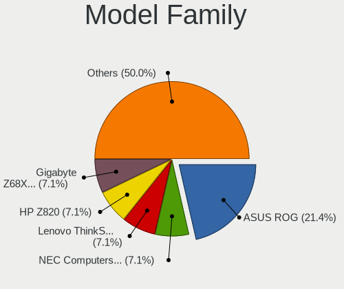
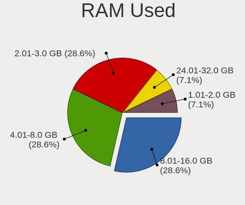
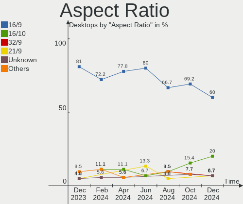

Gentoo - Hardware Trends (Desktops)
-----------------------------------

A project to identify most popular hardware characteristics and track their change
over time based on data collected by Linux users at https://Linux-Hardware.org.

Anyone can contribute to this report by the [hw-probe](https://github.com/linuxhw/hw-probe) tool:

    sudo -E hw-probe -all -upload

This report is for one last month. Overall report since the beginning of time: [TestDays](https://github.com/linuxhw/TestDays)

Period: Jun, 2023.

Contents
--------

* [ System ](#system)
  - [ OS                       ](#os)
  - [ OS Family                ](#os-family)
  - [ Kernel                   ](#kernel)
  - [ Kernel Family            ](#kernel-family)
  - [ Kernel Major Ver.        ](#kernel-major-ver)
  - [ Arch                     ](#arch)
  - [ DE                       ](#de)
  - [ Display Server           ](#display-server)
  - [ Display Manager          ](#display-manager)
  - [ OS Lang                  ](#os-lang)
  - [ Boot Mode                ](#boot-mode)
  - [ Filesystem               ](#filesystem)
  - [ Part. scheme             ](#part-scheme)
  - [ Dual Boot with Linux/BSD ](#dual-boot-with-linuxbsd)
  - [ Dual Boot (Win)          ](#dual-boot-win)

* [ Board ](#board)
  - [ Vendor                   ](#vendor)
  - [ Model                    ](#model)
  - [ Model Family             ](#model-family)
  - [ MFG Year                 ](#mfg-year)
  - [ Form Factor              ](#form-factor)
  - [ Secure Boot              ](#secure-boot)
  - [ Coreboot                 ](#coreboot)
  - [ RAM Size                 ](#ram-size)
  - [ RAM Used                 ](#ram-used)
  - [ Total Drives             ](#total-drives)
  - [ Has CD-ROM               ](#has-cd-rom)
  - [ Has Ethernet             ](#has-ethernet)
  - [ Has WiFi                 ](#has-wifi)
  - [ Has Bluetooth            ](#has-bluetooth)

* [ Location ](#location)
  - [ Country                  ](#country)
  - [ City                     ](#city)

* [ Drives ](#drives)
  - [ Drive Vendor             ](#drive-vendor)
  - [ Drive Model              ](#drive-model)
  - [ HDD Vendor               ](#hdd-vendor)
  - [ SSD Vendor               ](#ssd-vendor)
  - [ Drive Kind               ](#drive-kind)
  - [ Drive Connector          ](#drive-connector)
  - [ Drive Size               ](#drive-size)
  - [ Space Total              ](#space-total)
  - [ Space Used               ](#space-used)
  - [ Malfunc. Drives          ](#malfunc-drives)
  - [ Malfunc. Drive Vendor    ](#malfunc-drive-vendor)
  - [ Malfunc. HDD Vendor      ](#malfunc-hdd-vendor)
  - [ Malfunc. Drive Kind      ](#malfunc-drive-kind)
  - [ Failed Drives            ](#failed-drives)
  - [ Failed Drive Vendor      ](#failed-drive-vendor)
  - [ Drive Status             ](#drive-status)

* [ Storage controller ](#storage-controller)
  - [ Storage Vendor           ](#storage-vendor)
  - [ Storage Model            ](#storage-model)
  - [ Storage Kind             ](#storage-kind)

* [ Processor ](#processor)
  - [ CPU Vendor               ](#cpu-vendor)
  - [ CPU Model                ](#cpu-model)
  - [ CPU Model Family         ](#cpu-model-family)
  - [ CPU Cores                ](#cpu-cores)
  - [ CPU Sockets              ](#cpu-sockets)
  - [ CPU Threads              ](#cpu-threads)
  - [ CPU Op-Modes             ](#cpu-op-modes)
  - [ CPU Microcode            ](#cpu-microcode)
  - [ CPU Microarch            ](#cpu-microarch)

* [ Graphics ](#graphics)
  - [ GPU Vendor               ](#gpu-vendor)
  - [ GPU Model                ](#gpu-model)
  - [ GPU Combo                ](#gpu-combo)
  - [ GPU Driver               ](#gpu-driver)
  - [ GPU Memory               ](#gpu-memory)

* [ Monitor ](#monitor)
  - [ Monitor Vendor           ](#monitor-vendor)
  - [ Monitor Model            ](#monitor-model)
  - [ Monitor Resolution       ](#monitor-resolution)
  - [ Monitor Diagonal         ](#monitor-diagonal)
  - [ Monitor Width            ](#monitor-width)
  - [ Aspect Ratio             ](#aspect-ratio)
  - [ Monitor Area             ](#monitor-area)
  - [ Pixel Density            ](#pixel-density)
  - [ Multiple Monitors        ](#multiple-monitors)

* [ Network ](#network)
  - [ Net Controller Vendor    ](#net-controller-vendor)
  - [ Net Controller Model     ](#net-controller-model)
  - [ Wireless Vendor          ](#wireless-vendor)
  - [ Wireless Model           ](#wireless-model)
  - [ Ethernet Vendor          ](#ethernet-vendor)
  - [ Ethernet Model           ](#ethernet-model)
  - [ Net Controller Kind      ](#net-controller-kind)
  - [ Used Controller          ](#used-controller)
  - [ NICs                     ](#nics)
  - [ IPv6                     ](#ipv6)

* [ Bluetooth ](#bluetooth)
  - [ Bluetooth Vendor         ](#bluetooth-vendor)
  - [ Bluetooth Model          ](#bluetooth-model)

* [ Sound ](#sound)
  - [ Sound Vendor             ](#sound-vendor)
  - [ Sound Model              ](#sound-model)

* [ Memory ](#memory)
  - [ Memory Vendor            ](#memory-vendor)
  - [ Memory Model             ](#memory-model)
  - [ Memory Kind              ](#memory-kind)
  - [ Memory Form Factor       ](#memory-form-factor)
  - [ Memory Size              ](#memory-size)
  - [ Memory Speed             ](#memory-speed)

* [ Printers & scanners ](#printers--scanners)
  - [ Printer Vendor           ](#printer-vendor)
  - [ Printer Model            ](#printer-model)
  - [ Scanner Vendor           ](#scanner-vendor)
  - [ Scanner Model            ](#scanner-model)

* [ Camera ](#camera)
  - [ Camera Vendor            ](#camera-vendor)
  - [ Camera Model             ](#camera-model)

* [ Security ](#security)
  - [ Fingerprint Vendor       ](#fingerprint-vendor)
  - [ Fingerprint Model        ](#fingerprint-model)
  - [ Chipcard Vendor          ](#chipcard-vendor)
  - [ Chipcard Model           ](#chipcard-model)

* [ Unsupported ](#unsupported)
  - [ Unsupported Devices      ](#unsupported-devices)
  - [ Unsupported Device Types ](#unsupported-device-types)

System
------

OS
--

Installed operating systems

| Name        | Desktops | Percent |
|-------------|----------|---------|
| Gentoo 2.13 | 15       | 100%    |

OS Family
---------

OS without a version

| Name   | Desktops | Percent |
|--------|----------|---------|
| Gentoo | 15       | 100%    |

Kernel
------

Version of the Linux kernel

| Version              | Desktops | Percent |
|----------------------|----------|---------|
| 6.1.28-gentoo        | 3        | 20%     |
| 6.1.31-gentoo-x86_64 | 2        | 13.33%  |
| 6.3.8-gentoo-dist    | 1        | 6.67%   |
| 6.3.8-gentoo         | 1        | 6.67%   |
| 6.3.7-gentoo_ap      | 1        | 6.67%   |
| 6.3.5-gentoo-x86_64  | 1        | 6.67%   |
| 6.3.3-gentoo-dist    | 1        | 6.67%   |
| 6.3.1-gentoo         | 1        | 6.67%   |
| 6.2.13-zen           | 1        | 6.67%   |
| 6.1.31-gentoo-dist   | 1        | 6.67%   |
| 6.1.24-gentoo-dist   | 1        | 6.67%   |
| 6.1.0-gentoo         | 1        | 6.67%   |

Kernel Family
-------------

Linux kernel without a distro release

| Version | Desktops | Percent |
|---------|----------|---------|
| 6.1.31  | 3        | 20%     |
| 6.1.28  | 3        | 20%     |
| 6.3.8   | 2        | 13.33%  |
| 6.3.7   | 1        | 6.67%   |
| 6.3.5   | 1        | 6.67%   |
| 6.3.3   | 1        | 6.67%   |
| 6.3.1   | 1        | 6.67%   |
| 6.2.13  | 1        | 6.67%   |
| 6.1.24  | 1        | 6.67%   |
| 6.1.0   | 1        | 6.67%   |

Kernel Major Ver.
-----------------

Linux kernel major version

| Version | Desktops | Percent |
|---------|----------|---------|
| 6.1     | 8        | 53.33%  |
| 6.3     | 6        | 40%     |
| 6.2     | 1        | 6.67%   |

Arch
----

OS architecture (x86_64, i586, etc.)

| Name   | Desktops | Percent |
|--------|----------|---------|
| x86_64 | 15       | 100%    |

DE
--

Desktop Environment

| Name    | Desktops | Percent |
|---------|----------|---------|
| KDE5    | 4        | 26.67%  |
| gnome   | 4        | 26.67%  |
| Unknown | 3        | 20%     |
| XFCE    | 2        | 13.33%  |
| MATE    | 1        | 6.67%   |
| KDE     | 1        | 6.67%   |

Display Server
--------------

X11 or Wayland

| Name    | Desktops | Percent |
|---------|----------|---------|
| Wayland | 7        | 46.67%  |
| X11     | 6        | 40%     |
| Tty     | 1        | 6.67%   |
| Unknown | 1        | 6.67%   |

Display Manager
---------------

SDDM, LightDM, etc.

| Name    | Desktops | Percent |
|---------|----------|---------|
| SDDM    | 5        | 33.33%  |
| LightDM | 3        | 20%     |
| GDM     | 3        | 20%     |
| Unknown | 2        | 13.33%  |
| SLiM    | 1        | 6.67%   |
| LXDM    | 1        | 6.67%   |

OS Lang
-------

Language

| Lang    | Desktops | Percent |
|---------|----------|---------|
| en_US   | 7        | 46.67%  |
| C.UTF8  | 2        | 13.33%  |
| pl_PL   | 1        | 6.67%   |
| fr_FR   | 1        | 6.67%   |
| en_IL   | 1        | 6.67%   |
| de_DE   | 1        | 6.67%   |
| da_DK   | 1        | 6.67%   |
| Unknown | 1        | 6.67%   |

Boot Mode
---------

EFI or BIOS

| Mode | Desktops | Percent |
|------|----------|---------|
| EFI  | 11       | 73.33%  |
| BIOS | 4        | 26.67%  |

Filesystem
----------

Type of filesystem

| Type  | Desktops | Percent |
|-------|----------|---------|
| Ext4  | 6        | 40%     |
| Btrfs | 4        | 26.67%  |
| F2fs  | 3        | 20%     |
| Zfs   | 1        | 6.67%   |
| Xfs   | 1        | 6.67%   |

Part. scheme
------------

Scheme of partitioning

| Type | Desktops | Percent |
|------|----------|---------|
| GPT  | 14       | 93.33%  |
| MBR  | 1        | 6.67%   |

Dual Boot with Linux/BSD
------------------------

Hosting more than one Linux/BSD

| Dual boot | Desktops | Percent |
|-----------|----------|---------|
| No        | 9        | 60%     |
| Yes       | 6        | 40%     |

Dual Boot (Win)
---------------

Hosting Linux and Windows

| Dual boot | Desktops | Percent |
|-----------|----------|---------|
| No        | 8        | 53.33%  |
| Yes       | 7        | 46.67%  |

Board
-----

Vendor
------

Motherboard manufacturer

| Name                | Desktops | Percent |
|---------------------|----------|---------|
| ASUSTek Computer    | 8        | 53.33%  |
| ASRock              | 3        | 20%     |
| MSI                 | 2        | 13.33%  |
| Gigabyte Technology | 2        | 13.33%  |

Model
-----

Motherboard model

| Name                               | Desktops | Percent |
|------------------------------------|----------|---------|
| ASUS M3A78-CM                      | 2        | 13.33%  |
| MSI MS-7C91                        | 1        | 6.67%   |
| MSI MS-7C35                        | 1        | 6.67%   |
| Gigabyte B550M AORUS ELITE         | 1        | 6.67%   |
| Gigabyte AB350-Gaming              | 1        | 6.67%   |
| ASUS TUF Gaming B650M-PLUS WIFI    | 1        | 6.67%   |
| ASUS ROG STRIX X670E-F GAMING WIFI | 1        | 6.67%   |
| ASUS ROG STRIX B650E-F GAMING WIFI | 1        | 6.67%   |
| ASUS PRIME X570-P                  | 1        | 6.67%   |
| ASUS PRIME X299-DELUXE             | 1        | 6.67%   |
| ASUS PRIME B550M-A                 | 1        | 6.67%   |
| ASRock X670E Steel Legend          | 1        | 6.67%   |
| ASRock X570 Taichi                 | 1        | 6.67%   |
| ASRock J3160M                      | 1        | 6.67%   |

Model Family
------------

Motherboard model prefix

| Name                  | Desktops | Percent |
|-----------------------|----------|---------|
| ASUS PRIME            | 3        | 20%     |
| ASUS ROG              | 2        | 13.33%  |
| ASUS M3A78-CM         | 2        | 13.33%  |
| MSI MS-7C91           | 1        | 6.67%   |
| MSI MS-7C35           | 1        | 6.67%   |
| Gigabyte B550M        | 1        | 6.67%   |
| Gigabyte AB350-Gaming | 1        | 6.67%   |
| ASUS TUF              | 1        | 6.67%   |
| ASRock X670E          | 1        | 6.67%   |
| ASRock X570           | 1        | 6.67%   |
| ASRock J3160M         | 1        | 6.67%   |

MFG Year
--------

Motherboard manufacture year

| Year | Desktops | Percent |
|------|----------|---------|
| 2022 | 4        | 26.67%  |
| 2020 | 3        | 20%     |
| 2019 | 3        | 20%     |
| 2017 | 2        | 13.33%  |
| 2008 | 2        | 13.33%  |
| 2016 | 1        | 6.67%   |

Form Factor
-----------

Physical design of the computer

| Name    | Desktops | Percent |
|---------|----------|---------|
| Desktop | 15       | 100%    |

Secure Boot
-----------

Enabled or disabled

| State    | Desktops | Percent |
|----------|----------|---------|
| Disabled | 15       | 100%    |

Coreboot
--------

Have coreboot on board

| Used | Desktops | Percent |
|------|----------|---------|
| No   | 15       | 100%    |

RAM Size
--------

Total RAM memory

| Size in GB  | Desktops | Percent |
|-------------|----------|---------|
| 64.01-256.0 | 5        | 33.33%  |
| 32.01-64.0  | 4        | 26.67%  |
| 4.01-8.0    | 3        | 20%     |
| 24.01-32.0  | 2        | 13.33%  |
| 16.01-24.0  | 1        | 6.67%   |

RAM Used
--------

Used RAM memory

| Used GB    | Desktops | Percent |
|------------|----------|---------|
| 1.01-2.0   | 4        | 26.67%  |
| 3.01-4.0   | 3        | 20%     |
| 16.01-24.0 | 3        | 20%     |
| 4.01-8.0   | 2        | 13.33%  |
| 2.01-3.0   | 2        | 13.33%  |
| 8.01-16.0  | 1        | 6.67%   |

Total Drives
------------

Number of drives on board

| Drives | Desktops | Percent |
|--------|----------|---------|
| 2      | 5        | 33.33%  |
| 5      | 3        | 20%     |
| 1      | 3        | 20%     |
| 21     | 1        | 6.67%   |
| 6      | 1        | 6.67%   |
| 4      | 1        | 6.67%   |
| 3      | 1        | 6.67%   |

Has CD-ROM
----------

Has CD-ROM on board

| Presented | Desktops | Percent |
|-----------|----------|---------|
| No        | 13       | 86.67%  |
| Yes       | 2        | 13.33%  |

Has Ethernet
------------

Has Ethernet on board

| Presented | Desktops | Percent |
|-----------|----------|---------|
| Yes       | 15       | 100%    |

Has WiFi
--------

Has WiFi module

| Presented | Desktops | Percent |
|-----------|----------|---------|
| Yes       | 9        | 60%     |
| No        | 6        | 40%     |

Has Bluetooth
-------------

Has Bluetooth module

| Presented | Desktops | Percent |
|-----------|----------|---------|
| Yes       | 8        | 53.33%  |
| No        | 7        | 46.67%  |

Location
--------

Country
-------

Geographic location (country)

| Country | Desktops | Percent |
|---------|----------|---------|
| USA     | 4        | 26.67%  |
| Poland  | 3        | 20%     |
| Russia  | 2        | 13.33%  |
| France  | 2        | 13.33%  |
| UK      | 1        | 6.67%   |
| Israel  | 1        | 6.67%   |
| Germany | 1        | 6.67%   |
| Denmark | 1        | 6.67%   |

City
----

Geographic location (city)

| City               | Desktops | Percent |
|--------------------|----------|---------|
| Warsaw             | 3        | 20%     |
| St Petersburg      | 1        | 6.67%   |
| Portland           | 1        | 6.67%   |
| Moscow             | 1        | 6.67%   |
| Montpon-Menesterol | 1        | 6.67%   |
| Godfrey            | 1        | 6.67%   |
| Flint              | 1        | 6.67%   |
| Étampes           | 1        | 6.67%   |
| Denton             | 1        | 6.67%   |
| Copenhagen         | 1        | 6.67%   |
| Caesarea           | 1        | 6.67%   |
| Bothell            | 1        | 6.67%   |
| Berlin             | 1        | 6.67%   |

Drives
------

Drive Vendor
------------

Hard drive vendors

| Vendor                      | Desktops | Drives | Percent |
|-----------------------------|----------|--------|---------|
| Seagate                     | 6        | 9      | 16.22%  |
| Samsung Electronics         | 6        | 18     | 16.22%  |
| WDC                         | 5        | 5      | 13.51%  |
| Toshiba                     | 3        | 3      | 8.11%   |
| GOODRAM                     | 3        | 3      | 8.11%   |
| Kingston Technology Company | 2        | 2      | 5.41%   |
| Kingston                    | 2        | 3      | 5.41%   |
| T-FORCE                     | 1        | 1      | 2.7%    |
| Sandisk                     | 1        | 1      | 2.7%    |
| SABRENT                     | 1        | 1      | 2.7%    |
| Phison Electronics          | 1        | 1      | 2.7%    |
| Phison                      | 1        | 1      | 2.7%    |
| Intel                       | 1        | 1      | 2.7%    |
| Hitachi                     | 1        | 3      | 2.7%    |
| HGST                        | 1        | 1      | 2.7%    |
| Crucial                     | 1        | 8      | 2.7%    |
| A-DATA Technology           | 1        | 1      | 2.7%    |

Drive Model
-----------

Hard drive models

| Model                                               | Desktops | Percent |
|-----------------------------------------------------|----------|---------|
| Samsung NVMe SSD Controller PM9A1/PM9A3/980PRO 2TB  | 3        | 7.32%   |
| GOODRAM SSDPR-CL100-480-G2 480GB                    | 2        | 4.88%   |
| WDC WD80EFAX-68KNBN0 8TB                            | 1        | 2.44%   |
| WDC WD7500BPVT-24HXZT1 752GB                        | 1        | 2.44%   |
| WDC WD6000HLHX-01JJPV0 600GB                        | 1        | 2.44%   |
| WDC WD5000AAKX-08U6AA0 500GB                        | 1        | 2.44%   |
| WDC WD20EZAZ-00GGJB0 2TB                            | 1        | 2.44%   |
| Toshiba MK5061GSY 500GB                             | 1        | 2.44%   |
| Toshiba HDWE150 5TB                                 | 1        | 2.44%   |
| Toshiba HDWD110 1TB                                 | 1        | 2.44%   |
| T-FORCE SSD 2TB                                     | 1        | 2.44%   |
| Seagate ST6000DX000-1H217Z 6TB                      | 1        | 2.44%   |
| Seagate ST6000DM003-2CY186 6TB                      | 1        | 2.44%   |
| Seagate ST4000DM004-2CV104 4TB                      | 1        | 2.44%   |
| Seagate ST2000DM008-2UB102 2TB                      | 1        | 2.44%   |
| Seagate ST12000NM0008-2H3101 12TB                   | 1        | 2.44%   |
| Seagate ST1000DM010-2EP102 1TB                      | 1        | 2.44%   |
| Sandisk WD_BLACK SN770 1TB                          | 1        | 2.44%   |
| Samsung SSD 980 1TB                                 | 1        | 2.44%   |
| Samsung SSD 870 EVO 1TB                             | 1        | 2.44%   |
| Samsung SSD 860 EVO 500GB                           | 1        | 2.44%   |
| Samsung SSD 860 EVO 250GB                           | 1        | 2.44%   |
| Samsung SSD 850 EVO 1TB                             | 1        | 2.44%   |
| Samsung NVMe SSD Controller SM981/PM981/PM983 250GB | 1        | 2.44%   |
| SABRENT Disk 1TB                                    | 1        | 2.44%   |
| Phison MSI M480 1TB                                 | 1        | 2.44%   |
| Phison Corsair MP600 PRO XT 2TB                     | 1        | 2.44%   |
| Kingston Company SNV2S2000G 2TB                     | 1        | 2.44%   |
| Kingston Company SNV2S1000G 1TB                     | 1        | 2.44%   |
| Kingston SKC600256G 256GB SSD                       | 1        | 2.44%   |
| Kingston SFYRS1000G 1TB                             | 1        | 2.44%   |
| Kingston SA400S37240G 240GB SSD                     | 1        | 2.44%   |
| Intel SSD 660P Series 512GB                         | 1        | 2.44%   |
| Hitachi HUS724030ALE641 3TB                         | 1        | 2.44%   |
| HGST HTS541515A9E630 1TB                            | 1        | 2.44%   |
| GOODRAM SSDPR-CL100-960-G3 960GB                    | 1        | 2.44%   |
| Crucial CT1000MX500SSD1 1TB                         | 1        | 2.44%   |
| A-DATA SP900 128GB SSD                              | 1        | 2.44%   |

HDD Vendor
----------

Hard disk drive vendors

| Vendor  | Desktops | Drives | Percent |
|---------|----------|--------|---------|
| Seagate | 6        | 9      | 37.5%   |
| WDC     | 5        | 5      | 31.25%  |
| Toshiba | 3        | 3      | 18.75%  |
| Hitachi | 1        | 3      | 6.25%   |
| HGST    | 1        | 1      | 6.25%   |

SSD Vendor
----------

Solid state drive vendors

| Vendor              | Desktops | Drives | Percent |
|---------------------|----------|--------|---------|
| Samsung Electronics | 4        | 11     | 33.33%  |
| GOODRAM             | 3        | 3      | 25%     |
| Kingston            | 2        | 2      | 16.67%  |
| T-FORCE             | 1        | 1      | 8.33%   |
| Crucial             | 1        | 8      | 8.33%   |
| A-DATA Technology   | 1        | 1      | 8.33%   |

Drive Kind
----------

HDD or SSD

| Kind | Desktops | Drives | Percent |
|------|----------|--------|---------|
| NVMe | 10       | 15     | 35.71%  |
| SSD  | 9        | 26     | 32.14%  |
| HDD  | 9        | 21     | 32.14%  |

Drive Connector
---------------

SATA, SAS, NVMe, etc.

| Type | Desktops | Drives | Percent |
|------|----------|--------|---------|
| SATA | 13       | 47     | 54.17%  |
| NVMe | 10       | 14     | 41.67%  |
| SAS  | 1        | 1      | 4.17%   |

Drive Size
----------

Size of hard drive

| Size in TB | Desktops | Drives | Percent |
|------------|----------|--------|---------|
| 0.51-1.0   | 8        | 23     | 30.77%  |
| 0.01-0.5   | 8        | 9      | 30.77%  |
| 4.01-10.0  | 4        | 7      | 15.38%  |
| 1.01-2.0   | 3        | 3      | 11.54%  |
| 3.01-4.0   | 1        | 1      | 3.85%   |
| 2.01-3.0   | 1        | 3      | 3.85%   |
| 10.01-20.0 | 1        | 1      | 3.85%   |

Space Total
-----------

Amount of disk space available on the file system

| Size in GB     | Desktops | Percent |
|----------------|----------|---------|
| 501-1000       | 5        | 33.33%  |
| More than 3000 | 4        | 26.67%  |
| 2001-3000      | 2        | 13.33%  |
| 1001-2000      | 2        | 13.33%  |
| 251-500        | 1        | 6.67%   |
| Unknown        | 1        | 6.67%   |

Space Used
----------

Amount of used disk space

| Used GB        | Desktops | Percent |
|----------------|----------|---------|
| More than 3000 | 3        | 20%     |
| 1001-2000      | 3        | 20%     |
| 501-1000       | 3        | 20%     |
| 251-500        | 1        | 6.67%   |
| 21-50          | 1        | 6.67%   |
| 101-250        | 1        | 6.67%   |
| 1-20           | 1        | 6.67%   |
| 51-100         | 1        | 6.67%   |
| Unknown        | 1        | 6.67%   |

Malfunc. Drives
---------------

Drive models with a malfunction

| Model                               | Desktops | Drives | Percent |
|-------------------------------------|----------|--------|---------|
| Samsung Electronics SSD 870 EVO 1TB | 1        | 8      | 100%    |

Malfunc. Drive Vendor
---------------------

Vendors of faulty drives

| Vendor              | Desktops | Drives | Percent |
|---------------------|----------|--------|---------|
| Samsung Electronics | 1        | 8      | 100%    |

Malfunc. HDD Vendor
-------------------

Vendors of faulty HDD drives

Zero info for selected period =(

Malfunc. Drive Kind
-------------------

Kinds of faulty drives

| Kind | Desktops | Drives | Percent |
|------|----------|--------|---------|
| SSD  | 1        | 8      | 100%    |

Failed Drives
-------------

Failed drive models

Zero info for selected period =(

Failed Drive Vendor
-------------------

Failed drive vendors

Zero info for selected period =(

Drive Status
------------

Number of failed and malfunc. drives

| Status   | Desktops | Drives | Percent |
|----------|----------|--------|---------|
| Works    | 15       | 53     | 88.24%  |
| Detected | 1        | 1      | 5.88%   |
| Malfunc  | 1        | 8      | 5.88%   |

Storage controller
------------------

Storage Vendor
--------------

Storage controller vendors

| Vendor                      | Desktops | Percent |
|-----------------------------|----------|---------|
| AMD                         | 13       | 46.43%  |
| Samsung Electronics         | 5        | 17.86%  |
| Intel                       | 3        | 10.71%  |
| Phison Electronics          | 2        | 7.14%   |
| Kingston Technology Company | 2        | 7.14%   |
| SanDisk                     | 1        | 3.57%   |
| Broadcom / LSI              | 1        | 3.57%   |
| ASMedia Technology          | 1        | 3.57%   |

Storage Model
-------------

Storage controller models

| Model                                                                            | Desktops | Percent |
|----------------------------------------------------------------------------------|----------|---------|
| AMD FCH SATA Controller [AHCI mode]                                              | 8        | 25%     |
| Samsung NVMe SSD Controller PM9A1/PM9A3/980PRO                                   | 3        | 9.38%   |
| AMD 500 Series Chipset SATA Controller                                           | 3        | 9.38%   |
| Phison E18 PCIe4 NVMe Controller                                                 | 2        | 6.25%   |
| Kingston Company Company Non-Volatile memory controller                          | 2        | 6.25%   |
| AMD SB7x0/SB8x0/SB9x0 SATA Controller [IDE mode]                                 | 2        | 6.25%   |
| AMD SB7x0/SB8x0/SB9x0 IDE Controller                                             | 2        | 6.25%   |
| SanDisk WD Black SN770 NVMe SSD                                                  | 1        | 3.13%   |
| Samsung NVMe SSD Controller SM981/PM981/PM983                                    | 1        | 3.13%   |
| Samsung NVMe SSD Controller 980                                                  | 1        | 3.13%   |
| Kingston Company FURY Renegade NVMe SSD                                          | 1        | 3.13%   |
| Intel SSD 660P Series                                                            | 1        | 3.13%   |
| Intel Atom/Celeron/Pentium Processor x5-E8000/J3xxx/N3xxx Series SATA Controller | 1        | 3.13%   |
| Intel 200 Series PCH SATA controller [AHCI mode]                                 | 1        | 3.13%   |
| Broadcom / LSI SAS3008 PCI-Express Fusion-MPT SAS-3                              | 1        | 3.13%   |
| ASMedia 106x SATA/RAID Controller                                                | 1        | 3.13%   |
| AMD 300 Series Chipset SATA Controller                                           | 1        | 3.13%   |

Storage Kind
------------

Kind of storage controller (IDE, SATA, NVMe, SAS, ...)

| Kind | Desktops | Percent |
|------|----------|---------|
| SATA | 15       | 53.57%  |
| NVMe | 10       | 35.71%  |
| IDE  | 2        | 7.14%   |
| SAS  | 1        | 3.57%   |

Processor
---------

CPU Vendor
----------

Processor vendors

| Vendor | Desktops | Percent |
|--------|----------|---------|
| AMD    | 13       | 86.67%  |
| Intel  | 2        | 13.33%  |

CPU Model
---------

Processor models

| Model                                       | Desktops | Percent |
|---------------------------------------------|----------|---------|
| AMD Ryzen 9 7900X 12-Core Processor         | 2        | 13.33%  |
| AMD Ryzen 9 5900X 12-Core Processor         | 2        | 13.33%  |
| AMD Ryzen 7 3700X 8-Core Processor          | 2        | 13.33%  |
| AMD Phenom II X4 955 Processor              | 2        | 13.33%  |
| Intel Core i7-7800X CPU @ 3.50GHz           | 1        | 6.67%   |
| Intel Celeron CPU J3160 @ 1.60GHz           | 1        | 6.67%   |
| AMD Ryzen 9 7950X 16-Core Processor         | 1        | 6.67%   |
| AMD Ryzen 9 5950X 16-Core Processor         | 1        | 6.67%   |
| AMD Ryzen 5 7600X 6-Core Processor          | 1        | 6.67%   |
| AMD Ryzen 5 3400G with Radeon Vega Graphics | 1        | 6.67%   |
| AMD Ryzen 5 2600 Six-Core Processor         | 1        | 6.67%   |

CPU Model Family
----------------

Processor model prefix

| Model            | Desktops | Percent |
|------------------|----------|---------|
| AMD Ryzen 9      | 6        | 40%     |
| AMD Ryzen 5      | 3        | 20%     |
| AMD Ryzen 7      | 2        | 13.33%  |
| AMD Phenom II X4 | 2        | 13.33%  |
| Intel Core i7    | 1        | 6.67%   |
| Intel Celeron    | 1        | 6.67%   |

CPU Cores
---------

Number of processor cores

| Number | Desktops | Percent |
|--------|----------|---------|
| 12     | 4        | 26.67%  |
| 4      | 4        | 26.67%  |
| 6      | 3        | 20%     |
| 16     | 2        | 13.33%  |
| 8      | 2        | 13.33%  |

CPU Sockets
-----------

Number of sockets

| Number | Desktops | Percent |
|--------|----------|---------|
| 1      | 15       | 100%    |

CPU Threads
-----------

Threads per core (Hyper-Threading)

| Number | Desktops | Percent |
|--------|----------|---------|
| 2      | 12       | 80%     |
| 1      | 3        | 20%     |

CPU Op-Modes
------------

CPU Operation Modes (32-bit, 64-bit)

| Op mode        | Desktops | Percent |
|----------------|----------|---------|
| 32-bit, 64-bit | 15       | 100%    |

CPU Microcode
-------------

Microcode number

| Number     | Desktops | Percent |
|------------|----------|---------|
| 0x0a601203 | 4        | 26.67%  |
| Unknown    | 2        | 13.33%  |
| 0x50654    | 1        | 6.67%   |
| 0x406c4    | 1        | 6.67%   |
| 0x0a20120a | 1        | 6.67%   |
| 0x0a201025 | 1        | 6.67%   |
| 0x08701030 | 1        | 6.67%   |
| 0x08701021 | 1        | 6.67%   |
| 0x08108109 | 1        | 6.67%   |
| 0x0800820d | 1        | 6.67%   |
| 0x010000db | 1        | 6.67%   |

CPU Microarch
-------------

Microarchitecture

| Name       | Desktops | Percent |
|------------|----------|---------|
| Unknown    | 4        | 26.67%  |
| Zen 3      | 3        | 20%     |
| Zen+       | 2        | 13.33%  |
| Zen 2      | 2        | 13.33%  |
| K10        | 2        | 13.33%  |
| Skylake    | 1        | 6.67%   |
| Silvermont | 1        | 6.67%   |

Graphics
--------

GPU Vendor
----------

Vendors of graphics cards

| Vendor | Desktops | Percent |
|--------|----------|---------|
| AMD    | 11       | 68.75%  |
| Nvidia | 4        | 25%     |
| Intel  | 1        | 6.25%   |

GPU Model
---------

Graphics card models

| Model                                                                                    | Desktops | Percent |
|------------------------------------------------------------------------------------------|----------|---------|
| AMD Raphael                                                                              | 3        | 16.67%  |
| Nvidia GA104 [GeForce RTX 3070]                                                          | 2        | 11.11%  |
| AMD RS780C [Radeon 3100]                                                                 | 2        | 11.11%  |
| AMD Navi 31 [Radeon RX 7900 XT/7900 XTX]                                                 | 2        | 11.11%  |
| AMD Navi 22 [Radeon RX 6700/6700 XT/6750 XT / 6800M/6850M XT]                            | 2        | 11.11%  |
| Nvidia GP104 [GeForce GTX 1080]                                                          | 1        | 5.56%   |
| Nvidia GM107 [GeForce GTX 750]                                                           | 1        | 5.56%   |
| Intel Atom/Celeron/Pentium Processor x5-E8000/J3xxx/N3xxx Integrated Graphics Controller | 1        | 5.56%   |
| AMD Navi 23 [Radeon RX 6600/6600 XT/6600M]                                               | 1        | 5.56%   |
| AMD Navi 21 [Radeon RX 6800/6800 XT / 6900 XT]                                           | 1        | 5.56%   |
| AMD Lexa PRO [Radeon 540/540X/550/550X / RX 540X/550/550X]                               | 1        | 5.56%   |
| AMD Cedar [Radeon HD 5000/6000/7350/8350 Series]                                         | 1        | 5.56%   |

GPU Combo
---------

Combinations of graphics cards

| Name         | Desktops | Percent |
|--------------|----------|---------|
| 1 x AMD      | 8        | 53.33%  |
| 1 x Nvidia   | 3        | 20%     |
| 2 x AMD      | 2        | 13.33%  |
| 1 x Intel    | 1        | 6.67%   |
| AMD + Nvidia | 1        | 6.67%   |

GPU Driver
----------

Free vs proprietary

| Driver      | Desktops | Percent |
|-------------|----------|---------|
| Free        | 11       | 73.33%  |
| Proprietary | 4        | 26.67%  |

GPU Memory
----------

Total video memory

| Size in GB | Desktops | Percent |
|------------|----------|---------|
| 7.01-8.0   | 4        | 26.67%  |
| 8.01-16.0  | 3        | 20%     |
| Unknown    | 3        | 20%     |
| 1.01-2.0   | 2        | 13.33%  |
| 16.01-24.0 | 1        | 6.67%   |
| 0.51-1.0   | 1        | 6.67%   |
| 0.01-0.5   | 1        | 6.67%   |

Monitor
-------

Monitor Vendor
--------------

Monitor vendors

| Vendor               | Desktops | Percent |
|----------------------|----------|---------|
| Samsung Electronics  | 5        | 27.78%  |
| Dell                 | 3        | 16.67%  |
| BenQ                 | 2        | 11.11%  |
| Ancor Communications | 2        | 11.11%  |
| Sceptre Tech         | 1        | 5.56%   |
| Lenovo               | 1        | 5.56%   |
| Goldstar             | 1        | 5.56%   |
| Gigabyte Technology  | 1        | 5.56%   |
| Gateway              | 1        | 5.56%   |
| AHA                  | 1        | 5.56%   |

Monitor Model
-------------

Monitor models

| Model                                                                 | Desktops | Percent |
|-----------------------------------------------------------------------|----------|---------|
| Sceptre Tech C305W-2560UN SPT0C0D 2560x1080 690x291mm 29.5-inch       | 1        | 5%      |
| Samsung Electronics SyncMaster SAM059A 1920x1080 477x268mm 21.5-inch  | 1        | 5%      |
| Samsung Electronics SMS27A350H SAM07CE 1920x1080 598x336mm 27.0-inch  | 1        | 5%      |
| Samsung Electronics S22B300 SAM08C8 1920x1080 477x268mm 21.5-inch     | 1        | 5%      |
| Samsung Electronics C49RG9x SAM0F9C 3840x1080 1193x336mm 48.8-inch    | 1        | 5%      |
| Samsung Electronics C27HG7x SAM0E16 2560x1440 598x336mm 27.0-inch     | 1        | 5%      |
| Lenovo LEN G34w-10 LEN66A1 3440x1440 797x334mm 34.0-inch              | 1        | 5%      |
| Goldstar HDR 4K GSM7707 3840x2160 600x340mm 27.2-inch                 | 1        | 5%      |
| Gigabyte Technology G34WQC A GBT3403 3440x1440 797x334mm 34.0-inch    | 1        | 5%      |
| Gateway FHD2400 GWY096C 1920x1200 518x291mm 23.4-inch                 | 1        | 5%      |
| Dell U4320Q DEL41D2 3840x2160 941x529mm 42.5-inch                     | 1        | 5%      |
| Dell P2417H DELA0DB 1920x1080 527x296mm 23.8-inch                     | 1        | 5%      |
| Dell P2014H DEL4095 1600x900 434x236mm 19.4-inch                      | 1        | 5%      |
| Dell E2420HS DELF11D 1920x1080 527x296mm 23.8-inch                    | 1        | 5%      |
| Dell E2417H DELA0E2 1920x1080 527x296mm 23.8-inch                     | 1        | 5%      |
| BenQ PD3200U BNQ8025 3840x2160 708x399mm 32.0-inch                    | 1        | 5%      |
| BenQ LCD Monitor VW2430 1920x1080                                     | 1        | 5%      |
| Ancor Communications MX279 ACI27C3 1920x1080 598x336mm 27.0-inch      | 1        | 5%      |
| Ancor Communications ASUS VK278 ACI27F7 1920x1080 598x336mm 27.0-inch | 1        | 5%      |
| AHA LCD Monitor AHA0001 1280x800 210x130mm 9.7-inch                   | 1        | 5%      |

Monitor Resolution
------------------

Monitor screen resolution

| Resolution        | Desktops | Percent |
|-------------------|----------|---------|
| 1920x1080 (FHD)   | 7        | 38.89%  |
| 3840x2160 (4K)    | 3        | 16.67%  |
| 3440x1440         | 2        | 11.11%  |
| 3840x1080         | 1        | 5.56%   |
| 2560x1440 (QHD)   | 1        | 5.56%   |
| 2560x1080         | 1        | 5.56%   |
| 1920x1200 (WUXGA) | 1        | 5.56%   |
| 1600x900 (HD+)    | 1        | 5.56%   |
| 1280x800 (WXGA)   | 1        | 5.56%   |

Monitor Diagonal
----------------

Diagonal size in inches

| Inches  | Desktops | Percent |
|---------|----------|---------|
| 27      | 4        | 22.22%  |
| 34      | 2        | 11.11%  |
| 24      | 2        | 11.11%  |
| 21      | 2        | 11.11%  |
| 48      | 1        | 5.56%   |
| 42      | 1        | 5.56%   |
| 32      | 1        | 5.56%   |
| 29      | 1        | 5.56%   |
| 23      | 1        | 5.56%   |
| 19      | 1        | 5.56%   |
| 9       | 1        | 5.56%   |
| Unknown | 1        | 5.56%   |

Monitor Width
-------------

Physical width

| Width in mm | Desktops | Percent |
|-------------|----------|---------|
| 501-600     | 6        | 35.29%  |
| 701-800     | 3        | 17.65%  |
| 401-500     | 3        | 17.65%  |
| 601-700     | 1        | 5.88%   |
| 201-300     | 1        | 5.88%   |
| 1001-1500   | 1        | 5.88%   |
| 901-1000    | 1        | 5.88%   |
| Unknown     | 1        | 5.88%   |

Aspect Ratio
------------

Proportional relationship between the width and the height

| Ratio   | Desktops | Percent |
|---------|----------|---------|
| 16/9    | 10       | 66.67%  |
| 21/9    | 2        | 13.33%  |
| 32/9    | 1        | 6.67%   |
| 16/10   | 1        | 6.67%   |
| Unknown | 1        | 6.67%   |

Monitor Area
------------

Area in inch²

| Area in inch² | Desktops | Percent |
|----------------|----------|---------|
| 301-350        | 5        | 27.78%  |
| 201-250        | 5        | 27.78%  |
| 351-500        | 3        | 16.67%  |
| 501-1000       | 2        | 11.11%  |
| 41-50          | 1        | 5.56%   |
| 151-200        | 1        | 5.56%   |
| Unknown        | 1        | 5.56%   |

Pixel Density
-------------

Pixels per inch

| Density | Desktops | Percent |
|---------|----------|---------|
| 101-120 | 6        | 37.5%   |
| 51-100  | 6        | 37.5%   |
| 121-160 | 2        | 12.5%   |
| 161-240 | 1        | 6.25%   |
| Unknown | 1        | 6.25%   |

Multiple Monitors
-----------------

Total monitors connected

| Total | Desktops | Percent |
|-------|----------|---------|
| 1     | 10       | 66.67%  |
| 2     | 2        | 13.33%  |
| 4     | 1        | 6.67%   |
| 3     | 1        | 6.67%   |
| 0     | 1        | 6.67%   |

Network
-------

Net Controller Vendor
---------------------

Controller vendors

| Vendor                          | Desktops | Percent |
|---------------------------------|----------|---------|
| Realtek Semiconductor           | 11       | 45.83%  |
| Intel                           | 7        | 29.17%  |
| MediaTek                        | 3        | 12.5%   |
| Wilocity                        | 1        | 4.17%   |
| Qualcomm Atheros Communications | 1        | 4.17%   |
| Qualcomm Atheros                | 1        | 4.17%   |

Net Controller Model
--------------------

Controller models

| Model                                                             | Desktops | Percent |
|-------------------------------------------------------------------|----------|---------|
| Realtek RTL8111/8168/8411 PCI Express Gigabit Ethernet Controller | 9        | 31.03%  |
| Realtek RTL8125 2.5GbE Controller                                 | 4        | 13.79%  |
| Intel Wi-Fi 6 AX200                                               | 4        | 13.79%  |
| Intel I211 Gigabit Network Connection                             | 2        | 6.9%    |
| Intel Ethernet Controller I225-V                                  | 2        | 6.9%    |
| Wilocity Wil6200 802.11ad Wireless Network Adapter                | 1        | 3.45%   |
| Qualcomm Atheros QCA6174 802.11ac Wireless Network Adapter        | 1        | 3.45%   |
| Qualcomm Atheros AR9271 802.11n                                   | 1        | 3.45%   |
| MediaTek MT7922 802.11ax PCI Express Wireless Network Adapter     | 1        | 3.45%   |
| MediaTek MT7921K (RZ608) Wi-Fi 6E 80MHz                           | 1        | 3.45%   |
| MediaTek MT7921 802.11ax PCI Express Wireless Network Adapter     | 1        | 3.45%   |
| Intel Wi-Fi 6 AX210/AX211/AX411 160MHz                            | 1        | 3.45%   |
| Intel Ethernet Connection (2) I219-V                              | 1        | 3.45%   |

Wireless Vendor
---------------

Wireless vendors

| Vendor                          | Desktops | Percent |
|---------------------------------|----------|---------|
| Intel                           | 4        | 40%     |
| MediaTek                        | 3        | 30%     |
| Wilocity                        | 1        | 10%     |
| Qualcomm Atheros Communications | 1        | 10%     |
| Qualcomm Atheros                | 1        | 10%     |

Wireless Model
--------------

Wireless models

| Model                                                         | Desktops | Percent |
|---------------------------------------------------------------|----------|---------|
| Intel Wi-Fi 6 AX200                                           | 4        | 36.36%  |
| Wilocity Wil6200 802.11ad Wireless Network Adapter            | 1        | 9.09%   |
| Qualcomm Atheros QCA6174 802.11ac Wireless Network Adapter    | 1        | 9.09%   |
| Qualcomm Atheros AR9271 802.11n                               | 1        | 9.09%   |
| MediaTek MT7922 802.11ax PCI Express Wireless Network Adapter | 1        | 9.09%   |
| MediaTek MT7921K (RZ608) Wi-Fi 6E 80MHz                       | 1        | 9.09%   |
| MediaTek MT7921 802.11ax PCI Express Wireless Network Adapter | 1        | 9.09%   |
| Intel Wi-Fi 6 AX210/AX211/AX411 160MHz                        | 1        | 9.09%   |

Ethernet Vendor
---------------

Ethernet vendors

| Vendor                | Desktops | Percent |
|-----------------------|----------|---------|
| Realtek Semiconductor | 11       | 73.33%  |
| Intel                 | 4        | 26.67%  |

Ethernet Model
--------------

Ethernet models

| Model                                                             | Desktops | Percent |
|-------------------------------------------------------------------|----------|---------|
| Realtek RTL8111/8168/8411 PCI Express Gigabit Ethernet Controller | 9        | 50%     |
| Realtek RTL8125 2.5GbE Controller                                 | 4        | 22.22%  |
| Intel I211 Gigabit Network Connection                             | 2        | 11.11%  |
| Intel Ethernet Controller I225-V                                  | 2        | 11.11%  |
| Intel Ethernet Connection (2) I219-V                              | 1        | 5.56%   |

Net Controller Kind
-------------------

Ethernet, WiFi or modem

| Kind     | Desktops | Percent |
|----------|----------|---------|
| Ethernet | 15       | 62.5%   |
| WiFi     | 9        | 37.5%   |

Used Controller
---------------

Currently used network controller

| Kind     | Desktops | Percent |
|----------|----------|---------|
| Ethernet | 14       | 87.5%   |
| WiFi     | 2        | 12.5%   |

NICs
----

Total network controllers on board

| Total | Desktops | Percent |
|-------|----------|---------|
| 2     | 6        | 40%     |
| 1     | 6        | 40%     |
| 3     | 2        | 13.33%  |
| 4     | 1        | 6.67%   |

IPv6
----

IPv6 vs IPv4

| Used | Desktops | Percent |
|------|----------|---------|
| No   | 12       | 80%     |
| Yes  | 3        | 20%     |

Bluetooth
---------

Bluetooth Vendor
----------------

Controller vendors

| Vendor            | Desktops | Percent |
|-------------------|----------|---------|
| Intel             | 4        | 50%     |
| MediaTek          | 2        | 25%     |
| Foxconn / Hon Hai | 1        | 12.5%   |
| ASUSTek Computer  | 1        | 12.5%   |

Bluetooth Model
---------------

Controller models

| Model                             | Desktops | Percent |
|-----------------------------------|----------|---------|
| Intel AX200 Bluetooth             | 4        | 50%     |
| MediaTek Wireless_Device          | 2        | 25%     |
| Foxconn / Hon Hai Wireless_Device | 1        | 12.5%   |
| ASUS Bluetooth Device             | 1        | 12.5%   |

Sound
-----

Sound Vendor
------------

Sound card vendors

| Vendor                               | Desktops | Percent |
|--------------------------------------|----------|---------|
| AMD                                  | 13       | 39.39%  |
| Nvidia                               | 4        | 12.12%  |
| Intel                                | 2        | 6.06%   |
| C-Media Electronics                  | 2        | 6.06%   |
| ASUSTek Computer                     | 2        | 6.06%   |
| Yamaha                               | 1        | 3.03%   |
| Thesycon Systemsoftware & Consulting | 1        | 3.03%   |
| Texas Instruments                    | 1        | 3.03%   |
| SteelSeries ApS                      | 1        | 3.03%   |
| SAVITECH                             | 1        | 3.03%   |
| Elgato Systems                       | 1        | 3.03%   |
| Creative Labs                        | 1        | 3.03%   |
| ARCAM                                | 1        | 3.03%   |
| AKG C44-USB Microphone               | 1        | 3.03%   |
| Unknown                              | 1        | 3.03%   |

Sound Model
-----------

Sound card models

| Model                                                                                             | Desktops | Percent |
|---------------------------------------------------------------------------------------------------|----------|---------|
| AMD Starship/Matisse HD Audio Controller                                                          | 4        | 10%     |
| AMD Navi 21/23 HDMI/DP Audio Controller                                                           | 4        | 10%     |
| AMD Rembrandt Radeon High Definition Audio Controller                                             | 3        | 7.5%    |
| Nvidia GA104 High Definition Audio Controller                                                     | 2        | 5%      |
| ASUSTek Computer USB Audio                                                                        | 2        | 5%      |
| AMD SBx00 Azalia (Intel HDA)                                                                      | 2        | 5%      |
| AMD Navi 31 [Radeon RX 7000 HDMI Audio]                                                           | 2        | 5%      |
| AMD Family 17h/19h HD Audio Controller                                                            | 2        | 5%      |
| Yamaha Steinberg UR22C                                                                            | 1        | 2.5%    |
| Thesycon Systemsoftware & Consulting SABAJ USB AUDIO                                              | 1        | 2.5%    |
| Texas Instruments PCM2902 Audio Codec                                                             | 1        | 2.5%    |
| SteelSeries ApS SteelSeries Arctis 5                                                              | 1        | 2.5%    |
| SAVITECH USB HIFI Audio                                                                           | 1        | 2.5%    |
| Nvidia GP104 High Definition Audio Controller                                                     | 1        | 2.5%    |
| Nvidia GM107 High Definition Audio Controller [GeForce 940MX]                                     | 1        | 2.5%    |
| Intel Atom/Celeron/Pentium Processor x5-E8000/J3xxx/N3xxx Series High Definition Audio Controller | 1        | 2.5%    |
| Intel 200 Series PCH HD Audio                                                                     | 1        | 2.5%    |
| Elgato Systems Elgato Wave:3                                                                      | 1        | 2.5%    |
| Creative Labs CA0132 Sound Core3D [Sound Blaster Recon3D / Z-Series / Sound BlasterX AE-5 Plus]   | 1        | 2.5%    |
| C-Media Electronics CM106 Like Sound Device                                                       | 1        | 2.5%    |
| C-Media Electronics Blue Snowball                                                                 | 1        | 2.5%    |
| ARCAM USB Audio 2.0                                                                               | 1        | 2.5%    |
| AMD Family 17h (Models 00h-0fh) HD Audio Controller                                               | 1        | 2.5%    |
| AMD Cedar HDMI Audio [Radeon HD 5400/6300/7300 Series]                                            | 1        | 2.5%    |
| AMD Baffin HDMI/DP Audio [Radeon RX 550 640SP / RX 560/560X]                                      | 1        | 2.5%    |
| AKG C44-USB Microphone AKG C44-USB Microphone                                                     | 1        | 2.5%    |
| Unknown                                                                                           | 1        | 2.5%    |

Memory
------

Memory Vendor
-------------

Memory module vendors

| Vendor            | Desktops | Percent |
|-------------------|----------|---------|
| G.Skill           | 8        | 50%     |
| Corsair           | 3        | 18.75%  |
| Unknown           | 2        | 12.5%   |
| A-DATA Technology | 2        | 12.5%   |
| Patriot           | 1        | 6.25%   |

Memory Model
------------

Memory module models

| Model                                                  | Desktops | Percent |
|--------------------------------------------------------|----------|---------|
| Unknown RAM Module 2GB DIMM DDR2 667MT/s               | 2        | 12.5%   |
| Patriot RAM Module 8GB DIMM DDR4 2666MT/s              | 1        | 6.25%   |
| G.Skill RAM F5-6000J3636F16G 16GB DIMM DDR5 6400MT/s   | 1        | 6.25%   |
| G.Skill RAM F5-6000J3040G32G 32GB DIMM DDR5 6000MT/s   | 1        | 6.25%   |
| G.Skill RAM F5-5200J3636D32G 32GB DIMM DDR5 4800MT/s   | 1        | 6.25%   |
| G.Skill RAM F4-3600C17-16GTZKW 16GB DIMM DDR4 3600MT/s | 1        | 6.25%   |
| G.Skill RAM F4-3200C16-8GVKB 8GB DIMM DDR4 3866MT/s    | 1        | 6.25%   |
| G.Skill RAM F4-3200C16-32GTZN 32GB DIMM DDR4 3200MT/s  | 1        | 6.25%   |
| G.Skill RAM F4-3000C16-16GISB 16GB DIMM DDR4 3200MT/s  | 1        | 6.25%   |
| G.Skill RAM F3-10666CL9-4GBNT 4GB DIMM DDR3 1600MT/s   | 1        | 6.25%   |
| Corsair RAM CMW64GX4M2E3200C16 32GB DIMM DDR4 3200MT/s | 1        | 6.25%   |
| Corsair RAM CMW32GX4M2D3600C18 16GB DIMM DDR4 3600MT/s | 1        | 6.25%   |
| Corsair RAM CMT64GX5M2B5600Z40 32GB DIMM DDR5 4800MT/s | 1        | 6.25%   |
| A-DATA RAM DDR4 3600 16GB DIMM DDR4 3800MT/s           | 1        | 6.25%   |
| A-DATA RAM DDR4 3200 8GB DIMM DDR4 3600MT/s            | 1        | 6.25%   |

Memory Kind
-----------

Memory module kinds

| Kind | Desktops | Percent |
|------|----------|---------|
| DDR4 | 8        | 53.33%  |
| DDR5 | 4        | 26.67%  |
| DDR2 | 2        | 13.33%  |
| DDR3 | 1        | 6.67%   |

Memory Form Factor
------------------

Physical design of the memory module

| Name | Desktops | Percent |
|------|----------|---------|
| DIMM | 15       | 100%    |

Memory Size
-----------

Memory module size

| Size  | Desktops | Percent |
|-------|----------|---------|
| 32768 | 5        | 33.33%  |
| 16384 | 5        | 33.33%  |
| 8192  | 2        | 13.33%  |
| 2048  | 2        | 13.33%  |
| 4096  | 1        | 6.67%   |

Memory Speed
------------

Memory module speed

| Speed | Desktops | Percent |
|-------|----------|---------|
| 3600  | 3        | 20%     |
| 4800  | 2        | 13.33%  |
| 3200  | 2        | 13.33%  |
| 667   | 2        | 13.33%  |
| 6400  | 1        | 6.67%   |
| 6000  | 1        | 6.67%   |
| 3866  | 1        | 6.67%   |
| 3800  | 1        | 6.67%   |
| 2666  | 1        | 6.67%   |
| 1600  | 1        | 6.67%   |

Printers & scanners
-------------------

Printer Vendor
--------------

Printer device vendors

| Vendor          | Desktops | Percent |
|-----------------|----------|---------|
| Hewlett-Packard | 1        | 100%    |

Printer Model
-------------

Printer device models

| Model               | Desktops | Percent |
|---------------------|----------|---------|
| HP LaserJet M14-M17 | 1        | 100%    |

Scanner Vendor
--------------

Scanner device vendors

Zero info for selected period =(

Scanner Model
-------------

Scanner device models

Zero info for selected period =(

Camera
------

Camera Vendor
-------------

Camera device vendors

| Vendor         | Desktops | Percent |
|----------------|----------|---------|
| Quanta         | 1        | 25%     |
| Microsoft      | 1        | 25%     |
| Logitech       | 1        | 25%     |
| Elgato Systems | 1        | 25%     |

Camera Model
------------

Camera device models

| Model                                | Desktops | Percent |
|--------------------------------------|----------|---------|
| Quanta RGB-IR Camera                 | 1        | 25%     |
| Microsoft Microsoft LifeCam Studio | 1        | 25%     |
| Logitech StreamCam                   | 1        | 25%     |
| Elgato Systems Elgato Facecam        | 1        | 25%     |

Security
--------

Fingerprint Vendor
------------------

Fingerprint sensor vendors

Zero info for selected period =(

Fingerprint Model
-----------------

Fingerprint sensor models

Zero info for selected period =(

Chipcard Vendor
---------------

Chipcard module vendors

| Vendor          | Desktops | Percent |
|-----------------|----------|---------|
| Hewlett-Packard | 1        | 100%    |

Chipcard Model
--------------

Chipcard module models

| Model                                         | Desktops | Percent |
|-----------------------------------------------|----------|---------|
| Hewlett-Packard SC Keyboard - Apollo (Liteon) | 1        | 100%    |

Unsupported
-----------

Unsupported Devices
-------------------

Total unsupported devices on board

| Total | Desktops | Percent |
|-------|----------|---------|
| 0     | 10       | 66.67%  |
| 1     | 3        | 20%     |
| 5     | 1        | 6.67%   |
| 2     | 1        | 6.67%   |

Unsupported Device Types
------------------------

Types of unsupported devices

| Type                     | Desktops | Percent |
|--------------------------|----------|---------|
| Sound                    | 2        | 25%     |
| Net/wireless             | 2        | 25%     |
| Network                  | 1        | 12.5%   |
| Multimedia controller    | 1        | 12.5%   |
| Communication controller | 1        | 12.5%   |
| Bluetooth                | 1        | 12.5%   |

